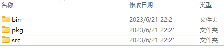
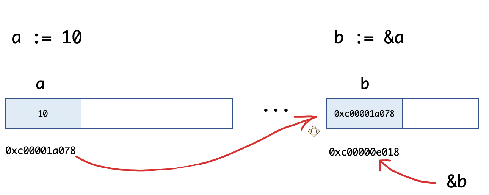
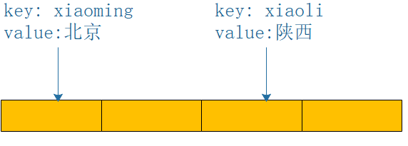
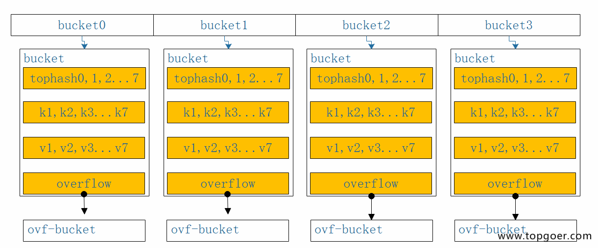
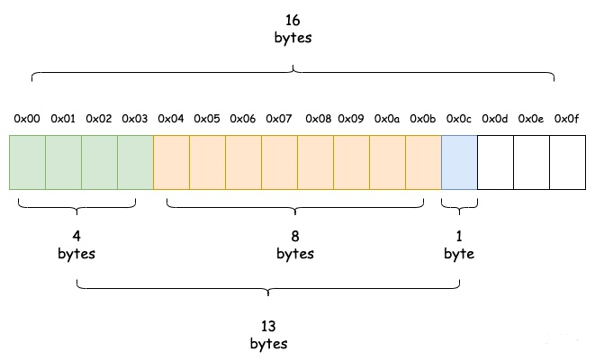
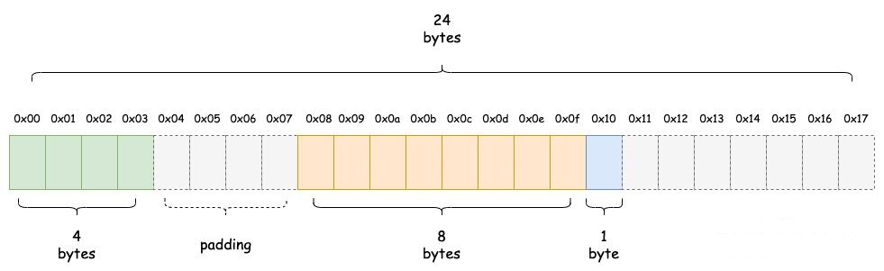
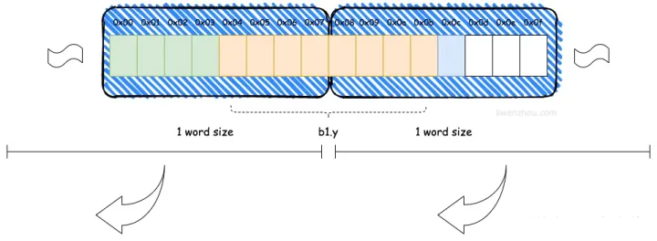
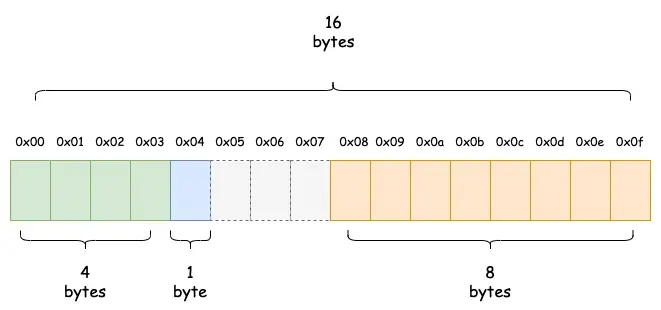

# Go基础篇

## 概念

### go 简介

以c语言为原型，以及借鉴其他语言的一些特性，来简化操作，并在2009年，go语言诞生。

**思想：Less can be more 大道至简，小而蕴真**

### Go的优点

- **性能（机器代码）**：GoLang 是一种编译语言，可以编译为机器代码，编译后的二进制文件可以直接部署到目标机器而无需额外的依赖。性能优于那些解释语言。
- **动态的语言感受**：GoLang 是一种静态语言，但它给开发人员带来了动态语言的感觉。作为静态语言，在进行编译时可以检测到许多隐藏的问题，尤其是语法错误。此外，有许多软件包供开发人员使用，在开发过程中很容易导入它们，这使我们不再担心它的功能，让我们觉得我们正在处理动态语言。
- **并发支持**：它可以充分利用多核功能。GoLang 使用 **goroutine** 来实现并发性，它提供了一个非常优雅的goroutine调度程序系统，可以很容易地生成数百万个goroutine。堆栈使用也可以动态扩展/收缩，这使内存使用更加智能。这与Java线程不同，后者通常只允许创建数千个线程。
- **内置运行时支持GC**：虽然它的GC并不完美，但它可以满足大多数关于垃圾收集的要求。
- **简单易学**：GoLang的作者都有C背景，GoLang有C基因。有25个关键词但具有丰富的表达能力。它可以支持几乎所有在其他语言中看到的功能，如继承，重载，对象等。
- **工具链**：有许多易于使用的内置工具可以帮助开发人员编写可维护和可读的代码。效率大大提高。这些包括**gofmt**，**goimport**等。它们可以使我们的代码看起来标准化，并且可以简化审查工作。
- **本机C支持**：可以在Go程序中嵌入C代码，以便可以使用许多功能强大的C库。

### Go语言的主要特征

1. 自动立即回收。
2. 更丰富的内置类型。
3. 函数多返回值。
4. 错误处理。
5. 匿名函数和闭包。
6. 类型和接口。
7. 并发编程。
8. 反射。
9. 语言交互性。

### Go语言命名

1. Go的函数、变量、常量、自定义类型、包`(package)`的命名方式遵循以下规则：

```
1）首字符可以是任意的Unicode字符或者下划线
2）剩余字符可以是Unicode字符、下划线、数字
3）字符长度不限
```

2. Go只有25个关键字

```
    break        default      func         interface    select
    case         defer        go           map          struct
    chan         else         goto         package      switch
    const        fallthrough  if           range        type
    continue     for          import       return       var
```

3. Go还有37个保留字

```
Constants:    true  false  iota  nil

Types:  int  int8  int16  int32  int64  
        uint  uint8  uint16  uint32  uint64  uintptr
        float32  float64  complex128  complex64
        bool  byte  rune  string  error

Functions:  make  len  cap  new  append  copy  close  delete
            complex  real  imag
            panic  recover
```

4. 可见性

```
1）声明在函数内部，是函数的本地值，类似private
2）声明在函数外部，是对当前包可见(包内所有.go文件都可见)的全局值，类似protect
3）声明在函数外部且首字母大写是所有包可见的全局值,类似public
```

### Go语言声明

有四种主要声明方式：

```
var（声明变量）, const（声明常量）, type（声明类型） ,func（声明函数）。
```

Go的程序是保存在多个.go文件中，文件的第一行就是``package XXX``声明，用来说明该文件属于哪个包(package)，package声明下来就是import声明，再下来是类型，变量，常量，函数的声明。

## 安装

### 下载 go 软件

Go官网下载地址：https://golang.org/dl/

### 配置GOPATH

`GOPATH`是一个环境变量，是`go`项目的存放路径，所有的项目代码都放到`GOPATH`的`src`目录下。

【以windows为例】

- windows下设置环境变量，变量名为【GOPATH】，变量值为【D:\GoProject】。
- 同时在`path`里面添加`go`的安装目录和`GOPATH`目录
- 在`GOPATH`目录下，创建【bin】、【pkg】、【src】三个子文件夹
  - bin：用来存放编译后生成的可执行文件
  - pkg：用来存放编译后生成的归档文件
  - src：用来存放源码文件



### go的项目目录

在进行`Go`语言开发的时候，代码总是会保存在`$GOPATH/src`目录下。

在工程经过`go build`、`go install`或`go get`等指令后，会将下载的第三方包源代码文件放在`$GOPATH/src`目录下， 产生的二进制可执行文件放在 `$GOPATH/bin`目录下，生成的中间缓存文件会被保存在 `$GOPATH/pkg` 下。

如果使用版本管理工具（`Version Control System`，`VCS`。常用如`Git`）来管理项目代码时，只需要添加`$GOPATH/src`目录的源代码即可。`bin` 和 `pkg` 目录的内容无需版本控制。

## 第一个 go 程序

```go
package main  // 声明 main 包，表明当前是一个可执行程序

import "fmt"  // 导入内置 fmt 

func main(){  // main函数，是程序执行的入口
    fmt.Println("Hello World!")  // 在终端打印 Hello World!
}
```

- 编译：在当前程序目录下执行：`go build`

`go`编译器会去 `GOPATH`的`src`目录下查找要编译的`hello`项目

编译得到的可执行文件会保存在执行编译命令的当前目录下，如果是`windows`平台会在当前目录下找到`hello.exe`可执行文件。

- 执行：然后在终端直接执行该`hello.exe`文件

```bash
hello.exe
```

- 其他：还可以使用-o参数来指定编译后可执行文件的名字。

```bash
go build -o hello.exe
```

## go 常用命令

在命令行执行go命令查看相关的Go语言命令：

```bash
$ go
Go is a tool for managing Go source code.

Usage:

        go <command> [arguments]

The commands are:

        bug         start a bug report
        build       compile packages and dependencies
        clean       remove object files and cached files
        doc         show documentation for package or symbol
        env         print Go environment information
        fix         update packages to use new APIs
        fmt         gofmt (reformat) package sources
        generate    generate Go files by processing source
        get         add dependencies to current module and install them
        install     compile and install packages and dependencies
        list        list packages or modules
        mod         module maintenance
        work        workspace maintenance
        run         compile and run Go program
        test        test packages
        tool        run specified go tool
        version     print Go version
        vet         report likely mistakes in packages

Use "go help <command>" for more information about a command.

Additional help topics:

        buildconstraint build constraints
        buildmode       build modes
        c               calling between Go and C
        cache           build and test caching
        environment     environment variables
        filetype        file types
        go.mod          the go.mod file
        gopath          GOPATH environment variable
        gopath-get      legacy GOPATH go get
        goproxy         module proxy protocol
        importpath      import path syntax
        modules         modules, module versions, and more
        module-get      module-aware go get
        module-auth     module authentication using go.sum
        packages        package lists and patterns
        private         configuration for downloading non-public code
        testflag        testing flags
        testfunc        testing functions
        vcs             controlling version control with GOVCS

Use "go help <topic>" for more information about that topic.
```

| 命令          | 含义                                                         |
| ------------- | ------------------------------------------------------------ |
| go env        | 用于打印Go语言的环境信息                                     |
| go run        | 可以编译并运行命令源码文件                                   |
| go get        | 可以根据要求和实际情况从互联网上下载或更新指定的代码包及其依赖包，并对它们进行编译和安装 |
| go build      | 用于编译我们指定的源码文件或代码包以及它们的依赖包           |
| go install    | 用于编译并安装指定的代码包及它们的依赖包                     |
| go clean      | 会删除掉执行其它命令时产生的一些文件和目录                   |
| go doc        | 可以打印附于Go语言程序实体上的文档。可以通过把程序实体的标识符作为该命令的参数来达到查看其文档的目的 |
| go test       | 用于对Go语言编写的程序进行测试                               |
| go list       | 列出指定的代码包的信息                                       |
| go fix        | 会把指定代码包的所有Go语言源码文件中的旧版本代码修正为新版本的代码 |
| go vet        | 一个用于检查Go语言源码中静态错误的简单工具                   |
| go tool pprof | 交互式的访问概要文件的内容。                                 |

## Golang 内置类型和函数

### 内置类型

#### 值类型

- bool
- int(32 or 64)， int8， int16， int32， int64
- uint(32 or 64)， uint8(byte)， uint16， uint32， uint64
- float32， float64
- string
- complex64， complex128
- array： 固定长度的数组

#### 引用类型：(指针类型)

- slice：序列数组(最常用)
- map：映射
- chan：管道

### 内置函数

Go 语言拥有一些不需要进行导入操作就可以使用的内置函数。它们有时可以针对不同的类型进行操作，例如：len、cap 和 append，或必须用于系统级的操作，例如：panic。因此，它们需要直接获得编译器的支持。

| 函数名         | 含义                                                         |
| -------------- | ------------------------------------------------------------ |
| append         | 用来追加元素到数组、slice中,返回修改后的数组、slice          |
| close          | 主要用来关闭channel                                          |
| delete         | 从map中删除key对应的value                                    |
| panic          | 停止常规的goroutine  （panic和recover：用来做错误处理）      |
| recover        | 允许程序定义goroutine的panic动作                             |
| real           | 返回complex的实部   （complex、real imag：用于创建和操作复数） |
| imag           | 返回complex的虚部                                            |
| make           | 用来分配内存，返回Type本身(只能应用于slice, map, channel)    |
| new            | 用来分配内存，主要用来分配值类型，比如int、struct。返回指向Type的指针 |
| cap            | 用来分配内存，主要用来分配值类型，比如int、struct。返回指向Type的指针 |
| copy           | 用于复制和连接slice，返回复制的数目                          |
| len            | 来求长度，比如string、array、slice、map、channel ，返回长度  |
| print、println | 底层打印函数，在部署环境中建议使用 fmt 包                    |

### 内置接口error

```go
type error interface { // 只要实现了Error()函数，返回值为String的都实现了err接口

    Error()    String

}
```

## Init 函数和 main 函数

### init 函数

go语言中 `init` 函数用于包`(package)`的初始化，该函数是go语言的一个重要特性。

- init函数是用于程序执行前做包的初始化的函数，比如初始化包里的变量等

- 每个包可以拥有多个init函数
- 包的每个源文件也可以拥有多个init函数
- 同一个包中多个init函数的执行顺序go语言没有明确的定义(说明)

- 不同包的init函数按照包导入的依赖关系决定该初始化函数的执行顺序

- init函数不能被其他函数调用，而是在main函数执行之前，自动被调用

### main 函数

Go语言程序的默认入口函数(主函数)：``func main()``，函数体用``｛｝``一对括号包裹。

```go
func main(){ //函数体
}
```

###  init 函数和 main 函数的异同

- 相同点：两个函数在定义时不能有任何的参数和返回值，且Go程序自动调用。
- 不同点：
  - init可以应用于任意包中，且可以重复定义多个。
  - main函数只能用于main包中，且只能定义一个。

两个函数的执行顺序：

- 对同一个go文件的 `init()` 调用顺序是从上到下的。
- 对同一个package中不同文件是按文件名字符串比较“从小到大”顺序调用各文件中的`init()`函数。
- 对于不同的`package`，如果不相互依赖的话，按照main包中 "先`import`的后调用" 的顺序调用其包中的`init()`，如果`package`存在依赖，则先调用最早被依赖的`package`中的`init()`，最后调用`main`函数。
- 如果`init`函数中使用了`println()`或者`print()`你会发现在执行过程中这两个不会按照你想象中的顺序执行。这两个函数官方只推荐在测试环境中使用，对于正式环境不要使用。

## 下划线

### 含义

`_`是特殊标识符，用来忽略结果。

### 下划线在import中

在Golang里，import的作用是导入其他package。

import 下划线（如：import _ hello/imp）的作用：当导入一个包时，该包下的文件里所有init()函数都会被执行，然而，有些时候我们并不需要把整个包都导入进来，**仅仅是是希望它执行init()函数**而已。这个时候就可以使用 import _ 引用该包。即使用【import _ 包路径】只是引用该包，仅仅是为了调用init()函数，所以无法通过包名来调用包中的其他函数。

示例：

- 代码结构

```
src 
|
+--- main.go            
|
+--- hello
     |
     +--- hello.go
```

- main.go

```go
package main

import _ "./hello"

func main() {
    // hello.Print() 
    //编译报错：./main.go:6:5: undefined: hello
}
```

- hello.go

```go
package hello

import "fmt"

func init() {
    fmt.Println("imp-init() come here.")
}

func Print() {
    fmt.Println("Hello!")
}
```

输出结果：

```
imp-init() come here.
```

### 下划线在代码中

```go
package main

import (
    "os"
)

func main() {
    buf := make([]byte, 1024)
    f, _ := os.Open("./text.txt")
    defer f.Close()
    for {
        n, _ := f.Read(buf)
        if n == 0 {
            break    

        }
        os.Stdout.Write(buf[:n])
    }
}
```

- 解释1：**下划线意思是忽略这个变量**。比如``os.Open``，返回值为``*os.File，error``；普通写法是``f,err := os.Open("xxxxxxx")``。如果此时不需要知道返回的错误值，就可以用``f, _ := os.Open("xxxxxx")``，如此则忽略了error变量。

- 解释2：占位符，意思是那个位置本应赋给某个值，但是咱们不需要这个值。所以就把该值赋给下划线，意思是**丢掉不要**。这样编译器可以更好的优化，任何类型的单个值都可以丢给下划线。这种情况是**占位用的**，方法返回两个结果，而你只想要一个结果。那另一个就用 "_" 占位，而如果用变量的话，不使用，编译器是会报错的。
- 补充：第二个import就是不直接使用 mysql 包，只是执行一下这个包的init函数，把 mysql 的驱动注册到sql包里，然后程序里就可以使用 sql 包来访问 mysql 数据库了。

```go
import "database/sql"
import _ "github.com/go-sql-driver/mysql"
```

## 变量和常量

### 变量

#### 什么是变量

变量是对计算机内存中数据的一个引用或一个符号表,用于方便地在代码中对数据进行操作。

#### 变量类型

- 基本类型：bool、string、int、complex、byte等。
- 聚合类型：数组和切片、结构体、Map。
- 引用类型：指针、接口、函数类型和channel。

Go作为一门静态语言，变量的类型在编译时确定，并且严格的类型系统可以在编译时就发现大部分错误。类型在Go语言中是非常重要的，它定义了值的行为和内存布局。

#### 变量声明

Go语言中的变量需要声明后才能使用，同一作用域内不支持重复声明。并且Go语言的变量声明后必须使用。

#### 标准声明

Go语言的变量声明格式为：

```go
var 变量名 变量类型
```

变量声明以关键字`var`开头，变量类型放在变量的后面，行尾无需分号。 举个例子：

```go
var name string
var age int
var isOk bool
```

#### 批量声明

每声明一个变量就需要写`var`关键字会比较繁琐，go语言中还支持批量变量声明：

```go
var (
    a string
    b int
    c bool
    d float32
)
```

#### 变量的初始化

Go语言在声明变量的时候，会自动对变量对应的内存区域进行初始化操作。每个变量会被初始化成其类型的默认值，例如： 整型和浮点型变量的默认值为0。 字符串变量的默认值为空字符串。 布尔型变量默认为`false`。 切片、函数、指针变量的默认为`nil`。

也可在声明变量的时候为其指定初始值。变量初始化的标准格式如下：

```go
var 变量名 类型 = 表达式
```

举个例子：

```go
var name string = "pprof.cn"
var sex int = 1
```

或者一次初始化多个变量

```go
var name, sex = "pprof.cn", 1
```

#### 类型推导

有时候会将变量的类型省略，这个时候编译器会根据等号右边的值来推导变量的类型完成初始化。

```go
var name = "pprof.cn"
var sex = 1
```

#### 短变量声明

在函数内部，可以使用更简略的`` := ``方式声明并初始化变量。

```go
package main

import (
    "fmt"
)
// 全局变量m
var m = 100

func main() {
    n := 10
    m := 200 // 此处声明局部变量m
    fmt.Println(m, n)
}
```

#### 匿名变量

在使用多重赋值时，如果想要忽略某个值，可以使用`匿名变量（anonymous variable）`。 匿名变量用一个下划线``_``表示，例如：

```go
func foo() (int, string) {
    return 10, "Q1mi"
}
func main() {
    x, _ := foo()
    _, y := foo()
    fmt.Println("x=", x)
    fmt.Println("y=", y)
}
```

匿名变量不占用命名空间，不会分配内存，所以匿名变量之间不存在重复声明。 (在Lua等编程语言里，匿名变量也被叫做哑元变量。)

注意事项：

- 函数外的每个语句都必须以关键字开始（var、const、func等）

- ``:=``不能使用在函数外。
- ``_``多用于占位，表示忽略值。

### 常量

相对于变量，常量是恒定不变的值，多用于定义程序运行期间不会改变的那些值。 常量的声明和变量声明非常类似，只是把`var`换成了`const`，常量在定义的时候必须赋值。

```go
const pi = 3.1415
const e = 2.7182
```

声明了`pi`和`e`这两个常量之后，在整个程序运行期间它们的值都不能再发生变化了。

多个常量也可以一起声明：

```go
const (
    pi = 3.1415
    e = 2.7182
)
```

`const`同时声明多个常量时，如果省略了值则表示和上面一行的值相同。 例如：

```go
const (
    n1 = 100
    n2
    n3
)
```

上面示例中，常量`n1、n2、n3`的值都是`100`。

注意，const变量的值是编译时确定的，并编译时固化为程序的常量部分，并且编译时固化的常量不会在运行时分配内存与地址，因此无法使用``&``取其地址。

### iota

**`iota`是`go`语言的常量计数器，只能在常量的表达式中使用。**

`iota`在`const`关键字出现时将被重置为`0`。`const`中每新增一行常量声明将使`iota`计数一次(`iota`可理解为`const`语句块中的行索引)。 使用`iota`能简化定义，**在定义枚举时很有用**。

举个例子：

```go
const (
    n1 = iota //0
    n2        //1
    n3        //2
    n4        //3
)
```

### 几个常见的iota示例

### 几个常见的iota示例:使用_跳过某些值

```go
const (
    n1 = iota //0
    n2        //1
    _
    n4        //3
)
```

`iota`声明中间插队

```go
const (
    n1 = iota //0
    n2 = 100  //100
    n3 = iota //2
    n4        //3
)
const n5 = iota //0
```

定义数量级 （这里的`<<`表示左移操作，`1<<10`表示将`1`的二进制表示向左移`10`位，也就是由`1`变成了`10000000000`，也就是十进制的`1024`。同理`2<<2`表示将`2`的二进制表示向左移`2`位，也就是由`10`变成了`1000`，也就是十进制的`8`。）

```go
const (
    _  = iota
    KB = 1 << (10 * iota)
    MB = 1 << (10 * iota)
    GB = 1 << (10 * iota)
    TB = 1 << (10 * iota)
    PB = 1 << (10 * iota)
)
```

多个`iota`定义在一行

```go
const (
    a, b = iota + 1, iota + 2 //1,2
    c, d                      //2,3
    e, f                      //3,4
)
```

## 运算符

### 算术运算符

| 运算符 | 描述 |
| :----- | :--- |
| +      | 相加 |
| -      | 相减 |
| *      | 相乘 |
| /      | 相除 |
| %      | 求余 |

注意： ++（自增）和–（自减）在Go语言中是单独的语句，并不是运算符。

### 关系运算符

| 运算符 | 描述                                                         |
| :----- | :----------------------------------------------------------- |
| ==     | 检查两个值是否相等，如果相等返回 True 否则返回 False。       |
| !=     | 检查两个值是否不相等，如果不相等返回 True 否则返回 False。   |
| >      | 检查左边值是否大于右边值，如果是返回 True 否则返回 False。   |
| >=     | 检查左边值是否大于等于右边值，如果是返回 True 否则返回 False。 |
| <      | 检查左边值是否小于右边值，如果是返回 True 否则返回 False。   |
| <=     | 检查左边值是否小于等于右边值，如果是返回 True 否则返回 False。 |

### 逻辑运算符

| 运算符 | 描述                                                         |
| :----- | :----------------------------------------------------------- |
| &&     | 逻辑 AND 运算符。 如果两边的操作数都是 True，则为 True，否则为 False。 |
| ll     | 逻辑 OR 运算符。 如果两边的操作数有一个 True，则为 True，否则为 False。 |
| !      | 逻辑 NOT 运算符。 如果条件为 True，则为 False，否则为 True。 |

### 位运算符

位运算符对整数在内存中的二进制位进行操作。

| 运算符 | 描述                                                         |
| :----- | :----------------------------------------------------------- |
| &      | 参与运算的两数各对应的二进位相与。（两位均为1才为1）         |
| l      | 参与运算的两数各对应的二进位相或。（两位有一个为1就为1）     |
| ^      | 参与运算的两数各对应的二进位相异或，当两对应的二进位相异时，结果为1。（两位不一样则为1） |
| <<     | 左移n位就是乘以2的n次方。“a<<b”是把a的各二进位全部左移b位，高位丢弃，低位补0。 |
| >>     | 右移n位就是除以2的n次方。“a>>b”是把a的各二进位全部右移b位。  |

### 赋值运算符

| 运算符 | 描述                                           |
| :----- | :--------------------------------------------- |
| =      | 简单的赋值运算符，将一个表达式的值赋给一个左值 |
| +=     | 相加后再赋值                                   |
| -=     | 相减后再赋值                                   |
| *=     | 相乘后再赋值                                   |
| /=     | 相除后再赋值                                   |
| %=     | 求余后再赋值                                   |
| <<=    | 左移后赋值                                     |
| >>=    | 右移后赋值                                     |
| &=     | 按位与后赋值                                   |
| l=     | 按位或后赋值                                   |
| ^=     | 按位异或后赋值                                 |

## 基本类型

### 简介

Golang 更明确的数字类型命名，支持 Unicode，支持常用数据结构。

| 类型          | 长度(字节) | 默认值 | 说明                                      |
| :------------ | :--------- | :----- | :---------------------------------------- |
| bool          | 1          | false  |                                           |
| byte          | 1          | 0      | uint8                                     |
| rune          | 4          | 0      | Unicode Code Point, int32                 |
| int, uint     | 4或8       | 0      | 32 或 64 位                               |
| int8, uint8   | 1          | 0      | -128 ~ 127, 0 ~ 255，byte是uint8 的别名   |
| int16, uint16 | 2          | 0      | -32768 ~ 32767, 0 ~ 65535                 |
| int32, uint32 | 4          | 0      | -21亿~ 21亿, 0 ~ 42亿，rune是int32 的别名 |
| int64, uint64 | 8          | 0      |                                           |
| float32       | 4          | 0.0    |                                           |
| float64       | 8          | 0.0    |                                           |
| complex64     | 8          |        |                                           |
| complex128    | 16         |        |                                           |
| uintptr       | 4或8       |        | 以存储指针的 uint32 或 uint64 整数        |
| array         |            |        | 值类型                                    |
| struct        |            |        | 值类型                                    |
| string        |            | ""     | UTF-8 字符串                              |
| slice         |            | nil    | 引用类型                                  |
| map           |            | nil    | 引用类型                                  |
| channel       |            | nil    | 引用类型                                  |
| interface     |            | nil    | 接口                                      |
| function      |            | nil    | 函数                                      |

支持八进制、 六进制，以及科学记数法。标准库 math 定义了各数字类型取值范围。

```go
a, b, c, d := 071, 0x1F, 1e9, math.MinInt16
```

空指针值 nil，而非C/C++ NULL。

### 整型

整型分为以下两个大类： 按长度分为：`int8`、`int16`、`int32`、`int64`对应的无符号整型：`uint8`、`uint16`、`uint32`、`uint64`，还有与指针大小相同的无符号整数类型`uintptr`。

其中，`uint8`就是熟知的`byte`型，`int16`对应C语言中的`short`型，`int64`对应C语言中的`long`型，以及比较难理解的`uintptr`。下面进行单独叙述。

uintptr是一个整数类型，其大小足以保存任何指针的位模式。

在Go语言中，指针的大小与地址空间的大小相同，可以是32位或64位。所以uintptr的大小也与GOARCH有关，在32位系统上大小为32位，在64位系统上大小为64位。

uintptr类型常用于类型断言和类型转换，将uintptr与unsafe.Pointer类型相互转换，以实现指针运算。由于uintptr的大小足以保存任何指针的位模式，所以这种转换是安全的。例如：

```go
func main() {
    var x unsafe.Pointer
    x = unsafe.Pointer(uintptr(5))
    
    y := uintptr(x)
    fmt.Println(y) // 5
}
```
这里我们通过将``uintptr(5)``转换为unsafe.Pointer来得到一个指针，然后再将该指针转换回uintptr，打印结果为5，证明uintptr的大小足以精确表示该指针。所以，uintptr主要用于：

1. 整数与指针之间的相互转换，实现指针运算。
2. 作为参数传递指针，从而绕过go的指针类型检查。
3. 用于定义与指针大小相同的整数类型。

### 浮点型

Go语言支持两种浮点型数：`float32`和`float64`。这两种浮点型数据格式遵循`IEEE 754`标准： `float32` 的浮点数的最大范围约为`3.4e38`，可以使用常量定义：`math.MaxFloat32`。 `float64` 的浮点数的最大范围约为 `1.8e308`，可以使用一个常量定义：`math.MaxFloat64`。

### 复数

`complex64`和`complex128`，复数有实部和虚部，`complex64`的实部和虚部为32位，`complex128`的实部和虚部为64位。

### 布尔值

Go语言中以`bool`类型进行声明布尔型数据，布尔型数据只有`true（真）`和`false（假）`两个值。

注意：

- 布尔类型变量的默认值为false。

- Go 语言中不允许将整型强制转换为布尔型.

- 布尔型无法参与数值运算，也无法与其他类型进行转换。

### 字符串

Go语言中的字符串以原生数据类型出现，使用字符串就像使用其他原生数据类型`（int、bool、float32、float64 等）`一样。 Go 语言里的字符串的内部实现使用 UTF-8 编码。 字符串的值为双引号(")中的内容，可以在Go语言的源码中直接添加非`ASCII`码字符，例如：

```go
s1 := "hello"
s2 := "你好"
```

### 字符串转义符

Go 语言的字符串常见转义符包含回车、换行、单双引号、制表符等，如下表所示。

| 转义 | 含义                               |
| :--- | :--------------------------------- |
| \r   | 回车符（返回行首）                 |
| \n   | 换行符（直接跳到下一行的同列位置） |
| \t   | 制表符                             |
| '    | 单引号                             |
| "    | 双引号                             |
| \    | 反斜杠                             |

举个例子，我们要打印一个Windows平台下的一个文件路径：

```go
package main
import (
    "fmt"
)
func main() {
    fmt.Println("str := \"c:\\pprof\\main.exe\"")
}
```

### 多行字符串

Go语言中要定义一个多行字符串时，就必须使用`反引号`字符：

```go
s1 := `第一行
第二行
第三行
`
fmt.Println(s1)
```

反引号间换行将被作为字符串中的换行，但是所有的转义字符均无效，文本将会原样输出。

### 字符串的常用操作

| 方法                                 | 介绍           |
| :----------------------------------- | :------------- |
| len(str)                             | 求长度         |
| +或fmt.Sprintf                       | 拼接字符串     |
| strings.Split                        | 分割           |
| strings.Contains                     | 判断是否包含   |
| strings.HasPrefix、strings.HasSuffix | 前缀/后缀判断  |
| strings.Index()、strings.LastIndex() | 子串出现的位置 |
| strings.Join(a[]string, sep string)  | join操作       |

### byte和rune类型

组成每个字符串的元素叫做“字符”，可以通过遍历或者单个获取字符串元素获得字符。 字符用单引号（’）包裹起来，如：

```go
var a := '中'

var b := 'x'
```

Go 语言的字符有以下两种：

- uint8类型，或者叫 byte 型，代表了ASCII码的一个字符。

- rune类型，代表一个 UTF-8字符。

当需要处理中文、日文或者其他复合字符时，则需要用到`rune`类型。`rune`类型实际是一个`int32`。
Go 使用了特殊的 `rune` 类型来处理 `Unicode`，让基于 `Unicode`的文本处理更为方便，也可以使用 `byte` 型进行默认字符串处理，性能和扩展性都有照顾。

```go
// 遍历字符串
func traversalString() {
    s := "pprof.cn博客"
    for i := 0; i < len(s); i++ { //byte
        fmt.Printf("%v(%c) ", s[i], s[i])
    }
    fmt.Println()
    for _, r := range s { //rune
        fmt.Printf("%v(%c) ", r, r)
    }
    fmt.Println()
}
```

输出：

```
112(p) 112(p) 114(r) 111(o) 102(f) 46(.) 99(c) 110(n) 229(å) 141() 154() 229(å) 174(®) 162(¢)
112(p) 112(p) 114(r) 111(o) 102(f) 46(.) 99(c) 110(n) 21338(博) 23458(客)
```

因为 UTF8 编码下一个中文汉字由`3~4`个字节组成，所以我们不能简单的按照字节去遍历一个包含中文的字符串，否则就会出现上面输出中第一行的结果。

字符串底层是一个byte数组，所以可以和[]byte类型相互转换。字符串是不能修改的 字符串是由byte字节组成，所以字符串的长度是byte字节的长度。 rune类型用来表示utf8字符，一个rune字符由一个或多个byte组成。

### 修改字符串

要修改字符串，需要先将其转换成`[]rune或[]byte`，完成后再转换为`string`。**无论哪种转换，都会重新分配内存，并复制字节数组。**

```go
func changeString() {
    s1 := "hello"
    // 强制类型转换
    byteS1 := []byte(s1)
    byteS1[0] = 'H'
    fmt.Println(string(byteS1))

    s2 := "博客"
    runeS2 := []rune(s2)
    runeS2[0] = '狗'
    fmt.Println(string(runeS2))
}
```

### 类型转换

Go语言中只有强制类型转换，没有隐式类型转换。该语法只能在两个类型之间支持相互转换的时候使用。

强制类型转换的基本语法如下：

```go
T(表达式)
```

其中，T表示要转换的类型。表达式包括变量、复杂算子和函数返回值等。

比如计算直角三角形的斜边长时使用math包的Sqrt()函数，该函数接收的是float64类型的参数，而变量a和b都是int类型的，这个时候就需要将a和b强制类型转换为float64类型。

```go
func sqrtDemo() {
    var a, b = 3, 4
    var c int
    // math.Sqrt()接收的参数是float64类型，需要强制转换
    c = int(math.Sqrt(float64(a*a + b*b)))
    fmt.Println(c)
}
```

## 数组Array

### go的数组定义

在Go语言中，数组的定义格式为：

```go
var 数组名 [长度]类型
```

例如：

```go
var arr [5]int // 定义一个长度为5的整型数组
```

Go语言数组与其他语言的主要区别有:

1. 数组的长度是数组类型的一部分。``[5]int``和``[10]int``是两种不同的数组类型。
2. 数组一旦定义，其长度就是固定的。不能改变数组的大小。
3. 数组可以存储值的同类型集合。但是每个元素的大小和顺序都是固定的。
4. 数组的值按顺序存储在内存中，数组的第一个元素的内存地址与数组名相同。
5.  数组的大小必须是常量且必须大于零。不能定义``var arr [n]int``这样的数组。
6. 数组是值类型，赋值和传参会复制整个数组。
7.  Go数组的长度是其类型的一部分，所以[5]int和[10]int是不同的类型。

相比而言，其他语言如C/C++的数组：

1. 数组的大小可以是变量。
2.  数组可以动态分配内存，大小可以改变。
3. 数组可以通过指针传参，避免复制整个数组。
4. 数组的类型仅由元素类型决定,与长度无关。``[5]int``和``[10]int``属同一类型数组。

所以，Go语言的数组更加简洁和安全,但缺乏动态能力。而切片在Go中弥补了这一缺陷，具有数组的性能与动态能力。

### 数组初始化

#### 一维数组

在Go语言中,数组的初始化有以下几种方式:

1. 指定初始化值

```go
var arr = [5]int{1, 2, 3, 4, 5}
```

2. 根据初始值的个数自行推断数组长度

```go
var arr = [...]int{1, 2, 3, 4, 5}  // arr为[5]int类型
```

3. 部分初始化,未初始化的默认为零值

```go
var arr = [5]int{1, 2}  // arr为[5]int{1, 2, 0, 0, 0}
```

4. 通过索引初始化

```go
var arr = [5]int{0: 1, 4: 2}  // arr为[5]int{1, 0, 0, 0, 2}
```

5. 通过切片初始化(只初始化部分元素)

```go
var arr = [...]int{0, 0, 0, 0, 0}  
slice := arr[1:3]  // slice为[0, 0]
slice[0] = 1        // arr为[0, 1, 0, 0, 0] 
```

6. 构造函数初始化

```go
var arr = [5]int{}     // arr为[5]int{0, 0, 0, 0, 0}
var arr = new([5]int)   // arr为*[5]int,指向一个值为[5]int{0, 0, 0, 0, 0}的数组 
```

> 内置函数 len 和 cap 都返回数组长度 (元素数量)。

#### 多维数组

在Go语言中，多维数组的初始化方式与一维数组类似，只是需要指定每个维度的长度，格式为：

```go
var 数组名 [维度1长度] [维度2长度]... [维度n长度]类型
```

例如

- 二维数组

```go
var arr [3][4]int   // 二维数组,3行4列
```

- 三维数组

```go
var arr [2][3][4]float64  // 三维数组,2个2维数组,每个2维数组3行4列
```

多维数组的初始化方式有：

1. 指定初始化值

```go
var arr = [3][4]int{ {1, 2, 3, 4}, {5, 6, 7, 8}, {9, 10, 11, 12} }
```

2. 部分初始化,其余默认为零值

```go
var arr = [3][4]int{ {1, 2}, {5, 6}, {9, 10} } 
// arr为[3][4]int{ {1, 2, 0, 0}, {5, 6, 0, 0}, {9, 10, 0, 0} }
```

3. 嵌套切片初始化

```go
var arr = [...][...]int{ {1, 2}, {5, 6}, {9, 10} }  
slice1 := arr[1:2]     // slice1为[][2]int{ {5, 6} } 
slice2 := slice1[0]    // slice2为[2]int{5, 6} 
slice2[1] = 8          // arr为[...][...]int{ {1, 2}, {5, 8}, {9, 10} }
```

4. 构造函数初始化

```go
var arr = [3][4]int{}   // 所有元素默认为0
var arr = new([3][4]int) // 同上,指向数组的指针
```

#### 多维数组遍历

1. 一层一层遍历:

```go
var arr = [2][3]int{ {1, 2, 3}, {4, 5, 6} }

for i := 0; i < 2; i++ {   // 遍历数组的第一维
    for j := 0; j < 3; j++ { // 遍历数组的第二维
        fmt.Print(arr[i][j], " ") 
    }
}  // 输出:1 2 3 4 5 6 
```

2. 嵌套for循环遍历:

```go
for _, v1 := range arr {   // 遍历第一维
    for _, v2 := range v1 { // 遍历第二维
        fmt.Print(v2, " ")
    }
}
```

### 数组拷贝和传参

在Go语言中，数组是值类型，赋值和传参会复制整个数组。这意味着：

1. 数组赋值

```go
var arr1 = [3]int{1, 2, 3} 
var arr2 [3]int
arr2 = arr1   // 数组赋值，arr2为[3]int{1, 2, 3}，arr1不变
```

2. 数组传参

```go
func modify(arr [3]int) {
    arr[0] = 100   // 修改副本的值
} 

func main() {
    var arr [3]int = [3]int{1, 2, 3}  
    modify(arr)
    fmt.Println(arr)  // 输出[1 2 3],原数组未变
} 
```

**在函数调用时，实参arr会复制一份给形参arr，在函数内操作的都是副本，不会影响原数组。**

3. 使用指针传参避免复制

```go
func modify(arr *[3]int) {
    (*arr)[0] = 100   // 修改指针指向的原数组
}

func main() {
    var arr [3]int = [3]int{1, 2, 3}
    modify(&arr)
    fmt.Println(arr)  // 输出[100 2 3]
} 
```

使用指针实参，可以在函数内操作指针指向的原数组，避免数组复制。所以，总结如下：

1. **数组是值类型，赋值和传参会复制整个数组。**
2. **在函数内部操作数组副本，不会影响原数组。**
3. **使用指针传参，可以操作指针指向的原数组，避免数组复制。**
4. **若函数需要操作原数组，必须使用指针类型的形参。**
5. **若在函数内需要返回修改后的数组，必须传递指针。**

## 切片Slice

### 什么是切片

切片(Slice)是Go语言中一个核心的概念。它是对数组的抽象,包含三个信息：

1. 指向数组的指针：切片并不存储任何数据,它只是对数组的引用。
2. 长度：表示切片中元素的数量。
3. 容量：表示从切片开始算起底层数组中元素的数量。

可以简单理解为：切片是 Go 语言动态数组实现的一种方式。它通过对数组的引用来实现动态性和效率。

切片的定义需要指定元素类型，可以选择指定长度，若不指定则默认为 nil 。 切片的长度可以动态变化，容量会自动扩展。

### 切片的特点

切片(Slice)是对数组的抽象，它包括：

1. 切片并不存储任何数据，它只是对现有数组的引用。

2. 切片的定义需要指定元素类型，但是长度和容量是可选的，并且可以根据需要动态变化。

3. 切片的底层数组可以无限扩展，因此切片的容量可以根据需要动态变化。

4. 切片的使用可以节省内存空间，因为它可以引用底层数组的一部分空间。

5. 切片使得Go语言拥有像动态类型语言类似的灵活性和便捷性。

### 切片的定义

在Go语言中,切片的定义方式有以下几种：

1. 不指定长度和容量

```go
var slice []int 
```

这种定义方式会创建一个nil切片，长度和容量都为0。

2. 指定初始值

```go
slice := []int{1, 2, 3}
```

这种方式会创建一个长度和容量都为3的切片，底层引用同一数组。

3. 使用make函数指定长度和容量

```go
slice := make([]int, 3, 5) 
```

这种方式创建一个长度为3，容量为5的切片。

4. 从数组或其他切片截取

```go
arr := [5]int{1, 2, 3, 4, 5}
slice := arr[1:3]     // 截取下标1到2的元素,创建一个长度2,容量4的切片
```

这种方式创建的切片会引用原数组。

5. 组合多个定义方式

```go
slice := make([]int, 0, 5) 
slice = append(slice, 1, 2, 3)   // 长度为3,容量为5的切片
slice = slice[1:]                // 截取下标1到底,创建一个长度2,容量4的切片
```

### 切片的常见操作

切片的常见操作主要包括：

1. append操作：用于向切片追加元素，切片的长度和容量会增加。

```go
slice = append(slice, 1)     // 追加1个元素
slice = append(slice, 2, 3) // 追加2个元素2, 3
```

2. 切片操作：用于从切片中获取子切片，不影响原切片。

```go
slice[start:end]     // 取下标从start到end-1的元素 
slice[start:]        // 取下标从start到底的元素
slice[:end]          // 取下标从头到end-1的元素
slice[:]             // 取整个切片
```

3. len()函数：用于获取切片的长度。

```go
len(slice) 
```

4. cap()函数：用于获取切片的容量。

```go
cap(slice)
```

5. for range遍历：用于迭代切片的元素。

```go
for i, v := range slice {
    // i 为索引,v 为值
}
```

6. 使用copy()函数复制切片：会复制切片中的元素到另一个切片。

> copy ：函数 copy 在两个 slice 间复制数据，复制长度以 len 小的为准。两个 slice 可指向同一底层数组，允许元素区间重叠。

```go
dst := make([]int, 3)       // 长度为3的切片 
copy(dst, src)             // 从src复制3个元素到dst
copy(dst, src[:2])        // 只从src复制2个元素到dst
```

7. 使用nil与 lens、cap比较判断切片是否为空。

```go
var slice []int   // 长度和容量为0的nil切片
if slice == nil {   // 切片是nil
    ...
}
if len(slice) == 0 {   // 切片长度为0
    ... 
}
if cap(slice) == 0 {   // 切片容量为0
    ...
}
```

###  append扩容原理

append函数对切片的扩容规则如下：

1. 如果切片的容量足够，直接追加元素，长度增加1，容量不变。

2.  如果切片的容量不足，进行扩容。**扩容规则是：申请一个新的更大的数组，并将原数组的元素拷贝到新数组，切片引用新数组，废弃原数组**。

   - 新容量=旧容量*2，即每次扩容后容量变为原来的2倍。

   - 新容量不小于需要追加的元素个数。

   - 新容量不超过最大容量，最大容量为int类型的最大值。

3. 追加元素后，切片的长度增加，容量可能增加。

所以，append函数通过扩容来确保切片有足够的容量来存放新的元素。扩容会申请新的更大数组，并拷贝原数组的元素过去。

### make方法

#### 通过make来创建切片

使用make()函数可以创建切片，语法如下:

```go
slice := make([]type, size, cap)
```

- type：切片元素的类型。
- size：切片的长度。
- cap：切片的容量，可选，省略时默认与 size 相同。例如：

```go
slice := make([]int, 3)   // 创建长度为3,容量为3的切片
slice := make([]int, 0, 5) // 创建长度为0,容量为5的切片 
```

使用make()函数创建切片有以下优点:

1. 指定切片的长度和容量，创建所需空间。
1. 切片创建时底层数组就会被创建，不需要再扩容，访问性能更高。
1. 由于底层数组已经创建，可以直接对切片元素进行初始化。

例如:

```go
slice := make([]int, 3, 5)
slice[0] = 100  
slice[1] = 200
```

4. 创建nil切片需要额外判断切片长度，使用make()可以直接创建所需空间的切片，使用更方便。

所以，总结如下：

- 使用make()函数可以指定创建切片的长度和容量。
- 使用make()创建的切片底层数组会直接创建，访问性能更高，不需要再扩容。
- 可以直接对切片元素进行初始化。
- 创建nil切片需要判断长度，使用make()更方便。

#### 为什么通过make创建切片

使用make()函数创建切片有以下重要原因:

1. **方便初始化切片元素**。直接使用make()创建的切片，其底层数组会在创建时就被初始化，所以可以直接对切片元素进行赋值。例如：

```
go
slice := make([]int, 3)
slice[0] = 100 
slice[1] = 200
```

如果使用切片表达式的方式创建，则不能直接初始化元素，会报错。

2. **避免扩容**。使用make()指定切片长度时，切片的底层数组容量就被创建，不需要扩容。而使用切片表达式的方式，在append时可能导致扩容，影响性能。
2. **避免判断切片长度**。创建nil切片后，在访问前需要判断长度是否为0，使用make()可以直接创建所需长度的切片，使用更方便。
2. **指定切片的容量。**使用make()可以在创建时就指定切片的容量，而切片表达式的方式无法指定容量。举例:

```go
// make()方式
slice := make([]int, 3, 5) 

// 切片表达式方式
var slice []int
slice = append(slice, 1)   // 首次append会创建长度和容量都为1的切片
slice = append(slice, 2)   // 此次append会导致扩容 

// 判断nil切片
var slice []int
if slice == nil {   // 需要判断是否为nil
    slice = make([]int, 3)  // 创建切片 
}
slice[0] = 100   // 直接初始化  
```

所以，总结原因如下：

- 方便初始化切片元素。
- 避免在append时导致扩容，提高性能。
- 避免创建nil切片后再判断长度。
- 可以指定切片的容量。

### 切片拷贝

#### 浅拷贝

在Go语言中，copy()函数用于复制切片,语法如下:

```go
copy(dest, src)
```

它会将 src 切片中的元素复制到 dest 切片中，复制的元素个数是两个切片的长度较小的那个。例如:

```go
src := []int{1, 2, 3} 
dest := make([]int, 2)  // len=2, cap=2

copy(dest, src)   // dest变为[1, 2]
```

**copy()函数进行的是浅拷贝**，意味着：

1. **只会复制切片中的元素，不会复制底层数组。两个切片的底层数组仍是同一个数组。**
2. **如果元素是引用类型，拷贝的只是引用，两个切片的对应元素会共享同一块内存。**

举例：

```go
type Person struct{}

p1 := Person{}
src := []Person{p1}  
dest := make([]Person, 1)

copy(dest, src) 

src[0].Name = "p1"  // dest[0]也被修改了  
```

 深拷贝意味着不但会复制切片元素，还会复制底层数组,两个切片拥有独立的内存空间。要实现深拷贝，可以：

1. 重新创建一个切片，追加src的所有元素。

```go
src := []int{1, 2, 3}
dest := []int{}
dest = append(dest, src...)  
```

2. 使用copy()函数先进行浅拷贝，再创建一个新切片作为底层数组。

```go
src := []int{1, 2, 3}
dest := make([]int, len(src))
copy(dest, src)

newSrc := make([]int, len(src)) 
copy(newSrc, dest)  // 此时newSrc底层数组为新的数组 
```

#### 深拷贝

在Go语言中，要实现切片的深拷贝，有两种主要方式：

1. 创建一个新的切片，并使用append()函数追加所有元素

```go
src := []int{1, 2, 3}
dest := []int{}
dest = append(dest, src...)  
```

这种方式会创建一个新的切片，包含全部新元素。两者底层数组不同，修改一个切片不会影响另一个切片。

2. 先使用copy()函数进行浅拷贝，再创建新切片作为底层数组

```go
src := []int{1, 2, 3}
dest := make([]int, len(src)) 
copy(dest, src)

newDest := make([]int, len(src)) 
copy(newDest, dest)   // 此时newDest底层数组为新的数组
```

这种方式，先将源切片src的元素拷贝到dest切片，再创建一个新的切片 newDest，并设置为dest的底层数组，实现深拷贝。

以上两种方式的实现原理是：**创建一个新的底层数组，并将元素值复制过去**。这样，两个切片就拥有独立的内存空间，修改一个切片不会影响另一个切片。所以，深拷贝的关键是创建新的底层数组，并复制元素值。理解slices的底层实现，对掌握深拷贝很重要。

### slice遍历

在Go语言中，切片可以通过以下几种方式进行遍历：

1. for循环遍历

```go
slice := []int{1, 2, 3}
for i := 0; i < len(slice); i++ {
    fmt.Println(slice[i])
} 
```

2. for range遍历

```go
for index, value := range slice {
    fmt.Println(index, value)  
}
```

 range返回两个值，第一个值是当前元素的索引，第二个值是当前元素的值。

3. 使用切片表达式迭代

```go
for _, value := range slice[:] {
    fmt.Println(value)
} 
```

这种方式在每次迭代中生成一个包含剩余元素的新切片，直到切片为空。

4. 使用copy方法拷贝迭代

```go
newSlice := make([]int, len(slice))
copy(newSlice, slice)

for i := 0; i < len(newSlice); i++ {
    fmt.Println(newSlice[i])  
}
```

这种方式可以完全避免迭代时的扩容，因为操作的是一个新的切片副本。

### 切片resize（调整大小）

在Go语言中，切片的大小可以通过内置的resize()函数进行调整，语法为：

```go
slice = slice[:new_len]
```

这种方式可以扩展或缩短切片的长度。如果新长度大于切片的容量，切片会按比例进行扩容。例如：

```go
slice := []int{1, 2, 3}   // len=3, cap=3

slice = slice[:4]         // len=4, cap=6, slice变为[1 2 3 0]
slice = slice[:2]         // len=2, cap=6, slice变为[1 2]
```

所以，resize()函数可以：

1. 扩展切片的长度，超出容量会触发扩容，新增元素用零值填充。
2.  缩短切片的长度，超出的元素会被移除。 capacity不变。
3. capacity的变化规律遵循切片扩容规则，每次扩容后至少扩大一倍。

使用resize()时需要注意：

1. 不能超过切片底层数组的最大长度,否则会panic。
2. 可能会导致append造成的扩容。如果先append后resize，中间可能出现扩容。
3. 不会修改底层数组大小,只会修改切片的长度和容量属性。底层数组会保留多余空间。
4. 不能再使用resize()缩短切片到原始长度之前,已有的多余空间不会释放。

所以，总结如下：

- resize()函数可以扩展或缩短切片的长度。
- 超出容量会触发扩容，新元素置零值。缩短长度不会减小容量。
- capacity的增长遵循切片扩容规则，每次至少扩大一倍。
- 注意不要超出底层数组最大长度，可能导致append造成的扩容,不会修改底层数组大小，已扩容的空间不会释放。

### 字符串和切片（string and slice）

#### 字符串与切片的关系

在Go语言中，字符串是由[]byte或[]rune构成的只读切片。它包括：

1. `[]byte`类型的字符串

```go
str := "abcdefg"   // str的类型是string,底层是[]byte
```

每个字节 represents 一个ASCII字符。

2. `[]rune`类型的字符串

```go
str := "编码"   // str的类型是string,底层是[]rune
```

每个rune represents 一个UTF-8字符。字符串如同只读切片一样，支持切片操作：

```go
str[0]      // byte类型的字符串访问第一个字节
str[1:3]    // 取下标1到3的子字符串 
len(str)    // 获取字符串长度,以字节或字符计
```

但是字符串不支持使用append、resize等函数修改内容，因为它是只读的。字符串可以转换为``[]byte``或``[]rune``类型的只读切片：

```go
bytes := []byte("abc")
runes := []rune("编码")
```

反之，``[]byte``和``[]rune``也可以转换为string：

```go
str = string([]byte{'a', 'b', 'c'})  
str = string([]rune{'编', '码'})
```

所以，字符串其实是一种特殊的只读切片，它包括：

- `[]byte`类型的字符串，每个字节代表一个ASCII码。
- `[]rune`类型的字符串，每个rune代表一个UTF-8字符。

字符串支持和只读切片相同的切片操作，但是不支持修改内容的函数如append和resize。字符串可以转换为``[]byte``或``[]rune``类型的只读切片，反之[]byte和[]rune也可以转换为string。

#### 如何操作字符串

由于字符串是不可变的,如果需要对字符串进行修改，有以下几种方式：

1. 转换为[]byte或[]rune，操作切片，再转换回string

```go
str := "abc"
bytes := []byte(str) 
bytes[0] = 'd'   // 修改切片
str = string(bytes) // 转换回string
```

2. 使用 bytes.Buffer 或 strings.Builder 进行操作:

```go
var buffer bytes.Buffer
buffer.WriteString("abc") 
buffer.WriteByte('d')      // 追加字节
str := buffer.String()      // 转换为string // abcd
```

3. 重新分配并复制整个字符串:

```go
newStr := str[:2] + "d" + str[3:]  // 重新分配并复制部分字符
str = newStr                       // str变为"abdd"
```

4. 使用+拼接多个字符串:

```go
str := "ab" + "d" + "c"   // str变为abcd
```

5. 格式化字符串:

```go
str := fmt.Sprintf("%s%c%s", "ab", 'd', "c") // str变为abcd
```

所以，总结如下：字符串是不可变的，但可以通过转换为切片、使用缓冲区、重新分配复制、拼接或格式化字符串等方式进行修改。

### Slice底层实现

#### 概述

切片是 Go 中的一种基本的数据结构，使用这种结构可以用来管理数据集合。切片的设计想法是由动态数组概念而来，为了开发者可以更加方便的使一个数据结构可以自动增加和减少。但是切片本身并不是动态数据或者数组指针。切片常见的操作有 reslice、append、copy。与此同时，切片还具有可索引，可迭代的优秀特性。

#### 切片和数组

首先，关于切片和数组怎么选择？接下来好好讨论讨论这个问题。

在Go语言中，选择切片和数组主要根据以下几点考虑：

1. 数据量大小是否固定：如果数据量大小固定，可以选择数组；如果数据量大小不固定，需要动态变化，则选择切片。切片的长度和容量都是可变的，可以根据需要动态变化；数组的长度是固定的,在定义时确定。
2.  是否需要频繁添加删除元素：如果需要频繁添加删除元素，选择切片；如果大部分时间只读或只在初始化时填充，选择数组。切片支持使用append Dynamic加入元素，删除元素只需要修改长度；数组的长度固定，无法添加删除元素。
3.  空间和性能考虑：如果数据量较小，空间和性能要求不高，二者皆可；如果数据量较大，空间和性能至关重要，数组更占优。切片在append时可能需要扩容copy，影响性能；数组的空间在定义时就分配，性能更高。
4. 使用场景：切片适合 stack、queue、list等动态数据结构；数组更适合表，映射等需要快速随机访问的场景。

所以，总结选择标准为：

1. **数据量大小是否固定：固定选择数组，可变选择切片。**
2. **是否频繁添加删除：是选择切片，否选择数组。**
3. **空间和性能：数据小无所谓，数据大数组更优。**
4. **使用场景：栈、队列、链表选切片；映射、表选数组。**

理解二者的区别与适用场景，可以让我们在开发中更精确的选择切片或数组。切片实现了动态数组，扩展了数组的灵活性；数组具有更高的空间和性能效率。

#### 切片的数据结构

切片本身并不是动态数组或者数组指针。它内部实现的数据结构通过指针引用底层数组，设定相关属性将数据读写操作限定在指定的区域内。切片本身是一个只读对象，其工作机制类似数组指针的一种封装。

切片的结构定义如下：

```go
type slice struct {
    array unsafe.Pointer  
    len   int
    cap   int 
}
```

切片的结构体由3部分构成，Pointer 是指向一个数组的指针，len 代表当前切片的长度，cap 是当前切片的容量。cap 总是大于等于 len 的。

- array是指向底层数组的指针，切片不直接存储数据，它只是引用底层数组的一段连续内存区域。
- len表示当前可以访问的元素数量，cap表示从slice开始最大可以访问的元素数量。
- len和cap控制着我们对底层数组的访问窗口，可以动态变化。

#### 内存地址与slice

如果想从 slice 中得到一块内存地址，可以这样做：

```go
s := make([]byte, 200)
ptr := unsafe.Pointer(&s[0])
```

如果反过来呢？从 Go 的内存地址中构造一个 slice。

```go
var ptr unsafe.Pointer
var s1 = struct {
    addr uintptr
    len int
    cap int
}{ptr, length, length}
s := *(*[]byte)(unsafe.Pointer(&s1))
```

构造一个虚拟的结构体，把 slice 的数据结构拼出来。

当然还有更加直接的方法，在 Go 的反射中就存在一个与之对应的数据结构 SliceHeader，可以用它来构造一个 slice。

```go
var o []byte
sliceHeader := (*reflect.SliceHeader)((unsafe.Pointer(&o)))
sliceHeader.Cap = length
sliceHeader.Len = length
sliceHeader.Data = uintptr(ptr)
```

如果反过来呢？从 Go 的内存地址中构造一个 slice。

```go
var ptr unsafe.Pointer
var s1 = struct {
    addr uintptr
    len int
    cap int
}{ptr, length, length}
s := *(*[]byte)(unsafe.Pointer(&s1))
```

构造一个虚拟的结构体，把 slice 的数据结构拼出来。

当然还有更加直接的方法，在 Go 的反射中就存在一个与之对应的数据结构 SliceHeader，我们可以用它来构造一个 slice

```go
var o []byte
sliceHeader := (*reflect.SliceHeader)((unsafe.Pointer(&o)))
sliceHeader.Cap = length
sliceHeader.Len = length
sliceHeader.Data = uintptr(ptr)
```

#### 如何创建的切片

##### 概述

make 函数允许在运行期动态指定数组长度，绕开了数组类型必须使用编译期常量的限制。

创建切片有两种形式，make 创建切片，空切片。

##### make 创建切片

make函数会根据传入的len和cap来创建切片

```go
func makeslice(et *_type, len, cap int) slice {
    
    // 检查len和cap是否在允许范围内
    
    // 根据切片的数据类型，获取切片的最大容量
    maxElements := maxSliceCap(et.size)
    // 比较切片的长度，长度值域应该在[0,maxElements]之间
    if len < 0 || uintptr(len) > maxElements {
        panic(errorString("makeslice: len out of range"))
    }
    // 比较切片的容量，容量值域应该在[len,maxElements]之间
    if cap < len || uintptr(cap) > maxElements {
        panic(errorString("makeslice: cap out of range"))
    }
    
    
    // 使用mallocgc分配一段连续内存
    p := mallocgc(et.size*uintptr(cap), et, true)
    
    // 初始化切片结构体
    slice := slice{p, len, cap}  
    
    // 返回初始化的切片 -- 返回申请好内存的切片的首地址
    return slice
}
```

- 首先检查len和cap是否超出范围,超出会panic。
- 然后使用 mallocgc 分配一段足够容纳cap个元素的内存空间。
- 初始化切片结构体，array指向刚分配的内存空间，len为传入的len，cap为传入的cap。

- 返回初始化后的切片结构体。

所以make函数实现了根据len和cap创建切片，内部调用mallocgc分配内存，并返回一个引用了内存，设置好长度和容量的切片结构体。

这个make函数有什么好处呢？

1. 可以指定切片的初始长度len和容量cap，不需要在使用前判断长度是否为0。
2. 切片创建时底层数组的内存已经分配，不需要再扩容，访问性能会更高。
3. 可以在创建切片时直接初始化元素

##### nil 和空切片

在Go语言中，nil切片和空切片的定义如下：

nil切片：

```go
var slice []int    // len(slice) = 0, cap(slice) = 0, slice == nil 
```

空切片：

```go
slice := []int{}   // len(slice) = 0, cap(slice) = 0, slice != nil
```

nil切片和空切片的主要区别在于：

- nil切片
  - 切片声明后没有进行初始化，slice == nil
  - len和cap都为0
  - 不能进行任何操作,会报panic

- 空切片：

  - 使用切片表达式 []Type{} 初始化，slice != nil
  - len和cap也为0

  - 可以正常操作，append等函数可以正常使用

那么nil切片和空切片在底层源码中的表示是怎样的呢？

nil切片：nil 切片被用在很多标准库和内置函数中，描述一个不存在的切片的时候，就需要用到 nil 切片。比如函数在发生异常的时候，返回的切片就是 nil 切片。nil 切片的指针指向 nil。

```go
slice {
    array: nil     // 指向底层数组指针为nil
    len:   0      
    cap:   0
}
```

空切片：空切片一般会用来表示一个空的集合。比如数据库查询，一条结果也没有查到，那么就可以返回一个空切片。

```go
slice {
    array: pointer // 指向一个长度为0的底层数组
    len:   0      
    cap:   0 
} 
```

可以看到：

- nil 切片：array为nil,没有底层数组，不能进行任何操作。
- 空切片：array指向一个长度为0的底层数组，可以正常操作。

所以总结得知，空切片和 nil 切片的区别在于，空切片指向的地址不是nil，指向的是一个内存地址，但是它没有分配任何内存空间，即底层元素包含0个元素。

#### 切片如何动态扩容

##### 概述

##### 扩容策略

```go
func growslice(oldPtr unsafe.Pointer, newLen, oldCap, num int, et *_type) slice {
    // oldLen是原slice的长度
    oldLen := newLen - num
    // 用于race检测的,用来检测growslice函数内是否存在数据竞争
    // race检测是Go语言的一个重要特性,用于检测并发程序中的数据竞争。在并发执行时,如果两个goroutine同时访问同一内存地址,且其中一个是写操作,这就可能发生数据竞争。
    if raceenabled {
        callerpc := getcallerpc()
        racereadrangepc(oldPtr, uintptr(oldLen*int(et.size)), callerpc, abi.FuncPCABIInternal(growslice))
    }
    // 用于内存检测(Memory Sanitizer)的,用来检测growslice函数内是否存在未初始化内存的读操作。
    if msanenabled {
        msanread(oldPtr, uintptr(oldLen*int(et.size)))
    }
    // 用于地址无效检测(Address Sanitizer)的,用来检测growslice函数内是否存在访问无效内存地址的读操作。
    if asanenabled {
        asanread(oldPtr, uintptr(oldLen*int(et.size)))
    }

    if newLen < 0 {
        panic(errorString("growslice: len out of range"))
    }

    // 如果元素类型et的大小et.size为0,则返回一个只包含长度和容量都为newLen的空slice。
    if et.size == 0 {
        return slice{unsafe.Pointer(&zerobase), newLen, newLen}
    }
    // 扩容策略
    /*
		当旧容量较小时,新容量以两倍速度增长;
		当旧容量较大时,新容量增长放缓至1.25倍;
		新容量的增长在新长度与内存限制之间进行平衡,避免过快增长导致的问题。
	*/
    newcap := oldCap    // 1. 新容量初值=旧容量 
    doublecap := newcap + newcap   // 2. 旧容量的两倍 
    if newLen > doublecap {     
        newcap = newLen   // 3. 新长度大于旧容量两倍,新容量=新长度
    } else {
        const threshold = 256   // 4. 阈值=256
        if oldCap < threshold {  
            newcap = doublecap   // 5. 旧容量小于阈值,新容量=旧容量两倍
        } else {
            // 6. 检查新容量是否溢出,防止无限循环 
            for 0 < newcap && newcap < newLen { 
                // 7. 新容量增长规则:起初增长两倍,后增长1.25倍
                newcap += (newcap + 3*threshold) / 4   
            }
            // 8. 如果新容量<=0(发生溢出),新容量=新长度
            if newcap <= 0 {   
                newcap = newLen
            }
        }
    } 

    // 计算新的切片的容量，长度。
    /*
    	根据元素类型et.size的不同,选择不同的方式计算切片占用的内存大小
    	- 如果类型大小为1字节,直接用len和newCap计算
        - 如果类型大小等于指针大小,则把len和newCap乘以指针大小
        - 如果类型大小是2的幂,则用位移运算计算
        - 否则,直接把len和newCap乘以类型大小
        同时也会判断新容量是否会溢出 maxAlloc(最大分配内存)。
    */

    var overflow bool 	// 是否溢出
    var lenmem, newlenmem, capmem uintptr // 内存大小
    switch {
        case et.size == 1:   // 类型大小为1字节
        lenmem = uintptr(oldLen)     // 原长度内存
        newlenmem = uintptr(newLen)   // 新长度内存
        capmem = roundupsize(uintptr(newcap))   // 新容量内存
        overflow = uintptr(newcap) > maxAlloc  // 检查是否溢出
        newcap = int(capmem)      // 新容量

        case et.size == goarch.PtrSize: // 与指针大小相同
        lenmem = uintptr(oldLen) * goarch.PtrSize
        newlenmem = uintptr(newLen) * goarch.PtrSize
        capmem = roundupsize(uintptr(newcap) * goarch.PtrSize)
        overflow = uintptr(newcap) > maxAlloc/goarch.PtrSize
        newcap = int(capmem / goarch.PtrSize)

        case isPowerOfTwo(et.size): // 是2的幂
        var shift uintptr
        if goarch.PtrSize == 8 {
            shift = uintptr(sys.TrailingZeros64(uint64(et.size))) & 63
        } else {
            shift = uintptr(sys.TrailingZeros32(uint32(et.size))) & 31
        }
        lenmem = uintptr(oldLen) << shift
        newlenmem = uintptr(newLen) << shift
        capmem = roundupsize(uintptr(newcap) << shift)
        overflow = uintptr(newcap) > (maxAlloc >> shift)
        newcap = int(capmem >> shift)
        capmem = uintptr(newcap) << shift

        default:   // 其它情况
        lenmem = uintptr(oldLen) * et.size  // 原长度内存
        newlenmem = uintptr(newLen) * et.size // 新长度内存

        capmem, overflow = math.MulUintptr(et.size, uintptr(newcap))  // 新容量内存和是否溢出
        capmem = roundupsize(capmem)   // 新容量内存向上round到ptrSize的倍数
        newcap = int(capmem / et.size) // 新容量
        capmem = uintptr(newcap) * et.size  // 新容量内存
    }

   // 如果新容量capmem计算结果溢出或大于最大内存限制maxAlloc,则panic。
    if overflow || capmem > maxAlloc {
        panic(errorString("growslice: len out of range"))
    }

    // 根据元素类型et是否包含指针,选择不同的内存分配方式,并在必要时执行内存屏障操作。
    var p unsafe.Pointer   // 新内存的指针
    if et.ptrdata == 0 {  // 如果不包含指针
        p = mallocgc(capmem, nil, false)  // 分配新内存
        /*
        	- memclrNoHeapPointers:使用memclr函数清理内存,但跳过包含指针的内存区域,这可以避免扫描未初始化的指针内存
			- add(p, newlenmem): p指向新分配的内存,newlenmem是新slice现有数据的内存大小,add(p, newlenmem)跳到新slice现有数据的末尾
			- capmem-newlenmem:新slice的剩余可用内存大小,也是需要清理的内存区域
        */
        memclrNoHeapPointers(add(p, newlenmem), capmem-newlenmem)  // 清理新slice尾部的capmem-newlenmem大小内存,但不包含指针区域,只清理空数据区域
    } else {   // 如果包含指针
        p = mallocgc(capmem, et, true)   // 分配新内存
        // 在向新内存写入数据前,执行内存屏障操作bulkBarrierPreWriteSrcOnly,保证所有对原内存的访问在此之前完成。
        if lenmem > 0 && writeBarrier.enabled {  
            // 在写入新内存区域前,执行内存屏障操作,确保所有对oldPtr的访问在内存回收前完成
            /*
             	- uintptr(p):新内存区域的起始地址
                - uintptr(oldPtr):原内存区域的起始地址
                - lenmem-et.size+et.ptrdata:需要访问的原内存大小,其中:
                    - lenmem:原slice的长度
                    - et.size:元素类型大小
                    - et.ptrdata:元素类型中指针部分的大小
                会在写入新内存p前,执行一次内存屏障操作,强制所有对oldPtr起始地址长度为lenmem-et.size+et.ptrdata的内存区域的访问立即完成。
            */
            bulkBarrierPreWriteSrcOnly(uintptr(p), uintptr(oldPtr), lenmem-et.size+et.ptrdata)
            /*
              	这么做的目的是:
                切片扩容时,会申请新内存并拷贝数据,原内存会在拷贝完成后立即回收。
                如果这时还有针对原内存的未完成访问(读或写),会访问到已回收的内存,产生严重问题。
                所以,在写入新内存前执行内存屏障,可以确保所有对原内存的访问在内存回收前完成,避免访问回收内存的问题。
            */
        }  
    }
    // 将oldPtr指向的内存区域的前lenmem个字节的数据拷贝到p指向的内存区域
    /*
       	- p:目的内存区域的起始地址
        - oldPtr:源内存区域的起始地址
        - lenmem:需要拷贝的内存大小,以字节为单位
    */
    memmove(p, oldPtr, lenmem)
    
    // 返回最终新切片，容量更新为最新扩容之后的容量
    return slice{p, newLen, newcap}
}
```

##### race检测的实现原理

race检测是Go语言的一个重要特性，**用于检测并发程序中的数据竞争**。在并发执行时，如果两个goroutine同时访问同一内存地址，且其中一个是写操作，这就可能发生数据竞争。

race检测的实现原理是：

1. 编译器会在代码中添加race检测相关的逻辑，像上面示例中的那样记录读写操作
2. 程序运行时，会打开一个额外的goroutine来进行检测
3. 每当发生读写操作时，会通过channel与这个goroutine进行通信
4. 该goroutine维护一个映射表，记录每个内存地址的读写状态
5. 当收到读写操作通知时，会检查映射表判断是否存在冲突，如果存在则报告数据竞争的警告
6. 程序结束时，会输出检测报告和统计信息

所以，理解race检测的实现原理，可以让我们在写并发程序时注意避免数据竞争，或者在检测到冲突时进行修复。数据竞争会导致程序产生不一致的行为，所以并发程序的正确性非常重要。

##### 内存屏障的作用

内存屏障的作用：

1. 它可以确保指令重排序不会把内存屏障两边的指令重组在一起，从而影响程序执行的正确性。
2. 它可以强制CPU将对指定内存区域的所有缓存行的写入行为写回到内存，这可以确保其他CPU核心或设备能看到这些写入的数据。
3. 它可以强制发出所有对指定内存区域的读请求，确保读到最新写入的数据，这可以在需要读取最新写入的数据前使用。

所以，理解内存屏障的作用机制，可以让我们在编写并发程序时：
1. 正确使用内存屏障，确保重要的内存访问顺序进行必要的限制，避免重排序导致的问题。
2. 在需要读取最新数据前执行，确保读到最新写入的数据。
3. 在内存回收前执行，确保完成所有相关的内存访问，避免访问回收内存。
4. 根据访问内存区域的不同选择合适的屏障函数，充分利用CPU的特性提高性能。

内存屏障作为一种轻量级的同步机制，比锁的性能损失更低，但能提供必要的同步保证，这点值得我们在设计并发算法时慎重权衡。同时，不同的架构下，内存屏障也有不同的实现与语义，需要具体问题具体分析与选择。

##### memmove的作用

memmove(p, oldPtr,lenmem)的作用是：**将oldPtr指向的内存区域的前lenmem个字节的数据拷贝到p指向的内存区域**。其中：
- p：目的内存区域的起始地址
- oldPtr：源内存区域的起始地址
- lenmem：需要拷贝的内存大小，以字节为单位

memmove是一个内存拷贝函数，它会按从低地址到高地址的顺序拷贝内存数据。和memcpy相比，memmove可以处理源和目的内存区域有重叠的情况。它会先拷贝高地址部分，然后再拷贝低地址部分，保证源数据不被覆盖。而memcpy在内存重叠时行为是未定义的，可能会导致源数据被破坏的问题。

所以，这行代码会将oldPtr起始地址长度为lenmem的内存区域的数据拷贝至p起始地址，即使两区域有重叠，数据也不会被破坏。这么做的原因是：在切片扩容时，mallocgc会重新分配一块更大的内存，并需要将原数据迁移至新内存。在迁移过程中，原内存和新内存的边界可能重叠，如果使用memcpy则可能破坏数据，所以**选择memmove以保证数据的完整性**。

理解memmove的作用，可以让我们在编写涉及内存操作的程序时：
1. 在内存区域有重叠时选择memmove，确保数据不被破坏
2. 根据重叠方式的不同选择拷贝方向，最小化拷贝操作。memmove会从前向后拷贝一次，根据重叠方式拷贝方向不同，效率也会不同。
3. 根据实际需要选择内存拷贝方式，memcpy在无重叠时速度更快，内存拷贝是一个常见但性能敏感的操作，需要仔细权衡。
4. 保证源数据区域在拷贝完成之前一直有效，否则会访问非法内存。
5. 根据系统架构选择最优的内存拷贝实现，如使用SSE2指令可以提高memcpy的性能。

## 指针

### 概述

指针是一种存储内存地址的变量，通过指针间接访问内存。而在Go语言中指针用于间接访问内存，并与C/C++中的指针有一定差异：

1. Go语言的指针不能进行运算，不能加减或比较，只能进行赋值和==比较操作。这是为了简化指针的语义，避免出现空指针等问题。
2. Go语言没有指针运算，所以没有指针类型，指针是一个uintptr，只有与采用unsafe包进行转换后才可以使用。
3. Go语言GC会自动管理指针的内存回收，不需要手动释放指针占用的内存。
4. Go语言没有指向指针的指针，这是基于内存模型的限制，遍历指针链不如通过slice或map简单高效。

凡是可寻址的类型或者接口的值都有个内存地址，都可以通过 unsafe.Pointer 获取其指针。但反过来，unsafe.Pointer 指针如果要访问目标值，必须确定指针指向的内存中的数据类型。

通过上述对比可以看出，Go语言简化了指针的语义，隐藏了指针的底层运算与unsafe包的使用，这使得Go语言的指针更容易正确使用并且与GC配合。但如果真的需要底层指针操作，Go语言也提供了unsafe包进行支持。

在Go语言中，指针的主要用途是：

1. 访问C函数：unsafe包可以将任意类型转换为指针，用于和C函数交互。
2. 访问共享内存：通过指针可以访问共享内存或映射内存，用于高性能计算。
3. 手动内存管理：通过指针和unsafe可以手动管理内存，当标准库无法满足需求时使用。但这需要非常谨慎，容易导致问题。
4. 反射：reflect包使用指针来访问接口的动态目标类型信息。
5. 特殊数据结构：链表，B树等需要指针支持。但 slice，map已经可以覆盖大部分需求，指针只在性能要求高时使用。

所以总的来说，Go语言的指针更加简单与安全，GC的支持使得指针可以自动管理内存，这使得Go语言更容易上手。但如果真的需要底层控制和性能支撑，通过unsafe包和指针也可以实现。Go语言在提供高层便利的同时，也具有底层控制的能力。

### Go语言中的指针

在Go语言中，通过  ``&``  和  ``*``  操作符可以实现间接访问内存。**``&``用来获取变量的内存地址，返回一个指向该变量的指针。``*``  用来通过指针访问其指向的变量，可以读取或者修改变量的值**。
指针具有以下特点：

1. Go语言中的指针是通过 uintptr 表示的，它是一个可以容纳指针值的整数类型。
2. 指针的值就是内存地址，可以通过类型转换进行操作，但指针不支持运算，只能进行比较和赋值操作。这使得Go语言指针更简单和安全。
3. 指针需要初始化后才能使用，非法指针会导致程序 panic。
4. 指针在使用前需要确保其指向的内存一直有效，否则会访问非法内存。内存管理需要考虑指针的生命周期。
5. 指针可以用于手动内存管理，但需要非常谨慎。Go语言的 GC 会自动回收无用内存，指针使用不当会导致内存泄漏。
6. 指针可以通过类型断言访问接口的动态目标类型信息，这是反射机制的基础。
7. 指针可以用于访问共享内存与C语言交互，这需要通过unsafe包进行。
8. 凡是可寻址的类型都有地址，都可以通过指针访问。但反过来，通过指针能够正确访问的值类型需要和指针本身数据类型严格对应。

除此之外，有几点需要注意：

1. 不同系统架构下指针所占大小可能不同，需要考虑指针的可移植性。
2. C/C++中的指针概念可以作为参考，但Go语言中的指针语义更加简单，不存在指针运算，重载等操作。
3. slice和map已经覆盖了大部分需要动态扩容的场景，指针应该更多作为底层机制的支撑与与C语言交互使用。
4. Go编译器可以对指针进行定界检查，超出范围的指针操作会panic，编译阶段检查可以增强程序的健壮性。

### 指针地址和指针类型

在Go语言中，指针包含两部分信息：

1. 指针地址：存储变量的内存地址，用于定位变量在内存中的位置。

2. 指针类型：``*T``，表示指针指向的变量是T类型。

例如：

```go
var n int = 10
p := &n  // p为n的地址,*int类型
```

**这里 p 的指针地址为 n 变量的内存地址，指针类型为 ``*int``，表示它指向的变量是 int 类型。*代表指针。**

理解指针地址和指针类型，有以下几点需要注意：

1. 指针地址是通过``&``操作符获得，它的值代表变量在内存中的位置，可以通过类型转换为uintptr使用。
2. 指针类型决定了通过该指针可以访问的变量类型与操作，如果类型不匹配会导致程序panic。
3. 指针类型用于编译时进行类型检查，如果指针运算导致指针值超出变量范围，编译器可以发现并报错。
4. 通过指针间接访问变量时，必须确保指针类型与变量类型匹配，否则会访问非法内存或修改变量值失败。
5. 指针地址与变量间的关联是在运行时建立的，如果指针超出变量生命周期继续解引用，会访问非法内存。
6. 相同类型的指针可以比较和赋值，而不同类型的指针之间不支持比较操作。这可避免由于指针运算导致的混乱。
7. 指针类型决定了GC如何跟踪和回收通过指针间接访问的变量，类型不匹配会导致GC失效。
8. 通过类型断言可以访问接口的动态类型信息，它需要使用指针类型进行检查与转换。
9. unsafe包可以把任意类型转换为指针，但反向操作需要显式转换为指针指向的真实类型才可正常使用。
    所以指针地址和指针类型都包含重要的信息，理解它们的关系可以正确而高效地使用指针。Go语言通过指针类型实现了对指针操作的编译时检查，这避免了许多潜在问题，使得指针的使用更加简单与安全。

举个例子，加深印象：

```go
func main() {
    a := 10
    b := &a
    fmt.Printf("a:%d ptr:%p\n", a, &a) // a:10 ptr:0xc00001a078
    fmt.Printf("b:%p type:%T\n", b, b) // b:0xc00001a078 type:*int
    fmt.Println(&b)                    // 0xc00000e018
}
```

来看一下`b := &a`的图示：



### 指针取值

在go语言中，可以通过指针进行取值操作，用于读取或修改指针指向变量的值。指针取值有以下几种方式：
1. ``*p``：通过指针 p 解引用读取变量的值。例如：
```go
var n int = 10 // 普通变量
p := &n       // p为n的指针引用
x := *p  // x = 10，读取n的值 -- 通过指针间接访问,此处解引用也为 10 
```

> 注意：【解引用】可以理解为【通过指针直接访问变量】

2. ``*p = value``：通过指针p解引用修改变量的值。例如：

```go
*p = 20  // n = 20，修改n的值 
```
3. `(*p).f`：通过指针p解引用访问结构体变量的字段f。例如：
```go
type T struct{
   f int 
}
t := T{10}
p := &t
x := (*p).f // x = 10， 访问t.f
```

4. `elemType(p)`：将指针p显式转换为 elemType 类型，然后访问变量。例如：
```go
t := (*T)(p)  
x := t.f        // x = 10， 访问t.f
```

5. ``*[N]T(p)``：将指针p显式转换为[N]T类型，然后访问数组变量。例如：
```go 
a := [2]int{1, 2}
p := &a[0]
b :=(*[2]int)(p) // b = [1, 2]
x := b[1]        // x = 2
```

所以指针取值的方式有：
1. 直接通过 ``*p`` 解引用读写变量的值
2. 通过 ``(*p).f`` 的方式访问结构体变量的字段
3. 通过类型断言 `elemType(p)` 将指针转换为真实类型，然后访问变量
4. 通过类型转换 `(*[N]T)(p)` 将指针转换为数组类型，然后访问数组元素
5. 修改指针指向变量的值也可以改变原变量的值

需要注意的是，指针取值前必须确保：

1. 指针非空，否则会panic
2. 指针生命周期包含变量的生命周期，否则访问非法内存
3. 指针类型与变量类型匹配，否则panic
4. 通过类型断言访问接口的动态类型前，必须确定指针的真实类型

### 空指针

在Go语言中，**空指针是一个不能访问任何变量的指针，它的值为空(nil)**。

空指针有以下特点：

1. 空指针的值是nil，可以通过 ``var ptr *T`` 或者 ``ptr := nil`` 初始化。
2. 空指针不可以进行解引用，否则会panic。例如：``*nil`` 会panic。
3. 空指针可以和其他指针进行比较，相等比较结果为true。但不可以直接比较两个nil。
4. 空指针可以赋值给其他指针变量。
5. 通过空指针调用方法会panic，因为没有方法接收者。

空指针的主要用途是：

1. 作为指针类型的零值使用：定义指针变量但暂不初始化为具体地址时使用。
2. 表示某个指针目前未指向任何变量，用于安全判断。
3. 占位使用，当指针指向的变量生命周期结束后，赋值为nil避免取值panic。
4. 与其他指针进行比较，判断是否指向同一变量。

```go
var ptr *int // ptr为nil
ptr = nil

println(ptr == nil) // true
// println(*ptr)       // panic: invalid memory address or nil pointer dereference

p := new(int) // p为int指针
*p = 10
ptr = p
// 使用ptr...
ptr = nil // p生命周期未结束,只是ptr失效

println(p == nil) // false
println(p == ptr) // false, ptr已失效
```

需要注意的是：
1. 空指针不可以进行解引用，否则会panic。
2. 空指针只能与其他指针进行比较，不能直接和nil比较。nil只是一个值，不是指针类型。
3. 空指针可能会暂时指向某变量，当变量生命周期结束后必须重新赋值为nil，否则后续解引用会panic。
4. 与空接口nil的语义不同，nil只是一个空值，空接口nil可以代表任意零值。

### new 和 make

在Go语言中，``*new``和``make``都是用于内存分配的关键字，但有以下区别：

``*new``：

1. ``*new(T)``分配一个T类型的内存，并返回其地址，是一个类型为``*T``的指针。
2. ``*new(T)``返回的指针对应的值为``T``类型的零值。
3. ``*new(T)``分配的内存由Go的垃圾回收器管理。

`make`：

1. `make(T)`分配并初始化一个T类型的内存，T必须是map，slice或chan类型。
2. `make(T)`返回的类型就是T。
3. `make(T)`分配的内存由Go的垃圾回收器管理。

例如：

```go
p := new(int)   // p为*int类型，指向默认值0的变量
v := *p          // v = 0

m := make(map[int]string) 
s := make([]int, 5)       // s = [0, 0, 0, 0, 0]
c := make(chan int)
```
所以，区别在于：
**``*new``：**

1. **用于分配任意类型的内存，返回的是指向类型的指针。**
2. **指针指向的变量默认初始化为类型的零值。**

**`make`：**

1. **只用于分配map，slice，channel等内建类型的内存。**
2. **返回的并不是指针，而是初始化后的类型本身。**
3. **返回的类型已完成初始化，不是零值。**

需要注意：

1. ``*new``返回指针，需要进行解引用``*``来访问目标变量。而``make``直接返回初始化后的值。
2. ``*new``分配的内存在首次使用前值是未定义的，make分配的内存在返回前即完成初始化。
3. ``*new``和``make``都由垃圾回收器管理内存，不需要显示释放。但也需要注意生命周期，避免延长导致的内存泄漏。

### 指针疑难问题

指针作为一种重要的内存访问机制，其中的很多概念和细节容易产生疑问。

Go语言中指针是类型安全的，不支持指针运算。这意味着指针不能进行加减法运算,也不能递增递减。

1. 指针与函数：
- 指针可以作为函数参数，用于在函数内部操作指针指向的变量。
- 指针也可以作为函数的返回值，返回指向动态分配内存的指针。
```go
func add(x *int) {   // x为int指针
   *x = *x + 1
}

func newInt() *int {   // 返回int指针
   return new(int)
}
```
2. 指针与结构体：
- 结构体包含指针成员，可以通过该指针访问关联的结构体实例。
- 也可以定义指针成员函数，用于操作指针指向的结构体。
```go
type T struct {
   p *T    // T类型指针成员
}

func (t *T) m() {  // T类型指针方法
   // ...
}
```
3. 野指针：
- 野指针是指已经超出生命周期的指针，解引用会导致无法预测的后果。
- 应该时刻注意指针与变量的生命周期，避免产生野指针。
```go
p := new(int) // 分配内存,p指向
*p = 1
p = nil // p生命周期结束
*p = 2  // 解引用p,产生野指针,行为不定

println(p)
```
4. ``*(p+1) ``vs` *p+1`：
```go
var a = [3]int{1, 2, 3}
p := &a[0]   // p指向a[0]

*p     // 解引用p，得到1  
*(p+1) // 编译错误
*p+1  // *p得到1，1+1=2
```
6. 指针与数组：

- sizeof(p)得到指针大小，sizeof(a)得到整个数组大小。

```go
a := [3]int{1, 2, 3}
p := &a[0]  // p指向a[0]

unsafe.Sizeof(p) // 4
unsafe.Sizeof(a) // 12， 整个数组大小
```
7. 指针初始化为nil与未初始化：

- 指针初始化为nil时，解引用会panic，用于表示指针未指向有效内存。
- 未初始化指针的值是随机的，解引用同样会导致运行时错误，但更难定位问题所在。
- 所以指针最好初始化为nil，以增加程序健壮性。

```go
var p *int // 声明指针p
//println(*p) // 未初始化，会panic

//p = nil // 初始化p为nil
//println(*p) // 仍然panic，nil指针不能解引用

p = new(int) // p指向分配的int内存
*p = 100     //  ok，设置p指向内存的值
println(*p)
```
8. const变量的值是编译时确定的，并编译时固化为程序的常量部分，并且编译时固化的常量不会在运行时分配内存与地址，因此无法使用&取其地址。

9. 使用``unsafe.Pointer``进行手动内存管理：可以进行加减法运算，但需要注意是”非安全的“，会绕过类型检查与内存对齐。

```go
a := [3]int{1, 2, 3}
p := unsafe.Pointer(&a[0])                           // p指向a[0]
p = unsafe.Pointer(uintptr(p) + unsafe.Sizeof(a[0])) // p指向a[1]
x := *(*int)(p)                                      // x = 2
println(x)
```

## Map

### 概述

map是Go语言中的内置关联数据类型(Map)，用于关联存储键值对。特点是：

1. 键必须是可比较的，且不可变的。如：int，string等。
2. map使用散列表(hash table)实现，是无序的。
3. map的值可以是任意类型。
4. map是引用类型，存储的是指向实际数据的指针。
```go
m := map[string]int{"a": 1, "b": 2}

m["a"] = 2 // 修改值
m["c"] = 3 // 添加键值对

delete(m, "a") // 删除键值对

v := m["a"] // 查找键a的值,v为0
println(v)

v, ok := m["a"] // ok为false,表示键a不存在
println(v, ok)

println(len(m)) // 返回map内键值对的数量
```
map的内部实现使用散列表，是无序的。所以不能通过索引获得值，只能根据键查找对应的值。

无论键是否存在，查找的时间复杂度是 O(1)。但插入与删除的时间复杂度则随着冲突的增加而增加。

map非线程安全，同时多个 goroutine 进行写入会产生数据竞争，必须进行同步。

### map定义

在Go语言中，map的定义语法如下：

```go
var map_name map[key_type]value_type
```

- map_name：是我们自定义的map名称。
- key_type：是map中键的类型，必须是可比较的。如：int，string，struct等。
- value_type：是map中值的类型，可以是任意类型，map类型的变量默认初始值为nil。

例如：

```go 
var m map[string]int     // 定义一个string到int的map

m = make(map[string]int)  // 使用make初始化
m["a"] = 1               // 向map添加元素
m["b"] = 2
```
- 使用var定义map后，需要使用make()函数进行内存分配与初始化，否则无法向map存入元素。
- 向map中添加元素使用m[key] = value这种方式。

也可以在定义map时直接使用make初始化：

```go
m := make(map[string]int) 
m["a"] = 1
```
可以指定map的容量，这里指定容量为6：

```go
m := make(map[string]int, 6)  
m["a"] = 1
```

> 如果map 添加数量超过一定容量，会自动扩容

map也支持使用map literal进行初始化：

```go 
m := map[string]int{"a": 1, "b": 2}
```
定义多种key或value类型的map：
```go
m := map[string]interface{}    // string到interface{}
m := map[int][]string         // int到string slice
```
map中的value也可以是 map：
```go
m := map[string]map[int]bool  // string到int到bool的map
```
所以，map的定义主要有3种方式：
1. 使用var定义，使用make初始化。
2. 使用make直接初始化。
3. 使用map literal / map初始值设定项 进行初始化。

map支持任意键值类型，甚至键或值也可以是其他map，实现多层map嵌套。

### 常见操作

#### 判断某个键是否存在

在Go语言的map中，我们可以通过两种方式判断某个键是否存在：
1. 使用map[key]方式获取值，并判断返回值：
```go
value := map[key] 
if value != nil {
    // 键存在 
} else {
    // 键不存在
}
```
如果键不存在，返回值将是 map 的类型对应的值zero值(如int对应 0，string对应`` ""``，bool对应false等)。
2. 使用``value, ok := map[key]``这种方式获取值，ok 会返回这个键是否存在：
```go 
value, ok := map[key] 
if ok {
    // 键存在，value是对应的值
} else {
    // 键不存在，value是类型的zero值
}
```

这种方式更简洁，ok 作为第二个返回值，直接表明该键是否存在。示例代码:

```go
m := map[string]int{"a": 1, "b": 2}

v1 := m["a"]   // v1 = 1 
v2 := m["c"]   // v2 = 0，键c不存在

v3, ok := m["a"]   // v3 = 1， ok = true 
v4, ok := m["c"]   // v4 = 0， ok = false
```
所以判断map中某个键是否存在主要有两种方式：
1. 直接使用``map[key]``获取对应的值，并判断返回值是否为类型的zero值。
2. 使用``value, ok := map[key]``这种形式获取值，ok会直接返回键是否存在。

#### map的遍历

可以使用for range遍历map。语法如下：
```go
for key, value := range map {
    //key是map的键,value是键对应的值
} 
```
示例：
```go
m := map[string]int{"a": 1, "b": 2, "c": 3}

for k, v := range m {
    fmt.Println(k, v)  
}
// 输出: 
// a 1
// b 2 
// c 3
```
使用``for range``遍历map时，每次迭代会返回map中的键与对应的值。也可以选择只获取键或值：

```go
for k := range m {   // 只获取键
   fmt.Println(k) 
}

for _, v := range m {   // 只获取值 -- 使用 _ 忽略不需要的键或值
   fmt.Println(v) 
}
```
**注意，在遍历map时，如果map内部发生变化(增删键值对)，则当前遍历过程将继续遍历原有元素。新添加或删除的元素将在下次遍历时体现。所以在遍历map时，协程安全需要注意，多个goroutine同时修改map会产生数据竞争，这会导致遍历结果的不确定。**

#### 使用delete()函数删除键值对

使用delete()内置函数删除键值对。语法如下：

```go
delete(map， key) 
```
- map：要删除键值对的map
- key：要删除的键

示例：

```go
m := map[string]int{"a": 1, "b": 2, "c": 3}

delete(m, "a")   // 删除键a

fmt.Println(m)  // map[b:2 c:3]
```
delete()函数会从map中删除指定键key及其对应的值。如果删除的键不存在，则delete()调用不会有任何效果。注意：

1. delete()只会删除map中指定的键值对，其他元素不受影响。
2. map在遍历时如果有delete操作，会跳过被删除的元素，遍历其他有效元素。下次遍历结果将不包含被删除的元素。
3. **map是引用类型，delete()只会删除引用指向的map中的键值对，不会释放内存。被删除元素的内存会在下次GC时回收。**
4. map非线程安全，delete()操作也需要进行同步，否则存在数据竞争的风险。

#### 按照指定顺序遍历map

map是无序的，默认的遍历顺序是不确定的。但我们可以通过对键排序，来控制map的遍历顺序。

- 先对map的键排序，再遍历

```go
keys := make([]string, 0, len(m))
for k := range m {
    keys = append(keys, k)
}
sort.Strings(keys)   

for _, k := range keys {
    fmt.Println(k, m[k])
}
```
这种方式先获取map的所有键，放入切片，然后对切片排序，最后遍历排序后的切片即可得到有序的遍历结果。

### Map实现原理

#### 底层数据结构

```go
length = len(array) = 4
hashkey1 = hash(xiaoming) = 4
index1  = hashkey1% length= 0
hashkey2 = hash(xiaoli) = 6
index2  = hashkey2% length= 2
```



Go语言的map底层使用哈希表(hash table)实现。它采用哈希表主要有以下原因：

1. 效率高：哈希表可以在O(1)时间内完成查找，插入和删除操作。这是map选择哈希表的主要原因。
2. 灵活性好：哈希表可以存储任意类型的key和value，这满足了map作为一种通用映射关系的需求。
3. 空间占用率高：哈希表的空间占用率较高，而且还支持动态容量调整。这也符合map作为一种频繁变化的动态数据结构的需要。

所以，map选择哈希表主要是由于：

- 它可以高效地完成map所需的基本操作(查找、插入、删除)；
- 它足够通用和灵活，可以存储各种key与value；
- 它的空间利用率较高，适合作为一种动态变化的数据结构。

除了这些因素外，在具体实现上，Go对哈希表进行了大量优化，如：

1. 高效的hash函数与索引算法，可以减少hash冲突与rehash操作。
2. "快速模式" 的 mapextra ，可以减少一次指针间接，提高速度。
3. 智能的扩容策略，选择仅扩容部分bucket，而不是全表一倍扩容。这减少了rehash的次数。
4. oldbuckets的应用，在扩容后实现最少的rehash次数，加速rehash过程。
5. 删除后不会立即缩容或回收内存，但runtime会在合适的时候进行内存回收与map缩容。

所以，map之所以选择哈希表，不仅因为其天然具有的优点，更是因为Go在实现上做出的巧妙设计与优化。

#### hash冲突

数组一个下标处只能存储一个元素，也就是说一个数组下标只能存储一对key，value， hashkey(xiaoming)=4 占用了下标0的位置，假设我们遇到另一个key，hashkey(xiaowang) 也是4，这就是hash冲突（不同的key经过hash之后得到的值一样），那么 key=xiaowang 的怎么存储？

hash冲突的常见解决方法有：

1. 拉链法的基本思想是：当有元素哈希到同一个bucket时，在该bucket后面形成链表，将新元素加入链表尾部。与开放定址法相比，拉链法的空间利用率较高，但查找速度较慢。Go语言的map采用拉链法解决哈希冲突。

   - 哈希表包含一个 buckets 数组和一个链表数组。buckets 数组包含每个 bucket 的链表头节点。
   - 要在哈希表中插入一个元素，首先计算其哈希值得到 bucket 索引 index。
   - 检查 buckets[index] 是否为空，如果为空则直接插入新元素。
   - 否则，在 buckets[index] 链表的尾部插入新元素。
   - 查找元素时，也首先计算哈希值得到 bucket 索引，然后在相应链表中线性查找元素。

2. 开放定址法：发生冲突时，继续探测table中的下一个bucket，直到找到空bucket插入新元素。常见探测方法有：

   - 线性探测：继续向后探测，``f(i) = i + 1``。可能产生聚集现象。

   - 二次探测：``f(i) = i * 2 + 1 ``或 `f(i) = i * 2 + 3`。降低聚集现象。

   - 再哈希：使用第二个hash函数计算新index，``f(i) = hash2(key)``。

3. 重新哈希：使用第二个hash函数重新计算hash值，直到没有冲突为止。性能较差，但可以避免聚集现象。
4. 建立公共溢出区：所有元素hash到同一位置时插入到公共溢出区，再采用其他方法解决冲突。性能较差。

所以，常用的hash冲突解决方法主要有链地址法，开放定址法与重新哈希法。其中：

- 链地址法：空间利用率高但查询慢。Go map使用这种方法。
- 开放定址法：空间利用率略低但查询快。需要避免聚集现象。
- 重新哈希：查询慢且空间浪费严重。一般不采用。

#### 结构定义

map的结构定义如下：

```go
// hmap存储hash表的metadata,如容量、加载因子等。  
type hmap struct {
    // 元素数量,必须是第一个字段,用于len()内建函数
    count     int  
    
    // 标记map类型与状态,如是否为写时复制map等
    flags     uint8  
     
    // buckets数组长度的log2,用于快速计算buckets索引
    B         uint8  
            
    // 溢出bucket数量的近似值,用于选择性扩容  
    noverflow uint16 
        
    // hash种子,用于随机hash函数
    hash0     uint32 

    // buckets数组指针,存储键值对或链表节点指针
    buckets    unsafe.Pointer 

    // 旧的buckets数组指针,仅在扩容时使用
    oldbuckets unsafe.Pointer 
    
    // 扩容进度计数器  
    nevacuate  uintptr  
}
    
// mapextra存储溢出bucket相关信息,避免扫描包含指针的map。
type mapextra struct {
    // overflow指向溢出bucket切片的指针,用于保活溢出buckets
    overflow    *[]*bmap
        
    // oldoverflow指向旧buckets的溢出bucket切片的指针  
    oldoverflow *[]*bmap
        
    // nextOverflow指向下一个空闲溢出bucket的指针    
    nextOverflow *bmap
}   


// bmap存储键值对或链表节点指针 
type bmap struct {
    // tophash通常包含key的高8位hash值,如果bmap[0] < minTopHash,则bmap[0]表示bucket在扩容时的状态
    // 注意，bucketCnt = 8
    tophash [bucketCnt]uint8   
}

```
tophash是一个uint8数组，包含bucket中的每个key的高8位hash值。其中：
- `[bucketCnt]`：表示数组长度，即**bucket可存储的key-value对数量**。【注意，bucketCnt = 8】
- tophash通常存储key的高8位hash值，用于快速判断key是否相等。因为key的最高位变化更快，这可以避免在大部分 key 不相等的情况下进行无用的比较。
- 但是，如果``bmap[0] < minTopHash``，则bmap[0]表示bucket在扩容时的状态，而非key的hash值。
- 在扩容时，runtime会标记某些bucket，这些bucket需要在之后的迭代中进行迁移。runtime通过将bmap[0]设置为小于 minTopHash 的值来标记这些bucket。
- 在迭代中，runtime检查bmap[0]，如果小于minTopHash，则 runtime 会迁移该bucket，然后再将bmap[0]设置为该bucket中的第一个key的高8位，用于后续快速检测key是否相等。

所以，tophash的主要用途是：

1. 存储key的高8位hash值，用于快速判断key是否相等。
2. 在扩容时，bmap[0]小于 minTopHash 表示bucket需要迁移。runtime会在之后迭代中迁移bucket，并重新将bmap[0]设置为key的高8位hash值。

阅读map存储的源码后，可知，**当往map中存储一个键值对时，通过k获取hash值，hash值的低八位和bucket数组长度取余，定位到在数组中的那个下标，hash值的高八位存储在bucket中的tophash中，用来快速判断key是否存在，key和value的具体值则通过指针运算存储，当一个bucket满时，通过overflow指针链接到下一个bucket。**



go的map存储源码如下，省略了一些无关紧要的代码

```go
// 如同mapaccess,但若key不存在则为其分配一个slot。
func mapassign(t *maptype, h *hmap, key unsafe.Pointer) unsafe.Pointer {
    // 如果h为nil则panic
    if h == nil {  
        panic(plainError("assignment to entry in nil map"))
    }
    // ...

    // 计算key的hash值     
    hash := t.hasher(key, uintptr(h.hash0))  

    // 设置hashWriting标志位,以检测并发map写操作   
    h.flags ^= hashWriting  

    // 如果buckets为空则初始化        
    if h.buckets == nil {    
        h.buckets = newobject(t.bucket) 
    }

again:
    // 获取bucket索引，由于默认h.B是8，可以简写为 hash & 255 ，目的是为了取hash的低8位
    bucket := hash & bucketMask(h.B)     
    /*
    b = h.B // 8

    const PtrSize = 4 << (^uintptr(0) >> 63) // 4

    bucketShift(b) = uintptr(1) << (b & (PtrSize*8 - 1)) // 1 << (b & 4*8 - 1) = 1 << (b & 31)


    bucketMask(b) = bucketShift(b) - 1

    bucket := hash & bucketMask(h.B) // hash & ( (1 << (b & 31)) - 1)
    
     		= hash & ( (1 << (8 & 31)) - 1)
    */
    
    // 如果正在扩容则执行扩容     
    if h.growing() {        
        growWork(t, h, bucket)    
    }

    // 获取bucket   
    b := (*bmap)(add(h.buckets, bucket*uintptr(t.bucketsize)))

    //获取高八位hash值
    top := tophash(hash)
    var inserti *uint8
    var insertk unsafe.Pointer
    var elem unsafe.Pointer
bucketloop:
    // 遍历bucket中的所有key,找到第一个可用的空slot或已有的映射     
    for {  
        for i := uintptr(0); i < bucketCnt; i++ {
            //如果hash不相等
            if b.tophash[i] != top {          
                // 找到第一个空slot,记录其位置与对应key/elem的地址          
                if isEmpty(b.tophash[i]) && inserti == nil {                   
                    inserti = &b.tophash[i]                   
                    insertk = add(unsafe.Pointer(b), dataOffset+i*uintptr(t.keysize))                   
                    elem = add(unsafe.Pointer(b), dataOffset+bucketCnt*uintptr(t.keysize)+i*uintptr(t.elemsize))                
                }     
                // 遇到空闲bucket,结束循环               
                if b.tophash[i] == emptyRest {                   
                    break bucketloop               
                }               
                continue        
            }         
            // 找到已有映射,更新value           
            k := add(unsafe.Pointer(b), dataOffset+i*uintptr(t.keysize)) 
            if t.indirectkey() {  
                k = *((*unsafe.Pointer)(k))        
            }        
            if !t.key.equal(key, k) {                
                continue        
            }       
            if t.needkeyupdate() {                
                typedmemmove(t.key, k, key)        
            }        
            elem = add(unsafe.Pointer(b), dataOffset+bucketCnt*uintptr(t.keysize)+i*uintptr(t.elemsize))         
            goto done    
        }

        // 没有找到空slot或已有映射,查看overflow bucket           
        ovf := b.overflow(t)  
        if ovf == nil {           
            break        
        }       
        b = ovf   
    }  

    // ...

    // 插入新key/elem,增加map元素数量     
    if t.indirectkey() {      
        kmem := newobject(t.key)      
        *(*unsafe.Pointer)(insertk) = kmem      
        insertk = kmem    
    }  
    if t.indirectelem() {      
        vmem := newobject(t.elem)      
        *(*unsafe.Pointer)(elem) = vmem   
    }  
    typedmemmove(t.key, insertk, key) 
    *inserti = top  
    h.count++

    done:  
    h.flags &^= hashWriting
    if t.indirectelem() {
        elem = *((*unsafe.Pointer)(elem))
    }
    return elem   // 返回新插入key的elem地址
} 
```

## 结构体

### 概述

**Go语言中的结构体是用户定义的复合数据类型，用于封装相关变量**。相比类，结构体有以下区别：

1. 概念不同。

结构体用于封装数据，而类实际上是对数据与方法的封装。Go语言中方法属于类型，而非属于对象。

2. 没有继承概念。

Go语言使用内嵌结构体实现继承与组合，而类支持继承关系。一个结构体可以内嵌多个结构体，实现多重继承。

3. 支持匿名字段。

结构体支持定义匿名字段，匿名字段的方法与属性可以直接作用于外部结构体。这种机制不同于继承。

4. 没有访问权限控制。

Go语言没有public/private等访问权限控制，结构体的字段和方法默认可以被外部访问。

5. 支持接口。 

与类一样，结构体也可以实现接口，一个结构体可以实现多个接口。

所以，结构体与类的主要区别在于：

1. 概念不同。结构体用于封装数据，类用于封装数据与方法。
2. 没有继承概念。Go语言使用内嵌结构体实现组合与共享，而类使用继承关系。
3. 支持匿名字段和多重继承。通过内嵌多个结构体。
4. 没有访问权限控制。结构体的字段和方法默认可以被外部访问。
5. 都支持接口。结构体和类都可以通过实现接口定义行为。

但总体来说，结构体相比类更加灵活和适用于并发。

### 类型

#### 自定义类型

在Go语言中，可以使用type关键字来定义自定义类型。类型(type)有两种：

1. 复合类型：指针、数组、切片、映射、管道、接口。
这些类型由其他类型构成：

```go
type arr [5]int     // 数组
type slice []int    // 切片
type myMap map[string]int   // 映射
type myChan chan int    // 管道
```

2. 自定义类型：可以结合 struct 和 type 关键字定义。


```go
type MyInt int   // MyInt就是int的别名

type User struct {  
    Name string
}
type User1 = User   // User1是User的别名
```

所以，type关键字主要用于：

1. 定义自定义类型的别名，起一个新的名字。新名字代表相同的类型。

例如：`type MyInt int`。``MyInt`` 就是int的别名。

2. 将复合类型定义为命名类型。

例如：`type slice []int`。slice就是[]int的别名，更容易理解。

3. 将结构体类型定义为命名类型。

例如：`type User struct {}`。`type User1 = User`。User1 就是User的别名。

4. 类型别名可以简化复杂的类型声明。

例如：`type myFunc func(int) func(int) func(int)`。

```go
// 声明myFunc类型    
type myFunc func(int) func(int) func(int)  

// 使用myFunc类型的变量  
var f myFunc 

// 给f赋值  
f = func(x int) func(int) func(int) {    
   // 返回一个函数类型,接收int参数    
   return func(y int) func(int) {       
       // 返回一个函数类型,接收int参数       
       return func(z int) {  
           // 函数体       
           fmt.Println(x, y, z) 
       }
   } 
}

// 通过f调用返回的函数
f(1)(2)(3)  // 打印 1 2 3
```

总之，type关键字给现有的类型起一个别名，除了名字变了以外，新旧类型完全相同。

#### 类型别名

类型别名是Go 1.9版本添加的新功能，用于给现有类型定义别名。

##### 定义

使用type关键字定义，例如：

```go
type MyInt int     // MyInt是int的别名
```

##### 规则

1. TypeAlias 只是 Type 的别名，本质上是同一类型。例如MyInt与int本质上是同一类型，只是起了两个名字。

2. 新旧类型可以互相赋值和兼容。例如：

```go
var a MyInt = 1     
var b int = a        // 可以直接赋值，因为MyInt与int是同类型
```

3. 每个类型只能有一个别名。

##### 作用

1. 给复杂类型起易读的名字。

例如：``type myFunc func(int) func(int)``。

2. 兼容旧版本代码。

例如：原来使用MyInt，现改为int，则：``type MyInt = int``。

3. 简化函数签名。

例如：``type callbacks func(func(), func(), func())``。

##### 总结


类型别名是给现有类型起一个新名字，让代码更清晰易读。但新旧类型本质上是同一类型，可以互相赋值和兼容。

#### 类型定义和类型别名的区别

两种类型定义的主要区别是：

1. 类型别名： `TypeAlias = Type`。定义 TypeAlias 作为 Type 的别名，两者本质上是同一类型，可以互相赋值。

2. 自定义类型：`type MyType Type`。定义 MyType 作为一个新的类型，与 Type 不同，不能互相赋值。

```go
// 类型别名,MyInt与int是同一类型
type MyInt = int

var a MyInt = 1
var b int = a // 可以赋值,MyInt与int是同类型

fmt.Printf("type of b:%T\n", b) // type of b:int

// 自定义类型,MyInt2是一种新类型,与int不同
type MyInt2 int
var x MyInt2 = 1

fmt.Printf("type of x:%T\n", x) //type of x:main.MyInt2

//var y int = x         // 编译错误,MyInt2与int是不同类型
//println(y)
```

其中，结果显示b的类型是int，x的类型是 `type of x:main.MyInt2`，表示main包下定义的 MyInt2 类型。 MyInt2 类型只会在代码中存在，编译完成时并不会有 MyInt2 类型。

类型别名常用于：

- 兼容旧版本代码。例如：`type MyInt = int`。
- 简化复杂类型声明。例如：`type myFunc func() func()`。

自定义类型常用于：

1. 实现接口。例如：`type myInt int; func (i myInt) String() {}`。
2. 信息隐藏。自定义类型可以隐藏内部实现细节。

### 结构体的定义

使用type和struct关键字来定义结构体，具体代码格式如下：

```go
    type 类型名 struct {
        字段名 字段类型
        字段名 字段类型
        …
    } 
```

其中：

- 类型名：标识自定义结构体的名称，在同一个包内不能重复。
- 字段名：表示结构体字段名。结构体中的字段名必须唯一。
- 字段类型：表示结构体字段的具体类型。 

举个例子，定义一个Person（人）结构体，代码如下：

```go
type person struct {
    name string
    city string
    age  int8
} 
```

同样类型的字段也可以写在一行，

```go
type person1 struct {
    name, city string
    age        int8
} 
```

这样就拥有了一个person的自定义类型，它有name、city、age三个字段，分别表示姓名、城市和年龄。这样使用这个person结构体就能够很方便的在程序中表示和存储人信息了。

语言内置的基础数据类型是用来描述一个值的，而结构体是用来描述一组值的。比如一个人有名字、年龄和居住城市等，本质上是一种聚合型的数据类型。

### 结构体实例化

#### 基本实例化

使用结构体名和字段初始化的方式实例化，例如：

```go
type Person struct {
    name string
    age  int
}

var p Person

p.age = 18
p.name = "胡桃"

fmt.Printf("p=%v\n", p)
fmt.Printf("p=%#v\n", p) // p = main.Person{name:"胡桃", age:18}
```

可以通过``.``来访问结构体的字段（成员变量）,例如 ``p.name`` 和 ``p.age`` 等。

#### 匿名结构体

没有类型名的结构体，用于临时包含少量字段，例如：

```go
p := struct {
    name string
    age  int
}{"胡桃", 18}
```

#### 创建指针类型结构体

使用 ``&`` 获取结构体指针,例如:

```go
p := new(Person)  // new分配内存，返回指针
(*p).name = "胡桃"
p.name = "胡桃"    // 也可以使用 . 来访问字段
```

#### 取结构体的地址实例化

也可以直接使用``&``获取结构体指针，例如：

```go
p := &Person{"胡桃", 18}
```

### 结构体初始化

#### 使用键值对初始化

这种方式使用字段名和对应的值初始化，例如：

```go
type Person struct {
    name string 
    age  int
}

p := Person{name: "胡桃", age: 18}
```

也可以对结构体指针进行键值对初始化，例如：
```go
p := &Person{
    name: "胡桃",
    age:  18,
}
fmt.Printf("p=%#v\n", p)
```
当某些字段没有初始值的时候，该字段可以不写。此时，没有指定初始值的字段的值就是该字段类型的零值。
```go
p := &Person{"胡桃", 18}

fmt.Printf("p7=%#v\n", p)
```

#### 使用值的列表初始化

这种方式使用值的列表按照字段顺序初始化，例如：

```go
p := Person{"胡桃", 18}
```

使用这种格式初始化时，需要注意：

1. 必须初始化结构体的所有字段。
2. 初始值的填充顺序必须与字段在结构体中的声明顺序一致。
3. 该方式不能和键值初始化方式混用。

### 结构体内存布局

#### 结构体大小

结构体是占用一块连续的内存，一个结构体变量的大小是由结构体中的字段决定。

```go
type Foo struct {
 A int8 // 1
 B int8 // 1
 C int8 // 1
}

var f Foo
fmt.Println(unsafe.Sizeof(f))  // 3
```

#### 内存对齐

但是结构体的大小又不完全由结构体的字段决定，例如：

```go
type Bar struct {
 x int32 // 4
 y *Foo  // 8
 z bool  // 1
}

var b1 Bar
fmt.Println(unsafe.Sizeof(b1)) // 24
```

我们可能会认为结构体变量 `b1` 的内存布局如下图所示，那么问题来了，结构体变量`b1`的大小怎么会是24呢？



很显然结构体变量`b1`的内存布局和上图中的并不一致，实际上的布局应该如下图所示，灰色虚线的部分就是内存对齐时的填充（padding）部分。



**Go 在编译的时候会按照一定的规则自动进行内存对齐。之所以这么设计是为了减少 CPU 访问内存的次数，加大 CPU 访问内存的吞吐量。如果不进行内存对齐的话，很可能就会增加CPU访问内存的次数。**例如下图中CPU想要获取 `b1.y` 字段的值可能就需要两次总线周期。



因为 **CPU 访问内存时，并不是逐个字节访问，而是以字（word）为单位访问**。比如 64位CPU的字长（word size）为8 bytes，那么CPU访问内存的单位也是8字节，每次加载的内存数据也是固定的若干字长，如 8 words（64 bytes）、16 words(128 bytes）等。

#### 对齐保证

上面已经知道了可以通过内置`unsafe`包的`Sizeof`函数来获取一个变量的大小，此外还可以通过内置`unsafe`包的`Alignof`函数来获取一个变量的对齐系数，例如：

```go
// 结构体变量b1的对齐系数
fmt.Println(unsafe.Alignof(b1))   // 8
// b1每一个字段的对齐系数
fmt.Println(unsafe.Alignof(b1.x)) // 4：表示此字段须按4的倍数对齐
fmt.Println(unsafe.Alignof(b1.y)) // 8：表示此字段须按8的倍数对齐
fmt.Println(unsafe.Alignof(b1.z)) // 1：表示此字段须按1的倍数对齐
```

`unsafe.Alignof()`的规则如下：

- 对于任意类型的变量 x ，`unsafe.Alignof(x)` 至少为 1。
- 对于 struct 类型的变量 x，计算 x 每一个字段 f 的 `unsafe.Alignof(x.f)`，`unsafe.Alignof(x)` 等于其中的最大值。
- 对于 array 类型的变量 x，`unsafe.Alignof(x)` 等于构成数组的元素类型的对齐倍数。

在了解了上面的规则之后，**就可以通过调整结构体 Bar 中字段的顺序来减少其大小**：

```go
type Bar2 struct {
 x int32 // 4
 z bool  // 1
 y *Foo  // 8
}

var b2 Bar2
fmt.Println(unsafe.Sizeof(b2)) // 16
```

此时结构体 Bar2 变量的内存布局示意图如下：



总结一下：在了解了Go的内存对齐规则之后，在日常的编码过程中，完全可以通过合理地调整结构体的字段顺序，从而优化结构体的大小。

#### 重新描述

为了保证学懂，重新分析下。

第一个结构体：

```go
type Foo struct {
     x int32 // 4
     y *Foo  // 8
     z bool  // 1
}
```
内存布局：

| x        | xxxx        | y       | z       | xxxxxxx     |
| -------- | ----------- | ------- | ------- | ----------- |
| 4  bytes | 4 bytes填充 | 8 bytes | 1 bytes | 7 bytes填充 |

总大小为24字节，对齐到8字节(y的原子性)。

> x占4字节，接着y由于对齐x，需要补充4字节，目前占16字节了，最后z占1字节，需要对齐前面，最后补充7字节，最终24字节，也满足对齐规则，8字节的倍数

第二个结构体：

```go 
type Bar2 struct {
    x int32 // 4
    z bool  // 1
    y *Foo  // 8
}
```
内存布局：  

| x       | y       | xxx          | c       |
| ------- | ------- | ------------ | ------- |
| 4 bytes | 1 bytes | 3 bytes 填充 | 8 bytes |

总大小为16字节，对齐到8字节( y 的原子性)。

> x占4字节，接着z由于对齐x，需要补充3字节，目前占8字节了，最后y占8字节，最终16字节，也满足对齐规则，8字节的倍数

所以，两个结构体内存布局不同的主要原因是：字段大小与顺序不同，导致填充字段的数量与位置不同，使总大小也不同。但对齐的原子性(8字节)相同。

####  结构体内存布局的特殊场景

除了上述利用内存对齐规则调整字段顺序优化结构体内存布局外，关于Go语言中结构体的内存布局还存在以下几种相对特殊的场景需要注意。

##### 空结构体字段对齐

前提：如果结构或数组类型不包含大小大于零的字段（或元素），则其大小为0。两个不同的0大小变量在内存中可能有相同的地址。

由于空结构体 `struct{}` 的大小为 0，所以当一个结构体中包含空结构体类型的字段时，通常不需要进行内存对齐。例如：

```go
type Demo1 struct {
 m struct{} // 0
 n int8     // 1
}

var d1 Demo1
fmt.Println(unsafe.Sizeof(d1))  // 1
```

但是当空结构体类型作为结构体的最后一个字段时，如果有指向该字段的指针，那么就会返回该结构体之外的地址。为了避免内存泄露会额外进行一次内存对齐。

```go
type Demo2 struct {
 n int8     // 1
 m struct{} // 0，需要补充对齐
}

var d2 Demo2
fmt.Println(unsafe.Sizeof(d2))  // 2
```

在实际编程中通过灵活应用空结构体大小为0的特性能够帮助我们节省很多不必要的内存开销。

##### 原子操作在32位平台要求强制内存对齐

**在 x86 平台上原子操作需要强制内存对齐是因为在 32bit 平台下进行 64bit 原子操作要求必须 8 字节对齐，否则程序会 panic**，下面是Go源码 `src/atomic/doc.go` 中的说明。

```go
// src/atomic/doc.go

// BUG(rsc): On 386, the 64-bit functions use instructions unavailable before the Pentium MMX.
//
// On non-Linux ARM, the 64-bit functions use instructions unavailable before the ARMv6k core.
//
// On ARM, 386, and 32-bit MIPS, it is the caller's responsibility
// to arrange for 64-bit alignment of 64-bit words accessed atomically.
// The first word in a variable or in an allocated struct, array, or slice can
// be relied upon to be 64-bit aligned.
```

这里可以参照**[groupcache](https://link.zhihu.com/?target=https%3A//github.com/golang/groupcache/blob/master/groupcache.go%23L170)**库中的实际应用，示例代码如下。

```go
type Group struct {
    name       string
    getter     Getter
    peersOnce  sync.Once
    peers      PeerPicker
    cacheBytes int64 // limit for sum of mainCache and hotCache size

    // mainCache is a cache of the keys for which this process
    // (amongst its peers) is authoritative. That is, this cache
    // contains keys which consistent hash on to this process's
    // peer number.
    mainCache cache

    // hotCache contains keys/values for which this peer is not
    // authoritative (otherwise they would be in mainCache), but
    // are popular enough to warrant mirroring in this process to
    // avoid going over the network to fetch from a peer.  Having
    // a hotCache avoids network hotspotting, where a peer's
    // network card could become the bottleneck on a popular key.
    // This cache is used sparingly to maximize the total number
    // of key/value pairs that can be stored globally.
    hotCache cache

    // loadGroup ensures that each key is only fetched once
    // (either locally or remotely), regardless of the number of
    // concurrent callers.
    loadGroup flightGroup

    _ int32 // force Stats to be 8-byte aligned on 32-bit platforms

    // Stats are statistics on the group.
    Stats Stats
}

// ...

// Stats are per-group statistics.
type Stats struct {
    Gets           AtomicInt // any Get request, including from peers
    CacheHits      AtomicInt // either cache was good
    PeerLoads      AtomicInt // either remote load or remote cache hit (not an error)
    PeerErrors     AtomicInt
    Loads          AtomicInt // (gets - cacheHits)
    LoadsDeduped   AtomicInt // after singleflight
    LocalLoads     AtomicInt // total good local loads
    LocalLoadErrs  AtomicInt // total bad local loads
    ServerRequests AtomicInt // gets that came over the network from peers
}
```

`Group`  结构体中通过添加一个 `int32` 字段强制让 `Stats` 字段在 32bit 平台也是 8 字节对齐的。

##### false sharing

结构体内存对齐除了上面的场景外，在一些需要防止CacheLine伪共享的时候，也需要进行特殊的字段对齐。例如`sync.Pool`中就有这种设计：

```go
type poolLocal struct {
 poolLocalInternal

 // Prevents false sharing on widespread platforms with
 // 128 mod (cache line size) = 0 .
 pad [128 - unsafe.Sizeof(poolLocalInternal{})%128]byte
}
```

**结构体中的`pad`字段就是为了防止false sharing而设计的。**

> 当不同的线程同时读写同一个cache line上不同数据时就可能发生false sharing。false sharing会导致多核处理器上严重的系统性能下降。具体的可以参考 **[伪共享(False Sharing)](https://link.zhihu.com/?target=http%3A//ifeve.com/falsesharing/)**。
>
> 伪共享是指当两个或更多的CPU核心修改属于不同对象但位于同一个缓存行(cache line)的变量时，会相互影响对方的缓存，从而降低程序性能。
>
> Go语言中,填充字段的大小通常选择128字节，这是因为大多数平台的缓存行大小为64字节的整数倍。所以选择128字节的填充可以很好地覆盖整个缓存行，从而避免同一缓存行上的数据被不同的CPU核心修改，引起伪共享。

如注释所说这里之所以使用128字节进行内存对齐是为了兼容更多的平台。

##### hot path

hot path 是指执行非常频繁的指令序列。

在访问结构体的第一个字段时，可以直接使用结构体的指针来访问第一个字段（结构体变量的内存地址就是其第一个字段的内存地址）。

如果要访问结构体的其他字段，除了结构体指针外，还需要计算与第一个值的偏移(calculate offset)。在机器码中，偏移量是随指令传递的附加值，CPU 需要做一次偏移值与指针的加法运算，才能获取要访问的值的地址。因为，访问第一个字段的机器代码更紧凑，速度更快。

下面的代码是标准库 `sync.Once` 中的使用示例，**通过将常用字段放置在结构体的第一个位置上减少CPU要执行的指令数量，从而达到更快的访问效果。**

```go
// src/sync/once.go 

// Once is an object that will perform exactly one action.
//
// A Once must not be copied after first use.
type Once struct {
    // done indicates whether the action has been performed.
    // It is first in the struct because it is used in the hot path.
    // The hot path is inlined at every call site.
    // Placing done first allows more compact instructions on some architectures (amd64/386),
    // and fewer instructions (to calculate offset) on other architectures.
    done uint32
    m    Mutex
}
```

参考链接：**[https://stackoverflow.com/questions/59174176/what-does-hot-path-mean-in-the-context-of-sync-once](https://link.zhihu.com/?target=https%3A//stackoverflow.com/questions/59174176/what-does-hot-path-mean-in-the-context-of-sync-once)**

### 构造函数

结构体可以有构造函数，用于初始化结构体字段。构造函数的定义语法为：
```go
func NewXXX() *XXX {
    // ...
}
```
其中XXX是结构体名称。构造函数使用new关键字，返回指向结构体的指针。
构造函数的作用是初始化结构体字段，避免直接使用结构体变量时字段为默认零值的情况。例如：

```go
type Foo struct {
    Name string
}

func NewFoo() *Foo {
    return &Foo{"Hello"}
}

func main() {
    f := Foo{}     // Name="" 
    fmt.Println(f.Name)  // ""
    
    f = *NewFoo()  // Name="Hello"
    fmt.Println(f.Name)  // "Hello"
}
```

这里，直接定义Foo变量时，Name字段为默认值""。而使用 NewFoo 构造函数，Name字段会被初始化为"Hello"。

构造函数还可以进行更复杂的初始化逻辑：

```go
type Bar struct {
	Name string
	Age  int
}

func NewBar(name string, age int) *Bar {
	if age <= 0 {
		age = 18
	}
	return &Bar{
		Name: name,
		Age:  age,
	}
}

func main() {
	b := *NewBar("John", 30)
	fmt.Printf("%v %v\n", b.Name, b.Age)  // John 30

	b = *NewBar("Tom", -10)
	fmt.Printf("%v %v\n", b.Name, b.Age) // Tom 18
}
```
这里，如果传入的Age不合法，构造函数会将其修改为默认值18。

所以，构造函数主要用于初始化结构体字段，赋予其正确的初始值，与直接定义结构体变量时可能出现的默认零值不同。

### 方法和接收者

在 Go 中，我们可以通过为一个类型定义方法来为其添加行为。方法的接收者（receiver）可以是值类型或指针类型。

**值接收者和指针接收者的主要区别在于它们对待方法中的接收者参数时是否会进行值拷贝**。具体来说，当使用值接收者时，调用方法时会将接收者参数的值复制一份，然后将这个副本传入方法中进行操作。而当使用指针接收者时，调用方法时会将接收者参数的地址传入方法中进行操作，即直接操作原始数据。

方法的定义格式如下：

```go
func (接收者变量 接收者类型) 方法名(参数列表) (返回参数) {
    函数体
} 
```

其中，

- 接收者变量：接收者中的参数变量名在命名时，官方建议使用接收者类型名的第一个小写字母，而不是self、this之类的命名。例如，Person类型的接收者变量应该命名为 p，Connector类型的接收者变量应该命名为c等。
- 接收者类型：接收者类型和参数类似，可以是指针类型和非指针类型。
- 方法名、参数列表、返回参数：具体格式与函数定义相同。

举个例子：

```go
//Person 结构体
type Person struct {
    name string
    age  int8
}

//NewPerson 构造函数
func NewPerson(name string, age int8) *Person {
    return &Person{
        name: name,
        age:  age,
    }
}

//Dream Person做梦的方法
func (p Person) Dream() {
    fmt.Printf("%s的梦想是学好Go语言！\n", p.name)
}

func main() {
    p1 := NewPerson("测试", 25)
    p1.Dream()
}
```

方法与函数的区别是，函数不属于任何类型，方法属于特定的类型。

#### 指针类型的接收者

指针类型的接收者由一个结构体的指针组成，由于指针的特性，调用方法时修改接收者指针的任意成员变量，在方法结束后，修改都是有效的。这种方式就十分接近于其他语言中面向对象中的this或者self。 例如为Person添加一个SetAge方法，来修改实例变量的年龄。

```go
// SetAge 设置p的年龄
// 使用指针接收者
func (p *Person) SetAge(newAge int8) {
    p.age = newAge
}
```

调用该方法：

```go
func main() {
    p1 := NewPerson("测试", 25)
    fmt.Println(p1.age) // 25
    p1.SetAge(30)
    fmt.Println(p1.age) // 30
} 
```

#### 值类型的接收者

当方法作用于值类型接收者时，Go语言会在代码运行时将接收者的值复制一份。在值类型接收者的方法中可以获取接收者的成员值，但修改操作只是针对副本，无法修改接收者变量本身。

```go
// SetAge2 设置p的年龄
// 使用值接收者
func (p Person) SetAge2(newAge int8) {
    p.age = newAge
}

func main() {
    p1 := NewPerson("测试", 25)
    p1.Dream()
    fmt.Println(p1.age) // 25
    p1.SetAge2(30) // (*p1).SetAge2(30)
    fmt.Println(p1.age) // 25
} 
```

#### 什么时候应该使用指针类型接收者

判断应使用指针类型还是值类型接收者，主要考虑两个方面：
1. 是否需要修改接收者。如果需要，必须使用指针类型接收者。
2. 接收者大小。如果较大，应使用指针类型接收者，以免内存复制和提高性能。

#### 两者之间的区别

指针类型接收者与值类型接收者的区别：
1. 指针类型接收者可以修改接收者，值类型接收者无法修改接收者。
2. 值类型接收者会复制一份接收者，增加内存使用。指针类型接收者只需要传递指针，没有复制，更省内存。
3. 指针类型接收者可以地址传递，避免在每次调用方法时复制大对象，提高性能。

### 任意类型添加方法

在Go语言中，可以为任意类型添加方法，称为扩展方法。扩展方法的定义语法如下：

```go
func (receiverType) methodName(params) { // 扩展方法的定义
}
```
其中，receiverType 可以是任意类型，既可以是自定义类型，也可以是内置类型。扩展方法使得我们可以为任意现有类型添加方法，而无需控制该类型的定义。例如，我们可以为int类型添加一个方法：

```go
func (i int) Add(n int) int {  // 扩展方法
    return i + n
}

func main() {
    result ：= 10.Add(20)  // 调用扩展方法
    fmt.Println(result)  // 30
} 
```

这里我们为int类型添加了Add方法，可以直接在int类型值上调用该方法。

扩展方法的注意点：

1. 扩展方法必须定义在包含接收者类型的包中。
2. 扩展方法的接收者只在方法定义中使用，调用扩展方法时接收者会被隐式传递。
3. 扩展方法不会修改接收者，因为接收者是值传递的副本。如果需要修改接收者，必须接收指针类型。
4. 扩展方法具有与接收者类型相同的访问控制权限。
5. 扩展方法可以被嵌套在任意类型中，可以为任意现有类型添加方法。

### 结构体的匿名字段

在Go语言的结构体中，可以定义匿名字段。匿名字段的定义语法如下：

```go
type Foo struct {
    Bar        // 匿名字段
}
```

这里Bar可以是任意类型(结构体、基本类型等)，它作为Foo结构体的字段，但没有定义字段名。
匿名字段的特点：

1. 匿名字段会继承其字段和方法。在 Foo 上可以直接调用Bar的方法和访问Bar的字段。
2. Foo不能有与Bar同名的字段，会导致冲突。
3. 匿名字段在Foo中只占一个字段。对Foo进行编译时检查时，匿名字段只算作一个字段。

例如：

```go
type Bar struct {
	Name string
}

type Foo struct {
	string // 匿名字段，字符串类型
	Bar    // 匿名字段，Bar结构体类型
}

func main() {
	f := Foo{
		"Hello",     // 初始化匿名字符串字段
		Bar{"John"}, // 初始化匿名Bar字段
	}

	fmt.Println(f.Name) // 可以访问Bar的Name字段
	fmt.Println(f.Bar)  // 可以访问匿名字符串字段
}

```

这里Foo有两个匿名字段，一个string类型，一个Bar结构体类型。在Foo上可以直接访问Bar的Name字段，也可以用索引访问字符串字段。

所以，匿名字段使定义结构体时可以更加灵活，不必定义字段名即可嵌入字段，并继承其字段和方法。

注意，匿名字段默认采用类型名作为字段名，结构体要求字段名称必须唯一，因此一个结构体中同种类型的匿名字段只能有一个。

### 嵌套结构体

一个结构体中可以嵌套包含另一个结构体或结构体指针。

#### 嵌套匿名结构体

在Go语言中，结构体可以嵌套使用，定义语法如下：

```go
type Foo struct {
    // ...
}

type Bar struct {
    Foo   // 嵌套匿名Foo结构体
    Name string
}
```

这里，Bar结构体嵌套包含一个Foo结构体，Foo结构体作为Bar的匿名字段。

嵌套结构体的特点：

1. 外层结构体会继承嵌套结构体的字段和方法，可以直接访问。
2. 嵌套结构体在外层结构体中只占一个字段。
3. 外层结构体不能有与嵌套结构体同名的字段，会导致冲突。
4. 嵌套结构体也可以是匿名的，此时它提供的字段和方法也是匿名的，只能通过外层结构体访问。

例如：

```go
type Foo struct {
    Name string
}

type Bar struct {
    Foo  // 嵌套匿名Foo结构体
    Age int
}

func main() {
    b := Bar {
        Foo{"John"},  // 初始化嵌套结构体
        30,
    }
    
    fmt.Println(b.Name)   // 可以访问嵌套结构体的字段
    fmt.Println(b.Age)   // 可以访问外层结构体的字段
}
```

这里，Bar嵌套包含一个Foo结构体，在Bar上**可以直接访问**Foo的字段和方法。但Foo作为匿名字段，它的字段在Bar上也是匿名的，只能通过Bar访问。

> 当访问结构体成员时会先在结构体中查找该字段，找不到再去匿名结构体中查找。

#### 嵌套结构体的字段名冲突

当外层结构体与嵌套结构体存在同名字段时，会导致冲突。

这个时候为了避免歧义需要指定具体的内嵌结构体的字段。例如：

```go
ype Foo struct {
	Name string
}

type Bar struct {
	Foo         // 嵌套Foo结构体
	Name string // 与Foo的Name字段同名，冲突
}

func main() {
	b := Bar{
		Foo{"Hello Foo"},
		"Hello Bar",
	}

	fmt.Println(b.Name)
	fmt.Println(b.Foo.Name)
}
```
这里，Bar同时继承了Foo的Name字段，但Bar也定义了自己的Name字段。在这种情况下：

1. Bar.Name会访问Bar自己定义的Name字段。
2. 要访问Foo的Name字段，需要使用Bar.Foo.Name。
3. Foo的Name字段在Bar的作用域内不是匿名的，需要通过 Foo 访问，因为Bar也有Name字段，优先使用Bar自己定义的字段。

### 结构体的“继承”

### 结构体字段的可见性

### 结构体与 JSON 序列化

### 结构体标签（Tag）

### 删除map类型的结构体

### 实现map有序输出

### 结构体高级应用

#### 结构体与方法集

#### 结构体与接口

#### 结构体的比较

#### 结构体与并发

#### 结构体的复制

#### 结构体与反射

#### 根据结构体定义生成代码

## 流程控制

### 条件语句

#### if

### switch

### select

### 循环语句

#### for

#### range

### 循环控制

#### goto

#### break

#### continue

## 函数

### 函数定义

### 参数

### 返回值

### 匿名函数

### 闭包

### 递归

### 延迟调用（defer）

### 异常处理

### 单元测试

### 压力测试

## 方法

### 方法定义

### 匿名字段

### 方法集

### 表达式

### 自定义error

## 面向对象

### 匿名字段

### 接口

## 网络编程

### 互联网协议介绍

### socket 编程

### http 编程

### WebSocket 编程

## 常用标准库

### fmt

### Time

### Flag

### Log

### IO操作

### Strconv

### Template

### Http

### Context

### 数据格式

### 反射

### 文件操作

### go module
