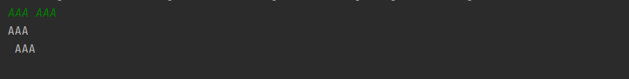
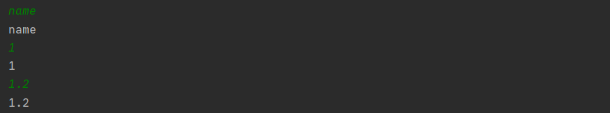
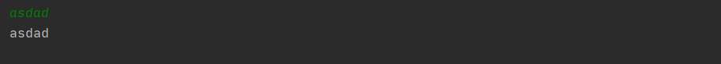
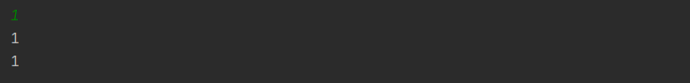
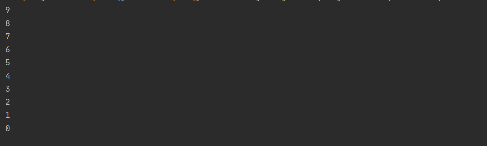
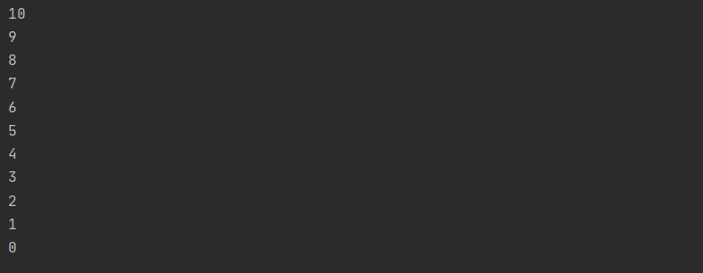
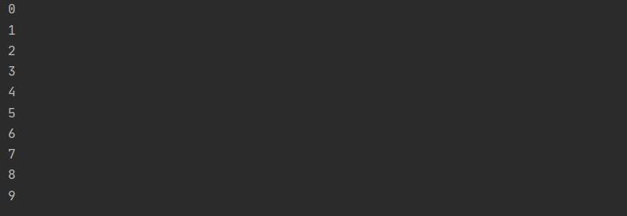
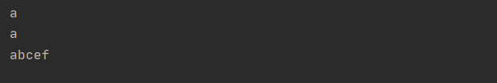
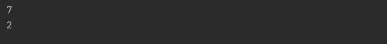
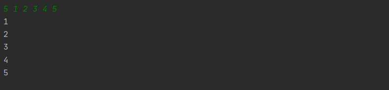

# Java基础笔记

## JDK文档

* [JDK1.8在线中文手册](https://www.matools.com/api/java8)

## 输入输出

* 通过使用`Scanner scanner = new Scanner(System.in)`进行输入输出

```
import java.util.Scanner;

public class Main {
    public static void main(String[] args){
        Scanner scanner = new Scanner(System.in);
        if(scanner.hasNext()) { // 用于判断是否有输入
            String s1 = scanner.next();
            String s2 = scanner.nextLine();
            System.out.println(s1);
            System.out.println(s2);
        }
    }
}
```



注意`next()`与`nextLine()`的区别：

`next()`：

* 一定要读取到有效字符后才可以结束输入。
* 对输入有效字符之前遇到的空白，`next()` 方法会自动将其去掉。
* 只有输入有效字符后才将其后面输入的空白作为分隔符或者结束符。
* `next()` 不能得到带有空格的字符串。

`nextLine()`：

* 以`Enter`为结束符,也就是说 `nextLine()`方法返回的是输入回车之前的所有字符。
* 可以获得空白。
* 通过使用 `` 进行输入输出

其他数据类型的输入：

```
import java.util.Scanner;

public class Main {
    public static void main(String[] args){
        Scanner scanner = new Scanner(System.in);
        if(scanner.hasNext()) { // 用于判断是否有输入
            String s = scanner.next();
            System.out.println(s);
        }
        if(scanner.hasNextInt()){   // 整型
            Integer i = scanner.nextInt();
            System.out.println(i);
        }
        if(scanner.hasNextFloat()){ // 浮点类型
            Float f = scanner.nextFloat();
            System.out.println(f);
        }
    }
}
```



* 通过使用`BufferedReader br = new BufferedReader(new InputStreamReader(System.in))`进行输入输出

```
import java.io.BufferedReader;
import java.io.IOException;
import java.io.InputStreamReader;

public class Main {
    //使用IO类，需要在主类后面抛出异常`throws IOException`
    public static void main(String[] args) throws IOException {
        BufferedReader br = new BufferedReader(new InputStreamReader(System.in));
        String s = br.readLine();
        System.out.println(s);
    }
}
```



其他类型输出：

```
import java.io.BufferedReader;
import java.io.IOException;
import java.io.InputStreamReader;

public class Main {
    //使用IO类，需要在主类后面抛出异常`throws IOException`
    public static void main(String[] args) throws IOException {
        BufferedReader br = new BufferedReader(new InputStreamReader(System.in));
        String s = br.readLine();
        System.out.println(s);
        Integer i = Integer.parseInt(s);
        System.out.println(i);
    }
}
```

通过使用`类型.parse类型(String s)`将字符串转换为相应的数据类型。



## 运算符

### 位运算符

| 操作符 | 描述                                                         | 例子                           |
| ------ | ------------------------------------------------------------ | ------------------------------ |
| ＆     | 如果相对应位都是1，则结果为1，否则为0                        | （A＆B），得到12，即0000 1100  |
| \|     | 如果相对应位都是 0，则结果为 0，否则为 1                     | （A \| B）得到61，即 0011 1101 |
| ^      | 如果相对应位值相同，则结果为0，否则为1                       | （A ^ B）得到49，即 0011 0001  |
| 〜     | 按位取反运算符翻转操作数的每一位，即0变成1，1变成0。         | （〜A）得到-61，即1100 0011    |
| <<     | 按位左移运算符。左操作数按位左移右操作数指定的位数。         | A << 2得到240，即 1111 0000    |
| >>     | 按位右移运算符。左操作数按位右移右操作数指定的位数。         | A >> 2得到15即 1111            |
| >>>    | 按位右移补零操作符。左操作数的值按右操作数指定的位数右移，移动得到的空位以零填充。 | A>>>2得到15即0000 1111         |

### 条件运算符（?:）

如果表达式`expression`为真则返回`value1`，如果为假，则返回`value2`。

```
variable x = (expression) ? value1 (if true) : value2 (if false)
```

实例：

```
public class Main {
    public static void main(String[] args) {
        int a = 1;
        int b = (a==1) ? 10:20;
        System.out.println(b);
    }
}
```

## 循环语句

* `while`循环

```
public class Main {
    public static void main(String[] args) {
        int n = 10;
        while((n--)>0){
            System.out.println(n);
        }
    }
}
```



* `do...while`循环

```
public class Main {
    public static void main(String[] args) {
        int n = 10;
        do{
            System.out.println(n);
        }while((n--)>0);
    }
}
```



`while`与`do..while`的区别是在于：`do...while`必须要先运行一次才进行判断，而`while`需要进行判断。

* `for`循环

```
public class Main {
    public static void main(String[] args) {
        int n = 10;
        for(int i=0;i<n;i++){
            System.out.println(i);
        }
    }
}
```



## 条件语句

一个 if 语句包含一个布尔表达式和一条或多条语句。

```
public class Main {
    public static void main(String[] args) {
        int a = 5;
        if(a>5) {
            System.out.println(a);
        }else if(a == 5){
            System.out.println(a);
        }else{
            System.out.println(a);
        }
    }
}
```

## Switch case语句

```
public class Main {
    public static void main(String[] args) {
        int a = 5;
        switch (a){
            case 1: {
                System.out.println(1);
                break; // 跳出这个循环，不然会一直往下执行
            }
            case 3:{
                System.out.println(3);
                break;
            }
            default:
                System.out.println(5);
        }
    }
}
```

## Java常用类

### Number & Math 类方法

下面的表中列出的是 Number & Math 类常用的一些方法：

| 序号 | 方法与描述                                                   |
| ---- | ------------------------------------------------------------ |
| 1    | [xxxValue()](https://www.runoob.com/java/number-xxxvalue.html) 将 Number 对象转换为xxx数据类型的值并返回。 |
| 2    | [compareTo()](https://www.runoob.com/java/number-compareto.html) 将number对象与参数比较。 |
| 3    | [equals()](https://www.runoob.com/java/number-equals.html) 判断number对象是否与参数相等。 |
| 4    | [valueOf()](https://www.runoob.com/java/number-valueof.html) 返回一个 Number 对象指定的内置数据类型 |
| 5    | [toString()](https://www.runoob.com/java/number-tostring.html) 以字符串形式返回值。 |
| 6    | [parseInt()](https://www.runoob.com/java/number-parseInt.html) 将字符串解析为int类型。 |
| 7    | [abs()](https://www.runoob.com/java/number-abs.html) 返回参数的绝对值。 |
| 8    | [ceil()](https://www.runoob.com/java/number-ceil.html) 返回大于等于( >= )给定参数的的最小整数，类型为双精度浮点型。 |
| 9    | [floor()](https://www.runoob.com/java/number-floor.html) 返回小于等于（<=）给定参数的最大整数 。 |
| 10   | [rint()](https://www.runoob.com/java/number-rint.html) 返回与参数最接近的整数。返回类型为double。 |
| 11   | [round()](https://www.runoob.com/java/number-round.html) 它表示**四舍五入**，算法为 **Math.floor(x+0.5)**，即将原来的数字加上 0.5 后再向下取整，所以，Math.round(11.5) 的结果为12，Math.round(-11.5) 的结果为-11。 |
| 12   | [min()](https://www.runoob.com/java/number-min.html) 返回两个参数中的最小值。 |
| 13   | [max()](https://www.runoob.com/java/number-max.html) 返回两个参数中的最大值。 |
| 14   | [exp()](https://www.runoob.com/java/number-exp.html) 返回自然数底数e的参数次方。 |
| 15   | [log()](https://www.runoob.com/java/number-log.html) 返回参数的自然数底数的对数值。 |
| 16   | [pow()](https://www.runoob.com/java/number-pow.html) 返回第一个参数的第二个参数次方。 |
| 17   | [sqrt()](https://www.runoob.com/java/number-sqrt.html) 求参数的算术平方根。 |
| 18   | [sin()](https://www.runoob.com/java/number-sin.html) 求指定double类型参数的正弦值。 |
| 19   | [cos()](https://www.runoob.com/java/number-cos.html) 求指定double类型参数的余弦值。 |
| 20   | [tan()](https://www.runoob.com/java/number-tan.html) 求指定double类型参数的正切值。 |
| 21   | [asin()](https://www.runoob.com/java/number-asin.html) 求指定double类型参数的反正弦值。 |
| 22   | [acos()](https://www.runoob.com/java/number-acos.html) 求指定double类型参数的反余弦值。 |
| 23   | [atan()](https://www.runoob.com/java/number-atan.html) 求指定double类型参数的反正切值。 |
| 24   | [atan2()](https://www.runoob.com/java/number-atan2.html) 将笛卡尔坐标转换为极坐标，并返回极坐标的角度值。 |
| 25   | [toDegrees()](https://www.runoob.com/java/number-todegrees.html) 将参数转化为角度。 |
| 26   | [toRadians()](https://www.runoob.com/java/number-toradians.html) 将角度转换为弧度。 |
| 27   | [random()](https://www.runoob.com/java/number-random.html) 返回一个随机数。 |

### Character 类

```
public class Main {
    public static void main(String[] args) {
       char c = 'a';
       System.out.println(c);
       Character c1 = 'a';
       System.out.println(c1);
       char[] arr = {'a','b','c','e','f'};
       System.out.println(arr);
    }
}
```



**Character类方法**：

| 序号 | 方法与描述                                                   |
| ---- | ------------------------------------------------------------ |
| 1    | [isLetter()](https://www.runoob.com/java/character-isletter.html) 是否是一个字母 |
| 2    | [isDigit()](https://www.runoob.com/java/character-isdigit.html) 是否是一个数字字符 |
| 3    | [isWhitespace()](https://www.runoob.com/java/character-iswhitespace.html) 是否是一个空白字符 |
| 4    | [isUpperCase()](https://www.runoob.com/java/character-isuppercase.html) 是否是大写字母 |
| 5    | [isLowerCase()](https://www.runoob.com/java/character-islowercase.html) 是否是小写字母 |
| 6    | [toUpperCase()](https://www.runoob.com/java/character-touppercase.html) 指定字母的大写形式 |
| 7    | [toLowerCase](https://www.runoob.com/java/character-tolowercase.html)() 指定字母的小写形式 |
| 8    | [toString](https://www.runoob.com/java/character-tostring.html)() 返回字符的字符串形式，字符串的长度仅为1 |

### String类

```
public class Main {
    public static void main(String[] args) {
        String s = "1234567";
        System.out.println(s.length());
        System.out.println(s.charAt(1));
    }
}
```



下面是 String 类支持的方法，更多详细，参看 [Java String API](https://www.runoob.com/manual/jdk1.6/java/lang/String.html) 文档:

| SN(序号) | 方法描述                                                     |
| -------- | ------------------------------------------------------------ |
| 1        | [char charAt(int index)](https://www.runoob.com/java/java-string-charat.html) 返回指定索引处的 char 值。 |
| 2        | [int compareTo(Object o)](https://www.runoob.com/java/java-string-compareto.html) 把这个字符串和另一个对象比较。 |
| 3        | [int compareTo(String anotherString)](https://www.runoob.com/java/java-string-compareto.html) 按字典顺序比较两个字符串。 |
| 4        | [int compareToIgnoreCase(String str)](https://www.runoob.com/java/java-string-comparetoignorecase.html) 按字典顺序比较两个字符串，不考虑大小写。 |
| 5        | [String concat(String str)](https://www.runoob.com/java/java-string-concat.html) 将指定字符串连接到此字符串的结尾。 |
| 6        | [boolean contentEquals(StringBuffer sb)](https://www.runoob.com/java/java-string-contentequals.html) 当且仅当字符串与指定的StringBuffer有相同顺序的字符时候返回真。 |
| 7        | \[static String copyValueOf(char[\] data)](https://www.runoob.com/java/java-string-copyvalueof.html) 返回指定数组中表示该字符序列的 String。 |
| 8        | \[static String copyValueOf(char[\] data, int offset, int count)](https://www.runoob.com/java/java-string-copyvalueof.html) 返回指定数组中表示该字符序列的 String。 |
| 9        | [boolean endsWith(String suffix)](https://www.runoob.com/java/java-string-endswith.html) 测试此字符串是否以指定的后缀结束。 |
| 10       | [boolean equals(Object anObject)](https://www.runoob.com/java/java-string-equals.html) 将此字符串与指定的对象比较。 |
| 11       | [boolean equalsIgnoreCase(String anotherString)](https://www.runoob.com/java/java-string-equalsignorecase.html) 将此 String 与另一个 String 比较，不考虑大小写。 |
| 12       | \[byte[\] getBytes()](https://www.runoob.com/java/java-string-getbytes.html) 使用平台的默认字符集将此 String 编码为 byte 序列，并将结果存储到一个新的 byte 数组中。 |
| 13       | \[byte[\] getBytes(String charsetName)](https://www.runoob.com/java/java-string-getbytes.html) 使用指定的字符集将此 String 编码为 byte 序列，并将结果存储到一个新的 byte 数组中。 |
| 14       | \[void getChars(int srcBegin, int srcEnd, char[\] dst, int dstBegin)](https://www.runoob.com/java/java-string-getchars.html) 将字符从此字符串复制到目标字符数组。 |
| 15       | [int hashCode()](https://www.runoob.com/java/java-string-hashcode.html) 返回此字符串的哈希码。 |
| 16       | [int indexOf(int ch)](https://www.runoob.com/java/java-string-indexof.html) 返回指定字符在此字符串中第一次出现处的索引。 |
| 17       | [int indexOf(int ch, int fromIndex)](https://www.runoob.com/java/java-string-indexof.html) 返回在此字符串中第一次出现指定字符处的索引，从指定的索引开始搜索。 |
| 18       | [int indexOf(String str)](https://www.runoob.com/java/java-string-indexof.html) 返回指定子字符串在此字符串中第一次出现处的索引。 |
| 19       | [int indexOf(String str, int fromIndex)](https://www.runoob.com/java/java-string-indexof.html) 返回指定子字符串在此字符串中第一次出现处的索引，从指定的索引开始。 |
| 20       | [String intern()](https://www.runoob.com/java/java-string-intern.html) 返回字符串对象的规范化表示形式。 |
| 21       | [int lastIndexOf(int ch)](https://www.runoob.com/java/java-string-lastindexof.html) 返回指定字符在此字符串中最后一次出现处的索引。 |
| 22       | [int lastIndexOf(int ch, int fromIndex)](https://www.runoob.com/java/java-string-lastindexof.html) 返回指定字符在此字符串中最后一次出现处的索引，从指定的索引处开始进行反向搜索。 |
| 23       | [int lastIndexOf(String str)](https://www.runoob.com/java/java-string-lastindexof.html) 返回指定子字符串在此字符串中最右边出现处的索引。 |
| 24       | [int lastIndexOf(String str, int fromIndex)](https://www.runoob.com/java/java-string-lastindexof.html) 返回指定子字符串在此字符串中最后一次出现处的索引，从指定的索引开始反向搜索。 |
| 25       | [int length()](https://www.runoob.com/java/java-string-length.html) 返回此字符串的长度。 |
| 26       | [boolean matches(String regex)](https://www.runoob.com/java/java-string-matches.html) 告知此字符串是否匹配给定的正则表达式。 |
| 27       | [boolean regionMatches(boolean ignoreCase, int toffset, String other, int ooffset, int len)](https://www.runoob.com/java/java-string-regionmatches.html) 测试两个字符串区域是否相等。 |
| 28       | [boolean regionMatches(int toffset, String other, int ooffset, int len)](https://www.runoob.com/java/java-string-regionmatches.html) 测试两个字符串区域是否相等。 |
| 29       | [String replace(char oldChar, char newChar)](https://www.runoob.com/java/java-string-replace.html) 返回一个新的字符串，它是通过用 newChar 替换此字符串中出现的所有 oldChar 得到的。 |
| 30       | [String replaceAll(String regex, String replacement)](https://www.runoob.com/java/java-string-replaceall.html) 使用给定的 replacement 替换此字符串所有匹配给定的正则表达式的子字符串。 |
| 31       | [String replaceFirst(String regex, String replacement)](https://www.runoob.com/java/java-string-replacefirst.html) 使用给定的 replacement 替换此字符串匹配给定的正则表达式的第一个子字符串。 |
| 32       | \[String[\] split(String regex)](https://www.runoob.com/java/java-string-split.html) 根据给定正则表达式的匹配拆分此字符串。 |
| 33       | \[String[\] split(String regex, int limit)](https://www.runoob.com/java/java-string-split.html) 根据匹配给定的正则表达式来拆分此字符串。 |
| 34       | [boolean startsWith(String prefix)](https://www.runoob.com/java/java-string-startswith.html) 测试此字符串是否以指定的前缀开始。 |
| 35       | [boolean startsWith(String prefix, int toffset)](https://www.runoob.com/java/java-string-startswith.html) 测试此字符串从指定索引开始的子字符串是否以指定前缀开始。 |
| 36       | [CharSequence subSequence(int beginIndex, int endIndex)](https://www.runoob.com/java/java-string-subsequence.html) 返回一个新的字符序列，它是此序列的一个子序列。 |
| 37       | [String substring(int beginIndex)](https://www.runoob.com/java/java-string-substring.html) 返回一个新的字符串，它是此字符串的一个子字符串。 |
| 38       | [String substring(int beginIndex, int endIndex)](https://www.runoob.com/java/java-string-substring.html) 返回一个新字符串，它是此字符串的一个子字符串。 |
| 39       | \[char[\] toCharArray()](https://www.runoob.com/java/java-string-tochararray.html) 将此字符串转换为一个新的字符数组。 |
| 40       | [String toLowerCase()](https://www.runoob.com/java/java-string-tolowercase.html) 使用默认语言环境的规则将此 String 中的所有字符都转换为小写。 |
| 41       | [String toLowerCase(Locale locale)](https://www.runoob.com/java/java-string-tolowercase.html) 使用给定 Locale 的规则将此 String 中的所有字符都转换为小写。 |
| 42       | [String toString()](https://www.runoob.com/java/java-string-tostring.html) 返回此对象本身（它已经是一个字符串！）。 |
| 43       | [String toUpperCase()](https://www.runoob.com/java/java-string-touppercase.html) 使用默认语言环境的规则将此 String 中的所有字符都转换为大写。 |
| 44       | [String toUpperCase(Locale locale)](https://www.runoob.com/java/java-string-touppercase.html) 使用给定 Locale 的规则将此 String 中的所有字符都转换为大写。 |
| 45       | [String trim()](https://www.runoob.com/java/java-string-trim.html) 返回字符串的副本，忽略前导空白和尾部空白。 |
| 46       | [static String valueOf(primitive data type x)](https://www.runoob.com/java/java-string-valueof.html) 返回给定data type类型x参数的字符串表示形式。 |
| 47       | [contains(CharSequence chars)](https://www.runoob.com/java/java-string-contains.html) 判断是否包含指定的字符系列。 |
| 48       | [isEmpty()](https://www.runoob.com/java/java-string-isempty.html) 判断字符串是否为空。 |

## 数组

```
import java.util.Scanner;

public class Main {
    public static void main(String[] args) {
        Scanner scanner = new Scanner(System.in);
        int n;
        int[] arr;
        n = scanner.nextInt();
        arr = new int[n];
        for(int i=0;i<n;i++)
            arr[i] = scanner.nextInt();
        for(int i=0;i<n;i++)
            System.out.println(arr[i]);
    }
}
```



## 正则表达式

[传送地址](https://www.runoob.com/java/java-regular-expressions.html)

## 传递参数

```
import java.util.Scanner;

public class Main {

    public static int max(int a,int b){
        return (a>b)?1:0;
    }

    public static void main(String[] args) {
        Scanner scanner = new Scanner(System.in);
        int a = scanner.nextInt();
        int b = scanner.nextInt();
        System.out.println(max(a,b));
    }
}
```


## 面向对象

## 异常处理

* 通过`try...catch`捕获异常

```
public class Main {

    public static void main(String[] args) {
        try{

        }catch (Exception e){

        }finally {
            
        }
    }
}
```

* 通过`throws/throw关键字`捕获异常

```
import java.io.IOException;

public class Main {

    public static void main(String[] args)throws IOException {

    }
}
```

* 自定义异常

在 Java 中可以自定义异常。编写异常类时需要记住下面的几点。

1. 所有异常都必须是 Throwable 的子类。
2. 如果希望写一个检查性异常类，则需要继承 `Exception` 类。
3. 如果想写一个运行时异常类，那么需要继承 `RuntimeException` 类。

**Main类**

```
import com.myexception.MyException;
public class Main {

    public static void main(String[] args) {
        int range = 11;
        if(range > 10){
            try {
                throw new MyException(range);
            } catch (MyException e) {
                System.out.println("Sorry, 超过最大范围10："
                        + e.getRange());
                e.printStackTrace();
            }
        }
    }
}
```

**MyException类**

```
package com.myexception;

public class MyException extends Exception{

    private int range;

    public MyException(int range){
        this.range = range;
    }

    public int getRange(){
        return this.range;
    }
}
```