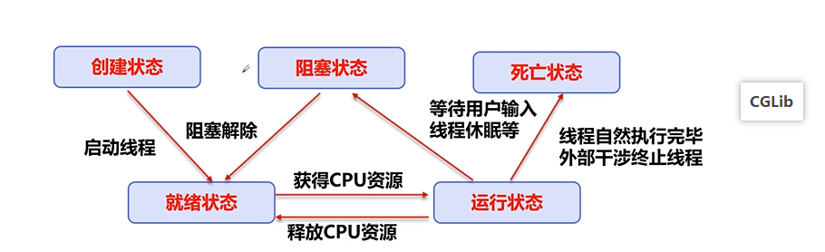
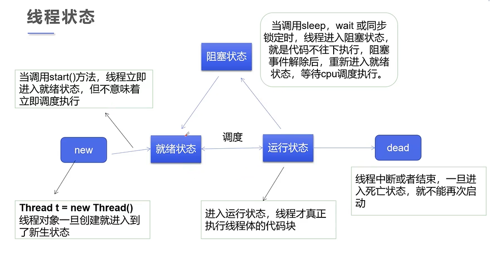

# 多线程详解

## 多线程简介

### 基本概念

* 程序是指令和数据的有序集合，其本身没有任何运行的含义，是一个静态的概念
* 进程是执行程序的一次执行过程，是一个动态的概念，是系统资源分配的单位。
* 线程是CPU调度和执行的单位

* 通常一个进程可以有多个线程（至少有一个线程，不然没有存在的意义），如同时看手机，玩游戏等。

注意：很多多线程是模拟出来，真正的多线程是指有多个CPU，即多核，如服务器。如果是模拟出来的多线程，即在一个CPU的情况下，在同一个时间点，cpu只能执行一个代码，因为切换很快，所以就有同时执行的错觉。

### 核心概念

* 线程就是独立执行的路径
* 在程序运行时，即使没有自己创建线程，后台也会有多个线程，如主线程，gc线程
* main()称为主线程，为系统的入口，用于执行整个程序
* 在一个进程中，如果开辟了多个线程，线程的运行由调度器安排调度，调度器是与操作系统紧密相关的，先后顺序是不能人为干预的
* 对同一份资源操作时，会存在资源抢夺的问题，需要加入并发控制
* 每个线程会带来额外的开销，如CPU调度时间，并发控制开销
* **每个线程在自己的工作内存交互，内存控制不当会造成数据不一致**

## 线程实现（重点）

可以通过三种方式进行创建：

* `Thread class`：继承Thread类，重修run方法，然后调用start方法

线程开启不一定立即执行，由cpu调度执行。

```java
// 创建线程方式一：继承Thread类，重写run方法，调用start开启线程
public class Thread01 extends Thread {

    public static void main(String[] args) {

        // 创建一个线程对象
        Thread01 thread01 = new Thread01();
        // 调用start方法开启线程
        thread01.start();

        // main主线程
        for (int i = 0; i < 10000; i++)
            System.out.println("我是主线程");
        
        // 两个线程，交替执行的
    }

    @Override
    public void run() {
        // run方法线程体
        for (int i = 0; i < 10000; i++)
            System.out.println("我是子线程");
    }

}

```

实例：网图下载，[下载comons-io.jar包](https://developer.aliyun.com/mvn/search)或者通过maven方式下载jar包

```java
public class Thread02 extends Thread{

    private String url;
    private String filename;

    public Thread02(String url,String filename){
        this.url = url;
        this.filename = filename;
    }

    public static void main(String[] args) {
        String url1 = "https://i0.hdslb.com/bfs/archive/1426d43f5eaeddcc6fa7d809f932c6ae86e3e59d.jpg";
        String url2 = "https://i2.hdslb.com/bfs/archive/42aaa9e9134d93d0a9e48cb32a7be92e674ae111.png";
        String url3 = "https://i1.hdslb.com/bfs/archive/2859d60e57330555ec669d4dc61c4045a059530f.jpg";

        String filename = "";

        Thread02 t1 = new Thread02(url1, "1.jpg");
        Thread02 t2 = new Thread02(url2, "2.jpg");
        Thread02 t3 = new Thread02(url3, "3.jpg");

        t1.start();
        t2.start();
        t3.start();

    }

    @Override
    public void run() {
        WebDownloader webDownloader = new WebDownloader();
        webDownloader.downloader(url,filename);
        System.out.println("下载了"+filename);
    }

}

// 下载器
class WebDownloader{

    // 下载方法
    public void downloader(String url,String filename) {
        try {
            FileUtils.copyURLToFile(new URL(url), new File(filename));
        } catch (IOException e) {
            e.printStackTrace();
        }
    }
}
```

* `Runnable 接口`：实现Runnable接口，重写run方法

```java
public class Thread03 implements Runnable{

    public static void main(String[] args) {
        // 创建runnable接口的实现类对象
        Thread03 thread03 = new Thread03();
        // 创建线程对象，通过线程对象来开启我们的线程
        Thread thread = new Thread(thread03);
        // 开启线程
        thread.start();

        // main主线程
        for (int i = 0; i < 10000; i++)
            System.out.println("我是主线程");
    }

    @Override
    public void run() {
        // 子线程
        for (int i = 0; i < 10000; i++)
            System.out.println("我是子线程");
    }
}

```

总结：

继承Thread类：

1. 子类继承Thread类具备多线程能力
2. 启动线程：子类对象.start()
3. 不建议使用：避免OOP（面向对象设计）单继承局限性

实现Runnable接口：

1. 实现接口Runnable具有多线程能力
2. 启动线程：传入目标对象+Thread对象.start()
3. 推荐使用：避免单继承局限性，灵活方便，方便同一个对象被多个线程使用

实例：通过多线程模拟抢票

```java
// 多个线程同时操作同一个对象：比如买火车票的实例
public class Thread04 implements Runnable{

    // 票数
    private int ticketNums = 10;

    public static void main(String[] args) {
        Thread04 ticket = new Thread04();

        Thread t1 = new Thread(ticket,"小明");
        Thread t2 = new Thread(ticket,"小红");
        Thread t3 = new Thread(ticket,"小刚");
        Thread t4 = new Thread(ticket,"小西");

        t1.start();
        t2.start();
        t3.start();
        t4.start();

    }

    @Override
    public void run() {
        while (true){
            if(ticketNums <= 0) break;

            // 模拟延时
            try {
                Thread.sleep(200);
            } catch (InterruptedException e) {
                e.printStackTrace();
            }

            System.out.println(Thread.currentThread().getName()+"拿到了"+(ticketNums--)+"");
        }
    }

}
```


会发现不同的线程，都会抢占该资源，造成了并发，后面会学习。

实例：龟兔赛跑

```java
// 模拟龟兔赛跑
public class Thread05 implements Runnable{

    private static String winner;

    public static void main(String[] args) {
        Thread05 thread05 = new Thread05();

       new Thread(thread05,"兔子").start();
       new Thread(thread05,"乌龟").start();

    }

    @Override
    public void run() {
        for(int i=1;i<=100;i++) {

            System.out.println(Thread.currentThread().getName() + "跑了" + i + "步");

            // 模拟兔子休息
            if(Thread.currentThread().getName().equals("兔子") && i % 50 == 0){
                try {
                    Thread.sleep(200);
                } catch (InterruptedException e) {
                    e.printStackTrace();
                }
            }

            // 判断比赛是否结束
            boolean flag = gameOver(i);
            if(flag) break;

        }
    }

    // 判断是否完成比赛
    private boolean gameOver(int step){
        // 判断是否有胜利者
        if(winner != null){ // 已经有胜利者了
            return true;
        }{
            if(step == 100){
                winner = Thread.currentThread().getName();
                System.out.println("winner is "+winner);
                return true;
            }
        }
        return false;
    }
}
```

* `Callable 接口`：实现Callable接口（了解即可）

1. 实现Callable接口
2. 重写call方法
3. 创建执行服务
4. 提交执行
5. 获取结果
6. 关闭服务

```java
// 1.实现Callable接口
public class Thread06 implements Callable<Boolean> {

    private String url;
    private String filename;

    public Thread06(String url,String filename){
        this.url = url;
        this.filename = filename;
    }

    public static void main(String[] args) throws ExecutionException, InterruptedException {
        String url1 = "https://i0.hdslb.com/bfs/archive/1426d43f5eaeddcc6fa7d809f932c6ae86e3e59d.jpg";
        String url2 = "https://i2.hdslb.com/bfs/archive/42aaa9e9134d93d0a9e48cb32a7be92e674ae111.png";
        String url3 = "https://i1.hdslb.com/bfs/archive/2859d60e57330555ec669d4dc61c4045a059530f.jpg";

        Thread06 t1 = new Thread06(url1, "1.jpg");
        Thread06 t2 = new Thread06(url2, "2.jpg");
        Thread06 t3 = new Thread06(url3, "3.jpg");

        // 3.创建执行服务
        ExecutorService service = Executors.newFixedThreadPool(1);

        // 4.提交执行
        Future<Boolean> r1 = service.submit(t1);
        Future<Boolean> r2 = service.submit(t2);
        Future<Boolean> r3 = service.submit(t3);

        // 5.获取结果
        boolean rs1 = r1.get();
        boolean rs2 = r2.get();
        boolean rs3 = r3.get();

        // 6.关闭服务
        service.shutdown();

    }

    // 2.重写call
    @Override
    public Boolean call() {
        FileDownloader fileDownloader = new FileDownloader();
        fileDownloader.downloader(url,filename);
        System.out.println("下载了"+filename);
        return true;
    }

}

// 下载器
class FileDownloader{

    // 下载方法
    public void downloader(String url,String filename) {
        try {
            FileUtils.copyURLToFile(new URL(url), new File(filename));
        } catch (IOException e) {
            e.printStackTrace();
        }
    }
}
```

## 静态代理模式

例子： 真实角色：你； 代理角色：婚庆公司； 结婚：实现结婚接口

> 在不动原来的类情况下，扩展方法。 

```java
public class StaticProxy {

    public static void main(String[] args) {
//        WeddingCompany weddingCompany = new WeddingCompany(new People());
//        weddingCompany.HappyMarry();

        new Thread(() -> System.out.println("结婚结婚")).start();

        // 这里和线程进行对比，HappyMarry和start方法
        new WeddingCompany(new People()).HappyMarry();
    }

}

interface Marry{
    // 高兴的事
    void HappyMarry();
}

class People implements Marry{

    @Override
    public void HappyMarry() {
        System.out.println("你要结婚了，超b开心");
    }
}

// 代理角色，帮助你结婚
class WeddingCompany implements Marry{
    private Marry target;

    public WeddingCompany(Marry target) {
        this.target = target;
    }

    @Override
    public void HappyMarry() {
        before();
        this.target.HappyMarry();
        after();
    }

    public void before(){
        System.out.println("布置婚礼场景");
    }

    public void after(){
        System.out.println("数礼钱");
    }
}
```

## lambda表达式

- 实质属于函数式编程的概念

### 作用

- 避免匿名内部类定义过多
- 使代码看起来简介
- 简化代码，只留下核心逻辑

### 函数式接口

定义：任何接口，如果只包含唯一一个抽象方法，那么它就是一个函数式接口

```java
public interface Runnable{
    public abstract void run();
}
```

 对于函数式接口，我们可以通过lambda表达式来创建该接口的对象。

## lambda简单推导

```java
// 推导lambda表达式
public class lambda01 {

    // 3.静态内部类
    static class TestClass2 implements TestInterface{
        @Override
        public void lambda() {
            System.out.println("我正在测试lambda2");
        }
    }

    public static void main(String[] args) {
        TestInterface tc = new TestClass();
        tc.lambda();

        tc = new TestClass2();
        tc.lambda();

        // 4.局部内部类
        class TestClass3 implements TestInterface{
            @Override
            public void lambda() {
                System.out.println("我正在测试lambda3");
            }
        }

        tc = new TestClass3();
        tc.lambda();

        // 5.匿名内部类
        tc = new TestInterface() {
            @Override
            public void lambda() {
                System.out.println("我正在测试lambda4");
            }
        };
        tc.lambda();

        // 6.用lambda简化
        tc = () -> System.out.println("我正在测试lambda5");
        tc.lambda(); 

    }
}

// 1.定义一个函数式接口
interface TestInterface{
    void lambda();
}

// 2.实现类
class TestClass implements TestInterface{

    @Override
    public void lambda() {
        System.out.println("我正在测试lambda1");
    }
}
```

- lambda表达式只能有一行代码的情况下才能简化成为一行，如果有多行，那么就用代码块包裹。
- lambda表达式的前提是接口为函数式接口。
- 多个参数也可以去掉参数类型，要去掉就都去掉，必须加上括号。

## 线程状态

### 概念



* 创建、就绪、阻塞、运行、死亡



### 线程方法

| 方法                           | 说明                                       |
| ------------------------------ | ------------------------------------------ |
| setPriority(int newPriority)   | 更改线程的优先级                           |
| statci void sleep(long millis) | 在指定的毫秒数内让当前正在执行的线程休眠   |
| void join()                    | 等待该线程停止                             |
| static void yield()            | 暂停当前正在执行的线程对象，并执行其他线程 |
| void interrupt()               | 中断线程，别用这个方式                     |
| boolean isAlive()              | 测试线程是否处于活动状态                   |

### 停止线程

不推荐使用JDK提供的stop()、destroy()方法。（已废弃）

推荐线程自己停止下来，建议使用一个标志位进行终止变量当flag=false,则终止线程运行。

```java
// 停止线程
// 1.建议线程正常停止，设置循环次数
// 2.建议使用标志位，设置一个标志位
// 3.不要使用官方的JDK方法
public class Thread07 implements Runnable{

    // 1.设置一个标志位
    private boolean flag = true;

    @Override
    public void run() {
        int i = 0;
        while(flag){
            System.out.println("线程第"+i+++"次运行");
        }
    }

    // 2.设置一个公开的方法停止线程，转换标志位
    public void stop(){
        this.flag = false;
    }

    public static void main(String[] args) throws InterruptedException {
        Thread07 thread07 = new Thread07();
        new Thread(thread07).start();

        for(int i=0;i<1000;i++){

            System.out.println("main主线程第"+i+"次运行");

            if(i == 900){
                // 调用stop方法切换标志位，让线程停止
                thread07.stop();
                System.out.println("线程停止了");
            }
        }

    }
}
```

### 线程休眠-sleep()

- sleep(时间)指定当前线程阻塞的毫秒数；
- sleep存在异常InterruptedException；
- sleep时间达到后线程进入就绪状态；
- sleep可以模拟网络延时，倒计时等；
- **每一个对象都有一个锁，sleep不会释放锁。**

模拟网络延时的作用：放大问题的发生性。

```java
// 模拟延时
try {
    Thread.sleep(200);
} catch (InterruptedException e) {
    e.printStackTrace();
}
```

### 线程礼让-yield()

- 礼让线程，让当前正在执行的线程暂停，但不阻塞；
- 将线程从运行状态转为就绪状态;
- 让CPU重新调度，**礼让不一定成功**，看CPU心情。

```java
// 测试礼让线程
// 礼让不一定成功，看CPU心情
public class Thread08{

    public static void main(String[] args) {
        MyYield myYield = new MyYield();
        new Thread(myYield,"a").start();
        new Thread(myYield,"b").start();

    }

}

class MyYield implements Runnable{

    @Override
    public void run() {
        System.out.println(Thread.currentThread().getName() + "线程开始执行");
        Thread.yield(); // 礼让
        System.out.println(Thread.currentThread().getName() + "线程开始执行");
    }
}

```

### 线程强行执行-join()

- join合并线程，待此线程执行完后，再执行其它线程，其它线程阻塞；
- 可以想象成插队

```java
// 测试join
// 插队
public class Thread09 implements Runnable{

    @Override
    public void run() {
        for(int i=0;i<1000;i++)
            System.out.println("线程vip来了"+i);
    }

    public static void main(String[] args) throws InterruptedException {
        //启动线程
        Thread09 thread09 = new Thread09();
        Thread thread = new Thread(thread09);
        thread.start();

        // 主线程
        for(int i=0;i<400;i++) {
            if(i == 200){
                thread.join(); // 插队
            }
            System.out.println("main"+i);
        }
    }
}

```

少使用，容易阻塞线程。

### 观察线程状态

`Thread.State`线程状态，线程可以处于以下状态之一。

| 线程状态      | 描述                                                       |
| ------------- | ---------------------------------------------------------- |
| NEW           | 尚未启动的线程处于此状态                                   |
| RUNNABLE      | 在Java虚拟机中执行的线程处于此状态                         |
| BLOCKED       | 被阻塞等待监视器锁定的线程处于此状态                       |
| WAITING       | 正在等待另一个线程执行特定动作的线程处于此状态             |
| TIMED_WAITING | 正在等待另一个线程执行动作达到指定等待时间的线程处于此状态 |
| TERMINATED    | 已退出的线程处于此状态                                     |

一个线程可以在给定时间点处于一个状态。这些状态是不反映任何操作系统线程状态的虚拟机状态。

```java
// 观察测试线的状态
public class Thread10 {
    public static void main(String[] args) throws InterruptedException {
        Thread thread = new Thread(()->{
            for(int i=0;i<5;i++){
                try {
                    Thread.sleep(1000);
                } catch (InterruptedException e) {
                    e.printStackTrace();
                }
            }
            System.out.println("==========================");
        });

        // 观察状态
        Thread.State state = thread.getState();
        System.out.println(state); // NEW

        // 观察启动后
        thread.start();//启动线程
        state = thread.getState();
        System.out.println(state); // RUNNABLE

        while (state != Thread.State.TERMINATED){ // 只要线程不终止，就一直输出状态
            Thread.sleep(100);
            state = thread.getState(); //更新线程状态
            System.out.println(state); // 查看线程状态
        }
        
        //thread.start();//无法启动

    }
}
```

线程中断或者结束，一旦进入死亡状态，就不能再次启动。

## 线程优先级

- Java提供一个线程调度器来监控程序中启动后进入就绪状态的所有线程，线程调度器按照优先级来决定应该调度哪个线程来执行。
- 线程的优先级用数字表示，范围从1~10。
  - `Thread.MIN_PRIORITY = 1`;
  - `Thread.MAX_PRIORITY = 10`;
  - `Thread.NORM_PRIORITY = 5;`

- 使用一下方法改变或获取优先级`getPriority.setPriority(int xxx)`

> 优先级低只是意味着调度的概率低，并不是优先级低就不会被调用了，这都是看CPU的调度。

```java
public class ThreadPriority{
    public static void main(String[] args) {

        // 主线程默认优先级
        System.out.println(Thread.currentThread().getName() + "->" + Thread.currentThread().getPriority());
        MyPriority myPriority = new MyPriority();

        Thread thread1 = new Thread(myPriority);
        Thread thread2 = new Thread(myPriority);
        Thread thread3 = new Thread(myPriority);
        Thread thread4 = new Thread(myPriority);
        Thread thread5 = new Thread(myPriority);
        Thread thread6 = new Thread(myPriority);

        // 先设置优先级，再启动线程
//        thread1.setPriority(1);
        thread2.setPriority(1);
        thread3.setPriority(4);
        thread4.setPriority(Thread.MAX_PRIORITY); // Thread.MAX_PRIORITY = 10
        thread5.setPriority(5);
        thread6.setPriority(3);

        // 启动线程
        thread1.start();
        thread2.start();
        thread3.start();
        thread4.start();
        thread5.start();
        thread6.start();
    }
}

class MyPriority implements Runnable{

    @Override
    public void run() {
        System.out.println(Thread.currentThread().getName() + "->" + Thread.currentThread().getPriority());
    }
}

```

## 守护（daemon）线程

- 线程分为**用户线程**和**守护线程**
- 虚拟机必须确保用户线程执行完毕 （如，main）
- 虚拟机不用等待守护线程执行完毕 （如，后台记录操作日志，监控内存，垃圾回收……）

```java
// 测试守护线程
public class ThreadDaemon {
    public static void main(String[] args) {
        God god = new God();
        You you = new You();

        Thread t1 = new Thread(god);
        t1.setDaemon(true); // 默认是false表示是用户线程，正常的线程都是用户线程
        t1.start(); //守护线程启动

        Thread t2 = new Thread(you);
        t2.start();//用户线程启动

    }
}

class God implements Runnable{

    @Override
    public void run() {
        while (true){
            System.out.println("保佑着你");
        }
    }
}

class You implements Runnable{

    @Override
    public void run() {
        for(int i=0;i<36500;i++){
            System.out.println("开心每一天");
        }
        System.out.println("重新的一天");
    }
}
```

守护线程会在用户线程运行完后，会自动停止。

## 线程同步（重点）

### 概念

并发：**同一个对象**被**多个线程**同时操作 （如：上万人同时抢票）

处理多线程问题时，多线程访问同一个对象(并发)，并且某些线程还想修改这个对象。这时则需要线程同步。

**线程同步**其实是一种等待机制，多个需要同时访问此对象的线程进入这个**对象的等待池**形成队列，等待前面的线程使用完毕，下一个线程再使用。

> **线程同步的形成条件：队列+锁**

由于我们可以通过private关键字来保证数据对象只能被方法访问，所以我们只需要针对方法提出一套机制,这套机制就是**synchronized**关键字，它包括两种用法：**synchronized**方法和**synchronized**块

 同步方法: `public synchronized void method(int args) {}`

synchronized方法控制对“对象”的访问，每个对象对应一 把锁，每个synchronized方法都必须获得调用该方法的对象的锁才能执行，否则线程会阻塞，方法一旦执行，就独占该锁,直到该方法返回才释放锁，后面被阻塞的线程才能获得这个锁，继续执行。但是存在如下问题：

一个线程持有锁会导致其他所有需要此锁的线程挂起﹔
在多线程竞争下,'加锁﹐释放锁会导致比较多的上下文切换和调度延时,引起性能问题﹔
如果一个优先级高的线程等待一个优先级低的线程释放锁会导致优先级倒置,引起性能问题。

### 三大不安全案例

* 不安全的买票

**每个线程在自己的工作内存交互，内存控制不当会造成数据不一致**

```java
// 不安全的买票
public class UnsafeBuyTicket {
    public static void main(String[] args) {
        BuyTicket buyTicket = new BuyTicket();
        new Thread(buyTicket,"小明").start();
        new Thread(buyTicket,"小红").start();
        new Thread(buyTicket,"小刚").start();
    }
}

class BuyTicket implements Runnable{

    // 票
    private int ticketNums = 10;
    boolean flag = true; // 外部线程停止方式

    @Override
    public void run() {
        // 买票
        while (flag){
            buy();
        }
    }

    public void buy(){
        // 判断是否有票
        if(this.ticketNums <= 0) {
            this.flag = false; // 没票了，就停止线程
            return;
        }

        // 模拟延时
        try {
            Thread.sleep(100);
        } catch (InterruptedException e) {
            e.printStackTrace();
        }

        System.out.println(Thread.currentThread().getName() + "买到了" + ticketNums--);
    }
}
```

* 不安全的银行

```java
// 不安全的取钱
public class UnsafeBank {
    public static void main(String[] args) {
        //账户
        Account account = new Account(100, "银行卡");

        // 取钱人
        Drawing d1 = new Drawing(account,50,"小明");
        Drawing d2 = new Drawing(account,100,"小红");
        d1.start();
        d2.start();
    }
}

// 账户
class Account{
    int money;
    String name;

    public Account(int money, String name) {
        this.money = money;
        this.name = name;
    }
}

// 银行：模拟取款
class Drawing extends Thread{
    Account account; //账户
    int drawingMoney; //
    int nowMoney;

    public Drawing(Account account,int drawingMoney,String name){
        super(name);
        this.account = account;
        this.drawingMoney = drawingMoney;
    }

    @Override
    public void run() {
        // 判断没有钱
        if(account.money - drawingMoney < 0){
            System.out.println(Thread.currentThread().getName()+"钱不够，现在取不了");
            return ;
        }

        // 模拟延时
        try {
            Thread.sleep(1000);
        } catch (InterruptedException e) {
            e.printStackTrace();
        }

        // 卡内余额
        account.money = account.money - drawingMoney;
        // 现在手里余额
        nowMoney = nowMoney + drawingMoney;

        System.out.println(account.name + "余额为" + account.money);
        System.out.println(this.getName() + "手里的钱："+nowMoney);
    }
}
```

* 线程不安全的集合

```java
// 不安全的集合
public class UnsafeList {
    public static void main(String[] args) {
        List<String> list= new ArrayList<>();
        for(int i=0;i<10000;i++){
            new Thread(()->{
                list.add(Thread.currentThread().getName());
            }).start();
        }

        try {
            Thread.sleep(1000);
        } catch (InterruptedException e) {
            e.printStackTrace();
        }

        System.out.println(list.size());
    }
}
```

### 同步方法及同步块

* 由于我们可以通过private关键字来保证数据对象只能被方法访问，所以我们只需要针对方法提出一套机制，这套机制就是synchronized关键字，它包括两种用法：``synchronized``方法和``synchronized``块

 同步方法:`` public synchronized void method(int args) }``

* synchronized方法控制对“对象”的访问,每个对象对应一 把锁,每个``synchronized``方法都必须获得调用该方法的对象的锁才能执行,否则线程会阻塞，方法一旦执行，就独占该锁,直到该方法返回才释放锁,后面被阻塞的线程才能获得这个锁,继续执行。
  缺陷：若将一个大的方法申明为`synchronized`将会影响效率

> **方法里需要修改的内容才需要锁，否则浪费资源**

```java
// synchronized 同步方法：锁的是this，但是只有当前一个线程能使用
private synchronized void buy(){
    // 判断是否有票
    if(this.ticketNums <= 0) {
        this.flag = false; // 没票了，就停止线程
        return;
    }

    // 模拟延时
    try {
        Thread.sleep(100);
    } catch (InterruptedException e) {
        e.printStackTrace();
    }

    System.out.println(Thread.currentThread().getName() + "买到了" + ticketNums--);
}
```

- 同步块: synchronized (Obj){}
- Obj称之为同步监视器
- Obj可以是任何对象,但是推荐使用共享资源作为同步监视器
- 同步方法中无需指定同步监视器,因为同步方法的同步监视器就是this , 就是这个对象本身,或者是class [反射中讲解]
- 同步监视器的执行过程
  1. 第一个线程访问,锁定同步监视器,执行其中代码.
  2. 第二个线程访问,发现同步监视器被锁定,无法访问.
  3. 第一个线程访问完毕,解锁同步监视器
  4. 第二个线程访问， 发现同步监视器没有锁,然后锁定并访问

```java
// 银行：模拟取款
class Drawing extends Thread{
    Account account; //账户
    int drawingMoney; //
    int nowMoney;

    public Drawing(Account account,int drawingMoney,String name){
        super(name);
        this.account = account;
        this.drawingMoney = drawingMoney;
    }

    @Override
    public void run() {
        // 锁的是账户
      synchronized (account){
          // 判断没有钱
          if(account.money - drawingMoney < 0){
              System.out.println(Thread.currentThread().getName()+"钱不够，现在取不了");
              return ;
          }

          // 模拟延时
          try {
              Thread.sleep(1000);
          } catch (InterruptedException e) {
              e.printStackTrace();
          }

          // 卡内余额
          account.money = account.money - drawingMoney;
          // 现在手里余额
          nowMoney = nowMoney + drawingMoney;

          System.out.println(account.name + "余额为" + account.money);
          System.out.println(this.getName() + "手里的钱："+nowMoney);
      }
    }
}
```

看下集合的：

```java
// 不安全的集合
public class UnsafeList {
    public static void main(String[] args) {
        List<String> list= new ArrayList<>();
        for(int i=0;i<10000;i++){
            new Thread(()->{
                // 锁住，共享资源
               synchronized (list){
                   list.add(Thread.currentThread().getName());
               }
            }).start();
        }

        try {
            Thread.sleep(1000);
        } catch (InterruptedException e) {
            e.printStackTrace();
        }

        System.out.println(list.size());
    }
}

```

测试JUC安全集合

```java
public class TestJUC {
    public static void main(String[] args) {
        CopyOnWriteArrayList<String> copy = new CopyOnWriteArrayList<String>();
        for (int i = 0; i < 10000; i++) {
            new Thread(()->{
                    copy.add(Thread.currentThread().getName());
            }).start();
        }
        try {
            Thread.sleep(3000);
        } catch (InterruptedException e) {
            e.printStackTrace();
        }
        System.out.println(copy.size());
    }
}
//输出：10000
```

## 线程锁

### 死锁

多个线程各自占有一些共享资源，并且互相等待其他线程占有的资源才能运行，而导致两个或者多个线程都在等待对方释放资源，都停止执行的情形，某一个同步块同时拥有“两个以上对象的锁”时，就可能会发生“死锁”的问题。

实例：两个女生互相抢夺唯一的镜子和口红打扮自己。谁都想用，因此谁都不想让。

```java
// 死锁：多个线程互相抱着对方需要的资源，然后形成僵持
public class DeadLock {

    public static void main(String[] args) {
        Makeup g1 = new Makeup(0, "小小");
        Makeup g2 = new Makeup(1, "大大");
        g1.start();
        g2.start();
    }

}

// 口红
class Lipstick{

}

// 镜子
class Mirror{

}

class Makeup extends Thread{

    // 需要的资源只有一份，用static来保证只有一份
    static Lipstick lipstick = new Lipstick();
    static Mirror mirror = new Mirror();

    int choice; // 选择
    String girlName;//使用化妆品的人

    public Makeup(int choice,String girlName){
        this.choice = choice;
        this.girlName = girlName;
    }

    @Override
    public void run() {
        try {
            this.makeup();
        }catch (InterruptedException e){
            e.printStackTrace();
        }
    }

    // 化妆，互相持有对方的锁，就是需要拿到对方的资源
    private void makeup() throws InterruptedException {
        if(choice == 0){
            synchronized (lipstick){ //获得口红的锁
                System.out.println(this.girlName + "获得口红的锁");
                Thread.sleep(1000);
                synchronized (mirror){//一秒后想获得镜子
                    System.out.println(this.girlName + "获得镜子的锁");
                }
            }
        }else{
            synchronized (mirror){
                System.out.println(this.girlName + "获得镜子的锁");
                Thread.sleep(2000);
                synchronized (lipstick){ // 一秒钟后想获得口红
                    System.out.println(this.girlName + "获得口红的锁");
                }
            }
        }
    }
}
```

解决的办法：把同步代码块拿出来，不让两个人同时报一把锁

```java
// 化妆，互相持有对方的锁，就是需要拿到对方的资源
private void makeup() throws InterruptedException {
    if(choice == 0){
        synchronized (lipstick){ //获得口红的锁
            System.out.println(this.girlName + "获得口红的锁");
            Thread.sleep(1000);
        }
        synchronized (mirror){//一秒后想获得镜子
            System.out.println(this.girlName + "获得镜子的锁");
        }
    }else{
        synchronized (mirror){
            System.out.println(this.girlName + "获得镜子的锁");
            Thread.sleep(2000);
        }
        synchronized (lipstick){ // 一秒钟后想获得口红
            System.out.println(this.girlName + "获得口红的锁");
        }
    }
}
```

### 死锁产生的条件

产生死锁的四个必要条件：

- 互斥条件：一个资源每次只能被一个进程使用。
- 请求与保持条件：一个进程因请求资源而阻塞时，对已获得的资源保持不放
- 不剥夺条件：进程已获得的资源，在未使用完之前不能强行剥夺。
- 循环等待条件：若干进程之间形成一种头尾相接的循环等待资源关系。

只要破坏其中一个。就可以避免死锁。

### Lock（锁）

从JDK 5.0开始，Java提供了更强大的线程同步机制——过显式定义同步锁对象来实现同步。同步锁使用Lock对象充当；

java.util.concurrent.locks.Lock（可重入锁）接口是控制多个线程对共享资源进行访问的工具。锁提供了对共享资源的独占访问，每次只能有一个线程对Lock对象加锁，线程开始访问共享资源之前应先获得Lock对象

ReentrantLock类实现了Lock ，它拥有与synchronized相同的并发性和内存语义，在实现线程安全的控制中，比较常用的是ReentrantLock,可以显式加锁、释放锁。

实例：不安全买票例子

```java
import java.util.concurrent.locks.ReentrantLock;

// 测试Lock锁
public class TestLock01 {

    public static void main(String[] args) {
        TestLock02 lock02 = new TestLock02();
        new Thread(lock02).start();
        new Thread(lock02).start();
        new Thread(lock02).start();
    }
}


class TestLock02 implements Runnable{

    int ticketNums = 10;

    // 定义lock锁
    private ReentrantLock lock = new ReentrantLock();

    @Override
    public void run() {
        while (true){
            try {
                //加锁
                lock.lock();
                if(ticketNums > 0){
                    try {
                        Thread.sleep(1000);
                    } catch (InterruptedException e) {
                        e.printStackTrace();
                    }
                    System.out.println(ticketNums--);
                }else{
                    break;
                }
            }finally {
                //解锁
                lock.unlock();
            }
        }
    }
}
```

注意：如果需要抛出异常，unlock()需要写在finally{}块中

### synchronized与Lock对比

* Lock是显式锁(手动开启和关闭锁，别忘记关闭锁) synchronized是隐式锁， 出了作用域自动释放
* Lock只有代码块锁，synchronized有代码块锁和方法锁
* 使用Lock锁，JVM将花费较少的时间来调度线程，性能更好。并且具有更好的扩展性(提供更多的子类)
* 优先使用顺序：Lock > 同步代码块(已经进入了方法体，分配了相应资源) > 同步方法(在方法体之外)

## 线程协作（生产者与消费者模式）

### 线程通信

#### 应用场景：生产者与消费者问题

* 假设仓库中只能存放一件产品,生产者将生产出来的产品放入仓库，消费者将仓库中产品取走消费
* 如果仓库中没有产品,则生产者将产品放入仓库，否则停止生产并等待，直到仓库中的产品被消费者取走为止。
* 如果仓库中放有产品,则消费者可以将产品取走消费,否则停止消费并等待，直到仓库中再次放入产品为止。

#### 分析

这是一个线程同步问题,生产者和消费者共享同一个资源，并且生产者和消费者之间相互依赖,互为条件。

* 对于生产者,没有生产产品之前,要通知消费者等待，而生产了产品之后又需要马上通知消费者消费
* 对于消费者，在消费之后，要通知生产者已经结束消费，需要生产新的产品以供消费
* 在生产者消费者问题中,仅有synchronized是不够的
  * synchronized可阻止并发更新同一个共享资源，实现了同步
  * synchronized不能用来实现不同线程之间的消息传递(通信)

* Java提供了几个方法解决线程之间的通信问题

| 方法名             | 作用                                                         |
| ------------------ | ------------------------------------------------------------ |
| wait()             | 表示线程一直等待，直到其他线程通知，与sleep不同，会释放锁    |
| wait(long timeout) | 指定等待的毫秒数                                             |
| notify()           | 唤醒一个处于等待状态的线程                                   |
| notifyAll()        | 唤醒同一个对象上所有调用wait()方法的线程，优先级别高的线程优先调度。 |

> 注意：均是Object类的方法，都只能在同步方法或者同步代码块中使用，否者会抛出异常IIIegalMonitorStateException。

### 解决方法

并发协作模型“生产者/消费者模式” –>管程法

#### 管程法

- 生产者：负责生产数据的模块(可能是方法,对象,线程,进程)；

- 消费者：负责处理数据的模块(可能是方法,对象,线程,进程)；

- 缓冲区：消费者不能直接使用生产者的数据，他们之间有个“缓冲区“

**生产者将生产好的数据放入缓冲区，消费者从缓冲区拿出数据**

```
// 测试：生产者与消费者模型 -> 利用缓存区解决（管程法）
// 生产者、消费者、产品、缓冲区
public class TestPC {

    public static void main(String[] args) {
        SynContainer container = new SynContainer();
        new Producer(container).start();
        new Consumer(container).start();
    }

}

// 生产者
class Producer extends Thread{
    SynContainer container;

    public Producer(SynContainer container){
        this.container = container;
    }

    // 生产
    @Override
    public void run(){
        try {
            Thread.sleep(1000);
        } catch (InterruptedException e) {
            e.printStackTrace();
        }
        for(int i=1;i<=100;i++){
            System.out.println("生产了"+i+"只鸡");
            container.push(new Product("chicken",i));
        }
    }

}

// 消费者
class Consumer extends Thread{
    SynContainer container;

    public Consumer(SynContainer container){
        this.container = container;
    }

    @Override
    public void run() {

        try {
            Thread.sleep(1000);
        } catch (InterruptedException e) {
            e.printStackTrace();
        }

        for(int i=1;i<=100;i++){
            Product product = container.pop();
            System.out.println("消费了"+product.id+"只鸡");
        }
    }
}

// 产品
class Product{
    String name;    //产品名称
    int id;         //产品编号

    public Product(String name, int id) {
        this.name = name;
        this.id = id;
    }
}

// 缓冲区
class SynContainer{

    // 需要一个容器大小
    Product[] products = new Product[10];

    // 容器计数器
    private int count = 0;

    // 生产者放入产品
    public synchronized void push(Product product){
        //如果容器满了，就需要等待消费者消费
        if(count == products.length){
            // 通知消费者消费，生产者等待
            try {
                this.wait();
            } catch (InterruptedException e) {
                e.printStackTrace();
            }

        }

        // 如果没有满，我们就需要丢入产品
        products[count] = product;
        count++;

        // 可以通知消费者消费了
        this.notifyAll();
    }


    // 消费者消费产品
    public synchronized Product pop(){
        //判断是否可以消费
        if(count == 0){
            // 等待生产者生成，消费者等待
            try {
                this.wait();
            } catch (InterruptedException e) {
                e.printStackTrace();
            }
        }

        // 如果可以消费
        count--;
        Product product = products[count];

        // 吃完了，通知生产者生成
        this.notifyAll();

        return product;
    }

}
```

#### 信号灯法

通过一个信号灯的方法进行管理，比如红绿灯。

```java
package collaboration;

// 测试生产者-消费者问题2：信号灯法，标志位解决
public class TestPC2 {

    public static void main(String[] args) {
        TV tv = new TV();
        new Player(tv).start();
        new Watcher(tv).start();
    }
}

// 生产者-演员
class Player extends Thread{
    TV tv;

    public Player(TV tv){
        this.tv = tv;
    }

    @Override
    public void run() {
        for(int i=0;i<20;i++)
            if(i%2 == 0){
                this.tv.play("小鲤鱼历险记");
            }else {
                this.tv.play("洛洛历险记");
            }
    }
}

// 消费者-观众
class Watcher extends Thread{
    TV tv;

    public Watcher(TV tv){
        this.tv = tv;
    }

    @Override
    public void run() {
        for(int i=0;i<20;i++)
            this.tv.watch();
    }
}

// 产品->节目
class TV{
    // 演员表演，观众等待
    String voice;//表演节目
    boolean flag = true;//如果为true，表示演员拍电影，观众等待影片；为false，表示演员休息等待接片，观众观看影片。

    // 表演
    public synchronized void play(String voice){
        if(!flag){
            try {
                this.wait();
            } catch (InterruptedException e) {
                e.printStackTrace();
            }
        }
        System.out.println("演员表演了："+voice);

        // 通知观众观看
        this.notifyAll();//通知唤醒
        this.voice = voice;
        this.flag = !this.flag;
    }

    // 观看
    public synchronized void watch(){

        if(flag){
            try {
                this.wait();
            } catch (InterruptedException e) {
                e.printStackTrace();
            }
        }
        System.out.println("观看了："+voice);

        // 通知演员表演了
        this.notifyAll();
        this.flag = !this.flag;
    }

}
```

## 线程池

背景：经常创建和销毁、使用量特别大的资源，比如并发情况下的线程，对性能影响很大。

思路：提前创建好多个线程，放入线程池中，使用时直接获取，使用完放回池中。可以避免频繁创建销毁、实现重复利用。类似生活中的公共交通工具。

好处：

- 提高响应速度(减少了创建新线程的时间)
- 降低资源消耗(重复利用线程池中线程，不需要每次都创建)
- 便于线程管理…
  - corePoolSize：核心池的大小
  - maximumPoolSize：最大线程数
  - keepAliveTime：线程没有任务时最多保持多长时间后会终止

JDK 5.0起提供了线程池相关API：ExecutorService 和Executors

- ExecutorService：真正的线程池接口。常见子类ThreadPoolExecutor
  - void execute(Runnable command)：执行任务/命令,没有返回值，一般用来执Runnable
  - `<T>Future<T> submit(Callable<T> task)`：执行任务,有返回值，一般用来执行Callable
  - void shutdown() :关闭连接池

- Executors：工具类、线程池的工厂类，用于创建并返回不同类型的线程池··

```java
import java.util.concurrent.ExecutorService;
import java.util.concurrent.Executors;

// 测试线程池
public class ThreadPool {
    public static void main(String[] args) {
        // 1.创建服务，创建线程池
        // newFixedThreadPool参数：线程池的大小
        ExecutorService service = Executors.newFixedThreadPool(10);

        // 执行
        service.execute(new MyThread());
        service.execute(new MyThread());
        service.execute(new MyThread());
        service.execute(new MyThread());
        service.execute(new MyThread());

        // 关闭连接
        service.shutdown();

    }
}

class MyThread implements Runnable {

    @Override
    public void run() {
        System.out.println(Thread.currentThread().getName());
    }
}

```

## Thread Dump日志分析

* 使用jps查看java进程PID
* 使用jstack查看线程日志
* 通过`top -c`动态显示进程及占用资源的排行榜，从而找到占用CPU最高的进程PID
* 然后再定位到对应的线程，`top -H -p pid进程号`查找到该进程中最消耗CPU的线程，得到PID进程号
* 通过 printf "0x%x\n" 81122 命令，把对应的线程PID转化为16进制

```sh
[root@localhost test]# printf "0x%x\n" 81122 
0x13ce2
```

* 截止执行这个命令 jstack 80972 | grep -A 20 0x13ce2 查看线程Dump日志，其中-A 20表示

  展示20行， 80972表示进程ID， 0x13ce2表示线程ID

```sh
jstack 80972 | grep -A 20 0x13ce2
```


