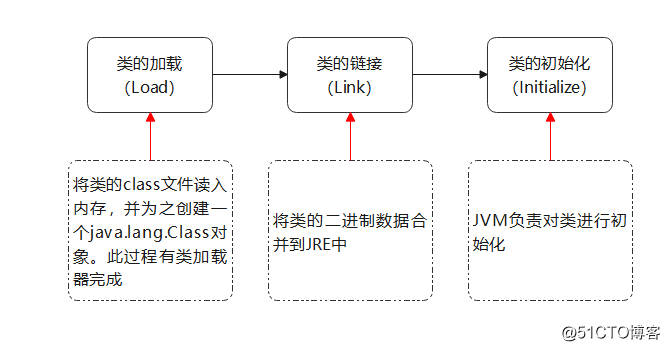
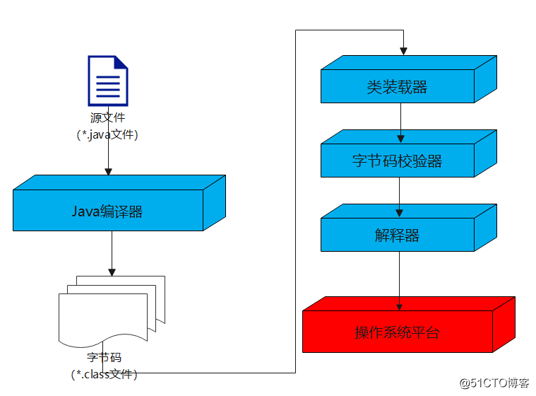
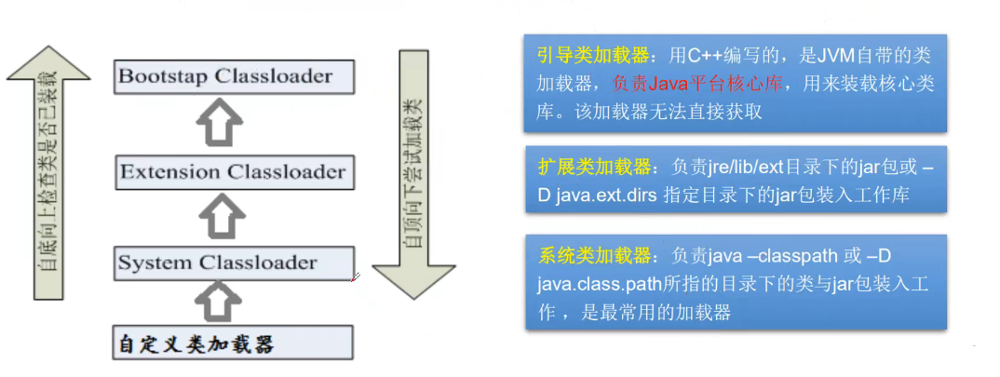

# 注射与反解

## 注解（Annotation）

### 什么是注解

Annotation是从JDK5.0开始引入的新技术。

Annotation的作用 ：

- 不是程序本身(可以对程序作出解释。（这一点和注释没什么区别）
- **可以被其他程序（比如：编译器）读取**。

Annotation的格式：注解是以``"@注释名"``在代码中存在的, 还可以添加一些参数值,例如:``@SuppressWarnings(value="unchecked")``.

Annotation可以附加在package , class , method , field等上面,相当于给他们添加了额外的辅助信息，**我们可以通过反射机制编程实现对这些元数据的访问**。

### 内置注解

- `@Override` : 定义在``java.lang.Override`中，此注释只适用于修辞方法，表示一个方法声明打算重写超类中的另一个方法声明。
- `@Deprecated` :定义在``java.lang.Deprecated`中，此注释可以用于修辞方法，属性，类，表示不鼓励程序员使用这样的元素，通常是因为它很危险或者存在更好的选择。（表示该元素被弃用，不被鼓励使用）
- `@SuppressWarnings` : 定义在``java.lang.SuppressWarnings`中，用来抑制编译时的警告信息，与前两个注释有所不同，你需要添加一个参数才能正确使用，这些参数都是已经定义好了的,我们选择性的使用就好了。（一般不推荐使用）
  - `@SuppressWarnings("all")`
  - `@SuppressWarnings("unchecked")`
  - `@SuppressWarnings(value={"unchecked","deprecation"})`
  - …

### 元注解

**元注解的作用就是负责注解其他注解**，Java定义了4个标准的meta-annotation类型，他们被用来提供对其他annotation类型作说明。

这些类型和它们所支持的类在``java.lang.annotation``包中可以找到。``( @Target , @Retention，@Documented , @Inherited )``

- `@Target` ：用于描述注解的使用范围(即:被描述的注解可以用在什么地方)
- `@Retention`：表示需要在什么级别保存该注释信息，用于描述注解的生命周期
  - (SOURCE < CLASS < **RUNTIME**)
- `@Document`：说明该注解将被包含在javadoc中
- `@Inherited`：说明子类可以继承父类中的该注解

```java
public class Test02 {
    @MyAnnotation
    public void test() {

    }
}

// 定义一个注解
// Target：表示注解可以使用在什么地方
@Target(value = {ElementType.METHOD, ElementType.TYPE})
// Retention：表示注解在什么地方还有效
@Retention(value = RetentionPolicy.RUNTIME)
// Documented：表示是否将注解生成在Javadoc中
@Documented
// Inherited：表示子类可以继承父类的注解
@Inherited
@interface MyAnnotation {
}
```

### 自定义注解

使用`@interface`自定义注解时,自动继承了``java.lang.annotation.Annotation`接口。

分析：

- `@interface`用来声明一个注解,格式： `public @interface 注解名{定义内容}`
- 其中的每一个方法实际上是声明了一个配置参数。
- 方法的名称就是参数的名称。
- 返回值类型就是参数的类型(返回值只能是基本类型，Class，String，enum )。
- 可以通过default来声明参数的默认值。
- 如果只有一个参数成员，一般参数名为value。
- 注解元素必须要有值，我们定义注解元素时,经常使用空字符串，0作为默认值。

```java
public class Test03 {

    @MyAnnotation2(name = "hutao")
    public void test(){

    }
}

@Target(value = {ElementType.METHOD,ElementType.TYPE})
@Retention(value = RetentionPolicy.RUNTIME)
@interface MyAnnotation2{
    // 注解的番薯：参数类型 + 参数名()
    String name() default ""; // 如果没事设置默认值，则必须给注解进行赋值
    int id() default -1; // 如果默认为-1，表示不存在
    String[] schools() default {"1","2"};
}

@Target(value = {ElementType.METHOD,ElementType.TYPE})
@Retention(value = RetentionPolicy.RUNTIME)
@interface MyAnnotation3{
    String value(); // 默认规则，如果参数只有一个，则命名为value
                    // 则不需要在注解上进行指定参数，因为默认参数名称就是value
}
```

## 反射（Reflection）

### 静态语言VS动态语言

#### 动态语言

- 是一类在运行时可以改变其结构的语言：例如新的函数、对象、甚至代码可以被引进，已有的函数可以被删除或是其他结构上的变化。通俗点说就是在运行时代码可以根据某些条件改变自身结构。
- 主要动态语言: Object-C、 C#、 JavaScript、 PHP、Python等。

#### 静态语言

- 与动态语言相对应的,运行时结构不可变的语言就是静态语言。如Java、 C、C++。
- Java不是动态语言，但Java可以称之为“准动态语言”。即Java有一 定的动态性,我们可以利用反射机制获得类似动态语言的特性。Java的动态性让编程的时候更加灵活！

### Java反射机制概述

Reflection (反射)是Java被视为动态语言的关键，反射机制允许程序在执行期借助于Reflection API取得任何类的内部信息，并能**直接操作任意对象的内部属性及方法**。

```java
Class c = Class.forName("java.lang String")
```

**加载完类之后,在堆内存的方法区中就产生了一个Class类型的对象(一个类只有一个Class对象)**，这个对象就包含了完整的类的结构信息。我们可以通过这个对象看到类的结构。这个对象就像一面镜子， 透过这个镜子看到类的结构，所以我们形象的称之为：反射。


```java
public class Test02 {

    public static void main(String[] args) throws ClassNotFoundException {
        // 通过反射获取类的Class对象
        Class  c1 = Class.forName("com.easy.reflection.User");
        System.out.println(c1);

        // 一个类在内存中只有一个Class对象，一个类被加载后，类的整个结构都会被封装到Class对象中

    }

}

// 实体类
class User{
    private String name;

    public User(){}

    public User(String name){this.name=name;}

    public String getName() {
        return name;
    }

    public void setName(String name) {
        this.name = name;
    }

    @Override
    public String toString() {
        return "User{" +
            "name='" + name + '\'' +
            '}';
    }
}
```

### Java反射优点和缺点

- 优点：可以实现动态创建对象和编译，体现出很大的灵活性
- 缺点：对性能有影响，使用反射基本上是一种解释操作，我们可以告诉JVM,我们希望做什么并且它满足我们的要求。这类操作总是慢于直接执行相同的操作。

### 反射相关的主要API

| API                             | 描述             |
| ------------------------------- | ---------------- |
| `java.lang.Class`               | 代表一个类       |
| `java.lang.reflect.Method`      | 代表类的方法     |
| `java.lang.reflect.Field`       | 代表类的成员变量 |
| `java.lang.reflect.Constructor` | 代表类的构造器   |

### Class类详解

在Object类中定义了以下的方法，此方法将被所有子类继承。

```java
public final Class getClass()
```

以上的方法返回值的类型是一个Class类,此类是Java反射的源头，实际上所谓反射从程序的运行结果来看也很好理解，即可以通过对象反射求出类的名称。

对象照镜子后可以得到的信息：某个类的属性、方法和构造器、某个类到底实现了哪些接口。对于每个类而言，JRE都为其保留一个不变的Class类型的对象。一个Class对象包含了特定某个结构``(class/interface/enum/annotation/primitive type/void/[])``的有关信息。

- Class本身也是一个类
- Class对象只能由系统建立对象
- 一个加载的类在JVM中只会有一 个Class实例
- 一个Class对象对应的是一个加载到JVM中的一个`.class`文件
- 每个类的实例都会记得自己是由哪个Class实例所生成
- 通过Class可以完整地得到一个类中的所有被加载的结构
- Class类 是Reflection的根源，针对任何你想动态加载、运行的类) 唯有先获得相应的Class对象

### Class类常用方法

| 方法名                                  | 功能说明                                                     |
| --------------------------------------- | ------------------------------------------------------------ |
| static ClassforName(String name)        | 返回指定类名name的Class对象                                  |
| Object newInstance()                    | 调用缺省构造函数，返回Class对象的一个实例                    |
| getName()                               | 返回此Class对象所表示的实体（类，接口，数组类或void）的名称。 |
| Class getSuperClass()                   | 返回当前Class对象的父类的Class对象                           |
| Class[] getinterfaces()                 | 获取当前Class对象的接口                                      |
| ClassLoader getClassLoader()            | 返回该类的类加载器                                           |
| Constructor[] getConstructors()         | 返回一个包含某些Constructor对象的数组                        |
| Method getMothed(String name,Class.. T) | 返回一个Method对象，此对象的形参类型为 paramType             |
| Field[] getDeclaredFields()             | 返回Field对象的一个数组                                      |

#### 获取Class类的实例

* 若已知具体的类， 通过类的class属性获取, 该访法最为安全可靠,程序性能最高。

```java
Class class = Person.class;
```

* 已知某个类的实例， 调用该实例的getClass()方法获取Class对象

```java
Class class = person.getClass();
```

* 已知一个类的全类名，且该类在类路径下，可通过Class类的静态方法forName()获取可能抛出ClassNotFoundException

```java
Class class = Class forName("demo01. Student");
```

* 内置基本数据类型可以直接用类名.Type

* 还可以利用ClassLoader

```java
public class Test03 {
    public static void main(String[] args) throws ClassNotFoundException {
        Person person = new Student();
        System.out.println("我是"+person.name);

        // 方式一：通过对象获得
        Class c1 = person.getClass();
        System.out.println(c1.hashCode());

        // 方式二：通过forName获得
        Class c2 = Class.forName("com.easy.reflection.Student");
        System.out.println(c2.hashCode());

        // 方式三：通过类名.class得到
        Class c3 = Student.class;
        System.out.println(c3.hashCode());

        // 方式四：基本内置类型的包装类都有一个Type属性
        Class c4 = Integer.TYPE;

        // 方式五：获得父类类型
        Class c5 = c1.getSuperclass();
        System.out.println(c5);
        
    }
}

class Person{
    public String name;

    public Person() {}

    public Person(String name) {
        this.name = name;
    }

    @Override
    public String toString() {
        return "Person{" +
                "name='" + name + '\'' +
                '}';
    }
}

class Student extends Person{
    public Student(){
        this.name = "学生";
    }
}

class Teacher extends Person{
    public Teacher(){
        this.name = "老师";
    }
}
```

#### 所有类型的Class对象

- `class`：外部类，成员(成员内部类，静态内部类)，局部内部类，匿名内部类。
- `interface` ：接口
- `[]`：数组
- `enum`：枚举
- `annotation`：注解@interface
- `primitive type`：基本数据类型
- `void`

```java
// 所有类型的Class
public class Test04 {
    public static void main(String[] args) {
        Class c1 = Object.class; // 类
        Class c2 = Comparable.class; // 接口
        Class c3 = String[].class; // 一维数组
        Class c4 = int[][].class; // 二维数组
        Class c5 = Override.class; // 注解
        Class c6 = ElementType.class; // 枚举类型
        Class c7 = Integer.class; // 基本数据类型
        Class c8 = void.class; // void
        Class c9 = Class.class; // Class
    }
}
```

### Java内存分析


### 类加载过程与ClassLoader的理解（了解）

当程序主动使用某个类时，如果该类还未被加载到内存中，则系统会通过如下三个步骤来对该类进行初始化。



**加载**：将class文件字节码内容加载到内存中，并将这些静态数据转换成方法区的运行时数据结构，然后生成一个代表这个类的`java.lang.Class`对象.

**链接**：将Java类的二进制代码合并到JVM的运行状态之中的过程。

* 验证：确保加载的类信息符合JVM规范，没有安全方面的问题
* 准备：**正式为类变量(static) 分配内存并设置类变量默认初始值的阶段,这些内存都将在方法区中进行分配。**
* 解析：虚拟机常量池内的符号引用(常量名)替换为直接引用(地址)的过程。

**初始化**：

* 执行类构造器``< clinit> ()``方法的过程。类构造器``< clinit> ()``方法是由编译期自动收集类中所有类变量的赋值动作和静态代码块中的语句合并产生的。(类构造器是构造类信息的，不是构造该类对象的构造器)。
* 当初始化一个类的时候，如果发现其父类还没有进行初始化，则需要先触发其父类的初始化。
* 虚拟机会保证一 个类的``< clinit>()``方法在多线程环境中被正确加锁和同步。

#### 什么时候会发生类初始化

类的主动引用(一定会发生类的初始化)：

* 当虚拟机启动，先初始化main方法所在的类
* new一个类的对象
* 调用类的静态成员(除了final常量)和静态方法
* 使用`java.lang.reflect`包的方法对类进行反射调用
* 当初始化一个类, 如果其父类没有被初始化，则先会初始化它的父类

类的被动引用(不会发生类的初始化)：

* 当访问一个静态域时，只有真正声明这个域的类才会被初始化。如：当通过子类引用父类的静态变量，不会导致子类初始化
* 通过数组定义类引用，不会触发此类的初始化（是因为只是申请了空间，而没有真正的去初始化这个类的实例）
* 引用**常量**不会触发此类的初始化（常量在链接阶段就存入调用类的常量池中了）（是因为常量和静态变量在类被加载的时候，就已经单独给其开辟了空间进行存储，因此可以通过class直接进行引用）

#### 类加载器的作用



- **类加载的作用**：将class文件字节码内容加载到内存中，并将这些静态数据转换成方法区的运行时数据结构，然后在堆中生成一个代表这个类的java.lang(Class对象)作为方法区中类数据的访问入口。
- **类缓存**：标准的JavaSE类加载器可以按要求查找类,但一旦某企类被加载到类加载器中，它将维持加载(缓存) 一段时间。不过JVM垃圾回收机制可以回收这些Class对象

类加载器作用是用来把类(class)装载进内存的。JVM规范走义了如下类型的类的加载器。



- **引导类加载器（Bootstrap Classloader），又称为根类加载器**：它负责加载 Java 的核心库（JAVA_HOME/jre/lib/rt.jar 等或 sun.boot.class.path 路径下的内容），是用原生代码（C/C++）来实现的，并不继承自 java.lang.ClassLoader，所以通过 Java 代码获取引导类加载器对象将会得到 null。（只有核心类库如 String 才使用 引导类加载器）
- **扩展类加载器（Extension Classloader**）：它由 sun.misc.Launcher$ExtClassLoader 实现，是 java.lang.ClassLoader 的子类，负责加载 Java 的扩展库（JAVA_HOME/jre/ext/*.jar或java.ext.dirs路径下的内容）
- **应用程序（系统）类加载器（Application Classloader）**：它由 sun.misc.Lanuncher$AppClassLoader 实现，是 java.lang.ClassLoader 的子类，负责加载 Java 应用程序类路径（classpath、java.class.path）下的内容。（通俗的讲：项目的路径bin文件夹下的字节码，以及如果你配置了环境变量classpath）
- **自定义类加载器**：开发人员可以通过继承java.lang.ClassLoader类的方式实现自己的类加载器，以满足一些特殊的需求，例如对字节码进行加密来避免class文件被反编译，或者加载特殊目录下的字节码数据。

```java
public class Test07 {
    public static void main(String[] args) throws ClassNotFoundException {
        // 获取系统类加载器
        ClassLoader systemClassLoader = ClassLoader.getSystemClassLoader();
        System.out.println(systemClassLoader);

        // 获取系统类加载的父类加载器 -- 扩展类加载器
        ClassLoader parentClassLoader = systemClassLoader.getParent();
        System.out.println(parentClassLoader);

        // 获取扩展加载器的父类加载器 -- 根加载器（由C/C++编写）
        ClassLoader rootClassLoader = parentClassLoader.getParent();
        System.out.println(rootClassLoader);

        // 测试当前类是哪个加载器加载的
        ClassLoader classLoader1 = Class.forName("com.easy.reflection.Test07").getClassLoader();
        System.out.println(classLoader1);

        // 测试JDK内置的类是谁加载的
        ClassLoader classLoader2 = Class.forName("java.lang.Object").getClassLoader();
        System.out.println(classLoader2);

        // 如何获得系统类加载器可以加载的路径
        System.out.println(System.getProperty("java.class.path"));
    }
}

```


**双亲委派机制**：如果自己定义和`jdk`同名的类，运行时虚拟机会在系统的类加载器中寻找，再去扩展类加载器中寻找，再去根加载器中寻找，如果存在同名的类，会使用根加载器中的类，而不使用自己定义的类。

#### 创建运行时的类对象

```java
// 获得类的信息
public class Test08 {
    public static void main(String[] args) {
        Class c1 = Class.forName("com.easy.reflection.User");
    }
}
```

##### 获取运行时类的完整结构

* 获取类的名字
  * `c.getName()`：获取完整的包名以及类名
  * `c.getSimpleName()`：获得类名
* 获得类的属性
  * `c.getFields()`：获取类的公开属性和父类的公开属性
  * `c.getDeclaredFields()`：获得获取类的任何属性
* `c.getDeclaredField("name")`获得指定属性的值
* 获得类的方法
  * `c.getMethods()`：获得当前类和父类的所有public方法
  * `c.getDeclaredMethods()`：获得当前类的所有方法
* `c.getMethod("getName", null)`获得指定方法（需要传递参数，是因为存在重载，可以通过参数找到指定的方法）
* 获得构造器` c.getConstructors()`和`c.getDeclaredConstructors()`
* `c.getDeclaredConstructor(String.class)`获得指定的构造器，里面的参数是对应对象的参数类型。

> 小结：
>
> 1. 在实际的操作中，取得类的信息的操作代码〕并不会经常开发。
> 2. 一定要熟悉``java.lang.reflec``t包的作用，反射机制。
> 3. 如何取得属性、方法、构造器的名称，修饰符等。

##### 动态创建对象执行方法

如果想通过获得Class对象后进行创建类的对象，可以通过`newInstance()`方法创建对象，但是本质上会默认调用类的无参构造器。

因此，类必须有一个无参构造器，而且类的构造器的访问权限需要足够，不然会报错。

```java
// 动态的创建对象，通过反射
public class Test09 {
    public static void main(String[] args) throws InstantiationException, IllegalAccessException, ClassNotFoundException {
        // 获得Class对象
        Class c1 = Class.forName("com.easy.reflection.User");
        // 构造一个对象
        User user = (User) c1.newInstance(); // 本质上默认调用了类的无参构造器
        System.out.println(user.toString());
    }
}

// 实体类
class User{
    private String name;
    private int age;

    public User() {}

    public User(String name, int age) {
        this.name = name;
        this.age = age;
    }

    public String getName() {
        return name;
    }

    public void setName(String name) {
        this.name = name;
    }

    public int getAge() {
        return age;
    }

    public void setAge(int age) {
        this.age = age;
    }

    @Override
    public String toString() {
        return "User{" +
                "name='" + name + '\'' +
                ", age=" + age +
                '}';
    }
}
```

如果想要使用有参构造器，可以使用Class类的`getDeclaredConstructor(Class...parameterTypes)`取得本类的有参构造器。其中`parameterTypes`是类的顺序对应的属性类型，而且通过该方法创建的对象类型为`Constructor`。

```java
// 动态的创建对象，通过反射
public class Test09 {
    public static void main(String[] args) throws InvocationTargetException, InstantiationException, IllegalAccessException, ClassNotFoundException, NoSuchMethodException {
        
        Class c1 = Class.forName("com.easy.reflection.User");
        
        // 通过构造器创建对象
        Constructor constructor = c1.getDeclaredConstructor(String.class,int.class);
        User user1 = (User) constructor.newInstance("hutao",18);
        System.out.println(user1.toString());

    }
}
```

如果不想使用构造器，可以通过反射调用普通方法。其中调用方法的参数含义如下：

* `c1.getDeclaredMethod(初始化方法名称,参数类型.class)`
* `setName.invoke(对象, 传递的参数值);`

```java
// 动态的创建对象，通过反射
public class Test09 {
    public static void main(String[] args) throws ClassNotFoundException, InstantiationException, IllegalAccessException, NoSuchMethodException, InvocationTargetException {

        Class c1 = Class.forName("com.easy.reflection.User");
        
        // 通过反射调用普通方法
        User user3 = (User) c1.newInstance();
        // 通过反射调用执行方法
        Method setName = c1.getDeclaredMethod("setName",String.class);
        setName.invoke(user3, "胡桃");

        Method setAge = c1.getDeclaredMethod("setAge", int.class);
        setAge.invoke(user3, 18);

        System.out.println(user3.toString());

    }
}
```

还有一种方法可以直接操作类的属性，但是类的属性一般都是设置为private，所以说不建议使用该方法，了解即可。

```java
// 动态的创建对象，通过反射
public class Test09 {
    public static void main(String[] args) throws InstantiationException, IllegalAccessException, ClassNotFoundException, NoSuchFieldException {
        
        Class c1 = Class.forName("com.easy.reflection.User");

        // 通过反射操作属性
        User user4 = (User) c1.newInstance();
        Field name = c1.getDeclaredField("name");
        name.setAccessible(true); // 关闭程序的安全检测的权限，一般情况下是private，禁止访问的
        name.set(user4, "hutao");
        System.out.println(user4.getName());

    }
}
```

## 性能对比分析

**setAccessible作用**

* Method和Field、Constructor对象都有setAccessible()方法。
* setAccessible作用是启动和禁用访问安全检查的开关。
* 参数值为true则指示反射的对象在使用时应该取消Java语言访问检查。
* **提高反射的效率。如果代码中必须用反射，而该句代码需要频繁的被调用，那么请设置为true。**
* 使得原本无法访问的私有成员也可以访问
* 参数值为false则指示反射的对象应该实施Java语言访问检查

```java
public class Test10 {
    
    public static void main(String[] args) throws NoSuchMethodException, IllegalAccessException, InvocationTargetException {
        test1();//5ms     //普通方式调用
        test2();//4114ms  //反射方式调用
        test3();//1483ms  //反射方式调用 关闭检测
    }
    
    //普通方式调用
    public static void test1(){
        User user = new User();
        long start = System.currentTimeMillis();
        for (int i = 0; i < 1000000000; i++) {
            user.getName();
        }
        long end = System.currentTimeMillis();
        System.out.println(end-start+"ms");
    }
    
    //反射方式调用
    public static void test2() throws NoSuchMethodException, InvocationTargetException, IllegalAccessException {
        User user = new User();
        Class c1 = user.getClass();
        Method getName = c1.getDeclaredMethod("getName",null);
        long start = System.currentTimeMillis();
        for (int i = 0; i < 1000000000; i++) {
            getName.invoke(user,null);
        }
        long end = System.currentTimeMillis();
        System.out.println(end-start+"ms");
    }
    
    //反射方式调用 关闭检测
    public static void test3() throws NoSuchMethodException, InvocationTargetException, IllegalAccessException {
        User user = new User();
        Class c1 = user.getClass();
        Method getName = c1.getDeclaredMethod("getName",null);
        getName.setAccessible(true);
        long start = System.currentTimeMillis();
        for (int i = 0; i < 1000000000; i++) {
            getName.invoke(user,null);
        }
        long end = System.currentTimeMillis();
        System.out.println(end-start+"ms");
    }
}
```

## 反射操作泛型（了解）

- Java采用泛型擦除的机制来引入泛型, Java中的泛型仅仅是给编译器javac使用的，确保数据的安全性和免去强制类型转换问题,但是, 一旦编译完成,所有和泛型有关的类型全部擦除
- 为了通过反射操作这些类型, Java新增了``ParameterizedType``， `GenericArrayType`，``TypeVariable``和``WildcardType``几种类型来代表不能被归一到Class类中的类型但是又和原始类型齐名的类型。
  - `ParameterizedType`：表示一种参数化类型，比如``Collection<String>``
  - `GenericArrayType` ：表示一种元素类型是参数化类型或者类型变量的数组类型
  - `TypeVariable` ：是各种类型变量的公共父接口
  - `WildcardType` ：代表一种通配符类型表达式

**获取泛型方法的参数类型**：

```java
// 通过反射获取类型
public class Test11 {

    public void test01(Map<String,User> map, List<User> list){
        System.out.println("test01");
    }

    public static void main(String[] args) throws NoSuchMethodException {

        // 调用方法，需要调用getMethod指定函数名称以及对应的参数类型.class
        Method method = Test11.class.getMethod("test01", Map.class, List.class);

        // 获取泛型的参数类型
        Type[] genericParameterTypes = method.getGenericParameterTypes();

        // 遍历
        for(Type genericParameterType:genericParameterTypes) {
            System.out.println(genericParameterType);

            // 获取内部的泛型参数类型
            if(genericParameterType instanceof ParameterizedType){

                Type[] actualTypeArguments = ((ParameterizedType) genericParameterType).getActualTypeArguments();

                for(Type actualTypeArgument:actualTypeArguments){
                    System.out.println(actualTypeArgument);
                }
            }
        }
    }
}
```

**获取泛型方法的返回值**：

```java
// 通过反射获取类型
public class Test11 {

    public Map<String,User> test02(){
        System.out.println("test02");
        return null;
    }

    public static void main(String[] args) throws NoSuchMethodException {

        // 调用方法，需要调用getMethod指定函数名称以及对应的参数类型.class(如果没有，就填写为null)
        Method method2 = Test11.class.getMethod("test02", null);

        // 获取返回值的参数类型
        Type genericReturnType = method2.getGenericReturnType();
        if(genericReturnType instanceof  ParameterizedType){
            Type[] actualTypeArguments= ((ParameterizedType) genericReturnType).getActualTypeArguments();
            for(Type actualTypeArgument:actualTypeArguments){
                System.out.println(actualTypeArgument);
            }
        }
    }
}

```

## 反射操作注解

- getAnnotations
- getAnnotation

> 利用注解和反射完成类和表结构的映射关系

* 创建一个`Student`类

```java
class Student{
    private int id;
    private int age;
    private String name;

    public Student() {
    }

    public Student(int id, int age, String name) {
        this.id = id;
        this.age = age;
        this.name = name;
    }

    public int getId() {
        return id;
    }

    public void setId(int id) {
        this.id = id;
    }

    public int getAge() {
        return age;
    }

    public void setAge(int age) {
        this.age = age;
    }

    public String getName() {
        return name;
    }

    public void setName(String name) {
        this.name = name;
    }

    @Override
    public String toString() {
        return "Student{" +
                "id=" + id +
                ", age=" + age +
                ", name='" + name + '\'' +
                '}';
    }
}
```

* 创建注解

```java
// 类名的注解
@Target(ElementType.TYPE)           // 什么类型可以使用，这里表示的是在类上可以使用
@Retention(RetentionPolicy.RUNTIME) // 在什么时候可以运行
@interface ClassInfo{
    String value();
}

// 属性的注解
@Target(ElementType.FIELD)           // 什么类型可以使用，这里表示的是在类的属性上可以使用
@Retention(RetentionPolicy.RUNTIME) // 在什么时候可以运行
@interface FieldInfo{
    String columnName();
    String type();
    int length();
}
```

* 修改``Student``类

```java
@ClassInfo("db_student")
class Student{
    @FieldInfo(columnName = "db_id",type = "int",length = 10)
    private int id;
    @FieldInfo(columnName = "db_age",type = "int",length = 10)
    private int age;
    @FieldInfo(columnName = "db_name",type = "varchar",length = 5)
    private String name;
    
    ...
        
}
```

* 通过反射和注解完成类和表结构的映射关系

```java
public class Test12 {

    public static void main(String[] args) throws ClassNotFoundException, NoSuchFieldException {
        // 1. 通过反射获取Class对象
        Class c1 = Class.forName("com.easy.reflection.Student");

        // 2. 通过反射获得类的注解
        Annotation[] annotations = c1.getAnnotations();
        for(Annotation annotation:annotations){
            System.out.println(annotation);
        }

        // 3. 通过反射获得类的注解中的参数value的值
        ClassInfo classInfo = (ClassInfo) c1.getAnnotation(ClassInfo.class);
        String value = classInfo.value();
        System.out.println(value);

        // 4. 通过指定字段获得类属性的注解
        Field field = c1.getDeclaredField("name");
        FieldInfo fieldInfo = field.getAnnotation(FieldInfo.class);
        System.out.println(fieldInfo.columnName());
        System.out.println(fieldInfo.type());
        System.out.println(fieldInfo.length());

    }

}
```

