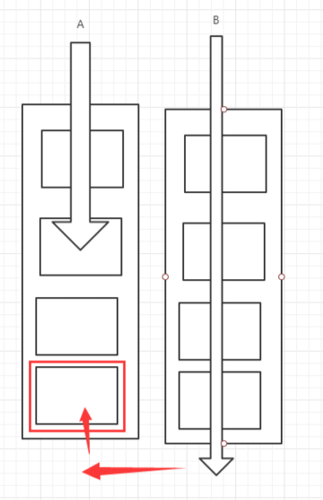

# JUC并发编程

## 什么是JUC

**源码+官方文档**


JUC是 在Java 5.0添加的 **java.util.concurrent**包的简称，目的就是为了更好的支持高并发任务， 让开发者利用这个包进行的多线程编程时可以有效的减少竞争条件和死锁线程。

- 业务：普通的线程代码Thread
- Runnable没有返回值，效率比Callable相对低。


JUC是继承Callable接口的。

## 线程和进程

### 线程与进程概念

进程是一个程序，一个进程往往可以包含多个线程（至少一个线程）。

Java默认有2个线程：main线程，GC线程。

线程是进程中的一个方法，比如进程是一个音乐软件，其中后台下载音乐就是一个线程。

对于Java而言：Thread、Runnable、Callable 

**Java 真的可以开启线程吗？ 开不了**

```java
public synchronized void start() {
    /**
         * This method is not invoked for the main method thread or "system"
         * group threads created/set up by the VM. Any new functionality added
         * to this method in the future may have to also be added to the VM.
         *
         * A zero status value corresponds to state "NEW".
         */
    if (threadStatus != 0)
        throw new IllegalThreadStateException();

    /* Notify the group that this thread is about to be started
         * so that it can be added to the group's list of threads
         * and the group's unstarted count can be decremented. */
    group.add(this);

    boolean started = false;
    try {
        start0();
        started = true;
    } finally {
        try {
            if (!started) {
                group.threadStartFailed(this);
            }
        } catch (Throwable ignore) {
            /* do nothing. If start0 threw a Throwable then
                  it will be passed up the call stack */
        }
    }
}
// 本地方法，底层c++，java无法直接操作硬件
private native void start0();
```

### 并发与并行

并发编程：并发、并行

并发（多线程操作同一个资源）：CPU 一核 ，模拟出来多条线程，天下武功，唯快不破，快速交替

并行（多个人一起行走）：CPU 多核 ，多个线程可以同时执行； 线程池

```java
public class Test01 {
    public static void main(String[] args) {
        // 获取CPU核数
        // CPU 密集型，IO密集型
        System.out.println(Runtime.getRuntime().availableProcessors());
    }
}
```

并发编程的本质：**充分利用CPU的资源**

所有的公司都很看重！

企业，挣钱=> 提高效率，裁员，找一个厉害的人顶替三个不怎么样的人；

人员（减） 、技术成本（高）

### 线程状态

```java
public enum State {

    // 新生
    NEW,

    // 运行
    RUNNABLE,

    // 阻塞
    BLOCKED,

    // 就绪
    // 等待
    WAITING,
    // 超时等待
    TIMED_WAITING,

    //终止
    TERMINATED;
}

```

### wait与sleep的区别

* 来与不同的类
  * wait：在Object类中
  * sleep：在Thread类中
* 关于锁的释放：wait会释放锁，sleep是抱着锁睡觉的，不会释放。
* 使用的范围是不同的
  * wait只能在同步代码块中使用
  * sleep是在任何地方使用
* 是否需要捕获异常
  * wait不需要捕获异常
  * sleep需要捕获异常

## Lock锁（重点）

### 多线程操作资源

```java
/**
 * 真正的多线程开发，公司中的开发使用JUC并发，需要降低耦合性
 * 线程就是一个单独的资源类，没有任何附属的操作
 */
// 基本的买票例子
public class SaleTicketDemo {

    public static void main(String[] args) {
        // 并发；多线程操作同一个操作资源，把资源类丢入线程
        Ticket ticket = new Ticket();

        new Thread(()->{
            for(int i=0;i<20;i++) ticket.sale();
        },"A").start();

        new Thread(()->{
            for(int i=0;i<20;i++) ticket.sale();
        },"B").start();

        new Thread(()->{
            for(int i=0;i<20;i++) ticket.sale();
        },"C").start();

    }

}

class Ticket{
    //属性、方法
    private int number = 50;

    // 买票的方式
    public void sale(){
        if(number > 0){
            System.out.println(Thread.currentThread().getName() + "卖出了" + (number--)+"票，剩余："+number);
        }
    }
}
```

会出现多个线程争夺资源，而导致顺序不对。

### 传统的Synchronized

其实就是让多个线程进行排队进行操作。

```java
class Ticket{
    //属性、方法
    private int number = 50;

    // 买票的方式
    public synchronized void sale(){
        if(number > 0){
            System.out.println(Thread.currentThread().getName() + "卖出了" + (number--)+"票，剩余："+number);
        }
    }
}
```

### Lock接口


公平锁：十分公平：可以先来后到 

**非公平锁：十分不公平：可以插队 （默认）**

```java
// Lock三部曲
// 1、 new ReentrantLock();
// 2、 lock.lock(); // 加锁
// 3、 finally=> lock.unlock(); // 解锁
class Ticket{
    //属性、方法
    private int number = 50;

    private Lock lock = new ReentrantLock();

    // 买票的方式
    public void sale(){

        lock.lock(); //加锁

        try { // 业务代码
            if(number > 0){
                System.out.println(Thread.currentThread().getName() + "卖出了" + (number--)+"票，剩余："+number);
            }
        }finally { // 解锁
            lock.unlock();
        }
    }
}
```

### Synchronized 和 Lock 区别

1. Synchronized 内置的Java关键字， Lock 是一个Java类 
2. Synchronized 无法判断获取锁的状态，Lock 可以判断是否获取到了锁
3. Synchronized 会自动释放锁，lock 必须要手动释放锁！如果不释放锁，**死锁**
4. Synchronized 线程 1（获得锁，阻塞）、线程2（等待，傻傻的等）；Lock锁就不一定会等待下 去； 
5. Synchronized 可重入锁，不可以中断的，非公平；Lock ，可重入锁，可以 判断锁，非公平（可以 自己设置）；
6. **Synchronized 适合锁少量的代码同步问题，Lock 适合锁大量的同步代码！**
7. **使用Lock锁，JVM将花费较少的时间来调度线程，性能更好，并且具有更好的扩展性（提供更多的子类）。**

思考：锁是什么，如何判断锁是谁的？

## 生产者和消费者问题

面试的：单例模式、排序算法、生产者和消费者，死锁

### 生产者和消费者问题Synchronized版本

```java
/**
 * 线程之间的通信问题：生产者和消费者问题！等待唤醒、通知唤醒
 * 线程交替执行A、B操作同一个变量num=0
 * A num+1
 * B num-1
 *
 * 例子：信号灯0-1
 */
public class Main {
    public static void main(String[] args) {
        Data data = new Data();
        new Thread(()->{
            for(int i=0;i<10;i++){
                try {
                    data.increment();
                } catch (InterruptedException e) {
                    e.printStackTrace();
                }
            }
        },"A").start();
        new Thread(()->{
            for(int i=0;i<10;i++){
                try {
                    data.decrement();
                } catch (InterruptedException e) {
                    e.printStackTrace();
                }
            }
        },"B").start();
    }
}

// 等待、业务、通知
class Data{ //资源
    private int number = 0;

    public synchronized void increment() throws InterruptedException {
        if(number != 0){
            //等待
            this.wait();
        }
        number++;
        System.out.println(Thread.currentThread().getName() + "->" + number);
        //通知其他线程，我做完了
        this.notifyAll();
    }

    public synchronized void decrement() throws InterruptedException {
        if(number == 0){
            //等待
            this.wait();
        }
        number--;
        System.out.println(Thread.currentThread().getName() + "->" + number);
        //通知其他线程，我做完了
        this.notifyAll();
    }
}
```

### 问题存在，A、B、C、D4个线程！虚假唤醒

这种问题会造成死锁问题。将`if`判断替换成`while`判断。


```java
/**
 * 线程之间的通信问题：生产者和消费者问题！等待唤醒、通知唤醒
 * 线程交替执行A、B操作同一个变量num=0
 * A num+1
 * B num-1
 *
 * 例子：信号灯0-1
 */
public class Main {
    public static void main(String[] args) {
        Data data = new Data();

        new Thread(()->{
            for(int i=0;i<10;i++){
                try {
                    data.increment();
                } catch (InterruptedException e) {
                    e.printStackTrace();
                }
            }
        },"A").start();

        new Thread(()->{
            for(int i=0;i<10;i++){
                try {
                    data.decrement();
                } catch (InterruptedException e) {
                    e.printStackTrace();
                }
            }
        },"B").start();

        new Thread(()->{
            for(int i=0;i<10;i++){
                try {
                    data.increment();
                } catch (InterruptedException e) {
                    e.printStackTrace();
                }
            }
        },"C").start();

        new Thread(()->{
            for(int i=0;i<10;i++){
                try {
                    data.decrement();
                } catch (InterruptedException e) {
                    e.printStackTrace();
                }
            }
        },"D").start();
    }
}

// 等待、业务、通知
class Data{ //资源
    private int number = 0;

    public synchronized void increment() throws InterruptedException {
        while (number != 0){
            //等待
            this.wait();
        }
        number++;
        System.out.println(Thread.currentThread().getName() + "->" + number);
        //通知其他线程，我做完了
        this.notifyAll();
    }

    public synchronized void decrement() throws InterruptedException {
        while (number == 0){
            //等待
            this.wait();
        }
        number--;
        System.out.println(Thread.currentThread().getName() + "->" + number);
        //通知其他线程，我做完了
        this.notifyAll();
    }
}
```

### JUC版的生产者和消费者问题


```java
/**
 * 线程之间的通信问题：生产者和消费者问题！等待唤醒、通知唤醒
 * 线程交替执行A、B操作同一个变量num=0
 * A num+1
 * B num-1
 * <p>
 * 例子：信号灯0-1
 */
// 等待、业务、通知
class Data2 { //资源
    private int number = 0;

    Lock lock = new ReentrantLock();
    Condition condition = lock.newCondition();

    public void increment() {
        lock.lock();
        try {
            while (number != 0) {
                //等待
                condition.await();
            }
            number++;
            System.out.println(Thread.currentThread().getName() + "->" + number);
            //通知其他线程，我做完了
            condition.signalAll();

        } catch (Exception e) {
            e.printStackTrace();
        } finally {
            lock.unlock();
        }

    }

    public void decrement() {
        lock.lock();
        try {
            while (number == 0) {
                //等待
                condition.await();
            }
            number--;
            System.out.println(Thread.currentThread().getName() + "->" + number);
            //通知其他线程，我做完了
            condition.signalAll();
        } catch (Exception e) {
            e.printStackTrace();
        } finally {
            lock.unlock();
        }

    }
}
```

#### Condition 精准的通知和唤醒线程

**通过Condition进行顺序执行任务。实际上是通过Condition精确的监视每一个方法，需要手动设置唤醒的指定线程，以及使当前线程等待。**

可以这样理解：班主任通知班长让同学们打卡，班长然后一个一个提醒同学，学生打完卡，汇报给班长，然后班长汇报给班主任。这是顺序的执行，但是中间班长通知所有同学，可以多线程进行。

```java
/**
 * Author: LuoRan
 * Date: 2022/2/27  23:49
 */
public class ConditionCode {
    public static void main(String[] args) {
        Data3 data = new Data3();
        new Thread(()->{
            for(int i=0;i<10;i++)
                data.printA();
        },"A").start();
        new Thread(()->{
            for(int i=0;i<10;i++)
                data.printB();
        },"B").start();
        new Thread(()->{
            for(int i=0;i<10;i++)
                data.printC();
        },"C").start();
    }
}

class Data3{

    private Lock lock = new ReentrantLock();
    private Condition condition1 = lock.newCondition(); 
    private Condition condition2 = lock.newCondition();
    private Condition condition3 = lock.newCondition();

    private int number = 1;//A=1,B=2,C=3

    public void printA(){
        lock.lock();
        try {
            //业务代码
            while (number != 1){
                //A等待
                condition1.await();
            }
            System.out.println(Thread.currentThread().getName() + "=>B");
            number = 2;
            //唤醒指定的人，A现在想唤醒B
            condition2.signal();
        }catch (Exception e){
            e.printStackTrace();
        }finally {
            lock.unlock();
        }
    }

    public void printB(){
        lock.lock();
        try {
            //业务代码
            while (number != 2){
                condition2.await();
            }
            System.out.println(Thread.currentThread().getName() + "=>C");
            number = 3;
            condition3.signal();
        }catch (Exception e){
            e.printStackTrace();
        }finally {
            lock.unlock();
        }
    }

    public void printC(){
        lock.lock();
        try {
            //业务代码
            while (number != 3){
                condition3.await();
            }
            System.out.println(Thread.currentThread().getName() + "=>A");
            number = 1;
            condition1.signal();
        }catch (Exception e){
            e.printStackTrace();
        }finally {
            lock.unlock();
        }
    }
}
```


## 8锁现象

- **两个同步方法，一个对象调用**，标准情况下，两个线程先打印短信还是电话？发短信

- sendSms延迟4秒，两个线程先打印发短信还是 打电话？发短信

**synchronized 锁的是方法的调用者，也就是对象锁。两个方法持有的是同一把锁，因此谁先拿到锁谁先执行**  。

```java
/**
 * 8锁现象：关于锁的8个问题
 * 1. 标准情况下，两个线程先打 发短信还是打电话？ 先1/发短信在2/打电话，因为第一个锁被阻塞了，没有被释放
 */

public class Test1 {
    public static void main(String[] args) {
        Phone phone = new Phone();

        new Thread(()->{
            phone.sendSms();
        },"A").start();
//        try {
//            TimeUnit.SECONDS.sleep(1);
//        } catch (InterruptedException e) {
//            e.printStackTrace();
//        }
        new Thread(()->{
            phone.call();
        },"B").start();

    }
}
class Phone{

    // synchronized锁的对象是方法的调用者
    // 两个方法用的是一个锁，谁先拿到谁就先执行
    public synchronized void sendSms(){
//        try {
//            TimeUnit.SECONDS.sleep(4);
//        } catch (InterruptedException e) {
//            e.printStackTrace();
//        }
        System.out.println("发送短信");
    }

    public synchronized void call(){
        System.out.println("打电话");
    }
}
```

- **一个同步方法，一个普通方法，一个对象调用**，增加一个普通方法后，先执行发短信还是Hello？普通方法，因为这里没有锁，不是同步方法，不受锁的影响

**普通方法没有锁，不需要竞争锁。**

- **两个对象，两个同步方法**，发短信还是打电话？打电话

**synchronized 锁的是方法的调用者，也就是对象锁。两个对象分别调用两个方法持有的是两把把锁，打电话不需要等待。如果不沉睡，锁的是对象，因为是不同的两个对象，所以并不受锁的影响。**

```java
/**
 * 3. 增加一个普通方法后，先执行发短信还是Hello？普通方法
 * 4. 两个对象，两个同步方法，发短信还是打电话？//打电话
 */

public class Test2 {
    public static void main(String[] args) {
        Phone2 phone1 = new Phone2();
        Phone2 phone2 = new Phone2();

        new Thread(()->{
            phone1.sendSms();
        },"A").start();
        try {
            TimeUnit.SECONDS.sleep(1);
        } catch (InterruptedException e) {
            e.printStackTrace();
        }
        new Thread(()->{
            phone2.call();
        },"B").start();

    }
}
class Phone2{

    // synchronized锁的对象是方法的调用者
    // 两个方法用的是一个锁，谁先拿到谁就先执行
    public synchronized void sendSms(){
        try {
            TimeUnit.SECONDS.sleep(4);
        } catch (InterruptedException e) {
            e.printStackTrace();
        }
        System.out.println("发送短信");
    }

    public synchronized void call(){
        System.out.println("打电话");
    }

    // 这里没有锁，不是同步方法，不受锁的影响
    public void hello(){
        System.out.println("Hello");
    }
}
```

* **两个静态同步方法，一个对象调用**，增加两个静态的同步方法，只有一个对象，先打电话还是发短信？打电话？

**static方法类一加载就会执行，synchronized 锁的是Class对象，所以两个方法持有一把锁，谁先得到谁先执行**

* 两个对象！增加两个静态的同步方法， 先打印 发短信？打电话

**static方法类一加载就执行，synchronized 锁的是Class对象即类所，两个方法持有两把把锁，而打电话不沉睡4秒**

```java
/**
 * 5. 增加两个静态的同步方法，只有一个对象，先打印 发短信？打电话？
 * 6. 两个对象！增加两个静态的同步方法， 先打印 发短信？打电话？
 */

public class Test3 {
    public static void main(String[] args) {
        // static静态方法的Class对象只有一个
        Phone3 phone1 = new Phone3();
        Phone3 phone2 = new Phone3();

        new Thread(()->{
            phone1.sendSms();
        },"A").start();
        try {
            TimeUnit.SECONDS.sleep(1);
        } catch (InterruptedException e) {
            e.printStackTrace();
        }
        new Thread(()->{
            phone2.call();
        },"B").start();

    }
}
// 唯一的Class对象
class Phone3{

    // synchronized锁的对象是方法的调用者，两个方法用的是一个锁，谁先拿到谁就先执行
    // static静态方法，在类加载的时候就有了，锁的是Class，而且Class全局唯一
    public static synchronized void sendSms(){
        try {
            TimeUnit.SECONDS.sleep(4);
        } catch (InterruptedException e) {
            e.printStackTrace();
        }
        System.out.println("发送短信");
    }

    public static synchronized void call(){
        System.out.println("打电话");
    }

}
```

- 1个静态的同步方法，1个普通的同步方法 ，一个对象，先打印 发短信？打电话？ 打电话

**原因：静态同步方法和普通同步方法分别是类锁和对象锁，相当于两把锁，普通同步方法不要等待。**

- 1个静态的同步方法，1个普通的同步方法 ，两个对象，先打印 发短信？打电话？打电话

**原因：静态同步方法和普通同步方法分别是类锁和对象锁，相当于两把锁，普通同步方法不要等待。**

```java
/**
 * 7. 1个静态的同步方法，1个普通的同步方法 ，一个对象，先打印 发短信？打电话？
 * 8. 1个静态的同步方法，1个普通的同步方法 ，两个对象，先打印 发短信？打电话？
 */

public class Test4 {
    public static void main(String[] args) {
//        Phone4 phone = new Phone4();
        Phone4 phone1 = new Phone4();
        Phone4 phone2 = new Phone4();

        new Thread(()->{
            phone1.sendSms();
        },"A").start();
        try {
            TimeUnit.SECONDS.sleep(1);
        } catch (InterruptedException e) {
            e.printStackTrace();
        }
        new Thread(()->{
            phone2.call();
        },"B").start();

    }
}
// 唯一的Class对象
class Phone4{

    // synchronized锁的对象是方法的调用者，两个方法用的是一个锁，谁先拿到谁就先执行
    // static静态方法，在类加载的时候就有了，锁的是Class，而且Class全局唯一
    public static synchronized void sendSms(){
        try {
            TimeUnit.SECONDS.sleep(4);
        } catch (InterruptedException e) {
            e.printStackTrace();
        }
        System.out.println("发送短信");
    }

    // 普通同步方法，锁的调用者
    public synchronized void call(){
        System.out.println("打电话");
    }

    public void hello(){
        System.out.println("hello");
    }
}
```

小结：

- **普通带锁方法：锁对象，同一对象下的才按顺序执行，如果是同一个类下的不同对象则不受影响。**
- **普通不带锁方法：不受任何影响。**
- **静态带锁方法：锁类，同一个类下的所有对象的所有带锁方法都得按顺序执行。**

## 集合类不安全

### List不安全

 *      1.使用``Vector``进行解决
 *      2.使用``Collections.synchronizedList(new ArrayList<>())``
 *      3.使用``new CopyOnWriteArrayList<>()``：CopyOnWriteArrayList是在有写操作的时候会copy一份数据，然后写完再设置成新的数据。

CopyOnWriteArrayList比Vector高效，因为Vector使用synchronized会速度慢，而CopyOnWriteArrayList使用了lock锁。

```java
public class ListTest {
    public static void main(String[] args) {

        /**
         *  并发下ArrayList不安全
         *  解决方案：
         *      1.使用Vector进行解决
         *      2.使用Collections.synchronizedList(new ArrayList<>());
         *      3.使用new CopyOnWriteArrayList<>()
         *      //写入时复制使用了lock，COW计算机程序设计领域的一种优化策略
         *      //多个线程调用的时候，list读取的时候是固定的，写入（覆盖），在写入的时候避免覆盖，造成数据问题。
         *
         *      CopyOnWriteArrayList比Vector高效，因为Vector使用synchronized会速度慢，而CopyOnWriteArrayList使用了lock锁
         */

//        List<String> list = new ArrayList<>();
//        List<String> list = Collections.synchronizedList(new ArrayList<>());
        List<String> list = new CopyOnWriteArrayList<>();
        for(int i=1;i<=100;i++){
            new Thread(()->{
                list.add(UUID.randomUUID().toString().substring(0,5));
                System.out.println(list);
            },String.valueOf(i)).start();
        }
    }
}
```

### Set不安全

CopyOnWriteArraySet是线程安全版本的Set实现，它的内部通过一个CopyOnWriteArrayList来代理读写等操作，使得CopyOnWriteArraySet表现出了和CopyOnWriteArrayList一致的并发行为，他们的区别在于数据结构模型的不同，set不允许多个相同的元素插入容器中。

```java
// 报错异常：ConcurrentModificationException
/**
 * 解决方案：
 *  1. Collections.synchronizedSet(new HashSet<>())
 *  2. new CopyOnWriteArraySet<>();
 */
public class SetTest {
    public static void main(String[] args) {

//        Set<String> set = new HashSet<>();
//        Set<String> set = Collections.synchronizedSet(new HashSet<>());
        Set<String> set = new CopyOnWriteArraySet<>();

        for(int i=0;i<100;i++){
            new Thread(()->{
                set.add(UUID.randomUUID().toString().substring(0,5));
                System.out.println(set);
            },String.valueOf(i)).start();
        }

    }
}
```

HashSet的底层实现是HashMap。

```java
public HashSet() {
    map = new HashMap<>();
}
// add set元素的本质map就是无法重复的。
public boolean add(E e) {
    return map.put(e, PRESENT)==null;
}

private static final Object PRESENT = new Object(); // 不变得值！
```

### Map不安全


```java
public class MapTest {
    public static void main(String[] args) {

        // map是这样用的吗？不是，工作中不用HahsMap
        // 默认等价于什么？  new HashMap(16,0.75)
        // Map<String,String> map = new HashMap<>();

        Map<String,String> map = new ConcurrentHashMap<>();

        for(int i=0;i<100;i++){
            new Thread(()->{
                map.put(Thread.currentThread().getName(), UUID.randomUUID().toString().substring(0,5));
                System.out.println(map);
            },String.valueOf(i)).start();
        }
    }
}
```

## Callable


1. 可以有返回值
2. 可以抛出异常
3. 方法不同，run()/call()


```java
public class CallableTest {
    public static void main(String[] args) throws ExecutionException, InterruptedException {
//        new Thread(new Runnable()).start();
//        new Thread(new FutureTask<V>()).start();
//        new Thread(new FutureTask<V>(Callable)).start();

//        new Thread().start(); // 怎么启动callable

        MyThread thread = new MyThread();
        FutureTask task = new FutureTask(thread);
        new Thread(task,"A").start();
        new Thread(task,"B").start();// 结果会被缓存，效率高，是因为调用了同一个task //只会打印一个

        String s = (String) task.get(); //等待结果返回，因此这个get方法可能会产生阻塞！把他放到最后

        // 或者使用异步通信来处理！
        System.out.println(s);

    }
}

class MyThread implements Callable<String> {

    @Override
    public String call() throws Exception {
//        System.out.println("123456");
        return "123456";
    }
}
```

* 有缓存
* 结果可能需要等待，会阻塞。

## 常用的辅助类(必会) 

### CountDownLatch


- `countDownLatch.countDown()是数量减1`
- `countDownLatch.await()用于等待计数器归零，然后向下执行`

每次有线程调用`countDown()`数量减一，假设计数器变为0，`countDownLatch.await()`被唤醒，才可以继续往下执行。

```java
// 计数器
public class CountDownLatchDemo {
    public static void main(String[] args) throws InterruptedException {
        // 必须要执行任务的时候，再使用
        CountDownLatch countDownLatch = new CountDownLatch(6);

        for(int i=1;i<=6;i++){
            new Thread(()->{
                System.out.println(Thread.currentThread().getName() + "go out");

                countDownLatch.countDown(); // 数量减1

            },String.valueOf(i)).start();
        }

        countDownLatch.await(); // 等待计数器归零，然后向下执行

        System.out.println("close door");

    }
}
```

### CyclicBarrier


类似于加法计数器。

```java
public class CyclicBarrierDemo {
    // 类似于CountDownLatch，但是操作相反
    public static void main(String[] args) {

        // 当计数达到设置的7时候，才能满足要求
        CyclicBarrier cyclicBarrier = new CyclicBarrier(7,()->{
            System.out.println("计数达到7了");
        });

        for(int i=1;i<=7;i++){
            final int temp = i;
            // 直接使用i，会拿不到
            // 使用final是为了保持数据一致性
            new Thread(()->{
                System.out.println(Thread.currentThread().getName() + "收集了"+temp + "颗龙珠");
                try {
                    cyclicBarrier.await();
                } catch (InterruptedException e) {
                    e.printStackTrace();
                } catch (BrokenBarrierException e) {
                    e.printStackTrace();
                }

            },String.valueOf(i)).start();

        }
    }
}
```

### Semaphore


semaphore：信号量

实例：抢车位，6辆车只有3个停车位

- `semaphere.acquire()`获得，假设如果已经满了，就会等待到被释放为止。
- `semaphere.release()`释放，会将当前信号量进行释放，然后唤醒等待线程。

作用：多个共享资源的互斥的使用！并发限流，控制到最大的线程数。

```java
public class SemaphereDemo {
    public static void main(String[] args) {
        // 线程数量 // 限流
        Semaphore semaphere = new Semaphore(3);

        for(int i=1;i<=6;i++){
            new Thread(()->{
                // acquire()得到
                try {
                    semaphere.acquire();
                    System.out.println(Thread.currentThread().getName() + "抢到车位");
                    TimeUnit.SECONDS.sleep(2);
                    System.out.println(Thread.currentThread().getName() + "离开车位");
                } catch (InterruptedException e) {
                    e.printStackTrace();
                }finally { // release()释放
                    semaphere.release();
                }

            },String.valueOf(i)).start();
        }
    }
}
```

## 读写锁

通过`ReadWriteLock readWriteLock = new ReentrantReadWriteLock()`更细粒度的去控制读写操作。

 * 独占锁（写锁） 一次只能被一个线程占有 
 * 共享锁（读锁） 多个线程可以同时占有 

```java
/**
 * 独占锁（写锁） 一次只能被一个线程占有 
 * 共享锁（读锁） 多个线程可以同时占有 
 * 
 * ReadWriteLock
 * 读-读 可以共存！ 
 * 读-写 不能共存！ 
 * 写-写 不能共存！
 */
public class ReadWriteLockDemo {
    public static void main(String[] args) {
//        MyCache cache = new MyCache();
        MyCacheLock cache = new MyCacheLock();
        for(int i=1;i<=5;i++){
            final int temp = i;
            new Thread(()->{
                cache.put(temp+"",temp+"");
            },String.valueOf(i)).start();
        }

        for(int i=1;i<=5;i++){
            final int temp = i;
            new Thread(()->{
                cache.get(temp+"");
            },String.valueOf(i)).start();
        }
    }
}


/**
 * 自定义缓存
 */
class MyCacheLock{
    // volatile：保证了不同线程对这个变量进行操作时的可见性，即一个线程修改了某个变量的值，这新值对其他线程来说是立即可见的。
    private volatile Map<String,Object> map = new HashMap<>();
    // 读写锁：更加细粒度的控制
    private ReadWriteLock readWriteLock = new ReentrantReadWriteLock();

    //存，写
    public void put(String key,Object value){
        readWriteLock.writeLock().lock();
        try {
            System.out.println(Thread.currentThread().getName() + "写入" + key);
            map.put(key,value);
            System.out.println(Thread.currentThread().getName() + "写入OK");
        }finally {
            readWriteLock.writeLock().unlock();
        }
    }

    //取，读
    public void get(String key){
        readWriteLock.readLock().lock();
        try {
            System.out.println(Thread.currentThread().getName() + "读取" + key);
            Object o = map.get(key);
            System.out.println(o);
            System.out.println(Thread.currentThread().getName() + "读取OK");
        }finally {
            readWriteLock.readLock().unlock();
        }
    }
}

/**
 * 自定义缓存
 */
class MyCache{
    // volatile：保证了不同线程对这个变量进行操作时的可见性，即一个线程修改了某个变量的值，这新值对其他线程来说是立即可见的。
    private volatile Map<String,Object> map = new HashMap<>();

    //存，写
    public void put(String key,Object value){
        System.out.println(Thread.currentThread().getName() + "写入" + key);
        map.put(key,value);
        System.out.println(Thread.currentThread().getName() + "写入OK");
    }

    //取，读
    public void get(String key){
        System.out.println(Thread.currentThread().getName() + "读取" + key);
        Object o = map.get(key);
        System.out.println(Thread.currentThread().getName() + "读取OK");
    }
}
```

## 阻塞队列


阻塞队列：


**BlockingQueue** BlockingQueue 不是新的东西


**学会使用队列** 

添加、移除

**四组API**

| 方式         | 抛出异常 | 有返回值，不抛出异常 | 阻塞 等待 | 超时等待  |
| ------------ | -------- | -------------------- | --------- | --------- |
| 添加         | add      | offer()              | put()     | offer(,,) |
| 移除         | remove   | poll()               | take()    | poll(,)   |
| 检测队首元素 | element  | peek                 | -         | -         |

```java
public class Test {
    public static void main(String[] args) {
        try {
            test4();
        } catch (InterruptedException e) {
            e.printStackTrace();
        }
    }

    // 抛出异常
    public static void test1(){
        ArrayBlockingQueue<String> blockingQueue = new ArrayBlockingQueue<>(3);
        System.out.println(blockingQueue.add("a"));
        System.out.println(blockingQueue.add("b"));
        System.out.println(blockingQueue.add("c"));

//        // 队列满了后，继续添加，会抛出异常
//        System.out.println(blockingQueue.add("d"));

        System.out.println(blockingQueue.element());

        System.out.println(blockingQueue.remove());
        System.out.println(blockingQueue.remove());
        System.out.println(blockingQueue.remove());

//        // 队列空了后，继续删除，会抛出异常
//        System.out.println(blockingQueue.remove());

    }

    // 有返回值，无异常
    public static void test2(){
        ArrayBlockingQueue<String> blockingQueue = new ArrayBlockingQueue<>(3);
        System.out.println(blockingQueue.offer("a"));
        System.out.println(blockingQueue.offer("b"));
        System.out.println(blockingQueue.offer("c"));

        // 队列满了后，继续添加，不会抛出异常
        System.out.println(blockingQueue.offer("d"));

        // 取出队首元素
        System.out.println(blockingQueue.peek());

        System.out.println(blockingQueue.poll());
        System.out.println(blockingQueue.poll());
        System.out.println(blockingQueue.poll());

        // 队列空了后，继续删除，会抛出异常
        System.out.println(blockingQueue.poll());

    }

    // 等待，阻塞（一直阻塞）
    public static void test3() throws InterruptedException {
        ArrayBlockingQueue<String> blockingQueue = new ArrayBlockingQueue<>(3);
        // 一直阻塞
        blockingQueue.put("a");
        blockingQueue.put("b");
        blockingQueue.put("c");

//        // 队列没有位置了，一直会被阻塞
//        blockingQueue.put("d");

        // 取出数据
        System.out.println(blockingQueue.take());
        System.out.println(blockingQueue.take());
        System.out.println(blockingQueue.take());

//        // 队列没元素，会被阻塞，一直等待元素放进来
//        System.out.println(blockingQueue.take());

    }


    // 等待超时（等待阻塞）
    public static void test4() throws InterruptedException {
        ArrayBlockingQueue<String> blockingQueue = new ArrayBlockingQueue<>(3);
        blockingQueue.offer("a");
        blockingQueue.offer("b");
        blockingQueue.offer("c");
        // 等待超过2秒就退出
        blockingQueue.offer("d",2, TimeUnit.SECONDS);

        System.out.println(blockingQueue.poll());
        System.out.println(blockingQueue.poll());
        System.out.println(blockingQueue.poll());
        // 等待超过2秒就退出
        System.out.println(blockingQueue.poll(2,TimeUnit.SECONDS));
    }

}
```

#### SynchronousQueue同步队列

没有容量，进去一个元素，必须等待取出来之后，才能再往里面放一个元素！

* take与put方法

```java
// 同步队列
public class SynchronousQueueDemo {
    public static void main(String[] args) {
        BlockingQueue<String> synchronousQueue = new SynchronousQueue<String>();

        new Thread(()->{
            try {
                System.out.println(Thread.currentThread().getName() + "put 1");
                synchronousQueue.put("1");
                System.out.println(Thread.currentThread().getName() + "put 2");
                synchronousQueue.put("2");
                System.out.println(Thread.currentThread().getName() + "put 3");
                synchronousQueue.put("3");

            }catch (InterruptedException e){
                e.printStackTrace();
            }
        },"T1").start();

        new Thread(()->{
            try {
                TimeUnit.SECONDS.sleep(3);
                System.out.println(Thread.currentThread().getName() + synchronousQueue.take());
                TimeUnit.SECONDS.sleep(3);
                System.out.println(Thread.currentThread().getName() + synchronousQueue.take());
                TimeUnit.SECONDS.sleep(3);
                System.out.println(Thread.currentThread().getName() + synchronousQueue.take());
            } catch (InterruptedException e) {
                e.printStackTrace();
            }
        },"T2").start();
    }
}
```

## 线程池(重点)

### 池化技术

程序的运行会占用系统的资源！

池化技术是优化资源的使用！（线程池、连接池、内存池、对象池）

池化技术：事先准备好一些资源，要有人来使用，就来我这里来拿，用完之后还回来。

**线程池的好处：1. 降低资源的消耗；2. 提高响应的速度；3. 方便管理**

**核心作用：线程复用、可以控制最大并发数、管理线程。**

> 线程池面试：三大方法、7大参数、4种拒绝策略

### 三大方法


* 创建单个线程：`newSingleThreadExecutor`
* 创建固定线程池大小：`newFixedThreadPool`
* 创建可缓存线程池：`newCachedThreadPool`

都是通过`ThreadPoolExecutor`实现的。

```java
// Executors 工具类：3大方法
public class Demo01 {
    public static void main(String[] args) {
        ExecutorService threadPool = Executors.newSingleThreadExecutor(); // 单个线程
//        Executors.newFixedThreadPool(5); // 创建固定线程池的大小
//        Executors.newCachedThreadPool(); //可伸缩的线程池，遇强则强，遇弱则弱
        // 创建一个可缓存线程池，如果线程池长度超过处理需要，可灵活回收空闲线程，若无可回收，则新建线程。

        try {
            for(int i=0;i<10;i++){
                threadPool.execute(()->{
                    System.out.println(Thread.currentThread().getName() + "ok");
                });
            }
        }finally {
            threadPool.shutdown();
        }

    }
}
```

### 7大参数

源码分析

```java
// newSingleThreadExecutor
public static ExecutorService newSingleThreadExecutor() {
    return new FinalizableDelegatedExecutorService
        (new ThreadPoolExecutor(1, 1,
                                0L, TimeUnit.MILLISECONDS,
                                new LinkedBlockingQueue<Runnable>()));
}

// newFixedThreadPool
public static ExecutorService newFixedThreadPool(int nThreads) {
    return new ThreadPoolExecutor(nThreads, nThreads,
                                  0L, TimeUnit.MILLISECONDS,
                                  new LinkedBlockingQueue<Runnable>());
}

// newCachedThreadPool
public static ExecutorService newCachedThreadPool() {
    return new ThreadPoolExecutor(0, Integer.MAX_VALUE, // 约定于21亿，容易造成电脑崩溃
                                  60L, TimeUnit.SECONDS,
                                  new SynchronousQueue<Runnable>());
}
```

本质上是调用了`ThreadPoolExecutor`，而里面的参数就是所谓的7大参数。

```java
public ThreadPoolExecutor(int corePoolSize, // 核心线程池大小
                          int maximumPoolSize,// 最大核心线程池大小
                          long keepAliveTime, // 超时了没有人调用就会释放
                          TimeUnit unit, // 超时单位
                          BlockingQueue<Runnable> workQueue, // 阻塞队列
                          ThreadFactory threadFactory, //线程工厂，创建线程的，一般不用动
                          RejectedExecutionHandler handler) {  //拒绝策略
    if (corePoolSize < 0 ||
        maximumPoolSize <= 0 ||
        maximumPoolSize < corePoolSize ||
        keepAliveTime < 0)
        throw new IllegalArgumentException();
    if (workQueue == null || threadFactory == null || handler == null)
        throw new NullPointerException();
    this.corePoolSize = corePoolSize;
    this.maximumPoolSize = maximumPoolSize;
    this.workQueue = workQueue;
    this.keepAliveTime = unit.toNanos(keepAliveTime);
    this.threadFactory = threadFactory;
    this.handler = handler;
}
```


### 手动创建一个线程池

```java
public class Demo2 {
    public static void main(String[] args) {


        ExecutorService threadPool = new ThreadPoolExecutor(
                2,
                5,
                3,
                TimeUnit.SECONDS,
                new LinkedBlockingQueue<>(3),
                Executors.defaultThreadFactory(),
//                new ThreadPoolExecutor.AbortPolicy()// 相等于 银行客户满了，但是还有客户进来，不处理这个进来的客户，抛出异常
//                new ThreadPoolExecutor.CallerRunsPolicy()//哪里来的去哪里，就是公司让你去银行办卡，但是银行满了，让你会公司内部帮你弄
//                new ThreadPoolExecutor.DiscardPolicy()//队列满了，但是不抛出异常，不处理多余的任务
                new ThreadPoolExecutor.DiscardOldestPolicy()//队列满了，尝试去和最早的线程去竞争资源，如果成功了，就执行，不成功就抛弃，该方法也不会抛出异常
                
        );


        try {

            // 最大承载：队列 + 最大线程数
            for(int i=1;i<=9;i++){
                // 使用了线程池之后，使用线程池来创建线程
                threadPool.execute(()->{
                    System.out.println(Thread.currentThread().getName() + " ok");
                });
            }
        }catch (Exception e){
            e.printStackTrace();
        }finally {
            // 线程池用完，程序结束，关闭线程池
            threadPool.shutdown();
        }

    }
}
```

### 四种解决策略

```java
new ThreadPoolExecutor.AbortPolicy()// 相等于 银行客户满了，但是还有客户进来，不处理这个进来的客户，抛出异常
    
new ThreadPoolExecutor.CallerRunsPolicy()//哪里来的去哪里，就是公司让你去银行办卡，但是银行满了，让你会公司内部帮你弄
    
new ThreadPoolExecutor.DiscardPolicy()//队列满了，但是不抛出异常，不处理多余的任务
    
new ThreadPoolExecutor.DiscardOldestPolicy()//队列满了，尝试去和最早的线程去竞争资源，如果成功了，就执行，不成功就抛弃，该方法也不会抛出异常
```

### 小结

最大线程到底如何定义？

1. CPU密集型，几核就是几，可以保持CPU的效率最高

```java
// 获取的核数
System.out.println(Runtime.getRuntime().availableProcessors());


ExecutorService threadPool = new ThreadPoolExecutor(
    2,
    Runtime.getRuntime().availableProcessors(),
    3,
    TimeUnit.SECONDS,
    new LinkedBlockingQueue<>(3),
    Executors.defaultThreadFactory(),
    new ThreadPoolExecutor.AbortPolicy()
);
```

2. IO 密集型：设置大于判断程序中十分耗IO的线程数量，比如程序中有15个大型任务，io十分占用资源！

## 四大函数式接口（必需掌握）

> 必须掌握：lambda表达式、链式编程、函数式接口、Stream流式计算

### 函数式接口：只有一个方法的接口

Java 8为函数式接口引入了一个新注解@FunctionalInterface，主要用于**编译级错误检查**，加上该注解，当你写的接口不符合函数式接口定义的时候，编译器会报错。

```java
@FunctionalInterface
public interface Runnable {
    public abstract void run();
}
// FunctionalInterface有很多的实现，用来简化编程模型，在新版本框架底层中大量应用。
```

**四大函数式接口：Consumer、Function、Predicate、Supplier**

### Function函数接口


```java
/*
 Function：函数型接口
 */
public class demo1 {
    public static void main(String[] args) {
        // 工具类：输出输入的值
//        Function<String, String> function = new Function<>() {
//            @Override
//            public String apply(String str) {
//                return str;
//            }
//        };

        Function<String,String> function = (str)->{return str;};
        System.out.println(function.apply("hello"));
    }
}
```

### Predicate：断定型接口，有一个输入参数，返回值只能是布尔值


```java
// 断定型接口：有一个参数吗，返回值只能是布尔值
public class demo2 {
    public static void main(String[] args) {
        // 判断字符串是否为空
//        Predicate<String> predicate = new Predicate<String>() {
//            @Override
//            public boolean test(String str) {
//                return str.isEmpty();
//            }
//        };

        Predicate<String> predicate = str -> {return str.isEmpty();};
        System.out.println(predicate.test(""));
    }
}
```

### Consumer消费型接口


```java
public class demo3 {
    public static void main(String[] args) {
//        Consumer<String> consumer = new Consumer<String>() {
//            @Override
//            public void accept(String str) {
//                System.out.println(str);
//            }
//        };

//        Consumer<String> consumer = (str)->{System.out.println(str);};
        // 还能缩写为如下，需要打印的
        Consumer<String> consumer = System.out::println;

        consumer.accept("hello");
    }
}
```

### Supplier供给型接口


```java
public class demo4 {
    public static void main(String[] args) {
//        Supplier<String> supplier = new Supplier<String>() {
//            @Override
//            public String get() {
//                return null;
//            }
//        };


        Supplier<String> supplier = ()->{return "1024";};
        System.out.println(supplier.get());
    }
}
```

## Stream流式计算

### 什么是Stream流式计算

大数据分为存储+计算。

集合、MySQL的本质是用来存储东西的。

计算都应该交给流来实现。

* 创建User类

```java
public class User {
    private int id;
    private String name;
    private int age;

    public int getId() {
        return id;
    }

    public void setId(int id) {
        this.id = id;
    }

    public String getName() {
        return name;
    }

    public void setName(String name) {
        this.name = name;
    }

    public int getAge() {
        return age;
    }

    public void setAge(int age) {
        this.age = age;
    }

    public User(int id, String name, int age) {
        this.id = id;
        this.name = name;
        this.age = age;
    }
        @Override
    public String toString() {
        return "User{" +
                "id=" + id +
                ", name='" + name + '\'' +
                ", age=" + age +
                '}';
    }
}
```

* 测试

```java
/** *
 * 题目要求：一分钟内完成此题，只能用一行代码实现！
 * 现在有5个用户！筛选：
 * 1、ID 必须是偶数
 * 2、年龄必须大于23岁
 * 3、用户名转为大写字母
 * 4、用户名字母倒着排序
 * 5、只输出一个用户！
 */
public class Test {
    public static void main(String[] args) {
        User u1 = new User(1,"a",21);
        User u2 = new User(2,"b",22);
        User u3 = new User(3,"c",23);
        User u4 = new User(4,"d",24);
        User u5 = new User(5,"e",25);
        User u6 = new User(6,"f",26);

        // 集合是用来存储的
        List<User> userList = Arrays.asList(u1,u2,u3,u4,u5,u6);

        // 计算交给流来计算
        // lambda表达式、链式编程、函数式接口、Stream流式计算
        userList.stream()
                .filter(u->{return u.getId()%2 == 0;})
                .filter(u->{return u.getAge() > 23;})
                .peek(u-> u.setName(u.getName().toUpperCase()))
                .sorted((a,b)->{return b.getName().compareTo(a.getName());})
                .limit(1)
                .forEach(System.out::println);
    }
}
```

## ForkJoin

### 什么是ForkJoin

ForkJoin在JDK1.7出现的，并行执行任务！提高效率，适合大数据量。

ForkJoin是将一个大任务拆分为多个子任务进行操作。就是分而治之思想。


### ForkJoin特点：工作窃取

这个里面维护的都是双端队列。




```java
public class ForkJoinDemo extends RecursiveTask<Long> {

    private long start;
    private long end;

    // 临界值
    private long temp = 10000L;

    public ForkJoinDemo(Long start,Long end){
        this.start = start;
        this.end = end;
    }

    public void test(){

        if((end - start) > temp){

        }
    }

    @Override
    protected Long compute() {

        if((end - start) > temp){
            long sum = 0L;
            for(long i=start;i<=end;i++){
                sum += i;
            }
            return sum;
        }else{ // 超过10_0000_0000通过forkjoin实现
            long middle = start+(end -start) / 2;
            ForkJoinDemo task1 = new ForkJoinDemo(start, middle);
            task1.fork();//拆分任务，把任务压入到线程队列
            ForkJoinDemo task2 = new ForkJoinDemo(middle+1, end);
            task2.fork();

            return task1.join() + task2.join();
        }
    }

    public static void forkTest() throws ExecutionException, InterruptedException {
        long start = System.currentTimeMillis();

        ForkJoinPool forkJoinPool = new ForkJoinPool();
        ForkJoinTask<Long> task = new ForkJoinDemo(0L, 10_0000_0000L);
//        forkJoinPool.execute(task); //执行任务，没有结果
        ForkJoinTask<Long> submit = forkJoinPool.submit(task);//提交任务，可以拿到结果

        long end = System.currentTimeMillis();

        long sum = submit.get(); // 会阻塞等待
        System.out.println("sum="+sum+";时间:"+(end-start));
    }

    public static void streamTest(){
        long start = System.currentTimeMillis();

        long sum = LongStream.rangeClosed(0L,10_0000_0000l).parallel().reduce(0,Long::sum);

        long end = System.currentTimeMillis();


        System.out.println("sum="+sum+";时间:"+(end-start));
    }


    public static void main(String[] args) throws ExecutionException, InterruptedException {
        forkTest();
        streamTest();
    }
}
```

## 异步回调

### Future设计的初衷：对某个未来的事件结果进行建模，类似于ajax


```java
/**
 * 异步调用：completableFuture
 */
public class Demo1 {
    public static void main(String[] args) throws ExecutionException, InterruptedException {
        //发起一个请求，没有返回值的runAsync 异步回调
        CompletableFuture<Void> completableFuture = CompletableFuture.runAsync(()->{
            try {
                TimeUnit.SECONDS.sleep(5);
            }catch (Exception e){
                e.printStackTrace();
            }
            System.out.println(Thread.currentThread().getName() + "runAsync => void");
        });

        System.out.println(1111);

        //有返回值的异步回调
        CompletableFuture<Integer> completableFuture2 = CompletableFuture.supplyAsync(()->{
            System.out.println(Thread.currentThread().getName() + "supplyAsync => void");
            return 1024;
        });

        completableFuture2.whenComplete((t,u)->{
            System.out.println("t="+t);//获取正常返回结果
            System.out.println("u="+u);
        }).exceptionally((e)->{//获取错误的返回结果
            System.out.println(e.getMessage());
            return 233;
        }).get();

    }
}
```

## JMM

### 请你谈谈volatile的理解

volatile是java虚拟机提供轻量级的同步机制

1. 包装可见性
2. 不保证原子性
3. 禁止指令重排

### 什么是JMM

JMM是java内存模型，不存在的东西，就是一个概念/约定。

**关于JMM的一些同步约定：**

* 线程解锁前，必须把共享变量**立刻**刷回主存。
* 线程加锁前，必须读取主存中的最新值到工作内存中。
* 加锁和解锁是同一把锁

线程 **工作内存、主内存**

8种操作：


**8种原子操作如下：**

- lock(锁定)：作用于主内存，它把一个变量标记为一条线程独占状态；
- read(读取)：作用于主内存，它把变量值从主内存传送到线程的工作内存中，以便随后的load动作使用；
- load(载入)：作用于工作内存，它把read操作的值放入工作内存中的变量副本中；
- use(使用)：作用于工作内存，它把工作内存中的[值传递](https://so.csdn.net/so/search?q=值传递&spm=1001.2101.3001.7020)给执行引擎，每当虚拟机遇到一个需要使用这个变量的指令时候，将会执行这个动作；
- assign(赋值)：作用于工作内存，它把从执行引擎获取的值赋值给工作内存中的变量，每当虚拟机遇到一个给变量赋值的指令时候，执行该操作；
- store(存储)：作用于工作内存，它把工作内存中的一个变量传送给主内存中，以备随后的write操作使用；
- write(写入)：作用于主内存，它把store传送值放到主内存中的变量中。
- unlock(解锁)：作用于主内存，它将一个处于锁定状态的变量释放出来，释放后的变量才能够被其他线程锁定；

**Java内存模型还规定了执行上述8种基本操作时必须满足如下规则:**

（1）不允许read和load、store和write操作之一单独出现（即不允许一个变量从主存读取了但是工作内存不接受，或者从工作内存发起会写了但是主存不接受的情况），以上两个操作必须按顺序执行，但没有保证必须连续执行，也就是说，read与load之间、store与write之间是可插入其他指令的。

（2）不允许一个线程丢弃它的最近的assign操作，即变量在工作内存中改变了之后必须把该变化同步回主内存。

（3）不允许一个线程无原因地（没有发生过任何assign操作）把数据从线程的工作内存同步回主内存中。

（4）一个新的变量只能从主内存中“诞生”，不允许在工作内存中直接使用一个未被初始化（load或assign）的变量，换句话说就是对一个变量实施use和store操作之前，必须先执行过了assign和load操作。

（5）一个变量在同一个时刻只允许一条线程对其执行lock操作，但lock操作可以被同一个条线程重复执行多次，多次执行lock后，只有执行相同次数的unlock操作，变量才会被解锁。

（6）如果对一个变量执行lock操作，将会清空工作内存中此变量的值，在执行引擎使用这个变量前，需要重新执行load或assign操作初始化变量的值。

（7）如果一个变量实现没有被lock操作锁定，则不允许对它执行unlock操作，也不允许去unlock一个被其他线程锁定的变量。

（8）对一个变量执行unlock操作之前，必须先把此变量同步回主内存（执行store和write操作）。

问题： 程序不知道主内存的值已经被修改过了


## Volatile

* 保证可见性

```java
public class demo01 {

    // 使用volatile使得该共享变量可见，便于通知
    private volatile static int num = 0;

    public static void main(String[] args) {
        new Thread(()->{ //线程1对主内存的变化不知道
            while (num == 0){

            }
        }).start();

        try {
            TimeUnit.SECONDS.sleep(1);
        } catch (InterruptedException e) {
            e.printStackTrace();
        }

        num = 1;

        System.out.println(num);
    }
}
```

* 不保证原子性

原子性：不可分割

线程A在执行任务的时候，不能被打扰的，也不被分割，要么同时成功，要么同时失败。

```java
// 不保证原子性
public class demo02 {

    private volatile static int num = 0;

    public static void add(){
        num++;
    }

    public static void main(String[] args) {


        for(int i=0;i<20;i++){
            new Thread(()->{
                for(int j=0;j<1000;j++)
                    add();
            }).start();
        }

        while (Thread.activeCount() > 2){ // main、gc
            Thread.yield();
        }

        // 理论上是20000
        System.out.println(Thread.currentThread().getName() + " " + num);//19978

    }
}
```

如果不加lock和synchronized，怎么保证原子性。


使用原子类，解决原子性问题

```java
// 不保证原子性
public class demo02 {

    private volatile static AtomicInteger num = new AtomicInteger();

    public static void add(){
        num.getAndIncrement(); // AtomicInteger+1,CAS
    }

    public static void main(String[] args) {

        for(int i=0;i<20;i++){
            new Thread(()->{
                for(int j=0;j<1000;j++)
                    add();
            }).start();
        }

        while (Thread.activeCount() > 2){ // main、gc
            Thread.yield();
        }

        System.out.println(Thread.currentThread().getName() + " " + num);

    }
}
```

这些类的操作直接底层操作系统挂钩。在内存中修改至，Unsafe是一个很特殊的类。

* 指令重排

指令重排：写的程序，计算机并不是按照写的程序去执行的。

源代码-> 编译器优化的重排->指令并行也可能会重排->内存系统也会重排->执行

```java
int x = 1; // 1
int y = 2; // 2
x = x + 5; // 3
y = x * x; // 4
```

所期望的是1234步骤进行顺序执行，但是计算机会进行指令重排（比如2134，1324也可以执行）。


volatile可以避免指令重排。

内存屏障，CPU指令。作用：

1、保证特定的操作的执行顺序！

2、可以保证某些变量的内存可见性 （利用这些特性volatile实现了可见性）


**volatile是可以保持可见性，不能保证原子性，由于内存屏障，可以保证避免指令重排的现象发生。**

## 彻底玩转单例模式

饿汉式、DCL懒汉式（用到了volatile）

* 饿汉式

```java
// 饿汉式单例
public class Hungry {

    private byte[] data1 = new byte[1024*1024];
    private byte[] data2 = new byte[1024*1024];
    private byte[] data3 = new byte[1024*1024];
    private byte[] data4 = new byte[1024*1024];

    private Hungry(){
    }

    private final static Hungry HUNGRY = new Hungry();

    public static Hungry getInstance(){
        return HUNGRY;
    }
}
```

* DCL懒汉式

```java
// 懒汉式单例
public class LazyMan {

    public static boolean flag = false; //通过标志位进行保护

    private LazyMan(){

//        // 由于反射会破坏单例，这里加把锁
//        synchronized (LazyMan.class){ //但是这里加了三把锁，但是仍然会破坏
//            if(lazyMan == null){
//                System.out.println("不要试图使用反射破坏异常");
//            }
//        }

        // 由于反射会破坏单例，这里加把锁
        synchronized (LazyMan.class){ //但是这里加了三把锁，但是仍然会破坏
            if(flag == false){
                flag = true;
            }else {
                throw new RuntimeException("不要试图使用反射破坏异常");
            }
        }
    }

    private volatile static LazyMan lazyMan;

    // 双重检测锁模式的懒汉式单例-DCL
    public static LazyMan getInstance(){
        if(lazyMan == null){
            if(lazyMan == null){
                synchronized (LazyMan.class){
                    if(lazyMan == null){
                        lazyMan = new LazyMan(); // 不是原子性操作
                        /**
                         * 以下指令，可能会指令重排，导致返回时，还没有构造好，因此需要将对象进行可见，避免问题发生
                         * 1.分配内存空间
                         * 2. 执行构造方法，初始化对象
                         * 3. 把这个对象执向这个空间
                         */
                    }
                }
            }
        }
        return lazyMan;
    }
    // 单例没问题
    // 并发有问题
    public static void main(String[] args) throws NoSuchMethodException, InvocationTargetException, InstantiationException, IllegalAccessException, NoSuchFieldException {
//        for(int i=0;i<10;i++){
//            new Thread(()->{
//                LazyMan.getInstance();
//            }).start();
//        }

//        //反射会被破坏这个单例
//        LazyMan instance = LazyMan.getInstance();

        // 反射破坏了单例
        Constructor<LazyMan> declaredConstructor = LazyMan.class.getDeclaredConstructor(null);
        declaredConstructor.setAccessible(true);
        LazyMan instance2 = declaredConstructor.newInstance();

        // 但是如果找到标志位的变量，进行破坏
        Field flag = LazyMan.class.getField("flag");
        flag.setAccessible(true);
        flag.set(instance2,false);

        LazyMan instance3 = declaredConstructor.newInstance();

        System.out.println(instance2);
        System.out.println(instance3);
    }

}
```

* 静态内部类

```java
public class Holder {

    private Holder(){

    }

    // 但是不安全，
    public static Holder getInstance(){
        return InnerClass.HOLDER;
    }

    // 静态内部类
    public static class InnerClass{
        private static final Holder HOLDER = new Holder();
    }

}
```

> 单例不安全，可以通过反射进行破坏

* 枚举

```java
// enum是一个什么？本身也是一个Class类
public enum EnumSingle {
    
    INSTANCE;

    public EnumSingle getInstance(){
        return INSTANCE;
    }
    
}
class Test{
    public static void main(String[] args) throws NoSuchMethodException {
        EnumSingle instance1 = EnumSingle.INSTANCE;
//        Constructor<EnumSingle> constructor = EnumSingle.class.getDeclaredConstructor(null);
        Constructor<EnumSingle> constructor = EnumSingle.class.getDeclaredConstructor(String.class,int.class);
        constructor.setAccessible(true);
        EnumSingle instance2 = EnumSingle.INSTANCE;

        // NoSuchMethodException: single.EnumSingle.<init>()
        System.out.println(instance1);
        System.out.println(instance2);

        System.out.println(instance1 == instance2);
    }
}
```


## 深入理解CAS 

### 什么是CAS

CAS：比较当前工作内存中的值和主内存中的值，如果这个值是期望的，那么就执行操作！如果不是就一直循环，因为其底层是自旋锁。

缺点：

1. 循环会耗时
2. 一次性只能保证一个共享变量的原子性
3. ABA问题

```java
public class CASDemo {
    public static void main(String[] args) {
        AtomicInteger atomicInteger = new AtomicInteger(2020);

        // 如果期望达到了，那么就更新，否则就不更新。
        atomicInteger.compareAndSet(2020,2021);
        System.out.println(atomicInteger.get());
    }
}
```

### Unsafe


### CAS：什么是ABA问题

ABA问题：A被一个线程修改成B然后又被另一个修改成A，实际对象已经发生改变，可以通过增加版本号来改变。


```java
public class CASDemo {
    public static void main(String[] args) {

        AtomicInteger atomicInteger = new AtomicInteger(2020);

        // 如果期望达到了，那么就更新，否则就不更新。
        // ====捣乱线程=====
        System.out.println(atomicInteger.compareAndSet(2020,2021));
        System.out.println(atomicInteger.get());
        System.out.println(atomicInteger.compareAndSet(2021,2020));
        System.out.println(atomicInteger.get());
        // ====期望线程=====
        System.out.println(atomicInteger.compareAndSet(2020,2021));
        System.out.println(atomicInteger.get());

    }
}
```


### 原子引用

解决ABA 问题，引入原子引用！ 对应的思想：乐观锁！

> 带版本号的原子操作！

**Integer 使用了对象缓存机制，默认范围是 -128 ~ 127 ，推荐使用静态工厂方法 valueOf 获取对象实例，而不是 new，因为 valueOf 使用缓存，而 new 一定会创建新的对象分配新的内存空间；**

AtomicStampedReference 注意，如果泛型是一个包装类，注意对象的引用问题。 正常在业务操作，这里面比较的都是一个个对象。

## 各种锁的理解

### 公平锁与非公平锁

- 公平锁：非常公平，不能够插队，必须先来后到

- 非公平锁：非常不公平，可以插队（默认都是非公平）

```java
public ReentrantLock() {
    sync = new NonfairSync();
}

//可以通过传入fair值，变成公平锁
public ReentrantLock(boolean fair) {
        sync = fair ? new FairSync() : new NonfairSync();
}
```

### 可重入锁

可重入锁（递归锁）


#### Sychronized

```java
public class Demo1 {
    public static void main(String[] args) {
        Phone phone = new Phone();

        new Thread(()->{phone.sms();},"A").start();
        new Thread(()->{phone.call();},"B").start();
    }
}

class Phone{

    public synchronized void sms(){
        System.out.println(Thread.currentThread().getName()+"=>sms");
        call();
    }

    public synchronized void call(){
        System.out.println(Thread.currentThread().getName()+"=>call");
    }

}
```

#### Lock

```java
public class Demo2 {
    public static void main(String[] args) {
        Phone2 phone = new Phone2();

        new Thread(()->{phone.sms();},"A").start();
        new Thread(()->{phone.call();},"B").start();
    }
}

class Phone2 {

    Lock lock = new ReentrantLock();

    public void sms() {
        lock.lock();
        try {
            System.out.println(Thread.currentThread().getName() + "=>sms");
            call();
        }catch (Exception e){
            e.printStackTrace();
        } finally {
            lock.unlock();
        }
    }

    public void call() {
        lock.lock();
        try {
            System.out.println(Thread.currentThread().getName() + "=>call");
        }catch (Exception e){
            e.printStackTrace();
        } finally {
            lock.unlock();
        }
    }
}
```

### 自旋锁

spinlock

```java
public final int getAndAddInt(Object o, long offset, int delta) {
    int v;
    do {
        v = getIntVolatile(o, offset);
    } while (!weakCompareAndSetInt(o, offset, v, v + delta));
    return v;
}
```

自定义锁测试

```java
public class SpinLockDemo {

    private AtomicReference<Thread> reference = new AtomicReference<>();

    //加锁
    public void myLock(){
        Thread thread = Thread.currentThread();
        System.out.println(Thread.currentThread().getName() + "==> mylock" );
        while (!reference.compareAndSet(null,thread)){
        }
    }

    //解锁
    public void myUnlock(){
        Thread thread = Thread.currentThread();
        System.out.println(Thread.currentThread().getName() + "==> myUnlock" );
        while (!reference.compareAndSet(thread,null)){
        }
    }

    public static void main(String[] args) {
//        ReentrantLock lock = new ReentrantLock();
//        lock.lock();
//        lock.unlock();

        // 底层使用自旋锁
        SpinLockDemo lock2 = new SpinLockDemo();
        new Thread(()->{
            lock2.myLock();
            try {
                TimeUnit.SECONDS.sleep(3);
            } catch (Exception e) {
                e.printStackTrace();
            }finally {
                lock2.myUnlock();
            }
        },"T1").start();
        new Thread(()->{
            lock2.myLock();
            try {
                TimeUnit.SECONDS.sleep(3);
            } catch (Exception e) {
                e.printStackTrace();
            }finally {
                lock2.myUnlock();
            }
        },"T2").start();
    }

}
```

### 死锁

#### 什么是死锁


```java
public class DeadLockDemo {
    public static void main(String[] args) {

        String lockA = "lockA";
        String lockB = "lockB";
        new Thread(new MyThread(lockA, lockB), "T1").start();
        new Thread(new MyThread(lockB, lockA), "T2").start();
    }
}

class MyThread implements Runnable {

    private final String lockA;
    private final String lockB;

    public MyThread(String lockA, String lockB) {
        this.lockA = lockA;
        this.lockB = lockB;
    }

    @Override
    public void run() {
        synchronized (lockA) {
            System.out.println(Thread.currentThread().getName() + "lock:" + lockA + "=>get" + lockB);

            try {
                TimeUnit.SECONDS.sleep(3);
            } catch (InterruptedException e) {
                e.printStackTrace();
            }

            synchronized (lockB) {
                System.out.println(Thread.currentThread().getName() + "lock:" + lockB + "=>get" + lockA);
            }
        }
    }
}
```

#### 解决问题

1. 使用`jps -l`定位进程号

```sh
jps -l
```


2. 使用`jstack 进程号`找到死锁问题

```sh
jstack 19360
```


排查问题：

1. 查看日志
2. 看下堆栈信息

## Synchronized锁升级

* 无锁

* 偏向锁：没有线程竞争的情况，锁会偏向于线程A，不需要再次获取，而是直接进入。如果存在多个线程来抢占锁，线程B来抢占所，锁会升级为轻量级锁。（默认4秒后开启，`-XX:BiasedLockingStartupDelay=0`）

* 轻量级锁：为了避免线程阻塞，通过自旋锁来实现（也就是重试）。 如果重试后，还是抢不到锁，升级为重量级锁。

* 重量级锁：
  * 用户态到内核态的切换
  * 没有获得锁的线程会阻塞，再被唤醒

## JUC面试

### 互联网三高

* 高性能：响应（低延时）（缓存、JVM优化）、吞吐（高吞吐量、高并发）（集群、负载均衡）
* 高扩展
* 高可用

### 线程的数量是不是越多越好

不是

- 单核CPU设定多线程是否有意义

- 工作线程数是不是设置的越大越好

- 工作线程数设多少合适

$N_{threads}= N_{CPU}*U_{CPU}*(1+W/C)$

* $N_{CPU}$是处理器的核的数目，可以通过`Runtime.getRuntime.availableProcessors()`得到
* $U_{CPU}$是期望的CPU的利用率（该值应该介于0~1之间）
* $W/C$是等待时间与计算时间的比率。

### synchronized悲观锁与JUC乐观锁

悲观锁：总感觉有人要自己竞争，因此一直加锁。

乐观锁：总感觉没人和自己竞争，一直不设防。

synchronized本质上是一个悲观锁。

JUC的乐观锁是自旋锁，自旋锁的实现方式是通过CAS实现的。

### CAS面试题：ABA问题

就是A被修改为B，然后又被修改为A。

（版本号/boolean）

### CAS的原子性问题

CAS操作cpu本身有指令支持-不保障原子性

### 什么时候使用CAS，什么使用悲观锁

能使用synchronized的时候，就优先先使用syn。

JDK1.5之后，synchronized内部有锁升级过程，偏向锁-> 自旋锁（轻量级）->重量级锁（悲观排队锁）

