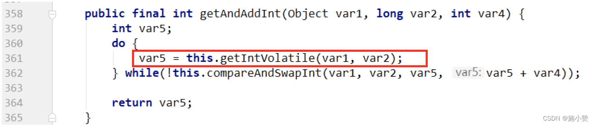
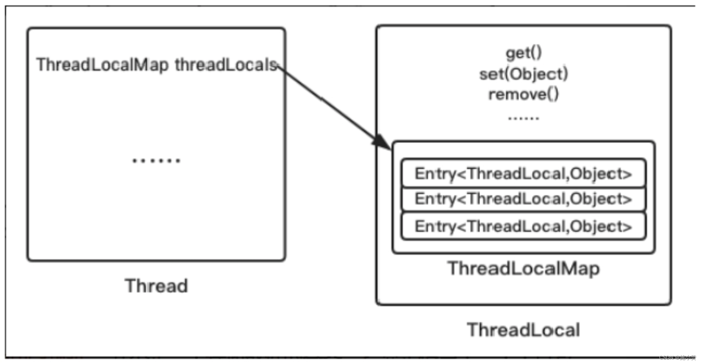
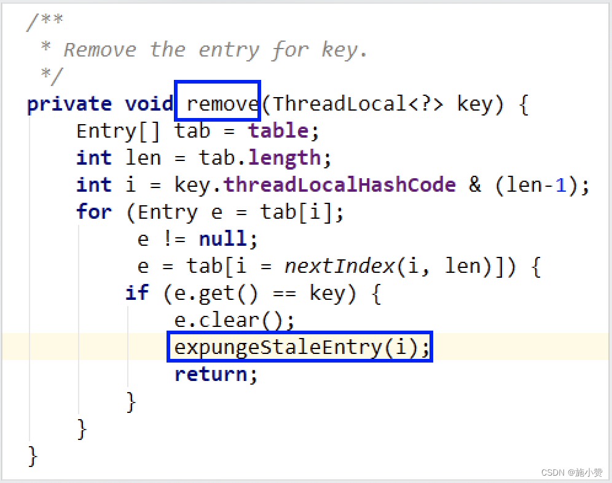
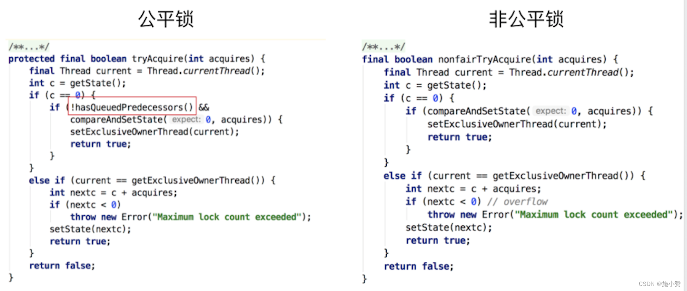
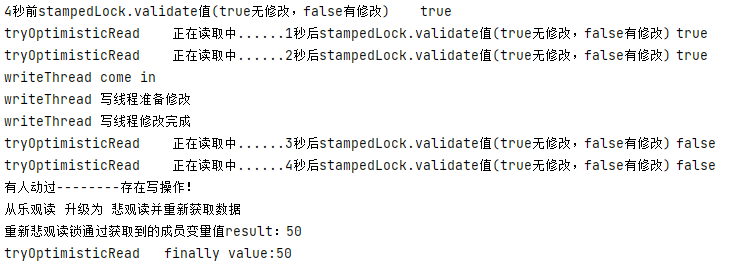

# JUC并发编程与源码分析

## 线程基础知识

### 什么是JUC

java.util.concurrent在并发编程中使用的工具包

- `java.util.concurrent`
- `java.util.concurrent.atomic`
- `java.util.concurrent.locks`


### 为什么要学好多线程

* 提高程序性能，高并发系统
* 提高程序吞吐量，异步+回调等生成需求

### start线程解读

```java
public class ThreadBaseDemo {
    public static void main(String[] args) {
        Thread t1 = new Thread(()->{

        },"t1");
        t1.start();
    }
}
```

查看start方法：

```java
public synchronized void start() {
    /**
         * This method is not invoked for the main method thread or "system"
         * group threads created/set up by the VM. Any new functionality added
         * to this method in the future may have to also be added to the VM.
         *
         * A zero status value corresponds to state "NEW".
         */
    if (threadStatus != 0)
        throw new IllegalThreadStateException();

    /* Notify the group that this thread is about to be started
         * so that it can be added to the group's list of threads
         * and the group's unstarted count can be decremented. */
    group.add(this);

    boolean started = false;
    try {
        start0();
        started = true;
    } finally {
        try {
            if (!started) {
                group.threadStartFailed(this);
            }
        } catch (Throwable ignore) {
            /* do nothing. If start0 threw a Throwable then
                  it will be passed up the call stack */
        }
    }
}
// 调用第三方模块实现的
private native void start0();
```

native调用了本地方法，我们可以通过下载官网OpenJDK查看其源码

- thread.c

java线程是通过start的方法启动执行的，主要内容在native方法start0中Openjdk的写JNI一般是一一对应的，Thread.java对应的就是``Thread.c``。start0其实就是``JVM_StartThread``。此时查看源代码可以看到在jvm.h中找到了声明，jvm.cpp中有实现。


- jvm.cpp


- thread.cpp：终于在这里调用了**操作系统的线程启动**，`os::start_thread（thread);`


### Java多线程相关概念

#### 锁

这里的锁指的是synchronized，后面会学习到。

#### 并发与并行

##### 并发

- 是在同一实体上的多个事件
- 是在同一台处理器上“同时”处理多个任务
- **同一时刻，其实是只有一个事件在发生**。

##### 并行

- 是在不同实体上的多个事件
- 是在多台处理器上同时处理多个任务
- **同一时刻，大家都真的在做事情，你做你的，我做我的**（需要多核）


#### 进程

系统中运行的一个应用程序就是一个进程，每一个进程都有它自己的内存空间和系统资源。

#### 线程

也被称为轻量级进程，在同一个进程内基本会有一个或多个线程，是大多数操作系统进行调度的基本单元。

#### 管程

- Monitor（监视器），也就是我们平时说的锁。

- Monitor其实是一种同步机制，他的义务是保证（同一时间）只有一个线程可以访问被保护的数据和代码。

- JVM中同步是基于进入和退出监视器对象(Monitor,管程对象)来实现的，每个对象实例都会有一个Monitor对象，

- Monitor对象会和Java对象一同创建并销毁，它底层是由C++语言来实现的。

### 用户线程和守护线程

Java线程分为用户线程和守护线程

* 用户线程：是系统的工作线程，它会完成这个程序需要完成的业务操作
* 守护线程：是一种特殊的线程，为其他线程服务的，在后台默默地完成一些系统性的服务，比如垃圾回收线程。

- 线程的daemon属性为 
  - true表示是守护线程
  - false表示是用户线程。

```java
public class DaemonDemo
{
    public static void main(String[] args)
    {
        Thread t1 = new Thread(() -> {
            System.out.println(Thread.currentThread().getName()+"\t 开始运行，"+(Thread.currentThread().isDaemon() ? "守护线程"："用户线程"));
            while (true) {

            }
        }, "t1");
        //线程的daemon属性为true表示是守护线程，false表示是用户线程
        //---------------------------------------------
        t1.setDaemon(true); 
        //-----------------------------------------------
        t1.start();
        //3秒钟后主线程再运行
        try { TimeUnit.SECONDS.sleep(3); } catch (InterruptedException e) { e.printStackTrace(); }

        System.out.println("----------main线程运行完毕");
    }
}
```

- 守护线程作为一个服务线程，没有服务对象就没有必要继续运行了，如果用户线程全部结束了，意味着程序需要完成的业务操作已经结束了，系统可退出了。假如当系统只剩下守护线程的时候，java虚拟机会自动退出。

- setDaemon(true)方法必须在start()之前设置，否则报IIIegalThreadStateException异常。

## CompletableFuture

### Future接口

#### 什么是Future？

Future接口(**FutureTask实现类**)定义了操作**异步任务执行一些方法**，如获取异步任务的执行结果、取消任务的执行、判断任务是否被取消、判断任务执行是否完毕等。（异步：可以被叫停，可以被取消）

一句话：**Future接口可以为主线程开一个分支任务，专门为主线程处理耗时和费力的复杂业务。**

#### Future能干什么

比如主线程让一个子线程去执行任务，子线程可能比较耗时，启动子线程开始执行任务后，主线程就去做其他事情了，过了一会才去获取子任务的执行结果。老师在上课，但是口渴，于是让班长这个线程去买水，自己可以继续上课，实现了异步任务。

**目的：异步多线程任务执行且有返回结果，三个特点：多线程/有返回/异步任务（班长作为老师去买水作为新启动的异步多线程任务且买到水有结果返回）**

#### FutureTask实现类

- FutureTask(实现了x接口，x接口又继承了a和v接口)
  - 在源码可以看到，他既继承了`RunnableFuture`接口，也在构造方法中实现了`Callable`接口（有返回值、可抛出异常）和`Runnable`接口


```java
public class CompletableFutureDemo {
    public static void main(String[] args) throws ExecutionException, InterruptedException {
        FutureTask<String> task1 = new FutureTask<>(new MyThread2());
        FutureTask task2 = new FutureTask(new MyThread(),null);

        Thread t1 = new Thread(task1,"t1");
        Thread t2 = new Thread(task2,"t1");
        t1.start();

        // 使用get获取返回值
        String value = task1.get();
        System.out.println(value);
    }
}

class MyThread implements Runnable{

    @Override
    public void run() {
    }
}

class MyThread2 implements Callable<String> {

    @Override
    public String call() throws Exception {
        System.out.println("-----come in call() ----异步执行");
        return "hello Callable 返回值";
    }
}
```

#### Future优点

- **future**+**线程池**异步多线程任务配合，能显著提高程序的执行效率。
- 方案一，3个任务1个main线程处理，大概**1541ms**

```java
public class FutureThreadPoolDemo {
    public static void main(String[] args) {
        // 3个任务1个main线程处理，大概1541ms

        long startTime = System.currentTimeMillis();

        // 暂停毫秒
        try {TimeUnit.MILLISECONDS.sleep(500);} catch (InterruptedException e) {e.printStackTrace();}
        try {TimeUnit.MILLISECONDS.sleep(500);} catch (InterruptedException e) {e.printStackTrace();}
        try {TimeUnit.MILLISECONDS.sleep(500);} catch (InterruptedException e) {e.printStackTrace();}

        long endTime = System.currentTimeMillis();

        System.out.println("costTime："+(endTime - startTime) + "ms");

        System.out.println(Thread.currentThread().getName());
    }
}
```

* 方案二，3个任务3个线程，利用线程池（假如每次new一个Thread，太浪费资源，会有GC这些工作），大概**41毫秒**。

```java
public class FutureThreadPoolDemo {
    public static void main(String[] args) {

        long startTime = System.currentTimeMillis();

        ExecutorService threadPool = Executors.newFixedThreadPool(3);

        // 3个任务3个线程，利用线程池
        FutureTask<String> task1 = new FutureTask<>(()->{
            try {TimeUnit.MILLISECONDS.sleep(500);} catch (InterruptedException e) {e.printStackTrace();}
            return "task1 over";
        });

        threadPool.submit(task1);

        FutureTask<String> task2 = new FutureTask<>(()->{
            try {TimeUnit.MILLISECONDS.sleep(500);} catch (InterruptedException e) {e.printStackTrace();}
            return "task2 over";
        });

        threadPool.submit(task2);

        FutureTask<String> task3 = new FutureTask<>(()->{
            try {TimeUnit.MILLISECONDS.sleep(500);} catch (InterruptedException e) {e.printStackTrace();}
            return "task3 over";
        });

        threadPool.submit(task3);

        threadPool.shutdown();

        long endTime = System.currentTimeMillis();

        System.out.println("costTime："+(endTime - startTime) + "ms");

        System.out.println(Thread.currentThread().getName());
    }
}
```

#### Future缺点

##### get()阻塞

一旦调用get()方法，不管是否计算完成，都会导致阻塞（所以一般get方法放到最后）

```java
public class FutureAPIDemo {
    public static void main(String[] args) throws ExecutionException, InterruptedException {
        FutureTask<String> task = new FutureTask<>(()->{
            System.out.println(Thread.currentThread().getName() + "\n");
            try {TimeUnit.SECONDS.sleep(5);} catch (InterruptedException e) {e.printStackTrace();}
            return "task";
        });

        Thread thread = new Thread(task);
        thread.start();

        String value = task.get();
        // String value = task.get(3,TimeUnit.SECONDS); // 设置超过等待时间
        System.out.println(value);
    }
}
```

##### isDone()轮询

利用`if(futureTask.isDone())`的方式使得FutureTask在结束之后才get()，但是也会消耗cpu。

```java
public class FutureAPIDemo {
    public static void main(String[] args) throws ExecutionException, InterruptedException {
        FutureTask<String> task = new FutureTask<>(()->{
            System.out.println(Thread.currentThread().getName() + "\n");
            try {TimeUnit.SECONDS.sleep(5);} catch (InterruptedException e) {e.printStackTrace();}
            return "task";
        });

        Thread thread = new Thread(task);
        thread.start();

//        String value = task.get();
//        System.out.println(value);

        while (true){
            if(task.isDone()){
                System.out.println(task.get());
                break;
            }else{
                // 暂停毫秒
                try {TimeUnit.MILLISECONDS.sleep(500);} catch (InterruptedException e) {e.printStackTrace();}
                System.out.println("正在处理中");
            }
        }
    }
}
```

#### future应用现状

- 对于简单的业务场景使用Future完全OK

  - 回调通知

    - 前面的isDone()方法耗费cpu资源，一般应该还是利用回调函数，在Future结束时自动调用该回调函数。应对Future的完成时间，完成了可以告诉我，也就是我们的回调通知
  - 创建异步任务
    - Future+线程池配合
  - 多个任务前后依赖可以组合处理（水煮鱼）
    - 想将多个异步任务的计算结果组合起来，后一个异步任务的计算结果需要前一个异步任务的值，将两个或多个异步计算合成一个异步计算，这几个异步计算相互独立，同时后面这个又依赖前一个处理的结果

    - 比如买鱼-加料-烹饪

  - 对计算速度选最快完成的（并返回结果）

    - 当Future集合中某个任务最快结束时，返回结果，返回第一名处理结果。

### CompletableFuture

#### CompletableFuture基本介绍

**阻塞的方式和异步编程的设计理念相违背，而轮询的方式会消耗无畏的CPU资源。**因此，JDK8设计出CompletableFuture

```java
public class CompletableFuture<T> implements Future<T>, CompletionStage<T> {
    ...
}
```


- 在Java 8中， CompletableFuture提供了非常强大的Future的扩展功能， 可以帮助我们简化异步编程的复杂性， 并且提供了函数式编程的能力， 可以通过回调的方式处理计算结果， 也提供了转换和组合CompletableFuture的方法。
- 它可能代表一个明确完成的Future， 也有可能代表一个完成阶段(Completion Stage) ， 它支持在计算完成以后触发一些函数或执行某些动作。
- 它实现了`Future`和`CompletionStage`接口

#### CompletionStage基本介绍

- `CompletionStage`代表异步计算过程中的**某一个阶段**， 一个阶段完成以后可能会触发另外一个阶段
- 一个阶段的计算执行可以是一个Function， Consumer或者Runnable。比如：``stage.thenApply(x->square(x)).then Accept(x->System.out.print(x)).thenRun()->System.out.println() )``，一个阶段的执行可能是被单个阶段的完成触发，也可能是由多个阶段一起触发。

#### 四个核心静态API方法

- 利用核心的四个静态方法创建一个异步操作 | 不建议用new

- 关键就是 |有没有返回值|是否用了线程池|

- 参数说明：

  - 没有指定Executor的方法，直接使用默认的ForkJoinPool.commPool()作为它的线程池执行异步代码。

  - 如果指定线程池，则使用我们定义的或者特别指定的线程池执行异步代码

##### runAsync无返回值

###### runAsync

```java
public static CompletableFuture<Void> runAsync(Runnable runnable)
```

实例：

```java
public class CompletableFutureBuildDemo {
    public static void main(String[] args) throws ExecutionException, InterruptedException {
        CompletableFuture<Void> completableFuture = CompletableFuture.runAsync(() -> {
            System.out.println(Thread.currentThread().getName());
            // 暂停几秒钟线程
            try {TimeUnit.SECONDS.sleep(1);} catch (InterruptedException e) {e.printStackTrace();}
        });

        System.out.println(completableFuture.get());
    }
}
```

###### runAsync+线程池

没有指定线程池，会使用默认线程池。

```java
public static CompletableFuture<Void> runAsync(Runnable runnable,
                                               Executor executor)
```

实例：

```java
public class CompletableFutureBuildDemo {
    public static void main(String[] args) throws ExecutionException, InterruptedException {

        ExecutorService threadPool = Executors.newFixedThreadPool(3);

        CompletableFuture<Void> completableFuture = CompletableFuture.runAsync(() -> {
            System.out.println(Thread.currentThread().getName());
            // 暂停几秒钟线程
            try {TimeUnit.SECONDS.sleep(1);} catch (InterruptedException e) {e.printStackTrace();}
        },threadPool);

        System.out.println(completableFuture.get());
        threadPool.shutdown();
    }
}
```

##### supplyAsync有返回值

###### supplyAsync

```java
public static <U> CompletableFuture<U> supplyAsync(Supplier<U> supplier)
```

实例：

````java
public class CompletableFutureBuildDemo {
    public static void main(String[] args) throws ExecutionException, InterruptedException {
        CompletableFuture<String> completableFuture = CompletableFuture.supplyAsync(() -> {
            // 暂停几秒钟线程
            try {
                TimeUnit.SECONDS.sleep(1);
            } catch (InterruptedException e) {
                e.printStackTrace();
            }
            return "completableFuture";
        });

        System.out.println(completableFuture.get());
    }
}
````

###### supplyAsync+线程池

```java
public static <U> CompletableFuture<U> supplyAsync(Supplier<U> supplier,Executor executor)
```

实例：

```java
public class CompletableFutureBuildDemo {
    public static void main(String[] args) throws ExecutionException, InterruptedException {
        ExecutorService threadPool = Executors.newFixedThreadPool(3);

        CompletableFuture<String> completableFuture = CompletableFuture.supplyAsync(() -> {
            // 暂停几秒钟线程
            try {
                TimeUnit.SECONDS.sleep(1);
            } catch (InterruptedException e) {
                e.printStackTrace();
            }
            return "completableFuture";
        },threadPool);

        System.out.println(completableFuture.get());
        threadPool.shutdown();
    }
}
```

#### 通用异步编程

##### 基本功能

`CompletableFuture`可以完成`Future`的功能

```java
public class CompletableFutureUseDemo {
    public static void main(String[] args) throws ExecutionException, InterruptedException {
        CompletableFuture<Integer> completableFuture = CompletableFuture.supplyAsync(() -> {
            System.out.println(Thread.currentThread().getName());
            int result = ThreadLocalRandom.current().nextInt(10);

            try {
                TimeUnit.SECONDS.sleep(1);
            } catch (InterruptedException e) {
                e.printStackTrace();
            }

            System.out.println("1秒钟后出结果：" + result);
            return result;
        });

        System.out.println(Thread.currentThread().getName() + "线程先去忙其他任务");

        System.out.println(completableFuture.get());
    }
}
```

##### 减少阻塞和轮询whenComplete

`CompletableFuture`通过`whenComplete`来**减少阻塞和轮询**（自动回调）。

注意不要让主线程死亡，不然用户线程也会跟随死亡。

```java
public class CompletableFutureUseDemo {
    public static void main(String[] args) throws ExecutionException, InterruptedException {

        CompletableFuture<Integer> completableFuture = CompletableFuture.supplyAsync(() -> {
            System.out.println(Thread.currentThread().getName());
            int result = ThreadLocalRandom.current().nextInt(10);

            try {
                TimeUnit.SECONDS.sleep(1);
            } catch (InterruptedException e) {
                e.printStackTrace();
            }

            System.out.println("1秒钟后出结果：" + result);
            return result;
        }).whenComplete((v,e)->{
            if(e == null){
                System.out.println("计算完成："+v);
            }
        }).exceptionally(e -> {
            e.printStackTrace();
            System.out.println("异常情况");
            return null;
        });

        //线程不要立刻结束，否则CompletableFuture默认使用的线程池会立刻关闭：暂停3秒钟线程
        System.out.println(Thread.currentThread().getName()+"线程先去忙其他任务");
        try {
            TimeUnit.SECONDS.sleep(3);
        } catch (InterruptedException e) {
            e.printStackTrace();
        }
    }
}
```

#### CompletableFuture优点总结

- 异步任务结束时，会**自动回调**某个对象的方法；
- 主线程设置好毁掉后，不再关心异步任务的执行，异步任务之间可以顺序执行
- 异步任务出错时，会自动回调某个对象的方法。

### Completable案例精讲-电商网站的比价需求

#### 面试题


#### 编程必备技能准备

##### 函数式接口

###### 函数式接口定义

任何**接口**，如果只包含**唯一一个**抽象方法，那么它就是一个**函数式接口**。对于函数式接口，我们可以通过**lambda表达式**来创建该接口的对象。

```java
public interface Runnable{
  public abstract void run();
}
```

###### 常见函数式接口

###### Runnable

```java
@FunctionalInterface
public interface Runnable {
    public abstract void run();
}
```

###### Function-功能性函数式接口

```java
@FunctionalInterface
public interface Function<T, R> {
    R apply(T t);
}
```

###### Consumer-消费性函数式接口

```java
@FunctionalInterface
public interface Consumer<T> {
    void accept(T t);
}
```

###### Supplier-供给性函数式接口

```java
@FunctionalInterface
public interface Supplier<T> {

    /**
     * Gets a result.
     *
     * @return a result
     */
    T get();
}
```

###### Biconsumer-消费性函数式接口

(Bi代表两个的意思，我们要传入两个参数，在上面的案例中是v和e)

```java
@FunctionalInterface
public interface BiConsumer<T, U> {
    void accept(T t, U u);

}
```

| 函数式接口名称 | 方法名称 | 参数     | 返回值   |
| -------------- | -------- | -------- | -------- |
| Runnable       | run      | 无参数   | 无返回值 |
| Function       | apply    | 1个参数  | 有返回值 |
| Consume        | accept   | 1个参数  | 无返回值 |
| Supplier       | get      | 没有参数 | 有返回值 |
| Biconsumer     | accept   | 2个参数  | 无返回值 |

##### 链式编程

```java
public class Chain {
    public static void main(String[] args) {
        //-------------------老式写法------------
        //        Student student = new Student();
        //        student.setId(1);
        //        student.setMajor("cs");
        //        student.setName("小卡");
        new Student().setId(1).setName("大卡").setMajor("cs");
    }

}

@NoArgsConstructor
@AllArgsConstructor
@Data
@Accessors(chain = true)//开启链式编程
class Student{
    private int id;
    private String name;
    private String major;
}
```

##### join和get对比

- 功能几乎一样，区别在于编码时是否需要抛出异常
  - get()方法需要抛出异常
  - join()方法不需要抛出异常

````java
public class Chain {
    public static void main(String[] args) throws ExecutionException, InterruptedException {//抛出异常
        CompletableFuture<String> completableFuture = CompletableFuture.supplyAsync(() -> {
            return "hello 12345";
        });
        System.out.println(completableFuture.get());
    }

}

public class Chain {
    public static void main(String[] args)  {//不需要抛出异常
        CompletableFuture<String> completableFuture = CompletableFuture.supplyAsync(() -> {
            return "hello 12345";
        });
        System.out.println(completableFuture.join());
    }
}
````

#### 实战精讲-比价网站case

##### 需求

```
1需求说明
1.1同一款产品，同时搜索出同款产品在各大电商平台的售价；
1.2同一款产品，同时搜索出本产品在同一个电商平台下，各个入驻卖家售价是多少

2输出返回：
出来结果希望是同款产品的在不同地方的价格清单列表， 返回一个List<String>
《mysql》in jd price is 88.05
《mysql》in dang dang price is 86.11
《mysql》in tao bao price is 90.43

3解决方案，比对同一个商品在各个平台上的价格，要求获得一个清单列表
1   stepbystep   ， 按部就班， 查完京东查淘宝， 查完淘宝查天猫......
2   all in       ，万箭齐发，一口气多线程异步任务同时查询。。。
```

##### 基本框架

相当于是一个一个按部就班

```java
public class Case {
    static List<NetMall> list = Arrays.asList(
            new NetMall("jd"),
            new NetMall("dangdang"),
            new NetMall("taobao")
    );

    public static List<String> getPrice(List<NetMall> list, String productName){
        return list
                .stream() //----流式计算做了映射（利用map），希望出来的是有格式的字符串（利用String.format）,%是占位符
                .map(netMall -> String.format(productName + " in %s price is %.2f",
                        netMall.getNetMallName(),//第一个%
                        netMall.calcPrice(productName))).collect(Collectors.toList());//第二个%
    }

    public static void main(String[] args) {
        long startTime = System.currentTimeMillis();
        List<String> list1 = getPrice(list, "mysql");
        for(String element:list1){
            System.out.println(element);
        }
        long endTime = System.currentTimeMillis();
        System.out.println("---当前操作花费时间----costTime:"+(endTime-startTime)+"毫秒");
    }
}

class NetMall{
    @Getter
    private String netMallName;

    public NetMall(String netMallName){
        this.netMallName = netMallName;
    }

    public double calcPrice(String productName){
        try {
            TimeUnit.SECONDS.sleep(1);
        } catch (InterruptedException e) {
            e.printStackTrace();
        }
        return ThreadLocalRandom.current().nextDouble() * 2 + productName.charAt(0);//用这句话来模拟价格
    }
}

// mysql in jd price is 109.80
// mysql in dangdang price is 110.86
// mysql in taobao price is 110.63
// ---当前操作花费时间----costTime:3069毫秒
```

##### 从功能到性能：利用CompletableFuture

- 这里是利用异步线程，万箭齐发
- 此处用了两步**流式编程**。
- 性能差距巨大

````java
public static List<String> getPriceByCompletableFuture(List<NetMall> list,String productName){

    return list.stream().map(netMall -> CompletableFuture.supplyAsync(()-> String.format(productName + " in %s price is %.2f",
                                                                                         netMall.getNetMallName(),
                                                                                         netMall.calcPrice(productName))))
        .collect(Collectors.toList())
        .stream()
        .map(CompletableFuture::join)
        .collect(Collectors.toList());
}

// mysql in jd price is 110.35
// mysql in dangdang price is 109.25
// mysql in taobao price is 110.63
// ---当前操作花费时间----costTime:1063毫秒
````

### Completable常用API

- getNow调用的时候如果计算完了，就拿取这个计算完的值；否则就拿**默认值**

#### 获得结果和触发计算

##### 获取结果

- `public T get()` 不见不散，容易阻塞
- `public T get(long timeout,TimeUnit unit) `过时不候，超过时间会爆异常
- `public T join()` 类似于get()，区别在于是否需要抛出异常
- `public T getNow(T valueIfAbsent)`
  - 没有计算完成的情况下，给一个替代结果

  - 立即获取结果不阻塞

    - 计算完，返回计算完成后的结果

    - 没算完，返回设定的valueAbsent(直接返回了默认值xxx)

##### 主动触发计算

public boolean complete(T value) 是否立即打断get()方法返回括号值

(执行要2s，等待只有1s，所以还没执行完就被打断了。返回true表示打断了获取这个过程，直接返回了备胎值complete；如果没打断，返回false 和原来的abc)

```java
public class CompletableFutureAPIDemo {
    public static void main(String[] args) throws ExecutionException, InterruptedException {
        CompletableFuture<String> completableFuture = CompletableFuture.supplyAsync(() -> {
            try {
                TimeUnit.SECONDS.sleep(1);//执行需要1秒
            } catch (InterruptedException e) {
                e.printStackTrace();
            }
            return "abc";
        });

        //        try {
        //            TimeUnit.SECONDS.sleep(2);//等待需要1秒
        //        } catch (InterruptedException e) {
        //            e.printStackTrace();
        //        }
        //         System.out.println(completableFuture.getNow("xxx"));//执2-等1 返回xxx
        System.out.println(completableFuture.complete("completeValue")+"\t"+completableFuture.get());//执2-等1 返回true+默认值completeValue
    }
}
```

#### 对计算结果进行处理

##### thenApply

- `thenApply `计算结果存在在依赖关系，使得线程串行化。因为依赖关系，所以一旦有异常，直接叫停。

```java
public class CompletableFutureDemo2 {
    public static void main(String[] args) throws ExecutionException, InterruptedException {
        //当一个线程依赖另一个线程时用 thenApply 方法来把这两个线程串行化,
        CompletableFuture.supplyAsync(() -> {
            //暂停几秒钟线程
            try {
                TimeUnit.SECONDS.sleep(1);
            } catch (InterruptedException e) {
                e.printStackTrace();
            }
            System.out.println("111");
            return 1024;
        }).thenApply(f -> {
            System.out.println("222");
            return f + 1;
        }).thenApply(f -> {
            //int age = 10/0; // 异常情况：那步出错就停在那步。
            System.out.println("333");
            return f + 1;
        }).whenCompleteAsync((v, e) -> {
            System.out.println("*****v: " + v);
        }).exceptionally(e -> {
            e.printStackTrace();
            return null;
        });

        System.out.println("-----主线程结束，END");

        // 主线程不要立刻结束，否则CompletableFuture默认使用的线程池会立刻关闭：
        try {
            TimeUnit.SECONDS.sleep(2);
        } catch (InterruptedException e) {
            e.printStackTrace();
        }
    }
}
```

##### handle

`handle `类似于thenApply，但是有异常的话**仍然**可以往下走一步。

```java
public class CompletableFutureDemo2 {
    public static void main(String[] args) throws ExecutionException, InterruptedException {
        //当一个线程依赖另一个线程时用 handle 方法来把这两个线程串行化,
        // 异常情况：有异常也可以往下一步走，根据带的异常参数可以进一步处理
        CompletableFuture.supplyAsync(() -> {
            //暂停几秒钟线程
            try {
                TimeUnit.SECONDS.sleep(1);
            } catch (InterruptedException e) {
                e.printStackTrace();
            }
            System.out.println("111");
            return 1024;
        }).handle((f, e) -> {
            int age = 10 / 0;//异常语句
            System.out.println("222");
            return f + 1;
        }).handle((f, e) -> {
            System.out.println("333");
            return f + 1;
        }).whenCompleteAsync((v, e) -> {
            System.out.println("*****v: " + v);
        }).exceptionally(e -> {
            e.printStackTrace();
            return null;
        });

        System.out.println("-----主线程结束，END");

        // 主线程不要立刻结束，否则CompletableFuture默认使用的线程池会立刻关闭：
        try {
            TimeUnit.SECONDS.sleep(2);
        } catch (InterruptedException e) {
            e.printStackTrace();
        }
    }
}
```

> 一般用thenApply

#### 对计算结果进行消费

接收任务的处理结果，并**消费处理，无返回结果**|**消费型函数式接口**，之前的是Function

##### thenAccept

```java
public static void main(String[] args) throws ExecutionException, InterruptedException{
    CompletableFuture.supplyAsync(() -> {
        return 1;
    }).thenApply(f -> {
        return f + 2;
    }).thenApply(f -> {
        return f + 3;
    }).thenApply(f -> {
        return f + 4;
    }).thenAccept(r -> System.out.println(r));
}
//10
//消费一下，直接得到10
```

##### code补充：Code之任务之间的顺序执行

- thenRun

  - thenRun(Runnable runnable)

  - 任务A执行完执行B，并且B不需要A的结果

- thenAccept

  - thenAccept(Consumer action)

  - 任务A执行完执行B，B需要A的结果，但是任务B无返回值

- thenApply

  - thenApply(Function fn)

  - 任务A执行完执行B，B需要A的结果，同时任务B有返回值

```java
 
System.out.println(CompletableFuture.supplyAsync(() -> "resultA").thenRun(() -> {}).join());
//null 

System.out.println(CompletableFuture.supplyAsync(() -> "resultA").thenAccept(resultA -> {}).join());
//resultA打印出来的 null因为没有返回值

System.out.println(CompletableFuture.supplyAsync(() -> "resultA").thenApply(resultA -> resultA + " resultB").join());
//resultAresultB 返回值
```

#### **CompleteFuture和线程池**

- 上面的几个方法都有普通版本和**后面加Async**的版本

- 以`thenRun`和`thenRunAsync`为例，有什么区别？

- 先看结论

  - **没有传入自定义线程池，都用默认线程池ForkJoinPool**

  - 传入了一个自定义线程池如果你执行第一个任务的时候，传入了一个自定义线程池

    - **调用thenRun方法执行第二个任务的时候，则第二个任务和第一个任务是用同一个线程池**(thenRun方法使用的是前面使用的线程池)

    - **调用thenRunAsync执行第二个任务的时候，则第一个任务使用的是你自己传入的线程池，第二个任务使用的是ForkJoin线程池**

  - 也有可能处理太快，**系统优化切换原则**，直接使用main线程处理（把sleep去掉）

```java
public class CompletableFutureWithThreadPoolDemo {
    public static void main(String[] args) {

        ExecutorService threadPool = Executors.newFixedThreadPool(5);

        try {
            CompletableFuture<Void> completableFuture = CompletableFuture.supplyAsync(() -> {
                try {
                    TimeUnit.MILLISECONDS.sleep(20);
                } catch (InterruptedException e) {
                    e.printStackTrace();
                }
                System.out.println("1号任务" + "\t" + Thread.currentThread().getName());
                return "abcd";
            },threadPool).thenRunAsync(() -> {
                try {
                    TimeUnit.MILLISECONDS.sleep(20);
                } catch (InterruptedException e) {
                    e.printStackTrace();
                }
                System.out.println("2号任务" + "\t" + Thread.currentThread().getName());
            }).thenRunAsync(() -> {
                try {
                    TimeUnit.MILLISECONDS.sleep(10);
                } catch (InterruptedException e) {
                    e.printStackTrace();
                }
                System.out.println("3号任务" + "\t" + Thread.currentThread().getName());
            }).thenRunAsync(() -> {
                try {
                    TimeUnit.MILLISECONDS.sleep(10);
                } catch (InterruptedException e) {
                    e.printStackTrace();
                }
                System.out.println("4号任务" + "\t" + Thread.currentThread().getName());
            });
            System.out.println(completableFuture.get(2L,TimeUnit.SECONDS));
        }catch (Exception e){
            e.printStackTrace();
        }finally {
            threadPool.shutdown();
        }
    }
}
```

#### 对计算速度进行选用

`applyToEither`方法，谁快谁优先

```java
public class CompletableFutureFastDemo {
    public static void main(String[] args) throws ExecutionException, InterruptedException
    {
        CompletableFuture<String> play1 = CompletableFuture.supplyAsync(() -> {
            System.out.println(Thread.currentThread().getName() + "\t" + "---come in ");
            //暂停几秒钟线程
            try { TimeUnit.SECONDS.sleep(2); } catch (InterruptedException e) { e.printStackTrace(); }
            return "play1 ";
        });

        CompletableFuture<String> play2 = CompletableFuture.supplyAsync(() -> {
            System.out.println(Thread.currentThread().getName() + "\t" + "---come in ");
            try { TimeUnit.SECONDS.sleep(1); } catch (InterruptedException e) { e.printStackTrace(); }
            return "play2";
        });

        CompletableFuture<String> thenCombineResult = play1.applyToEither(play2, f -> {//对计算速度进行选用
            return f + " is winner";
        });

        System.out.println(Thread.currentThread().getName() + "\t" + thenCombineResult.get());
    }
}
```

#### 对计算结果进行合并

`thenCombine` 合并：两个CompletionStage任务都完成后，最终能把两个任务的结果一起交给thenCOmbine来处理

> 先完成的先等着，等待其它分支任务

```java
public class CompletableFutureCombineDemo {
    public static void main(String[] args) throws ExecutionException, InterruptedException {
        CompletableFuture<Integer> completableFuture1 = CompletableFuture.supplyAsync(() -> {
            System.out.println(Thread.currentThread().getName() + "\t" + "---come in ");
            return 10;
        });

        CompletableFuture<Integer> completableFuture2 = CompletableFuture.supplyAsync(() -> {
            System.out.println(Thread.currentThread().getName() + "\t" + "---come in ");
            return 20;
        });

        // 合并
        CompletableFuture<Integer> thenCombineResult = completableFuture1.thenCombine(completableFuture2, (x, y) -> {
            System.out.println(Thread.currentThread().getName() + "\t" + "---come in ");
            return x + y;
        });

        System.out.println(thenCombineResult.get());
    }
}
```

* 合并版本

```java
public class CompletableFutureCombineDemo {
    public static void main(String[] args) throws ExecutionException, InterruptedException {
        CompletableFuture<Integer> thenCombineResult = CompletableFuture.supplyAsync(() -> {
            System.out.println(Thread.currentThread().getName() + "\t" + "---come in 1");
            return 10;
        }).thenCombine(CompletableFuture.supplyAsync(() -> {
            System.out.println(Thread.currentThread().getName() + "\t" + "---come in 2");
            return 20;
        }), (x, y) -> {
            System.out.println(Thread.currentThread().getName() + "\t" + "---come in 3");
            return x + y;
        }).thenCombine(CompletableFuture.supplyAsync(() -> {
            System.out.println(Thread.currentThread().getName() + "\t" + "---come in 4");
            return 30;
        }), (a, b) -> {
            System.out.println(Thread.currentThread().getName() + "\t" + "---come in 5");
            return a + b;
        });
        System.out.println("-----主线程结束，END");
        System.out.println(thenCombineResult.get());


        // 主线程不要立刻结束，否则CompletableFuture默认使用的线程池会立刻关闭：
        try {
            TimeUnit.SECONDS.sleep(10);
        } catch (InterruptedException e) {
            e.printStackTrace();
        }
    }
}
```

## 说说Java“锁”事

### 大厂面试题

#### 一、Synchronized相关问题

1.Synchronized用过吗， 其原理是什么?
2.你刚才提到获取对象的锁，这个锁到底是什么?如何确定对象的锁?
3.什么是可重入性，为什么说Synchronized是可重入锁?
4.JVM对Java的原生锁做了哪些优化?
5.为什么说Synchronized是非公平锁?
6.什么是锁消除和锁粗化?
7.为什么说Synchronized是个悲观锁?乐观锁的实现原理又是什么?什么是CAS， 它有
8.乐观锁一定就是好的吗?

#### 二、可重入锁Reentrant Lock及其他显式锁相关问题

1.跟Synchronized相比，可重入锁Reentrant Lock其实现原理有什么不同?
2.那么请谈谈AQS框架是怎么回事儿?
3.请尽可能详尽地对比下Synchronized和Reentrant Lock的异同。
4.Reentrant Lock是如何实现可重入性的?

#### 其他问题

1， 你怎么理解iava多线程的?怎么处理并发?线程池有那几个核心参数?
2， Java加锁有哪几种锁?
3， 简单说说lock?
4， hashmap的实现原理?hash冲突怎么解决?为什么使用红黑树?
5， spring里面都使用了那些设计模式?循环依赖怎么解决?
6，项目中那个地方用了countdown lanch， 怎么使用的?

### 乐观锁和悲观锁

#### 悲观锁

悲观锁认为自己在使用数据的时候一定有别的线程来修改数据，因此在获取数据的时候会先加锁，确保数据不会被别的线程修改。

悲观锁的实现方式

- `synchronized`关键字
- `Lock`的实现类都是悲观锁


适合写操作多的场景，先加锁可以保证写操作时数据正确。显示的锁定之后再操作同步资源。

```java
public synchronized void m1(){
    //加锁后的业务逻辑......
}

// 保证多个线程使用的是同一个lock对象的前提下
ReentrantLock lock = new ReentrantLock();
public void m2(){
    lock.lock();
    try {
        // 操作同步资源
    }finally {
        lock.unlock();
    }
}
```

#### 乐观锁

**乐观锁认为自己在使用数据时不会有别的线程修改数据，所以不会添加锁**，只是在更新数据的时候去判断之前有没有别的线程更新了这个数据。如果这个数据没有被更新，当前线程将自己修改的数据成功写入。如果数据已经被其他线程更新，则根据不同的实现方式执行不同的操作。

乐观锁的实现方式

- 版本号机制Version。（只要有人提交了就会修改版本号，可以解决ABA问题）

  - ABA问题：再CAS中想读取一个值A，想把值A变为C，不能保证读取时的A就是赋值时的A，中间可能有个线程将A变为B再变为A。

  - **解决方法：Juc包提供了一个AtomicStampedReference，原子更新带有版本号的引用类型，通过控制版本值的变化来解决ABA问题。**
- 最常采用的是CAS算法，Java原子类中的递增操作就通过CAS自旋实现的。

适合读操作多的场景，不加锁的性能特点能够使其操作的性能大幅提升。

```java
// 保证多个线程使用的是同一个AtomicInteger
private AtomicInteger atomicInteger = new AtomicInteger();
atomicInteger.incrementAndGet();
```

### 从8种情况演示锁的案例，看看锁到底是什么

#### 8锁案例

##### 概述

阿里巴巴代码规范

- 【强制】高并发 时，同步调用应该去考量锁的性能损耗。能用无锁数据结构，就不要用锁；能锁区块，就不要锁整个方法体；能用对象锁，就不要用类锁。
- 说明：尽可能使加锁的代码块工作量尽可能的小，避免在锁代码块中调用 RPC 方法。

##### 8锁演示

###### **1. 两个同步方法，一个对象调用**，标准情况下，两个线程先发邮件还是短信？发邮件

**synchronized 锁的是方法的调用者，也就是对象锁。两个方法持有的是同一把锁，因此谁先拿到锁谁先执行**  。

```java
public class Lock8Demo {
    public static void main(String[] args) {

        Phone phone = new Phone();

        new Thread(phone::sendEmail).start();

        try {TimeUnit.MILLISECONDS.sleep(200);} catch (InterruptedException e) {e.printStackTrace();}

        new Thread(phone::sendMail).start();
    }
}

class Phone{ // 资源类
    public synchronized void sendEmail(){
        System.out.println("发送邮件");
    }

    public synchronized void sendMail(){
        System.out.println("发送短信");
    }
}
```

###### 2. sendEmail延迟4秒，是先发邮件还是短信？发邮件

**synchronized 锁的是方法的调用者，也就是对象锁。两个方法持有的是同一把锁，因此谁先拿到锁谁先执行**  。

```java
class Phone{ // 资源类
    public synchronized void sendEmail(){
        try {TimeUnit.SECONDS.sleep(3);} catch (InterruptedException e) {e.printStackTrace();}
        System.out.println("发送邮件");
    }

    public synchronized void sendMail(){
        System.out.println("发送短信");
    }
}
```

在1和2中：一个对象里面如果有多个synchronized方法，某一时刻内，只要一个线程去调用其中的一个synchronized方法了，其他的线程都只能是等待，换句话说，某一个时刻内，只能有唯一的一个线程去访问这些synchronized方法，**锁的是当前对象this**，被锁定后，其它的线程都不能进入到当前对象的其他synchronized方法。

###### 3. 增加一个普通方法后，先发邮件还是Hello？普通方法

普通方法，因为**普通方法没有锁，不需要竞争锁。**

```java
public class Lock8Demo {
    public static void main(String[] args) {

        Phone phone = new Phone();

        new Thread(()->{
            phone.sendEmail();
        },"a").start();

        try {TimeUnit.MILLISECONDS.sleep(200);} catch (InterruptedException e) {e.printStackTrace();}

        new Thread(()->{
            phone.hello();
        },"b").start();
    }
}

class Phone{ // 资源类
    public synchronized void sendEmail(){
        System.out.println("发送邮件");
    }

    public void hello(){
        System.out.println("hello");
    }
}
```

**hello并未和其他`synchronized`修饰的方法产生争抢。**

###### **4. 两个对象，两个同步方法**，发邮件(这里有个3秒延迟)还是发短信？发短信

**synchronized 锁的是方法的调用者，也就是对象锁。两个对象分别调用两个方法持有的是两把把锁，发短信不需要等待。如果不沉睡，锁的是对象，因为是不同的两个对象，所以并不受锁的影响。**

```java
public class Lock8Demo {
    public static void main(String[] args) {
        Phone phone1 = new Phone();
        Phone phone2 = new Phone();

        new Thread(()->{
            phone1.sendEmail();
        },"a").start();

        try {TimeUnit.MILLISECONDS.sleep(200);} catch (InterruptedException e) {e.printStackTrace();}

        new Thread(()->{
            phone2.sendMail();
        },"b").start();
    }
}

class Phone{ // 资源类
    public synchronized void sendEmail(){
        try {TimeUnit.SECONDS.sleep(3);} catch (InterruptedException e) {e.printStackTrace();}
        System.out.println("发送邮件");
    }

    public synchronized void sendMail(){
        System.out.println("发送短信");
    }
}
```

**锁在两个不同的对象/两个不同的资源上，不产生竞争条件**

###### **5. 两个静态同步方法（synchroized前加static,3秒延迟也在），一个对象调用**，先发邮件还是发短信？发邮件

**static方法类一加载就会执行，synchronized 锁的是Class对象，所以两个方法持有一把锁，谁先得到谁先执行**

```java
public class Lock8Demo {
    public static void main(String[] args) {

        Phone phone = new Phone();

        new Thread(()->{
            phone.sendEmail();
        },"a").start();

        try {TimeUnit.MILLISECONDS.sleep(200);} catch (InterruptedException e) {e.printStackTrace();}

        new Thread(()->{
            phone.sendMail();
        },"b").start();
    }
}

class Phone{ // 资源类
    public static synchronized void sendEmail(){
        try {TimeUnit.SECONDS.sleep(3);} catch (InterruptedException e) {e.printStackTrace();}
        System.out.println("发送邮件");
    }

    public static synchronized void sendMail(){
        System.out.println("发送短信");
    }
}
```

###### 6. 两个对象，两个静态的同步方法（synchroized前加static,3秒延迟也在）， 先打印发邮件还是发短信？发邮件

**static方法类一加载就执行，synchronized 锁的是Class对象即类锁，两个方法持有两把把锁**，因此谁先执行谁就先拿到了锁。

```java
public class Lock8Demo {
    public static void main(String[] args) {

        Phone phone1 = new Phone();
        Phone phone2 = new Phone();

        new Thread(()->{
            phone1.sendEmail();
        },"a").start();

        try {TimeUnit.MILLISECONDS.sleep(200);} catch (InterruptedException e) {e.printStackTrace();}

        new Thread(()->{
            phone2.sendMail();
        },"b").start();
    }
}

```

- 对于普通同步方法，锁的是当前实例对象，通常指this，具体的一部部手机，所有的普通同步方法用的都是同一把锁→实例对象本身。

- 对于静态同步方法，锁的是当前类的Class对象，如Phone，class唯一的一个模板。

- 对于同步方法块，锁的是synchronized括号内的对象。synchronized(o)

###### 7. 一个静态的同步方法，一个普通的同步方法 ，一个对象，先发邮件还是发短信？ 发短信

**原因：静态同步方法和普通同步方法分别是类锁和对象锁，相当于两把锁，由于普通同步方法不要等待，因此先被执行了**

```java
public class Lock8Demo {
    public static void main(String[] args) {

        Phone phone = new Phone();

        new Thread(()->{
            phone.sendEmail();
        },"a").start();

        try {TimeUnit.MILLISECONDS.sleep(200);} catch (InterruptedException e) {e.printStackTrace();}

        new Thread(()->{
            phone.sendMail();
        },"b").start();
    }
}

class Phone{ // 资源类
    public static synchronized void sendEmail(){
        try {TimeUnit.SECONDS.sleep(3);} catch (InterruptedException e) {e.printStackTrace();}
        System.out.println("发送邮件");
    }

    public synchronized void sendMail(){
        System.out.println("发送短信");
    }
}
```

###### 8. 一个静态的同步方法，一个普通的同步方法 ，两个对象，先发邮件还是发短信？发短信

**原因：静态同步方法和普通同步方法分别是类锁和对象锁，相当于两把锁，由于普通同步方法不要等待，因此先被执行了**

```java
public class Lock8Demo {
    public static void main(String[] args) {

        Phone phone1 = new Phone();
        Phone phone2 = new Phone();

        new Thread(()->{
            phone1.sendEmail();
        },"a").start();

        try {TimeUnit.MILLISECONDS.sleep(200);} catch (InterruptedException e) {e.printStackTrace();}

        new Thread(()->{
            phone2.sendMail();
        },"b").start();
    }
}
```

在7和8中一个加了**对象锁**，一个加了**类锁**，不产生竞争条件

##### 8锁原理

- 1和2中：一个对象里面如果有多个synchronized方法，某一时刻内，只要一个线程去调用其中的一个synchronized方法了，其他的线程都只能是等待，换句话说，某一个时刻内，只能有唯一的一个线程去访问这些synchronized方法，**锁的是当前对象this**，被锁定后，其它的线程都不能 进入到当前对象的其他synchronized方法

- 3中：hello并未和其他synchronized修饰的方法产生争抢

- 4 中：锁在两个不同的对象/两个不同的资源上，不产生竞争条件

- 5和6中：static+synchronized - 类锁 **** phone = new Phone();中加到了左边的Phone上

  - 对于普通同步方法，锁的是当前实例对象，通常指this，具体的一部部手机，所有的普通同步方法用的都是同一把锁→实例对象本身。


  - 对于静态同步方法，锁的是当前类的Class对象，如Phone，class唯一的一个模板。


  - 对于同步方法块，锁的是synchronized括号内的对象。synchronized(o)


- 7和8中一个加了对象锁，一个加了类锁，不产生竞争条件

##### **8锁的3个体现**

- 8种锁的案例实际体现在3个地方-相当于总结
  - 作用域**实例方法**，当前实例加锁，进入同步代码块前要获得当前实例的锁。
  - 作用于**代码块**，对括号里配置的对象加锁。
  - 作用于**静态方法**，当前类加锁，进去同步代码前要获得当前类对象的锁

#### 字节码角度分析synchronized实现

##### 文件反编译技巧

可以通过jclasslib查看，或者通过`javap -c xxx.class`进行反编译。

##### synchronized同步代码块

```java
/**
 * 锁同步代码块
 */
public class LockSyncDemo {
    Object object = new Object();

    public void m1(){
        synchronized (object){
            System.out.println("-----hello synchronized code block");
        }
    }

    public static void main(String[] args) {

    }
}
```

* m1方法对应的字节码

```diff
 0 aload_0
 1 getfield #3 <chapter02/LockSyncDemo.object ： Ljava/lang/Object;>
 4 dup
 5 astore_1
 6 monitorenter
 7 getstatic #4 <java/lang/System.out ： Ljava/io/PrintStream;>
10 ldc #5 <-----hello synchronized code block>
12 invokevirtual #6 <java/io/PrintStream.println ： (Ljava/lang/String;)V>
15 aload_1
16 monitorexit
17 goto 25 (+8)
20 astore_2
21 aload_1
22 monitorexit
23 aload_2
24 athrow
25 return
```

- 可以看到，synchronized同步代码块，实现使用的是moniterenter和moniterexit指令（moniterexit可能有两个）。

- 那一定是一个enter两个exit吗？（不一样，如果主动throw一个RuntimeException，发现一个enter，一个exit，还有两个athrow）

##### synchronized普通同步方法

```java
/**
 * 锁普通的同步方法
 */
public class LockSyncDemo {

    public synchronized void m2(){
        System.out.println("------hello synchronized m2");
    }

    public static void main(String[] args) {

    }
}
```

- m2方法对应的字节码


```java
0 getstatic #4 <java/lang/System.out ： Ljava/io/PrintStream;>
3 ldc #7 <------hello synchronized m2>
5 invokevirtual #6 <java/io/PrintStream.println ： (Ljava/lang/String;)V>
8 return
```

调用指令将会检查方法的**ACC_SYNCHRONIZED**访问标志是否被设置。如果设置了，执行线程会将先持有monitore然后再执行方法，最后在方法完成（无论是正常完成还是非正常完成）时释放monitor。

##### synchronized静态同步方法

```java
/**
 * 锁静态同步方法
 */
public class LockSyncDemo {
    public static synchronized void m3(){
        System.out.println("------hello synchronized m3---static");
    }
    public static void main(String[] args) {

    }
}
```

* 对应的字节码

**ACC_SYNCHRONIZED**、**ACC_STATIC**访问标志会区分该方法是否是静态同步方法。


```java
0 getstatic #4 <java/lang/System.out ： Ljava/io/PrintStream;>
3 ldc #8 <------hello synchronized m3---static>
5 invokevirtual #6 <java/io/PrintStream.println ： (Ljava/lang/String;)V>
8 return
```

#### 反编译的synchronized锁的是什么

##### 概念

管程概念：

- 管程：Monitor（监视器），也就是我们平时说的锁。监视器锁

- 信号量及其操作原语“封装”在一个对象内部）**管程实现了在一个时间点，最多只有一个线程在执行管程的某个子程序。** 管程提供了一种机制，管程可以看做一个软件模块，它是将共享的变量和对于这些共享变量的操作封装起来，形成一个具有一定接口的功能模块，进程可以调用管程来实现进程级别的并发控制。

- 执行线程就要求先成功持有管程，然后才能执行方法，最后当方法完成（无论是正常完成还是非正常完成）时释放管理。在方法执行期间，执行线程持有了管程，其他任何线程都无法再获取到同一个管程。

##### **面试题：为什么任何一个对象都可以成为一个锁？**

溯源

- Java Object 类是所有类的父类，也就是说 Java 的所有类都继承了 Object，子类可以使用 Object 的所有方法。

- ObjectMonitor.java→ObjectMonitor.cpp→objectMonitor.hpp


ObjectMonitor.cpp中引入了头文件（include）objectMonitor.hpp

```c++
//140行
ObjectMonitor() {
    _header       = NULL;
    _count        = 0; //用来记录该线程获取锁的次数
    _waiters      = 0,
    _recursions   = 0;//锁的重入次数
    _object       = NULL;
    _owner        = NULL; //------最重要的----指向持有ObjectMonitor对象的线程，记录哪个线程持有了我
    _WaitSet      = NULL; //存放处于wait状态的线程队列
    _WaitSetLock  = 0 ;
    _Responsible  = NULL ;
    _succ         = NULL ;
    _cxq          = NULL ;
    FreeNext      = NULL ;
    _EntryList    = NULL ;//存放处于等待锁block状态的线程队列
    _SpinFreq     = 0 ;
    _SpinClock    = 0 ;
    OwnerIsThread = 0 ;
    _previous_owner_tid = 0;
}
```

* 每一个对象天生都带有一个对象监视器
* 每一个被锁住的对象都会和Monitor关联起来

#### 提前熟悉锁升级

synchronized必须作用于某个对象中，所以Java在对象的头文件存储了锁的相关信息。锁升级功能主要依赖于 MarkWord 中的锁标志位和释放偏向锁标志位


### 公平锁和非公平锁

#### 由ReentrantLock抢票案例演示公平和非公平现象

```java
class Ticket {
    private int number = 30;
//    ReentrantLock lock = new ReentrantLock(); // 非公平锁，默认的
    ReentrantLock lock = new ReentrantLock(true); // 公平锁

    public void sale() {
        lock.lock();
        try {
            if (number > 0) {
                System.out.println(Thread.currentThread().getName() + "卖出第：\t" + (number--) + "\t 还剩下：" + number);
            }
        } catch (Exception e) {
            e.printStackTrace();
        } finally {
            lock.unlock();
        }
    }
}

public class SaleTicketDemo {
    public static void main(String[] args) {
        Ticket ticket = new Ticket();

        new Thread(() -> {
            for (int i = 0; i < 35; i++) ticket.sale();
        }, "a").start();
        new Thread(() -> {
            for (int i = 0; i < 35; i++) ticket.sale();
        }, "b").start();
        new Thread(() -> {
            for (int i = 0; i < 35; i++) ticket.sale();
        }, "c").start();
    }
}
```

#### 非公平锁

- 默认是非公平锁
- 非公平锁可以**插队**，买卖票不均匀。
- 是指多个线程获取锁的顺序并不是按照申请锁的顺序，有可能后申请的线程比先申请的线程优先获取锁，在高并发环境下，有可能造成优先级翻转或**饥饿的状态**（某个线程一直得不到锁）

#### 公平锁

- `ReentrantLock lock = new ReentrantLock(true);`
- 买卖票一开始a占优，后面a b c a b c a b c均匀分布
- 是指多个线程按照**申请锁的顺序**来获取锁，这里类似排队买票，先来的人先买后来的人在队尾排着，这是公平的。

#### 为什么会有公平锁/非公平锁的设计？为什么默认是非公平？

- 恢复挂起的线程到真正锁的获取还是有时间差的，从开发人员来看这个时间微乎其微，但是从CPU的角度来看，这个时间差存在的还是很明显的。所以非公平锁能更充分的利用CPU 的时间片，尽量减少 CPU 空闲状态时间。（减少CPU空闲状态时间）

- 使用多线程很重要的考量点是线程切换的开销，当采用非公平锁时，当1个线程请求锁获取同步状态，然后释放同步状态，因为不需要考虑是否还有前驱节点，所以刚释放锁的线程在此刻再次获取同步状态的概率就变得非常大，所以就减少了线程的开销。（减少CPU开销）

#### 什么时候用公平？什么时候用非公平？

- 如果为了更高的**吞吐量**，很显然非公平锁是比较合适的，因为**节省很多线程切换时间**，吞吐量自然就上去了；
- 否则那就用公平锁，大家公平使用。

### 可重入锁（递归锁）

#### 可重入锁说明

可重入锁又名递归锁，是指在**同一个线程**在外层方法获取锁的时候，再进入该线程的内层方法会**自动获取锁**(前提，锁对象得是同一个对象)，不会因为之前已经获取过还没释放而阻塞。

如果是**1个有 synchronized 修饰的递归调用方法，程序第2次进入被自己阻塞了岂不是天大的笑话，出现了作茧自缚。**

所以**Java中ReentrantLock和synchronized都是可重入锁，可重入锁的一个优点是可一定程度避免死锁。**

> **一个线程中的多个流程可以获取同一把锁，持有这把锁可以再次进入，自己可以获取自己的内部锁。**

#### 可重入锁种类

##### 隐式锁Synchronized

`synchronized`是java中的关键字，**默认**是**可重入锁**，即隐式锁。

###### 同步块

```java
public class ReEntryLockDemo {
    public static void main(String[] args) {
        final Object objectLockA = new Object();

        new Thread(() -> {
            synchronized (objectLockA) {
                System.out.println("-----外层调用");
                synchronized (objectLockA) {
                    System.out.println("-----中层调用");
                    synchronized (objectLockA) {
                        System.out.println("-----内层调用");
                    }
                }
            }
        },"a").start();
    }
}
//-----外层调用
//-----中层调用
//-----内层调用
```

###### 同步方法

```java
public class ReEntryLockDemo {
    public synchronized void m1() {
        //指的是可重复可递归调用的锁，在外层使用之后，在内层仍然可以使用，并且不发生死锁，这样的锁就叫做可重入锁
        System.out.println(Thread.currentThread().getName() + "\t" + "-----come in m1");
        m2();
        System.out.println(Thread.currentThread().getName() + "\t-----end m1");
    }

    public synchronized void m2() {
        System.out.println("-----m2");
        m3();
    }

    public synchronized void m3() {
        System.out.println("-----m3");
    }

    public static void main(String[] args) {
        ReEntryLockDemo reEntryLockDemo = new ReEntryLockDemo();
        reEntryLockDemo.m1();
    }
}
/**
 * main  -----come in m1
 * -----m2
 * -----m3
 * main  -----end m1
 */
```

##### Synchronized的重入实现机理

- 回看上方的`ObjectMoitor.hpp`

```c++
//140行
ObjectMonitor() {
    _header       = NULL;
    _count        = 0; //用来记录该线程获取锁的次数
    _waiters      = 0,
    _recursions   = 0;//锁的重入次数
    _object       = NULL;
    _owner        = NULL; //------最重要的----指向持有ObjectMonitor对象的线程，记录哪个线程持有了我
    _WaitSet      = NULL; //存放处于wait状态的线程队列
    _WaitSetLock  = 0 ;
    _Responsible  = NULL ;
    _succ         = NULL ;
    _cxq          = NULL ;
    FreeNext      = NULL ;
    _EntryList    = NULL ;//存放处于等待锁block状态的线程队列
    _SpinFreq     = 0 ;
    _SpinClock    = 0 ;
    OwnerIsThread = 0 ;
    _previous_owner_tid = 0;
}
```

- ObjectMoitor.hpp底层：每个锁对象拥有一个锁计数器和一个指向持有该锁的线程的指针。_count _owner

- **首次加锁**：当执行monitorenter时，如果目标锁对象的计数器为零，那么说明它没有被其他线程所持有，Java虚拟机会将该锁对象的持有线程设置为当前线程，并且将其计数器加1。
- **重入**：在目标锁对象的计数器不为零的情况下，如果锁对象的持有线程是当前线程，那么 Java 虚拟机可以将其计数器加1，否则需要等待，直至持有线程释放该锁。
- **释放锁**：当执行monitorexit时，Java虚拟机则需将锁对象的计数器减1。计数器为零代表锁已被释放。

##### 显示锁Lock

- 显式锁（即Lock）也有ReentrantLock这样的可重入锁

> 所谓的显式隐式即是指显示/隐式的调用锁

- 注意：`lock` `unlock`要**成对**

```java
public class ReEntryLockDemo2 {
    static Lock lock = new ReentrantLock();

    public static void main(String[] args) {
        {
            new Thread(() -> {
                lock.lock();
                try {
                    System.out.println(Thread.currentThread().getName() + "\t----come in 外层调用");
                    lock.lock();
                    try {
                        System.out.println(Thread.currentThread().getName() + "\t------come in 内层调用");
                    } finally {
                        lock.unlock();
                    }
                } finally {
                    lock.unlock();
                }
            }, "t1").start();
        }
    }
}
//t1  ----come in 外层调用
//t1  ------come in 内层调用
```

* 假如`lock` `unlock`不成对，单线程情况下问题不大，但**多线程下出问题**

```java
public class ReEntryLockDemo3 {
    static Lock lock = new ReentrantLock();
    public static void main(String[] args) {

        new Thread(() -> {
            lock.lock();
            try {
                System.out.println(Thread.currentThread().getName() + "\t----come in 外层调用");
                lock.lock();
                try {
                    System.out.println(Thread.currentThread().getName() + "\t------come in 内层调用");
                } finally {
                    lock.unlock();
                }
            } finally {
                //lock.unlock();//-------------------------不成对|多线程情况
            }
        }, "t1").start();

        new Thread(() -> {
            lock.lock();
            try
            {
                System.out.println("t2 ----外层调用lock");
            }finally {
                lock.unlock();
            }
        },"t2").start();

    }
}
//t1  ----come in 外层调用
//t1  ------come in 内层调用
//(t2 ----外层调用lock 假如不成对，这句话就不显示了)
```

### 死锁及排查

#### 死锁是什么

死锁是指两个或两个以上的线程在执行过程中,因争夺资源而造成的一种互相等待的现象,若无外力干涉那它们都将无法推进下去，如果系统资源充足，进程的资源请求都能够得到满足，死锁出现的可能性就很低，否则就会因争夺有限的资源而陷入死锁。

实例：a跟b两个资源互相请求对方的资源


#### 死锁产生的原因

- 系统资源不足
- 进程运行推进的顺序不合适
- 资源分配不当

#### 产生死锁的四个必要条件

- 互斥条件：一个资源每次只能被一个进程使用。
- 请求与保持条件：一个进程因请求资源而阻塞时，对已获得的资源保持不放
- 不剥夺条件：进程已获得的资源，在未使用完之前不能强行剥夺。
- 循环等待条件：若干进程之间形成一种头尾相接的循环等待资源关系。

只要破坏其中一个。就可以避免死锁。

#### 死锁案例

```java
public class DeadLockDemo {
    public static void main(String[] args) {
        Object object1 = new Object();
        Object object2 = new Object();

        new Thread(()->{
            synchronized (object1){
                System.out.println(Thread.currentThread().getName()+"\t 持有a锁，想获得b锁");
                try {
                    TimeUnit.SECONDS.sleep(1);} catch (InterruptedException e) {e.printStackTrace();}//使得线程b也启动
                synchronized (object2){
                    System.out.println(Thread.currentThread().getName()+"\t 成功获得b锁");
                }
            }
        },"A").start();

        new Thread(()->{
            synchronized (object2){
                System.out.println(Thread.currentThread().getName()+"\t 持有b锁，想获得a锁");
                synchronized (object1){
                    System.out.println(Thread.currentThread().getName()+"\t 成功获得a锁");
                }
            }
        },"B").start();
    }

}
```

#### 如何排查死锁

##### JVM命令

* `jps -l` 查看当前进程运行状况
* `jstack pid` 查看进程信息

 


##### jconsole


##### jvisualvm


### 其他锁

- 写锁（独占锁）/读锁（共享锁）
- 自旋锁SpinLock
- 无锁/独占锁/读写锁/邮戳锁
- 无锁/偏向锁/轻量锁/重量锁 

### 总结

 指针指向monitor对象（也称为管程或监视器锁）的起始地址。每个对象都存在着一个monitor与之关联，当一个monitor被某个线程持有后，它便处于锁定状态。在Java虚拟机(HotSpot)中，monitor是由ObjectMonitor实现的，其主要数据结构如下（位于HotSpot虚拟机源码ObjectMonitor.hpp,C++实现的）。


## Lock Support与线程中断

### 线程中断机制

#### 面试题

#### 什么是中断机制

**首先**，一个线程不应该由其他线程来强制中断或停止，而是**应该由线程自己自行停止。**所以，Thread.stop, Thread.suspend, Thread.resume 都已经被废弃了。

**其次**，在Java中没有办法立即停止一条线程，然而停止线程却显得尤为重要，如取消一个耗时操作。因此，Java提供了一种用于停止线程的**协商机制**——**中断**。

**中断只是一种协作协商机制，Java没有给中断增加任何语法，中断的过程完全需要程序员自己实现。**若要中断一个线程，你需要手动调用该线程的interrupt方法，该方法也仅仅是将线程对象的中断标识设成true；接着你需要自己写代码不断地检测当前线程的标识位，如果为true，表示别的线程要求这条线程中断，此时究竟该做什么需要你自己写代码实现。

每个线程对象中都有一个标识，用于表示线程是否被中断；该标识位为true表示中断，为false表示未中断；通过调用线程对象的interrupt方法将该线程的标识位设为true；可以在别的线程中调用，也可以在自己的线程中调用。

eg.顾客在无烟餐厅中吸烟，服务员希望他别吸烟了，不是强行停止他吸烟，而是给他的标志位打为true，具体的停止吸烟还是要顾客自己停止。（体现了协商机制）

#### 中断相关的API方法之三大方法说明


| api方法                             | 含义                                                         |
| ----------------------------------- | ------------------------------------------------------------ |
| public void interrupt()             | 实例方法，实例方法interrupt()仅仅是设置线程的中断状态为true，发起一个协商而不会立刻停止线程 |
| public static boolean interrupted() | 静态方法，Thread.interrupted();判断线程是否被中断，并清除当前中断状态这个方法做了两件事：1. 返回当前线程的中断状态；2. 将当前线程的中断状态设为false（这个方法有点不好理解，因为连续调用两次的结果可能不一样。） |
| public boolean isInterrupted()      | 实例方法，判断当前线程是否被中断（通过检查中断标志位）       |

#### 面试题：如何使用中断标识停止线程

##### 如何停止中断运行的线程

###### 1. 通过一个volatile变量实现

- volatile保证了可见性，t2修改了标志位后能马上被t1看到

```java
public class InterruptDemo {
    public static volatile boolean isStop = false;

    public static void main(String[] args) {
        new Thread(()->{
            while (true){
                if(isStop){ // 如果这个标志位被其他线程改为true
                    System.out.println(Thread.currentThread().getName()+"\t isStop被修改为true，程序终止");
                    break;
                }
                System.out.println("t1 ------hello volatile");//----------------------如果没停止，那就一直打印
            }
        },"t1").start();


        try {
            TimeUnit.MILLISECONDS.sleep(20);
        } catch (InterruptedException e) {
            e.printStackTrace();
        }

        new Thread(()->{
            isStop = true;
        },"t2").start();

    }
}
```

###### 2. 通过AtomicBoolean（原子布尔型）

```java
public class InterruptDemo {
    public static volatile boolean isStop = false;
    public static AtomicBoolean isStopAtomic = new AtomicBoolean(false);

    public static void main(String[] args) {
        new Thread(()->{
            while (true){
                if(isStopAtomic.get()){ // 如果这个标志位被其他线程改为true
                    System.out.println(Thread.currentThread().getName()+"\t isStopAtomic被修改为true，程序终止");
                    break;
                }
                System.out.println("t1 ------hello AtomicBoolean");//----------------------如果没停止，那就一直打印
            }
        },"t1").start();


        try {
            TimeUnit.MILLISECONDS.sleep(20);
        } catch (InterruptedException e) {
            e.printStackTrace();
        }

        new Thread(()->{
            isStopAtomic.set(true);
        },"t2").start();

    }
}
```

###### 3. 通过Thread类自带的中断api方法实现

```java
public class InterruptDemo {
    public static void main(String[] args) {
        Thread t1 = new Thread(()->{
            while (true){
                if(Thread.currentThread().isInterrupted()){
                    System.out.println(Thread.currentThread().getName()+"\t isInterrupted被修改为true，程序终止");
                    break;
                }
                System.out.println("t1 ------hello isInterrupted api");//----------------------如果没停止，那就一直打印
            }
        },"t1");

        t1.start();


        try {
            TimeUnit.MILLISECONDS.sleep(20);
        } catch (InterruptedException e) {
            e.printStackTrace();
        }

        new Thread(()->{
            t1.interrupt(); // 发送中断信号
        },"t2").start();

    }
}
```

###### Api源码分析

* **实例方法interrupt()，没有返回值**

```java
//Thread.java
public void interrupt() {
    if (this != Thread.currentThread())
        checkAccess();

    synchronized (blockerLock) {
        Interruptible b = blocker;
        if (b != null) {
            interrupt0(); // Just to set the interrupt flag----调用了interrupt0()方法
            b.interrupt(this);
            return;
        }
    }
    interrupt0();
}

//Thread.java
/* Some private helper methods */
private native void setPriority0(int newPriority);
private native void stop0(Object o);
private native void suspend0();
private native void resume0();
private native void interrupt0();  //---------------------------调用了c底层
private native void setNativeName(String name);
```

###### 说明

具体来说，当对一个线程，调用 interrupt() 时：

- 如果线程处于正常活动状态，那么会将该线程的中断标志设置为 true，仅此而已。被设置中断标志的线程将继续正常运行，不受影响。所以， interrupt() 并不能真正的中断线程，需要被调用的线程自己进行配合才行。

- 第三种方法，如果线程处于被阻塞状态（例如处于sleep, wait, join 等状态），在别的线程中调用当前线程对象的interrupt方法，那么线程将立即退出被阻塞状态（中断状态将被清除），并抛出一个InterruptedException异常。

- （中断不活动的线程不会产生任何影响，看下面案例）

##### 当前线程的中断标识为true，是不是线程就立刻停止

不是。仅仅设置了一个中断状态

###### 案例1

看看中断是否会立即停止这个300的线程，否，虽然中断标志位变了。但是i一直在循环

```java
public class InterruptDemo2 {
    public static void main(String[] args) {

        // 仅仅是设置线程的中断状态位设置为true，不会停止线程
        Thread t1 = new Thread(()->{
            for (int i = 0; i < 300; i++) {
                System.out.println(i);
            }
            System.out.println("after t1.interrupt()---第2次----"+Thread.currentThread().isInterrupted());// true
        },"t1");

        t1.start();

        System.out.println("before t1.interrupt()----"+t1.isInterrupted()); // false

        try {TimeUnit.MILLISECONDS.sleep(2);} catch (InterruptedException e) {e.printStackTrace();}
        t1.interrupt();// true
        System.out.println("after t1.interrupt()---第1次---"+t1.isInterrupted()); // 第1次---true    ------此处中断标志位设置为了true,但是t1仍然在运行

        try {TimeUnit.MILLISECONDS.sleep(3000);} catch (InterruptedException e) {e.printStackTrace();}
        System.out.println("after t1.interrupt()---第3次---"+t1.isInterrupted()); // 第3次---false//中断不活动的线程不会产生任何影响，线程结束后应该是自动变为了false
    }
}
```

###### 案例2

如果线程处于被阻塞状态（例如处于sleep, wait, join 等状态），在别的线程中调用当前线程对象的`interrupt`方法，那么线程将**立即退出被阻塞状态**（中断状态将被清除），并抛出一个InterruptedException异常。

**在catch块中，需要再次给中断标志位设置为true，2次调用停止。**

```java
public class InterruptDemo3 {
    public static void main(String[] args) {
        Thread t1 =  new Thread(()->{
            while(true){
                if(Thread.currentThread().isInterrupted()){
                    System.out.println(Thread.currentThread().getName()+"\t"+
                                       "中断标志位："+Thread.currentThread().isInterrupted()+"程序终止");
                    break;
                }
                try {
                    Thread.sleep(200);
                } catch (InterruptedException e) {
                    e.printStackTrace();
                    Thread.currentThread().interrupt();  //假如加了这个，程序可以终止，只会爆异常
                }
                System.out.println("-----hello InterruptDemo03");
            }
        },"t1");
        t1.start();
        try {TimeUnit.SECONDS.sleep(1);} catch (InterruptedException e) {e.printStackTrace();}
        new Thread(() -> t1.interrupt()).start();
    }
}
/**
 * 1 中断标志位 默认是false
 * 2 t2 ----->t1发出了中断协商，t2调用t1.interrupt()，中断标志位true
 * 3 中断标志位true，正常情况下，程序停止，^-^
 * 4 中断标志位true，异常情况下，InterruptedException，将会把中断状态清除，并且将收到InterruptedException。中断标志位false导致无限循环。
 * 5 在catch块中，需要再次给中断标志位设置为true，2次调用停止
 */
```

###### 小总结

中断只是一种协同机制，修改中断标识位仅此而已，而不是立刻stop打断。

##### 静态方法Thread.interrupted()，谈谈你的理解

public static boolean interrupted()静态方法，``Thread.interrupted()``;判断线程是否被中断，并清除当前中断状态这个方法做了两件事：

1. 返回当前线程的中断状态

2. 将当前线程的中断状态设为false（这个方法有点不好理解，因为连续调用两次的结果可能不一样。） 

```java
public class InterruptDemo4 {
    public static void main(String[] args) {
        // 中断标识被清空，返回一个boolean并清除中断状态
        // 第二次再调用时，中断状态已经被清除，将返回一个false 

        System.out.println(Thread.currentThread().getName() + "\t" + Thread.interrupted());// false
        System.out.println(Thread.currentThread().getName() + "\t" + Thread.interrupted());// false

        System.out.println("1");
        Thread.currentThread().interrupt(); // 中断标志位设置为true
        System.out.println("2");

        System.out.println(Thread.currentThread().getName() + "\t" + Thread.interrupted());// true
        System.out.println(Thread.currentThread().getName() + "\t" + Thread.interrupted());// false
    }
}
```

`interrupted()`对比`isInterrupted()`

```java
public static boolean interrupted() {
    return currentThread().isInterrupted(true);
}

public boolean isInterrupted() {
    return isInterrupted(false);
}
private native boolean isInterrupted(boolean ClearInterrupted);
```

- 他们在底层都调用了native方法isInterrupted。

- 只不过传入参数ClearInterrupted一个传参传了true，一个传了false。

  - 静态方法interrupted() 中true表示清空当前中断状态。

  - 实例方法isInterrupted 则不会。

### LockSupport是什么

#### 官方解释

用于创建锁和其他同步类的基本线程阻塞原语。


##### park()与unpark()

- `park()`方法是**阻塞线程**
- `unpark()`方法是**解除阻塞线程**


### 线程等待唤醒机制

#### 3种线程等待和唤醒的方法

1. 使用Object中的`wait()`方法让线程等待，使用Object中的`notify()`方法唤醒线程
2. 使用JUC包中`Condition`的`await()`方法让线程等待，使用`signal()`方法唤醒线程
3. `LockSupport`类可以阻塞当前线程以及唤醒指定被阻塞的线程

#### 1. Object类中的wait和notify方法实现线程等待和唤醒

* 一定是wait先执行然后才是notify再执行，不然会一直被阻塞
  * wait和notify方法必须要在**同步**块或者方法里面，且**成对**出现使用
* 使用`wait`和`notify`必须加`synchronized`

```java
public class LockSupportDemo {
    public static void main(String[] args) {
        Object object = new Object();

        new Thread(()->{
            synchronized (object){
                System.out.println(Thread.currentThread().getName() +"\t --------------- come in");
                try {
                    object.wait(); // 等待
                }catch (InterruptedException e){
                    e.printStackTrace();
                }
            }
            System.out.println(Thread.currentThread().getName() +"\t --------------- 被唤醒了");
        },"t1").start();

        try {
            TimeUnit.SECONDS.sleep(3);
        } catch (InterruptedException e) {
            e.printStackTrace();
        }

        new Thread(()->{
            synchronized (object){
                object.notify(); // 唤醒
                System.out.println(Thread.currentThread().getName() + "\t -------------发出通知");
            }
        },"t2").start();
    }
}
```

#### 2. Condition接口中的await后signal方法实现线程的等待和唤醒

- `await`和`notify`类似于上面`wait`和`notify`
  - Condition中的线程等待和唤醒方法，需要先获取锁
  - 一定要先await后signal，不能反了

```java
public class LockSupportDemo2 {

    Lock lock = new ReentrantLock();
    // condition1被阻塞唤醒condition2，condition2被阻塞唤醒condition3...
    Condition condition1 = lock.newCondition();
    Condition condition2 = lock.newCondition();
    Condition condition3 = lock.newCondition();

    public int version = 1; // condition1=1,condition2=2,condition3=3

    public void conditionMethod(Condition c1,Condition c2,int cur,int next){
        lock.lock();
        try {
            System.out.println(Thread.currentThread().getName() + "\t --------------- come in");
            while (version != cur){
                c1.await();
            }
            version = next;
            c2.signal();
            System.out.println(Thread.currentThread().getName() + "\t --------------- 被唤醒");
        } catch (InterruptedException e) {
            e.printStackTrace();
        } finally {
            lock.unlock();
        }
    }

    public void m1(){
        conditionMethod(condition1,condition2,1,2);
    }

    public void m2(){
        conditionMethod(condition2,condition3,2,3);
    }

    public void m3(){
        conditionMethod(condition3,condition1,3,1);
    }


    public static void main(String[] args) {
        LockSupportDemo2 lockSupportDemo2 = new LockSupportDemo2();
        new Thread(lockSupportDemo2::m1,"t1").start();
        new Thread(lockSupportDemo2::m2,"t2").start();
        new Thread(lockSupportDemo2::m3,"t3").start();
    }
}
```

#### Object和Condition使用的限制条件

- **线程先要获得并持有锁，必须在锁块（synchronized或lock）中**
- **必须要先等待后唤醒，线程才能够被唤醒**

#### 3. LockSupport类中的park等待和unpark唤醒

##### 什么是LockSupport

LockSupport是用来创建锁和其他同步类的基本线程阻塞原语。

- LockSupport类使用了一种名为Permit（许可） 的概念来做到阻塞和唤醒线程的功能， 每个线程都有一个许可(permit)，permit（许可）只有两个值1和0，默认是0。0 是阻塞，1是唤醒。

- 可以把许可看成是一种(0,1)信号量（Semaphore），但与 Semaphore 不同的是，许可的累加上限是1。

##### 主要方法

###### API


###### 阻塞

- `park()/park(Object blocker)`
- 调用`LockSupport.park()`时，发现它调用了`unsafe类`，并且默认传了一个0

```java
public static void park() {
    UNSAFE.park(false, 0L);
}
```


permit默认是零，所以一开始调用park()方法，当前线程就会阻塞，直到别的线程将当前线程的permit设置为1时，park方法会被唤醒，然后会将permit再次设置为零并返回。

###### 唤醒

调用`LockSupport.unpark();`时，也调用了`unsafe类`

```java
public static void unpark(Thread thread) {
    if (thread != null)
        UNSAFE.unpark(thread);
}
```


调用unpark(thread)方法后，就会将thread线程的许可permit设置成**1**(注意多次调用unpark方法，不会累加，permit值还是1)会自动唤醒thread线程，即之前阻塞中的LockSupport.park()方法会立即返回。

##### park与unpark编码实战

###### 正常+无锁块要求

```java
public class LockSupportDemo3 {
    public static void main(String[] args) {
        Thread t1 = new Thread(()->{
            System.out.println(Thread.currentThread().getName() + "\t --------------- come in");
            LockSupport.park();
            System.out.println(Thread.currentThread().getName() + "\t --------------- 被唤醒");
        },"t1");

        t1.start();

        try {
            TimeUnit.SECONDS.sleep(3);
        } catch (InterruptedException e) {
            e.printStackTrace();
        }

        new Thread(()->{
            LockSupport.unpark(t1);
            System.out.println(Thread.currentThread().getName() + "\t -------------发出通知");
        },"t2").start();
    }
}
```

###### 先唤醒后等待

之前错误的先唤醒后等待，LockSupport照样支持

```java
public class LockSupportDemo3 {
    public static void main(String[] args) {
        Thread t1 = new Thread(()->{
            try {
                TimeUnit.SECONDS.sleep(3);
            } catch (InterruptedException e) {
                e.printStackTrace();
            }
            System.out.println(Thread.currentThread().getName() + "\t --------------- come in");
            LockSupport.park();
            System.out.println(Thread.currentThread().getName() + "\t --------------- 被唤醒");
        },"t1");

        t1.start();

        new Thread(()->{
            LockSupport.unpark(t1);
            System.out.println(Thread.currentThread().getName() + "\t -------------发出通知");
        },"t2").start();
    }
}
```

sleep方法3秒后醒来，执行park无效，没有阻塞效果，解释如下。先执行了unpark(t1)导致上面的park方法形同虚设无效，**时间是一样的**
\- 类似于高速公路的ETC，提前买好了通行证unpark，到闸机处直接抬起栏杆放行了，没有park拦截了。

> **成双成对要牢记**

###### 许可证是只有一个

因为凭证的数量最多为1， 连续调用两次unpark和调用一次unpark效果一样， 只会增加一个凭证；而调用两次park却需要消费两个凭证， 证不够， 不能放行。

```java
public class LockSupportDemo3 {
    public static void main(String[] args) {
        Thread t1 = new Thread(()->{
            try {
                TimeUnit.SECONDS.sleep(3);
            } catch (InterruptedException e) {
                e.printStackTrace();
            }
            System.out.println(Thread.currentThread().getName() + "\t --------------- come in");
            LockSupport.park();
            LockSupport.park();
            System.out.println(Thread.currentThread().getName() + "\t --------------- 被唤醒");
        },"t1");

        t1.start();

        new Thread(()->{
            LockSupport.unpark(t1);
            LockSupport.unpark(t1);
            System.out.println(Thread.currentThread().getName() + "\t -------------发出通知");
        },"t2").start();
    }
}
```

##### 总结

- Lock Support是用来创建锁和其他同步类的基本线程阻塞原语。
- Lock Support是一个线程阻塞工具类， 所有的方法都是静态方法， 可以让线程在任意位置阻塞， 阻塞之后也有对应的唤醒方法。归根结
  底， Lock Support调用的Unsafe中的native代码。
- Lock Support提供park() 和unpark() 方法实现阻塞线程和解除线程阻塞的过程
- Lock Support和每个使用它的线程都有一个许可(permit) 关联。
- 每个线程都有一个相关的permit， permit最多只有一个， 重复调用un park也不会积累凭证。

- 形象的理解：线程阻塞需要消耗凭证(permit) ， 这个凭证最多只有1个。

#### 面试题

##### 为什么可以突破wait/notify的原有调用顺序?

因为unpark获得了一个凭证， 之后再调用park方法， 就可以名正言顺的凭证消费， 故不会阻塞。先发放了凭证后续可以畅通无阻。

##### 为什么唤醒两次后阻塞两次，但最终结果还会阻塞线程?

因为凭证的数量最多为1， 连续调用两次unpark和调用一次unpark效果一样， 只会增加一个凭证（因为最多能有一个凭证）；而调用两次park却需要消费两个凭证， 证不够， 不能放行。

## Java内存模型之JMM

### 面试题

1. 你知道什么是Java内存模型JMM吗？
2. JMM与volatile它们两个之间的关系？(下一章详细讲解)
3. JMM有哪些特性，它的三大特性是什么？
4. 为什么要有JMM，它为什么出现？作用和功能是什么？
5. **happens-before先行发生原则你有了解过吗？**

### 计算机硬件存储体系

#### 概述

计算机存储结构，从本地磁盘到主存到 CPU 缓存，也就是从硬盘到内存，到 CPU 。

一般对应的程序的操作就是从数据库查数据到内存然后到 CPU 进行计算。


#### 问题和推导出我们需要知道JMM

因为有这么多级的缓存(cpu和物理主内存的速度不一致的)，CPU的运行并不是直接操作内存而是先把内存里边的数据读到缓存，而内存的读和写操作的时候就会造成不一致的问题。


Java虚拟机规范中试图定义一种Java内存模型（java Memory Model，简称JMM) 来**屏蔽掉各种硬件和操作系统的内存访问差异**， 以实现让Java程序在各种平台下都能达到一致的内存访问效果。

### Java内存模型

#### 概述

JMM(Java内存模型Java Memory Model，简称JMM)本身是一种**抽象的**概念**并不真实存在**它**仅仅描述的是一组约定或规范** ，通过这组规范定义了程序中(尤其是多线程)各个变量的读写访问方式并决定一个线程对共享变量的写入何时以及如何变成对另一个线程可见，关键技术点都是围绕多线程的**原子性、可见性和有序性**展开的。 

#### 原则

JMM的关键技术点都是围绕多线程的**原子性、可见性和有序性展开的。**

#### 能干什么

- 通过JMM来实现**线程和主内存之间的抽象关系**。 
- **屏蔽各个硬件平台和操作系统的内存访问差异**以实现让Java程序在各种平台下都能达到一致的内存访问效果。 

### JMM规范

#### 三大特性

##### 可见性

可见性，**是指当一个线程修改了某一个共享变量的值，其他线程是否能够立即知道该变更** ，JMM 规定了所有的变量都存储在**主内存**中。


Java中**普通的共享变量不保证可见性** ，因为数据修改被写入内存的时机是不确定的，**多线程并发下很可能出现 " 脏读 "** ，所以每个线程都有自己的工作内存 ，线程自己的工作内存中保存了该线程使用到的变量的主内存副本拷贝 ，线程对变量的所有操作（读取，赋值等 ）都必需在线程自己的工作内存中进行，而不能够直接读写主内存中的变量。不同线程之间也无法直接访问对方工作内存中的变量，线程间变量值的传递均需要通过主内存来完成。


线程脏读：如果没有可见性保证

| 主内存中有变量 x ，初始值为 0                                |
| ------------------------------------------------------------ |
| 线程 A 要将 x 加 1 ，先将 x=0 拷贝到自己的私有内存中，然后更新 x 的值 |
| 线程 A 将更新后的 x 值回刷到主内存的时间是不固定的           |
| 刚好在线程 A 没有回刷 x 到主内存时，线程 B 同样从主内存中读取 x ，此时为 0 ，和线程 A 一样的操作，最后期盼的 x=2 就会变成 x=1 |


##### 原子性

指一个操作是不可中断的，即多线程环境下，操作不能被其他线程干扰。

##### 有序性

###### 什么是有序性

对于一个线程的执行代码而言，我们总是习惯性认为代码的执行总是从上下，有序执行。但为了提供性能，编译器和处理器通常会对指令序列进行重新排序。  

###### 优缺点

指令重排**可以保证串行语义一致**，但没有义务保证 多线程间的语义也一致，即可能产生 " 脏读 " ，简单说，两行以上不相干的代码在执行的时候有可能先执行的不是第一条，**不见得是从上到下顺序执行，执行顺序**会被优化 。  


- 单线程环境里面确保程序最终执行结果和代码顺序执行的结果一致。  
- 处理器在进行重排序时必须要考虑指令之间的数据依赖性 。
- 多线程环境中线程交替执行 , 由于编译器优化重排的存在，两个线程中使用的变量能否保证一致性是无法确定的 , 结果无法预测 。

###### 简单案例

```java
public void mySort() {
    int x = 11;//语句1
    int y = 12;//语句2
    x = x + 5;//语句3
    y = x * x;//语句4
}
 
//1 2 3 4
//2 1 3 4
//1 3 2 4
//问题：请问语句4可以重排后变成第一条吗？
//不可以
```

#### 多线程对变量的读写过程

##### 读取过程

由于 JVM 运行程序的实体是线程，而每个线程创建时 JVM 都会为其创建一个工作内存 ( 有些地方称为栈空间 ) ，工作内存是每个线程的私有数据区域，而 Java 内存模型中规定所有变量都存储在 主内存 ，主内存是共享内存区域，所有线程都可以访问， 但**线程对变量的操作 ( 读取赋值等 ) 必须在工作内存中进行，首先要将变量从主内存拷贝到的线程自己的工作内存空间，然后对变量进行操作，操作完成后再将变量写回主内存**，不能直接操作主内存中的变量，各个线程中的工作内存中存储着主内存中的**变量副本拷贝** ，因此不同的线程间无法访问对方的工作内存，线程间的通信 ( 传值 ) 必须通过主内存来完成，其简要访问过程如下图：


**JMM定义了线程和主内存之间的抽象关系** ：

1. 线程之间的共享变量存储在主内存中 ( 从硬件角度来说就是内存条 )   

2. 每个线程都有一个私有的本地工作内存，本地工作内存中存储了该线程用来读 / 写共享变量的副本 ( 从硬件角度来说就是 CPU 的缓存，比如寄存器、 L1 、 L2 、 L3 缓存等 )   

##### 总结

- 我们定义的所有共享变量都储存在**物理主内存**中
- 每个线程都有自己独立的工作内存，里面保存该线程使用到的变量的副本(主内存中该变量的一份拷贝)
- 线程对共享变量所有的操作都必须先在线程自己的工作内存中进行后写回主内存，不能直接从主内存中读写(不能越级)
- 不同线程之间也无法直接访问其他线程的工作内存中的变量，线程间变量值的传递需要通过主内存来进行(同级不能相互访问)

#### 多线程先行发生原则之happens-before

##### 概述

**在JMM中，如果一个操作执行的结果需要对另一个操作可见性或者代码重排序，那么这两个操作之间必须存在happens-before关系。**

###### x、y案例说明

| x = 5              | 线程 A 执行 |
| ------------------ | ----------- |
| y = x              | 线程 B 执行 |
| 上述称之为：写后读 |             |

问题：

y 是否等于 5 呢？ 

如果线程 A 的操作（ x= 5 ） happens-before( 先行发生 ) 线程 B 的操作（ y = x ） , 那么可以确定线程 B 执行后 y = 5 一定成立 ;  如果他们不存在 happens-before 原则，那么 y = 5 不一定成立。   

这就是 happens-before 原则的威力。 -------------------> **包含可见性和有序性的约束**。

##### 先行发生原则说明

如果Java内存模型中所有的有序性都仅靠volatile和synchronized来完成，那么有很多操作都将会变得非常啰嗦， 但是我们在编写Java并发代码的时候并没有察觉到这一点。 

**我们没有 时时、处处、次次 ，添加volatile和synchronized来完成程序，这是因为Java语言中JMM原则下，有一个“先行发生”(Happens-Before)的原则限制和规矩。**

**这个原则非常重要**： 它是判断数据是否存在竞争，线程是否安全的非常有用的手段。依赖这个原则，我们可以通过几条简单规则一揽子解决**并发环境下两个操作之间是否可能存在冲突的所有问题** ，而不需要陷入Java内存模型苦涩难懂的底层编译原理之中。 

##### happens-before总原则

如果一个操作happens-before另一个操作，那么第一个操作的执行结果将对第二个操作可见，而且第一个操作的执行顺序排在第二个操作之前。

两个操作之间存在happens-before关系，并不意味着一定要按照happens-before原则制定的顺序来执行。如果重排序之后的执行结果与按照happens-before关系来执行的结果一致，那么这种重排序并不非法。 

- 1+2+3 = 3+2+1。

##### happens-before之8条原则

###### 次序原则

一个线程内，按照代码顺序，写在前面的操作先行发生于写在后面的操作；

加深说明：前一个操作的结果可以被后续的操作获取。讲白点就是前面一个操作把变量X赋值为1，那后面一个操作肯定能知道X已经变成了1。

###### 锁定原则

一个unLock操作先行发生于后面((这里的“后面”是指时间上的先后))对同一个锁的lock操作；

```java
public class HappenBeforeDemo {
    static Object objectLock = new Object();

    public static void main(String[] args) throws InterruptedException{
        // 对于同一把锁 objectLock ， threadA 一定先 unlock 同一把锁后 B 才能获得该锁， A 先行发生于 B 
        synchronized (objectLock) {
        }
    }
}
```

###### volatile变量原则

对一个volatile变量的写操作先行发生于后面对这个变量的读操作，前面的写对后面的读是可见的，这里的“后面”同样是指时间上的先后。

###### 传递原则

如果操作A先行发生于操作B，而操作B又先行发生于操作C，则可以得出操作A先行发生于操作C；

###### 线程启动规则（Thread Start Rule）

Thread对象的start()方法先行发生于此线程的每一个动作。

###### 线程中断规则（Thread Interruption Rule）

对线程interrupt()方法的调用先行发生于被中断线程的代码检测到中断事件的发生；

可以通过Thread.interrupted()检测到是否发生中断。

###### 线程终止规则（Thread Termination Rule）

线程中的所有操作都先行发生于对此线程的终止检测，我们可以通过Thread::join()方法是否结束、Thread::isAlive()的返回值等手段检测线程是否已经终止执行。

###### 对象终结规则（Finalizer Rule）

一个对象的初始化完成（构造函数执行结束）先行发生于它的finalize()方法的开始。

说人话：对象没有完成初始化之前，是不能调用finalized()方法的。

##### 案例说明


假设存在线程 A 和 B，线程 A 先（时间上的先后）调用了 setValue(1) ，然后线程 B 调用了同一个对象的 getValue() ，那么线程 B 收到的返回值是什么？

不一定 。

我们就这段简单的代码一次分析 happens-before 的规则（规则 5 、 6 、 7 、 8 可以忽略，因为他们和这段代码毫无关系）： 

- 由于两个方法是由不同的线程调用，不在同一个线程中，所以肯定不满足程序次序规则；   
- 两个方法都没有使用锁，所以不满足锁定规则；   
- 变量不是用 volatile 修饰的，所以 volatile 变量规则不满足；   
- 传递规则肯定不满足；   

所以我们无法通过 happens-before 原则推导出线程 A happens-before 线程 B ，虽然可以确认 在时间上 线程 A 优先于线程 B 指定， 但就是无法确认线程 B 获得的 结果是什么 ，所以这段代码不是线程安全的。 那么怎么修复这段代码呢？

修复：

- 把getter/setter方法都定义为synchronized方法
- 把value定义为volatile变量，由于setter方法对value的修改不依赖value的原值，满足volatile关键字使用场景

## volatile与JMM

### 被volatile修改的变量有两大特点

#### 特点

* 可见性
* 有序性（排序要求：有时候需要禁重排）

#### volatile的内存语义

- 当写一个volatile变量时，JMM会把该线程对应的本地内存中的共享变量值**立即刷新回主内存中**。

- 当读一个volatile变量时，JMM会把该线程对应的本地内存设置为无效，直接从主内存中读取共享变量

- 所以volatile的写内存语义是直接刷新到主内存中，读的内存语义是直接从主内存中读取。

#### volatile凭什么可以保证可见性和有序性？

通过内存屏障可以保证 。

### **内存屏障**

#### 先说生活case

- 没有管控，顺序难保
- 设定规则，禁止乱序 ：上海南京路步行街武警“人墙”当红灯

#### 是什么

内存屏障（也称内存栅栏，内存栅障，屏障指令等，是一类同步屏障指令，是 CPU 或编译器在对内存随机访问的操作中的一个同步点，使得此点之前的所有读写操作都执行后才可以开始执行此点之后的操作），避免代码重排序。内存屏障其实就是一种 JVM 指令， Java 内存模型的重排规则会 要求 **Java 编译器在生成 JVM 指令时插入特定的内存屏障指令** ，通过这些内存屏障指令， volatile 实现了 Java 内存模型中的可见性和有序性（禁重排），**但 volatile 无法保证原子性**。

**内存屏障之前 的所有写操作都要回写到主内存，内存屏障之后 的所有读操作都能获得内存屏障之前的所有写操作的最新结果 ( 实现了可见性 ) 。**  

- **写屏障（Store Memory Barrier）**：告诉处理器在写屏障之前将所有存储在缓存(store bufferes)中的数据同步到主内存。也就是说当看到Store屏障指令，就必须把该指令之前所有写入指令执行完毕才能继续往下执行。
- **读屏障（Load Memory Barrier）**：处理器在读屏障之后的读操作，都在读屏障之后执行。也就是说在Load屏障指令之后就能够保证后面的读取数据指令一定能够读取到最新的数据。


因此重排序时，不允许把内存屏障之后的指令重排序到内存屏障之前。一句话：对一个 volatile 域的写 , happens-before 于任意后续对这个 volatile 域的读，也叫写后读。

#### volatile凭什么可以保证可见性

内存屏障 (Memory Barriers / Fences)

#### JVM中提供了四类内存屏障指令

##### 粗分两种

* **写屏障（Store Memory Barrier）**：在写指令之后插入写屏障，强制把写缓冲区的数据刷回到主内存中。
* **读屏障（Load Memory Barrier）**：在读指令之前插入读屏障，让工作内存或CPU高速缓存当中的缓存数据失效，重新回到主内存中获取最新数据。

##### 细分4种

| 屏障类型   | 指令示例                 | 说明                                                         |
| ---------- | ------------------------ | ------------------------------------------------------------ |
| LoadLoad   | Load1;LoadLoad;Load2     | 保证load1的读取操作在load2及后续读取操作之前执行             |
| StoreStore | Store1;StoreStore;Store2 | 在store2及其后的写操作执行前，保证store1的写操作已刷新到主内存 |
| LoadStore  | Load1;LoadStore;Store2   | 在store2及其后的写操作执行前，保证load1的读操作已读取结束    |
| StoreLoad  | Store1;StoreLoad;Load2   | 保证store1的写操作已刷新到主内存之后，load2及其后的读操作才能执行 |

#### happens-before之volatile变量

| 第一个操作     | 第二个操作：普通读写 | 第二个操作：volatile读 | 第二个操作：volatile写 |
| -------------- | -------------------- | ---------------------- | ---------------------- |
| **普通读写**   | 可以重排             | 可以重排               | **不可以重排**         |
| **volatile读** | **不可以重排**       | **不可以重排**         | **不可以重排**         |
| **volatile写** | 可以重排             | **不可以重排**         | **不可以重排**         |

| 当第一个操作为volatile读时，不论第二个操作是什么，都不能重排序。这个操作保证了volatile读之后的操作不会被重排到volatile读之前 |
| ------------------------------------------------------------ |
| 当第二个操作为volatile写时，不论第一个操作是什么，都不能重排序。这个操作保证了volatile写之前的操作不会被重排到volatile写之后 |
| 当第一个操作为volatile写时，第二个操作为volatile读时，不能重排。 |

#### 什么叫保证有序性？

禁重排（通过内存屏障禁重排）。

- 重排序有可能影响程序的执行和实现，因此，我们有时候希望告诉JVM你别“自作聪明”给我重排序，我这里不需要排序，听主人的。
- 对于编译器的重排序，JMM会根据重排序的规则，禁止特定类型的编译器重排序。
- 对于处理器的重排序，Java编译器在生成指令序列的适当位置，**插入内存屏障指令，来禁止特定类型的处理器排序。** 

#### 内存屏障4种插入策略

##### 读屏障

- 在每个 volatile **读**操作的后⾯插⼊⼀个 **LoadLoad**  屏障，禁止处理器把上面的volatile读与下面的普通**读**重排序。
- 在每个 volatile **读**操作的后⾯插⼊⼀个 **LoadStore** 屏障，禁止处理器把上面的volatile读与下面的普通**写**重排序。

##### 写屏障

- 在每个 volatile **写**操作的前⾯插⼊⼀个 **StoreStore** 屏障，可以保证在volatile写之前，其前面的所有普通写操作都已经刷新到主内存中。
- 在每个 volatile **写**操作的后⾯插⼊⼀个 **StoreLoad** 屏障，作用是避免volatile写与后面可能有的volatile读/写操作重排序下

### volatile特性

#### 保证可见性

说明：**保证不同线程对这个变量进行操作时的可见性，即变量一旦改变所有线程立即可见**

- 不加volatile，没有可见性，程序无法停止
- 加了volatile，保证可见性，程序可以停止

```java
public class VolatileDemo {

    static volatile boolean isStop = false;
//    static boolean isStop = false;

    public static void main(String[] args) {

        new Thread(()->{
            System.out.println(Thread.currentThread().getName()+"\t" + "----------- come in");
            while (!isStop){

            }
            System.out.println(Thread.currentThread().getName()+"\t" + "----------- come in");
        },"t1").start();

        try {TimeUnit.SECONDS.sleep(2);} catch (InterruptedException e) {e.printStackTrace();}

        isStop = true;

        new Thread(()->{
            System.out.println(Thread.currentThread().getName() + "：" + isStop);
        },"t2").start();

    }
}
```

**上述代码原理解释**，线程t1中为何看不到被主线程main修改为false的flag的值？ 

**问题可能：** 

- 主线程修改了flag之后没有将其刷新到主内存，所以t1线程看不到。 
- 主线程将flag刷新到了主内存，但是t1一直读取的是自己工作内存中flag的值，没有去主内存中更新获取flag最新的值。 

**需求：** 

- 线程中修改了工作内存中的副本之后，立即将其刷新到主内存； 
- 工作内存中每次读取共享变量时，都去主内存中重新读取，然后拷贝到工作内存。 

**解决：** 

使用volatile修饰共享变量，就可以达到上面的效果，被volatile修改的变量有以下特点： 

- 线程中读取的时候，每次读取都会去主内存中读取共享变量最新的值，然后将其复制到工作内存 
- 线程中修改了工作内存中变量的副本，修改之后会立即刷新到主内存 

##### volatile变量的读写过程

Java内存模型中定义的8种工作内存与主内存之间的原子操作 

==read(读取)→load(加载)→use(使用)→assign(赋值)→store(存储)→write(写入)==→ **lock(锁定)→unlock(解锁)** 


- read:  **作用于主内存** ，将变量的值从主内存传输到工作内存，主内存到工作内存 

- load: 作用于工作内存，将read从主内存传输的变量值放入工作 **内存变量副本** 中，即数据加载 

- use: 作用于工作内存，将工作内存变量副本的值传递给执行引擎，每当JVM遇到需要该变量的字节码指令时会执行该操作 

- assign: 作用于工作内存，将从执行引擎接收到的值赋值给工作内存变量，每当JVM遇到一个给变量赋值字节码指令时会执行该操作 

- store: 作用于工作内存，将赋值完毕的工作变量的值写回给主内存 

- write:  作用于主内存 ，将store传输过来的变量值赋值给主内存中的变量 

**由于上述只能保证单条指令的原子性，针对多条指令的组合性原子保证，没有大面积加锁 ，所以，JVM提供了另外两个原子指令** ： 

- lock: 作用于主内存 ，将一个变量标记为一个线程独占的状态，只是写时候加锁，就只是锁了写变量的过程。 

- unlock: 作用于主内存 ，把一个处于锁定状态的变量释放，然后才能被其他线程占用 

#### 没有原子性

volatile变量的复合操作(如i++)不具有原子性

```java
class MyNumber {
  	volatile int number = 0;
    public void addPlusPlus() {
        number++;
    }
}

public class VolatileNoAtomicDemo {
    public static void main(String[] args) throws InterruptedException {
        MyNumber myNumber = new MyNumber();

        for (int i = 1; i <= 10; i++) {
            new Thread(() -> {
                for (int j = 1; j <= 1000; j++) {
                    myNumber.addPlusPlus();
                }
            }, String.valueOf(i)).start();
        }

        //暂停几秒钟线程
        try {
            TimeUnit.SECONDS.sleep(1);
        } catch (InterruptedException e) {
            e.printStackTrace();
        }
        System.out.println(Thread.currentThread().getName() + "\t" + myNumber.number);
    }
}
```


从i++的字节码角度说明

```diff
 0 aload_0
 1 dup
 2 getfield #2 <chapter04/MyNumber.number ： I>
 5 iconst_1
 6 iadd
 7 putfield #2 <chapter04/MyNumber.number ： I>
10 return
```

可以发现`number++`被拆分为3个指令：

* 执行getfield拿到原始number
* 执行iadd进行加1操作
* 执行pufield写把累加后的值返回

原子性指的是一个操作是**不可中断**的，即使是在多线程环境下，一个操作一旦开始就不会被其他线程影响。 

```java
public void addPlusPlus() {
    number++; // 不具备原子性 ，该操作是先读取值，然后写回一个新值，相当于原来的值加上1，分3步完成 
}
```

**如果第二个线程在第一个线程读取旧值和写回新值期间读取i的域值 ，那么第二个线程就会与第一个线程一起看到同一个值，** 并执行相同值的加1操作，这也就造成了线程安全失败，因此对于addPlusPlus方法必须使用synchronized修饰，以便保证线程安全。

多线程环境下，"数据计算"和"数据赋值"操作可能多次出现，即操作非原子 。若数据在加载之后，若主内存count变量发生修改之后，由于线程工作内存中的值在此前已经加载，从而不会对变更操作做出相应变化，即私有内存和公共内存中变量不同步，进而导致数据不一致 

对于volatile变量，JVM只是保证从主内存加载到线程工作内存的值是最新的，也就是数据加载时是最新的。 

**由此可见volatile解决的是变量读时的可见性问题，但无法保证原子性，对于多线程修改共享变量的场景必须使用加锁同步。**

volatile 变量不适合参与到依赖当前值的运算，如 i = i + 1; i++; 之类的那么依靠可见性的特点 volatile 可以用在哪些地方呢？  **通常 volatile 用做保存某个状态的 boolean 值 or int 值。**  

#### 指令禁重排

##### 重排序

重排序是指编译器和处理器为了优化程序性能而对指令序列进行重新排序的一种手段，有时候会改变程序语句的先后顺序 。

- 不存在数据依赖关系，可以重排序；   

- **存在数据依赖关系，禁止重排序**  

但重排后的指令绝对不能改变原有的串行语义！ **这点在并发设计中必须要重点考虑！**   

##### 重排序的分类和执行流程


- **编译器优化的重排序**：编译器在不改变单线程串行语义的前提下，可以重新调整指令的执行顺序   
- **指令级并行的重排序**：处理器使用指令级并行技术来讲多条指令重叠执行，若不存在数据依赖性，处理器可以改变语句对应机器指令的执行顺序   
- **内存系统的重排序**：由于处理器使用缓存和读 / 写缓冲区，这使得加载和存储操作看上去可能是乱序执行

**数据依赖性** ： 若两个操作访问同一变量，且这两个操作中有一个为写操作，此时两操作间就存在数据依赖性。  

案例：**不存在** 数据依赖关系，可以重排序 ===> 重排序 OK。  

| 重排前                                                   | 重排后             |
| -------------------------------------------------------- | ------------------ |
| int a = 1; //1                                           | int b = 20; //1    |
| int b = 20; //2                                          | int a = 1; //2     |
| int c = a + b; //3                                       | int c = a + b; //3 |
| 结论：编译器调整了语句的顺序，但是不影响程序的最终结果。 | **重排序 OK**      |

**存在**数据依赖关系 ，**禁止重排序** ===>  **重排序发生，会导致程序运行结果不同**。  

编译器和处理器在重排序时，会遵守数据依赖性，不会改变存在依赖关系的两个操作的执行 , 但不同处理器和不同线程之间的数据性不会被编译器和处理器考虑，其只会作用于单处理器和单线程环境，**下面三种情况，只要重排序两个操作的执行顺序，程序的执行结果就会被改变**  。

| 名称   | 代码示例 | 说明                         |
| ------ | -------- | ---------------------------- |
| 读后写 | a=1;b=a; | 写一个变量之后，再读这个位置 |
| 写后写 | a=1;a=2; | 写一个变量之后，再写这个变量 |
| 读后写 | a=b;b=1; | 读一个变量之后，再写这个变量 |

**volatile的底层实现是通过内存屏障**。

#### 四大屏障的插入情况

| 四大屏障                                         |                                                              |
| ------------------------------------------------ | ------------------------------------------------------------ |
| 在每一个volatile写操作前面插入一个StoreStore屏障 | StoreStore屏障可以保证在volatile写之前，其前面的所有普通写操作都已经刷新到主内存中。 |
| 在每一个volatile写操作后面插入一个StoreLoad屏障  | StoreLoad屏障的作用是避免volatile写与后面可能有的volatile读/写操作重排序 |
| 在每一个volatile读操作后面插入一个LoadLoad屏障   | LoadLoad屏障用来禁止处理器把上面的volatile读与下面的普通读重排序。 |
| 在每一个volatile读操作后面插入一个LoadStore屏障  | LoadStore屏障用来禁止处理器把上面的volatile读与下面的普通写重排序。 |

```java
// 模拟一个单线程，什么顺序读？什么顺序写？ 
public class VolatileTest {
    int i = 0;
    volatile boolean flag = false;
 
    public void write() {
        i = 2;
        flag = true;
    }
 
    public void read() {
        if (flag) {
            System.out.println("---i = " + i);
        }
    }
}
```

| 在每一个volatile写操作前面插入一个StoreStore屏障 | 在每一个volatile写操作后面插入一个LoadLoad屏障  |
| ------------------------------------------------ | ----------------------------------------------- |
| 在每一个volatile写操作后面插入一个StoreStore屏障 | 在每一个volatile写操作后面插入一个LoadStore屏障 |

### 如何正确使用volatile

#### 单一赋值可以，but含复合运算赋值不可以(i++之类)

**volatile int a = 10**

**volatile boolean flag = false**

#### 状态标志，判断业务是否结束

```java
public class UseVolatileDemo {
    private volatile static boolean flag = true;
 
    public static void main(String[] args) {
        new Thread(() -> {
            while (flag) {
                //do something......
            }
        }, "t1").start();
        // 暂停几秒钟线程
        try {
            TimeUnit.SECONDS.sleep(2L);
        } catch (InterruptedException e) {
            e.printStackTrace();
        }
        new Thread(() -> {
            flag = false;
        }, "t2").start();
    }                     
}
```

#### 开销较低的读，写锁策略

```java
public class Counter {
    private volatile int value;
 
    public int getValue() {
        return value;
        // 利用 volatile 保证读取操作的可见性
    }
 
    public synchronized int increment() {
        return value++; // 利用 synchronized 保证复合操作的原子性 
    }
}
```

#### DCL双端锁的发布

隐患： 多线程环境下， 在 " 问题代码处 " ，会执行如下操作，由于重排序导致 2,3 乱序，后果就是其他线程得到的是 null 而不是完成初始化的对象 。

* **加volatile修饰**

```java
public class SafeDoubleCheckSingleton{
    // 通过 volatile 声明，实现线程安全的延迟初始化。
    private volatile static SafeDoubleCheckSingleton singleton = null;
    //私有化构造方法
    private SafeDoubleCheckSingleton(){}

    //双重锁设计
    public static SafeDoubleCheckSingleton getInstance(){
        if (singleton == null){
            //1.多线程并发创建对象时，会通过加锁保证只有一个线程能创建对象
            synchronized (SafeDoubleCheckSingleton.class){
                if (singleton == null){
                    //隐患：多线程环境下，由于重排序，该对象可能还未完成初始化就被其他线程读取
                    // 原理 ： 利用 volatile ，禁止  "初始化对象" (2)和 "设置 singleton 指向内存空间"(3) 的重排序
                    singleton = new SafeDoubleCheckSingleton();
                }
            }
        }
        //2.对象创建完毕，执行getInstance()将不需要获取锁，直接返回创建对象
        return singleton;
    }
    public static void main(String[] args){
        SafeDoubleCheckSingleton instance = SafeDoubleCheckSingleton.getInstance();

    }
}
```

* **采用静态内部类的方式实现**

```java
public class SingletonDemo{   //现在比较好的做法就是采用静态内部内的方式实现 
    // 私有化构造方法
    private SingletonDemo() { }
   
    private static class SingletonDemoHandler{
        private static SingletonDemo instance = new SingletonDemo();
    }
 
    public static SingletonDemo getInstance(){
        return SingletonDemoHandler.instance;
    }
}
```

### 最后的小总结

#### 内存屏障是什么

内存屏障：是一种 屏障指令，它使得CPU或编译器 对 屏障指令的前 和 后 所发出的内存操作 执行一个排序的约束。也叫内存栅栏  或 栅栏指令

#### 内存屏障能干嘛

**阻止屏障两边的指令重排序**

写数据时加入屏障，强制将线程私有工作内存的数据刷回主物理内存

读数据时加入屏障，线程私有工作内存的数据失效，重新到主物理内存中获取最新数据

#### 内存屏障四大指令

- 在每一个volatile写操作前面插入一个StoreStore屏障


- 在每一个volatile写操作后面插入一个StoreLoad屏障


- 在每一个volatile读操作后面插入一个LoadLoad屏障


- 在每一个volatile读操作后面插入一个LoadStore屏障


#### 凭什么我们java写了一个volatile关键字 ，系统底层加入内存屏障？两者关系怎么勾搭上的?


#### volatile可见性

volatile关键字保证可见性，意味看：

1. 对一个volatile修饰的变量进行读操作的话，总是能够读到这个变量的最新的值，也就是这个变量最后被修改的值

2. 一个线程修改了volatile修饰的变量的值的时候，那么这个变量的新的值，会立即刷新回到主内存中

3. 一个线程去读取volatile修饰的变量的值的时候，该变量在工作内存中的数据无效，需要重新到主内存去读取最新的数据

#### volatile禁重排

##### 写指令


##### 读指令


#### 对比java.util.concurrent.locks.Lock来理解

cpu执行机器码指令的时候，是使用lock前缀指令来实现volatile的功能的。

Lock指令，相当于内存屏障，功能也类似内存屏障的功能：

(1)首先对总线/缓存加锁，然后去执行后面的指令，最后，释放锁，同时把高速缓存的数据刷新回到主内存

(2)在lock锁住总线/缓存的时候，其它cpu的读写请求就会被阻塞，直到锁释放。Lock过后的写操作，会让其它cpu的高速缓存中相应的数据失效，这样后续这些cpu在读取数据的时候，就会从主内存去加载最新的数据

加了Lock指令过后的具体表现，就跟JMM添加内存屏障后一样。

#### 一句话总结

- **volatile写之前的操作，都禁止重排序到volatile之后**
- **volatile读之后的操作，都禁止重排序到volatile之前**
- **volatile写之后volatile读，禁止重排序**

## CAS(compare and swap)

### 概述

#### 原子类

`java.util.concurrent.atomic`

#### CAS使用之前与之后的对比

* 多线程环境不使用原子类保证线程安全(i++)（基本数据类型）

```java
public class T3 {
    volatile int number = 0;

    // 读取
    public int getNumber() {
        return number;
    }

    // 写入加锁保证原子性
    public synchronized void setNumber() {
        number++;
    }
}
```

有一个问题，synchronized会对CPU造成很大负担。

* 多线程环境  使用原子类保证线程安全（基本数据类型）

```java
public class T3 {
    AtomicInteger number = new AtomicInteger(0);

    // 读取
    public int getNumber() {
        return number.get();
    }

    public synchronized void setNumber() {
        number.getAndIncrement();
    }
}
```

CAS的思想类似于乐观锁。

#### 是什么

##### 说明

CAS  compare and swap的缩写，中文翻译成 比较并交换, 实现并发算法时常用到的一种技术。它包含三个操作数—— **内存位置、预期原值及更新值**。 

执行CAS操作的时候，将内存位置的值与预期原值比较： 

如果**相匹配**，那么处理器会自动将该位置值更新为新值， 

如果**不匹配**，处理器不做任何操作，多个线程同时执行CAS操作 只有一个会成功 。

##### 原理

CAS （CompareAndSwap） 

CAS有3个操作数，位置内存值V，旧的预期值A，要修改的更新值B。 

当且仅当旧的预期值A和内存值V相同时，将内存值V修改为B，否则什么都不做或重来。(自旋)


#### 硬件级别保证

CAS是JDK提供的**非阻塞**原子性操作，它通过**硬件保证**了比较-更新的原子性。 

它是非阻塞的且自身原子性，也就是说这玩意效率更高且通过硬件保证，说明这玩意更可靠。

CAS是一条CPU的原子指令（ **cmpxchg指令** ），不会造成所谓的数据不一致问题，Unsafe提供的CAS方法（如compareAndSwapXXX）底层实现即为CPU指令cmpxchg。 

执行cmpxchg指令的时候，会判断当前系统是否为多核系统，如果是就给总线加锁，只有一个线程会对总线加锁成功，加锁成功之后会执行cas操作， **也就是说CAS的原子性实际上是CPU实现独占的** ， 其实在这一点上还是有排他锁的，只是比起用synchronized， 这里的排他时间要短的多， 所以在多线程情况下性能会比较好 。

#### CASDemo代码

```java
public class CASDemo {
    public static void main(String[] args) {

        AtomicInteger atomicInteger = new AtomicInteger(5);
        System.out.println(atomicInteger.get());

        System.out.println(atomicInteger.compareAndSet(5, 308) + "\t" + atomicInteger.get());

        System.out.println(atomicInteger.compareAndSet(5, 3333) + "\t" + atomicInteger.get());
    }
}
```


#### 源码分析compareAndSet(int expect,int update)


上面三个方法都是类似的，主要对 4 个参数做一下说明。  

- var1：表示要操作的对象  
- var2：表示要操作对象中属性地址的偏移量  
- var4：表示需要修改数据的期望的值  
- var5/var6：表示需要修改为的新值  


> 引出来一个问题： UnSafe 类是什么？ 

### CAS底层原理？如果知道，谈谈你对UnSafe的理解

#### Unsafe


##### Unsafe类

  是 CAS 的核心类，由于 Java 方法无法直接访问底层系统，需要通过本地（ native ）方法来访问， Unsafe 相当于一个后门，基于该类可以直接操作特定内存的数据。 **Unsafe 类存在于 sun.misc 包中** ，其内部方法操作可以像 C 的 指针 一样直接操作内存，因为 Java 中 CAS 操作的执行依赖于 Unsafe 类的方法。

<u>**注意Unsafe类中的所有方法都是native修饰的，也就是说Unsafe类中的方法都直接调用操作系统底层资源执行相应任务**</u>

##### 变量 valueOffset 

变量 valueOffset ，表示该变量值在内存中的**偏移地址** ，因为Unsafe就是根据内存偏移地址获取数据的。  


##### volatile修饰

变量 value 用 volatile 修饰，保证了多线程之间的内存可见性。  

#### 我们知道i++线程不安全的，那atomicInteger.getAndIncrement()

CAS 的全称为 Compare-And-Swap ， 它**是一条 CPU 并发原语**。

它的功能是判断内存某个位置的值是否为预期值，如果是则更改为新的值，这个过程是原子的。

AtomicInteger 类主要利用 CAS (compare and swap) + volatile 和 native 方法来保证原子操作，从而避免 synchronized 的高开销，执行效率大为提升。 


CAS 并发原语体现在 JAVA 语言中就是 sun.misc.Unsafe 类中的各个方法。调用 UnSafe 类中的 CAS 方法， JVM 会帮我们实现出 **CAS 汇编指令**。 这是一种完全依赖于**硬件**的功能，通过它实现了原子操作。再次强调，由于 CAS 是一种系统原语，原语属于操作系统用语范畴，是由若干条指令组成的，用于完成某个功能的一个过程， **并且原语的执行必须是连续的，在执行过程中不允许被中断，也就是说 CAS 是一条 CPU 的原子指令，不会造成所谓的数据不一致问题。**

#### 源码分析new AtomicInteger().getAndIncrement();

```java
new AtomicInteger().getAndIncrement();
```


JDK 源码里面查看下 Unsafe.java  

```java
public final int getAndAddInt(Object var1, long var2, int var4) {
    int var5;
    do {
        var5 = this.getIntVolatile(var1, var2);
    } while(!this.compareAndSwapInt(var1, var2, var5, var5 + var4));

    return var5;
}
```

假设线程 A 和线程 B 两个线程同时执行 getAndAddInt 操作（分别跑在不同 CPU 上）：  

1.  AtomicInteger 里面的 value 原始值为 3 ，即主内存中 AtomicInteger 的 value 为 3 ，根据 JMM 模型，线程 A 和线程 B 各自持有一份值为 3 的 value 的副本分别到各自的工作内存。
2.  线程 A 通过 getIntVolatile(var1, var2) 拿到 value 值 3 ，这时线程 A 被挂起。  
3.  线程 B 也通过 getIntVolatile(var1, var2) 方法获取到 value 值 3 ，此时刚好线程 B 没有被挂起 并执行 compareAndSwapInt 方法比较内存值也为 3 ，成功修改内存值为 4 ，线程 B 打完收工，一切 OK 。  
4.  这时线程 A 恢复，执行 compareAndSwapInt 方法比较，发现自己手里的值数字 3 和主内存的值数字 4 不一致，说明该值已经被其它线程抢先一步修改过了，那 A 线程本次修改失败， 只能重新读取重新来一遍了。
5.  线程 A 重新获取 value 值，因为变量 value 被 volatile 修饰，所以其它线程对它的修改，线程 A 总是能够看到，线程 A 继续执行 compareAndSwapInt 进行比较替换，直到成功。  

#### 底层汇编

##### native修饰的方法代表是底层方法

Unsafe类中的compareAndSwapInt，是一个本地方法，该方法的实现位于unsafe.cpp中 

```c++
UNSAFE_ENTRY(jboolean, Unsafe_CompareAndSwapInt(JNIEnv *env, jobject unsafe, jobject obj, jlong offset, jint e, jint x))
    UnsafeWrapper("Unsafe_CompareAndSwapInt"); 
oop p = JNIHandles::resolve(obj); 
// 先想办法拿到变量value在内存中的地址，根据偏移量valueOffset，计算 value 的地址 
jint* addr = (jint *) index_oop_from_field_offset_long(p, offset); 
// 调用 Atomic 中的函数 cmpxchg来进行比较交换，其中参数x是即将更新的值，参数e是原内存的值 
return (jint) (Atomic::cmpxchg(x, addr, e)) == e; 
UNSAFE_END
```

##### cmpxchg

// 调用 Atomic 中的函数 cmpxchg来进行比较交换，其中参数x是即将更新的值，参数e是原内存的值 

`return (jint) (Atomic::cmpxchg(x, addr, e)) == e; `

```c++
unsigned Atomic:: cmpxchg (unsigned int exchange_value,volatile unsigned int* dest, unsigned int compare_value) {
    assert(sizeof(unsigned int) == sizeof(jint), "more work to do"); 
    /* 根据操作系统类型调用不同平台下的重载函数，这个在预编译期间编译器会决定调用哪个平台下的重载函数*/ 
    return (unsigned int)Atomic::cmpxchg((jint)exchange_value, (volatile jint*)dest, (jint)compare_value); 
}
```

##### 在不同的操作系统下会调用不同的cmpxchg重载函数

```java
inline jint Atomic::cmpxchg (jint exchange_value, volatile jint* dest, jint compare_value) {
    //判断是否是多核CPU 
    int mp = os::is_MP(); 
    __asm { 
        //三个move指令表示的是将后面的值移动到前面的寄存器上 
        mov edx, dest 
            mov ecx, exchange_value 
            mov eax, compare_value 
            //CPU原语级别，CPU触发 
            LOCK_IF_MP(mp) 
            //比较并交换指令 
            //cmpxchg: 即“比较并交换”指令 
            //dword: 全称是 double word 表示两个字，一共四个字节 
            //ptr: 全称是 pointer，与前面的 dword 连起来使用，表明访问的内存单元是一个双字单元  
            //将 eax 寄存器中的值（compare_value）与 [edx] 双字内存单元中的值进行对比， 
            //如果相同，则将 ecx 寄存器中的值（exchange_value）存入 [edx] 内存单元中 
            cmpxchg dword ptr [edx], ecx 
    } 
}
```

它最终是由操作系统的汇编指令完成的。 

##### 总结

- 只需要记住：**CAS是靠硬件实现的从而在硬件层面提升效率，最底层还是交给硬件来保证原子性和可见性**。

- 实现方式是基于硬件平台的汇编指令，在intel的CPU中(X86机器上)，使用的是汇编指令cmpxchg指令。

- **核心思想**就是：比较要更新变量的值V和预期值E（compare），相等才会将V的值设为新值N（swap）如果不相等自旋再来。

### 原子引用

#### AtomicInteger原子整型，可否有其他原子类型？

比如：

- AtomicBook
- AtomicOrder

#### AtomicReferenceDemo

```java
@Getter
@ToString
@AllArgsConstructor
class User{
    String username;
    int age;
}

public class AtomicReferenceDemo {
    public static void main(String[] args) {

        User user1 = new User("hutao",18);
        User user2 = new User("妖刀姬",18);

        AtomicReference<User> atomicReference = new AtomicReference<>();
        atomicReference.set(user1);

        // 如果当前值与设置的值相同（第一个参数），就更新为期望值（第二个）
        System.out.println(atomicReference.compareAndSet(user1,user2)); // true，当前值被修改为user2
        System.out.println(atomicReference.compareAndSet(user1,user2)); // false

    }
}
```

### **自旋锁、借鉴CAS思想**

#### 什么是自旋锁

是指尝试获取锁的线程不会立即阻塞，而是 采用 **循环的方式** 去尝试获取锁 ，  当线程发现锁被占用时，会不断循环判断锁的状态，直到获取。这样的好处是减少线程上下文切换的消耗，缺点是循环会消耗 CPU 。

OpenJDK 源码里面查看下 Unsafe.java


#### 自己实现一个自旋锁SpinLockDemo

```java
/**
 * 题目：实现一个自旋锁
 * 自旋锁好处：循环比较获取没有类似wait的阻塞。
 *
 * 通过CAS操作完成自旋锁，A线程先进来调用myLock方法自己持有锁5秒钟，B随后进来后发现
 * 当前有线程持有锁，不是null，所以只能通过自旋等待，直到A释放锁后B随后抢到。
*/

public class SpinLockDemo {
    AtomicReference<Thread> atomicReference = new AtomicReference<>();

    public void myLock(){
        System.out.println(Thread.currentThread().getName()+"\t"+"---come in");

        while (!atomicReference.compareAndSet(null,Thread.currentThread())){

        }

        System.out.println(Thread.currentThread().getName()+"\t"+"---持有锁成功");
    }

    public void myUnlock(){
        atomicReference.compareAndSet(Thread.currentThread(),null);
        System.out.println(Thread.currentThread().getName()+"\t"+"---释放锁成功");
    }

    public static void main(String[] args) {
        SpinLockDemo lock = new SpinLockDemo();

        new Thread(()->{

            lock.myLock();

            try { TimeUnit.SECONDS.sleep(5); } catch (InterruptedException e) { e.printStackTrace(); }

            lock.myUnlock();

        },"t1").start();

        new Thread(()->{
            lock.myLock();

            lock.myUnlock();
        },"t2").start();
    }
}
```


### CAS缺点

#### 循环时间长开销很大

可以看到getAndAddInt方法执行时，有个do while 



如果CAS失败，会一直进行尝试。如果CAS长时间一直不成功，可能会给CPU带来很大的开销。 

#### 引出来ABA问题（ABA问题是怎么产生的）

 CAS会导致“ABA问题”。 

CAS算法实现一个重要前提需要取出内存中某时刻的数据并在当下时刻比较并替换，那么在这个时间差类会导致数据的变化。  

比如说一个线程**1**从内存位置V中**取出A**，这时候另一个线程**2**也从内存中**取出A**，并且线程2进行了一些操作将值**变成了B**， 然后线程2又将V位置的数据变**成A**，这时候线程**1**进行CAS操作发现内存中**仍然是A**，然后线程1操作成功。 

**尽管线程1的CAS操作成功，但是不代表这个过程就是没有问题的**。 

#### 版本号时间戳原子引用

```java
@Getter
@ToString
@AllArgsConstructor
class Book{
    private int id;
    private String bookName;
}

public class AtomicStampedDemo {
    public static void main(String[] args) {
        Book javaBook = new Book(1,"Java");
        Book pythonBook = new Book(2,"Python");

        AtomicStampedReference<Book> stampedReference = new AtomicStampedReference<>(javaBook,1);

        System.out.println(stampedReference.getReference() + "\t" + stampedReference.getStamp());// javaBook -> 1

        boolean b = stampedReference.compareAndSet(stampedReference.getReference(),pythonBook,stampedReference.getStamp(), stampedReference.getStamp()+1);

        System.out.println(b + "\t" + stampedReference.getReference() + "\t" + stampedReference.getStamp());// pythonBook -> 2

        b = stampedReference.compareAndSet(stampedReference.getReference(),javaBook,stampedReference.getStamp(),stampedReference.getStamp()+1);
        System.out.println(b + "\t" + stampedReference.getReference() + "\t" + stampedReference.getStamp());// javaBook -> 3

    }
}
```


#### ABA问题编码实战

##### ABA问题

会发现，线程t2仍然正常执行。

```java
public class ABADemo {

    static AtomicInteger atomicInteger = new AtomicInteger(100);
    public static void main(String[] args) {
        new Thread(()->{
            atomicInteger.compareAndSet(100,101);
            try {TimeUnit.MILLISECONDS.sleep(10);} catch (InterruptedException e) {e.printStackTrace();}
            atomicInteger.compareAndSet(101,100);
        },"t1").start();

        new Thread(()->{
            try {TimeUnit.MILLISECONDS.sleep(500);} catch (InterruptedException e) {e.printStackTrace();}
            System.out.println(atomicInteger.compareAndSet(100,2022) + "\t" + atomicInteger.get());
        },"t2").start();
    }
}
```

##### 解决ABA问题

```java
public class ABADemo {

    // 初始值以及版本号
    static AtomicStampedReference<Integer> stampedReference = new AtomicStampedReference<>(100,1);

    public static void main(String[] args) {
        new Thread(()->{

            System.out.println(Thread.currentThread().getName()+"\t"+"---默认版本号： "+stampedReference.getStamp());
            try {TimeUnit.MILLISECONDS.sleep(10);} catch (InterruptedException e) {e.printStackTrace();}

            // 100->101 2
            stampedReference.compareAndSet(stampedReference.getReference(), 101,stampedReference.getStamp(),stampedReference.getStamp()+1);
            System.out.println(Thread.currentThread().getName()+"\t"+"---1次版本号： "+stampedReference.getStamp());
            // 101->100 3
            stampedReference.compareAndSet(stampedReference.getReference(), 100,stampedReference.getStamp(),stampedReference.getStamp()+1);
            System.out.println(Thread.currentThread().getName()+"\t"+"---2次版本号： "+stampedReference.getStamp());
        },"t1").start();

        new Thread(()->{

            System.out.println(Thread.currentThread().getName()+"\t"+"---默认版本号： "+stampedReference.getStamp());

            try {TimeUnit.MILLISECONDS.sleep(500);} catch (InterruptedException e) {e.printStackTrace();}
            // 100->2022 4
            boolean b = stampedReference.compareAndSet(stampedReference.getReference(), 2022,stampedReference.getStamp(),stampedReference.getStamp()+1);
            //            System.out.println(b + "\t" + stampedReference.getReference() + "\t" + stampedReference.getStamp());

            System.out.println(Thread.currentThread().getName()+"\t"+"---操作成功否："+b+"\t"+stampedReference.getStamp()+"\t"+stampedReference.getReference());

        },"t2").start();
    }
}
```


## 原子操作类

### 什么是原子操作类


- AtomicBoolean

- AtomicInteger

- AtomicIntegerArray

- AtomicIntegerFieldUpdater

- AtomicLong

- AtomicLongArray

- AtomicLongFieldUpdater

- AtomicMarkableReference

- AtomicReference

- AtomicReferenceArray

- AtomicReferenceFieldUpdater

- AtomicStampedReference

- DoubleAccumulator

- DoubleAdder

- LongAccumulator

- LongAdder

### 原子类种类

#### 基本类型原子类

- AtomicInteger

- AtomicBoolean

- AtomicLong


常用API简介：

- public final int get() //获取当前的值

- public final int getAndSet(int newValue)//获取当前的值，并设置新的值

- public final int getAndIncrement()//获取当前的值，并自增

- public final int getAndDecrement() //获取当前的值，并自减

- public final int getAndAdd(int delta) //获取当前的值，并加上预期的值

- boolean compareAndSet(int expect, int update) //如果输入的数值等于预期值，则以原子方式将该值设置为输入值（update）

```java
class MyNumber {

    AtomicInteger atomicInteger = new AtomicInteger();

    public void addPlusPlus() {
        atomicInteger.incrementAndGet();
    }

}

public class AtomicIntegerDemo {

    public static final int SIEZ_ = 50;

    public static void main(String[] args) throws InterruptedException {

        MyNumber myNumber = new MyNumber();

        CountDownLatch countDownLatch = new CountDownLatch(SIEZ_);

        for (int i = 1; i <= SIEZ_; i++) {

            new Thread(() -> {
                try {
                    for (int j = 1; j <= 1000; j++) {
                        myNumber.addPlusPlus();
                    }
                } catch (Exception e) {
                    e.printStackTrace();
                } finally {
                    countDownLatch.countDown();
                }
            }, String.valueOf(i)).start();
        }

        //try { TimeUnit.SECONDS.sleep(1); } catch (InterruptedException e) { e.printStackTrace(); }

        countDownLatch.await();

        System.out.println(Thread.currentThread().getName() + "\t" + "---result ： " + myNumber.atomicInteger.get());
    }

}
```

#### 数组类型原子类

- AtomicIntegerArray
- AtomicLongArray
- AtomicReferenceArray

```java
public class AtomicIntegerArrayDemo {

    public static void main(String[] args) {

        AtomicIntegerArray atomicIntegerArray = new AtomicIntegerArray(new int[5]);
        //AtomicIntegerArray atomicIntegerArray = new AtomicIntegerArray(5);
        //AtomicIntegerArray atomicIntegerArray = new AtomicIntegerArray(new int[]{1,2,3,4,5});

        for (int i = 0; i < atomicIntegerArray.length(); i++) {
            System.out.print(atomicIntegerArray.get(i) +" ");
        }

        System.out.println();

        int tmpInt = 0;

        tmpInt = atomicIntegerArray.getAndSet(0, 1122);
        System.out.println(tmpInt + "\t" + atomicIntegerArray.get(0));

        atomicIntegerArray.getAndIncrement(1);
        atomicIntegerArray.getAndIncrement(1);
        tmpInt = atomicIntegerArray.getAndIncrement(1);

        System.out.println(tmpInt + "\t" + atomicIntegerArray.get(1));
    }
}
```


#### 引用类型原子类

- AtomicReference
- AtomicStampedReference：携带版本号的引用类型原子类，可以解决ABA问题（解决修改过几次）
- AtomicMarkableReference：原子更新带有标记位的引用类型对象，解决是否修改过（将状态戳简化为true|false）

#### 对象的属性修改原子类

- AtomicIntegerFieldUpdater：原子更新对象中int类型字段的值
- AtomicLongFieldUpdater：原子更新对象中Long类型字段的值
- AtomicReferenceFieldUpdater：原子更新引用类型字段的值
- **使用目的**：**以一种线程安全的方式操作非线程安全对象内的某些字段。**
- **使用要求**：更新的对象属性必须使用 public volatile 修饰符。因为对象的属性修改类型原子类都是抽象类，所以每次使用都必须使用静态方法newUpdater()创建一个更新器，并且需要设置想要更新的类和属性。

```java
class BankAccount{
    //1 更新的对象属性必须使用 public volatile 修饰符。
    public volatile int money = 0;

    //2 因为对象的属性修改类型原子类都是抽象类，所以每次使用都必须
    // 使用静态方法newUpdater()创建一个更新器，并且需要设置想要更新的类和属性。
    //    AtomicIntegerFieldUpdater<BankAccount> atomicIntegerFieldUpdater = AtomicIntegerFieldUpdater.newUpdater(BankAccount.class,"money");

    public void transfer(BankAccount bankAccount){
        //        money++;
        atomicIntegerFieldUpdater.incrementAndGet(bankAccount);
    }
}

public class AtomicIntegerFieldUpdaterDemo {

    public static void main(String[] args) {
        BankAccount bankAccount = new BankAccount();
        for (int i = 1; i <=100000; i++) {
            new Thread(() -> {
                bankAccount.transfer(bankAccount);
            },String.valueOf(i)).start();
        }

        //暂停几秒钟线程
        try { TimeUnit.MILLISECONDS.sleep(100); } catch (InterruptedException e) { e.printStackTrace(); }
        System.out.println(Thread.currentThread().getName()+"\t"+"---bankAccount: "+bankAccount.money);
    }
}
```

#### 原子操作增强类理论

- DoubleAccumulator
- DoubleAdder
- LongAccumulator
- LongAdder


- 热点商品点赞计算器，点赞数加加统计，不要求实时精确 
- 一个很大的 *List* ，里面都是 *int* 类型，如何实现加加，说说思路

##### 常用API


##### 实例

- LongAdder只能用来计算加法，且从零开始计算

```java
public class LongAdderAPIDemo {
    public static void main(String[] args) {
        LongAdder longAdder = new LongAdder();
        longAdder.increment();
        longAdder.increment();
        longAdder.increment();
        System.out.println(longAdder.longValue());
    }
}
```

- LongAccumulator提供了自定义的函数操作：long类型的聚合器，需要传入一个long类型的二元操作，可以用来计算各种聚合操作，包括加乘等 

```java
public class LongAdderAPIDemo {
    public static void main(String[] args) {
        LongAccumulator longAccumulator = new LongAccumulator(new LongBinaryOperator() { // 累加和
            @Override
            public long applyAsLong(long left, long right) {
                return left + right;
            }
        },0);// 第一个参数：自定义操作；第二个参数默认初始值

        longAccumulator.accumulate(1);
        longAccumulator.accumulate(2);
        longAccumulator.accumulate(3);

        System.out.println(longAccumulator.longValue()); // 6
    }
}
```

##### LongAdder高性能对比Code演示

```java
class ClickNumber{ // 资源类
    int number = 0;
    public synchronized void clickBySynchronized(){
        this.number++;
    }

    AtomicLong atomicLong = new AtomicLong(0);
    public Method clickAtomicLong(){
        this.atomicLong.getAndIncrement();
        return null;
    }

    LongAdder longAdder = new LongAdder();
    public void clickLongAdder(){
        this.longAdder.increment();
    }

    LongAccumulator longAccumulator = new LongAccumulator((x,y)->x+y,0);
    public void clickLongAccumulator(){
        this.longAccumulator.accumulate(1);
    }
}

public class LongAdderCalcDemo {
    public static final int count_1W = 10000;
    public static final int threadNumber = 50;

    public static void calc(CountDownLatch countDownLatch,int select) throws InterruptedException {

        ClickNumber clickNumber = new ClickNumber();
        long startTime = System.currentTimeMillis();

        for(int i=1;i<=threadNumber;i++){

            new Thread(()->{
                try {
                    for(int j=1;j<=100*count_1W;j++){

                        if(select == 1){
                            clickNumber.clickBySynchronized();
                        }

                        if(select == 2){
                            clickNumber.clickAtomicLong();
                        }

                        if(select == 3){
                            clickNumber.clickLongAdder();
                        }

                        if(select == 4){
                            clickNumber.clickLongAccumulator();
                        }

                    }
                }finally {
                    countDownLatch.countDown();
                }
            },String.valueOf(i)).start();

        }
        countDownLatch.await();
        long endTime = System.currentTimeMillis();
        System.out.println("----costTime:" + (endTime - startTime) +"ms");

        if(select == 1) System.out.println("当前number值："+clickNumber.number);
        if(select == 2) System.out.println("当前atomicLong值："+clickNumber.atomicLong);
        if(select == 3) System.out.println("当前longAdder值："+clickNumber.longAdder);
        if(select == 4) System.out.println("当前longAccumulator值："+clickNumber.longAccumulator);
    }

    public static void main(String[] args) throws InterruptedException {
        CountDownLatch countDownLatch1 = new CountDownLatch(threadNumber);
        CountDownLatch countDownLatch2 = new CountDownLatch(threadNumber);
        CountDownLatch countDownLatch3 = new CountDownLatch(threadNumber);
        CountDownLatch countDownLatch4 = new CountDownLatch(threadNumber);

        calc(countDownLatch1,1); // clickBySynchronized
        calc(countDownLatch2,2); // clickAtomicLong
        calc(countDownLatch3,3); // clickLongAdder
        calc(countDownLatch4,4); // clickLongAccumulator
    }
}
```


##### 源码、原理分析


LongAdder 是 Striped64 的子类


###### 原理(LongAdder为什么这么快)

官网说明和阿里要求


**Striped64**

````java
Striped64有几个比较重要的成员函数
 
// Number of CPUS, to place bound on table size         
//CPU数量，即cells数组的最大长度  
static final int NCPU = Runtime.getRuntime().availableProcessors();
 
//Table of cells. When non-null, size is a power of 2. 
//cells数组，为2的幂，2,4,8,16.....，方便以后位运算
transient volatile Cell[] cells;
 
 
//Base value, used mainly when there is no contention, but also as
//a fallback during table initialization races. Updated via CAS.
//基础value值，当并发较低时，只累加该值主要用于没有竞争的情况，通过CAS更新。
transient volatile long base;
 
 
//Spinlock (locked via CAS) used when resizing and/or creating Cells. 
//创建或者扩容Cells数组时使用的自旋锁变量调整单元格大小（扩容），创建单元格时使用的锁。
transient volatile int cellsBusy;
````

**Striped64中一些变量或者方法的定义**

- 聊聊base：类似于AtomicLong中全局的value值。在没有竞争情况下数据直接累加到base上，或者cells扩容时，也需要将数据写入到base上
- collide:表示扩容意向，false一定不会扩容，true可能会扩容。

- cellsBusy：初始化cells或者扩容cells需要获取锁，0：表示无锁状态1：表示其他线程已经持有了锁

- casCellsBusy()：通过CAS操作修改cellsBusy的值，CAS成功代表获取锁，返回true

- NCPU：当前计算机CPU数量，CelI数组扩容时会使用到

- getProbe()：获取当前线程的hash值

- advanceProbe()：重置当前线程的hash值

**cell**

是 java.util.concurrent.atomic 下 Striped64 的一个内部类


###### LongAdder为什么这么快

LongAdder 的基本思路就是 **分散热点** ，将 value 值分散到一个 Cell 数组 中，不同线程会命中到数组的不同槽中，各个线程只对自己槽中的那个值进行 CAS 操作，这样热点就被分散了，冲突的概率就小很多。如果要获取真正的 long 值，只要将各个槽中的变量值累加返回。   

sum() 会将所有 Cell 数组中的 value 和 base 累加作为返回值，核心的思想就是将之前 AtomicLong 一个 value 的更新压力分散到多个 value 中去，  **从而降级更新热点** 。 


数学表达$Value=Base + \sum\limits_{i=0}^{n}Cell{[i]}$：内部有一个base变量，一个Cell[]数组。

- base变量：非竞态条件下，直接累加到该变量上
- Cell[]数组：竞态条件下，累加个各个线程自己的槽Cell[i]中

##### 源码解读深度分析

###### 小总结

LongAdder在无竞争的情况，跟AtomicLong一样，对 同一个base进 行操作，当出现竞争关系时则是采用化整为零的做法，从空间换时间，用一个数组cells，将一个value拆分进这个数组cells。多个线程需要同时对value进行操作时候，可以对线程id进行hash得到hash值，再根据hash值映射到这个数组cells的某个下标，再对该下标所对应的值进行自增操作。当所有线程操作完毕，将数组cells的所有值和无竞争值base都加起来作为最终结果。 

 


###### **① add(1L)**

- **as 表示cells引用**
- **b 表示获取的base值**
- **v 表示 期望值**
- **m 表示 cells 数**组**的长度**
- **a 表示当前线程命中的c**e**ll单元格**


###### **② longAccumulate**

```java
//扩容意向,false一定不会扩容,true可能会扩容
boolean collide = false;                // True if last slot nonempty
for (;;) {
    Cell[] as; Cell a; int n; long v;
    //CASE1: Cell[]数组已经初始化 
    if ((as = cells) != null && (n = as.length) > 0) {
        //.....
    }
    //CASE2: Cell[]数组未初始化 (首次新建) ,cells没有加锁且没有初始化,则尝试对它加锁,并初始化cells数组
    else if (cellsBusy == 0 && cells == as && casCellsBusy()) {
        // ......

    }
    //CASE3: cells数组正在初始化，则尝试直接在基数base上进行累加操作
    else if (casBase(v = base, ((fn == null) ? v + x :  fn.applyAsLong(v, x))))
        //.....                         // Fall back on using base
}
!(uncontended = a.cas(v = a.value, v + x))
```


###### **③ sum**

sum()会将所有Cell数组中的value和base累加作为返回值。 

核心的思想就是将之前AtomicLong一个value的更新压力分散到多个value中去， 从而降级更新热点 。

**为啥在并发情况下sum的值不精确**

sum执行时，并没有限制对base和cells的更新(一句要命的话)。所以LongAdder不是强一致性的，它是最终一致性的。 

首先，最终返回的sum局部变量，初始被复制为base，而最终返回时，很可能base已经被更新了，而此时局部变量sum不会更新，造成不一致。 

其次，这里对cell的读取也无法保证是最后一次写入的值。所以，sum方法在没有并发的情况下，可以获得正确的结果。 


###### 使用总结

- AtomicLong：

  - 线程安全，可允许一些性能损耗，要求高精度时可使用
  - 保证精度，性能代价

  - AtomicLong是多个线程针对单个热点值value进行原子操作


- LongAdder：

  - 当需要在高并发下有较好的性能表现，且对值的精确度要求不高时，可以使用


  - 保证性能，精度代价


  - LongAdder是每个线程拥有自己的槽，各个线程一般只对自己槽中的那个值进行CAS操作

##### 小总结

- AtomicLong：

  - 原理：CAS+自旋、incrementAndGet

  - 场景：低并发下的全局计算、AtomicLong能保证并发情况下计数的准确性，其内部通过CAS来解决并发安全性的问题。

  - 缺陷：
    - 高并发后性能急剧下降，why？AtomicLong的自旋会成为瓶颈
    - N个线程CAS操作修改线程的值，每次只有一个成功过，其它N-1失败，失败的不停的自旋直到成功，这样大量失败自旋的情况，一下子cpu就打高了。

- LongAdder vs AtomicLong Performance

  - Java 8 Performance Improvements: LongAdder vs AtomicLong | Palomino Labs Blog

- LongAdder

  - 原理：CAS+Base+Cell数组分散，空间换时间并分散了热点数据

  - 场景：高并发下的全局计算

  - 缺陷：sum求和后还有计算线程修改结果的话，最后结果不够准确

## 聊聊ThreadLocal

### ThreadLocal简介

#### ThreadLocal面试题

- ThreadLocal中ThreadLocalMap的数据结构和关系？
- ThreadLocal的key是弱引用，这是为什么？
- ThreadLocal内存泄露问题你知道吗？
- ThreadLocal中最后为什么要加remove方法？

#### 什么是ThreadLocal

ThreadLocal提供线程局部变量。这些变量与正常的变量**不同**，因为每一个线程在访问ThreadLocal实例的时候（通过其get或set方法） **都有自己的、独立初始化的变量副本** 。ThreadLocal实例通常是类中的私有静态字段，使用它的目的是希望将状态（例如，用户ID或事务ID）与线程关联起来。

#### ThreadLocal能够做什么

实现 **每一个线程都有自己专属的本地变量副本** (自己用自己的变量不麻烦别人，不和其他人共享，人人有份，人各一份)， 

主要解决了让每个线程绑定自己的值，通过使用get()和set()方法，获取默认值或将其值更改为当前线程所存的副本的值**从而避免了线程安全问题**。 


#### API介绍


#### 案例演示

##### 按照总销售额统计，方便集团公司做计划统计

群雄逐鹿起纷争

````java
class House{ // 资源类
    int saleCount = 0;
    public synchronized void saleHouse(){
        this.saleCount++;
    }
}
public class ThreadLocalDemo {
    public static void main(String[] args) {
        House house = new House();
        for(int i=1;i<=5;i++){
            new Thread(()->{

                int size = new Random().nextInt(10);
                System.out.println(size);
                for(int j=1;j<=size;j++){
                    house.saleHouse();
                }

            },String.valueOf(i)).start();
        }

        try {
            TimeUnit.MILLISECONDS.sleep(500);
        } catch (InterruptedException e) {
            e.printStackTrace();
        }

        System.out.println(house.saleCount);
    }
}
````


##### 上述需求发生了变化

不参加总和计算，希望各自分灶吃饭，各凭销售本事提成，按照出单数各自统计

比如某找房软件，每个中介销售都有自己的销售额指标，自己专属自己的，不和别人掺和，人手一份天下安

```java
class House{ // 资源类
//    ThreadLocal<Integer> saleVolume = new ThreadLocal<Integer>(){
//        @Override
//        protected Integer initialValue() {
//            return 0;
//        }
//    }; // 和下面等价

    ThreadLocal<Integer> saleVolume = ThreadLocal.withInitial(()->0);

    public void saleVolumeByThreadLocal(){
        saleVolume.set(saleVolume.get() + 1);
    }
}
public class ThreadLocalDemo {
    public static void main(String[] args) {
        House house = new House();
        for(int i=1;i<=5;i++){
            new Thread(()->{

                int size = new Random().nextInt(10);
                for(int j=1;j<=size;j++){
                    house.saleVolumeByThreadLocal();
                }

                System.out.println(Thread.currentThread().getName()+"\t"+"---卖出： " + house.saleVolume.get());

            },String.valueOf(i)).start();
        }
    }
}
```

#### 通过上面案例演示总结

- **因为每个Thread 内有自己的实例副本且该副本只由当前线程自己使用**
- **既然其它 Thread 不可访问，那就不存在多线程间共享的问题。**
- **统一设置初始值，但是每个线程对这个值的修改都是各自线程互相独立的。**

一句话：如何才能不争抢

- 加入synchronized或者Lock控制资源的访问顺序

- 人手一份，大家各自安好，没必要抢夺

#### ThreadLocal规范


### ThreadLocal源码分析

#### Thread、ThreadLocal、ThreadLocalMap关系

##### Thread和ThreadLocal


##### ThreadLocal和ThreadLocalMap


##### All三者总概括


**threadLocalMap实际上就是一个以threadLocal实例为key，任意对象为value的Entry对象。**

当我们为threadLocal变量赋值，实际上就是以当前threadLocal实例为key，值为value的Entry往这个threadLocalMap中存放。

#### 小总结

ThreadLocalMap 从字面上就可以看出这是一个保存 ThreadLocal 对象的 map( 其实是以 ThreadLocal 为 Key) ，不过是经过了两层包装的 ThreadLocal 对象：  



==JVM 内部维护了一个线程版的 Map<Thread,T>( **通过 ThreadLocal 对象的 set 方法，结果把 ThreadLocal 对象自己当做 key ，放进了 ThreadLoalMap 中** ) , 每个线程要用到这个 T 的时候，用当前的线程去 Map 里面获取， 通过这样让**每个线程都拥有了自己独立的变量** ，人手一份，竞争条件被彻底消除，在并发模式下是绝对安全的变量。==

### ThreadLocal内存泄漏问题

#### 阿里面试题-为什么要用弱引用？不用如何？


#### 什么是内存泄漏

不再会被使用的对象或者变量占用的内存不能被回收，就是内存泄露。

#### 为什么会发生

##### why？


##### 强引用、软引用、弱引用、虚引用分别是什么？

###### 再回首ThreadLocalMap


**hreadLocalMap 与 WeakReference**    

ThreadLocalMap 从字面上就可以看出这是一个保存 ThreadLocal 对象的 map( 其实是以它为 Key) ，不过是经过了两层包装的 ThreadLocal 对象：   

- 第一层包装是使用 WeakReference<ThreadLocal<?>> 将 ThreadLocal 对象变成一个 弱引用的对象；   

- 第二层包装是定义了一个专门的类 Entry 来扩展 WeakReference<ThreadLocal<?>> ；   

###### 整体架构


Java 技术允许使用 finalize() 方法在垃圾收集器将对象从内存中清除出去之前做必要的清理工作。

###### 强引用（默认支持模式）

当内存不足，JVM开始垃圾回收，对于强引用的对象， 就算是出现了OOM也不会对该对象进行回收 ， 死都不收。 

强引用是我们最常见的普通对象引用，只要还有强引用指向一个对象，就能表明对象还“活着”，垃圾收集器不会碰这种对象。在 Java 中最常见的就是强引用，把一个对象赋给一个引用变量，这个引用变量就是一个强引用。当一个对象被强引用变量引用时，它处于可达状态，它是不可能被垃圾回收机制回收的， **即使该对象以后永远都不会被用到，JVM也不会回收** 。因此强引用是造成Java内存泄漏的主要原因之一。 

对于一个普通的对象，如果没有 其他的引用关系，只要超过了引用的作用域或者显式地将相应（强）引用赋值为 null， 

一般认为就是可以被垃圾收集的了(当然具体回收时机还是要看垃圾收集策略)。 

```java
class MyObject {

    //一般这个方法工作中不用，此处为了讲解gc，给学生们演示
    @Override
    protected void finalize() throws Throwable {
        System.out.println("------------- gc ,finalize() invoked");
    }
}

public class ReferenceDemo {
    public static void main(String[] args) {

        MyObject myObject = new MyObject();//默认，强引用,死了都不放手

        System.out.println("gc before: " + myObject);

        myObject = null;

        System.gc();//手动挡的方式开启GC回收。

        try {TimeUnit.SECONDS.sleep(1);} catch (InterruptedException e) {e.printStackTrace();}

        System.out.println("gc after: " + myObject);
    }
}
```

###### 软引用

软引用是一种相对强引用弱化了一些的引用，需要用java.lang.ref.SoftReference类来实现，可以让对象豁免一些垃圾收集。 

对于只有软引用的对象来说， 

- 当系统内存**充足**时它**不会**被回收， 
- 当系统内存**不足**时它**会**被回收。 

软引用通常用在对内存敏感的程序中，比如高速缓存就有用到软引用，**内存够用的时候就保留，不够用就回收！** 

###### 弱引用

弱引用需要用java.lang.ref.WeakReference类来实现，它比软引用的生存期更短， **对于只有弱引用的对象来说，只要垃圾回收机制一运行，不管JVM的内存空间是否足够，都会回收该对象占用的内存。** 

###### 软引用和弱引用的适用场景

假如有一个应用需要读取大量的本地图片:  

 *    如果每次读取图片都从硬盘读取则会严重影响性能, 

 *    如果一次性全部加载到内存中又可能造成内存溢出。  

此时使用软引用可以解决这个问题。 

设计思路是：用一个HashMap来保存图片的路径和相应图片对象关联的软引用之间的映射关系，在内存不足时，JVM会自动回收这些缓存图片对象所占用的空间，从而有效地避免了OOM的问题。 

```java
Map<String, SoftReference<Bitmap>> imageCache = new HashMap<String, SoftReference<Bitmap>>(); 
```

###### 虚引用

虚引用需要java.lang.ref.PhantomReference类来实现。

顾名思义， 就是形同虚设 ，与其他几种引用都不同，虚引用并不会决定对象的生命周期。 

**如果一个对象仅持有虚引用，那么它就和没有任何引用一样，在任何时候都可能被垃圾回收器回收**，它不能单独使用也不能通过它访问对象， **虚引用必须和引用队列 (ReferenceQueue)联合使用。** 

虚引用的主要作用是跟踪对象被垃圾回收的状态。 **仅仅是提供了一种确保对象被 finalize以后，做某些事情的机制。** PhantomReference的get方法总是返回null ，因此无法访问对应的引用对象。 

其意义在于：说明一个对象已经进入finalization阶段，可以被gc回收，用来实现比finalization机制更灵活的回收操作 。 

换句话说，**设置虚引用关联的唯一目的，就是在这个对象被收集器回收的时候收到一个系统通知或者后续添加进一步的处理。**


```java
class MyObject {
}

public class ReferenceDemo {
    public static void main(String[] args) {
        MyObject myObject = new MyObject();
        ReferenceQueue<MyObject> referenceQueue = new ReferenceQueue<>();
        PhantomReference<MyObject> phantomReference = new PhantomReference<>(myObject, referenceQueue);

        List<byte[]> list = new ArrayList<>();

        new Thread(()->{
            while (true){
                list.add(new byte[1*1024*1024]);
                try {
                    TimeUnit.MILLISECONDS.sleep(500);
                } catch (InterruptedException e) {
                    e.printStackTrace();
                }
                System.out.println(phantomReference.get() +"\t" + "list add ok");
            }
        },"t1").start();

        new Thread(()->{
            while (true){
                Reference<? extends MyObject> reference = referenceQueue.poll();

                if(reference != null){
                    System.out.println("有虚对象被回收加入了队列");
                    break;
                }
            }
        },"t2").start();
    }
}
```


###### GCRoots和四大引用总结


##### 关系


每个Thread对象维护着一个ThreadLocalMap的引用 ，ThreadLocalMap是ThreadLocal的内部类，用Entry来进行存储。

- 调用ThreadLocal的set()方法时，实际上就是往ThreadLocalMap设置值，key是ThreadLocal对象，值Value是传递进来的对象 

- 调用ThreadLocal的get()方法时，实际上就是往ThreadLocalMap获取值，key是ThreadLocal对象 


ThreadLocal本身并不存储值，它只是自己作为一个key来让线程从ThreadLocalMap获取value，正因为这个原理，所以ThreadLocal能够实现“数据隔离”，获取当前线程的局部变量值，不受其他线程影响～ 。

##### 为什么要用弱引用，不用如何？

###### 简单描述

```java
public void function01() {
    ThreadLocal tl = new ThreadLocal<Integer>();  //line1
    tl.set(2021);  //line2
    tl.get();  //line3
}
```

line1新建了一个ThreadLocal对象，t1 是强引用指向这个对象；

line2调用set()方法后新建一个Entry，通过源码可知Entry对象里的k是弱引用指向这个对象。


###### 为什么源代码要用弱引用？

==当 function01 方法执行完毕后，栈帧销毁强引用 tl 也就没有了。但此时线程的 ThreadLocalMap 里某个 entry 的 key 引用还指向这个对象。==

==若这个 key 引用是 强引用 ，就会导致 key 指向的 ThreadLocal 对象及 v 指向的对象不能被 gc 回收，造成内存泄漏；==

==若这个 key 引用是 弱引用 就 大概率 会减少内存泄漏的问题 **( 还有一个 key 为 null 的雷 )** 。使用弱引用，就可以使 ThreadLocal 对象在方法执行完毕后顺利被回收且 Entry 的 key 引用指向为 null 。== 

==**此后我们调用 get，set 或 remove 方法时，就会尝试删除 key 为 null 的=entry ，可以释放 value 对象所占用的内存。**==

###### 弱引用就万事大吉？

1. （坑点）当我们为 threadLocal 变量赋值，实际上就是当前的 Entry(threadLocal 实例为 key ，值为 value) 往这个 threadLocalMap 中存放。 Entry 中的 key 是弱引用，当 threadLocal 外部强引用被置为 null(tl=null), 那么系统 GC 的时候，根据可达性分析，这个 threadLocal 实例就没有任何一条链路能够引用到它，这个 ThreadLocal 势必会被回收，这样一来 ， **ThreadLocalMap 中就会出现 key 为 null 的 Entry ，就没有办法访问这些 key 为 null 的 Entry 的 value ，如果当前线程再迟迟不结束的话，这些 key 为 null 的 Entry 的 value 就会一直存在一条强引用链： Thread Ref -> Thread -> ThreaLocalMap -> Entry -> value 永远无法回收，造成内存泄漏。** 
2. 当然，如果当前 thread 运行结束， threadLocal ， threadLocalMap,Entry 没有引用链可达，在垃圾回收的时候都会被系统进行回收。   
3. 但在实际使用中我们**有时候会用线程池**去维护我们的线程，比如在 Executors.newFixedThreadPool() 时创建线程的时候，为了复用线程是不会结束的，所以 threadLocal 内存泄漏就值得我们小心 。

**key为null的entry原理解析**


ThreadLocalMap 使用 ThreadLocal 的弱引用作为 key ，如果一个 ThreadLocal 没有外部强引用引用他，那么系统 gc 的时候，这个 ThreadLocal 势必会被回收，这样一来， ThreadLocalMap 中就会出现 key 为 null 的 Entry ，就没有办法访问这些 key 为 null 的 Entry 的 value ，如果当前线程再迟迟不结束的话 ( 比如正好用在线程池 ) ，这些 key 为 null 的 Entry 的 value 就会一直存在一条强引用链。

虽然弱引用，保证了 key 指向的 ThreadLocal 对象能被及时回收，但是 v 指向的 value 对象是需要 ThreadLocalMap 调用 get 、 set 时发现 key 为 null 时才会去回收整个 entry 、 value ， **因此弱引用不能 100% 保证内存不泄露。 我们要在不使用某个 ThreadLocal 对象后，手动调用 remove 方法来删除它** ，尤其是在线程池中，不仅仅是内存泄露的问题，因为线程池中的线程是重复使用的，意味着这个线程的 ThreadLocalMap 对象也是重复使用的，如果我们不手动调用 remove 方法，那么后面的线程就有可能获取到上个线程遗留下来的 value 值，造成 bug。

**set、get方法会去检查所有键为null的Entry对象**

- **set()**


- **get()**


- **remove()**



* **结论**

从前面的set、getEntry、remove方法看出，在threadLocal的生命周期里，针对threadLocal存在的内存泄漏的问题， 都会通过expungeStaleEntry，cleanSomeSlots，replaceStaleEntry这三个方法清理掉key为null的脏entry。

##### 结论


#### 最佳实践


**用完记得手动remove**

### 小总结

- ThreadLocal 并不解决线程间共享数据的问题

- **ThreadLocal 适用于变量在线程间隔离且在方法间共享的场景**
- ThreadLocal 通过隐式的在不同线程内创建独立实例副本避免了实例线程安全的问题

- 每个线程持有一个只属于自己的专属Map并维护了ThreadLocal对象与具体实例的映射，该Map由于只被持有它的线程访问，故不存在线程安全以及锁的问题

- ThreadLocalMap的Entry对ThreadLocal的引用为弱引用，避免了ThreadLocal对象无法被回收的问题

- 都会通过expungeStaleEntry，cleanSomeSlots,replaceStaleEntry这三个方法回收键为 null 的 Entry 对象的值（即为具体实例）以及 Entry 对象本身从而防止内存泄漏，属于安全加固的方法

## Java对象内存布局与对象头

### 面试题


### Object object = new Object()谈谈你对这句话的理解?

一般而言JDK8按照默认情况下，new一个对象占多少内存空间

**位置所在**：JVM里堆→新生区→伊甸园区

**构成布局**：头体？想想我们的HTML报文

### 对象在堆内存中布局

#### 权威定义

在HotSpot虚拟机里，对象在堆内存中的存储布局可以划分为三个部分：对象头（Header）、实例数据（Instance Data）和对齐填充（Padding）。


#### 对象在堆内存中的存储布局

##### 对象头

对象头中包含对象标记和类元信息。

###### 对象标记

**对象标记Mark Word**，保存的内容：


**在64位系统中， Mark Word 占了 8 个字节，类型指针占了 8 个字节，一共是 16 个字节。**


默认存储对象的HashCode、分代年龄和锁标志位等信息。

这些信息都是与对象自身定义无关的数据，所以MarkWord被设计成一个非固定的数据结构以便在极小的空间内存存储尽量多的数据。

它会根据对象的状态复用自己的存储空间，也就是说在运行期间MarkWord里存储的数据会随着锁标志位的变化而变化。

###### 类元信息（类型指针）


对象指向它的类元数据的指针，虚拟机通过这个指针来确定这个对象是哪个类的实例。

###### 对象头有多大

**在64位系统中，Mark Word占了8个字节，类型指针占了8个字节，一共是16个字节。**

##### 实例数据

存放类的属性(Field)数据信息，包括父类的属性信息，如果是数组的实例部分还包括数组的长度，这部分内存按4字节对齐。

##### 对齐填充

虚拟机要求对象起始地址必须是8字节的整数倍。填充数据不是必须存在的，仅仅是为了字节对齐这部分内存按8字节补充对齐。

#### 官网理论


`_mark`字段是mark word，`_metadata`是类指针klass pointer， 

对象头（object header）即是由这两个字段组成，这些术语可以参考Hotspot术语表


### 再说对象头的MarkWord

#### 32位


#### 64位（重要）

##### oop.hpp


##### markOop.hpp

- hash： 保存对象的哈希码
- age： 保存对象的分代年龄 
- biased_lock： 偏向锁标识位 
- lock： 锁状态标识位 
- JavaThread：保存持有偏向锁的线程ID 
- epoch： 保存偏向时间戳


##### markword(64位)分布图

对象布局、GC回收和后面的锁升级就是对象标记MarkWord里面标志位的变化


### 聊聊Object obj = new Object()

#### 相关依赖

```xml
<!-- 定位：分析对象在JVM的大小和分布 -->
<dependency>
    <groupId>org.openjdk.jol</groupId>
    <artifactId>jol-core</artifactId>
    <version>0.14</version>
</dependency>
```

#### 测试

```java
public class JOLDemo {
    public static void main(String[] args) {
        // System.out.println(VM.current().details());
        // 所有对象分配的字节都是8个整数倍
        System.out.println(VM.current().objectAlignment());
    }
}
```

查看对象布局

```java
public class JOLDemo {
    public static void main(String[] args) {
        Object object = new Object();

        System.out.println(ClassLayout.parseInstance(object).toPrintable());
    }
}
```


| 字段名      | 含义                                       |
| ----------- | ------------------------------------------ |
| OFFSET      | 偏移量，也就是到这个字段位置所占用的byte数 |
| SIZE        | 后面类型的字节大小                         |
| TYPE        | 是Class中定义的类型                        |
| DESCRIPTION | DESCRIPTION是类型的描述                    |
| VALUE       | VALUE是TYPE在内存中的值                    |

GC年龄采用4位bit存储，最大为15，例如MaxTenuringThreshold参数默认值就是15。

> 关闭指针压缩：-XX:-UseCompressedClassPointers


### 换成其他对象试试

```java
public class JOLDemo {
    public static void main(String[] args) {
        System.out.println(ClassLayout.parseInstance(new O()).toPrintable());
    }
}

class O{
    private boolean flag;
    private int j;
    private double d;
}
```


## Synchronized与锁升级

### 面试题


### 本章路线总纲

#### 说明


#### synchronized 锁优化的背景 

用锁能够实现数据的 安全性 ，但是会带来 性能下降 。 

无锁能够基于线程并行提升程序性能，但是会带来 安全性下降 。  

求平衡？？？  


synchronized锁：由对象头中的Mark Word根据锁标志位的不同而被复用及锁升级策。

### Synchronized的性能变化

#### java5以前，只有Synchronized，这个是操作系统级别的重量级操作

重量级锁，假如锁的竞争比较激烈的话，性能下降

##### Java5之前，用户态和内核态之间的切换


 java的线程是映射到操作系统原生线程之上的，如果要阻塞或唤醒一个线程就需要**操作系统介入**，需要在户态与核心态之间切换，这种切换会消耗大量的系统资源，因为用户态与内核态都有各自专用的内存空间，专用的寄存器等，用户态切换至内核态需要传递给许多变量、参数给内核，内核也需要保护好用户态在切换时的一些寄存器值、变量等，以便内核态调用结束后切换回用户态继续工作。 

在Java早期版本中， **synchronized属于重量级锁，效率低下，因为监视器锁（monitor）是依赖于底层的操作系统的Mutex Lock来实现的** ，挂起线程和恢复线程都需要转入内核态去完成，阻塞或唤醒一个Java线程需要操作系统切换CPU状态来完成，这种状态切换需要耗费处理器时间，如果同步代码块中内容过于简单，这种切换的时间可能比用户代码执行的时间还长”，时间成本相对较高，这也是为什么早期的synchronized效率低的原因。

Java 6之后，为了减少获得锁和释放锁所带来的性能消耗， **引入了轻量级锁和偏向锁。**

#### 为什么每一个对象都可以成为一个锁？？？？

##### markOop.hpp


Monitor 可以理解为一种同步工具，也可理解为一种同步机制，常常被描述为一个 Java 对象。 **Java 对象是天生的 Monitor ，每一个 Java 对象都有成为 Monitor 的潜质，因为在 Java 的设计中 ，每一个 Java 对象自打娘胎里出来就带了一把看不见的锁，它叫做内部锁或者 Monitor 锁。**   


**Monitor 的本质是依赖于底层操作系统的 Mutex Lock 实现，操作系统实现线程之间的切换需要从用户态到内核态的转换，成本非常高。**  

##### Monitor(监视器锁)


###### Mutex Lock

**Monitor 是在 jvm 底层实现的，底层代码是 c++ 。 本质是依赖于底层操作系统的 Mutex Lock 实现，操作系统实现线程之间的切换需要从用户态到内核态的转换，状态转换需要耗费很多的处理器时间成本非常高**。 所以 synchronized 是 Java 语言中的一个重量级操作。    

###### Monitor与java对象以及线程是如何关联？

- 如果一个 java 对象被某个线程锁住，则该 java 对象的 Mark Word 字段中 LockWord 指向 monitor 的起始地址   
- Monitor 的 Owner 字段会存放拥有相关联对象锁的线程 id  


Mutex Lock 的切换需要从用户态转换到核心态中，因此状态转换需要耗费很多的处理器时间。   

#### java6开始，优化Synchronized

### Synchronized锁种类及升级步骤

#### 多线程访问情况（3种）？

- 只有一个线程来访问，有且唯一Only One
- 有2个线程A、B来交替访问
- 竞争激烈，多个线程来访问

#### 升级流程

synchronized用的锁是存在Java对象头里的Mark Word中

锁升级功能主要依赖MarkWord中锁标志位和释放偏向锁标志位


#### 无锁

```java
public class SynchronizedUpDemo {
    public static void main(String[] args) {
        Object o = new Object();

        System.out.println("10 进制 hash 码： " + o.hashCode());
        System.out.println("16 进制 hash 码： " + Integer.toHexString(o.hashCode()));
        System.out.println("2 进制 hash 码： " + Integer.toBinaryString(o.hashCode()));

        System.out.println(ClassLayout.parseInstance(o).toPrintable());
    }
}
```

**程序不会有锁的竞争**


#### 偏锁

##### 主要作用

当一段同步代码一直被同一个线程多次访问，由于只有一个线程那么该线程在后续访问时便会自动获得锁。比如，同一个老顾客来访，直接老规矩行方便或者看看多线程卖票，同一个线程获得体会一下。


**通过CAS方式修改markword中的线程ID**

##### 偏向锁的持有

###### 理论落地

在实际应用运行过程中发现，“**锁总是同一个线程持有，很少发生竞争**”，也就是说锁总是被第一个占用他的线程拥有，这个线程就是锁的偏向线程。

那么只需要在锁第一次被拥有的时候，记录下偏向线程ID。这样偏向线程就一直持有着锁(后续这个线程进入和退出这段加了同步锁的代码块时，不需要再次加锁和释放锁。而是直接比较对象头里面是否存储了指向当前线程的偏向锁)。

如果相等表示偏向锁是偏向于当前线程的，就不需要再尝试获得锁了，直到竞争发生才释放锁。以后每次同步，检查锁的偏向线程ID与当前线程ID是否一致，如果一致直接进入同步。无需每次加锁解锁都去CAS更新对象头。如果自始至终使用锁的线程只有一个，很明显偏向锁几乎没有额外开销，性能极高。

假如不一致意味着发生了竞争，锁已经不是总是偏向于同一个线程了，这时候可能需要升级变为轻量级锁，才能保证线程间公平竞争锁。

**偏向锁只有遇到其他线程尝试竞争偏向锁时，持有偏向锁的线程才会释放锁，线程是不会主动释放偏向锁的。**

###### 技术实现

一个synchronized方法被一个线程抢到了锁时，那这个方法所在的对象就会在其所在的Mark Word中将偏向锁修改状态位，同时还会有占用前54位来存储线程指针作为标识。若该线程再次访问同一个synchronized方法时，该线程只需去对象头的Mark Word 中去判断一下是否有偏向锁指向本身的ID，无需再进入 Monitor 去竞争对象了。


> JVM不用和操作系统协商设置Mutex(争取内核)，它只需要记录下线程ID就标示自己获得了当前锁，不用操作系统接入。 
>
> 上述就是偏向锁：在没有其他线程竞争的时候，一直偏向偏心当前线程，当前线程可以一直执行。 

##### 偏向锁JVM命令

`java -XX:+PrintFlagsInitial |grep BiasedLock*`


**重要参数说明**


- 实际上偏向锁在 JDK1.6 之后是默认开启的，但是启动时间有延迟，
- 所以需要添加参数 -XX:BiasedLockingStartupDelay=0 ，让其在程序启动时立刻启

- 开启偏向锁： -XX:+UseBiasedLocking -XX:BiasedLockingStartupDelay=0
- 关闭偏向锁：关闭之后程序默认会直接进入--->>>  轻量级锁状态。
  -   -XX:-UseBiasedLocking

##### Code演示


###### **一切默认**，演示无效果


###### **因为参数系统默认开启**


- -XX:+UseBiasedLocking：开启偏向锁(默认)            
- -XX:-UseBiasedLocking： 关闭偏向锁 
- -XX:BiasedLockingStartupDelay=0：关闭延迟(演示偏向锁时需要开启) 

参数说明：

- 偏向锁在JDK1.6 以上默认开启 ，开启后程序启动几秒后才会被激活，可以使用JVM参数来关闭延迟 -XX:BiasedLockingStartupDelay=0。
- 如果确定锁通常处于竞争状态 则可通过JVM参数  -XX:-UseBiasedLocking  关闭偏向锁，那么默认会进入轻量级锁。

###### **关闭延时参数，启用该功能-XX:BiasedLockingStartupDelay=0**


##### 偏向锁的撤销

- 当有另外线程逐步来竞争锁的时候，就不能再使用偏向锁了，要升级为轻量级锁。
- 竞争线程尝试CAS更新对象头失败，会等待到**全局安全点**（此时不会执行任何代码）撤销偏向锁。

偏向锁使用一种等到 竞争出现才释放锁的机制 ，只有当其他线程竞争锁时，持有偏向锁的原来线程才会被撤销。  

**撤销需要等待全局安全点** ( 该时间点上没有字节码正在执行 ) ，同时检查持有偏向锁的线程是否还在执行：  

- ①   第一个线程正在执行 synchronized 方法 ( **处于同步块** ) ，它还没有执行完，其它线程来抢夺，该偏向锁会被取消掉并出现 **锁升级** 。   

  此时轻量级锁由原持有偏向锁的线程持有，继续执行其同步代码，而正在竞争的线程会进入自旋等待获得该轻量级锁。   

- ②   第一个线程执行完成 synchronized 方法 ( **退出同步块** ) ，则将对象头设置成无锁状态并撤销偏向锁，重新偏向。


##### 总体流程


> Java15逐步废弃偏向锁

#### 轻锁

##### 主要作用

- 有线程来参与锁的竞争，但是获取锁的冲突时间极短
- 本质就是自旋锁

##### 轻量级锁的获取

轻量级锁是为了在线程 近乎交替 执行同步块时提高性能。  

- 主要目的： 在没有多线程竞争的前提下，通过 CAS 减少重量级锁使用操作系统互斥量产生的性能消耗， 说白了先自旋再阻塞 。  
- 升级时机： 当关闭偏向锁功能或多线程竞争偏向锁会导致偏向锁升级为轻量级锁

##### 案例

假如线程 A 已经拿到锁，这时线程 B 又来抢该对象的锁，由于该对象的锁已经被线程 A 拿到，当前该锁已是偏向锁了。   

而线程 B 在争抢时发现对象头 Mark Word 中的线程 ID 不是线程 B 自己的线程 ID( 而是线程 A) ，那线程 B 就会进行 CAS 操作希望能获得锁。   

**此时线程 B 操作中有两种情况：**   

如果锁获取成功 ，直接替换 Mark Word 中的线程 ID 为 B 自己的 ID(A → B) ，重新偏向于其他线程 ( 即将偏向锁交给其他线程，相当于当前线程 " 被 " 释放了锁 ) ，该锁会保持偏向锁状态， A 线程 Over ， B 线程上位；   


**如果锁获取失败** ，则偏向锁升级为轻量级锁，此时轻量级锁由原持有偏向锁的线程持有，继续执行其同步代码，而正在竞争的线程 B 会进入自旋等待获得该轻量级锁。  


##### Code演示


如果关闭偏向锁，就可以直接进入轻量级锁  -XX:-UseBiasedLocking。

##### 自旋达到一定次数和程度

~~java6之前~~

~~默认启用，默认情况下自旋的次数是 10 次  -XX:PreBlockSpin=10来修改~~

~~或者自旋线程数超过cpu核数一半~~

~~上述了解即可，别用了。~~

Java6之后

自适应

自适应意味着自旋的次数**不是固定不变的**

而是根据： 同一个锁上一次自旋的时间。 拥有锁线程的状态来决定。

##### 轻量锁与偏向锁的区别

- 争夺轻量级锁失败时，自旋尝试抢占锁
- 轻量级锁每次退出同步块都需要释放锁，而偏向锁是在竞争发生时才释放锁

#### 重锁

有大量的线程参与锁的竞争，冲突性很高

**锁标志位**


code演示：


#### synchronized锁升级与hashcode

* 当前一个对象以及计算过identity hash code，就无法进入偏向锁状态，跳过偏向锁，直接升级轻量级锁
* 偏向锁过程中遇到一致性哈希计算请求立马撤销偏向模式，膨胀为重量级锁

#### 小总结

各种锁优缺点、synchronized锁升级和实现原理


* 偏向锁：MarkWord存储的是偏向的线程ID
* 轻量锁：MarkWord存储的是指向线程中Lock Record的指针
* 重量锁：MarkWord存储的是指向堆中的monitor对象的指针

synchronized锁升级过程总结： **一句话，就是先自旋，不行再阻塞。** 

实际上是把之前的悲观锁(重量级锁)变成在一定条件下使用偏向锁以及使用轻量级(自旋锁CAS)的形式 。

synchronized在修饰方法和代码块在字节码上实现方式有很大差异，但是内部实现还是基于对象头的MarkWord来实现的。 

JDK1.6之前synchronized使用的是重量级锁， JDK1.6之后进行了优化，拥有了无锁->偏向锁->轻量级锁->重量级锁的升级过程 ，而不是无论什么情况都使用重量级锁。 

- 偏向锁 :适用于单线程适用的情况，在不存在锁竞争的时候进入同步方法/代码块则使用偏向锁。 

- 轻量级锁 ：适用于竞争较不激烈的情况(这和乐观锁的使用范围类似)， 存在竞争时升级为轻量级锁，轻量级锁采用的是自旋锁，如果同步方法/代码块执行时间很短的话，采用轻量级锁虽然会占用cpu资源但是相对比使用重量级锁还是更高效。 

- 重量级锁 ：适用于竞争激烈的情况，如果同步方法/代码块执行时间很长，那么使用轻量级锁自旋带来的性能消耗就比使用重量级锁更严重，这时候就需要升级为重量级锁。 

### JIT编译器对锁的优化

#### JIT（即时编译器）

JIT： Just In Time Compiler，一般翻译为即时编译器

#### 锁消除

```java
/**
 * 锁消除
 * 从JIT角度看相当于无视它，synchronized (o)不存在了,这个锁对象并没有被共用扩散到其它线程使用，
 * 极端的说就是根本没有加这个锁对象的底层机器码，消除了锁的使用
*/
public class LockClearUPDemo {

    static Object object = new Object();

    public void m1(){
//        synchronized (object){
//            System.out.println("---------------- hello object");
//        }

        // 锁消除 ,JIT 会无视它， synchronized( 对象锁 ) 不存在了。不正常的
        Object o = new Object();
        synchronized (o){
            System.out.println("---------------- hello object"+"\t"+object.hashCode()+"\t" + o.hashCode());
        }
    }

    public static void main(String[] args) {
        LockClearUPDemo lockClearUPDemo = new LockClearUPDemo();
        for(int i=1;i<=10;i++){
            new Thread(()->{
                lockClearUPDemo.m1();
            },String.valueOf(i)).start();
        }
    }
}
```

#### 锁粗化

```java
/**
 * 锁粗化
 * 假如方法中首尾相接，前后相邻的都是同一个锁对象，那JIT编译器就会把这几个synchronized块合并成一个大块，加粗加大范围，一次申请锁使用即可，避免次次的申请和释放锁，提升了性能
 */

public class LockBigDemo {
    static Object objectLock = new Object();
    public static void main(String[] args) {

        new Thread(() -> {
            synchronized (objectLock) {
                System.out.println("11111");
            }
            synchronized (objectLock) {
                System.out.println("22222");
            }
            synchronized (objectLock) {
                System.out.println("33333");
            }
        }, "a").start();

        new Thread(() -> {
            synchronized (objectLock) {
                System.out.println("44444");
            }
            synchronized (objectLock) {
                System.out.println("55555");
            }
            synchronized (objectLock) {
                System.out.println("66666");
            }
        }, "b").start();
    }
}
```

## AbstractQueuedSynchronizer之AQS

### 面试题


### 前置知识

- 公平锁和非公平锁
- 可重入锁
- 自旋锁
- LockSupport
- 数据结构之链表
- 设计模式之模板设计模式

### 什么是AQS

#### 字面意思

AQS：抽象的队列同步器


- AbstractOwnableSynchronizer 

- AbstractQueuedLongSynchronizer 

- AbstractQueuedSynchronizer                   

通常地：AbstractQueuedSynchronizer简称为AQS 

#### 技术解释

是用来构建锁或者其它同步器组件的**重量级基础框架及整个JUC体系的基石**，通过内置的FIFO队列来完成资源获取线程的排队工作，并通过一个**int类变量**表示持有锁的状态。


CLH：Craig、Landin and Hagersten 队列，是一个单向链表，AQS中的队列是CLH变体的虚拟双向队列FIFO 

### AQS为什么是JUC内容中最重要的基石

#### 和AQS有关的


* **ReentrantLock**
* **CountDownLatch**
* **ReentrantReadWriteLock**
* **Semaphore**

#### 进一步理解锁和同步器的关系

- **锁，面向锁的使用者**，定义了程序员和锁交互的使用层API，隐藏了实现细节，你调用即可。
- **同步器，面向锁的实现者**，比如Java并发大神DougLee，提出统一规范并简化了锁的实现，屏蔽了同步状态管理、阻塞线程排队和通知、唤醒机制等。

### AQS能够做什么

#### 加锁会导致阻塞

有阻塞就需要排队，实现排队必然需要队列

#### 解释说明

抢到资源的线程直接使用处理业务，抢不到资源的必然涉及一种 **排队等候机制** 。抢占资源失败的线程继续去等待(类似银行业务办理窗口都满了，暂时没有受理窗口的顾客只能去 候客区排队等候 )，但等候线程仍然保留获取锁的可能且获取锁流程仍在继续(候客区的顾客也在等着叫号，轮到了再去受理窗口办理业务)。 

既然说到了 排队等候机制 ，那么就一定会有某种队列形成，这样的队列是什么数据结构呢？ 

如果共享资源被占用， **就需要一定的阻塞等待唤醒机制来保证锁分配** 。这个机制主要用的是CLH队列的变体实现的，将暂时获取不到锁的线程加入到队列中，这个队列就是AQS的抽象表现。它将请求共享资源的线程封装成队列的结点（ **Node** ），通过CAS、自旋以及LockSupport.park()的方式，维护state变量的状态，使并发达到同步的效果。 


### AQS初步

#### AQS初识


有阻塞就需要排队，实现排队必然需要队列

AQS使用一个volatile的int类型的成员变量来表示同步状态，通过内置的FIFO队列来完成资源获取的排队工作将每条要去抢占资源的线程封装成一个Node节点来实现锁的分配，通过CAS完成对State值的修改。


#### AQS内部体系架构


##### AQS类本身

###### AQS的int变量

AQS的同步状态State成员变量


比如，银行办理业务的受理窗口状态。

- 0就是没人，自由状态可以办理
- 大于等于1，有人占用窗口，等着去

###### AQS的CLH队列

CLH队列(三个大牛的名字组成)，为一个双向队列


比如，银行候客区的等待顾客

###### 小总结

**有阻塞就需要排队，实现排队必然需要队列**

state变量+CLH双端队列

##### 内部类Node(Node类在AQS类内部)

###### Node的int变量

Node的等待状态waitState成员变量

**volatile int waitStatus**

比如，等候区其它顾客(其它线程)的等待状态，队列中每个排队的个体就是一个 Node。

###### Node类解析

```java
static final class Node{

    //共享
    static final Node SHARED = new Node();

    //独占
    static final Node EXCLUSIVE = null;

    //线程被取消了
    static final int CANCELLED = 1;

    //后继线程需要唤醒
    static final int SIGNAL = -1;

    //等待condition唤醒
    static final int CONDITION = -2;

    //共享式同步状态获取将会无条件地传播下去
    static final int PROPAGATE = -3;

    // 初始为0，状态是上面的几种
    volatile int waitStatus;

    // 前置节点
    volatile Node prev;

    // 后继节点
    volatile Node next;
    
    // 当前Node线程
    volatile Thread thread;

    //指向下一个处于CONDITION 状态的节点
    Node nextWaiter;

    // ...
```

###### **属性说明**


#### AQS同步队列的基本结构


CLH：Craig、Landin and Hagersten 队列，是个单向链表，AQS中的队列是CLH变体的虚拟双向队列（FIFO）。

### 从ReentrantLock开始解读AQS

#### 概述

Lock接口的实现类，基本都是通过【聚合】了一个【队列同步器】的子类完成线程访问控制的。

#### ReentrantLock的原理


#### 从最简单的lock方法开始看看公平和非公平




可以明显看出公平锁与非公平锁的lock()方法唯一的区别就在于公平锁在获取同步状态时多了一个限制条件：

- hasQueuedPredecessors() 

**hasQueuedPredecessors是公平锁加锁时判断等待队列中是否存在有效节点的方法 。**

#### 以非公平锁ReentrantLock()中，lock方法为例

对比公平锁和非公平锁的 tryAcquire()方法的实现代码，其实差别就在于 非公平锁获取锁时比公平锁中少了一个判断 !hasQueuedPredecessors() 。

hasQueuedPredecessors() 中判断了是否需要排队，导致公平锁和非公平锁的差异如下： 

- 公平锁 ：公平锁讲究先来先到，线程在获取锁时，如果这个锁的等待队列中已经有线程在等待，那么当前线程就会进入等待队列中； 

- 非公平锁 ：不管是否有等待队列，如果可以获取锁，则立刻占有锁对象。也就是说队列的第一个排队线程在unpark()，之后还是需要竞争锁（存在线程竞争的情况下） 


#### 源码解读

##### lock()


##### acquire() 源码和3大流程走向


##### **tryAcquire(arg) 本次走非公平锁**


下一步： 


- **nonfairTryAcquire(acquires)**


- **return false**; 继续推进条件，走下一个方法
- **return true**; 结束

##### addWaiter(Node.EXCLUSIVE)

###### addWaiter(Node mode)


**enq(node);**


双向链表中，第一个节点为虚节点(也叫哨兵节点)，其实并不存储任何信息，只是占位。

真正的第一个有数据的节点，是从第二个节点开始的。

###### 假如3号ThreadC线程进来


##### acquireQueued(addWaiter(Node.EXCLUSIVE), arg)


**假如再抢抢失败就会进入**

shouldParkAfterFailedAcquire 和 parkAndCheckInterrupt 方法中


shouldParkAfterFailedAcquire 

如果前驱节点的 waitStatus 是 SIGNAL状态，即 shouldParkAfterFailedAcquire 方法会返回 true 程序会继续向下执行 parkAndCheckInterrupt 方法，用于将当前线程挂起。                                               


parkAndCheckInterrupt 


##### unlock

unlock->sync.release(1);->tryRelease(arg)->unparkSuccessor。

### 总结

**AQS就是一个并发包的基础组件，用来实现各种锁，各种同步组件的。它包含了state变量、加锁线程、等待队列等并发中的核心组件。**

[AQS思维导图](https://www.processon.com/view/5fb6590f7d9c0857dda50442)

[AQS面试详解](https://cloud.tencent.com/developer/article/1749371)

## ReetrantLock、ReentrantReadWriteLock、StampedLock讲解

### 面试题


### 简单聊聊ReentrantReadWriteLock

### 读写锁简介

#### 什么是ReentrantReadWriteLock

读写锁定义为：**一个资源能够被 多个读线程 访问，或者被 一个写线程 访问，但是不能同时存在读写线程。** （一写多读，读写互斥）

#### 锁演化过程

**无锁无序->加锁->读写锁**


##### 无锁

比如，卖票，没有人看管的话，就会造成一票多卖的情况（各种数据错误）

##### Synchronized（加锁）

保证，数据一致性（无序->有序）。

但是，如果多个线程同时进行访问，不管是读还是写，每次都是一个。（读写互斥）

##### ReentrantReadWriteLock（读写锁）

多个线程同时进行访问，读读之间可以共享，但是写写之间只能有一个。（一写多读，读写互斥，适合于读多写少的时候，读没有完成的时候，其他线程写锁是无法获得的）

但是，在读多写少的时候，会导致写线程无法获取CPU资源，一直无法得到运行，从而造成写锁饥饿问题。

缺点：

* 写锁饥饿问题
* 注意，锁降级

##### StampedLock（邮戳锁）

…

#### 读写锁意义和特点

**『 读写锁 ReentrantReadWriteLock 』** 并不是 真正意义上的读写分离， 它**只允许读读共存，而读写和写写依然是互斥的**，大多实际场景是 “读/读”线程间并不存在互斥关系 ，只有"读/写"线程或"写/写"线程间的操作需要互斥的。因此引入ReentrantReadWriteLock。 

一个ReentrantReadWriteLock同时只能存在一个写锁但是可以存在多个读锁，但不能同时存在写锁和读锁( 切菜还是拍蒜选一个 )。 即 **一个资源可以被多个读操作访问或一个写操作访问** ，但两者不能同时进行。 

只有在读多写少情境之下，读写锁才具有较高的性能体现。 

#### 锁演化编码过程

##### 加锁（Lock，Synchronized）

```java
class MyResource{ // 资源类，模拟一个简单的缓存
    Map<String ,String > map = new HashMap<>();
    Lock lock = new ReentrantLock(); // 等价于synchronized
    
    public void write(String key,String value){
        lock.lock();
        try {
            System.out.println(Thread.currentThread().getName()+"\t"+"---正在写入");
            map.put(key,value); // 存储
            try { TimeUnit.MILLISECONDS.sleep(500); } catch (InterruptedException e) { e.printStackTrace(); }
            System.out.println(Thread.currentThread().getName()+"\t"+"---完成写入");
        }finally {
            lock.unlock();
        }
    }

    public void read(String key){
        lock.lock();
        try {
            System.out.println(Thread.currentThread().getName()+"\t"+"---正在读取");
            String result = map.get(key); // 获取
            //暂停几秒钟线程
            try { TimeUnit.SECONDS.sleep(2); } catch (InterruptedException e) { e.printStackTrace(); }
            System.out.println(Thread.currentThread().getName()+"\t"+"---完成读取result： "+result);
        }finally {
            lock.unlock();
        }
    }
}

public class ReentrantReadWriteLockDemo {
    public static void main(String[] args) {
        MyResource resource = new MyResource();
        for (int i = 0; i < 10; i++) {
            int finalI = i;
            new Thread(()->{
                resource.write(finalI+"",finalI+"");
            },String.valueOf(i)).start();
        }
        for (int i = 0; i < 10; i++) {
            int finalI = i;
            new Thread(()->{
                resource.read(finalI+"");
            },String.valueOf(i)).start();
        }
    }
}
```

##### ReentrantReadWriteLock锁


```java
class MyResource{ // 资源类，模拟一个简单的缓存
    Map<String ,String > map = new HashMap<>();
//    Lock lock = new ReentrantLock(); // 等价于synchronized
    ReadWriteLock readWriteLock = new ReentrantReadWriteLock(); // 一写多读，读写互斥

    public void write(String key,String value){
        readWriteLock.writeLock().lock();
        try {
            System.out.println(Thread.currentThread().getName()+"\t"+"---正在写入");
            map.put(key,value); // 存储
            try { TimeUnit.MILLISECONDS.sleep(500); } catch (InterruptedException e) { e.printStackTrace(); }
            System.out.println(Thread.currentThread().getName()+"\t"+"---完成写入");
        }finally {
            readWriteLock.writeLock().unlock();
        }
    }

    public void read(String key){
        readWriteLock.readLock().lock();
        try {
            System.out.println(Thread.currentThread().getName()+"\t"+"---正在读取");
            String result = map.get(key); // 获取
            //暂停几秒钟线程
            try { TimeUnit.MILLISECONDS.sleep(1000); } catch (InterruptedException e) { e.printStackTrace(); }
            System.out.println(Thread.currentThread().getName()+"\t"+"---完成读取result： "+result);
        }finally {
            readWriteLock.readLock().unlock();
        }
    }
}

public class ReentrantReadWriteLockDemo {
    public static void main(String[] args) {
        MyResource resource = new MyResource();
        for (int i = 0; i < 10; i++) {
            int finalI = i;
            new Thread(()->{
                resource.write(finalI+"",finalI+"");
            },String.valueOf(i)).start();
        }
        for (int i = 0; i < 10; i++) {
            int finalI = i;
            new Thread(()->{
                resource.read(finalI+"");
            },String.valueOf(i)).start();
        }

        try { TimeUnit.MILLISECONDS.sleep(1000); } catch (InterruptedException e) { e.printStackTrace(); }
        for (int i = 0; i < 3; i++) {
            int finalI = i;
            new Thread(()->{
                resource.write(finalI+"",finalI+"");
            },"新写锁线程"+String.valueOf(i)).start();
        }
    }
}
```

### 锁降级

#### 说明

**从写锁→读锁，ReentrantReadWriteLock可以降级**

《Java 并发编程的艺术》中关于锁降级的说明：


锁降级：将写入锁降级为读锁(类似Linux文件读写权限理解，就像写权限要高于读权限一样)。

#### 读写锁降级演示

##### 写锁可以降级

锁降级：**遵循获取写锁→再获取读锁→再释放写锁的次序，写锁能够降级成为读锁。** 

也就是说，如果一个线程占有了写锁，在不释放写锁的情况下，它还能占有读锁，即写锁降级为读锁。 


==重入还允许通过获取写入锁定，然后读取锁然后释放写锁从写锁到读取锁, 但是，从读锁定升级到写锁是**不可能**的。==

锁降级是为了让当前线程感知到数据的变化，目的是保证数据可见性。

##### 读写锁降级演示

注意，读锁是无法升级为写锁的，也就是读锁在没有解锁前，是无法获取写锁的（悲观锁的）。

```java
public class LockDownGradingDemo {
    public static void main(String[] args) {
        ReentrantReadWriteLock readWriteLock = new ReentrantReadWriteLock();

        ReentrantReadWriteLock.ReadLock readLock = readWriteLock.readLock();
        ReentrantReadWriteLock.WriteLock writeLock = readWriteLock.writeLock();

        // 正常 A、B两个线程
        // A
        writeLock.lock();
        System.out.println("=============写入");
        writeLock.unlock();

        // B
        readLock.lock();
        System.out.println("=============读取");
        readLock.unlock();

        // ===================================================== //

        // 非正常 C、D两个线程，在C获取写锁后，再获取读锁，然后释放写锁
        // C
        writeLock.lock();
        System.out.println("=============写入");

        // D
        readLock.lock();
        System.out.println("=============读取");

        writeLock.unlock();
        readLock.unlock();
    }
}
```

##### 读锁不可以升级

读锁期间，是无法获取写锁的。

```java
public class LockDownGradingDemo {
    public static void main(String[] args) {
        ReentrantReadWriteLock readWriteLock = new ReentrantReadWriteLock();

        ReentrantReadWriteLock.ReadLock readLock = readWriteLock.readLock();
        ReentrantReadWriteLock.WriteLock writeLock = readWriteLock.writeLock();


        readLock.lock();
        System.out.println("=============读取");
        
        writeLock.lock();
        System.out.println("=============写入");
        writeLock.unlock();

        readLock.unlock();
    }
}
```

**如果有线程在读，那么写线程是无法获取写锁的，是悲观锁的策略**

线程获取读锁是**不能**直接升级为写入锁的。


**在ReentrantReadWriteLock中，当读锁被使用时，如果有线程尝试获取写锁，该写线程会被阻塞。 所以，需要释放所有读锁，才可获取写锁。**


#### 写锁和读锁是互斥的

**写锁和读锁是互斥的** （这里的互斥是指 线程间的互斥 ， 当前线程可以获取到写锁又获取到读锁，但是获取到了读锁不能继续获取写锁），这是因为读写锁要保持写操作的可见性 。 

因为，如果允许读锁在被获取的情况下对写锁的获取，那么正在运行的其他读线程无法感知到当前写线程的操作。

因此， 分析读写锁*ReentrantReadWriteLock* ，会发现它有个潜在的问题： **读锁全完，写锁有望；写锁独占，读写全堵； **

如果有线程正在读，写线程需要等待读线程释放锁后才能获取写锁，见前面代码案例《演示LockDownGradingDemo》 

==即ReadWriteLock 读的过程中不允许写 ， 只有等待线程都释放了读锁，当前线程才能获取 **写锁** ， 也就是写入必须等待 ， 这是一种 **悲观的读锁** ，o(╥﹏╥)o，人家还在读着那，你先别去写，省的数据乱。==

================================后续讲解StampedLock时再详细展开======================= 

分析StampedLock(后面详细讲解) ，会发现它改进之处在于： 

**读的过程中也允许获取写锁介入(相当牛B，读和写两个操作也让你“共享”(注意引号))** ，这样会导致我们读的数据就可能不一致！ 

所以，**需要额外的方法来判断 读的过程中是否有写入， 这是一种 乐观的读锁** ，O(∩_∩)O哈哈~。   

显然乐观锁的并发效率更高，但一旦有小概率的写入导致读取的数据不一致，需要能检测出来，再读一遍就行。

### 为什么要锁降级

==锁降级== 下面的示例代码摘自ReentrantWriteReadLock源码中：

ReentrantWriteReadLock支持锁降级，遵循按照获取写锁，获取读锁再释放写锁的次序， **写锁能够降级成为读锁** ，不支持锁升级。 

先看代码，解读在最下面: 


1. 代码中声明了一个volatile类型的cacheValid变量，保证其可见性。

2. 首先获取读锁，如果cache不可用，则释放读锁，获取写锁，在更改数据之前，再检查一次cacheValid的值，然后修改数据，将cacheValid置为true，**然后在释放写锁前获取读锁**；此时，cache中数据可用，处理cache中数据，最后释放读锁。这个过程就是一个完整的锁降级的过程，目的是保证数据可见性。 

总结：一句话，同一个线程自己持有写锁时再去拿读锁，其本质相当于重入。

- **如果违背锁降级的步骤**   

如果当前的线程C在修改完cache中的数据后，没有获取读锁而是直接释放了写锁，那么假设此时另一个线程D获取了写锁并修改了数据，那么C线程无法感知到数据已被修改，则数据出现错误。 

- **如果遵循锁降级的步骤**  

线程C在释放写锁之前获取读锁，那么线程D在获取写锁时将被阻塞，直到线程C完成数据处理过程，释放读锁。这样可以保证返回的数据是这次更新的数据，该机制是专门为了缓存设计的。 

### 邮戳锁StampedLock

#### 什么是邮戳锁

StampedLock是JDK1.8中新增的一个读写锁，也是对JDK1.5中的读写锁ReentrantReadWriteLock的优化。

邮戳锁也叫票据锁，stamp（戳记，long类型）代表了锁的状态。当stamp返回零时，表示线程获取锁失败。并且，当释放锁或者转换锁的时候，都要传入最初获取的stamp值。

#### 为什么出现邮戳锁

##### 原因

因为锁饥饿问题引出的

##### 锁饥饿问题

ReentrantReadWriteLock实现了读写分离，但是一旦读操作比较多的时候，想要获取写锁就变得比较困难了， 假如当前1000个线程，999个读，1个写，有可能999个读取线程长时间抢到了锁，那1个写线程就悲剧了 。

因为当前有可能会一直存在读锁，而无法获得写锁， 根本没机会写，o(╥﹏╥)o 。

##### 如何缓解锁饥饿问题

使用“公平”策略可以一定程度上缓解这个问题  **new** ReentrantReadWriteLock(**true**);

但是“公平”策略是以牺牲系统吞吐量为代价的。

##### StampedLock类的乐观读锁

###### ReentrantReadWriteLock 

允许多个线程同时读，但是只允许一个线程写，在线程获取到写锁的时候，其他写操作和读操作都会处于阻塞状态， 读锁和写锁也是互斥的，所以在读的时候是不允许写的，读写锁比传统的synchronized速度要快很多， **原因就是在于ReentrantReadWriteLock 支持 读并发 ，读读可以共享。**

###### StampedLock

eentrantReadWriteLock的读锁被占用的时候，其他线程尝试获取写锁的时候会被阻塞。 

但是，StampedLock采取乐观获取锁后，其他线程尝试获取写锁时 **不会被阻塞** ，这其实是对读锁的优化，**所以， 在获取乐观读锁后，还需要对结果进行校验。** 

#### StampedLock的特点

- 所有**获取锁**的方法，都返回一个邮戳（Stamp），Stamp为零表示获取失败，其余都表示成功；

- 所有**释放锁**的方法，都需要一个邮戳（Stamp），这个Stamp必须是和成功获取锁时得到的Stamp一致；

- StampedLock是不可重入的，危险(如果一个线程已经持有了写锁，再去获取写锁的话就会造成死锁)

**StampedLock有三种访问模式**

1. Reading（读模式）：功能和ReentrantReadWriteLock的读锁类似

2. Writing（写模式）：功能和ReentrantReadWriteLock的写锁类似

3. Optimistic reading（乐观读模式）：无锁机制，类似于数据库中的乐观锁，支持读写并发，**很乐观认为读取时没人修改，假如被修改再实现升级为悲观读模式**

#### StampedLock案例

##### 传统读写功能

```java
public class StampedLockDemo {

    static int number = 37;
    static StampedLock stampedLock = new StampedLock();

    public void write(){
        long stamp = stampedLock.writeLock();
        System.out.println(Thread.currentThread().getName() + "\t" + "写线程准备修改");
        try {
            number = number + 13; // 50
        }finally {
            stampedLock.unlockWrite(stamp);
        }
        System.out.println(Thread.currentThread().getName() + "\t" + "写线程修改完成");
    }

    // 悲观读，读没有完成的时候，写锁是无法获得锁的
    public void read(){
        long stamp = stampedLock.readLock();
        System.out.println(Thread.currentThread().getName()+"\t come in readlock block,4 seconds continue...");

        //暂停4秒钟线程
        for (int i = 0; i <4 ; i++) {
            try { TimeUnit.SECONDS.sleep(1); } catch (InterruptedException e) { e.printStackTrace(); }
            System.out.println(Thread.currentThread().getName()+"\t 正在读取中......");
        }

        try {
            int result = number;
            System.out.println(Thread.currentThread().getName()+"\t"+" 获得成员变量值result：" + result);
            System.out.println("写线程没有修改值，因为 stampedLock.readLock()读的时候，不可以写，读写互斥");
        }finally {
            stampedLock.unlockRead(stamp);
        }
        System.out.println(Thread.currentThread().getName() + "\t" + "读线程读取完成");
    }

    public static void main(String[] args) {
        StampedLockDemo stampedLockDemo = new StampedLockDemo();

        new Thread(()->{
            stampedLockDemo.read();
        },"readThread").start();

        try { TimeUnit.SECONDS.sleep(1); } catch (InterruptedException e) { e.printStackTrace(); }

        new Thread(()->{
            System.out.println(Thread.currentThread().getName()+"\t"+"come in");
            stampedLockDemo.write();
        },"writeThread").start();
    }
}
```


##### 乐观锁读模式

**乐观读模式code演示** 读的过程中也允许获取写锁介入

```java
public class StampedLockDemo {

    static int number = 37;
    static StampedLock stampedLock = new StampedLock();

    public void write(){
        long stamp = stampedLock.writeLock();
        System.out.println(Thread.currentThread().getName() + "\t" + "写线程准备修改");
        try {
            number = number + 13; // 50
        }finally {
            stampedLock.unlockWrite(stamp);
        }
        System.out.println(Thread.currentThread().getName() + "\t" + "写线程修改完成");
    }

    // 乐观读
    public void tryOptimisticRead(){
        long stamp = stampedLock.tryOptimisticRead();
        int result = number;

        //间隔4秒钟，我们很乐观的认为没有其他线程修改过number值，愿望美好，实际情况靠判断。
        System.out.println("4秒前stampedLock.validate值(true无修改，false有修改)"+"\t"+stampedLock.validate(stamp));
        for (int i = 1; i <=4 ; i++) {
            try { TimeUnit.SECONDS.sleep(1); } catch (InterruptedException e) { e.printStackTrace(); }
            System.out.println(Thread.currentThread().getName()+"\t 正在读取中......"+i+
                    "秒后stampedLock.validate值(true无修改，false有修改)"+"\t"
                    +stampedLock.validate(stamp));
        }

        if(!stampedLock.validate(stamp)){
            System.out.println("有人动过--------存在写操作！");
            //有人动过了，需要从乐观读切换到普通读的模式。
            stamp = stampedLock.readLock();
            try {
                System.out.println("从乐观读 升级为 悲观读并重新获取数据");
                //重新获取数据
                result = number;
                System.out.println("重新悲观读锁通过获取到的成员变量值result：" + result);
            }finally {
                stampedLock.unlockRead(stamp);
            }
        }

        System.out.println(Thread.currentThread().getName()+"\t"+"finally value:"+result);
    }

    public static void main(String[] args) {
        StampedLockDemo stampedLockDemo = new StampedLockDemo();

        new Thread(()->{
            // 乐观读
            stampedLockDemo.tryOptimisticRead();
        },"tryOptimisticRead").start();

        try { TimeUnit.SECONDS.sleep(2); } catch (InterruptedException e) { e.printStackTrace(); }

        new Thread(()->{
            System.out.println(Thread.currentThread().getName()+"\t"+"come in");
            stampedLockDemo.write();
        },"writeThread").start();
    }
}
```



#### StampedLock的缺点

- StampedLock 不支持重入，没有Re开头

- StampedLock 的悲观读锁和写锁都不支持条件变量（Condition），这个也需要注意。

- 使用 StampedLock一定不要调用中断操作，即不要调用interrupt() 方法

- 如果需要支持中断功能，一定使用可中断的悲观读锁 readLockInterruptibly()和写锁writeLockInterruptibly()

## 总结

1、CompletableFuture

2、“锁”事儿

- 2.1、悲观锁

- 2.2、乐观锁

- 2.3、自旋锁

- 2.4、可重入锁(递归锁)

- 2.5、写锁(独占锁)/读锁(共享锁)

- 2.6、公平锁/非公平锁
- 2.7、死锁

- 2.8、偏向锁

- 2.9、轻量锁

- 2.10、重量锁

- 2.11、邮戳(票据)锁

3、JMM

4、synchronized及升级优化

- 4.1、锁的到底是什么
- 4.2、无锁→偏向锁→轻量锁→重量锁
- 4.3、Java对象内存布局和对象头
- 4.4、64位图

5、CAS

- 5.1、CAS的底层原理
- 5.2、CAS问题：ABA问题

6、volatile

- 6.1、特性
- 6.2、内存屏障

7、LockSupport

- 7.1、是什么
- 7.2、LockSupport.park和Object.wait区别

8、AbstractQueuedSynchronizer

- 8.1、是什么

- 8.2、出队入队Node

9、ThreadLocal

10、原子增强类