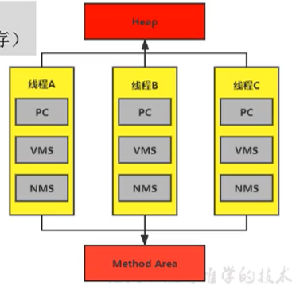
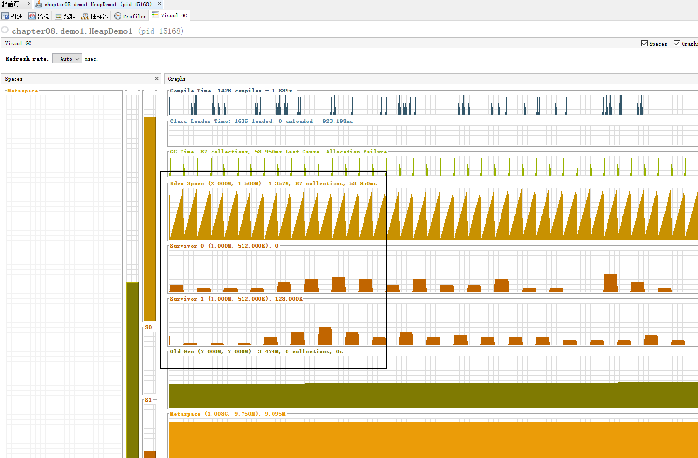
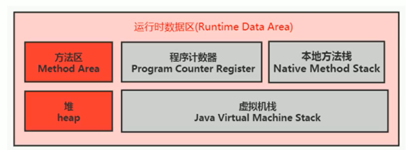
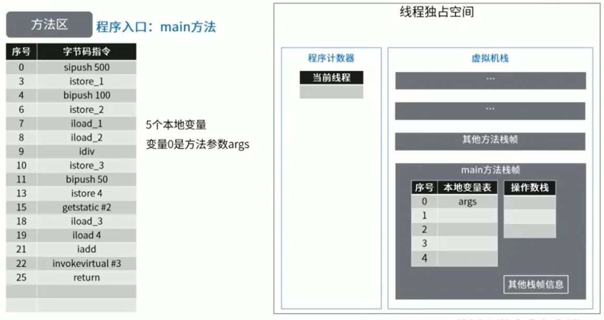
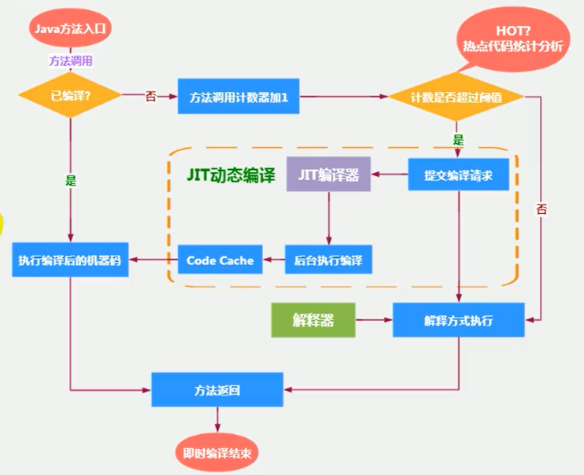
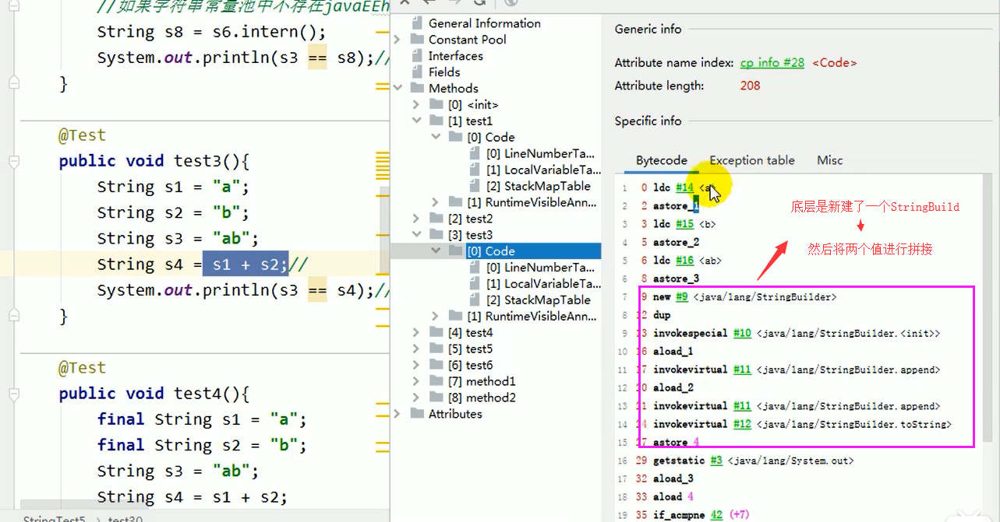
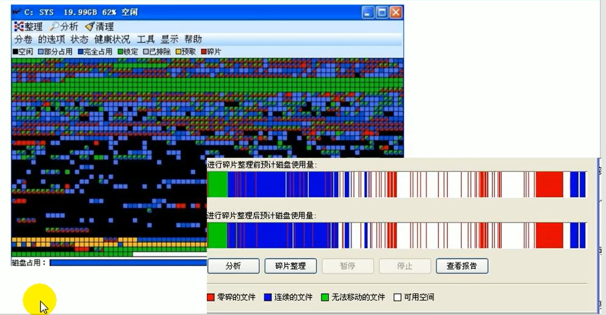
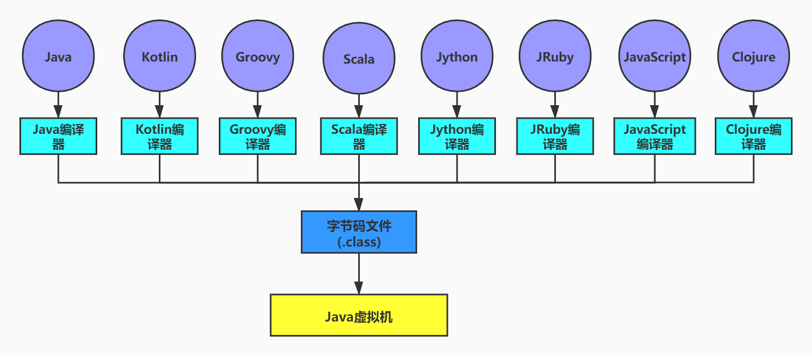
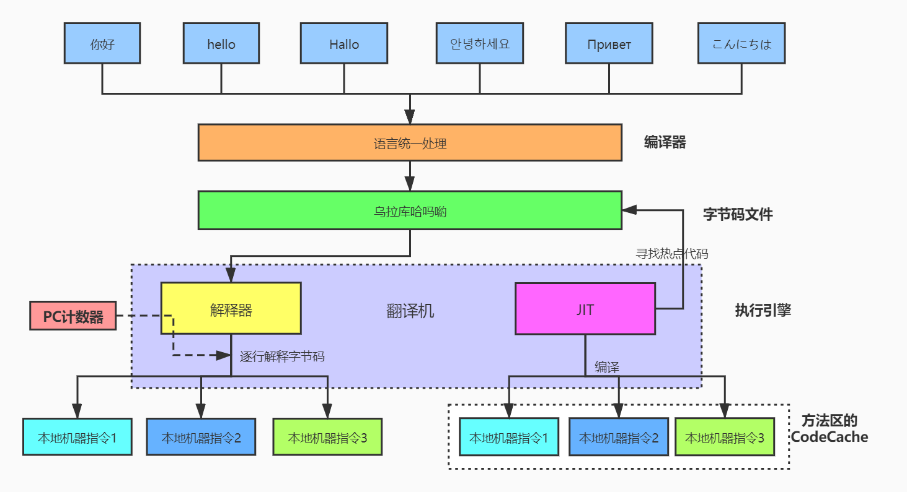

# JVM原理

## 内存与垃圾回收篇

### JVM和Java体系结构

#### 前言

作为Java工程师的你曾被伤害过吗？你是否也遇到过这些问题？

- 运行着的线上系统突然卡死，系统无法访问，甚至直接OOM！

- 想解决线上JVM GC问题，但却无从下手。
- 新项目上线，对各种JVM参数设置一脸茫然，直接默认吧然后就JJ了
- 每次面试之前都要重新背一遍JVM的一些原理概念性的东西，然而面试官却经常问你在实际项目中如何调优JVM参数，如何解决GC、OOM等问题，一脸懵逼。


大部分Java开发人员，除会在项目中使用到与Java平台相关的各种高精尖技术，对于Java技术的核心Java虚拟机了解甚少。

#### 开发人员如何看待上层框架

一些有一定工作经验的开发人员，打心眼儿里觉得SSM、微服务等上层技术才是重点，基础技术并不重要，这其实是一种本末倒置的“病态”。

如果我们把核心类库的API比做数学公式的话，那么Java虚拟机的知识就好比公式的推导过程。

计算机系统体系对我们来说越来越远，在不了解底层实现方式的前提下，通过高级语言很容易编写程序代码。但事实上计算机并不认识高级语言。


#### 架构师每天在思考什么？

- 应该如何让我的系统更快？
- 如何避免系统出现瓶颈？

知乎上有条帖子：应该如何看招聘信息，直通年薪50万+？

- 参与现有系统的性能优化，重构，保证平台性能和稳定性
- 根据业务场景和需求，决定技术方向，做技术选型
- 能够独立架构和设计海量数据下高并发分布式解决方案，满足功能和非功能需求
- 解决各类潜在系统风险，核心功能的架构与代码编写
- 分析系统瓶颈，解决各种疑难杂症，性能调优等

#### **为什么要学习JVM**

- 面试的需要（BATJ、TMD，PKQ等面试都爱问）
- 中高级程序员必备技能
  - 项目管理、调优的需求
- 追求极客的精神
  - 比如：**垃圾回收算法、JIT（及时编译器）**、底层原理

#### Java VS C++

垃圾收集机制为我们打理了很多繁琐的工作，大大提高了开发的效率，但是，垃圾收集也不是万能的，懂得JVM内部的内存结构、工作机制，是设计高扩展性应用和诊断运行时问题的基础，也是Java工程师进阶的必备能力。


C语言需要自己来分配内存和回收内存，Java全部交给JVM进行分配和回收。

#### 字节码

平时说的java字节码，指的是用**java语言编译成的字节码**。准确的说任何能在jvm平台上执行的字节码格式都是一样的。所以应该统称为：jvm字节码。

不同的编译器，可以编译出相同的字节码文件，字节码文件也可以在不同的JVM上运行。

Java虚拟机与Java语言并没有必然的联系，它只与特定的二进制文件格式—Class文件格式所关联，Class文件中包含了Java虚拟机指令集（或者称为字节码、Bytecodes）和符号表，还有一些其他辅助信息。

#### 虚拟机与Java虚拟机

##### 虚拟机

所谓虚拟机（Virtual Machine），就是**一台虚拟的计算机。**它是一款软件，用来执行一系列虚拟计算机指令。大体上，虚拟机可以分为系统虚拟机和程序虚拟机。

- 大名鼎鼎的Visual Box，Mware就属于系统虚拟机，它们完全是对物理计算机的仿真，提供了一个可运行完整操作系统的软件平台。
- 程序虚拟机的典型代表就是Java虚拟机，它专门为执行单个计算机程序而设计，在Java虚拟机中执行的指令我们称为Java字节码指令。

无论是系统虚拟机还是程序虚拟机，在上面运行的软件都被限制于虚拟机提供的资源中。

##### Java虚拟机

Java虚拟机是一台**执行Java字节码**的虚拟计算机，它拥有独立的运行机制，其运行的Java字节码也未必由Java语言编译而成。

**JVM平台的各种语言可以共享Java虚拟机带来的跨平台性、优秀的垃圾回器，以及可靠的即时编译器。**

Java技术的核心就是Java虚拟机（JVM，Java Virtual Machine），因为所有的Java程序都运行在Java虚拟机内部。

Java虚拟机的作用：**Java虚拟机就是二进制字节码的运行环境，负责装载字节码到其内部，解释/编译为对应平台上的机器指令执行。**每一条Java指令，Java虚拟机规范中都有详细定义，如怎么取操作数，怎么处理操作数，处理结果放在哪里。

特点：

- **一次编译，到处运行**
- **自动内存管理**
- **自动垃圾回收功能**

#### JVM的位置

JVM是运行在操作系统之上的，它与硬件没有直接的交互


Java的体系结构


#### JVM的整体结构

- HotSpot VM是目前市面上高性能虚拟机的代表作之一。
- 它采用解释器与即时编译器并存的架构。
- 在今天，Java程序的运行性能早已脱胎换骨，已经达到了可以和C/C++程序一较高下的地步。


**执行引擎包含三部分：解释器，及时编译器，垃圾回收器。**

#### Java代码执行流程


只是能生成被Java虚拟机所能解释的字节码文件，那么理论上就可以自己设计一套代码了。

#### JVM的架构模型

Java编译器输入的指令流基本上是一种基于栈的指令集架构，另外一种指令集架构则是基于寄存器的指令集架构。具体来说，这两种架构之间的区别：

**基于栈式架构的特点**：

- 设计和实现更简单，适用于资源受限的系统；
- 避开了寄存器的分配难题：使用零地址指令方式分配。
- 指令流中的指令大部分是零地址指令，其执行过程依赖于操作栈。指令集更小，编译器容易实现。
- 不需要硬件支持，可移植性更好，更好实现跨平台

**基于寄存器架构的特点**：

- 典型的应用是x86的二进制指令集：比如传统的PC以及Android的Davlik虚拟机。
- 指令集架构则完全依赖硬件，可移植性差
- 性能优秀和执行更高效
- 花费更少的指令去完成一项操作。
- 在大部分情况下，基于寄存器架构的指令集往往都以一地址指令、二地址指令和三地址指令为主，而基于栈式架构的指令集却是以零地址指令为主。

举例：同样执行2+3这种逻辑操作。

```java
public class StackStruTest {
    public static void main(String[] args) {
        int i = 2;
        int j = 3;
        int k = i + j;
        System.out.println(k);
    }
}
```

然后我们找到编译后的 class文件，使用下列命令进行反编译

```java
javap -v StackStruTest.class
```

得到的文件为：

```java
  public static void main(java.lang.String[]);
    descriptor: ([Ljava/lang/String;)V
    flags: ACC_PUBLIC, ACC_STATIC
    Code:
      stack=2, locals=4, args_size=1
         0: iconst_2
         1: istore_1
         2: iconst_3
         3: istore_2
         4: iload_1
         5: iload_2
         6: iadd
         7: istore_3
         8: return
      LineNumberTable:
        line 9: 0
        line 10: 2
        line 11: 4
        line 12: 8
      LocalVariableTable:
        Start  Length  Slot  Name   Signature
            0       9     0  args   [Ljava/lang/String;
            2       7     1     i   I
            4       5     2     j   I
            8       1     3     k   I
```

总结：**由于跨平台性的设计，Java的指令都是根据栈来设计的**。不同平台CPU架构不同，所以不能设计为基于寄存器的。优点是跨平台，指令集小，编译器容易实现，缺点是性能下降，实现同样的功能需要更多的指令。

时至今日，尽管嵌入式平台已经不是Java程序的主流运行平台了（准确来说应该是HotSpotVM的宿主环境已经不局限于嵌入式平台了），那么为什么不将架构更换为基于寄存器的架构呢？（没必要更换了）

栈：**跨平台性**、指令集小、指令多；执行性能比寄存器差

#### JVM生命周期

##### 虚拟机的启动

**Java虚拟机的启动是通过引导类加载器（bootstrap class loader）创建一个初始类（initial class）来完成的，这个类是由虚拟机的具体实现指定的。**

##### 虚拟机的执行

- 一个运行中的Java虚拟机有着一个清晰的任务：执行Java程序。
- 程序开始执行时他才运行，程序结束时他就停止。
- 执行一个所谓的Java程序的时候，真真正正在执行的是一个叫做**Java虚拟机的进程**

##### 虚拟机的退出

有如下的几种情况：

- 程序正常执行结束
- 程序在执行过程中遇到了异常或错误而异常终止
- 由于操作系统用现错误而导致Java虚拟机进程终止
- 某线程调用Runtime类或system类的exit方法，或Runtime类的halt方法，并且Java安全管理器也允许这次exit或halt操作。
- 除此之外，JNI（Java Native Interface）规范描述了用JNI Invocation API来加载或卸载 Java虚拟机时，Java虚拟机的退出情况。

#### JVM发展历程

* Sun Classic VM
  * 世界上第一款商用Java虚拟机
  * 只提供解释器
* Exact VM
* HotSpot VM：名称中的HotSpot指的就是它的热点代码探测技术。
  - 通过计数器找到最具编译价值代码，触发即时编译或栈上替换
  - 通过编译器与解释器协同工作，在最优化的程序响应时间与最佳执行性能中取得平衡
* JRockit：专注于服务器端应用
  * 不太关注程序启动速度
  * 世界上最快的JVM
  * MissionControl服务套件，它是一组以极低的开销来监控、管理和分析生产环境中的应用程序的工具。
* IBM的J9：通用性差
* KVM和CDC / CLDC Hotspot
* Azul VM：高性能Java虚拟机中的战斗机
* Liquid VM：BEA公司开发的，直接运行在自家Hypervisor系统上Liquid VM即是现在的JRockit VE（Virtual Edition），Liquid VM不需要操作系统的支持。
* Apache Marmony
* Micorsoft JVM
* Taobao JVM
* Dalvik VM
* Graal VM

### 类加载子系统

#### 内存结构概述


#### 类加载器与类的加载过程

##### 类加载器子系统作用


类加载器子系统负责从文件系统或者网络中加载Class文件，class文件在文件开头有特定的文件标识。

ClassLoader只负责class文件的加载，至于它是否可以运行，则由Execution Engine决定。

加载的类信息存放于一块称为方法区的内存空间。除了类的信息外，方法区中还会存放运行时常量池信息，可能还包括字符串字面量和数字常量（这部分常量信息是Class文件中常量池部分的内存映射）。

##### 类加载ClassLoader角色


- class file存在于本地硬盘上，可以理解为设计师画在纸上的模板，而最终这个模板在执行的时候是要加载到JVM当中来根据这个文件实例化出n个一模一样的实例。
- class file加载到JVM中，被称为DNA元数据模板，放在方法区。
- 在``.class文件``->JVM->最终成为元数据模板，此过程就要一个运输工具（类装载器Class Loader），扮演一个快递员的角色。

##### 类加载过程


完整的流程图如下所示：


###### 加载阶段

1. 通过一个**类的全限定名**获取定义此类的**二进制字节流**
2. 将这个字节流所代表的**静态存储结构转化为方法区的运行时数据结构**
3. 在内存中生成一个代表这个类的java.lang.**Class对象**，作为方法区这个类的各种数据的访问入口

**加载class文件的方式**：

- 从本地系统中直接加载
- 通过网络获取，典型场景：Web Applet
- 从zip压缩包中读取，成为日后jar、war格式的基础
- 运行时计算生成，使用最多的是：**动态代理技术**
- 由其他文件生成，典型场景：JSP应用从专有数据库中提取.class文件，比较少见
- 从加密文件中获取，典型的防Class文件被反编译的保护措施

###### 链接阶段

**验证Verify**

**目的在于确保Class文件的字节流中包含信息符合当前虚拟机要求，保证被加载类的正确性，不会危害虚拟机自身安全。**

主要包括四种验证，文件格式验证，元数据验证，字节码验证，符号引用验证。

**准备Prepare**

- 为类变量分配内存并且设置该类变量的默认初始值，即零值。
- **这里不包含用final修饰的static，因为final在编译的时候就会分配了，准备阶段会显式初始化；**
- **这里不会为实例变量分配初始化**，类变量会分配在方法区中，而实例变量是会随着对象一起分配到Java堆中。

**解析 Resolve**

- **将常量池内的符号引用转换为直接引用的过程**。
- 事实上，解析操作往往会伴随着JVM在执行完初始化之后再执行。
- 符号引用就是一组符号来描述所引用的目标。符号引用的字面量形式明确定义在《java虚拟机规范》的class文件格式中。直接引用就是直接指向目标的指针、相对偏移量或一个间接定位到目标的句柄。
- 解析动作主要针对类或接口、字段、类方法、接口方法、方法类型等。对应常量池中的CONSTANT Class info、CONSTANT Fieldref info、CONSTANT Methodref info等。

###### 初始化阶段

- **初始化阶段就是执行类构造器方法``<clinit>()``的过程。**

- 此方法不需定义，是javac编译器自动收集类中的所有类变量的赋值动作和静态代码块中的语句合并而来。也就是说，**当我们代码中包含static变量的时候，就会有`<clinit>()`方法**

- 构造器方法中指令按语句在源文件中出现的顺序执行。

- `<clinit>()`不同于类的构造器。（关联：构造器是虚拟机视角下的`<init>()`）若该类具有父类，JVM会保证子类的`<clinit>()`执行前，父类的`<clinit>()`已经执行完毕。

- **虚拟机必须保证一个类的`<clinit>()`方法在多线程下被同步加锁。**

#### 类加载器分类

##### 类加载器

JVM支持两种类型的类加载器 ，分别为**引导类加载器（Bootstrap ClassLoader）和自定义类加载器（User-Defined ClassLoader）**。

从概念上来讲，自定义类加载器一般指的是程序中由开发人员自定义的一类类加载器，但是Java虚拟机规范却没有这么定义，而是将**所有派生于抽象类ClassLoader的类加载器都划分为自定义类加载器**。

无论类加载器的类型如何划分，在程序中我们最常见的类加载器始终只有3个，如下所示：


这里的四者之间是包含关系，不是上层和下层，也不是子系统的继承关系。

实例：我们通过一个类，获取它不同的加载器

```java
public class ClassLoaderTest {
    public static void main(String[] args) {

        // 获取系统类加载器
        ClassLoader systemClassLoader = ClassLoader.getSystemClassLoader();
        System.out.println(systemClassLoader);

        // 获取其上层，扩展类加载器
        ClassLoader extClassLoader = systemClassLoader.getParent();
        System.out.println(extClassLoader);

        // 试图获取根加载器
        ClassLoader boostrapClassLoader = extClassLoader.getParent();
        System.out.println(boostrapClassLoader); // 值为null，获取不到

        // 对于用户自定义类来说：默认使用系统类加载来进行加载
        ClassLoader classLoader = ClassLoaderTest.class.getClassLoader();
        System.out.println(classLoader);

        // 获取String类型的加载器
        ClassLoader classLoader1 = String.class.getClassLoader();
        System.out.println(classLoader1);// null
    }
}
```

得到的结果，从结果可以看出 根加载器无法直接通过代码获取，同时目前用户代码所使用的加载器为系统类加载器。同时我们通过获取String类型的加载器，发现是null，那么说明String类型是通过根加载器进行加载的，也就是说Java的核心类库都是使用根加载器进行加载的。

```sh
sun.misc.Launcher$AppClassLoader@18b4aac2
sun.misc.Launcher$ExtClassLoader@1b6d3586
null
sun.misc.Launcher$AppClassLoader@18b4aac2
null
```

##### 虚拟机自带的加载器

###### 启动类加载器（引导类加载器，Bootstrap ClassLoader）

- 这个类加载使用C/C++语言实现的，嵌套在JVM内部。
- 它用来加载Java的核心库（JAVAHOME/jre/1ib/rt.jar、resources.jar或sun.boot.class.path路径下的内容），用于提供JVM自身需要的类
- 并不继承自ava.lang.ClassLoader，没有父加载器。
- 加载扩展类和应用程序类加载器，并指定为他们的父类加载器。
- 出于安全考虑，Bootstrap启动类加载器只加载包名为java、javax、sun等开头的类

###### 扩展类加载器（Extension ClassLoader）

- Java语言编写，由sun.misc.Launcher$ExtClassLoader实现。
- 派生于ClassLoader类
- 父类加载器为启动类加载器
- 从java.ext.dirs系统属性所指定的目录中加载类库，或从JDK的安装目录的jre/1ib/ext子目录（扩展目录）下加载类库。**如果用户创建的JAR放在此目录下，也会自动由扩展类加载器加载。**

###### 应用程序类加载器（系统类加载器，AppClassLoader）

- javI语言编写，由sun.misc.LaunchersAppClassLoader实现
- 派生于ClassLoader类
- 父类加载器为扩展类加载器
- 它负责加载环境变量classpath或系统属性java.class.path指定路径下的类库
- 该类加载是程序中默认的类加载器，一般来说，Java应用的类都是由它来完成加载
- 通过``classLoader.getSystemclassLoader()``方法可以获取到该类加载器

##### 用户自定义类加载器

在Java的日常应用程序开发中，类的加载几乎是由上述3种类加载器相互配合执行的，在必要时，我们还可以自定义类加载器，来定制类的加载方式。 

**为什么要自定义类加载器？**

- **隔离加载类**
- **修改类加载的方式**
- **扩展加载源**
- **防止源码泄漏**

用户自定义类加载器实现步骤：

- 开发人员可以通过继承抽象类ava.lang.ClassLoader类的方式，实现自己的类加载器，以满足一些特殊的需求
- 在JDK1.2之前，在自定义类加载器时，总会去继承ClassLoader类并重写loadClass()方法，从而实现自定义的类加载类，但是在JDK1.2之后已不再建议用户去覆盖loadClass()方法，而是建议把自定义的类加载逻辑写在findClass()方法中。
- 在编写自定义类加载器时，如果没有太过于复杂的需求，可以直接继承URIClassLoader类，这样就可以避免自己去编写findClass()方法及其获取字节码流的方式，使自定义类加载器编写更加简洁。

```java
public class ClassLoaderTest2 {
    public static void main(String[] args) {
        System.out.println("============================启动类加载器============================");
        // 获取BootstrapClassLoader能够加载的api的路径
        URL[] urls = Launcher.getBootstrapClassPath().getURLs();
        for(URL url:urls)
            System.out.println(url.toExternalForm());

        // 从上面路径中随意选择一个类，来看看它的类加载器是什么
        ClassLoader classLoader = Provider.class.getClassLoader();
        System.out.println(classLoader); // null

        System.out.println("============================扩展类加载器============================");
        String extDirs = System.getProperty("java.ext.dirs");
        for(String path:extDirs.split(";"))
            System.out.println(path);

        // 从上面路径中随意选择一个类，来看看它的类加载器是什么：扩展加载器
        ClassLoader classLoader1 = Applet2.class.getClassLoader();
        System.out.println(classLoader1); // sun.misc.Launcher$AppClassLoader@18b4aac2

    }
}
```

#### ClassLoader的使用说明

##### 关于ClassLoader

ClassLoader类，它是一个抽象类，其后所有的类加载器都继承自**ClassLoader**（不包括**启动类加载器**）。

| 方法名称                                       |                                                         描述 |
| ---------------------------------------------- | -----------------------------------------------------------: |
| getParent( )                                   |                                   返回该类加载器的超类加载器 |
| **loadClass(String name)**                     |        加载名称为name的类，返回结果为java.lang.Class类的实例 |
| **findClass(String name)**                     |        查找名称为name的类，返回结果为java.lang.Class类的实例 |
| findLoadedClass(String name)                   | 查找名称为name的已经被加载过的类，返回结果为java.lang.Class类的实例 |
| **defineClass(String name,byte[ ] b,int len)** | 把字节数组b中的内容转换为一个Java类，返回结果为java.lang.Class类的实例 |
| resolveClass(Class<?> c)                       |                                         连接指定的一个Java类 |

sun.misc.Launcher 它是一个java虚拟机的入口应用


##### ClassLoader的获取途径

| ClassLoader的获取途径           | 方法                                           |
| ------------------------------- | ---------------------------------------------- |
| 获取当前ClassLoader             | clazz.getClassLoader()                         |
| 获取当前线程上下文的ClassLoader | Thread.currentThread().getContextClassLoader() |
| 获取系统的ClassLoader           | ClassLoader.getSystemClassLoader()             |
| 获取调用者的ClassLoader         | DriverManager.getCallerClassLoader()           |

#### **双亲委派机制**

##### 双亲委派机制原理

Java虚拟机对 class 文件采用的是**按需加载**的方式，也就是说当需要使用该类时才会将它的class文件加载到内存中生成class对象。而且加载某个类的class文件时，Java虚拟机采用的是**双亲委派模式**，即把请求交由父类处理，它是一种任务委派模式。


工作原理：（向上委托，向下加载）

- 如果一个类加载器收到了类加载请求，它并不会自己先去加载，而是把这个请求**委托给父类的加载器**去执行；
- 如果父类加载器还存在其父类加载器，则进一步**向上委托**，依次递归，请求最终将到达**顶层的启动类加载器**；
- **如果父类加载器可以完成类加载任务，就成功返回，倘若父类加载器无法完成此加载任务，子加载器才会尝试自己去加载，这就是双亲委派模式**。
- 父类加载器一层一层往下分配任务，如果子类加载器能加载，则加载此类，如果将加载任务分配至系统类加载器也无法加载此类，则抛出异常

##### 双亲委派机制代码示例

**举例1：我们自己定义一个java.lang包，在其下面定义一个String类，里面声明了静态代码块。**

```java
public class String {
    static {
        System.out.println("自定义String静态代码块");
    }
}
```

在一个测试类中加载String类，看看加载的String类是JDK自带的，还是我们自己编写的。

```
public class StringTest {
    public static void main(String[] args) {
        String str = new java.lang.String();
        System.out.println("hello");
    }
}
```

结果：程序并没有输出我们静态代码块中的内容，可见仍然加载的是 JDK 自带的 String 类。

**举例二：在我们自己定义的 String 类中整个 main( ) 方法**

```java
public class String {
    static {
        System.out.println("自定义String静态代码块");
    }

    // 错误: 在类 java.lang.String 中找不到 main 方法
    public static void main(String[] args) {
        System.out.println("hello String");
    }
}
```

原因：由于双亲委派机制，我们的String类是由引导类加载器加载的，而引导类加载器并没有main方法，所以会报错。

举例三：在java.lang 包下自定义类

````java
package java.lang;

// Prohibited package name: java.lang
public class ShkStart {
    public static void main(String[] args) {
        System.out.println("hello!");
    }
}
````

**出于保护机制，java.lang 包下不允许我们自定义类。**

##### 双亲委派机制的优势

- **避免类的重复加载**
- **保护程序安全，防止核心API被随意篡改**
  - 自定义类：java.lang.String 没有调用
  - 自定义类：java.lang.ShkStart（报错：阻止创建 java.lang开头的类）

#### 沙箱安全机制

自定义String类时：在加载自定义String类的时候会率先使用引导类加载器加载，而引导类加载器在加载的过程中会先加载jdk自带的文件（rt.jar包中java.lang.String.class），报错信息说没有main方法，就是因为加载的是rt.jar包中的String类。

这样可以**保证对java核心源代码的保护**，这就是**沙箱安全机制**。

> 向上委托，向下加载。

#### 其他

##### 如何判断两个class对象是否相同？

- 在JVM中表示两个class对象是否为同一个类存在两个必要条件：
  - 类的**完整类名必须一致**，包括包名
  - 加载这个类的 ClassLoader（指ClassLoader实例对象）必须相同

- 换句话说，在JVM中，即使这两个类对象（class对象）来源同一个Class文件，被同一个虚拟机所加载，但只要加载它们的 ClassLoader 实例对象不同，那么这两个类对象也是不相等的

##### 对类加载器的引用

- JVM必须知道一个类型是由启动加载器加载的还是由用户类加载器加载的
- 如果一个类型是由用户类加载器加载的，那么**JVM会将这个类加载器的一个引用作为类型信息的一部分保存在方法区中**
- 当解析一个类型到另一个类型的引用的时候，JVM需要保证这两个类型的类加载器是相同的

##### 类的主动使用和被动使用

Java程序对类的使用方式分为：**主动使用** 和 **被动使用**。

主动使用，又分为七种情况：

- **创建类的实例**
- 访问某个类或接口的静态变量，或者对该静态变量赋值
- 调用类的**静态**方法
- **反射**（ 比如：Class.forName(“cn.sxt.Test”) )
- 初始化一个类的**子类**
- Java虚拟机启动时被标明为**启动类的类**
- JDK7开始提供的动态语言支持：java.lang.invoke.MethodHandle实例的解析结果REF_getStatic、REF putStatic、REF_invokeStatic句柄对应的类没有初始化，则初始化

除了以上七种情况，其他使用Java类的方式都被看作是对类的**被动使用**，**都不会导致类的初始化，即不会执行初始化阶段（不会调用 clinit( ) 方法和 init( ) 方法）**

### 运行时数据区概述及线程

#### 概述

下图这部分，它是在类加载完成后的阶段


当我们通过前面的：``类的加载 --> 验证 --> 准备 --> 解析 --> 初始化``，这几个阶段完成后，就会用到执行引擎对我们的类进行使用，同时执行引擎将会使用到我们的运行时数据区。


比如大厨做饭，我们把大厨后面的东西（切好的菜，刀，调料），比作是**运行时数据区**。而厨师可以类比于**执行引擎**，将通过准备的东西制作成精美的菜品。


#### 运行时数据区结构

##### 运行时数据区与内存

###### 内存

内存是非常重要的系统资源，是硬盘和CPU的中间仓库及桥梁，承载着操作系统和应用程序的实时运行JVM内存布局规定了Java在运行过程中**内存申请、分配、管理**的策略，保证了JVM的高效稳定运行。**不同的JVM对于内存的划分方式和管理机制存在着部分差异**。结合JVM虚拟机规范，来探讨一下经典的JVM内存布局。

我们通过磁盘或者网络IO得到的数据，都需要先加载到内存中，然后CPU从内存中获取数据进行读取，也就是说内存充当了CPU和磁盘之间的桥梁。

###### 运行时数据区的完整图


说明：方法区在JVM规范中是一个逻辑概念，由虚拟机自己进行具体实现，**jdk7和以前的版本使用的是堆上的永久代实现的方法区**，而在**jdk8及以后使用的是元数据区实现方法区**。

##### 线程的内存空间



Java虚拟机定义了若干种程序运行期间会使用到的运行时数据区，其中有一些会随着虚拟机启动而创建，随着虚拟机退出而销毁。另外一些则是与线程一一对应的，这些与线程对应的数据区域会随着线程开始和结束而创建和销毁。

灰色的为单独**线程私有**的，红色的为多个**线程共享**的。即：

- **每个线程：独立包括程序计数器、栈、本地栈。**
- **线程间共享：堆、堆外内存（永久代或元空间、代码缓存）**

#### 线程

##### JVM线程

- 线程是一个程序里的运行单元。JVM允许一个应用有多个线程并行的执行。 

- 在Hotspot JVM里，每个线程都与操作系统的本地线程直接映射。
  - 当一个Java线程准备好执行以后，此时一个操作系统的本地线程也同时创建。Java线程执行终止后，本地线程也会回收。

- 操作系统负责所有线程的安排调度到任何一个可用的CPU上。一旦本地线程初始化成功，它就会调用Java线程中的run()方法。

##### JVM系统线程

如果你使用jconsole或者是任何一个调试工具，都能看到在后台有许多线程在运行。这些后台线程不包括调用public static void main（String[]）的main线程以及所有这个main线程自己创建的线程。

这些主要的后台系统线程在Hotspot JVM里主要是以下几个：

- **虚拟机线程**：这种线程的操作是需要JVM达到安全点才会出现。这些操作必须在不同的线程中发生的原因是他们都需要JVM达到安全点，这样堆才不会变化。这种线程的执行类型包括"stop-the-world"的垃圾收集，线程栈收集，线程挂起以及偏向锁撤销。
- **周期任务线程**：这种线程是时间周期事件的体现（比如中断），他们一般用于周期性操作的调度执行。
- **GC线程**：这种线程对在JVM里不同种类的垃圾收集行为提供了支持。
- **编译线程**：这种线程在运行时会将字节码编译成到本地代码。
- **信号调度线程**：这种线程接收信号并发送给JVM，在它内部通过调用适当的方法进行处理。

### 程序计数器（PC寄存器）

#### PC寄存器介绍


- JVM中的程序计数寄存器（Program Counter Register）中，Register的命名源于CPU的寄存器，寄存器存储指令相关的现场信息。CPU只有把数据装载到寄存器才能够运行。这里，并非是广义上所指的物理寄存器，或许将其翻译为PC计数器（或指令计数器）会更加贴切（也称为程序钩子），并且也不容易引起一些不必要的误会。**JVM中的PC寄存器是对物理PC寄存器的一种抽象模拟。**  
- 它是一块**很小的内存空间**，几乎可以忽略不记。也是**运行速度最快的存储区域**。
- 在JVM规范中，**每个线程都有它自己的程序计数器**，是**线程私有的**，**生命周期与线程的生命周期保持一致**。
- 任何时间一个线程都只有一个方法在执行，也就是所谓的**当前方法**。程序计数器会存储当前线程正在执行的Java方法的**JVM指令地址**；或者，**如果是在执行native方法，则是未指定值（undefned）。**
- 它是程序控制流的指示器，分支、循环、跳转、异常处理、线程恢复等基础功能都需要依赖这个计数器来完成。
- 字节码解释器工作时就是通过改变这个计数器的值来选取下一条需要执行的字节码指令。
- 它是唯一一个在Java虚拟机规范中没有规定任何**outotMemoryError**情况的区域。

#### PC寄存器的作用

**PC寄存器用来存储指向下一条指令的地址，也即将要执行的指令代码。由执行引擎读取下一条指令。**


#### 代码示例

```java
public class PCRegisterTest {
    public static void main(String[] args) {
        int i = 10;
        int j = 20;
        int k = i + j;
        System.out.println(k);
    }
}
```

使用反编译：``javap -v PCRegisterTest.class``

左边的数字代表指令地址 (偏移地址)，即 PC 寄存器中可能存储的值，然后执行引擎读取 PC 寄存器中的值，并执行该指令。


通过PC寄存器，我们就可以知道当前程序执行到哪一步了


#### **两个常见面试题**

##### **使用PC寄存器存储字节码指令地址有什么用呢？**

因为CPU需要不停的切换各个线程，这时候切换回来以后，就得知道接着从哪开始继续执行。

JVM的字节码解释器就需要通过改变PC寄存器的值来明确下一条应该执行什么样的字节码指令。

##### **PC寄存器为什么被设定为私有的？**

我们都知道所谓的多线程在一个特定的时间段内只会执行其中某一个线程的方法，**CPU会不停地做任务切换，这样必然导致经常中断或恢复。**

如何保证分毫无差呢？**为了能够准确地记录各个线程正在执行的当前字节码指令地址，最好的办法自然是为每一个线程都分配一个PC寄存器，这样一来各个线程之间便可以进行独立计算，从而不会出现相互干扰的情况。**

由于CPU时间片轮限制，众多线程在并发执行过程中，任何一个确定的时刻，一个处理器或者多核处理器中的一个内核，只会执行某个线程中的一条指令。

这样必然导致经常中断或恢复。如何保证分毫无差呢？每个线程在创建后，都会产生自己的程序计数器和栈帧，程序计数器在各个线程之间互不影响。


#### CPU时间片

CPU时间片即CPU分配给各个程序的时间，每个线程被分配一个时间段，称作它的时间片。

在宏观上：俄们可以同时打开多个应用程序，每个程序并行不悖，同时运行。

但在微观上：由于只有一个CPU，一次只能处理程序要求的一部分，如何处理公平，一种方法就是引入时间片，每个程序轮流执行。（其实是并发）

* 并发：在一段时间内，同时执行多个程序
* 并行：在一个时间点上，同时执行多个程序


### **虚拟机栈**

#### 虚拟机栈概述

由于跨平台性的设计，Java的指令都是根据栈来设计的。不同平台CPU架构不同，所以不能设计为基于寄存器的。 

**优点是跨平台，指令集小，编译器容易实现，缺点是性能下降，实现同样的功能需要更多的指令。**

> 有不少Java开发人员一提到Java内存结构，就会非常粗粒度地将JVM中的内存区理解为仅有Java堆（heap）和Java战（stack）？为什么？

**首先栈是运行时的单位，而堆是存储的单位**。

- 栈解决程序的运行问题，即程序如何执行，或者说如何处理数据。
- 堆解决的是数据存储的问题，即数据怎么放，放哪里


#### 虚拟机栈基本内容

##### Java虚拟机栈

Java虚拟机栈（Java Virtual Machine Stack），早期也叫Java栈。**每个线程在创建时都会创建一个虚拟机栈，其内部保存一个个的栈帧（Stack Frame），对应着一次次的Java方法调用**。**（线程私有的）**


##### 生命周期

**生命周期和线程一致**，也就是线程结束了，该虚拟机栈也销毁了。

##### 作用

主管Java程序的运行，它保存方法的局部变量、部分结果，并参与方法的调用和返回。

- 局部变量 VS 成员变量（属性）

- 基本数据类型变量 VS 引用类型变量（类、数组、接口）

##### 栈的特点

栈是一种快速有效的分配存储方式，访问速度仅次于程序计数器。JVM直接对Java栈的操作只有两个：

- 每个方法执行，伴随着进栈（入栈、压栈）
- 执行结束后的出栈工作

对于栈来说不存在垃圾回收问题（栈存在溢出的情况）。

##### 虚拟机栈的异常

###### 面试题：开发中遇到那些异常有哪些？

Java 虚拟机规范允许**Java栈的大小是动态的或者是固定不变的**。

- 如果采用固定大小的Java虚拟机栈，那每一个线程的Java虚拟机栈容量可以在线程创建的时候独立选定。如果线程请求分配的栈容量超过Java虚拟机栈允许的最大容量，Java虚拟机将会抛出一个**StackoverflowError 异常**。
- 如果Java虚拟机栈可以动态扩展，并且在尝试扩展的时候无法申请到足够的内存，或者在创建新的线程时没有足够的内存去创建对应的虚拟机栈，那Java虚拟机将会抛出一个 **OutOfMemoryError 异常**。 

##### 设置栈内存大小

可以使用参数 `-Xss`选项来设置线程的最大栈空间，栈的大小直接决定了函数调用的最大可达深度。

```sh
-Xss1024m // 栈内存为 1024MBS
-Xss1024k // 栈内存为 1024KB
```

实例：设置线程的最大栈空间：256KB

```java
/**
 * 演示栈中的异常：StackOverflowError
 *
 * 默认情况下：count = 11654
 * 设置栈的大小：-Xss256k  count = 2471
 */
public class StackTest {

    private static int count = 0;

    public static void main(String[] args) {
        count++;
        System.out.println(count);
        main(args);
    }
}
```

说明：可以看到，没有设置栈内存大小的时候，程序可以递归11654次；当我们缩小栈内存大小，设置为256k时，程序递归2471次。

#### **栈的存储单位**

##### 栈中存储什么？

- 每个线程都有自己的栈，栈中的数据都是**以栈帧（Stack Frame）为基本单位存储的**
- 在这个线程上正在执行的每个方法都各自对应一个栈帧（Stack Frame）。也就是一个方法的执行对应一个栈帧的入栈，一个方法的执行结束对应一个栈帧的出栈
- 栈帧是一个内存区块，是一个数据集，维系着方法执行过程中的各种数据信息。

##### 栈的运行原理

- JVM直接对Java栈的操作只有两个，就是对栈帧的**压栈**和**出栈**，**遵循“先进后出”/“后进先出”原则**。
- 在一条活动线程中，一个时间点上，只会有一个活动的栈帧。即只有当前正在执行的方法的栈帧（栈顶栈帧）是有效的，这个栈帧被称为**当前栈帧**（Current Frame），与当前栈帧相对应的方法就是**当前方法**（Current Method），定义这个方法的类就是**当前类**（Current Class）。
- 执行引擎运行的所有字节码指令只针对当前栈帧进行操作。
- 如果在该方法中调用了其他方法，对应的新的栈帧会被创建出来，放在栈的顶端，成为新的当前帧。


- **不同线程中所包含的栈帧是不允许存在相互引用的**，即不可能在一个栈帧之中引用另外一个线程的栈帧。
- 如果当前方法调用了其他方法，方法返回之际，当前栈帧会传回此方法的执行结果给前一个栈帧，接着，虚拟机会丢弃当前栈帧，使得前一个栈帧重新成为当前栈帧。
- Java方法有两种返回函数的方式，**一种是正常的函数返回，使用return指令；另外一种是抛出异常。不管使用哪种方式，都会导致栈帧被弹出。**

##### 栈帧的内部结构

每个栈帧中存储着：

- **局部变量表（Local Variables）**
- **操作数栈（operand Stack）（或表达式栈）**
- 动态链接（DynamicLinking）（或**指向运行时常量池的方法引用**）
- 方法返回地址（Return Address）（或方法正常退出或者异常退出的定义）
- 一些附加信息


并行每个线程下的栈都是私有的，因此每个线程都有自己各自的栈，并且每个栈里面都有很多栈帧，**栈帧的大小主要由局部变量表和操作数栈决定的**。

#### 局部变量表

##### 局部变量表介绍

局部变量表：Local Variables，被称之为局部变量数组或本地变量表。**定义为一个数字数组，主要用于存储方法参数和定义在方法体内的局部变量**，这些数据类型包括各类基本数据类型、对象引用（reference），以及returnAddress类型。

由于局部变量表是建立在线程的栈上，是线程的私有数据，因此**不存在数据安全问题**。

**局部变量表所需的容量大小是在编译期确定下来的**，并保存在方法的Code属性的maximum local variables数据项中。在方法运行期间是不会改变局部变量表的大小的。

**方法嵌套调用的次数由栈的大小决定**。一般来说，**栈越大，方法嵌套调用次数越多**。对一个函数而言，它的参数和局部变量越多，使得局部变量表膨胀，它的栈帧就越大，以满足方法调用所需传递的信息增大的需求。进而函数调用就会占用更多的栈空间，导致其嵌套调用次数就会减少。

**局部变量表中的变量只在当前方法调用中有效**。在方法执行时，虚拟机通过使用局部变量表完成参数值到参数变量列表的传递过程。**当方法调用结束后，随着方法栈帧的销毁，局部变量表也会随之销毁。**

##### 关于Slot的理解

- 参数值的存放总是在局部变量数组的index0开始，到数组长度-1的索引结束。
- 局部变量表，**最基本的存储单元是Slot（变量槽）**。
- 局部变量表中存放编译期可知的各种基本数据类型（8种），引用类型（reference），returnAddress类型的变量。
- 在局部变量表里，**32位以内的类型只占用一个slot（包括returnAddress类型），64位的类型（long和double）占用两个slot**。
  - byte、short、char 在存储前被转换为int，boolean也被转换为int，0表示false，非0表示true。 
  - long和double则占据两个slot。

- JVM会为局部变量表中的每一个Slot都分配一个访问索引，通过这个索引即可成功访问到局部变量表中指定的局部变量值
- 当一个实例方法被调用的时候，它的方法参数和方法体内部定义的局部变量将会**按照顺序被复制**到局部变量表中的每一个slot上
- **如果需要访问局部变量表中一个64bit的局部变量值时，只需要使用前一个索引即可。**（比如：访问long或double类型变量）
- 如果当前帧是由构造方法或者实例方法创建的，那么**该对象引用this将会存放在index为0的slot处**，其余的参数按照参数表顺序继续排列。


##### Slot的重复利用

栈帧中的局部变量表中的槽位是可以重用的，如果一个局部变量过了其作用域，那么在其作用域之后申明的新的局部变就很有可能会复用过期局部变量的槽位，从而达到节省资源的目的。


##### 静态变量 VS 局部变量

变量的分类：

- 按数据类型分：基本数据类型、引用数据类型
- 按类中声明的位置分：成员变量（类变量，实例变量）、局部变量
  - 类变量：linking的paper阶段，给类变量默认赋值，init阶段给类变量显示赋值即静态代码块/ds
  - 实例变量：随着对象创建，会在堆空间中分配实例变量空间，并进行默认赋值
  - 局部变量：【在使用前必须进行显式赋值，不然编译不通过。

参数表分配完毕之后，再根据方法体内定义的变量的顺序和作用域分配。

我们知道类变量表有两次初始化的机会，第一次是在“准备阶段”，执行系统初始化，对类变量设置零值，另一次则是在“初始化”阶段，赋予程序员在代码中定义的初始值。

和类变量初始化不同的是，局部变量表不存在系统初始化的过程，这意味着一旦定义了局部变量则必须人为的初始化，否则无法使用。

在栈帧中，与性能调优关系最为密切的部分就是前面提到的局部变量表。在方法执行时，虚拟机使用局部变量表完成方法的传递。

**局部变量表中的变量也是重要的垃圾回收根节点，只要被局部变量表中直接或间接引用的对象都不会被回收**。

#### **操作数栈（Operand Stack）**

##### 操作数栈的特点

操作数栈：Operand Stack。

每一个独立的栈帧除了包含局部变量表以外，还包含一个后进先出（Last - In - First -Out）的 **操作数栈**，也可以称之为 **表达式栈**（Expression Stack）。

**操作数栈，在方法执行过程中，根据字节码指令，往栈中写入数据或提取数据，即入栈（push）和 出栈（pop）**

- 某些字节码指令将值压入操作数栈，其余的字节码指令将操作数取出栈。使用它们后再把结果压入栈
- 比如：执行复制、交换、求和等操作


代码举例


##### 操作数栈的作用

操作数栈，**主要用于保存计算过程的中间结果，同时作为计算过程中变量临时的存储空间。**

操作数栈就是JVM执行引擎的一个工作区，当一个方法刚开始执行的时候，一个新的栈帧也会随之被创建出来，**这个方法的操作数栈是空的。（这个时候数组是创建好并且是长度固定的，但数组的内容为空）**

每一个操作数栈都会拥有一个明确的栈深度用于存储数值，**其所需的最大深度在编译期就定义好了**，保存在方法的Code属性中，为**maxstack**的值。

栈中的任何一个元素都是可以任意的Java数据类型：

- **32bit的类型占用一个栈单位深度**
- **64bit的类型占用两个栈单位深度**

操作数栈**并非采用访问索引的方式来进行数据访问的**，而是只能通过标准的入栈和出栈操作来完成一次数据访问。

**如果被调用的方法带有返回值的话，其返回值将会被压入当前栈帧的操作数栈中**，并更新PC寄存器中下一条需要执行的字节码指令。

> **aload是加载this变量，然后invokevirtual执行this变量的getSum方法，istore_1将方法返回值存储到局部变量表的1位置。**

操作数栈中元素的数据类型必须与字节码指令的序列严格匹配，这由编译器在编译器期间进行验证，同时在类加载过程中的类检验阶段的数据流分析阶段要再次验证。

另外，我们说**Java虚拟机的解释引擎是基于栈的执行引擎**，其中的栈指的就是**操作数栈**。

#### 代码追踪

```java
public void testAddOperation(){
    byte i = 15; //byte、short、char、boolean：都以int型来保存
    int j = 8;
    int k = i + j;
}
```

查看指令：

```java
 0 bipush 15
 2 istore_1
 3 bipush 8
 5 istore_2
 6 iload_1
 7 iload_2
 8 iadd
 9 istore_3
10 return
```

执行流程如下所示：

首先执行第一条语句，PC寄存器指向的是0，也就是指令地址为0，然后使用bipush让操作数15入栈。


执行完后，让PC + 1，指向下一行代码，下一行代码就是将操作数栈的元素存储到局部变量表1的位置，我们可以看到局部变量表的已经增加了一个元素。


> 为什么局部变量表不是从0开始的呢？
>
> 其实局部变量表也是从0开始的，但是因为0号位置存储的是this指针，所以说就直接省略了~

然后PC+1，指向的是下一行。让操作数8也入栈，同时执行store操作，存入局部变量表中。


然后从局部变量表中，依次将数据放在操作数栈中。


然后将操作数栈中的两个元素执行相加操作，并存储在局部变量表3的位置。


最后PC寄存器的位置指向10，也就是return方法，则直接退出方法。

**面试题：i++ 和 ++i 的区别**：

```java
public void add(){
    int i1 = 10;
    i1++; // 11
    System.out.println(i1);

    int i2 = 10;
    ++i2;  // 11
    System.out.println(i2);

    int i3 = i1++; // 11,12
    int i4 = ++i2; // 12,12
    System.out.println(i3);
    System.out.println(i4);

    int i5 = 10;
    i5 = i5++; // 10
    System.out.println(i5);

    int i6 = 10;
    i6 = ++i6; // 11
    System.out.println(i6);

    int i7 = 10;
    int i8 = (i7++)+ (++i7); // 10+12=22
    System.out.println(i8);
}
```

#### 栈顶缓存技术（Top Of Stack Cashing）

栈顶缓存技术：Top Of Stack Cashing

前面提过，基于栈式架构的虚拟机所使用的零地址指令更加紧凑，但完成一项操作的时候必然需要使用更多的入栈和出栈指令，这同时也就意味着将需要更多的指令分派（instruction dispatch）次数和内存读/写次数。

由于操作数是存储在内存中的，因此频繁地执行内存读/写操作必然会影响执行速度。为了解决这个问题，HotSpot JVM的设计者们提出了**栈顶缓存（Tos，Top-of-Stack Cashing）技术，将栈顶元素全部缓存在物理CPU的寄存器中，以此降低对内存的读/写次数，提升执行引擎的执行效率。**

> **寄存器：指令更少，执行速度快**

#### **动态链接（Dynamic Linking）**

动态链接：指向运行时常量池的方法引用。


> 动态链接、方法返回地址、附加信息 ： 有些地方被称为帧数据区

每一个栈帧内部都包含一个指向**运行时常量池**中**该栈帧所属方法的引用**。包含这个引用的目的就是为了支持当前方法的代码能够实现**动态链接**（Dynamic Linking）。比如：invokedynamic指令。

在Java源文件被编译到字节码文件中时，所有的变量和方法引用都作为符号引用（symbolic Reference）保存在class文件的常量池里。

比如：描述一个方法调用了另外的其他方法时，就是通过常量池中指向方法的符号引用来表示的，那么**动态链接的作用就是为了将这些符号引用转换为调用方法的直接引用**。


为什么需要运行时常量池？

因为在不同的方法，都可能调用常量或者方法，所以只需要存储一份即可，节省了空间。

**常量池的作用：就是为了提供一些符号和常量，便于指令的识别。**

#### 方法的调用：解析和分派

##### 概念

在JVM中，将符号引用转换为调用方法的直接引用与方法的绑定机制相关。

##### 静态链接和动态链接

###### 静态链接

当一个字节码文件被装载进JVM内部时，如果被调用的**目标方法在编译期克制可知**，且运行期保持不变时，这种情况下降调用方法的符号引用转换为直接引用的过程称之为静态链接。

##### 动态链接

如果**被调用的方法在编译期无法被确定下来**，也就是说，只能够在程序运行期将调用的方法的符号转换为直接引用，由于这种引用转换过程具备动态性，因此也被称之为动态链接。

##### 方法的绑定机制

###### 绑定机制

对应的方法的绑定机制为：早期绑定（Early Binding）和晚期绑定（Late Binding）。**绑定是一个字段、方法或者类在符号引用被替换为直接引用的过程，这仅仅发生一次。**

###### 早期绑定

早期绑定就是指被调用的**目标方法如果在编译期可知，且运行期保持不变**时，即可将这个方法与所属的类型进行绑定，这样一来，由于明确了被调用的目标方法究竟是哪一个，因此也就可以使用静态链接的方式将符号引用转换为直接引用。

###### 晚期绑定

如果**被调用的方法在编译期无法被确定下来，只能够在程序运行期根据实际的类型绑定相关的方法**，这种绑定方式也就被称之为晚期绑定。（动态链接）

###### 早晚期绑定的发展历史

随着高级语言的横空出世，类似于Java一样的基于面向对象的编程语言如今越来越多，尽管这类编程语言在语法风格上存在一定的差别，但是它们彼此之间始终保持着一个共性，那就是都支持封装、继承和多态等面向对象特性，既然**这一类的编程语言具备多态特悄，那么自然也就具备早期绑定和晚期绑定两种绑定方式。**

Java中任何一个普通的方法其实都具备虚函数的特征，它们相当于C++语言中的虚函数（C++中则需要使用关键字virtual来显式定义）。如果在Java程序中不希望某个方法拥有虚函数的特征时，则可以使用关键字final来标记这个方法。

##### 虚方法和非虚方法

###### 概念

如果方法在编译期就确定了具体的调用版本，这个版本**在运行时是不可变的**。这样的方法称为**非虚方法**。其中，静态方法、私有方法、fina1方法、实例构造器、父类方法都是非虚方法。而其他方法称为**虚方法**。（动态链接/多态）

###### 子类对象的多态性的使用前提

- 类的继承关系
- 方法的重写

###### 虚拟机中调用方法的指令

**普通调用指令：**

- **invokestatic：调用静态方法，解析阶段确定唯一方法版本**
- **invokespecial：调用`<init>`方法、私有及父类方法，解析阶段确定唯一方法版本**
- invokevirtual：调用所有虚方法
- invokeinterface：调用接口方法

**动态调用指令：**

- invokedynamic：动态解析出需要调用的方法，然后执行

前四条指令固化在虚拟机内部，方法的调用执行不可人为干预，而invokedynamic指令则支持由用户确定方法版本。**其中invokestatic指令和invokespecial指令调用的方法称为非虚方法，其余的（final修饰的除外）称为虚方法。**

> 在类中，能被重写的都是虚方法。

##### 关于invoked dynamic指令

JVM字节码指令集一直比较稳定，一直到Java7中才增加了一个invokedynamic指令，这是Java为了实现动态类型语言支持而做的一种改进。

但是在Java7中并没有提供直接生成invokedynamic指令的方法，需要借助ASM这种底层字节码工具来产生invokedynamic指令。**直到Java8的Lambda表达式的出现，invokedynamic指令的生成，在Java中才有了直接的生成方式。**

Java7中增加的动态语言类型支持的本质是对Java虚拟机规范的修改，而不是对Java语言规则的修改，这一块相对来讲比较复杂，增加了虚拟机中的方法调用，最直接的受益者就是运行在Java平台的动态语言的编译器。

##### 动态类型语言和静态类型语言

动态类型语言和静态类型语言两者的区别就在于对类型的检查是在编译期还是在运行期，满足前者就是静态类型语言，反之是动态类型语言。

说的再直白一点就是，**静态类型语言是判断变量自身的类型信息；动态类型语言是判断变量值的类型信息，变量没有类型信息，变量值才有类型信息**，这是动态语言的一个重要特征。

> Java：String info = "mogu blog"; (Java是静态类型语言的，会先编译就进行类型检查)
>
> JS：var name = "shkstart"; var name = 10; （运行时才进行检查）

##### 方法重写的本质 

###### Java语言中方法重写的本质

- 找到操作数栈顶的第一个元素所执行的对象的实际类型，记作C。
- 如果在类型C中找到与常量中的描述符合简单名称都相符的方法，则进行访问权限校验，如果通过则返回这个方法的直接引用，查找过程结束；如果不通过，则返回java.lang.**IllegalAccessError**异常。
- 否则，按照继承关系从下往上依次对C的各个父类进行第2步的搜索和验证过程。
- 如果始终没有找到合适的方法，则抛出java.lang.**AbstractMethodsrror**异常。

###### IllegalAccessError介绍

程序试图访问或修改一个属性或调用一个方法，这个属性或方法，你没有**权限访问**。一般的，这个会引起编译器异常。这个错误如果发生在运行时，就说明一个类发生了不兼容的改变。

##### 虚方法表

- 在面向对象的编程中，会很频繁的使用到动态分派，如果在每次动态分派的过程中都要重新在类的方法元数据中搜索合适的目标的话就可能影响到执行效率。因此，**为了提高性能，JVM采用在类的方法区建立一个虚方法表 （virtual method table）（非虚方法不会出现在表中）来实现。使用索引表来代替查找。**
- 每个类中都有一个虚方法表，表中存放着各个方法的实际入口。
- **虚方法表是什么时候被创建？**虚方法表会在**类加载的链接阶段**被创建并开始初始化，类的变量初始值准备完成之后，JVM会把该类的方法表也初始化完毕。


如上图所示：如果类中重写了方法，那么调用的时候，就会直接在虚方法表中查找，否则将会直接连接到Object的方法中。

#### **方法返回地址（return adress）**

##### 概念

存放调用该方法的pc寄存器的值。

一个方法的结束，有两种方式：

- 正常执行完成
- 出现未处理的异常，非正常退出

无论通过哪种方式退出，在方法退出后都返回到该方法被调用的位置。**方法正常退出时，调用者的pc计数器的值作为返回地址，即调用该方法的指令的下一条指令的地址。**而通过异常退出的，返回地址是要通过异常表来确定，栈帧中一般不会保存这部分信息。

- 本质上，**方法的退出就是当前栈帧出栈的过程**。此时，需要恢复上层方法的局部变量表、操作数栈、将返回值压入调用者栈帧的操作数栈、设置PC寄存器值等，让调用者方法继续执行下去。
- **正常完成出口和异常完成出口的区别在于：通过异常完成出口退出的不会给他的上层调用者产生任何的返回值。**

##### 方法退出的两种方式

当一个方法开始执行后，只有两种方式可以退出这个方法：

执行引擎遇到任意一个方法返回的字节码指令（return），会有返回值传递给上层的方法调用者，简称正常完成出口；

- 一个方法在正常调用完成之后，究竟需要使用哪一个返回指令，还需要根据方法返回值的实际数据类型而定。
- 在字节码指令中，返回指令包含ireturn（当返回值是boolean，byte，char，short和int类型时使用），lreturn（Long类型），freturn（Float类型），dreturn（Double类型），areturn。另外还有一个return指令声明为void的方法，实例初始化方法，类和接口的初始化方法使用。

在方法执行过程中遇到异常（Exception），并且这个异常没有在方法内进行处理，也就是只要在本方法的异常表中没有搜索到匹配的异常处理器，就会导致方法退出，简称异常完成出口。

方法执行过程中，抛出异常时的异常处理，存储在一个异常处理表，方便在发生异常的时候找到处理异常的代码。

##### 异常处理表


- 反编译字节码文件，可得到 Exception table
- from ：字节码指令起始地址
- to ：字节码指令结束地址
- target ：出现异常跳转至地址为 19 的指令执行
- type ：捕获异常的类型

#### 一些附加信息

栈帧中还允许携带与Java虚拟机实现相关的一些附加信息。例如：对程序调试提供支持的信息。

#### 栈的相关面试题

##### 举例栈溢出的情况？（StackOverflowError）

- 通过 -Xss 设置栈的大小
- 递归很容易出现栈溢出

##### 调整栈大小，就能保证不出现溢出么？

不能保证不出现溢出，只能让栈溢出出现的时间晚一点，不可能不出现

##### 分配的栈内存越大越好么？

不是，一定时间内降低了**栈溢出**的概率，但是会挤占其它的线程空间，因为**整个虚拟机的内存空间是有限的**。

##### 垃圾回收是否涉及到虚拟机栈？

不涉及。（不会涉及到虚拟机栈空间）

##### 方法中定义的局部变量是否线程安全？

- 如果只有一个线程才可以操作此数据，则必是线程安全的。
- 如果有多个线程操作此数据，则此数据是共享数据。如果不考虑同步机制的话，会存在线程安全问题。

### 本地方法接口

#### 本地方法

- 简单地讲，**一个Native Method是一个Java调用非Java代码的接囗**
- 一个Native Method是这样一个Java方法：该方法的实现由非Java语言实现，比如C。
- 这个特征并非Java所特有，很多其它的编程语言都有这一机制，比如在C++中，你可以用`extern "C"`告知C++编译器去调用一个C的函数。
- “A native method is a Java method whose implementation is provided by non-java code.”（本地方法是一个Java的方法，它的具体实现是非Java代码的实现）
- 在定义一个native method时，**并不提供实现体**（有些像定义一个Java interface），因为其实现体是由非java语言在外面实现的。
- 本地接口的作用是融合不同的编程语言为Java所用，它的初衷是**融合C/C++程序**。


#### native方法举例

Object类的getClass()方法

```java
public final native Class<?> getClass();
```

Thread类的start()方法

```java
public synchronized void start() {

    if (threadStatus != 0)
        throw new IllegalThreadStateException();
    
    group.add(this);

    boolean started = false;
    try {
        start0();
        started = true;
    } finally {
        try {
            if (!started) {
                group.threadStartFailed(this);
            }
        } catch (Throwable ignore) {
        }
    }
}
private native void start0();
```

自定义Native方法

```java
public class IHaveNatives {
    public native void Native1(int x);

    public native static long Native2();

    private native synchronized float Native3(Object o);

    native void Native4(int[] ary) throws Exception;
}
```

注意：标识符native可以与其他java标识符连用，但是不能与`abstract`连用。

#### 为什么要使用Native Method？

Java使用起来非常方便，然而有些层次的任务用Java实现起来不容易，或者我们对程序的效率很在意时，问题就来了。

###### 与Java环境外交互

- **有时Java应用需要与Java外面的环境交互，这是本地方法存在的主要原因。**你可以想想Java需要与一些**底层系统**，如操作系统或某些硬件交换信息时的情况。
- 本地方法正是这样一种交流机制：它为我们提供了一个非常简洁的接口，而且我们无需去了解Java应用之外的繁琐的细节。

###### 与操作系统的交互

JVM支持着Java语言本身和运行时库，它是Java程序赖以生存的平台，它由一个解释器（解释字节码）和一些连接到本地代码的库组成。然而不管怎样，它毕竟不是一个完整的系统，它经常依赖于一底层系统的支持。这些底层系统常常是强大的操作系统。**通过使用本地方法，我们得以用Java实现了jre的与底层系统的交互，甚至JVM的一些部分就是用C写的。**还有，如果我们要使用一些Java语言本身没有提供封装的操作系统的特性时，我们也需要使用本地方法。

###### Sun’s Java

**Sun的解释器是用C实现的，这使得它能像一些普通的C一样与外部交互**。jre大部分是用Java实现的，它也通过一些本地方法与外界交互。

例如：类java.lang.Thread的setPriority()方法是用Java实现的，但是它实现调用的是该类里的本地方法setPriority0()。这个本地方法是用C实现的，并被植入JVM内部在Windows 95的平台上，这个本地方法最终将调用Win32 setpriority() API。

这是一个本地方法的具体实现由JVM直接提供，更多的情况是本地方法由外部的动态链接库（external dynamic link library）提供，然后被JVM调用。

#### 本地方法的现状

**目前该方法使用的越来越少了，除非是与硬件有关的应用**，比如通过Java程序驱动打印机或者Java系统管理生产设备，在企业级应用中已经比较少见。因为现在的异构领域间的通信很发达，比如可以使用Socket通信，也可以使用Web Service等等，不多做介绍。

### 本地方法栈

Java虚拟机栈于管理Java方法的调用，而**本地方法栈用于管理本地方法的调用**。本地方法栈，也是线程私有的，而且允许被实现成固定或者是可动态扩展的内存大小。（在内存溢出方面是相同的）

- 如果线程请求分配的栈容量超过本地方法栈允许的最大容量，Java虚拟机将会抛出一个stackoverflowError 异常。
- 如果本地方法栈可以动态扩展，并且在尝试扩展的时候无法申请到足够的内存，或者在创建新的线程时没有足够的内存去创建对应的本地方法栈，那么Java虚拟机将会抛出一个outofMemoryError异常。

本地方法是使用C语言实现的，它的具体做法是Native Method Stack中登记native方法，在Execution Engine 执行时加载本地方法库。


**当某个线程调用一个本地方法时，它就进入了一个全新的并且不再受虚拟机限制的世界。它和虚拟机拥有同样的权限。**

- 本地方法可以通过本地方法接口来**访问虚拟机内部的运行时数据区**。
- 它甚至可以直接使用本地处理器中的寄存器
- 直接从本地内存的堆中分配任意数量的内存。

**并不是所有的JVM都支持本地方法。因为Java虚拟机规范并没有明确要求本地方法栈的使用语言、具体实现方式、数据结构等。**如果JVM产品不打算支持native方法，也可以无需实现本地方法栈。

在Hotspot JVM中，直接将本地方法栈和虚拟机栈合二为一。

### **堆**

#### 堆的核心概述

##### 认识堆内存

###### 堆与进程、线程的关系

 堆针对一个JVM进程来说是唯一的，也就是一个进程只有一个JVM实例，但是进程包含多个线程，他们是共享同一堆空间的。


###### 对堆的认识

- 一个JVM实例只存在一个堆内存，堆也是Java内存管理的核心区域。
- Java堆区**在JVM启动的时候即被创建**，其空间大小也就确定了，**堆是JVM管理的最大一块内存空间**。
  - **堆内存的大小是可以调节的**。
- 《Java虚拟机规范》规定，**堆可以处于物理上不连续的内存空间中，但在逻辑上它应该被视为连续的**。
- 所有的线程共享Java堆，在这里还可以划分**线程私有的缓冲区**（Thread Local Allocation Buffer，TLAB）。
- 《Java虚拟机规范》中对Java堆的描述是：**所有的对象实例以及数组都应当在运行时分配在堆上**。
- 从实际使用角度看的：“几乎”所有的对象实例都在这里分配内存。因为还有一些对象是在栈上分配的（逃逸分析，标量替换）
- **数组和对象可能永远不会存储在栈上，因为栈帧中保存引用，这个引用指向对象或者数组在堆中的位置**。
- 在方法结束后，**堆中的对象不会马上被移除**，仅仅在垃圾收集的时候才会被移除。
  - 也就是触发了GC的时候，才会进行回收
  - 如果堆中对象马上被回收，那么用户线程就会收到影响，因为有 stop the word
- **堆，是GC（Garbage Collection，垃圾收集器）执行垃圾回收的重点区域。**


代码示例：

```java
public class SimpleHeap {
    private int id;//属性、成员变量

    public SimpleHeap(int id) {
        this.id = id;
    }

    public void show() {
        System.out.println("My ID is " + id);
    }

    public static void main(String[] args) {
        SimpleHeap sl = new SimpleHeap(1);
        SimpleHeap s2 = new SimpleHeap(2);
        int[] arr = new int[10];
        Object[] arr1 = new Object[10];
    }
}
```

**一个JVM实例只存在一个堆内存，并且堆内存的大小是可以调节的**：

```java
public class HeapDemo1 {
    public static void main(String[] args) {
        try {
            Thread.sleep(1000000);
        } catch (InterruptedException e) {
            e.printStackTrace();
        }
    }
}
```

如何设置堆内存大小：

```sh
-Xms10m -Xmx10m
```


##### 查看堆内存

打开`Java\jdk1.8.0_202\bin\jvisualvm.exe`，安装`GC` 插件(工具>插件)



##### **堆内存分区**

现代垃圾收集器大部分都基于分代收集理论设计，堆空间细分为：

Java 7及之前堆内存逻辑上分为三部分：**新生区 + 养老区 + 永久区**

- Young Generation Space 新生区 Young/New
- 又被划分为 **Eden区** 和 **Survivor区**
- Tenure generation space 养老区 Old/Tenure
- Permanent Space永久区 Perm


Java 8及之后堆内存逻辑上分为三部分：**新生区 + 养老区 + 元空间**

- Young/New Generation Space 新生区，又被划分为Eden区和Survivor区
- Old/Tenure generation space 养老区
- Meta Space 元空间 Meta


- 约定：**新生区 = 新生代 = 年轻代、 养老区 = 老年区 = 老年代、 永久区 = 永久代**
- 堆空间内部结构，JDK1.8之前从**永久代**替换成**元空间**

- 堆空间逻辑上包括 **永久代/元空间**，实际上控制不到

> 打印GC细节：**-XX:PrintGCDetails**

#### 设置堆内存大小与OOM

##### 设置堆空间大小

Java堆区用于存储Java对象实例，那么堆的大小在JVM启动时就已经设定好了，大家可以通过选项"-Xmx"和"-Xms"来进行设置。

- **"-Xms"用于表示堆区的起始内存（新生代+老年代），等价于-XX:InitialHeapSize**
- **"-Xmx"则用于表示堆区的最大内存，等价于-XX:MaxHeapSize**

一旦堆区中的内存大小超过"-Xmx"所指定的最大内存时，将会抛出outofMemoryError异常。

通常会将-Xms和-Xmx两个参数配置相同的值，其目的是**为了能够在Java垃圾回收机制清理完堆区后不需要重新分隔计算堆区的大小，从而提高性能**。

默认情况下

- 初始内存大小：物理电脑内存大小/64
- 最大内存大小：物理电脑内存大小/4

**一般手动设置初始内存大小与最大内存大小是一样的。**

如何查看堆内存的内存分配情况？

* jps查看进程ID
* jstat查看内存分配情况


##### OOM举例

```java
/**
 * -Xms600m -Xmx600m
 */
public class OOMTest {
    public static void main(String[] args) {
        ArrayList<Picture> list = new ArrayList<>();
        while(true){
            try {
                Thread.sleep(20);
            } catch (InterruptedException e) {
                e.printStackTrace();
            }
            list.add(new Picture(new Random().nextInt(1024 * 1024)));
        }
    }
}

class Picture {
    private byte[] pixels;

    public Picture(int length) {
        this.pixels = new byte[length];
    }
}
```

监控堆内存变化：Old 区域一点一点在变大，直到最后一次垃圾回收器无法回收垃圾时，堆内存被撑爆，抛出 OutOfMemoryError 错误。

堆内存变化图：


分析原因：大对象导致堆内存溢出

#### 年轻代与老年代

##### Java对象类

存储在JVM中的Java对象可以被划分为两类：

- 一类是生命周期较短的瞬时对象，这类对象的创建和消亡都非常迅速
  - 生命周期短的，及时回收即可
- 另外一类对象的生命周期却非常长，在某些极端的情况下还能够与JVM的生命周期保持一致

##### 配置新老比例

Java堆区进一步细分的话，可以划分为年轻代（YoungGen）和老年代（oldGen）。

其中年轻代又可以划分为Eden空间、Survivor0空间和Survivor1空间（有时也叫做from区、to区）。


下面这参数开发中一般不会调：


- Eden：From：to -> 8:1:1
- 新生代：老年代 - > 1 : 2

配置新生代与老年代在堆结构的占比。

- 默认-XX:NewRatio=2，表示新生代占1，老年代占2，新生代占整个堆的1/3
- 可以修改-XX:NewRatio=4，表示新生代占1，老年代占4，新生代占整个堆的1/5

> 当发现在整个项目中，生命周期长的对象偏多，那么就可以通过调整老年代的大小，来进行调优

在HotSpot中，Eden空间和另外两个survivor空间缺省所占的比例是8：1：1当然开发人员可以通过选项“-XX:SurvivorRatio”调整这个空间比例。比如-XX:SurvivorRatio=8。

> -XX:-UseAdaptiveSizePolicy：`-`表示不适用，`+`表示使用，关闭自适应的内存分配策略。
>
> -XX:SurvivorRatio设置新生代中Eden区域Survivor区的比例。

几乎所有的Java对象都是在Eden区被new出来的。绝大部分的Java对象的销毁都在新生代进行了。（有些大的对象在Eden区无法存储时候，将直接进入老年代）

> IBM公司的专门研究表明，新生代中80%的对象都是“朝生夕死”的。
>
> 可以使用选项"-Xmn"设置新生代最大内存大小
>
> 这个参数一般使用默认值就可以了。


#### 图解对象分配过程

##### 对象分配过程

为新对象分配内存是一件非常严谨和复杂的任务，JM的设计者们不仅需要考虑内存如何分配、在哪里分配等问题，并且由于内存分配算法与内存回收算法密切相关，所以还需要考虑GC执行完内存回收后是否会在内存空间中产生内存碎片。

- new的对象先放伊甸园区。此区有大小限制。
- 当伊甸园的空间填满时，程序又需要创建对象，JVM的垃圾回收器将对伊甸园区进行垃圾回收（MinorGC），将伊甸园区中的不再被其他对象所引用的对象进行销毁。再加载新的对象放到伊甸园区
- 然后将伊甸园中的剩余对象移动到幸存者0区。
- 如果再次触发垃圾回收，此时上次幸存下来的放到幸存者0区的，如果没有回收，就会放到幸存者1区。
- 如果再次经历垃圾回收，此时会重新放回幸存者0区，接着再去幸存者1区。
- 啥时候能去养老区呢？可以设置次数。默认是15次。
- 在养老区，相对悠闲。当养老区内存不足时，再次触发GC：Major GC，进行养老区的内存清理
- 若养老区执行了Major GC之后，发现依然无法进行对象的保存，就会产生OOM异常。
  - **可以设置参数：-XX:MaxTenuringThreshold= N进行设置**

##### **图解对象分配**

我们创建的对象，一般都是存放在Eden区的，当我们Eden区满了后，就会触发GC操作，一般被称为 YGC / Minor GC操作


当我们进行一次垃圾收集后，红色的将会被回收，而绿色的还会被占用着，存放在S0(Survivor From)区。同时我们给每个对象设置了一个年龄计数器，一次回收后就是1。

同时Eden区继续存放对象，当Eden区再次存满的时候，又会触发一个MinorGC操作，此时GC将会把 Eden和Survivor From中的对象 进行一次收集，把存活的对象放到 Survivor To区，同时让年龄 + 1。


我们继续不断的进行对象生成 和 垃圾回收，当Survivor中的对象的年龄达到15的时候，将会触发一次 Promotion晋升的操作，也就是将年轻代中的对象晋升到老年代中。


**思考：幸存区区满了后？**

特别注意，在Eden区满了的时候，才会触发MinorGC，而幸存者区满了后，不会触发MinorGC操作

如果Survivor区满了后，将会触发一些特殊的规则，也就是可能直接晋升老年代

> 举例：以当兵为例，正常人的晋升可能是 ： 新兵 -> 班长 -> 排长 -> 连长
>
> 但是也有可能有些人因为做了非常大的贡献，直接从 新兵 -> 排长

##### 特殊情况说明


**代码演示对象分配过程**：不断的创建大对象

```java
public class HeapInstanceTest {
    byte [] buffer = new byte[new Random().nextInt(1024 * 200)];
    public static void main(String[] args) throws InterruptedException {
        ArrayList<HeapInstanceTest> list = new ArrayList<>();
        while (true) {
            list.add(new HeapInstanceTest());
            Thread.sleep(10);
        }
    }
}
```

然后设置JVM参数

```bash
-Xms600m -Xmx600m
```

然后cmd输入下面命令，打开VisualVM图形化界面

```undefined
jvisualvm
```

然后通过执行上面代码，通过VisualGC进行动态化查看


最终，在老年代和新生代都满了，就出现OOM

```csharp
Exception in thread "main" java.lang.OutOfMemoryError: Java heap space
	at com.atguigu.java.chapter08.HeapInstanceTest.<init>(HeapInstanceTest.java:13)
	at com.atguigu.java.chapter08.HeapInstanceTest.main(HeapInstanceTest.java:17)
```

##### 常用调优工具

- JDK命令行
- Eclipse：Memory Analyzer Tool
- Jconsole
- Visual VM（实时监控 推荐~）
- **Jprofiler（推荐~）**
- Java Flight Recorder（实时监控）
- GCViewer
- GCEasy

##### 总结

- 针对幸存者s0，s1区的总结：复制之后有交换，谁空谁是to
- 关于垃圾回收：频繁在新生区收集，很少在老年代收集，几乎不再永久代和元空间进行收集
- 新生代采用复制算法的目的：是为了减少内碎片

#### GC垃圾回收器

##### **分代收集思想**

我们都知道，JVM调优的一个环节，也就是垃圾收集，我们需要尽量的避免垃圾回收，因为在垃圾回收的过程中，容易出现STW（Stop the World）的问题，**而 Major GC 和 Full GC出现STW的时间，是Minor GC的10倍以上**。

JVM在进行GC时，并非每次都对上面三个内存区域一起回收的，大部分时候回收的都是指**新生代**。针对Hotspot VM的实现，它里面的GC按照回收区域又分为两大种类型：一种是部分收集（Partial GC），一种是整堆收集（FullGC）。

* 部分收集：不是完整收集整个Java堆的垃圾收集。其中又分为：
  * 新生代收集（Minor GC/Young GC）：只是新生代的垃圾收集
  * 老年代收集（**Major GC**/Old GC）：只是老年代的圾收集。
    * 目前，**只有CMS GC会有单独收集老年代的行为。**
    * **注意，很多时候Major GC会和Full GC混淆使用，需要具体分辨是老年代回收还是整堆回收。**
  * 混合收集（Mixed GC）：收集整个新生代以及部分老年代的垃圾收集。
    * 目前，只有G1 GC会有这种行为

* 整堆收集（**Full GC**）：收集整个**Java堆和方法区**的垃圾收集。

##### Young/Minor GC

**年轻代GC(Minor Gc)触发机制**：

- 当年轻代空间不足时，就会触发MinorGC，这里的年轻代满指的是Eden代满，Survivor满不会引发GC。（每次Minor GC会清理年轻代的内存。）

- 因为Java对象大多都具备 **朝生夕灭** 的特性，所以Minor GC非常频繁，一般回收速度也比较快。这一定义既清晰又易于理解。

- Minor GC会引发STW(stop the world)，**暂停其它用户的线程，等垃圾回收结束，用户线程才恢复运行**


##### Major GC

老年代GC(Major GC/Full GC)触发机制：

- 指发生在老年代的GC，对象从老年代消失时，我们说 “Major Gc” 或“Full GC”发生了。

- 出现了Major GC，经常会伴随至少一次的Minor GC（但非绝对的，在Parallel Scavenge收集器的收集策略里就有直接进行Major GC的策略选择过程）
  - 也就是在老年代空间不足时，会先尝试触发MinorGc。如果之后空间还不足，则触发Major GC

- Major GC的速度一般会比MinorGc慢10倍以上，STW的时间更长，如果Major GC后，内存还不足，就报OOM了。

##### Full GC

触发Full GC执行的情况有如下五种：

- 调用System.gc()时，系统建议执行FullGC，但是不必然执行
- 老年代空间不足
- 方法区空间不足
- 通过Minor GC后进入老年代的平均大小大于老年代的可用内存
- 由Eden区、survivor spacee（From Space）区向survivor spacel（To Space）区复制时，对象大小大于To Space可用内存，则把该对象转存到老年代，且老年代的可用内存小于该对象大小

> **Full GC 是开发或调优中尽量要避免的，这样暂时时间会短一些。**

##### GC日志分析

我们编写一个OOM的异常，因为我们在不断的创建字符串，是存放在元空间的

```java
public class GCTest {
    public static void main(String[] args) {
        int i = 0;
        try {
            List<String> list = new ArrayList<>();
            String a = "hu tao";
            while (true) {
                list.add(a);
                a = a + a;
                i++;
            }
        } catch (Exception e) {
            e.printStackTrace();
        }
        System.out.println(i);
    }
}
```

设置JVM启动参数

```
-Xms9m -Xmx9m -XX:+PrintGCDetails
```

打印出的日志

```
[GC (Allocation Failure) [PSYoungGen: 1958K->496K(2560K)] 1958K->924K(9728K), 0.0014243 secs] [Times: user=0.00 sys=0.00, real=0.00 secs] 
[GC (Allocation Failure) [PSYoungGen: 2190K->504K(2560K)] 2618K->1692K(9728K), 0.0013124 secs] [Times: user=0.00 sys=0.00, real=0.00 secs] 
[GC (Allocation Failure) [PSYoungGen: 2500K->512K(2560K)] 3688K->2476K(9728K), 0.0009051 secs] [Times: user=0.00 sys=0.00, real=0.00 secs] 
[Full GC (Ergonomics) [PSYoungGen: 1375K->0K(2560K)] [ParOldGen: 6572K->5331K(7168K)] 7947K->5331K(9728K), [Metaspace: 3216K->3216K(1056768K)], 0.0040435 secs] [Times: user=0.00 sys=0.00, real=0.00 secs] 
[GC (Allocation Failure) [PSYoungGen: 0K->0K(2560K)] 5331K->5331K(9728K), 0.0004539 secs] [Times: user=0.00 sys=0.00, real=0.00 secs] 
[Full GC (Allocation Failure) [PSYoungGen: 0K->0K(2560K)] [ParOldGen: 5331K->5228K(7168K)] 5331K->5228K(9728K), [Metaspace: 3216K->3216K(1056768K)], 0.0061618 secs] [Times: user=0.00 sys=0.00, real=0.01 secs] 
Heap
PSYoungGen      total 2560K, used 59K [0x00000000ffd00000, 0x0000000100000000, 0x0000000100000000)
eden space 2048K, 2% used [0x00000000ffd00000,0x00000000ffd0ef38,0x00000000fff00000)
from space 512K, 0% used [0x00000000fff80000,0x00000000fff80000,0x0000000100000000)
to   space 512K, 0% used [0x00000000fff00000,0x00000000fff00000,0x00000000fff80000)
ParOldGen       total 7168K, used 5228K [0x00000000ff600000, 0x00000000ffd00000, 0x00000000ffd00000)
object space 7168K, 72% used [0x00000000ff600000,0x00000000ffb1b038,0x00000000ffd00000)
Metaspace       used 3248K, capacity 4496K, committed 4864K, reserved 1056768K
class space    used 353K, capacity 388K, committed 512K, reserved 1048576K
Exception in thread "main" java.lang.OutOfMemoryError: Java heap space
at java.util.Arrays.copyOf(Arrays.java:3332)
at java.lang.AbstractStringBuilder.ensureCapacityInternal(AbstractStringBuilder.java:124)
at java.lang.AbstractStringBuilder.append(AbstractStringBuilder.java:448)
at java.lang.StringBuilder.append(StringBuilder.java:136)
at chapter08.demo5.GCTest.main(GCTest.java:18)
```

触发OOM的时候，一定是进行了一次Full GC，因为只有在老年代空间不足时候，才会爆出OOM异常。

#### 堆空间分配思想

为什么要把Java堆分代？不分代就不能正常工作了吗？**经研究，不同对象的生命周期不同。70%-99%的对象是临时对象。**

- 新生代：有Eden、两块大小相同的survivor（又称为from/to，s0/s1）构成，to总为空。 

- 老年代：存放新生代中经历多次GC仍然存活的对象。


其实不分代完全可以，分代的唯一理由就是**优化GC性能**。如果没有分代，那所有的对象都在一块，就如同把一个学校的人都关在一个教室。GC的时候要找到哪些对象没用，这样就会对堆的所有区域进行扫描。而很多对象都是朝生夕死的，如果分代的话，把新创建的对象放到某一地方，当GC的时候先把这块存储“朝生夕死”对象的区域进行回收，这样就会腾出很大的空间出来。


#### 内存分配策略(对象提升(Promotion)规则)

如果对象在Eden出生并经过第一次Minor GC后仍然存活，并且能被Survivor容纳的话，将被移动到survivor空间中，并将对象年龄设为1。对象在survivor区中每熬过一次MinorGC，年龄就增加1岁，当它的年龄增加到一定程度（默认为15岁，其实每个JVM、每个GC都有所不同）时，就会被晋升到老年代。对于**对象晋升老年代的年龄阀值，可以通过选项``-XX:MaxTenuringThreshold``来设置。**

针对不同年龄段的对象分配原则如下所示：

- **优先分配到Eden**：开发中比较长的字符串或者数组，会直接存在老年代，但是因为新创建的对象都是朝生夕死的，所以这个大对象可能也很快被回收，但是因为老年代触发Major GC的次数比 Minor GC要更少，因此可能回收起来就会比较慢
- **大对象直接分配到老年代**：尽量避免程序中出现过多的大对象
- **长期存活的对象分配到老年代**
- **动态对象年龄判断**：如果survivor区中**相同年龄**的所有对象大小的总和**大于Survivor空间的一半**，年龄大于或等于该年龄的对象可以直接进入老年代，无须等到MaxTenuringThreshold中要求的年龄。

* 空间分配担保： -XX:HandlePromotionFailure

  * 也就是经过Minor GC后，所有的对象都存活，因为Survivor比较小，所以就需要将Survivor无法容纳的对象，存放到老年代中。

  * `JDK7`及以后这个参数就失效了。**只要老年代的连续空间大于新生代对象的总大小或者历次晋升到老年代的对象的平均大小就进行`MinorGC`，否则`FullGC`。**

#### 为对象分配内存：TLAB

##### 问题：堆空间都是共享的么？

不一定，因为还有TLAB这个概念，在堆中划分出一块区域，为每个线程所独占。

##### 为什么有TLAB 

TLAB：Thread Local Allocation Buffer，也就是**为每个线程单独分配了一个缓冲区**。

- 堆区是线程共享区域，任何线程都可以访问到堆区中的共享数据。

- 由于对象实例的创建在JVM中非常频繁，因此**在并发环境下从堆区中划分内存空间是线程不安全的**。

- 为避免多个线程操作同一地址，需要使用加锁等机制，进而影响分配速度。

##### 什么是TLAB

从内存模型而不是垃圾收集的角度，对Eden区域继续进行划分，**JVM为每个线程分配了一个私有缓存区域，它包含在Eden空间内。**

多线程同时分配内存时，**使用TLAB可以避免一系列的非线程安全问题，同时还能够提升内存分配的吞吐量**，因此我们可以将这种内存分配方式称之为**快速分配策略**。

据我所知所有OpenJDK衍生出来的JVM都提供了TLAB的设计。


尽管不是所有的对象实例都能够在TLAB中成功分配内存，但**JVM确实是将TLAB作为内存分配的首选**。

在程序中，开发人员可以通过选项`-XX:UseTLAB`设置是否开启TLAB空间，默认是开启的。

默认情况下，TLAB空间的内存非常小，**仅占有整个Eden空间的1%**，当然我们可以通过选项``-XX:TLABWasteTargetPercent``设置TLAB空间所占用Eden空间的百分比大小。

一旦对象在TLAB空间分配内存失败时，JVM就会尝试着通过**使用加锁机制**确保数据操作的原子性，从而直接在Eden空间中分配内存。

##### TLAB分配过程

对象首先是通过TLAB开辟空间，如果不能放入，那么需要通过Eden来进行分配


#### 堆空间参数设置

##### 常用参数设置

- ``-XX:+PrintFlagsInitial``：查看所有的参数的默认初始值
- ``-XX:+PrintFlagsFinal``：查看所有的参数的最终值（可能会存在修改，不再是初始值）
  - 可以通过jps查看Java进程，然后使用`jinfo -flag 参数 进程id`可以查看当前参数设置的值。
- ``-Xms:初始堆空间内存``（默认为物理内存的1/64）
- ``-Xmx:最大堆空间内存``（默认为物理内存的1/4）
- ``-Xmn:设置新生代的大小``。（初始值及最大值）
- ``-XX:NewRatio``：配置新生代与老年代在堆结构的占比(默认为1:2)
- ``-XX:SurvivorRatio``：设置新生代中Eden和S0/S1空间的比例
- ``-XX:MaxTenuringThreshold``：设置新生代垃圾的最大年龄
- ``-XX：+PrintGCDetails``：输出详细的GC处理日志
  - 打印gc简要信息：①``-XX:+PrintGC ``② ``-verbose:gc``
- ``-XX:HandlePromotionFalilure``：是否设置空间分配担保

##### 空间分配担保

**在发生Minor GC之前，虚拟机会检查老年代最大可用的连续空间是否大于新生代所有对象的总空间。**

- 如果大于，则此次Minor GC是安全的
- 如果小于，则虚拟机会查看``-XX:HandlePromotionFailure``设置值是否允担保失败。**在jdk7以后没用了**
  - 如果HandlePromotionFailure=true，那么**会继续检查老年代最大可用连续空间是否大于历次晋升到老年代的对象的平均大小。**
  - 如果大于，则尝试进行一次Minor GC，但这次Minor GC依然是有风险的；
  - 如果小于，则改为进行一次Full GC。
  - 如果HandlePromotionFailure=false，则改为进行一次Full GC。

在JDK6 Update24之后（JDK7），**HandlePromotionFailure参数不会再影响到虚拟机的空间分配担保策略**，观察openJDK中的源码变化，虽然源码中还定义了HandlePromotionFailure参数，但是在代码中已经不会再使用它。**JDK6 Update 24之后的规则变为只要老年代的连续空间大于新生代对象总大小或者历次晋升的平均大小就会进行Minor GC，否则将进行FullGC。**

#### 致命面试题：堆是分配对象存储的唯一选择吗？

**对象实例都是分配在堆上。**由于逃逸分析，可能被优化到栈上分配，但是由于设计者原因，还是在堆上。

##### 逃逸分析

###### 逃逸分析概述

在《深入理解Java虚拟机》中关于Java堆内存有这样一段描述：

随着JIT编译期的发展与**逃逸分析技术**逐渐成熟，**栈上分配、标量替换优化技术**将会导致一些微妙的变化，所有的对象都分配到堆上也渐渐变得不那么“绝对”了。

在Java虚拟机中，对象是在Java堆中分配内存的，这是一个普遍的常识。但是，有一种特殊情况，那就是**如果经过逃逸分析（Escape Analysis）后发现，一个对象并没有逃逸出方法的话，那么就可能被优化成栈上分配。**这样就无需在堆上分配内存，也无须进行垃圾回收了。这也是最常见的堆外存储技术。

此外，前面提到的基于openJDk深度定制的TaoBaoVM，其中创新的GCIH（GC invisible heap）技术实现off-heap，将生命周期较长的Java对象从heap中移至heap外，并且GC不能管理GCIH内部的Java对象，以此达到降低GC的回收频率和提升GC的回收效率的目的。

**如何将堆上的对象分配到栈，需要使用逃逸分析手段。**

这是一种可以有效减少Java程序中同步负载和内存堆分配压力的跨函数全局数据流分析算法。通过逃逸分析，Java Hotspot编译器能够分析出一个新的对象的引用的使用范围从而决定是否要将这个对象分配到堆上。逃逸分析的基本行为就是分析对象动态作用域：

- 当一个对象在方法中被定义后，对象只在方法内部使用，则认为没有发生逃逸。
- 当一个对象在方法中被定义后，它被外部方法所引用，则认为发生逃逸。例如作为调用参数传递到其他地方中。

###### 逃逸分析举例

没有发生逃逸的对象，则可以分配到栈上，随着方法执行的结束，栈空间就被移除，每个栈里面包含了很多栈帧，也就是发生逃逸分析。

```java
public void my_method() {
    V v = new V();
    // use v
    // ....
    v = null;
}
```

针对下面的代码

```java
public static StringBuffer createStringBuffer(String s1, String s2) {
    StringBuffer sb = new StringBuffer();
    sb.append(s1);
    sb.append(s2);
    return sb;
}
```

如果想要StringBuffer sb不发生逃逸，可以这样写

```java
public static String createStringBuffer(String s1, String s2) {
    StringBuffer sb = new StringBuffer();
    sb.append(s1);
    sb.append(s2);
    return sb.toString();
}
```

完整的逃逸分析代码举例

```java
//  如何快速判断是否发生了逃逸分析，大家就看new的对象是否可能在方法外被调用
public class EscapeAnalysis {
    public EscapeAnalysis obj;

    // 方法返回EscapeAnalysis对象，发生逃逸
    public EscapeAnalysis getInstance(){
        return obj == null? new EscapeAnalysis() : obj;
    }

    // 为成员属性值，发生逃逸
    public void setObj(){
        this.obj = new EscapeAnalysis();
    }

    // 思考：如果当前的obj引用声明为static？仍然会发生逃逸

    // 对象的作用域仅在当前方法有效，没有发生逃逸
    public void useEscapeAnalysis(){
        EscapeAnalysis e = new EscapeAnalysis();
    }

    // 引用成员变量的值，发生逃逸
    public void useEscapeAnalysis2(){
        EscapeAnalysis e = getInstance(); // 本来就是外面拿到的
    }
}
```

###### 参数设置

在JDK 1.7 版本之后，HotSpot中默认就已经开启了逃逸分析

如果使用的是较早的版本，开发人员则可以通过：

- 选项`-XX:+DoEscapeAnalysis`显式开启逃逸分析
- 通过选项``-XX:+PrintEscapeAnalysis``查看逃逸分析的筛选结果

###### 结论

**开发中能使用局部变量的，就不要使用在方法外定义。**

###### 逃逸分析之代码优化

使用逃逸分析，编译器可以对代码做如下优化：

- **栈上分配**：将堆分配转化为栈分配。如果一个对象在子程序中被分配，要使指向该对象的指针永远不会发生逃逸，对象可能是栈上分配的候选，而不是堆上分配。**栈上分配的作用显而易见，减少了GC的频率，提高了虚拟机的性能。**
- **同步省略**：如果一个对象被发现只有一个线程被访问到，那么对于这个对象的操作可以不考虑同步。
- **分离对象或标量替换**：有的对象可能不需要作为一个连续的内存结构存在也可以被访问到，那么对象的部分（或全部）可以不存储在内存，而是存储在CPU寄存器中。

##### 栈上分配

JIT编译器在编译期间根据逃逸分析的结果，发现如果一个对象并没有逃逸出方法的话，就可能被优化成栈上分配。分配完成后，继续在调用栈内执行，最后线程结束，栈空间被回收，局部变量对象也被回收。这样就无须进行垃圾回收了。

常见的栈上分配的场景

> 在逃逸分析中，已经说明了。分别是给成员变量赋值、方法返回值、实例引用传递。

**举例**

我们通过举例来说明 开启逃逸分析 和 未开启逃逸分析时候的情况

```java
class User{
    private String name;
    private String age;
    private String gender;
    private String phone;
}

public class StackAllocation {
    public static void main(String[] args) throws InterruptedException {
        long start = System.currentTimeMillis();
        for(int i=0;i<100000000;i++){
            alloc();
        }
        long end = System.currentTimeMillis();
        System.out.println("花费的时间为：" + (end - start) + " ms");

        // 为了方便查看堆内存中对象个数，线程sleep
        Thread.sleep(10000000);
    }

    public static void alloc(){
        User user = new User();
    }
}
```

设置JVM参数，表示未开启逃逸分析

```sh
-Xmx1G -Xms1G -XX:-DoEscapeAnalysis -XX:+PrintGCDetails
```

运行结果，同时还触发了GC操作

```sh
花费的时间为：367 ms
```

然后查看内存的情况，发现有大量的User存储在堆中


我们在开启逃逸分析

```sh
-Xmx1G -Xms1G -XX:+DoEscapeAnalysis -XX:+PrintGCDetails
```

然后查看运行时间，我们能够发现花费的时间快速减少，同时不会发生GC操作

```sh
花费的时间为：4 ms
```

然后在看内存情况，我们发现只有很少的User对象，说明User发生了逃逸，因为他们存储在栈中，随着栈的销毁而消失


##### 同步省略

**线程同步的代价是相当高的，同步的后果是降低并发性和性能。**

在动态编译同步块的时候，JIT编译器可以借助逃逸分析来判断同步块所使用的锁对象是否只能够被一个线程访问而没有被发布到其他线程。如果没有，那么JIT编译器在编译这个同步块的时候就会取消对这部分代码的同步。这样就能大大提高并发性和性能。这个取消同步的过程就叫同步省略，也叫锁消除。

例如下面的代码：

```java
public void f() {
    Object hellis = new Object();
    synchronized(hellis) {
        System.out.println(hellis);
    }
}
```

代码中对hellis这个对象加锁，但是hellis对象的生命周期只在f()方法中，并不会被其他线程所访问到，所以在JIT编译阶段就会被优化掉，优化成：

```java
public void f() {
    Object hellis = new Object();
	System.out.println(hellis);
}
```

我们将其转换成字节码


##### 分离对象或标量替换

标量（scalar）是指一个无法再分解成更小的数据的数据。Java中的原始数据类型就是标量。

相对的，那些还可以分解的数据叫做聚合量（Aggregate），Java中的对象就是聚合量，因为他可以分解成其他聚合量和标量。

在JIT阶段，如果经过逃逸分析，发现一个对象不会被外界访问的话，那么经过J工T优化，就会把这个对象拆解成若干个其中包含的若干个成员变量来代替。这个过程就是标量替换。

```java
public static void main(String args[]) {
    alloc();
}
class Point {
    private int x;
    private int y;
}
private static void alloc() {
    Point point = new Point(1,2);
    System.out.println("point.x" + point.x + ";point.y" + point.y);
}
```

以上代码，经过标量替换后，就会变成

```java
private static void alloc() {
    int x = 1;
    int y = 2;
    System.out.println("point.x = " + x + "; point.y=" + y);
}
```

可以看到，Point这个聚合量经过逃逸分析后，发现他并没有逃逸，就被替换成两个聚合量了。那么标量替换有什么好处呢？就是可以大大减少堆内存的占用。因为一旦不需要创建对象了，那么就不再需要分配堆内存了。 标量替换为栈上分配提供了很好的基础。

**标量替换参数设置**：

* 参数 ``-XX:+ElimilnateAllocations``：开启了标量替换（默认打开），允许将对象打散分配在栈上。

代码示例：

```java
class User{
    public String name;
    public int age;
}

public class StackAllocation {
    public static void main(String[] args) throws InterruptedException {
        long start = System.currentTimeMillis();
        for(int i=0;i<100000000;i++){
            alloc();
        }
        long end = System.currentTimeMillis();
        System.out.println("花费的时间为：" + (end - start) + " ms");

        // 为了方便查看堆内存中对象个数，线程sleep
        Thread.sleep(10000000);
    }

    public static void alloc(){
        User user = new User();
        user.age = 18;
        user.name = "胡桃";
    }
}
```

**未开启标量替换**

- JVM 参数

```sh
-Xmx100m -Xms100m -XX:+DoEscapeAnalysis -XX:+PrintGC -XX:-EliminateAllocations
```

- 日志分析：伴随着 GC 的垃圾回收，花费的时间为：345 ms

**开启标量替换**

- JVM 参数

```sh
-Xmx100m -Xms100m -XX:+DoEscapeAnalysis -XX:+PrintGC -XX:+EliminateAllocations
```

- 日志分析：无垃圾回收，花费的时间为：4 ms

##### 逃逸分析参数设置

上述代码在主函数中进行了1亿次alloc。调用进行对象创建，由于User对象实例需要占据约16字节的空间，因此累计分配空间达到将近1.5GB。如果堆空间小于这个值，就必然会发生GC。使用如下参数运行上述代码：

```bash
-server -Xmx100m -Xms100m -XX:+DoEscapeAnalysis -XX:+PrintGC -XX:+EliminateAllocations
```

这里设置参数如下：

- 参数``-server``：启动Server模式，因为在server模式下，才可以启用逃逸分析。
- 参数``-XX:+DoEscapeAnalysis``：启用逃逸分析
- 参数``-Xmx10m``：指定了堆空间最大为10MB
- 参数``-XX:+PrintGC``：将打印Gc日志。
- 参数``-XX:+EliminateAllocations``：开启了标量替换（默认打开），允许将对象打散分配在栈上，比如对象拥有id和name两个字段，那么这两个字段将会被视为两个独立的局部变量进行分配

##### 逃逸分析的不足

关于逃逸分析的论文在1999年就已经发表了，但直到JDK1.6才有实现，而且这项技术到如今也并不是十分成熟的。

其根本原因就是无法保证逃逸分析的性能消耗一定能高于他的消耗。虽然经过逃逸分析可以做标量替换、栈上分配、和锁消除。但是逃逸分析自身也是需要进行一系列复杂的分析的，这其实也是一个相对耗时的过程。 一个极端的例子，就是经过逃逸分析之后，发现没有一个对象是不逃逸的。那这个逃逸分析的过程就白白浪费掉了。

虽然这项技术并不十分成熟，但是它也是即时编译器优化技术中一个十分重要的手段。注意到有一些观点，认为通过逃逸分析，JVM会在栈上分配那些不会逃逸的对象，这在理论上是可行的，但是取决于JvM设计者的选择。据我所知，oracle Hotspot JVM中并未这么做，这一点在逃逸分析相关的文档里已经说明，所以可以明确所有的对象实例都是创建在堆上。

目前很多书籍还是基于JDK7以前的版本，JDK已经发生了很大变化，intern字符串的缓存和静态变量曾经都被分配在永久代上，而永久代已经被元数据区取代。但是，intern字符串缓存和静态变量并不是被转移到元数据区，而是直接在堆上分配，所以这一点同样符合前面一点的结论：对象实例都是分配在堆上。

#### 堆小结

- 年轻代是对象的诞生、成长、消亡的区域，一个对象在这里产生、应用，最后被垃圾回收器收集、结束生命。

- 老年代放置长生命周期的对象，通常都是从survivor区域筛选拷贝过来的Java对象。当然，也有特殊情况，我们知道普通的对象会被分配在TLAB上；如果对象较大，JVM会试图直接分配在Eden其他位置上；如果对象太大，完全无法在新生代找到足够长的连续空闲空间，JVM就会直接分配到老年代。当GC只发生在年轻代中，回收年轻代对象的行为被称为MinorGc。

- 当GC发生在老年代时则被称为MajorGC或者FullGC。一般的，MinorGc的发生频率要比MajorGC高很多，即老年代中垃圾回收发生的频率将大大低于年轻代。

### 方法区

#### 栈、堆、方法区的交互关系

##### 从内存结构看


##### 从线程共享与否的角度看


ThreadLocal：如何保证多个线程在并发环境下的安全性？典型应用就是数据库连接管理，以及会话管理。

##### 三者的关系


- Person：存放在元空间，也可以说方法区
- person：存放在Java栈的局部变量表中
- new Person()：存放在Java堆中

#### 方法区的理解

##### 方法区的位置

《Java虚拟机规范》中明确说明：“尽管所有的方法区在逻辑上是属于堆的一部分，但一些简单的实现可能不会选择去进行垃圾收集或者进行压缩。”但对于HotSpotJVM而言，方法区还有一个别名叫做**Non-Heap（非堆）**，目的就是要和堆分开。所以，**方法区看作是一块独立于Java堆的内存空间。**



##### 方法区的理解

方法区主要存放的是 Class，而堆中主要存放的是 实例化的对象。

- 方法区（Method Area）与Java堆一样，是各个**线程共享**的内存区域。
- 多个线程同时加载统一个类时，只能有一个线程能加载该类，其他线程只能等等待该线程加载完毕，然后直接使用该类，即**类只能加载一次**。
- 方法区在JVM启动的时候被创建，并且它的实际的物理内存空间中和Java堆区一样都可以是不连续的。
- 方法区的大小，跟堆空间一样，可以选择**固定大小或者可扩展**。
- 方法区的大小决定了系统可以保存多少个类，如果系统定义了太多的类，导致方法区溢出，虚拟机同样会抛出内存溢出错误：java.lang.OutofMemoryError：PermGen space 或者java.lang.OutOfMemoryError:Metaspace
  - 加载大量的第三方的jar包
  - Tomcat部署的工程过多（30~50个）
  - 大量动态的生成反射类
- 关闭JVM就会释放这个区域的内存。

##### Hotspot中方法区的演进过程

在jdk7及以前，习惯上把方法区，称为永久代。jdk8开始，使用元空间取代了永久代。

- **JDK 1.8后，元空间存放在堆外内存中**

本质上，方法区和永久代并不等价。仅是对hotspot而言的。《Java虚拟机规范》对如何实现方法区，不做统一要求。例如：BEAJRockit / IBM J9 中不存在永久代的概念。

> 现在来看，当年使用永久代，不是好的idea。导致Java程序更容易oom（超过-XX:MaxPermsize上限）


而到了JDK8，终于完全废弃了永久代的概念，改用与JRockit、J9一样在本地内存中实现的元空间（Metaspace）来代替。


元空间的本质和永久代类似，都是对JVM规范中方法区的实现。不过元空间与永久代最大的区别在于：**元空间不在虚拟机设置的内存中，而是使用本地内存**。

- 永久代、元空间二者并不只是名字变了，内部结构也调整了。

- 根据《Java虚拟机规范》的规定，如果方法区无法满足新的内存分配需求时，将抛出OOM异常。

#### 设置方法区大小与OOM

方法区的大小不必是固定的，JVM可以根据应用的需要动态调整。

##### JDK7永久代

- 通过``-XX:Permsize``来设置永久代初始分配空间。默认值是20.75M
- ``-XX:MaxPermsize``来设定永久代最大可分配空间。32位机器默认是64M，64位机器模式是82M
- 当JVM加载的类信息容量超过了这个值，会报异常OutofMemoryError:PermGen space。


##### JDK8元空间

元数据区大小可以使用参数 ``-XX:MetaspaceSize`` 和 ``-XX:MaxMetaspaceSize``指定

默认值依赖于平台。windows下，``-XX:MetaspaceSize``是21M，``-XX:MaxMetaspaceSize``的值是-1，即没有限制。

与永久代不同，如果不指定大小，默认情况下，虚拟机会耗尽所有的可用系统内存。如果元数据区发生溢出，虚拟机一样会抛出异常OutOfMemoryError:Metaspace

``-XX:MetaspaceSize``：设置初始的元空间大小。对于一个64位的服务器端JVM来说，其默认的``-XX:MetaspaceSize``值为21MB。这就是初始的高水位线，一旦触及这个水位线，FullGC将会被触发并卸载没用的类（即这些类对应的类加载器不再存活）然后这个高水位线将会重置。新的高水位线的值取决于GC后释放了多少元空间。如果释放的空间不足，那么在不超过MaxMetaspaceSize时，适当提高该值。如果释放空间过多，则适当降低该值。

如果初始化的高水位线设置过低，上述高水位线调整情况会发生很多次。通过垃圾回收器的日志可以观察到FullGC多次调用。为了避免频繁地GC，建议将``-XX:MetaspaceSize``设置为一个相对较高的值。 

> JDK8：`-XX:MetaspaceSize=1m` 
>
> JDK7：`-XX:PermSize=1m`

##### 方法区OOM 

OOMTest 类继承 ClassLoader 类，获得 defineClass() 方法，可自己进行类的加载

```java
public class OOMTest extends ClassLoader {
    public static void main(String[] args) {
        int j = 0;
        try {
            OOMTest test = new OOMTest();
            for (int i = 0; i < 10000; i++) {
                //创建ClassWriter对象，用于生成类的二进制字节码
                ClassWriter classWriter = new ClassWriter(0);
                //指明版本号，修饰符，类名，包名，父类，接口
                classWriter.visit(Opcodes.V1_8, Opcodes.ACC_PUBLIC, "Class" + i, null, "java/lang/Object", null);
                //返回byte[]
                byte[] code = classWriter.toByteArray();
                //类的加载
                test.defineClass("Class" + i, code, 0, code.length); //Class对象
                j++;
            }
        } finally {
            System.out.println(j);
        }
    }
}
```

**不设置元空间的上限**：使用默认的 JVM 参数，元空间不设置上限

```sh
10000
```

**设置元空间的上限**：

* JVM 参数

```sh
-XX:MetaspaceSize=10m -XX:MaxMetaspaceSize=10m
```

- 元空间出现 OOM

```
3331
Exception in thread "main" java.lang.OutOfMemoryError: Compressed class space
	at java.lang.ClassLoader.defineClass1(Native Method)
	at java.lang.ClassLoader.defineClass(ClassLoader.java:763)
	at java.lang.ClassLoader.defineClass(ClassLoader.java:642)
	at chapter09.demo2.OOMTest.main(OOMTest.java:23)
```

##### 如何解决OOM

- 要解决OOM异常或heap space的异常，一般的手段是首先通过内存映像分析工具（如Ec1ipse Memory Analyzer）对dump出来的堆转储快照进行分析，重点是确认内存中的对象是否是必要的，也就是要先分清楚到底是出现了内存泄漏（Memory Leak）还是内存溢出（Memory Overflow）
  - **内存泄漏就是有大量的引用指向某些对象，但是这些对象以后不会使用了**，但是因为它们还和GC ROOT有关联，所以导致以后这些对象也不会被回收，这就是内存泄漏的问题
- 如果是内存泄漏，可进一步通过工具查看泄漏对象到GC Roots的引用链。于是就能**找到泄漏对象是通过怎样的路径与GCRoots相关联并导致垃圾收集器无法自动回收它们的。**掌握了泄漏对象的类型信息，以及GCRoots引用链的信息，就可以比较准确地定位出泄漏代码的位置。
- 如果不存在内存泄漏，换句话说就是内存中的对象确实都还必须存活着，那就应当检查虚拟机的堆参数（-Xmx与-Xms），与机器物理内存对比看是否还可以调大，从代码上检查是否存在某些对象生命周期过长、持有状态时间过长的情况，尝试减少程序运行期的内存消耗。

#### 方法区的内部结构

##### 方法区结构


《深入理解Java虚拟机》书中对方法区（Method Area）存储内容描述如下：**它用于存储已被虚拟机加载的类型信息、常量、静态变量、即时编译器编译后的代码缓存等**。


###### 类型信息

对每个加载的类型（类class、接口interface、枚举enum、注解annotation），JVM必须在方法区中存储以下类型信息：

- 这个类型的完整有效名称（全名=包名.类名）
- 这个类型直接父类的完整有效名（对于interface或是java.lang.object，都没有父类）
- 这个类型的修饰符（public，abstract，final的某个子集）
- 这个类型直接接口的一个有序列表

###### 域(Field)信息

JVM必须在方法区中保存类型的所有域的相关信息以及域的声明顺序。

域的相关信息包括：域名称、域类型、域修饰符（public，private，protected，static，final，volatile，transient的某个子集）

###### 方法(Method)信息

JVM必须保存所有方法的以下信息，同域信息一样包括声明顺序：

- 方法名称
- 方法的返回类型（或void）
- 方法参数的数量和类型（按顺序）
- 方法的修饰符（public，private，protected，static，final，synchronized，native，abstract的一个子集）
- 方法的字节码（bytecodes）、操作数栈、局部变量表及大小（abstract和native方法除外）
- 异常表（abstract和native方法除外）

> 每个异常处理的开始位置、结束位置、代码处理在程序计数器中的偏移地址、被捕获的异常类的常量池索引

###### 代码示例

```java
public class MethodInnerStrucTest extends Object implements Comparable<String>, Serializable {

    // 属性
    public int num = 0;
    private static String str = "测试方法的内部结构";

    // 构造器
    // 方法
    public void test(){
        int count = 0;
        System.out.println("count = " + count);
    }

    public static int test2(int cal){
        int result = 0;
        try {
            int value = 30;
            result = value / cal;
        }catch (Exception e){
            e.printStackTrace();
        }
        return result;
    }

    @Override
    public int compareTo(String o) {
        return 0;
    }

    public static void main(String[] args) {

    }
}
```

反编译字节码文件，并输出到文本文件中，便于查看，其中参数 -p 确保能查看 private 权限类型的字段或方法

```sh
javap -v -p MethodInnerStrucTest.class > Text.txt
```

##### 域信息特殊情况

###### non-final的类型变量

静态变量和类关联在一起，随着类的加载而加载，他们成为类数据在逻辑上的一部分。

类变量被类的所有实例共享，即使没有类实例时，你也可以访问它。

```java
public class MethodAreaTest {
    public static void main(String[] args) {
        Order order = new Order();
        order.hello();
        System.out.println(order.count);
    }
}
class Order {
    public static int count = 1;
    public static final int number = 2;
    public static void hello() {
        System.out.println("hello!");
    }
}
```

如上代码所示，即使我们把order设置为null，也不会出现空指针异常。

###### 全局常量：static final

- 全局常量就是使用 static final 进行修饰
- 被声明为final的类变量的处理方法则不同，每个全局常量在编译的时候就会被分配了。

```java
class Order {
    public static int count = 1;
    public static final int number = 2;


    public static void hello() {
        System.out.println("hello!");
    }
}
```

反编译，查看字节码指令，可以发现 number 的值已经写死在字节码文件中了

```java
  public static int count;
    descriptor: I
    flags: ACC_PUBLIC, ACC_STATIC

  public static final int number;
    descriptor: I
    flags: ACC_PUBLIC, ACC_STATIC, ACC_FINAL
    ConstantValue: int 2
```

##### 运行时常量池

###### 运行时常量池与常量池

运行时常量池，就是运行时常量池


- 方法区，内部包含了运行时常量池
- 字节码文件，内部包含了常量池
- 要弄清楚方法区，需要理解清楚ClassFile，因为加载类的信息都在方法区。
- 要弄清楚方法区的运行时常量池，需要理解清楚classFile中的常量池。

###### 常量池


一个有效的字节码文件中除了包含类的版本信息、字段、方法以及接口等描述符信息外，还包含一项信息就是常量池表（Constant Pool Table），包括各种字面量和对类型、域和方法的符号引用。

###### 为什么需要常量池

一个java源文件中的类、接口，编译后产生一个字节码文件。而Java中的字节码需要数据支持，通常这种数据会很大以至于不能直接存到字节码里，换另一种方式，可以存到常量池，这个字节码包含了指向常量池的引用。在动态链接的时候会用到运行时常量池，之前有介绍。

```java
public class SimpleClass {
    public void sayHello() {
        System.out.println("hello");
    }
}
```

虽然上述代码只有194字节，但是里面却使用了String、System、PrintStream及Object等结构。这里的代码量其实很少了，如果代码多的话，引用的结构将会更多，这里就需要用到常量池了。

###### 常量池中有什么

- 数量值
- 字符串值
- 类引用
- 字段引用
- 方法引用

###### 常量池的总结

常量池、可以看做是一张表，虚拟机指令根据这张常量表找到要执行的类名、方法名、参数类型、字面量等类型。

###### 运行时常量池

运行时常量池（Runtime Constant Pool）是方法区的一部分。

常量池表（Constant Pool Table）是Class文件的一部分，**用于存放编译期生成的各种字面量与符号引用，这部分内容将在类加载后存放到方法区的运行时常量池中。**

运行时常量池，在加载类和接口到虚拟机后，就会创建对应的运行时常量池。

JVM为每个已加载的类型（类或接口）都维护一个常量池。池中的数据项像数组项一样，是通过索引访问的。

运行时常量池中包含多种不同的常量，包括编译期就已经明确的数值字面量，也包括到运行期解析后才能够获得的方法或者字段引用。此时不再是常量池中的符号地址了，这里换为真实地址。

- 运行时常量池，相对于Class文件常量池的另一重要特征是：**具备动态性**。

运行时常量池类似于传统编程语言中的符号表（symboltable），但是它所包含的数据却比符号表要更加丰富一些。

当创建类或接口的运行时常量池时，如果构造运行时常量池所需的内存空间超过了方法区所能提供的最大值，则JVM会抛outofMemoryError异常。

#### 方法区使用举例

```java
public class MethodAreaDemo {
    public static void main(String args[]) {
        int x = 500;
        int y = 100;
        int a = x / y;
        int b = 50;
        System.out.println(a+b);
    }
}
```

字节码执行过程展示：



首先现将操作数500放入到操作数栈中


然后存储到局部变量表中


然后重复一次，把100放入局部变量表中，最后再将变量表中的500 和 100 取出，进行操作


将500 和 100 进行一个除法运算，在把结果入栈


在最后就是输出流，需要调用运行时常量池的常量


最后调用invokevirtual（虚方法调用），然后返回


返回时


程序计数器始终计算的都是当前代码运行的位置，目的是为了方便记录 方法调用后能够正常返回，或者是进行了CPU切换后，也能回来到原来的代码进行执行。

#### 方法区的演进细节

##### 永久代演进过程

首先明确：只有Hotspot才有永久代。BEA JRockit、IBMJ9等来说，是不存在永久代的概念的。原则上如何实现方法区属于虚拟机实现细节，不受《Java虚拟机规范》管束，并不要求统一。

Hotspot中方法区的变化：

| JDK 版本     | 演变细节                                                     |
| ------------ | ------------------------------------------------------------ |
| JDK1.6及以前 | **有永久代（permanent generation），静态变量存储在永久代上** |
| JDK1.7       | 有永久代，但已经逐步 “去永久代”，**字符串常量池、静态变量从永久代中移除，保存在堆中** |
| JDK1.8       | **无永久代，类型信息，字段，方法，常量保存在本地内存的元空间，但字符串常量池、静态变量仍然在堆中。** |

JDK6：


JDK7：


JDK8：


##### 永久代为什么要被元空间替代

JRockit是和HotSpot融合后的结果，**因为JRockit没有永久代**，所以他们不需要配置永久代。

随着Java8的到来，HotSpot VM中再也见不到永久代了。但是这并不意味着类的元数据信息也消失了。这些数据被移到了一个与堆不相连的本地内存区域，这个区域叫做元空间（Metaspace）。

由于类的元数据分配在本地内存中，元空间的最大可分配空间就是系统可用内存空间，这项改动是很有必要的，原因有：

- **为永久代设置空间大小是很难确定的**。

在某些场景下，如果动态加载类过多，容易产生Perm区的OOM。比如某个实际Web工程中，因为功能点比较多，在运行过程中，要不断动态加载很多类，经常出现致命错误。

“Exception in thread‘dubbo client x.x connector'java.lang.OutOfMemoryError:PermGen space”

**而元空间和永久代之间最大的区别在于：元空间并不在虚拟机中，而是使用本地内存。 因此，默认情况下，元空间的大小仅受本地内存限制。**

- **对永久代进行调优是很困难的。**
  - **主要是为了降低Full GC**

##### StringTable为什么要调整位置

jdk7中将StringTable放到了堆空间中。因为永久代的**回收效率很低，**在full gc的时候才会触发。而full gc是老年代的空间不足、永久代不足时才会触发。

这就导致stringTable回收效率不高。而我们开发中会有大量的字符串被创建，回收效率低，导致永久代内存不足。放到堆里，能及时回收内存。

##### 静态变量位置

静态引用对应的对象实体始终都存在堆空间

可以使用 jhsdb.ext，需要在jdk9的时候才引入的

staticobj随着Test的类型信息存放在方法区，instanceobj随着Test的对象实例存放在Java堆，localobject则是存放在foo()方法栈帧的局部变量表中。


测试发现：三个对象的数据在内存中的地址都落在Eden区范围内，所以结论：**只要是对象实例必然会在Java堆中分配。**

接着，找到了一个引用该staticobj对象的地方，是在一个java.lang.Class的实例里，并且给出了这个实例的地址，通过Inspector查看该对象实例，可以清楚看到这确实是一个java.lang.Class类型的对象实例，里面有一个名为staticobj的实例字段：


从《Java虚拟机规范》所定义的概念模型来看，所有Class相关的信息都应该存放在方法区之中，但方法区该如何实现，《Java虚拟机规范》并未做出规定，这就成了一件允许不同虚拟机自己灵活把握的事情。JDK7及其以后版本的HotSpot虚拟机选择把静态变量与类型在Java语言一端的映射class对象存放在一起，存储于Java堆之中，从我们的实验中也明确验证了这一点。

#### 方法区的垃圾回收

##### 方法区的垃圾收集

有些人认为方法区（如Hotspot虚拟机中的元空间或者永久代）是没有垃圾收集行为的，其实不然。《Java虚拟机规范》对方法区的约束是非常宽松的，提到过可以不要求虚拟机在方法区中实现垃圾收集。事实上也确实有未实现或未能完整实现方法区类型卸载的收集器存在（如JDK11时期的zGC收集器就不支持类卸载）。

**一般来说这个区域的回收效果比较难令人满意，尤其是类型的卸载，条件相当苛刻。**但是这部分区域的回收**有时又确实是必要的**。以前sun公司的Bug列表中，曾出现过的若干个严重的Bug就是由于低版本的HotSpot虚拟机对此区域未完全回收而导致内存泄漏。

**方法区的垃圾收集主要回收两部分内容：常量池中废弃的常量和不再使用的类型。**

##### 方法区常量的回收

先来说说方法区内常量池之中主要存放的两大类常量：字面量和符号引用。字面量比较接近Java语言层次的常量概念，如文本字符串、被声明为final的常量值等。而符号引用则属于编译原理方面的概念，包括下面三类常量：

- 类和接口的全限定名
- 字段的名称和描述符
- 方法的名称和描述符

HotSpot虚拟机对常量池的回收策略是很明确的，**只要常量池中的常量没有被任何地方引用，就可以被回收**。

回收废弃常量与回收Java堆中的对象非常类似。（关于常量的回收比较简单，重点是类的回收）

##### 方法区类的回收

判定一个常量是否“废弃”还是相对简单，而要判定一个类型是否属于“不再被使用的类”的条件就比较苛刻了。需要同时满足下面三个条件：

- 该类所有的实例都已经被回收，也就是Java堆中不存在该类及其任何派生子类的实例。 加载该类的类加载器已经被回收，这个条件除非是经过精心设计的可替换类加载器的场景，如OSGi、JSP的重加载等，否则通常是很难达成的。
- 该类对应的java.lang.C1ass对象没有在任何地方被引用，无法在任何地方通过反射访问该类的方法。I Java虚拟机被允许对满足上述三个条件的无用类进行回收，这里说的仅仅是“被允许”，而并不是和对象一样，没有引用了就必然会回收。关于是否要对类型进行回收，HotSpot虚拟机提供了-Xnoclassgc参数进行控制，还可以使用-verbose:class 以及 ``-XX:+TraceClass-Loading``、``-XX:+TraceClassUnLoading``查看类加载和卸载信息。
- 在大量使用反射、动态代理、CGLib等字节码框架，动态生成JSP以及OSGi这类频繁自定义类加载器的场景中，**通常都需要Java虚拟机具备类型卸载的能力，以保证不会对方法区造成过大的内存压力。**

#### 运行时数据区总结

- 线程私有结构：程序计数器、虚拟机栈、本地方法栈

- 每个虚拟机栈由具体的栈帧组成，在栈帧的动态链接中，保存至对方法的引用

- 方法区在 JDK7 之前，使用永久代实现，在 JDK8 之后，使用元空间实现

- Minor GC 针对于新生区，Major GC 针对于老年区，Full GC 针对于整个堆空间和方法区


#### 大厂面试题

- **说一下JVM内存模型吧，有哪些区？分别干什么的？**

- **讲讲jvm运行时数据库区**

- **什么时候对象会进入老年代？**

- **JVM内存分布/内存结构？栈和堆的区别？堆的结构？为什么两个survivor区？**
- **Eden和survior的比例分配**

- **jvm内存分区，为什么要有新生代和老年代**

- **JVM内存为什么要分成新生代，老年代，持久代。新生代中为什么要分为Eden和survivor。**

- **Jvm内存模型以及分区，需要详细到每个区放什么。**

- **JVM的内存模型，Java8做了什么改动**

- **jvm的永久代中会发生垃圾回收吗？**

### 对象实例化内存布局与访问定位

#### 对象的实例化

##### 大厂面试题

1. 对象在`JVM`中是怎么存储的？
2. 对象头信息里面有哪些东西？
3. `java`对象头里有什么?

##### 创建对象的方式


- **new**：最常见的方式、单例类中调用getInstance的静态类方法，XXXBuilder/XXXFactory的静态方法
- **Class的newInstance方法**：在JDK9里面被标记为过时的方法，因为只能调用空参构造器
- **Constructor的newInstance(XXX)**：反射的方式，可以调用空参的，或者带参的构造器
- **使用clone()**：不调用任何的构造器，要求当前的类需要实现Cloneable接口中的clone接口
- **使用序列化**：序列化一般用于Socket的网络传输
- 第三方库 Objenesis

##### 创建对象的步骤

###### 从字节码角度看待对象的创建过程

```java
public class ObjectTest {
    public static void main(String[] args) {
        Object obj = new Object();
    }
}
```

- main( ) 方法对应的字节码（后面细讲）
  - 调用 new 指令后后，加载 Object 类
  - 调用 Object 类的 init( ) 方法

```java
0 new #2 <java/lang/Object>
3 dup
4 invokespecial #1 <java/lang/Object.<init> : ()V>
7 astore_1
8 return
```

###### 判断对象对应的类是否加载、链接、初始化

虚拟机遇到一条new指令，首先去检查这个指令的参数能否在Metaspace的常量池中定位到一个类的符号引用，并且检查这个符号引用代表的类是否已经被加载，解析和初始化。（即**判断类元信息是否存在**）。

如果没有，那么**在双亲委派模式下**，使用当前类加载器以ClassLoader + 包名 + 类名为key进行查找对应的 .class文件，如果没有找到文件，则抛出ClassNotFoundException异常，如果找到，则进行类加载，并生成对应的Class对象。

###### 为对象分配内存

首先计算对象占用空间的大小，接着在堆中划分一块内存给新对象。如果实例成员变量是引用变量，仅分配引用变量空间即可，即4个字节大小

- 如果内存规整：指针碰撞
- 如果内存不规整
  - 虚拟表需要维护一个列表
  - 空闲列表分配

如果内存是规整的，那么虚拟机将采用的是**指针碰撞法（Bump The Point）**来为对象分配内存。

意思是所有用过的内存在一边，空闲的内存放另外一边，中间放着一个指针作为分界点的指示器，分配内存就仅仅是把指针指向空闲那边挪动一段与对象大小相等的距离罢了。如果垃圾收集器选择的是Serial ，ParNew这种基于压缩算法的，虚拟机采用这种分配方式。一般使用带Compact（整理）过程的收集器时，使用指针碰撞。

如果内存不是规整的，已使用的内存和未使用的内存相互交错，那么虚拟机将采用的是空闲列表来为对象分配内存。意思是虚拟机维护了一个列表，记录上那些内存块是可用的，再分配的时候从列表中找到一块足够大的空间划分给对象实例，并更新列表上的内容。这种分配方式成为了 “空闲列表（Free List）”

选择哪种分配方式由Java堆是否规整所决定，而Java堆是否规整又由所采用的垃圾收集器是否带有压缩整理功能决定。

###### 处理并发安全的问题

- 采用CAS配上失败重试保证更新的原子性
- 每个线程预先分配TLAB —— 通过设置 ``-XX:+UseTLAB``参数来设置（区域加锁机制）
  - 在Eden区给每个线程分配一块区域

###### 初始化分配到的空间

给对象属性赋值的操作

- 属性的默认初始化
- 显示初始化
- 代码块中的初始化
- 构造器初始化
- 所有属性设置默认值，保证对象实例字段在不赋值可以直接使用

###### 设置对象的对象头

将对象的所属类（即类的元数据信息）、对象的HashCode和对象的GC信息、锁信息等数据存储在对象的对象头中。这个过程的具体设置方式取决于JVM实现。

###### 执行init方法进行初始化

在Java程序的视角看来，初始化才正式开始。初始化成员变量，执行实例化代码块，调用类的构造方法，并把堆内对象的首地址赋值给引用变量。

因此一般来说（由字节码中跟随invokespecial指令所决定），new指令之后会接着就是执行方法，把对象按照程序员的意愿进行初始化，这样一个真正可用的对象才算完成创建出来。

###### 对象实例化的过程

- 加载类元信息
- 为对象分配内存
- 处理并发问题
- 属性的默认初始化（零值初始化）
- 设置对象头信息
- 属性的显示初始化、代码块中初始化、构造器中初始化

#### 对象的内存布局


##### 对象头

**对象头包含了两部分，分别是 运行时元数据（Mark Word）和 类型指针**

> 如果是数组，还需要记录数组的长度

**运行时元数据**

- 哈希值（HashCode）
- GC分代年龄
- 锁状态标志
- 线程持有的锁
- 偏向线程ID
- 偏向时间戳

**类型指针**

指向类元数据InstanceKlass，确定该对象所属的类型。指向的其实是方法区中存放的类元信息

##### 实例数据

**说明**：它是对象真正存储的有效信息，包括程序代码中定义的各种类型的字段（包括从父类继承下来的和本身拥有的字段）

**规则**：

- 相同宽度的字段总是被分配在一起
- 父类中定义的变量会出现在子类之前（父类在子类之前加载）
- 如果CompactFields参数为true（默认为true）：子类的窄变量可以插入到父类变量的空隙

##### 对齐填充

不是必须的，也没特别含义，仅仅起到占位符的作用

##### 内存布局总结


#### 对象的访问定位

##### JVM是如何通过栈帧中的对象引用访问到其内部的对象实例呢？


##### 句柄访问

优点：reference中存储稳定句柄地址，对象被移动（垃圾收集时移动对象很普遍）时只会改变句柄中实例数据指针即可，reference本身不需要被修改

缺点：在堆空间中开辟了一块空间作为句柄池，句柄池本身也会占用空间；通过两次指针访问才能访问到堆中的对象，效率低


##### 直接指针（HotSpot采用）

优点：直接指针是局部变量表中的引用，直接指向堆中的实例，在对象实例中有类型指针，指向的是方法区中的对象类型数据

缺点：对象被移动（垃圾收集时移动对象很普遍）时需要修改 reference 的值


### 直接内存

#### 直接内存概述

不是虚拟机运行时数据区的一部分，也不是《Java虚拟机规范》中定义的内存区域。**直接内存是在Java堆外的、直接向系统申请的内存区间**，来源于NIO，通过存在堆中的DirectByteBuffer操作Native内存。

通常，访问直接内存的速度会优于Java堆，即读写性能高。

- 因此出于性能考虑，读写频繁的场合可能会考虑使用直接内存。
- Java的NIO库允许Java程序使用直接内存，用于数据缓冲区

使用下列代码，直接分配本地内存空间

```java
/**
 *  IO:阻塞式                  NIO (New IO / Non-Blocking IO):非阻塞式
 *  byte[] / char[]     Buffer
 *  Stream              Channel
 *
 * 查看直接内存的占用与释放
 */
public class BufferTest {

    private static final int BUFFER = 1024 * 1024 * 1024; //1GB

    public static void main(String[] args){
        //直接分配本地内存空间
        ByteBuffer byteBuffer = ByteBuffer.allocateDirect(BUFFER);
        System.out.println("直接内存分配完毕，请求指示！");

        Scanner scanner = new Scanner(System.in);
        scanner.next();

        System.out.println("直接内存开始释放！");
        byteBuffer = null;
        System.gc();
        scanner.next();
    }

}
```

#### BIO与NIO

##### 非直接缓冲区BIO

原来采用BIO的架构，我们**需要从用户态切换成内核态**


##### 直接缓冲区NIO

使用NIO时，如下图。操作系统划出的直接缓存区可以被Java代码直接访问，只有一份。NIO适合对大文件的读写操作


代码测试：

```java
public class BufferTest1 {

    private static final String TO = "F:\\test\\异界BD中字.mp4";
    private static final int _100Mb = 1024 * 1024 * 100;

    public static void main(String[] args) {
        long sum = 0;
        String src = "F:\\test\\异界BD中字.mp4";
        for (int i = 0; i < 3; i++) {
            String dest = "F:\\test\\异界BD中字_" + i + ".mp4";
            // sum += io(src,dest); //54606
            sum += directBuffer(src, dest); //50244
        }

        System.out.println("总花费的时间为：" + sum);
    }

    private static long directBuffer(String src, String dest) {
        long start = System.currentTimeMillis();

        FileChannel inChannel = null;
        FileChannel outChannel = null;
        try {
            inChannel = new FileInputStream(src).getChannel();
            outChannel = new FileOutputStream(dest).getChannel();

            ByteBuffer byteBuffer = ByteBuffer.allocateDirect(_100Mb);
            while (inChannel.read(byteBuffer) != -1) {
                byteBuffer.flip(); //修改为读数据模式
                outChannel.write(byteBuffer);
                byteBuffer.clear(); //清空
            }
        } catch (IOException e) {
            e.printStackTrace();
        } finally {
            if (inChannel != null) {
                try {
                    inChannel.close();
                } catch (IOException e) {
                    e.printStackTrace();
                }

            }
            if (outChannel != null) {
                try {
                    outChannel.close();
                } catch (IOException e) {
                    e.printStackTrace();
                }
            }
        }

        long end = System.currentTimeMillis();
        return end - start;
    }

    private static long io(String src, String dest) {
        long start = System.currentTimeMillis();
      
        FileInputStream fis = null;
        FileOutputStream fos = null;
        try {
            fis = new FileInputStream(src);
            fos = new FileOutputStream(dest);
            byte[] buffer = new byte[_100Mb];
            while (true) {
                int len = fis.read(buffer);
                if (len == -1) {
                    break;
                }
                fos.write(buffer, 0, len);
            }
        } catch (IOException e) {
            e.printStackTrace();
        } finally {
            if (fis != null) {
                try {
                    fis.close();
                } catch (IOException e) {
                    e.printStackTrace();
                }

            }
            if (fos != null) {
                try {
                    fos.close();
                } catch (IOException e) {
                    e.printStackTrace();
                }

            }
        }

        long end = System.currentTimeMillis();

        return end - start;
    }
}
```

#### 直接内存与OOM

- 也可能导致OutOfMemoryError异常

- 由于直接内存在Java堆外，因此它的大小不会直接受限于-xmx指定的最大堆大小，但是系统内存是有限的，Java堆和直接内存的总和依然受限于操作系统能给出的最大内存。 缺点
  - 分配回收成本较高
  - 不受JVM内存回收管理

- 直接内存大小可以通过MaxDirectMemorySize设置

- 如果不指定，默认与堆的最大值``-Xmx``参数值一致


### 执行引擎

#### 执行引擎概述

执行引擎属于JVM的下层，里面包括 解释器、及时编译器、垃圾回收器


**执行引擎是Java虚拟机核心的组成部分之一。**“虚拟机”是一个相对于“物理机”的概念，这两种机器都有代码执行能力，其区别是物理机的执行引擎是直接建立在处理器、缓存、指令集和操作系统层面上的，而**虚拟机的执行引擎则是由软件自行实现的**，因此可以不受物理条件制约地定制指令集与执行引擎的结构体系，**能够执行那些不被硬件直接支持的指令集格式。**

**JVM的主要任务是负责装载字节码到其内部**，但字节码并不能够直接运行在操作系统之上，因为字节码指令并非等价于本地机器指令，它内部包含的仅仅只是一些能够被JVM所识别的字节码指令、符号表，以及其他辅助信息。


那么，如果想要让一个Java程序运行起来，**执行引擎（Execution Engine）的任务就是将字节码指令解释/编译为对应平台上的本地机器指令才可以**。简单来说，JVM中的执行引擎充当了将高级语言翻译为机器语言的译者。

#### 执行引擎的工作流程

- 执行引擎在执行的过程中究竟需要执行什么样的字节码指令完全依赖于PC寄存器。
- 每当执行完一项指令操作后，PC寄存器就会更新下一条需要被执行的指令地址。
- 当然方法在执行的过程中，执行引擎有可能会通过存储在局部变量表中的对象引用准确定位到存储在Java堆区中的对象实例信息，以及通过对象头中的元数据指针定位到目标对象的类型信息。


从外观上来看，所有的Java虚拟机的执行引擎输入，输出都是一致的：输入的是字节码二进制流，处理过程是字节码解析执行的等效过程，输出的是执行过程。

#### Java代码编译和执行过程

大部分的程序代码转换成物理机的目标代码或虚拟机能执行的指令集之前，都需要经过上图中的各个步骤

- 前面橙色部分是生成字节码文件的过程，和JVM无关
- 后面蓝色和绿色才是JVM需要考虑的过程


Java代码编译是由Java源码编译器来完成，流程图如下所示：


我们用一个总的图，来说说 解释器和编译器


###### 什么是解释器（Interpreter）

当Java虚拟机启动时会根据预定义的规范**对字节码采用逐行解释的方式执行**，将每条字节码文件中的内容“翻译”为对应平台的本地机器指令执行。

###### 什么是JIT编译器

JIT（Just In Time Compiler）编译器：就是虚拟机将源代码直接编译成和本地机器平台相关的机器语言。

###### 为什么Java是半编译半解释型语言

JDK1.e时代，将Java语言定位为“解释执行”还是比较准确的。再后来，Java也发展出可以直接生成本地代码的编译器。现在JVM在执行Java代码的时候，通常都会将**解释执行与编译执行二者结合**起来进行。

**翻译成本地代码后，就可以做一个缓存操作，存储在方法区中。**

#### 机器码、指令、汇编语言

##### 机器码

各种用二进制编码方式表示的指令，叫做机器指令码。开始，人们就用它采编写程序，这就是机器语言。

机器语言虽然能够被计算机理解和接受，但和人们的语言差别太大，不易被人们理解和记忆，并且用它编程容易出差错。

用它编写的程序一经输入计算机，CPU直接读取运行，因此和其他语言编的程序相比，执行速度最快。

机器指令与CPU紧密相关，所以不同种类的CPU所对应的机器指令也就不同。

##### 指令

由于机器码是有0和1组成的二进制序列，可读性实在太差，于是人们发明了指令。

指令就是把机器码中特定的0和1序列，简化成对应的指令（一般为英文简写，如mov，inc等），可读性稍好。

由于不同的硬件平台，执行同一个操作，对应的机器码可能不同，所以不同的硬件平台的同一种指令（比如mov），对应的机器码也可能不同。

##### 指令集

不同的硬件平台，各自支持的指令，是有差别的。因此每个平台所支持的指令，称之为对应平台的指令集。 如常见的

- x86指令集，对应的是x86架构的平台
- ARM指令集，对应的是ARM架构的平台

##### 汇编语言

由于指令的可读性还是太差，于是人们又发明了汇编语言。

在汇编语言中，用助记符（Mnemonics）代替机器指令的操作码，用地址符号（Symbol）或标号（Label）代替指令或操作数的地址。在不同的硬件平台，汇编语言对应着不同的机器语言指令集，通过汇编过程转换成机器指令。

> 由于计算机只认识指令码，所以用汇编语言编写的程序还必须翻译成机器指令码，计算机才能识别和执行。

##### 高级语言

为了使计算机用户编程序更容易些，后来就出现了各种高级计算机语言。

高级语言比机器语言、汇编语言更接近人的语言当计算机执行高级语言编写的程序时，仍然需要把程序解释和编译成机器的指令码。完成这个过程的程序就叫做解释程序或编译程序。


高级语言也不是直接翻译成 机器指令，而是翻译成汇编语言吗，如下面说的C和C++。

**C、C++源程序执行过程**：

编译过程又可以分成两个阶段：编译和汇编。

编译过程：是读取源程序（字符流），对之进行词法和语法的分析，将高级语言指令转换为功能等效的汇编代码

汇编过程：实际上指把汇编语言代码翻译成目标机器指令的过程。


##### 字节码

字节码是一种中间状态（中间码）的二进制代码（文件），它比机器码更抽象，需要直译器转译后才能成为机器码

字节码主要为了实现特定软件运行和软件环境、与硬件环境无关。

字节码的实现方式是通过编译器和虚拟机器。编译器将源码编译成字节码，特定平台上的虚拟机器将字节码转译为可以直接执行的指令。

- 字节码典型的应用为：Java bytecode

#### 解释器

##### 解释器工作机制

JVM设计者们的初衷仅仅只是单纯地为了满足Java程序实现跨平台特性，因此避免采用静态编译的方式直接生成本地机器指令，从而诞生了实现解释器在运行时采用逐行解释字节码执行程序的想法。


为什么Java源文件不直接翻译成JMV，而是翻译成字节码文件？可能是因为直接翻译的代码是比较大的

- 解释器真正意义上所承担的角色就是一个运行时“翻译者”，将字节码文件中的内容“翻译”为对应平台的本地机器指令执行。

- 当一条字节码指令被解释执行完成后，接着再根据PC寄存器中记录的下一条需要被执行的字节码指令执行解释操作。

##### 解释器分类

在Java的发展历史里，一共有两套解释执行器，即古老的字节码解释器、现在普遍使用的模板解释器。

字节码解释器在执行时通过纯软件代码模拟字节码的执行，效率非常低下。

而模板解释器将每一条字节码和一个模板函数相关联，模板函数中直接产生这条字节码执行时的机器码，从而很大程度上提高了解释器的性能。

在HotSpot VM中，解释器主要由Interpreter模块和Code模块构成。

- Interpreter模块：实现了解释器的核心功能
- Code模块：用于管理HotSpot VM在运行时生成的本地机器指令

##### 现状

由于解释器在设计和实现上非常简单，因此除了Java语言之外，还有许多高级语言同样也是基于解释器执行的，比如Python、Per1、Ruby等。但是在今天，**基于解释器执行已经沦落为低效的代名词**，并且时常被一些C/C++程序员所调侃。

为了解决这个问题，JVM平台支持一种叫作即时编译的技术。即时编译的目的是避免函数被解释执行，而是将整个函数体编译成为机器码，每次函数执行时，只执行编译后的机器码即可，这种方式可以使执行效率大幅度提升。

不过无论如何，基于解释器的执行模式仍然为中间语言的发展做出了不可磨灭的贡献。

#### JIT编译器

##### Java代码的执行分类

第一种是将源代码编译成字节码文件，然后在运行时通过解释器将字节码文件转为机器码执行。

第二种是编译执行（直接编译成机器码）。现代虚拟机为了提高执行效率，会使用即时编译技术（JIT，Just In Time）将方法编译成机器码后再执行。

HotSpot VM是目前市面上高性能虚拟机的代表作之一。它**采用解释器与即时编译器并存的架构**。在Java虚拟机运行时，解释器和即时编译器能够相互协作，各自取长补短，尽力去选择最合适的方式来权衡编译本地代码的时间和直接解释执行代码的时间。

在今天，Java程序的运行性能早已脱胎换骨，已经达到了可以和C/C++ 程序一较高下的地步。

**问题**：

有些开发人员会感觉到诧异，**既然HotSpot VM中已经内置JIT编译器了，那么为什么还需要再使用解释器来“拖累”程序的执行性能呢**？比如JRockit VM内部就不包含解释器，字节码全部都依靠即时编译器编译后执行。

- JRockit虚拟机是砍掉了解释器，也就是只采及时编译器。那是因为呢JRockit只部署在服务器上，一般已经有时间让他进行指令编译的过程了，对于响应来说要求不高，等及时编译器的编译完成后，就会提供更好的性能

首先明确： 当程序启动后，解释器可以马上发挥作用，省去编译的时间，立即执行。 编译器要想发挥作用，把代码编译成本地代码，需要一定的执行时间。但编译为本地代码后，执行效率高。

所以，尽管JRockit VM中程序的执行性能会非常高效，但程序在启动时必然需要花费更长的时间来进行编译。对于服务端应用来说，启动时间并非是关注重点，但对于那些看中启动时间的应用场景而言，或许就需要采用解释器与即时编译器并存的架构来换取一个平衡点。

在此模式下，**当Java虚拟器启动时，解释器可以首先发挥作用，而不必等待即时编译器全部编译完成后再执行，这样可以省去许多不必要的编译时间。随着时间的推移，编译器发挥作用，把越来越多的代码编译成本地代码，获得更高的执行效率。**

同时，解释执行在编译器进行激进优化不成立的时候，作为编译器的“逃生门”。

##### HotSpot JVM的执行方式

当虚拟机启动的时候，**解释器可以首先发挥作用**，而不必等待即时编译器全部编译完成再执行，这样可以**省去许多不必要的编译时间**。并且随着程序运行时间的推移，即时编译器逐渐发挥作用，根据热点探测功能，**将有价值的字节码编译为本地机器指令**，以换取更高的程序执行效率。

案例：注意解释执行与编译执行在线上环境微妙的辩证关系。机器在热机状态可以承受的负载要大于冷机状态。如果以热机状态时的流量进行切流，可能使处于冷机状态的服务器因无法承载流量而假死。

在生产环境发布过程中，以分批的方式进行发布，根据机器数量划分成多个批次，每个批次的机器数至多占到整个集群的1/8。曾经有这样的故障案例：某程序员在发布平台进行分批发布，在输入发布总批数时，误填写成分为两批发布。如果是热机状态，在正常情况下一半的机器可以勉强承载流量，但由于刚启动的JVM均是解释执行，还没有进行热点代码统计和JIT动态编译，导致机器启动之后，当前1/2发布成功的服务器马上全部宕机，此故障说明了JIT的存在。


##### 概念解释

- Java 语言的“编译期”其实是一段“不确定”的操作过程，因为它可能是指一个前端编译器（其实叫“编译器的前端”更准确一些）把.java文件转变成.class文件的过程；也可能是指虚拟机的后端运行期编译器（JIT编译器，Just In Time Compiler）
- 把字节码转变成机器码的过程。
- 还可能是指使用静态提前编译器（AOT编译器，Ahead of Time Compiler）直接把.java文件编译成本地机器代码的过程。

前端编译器：Sun的Javac、Eclipse JDT中的增量式编译器（ECJ）。

JIT编译器：HotSpot VM的C1、C2编译器。

AOT 编译器：GNU Compiler for the Java（GCJ）、Excelsior JET。

##### 热点代码及探测技术

当然是否需要启动JIT编译器将字节码直接编译为对应平台的本地机器指令，则需要根据代码被调用执行的频率而定。关于那些需要被编译为本地代码的字节码，也被称之为**“热点代码”**，JIT编译器在运行时会针对那些频繁被调用的“热点代码”做出**深度优化**，将其直接编译为对应平台的本地机器指令，以此提升Java程序的执行性能。

**一个被多次调用的方法，或者是一个方法体内部循环次数较多的循环体都可以被称之为“热点代码”**，因此都可以通过JIT编译器编译为本地机器指令。由于这种编译方式发生在方法的执行过程中，因此被称之为**栈上替换**，或简称为OSR（On Stack Replacement）编译。

一个方法究竟**要被调用多少次**，或者一个循环体究竟需要执行多少次循环才可以达到这个标准？必然需要一个明确的阈值，JIT编译器才会将这些“热点代码”编译为本地机器指令执行。这里主要依靠**热点探测功能**。

**目前HotSpot VM所采用的热点探测方式是基于计数器的热点探测。**

采用基于计数器的热点探测，HotSpot V将会为每一个方法都建立2个不同类型的计数器，分别为**方法调用计数器（Invocation Counter）和回边计数器（Back Edge Counter）**。

- 方法调用计数器用于统计方法的调用次数
- 回边计数器则用于统计循环体执行的循环次数

###### 方法调用计数器

这个计数器就用于统计方法被调用的次数，它的默认阀值在Client模式下是1500次，在Server模式下是10000次。超过这个阈值，就会触发JIT编译。

这个阀值可以通过虚拟机参数 ``-XX:CompileThreshold`` 来人为设定。

当一个方法被调用时，会先检查该方法是否存在被JIT编译过的版本，如果存在，则优先使用编译后的本地代码来执行。如果不存在已被编译过的版本，则将此方法的调用计数器值加1，然后判断方法调用计数器与回边计数器值之和是否超过方法调用计数器的阀值。如果已超过阈值，那么将会向即时编译器提交一个该方法的代码编译请求。



###### 热度衰减

如果不做任何设置，方法调用计数器统计的并不是方法被调用的绝对次数，而是一个相对的执行频率，即一段时间之内方法被调用的次数。当超过一定的时间限度，如果方法的调用次数仍然不足以让它提交给即时编译器编译，那这个方法的调用计数器就会被减少一半，这个过程称为方法调用计数器热度的衰减（Counter Decay），而这段时间就称为此方法统计的半衰周期（Counter Half Life Time）。

- 半衰周期是化学中的概念，比如出土的文物通过查看C60来获得文物的年龄

进行热度衰减的动作是在虚拟机进行垃圾收集时顺便进行的，可以使用虚拟机参数 ``-XX:-UseCounterDecay`` 来关闭热度衰减，让方法计数器统计方法调用的绝对次数，这样，只要系统运行时间足够长，绝大部分方法都会被编译成本地代码。

另外，可以使用``-XX:CounterHalfLifeTime``参数设置半衰周期的时间，单位是秒。

###### 回边计数器

它的作用是统计一个方法中循环体代码执行的次数，在字节码中遇到控制流向后跳转的指令称为“回边”（Back Edge）。显然，建立回边计数器统计的目的就是为了触发OSR编译。


##### HotSpot JVM可以设置程序执行方法

缺省情况下HotSpot VM是采用解释器与即时编译器并存的架构，当然开发人员可以根据具体的应用场景，通过命令显式地为Java虚拟机指定在运行时到底是完全采用解释器执行，还是完全采用即时编译器执行。如下所示：

- ``-Xint``：完全采用解释器模式执行程序；
- ``-Xcomp``：完全采用即时编译器模式执行程序。如果即时编译出现问题，解释器会介入执行
- ``-Xmixed``：采用解释器+即时编译器的混合模式共同执行程序。(默认的)


##### HotSpot JVM中JIT分类

###### 概述

JIT的编译器还分为了两种，分别是C1和C2，在HotSpot VM中内嵌有两个JIT编译器，分别为Client Compiler和Server Compiler，但大多数情况下我们简称为C1编译器 和 C2编译器。开发人员可以通过如下命令显式指定Java虚拟机在运行时到底使用哪一种即时编译器，如下所示：

- ``-client``：指定Java虚拟机运行在Client模式下，并使用C1编译器；
  - C1编译器会对字节码进行简单和可靠的优化，耗时短。以达到更快的编译速度。
- ``-server``：指定Java虚拟机运行在server模式下，并使用C2编译器。
  - C2进行耗时较长的优化，以及激进优化。但优化的代码执行效率更高。（使用C++）

###### C1 和 C2编译器不同的优化策略

在不同的编译器上有不同的优化策略，C1编译器上主要有方法内联，去虚拟化、元余消除。

- 方法内联：将引用的函数代码编译到引用点处，这样可以减少栈帧的生成，减少参数传递以及跳转过程
- 去虚拟化：对唯一的实现樊进行内联
- 冗余消除：在运行期间把一些不会执行的代码折叠掉

C2的优化主要是**在全局层面**，逃逸分析是优化的基础。基于逃逸分析在C2上有如下几种优化：

- **标量替换**：用标量值代替聚合对象的属性值
- **栈上分配**：对于未逃逸的对象分配对象在栈而不是堆
- **同步消除**：清除同步操作，通常指synchronized

###### 分层编译策略

分层编译（Tiered Compilation）策略：程序解释执行（不开启性能监控）可以触发C1编译，将字节码编译成机器码，可以进行简单优化，也可以加上性能监控，C2编译会根据性能监控信息进行激进优化。

不过在Java7版本之后，一旦开发人员在程序中显式指定命令“-server"时，默认将会开启分层编译策略，由C1编译器和C2编译器相互协作共同来执行编译任务。

##### 总结

- 一般来讲，JIT编译出来的机器码性能比解释器高
- C2编译器启动时长比C1慢，系统稳定执行以后，C2编译器执行速度远快于C1编译器

###### 关于AOT编译器

jdk9引入了AoT编译器（静态提前编译器，Ahead of Time Compiler）

Java 9引入了实验性AOT编译工具aotc。它借助了Graal编译器，将所输入的Java类文件转换为机器码，并存放至生成的动态共享库之中。

所谓AOT编译，是与即时编译相对立的一个概念。我们知道，即时编译指的是在程序的运行过程中，将字节码转换为可在硬件上直接运行的机器码，并部署至托管环境中的过程。而AOT编译指的则是，在程序运行之前，便将字节码转换为机器码的过程。

```rust
.java -> .class -> (使用jaotc) -> .so
```

最大的好处：Java虚拟机加载已经预编译成二进制库，可以直接执行。不必等待及时编译器的预热，减少Java应用给人带来“第一次运行慢” 的不良体验

**缺点**：

- 破坏了 java “ 一次编译，到处运行”，必须为每个不同的硬件，OS编译对应的发行包
- **降低了Java链接过程的动态性**，加载的代码在编译器就必须全部已知。
- 还需要继续优化中，最初只支持Linux X64 java base

自JDK10起，HotSpot又加入了一个全新的及时编译器：Graal编译器，编译效果短短几年时间就追评了G2编译器，未来可期。目前，带着实验状态标签，需要使用开关参数去激活才能使用

```diff
-XX:+UnlockExperimentalvMOptions -XX:+UseJVMCICompiler
```

### StringTable

#### String的基本特性

- String：字符串，使用一对 `""` 引起来表示
  - ``String s1 = "mogublog" ; ``// 字面量的定义方式
  - `String s2 = new String("moxi");`
- string声明为final的，不可被继承
- String实现了Serializable接口：表示字符串是支持序列化的。实现了Comparable接口：表示string可以比较大小
- string在jdk8及以前内部定义了``final char[] value`用于存储字符串数据。JDK9时改为`byte[]`

##### String在JDK9中的存储结构变更

String类的当前实现将字符存储在char数组中，每个字符使用两个字节(16位)。从许多不同的应用程序收集的数据表明，字符串是堆使用的主要组成部分，而且，大多数字符串对象只包含拉丁字符。这些字符只需要一个字节的存储空间，因此这些字符串对象的内部char数组中有一半的空间将不会使用。

我们建议将`String`类的内部表示从 UTF-16`char`数组更改为`byte`数组加上编码标志字段。新`String`类将根据字符串的内容存储编码为 ISO-8859-1/Latin-1（每个字符一个字节）或 UTF-16（每个字符两个字节）的字符。编码标志将指示使用哪种编码。

结论：String再也不用char[] 来存储了，改成了byte [] 加上编码标记，节约了一些空间。

```java
// 之前
private final char value[];
// 之后
private final byte[] value
```

同时基于String的数据结构，例如StringBuffer和StringBuilder也同样做了修改。

##### String的基本特性

###### 概述

String：代表不可变的字符序列。简称：不可变性。

> 当对字符串重新赋值时，需要重写指定内存区域赋值，不能使用原有的value进行赋值。 当对现有的字符串进行连接操作时，也需要重新指定内存区域赋值，不能使用原有的value进行赋值。 当调用string的replace()方法修改指定字符或字符串时，也需要重新指定内存区域赋值，不能使用原有的value进行赋值。 通过字面量的方式（区别于new）给一个字符串赋值，此时的字符串值声明在字符串常量池中。

###### 代码示例：体现 String 的不可变性

```java
public class StringTest {
    @Test
    public void test1(){
        String s1 = "abc"; // 字面量定义的方式，"abc"存储在字符串常量池中
        String s2 = "abc";

        s1 = "hello";

        System.out.println(s1 == s2);
        System.out.println(s1); // hello
        System.out.println(s2); // abc
    }
    @Test
    public void test2() {
        String s1 = "abc";
        String s2 = "abc";
        // 只要进行了修改，就会重新创建一个对象，这就是不可变性
        s2 += "def";
        System.out.println(s1); // abc
        System.out.println(s2); // abcdef
    }
    @Test
    public void test3() {
        String s1 = "abc";
        String s2 = s1.replace('a', 'm');
        System.out.println(s1); // abc
        System.out.println(s2); // mbc
    }
}
```

###### 在JDK8开始，设置StringTable长度的话，1009是可以设置的最小值

**字符串常量池是不会存储相同内容的字符串的**

String的string Pool是一个固定大小的Hashtable，默认值大小长度是1009。如果放进string Pool的string非常多，就会造成Hash冲突严重，从而导致链表会很长，而链表长了后直接会造成的影响就是当调用string.intern时性能会大幅下降。

使用``-XX:StringTablesize``可设置StringTable的长度

在jdk6中stringTable是固定的，就是1009的长度，所以如果常量池中的字符串过多就会导致效率下降很快。stringTablesize设置没有要求

- 在JDK7中，stringTable的长度默认值是60013
- 在JDK8中，StringTable可以设置的最小值为1009

```
public static void main(String[] args) {
        //测试StringTableSize参数
//        System.out.println("我来打个酱油");
//        try {
//            Thread.sleep(1000000);
//        } catch (InterruptedException e) {
//            e.printStackTrace();
//        }
}
```

- 默认什么都不设置，运行
- 命令行输入指令查看 StringTable 的长度

```diff
jps
jinfo -flag StringTableSize [pid]
```

- 可以看到默认长度就是60013


###### String 笔试题：考察对String不可变性的认识

```java
public class StringExer {

    String str = new String("good");
    char[] ch = {'t', 'e', 's', 't'};

    public void change(String str, char ch[]) {
        str = "test ok";// 由于不可变性，会重新创建对象，引用地址变了
        ch[0] = 'b';
    }

    public static void main(String[] args) {
        StringExer ex = new StringExer();
        ex.change(ex.str, ex.ch); // 传入的是引用地址
        System.out.println(ex.str); //good
        System.out.println(ex.ch); //best
    }

}
```

> StringTable性能：长度越大，性能越好，因为哈希碰撞次数越少。

#### String的内存分配

在Java语言中有8种基本数据类型和一种比较特殊的类型string。这些类型为了使它们在运行过程中速度更快、更节省内存，都提供了一种常量池的概念。

常量池就类似一个Java系统级别提供的缓存。8种基本数据类型的常量池都是系统协调的，string类型的常量池比较特殊。它的主要使用方法有两种。

- **直接使用双引号声明出来的String对象会直接存储在常量池中。**
  - 比如：string info="atguigu.com"；

- **如果不是用双引号声明的string对象，可以使用string提供的intern()方法。**

Java 6及以前，**字符串常量池存放在永久代**。

Java 7中 oracle的工程师对字符串池的逻辑做了很大的改变，即**将字符串常量池的位置调整到Java堆内**。

> 所有的字符串都保存在堆（Heap）中，和其他普通对象一样，这样可以让你在进行调优应用时仅需要调整堆大小就可以了。
>
> 字符串常量池概念原本使用得比较多，但是这个改动使得我们有足够的理由让我们重新考虑在Java 7中使用string.intern()。

Java8元空间，**字符串常量在堆**。


**为什么StringTable从永久代调整到堆中**：

**在JDK 7中，内部字符串不再分配在Java堆的永久代中，而是分配在Java堆的主要部分**（称为年轻代和老年代），与应用程序创建的其他对象一起。这种变化将导致更多的数据驻留在主Java堆中，而更少的数据在永久代中，因此可能需要调整堆的大小。大多数应用程序将看到由于这一变化而导致的堆使用的相对较小的差异，但加载许多类或大量使用String.intern()方法的大型应用程序将看到更明显的差异。

- **永久代的默认比较小**
- **永久代垃圾回收频率低**

#### String的基本操作

Java语言规范里要求完全相同的字符串字面量，应该包含同样的Unicode字符序列（包含同一份码点序列的常量），并且必须是指向同一个String类实例。

代码示例1：

```java
public class StringTest4 {
    public static void main(String[] args) {
        System.out.println();
        System.out.println("1".hashCode());
        System.out.println("2".hashCode());
        System.out.println("3".hashCode());
        System.out.println("4".hashCode());
        System.out.println("5".hashCode());
        //如下的字符串"1" 到 "5"不会再次加载
        System.out.println("1".hashCode());
        System.out.println("2".hashCode());
        System.out.println("3".hashCode());
        System.out.println("4".hashCode());
        System.out.println("5".hashCode());
        System.out.println("6".hashCode());
    }
}
```

代码示例2：

```java
class Memory {

    public static void main(String[] args) {//line 1
        int i = 1;//line 2
        Object obj = new Object();//line 3
        Memory mem = new Memory();//line 4
        mem.foo(obj);//line 5
    }//line 9

    private void foo(Object param) {//line 6
        String str = param.toString();//line 7
        System.out.println(str);
    }//line 8

}

```

#### 字符串拼接操作

##### 面试题

- 常量与常量的拼接结果**在常量池**，**原理是编译期优化**
- 常量池中**不会存在相同内容的变量**
- **只要其中有一个是变量，结果就在堆中**。变量拼接的原理是StringBuilder
- **如果拼接的结果调用intern()方法，则主动将常量池中还没有的字符串对象放入池中，并返回此对象地址**

```java
public class StringTest5 {
    @org.junit.jupiter.api.Test
    public void test1() {
        String s1 = "a" + "b" + "c";  // 得到 abc的常量池，拼接的结果在常量池
        String s2 = "abc"; // abc存放在常量池，直接将常量池的地址返回
        /**
         * 最终java编译成.class，再执行.class
         */
        System.out.println(s1 == s2); // true，因为存放在字符串常量池
        System.out.println(s1.equals(s2)); // true
    }

    @Test
    public void test2() {
        String s1 = "javaEE";
        String s2 = "hadoop";
        String s3 = "javaEEhadoop"; // 字符串常量池中
        String s4 = "javaEE" + "hadoop";
        String s5 = s1 + "hadoop";
        String s6 = "javaEE" + s2;
        String s7 = s1 + s2;

        // 如果拼接符号的前后出现了变量，则相当于在堆空间中new String()，具体的内容为拼接的结果：javaEEhadoop
        System.out.println(s3 == s4); // true
        System.out.println(s3 == s5); // false
        System.out.println(s3 == s6); // false
        System.out.println(s3 == s7); // false
        System.out.println(s5 == s6); // false
        System.out.println(s5 == s7); // false
        System.out.println(s6 == s7); // false

        String s8 = s6.intern(); // 判断字符串常量池是否存在值，如果存在，则返回常量池中字符串的地址；如果不存在，则在常量池中加载该字符串，并返回该对象地址
        System.out.println(s3 == s8); // true
    }
}
```

从上述的结果我们可以知道：

如果拼接符号的前后出现了变量，则相当于在堆空间中new String()，具体的内容为拼接的结果。而调用intern方法，则会判断字符串常量池中是否存在JavaEEhadoop值，如果存在则返回常量池中的值，否者就在常量池中创建。

##### 底层原理

拼接操作的底层其实使用了StringBuilder



s1 + s2的执行细节：

- `StringBuilder s = new StringBuilder()`;
- ``s.append(s1)``;
- `s.append(s2)`;
- `s.toString(); -> 类似于new String("ab")`;

在JDK5之后，使用的是StringBuilder，在JDK5之前使用的是StringBuffer

| String                                                       | StringBuffer                                                 | StringBuilder    |
| ------------------------------------------------------------ | ------------------------------------------------------------ | ---------------- |
| String 的值是不可变的，这就导致每次对 String 的操作都会生成新的 String 对象，不仅效率低下，而且浪费大量优先的内存空间 | StringBuffer 是可变类，和线程安全的字符串操作类，任何对它指向的字符串的操作都不会产生新的对象。每个 StringBuffer 对象都有一定的缓冲区容量，当字符串大小没有超过容量时，不会分配新的容量，当字符串大小超过容量时，会自动增加容量 | 可变类，速度更快 |
| 不可变                                                       | 可变                                                         | 可变             |
|                                                              | 线程安全                                                     | 线程不安全       |
|                                                              | 多线程操作字符串                                             | 单线程操作字符串 |

注意，我们左右两边如果是变量的话，就是需要new StringBuilder进行拼接，但是如果使用的是final修饰，则是从常量池中获取。所以说拼接符号左右两边都是字符串常量或常量引用 则仍然使用编译器优化。也就是说被final修饰的变量，将会变成常量，类和方法将不能被继承。

- 在开发中，能够使用final的时候，建议使用上

```java
public static void test4 () {
    final String s1 = "a";
    final String s2 = "b";
    String s3 = "ab";
    String s4 = s1 + s2;
    System.out.println(s3 == s4);
}
```

##### 拼接操作和append的性能对比

```java
public static void method1(int highLevel) {
    String src = "";
    for (int i = 0; i < highLevel; i++) {
        src += "a"; // 每次循环都会创建一个StringBuilder对象
    }
}

public static void method2(int highLevel) {
    StringBuilder sb = new StringBuilder();
    for (int i = 0; i < highLevel; i++) {
        sb.append("a");
    }
}
```

方法1耗费的时间：4005ms，方法2消耗时间：7ms。

结论：

- 通过StringBuilder的append()方式添加字符串的效率，要远远高于String的字符串拼接方法

好处：

- StringBuilder的append的方式，自始至终只创建一个StringBuilder的对象
- 对于字符串拼接的方式，还需要创建很多StringBuilder对象和 调用toString时候创建的String对象
- 内存中由于创建了较多的StringBuilder和String对象，内存占用过大，如果进行GC那么将会耗费更多的时间

改进的空间：

- 我们使用的是StringBuilder的空参构造器，默认的字符串容量是16，然后将原来的字符串拷贝到新的字符串中， 我们也可以默认初始化更大的长度，减少扩容的次数
- 因此在实际开发中，我们能够确定，前前后后需要添加的字符串不高于某个限定值，那么建议使用构造器创建一个阈值的长度

#### intern()的操作

##### 理解

intern是一个native方法，调用的是底层C的方法。

字符串池最初是空的，由String类私有地维护。**在调用intern方法时，如果池中已经包含了由equals(object)方法确定的与该字符串对象相等的字符串，则返回池中的字符串。否则，该字符串对象将被添加到池中，并返回对该字符串对象的引用。**

**如果不是用双引号声明的string对象，可以使用string提供的intern方法：intern方法会从字符串常量池中查询当前字符串是否存在，若不存在就会将当前字符串放入常量池中。**

比如：

```java
String myInfo = new string("I love atguigu").intern();
```

也就是说，如果在任意字符串上调用string.intern方法，那么其返回结果所指向的那个类实例，必须和直接以常量形式出现的字符串实例完全相同。因此，下列表达式的值必定是true

```java
("a"+"b"+"c").intern()=="abc"
```

通俗点讲，Interned string就是确保字符串在内存里只有一份拷贝，这样可以节约内存空间，加快字符串操作任务的执行速度。注意，这个**值会被存放在字符串内部池（String Intern Pool）**。

##### 面试题

###### new String("ab")会创建几个对象

```java
public class StringNewTest {
    public static void main(String[] args) {
        String str = new String("ab");
    }
}
```

转换成字节码来查看：

```sh
 0 new #2 <java/lang/String>
 3 dup
 4 ldc #3 <ab>
 6 invokespecial #4 <java/lang/String.<init> : (Ljava/lang/String;)V>
 9 astore_1
10 return
```

这里面就是两个对象

- **一个对象是：new关键字在堆空间中创建**
- **另一个对象：字符串常量池中的对象**

###### new String("a") + new String("b") 会创建几个对象

```java
public class StringNewTest {
    public static void main(String[] args) {
        String str = new String("a") + new String("b");
    }
}
```

字节码文件为

```csharp
 0 new #2 <java/lang/StringBuilder>
 3 dup
 4 invokespecial #3 <java/lang/StringBuilder.<init>>
 7 new #4 <java/lang/String>
10 dup
11 ldc #5 <a>
13 invokespecial #6 <java/lang/String.<init>>
16 invokevirtual #7 <java/lang/StringBuilder.append>
19 new #4 <java/lang/String>
22 dup
23 ldc #8 <b>
25 invokespecial #6 <java/lang/String.<init>>
28 invokevirtual #7 <java/lang/StringBuilder.append>
31 invokevirtual #9 <java/lang/StringBuilder.toString>
34 astore_1
35 return
```

我们创建了6个对象

- 对象1：new StringBuilder()
- 对象2：new String("a")
- 对象3：常量池的 a
- 对象4：new String("b")
- 对象5：常量池的 b
- **对象6：toString中会创建一个 new String("ab")**
  - **调用toString方法，不会在常量池中生成ab**

###### intern()的使用：JDK6 VS JDK7/8

**JDK6中**

```java
String s = new String("1");  // 在常量池中已经有了
s.intern(); // 将该对象放入到常量池。但是调用此方法没有太多的区别，因为已经存在了1
String s2 = "1";
System.out.println(s == s2); // false

String s3 = new String("1") + new String("1");//新的11，不会在常量池中生成
s3.intern(); // 在常量池中生成一个11
String s4 = "11";//使用的s3常量池中的地址
System.out.println(s3 == s4); // false // 一个是堆中地址，一个是常量池中地址
```

输出结果

```bash
false
false
```

为什么对象会不一样呢？

- 一个是new创建的对象，一个是常量池中的对象，显然不是同一个

如果是下面这样的，那么就是true

```javascript
String s = new String("1");// 会创建两个对象，一个是常量池中，一个是堆中，返回的是堆中的地址
s = s.intern(); // 返回的常量池的地址
String s2 = "1"; // 返回的是常量池中的地址
System.out.println(s == s2); // true
```

而对于下面的来说，因为 s3变量记录的地址是 new String("11")，然后这段代码执行完以后，常量池中不存在 "11"，这是JDK6的关系，然后执行 s3.intern()后，就会在常量池中生成 "11"，最后 s4用的就是s3的地址

> 为什么最后输出的 s3 == s4 会为false呢？
>
> 这是因为在JDK6中创建了一个新的对象 "11"，也就是有了新的地址， s2 = 新地址
>
> 而在JDK7中，在JDK7中，并没有创新一个新对象，而是指向常量池中的新对象

**JDK7中**

```java
String s = new String("1");
s.intern();
String s2 = "1";
System.out.println(s == s2); // false

String s3 = new String("1") + new String("1");// 常量池中不存在11
s3.intern();// 常量池地址记录的是堆中new的11的地址，因此值一样
String s4 = "11";
System.out.println(s3 == s4); // true
```


###### 扩展

```java
String s3 = new String("1") + new String("1");
String s4 = "11";  // 在常量池中生成的字符串
s3.intern();  // 然后s3就会从常量池中找，发现有了，就什么事情都不做
System.out.println(s3 == s4);//false
```

我们将 s4的位置向上移动一行，发现变化就会很大，最后得到的是 false。

###### 总结

总结string的intern()的使用：

JDK1.6中，将这个字符串对象尝试放入串池。

- 如果串池中有，则并不会放入。返回已有的串池中的对象的地址
- 如果没有，会把此**对象复制一份**，放入串池，并返回串池中的对象地址

JDK1.7起，将这个字符串对象尝试放入串池。

- 如果串池中有，则并不会放入。返回已有的串池中的对象的地址
- 如果没有，则会把**对象的引用地址**复制一份，放入串池，并返回串池中的引用地址

###### 不同版本JDK的intern

练习1：

```java
public class StringExer1 {

    public static void main(String[] args) {
        String s = new String("a") + new String("b");//new String("ab")
        //在上一行代码执行完以后，字符串常量池中并没有"ab"

        String s2 = s.intern();//jdk6中：在字符串常量池中创建一个字符串"ab",并把字符串常量池中的"ab"地址返回给s2
        //jdk8中：字符串常量池中没有创建字符串"ab",而是创建一个引用，指向new String("ab")，将此引用返回给s2

        System.out.println(s2 == "ab");//jdk6:true  jdk8:true
        System.out.println(s == "ab");//jdk6:false  jdk8:true
    }

}
```

练习2：

```java
    public static void main(String[] args) {
        String x = "ab"; // 生成一个对象，返回的常量池中的地址
        String s = new String("a") + new String("b"); // 只有在堆中有ab

        String s2 = s.intern(); // 若s字符串在字符串常量池中没有，则创建一个，并指向堆中字符串，有该字符串，则返回常量池中地址

        // 在jdk6,7,8中均是true，false
        System.out.println(s2 == x);
        System.out.println(s == x);
    }

}
```

练习3：

```java
public class StringExer2 {

    public static void main(String[] args) {
        String s1 = new String("a") + new String("b"); //执行完以后，不会在字符串常量池中会生成"ab"
        s1.intern(); //此时字符串常量池中存放的是堆空间中对象的引用
        String s2 = "ab"; //指向字符串常量池中的引用地址
        System.out.println(s1 == s2); //true
    }
}

```

练习4：

```java
public class StringExer2 {
    public static void main(String[] args) {
        String s1 = new String("ab");//执行完以后，会在字符串常量池中会生成"ab"
        s1.intern(); //此时字符串常量池中存放上一行代码生成的字符串常量的对象地址
        String s2 = "ab"; //指向字符串常量池中的对象地址
        System.out.println(s1 == s2); //false
    }
}
```

练习5：

```java
String str1 = “abc”;
System.out.println(str1 == “abc”);

步骤：
    栈中开辟一块空间存放引用str1，
    String池中开辟一块空间，存放String常量"abc"，
    引用str1指向池中String常量"abc"，
    str1所指代的地址即常量"abc"所在地址，输出为true
=================================================================
String str2 = new String(“abc”);
System.out.println(str2 == “abc”);
步骤：
    栈中开辟一块空间存放引用str2，
    堆中开辟一块空间存放一个新建的String对象"abc"，
    引用str2指向堆中的新建的String对象"abc"，
    str2所指代的对象地址为堆中地址，而常量"abc"地址在池中，输出为false
=================================================================
String str3 = new String（“abc”);
System.out.println(str3 == str2);
步骤：
    栈中开辟一块空间存放引用str3，
    堆中开辟一块新空间存放另外一个(不同于str2所指)新建的String对象，
    引用str3指向另外新建的那个String对象
    str3和str2指向堆中不同的String对象，地址也不相同，输出为false
=================================================================
String str4 = “a” + “b”;
System.out.println(str4 == “ab”);
步骤：
    栈中开辟一块空间存放引用str4，
    根据编译器合并已知量的优化功能，池中开辟一块空间，存放合并后的String常量"ab"，
    引用str4指向池中常量"ab"，
    str4所指即池中常量"ab"，输出为true
=================================================================
final String s = “a”;
String str5 = s + “b”;
System.out.println(str5 == “ab”);
步骤：同4
=================================================================
String s1 = “a”;
String s2 = “b”;
String str6 = s1 + s2;
System.out.println(str6 == “ab”);
步骤：
    栈中开辟一块中间存放引用s1，s1指向池中String常量"a"，
    栈中开辟一块中间存放引用s2，s2指向池中String常量"b"，
    栈中开辟一块中间存放引用str5，
    s1 + s2通过StringBuilder的最后一步toString()方法还原一个新的String对象"ab"，因此堆中开辟一块空间存放此对象，
    引用str6指向堆中(s1 + s2)所还原的新String对象，
    str6指向的对象在堆中，而常量"ab"在池中，输出为false
=================================================================
String str7 = “abc”.substring(0, 2);
步骤：
    栈中开辟一块空间存放引用str7，
    substring()方法还原一个新的String对象"ab"（不同于str6所指），堆中开辟一块空间存放此对象，
    引用str7指向堆中的新String对象，
=================================================================
String str8 = “abc”.toUpperCase();
步骤：
    栈中开辟一块空间存放引用str6，
    toUpperCase()方法还原一个新的String对象"ABC"，池中并未开辟新的空间存放String常量"ABC"，
    引用str8指向堆中的新String对象
```

##### intern()的效率测试：空间角度

- 对于程序中大量使用存在的字符串时，尤其存在很多已经重复的字符串时，使用intern()方法能够节省内存空间。
- 大的网站平台，需要内存中存储大量的字符串。比如社交网站，很多人都存储：北京市、海淀区等信息。这时候如果字符串都调用intern()方法，就会很明显降低内存的大小。

#### StringTable的垃圾回收

```java
/**
 * String的垃圾回收
 * -Xms15m -Xmx15m -XX:+PrintStringTableStatistics -XX:+PrintGCDetails
 * @author: 陌溪
 * @create: 2020-07-11-16:55
 */
public class StringGCTest {
    public static void main(String[] args) {
        for (int i = 0; i < 100000; i++) {
            String.valueOf(i).intern();
        }
    }
}
```

#### G1垃圾收集器中的String去重操作

注意这里说的重复，指的是在堆中的数据，而不是常量池中的，因为常量池中的本身就不会重复

##### 描述

背景：对许多Java应用（有大的也有小的）做的测试得出以下结果：

- 堆存活数据集合里面string对象占了25%
- 堆存活数据集合里面重复的string对象有13.5%
- string对象的平均长度是45

许多大规模的Java应用的瓶颈在于内存，测试表明，在这些类型的应用里面，Java堆中存活的数据集合差不多25%是string对象。更进一步，这里面差不多一半string对象是重复的，重复的意思是说： stringl.equals（string2）= true。堆上存在重复的string对象必然是一种内存的浪费。这个项目将在G1垃圾收集器中实现自动持续对重复的string对象进行去重，这样就能避免浪费内存。

##### 实现

- 当垃圾收集器工作的时候，会访问堆上存活的对象。对每一个访问的对象都会检查是否是候选的要去重的string对象。
- 如果是，把这个对象的一个引用插入到队列中等待后续的处理。一个去重的线程在后台运行，处理这个队列。处理队列的一个元素意味着从队列删除这个元素，然后尝试去重它引用的string对象。
- 使用一个hashtab1e来记录所有的被string对象使用的不重复的char数组。当去重的时候，会查这个hashtable，来看堆上是否已经存在一个一模一样的char数组。
- 如果存在，string对象会被调整引用那个数组，释放对原来的数组的引用，最终会被垃圾收集器回收掉。
- 如果查找失败，char数组会被插入到hashtable，这样以后的时候就可以共享这个数组了。

##### 开启

命令行选项

> `UsestringDeduplication（boo）`：开启string去重，默认是不开启的，需要手动开启。
>
> `Printstringbeduplicationstatistics（bool）`：打印详细的去重统计信息 `stringpeduplicationAgeThreshold（uintx）`：达到这个年龄的string对象被认为是去重的候选对象

### 垃圾回收

#### 垃圾回收概述

##### 概念

这次我们主要关注的是黄色部分，内存的分配与回收


##### 什么是垃圾

在提到什么是垃圾之前，我们先看下面一张图


从上图我们可以很明确的知道，Java 和 C++语言的区别，就在于垃圾收集技术和内存动态分配上，C语言没有垃圾收集技术，需要我们手动的收集。

垃圾收集，不是Java语言的伴生产物。早在1960年，第一门开始使用内存动态分配和垃圾收集技术的Lisp语言诞生。 关于垃圾收集有三个经典问题：

- **哪些内存需要回收？**
- **什么时候回收？**
- **如何回收？**

垃圾收集机制是Java的招牌能力，**极大地提高了开发效率**。如今，垃圾收集几乎成为现代语言的标配，即使经过如此长时间的发展，Java的垃圾收集机制仍然在不断的演进中，不同大小的设备、不同特征的应用场景，对垃圾收集提出了新的挑战，这当然也是面试的热点。

###### 大厂面试题

**蚂蚁金服**

- 你知道哪几种垃圾回收器，各自的优缺点，重点讲一下cms和G1？
- JVM GC算法有哪些，目前的JDK版本采用什么回收算法？
- G1回收器讲下回收过程GC是什么？为什么要有GC？
- GC的两种判定方法？CMS收集器与G1收集器的特点

**百度**

- 说一下GC算法，分代回收说下
- 垃圾收集策略和算法

**天猫**

- JVM GC原理，JVM怎么回收内存
- CMS特点，垃圾回收算法有哪些？各自的优缺点，他们共同的缺点是什么？

**滴滴**

Java的垃圾回收器都有哪些，说下g1的应用场景，平时你是如何搭配使用垃圾回收器的

**京东**

- 你知道哪几种垃圾收集器，各自的优缺点，重点讲下cms和G1，
- 包括原理，流程，优缺点。垃圾回收算法的实现原理

**阿里**

- 讲一讲垃圾回收算法。
- 什么情况下触发垃圾回收？
- 如何选择合适的垃圾收集算法？
- JVM有哪三种垃圾回收器？

**字节跳动**

- 常见的垃圾回收器算法有哪些，各有什么优劣？
- System.gc（）和Runtime.gc（）会做什么事情？
- Java GC机制？GC Roots有哪些？
- Java对象的回收方式，回收算法。
- CMS和G1了解么，CMS解决什么问题，说一下回收的过程。
- CMS回收停顿了几次，为什么要停顿两次?

###### 什么是垃圾？

垃圾是指**在运行程序中没有任何指针指向的对象**，这个对象就是需要被回收的垃圾。

如果不及时对内存中的垃圾进行清理，那么，这些垃圾对象所占的内存空间会一直保留到应用程序的结束，被保留的空间无法被其它对象使用，甚至可能导致内存溢出。

###### 磁盘碎片整理

机械硬盘需要进行磁盘整理，同时还有坏道



##### 为什么需要GC

对于高级语言来说，一个基本认知是如果不进行垃圾回收，**内存迟早都会被消耗完**，因为不断地分配内存空间而不进行回收，就好像不停地生产生活垃圾而从来不打扫一样。

除了释放没用的对象，垃圾回收也可以清除内存里的记录碎片。碎片整理将所占用的堆内存移到堆的一端，以便**JVM将整理出的内存分配给新的对象**。

随着应用程序所应付的业务越来越庞大、复杂，用户越来越多，**没有GC就不能保证应用程序的正常进行**。而经常造成STW的GC又跟不上实际的需求，所以才会不断地尝试对GC进行优化。

##### 早期垃圾回收

在早期的C/C++时代，垃圾回收基本上是手工进行的。开发人员可以使用new关键字进行内存申请，并使用delete关键字进行内存释放。比如以下代码：

```c++
MibBridge *pBridge= new cmBaseGroupBridge（）；
//如果注册失败，使用Delete释放该对象所占内存区域
if（pBridge->Register（kDestroy）！=NO ERROR）
	delete pBridge；
```

这种方式可以灵活控制内存释放的时间，但是**会给开发人员带来频繁申请和释放内存的管理负担**。倘若有一处内存区间由于程序员编码的问题忘记被回收，那么就会产生内存泄漏，垃圾对象永远无法被清除，随着系统运行时间的不断增长，垃圾对象所耗内存可能持续上升，直到出现内存溢出并造成应用程序崩溃。

有了垃圾回收机制后，上述代码极有可能变成这样

```c++
MibBridge *pBridge=new cmBaseGroupBridge(); 
pBridge->Register(kDestroy);
```

现在，除了Java以外，C#、Python、Ruby等语言都使用了自动垃圾回收的思想，也是未来发展趋势，可以说这种自动化的内存分配和来及回收方式已经成为了线代开发语言必备的标准。

##### Java垃圾回收机制

###### 优点

自动内存管理，无需开发人员手动参与内存的分配与回收，**这样降低内存泄漏和内存溢出的风险**。

没有垃圾回收器，java也会和cpp一样，各种悬垂指针，野指针，泄露问题让你头疼不已。

自动内存管理机制，将程序员从繁重的内存管理中释放出来，可以更专心地专注于业务开发

oracle官网关于垃圾回收的介绍 https://docs.oracle.com/javase/8/docs/technotes/guides/vm/gctuning/toc.html

###### 担忧

对于Java开发人员而言，自动内存管理就像是一个黑匣子，如果过度依赖于“自动”，那么这将会是一场灾难，最严重的就**会弱化Java开发人员在程序出现内存溢出时定位问题和解决问题的能力。**

此时，了解JVM的自动内存分配和内存回收原理就显得非常重要，只有在真正了解JVM是如何管理内存后，我们才能够在遇见outofMemoryError时，快速地根据错误异常日志定位问题和解决问题。

当需要排查各种内存溢出、内存泄漏问题时，当垃圾收集成为系统达到更高并发量的瓶颈时，我们就必须对这些“自动化”的技术**实施必要的监控和调节。**

###### GC主要关注的区域

GC主要关注于 方法区 和堆中的垃圾收集


垃圾收集器可以对年轻代回收，也可以对老年代回收，甚至是全栈和方法区的回收

- 其中，**Java堆是垃圾收集器的工作重点**

从次数上讲：

- **频繁收集Young区**
- **较少收集Old区**
- **基本不收集Perm区（元空间）**

#### 垃圾回收相关算法

##### 标记阶段：引用计数算法

###### 垃圾标记阶段：对象存活判断

在堆里存放着几乎所有的Java对象实例，在GC执行垃圾回收之前，首先**需要区分出内存中哪些是存活对象，哪些是已经死亡的对象。**只有被标记为己经死亡的对象，GC才会在执行垃圾回收时，释放掉其所占用的内存空间，因此这个过程我们可以称为**垃圾标记阶段**。

那么在JVM中究竟是如何标记一个死亡对象呢？简单来说，当一个对象已经不再被任何的存活对象继续引用时，就可以宣判为已经死亡。

判断对象存活一般有两种方式：**引用计数算法**和**可达性分析算法。**

###### 引用计数算法

引用计数算法（Reference Counting）比较简单，对每个对象保存一个整型的**引用计数器属性。用于记录对象被引用的情况。**

对于一个对象A，只要有任何一个对象引用了A，则A的引用计数器就加1；当引用失效时，引用计数器就减1。只要对象A的引用计数器的值为0，即表示对象A不可能再被使用，可进行回收。（类似拓扑）

优点：

- **实现简单，垃圾对象便于辨识；判定效率高，回收没有延迟性。**

缺点：

- 它需要单独的字段存储计数器，这样的做法增加了**存储空间的开销**。

- 每次赋值都需要更新计数器，伴随着加法和减法操作，这增加了**时间开销**。 引用计数器有一个严重的问题，即**无法处理循环引用的情况**。这是一条致命缺陷，导致在Java的垃圾回收器中没有使用这类算法。

###### 循环引用

当p的指针断开的时候，内部的引用形成一个循环，这就是循环引用，**从而造成内存泄漏**


举例：我们使用一个案例来测试Java中是否采用的是引用计数算法

> 可以得知Java使用的不是引用计数算法

```java
// -XX:PrintGCDetails
public class RefCountGC {

    private byte[] bigSize = new byte[1024*1024*5];

    // 引用
    Object reference = null;

    public static void main(String[] args) {
        RefCountGC obj1 = new RefCountGC();
        RefCountGC obj2 = new RefCountGC();

        obj1.reference = obj2;
        obj2.reference = obj1;

        obj1 = null;
        obj2 = null;

        // 显示的执行垃圾收集行为，判断obj1和obj2是否被回收？
        System.gc();
    }
}
```

运行结果

```rust
[GC (System.gc()) [PSYoungGen: 15487K->872K(76288K)] 15487K->880K(251392K), 0.0005097 secs] [Times: user=0.00 sys=0.00, real=0.00 secs] 
[Full GC (System.gc()) [PSYoungGen: 872K->0K(76288K)] [ParOldGen: 8K->690K(175104K)] 880K->690K(251392K), [Metaspace: 3218K->3218K(1056768K)], 0.0036841 secs] [Times: user=0.00 sys=0.00, real=0.00 secs] 
Heap
 PSYoungGen      total 76288K, used 655K [0x000000076b200000, 0x0000000770700000, 0x00000007c0000000)
  eden space 65536K, 1% used [0x000000076b200000,0x000000076b2a3ee8,0x000000076f200000)
  from space 10752K, 0% used [0x000000076f200000,0x000000076f200000,0x000000076fc80000)
  to   space 10752K, 0% used [0x000000076fc80000,0x000000076fc80000,0x0000000770700000)
 ParOldGen       total 175104K, used 690K [0x00000006c1600000, 0x00000006cc100000, 0x000000076b200000)
  object space 175104K, 0% used [0x00000006c1600000,0x00000006c16ac818,0x00000006cc100000)
 Metaspace       used 3224K, capacity 4496K, committed 4864K, reserved 1056768K
  class space    used 350K, capacity 388K, committed 512K, reserved 1048576K
```

我们能够看到，上述进行了GC收集的行为，将上述的新生代中的两个对象都进行回收了

```rust
[PSYoungGen: 15487K->872K(76288K)] 15487K->880K(251392K)
```

如果使用引用计数算法，那么这两个对象将会无法回收。而现在两个对象被回收了，说明Java使用的不是引用计数算法来进行标记的。


###### 小结

引用计数算法，是很多语言的资源回收选择，例如因人工智能而更加火热的Python，它更是同时支持引用计数和垃圾收集机制。

具体哪种最优是要看场景的，业界有大规模实践中仅保留引用计数机制，以提高吞吐量的尝试。

**Java并没有选择引用计数，是因为其存在一个基本的难题，也就是很难处理循环引用关系。**

Python如何解决循环引用？

- 手动解除：很好理解，就是在合适的时机，解除引用关系。 

- 使用弱引用weakref，weakref是Python提供的标准库，旨在解决循环引用。

##### 标记阶段：可达性分析算法

###### 可达性分析算法（根搜索算法、追踪性垃圾收集）

可达性分析算法：也可以称为 根搜索算法、追踪性垃圾收集。

相对于引用计数算法而言，可达性分析算法不仅同样具备实现简单和执行高效等特点，更重要的是该算法**可以有效地解决在引用计数算法中循环引用的问题，防止内存泄漏的发生。**

相较于引用计数算法，这里的可达性分析就是Java、C#选择的。这种类型的垃圾收集通常也叫作追踪性垃圾收集（Tracing Garbage Collection）。

###### 基本思路

所谓"GCRoots”根集合就是一组必须活跃的引用。

基本思路：

- 可达性分析算法是以根对象集合（GCRoots）为起始点，按照**从上至下**的方式搜索被根对象集合所连接的目标对象是否可达。
- 使用可达性分析算法后，内存中的存活对象都会被根对象集合直接或间接连接着，搜索所走过的路径称为引用链（Reference Chain）
- 如果目标对象没有任何引用链相连，则是不可达的，就意味着该对象己经死亡，可以标记为垃圾对象。
- 在可达性分析算法中，只有能够被根对象集合直接或者间接连接的对象才是存活对象。


**这里需要注意的是，可达性分析算法中，每次标记的是直接或间接与 GC Roots 连接的对象，标记完成后，遍历整个内存空间，将没有被标记的对象删除**。

###### GC Roots

在Java语言中，GC Roots包括以下几类元素：

- **虚拟机栈中引用的对象**
  - 比如：各个线程被调用的方法中使用到的参数、局部变量等。
- **本地方法栈内JNI（通常说的本地方法）引用的对象方法区中类静态属性引用的对象**
  - 比如：Java类的**引用类型静态变量** 
- **方法区中常量引用的对象**
  - 比如：字符串常量池（string Table）里的引用
- **所有被同步锁synchronized持有的对象**
- **Java虚拟机内部的引用**
  - 基本数据类型对应的Class对象，一些常驻的异常对象（如：NullPointerException、OutOfMemoryError），系统类加载器。
- **反映java虚拟机内部情况的JMXBean、JVMTI中注册的回调、本地代码缓存等。**


> 红色的都没有被GC Roots所引用，所以都是垃圾

###### 总结

总结一句话就是，除了堆空间外的一些结构，比如 虚拟机栈、本地方法栈、方法区、字符串常量池 等地方对堆空间进行引用的，都可以作为GC Roots进行可达性分析。

除了这些固定的GC Roots集合以外，根据用户所选用的垃圾收集器以及当前回收的内存区域不同，**还可以有其他对象“临时性”地加入**，共同构成完整GC Roots集合。比如：**分代收集和局部回收（PartialGC）**。

如果只针对Java堆中的某一块区域进行垃圾回收（比如：典型的只针对新生代），必须考虑到内存区域是虚拟机自己的实现细节，更不是孤立封闭的，这个区域的对象完全有可能被其他区域的对象所引用，这时候就需要一并将关联的区域对象也加入GCRoots集合中去考虑，才能保证可达性分析的准确性。

###### 小技巧

**由于Root采用栈方式存放变量和指针，所以如果一个指针，它保存了堆内存里面的对象，但是自己又不存放在堆内存里面，那它就是一个Root。**

###### 注意

如果要使用可达性分析算法来判断内存是否可回收，那么分析工作**必须**在一个能**保障一致性**的快照中进行。这点不满足的话分析结果的准确性就无法保证。

这点也是导致GC进行时必须“stop The World”的一个重要原因。

即使是号称（几乎）不会发生停顿的CMS收集器中，**枚举根节点时也是必须要停顿的。**

##### 对象的finalization机制

###### 概念

Java语言提供了对象终止（finalization）机制来允许开发人员提供**对象被销毁之前的自定义处理逻辑**。

当垃圾回收器发现没有引用指向一个对象，即：垃圾回收此对象之前，总会先调用这个对象的finalize()方法。

**finalize()方法允许在子类中被重写，用于在对象被回收时进行资源释放。**通常在这个方法中进行一些资源释放和清理的工作，比如关闭文件、套接字和数据库连接等。

###### 注意

**永远不要主动调用某个对象的finalize()方法应该交给垃圾回收机制调用。**理由包括下面三点：

- 在finalize()时可能会导致对象复活。
- finalize()方法的执行时间是没有保障的，它完全由GC线程决定，极端情况下，若不发生GC，则finalize()方法将没有执行机会。
  - 因为优先级比较低，即使主动调用该方法，也不会因此就直接进行回收
- 一个糟糕的finalize()会严重影响GC的性能。

从功能上来说，finalize()方法与c++中的析构函数比较相似，但是Java采用的是基于垃圾回收器的自动内存管理机制，所以finalize()方法在本质上不同于C++中的析构函数。

**由于finalize()方法的存在，虚拟机中的对象一般处于三种可能的状态。**

###### 生存还是死亡

如果从所有的根节点都无法访问到某个对象，说明对象己经不再使用了。一般来说，此对象需要被回收。但事实上，也并非是“非死不可”的，这时候它们暂时处于“缓刑”阶段。**一个无法触及的对象有可能在某一个条件下“复活”自己**，如果这样，那么对它的回收就是不合理的，为此，定义虚拟机中的对象可能的三种状态。如下：

- **可触及的**：从根节点开始，可以到达这个对象。
- **可复活的**：对象的所有引用都被释放，但是对象有可能在finalize()中复活。
- **不可触及的**：对象的finalize()被调用，并且没有复活，那么就会进入不可触及状态。不可触及的对象不可能被复活，因为**finalize()只会被调用一次**。

以上3种状态中，是由于finalize()方法的存在，进行的区分。只有在对象不可触及时才可以被回收。

###### 具体过程

**判定一个对象objA是否可回收，至少要经历两次标记过程**：

- 如果对象objA到GC Roots没有引用链，则进行第一次标记。
- 进行筛选，判断此对象是否有必要执行finalize()方法
  - 如果对象objA没有重写finalize()方法，或者finalize()方法已经被虚拟机调用过，则虚拟机视为“没有必要执行”，objA被判定为不可触及的。
  - 如果对象objA重写了finalize()方法，且还未执行过，那么objA会被插入到F-Queue队列中，由一个虚拟机自动创建的、低优先级的Finalizer线程触发其finalize()方法执行。
  - **finalize()方法是对象逃脱死亡的最后机会**，稍后GC会对F-Queue队列中的对象进行第二次标记。如果objA在finalize()方法中与引用链上的任何一个对象建立了联系，那么在第二次标记时，objA会被移出“即将回收”集合。之后，对象会再次出现没有引用存在的情况。在这个情况下，finalize方法不会被再次调用，对象会直接变成不可触及的状态，也就是说，一个对象的finalize方法只会被调用一次。


###### 代码演示可复活的对象

```java
public class CanReliveObj {

    public static CanReliveObj obj; //类变量，属于 GC Root

    //此方法只能被调用一次
    @Override
    protected void finalize() throws Throwable {
        super.finalize();
        System.out.println("调用当前类重写的finalize()方法");
        obj = this;//当前待回收的对象在finalize()方法中与引用链上的一个对象obj建立了联系
    }

    public static void main(String[] args) {
        try {
            obj = new CanReliveObj();
            // 对象第一次成功拯救自己
            obj = null;
            System.gc();//调用垃圾回收器
            System.out.println("-----------------第一次gc操作------------");
            // 因为Finalizer线程优先级很低，暂停2秒，以等待它
            Thread.sleep(2000);
            if (obj == null) {
                System.out.println("obj is dead");
            } else {
                System.out.println("obj is still alive");
            }
            System.out.println("-----------------第二次gc操作------------");
            // 下面这段代码与上面的完全相同，但是这次自救却失败了
            obj = null;
            System.gc();
            // 因为Finalizer线程优先级很低，暂停2秒，以等待它
            Thread.sleep(2000);
            if (obj == null) {
                System.out.println("obj is dead");
            } else {
                System.out.println("obj is still alive");
            }
        } catch (InterruptedException e) {
            e.printStackTrace();
        }
    }

}
```

最后运行结果

```csharp
-----------------第一次gc操作------------
调用当前类重写的finalize()方法
obj is still alive
-----------------第二次gc操作------------
obj is dead
```

在进行第一次清除的时候，我们会执行finalize方法，然后 对象 进行了一次自救操作，但是因为**finalize()方法只会被调用一次**，因此第二次该对象将会被垃圾清除。

##### MAT与JProfiler的GC Roots溯源

###### MAT是什么？

MAT是Memory Analyzer的简称，它是一款功能强大的Java堆内存分析器。用于查找内存泄漏以及查看内存消耗情况。

MAT是基于Eclipse开发的，是一款免费的性能分析工具，可以在http://www.eclipse.org/mat/下载并使用MAT。

下载并解压运行，会发现需要jdk11才可以运行。解决办法如下：

* 打开MAT的安装目录，发现一个配置文件`MemoryAnalyzer.ini`：

```properties
-vm
D:\Program Files\Java\jdk-17.0.1\bin\javaw.exe
```


保存之后，再次尝试，顺利启动。

###### 获取dump文件

* 方式一：命令行获取jmap


* 方式二：使用JVisualVM导出

```java
public class GCRootTest {
    public static void main(String[] args) {
        List<Object> numList = new ArrayList<>();

        Date birth = new Date();

        for(int i=0;i<100;i++){
            numList.add(String.valueOf(i));

            try {
                Thread.sleep(10);
            } catch (InterruptedException e) {
                e.printStackTrace();
            }
        }

        System.out.println("数据添加完毕");
        new Scanner(System.in).next(); // 阻塞
        numList = null;
        birth = null;

        System.out.println("numList,birth 已置空");
        new Scanner(System.in).next(); // 阻塞

        System.out.println("结束");
    }
}
```

捕获的heap dump文件是一个临时文件，关闭JVisualVM后自动删除，若要保留，需要将其另存为文件。可通过以下方法捕获heap dump：

1. 在左侧“Application"（应用程序）子窗口中右击相应的应用程序，选择Heap Dump（堆Dump）。

2. 在Monitor（监视）子标签页中点击Heap Dump（堆Dump）按钮。本地应用程序的Heap dumps作为应用程序标签页的一个子标签页打开。同时，heap dump在左侧的Application（应用程序）栏中对应一个含有时间戳的节点。

3. 右击这个节点选择save as（另存为）即可将heap dump保存到本地。


* 方式三：使用MAT打开Dump文件

打开后，我们就可以看到有哪些可以作为GC Roots的对象


里面我们能够看到有一些常用的Java类，然后Thread线程。

Eclipse GC Roots说明：https://help.eclipse.org/latest/index.jsp?topic=%2Forg.eclipse.mat.ui.help%2Fconcepts%2Fgcroots.html

###### JProfiler的GC Roots溯源

在实际的开发中，一般不会查找全部的GC Roots，可能只是查找某个对象的整个链路，或者称为GC Roots溯源，这个时候，我们就可以使用JProfiler。


###### 如何判断什么原因造成OOM

当我们程序出现OOM的时候，我们就需要进行排查，我们首先使用下面的例子进行说明。

```java
//-Xms8m -Xmx8m -XX:+HeapDumpOnOutOfMemoryError
public class HeapOOM {
    byte[] buffer = new byte[1*1024*1024]; // 1MB
    public static void main(String[] args) {
        ArrayList<HeapOOM> list = new ArrayList<>();
        
        
        int count = 0;
        
        try {
            while (true){
                list.add(new HeapOOM());
                count++;
            }
        }catch (Throwable e){
            System.out.println("count = " + count);
            e.printStackTrace();
        }
    }
}
```

上述代码就是不断的创建一个1M小字节数组，然后让内存溢出，我们需要限制一下内存大小，同时使用HeapDumpOnOutOfMemoryError将出错时候的dump文件输出。

> dump文件该项目下存放的。

我们将生成的dump文件打开，然后点击Biggest Objects就能够看到超大对象。


然后我们通过线程，还能够定位到哪里出现OOM


##### 清除阶段：标记-清除算法（Mark-Sweep）

###### 背景

当成功区分出内存中存活对象和死亡对象后，GC接下来的任务就是执行垃圾回收，释放掉无用对象所占用的内存空间，以便有足够的可用内存空间为新对象分配内存。

目前在JVM中比较常见的三种垃圾收集算法是

- **标记一清除算法（Mark-Sweep）**
- **复制算法（copying）**
- **标记-压缩算法（Mark-Compact）**

标记-清除算法（Mark-Sweep）是一种**非常基础和常见的垃圾收集算法**，该算法被J.McCarthy等人在1960年提出并并应用于Lisp语言。

###### 执行过程

当堆中的有效内存空间（available memory）被耗尽的时候，就会停止整个程序（也被称为stop the world），然后进行两项工作，第一项则是标记，第二项则是清除

- **标记**：Collector从引用根节点开始遍历，**标记所有被引用的对象**。一般是在对象的Header中记录为可达对象。**标记的是引用的对象，不是垃圾！！**
- **清除**：Collector对堆内存从头到尾进行线性的遍历，如果发现某个对象在其Header中没有标记为可达对象，则将其回收


###### 缺点

- 标记清除算法的效率不算高
- 在进行GC的时候，需要停止整个应用程序，**用户体验较差**
- 这种方式清理出来的空闲内存是不连续的，产生内碎片，需要维护一个空闲列表

###### 何为清除

**这里所谓的清除并不是真的置空**，而是把需要清除的对象地址保存在空闲的地址列表里。下次有新对象需要加载时，判断垃圾的位置空间是否够，如果够，就存放覆盖原有的地址。

关于空闲列表是在为对象分配内存的时候 提过

- 如果内存规整
  - 采用指针碰撞的方式进行内存分配
- 如果内存不规整
  - 虚拟机需要维护一个列表
  - 空闲列表分配

##### 清除阶段：复制算法（Copying）

###### 背景

为了解决标记-清除算法在垃圾收集效率方面的缺陷，M.L.Minsky于1963年发表了著名的论文，“使用双存储区的Lisp语言垃圾收集器CA LISP Garbage Collector Algorithm Using Serial Secondary Storage）”。M.L.Minsky在该论文中描述的算法被人们称为复制（Copying）算法，它也被M.L.Minsky本人成功地引入到了Lisp语言的一个实现版本中。

###### 核心思想

将活着的内存空间分为两块，每次只使用其中一块，在垃圾回收时将正在使用的内存中的存活对象复制到未被使用的内存块中，之后清除正在使用的内存块中的所有对象，交换两个内存的角色，最后完成垃圾回收。


把可达的对象，直接复制到另外一个区域中复制完成后，A区就没有用了，里面的对象可以直接清除掉，其实里面的新生代里面就用到了复制算法。


###### 优缺点

**优点**：

- 没有标记和清除过程，实现简单，**运行高效**
- 复制过去以后保证空间的连续性，不会出现“碎片”问题。

**缺点**：

- 此算法的缺点也是很明显的，就是需要两倍的内存空间。
- 对于G1这种分拆成为大量region的GC，复制而不是移动，意味着GC需要维护region之间对象引用关系，不管是内存占用或者时间开销也不小

> 存活对象多，垃圾少，该算法就不理想。

###### 注意

如果系统中的垃圾对象很多，复制算法需要复制的存活对象数量并不会太大，或者说非常低才行（老年代大量的对象存活，那么复制的对象将会有很多，效率会很低）

###### 应用场景

在新生代，对常规应用的垃圾回收，一次通常可以回收70% - 99% 的内存空间。回收性价比很高。所以现在的商业虚拟机都是用这种收集算法回收新生代。


##### 清除阶段：标记-压缩（整理）算法（Mark-Compact）

###### 背景

复制算法的高效性是建立在存活对象少、垃圾对象多的前提下的。这种情况在新生代经常发生，但是在老年代，更常见的情况是大部分对象都是存活对象。如果依然使用复制算法，由于存活对象较多，复制的成本也将很高。因此，**基于老年代垃圾回收的特性，需要使用其他的算法。**

标记一清除算法的确可以应用在老年代中，但是该算法不仅执行效率低下，而且在执行完内存回收后还会产生内存碎片，所以JVM的设计者需要在此基础之上进行改进。标记-压缩（Mark-Compact）算法由此诞生。

1970年前后，G.L.Steele、C.J.Chene和D.s.Wise等研究者发布标记-压缩算法。在许多现代的垃圾收集器中，人们都使用了标记-压缩算法或其改进版本。

###### 执行过程

第一阶段和标记清除算法一样，从根节点开始标记所有被引用对象。

第二阶段将所有的存活对象压缩到内存的一端，按顺序排放。之后，清理边界外所有的空间。


###### 标记清除和标记压缩的区别

标记-压缩算法的最终效果等同于标记-清除算法执行完成后，再进行一次内存碎片整理，因此，也可以把它称为**标记-清除-压缩（Mark-Sweep-Compact）算法**。

二者的本质差异在于标记-清除算法是一种**非移动式的回收算法**，标记-压缩是**移动式的**。是否移动回收后的存活对象是一项优缺点并存的风险决策。

可以看到，标记的存活对象将会被整理，按照内存地址依次排列，而未被标记的内存会被清理掉。如此一来，当我们需要给新对象分配内存时，JVM只需要持有一个内存的起始地址即可，这比维护一个空闲列表显然少了许多开销。 

**标记压缩算法内部使用指针碰撞**：如果内存空间以规整和有序的方式分布，即已用和未用的内存都各自一边，彼此之间维系着一个记录下一次分配起始点的标记指针，当为新对象分配内存时，只需要通过修改指针的偏移量将新对象分配在第一个空闲内存位置上，这种分配方式就叫做指针碰撞（Bump the Pointer）

###### 优缺点

**优点**

- 消除了标记-清除算法当中，内存区域分散的缺点，我们需要给新对象分配内存时，JVM只需要持有一个内存的起始地址即可。
- 消除了复制算法当中，内存减半的高额代价。

**缺点**

- 从效率上来说，标记-整理算法要低于复制算法。
- 移动对象的同时，如果对象被其他对象引用，则还需要调整引用的地址
- 移动过程中，需要全程暂停用户应用程序。即：STW

##### 小结

效率上来说，复制算法是当之无愧的老大，但是却浪费了太多内存。

而为了尽量兼顾上面提到的三个指标，标记-整理算法相对来说更平滑一些，但是效率上不尽如人意，它比复制算法多了一个标记的阶段，比标记-清除多了一个整理内存的阶段。*

|          | 标记清除（Mark-Sweep） | 标记整理（Mark-Compact） | 复制（Copying）                       |
| -------- | ---------------------- | ------------------------ | ------------------------------------- |
| 速率     | 中等                   | 最慢                     | 最快                                  |
| 空间开销 | 少（但会堆积碎片）     | 少（不堆积碎片）         | 通常需要活对象的2倍空间（不堆积碎片） |
| 移动对象 | 否                     | 是                       | 是                                    |

##### 分代收集算法

前面所有这些算法中，**并没有一种算法可以完全替代其他算法**，它们都具有自己独特的优势和特点。分代收集算法应运而生。（没有最好的算法，只有最适合的算法）

分代收集算法，是基于这样一个事实：不同的对象的生命周期是不一样的。因此，**不同生命周期的对象可以采取不同的收集方式，以便提高回收效率。**一般是把Java堆分为新生代和老年代，这样就可以根据各个年代的特点使用不同的回收算法，以提高垃圾回收的效率。

在Java程序运行的过程中，会产生大量的对象，其中有些对象是与业务信息相关，比如**Http请求中的Session对象、线程、Socket连接**，这类对象跟业务直接挂钩，因此生命周期比较长。但是还有一些对象，主要是程序运行过程中生成的临时变量，这些对象生命周期会比较短，比如：String对象，由于其不变类的特性，系统会产生大量的这些对象，有些对象甚至只用一次即可回收。

**目前几乎所有的GC都采用分代收集算法执行垃圾回收的。**

在HotSpot中，基于分代的概念，GC所使用的内存回收算法必须结合年轻代和老年代各自的特点。

- **年轻代（Young Gen）**

年轻代特点：区域相对老年代较小，对象生命周期短、存活率低，回收频繁。

这种情况**复制算法的回收整理**，速度是最快的。复制算法的效率只和当前存活对象大小有关，因此很适用于年轻代的回收。而复制算法内存利用率不高的问题，通过hotspot中的两个survivor的设计得到缓解。

- **老年代（Tenured Gen）**

老年代特点：区域较大，对象生命周期长、存活率高，回收不及年轻代频繁。

这种情况存在大量存活率高的对象，复制算法明显变得不合适。**一般是由标记-清除或者是标记-清除与标记-整理的混合实现。**

- Mark阶段的开销与存活对象的数量成正比。
- Sweep阶段的开销与所管理区域的大小成正相关。
- compact阶段的开销与存活对象的数据成正比。

以HotSpot中的CMS回收器为例，**CMS是基于Mark-Sweep实现的**，对于对象的回收效率很高。**而对于碎片问题，CMS采用基于Mark-Compact算法**的Serial old回收器作为补偿措施：当内存回收不佳（碎片导致的Concurrent Mode Failure时），将采用serial old执行FullGC以达到对老年代内存的整理。

分代的思想被现有的虚拟机广泛使用。几乎所有的垃圾回收器都区分新生代和老年代。（说白了就是具体问题具体分析）

##### 增量收集算法

###### 概述

上述现有的算法，在垃圾回收过程中，应用软件将处于一种stop the World的状态。**在stop the World状态下**，应用程序所有的线程都会挂起，暂停一切正常的工作，等待垃圾回收的完成。如果垃圾回收时间过长，应用程序会被挂起很久，**将严重影响用户体验或者系统的稳定性。**为了解决这个问题，即对实时垃圾收集算法的研究直接导致了增量收集（Incremental Collecting）算法的诞生。

###### 基本思想

如果一次性将所有的垃圾进行处理，需要造成系统长时间的停顿，那么就可以让垃圾收集线程和应用程序线程交替执行。每次，**垃圾收集线程只收集一小片区域的内存空间，接着切换到应用程序线程。依次反复，直到垃圾收集完成。**

总的来说，增量收集算法的基础仍是传统的标记-清除和复制算法。**增量收集算法通过对线程间冲突的妥善处理**，允许垃圾收集线程以分阶段的方式完成标记、清理或复制工作。

###### 缺点

使用这种方式，由于在垃圾回收过程中，间断性地还执行了应用程序代码，所以能减少系统的停顿时间。但是，因为线程切换和上下文转换的消耗，会使得垃圾回收的总体成本上升，**造成系统吞吐量的下降。**

##### 分区算法

一般来说，在相同条件下，堆空间越大，一次GC时所需要的时间就越长，有关GC产生的停顿也越长。为了更好地控制GC产生的停顿时间，将一块大的内存区域分割成多个小块，根据目标的停顿时间，每次合理地回收若干个小区间，而不是整个堆空间，从而减少一次GC所产生的停顿。

分代算法将按照对象的生命周期长短划分成两个部分，分区算法将整个堆空间划分成连续的不同小区间。 每一个小区间都独立使用，独立回收。这种算法的好处是可以控制一次回收多少个小区间。


##### 最后

注意，这些只是基本的算法思路，实际GC实现过程要复杂的多，目前还在发展中的前沿GC都是复合算法，并且并行和并发兼备。

#### 垃圾回收相关概念

##### System.gc()的理解

在默认情况下，通过System.gc()者Runtime.getRuntime().gc() 的调用，**会显式触发FullGC**，同时对老年代和新生代进行回收，尝试释放被丢弃对象占用的内存。

然而system.gc() )调用附带一个免责声明，无法保证对垃圾收集器的调用。(不能确保立即生效)。

JVM实现者可以通过System.gc() 调用来决定JVM的GC行为。而一般情况下，垃圾回收应该是自动进行的，**无须手动触发，否则就太过于麻烦了**。在一些特殊情况下，如我们正在编写一个性能基准，我们可以在运行之间调用System.gc()。

代码示例：

```java
// -XX:PrintGCDetails
public class SystemGCTest {

    public static void main(String[] args) {
        new SystemGCTest();
        System.gc();//提醒jvm的垃圾回收器执行gc,但是不确定是否马上执行gc
        //System.gc()与Runtime.getRuntime().gc() 的作用一样。

        System.runFinalization();//强制调用失去引用对象的finalize()方法
    }

    //GC回收之前会调用finalize()方法
    @Override
    protected void finalize() throws Throwable {
        super.finalize();
        System.out.println("SystemGCTest 重写了finalize()");
    }

}
```

运行结果，但是**不一定会触发销毁的方法**，调用System.runFinalization()会强制调用 失去引用对象的finalize()

```undefined
SystemGCTest 执行了 finalize方法
```

###### 手动GC来理解不可达对象的回收

```java
public class LocalVarGC {

    /**
     * 触发Minor GC没有回收对象，然后在触发Full GC将该对象存入old区
     */
    public void localVarGC1() {
        byte[] buffer = new byte[10*1024*1024];
        System.gc();
    }

    /**
     * 触发YoungGC的时候，已经被回收了
     */
    public void localVarGC2() {
        byte[] buffer = new byte[10*1024*1024];
        buffer = null;
        System.gc();
    }

    /**
     * 不会被回收，因为它还存放在局部变量表索引为1的槽中
     */
    public void localVarGC3() {
        {
            byte[] buffer = new byte[10*1024*1024];
        }
        System.gc();
    }

    /**
     * 会被回收，因为它还存放在局部变量表索引为1的槽中，但是后面定义的value把这个槽给替换了
     */
    public void localVarGC4() {
        {
            byte[] buffer = new byte[10*1024*1024];
        }
        int value = 10;
        System.gc();
    }

    /**
     * localVarGC5中的数组已经被回收
     */
    public void localVarGC5() {
        localVarGC1();
        System.gc();
    }

    public static void main(String[] args) {
        LocalVarGC localVarGC = new LocalVarGC();
        localVarGC.localVarGC3();
    }
}
```

##### 内存溢出与内存泄漏

###### 内存溢出（OOM）

内存溢出相对于内存泄漏来说，尽管更容易被理解，但是同样的，内存溢出也是引发程序崩溃的罪魁祸首之一。

由于GC一直在发展，所有一般情况下，除非应用程序占用的内存增长速度非常快，造成垃圾回收已经跟不上内存消耗的速度，否则不太容易出现OOM的情况。大多数情况下，GC会进行各种年龄段的垃圾回收，实在不行了就放大招，来一次独占式的FullGC操作，这时候会回收大量的内存，供应用程序继续使用。

javadoc中对OutOfMemoryError的解释是，**没有空闲内存，并且垃圾收集器也无法提供更多内存。**

首先说没有空闲内存的情况：说明Java虚拟机的堆内存不够。原因有二：

- **Java虚拟机的堆内存设置不够。**

比如：可能存在内存泄漏问题；也很有可能就是堆的大小不合理，比如我们要处理比较可观的数据量，但是没有显式指定JVM堆大小或者指定数值偏小。我们可以通过参数``-Xms`` 、``-Xmx``来调整。

- **代码中创建了大量大对象，并且长时间不能被垃圾收集器收集（存在被引用）**

对于老版本的oracle JDK，因为永久代的大小是有限的，并且JVM对永久代垃圾回收（如，常量池回收、卸载不再需要的类型）非常不积极，所以当我们不断添加新类型的时候，永久代出现OutOfMemoryError也非常多见，尤其是在运行时存在大量动态类型生成的场合；类似intern字符串缓存占用太多空间，也会导致OOM问题。对应的异常信息，会标记出来和永久代相关：“java.lang.OutOfMemoryError:PermGen space"。

随着元数据区的引入，方法区内存已经不再那么窘迫，所以相应的OOM有所改观，出现OOM，异常信息则变成了：“java.lang.OutofMemoryError:Metaspace"。直接内存不足，也会导致OOM。

这里面隐含着一层意思是，在抛出OutofMemoryError之前，通常垃圾收集器会被触发，尽其所能去清理出空间。

- 例如：在引用机制分析中，涉及到JVM会去尝试回收**软引用指向的对象**等。

- 在java.nio.BIts.reserveMemory()方法中，我们能清楚的看到，System.gc()会被调用，以清理空间。

当然，也不是在任何情况下垃圾收集器都会被触发的

比如，我们去分配一个超大对象，类似一个超大数组超过堆的最大值，JVM可以判断出垃圾收集并不能解决这个问题，所以直接抛出OutofMemoryError。

###### 内存泄漏（Memory Leak）

也称作“存储渗漏”。**严格来说，只有对象不会再被程序用到了，但是GC又不能回收他们的情况，才叫内存泄漏。**

但实际情况很多时候一些不太好的实践（或疏忽）会导致对象的生命周期变得很长甚至导致OOM，也可以叫做**宽泛意义上的“内存泄漏”。**

尽管内存泄漏并不会立刻引起程序崩溃，但是一旦发生内存泄漏，程序中的可用内存就会被逐步蚕食，直至耗尽所有内存，最终出现OutofMemory异常，导致程序崩溃。

注意，这里的存储空间并不是指物理内存，而是指虚拟内存大小，这个虚拟内存大小取决于磁盘交换区设定的大小。

**举例：买房子：80平的房子，但是有10平是公摊的面积，我们是无法使用这10平的空间，这就是所谓的内存泄漏**


Java使用可达性分析算法，最上面的数据不可达，就是需要被回收的。后期有一些对象不用了，按道理应该断开引用，但是存在一些链没有断开，从而导致没有办法被回收。

###### Java中出现内存泄漏的例子

- 单例模式

单例的生命周期和应用程序是一样长的，所以单例程序中，**如果持有对外部对象的引用的话，那么这个外部对象是不能被回收的，则会导致内存泄漏的产生。**

- 一些提供close的资源未关闭导致内存泄漏

数据库连接（dataSourse.getConnection() ），网络连接（socket）和io连接**必须手动close，否则是不能被回收的**。

##### Stop The World

stop-the-world，简称STW，指的是GC事件发生过程中，会产生应用程序的停顿。**停顿产生时整个应用程序线程都会被暂停，没有任何响应**，有点像卡死的感觉，这个停顿称为STW。

可达性分析算法中枚举根节点（GC Roots）会导致所有Java执行线程停顿。

- 分析工作必须在一个能确保一致性的快照中进行
- 一致性指整个分析期间整个执行系统看起来像被冻结在某个时间点上
- **如果出现分析过程中对象引用关系还在不断变化，则分析结果的准确性无法保证**

被STW中断的应用程序线程会在完成GC之后恢复，频繁中断会让用户感觉像是网速不快造成电影卡带一样，所以我们需要减少STW的发生。

STW事件和采用哪款GC无关所有的GC都有这个事件。哪怕是G1也不能完全避免Stop-the-world情况发生，只能说垃圾回收器越来越优秀，回收效率越来越高，尽可能地缩短了暂停时间。

STW是**JVM在后台自动发起和自动完成的**。在用户不可见的情况下，把用户正常的工作线程全部停掉。**开发中不要用system.gc() 会导致stop-the-world的发生。**

##### 垃圾回收的并行与并发

###### 程序中的并行与并发

**并发**

**在操作系统中，是指一个时间段中有几个程序都处于已启动运行到运行完毕之间，且这几个程序都是在同一个处理器上运行。**

并发不是真正意义上的“同时进行”，只是CPU把一个时间段划分成几个时间片段（时间区间），然后在这几个时间区间之间**来回切换**，由于CPU处理的速度非常快，只要时间间隔处理得当，即可让用户感觉是多个应用程序同时在进行。


**并行**

**当系统有一个以上CPU时，当一个CPU执行一个进程时，另一个CPU可以执行另一个进程，两个进程互不抢占CPU资源，可以同时进行，我们称之为并行（Paralle1）。**

其实决定并行的因素不是CPU的数量，而是CPU的核心数量，比如一个CPU多个核也可以并行。

适合科学计算，后台处理等弱交互场景。


**并发和并行对比**

**并发**，**指的是多个事情，在同一时间段内同时发生了。**

**并行**，**指的是多个事情，在同一时间点上同时发生了。**

并发的多个任务之间是**互相抢占资源**的。并行的多个任务之间是**不互相抢占资源**的。

只有在多CPU或者一个CPU多核的情况中，才会发生并行；否则，看似同时发生的事情，其实都是并发执行的。

###### 垃圾回收中的并行与并发

并发和并行，在谈论垃圾收集器的上下文语境中，它们可以解释如下：

- 并行（Paralle1）：指**多条垃圾收集线程并行工作**，但此时用户线程仍处于等待状态。如ParNew、Parallel Scavenge、Parallel old；
- 串行（Serial）
  - 相较于并行的概念，单线程执行。
  - 如果内存不够，则程序暂停，启动JM垃圾回收器进行垃圾回收。回收完，再启动程序的线程。


并发和并行，在谈论垃圾收集器的上下文语境中，它们可以解释如下：

- 并发（Concurrent）：指用户线程与垃圾收集线程同时执行（但不一定是并行的，可能会**交替执行**），垃圾回收线程在执行时不会停顿用户程序的运行。
  - 用户程序在继续运行，而垃圾收集程序线程运行于另一个CPU上；
  - 如：CMS、G1


##### 安全点与安全区域

###### 安全点

程序执行时并非在所有地方都能停顿下来开始GC，只有在特定的位置才能停顿下来开始GC，这些位置称为“安全点（Safepoint）”。

Safe Point的选择很重要，**如果太少可能导致GC等待的时间太长，如果太频繁可能导致运行时的性能问题。**大部分指令的执行时间都非常短暂，通常会根据**“是否具有让程序长时间执行的特征”**为标准。比如：选择一些执行时间较长的指令作为Safe Point，**如方法调用、循环跳转和异常跳转等。**

如何在GC发生时，检查所有线程都跑到最近的安全点停顿下来呢？

- **抢先式中断**：（**目前没有虚拟机采用了**）首先中断所有线程。如果还有线程不在安全点，就恢复线程，让线程跑到安全点。
- **主动式中断**：设置一个中断标志，各个线程运行到Safe Point的时候主动轮询这个标志，如果中断标志为真，则将自己进行中断挂起。（有轮询的机制）

###### 安全区域

Safepoint 机制保证了程序执行时，在不太长的时间内就会遇到可进入GC的Safepoint。但是，程序“不执行”的时候呢？例如线程处于sleep-状态或Blocked 状态，这时候线程无法响应JVM的中断请求，“走”到安全点去中断挂起，JVM也不太可能等待线程被唤醒。对于这种情况，就需要安全区域（Safe Region）来解决。

**安全区域是指在一段代码片段中，对象的引用关系不会发生变化，在这个区域中的任何位置开始GC都是安全的。**我们也可以把Safe Region看做是被扩展了的Safepoint。

**执行流程：**

- 当线程运行到Safe Region的代码时，首先标识已经进入了Safe Relgion，如果这段时间内发生GC，JVM会忽略标识为Safe Region状态的线程
- 当线程即将离开Safe Region时，会检查JVM是否已经完成GC，如果完成了，则继续运行，否则线程必须等待直到收到可以安全离开Safe Region的信号为止；

##### 再谈引用：概述

我们希望能描述这样一类对象：当内存空间还足够时，则能保留在内存中；如果内存空间在进行垃圾收集后还是很紧张，则可以抛弃这些对象。

**【既偏门又非常高频的面试题】强引用、软引用、弱引用、虚引用有什么区别？具体使用场景是什么？** 在JDK1.2版之后，Java对引用的概念进行了扩充，将引用分为：

- 强引用（Strong Reference）
- 软引用（Soft Reference）
- 弱引用（Weak Reference）
- 虚引用（Phantom Reference）

**这4种引用强度依次逐渐减弱。**除强引用外，其他3种引用均可以在java.1ang.ref包中找到它们的身影。如下图，显示了这3种引用类型对应的类，开发人员可以在应用程序中直接使用它们。


Reference子类中只有终结器引用是包内可见的，其他3种引用类型均为public，可以在应用程序中直接使用

- **强引用（StrongReference）**：最传统的“引用”的定义，是指在程序代码之中普遍存在的引用赋值，即类似“object obj=new Object（）”这种引用关系。**无论任何情况下，只要强引用关系还存在，垃圾收集器就永远不会回收掉被引用的对象。**
- **软引用（SoftReference）**：在系统将要发生内存溢出之前，将会把这些对象列入回收范围之中进行第二次回收。如果这次回收后还没有足够的内存，才会抛出内存流出异常。
- **弱引用（WeakReference）**：被弱引用关联的对象只能生存到下一次垃圾收集之前。当垃圾收集器工作时，无论内存空间是否足够，都会回收掉被弱引用关联的对象。
- **虚引用（PhantomReference）**：一个对象是否有虚引用的存在，完全不会对其生存时间构成影响，也无法通过虚引用来获得一个对象的实例。**为一个对象设置虚引用关联的唯一目的就是能在这个对象被收集器回收时收到一个系统通知。**

##### 再谈引用：强引用（Strong Reference）-  不回收

在Java程序中，最常见的引用类型是强引用（**普通系统99%以上都是强引用**），也就是我们最常见的普通对象引用，也是**默认的引用类型**。

当在Java语言中使用new操作符创建一个新的对象，并将其赋值给一个变量的时候，这个变量就成为指向该对象的一个强引用。

**强引用的对象是可触及的，垃圾收集器就永远不会回收掉被引用的对象。**

对于一个普通的对象，如果没有其他的引用关系，**只要超过了引用的作用域或者显式地将相应（强）引用赋值为null**，就是可以当做垃圾被收集了，当然具体回收时机还是要看垃圾收集策略。

相对的，软引用、弱引用和虚引用的对象是软可触及、弱可触及和虚可触及的，在一定条件下，都是可以被回收的。所以，**强引用是造成Java内存泄漏的主要原因之一。**

举例：强引用的案例说明

```java
StringBuffer str = new StringBuffer("hello mogublog");
```

局部变量str指向stringBuffer实例所在堆空间，通过str可以操作该实例，那么str就是stringBuffer实例的强引用对应内存结构：


如果此时，在运行一个赋值语句

```java
StringBuffer str = new StringBuffer("hello mogublog");
StringBuffer str1 = str;
```

对应的内存结构为：


那么我们将 str = null; 则 原来堆中的对象也不会被回收，因为还有其它对象指向该区域。

本例中的两个引用，都是强引用，强引用具备以下特点：

- 强引用可以直接访问目标对象。
- 强引用所指向的对象在任何时候都不会被系统回收，虚拟机宁愿抛出OOM异常，也不会回收强引用所指向对象。
- 强引用可能导致内存泄漏。

##### 再谈引用：软引用（Soft Reference） - 内存不足即回收

软引用是用来描述一些还有用，但非必需的对象。**只被软引用关联着的对象，在系统将要发生内存溢出异常前，会把这些对象列进回收范围之中进行第二次回收**，如果这次回收还没有足够的内存，才会抛出内存溢出异常。

> 注意，这里的第一次回收是不可达的对象

**软引用通常用来实现内存敏感的缓存**。比如：**高速缓存**就有用到软引用。如果还有空闲内存，就可以暂时保留缓存，当内存不足时清理掉，这样就保证了使用缓存的同时，不会耗尽内存。

垃圾回收器在某个时刻决定回收软可达的对象的时候，会清理软引用，并可选地把引用存放到一个引用队列（Reference Queue）。

类似弱引用，只不过Java虚拟机会尽量让软引用的存活时间长一些，迫不得已才清理。

> 一句话概括：当内存足够时，不会回收软引用可达的对象。内存不够时，会回收软引用的可达对象。

在JDK1.2版之后提供了SoftReference类来实现软引用。

```java
// 声明强引用
Object obj = new Object();
// 创建一个软引用
SoftReference<Object> sf = new SoftReference<>(obj);
obj = null; //销毁强引用，这是必须的，不然会存在强引用和软引用
```

代码示例

```java
/**
 * 软引用的测试：内存不足即回收
 */
public class SoftReferenceTest {

    public static class User {
        public User(int id, String name) {
            this.id = id;
            this.name = name;
        }

        public int id;
        public String name;

        @Override
        public String toString() {
            return "[id=" + id + ", name=" + name + "] ";
        }
    }

    public static void main(String[] args) {
        //创建对象，建立软引用
        //   SoftReference<User> userSoftRef = new SoftReference<User>(new User(1, "songhk"));
        //上面的一行代码，等价于如下的三行代码
        User u1 = new User(1, "songhk");
        SoftReference<User> userSoftRef = new SoftReference<User>(u1);
        u1 = null;//取消强引用

        //从软引用中重新获得强引用对象
        System.out.println(userSoftRef.get()); //[id=1, name=songhk]

        System.gc();
        System.out.println("After GC:");
        //垃圾回收之后获得软引用中的对象
        System.out.println(userSoftRef.get()); //[id=1, name=songhk] 由于堆空间内存足够，所有不会回收软引用的可达对象。

        try {
            //让系统认为内存资源不够 // -Xms10m -Xmx10m
            byte[] b = new byte[1024 * 1024 * 7]; //会报OOM，软引用为null
            //让系统认为内存资源紧张
            // byte[] b = new byte[1024 * 7168 - 350 * 1024]; //不会报OOM，软引用为null
        } catch (Throwable e) {
            e.printStackTrace();
        } finally {
            //再次从软引用中获取数据
            System.out.println(userSoftRef.get());//在报OOM之前，垃圾回收器会回收软引用的可达对象。
        }
    }
}

```

- 设置JVM参数

```java
-Xms10m -Xmx10m
```

- 程序运行结果

```
[id=1, name=songhk] 
After GC:
[id=1, name=songhk] 
null
java.lang.OutOfMemoryError: Java heap space
	at chapter16.SoftReferenceTest.main(SoftReferenceTest.java:50)
```

##### 再谈引用：弱引用（Weak Reference）- 发现即回收

弱引用也是用来描述那些非必需对象，**被弱引用关联的对象只能生存到下一次垃圾收集发生为止。**在系统GC时，只要发现弱引用，不管系统堆空间使用是否充足，都会回收掉只被弱引用关联的对象。

但是，由于垃圾回收器的线程通常优先级很低，因此，并不一定能很快地发现持有弱引用的对象。在这种情况下，**弱引用对象可以存在较长的时间。**

弱引用和软引用一样，在构造弱引用时，也可以指定一个引用队列，当弱引用对象被回收时，就会加入指定的引用队列，通过这个队列可以跟踪对象的回收情况。

**软引用、弱引用都非常适合来保存那些可有可无的缓存数据。**如果这么做，当系统内存不足时，这些缓存数据会被回收，不会导致内存溢出。而当内存资源充足时，这些缓存数据又可以存在相当长的时间，从而起到加速系统的作用。

在JDK1.2版之后提供了WeakReference类来实现弱引用

```java
// 声明强引用
Object obj = new Object();
// 创建一个弱引用
WeakReference<Object> sf = new WeakReference<>(obj);
obj = null; //销毁强引用，这是必须的，不然会存在强引用和弱引用
```

代码实例：

```java
public class WeakReferenceTest {
    public static void main(String[] args) {
        //构造了弱引用
        WeakReference<User> userWeakRef = new WeakReference<User>(new User(1, "songhk"));
        //从弱引用中重新获取对象
        System.out.println(userWeakRef.get()); // [id=1, name=songhk]

        System.gc();
        // 不管当前内存空间足够与否，都会回收它的内存
        System.out.println("After GC:");
        //重新尝试从弱引用中获取对象
        System.out.println(userWeakRef.get()); //null
    }
}
```

##### 软引用和弱引用的区别

弱引用对象与软引用对象的**最大不同**就在于，**当GC在进行回收时，需要通过算法检查是否回收软引用对象，而对于弱引用对象，GC总是进行回收。**弱引用对象更容易、更快被GC回收。

面试题：你开发中使用过WeakHashMap吗？

**WeakHashMap用来存储图片信息，可以在内存不足的时候，及时回收，避免了OOM。**

##### 再谈引用：虚引用（Phantom Reference）- 对象回收跟踪

也称为“幽灵引用”或者“幻影引用”，是所有引用类型中最弱的一个。

一个对象是否有虚引用的存在，**完全不会决定对象的生命周期**。如果一个对象仅持有虚引用，那么它和没有引用几乎是一样的，随时都可能被垃圾回收器回收。

它不能单独使用，也无法通过虚引用来获取被引用的对象。当试图通过虚引用的get()方法取得对象时，总是null。

**为一个对象设置虚引用关联的唯一目的在于跟踪垃圾回收过程。比如：能在这个对象被收集器回收时收到一个系统通知。**

虚引用必须和引用队列一起使用。虚引用在创建时必须提供一个引用队列作为参数。当垃圾回收器准备回收一个对象时，如果发现它还有虚引用，就会在回收对象后，将这个虚引用加入引用队列，以通知应用程序对象的回收情况。

**由于虚引用可以跟踪对象的回收时间，因此，也可以将一些资源释放操作放置在虚引用中执行和记录。**

> 虚引用无法获取到我们的数据

在JDK1.2版之后提供了PhantomReference类来实现虚引用。

```java
// 声明强引用
Object obj = new Object();
// 声明引用队列
ReferenceQueue phantomQueue = new ReferenceQueue();
// 声明虚引用（还需要传入引用队列）
PhantomReference<Object> sf = new PhantomReference<>(obj, phantomQueue);
obj = null; 
```

案例：我们使用一个案例，来结合虚引用，引用队列，finalize进行讲解

```java
/**
 * 虚引用的测试
 */
public class PhantomReferenceTest {

    public static PhantomReferenceTest obj; //当前类对象的声明
    static ReferenceQueue<PhantomReferenceTest> phantomQueue = null; //引用队列

    /**
     * 当垃圾回收器准备回收一个对象时，如果发现它还有虚引用，就会在回收对象后，
     * 将这个虚引用加入引用队列，以通知应用程序对象的回收情况。
     * 这个线程就是来操作引用队列的
     */
    public static class CheckRefQueue extends Thread {
        @Override
        public void run() {
            while (true) {
                //第2次GC的时候将obj对象回收了，此时引用队列就会存在虚引用了
                if (phantomQueue != null) {
                    PhantomReference<PhantomReferenceTest> objt = null;
                    try {
                        //从引用队列里面取出虚引用
                        objt = (PhantomReference<PhantomReferenceTest>) phantomQueue.remove();
                    } catch (InterruptedException e) {
                        e.printStackTrace();
                    }
                    if (objt != null) {
                        System.out.println("追踪垃圾回收过程：PhantomReferenceTest实例被GC了");
                    }
                }
            }
        }
    }

    /**
     * 垃圾回收之前会先调用finalize()
     *
     * @throws Throwable
     */
    @Override
    protected void finalize() throws Throwable { //finalize()方法只能被调用一次！
        super.finalize();
        System.out.println("调用当前类的finalize()方法");
        obj = this; //让当前对象重新被引用
    }

    public static void main(String[] args) {
        Thread t = new CheckRefQueue();
        t.setDaemon(true); //设置为守护线程：当程序中没有非守护线程时，守护线程也就执行结束。
        t.start();

        phantomQueue = new ReferenceQueue<PhantomReferenceTest>(); //实例化引用队列
        obj = new PhantomReferenceTest(); //实例化当前类对象
        //构造了 PhantomReferenceTest 对象的虚引用，并指定了引用队列
        PhantomReference<PhantomReferenceTest> phantomRef = new PhantomReference<PhantomReferenceTest>(obj, phantomQueue);

        try {
            //不可获取虚引用中的对象
            System.out.println(phantomRef.get()); //null

            //将强引用去除
            obj = null;
            //第一次进行GC,由于对象可复活，GC无法回收该对象
            System.gc();
            Thread.sleep(1000);
            if (obj == null) {
                System.out.println("obj 是 null");
            } else {
                System.out.println("obj 可用"); //最终执行这一句
            }
            System.out.println("第 2 次 gc");
            obj = null;
            System.gc(); //一旦将obj对象回收，就会将此虚引用存放到引用队列中。
            Thread.sleep(1000);
            if (obj == null) {
                System.out.println("obj 是 null"); //最终执行这一句
            } else {
                System.out.println("obj 可用");
            }
        } catch (InterruptedException e) {
            e.printStackTrace();
        }
    }
}

```

从上述运行结果我们知道，第一次尝试获取虚引用的值，发现无法获取的，这是因为虚引用是无法直接获取对象的值，然后进行第一次 GC，因为会调用 finalize() 方法，将对象复活了，所以对象没有被回收，但是调用第二次 GC 操作的时候，因为 finalize() 方法只能执行一次，所以就触发了 GC 操作，将对象回收了，同时将会触发第二个操作就是将回收的值存放到引用队列中。

##### 再谈引用：终结器引用

- 它用于实现对象的 `finalize()` 方法，也可以称为终结器引用。
- 无需手动编码，其内部配合引用队列使用。
- 在 GC 时，终结器引用入队。由 Finalizer 线程通过终结器引用找到被引用对象调用它的 `finalize()` 方法，第二次 GC 时才回收被引用的对象。

#### 垃圾回收器

##### GC分类与性能指标

###### 概述

垃圾收集器没有在规范中进行过多的规定，可以由不同的厂商、不同版本的JVM来实现。

由于JDK的版本处于高速迭代过程中，因此Java发展至今已经衍生了众多的GC版本。

从不同角度分析垃圾收集器，可以将GC分为不同的类型。

Java不同版本新特性

- 语法层面：Lambda表达式、switch、自动拆箱装箱、enum
- API层面：Stream API、新的日期时间、Optional、String、集合框架
- 底层优化：JVM优化、GC的变化、元空间、静态域、字符串常量池位置变化

###### 垃圾收集器分类

* **按线程数分**

按**线程数**分（垃圾回收线程数），可以分为串行垃圾回收器和并行垃圾回收器。


串行回收指的是在同一时间段内只允许有一个CPU用于执行垃圾回收操作，此时工作线程被暂停，直至垃圾收集工作结束。

1. 在诸如单CPU处理器或者较小的应用内存等硬件平台不是特别优越的场合，串行回收器的性能表现可以超过并行回收器和并发回收器。所以，串行回收默认被应用在客户端的Client模式下的JVM中
2. 在并发能力比较强的CPU上，并行回收器产生的停顿时间要短于串行回收器。

和串行回收相反，并行收集可以运用多个CPU同时执行垃圾回收，因此提升了应用的吞吐量，不过并行回收仍然与串行回收一样，采用独占式，使用了“stop-the-world”机制。

* **按工作模式分**

**按照工作模式分，可以分为并发式垃圾回收器和独占式垃圾回收器。**

1. 并发式垃圾回收器与应用程序线程交替工作，以尽可能减少应用程序的停顿时间。
2. 独占式垃圾回收器（Stop the world）一旦运行，就停止应用程序中的所有用户线程，直到垃圾回收过程完全结束。


* 按碎片处理方式分

**按碎片处理方式分，可分为压缩武垃圾回收器和非压缩式垃圾回收器。**

1. 压缩式垃圾回收器会在回收完成后，对存活对象进行压缩整理，消除回收后的碎片。
   * 再分配对象空间：使用指针碰撞
2. 非压缩式的垃圾回收器不进行这步操作。
   * 再分配对象空间：空闲列表

* 按工作的内存区间分

**按工作的内存区间分，又可分为年轻代垃圾回收器和老年代垃圾回收器。**

###### 评估GC的性能指标

1. **吞吐量：运行用户代码的时间占总运行时间的比例**（总运行时间 = 程序的运行时间 + 内存回收的时间）
2. **垃圾收集开销**：吞吐量的补数，垃圾收集所用时间与总运行时间的比例。
3. **暂停时间：执行垃圾收集时，程序的工作线程被暂停的时间。**
4. **收集频率**：相对于应用程序的执行，收集操作发生的频率。
5. **内存占用：Java堆区所占的内存大小。**
6. **快速**：一个对象从诞生到被回收所经历的时间。

**吞吐量、暂停时间、内存占用** 这三者共同构成一个“不可能三角”。三者总体的表现会随着技术进步而越来越好。一款优秀的收集器通常最多同时满足其中的两项。 

这三项里，暂停时间的重要性日益凸显。因为随着硬件发展，内存占用多些越来越能容忍，硬件性能的提升也有助于降低收集器运行时对应用程序的影响，即提高了吞吐量。而内存的扩大，对延迟反而带来负面效果。 简单来说，主要抓住两点：吞吐量和暂停时间。

* 评估GC的性能指标：吞吐量

吞吐量就是CPU用于运行用户代码的时间与CPU总消耗时间的比值，即吞吐量=运行用户代码时间 /（运行用户代码时间+垃圾收集时间）

> 比如：虚拟机总共运行了100分钟，其中垃圾收集花掉1分钟，那吞吐量就是99%。

这种情况下，应用程序能容忍较高的暂停时间，因此，高吞吐量的应用程序有更长的时间基准，快速响应是不必考虑的。

吞吐量优先，意味着在单位时间内，STW的时间最短：0.2+0.2=0.4


* 评估GC的性能指标：暂停时间

“暂停时间”是指一个时间段内应用程序线程暂停，让Gc线程执行的状态。

例如，GC期间100毫秒的暂停时间意味着在这100毫秒期间内没有应用程序线程是活动的。暂停时间优先，意味着尽可能让单次STW的时间最短：0.1+0.1 + 0.1+ 0.1+ 0.1=0.5。


* 吞吐量 VS 暂停时间

高吞吐量较好因为这会让应用程序的最终用户感觉只有应用程序线程在做“生产性”工作。直觉上，吞吐量越高程序运行越快。

低暂停时间（低延迟）较好因为从最终用户的角度来看不管是GC还是其他原因导致一个应用被挂起始终是不好的。这取决于应用程序的类型，**有时候甚至短暂的200毫秒暂停都可能打断终端用户体验。**因此，具有低的较大暂停时间是非常重要的，特别是对于一个交互式应用程序。

不幸的是”高吞吐量”和”低暂停时间”是一对相互竞争的目标（矛盾）。

因为如果选择以吞吐量优先，那么**必然需要降低内存回收的执行频率**，但是这样会导致GC需要更长的暂停时间来执行内存回收。

相反的，如果选择以低延迟优先为原则，那么为了降低每次执行内存回收时的暂停时间，也**只能频繁地执行内存回收**，但这又引起了年轻代内存的缩减和导致程序吞吐量的下降。

在设计（或使用）GC算法时，我们必须确定我们的目标：一个GC算法只可能针对两个目标之一（即只专注于较大吞吐量或最小暂停时间），或尝试找到一个二者的折衷。

现在标准：**在最大吞吐量优先的情况下，降低停顿时间**

##### 不同的垃圾回收器概述

###### 垃圾回收器概述

垃圾收集机制是Java的招牌能力，极大地提高了开发效率。这当然也是面试的热点。

**那么，Java常见的垃圾收集器有哪些？**

> GC垃圾收集器是和JVM一脉相承的，它是和JVM进行搭配使用，在不同的使用场景对应的收集器也是有区别。

###### 垃圾回收器发展史

有了虚拟机，就一定需要收集垃圾的机制，这就是Garbage Collection，对应的产品我们称为Garbage Collector。

- 1999 年随 JDK 1.3.1 一起来的是串行方式的 Serial GC ，它是第一款 GC。ParNew 垃圾收集器是 Serial 收集器的多线程版本。
- 2002 年 2 月 26 日，Parallel GC 和 Concurrent Mark Sweep GC 跟随 JDK 1.4.2 一起发布。
- Parallel GC 在 JDK 6 之后成为 HotSpot 默认 GC。
- 2012 年，在 JDK 1.7u4 版本中，G1 可用。
- 2017 年，JDK 9 中 G1 变成默认的垃圾收集器，以替代 CMS。
- 2018年3月，JDK10中G1垃圾回收器的并行完整垃圾回收，实现并行性来改善最坏情况下的延迟。
- 2018 年 9 月，JDK 11 发布。引入 Epsilon 垃圾回收器，又被称为 "No-Op（无操作）"回收器。同时，引入 ZGC：可伸缩的低延迟垃圾回收器（Experimental）
- 2019 年 3 月，JDK 12 发布。增强 G1，自动返回未用堆内存给操作系统。同时，引入 Shenandoah GC：低停顿时间的 GC（Experimental）。
- 2019 年 9 月，JDK 13 发布。增强 ZGC，自动返回未用堆内存给操作系统。
- 2020年3月，JDK14发布。删除CMS垃圾回收器。扩展ZGC在macos和Windows上的应用

###### 7款经典的垃圾收集器 

- 串行回收器：Serial、Serial old
- 并行回收器：ParNew、Parallel Scavenge、Parallel old
- 并发回收器：CMS、G1


官方手册：https://www.oracle.com/technetwork/java/javase/tech/memorymanagement-whitepaper-1-150020.pdf

###### 7款经典收集器与垃圾分代之间的关系


- 新生代收集器：Serial、ParNew、Parallel Scavenge；
- 老年代收集器：Serial Old、Parallel Old、CMS；
- 整堆收集器：G1；

###### 垃圾收集器的组合关系


- 两个收集器间有连线，表明它们可以搭配使用：Serial/Serial Old、Serial/CMS、ParNew/Serial Old、ParNew/CMS、Parallel Scavenge/Serial Old、Parallel Scavenge/Parallel Old、G1；
- 其中 Serial Old 作为 CMS 出现"Concurrent Mode Failure"失败的后备预案。
- （红色虚线）由于维护和兼容性测试的成本，在 JDK 8 时将 Serial + CMS、ParNew + Serial Old 这两个组合声明为废弃（JEP173），并在 JDK 9 中完全取消了这些组合的支持（JEP214），即：移除。
- （绿色虚线）JDK14中：弃用Paralle1 Scavenge和Serialold GC组合（JEP366）
- （青色虚线）JDK14中：删除CMs垃圾回收器（JEP363）

为什么要有很多收集器，一个不够吗？因为Java的使用场景很多，移动端，服务器等。所以就需要针对不同的场景，提供不同的垃圾收集器，提高垃圾收集的性能。

虽然我们会对各个收集器进行比较，但并非为了挑选一个最好的收集器出来。没有一种放之四海皆准、任何场景下都适用的完美收集器存在，更加没有万能的收集器。所以我们**选择的只是对具体应用最合适的收集器。**

###### 如何查看默认垃圾收集器

- ``-XX:+PrintcommandLineFlags``：查看命令行相关参数（包含使用的垃圾收集器）

- 使用命令行指令：``jinfo -flag 相关垃圾回收器参数 进程ID``


##### Serial回收器：串行回收

Serial收集器是最基本、历史最悠久的垃圾收集器了。JDK1.3之前回收新生代唯一的选择。

Serial收集器作为HotSpot中client模式下的默认新生代垃圾收集器。

**Serial收集器采用复制算法、串行回收和"stop-the-World"机制的方式执行内存回收。**

除了年轻代之外，Serial收集器还提供用于执行老年代垃圾收集的Serial old收集器。**Serial old收集器同样也采用了串行回收和"stop the World"机制，只不过内存回收算法使用的是标记-压缩算法。**

- Serial old是运行在Client模式下默认的老年代的垃圾回收器
- Serial 0ld在Server模式下主要有两个用途：
  - 与新生代的Parallel scavenge配合使用
  - 作为老年代CMS收集器的后备垃圾收集方案


这个收集器是一个单线程的收集器，但它的“单线程”的意义并不仅仅说明它**只会使用一个CPU或一条收集线程去完成垃圾收集工作**，更重要的是在它进行垃圾收集时，**必须暂停其他所有的工作线程**，直到它收集结束（Stop The World）。

优势：简单而高效（与其他收集器的单线程比），对于限定单个CPU的环境来说，Serial收集器由于没有线程交互的开销，专心做垃圾收集自然可以获得最高的单线程收集效率。

运行在client模式下的虚拟机是个不错的选择。在用户的桌面应用场景中，可用内存一般不大（几十MB至一两百MB），可以在较短时间内完成垃圾收集（几十ms至一百多ms），只要不频繁发生，使用串行回收器是可以接受的。

在HotSpot虚拟机中，使用``-XX:+UseSerialGC``参数可以指定年轻代和老年代都使用串行收集器。**等价于新生代用Serial GC，且老年代用Serial old GC。**

> 这种垃圾收集器大家了解，现在已经不用串行的了。而且在限定单核cpu才可以用。现在都不是单核的了。
>
> 对于交互较强的应用而言，这种垃圾收集器是不能接受的。一般在Java web应用程序中是不会采用串行垃圾收集器的。

##### ParNew 回收器：并行回收

如果说serialGC是年轻代中的单线程垃圾收集器，那么ParNew收集器则是serial收集器的多线程版本。

- Par是Parallel的缩写，New：只能处理的是新生代

ParNew 收集器除了采用**并行回收**的方式执行内存回收外，两款垃圾收集器之间几乎没有任何区别。ParNew收集器在年轻代中同样也是**采用复制算法、"stop-the-World"机制。**ParNew 是很多JVM运行在Server模式下新生代的默认垃圾收集器。


- 对于新生代，回收次数频繁，使用并行方式高效。
- 对于老年代，回收次数少，使用串行方式节省资源。（CPU并行需要切换线程，串行可以省去切换线程的资源）

由于ParNew收集器是基于并行回收，那么是否可以断定ParNew收集器的回收效率在任何场景下都会比serial收集器更高效？

- ParNew 收集器运行在多 CPU 的环境下，由于可以充分利用多 CPU、多核心等物理硬件资源优势，可以更快速地完成垃圾收集，提升程序的吞吐量。

- 但是**在单个 CPU 的环境下，ParNew 收集器不比 Serial 收集器更高效。**虽然 Serial 收集器是基于串行回收，但是由于 CPU 不需要频繁得做任务切换，因此可以有效避免多线程交互过程中产生的一些额外开销。

除 Serial Old GC 外，目前只有 ParNew GC 能与 CMS 收集器配合工作（JDK 8 中 Serial Old GC 移除对 ParNew GC 的支持，JDK 9 版本中已经明确提示 UserParNewGC was deprecated，将**在后续版本中被移除**，JDK 14 中移除 CMS GC）。-

在程序中，开发人员可以通过选项``-XX:+UseParNewGC``手动指定使用ParNew收集器执行内存回收任务。它表示**年轻代使用并行收集器，不影响老年代。**

``-XX:ParallelGCThreads``限制线程数量，默认开启和CPU数据相同的线程数。

##### Parallel 回收器：吞吐量优先

HotSpot的年轻代中除了拥有ParNew收集器是基于并行回收的以外，**Parallel Scavenge收集器同样也采用了复制算法、并行回收和"Stop the World"机制。**

那么Parallel 收集器的出现是否多此一举？

- 和ParNew收集器不同，Parallel Scavenge收集器的目标则是达到一个**可控制的吞吐量（Throughput）**，它也被称为吞吐量优先的垃圾收集器。
- 自适应调节策略也是Paralle1 Scavenge与ParNew一个重要区别。

高吞吐量则可以高效率地利用CPU时间，尽快完成程序的运算任务，主要**适合在后台运算而不需要太多交互的任务。**因此，常见在服务器环境中使用。**例如，那些执行批量处理、订单处理、工资支付、科学计算的应用程序。**

Parallel收集器在JDK1.6时提供了用于执行老年代垃圾收集的Parallel Old收集器，用来代替老年代的Serial Old收集器。

**Parallel Old收集器采用了标记-压缩算法，但同样也是基于并行回收和"stop-the-World"机制**。


在程序吞吐量优先的应用场景中，Parallel 收集器和 Parallel Old 收集器的组合，在 Server 模式下的内存回收性能很不错。

在 Java 8 中，默认是此垃圾收集器。

###### 参数配置

- `-XX:+UseParallelGC` ：手动指定年轻代使用 Parallel 并行收集器执行内存回收任务。

- `-XX:+UseParallelOldGC` ：手动指定老年代都是使用并行回收收集器。
  - 分别适用于新生代和老年代。默认jdk8是开启的。
  - 上面两个参数，默认开启一个，另一个也会被开启。（互相激活）

- `-XX:ParallelGCThreads`：**设置年轻代并行收集器的线程数**。一般地，最好与 CPU 数量相等，以避免过多的线程数影响垃圾收集性能。
  - 在默认情况下，当 CPU 数量小于 等于8 个，ParallelGCThreads 的值等于 CPU 数量。
  - 当 CPU 数量大于 8 个，ParallelGCThreads 的值等于 `3 + [5 * CPU_Count] / 8]`

- ``-XX:MaxGCPauseMillis``： **设置垃圾收集器最大停顿时间**（即 STW 的时间）。单位是毫秒。
  - 为了尽可能地把停顿时间控制在 MaxGCPauseMills 以内，收集器在工作时会调整 Java 堆大小或者其他一些参数。
  - 对于用户来讲，停顿时间越短体验越好。但是在服务器端，我们注重高并发，整体的吞吐量。所以服务器端适合 Parallel，进行控制。
  - **该参数使用需谨慎。**
- ``-XX:GCTimeRatio``： 垃圾收集时间占总时间的比例（= 1 /（N+1））。用于衡量吞吐量的大小。
  - 取值范围（0，100）。默认值 99，也就是垃圾回收时间不超过 1%。
  - 与前一个 ``-XX:MaxGCPauseMillis`` 参数有一定矛盾性。暂停时间越长，Radio 参数就容易超过设定的比例。
- ``-XX:+UseAdaptiveSizePolicy``： 设置 Parallel Scavenge 收集器**具有自适应调节策略**。
  - 在这种模式下，年轻代的大小、Eden 和 Survivor 的比例、晋升老年代的对象年龄等参数会被自动调整，已达到在堆大小、吞吐量和停顿时间之间的平衡点。
  - **在手动调优比较困难的场合，可以直接使用这种自适应的方式，仅指定虚拟机的最大堆、目标的吞吐量（GCTimeRatio）和停顿时间（MaxGCPauseMills），让虚拟机自己完成调优工作。**

##### CMS 回收器：低延迟

###### 概述

在JDK1.5时期，Hotspot推出了一款在**强交互应用**中几乎可认为有划时代意义的垃圾收集器：CMS（Concurrent-Mark-Sweep）收集器，这款收集器是HotSpot虚拟机中**第一款真正意义上的并发收集器，它第一次实现了让垃圾收集线程与用户线程同时工作。**

CMS收集器的关注点是尽可能缩短垃圾收集时用户线程的停顿时间。停顿时间越短（低延迟）就越适合与用户交互的程序，良好的响应速度能提升用户体验。

- **目前很大一部分的Java应用集中在互联网站或者B/S系统的服务端上，这类应用尤其重视服务的响应速度，希望系统停顿时间最短**，以给用户带来较好的体验。CMS收集器就非常符合这类应用的需求。

CMS的垃圾收集算法采用**标记-清除**算法，并且也会"stop-the-world"

不幸的是，CMS作为老年代的收集器，却无法与JDK1.4.0中已经存在的新生代收集器Parallel Scavenge配合工作，**所以在JDK1.5中使用CMS来收集老年代的时候，新生代只能选择ParNew或者Serial收集器中的一个。**

在G1出现之前，CMS使用还是非常广泛的。一直到今天，仍然有很多系统使用CMS GC。


CMS整个过程比之前的收集器要复杂，整个过程分为4个主要阶段，即初始标记阶段、并发标记阶段、重新标记阶段和并发清除阶段。(涉及STW的阶段主要是：初始标记 和 重新标记)

- **初始标记**（Initial-Mark）阶段：在这个阶段中，程序中所有的工作线程都将会因为“stop-the-world”机制而出现短暂的暂停，这个阶段的主要任务仅仅只是**标记出GCRoots能直接关联到的对象**。一旦标记完成之后就会恢复之前被暂停的所有应用线程。由于直接关联对象比较小，所以这里的**速度非常快**。
- **并发标记**（Concurrent-Mark）阶段：从GC Roots的**直接关联对象开始遍历整个对象图的过程，这个过程耗时较长但是不需要停顿用户线程**，可以与垃圾收集线程一起并发运行。
- **重新标记**（Remark）阶段：由于在并发标记阶段中，程序的工作线程会和垃圾收集线程同时运行或者交叉运行，因此为了**修正并发标记期间，因用户程序继续运作而导致标记产生变动的那一部分对象的标记记录**，这个阶段的停顿时间通常会比初始标记阶段稍长一些，但也远比并发标记阶段的时间短。
- **并发清除**（Concurrent-Sweep）阶段：此阶段**清理删除掉标记阶段判断的已经死亡的对象，释放内存空间。**由于不需要移动存活对象，所以这个阶段也是可以与用户线程同时并发的

尽管CMS收集器采用的是并发回收（非独占式），但是在其**初始化标记和再次标记这两个阶段中仍然需要执行“Stop-the-World”机制**暂停程序中的工作线程，不过暂停时间并不会太长，因此可以说明目前所有的垃圾收集器都做不到完全不需要“stop-the-World”，只是尽可能地缩短暂停时间。

**由于最耗费时间的并发标记与并发清除阶段都不需要暂停工作，所以整体的回收是低停顿的。**

另外，由于在垃圾收集阶段用户线程没有中断，所以**在CMS回收过程中，还应该确保应用程序用户线程有足够的内存可用。**因此，CMS收集器不能像其他收集器那样等到老年代几乎完全被填满了再进行收集，而是**当堆内存使用率达到某一阈值时，便开始进行回收**，以确保应用程序在CMS工作过程中依然有足够的空间支持应用程序运行。要是CMS运行期间预留的内存无法满足程序需要，就会出现一次**“Concurrent Mode Failure”** 失败，这时虚拟机将启动后备预案：临时启用Serial old收集器来重新进行老年代的垃圾收集，这样停顿时间就很长了。 

CMS收集器的垃圾收集算法采用的是**标记清除算法**，这意味着每次执行完内存回收后，由于被执行内存回收的无用对象所占用的内存空间极有可能是不连续的一些内存块，不可避免地将会产生一些内存碎片。那么CMS在为新对象分配内存空间时，将无法使用指针碰撞（Bump the Pointer）技术，而只能够选择空闲列表（Free List）执行内存分配。


###### CMS 为什么不使用标记整理（压缩）算法？

答案其实很简答，因为当并发清除的时候，用Compact整理内存的话，原来的用户线程使用的内存还怎么用呢？要保证用户线程能继续执行，前提的它运行的资源不受影响嘛。Mark Compact更适合“stop the world” 这种场景下使用。

###### 优缺点

  优点：

- 并发收集
- 低延迟

缺点：

- **会产生内存碎片**，导致并发清除后，用户线程可用的空间不足。在无法分配大对象的情况下，不得不提前触发FullGC。
- **CMS收集器对CPU资源非常敏感**。在并发阶段，它虽然不会导致用户停顿，但是会因为占用了一部分线程而导致应用程序变慢，总吞吐量会降低。
- **CMS收集器无法处理浮动垃圾**。可能出现“Concurrent Mode Failure"失败而导致另一次Full GC的产生。在并发标记阶段由于程序的工作线程和垃圾收集线程是同时运行或者交叉运行的，那么**在并发标记阶段如果产生新的垃圾对象，CMS将无法对这些垃圾对象进行标记，最终会导致这些新产生的垃圾对象没有被及时回收**，从而只能在下一次执行GC时释放这些之前未被回收的内存空间。

###### CMS 收集器可以设置的参数

- ``-XX:+UseConcMarkSweepGC``：手动指定使用CMS收集器执行内存回收任务。

开启该参数后会自动将``-XX:+UseParNewGC``打开。即：**ParNew（Young区用）+CMS（0ld区用）+Serial old的组合。**

- ``-XX:CMSInitiatingOccupanyFraction ``：设置堆内存使用率的阈值，一旦达到该阈值，便开始进行回收。

JDK5及以前版本的默认值为68，即当老年代的空间使用率达到68%时，会执行一次CMS回收。**JDK6及以上版本默认值为92%**。

如果内存增长缓慢，则可以设置一个稍大的值，大的阀值可以有效降低CMS的触发频率，减少老年代回收的次数可以较为明显地改善应用程序性能。反之，如果应用程序内存使用率增长很快，则应该降低这个阈值，以避免频繁触发老年代串行收集器。**因此通过该选项便可以有效降低FullGC的执行次数。**

- ``-XX:+UseCMSCompactAtFullCollection``：用于指定在执行完FullGC后对内存空间进行压缩整理，以此避免内存碎片的产生。不过由于内存压缩整理过程无法并发执行，所带来的问题就是停顿时间变得更长了。

- ``-XX:CMSFullGCsBeforecompaction``： 设置在执行多少次Full GC后对内存空间进行压缩整理。
- ``-XX:ParallelcMSThreads``： 设置CMS的线程数量。

CMS默认启动的线程数是（ParallelGCThreads+3）/4，ParallelGCThreads是年轻代并行收集器的线程数。当CPU资源比较紧张时，受到CMS收集器线程的影响，应用程序的性能在垃圾回收阶段可能会非常糟糕。

###### 小结

HotSpot有这么多的垃圾回收器，那么如果有人问，Serial GC、Parallel GC、Concurrent Mark Sweep GC这三个Gc有什么不同呢？

请记住以下口令：

- 如果你想要最小化地使用内存和并行开销，请选Serial GC；（串行回收 ）
- 如果你想要最大化应用程序的吞吐量，请选Parallel GC；（最大吞吐量）
- 如果你想要最小化GC的中断或停顿时间，请选CMS GC。(低延迟)

###### JDK 后续版本中 CMS 的变化

**JDK9新特性**：CMS被标记为eprecate了（JEP291）。768 

如果对JDK9及以上版本的HotSpot虚拟机使用参数``-XX:+UseConcMarkSweepGC``来开启CMS收集器的话，用户会收到一个警告信息，提示CMS未来将会被废弃。

JDK14新特性：删除CMs垃圾回收器（JEP363）移除了CMS垃圾收集器，如果在JDK14中使用``-XX:+UseConcMarkSweepGC``的话，JVM不会报错，只是给出一个warning信息，但是不会exit。JVM会自动回退以默认GC方式启动JVM。

##### G1 回收器：区域化分代式 

###### 概述

**既然我们已经有了前面几个强大的GC，为什么还要发布Garbage First（G1）？**

原因就在于应用程序所应对的**业务越来越庞大、复杂，用户越来越多**，没有GC就不能保证应用程序正常进行，而经常造成STW的GC又跟不上实际的需求，所以才会不断地尝试对GC进行优化。G1（Garbage-First）垃圾回收器是在Java7 update4之后引入的一个新的垃圾回收器，是当今收集器技术发展的最前沿成果之一。

与此同时，为了适应现在**不断扩大的内存和不断增加的处理器数量**，进一步降低暂停时间（pause time），同时兼顾良好的吞吐量。

**官方给G1设定的目标是在延迟可控的情况下获得尽可能高的吞吐量，所以才担当起“全功能收集器”的重任与期望**。

###### 为什么名字叫 Garbage First(G1)呢？

因为G1是一个并行回收器，它把堆内存分割为很多不相关的区域（Region）（物理上不连续的）。使用不同的Region来表示Eden、幸存者0区，幸存者1区，老年代等。

G1 GC有计划地避免在整个Java堆中进行全区域的垃圾收集。G1跟踪各个Region里面的垃圾堆积的价值大小（回收所获得的空间大小以及回收所需时间的经验值），在后台维护一个优先列表，**每次根据允许的收集时间，优先回收价值最大的Region。**

**由于这种方式的侧重点在于回收垃圾最大量的区间（Region），所以我们给G1一个名字：垃圾优先（Garbage First）。**

G1（Garbage-First）是一款面向服务端应用的垃圾收集器，主要针对配备多核CPU及大容量内存的机器，以极高概率满足GC停顿时间的同时，还兼具高吞吐量的性能特征。

在JDK1.7版本正式启用，移除了Experimental的标识，**是JDK9以后的默认垃圾回收器**，取代了CMS回收器以及Parallel+Parallel Old组合。被oracle官方称为**“全功能的垃圾收集器”**。

与此同时，CMS已经在JDK9中被标记为废弃（deprecated）。**在jdk8中还不是默认的垃圾回收器，需要使用``-XX:+UseG1GC``来启用。**

###### 优点

与其他GC收集器相比，G1使用了全新的分区算法，其特点如下所示：

**并行与并发**

- 并行性：G1在回收期间，可以有多个GC线程同时工作，有效利用多核计算能力。此时用户线程STW
- 并发性：G1拥有与应用程序交替执行的能力，部分工作可以和应用程序同时执行，因此，一般来说，不会在整个回收阶段发生完全阻塞应用程序的情况

**分代收集**

- 从分代上看，**G1依然属于分代型垃圾回收器**，它会区分年轻代和老年代，年轻代依然有Eden区和Survivor区。但从堆的结构上看，它不要求整个Eden区、年轻代或者老年代都是连续的，也不再坚持固定大小和固定数量。
- 将**堆空间分为若干个区域（Region），这些区域中包含了逻辑上的年轻代和老年代。**
- 和之前的各类回收器不同，它**同时兼顾年轻代和老年代。**对比其他回收器，或者工作在年轻代，或者工作在老年代；

G1所谓的分代，已经不是下面这样的了。


而是这样的一个区域


**空间整合**

- CMS：“标记-清除”算法、内存碎片、若干次GC后进行一次碎片整理
- G1将内存划分为一个个的region。内存的回收是以region作为基本单位的。**Region之间是复制算法**，但整体上实际可看作是**标记-压缩（Mark-Compact）算法**，两种算法都可以避免内存碎片。这种特性有利于程序长时间运行，分配大对象时不会因为无法找到连续内存空间而提前触发下一次GC。尤其是当Java堆非常大的时候，G1的优势更加明显。

**可预测的停顿时间模型（即：软实时soft real-time）** 这是G1相对于CMS的另一大优势，G1除了追求低停顿外，还能建立可预测的停顿时间模型，能让使用者明确指定在一个长度为M毫秒的时间片段内，消耗在垃圾收集上的时间不得超过N毫秒。

- 由于分区的原因，G1可以只选取部分区域进行内存回收，这样缩小了回收的范围，因此对于全局停顿情况的发生也能得到较好的控制。
- G1跟踪各个Region里面的垃圾堆积的价值大小（回收所获得的空间大小以及回收所需时间的经验值），在后台维护一个优先列表，**每次根据允许的收集时间，优先回收价值最大的Region。**保证了G1收集器在有限的时间内可以**获取尽可能高的收集效率**。
- 相比于CMS GC，G1未必能做到CMS在最好情况下的延时停顿，但是最差情况要好很多。

###### 缺点

相较于CMS，G1还不具备全方位、压倒性优势。比如在用户程序运行过程中，G1无论是为了垃圾收集产生的内存占用（Footprint）还是程序运行时的额外执行负载（overload）都要比CMS要高。

从经验上来说，在小内存应用上CMS的表现大概率会优于G1，而G1在大内存应用上则发挥其优势。平衡点在6-8GB之间。

###### 参数设置

- **``-XX:+UseG1GC``：手动指定使用G1垃圾收集器执行内存回收任务**
- **``-XX:G1HeapRegionSize``：设置每个Region的大小。值是2的幂，范围是1MB到32MB之间，目标是根据最小的Java堆大小划分出约2048个区域。默认是堆内存的1/2000。**
- **``-XX:MaxGCPauseMillis``： 设置期望达到的最大GC停顿时间指标（JVM会尽力实现，但不保证达到）。默认值是200ms**
- ``-XX:+ParallelGcThread``： 设置STW工作线程数的值。最多设置为8
- ``-XX:ConcGCThreads``： 设置并发标记的线程数。将n设置为并行垃圾回收线程数（ParallelGcThreads）的1/4左右。
- ``-XX:InitiatingHeapOccupancyPercent``： 设置触发并发GC周期的Java堆占用率阈值。超过此值，就触发GC。默认值是45。

###### G1 收集器的常见操作步骤

G1的设计原则就是简化JVM性能调优，开发人员只需要简单的三步即可完成调优：

- 第一步：开启G1垃圾收集器
- 第二步：设置堆的最大内存
- 第三步：设置最大的停顿时间

G1中提供了三种垃圾回收模式：YoungGC、Mixed GC和Full GC，在不同的条件下被触发。

###### G1 收集器的适用场景

**面向服务端应用，针对具有大内存、多处理器的机器。**（在普通大小的堆里表现并不惊喜）。最主要的应用是需要低GC延迟，并具有大堆的应用程序提供解决方案；

如：在堆大小约6GB或更大时，可预测的暂停时间可以低于0.5秒；（G1通过每次只清理一部分而不是全部的Region的**增量式清理来保证每次GC停顿时间不会过长**）。 用来替换掉JDK1.5中的CMS收集器；在下面的情况时，使用G1可能比CMS好：

- 超过50%的Java堆被活动数据占用；
- 对象分配频率或年代提升频率变化很大；
- GC停顿时间过长（长于0.5至1秒）

HotSpot垃圾收集器里，除了G1以外，其他的垃圾收集器使用内置的JVM线程执行GC的多线程操作，而G1 GC可以采用应用线程承担后台运行的GC工作，即当JVM的GC线程处理速度慢时，系统会调用应用程序线程帮助加速垃圾回收过程。

###### 分区 Region：化整为零

使用G1收集器时，它将整个Java堆划分成约2048个大小相同的独立Region块，每个Region块大小根据堆空间的实际大小而定，整体被控制在1MB到32MB之间，且为2的N次幂，即1MB，2MB，4MB，8MB，16MB，32MB。

可以通过``-XX:G1HeapRegionsize``设定。**所有的Region大小相同，且在JVM生命周期内不会被改变。**

虽然还保留有新生代和老年代的概念，但新生代和老年代不再是物理隔离的了，它们都是一部分Region（不需要连续）的集合。通过Region的动态分配方式实现逻辑上的连续。


一个Region有可能属于Eden，Survivor或者Old/Tenured内存区域。但是一个Region只可能属于一个角色。图中的E表示该Region属于Eden内存区域，S表示属于Survivor内存区域，O表示属于0ld内存区域。图中空白的表示未使用的内存空间。

G1垃圾收集器还增加了一种新的内存区域，叫做**Humongous内存区域**，如图中的H块。主要用于存储大对象，如果超过1.5个region，就放到H。

**设置H的原因：**对于堆中的对象，默认直接会被分配到老年代，**但是如果它是一个短期存在的大对象就会对垃圾收集器造成负面影响。**为了解决这个问题，G1 划分了一个 Humongous 区，它用来专门存放大对象。**如果一个 H 区装不下一个大对象，那么 G1 会寻找连续的 H 区来存储。**为了能找到连续的 H 区，有时候不得不启动 Full GC。G1 的大多数行为都把 H 区作为老年代的一部分来看待。 

> 每个Region都是通过指针碰撞来分配空间。


###### G1 垃圾回收器的回收过程

G1 GC的垃圾回收过程主要包括如下三个环节：

- 年轻代GC（Young GC）
- 老年代并发标记过程（Concurrent Marking）
- 混合回收（Mixed GC）

（如果需要，单线程、独占式、高强度的Full GC还是继续存在的。它针对GC的评估失败提供了一种失败保护机制，即强力回收。）


顺时针，young gc->young gc+concurrent mark->Mixed GC顺序，进行垃圾回收。

应用程序分配内存，**当年轻代的Eden区用尽时开始年轻代回收过程**；G1的年轻代收集阶段是一个**并行的独占式收集器**。在年轻代回收期，G1 GC暂停所有应用程序线程，启动多线程执行年轻代回收。然后从**年轻代区间移动存活对象到Survivor区间或者老年区间，也有可能是两个区间都会涉及。**

当堆内存使用达到一定值（默认45%）时，开始老年代并发标记过程。

标记完成马上开始混合回收过程。对于一个混合回收期，G1 GC从老年区间移动存活对象到空闲区间，这些空闲区间也就成为了老年代的一部分。和年轻代不同，老年代的G1回收器和其他GC不同，**G1的老年代回收器不需要整个老年代被回收，一次只需要扫描/回收一小部分老年代的Region就可以了。**同时，这个老年代Region是和年轻代一起被回收的。

举个例子：一个Web服务器，Java进程最大堆内存为4G，每分钟响应1500个请求，每45秒钟会新分配大约2G的内存。G1会每45秒钟进行一次年轻代回收，每31个小时整个堆的使用率会达到45%，会开始老年代并发标记过程，标记完成后开始四到五次的混合回收。

###### Remembered Set（记忆集）

**一个对象被不同区域引用的问题。**

一个Region不可能是孤立的，一个Region中的对象可能被其他任意Region中对象引用，判断对象存活时，是否需要扫描整个Java堆才能保证准确？

在其他的分代收集器，也存在这样的问题（而G1更突出）回收新生代也不得不同时扫描老年代？这样的话会降低MinorGC的效率；

**解决方法：**

无论G1还是其他分代收集器，JVM都是使用Remembered Set来**避免全局扫描**：（RSet是用来解决跨代引用问题的，因为全局扫描太耗时间了）

- **每个Region都有一个对应的Remembered Set；**
- 每次Reference类型数据写操作时，都会产生一个Write Barrier暂时中断操作；

- 然后检查将要写入的引用指向的对象是否和该Reference类型数据在不同的Region（其他收集器：检查老年代对象是否引用了新生代对象）；

- 如果不同，通过cardTable把相关引用信息记录到引用指向对象的所在Region对应的Remembered Set中；
- **当进行垃圾收集时，在GC根节点的枚举范围加入Remembered Set；就可以保证不进行全局扫描，也不会有遗漏。**


###### G1 回收过程一：年轻代 GC 

JVM启动时，G1先准备好Eden区，程序在运行过程中不断创建对象到Eden区，当Eden空间耗尽时，G1会启动一次年轻代垃圾回收过程。

- 注意：Survivor 区不会主动启动垃圾回收，只能是被动的跟随Eden区进行垃圾回收
- 年轻代垃圾回收只会回收 Eden 区和 Survivor 区。

YGC时，首先G1停止应用程序的执行（stop-The-World），G1创建回收集（Collection Set），回收集是指需要被回收的内存分段的集合，年轻代回收过程的回收集包含年轻代Eden区和Survivor区所有的内存分段。


然后开始如下回收过程：

- **第一阶段，扫描根**

根是指static变量指向的对象，正在执行的方法调用链条上的局部变量等。根引用连同RSet记录的外部引用作为扫描存活对象的入口。

- **第二阶段，更新RSet**

处理dirty card queue（见备注）中的card，更新RSet。此阶段完成后，**RSet可以准确的反映老年代对所在的内存分段中对象的引用。** 

- **第三阶段，处理RSet**

识别被老年代对象指向的Eden中的对象，这些被指向的Eden中的对象被认为是存活的对象。

- **第四阶段，复制对象**

此阶段，对象树被遍历，Eden区内存段中存活的对象会被复制到Survivor区中空的内存分段，Survivor区内存段中存活的对象如果年龄未达阈值，年龄会加1，达到阀值会被会被复制到Old区中空的内存分段。如果Survivor空间不够，Eden空间的部分数据会直接晋升到老年代空间。

- **第五阶段，处理引用**

处理Soft，Weak，Phantom，Final，JNI Weak 等引用。最终Eden空间的数据为空，GC停止工作，而目标内存中的对象都是连续存储的，没有碎片，所以复制过程可以达到内存整理的效果，减少碎片。

###### G1 回收过程二：并发标记过程（主要针对老年代） 

- **初始标记阶段**：标记从根节点直接可达的对象。这个阶段是STW的，并且会触发一次年轻代GC。
- **根区域扫描**（Root Region Scanning）：G1 GC扫描survivor区直接可达的老年代区域对象，并标记被引用的对象。这一过程必须在youngGC之前完成。
- **并发标记**（Concurrent Marking）：在整个堆中进行并发标记（和应用程序并发执行），此过程可能被youngGC中断。在并发标记阶段，**若发现区域对象中的所有对象都是垃圾，那这个区域会被立即回收。**同时，并发标记过程中，会计算每个区域的对象活性（区域中存活对象的比例）。
- **再次标记（Remark）**：由于应用程序持续进行，需要修正上一次的标记结果。是STW的。G1中采用了比CMS更快的初始快照算法：snapshot-at-the-beginning（SATB）。
- **独占清理（cleanup，STW）**：计算各个区域的存活对象和GC回收比例，并进行排序，识别可以混合回收的区域。为下阶段做铺垫。是STW的。这个阶段并不会实际上去做垃圾的收集。
- **并发清理阶段**：识别并清理完全空闲的区域。

###### G1 回收过程三：混合回收 

当越来越多的对象晋升到老年代Old Region时，为了避免堆内存被耗尽，虚拟机会触发一个混合的垃圾收集器，即Mixed GC，该算法并不是一个Old GC，除了回收整个Young Region，还会回收一部分的Old Region。这里需要注意：**是一部分老年代，而不是全部老年代**。可以选择哪些Old Region进行收集，从而可以对垃圾回收的耗时时间进行控制。也要注意的是Mixed GC并不是Full GC。


并发标记结束以后，老年代中百分百为垃圾的内存分段被回收了，部分为垃圾的内存分段被计算了出来。默认情况下，这些老年代的内存分段会分8次（可以通过``-XX:G1MixedGCCountTarget``设置）被回收

混合回收的回收集（Collection Set）包括八分之一的老年代内存分段，Eden区内存分段，Survivor区内存分段。混合回收的算法和年轻代回收的算法完全一样，只是回收集多了老年代的内存分段。具体过程请参考上面的年轻代回收过程。

由于老年代中的内存分段默认分8次回收，G1会优先回收垃圾多的内存分段。垃圾占内存分段比例越高的，越会被先回收。并且有一个阈值会决定内存分段是否被回收，

``-XX:G1MixedGCLiveThresholdPercent``，默认为65%，意思是垃圾占内存分段比例要达到65%才会被回收。如果垃圾占比太低，意味着存活的对象占比高，在复制的时候会花费更多的时间。

混合回收并不一定要进行8次。有一个阈值``-XX:G1HeapWastePercent``，默认值为10%，意思是允许整个堆内存中有10%的空间被浪费，意味着如果发现可以回收的垃圾占堆内存的比例低于10%，则不再进行混合回收。因为GC会花费很多的时间但是回收到的内存却很少。

###### G1 回收可选的过程四：Full GC 

G1的初衷就是要避免Full GC的出现。但是如果上述方式不能正常工作，G1会**停止应用程序的执行**（stop-The-world），使用**单线程**的内存回收算法进行垃圾回收，性能会非常差，应用程序停顿时间会很长。

要避免Full GC的发生，一旦发生需要进行调整。什么时候会发生Full GC呢？比如**堆内存太小**，当G1在复制存活对象的时候没有空的内存分段可用，则会回退到full gc，这种情况可以通过增大内存解决。 导致G1 Full GC的原因可能有两个：

- **Evacuation的时候没有足够的to-space来存放晋升的对象；**
- **并发处理过程完成之前空间耗尽。**

###### G1 回收的优化建议

从oracle官方透露出来的信息可获知，回收阶段（Evacuation）其实本也有想过设计成与用户程序一起并发执行，但这件事情做起来比较复杂，考虑到G1只是回收一部分Region，停顿时间是用户可控制的，所以并不迫切去实现，而**选择把这个特性放到了G1之后出现的低延迟垃圾收集器（即ZGC）中。**另外，还考虑到**G1不是仅仅面向低延迟，停顿用户线程能够最大幅度提高垃圾收集效率，为了保证吞吐量所以才选择了完全暂停用户线程的实现方案。**

年轻代大小

- 避免使用``-Xmn``或``-XX:NewRatio``等相关选项显式设置年轻代大小
- 固定年轻代的大小会覆盖

暂停时间目标暂停时间目标不要太过严苛

- G1 GC的吞吐量目标是90%的应用程序时间和10%的垃圾回收时间
- 评估G1GC的吞吐量时，暂停时间目标不要太严苛。目标太过严苛表示你愿意承受更多的垃圾回收开销，而这些会直接影响到吞吐量。

##### 垃圾回收器总结

###### 概述

截止JDK1.8，一共有7款不同的垃圾收集器。每一款的垃圾收集器都有不同的特点，在具体使用的时候，需要根据具体的情况选用不同的垃圾收集器。


**GC发展阶段：Serial=> Parallel（并行）=> CMS（并发）=> G1 => ZGC**

不同厂商、不同版本的虚拟机实现差距比较大。HotSpot 虚拟机在 JDK7/8 后所有收集器及组合（连线）如下图：（更新到了JDK14）


###### 怎么选择垃圾回收器

Java垃圾收集器的配置对于JVM优化来说是一个很重要的选择，选择合适的垃圾收集器可以让JVM的性能有一个很大的提升。怎么选择垃圾收集器？

- 优先调整堆的大小让JVM自适应完成。
- 如果内存小于100M，使用串行收集器
- 如果是单核、单机程序，并且没有停顿时间的要求，串行收集器
- 如果是多CPU、需要高吞吐量、允许停顿时间超过1秒，选择并行或者JVM自己选择
- 如果是多CPU、追求低停顿时间，需快速响应（比如延迟不能超过1秒，如互联网应用），使用并发收集器
- 官方推荐G1，性能高。**现在互联网的项目，基本都是使用G1。**

最后需要明确一个观点：

- 没有最好的收集器，更没有万能的收集
- 调优永远是针对特定场景、特定需求，不存在一劳永逸的收集器

###### 面试 

对于垃圾收集，面试官可以循序渐进从理论、实践各种角度深入，也未必是要求面试者什么都懂。但如果你懂得原理，一定会成为面试中的加分项。 这里较通用、基础性的部分如下：

- 垃圾收集的算法有哪些？如何判断一个对象是否可以回收？

- 垃圾收集器工作的基本流程。

另外，大家需要多关注垃圾回收器这一章的各种常用的参数。

##### GC 日志分析 

```java
// -Xms60m -Xmx60m
public class GCLogTest {
    public static void main(String[] args) {
        ArrayList<byte[]> list = new ArrayList<>();

        for(int i=0;i<500;i++){
            byte[] arr = new byte[1024*100]; // 100kb
            list.add(arr);
        }
    }
}
```

通过阅读 GC 日志，我们可以了解 Java 虚拟机内存分配与回收策略。

###### 内存分配与垃圾回收的参数列表

- `-XX:+PrintGC`：输出GC日志。类似``-verbose:gc``
- ``-XX:+PrintGCDetails``：输出Gc的详细日志
- ``-XX:+PrintGcTimestamps``：输出Gc的时间戳（以基准时间的形式）
- ``-XX:+PrintGCDatestamps``：输出Gc的时间戳（以日期的形式，如2013-05-04T21：53：59.234+0800）
- ``-XX:+PrintHeapAtGC``：在进行Gc的前后打印出堆的信息
- ``-Xloggc:../logs/gc.1og``：日志文件的输出路径

###### 参数详细说明

* ``-verbose:gc ``

打开GC日志  `-verbose:gc`

这个只会显示总的GC堆的变化，如下：

```verilog
[GC (Allocation Failure) 80832K->19298K(227840K),0.0084018 secs]
[GC (Metadata GC Threshold) 109499K->21465K(228352K),0.0184066 secs]
[Full GC (Metadata GC Threshold) 21465K->16716K(201728K),0.0619261 secs]
```

参数解析


* `PrintGCDetails`

打开 GC 日志

```java
-verbose:gc -XX:+PrintGCDetails
```

输出信息如下：

```verilog
[GC (Allocation Failure) [PSYoungGen:70640K->10116K(141312K)] 80541K->20017K(227328K),0.0172573 secs] [Times:user=0.03 sys=0.00,real=0.02 secs]
[GC (Metadata GC Threshold) [PSYoungGen:98859K->8154K(142336K)] 108760K->21261K(228352K),0.0151573 secs] [Times:user=0.00 sys=0.01,real=0.02 secs]
[Full GC (Metadata GC Threshold)[PSYoungGen:8154K->0K(142336K)]
[ParOldGen:13107K->16809K(62464K)] 21261K->16809K(204800K),[Metaspace:20599K->20599K(1067008K)],0.0639732 secs]
[Times:user=0.14 sys=0.00,real=0.06 secs]
```

参数解析


###### 时间戳

打开 GC 日志：`-verbose:gc -XX:+PrintGCDetails -XX:+PrintGCTimestamps -XX:+PrintGCDatestamps`

输出信息如下：

```verilog
2019-09-24T22:15:24.518+0800: 3.287: [GC (Allocation Failure) [PSYoungGen:136162K->5113K(136192K)] 141425K->17632K(222208K),0.0248249 secs] [Times:user=0.05 sys=0.00,real=0.03 secs]

2019-09-24T22:15:25.559+0800: 4.329: [GC (Metadata GC Threshold) [PSYoungGen:97578K->10068K(274944K)] 110096K->22658K(360960K),0.0094071 secs] [Times: user=0.00 sys=0.00,real=0.01 secs]

2019-09-24T22:15:25.569+0800: 4.338: [Full GC (Metadata GC Threshold) [PSYoungGen:10068K->0K(274944K)][ParoldGen:12590K->13564K(56320K)] 22658K->13564K(331264K),[Metaspace:20590K->20590K(1067008K)],0.0494875 secs] [Times: user=0.17 sys=0.02,real=0.05 secs]
```

######  GC 日志 

把 GC 日志保存到文件：``-Xloggc:/path/to/gc.log``

**日志补充说明**

- “[GC"和”[Full GC"说明了这次垃圾收集的停顿类型，如果有"Full"则说明 GC 发生了"Stop The World"
- 使用 Serial 收集器在新生代的名字是 Default New Generation，因此显示的是"[DefNew"
- 使用 ParNew 收集器在新生代的名字会变成"[ParNew"，意思是"Parallel New Generation"
- 使用 Parallel Scavenge 收集器在新生代的名字是”[PSYoungGen"
- 老年代的收集和新生代道理一样，名字也是收集器决定的
- 使用 G1 收集器的话，会显示为"Garbage-First Heap"

- **Allocation Failure**
  - 表明本次引起 GC 的原因是因为在年轻代中没有足够的空间能够存储新的数据了。

- [PSYoungGen：5986K->696K（8704K）]5986K->704K（9216K）
  - 中括号内：GC 回收前年轻代大小，回收后大小，（年轻代总大小）
  - 括号外：GC 回收前年轻代和老年代大小，回收后大小，（年轻代和老年代总大小）

- user 代表用户态回收耗时，sys 内核态回收耗时，real 实际耗时。由于多核的原因，时间总和可能会超过 real 时间


**Minor GC日志** 


**Full GC日志**


###### 代码示例

我们编写一个程序，用来说明 GC 收集的过程

```java
/**
 * 在jdk7 和 jdk8中分别执行
 * -verbose:gc -Xms20M -Xmx20M -Xmn10M -XX:+PrintGCDetails -XX:SurvivorRatio=8 -XX:+UseSerialGC
 */
public class GCLogTest1 {
    private static final int _1MB = 1024 * 1024;

    public static void testAllocation() {
        byte[] allocation1, allocation2, allocation3, allocation4;
        allocation1 = new byte[2 * _1MB];
        allocation2 = new byte[2 * _1MB];
        allocation3 = new byte[2 * _1MB];
        allocation4 = new byte[4 * _1MB];
    }

    public static void main(String[] agrs) {
        testAllocation();
    }
}
```

- 设置JVM参数

```shell
-Xms10m -Xmx10m -XX:+PrintGCDetails
```

首先我们会将3个2M的数组存放到Eden区，然后后面4M的数组来了后，将无法存储，因为Eden区只剩下2M的剩余空间了，那么将会进行一次Young GC操作，将原来Eden区的内容，存放到Survivor区，但是Survivor区也存放不下，那么就会直接晋级存入Old 区。


然后我们将4M对象存入到Eden区中


###### GC 日志分析工具

> 可以用一些工具去分析这些 GC 日志

- 常用的日志分析工具有：[GCViewer](https://github.com/chewiebug/GCViewer)、[GCEasy](https://gceasy.io/)、GCHisto、GCLogViewer、Hpjmeter、garbagecat 等

##### 垃圾回收器的新发展

GC 仍然处于飞速发展之中，目前的默认选项 **G1 GC 在不断的进行改进**，很多我们原来认为的缺点，例如串行的 Full GC、Card Table 扫描的低效等，都已经被大幅改进，例如，JDK 10 以后，Full GC 已经是并行运行，在很多场景下，其表现还略优于 Parallel GC 的并行 Full GC 实现。

即使是 Serial GC，虽然比较古老，但是简单的设计和实现未必就是过时的，它本身的开销，不管是 GC 相关数据结构的开销，还是线程的开销，都是非常小的，所以随着云计算的兴起，**在 Serverless 等新的应用场景下，Serial GC 找到了新的舞台。**

比较不幸的是CMSGC，因为其算法的理论缺陷等原因，虽然现在还有非常大的用户群体，但在JDK9中已经被标记为废弃，并在JDK14版本中移除

- Epsilon:A No-Op GarbageCollector（Epsilon 垃圾回收器，"No-Op（无操作）"回收器）http://openidk.iava.net/ieps/318

- ZGC:A Scalable Low-Latency Garbage Collector（Experimental）（ZGC：可伸缩的低延迟垃圾回收器，处于实验性阶段）


现在G1回收器已成为默认回收器好几年了。我们还看到了引入了两个新的收集器：ZGC（JDK11出现）和Shenandoah（Open JDK12）。

> 主打特点：低停顿时间

##### Open JOpen JDK12的shenandoash GC：低停顿时间的GC（实验性）

**Shenandoah，无疑是众多GC中最孤独的一个。**是第一款不由Oracle公司团队领导开发的Hotspot垃圾收集器。不可避免的**受到官方的排挤**。比如号称openJDK和OracleJDK没有区别的Oracle公司仍拒绝在OracleJDK12中支持Shenandoah。

Shenandoah垃圾回收器最初由RedHat进行的一项垃圾收集器研究项目Pauseless GC的实现，**旨在针对JVM上的内存回收实现低停顿的需求。**在2014年贡献给OpenJDK。

Red Hat研发Shenandoah团队对外宣称，**Shenandoah垃圾回收器的暂停时间与堆大小无关，这意味着无论将堆设置为200MB还是200GB，99.9%的目标都可以把垃圾收集的停顿时间限制在十毫秒以内。**不过实际使用性能将取决于实际工作堆的大小和工作负载。


这是RedHat在2016年发表的论文数据，测试内容是使用Es对200GB的维基百科数据进行索引。从结果看：

**停顿时间比其他几款收集器确实有了质的飞跃，但也未实现最大停顿时间控制在十毫秒以内的目标。 而吞吐量方面出现了明显的下降，总运行时间是所有测试收集器里最长的。**

Shenandoah GC优缺点：

- shenandoah Gc的弱项：高运行负担下的吞吐量下降。
- shenandoah GC的强项：低延迟时间。

##### 令人震惊、革命性的 ZGC

官方地址：[https://docs.oracle.com/en/java/javase/12/gctuning/]


ZGC与shenandoah目标高度相似，**在尽可能对吞吐量影响不大的前提下，实现在任意堆内存大小下都可以把垃圾收集的停颇时间限制在十毫秒以内的低延迟。**

《深入理解Java虚拟机》一书中这样定义ZGC：ZGC收集器是一款基于Region内存布局的，（暂时）不设分代的，使用了读屏障、染色指针和内存多重映射等技术来实现**可并发的标记-压缩算法的，以低延迟为首要目标的一款垃圾收集器。**

ZGC的工作过程可以分为4个阶段：**并发标记 - 并发预备重分配 - 并发重分配 - 并发重映射** 等。 

ZGC几乎在所有地方并发执行的，除了初始标记的是STW的。所以停顿时间几乎就耗费在初始标记上，这部分的实际时间是非常少的。


停顿时间对比


在 ZGC 的强项停顿时间测试上，它毫不留情的将 Parallel、G1 拉开了两个数量级的差距。无论平均挺对、95% 停顿、99% 停顿、99.9% 停顿，还是最大停顿时间，ZGC 都能毫不费劲控制在 10 毫秒以内。
虽然 ZGC 还在试验状态，没有完成所有特性，但此时性能已经相当亮眼，用“令人震惊、革命性”来形容，不为过。
未来将在服务端、大内存、低延迟应用的首选垃圾收集器。

> JDK14 新特性

- JEP 364：ZGC应用在macos上
- JEP 365：ZGC应用在Windows上
- JDK 14 之前，ZGC 仅 Linux 才支持。
- 尽管许多使用 ZGC 的用户都使用类 Linux 的环境，但在 Windows 和 MacOS 上，人们也需要 ZGC 进行开发部署和测试。许多桌面应用也可以从 ZGC 中受益。因此，ZGC 特性被移植到了 Windows 和 MacOS 上。
- 现在 mac 或 Windows 上也能使用 ZGC 了，示例如下：

```shell
-XX:+UnlockExperimentalVMOptions-XX：+UseZGC
```

##### AliGC

AliGC 是阿里巴巴 JVM 团队基于 G1 算法，面向大堆（LargeHeap）应用场景。指定场景下的对比：


当然，其它厂商也提供了各种别具一格的 GC 实现，例如比较有名的低延迟 GC——Zing。

## 字节码与类的加载篇

### 概述

#### 字节码文件的跨平台性

##### **Java 语言，跨平台的（write once，run anywhere）**

- 当 Java 源代码成功编译成字节码后，如果想在不同的平台上面运行，则无须再次编译。
- 这个优势不再那么吸引人了。Python、PHP、Perl、Ruby、Lisp 等有强大的解释器。
- 跨平台似乎已经快称为一门语言必选的特性。

##### **Java 虚拟机：跨语言的平台**

**Java 虚拟机不和包括 Java 在内的任何语言绑定，它只与"Class 文件"这种特定的二进制文件格式所关联。**无论使用何种语言进行软件开发， 只要能将源文件编译为正确的 Class 文件，那么这种语言就可以在 Java 虚拟机上执行，可以说，统一而强大的 Class 文件结构，就是 Java 虚拟机的基石、桥梁。



[https://docs.oracle.com/javase/specs/index.html](https://docs.oracle.com/javase/specs/index.html)，所有的 JVM 全部遵守 Java 虚拟机规范，也就是说所有的 JVM 环境都是一样的， 这样一来字节码文件可以在各种 JVM 上进行。

##### Java规范

**想要让一个 Java 程序正确地运行在 JVM 中，Java 源码就是必须要被编译为符合 JVM 规范的字节码**

- **前端编译器**的主要任务就是负责将符合 Java 语法规范的 Java 代码转换为符合 JVM 规范的字节码文件。
- javac 是一种能够将 Java 源码编译为字节码的前端编译器。
- javac 编译器在将 Java 源码编译为一个有效的字节码文件过程中经历了 4 个步骤，分别是**词法分析、语法分析、语义分析以及生成字节码。**


Oracle 的 JDK 软件包括两部分内容：

- 一部分是将 Java 源代码编译成 Java 虚拟机的指令集的编译器。
- 另一部分是用于实现 Java 虚拟机的运行时环境。

#### Java的前端编译器



前端编译器 VS 后端编译器

Java 源代码的编译结果是字节码，那么肯定需要有一种编译器能够将 Java 源码编译为字节码，承担这个重要责任的就是配置在 path 环境变量中的 **javac 编译器**。javac 是一种能够将 Java 源码编译为字节码的**前端编译器**。

HotSpot VM 并没有强制要求前端编译器只能使用 javac 来编译字节码，其实只要编译结果符合 JVM 规范都可以被 JVM 所识别即可。在 Java 的前端编译器领域，除了 javac 之外，还有一种被大家经常用到的前端编译器，那就是内置在 Eclipse 中的 **ECJ（Eclipse Compiler for Java）编译器**。和 javac 的全量式编译不同，ECJ 是一种增量式编译器。

- 在 Eclipse 中，当开发人员编写完代码后，使用"Ctrl + S"快捷键时，ECJ 编译器所采取的**编译方案**是把未编译部分的源码逐行进行编译，而非每次都全量编译。因此 ECJ 的编译效率会比 javac 更加迅速和高效，当然编译质量和 javac 相比大致还是一样的。
- ECJ 不仅是 Eclipse 的默认内置前端编译器，在 Tomcat 中同样也是使用 ECJ 编译器来编译 JSP 文件。由于 ECJ 编译器是采用 GPLv2 的开源协议进行源代码公开，所以，大家可以登录 Eclipse 官网下载 ECJ 编译器的源码进行二次开发。
- 默认情况下，IntelliJ IDEA 使用 javac 编译器（还可以自己设置为 AspectJ 编译器 ajc）。

前端编译器并不会直接涉及编译优化等方面的技术，而是将这些具体优化细节移交给 HotSpot 的 JIT 编译器负责。

#### 透过字节码指令看代码细节

##### BAT面试题

1. 类文件结构有几个部分？
2. 知道字节码吗？字节码都有哪些？Integer x = 5; int y = 5; 比较 x == y 都经过哪些步骤？

##### 代码举例

* Integer

```java
// Integer提前缓存乐-128~127
public class IntegerTest {
    public static void main(String[] args) {
        Integer i1 = 10;
        Integer i2 = 10;
        System.out.println(i1 == i2); // true

        Integer i3 = 128;
        Integer i4 = 128;
        System.out.println(i3 == i4); // false
    }
}
```

* String

```java
public class StringTest {
    public static void main(String[] args) {
        String str = new String("hello") + new String("world");// 创建了5个对象，最后一个对象是在堆中创建
//        str.intern(); // 在字符串常量池中创建对象，如果堆中有该对象。就直接指向该堆地址。
        String str1 = "helloworld"; // 在字符串常量池中获取
        System.out.println(str == str1); // false
    }
}
```

* 类

```java
// 通过父引用类型，创建子对象。成员赋值的过程：1. 默认初始化；2. 显示初始化；3. 构造器中初始化
public class SonTest {
    public static void main(String[] args) {
//        Father f = new Father(); // 调用的是自己的属性
        Father f = new Son(); // 调用的是父类的属性
//        Son f = new Son();// 调用的是自己的属性
        System.out.println(f.x);
    }
}

class Father {
    int x = 10;

    public Father() {
        this.print(); // 被覆盖了
        x = 20;
    }

    public void print() { // 由于被覆盖了，调用的子类的方法，由于在子类方法中，该变量还没有被初始化，因此为0
        System.out.println("Father.x = " + x); // 10
    }
}

class Son extends Father {
    int x = 30;

    public Son() {
        this.print();
        x = 40;
    }

    @Override
    public void print() {
        System.out.println("Son.x = " + x); // 30
    }
}
```


### 虚拟机的基石：Class文件

#### 字节码文件里是什么？

代码经过编译器编译之后便会生成一个字节码文件，字节码是一种二进制的类文件，它的内容是 JVM 的指令，而不像 C、C++ 经由编译器直接生成机器码。

#### 什么是字节码指令（byte code）？

Java 虚拟机的指令由一个字节长度的、代表着某种特定操作含义的**操作码（opcode）**以及跟随其后的零至多个代表此操作所需参数的**操作数（operand）**所构成。虚拟机中许多指令并不包含操作数，只有一个操作码。

比如：


#### 如何解读虚拟机中解释执行的二进制字节码？

方式一：一个一个二进制的看，这里用到的是 Notepad++，需要安装一个 HEX-Editor 插件，或者使用 Binary Viewer；


方式二：使用 javap 指令，JDK 自带的反解析工具；

方式三：使用 IDEA 插件，jclasslib 或 jclasslib bytecode viewer 客户端工具。

方式四：使用sublime。

1. Ctrl + Shift + P
2. 安装HexViewer
3. Tools > Packages > Hex Viewer > Toggle Hex View


### Class文件结构

#### 概述

##### **官方文档位置**

[https://docs.oracle.com/javase/specs/jvms/se8/html/jvms-4.html](https://docs.oracle.com/javase/specs/jvms/se8/html/jvms-4.html)

##### **Class 类的本质**

任何一个 Class 文件都对应着唯一一个类或接口的定义信息，但反过来说，Class 文件实际上它并不一定以磁盘文件形式存在。Class 文件是一组以 8 位字节为基础单位的**二进制流。**

##### **Class 文件格式**

Class 的结构不像 XML 等描述语言，由于它没有任何分隔符号。所以在其中的数据项，无论是字节顺序还是数量，都是被严格限定的，哪个字节代表什么含义，长度是多少，先后顺序如何，都不允许改变。

Class 文件格式采用一种类似于 C 语言结构体的方式进行数据存储，这种结构中只有两种数据类型：**无符号数**和**表。**

1. 无符号数属于基本的数据类型，以 u1、u2、u4、u8 来分别代表 1 个字节、2 个字节、4 个字节、8 个字节的无符号数，无符号数可以用来描述数字、索引引用、数量值或者按照 UTF-8 编码构成字符串值。
2. 表是由多个无符号数或者其他表作为数据项构成的复合数据类型，所有表都习惯性地以"_info"结尾。表用于描述有层次关系的复合结构的数据，整个 Class 文件本质上就是一张表。由于表没有固定长度，所以通常会在其前面加上个数说明。

##### **代码举例**

```java
public class Demo {
    private int num = 1;
    
    public int add() {
        num = num + 2;
        return num;
    }
}
```

对应的字节码文件：


换句话说，充分理解了每一个字节码文件的细节，自己也可以反编译出 Java 源文件来。

##### Class文件结构概述

Class 文件的结构并不是一成不变的，随着 Java 虚拟机的不断发展，总是不可避免地会对 Class 文件结构做出一些调整，但是其基本结构和框架是非常稳定的。

**Class 文件的总体结构如下：**

1. **魔数**
2. **Class 文件版本**
3. **常量池**
4. **访问标志**
5. **类索引、父类索引、接口索引集合**
6. **字段表集合**
7. **方法表集合**
8. **属性表集合**

|      类型      |        名称         |          说明           |  长度   |         数量          |
| :------------: | :-----------------: | :---------------------: | :-----: | :-------------------: |
|       u4       |        magic        | 魔数，识别Class文件格式 | 4个字节 |           1           |
|       u2       |    minor_version    |    副版本号(小版本)     | 2个字节 |           1           |
|       u2       |    major_version    |    主版本号(大版本)     | 2个字节 |           1           |
|       u2       | constant_pool_count |      常量池计数器       | 2个字节 |           1           |
|    cp_info     |    constant_pool    |        常量池表         | n个字节 | constant_pool_count-1 |
|       u2       |    access_flags     |        访问标识         | 2个字节 |           1           |
|       u2       |     this_class      |         类索引          | 2个字节 |           1           |
|       u2       |     super_class     |        父类索引         | 2个字节 |           1           |
|       u2       |  interfaces_count   |       接口计数器        | 2个字节 |           1           |
|       u2       |     interfaces      |      接口索引集合       | 2个字节 |   interfaces_count    |
|       u2       |    fields_count     |       字段计数器        | 2个字节 |           1           |
|   field_info   |       fields        |         字段表          | n个字节 |     fields_count      |
|       u2       |    methods_count    |       方法计数器        | 2个字节 |           1           |
|  method_info   |       methods       |         方法表          | n个字节 |     methods_count     |
|       u2       |  attributes_count   |       属性计数器        | 2个字节 |           1           |
| attribute_info |     attributes      |         属性表          | n个字节 |   attributes_count    |

#### 魔数：Class文件的标志

Magic Number（魔数）

- 每个 Class 文件开头的 4 个字节的无符号整数称为魔数（Magic Number）。(cafe babe)
- **它的唯一作用是确定这个文件是否为一个能被虚拟机接受的有效合法的 Class 文件。**即：魔数是 Class 文件的标识符。
- 魔数值固定为 0x**CAFEBABE**。不会改变。
- 如果一个 Class 文件不以 0xCAFEBABE 开头，虚拟机在进行文件校验的时候就会直接抛出以下错误：

> Error: A JNI error has occurred, please check your installation and try again 
>
> Exception in thread "main" java.lang.ClassFormatError: Incompatible magic value 1885430635 in class file StringTest

- 使用魔数而不是扩展名来进行识别主要是基于安全方面的考虑，因为文件扩展名可以随意地改动。

#### Class文件版本号

- 紧接着魔数的 4 个字节存储的是 Class 文件的版本号。同样也是 4 个字节。第 5 个和第 6 个字节所代表的含义就是编译的副版本号 minor_version，而第 7 个和第 8 个字节就是编译的主版本号 major_version。
- 它们共同构成了 Class 文件的格式版本号。譬如某个 Class 文件的主版本号为 M，副版本号为 m，那么这个 Class 文件的格式版本号就确定为 M.m。
- 版本号和 Java 编译器的对应关系如下表：

| 主版本（十进制） | 副版本（十进制） | 编译器版本 |
| :--------------: | :--------------: | :--------: |
|        45        |        3         |    1.1     |
|        46        |        0         |    1.2     |
|        47        |        0         |    1.3     |
|        48        |        0         |    1.4     |
|        49        |        0         |    1.5     |
|        50        |        0         |    1.6     |
|        51        |        0         |    1.7     |
|        52        |        0         |    1.8     |
|        53        |        0         |    1.9     |
|        54        |        0         |    1.10    |
|        55        |        0         |    1.11    |

- Java 的版本号是从 45 开始的，JDK 1.1 之后的每个 JDK 大版本发布主版本号向上加 1。
- **不同版本的 Java 编译器编译的 Class 文件对应的版本是不一样的。目前，高版本的 Java 虚拟机可以执行由低版本编译器生成的 Class 文件，但是低版本的 Java 虚拟机不能执行由高版本编译器生成的 Class 文件。否则 JVM 会抛出 `java.lang.UnsupportedClassVersionError` 异常（向下兼容）。**
- 在实际应用中，由于开发环境和生产环境的不同，可能会导致该问题的发生。因此，需要我们在开发时，特别注意开发编译的 JDK 版本和生产环境的 JDK 版本是否一致。
  - 虚拟机 JDK 版本为 1.k（k >= 2）时，对应的 Class 文件格式版本号的范围为 45.0 - 44 + k.0（含两端）。

#### 常量池：存放所有常量

##### 概述

- 常量池是 Class 文件中内容最为丰富的区域之一。常量池对于 Class 文件中的字段和方法解析也有着至关重要的作用。
- 随着 Java 虚拟机的不断发展，常量池的内容也日渐丰富，可以说，常量池是整个 Class 文件的基石。
- 在版本号之后，紧跟着的是常量池的数量，以及若干个常量池表项。
- 常量池中常量的数量是不固定的，所以在常量池的入口需要放置一项 u2 类型的无符号数，代表常量池容量计数值（constant_pool_count），与 Java 中语言习惯不一样的是，这个容量计数是从 1 而不是 0 开始的。

|      类型      |        名称         |          数量           |
| :------------: | :-----------------: | :---------------------: |
| u2（无符号数） | constant_pool_count |            1            |
| cp_info（表）  |    constant_pool    | constant_pool_count - 1 |

由上表可见，Class 文件使用了一个前置的容量计数器（constant_pool_count）加若干个连续的数据项（constant_pool）的形式来描述常量池内容，我们把这一系列连续常量池数据称为常量池集合。

- **常量池表项**中，用于存放编译时期生成的各种**字面量**和**符号引用**，这部分内容将在类加载后进入方法区的**运行时常量池**中存放。

##### 常量池计数器

- 由于常量池的数量不固定，时长时短，所以需要放置两个字节来表示常量池容量计数值。
- 常量池容量计数值（u2 类型）：从 1 开始，表示常量池中有多少项常量。即 constant_pool_count = 1 表示常量池中有 0 个常量项。
- Demo 的值为：


其值为 0x0016，对应的十进制值为 22。

需要注意的是，这实际上只有 21 项常量。索引为范围是 1-21。为什么呢？

> 通常我们写代码时都是从 0 开始的，但是这里的常量池却是从 1 开始，因为它把第 0 项常量空出来了。这是为了满足后面某些指向常量池的索引值的数据在特定情况下需要表达"不引用任何一个常量池项目"的含义，这种情况可用索引值 0 来表示。

##### 常量池表

- constant_pool 是一种表结构，以 1 ~ constant_pool_count - 1 为索引。表明了后面有多少个常量项。
- 常量池主要存放两大类常量：**字面量（Literal）**和**符号引用（Symbolic References）。**
- 它包含了 Class 文件结构及其子结构中引用的所有字符串常量、类或接口名、字段名和其他常量。常量池中的每一项都具备相同的特征。第 1 个字节作为类型标记，用于确定该项的格式，这个字节称为 tag byte（标记字节、标签字节）。

|               类型               | 标志(或标识) |          描述          |
| :------------------------------: | :----------: | :--------------------: |
|        CONSTANT_utf8_info        |      1       |   UTF-8 编码的字符串   |
|      CONSTANT_Integer_info       |      3       |       整型字面量       |
|       CONSTANT_Float_info        |      4       |      浮点型字面量      |
|        CONSTANT_Long_info        |      5       |      长整型字面量      |
|       CONSTANT_Double_info       |      6       |   双精度浮点型字面量   |
|       CONSTANT_Class_info        |      7       |   类或接口的符号引用   |
|       CONSTANT_String_info       |      8       |    字符串类型字面量    |
|      CONSTANT_Fieldref_info      |      9       |     字段的符号引用     |
|     CONSTANT_Methodref_info      |      10      |   类中方法的符号引用   |
| CONSTANT_InterfaceMethodref_info |      11      |  接口中方法的符号引用  |
|    CONSTANT_NameAndType_info     |      12      |  字段或方法的符号引用  |
|    CONSTANT_MethodHandle_info    |      15      |      表示方法句柄      |
|     CONSTANT_MethodType_info     |      16      |      标志方法类型      |
|   CONSTANT_InvokeDynamic_info    |      18      | 表示一个动态方法调用点 |

##### 字面量和符号引用

###### 概述

在对这些常量解读前，需要搞清楚几个概念：

**常量池主要存放两大类常量：字面量（Literal）和符号引用（Symbolic References）。**如下表：

|   常量   |      具体的常量       |
| :------: | :-------------------: |
|  字面量  |      文本字符串       |
|          | 声明为 final 的常量值 |
| 符号引用 |  类和接口的全限定名   |
|          |  字段的名称和描述符   |
|          |  方法的名称和描述符   |

###### 全限定名

com/atguigu/test/Demo 这个就是**类的全限定名**，仅仅是把包的"."替换成"/"，为了使连续的多个全限定名之间不产生混淆，在使用时最后一般会加入一个";"表示全限定名结束。

###### 简单名称

简单名称是指没有类型和参数修饰的方法或者字段名称，上面例子中的类的 add() 方法和 num 字段的简单名称分别是 add 和 num。

###### 描述符

**描述符的作用是用来描述字段的数据类型、方法的参数列表（包括数量、类型以及顺序）和返回值。**根据描述符规则，基本数据类型（byte、char、double、float、int、long、short、boolean）以及代表无返回值的 void 类型都用一个大写字符来表示，而对象类型则用字符 L 加对象的全限定名表示，详见下表：

| 标志符 |                         含义                         |
| :----: | :--------------------------------------------------: |
|   B    |                  基本数据类型 byte                   |
|   C    |                  基本数据类型 char                   |
|   D    |                 基本数据类型 double                  |
|   F    |                  基本数据类型 float                  |
|   I    |                   基本数据类型 int                   |
| **J**  |                  基本数据类型 long                   |
|   S    |                  基本数据类型 short                  |
| **Z**  |                 基本数据类型 boolean                 |
|   V    |                    代表 void 类型                    |
| **L**  |         对象类型，比如：`Ljava/lang/Object;`         |
|   [    | 数组类型，代表一维数组。比如：`double[][][] is [[[D` |

用描述符来藐视方法时，按照先参数列表，后返回值的顺序描述，参数列表按照参数的严格顺序放在一组小括号"()"之内，如方法 `java.lang.String toString()`的描述符为 `() Ljava/lang/String;`，方法 `int abc(int[] x ,int y)`描述符为`([II) I`

> 虚拟机在加载 Class 文件时才会进行动态链接，也就是说，Class 文件中不会保存各个方法和字段的最终内存布局信息，因此，这些字段和方法的符号引用不经过转换是无法直接被虚拟机使用的。**当虚拟机运行时，需要从常量池中获得对应的符号引用，再在类加载过程中的解析阶段将其替换为直接引用，并翻译到具体的内存地址中。**
>
> 这里说明下符号引用和直接引用的区别与关联：
>
> - 符号引用：符号引用以**一组符号**来描述所引用的目标，符号可以是任何形式的字面量，只要使用时能无歧义地定位到目标即可。**符号引用与虚拟机实现的内存布局无关**，引用的目标并不一定已经加载到内存中
> - 直接引用：直接引用可以是直接指**向目标的指针、相对偏移量或是一个能间接定位到目标的句柄。直接引用是与虚拟机实现的内存布局相关的，**同一个符号引用在不同虚拟机实例上翻译出来的直接引用一般不会相同。如果有了直接引用，那说明引用的目标必定已经存在于内存之中了。

##### 常量类型和结构

###### 概述

常量池中每一项常量都是一个表，JDK 1.7 之后共 14 种不同的表结构数据。如下表格所示：


###### 举例：解析常量池中所有的常量

```java
public class Demo {
    private int num = 1;

    public int add() {
        num = num + 2;
        return num;
    }
}
```

二进制字节码：


###### 总结

- 这 14 种表（或者常量项结构）的共同点是：表开始的第一位是一个 u1 类型的标志位（tag），代表当前这个常量项使用的是哪种表结构，即哪种常量类型。
- 在常量池列表中，CONSTANT_Utf8_info 常量项是一种使用改进过的 UTF-8 编码格式来存储诸如文字字符串、类或者接口的全限定名、字段或者方法的简单名称以及描述符等常量字符串信息。
- 这 14 种常量项结构还有一个特点是，其中 13 个常量项占用的字节固定，只有 CONSTANT_Utf8_info 占用字节不固定，其大小由 length 决定。为什么？**因为从常量池存放的内容可知，其存放的是字面量和符号引用，最终这些内容都会是一个字符串，这些字符串的大小是在编写程序时才确定，**比如你定义一个类，类名可以取长取短，所以在没编译前，大小不固定，编译后，通过 UTF-8 编码，就可以知道其长度。
- 常量池：可以理解为 Class 文件之中的资源仓库，它是 Class 文件结构中与其他项目关联最多的数据类型（后面的很多数据类型都会指向此处），也是占用 Class 文件空间最大的数据项目之一。
- 常量池中为什么包含这些内容？

> Java 代码在进行 javac 编译的时候，并不像 C 和 C++ 那样有"连接"这一步骤，而是在虚拟机加载 Class 文件的时候进行动态链接。也就是说，**在 Class 文件中不会保存各个方法、字段的最终内存布局信息，因此这些字段、方法的符号引用不经过运行期转换的话无法得到真正的内存入口地址，也就无法直接被虚拟机使用。**当虚拟机运行时，需要从常量池获得对应的符号引用，再在类创建时或运行时解析、翻译到具体的内存地址之中。

#### 访问标识

在常量池后，紧跟着访问标记。该**标记使用两个字节表示，用于识别一些类或者接口层次的访问信息**，包括：这个 Class 是类还是接口；是否定义为 public 类型；是否定义为 abstract 类型；如果是类的话，是否被声明为 final 等。各种访问标记如下所示：

|    标志名称    | 标志值 |                             含义                             |
| :------------: | :----: | :----------------------------------------------------------: |
|   ACC_PUBLIC   | 0x0001 |                      标志为 public 类型                      |
|   ACC_FINAL    | 0x0010 |              标志被声明为 final，只有类可以设置              |
|   ACC_SUPER    | 0x0020 | 标志允许使用 invokespecial 字节码指令的新语义，JDK1.0.2 之后编译出来的类的这个标志默认为真。（使用增强的方法调用父类方法） |
| ACC_INTERFACE  | 0x0200 |                       标志这是一个接口                       |
|  ACC_ABSTRACT  | 0x0400 | 是否为 abstract 类型，对于接口或者抽象类来说，次标志值为真，其他类型为假 |
| ACC_SYNTHETIC  | 0x1000 | 标志此类并非由用户代码产生（即：由编译器产生的类，没有源码对应） |
| ACC_ANNOTATION | 0x2000 |                       标志这是一个注解                       |
|    ACC_ENUM    | 0x4000 |                       标志这是一个枚举                       |

- 类的访问权限通常为 ACC_ 开头的常量。
- 每一个种类型的表示都是通过设置访问标记的 32 位中的特定位来实现的。比如，若是 public final 的类，则该标记为 ACC_PUBLIC | ACC_FINAL。
- 使用 ACC_SUPER 可以让类更准确地定位到父类的方法 super.method()，现代编译器都会设置并且使用这个标记。

> 1. 带有 ACC_INTERFACE 标志的 Class 文件表示的是接口而不是类，反之则表示的是类而不是接口。
>    1. 如果一个 Class 文件被设置了 ACC_INTERFACE 标志，那么同时也得设置 ACC_ABSTRACT 标志。同时它不能再设置 ACC_FINAL、ACC_SUPER 或 ACC_ENUM 标志。
>    2. 如果没有设置 ACC_INTERFACE 标志，那么这个 Class 问价可以具有上表中除 ACC_ANNOTATION 外的其他所有标志。当然，ACC_FINAL 和 ACC_ABSTRACT 这类互斥的标志除外。这两个标志不能同时设置。
> 2. ACC_SUPER 标志用于确定类或接口里面的 invokespecial 指令使用的是哪一种执行语义。**针对 Java 虚拟机指令集的编译器都应当设置这个标志。**对于 Java SE 8 及后续版本来说，无论 Class 文件中这个标志的实际值是什么，也不管 Class 文件的版本。
> 3. ACC_SYNTHETIC 标志意味着该类或接口是由编译器生成的，而不是由源代码生成的。
> 4. 注解类型必须设置 ACC_ANNOTATION 标志。如果设置了 ACC_ANNOTATION 标志，那么也必须设置 ACC_INTERFACE 标志。
> 5. ACC_ENUM 标志标明该类或其父类为枚举类型。
> 6. 表中没有使用的 access_flags 标志是为未来扩充而预留的，这些预留的标志在编译器中应该设置为 0，Java 虚拟机实现也应该忽略他们。

#### 类索引、父类索引、接口索引集合

在访问标记后，会指定该类的类别、父类类别以及实现的接口，格式如下：

| 长度 |             含义             |
| :--: | :--------------------------: |
|  u2  |          this_class          |
|  u2  |         super_class          |
|  u2  |       interfaces_count       |
|  u2  | interfaces[interfaces_count] |

这三项数据来确定这个类的继承关系

- 类索引用于确定这个类的全限定名
- 父类索引用于确定这个类的父类的全限定名。由于 Java 语言不允许多重继承，所以父类索引只有一个，除了 java.lang.Object 之外，所有的 Java 类都有父类，因此除了 java.lang.Object 外，所有 Java 类的父类索引都不为 0。
- 接口索引集合就用来描述这个类实现了哪些接口，这些被实现的接口将按 implements 语句（如果这个类本身是一个接口，则应当是 extends 语句）后的接口顺序从左到右排列在接口索引集合中。

**this_class（类索引）**

- 2 字节无符号整数，指向常量池的索引。它提供了类的全限定名，如 com/atguigu/java1/Demo。this_class 的值必须是对常量池表中某项的一个有效索引值。常量池在这个索引处的成员必须为 CONSTANT_Class_info 类型结构体，该结构体表示这个 Class 文件所定义的类或接口。

**super_class（父类索引）**

- 2 字节无符号整数，指向常量池的索引。它提供了当前类的父类的全限定名。如果我们没有继承任何类，其默认继承的是 java/lang/Object 类。同时，由于 Java 不支持多继承，所以其父类只有一个。
- superclass 指向的父类不能是 final。

**interfaces**

- 指向常量池索引集合，它提供了一个符号引用到所有已实现的接口。
- 由于一个类可以实现多个接口，因此需要以数组形式保存多个接口的索引，表示接口的每个索引也是一个指向常量池的 CONSTANT_Class（当然这里就必须是接口，而不是类）。

**interfaces_count（接口计数器）**

- interfaces_count 项的值表示当前类或接口的直接超接口数量。

**interface[] （接口索引集合）**

- interfaces[] 中每个成员的值必须是对常量池表中某项的有效索引值，它的长度为 interfaces_count。每个成员 interfaces[i] 必须为 CONSTANT_Class_info 结构，其中 0 <= i < interfaces_count。在 interfaces[] 中，各成员所表示的接口顺序和对应的源代码中给定的接口顺序（从左至右）一样，即 interfaces[0] 对应的是源代码中最左边的接口。

#### 字段表集合

##### 概述

用于描述接口或类中声明的变量。字段（field）包括**类级变量以及实例级变量**，但是不包括方法内部、代码块内部声明的局部变量。

字段叫什么名字、字段被定义为什么数据类型，这些都是无法固定的，只能引用常量池中的常量来描述。

它指向常量池索引集合，它描述了每个字段的完整信息。比如**字段的标识符、访问修饰符（public、private 或 protected）、是类变量还是实例变量（static 修饰符）、是否是常量（final 修饰符）**等。

> 注意事项：
>
> - 字段表集合中不会列出从父类或者实现的接口中继承而来的字段，但有可能列出原 Java 代码中不存在的字段，譬如在内部类中为了保持对外部类的方文星，会自动添加指向外部类实例的字段。
> - 在 Java 语言中字段是无法重载的，两个字段的数据类型、修饰符不管是否相同，都必须使用不一样的名称，但是**对于字节码来讲，如果两个字段的描述符不一致，那字段重名就是合法的。**

##### 字段计数器（fields_count）

fields_count 的值表示当前 Class 文件 fields 表的成员个数，使用两个字节来表示。

fields 表中每个成员都是一个 field_info 结构，用于表示该类或接口所声明的所有类字段或者实例字段，不包括方法内部声明的变量，也不包括从父类或父接口继承的那些字段。

##### fields []（字段表）

fields 表中的每个成员都必须是一个 fields_info 结构的数据项，用于表示当前类或接口中某个字段的完整描述。

一个字段的信息包括如下这些信息，这些信息中，**各个修饰符都是布尔值，要么有，要么没有**。

- 作用域（public、private、protected 修饰符）
- 是实例变量还是类变量（static 修饰符）
- 可变性（final）
- 并发可见性（volatile 修饰符，是否强制从主内存读写）
- 可否序列化（transient 修饰符）
- 字段数据类型（基本数据类型、对象、数组）
- 字段名称

字段表结构：

|      类型      |       名称       |    含义    |       数量       |
| :------------: | :--------------: | :--------: | :--------------: |
|       u2       |   access_flags   |  访问标志  |        1         |
|       u2       |    name_index    | 字段名索引 |        1         |
|       u2       | descriptor_index | 描述符索引 |        1         |
|       u2       | attributes_count | 属性计数器 |        1         |
| attribute_info |    attributes    |  属性集合  | attributes_count |

##### 字段表访问标识

我们知道，一个字段可以被各种关键字去修饰，比如：作用域修饰符（public、private、protected）、static 修饰符、final 修饰符、volatile 修饰符等等。因此，其可像类的访问标志那样，使用一些标志来标记字段。字段的访问标志有如下这些：

|   标志名称    | 标志值 |            含义            |
| :-----------: | :----: | :------------------------: |
|  ACC_PUBLIC   | 0x0001 |     字段是否为 public      |
|  ACC_PRIVATE  | 0x0002 |     字段是否为 private     |
| ACC_PROTECTED | 0x0004 |    字段是否为 protected    |
|  ACC_STATIC   | 0x0008 |     字段是否为 static      |
|   ACC_FINAL   | 0x0010 |      字段是否为 final      |
| ACC_VOLATILE  | 0x0040 |    字段是否为 volatile     |
| ACC_TRANSTENT | 0x0080 |    字段是否为 transient    |
| ACC_SYNCHETIC | 0x1000 | 字段是否为由编译器自动产生 |
|   ACC_ENUM    | 0x4000 |      字段是否为 enum       |

##### 字段名索引

根据字段名索引的值，查询常量池中的指定索引项即可。

##### 描述符索引

描述符的作用是用来描述字段的数据类型、方法的参数列表（包括数量、类型以及顺序）和返回值。根据描述符规则，基本数据类型（byte、char、double、float、int、long、short、boolean）及代表无返回值的 void 类型都用一个大写字符来表示，而对象则用字符L加对象的全限定名来表示，如下所示：

| 标志符 |                         含义                         |
| :----: | :--------------------------------------------------: |
|   B    |                  基本数据类型 byte                   |
|   C    |                  基本数据类型 char                   |
|   D    |                 基本数据类型 double                  |
|   F    |                  基本数据类型 float                  |
|   I    |                   基本数据类型 int                   |
|   J    |                  基本数据类型 long                   |
|   S    |                  基本数据类型 short                  |
|   Z    |                 基本数据类型 boolean                 |
|   V    |                    代表 void 类型                    |
|   L    |         对象类型，比如：`Ljava/lang/Object;`         |
|   [    | 数组类型，代表一维数组。比如：`double[][][] is [[[D` |

##### 属性表集合

一个字段还可能拥有一些属性，用于存储更多的额外信息。比如初始化值、一些注释信息等。属性个数存放在 attribute_count 中，属性具体内容存放在 attributes 数组中。

以常量属性为例，结构为：

```java
ConstantValue_attribute {
    u2 attribute_name_index;
    u4 attribute_length;
    u2 constantvalue_index;
}

说明：对于常量属性而言，attribute_length 值恒为 2
```

#### 方法表集合

##### 概述

methods: 指向常量池索引集合，它完整描述了每个方法的签名。

- 在字节码文件中，**每一个 method_info 项都对应着一个类或者接口中的方法信息。**比如方法的访问修饰符（public、private 或 protected），方法的返回值类型以及方法的参数信息等。
- 如果这个方法不是抽象的或者不是 native 的，那么字节码中会体现出来。
  - 一方面，methods 表只描述当前类或接口中声明的方法，不包括从父类或父接口继承的方法。另一方面，methods 表有可能会出现由编译器自动添加的方法，最典型的便是编译器产生的方法信息（比如：类（接口）初始化方法 `<clinit>()` 和实例初始化方法 `<init>()`）

> 使用注意事项：
>
> 在 Java 语言中，要重载（Overload）一个方法，除了要与原方法具有相同的简单名称之外，还要求必须拥有一个与原方法不同的特征签名，特征签名就是一个方法中各个参数在常量池中的字段符号引用的集合，也就是因为返回值不会包含在特征签名之中，因此 Java 语言里无法仅仅依靠返回值的不同来对一个已有方法进行重载。但在 Class 文件格式中，特征签名的范围更大一些，只要描述符不是完全一致的两个方法就可以共存。也就是说，如果两个方法有相同的名称和特征签名，但返回值不同，那么也是可以合法共存于同一个 Class 文件中。
>
> 也就是说，尽管 Java 语法规范并不允许在一个类或者接口中声明多个方法签名相同的方法，但是和 Java 语法规范相反，字节码文件中却恰恰允许存放多个方法签名相同的方法，**唯一的条件就是这些方法之间的返回值不能相同。**

##### methods_count（方法计数器）

methods_count 的值表示当前 Class 文件 methods 表的成员个数，使用两个字节来表示。

methods 表中每个成员都是一个 method_info 结构。

##### methods[] （方法表）

- methods 表中的每个成员都必须是一个 method_info 结构，用于表示当前类或接口中某个方法的完整描述。如果某个 method_info 结构的 access_flags 项既没有设置 ACC_NATIVE 标志也没有设置 ACC_ABSTRACT 标志，那么该结构中也应包含实现这个方法所有的 Java 虚拟机指令。
- method_info 结构可以表示类和接口中定义的所有方法，包括实例方法、类方法、实例初始化方法和类或接口初始化方法。
- 方法表的结构实际跟字段表是一样的，方法表结构如下：

|      类型      |       名称       |    含义    |       数量       |
| :------------: | :--------------: | :--------: | :--------------: |
|       u2       |   access_flags   |  访问标志  |        1         |
|       u2       |    name_index    | 方法名索引 |        1         |
|       u2       | descriptor_index | 描述符索引 |        1         |
|       u2       | attributes_count | 属性计数器 |        1         |
| attribute_info |    attributes    |  属性集合  | attributes_count |

##### 方法表访问标志

跟字段表一样，方法表也有访问标志，而且他们的标志有部分相同，部分则不同，方法表的具体访问标志如下：

|    标记名     |   值   |                说明                 |
| :-----------: | :----: | :---------------------------------: |
|  ACC_PUBLIC   | 0x0001 |     public，方法可以从包外访问      |
|  ACC_PRIVATE  | 0x0002 |     private，方法只能本类中访问     |
| ACC_PROTECTED | 0X0004 | protected，方法在自身和子类可以访问 |
|  ACC_STATIC   | 0x0008 |          static，静态方法           |

#### 属性表结合

##### 概述

方法表集合之后的属性表集合，**指的是 Class 文件所携带的辅助信息**，比如该 Class 文件的源文件的名称。以及任何带有 RetentionPolicy.CLASS 或者 RetentionPolicy.RUNTIME 的注解。这类信息通常被用于 Java 虚拟机的验证和运行，以及 Java 程序的调试，**一般无需深入了解**。–

此外，字段表、方法表都可以有自己的属性表。用于描述某些场景专有的信息。

属性表集合的限制没有那么严格，不再要求各个属性表具有严格的顺序，并且只要不与已有的属性名重复，任何人实现的编译器都可以向属性表中写入自己定义的属性信息，但 Java 虚拟机运行时会忽略掉它不认识的属性。

##### attributes_count（属性计数器）

attributes_count 的值表示当前 Class 文件属性表的成员个数。属性表中每一项都是一个 attribute_info 结构。

##### attributes[] （属性表）

###### 概述

属性表的每个项的值必须是 attribute_info 结构。属性表的结构比较灵活，各种不同的属性只要满足以下结构即可。

###### 属性的通用格式

| 类型 |         名称         |       数量       |    含义    |
| :--: | :------------------: | :--------------: | :--------: |
|  u2  | attribute_name_index |        1         | 属性名索引 |
|  u4  |   attribute_length   |        1         |  属性长度  |
|  u1  |         info         | attribute_length |   属性表   |

即只需说明属性的名称以及占用位数的长度即可，属性表具体的结构可以去自定义。

###### 属性类型

属性表实际上可以有很多类型，上面看到的 Code 属性只是其中一种， Java 8 里面定义了 23 种属性。

下面这些是虚拟机中预定义的属性：

|              属性名称               |      使用位置      |                             含义                             |
| :---------------------------------: | :----------------: | :----------------------------------------------------------: |
|                Code                 |       方法表       |                 Java 代码编译成的字节码指令                  |
|            ConstantValue            |       字段表       |                   final 关键字定义的常量池                   |
|             Deprecated              |  类、方法、字段表  |               被声明为 deprecated 的方法和字段               |
|             Exceptions              |       方法表       |                        方法抛出的异常                        |
|           EnclosingMethod           |       类文件       | 仅当一个类为局部类或者匿名类时才能拥有这个属性，这个属性用于标识这个类所在的外围方法 |
|             InnerClass              |       类文件       |                          内部类列表                          |
|           LineNumberTable           |     Code 属性      |            Java 源码的行号与字节码指令的对应关系             |
|         LocalVariableTable          |     Code 属性      |                      方法的局部变量描述                      |
|            StackMapTable            |     Code 属性      | JDK 1.6 中新增的属性，供新的类型检查检验器检查和处理目标方法的局部变量和操作数所需要的类是否匹配 |
|              Signature              | 类、方法表、字段表 |                 用于支持泛型情况下的方法签名                 |
|             SourceFile              |       类文件       |                        记录源文件名称                        |
|        SourceDebugExtension         |       类文件       |                    用于存储额外的调试信息                    |
|              Synthetic              | 类、方法表、字段表 |               标志方法或字段为编译器自动生成的               |
|       LocalVariableTypeTable        |         类         | 使用特征签名代替描述符，是为了引入泛型语法之后能描述泛型参数化类型而添加 |
|      RuntimeVisibleAnnotations      | 类、方法表、字段表 |                      为动态注解提供支持                      |
|     RuntimeInvisibleAnnotations     | 表、方法表、字段表 |               用于指明哪些注解是运行时不可见的               |
|  RuntimeVisibleParameterAnnotation  |       方法表       | 作用与 RuntimeVisibleAnnotations 属性类似，只不过作用对象为方法 |
| RuntimeInvisibleParameterAnnotation |       方法表       | 作用与 RuntimeInvisibleAnnotations 属性类似，作用对象哪个为方法参数 |
|          AnnotationDefault          |       方法表       |                  用于记录注解类元素的默认值                  |
|          BootstrapMethods           |       类文件       |       用于保存 invokeddynamic 指令引用的引导方式限定符       |

###### 部分属性详解

- ConstantValue 属性

ConstantValue 属性表示一个常量字段的值。位于 field_info 结构的属性表中。

```java
ConstantValue_attribute {
    u2 attribute_name_index;
    u4 attribute_length;
    u2 constantvalue_index; //字段值在常量池中的索引，常量池在该索引处的项给出该属性表示的常量值。(例如，值是 long 型的，在常量池中便是 CONSTANT_Long)
}
```

- Deprecated 属性

```java
Deprecated_attribute {
    u2 attribute_name_index;
    u4 attribute_length;
}
```

- Code 属性

Code 属性就是存放方法体里面的代码，但是，并非所有方法表都有 Code 属性，像接口或者抽象方法，他们没有具体的方法体，因此也就不会有 Code 属性了。

Code 属性表的结构，如下：

|      类型      |          名称          |       数量       |           含义           |
| :------------: | :--------------------: | :--------------: | :----------------------: |
|       u2       |  attribute_name_index  |        1         |        属性名索引        |
|       u4       |    attribute_length    |        1         |         属性长度         |
|       u2       |       max_stack        |        1         |   操作数栈深度的最大值   |
|       u2       |       max_locals       |        1         | 局部变量表所需的存续空间 |
|       u4       |      code_length       |        1         |     字节码指令的长度     |
|       u1       |          code          |   code_length    |      存储字节码指令      |
|       u2       | exception_table_length |        1         |        异常表长度        |
| exception_info |    exception_table     | exception_length |          异常表          |
|       u2       |    attributes_count    |        1         |      属性集合计数器      |
| attribute_info |       attributes       | attributes_count |         属性集合         |

可以看到：Code 属性表的前两项跟属性表是一致的，即 Code 属性表遵循属性表的结构，后面那些则是他自定义的结构。

- InnerClasses 属性

为了方便说明特别定义一个表示类或接口的 Class 格式为 C。如果 C 的常量池中包含某个 CONSTANT_Class_info 成员，且这个成员所表示的类或接口不属于任何一个包，那么 C 的 ClassFile 结构的属性表中就必须含有对应的 InnerClasses 属性。InnerClasses 属性是在 JDK 1.1 中为了支持内部类和内部接口而引入的，位于 ClassFile 结构的属性表。

- LineNumberTable 属性

LineNumberTable 属性是可选变长属性，位于 Code 结构的属性表。

LineNumberTable 属性是**用来描述 Java 源码行号与字节码行号之间的对应关系**，这个属性可以用来在调试的时候定位代码执行的行数。

> start_pc，即字节码行号；line_number，即 Java 源代码行号

在 Code 属性的属性表中，LineNumberTable 属性可以按照任意顺序出现，此外，多个 LineNumberTable 属性可以共同表示一个行号在源文件中表示的内容，即 LineNumberTable 属性不需要与源文件的行一一对应。

LineNumberTable 属性表结构：

```java
LineNumberTable_attribute {
    u2 attribute_name_index;
    u4 attribute_length;
    u2 line_number_table_length;
    {
        u2 start_pc;
        u2 line_number;
    } line_number_table[line_number_table_length];
}
```

- LocalVariableTable 属性

LocalVariableTable 是可选变长属性，位于 Code 属性的属性表中。它被调试器**用于确定方法在执行过程中局部变量的信息。**在 Code 属性的属性中，LocalVariableTable 属性可以按照任意顺序出现。Code 属性中的每个局部变量最多只能有一个 LocalVariableTable 属性。

1. start_pc + length 表示这个变量在字节码中的生命周期起始和结束的偏移位置（this 生命周期从头0到结尾10）
2. index 就是这个变量在局部变量表中的槽位（槽位可复用）
3. name 就是变量名称
4. Descriptor 表示局部变量类型描述

LocalVariableTable 属性表结构：

```java
LocalVariableTable_attribute {
    u2 attribute_name_index;
    u4 attribute_length;
    u2 local_variable_table_length;
    {
        u2 start_pc;
        u2 length;
        u2 name_index;
        u2 descriptor_index;
        u2 index;
    } local_variable_table[local_variable_table_length];
}
```

- Signature 属性

Signature 属性是可选的定长属性，位于 ClassFile，field_info 或 method_info 结构的属性表中。在 Java 语言中，任何类、接口、初始化方法或成员的泛型签名如果包含了类型变量（Type Variables）或参数化类型（Parameterized Types），则 Signature 属性会为它记录泛型签名信息。

- SourceFile 属性

SourceFile 属性结构

| 类型 |         名称         | 数量 |     含义     |
| :--: | :------------------: | :--: | :----------: |
|  u2  | attribute_name_index |  1   |  属性名索引  |
|  u4  |   attribute_length   |  1   |   属性长度   |
|  u2  |   sourcefile_index   |  1   | 源码文件索引 |

可以看到，其长度总是固定的 8 个字节。

- 其他属性

Java 虚拟机中预定义的属性有 20 多个，这里就不一一介绍了，通过上面几个属性的介绍，只要领会其精髓，其他属性的解读也是易如反掌。


##### 总结

通过手动去解读字节码文件，终于大概了解到其构成和原理了。

实际上，我们可以使用各种工具来帮我们去解读字节码文件，而不用直接去看这些 16 进制，太繁琐了。

#### **小结**

本章主要介绍了 Class 文件的基本格式。

随着 Java 平台的不断发展，在将来，Class 文件的内容也一定会做进一步的扩充，但是其基本的格式和结构不会做重大调整。

从 Java 虚拟机的角度看，通过 Class 文件，可以让更多的计算机语言支持 Java 虚拟机平台。因此，Class 文件结构不仅仅是 Java 虚拟机的执行入口，更是 Java 生态圈的基础和核心。

### 使用javap指令解析Class文件

#### 概述

自己分析类文件结构太麻烦了！Oracle 提供了 javap 工具。

当然这些信息中，有些信息（如本地变量表、指令和代码行偏移量映射表、常量池中方法的参数名称等等）需要在使用 javac 编译成 Class 文件时，指定参数才能输出，比如，**你直接 javac xx.java，就不会再生成对应的局部变量表等信息，如果你使用 javac -g xx.java 就可以生成所有相关信息了。**如果你使用的是 Eclipse，则默认情况下，Eclipse 在编译时会帮你生成局部变量表、指令和代码行盘一辆映射表等信息

通过反编译生成的汇编代码，我们可以深入的了解 Java 代码的工作机制。比如我们看到的 i++，这行代码实际运行时是先获取变量 i 的值，然后将这个值加 1，最后再将加 1 后的值赋值给变量 i。

#### 解析字节码的作用

通过反编译生成的字节码文件，我们可以深入的了解 Java 代码的工作机制。但是，自己分析类文件结构太麻烦了，除了使用第三方的 jclasslib 工具之外，Oracle 官方也提供了工具：javap。

javap 是 JDK 自带的反解析工具。它的作用就是根据 Class 字节码文件，反解析出当前类对应的 Code 区（字节码指令）、局部变量表、异常表和代码行偏移量映射表、常量池等信息。

通过局部变量表，我们可以查看局部变量的作用域范围、所在槽位等信息，甚至可以看到槽位复用等信息。

#### javac -g操作

解析字节码文件得到的信息中，有些信息（如局部变量表、指令和代码行偏移量映射表、常量池中方法的参数名称等等）需要在使用 javac 编译成 Class 文件时，指定参数才能输出。

比如，你直接 javac xx.java，就不会在生成对应的局部变量表等信息，如果你使用 javac -g xx.java 就可以生成所有相关信息了。如果你使用的 Eclipse 或 IDEA，则默认情况下，Eclipse、IDEA 在编译时会帮你生成局部变量表、指令和代码行偏移量映射表等信息。

#### javap的用法

javap 的用法格式：``javap <options> <classes>``

其中，classes 就是你要反编译的 Class 文件。

在命令行中直接输入 javap 或 javap -help 可以看到 javap 的 options 有如下选项：


一般常用的是 -v -l -c 三个选项：

- javap -l 会输出行号和本地变量表信息

- javap -c 会对当前 Class 字节码进行反编译生成汇编代码

- javap -v classxx 除了包含 -c 内容外，还会输出行号、局部变量表信息、常量池等信息

#### 总结

1. 通过 javap 命令可以查看一个 Java 类反汇编得到的 Class 文件版本号、常量池、访问标识、变量表、指令代码行号表等信息。不显式类索引、父类索引、接口索引集合、``<clinit>()``、``<init>()`` 等结构。
2. 通过对前面的例子代码反汇编文件的简单分析，可以发现，一个方法的执行通常会涉及下面几块内存的操作：
   1. Java 栈中：局部变量表、操作数栈
   2. Java 堆： 通过对象的地址引用去操作
   3. 常量池
   4. 其他如帧数据区（方法返回地址、动态链接和一些附加信息）、方法区的剩余部分等情况，测试中没有显示出来，这里说明一下
3. 平常，我们比较关注的是 Java 类中每个方法的反汇编中的指令操作过程，这些指令都是顺序执行的，可以参考官方文档查看每个指令含义。

### 字节码指令集

#### 概述

- Java 字节码对于虚拟机，就好像汇编语言对于计算机，属于基本执行命令。
- Java 虚拟机的指令由一个字节长度的、代表着某种特定操作含义的数字（称为**操作码，Opcode**）以及跟随其后的零至多个代表此操作所需参数（称为**操作数，Operands**）而构成，由于 **Java 虚拟机采用面向操作数栈而不是寄存器的结构**，所以大多数的指令都不包含操作数，只有一个操作码。
- 由于限制了 Java 虚拟机操作码的长度为一个字节（即 0~255），这意味着指令集的操作码总数不可能超过 256 条。
- 官方文档：https://docs.oracle.com/javase/specs/jvms/se8/html/jvms-6.html
- 熟悉虚拟机的指令对于动态字节码生成、反编译 Class 文件、 Class 文件修补都有着非常重要的价值。因此，阅读字节码作为了解 Java 虚拟机的基础技能，需要熟练掌握常见指令。

##### 执行模型

如果不考虑异常处理的话，那么 Java 虚拟机的解释器可以使用下面这个伪代码当做最基本的执行模型来理解。

```java
do {
    自动计算 PC 寄存器的值加 1;
    根据 PC 寄存器的指示位置，从字节码流中取出操作码;
    if(字节码存在操作数) 从字节码流中取出操作数;
    执行操作码所定义的操作;
}while(字节码长度 > 0)
```

##### 字节码与数据类型

在 Java 虚拟机的指令集中，大多数的指令都包含了其操作所对应的数据类型信息。例如，iload 指令用于从局部变量表中加载 int 类型的数据到操作数栈中，而 fload 指令加载的则是 float 类型的数据。

对于大部分与数据类型相关的字节码指令，**它们的操作码助记符中都有特殊的字符来表明专门为哪种数据类型服务：**

- i 代表对 int 类型的数据操作
- l/J 代表 long
- s 代表 short
- b 代表 byte
- c 代表 char
- f 代表 float
- d 代表 double
- L 代表 Ljava
- Z 代表 boolean

也有一些指令的助记符中**没有明确地指明操作类型的字母**，如 arraylength 指令，它没有代表数据类型的特殊字符，但操作数永远只能是一个数组类型的对象。

还有另一些指令，如无条件跳转指令 goto 则是与**数据类型无关的**。

大部分的指令都没有支持整数类型 byte、char 和 short，甚至没有任何指令支持 boolean 类型。编译器会在编译器或运行期将 byte 和short 类型的数据带符号扩展（Sign-Extend）为相应的 int 类型数据，将 boolean 和 char 类型数据零位扩展（Zero-Extend）为相应的 int 类型数据。与之类似，在处理 boolean、byte、short 和 char 类型的数组时，也会转换为使用对应的 init 类型的字节码指令来处理。**因此，大多数对于 boolean、byte、short 和 char 类型数据的操作，实际上都是使用相应的 int 类型作为运算类型。**

##### 指令分类

由于完全介绍和学习这些指令需要花费大量时间，为了让大家能够更快地熟悉和了解这些基本指令，这里将 JVM 中的字节码指令集按用途大致分成 9 类：

- **加载与存储指令**
- **算术指令**
- **类型转换指令**
- **对象的创建与访问指令**
- **方法调用与返回指令**
- **操作数栈管理指令**
- **比较控制指令**
- **异常处理指令**
- **同步控制指令**

在做值相关操作时：

- 一个指令，可以从局部变量表、常量池、堆中对象、方法调用、系统调用等中取得数据，这些数据（可能是值，可能是对象的引用）被压入操作数栈。
- 一个指令，也可以从操作数栈中取出一到多个值（pop 多次），完成赋值、加减乘除、方法传参、系统调用等操作。

#### 加载与存储指令

##### 概述

###### 作用

加载和存储指令用于将数据从栈帧的局部变量表和操作数栈之间来回传递。

###### 常用指令

常用指令 

-   「局部变量压栈指令」将一个局部变量加载到操作数栈：`xload、xload_<n> `(`其中 x 为 i、l、f、d、a，n 为 0 到 3`)；`xaload、xaload<n> `(`其 x 为 i、l、f、d、a、b、c、s，n 为 0 到 3`)
-   「常量入栈指令」将一个常量加载到操作数栈：`bipush、sipush、ldc、ldc_w、ldc2_w、aconst_null、iconst_m1、iconst_<i>、iconst_<l>、fconst_<f>、dconst_<d>`
-   「出栈装入局部变量表指令」将一个数值从操作数栈存储到局部变量表：`xstore、xstore_<n>`(`其中 x 为 i、l、f、d、a，n 为 0 到 3`); `xastore`(`其中 x 为 i、l、f、d、a、b、c、s`)
-   扩充局部变量表的访问索引的指令：`wide`

上面所列举的指令助记符中，有一部分是以尖括号结尾的（例如`iload_<n>`）。这些指令助记符实际上代表了一组指令（例如`iload_<n>`代表了`iload_0、iload_1、iload_2和iload_3`这几个指令）。这几组指令都是某个带有一个操作数的通用指令（例如 `iload`）的特殊形式，**对于这若干组特殊指令来说，它们表面上没有操作数，不需要进行取操作数的动作，但操作数都隐含在指令中。**

比如：``iload_0``表示将局部变量表中索引为0位置上的数据压入操作数栈中。

除此之外，它们的语义与原生的通用指令完全一致（例如 `iload_0`的语义与操作数为 0 时的`iload`指令语义完全一致）。在尖括号之间的字母指定了指令隐含操作数的数据类型，`<n>`代表非负的整数，`<i>`代表是 int 类型数据，`<l>`代表 long 类型，`<f>`代表 float 类型，`<d>`代表 double 类型。

操作 byte、char、short 和 boolean 类型数据时，经常用 int 类型的指令来表示。

##### 复习：再谈操作数栈与局部变量表

###### 操作数栈

我们知道，Java 字节码是 Java 虚拟机所使用的指令集。因此，它与 Java 虚拟机基于栈的计算模型是密不可分的。

在解释执行过程中，每当为 Java 方法分配栈帧时，Java 虚拟机往往需要开辟一块额外的空间作为操作数栈，来存放计算的操作数以及返回结果。

具体来说便是：执行每一条指令之前，Java 虚拟机要求该指令的操作数已被压入操作数栈中。在执行指令时，Java 虚拟机会将该指令所需的操作数弹出，并且将指令的结果重新压入栈中。


以加法指令 iadd 为例。假设在执行该指令之前，栈顶的两个元素分别为 int 值 1 和 int 值 2，那么 iadd 指令将弹出这两个 int，并将求得的和 int 值为 3 压入栈中。


由于 iadd 指令只消耗栈顶的两个元素，因此，对于离栈顶距离为 2 的元素，即图中的问号，iadd 指令并不关心它是否存在，更加不会对其进行修改。

###### 局部变量表（Local Variables）

Java 方法栈帧的另外一个重要组成部分则是局部变量区，**字节码程序可以将计算的结果缓存在局部变量区之中。**

实际上，Java 虚拟机将局部变量区当成一个数组，依次存放 this 指针（仅非静态方法），所传入的参数，以及字节码中的局部变量。

和操作数栈一样，long 类型以及 double 类型的值将占据两个单元，其余类型仅占据一个单元。


举例：

```java
public void foo(long l, float f) {
  {
    int i = 0;
  }
  {
    String s = "Hello, World"
  }
}
```


**在栈帧中，与性能调优关系最为密切的部分就是局部变量表。局部变量表中的变量也是重要的垃圾回收根节点，只要被局部变量表中直接或间接引用的对象都不会被回收。**

在方法执行时，虚拟机使用局部变量表完成方法的传递。

##### 局部变量表压栈指令

局部变量压栈指令将给定的局部变量表中的数据压入操作数栈。

这类指令大体可以分为：

-   `xload_<n>`(`x`为`i、l、f、d、a，n为 0 到 3`)
-   `xload`(`x`为`i、l、f、d、a`)

说明：在这里，`x`的取值表示数据类型。

指令`xload_n`表示将第`n`个局部变量压入操作数栈，比如`iload_1、fload_0、aload_0`等指令，其中`aload_n`表示将一个对象引用压栈。

指令`xload`通过指定参数的形式，把局部变量压入操作数栈，当使用这个命令时，表示局部变量的数量可能超过了 4 个，比如指令`iload、fload`等。


##### 常量入栈指令

常量入栈指令的功能是将常数压入操作数栈，根据数据类型和入栈内容的不同，又可以分为 const 系列、push 系列和 ldc 指令。

**指令 const 系列：****用于对特定的常量入栈，入栈的常量隐含在指令本身里。**指令有：`iconst_<i>（i 从 -1 到 5）、lconst_<l>（l 从 0 到 1）、fconst_<f>（f 从 0 到 2）、dconst_<d>（d 从 0 到 1）、aconst_null`

比如：

-   iconst_m1 将 -1 压入操作数栈
-   iconst_x（x 为 0 到 5）将 x 压入栈
-   lconst_0、lconst_1 分别将长整数 0 和 1 压入栈
-   fconst_0、fconst_1、fconst_2 分别将浮点数 0、1、2 压入栈
-   dconst_0 和 dconst_1 分别将 double 型 0 和 1 压入栈
-   aconst_null 将 null 压入操作数栈

从指令的命名上不难找出规律，指令助记符的第一个字符总是喜欢表示数据类型，i 表示整数，l 表示长整型，f 表示浮点数，d 表示双精度浮点，习惯上用 a 表示对象引用。如果指令隐含操作的参数，会以下划线形式给出。

**指令 push 系列：**主要包括 bipush 和 sipush，它们的区别在于接受数据类型的不同，bipush 接收 8 位整数作为参数，sipush 接收 16 位整数，它们都将参数压入栈。

**指令 ldc 系列：**如果以上指令都不能满足需求，那么可以使用万能的 ldc 指令，它可以接收一个 8 位的参数，该参数指向常量池中的 int、float 或者 String 的索引，将指定的内容压入堆栈。

类似的还有 **ldc2_w**，它接收两个 8 位参数，能支持的索引范围大于 ldc。

如果要压入的元素是 long 或者 double 类型的，则使用 ldc2_w 指令，使用方式都是类似的。

总结如下：


```java
public void pushConstLdc(){
    int i = -1;
    int a = 5;
    int b = 6;
    int c = 127;
    int d = 128;
    int e = 32767;
    int f = 32768;
}

public void constLdc(){
    long a1 = 1;
    long a2 = 1;
    float b1 = 2;
    float b2 = 3;
    double c1 = 1;
    double c2 = 2;
    Date d = null;
}
```

##### 出栈装入局部变量表指令

**出栈装入局部变量表指令用于将操作数栈中栈顶元素弹出后，装入局部变量表的指定位置，用于给局部变量赋值。**

这类指令主要以 **store** 的形式存在，比如 xstore （x 为 i、l、f、d、a）、xstore_n（x 为 i、l、f、d、a，n 为 0 至 3）和 pasture（x 为 i、l、f、d、a、b、c、s）。

-   其中，指令 istore_n 将从操作数栈中弹出一个整数，并把它赋值给局部变量 n。
-   指令 xstore 由于没有隐含参数信息，故需要提供一个 byte 类型的参数类指定目标局部变量表的位置。
-   xastore 则专门针对数组操作，以 iastore 为例，它用于给一个 int 数组的给定索引赋值。在 iastore 执行前，操作数栈顶需要以此准备 3 个元素：值、索引、数组引用，iastore 会弹出这 3 个值，并将值赋给数组中指定索引的位置。

**一般说来，类似像 store 这样的命令需要带一个参数，用来指明将弹出的元素放在局部变量表的第几个位置。**但是，为了尽可能压缩指令大小，使用专门的 istore_1 指令表示将弹出的元素放置在局部变量表第 1 个位置。类似的还有 istore_0、istore_2、istore_3，它们分别表示从操作数栈顶弹出一个元素，存放在局部变量表第 0、2、3 个位置。

由于局部变量表前几个位置总是非常常用，因此**这种做法虽然增加了指令数量，但是可以大大压缩生成的字节码的体积。**如果局部变量表很大，需要存储的槽位大于 3，那么可以使用 istore 指令，外加一个参数，用来表示需要存放的槽位位置。


```java
public void store(int k,double d){
    int m = k + 2;
    long l = 12;
    String str = "atguigu";
    float f = 10.0F;
    d = 10;
}

// 会复用slot槽，只要过了生命周期，就会被复用
public void store2(long l,float f){
    {
        int i = 0;
    }
    {
        String s = "hello";
    }
}
```

#### 算数指令

##### 概述

###### 作用

算术指令用于对两个操作数栈上的值进行某种特定运算，并把结果重新压入操作数栈。

###### 分类

大体上算术指令可以分为两种：对**整型数据**进行运算的指令与对**浮点型类型数据**进行运算的指令。

###### byte、shot、char和boolean类型说明

在每一大类中，都有针对 Java 虚拟机具体数据类型的专用算术指令。但没有直接支持 byte、short、char 和 boolean 类型的算术指令，对于这些数据的运算，都使用 int 类型的指令来处理。此外，在处理 boolean、byte、short 和 char 类型的数组时，也会转换为使用对应的 int 类型的字节码指令来处理。

###### 运算时的溢出

数据运算可能会导致溢出，例如两个很大的正整数相加，结果可能是一个负数。其实 Java 虚拟机规范并无明确规定过整型数据溢出的具体结果，**仅规定了在处理整型数据时，只有除法指令以及求余指令中当出现除数为 0 时会导致虚拟机抛出异常 ArithmeticException。**

###### 运算模式

**向最接近数舍入模式**：JVM 要求在进行浮点数计算时，所有的运算结果都必须舍入到适当的精度，非精确结果必须舍入为可被表示的最接近的精确值，如果有两种可表示的形式与该值一样接近，将优先选择最低有效位为零的。

**向零舍入模式**：将浮点数转换为整数时，采用该模式，该模式将在目标数值类型中选择一个最接近但是不大于原值的数字作为最精确的舍入结果。

###### NaN值使用

当一个操作产生溢出时，将会使用有符号的无穷大表示，如果某个操作结果没有明确的数学定义的话，将会使用 NaN 值来表示。而且所有使用 NaN 值作为操作数的算术操作，结果都会返回 NaN。

```java
@Test
public void method1(){
    int i = 10;
    double j = i / 0.0;

    System.out.println(j); // Infinity

    double d1 = 0.0;
    double d2 = d1 / 0.0;
    System.out.println(d2);// NaN
}
```

##### 所有算法指令

所有算术指令包括：

-   加法指令(add)：iadd、ladd、fadd、dadd
-   减法指令(sub)：isub、lsub、fsub、dsub
-   乘法指令(mul)：imul、lmul、fmul、dmul
-   除法指令(div)：idiv、ldiv、fdiv、ddiv
-   求余指令(rem)：irem、lrem、frem、drem（remainder：余数）
-   取反指令(neg)：ineg、lneg、fneg、dneg（negation：取反）
-   自增指令：iinc
-   位运算指令，又可分为：
    -   位移指令：ishl、ishr、iushr、lshl、lshr、lushr
    -   按位或指令(or)：ior、lor
    -   按位与指令(and)：iand、land
    -   按位异或指令(xor)：ixor、lxor
-   比较指令：dcmpg、dcmlp、fcmpg、fcmpl、lcmp

举例：

```java
public static int bar(int i) {
  return ((i + 1) - 2) * 3 / 4; 
}
```

字节码指令对应的图示：


##### 比较指令的说明

-   **比较指令的作用是比较栈顶两个元素的大小，并将比较结果入栈**
-   **比较指令有：dcmpg、dcmpl、fcmpg、fcmpl、lcmp**
    -   与前面讲解的指令类似，首字符 d 表示 double 类型，f 表示 float，l 表示 long
-   对于 double 和 float 类型的数字，由于 NaN 的存在，各有两个版本的比较指令，以 float 为例，有 fcmpg 和 fcmpl 两个指令，它们的区别**在于在数字比较时，若遇到 NaN 值，处理结果不同**
-   指令 dcmpl 和 dcmpg 也是类似的，根据其命名可以推测其含义，在此不再赘述
-   指令 lcmp 针对 long 型整数，由于 long 型整数没有 NaN 值，故无需准备两套指令

举例：

指令 fcmpg 和 fcmpl 都从栈中弹出两个操作数，并将它们做比较，设栈顶的元素为 v2， 栈顶顺位第 2 位元素为 v1，若 v1 = v2，则压入 0；若 v1 >  v2 则压入 1；若 v1 < v2 则压入 -1。

两个指令的不同之处在于，如果遇到 NaN 值，fcmpg 会压入 1，而 fcmpl 会压入 -1。

>   数值类型的数据才可以谈大小，boolean、引用数据类型不能比较大小。

#### 类型转换指令

##### 概述

类型转换指令说明：

1.  类型转换指令可以将两种不同的数值类型进行相互转换。
2.  这些转换操作一般用于实现用户代码中的**显式类型转换操作**，或者用来处理**字节码指令集中数据类型相关指令**无法与**数据类型**一一对应的问题。

##### 宽化类型转换（Widening Numeric Conversions）

###### **转换规则**

Java 虚拟机直接支持以下数值的宽化类型转换（Widening Numeric Conversion，小范围类型向大范围类型的安全转换）。也就是说，并不需要指令执行，包括：

-   从 int 类型到 long、float 或者 double 类型，对应的指令为：i2l、i2f、i2d
-   从 long 类型到 float、double 类型。对应的指令为：l2f、l2d
-   从 float 类型到 double 类型。对应的指令为：f2d

简化为：int --> long --> float --> double

```java
public void upCast1(){
    int i = 10;
    long l = i; // i2l
    float f = i; // i2f
    double d = i; // i2d

    float f1 = l; // l2f
    double d1 = l; // l2d
    double d2 = f1; // f2d
}
```


###### **精度损失问题**

1.  宽化类型转换是不会因为超过目标类型最大值而丢失信息的，例如，从 int 转换到 long，或者从 int 转换到 double，都不会丢失任何信息，转换前后的值是精确相等的。
2.  从 int、long 类型数值转换到 float，或者 long 类型树脂转换到 double 时，将可能发生丢失精度——可能丢失掉几个最低有效位上的值，转换后的浮点数值是根据 IEEE754 最接近舍入模式所得到的正确整数数值。尽管宽化类型转换实际上是可能发生精度丢失的，但是这种转换永远不会导致 Java 虚拟机抛出运行时异常。

###### 补充说明

**从 byte、char 和 short 类型到 int 类型的宽化类型转换实际上是不存在的**，对于 byte 类型转换为 int，虚拟机并没有做实质性的转化处理，知识简单地通过操作数栈交换了两个数据。而 byte 转为 long 时，使用的是 i2l，可以看到在内部 byte 在这里已经等同于 int 类型处理，类似的还有 short 类型，这种处理方式有两个特点：

1.  一方面可以减少实际的数据类型，如果为 short 和 byte 都准备一套指令，那么指令的数量就会大增，而**虚拟机目前的设计上，只愿意使用一个字节表示指令，因此指令总数不能超过 256 个，为了节省指令资源，将 short 和 byte 当作 int 处理也是情理之中。**
2.  另一方面，由于局部变量表中的槽位固定为 32 位，无论是 byte 或者 short 存入局部变量表，都会占用 32 位空间。从这个角度来说，也没有必要特意区分这几种数据类型。

##### 窄化类型转换（Narrowing Numeric Conversion）

###### 转换规则

Java 虚拟机也直接支持以下窄化类型转换：

-   从 int 类型至 byte、short 或者 char 类型。对应的指令有：i2b、i2c、i2s
-   从 long 类型到 int 类型。对应的指令有：l2i
-   从 float 类型到 int 或者 long 类型。对应的指令有：f2i、f2l
-   从 double 类型到 int、long 或者 float 类型。对应的指令有：d2i、d2l、d2f

###### 精度损失问题

窄化类型转换可能会导致转换结果具备不同的正负号、不同的数量级，因此，转换过程很可能会**导致数值丢失精度。**

尽管数据类型窄化转换可能会发生上限溢出、下限溢出和精度丢失等情况，但是 Java 虚拟机规范中明确规定数值类型的窄化转换指令永远不可能导致虚拟机抛出运行时异常。

###### 补充说明

1.  当一个浮点值窄化转换为整数类型 T（T 限于 int 或 long 类型之一）的时候，将遵循以下转换规则：
    1.  如果浮点值是 NaN，那转换结果就是 int 或 long 类型的 0。
    2.  如果浮点值不是无穷大的话，浮点值使用 IEEE754 的向零舍入模式取整，获得整数值 v，如果 v 在目标类型 T（int 或 long）的表示范围之内，那转换结果就是 v。否则，将根据 v 的符号，转换为 T 所能表示的最大或者最小正数。
2.  当一个 double 类型窄化转换为 float 类型时，将遵循以下转换规则：

通过向最接近数舍入模式舍入一个可以使用 float 类型表示的数字。最后结果根据下面这 3 条规则判断：

-   如果转换结果的绝对值太小而无法使用 float 来表示，将返回 float 类型的正负零。
-   如果转换结果的绝对值太大而无法使用 float 来表示，将返回 float 类型的正负无穷大。
-   对于 double 类型的 NaN 值将按规定转换为 float 类型的 NaN 值。

#### 对象的创建与访问指令

##### 概述

Java 是面向对象的程序设计语言，虚拟机平台从字节码层面就对面向对象做了深层次的支持。有一系列指令专门用于对象操作，可进一步细分为创建指令、字段访问指令、数组操作指令和类型检查指令。

##### 创建指令

虽然类实例和数组都是对象，但 Java 虚拟机对类实例和数组的创建与操作使用了不同的字节码指令

1.  **创建类实例的指令：**

创建类实例的指令：new

-   它接收一个操作数，为指向常量池的索引，表示要创建的类型，执行完成后，将对象的引用压入栈。

```java
// 创建指令
public void newInstance(){
    Object object = new Object();
}
```

2.  **创建数组的指令：**

创建数组的指令：newarray、anewarray、multianewarray

-   newarray：创建基本类型数组
-   anewarray：创建引用类型数组
-   multianewarray：创建多维数组

上述创建指令可以用于创建对象或者数组，由于对象和数组在 Java 中的广泛使用，这些指令的使用频率也很高。

````java
public void newArray(){
    int[] arr1 = new int[10];
    Object[] arr2 = new Object[10];
}
````

##### 字段访问指令

对象创建后，就可以通过对象访问指令获取对象实例或数组实例中的字段或者数组元素。

-   **访问类字段（static 字段，或者称为类变量）的指令：getstatic、putstatic**
-   **访问类实例字段（非 static 字段，或者称为实例变量）的指令：getfield、putfield**

举例：

以 getstatic 指令为例，它含有一个操作数，为指向常量池的 Fieldref 索引，它的作用就是获取 Fieldref 指定的对象或者值，并将其压入操作数栈。

```java
public void sayHello() {
  System.out.println("Hello");
}
```

对应的字节码指令：

```
0 getstatic #8 <java/lang/System.out>
3 ldc #9 <Hello>
5 invokevirtual #10 <java/io/PrintStream.println>
8 return
```

图示：


##### 数组操作指令

数组操作指令主要有：xastore 和 xaload 指令。具体为：

-   **把一个数组元素加载到操作数栈的指令**：baload、caload、saload、iaload、laload、faload、daload、aaload
-   **将一个操作数栈的值存储到数组元素中的指令**：bastore、castore、sastore、iastore、lastore、fastore、dastore、aastore

即：


-   取数组长度的指令：arraylength
    -   该指令弹出栈顶的数组元素，获取数组的长度，将长度压入栈

说明：

-   指令 xaload 表示将数组的元素压栈，比如 saload、caload 分别表示压入 short 数组和 char 数组。指令 xaload 在执行时，要求操作数中栈顶元素为数组索引 i，栈顶顺位第 2 个元素为数组引用 a，该指令会弹出栈顶这两个元素，并将 a[i] 重新压入堆栈。
-   xastore 则专门针对数组操作，以 iastore 为例，它用于给一个 int 数组的给定索引赋值。在 iastore 执行前，**操作数栈顶需要以此准备 3 个元素：值、索引、数组引用，iastore 会弹出这 3 个值，并将值赋给数组中指定索引的位置。**

```java
public void setArray(){
    int[] arr = new int[10];
    arr[0] = 10;
    arr[1] = 20;
    arr[2] = arr[0] + arr[1];
}
```

##### 类型检查指令

检查类实例或数组类型的指令：``instanceof``、``checkcast``

-   指令 checkcast 用于检查类型强制转换是否可以进行。如果可以进行，那么 checkcast 指令不会改变操作数栈，否则它会抛出 ClassCastException 异常。
-   指令 instanceof 用来判断给定对象是否是某一个类的实例，它会将判断结果压入操作数栈。

```java
public String check(Object object){
    if(object instanceof String){
        return (String) object;
    }else{
        return null;
    }
}
```

#### 方法调用与返回指令

##### 方法调用指令

方法调用指令(invokexxx)：invokevirtual、invokeinterface、invokespecial、invokestatic、invokedynamic

以下 5 条指令用于方法调用：

-   invokevirtual 指令用于调用对象的实例方法，根据对象的实际类型进行分派（虚方法分派），支持**多态**。这也是 Java 语言中**最常见的方法分派方式。**
-   invokeinterface 指令用于**调用接口方法**，它会在运行时搜索由特定对象所实现的这个接口方法，并找出适合的方法进行调用。
-   invokespecial 指令用于调用一些需要特殊处理的实例方法，包括**实例初始化方法（构造器）、私有方法和父类方法**。这些方法都是**静态类型绑定**的，不会在调用时进行动态派发。
-   invokestatic 指令用于调用命名**类中的类方法（static 方法）**，这是**静态绑定**的。
-   invokedynamic 调用动态绑定的方法，这个是 JDK 1.7 后新加入的指令。用于在运行时动态解析出调用点限定符所引用的方法，并执行该方法。前面 4 条调用指令的分派逻辑都固化在 Java 虚拟机内部，而 invokedynamic 指令的分派逻辑是由用户所设定的引导方法决定的。

##### 方法返回指令

方法调用结束前，需要进行返回。方法返回指令是**根据返回值的类型区分**的。

-   包括 ireturn（当返回值是 boolean、byte、char、short 和 int 类型时使用）、lreturn、freturn、dreturn 和 areturn。
-   另外还有一条 return 指令供声明为 void 的方法、实例初始化方法以及类和接口的类初始化方法使用。

| 返回类型                        | 返回指令 |
| :------------------------------ | :------- |
| void                            | return   |
| int(boolean、byte、char、short) | ireturn  |
| long                            | lreturn  |
| float                           | freturn  |
| double                          | dreturn  |
| reference                       | Return   |

举例：

通过 ireturn 指令，将当前函数操作数栈的顶层元素弹出，并将这个元素压入调用者函数的操作数栈中（因为调用者非常关心函数的返回值），所有在当前函数操作数栈中的其他元素都会被丢弃。

如果当前返回的是 synchronized 方法，那么还会执行一个隐含的 **monitorexit** 指令，退出临界区。

最后，会丢弃当前方法的整个帧，恢复调用者的帧，并将控制权转交给调用者。

#### 操作数栈管理指令

如同操作一个普通数据结构中的堆栈那样，JVM 提供的操作数栈管理指令，可以用于直接操作操作数栈的指令。

这类指令包括如下内容：

-   将一个或两个元素从栈顶弹出，并且直接废弃：pop、pop2
-   **复制栈顶一个或两个数值并将复制值或双份的复制值重新压入栈顶**：dup、dup2、dup_x1、dup2_x1、du p_x2、dup2_x2
-   将栈最顶端的两个 Slot 数值位置交换：swap、Java 虚拟机没有提供交换两个 64 位数据类型（long、double）数值的指令
-   指令 nop 是一个非常特殊的指令，它的字节码为 0x00。和汇编语言中的 nop 一样，它表示什么都不做，这条指令一般可用于调试、占位等

这些指令属于通用型，对栈的压入或者弹出无需知名数据类型。

说明：

-   **不带 _x 的指令是复制栈顶数据并压入栈顶。**包括两个指令，dup 和 dup2，dup 的系数代表要复制的 Slot 个数
    -   dup 开头的指令用于复制 1 个 Slot 的数据。例如 1 个 int 或 1 个 reference 类型数据
    -   dup2 开头的指令用于复制 2 个 Slot 的数据。例如 1 个 long，或 2 个 int，或 1 个 int 加 1 个 float 类型数据
-   **带 _x 的指令是复制栈顶数据并插入栈顶以下的某个位置**。共有 4 个指令，dup_x1、dup2_x1、dup_x2、dup2_x2。**对于带 _x 的复制插入指令，只要将指令的 dup 和 x 的系数相加，结果即为需要插入的位置。**因此
    -   dup_x1 插入位置：1+1=2，即栈顶 2 个 Slot 下面
    -   dup_x2 插入位置：1+2=3，即栈顶 3 个 Slot 下面
    -   dup2_x1 插入位置：2+1=3，即栈顶 3 个 Slot 下面
    -   dup2_x2 插入位置：2+2=4，即栈顶 4 个 Slot 下面
-   pop：将栈顶的 1 个 Slot 数值出栈。例如 1 个 short 类型数值
-   pop2：将栈顶的 2 个 Slot 数值出栈。例如 1 个 double 类型数值，或者 2 个 int 类型数值

#### 控制转移指令

##### 概述

程序流程离不开条件控制，为了支持条件跳转，虚拟机提供了大量字节码指令，大体上可以分为比较指令、条件跳转指令、比较条件跳转指令、多条件分支跳转指令、无条件跳转指令等。

##### 比较指令

-   **比较指令的作用是比较栈顶两个元素的大小，并将比较结果入栈**
-   **比较指令有：dcmpg、dcmpl、fcmpg、fcmpl、lcmp**
    -   与前面讲解的指令类似，首字符 d 表示 double 类型，f 表示 float，l 表示 long
-   对于 double 和 float 类型的数字，由于 NaN 的存在，各有两个版本的比较指令，以 float 为例，有 fcmpg 和 fcmpl 两个指令，它们的区别**在于在数字比较时，若遇到 NaN 值，处理结果不同**
-   指令 dcmpl 和 dcmpg 也是类似的，根据其命名可以推测其含义，在此不再赘述
-   指令 lcmp 针对 long 型整数，由于 long 型整数没有 NaN 值，故无需准备两套指令

举例：

指令 fcmpg 和 fcmpl 都从栈中弹出两个操作数，并将它们做比较，设栈顶的元素为 v2， 栈顶顺位第 2 位元素为 v1，若 v1 = v2，则压入 0；若 v1 >  v2 则压入 1；若 v1 < v2 则压入 -1。

两个指令的不同之处在于，如果遇到 NaN 值，fcmpg 会压入 1，而 fcmpl 会压入 -1。

>   数值类型的数据才可以谈大小，boolean、引用数据类型不能比较大小。

##### 条件跳转指令

条件跳转指令通常和比较指令结合使用。在条件跳转指令执行前，一般可以先用比较指令进行栈顶元素的准备，然后进行条件跳转。

条件跳转指令有：ifeq、iflt、ifle、ifne、ifgt、ifge、ifnull、ifnonnull。这些指令都接收两个字节的操作数，用于计算跳转的位置（16 位符号整数作为当前位置的 offset）。

它们的统一含义为：**弹出栈顶元素，测试它是否满足某一条件，如果满足条件，则跳转到给定位置**。

**具体说明：**


**注意：**

1.  与前面运算规则一致

-   对于 boolean、byte、char、short 类型的条件分支比较操作，都是使用 int 类型的比较指令完成。
-   对于 long、float、double 类型的条件分支比较操作，则会先执行相应类型的比较运算指令，运算指令会返回一个整型值到操作数栈中，随后再执行 int 类型的条件分支比较操作来完成整个分支跳转。

2.  由于各类型的比较最终都会转为 int 类型的比较操作，所以 Java 虚拟机提供的 int 类型的条件分支指令是最为丰富和强大的。

```java
public class IfSwitchGoToTest {
    public void compare1(){
        int a = 0;
        if(a == 0)
            a = 10;
        else
            a = 20;
    }

    public boolean compareNull(String str){
        if(str == null)
            return true;
        else
            return false;
    }
}
```

##### 比较条件跳转指令

比较条件跳转指令类似于比较指令和条件跳转指令的结合体，它将比较和跳转两个步骤合二为一。

这类指令有：**if_icmped、if_icmpne、if_icmplt、if_icmpgt、if_icmple、if_icmpge、if_acmped 和 if_acmpne**

其中指令助记符加上 "if_" 后，以字符 "i" 开头的指令**针对 int 型整数操作**（也包括 short 和 byte 类型），以字符 "a" 开头的指令表示对象引用的比较。

**具体说明：**


这些指令都接收两个字节的操作数作为参数，用于计算跳转的位置。同时在执行指令时，栈顶需要准备两个元素进行比较。指令执行完成后，栈顶的这两个元素被清空，且没有任何数据入栈。**如果预设条件成立，则执行跳转，否则，继续执行下一条语句。**

```java
public void ifCompare1(){
    int i = 0;
    byte j = 1;

    System.out.println(i < j);
}

public void ifCompare2(){
    Object obj1 = new Object();
    Object obj2 = new Object();

    System.out.println(obj1 == obj2);
    System.out.println(obj1 != obj2);
}
```

##### 多条件分支跳转

多条件分支跳转指令是专为 switch-case 语句设计的，主要有 tableswitch 和 lookupswitch。


从助记符上看，两者都是 switch 语句的实现，它们的区别：

-   tableswitch 要求**多个条件分支值是连续的**，它内部只存放起始值和终止值，以及若干个跳转偏移量，通过给定的操作数 index，可以立即定位到跳转偏移量位置，**因此效率比较高。**
-   lookupswitch 内部**存放着各个离散的 case-offset 对**，每次执行都要搜索全部的 case-offset 对，找到匹配的 case 值，并根据对应的 offset 计算跳转地址，**因此效率较低。**

指令 tableswitch 的示意图如下图所示。由于 tableswitch 的 case 值是连续的，因此只需要记录最低值和最高值，以及每一项对应的 offset 偏移量，根据给定的 index 值通过简单的计算即可直接定位到 offset。


指令 lookupswitch 处理的是离散的 case 值，但是出于效率考虑，将 case-offset 对按照 case 值大小排序，给定 index 时，需要查找与 index 相等的 case，获得其 offset，如果找不到则跳转到 default。指令 lookupswitch 如下图所示


```java
public void switch1(int select) {
    int num;
    switch (select) {
        case 1:
            num = 10;
            break;
        case 2:
            num = 20;
        case 3:
            num = 30;
            break;
        default:
            num = 40;
    }
}

public void switch2(int select) {
    int num;
    switch (select) {
        case 2:
            num = 10;
            break;
        case 15:
            num = 20;
        case 60:
            num = 30;
            break;
        default:
            num = 40;
    }
}
```

##### 无条件跳转

目前主要的无条件跳转指令为 **goto**，指令 goto 接收**两个字节**的操作数，共同组成一个带符号的整数，**用于指定指令的偏移量，指令执行的目的就是跳转到偏移量给定的位置处。**

如果指令偏移量太大，超过双字节的带符号整数的范围，则可以使用指令 goto_w，它和 goto 有相同的作用，但是它接收 4 个字节的操作数，可以表示更大的地址范围。

指令 jsr、jsr_w、ret 虽然也是无条件跳转的，但主要用于 try-finally 语句，且已经被虚拟机逐渐废弃，故不在这里介绍这两个指令。


```java
public void whileInt(){
    int i=0;
    while (i<100){
        String s = "hutao";
        i++;
    }
}

public void whileDouble(){
    double i=0.0;
    while (i<100.1){
        String s = "hutao";
        i++;
    }
}
```

#### 异常处理指令

##### 抛出异常指令

###### athrow 指令

在 Java 程序中显式抛出异常的操作（throw 语句）都是由 athrow 指令来实现的。

除了使用 throw 语句显式抛出异常情况之外，**JVM 规范还规定了许多运行时一场会在其它 Java 虚拟机指令检测到异常状况时自动抛出**。例如，在之前介绍的整数运算时，当除数为零时，虚拟机会在 idiv 或 ldiv 指令中抛出 ArithmeticException 异常。

###### 注意

正常情况下，操作数栈的压入弹出都是一条条指令完成的。唯一的例外情况是**在抛异常时，Java 虚拟机会清除操作数栈上的所有内容，而后将异常实例压入调用者操作数栈上**。

异常及异常的处理：

- 过程一：异常对象的生成过程 ---> throw(手动/自动) ---> **指令：athrow**


- 过程二：异常的处理：抓抛模型 try-catch-finally ---> 使用异常表

```java
public class ThrowTest {
    public void throwZero(int i){ // athrow
        if(i == 0){
            throw new RuntimeException("参数值为0");
        }
    }

    public void throwOne(int i) throws RuntimeException{
        if(i == 1){
            throw new RuntimeException("参数值为0");
        }
    }

    public void throwArithmetic(){
        int i = 1/0;
        System.out.println(i);
    }

    public void throwTryException(){
        try {
            int i = 1/0;
        }catch (ArithmeticException e){
            e.printStackTrace();
        }
    }
}
```

##### 异常处理与异常表

###### 处理异常

在 Java 虚拟机中，处理异常（catch 语句）不是由字节码指令来实现的（早期使用 jsr、ret 指令），而是**采用异常表来完成的。**

###### 异常表

如果一个方法定义了一个 try-catch 或者 try-finally 的异常处理，就会创建一个异常表。它包含了每个异常处理或者 finally 块的信息。异常表保存了每个异常处理信息。比如：

-   起始位置
-   结束位置
-   程序计数器记录的代码处理的偏移地址
-   被捕获的异常类在常量池中的索引

**当一个异常被抛出时，JVM 会在当前的方法里寻找一个匹配的处理，如果没有找到，这个方法会强制结束并弹出当前栈帧，**并且异常会重新抛给上层调用的方法(在调用方法栈帧)。如果在所有栈帧弹出前仍然没有找到合适的异常处理，这个线程将终止。如果这个异常在最后一个非守护线程里抛出，将会导致 JVM 自己终止，比如这个线程是个 main 线程。

**不管什么时候抛出异常，如果异常处理最终匹配了所有异常类型，代码就会继续执行。**在这种情况下， 如果方法结束后没有抛出异常，仍然执行 finally 块，在 return 前，它直接跳到 finally 块来完成目标。

#### 同步控制指令

##### 概述

Java 虚拟机支持两种同步结构：**方法级同步** 和 **方法内部一段指令序列的同步**，这两种同步都是使用 monitor 来支持的。

##### 方法级的同步

方法级的同步：**是隐式的**，即无需通过字节码指令来控制，它实现在方法调用和返回操作之中。**虚拟机可以从方法常量池的方法表结构中的 ACC_SYNCHRONIZED 访问标志得知一个方法是否声明为同步方法。**

当调用方法时，调用指令将会检查方法的 ACC_SYNCHRONIZED 访问标志是否设置。

-   如果设置了，执行线程将先持有同步锁，然后执行方法，最后在方法完成（无论是正常完成还是非正常完成）时释放同步锁
-   在方法执行期间，执行线程持有了同步锁，其它任何线程都无法再获得同一个锁
-   如果一个同步方法执行期间抛出了异常，并且在方法内部无法处理此异常，那么这个同步方法所持有的锁将在异常抛到同步方法之外时自动释放

举例：

```java
private int i = 0;
public synchronized void add(){
    i++;
}
```

对应字节码：

```shell
 0 aload_0
 1 dup
 2 getfield #2 <chapter2/chaper02/SynchronizedTest.i : I>
 5 iconst_1
 6 iadd
 7 putfield #2 <chapter2/chaper02/SynchronizedTest.i : I>
10 return
```

说明：这段代码和普通的无同步操作的代码没有什么不同，没有使用 monitorenter 和 monitorexit 进行同步区控制。这是因为，对于同步方法而言，当虚拟机通过方法的访问标识符判断是一个同步方法时，会自动在方法调用前进行加锁，当同步方法执行完毕后，不管方法是正常结束还是有异常抛出，均会由虚拟机释放这个锁。因此，对于同步方法而言，monitorenter 和 monitorexit 指令是隐式存在的，并未直接出现在字节码中。

##### 方法内指定指令序列的同步

同步一段指令集序列：通常是由 Java 中的 synchronized 语句块来表示的。JVM 的指令集有 monitorenter 和 monitorexit 两条指令来支持 synchronized 关键字的语义。

**当一个线程进入同步代码块时，它使用 monitorenter 指令请求进入。如果当前对象的监视器计数器为 0，则它会被准许进入，若为 1，则判断持有当前监视器的线程是否为自己，如果是，则进入，否则进行等待，直到对象的监视器计数器为 0，才会被允许进入同步块。**

当线程退出同步块时，需要使用 monitorexit 声明退出。在 Java 虚拟机中，任何对象都有一个监视器与之相关联，用来判断对象是否被锁定，当监视器被持有后，对象处于锁定状态。

指令 monitorenter 和 monitorexit 在执行时，都需要在操作数栈顶压入对象，之后 monitorenter 和 monitorexit 的锁定和释放都是针对这个对象的监视器进行的。

编译器必须确保无论方法通过何种方式完成，方法中调用过的每条 monitorenter 指令都必须执行其对应的 monitorexit 指令，而无论这个方法是正常结束还是异常结束。

为了保证在方法异常完成时 monitorenter 和 monitorexit 指令依然可以正确配对执行，**编译器会自动产生一个异常处理器，这个异常处理器声明可处理所有的异常**，它的目的就是用来执行 monitorexit 指令。


```java
private Object object = new Object();
public void subtract(){
    synchronized (object){
        i--;
    }
}
```

对应字节码：

```shell
 0 aload_0
 1 getfield #4 <chapter2/chaper02/SynchronizedTest.object : Ljava/lang/Object;>
 4 dup
 5 astore_1
 6 monitorenter
 7 aload_0
 8 dup
 9 getfield #2 <chapter2/chaper02/SynchronizedTest.i : I>
12 iconst_1
13 isub
14 putfield #2 <chapter2/chaper02/SynchronizedTest.i : I>
17 aload_1
18 monitorexit
19 goto 27 (+8)
22 astore_2
23 aload_1
24 monitorexit
25 aload_2
26 athrow
27 return
```

### 类的加载过程详解

#### 概述

在 Java 中数据类型分为基本数据类型和引用数据类型。**基本数据类型由虚拟机预先定义，引用数据类型则需要进行类的加载。**

按照 Java 虚拟机规范，从 Class 文件到加载到内存中的类，到类卸载出内存位置，它的整个生命周期包括如下七个阶段：


其中，验证、准备、解析 3 个部分统称为链接（Linking）。

从程序中类的使用过程看：


#### 大厂面试题

蚂蚁金服：

- 描述一下 JVM 加载 Class 文件的原理机制？

- 一面：类加载过程


百度：

- 类加载的机制

- Java 类加载过程？

- 简述 Java 类加载机制？


腾讯：

- JVM 中类加载机制，类加载过程？


滴滴：

- JVM 类加载机制


美团：

- Java 类加载过程

- 描述一下 JVM 加载 Class 文件的原理机制

#### 过程一：Loading（加载）阶段

##### 加载完成的操作

###### 加载的理解

**所谓加载，简而言之就是将 Java 类的字节码文件加载到机器内存中，并在内存中构建出 Java 类的原型——类模板对象。**所谓类模板对象，其实就是 Java 类在 JVM 内存中的一个快照，JVM 将从字节码文件中解析出的常量池、类字段、类方法等信息存储到模板中，这样 JVM 在运行期便能通过类模板而获取 Java 类中的任意信息，能够对 Java 类的成员变量进行遍历，也能进行 Java 方法的调用。

反射的机制即基于这一基础。如果 JVM 没有将 Java 类的声明信息存储起来，则 JVM 在运行期也无法反射。

###### 加载完成的操作

**加载阶段，简言之，查找并加载类的二进制数据，生成 Class 的实例。**

在加载类时，Java 虚拟机必须完成以下 3 件事情：

-   通过类的全名，获取类的二进制数据流；
-   解析类的二进制数据流为方法区内的数据结构（Java 类模型）；
-   创建 java.lang.Class 类的实例，表示该类型。作为方法区这个类的各种数据的访问入口。

##### 二进制流的获取方式

对于类的二进制数据流，虚拟机可以通过多种途径产生或获得。（只要所读取的字节码符合 JVM 规范即可）

-   虚拟机可能通过文件系统读入一个 Class 后缀的文件（最常见）
-   读入 jar、zip 等归档数据包，提取类文件
-   事先存放在数据库中的类的二进制数据
-   使用类似于 HTTP 之类的协议通过网络进行加载
-   在运行时生成一段 Class 的二进制信息等

在获取到类的二进制信息后，Java 虚拟机就会处理这些数据，并最终转为一个 java.lang.Class 的实例。

如果输入数据不是 ClassFile 的结构，则会抛出 ClassFormatError。

##### 类模型与Class实例的位置

###### **类模型的位置**

加载的类在 JVM 中创建相应的类结构，类结构会存储在方法区（JDK 1.8 之前：永久代；JDK 1.8 之后：元空间）。

###### **Class 实例的位置**

类将 .class 文件加载至元空间后，会在堆中创建一个 java.lang.Class 对象，用来封装类位于方法区内的数据结构，该 Class 对象是在加载类的过程中创建的，每个类都对应有一个 Class 类型的对象。

###### **图示**


外部可以通过访问代表 Order 类的 Class 对象来获取 Order 的类数据结构。

###### **再说明**

Class 类的构造方法是私有的，只有 JVM 能够创建。

java.lang.Class 实例是访问类型元数据的接口，也是实现反射的关键数据、入口。通过 Class 类提供的接口，可以获得目标类所关联的 .class 文件中具体的数据结构：方法、字段等信息。

##### 数组类的加载

创建数组类的情况稍微有些特殊，因为**数组类本身并不是由类加载器负责创建**，而是由 JVM 在运行时根据需要而直接创建的，但数组的元素类型仍然需要依靠类加载器去创建。创建数组类（下述简称 A）的过程：

1. 如果数组的元素类型是引用类型，那么就遵循定义的加载过程递归加载和创建数组 A 的元素类型。

2. JVM 使用指定的元素类型和数组来创建新的数组类。

   如果数组的元素类型是引用类型，数组类的可访问性就由元素类型的可访问性决定。否则数组类的可访问性将被缺省定义为 public。

#### 过程二：Linking（链接）阶段

##### 链接阶段之Verification（验证）

当类加载到系统后，就开始链接操作，验证是链接操作的第一步。

**它的目的是保证加载的字节码是合法、合理并符合规范的。**

验证的步骤比较复杂，实际要验证的项目也很繁多，大体上 Java 虚拟机需要做以下检查，如图所示：


**整体说明：**

验证的内容则涵盖了类数据信息的格式验证、语义检查、字节码验证，以及符号引用验证等。

-   其中**格式验证会和加载阶段一起执行**。验证通过之后，类加载器才会成功将类的二进制数据信息加载到方法区中。
-   **格式验证之外的验证操作将会在方法区中进行。**

链接阶段的验证虽然拖慢了加载速度，但是它避免了在字节码运行时还需要进行各种检查。

**具体说明：**

1.  **格式验证**：是否以魔数 0xCAFEBABE 开头，主版本和副版本号是否在当前 Java 虚拟机的支持范围内，数据中每一个项是否都拥有正确的长度等。
2.  Java 虚拟机会进行字节码的**语义检查**，但凡在语义上不符合规范的，虚拟机也不会给予验证通过。比如：
    - 是否所有的类都有父类的存在（在 Java 里，除了 Object 外，其他类都应该有父类）
    - 是否一些被定义为 final 的方法或者类被重写或继承了
    - 非抽象类是否实现了所有抽象方法或者接口方法
    - 是否存在不兼容的方法（比如方法的签名除了返回值不同，其他都一样，这种方法会让虚拟机无从下手调度；absract 情况下的方法，就不能是 final 的了）

3.  Java 虚拟机还会进行**字节码验证**，字节码验证也是**验证过程中最为复杂的一个过程**。它试图通过对字节码流的分析，判断字节码是否可以被正确地执行。比如：
    - 在字节码的执行过程中，是否会跳转到一条不存在的指令
    - 函数的调用是否传递了正确类型的参数
    - 变量的赋值是不是给了正确的数据类型等

栈映射帧（StackMapTable）就是在这个阶段，用于检测在特定的字节码处，其局部变量表和操作数栈是否有着正确的数据类型。但遗憾的是，100% 准确地判断一段字节码是否可以被安全执行是无法实现的，因此，该过程只是尽可能地检查出可以预知的明显的问题。如果在这个阶段无法通过检查，虚拟机也不会正确装载这个类。但是，如果通过了这个阶段的检查，也不能说明这个类是完全没有问题的。

**在前面 3 次检查中，已经排除了文件格式错误、语义错误以及字节码的不正确性。但是依然不能确保类是没有问题的。**

4.  校验器还将进行**符号引用的验证**。Class 文件在其常量池会通过字符串记录自己将要使用的其他类或者方法。因此，在验证阶段，**虚拟机就会检查这些类或者方法确实是存在的**，并且当前类有权限访问这些数据，如果一个需要使用类无法在系统中找到，则会抛出 NoClassDefFoundError，如果一个方法无法被找到，则会抛出 NoSuchMethdError。

此阶段在解析环节才会执行。

##### 链接阶段之Preparation（准备）

**准备阶段（Preparation），简言之，为类的静态变量分配内存，并将其初始化为默认值。**

当一个类验证通过时，虚拟机就会进入准备阶段。在这个阶段，虚拟机就会为这个类分配相应的内存空间，并设置默认初始值。

Java 虚拟机为各类型变量默认的初始值如表所示：


注意：Java 并不支持 boolean 类型，对于 boolean 类型，内部实现是 int，由于 int 的默认值是 0，故对应的，boolean 的默认值就是 false。

注意：

1.  **这里不包含基本数据类型的字段用 static final 修饰的情况，因为 final 在编译的时候就会分配了，准备阶段会显式赋值。**
2.  注意这里不会为实例变量分配初始化，类变量会分配在方法区中，而实例变量是会随着对象一起分配到 Java 堆中。
3.  在这个阶段不会像初始化阶段中那样会有初始化或者代码被执行。

```java
/**
 * <p>
 * 基本数据类型：非 final 修饰的变量，在准备环节进行默认初始化赋值
 * final 修饰以后，在准备环节直接进行显式赋值
 * <p>
 * 拓展：如果使用字面量的方式定义一个字符串的常量的话，也是在准备环节直接进行显式赋值
 */
public class LinkingTest {
    private static long id;
    private static final int num = 1;

    public static final String constStr = "CONST";
    public static final String constStr1 = new String("CONST");
}
```

##### 链接阶段之Resolution（解析）

**在准备阶段（Resolution），简言之，将类、接口、字段和方法的符号引用转为直接引用。**

1.  **具体描述：**

符号引用就是一些字面量的引用，和虚拟机的内部数据结构和内存分布无关。比较容理解的就是在 Class 类文件中，通过常量池进行了大量的符号引用。但是在程序实际运行时，只有符号引用是不够的，比如当如下 `println()` 方法被调用时，系统需要明确知道该方法的位置。

举例：输出操作 `System.out.println()` 对应的字节码：

`invokevirtual #24 <java/io/PrintStream.println>`


以方法为例，Java 虚拟机为每个类都准备了一张**方法表**，将其所有的方法都列在表中，当需要调用一个类的方法的时候，只要知道这个方法在方法表中的偏移量就可以直接调用该方法。**通过解析操作，符号引用就可以转变为目标方法在类中方法表中的位置，从而使得方法被成功调用。**

2.  **小结** 

**所谓解析就是将符号引用转为直接引用**，也就是得到类、字段、方法在内存中的指针或者偏移量。因此，可以说，如果直接引用存在，那么可以肯定系统中存在该类、方法或者字段。但只存在符号引用，不能确定系统中一定存在该结构。

不过 Java 虚拟机规范并没有明确要求解析阶段一定要按照顺序执行。在 HotSpot VM 中，加载、验证、准备和初始化会按照顺序有条不紊地执行，但链接阶段中的解析操作往往会伴随着 JVM 在执行完初始化之后再执行。

3.  **字符串的复习**

最后，再来看一下 CONSTANT_String 的解析。由于字符串在程序开发中有着重要的作用，因此，读者有必要了解一下 String 在 Java 虚拟机中的处理。**当在 Java 代码中直接使用字符串常量时，就会在类中出现 CONSTANT_String**，它表示字符串常量，并且会引用一个 CONSTANT_UTF8 的常量项。**在 Java 虚拟机内部运行中的常量池，会维护一张字符串拘留表（intern），它会保存所有出现过的字符串常量，并且没有重复项**。只要以 CONSTANT_String 形式出现的字符串也都会在这张表中。使用 String.intern() 方法可以得到一个字符串在拘留表中的引用，因为该表中没有重复项，所以任何字面相同的字符串的 String.intern() 方法返回总是相等的。

#### 过程三：Initialization（初始化）阶段

**初始化阶段，简言之，为类的静态变量赋予正确的初始值**

1.  **具体描述**

类的初始化是类装载的最后一个阶段。如果前面的步骤都没有问题，那么表示类可以顺利装载到系统中。此时，类才会开始执行 Java 字节码。（即：**到了初始化阶段，才真正开始执行类中定义的 Java 程序代码**）。

**初始化阶段的重要工作是执行类的初始化方法：`<clinit>()` 方法。**

-   该方法仅能由 Java 编译器生成并由 JVM 调用，程序开发者无法自定义一个同名的方法，更无法直接在 Java 程序中调用该方法，虽然该方法也是由字节码指令所组成。
-   它是类静态成员的赋值语句以及 static 语句块合并产生的。

2. 说明

   1.  在加载一个类之前，虚拟机总是会试图加载该类的父类，因此父类的 `<clinit>` 总是在子类 `<clinit>` 之前被调用，也就是说，父类的 static 块优先级高于子类。
   2.  Java 编译器并不会为所有的类都产生 `<clinit>()` 初始化方法。哪些类在编译为字节码后，字节码文件中将不会包含 `<clinit>()` 方法？

   -   一个类中并没有声明任何的类变量，也没有静态代码块时；
   -   一个类中声明类变量，但是没有明确使用类变量的初始化语句以及静态代码块来执行初始化操作时；
   -   一个类中包含 static final 修饰的基本数据类型的字段，这些类字段初始化语句采用编译时常量表达式。

##### static 与 final 的搭配问题

```java 
/**
 *
 * 哪些场景下，Java 编译器就不会生成<clinit>()方法
 */
public class InitializationTest1 {
  //场景1:对应非静态的字段，不管是否进行了显式赋值，都不会生成<clinit>()方法
  public int num = 1;
  //场景2：静态的字段，没有显式的赋值，不会生成<clinit>()方法
  public static int num1;
  //场景3：比如对于声明为 static final 的基本数据类型的字段，不管是否进行了显式赋值，都不会生成<clinit>()方法
  public static final int num2 = 1;
}
```

```java
/**
 *
 * 说明：使用 static + final 修饰的字段的显式赋值的操作，到底是在哪个阶段进行的赋值？
 * 情况1：在链接阶段的准备环节赋值
 * 情况2：在初始化阶段<clinit>()中赋值
 *
 * 结论：
 * 在链接阶段的准备环节赋值的情况：
 * 1. 对于基本数据类型的字段来说，如果使用 static final 修饰，则显式赋值（直接赋值常量，而非调用方法）通常是在链接阶段的准备环节进行
 * 2. 对于 String 来说，如果使用字面量的方式赋值，使用 static final 修饰的话，则显式赋值通常是在链接阶段的准备环节进行
 *
 * 在初始化阶段<clinit>()中赋值的情况
 * 排除上述的在准备环节赋值的情况之外的情况
 *
 * 最终结论：使用 static + final 修饰，且显示赋值中不涉及到方法或构造器调用的基本数据类型或 String 类型的显式赋值，是在链接阶段的准备环节进行
 */
public class InitializationTest2 {
    public static int a = 1; //在初始化阶段<clinit>()中赋值
    public static final int INT_CONSTANT = 10;  //在链接阶段的准备环节赋值

    public static final Integer INTEGER_CONSTANT1 = Integer.valueOf(100);   //在初始化阶段<clinit>()中赋值
    public static Integer INTEGER_CONSTANT2 = Integer.valueOf(1000); //在初始化阶段<clinit>()中赋值

    public static final String s0 = "helloworld0"; //在链接阶段的准备环节赋值
    public static final String s1 = new String("helloworld1"); //在初始化阶段<clinit>()中赋值

}
```

##### `<clinit>()` 的线程安全性

对于 `<clinit>()` 方法的调用，也就是类的初始化，虚拟机会在内部确保其多线程环境中的安全性。

虚拟机会保证一个类的 `<clinit>()` 方法在多线程环境中被正确地加锁、同步，如果多个线程同时去初始化一个类，那么只会有一个线程去执行这个类的 `<clinit>()` 方法，其他线程都需要阻塞等待，直到活动线程执行 `<clinit>()` 方法完毕。

正是**因为函数 `<clinit>()` 带锁线程安全的**，因此，如果一个在类的 `<clinit>()` 方法中有耗时很长的操作，就可能造成多个线程阻塞，引发死锁。并且这种死锁是很难发现的，因为看起来它们并没有可用的锁信息。

如果之前的线程成功加载了类，则等在队列中的线程就没有机会再执行 `<clinit>()` 方法了。那么，当需要使用这个类时，虚拟机会直接返回给它已经准备好的信息。

```java
/**
 * 1. java加载Class之后, 执行clInit，来执行static代码块.
 * 2. 在调用class的任何static变量，必须要等待static代码块，也就是clInit的执行完成.
 * 3. 所以在另外一个线程中使用static变量，会触发等待static代码块的结束, 但是在static代码块中又等待了线程的执行结束，就会导致经典的死锁.
 */
public class StaticInit {
    public static void main(String[] arg){
        Thread th1 = new Thread(new Runnable(){
            public void run(){
                System.out.println(B.bStr);
            }
        },"call-bStr") ;

        Thread th2 = new Thread(new Runnable(){
            public void run(){
                System.out.println(C.cStr);
            }
        },"call-cStr");
        th1.start();
        th2.start();
    }
}

class B {
    static{
        try{
            System.out.println("Binit start");
            Thread.sleep(1000);
        }catch(InterruptedException ex){
        }
        System.out.println("b->cStr " + C.cStr);
    }
    static String bStr = "bStr" ;
}

class C {
    static{
        try{
            System.out.println("Cinit start");
            Thread.sleep(1000);
        }catch(InterruptedException ex){
        }
        System.out.println("c->b.bStr " + B.bStr);
    }
    static String cStr ="cStr";
}
```

因此，请注意不要调用其他类中还没有初始化的常量。

##### 类的初始化情况：主动使用 vs 被动使用

Java 程序对类的使用分为两种：主动使用和被动使用。

**一、主动使用**

Class 只有在必须要首次使用的时候才会被装载，Java 虚拟机不会无条件地装载 Class 类型。Java 虚拟机规定，一个类或接口在初次使用前，必须要进行初始化。这里指的"使用"，是指主动使用，主动使用(`<clinit>`)只有下列几种情况：（即：如果出现如下的情况，则会对类进行初始化操作。而初始化操作之前的加载、验证、准备已经完成）。

1.  当创建一个类的实例时，比如**使用 new 关键字，或者通过反射、克隆、反序列化**
2.  当调用类的静态方法时，即当使用了字节码 invokestatic 指令
3.  当使用类、接口的静态字段时（final 修饰特殊考虑），比如，使用 getstatic 或者 putsttic 指令。（对应访问变量、赋值变量操作）
4.  当使用 java.lang.reflect  包中的方法反射类的方法时。比如：Class.forN  ame("com.atguigu.java.Test")
5.  当初始化子类时，如果发现其分类还没有进行过初始化，则需要先触发其父类的初始化
6.  **如果一个接口定义了 default 方法，那么直接实现或者间接实现该接口的类的初始化，该接口要在其之前被初始化**
7.  当虚拟机启动时，用户需要指定一个要执行的主类（包含 main() 方法的那个类），虚拟机会先初始化这个主类
8.  当初次调用 MethodHandle 实例时，初始化该 MethodHandle 指向的方法所在的类。（涉及解析 REF_getStatic、REF_putStatic、REF_invokeStatic 方法句柄对应的类）

**针对 5，补充说明：**

当 Java 虚拟机初始化一个类时，要求它的所有父类都已经被初始化，但是这条规则并不适用于接口。

-   在初始化一个类时，并不会先初始化它所实现的接口
-   在初始化一个接口时，并不会先初始化它的父接口

因此，一个父接口并不会因为它的子接口或者实现类的初始化而初始化，**只有当程序首次使用特定接口的静态字段时，才会导致该接口的初始化。**

**针对 7，说明：**

JVM 启动的时候通过引导类加载器加载一个初始类。这个类在调用 `public static void main(String[])` 方法之前被链接和初始化。这个方法的执行将依次导致所需的类的加载、链接和初始化。

**二、被动使用**

除了以上的情况属于主动使用，其他的情况均属于被动使用。**被动使用不会引起类的初始化。**

也就是说：**并不是在代码中出现的类，就一定会被加载或者初始化。如果不符合主动使用的条件，类就不会初始化。**

1.  当访问一个静态字段时，只有真正声明这个字段的类才会被初始化
    - **当通过子类引用父类的静态变量，不会导致子类初始化**

2.  通过数组定义类引用，不会触发此类的初始化
3.  引用常量不会触发此类或接口的初始化。因为常量在链接阶段就已经被显式赋值了
4.  调用 ClassLoader 类的 `loadClass()` 方法加载一个类，并不是对类的主动使用，不会导致类的初始化

**如果针对代码，设置参数 `-XX:+TraceClassLoading`，可以追踪类的加载信息并打印出来。**

#### 过程四：类的Using（使用）

任何一个类型在使用之前都必须经历过完整的加载、链接和初始化 3 个类加载步骤。一旦一个类型成功经历过这 3 个步骤之后，便“万事俱备，只欠东风”，就等着开发者使用了。

开发人员可以在程序中访问和调用它的静态类成员信息（比如：静态字段、静态方法），或者使用 new 关键字为其创建对象实例。

#### 过程五：类的Unloading（卸载）

###### **一、类、类的加载器、类的实例之间的引用关系**

在类加载器的内部实现中，用一个 Java 集合来存放所加载类的引用。另一方面，一个 Class 对象总是会引用它的类加载器，调用 Class 对象的 `getClassLoader()` 方法，就能获得它的类加载器。由此可见，代表某个类的 Class 实例与其类的加载器之间为**双向关联关系**。 

一个类的实例总是引用代表这个类的 Class 对象。在 Object 类中定义了 `getClass()` 方法，这个方法返回代表对象所属类的 Class 对象的引用。此外，所有的 Java 类都有一个静态属性 Class，它引用代表这个类的 Class 对象。

###### **二、类的生命周期**

当 Sample 类被加载、链接和初始化后，它的生命周期就开始了。当代表 Sample 类的 Class 对象不再被引用，即不可触及时，Class 对象就会结束生命周期，Sample 类在方法区内的数据也会被卸载，从而结束 Sample 类的生命周期。

**一个类何时结束生命周期，取决于代表它的 Class 对象何时结束生命周期。**

###### **三、具体例子**


Loader1 变量和 obj 变量间接应用代表 Sample 类的 Class 对象，而 objClass 变量则直接引用它。

如果程序运行过程中，将上图左侧三个引用变量都置为 null，此时 Sample 对象结束生命周期，MyClassLoader 对象结束生命周期，代表 Sample 类的 Class 对象也结束生命周期，Sample 类在方法区内的二进制数据**被卸载**。

当再次有需要时，会检查 Sample 类的 Class 对象是否存在，如果存在会直接使用，不再重新加载；如果不存在 Sample 类会被重新加载，在 Java 虚拟机的堆区会生成一个新的代表 Sample 类的 Class 实例（可以通过哈希码查看是否是同一个实例）。

###### **四、类的卸载**

1.  启动类加载器加载的类型在整个运行期间是不可能被卸载的（JVM 和 JSL规范）。
2.  被系统类加载器和扩展类加载器加载的类型在运行期间不太可能被卸载，因为系统类加载器实例或者扩展类的实例基本上在整个运行期间总能直接或者间接的访问的到，其达到 unreachable 的可能性极小
3.  被开发者自定义的类加载器实例加载的类型只有在很简单的上下文环境中才能被卸载，而且一般还要借助于强制调用虚拟机的垃圾收集功能才可以做到。可以预想，稍微复杂点的应用场景(比如：很多时候用户在开发自定义类的加载器实例的时候采用缓存的策略以提高系统性能)，被加载的类型在运行期间也是几乎不太可能被卸载的(至少卸载的时间是不确定的)

综合以上三点，一个已经加载的类型被卸载的几率很小至少被卸载的时间是不确定的。同时我们可以看的出来，开发者在开发代码时候，不应该对虚拟机的类型卸载做任何假设的前提下，来实现系统中的特定功能。

#### 回顾：方法区的垃圾回收

方法区的垃圾收集主要回收两部分内容：**常量池中废弃的常量**和**不再使用的类型**。

HotSpot 虚拟机对常量池的回收策略是很明确的，只要常量池中的常量没有被任何地方引用，就可以被回收。

判定一个常量是否"废弃"还是相对简单，而要判定一个类型是否属于"不再被使用的类"的条件就比较苛刻了。需要同时满足下面三个条件：

-   **该类所有的实例都已经被回收。也就是 Java 堆中不存在该类及其任何派生子类的实例**
-   **加载该类的类加载器已经被回收。这个条件除非是经过精心设计的可替换类加载器的场景，如 OSGI、JSP 的重加载等，否则通常是很难达成的**
-   **该类对应的 java.lang.Class 对象没有在任何地方被引用，无法在任何地方通过反射访问该类的方法**

Java 虚拟机被允许对满足上述三个条件的无用类进行回收，这里说的仅仅是"被允许"，而并不是和对象一样，没有引用了就必然会回收。

### 再谈类的加载器

#### 概述

类加载器是 JVM 执行类加载机制的前提。

**ClassLoader 的作用**：ClassLoader 是 Java 的核心组件，所有的 Class 都是由 ClassLoader 进行加载的，ClassLoader 负责通过各种方式将 Class 信息的二进制数据流读入 JVM 内部，转换为一个与目标类对应的 java.lang.Class 对象实例。然后交给 Java 虚拟机进行链接、初始化等操作。因此，ClassLoader 在整个装载阶段，只能影响到类的加载，而无法通过 ClassLoader 去改变类的链接和初始化行为。至于它是否可以运行，则由 Execution Engine 决定。


类加载器最早出现在 Java 1.0 版本中，那个时候只是单纯地为了满足 Java Applet 应用而被研发出来，但如今类加载器却在 OSGI、字节码加解密领域大放异彩。这主要归功于 Java 虚拟机的设计者们当初在设计类加载器的时候，并没有考虑将它绑定在 JVM 内部，这样做的好处就是能够更加灵活和动态地执行类加载操作。

##### 大厂面试题

**蚂蚁金服：**

深入分析 ClassLoader，双亲委派机制

类加载器的双亲委派模型是什么？

一面：双亲委派机制及使用原因

**百度：**

都有哪些类加载器，这些类加载器都加载哪些文件？

手写一个类加载器 Demo

Class 的 `forName("java.lang.String")` 和 Class 的 `getClassLoader()` 的 `loadClass("java.lang.String")` 有什么区别？

**腾讯：**

什么是双亲委派模型？

类加载器有哪些？

**小米：**

双亲委派模型介绍一下

**滴滴：**

简单说说你了解的类加载器

一面：讲一下双亲委派模型，以及其优点

字节跳动：

什么是类加载器，类加载器有哪些？

**京东：**

类加载器的双亲委派模型是什么？

双亲委派机制可以打破吗？为什么？

##### 类加载的分类

**类的加载分类：显式加载 vs 隐式加载**

Class 文件的显式加载与隐式加载的方式是指 JVM 加载 Class 文件到内存的方式。

-   显式加载指的是在代码中通过调用 ClassLoader 加载 Class 对象，如直接使用 `Class.forName(name)` 或 `this.getClass().getClassLoader().loadClass()` 加载 Class 对象。
-   隐式加载则是不直接在代码中调用 ClassLoader 的方法加载 Class 对象，而是通过虚拟机自动加载到内存中，如在加载某个类的 Class 文件时，该类的 Class 文件中引用了另外一个类的对象，此时额外引用的类将通过 JVM 自动加载到内存中。

在日常开发中以上两种方式一般会混合使用。

##### 类加载的必要性

一般情况下，Java 开发人员并不需要在程序中显式地使用类加载器，但是了解类加载器的加载机制却显得至关重要。从以下几个方面说：

-   避免在开发中遇到 java.lang.ClassNotFoundException 异常或 java.lang.NoClassDeFoundError 异常时手足无措。只有了解类加载器的加载机制才能够在出现异常的时候快速地根据错误异常日志定位问题和解决问题。
-   需要支持类的动态加载或需要对编译后的字节码文件进行加解密操作时，就需要与类加载器打交道了。
-   开发人员可以在程序中编写自定义类加载器来重新定义类的加载规则，以便实现一些自定义的处理逻辑。

##### 命名空间

###### 何为类的唯一性？

对于任意一个类，**都需要由加载它的类加载器和这个类本身一同确认其在 Java 虚拟机中的唯一性**。每一个类加载器，都拥有一个独立的类名称空间：**比较两个类是否相等，只有在这两个类是由同一个类加载器加载的前提下才有意义。**否则，即使这两个类源自同一个 Class文件，被同一个虚拟机加载，只要加载他们的类加载器不同，那这两个类就必定不相等。

###### 命名空间

-   每个类加载器都有自己的命名空间，命名空间由该加载器所有的父加载器所加载的类组成
-   在同一命名空间中，不会出现类的完整名字（包括类的包名）相同的两个类
-   在不同的命名空间中，有可能会出现类的完整名字（包括类的包名）相同的两个类

**在大型应用中，我们往往借助这一特性，来运行同一个类的不同版本。**

##### 类加载机制的基本特征

通常类加载机制有三个基本特征：

-   **双亲委派模型。**但不是所有类加载都遵守这个模型，有的时候，启动类加载器所加载的类型，是可能要加载用户代码的，比如 JDK 内部的 ServiceProvider/ServiceLoader 机制，用户可以在标准 API 框架上，提供自己的实现，JDK 也需要提供些默认的参考实现。例如，Java 中 JNDI、JDBC、文件系统、Cipher 等很多方面，都是利用的这种机制，这种情况就不会用双亲委派模型去加载，而是利用所谓的上下文加载器。
-   **可见性**，子类加载器可以访问父加载器加载的类型，但是反过来是不允许的。不然，因为缺少必要的隔离，我们就没有办法利用类加载器去实现容器的逻辑。
-   **单一性**，由于父加载器的类型对于子加载器是可见的，所以父加载器中加载过的类型，就不会在子加载器中重复加载。但是注意，类加载器"邻居"间，同一类型仍然可以被加载多次，因为相互并不可见。

#### 复习：类的加载器分类

##### 概述

JVM 支持两种类型的类加载器，分别为引导类加载器（Bootstrap ClassLoader）和自定义类加载器（User-Defined ClassLoader）。

从概念上来讲，自定义类加载器一般指的是程序中由开发人员自定义的一类类加载器，但是 Java 虚拟机规范却没有这么定义，而是将所有派生于抽象类 ClassLoader 的类加载器都划分为自定义类加载器。无论类加载器的类型如何划分，在程序中我们最常见的类加载器结构主要是如下情况：


-   除了顶层的启动类加载器外，其余的类加载器都应当有自己的"父类"加载器。
-   不同类加载器看似是继承（Inheritance）关系，实际上是**包含关系**。在下层加载器中，包含着上层加载器的引用。

```java
class ClassLoader {
  ClassLoader parent; //父类加载器
  
  public ClassLoader(ClassLoader parent) {
    this.parent = parent;
  }
}

class ParentClassLoader extends ClassLoader {
  public ParentClassLoader(ClassLoader parent) {
    super(parent);
  }
}

class ChildClassLoader extends ClassLoader {
  public ChildClassLoader(ClassLoader parent) {
    //parent = new ParentClassLoader();
    super(parent);
  }
}
```

##### 引导类加载器

启动类加载器（引导类加载器，Bootstrap ClassLoader）

-   这个类加载使用 C/C++ 语言实现的，嵌套在 JVM 内部
-   它用来加载 Java 的核心库（JAVA_HOME/jre/lib/rt.jar 或 sun.boot.class.path 路径下的内容），用于提供 JVM 自身需要的类
-   并不继承自 java.lang.ClassLoader，没有父加载器
-   出于安全考虑，Bootstrap 启动类加载器之加载包名为 java、javax、sun 等开头的类
-   加载扩展类和应用程序类加载器，并指定为他们的父类加载器


使用 `-XX:+TraceClassLoading` 参数

启动类加载器使用 C++ 编写的？Yes！

-   C/C++：指针函数 & 函数指针、C++ 支持多继承、更加高效
-   Java ：由 C++ 演变而来，(C++)-- 版，单继承

##### 扩展类记载器

扩展类加载器（Extension ClassLoader）

-   Java 语言编写，由 sun.misc.Launcher$ExtClassLoader 实现
-   继承于 ClassLoader 类
-   父类加载器为启动类加载器
-   从 java.ext.dirs 系统属性所指定的目录中加载类库，或从 JDK 的安装目录的 jre/lib/ext 子目录下加载类库。如果用户创建的 JAR 放在此目录下，也会自动由扩展类加载器加载


##### 系统类加载器

应用程序类加载器（系统类加载器，AppClassLoader）

-   Java 语言编写，由 sun.misc.Launcher$AppClassLoader 实现
-   继承于 ClassLoader 类
-   父类加载器为扩展类加载器
-   它负责加载环境变量 classpath 或系统属性 java.class.path 指定路径下的类库
-   **应用程序中的类加载器默认是系统类加载器**
-   它是用户自定义类加载器的默认父加载器
-   通过 ClassLoader 的 `getSystemClassLoader()` 方法可以获取到该类加载器

##### 用户自定义类加载器

-   在 Java 的日常应用程序开发中，类的加载几乎是由上述 3 种类加载器相互配合执行的。在必要时，我们还可以自定义类加载器，来定制类的加载方式。
-   体现 Java 语言强大生命力和巨大魅力的关键因素之一便是，Java 开发者可以自定义类加载器来实现类库的动态加载，加载源可以是本地的 JAR 包，也可以是网络上的远程资源。
-   **通过类加载器可以实现非常绝妙的插件机制**，这方面的实际应用案例不胜枚举。例如，著名的 OSGI 组件框架，再如 Eclipse 的插件机制。类加载器为应用程序提供了一种动态增加新功能的机制，这种机制无需重新打包发布应用程序就能实现。
-   同时，**自定义加载器能够实现应用隔离**，例如 Tomcat、Spring 等中间件和组件框架都在内部实现了自定义的加载器，并通过自定义加载器隔离不同的组件模块。这种机制比 C/C++ 程序要好太多，想不修改 C/C++ 程序就能为其新增功能，几乎是不可能的，仅仅一个兼容性便能阻挡所有美好的设想。
-   自定义类加载器通常需要继承于 ClassLoader。

#### 测试不同的类加载器

每个 Class 对象都会包含一个定义它的 ClassLoader 的一个引用。

获取 ClassLoader 的途径：

```java
// 获取当前类的 ClassLoader
clazz.getClassLoader();

// 获得当前线程上下文的 ClassLoader
Thread.currentThread().getContextClassLoader();

// 获得系统的 ClassLoader
ClassLoader.getSystemClassLoader();
```

说明：

站在程序的角度看，引导类加载器与另外两种类加载器（系统类加载器和扩展类加载器）并不是同一个层次意义上的加载器，引导类加载器是使用 C++ 语言编写而成的，而另外两种类加载器则是使用 Java 语言编写的。由于引导类加载器压根儿就不是一个 Java 类，因此在 Java 程序中只能打印出空值。

数组类的 Class 对象，不是由类加载器去创建的，而是在 Java 运行期 JVM 根据需要自动创建的。**对于数组类的类加载器来说，是通过 `Class.getClassLoader()` 返回的，与数组当中元素类型的类加载器是一样的：如果数组当中的元素类型是基本数据类型，数组类是没有类加载器的。**

```java
public class ClassLoaderTest {
    public static void main(String[] args) {
        String[] strArr = new String[6];
        System.out.println(strArr.getClass().getClassLoader());//运行结果：null

        ClassLoaderTest[] test = new ClassLoaderTest[1];
        System.out.println(test.getClass().getClassLoader());//运行结果：sun.misc.Launcher$AppClassLoader@18b4aac2

        int[] inst = new int[2];
        System.out.println(inst.getClass().getClassLoader());//运行结果：null
    }
}
```

#### ClassLoader源码解析

##### 概述

ClassLoader 与现有类加载的关系：


除了以上虚拟机自带的加载器外，用户还可以定制自己的类加载器。Java 提供了抽象类 java.lang.ClassLoader，所有用户自定义的类加载器都应该继承 ClassLoader 类。

##### ClassLoader的主要方法

###### 主要方法

抽象类 ClassLoader 的主要方法：（内部没有抽象方法）

-   `public final ClassLoader getParent()`

返回该类加载器的超类加载器。

-   `public Class<?> loadClass(String name) throws ClassNotFoundException`

加载名称为 name 的类，返回结果为 java.lang.Class 类的实例。如果找不到类，则返回 ClassNotFountException 异常。该方法中的逻辑就是双亲委派模式的实现。

-   `protected Class<?> findClass(String name) throws ClassNotFoundException`

查找二进制名称为 name 的类，返回结果为 java.lang.Class 类的实例。这是一个受保护的方法，JVM 鼓励我们重写此方法，需要自定义加载器遵循双亲委派机制，该方法会在检查完父类加载器之后被 `loadClass()` 方法调用。

在 JDK 1.2 之前，在自定义类加载时，总会去继承 ClassLoader 类并重写 `loadClass()` 方法，从而实现自定义的类加载类。但是在 JDK 1.2 之后已不再建议用户去覆盖 `loadClass()` 方法，而是建议把自定义的类加载逻辑写在 `findClass()` 方法中，从前面的分析可知，`findClass()` 方法是在 `loadClass()` 方法中被调用的，当 `loadClass()` 方法中父加载器加载失败后，则会调用自己的 `findClass()` 方法来完成类加载，这样就可以保证自定义的类加载器也符合双亲委派机制。

需要注意的是 ClassLoader 类中并没有实现 `findClass()` 方法的具体代码逻辑，取而代之的是抛出 ClassNotFoundException 异常，同时应该知道的是 `findClass()` 方法通常是和 `defineClass()` 方法一起使用的。**一般情况下，在自定义类加载器时，会直接覆盖 ClassLoader 的 `findClass()` 方法并编写加载规则，取得要加载类的字节码后转换成流，然后调用 `defineClass()` 方法生成类的 Class 对象。**

-   `protected final Class<?> defineClass(String name, byte[] b, int off, int len)`

根据给定的字节数组 b 转换为 Class 的实例，off 和 len 参数表示实际 Class 信息在 byte 数组中的位置和长度，其中 byte 数组 b 是 ClassLoader 从外部获取的。这是受保护的方法，只有在自定义 ClassLoader 子类中可以使用。

`defineClass()` 方法是用来将 byte 字节流解析成 JVM 能够识别的 Class 对象（ClassLoader 中已实现该方法逻辑），通过这个方法不仅能够通过 Class 文件实例化 Class 对象，也可以通过其它方式实例化 Class 对象，如通过网络中接收一个类的字节码，然后转换为 byte 字节流创建对应的 Class 对象。

**`defineClass()` 方法通常与 `findClass()` 方法一起使用，一般情况下，在自定义类加载器时，会直接覆盖 ClassLoader 的 `findClass()` 方法并编写加载规则，取得要加载类的字节码后转换成流，然后调用 `defineClass()` 方法生成类的 Class 对象。**

简单举例：

```java
protected Class<?> findClass(String name) throws ClassNotFoundException {
  //获取类的字节数组
  byte[] classData = getClassData(name);
  if (classData == null) {
    throw new ClassNotFoundException();
  } else {
    //使用 defineClass 生成 Class 对象
    return defineClass(name, classData, 0, classData.length);
  }
}
```

-   `protected final void resolveClass(Class<?> c)`

链接指定的一个 Java 类。使用该方法可以使用类的 Class 对象创建完成的同时也被解析。前面我们说链接阶段主要是对字节码进行验证，为类变量分配内存，并设置初始值，同时将字节码文件中的符号引用转换为直接引用。

-   `protected final Class<?> findLoadedClass(String name)`

查找名称为 name 的已经被加载过的类，返回结果为 java.lang.Class 类的实例。这个方法是 final 方法，无法被修改。

-   `private final ClassLoader parent;`

它也是一个 ClassLoader 的实例，这个字段所表示的 ClassLoader 也称为这个 ClassLoader 的双亲。在类加载的过程中，ClassLoader 可能会将某些请求交予自己的双亲处理。

###### loadClass的剖析

测试代码：

`ClassLoader.getSystemClassLoader().loadClass("com.atguigu.java.User")`

```java
protected Class<?> loadClass(String name, boolean resolve) //resolve:true 加载Class的同时进行解析操作
    throws ClassNotFoundException
{
    synchronized (getClassLoadingLock(name)) { //同步操作，保证只能加载一次
        // 首先，在缓存中判断是否已经加载了同名的类
        Class<?> c = findLoadedClass(name);
        if (c == null) {
            long t0 = System.nanoTime();
            try {
                // 获取当前类加载器的父类加载器
                if (parent != null) {
                    // 如果存在父类加载器，则调用父类加载器进行类的记载
                    c = parent.loadClass(name, false);
                } else {
                    // 如果为null，父类加载器是引导类加载器
                    c = findBootstrapClassOrNull(name);
                }
            } catch (ClassNotFoundException e) {
                // ClassNotFoundException thrown if class not found
                // from the non-null parent class loader
            }

            if (c == null) { //如果类的加载器的父类加载器未加载此类 or 当前类加载未加载此类
                // 调用当前ClassLoader的findClass()方法
                long t1 = System.nanoTime();
                c = findClass(name);

                // this is the defining class loader; record the stats
                PerfCounter.getParentDelegationTime().addTime(t1 - t0);
                PerfCounter.getFindClassTime().addElapsedTimeFrom(t1);
                PerfCounter.getFindClasses().increment();
            }
        }
        if (resolve) {//是否进行解析操作
            resolveClass(c);
        }
        return c;
    }
}
```

##### SecureClassLoader与URLClassLoader

接着 SecureClassLoader 扩展了 ClassLoader，新增了几个与使用相关的代码源（对代码源的位置及其证书的验证）和权限定义类验证（主要针对 Class 源码的访问权限）的方法，一般我们不会直接跟这个类打交道，更多的是与它的子类 URLClassLoader 有所关联。

前面说过，ClassLoader 是一个抽象类，很多方法是空的没有实现，比如 `findClass()`、`findResource()` 等。而 URLClassLoader 这个实现类为这些方法提供了具体的实现。并新增了 URLClassPath 类协助取得 Class 字节码流等功能。**在编写自定义类加载器时，如果没有太过于复杂的需求，可以直接继承 URLClassLoader 类**，这样就可以避免自己去编写 `findClass()` 方法及其获取字节码流的方式，使自定义类加载器编写更加简洁。

##### ExtClassLoader与AppClassLoader

ExtClassLoader 并没有重写 `loadClass()` 方法，这足以说明其遵循双亲委派模式，而 AppClassLoader 重载了 `loadClass()` 方法，但最终调用的还是父类 `loadClass()` 方法，因此依然遵循双亲委派模式。

##### Class.forName与ClassLoader.loadClass()

-   `Class.forName()`：是一个静态方法，最常用的是 `Class.forName(String className);` 根据传入的类的权限定名返回一个 Class 对象。**该方法在将 Class 文件加载到内存的同时，会执行类的初始化。**如：`Class.forName("com.atguigu.java.HelloWorld");`

-   `ClassLoader.loadClass()` 这是一个实例方法，需要一个 ClassLoader 对象来调用该方法。**该方法将 Class 文件加载到内存时，并不会执行类的初始化，直到这个类第一次使用时才进行初始化。**该方法因为需要得到一个 ClassLoader 对象，所以可以根据需要指定使用哪个类加载器，如：`ClassLoader c1 = .....; c1.loadClass("com.atguigu.java.HelloWorld");`

#### 双亲委派模型

##### 定义与本质

类加载器用来把类加载到 Java 虚拟机中。从 JDK 1.2 版本开始，类的加载过程采用双亲委派机制，这种机制能更好地保证 Java 平台的安全。

1.  定义

如果一个类加载器在接到加载类的请求时，它首先不会自己尝试去加载这个类，而是把这个请求任务委托给父类加载器去完成，依次递归，如果父类加载器可以完成类加载任务，就成功返回。只有父类加载器无法完成此加载任务时，才自己去加载。

> 从下往上委托任务，从上往下进行加载

2.  本质

**规定了类加载的顺序是：引导类加载器先加载，若加载不到，由扩展类加载器加载，若还加载不到，才会由系统类加载器或自定义的类加载器进行加载。**


##### 优势与劣势

###### 双亲委派机制优势

-   **避免类的重复加载，确保一个类的全局唯一性**

**Java 类随着它的类加载器一起具备了一种带有优先级的层级关系，通过这种层级关系可以避免类的重复加载**，当父亲已经加载了该类时，就没有必要子 ClassLoader 再加载一次。

-   保护程序安全，防止核心 API 被随意篡改

###### 代码支持

双亲委派机制在 `java.lang.ClassLoader.loadClass(String, boolean)` 接口中体现。该接口的逻辑如下：

1. 先在当前加载器的缓存中查找有无目标类，如果有，直接返回；
2. 判断当前加载器的父加载器是否为空，如果不为空，则调用 `parent.loadClass(name, false)` 接口进行加载；
3. 反之，如果当前加载器的父类加载器为空，则调用 `findBootstrapClassOrNull(name)` 接口，让引导类加载器进行加载；
4. 如果通过以上 3 条路径都没能成功加载，则调用 `findClass(name)` 接口进行加载。该接口最终会调用 java.lang.ClassLoader 接口的 defineClass 系列的 native 接口加载目标 Java 类。

双亲委派的模型就隐藏在第 2 和第 3 步中。

###### 举例

假设当前加载的是 java.lang.Object 这个类，很显然，该类属于 JDK 中核心的不能再核心的一个类，因此一定只能由引导类加载器进行加载。当 JVM 准备加载 java.lang.Object 时，JVM 默认会使用系统类加载器去加载，按照上面 5 步加载的逻辑，在第 1 步从系统类的缓存中肯定查找不到该类，于是进入第 2 步。由于从系统类加载器的父类加载器是扩展类加载器，于是扩展类加载器继续从第 1 步开始重复。由于扩展类加载器的缓存中也一定查找不到该类，因此进入第 2 步。扩展类的父加载器是 null，因此系统调用 `findClass(String)`，最终通过引导类加载器进行加载。

###### 思考

如果在自定义的类加载器中重写 `java.lang.ClassLoader.loadClass(String)` 或 `java.lang.ClassLoader.loadClass(String, boolean)` 方法，抹去其中的双亲委派机制，仅保留上面这 4 步中的第 1 步和第 4 步，那么是不是就能够加载核心类库了呢？

这也不行！因为 JDK 还为核心类库提供了一层保护机制。不管是自定义的类加载器，还是系统类加载器抑或扩展类加载器，最终都必须调用 `java.lang.ClassLoader.defineClass(String, byte[], int, int, ProtectionDomain)` 方法，而该方法会执行 **`preDefineClass()` 接口**，该接口中提供了对 JDK 核心类库的保护。

###### 双亲委派模式的弊端

检查类是否加载的委派过程是**单向的**，这个方式虽然从结构上说比较清晰，使各个 ClassLoader 的职责非常明确，但是同时会带来一个问题，即顶层的 ClassLoader 无法访问底层的 ClassLoader 所加载的类。

通常情况下，启动类加载器中的类为系统核心类，包括一些重要的系统接口，而在应用类加载器中，为应用类。按照这种模式，**应用类访问系统类自然是没有问题，但是系统类访问应用类就会出现问题。**比如在系统类中提供了一个接口，该接口需要在应用类中得以实现，该接口还绑定一个工厂方法，用于创建该接口的实例，而接口和工厂方法都在启动类加载器中。这时，就会出现该工厂方法无法创建由应用类加载器加载的应用实例的问题。

###### 结论

**由于 Java 虚拟机规范并没有明确要求类加载器的加载机制一定要使用双亲委派模型，只是建议采用这种方式而已。**比如 Tomcat 中，类加载器所采用的加载机制就和传统的双亲委派模型有一定区别，当缺省的类加载器接收到一个类的加载任务时，首先会由它自行加载，当它加载失败时，才会将类的加载任务委派给它的超类加载器去执行，这同时也是 Servlet 规范推荐的一种做法。

##### 破坏双亲委派机制

###### 破坏双亲委派机制1 - 重写loadClass()方法

双亲委派模型并不是一个具有强制性约束的模型，而是 Java 设计者推荐给开发者们的类加载器实现方式。

在 Java 的世界中大部分的类加载器都遵循这个模型，但也有例外情况，直到 Java 模块化出现为止，双亲委派模型主要出现过 3 次较大规模"被破坏"的情况。

第一次破坏双亲委派机制：

双亲委派模型的第一次"被破坏"其实发生在双亲委派模型出现之前——即 JDK 1.2 面世以前的"远古"时代。

由于双亲委派模型在 JDK 1.2 之后才被引入，但是类加载器的概念和抽象类 java.lang.ClassLoader 则在 Java 的第一个版本中就已经存在，面对已经存在的用户自定义类加载器的代码，Java 设计者们引入双亲委派模型时不得不做出一些妥协，**为了兼容这些已有的代码，无法再以技术手段避免 `loadClass()` 被子类覆盖的可能性**，只能在 JDK 1.2 之后的 java.lang.ClassLoader 中添加一个新的 protected 方法 `findClass()`，并引导用户编写的类加载逻辑时尽可能去重写这个方法，而不是在 `loadClass()` 中编写代码。上节我们已经分析过 `loadClass()` 方法，双亲委派的具体逻辑就实现在这里面，按照 `loadClass()` 方法的逻辑，如果父类加载失败，会自动调用自己的 `findClass()` 方法来完成加载，这样既不影响用户按照自己的意愿去加载类，又可以保证新写出来的类加载器是符合双亲委派规则的。

###### 破坏双亲委派机制2 - 线程下上文类加载器

第二次破坏双亲委派机制：**线程上下文类加载器**

双亲委派模型的第二次"被破坏"是由这个模型自身的缺陷导致的，双亲委派很好地解决了各个类加载器协作时基础类型的一致性问题**（越基础的类由越上层的加载器进行加载）**，基础类型之所以被称为"基础"，是因为它们总是作为被用户代码继承、调用的 API 存在，但程序设计往往没有绝对不变的完美规则，**如果有基础类型又要调用回用户代码，那该怎么办？**

这并非是不可能出现的事情，一个典型的例子便是 JNDI 服务，JNDI 现在已经是 Java 的标准服务，它的代码由启动类加载器来完成加载（在 JDK 1.3 时加入到 rt.jar），肯定属于 Java 中很基础的类型了。但 JNDI 存在的目的就是对资源进行查找和集中管理，它需要调用由其它厂商实现并部署在应用程序的 ClassPath 下的 JNDI 服务提供者接口（Service Provider Interface. SPI)）的代码，现在问题来了，**启动类加载器时绝对不可能认识、加载这些代码的，那该怎么办？**（SPI：在 Java 平台中，通常把核心类 rt.jar 中提供外部服务、可由应用层自行实现的接口称为 SPI）。

为了解决这个困境，Java 的设计团队只好引入了一个不太优雅的设计：**线程上下文类加载器（Thread Context ClassLoader）。**这个类加载器可以通过 java.lang.Thread 类的 `setContextClassLoader()` 方法进行设置，如果创建线程时还未设置，它将会从父线程中继承一个，如果在应用程序的全局范围内都没有设置过的话，那这个类加载器默认就是应用程序类加载器。

有了线程上下文类加载器，程序就可以做一些"舞弊"的事情了。JNDI 服务使用这个线程上下文类加载器去加载所需的 SPI 服务代码。**这是一种父类加载器去请求子类加载器完成类加载的行为，这种行为实际上是打通了双亲委派模型的层次结构来逆向使用类加载器，已经违背了双亲委派模型的一般性原则**，但也是无可奈何的事情。Java 中涉及 SPI 的加载基本上都采用这种方式来完成，例如 JNDI、JDBC、JCE、JAXB 和 JBI 等。不过，当 SPI 的服务提供者多于一个的时候，代码就只能根据具体提供者的类型来硬编码判断，为了消除这种极不优雅的方式，在  JDK 6 时，JDK 提供了 java.util.ServiceLoader 类，以 META-INF/Services 中的配置信息，辅以责任链模式，这才算是给 SPI 的加载提供了一种相对合理的解决方案。


默认上下文加载器就是应用类加载器，这样以上下文加载器为中介，使得启动类加载器中的代码也可以访问应用类加载器中的类。

###### 破坏双亲委派机制3-追求程序的动态性

第三次破坏双亲委派机制：

双亲委派模型的第三次"被破坏"是**由于用户对程序动态性的追求而导致的。**如：**代码热替换（Hot Swap）**、**模块热部署（Hot Deployment）**等。

IBM 公司主导的 JSR-291（即 OSGI R4.2）实现模块化热部署的关键是它自定义的类加载器机制的实现，每个程序模块（OSGI 中称为 Bundle）都有一个自己的类加载器，当需要更换一个 Bundle 时，就把 Bundle 连同类加载器一起换掉以实现代码的热替换。在 OSGI 环境下，类加载器不再双亲委派模型推荐的树状结构，而是进一步发展为更加复杂的**网状结构。**

当收到类加载请求时，OSGI 将按照下面的顺序进行类搜索：

1.  **将以 java.* 开头的类，委派给父类加载器加载**
2.  **否则，将委派列表名单内的类，委派给父类加载器加载**
3.  否则，将 Import 列表中的类，委派给 Export 这个类的 Bundle 的类加载器加载
4.  否则，查找当前 Bundle 的 ClassPath，使用自己的类加载器加载
5.  否则，查找类是否在自己的 Fragment Bundle 中，如果在，则委派给 Fragment Bundle 的类加载器加载
6.  否则，查找 Dynamic Import 列表的 Bundle，委派给对应 Bundle 的类加载器加载
7.  否则，类查找失败

说明：只有开头两点仍然符合双亲委派模型的原则，其余的类查找都是在平级的类加载器中进行的。

小结：

这里，我们使用了"被破坏"这个词来形容上述不符合双亲委派模型原则的行为，**但这里"被破坏"并不一定是带有贬义的。只要有明确的目的和充分的理由，突破旧有原则无疑是一种创新。**

正如：OSGI 中的类加载器的设计不符合传统的双亲委派的类加载器架构，且业界对其为了实现热部署而带来的额外的高复杂度还存在不少争议，但对这方面有了解的技术人员基本还是能达成一个共识，**认为 OSGI 中对类加载器的运用是值得学习的，完全弄懂了 OSGI 的实现，就算是掌握了类加载器的精髓。**

##### 热替换的实现

**热替换**是指在程序运行过程中，不停止服务，只通过替换程序文件来修改程序的行为。**热替换的关键需求在于服务不能中断，修改必须立即表现正在运行的系统之中。**基本上大部分脚本语言都是天生支持热替换的，比如：PHP，只要替换了 PHP 源文件，这种改动就会立即生效，而无需重启 Web 服务器。

但对 Java 来说，热替换并非天生就支持，如果一个类已经加载到系统中，通过修改类文件，并无法让系统再来加载并重定义这个类。因此，在 Java 中实现这一功能的一个可行的方法就是灵活运用 ClassLoader。

注意：由不同 ClassLoader 加载的同名类属于不同的类型，不能相互转换和兼容。即两个不同的 ClassLoader 加载同一个类，在虚拟机内部，会认为这 2 个类是完全不同的。

根据这个特点，可以用来模拟热替换的实现，基本思路如下图所示：


* MyClassLoader.java

```java
public class MyClassLoader extends ClassLoader {

    private String rootDir;

    public MyClassLoader(String rootDir) {

        this.rootDir = rootDir;
    }

    // 编写findclass方法的逻辑
    protected Class<?> findClass(String name) throws ClassNotFoundException {

        //获取类的cLass文件字节数组
        byte[] classData = getClassData(name);
        if (classData == null) {

            throw new ClassNotFoundException();
        } else {

            //直接生成cLass对象
            return defineClass(name, classData, 0, classData.length);
        }
    }


    // 编写获cLass文件并转换为字节码流的逻辑
    private byte[] getClassData(String className) {

        //读取类文件的字节
        String path = classNameToPath(className);
        try {

            InputStream ins = new FileInputStream(path);
            ByteArrayOutputStream baos = new ByteArrayOutputStream();
            byte[] buffer = new byte[1024];
            int len = 0;

            //读取类文件的字节码
            while ((len = ins.read(buffer)) != -1) {

                baos.write(buffer, 0, len);
            }
            return baos.toByteArray();
        } catch (Exception e) {

            e.printStackTrace();
        }
        return null;

    }

    // 类文件的完全路径
    private String classNameToPath(String className) {

        return rootDir + "\\" + className.replace('.', '\\') + ".class";
    }
}
```

* LoopRun.java

````java
public class LoopRun {

    public static void main(String[] args) {

        while (true) {

            try {

                // 1 创建自定义类加载器的实列
                MyClassLoader loader = new MyClassLoader("D:\\Users\\Bamboo\\Documents\\同步空间\\代码\\java\\intelliJ-worksapce\\JavaStudyContent\\05-JVM\\src\\main\\java");

                // 2 加载指定的类
                Class<?> loaderClass = loader.findClass("T1.Demo1");

                // 3 创建运行时类的实列
                Object demo1 = loaderClass.newInstance();

                // 4 获取运行时的方法
                Method hot = loaderClass.getMethod("hot");

                // 5 调用指定的方法
                hot.invoke(demo1);


                for (int i = 0; i < 10; i++) {

                    System.out.println("目前loader的地址:" + loader);
                    hot.invoke(demo1);
                }

                Thread.sleep(5000);

            } catch (Exception e) {

                System.out.println("not found");
                try {

                    Thread.sleep(5000);
                } catch (InterruptedException ex) {

                    ex.printStackTrace();
                }
            }
        }
    }

}
````

* Demo1.java

```java
package T1;
public class Demo1 {

    public void hot(){

        System.out.println("old1------------>new2");
    }
}
```

#### 沙箱安全机制

-   保护程序安全
-   保护 Java 原生的 JDK 代码

**Java 安全模型的核心就是 Java 沙箱（Sandbox）**，什么是沙箱？沙箱就是一个限制程序运行的环境。

沙箱机制就是将 Java 代码**限定在虚拟机（JVM）特定的运行范围中，并且严格限制代码对本地系统资源访问。**通过这样的措施来保证对代码的有限隔离，防止对本地系统造成破坏。沙箱主要限制系统资源访问，那系统资源包括什么？CPU、内存、文件系统、网络。不同级别的沙箱对这些资源访问的限制也可以不一样。所有的 Java 程序运行都可以指定沙箱，可以定制安全策略。

##### JDK 1.0 时期

在 Java 中将执行程序分成本地代码和远程代码两种，本地代码默认视为可信任的，而远程代码则被看作是不受信的。对于授信的本地代码，可以访问一切本地资源。而对于非授信的远程代码在早期的 Java 实现中，安全依赖于沙箱（Sandbox）机制。如下图所示 JDK 1.0 安全模型：


##### JDK 1.1 时期

JDK 1.0 中如此严格的安全机制也给程序的功能扩展带来障碍，比如当用户希望远程代码访问本地系统的文件时候，就无法实现。因此在后续的 JDK 1.1 版本中，针对安全机制做了改进，增加了安全策略。允许用户指定代码对本地资源的访问权限。如下图所示 JDK 1.1 安全模型：


##### JDK 1.2 时期

在 JDK 1.2 版本中，再次改进了安全机制，增加了**代码签名**。不论本地代码或是远程代码，都会按照用户的安全策略设定，由类加载器加载到虚拟机中权限不同的运行空间，来实现差异化的代码执行权限控制。如下图所示 JDK 1.2 安全模型：


##### JDK 1.6 时期

当前最新的安全机制实现，则引入了**域（Domain）**的概念。

虚拟机会把所有代码加载到不同的系统域和应用域。**系统域部分专门负责与关键资源进行交互**，而各个应用域部分则通过系统域的部分代理来对各种需要的资源进行访问。虚拟机中不同的受保护域（Protected Domain），对应不一样的权限（Permission）。存在于不同域中的类文件就具有了当前域的全部权限，如下图所示，最新的安全模型（JDK 1.6）：


#### 自定义类的加载器

##### 为什么要自定义类加载器？

-   **隔离加载类**

在某些框架内进行中间件与应用的模块隔离，把类加载到不同的环境。比如：阿里内某容器框架通过自定义类加载器确保应用中依赖的 jar 包不会影响到中间件运行时使用的 jar 包。再比如：Tomcat 这类 Web 应用服务器，内部自定义了好几种类加载器，用于隔离同一个 Web 应用服务器上的不同应用程序。（类的仲裁 --> 类冲突）。

-   **修改类加载的方式**

类的加载模型并非强制，除 Bootstrap 外，其他的加载并非一定要引入，或者根据实际情况在某个时间点按需进行动态加载。

-   **扩展加载源**

比如从数据库、网络、甚至是电视机机顶盒进行加载。

-   **防止源码泄露**

Java 代码容易被编译和篡改，可以进行编译加密。那么类加载也需要自定义，还原加密的字节码。

##### 常见的场景

-   实现类似进程内隔离，类加载器实际上用作不同的命名空间，以提供类似容器、模块化的效果。例如，两个模块依赖于某个类库的不同版本，如果分别被不同的容器加载，就可以互不干扰。这个方面的集大成者是 Java EE 和 OSGI、JPMS 等框架。
-   应用需要从不同的数据源获取类定义信息，例如网络数据源，而不是本地文件系统。或者是需要自己操纵字节码，动态修改或者生成类型。

##### 注意

在一般情况下，使用不同的类加载器去加载不同的功能模块，会提高应用程序的安全性。但是，如果涉及 Java 类型转换，则加载器反而容易产生不美好的事情。在做 Java 类型转换时，只有两个类型都是由同一个加载器所加载，才能进行类型转换，否则转换时会发生异常。

##### 实现方式

用户通过定制自己的类加载器，这样可以重新定义类的加载规则，以便实现一些自定义的处理逻辑。

###### 实现方式

-   Java 提供了抽象类 java.lang.ClassLoader，所有用户自定义的类加载器都应该继承 ClassLoader 类
-   在自定义 ClassLoader 的子类时候，我们常见的会有两种做法：
    -   方式一：重写 `loadClass()` 方法
    -   方式二：重写 `findClass()` 方法

###### 对比

这两种方法本质上差不多，毕竟 `loadClass()` 也会调用 `findClass()`，但是从逻辑上讲我们最好不要直接修改 `loadClass()` 的内部逻辑。建议的做法是只在 `findClass()` 里重写自定义类的加载方法，根据参数指定类的名字，返回对应的 Class 对象的引用。

-   `loadClass()` 这个方法是实现双亲委派模型逻辑的地方，擅自修改这个方法会导致模型被破坏，容易造成问题。**因此我们最好是在双亲委派模型框架内进行小范围的改动，不破坏原有的稳定结构。**同时，也避免了自己重写 `loadClass()` 方法的过程中必须写双亲委托的重复代码，从代码的复用性来看，不直接修改这个方法始终是比较好的选择。
-   当编写好自定义类加载器后，便可以在程序中调用 loadClass() 方法来实现类加载操作。

###### 说明

-   其父类加载器是系统类加载器
-   JVM 中的所有类加载都会使用 `java.lang.ClassLoader.loadClass(String)` 接口（自定义类加载器并重写 `java.lang.ClassLoader.loadClass(String)` 接口的除外），连 JDK 的核心类库也不能例外

#### Java 9新特性

为了保证兼容性，JDK 9 没有从根本上改变三层类加载器架构和双亲委派模型，但为了模块化系统的顺利运行，仍然发生了一些值得被注意的变动：

1.  扩展机制被移除，扩展类加载器由于向后兼容性的原因被保留，不过被重命名为平台类加载器（Platform Class Loader）。可以通过 ClassLoader 的新方法 `getPlatformClassLoader()` 来获取。

> JDK 9 时基于模块化进行构建（原来的 rt.jar 和 tools.jar 被拆分成数十个 JMOD 文件），其中的 Java 类库就已天然地满足了可扩展的需求，那自然无需再保留 <JAVA_HOME>\lib\ext 目录，此前使用这个目录或者 java.ext.dirs 系统变量来扩展 JDK 功能的机制已经没有继续存在的价值了。

2.  平台类加载器和应用程序类加载器都不再继承自 java.net.URLClassLoader

现在启动类加载器、平台类加载器、应用程序类加载器全都继承于 jdk.internal.loader.BuiltinClassLoader。


如果有程序直接依赖了这种继承关系，或者依赖了 URLClassLoader 类的特定方法，那代码很可能会在 JDK 9 及更高版本的 JDK 中崩溃。

3.  在 Java 9 中，类加载器有了名称。该名称在构造方法中指定，可以通过 `getName()` 方法来获取。平台类加载器的名称是 Platform，应用类加载器的名称是 App。**类加载器的名称在调试与类加载器相关的问题时会非常有用。**

4.  启动类加载器现在是在 JVM 内部和 Java 类库共同协作实现的类加载器（以前是 C++ 实现），但为了与之前代码兼容，在获取启动类加载器的场景中仍然会返回 null，而不会得到 BootClassLoader 实例。
5.  类加载的委派关系也发生了变动

> 当平台及应用程序类加载器收到类加载请求，在委派给父加载器加载前，要先判断该类是否能够归属到某一个系统模块中，如果可以找到这样的归属关系，就要优先委派给负责哪个模块的加载器完成加载。

**双亲委派模式示意图**


附加：

在 Java 模块化系统明确规定了三个类加载器负责各自加载的模块：

-   启动类加载器负责加载的模块

```shell
java.base									java.security.sasl
java.datatransfer					java.xml
java.desktop							jdk.httpserver
java.instrument						jdk.internal.vm.ci
java.logging							jdk.management
java.management						jdk.management.agent
java.management.rmi				jdk.naming.rmi
java.naming								jdk.net
java.prefs								jdk.sctp
java.rmi									jdk.unsupported
```

-   平台类加载器负责加载的模块

```
java.activation*					jdk.accessibility
java.compiler*						jdk.charsets
java.corba*								jdk.crypto.cryptoki
java.scripting						jdk.crypto.ec
java.se										jdk.dynalink
java.se.se								jdk.incubator.httpclient
java.security.jgss				jdk.internal.vm.compiler*
java.smartcardio					jdk.jsobject
java.sql									jdk.localedata
java.sql.rowset						jdk.naming.dns
java.transaction*					jdk.scripting.nashorn
java.xml.bind*						jdk.security.auth
java.xml.crypto						jdk.security.jgss
java.xml.ws*							jdk.xml.dom
java.xml.ws.annotation*		jdk.zipfs
```

-   应用程序类加载器负责加载的模块

```
jdk.aot										jdk.jdeps
jdk.attach								jdk.jdi
jdk.compiler							jdk.jdwp.agent
jdk.editpad								jdk.jlink
jdk.hotspot.agent					jdk.jshell
jdk.internal.ed						jdk.jstatd
```

## 性能监控与调优篇

### 性能调优概述

#### 大厂面试题

支付宝：

```
支付宝三面：JVM 性能调优都做了些什么？
```

小米：

```
有做过 JVM 内存优化吗？
从 SQL、JVM、架构、数据库四个方面讲讲优化思路
```

蚂蚁金服：

```
JVM 的编译优化
JVM 性能调优都做了什么？
JVM 诊断调优工具用过哪些？
二面：JVM 怎样调优，堆内存、栈空间设置多少合适？
三面：JVM 相关的分析工具使用过的有哪些？具体的性能调优步骤是什么？
```

阿里：

```
如何进行 JVM 调优？有哪些方法？
如何理解内存泄漏问题？有哪些情况会导致内存泄漏？如何解决？
```

字节跳动：

```
三面：JVM 如何调优、参数怎么调？
```

拼多多：

```
从 SQL、JVM、架构、数据库四个方面讲讲优化思路
```

京东：

```
JVM 诊断调优工具用过哪些？
每秒几十万并发的秒杀系统为什么会频繁发生 GC？
日均百万级交易系统如何优化 JVM？
线上生产系统 OOM 如何监控及定位与解决？
高并发系统如何基于 G1 垃圾回收器优化性能？
```

#### 背景说明

##### 生成环境中的问题

-   生产环境繁盛了内存溢出该如何处理？
-   生产环境应该给服务器分配多少内存合适？
-   如何对垃圾回收器的性能进行调优？
-   生产环境 CPU 负载飙高该如何处理？
-   生产环境应该给应用分配多少线程合适？
-   不加 log，如何确定请求是否执行了某一行代码？
-   不加 log，如何实时查看某个方法的入参与返回值？

##### 为什么要调优

-   防止出现 OOM
-   解决 OOM
-   减少 Full GC 出现的频率

##### 不同阶段的考虑

-   上线前
-   项目运行阶段
-   线上出现 OOM

#### 调优概述

##### 监控的依据

-   运行日志
-   异常堆栈
-   GC 日志
-   线程快照
-   堆转储快照

##### 调优的方向

-   合理地编写代码
-   充分并合理地使用硬件资源
-   合理地进行 JVM 调优

#### 性能优化的步骤

##### 第 1 步（发现问题）性能监控

一种以非强行或入侵方式 **收集或查看** 应用运营性能数据的活动。监控通常是指一种在生产、质量评估或者开发环境下实施的带有 **预防或主动性** 的活动。当应用相关干系人提出性能问题却 **没有提供足够多的线索** 时，首先我们需要进行性能监控，随后是性能分析。

-   GC 频繁
-   CPU load 过高
-   OOM 
-   内存泄漏
-   死锁
-   程序响应时间较长

##### 第 2 步（排查问题）性能分析

一种以 **侵入方式** 收集运行性能数据的活动，它会影响应用的吞吐量或响应性。性能分析是针对性能问题的答复结果，关注的范围通常比性能监控更加集中。性能分析很少在生产环境下进行，通常是在质量评估、**系统测试或者开发环境下进行**，是性能监控之后的步骤。

-   打印 GC 日志，通过 GCViewer 或者 http://gceasy.io 来分析日志信息
-   灵活运用命令行工具，jstack、jmap、jinfo 等
-   dump 出堆文件，使用内存分析工具分析文件
-   使用阿里 Arthas、jconsole、JVisualVM 来实时查看 JVM 状态
-   jstack 查看堆栈信息

##### 第 3 步（解决问题）性能调优

一种为改善应用响应性或吞吐量而更改参数、源代码、属性配置的活动，性能调优是在性能监控、性能分析之后的活动。

-   适当增加内存，根据业务背景选择垃圾回收器
-   优化代码，控制内存使用
-   增加机器，分散节点压力
-   合理设置线程池线程数量
-   使用中间件提高程序效率，比如缓存，消息队列等

#### 性能评价测试指标

##### 停顿时间（响应时间）

提交请求和返回该请求的响应之间使用的时间，一般比较关注平均响应时间。

常用操作的响应时间列表：

|                操作                 | 响应时间 |
| :---------------------------------: | :------: |
|            打开一个站点             |   几秒   |
|    数据库查询一条记录（有索引）     | 十几毫秒 |
|        机械磁盘一次寻址定位         |  4 毫秒  |
|     从机械磁盘顺序读取 1M 数据      |  2 毫秒  |
|     从 SSD 磁盘顺序读取 1M 数据     | 0.3 毫秒 |
| 从远程分布式换成 Redis 读取一个数据 | 0.5 毫秒 |
|         从内存读取 1M 数据          | 十几微秒 |
|        Java 程序本地方法调用        |  几微秒  |
|          网络传输 2Kb 数据          |  1 微妙  |

在垃圾回收环节中：

```
暂停时间：执行垃圾收集时，程序的工作线程被暂停的时间
-XX:MaxGCPauseMillis
```

##### 吞吐量

对单位时间内完成的工作量（请求）的量度。在 GC 中：运行用户代码的时间占总运行时间的比例（总运行时间：程序的运行时间 + 内存回收的时间）。

吞吐量为 $1-1/(1+n)$。`-XX:GCTimeRatio=n`。

##### 并发数

同一时刻，对服务器有实际交互的请求数。

##### 内存占用

Java 堆区所占的内存大小。

##### 相互间的关系

```
以高速公路通行状况为例：

吞吐量：每天通过高速公路收费站的车辆的数据

并发数：高速公路上正在行驶的车辆的数目

响应时间：车速
```

### JVM监控及诊断工具-命令行篇

#### 概述

性能诊断是软件工程师在日常工作中需要经常面对和解决的问题，在用户体验至上的今天，解决好应用的性能问题能带来非常大的收益。

Java 作为最流行的编程语言之一，其应用性能诊断一直收到业界广泛关注。可能造成 Java 应用出现性能问题的因素非常多，例如线程控制、磁盘读写、数据库访问、网络 I/O、垃圾收集等。想要定位这些问题，一款非常优秀的性能诊断工具必不可少。

**体会一：使用数据说明问题，使用知识分析问题，使用工具处理问题。**

**体会二：无监控、不调优。**

#### 简单命令行工具

在我们刚接触 Java 学习的时候，大家肯定最先了解的两个命令就是 javac、java，那么除此之外，还有没有其他的命令可以供我们使用呢？我们进入到安装 JDK 的 bin 目录，发现还有一系列辅助工具。这些辅助工具用来获取目标 JVM 不同方面、不同层次的信息，帮助开发人员很好地解决 Java 应用程序的一些疑难杂症。

#### jps：查看正在运行的Java进程

##### 基本情况

jps（Java Process Status）：显示指定系统内所有的 HotSpot 虚拟机进程（查看虚拟机进程信息），可用于查询正在运行的虚拟机进程。

说明：对于本地虚拟机进程来说，进程的本地虚拟机 ID 与操作系统的进行 ID 是一致的，是唯一的。

##### 基本语法

`jps [options] [hostid]`

**options 参数**

```
-q：仅仅显示 LVMID（local virtual machine id），即本地虚拟机唯一 ID。不显式主类的名称等

-l：输出应用程序主类的全类名或如果进程执行的是 jar 包，则输出 jar 完整路径

-m：输出虚拟机进程启动时传递给主类 main() 的参数

-v：列出虚拟机进程启动时的 JVM 参数。比如：-Xms20m -Xmx50m 是启动程序指定的 JVM 参数

说明：以上参数可以综合使用。

补充：如果某 Java 进程关闭了默认开启的 UsePerfData 参数（即使用参数 -XX:-UsePerfData），那么 jps 命令（以及下面介绍的 jstat）将无法探知该 Java 进程。
```

**hostid 参数**

RMI 注册表中注册的主机名。
如果想要远程监控主机上的 Java 程序，需要安装 **jstatd**。

对于具有更严格的安全实践的网络场所而言，可能使用一个自定义的策略文件来显示对特定的可信主机或网络访问，尽管 **这种技术容易受到 IP 地址欺诈攻击。**

如果安全问题无法使用一个定制的策略文件来处理，那么最安全的操作是不运行 jstatd 服务器，而是在本地使用 jstat 和 jps 工具。

#### jstat：查看JVM统计信息

##### 基本情况

jstat（JVM Statistics Monitoring Tool）：用于监视虚拟机各种运行状态信息的命令行工具。它可以显示本地或者远程虚拟机进程中的类装载、内存、垃圾收集、JIT 编译等运行数据。

在没有 GUI 图形界面，只提供了纯文本控制台环境的服务器上，它将是运行期定位虚拟机性能问题的首选工具。常用于检测垃圾回收问题以及内存泄漏问题。

##### 基本语法

`jstat -<option> [t] [-h<lines>] <vmid> [<interval> [<count>]]`

查看命令相关参数：`jstat -h`或`jstat -help`

###### **option 参数**

选项 option 可以由以下值构成：

-   类装载相关的
    -   -class：显示 ClassLoader 的相关信息，类的装载、卸载数量、总空间、类装载所消耗的时间等。
-   垃圾回收相关的
    -   -gc：显示与 GC 相关的堆信息。包括 Eden 区、两个 Survivor 区、老年代、永久代等的容量、已用空间、GC 时间合计等信息。
    -   -gccapacity：显示内容与 -gc 基本相同，但输出主要关注 Java 堆各个区域使用到的最大、最小空间。
    -   -gcutil：显示内容与 -gc 基本相同，但输出主要关注已使用空间占总空间的百分比。
    -   -gccause：与 -gcutil 功能一样，但是会额外输出导致最后一次或当前正在发生的 GC 产生的原因。
    -   -gcnew：显示新生代 GC 状况。
    -   -gcnewcapacity：显示内容与 -gcnew 基本相同，输出主要关注使用到的最大、最小空间。
    -   -geold：显示老年代 GC 状况。
    -   -gcoldcapacity：显示内容与 -gcold 基本相同，输出主要关注使用到的最大、最小空间。
    -   -gcpermcapacity：显示永久代使用到的最大、最小空间。
-   JIT 相关的
    -   -compiler：显示 JIT 编译器编译过的方法、耗时等信息。
    -   -printcomilation：输出已经被 JIT 编译的方法。

新生代相关：

-   S0C 是第一个幸存者区的大小（字节）
-   S1C 是第二个幸存者区的大小（字节）
-   S0U 是第一个幸存者区已使用的大小（字节）
-   S1U 是第二个幸存者区已使用的大小（字节）
-   EC 是 Eden 空间的大小（字节）
-   EU 是 Eden 空间已使用大小（字节）

老年代相关：

-   OC 是老年代的大小（字节）
-   OU 是老年代已使用的大小（字节）

方法区（元空间）相关：

-   MC 是方法区的大小
-   MU 是方法区已使用的大小
-   CCSC 是压缩类空间的大小
-   CCSU 是压缩类空间已使用的大小

其他：

-   YGC 是指从应用程序启动到采样时 Young GC 次数
-   YGCT 是指从应用程序启动到采样时 Young GC 消耗的时间（秒）
-   FGC 是指从应用程序启动到采样时 Full GC 次数
-   FGCT 是指从应用程序启动到采样时 Full GC 消耗的时间（秒）
-   GCT 是指从应用程序启动到采样时 GC 的总时间


###### **interval 参数**

用于指定输出统计数据的周期，单位为毫秒。即：查询间隔。

```sh
jstat -gc 23140 1000 # 每隔1000ms打印下gc相关信息
```


###### **count 参数**

用于指定查询的总次数。

```java
jstat -gc 23140 1000 5 # 每隔1000ms打印下gc相关信息，一共只打印五次
```


###### **-t 参数**

可以在输出信息前加上一个 Timestamp 列，显示程序的运行时间。单位：秒。

```
我们可以比较 Java 进程的启动时间以及总 GC 时间（GCT 列），或者两次测量的间隔时间以及总 GC 时间的增量，来得出 GC 时间占运行时间的比例。

如果该比例超过 20%，则说明目前堆的压力较大；如果该比例超过 90%，则说明堆里几乎没有可用空间，随时都可能抛出 OOM 异常。
```

###### **-h 参数**

可以在周期性数据输出时，输出多少行数据后输出一个表头信息。


##### 补充

**jstat 还可以用来判断是否出现内存泄漏。**


-   第 1 步：在长时间运行的 Java 程序中，我们可以运行 jstat 命令连续获取多行性能数据，并取这几行数据中 OU 列（即已占用的老年代内存）的最小值。
-   第 2 步：然后，我们每隔一段较长的时间重复一次上述操作，来获得多组 OU 最小值。如果这些值**呈上涨趋势**，则说明该 Java 程序的老年代内存已使用量在不断上涨，这意味着无法回收的对象在不断增加，因此很有可能存在内存泄漏。

#### jinfo：实时查看和修改JVM配置参数

##### 基本情况

jinfo（Configuration Info for Java）：查看虚拟机配置参数信息，也可用于调整虚拟机的配置参数。

在很多情况下，Java 应用程序不会指定所有的 Java 虚拟机参数。而此时，开发人员可能不知道某一个具体的 Java 虚拟机参数的默认值。在这种情况下，可能需要通过查找文档获取某个参数的默认值。这个查找过程可能是非常艰难的。但是有了 jinfo 工具，开发人员可以很方便地找到 Java 虚拟机参数的当前值。


官方帮助文档：https://docs.oracle.com/en/java/javase/11/tools/jinfo.html

##### 基本语法

`jinfo [options] pid`

说明：Java 进程 ID 必须要加上。

|       选项       |                           选项说明                           |
| :--------------: | :----------------------------------------------------------: |
|    no option     |                   输出全部的参数和系统属性                   |
|    -flag name    |                      输出对应名称的参数                      |
| -flag [+-] name  | 开启或关闭对应名称的参数，只有被标记为 manageable 的参数才可以被动态修改 |
| -flag name=value |                      设定对应名称的参数                      |
|      -flags      |                        输出全部的参数                        |
|    -sysprops     |                         输出系统属性                         |

**查看**

```
jinfo -sysprops PID：可以查看由 System.getProperties() 取得的参数。


jinfo -flags PID：查看曾经赋过值的一些参数。

jinfo -flag 具体参数 PID：查看某个 Java 进程的具体参数的值。
```

**修改**

jinfo 不仅可以查看运行时某一个 Java 虚拟机参数的实际取值，甚至可以在运行时修改部分参数，并使之立即生效。但是，并非所有参数都支持动态修改。参数只有被标记为 manageable 的 flag 可以被实时修改。其实，这个修改能力是极其有限的。


```
针对 boolean 类型：jinfo -flag[+|-] 具体参数 PID。

针对非 boolean 类型：jinfo -flag 具体参数=具体参数值 PID。
```

##### 拓展

- `java -XX:+PrintFlagsInitial`：查看所有 JVM 参数启动的初始值。

- `java -XX:+PrintFlagsFinal`：查看所有 JVM 参数的最终值。

- `java -XX:+PrintCommandLineFlags`：查看那些已经被用户或者 JVM 设置过的详细的 XX 参数的名称和值。

#### jmap：导出内存映象文件&内存使用的情况

##### 基本情况

jmap（JVM Memory Map）：作用一方面是获取 dump 文件（堆转储快照文件，二进制文件），它还可以获取目标 Java 进程的内存相关信息，包括 Java 堆各区域的使用情况、堆中对象的统计信息、类加载信息等。

开发人员可以在控制台输入命令 `jmap -help` 查阅 jmap 工具的具体使用方式和一些标准选项配置。

官方帮助文档：https://docs.oracle.com/en/java/javase/11/tools/jmap.html

##### 基本语法

它的基本使用语法为：

`jmap [option] <pid>`

`jmap [option] <executable <core>>`

`jmap [option] [server_id@]<remote server IP or hostname>`

其中 option 包括：

|      选项      |                             作用                             |
| :------------: | :----------------------------------------------------------: |
|     -dump      |                        生成 dump 文件                        |
| -finalizerinfo |      以 ClassLoader 为统计口径输出永久代的内存状态信息       |
|     -heap      | 输出整个堆空间的详细信息，包括 GC 的使用、堆配置信息、以及内存的使用信息等 |
|     -histo     |    输出堆空间中对象的统计信息，包括类、实例数量和合计容量    |
|   -permstat    |      以 ClassLoader 为统计口径输出永久代的内存状态信息       |
|       -F       | 当虚拟机进程对 -dump 选项没有任何响应时，强制执行生成 dump 文件 |

说明：这些参数和 Linux 下输入显示的命令多少会有不同，包括也受 JDK 版本的影响。

| 命令           | 参数含义                                                     |
| -------------- | ------------------------------------------------------------ |
| -dump          | 生成 Java 堆转储快照：dump 文件，特别的：-dump:live 只保存堆中的存活对象。 |
| -heap          | 输出整个堆空间的详细信息，包括 GC 的使用、堆配置信息，以及内存的使用信息等。 |
| -histo         | 输出堆中对象的统计信息，包括类、实例数量和合计容量。特别的，-histo:live 只统计堆中的存活对象。 |
| -permstat      | 以 ClassLoader 为统计口径输出永久代的内存状态信息，仅 Linux/Solaris 平台有效。 |
| -finalizerinfo | 显示在 F-Queue 中等待 Finalizer 线程执行 finalize 方法的对象，仅 Linux/Solaris 平台有效。 |
| -F             | 当虚拟机进程对 -dump 选项没有任何响应时，可使用此选项强制执行生成 dump 文件，仅 Linux/Solaris 平台有效。 |
| -h\|-help      | jmap 工具使用的帮助命令。                                    |
| -j\<flag>      | 传递参数给 jmap 启动的 JVM。                                 |

##### 使用1：导出内存映象文件

一般来说，使用 jmap 指令生成 dump 文件的操作算得上是最常用的 jmap 命令之一，将堆中所有存货对象导出至一个文件之中。

Heap Dump 又叫做堆转储文件，指一个 Java 进程在某个时间点的内存快照。Heap Dump 在触发内存快照的时候会保存此刻的信息如下：

`All Object`：`Class, fields, primitive, values and reference`

`All Classes`：`ClassLoader, name, super class, static fields`

`Garbage Collection Roots`：`Objects defined to be reachable by the JVM`

`Thread Stacks and Local Variables`：`The call-stacks of threads at the moment of the snapshot, and per-frame information about local objects`

说明：

1.   通常在写 Heap Dump 文件前会触发一次 Full GC，所以 Heap Dump 文件里保存的都是 Full GC 后留下的对象信息。
2.   由于生成 dump 文件比价耗时，因此大家需要耐心等待，尤其是大内存镜像生成 dump 文件则需要耗费更长的时间来完成。

-   手动的方式

```
jmap -dump:format=b,file=<filename.hprof><pid>

jmap -dump:live,format=b,file=<filename.hprof><pid>
```

-   自动的方式

当程序发生 OOM 退出系统时，一些瞬时信息都随着程序的终止而消失，而重现 OOM 问题往往比较困难或者耗时。此时若能在 OOM 时，自动导出 dump 文件就显得十分迫切。

这里介绍一种比较常用的取得堆快照文件的方法，即使用：

```
-XX:+HeapDumpOnOutOfMemoryError：在程序发生 OOM 时，导出应用程序的当前堆快照。

-XX:HeapDumpPath=<filename.hprof>：可以指定堆快照的保存位置。

例如： -Xmx100m -XX:+HeapDumpOnOutOfMemoryError -XX:HeapDumpPath=D:\m.hprof
```

##### 使用2：显示堆内存相关信息

```
jmap -heap PID

jmap -histo PID
```

##### 使用3：其他作用

```
jmap -permstat PID：查看系统的 ClassLoader 信息。

jmap -finalizerinfo：查看堆积在 finalizer 队列中的对象
```

##### 小结

由于 jmap 将访问堆中的所有对象，为了保证在此过程中不被应用线程干扰，jmap 需要借助安全点机制，让所有线程停留在不改变堆中数据的状态。也就是说，由 jmap 导出的堆快照必定是安全点位置的。这可能导致基于该堆快照的分析结果存在偏差。

举个例子，假设在编译生成的机器码中，某些对象的生命周期在两个安全点之间，那么 :live 选项将无法探知到这些对象。

另外，如果某个线程长时间无法跑到安全点，jmap 将一直等下去。与前面讲得 jstat 则不同，垃圾回收器会主动将 jstat 所需要的摘要数据保存至固定位置中，而 jstat 只需直接读取即可。

#### jhat：JDK自带堆分析的工具

##### 基本情况

jhat（JVM Heap Analysis Tool）：Sun JDK 提供的 jhat 命令与 jmap 命令搭配使用，用于分析 jmap 生成的 Heap Dump 文件（堆转储快照）。jhat 内置了一个微型的 HTTP/HTML 服务器，生成 dump 文件的分析结果后，用户可以在浏览器中查看分析结果（分析虚拟机转储快照信息）。

使用了 jhat 命令，就启动了一个 HTTP 服务器，端口是 7000，即 http://localhost:7000/。

说明：jhat 命令在 JDK 9、JDK 10 中已经被删除，官方建议使用 VisualVM 代替。

##### 基本语法

```
option 参数：

-stack false|true：关闭|打开对象分配调用栈跟踪

-refs false|true：关闭|打开对象引用跟踪

-port port-number：设置 jhat HTTP Server 的端口号，默认 7000

-exclude exclude-file：执行对象查询时需要排除的数据成员列表文件

-baseline exclude-file：指定一个基准堆转储

-debug int：设置 debug 级别

-version：启动后显示版本信息就退出

-j<flag>：传入启动参数，比如 -j -Xmx512m
```

#### jstack：打印JVM中线程快照

##### 基本情况

jstack（JVM Stack Trace）：用于生成虚拟机指定进程当前时刻的**线程快照**（虚拟机堆栈跟踪）。线程快照就是当前虚拟机内指定进程的每一条线程正在执行的方法堆栈的集合。

生成线程快照的作用：可用于定位线程出现长时间停顿的原因，如线程间死锁、死循环、请求外部资源导致的长时间等待等问题。这些都是导致线程长时间停顿的常见原因。当线程出现停顿时，就可以用 jstack 显示各个线程调用的堆栈情况。

官方帮助文档：https://docs.oracle.com/en/java/javase/11/tools/jstack.html。

在 Thread Dump 中，要留意下面几种状态：

-   **死锁，Deadlock（重点关注）**
-   **等待资源，Waiting on condition（重点关注）**
-   **等待获取监视器，Waiting on monitor entry（重点关注）**
-   **阻塞，Blocked（重点关注）**
-   执行中，Runnable
-   暂停，Suspended
-   对象等待中，Object.wait() 或 TIMED_WAITING
-   停止，Parked

##### 基本语法


它的基本使用语法为：

`jstack option PID`

```
jstack 管理远程进程的话，需要在远程程序的启动参数中增加：

-Djava.rmi.server.hostname="hostname"
-Dcom.sun.management.jmxremote
-Dcom.sun.management.jmxremote.port=8888
-Dcom.sun.management.jmxremote.authenticate=false
-Dcom.sun.management.jmxremote.ssl=false
```

```
option 参数：

-F：当正常输出的请求不被响应时，强制输出线程堆栈

-l：除堆栈外，显示关于锁的附加信息

-m：如果调用到本地方法的话，可以显示 C/C++ 的堆栈

-h：帮助操作
```

##### 代码示例

* 两个线程互相争夺资源

```java
public class ThreadDeadLock {
    public static void main(String[] args) {
        StringBuilder s1 = new StringBuilder();
        StringBuilder s2 = new StringBuilder();

        new Thread(()->{

            synchronized (s1){
                s1.append("a");
                s2.append("1");

                try {
                    Thread.sleep(100);
                } catch (InterruptedException e) {
                    e.printStackTrace();
                }

                synchronized (s2){
                    s1.append("b");
                    s2.append("2");

                    System.out.println(s1);
                    System.out.println(s2);
                }
            }

        }).start();


        new Thread(()->{

            synchronized (s2){
                s1.append("c");
                s2.append("3");

                try {
                    Thread.sleep(100);
                } catch (InterruptedException e) {
                    e.printStackTrace();
                }

                synchronized (s1){
                    s1.append("d");
                    s2.append("4");

                    System.out.println(s1);
                    System.out.println(s2);
                }
            }

        }).start();
    }
}
```

运行，并通过jstack命令，找到错误原因


* 等待线程

```java
public class ThreadSleepTest {
    public static void main(String[] args) {
        System.out.println("hello - 1");

        try {
            Thread.sleep(1000*60*10);
        } catch (InterruptedException e) {
            e.printStackTrace();
        }

        System.out.println("hello - 2");
    }
}
```


* 线程同步问题

```java
public class ThreadSyncTest {

    public static class Number implements Runnable{

        private int num = 1;

        @Override
        public void run() {
            while (true){
                synchronized (this){
                    if(num <= 100){
                        try {
                            Thread.sleep(500);
                        } catch (InterruptedException e) {
                            e.printStackTrace();
                        }
                        System.out.println(Thread.currentThread().getName() + ":" + num);
                        num++;
                    }else{
                        break;
                    }
                }
            }
        }
    }

    public static void main(String[] args) {
        Number number = new Number();
        new Thread(number,"线程1").start();
        new Thread(number,"线程2").start();
    }
}
```


#### jcmd：多功能命令行

##### 基本情况

在 JDK 1.7 以后，新增了一个命令行工具 jcmd。它是一个多功能的工具，可以用来实现前面除了 jstat 之外所有命令的功能。比如：用它来导出堆、内存使用、查看 Java 进程、导出线程信息、执行 GC、JVM 运行时间等。

官方帮助文档：https://docs.oracle.com/en/java/javase/11/tools/jcmd.html

jcmd 拥有 jmap 的大部分功能，并且在 Oracle 的官方网站上也推荐使用 jcmd 命令代替 jmap 命令。

##### 基本语法

```
jcmd -l：列出所有的 JVM 进程 等价于 jps -l

jcmd PID help：针对指定的进程，列出支持的所有命令

jcmd PID 具体命令：显示指定进程的指令命令的数据
```

你可以探索 jcmd 中的下述功能，看看有没有适合你项目的监控项：

```
Compiler.CodeHeap_Analytics
Compiler.codecache
Compiler.codelist
Compiler.directives_add
Compiler.directives_clear
Compiler.directives_print
Compiler.directives_remove
Compiler.queue
GC.class_histogram
GC.class_stats
GC.finalizer_info
GC.heap_dump
GC.heap_info
GC.run
GC.run_finalization
VM.class_hierarchy
VM.classloader_stats
VM.classloaders
VM.command_line
VM.dynlibs
VM.flags
VM.info
VM.log
VM.metaspace
VM.native_memory
VM.print_touched_methods
VM.set_flag
VM.stringtable
VM.symboltable
VM.system_properties
VM.systemdictionary
VM.unlock_commercial_features
VM.uptime
VM.version
```

#### jstatd：远程主机信息收集

之前的指令只涉及到监控本机的 Java 应用程序，而在这些工具中，一些监控工具也支持对远程计算机的监控（如 jps、jstat）。为了启用远程监控，则需要配合使用 jstatd 工具。

命令 jstatd 是一个 RMI 服务端程序，它的作用相当于代理服务器，建立本地计算机与远程监控工具的通信。jstatd 服务器将本机的 Java 应用程序信息传递到远程计算机。


### JVM监控及诊断工具-GUI篇

#### 工具概述

使用上一章命令行工具或组合能帮您获取目标 Java 应用性能相关的基础信息，但它们存在下列局限：

1. 无法获取方法级别的分析数据，如方法间的调用关系，各方法的调用次数和调用时间等（这对定位应用性能瓶颈至关重要）。
2. 要求用户登录到目标 Java 应用所在的宿主机上，使用起来不是很方便。
3. 分析数据通过终端输出，结果展示不够直观。

为此，JDK 提供了一些内存泄漏的分析工具，如 JConsole、jVisual VM 等，用于辅助开发人员定位问题，但这些工具很多时候并不足以满足快速定位的需求，所以这里我们介绍的工具相对多一些、丰富一些。

图形化综合诊断工具：

- JDK 自带的工具

  - JConsole：JDK 自带的可视化监控工具、查看 Java 应用程序的运行概况、监控堆信息、永久区（或元空间）使用情况、类加载情况等。

    位置：jdk\bin\JConsole.exe

  - Visual VM：Visual VM 是一个工具，它提供了一个可视界面，用于查看 Java 虚拟机上运行的基于 Java 技术的应用程序的详细信息。

    位置：jdk\bin\jvisualvm.exe

  - JVM：Java Mission Control，内置 Java Flight Recorder，能够以极低的性能开销收集 Java 虚拟机的性能数据。

- 第三方工具

  - MAT：MAT（Memory Analyzer Tool）是基于 Eclipse 的内存分析工具，是一个快速、功能丰富的 Java Heap 分析工具，它可以帮助我们查看内存泄漏和减少内存消耗。
  - JProfiler：商业软件，需要付费，功能强大。
  - Arthas：Alibaba 开源的 Java 诊断工具。
  - Btrace：Java 运行时追踪工具，可以在不停机的情况下，跟踪指定的方法调用、构造函数调用和系统内存等信息。

#### JConsole

##### 基本概述

- 从 Java 5 开始，在 JDK 中自带的 Java 监控和管理控制台。
- 用于对 JVM 中内存、线程和类等的监控，是一个基于 JMX（Java Management Extensions）的 GUI 性能监控工具。

官方教程：https://docs.oracle.com/javase/7/docs/technotes/guides/management/JConsole.html

##### 启动

jdk/bin 目录下，启动 JConsole.exe 即可，不需要使用 jps 命令来查询。

##### 三种连接方式

- Local：使用 JConsole 连接一个正在本地系统运行的 JVM，并且执行程序的和运行 JConsole 的需要是同一个用户，JConsole 使用文件系统的授权通过 RMI 连接器连接到平台的 MBean 服务器上。这种从本地连接的监控能力只有 Sun 的 JDK 具有。
- Remote：使用下面的 URL 通过 RMI 连接器连接到一个 JMX 代理，service:jmx:rmi:///jndi/rmi://hostName:portNum/jmxrmi。JConsole 为建立连接，需要在环境变量中设置 mx.remote.credentials 来指定用户名和密码，从而进行授权。
- Advanced：使用一个特殊的 URL 连接 JMX 代理。一般情况使用自己定制的连接器而不是 RMI 提供的连接器来连接 JMX 代理，或者是一个使用 JDK 1.4 的实现了 JMX 和 JMX Remote 的应用。

##### 主要作用

- 监控内存
- 监控线程
- 监控死锁
- 类加载与虚拟机信息


#### **Visual VM**

##### 基本概述

Visual VM 是一个功能强大的多合一故障诊断和性能监控的可视化工具。

它继承了多个 JDK 命令行工具，使用 Visual VM 可用于显示虚拟机进程及进程的配置和环境信息（jps、jinfo），监视应用程序的 CPU、GC、堆、方法区及线程的信息（jstat、jstack）等，甚至代替 JConsole。

在 JDK 6 update 7 以后，Visual VM 便作为 JDK 的一部分发布（Visual VM 在 JDK/bin 目录下）。

此外，Visual VM 也可以作为独立的软件安装。首页：https://visualvm.github.io/index.html

##### 插件的安装

Visual VM 的一大特点是支持插件扩展，并且插件安装非常方便。我们既可以通过离线下载插件文件 *.nbm，然后在 Plugin 对话框的已下载页面下，添加已下载的插件。也可以在可用插件页面下，在线安装插件。插件地址：https://visualvm.github.io/pluginscenters.html

IDEA 安装 Visual VM Launcher 插件：

```
Preferences --> Plugins --> 搜索 Visual VM Launcher，安装重启即可。
```

##### 连接方式

本地连接：监控本地 Java 进程的 CPU、类、线程等。

远程连接：

1. 确定远程服务器的 IP 地址
2. 添加 JMX（通过 JMX 技术具体监控远端服务器哪个 Java 进程）
3. 修改 bin/catalina.sh 文件，连接远程的 Tomcat
4. 在 ../conf 中添加 jmxremote.access 和 jmxremote.password 文件
5. 将服务器地址改为公网 IP 地址
6. 设置阿里云安全策略和防火墙策略
7. 启动 Tomcat，查看 Tomcat 启动日志和端口监听
8. JMX 中输入端口号、用户名、密码登录

##### 主要功能

1. 生成/读取堆内存快照
2. 查看 JVM 参数和系统属性
3. 查看运行中的虚拟机进程
4. 生成/读取线程快照
5. 程序资源的实时监控
6. 其他功能：
   1. JMX 代理连接
   2. 远程环境监控
   3. CPU 分析和内存分析

#### Eclipse MAT

##### 基本概述

MAT（Memory Analyzer Tool）工具是一款功能强大的 Java 堆内存分析器。可以用于查找内存泄漏以及查看内存消耗情况。

MAT 是基于 Eclipse 开发的，不仅可以单独使用，还可以作为插件的形式嵌入在 Eclipse 中使用，是一款免费的性能分析工具，使用起来非常方便。可以在 https://www.eclipse.org/mat/downloads.php 下载并使用 MAT。

##### 获取堆dump文件

**dump 文件内容**

MAT 可以分析 Heap dump 文件。在进行内存分析时，只要获得了反映当前设备内存映像的 hprof 文件，通过 MAT 打开就可以直观地看到当前的内存信息。

一般来说：这些内存信息包含：

- 所有的对象信息，包括对象实例、成员变量、存储于栈中的基本类型值和存储于堆中的其他对象的引用值。
- 所有的类信息，包括 ClassLoader、类名称、父类、静态变量等。
- GCRoot 到所有的这些对象的引用路径。
- 线程信息，包括线程的调用栈及此线程的线程局部变量（TLS）。

**两点说明**

说明 1：

MAT 不是一个万能的工具，它并不能处理所有类型的堆存储文件。但是比较主流的厂家和格式，例如 Sun、HP、SAP 所采用的 HPROF 二进制堆存储文件。以及 IBM 的 PHD 堆存储文件等都能被很好地解析。

说明 2：

最吸引人的还是能够快速为开发人员生成内存泄漏报表，方便定位问题和分析问题。虽然 MAT 有如此强大的功能，但是内存分析也没有简单到一键完成的程度，很多内存问题还是需要我们从 MAT 展现给我们的信息当中通过经验和直觉来判断才能发现。

**获取 dump 文件**

方法一：通过前一章介绍的 jmap 工具生成，可以生成任意一个 Java 进程的 dump 文件；

方法二：通过配置 JVM 参数生成

- 选项"`-XX:+HeapDumpOnOutOfMemoryError`"或"`-XX:+HeapDumpBeforeFullGC`"
- 选项"`-XX:HeapDumpPath`"所代表的含义就是当程序出现 OutOfMemory 时，将会在相应的目录下生成一份 dump 文件。如果不指定选项"`XX:HeapDumpPath`"则在当前目录下生成 dump 文件。

对比：考虑到生产环境中几乎不可能在线对其进行分析，大家都是采用离线分析，因此使用 jmap+MAT 工具是最常见的组合。

方法三：使用 Visual VM 可以导出堆 dump 文件。

方法四：使用 MAT 既可以打开一个已有的堆快照，也可以通过 MAT 直接从活动 Java 程序中导出堆快照。该功能将借助 jps 列出当前正在运行的 Java 进程，以供选择并获取快照。


##### 分析堆dump文件

**histogram**

展示了各个类的实例数目以及这些实例的 Shallow Heap 或 Retained Heap 的总和。

MAT 的直方图和 jmap 的 -histo 子命令一样，都能够展示各个类的实例数目以及这些实例的 Shallow Heap 总和。但是，MAT 的直方图还能够计算 Retained Heap，并支持基于实例数目或 Retained Heap 的排序方式（默认为 Shallow Heap）。

此外，MAT 还可以将直方图中的类按照超类、类加载器或者包名分组。

当选中某个类时，MAT 界面左上角的 Inspector 窗口将展示该类的 Class 实例的相关信息，如类加载器等。

**Thread Overview**

- 查看系统中的 Java 线程
- 查看局部变量的信息

**获得对象相互引用的关系**

- with outgoing references
- with incoming references

**浅堆与深堆**

- Shallow Heap

  浅堆（Shallow Heap）是指一个对象所消耗的内存。在 32 位系统中，一个对象引用会占据 4 个字节，一个 int 类型会占据 4 个字节，long 型变量会占据 8 个字节，每个对象头需要占用 8 个字节。根据堆快照格式不同，对象的大小可能会向 8 字节进行对齐。 

  以 String 为例：2 个 int 值共占 8 字节，对象引用占用 4 字节，对象头 8 字节，合计 20 字节，向 8 字节对齐，故占 24 字节。（JDK 7 中）

  这 24 字节为 String 对象的浅堆大小。它与 String 的 value 实际取值无关，无论字符串长度如何，浅堆大小始终是 24 字节。

- Retained Heap

  保留集（Retained Set）：

  对象 A 的保留集指当对象 A 被垃圾回收后，可以被释放的所有对象集合（包括对象 A 本身），即对象 A 的保留集可以被认为是**只能通过**对象 A 被直接或间接访问到的所有对象的集合。通俗地说，就是指仅被对象 A 所持有的对象的集合。

- 深堆（Retained Heap）：

  深堆是指对象的保留集中所有的对象的浅堆大小之和。

  注意：浅堆指对象本身占用的内存，不包括其内部引用对象的大小。一个对象的深堆指只能通过该对象访问到的（直接或间接）所有对象的浅堆之和，即对象被回收后，可以释放的真实空间。

- 对象实际大小

  另外一个常用的概念是对象的实际大小。这里，对象的实际大小定义为一个对象所能触及的所有对象的浅堆大小之和，也就是通常意义上我们说的对象大小。与深堆相比，似乎这个在日常开发中更为直观和被人接受。但实际上，这个概念和垃圾回收无关。

  下图显示了一个简单的对象引用关系图，对象 A 引用了 C 和 D，对象 B 引用了 C 和 E。那么对象 A 的浅堆大小只是 A 本身，不含 C 和 D，而 A 的实际大小为A、C、D 三者之和。而 A 的深堆大小为 A 与 D 之和，由于对象 C 还可以通过对象 B 访问到，因此不在对象 A 的深堆范围内。

  

- 练习

  看图理解 Retained Size

  

  上图中，GC Roots 直接引用了 A 和 B 两个对象。

  A 对象的 Retained Size=A 对象的 Shallow Size

  B 对象的 Retained Size=B 对象的 Shallow Size + C 对象的 Shallow Size

  这里不包括 D 对象，因为 D 对象被 GC Roots 直接引用。

- 支配树（Dominator Tree）

  支配树的概念源自图论。

  MAT 提供了一个称为支配树（Dominator Tree）的对象图。支配树体现了对象实例间的支配关系。在对象引用图中，所有指向对象 B 的路径都经过对象 A，则认为对象 A 支配对象 B。如果对象 A 是离对象 B 最近的一个支配对象，则认为对象 A 为对象 B 的直接支配者。支配树是基于对象间的引用图所建立的，它有以下基本性质：

  - 对象 A 的子树（所有被对象 A 支配的对象集合）表示对象 A 的保留集（Retained Set），即深堆。
  - 如果对象 A 支配对象 B，那么对象 A 的直接支配者也支配对象 B。
  - 支配树的边与对象引用图的边不直接对应。

  如下图所示：左图表示对象引用图，右图表示左图所对应的支配树。对象 A 和 B 由根对象直接支配，由于在到对象 C 的路径中，可以经过 A，也可以经过 B，因此对象 C 的直接支配者也是根对象。对象 F 与对象 D 相互引用，因为到对象 F 的所有路径必然经过对象 D，因此，对象 D 是对象 F 的直接支配者。而到对象 D 的所有路径中，必然经过对象 C，即使是从对象 F 到对象 D 的引用，从根节点出发，也是经过对象 C 的，所以，对象 D 的直接支配者为对象 C。

  

  同理，对象 E 支配对象 G。到达对象 H 的可以通过对象 D，也可以通过对象 E，因此对象 D 和 E 都不能支配对象 H，而经过对象 C 既可以到达 D 也可以到达 E，因此对象 C 为对象 H 的直接支配者。

  在 MAT 中，单击工具栏上的对象支配树按钮，可以打开对象支配树视图。

  

  下图显示了对象支配树视图的一部分。该截图显示部分 Lily 学生的 history 队列的直接支配对象。即当 Lily 对象被回收，也会一并回收的所有对象。显然能被 3 或者 5 整除的网页不会出现在该列表中，因为它们同时被另外两名学生对象引用。

  

> [浅堆深堆与内存泄漏](https://blog.csdn.net/qq_35925558/article/details/116429621?utm_medium=distribute.pc_relevant.none-task-blog-2~default~baidujs_title~default-1-116429621-blog-98878893.pc_relevant_antiscanv3&spm=1001.2101.3001.4242.2&utm_relevant_index=4)

#### 再谈内存泄漏

##### 内存泄漏的理解与分类

**何为内存泄漏（Memory Leak）**


可达性分析算法来判断对象是否是不再使用的对象，**本质都是判断一个对象是否还被引用**。那么对于这种情况，由于代码的实现不同就会出现很多种内存泄漏问题（让 JVM 误以为此对象还在引用中，无法回收，造成内存泄漏）。

**内存泄漏（Memory Leak）的理解**

严格来说，**只有对象不会再被程序用到了，但是 GC 又不能回收他们的情况，才叫内存泄漏。**但实际情况很多时候一些不太好的实践（或疏忽）会导致对象的生命周期变得很长甚至导致 OOM，也可以叫做宽泛意义上的"内存泄漏"。


对象 X 引用对象 Y，X 的生命周期比 Y 的生命周期长，那么当 Y 生命周期结束的时候，X 依然引用着 Y，这时候，垃圾回收器是不会回收对象 Y 的；如果对象 X 还引用着生命周期比较短的 A、B、C，对象 A 又引用着对象 A、B、C，这样就可能造成大量无用的对象不能被回收，进而占据了内存资源，造成内存泄漏，直到内存溢出。

**内存泄漏和内存溢出的关系**

1. 内存泄漏（Memory Leak）

   申请了内存用完了不释放，比如一共有 1024M 的内存，分配了 521M 的内存一直不回收，那么可以用的内存只有 521M 了，仿佛泄漏掉了一部分。

2. 内存溢出（Out Of Memory）

   申请内存时，没有足够的内存可以使用。

可见，内存泄漏和内存溢出的关系：内存泄漏的增多，最终会导致内存溢出。

**泄漏的分类**

经常发生：发生内存泄露的代码会被多次执行，每次执行，泄漏一块内存；

偶尔发生：在某些特定情况下才会发生；

一次性：发生内存泄漏的方法只会执行一次；

隐式泄漏：一直占着内存不释放，直到执行结束；严格地说这个不算内存泄漏，因为最终释放掉了，但是如果执行时间特别长，也可能会导致内存耗尽。

##### Java中内存泄漏的8中情况

###### 静态集合类

静态集合类，如 HashMap、LinkedList 等等。如果这些容器为静态的，那么它们的生命周期与 JVM 程序一致，则容器中的对象在程序结束之前将不能被释放，从而造成内存泄漏。简单而言，长生命周期的对象持有短生命周期对象的引用，尽管短生命周期的对象不再使用，但是因为长生命周期对象持有它的引用而导致不能被回收。

```java 
public class MemoryLeak {
    static List list = new ArrayList();
    
    public void comTests() {
        Object obj = new Object();
        list.add(obj);
    }
}
```

###### 单例模式

单例模式，和静态集合导致内存泄漏的原因类似，因为单例的静态特性，它的生命周期和 JVM 的生命周期一样长，所以如果单例对象如果持有外部对象的引用，那么这个外部独享也不会被回收，那么就会造成内存泄漏。

###### 内部类持有外部类

内部类持有外部类，如果一个外部类的实例对象的方法返回了一个内部类的实例对象。这个内部类对象被长期引用了，即使那个外部类实例对象不再被使用，但由于内部类持有外部类的实例对象，这个外部类对象将不会被垃圾回收，这也会造成内存泄漏。

###### 各种连接，如数据库连接、网络连接和 IO 连接等

在对数据库进行操作的过程中，首先需要建立与数据库的连接，当不再使用时，需要调用 close 方法来释放与数据库的连接。只有连接被关闭后，垃圾回收器才会回收对应的对象。

否则，如果在访问数据库的过程中，对 Connection、Statement 或 ResultSet 不显性地关闭，将会造成大量的对象无法被回收，从而引起内存泄漏。

```java
public static void main(String[] args) {
    try {
        Connection conn = null;
        Class.forName("com.mysql.jdbc.Driver");
        conn = DriverManager.getConnection("url", "", "");
        Statement stmt = conn.createStatement();
        ResultSet rs = stmt.executeQuery("...");
    }catch (Exception e) {
        // 异常日志
    }finally {
        // 1.关闭结果集 Statement
        // 2.关闭声明的对象 ResultSet
        // 3.关闭连接 Connection
    }
}
```

###### 变量不合理的作用域

变量不合理的作用域。一般而言，一个变量的定义的作用范围大于其使用范围，很有可能会造成内存泄漏。另一方面，如果没有及时地把对象设置为 null，很有可能导致内存泄漏发生。

```java
public class UsingRandom {
    private String msg;
    
    public void receiveMsg() {
        readFromNet(); // 从网络中接受数据保存到 msg 中
        saveDB(); // 把 msg 保存到数据库中
    }
}
```

如果上面这个伪代码，通过 readFromNet 方法把接受的消息保存在变量 msg 中，然后调用 saveDB 方法把 msg 的内容保存到数据库中，此时 msg 已经就没有用了，由于 msg 的生命周期与对象的生命周期相同，此时 msg 还不能回收，因此造成了内存泄漏。

实际上这个 msg 变量可以放在 receiveMsg 方法内部，当方法使用完，那么 msg 的生命周期也就结束，此时就可以回收了。还有一种方法，在使用完 msg 后，把 msg 设置为 null，这样垃圾回收器也会回收 msg 的内存空间。

###### 改变哈希值

改变哈希值，当一个对象被存储进 HashSet 集合中以后，就不能修改这个对象中的那些参与计算哈希值的字段了。

否则，对象修改后的哈希值与最初存储进 HashSet 集合中时的哈希值就不同了，在这种情况下，即使在 contains 方法使用该对象的当前引用作为的参数去 HashSet 集合中检索对象，也将返回找不到对象的结果，这也会导致无法从 HashSet 集合中单独删除当前对象，造成内存泄漏。

这也是 String 为什么被设置成了不可变类型，我们可以放心地把 String 存入 HashSet，或者把 String 当做 HashMap 的 key 值。

当我们想把自己定义的类保存到散列表的时候，需要保证对象的 hashCode 不可改变。

###### 缓存泄露

内存泄漏的另一个常见来源是缓存，一旦你把对象引用放入到缓存中，它就很容易遗忘。比如：之前项目在一次上线的时候，应用启动奇慢直到夯死，就是因为代码中会加载一个表中的数据到缓存（内存）中，测试环境只有几百条数据，但是生产环境有几百万的数据。

对于这个问题，可以使用 WeakHashMap 代表缓存，此种 Map 的特点是，当除了自身有对 key 的引用外，此 key 没有其他引用那么此 map 会自动丢弃此值。

###### 监听器和回调

内存泄漏另一个常见来源是监听器和其他回调，如果客户端在你实现的 API 中注册回调，却没有显示的取消，那么就会积聚。

需要确保回调立即被当作垃圾回收的最佳方法是只保存它的弱引用，例如将他们保存成为 WeakHashMap 中的键。

##### 支持使用OQL语言查询对象信息

MAT 支持一种类似于 SQL 的查询语言 OQL（Object Query Language），OQL 使用类 SQL 语法，可以在堆中进行对象的查找和筛选。

**SELECT 子句**

在 MAT 中，SELECT 子句的格式与 SQL 基本一致，用于指定要显示的列，SELECT 子句中可以使用"*"，查看结果对象的引用实例（相当于 outgoing reference）。

```sql
SELECT * FROM java.util.Vector v
```

使用"OBJECTS"关键字，可以将返回结果集中的项以对象的形式显示。

```sql
SELECT objects v.elementData FROM java.util.Vector v
SELECT objects s.value FROM java.lang.String s
```

在 SELECT 子句中，使用"AS RETAINED SET"关键字可以得到所得对象的保留集。

```sql
SELECT AS RETAINED SET * FROM com.atguigu.mat.Student
```

"DISTINCT" 关键字用于在结果集中去除重复对象。

```sql
SELECT DISTINCT OBJECTS classof(s) FROM java.lang.String s
```

**FROM 子句**

FROM 子句用于指定查询范围，它可以指定类名、正则表达式或者对象地址。

```sql
SELECT * FROM java.lang.String s
```

下列使用正则表达式，限定搜索范围，输出所有 com.atguigu 包下所有类的实例

```sql
SELECT * FROM "com\.atguigu\.."
```

也可以直接使用类的地址进行搜索。使用类的地址的好处是可以区分被不同 ClassLoader 加载的同一种类型。

```sql
SELECT * FROM 0x37a0b4d
```

**WHERE 子句**

WHERE 子句用于指定 OQL 的查询条件。OQL 查询将只返回满足 WHERE 子句指定条件的对象。WHERE 子句的格式与传统 SQL 极为相似。

下例返回长度大于 10 的 char 数组。

```sql
SELECT * FROM char[] s WHERE s.lenght > 10
```

下例返回所有 value 域不为 null 的字符串，使用"="操作符。

```sql
SELECT * FROM java.lang.String s WHERE s.value != null 
```

WHERE 子句支持多个条件的 AND、OR 运算。下例返回数组长度大于 15，并且深堆大于 1000 字节的所有 Vector 对象。

```sql
SELECT * FROM java.util.Vector v WHERE v.elementData.@length >15 AND v.@retainedHeapSize > 1000
```

**内置对象与方法**

OQL 中可以访问堆内对象的属性，也可以访问堆内代理对象的属性，访问堆内对象的属性时，格式如下：

`[<alias>.] <field>.<field>.<field>`，其中 alias 为对象名称。

访问 java.io.File 对象的 path 属性，并进一步访问 path 的 value 属性。

```sql
SELECT toString(f.path.value) FROM java.io.File f
```

下例显示了 String 对象的内容、objectId 和 objectAddress：

```sql
SELECT s.toString(), s.@objectId, s.@objectAddress FROM java.lang.String s
```

下例显示了 java.util.Vector 内部数组的长度：

```sql
SELECT v.elementData.@length FROM java.util.Vector v
```

下例显示了所有的 java.util.Vector 对象及其子类型：

```sql
SELECT * FROM INSTANCEOF java.util.Vector
```

#### Jprofiler

##### 基本概述

###### **介绍**

在运行 Java 的时候有时候想测试运行时占用内存情况，这时候就需要使用测试工具查看了。在 Eclipse 里面有 Eclipse Memory Analyzer Tool（MAT）插件可以测试，而在 IDEA 中也有这么一个插件，就是 JProfiler。

JProfiler 是由 ej-technologies 公司开发的一款 Java 应用性能诊断工具。功能强大，但是收费。

官网下载地址：https://www.ej-technologies.com/products/jprofiler/overview.html

###### **特点**

- 使用方便、界面操作友好（简单且强大）
- 对被分析的应用影响小（提供模板）
- CPU、Thread、Memory 分析功能尤其强大
- 支持对 JDBC、NoSQL、JSP、Servlet、Socket 等进行分析
- 支持多种模式（离线、在线）的分析
- 支持监控本地、远程的 JVM
- 跨平台，拥有多种操作系统的安装版本

###### **主要功能**

1. 方法调用：对方法调用的分析可以帮助您了解应用程序正在做什么，并找到提高其性能的方法。
2. 内存分配：通过分析堆上对象、引用链和垃圾收集能帮您修复内存泄漏问题，优化内存使用。
3. 线程和锁：JProfiler 提供多种针对线程和锁的分析视图助您发现多线程问题。
4. 高级子系统：许多性能问题都发生在更高的语义级别上。例如，对于 JDBC 调用，您可能希望找出执行最慢的 SQL 语句。JProfiler 支持对这些子系统进行集成分析。

##### 安装与配置

**下载与安装**

下载地址：https://www.ej-technologies.com/download/jprofiler/version_100


##### 具体使用

###### **数据采集方式**

JProfiler 数据采集方式分为两种：Sampling（样本采集）和 Instrumentation（重构模式）

- Instrumentation：这是 JProfiler 全功能模式，在 class 加载之前，JProfiler 把相关功能代码写入到需要分析的 class 的 bytecode 中，对正在运行的 JVM 有一定影响。
  - 优点：功能强大。在此设置中，调用堆栈信息是准确的。
  - 缺点：若要分析的 class 较多，则对应用的性能影响较大，CPU 开销可能很高（取决于 Filter 的控制）。因此使用此模式一般配合 Filter 使用，只对特定的类或包进行分析。
- Sampling：类似于样本统计，每隔一定时间（5ms）将每个线程栈中方法栈中的信息统计出来。
  - 优点：对 CPU 的开销非常低，对应用影响小（即使你不配置任何 FIlter）。
  - 缺点：一些数据、特性不能提供（例如：方法的调用次数、执行时间）。

注意：JProfiler 本身没有指出数据的采集类型，这里的采集类型是针对方法调用的采集类型。因为 JProfiler 的绝大多数核心功能都依赖方法调用采集的数据，所以可以直接认为是 JProfiler 的数据采集类型。

###### **遥感监测 Telemetries**


###### **内存视图 Live Memory**

Live Memory 内存剖析：class/class instance 的相关信息。例如对象的个数、大小、对象创建的方法执行栈，对象创建的热点。

- 所有对象 All Objects

  显示所有加载的类的列表和在堆上分配的实例数。只有 Java 1.5（JVMTI）才会显示此视图。

  

- 记录对象 Record Objects

  查看特定时间段对象的分配，并记录分配的调用堆栈。

- 分配访问树 Allocation Call Tree

  显示一棵请求树或者方法、类、包或对已选择类有带注释的分配信息的 J2EE 组件。

- 分配热点 Allocation Hot Spots

  显示一个列表，包括方法、类、包或分配已选类的 J2EE 组件。你可以标注当前值并且显示差异值。对于每个热点都可以显示它的跟踪记录树。

- 类追踪器 Class Tracker

  类跟踪视图可以包含任意数量的图表，显示选定的类和包的实例与时间。

> 分析：内存中的对象的情况。
>
> - 频繁创建的 Java 对象：死循环、循环次数过多。
> - 存在大的对象：读取文件时，byte[] 应该边读边写。如果长时间不写出的话，导致 byte[] 过大。
> - 存在内存泄漏。

**CPU 视图 CPU Views**

JProfiler 提供不同的方法来记录访问树以优化性能和细节。线程或者线程组以及线程状况可以被所有的视图选择。所有的视图都可以聚集到方法、类、包或 J2EE 组件等不同层上。

- 访问树 Call Tree

  显示一个积累的自顶向下的树，树中包含所有在 JVM 中已记录的访问队列。JDBC、JMS 和 JNDI 服务请求都被注释在请求树中。请求树可以根据 Servlet 和 JSP 对 URL 的不同需要进行拆分。

- 热点 Hot Spots

  显示消耗时间最多的方法的列表。对每个热点都能够显示回溯树。该热点可以按照方法请求，JDBC、JMS 和 JNDI 服务请求以及按照 URL 请求来进行计算。

- 访问图 Call Graph

  显示一个从已选方法、类、包或 J2EE 组件开始的访问队列的图。

- 方法统计 Method Statistics

  显示一段时间内记录的方法的调用时间细节。

###### **线程视图 Threads**

JProfiler 通过对线程历史的监控判断其运行状态，并监控是否有线程阻塞产生，还能将一个线程所管理的方法以树状形式呈现，对线程剖析。

- 线程历史 Thread History

  显示一个与线程活动和线程状态在一起的活动时间表。

- 线程监控 Thread Monitor

  显示一个列表，包括所有的活动线程以及它们目前的活动状况。

- 线程转储 Thread Dumps

  显示所有线程的堆栈跟踪。

线程分析主要关系三个方面：

1. Web 容器的线程最大数。比如：Tomcat 的线程容量应该略大于最大并发数。
2. 线程阻塞。
3. 线程死锁。


这种长期红色的线程，都是有阻塞现象的。

###### **监视器&锁 Monitors&Locks**

监控和锁 Monitors&Locks 所有线程持有锁 的情况以及锁的信息。

观察 JVM 的内部线程并查看状态：

- 死锁探测图表 Current Locking Graph：显示 JVM 中的当前死锁图表。
- 目前使用的监测器 Current Monitors：显示目前使用的监测器并且包括它们的关联线程。
- 锁定历史图表 Locking History Graph：显示记录在 JVM 中的锁定历史。
- 历史检测记录 Monitor History：显示重大的等待时间和阻塞时间的历史记录。
- 监控器使用统计 Monitor Usage Statistics：显示分组监测、线程和监测类的统计检测数据。

#### Arthas

##### 基本概述

###### 背景

前面，我们介绍了 JDK 自带的 jVisual VM 等免费工具，以及商业化工具 JProfiler。这两款工具在业界知名度也比较高，它们的优点是可以图形界面上看到各维度的性能数据，使用者根据这些数据进行综合分析，然后判断哪里出现了性能问题。

但是这两款软件也有个缺点，都必须在服务端项目进程中配置相关的监控参数。然后工具通过远程连接到项目进程，获取相关的数据。这样就会带来一些不便，比如线上环境的网络是隔离的，本地的监控工具根部连不上线上环境。并且类似于 JProfiler 这样的商业工具，是需要付费的。

那么有没有一款工具不需要远程连接，也不需要配置监控参数，同时也提供了丰富的性能监控数据呢？阿里巴巴开源性能分析神器 Arthas（阿尔萨斯）。

###### 概述

Arthas（阿尔萨斯）是 Alibaba 开源的 Java 诊断工具，深受开发者喜爱。在线排查问题，无需重启，动态跟踪 Java 代码，实时监控 JVM 状态。

Arthas 支持 JDK 6+，支持 Linux/Mac/Windows，采用命令行交互模式，同时提供丰富的 Tab 自动补全功能，进一步方便进行问题的定位和诊断。

当你遇到以下类似问题而束手无策时，Arthas 可以帮助你解决：

- 这个类从哪个 jar 包加载的？为什么会报各种类相关的 Exception？
- 我改的代码为什么没有执行到？难道是我没 commit？分支搞错了？
- 遇到问题无法在线上 debug，难道只能通过加日志再重新发布吗？
- 线上遇到某个用户的数据处理有问题，但线上同样无法 debug，线下无法重现！
- 是否有一个全局视角来查看系统的运行状况？
- 有什么办法可以监控到 JVM 的实时运行状态？
- 怎么快速定位应用的热点，生成火焰图？

###### **基于哪些工具开发而来**

- greys-anatomy：Arthas 代码基于 Greys 二次开发而来，非常感谢 Greys 之前所有的工作，以及 Greys 原作者对 Arthas 提出的意见和建议！
- termd：Arthas 的命令行实现基于 termd 开发，是一款优秀的命令行程序开发框架，感谢 termd 提供了优秀的框架。
- crash：Arthas 的文本渲染功能基于 crash 中的文本渲染功能开发，感谢 crash 在这方面所做的优秀工作。
- cli：Arthas 的命令行界面基于 vert.x 提供的 cli 库进行开发，感谢 vert.x 在这方面做的优秀工作。
- compiler：Arthas 里的内存编译器代码来源。
- Apache Commons Net：Arthas 里的 Telnet Client 代码来源。
- JavaAgent：运行在 main 方法之前的拦截器，它内定的方法名叫 premain，也就是说先执行 premain 方法然后再执行 main 方法。
- ASM：一个通用的 Java 字节码操作和分析框架。它可以用于修改现有的类或直接以二进制形式动态生成类。ASM 提供了一些常见的字节码转换和分析算法，可以从它们构建定制的复杂转换和代码分析工具。ASM 提供了与其他 Java 字节码框架类似的功能，但是主要关注性能。因为它被设计和实现得尽可能小和快，所以非常适合在动态系统中使用（当然也可以以静态方式使用，例如在编译器中）。

**官方使用文档：https://arthas.aliyun.com/zh-cn/**

##### 安装与使用

###### **安装**

安装方式一：可以直接在 Linux 上通过命令下载。可以咋官方 GitHub 上进行下载，如果速度较慢，可以尝试国内的码云 Gitee 下载。

- GitHub 下载：`wget https://alibaba.github.io/arthas-boot.jar`
- Gitee 下载：`wget https://arthas.gitee.io/arthas-boot.jar`

安装方式二：也可以在浏览器直接访问 https://alibaba.github.io/arthas/arthas-boot.jar，等待下载成功后，上传到 Linux 服务器上。

卸载：若在 Linux/Unix/Mac 平台，删除下面的文件：

```shell
rm -rf ~/.arthas/
rm -rf ~/logs/arthas
```

Windows 平台直接删除 user home 下面的 .arthas 和 logs/arthas 目录。

###### **工程目录**

```
arthas-agent：基于 JavaAgent 技术的代理
bin：一些启动脚本
arthas-boot：Java 版本的一键安装启动脚本
arthas-client：Telnet Client 代码
arthas-common：一些公用的工具类和枚举类
arthas-core：核心库，各种 Arthas 命令的交互和实现
arthas-demo：示例代码
arthas-memorycompiler：内存编译器代码，Fork From：https://github.com/skalogs/SkaETL/tree/master/compiler
arthas-packaing：Maven 打包相关
arthas-site：Arthas 站点
arthas-spy：编织到目标类中的各个切面
static：静态资源
arthas-testcase：测试
```

###### **启动**

Arthas 只是一个 Java 程序，所以可以直接使用 java -jar 运行。

执行成功后，Arthas 提供了一种命令行方式的交互方式，Arthas 会检测当前服务器上的 Java 进程，并将进程列表展示出来，用户输入对应的编号（1、2、3、4……）进行选择，然后回车。

```
方式 1：
java -jar arthas-boot.jar

# 选择进程（输入[]内编号（不是 PID）回车）
[INFO] arthas-boot version:3.1.4
[INFO] Found existing java process, please choose one and hit RETURN.
* [1]:11616 com.Arthas
  [2]:8676
  [3]:16200 org.jetbrains.jps.cmdline.Launcher
  [4]:21032 org.jetbrains.idea.maven.server.RemoteMavenServer
方式 2：运行时选择 Java 进程 PID
java -jar arthas-boot.jar [PID]
```

**查看日志：cat ~/logs/arthas/arthas.log**

**查看帮助：java -jar arthas-boot.jar -h**

###### **Web Console**

除了在命令行查看外，Arthas 目前还支持 Web Console。在成功启动连接进程之后就已经自动启动，可以直接访问 http://127.0.0.1:8563/ 访问，页面上的操作模式和控制台完全一样。

###### **退出**

最后一行 `[arthas@7457]$`，说明打开进入了监控客户端，在这里就可以执行相关命令进行查看了。

- 使用 quit\exit：退出当前客户端。
- 使用 stop\shutdown：关闭 Arthas 服务端，并退出所有客户端。

##### 相关诊断指令

###### **基础指令**


###### **JVM 相关**


###### **class/classloader 相关**


###### **monitory/watch/trace 相关**


###### **其它**

使用 > 将结果重写到日志文件，使用 & 指令命令是后台运行，session 断开不影响任务执行（生命周期默认为 1 天）。

jobs：列出所有 job。

kill：强制终止任务。

fg：将暂停的任务拉到前台执行。

bg：将暂停的任务放到后台执行。

grep：搜索满足条件的结果。

plaintext：将命令的结果去除 ANSI 颜色。

wc：按行统计输出结果。

options：查看或设置 Arthas 全局开关。

profiler：使用 async-profiler 对应用采样，生成火焰图。

#### Java Mission Control

##### 历史

在 Oracle 收购 Sun 之前，Oracle 的 JRockit 虚拟机提供了一款叫做 JRockit Mission Control 的虚拟机诊断工具。

在 Oracle 收购 Sun 之后，Oracle 公司同时拥有了 Sun HotSpot 和 JRockit 两款虚拟机。根据 Oracle 对于 Java 的战略，在今后的发展中，会将 JRockit 的优秀特性移植到 HotSpot 上。其中，一个重要的改进就是在 Sun 的 JDK 中加入了 JRockit 的支持。

在 Oracle JDK 7u40 之后，Mission Control 这款工具已经绑定在 Oracle JDK 中发布。

自 Java 11 开始，本节介绍的 JFR 已经开源。但在之前的 Java 版本，JFR 属于 Commercial Feature，需要通过 Java 虚拟机参数 `-XX:+UnlockCommercialFeatures`开启。

如果有兴趣可以查看 OpenJDK 的 Mission Control 项目：https://github.com/JDKMissionControl/jmc

##### 启动

Mission Control 位于 `%JAVA_HOME/bin/jmc.exe`，双击即可运行。

##### 概述

Java Mission Control（简称 JMC），Java 官方提供的性能强劲的工具。是一个用于对  Java 应用程序进行管理、监视、概要分析和故常排除的工具套件。

它包含一个 GUI 客户端，以及众多用来收集 Java 虚拟机性能数据的插件，如 JMX Console（能够访问用来存放虚拟机各个子系统运行数据的 MXBeans），以及虚拟机内置的高效 profiling 工具 Java Flight Recorder（JFR）。

JMC 的另一个优点就是：采用取样，而不是传统的代码植入技术，对应用性能的影响非常非常小，完全可以开着 JMC 来做压测（唯一影响可能是 Full GC 多了）。

##### 功能：实时监控JVM运行时的状态

如果是远程服务器，使用前要开 JMX。

```
-Dcom.sun.management.jmxremote.port=${YOUR PORT}
-Dcom.sun.management.jmxremote
-Dcom.sun.management.jmxremote.authenticate=false
-Dcom.sun.management.jmxremote.ssl=false
-Djava.rmi.server.hostname=${YOUR HOST/IP}

文件-->连接-->创建新连接，填入上面 JMX 参数的 host 和 port
```

##### Java Flight Recorder

###### **事件类型**

当启用时，JFR 将记录运行过程中发生的一系列事件。其中包括 Java 层面的事件，如线程事件、锁事件，以及 Java 虚拟机内部的事件，如新建对象、垃圾回收和即时编译事件。

按照发生时机以及持续时间来划分，JFR 的事件共有四种类型，它们分别为以下四种。

1. 瞬时事件（Instant Event），用户关心的是它们发生与否，例如异常、线程启动事件。
2. 持续事件（Duration Event），用户关心的是它们的持续时间，例如垃圾回收事件。
3. 计时事件（Timed Event），是时长超出指定阈值的持续事件。
4. 取样事件（Sample Event），是周期性取样的事件。

取样事件的其中一个常见例子便是方法抽样（Method Sampling），即每隔一段时间统计各个线程的栈轨迹。如果在这些抽样取得的栈轨迹中存在一个反复出现的方法，那么我们可以推测该方法是热点方法。

###### **启动方式**

- 方式 1：使用 `-XX:StartFlightRecording=参数`

  第一种是在运行目标 Java 程序时添加 `-XX:StartFlightRecording=参数`。

  比如：下面命令中，JFR 将会在 Java 虚拟机启动 5s 后（对应 delay=5s）收集数据，持续 20s（对应 duration=20s）。当收集完毕后，JFR 会将收集得到的数据保存至指定的文件中（对应 filename=myrecording.jfr）。

  ```shell
  java -XX:StartFilghtRecording=delay=5s,duration=20s,filname=myrecording.jfr,settings=profile MyApp
  ```

  由于 JFR 将持续收集数据，如果不加以限制，那么 JFR 可能会填满硬盘的所有空间。因此，我们有必要对这种模式下所收集的数据进行限制。

  ```shell
  java -XX:StartFilghtRecording=maxage=10m,maxsiez=100m,name=SomeLabel MyApp
  ```

- 方式 2：使用 jcmd 的 JFR.* 子命令

  通过 jcmd 来让 JFR 开始收集数据、停止收集数据，或者保存所收集的数据，对应的子命令分别为 JFR.start、JFR.stop，以及 JFR.dump。

  ```shell
  $ jcmd <PID> JFR.start settings=profile maxage=10m maxsize=150m name=SomeLabel
  ```

  上述命令运行之后，目标进程中的 JFR 已经开始收集数据。此时，我们可以通过下述命令来导出已经收集到的数据：

  ```shell
  $ jcmd <PID> JFR.dump name=SomeLabel filename=myrecording.jfr
  ```

  最后，我们可以通过下述命令关闭目标进程中的 JFR：

  ```shell
  $ jcmd <PID> JFR.stop name=SomeLabel
  ```

- 方式 3：JMC 的 JFR 插件

  

###### **Java Flight Recorder 取样分析**

要采用取样，必须先添加参数：

- `-XX:+UnlockCommercialFeatures`
- `-XX:+FlightRecorder`

取样时间默认 1 分钟，可自行按需调整，事件设置选为 profiling，然后可以设置取样 profile 信息，例如：

- 加上对象数量的统计：Java Virtual Machine -> GC -> Detailed -> Object Count/Object Count after GC。
- 方法调用采样的间隔从 10ms 改为 1ms（但不能低于 1ms，否则会影响性能了）：Java Virtual Machine -> Profiling -> Method Profiling Sample/Method Sampling Information。
- Socket 与 File 采样，10ms 太久，但即使改为 1ms 也未必能抓住什么，可以干脆取消掉：Java Application -> File Read/FileWrite/Socket Read/Socket Write。

然后就开始 Profile，到时间后 Profile 结束，会自动把记录下载回来，在 JMC 中展示。

#### 其他工具

##### Flame Graphs（火焰图）

在追求极致性能的场景下，了解你的程序运行过程中 CPU 在干什么很重要，火焰图就是一种非常直观的展示 CPU 在整个生命周期过程中时间分配的工具。

火焰图对于现代的程序员不应该陌生，**这个工具可以非常直观的显示出调用栈中的 CPU 消耗瓶颈。**

网上的关于 Java 火焰图的讲解大部分来自于 Brendan Gregg 的博客：http://www.brendangregg.com/flamegraphs.html


火焰图，简单通过 x 轴横条宽度来度量时间指标，y 轴代表线程栈的层次。

##### Tprofiler

- 案例

  使用 JDK 自身提供的工具进行 JVM 调优可以将 TPS 由 2.5 提升到 20（提升了 7 倍），并准确定位系统瓶颈。

  系统瓶颈有：应用里静态对象不是太多、有大量的业务线程在频繁创建一些生命周期很长的临时对象，代码里有问题。

  那么，如何在海量业务代码里边准确定位这些性能代码？这里使用阿里开源工具 TProfiler 来定位这些性能代码，成功解决掉了 GC 过于频繁的性能瓶颈，并最终在上次优化的基础上将 TPS 再提升了 4 倍，即提升到 100。

- TProfiler 配置部署、远程操作、日志阅读都不太复杂，操作还是很简单的。但是其却是能够起到一针见血、立竿见影的效果，帮我们**解决了 GC 过于频繁的性能瓶颈。**

- TProfiler 最重要的特性就是能够统计出你指定时间段内 JVM 的 top method，这些 top method 极有可能就是造成你 JVM 性能瓶颈的元凶。这是其他大多数 JVM 调优工具所不具备的，包括 JRockit Mission Control。JRockit 首席开发者 Marcus Hirt 在其私人博客《Low Overhead Method Profiling with Java Mission Control》下的评论中曾明确指出 JRMC 并不支持 TOP 方法的统计。

- TProfiler 的下载

  https://github.com/alibaba/TProfiler

##### BTrace——Java 运行时追踪工具

常见的动态追踪工具有 BTrace、HouseMD（该项目已经停止开发）、Greys-Anatomy（国人开发，个人开发者）、Byteman（JBoss 出品），注意 Java 运行时追踪工具并不限于这几种，但是这几个是相对比较常用的。

BTrace 是 Sun Kenai 云计算开发平台下的一个开源项目，旨在为 Java 提供安全可靠的动态跟踪分析工具。先看一下 BTrace 的官方定义：

> BTrace is a safe, dynamic tracing tool for the Java platform. BTrace can be used to dynamically trace a running Java program(similar to DTrace for OpenSolaris applications and OS). BTrace dynamically instruments the classes of the target application to inject tracing code("bytecode tracing").

简洁明了，大意是一个 Java 平台的安全的动态追踪工具。可以用来动态地追踪一个运行的 Java 程序。BTrace 动态调整目标应用程序的类以注入追踪代码（"字节码跟踪"）。

> 还有其他，YourKit、JProbe、Spring Insight

### JVM运行时参数

#### JVM参数选项类型

##### 类型一：标准参数选项

###### **特点**

比较稳定，后续版本基本不会变化，以`-`开头。

###### **各种选项**

运行 Java 或者 `java -help` 可以看到所有的标准选项。

###### **补充内容：-server 与 -client**

HotSpot JVM 有两种模式，分别是 server 和 client，分别通过 -server 和 -client 模式设置：

1. 在 32 位 Windows 系统上，默认使用 Client 类型的 JVM。要想使用 Server 模式，则机器配置至少有 2 个以上的 CPU 和 2G 以上的物理内存。Client 模式适用于对内存要求较小的桌面应用程序，默认使用 Serial 串行垃圾收集器。
2. 64 位机器上只支持 Server 模式的 JVM，适用于需要大内存的应用程序，默认使用并行垃圾收集器。

关于 Server 和 Client 的官网介绍为：https://docs.oracle.com/javase/8/docs/techontes/guides/vm/server-class.html

##### 类型二：-X参数选项

###### **特点**

非标准化参数，功能比较稳定，以 `-X` 开头。

###### **各种选项**

运行 `java -X` 命令可以看到所有的 X 选项。

| 命令                                             | 含义                                                 |
| ------------------------------------------------ | ---------------------------------------------------- |
| -Xmixed                                          | 混合模式执行（默认）                                 |
| -Xint                                            | 仅解释模式执行                                       |
| -Xcomp                                           | 仅采用即时编译器模式                                 |
| -Xbootclasspath:<用;分隔的目录和 zip/jar 文件>   | 设置搜索路径以引导类和资源                           |
| -Xbootclasspath/a:<用;分隔的目录和 zip/jar 文件> | 附加在引导类路径末尾                                 |
| -Xbootclasspath/p:<用;分隔的目录和 zip/jar 文件> | 置于引导类路径之前                                   |
| -Xdiag                                           | 显示附加诊断消息                                     |
| -Xnoclassgc                                      | 禁用类垃圾收集                                       |
| -Xincgc                                          | 启用增量垃圾收集                                     |
| ``-Xloggc:<file>``                               | 将 GC 状态记录在文件中（带时间戳）                   |
| -Xbatch                                          | 禁用后台编译                                         |
| ``-Xms<size>``                                   | 设置初始 Java 堆大小，等价于 `-XX:InitialHeapSize`。 |
| ``-Xmx<size>``                                   | 设置最大 Java 堆大小，等价于 `-XX:MaxHeapSize`。     |
| ``-Xss<size>``                                   | 设置 Java 线程堆栈大小，`-XX:ThreadStackSize`。      |
| -Xprof                                           | 输出 CPU 配置文件数据                                |
| -Xfuture                                         | 启用最严格的检查，预期将来的默认值                   |
| -Xrs                                             | 减少 Java/VM 对操作系统信号的使用                    |
| -Xcheck:jni                                      | 对 JNI 函数执行其他检查                              |
| -Xshare:off                                      | 不尝试使用共享类数据                                 |
| -Xshare:auto                                     | 在可能的情况下使用共享类数据（默认）                 |
| -Xshare:on                                       | 要求使用共享类数据，否则将失败                       |
| -XshowSettings                                   | 显示所有设置并继续                                   |
| -XshowSettings:all                               | 显示所有设置并继续                                   |
| -XshowSettings:vm                                | 显示所有与 VM 相关的设置并继续                       |
| -XshowSettings:properties                        | 显示所有属性设置并继续                               |
| -XshowSettings:locale                            | 显示所有与区域设置相关的设置并继续                   |

**JVM 的 JIT 编译模式相关的选项**

- `-Xint`：禁用 JIT，所有字节码都被解释执行，这个模式的速度是最慢的。
- `-Xcomp`：所有字节码第一次使用就都被编译成本地代码，然后再执行。
- `-Xmixed`：混合模式，默认模式，让 JIT 根据程序运行的情况，有选择地将某些代码编译成本地代码

**特别地**

-Xmx -Xms -Xss 属于 XX 参数？

- `-Xms<size>`：设置初始 Java 堆大小，等价于 `-XX:InitialHeapSize`。
- `-Xmx<size>`：设置最大 Java 堆大小，等价于 `-XX:MaxHeapSize`。
- `-Xss<size>`：设置 Java 线程堆栈大小，`-XX:ThreadStackSize`。

##### 类型三：-XX参数选项

###### **特点**

- 非标准化参数
- **使用的最多的参数类型**
- 实验性选项
- 以 `-XX` 开头

###### **作用**

用于开发和调试 JVM。

###### **分类**

- Boolean 类型格式

  - `-XX:+<option>` 表示启用 option 属性。

  - `-XX:- <option>` 表示禁用 option 属性。

  - 说明：因为有的指令默认是开启的，所以可以使用 `-` 关闭。

    >   `-XX:+UseParallelGC` 选择垃圾收集器为并行收集器
    >
    >   `-XX:+UseG1GC` 表示启用 G1 收集器
    >
    >   `-XX:+UseAdaptiveSizePolicy` 自动选择年轻代区大小和相应的 Survivor 区比例

- 非 Boolean 类型模式（key-value 类型）

  - 子类型 1：数值型格式 `-XX:<option>=<number>`。

    >   number 表示数值，number 可以带上单位，比如：'m'、'M' 表示兆，'k'、'K' 表示 Kb，'g'、'G' 表示 g
    >
    >   例如：
    >
    >   `-XX:NewSize=1024m`：表示设置新生代初始大小为 1024M。
    >
    >   `-XX:MaxGCPauseMillis=500`：表示设置 GC 停顿时间：500 毫秒。
    >
    >   `-XX:GCTimeRatio=19`：表示设置吞吐量。
    >
    >   `-XX:NewRatio=2`：表示新生代与老年代的比例。

  - 子类型 2：非数值型格式 `-XX:<name>=<string>`。

    >   `-XX:HeapDumpPath=/usr/local/heapdump.hprof`：用来指定 Heap 转存文件的存储路径。

###### **特别地**

- `-XX:+PrintFlagsFinal`
  - 输出所有参数的名称和默认值。
  - 默认不包括 Diagnostic 和 Experimental 的参数。
  - 可以配合 `-XX:+UnlockDiagnosticVMOptions` 和 `-XX:UnlockExperimentalVMOptions` 使用。

#### 添加JVM参数选项

##### IDEA

###### 运行 jar 包

`java -Xms50m -Xmx50m -XX:+PrintGCDetails -XX:+PrintGCTimeStamps -jar demo.jar`

###### 通过 Tomcat 运行 war 包

- Linux 系统下可以在 tomcat/bin/catalina.sh 中添加类似如下配置： JAVA_OPTS="-Xms512M -Xmx1024M"。
- Windows 系统下在 catalina.bat 中添加类似如下配置： set "JAVA_OPTS=Xms512M -Xmx1024M"。

###### 程序运行过程中

- 使用 `jinfo -flag <name>=<value> <pid>` 设置非 Boolean 类型参数。
- 使用`` jinfo -flag [+ | -] <name> <pid>`` 设置 Boolean 类型参数。

#### 常用的JVM参数选项

##### 打印设置的 XX 选项及值

- `-XX:+PrintCommandLineFlags`：可以让在程序运行前打印出用户手动设置或者 JVM 自动设置的 XX 选项。
- `-XX:+PrintFlagsInitial`：表示打印所有 XX 选项的默认值。
- `-XX:+PrintFlagsFinal`：表示打印出 XX 选项在运行程序时生效的值。
- `-XX:+PrintVMOptions`：打印 JVM 的参数。

##### 堆、栈、方法区等内存大小设置

###### 栈

- `-Xss128k`
  - 设置每个线程的栈大小为 128k。
  - 等价于 `-XX:ThreadStackSize=128k`。

###### 堆内存

- `-Xms3550m`：等价于 `-XX:InitialHeapSize`，设置 JVM 初始堆内存为 3550M。
- `-Xmx3550m`：等价于 `-XX:MaxHeapSize`，设置 JVM 最大堆内存为 3550M。
- `-Xmn2g`
  - 设置年轻代大小为 2G。
  - **官方推荐配置为整个堆大小的 3/8。**
- `-XX:NewSize=1024m`：设置年轻代初始值为 1024M。
- `-XX:MaxNewSize=1024m`：设置年轻代最大值为 1024M。
- `-XX:SurvivorRatio=8`：设置年轻代中 Eden 区与一个 Survivor 区的比值，默认为 8。
- `-XX:+UseAdaptiveSizePolicy`：自动选择各区大小比例。
- `-XX:NewRatio=4`：设置老年代与年轻代（包括 1 个 Eden 和 2 个 Survivor 区）的比值。默认值为1:2。
- `-XX:PretenureSizeThreadshold=1024`
  - 设置让大于此阈值的对象直接分配在老年代，单位为字节。
  - 只对 Serial、ParNew 收集器有效。
- `-XX:MaxTenuringThreshold=15`
  - 默认值为 15。
  - 新生代每次 MinorGC 后，还存活的对象年龄 +1，当对象的年龄大于设置的这个值时就进入老年代。
- `-XX:+PrintTenuringDistribution`：让 JVM 在每次 MinorGC 后打印出当前使用的 Survivor 中对象的年龄分布。
- `-XX:TargetSurvivorRatio`：表示 MinorGC 结束后 Survivor 区域中占用空间的期望比例。

###### 方法区

- 永久代：
  - `-XX:PermSize=256m`：设置永久代初始值为 256M。
  - `-XX:MaxPermSize=256m`：设置永久代最大值为 256M。   
- 元空间：
  - `-XX:MetaspaceSize`：初始空间大小。
  - `-XX:MaxMetaspaceSize`：最大空间，默认没有限制。
  - `-XX:+UseCompressedOops`：压缩对象指针。
  - `-XX:CompressedClassSpaceSize`：设置 Class Metaspace 的大小，默认 1G。

直接内存：

- `-XX:MaxDirectMemorySize`：指定 DirectMemory 容量，若未指定，则默认与 Java 堆最大值一样。

##### OutOfMemory 相关的选项

- `-XX:+HeapDumpOnOutOfMemoryError`：表示在内存出现 OOM 的时候，把 Heap 转存（Dump）到文件以便后续分析。

- `-XX:+HeapDumpBeforeFullGC`：表示在出现 FullGC 之前，生成 Heap 转储文件。

- `-XX:HeapDumpPath=<path>`：指定 Heap 转存文件的存储路径。

- `-XX:OnOutOfMemoryError`：指定一个可行性程序或者脚本的路径，当发生 OOM 的时候，去执行这个脚本。

  > 对 OnOutOfMemoryError 的运维处理
  >
  > 以部署在 Linux 系统 /opt/Server 目录下的 Server.jar 为例
  >
  > 1. 在 run.sh 启动脚本添加 JVM 参数：`-XX:OnOutOfMemoryError=/opt/Server/restart.sh`
  > 2. restart.sh 脚本
  >
  > Linux 环境：
  >
  > ```shell
  > #!/bin/bash
  > pid=${ps -ef | grep Server.jar | awk '{if($8=="java") {print $2}}'}
  > kill -9 pid
  > cd /opt/Server/;sh run.sh
  > ```
  >
  > Windows 环境：
  >
  > ```shell
  > echo off
  > wmic process where Name='java.exe' delete
  > cd D:\Server
  > start run.bat
  > ```

##### 垃圾收集器相关选项

###### 7 款经典垃圾收集器与垃圾分代之间的关系


###### 垃圾收集器的组合关系


###### 查看默认垃圾收集器

-   `-XX:+PrintCommandLineFlags`：查看命令行相关参数（包含使用的垃圾收集器）。
-   使用命令行指令：`jinfo -flag 相关垃圾回收器参数 PID`。

###### Serial 回收器

Serial 收集器作为 HotSpot 中 Client 模式下的默认新生代垃圾回收器。Serial Old 是运行在 Client 模式下默认的老年代的垃圾回收器。`-XX:+UseSerialGC`：指定年轻代和老年代都使用串行回收器。等价于新生代用 Serial GC，且老年代用 Serial Old GC。可以获得最高的单线程收集效率。

###### ParNew 回收器

- `-XX:+UseParNewGC`：手动指定使用 ParNew 回收器执行内存回收任务。它表示年轻代使用并行回收器，不影响老年代。

- `-XX:ParallelGCThreads=N`：限制线程数量，默认开启和 CPU 数据相同的线程数。

###### Parallel 回收器（吞吐量优先）

-   `-XX:+UseParallelGC`：手动指定年轻代使用 Parallel 并行回收器执行内存回收任务。

-   `-XX:+UseParallelOldGC`：手动指定老年代都是使用并行回收收集器。
    -   分别适用于新生代和老年代。默认 JDK 8 是开启的。
    -   上面两个参数，默认开启一个，另一个也会被开启。（相互激活）
-   `-XX:ParallelGCThread`：设置年轻代并行收集器的线程数。一般地，最好与 CPU 数量相等，以避免过多的线程数影响垃圾收集性能。
    -   在默认情况下，当 CPU 数量小于 8 个，ParallelGCThreads 的值等于 CPU 的数量。
    -   当 CPU 数量大于 8 个，ParallelGCThreads 的值等于 3+[5*CPU_Count]/8。
-   `-XX:MaxGCPauseMillis`：设置垃圾回收器最大停顿时间（即 STW 的时间）。单位是毫秒。
    -   为了尽可能地把停顿时间控制在 MaxGCPauseMillis 以内，收集器在工作时会调整 Java 堆大小或者其他一些参数。
    -   对于用户来讲，停顿时间越短体验越好。但是在服务器端，我们注重高并发，整体的吞吐量。所以服务器端适合 Parallel，进行控制。
    -   该参数使用需谨慎。
-   `-XX:GCTimeRatio`：垃圾收集时间占总时间的比例 （=1/(N+1)）。用于衡量吞吐量的大小。
    -   取值范围 (0,100)。默认值 99，也就是垃圾回收时间不超过 1%。
    -   与前一个 `-XX:MaxGCPauseMillis `参数有一定矛盾性，暂停时间越长，Ratio 参数就容易超过设定的比例。
-   `-XX:+UseAdaptiveSizePolicy`：设置 Parallel Scavenge 收集器具有自适应调节策略。
    -   在这种模式下，年轻代的大小、Eden 和 Survivor 的比例、晋升老年代的对象年龄等参数会被自动调整，已达到在堆大小、吞吐量和停顿时间之间的平衡点。
    -   在手动调优比较困难的场合，可以直接使用这种自适应的方式，仅指定虚拟机的最大堆、目标的吞吐量（GCTimeRatio）和停顿时间（MaxGCPauseMillis），让虚拟机自己完成调优工作。

###### CMS 回收器

-   `-XX:+UseConcMarkSweepGC`：手动指定使用 CMS 收集器执行内存回收任务。
    -   开启该参数后会自动将 `-XX:+UseParNewGC` 打开。即：ParNew（Young 区用）+CMS（Old 区用）+Serial Old 的组合。
-   `-XX:CMSInitiatingOccupanyFraction`：设置堆内存使用率的阈值，一旦达到该阈值，便开始进行回收。
    -   JDK 5 及以前版本的默认值为 68，即当老年代的空间使用率达到 68% 时，会执行一次 CMS 回收。JDK 6 及以上版本默认值为 92%。
    -   如果内存增长缓慢，则可以设置一个稍大的值，大的阈值可以有效降低 CMS 的触发频率，减少老年代回收的次数可以较为明显地改善应用程序性能。反之，如果应用程序内存使用率增长很快，则应该降低这个阈值，以避免频繁触发老年代串行收集器。因此通过该选项便可以有效降低 Full GC 的执行次数。
-   `-XX:+UseCMSCompactAtFullCollection`：用于指定在执行完 Full GC 后对内存空间进行压缩整理，以此避免内存碎片的产生。不过由于内存压缩整理过程无法并发执行，所带来的问题就是停顿时间变得更长了。
-   `-XX:CMSFullGCsBeforeCompaction`：设置在执行多少次 Full GC 后对内存空间进行压缩整理。
-   `-XX:ParallelCMSThreads`：设置 CMS 的线程数量。
    -   CMS 默认启动的线程数是（ParallelGCThreads+3）/4，ParallelGCThreads 是年轻代并行收集器的线程数，当 CPU 资源比较紧张时，受到 CMS 收集器线程的影响，应用程序的性能在垃圾回收阶段可能会非常糟糕。

另外，CMS 收集器还有如下常用参数：

-   `-XX:ConcGCThreads`：设置并发垃圾收集的线程数，默认该值是基于 ParallelGCThreads 计算出来的。
-   `-XX:+UseCMSInitiatingOccupancyOnly`：是否动态可调，用这个参数可以使 CMS 一直按 CMSInitiatingOccupancyFraction 设定的值启动。
-   `-XX:+CMSScavengeBeforeRemark`：强制 HotSpot 虚拟机在 CMS Remark 阶段之前做一次 Minor GC，用于提高 Remark 阶段的速度。
-   `-XX:+CMSClassUnloadingEnable`：如果有的话，启用回收 Perm 区（JDK 8 之前）。
-   `-XX:+CMSParallelInitialEnabled`：用于开启 CMS Initial-Mark 阶段采用多线程的方式进行标记，用于提高标记速度，在 Java 8 开始已经默认开启。
-   `-XX:+CMSParallelRemarkEnables`：用户开启 CMS Remark 阶段采用多线程的方式进行重新标记，默认开启。
-   `-XX:+ExplicitGCInvokesConcurrent`、`-XX:+ExplicitGCInvokesConcurrentAndUnloadsClasses`：这两个参数用户指定 HotSpot 虚拟机在执行 System.gc() 时使用 CMS 周期。
-   `-XX:+CMSPrecleaningEnabled`：指定 CMS 是否需要进行 Pre Cleaning 这个阶段。

特别说明：

-   JDK 9 新特性：CMS 被标记为 Deprecate（JEP291）
    -   如果对 JDK 9 及以上版本的 HotSpot 虚拟机使用参数 `-XX:+UseConcMarkSweepGC` 来开启 CMS 收集器的话，用户会收到一个警告信息，提示 CMS 未来将会被废弃。
-   JDK 14 新特性：删除 CMS 垃圾回收器（JEP363）
    -   移除了 CMS 垃圾回收器，如果在 JDK 14 中使用 `-XX:+UseConcMarkSweepGC` 的话，JVM 不会报错，只是给出一个 Warning 信息，但是不会 exit。JVM 会自动回退以默认 GC 方式启动 JVM。

###### G1 回收器

-   `-XX:+UseG1GC`：手动指定使用 G1 收集器执行内存回收任务。
-   `-XX:G1HeapRegionSize`：设置每个 Region 的大小。值是 2 的幂，范围是 1MB 到 32MB 之间，目标是根据最小的 Java 堆大小划分出约 2048 个区域。默认是堆内存的 1/2000。
-   `-XX:MaxGCPauseMillis`：设置期望达到的最大 GC 停顿时间指标（JVM 会尽力实现，但不保证达到）。默认值是 200ms。
-   `-XX:ParallelGCThread`：设置 STW 时 GC 线程数的值，最多设置为 8。
-   `-XX:ConcGCThreads`：设置并发标记的线程数。将 n 设置为并行垃圾回收线程数（ParallelGCThreads）的 1/4 左右。
-   `-XX:InitiatingHeapOccupancyPercent`：设置触发并发 GC 周期的 Java 堆占用率阈值。超过此值，就触发 GC。默认值是 45。
-   `-XX:G1NewSizePercent、-XX:G1MaxNewSizePercent`：新生代占用整个堆内存的最小百分比（默认 5%）、最大百分比（默认 60%）。
-   `-XX:G1ReservePercent=10`：保留内存区域，防止 To Space（Survivor 中的 To 区）溢出。


注意：G1 收集器主要涉及到 Mixed GC，Mixed GC 会回收 Young 区和部分 Old 区。

G1 关于 Mixed GC 调优常用参数：

-   `-XX:InitiatingHeapOccupancyPercent`：设置堆占用率的百分比（0 到 100）达到这个数值的时候触发 Global Concurrent Marking（全局并发标记），默认为 45%。值为 0 表示间断进行全局并发标记。
-   `-XX:G1MixedGCLiveThreadholdPercent`：设置 Old 区的 Region 被回收时候的对象占比，默认占用率 85%。只有 Old 区的 Region 中存活的对象占用达到了这个百分比，才会在 Mixed GC 中被回收。
-   `-XX:G1HeapWastePercent`：在 Global Concurrent Marking（全局并发标记）结束之后，可以知道所有的区有多少空间要被回收，在每次 Young GC 之后和再次发生 Mixed GC 之前，会检查垃圾占比是否达到此参数，只有达到了，下次才会发生 Mixed GC。
-   `-XX:G1MixedGCCountTarget`：一次 Global Concurrent Marking（全局并发标记）之后，最多执行 Mixed GC 的次数，默认是 8。
-   `-XX:G1OldGCSetRegionThresholdPercent`：设置 Mixed GC 收集周期中要收集的 Old Region 数的上限。默认值是 Java 堆的 10%。

###### 怎么选择垃圾回收器

-   优先调整堆的大小让 JVM 自适应完成。
-   如果内存小于 100M，使用串行收集器。
-   如果是单核、单机程序，并且没有停顿时间的要求，使用串行收集器。
-   如果是多 CPU、需要高吞吐量、允许停顿时间超过 1 秒，选择并行或者 JVM 自己选择。
-   如果是多 CPU、追求低停顿时间，需快速响应（比如延迟不能超过 1 秒，如互联网应用），使用并发收集器。官方推荐 G1，性能高。现在互联网的项目，基本都是使用 G1。

特别说明：

1.   没有最好的收集器，更没有万能的收集器；
2.   调优永远都是针对特定场景、特定需要，不存在一劳永逸的收集器。

##### GC 日志相关选项

###### 常用参数

-   `-verbose:gc`：输出 GC 日志信息，默认输出到标准输出。
-   `-XX:+PrintGC`：等同于 `-verbose:gc` 表示打开简化的 GC 日志。
-   `-XX:+PrintGCDetails`：在发生垃圾回收时打印内存回收详细的日志，并在进程退出时输出当前内存各区域分配情况。
-   `-XX:+PrintGCTimeStamps`：输出 GC 发生时的时间戳。
-   `-XX:+PrintGCDateStamps`：输出 GC 发生时的时间戳（以日期的形式，如 2013-05-04T21:53:59.234+0800。
-   `-XX:+PrintHeapAtGC`：每一次 GC 前和 GC 后，都打印堆信息。
-   `-Xloggc:<file>`：把 GC 日志写入到一个文件夹中去，而不是打印到标准输出中。

###### 相关参数

-   `-XX:+TraceClassLoading`：监控类的加载。
-   `-XX:+PrintGCApplicationStoppedTime`：打印 GC 时线程的停顿时间。
-   `-XX:+PrintReferenceGC`：记录回收了多少种不同引用类型的引用。
-   `-XX:+UseGCLogFileRotation`：启用 GC 日志文件的自动转储。
-   `-XX:+PrintTenuringDistribution`：让 JVM 在每次 Minor GC 后打印出当前使用的 Survivor 中对象的年龄分布。
-   `-XX:NumberOfGClogFiles=1`：GC 日志文件的循环数目。
-   `-XX:GCLogFileSize=1M`：控制 GC 日志文件的大小。

##### 其他参数

-   `-XX:+DisableExplicitGC`：禁止 HotSpot 执行 System.gc()，默认禁用。
-   `-XX:ReservedCodeCacheSize=<n>[g|m|k]、-XX:InitialCodeCacheSize=<n>[g|m|k]`：指定代码缓存的大小。
-   `-XX:+UseCodeCacheFlushing`：使用该参数让 JVM 放弃一些被编译的代码，避免代码缓存被占满时 JVM 切换到 Interpreted-only 的情况。
-   `-XX:+DoEscapeAnalysis`：开启逃逸分析。
-   `-XX:+UseBiasedLocking`：开启偏向锁。
-   `-XX:+UseLargePages`：开启使用大页面。
-   `-XX:+UseTLAB`：使用 TLAB，默认打开。（在线程共享时，保证私有化）
-   `-XX:+PrintTLAB`：打印 TLAB 的使用情况。
-   `-XX:TLABSize`：设置 TLAB 大小。

#### 通过Java代码获取JVM参数

Java 提供了 java.lang.management 包用于监视和管理 Java 虚拟机和 Java 运行时中的其他组件，它允许本地和远程监控和管理运行的 Java 虚拟机。其中 ManagementFactory 这个类还是挺常用的。另外还有 Runtime 类也可以获取一些内存、CPU 核数等相关问题。

通过这些 API 可以监控我们的应用服务器的堆内存使用情况，设置一些阈值进行报警等处理。

```java
public class MemoryMonitor {
    public static void main(String[] args) {
        MemoryMXBean memorymbean = ManagementFactory.getMemoryMXBean();
        MemoryUsage usage = memorymbean.getHeapMemoryUsage();
        System.out.println("INIT HEAP: " + usage.getInit() / 1024 / 1024 + "M");
        System.out.println("MAX HEAP: " + usage.getMax() / 1024 / 1024 + "M");
        System.out.println("USE HEAP: " + usage.getUsed() / 1024 / 1024 + "M");
        System.out.println("\n Full Information: ");
        System.out.println("Heap Memory Usage: " + memorymbean.getHeapMemoryUsage());
        System.out.println("No-Heap Memory Usage: " + memorymbean.getNonHeapMemoryUsage());
        System.out.println("============通过 Java 来获取相关系统状态============");
        System.out.println("当前堆内存大小 TotalMemory：" + (int)Runtime.getRuntime().totalMemory() / 1024 / 1024 + "M");
        System.out.println("空闲堆内存大小 FreeMemory：" + (int)Runtime.getRuntime().freeMemory() / 1024 / 1024 + "M");
        System.out.println("最大可用总堆内存 MaxMemory：" + (int)Runtime.getRuntime().maxMemory() / 1024 / 1024 + "M");
    }
}
```

```java
public class HeapSpaceInitial {
    public static void main(String[] args) {
        // 返回 Java 虚拟机中的堆内存总量
        long initialMemory = Runtime.getRuntime().totalMemory() / 1024 / 1024;
        // 返回 Java 虚拟机试图使用的最大堆内存量
        long maxMemory = Runtime.getRuntime().maxMemory() / 1024 / 1024;
        
        System.out.println("-Xmx: " + initialMemory + "M");
        System.out.println("-Xms: " + maxMemory + "M");
        
        System.out.println("系统内存大小为：" + maxMemory * 4.0 / 1024 + "G");
        System.out.println("系统内存大小为：" + initialMemory * 64.0 / 1024 + "G");
    }
}
```

### 分析GC日志

#### GC日志参数

-   `-verbose:gc`：输出 GC 日志信息，默认输出到标准输出。
-   `-XX:+PrintGC`：输出 GC 日志。类似：`-verbose:gc`。
-   `-XX:+PrintGCDetails`：在发生垃圾回收时打印内存回收详细的日志，并在进程退出时输出当前内存各区域分配情况。
-   `-XX:+PrintGCTimeStamps`：输出 GC 发生时的时间戳。
-   `-XX:+PrintGCDateStamps`：输出 GC 发生时的时间戳（以日期的形式，如 2013-05-04T21:53:59.534+0800）。
-   `-XX:+PrintHeapAtGC`：每一次 GC 前和 GC 后，都打印堆信息。
-   `-Xloggc:<file>`：表示把 GC 日志写入到一个文件中去，而不是打印到标准输出中。

#### GC日志格式

##### GC 分类

针对 HotSpot VM 的实现，它里面的 GC 按照回收区域又分为两大种类型：一种是部分收集（Partial GC），一种是整堆手机（Full GC）。

-   部分收集：不是完整收集整个 Java 堆的垃圾收集，其中又分为：
    -   新生代收集（Minor GC / Young GC）：只是新生代（Eden / S0 / S1）的垃圾收集。
    -   老年代收集（Major GC / Old GC）：只是老年代的垃圾收集。
        -   目前，只有 CMS GC 会有单独收集老年代的行为。
        -   **注意，很多时候 Major GC 会和 Full GC 混淆使用，需要具体分辨是老年代回收还是整堆回收。**
    -   混合收集（Mixed GC）：收集整个新生代以及部分老年代的垃圾收集。
        -   目前，只有 G1 GC 会有这种行为。
-   整堆收集（Full GC）：收集整个 Java 堆和方法区的垃圾收集。

触发Full GC:

* 老年代空间不足
* 方法区空间不足
* 显示调用System.gc()
* Minor GC进入老年代的数据的平均大小 大于 老年代的可用内存

##### GC 日志分类

###### Minor GC

```
[GC (Allocation Failure) [PSYoungGen: 31744K -> 2192K(36864K)]
31744K -> 2200K(121856K), 0.0139308 secs] [Times: user=0.05 sys=0.01, real=0.01 secs]
```

###### Full GC

```
[Full GC (Metadata GC Threshold) [PSYoungGen: 5104K -> 0K(132096K)]
[ParOldGen: 416K -> 5453K(50176K)] 5520K -> 5453K(182272K), [MetaSpace:
20637K -> 20637K(106700)]， 0.0245883 secs] [Times: user=0.06 sys=0.00,
real=0.02 secs]
```

##### GC 日志结构剖析

###### 垃圾收集器

-   使用 Serial 收集器在新生代的名字是 Default New Generation，因此显示的是"[DefNew"。
-   使用 ParNew 收集器在新生代的名字会变成"[ParNew"，意思是"Parallel New Generation"。
-   使用 Parallel Scavenge 收集器在新生代的名字是"[PSYoungGen"，这里的 JDK 1.7 使用的就是 PSYoungGen。
-   使用 Parallel Old Generation 收集器在老年代的名字是"[ParOldGen"。
-   使用 G1 收集器的话，会显示为"Garbage-First Heap"。


Allocation Failure：表明本次引起 GC 的原因是因为在年轻代中没有足够的空间能够存储新的数据了。

###### GC 前后情况

可以发现 GC 日志格式的规律一般都是：GC 前内存占用 -> GC 后内存占用（该区域内存总大小）

[PSYoungGen: 5986K -> 696K(8704K)] 5986K -> 704K(9216K)

中括号内：GC 回收前年轻代堆大小，回收后大小。（年轻代堆总大小）

括号外：GC 回收前年轻代和老年代大小，回收后大小。（年轻代和老年代总大小）

###### GC 时间

GC 日志中有三个时间：user、sys 和 real

-   user：进程执行用户态代码（核心之外）所使用的时间。**这是执行此进程所使用的的实际 CPU 时间**，其他进程和此进程阻塞的时间并不包括在内。在垃圾收集的情况下，表示 GC 线程执行所使用的 CPU 总时间。
-   sys：进程在内核态消耗的 CPU 时间，即在**内核执行系统调用或等待系统事件所使用的的 CPU 时间。**
-   real：程序从开始到结束所用的时钟时间。这个时间包括其他进程使用的时间片和进程阻塞的时间（比如等待 I/O 完成）。对于并行 GC，这个数字应该接近（用户时间+系统时间）除以垃圾收集器使用的线程数。

由于多核的原因，一般的 GC 事件中，Real Time 是小于 sys + user time 的，因为一般是多个线程并发的去做 GC，所以 Real Time 是要小于 sys + user time 的。如果 real > sys + user 的话，则你的应用可能存在下列问题：IO 负载非常重或者是 CPU 不够用。

##### Minor GC 日志解析

```
2020-11-20T17:19:43.265-0800:0.822:[GC (ALLOCATION FAILURE) [PSYOUNGGEN:
76800k -> 8433K(89600K)] 76800K -> 8449K(294400K), 0.0088371 SECS [TIMES:
USER=0.02 SYS=0.01, REAL=0.01 SECS]]
```

-   2020-11-20T17:19:43.265-0800：日志打印时间日期格式。
-   0.822:：GC 发生时，Java 虚拟机启动以来经过的秒数。
-   GC (ALLOCATION FAILURE)：发生了一次垃圾回收，这是一次 Minor GC。它不区分新生代 GC 还是老年代 GC，括号里的内容是 GC 发生的原因，这里的 Allocation Failure 的原因是新生代中没有足够区域能够存放需要分配的数据而失败。
-   [PSYOUNGGEN:76800k -> 8433K(89600K)]：
    -   PSYoungGen：表示 GC 发生的区域，区域名称与使用的 GC 收集器是密切相关的。
        -   Serial 收集器：Default New Generation 显示 DefNew。
        -   ParNew 收集器：ParNew。
        -   Parallel Scanvenge 收集器：PSYoung，老年代和新生代同理，也是和收集器名称相关。
    -   76800k -> 8433K(89600K)：GC 前该内存区域已使用容量 -> GC 后该区域容量（该区域总容量）。
        -   如果是新生代，总容量则会显示整个新生代内存的 9/10，即 Eden + From/To 区。
        -   如果是老年代，总容量则是全部内存大小，无变化。
-   76800K -> 8449K(294400K)：在显示完区域容量 GC 的情况之后，会接着显示整个堆内存区域的 GC 情况：GC 前堆内存已使用容量 -> GC 堆内存容量（堆内存总容量）堆内存总容量 = 9/10 新生代 + 老年代 < 初始化的内存大小。
-   0.0088371 SECS：整个 GC 所花费的时间，单位是秒。
-   [TIMES:USER=0.02 SYS=0.01, REAL=0.01 SECS]：
    -   user：指的是 CPU 工作在用户态所花费的时间。
    -   sys：指的是 CPU 工作在内核态所花费的时间。
    -   real：指的是在此次 GC 事件中所花费的总时间。

##### Full GC 日志解析

```
2020-11-20T17:19:43.794-0800: 1.351: [FULL GC (METADATA GC THRESHOLD)
[PSYOUNGGEN:10082K -> 0K(89600K)] [PAROLDGEN: 32K -> 9638K(204800K)]
10114K -> 9638K(294400K),
[METASPACE: 20158K -> 20156K(1067008K)], 0.0285388 SECS] [TIMES: USER=0.11 SYS=0.0, REAL=0.03 SECS]
```

-   2020-11-20T17:19:43.794-0800：日志打印时间日期格式。
-   1.351：GC 发生时，Java 虚拟机启动以来经过的秒数。
-   FULL GC (METADATA GC THRESHOLD)：发生了一次垃圾回收，这是一次 FULL GC。它不区分新生代 GC 还是老年代 GC。括号里的内容是 GC 发生的原因，这里的 Metadata GC Threshold 的原因是 Metaspace 区不够用了。
    -   Full GC（Ergonomics）：JVM 自适应调整导致的 GC。
    -   Full GC（System）：调整了 System.gc() 方法。
-   [PSYOUNGGEN:10082K -> 0K(89600K)]：
    -   PSYoungGen：表示 GC 发生的区域，区域名称与使用的 GC 收集器是密切相关的。
        -   Serial 收集器：Default New Generation 显示 DefNew。
        -   ParNew 收集器：ParNew。
        -   Parallel Scanvenge 收集器：PSYoung，老年代和新生代同理，也是和收集器名称相关。
    -   10082K -> 0K(89600K)：GC 前该内存区域已使用容量 -> GC 后该区域容量（该区域总容量）。
        -   如果是新生代，总容量则会显示整个新生代内存的 9/10，即 Eden + From/To 区。
        -   如果是老年代，总容量则是全部内存大小，无变化。
-   [PAROLDGEN: 32K -> 9638K(204800K)]：老年代区域没有发生 GC，因为本次 GC 是 Metaspace 引起的。
-   10114K -> 9638K(294400K)：在显示完区域容量 GC 的情况之后，会接着显示整个堆内存区域的 GC 情况：GC 前堆内存已使用容量 -> GC 堆内存容量（堆内存总容量）堆内存总容量 = 9/10 新生代 + 老年代 < 初始化的内存大小。
-   [METASPACE: 20158K -> 20156K(1067008K)]：Metaspace GC 回收 2K 空间。
-   0.0285388 SECS：整个 GC 所花费的时间，单位是秒。
-   [TIMES:USER=0.11 SYS=0.00, REAL=0.03 SECS]：
    -   user：指的是 CPU 工作在用户态所花费的时间。
    -   sys：指的是 CPU 工作在内核态所花费的时间。
    -   real：指的是在此次 GC 事件中所花费的总时间。

#### GC日志分析工具

##### 概述

上节介绍了 GC 日志的打印及含义，但是 GC 日志看起来比较麻烦，本节将会介绍一下 GC 日志可视化分析工具 GCeasy 和 GCViewer 等。通过 GC 日志可视化分析工具，我们可以很方便的看到 JVM 各个分代的内存使用情况、垃圾回收次数、垃圾回收的原因、垃圾回收占用的时间、吞吐量等，这些指标在我们进行 JVM 调优的时候是很有用的。

如果想把 GC 日志存到文件的话，是下面这个参数：

```
-Xloggc:/path/to/gc.log
```

然后就可以用一些工具去分析这些 GC 日志。

##### GCeasy

- 基本概念：

  官网地址：https://gceasy.io/，GCeasy 是一款在线的 GC 日志分析器，可以通过 GC 日志分析进行内存泄漏检测、GC 暂停原因分析、JVM 配置建议优化等功能，而且是可以免费使用的（有一些服务是收费的）。

##### GCViewer

- 基本概念

  上面介绍了一款在线的 GC 日志分析器，下面介绍一个离线版的 GCViewer。GCViewer 是一个免费的、开源的分析小工具，用于可视化查看由 SUN/Oracle、IBM、HP 和 BEA Java 虚拟机产生的垃圾收集器的日志。GCViewer 用于可视化 Java VM 选项 `-verbose:gc` 和 .NET 生成的数据 `-Xloggc:<file>`。它还计算与垃圾回收相关的性能指标（吞吐量、累积的暂停、最长的暂停等）。当通过更改世代大小或设置初始堆大小来调整特定应用程序的垃圾回收时，此功能非常有用。

- 安装

  - 下载 GCViewer 工具

    >   源码下载：https://github.com/chewiebug/GCViewer
    >
    >   运行版本下载：https://github.com/chewiebug/GCViewer/wiki/Changelog

  - 只需双击 gcviewer-1.3x.jar 或运行 java -jar gcviewer-1.3x.jar（它需要运行 Java 1.8 VM），即可启动 GCViewer（GUI）。

##### 其他工具

- GChisto

  GChisto 是一款专业分析 GC 日志的工具，可以通过 GC 日志来分析：Minor GC、Full GC 的次数、频率、持续时间等，通过列表、报表、图表等不同形式来反应 GC 的情况。

- HPjmeter

  工具很强大，但只能打开由以下参数生成的 GC log，`-verbose:gc、-Xloggc:gc.log`。添加其他参数生成的 gc.log 无法打开。HPjmeter 集成了以前的 HPjtune 功能，可以分析在 HP 机器上产生的垃圾回收日志文件。
