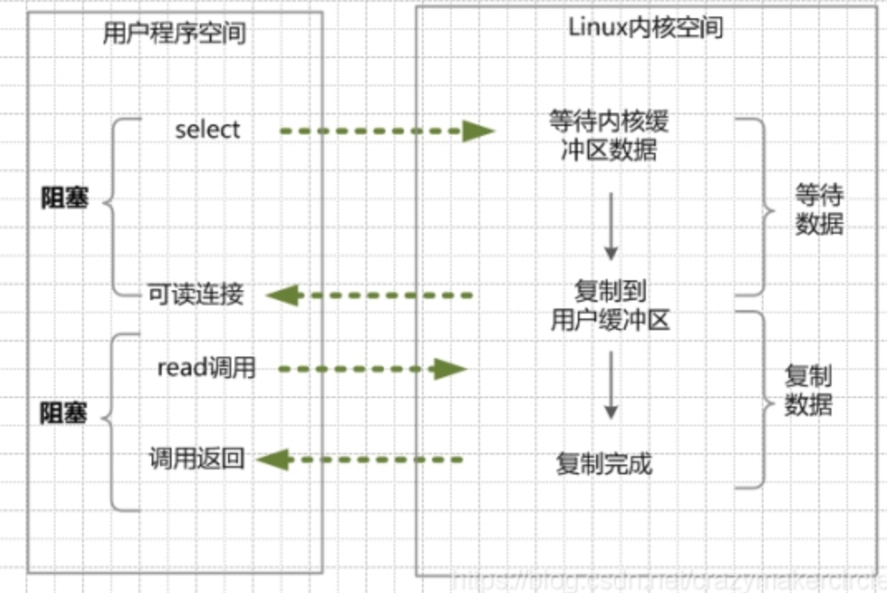
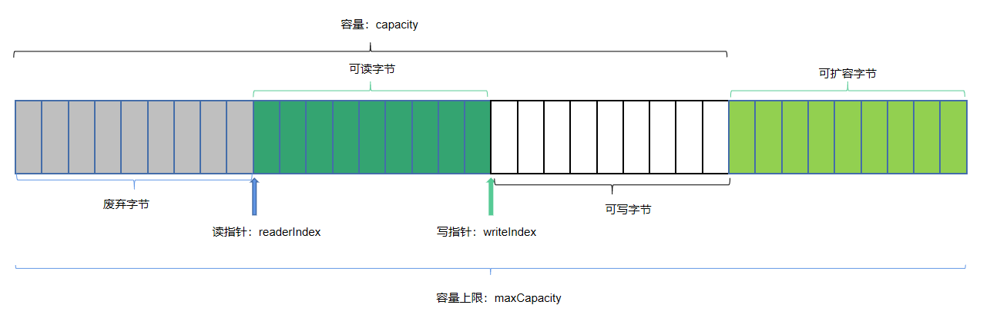

# Netty篇

## 网络通信之Java IO模型详解

### 网络通信之Socket


- Socket起源于Unix，而Unix/Linux基本思想之一就是”一切皆文件”，也称为文件描述符
- Socket是对“open—write/read—close”模式的一种实现
- Socket是对TCP/IP协议的封装，Socket本身不是协议，通过Socket才能使用TCP/IP协议

### 基础概念

#### 阻塞和非阻塞

**当线程访问资源时，该资源是否准备就绪的一种处理方式。**

若线程访问时，资源未准备就绪，线程什么也不做，就**一直等待**着资源就绪，这种处理方法就叫**阻塞**。

但如果资源是不一直等待该资源，而是去**做其他事情**，那就是**非阻塞**。

#### 同步和异步

同步和异步是**访问数据的机制**。

同步：调用者一旦开始调用方法，则必须等待调用方法的结果返回后，才能去做其他事。 

异步：调用更像一个消息传递，调用一开始，方法调用马上就会返回，让调用者可以继续后续的操作。而异步方法通常会在另外一个线程中，“真实”地执行着。整个过程，不会阻碍调用者的工作，异步方法完成后，再通知调用者。(一般用回调函数实现)

**简单例子：**

你去商城买东西，你看上了一款手机，能和店家说你一个这款手机，他就去仓库拿货，你得在店里等着，不能离开，这叫做同步。

现在你买手机赶时髦直接去京东下单，下单完成后你就可用做其他时间（追剧、打王者、lol）等货到了去签收就ok了，这就叫异步。

#### 阻塞、非阻塞与同步、异步

##### 它们之间的区别

**阻塞/非阻塞**：关注的是**程序(线程)等待消息通知时的状态**。

**同步/异步**：关注的是**消息通知的机制**。

##### 同步阻塞

小明一直盯着下载进度条，到100%的时候完成。

**同步体现在：**小明关注下载进度条并等待完成通知。（可以看成同步是我主动关注任务完成的通知）

**阻塞体现在：**在等待过程中，小明不去做别的东西。（可以看成异步是被动的，任务完成后再通知我）

##### 同步非阻塞

小明提交下载任务后，就去干别的事了，但每过一段时间就去瞄一眼进度条，看到100%就完成。

同步体现在：小明关注下载进度条并等待完成通知。

非阻塞体现在：等待下载完成通知过程中，去干别的任务了，只是时不时会瞄一眼进度条；【小明必须要在两个任务间切换，关注下载进度】

这种方式是效率低下的，因为程序需要在不同任务的线程中频繁切换。

##### 异步阻塞

小明换了个有下载完成通知功能的软件，下载完成就“叮”一声，

**异步体现在：**小明不用时刻关注进度条，在下载完成后，消息通知机制是由“叮”一声去通知小明的。

**阻塞体现在：**小明在等待“叮”的时候，不能去做其他事情。

##### 异步非阻塞

小明仍然使用那个下载完会“叮”一声的软件，小明在提交下载任务后，就不管了，转而去做其他事情。而当下载完成后，下载软件会通过“叮”去主动通知小明。

异步体现在：小明不用时刻关注下载任务，而是让下载软件下载完成之后通过“叮”来通知他。

非阻塞体现在：小明在下载过程中，并非什么都不做，而是去做其他事情了。【软件处理下载任务，小明处理其他任务，不需关注进度，只需接收软件“叮”声通知，即可】

### Java五种IO模型

#### 阻塞IO模型（BIO）

##### 概述

同步阻塞I/O模式，数据的读取写入必须阻塞在一个线程内等待其完成。这里使用那个经典的烧开水例子，这里假设一个烧开水的场景，有一排水壶在烧开水，BIO的工作模式就是， 叫一个线程停留在一个水壶那，直到这个水壶烧开，才去处理下一个水壶。但是实际上线程在等待水壶烧开的时间段什么都没有做。

如下图：


当用户进程调用了recvfrom这个系统调用，kernel就开始了IO的第一个阶段：准备数据（对于网络IO来说，很多时候数据在一开始还没有到达。比如，还没有收到一个完整的UDP包。这时候kernel就要等待足够的数据到来）。这个过程需要等待，也就是说数据被拷贝到操作系统内核的缓冲区中是需要一个过程的。而在用户进程这边，整个进程会被阻塞（当然，是进程阻塞）。当kernel一直等到数据准备好了，它就会将数据从kernel中拷贝到用户内存，然后kernel返回结果，用户进程才解除block的状态，重新运行起来。所以，**BIO的特点就是在IO执行的两个阶段（等待数据和拷贝数据两个阶段）都被block了**。

> `socket.accept()`、 `socket.read()`、 `socket.write()`三个主要函数都是同步阻塞的


##### socket交互整体流程


##### 连接四要素

怎么知道哪个连接属于哪个socket：

- 连接四要素：[源IP、目标IP、源端口、目标端口]

##### socket底层数据结构


##### 实现

###### 服务端

```java
public class BlockingServer {

    public static void main(String[] args) throws IOException {

        ServerSocket serverSocket = new ServerSocket(8080);

        while(true) {
            System.out.println("-----111 等待连接");
            Socket socket = serverSocket.accept();//阻塞1 ,等待客户端连接
            System.out.println("-----222 成功连接");

            InputStream inputStream = socket.getInputStream();
            int length = -1;
            byte[] bytes = new byte[1024];
            System.out.println("-----333 等待读取");
            while((length = inputStream.read(bytes)) != -1)//阻塞2 ,等待客户端发送数据 {
                System.out.println("-----444 成功读取"+new String(bytes,0,length));
            System.out.println("====================");
            System.out.println();

            inputStream.close();
            socket.close();
        }

    }

}
```

###### 客户端

打开两个客户端，进行输入，观察，发现只有一个客户端被接收。

```java
public class BlockingClient {
    public static void main(String[] args) throws IOException {
        Socket socket = new Socket("127.0.0.1",8080);
        OutputStream outputStream = socket.getOutputStream();

        //socket.getOutputStream().write("RedisClient01".getBytes());

        while(true) {
            Scanner scanner = new Scanner(System.in);
            String string = scanner.next();
            if (string.equalsIgnoreCase("quit")) {
                break;
            }
            socket.getOutputStream().write(string.getBytes());
            System.out.println("------input quit keyword to finish......");
        }
        outputStream.close();
        socket.close();
    }
}
```

##### 方法改进

通过使用线程池/多线程，每一个线程管理一个客户端

```java
public class BlockingServer {

    public static void main(String[] args) throws IOException {

        ServerSocket serverSocket = new ServerSocket(8080);
        // 创建线程池
        ExecutorService executorService = Executors.newCachedThreadPool();

        while(true) {
            System.out.println("-----111 等待连接");
            final Socket socket = serverSocket.accept();//阻塞1 ,等待客户端连接
            System.out.println("-----222 成功连接");

            executorService.execute(new Runnable() {
                public void run() {
                    try {
                        InputStream inputStream = socket.getInputStream();
                        int length = -1;
                        byte[] bytes = new byte[1024];
                        System.out.println("-----333 等待读取");
                        while ((length = inputStream.read(bytes)) != -1)//阻塞2 ,等待客户端发送数据 {
                            System.out.println("-----444 成功读取" + new String(bytes, 0, length));
                        System.out.println("====================");
                        System.out.println();

                        inputStream.close();
                        socket.close();
                    } catch (IOException e) {
                        throw new RuntimeException(e);
                    }
                }
            });
        }

    }

}
```

#### 非阻塞IO模型（NIO）

##### 概述


当用户进程发出read操作时，如果kernel中的数据还没有准备好，那么它并不会block用户进程，而是立刻返回一个error。

从用户进程角度讲，它发起一个read操作后，并不需要等待，而是马上就得到了一个结果。用户进程判断结果是一个error时，它就知道数据还没有准备好，于是它可以再次发送read操作。一旦kernel中的数据准备好了，并且又再次收到了用户进程的system call，那么它马上就将数据拷贝到了用户内存，然后返回。所以，**NIO特点是用户进程需要不断的主动询问内核数据准备好了吗？**

在非阻塞式 I/O 模型中，应用程序把一个套接口设置为非阻塞，就是告诉内核，当所请求的I/O操作无法完成时，不要将进程睡眠而是返回一个“错误”，应用程序基于 I/O 操作函数将不断的轮询数据是否已经准备好，如果没有准备好，继续轮询，直到数据准备好为止。

**在NIO模式中，一切都是非阻塞的**：

- accept()方法是非阻塞的，如果没有客户端连接，就返回error
- read()方法是非阻塞的，如果read()方法读取不到数据就返回error，如果读取到数据时只阻塞read()方法读数据的时间

在NIO模式中，只有一个线程：当一个客户端与服务端进行连接，这个socket就会加入到一个数组中，隔一段时间遍历一次，看这个socket的read()方法能否读到数据，**这样一个线程就能处理多个客户端的连接和读取了**。

##### 解决的问题

NIO成功的解决了BIO需要开启多线程的问题，NIO中一个线程就能解决多个socket，但是还存在2个问题。

**问题一：**

这个模型在客户端少的时候十分好用，但是客户端如果很多，比如有1万个客户端进行连接，那么每次循环就要遍历1万个socket，如果一万个socket中只有10个socket有数据，也会遍历一万个socket，就会做**很多无用功，每次遍历遇到** read 返回 -1 时仍然是一次浪费资源的系统调用。

**问题二：**

而且这个遍历过程是在用户态进行的，用户态判断socket是否有数据还是调用内核的read()方法实现的，这就涉及到用户态和内核态的切换，每遍历一个就要切换一次，开销很大因为这些问题的存在。

- 优点：不会阻塞在内核的等待数据过程，每次发起的 I/O 请求可以立即返回，不用阻塞等待，实时性较好。
- 缺点：轮询将会不断地询问内核，这将占用大量的 CPU 时间，系统资源利用率较低，所以一般 Web 服务器不使用这种 I/O 模型。

结论：让Linux内核搞定上述需求，我们将一批文件描述符通过一次系统调用传给内核由内核层去遍历，才能真正解决这个问题。

**IO多路复用因此应运而生，也即将上述工作直接放进Linux内核，不再两态转换而是直接从内核获得结果，因为内核是非阻塞的。**

> 1. 数据量大，轮询遍历浪费资源
>
> 2. 需要用户态用read()方法去和内核态，沟通，成本高
>
> 让上面两步，直接交给linux的内核提供
>
> * 内核态是不会有阻塞的
> * 直接内核态处理完成后，直接给用户最终结果，直接交付，不涉及用户态和内核态的切换

##### 实现

###### 服务端

```java
package org.example.nblockingio;

import java.io.IOException;
import java.net.InetSocketAddress;
import java.nio.ByteBuffer;
import java.nio.channels.ServerSocketChannel;
import java.nio.channels.SocketChannel;
import java.util.ArrayList;

public class NoBlockingServer {
    static ArrayList<SocketChannel> socketList = new ArrayList<>();
    static ByteBuffer byteBuffer = ByteBuffer.allocate(1024);

    public static void main(String[] args) throws IOException {
        System.out.println("---------ServerNIO 启动等待中......");
        ServerSocketChannel serverSocket = ServerSocketChannel.open();
        serverSocket.bind(new InetSocketAddress("127.0.0.1", 8080));
        serverSocket.configureBlocking(false);//设置为非阻塞模式

        while (true) {
            for (SocketChannel element : socketList) {
                int read = element.read(byteBuffer);
                if (read > 0) {
                    System.out.println("-----读取数据: " + read);
                    byteBuffer.flip();
                    byte[] bytes = new byte[read];
                    byteBuffer.get(bytes);
                    System.out.println(new String(bytes));
                    byteBuffer.clear();
                }
            }

            SocketChannel socketChannel = serverSocket.accept();
            if (socketChannel != null) {
                System.out.println("-----成功连接: ");
                socketChannel.configureBlocking(false);//设置为非阻塞模式
                socketList.add(socketChannel);
                System.out.println("-----socketList size: " + socketList.size());
            }
        }
    }

}
```

###### 客户端

两个客户端

```java
public class Client1
{
    public static void main(String[] args) throws IOException
    {
        System.out.println("------Client01 start");
        Socket socket = new Socket("127.0.0.1",8080);
        OutputStream outputStream = socket.getOutputStream();
        while(true)
        {
            Scanner scanner = new Scanner(System.in);
            String string = scanner.next();
            if (string.equalsIgnoreCase("quit")) {
                break;
            }
            socket.getOutputStream().write(string.getBytes());
            System.out.println("------input quit keyword to finish......");
        }
        outputStream.close();
        socket.close();
    }
}
```

#### 多路复用IO模型（IO Multiplexing）

##### 概述


- channel：介于字节缓冲区和套接字之间，可以同时读写，支持异步IO
- buffer：字节缓冲区，是应用程序和通道之间进行IO数据传输的中转
- selector：多路复用器，监听服务端和客户端的管道上注册的事件

> Java NIO（New IO） 不是IO模型中的NIO模型，而是另外的一种模型，叫做IO多路复用模型（ IO multiplexing ）。

##### 实现

###### 客户端

```java
public class NewIOClient {

    static Selector selector;

    public static void main(String[] args) {
        try {
            selector = Selector.open();
            SocketChannel socketChannel = SocketChannel.open();
            socketChannel.configureBlocking(false);
            socketChannel.connect(new InetSocketAddress("localhost", 8080));

            // 需要把socketChannel注册到多路复用器上
            socketChannel.register(selector, SelectionKey.OP_CONNECT);
            while (true) {
                // 阻塞
                selector.select();
                Set<SelectionKey> selectionKeys = selector.selectedKeys();
                Iterator<SelectionKey> iterator = selectionKeys.iterator();
                while (iterator.hasNext()) {
                    SelectionKey key = iterator.next();
                    iterator.remove();
                    if (key.isConnectable()) {
                        handlerConnect(key);
                    } else if (key.isReadable()) {
                        handlerRead(key);
                    } else if (key.isWritable()) {

                    }
                }

            }
        } catch (IOException e) {
            e.printStackTrace();
        }

    }

    private static void handlerRead(SelectionKey key) {
        SocketChannel socketChannel = (SocketChannel) key.channel();
        ByteBuffer allocate = ByteBuffer.allocate(1024);
        try {
            socketChannel.read(allocate);
            System.out.println("client msg:" + new String(allocate.array()));
        } catch (IOException e) {
            e.printStackTrace();
        }

    }

    private static void handlerConnect(SelectionKey key) throws IOException {

        SocketChannel socketChannel = (SocketChannel) key.channel();
        if (socketChannel.isConnectionPending()) {
            socketChannel.finishConnect();
        }
        socketChannel.configureBlocking(false);
        socketChannel.write(ByteBuffer.wrap("client I am wentai,is shuai".getBytes()));
        socketChannel.register(selector,SelectionKey.OP_READ);
    }
}
```

###### 服务端

```java
public class NewIOServer {
    // 得到一个多路复用器
    static Selector selector = null;
    public static void main(String[] args) throws IOException {

        try {

            // 得到一个多路复用器
            selector = Selector.open();
            // 获取一个管道
            System.out.println("---------ServerNewIO 启动等待中......");
            ServerSocketChannel serverSocket = ServerSocketChannel.open();
            serverSocket.bind(new InetSocketAddress("127.0.0.1", 8080));
            serverSocket.configureBlocking(false);//设置为非阻塞模式
            // 把连接事件注册到多路复用器上，通过注册不同事件处理不同的任务，把serverSocketChannel注册到selector 上
            // 指定监听类型，只处理这种事件
            serverSocket.register(selector, SelectionKey.OP_ACCEPT);

            while (true) {
                // 该方法阻塞，只有当有事件到来时就不会阻塞了
                selector.select();

                // 然后获取所有的事件，事件都被封装成SelectionKey
                Set<SelectionKey> selectionKeySet = selector.selectedKeys();
                Iterator<SelectionKey> iterable = selectionKeySet.iterator();

                while (iterable.hasNext()){
                    // 获取到相应的实践key
                    SelectionKey key = iterable.next();
                    // 拿到后要删除，防止再次调用
                    iterable.remove();
                    if(key.isAcceptable()){ // 连接事件
                        handlerAccept(key);
                    }else{
                        handlerRead(key);
                    }
                }

            }

        } catch (IOException e) {
            throw new RuntimeException(e);
        } finally {
            if(selector != null)
                selector.close();
        }

    }

    private static void handlerRead(SelectionKey key) {
        SocketChannel socketChannel = (SocketChannel) key.channel();
        ByteBuffer allocate = ByteBuffer.allocate(1024);
        try {
            socketChannel.read(allocate);
            System.out.println("server msg:" + new String(allocate.array()));
        } catch (IOException e) {
            e.printStackTrace();
        }

    }

    private static void handlerAccept(SelectionKey key) {
        //从selector中获取ServerSocketChannel，因为当初把ServerSocketChannel注册再selector 上，并且注册的accept事件
        ServerSocketChannel serverSocketChannel = (ServerSocketChannel) key.channel();
        try {
            // //能到这里,一定时有客户端连接过来,所以一定会有连接
            SocketChannel socketChannel = serverSocketChannel.accept();
            // 设置为非阻塞
            socketChannel.configureBlocking(false);
            // 往客户端回写数据
            socketChannel.write(ByteBuffer.wrap("".getBytes()));
            // 然后注册read事件，等while的循环再次获取read事件，然后读取SocketChannel中的数据
            socketChannel.register(selector,SelectionKey.OP_READ);
        } catch (IOException e) {
            throw new RuntimeException(e);
        } finally {

        }
    }
}
```

##### 什么是多路复用

**IO多路复用模型，就是通过一种新的系统调用，一个进程可以监视多个文件描述符(如socket)，一旦某个描述符就绪（一般是内核缓冲区可读/可写），内核kernel能够通知程序进行相应的IO系统调用。**

目前支持IO多路复用的系统调用，有 select，epoll等等。select系统调用，是目前几乎在所有的操作系统上都有支持，具有良好跨平台特性。epoll是在linux 2.6内核中提出的，是select系统调用的linux增强版本。而Java NIO库中的 selector 底层就是IO多用复用技术。

##### 多路复用与NIO的区别

**NIO需要在用户程序的循环语句中不停地检查各个socket是否有数据读入，而IO多路复用在用户程序层面则不需要循环语句，虽然IO多路复用也是轮询，但是IO多路复用是交给内核进行各个socket的监控的。**

其次，由于NIO多次调用read这种系统调用，因此会频繁造成用户态和内核态的转换，而IO多路复用则是先调用select这个系统调用去查询是否有数据就绪的socket，然后有数据就绪，才调用read这个系统调用来读。所以从性能上来说，IO多路复用会比NIO好。

在一定程度上来说，IO多路复用算是同步阻塞的一种，因为select会阻塞到有socket数据就绪为止。所以在应用上，一般会开一条程序来专门给select查询。

如下图为IO对路复用的过程：

（1）进行select/epoll系统调用，查询可以读的连接。kernel会查询所有select的可查询socket列表，当任何一个socket中的数据准备好了，select就会返回。

当用户进程调用了select，那么整个线程会被block（阻塞掉）。

（2）用户线程获得了目标连接后，发起read系统调用，用户线程阻塞。内核开始复制数据。它就会将数据从kernel内核缓冲区，拷贝到用户缓冲区（用户内存），然后kernel返回结果。

（3）用户线程才解除block的状态，用户线程终于真正读取到数据，继续执行。



##### IO多路复用的特点

IO多路复用模型，建立在操作系统kernel内核能够提供的多路分离系统调用select/epoll基础之上的。**多路复用IO需要用到两个系统调用（system call）， 一个select/epoll查询调用，一个是IO的读取调用。**

和NIO模型相似，多路复用IO需要轮询。负责select/epoll查询调用的线程，需要不断的进行select/epoll轮询，查找出可以进行IO操作的连接。

另外，多路复用IO模型与前面的NIO模型，是有关系的。对于每一个可以查询的socket，一般都设置成为non-blocking模型。只是这一点，对于用户程序是透明的（不感知。因为是在内核处理的）。

**优点：**用select/epoll的优势在于，它可以同时处理成千上万个连接（connection）。与一条线程维护一个连接相比，I/O多路复用技术的最大优势是：系统不必创建线程，也不必维护这些线程，从而大大减小了系统的开销。

**缺点：**本质上，select/epoll系统调用，属于同步IO，也是阻塞IO。都需要在读写事件就绪后，自己负责进行读写，也就是说这个读写过程是阻塞的。

#### 异步IO模型（AIO）

异步非阻塞无需一个线程去轮询所有IO操作的状态改变，在相应的状态改变后，系统会通知对应的线程来处理。

对应到烧开水中就是，为每个水壶上面装了一个开关，水烧开之后，水壶会自动通知我水烧开了。


（1）当用户线程调用了read系统调用，立刻就可以开始去做其它的事，用户线程不阻塞。

（2）内核（kernel）就开始了IO的第一个阶段：准备数据。当kernel一直等到数据准备好了，它就会将数据从kernel内核缓冲区，拷贝到用户缓冲区（用户内存）。

（3）kernel会给用户线程发送一个信号（signal），或者回调用户线程注册的回调接口，告诉用户线程read操作完成了。

（4）用户线程读取用户缓冲区的数据，完成后续的业务操作。

#### 信号驱动IO模型

在信号驱动IO模型中，当用户线程发起一个IO请求操作，会给对应的socket注册一个信号函数，然后用户线程会继续执行，当内核数据就绪时会发送一个信号给用户线程，用户线程接收到信号之后，便在信号函数中调用IO读写操作来进行实际的IO请求操作。这个一般用于UDP中，对TCP套接口几乎是没用的，原因是该信号产生得过于频繁，并且该信号的出现并没有告诉我们发生了什么事情。

## Reactor模型和Proactor模型详解

### 概述

Reactor模型是针对同步IO的，而Proactor是针对异步IO的。

### Reactor模型

#### 概述


**Reactor：**Reactor主要是用来监听事件的，无论accept事件还是read事件，至于它到底监听什么事件根据模型来决定，假设我们的服务器是一个餐厅，那么Reactor就相当于大门的迎宾工作人员

**Acceptor：**就是Reactor接收到事件后交给acceptor，然后接收到把得到的read事件负责交个handler处理， 那么在餐厅中就相当于把客人交给服务员。

**Handlers：**用来处理网络IO事件，处理IO操作。在餐厅中就相当于服务员。

#### 单Reactor单线程模型

##### 概述

来看下这张图，了解下，在单Reactor单线程模型中，他们的作用以及实现逻辑，首先客户端访问服务 端，在服务端这边首先是使用Reactor监听accept事件和read事件，当有连接过来，就交给acceptor处理 accept事件，当触发read事件，同时accept或把read事件交给handler处理。所有动作都是由一个线程完成 的，有人可能说一个线程完成看不出问题，那么我们在对应到餐厅中来看。


在下图中，也就是单reactor单线程模型，迎宾负责看大门，负责迎接客人，负责给接收客人的要求，负责给客人做菜。负责给客人上菜。


##### 实现

###### SingleMain

```java
public class SingleMain {
    public static void main(String[] args) throws IOException {
        new Thread(new Reactor(8080,"single-main")).start();
    }
}
```

在这个里面我们可以看到在主线程中启动了一个线程，那么这个线程要做什么呢，是不是就是我们之前NIO 中的每个步骤要在这个里面实现，所以我们来写下这个run方法的实现，我们定义一个Reactor的类，然后把监听的8080端口传入进去。

###### Reactor

我们来看下这个Reactor类如何实现，在他的构造函数中，我们去获取selector的对象，然后得到一个 ServerSocketChannel，同时绑定8080端口，设置为非阻塞，然后把serverSocketChannel注册到该 selector上，并且注册一个Accept事件。

在runnable中都会有一个run方法，然后在run方法中进行分发任务。当客户端连接过来之后，就会得到一个 SocketChannel，然后就可以处理客户端的IO事件的。接下来通过NIO中有一个attement的功能传递对象，然后去做这个事情。

```java
public class Reactor implements Runnable {

    Selector selector;

    public Reactor(int port, String threadName) throws IOException {
        selector = Selector.open();

        ServerSocketChannel serverSocketChannel = ServerSocketChannel.open();
        serverSocketChannel.socket().bind(new InetSocketAddress(port));
        serverSocketChannel.configureBlocking(false);
        serverSocketChannel.register(selector, SelectionKey.OP_ACCEPT,new Acceptor(selector,serverSocketChannel));
    }

    public void run() {
        // 查看线程是否被中断过，只要没有中断，就一直等待客户端过来
        while (!Thread.interrupted()){
            try {
                selector.select();
                Set<SelectionKey> selectionKeys = selector.selectedKeys();
                Iterator<SelectionKey> iterable = selectionKeys.iterator();
                while (iterable.hasNext()){
                    dispatch(iterable.next());
                    iterable.remove();
                }
            } catch (IOException e) {
                e.printStackTrace();
            }
        }
    }

    private void dispatch(SelectionKey selectionKey){
        // 如果是accept，这里的runnable就是Acceptor
        // 如果是read事件，这里的runnable就是handler
        Runnable runnable = (Runnable)selectionKey.attachment();
        if(runnable!=null){
            runnable.run();
        }
    }
}
```

###### Acceptor

```java
public class Acceptor implements Runnable{

    private final Selector selector;
    private final ServerSocketChannel serverSocketChannel;


    public Acceptor(Selector selector, ServerSocketChannel serverSocketChannel) {
        this.selector = selector;
        this.serverSocketChannel = serverSocketChannel;
    }

    public void run() {
        try {
            SocketChannel socketChannel = serverSocketChannel.accept();
            socketChannel.configureBlocking(false);
            socketChannel.register(selector,SelectionKey.OP_READ,new Handler(socketChannel));
        } catch (IOException e) {
            e.printStackTrace();
        }

    }
}
```

###### Handler

```java
public class Handler implements Runnable{

    SocketChannel socketChannel;

    public Handler(SocketChannel socketChannel) {

        this.socketChannel = socketChannel;
    }

    public void run() {
        ByteBuffer byteBuffer = ByteBuffer.allocate(1024);

        try {
            Thread.sleep(10000);
        } catch (InterruptedException e) {
            e.printStackTrace();
        }

        int length=0;
        String message;
        try {
            do {
                length = socketChannel.read(byteBuffer);
                message = new String(byteBuffer.array());
                System.out.println(length);
                // 就是判断数据是否有没有读完
            }while (length > byteBuffer.capacity());
            System.out.println(message);
        } catch (IOException e) {
            e.printStackTrace();
        }
    }
}
```

#### 单Reactor多线程模型

##### 概述

我们既然已经知道了单线程Reactor模型的缺点，所以我们就可以去使用单Reactor多线程模型去解决这个问题，我们来看下这个图，在这个图中就看到使用了多线程的方式让线程不阻塞，也有点BIO的解决问题的思想了，但是还是有很大区别的。我们再来对比下餐厅。


如下图，就相当于原来是一个迎宾在做，现在弄成多个服务员去处理客人的请求，那这样是不是就 已经很好了呢？我们先把代码实现了，我们再来看。


##### 实现

###### MutilMain

```java
public class MutilMain {

    public static void main(String[] args) throws IOException {

        new Thread(new MutilReactor(8080,"single-main")).start();

    }
}
```

###### MutilReactor

```java
public class MutilReactor implements Runnable {

    Selector selector;

    public MutilReactor(int port, String threadName) throws IOException {
        selector = Selector.open();

        ServerSocketChannel serverSocketChannel = ServerSocketChannel.open();
        serverSocketChannel.socket().bind(new InetSocketAddress(port));
        serverSocketChannel.configureBlocking(false);
        serverSocketChannel.register(selector, SelectionKey.OP_ACCEPT,new MutilAcceptor(selector,serverSocketChannel));
    }

    public void run() {
        // 查看线程是否被中断过，只要没有中断，就一直等待客户端过来
        while (!Thread.interrupted()){
            try {
                selector.select();
                Set<SelectionKey> selectionKeys = selector.selectedKeys();
                Iterator<SelectionKey> iterable = selectionKeys.iterator();
                while (iterable.hasNext()){
                    dispatch(iterable.next());
                    iterable.remove();
                }
            } catch (IOException e) {
                e.printStackTrace();
            }
        }
    }

    public void dispatch(SelectionKey selectionKey){
        // 如果是accept，这里的runnable就是Acceptor
        // 如果是read事件，这里的runnable就是handler
        Runnable runnable = (Runnable)selectionKey.attachment();
        if(runnable!=null){
            runnable.run();
        }
    }
}
```

###### MutilAcceptor

```java
public class MutilAcceptor implements Runnable{

    private final Selector selector;
    private final ServerSocketChannel serverSocketChannel;


    public MutilAcceptor(Selector selector, ServerSocketChannel serverSocketChannel) {
        this.selector = selector;
        this.serverSocketChannel = serverSocketChannel;

    }

    public void run() {
        try {
            SocketChannel socketChannel = serverSocketChannel.accept();
            socketChannel.configureBlocking(false);
            socketChannel.register(selector,SelectionKey.OP_READ,new MutilDispatchHandler(socketChannel));
        } catch (IOException e) {
            e.printStackTrace();
        }

    }
}
```

###### MutilDispatchHandler

````java
public class MutilDispatchHandler  implements Runnable{

    SocketChannel socketChannel;

    private Executor executor = Executors.newCachedThreadPool();

    public MutilDispatchHandler(SocketChannel socketChannel){
        this.socketChannel = socketChannel;
    }

    public void run() {
        executor.execute(new ReaderHandler(socketChannel));
    }


    static class ReaderHandler implements  Runnable{
        SocketChannel socketChannel;

        public ReaderHandler(SocketChannel socketChannel){
            this.socketChannel = socketChannel;
        }

        public void run() {
            ByteBuffer byteBuffer = ByteBuffer.allocate(1024);

            int length=0;
            String message;
            try {
                do {
                    length = socketChannel.read(byteBuffer);
                    message = new String(byteBuffer.array());
                    System.out.println(length);
                    // 就是判断数据是否有没有读完
                }while (length > byteBuffer.capacity());
                System.out.println(message);
            } catch (IOException e) {
                e.printStackTrace();
            }
        }
    }
}
````

#### 主从Reactor多线程模型

##### 概述

那么我们先来分析下，主从该如何实现,来看这张图,这个图中，我们可以看到安排了一个主Reactor去接收客户端的请求单，然后把接收到的请求交给Acceptor，在Acceptor的构造函数中初始化了多个SubReactor的子Reactor，然后封装成线程启动，所有的SubReactor线程都监听Read事件。


当客户端的连接事件过来的时候，我们可以获取到SocketChannel，但是现在我们的Sub是阻塞的，所以我们需要唤醒selector，然后注册read事件，最后交给handler去处理。


那么就相当于，现在不仅迎宾有一个铃，每个服务员都有一个铃，进来客人如果想要点餐，只需要在服务员的铃按一下就好了，就不用在迎宾的铃上按。

##### 实现

###### MainReactorThread

```java
public class MainReactorThread {

    public static void main(String[] args) throws IOException {

        new Thread(new MainReactor(8080),"Mian-Thread").start();
    }
}
```

###### MainReactor

```java
public class MainReactor implements Runnable {

    private final Selector selector;
    private final ServerSocketChannel serverSocketChannel;
    public MainReactor(int port) throws IOException {

        selector = Selector.open();
        serverSocketChannel = ServerSocketChannel.open();
        serverSocketChannel.configureBlocking(false);
        serverSocketChannel.socket().bind(new InetSocketAddress(port));
        serverSocketChannel.register(selector, SelectionKey.OP_ACCEPT,new MainAcceptor(serverSocketChannel));
    }

    @Override
    public void run() {
        // 查看线程是否被中断过，只要没有中断，就一直等待客户端过来
        while (!Thread.interrupted()){
            try {
                selector.select();
                Set<SelectionKey> selectionKeys = selector.selectedKeys();
                Iterator<SelectionKey> iterable = selectionKeys.iterator();
                while (iterable.hasNext()){
                    dispatch(iterable.next());
                    iterable.remove();
                }
            } catch (IOException e) {
                e.printStackTrace();
            }
        }
    }


    private void dispatch(SelectionKey selectionKey){
        // 如果是accept，这里的runnable就是Acceptor
        // 如果是read事件，这里的runnable就是handler
        Runnable runnable = (Runnable)selectionKey.attachment();
        if(runnable!=null){
            runnable.run();
        }
    }
}
```

###### SubReactor

```java
public class SubReactor implements Runnable{

    Selector selector;

    public SubReactor(Selector selector){
        this.selector = selector;
    }


    @Override
    public void run() {

        while (true){
            try {
                selector.select();
                Set<SelectionKey> selectionKeys = selector.selectedKeys();
                Iterator<SelectionKey> iterator = selectionKeys.iterator();
                while (iterator.hasNext()){
                    SelectionKey key = iterator.next();
                    dispatch(key);
                }
            } catch (IOException e) {
                e.printStackTrace();
            }
        }
    }

    private void dispatch(SelectionKey selectionKey){
        // 如果是accept，这里的runnable就是Acceptor
        // 如果是read事件，这里的runnable就是handler
        Runnable runnable = (Runnable)selectionKey.attachment();
        if(runnable!=null){
            runnable.run();
        }
    }
}
```

###### MainAcceptor

```java
public class MainAcceptor implements Runnable{

    private ServerSocketChannel serverSocketChannel;

//    private AtomicInteger index = new AtomicInteger();
    private int index=0;
    Selector[] selectors = new Selector[Runtime.getRuntime().availableProcessors()*2];
    SubReactor[] subReactors = new SubReactor[Runtime.getRuntime().availableProcessors()*2];

    Thread[] threads = new Thread[Runtime.getRuntime().availableProcessors()*2];

    public MainAcceptor(ServerSocketChannel serverSocketChannel) throws IOException {

        // 初始化服务员==》 SubReactor==>selector
        // SubReactor会被线程启动
        this.serverSocketChannel = serverSocketChannel;
        for(int i = 0;i<Runtime.getRuntime().availableProcessors()*2;i++){
            // 每一个服务员都有个铃铛
            selectors[i] = Selector.open();
            subReactors[i] = new SubReactor(selectors[i]);
            threads[i] = new Thread(subReactors[i]);
            // 每一个服务员都像线程一样启动-
            threads[i].start();
        }
    }

    @Override
    public void run() {
        try {
            SocketChannel socketChannel = serverSocketChannel.accept();
            socketChannel.configureBlocking(false);

            // 唤醒阻塞的selector
            selectors[index].wakeup();
            // 唤醒的是第一个服务员，然后注册read事件，交给服务员处理
            socketChannel.register( selectors[index], SelectionKey.OP_READ,new WorkerHandler(socketChannel));

            // 服务员处理了后，下次就给下一个服务员，知道所有服务员都接待了客人，回到第一服务员
            if(++index == threads.length){
                index = 0;
            }
        } catch (IOException e) {
            e.printStackTrace();
        }
    }
}
```

###### WorkerHandler

```java
public class WorkerHandler implements Runnable{

    private SocketChannel socketChannel;


    public WorkerHandler(SocketChannel socketChannel){
        this.socketChannel = socketChannel;

    }
    @Override
    public void run() {
        ByteBuffer byteBuffer = ByteBuffer.allocate(1024);

        try {
            socketChannel.read(byteBuffer);
            String message = new String(byteBuffer.array(), StandardCharsets.UTF_8);
            System.out.println(socketChannel.getRemoteAddress()+":" +message);
            socketChannel.write(ByteBuffer.wrap("消息收到了".getBytes(StandardCharsets.UTF_8)));
        } catch (IOException e) {
            e.printStackTrace();
        }
    }
}
```

### Proactor模型

#### 概述

Proactor模型，这个和Reactor模型不同的是他是基于异步IO的。


先来看下整个图的逻辑,这张图总共是两个步骤： 

- 启动初始化 
  - Proactorinitiator创建Proactor
  - Proactorinitiator创建handler 
  - Proactor通过内核提供的Asynchronous Operation processor把Proactor和handler注册到内核 
- 客户端调用 
  - 当IO操作完成是内核通知Proactor 
  - Proactor根据不同的IO事件回调不同的handler完成业务处理

#### 实现

##### ProactorMain

```java
public class ProactorMain {

    public static void main(String[] args) throws IOException {

        new Thread(new AIOProactor(8080),"Main-Thread").start();
    }
}
```

##### AIOProactor

```java
public class AIOProactor implements Runnable {

    public CountDownLatch latch;

    public AsynchronousServerSocketChannel serverSocketChannel;

    public AIOProactor(int port) throws IOException {
        serverSocketChannel = AsynchronousServerSocketChannel.open();
        serverSocketChannel.bind(new InetSocketAddress(port));
    }

    @Override
    public void run() {

        latch = new CountDownLatch(1);
        serverSocketChannel.accept(this,new AIOAcceptorHandler());
        try {
            latch.await();
        } catch (InterruptedException e) {
            e.printStackTrace();
        }

    }
}
```

##### AIOAcceptorHandler

```java
public class AIOAcceptorHandler implements CompletionHandler<AsynchronousSocketChannel, AIOProactor> {

    @Override
    public void completed(AsynchronousSocketChannel channel, AIOProactor serverhanlder){
        // 每接收一个连接之后，再执行一次异步连接请求，这样就能一直处理多个连接
        serverhanlder.serverSocketChannel.accept(serverhanlder,this);
        ByteBuffer byteBuffer = ByteBuffer.allocate(1024);
        // 异步读取
        channel.read(byteBuffer,byteBuffer,new ReadHandler(channel));
    }

    @Override
    public void failed(Throwable exc, AIOProactor attachment) {
        attachment.latch.countDown();
    }
}
```

##### ReadHandler

```java
public class ReadHandler implements CompletionHandler<Integer, ByteBuffer> {

    private AsynchronousSocketChannel socketChannel;

    public ReadHandler(AsynchronousSocketChannel socketChannel) {
        this.socketChannel = socketChannel;
    }

    /**
     * 读取到消息后处理
     *
     * @param result
     * @param attachment
     */
    @Override
    public void completed(Integer result, ByteBuffer attachment) {
        attachment.flip();
        byte[] message = new byte[attachment.remaining()];
        attachment.get(message);

        String str = new String(message, StandardCharsets.UTF_8);
        System.out.println("收到客户端的信息："+str);
        //向客户端发送消息
        String clientStr = "收到客户端的消息！！！";
        doWrite(clientStr);

    }

    @Override
    public void failed(Throwable exc, ByteBuffer attachment) {

    }

    //发送消息
    private void doWrite(String result) {

        byte[] bytes = result.getBytes();
        ByteBuffer writeBuffer = ByteBuffer.allocate(bytes.length);
        writeBuffer.put(bytes);
        writeBuffer.flip();

        //异步写数据 参数与前面的read一样
        //将回调接口作为内部类实现了
        socketChannel.write(writeBuffer, writeBuffer, new CompletionHandler<Integer, ByteBuffer>() {
            @Override
            public void completed(Integer result, ByteBuffer buffer) {
                //如果没有发送完，就继续发送直到完成
                if (buffer.hasRemaining()) {
                    socketChannel.write(buffer, buffer, this);
                } else {
                    //创建新的Buffer
                    ByteBuffer readBuffer = ByteBuffer.allocate(1024);
                    //异步读 第三个参数为接收消息回调的业务Handler
                    socketChannel.read(readBuffer, readBuffer, new ReadHandler(socketChannel));

                }
            }

            @Override
            public void failed(Throwable exc, ByteBuffer attachment) {
                try {
                    socketChannel.close();
                } catch (IOException e) {
                }
            }

        });

    }
}
```

### Reactor模型和Proactor模型区别

**Reactor 是在事件发生时就通知事先注册的事件。**

**Proactor 是在事件发生时基于异步 I/O 完成读写操作（由内核完成），待 I/O 操作完成后才回调应用程序的处理器来进行业务处理。**          

## 深入浅出Netty编解码底层原理

### Netty概述

#### 什么是Netty？

Netty是一个**异步的、基于事件驱动**的网络应用框架，用于快速的开发可维护、高性能的网络服务器和客户端。

> Netty底层使用的是NIO。

#### Netty与NOI的区别

- NIO编写代码工作量大，bug多
- NIO中需要自己解决粘包拆包问题，Netty提供了相应的API
- epoll模型空轮询问题导致CPU 100%,Netty解决了该问题
- 性能优化，ByteBuffer优化成ByteBuf，ThreadLocal优化成了FastThreadLocal

#### Netty与Mina的对比

- Mina是apach维护，而且3.x会有很大的重构，API会不兼容
- Netty的开发迭代更新迅速，API更加简洁与优秀（Netty自己说的）
- Mina 将内核和一些特性的联系过于紧密，使得用户在不需要这些特性的时候无法脱离，相比之下性能会有所下降
- Netty 比 Mina 使用起来更简单，如果上手只需要掌握模板代码 + 自定义 Handler 即可

#### Netty历史

Netty版本：

- 3.x版本
- 4.x版本（稳定版本，4.1.67.final）
- 5.x版本（不稳定，已废弃）

### 简单示例

#### 环境准备

```xml
<dependencies>
    <dependency>
        <groupId>io.netty</groupId>
        <artifactId>netty-all</artifactId>
        <version>4.1.67.Final</version>
    </dependency>
    <dependency>
        <groupId>org.projectlombok</groupId>
        <artifactId>lombok</artifactId>
        <version>1.18.22</version>
        <scope>compile</scope>
    </dependency>
    <dependency>
        <!-- 配合lombok打印日志 -->
        <groupId>org.springframework.boot</groupId>
        <artifactId>spring-boot-starter-test</artifactId>
        <!--            <scope>test</scope>-->
        <version>2.6.3</version>
    </dependency>
</dependencies>
```

#### 服务端

##### NettyServer

```java
public class NettyServer {

    public static void main(String[] args) {

        // 创建 Boss 线程
        EventLoopGroup bossGroup = new NioEventLoopGroup();
        // 创建 work 线程
        EventLoopGroup workGroup = new NioEventLoopGroup();

        // 实例化 ServerBootstrap
        ServerBootstrap serverBootstrap = new ServerBootstrap();
        // bossGroup保存AbstractBootstrap属性中
        // workGroup保存ServerBootstrap的childGroup属性中
        serverBootstrap.group(bossGroup,workGroup)
                // 把NioServerSocketChannel.class保存到ReflectiveChannelFactory工厂对象中，
                // 将来要通过工厂实例化NioServerSocketChannel
                .channel(NioServerSocketChannel.class)
                // boss线程要处理的业务 loggerHandler会保存到AbstractBootstrap中的handler中
                .handler(new LoggingHandler(LogLevel.INFO))
                // work线程要处理的业务 把channelInitializer保存到ServerBootstrap中的childHandler中
                .childHandler(new ChannelInitializer<SocketChannel>() {
                    @Override
                    protected void initChannel(SocketChannel socketChannel) throws Exception {
                        socketChannel.pipeline()
                                .addLast(new LengthFieldBasedFrameDecoder(Integer.MAX_VALUE,0,4,0,4))
                                .addLast(new LengthFieldPrepender(4,0,false))
                                .addLast(new StringDecoder())
                                .addLast(new StringEncoder())
                                .addLast(new SimpleServerHandler());
                    }
                });

        try {
            // 监听8080端口，并同步返回
            ChannelFuture channelFuture = serverBootstrap.bind(8080).sync(); // 同步，阻塞，不然就跑完了。
            // 阻止进入finally代码块,只有其他的线程调用 channelFuture.channel().close();的时候，
            // 然后进入finally代码块关闭连接池
            channelFuture.channel().closeFuture().sync();
        }catch (InterruptedException e){
            e.printStackTrace();
        }finally {
            // 关闭连接
            bossGroup.shutdownGracefully();
            workGroup.shutdownGracefully();
        }

    }

}
```

##### SimpleServerHandler

```java
public class SimpleServerHandler extends ChannelInboundHandlerAdapter {
    @Override
    public void channelRead(ChannelHandlerContext ctx, Object msg) throws Exception {

        String str = (String) msg;

        System.out.println("服务端接收消息：" + str);
        // 写回数据
        ctx.writeAndFlush(UUID.randomUUID()+"&"+"\n");

    }
}
```

#### 客户端

##### NettyClient

```java
// 客户端
public class NettyClient {

    public static void main(String[] args) {
        EventLoopGroup eventLoopGroup = new NioEventLoopGroup();
        Bootstrap bootstrap = new Bootstrap();
        bootstrap.group(eventLoopGroup)
                .channel(NioSocketChannel.class)
                .handler(new ChannelInitializer<SocketChannel>() {
                    @Override
                    protected void initChannel(SocketChannel socketChannel) throws Exception {
                        socketChannel.pipeline()
                                .addLast(new LengthFieldBasedFrameDecoder(Integer.MAX_VALUE,0,4,0,4))
                                .addLast(new LengthFieldPrepender(4,0,false))

                                .addLast(new StringDecoder())
                                .addLast(new StringEncoder())
                                .addLast(new SimpleClientHandler());
                    }
                });
        try {
            ChannelFuture channelFuture = bootstrap.connect("localhost",8080).sync();
            channelFuture.channel().closeFuture().sync();
        } catch (InterruptedException e) {
            e.printStackTrace();
        }finally {
            eventLoopGroup.shutdownGracefully();
        }
    }
}
```

##### SimpleClientHandler

```java
public class SimpleClientHandler extends ChannelInboundHandlerAdapter {

    /**
     * 客户端连接成功后，就会调用此方法，然后给服务端去发送消息
     */
    @Override
    public void channelActive(ChannelHandlerContext ctx) throws Exception {
        System.out.println("客户端连接成功");
        for (int i = 0; i < 10; i++) {
            ctx.writeAndFlush("客户端消息：" + i);
        }
        super.channelActive(ctx);
    }

    @Override
    public void channelRead(ChannelHandlerContext ctx, Object msg) throws Exception {
        String str = (String) msg;
        System.out.println("收到服务端的消息内容"+str);
        super.channelRead(ctx, msg);
    }
}
```

### ByteBuf

#### ByteBuf数据结构



通过代码打印查看bytebuf的信息

```java
public class ByteBufCreate {
    public static void main(String[] args) {
        // bytebuf 分配一块内存，自动判断是否分配堆内内存或者堆外内存
        ByteBuf byteBuf = ByteBufAllocator.DEFAULT.buffer();

        // ByteBufAllocator.DEFAULT.heapBuffer();   // 堆内内存
        // ByteBufAllocator.DEFAULT.directBuffer(); // 堆外内存
        // 打印信息
        StringBuilder msg = new StringBuilder();

        msg.append("read index：").append(byteBuf.readerIndex()).append("\n");
        msg.append("write index：").append(byteBuf.writerIndex()).append("\n");
        msg.append("capacity：").append(byteBuf.capacity()).append("\n");
        msg.append("max capacity：").append(byteBuf.maxCapacity()).append("\n");

        System.out.println(msg.toString());
    }
}

```


可以看出，当数据为空的时候


当向ByteBuf中写入数据时，``byteBuf.writeBytes(new byte[]{1,2,3,4});``


当读出数据的时候，指针也随之改变，``byte a = byteBuf.readByte();``，在打印看下


在读取数据后变为废弃字节了，但是如果读取之后，又还想读取呢？


```java
public class NettyByteBuf {

    public static void main(String[] args) {
        // jvm堆内存
        ByteBuf byteBuf = ByteBufAllocator.DEFAULT.heapBuffer();
        // 写数据
        byteBuf.markWriterIndex();
        byteBuf.writeBytes(new byte[]{1,2,3,4});
        printMsg(byteBuf);

        byteBuf.resetWriterIndex();
        byteBuf.writeInt(6);
        printMsg(byteBuf);

        // 读
        byteBuf.markReaderIndex();
        byte a = byteBuf.readByte();
        byte b = byteBuf.readByte();
//        byteBuf.resetReaderIndex(); // 重置，重写读取；不重置，就从剩下的读取
        printMsg(byteBuf);

    }

    public static void printMsg(ByteBuf buf){
        StringBuilder stringBuilder = new StringBuilder();
        stringBuilder.append("read index:").append(buf.readerIndex()).append("\n");
        stringBuilder.append("write index:").append(buf.writerIndex()).append("\n");;
        stringBuilder.append("capacity:").append(buf.capacity()).append("\n");;
        ByteBufUtil.appendPrettyHexDump(stringBuilder,buf);;

        System.out.println(stringBuilder.toString());
    }
}
```

#### ByteBuf扩容

如果写入的数据越来越多，Buf已经装不下了怎么办，之前看到每个buffer都有自己的容量，默认是256，所以Netty的Buf是可以自动扩容的。

```java
public class ByteBufCreate {
    public static void main(String[] args) {
        // bytebuf 分配一块内存，自动判断是否分配堆内内存或者堆外内存
        ByteBuf byteBuf = ByteBufAllocator.DEFAULT.buffer();
        
        // 默认是256个字节，观察netty是怎么扩容的
        // 如果写指针 + 写入的长度小于 4M ,从 64 字节开始翻倍增长，直到大于写指针 + 写入的长度
        // 如果写指针 + 写入的长度等于 4M ,直接返回 4M
        // 如果写指针 + 写入的长度大于 4M ,直接加上4M
        for (int i = 0; i < 64; i++) {
            byteBuf.writeBytes(new byte[]{(byte) i});
        }

        // 打印信息
        StringBuilder msg = new StringBuilder();

        msg.append("read index：").append(byteBuf.readerIndex()).append("\n");
        msg.append("write index：").append(byteBuf.writerIndex()).append("\n");
        msg.append("capacity：").append(byteBuf.capacity()).append("\n");
        msg.append("max capacity：").append(byteBuf.maxCapacity()).append("\n");

        System.out.println(msg.toString());
    }
}
```


#### 创建ByteBuf的方式

创建ByteBuf的方式有哪些？

```java
// bytebuf 分配一块内存，自动判断是否分配堆内内存或者堆外内存
ByteBuf byteBuf = ByteBufAllocator.DEFAULT.buffer();

// 由jvm管理内存
// ByteBufAllocator.DEFAULT.heapBuffer();   // 堆内内存

// ByteBufAllocator.DEFAULT.directBuffer(); // 堆外内存
// JVM: -Dio.netty.allocator.type={unpooled | polled}
// byteBuf使用了池化技术
```


通过这个图可以看到，其实堆内的意思就是java虚拟机里面的堆空间，而堆外的意思是java进程中系统为它分配的堆空间。

- jvm堆中的数据如果想要写入磁盘，就会进行write系统调用，调用过程为：**jvm堆->系统堆->PageCache->磁盘**。
- 如果数据是放在系统heap（进程的堆）中，调用过程为：**系统堆->PageCache->磁盘**。

可以看到，**使用堆外内存写入数据会少一次的拷贝次数**。

堆外内存和堆内内存的对比：

- 堆内内存由JVM GC自动回收管理，但是GC需要时间开销成本；堆外内存不受JVM管理，一定程度上可以降低GC对应用运行带来的影响。
- **堆外内存需要手动释放，稍有不慎会造成应用程序内存泄漏，当出现内存泄漏时问题排查相对困难**。
- 当进行网络I/O操作、文件读写时，堆内内存需要转换为堆外内存，然后再与底层设备进行交互。直接使用堆外内存可以减少一次内存拷贝。
- 堆外内存可以进行进程之间、JVM多实例之间的数据共享。

### 拆包与粘包

#### 什么是粘包

粘包：数据从客户端传输到服务端，可能会把多个小的数据包封装成一个大包发送


#### 什么是拆包

拆包：数据从客户端传输到服务端，可能会把一个大的数据包拆成多个小数据包发送


### Netty编码与解码

#### 一次编码和解码器

Netty中有4种解码器都是继承了ByteToMessageDecoder类，我们把这个类称之为一次解码器，他的作用是通过ByteBuf去传递数据，我们把这种把**ByteBuf(原始数据流) -> ByteBuf(用户数据) 称之为一次解码器**， Netty中对于这个解码器提供了4种。

#### Netty的4种解码器

##### FixedLengthFrameDecoder： 固定长度解码器

**客户端和服务端**都使用FixedLengthFrameDecoder，然后设置每次传输数据的长度，所以这种方式就规定我们的数据的长度要是固定的，可以很容易的就分辨出这种解码器不太好用。

```java
//第一种：固定长度 我每次只收19个的解决方案，用的不多
// 服务端
.addLast(new FixedLengthFrameDecoder(19))
// 客户端
.addLast(new FixedLengthFrameDecoder(37))
```

##### LineBasedFrameDecoder： 发送消息加上换行符\n

既然上面说的需要固定长度，那么肯定有可以不用固定长度的，我们只需要告诉服务端，你告诉我你的数据是从什么时候结束就可以了，所以可以通过换行符来表示数据的结束，在发送数据的结尾添加“\n”换行符，这就是换行符解码器。

```java
//第二种：换行符 我每次\n结束 \n用的不多
.addLast(new LineBasedFrameDecoder(1024))
// 客户端：换行符
ctx.writeAndFlush("客户端消息：" + i+"\n");
```

##### DelimiterBasedFrameDecoder： 自定义分隔符解码器

因为既然可以用换行符来表示结束，那么是不是应该也可以用其他的来表示结束了，所以Netty提供了一种自定义分隔符的方式表示数据结束，只需要在发送数据的时候在数据后面加上分隔的符号就行了，只是分隔的符号需要包装成一个ByteBuf。

```java
// 第三种:分隔符
// maxFrameLength :报文的最大长度
// stripDelimiter:判断解码的时候是否要把分隔符去掉
// failFast:跟maxFrameLength合起来用，如果为true,如果大于消息的长度，直接抛异常，如果为false,解码之后抛异常
// Delimiter:分隔符
ByteBuf buf = Unpooled.copiedBuffer("&".getBytes());
.addLast(new DelimiterBasedFrameDecoder(Integer.MAX_VALUE,true,true,buf))
```

##### LengthFieldBasedFrameDecoder： 长度域解码器

长度域解码器，该解码器比较特殊，是自定义协议的一种解码器，可以自己按照规定的方式去灵活的定义报文的格式，但是基本报文的格式就是如下几种，要想自定义协议，其实我们自己就知道，必须要知道数据从什么时候开始，从什么时候开始结束，这时我们最关心的，所以在定义报文的格式时，也的有相应的数据来表示数据开始，数据结束，我们先来看下这种比较灵活的解码器他的参数。

```java
// maxFrameLength:最大的报文长度数
// lengthFieldOffset:长度字段的偏移量，就是说多少个字段后是长度字段
// lengthFieldLength:描述消息报文的长度的字节数
// lengthAdjustment:需要调整的长度数，比如一个leng中包含了magic魔术数，还包含了长度
// initialBytesToStrip:跳过多少字节
.addLast(new LengthFieldBasedFrameDecoder(Integer.MAX_VALUE,0,4,0,0))
```

###### 第一种，报文格式由length和content组成


```java
socketChannel.pipeline()
    // 第一个是长度偏移量
    // 第二个是字节长度，4个字节
    // 第三个是 可调整的，（额外添加）
    // 第四个是 跳过的偏移量
    .addLast(new LengthFieldBasedFrameDecoder(Integer.MAX_VALUE,0,4,0,4))
    .addLast(new LengthFieldPrepender(4,0,false))
    .addLast(new StringDecoder())
    .addLast(new StringEncoder())
```

###### 第二种，报文格式由length和content组成


###### 第三种，报文格式由type和leng的长度和content组成


###### 第四种，报文格式由leng的长度和type和content组成


###### 第五种，报文格式由type1和leng的长度和type2和content组成


- 开始的1个字节是长度域，所以需要设置长度域偏移为1
- 长度域4个字节
- 然后需要把type2+body当做body处理，所以数据长度需要加1
- 接收数据不包括type1和长度域，所以需要跳过5个字节。

#### 二次编码和解码器

将数据帧 转为正确的byte数组我们称之为一次解码，将byte数据流转换为java对象 ， 我们称之为二次解码，那么在netty中的二次加码器都要去继承MessageToMessageDecoder类。

一次解码是将数据正确的拆分或者拼合 ， 二次解码是将数据正确的序列化或者反序列化 。

我们可以来通过这个例子来了解netty中的二次解码器的使用，在这里我们需要传递的是一个序列化的对象，客户端发送到服务端后，服务端接收的不再是一个ByteBuf,直接接收的是一个对象。

首先定义一个对象，该对象要进行序列化

```java
@Data
@AllArgsConstructor
public class Person implements Serializable {

    private static final long serialVersionUID = 4663236112565339000L;

    private String name;

    private int age;

}
```

首先编写服务端代码

```java
public class NettyServer {

    public static void main(String[] args) {
        EventLoopGroup bossGroup = new NioEventLoopGroup();
        EventLoopGroup workerGroup = new NioEventLoopGroup();

        ServerBootstrap bs = new ServerBootstrap();
        bs.group(bossGroup, workerGroup)
                .channel(NioServerSocketChannel.class)
                .option(ChannelOption.SO_BACKLOG, 1024)
                .childHandler(new ChannelInitializer<Channel>() {
                    @Override
                    protected void initChannel(Channel ch) throws Exception {
                        ch.pipeline()
                                // 服务端解码接收的对象码流,使用Netty提供的ObjectDecoder二次解码器
                                .addLast(new ObjectDecoder(ClassResolvers.cacheDisabled(ClassLoader.getSystemClassLoader())))
                                // 服务端返回客户端,编码java对象，使用Netty提供的二次编码器 ObjectEncoder
                                .addLast(new ObjectEncoder())
                                // 编写业务handler
                                .addLast(new ServerHandler());
                    }
                });

        try {
            ChannelFuture channelFuture = bs.bind(8080).sync();
            channelFuture.channel().closeFuture().sync();
        } catch (InterruptedException e) {
            e.printStackTrace();
        } finally {
            bossGroup.shutdownGracefully();
            workerGroup.shutdownGracefully();
        }
    }
}
```

编写ServerHandler类

```java
public class ServerHandler extends ChannelInboundHandlerAdapter {
    @Override
    public void channelRead(ChannelHandlerContext ctx, Object msg) throws Exception {

        Person person = (Person) msg;

        System.out.println("收到客户端的消息内容：" + person.toString());

        ctx.writeAndFlush(person);
    }

}
```

然后在通过客户端去发送数据，代码如下

```java
public class NettyClient {

    public void connect(int port, String host) throws InterruptedException {
        EventLoopGroup group = new NioEventLoopGroup();

        Bootstrap bootstrap = new Bootstrap();
        bootstrap.group(group)
                .channel(NioSocketChannel.class)
                .option(ChannelOption.TCP_NODELAY, true)
                .handler(new ChannelInitializer<NioSocketChannel>() {
                    @Override
                    protected void initChannel(NioSocketChannel ch) throws Exception {
                        ch.pipeline()
                                // 客户端编码要发送的java对象
                                .addLast(new ObjectEncoder())
                                // 客户端解码接收的java对象码流
                                .addLast(new ObjectDecoder(ClassResolvers.cacheDisabled(ClassLoader.getSystemClassLoader())))
                                .addLast(new ClientHandler());
                    }
                });

        ChannelFuture future = bootstrap.connect(host, port).sync();

        future.channel().closeFuture().sync();
    }

    public static void main(String[] args) throws InterruptedException {
        new NettyClient().connect(8080, "127.0.0.1");
    }
}
```

然后看ClientHandler如何发送数据的

```java
public class ClientHandler extends ChannelInboundHandlerAdapter {

    @Override
    public void channelActive(ChannelHandlerContext ctx) throws Exception {
        System.out.println("客户端连接成功");
        Person person = new Person("hutao",18);
        ctx.writeAndFlush(person);
    }

    @Override
    public void channelRead(ChannelHandlerContext ctx, Object msg) throws Exception {
        System.out.println("收到服务端的消息内容：" + msg.toString());
    }
}
```

实现原理，首先客户端建立连接后，客户端就会调用channelActive方法去发送数据，在调用ctx.writeAndFlush(person)的时候会去调用到之前配置的new ObjectEncoder()编码器，因为客户端先编码再发送到服务端，然后服务端再解码。

## 自定义消息协议实战

### 协议的报文格式

#### 概述

比如，以RocketMQ的报文的格式就是Header+body。

那么这个一定会有一个总长度，length，那么报文就是 length | Header| Body 但是如果只有一个总长度的 length,是无法知道Body的长度的，有人可能说加一个body的长度，但是在这里，我们可以用另外一种方式，就是把Header的长度算出来，然后用总的Length-Header Length-HeaderData，就能得到body的长度了。

#### 为什么这样定义报文呢？

首先我们一定要知道我们的整体的报文长度，不然我们根本就不知道报文什么时候开始什么时候结束，那么这个长度能不能定义在结尾呢？肯定不行，因为报文如果在发送到长度字段时发了一半断了怎么办，就根本无法识别报文的长度。

#### 为什么需要头部呢？


头部中存放的数据是头的长度和头的数据，在HeadData中存储一些非正文数据，比如序列化方式，请求方式等。HeadData主要是为了记录报文的一些额外信息。当然头部并不是必须的。每个字段含义如下：


### 消息协议

尝试自定义一个消息协议类。首先定义一个消息传输的对象MessageRecord，通过消息长度+消息头+消息体构成。

```java
@Data
public class MessageRecord  implements Serializable {
    private int length;// 4个字节
    private MessageHeader header;// 消息头
    private Object body; // 消息体
}
```

然后对消息头进行如下定义：

```java
@Data
public class MessageHeader implements Serializable {
    private int headerLength;//4个字节，头长度
    private HeaderData headerData;// 头内容
}
```

其中消息头包括消息头的长度以及消息头内容。对消息头内容进行封装成一个对象HeaderData，里面记录该消息的非正文数据，比如版本号，语言，序列化方式、请求类型等。

```java
@Data
public class HeaderData implements Serializable {

    private int version;// 版本

    private byte languageCode;// 语言

    private byte serializableType; // 序列化方式 1个字节

    private byte reqType;// 请求类型，1个字节

}

```

为了方便进行后续使用，对请求类型、序列化方式、语言进行枚举封装。

* 请求类型

```java
public enum EnumReq {

    REQ((byte)0), // 请求报文
    RES((byte)1), // 返回报文
    PING((byte)2), // 心跳ping报文
    PONG((byte)3); // 心跳pong报文

    private final byte code;

    EnumReq(byte code){
        this.code=code;
    }

    public byte code(){
        return this.code;
    }

}
```

* 语言

```java
public enum EnumCode {

    JAVA((byte)0), // JAVA语音
    PYTHON((byte)1), // PYTHON语言
    GO((byte)2); // GO语言

    private final byte code;

    EnumCode(byte code){
        this.code=code;
    }

    public byte code(){
        return this.code;
    }
}
```

* 序列化方式

```java
public enum EnumSerializer {

    JAVA((byte)0), // JAVA序列化
    JSON((byte)1), // JSON序列化
    PROTOBUF((byte)2); // Protobuf序列化

    private final byte code;

    EnumSerializer(byte code){
        this.code=code;
    }

    public byte code(){
        return this.code;
    }
}
```

### 消息客户端

* NettyClient

```java
public class NettyClient {
    public static void main(String[] args) {
        EventLoopGroup loopGroup = new NioEventLoopGroup();

        Bootstrap bootstrap = new Bootstrap();

        bootstrap.group(loopGroup)
                .channel(NioSocketChannel.class)
                .handler(new ChannelInitializer<SocketChannel>() {
                    @Override
                    protected void initChannel(SocketChannel socketChannel) throws Exception {
                        socketChannel.pipeline()
                                .addLast(new MyEncode())
                                .addLast(new ClientHandler());
                    }
                });
        try {
            ChannelFuture channelFuture = bootstrap.connect(new InetSocketAddress("localhost", 8084)).sync();
            channelFuture.channel().closeFuture().sync();
        } catch (InterruptedException e) {
            throw new RuntimeException(e);
        }finally {
            loopGroup.shutdownGracefully();
        }
    }
}

```

* ClientHandler

```java
public class ClientHandler extends ChannelInboundHandlerAdapter {
    @Override
    public void channelActive(ChannelHandlerContext ctx) throws Exception {

        /*
             length
             header:headerLength | headerData(version | languageCode | serializableType | reqType)
             body
        */
        for (int i = 0; i < 5; i++) {

            MessageRecord messageRecord = new MessageRecord();

            MessageHeader header = new MessageHeader();

            HeaderData headerData = new HeaderData();
            headerData.setVersion(1);
            headerData.setLanguageCode(EnumCode.JAVA.code());
            headerData.setReqType(EnumReq.REQ.code());
            headerData.setSerializableType(EnumSerializer.JAVA.code());

            header.setHeaderData(headerData);
            messageRecord.setHeader(header); // header

            User user = new User();
            user.setName("请求数据"+i);
            user.setAge(i);

            messageRecord.setBody(user); // body

            System.out.println(messageRecord);
            ctx.writeAndFlush(messageRecord);

        }

        super.channelActive(ctx);

    }
}

```

* MyEncode：定义序列化方式

```java
public class MyEncode extends MessageToByteEncoder<MessageRecord> {

    @Override
    protected void encode(ChannelHandlerContext ctx, MessageRecord msg, ByteBuf out) throws Exception {
        // 对头部数据进行序列化，并设置一些头部数据的值
        ByteBuffer header = encodeHeader(msg);
        out.writeBytes(header);
        // 序列化body数据
        byte[] body = seriablize(msg.getBody());
        if (body != null) {
            out.writeBytes(body);
        }
    }

    private ByteBuffer encodeHeader(MessageRecord msg) {

        // 头部的length字段的长度
        int length = 4;

        // 对头部数据进行序列化
        byte[] headerData = seriablize(msg.getHeader());

        // 累加长度
        length += headerData.length;

        // 获取到body的长度
        int bodyLength = seriablize(msg.getBody()).length;
        // 这里类加之后，其实length就是整个报文的长度了，当然，length本身不算在里面
        length += bodyLength;
        // 所以定义一个length + headerLength +headerData 这些数据的buffer
        ByteBuffer result = ByteBuffer.allocate(4 + length  - bodyLength);

        // 设置headerLength + headerData + bodyLength的长度
        result.putInt(length);

        // 设置headerData的长度
        result.putInt(headerData.length);

        // 设置header data
        result.put(headerData);
        // 切换成读模式
        result.flip();

        return result;
    }

    // 序列化方法
    public static  <T> byte[] seriablize(T object) {
        try {
            ByteArrayOutputStream bos = new ByteArrayOutputStream();
            ObjectOutputStream oos = new ObjectOutputStream(bos);
            oos.writeObject(object);
            return bos.toByteArray();
        } catch (Exception e) {
            e.printStackTrace();
        }
        return null;
    }
}
```

* User：实体类，用于测试

```java
@Data
public class User implements Serializable {

    private String name;

    private int age;
}
```

### 消息服务端

* NettyServer

```java
public class NettyServer {
    public static void main(String[] args) {
        EventLoopGroup bossGroup = new NioEventLoopGroup();
        EventLoopGroup workGroup = new NioEventLoopGroup();

        ServerBootstrap bootstrap = new ServerBootstrap();
        bootstrap.group(bossGroup,workGroup)
                .channel(NioServerSocketChannel.class)
                .childHandler(new ChannelInitializer<SocketChannel>() {
                    @Override
                    protected void initChannel(SocketChannel socketChannel) throws Exception {
                        socketChannel.pipeline()
                                .addLast(new MyDecode())
                                .addLast(new ServerHandler());

                    }
                });

        try {
            System.out.println("ProtocolServer start success {8084}");
            ChannelFuture channelFuture=bootstrap.bind("localhost",8084).sync();
            channelFuture.channel().closeFuture().sync();
        } catch (InterruptedException e) {
            throw new RuntimeException(e);
        }finally {
            bossGroup.shutdownGracefully();
            workGroup.shutdownGracefully();
        }
    }
}
```

* ServerHandler

```java
public class ServerHandler extends ChannelInboundHandlerAdapter {
    @Override
    public void channelRead(ChannelHandlerContext ctx, Object msg) throws Exception {
        MessageRecord messageRecord = (MessageRecord) msg;
        System.out.println("收到客户端的消息：" + msg);
        super.channelRead(ctx, msg);
    }
}
```

* MyDecode

```java
public class MyDecode extends LengthFieldBasedFrameDecoder {
    public MyDecode() {
        // 最后一个参数，跳过4个字节长度，不需要length
        super(Integer.MAX_VALUE,0,4,0,4);
    }

    @Override
    protected Object decode(ChannelHandlerContext ctx, ByteBuf in) throws Exception {

        ByteBuf byteBuf = (ByteBuf)super.decode(ctx, in);

        if(byteBuf == null){
            return null;
        }

        ByteBuffer byteBuffer = byteBuf.nioBuffer();

        return MyDecode.decode(byteBuffer);
    }

    private static Object decode(ByteBuffer byteBuffer) {

        // byteBuffer的长度
        int length = byteBuffer.limit();

        // headData长度
        int headLength = byteBuffer.getInt();
        // head数据
        byte[] headerData = new byte[headLength];
        // 读取数据到headerData
        byteBuffer.get(headerData);


        MessageRecord messageRecord = new MessageRecord();
        messageRecord.setLength(length);
        // 反序列化得到头的对象
        MessageHeader header = deserializable(MessageHeader.class,headerData);
        messageRecord.setHeader(header);

        // 反序列化得到body的对象：length - headDataLength - headLength
        int bodyLength = length - 4 - headLength;
        byte[] bodyData = null;
        if(bodyLength > 0){
            bodyData = new byte[bodyLength];
            byteBuffer.get(bodyData);
        }
        messageRecord.setBody(MyDecode.deserializable(User.class,bodyData));
        return messageRecord;
    }

    private static<T> T deserializable(Class<T> clazz ,byte[] data){
        ObjectInputStream ois = null;
        try {
            ois = new ObjectInputStream(new ByteArrayInputStream(data));
            return (T)ois.readObject();
        } catch (IOException | ClassNotFoundException e) {
            e.printStackTrace();
        }
        return null;
    }
}
```

### Netty实现长连接

#### 短连接

**短连接**：短连接意味着每一次的数据传输都需要建立一个新的连接，用完再马上关闭它。下次再用的时候重新建立一个新的连接。


**优点**：每次使用的连接都是新建的，所以基本上只要能够建立连接，数据就大概率能送达到对方

**缺点**：1. 每个连接都需要经过三次握手和四次握手的过程，耗时大大增；2. 系统端口使用过快，不仅影响当前进程，还会影响其他进程。

#### 长连接

长连接：长连接意味着进行一次数据传输后，不关闭连接，长期保持连通状态。如果两个应用程序之间有新的数据需要传输，则直接复用这个连接，无需再建立一个新的连接。


#### TCP长连接实现原理


长连接是TCP底层实现的，TCP的长连接机制主要是看对方是否存活，而Http基于TCP实现的长连接，其实主要目的是为了复用连接。

#### Netty长连接实现原理


在Netty中，提供了一个handler，用来发送心跳包，可以借助这个心跳来确定连接时候还正常，然后在做一些逻辑处理，首先在客户端添加心跳handler。

```java

// 心跳检测
// readerIdleTimeSeconds：Channel多久没有读取数据会触发IdleStateEvent，其中IdleState为IdleState.READER_IDLE。
// writerIdleTimeSeconds：Channel多久没有写数据会触发IdleStateEvent，其中IdleState为IdleState.WRITER_IDLE
// allIdleTimeSeconds：Channel多久没有读和写数据会触发IdleStateEvent，其中IdleState为IdleState.ALL_IDLE
// 此处只监听读事件
.addLast(new IdleStateHandler(0,5,0))
```

然后把客户端代码稍微的改下

```java
public class NettyClient {


    private Bootstrap bootstrap;

    private Channel channel;

    private NioEventLoopGroup eventLoopGroup;

    public static void main(String[] args) {
        NettyClient nettyClient = new NettyClient();
        // 启动服务
        nettyClient.start();
    }

    public void start(){
        eventLoopGroup = new NioEventLoopGroup();
        bootstrap = new Bootstrap();
        bootstrap.group(eventLoopGroup)
            .channel(NioSocketChannel.class)
            .handler(new ChannelInitializer<SocketChannel>() {
                @Override
                protected void initChannel(SocketChannel ch) throws Exception {
                    ChannelPipeline pipeline = ch.pipeline();
                    pipeline.addLast(new IdleStateHandler(0,5,0))
                        .addLast(new MyDecode())
                        .addLast(new MyEncode())
                        .addLast(new ClientHandler(NettyClient.this));
                }
            });
        // 发起连接，当连接断开时都要发起连接，也就是不停的调用这个方法
        createConnect();
    }

    public void createConnect() {
        // 如果连接没有断开，则什么也不做
        if(channel !=null && channel.isActive()){
            return;
        }
        final ChannelFuture channelFuture = bootstrap.connect(new InetSocketAddress("localhost", 8080));
        try {
            // 添加一个监听器
            channelFuture.addListener(new ChannelFutureListener() {
                @Override
                public void operationComplete(ChannelFuture future) throws Exception {
                    if(channelFuture.isSuccess()){
                        channel = channelFuture.channel();
                        //  log.info("服务端连接成功");
                    }else{
                        // 每隔2s重连一次
                        //  log.info("每隔2s重连....");
                        channelFuture.channel().eventLoop().schedule(new Runnable() {

                            @Override
                            public void run() {
                                createConnect();
                            }
                        },2, TimeUnit.SECONDS);
                    }
                }

            }).sync();
            channelFuture.channel().closeFuture().sync();
        } catch (InterruptedException e) {
            e.printStackTrace();
        }

    }
}
```

然后在common项目下定义handler包，建立一个公共的handler类

```java
@Slf4j
public abstract class AbstractHandler extends ChannelInboundHandlerAdapter {

    private String name;

    public AbstractHandler(String name) {
        this.name = name;
    }

    /**
         无论是客户端还是服务端都需要调用channelRead，
         然后根据不同的报文的类型选择不同的处理逻辑
     */
    @Override
    public void channelRead(ChannelHandlerContext ctx, Object msg) throws Exception {
        MessageRecord messageRecord = (MessageRecord) msg;
        // 获取请求类型
        byte reqType = ((MessageRecord) msg).getHeader().getHeaderData().getReqType();
        switch (reqType) {
            case (byte) 0:
                // 如果是请求报文，服务端就要去处理接收数据并发送回复报文
                handlerData(ctx, msg);
                break;
            case (byte) 1:
                // 如果是回复报文，那么就是服务端发送给客户端的，打印就行
//                log.info("receive message:" + messageRecord);
                break;
            case (byte) 2:
                // 如果是客户端发送的ping报文，回复pong报文
                sendPongMsg(ctx);
                break;
            case (byte) 3:
                // 如果收到的是服务端的pong报文，不做处理
//                log.info(name + " get  pong  msg  from" + ctx.channel().remoteAddress());
                break;
            default:
                break;
        }
        super.channelRead(ctx, msg);
    }

    // 客户端和服务端的公共处理，不同实现
    protected abstract void handlerData(ChannelHandlerContext ctx, Object msg) throws Exception;

    // 客户端链接后通过该方法发送数据
    @Override
    public void channelActive(ChannelHandlerContext ctx) throws Exception {
        log.info("client:" + ctx.channel().remoteAddress().toString()+ "channelActive");
    }

    // 这个方法说明链接出问题了，发起重连，在客户端实现
    @Override
    public void channelInactive(ChannelHandlerContext ctx) throws Exception {
        log.info("client:" + ctx.channel().remoteAddress().toString()+ "channelInactive");
    }

    /**
     心跳检测会调用该方法，如果你没有读写会触发此方法，从而拿到事件的类型
     **/
    @Override
    public void userEventTriggered(ChannelHandlerContext ctx, Object evt) throws Exception {
        IdleStateEvent stateEvent = (IdleStateEvent) evt;

        switch (stateEvent.state()) {
            // 如果没有读
            case READER_IDLE:
                handlerReaderIdle(ctx);
                break;
            // 如果没有写
            case WRITER_IDLE:
                handlerWriterIdle(ctx);
                break;
            // 既没有读也没有写
            case ALL_IDLE:
                handlerAllIdle(ctx);
                break;
            default:
                break;
        }
        super.userEventTriggered(ctx, evt);
    }

    // 如果既没有读也没有写，则发送ping报文，客户端实现
    protected void handlerAllIdle(ChannelHandlerContext ctx) {
        log.info(name + "没有读也没有写，触发AllIdle事件===================");
    }

    /**
     * @param ctx
     */
    protected void handlerWriterIdle(ChannelHandlerContext ctx) {
        log.info(name + "没有写，触发WriterIdle事件===================");
    }


    /**
     * 如果没有读
     */
    protected void handlerReaderIdle(ChannelHandlerContext ctx) {
        log.info(name + "没有读，触发ReaderIdle事件===================");
    }

    protected void sendPingMsg(ChannelHandlerContext ctx) {
        MessageRecord messageRecord = createObject(EnumReq.PING.code());
        ctx.writeAndFlush(messageRecord);
        log.info(name + "发送ping包：" + ctx.channel().remoteAddress());
    }

    protected void sendPongMsg(ChannelHandlerContext ctx) {
        MessageRecord messageRecord = createObject(EnumReq.PONG.code());
        ctx.writeAndFlush(messageRecord);
        log.info(name + "发送pong包：" + ctx.channel().remoteAddress());
    }

    private MessageRecord createObject(byte reqType) {
        MessageRecord messageRecord = new MessageRecord();
        MessageHeader messageHeader = new MessageHeader();
        HeaderData headerData = new HeaderData();
        messageRecord.setHeader(messageHeader);
        messageHeader.setHeaderData(headerData);
        headerData.setReqType(reqType);
        return messageRecord;
    }

}
```

然后修改clientHandler

```java
@Slf4j
public class ClientHandler  extends AbstractHandler {

    private NettyClient nettyClient;

    public ClientHandler(NettyClient nettyClient) {
        super("nettyClient");
        this.nettyClient = nettyClient;
    }

    @Override
    protected void handlerData(ChannelHandlerContext ctx, Object msg) throws Exception{
        MessageRecord messageRecord = (MessageRecord) msg;
        log.info("收到服务端消息："+ messageRecord);
    }

    @Override
    protected void handlerAllIdle(ChannelHandlerContext ctx) {
        super.handlerAllIdle(ctx);
    }

    @Override
    protected void handlerWriterIdle(ChannelHandlerContext ctx) {
        // TODO Auto-generated method stub
        super.handlerReaderIdle(ctx);
        // 发送心跳包
        sendPingMsg(ctx);
    }

    /**
     * 如果连接出现了问题，该方法则会触发
     **/
    @Override
    public void channelInactive(ChannelHandlerContext ctx) throws Exception {
        super.channelInactive(ctx);

        // 该方法是在连接出问题会触发，所以这里重新建立连接
        nettyClient.createConnect();

    }

}
```

最后修改下serverHandler

```java
@Slf4j
public class ServerHandler extends AbstractHandler {

    public ServerHandler() {
        super("nettyServer");
    }

    @Override
    protected void handlerData(ChannelHandlerContext ctx, Object msg) throws Exception {
        MessageRecord messageRecord = (MessageRecord)msg;
        log.info("收到客户端消息："+messageRecord);
        ctx.writeAndFlush(messageRecord);
//        super.channelRead(ctx, msg);
    }

// 这部分不需要，如果需要主动进行断开，可以在这里进行设置
//    @Override
//    protected void handlerReaderIdle(ChannelHandlerContext ctx) {
//        // TODO Auto-generated method stub
//        super.handlerReaderIdle(ctx);
//        // 模拟和服务端断开连接
////        log.info("client:" + ctx.channel().remoteAddress().toString());
//        Channel channel = ctx.channel();
//        if(channel.isActive())
//            ctx.close();
//    }
}
```

## 主流序列化和反序列化技术原理

### 为什么需要序列化

* 序列化：把对象转换为字节序列的过程称为对象的序列化。
* 反序列化：把字节序列恢复为对象的过程称为对象的反序列化。

通俗易懂点，就是下面两种情况：

- 第一种情况：一般情况下Java对象的声明周期都比Java虚拟机的要短，实际应用中我们希望在JVM停止运行之后能够持久化指定的对象，这时候就需要把对象进行序列化之后**保存到磁盘**。
- 第二种情况：需要把Java对象通过网络进行传输的时候。因为数据只能够以二进制的形式在网络中进行传输，因此当把对象通过网络**发送出去之前需要先序列化成二进制数据**，在接收端**读到二进制数据之后反序列化成Java对象**。

### 序列化的方式

#### 概述

常见序列化方式如下：

- Java序列化
- XML序列化
- Json序列化
- Hessian序列化
- Avro序列化
- Protobuf序列化
- jute序列化
- messagepack序列化
- Thrift序列化
- Kyro序列化

#### Java序列化

在java序列化中，序列化的对象必须实现Serializable接口， 才能去进行序列化和反序列化，这里先来看下java的序列化

```java
public class JavaSerializer<T> {
    public static void main(String[] args) throws Exception {
        User user = new User();
        user.setName("hutao");
        user.setAge(18);

        serialToFile(user);

        User oUser = deserialToFile();
        System.out.println(oUser.hashCode() + ":" + oUser);
        System.out.println(user.hashCode() + ":" + user);

    }

    private static void serialToFile(User user) throws Exception{
        ObjectOutputStream oos = new ObjectOutputStream(
                Files.newOutputStream(
                        new File("user").toPath()));
        oos.writeObject(user);
    }

    private static <T> T deserialToFile() throws IOException, ClassNotFoundException{
        ObjectInputStream ois = new ObjectInputStream(
                Files.newInputStream(
                        new File("user").toPath()));
        return (T) ois.readObject();
    }
}
```

把序列化的代码提取出来，定义一个Serializer接口类，然后在里面可以写默认的方法，默认使用Java序列化方式。

现在自定义一个Serializer的接口，定义两个方法，一个是序列化，一个是反序列化。

```java
public interface Serializer {

    <T> T deserializer(Class<T> clazz,byte[] bytes);


    <T> byte[] serializer(T object);

}
```

然后新建JavaSerializer类，实现刚才的定义的接口，并通过EnumSerializer中定义的序列化类型通过其代表的一个字节进行表示，然后可以根据这个传递的类型决定使用什么样的序列化方式。

```java
public class JavaSerializer implements Serializer {

    @Override
    public <T> byte[] serializer(T object){
        try {
            ByteArrayOutputStream bos = new ByteArrayOutputStream();
            ObjectOutputStream oos = new ObjectOutputStream(bos);
            oos.writeObject(object);
            return bos.toByteArray();
        }catch (Exception e){
            e.printStackTrace();
        }
        return null;
    }

    @Override
    public <T> T deserializer(Class<T> clazz, byte[] bytes) {
        ObjectInputStream ois = null;
        try {
            ois = new ObjectInputStream(new ByteArrayInputStream(bytes));
            return (T) ois.readObject();
        }catch (Exception e){
            e.printStackTrace();
        }
        return null;
    }
}
```

现在枚举中添加一个方法，这个方法就是会根据序列化类型执行返回相应的对象，知道枚举类定义的属性就是一个对象。

```java
public static EnumSerializer valueOf(byte code){
    for(EnumSerializer enumSerializer: EnumSerializer.values()){
        if(enumSerializer.code() == code){
            return enumSerializer;
        }
    }
    return null;
}
```

然后定义一个工具类，根据序列化类型来选择其中一种序列化方式，建立类SerializerUtil，在这个里面会根据枚举的类型判断使用那种序列化的类型。

```java
public class SerializerUtil {

    public static  <T> T deserializer(Class<T> clazz, byte[] bytes,byte serializerType) {
        EnumSerializer enumSerializer = EnumSerializer.valueOf(serializerType);
        switch (Objects.requireNonNull(enumSerializer)){
            case JAVA:
                return new JavaSerializer().deserializer(clazz,bytes);
            case JSON:
                break;
            case PROTOBUF:
                break;
        }
        return null;
    }


    public static  <T> byte[] serializer(T object, byte serializerType) {
        EnumSerializer enumSerializer = EnumSerializer.valueOf(serializerType);
        switch (Objects.requireNonNull(enumSerializer)){
            case JAVA:
                return new JavaSerializer().serializer(object);
            case JSON:
                break;
            case PROTOBUF:
                break;
        }
        return null;
    }
}
```

然后修改自定义协议中关于序列化的方式，在MyEncode中有三处需要修改：

```java
// 序列化body数据
byte[] body = SerializerUtil.serializer(msg.getBody(), msg.getHeader().getHeaderData().getSerializableType());

// 对头部数据进行序列化
byte[] headerData = SerializerUtil.serializer(msg.getHeader(),msg.getHeader().getHeaderData().getSerializableType());

// 获取到body的长度
int bodyLength = Objects.requireNonNull(SerializerUtil.serializer(msg.getBody(),                                           msg.getHeader().getHeaderData().getSerializableType())).length;
```

还有一个MyDecode中也修改下，但是在MyDecode收到的是byteBuffer对象，这个对象已经序列化了，所

以无法获取到序列化的类型了，所以需要做一点改变，也就是把序列化的类型放入到头长度的前8位里面保存起来。

```java
//        // 设置headerData的长度
//        result.putInt(headerData.length);
result.put(markProtocolType(headerData.length,msg.getHeader().getHeaderData().getSerializableType()));

messageRecord.setBody(SerializerUtil.deserializer(User.class,bodyData,getProtocolType(oriHeadLength)));
```

markProtocolType方法如下：

```java
// 其实这个方法主要是把长度字段的32位拆成了4部分
public static byte[] markProtocolType(int source, byte type) {
    byte[] result = new byte[4]; // 记住1个字节只能存储8位
        // 第一部分用来放序列化的类型
        result[0] = type; // 第一个8位
        // 第二部分开始，32 - 16 = 16
        result[1] = (byte) ((source >> 16) & 0xFF); // 第2个8位
        // 第三部分开始，32 - 8 = 24
        result[2] = (byte) ((source >> 8) & 0xFF);// 第3个8位
        // 第三部分开始，如果header的长度很长，那么这里就会是header的长度
        result[3] = (byte) (source & 0xFF);// 第4个8位
        return result;
}
```

然后在解码器中要重新去获取header长度值，但是这个值是包含了序列化类型的，要想真的拿到header长度的值，只需要&0xFFFFFF 24个1，就可以得到长度的值。（因为前8位用于存储的是类型）

```java
// headData长度（这个头的长度的第一个字节已经包含了序列化的类型）
int oriHeadLength = byteBuffer.getInt();
int headLength = getHeaderLength(oriHeadLength);
```

```java
private static int getHeaderLength(int oriHeadLength) {
    return oriHeadLength & (0xFFFFFF);
}
```

```java
MessageHeader header = SerializerUtil.deserializer(MessageHeader.class,headerData,getProtocolType(oriHeadLength));
```

序列化的类型通过到oriHeaderLen中去获取，只需要向右移动24位，然后&FF 8位1，那么就可以得到序列

化。

```java
private static byte getProtocolType(int oriHeadLength) {
    return (byte) ((oriHeadLength >> 24) & 0xFF);
}
```

然后启动客户端和服务端。就发现可以实现这种序列化的判断了。

#### Json序列化

首先需要导入json相关包，这里使用fastjson

```xml
<dependency>
    <groupId>com.alibaba</groupId>
    <artifactId>fastjson</artifactId>
    <version>1.2.79</version>
</dependency>
```

然后创建JsonSerializer类定义Json序列化方式

```java
public class JsonSerializer implements Serializer{
    @Override
    public <T> T deserializer(Class<T> clazz, byte[] bytes) {
        String json = new String(bytes, StandardCharsets.UTF_8);
        return (T) JSON.parseObject(json,clazz);
    }

    @Override
    public <T> byte[] serializer(T object) {

        return JSON.toJSONString(object).getBytes(StandardCharsets.UTF_8);
    }
}
```

之后修改下SerializerUtil类

```java
public class SerializerUtil {

    public static  <T> T deserializer(Class<T> clazz, byte[] bytes,byte serializerType) {
        ...
            return new JavaSerializer().deserializer(clazz,bytes);
        case JSON:
        ...
    }


    public static  <T> byte[] serializer(T object, byte serializerType) {
        ...
            case JSON:
        return new JsonSerializer().serializer(object);
        ...
    }
}
```

一般情况下，在序列化的时候耗费的时间，fastjson >=jackjson>Gson；在反序列化的时候，Gson稍微好一点。

* Gson

```java
public class GsonSerializer {
    public static void main(String[] args) {
        List<User> userList = new ArrayList<>();

        User user = new User();
        user.setName("胡桃");
        user.setAge(18);

        User user1 = new User();
        user1.setName("天海");
        user1.setAge(22);

        userList.add(user);
        userList.add(user1);

        Gson gson = new GsonBuilder().create();
        // 将Java对象序列化为Json字符串
        String objectToJson = gson.toJson(userList);
        // 将Json字符串反序列化为Java对象
        List<User> userJson = gson.fromJson(objectToJson,List.class);

        System.out.println(userJson);

    }
}
```

#### XML序列化

```java
public class XmlSerializer{
    public static <T> T deserialize(String xml) throws IOException {
        XStream xStream = new XStream(new DomDriver());
            // 设置默认安全防护
            XStream.setupDefaultSecurity(xStream); // to be removed after 1.5
            // 设置允许的类，序列化的类一定要在该包下
            xStream.allowTypesByWildcard(new String[] {
                "com.example.message.**"
            });
            return (T)xStream.fromXML(xml);
    }
    public static String seriablize(Object user) throws IOException {
        XStream xStream = new XStream(new DomDriver());
            XStream.setupDefaultSecurity(xStream); // to be removed after 1.5
            xStream.allowTypesByWildcard(new String[] {
                "com.example.message.**"
            });
            return xStream.toXML(user);
    }
    public static void main(String[] args) throws IOException {
        User user = new User();
            user.setAge(18);
            user.setName("胡桃");
            String xml = seriablize(user);
            System.out.println(xml.getBytes().length);
            User deserialize = deserialize(xml)
            System.out.println(deserialize);
    }
}
```

#### Hessian序列化

dubbo默认就是使用Hassian序列化。

```java
public class HessianSerializer{
    public static <T> T deserialize(Class<T> clazz, byte[] bytes) throws IOException {
        ByteArrayInputStream bis=new ByteArrayInputStream(bytes);
            HessianInput hi=new HessianInput(bis);
            return (T)hi.readObject();
    }
    public static <T> byte[] serialize(T object) throws IOException {
        ByteArrayOutputStream baos=new ByteArrayOutputStream();
            HessianOutput ho=new HessianOutput(baos);
            ho.writeObject(object);
            return baos.toByteArray();
    }
    public static void main(String[] args) throws IOException {
        User user = new User();
            user.setAge(18);
            user.setName("胡桃");
            byte[] serialize = serialize(user);
            System.out.println("序列化后的值：" + serialize.length);
            User deserialize = deserialize(User.class, serialize);
            System.out.println(deserialize);
    }
}
```

#### Protobuf序列化

Protobuf是由谷歌提供的一个序列化方案，它是一个灵活高效的用于序列化数据的协议，相比较XML和JSON格式，protobuf更小、更快、更便捷。google protobuf是跨语言的，并且自带了一个编译器(protoc)，只需要用它进行编译，可以编译成Java、python、C++、C#、Go等代码，然后就可以直接使用，不需要再写其他代码，自带有解析的代码。

首先在idea安装protobuf插件。


然后再建立proto文件夹，


之后make生成如图所示


引入protobuf的jar包

```xml
<properties>
    <project.build.sourceEncoding>UTF-8</project.build.sourceEncoding>
    <maven.compiler.source>1.8</maven.compiler.source>
    <maven.compiler.target>1.8</maven.compiler.target>
    <!-- protobuf开始 -->
    <protobuf.version>3.12.2</protobuf.version>
    <grpc.version>1.12.0</grpc.version>
    <!-- protobuf结束 -->
</properties>

<!--第二部分-->
<dependencies>
    <!--protobuf依赖开始 -->
    <dependency>
        <groupId>io.grpc</groupId>
        <artifactId>grpc-netty</artifactId>
        <version>${grpc.version}</version>
        <scope>provided</scope>
    </dependency>
    <dependency>
        <groupId>io.grpc</groupId>
        <artifactId>grpc-protobuf</artifactId>
        <version>${grpc.version}</version>
        <scope>provided</scope>
    </dependency>
    <dependency>
        <groupId>io.grpc</groupId>
        <artifactId>grpc-stub</artifactId>
        <version>${grpc.version}</version>
        <scope>provided</scope>
    </dependency>
    <dependency>
        <groupId>com.google.protobuf</groupId>
        <artifactId>protobuf-java</artifactId>
        <version>${protobuf.version}</version>
    </dependency>
    <!--protobuf依赖结束 -->
    <!--  proto 与 Json 互转会用到-->
    <dependency>
        <groupId>com.google.protobuf</groupId>
        <artifactId>protobuf-java-util</artifactId>
        <version>3.15.3</version>
    </dependency>
    <!--        <dependency>-->
    <!--            <groupId>com.googlecode.protobuf-java-format</groupId>-->
    <!--            <artifactId>protobuf-java-format</artifactId>-->
    <!--            <version>1.2</version>-->
    <!--        </dependency>-->
</dependencies>
<!--第三部分-->
<build>
    <extensions>
        <extension>
            <groupId>kr.motd.maven</groupId>
            <artifactId>os-maven-plugin</artifactId>
            <version>1.5.0.Final</version>
        </extension>
    </extensions>
    <pulugins>
        <!--protobuf插件开始 -->
        <plugin>
            <groupId>org.xolstice.maven.plugins</groupId>
            <artifactId>protobuf-maven-plugin</artifactId>
            <version>0.5.0</version>
            <configuration>
                <protocArtifact>com.google.protobuf:protoc:${protobuf.version}:exe:${os.detected.cla
                    ssifier}
                </protocArtifact>
                <pluginId>grpc-java</pluginId>
                <pluginArtifact>io.grpc:protoc-gen-grpc￾java:${grpc.version}:exe:${os.detected.classifier}
                </pluginArtifact>
            </configuration>
            <executions>
                <execution>
                    <goals>
                        <goal>compile</goal>
                    </goals>
                </execution>
            </executions>
        </plugin>
    </pulugins>
</build>
```

首先定义实体类，在proto文件夹下添加MessageRecords.proto，（注意一定不要在中文路径下，不然会报错）

```java
syntax = "proto3";

package com.example.message.entity;

import "google/protobuf/any.proto";

option java_outer_classname = "MessageRecords";

message MessageRecord{
  int64 length = 1;
  MessageHeader header = 2;
  google.protobuf.Any body = 3;
}

message MessageHeader{
  int64 version = 1;
  bytes languageCode = 2;// 语言
  bytes serializableType = 3;
  bytes reqType = 4;
}
```

然后重新maven,clean一下，选中项目，然后查看plugins,选择protobuf-compile，然后把生成再target目录下的文件拷贝到相应的位置上。

然后把刚刚的序列化替换成Protobuf，首先无论是服务端还是客户端都需要去配置相应的handler。

```java
.addLast(new ProtobufVarint32FrameDecoder())
    .addLast(new ProtobufDecoder(MessageRecords.MessageRecord.getDefaultInstance()))
    .addLast(new ProtobufVarint32LengthFieldPrepender())
    .addLast(new ProtobufEncoder())
```

* ClientHandler

```java
@Slf4j
public class ClientHandler extends ChannelInboundHandlerAdapter {

    @Override
    public void channelActive(ChannelHandlerContext ctx) throws Exception {
        for (int i = 0; i < 2; i++) {
            MessageRecords.MessageRecord messageRecord = MessageRecords.MessageRecord.newBuilder()
                .setBody(Any.pack(MessageRecords.MessageRecord.newBuilder().getBody()))
                .setMessageHeader(MessageRecords.MessageRecord.MessageHeader.newBuilder()
                                  .setHeaderData(MessageRecords.MessageRecord.MessageHeader.HeaderData.newBuilder()
                                                 .setVersion(1)
                                                 .setLanguageCode(ByteString.copyFrom(new byte[]{EnumCode.JAVA.code()}))
                                                 .setSerializableType(ByteString.copyFrom(new byte[]{EnumSerializer.JAVA.code()}))
                                                 .setReqType(ByteString.copyFrom(new byte[]{EnumReq.REQ.code()})))).build();
            ctx.writeAndFlush(messageRecord);
        }
        super.channelActive(ctx);
    }

    @Override
    public void channelRead(ChannelHandlerContext ctx, Object msg) throws Exception {
        MessageRecords.MessageRecord messageRecord = (MessageRecords.MessageRecord)msg;
        byte[] bytes = messageRecord.toByteArray();
        MessageRecords.MessageRecord messageRecord1 = MessageRecords.MessageRecord.parseFrom(bytes);
        String s = ProtoToJsonUtil.toJson(messageRecord1);
        log.info("服务端接受信息:" + s);
        super.channelRead(ctx, msg);
    }

    @Override
    public void exceptionCaught(ChannelHandlerContext ctx, Throwable cause) throws Exception {
        System.out.println(cause.getMessage());
    }
}
```

* ServerHandler

```java
@Slf4j
public class ServerHandler extends ChannelInboundHandlerAdapter {


    @Override
    public void channelRead(ChannelHandlerContext ctx, Object msg) throws Exception {

        log.info("客户端接受信息：" + msg);

        MessageRecords.MessageRecord messageRecords = (MessageRecords.MessageRecord) msg;

        byte[] bytes = messageRecords.toByteArray();

        // 先反序列化得到对象
        MessageRecords.MessageRecord messageRecord = MessageRecords.MessageRecord.parseFrom(bytes);

        // 可以通过工具类转换对象输出
        String s = ProtoToJsonUtil.toJson(messageRecord);

        ctx.writeAndFlush(msg);

    }

}
```

* ProtoToJsonUtil工具

```java
public class ProtoToJsonUtil {


    public static String toJson(Message sourceMessage) throws InvalidProtocolBufferException {
        if(sourceMessage !=null){
            JsonFormat.TypeRegistry typeRegistry = JsonFormat.TypeRegistry.newBuilder()
                .add(MessageRecords.MessageRecord.MessageHeader.getDescriptor()).build();
            return JsonFormat.printer().usingTypeRegistry(typeRegistry).includingDefaultValueFields().print(sourceMessage);
        }
        return null;
    }

    public static Message toObject(Message.Builder targetBuilder,String json) throws InvalidProtocolBufferException {
        if(json !=null){
            JsonFormat.parser().ignoringUnknownFields().merge(json,targetBuilder);
            return targetBuilder.build();
        }
        return null;
    }
}
```

### Protobuf原理

由于protobuf的重要性，因此需要深入学习了解。

#### protobuf的二进制流结构


通过StudentProtos进行生成StudentProtos.Student类，如下

```protobuf
syntax = "proto3";

package com.example.message.protobuf;

option java_outer_classname="StudentProtos";

message Student{

   string name = 1;

   sint32 age = 2;

}
```

实例：

```
String name=hutao,int age=18
```

之后进行测试打印查看

```java
public class ProtoBufTest {

    public static void main(String[] args) throws InvalidProtocolBufferException {

        StudentProtos.Student student = StudentProtos.Student.newBuilder().setAge(18).setName("hutao").build();

        byte[] bytes = student.toByteArray();

        System.out.println(bytes.length);

        for (int i= 0;i<bytes.length;i++){
            System.out.print(bytes[i]+" ");
        }

        System.out.println();
        StudentProtos.Student student1 = StudentProtos.Student.parseFrom(bytes);
        System.out.println(student1);
    }
}
```


其中，name表示为如下三个字段构成：

- 第一位tag=10 = 1（属性定义时的位置） << 3 | 2（编码类型）= 1<<3 | 2 = 10；
- 第二位length是长度，表示有多少个字符；
- 第三位value是字符编码数组

age表示为如下两个字段构成：

- 第一位tag = 16 = 2（属性定义时的位置） << 3 | 2（编码类型）= 2<<3 | 0 = 16；
- 第二位value是36，是根据protobuf的算法设计的（正数varint算法和负数ZigZag算法）。

#### protobuf的正数varint算法


其中300的二进制为 0000 0001 0010 1100。

#### Protobuf 负数ZigZag算法

对于32位整数，**(n<<1)^(n>>31)**，即能实现zigzag编码。之后再使用varint算法进行压缩。

对于32位整数，**(n>>1)^-(n&1)**，即能实现zigzag解码。

#### Protobuf为什么性能好

**序列化速度快**：编码 / 解码 方式简单，采用 Protocol Buffer 自身的框架代码 和 编译器 共同完成。

**序列化后的数据量体积小**：独特的编码方式，如Varint、Zigzag编码；采用T - L - V 的数据存储方式。

### 序列化选型建议

- 对性能要求不高的场景，可以采用基于XML的SOAP协议 
- 对性能和间接性有比较高要求的场景，那么Hessian、Protobuf都可以。 
- 基于前后端分离，或者独立的对外的api服务，选用JSON是比较好的，对于调试、可读性都很不错  

## 基于Netty手写实现RPC框架

### 什么是RPC


- RPC：Remote Procedure Call，远程过程调用

- RPC目的：像调用本地一样调用远程的服务

### RPC实现原理


通过上述图可以知道，说白了RPC的整个过程就是将一个类的方法名 + 参数 + 类型发送到对方，然后进行反射调用。

### 常见的RPC协议框架

### RPC代码编写

#### 创建父类项目

创建项目名称为netty-rpc的父项目。


导入相关依赖

```xml
<?xml version="1.0" encoding="UTF-8"?>
<project xmlns="http://maven.apache.org/POM/4.0.0" xmlns:xsi="http://www.w3.org/2001/XMLSchema-instance"
         xsi:schemaLocation="http://maven.apache.org/POM/4.0.0 https://maven.apache.org/xsd/maven-4.0.0.xsd">
    <modelVersion>4.0.0</modelVersion>
    <packaging>pom</packaging>
    
    <modules>
        <module>netty-rpc-consumer</module>
        <module>netty-rpc-api</module>
        <module>netty-rpc-protocal</module>
        <module>netty-rpc-provider</module>
    </modules>
    
    <groupId>com.example</groupId>
    <artifactId>netty-rpc</artifactId>
    <version>0.0.1-SNAPSHOT</version>
    <name>netty-rpc</name>
    <description>netty-rpc</description>

    <parent>
        <groupId>org.springframework.boot</groupId>
        <artifactId>spring-boot-starter-parent</artifactId>
        <version>2.5.4</version>
        <relativePath/> <!-- lookup parent from repository -->
    </parent>

    <properties>
        <java.version>1.8</java.version>
        <project.build.sourceEncoding>UTF-8</project.build.sourceEncoding>
        <project.reporting.outputEncoding>UTF-8</project.reporting.outputEncoding>
    </properties>


    <dependencies>
        <dependency>
            <groupId>org.springframework.boot</groupId>
            <artifactId>spring-boot-starter</artifactId>
        </dependency>

        <dependency>
            <groupId>org.projectlombok</groupId>
            <artifactId>lombok</artifactId>
            <optional>true</optional>
        </dependency>
        <dependency>
            <groupId>org.springframework.boot</groupId>
            <artifactId>spring-boot-starter-test</artifactId>
            <scope>test</scope>
        </dependency>
    </dependencies>

    <build>
        <plugins>
            <plugin>
                <groupId>org.springframework.boot</groupId>
                <artifactId>spring-boot-maven-plugin</artifactId>
                <configuration>
                    <excludes>
                        <exclude>
                            <groupId>org.projectlombok</groupId>
                            <artifactId>lombok</artifactId>
                        </exclude>
                    </excludes>
                </configuration>
            </plugin>
        </plugins>
    </build>
</project>
```

然后在四个模块中添加父模块，交给父模块进行管理

```xml
<parent>
    <artifactId>netty-rpc</artifactId>
    <groupId>com.example</groupId>
    <version>0.0.1-SNAPSHOT</version>
</parent>
```

#### 创建四个子项目模块

##### RPC 模块划分

- netty-rpc-api：公共服务定义
- netty-rpc-protocal：自定义协议
- netty-rpc-provider：服务提供方
- netty-rpc-consumer：服务调用方


##### 第一步：构建consumer与provider模块

首先在netty-rpc-api中添加IUserService接口类，然后lifecycle去install一下，把项目发布到本地的mvn中。

```java
public interface IUserService {

    String saveUser(String name);

}
```

然后在netty-rpc-provider项目中进行jar包管理

```xml
<dependency>
    <groupId>com.example</groupId>
    <artifactId>netty-rpc-api</artifactId>
    <version>0.0.1-SNAPSHOT</version>
</dependency>
```

然后在netty-rpc-provider项目中建立service包，实现该接口

```java
@MyRemoteService
public class UserServiceImpl implements IUserService {

    @Override
    public String saveUser(String name) {
        return name;
    }
}
```

然后重新mvn下，mvn install gp-netty-api，如果打包失败，比如**没有main class，则需要创建一个main类。**如下：

```java
public class App {
    public static void main( String[] args ) {
    }
}
```

然后在netty-rpc-consumer需要引入api的jar包

```java
<dependency>
    <groupId>com.example</groupId>
    <artifactId>netty-rpc-api</artifactId>
    <version>0.0.1-SNAPSHOT</version>
    </dependency>
```

然后在netty-rpc-consumer的controller包下创建HelloController类，将来想通过定义注解的方式就能实现远程调用。

```java
@RestController
public class HelloController {

    @MyRemoteReference // 这里需要后续定义才可以使用
    private IUserService iUserService;


    @RequestMapping("/say")
    public String say(){
        return iUserService.saveUser("胡桃");
    }
}
```

##### 第二步：定义注解

由于这里不能采用Autowire注解去注入，因为要生成代理，这个生成代理的对象方法中是发送数据到远程服务，在gp-netty-protocol项目中添加注解。

在com.example.netty.rpc.protocal.annotation包下添加两个注解

* MyRemoteReference：调用方需要生成远程调用代理的注解

```java
@Target(ElementType.FIELD)
@Retention(RetentionPolicy.RUNTIME)
@Autowired
public @interface MyRemoteReference {
}
```

* MyRemoteService：服务提供方的需要发布的service的注解

```java
@Target(ElementType.TYPE)
@Retention(RetentionPolicy.RUNTIME)
@Component
public @interface MyRemoteService {
}
```

然后给netty-rpc-provider和comsumer项目中的service类添加MyRemoteService注解和给userService属性注入，先引入jar包，然后添加注解**@MyRemoteService**和**@MyRemoteReference**注解。

```xml
<dependency>
    <groupId>com.example</groupId>
    <artifactId>netty-rpc-protocal</artifactId>
    <version>0.0.1-SNAPSHOT</version>
</dependency>
```

##### 第三步：定义消息类型以及序列化类型

那么，接下来需要完成，从客户端的访问到服务端的service中的say方法，并且返回到网页上。

之前学习的netty，就是用来在网络中传输数据，那么传输数据就要知道传输的是什么数据，其实就是**把调用的类，方法名，参数传输到服务端，然后通过反射去调用**，这样就达到了远程调用的目的。

那么就看如何在自定义协议模块定义的报文格式以及编码器和解码器。这里规定了下报文格式，看看如何定义的。

**报文的格式**定为：header | body组成，首先头部有5部分组成，一个magic,用来校验数据，第二个就是序列化的方式，第三个就是请求类型，请求ID，长度字段组成。

body的内容根据是请求类型看是哪一个报文，如果是请求报文，则是发送类名，方法名，参数，参数类型给接收端，如果是响应报文，就是发送数据，消息给到请求方。


在自定义协议模块中定义，首先在gp-netty-protocol项目中的**.protocal.core包下添加Header类。

```java
@Data
@AllArgsConstructor
public class Header implements Serializable {
    private short magic;// 魔数  2个字节
    private byte serialType;// 序列化类型
    private byte reqType;// 请求类型
    private long requestId;// 请求id  8个字节
    private int length;// 消息体长度 4个字节
}
```

然后在**.protocol.constant常量包中定义消息类型的枚举类

```java
public class RpcConstant {

    public final static short MAGIC = 0xca; // 魔数

    public final static  int HEAD_TOTAL_LEN = 16; // 头的总字节长度
}
```

然后在**.protocol.constant常量包中定义消息类型的枚举类

```java\
public enum ReqType {

    REQUEST((byte)1),
    RESPONSE((byte)2),
    HEARTBEAT((byte)3);

    private byte code;

    ReqType(byte code){
        this.code=code;
    }

    public byte code(){
        return this.code;
    }

    public static ReqType findByCode(int code){
        for(ReqType reqType: ReqType.values()){
            if(reqType.code==code){
                return reqType;
            }
        }
        return null;
    }
}
```

在**.protocol.constant常量包中定义序列化的枚举类

```java
public enum SerialType {

    JSON_SERIAL((byte)1),
    JAVA_SERIAL((byte)2);

    private byte code;

    SerialType(byte code){
        this.code=code;
    }

    public byte code(){
        return this.code;
    }
}
```

在**.protocol.constant常量包中定义RpcConstant，其中包含魔数校验报文正确性，以及记录包头长度

```java
public class RpcConstant {

    public final static short MAGIC = 0xca; // 魔数

    public final static  int HEAD_TOTAL_LEN = 16; // 头的总字节长度
}
```

然后在core包下定义发送数据包的协议类RpcProtocol

```java
@Data
public class RpcProtocal<T> implements Serializable {

    private Header header;

    private T content;
}
```

发送报文类RpcRequest

```java
@Data
public class RpcRequest implements Serializable {

    private String className;// 类名
    private String methodName;// 方法名称
    private Object[] params;// 请求参数
    private Class<?>[] parameterTypes;//参数类型
}
```

返回报文类

```java
@Data
public class RpcResponse implements Serializable {

    private Object data;
    private String msg;
}
```

这里使用java和Json两种序列化方式，那么在netty-rpc-protocol包中添加json的jar包

```xml
<dependency>
    <groupId>com.alibaba</groupId>
    <artifactId>fastjson</artifactId>
    <version>1.2.72</version>
</dependency>
```

**定义序列化的接口**，在**serial**的包下

```java
public interface ISerializer {

    /*
     * 序列化
     */
    <T> byte[] serialize(T obj);

    /**
     * 反序列化
     */
    <T> T deserialize(byte[] data,Class<T> clazz);

    /**
     * 序列化的类型
     */
    byte getType();
}
```

然后分别实现java序列化方式和Json序列化方式

* JavaSerializer

```java
public class JavaSerializer  implements ISerializer{

    @Override
    public <T> byte[] serialize(T obj) {
        ByteArrayOutputStream bos=new ByteArrayOutputStream();
        ObjectOutputStream oos= null;
        try {
            oos = new ObjectOutputStream(bos);
            oos.writeObject(obj); //序列化
            return bos.toByteArray();
        } catch (IOException e) {
            e.printStackTrace();
        }
        return new byte[0];
    }

    @Override
    public <T> T deserialize(byte[] data, Class<T> clazz) {
        try {
            ObjectInputStream ois=new ObjectInputStream(new ByteArrayInputStream(data));
            return (T)ois.readObject();
        } catch (IOException e) {
            e.printStackTrace();
        } catch (ClassNotFoundException e) {
            e.printStackTrace();
        }
        return null;
    }

    @Override
    public byte getType() {
        return SerialType.JAVA_SERIAL.code();
    }
}
```

* JsonSerializer

```java
public class JsonSerializer  implements ISerializer{
    @Override
    public <T> byte[] serialize(T obj) {
        return JSON.toJSONString(obj).getBytes();
    }

    @Override
    public <T> T deserialize(byte[] data, Class<T> clazz) {
        return JSON.parseObject(new String(data),clazz);
    }

    @Override
    public byte getType() {
        return SerialType.JSON_SERIAL.code();
    }
}
```

然后对外提供一个序列化管理器，通过key获取到相应的序列化的方式

```java
public class SerializerManager {

    private final static ConcurrentHashMap<Byte,ISerializer> serializerMap = new ConcurrentHashMap();

    static {

        ISerializer json = new JsonSerializer();
        ISerializer java = new JavaSerializer();
        serializerMap.put(json.getType(),json);
        serializerMap.put(java.getType(),java);
    }

    public static ISerializer getSerializer(byte key){
        ISerializer iSerializer = serializerMap.get(key);
        if (iSerializer ==null){
            return new JavaSerializer();
        }
        return iSerializer;

    }
}
```

##### 第四步：编写编码器和解码器

接下来要编写编码器和解码器，现在已经知道数据传输的格式了，那么就处理以下编码器和解码器，现在netty-rpc-protocol下添加依赖

```xml
<dependency>
    <groupId>io.netty</groupId>
    <artifactId>netty-all</artifactId>
    <version>4.1.6.Final</version>
</dependency>
```

首先在netty-rpc-protocol项目下建立code包**.protocal.code。

首先编码RpcEncoder

```java
public class RpcEncode extends MessageToByteEncoder<RpcProtocal<Object>> {


    @Override
    protected void encode(ChannelHandlerContext ctx, RpcProtocal<Object> msg, ByteBuf out) throws Exception {
		// 对照上面的报文定义格式
        Header header = msg.getHeader(); // 获取到头对象
        
		// 按照数据的顺序写入到out流中
        out.writeShort(header.getMagic()); // magic - short
        out.writeByte(header.getSerialType()); // serialType - byte
        out.writeByte(header.getReqType()); // reqType - byte
        out.writeLong(header.getRequestId());// requestId - long

        // 这是选择序列化方式
        ISerializer serializer = SerializerManager.getSerializer(header.getSerialType());
        // 序列化数据内容
        byte[] data = serializer.serialize(msg.getContent()); // msg是RpcProtocal协议类对象，也即是刚才定义的报文格式（header + body）
        // 数据内容的长度
        out.writeInt(data.length); // length - int （这里是消息体长度，也就是消息内容长度）
        // 写入数据
        out.writeBytes(data); // body - 消息数据
    }
}

```

解码器RpcDecode

```java
public class RpcDecode extends ByteToMessageDecoder {

    @Override
    protected void decode(ChannelHandlerContext ctx, ByteBuf in, List<Object> out) throws Exception {

        // 首先判断可读的字节是否小于头的长度，如果小于，说明没有body数据，甚至数据有问题，不解码
        if(in.readableBytes() < RpcConstant.HEAD_TOTAL_LEN){
            return;
        }
        //标记读取开始索引
        in.markReaderIndex();
        //读取2个字节的magic
        short magic = in.readShort();
		// 校验魔数
        if(magic != RpcConstant.MAGIC){
            throw  new IllegalArgumentException("....");
        }

        byte serialType = in.readByte(); //读取一个字节的序列化类型
        byte reqType = in.readByte(); //读取一个字节的消息类型
        long requestId = in.readLong(); //读取请求id
        int dataLength = in.readInt(); //读取数据报文长度
        // 再看现在的可读字节是否小于body的长度，如果小于，则不读取，并且重置到读指针的地方，等下一次读
        if(in.readableBytes() < dataLength){
            in.resetReaderIndex();
            return;
        }
        
		//读取消息体的内容
        byte[] content = new byte[dataLength];
        
        // 把body数据读取到content字节数组中
        in.readBytes(content);
        
        // 封装头信息
        Header header = new Header(magic,serialType,reqType,requestId,dataLength);
        
		// 根据序列化类型获取序列化
        ISerializer serializer = SerializerManager.getSerializer(serialType);
        
// 根据请求类型，比如客户端发送数据，就是REQUEST，服务端给客户端回复数据就是RESPONSE，当然都是相对的，每一段都会发送REQUEST请求，每一段也会发送RESPONSE请求
        ReqType rt = ReqType.findByCode(reqType);

        switch (rt){
            // 如果是请求报文
            case REQUEST:
                // 反序列化
                RpcRequest rpcRequest = serializer.deserialize(content,RpcRequest.class);
                // 封装成RpcProtocal对象
                RpcProtocal<RpcRequest> rpcProtocal = new RpcProtocal<>();
                rpcProtocal.setHeader(header);
                rpcProtocal.setContent(rpcRequest);
                out.add(rpcProtocal);
                break;
            case RESPONSE:
                // 反序列化
                RpcResponse rpcResponse = serializer.deserialize(content,RpcResponse.class);
                // 封装成RpcProtocal对象
                RpcProtocal<RpcResponse> protocal = new RpcProtocal<>();
                protocal.setHeader(header);
                protocal.setContent(rpcResponse);
                out.add(protocal);
                break;
            default:
                break;
        }
    }
}
```

##### 第五步：生成代理类

客户端的请求的接口就要去生成代理，然后通过Netty客户端发送数据，进行编码，序列化等操作发送到Netty服务端，然后Netty服务端，解码，反序列化得到数据然后进行调用，先来看下给接口生成代理如何生成。

然后在netty-rpc-protocol中添加代理类，建立一个**.protocol.spring包，在包下建立reference包和service包，一个是给服务端使用，一个是编写客户端代码，在reference包下添加SpringRpcReferencePostProcessor类，去生成代理类，因为在spring的生命周期中有一个步骤是实现了BeanFactoryPostProcessor接口的类，这个里面的postProcessBeanFactory方法会在对象实例化之前执行，那么我们可以通过在实例化之前，做一些事情。

那么先去实现ApplicationContextAware, BeanClassLoaderAware, BeanFactoryPostProcessor接口。

> 其实生成代理类用到了BeanFactoryPostProcessor接口和FactoryBean的结合使用


```java
public class SpringRpcReferencePostProcessor implements BeanFactoryPostProcessor, ApplicationContextAware, BeanClassLoaderAware {

    private ClassLoader classLoader;

    private ApplicationContext applicationContext;

    private final Map<String,BeanDefinition> rpcBeanDefinitionMap = new ConcurrentHashMap<>();

    @Override
    public void setBeanClassLoader(ClassLoader classLoader) {
        this.classLoader = classLoader;
    }

    @Override
    public void setApplicationContext(ApplicationContext applicationContext) throws BeansException {
        this.applicationContext = applicationContext;
    }
}
```

实现postProcessBeanFactory方法，spring容器加载了bean的定义文件之后， 在bean实例化之前执行。

> 在BeanFactory标准初始化之后调用，这时所有的bean定义已经保存加载到beanFactory，但是bean的实例还未创建

```java
@Override
public void postProcessBeanFactory(ConfigurableListableBeanFactory beanFactory) throws BeansException {
    // 获取所有bean的名称循环
    for(String beanName : beanFactory.getBeanDefinitionNames()){
        BeanDefinition beanDefinition = beanFactory.getBeanDefinition(beanName);
        String beanClassName = beanDefinition.getBeanClassName();
        if(beanClassName!=null){
            // 如果加载的类中有属性加了MyRemoteReference注解的话，就生成代理类
            Class<?> clazz = ClassUtils.resolveClassName(beanClassName, this.classLoader);
            // 遍历Clazz中的对象中的所有的属性，把class中的属性作为参数传递给parseRpcReference方法
            ReflectionUtils.doWithFields(clazz,this::parseRpcReference);
        }
    }
}

private void parseRpcReference(Field field) {
    MyRemoteReference myRemoteReference = AnnotationUtils.getAnnotation(field, MyRemoteReference.class);
    if(myRemoteReference !=null){
        //构造bean定义
        BeanDefinitionBuilder beanDefinitionBuilder =
            BeanDefinitionBuilder.genericBeanDefinition(SpringRPcReferenceBean.class);
        // 需要的参数通过builder去设置
        beanDefinitionBuilder.addPropertyValue("interfaceClass",field.getType());
        beanDefinitionBuilder.addPropertyValue("serviceAddress","");
        beanDefinitionBuilder.addPropertyValue("servicePort","");
        BeanDefinition beanDefinition = beanDefinitionBuilder.getBeanDefinition();
        // 放入map中，后续进行注册bean
        rpcBeanDefinitionMap.put(field.getName(),beanDefinition);
    }

}
```

编写SpringRpcReferenceBean代码

```java
public class SpringRPcReferenceBean implements FactoryBean<Object> {

    private String serviceAddress;
    private int servicePort;
    private Class<?> interfaceClass;

    @Override
    public Object getObject() throws Exception {
       return Proxy.newProxyInstance(interfaceClass.getClassLoader(),new Class<?>[]{interfaceClass},new RpcInvokerProxy(serviceAddress,servicePort));

    }

    @Override
    public Class<?> getObjectType() {
        return this.interfaceClass;
    }

    public void setServiceAddress(String serviceAddress) {
        this.serviceAddress = serviceAddress;
    }

    public void setServicePort(int servicePort) {
        this.servicePort = servicePort;
    }

    public void setInterfaceClass(Class<?> interfaceClass) {
        this.interfaceClass = interfaceClass;
    }
}

```

然后定义RpcInvokerProxy类

```java
public class RpcInvokerProxy implements InvocationHandler {

    private String host;

    private int port;

    public RpcInvokerProxy(String serviceAddress, int servicePort) {
        this.host = serviceAddress;
        this.port = servicePort;
    }

    @Override
    public Object invoke(Object proxy, Method method, Object[] args) throws Throwable {
        // 建立连接，并且发送报文
        RpcProtocal<RpcRequest> rpcProtocal = new RpcProtocal<>();

        // 去构建发送的报文，首先去创建RequestHolder类，在这个类中定义一个原子自增的RequestId,在一个就是每次请求都会有结果，那么请求id和结果的关系要有一个映射关系
    }
}
```

然后在core中定义RequerstHolder类，用来存储请求id和结果的映射关系

```java
public class RequestHolder {
    // 这个是请求id,我们使用自增原子类型模拟
    public static  final AtomicLong REQUEST_ID = new AtomicLong();
    // 定义一个请求和Future结果的映射关系，发出请求，请求完成，就要删除map中对应的数据(使用map报错)
    public static final Map<Long,RpcFuture> REQUEST_MAP = new ConcurrentHashMap<>();
}
```

回到RpcInvokerProxy类中，因为Netty是异步的，所以在netty中有很多异步操作，其实jdk中的异步操作有future，netty中的promise继承了future，（可以暂时认为是一个不会阻塞可以异步获取结果的工具类），在core中定义一个RpcFuture类

```java
@Data
public class RpcFuture<T> {

    private Promise<T> promise;

    public RpcFuture(Promise<T> promise){
        this.promise = promise;
    }

}
```

然后回到上述的invoke方法

```java
@Override
public Object invoke(Object proxy, Method method, Object[] args) throws Throwable {
    // 建立连接，并且发送报文
    RpcProtocal<RpcRequest> rpcProtocal = new RpcProtocal<>();

    long requestId = RequestHolder.REQUEST_ID.incrementAndGet();
    Header header = new Header(RpcConstant.MAGIC, SerialType.JSON_SERIAL.code(), ReqType.REQUEST.code(),requestId,0);
    rpcProtocal.setHeader(header);

    RpcRequest rpcRequest = new RpcRequest();
    rpcRequest.setClassName(method.getDeclaringClass().getName());
    rpcRequest.setMethodName(method.getName());
    rpcRequest.setParams(args);
    rpcRequest.setParameterTypes(method.getParameterTypes());
    rpcProtocal.setContent(rpcRequest);

    // 发送数据到服务端
    NettyClient nettyClient = new NettyClient(host,port);
    
    ...
}
```

##### 第六步：定义Netty的客户端和服务端

###### 客户端

在**.protocol.netty下建立netty包，定义NettyClient

```java
@Slf4j
public class NettyClient {
    private final Bootstrap bootstrap;
    private final EventLoopGroup eventLoopGroup=new NioEventLoopGroup();
    private String serviceAddress;
    private int servicePort;

    public NettyClient(String host, int port) {

        bootstrap = new Bootstrap();
        bootstrap.group(eventLoopGroup)
            .channel(NioSocketChannel.class)
            .handler(new ChannelInitializer<SocketChannel>() {
                @Override
                protected void initChannel(SocketChannel ch) throws Exception {
                    ChannelPipeline pipeline = ch.pipeline();
                    pipeline.addLast(new RpcDecode())
                        .addLast(new RpcEncode());
                }
            });
        this.serviceAddress = host;
        this.servicePort = port;
    }
}
```

然后客户端发送数据

```java
public void sendRequest(RpcProtocal<RpcRequest> protocol) throws Exception {
    final ChannelFuture future=bootstrap.connect(this.serviceAddress,this.servicePort).sync();
    // 注册一个监听器，如果出问题就关闭group
    future.addListener(listener->{
        if(future.isSuccess()){
            log.info("connect rpc server {} success.",this.serviceAddress);
        }else{
            log.error("connect rpc server {} failed. ",this.servicePort);
            future.cause().printStackTrace();
            eventLoopGroup.shutdownGracefully();
        }
    });
    log.info("begin transfer data");
    // 向服务端写数据
    future.channel().writeAndFlush(protocol);
}
```

然后回到RpcInvokerProxy类中invoke方法中实例化一个RpcFuture，这个是获取未来客户端发送请求，通过future可以异步的获取到数据

```java
// new DefaultEventLoop()，是用来去执行监听器的
RpcFuture<RpcResponse> future=new RpcFuture<>(new DefaultPromise<RpcResponse>(new DefaultEventLoop()));

// 在发起请求之前，添加映射关系到map中
RequestHolder.REQUEST_MAP.put(requestId,future);
// 客户端发送数据
nettyClient.sendRequest(rpcProtocal);

// 通过promise,异步等待服务端发送数据来，不然就会一直在此等待
// get方法得到的是RpcResponse类，然后调用getData方法获取到数据
return future.getPromise().get().getData();
```

将来调用客户端后，客户端返回数据需要接收数据，建立一个handler包，然后建立ClientHander

```java
@Slf4j
public class ClientHandler extends SimpleChannelInboundHandler<RpcProtocal<RpcResponse>> {
    @Override
    protected void channelRead0(ChannelHandlerContext ctx, RpcProtocal<RpcResponse> msg) throws Exception {
        log.info("receive Rpc Server Result");
        long requestId = msg.getHeader().getRequestId();
        // 删除映射关系
        RpcFuture<RpcResponse> future = RequestHolder.REQUEST_MAP.remove(requestId);
        // 我们之前说异步等待服务端发送数据过来，那么只要服务端发送数据过来，就会调用管道RpcClentHandler的read方法
        // 那么当初future.getPromise().get()如果不再阻塞获取数据呢？就是通过给Promise中的Success设置值，同时会唤醒阻塞的线程
        // 一当唤醒线程， future.getPromise().get()就会不再阻塞，就获取到服务端返回的数据
        future.getPromise().setSuccess(msg.getContent());
    }
}
```

把RpcClientHandler添加到pipeline中

```java
.addLast(new ClientHandler())
```

然后回到SpringRpcReferencePostProcessor类中的parseRpcReference方法，里面的端口和地址还没有设置把要访问的iP和端口定义在配置文件中，在provider项目下的resources下添加application.properties文件

```properties
client.serviceAddress=127.0.0.1
client.servicePort=20880
```

然后在reference包下定义一个类与application文件中的属性对应的类RpcClientProperties

```java
@Data
public class RpcClientProperties {
    private String serviceAddress;
    private int servicePort;
}
```

然后交给spring容器，这个里面的值通过环境变量来设置值，这个环境变量里面会收集比如jdk的版本，操作系统是windows还是linux等信息，这个是系统自带的，那么还有定义在application中的数据也会被解析然后放入到环境变量中。所以<u>之前在SpringRpcReferencePostProcessor中设置了BeanDefinition中的属性中地址和端口都还没有赋值</u>，因此先去实例化RpcClientProperties，并且传递给SpringRpcReferencePostProcessor。

```java
@Configuration
public class RpcRefenceAutoConfiguration  implements EnvironmentAware {

    private Environment environment;

    @Override
    public void setEnvironment(Environment environment) {
        this.environment = environment;
    }

    @Bean
    public SpringRpcReferencePostProcessor postProcessor(){
        RpcClientProperties rpcClientProperties = new RpcClientProperties();
        rpcClientProperties.setServicePort(Integer.parseInt(this.environment.getProperty("client.servicePort")));
        rpcClientProperties.setServiceAddress(this.environment.getProperty("client.serviceAddress"));
        return new SpringRpcReferencePostProcessor(rpcClientProperties);
    }
}
```

然后在SpringRpcReferencePostProcessor的构造函数中传入对象

```java
private RpcClientProperties rpcClientProperties;

public SpringRpcReferencePostProcessor(RpcClientProperties rpcClientProperties) {
    this.rpcClientProperties = rpcClientProperties;
}
```

parseRpcReference方法中ip和端口还没有设置

```java
beanDefinitionBuilder.addPropertyValue("serviceAddress",rpcClientProperties.getServiceAddress());

beanDefinitionBuilder.addPropertyValue("servicePort",rpcClientProperties.getServicePort());
```

最后把生成的BeanDefinition注入到spring容器中，回到SpringRpcReferencePostProcessor中的postProcessBeanFactory方法，后面注入到容器中去

```java
// 注入到容器里面
BeanDefinitionRegistry registry = (BeanDefinitionRegistry)beanFactory;
this.rpcBeanDefinitionMap.forEach((beaName,beanDefinition) -> {
    if(applicationContext.containsBean(beaName)){
        return;
    }
    registry.registerBeanDefinition(beaName,beanDefinition);
});
```

这里客户端就写完了，那么接下来是服务端，现在已经写了客户端大部分代码，还有序列化方式，编解码的代码，接下来就完成服务端的编写

###### 服务端

在netty-rpc-provider中，添加application.properties文件，里面配置需要监听的端口

```properties
rpc.serviceAddress=127.0.0.1
rpc.servicePort=20880
```

在service类上添加的注解MyRemoteService，加了这个注解的应该有什么作用，还有服务器也需要去监听端口，所以先编写NettyServer，在**.protocol.netty下创建类

```java
@Slf4j
public class NettyServer {

    private String serverAddress; //服务地址
    private int serverPort; //端口

    public NettyServer(String serverAddress, int serverPort) {
        this.serverAddress = serverAddress;
        this.serverPort = serverPort;
    }

    public void startNettyServer(){
        log.info("begin start Netty server");
        EventLoopGroup boss=new NioEventLoopGroup();
        EventLoopGroup worker=new NioEventLoopGroup();

        ServerBootstrap bootstrap=new ServerBootstrap();
        bootstrap.group(boss,worker)
            .channel(NioServerSocketChannel.class)
            .childHandler(new ChannelInitializer<SocketChannel>() {

                @Override
                protected void initChannel(SocketChannel ch) throws Exception {
                    ch.pipeline().
                        addLast(new LengthFieldBasedFrameDecoder(Integer.MAX_VALUE,12,4,0,0))
                        .addLast(new RpcDecode())
                        .addLast(new RpcEncode());
                }
            });
        try {
            ChannelFuture future=bootstrap.bind(this.serverAddress,this.serverPort).sync();
            log.info("Server started Success on Port,{}",this.serverPort);
            future.channel().closeFuture().sync();
        } catch (InterruptedException e) {
            e.printStackTrace();
        }finally {
            boss.shutdownGracefully();
            worker.shutdownGracefully();
        }
    }
}
```

在handler包下创建ServerHandler

```java
public class Serverhandler extends SimpleChannelInboundHandler<RpcProtocal<RpcRequest>> {
    @Override
    protected void channelRead0(ChannelHandlerContext ctx, RpcProtocal<RpcRequest> msg) throws Exception {
        
		// 构建返回消息RpcResponse
        RpcProtocal<RpcResponse> resProtocal = new RpcProtocal<>();
        Header header = msg.getHeader();
        
        // 消息的类型为返回消息
        header.setReqType(ReqType.RESPONSE.code());
        
        // 通过调用获取到方法的返回数据
        Object result = Mediator.getInstance().processor(msg.getContent());
        resProtocal.setHeader(header);
        RpcResponse rpcResponse = new RpcResponse();
        rpcResponse.setMsg("success");
        rpcResponse.setData(result);
        resProtocal.setContent(rpcResponse);
        // 数据写入到客户端
        ctx.writeAndFlush(resProtocal);

    }
}
```

添加到pipeline中

```java
.addLast(new Serverhandler());
```

来看下方法是如何调用的。**service上加了注解，这个类就会单独保存到其他的容器中保存，与spring容器隔离**，在这里大家就理解为放入到了一个map中。

定义一个类，可以获取容器的类，然后从容器中获取对象，再调用方法。在service包下添加Mediator。

```java
public class Mediator {

    private volatile static Mediator instance = null;

    private Mediator() {}

    public static Mediator getInstance() {
        if (instance == null) {
            synchronized (Mediator.class) {
                if (instance == null) {
                    instance = new Mediator();
                }
            }
        }
        return instance;
    }
}
```

然后在这个类中，定义一个map，这个map中存放需要远程调用的Bean

```java
public static Map<String, BeanMethod> beanMethodMap = new ConcurrentHashMap<>();
```

在service包下创建BeanMethod类

```java
@Data
public class BeanMethod {
    private Object bean;
    private Method method;
}
```

然后定义方法，该方法就是根据客户端发送的请求报文，报文中的类名，方法名，其实这个map中放入的也是根据类名和方法名作为key，然后BeanMethod中存放的就是实例对象和方法，所以需要定义的这个方法其实就是真正的调用了。

```java
public Object processor(RpcRequest rpcRequest) {
    // 以类的全名称和方法名作为key
    String key = rpcRequest.getClassName() + "." + rpcRequest.getMethodName();

    // 通过key拿到service对象
    BeanMethod beanMethod = beanMethodMap.get(key);
    if(beanMethod == null){
        return null;
    }

    Object bean = beanMethod.getBean();
    Method method = beanMethod.getMethod();
    try {
        return method.invoke(bean,rpcRequest.getParams());
    } catch (IllegalAccessException | InvocationTargetException e) {
        e.printStackTrace();
    }
    return null;
}
```

回到ServerHandler中，调用方法获取到该值

```java
// 这里就是调用server方法的地方
Object result = Mediator.getInstance().processor(msg.getContent());
```

那么map中的数据是什么是否存放的呢？之前说过，加了MyRomoteService注解的类都会被放入到容器中去，所以在启动容器的时候，需要定义一个类实现BeanPostProcessor介入到bean的生命周期中去，判断是否有注解，有注解就把对象加入到刚才写的map中。

```java
public class SpringRpcProviderBean implements BeanPostProcessor {

    private final int serverPort;
    private final String serverAddress;

    public SpringRpcProviderBean(int serverPort,String serverAddress){
        this.serverAddress = serverAddress;
        this.serverPort = serverPort;
    }

    @Override
    public Object postProcessAfterInitialization(Object bean, String beanName) throws BeansException {
        // 只要是加了MyRemoteService注解的，都需要发发布到map中，跟spring容器对象隔离
        if(bean.getClass().isAnnotationPresent(MyRemoteService.class)){
            Method[] methods = bean.getClass().getDeclaredMethods();

            for(Method method:methods){
               String key =  bean.getClass().getInterfaces()[0].getName() + "." +method.getName();

               BeanMethod beanMethod = new BeanMethod();
               beanMethod.setMethod(method);
               beanMethod.setBean(bean);
               Mediator.beanMethodMap.put(key,beanMethod);
            }
        }

        return bean;
    }
}
```

RpcServerProperties类属性映射，这里通过`@ConfigurationProperties(prefix = "rpc")`进行属性注入。

```java
@Data
@ConfigurationProperties(prefix = "rpc")
public class RpcServerProperties {

    private int servicePort;
    private String serviceAddress;
}
```

通过@Bean注解实例化SpringRpcProviderBean对象。其中，@EnableConfigurationProperties注解的作用是：使使用 @ConfigurationProperties 注解的类生效。

```java
@Configuration
@EnableConfigurationProperties(RpcServerProperties.class)
public class RpcProviderAutoConfiguration {

    @Bean
    public SpringRpcProviderBean springRpcProviderBean(RpcServerProperties rpcServerProperties){
        return new SpringRpcProviderBean(rpcServerProperties.getServicePort(),rpcServerProperties.getServiceAddress());
    }
}
```

之前写了一个Netty的服务端，在spring容器启动的时候如何启动netty服务器呢？比如springboot中内嵌了tomcat服务器，所以也可以自己手动内嵌一个服务器。那么可以利用之前学的生命周期中的一个接口InitializingBean，在生命周期的初始化步骤去启动Netty服务端。

```java
public class SpringRpcProviderBean implements InitializingBean {
    @Override
    public void afterPropertiesSet() throws Exception {
        new Thread(()->{
            new NettyServer(serverAddress,serverPort).startNettyServer();
        }).start();
    }
}
```

然后编写服务端启动类NettyRpcProviderApplication和客户端启动类NettyRpcComsumerApplication

* NettyRpcProviderApplication

```java
@ComponentScan(basePackages = {
        "com.example.netty.rpc.provider.service",
        "com.example.netty.rpc.protocal.spring.service"
})
@SpringBootApplication
public class NettyRpcProviderApplication {

    public static void main(String[] args) {
        SpringApplication.run(NettyRpcProviderApplication.class, args);
    }

}
```

* NettyRpcConsumerApplication

```java
@ComponentScan(basePackages = {
        "com.example.netty.rpc.consumer.controller",
        "com.example.netty.rpc.protocal.spring.reference",
        "com.example.netty.rpc.protocal.annotation"
})
@SpringBootApplication
public class NettyRpcConumerApplication {

    public static void main(String[] args) {
        SpringApplication.run(NettyRpcConsumerApplication.class, args);
    }

}
```

分别启动服务端，再启动客户端，访问连接，看是否完成远程调用。

## Netty核心源码分析

### [详细流程图](assets/07-Netty原理篇/lQLPJxa3Vew3tEnNNmvN1-16699001748731.png)


### NIO的步骤

### Netty启动流程

#### 主线程

#### Boss线程

#### Work线程

### Pipeline实现原理

#### Pipeline什么时候实例化

#### Pipeline的数据结构

#### Pipeline的节点的调用顺序

#### Pipeline中的handler执行的声明周期

### SelectKeys结构优化

### NIO中的空轮询bug