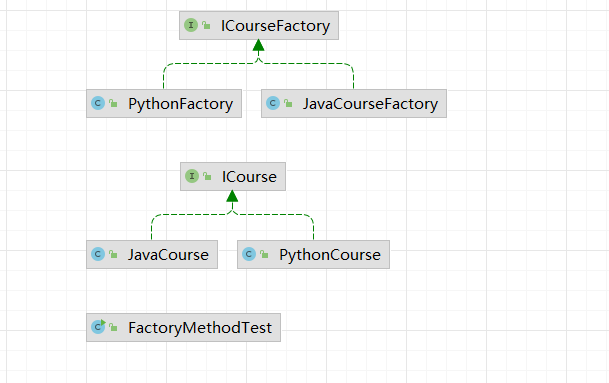
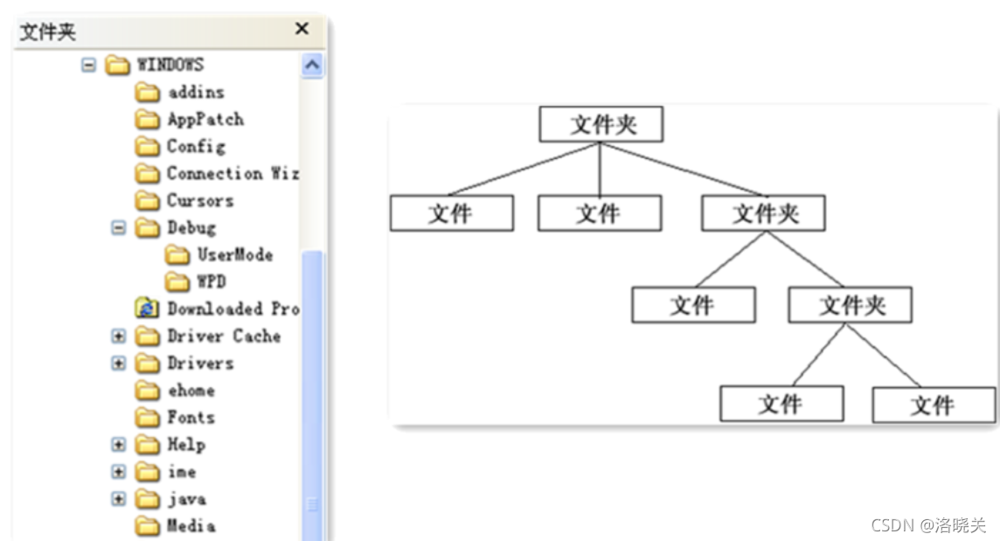

# 设计模式

## **UML** 

### 什么是UML

统一建模语言（Unified Modeling Language，UML）是一种为面向对象系统的产 品进行说明、可视化和编制文档的一种标准语言，是非专利的第三代建模和规约语言。

**UML 使用面向对象设计的的建模工具，但独立于任何具体程序设计语言。**

### UML应用场景

### UML绘图规范

#### 概念

建模的核心是模型，模型是现实的简化，模型是真实系统的左营，它提供了系统的设 计蓝图。给软件系统建模是，需要采用通用的符号语言，这种描述模型所使用的语言称 为建模语言。下图完整地描述了 UML 所能描述的所有事物和关系。


#### 事物描述

**类（Class）**：对一组具有相同属性，方法，关系和语义的对象的描述。

**接口（Interface）**：描述了一个类或构件的一个服务的操作集。它仅仅是定义了一组操 作的规范，并没有给出这组操作的具体实现（代码）。 

**用例（Usecase）**：是对一组动作序列的描述，系统执行这些动作将产生一个对特定的参 与者（Actor）有价值且可观察的结果。

**包（Package**）：是分组事物中最主要的，是 UML 中唯一的组织机制。

#### 事务关系描述

**关联（Association）**：是一种拥有的关系，具有方向性，如果一个类单方向的访问另一 个类，则称为单向关联（用一个箭头的实线表示）；如果两个类对象可以互相访问，则 称为双向关联（用两个箭头或不用箭头的实线表示）；一个对象能访问关联对象的数目 叫做“多重性”。

用带普通箭头的实线表示`---------->` ，箭头指向被拥有者，或不用箭头的实线表示`----------` 。

**聚合（Aggregate）**：是整体与部分的关系。当某个实体聚合成另一个实体时，该实体 还可以是另一个实体的部分。

用带空心菱形的实线表示 ，菱形指向整体，箭头指向个体。

**组合（Combination）**：整体与部分的关系，组合比聚合更加严格，当某个实体组合成 另一个实体时，二者具有相同的生命周期，例如手臂和人之间存在的是组合关系。 用带实心菱形的实线表示 ，菱形指向整体，箭头指向个体。

**泛华（Generalization）**：表示一个更泛化的元素和一个更具体的元素之间的关系，与继 承是同一个概念。用带三角箭头的实线表示 ，箭头指向父类。

**实现（Realization**）：类与接口的关系，类实现接口。 用带三角箭头的虚线表示 ，箭头指向父接口。 

**依赖（Dependency）**：如果一个类的改动会影响到另一个类，则两个类之间存在依赖 关系，一般而言，依赖是单向的。 用带普通箭头的虚线表示 ，箭头指向被依赖者。

#### 类图（Class Diagrams）

在 UML 2.0 的 13 种图形中，类图是使用频率最高的 UML 图之一。类图是描述系统 中的类，以及各个类之间的关系的静态视图。能够让我们在正确编写代码以前对系统有 一个全面的认识。类图是一种模型类型，确切的说，是一种静态模型类型。类图表示类、 接口和它们之间的协作关系，用于系统设计阶段。

类图用三个矩形表示，最上面的部分标识类的名称；中间的部分标识类的属性；最下 面的部分标识类的方法，如下图所示：


类与类之间的关系主要有六种：关联、聚合、组合、继承、实现和依赖，这六种关系 的箭头表示如下：


* **关联与依赖：实线箭头和虚线箭头（箭头）**
* **聚合与组合：实线空心菱形和实线实心菱形（实线、菱形）**
* **继承与实现：实线空心三角形和虚线空心三角形（空心三角形）**

##### 继承关系

继承关系中，子类继承父类的所有功能，父类所具有的属性、方法，子类应该都有。 子类中除了与父类一致的信息以外，还包括额外的信息。例如：公交车、出租车和小轿 车都是汽车，他们都有名称，并且都能在路上行驶。其类图如下：


##### 实现关系

接口（包括抽象类）是方法的集合，在实现关系中，类实现了接口，类中的方法实现 了接口声明的所有方法。例如：汽车和轮船都是交通工具，而交通工具只是一个可移动 工具的抽象概念，船和车实现了具体移动的功能。


##### 组合关系

组合关系表示类之间整体与部分的关系，整体和部分有一致的生存期。一旦整体对象 不存在，部分对象也将不存在，是同生共死的关系。例如：人由头部和身体组成，两者 不可分割，共同存在。


##### 聚合关系

聚合关系也表示类之间整体与部分的关系，成员对象是整体对象的一部分，但是成员 对象可以脱离整体对象独立存在。例如：公交车司机和工衣、工帽是整体与部分的关系， 但是可以分开，工衣、工帽可以穿在别的司机身上，公交司机也可以穿别的工衣、工帽。


##### 关联关系

关联关系是类与类之间最常用的一种关系，表示一类对象与另一类对象之间有联系。 组合、聚合也属于关联关系，只是关联关系的类间关系比其他两种要弱。 

关联关系有四种：双向关联、单向关联、自关联、多重数关联。例如：汽车和司机， 一辆汽车对应特定的司机，一个司机也可以开多辆车。


在多重性关系中，可以直接在关联直线上增加一个数字，表示与之对应的另一个类的 对象的个数。 

- 1..1：仅一个 
- 0..*：零个或多个
- 1..*：一个或多个
- 0..1：没有或只有一个
- m..n：最少 m、最多 n 个 (m<=n)

##### 依赖关系

大多数情况下，依赖关系体现在某个类的方法使用另一个类的对象作为参数。 

依赖关系是一种“使用”关系，特定事物的改变有可能会影响到使用该事物的其他事 物，在需要表示一个事物使用另一个事物时使用依赖关系。 

例如：汽车依赖汽油，如果没有汽油，汽车将无法行驶。


这六种类关系中，组合、聚合和关联的代码结构一样，可以从关系的强弱来理解，各 类关系从强到弱依次是：继承→实现→组合→聚合→关联→依赖。

UML 类图是面向对象设计的辅助工具，但并非是必须工具，所以我们把它作为架构 师软技能来讲解。


##### 案例分析


### 时序图（Sequence Diagrams）

#### 什么是时序图

时序图描述对象之间消息的发送顺序，强调时间顺序。时序图是一个二维图，横轴表 示对象，纵轴表示时间，消息在各对象之间横向传递，依照时间顺序纵向排列。用箭头 表示消息、用竖虚线表示对象生命线。

#### 时序图的作用

- 展示对象之间交互的顺序。将交互行为建模为消息传递，通过描述消息是如何在 对象间发送和接收的来动态展示对象之间的交互； 
- 相对于其他 UML 图，时序图更强调交互的时间顺序； 
- 可以直观的描述并发进程。

#### 时序图组成元素

##### 角色（Actor）

系统角色，可以是人、机器、其他系统、子系统；在时序图中表示。

##### 对象（Object） 

1. 对象的三种命名方式 第一种方式包括对象名和类名，例如：直播课时:课时，在时序图中，用“对象：类” 表示； 第二种方式只显示类名，即表示它是一个匿名对象，例如： :课程；在时序图中，用 “：类”表示； 第三种方式只显示对象名不显示类名，例如：讲师；在时序图中，用“对象”表示。

2. 命名方式的选择 三种命名方式均可，哪种最容易让阅读该时序图的人理解，就选择哪种。 

3. 对象的排列顺序 对象的左右顺序并不重要，但是为了作图清晰整洁，通常应遵循以下两个原则：把交 互频繁的对象尽可能的靠拢；把初始化整个交互活动的对象放置在最左端。

##### 生命线（Lifeline）

在时序图中表示为从对象图标向下延伸的一条虚线，表示对象存在的时间。

##### 控制焦点（Focus of Control）

又称为激活期，表示时间段的符号，在这个时间段内对象将执行相应的操作。可以理 解为 Java 语言中一对大括号``{ }``中的内容；用小矩形表示。

##### 消息（Message）

消息一般分为同步消息（Synchronous Message），异步消息（Asynchronous Message）和返回消息（Return Message）。 

1. 消息的发送者把控制传递给消息的接收者，然后停止活动，等待消息的接收者放 弃或者返回控制。用来表示同步的意义； 
2. 消息发送者通过消息把信号传递给消息的接收者，然后继续自己的活动，不等待接 受者返回消息或者控制。异步消息的接收者和发送者是并发工作的。 
3. 返回消息表示从过程调用返回

##### 自关联消息

表示方法的自身调用或者一个对象内的一个方法调用另外一个方法。

##### 组合片段

组合片段用来解决交互执行的条件和方式，它允许在序列图中直接表示逻辑组件，用 于通过指定条件或子进程的应用区域，为任何生命线的任何部分定义特殊条件和子进程。 组合片段共有 13 种，名称及含义如下：

| 片段类型 | 名称   | 说明                                                         |
| -------- | ------ | ------------------------------------------------------------ |
| Opt      | 选项   | 包含一个可能发生 或可能不发生的序列。可以在临界中指定序列发生的条件。 |
| Alt      | 抉择   | 包含一个片段列表,这些片段包含备选消息序列。在任何场合 下只发生一个序 列。 可以在每个片段中设置一个临界来指示该片段可以运行的条件。 else 的临界 指示其他任何临界都不为 True 时应运行的片段。如果所有临界都为 False 并且没有 else ,则不执行任何片段。 |
| Loop     | 循环   | 片段重复一定次数。可以在临界中指示片段重 复的条件。 Loop 组合片段具有“Min”和"Max"属性,它们指示片段可以重复的最小和最 大次数。默认值是无限制。 |
| Break    | 中断   | 如果执行此片段,则放弃序列的其余部分。可以使用临界来指示发 生中断的条 件 |
| Par      | 并行   | 并行处理。片段中的事件可以交错。                             |
| Critical | 关键   | 用在 Par 或 Seq 片段中。指示此片段中的消息不得与其他消息交错。 |
| Seq      | 弱顺序 | 有两个或更多操作数片段。涉及同一生命线的消息必须以片段的顺序发生。如 果消息涉及的生命线不同 ,来自不同片段的消息可能会并行交错。 |
| Strict   | 强顺序 | 有序 有两个或更多操作数片段。这些片段必须按给定顺序发生。    |
| Consider | 考虑   | 指定此片段描述的消息列表。其他消息 可发生在运行的系统中,但对此描述来 说意义不大。 在"Messages"属性中键入该列表。 |
| Ignore   | 忽略   | 此片段未描述的消息列表。这些消息可发生在运行的系统中 ，但对此描述来说 意义不大。 在"Messages"属性中键入该列表。 |
| Assert   | 断言   | 操作数片段指定唯一有效的序列。 通常用在 Consider 或 Ignore 片段中。 |
| Neg      | 否定   | 此片段中显示的序列不得发生。通常用在 Consider 或 Ignore 片段中。 |

常用组合片段举例： 

用来指明在两个或更多的消息序列之间的互斥的选择，相当于经典的 if..else..

###### 抉择（Alt）

抉择在任何场合下只发生一个序列。 可以在每个片段中设置一个临界来指示该片段可以运行的条件。else 的临界指示其他任何临界都不为 True 时应运行的片段。如果所 有临界都为 False 并且没有 else，则不执行任何片段。


###### 选项（Opt）

包含一个可能发生或不发生的序列；


###### 循环（Loop）

片段重复一定次数，可以在临界中指示片段重复的条件。


###### 并行（Par）


##### 时序图画法及实践

时序图的绘制步骤可简单总结如下： 

1. 划清边界，识别交互的语境；
2. 将所要绘制的交互场景中的角色以及对象梳理出来；
3. 从触发整个交互的某个消息开始，在生命线之间从上到下依次画出所有消息，并注明 每个消息的特性（如参数等）。


## **七大软件设计原则**

### 开闭原则

**定义：一个软件实体（如类、模块和函数）应该对扩展开放，对修改关闭。**

用抽象构建框架，用实现扩展细节。

优点：提高软件系统的可复用性及可维护性。

### 依赖倒置原则

定义：高层模块不应该依赖底层模块，二者都应该依赖其抽象。抽象不应该依赖细节；细节应该依赖抽象。（依赖抽象）

**在编程的时候，需要针对接口编程，不要针对实现编程。**

优点：可以减少类间的耦合性、提高系统稳定性，提高代码可读性和可维护性，可降低修改程序所造成的危险。

### 单一职责原则

**定义：不要存在多余一个导致类变更的原因，一个类、接口、方法只负责一项职责。**

优点：降低类的复杂度、提高类的可读性、提高系统的可维护性、降低变更引起的风险。

说白了就是，方法拆解为只负责一项任务（不要写万能方法，啥都可以搞）。缺点就是拆解了方法就变多了。

### 接口隔离原则

**定义：用多个专门的接口，而不是使用单一的总接口，客户端不应该依赖它不需要的接口。**（接口只干一种事情。）

注意：

* 一个类对应一个类的依赖应该建立在最小的接口上
* 建议单一接口，不要建议庞大臃肿的解耦
* 尽量细节接口，接口中的方法尽量少

> 注意适度原则，一定要适度。

优点：符合高内聚、低耦合的设计思想，从而使得类具有很好的可读性，可扩展性和可维护性。

### 迪米特法则（最少知道原则）

**定义：一个对象应该对其他对象保持最少的了解。又叫最少知道原则，尽量降低类与类之间的耦合。（说白了就是不属于自己的方法，不要自己这里实现）**

优点：降低类之间的耦合

**强调只和朋友交流，不和陌生人说话。**

朋友：出现在成员变量、方法的输入、输出参数中的类成为成员朋友类，而出现在方法体内部的类不属于朋友类。

### 里氏替换原则

**定义：如果对每一个类型为T1的对象o1，都有类型为T2的对象o2，使得以T1定义的所有程序P在所有的对象o1都替换成o2时，程序P的行为没有发生变化，那么类型T2是类型T1的子类型。**

定义扩展：一个软件实体如果适用一个父类的话，那一定适用于其子类，所有引用父类的地方必须能透明地适用其子类的对象，子类对象能够替换父类对象，而程序逻辑不变。

**引申意义：子类可以扩展父类的功能，但不能改变父类原有的功能。**

- 含义1：子类可以实现父类的抽象方法，但不能覆盖父类的非抽象方法。
- 含义2：子类中可以增加自己持有的方法。
- 含义3：当子类的方法重载父类的方法时，方法的前置条件（即方法的输入、入参）要比父类方法的输入参数更宽松。
- 含义4：当子类的方法实现父类的方法时（重写、重载或实现抽象方法），方法的后置条件（即方法的输出、返回值）要比父类更严格或相等。

优点：

* 约束继承泛滥，开闭原则的一种体现。
* 加强程序的健壮性，同时变更时也可以做到非常好的兼容性，提高程序的维护性，扩展性。降低需求变更时引入的风险。

### 合成复用原则

**定义：尽量使用对象组合、聚合，而不是继承关系达到软件复用的目的**

优点：可以使系统更加灵活，降低类与类之间的耦合度，一个类的变化对其他类造成的影响相对较少。

| 设计原则         | 解释                                                         |
| ---------------- | ------------------------------------------------------------ |
| **开闭原则**     | **对扩展开放，对修改关闭。**                                 |
| **依赖倒置原则** | **通过抽象使各个类或者模块不相互影响，实现松耦合。**         |
| **单一职责原则** | **一个类、接口、方法只做一件事。**                           |
| **接口隔离原则** | **尽量保证接口的纯洁性，客户端不应该依赖不需要的接口。**     |
| **迪米特法则**   | **又叫最少知道原则，一个类对其所依赖的类知道得越少越好。**   |
| **里氏替换原则** | **子类可以扩展父类的功能但不能改变父类原有的功能。**         |
| **合成复用原则** | **尽量使用对象组合、聚合，而不使用继承关系达到代码复用的目的。** |

## 设计模式总览

设计模式可以帮助我们，能够写出优雅的代码、更好的重构项目。而且经典框架都在使用设计模式解决问题，因此凭啥不学。

## 创建型模式

### **设计模式一：工厂模式**

#### 工厂模式的历史由来

在现实生活中我们都知道，原始社会自给自足(没有工厂)、农耕社会小作坊(简单工厂，民间酒坊)、工业革命流水线(工厂方法，自产自销)、现代产业链代工厂(抽象工厂，富士康)。


项目代码同样也是由简而繁一步一步迭代而来，但对于调用者来说确是越来越简单化。

#### 简单工厂模式

##### 概念

简单工厂模式(Simple Factory Pattern)是指由一个工厂对象决定创建出哪一种产品类的实例，但它不属于GOF 23种设计模式。简单工厂适用于工厂类负责创建的对象较少的场景，且客户端只需要传入工厂类的参数，对于如何创建对象的逻辑不需要关心。

* `Course`抽象接口

```java
public interface Course {
    public void record();
}
```

* `JavaCourse.java`

```java
public class JavaCourse implements Course{
    @Override
    public void record() {
        System.out.println("录制Java课程");
    }
}
```

* `PythonCourse.java`

```java
public class PythonCourse implements Course{
    @Override
    public void record() {
        System.out.println("录制Python课程");
    }
}
```

* 客户端`SimpleFactoryTest.java`

```java
public class SimpleFactoryTest {
    public static void main(String[] args) {
        Course course = new JavaCourse();
        course.record();
    }
}
```

看上面的代码，父类ICourse指向子类JavaCourse的引用，应用层代码需要依赖JavaCourse，如果业务扩展，继续增加PythonCourse甚至更多，那么客户端的依赖会变得越来越臃肿。因此，要想办法把这种依赖减弱，把创建细节隐藏。虽然目前的代码中，我们创建对象的过程并不复杂，但从代码设计角度来讲不易于扩展。现在，我们用简单工厂模式对代码进行优化。

* `CourseFactory.java`

```java
public class SimpleFactoryTest {
    public static void main(String[] args) {
        Course course = new CourseFactory().create("Python");
        course.record();
    }
}
```

客户端调用是简单了，但如果我们业务继续扩展，要增加前端课程，那么工厂中的create()就要根据产品链的丰富每次都要修改代码逻辑。不符合开闭原则。因此，对简单工厂还可以继续优化,可
以采用反射技术：

* `CourseFactory.java`

```java
public class CourseFactory {
    public Course create(String className) {
        try {
            if (!(null == className || "".equals(className))) {
                return (Course) Class.forName(className).getDeclaredConstructor().newInstance();
            }
        } catch (Exception e) {
            e.printStackTrace();
        }
        return null;
    }
}
```

* 客户端`SimpleFactoryTest.java`

```java
public class SimpleFactoryTest {
    public static void main(String[] args) {
        Course course = new CourseFactory().create("factory.simplefactory.JavaCourse");
        course.record();
    }
}
```

优化之后，产品不断丰富不需要修改CourseFactory 中的代码。但是，有个问题是，方法参数是字符串，可控性有待提升，而且还需要强制转型。再修改一下代码：

- `CourseFactory.java`

```java
public class CourseFactory {
    public Course create(Class classObject) {
        try {
            if( null != classObject){
                return (Course) classObject.getDeclaredConstructor().newInstance();
            }
        }catch (Exception e){
            e.printStackTrace();
        }

        return null;
    }
}
```

- 客户端`SimpleFactoryTest.java`

```java
public class SimpleFactoryTest {
    public static void main(String[] args) {
        Course course = new CourseFactory().create(JavaCourse.class);
        course.record();
    }
}
```

这里也有一个问题，就是在`CourseFactory`中有强制转换类型，限制其职责。

* `CourseFactory.java`

```java
public class CourseFactory {
    public Course create(Class<? extends Course> classObject) {
        try {
            if( null != classObject){
                return classObject.getDeclaredConstructor().newInstance();
            }
        }catch (Exception e){
            e.printStackTrace();
        }

        return null;
    }
}
```

`Class<? extends Course> `限制其必须是其子类。

##### 简单工厂使用场景

工厂类负责创建的对象较少。客户端只需要传入工厂类的参数，对于如何创建对象的逻辑不需要关心。

##### 简单工厂的优点

只需传入一个正确的参数,就可以获取你所需要的对象无须知道其创建的细节。

##### 简单工厂的缺点

工厂类的职责相对过重，增加新的产品时需要修改工厂类的判断逻辑，违背开闭原则。不易于扩展过于复杂的产品结构。

#### 工厂方法模式

**意图：**定义一个创建对象的接口，让其子类自己决定实例化哪一个工厂类，工厂模式使其创建过程延迟到子类进行。

**主要解决：**主要解决接口选择的问题。

**何时使用：**我们明确地计划不同条件下创建不同实例时。

**如何解决：**让其子类实现工厂接口，返回的也是一个抽象的产品。

**关键代码：**创建过程在其子类执行。

**应用实例：** 1、您需要一辆汽车，可以直接从工厂里面提货，而不用去管这辆汽车是怎么做出来的，以及这个汽车里面的具体实现。 2、Hibernate 换数据库只需换方言和驱动就可以。

**优点：** 1、一个调用者想创建一个对象，只要知道其名称就可以了。 2、扩展性高，如果想增加一个产品，只要扩展一个工厂类就可以。 3、屏蔽产品的具体实现，调用者只关心产品的接口。

**缺点：**每次增加一个产品时，都需要增加一个具体类和对象实现工厂，使得系统中类的个数成倍增加，在一定程度上增加了系统的复杂度，同时也增加了系统具体类的依赖。这并不是什么好事。

工厂方法模式(Fatory Method Pattern）是指定义一个创建对象的接口，但让实现这个接口的类来决定实例化哪个类，工厂方法让类的实例化推迟到子类中进行。在工厂方法模式中用户只需要关心所需产品对应的工厂，无须关心创建细节，而且加入新的产品符合开闭原则。

**使用场景**：

1. **创建对象需要大量重复的代码。**
2. **客户端（应用层)不依赖于产品类实例如何被创建、实现等细节。**
3. 一个类通过其子类来指定创建哪个对象。

**工厂方法模式主要解决产品扩展的问题，在简单工厂中，随着产品链的丰富，如果每个课程的创建逻辑有区别的话，工厂的职责会变得越来越多，有点像万能工厂，并不便于维护。**根据单一职责原则我们将职能继续拆分，专人干专事。Java课程由Java工厂创建，Python课程由Python 工厂创建，对工厂本身也做一个抽象，来看代码先创建ICourseFactory接口。

* `ICourseFactory.java`

```java
public interface ICourseFactory{
    ICourse create();
}
```

* 在分别创建工厂，JavaCourseFacroty接口

```java
public class JavaCourseFactory implements ICourseFactory{
    @Override
    public ICourse create() {
        return new JavaCourse();
    }
}
```

以及PythonCourseFacroty接口

```java
public class PythonFactory implements ICourseFactory{
    @Override
    public ICourse create() {
        return new PythonCourse();
    }
}
```

* 创建相应的课程类

```java
public class JavaCourse implements ICourse {
    @Override
    public void record() {
        System.out.println("录制Java课程");
    }
}

public class PythonCourse implements ICourse {
    @Override
    public void record() {
        System.out.println("录制Python课程");
    }
}
```

* 测试

```java
public class FactoryMethodTest {
    public static void main(String[] args) {
        ICourseFactory factory = new JavaCourseFactory();
        ICourse course = factory.create();
        course.record();
    }
}
```



### **设计模式二：抽象工厂模式**

抽象工厂模式（Abstract Factory Pattern）是围绕一个超级工厂创建其他工厂。该超级工厂又称为其他工厂的工厂。这种类型的设计模式属于创建型模式，它提供了一种创建对象的最佳方式。

在抽象工厂模式中，接口是负责创建一个相关对象的工厂，不需要显式指定它们的类。每个生成的工厂都能按照工厂模式提供对象。

**抽象工厂模式(Abastract Factory Pattern)是提供一个创建一系列相关或相互依赖对象的接口，无须指定他们具体的类。**客户端(应用层)不依赖于产品类实例如何被创建、实现等细节，强调的是一系列相关的产品对象（属于同一产品族)一起使用创建对象需要大量重复的代码。需要提供一个产品类的库，所有的产品以同样的接口出现，从而使客户端不依赖于具体实现。

讲解抽象工厂之前，我们要了解两个概念产品等级结构和产品族，看下面的图：

* `INote.java`

```java
public interface INote {
    void edit();
}
```

* `IVideo.java`

```java
public interface IVideo {
    void record();
}
```

* `CourseFactory.java`：抽取共同部分，使得客户端不依赖于具体实现

```java
public abstract class CourseFactory {
    public void init(){
        System.out.println("初始化基础数据");
    }

    protected abstract INote createNote();

    protected abstract IVideo createVideo();
}
```

* 单独实现具体方法

`JavaNote.java`

```java
public class JavaNote implements INote{
    @Override
    public void edit() {
        System.out.println("做Java笔记");
    }
}
```

`JavaVideo.java`

```java
public class JavaVideo implements IVideo{
    @Override
    public void record() {
        System.out.println("看Java视频");
    }
}
```

* `JavaCourseFactory.java`

```java
public class JavaCourseFactory extends CourseFactory{
    @Override
    protected INote createNote() {
        super.init();
        return new JavaNote();
    }

    @Override
    protected IVideo createVideo() {
        super.init();
        return new JavaVideo();
    }
}
```

* 测试

```java
public class AbstractFactoryTest {
    public static void main(String[] args) {
        CourseFactory factory = new JavaCourseFactory();
        INote note = factory.createNote();
        note.edit();
    }
}
```

上面的代码完整地描述了两个产品族Java课程，也描述了该产品等级视频和手记。抽象工厂非常完美清晰地描述这样一层复杂的关系。但是，不知道大家有没有发现，如果我们再继续扩展产品等级，将源码Source 也加入到课程中，那么我们的代码从抽象工厂，到具体工厂要全部调整，很显然不符合开闭原则。

因此抽象工厂也是有缺点的:

1. **规定了所有可能被创建的产品集合，产品族中扩展新的产品困难，需要修改抽象工厂的接口。**
2. **增加了系统的抽象性和理解难度。**

抽象工厂的优点：

- 具体产品在应用层代码隔离，无须关心创建细节
- 将一个系列的产品族统一到一起创建。

但在实际应用中，我们千万不能犯强迫症甚至有洁癖。在实际需求中产品等级结构升级是非常正常的一件事情。我们可以根据实际情况，只要不是频繁升级，可以不遵循开闭原则。代码每半年升级一次或者每年升级一次又有何不可呢？

### **设计模式三：单例模式**

#### 为什么要使用单例模式

**单例模式**：保证一个类仅有一个实例，而且这个实例在类的内部由private构造的，外部不能直接调用其构造方法，只能通过提供它的全局访问点，才能获取它的实例。

**使用场景**：

- 需要频繁的实例化和销毁的对象
- 有状态的工具类对象
- 频繁访问数据库或文件对象
- 要求生产唯一序列号

**单例模式的优点：在内存中只有一个实例对象，节省内存空间；避免重复的创建和销毁对象，可以提高性能；避免对多重资源的重复占用，可以全局进行访问。**

**单例模式的缺点**：没有接口，不能继承，与单一职责原则冲突，一个类应该只关心内部逻辑，而不关心外面怎么样来实例化。

**可能出现单例被破坏的情况**：

- **多线程破坏单例**：多个线程同时操作，导致同时创建多个对象

双重检查方法可以解决或者使用静态内部类的写法，性能更高。

- **指令重排破坏单例** ：JVM指令重排可能导致懒汉式单例被破坏


添加**volatile**关键字，使得该变量被可见。

- **克隆破坏单例**：深clone()，每次都会被重新创建对象。

可以通过重写clone()方法进行解决。

- **反序列化破坏单例**：反序列化对象会重新分配内存，相当于重新创建对象。

重写`readResolve`方法，和`clone`方法一样。

- **反射破坏单例**：反射可以任意调用私有构造方法创建单例对象

在构造方法中检查单例对象，如果已创建则抛出异常。

将单例的实现方式改为枚举式单例。

#### 如何实现一个单例

##### 饿汉式（静态变量）

饿汉式（静态变量）：对内私有化实例，对外提供一个公有的静态方法，返回实例对象。

缺点：如果没使用的话，会造成内存浪费

```java
// 饿汉式（静态变量）：对内私有化实例，对外提供一个公有的静态方法，返回实例对象
// 如果没使用的话，会造成内存浪费
class Singleton{
    // 1.构造器私有化，外部能new
    private Singleton(){}

    // 2.本类内部创建对象实例
    private final static Singleton instance = new Singleton();

    // 3.对外提供一个公有的静态方法，返回实例对象
    public static Singleton getInstance(){
        return instance;
    }
}
```

##### 饿汉式（静态代码块）

```java
// 如果没使用的话，会造成内存浪费
class Singleton{

    // 1.构造器私有化，外部能new
    private Singleton(){

    }

    // 2.本类内部创建对象实例
    private static Singleton instance;

    static { // 在静态代码块中，创建单例对象
        instance = new Singleton();
    }

    // 3.对外提供一个公有的静态方法，返回实例对象
    public static Singleton getInstance(){
        return instance;
    }
}
```

##### 懒汉式（线程不安全）

懒汉式：提供一个静态的公有方法，当使用到该方法时，才去创建instance。

缺点：但是懒汉式是线程不安全的，这个只能在单线程中使用，因为多线程可能会同时访问到`instance==null`，因为没有创建过，会导致创建多个实例。

```java
// 懒汉式：提供一个静态的公有方法，当使用到该方法时，才去创建instance
// 但是懒汉式是线程不安全的，这个只能在单线程中使用，因为多线程可能会同时访问到`instance==null`，因为没有创建过，会导致创建多个实例
class Singleton{
    private static Singleton instance;

    // 只有要使用的时候，才会去创建
    public static Singleton getInstance(){
        if(instance == null){
            instance = new Singleton();
        }
        return instance;
    }
}
```

##### 懒汉式（线程安全，同步方法）

```java
// 但是懒汉式是线程不安全的，这个只能在单线程中使用，因为多线程可能会同时访问到`instance==null`，因为没有创建过，会导致创建多个实例
class Singleton {
    private static Singleton instance;

    // 在懒汉式的基础上，在方法中添加synchronized
    // 加入同步处理的代码块，解决线程不安全问题
    // 这样实现方式效率很低，每次执行的时候，都需要进行同步，但是实际上只需要在初始化的时候，使用就行了
    public static synchronized Singleton getInstance(){
        if(instance == null){
            instance = new Singleton();
        }
        return instance;
    }
}
```

##### 懒汉式（线程不安全，同步代码块）

```java
class Singleton {
    private static Singleton instance;

    // 在懒汉式的基础上，在方法中添加同步代码块，因为外面的已经同时多个线程进来了，已经没意义了。
    public static Singleton getInstance(){
        if(instance == null){
            synchronized (Singleton.class) {
                instance = new Singleton();
            }
        }
        return instance;
    }
}
```

##### 双重检举

在懒汉式的基础上，在方法中添加同步代码块，添加两重判断，即双重检测。加入双重检测代码后，解决了线程安全问题，同时解决了懒加载问题。

```java
class Singleton {
    private static Singleton instance;

    // 在懒汉式的基础上，在方法中添加同步代码块，添加两重判断，即双重检测
    // 加入双重检测代码后，解决了线程安全问题，同时解决了懒加载问题
    public static Singleton getInstance(){
        if(instance == null){
            synchronized (Singleton.class) {
                if(instance == null) {
                    instance = new Singleton();
                }
            }
        }
        return instance;
    }
}
```

##### 静态内部类

静态内部类在Singleton类被装载时并不会立即实例化，而是在需要实例化的时候，才会被初始化，而且只初始化一次。

```java
class Singleton {
    private static Singleton instance;

    // 静态内部类在Singleton类被装载时并不会立即实例化，而是在需要实例化的时候，才会被初始化，而且只初始化一次
    private static class SingletonInstance{
        private static final Singleton INSTANCE = new Singleton();
    }

    // 在懒汉式的基础上，在方法中添加同步代码块，因为外面的已经同时多个线程进来了，已经没意义了。
    public static Singleton getInstance(){
        return SingletonInstance.INSTANCE;
    }
}
```

为什么只会创建一次？**对于final，当你创建一个对象时，使用final关键字能够使得另一个线程不会访问到处于“部分创建”的对象。**因为对于final修饰的变量，**JVM会保障顺序。不会在对final变量的写操作完成之前，与将变量引用赋值给其他变量之间进行重排序，也就是final变量的设置完成始终会在被读取之前。**

##### **枚举**

枚举类实现单例模式是极力推荐的单例实现模式，因为枚举类型是线程安全的，并且只会装载一次，设计者充分的利用了枚举的这个特性来实现单例模式，枚举的写法非常简单，而且枚举类型是所用单例实现中唯一种不会被破坏的单例实现模式。

```java
// 通过枚举的方法进行实现单例，可以防止反序列化重新创建的对象
enum Singleton {

    INSTANCE; // 属性


    public static Singleton getInstance(){
        return INSTANCE;
    }
}
```

测试方法

```java
public class SingletonTest {
    public static void main(String[] args) {
        // 测试
//        Singleton instance1 = Singleton.getInstance();
//        Singleton instance2 = Singleton.getInstance();
//        System.out.println(instance1.equals(instance2));

        // 线程测试
        new Thread(() -> {
            Singleton instance = Singleton.getInstance();
            System.out.println(instance.hashCode());
        }).start();
        new Thread(() -> {
            Singleton instance = Singleton.getInstance();
            System.out.println(instance.hashCode());
        }).start();
    }
}
```

#### 单例模式破坏及解决方案

##### 反射

通过反射机制创建new一个新的对象。

```java
public class Client {
    public static void main(String[] args) throws Exception {

        // 创建实例1
        Singleton instance1 = Singleton.getInstance();
        System.out.println(instance1.hashCode());

        // 创建实例2
        Class c = Singleton.class;
        Constructor constructor = c.getDeclaredConstructor(); // 获取被private修饰的私有无参构造
        constructor.setAccessible(true); // 跳过访问检查，暴力反射
        Singleton instance2 = (Singleton) constructor.newInstance(); // 创建实例
        System.out.println(instance2.hashCode());

    }
}

class Singleton {
    private static Singleton instance;

    private Singleton(){}

    public static Singleton getInstance(){

        if(instance == null){
            synchronized (Singleton.class){
                if(instance == null){
                    instance = new Singleton();
                }
            }
        }
        return instance;
    }
}
```

修改私有构造方法，使用构造方法创建实例时直接抛出运行时异常中断，双检锁为例，私有方法修改如下：

```java
class Singleton {
    private static volatile Singleton instance;
    private static boolean flag = false; //通过标志位进行保护

    private Singleton() {
        // 由于反射会破坏单例，这里加把锁
        synchronized (Singleton.class) { //但是这里加了三把锁，但是仍然会破坏
            if (flag == false) {
                flag = true;
            } else {
                throw new RuntimeException("不要试图使用反射破坏异常");
            }
        }
    }

    public static Singleton getInstance() {
        if (instance == null) {
            synchronized (Singleton.class) {
                if (instance == null) {
                    instance = new Singleton();
                }
            }
        }
        return instance;
    }
}
```

经测试，修改后的代码使用反射创建实例时抛出异常，实例创建失败，反射破坏单例唯一性问题解决。

##### 序列化

单例测试类如下，使用饿汉式实现方式：

```java
public class Client {
    public static void main(String[] args) throws Exception {
        Singleton.write();
        // 创建实例1
        Singleton instance1 = Singleton.read();
        System.out.println(instance1.hashCode());
        // 创建实例2
        Singleton instance2 = Singleton.read();
        System.out.println(instance2.hashCode());
    }
}

class Singleton implements Serializable {
    private static final Singleton instance = new Singleton();

    private Singleton(){}

    public static Singleton getInstance() throws Exception {
        return instance;
    }

    //从测试文件中读取Singleton实例
    public static Singleton read() throws Exception {
        ObjectInputStream objectInputStream = new ObjectInputStream(new FileInputStream("test.txt"));
        Singleton instance = (Singleton) objectInputStream.readObject();
        objectInputStream.close();
        return instance;
    }
    //将Singleton实例写入测试文件
    public static void write() throws Exception {
        Singleton instance = Singleton.getInstance();
        ObjectOutputStream oos = new ObjectOutputStream(new FileOutputStream("test.txt"));
        oos.writeObject(instance);
        oos.close();
    }

}
```

解决序列化的方式是在单例类中加入一个readResolve()方法，并且由该方法返回已经被创建好的实例，**readResolve()方法会在反序列化时通过反射的方式调用**，如果不加入readResolve()方法，会返回通过new关键字创建的对象。

```java
class Singleton implements Serializable {
    private static final Singleton instance = new Singleton();

    private Singleton(){}

    public static Singleton getInstance() throws Exception {
        return instance;
    }

    private Object readResolve() {
        return instance;
    }
}
```

通过枚举实现能够防止这些问题。

#### 单例模式实战：唯一递增ID号码生成器

如果程序中有两个对象，那就会存在生成重复ID的情况，所以，应该将 ID 生成器类设计为单例作为练习。

```java
public class SingletonTest{
    public static void main(String[] args) {
        for(int i=0;i<10;i++){
            new Thread(()->{
                IdGenerator instance = IdGenerator.getInstance();
                System.out.println(instance.hashCode() + "==" + instance.getId());
            }).start();
        }
    }
}

// 推荐使用枚举类
enum IdGenerator {

    INSTANCE;

    // AtomicLong是一个Java并发库中提供的一个原子变量类型,
    // 它将一些线程不安全需要加锁的复合操作封装为了线程安全的原子操作，
    // 比如下面会用到的incrementAndGet().
    private AtomicLong id = new AtomicLong(0);
//    private static final IdGenerator instance = new IdGenerator();


    private IdGenerator(){}

    public static IdGenerator getInstance(){
        return INSTANCE;
    }

    public long getId(){
        return id.incrementAndGet();
    }

}
```

#### 单例存在哪些问题

##### 单例对OPP特性的支持不友好

IdGenerator 的使用方式违背了基于接口而非实现的设计原则，也就违背了广义上理解的 OOP 的抽象特性。如果未来某一天，我们希望针对不同的业务采用不同的 ID 生成算法。比如，订单 ID 和用户 ID 采用不同的 ID 生成器来生成。为了应对这个需求变化，我们需要修改所有用到 IdGenerator 类的地方，这样代码的改动就会比较大。

```java
public class Order {
  public void create(...) {
    //...
    long id = IdGenerator.getInstance().getId();
    // 需要将上面一行代码，替换为下面一行代码
    long id = OrderIdGenerator.getIntance().getId();
    //...
  }
}

public class User {
  public void create(...) {
    // ...
    long id = IdGenerator.getInstance().getId();
    // 需要将上面一行代码，替换为下面一行代码
    long id = UserIdGenerator.getIntance().getId();
  }
}
```

##### 单例会隐藏类之间的依赖关系

单例类不需要显示创建、不需要依赖参数传递，在函数中直接调用就可以了。如果代码比较复杂，这种调用关系就会非常隐蔽。在阅读代码的时候，我们就需要仔细查看每个函数的代码实现，才能知道这个类到底依赖了哪些单例类。

##### 单例对代码的扩展性不友好

1. 我们知道，单例类只能有一个对象实例。如果未来某一天，我们需要在代码中创建两个实例或多个实例，那就要对代码有比较大的改动。你可能会说，会有这样的需求吗？既然单例类大部分情况下都用来表示全局类，怎么会需要两个或者多个实例呢？
2. 实际上，这样的需求并不少见。我们拿数据库连接池来举例解释一下。
3. 在系统设计初期，我们觉得系统中只应该有一个数据库连接池，这样能方便我们控制对数据库连接资源的消耗。所以，我们把数据库连接池类设计成了单例类。但之后我们发现，系统中有些 SQL 语句运行得非常慢。这些 SQL 语句在执行的时候，长时间占用数据库连接资源，导致其他 SQL 请求无法响应。为了解决这个问题，我们希望将慢 SQL 与其他 SQL 隔离开来执行。为了实现这样的目的，我们可以在系统中创建两个数据库连接池，慢 SQL 独享一个数据库连接池，其他 SQL 独享另外一个数据库连接池，这样就能避免慢 SQL 影响到其他 SQL 的执行。
4. 如果我们将数据库连接池设计成单例类，显然就无法适应这样的需求变更，也就是说，单例类在某些情况下会影响代码的扩展性、灵活性。所以，数据库连接池、线程池这类的资源池，最好还是不要设计成单例类。实际上，一些开源的数据库连接池、线程池也确实没有设计成单例类。

##### 单例对代码的可测试性不友好

1. 单例模式的使用会影响到代码的可测试性。如果单例类依赖比较重的外部资源，比如 DB，我们在写单元测试的时候，希望能通过 mock 的方式将它替换掉。而单例类这种硬编码式的使用方式，导致无法实现 mock 替换。
2. 除此之外，如果单例类持有成员变量（比如 IdGenerator 中的 id 成员变量），那它实际上相当于一种全局变量，被所有的代码共享。如果这个全局变量是一个可变全局变量，也就是说，它的成员变量是可以被修改的，那我们在编写单元测试的时候，还需要注意不同测试用例之间，修改了单例类中的同一个成员变量的值，从而导致测试结果互相影响的问题。

##### 单例不支持有参数的构造参数

**第一种解决思路是**：创建完实例之后，再调用 init() 函数传递参数。

```java
public class Singleton {
  private static Singleton instance = null;
  private final int paramA;
  private final int paramB;

  private Singleton(int paramA, int paramB) {
    this.paramA = paramA;
    this.paramB = paramB;
  }

  public static Singleton getInstance() {
    if (instance == null) {
       throw new RuntimeException("Run init() first.");
    }
    return instance;
  }

  public synchronized static Singleton init(int paramA, int paramB) {
    if (instance != null){
       throw new RuntimeException("Singleton has been created!");
    }
    instance = new Singleton(paramA, paramB);
    return instance;
  }
}

Singleton.init(10, 50); // 先init，再使用
Singleton singleton = Singleton.getInstance();
```

**第二种解决思路是**：将参数放到 getIntance() 方法中。

**第三种解决思路是**：将参数放到另外一个全局变量中。

```java
public class Config {
  public static final int PARAM_A = 123;
  public static final int PARAM_B = 245;
}

public class Singleton {
  private static Singleton instance = null;
  private final int paramA;
  private final int paramB;

  private Singleton() {
    this.paramA = Config.PARAM_A;
    this.paramB = Config.PARAM_B;
  }

  public synchronized static Singleton getInstance() {
    if (instance == null) {
      instance = new Singleton();
    }
    return instance;
  }
}
```

#### 如何理解单例模式中的唯一性

1. 首先，我们重新看一下单例的定义：“一个类只允许创建唯一一个对象（或者实例），那这个类就是一个单例类，这种设计模式就叫作单例设计模式，简称单例模式。
2. ”定义中提到，“一个类只允许创建唯一一个对象”。那对象的唯一性的作用范围是什么呢？是指线程内只允许创建一个对象，还是指进程内只允许创建一个对象？答案是后者，也就是说，**单例模式创建的对象是进程唯一的**。这里有点不好理解，我来详细地解释一下。
3. 我们编写的代码，通过编译、链接，组织在一起，就构成了一个操作系统可以执行的文件，也就是我们平时所说的“可执行文件”（比如 Windows 下的 exe 文件）。可执行文件实际上就是代码被翻译成操作系统可理解的一组指令，你完全可以简单地理解为就是代码本身。
4. 当我们使用命令行或者双击运行这个可执行文件的时候，操作系统会启动一个进程，将这个执行文件从磁盘加载到自己的进程地址空间（可以理解操作系统为进程分配的内存存储区，用来存储代码和数据）。接着，进程就一条一条地执行可执行文件中包含的代码。比如，当进程读到代码中的 User user = new User(); 这条语句的时候，它就在自己的地址空间中创建一个 user 临时变量和一个 User 对象。**进程之间是不共享地址空间的**，如果我们在一个进程中创建另外一个进程（比如，代码中有一个 fork() 语句，进程执行到这条语句的时候会创建一个新的进程），操作系统会给新进程分配新的地址空间，并且将老进程地址空间的所有内容，重新拷贝一份到新进程的地址空间中，这些内容包括代码、数据（比如 user 临时变量、User 对象）。
5. 所以，单例类在老进程中存在且只能存在一个对象，在新进程中也会存在且只能存在一个对象。而且，这两个对象并不是同一个对象，这也就说，**单例类中对象的唯一性的作用范围是进程内的，在进程间是不唯一的**。

#### 如何实现线程唯一的单例

1. 刚刚我们讲了**单例类对象是进程唯一的，一个进程只能有一个单例对象。**那如何实现一个线程唯一的单例呢？
2. 我们先来看一下，什么是线程唯一的单例，以及“线程唯一”和“进程唯一”的区别。
3. **“进程唯一”指的是进程内唯一，进程间不唯一**。类比一下，“**线程唯一”指的是线程内唯一，线程间可以不唯一**。实际上，“**进程唯一”还代表了线程内、线程间都唯一**，这也是“进程唯一”和“线程唯一”的区别之处。这段话听起来有点像绕口令，我举个例子来解释一下。
4. 假设 IdGenerator 是一个线程唯一的单例类。在线程 A 内，我们可以创建一个单例对象 a。因为线程内唯一，在线程 A 内就不能再创建新的 IdGenerator 对象了，而线程间可以不唯一，所以，在另外一个线程 B 内，我们还可以重新创建一个新的单例对象 b。
5. 尽管概念理解起来比较复杂，但线程唯一单例的代码实现很简单，如下所示。在代码中，我们通过一个 HashMap 来存储对象，其中 key 是线程 ID，value 是对象。这样我们就可以做到，不同的线程对应不同的对象，同一个线程只能对应一个对象。实际上，Java 语言本身提供了 ThreadLocal 工具类，可以更加轻松地实现线程唯一单例。不过，ThreadLocal 底层实现原理也是基于下面代码中所示的 HashMap。

```java
public class IdGenerator {
  private AtomicLong id = new AtomicLong(0);

  private static final ConcurrentHashMap<Long, IdGenerator> instances
          = new ConcurrentHashMap<>();

  private IdGenerator() {}

  public static IdGenerator getInstance() {
    Long currentThreadId = Thread.currentThread().getId();
    instances.putIfAbsent(currentThreadId, new IdGenerator());
    return instances.get(currentThreadId);
  }

  public long getId() {
    return id.incrementAndGet();
  }
}
```

#### 如何实现集群环境下的单例

1. 刚刚我们讲了“进程唯一”的单例和“线程唯一”的单例，现在，我们再来看下，“集群唯一”的单例。
2. 首先，我们还是先来解释一下，什么是“集群唯一”的单例。
3. 我们还是将它跟“进程唯一”“线程唯一”做个对比。“进程唯一”指的是进程内唯一、进程间不唯一。“线程唯一”指的是线程内唯一、线程间不唯一。集群相当于多个进程构成的一个集合，“集群唯一”就相当于是进程内唯一、进程间也唯一。也就是说，不同的进程间共享同一个对象，不能创建同一个类的多个对象。
4. 我们知道，经典的单例模式是进程内唯一的，那如何实现一个进程间也唯一的单例呢？如果严格按照不同的进程间共享同一个对象来实现，那集群唯一的单例实现起来就有点难度了。
5. **具体来说，我们需要把这个单例对象序列化并存储到外部共享存储区（比如文件）。进程在使用这个单例对象的时候，需要先从外部共享存储区中将它读取到内存，并反序列化成对象，然后再使用，使用完成之后还需要再存储回外部共享存储区。**
6. **为了保证任何时刻，在进程间都只有一份对象存在，一个进程在获取到对象之后，需要对对象加锁，避免其他进程再将其获取。在进程使用完这个对象之后，还需要显式地将对象从内存中删除，并且释放对对象的加锁。**按照这个思路，
7. 我用伪代码实现了一下这个过程，具体如下所示：

```java
public class IdGenerator {
  private AtomicLong id = new AtomicLong(0);
  private static IdGenerator instance;
  private static SharedObjectStorage storage = FileSharedObjectStorage(/*入参省略，比如文件地址*/);
  private static DistributedLock lock = new DistributedLock();
  
  private IdGenerator() {}

  public synchronized static IdGenerator getInstance() 
    if (instance == null) {
      lock.lock();
      instance = storage.load(IdGenerator.class);
    }
    return instance;
  }
  
  public synchroinzed void freeInstance() {
    storage.save(this, IdGeneator.class);
    instance = null; //释放对象
    lock.unlock();
  }
  
  public long getId() { 
    return id.incrementAndGet();
  }
}

// IdGenerator使用举例
IdGenerator idGeneator = IdGenerator.getInstance();
long id = idGenerator.getId();
IdGenerator.freeInstance();
```

#### 如何实现一个多例模式

跟单例模式概念相对应的还有一个多例模式。那如何实现一个多例模式呢？“单例”指的是，一个类只能创建一个对象。对应地，**“多例”指的就是，一个类可以创建多个对象，但是个数是有限制的**，比如只能创建 3 个对象。如果用代码来简单示例一下的话，就是下面这个样子：

其中使用Hashmap非线程安全，如果改成使用HashTable确实是线程安全的，但是会影响性能，不建议使用。能不能使用ConcurrentHashMap呢？这里也不是绝对的线程安全。

```java
public class Client {
    public static void main(String[] args) {
        new Thread(()->{
            Singleton singleton1 = Singleton.getInstance(Thread.currentThread().getName());
            System.out.println(singleton1.hashCode());
            Singleton singleton2 = Singleton.getInstance(Thread.currentThread().getName());
            System.out.println(singleton2.hashCode());
        }).start();
        new Thread(()->{
            Singleton singleton = Singleton.getInstance(Thread.currentThread().getName());
            System.out.println(singleton.hashCode());
        }).start();
    }
}

class Singleton {

    private String value;

    private static ConcurrentHashMap<Object,Singleton> map = new ConcurrentHashMap<>();
    private static Singleton instance;


    public static Singleton getInstance(String name,String value){

        if(!map.containsKey(name)){
            synchronized (Singleton.class) {
                if(!map.containsKey(name)) {
                    instance = new Singleton();
                    instance.value = value;
                    map.put(name, instance);
                }
            }
        }
        return  map.get(name);
    }
}
```

实际上，对于多例模式，还有一种理解方式：同一类型的只能创建一个对象，不同类型的可以创建多个对象。这里的“类型”如何理解呢？我们还是通过一个例子来解释一下，具体代码如下所示。在代码中，logger name 就是刚刚说的“类型”，同一个 logger name 获取到的对象实例是相同的，不同的 logger name 获取到的对象实例是不同的。

```java
public class Logger {
  private static final ConcurrentHashMap<String, Logger> instances
          = new ConcurrentHashMap<>();

  private Logger() {}

  public static Logger getInstance(String loggerName) {
    instances.putIfAbsent(loggerName, new Logger());
    return instances.get(loggerName);
  }

  public void log() {
    //...
  }
}

//l1==l2, l1!=l3
Logger l1 = Logger.getInstance("User.class");
Logger l2 = Logger.getInstance("User.class");
Logger l3 = Logger.getInstance("Order.class");
```

这种多例模式的理解方式有点类似工厂模式。**它跟工厂模式的不同之处是，多例模式创建的对象都是同一个类的对象，而工厂模式创建的是不同子类的对象**，关于这一点，后面就会讲到。实际上，它还有点类似享元模式，两者的区别等到我们讲到享元模式的时候再来分析。除此之外，**实际上，枚举类型也相当于多例模式，一个类型只能对应一个对象，一个类可以创建多个对象。**

### 设计模式四：原型模式

#### 什么是原型模式

**原型模式**：通过复制现有实例来创建新的实例，无需知道相应类的信息。用一个已经创建的实例作为原型，通过复制该原型对象来创建一个和原型对象相同的新对象。

**原型模式的问题**（“对象的创建成本比较大”？）：

1. 实际上，创建对象包含的申请内存、给成员变量赋值这一过程，本身并不会花费太多时间，或者说对于大部分业务系统来说，这点时间完全是可以忽略的。应用一个复杂的模式，只得到一点点的性能提升，这就是所谓的过度设计，得不偿失。
2. 但是，如果对象中的数据需要经过复杂的计算才能得到（比如排序、计算哈希值），或者需要从 RPC、网络、数据库、文件系统等非常慢速的 IO 中读取，这种情况下，我们就可以利用原型模式，从其他已有对象中直接拷贝得到，而不用每次在创建新对象的时候，都重复执行这些耗时的操作。

**原型模式的使用场景**：

- 对象的创建非常复杂，可以使用原型模式快捷的创建对象。
- 性能和安全要求比较高。

#### 原型模式的结构

**原型模式包含如下角色：**

* **抽象原型类**：规定了具体原型对象必须实现的的 clone() 方法。

* **具体原型类**：实现抽象原型类的 clone() 方法，它是可被复制的对象。

* **访问类**：使用具体原型类中的 clone() 方法来复制新的对象。

**接口类图如下：**


#### 原型模式的实现方式：深拷贝和浅拷贝

**浅拷贝：创建一个新对象，新对象的属性和原来对象完全相同，对于非基本类型属性，仍指向原有属性所指向的对象的内存地址。**

**深拷贝：创建一个新对象，属性中引用的其他对象也会被拷贝，不再指向原有对象地址。**

Java中的Object类中提供了 `clone()` 方法来实现浅克隆。 Cloneable 接口是上面的类图中的抽象原型类，而实现了Cloneable接口的子实现类就是具体的原型类。**RealizeType具体实现类**代码如下：

```java
public class PrototypeTest01 {
    public static void main(String[] args) throws CloneNotSupportedException {
        RealizeType r1 = new RealizeType("胡桃");
        RealizeType r2 = r1.clone();
        RealizeType r3 = new RealizeType("胡桃");


        System.out.println(r1.hashCode());
        System.out.println(r2.hashCode());
// 对于非基本类型属性，仍指向原有属性所指向的对象的内存地址
        System.out.println(r1.name.hashCode());
        System.out.println(r2.name.hashCode());
    }
}

class RealizeType implements Cloneable{

    public String name;

    public RealizeType(String name){
        this.name = name;
    }

    // 重写超级父类Object提供的clone()方法，实现浅拷贝
    @Override
    protected RealizeType clone() throws CloneNotSupportedException {
        return (RealizeType) super.clone();
    }
}
```

如果需要使用深拷贝，需要使用**对象流**，实际上就是把当前对象放在第三方进行存储，需要的时候，直接读取（相当于重新创建了一个对象，可以看单例模式的序列化过程）。代码如下：

注意：Citation类和Student类必须实现Serializable接口，否则会抛NotSerializableException异常。

```java
public class PrototypeTest01 {
    public static void main(String[] args) throws CloneNotSupportedException, IOException, ClassNotFoundException {
        RealizeType r1 = new RealizeType();
        People p1 = new People("胡桃");
        r1.setPeople(p1);

        //创建对象输出流对象
        ObjectOutputStream oos = new ObjectOutputStream(new FileOutputStream("a.txt"));
        //将r1对象写出到文件中
        oos.writeObject(r1);
        oos.close();

        //创建对象出入流对象
        ObjectInputStream ois = new ObjectInputStream(new FileInputStream("a.txt"));
        //读取对象
        RealizeType r2 = (RealizeType) ois.readObject();
        r2.people.setName("妖刀姬");
        ois.close();


        System.out.println(r1.hashCode());
        System.out.println(r2.hashCode());
        System.out.println(r1.equals(r2));

        System.out.println(r1.people.hashCode()+":"+r1.people);
        System.out.println(r2.people.hashCode()+":"+r2.people);

    }
}

class People implements Serializable{
    private String name;

    public People(String name) {
        this.name = name;
    }

    public String getName() {
        return name;
    }

    public void setName(String name) {
        this.name = name;
    }

    @Override
    public String toString() {
        return "People{" +
                "name='" + name + '\'' +
                '}';
    }
}

class RealizeType implements Serializable{

    public People people;

    public RealizeType(){}

    public People getPeople() {
        return people;
    }

    public void setPeople(People people) {
        this.people = people;
    }
}
```

还有其他实现深克隆方法：

* Apache Commons工具包SerializationUtils.clone(T object);

* 通过JSON工具类实现深克隆

* 通过构造方法实现深克隆（手动new对象)

### **设计模式五：建造者模式**

#### 什么是建造者模式


**建造者模式**：将一个复杂对象的构建与表示分离，使得同样的构建过程可以创建不同的表示。

**建造者模式的优点**：

- **建造者模式的封装性很好**。使用建造者模式可以有效的封装变化，在使用建造者模式的场景中，一般产品类和建造者类是比较稳定的，因此，将主要的业务逻辑封装在指挥者类中对整体而言可以取得比较好的稳定性。
- 在建造者模式中，客户端**不必知道产品内部组成的细节**，将产品本身与产品的创建过程解耦，使得相同的创建过程可以创建不同的产品对象。
- **可以更加精细地控制产品的创建过程** 。将复杂产品的创建步骤分解在不同的方法中，使得创建过程更加清晰，也更方便使用程序来控制创建过程。
- **建造者模式很容易进行扩展**。如果有新的需求，通过实现一个新的建造者类就可以完成，基本上不用修改之前已经测试通过的代码，因此也就不会对原有功能引入风险。符合开闭原则。

**建造者模式的缺点**：造者模式所创建的产品一般具有较多的共同点，其组成部分相似，如果**产品之间的差异性很大，则不适合使用建造者模式**，因此其使用范围受到一定的限制。

**建造者模式的使用场景**：建造者（Builder）模式创建的是复杂对象，其产品的各个部分经常面临着剧烈的变化，但将它们组合在一起的算法却相对稳定，所以它通常在以下场合使用。

- 创建的对象较复杂，由多个部件构成，各部件面临着复杂的变化，但构件间的**建造顺序是稳定的**。
- 创建复杂对象的算法独立于该对象的组成部分以及它们的装配方式。

#### 为什么需要建造者模式

- **分离了部件的构造(由Builder来负责)和装配(由Director负责)。 从而可以构造出复杂的对象**。**这个模式适用于：某个对象的构建过程复杂的情况。**
- 由于实现了构建和装配的解耦。不同的构建器，相同的装配，也可以做出不同的对象；相同的构建器，不同的装配顺序也可以做出不同的对象。也就是实现了构建算法、装配算法的解耦，实现了更好的复用。
- 建造者模式可以将部件和其组装过程分开，一步一步创建一个复杂的对象。用户只需要指定复杂对象的类型就可以得到该对象，而无须知道其内部的具体构造细节。

#### 建造者模式的结构

**建造者（Builder）模式包含如下角色：**

- **抽象建造者类（Builder）**：这个接口规定要实现复杂对象的那些部分的创建，并不涉及具体的部件对象的创建。

- **具体建造者类（ConcreteBuilder）**：实现 Builder 接口，完成复杂产品的各个部件的具体创建方法。在构造过程完成后，提供产品的实例。

- **产品类（Product）**：要创建的复杂对象。

- **指挥者类（Director）**：调用具体建造者来创建复杂对象的各个部分，在指导者中不涉及具体产品的信息，只负责保证对象各部分完整创建或按某种顺序创建。

类图如下：


#### 建造者模式实战：创建共享单车

生产自行车是一个复杂的过程，它包含了车架，车座等组件的生产。而车架又有碳纤维，铝合金等材质的，车座有橡胶，真皮等材质。对于自行车的生产就可以使用建造者模式。

这里Bike是产品，包含车架，车座等组件；Builder是抽象建造者，MobikeBuilder和OfoBuilder是具体的建造者；Director是指挥者。类图如下：


具体的代码如下：

```java
public class Client {
    public static void main(String[] args) {
        Director director = new Director(new OfoBuilder());
        Bike bike = director.construct();
        System.out.println(bike);
    }
}

// 产品
@Data
class Bike{
    private String frame; // 车架
    private String seat; //  车座
}

// 指挥者
class Director{
    private Builder builder; // 建造者

    public Director(Builder builder){
        this.builder = builder;
    }

    // 组装
    public Bike construct(){

        System.out.println("当前公司是"+this.builder.getClass().getName());

        System.out.println("正在制造车架");
        this.builder.buildFrame();
        System.out.println("正在制造车座");
        this.builder.buildSeat();

        return this.builder.createBike();
    }
}

// 抽象构建者类
abstract class Builder{
    // 声明Bike类型的变量，并进行赋值
    protected Bike bike = new Bike();

    public abstract void buildFrame(); // 建造车架
    public abstract void buildSeat(); // 建造车座
    public abstract Bike createBike();// 建造自行车
}

// 具体的构建者类：MobikeBuilder和OfoBuilder
class MobikeBuilder extends Builder{

    @Override
    public void buildFrame() {
        bike.setFrame("碳纤维车架");
    }

    @Override
    public void buildSeat() {
        bike.setSeat("塑料车座");
    }

    @Override
    public Bike createBike() {
        return bike;
    }
}

class OfoBuilder extends Builder{

    @Override
    public void buildFrame() {
        bike.setFrame("合金车架");
    }

    @Override
    public void buildSeat() {
        bike.setSeat("真皮车座");
    }

    @Override
    public Bike createBike() {
        return bike;
    }
}
```

上面示例是 Builder模式的常规用法，指挥者类 Director 在建造者模式中具有很重要的作用，它用于指导具体构建者如何构建产品，控制调用先后次序，并向调用者返回完整的产品类，但是有些情况下需要简化系统结构，可以把指挥者类和抽象建造者进行结合。

```java
public class Client {
    public static void main(String[] args) {
        Builder builder = new OfoBuilder();
        Bike bike = builder.construct();
        System.out.println(bike);
    }
}

// 抽象构建者类
abstract class Builder{
    // 声明Bike类型的变量，并进行赋值
    protected Bike bike = new Bike();

    public abstract void buildFrame(); // 建造车架
    public abstract void buildSeat(); // 建造车座
    public abstract Bike createBike();// 建造自行车

    // 组装
    public Bike construct(){

        System.out.println("当前公司是"+this.getClass().getName());

        System.out.println("正在制造车架");
        this.buildFrame();
        System.out.println("正在制造车座");
        this.buildSeat();

        return this.createBike();
    }
}
```

这样做确实简化了系统结构，但同时也加重了抽象建造者类的职责，也不是太符合单一职责原则，如果construct() 过于复杂，建议还是封装到 Director 中。

#### 建造者模式扩展应用

建造者模式除了上面的用途外，在开发中还有一个常用的使用方式，就是当一个类构造器需要传入很多参数时，如果创建这个类的实例，代码可读性会非常差，而且很容易引入错误，此时就可以利用建造者模式进行重构。

重构前代码如下：

```java
public class BuilderTest{
    public static void main(String[] args) {
        Phone phone = new Phone("intel","三星屏幕","金士顿","华硕");
        System.out.println(phone);
    }
}

@Data
@AllArgsConstructor
@NoArgsConstructor
class Phone {
    private String cpu;
    private String screen;
    private String memory;
    private String mainboard;
}
```

重构后代码如下：

```java
public class BuilderTest{
    public static void main(String[] args) {
        Phone phone = new Phone.Builder()
                .cpu("intel")
                .mainboard("华硕")
                .memory("金士顿")
                .screen("三星")
                .build();
        System.out.println(phone);
    }
}

@Data
class Phone {
    private String cpu;
    private String screen;
    private String memory;
    private String mainboard;

    private Phone(Builder builder){
        this.cpu = builder.cpu;
        this.screen = builder.screen;
        this.memory = builder.memory;
        this.mainboard = builder.mainboard;
    }

    public static final class Builder{
        private String cpu;
        private String screen;
        private String memory;
        private String mainboard;

        public Builder(){}

        public Builder cpu(String val){
            this.cpu = val;
            return this;
        }
        public Builder screen(String val){
            this.screen = val;
            return this;
        }
        public Builder memory(String val){
            this.memory = val;
            return this;
        }
        public Builder mainboard(String val){
            this.mainboard = val;
            return this;
        }
        public Phone build(){
            return new Phone(this);
        }
    }
}
```

重构后的代码在使用起来更方便，某种程度上也可以提高开发效率。从软件设计上，对程序员的要求比较高。

### 创建型模式总结

#### 工厂方法模式VS建造者模式

工厂方法模式注重的是**整体对象的创建方式**；而建造者模式注重的是**部件构建的过程**，意在通过一步一步地精确构造创建出一个复杂的对象。

我们举个简单例子来说明两者的差异，如要制造一个超人，如果使用工厂方法模式，直接产生出来的就是一个力大无穷、能够飞翔、内裤外穿的超人；而如果使用建造者模式，则需要组装手、头、脚、躯千等部分，然后再把内裤外穿，于是一个超人就诞生了。

#### 抽象工厂模式VS建造者模式

抽象工厂模式实现对产品家族的创建，一个产品家族是这样的一系列产品：具有不同分类维度的产品组合，采用**抽象工厂模式则是不需要关心构建过程，只关心什么产品由什么工厂生产即可**。

**建造者模式则是要求按照指定的蓝图建造产品，它的主要目的是通过组装零配件而产生一个新产品**。

如果将抽象工厂模式看成汽车配件生产工厂，生产一个产品族的产品，那么建造者模式就是一个汽车组装工厂，通过对部件的组装可以返回一辆完整的汽车。

实际上，我们也不要太学院派，非得把工厂模式、建造者模式分得那么清楚，我们需要知道的是，每个模式为什么这么设计，能解决什么问题。只有了解了这些最本质的东西，我们才能不生搬硬套，才能灵活应用，甚至可以混用各种模式创造出新的模式，来解决特定场景的问题。

#### 链式编程是建造模式的标配吗

不是，只是链式编程会让建造者模式更方便优雅。

## **结构型模式**

### 什么结构型模式

结构型模式描述如何将类或对象按某种布局组成更大的结构。它分为**类结构型模式和对象结构型模式**，前者采用**继承机制**来组织接口和类，后者釆用**组合或聚合**来组合对象。

由于组合关系或聚合关系比继承关系耦合度低，满足“合成复用原则”，所以对象结构型模式比类结构型模式具有更大的灵活性。

### **设计模式六：代理模式**

#### 什么是代理模式

**代理模式**：**由于某些原因需要给某对象提供一个代理以控制对该对象的访问。**这时，访问对象不适合或者不能直接引用目标对象，代理对象作为访问对象和目标对象之间的中介，并允许在将请求提交给对象前后进行一些处理。（隐藏目标对象）

比如代理商就是生产厂家和顾客中间的代理中介。买家想要买生产厂家生产的产品，就去代理商那儿去买，而不是直接去找生产厂家。

Java中的代理按照代理类生成时机不同又分为**静态代理**和**动态代理** 。**静态代理代理类在编译期就生成，动态代理代理类则是在Java运行时动态生成。动态代理又有JDK代理和CGLib代理两种。**

**代理模式的优点**：

- 代理模式在客户端与目标对象之间起到一个中介作用和保护目标对象的作用；
- 代理对象可以扩展目标对象的功能；
- 代理模式能将客户端与目标对象分离，在一定程度上降低了系统的耦合度（有架构的思想，由第三方来代理服务）；

**代理模式的缺点**：增加了系统的复杂度；

**代理模式的使用场景**：

- **防火墙（Firewall）代理**：当你将浏览器配置成使用代理功能时，防火墙就将你的浏览器的请求转给互联网；当互联网返回响应时，代理服务器再把它转给你的浏览器。
- **保护（Protect or Access）代理**：控制对一个对象的访问，如果需要，可以给不同的用户提供不同级别的使用权限。

- **远程（Remote）代理**：本地服务通过网络请求远程服务。为了实现本地到远程的通信，我们需要实现网络通信，处理其中可能的异常。为良好的代码设计和可维护性，我们将网络通信部分隐藏起来，只暴露给本地服务一个接口，通过该接口即可访问远程服务提供的功能，而不必过多关心通信部分的细节。

**代理模式在缓存中的应用**：实际上，RPC 框架也可以看作一种代理模式，GoF 的《设计模式》一书中把它称作远程代理。通过远程代理，将网络通信、数据编解码等细节隐藏起来。客户端在使用 RPC 服务的时候，就像使用本地函数一样，无需了解跟服务器交互的细节。除此之外，RPC 服务的开发者也只需要开发业务逻辑，就像开发本地使用的函数一样，不需要关注跟客户端的交互细节。

1. 假设我们要开发一个接口请求的缓存功能，对于某些接口请求，如果入参相同，在设定的过期时间内，直接返回缓存结果，而不用重新进行逻辑处理。比如，针对获取用户个人信息的需求，我们可以开发两个接口，一个支持缓存，一个支持实时查询。对于需要实时数据的需求，我们让其调用实时查询接口，对于不需要实时数据的需求，我们让其调用支持缓存的接口。那如何来实现接口请求的缓存功能呢？
2. 最简单的实现方法就是刚刚我们讲到的，给每个需要支持缓存的查询需求都开发两个不同的接口，一个支持缓存，一个支持实时查询。但是，这样做显然增加了开发成本，而且会让代码看起来非常臃肿（接口个数成倍增加），也不方便缓存接口的集中管理（增加、删除缓存接口）、集中配置（比如配置每个接口缓存过期时间）。
3. 针对这些问题，代理模式就能派上用场了，确切地说，应该是动态代理。如果是基于 Spring 框架来开发的话，那就可以在 AOP 切面中完成接口缓存的功能。在应用启动的时候，我们从配置文件中加载需要支持缓存的接口，以及相应的缓存策略（比如过期时间）等。当请求到来的时候，我们在 AOP 切面中拦截请求，如果请求中带有支持缓存的字段（比如 http://…?..&cached=true），我们便从缓存（内存缓存或者 Redis 缓存等）中获取数据直接返回。

#### 代理模式的结构

代理（Proxy）模式分为三种角色：

- **抽象主题（Subject）类**： 通过接口或抽象类声明真实主题和代理对象实现的业务方法。
- **真实主题（Real Subject）类**： 实现了抽象主题中的具体业务，是代理对象所代表的真实对象，是最终要引用的对象。
- **代理（Proxy）类** ： 提供了与真实主题相同的接口，其内部含有对真实主题的引用，它可以访问、控制或扩展真实主题的功能。

#### 静态代理

【例】火车站卖票：如果要买火车票的话，需要去火车站买票，坐车到火车站，排队等一系列的操作，显然比较麻烦。而火车站在多个地方都有代售点，我们去代售点买票就方便很多了。

这个例子其实就是典型的代理模式，火车站是目标对象，代售点是代理对象。类图如下：


代码如下：

```java
public class Client {
    public static void main(String[] args) {
        TrainStation station = new TrainStation();
        ProxyPoint proxy = new ProxyPoint(station);
        proxy.sell();
    }
}


// 抽象类，业务接口
interface SellTickets{
    // 卖票
    public void sell();
}

// 火车站
class TrainStation implements SellTickets{

    @Override
    public void sell() {
        System.out.println("火车站卖票");
    }

}

// 中介代理
class ProxyPoint implements SellTickets{
    
    private TrainStation station;

    public ProxyPoint(TrainStation station){
        this.station = station;
    }

    @Override
    public void sell() {
        System.out.println("当前是火车站委托给了中间代理，帮忙卖票，会收取一定的代理费");
        this.station.sell();
    }
}
```

从上面代码中可以看出测试类直接访问的是ProxyPoint类对象，也就是说ProxyPoint作为访问对象和目标对象的中介。同时也对sell方法进行了增强（代理点收取一些服务费用）。

#### 动态代理

##### JDK动态代理

现在来使用JDK实现上面的例子。Java中提供了一个动态代理类Proxy，Proxy并不是我们上述所说的代理对象的类，而是提供了一个创建代理对象的静态方法（newProxyInstance方法）来获取代理对象。

仍然是通过火车站卖票的例子来学习。

```java
public class Client {
    public static void main(String[] args) {
        // 提供者
        TrainStation station = new TrainStation();
        // 声明获取代理对象的工厂
        ProxyFactory factory = new ProxyFactory(station);
        // 通过工厂获取代理对象
        SellTickets proxyObject = (SellTickets) factory.getProxyInstance();
        // 代理对象执行业务逻辑
        proxyObject.sell();
    }
}

// 业务接口
interface SellTickets {
    public void sell();
}

// 火车站
class TrainStation implements SellTickets {

    @Override
    public void sell() {
        System.out.println("火车站卖票");
    }
}

// 代理
class ProxyFactory {

    // 维护一个目标对象，Object
    private final Object target;

    // 对target进行初始化
    public ProxyFactory(Object target) {
        this.target = target;
    }

    /* 说明
         public static Object newProxyInstance(ClassLoader loader,
                                          Class<?>[] interfaces,
                                          InvocationHandler h)

            1. ClassLoader loader ： 指定当前目标对象使用的类加载器, 获取加载器的方法固定
            2. Class<?>[] interfaces: 目标对象实现的接口类型，使用泛型方法确认类型
            3. InvocationHandler h : 事情处理，执行目标对象的方法时，会触发事情处理器方法,
             会把当前执行的目标对象方法作为参数传入
       */

    public Object getProxyInstance() {

        return Proxy.newProxyInstance(
                target.getClass().getClassLoader(), //类加载器，用来加载代理类
                target.getClass().getInterfaces(),  //真实对象实现的接口，代理对象跟真实对象实现同样的接口
                (Object proxy, Method method, Object[] args) -> {   //匿名内部类中定义代理对象要处理的业务逻辑

                    // proxy 代理对象
                    // method 对应于在代理对象上调用的接口方法的 Method 实例
                    // args 代理对象调用接口方法时传递的实际参数

                    System.out.println("代理点收取一些服务费用(JDK动态代理方式)");
                    // 执行真实对象
                    return method.invoke(target, args);

                }
        );
    }
}
```

上面程序中，ProxyFactory不是代理模式中所说的代理类，而**代理类是程序在运行过程中动态的在内存中生成的类。**

通过阿里巴巴开源的 Java 诊断工具（Arthas【阿尔萨斯】）查看代理类的结构，但是需要不停运行程序，因为代理是在内存中生成的。

下载`arthas-boot.jar`，然后用`java -jar`的方式启动：

````java
curl -O https://arthas.aliyun.com/arthas-boot.jar
java -jar arthas-boot.jar
````


然后直接输入对应的数字`4`


然后输入`jad 类名`：

```sh
jad com.proxy.type2.$Proxy0
```

然后就可以查看代理类的结构（删除多余代码，只看重要的）：

```java
// 程序运行过程中动态生成的代理类
final class $Proxy0 extends Proxy implements SellTickets {

    private static Method m3;

    public $Proxy0(InvocationHandler invocationHandler) {
        super(invocationHandler);
    }

    static {
        m3 = Class.forName("com.proxy.type2.SellTickets").getMethod("sell", new Class[0]);
    }

    public final void sell() {
        this.h.invoke(this, m3, null);
    }
}

// Java提供的动态代理相关类 
public class Proxy implements java.io.Serializable {
    
    protected InvocationHandler h;

    protected Proxy(InvocationHandler h) {
        Objects.requireNonNull(h);
        this.h = h;
    }
}

//代理工厂类
class ProxyFactory {

    // 维护一个目标对象，Object
    private final Object target;

    // 对target进行初始化
    public ProxyFactory(Object target) {
        this.target = target;
    }

    /* 说明
         public static Object newProxyInstance(ClassLoader loader,
                                          Class<?>[] interfaces,
                                          InvocationHandler h)

            1. ClassLoader loader ： 指定当前目标对象使用的类加载器, 获取加载器的方法固定
            2. Class<?>[] interfaces: 目标对象实现的接口类型，使用泛型方法确认类型
            3. InvocationHandler h : 事情处理，执行目标对象的方法时，会触发事情处理器方法,
             会把当前执行的目标对象方法作为参数传入
       */

    public Object getProxyInstance() {

        return Proxy.newProxyInstance(
                target.getClass().getClassLoader(), //类加载器，用来加载代理类
                target.getClass().getInterfaces(),  //真实对象实现的接口，代理对象跟真实对象实现同样的接口
                (Object proxy, Method method, Object[] args) -> {   //匿名内部类中定义代理对象要处理的业务逻辑

                    // proxy 代理对象
                    // method 对应于在代理对象上调用的接口方法的 Method 实例
                    // args 代理对象调用接口方法时传递的实际参数

                    System.out.println("代理点收取一些服务费用(JDK动态代理方式)");

                    // 执行真实对象
                    return method.invoke(target, args);

                }
        );
    }
}
```

**从上面的类中，可以看到以下几个信息：**

- 代理类（$Proxy0）实现了SellTickets。这也就印证了我们之前说的真实类和代理类实现同样的接口。
- 代理类（$Proxy0）将我们提供了的匿名内部类对象传递给了父类。

**执行流程如下**：

* **拿到被代理类的引用,并且获取它的所有的接口(反射获取)**
* **JDK Proxy类重新生成一个新的类，实现了被代理类所有接口的方法**
* **动态生成Java代码，把增强逻辑加入到新生成代码中**
* **编译生成新的Java代码的class文件**
* **加载并重新运行新的class，得到类就是全新类**

##### CGLIB动态代理

现在使用CGLIB代理实现上面的例子。如果没有定义SellTickets接口，只定义了TrainStation(火车站类)。很显然JDK代理是无法使用了，因为JDK动态代理要求必须定义接口，对接口进行代理。

CGLIB是一个功能强大，高性能的代码生成包。它可以为没有实现接口的类提供代理，为JDK的动态代理提供了很好的补充。

CGLIB是第三方提供的包，需要导入相关依赖：

```xml
<dependency>
    <groupId>cglib</groupId>
    <artifactId>cglib</artifactId>
    <version>3.1</version>
</dependency>
```

实现火车票例子：

```java
public class Client {
    public static void main(String[] args) {
        // 提供者
        TrainStation station = new TrainStation();
        // 声明获取代理对象的工厂
        ProxyFactory factory = new ProxyFactory(station);
        // 获取代理对象
        TrainStation proxy = (TrainStation) factory.getProxyObject();

        proxy.sell();

    }
}

// 火车站类，没有实现任何接口
class TrainStation{
    public void sell(){
        System.out.println("火车站卖票");
    }
}

// CGLIB动态代理类-代理工厂类
class ProxyFactory implements MethodInterceptor {

    private final Object target;

    public ProxyFactory(Object target){
        this.target = target;
    }

    public Object getProxyObject(){

        // 创建Enhancer对象，类似于JDK代理中的Proxy类
        Enhancer enhancer = new Enhancer();
        // 设置父类的字节码对象
        enhancer.setSuperclass(target.getClass());
        // 设置回调函数
        enhancer.setCallback(this);
        // 创建代理对象
        return enhancer.create();
    }

    @Override
    public Object intercept(Object o, Method method, Object[] objects, MethodProxy methodProxy) throws Throwable {
        System.out.println("当前是火车站委托给了中间代理，帮忙卖票，会收取一定的代理费");
        Object result = (Object) methodProxy.invokeSuper(o,objects);
      //Object result = (Object) methodProxy.invoke(target,objects);
        return result;
    }
}
```

在Spring中，Spring AOP 底层的实现原理就是基于动态代理。用户配置好需要给哪些类创建代理，并定义好在执行原始类的业务代码前后执行哪些附加功能。Spring 为这些类创建动态代理对象，并在 JVM 中替代原始类对象。原本在代码中执行的原始类的方法，被换作执行代理类的方法，也就实现了给原始类添加附加功能的目的。

#### 三种代理的对比

##### jdk代理和CGLIB代理

使用CGLib实现动态代理，**CGLib底层采用ASM字节码生成框架**，使用字节码技术生成代理类，在JDK1.6之前比使用Java反射效率要高。唯一需要注意的是，**CGLib不能对声明为final的类或者方法进行代理**，因为**CGLib原理是动态生成被代理类的子类**。

在JDK1.6、JDK1.7、JDK1.8逐步对JDK动态代理优化之后，在调用次数较少的情况下，JDK代理效率高于CGLib代理效率，只有当进行大量调用的时候，JDK1.6和JDK1.7比CGLib代理效率低一点，但是到JDK1.8的时候，JDK代理效率高于CGLib代理。所以**如果有接口使用JDK动态代理，如果没有接口使用CGLIB代理。**

##### 动态代理和静态代理

动态代理与静态代理相比较，最大的好处是接口中声明的所有方法都被转移到调用处理器一个集中的方法中处理（InvocationHandler.invoke）。这样，在接口方法数量比较多的时候，我们可以进行灵活处理，而不需要像静态代理那样每一个方法进行中转。

如果接口增加一个方法，静态代理模式除了所有实现类需要实现这个方法外，所有代理类也需要实现此方法。增加了代码维护的复杂度。而动态代理不会出现该问题。

总结就是以下：

- 一个代理只能服务于一种类型的对象，当有n个业务时，需要n个静态代理，不利于业务的扩展。（静态）

- 一个代理类可以服务于所有的业务对象。（动态）

### **设计模式七：装饰器模式**

#### 什么是装饰器模式

**装饰器模式**：将抽象与实现分离，使它们可以独立变化。它是用组合关系代替继承关系来实现，从而降低了抽象和实现这两个可变维度的耦合度。说白了就是**在不改变现有对象结构的情况下，动态地给该对象增加一些职责（即增加其额外功能）的模式。**

比如：快餐店有炒面、炒饭这些快餐，可以额外附加鸡蛋、火腿、培根这些配菜，当然加配菜需要额外加钱，每个配菜的价钱通常不太一样，那么计算总价就会显得比较麻烦。


可以发现使用继承的方式存在的问题：

- 扩展性不好：如果要再加一种配料（火腿肠），我们就会发现需要给FriedRice和FriedNoodles分别定义一个子类。如果要新增一个快餐品类（炒河粉）的话，就需要定义更多的子类（配菜子类）。
- 产生过多的子类

**装饰器模式的优点**：

- 抽象和实现的分离。 

- 优秀的扩展能力。

- 实现细节对客户透明。

**装饰器模式的缺点**：多层装饰比较复杂。

**装饰器模式的使用场景**： 

1. **扩展一个类的功能**。 

   当不能采用继承的方式对系统进行扩充或者采用继承不利于系统扩展和维护时。不能采用继承的情况主要有两类：

   - 第一类 是系统中存在大量独立的扩展，为支持每一种组合将产生大量的子类，使得子类数目呈爆炸性增长；
   - 第二类 是因为类定义不能继承（如final类）

2. **动态增加功能，动态撤销**。

   在不影响其他对象的情况下，以动态、透明的方式给单个对象添加职责。

   当对象的功能要求可以动态地添加，也可以再动态地撤销时。

#### 装饰器模式的结构

装饰（Decorator）模式中的角色：

- 抽象构件（Component）角色 ：定义一个抽象接口以规范准备接收附加责任的对象。

- 具体构件（Concrete Component）角色 ：实现抽象构件，通过装饰角色为其添加一些职责。

- 抽象装饰（Decorator）角色 ： 继承或实现抽象构件，并包含具体构件的实例，可以通过其子类扩展具体构件的功能。

- 具体装饰（ConcreteDecorator）角色 ：实现抽象装饰的相关方法，并给具体构件对象添加附加的责任。

#### 装饰器模式应用案例

**使用装饰者模式对快餐店案例进行改进**


```java
// 抽象构件角色：快餐类
@Data
@NoArgsConstructor
@AllArgsConstructor
abstract class FastFood{
    private float price;
    private String desc;

    // 计算价格
    public abstract float cost();
}

// 具体构件角色：炒饭类
class FriedRice extends FastFood{

    public FriedRice(){
        super(10,"炒饭");
    }

    @Override
    public float cost() {
        return getPrice();
    }
}
// 具体构件角色：炒面类
class FriedNoodles extends FastFood{

    public FriedNoodles(){
        super(15,"炒面");
    }

    @Override
    public float cost() {
        return getPrice();
    }
}

// 抽象装饰角色
@EqualsAndHashCode(callSuper = true)
@Data
abstract class Garnish extends FastFood{
    // 声明快餐类的变量
    private FastFood fastFood;

    public Garnish(FastFood fastFood,float price,String desc){
        super(price,desc);
        this.fastFood = fastFood;
    }
}

// 具体装饰者角色：鸡蛋类
class Egg extends Garnish{

    public Egg(FastFood fastFood) {
        super(fastFood, 1, "添加鸡蛋");
    }

    @Override
    public float cost() {
        return this.getPrice() + getFastFood().getPrice();
    }

    @Override
    public String getDesc(){
        return super.getDesc() + getFastFood().getDesc();
    }
}

// 具体装饰者角色：培根类
class Bacon extends Garnish{

    public Bacon(FastFood fastFood) {
        super(fastFood, 2, "添加培根");
    }

    @Override
    public float cost() {
        return this.getPrice() + getFastFood().getPrice();
    }

    @Override
    public String getDesc(){
        return super.getDesc() + getFastFood().getDesc();
    }
}

// 测试类
public class Client {
    public static void main(String[] args) {
        //点一份炒饭
        FastFood food = new FriedRice();
        //花费的价格
        System.out.println(food.getDesc() + " " + food.cost() + "元");

        System.out.println("========");
        //点一份加鸡蛋的炒饭
        FastFood food1 = new FriedRice();

        food1 = new Egg(food1);
        //花费的价格
        System.out.println(food1.getDesc() + " " + food1.cost() + "元");

        System.out.println("========");
        //点一份加培根的炒面
        FastFood food2 = new FriedNoodles();
        food2 = new Bacon(food2);
        //花费的价格
        System.out.println(food2.getDesc() + " " + food2.cost() + "元");
    }
}
```

因此可以发现，饰者模式可以带来比继承更加灵活性的扩展功能，使用更加方便，可以通过组合不同的装饰者对象来获取具有不同行为状态的多样化的结果。装饰者模式比继承更具良好的扩展性，完美的遵循开闭原则，继承是静态的附加责任，装饰者则是动态的附加责任。

装饰类和被装饰类可以独立发展，不会相互耦合，装饰模式是继承的一个替代模式，**装饰模式可以动态扩展一个实现类的功能。**

#### JDK源码解析

IO流中的包装类使用到了装饰者模式。BufferedInputStream，BufferedOutputStream，BufferedReader，BufferedWriter。以BufferedWriter举例来说明，先看看如何使用BufferedWriter

```java
public class Demo {
    public static void main(String[] args) throws IOException {

        // 创建对象
        FileWriter fileWriter = new FileWriter("a.txt");
        BufferedWriter bufferedWriter = new BufferedWriter(fileWriter);

        // 写数据
        bufferedWriter.write("hello world");
        bufferedWriter.close();
    }
}
```

**使用起来感觉确实像是装饰者模式，接下来看它们的结构：**


 BufferedWriter使用装饰者模式对Writer子实现类进行了增强，添加了缓冲区，提高了写数据的效率。

#### 代理模式与装饰器模式的区别

- 让别人帮助你做你并不关心的事情，叫**代理模式**。
- 为让自己的能力增强，使得增强后的自己能够使用更多的方法，拓展在自己基础之上的功能的，叫**装饰器模式**。

对装饰器模式来说，装饰者（decorator）和被装饰者（decoratee）都实现同一个 接口。

对代理模式来说，代理类（proxy class）和真实处理的类（real class）都实现同一个接口。

他们之间的边界确实比较模糊，两者都是对类的方法进行扩展，具体区别如下：

1. 装饰器模式强调的是增强自身，在被装饰之后你能够在被增强的类上使用增强后的功能。增强后你还是你，只不过能力更强了而已；代理模式强调要让别人帮你去做一些本身与你业务没有太多关系的职责（记录日志、设置缓存）。代理模式是为了实现对象的控制，因为被代理的对象往往难以直接获得或者是其内部不想暴露出来。

2. 装饰模式是以对客户端透明的方式扩展对象的功能，是继承方案的一个替代方案；代理模式则是给一个对象提供一个代理对象，并由代理对象来控制对原有对象的引用；

3. **装饰模式是为装饰的对象增强功能；而代理模式对代理的对象施加控制，但不对对象本身的功能进行增强；**

### **设计模式八：适配器模式**

#### 什么是适配器模式

**适配器模式**：将一个类的接口转换成客户希望的另外一个接口，使得原本由于接口不兼容而不能一起工作的那些类能一起工作。

如果去欧洲国家去旅游的话，他们的插座如下图最左边，是欧洲标准。而我们使用的插头如下图最右边的。因此我们的笔记本电脑，手机在当地不能直接充电。所以就需要一个插座转换器，转换器第1面插入当地的插座，第2面供我们充电，这样使得我们的插头在当地能使用。生活中这样的例子很多，手机充电器（将220v转换为5v的电压)，读卡器等，其实就是使用到了适配器模式。


适配器模式分为**类适配器模式（继承）和对象适配器模式（组和复用）**，前者类之间的耦合度比后者高，且要求程序员了解现有组件库中的相关组件的内部结构，所以应用相对较少些。

**适配器模式的优点**： 

- 可以让任何两个没有关联的类一起运行
- 提高了类的复用
- 增加了类的透明度
- 灵活性好

**适配器模式的缺点**：

1. **过多地使用适配器，会让系统非常零乱，不易整体进行把握。**比如，明明看到调用的是 A 接口，其实内部被适配成了 B 接口的实现，一个系统如果太多出现这种情况，无异于一场灾难。因此如果不是很有必要，可以不使用适配器，而是直接对系统进行重构。 
2. 由于 JAVA 至多继承一个类，所以**至多只能适配一个适配者类，而且目标类必须是抽象类。**

**适配器模式的使用场景**：

- 以前开发的系统存在满足新系统功能需求的类，但其接口同新系统的接口不一致。
- 使用第三方提供的组件，但组件接口定义和自己要求的接口定义不同。

#### 适配器的结构

适配器模式（Adapter）包含以下主要角色：

- **目标（Target）接口**：当前系统业务所期待的接口，它可以是抽象类或接口。

- **适配者（Adaptee）类**：它是被访问和适配的现存组件库中的组件接口。

- **适配器（Adapter）类**：它是一个转换器，通过继承或引用适配者的对象，把适配者接口转换成目标接口，让客户按目标接口的格式访问适配者。

#### 适配器模式的原理与实现

##### 类适配器模式

**类适配器模式**：定义一个适配器类来实现当前系统的业务接口，同时又继承现有组件库中已经存在的组件。

**【例】读卡器**：现有一台电脑只能读取SD卡，而要读取TF卡中的内容的话就需要使用到适配器模式。创建一个读卡器，将TF卡中的内容读取出来。


```java
public class Client {
    public static void main(String[] args) {
        // 创建计算机对象
        Computer computer = new Computer();
        // 读取SD卡的数据
        String msg = computer.readSD(new SDCardImpl());
        System.out.println(msg);

        // 使用电脑读取TF卡中数据，由于该电脑只能读取SD卡的数据，因此需要适配器
        SDAdapterTF adapter = new SDAdapterTF();
        msg = computer.readSD(adapter);
        System.out.println(msg);
    }
}

// 定义适配器类(SD兼容TF)
class SDAdapterTF extends TFCardImpl implements SDCard{

    @Override
    public String readSD() {
        System.out.println("adapter read tf card ");
        return this.readTF();
    }

    @Override
    public void writeSD(String msg) {
        System.out.println("adapter write tf card");
        this.writeTF(msg);
    }
}

//电脑类（只能够使用SDCard，因此需要适配器进行兼容）
class Computer {

    public String readSD(SDCard sdCard) {
        if (sdCard == null) {
            throw new NullPointerException("sd card null");
        }
        return sdCard.readSD();
    }
}

// 目标接口(接口及其实现类)
interface SDCard{
    String readSD(); // 读取SD卡
    void writeSD(String msg);// 写入SD卡
}
class SDCardImpl implements SDCard{

    @Override
    public String readSD() {
        String msg = "sd card read a msg :hello word SD";
        return msg;
    }

    @Override
    public void writeSD(String msg) {
        System.out.println("sd card write msg : " + msg);
    }
}

// 适配者类(接口及其实现类)
interface TFCard{
    String readTF();         // 读取TF卡
    void writeTF(String msg);// 写入TF卡
}
class TFCardImpl implements TFCard{

    @Override
    public String readTF() {
        String msg = "TFCard read msg: hello world TFCard";
        return msg;
    }

    @Override
    public void writeTF(String msg) {
        System.out.println("TFCard write msg:"+msg);
    }
}
```

类适配器模式违背了合成复用原则。类适配器是客户类有一个接口规范的情况下可用，反之不可用。

##### 对象适配器模式

**对象适配器模式**：对象适配器模式可釆用将现有组件库中已经实现的组件引入适配器类中，该类同时实现当前系统的业务接口。

**【例】读卡器**：我们使用对象适配器模式将读卡器的案例进行改写。

类图如下：


```java
public class Client {
    public static void main(String[] args) {
        // 创建计算机对象
        Computer computer = new Computer();
        // 读取SD卡的数据
        String msg = computer.readSD(new SDCardImpl());
        System.out.println(msg);

        // 使用电脑读取TF卡中数据，由于该电脑只能读取SD卡的数据，因此需要适配器
        SDAdapterTF adapter = new SDAdapterTF(new TFCardImpl());
        msg = computer.readSD(adapter);
        System.out.println(msg);
    }
}


// 定义适配器类(SD兼容TF)
class SDAdapterTF implements SDCard {

    // 声明适配者类
    private TFCard tfCard;

    public SDAdapterTF(TFCard tfCard){
        this.tfCard = tfCard;
    }

    @Override
    public String readSD() {
        System.out.println("adapter read tf card ");
        return this.tfCard.readTF();
    }

    @Override
    public void writeSD(String msg) {
        System.out.println("adapter write tf card");
        this.tfCard.writeTF(msg);
    }
}
```

在原来的基础上，将适配器类进行修改，使其符合合成复用的原则。

注意：还有一个适配器模式是接口适配器模式。当不希望实现一个接口中所有的方法时，可以创建一个抽象类Adapter ，实现所有方法。而此时我们只需要继承该抽象类即可。

##### 两种模式的对比

针对这两种实现方式，在实际的开发中，到底该如何选择使用哪一种呢？判断的标准主要有两个，一个是 Adaptee（适配者） 接口的个数，另一个是 Adaptee 和 ITarget 的契合程度。

- 如果 Adaptee 接口并不多，那两种实现方式都可以。
- 如果 Adaptee 接口很多，而且 Adaptee 和 ITarget 接口定义大部分都相同，那我们推荐使用类适配器，因为 Adaptor 复用父类 Adaptee 的接口，比起对象适配器的实现方式，Adaptor 的代码量要少一些。
- 如果 Adaptee 接口很多，而且 Adaptee 和 ITarget 接口定义大部分都不相同，那我们推荐使用对象适配器，因为组合结构相对于继承更加灵活。

#### JDK源码解析

Reader（字符流）、InputStream（字节流）的适配使用的是InputStreamReader。

InputStreamReader继承自java.io包中的Reader，将其抽象、未实现的方法，给出实现。

```java
public int read() throws IOException {
    return sd.read();
}

public int read(char cbuf[], int offset, int length) throws IOException {
    return sd.read(cbuf, offset, length);
}
```

如上代码中的sd（StreamDecoder类对象），在Sun的JDK实现中，实际的方法实现是对sun.nio.cs.StreamDecoder类的同名方法的调用封装。类结构图如下：


**从上图可以看出**：

- InputStreamReader是对同样实现了Reader的StreamDecoder的封装。
- StreamDecoder不是Java SE API中的内容，是Sun JDK给出的自身实现。但我们知道他们对构造方法中的字节流类（InputStream）进行封装，并通过该类进行了字节流和字符流之间的解码转换。

- 从表层来看，InputStreamReader做了InputStream字节流类到Reader字符流之间的转换。而从如上Sun JDK中的实现类关系结构中可以看出，是StreamDecoder的设计实现在实际上采用了适配器模式。

#### 适配器模式的应用场景总结

##### 封装有缺陷的接口设计

假设我们依赖的外部系统在接口设计方面有缺陷（比如包含大量静态方法），引入之后会影响到我们自身代码的可测试性。为了隔离设计上的缺陷，我们希望对外部系统提供的接口进行二次封装，抽象出更好的接口设计，这个时候就可以使用适配器模式了。

##### 统一多个类的接口设计

1. 某个功能的实现依赖多个外部系统（或者说类）。通过适配器模式，将它们的接口适配为统一的接口定义，然后我们就可以使用多态的特性来复用代码逻辑。具体我还是举个例子来解释一下。
2. 假设我们的系统要对用户输入的文本内容做敏感词过滤，为了提高过滤的召回率，我们引入了多款第三方敏感词过滤系统，依次对用户输入的内容进行过滤，过滤掉尽可能多的敏感词。但是，每个系统提供的过滤接口都是不同的。这就意味着我们没法复用一套逻辑来调用各个系统。这个时候，我们就可以使用适配器模式，将所有系统的接口适配为统一的接口定义，这样我们可以复用调用敏感词过滤的代码。

##### 替换依赖的外部系统

当我们把项目中依赖的一个外部系统替换为另一个外部系统的时候，利用适配器模式，可以减少对代码的改动。

##### 兼容老版本接口

1. 在做版本升级的时候，对于一些要废弃的接口，我们不直接将其删除，而是暂时保留，并且标注为 deprecated，并将内部实现逻辑委托为新的接口实现。这样做的好处是，让使用它的项目有个过渡期，而不是强制进行代码修改。这也可以粗略地看作适配器模式的一个应用场景。同样，我还是通过一个例子，来进一步解释一下。
2. JDK1.0 中包含一个遍历集合容器的类 Enumeration。JDK2.0 对这个类进行了重构，将它改名为 Iterator 类，并且对它的代码实现做了优化。但是考虑到如果将 Enumeration 直接从 JDK2.0 中删除，那使用 JDK1.0 的项目如果切换到 JDK2.0，代码就会编译不通过。为了避免这种情况的发生，我们必须把项目中所有使用到 Enumeration 的地方，都修改为使用 Iterator 才行。
3. 单独一个项目做 Enumeration 到 Iterator 的替换，勉强还能接受。但是，使用 Java 开发的项目太多了，一次 JDK 的升级，导致所有的项目不做代码修改就会编译报错，这显然是不合理的。这就是我们经常所说的不兼容升级。为了做到兼容使用低版本 JDK 的老代码，我们可以暂时保留 Enumeration 类，并将其实现替换为直接调用 Itertor。

##### 适配不同格式的数据

前面我们讲到，适配器模式主要用于接口的适配，实际上，它还可以用在不同格式的数据之间的适配。比如，把从不同征信系统拉取的不同格式的征信数据，统一为相同的格式，以方便存储和使用。再比如，Java 中的 Arrays.asList() 也可以看作一种数据适配器，将数组类型的数据转化为集合容器类型。

##### 剖析适配器模式在 Java 日志中的应用

1. Java 中有很多日志框架，在项目开发中，我们常常用它们来打印日志信息。其中，比较常用的有 log4j、logback，以及 JDK 提供的 JUL(java.util.logging) 和 Apache 的 JCL(Jakarta Commons Logging) 等。
2. 大部分日志框架都提供了相似的功能，比如按照不同级别（debug、info、warn、erro……）打印日志等，但它们却并没有实现统一的接口。这主要可能是历史的原因，它不像 JDBC 那样，一开始就制定了数据库操作的接口规范。
3. 如果我们只是开发一个自己用的项目，那用什么日志框架都可以，log4j、logback 随便选一个就好。但是，如果我们开发的是一个集成到其他系统的组件、框架、类库等，那日志框架的选择就没那么随意了。
4. 比如，项目中用到的某个组件使用 log4j 来打印日志，而我们项目本身使用的是 logback。将组件引入到项目之后，我们的项目就相当于有了两套日志打印框架。每种日志框架都有自己特有的配置方式。所以，我们要针对每种日志框架编写不同的配置文件（比如，日志存储的文件地址、打印日志的格式）。如果引入多个组件，每个组件使用的日志框架都不一样，那日志本身的管理工作就变得非常复杂。所以，为了解决这个问题，我们需要统一日志打印框架。
5. 如果你是做 Java 开发的，那 Slf4j 这个日志框架你肯定不陌生，它相当于 JDBC 规范，提供了一套打印日志的统一接口规范。不过，它只定义了接口，并没有提供具体的实现，需要配合其他日志框架（log4j、logback……）来使用。
6. 不仅如此，Slf4j 的出现晚于 JUL、JCL、log4j 等日志框架，所以，这些日志框架也不可能牺牲掉版本兼容性，将接口改造成符合 Slf4j 接口规范。Slf4j 也事先考虑到了这个问题，所以，它不仅仅提供了统一的接口定义，还提供了针对不同日志框架的适配器。对不同日志框架的接口进行二次封装，适配成统一的 Slf4j 接口定义。

### **设计模式九：桥接模式**

#### 什么是桥接模式

**桥接模式**：**将抽象与实现分离，使它们可以独立变化。它是用组合关系代替继承关系来实现，从而降低了抽象和实现这两个可变维度的耦合度。**

比如，现在有一个需求，需要创建不同的图形，并且每个图形都有可能会有不同的颜色。我们可以利用继承的方式来设计类的关系：


我们可以发现有很多的类，假如我们再增加一个形状或再增加一种颜色，就需要创建更多的类。
试想，在一个有多种可能会变化的维度的系统中，用继承方式会造成类爆炸，扩展起来不灵活。每次在一个维度上新增一个具体实现都要增加多个子类。为了更加灵活的设计系统，我们此时可以考虑使用桥接模式。

**桥接模式的优点**：

- 抽象和实现的分离。 

- 优秀的扩展能力。

- 实现细节对客户透明。

**桥接模式的缺点**：

- 系统复杂：增加了系统的理解与设计难度；
- 识别变化维度：需要正确地识别出系统中, 两个独立变化的维度；

**桥接模式的使用场景**：

- 当一个类存在两个独立变化的维度，且这两个维度都需要进行扩展时。

- 当一个系统不希望使用继承或因为多层次继承导致系统类的个数急剧增加时。

- 当一个系统需要在构件的抽象化角色和具体化角色之间增加更多的灵活性时。避免在两个层次之间建立静态的继承联系，通过桥接模式可以使它们在抽象层建立一个关联关系。

#### 桥接模式的结构

桥接（Bridge）模式包含以下主要角色：

- **抽象化（Abstraction）角色** ：定义抽象类，并包含一个对实现化对象的引用。

- **扩展抽象化（Refined Abstraction）角色** ：是抽象化角色的子类，实现父类中的业务方法，并通过组合关系调用实现化角色中的业务方法。

- **实现化（Implementor）角色** ：定义实现化角色的接口，供扩展抽象化角色调用。

- **具体实现化（Concrete Implementor）角色** ：给出实现化角色接口的具体实现。

#### 桥接模式实例：视频播放器

现在，需要开发一个跨平台视频播放器，可以在不同操作系统平台（如Windows、Mac、Linux等）上播放多种格式的视频文件，常见的视频格式包括RMVB、AVI、WMV等。该播放器包含了两个维度，适合使用桥接模式。


```java
// 实现化角色：视频文件
interface VideoFile{
    // 解码功能
    public void decode(String fileName);
}

// 具体实现化角色：avi视频文件
class AVIFile implements VideoFile {

    @Override
    public void decode(String fileName) {
        System.out.println("avi视频文件：" + fileName);
    }
}

// 具体实现化角色：avi视频文件
class RMVBFile implements VideoFile {

    @Override
    public void decode(String fileName) {
        System.out.println("rmvb视频文件：" + fileName);
    }
}

// 抽象化角色
abstract class OperatingSystem{

    // 声明VideoFile对象
    protected VideoFile videoFile;

    public OperatingSystem(VideoFile videoFile){
        this.videoFile = videoFile;
    }

    // 播放
    public abstract void play(String fileName);
}

// 扩展的抽象化角色
class Windows extends OperatingSystem{

    public Windows(VideoFile videoFile) {
        super(videoFile);
    }

    @Override
    public void play(String fileName) {
        System.out.println("Windows操作系统");
        this.videoFile.decode(fileName);
    }
}

// 扩展的抽象化角色
class Mac extends OperatingSystem{

    public Mac(VideoFile videoFile) {
        super(videoFile);
    }

    @Override
    public void play(String fileName) {
        System.out.println("Mac操作系统");
        this.videoFile.decode(fileName);
    }
}

// 测试
public class Client {
    public static void main(String[] args) {

        // 创建视频文件对象
        VideoFile aviFile = new AVIFile();

        // 创建Mac对象
        OperatingSystem mac = new Mac(aviFile);

        mac.play("胡桃与妖刀姬的完美生活.avi");
    }
}
```

**桥接模式的实现细节对客户透明，并且提高了系统的可扩充性，在两个变化维度中任意扩展一个维度，都不需要修改原有系统。**如：如果现在还有一种视频文件类型wmv，我们只需要再定义一个类实现VideoFile接口即可，其他类不需要发生变化。

#### 桥接模式的注意事项和细节

1. 实现了抽象和实现部分的分离，从而极大的提供了系统的灵活性，让抽象部分和实现部分独立开来，这有助于系统进行分层设计，从而产生更好的结构化系统。
2. 对于系统的高层部分，只需要知道抽象部分和实现部分的接口就可以了，其它的部分由具体业务来完成。
3. 桥接模式替代多层继承方案，可以减少子类的个数，降低系统的管理和维护成本
4. 桥接模式的引入增加了系统的理解和设计难度，由于聚合关联关系建立在抽象层，要求开发者针对抽象进行设计和编程
5. 桥接模式要求**正确识别出系统中两个独立变化的维度(抽象、和实现)**，因此其使用范围有一定的局限性，即需要有这样的应用场景。

#### 桥接模式与适配器模式的区别

很多时候经常容易把桥接模式和适配器模式弄混。那什么时候用桥接，什么时候用适配器呢 ？

**共同点**：桥接和适配器都是让两个东西配合工作

**不同点**：出发点不同。

- 适配器：改变已有的两个接口，让他们相容。
- 桥接模式：分离抽象化和实现，使两者的接口可以不同，目的是分离。

所以说，**如果你拿到两个已有模块，想让他们同时工作，那么你使用的适配器。如果你还什么都没有，但是想分开实现，那么桥接是一个选择。**

- 桥接是先有桥，才有两端的东西；适配是先有两边的东西，才有适配器

- 桥接是在桥好了之后，两边的东西还可以变化。

简而言之：

- **Adapter模式使用在两个部分有不同的接口的情况,目的是改变接口,使两个部分协同工作。**

- **桥接模式是为了分离抽象和实现。**

### 代理、桥接、装饰器、适配器4种设计模式的区别

1. 代理、桥接、装饰器、适配器，这 4 种模式是比较常用的结构型设计模式。它们的代码结构非常相似。笼统来说，它们**都可以称为 Wrapper 模式，也就是通过 Wrapper 类二次封装原始类**。
2. 尽管代码结构相似，但这 4 种设计模式的用意完全不同，也就是说要解决的问题、应用场景不同，这也是它们的主要区别。这里我就简单说一下它们之间的区别
   - **代理模式：在不改变原始类接口的条件下，为原始类定义一个代理类，主要目的是控制访问，而非加强功能，这是它跟装饰器模式最大的不同。**
   - **桥接模式：目的是将接口部分和实现部分分离，从而让它们可以较为容易、也相对独立地加以改变。**
   - **装饰者模式：在不改变原始类接口的情况下，对原始类功能进行增强，并且支持多个装饰器的嵌套使用。**
   - **适配器模式：是一种事后的补救策略。适配器提供跟原始类不同的接口，而代理模式、装饰器模式提供的都是跟原始类相同的接口**。

### 设计模式十：享元模式

#### 什么是享元模式

**享元模式**：**运用共享技术来有效地支持大量细粒度对象的复用。**它通过共享已经存在的对象来大幅度减少需要创建的对象数量、避免大量相似对象的开销，从而提高系统资源的利用率。

比如，游戏开发中俄罗斯模块，里面的数据大量重复。

**享元模式的优点**：

- 极大减少内存中相似或相同对象数量，节约系统资源，提供系统性能
- 享元模式中的外部状态相对独立，且不影响内部状态

**享元模式的缺点**：为了使对象可以共享，需要将享元对象的部分状态外部化，分离内部状态和外部状态，使程序逻辑复杂。

**享元模式的应用场景**：

- 一个系统有大量相同或者相似的对象，造成内存的大量耗费。
- 对象的大部分状态都可以外部化，可以将这些外部状态传入对象中。
- 在使用享元模式时需要维护一个存储享元对象的享元池，而这需要耗费一定的系统资源，因此，应当在需要多次重复使用享元对象时才值得使用享元模式。

#### 享元模式的结构

享元（Flyweight ）模式中存在以下两种状态：

- **内部状态**，即**不会**随着环境的改变而**改变的可共享部分**

- **外部状态**，指随环境改变而**改变的不可以共享的部分**。享元模式的实现要领就是区分应用中的这两种状态，并将外部状态外部化。

享元模式的主要有以下角色：

- 抽象享元角色（Flyweight）：通常是一个接口或抽象类，在抽象享元类中声明了具体享元类公共的方法，这些方法可以向外界提供享元对象的内部数据（内部状态），同时也可以通过这些方法来设置外部数据（外部状态）。

- 具体享元（Concrete Flyweight）角色 ：它实现了抽象享元类，称为享元对象；在具体享元类中为内部状态提供了存储空间。通常我们可以结合单例模式来设计具体享元类，为每一个具体享元类提供唯一的享元对象。

- 非享元（Unsharable Flyweight)角色 ：并不是所有的抽象享元类的子类都需要被共享，不能被共享的子类可设计为非共享具体享元类；当需要一个非共享具体享元类的对象时可以直接通过实例化创建。

- 享元工厂（Flyweight Factory）角色 ：负责创建和管理享元角色。当客户对象请求一个享元对象时，享元工厂检査系统中是否存在符合要求的享元对象，如果存在则提供给客户；如果不存在的话，则创建一个新的享元对象。

#### 享元模式实战案例：俄罗斯方块

众所周知的俄罗斯方块中的一个个方块，如果在俄罗斯方块这个游戏中，每个不同的方块都是一个实例对象，这些对象就要占用很多的内存空间，下面利用享元模式进行实现。

- 内部状态：形状

- 外部状态：颜色


类图如下：


```java
// 抽象享元角色
abstract class AbstractBox{
    // 获取图形形状
    public abstract String getShape();
    // 获取图形颜色
    public void display(String color){
        System.out.println("图形形状："+this.getShape() + ",颜色:"+color);
    }
}

// 具体享元角色
class IBox extends AbstractBox{

    @Override
    public String getShape() {
        return "I";
    }
}

class LBox extends AbstractBox{

    @Override
    public String getShape() {
        return "L";
    }
}

class OBox extends AbstractBox{

    @Override
    public String getShape() {
        return "O";
    }
}

// 享元工厂角色：设计为单例模式
class BoxFactory{
    private HashMap<String,AbstractBox> map;
    private static BoxFactory factory = new BoxFactory();

    // 在构造方法中进行初始化操作
    private BoxFactory(){
        map = new HashMap<String,AbstractBox>();
        map.put("I",new IBox());
        map.put("L",new LBox());
        map.put("O",new OBox());
    }

    // 提供一个方法获取该工厂类对象
    public static BoxFactory getInstance(){
        return factory;
    }

    // 根据名称获取图形
    public AbstractBox getShape(String name){
        return map.get(name);
    }
}
public class Client {
    public static void main(String[] args) {
        // 获取L图形
        BoxFactory factory = BoxFactory.getInstance();
        AbstractBox box1 = factory.getShape("L");
        box1.display("红色");

        // 获取I图形
        System.out.println(box1.hashCode());
        AbstractBox box2 = factory.getShape("I");
        box2.display("灰色");
        System.out.println(box2.hashCode());

        // 获取O图形
        AbstractBox box3 = factory.getShape("O");
        box3.display("红色");
        System.out.println(box3.hashCode());

        // 获取另一个O图形
        AbstractBox box4 = factory.getShape("O");
        box4.display("灰色");
        System.out.println(box4.hashCode());

    }
}
```

返现两个O图形对象是同一个对象，是因为**享元工厂是使用的单例模式，只会加载一次，也就是初始化一次，因此创建的图形对象不会改变。就算修改color属性，但是不会影响图形对象的内部改变。**

#### 享元模式VS单例、缓存、对象池

##### 享元模式跟单例的区别

1. 在单例模式中，一个类只能创建一个对象，而在享元模式中，一个类可以创建多个对象，每个对象被多处代码引用共享。实际上，享元模式有点类似于之前讲到的单例的变体：多例。
2. 区别两种设计模式，不能光看代码实现，而是要看设计意图，也就是要解决的问题。尽管从代码实现上来看，享元模式和多例有很多相似之处，但从设计意图上来看，它们是完全不同的。**应用享元模式是为了对象复用，节省内存，而应用多例模式是为了限制对象的个数。**

##### 享元模式跟缓存的区别

在享元模式的实现中，我们通过工厂类来“缓存”已经创建好的对象。这里的“缓存”实际上是“存储”的意思，跟我们平时所说的“数据库缓存”“CPU 缓存”“MemCache 缓存”是两回事。我们平时所讲的**缓存，主要是为了提高访问效率，而非复用。**

##### 享元模式跟对象池的区别

1. 对象池、连接池（比如数据库连接池）、线程池等也是为了复用，那它们跟享元模式有什么区别呢？
2. 你可能对连接池、线程池比较熟悉，对对象池比较陌生，所以，这里我简单解释一下对象池。像 C++ 这样的编程语言，内存的管理是由程序员负责的。为了避免频繁地进行对象创建和释放导致内存碎片，我们可以预先申请一片连续的内存空间，也就是这里说的对象池。每次创建对象时，我们从对象池中直接取出一个空闲对象来使用，对象使用完成之后，再放回到对象池中以供后续复用，而非直接释放掉。
3. 虽然对象池、连接池、线程池、享元模式都是为了复用，但是，如果我们再细致地抠一抠“复用”这个字眼的话，对象池、连接池、线程池等池化技术中的“复用”和享元模式中的“复用”实际上是不同的概念。
4. **池化技术中的“复用**”可以理解为“重复使用”，主要目的是节省时间（比如从数据库池中取一个连接，不需要重新创建）。在任意时刻，每一个对象、连接、线程，并不会被多处使用，而是**被一个使用者独占**，当使用完成之后，放回到池中，再由其他使用者重复利用。**享元模式**中的“复用”可以理解为“共享使用”，**在整个生命周期中，都是被所有使用者共享的**，主要目的是节省空间。

#### JDK源码解析

基本数据类型的包装类都使用了享元模式。比如Integer类使用了享元模式。

```java
public class Demo {
    public static void main(String[] args) {
        Integer i1 = 127;
        Integer i2 = 127;
        System.out.println(i1 == i2); // true

        Integer i3 = 128;
        Integer i4 = 128;
        System.out.println(i3 == i4); // false
    }
}
```

为什么第一个输出语句输出的是true，第二个输出语句输出的是false？通过反编译软件进行反编译，代码如下：

```java
public class Demo {
    public static void main(String[] args) {
        Integer i2;
        Integer i1 = 127;
        System.out.println(i1 == (i2 = Integer.valueOf(127)));
        Integer i3 = 128;
        Integer i4 = 128;
        System.out.println(i3 == i4);
        System.out.println(Demo.class);
    }
}
```

上面代码可以看到，直接给Integer类型的变量赋值基本数据类型数据的操作底层使用的是 `valueOf()` ，所以只需要看该方法即可。

```java
public final class Integer extends Number implements Comparable<Integer> {
    
	public static Integer valueOf(int i) {
        if (i >= IntegerCache.low && i <= IntegerCache.high)
            return IntegerCache.cache[i + (-IntegerCache.low)];
        return new Integer(i);
    }
    
    private static class IntegerCache {
        static final int low = -128;
        static final int high;
        static final Integer cache[];

        static {
            int h = 127;
            String integerCacheHighPropValue =
                sun.misc.VM.getSavedProperty("java.lang.Integer.IntegerCache.high");
            if (integerCacheHighPropValue != null) {
                try {
                    int i = parseInt(integerCacheHighPropValue);
                    i = Math.max(i, 127);
                    // Maximum array size is Integer.MAX_VALUE
                    h = Math.min(i, Integer.MAX_VALUE - (-low) -1);
                } catch( NumberFormatException nfe) {
                }
            }
            high = h;
            cache = new Integer[(high - low) + 1];
            int j = low;
            for(int k = 0; k < cache.length; k++)
                cache[k] = new Integer(j++);
            // range [-128, 127] must be interned (JLS7 5.1.7)
            assert IntegerCache.high >= 127;
        }

        private IntegerCache() {}
    }
}
```

可以看到 `Integer` 默认先创建并缓存 `-128 ~ 127` 之间数的 `Integer` 对象，当调用 `valueOf` 时如果参数在 `-128 ~ 127` 之间则计算下标并从缓存中返回，否则创建一个新的 `Integer` 对象。

### 设计模式十一：组合模式

#### 什么是组合模式

**组合模式**：又被称为整体模式，是用于把一组相似的对象当作一个单一的对象。**组合模式依据树形结构来组合对象**，用来表示部分以及整体层次。这种类型的设计模式属于结构型模式，它创建了对象组的树形结构。

比如，对于下图我们可以看做是一个文件系统，对于这样的结构我们称之为树形结构。在树形结构中可以通过调用某个方法来遍历整个树，当我们找到某个叶子节点后，就可以对叶子节点进行相关的操作。可以将这颗树理解成一个大的容器，容器里面包含很多的成员对象，这些成员对象即可是容器对象也可以是叶子对象。但是由于容器对象和叶子对象在功能上面的区别，使得我们在使用的过程中必须要区分容器对象和叶子对象，但是这样就会给客户带来不必要的麻烦，作为客户而已，它始终**希望能够一致的对待容器对象和叶子对象。**组合模式就是来解决该问题的。



**组合模式的优点**：

- 组合模式可以清楚地定义分层次的复杂对象，表示对象的全部或部分层次，它让客户端忽略了层次的差异，方便对整个层次结构进行控制。

- 客户端可以一致地使用一个组合结构或其中单个对象，不必关心处理的是单个对象还是整个组合结构，简化了客户端代码。

- 在组合模式中增加新的树枝节点和叶子节点都很方便，无须对现有类库进行任何修改，**符合“开闭原则”**。

- 组合模式为树形结构的面向对象实现提供了一种灵活的解决方案，通过叶子节点和树枝节点的递归组合，可以形成复杂的树形结构，但对树形结构的控制却非常简单。

**组合模式的缺点**：在使用组合模式时，其叶子和树枝的声明都是实现类，而不是接口，**违反了依赖倒置原则**。

**组合模式的使用场景**：**主要是用来处理树形结构数据**。

#### 组合模式的结构

组合模式主要包含三种角色：

* 抽象根节点（Component）：定义系统各层次对象的共有方法和属性，可以预先定义一些默认行为和属性。

* 树枝节点（Composite）：定义树枝节点的行为，存储子节点，组合树枝节点和叶子节点形成一个树形结构。

* 叶子节点（Leaf）：叶子节点对象，其下再无分支，是系统层次遍历的最小单位。

#### 组合模式实战案例：软件菜单

如下图，我们在访问别的一些管理系统时，经常可以看到类似的菜单。一个菜单可以包含菜单项（菜单项是指不再包含其他内容的菜单条目），也可以包含带有其他菜单项的菜单，因此使用组合模式描述菜单就很恰当，我们的需求是针对一个菜单，打印出其包含的所有菜单以及菜单项的名称。


类图如下：


```java
// 抽象根节点：菜单组件
abstract class MenuComponent{
    // 菜单组件的名称
    protected String name;
    // 菜单组件的层级
    protected int level;

    // 添加子菜单
    public void add(MenuComponent component){
        throw new UnsupportedOperationException();
    }

    // 移除子菜单
    public void remove(MenuComponent component){
        throw new UnsupportedOperationException();
    }

    // 获取指定的子菜单
    public MenuComponent getChild(int index){
        throw new UnsupportedOperationException();
    }

    // 获取菜单或者菜单项的名称
    public String getName(){
        return name;
    }

    // 打印菜单名称的方法
    public abstract void printName();
}

// 树枝节点：菜单类
class Menu extends MenuComponent{

    // 菜单可以有多个子菜单或者子菜单项
    protected List<MenuComponent> components;

    public Menu(String name,int level){
        this.level = level;
        this.name = name;
        components = new ArrayList<MenuComponent>();
    }

    @Override
    public void add(MenuComponent component) {
        components.add(component);
    }

    @Override
    public void remove(MenuComponent component) {
        components.remove(component);
    }

    @Override
    public MenuComponent getChild(int index) {
        return components.get(index);
    }

    @Override
    public void printName() {

        for (int i = 1; i < level; i++) {
            System.out.print("--");
        }
        // 打印菜单名称
        System.out.println(this.name);
        // 打印子菜单项名称
        for (MenuComponent component:components) {
            component.printName();
        }
    }
}

// 叶子节点：菜单项类
class MenuItem extends MenuComponent{

    public MenuItem(String name,int level){
        this.name = name;
        this.level = level;
    }

    @Override
    public void printName() {
        for (int i = 1; i < level; i++) {
            System.out.print("--");
        }
        // 打印菜单项
        System.out.println(name);
    }
}

// 测试
public class Client {
    public static void main(String[] args) {
        // 创建菜单树
        MenuComponent menu1 = new Menu("菜单管理",2);
        menu1.add(new MenuItem("页面访问",3));
        menu1.add(new MenuItem("展开菜单",3));
        menu1.add(new MenuItem("编辑菜单",3));
        menu1.add(new MenuItem("删除菜单",3));
        menu1.add(new MenuItem("新增菜单",3));

        MenuComponent menu2 = new Menu("权限配置",2);
        menu2.add(new MenuItem("页面访问",3));
        menu2.add(new MenuItem("提交保存",3));

        MenuComponent menu3 = new Menu("角色管理",2);
        menu3.add(new MenuItem("页面访问",3));
        menu3.add(new MenuItem("新增角色",3));
        menu3.add(new MenuItem("修改角色",3));

        // 创建一级菜单
        MenuComponent menu = new Menu("系统管理",1);
        // 添加二级菜单
        menu.add(menu1);
        menu.add(menu2);
        menu.add(menu3);

        menu.printName();

    }
}
```

### 设计模式十二：外观模式

#### 什么是外观模式

**外观模式**：又被称为门面模式，是一种通过为多个复杂的子系统提供一个一致的接口，而使这些子系统更加容易被访问的模式。**该模式对外有一个统一接口，外部应用程序不用关心内部子系统的具体的细节，这样会大大降低应用程序的复杂度，提高了程序的可维护性。**

比如，有些人可能炒过股票，但其实大部分人都不太懂，这种没有足够了解证券知识的情况下做股票是很容易亏钱的，刚开始炒股肯定都会想，如果有个懂行的帮帮手就好，其实基金就是个好帮手，支付宝里就有许多的基金，它将投资者分散的资金集中起来，交由专业的经理人进行管理，投资于股票、债券、外汇等领域，而基金投资的收益归持有者所有，管理机构收取一定比例的托管管理费用。

**外观（Facade）模式是“迪米特法则”的典型应用**。


**外观模式的优点**：

- 降低了子系统与客户端之间的耦合度，使得子系统的变化不会影响调用它的客户类。
- 对客户屏蔽了子系统组件，减少了客户处理的对象数目，并使得子系统使用起来更加容易。

**外观模式的缺点**：不符合开闭原则，修改很麻烦

**外观模式的使用场景**：

- 对分层结构系统构建时，使用外观模式定义子系统中每层的入口点可以简化子系统之间的依赖关系。
- **当一个复杂系统的子系统很多时，外观模式可以为系统设计一个简单的接口供外界访问。**
- 当客户端与多个子系统之间存在很大的联系时，引入外观模式可将它们分离，从而提高子系统的独立性和可移植性。
- **解决分布式事务问题**

关于利用门面模式来解决分布式事务问题，我们通过一个例子来解释一下。

在一个金融系统中，有两个业务领域模型，用户和钱包。这两个业务领域模型都对外暴露了一系列接口，比如用户的增删改查接口、钱包的增删改查接口。假设有这样一个业务场景：在用户注册的时候，我们不仅会创建用户（在数据库 User 表中），还会给用户创建一个钱包（在数据库的 Wallet 表中）。

对于这样一个简单的业务需求，我们可以通过依次调用用户的创建接口和钱包的创建接口来完成。但是，用户注册需要支持事务，也就是说，创建用户和钱包的两个操作，要么都成功，要么都失败，不能一个成功、一个失败。

要支持两个接口调用在一个事务中执行，是比较难实现的，这涉及分布式事务问题。虽然我们可以通过引入分布式事务框架或者事后补偿的机制来解决，但代码实现都比较复杂。**而最简单的解决方案是，利用数据库事务或者 Spring 框架提供的事务（如果是 Java 语言的话），在一个事务中，执行创建用户和创建钱包这两个 SQL 操作。**这就要求两个 SQL 操作要在一个接口中完成，所以，我们可以借鉴门面模式的思想，再设计一个包裹这两个操作的新接口，让新接口在一个事务中执行两个 SQL 操作。

#### 外观模式的结构

**外观（Facade）模式包含以下主要角色：**

* 外观（Facade）角色：**为多个子系统对外提供一个共同的接口**。

* 子系统（Sub System）角色：实现系统的部分功能，客户可以通过外观角色访问它。 

#### 外观模式实战案例：智能家电控制

小明的爷爷已经60岁了，一个人在家生活：每次都需要打开灯、打开电视、打开空调；睡觉时关闭灯、关闭电视、关闭空调；操作起来都比较麻烦。所以小明给爷爷买了智能音箱，可以通过语音直接控制这些智能家电的开启和关闭。类图如下：


```java
public class Client {
    public static void main(String[] args) {
        SmartApplicationFacade facade = new SmartApplicationFacade();
        facade.say("on");
    }
}

// 子系统角色
class Light{
    public void on(){
        System.out.println("打开电灯");
    }
    public void off(){
        System.out.println("关闭电灯");
    }
}

class TV{
    public void on(){
        System.out.println("打开电视");
    }
    public void off(){
        System.out.println("关闭电视");
    }
}

class AirCondition{
    public void on(){
        System.out.println("打开空调");
    }
    public void off(){
        System.out.println("关闭空调");
    }
}

// 外观角色：智能音箱
class SmartApplicationFacade{
    private final Light light;
    private final TV tv;
    private final AirCondition airCondition;

    public SmartApplicationFacade(){
        this.light = new Light();
        this.tv = new TV();
        this.airCondition = new AirCondition();
    }

    public void say(String msg){
        if(msg.equals("on"))
            this.on();
        else
            this.off();
    }

    private void on(){
        light.on();
        tv.on();
        airCondition.on();
    }

    private void off(){
        light.off();
        tv.off();
        airCondition.off();
    }
}
```

#### 源码分析

使用tomcat作为web容器时，接收浏览器发送过来的请求，tomcat会将请求信息封装成ServletRequest对象，如下图①处对象。但是大家想想ServletRequest是一个接口，它还有一个子接口HttpServletRequest，而我们知道该request对象肯定是一个HttpServletRequest对象的子实现类对象，到底是哪个类的对象呢？可以通过输出request对象，我们就会发现是一个名为RequestFacade的类的对象。


**RequestFacade类就使用了外观模式。先看结构图：**


为什么在此处使用外观模式呢？

定义RequestFacade类，分别实现ServletRequest，同时定义私有成员变量Request，并且方法的实现调用Request的实现。然后，将RequestFacade上转为 ServletRequest传给servlet的service方法，这样即使在servlet中被下转为RequestFacade ，也不能访问私有成员变量对象中的方法。既用了Request ，又能防止其中方法被不合理的访问。

## 行为模式

### 什么是行为模式

行为型模式用于描述程序在运行时复杂的流程控制，即描述多个类或对象之间怎样相互协作共同完成单个对象都无法单独完成的任务，它涉及算法与对象间职责的分配。

行为型模式分为**类行为模式和对象行为模式**，前者采用继承机制来在类间分派行为，后者采用组合或聚合在对象间分配行为。由于组合关系或聚合关系比继承关系耦合度低，满足"合成复用原则”，所以对象行为模式比类行为模式具有更大的灵活性。

### **设计模式十三：模板方法模式**

#### 什么是模板方法模式

**模板方法模式**：**定义一个操作中的算法骨架，而将算法的一些步骤延迟到子类中，使得子类可以不改变该算法结构的情况下重定义该算法的某些特定步骤**。也就是提前定义好模板方法，进行重写方法。

> 在面向对象程序设计过程中，程序员常常会遇到这种情况：设计一个系统时知道了算法所需的关键步骤，而且确定了这些步骤的执行顺序，但某些步骤的具体实现还未知，或者说某些步骤的实现与具体的环境相关。

例如，去银行办理业务一般要经过以下4个流程：取号、排队、办理具体业务、对银行工作人员进行评分等，其中取号、排队和对银行工作人员进行评分的业务对每个客户是一样的，可以在父类中实现，但是办理具体业务却因人而异，它可能是存款、取款或者转账等，可以延迟到子类中实现。

**模板方法模式的优点**：

* 提高代码复用性：将相同部分的代码放在抽象的父类中，而将不同的代码放入不同的子类中。

* 实现了反向控制：通过一个父类调用其子类的操作，通过对子类的具体实现扩展不同的行为，实现了反向控制 ，并符合“开闭原则”。

**模板方法模式的缺点**：

- 对每个不同的实现都需要定义一个子类，这会导致类的个数增加，系统更加庞大，设计也更加抽象。
- 父类中的抽象方法由子类实现，子类执行的结果会影响父类的结果，这导致一种反向的控制结构，它提高了代码阅读的难度。

**模板方法模式的使用场景**：

- 算法的整体步骤很固定，但其中个别部分易变时，这时候可以使用模板方法模式，将容易变的部分抽象出来，供子类实现。
- 需要通过子类来决定父类算法中某个步骤是否执行，实现子类对父类的反向控制。

#### 模板方法模式的结构

模板方法（Template Method）模式包含以下主要角色：

- **抽象类（Abstract Class）**：负责给出一个算法的轮廓和骨架。它由一个模板方法和若干个基本方法构成。
  - **模板方法**： **定义了算法的骨架**，按某种顺序调用其包含的基本方法。
  - **基本方法**： 是实现算法各个步骤的方法，是模板方法的组成部分。基本方法又可以分为三种：
    - **抽象方法(Abstract Method)** ：一个抽象方法由抽象类声明、由其具体子类实现。
    - **具体方法(Concrete Method)** ：一个具体方法由一个抽象类或具体类声明并实现，其子类可以进行覆盖也可以直接继承。
    - **钩子方法(Hook Method)** ：在抽象类中已经实现，包括用于判断的逻辑方法和需要子类重写的空方法两种。
      - 一般钩子方法是用于判断的逻辑方法，这类方法名一般为isXxx，返回值类型为boolean类型。

- **具体子类（Concrete Class**）：实现抽象类中所定义的抽象方法和钩子方法，它们是一个顶级逻辑的组成步骤。

#### 模板方法模式案例：炒菜

炒菜的步骤是固定的，分为倒油、热油、倒蔬菜、倒调料品、翻炒等步骤。现通过模板方法模式来用代码模拟。类图如下：


```java
public class Client {
    public static void main(String[] args) {
        // 炒包菜
        AbstractClass baoCai = new ConcreteClass_BaoCai();
        baoCai.cookProcess();
        // 炒菜心
        AbstractClass caiXin = new ConcreteClass_CaiXin();
        caiXin.cookProcess();
    }
}

// 抽象类：定义算法的骨架
abstract class AbstractClass{

    // 模板方法定义，防止被破坏：烹饪过程
    public final void cookProcess(){
        //第一步：倒油
        this.pourOil();
        //第二步：热油
        this.heatOil();
        //第三步：倒蔬菜
        this.pourVegetable();
        //第四步：倒调味料
        this.pourSauce();
        //第五步：翻炒
        this.fry();
    }

    // 第一步：倒油
    public void pourOil() {
        System.out.println("倒油");
    }

    //第二步：热油是一样的，所以直接实现
    public void heatOil() {
        System.out.println("热油");
    }

    //第三步：倒蔬菜是不一样的（一个下包菜，一个是下菜心）
    public abstract void pourVegetable();

    //第四步：倒调味料是不一样
    public abstract void pourSauce();


    //第五步：翻炒是一样的，所以直接实现
    public void fry(){
        System.out.println("炒啊炒啊炒到熟啊");
    }
}

// 具体子类：炒包菜
class ConcreteClass_BaoCai extends AbstractClass{

    @Override
    public void pourVegetable() {
        System.out.println("下锅的蔬菜是包菜");
    }

    @Override
    public void pourSauce() {
        System.out.println("下锅的酱料是辣椒");
    }

}

class ConcreteClass_CaiXin  extends AbstractClass{

    @Override
    public void pourVegetable() {
        System.out.println("下锅的蔬菜是菜心");
    }

    @Override
    public void pourSauce() {
        System.out.println("下锅的酱料是蒜瓣");
    }
}
```

注意：为防止恶意操作，一般模板方法都加上 final 关键词。

#### JDK源码解析

InputStream类就使用了模板方法模式。在InputStream类中定义了多个 `read()` 方法，如下：

```java
public abstract class InputStream implements Closeable {
    //抽象方法，要求子类必须重写
    public abstract int read() throws IOException;

    public int read(byte b[]) throws IOException {
        return read(b, 0, b.length);
    }

    public int read(byte b[], int off, int len) throws IOException {
        if (b == null) {
            throw new NullPointerException();
        } else if (off < 0 || len < 0 || len > b.length - off) {
            throw new IndexOutOfBoundsException();
        } else if (len == 0) {
            return 0;
        }

        int c = read(); //调用了无参的read方法，该方法是每次读取一个字节数据
        if (c == -1) {
            return -1;
        }
        b[off] = (byte)c;

        int i = 1;
        try {
            for (; i < len ; i++) {
                c = read();
                if (c == -1) {
                    break;
                }
                b[off + i] = (byte)c;
            }
        } catch (IOException ee) {
        }
        return i;
    }
}
```

从上面代码可以看到，无参的 `read()` 方法是抽象方法，要求子类必须实现。

### **设计模式十四：策略模式**

#### 什么是策略模式

**策略模式**：**该模式定义了一系列算法，并将每个算法封装起来，使它们可以相互替换，且算法的变化不会影响使用算法的客户。**策略模式属于对象行为模式，它通过对算法进行封装，把使用算法的责任和算法的实现分割开来，并委派给不同的对象对这些算法进行管理。**（选择状态）**

比如，我们去旅游选择出行模式有很多种，可以骑自行车、可以坐汽车、可以坐火车、可以坐飞机。


比如作为一个程序猿，开发需要选择一款开发工具，当然可以进行代码开发的工具有很多，可以选择Idea进行开发，也可以使用eclipse进行开发，也可以使用其他的一些开发工具。


**策略模式的优点**：

- **策略类之间可以自由切换**：由于策略类都实现同一个接口，所以使它们之间可以自由切换。
- **易于扩展**：增加一个新的策略只需要添加一个具体的策略类即可，基本不需要改变原有的代码，符合“开闭原则“
- **避免使用多重条件选择语句（if else），充分体现面向对象设计思想**。

**策略模式的缺点**：

- 客户端必须知道所有的策略类，并自行决定使用哪一个策略类。
- 策略模式将造成产生很多策略类，可以通过使用享元模式在一定程度上减少对象的数量。

**策略模式的使用场景**：（支付策略）

- 一个系统需要动态地在几种算法中选择一种时，可将每个算法封装到策略类中。
- **一个类定义了多种行为，并且这些行为在这个类的操作中以多个条件语句的形式出现，可将每个条件分支移入它们各自的策略类中以代替这些条件语句。**
- 系统中各算法彼此完全独立，且要求对客户隐藏具体算法的实现细节时。
- 系统要求使用算法的客户不应该知道其操作的数据时，可使用策略模式来隐藏与算法相关的数据结构。
- 多个类只区别在表现行为不同，可以使用策略模式，在运行时动态选择具体要执行的行为。

**策略模式不适合的场景**：

* 经常变化的场景（比如天天打折），可以配置化（模板方法模式）进行配合使用。

#### 策略模式的结构

策略模式的主要角色如下：

- 抽象策略（Strategy）类：这是一个抽象角色，通常由一个接口或抽象类实现。此角色给出所有的具体策略类所需的接口。

- 具体策略（Concrete Strategy）类：实现了抽象策略定义的接口，提供具体的算法实现或行为。

- 环境（Context）类：持有一个策略类的引用，最终给客户端调用。

#### 策略模式实战案例：促销活动

一家百货公司在定年度的促销活动。针对不同的节日（春节、中秋节、圣诞节）推出不同的促销活动，由促销员将促销活动展示给客户。类图如下：


```java
public class Client {
    public static void main(String[] args) {
        Strategy strategy = new StrategyA();
        Salesman salesman = new Salesman(strategy);
        salesman.salesManShow();
    }
}

// 抽象策略类
interface Strategy{
    public void show();
}

// 具体策略类
//为春节准备的促销活动A
class StrategyA implements Strategy{
    @Override
    public void show() {
        System.out.println("买一送一");
    }
}
//为中秋准备的促销活动B
class StrategyB implements Strategy{
    @Override
    public void show() {
        System.out.println("满200元减50元");
    }
}
//为圣诞准备的促销活动C
class StrategyC implements Strategy{
    @Override
    public void show() {
        System.out.println("满1000元加一元换购任意200元以下商品");
    }
}

// 环境类
class Salesman{

    // 持有抽象策略角色的引用
    private Strategy strategy;

    public Salesman(Strategy strategy){
        this.strategy = strategy;
    }

    //向客户展示促销活动
    public void salesManShow(){
        strategy.show();
    }
}
```

因为策略模式会包含一组策略，在使用它们的时候，一般会通过类型（type）来判断创建哪个策略来使用。为了封装创建逻辑，我们需要对客户端代码屏蔽创建细节。我们可以把根据 type 创建策略的逻辑抽离出来，放到工厂类中。

```java
// 工厂类
class StrategyFactory{
    private static final Map<String, Strategy> strategies = new HashMap<>();

    static {
        strategies.put("A",new StrategyA());
        strategies.put("B",new StrategyB());
        strategies.put("C",new StrategyC());
    }

    public static Strategy getStrategy(String strategy){
        if (strategy == null || strategy.isEmpty()) {
            throw new IllegalArgumentException("type should not be empty.");
        }
        return strategies.get(strategy);
    }
}
```

一般来讲，如果策略类是无状态的，不包含成员变量，只是纯粹的算法实现，这样的策略对象是可以被共享使用的，不需要在每次调用 getStrategy() 的时候，都创建一个新的策略对象。针对这种情况，我们可以使用上面这种工厂类的实现方式，事先创建好每个策略对象，缓存到工厂类中，用的时候直接返回。

相反，如果策略类是有状态的，根据业务场景的需要，我们希望每次从工厂方法中，获得的都是新创建的策略对象，而不是缓存好可共享的策略对象，那我们就需要按照如下方式来实现策略工厂类。

```java
class StrategyFactory{
    public static Strategy getStrategy(String strategy){
        if (strategy == null || strategy.isEmpty()) {
            throw new IllegalArgumentException("type should not be empty.");
        }

        if (strategy.equals("A")) {
            return new StrategyA();
        } else if (strategy.equals("B")) {
            return new StrategyB();
        }
        return null;
    }
}
```

#### 如何利用策略模式避免分支判断？

实际上，能够移除分支判断逻辑的模式不仅仅有策略模式，后面我们要讲的状态模式也可以。对于使用哪种模式，具体还要看应用场景来定。 策略模式适用于根据不同类型待动态，决定使用哪种策略这样一种应用场景。

我们先通过一个例子来看下，if-else 或 switch-case 分支判断逻辑是如何产生的。具体的代码如下所示。在这个例子中，我们没有使用策略模式，而是将策略的定义、创建、使用直接耦合在一起。

**如何来移除掉分支判断逻辑呢**？那策略模式就派上用场了。我们**使用策略模式，将不同类型促销策略设计成策略类，并由工厂类来负责创建策略对象。**具体的代码如下所示：

```java
// 工厂类
class StrategyFactory{
    private static final Map<String, Strategy> strategies = new HashMap<>();

    static {
        strategies.put("A",new StrategyA());
        strategies.put("B",new StrategyB());
        strategies.put("C",new StrategyC());
    }

    public static Strategy getStrategy(String strategy){
        if (strategy == null || strategy.isEmpty()) {
            throw new IllegalArgumentException("type should not be empty.");
        }
        return strategies.get(strategy);
    }
}
```

重构之后的代码就没有了 if-else 分支判断语句了。实际上，这得益于策略工厂类。**在工厂类中，我们用 Map 来缓存策略，根据 type 直接从 Map 中获取对应的策略，从而避免 if-else 分支判断逻辑。**等后面讲到使用状态模式来避免分支判断逻辑的时候，你会发现，它们使用的是同样的套路。**本质上都是借助“查表法”，根据 type 查表（代码中的 strategies 就是表）替代根据 type 分支判断。**

**但是，如果业务场景需要每次都创建不同的策略对象，我们就要用另外一种工厂类的实现方式了**。具体的代码如下所示：

```java
class StrategyFactory{
    public static Strategy getStrategy(String strategy){
        if (strategy == null || strategy.isEmpty()) {
            throw new IllegalArgumentException("type should not be empty.");
        }

        if (strategy.equals("A")) {
            return new StrategyA();
        } else if (strategy.equals("B")) {
            return new StrategyB();
        }
        return null;
    }
}
```

这种实现方式相当于把原来的 if-else 分支逻辑，从 OrderService 类中转移到了工厂类中，实际上并没有真正将它移除。

**如果是想完全不要if-else分值逻辑，可以利用闭包的特性，将创建的逻辑封装进callback中，然后将callback存进Map。**

为每个策略提供一个生成的接口，方便每次调用都重新生成新的对象。

```java
public class Client {
    public static void main(String[] args) {

        Strategy strategy1 = StrategyFactory.getStrategy("A");
        Strategy strategy2 = StrategyFactory.getStrategy("A");

        System.out.println(strategy1.hashCode());
        System.out.println(strategy2.hashCode());
    }
}

// 抽象策略类
interface Strategy{
    public void show();
    public  Strategy getStrategy();
}

// 具体策略类
//为春节准备的促销活动A
class StrategyA implements Strategy{

    public  Strategy getStrategy(){
        return new StrategyA();
    }

    @Override
    public void show() {
        System.out.println("买一送一");
    }
}

// 工厂类
class StrategyFactory{
    private static final Map<String, Strategy> strategies = new HashMap<>();
    static {
        strategies.put("A",new StrategyA());
        strategies.put("B",new StrategyB());
        strategies.put("C",new StrategyC());
    }

    public static Strategy getStrategy(String strategy){
        if (strategy == null || strategy.isEmpty()) {
            throw new IllegalArgumentException("type should not be empty.");
        }
        return (Strategy) strategies.get(strategy).getStrategy();
    }
}
```

#### JDK源码解析

`Comparator` 中的策略模式。

### **设计模式十五：责任链模式**

#### 什么是责任链模式

**责任链模式**：又被称为职责链模式，为了避免请求发送者与多个请求处理者耦合在一起，将所有请求的处理者通过前一对象记住其下一个对象的引用而连成一条链；当有请求发生时，可将请求沿着这条链传递，直到有对象处理它为止。**（设置上下级调用关系）**

比如，在现实生活中，常常会出现这样的事例：一个请求有多个对象可以处理，但每个对象的处理条件或权限不同。例如，公司员工请假，可批假的领导有部门负责人、副总经理、总经理等，但每个领导能批准的天数不同，员工必须根据自己要请假的天数去找不同的领导签名，也就是说员工必须记住每个领导的姓名、电话和地址等信息，这增加了难度。这样的例子还有很多，如找领导出差报销、生活中的“击鼓传花”游戏等。

**责任链模式的优点**：

- **降低了对象之间的耦合度**：该模式降低了请求发送者和接收者的耦合度。
- **增强了系统的可扩展性**：可以根据需要增加新的请求处理类，满足开闭原则。
- **增强了给对象指派职责的灵活性**：当工作流程发生变化，可以动态地改变链内的成员或者修改它们的次序，也可动态地新增或者删除责任。
- **责任链简化了对象之间的连接**：一个对象只需保持一个指向其后继者的引用，不需保持其他所有处理者的引用，这避免了使用众多的 if 或者 if···else 语句。  
- **责任分担**：每个类只需要处理自己该处理的工作，不能处理的传递给下一个对象完成，明确各类的责任范围，符合类的单一职责原则。

**责任链模式的缺点**：

- 不能保证每个请求一定被处理。由于一个请求没有明确的接收者，所以不能保证它一定会被处理，该请求可能一直传到链的末端都得不到处理。

- 对比较长的职责链，请求的处理可能涉及多个处理对象，系统性能将受到一定影响。

- 职责链建立的合理性要靠客户端来保证，增加了客户端的复杂性，可能会由于职责链的错误设置而导致系统出错，如可能会造成循环调用。

**责任链模式的使用场景**：

* FilterChain（过滤链）
* 敏感词

对于支持 UGC（User Generated Content，用户生成内容）的应用（比如论坛）来说，用户生成的内容（比如，在论坛中发表的帖子）可能会包含一些敏感词（比如涉黄、广告、反动等词汇）。针对这个应用场景，我们就可以利用职责链模式来过滤这些敏感词。对于包含敏感词的内容，我们有两种处理方式，一种是直接禁止发布，另一种是给敏感词打马赛克（比如，用 ``**`` 替换敏感词）之后再发布。第一种处理方式符合 GoF 给出的**职责链模式**的定义，第二种处理方式是职责链模式的变体。

#### 责任链模式的结构

职责链模式主要包含以下角色:

- 抽象处理者（Handler）角色：定义一个处理请求的接口，包含抽象处理方法和一个后继连接。

- 具体处理者（Concrete Handler）角色：实现抽象处理者的处理方法，判断能否处理本次请求，如果可以处理请求则处理，否则将该请求转给它的后继者。

- 客户类（Client）角色：创建处理链，并向链头的具体处理者对象提交请求，它不关心处理细节和请求的传递过程。

#### 责任链模式实战案例：请假流程控制系统

现需要开发一个请假流程控制系统。请假一天以下的假只需要小组长同意即可；请假1天到3天的假还需要部门经理同意；请求3天到7天还需要总经理同意才行。


```java
public class Client {
    public static void main(String[] args) {
        // 创建一个请假条对象
        LeaveRequest leaveRequest = new LeaveRequest("小红",6,"身体不适");

        // 创建各级领导兑现
        GroupLeader groupLeader = new GroupLeader();
        Manager manager = new Manager();
        GeneralManger generalManger = new GeneralManger();

        // 设置处理者链
        groupLeader.setNextHandler(manager);
        manager.setNextHandler(generalManger);

        // 提交请假条
        groupLeader.submit(leaveRequest);
    }
}

// 抽象处理者：Handler
abstract class Handler {

    protected final static int NUM_ONE = 1;
    protected final static int NUM_THREE = 3;
    protected final static int NUM_SEVEN = 7;

    // 该领导的处理的请求天数区间
    private int numStart;
    private int numEnd;

    // 声明后继者（或者声明上级领导）
    private Handler nextHandler;

    public Handler(int numStart) {
        this.numStart = numStart;
    }

    public Handler(int numStart, int numEnd) {
        this.numStart = numStart;
        this.numEnd = numEnd;
    }

    // 设置上级领导对象
    public void setNextHandler(Handler nextHandler) {
        this.nextHandler = nextHandler;
    }

    // 各级领导处理请假条的方法
    protected abstract void handlerLeave(LeaveRequest leaveRequest);

    // 提交请假条
    public final void submit(LeaveRequest leave) {
        // 该领导先进行审批是否通过
        this.handlerLeave(leave);

        if (this.nextHandler != null && leave.getNum() > this.numEnd) {
            // 提交给上级领导进行审批
            this.nextHandler.submit(leave);
        } else {
            System.out.println("流程结束！");
        }
    }
}

// 具体处理者
// 小组长
class GroupLeader extends Handler {

    public GroupLeader() {
        super(0, Handler.NUM_ONE);
    }

    @Override
    protected void handlerLeave(LeaveRequest leave) {
        System.out.println(leave.getName() + "请假" + leave.getNum() + "天，"
                + leave.getContent());
        System.out.println("小组长审批：同意");
    }
}
// 部门经理
class Manager extends Handler {

    public Manager() {
        super(Handler.NUM_ONE, Handler.NUM_THREE);
    }

    @Override
    protected void handlerLeave(LeaveRequest leave) {
        System.out.println(leave.getName() + "请假" + leave.getNum() + "天，"
                + leave.getContent());
        System.out.println("部门经理审批：同意");
    }
}
// 总经理
class GeneralManger extends Handler {

    public GeneralManger() {
        super(Handler.NUM_THREE, Handler.NUM_SEVEN);
    }

    @Override
    protected void handlerLeave(LeaveRequest leave) {
        System.out.println(leave.getName() + "请假" + leave.getNum() + "天，"
                + leave.getContent());
        System.out.println("总经理审批：同意");
    }
}

// 请假条
class LeaveRequest {

    private String name; // 姓名
    private int num; // 请假天数
    private String content; // 请假内容

    public LeaveRequest(String name, int num, String content) {
        this.name = name;
        this.num = num;
        this.content = content;
    }

    public String getName() {
        return name;
    }

    public int getNum() {
        return num;
    }

    public String getContent() {
        return content;
    }
}
```

#### 源码解析

在javaWeb应用开发中，FilterChain是职责链（过滤器）模式的典型应用，以下是Filter的模拟实现分析：

* 模拟web请求Request以及web响应Response

```
public interface Request{
}
public interface Response{
}
```

* 模拟web过滤器Filter

```java
public interface Filter {
    public void doFilter(Request req,Response res,FilterChain c);
}
```

* 模拟实现具体过滤器

```
public class FirstFilter implements Filter {
    @Override
    public void doFilter(Request request, Response response, FilterChain chain) {

        System.out.println("过滤器1 前置处理");

        // 先执行所有request再倒序执行所有response
        chain.doFilter(request, response);

        System.out.println("过滤器1 后置处理");
    }
}

public class SecondFilter  implements Filter {
    @Override
    public void doFilter(Request request, Response response, FilterChain chain) {

        System.out.println("过滤器2 前置处理");

        // 先执行所有request再倒序执行所有response
        chain.doFilter(request, response);

        System.out.println("过滤器2 后置处理");
    }
}
```

* 模拟实现过滤器链FilterChain

```java
public class FilterChain {

    private List<Filter> filters = new ArrayList<Filter>();

    private int index = 0;

    // 链式调用
    public FilterChain addFilter(Filter filter) {
        this.filters.add(filter);
        return this;
    }

    public void doFilter(Request request, Response response) {
        if (index == filters.size()) {
            return;
        }
        Filter filter = filters.get(index);
        index++;
        filter.doFilter(request, response, this);
    }
}
```

* 模拟实现过滤器链FilterChain

```java
public class FilterChain {

    private List<Filter> filters = new ArrayList<Filter>();

    private int index = 0;

    // 链式调用
    public FilterChain addFilter(Filter filter) {
        this.filters.add(filter);
        return this;
    }

    public void doFilter(Request request, Response response) {
        if (index == filters.size()) {
            return;
        }
        Filter filter = filters.get(index);
        index++;
        filter.doFilter(request, response, this);
    }
}
```

* 测试

```java
public class Client {
    public static void main(String[] args) {
        Request  req = null;
        Response res = null ;

        FilterChain filterChain = new FilterChain();
        filterChain.addFilter(new FirstFilter()).addFilter(new SecondFilter());
        filterChain.doFilter(req,res);
    }
}
```

### 设计模式十六：命令模式

#### 什么是命令模式

**命令模式**：**将一个请求封装为一个对象，使发出请求的责任和执行请求的责任分割开。**这样两者之间通过命令对象进行沟通，这样方便将命令对象进行存储、传递、调用、增加与管理。

比如，日常生活中，我们出去吃饭都会遇到下面的场景。


**命令模式的优点**：

- 降低系统的耦合度。命令模式能将调用操作的对象与实现该操作的对象解耦。
- 增加或删除命令非常方便。采用命令模式增加与删除命令不会影响其他类，它满足“开闭原则”，对扩展比较灵活。
- 可以实现宏命令。命令模式可以与组合模式结合，将多个命令装配成一个组合命令，即宏命令。
- 方便实现 Undo 和 Redo 操作。命令模式可以与后面介绍的备忘录模式结合，实现命令的撤销与恢复。

**命令模式的缺点**：

- 使用命令模式可能会导致某些系统有过多的具体命令类。
- 系统结构更加复杂。

**命令模式的使用场景**：

- **系统需要将请求调用者和请求接收者解耦，使得调用者和接收者不直接交互**。
- 系统需要在不同的时间指定请求、将请求排队和执行请求。
- 系统需要支持命令的撤销(Undo)操作和恢复(Redo)操作。

#### 命令模式的结构

命令模式包含以下主要角色：

- **抽象命令类（Command）角色**： 定义命令的接口，声明执行的方法。

- **具体命令（Concrete Command）角色**：具体的命令，实现命令接口；通常会持有接收者，并调用接收者的功能来完成命令要执行的操作。

- **实现者/接收者（Receiver）角色**： 接收者，真正执行命令的对象。任何类都可能成为一个接收者，只要它能够实现命令要求实现的相应功能。

- **调用者/请求者（Invoker）角色**： 要求命令对象执行请求，通常会持有命令对象，可以持有很多的命令对象。这个是客户端真正触发命令并要求命令执行相应操作的地方，也就是说相当于使用命令对象的入口。

#### 命令模式实战案例：餐馆点餐

将上面的案例用代码实现，那我们就需要分析命令模式的角色在该案例中由谁来充当。

- 服务员： 就是调用者（请求者）角色，由她来发起命令。

- 资深大厨： 就是接收者角色，真正命令执行的对象。

- 订单： 命令中包含订单。


```java
public class Client {
    public static void main(String[] args) {
        // 创建第一个订单对象
        Order order1 = new Order();
        order1.setDiningTable(1);
        order1.setFood("西红柿",10);
        order1.setFood("米饭",10);
        order1.setFood("老白干",10);

        // 创建第二个订单对象
        Order order2 = new Order();
        order2.setDiningTable(2);
        order2.setFood("小米辣",1);
        order2.setFood("馒头",2);
        order2.setFood("啤酒",3);

        // 创建厨师对象
        SeniorChef chef = new SeniorChef();

        // 创建订单命令对象
        Command command1 = new OrderCommand(chef,order1);
        Command command2 = new OrderCommand(chef,order2);

        // 创建服务员对象
        Waiter waiter = new Waiter();
        waiter.setCommand(command1);
        waiter.setCommand(command2);

        waiter.orderUp();
    }
}

// 订单类
class Order{

    // 餐桌号码
    private int diningTable;

    // 餐品及其数量
    private final Map<String,Integer> foodMap = new HashMap<>();

    public int getDiningTable() {
        return diningTable;
    }

    public void setDiningTable(int diningTable) {
        this.diningTable = diningTable;
    }

    public Map<String, Integer> getFoodMap() {
        return foodMap;
    }

    public void setFood(String name,int number){
        foodMap.put(name,number);
    }
}

// 接收者：厨师类
class SeniorChef{

    public void makeFood(String food,int number){
        System.out.println(number + "份" + food);
    }

}

// 请求者：服务员
class Waiter{
    // 持有多个命令对象
    private final List<Command> commands = new ArrayList<Command>();

    public void setCommand(Command command){
        commands.add(command);
    }

    // 发起命令的方法
    public void orderUp(){
        System.out.println("服务员：新订单来了");
        // 遍历集合
        for(Command command:commands){
            if(command != null)
                command.execute();
        }
    }
}

// 抽象命令接口
interface Command{
    void execute();
}

// 具体命令类
class OrderCommand implements Command{
    // 持有接收者对象
    private SeniorChef receiver;
    private Order order;

    public OrderCommand(SeniorChef receiver, Order order) {
        this.receiver = receiver;
        this.order = order;
    }

    @Override
    public void execute() {
        System.out.println(order.getDiningTable() + "桌的订单：");
        Map<String, Integer> foodMap = order.getFoodMap();
        // 遍历map
        for(String key: foodMap.keySet()){
            receiver.makeFood(key,foodMap.get(key));
        }
        System.out.println(order.getDiningTable() + "桌的订单制作完毕");
    }
}
```

#### JDK源码解析

Runable是一个典型命令模式，Runnable担当命令的角色，Thread充当的是调用者，start方法就是其执行方法。

```java
//命令接口(抽象命令角色)
public interface Runnable {
    public abstract void run();
}

//调用者
public class Thread implements Runnable {
    private Runnable target;

    public synchronized void start() {
        if (threadStatus != 0)
            throw new IllegalThreadStateException();

        group.add(this);

        boolean started = false;
        try {
            start0();
            started = true;
        } finally {
            try {
                if (!started) {
                    group.threadStartFailed(this);
                }
            } catch (Throwable ignore) {
            }
        }
    }

    private native void start0();
}
```

会调用一个native方法start0(),调用系统方法，开启一个线程。而接收者是对程序员开放的，可以自己定义接收者。

```java
/**
 * jdk Runnable 命令模式
 * TurnOffThread ： 属于具体
 */
class TurnOffThread implements Runnable{
     private Receiver receiver;
    
     public TurnOffThread(Receiver receiver) {
     	this.receiver = receiver;
     }
     public void run() {
     	receiver.turnOFF();
     }
}

/**
 * 测试类
 */
public class Demo {
     public static void main(String[] args) {
         Receiver receiver = new Receiver();
         TurnOffThread turnOffThread = new TurnOffThread(receiver);
         Thread thread = new Thread(turnOffThread);
         thread.start();
     }
}
```

### 设计模式十七：状态模式

#### 什么是状态模式

**状态模式**：对有状态的对象，把复杂的“判断逻辑”提取到不同的状态对象中，允许状态对象在其内部状态发生改变时改变其行为。**(状态之间相互依赖)**也就是说，**状态模式是让各个状态对象自己知道其下一个处理的对象是谁，即在编译时便设定。**

比如，通过按钮来控制一个电梯的状态，一个电梯有开门状态，关门状态，停止状态，运行状态。每一种状态改变，都有可能要根据其他状态来更新处理。例如，如果电梯门现在处于运行时状态，就不能进行开门操作，而如果电梯门是停止状态，就可以执行开门操作。


```java
public class Client {
    public static void main(String[] args) {
        // 创建电梯对象
        Lift lift = new Lift();
        lift.setState(ILift.STOPPING_STATE); // 电梯是停止的
        // 操作电梯
        lift.open();
        lift.close();
        lift.run();
        lift.stop();
    }
}

// 电梯接口
interface ILift{
    // 定义四个电梯状态的常量
    int OPENING_STATE = 1;
    int CLOSING_STATE = 2;
    int RUNNING_STATE = 3;
    int STOPPING_STATE = 4;

    // 设置电梯状态的功能
    public void setState(int state);

    // 电梯操作功能
    public void open();
    public void close();
    public void run();
    public void stop();

}

class Lift implements ILift{

    // 声明一个记录当前电梯的状态
    private int state;

    @Override
    public void setState(int state) {
        this.state = state;
    }

    @Override
    public void open() {
        switch (this.state) {
            case OPENING_STATE://门已经开了，不能再开门了
                //do nothing
                break;
            case CLOSING_STATE://关门状态，门打开:
                System.out.println("电梯门打开了。。。");
                this.setState(OPENING_STATE);
                break;
            case RUNNING_STATE:
                //do nothing 运行时电梯不能开门
                break;
            case STOPPING_STATE:
                System.out.println("电梯门开了。。。");//电梯停了，可以开门了
                this.setState(OPENING_STATE);
                break;
        }
    }

    @Override
    public void close() {
        switch (this.state) {
            case OPENING_STATE:
                System.out.println("电梯关门了。。。");//只有开门状态可以关闭电梯门，可以对应电梯状态表来看
                this.setState(CLOSING_STATE);//关门之后电梯就是关闭状态了
                break;
            case CLOSING_STATE:
                //do nothing //已经是关门状态，不能关门
                break;
            case RUNNING_STATE:
                //do nothing //运行时电梯门是关着的，不能关门
                break;
            case STOPPING_STATE:
                //do nothing //停止时电梯也是关着的，不能关门
                break;
        }
    }

    @Override
    public void run() {
        switch (this.state) {
            case OPENING_STATE://电梯不能开着门就走
                //do nothing
                break;
            case CLOSING_STATE://门关了，可以运行了
                System.out.println("电梯开始运行了。。。");
                this.setState(RUNNING_STATE);//现在是运行状态
                break;
            case RUNNING_STATE:
                //do nothing 已经是运行状态了
                break;
            case STOPPING_STATE:
                System.out.println("电梯开始运行了。。。");
                this.setState(RUNNING_STATE);
                break;
        }
    }

    @Override
    public void stop() {
        switch (this.state) {
            case OPENING_STATE: //开门的电梯已经是是停止的了(正常情况下)
                //do nothing
                break;
            case CLOSING_STATE://关门时才可以停止
                System.out.println("电梯停止了。。。");
                this.setState(STOPPING_STATE);
                break;
            case RUNNING_STATE://运行时当然可以停止了
                System.out.println("电梯停止了。。。");
                this.setState(STOPPING_STATE);
                break;
            case STOPPING_STATE:
                //do nothing
                break;
        }
    }
}
```

可以很清晰的看到，该案例实现代码的不足：

- 使用了大量的switch…case这样的判断（if…else也是一样)，使程序的**可阅读性变差**。
- **扩展性很差**。如果新加了断电的状态，我们需要修改上面判断逻辑

**状态模式的优点**：

- 将所有与某个状态有关的行为放到一个类中，并且可以方便地增加新的状态，只需要改变对象状态即可改变对象的行为。
- 允许状态转换逻辑与状态对象合成一体，而不是某一个巨大的条件语句块。

**状态模式的缺点**：

- 状态模式的使用必然会增加系统类和对象的个数。
- 状态模式的结构与实现都较为复杂，如果使用不当将导致程序结构和代码的混乱。
- **状态模式对"开闭原则"的支持并不太好**。

**状态模式的使用场景**：

* 状态机
* 当一个对象的行为取决于它的状态，并且它必须在运行时根据状态改变它的行为时，就可以考虑使用状态模式。
* 一个操作中含有庞大的分支结构，并且这些分支决定于对象的状态时。

#### 状态模式的结构

状态模式包含以下主要角色。

* **环境（Context）角色**：也称为上下文，它定义了客户程序需要的接口，维护一个当前状态，并将与状态相关的操作委托给当前状态对象来处理。
* **抽象状态（State）角色**：定义一个接口，用以封装环境对象中的特定状态所对应的行为。
* **具体状态（Concrete State）角色**：实现抽象状态所对应的行为。

#### 状态模式实战案例：电梯状态

对上述电梯的案例使用状态模式进行改进。类图如下：


```java
public class Client {
    public static void main(String[] args) {

        Context context = new Context();
        context.setLiftState(Context.openingState);
        context.open();
        context.close();
        context.run();
        context.stop();
    }
}

// 环境上下文
class Context {
    // 定义对应状态对象的常量
    public final static LiftState openingState = new OpeningState();
    public final static LiftState closingState = new ClosingState();
    public final static LiftState runningState = new RunningState();
    public final static LiftState stoppingState = new StoppingState();

    // 定义一个当前电梯状态变量
    private LiftState liftState;

    public LiftState getLiftState() {
        return liftState;
    }

    public void setLiftState(LiftState state) {
        this.liftState = state;

        // 设置当前状态对象中的Context对象
        this.liftState.setContext(this);
    }

    public void open() {
        this.liftState.open();
    }

    public void close() {
        this.liftState.close();
    }

    public void run() {
        this.liftState.run();
    }

    public void stop() {
        this.liftState.stop();
    }

}

// 抽象状态角色
abstract class LiftState {
    protected Context context;

    public void setContext(Context context) {
        this.context = context;
    }

    // 电梯操作
    public abstract void open();

    public abstract void close();

    public abstract void run();

    public abstract void stop();
}

// 具体状态角色
//开启状态
class OpeningState extends LiftState {

    //开启当然可以关闭了，我就想测试一下电梯门开关功能
    @Override
    public void open() {
        System.out.println("电梯门开启...");
    }

    @Override
    public void close() {
        //状态修改
        super.context.setLiftState(Context.closingState);
        //动作委托为ClosingState来执行，也就是委托给了ClosingState子类执行这个动作
        super.context.getLiftState().close();
    }

    //电梯门不能开着就跑，这里什么也不做
    @Override
    public void run() {
        //do nothing
    }

    //开门状态已经是停止的了
    @Override
    public void stop() {
        //do nothing
    }
}

//运行状态
class RunningState extends LiftState {

    //运行的时候开电梯门？你疯了！电梯不会给你开的
    @Override
    public void open() {
        //do nothing
    }

    //电梯门关闭？这是肯定了
    @Override
    public void close() {//虽然可以关门，但这个动作不归我执行
        //do nothing
    }

    //这是在运行状态下要实现的方法
    @Override
    public void run() {
        System.out.println("电梯正在运行...");
    }

    //这个事绝对是合理的，光运行不停止还有谁敢做这个电梯？！估计只有上帝了
    @Override
    public void stop() {
        super.context.setLiftState(Context.stoppingState);
        super.context.stop();
    }
}

//停止状态
class StoppingState extends LiftState {

    //停止状态，开门，那是要的！
    @Override
    public void open() {
        //状态修改
        super.context.setLiftState(Context.openingState);
        //动作委托为CloseState来执行，也就是委托给了ClosingState子类执行这个动作
        super.context.getLiftState().open();
    }

    @Override
    public void close() {//虽然可以关门，但这个动作不归我执行
        //状态修改
        super.context.setLiftState(Context.closingState);
        //动作委托为CloseState来执行，也就是委托给了ClosingState子类执行这个动作
        super.context.getLiftState().close();
    }

    //停止状态再跑起来，正常的很
    @Override
    public void run() {
        //状态修改
        super.context.setLiftState(Context.runningState);
        //动作委托为CloseState来执行，也就是委托给了ClosingState子类执行这个动作
        super.context.getLiftState().run();
    }

    //停止状态是怎么发生的呢？当然是停止方法执行了
    @Override
    public void stop() {
        System.out.println("电梯停止了...");
    }
}

//关闭状态
class ClosingState extends LiftState {

    @Override
    //电梯门关闭，这是关闭状态要实现的动作
    public void close() {
        System.out.println("电梯门关闭...");
    }

    //电梯门关了再打开，逗你玩呢，那这个允许呀
    @Override
    public void open() {
        super.context.setLiftState(Context.openingState);
        super.context.open();
    }


    //电梯门关了就跑，这是再正常不过了
    @Override
    public void run() {
        super.context.setLiftState(Context.runningState);
        super.context.run();
    }

    //电梯门关着，我就不按楼层
    @Override
    public void stop() {
        super.context.setLiftState(Context.stoppingState);
        super.context.stop();
    }
}
```

感觉有点像是，链式的策略模式。环境和状态双向依赖，互相改变其内部状态。

#### 策略模式与状态模式的区别

定义

- 状态模式：通过改变对象的内部状态而改变对象自身的行为，这个对象表现得就好像修改了它的类一样。
- 策略模式：定义一组算法，并将每一个算法封装起来，使得它们可以互换。算法的替换不影响调用算法的客户端；

异同

- **状态模式关键是各个状态子类必须知道下一个状态是啥，且要把逻辑判断转移到各个状态子类中**， 客户端不需要了解状态迁移的顺序，且状态模式虽然类图还尼玛和策略模式几乎一样， 但是**策略目的是针对单一算法的运行时替换，客户端需要事先了解策略，主动去选择合适的策略， 不存在状态的自动迁移！**

### 设计模式十八：迭代器模式

#### 什么是迭代器模式

**迭代器模式**：提供一个对象来顺序访问聚合对象中的一系列数据，而不暴露聚合对象的内部表示。（类似于列表）

**迭代器模式的优点**：

* 它支持以不同的方式遍历一个聚合对象，在同一个聚合对象上可以定义多种遍历方式。在迭代器模式中只需要用一个不同的迭代器来替换原有迭代器即可改变遍历算法，我们也可以自己定义迭代器的子类以支持新的遍历方式。

* 迭代器简化了聚合类。由于引入了迭代器，在原有的聚合对象中不需要再自行提供数据遍历等方法，这样可以简化聚合类的设计。

* 在迭代器模式中，由于引入了抽象层，增加新的聚合类和迭代器类都很方便，无须修改原有代码，满足 “开闭原则” 的要求。

**迭代器模式的缺点**：增加了类的个数，这在一定程度上增加了系统的复杂性。

**迭代器模式的使用场景**：

- 当需要为聚合对象提供多种遍历方式时。
- 当需要为遍历不同的聚合结构提供一个统一的接口时。
- 当访问一个聚合对象的内容而无须暴露其内部细节的表示时。

#### 迭代器模式的结构

迭代器模式主要包含以下角色：

* 抽象聚合（Aggregate）角色：定义存储、添加、删除聚合元素以及创建迭代器对象的接口。

- 具体聚合（ConcreteAggregate）角色：实现抽象聚合类，**返回一个具体迭代器的实例**。

- 抽象迭代器（Iterator）角色：定义访问和遍历聚合元素的接口，通常包含 hasNext()、next() 等方法。

* 具体迭代器（Concretelterator）角色：实现抽象迭代器接口中所定义的方法，完成对聚合对象的遍历，记录遍历的当前位置。

#### 迭代器模式实战案例：自定义Iterator遍历

定义一个可以存储学生对象的容器对象，将遍历该容器的功能交由迭代器实现，涉及到的类如下：


```java
public class Client {
    public static void main(String[] args) {
        // 创建聚合对象
        IteratorAggregate aggregate = new IteratorAggregateImpl<>();
        // 添加元素
        aggregate.add(new Student("胡桃", UUID.randomUUID().toString()));
        aggregate.add(new Student("妖刀姬", UUID.randomUUID().toString()));
        aggregate.add(new Student("季沧海", UUID.randomUUID().toString()));
        // 获取迭代器对象
        IteratorInterface iterator = aggregate.getIterator();
        // 遍历聚合对象
        while (iterator.hasNext()){
            Student student = (Student) iterator.next();
            System.out.println(student);
        }
    }
}

// 抽象聚合角色
interface IteratorAggregate{
    public void add(Object object);
    public void remove(Object object);
    public IteratorInterface getIterator();
}

// 具体聚合角色
class IteratorAggregateImpl<T> implements IteratorAggregate{

    private final List<T> list = new ArrayList<>();


    @Override
    public void add(Object object) {
        list.add((T) object);
    }

    @Override
    public void remove(Object object) {
        list.remove((T) object);
    }

    @Override
    public IteratorInterface getIterator() {
        return new IteratorImpl<T>(this.list);
    }
}

// 抽象迭代器角色
interface IteratorInterface{
    public boolean hasNext(); // 判断是否有下一个
    public Object next(); // 获取当前数据
}

// 具体迭代器角色
class IteratorImpl<T> implements IteratorInterface{

    private final List<T> list;
    private int position = 0;

    public IteratorImpl(List<T> list) {
        this.list = list;
        this.position = 0;
    }

    @Override
    public boolean hasNext() {
        return position < list.size();
    }

    @Override
    public T next() {
        return list.get(position++);
    }
}

// 普通类
@Data
@AllArgsConstructor
@NoArgsConstructor
class Student{
    private String name;
    private String number;
}
```

#### JDK源码解析

迭代器模式在JAVA的很多集合类中被广泛应用，接下来看看JAVA源码中是如何迭代器模式的。

```java
public class Client {
    public static void main(String[] args) {
        List<Student> list = new ArrayList<>();
        list.add(new Student("胡桃", UUID.randomUUID().toString()));
        list.add(new Student("妖刀姬", UUID.randomUUID().toString()));
        list.add(new Student("季沧海", UUID.randomUUID().toString()));
        Iterator<Student> iterator = list.iterator();
        while (iterator.hasNext()){
            System.out.println(iterator.next());
        }
    }
}
```

当我们在使用JAVA开发的时候，想使用迭代器模式的话，只要让我们自己定义的容器类实现`java.util.Iterable`并实现其中的iterator()方法使其返回一个 `java.util.Iterator` 的实现类就可以了。

### 设计模式十九：访问者模式

#### 什么是访问者模式

**访问者模式**：封装一些作用于某种数据结构中的各元素的操作，它可以在不改变这个数据结构的前提下定义作用于这些元素的新的操作。也就是将**数据结构与数据操作分离**。

**访问者模式的优点**：

- **扩展性好**：在不修改对象结构中的元素的情况下，为对象结构中的元素添加新的功能。
- **复用性好**：通过访问者来定义整个对象结构通用的功能，从而提高复用程度。
- **分离无关行为**：通过访问者来分离无关的行为，把相关的行为封装在一起，构成一个访问者，这样每一个访问者的功能都比较单一。

**访问者模式的缺点**：

* **对象结构变化很困难**：在访问者模式中，每增加一个新的元素类，都要在每一个具体访问者类中增加相应的具体操作，这违背了“开闭原则”。

* **违反了依赖倒置原则**：访问者模式依赖了具体类，而没有依赖抽象类。

**访问者模式的使用场景**：

- 对象结构相对稳定，但其操作算法经常变化的程序。
- 对象结构中的对象需要提供多种不同且不相关的操作，而且要避免让这些操作的变化影响对象的结构。

#### 访问者模式的结构

**访问者模式包含以下主要角色:**

* **抽象访问者（Visitor）角色**：定义了对每一个元素`（Element）`访问的行为，它的参数就是可以访问的元素，它的方法个数理论上来讲与元素类个数（Element的实现类个数）是一样的，从这点不难看出，访问者模式要求元素类的个数不能改变。
* **具体访问者（ConcreteVisitor）角色**：给出对每一个元素类访问时所产生的具体行为。

- **抽象元素（Element）角色**：定义了一个接受访问者的方法（`accept`），其意义是指，每一个元素都要可以被访问者访问。

- **具体元素（ConcreteElement）角色**： 提供接受访问方法的具体实现，而这个具体的实现，通常情况下是使用访问者提供的访问该元素类的方法。

- **对象结构（Object Structure）角色**：定义当中所提到的对象结构，对象结构是一个抽象表述，具体点可以理解为一个具有容器性质或者复合对象特性的类，它会含有一组元素（`Element`），并且可以迭代这些元素，供访问者访问。

#### 访问者模式实战案例：给宠物喂食

现在养宠物的人特别多，我们就以这个为例，当然宠物还分为狗，猫等，要给宠物喂食的话，主人可以喂，其他人也可以喂食。

- 访问者角色：给宠物喂食的人
- 具体访问者角色：主人、其他人
- 抽象元素角色：动物抽象类
- 具体元素角色：宠物狗、宠物猫
- 结构对象角色：主人家


```java
public class Client {
    public static void main(String[] args) {

        // Home对象
        Home home = new Home();
        // 添加元素到Home对象中
        home.add(new Cat());
        home.add(new Dog());
        // 创建访问者对象
        Person owner = new Owner();
        home.action(owner);
    }
}

// 抽象访问者
interface Person {
    // 必须是具体类型
    public void feed(Cat cat); // 喂食宠物
    public void feed(Dog dog);
}

// 具体访问者
class Owner implements Person {

    @Override
    public void feed(Cat cat) {
        System.out.println("主人喂食猫");
    }
    @Override
    public void feed(Dog dog) {
        System.out.println("主人喂食狗");
    }
}

class Someone implements Person {
    @Override
    public void feed(Cat cat) {
        System.out.println("其他人喂食猫");
    }
    @Override
    public void feed(Dog dog) {
        System.out.println("其他人喂食狗");
    }
}


// 抽象元素角色类
interface Animal {
    // 接受访问者访问的功能
    public void accept(Person person);

}

// 具体元素角色类
class Cat implements Animal {

    @Override
    public void accept(Person person) {
        person.feed(this);
        System.out.println("喵喵喵~~~");
    }
}
class Dog implements Animal {

    @Override
    public void accept(Person person) {
        person.feed(this);
        System.out.println("汪汪汪~~~");
    }
}

// 对象结构角色
class Home{
    private final List<Animal> animals = new ArrayList<Animal>();
    public void action(Person person){
        for(Animal animal:animals)
            animal.accept(person);
    }
    public void add(Animal animal){
        animals.add(animal);
    }
}
```

#### 访问者模式扩展应用

访问者模式用到了一种双分派的技术。

##### 分派

**变量被声明时的类型叫做变量的静态类型**，有些人又把静态类型叫做明显类型；而**变量所引用的对象的真实类型又叫做变量的实际类型**。比如 `Map map = new HashMap()` ，``map``变量的静态类型是`` Map`` ，实际类型是 HashMap 。**根据对象的类型而对方法进行的选择，就是分派(Dispatch)，分派(Dispatch)又分为两种，即静态分派和动态分派。**

**静态分派(Static Dispatch)** 发生在编译时期，分派根据静态类型信息发生。静态分派对于我们来说并不陌生，**方法重载就是静态分派**。

**动态分派(Dynamic Dispatch)** 发生在运行时期，动态分派动态地置换掉某个方法。Java通过方法的重写支持动态分派。

##### 动态分派

**通过方法的重写支持动态分派**。

```java
public class Client {
    public static void main(String[] args) {
        Animal animal = new Dog();
        animal.execute();

        Animal animal2 = new Cat();
        animal2.execute();
    }
}

class Animal{
    public void execute(){
        System.out.println("Animal");
    }
}

class Dog extends Animal{

    @Override
    public void execute() {
        System.out.println("Dog");
    }
}

class Cat extends Animal{

    @Override
    public void execute() {
        System.out.println("Cat");
    }
}
```

上面代码的结果大家应该直接可以说出来，这不就是多态吗！运行执行的是子类中的方法。

Java编译器在编译时期并不总是知道哪些代码会被执行，因为编译器仅仅知道对象的静态类型，而不知道对象的真实类型；而方法的调用则是根据对象的真实类型，而不是静态类型。

##### 静态分派

通过方法重载支持静态分派。

```java
public class Client3 {
    public static void main(String[] args) {
        Animal3 animal = new Animal3();
        Animal3 dog = new Dog3();
        Animal3 cat = new Cat3();

        Execute execute = new Execute();
        execute.execute(animal);
        execute.execute(dog);
        execute.execute(cat);
    }
}

class Animal3{}

class Dog3 extends Animal3{}

class Cat3 extends Animal3{}

class Execute{
    public void execute(Animal3 animal){
        System.out.println("Animal");
    }
    public void execute(Dog3 dog){
        System.out.println("Dog");
    }
    public void execute(Cat3 cat){
        System.out.println("Cat");
    }
}
```


这个结果可能出乎一些人的意料了，为什么呢？

**重载方法的分派是根据静态类型进行的，这个分派过程在编译时期就完成了。**

#####  双分派

**所谓双分派技术就是在选择一个方法的时候，不仅仅要根据消息接收者（receiver）的运行时区别，还要根据参数的运行时区别。（重写+重载实现了双分派）**

```java
public class Client4 {
    public static void main(String[] args) {
        Animal4 animal = new Animal4();
        Animal4 dog = new Dog4();
        Animal4 cat = new Cat4();

        Execute2 execute = new Execute2();
        animal.accept(execute);
        dog.accept(execute);
        cat.accept(execute);
    }
}

class Animal4{
    public void accept(Execute2 execute){
        execute.execute(this);
    }
}

class Dog4 extends Animal4{

    @Override
    public void accept(Execute2 execute) {
        execute.execute(this);
    }
}

class Cat4 extends Animal4{

    @Override
    public void accept(Execute2 execute) {
        execute.execute(this);
    }
}

class Execute2{
    public void execute(Animal4 animal){
        System.out.println("Animal");
    }
    public void execute(Dog4 dog){
        System.out.println("Dog");
    }
    public void execute(Cat4 cat){
        System.out.println("Cat");
    }
}
```

在上面代码中，客户端将Execute对象做为参数传递给Animal类型的变量调用的方法，这里完成第一次分派，这里是方法重写，所以是动态分派，也就是执行实际类型中的方法，同时也将自己this作为参数传递进去，这里就完成了第二次分派，这里的Execute类中有多个重载的方法，而传递进行的是this，就是具体的实际类型的对象。 

> 重载是静态分派，重写是动态分派。

**双分派实现动态绑定的本质，就是在重载方法委派的前面加上了继承体系中覆盖的环节，由于覆盖是动态的，所以重载就是动态的了。**

### 设计模式二十：备忘录模式

#### 什么是备忘录模式

**备忘录模式**：又叫快照模式，在不破坏封装性的前提下，捕获一个对象的内部状态，并在该对象之外保存这个状态，以便以后当需要时能将该对象恢复到原先保存的状态。

备忘录模式提供了一种状态恢复的实现机制，使得用户可以方便地回到一个特定的历史步骤，当新的状态无效或者存在问题时，可以使用暂时存储起来的备忘录将状态复原，很多软件都提供了撤销（Undo）操作，如 Word、记事本、Photoshop、IDEA等软件在编辑时按 Ctrl+Z 组合键时能撤销当前操作，使文档恢复到之前的状态；还有在浏览器中的后退键、数据库事务管理中的回滚操作、玩游戏时的中间结果存档功能、数据库与操作系统的备份操作、棋类游戏中的悔棋功能等都属于这类。

**备忘录模式的优点**：

- **提供了一种可以恢复状态的机制**。当用户需要时能够比较方便地将数据恢复到某个历史的状态。

- **实现了内部状态的封装**。除了创建它的发起人之外，其他对象都不能够访问这些状态信息。

- 简化了发起人类。发起人不需要管理和保存其内部状态的各个备份，所有状态信息都保存在备忘录中，并由管理者进行管理，这符合单一职责原则。

**备忘录模式的缺点**：**资源消耗大**。如果要保存的内部状态信息过多或者特别频繁，将会占用比较大的内存资源。

**备忘录模式的使用场景**：

- **需要保存与恢复数据的场景**，如玩游戏时的中间结果的存档功能。

- **需要提供一个可回滚操作的场景**，如 Word、记事本、Photoshop、idea等软件在编辑时按 Ctrl+Z 组合键，还有数据库中事务操作。

#### 备忘录模式的结构

备忘录模式的主要角色如下：

- **发起人（Originator）角色**：记录当前时刻的内部状态信息，提供创建备忘录和恢复备忘录数据的功能，实现其他业务功能，它可以访问备忘录里的所有信息。

- **备忘录（Memento）角色**：负责存储发起人的内部状态，在需要的时候提供这些内部状态给发起人。

- **管理者（Caretaker）角色**：对备忘录进行管理，提供保存与获取备忘录的功能，但其不能对备忘录的内容进行访问与修改。

备忘录有两个等效的接口：

* **窄接口**：管理者(Caretaker)对象（和其他发起人对象之外的任何对象）看到的是备忘录的窄接口(narror Interface)，这个窄接口只允许他把备忘录对象传给其他的对象。

* **宽接口**：与管理者看到的窄接口相反，发起人对象可以看到一个宽接口(wide Interface)，这个宽接口允许它读取所有的数据，以便根据这些数据恢复这个发起人对象的内部状态。

#### 备忘录模式实战案例：游戏挑战Boss

##### 概述

游戏中的某个场景，一游戏角色有生命力、攻击力、防御力等数据，在打Boss前和后一定会不一样的，我们允许玩家如果感觉与Boss决斗的效果不理想可以让游戏恢复到决斗之前的状态。

**要实现上述案例，有两种方式：**

* “白箱”备忘录模式

* “黑箱”备忘录模式

##### 白箱备忘录模式

备忘录角色对任何对象都提供一个接口，即宽接口，备忘录角色的内部所存储的状态就对所有对象公开。类图如下：


```java
public class Client {
    public static void main(String[] args) {
        System.out.println("------------游戏角色战斗前-----------------");
        // 创建游戏角色对象
        GameRole gameRole = new GameRole();
        gameRole.initState(); // 初始化状态
        gameRole.stateDisplay();

        // 将该游戏角色内部状态机芯备份
        // 创建管理者对象
        RoleStateCaretaker roleStateCaretaker = new RoleStateCaretaker();
        roleStateCaretaker.setRoleStateMemento(gameRole.saveState());

        System.out.println("------------游戏角色战斗后-----------------");

        gameRole.fight();
        gameRole.stateDisplay();

        System.out.println("-------------恢复游戏角色-----------------");
        gameRole.recoverState(roleStateCaretaker.getRoleStateMemento());
        gameRole.stateDisplay();
    }
}

// 发起人角色：游戏角色
@Data
class GameRole{
    private int vit; // 生命力
    private int atk; // 攻击力
    private int def; // 防御力

    // 初始化内部状态
    public void initState(){
        this.vit = 100;
        this.atk = 100;
        this.def = 100;
    }
    // 战斗
    public void fight(){
        this.vit = 0;
        this.atk = 0;
        this.def = 0;
    }
    // 保存角色状态功能
    public RoleStateMemento saveState(){
        return new RoleStateMemento(vit,atk,def);
    }

    // 恢复角色状态
    public void recoverState(RoleStateMemento roleStateMemento){
        this.vit = roleStateMemento.getVit();
        this.atk = roleStateMemento.getAtk();
        this.def = roleStateMemento.getDef();
    }

    // 展示角色状态

    public void stateDisplay() {
        String result = "GameRole{" +
                "vit=" + vit +
                ", atk=" + atk +
                ", def=" + def +
                '}';
        System.out.println(result);
    }
}

// 备忘录角色类
@Data
@AllArgsConstructor
@NoArgsConstructor
class RoleStateMemento{
    private int vit; // 生命力
    private int atk; // 攻击力
    private int def; // 防御力
}

// 管理者角色
@Data
class RoleStateCaretaker {

    // 声明RoleStateMemento类型的变量
    private RoleStateMemento roleStateMemento;

}
```

**白箱备忘录模式是破坏封装性的。**但是通过程序员自律，同样可以在一定程度上实现模式的大部分用意。

##### 黑箱备忘录模式

备忘录角色对发起人对象提供一个宽接口，而为其他对象提供一个窄接口。在Java语言中，实现双重接口的办法就是将**备忘录类**设计成**发起人类**的内部成员类。

```java
public class Client {
    public static void main(String[] args) {
        System.out.println("------------游戏角色战斗前-----------------");
        // 创建游戏角色对象
        GameRole gameRole = new GameRole();
        gameRole.initState(); // 初始化状态
        gameRole.stateDisplay();

        // 将该游戏角色内部状态机芯备份
        // 创建管理者对象
        RoleStateCaretaker roleStateCaretaker = new RoleStateCaretaker();
        roleStateCaretaker.setMemento(gameRole.saveState());

        System.out.println("------------游戏角色战斗后-----------------");

        gameRole.fight();
        gameRole.stateDisplay();

        System.out.println("-------------恢复游戏角色-----------------");
        gameRole.recoverState(roleStateCaretaker.getMemento());
        gameRole.stateDisplay();
    }
}

// 备忘录接口，对外提供窄接口
interface Memento{}

// 发起人角色：游戏角色
@Data
class GameRole{
    private int vit; // 生命力
    private int atk; // 攻击力
    private int def; // 防御力

    // 初始化内部状态
    public void initState(){
        this.vit = 100;
        this.atk = 100;
        this.def = 100;
    }
    // 战斗
    public void fight(){
        this.vit = 0;
        this.atk = 0;
        this.def = 0;
    }
    // 保存角色状态功能
    public Memento saveState(){
        return new RoleStateMemento(vit,atk,def);
    }

    // 恢复角色状态
    public void recoverState(Memento memento){
        RoleStateMemento roleStateMemento = (RoleStateMemento) memento;
        this.vit = roleStateMemento.getVit();
        this.atk = roleStateMemento.getAtk();
        this.def = roleStateMemento.getDef();
    }

    // 展示角色状态
    public void stateDisplay() {
        String result = "GameRole{" +
                "vit=" + vit +
                ", atk=" + atk +
                ", def=" + def +
                '}';
        System.out.println(result);
    }

    // 备忘录角色类
    @Data
    @AllArgsConstructor
    @NoArgsConstructor
    private class RoleStateMemento implements Memento{
        private int vit; // 生命力
        private int atk; // 攻击力
        private int def; // 防御力
    }
}


// 管理者角色
@Data
class RoleStateCaretaker {

    // 声明Memento类型的变量
    private Memento memento;

}
```

### 设计模式二十一：解释器模式

#### 什么是解释器模式

**解释器模式**：给定一个语言，定义它的文法表示，并定义一个解释器，这个解释器使用该标识来解释语言中的句子。


如上图，设计一个软件用来进行加减计算。我们第一想法就是使用工具类，提供对应的加法和减法的工具方法。

```
//用于两个整数相加
public static int add(int a,int b){
    return a + b;
}

//用于两个整数相加
public static int add(int a,int b,int c){
    return a + b + c;
}

//用于n个整数相加
public static int add(Integer ... arr) {
    int sum = 0;
    for (Integer i : arr) {
        sum += i;
    }
    return sum;
}
```

上面的形式比较单一、有限，如果形式变化非常多，这就不符合要求，因为加法和减法运算，两个运算符与数值可以有无限种组合方式。比如 1+2+3+4+5、1+2+3-4等等。

显然，现在需要一种翻译识别机器，能够解析由数字以及 + - 符号构成的合法的运算序列。如果把运算符和数字都看作节点的话，能够逐个节点的进行读取解析运算，这就是解释器模式的思维。

文本（语法）规则：文法是用于描述语言的语法结构的形式规则。

```tex
expression ::= value | plus | minus
plus ::= expression ‘+’ expression   
minus ::= expression ‘-’ expression  
value ::= integer
```

注意： 这里的符号“::=”表示“定义为”的意思，竖线 | 表示或，左右的其中一个，引号内为字符本身，引号外为语法。

上面规则描述为：表达式可以是一个值，也可以是plus或者minus运算，而plus和minus又是由表达式结合运算符构成，值的类型为整型数。

**抽象语法树：**在计算机科学中，抽象语法树（AbstractSyntaxTree，AST），或简称语法树（Syntax tree），是源代码语法结构的一种抽象表示。它以树状的形式表现编程语言的语法结构，树上的每个节点都表示源代码中的一种结构。

> 用树形来表示符合文法规则的句子。


**解释器模式的优点**：

* **易于改变和扩展文法**：由于在解释器模式中使用类来表示语言的文法规则，因此可以通过继承等机制来改变或扩展文法。每一条文法规则都可以表示为一个类，因此可以方便地实现一个简单的语言。

* **实现文法较为容易**：在抽象语法树中每一个表达式节点类的实现方式都是相似的，这些类的代码编写都不会特别复杂。

* **增加新的解释表达式较为方便**：如果用户需要增加新的解释表达式只需要对应增加一个新的终结符表达式或非终结符表达式类，原有表达式类代码无须修改，符合 “开闭原则”。

**解释器模式的缺点**：

- **对于复杂文法难以维护**：在解释器模式中，每一条规则至少需要定义一个类，因此如果一个语言包含太多文法规则，类的个数将会急剧增加，导致系统难以管理和维护。

- **执行效率较低**：由于在解释器模式中使用了大量的循环和递归调用，因此在解释较为复杂的句子时其速度很慢，而且代码的调试过程也比较麻烦。

**解释器模式的使用场景**：

- 当语言的文法较为简单，且执行效率不是关键问题时。
- 当问题重复出现，且可以用一种简单的语言来进行表达时。
- 当一个语言需要解释执行，并且语言中的句子可以表示为一个抽象语法树的时候。

#### 解释器模式的结构

**解释器模式包含以下主要角色。**

* **抽象表达式（Abstract Expression）角色**：定义解释器的接口，约定解释器的解释操作，主要包含解释方法 interpret()。
* **终结符表达式（Terminal Expression）角色**：是抽象表达式的子类，用来实现文法中与终结符相关的操作，文法中的每一个终结符都有一个具体终结表达式与之相对应。
* **非终结符表达式（Nonterminal Expression）角色**：也是抽象表达式的子类，用来实现文法中与非终结符相关的操作，文法中的每条规则都对应于一个非终结符表达式。
* **环境（Context）角色**：通常包含各个解释器需要的数据或是公共的功能，一般用来传递被所有解释器共享的数据，后面的解释器可以从这里获取这些值。
* **客户端（Client）**：主要任务是将需要分析的句子或表达式转换成使用解释器对象描述的抽象语法树，然后调用解释器的解释方法，当然也可以通过环境角色间接访问解释器的解释方法。

#### 解释器模式实战案例：设计实现加减法的软件


```java
public class Client {
    public static void main(String[] args) {
        // 创建环境对象
        Context context = new Context();

        // 创建多个变量对象
        Variable a = new Variable("a");
        Variable b = new Variable("b");
        Variable c = new Variable("c");
        Variable d = new Variable("d");

        // 将变量存储到环境变量中
        context.assign(a,1);
        context.assign(b,2);
        context.assign(c,3);
        context.assign(d,4);

        // 获取抽象语法树 => a - ((b-c)+d) = a - b + c - d = 1 - 2 + 3 - 4 = -2
        AbstractExpression expression = new Minus(a,new Plus(new Minus(b,c), d) );
        int result = expression.interpret(context);
        System.out.println(expression.toString() + "=" + result);
    }
}

// 环境角色类
class Context{
    // 定义一个map集合，用来存储变量及对应的值
    private final Map<Variable,Integer> map = new HashMap<>();

    // 添加变量的功能
    public void assign(Variable var,Integer value){
        map.put(var,value);
    }

    // 根据变量获取对应的值
    public int getValue(Variable variable){
        return map.get(variable);
    }
}

// 变量类，用于封装变量的类
@AllArgsConstructor
class Variable extends AbstractExpression{

    // 声明存储变量名的成员变量
    private String name;

    @Override
    public int interpret(Context context) {
        // 直接返回变量的值
        return context.getValue(this);
    }

    @Override
    public String toString() {
        return name;
    }
}

// 抽象表示类
abstract class AbstractExpression{
    public abstract int interpret(Context context);
}

// 加法表达式类
@AllArgsConstructor
class Plus extends AbstractExpression{

    private AbstractExpression left; // + 左边的表达式
    private AbstractExpression right;// + 右边的表达式

    @Override
    public int interpret(Context context) {
        // 左边表达式结果+右边表达式结果
        return left.interpret(context) + right.interpret(context);
    }

    @Override
    public String toString() {
        return  "("+left + "+" + right+")";

    }
}

// 减法表达式类
@AllArgsConstructor
class Minus extends AbstractExpression{

    private AbstractExpression left; // - 左边的表达式
    private AbstractExpression right;// - 右边的表达式

    @Override
    public int interpret(Context context) {
        // 左边表达式结果+右边表达式结果
        return left.interpret(context) - right.interpret(context);
    }

    @Override
    public String toString() {
        return "("+left + "-" + right+")";
    }
}

// 终结符表达式：值表达式类
@AllArgsConstructor
class Value extends AbstractExpression{

    private int value;

    @Override
    public int interpret(Context context) {
        return value;
    }

}
```

### 设计模式二十二：中介者模式

#### 什么是中介者模式

**中介者模式**：**能让你减少对象之间混乱无序的依赖关系。该模式会限制对象之间的直接交互，迫使它们通过一个中介者对象进行合作。**

**对于组件（同事类）来说， 中介者看上去完全就是一个黑箱。 发送者不知道最终会由谁来处理自己的请求， 接收者也不知道最初是谁发出了请求。**

一般来说，同事类之间的关系是比较复杂的，多个同事类之间互相关联时，他们之间的关系会呈现为复杂的网状结构，这是一种过度耦合的架构，即不利于类的复用，也不稳定。例如在下左图中，有六个同事类对象，假如对象1发生变化，那么将会有4个对象受到影响。如果对象2发生变化，那么将会有5个对象受到影响。也就是说，同事类之间直接关联的设计是不好的。

如果引入中介者模式，那么同事类之间的关系将变为星型结构，从下右图中可以看到，任何一个类的变动，只会影响的类本身，以及中介者，这样就减小了系统的耦合。一个好的设计，必定不会把所有的对象关系处理逻辑封装在本类中，而是使用一个专门的类来管理那些不属于自己的行为。


> 就是加一层架构，类似于注册中心；

**中介者模式的优点**：

- **松散耦合**：中介者模式通过把多个同事对象之间的交互封装到中介者对象里面，从而使得同事对象之间松散耦合，基本上可以做到互补依赖。这样一来，同事对象就可以独立地变化和复用，而不再像以前那样“牵一处而动全身”了。

- **集中控制交互**：多个同事对象的交互，被封装在中介者对象里面集中管理，使得这些交互行为发生变化的时候，只需要修改中介者对象就可以了，当然如果是已经做好的系统，那么就扩展中介者对象，而各个同事类不需要做修改。

- **一对多关联转变为一对一的关联**：没有使用中介者模式的时候，同事对象之间的关系通常是一对多的，引入中介者对象以后，中介者对象和同事对象的关系通常变成双向的一对一，这会让对象的关系更容易理解和实现。

**中介者模式的缺点**：当同事类太多时，中介者的职责将很大，它会变得复杂而庞大，以至于系统难以维护。

**中介者模式的使用场景**：

- **系统中对象之间存在复杂的引用关系，系统结构混乱且难以理解。**
- **当想创建一个运行于多个类之间的对象，又不想生成新的子类时。**

#### 中介者模式的结构

中介者模式包含以下主要角色：

- **抽象中介者（Mediator）角色**：它是中介者的接口，提供了同事对象注册与转发同事对象信息的抽象方法。

- **具体中介者（ConcreteMediator）角色**：实现中介者接口，定义一个 List 来管理同事对象，协调各个同事角色之间的交互关系，因此它依赖于同事角色。

- **抽象同事类（Colleague）角色**：定义同事类的接口，保存中介者对象，提供同事对象交互的抽象方法，实现所有相互影响的同事类的公共功能。

- **具体同事类（Concrete Colleague）角色**：是抽象同事类的实现者，当需要与其他同事对象交互时，由中介者对象负责后续的交互。

#### 中介者模式实战案例：租房

现在租房基本都是通过房屋中介，房主将房屋托管给房屋中介，而租房者从房屋中介获取房屋信息。房屋中介充当租房者与房屋所有者之间的中介者。


```java
public class Client {
    public static void main(String[] args) {
        // 创建中介者对象
        MediatorStructure mediator = new MediatorStructure();

        // 创建租房者对象
        Tenant tenant = new Tenant("胡桃",mediator);

        // 创建房主对象
        HouseOwner houseOwner = new HouseOwner("妖刀姬",mediator);

        // 中介者要知道具体的房主和租房者
        mediator.setHouseOwner(houseOwner);
        mediator.setTenant(tenant);

        tenant.construct("我要租三室的房子！！！");
        houseOwner.construct("我这里有三室的房子，你要租吗");
    }
}

// 抽象中介者类
abstract class Mediator{
    public abstract void construct(String message,Person person);
}

// 具体中介者类
class MediatorStructure extends Mediator{

    // 聚合房主和租房者的对象
    private HouseOwner houseOwner;
    private Tenant tenant;

    @Override
    public void construct(String message, Person person) {
        if(person == houseOwner){
            tenant.getMessage(message);
        }else{
            houseOwner.getMessage(message);
        }
    }

    public Tenant getTenant() {
        return tenant;
    }

    public void setTenant(Tenant tenant) {
        this.tenant = tenant;
    }

    public HouseOwner getHouseOwner() {
        return houseOwner;
    }

    public void setHouseOwner(HouseOwner houseOwner) {
        this.houseOwner = houseOwner;
    }
}


// 同事类
abstract class Person{
    protected String name;
    protected Mediator mediator;

    public Person(String name, Mediator mediator) {
        this.name = name;
        this.mediator = mediator;
    }
}

// 具体的同事角色类
class Tenant extends Person{

    public Tenant(String name, Mediator mediator) {
        super(name, mediator);
    }

    // 和中介联系（沟通）
    public void construct(String message){
        mediator.construct(message,this);
    }

    // 获取信息
    public void getMessage(String message){
        System.out.println("租房者"+name+"获取到的信息是："+ message);
    }
}

// 具体的同事角色类
class HouseOwner extends Person{

    public HouseOwner(String name, Mediator mediator) {
        super(name, mediator);
    }

    // 和中介联系（沟通）
    public void construct(String message){
        mediator.construct(message,this);
    }

    // 获取信息
    public void getMessage(String message){
        System.out.println("房主"+name+"获取到的信息是："+ message);
    }
}
```

### **设计模式二十三：观察者模式**

#### 什么是观察者模式

**观察者模式**：**又被称为发布-订阅（Publish/Subscribe）模式，它定义了一种一对多的依赖关系，让多个观察者对象同时监听某一个主题对象。这个主题对象（被观察者对象）在状态变化时，会通知所有的观察者对象，使他们能够自动更新自己。**

**观察者模式的优点**：

- 降低了目标与观察者之间的耦合关系，两者之间是抽象耦合关系。
- 被观察者发送通知，所有注册的观察者都会收到信息【可以实现广播机制】

**观察者模式的缺点**：

- 如果观察者非常多的话，那么所有的观察者收到被观察者发送的通知会耗时
- 如果被观察者有循环依赖的话，那么被观察者发送通知会使观察者循环调用，会导致系统崩溃

**观察者模式的使用场景**：

- **对象间存在一对多关系，一个对象的状态发生改变会影响其他对象**。
- 当一个抽象模型有两个方面，其中一个方面依赖于另一方面时。

#### 观察者模式的结构

在观察者模式中有如下角色：

- **Subject：抽象主题（抽象被观察者）**，抽象主题角色把所有观察者对象保存在一个集合里，每个主题都可以有任意数量的观察者，抽象主题提供一个接口，可以增加和删除观察者对象。

- **ConcreteSubject：具体主题（具体被观察者**），该角色将有关状态存入具体观察者对象，在具体主题的内部状态发生改变时，给所有注册过的观察者发送通知。

- **Observer：抽象观察者**，是观察者的抽象类，它定义了一个更新接口，使得在得到主题更改通知时更新自己。

- **ConcrereObserver：具体观察者**，实现抽象观察者定义的更新接口，以便在得到主题更改通知时更新自身的状态。

#### 观察者模式实战案例：微信公众号

在使用微信公众号时，大家都会有这样的体验，当你关注的公众号中有新内容更新的话，它就会推送给关注公众号的微信用户端。我们使用[观察者模式](https://so.csdn.net/so/search?q=观察者模式&spm=1001.2101.3001.7020)来模拟这样的场景，微信用户就是观察者，微信公众号是被观察者，有多个的微信用户关注了程序猿这个公众号。

**类图如下：**


```java
public class Client {
    public static void main(String[] args) {
        SubscriptionSubject subscriptionSubject = new SubscriptionSubject();
        // 创建微信用户
        WeiXinUser user1 = new WeiXinUser("胡桃");
        WeiXinUser user2 = new WeiXinUser("妖刀姬");
        WeiXinUser user3 = new WeiXinUser("季沧海");
        // 订阅公众号
        subscriptionSubject.attach(user1);
        subscriptionSubject.attach(user2);
        subscriptionSubject.attach(user3);
        // 公众号更新发出消息给订阅的微信用户
        subscriptionSubject.notify("劫劫更新了");
    }
}

// 抽象被观察者类
interface Subject{
    // 添加订阅者（添加观察者对象）
    public void attach(Observer observer);

    // 删除订阅者
    public void detach(Observer observer);

    // 通知订阅者更新消息
    public void notify(String message);
}

// 具体被观察者类，微信公众号是具体主题（具体被观察者），
// 里面存储了订阅该公众号的微信用户，并实现了抽象主题中的方法
class SubscriptionSubject implements Subject{

    // 定义一个集合，用来存储多个观察者对象
    private final List<Observer> weiXinUserList = new ArrayList<Observer>();

    @Override
    public void attach(Observer observer) {
        weiXinUserList.add(observer);
    }

    @Override
    public void detach(Observer observer) {
        weiXinUserList.remove(observer);
    }

    @Override
    public void notify(String message) {
        for(Observer observer:weiXinUserList){
            // 调用观察者对象中的update方法
            observer.update(message);
        }
    }
}

// 抽象观察者类
interface Observer{
    public void update(String message);
}

// 具体观察者类，微信用户是观察者，里面实现了更新的方法
class WeiXinUser implements Observer{

    // 微信用户名
    private String name;

    public WeiXinUser(String name) {
        this.name = name;
    }

    @Override
    public void update(String message) {
        System.out.println(name + "-" + message);
    }
}
```

#### JDK源码分析

在 Java 中，通过 java.util.Observable 类和 java.util.Observer 接口定义了观察者模式，只要实现它们的子类就可以编写观察者模式实例。

**Observable类**：Observable 类是抽象目标类（被观察者），它有一个 Vector 集合成员变量，用于保存所有要通知的观察者对象，下面来介绍它最重要的 3 个方法。

* **void addObserver(Observer o) 方法**：用于将新的观察者对象添加到集合中。
* **void notifyObservers(Object arg) 方法**：调用集合中的所有观察者对象的 update方法，通知它们数据发生改变。通常越晚加入集合的观察者越先得到通知。
* **void setChange() 方法**：用来设置一个 boolean 类型的内部标志，注明目标对象发生了变化。当它为true时，notifyObservers() 才会通知观察者。

**Observer 接口**：Observer 接口是抽象观察者，它监视目标对象的变化，当目标对象发生变化时，观察者得到通知，并调用 update 方法，进行相应的工作。

**【例】警察抓小偷**：警察抓小偷也可以使用观察者模式来实现，警察是观察者，小偷是被观察者。代码如下：

```java
public class Client {
    public static void main(String[] args) {
        // 创建小偷对象
        Thief thief = new Thief("法外狂徒张三");
        // 创建警察对象
        Policemen policemen = new Policemen("正义使者胡桃");
        // 让警察盯着小偷
        thief.addObserver(policemen);
        // 偷东西
        thief.steal();
    }
}

// 小偷：被观察者类
class Thief extends Observable{

    private final String name;

    public Thief(String name) {
        this.name = name;
    }

    public String getName() {
        return name;
    }

    public void steal(){
        System.out.println(name+"：我偷东西了，有没有人来抓我！！！");
        super.setChanged();
        super.notifyObservers();
    }
}

// 警察是一个观察者，所以需要让其实现Observer接口
class Policemen implements Observer {

    private final String name;

    public Policemen(String name) {
        this.name = name;
    }

    @Override
    public void update(Observable o, Object arg) {
        System.out.println("警察：" + ((Thief) o).getName() + "，我已经盯你很久了，你可以保持沉默，但你所说的将成为呈堂证供！！！");
    }

}
```

### 设计模式二十四：委派模式

#### 什么是委派模式

**委派模式：**委派模式又称为委托模式，它的基本作用就是负责任务的调度和任务分配，将任务的分配和执行分离开来。可以看做是一种特殊情况下的静态代理的全权代理。（不属于GOF，需要和策略模式配合使用）。

比如，老板将任务委托给员工，员工只需要将任务的结果报告给老板即可。


**委派模式的优点：**通过任务委派能够将一个大型的任务细化，然后通过统一管理这些人子任务的完成情况实现任务的跟进，能够加快任务执行的效率。

**委派模式的缺点**：任务委派方式需要根据任务的复杂程度进行不同的改变，在任务比较复杂的情况下可能需要进行多重委派，容易造成紊乱。

**委派模式的使用场景：**委托任务。

#### 委派模式的结构

委派模式的几个角色：

- **抽象人物角色（Task**）:定义一个抽象接口，它由若干实现类。
- **委派者角色（Delegate）**:负责在各个具体角色实例之间做出决策，并判断兵调用具体实现的方法。
- **具体任务角色（Concrete）**:真正执行任务的角色。

#### 委派实战案例：发布任务

老板发布任务给项目经理，项目经理将任务发布给具体员工，员工完成任务后，又反馈给老板。

```java
public class Client {
    public static void main(String[] args) {
        new Boss().command("1", new Leader());
    }
}

// 员工：抽象任务角色
interface IEmployee {
    void doing(String task);
}

// 领导：委派者角色
class Leader implements IEmployee {

    private Map<String, IEmployee> map = new HashMap<>();

    public Leader() {
        map.put("1", new EmployeeA());
        map.put("2", new EmployeeB());
    }

    @Override
    public void doing(String task) {
        if (!map.containsKey(task)) {
            System.out.println("这个任务" + task + "无法做");
        } else {
            map.get(task).doing(task);
        }
    }
}

// 员工A：具体任务角色
class EmployeeA implements IEmployee {

    @Override
    public void doing(String task) {
        System.out.println("A");
    }
}

// 员工B：具体任务角色
class EmployeeB implements IEmployee {

    @Override
    public void doing(String task) {
        System.out.println("B");
    }
}

// Boss
class Boss {
    public void command(String task, Leader leader) {
        leader.doing(task);
    }
}
```

## 新设计模式

### 设计模式二十五：对象池模式

### 设计模式二十六：规格模式

### 设计模式二十七：空对象模式

### 设计模式二十八：雇工模式

### 新设计模式总结

## 解决设计模式选择困难症

## 设计模式之间的关系