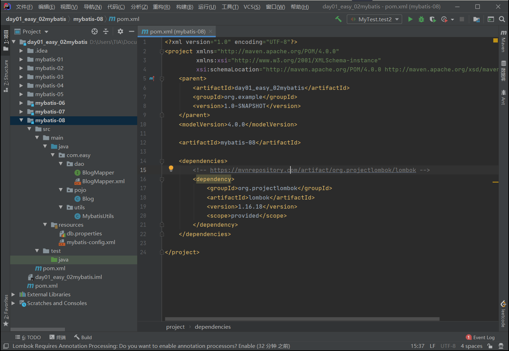

# Mybatis笔记

## 简介

### 基本概念


**MyBatis**：

* MyBatis 是一款优秀的持久层框架
* 它支持自定义 SQL、存储过程以及高级映射。
* MyBatis 免除了几乎所有的 JDBC 代码以及设置参数和获取结果集的工作。
* MyBatis 可以通过简单的 XML 或注解来配置和映射原始类型、接口和 Java POJO（Plain Old Java Objects，普通老式 Java 对象）为数据库中的记录。
* MyBatis 本是apache的一个[开源项目](https://baike.baidu.com/item/%E5%BC%80%E6%BA%90%E9%A1%B9%E7%9B%AE/3406069)iBatis, 2010年这个[项目](https://baike.baidu.com/item/%E9%A1%B9%E7%9B%AE/477803)由apache software foundation 迁移到了\[google code]\(https://baike.baidu.com/item/google code/2346604)，并且改名为MyBatis 。2013年11月迁移到[Github](https://baike.baidu.com/item/Github/10145341)。

### 获取mybatis

* GitHub：https://github.com/mybatis/mybatis-3/releases
* 中文文档：https://mybatis.org/mybatis-3/zh/index.html
* Maven仓库

```xml
<!-- https://mvnrepository.com/artifact/org.mybatis/mybatis -->
<dependency>
    <groupId>org.mybatis</groupId>M
    	<artifactId>mybatis</artifactId>
    <version>3.5.7</version>
</dependency>
```

### 持久化

#### 数据持久化

* 持久化就是将程序的数据在持久状态和瞬时状态转化的过程
* 内存：**断电即失**
* 数据库（jdbc）,io文件持久化。

#### 为什么需要持久化？

* 有一些数据，不能丢失
* 内存太贵了

### 持久层

**持久层**：完成持久化工作的代码块

### 为什么需要mybatis？

* 需要将数据存放到数据库中
* 方面操作
* 传统的JDBC代码太复杂了。简化、框架、自动化。
* 优点
  * 简单易学
  * 灵活
  * sql和代码的分离，提高了可维护性。
  * 提供映射标签，支持对象与数据库的orm（对象关系映射）字段关系映射
  * 提供对象关系映射标签，支持对象关系组建维护
  * 提供xml标签，支持编写动态sql。

## 第一个mybatis程序


* 配置主工程文件
* 配置子工程文件
* 创建工具类
* 配置资源文件
* 创建实体类
* 创建`Dao`层
* 创建`Mapper.xml`
* 创建测试类

### 数据库

* mysql:https://downloads.mysql.com/archives/installer/
* 数据库样例

```
create database mybatis charset=utf8;

use mybatis;

create table user(
	id INT(20) NOT NULL,
	name varchar(30) NOT NULL,
	pwd varchar(30) NOT NULL,
	primary key(id)
)ENGINE=INNODB default charset=utf8;

insert into user (id,name,pwd) values
(1,"zhao",'123456'),
(2,"qian",'123456'),
(3,"sun",'123456')
```

* 连接数据库


### 创建Maven工程


### 删除src目录


### 导入maven依赖


```xml
<?xml version="1.0" encoding="UTF-8"?>
<project xmlns="http://maven.apache.org/POM/4.0.0"
         xmlns:xsi="http://www.w3.org/2001/XMLSchema-instance"
         xsi:schemaLocation="http://maven.apache.org/POM/4.0.0 http://maven.apache.org/xsd/maven-4.0.0.xsd">
    <modelVersion>4.0.0</modelVersion>

    <!-- 父工程 -->
    <groupId>org.example</groupId>
    <artifactId>day01_easy_01mybatis</artifactId>
    <version>1.0-SNAPSHOT</version>

    <!-- 导入依赖 -->
    <dependencies>
        <!-- mysql驱动 -->
        <dependency>
            <groupId>mysql</groupId>
            <artifactId>mysql-connector-java</artifactId>
            <version>5.1.46</version>
        </dependency>
        <!-- mybatis -->

        <!-- https://mvnrepository.com/artifact/org.mybatis/mybatis -->
        <dependency>
            <groupId>org.mybatis</groupId>
            <artifactId>mybatis</artifactId>
            <version>3.5.7</version>
        </dependency>

        <!-- junit -->
        <dependency>
            <groupId>junit</groupId>
            <artifactId>junit</artifactId>
            <version>4.12</version>
        </dependency>

    </dependencies>

</project>
```

### 创建一个模块

* 创建模块


* 配置mybatis的核心文件


```xml
<?xml version="1.0" encoding="UTF-8" ?>
<!DOCTYPE configuration
        PUBLIC "-//mybatis.org//DTD Config 3.0//EN"
        "http://mybatis.org/dtd/mybatis-3-config.dtd">

<!-- configuration:核心配置文件 -->
<configuration>

    <environments default="development">
        <environment id="development">
            <transactionManager type="JDBC"/>
            <dataSource type="POOLED">
                <property name="driver" value="com.mysql.jdbc.Driver"/>
                <property name="url" value="jdbc:mysql://localhost:3306/mybatis?useSSL=true&amp;useUnicode=true&amp;characterEncoding=UTF-8;serverTimezone=UTC"/>
                <property name="username" value="root"/>
                <property name="password" value="123456"/>
            </dataSource>
        </environment>
    </environments>

</configuration>
```

* 编写mybatis的工具类


```java
package com.easy.utils;

import org.apache.ibatis.io.Resources;
import org.apache.ibatis.session.SqlSession;
import org.apache.ibatis.session.SqlSessionFactory;
import org.apache.ibatis.session.SqlSessionFactoryBuilder;

import java.io.IOException;
import java.io.InputStream;

// sqlSessionFactory --> sqlSession
public class MybatisUtils {

    private static SqlSessionFactory sqlSessionFactory;

    static {
        try {
            // 使用mybatis获取sqlSessionFactory对象
            String resource = "mybatis-config.xml";
            InputStream inputStream = Resources.getResourceAsStream(resource);
            sqlSessionFactory = new SqlSessionFactoryBuilder().build(inputStream);
        } catch (IOException e) {
            e.printStackTrace();
        }
    }

    /*
     * 既然有了 SqlSessionFactory，顾名思义，我们可以从中获得 SqlSession 的实例。
     * SqlSession 提供了在数据库执行 SQL 命令所需的所有方法。
     * 你可以通过 SqlSession 实例来直接执行已映射的 SQL 语句。
     * */
    public static SqlSession getSqlSession() {
        return sqlSessionFactory.openSession();
    }

}
```

### 编写代码

* 实体类

创建User类


快速生成setter和getter


```java
package com.easy.pojo;

public class User {
    private int id;
    private String name;
    private String pwd;

    public User() {
    }

    public User(int id, String name, String pwd) {
        this.id = id;
        this.name = name;
        this.pwd = pwd;
    }

    public int getId() {
        return id;
    }

    public void setId(int id) {
        this.id = id;
    }

    public String getName() {
        return name;
    }

    public void setName(String name) {
        this.name = name;
    }

    public String getPwd() {
        return pwd;
    }

    public void setPwd(String pwd) {
        this.pwd = pwd;
    }

    public String toString(){
        return this.id + ":" + this.name + ":" + this.pwd;
    }
}
```

* Dao接口


```java
package com.easy.dao;

import com.easy.pojo.User;

import java.util.List;

public interface UserDao {
    List<User> getUserList();
}
```

* 接口实现类


```xml
<?xml version="1.0" encoding="UTF-8" ?>
<!DOCTYPE mapper
        PUBLIC "-//mybatis.org//DTD Mapper 3.0//EN"
        "http://mybatis.org/dtd/mybatis-3-mapper.dtd">
<!-- namespace=绑定一个对应的Dao/Mapper接口 -->
<mapper namespace="com.easy.dao.UserDao">
    <!-- resultType=绑定一个对应的实体类 -->
    <!-- id=绑定一个对应的实体类方法 -->
    <select id="getUserList" resultType="com.easy.pojo.User">
        select * from mybatis.user;
    </select>
</mapper>
```

### 测试

\*\*清除`target`目录：\*\*每次测试后，会生成相应的`target`目录，在每次测试前，都需要清除


根据`com.easy.dao`建立同样的目录，便于规范


编写测试方法

```java
package com.easy.dao;

import com.easy.pogo.User;
import com.easy.utils.MybatisUtils;
import org.apache.ibatis.session.SqlSession;
import org.junit.Test;

import java.util.List;

public class UserDaoTest {

    @Test
    public void test(){

        //获取sqlSession对象
        SqlSession sqlSession = MybatisUtils.getSqlSession();

        //执行SQL
        UserDao mapper = sqlSession.getMapper(UserDao.class);
        List<User> userList = mapper.getUserList();

        for(User user:userList){
            System.out.println(user);
        }

        //sqlSession关闭
        sqlSession.close();
    }
}
```

然后点击运行


可能会遇到的问题：

* 配置文件没有被注册
* 绑定接口错误
* 方法名错误
* 返回类型不对
* Maven导出资源问题


因此，改写代码：

```
public class UserDaoTest {

    @Test
    public void test(){

        SqlSession sqlSession = MybatisUtils.getSqlSession();
        //获取sqlSession对象
        try{
            //执行SQL
            UserDao mapper = sqlSession.getMapper(UserDao.class);
            List<User> userList = mapper.getUserList();

            for(User user:userList){
                System.out.println(user.toString());
            }
        }catch (Exception e){

        }
        finally {
            sqlSession.close();
        }
    }
```


### 配置错误

#### 不支持发行版本 xx


会发现出现如下错误：

```
Error:java: 错误: 不支持发行版本 14
```

解决方法如下：

1. File -> Setting 中，**将java编译器中的版本号与java jdk版本填写一致**


1. File -> Project Structure，将如下位置，同上操作


1. File -> Project Structure，同上，注意这里是两个文件夹，都要修改


#### BindingException错误

```
org.apache.ibatis.binding.BindingException: 
Type interface com.kuang.dao.UserDao is not knowh to theMapperRegistry.
```

是由于`mybatis-config.xml`中忘记了**注册Mapper.xml**

```xml
<?xml version="1.0" encoding="UTF-8" ?>
<!DOCTYPE configuration
        PUBLIC "-//mybatis.org//DTD Config 3.0//EN"
        "http://mybatis.org/dtd/mybatis-3-config.dtd">

<!-- configuration:核心配置文件 -->
<configuration>

    <environments default="development">
        <environment id="development">
            <transactionManager type="JDBC"/>
            <dataSource type="POOLED">
                <property name="driver" value="com.mysql.jdbc.Driver"/>
                <property name="url" value="jdbc:mysql://localhost:3306/mybatis?useUnicode=true&amp;characterEncoding=UTF-8&amp;useSSL=False"/>
                <property name="username" value="root"/>
                <property name="password" value="123456"/>
            </dataSource>
        </environment>
    </environments>

    <!-- 每一个Mapper.xml都需要在Mybatis核心配置文件中注册！ -->
    <mappers>
        <mapper resource="com/easy/dao/UserMapper.xml"/>
    </mappers>

</configuration>
```

#### ExceptionInInitializerError错误/防止资源导出失败的问题

运行，发现出现`java.lang.ExceptionInInitializerError`错误，是由于`mybatis-config.xml`中Mapper的注册地址错误，是因为maven由于它的约定大于配置，我们之后可以能遇到我们写的配置文件，无法被导出或者生效的问题，解决方法如下：


在主工程的配置文件下，进行配置`build`

```xml
<?xml version="1.0" encoding="UTF-8"?>
<project xmlns="http://maven.apache.org/POM/4.0.0"
         xmlns:xsi="http://www.w3.org/2001/XMLSchema-instance"
         xsi:schemaLocation="http://maven.apache.org/POM/4.0.0 http://maven.apache.org/xsd/maven-4.0.0.xsd">
    <parent>
        <artifactId>day01_easy_01mybatis</artifactId>
        <groupId>org.example</groupId>
        <version>1.0-SNAPSHOT</version>
    </parent>
    <modelVersion>4.0.0</modelVersion>

    <artifactId>mybatis-01</artifactId>

    <!-- 在build中配置resources，来防止资源导出失败的问题 -->
    <build>
        <resources>
            <resource>
                <directory>src/main/resources</directory>
                <includes>
                    <include>**/*.properties</include>
                    <include>**/*.xml</include>
                </includes>
                <filtering>true</filtering>
            </resource>
            <resource>
                <directory>src/main/java</directory>
                <includes>
                    <include>**/*.properties</include>
                    <include>**/*.xml</include>
                </includes>
                <filtering>true</filtering>
            </resource>
        </resources>
    </build>

</project>
```

#### 程序包不存在


解决方法如下：


#### Failed to execute goal org.apache.maven.plugins:maven-surefire-plugin:2.12.4

```
Failed to execute goal org.apache.maven.plugins:maven-surefire-plugin:2.12.4
```

解决方法如下：

在主工程中添加：

```xml
<plugin>
    <groupId>org.apache.maven.plugins</groupId>
    <artifactId>maven-surefire-plugin</artifactId>
    <version>2.4.2</version>
    <configuration>
        <skipTests>true</skipTests>
    </configuration>
</plugin>
```

## 增删查改

在使用`mapper.xml`文件改写sql语句时，不会出现自动提示，解决如下：


```
http://mybatis.org/dtd/mybatis-3-config.dtd
http://mybatis.org/dtd/mybatis-3-mapper.dtd
```

添加如上语句即可。


选择对应的数据库，即可。

### namespace


namespace中的包名和Dao/Mapper接口中的包名要一致。

```xml
<!-- namespace=绑定一个对应的Dao/Mapper接口 -->
<mapper namespace="com.easy.dao.UserDao">
	...
</mapper>
```

### 查询

```xml
<!-- namespace=绑定一个对应的Dao/Mapper接口 -->
<mapper namespace="com.easy.dao.UserDao">
    <!-- resultType=绑定一个对应的实体类 -->
    <!-- id=绑定一个对应的实体类方法 -->
    <select id="getUserList" resultType="com.easy.pojo.User">
        select * from mybatis.user;
    </select>
</mapper>
```

* `id`：对应的namespace中的方法名
* `resultType`：Sql语句执行的返回值
* `parameterType`：指定传入的参数类型

**dao层**


```java
public interface UserDao {
    User getUserByID(int id);
}
```

**Mapper.xml**


```xml
    <!-- id=绑定一个对应的实体类方法 -->
    <select id="getUserByID" resultType="com.easy.pojo.User" parameterType="int">
        select * from mybatis.user where id = #{id};
    </select>
```

其中传入的参数通过`#{param}`传入，并且`param`的定义名称与`Dao`层的参数名称一样。

**测试类**


```java
package com.easy.dao;

import com.easy.pojo.User;
import com.easy.utils.MybatisUtils;
import org.apache.ibatis.session.SqlSession;
import org.junit.Test;

import java.util.List;

public class UserDaoTest {
    @Test
    public void getUserByID(){
        SqlSession sqlSession = MybatisUtils.getSqlSession();
        try {
            UserDao mapper = sqlSession.getMapper(UserDao.class);
            User user = mapper.getUserByID(1);
            System.out.println(user.toString());
        }catch (Exception e){

        }finally {
            sqlSession.close();
        }
    }
}
```

### 添加

**dao层**

```java
boolean addUser(User user);
```

**Mapper.xml**

```xml
<mapper namespace="com.easy.dao.UserDao">
    <!-- 通过parameterType能够将对象中的属性取出来 -->
    <insert id="addUser" parameterType="com.easy.pojo.User" >
        insert into mybatis.user (id, name, pwd) values (#{id},#{name},#{pwd});
    </insert>
</mapper>
```

* `parameterType`：只有一个参数的时候，直接设置数据类型，如果有多个参数，直接通过对象获取多个参数。

**测试类**

```java
package com.easy.dao;

import com.easy.pojo.User;
import com.easy.utils.MybatisUtils;
import org.apache.ibatis.session.SqlSession;
import org.junit.Test;

import java.util.List;

public class UserDaoTest {

    @Test
    public void addUser(){
        int id = 4;
        String name = "angle";
        String pwd = "123456";

        SqlSession sqlSession = MybatisUtils.getSqlSession();
        try {
            UserDao mapper = sqlSession.getMapper(UserDao.class);
            User user = new User(id,name,pwd);
            mapper.addUser(user);
        }catch (Exception e){

        }finally {
            sqlSession.close();
        }
    }
}
```

运行后，会发现数据库没有变动，因为增删改需要提交事务，才能够真正的执行。

```java
sqlSession.commit();
```

在执行成功后，开始提交事务，添加上面语句即可。

```java
package com.easy.dao;

import com.easy.pojo.User;
import com.easy.utils.MybatisUtils;
import org.apache.ibatis.session.SqlSession;
import org.junit.Test;

import java.util.List;

public class UserDaoTest {

    @Test
    public void addUser(){
        int id = 4;
        String name = "angle";
        String pwd = "123456";

        SqlSession sqlSession = MybatisUtils.getSqlSession();
        try {
            UserDao mapper = sqlSession.getMapper(UserDao.class);
            User user = new User(id,name,pwd);
            boolean flag = mapper.addUser(user);
            if(flag == true){
                System.out.println("插入成功");
                sqlSession.commit();
            }
        }catch (Exception e){

        }finally {
            sqlSession.close();
        }
    }
}
```

### 更新

**dao层**

```java
boolean updateUser(User user);
```

**Mapper.xml**

```xml
<mapper namespace="com.easy.dao.UserDao">
    <update id="updateUser" parameterType="com.easy.pojo.User">
        update mybatis.user set name=#{name},pwd=#{pwd} where id=#{id};
    </update>
</mapper>
```

**测试类**

```java
package com.easy.dao;

import com.easy.pojo.User;
import com.easy.utils.MybatisUtils;
import org.apache.ibatis.session.SqlSession;
import org.junit.Test;

import java.util.List;

public class UserDaoTest {

    @Test
    public void updateUser(){

        int id = 1;
        String name = "aaa";
        String pwd = "bbb";

        SqlSession sqlSession = MybatisUtils.getSqlSession();
        try {
            UserDao mapper = sqlSession.getMapper(UserDao.class);
            User user = mapper.getUserByID(id);
            System.out.println(user.toString());


            user.setName(name);
            user.setPwd(pwd);

            System.out.println(user.toString());

            boolean flag = mapper.updateUser(user);

            if(flag == true){
                System.out.println("更新成功");
                sqlSession.commit();
            }

        }catch (Exception e){

        }finally {
            sqlSession.close();
        }
    }
}
```

### 删除

**dao层**

```java
boolean delUserByID(int id);
```

**Mapper.xml**

```xml
<mapper namespace="com.easy.dao.UserDao">

    <delete id="delUserByID" parameterType="int">
        delete from mybatis.user where id=#{id};
    </delete>
</mapper>
```

**测试类**

```java
package com.easy.dao;

import com.easy.pojo.User;
import com.easy.utils.MybatisUtils;
import org.apache.ibatis.session.SqlSession;
import org.junit.Test;

import java.util.List;

public class UserDaoTest {

    @Test
    public void delUserByID(){

        SqlSession sqlSession = MybatisUtils.getSqlSession();
        try {
            UserDao mapper = sqlSession.getMapper(UserDao.class);


            boolean flag = mapper.delUserByID(2);

            if(flag == true){
                System.out.println("删除成功");
                sqlSession.commit();
            }

        }catch (Exception e){

        }finally {
            sqlSession.close();
        }
    }
    
}
```


### 自定义参数

**dao层**

```java
boolean addUser2(Map<String,Object> map);
```

**Mapper.xml**

```xml
<mapper namespace="com.easy.dao.UserDao">
    <!-- 通过parameterType指定类型为map，能够自定义参数名称，以及参数数量 -->
    <insert id="addUser2" parameterType="map" >
        insert into mybatis.user (id, name, pwd) values (#{user_id},#{user_name},#{user_pwd});
    </insert>
</mapper>
```

**测试类**

```java
package com.easy.dao;

import com.easy.pojo.User;
import com.easy.utils.MybatisUtils;
import org.apache.ibatis.session.SqlSession;
import org.junit.Test;

import java.util.HashMap;
import java.util.List;
import java.util.Map;

public class UserDaoTest {

    @Test
    public void addUser2(){
        SqlSession sqlSession = MybatisUtils.getSqlSession();

        try {
            UserDao mapper = sqlSession.getMapper(UserDao.class);

            Map<String,Object> map = new HashMap<String, Object>();
            map.put("user_id",5);
            map.put("user_name","tian");
            map.put("user_pwd","123456");

            boolean flag = mapper.addUser2(map);

            if(flag == true){
                System.out.println("插入成功");
                sqlSession.commit();
            }

        }catch (Exception e){

        }finally {
            sqlSession.close();
        }
    }
}
```

> 当需要传入多个参数，使用map类型，传入的参数时map里面的key
>
> 使用对象传递参数，则是对象里面的属性名称。

## 模糊查询

**dao层**

```java
 User getUserByLike(Map<String,Object> map);
```

**Mapper.xml**

```xml
<mapper namespace="com.easy.dao.UserDao">
    <select id="getUserByLike" parameterType="map" resultType="com.easy.pojo.User">
        select * from mybatis.user where name like #{name_like};
    </select>
</mapper>
```

**测试类**

1. java代码执行的时候，传递通配符`%%`

```java
package com.easy.dao;

import com.easy.pojo.User;
import com.easy.utils.MybatisUtils;
import org.apache.ibatis.session.SqlSession;
import org.junit.Test;

import java.util.HashMap;
import java.util.List;
import java.util.Map;

public class UserDaoTest {
    @Test
    public void getUserByLike(){
        SqlSession sqlSession = MybatisUtils.getSqlSession();
        try {
            UserDao mapper = sqlSession.getMapper(UserDao.class);
            Map<String,Object> map = new HashMap<String, Object>();
            map.put("name_like","%a%");
            List<User> userList = mapper.getUserByLike(map);
            for(User user:userList)
                System.out.println(user.toString());
        }catch (Exception e){

        }finally {
            sqlSession.close();
        }
    }
}
```

1. 在sql拼接中使用通配符

```xml
select * from mybatis.user where name like like concat('%',#{name},'%')
```

## 配置解析

### 核心配置文件

* `mybatis-config.xml`
* mybatis的配置文件包含了会深深影响mybatis行为的设置和属性信息
  * **configuration（配置）**
    1. **properties（属性）**
    2. **settings（设置）**
    3. **typeAliases（类型别名）**
    4. typeHandlers（类型处理器）
    5. objectFactory（对象工厂）
    6. plugins（插件）
    7. **environments（环境配置）**
    8. **environment（环境变量）**
       * **transactionManager（事务管理器）**
       * **dataSource（数据源）**
    9. databaseIdProvider（数据库厂商标识）
    10. **mappers（映射器）**

### 创建项目


### 环境配置

* **MyBatis 可以配置成适应多种环境**
* **尽管可以配置多个环境，但每个 SqlSessionFactory 实例只能选择一种环境。**
* **Mybatis默认事务管理器就是JDBC，连接池：POOLED**

environments 元素定义了如何配置环境：

```xml
<!-- configuration:核心配置文件 -->
<configuration>

    <environments default="test">
        <environment id="development">
            <transactionManager type="JDBC"/>
            <dataSource type="POOLED">
                <property name="driver" value="com.mysql.jdbc.Driver"/>
                <property name="url" value="jdbc:mysql://localhost:3306/mybatis?useUnicode=true&amp;characterEncoding=UTF-8&amp;useSSL=False"/>
                <property name="username" value="root"/>
                <property name="password" value="123456"/>
            </dataSource>
        </environment>

        <environment id="test">
            <transactionManager type="JDBC"/>
            <dataSource type="POOLED">
                <property name="driver" value="com.mysql.jdbc.Driver"/>
                <property name="url" value="jdbc:mysql://localhost:3306/mybatis?useUnicode=true&amp;characterEncoding=UTF-8&amp;useSSL=False"/>
                <property name="username" value="root"/>
                <property name="password" value="123456"/>
            </dataSource>
        </environment>

    </environments>

</configuration>
```

* 默认使用的环境 ID（比如：default="development"）。
* 每个 environment 元素定义的环境 ID（比如：id="development"）。
* 事务管理器的配置（比如：type="JDBC"）。
* 数据源的配置（比如：type="POOLED"）。

默认环境和环境 ID 顾名思义。 环境可以随意命名，但**务必保证默认的环境 ID 要匹配其中一个环境 ID**。

#### 事务管理器（transactionManager）

在 MyBatis 中**有两种类型的事务管理器**（也就是 type="\[JDBC|MANAGED]"）：

* **JDBC – 这个配置直接使用了 JDBC 的提交和回滚设施，它依赖从数据源获得的连接来管理事务作用域。**
* **MANAGED** – 这个配置几乎没做什么。它从不提交或回滚一个连接，而是让容器来管理事务的整个生命周期（比如 JEE 应用服务器的上下文）。 默认情况下它会关闭连接。然而一些容器并不希望连接被关闭，因此需要将 closeConnection 属性设置为 false 来阻止默认的关闭行为。例如:

```xml
<transactionManager type="MANAGED">
  <property name="closeConnection" value="false"/>
</transactionManager>
```

**提示** 如果你正在使用 Spring + MyBatis，则没有必要配置事务管理器，因为 Spring 模块会使用自带的管理器来覆盖前面的配置。

#### 数据源（dataSource）

dataSource 元素使用标准的 JDBC 数据源接口来配置 JDBC 连接对象的资源。

* 大多数 MyBatis 应用程序会按示例中的例子来配置数据源。虽然数据源配置是可选的，但如果要启用延迟加载特性，就必须配置数据源。

**有三种内建的数据源类型（也就是 type="\[UNPOOLED|POOLED|JNDI]"）**：

**UNPOOLED**– 这个数据源的实现会每次请求时打开和关闭连接。虽然有点慢，但对那些数据库连接可用性要求不高的简单应用程序来说，是一个很好的选择。 性能表现则依赖于使用的数据库，对某些数据库来说，使用连接池并不重要，这个配置就很适合这种情形。UNPOOLED 类型的数据源仅仅需要配置以下 5 种属性：

* `driver` – 这是 JDBC 驱动的 Java 类全限定名（并不是 JDBC 驱动中可能包含的数据源类）。
* `url` – 这是数据库的 JDBC URL 地址。
* `username` – 登录数据库的用户名。
* `password` – 登录数据库的密码。
* `defaultTransactionIsolationLevel` – 默认的连接事务隔离级别。
* `defaultNetworkTimeout` – 等待数据库操作完成的默认网络超时时间（单位：毫秒）。查看 `java.sql.Connection#setNetworkTimeout()` 的 API 文档以获取更多信息。

> 用完可以回收

**POOLED**– 这种数据源的实现利用“池”的概念将 JDBC 连接对象组织起来，避免了创建新的连接实例时所必需的初始化和认证时间。 这种处理方式很流行，能使并发 Web 应用快速响应请求。

除了上述提到 UNPOOLED 下的属性外，还有更多属性用来配置 POOLED 的数据源：

* `poolMaximumActiveConnections` – 在任意时间可存在的活动（正在使用）连接数量，默认值：10
* `poolMaximumIdleConnections` – 任意时间可能存在的空闲连接数。
* `poolMaximumCheckoutTime` – 在被强制返回之前，池中连接被检出（checked out）时间，默认值：20000 毫秒（即 20 秒）
* `poolTimeToWait` – 这是一个底层设置，如果获取连接花费了相当长的时间，连接池会打印状态日志并重新尝试获取一个连接（避免在误配置的情况下一直失败且不打印日志），默认值：20000 毫秒（即 20 秒）。
* `poolMaximumLocalBadConnectionTolerance` – 这是一个关于坏连接容忍度的底层设置， 作用于每一个尝试从缓存池获取连接的线程。 如果这个线程获取到的是一个坏的连接，那么这个数据源允许这个线程尝试重新获取一个新的连接，但是这个重新尝试的次数不应该超过 `poolMaximumIdleConnections` 与 `poolMaximumLocalBadConnectionTolerance` 之和。 默认值：3（新增于 3.4.5）
* `poolPingQuery` – 发送到数据库的侦测查询，用来检验连接是否正常工作并准备接受请求。默认是“NO PING QUERY SET”，这会导致多数数据库驱动出错时返回恰当的错误消息。
* `poolPingEnabled` – 是否启用侦测查询。若开启，需要设置 `poolPingQuery` 属性为一个可执行的 SQL 语句（最好是一个速度非常快的 SQL 语句），默认值：false。
* `poolPingConnectionsNotUsedFor` – 配置 poolPingQuery 的频率。可以被设置为和数据库连接超时时间一样，来避免不必要的侦测，默认值：0（即所有连接每一时刻都被侦测 — 当然仅当 poolPingEnabled 为 true 时适用）。

**JNDI** – 这个数据源实现是为了能在如 EJB 或应用服务器这类容器中使用，容器可以集中或在外部配置数据源，然后放置一个 JNDI 上下文的数据源引用。这种数据源配置只需要两个属性：

* `initial_context` – 这个属性用来在 InitialContext 中寻找上下文（即，initialContext.lookup(initial\_context)）。这是个可选属性，如果忽略，那么将会直接从 InitialContext 中寻找 data\_source 属性。
* `data_source` – 这是引用数据源实例位置的上下文路径。提供了 initial\_context 配置时会在其返回的上下文中进行查找，没有提供时则直接在 InitialContext 中查找。

#### 属性（properties）

* 可以通过`properties`属性来实现引用配置文件
* 这些属性都是可外部配置且可动态替换的，既可以在典型的java属性文件中配置，亦可通过`properties`的元素子元素来传递。

```xml
<properties resource="org/mybatis/example/config.properties">
  <property name="username" value="dev_user"/>
  <property name="password" value="F2Fa3!33TYyg"/>
</properties>
```

设置好的属性可以在整个配置文件中用来替换需要动态配置的属性值。比如:

```xml
<dataSource type="POOLED">
  <property name="driver" value="${driver}"/>
  <property name="url" value="${url}"/>
  <property name="username" value="${username}"/>
  <property name="password" value="${password}"/>
</dataSource>
```

例如：

* 编写一个配置文件`db.properties`

```
driver = com.mysql.jdbc.Driver
url = jdbc:mysql://localhost:3306/mybatis?useUnicode=true&characterEncoding=UTF-8&useSSL=False
user = root
password = 123456
```

> 在核心配置文件中，必须按照顺序进行配置

* 重写核心配置文件`mybatis-config.xml`

> 如果两个文件有同一个字段，优先使用外部配置文件

```
<!-- configuration:核心配置文件 -->
<configuration>

    <!-- 引入外部配置文件 -->
    <properties resource="db.properties"/>

    <environments default="development">
        <environment id="development">
            <transactionManager type="JDBC"/>
            <dataSource type="POOLED">
                <property name="driver" value="${driver}"/>
                <property name="url" value="${url}"/>
                <property name="username" value="${username}"/>
                <property name="password" value="${password}"/>
            </dataSource>
        </environment>

    </environments>

    <!-- 每一个Mapper.xml都需要在Mybatis核心配置文件中注册！ -->
    <mappers>
        <mapper resource="com/easy/dao/UserMapper.xml"/>
    </mappers>

</configuration>
```

* `db.properties`

```
driver = com.mysql.jdbc.Driver
url = jdbc:mysql://localhost:3306/mybatis?useUnicode=true&characterEncoding=UTF-8&useSSL=False
username = root
password = 123456
```


#### 类型别名（typeAliases）

* 类型别名可为 Java 类型设置一个缩写名字。
* 仅用于 XML 配置，意在降低冗余的全限定类名书写。

例如：


```
<configuration>
    ...
    <!-- 为实体类设置别名 -->
    <typeAliases>
        <typeAlias alias="User" type="com.easy.pojo.User" />
    </typeAliases>
    ...
</configuration>
```


设置完别名后，需要对相应的文件中的位置使用别名。

* 也可以指定一个包名，MyBatis会在包名下面搜索需要的Java Bean

比如：扫描实体类的包，它的默认别名就为这个类的类名，首字母小写!

```
<typeAliases>
  <package name="com.easy.pojo"/>
</typeAliases>
```

**每一个在包 `com.easy.pojo` 中的 Java Bean，在没有注解的情况下，会使用 Bean 的首字母小写的非限定类名来作为它的别名。** 比如 `com.easy.pojo.User` 的别名为 `user`；若有注解，则别名为其注解值。见下面的例子：

```
@Alias("user")
public class User {
    ...
}
```

> 在实体类比较少的时候，使用第一种方式。如果实体类十分多，建议使用第二种。

#### 设置（settings）

这是 MyBatis 中极为重要的调整设置，它们会改变 MyBatis 的运行时行为。 下表描述了设置中各项设置的含义、默认值等。

| 设置名                           | 描述                                                         | 有效值                                                       | 默认值                                                |
| -------------------------------- | ------------------------------------------------------------ | ------------------------------------------------------------ | ----------------------------------------------------- |
| cacheEnabled                     | 全局性地开启或关闭所有映射器配置文件中已配置的任何缓存。     | true \| false                                                | true                                                  |
| lazyLoadingEnabled               | 延迟加载的全局开关。当开启时，所有关联对象都会延迟加载。 特定关联关系中可通过设置 `fetchType` 属性来覆盖该项的开关状态。 | true \| false                                                | false                                                 |
| aggressiveLazyLoading            | 开启时，任一方法的调用都会加载该对象的所有延迟加载属性。 否则，每个延迟加载属性会按需加载（参考 `lazyLoadTriggerMethods`)。 | true \| false                                                | false （在 3.4.1 及之前的版本中默认为 true）          |
| multipleResultSetsEnabled        | 是否允许单个语句返回多结果集（需要数据库驱动支持）。         | true \| false                                                | true                                                  |
| useColumnLabel                   | 使用列标签代替列名。实际表现依赖于数据库驱动，具体可参考数据库驱动的相关文档，或通过对比测试来观察。 | true \| false                                                | true                                                  |
| useGeneratedKeys                 | 允许 JDBC 支持自动生成主键，需要数据库驱动支持。如果设置为 true，将强制使用自动生成主键。尽管一些数据库驱动不支持此特性，但仍可正常工作（如 Derby）。 | true \| false                                                | False                                                 |
| autoMappingBehavior              | 指定 MyBatis 应如何自动映射列到字段或属性。 NONE 表示关闭自动映射；PARTIAL 只会自动映射没有定义嵌套结果映射的字段。 FULL 会自动映射任何复杂的结果集（无论是否嵌套）。 | NONE, PARTIAL, FULL                                          | PARTIAL                                               |
| autoMappingUnknownColumnBehavior | 指定发现自动映射目标未知列（或未知属性类型）的行为。`NONE`: 不做任何反应`WARNING`: 输出警告日志（`'org.apache.ibatis.session.AutoMappingUnknownColumnBehavior'` 的日志等级必须设置为 `WARN`）`FAILING`: 映射失败 (抛出 `SqlSessionException`) | NONE, WARNING, FAILING                                       | NONE                                                  |
| defaultExecutorType              | 配置默认的执行器。SIMPLE 就是普通的执行器；REUSE 执行器会重用预处理语句（PreparedStatement）； BATCH 执行器不仅重用语句还会执行批量更新。 | SIMPLE REUSE BATCH                                           | SIMPLE                                                |
| defaultStatementTimeout          | 设置超时时间，它决定数据库驱动等待数据库响应的秒数。         | 任意正整数                                                   | 未设置 (null)                                         |
| defaultFetchSize                 | 为驱动的结果集获取数量（fetchSize）设置一个建议值。此参数只可以在查询设置中被覆盖。 | 任意正整数                                                   | 未设置 (null)                                         |
| defaultResultSetType             | 指定语句默认的滚动策略。（新增于 3.5.2）                     | FORWARD\_ONLY \| SCROLL\_SENSITIVE \| SCROLL\_INSENSITIVE \| DEFAULT（等同于未设置） | 未设置 (null)                                         |
| safeRowBoundsEnabled             | 是否允许在嵌套语句中使用分页（RowBounds）。如果允许使用则设置为 false。 | true \| false                                                | False                                                 |
| safeResultHandlerEnabled         | 是否允许在嵌套语句中使用结果处理器（ResultHandler）。如果允许使用则设置为 false。 | true \| false                                                | True                                                  |
| **mapUnderscoreToCamelCase**     | **是否开启驼峰命名自动映射，即从经典数据库列名 A\_COLUMN 映射到经典 Java 属性名 aColumn。** | true \| false                                                | False                                                 |
| localCacheScope                  | MyBatis 利用本地缓存机制（Local Cache）防止循环引用和加速重复的嵌套查询。 默认值为 SESSION，会缓存一个会话中执行的所有查询。 若设置值为 STATEMENT，本地缓存将仅用于执行语句，对相同 SqlSession 的不同查询将不会进行缓存。 | SESSION \| STATEMENT                                         | SESSION                                               |
| jdbcTypeForNull                  | 当没有为参数指定特定的 JDBC 类型时，空值的默认 JDBC 类型。 某些数据库驱动需要指定列的 JDBC 类型，多数情况直接用一般类型即可，比如 NULL、VARCHAR 或 OTHER。 | JdbcType 常量，常用值：NULL、VARCHAR 或 OTHER。              | OTHER                                                 |
| lazyLoadTriggerMethods           | 指定对象的哪些方法触发一次延迟加载。                         | 用逗号分隔的方法列表。                                       | equals,clone,hashCode,toString                        |
| defaultScriptingLanguage         | 指定动态 SQL 生成使用的默认脚本语言。                        | 一个类型别名或全限定类名。                                   | org.apache.ibatis.scripting.xmltags.XMLLanguageDriver |
| defaultEnumTypeHandler           | 指定 Enum 使用的默认 `TypeHandler` 。（新增于 3.4.5）        | 一个类型别名或全限定类名。                                   | org.apache.ibatis.type.EnumTypeHandler                |
| callSettersOnNulls               | 指定当结果集中值为 null 的时候是否调用映射对象的 setter（map 对象时为 put）方法，这在依赖于 Map.keySet() 或 null 值进行初始化时比较有用。注意基本类型（int、boolean 等）是不能设置成 null 的。 | true \| false                                                | false                                                 |
| returnInstanceForEmptyRow        | 当返回行的所有列都是空时，MyBatis默认返回 `null`。 当开启这个设置时，MyBatis会返回一个空实例。 请注意，它也适用于嵌套的结果集（如集合或关联）。（新增于 3.4.2） | true \| false                                                | false                                                 |
| logPrefix                        | 指定 MyBatis 增加到日志名称的前缀。                          | 任何字符串                                                   | 未设置                                                |
| logImpl                          | 指定 MyBatis 所用日志的具体实现，未指定时将自动查找。        | SLF4J \| LOG4J \| LOG4J2 \| JDK\_LOGGING \| COMMONS\_LOGGING \| STDOUT\_LOGGING \| NO\_LOGGING | 未设置                                                |
| proxyFactory                     | 指定 Mybatis 创建可延迟加载对象所用到的代理工具。            | CGLIB \| JAVASSIST                                           | JAVASSIST （MyBatis 3.3 以上）                        |
| vfsImpl                          | 指定 VFS 的实现                                              | 自定义 VFS 的实现的类全限定名，以逗号分隔。                  | 未设置                                                |
| useActualParamName               | 允许使用方法签名中的名称作为语句参数名称。 为了使用该特性，你的项目必须采用 Java 8 编译，并且加上 `-parameters` 选项。（新增于 3.4.1） | true \| false                                                | true                                                  |
| configurationFactory             | 指定一个提供 `Configuration` 实例的类。 这个被返回的 Configuration 实例用来加载被反序列化对象的延迟加载属性值。 这个类必须包含一个签名为`static Configuration getConfiguration()` 的方法。（新增于 3.2.3） | 一个类型别名或完全限定类名。                                 | 未设置                                                |
| shrinkWhitespacesInSql           | 从SQL中删除多余的空格字符。请注意，这也会影响SQL中的文字字符串。 (新增于 3.5.5) | true \| false                                                | false                                                 |
| defaultSqlProviderType           | Specifies an sql provider class that holds provider method (Since 3.5.6). This class apply to the `type`(or `value`) attribute on sql provider annotation(e.g. `@SelectProvider`), when these attribute was omitted. | A type alias or fully qualified class name                   | Not set                                               |

一个配置完整的 settings 元素的示例如下：

```
<settings>
  <setting name="cacheEnabled" value="true"/>
  <setting name="lazyLoadingEnabled" value="true"/>
  <setting name="multipleResultSetsEnabled" value="true"/>
  <setting name="useColumnLabel" value="true"/>
  <setting name="useGeneratedKeys" value="false"/>
  <setting name="autoMappingBehavior" value="PARTIAL"/>
  <setting name="autoMappingUnknownColumnBehavior" value="WARNING"/>
  <setting name="defaultExecutorType" value="SIMPLE"/>
  <setting name="defaultStatementTimeout" value="25"/>
  <setting name="defaultFetchSize" value="100"/>
  <setting name="safeRowBoundsEnabled" value="false"/>
  <setting name="mapUnderscoreToCamelCase" value="false"/>
  <setting name="localCacheScope" value="SESSION"/>
  <setting name="jdbcTypeForNull" value="OTHER"/>
  <setting name="lazyLoadTriggerMethods" value="equals,clone,hashCode,toString"/>
</settings>
```

#### 其他配置

* [typeHandlers（类型处理器）](https://mybatis.org/mybatis-3/zh/configuration.html#typeHandlers)
* [objectFactory（对象工厂）](https://mybatis.org/mybatis-3/zh/configuration.html#objectFactory)
* [plugins（插件）](https://mybatis.org/mybatis-3/zh/configuration.html#plugins)
  * mybatis-generator-coreo
  * mybatis-plus
  * 通用mapper

#### 映射器（Mappers）


MapperRegistry:注册绑定我们的Mapper文件;

* 方式一

```xml
<!-- 使用相对于类路径的资源引用 -->
<mappers>
  <mapper resource="org/mybatis/builder/AuthorMapper.xml"/>
  <mapper resource="org/mybatis/builder/BlogMapper.xml"/>
  <mapper resource="org/mybatis/builder/PostMapper.xml"/>
</mappers>
```

* 方式二：使用class进行注册

```xml
<!-- 使用映射器接口实现类的完全限定类名 -->
<mappers>
  <mapper class="org.mybatis.builder.AuthorMapper"/>
  <mapper class="org.mybatis.builder.BlogMapper"/>
  <mapper class="org.mybatis.builder.PostMapper"/>
</mappers>
```

1. 接口和配置文件必须同名
2. 接口和配置文件必须在同一个包下

* 方式三：使用扫描包进行注册绑定，与上相同，但是能够注册多个

```
<!-- 将包内的映射器接口实现全部注册为映射器 -->
<mappers>
  <package name="org.mybatis.builder"/>
</mappers>
```

> 接口和配置文件，同名，就基本不会有问题

#### 生命周期与作用域


不同作用域和生命周期类别是至关重要的，因为错误的使用会导致非常严重的**并发问题**。

**SqlSessionFactoryBuilder**

* 一旦创建了 SqlSessionFactory，就不再需要它了
* 局部变量

**SqlSessionFactory**

* 说白了就是可以想象为︰数据库连接池
* sqlSessionFactory一旦被创建就应该在应用的运行期间一直存在，**没有任何理由丢弃它或重新创建另一个实例**。
* 因此 SqlSessionFactory 的最佳作用域是应用作用域。
* 最简单的就是使用单例模式或者静态单例模式。

**SqlSession**

* 连接到连接池的一个请求！
* sqlSession 的实例不是线程安全的，因此是不能被共享的，所以它的最佳的作用域是请求或方法作用域。
* 用完之后需要赶紧关闭，否则资源被占用


这里面的每一个Mapper，就代表一个具体的业务!

## 解决属性名和字段名不一致的问题

### 问题

数据库中的字段


新建一个项目，拷贝之前的，情况测试实体类字段不一致的


```
public class User {
    private int id;
    private String username;
    private String password;
    
    ...
    
    public String toString(){
        return "id:"+this.id + "-name:" + this.username + "-pwd:" + this.password;
    }
}
```

运行测试后，发现字段为`null`


解决方法：

* 起别名

```xml
<select id="getUserByID" resultType="User" parameterType="int">
    select id,name as username,pwd as password from mybatis.user where id = #{id};
</select>
```

这种方法比较笨重，维护成本代价比较大。

### resultMap

结果集映射

```
id 		name		 	pwd
id 		username 		password
```

**Mapper.xml**

```xml
<mapper namespace="com.easy.dao.UserMapper">
    <!-- 结果集映射 -->
    <resultMap id="UserMap" type="User">
        <!-- column数据库中的字段，property实体类中的属性 -->
        <result column="id" property="id"/>
        <result column="name" property="username"/>
        <result column="pwd" property="password"/>
    </resultMap>

    <select id="getUserByID" resultMap="UserMap">
        select * from mybatis.user where id = #{id};
    </select>
</mapper>
```

* `resultMap` 元素是 MyBatis 中最重要最强大的元素.
* ResultMap 的设计思想是，对简单的语句做到零配置，对于复杂一点的语句，只需要描述语句之间的关系就行了。
* \`\`ResultMap `` 最优秀的地方在于，虽然你已经对它相当了解了，但是根本就不需要显式地用到他们。

> 复杂部分，在学到一对多，多对一，回头后再学习

## 日志

### 日志工厂

如果一个数据库操作，出现了异常，需要进行排除错误，日志就是最好的助手！

| 设置名  | **描述**                                              | 有效值                                                       |
| ------- | ----------------------------------------------------- | ------------------------------------------------------------ |
| logImpl | 指定 MyBatis 所用日志的具体实现，未指定时将自动查找。 | SLF4J \| **LOG4J** \| LOG4J2 \| JDK\_LOGGING \| COMMONS\_LOGGING \| **STDOUT\_LOGGING** \| NO\_LOGGING |

在Mybatis中具体使用哪个日志，由设置设定。

* **STDOUT\_LOGGING**标准日志输出

在mybatis核心配置文件中，配置日志。

```xml
<settings>
   <setting name="logImpl" value="STDOUT_LOGGING"/>
</settings>
```


### log4j

#### 什么是log4j

* Log4j是[Apache](https://baike.baidu.com/item/Apache/8512995)的一个开源项目，通过使用Log4j，可以控制日志信息输送的目的地是[控制台](https://baike.baidu.com/item/%E6%8E%A7%E5%88%B6%E5%8F%B0/2438626)、文件、[GUI](https://baike.baidu.com/item/GUI)组件
* 可以控制每一条日志的输出格式
* 通过定义每一条日志信息的级别，能够更加细致地控制日志的生成过程
* 可以通过一个[配置文件](https://baike.baidu.com/item/%E9%85%8D%E7%BD%AE%E6%96%87%E4%BB%B6/286550)来灵活地进行配置，而不需要修改应用的代码

#### 使用


1. **导入log4j的包**

**log4j**：https://mvnrepository.com/artifact/log4j/log4j

```
<!-- https://mvnrepository.com/artifact/log4j/log4j -->
<dependency>
    <groupId>log4j</groupId>
    <artifactId>log4j</artifactId>
    <version>1.2.17</version>
</dependency>
```

1. **log4j.properties**

```xml
log4j.rootLogger=DEBUG,console,dailyFile,im
log4j.additivity.org.apache=true

#控制台(console)
log4j.appender.console=org.apache.log4j.ConsoleAppender
log4j.appender.console.Threshold=DEBUG
log4j.appender.console.ImmediateFlush=true
log4j.appender.console.Target=System.out
log4j.appender.console.layout=org.apache.log4j.PatternLayout
log4j.appender.console.layout.ConversionPattern=[%-5p] %d(%r) --> [%t] %l: %m %x %n

# 日志文件(logFile)
log4j.appender.logFile=org.apache.log4j.FileAppender
log4j.appender.logFile.Threshold=DEBUG
log4j.appender.logFile.ImmediateFlush=true
log4j.appender.logFile.Append=true
log4j.appender.logFile.File=./logs/log.log4j
log4j.appender.logFile.layout=org.apache.log4j.PatternLayout
log4j.appender.logFile.layout.ConversionPattern=[%-5p] %d(%r) --> [%t] %l: %m %x %n

# 日志输出级别
log4j.logger.org.mybatis = DEBUG
log4j.logger.java.sql = DEBUG
log4j.logger.java.sql.Statement = DEBUG
log4j.logger.java.sql.ResultSet = DEBUG
log4j.logger.java.sql.PreparedStatement = DEBUG

# 回滚文件(rollingFile)
log4j.appender.rollingFile=org.apache.log4j.RollingFileAppender
log4j.appender.rollingFile.Threshold=DEBUG
log4j.appender.rollingFile.ImmediateFlush=true
log4j.appender.rollingFile.Append=true
log4j.appender.rollingFile.File=D:/logs/log.log4j
log4j.appender.rollingFile.MaxFileSize=200KB
log4j.appender.rollingFile.MaxBackupIndex=50
log4j.appender.rollingFile.layout=org.apache.log4j.PatternLayout
log4j.appender.rollingFile.layout.ConversionPattern=[%-5p] %d(%r) --> [%t] %l: %m %x %n

# 定期回滚日志文件(dailyFile)
log4j.appender.dailyFile=org.apache.log4j.DailyRollingFileAppender
log4j.appender.dailyFile.Threshold=DEBUG
log4j.appender.dailyFile.ImmediateFlush=true
log4j.appender.dailyFile.Append=true
log4j.appender.dailyFile.File=D:/logs/log.log4j
log4j.appender.dailyFile.DatePattern='.'yyyy-MM-dd
log4j.appender.dailyFile.layout=org.apache.log4j.PatternLayout
log4j.appender.dailyFile.layout.ConversionPattern=[%-5p] %d(%r) --> [%t] %l: %m %x %n

# 应用于socket
log4j.appender.socket=org.apache.log4j.RollingFileAppender
log4j.appender.socket.RemoteHost=localhost
log4j.appender.socket.Port=5001
log4j.appender.socket.LocationInfo=true
# Set up for Log Factor 5
log4j.appender.socket.layout=org.apache.log4j.PatternLayout
log4j.appender.socket.layout.ConversionPattern=[%-5p] %d(%r) --> [%t] %l: %m %x %n
# Log Factor 5 Appender
log4j.appender.LF5_APPENDER=org.apache.log4j.lf5.LF5Appender
log4j.appender.LF5_APPENDER.MaxNumberOfRecords=2000

# 发送日志到指定邮件
log4j.appender.mail=org.apache.log4j.net.SMTPAppender
log4j.appender.mail.Threshold=FATAL
log4j.appender.mail.BufferSize=10
log4j.appender.mail.From = xxx@mail.com
log4j.appender.mail.SMTPHost=mail.com
log4j.appender.mail.Subject=Log4J Message
log4j.appender.mail.To= xxx@mail.com
log4j.appender.mail.layout=org.apache.log4j.PatternLayout
log4j.appender.mail.layout.ConversionPattern=[%-5p] %d(%r) --> [%t] %l: %m %x %n

# 应用于数据库
log4j.appender.database=org.apache.log4j.jdbc.JDBCAppender
log4j.appender.database.URL=jdbc:mysql://localhost:3306/test
log4j.appender.database.driver=com.mysql.jdbc.Driver
log4j.appender.database.user=root
log4j.appender.database.password=
log4j.appender.database.sql=INSERT INTO LOG4J (Message) VALUES('=[%-5p] %d(%r) --> [%t] %l: %m %x %n')
log4j.appender.database.layout=org.apache.log4j.PatternLayout
log4j.appender.database.layout.ConversionPattern=[%-5p] %d(%r) --> [%t] %l: %m %x %n

# 自定义Appender
log4j.appender.im = net.cybercorlin.util.logger.appender.IMAppender
log4j.appender.im.host = mail.cybercorlin.net
log4j.appender.im.username = username
log4j.appender.im.password = password
log4j.appender.im.recipient = corlin@cybercorlin.net
log4j.appender.im.layout=org.apache.log4j.PatternLayout
log4j.appender.im.layout.ConversionPattern=[%-5p] %d(%r) --> [%t] %l: %m %x %n
```

1. **配置log4j为日志的实现**

```xml
<settings>
   <setting name="logImpl" value="LOG4J"/>
</settings>
```

1. log4j的使用

log4j的配置文件名需要定义为`log4j.properties`，否则会找不到从而报错。

**简单使用**

1. 在要使用Log4j的类中，导入包 `import org.apache.log4j.Logger;`
2. 日志对象，参数为当前类的`class`

```java
static Logger logger = Logger.getLogger(UserDaoTest.class);
```

1. 日志级别

```java
@Test
public void testLog4j(){
   logger.info("info:testLog4j测试");
   logger.debug("debug:testLog4j测试");
   logger.error("debug:testLog4j测试");
}
```

## 分页

### 使用Limit分页

```
select * from mybatis.user LIMIT start,step;
```

使用mybatis实现分页：

* dao层

`UserMapper.java`

```java
List<User> getUserByLimit(Map<String,Integer> map);
```

`UserMapper.xml`

```xml
<mapper namespace="com.easy.dao.UserMapper">
    <!-- 结果集映射 -->
    <resultMap id="UserMap" type="User">
        <!-- column数据库中的字段，property实体类中的属性 -->
        <result column="id" property="id"/>
        <result column="name" property="username"/>
        <result column="pwd" property="password"/>
    </resultMap>
    <select id="getUserByLimit" resultMap="UserMap" resultType="User">
        select * from mybatis.user limit #{startIndex},#{pageSize};
    </select>
</mapper>
```

* 测试

```java
@Test
public void getUserByLimit(){
    SqlSession sqlSession = MybatisUtils.getSqlSession();
    try {
        UserMapper mapper = sqlSession.getMapper(UserMapper.class);
        Map<String,Integer> map = new HashMap<String, Integer>();
        map.put("startIndex",0);
        map.put("pageSize",2);
        List<User> userList = mapper.getUserByLimit(map);
        for(User user:userList)
            System.out.println(user);
    }catch (Exception e){

    }finally {
        sqlSession.close();
    }
}
```

### RowBounds分页

* dao层

`UserMapper.java`

```
List<User> getUserByRowBounds();
```

`UserMapper.xml`

```xml
<select id="getUserByRowBounds" parameterType="map" resultMap="UserMap">
    select * from mybatis.user;
</select>	
```

* 测试

```java
@Test
public void getUserByRowBounds(){
    SqlSession sqlSession = MybatisUtils.getSqlSession();
    try {

        // RowBounds实现
        RowBounds rowBounds = new RowBounds(1,2);

        //通过java代码层面实现分页
        List<User> userList = sqlSession.selectList("com.easy.dao.UserMapper.getUserByRowBounds",null,rowBounds);
        // 遍历所有数据
        // List<User> userList = sqlSession.selectList("com.easy.dao.UserMapper.getUserByRowBounds");
        for(User user:userList) {
            System.out.println(user);
        }

    }catch (Exception e){

    }finally {
        sqlSession.close();
    }
}
```

### 分页插件

#### PageHelper


插件地址：https://pagehelper.github.io/

## 使用注解开发

### 面向接口编码

* 大家之前都学过面向对象编程，也学习过接口，但在真正的开发中，很多时候我们会选择面向接口编程
* **根本原因∶解耦，可拓展，提高复用，分层开发中，上层不用管具体的实现，大家都遵守共同的标准，使得开发变得容易，规范性更好**
* 在一个面向对象的系统中，系统的各种功能是由许许多多的不同对象协作完成的。在这种情况下，各个对象内部是如何实现自己的,对系统设计人员来讲就不那么重要了;
* 而各个对象之间的协作关系则成为系统设计的关键。小到不同类之间的通信，大到各模块之间的交互，在系统设计之初都是要着重考虑的，这也是系统设计的主要工作内容。面向接口编程就是指按照这种思想来编程。

#### 关于接口的理解

* 接口从更深层次的理解，应是定义(规范，约束）与实现（名实分离的原则）的分离。-接口的本身反映了系统设计人员对系统的抽象理解。
* 接口应有两类:
  * 第一类是对一个个体的抽象，它可对应为一个抽象体(abstract class);
  * 第二类是对一个个体某一方面的抽象，即形成一个抽象面(interface) ;
* 一个体有可能有多个抽象面，抽象体与抽象面是有区别的。

#### 三个合面向区别

* 面向对象是指，我们考虑问题时，以对象为单位，考虑它的屋性及方法。
* 面向过程是指，我们考虑问题时，以一个具体的既程(事务过程)为单位，考虑它的实现。
* 接口设计与非接口设计是针对复用技术而言的，与面向对象(过程)不是一个问题.更多的体现就是对系统整体的架构

### 使用注解开发

**dao层**

```java
public interface UserMapper {
    @Select("select * from user")
    List<User> getUsers();
}
```

**mybatis-config.xml**

```xml
<!--绑定接口-->
<mappers>
    <mapper class="com.easy.dao.UserMapper"></mapper>
</mappers>
```

但是在处理复杂的语句上，就有点力不从心了。


### CRUD

我们可以在工具类

* 查询

**UserMapper.java**

```java
//方法存在多个参数，所有参数前面必须加上@Param进行注解
@Select("select * from user where id=#{id}")
User getUserByID(@Param("id") int id);
```

* 添加

**UserMapper.java**

```java
@Insert("insert into user(id,name,pwd) values (#{id},#{username},#{password})")
int addUser(User user);
```

注意：`insert into 表名`括号中的字段与数据库中的相同，`values`中的字段与实体类的字段相同。

* 删除

**UserMapper.java**

```java
@Update(("update user set name=#{username},pwd=#{password} where id = #{id}"))
int updateUser(User user);
```

* 更新

**UserMapper.java**

```java
@Delete("delete from user where id = #{id}")
int deleteUser(@Param("uid") int id);
```

> 拓展：#{}能够很大程度上防止sql注入，${}无法阻止

### 关于@Param()注解

* 基本类型的参数或者String类型，需要加上
* 引用类型不需要加
* 如果只有一个基本类型的话，可以忽略，但是建议大家都加上!
* 我们在SQL中引用的就是我们这里的`@Param()`中设定的属性名!

## Lombok

[Project Lombok](https://projectlombok.org) 是一个 Java 库，可自动插入您的编辑器并构建工具，为您的 Java 增添趣味。 永远不要再编写另一个 getter 或 equals 方法，通过一个注释，您的类就有一个功能齐全的构建器，自动化您的日志变量等等。

**使用步骤**

* 在IDEA中安装Lombok插件
* 在项目中导入[lombok](https://plugins.jetbrains.com/plugin/6317-lombok/versions)的jar包

```xml
<!-- https://mvnrepository.com/artifact/org.projectlombok/lombok -->
<dependency>
    <groupId>org.projectlombok</groupId>
    <artifactId>lombok</artifactId>
    <version>1.16.18</version>
    <scope>provided</scope>
</dependency>
```


> @Data：无参构造，get、set、tostring、hashcode、equals

```
@Data
@AllArgsConstructor
@NoArgsConstructor
public class User {
    private int id;
    private String username;
    private String password;
}
```

如果使用lombok会导致代码可读性低。

## 关联关系

### 多对一

* 建立数据库

例子：多个学生对应一个老师

```sql
create table teacher (
	id int(10) not null,
	name varchar(30) default null,
	primary key(id)
)engine=innodb default charset=utf8;

insert into teacher(id,name) values (1,'秦老师');

create table student (
	id int(10) not null,
	name varchar(30) default null,
	tid int(10) default null,
	primary key (id),
	key fktid (tid),
	constraint fktid foreign key (tid) references teacher (id)
)engine=innodb default charset=utf8;


insert into student (id,name,tid) values (1,'小明',1);
insert into student (id,name,tid) values (2,'小红',1);
insert into student (id,name,tid) values (3,'小张',1);
insert into student (id,name,tid) values (4,'小李',1);
insert into student (id,name,tid) values (5,'小王',1);
```

* 测试环境搭建

1. 导入lombok
2. 新建实体类 Teacher、Student

**Teacher**

```java
package com.easy.pojo;

import lombok.Data;
import lombok.ToString;

@Data
@ToString
public class Teacher {
    private int tid;
    private String name;
    public String toString(){
        return this.tid + ":" + this.name;
    }
}
```

**Student**

```java
package com.easy.pojo;

import lombok.Data;
import lombok.ToString;

@Data
@ToString
public class Student {
    private int id;
    private String name;

    /*
    * 每个学生对应一个老师
    * */
    private Teacher teacher;

    public String toString(){
        return this.id + ":" + this.name + ":" + this.teacher;
    }
}
```

1. 建立Mapper接口

**Teacher**

```java
package com.easy.dao;

import com.easy.pojo.Teacher;
import org.apache.ibatis.annotations.Param;
import org.apache.ibatis.annotations.Select;

public interface TeacherMapper {
    @Select("select * from teacher where id = #{tid}")
    Teacher getTeacher(@Param("tid") int id);
}
```

**Student**

```java
package com.easy.dao;

import com.easy.pojo.Student;

import java.util.List;

public interface StudentMapper {
    List<Student> getStudent();
}
```

1. 建立`Mapper.xml`文件

**StudentMapper.xml**

* 按照结果嵌套处理

```xml
<mapper namespace="com.easy.dao.StudentMapper">


    <select id="getStudent" resultMap="StudentTeacher">
        select * from mybatis.student
    </select>
    <resultMap id="StudentTeacher" type="Student">
        <result property="id" column="id"></result>
        <result property="name" column="name"></result>
        <!--复杂的属性，需要单独处理
            对象：association
            集合：collection
        -->
        <association property="teacher" column="tid" javaType="Teacher" select="getTeacher"/>
    </resultMap>
    <select id="getTeacher" resultType="Teacher">
        select * from mybatis.teacher where id = #{id}
    </select>
</mapper>
```

### 一对多

例如：一个老师拥有多个学生，对于老师而言，就是一对多的关系。

1. 新建实体类 Teacher、Student

**Student**

```java
package com.easy.pojo;

import lombok.Data;
import lombok.ToString;

@Data
@ToString
public class Student {
    private int id;
    private String name;
    private int tid;

    /*
    * 每个学生对应一个老师
    * */

    public String toString(){
        return this.id + ":" + this.name + ":" + this.tid;
    }
}
```

**Teacher**

```java
package com.easy.pojo;

import lombok.Data;
import lombok.ToString;

import java.util.List;

@Data
//@ToString
public class Teacher {
    private int id;
    private String name;

    private List<Student> students;

    public String toString(){
        return this.id+":"+this.name+":";
    }
}
```

1. 建立`Mapper.xml`文件

**TeacherMapper.xml**

* 按照结果嵌套处理

```
<mapper namespace="com.easy.dao.TeacherMapper">
    <select id="getTeacher" resultMap="TeacherStudent">
        select s.id as sid,
               s.name as sname,
               t.id as tid,
               t.name as tname from student s,teacher t where s.tid = t.id and t.id = #{tid};
    </select>
    <resultMap id="TeacherStudent" type="Teacher">
        <result property="id" column="tid"/>
        <result property="name" column="tname"/>

        <collection property="students" ofType="Student">
            <result property="id" column="sid"/>
            <result property="name" column="sname"/>
            <result property="tid" column="tid"/>
        </collection>
    </resultMap>
</mapper>
```

* 按照查询嵌套处理

```xml
<select id="getTeacher2" resultMap="TeacherStudent2">
    select * from mybatis.teacher where id = #{tid}
</select>
<resultMap id="TeacherStudent2" type="Teacher">
    <result property="id" column="tid"/>
    <result property="name" column="tname"/>
    <collection property="students" javaType="ArrayList" ofType="Student" select="getStudentByTeacherId" column="id">
    </collection>
</resultMap>
<select id="getStudentByTeacherId" resultType="Student">
    select * from mybatis.student where tid = #{tid}
</select>
```

### 小结

1. 关联- association【多对一】
2. 集合- collection 【一对多】
3. javaType & ofType
4. JavaType 用来指定实体类中属性的类型
5. ofType用来指定映射到List或者集合中的pojo类型，泛型中的约束类型!

注意点:

* 保证SQL的可读性，尽量保证通俗易懂
* 注意一对多和多对一中，属性名和字段的问题!
* 如果问题不好排查错误，可以使用日志，建议使用Log4j

## 动态SQL

### 基本概念

**动态SQL是根据不同的条件生成不同的SQL。**动态 SQL 是 MyBatis 的强大特性之一。如果你使用过 JDBC 或其它类似的框架，你应该能理解根据不同条件拼接 SQL 语句有多痛苦，例如拼接时要确保不能忘记添加必要的空格，还要注意去掉列表最后一个列名的逗号。利用动态 SQL，可以彻底摆脱这种痛苦。

使用动态 SQL 并非一件易事，但借助可用于任何 SQL 映射语句中的强大的动态 SQL 语言，MyBatis 显著地提升了这一特性的易用性。

如果你之前用过 JSTL 或任何基于类 XML 语言的文本处理器，你对动态 SQL 元素可能会感觉似曾相识。在 MyBatis 之前的版本中，需要花时间了解大量的元素。借助功能强大的基于 OGNL 的表达式，MyBatis 3 替换了之前的大部分元素，大大精简了元素种类，现在要学习的元素种类比原来的一半还要少。

* if
* choose (when, otherwise)
* trim (where, set)
* foreach

### 搭建环境

```sql
use mybatis;
create table blog (
    id varchar(50) not null comment '博客id',
    title varchar(100) not null comment '博客标题',
    author varchar(30) not null comment '博客作者',
    create_time datetime not null comment '创建时间',
    views int(30) not null comment '浏览量'
)engine=innodb default charset=utf8;
```

### 创建工程

* 导包



* 编写配置文件

```xml
<?xml version="1.0" encoding="UTF-8" ?>
<!DOCTYPE configuration
        PUBLIC "-//mybatis.org//DTD Config 3.0//EN"
        "http://mybatis.org/dtd/mybatis-3-config.dtd">

<!-- configuration:核心配置文件 -->
<configuration>

    <!-- 引入外部配置文件 -->
    <properties resource="db.properties"/>
    
    <settings>
        <setting name="logImpl" value="STDOUT_LOGGING"/>
    </settings>

    <!-- 为实体类设置别名 -->
    <typeAliases>
        <package name="com.easy.pojo" />
    </typeAliases>

    <environments default="development">
        <environment id="development">
            <transactionManager type="JDBC"/>
            <dataSource type="POOLED">
                <property name="driver" value="${driver}"/>
                <property name="url" value="${url}"/>
                <property name="username" value="${username}"/>
                <property name="password" value="${password}"/>
            </dataSource>
        </environment>

    </environments>

    <!--绑定接口-->
    <mappers>
        <mapper class="com.easy.dao.BlogMapper"></mapper>
    </mappers>
</configuration>
```

* 编写工具类

```java
package com.easy.utils;

import org.apache.ibatis.io.Resources;
import org.apache.ibatis.session.SqlSession;
import org.apache.ibatis.session.SqlSessionFactory;
import org.apache.ibatis.session.SqlSessionFactoryBuilder;

import java.io.IOException;
import java.io.InputStream;

public class MybatisUtils {

    private static SqlSessionFactory sqlSessionFactory;

    static {
        try {
            // 使用mybatis获取sqlSessionFactory对象
            String resource = "mybatis-config.xml";
            InputStream inputStream = Resources.getResourceAsStream(resource);
            sqlSessionFactory = new SqlSessionFactoryBuilder().build(inputStream);
        } catch (IOException e) {
            e.printStackTrace();
        }
    }
    public static SqlSession getSqlSession() {
        return sqlSessionFactory.openSession(true);
    }

}
```

* 编写实体类

```java
package com.easy.pojo;

import java.util.Date;

public class Blog {
    private String id;
    private String title;
    private String author;
    private Date createTime;
    private int views;

    public String getId() {
        return id;
    }

    public void setId(String id) {
        this.id = id;
    }

    public String getTitle() {
        return title;
    }

    public void setTitle(String title) {
        this.title = title;
    }

    public String getAuthor() {
        return author;
    }

    public void setAuthor(String author) {
        this.author = author;
    }

    public Date getCreateTime() {
        return createTime;
    }

    public void setCreateTime(Date createTime) {
        this.createTime = createTime;
    }

    public int getViews() {
        return views;
    }

    public void setViews(int views) {
        this.views = views;
    }
}
```

* 编写实体类对应的Mapper和Mapper.xml文件

**BlogMapper.java**

```java
package com.easy.dao;

import com.easy.pojo.Blog;

public interface BlogMapper {
    boolean addBlog(Blog blog);
}
```

**BlogMapper.xml**

```xml
<?xml version="1.0" encoding="UTF-8" ?>
<!DOCTYPE mapper
        PUBLIC "-//mybatis.org//DTD Mapper 3.0//EN"
        "http://mybatis.org/dtd/mybatis-3-mapper.dtd">

<mapper namespace="com.easy.dao.BlogMapper">
    <insert id="addBlog" parameterType="com.easy.pojo.Blog">
        insert into mybatis.blog (id, title, author, create_time, views)
        VALUES (#{id},#{title},#{author},#{createTime},#{views});
    </insert>
</mapper>
```

* 编写UUID工具

```java
package com.easy.utils;

import org.junit.Test;
import java.util.UUID;

@SuppressWarnings("all") // 抑制警告
public class IDutils {
    public static String getId(){
        return UUID.randomUUID().toString().replaceAll("-","");
    }
    @Test
    public void test(){
        System.out.println(IDutils.getId());
    }
}
```

* 编写测试类

```java
package com.easy.dao;

import com.easy.dao.BlogMapper;
import com.easy.pojo.Blog;
import com.easy.utils.IDutils;
import com.easy.utils.MybatisUtils;
import org.apache.ibatis.session.SqlSession;
import org.junit.Test;

import java.util.Date;

public class MyTest {
    @Test
    public void addBlog(){
        SqlSession sqlSession = MybatisUtils.getSqlSession();
        BlogMapper mapper = sqlSession.getMapper(BlogMapper.class);

        Blog blog = new Blog();
        blog.setId(IDutils.getId());
        blog.setAuthor("angle");
        blog.setCreateTime(new Date());
        blog.setViews(999);
        blog.setTitle("学习mybatis");

        mapper.addBlog(blog);

        blog.setId(IDutils.getId());
        blog.setTitle("太难学了");
        mapper.addBlog(blog);

        blog.setId(IDutils.getId());
        blog.setTitle("加油努力下去");
        mapper.addBlog(blog);

        sqlSession.close();
    }
}
```

### 条件语句

#### IF语句

```xml
<select id="queryBlog" parameterType="map" resultType="com.easy.pojo.Blog">
    select * from mybatis.blog where 1=1
    <if test="title != null">
        and title like #{title}
    </if>
    <if test="author != null">
        and author = #{author}
    </if>
</select>
```

#### choose、when、otherwise

有时候，我们不想使用所有的条件，而只是想从多个条件中选择一个使用。针对这种情况，MyBatis 提供了 choose 元素，它有点像 Java 中的 switch 语句。

还是上面的例子，但是策略变为：传入了 “title” 就按 “title” 查找，传入了 “author” 就按 “author” 查找的情形。若两者都没有传入，就返回标记为 featured 的 BLOG（这可能是管理员认为，与其返回大量的无意义随机 Blog，还不如返回一些由管理员精选的 Blog）。

```xml
<select id="queryBlogChoose" parameterType="map" resultType="com.easy.pojo.Blog">
    select * from mybatis.blog
    <where>
        <choose>
            <when test="title != null">
                title like #{title}
            </when>
            <when test="author != null">
                and author = #{author}
            </when>
            <otherwise>
                and views = #{views}
            </otherwise>
        </choose>
    </where>
</select>
```

#### where

```xml
<select id="queryBlog" parameterType="map" resultType="com.easy.pojo.Blog">
    select * from mybatis.blog
    <if test="title != null">
        and title like #{title}
    </if>
    <if test="author != null">
        and author = #{author}
    </if>
</select>
```

#### trim、set

```xml
<update id="updateAuthorIfNecessary">
  update Author
    <set>
      <if test="username != null">username=#{username},</if>
      <if test="password != null">password=#{password},</if>
      <if test="email != null">email=#{email},</if>
      <if test="bio != null">bio=#{bio}</if>
    </set>
  where id=#{id}
</update>
```

这个例子中，_set_ 元素会动态地在行首插入 SET 关键字，并会删掉额外的逗号（这些逗号是在使用条件语句给列赋值时引入的）。

> 所谓的动态SQL，本质还是SQL语句，只是在SQL层面，去执行一个逻辑代码

#### SQL片段

有时候，可能会将一些功能的公共部分抽取出来，方便复用。

```xml
<select id="queryBlog" parameterType="map" resultType="com.easy.pojo.Blog">
    select * from mybatis.blog where 1=1
    <if test="title != null">
        and title like #{title}
    </if>
    <if test="author != null">
        and author = #{author}
    </if>
</select>
```

如上，进行抽取：

1. 使用SQL标签抽取公共的部分

```xml
<sql id="if-title-author">
    <if test="title != null">
        title = #{title}
    </if>
    <if test="author != null">
        and author = #{author}
    </if>
</sql>
```

1. 在需要的地方使用`include`标签引用公共的部分

```xml
<select id="queryBlog" parameterType="map" resultType="com.easy.pojo.Blog">
    select * from mybatis.blog where 1=1
    <where>
        <include refid="if-title-author"></include>
    </where>
</select>
```

其中，`include`用于引用抽取出来的部分。

注意事项：

* 最好基于单表来定义SQL片段
* 不要存在where标签

#### foreach

动态 SQL 的另一个常见使用场景是对集合进行遍历（尤其是在构建 IN 条件语句的时候）。比如：

```
select * from user where 1=1 and (id=1 or id=2 or id=3)
```


**BlogMapper.java**

```java
// 查询ID为1-2-3的博客
List<Blog> queryBlogForeach(Map map);
```

**BlogMapper.xml**

```xml
<select id="queryBlogForeach" parameterType="map" resultType="com.easy.pojo.Blog">
    select * from mybatis.blog
    <where>
        <foreach collection="ids" item="id" open="and (" close=")" separator="or">
            id = #{id}
        </foreach>
    </where>
</select>
```

## 缓存

### 简介

1. 什么是缓存\[ Cache ]?
   * 存在内存中的临时数据。
   * 将用户经常查询的数据放在缓存（内存）中，用户去查询数据就不用从磁盘上(关系型数据库数据文件)查询，从缓存中查询，从而提高查询效率，解决了高并发系统的性能问题。
2. 为什么使用缓存?
   * 减少和数据库的交互次数，减少系统开销，提高系统效率。
3. 什么样的数据能使用缓存?
   * 经常查询并且不经常改变的数据。

### Mybatis缓存

* MyBatis包含一个非常强大的查询缓存特性，它可以非常方便地定制和配置缓存。缓存可以极大的提升查询效率。
* MyBatis系统中默认定义了两级缓存：**一级缓存和二级缓存**
  * 默认情况下，只有一级缓存开启。(SqlSession级别的缓存，也称为本地缓存)
  * 二级缓存需要手动开启和配置，他是基于namespace级别的缓存。
  * 为了提高扩展性，MyBatis定义了缓存接口Cache。我们可以通过实现Cache接口来自定义二级缓存

### 一级缓存

—级缓存也叫本地缓存：

* 与数据库同一次会话期间查询到的数据会放在本地缓存中。
* 以后如果需要获取相同的数据，直接从缓存中拿，没必须再去查询数据库;

```python
@Test
public void getUserByID(){
    SqlSession sqlSession = MybatisUtils.getSqlSession();
    UserMapper mapper = sqlSession.getMapper(UserMapper.class);

    User user = mapper.getUserByID(1);
    System.out.println(user.toString());

    System.out.println("==========");

    User user2 = mapper.getUserByID(1);
    System.out.println(user2);

    System.out.println(user == user2);

    sqlSession.close();
}
```


缓存失效的情况：

1. 增删改操作，可能会改变原来的数据，所以必定刷新缓存


1. 查询不同的东西
2. 查询不同的Mapper.xml
3. 手动清理缓存

```java
@Test
public void test(){
    SqlSession sqlSession = MybatisUtils.getSqlSession();
    UserMapper mapper = sqlSession.getMapper(UserMapper.class);

    User user = mapper.getUserByID(1);
    System.out.println(user.toString());

    //        mapper.updateUserByID(new User(2,"123456789","123456789"));
    sqlSession.clearCache();

    System.out.println("==========");

    User user2 = mapper.getUserByID(1);
    System.out.println(user2);

    System.out.println(user == user2);

    sqlSession.close();
}
```

小结：一级缓存默认是开启的，只在一次Sqlsession中有效，也就是拿到连接到关闭连接这个区间段。

### 二级缓存

* 二级缓存也叫全局缓存，一级缓存作用域太低了，所以诞生了二级缓存
* 基于namespace级别的缓存，一个名称空间，对应一个二级缓存;
* 工作机制
  * 一个会话查询一条数据，这个数据就会被放在当前会话的一级缓存中;
  * 如果当前会话关闭了，这个会话对应的一级缓存就没了;但是我们想要的是，会话关闭了，一级缓存中的数据被保存到二级缓存中;
  * 新的会话查询信息，就可以从二级缓存中获取内容;
  * 不同的mapper查出的数据会放在自己对应的缓存(map）中;

步骤：

1. 开启全局缓存

在`mybatis-config.xml`配置进行设置

```xml
<settings>
    <setting name="cacheEnabled" value="True"/>
</settings>
```

1. 在要使用二级缓存的`mapper.xml`中开启

```
<!-- 在当前Mapper.xml 中使用二级缓存    -->
<cache/>
```

也可以自定义缓存参数

```xml
<!-- 在当前Mapper.xml 中使用二级缓存    -->
<cache eviction="FIFO" 
       flushInterval="60000" 
       size="512" 
       readOnly="true"/>
```

1. 测试

```java
@Test
public void test(){
    SqlSession sqlSession = MybatisUtils.getSqlSession();
    SqlSession sqlSession2 = MybatisUtils.getSqlSession();

    UserMapper mapper = sqlSession.getMapper(UserMapper.class);
    UserMapper mapper2 = sqlSession2.getMapper(UserMapper.class);

    User user = mapper.getUserByID(1);
    System.out.println(user.toString());

    User user2 = mapper2.getUserByID(1);
    System.out.println(user2.toString());

    sqlSession.close();
    sqlSession2.close();
}
```


缓存无法使用，需要在一级缓存关闭时，才能使用。

```java
    @Test
    public void test(){
        SqlSession sqlSession = MybatisUtils.getSqlSession();
        UserMapper mapper = sqlSession.getMapper(UserMapper.class);
        User user = mapper.getUserByID(1);
        System.out.println(user.toString());
        sqlSession.close();

        SqlSession sqlSession2 = MybatisUtils.getSqlSession();
        UserMapper mapper2 = sqlSession2.getMapper(UserMapper.class);
        User user2 = mapper2.getUserByID(1);
        System.out.println(user2.toString());
        sqlSession2.close();
    }
```


如果出现`java.io.NotSerializableException: com.easy.pojo.User`错误，需要将实体类进行序列化：

```java
public class User implements Serializable
```

小结：

* 只要开启了二级缓存，在同一个Mapper下就有效！
* 所有的数据都会先放在一级缓存中
* 只有当会话提交，或者关闭的时候，才会提交到二级缓存中。

### 自定义缓存

#### encache缓存

Ehcache是一种广泛使用的开源Java分布式缓存。

要在程序中使用encache，导入包：

[mybatis-encache](https://mvnrepository.com/artifact/org.mybatis/mybatis-ehcache)

```xml
<dependencies>
    <dependency>
        <groupId>org.mybatis.caches</groupId>
        <artifactId>mybatis-ehcache</artifactId>
        <version>1.1.0</version>
    </dependency>
</dependencies>
```

在指定mapper中指定实现ehcache缓存

```xml
<!-- 在当前Mapper.xml 中使用二级缓存    -->
<cache type="org.mybatis.caches.ehcache.EhcacheCache"/>
```
