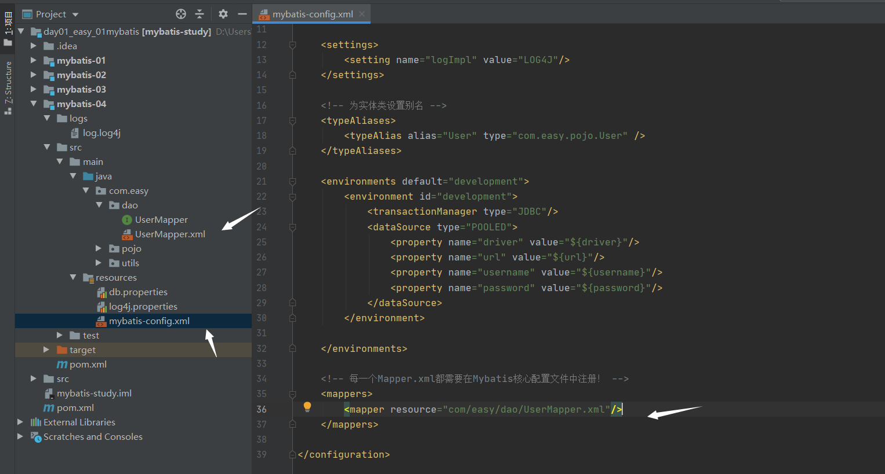
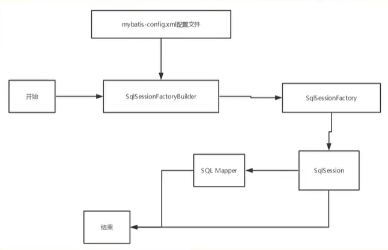
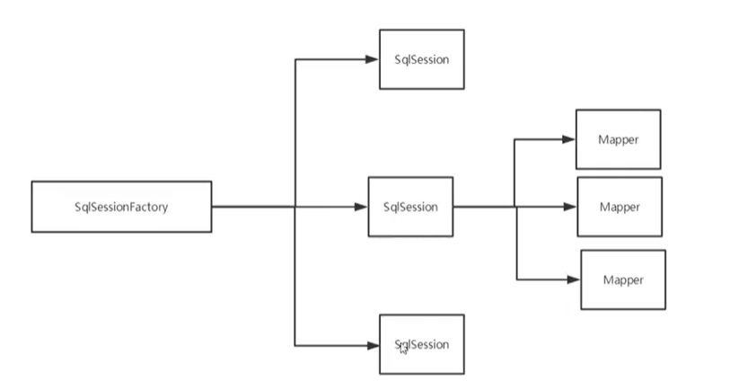
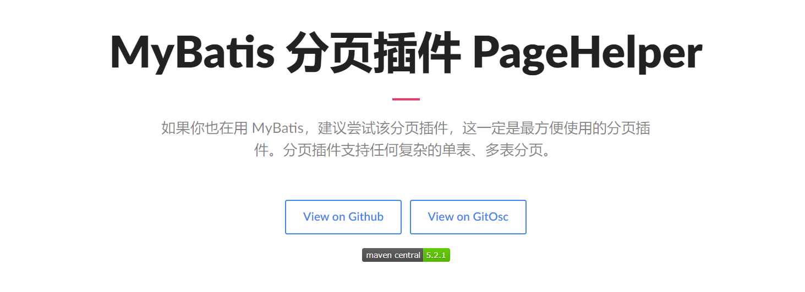

# Mybatis篇（新版）

## 概述


MyBatis 本是apache的一个[开源项目](https://baike.baidu.com/item/%E5%BC%80%E6%BA%90%E9%A1%B9%E7%9B%AE/3406069)iBatis, 2010年这个[项目](https://baike.baidu.com/item/%E9%A1%B9%E7%9B%AE/477803)由apache software foundation 迁移到了\[google code]\(https://baike.baidu.com/item/google code/2346604)，并且改名为MyBatis 。2013年11月迁移到[Github](https://baike.baidu.com/item/Github/10145341)。

### Mybatis特性

* MyBatis 是一款优秀的持久层框架
* 它**支持自定义 SQL、存储过程以及高级映射。**
* MyBatis 免除了几乎所有的 JDBC 代码以及设置参数和获取结果集的工作。
* MyBatis 可以通过简单的 XML 或注解来配置和映射原始类型、接口和 Java POJO（Plain Old Java Objects，普通老式 Java 对象）为数据库中的记录。

### 什么是持久层

#### 数据持久化

* 持久化就是将程序的数据在持久状态和瞬时状态转化的过程
* 内存：**断电即失**
* 数据库（jdbc）,io文件持久化。

#### 为什么需要持久化？

* 有一些数据，不能丢失
* 内存太贵了

#### 持久层

**持久层**：完成持久化工作的代码块

## 搭建MyBatis

### 相关依赖

```xml
<dependencies>
    <!-- mybatis 核心 -->
    <dependency>
        <groupId>org.mybatis</groupId>
        <artifactId>mybatis</artifactId>
        <version>3.5.7</version>
    </dependency>

    <!-- junit 测试 -->
    <dependency>
        <groupId>junit</groupId>
        <artifactId>junit</artifactId>
        <version>4.12</version>
        <scope>test</scope>
    </dependency>

    <!-- MySQL驱动 -->
    <dependency>
        <groupId>mysql</groupId>
        <artifactId>mysql-connector-java</artifactId>
        <version>8.0.16</version>
    </dependency>
</dependencies>
```

### 创建MyBatis的核心配置文件

- 习惯：一般命名为 mybatis-config.xml
- 作用：配置链接数据库的环境、配置MyBatis
- 放置位置：src/main/resources

```xml
<?xml version="1.0" encoding="UTF-8" ?>
<!DOCTYPE configuration
        PUBLIC "-//mybatis.org//DTD Config 3.0//EN"
        "http://mybatis.org/dtd/mybatis-3-config.dtd">

<configuration>

    <!--
        配置链接数据库的环境
        default : 选择那个环境有效
     -->
    <environments default="development">
        <environment id="development">

            <!-- 事务管理器 -->
            <transactionManager type="JDBC"></transactionManager>

            <!-- 数据源 即连接池-->
            <dataSource type="POOLED">
                <property name="driver" value="com.mysql.cj.jdbc.Driver"/>
                <property name="url" value="jdbc:mysql://127.0.0.1:3306/mybatis?useSSL=false&amp;serverTimezone=Asia/Shanghai&amp;characterEncoding=utf-8amp;autoReconnect=true"/>
                <property name="username" value="root"/>
                <property name="password" value="123456"/>
            </dataSource>
        </environment>
    </environments>

    <!-- 引入 MyBatis 的映射文件 : 存放SQL语句 和 POJO的映射方式 -->
    <mappers>
        <mapper resource="mappers/UserMapper.xml"></mapper>
    </mappers>
</configuration>
```

### 创建mapper接口

- 命名规则：POJO实体类的名字 + Mapper。

- 相当于DAO，但是不用创建实现类，MyBatis会创建代理类，并执行映射文件当中的SQL。

```java
package com.atguigu.mybatis.mapper;

public interface UserMapper {
    int insertUser();
}
```

### 创建MyBatis的映射文件

- Mapper 接口当中的一个抽象方法对应映射文件当中的一个SQL语句。
- 起名规则：POJO名字 + Mapper.xml
- 放置位置：src/main/resources/UserMapper.xml

```xml
<?xml version="1.0" encoding="UTF-8" ?>
<!DOCTYPE mapper
        PUBLIC "-//mybatis.org//DTD Mapper 3.0//EN"
        "http://mybatis.org/dtd/mybatis-3-mapper.dtd">

<!-- namespace ：对应的mapper接口 -->
<mapper namespace="com.atguigu.mybatis.mapper.UserMapper">
    <!--
        id : 对应接口的方法名称.
    -->
    <insert id="insertUser">
        INSERT INTO t_user VALUES (NULL, 'admin', '123456', 23, '男', '12345@qq.com');
    </insert>
</mapper>
```

### 通过junit测试功能

从开始到创建 SqlSessionFactory 只用创建一次即可，因此可以单独封装即可。 

```java
package com.atguigu.mybatis.utils;

import org.apache.ibatis.io.Resources;
import org.apache.ibatis.session.SqlSession;
import org.apache.ibatis.session.SqlSessionFactory;
import org.apache.ibatis.session.SqlSessionFactoryBuilder;

import java.io.IOException;
import java.io.InputStream;

// sqlSessionFactory --> sqlSession
public class MybatisUtils {

    private static SqlSessionFactory sqlSessionFactory;

    static {
        try {
            // 使用mybatis获取sqlSessionFactory对象
            String resource = "mybatis-config.xml";
            InputStream inputStream = Resources.getResourceAsStream(resource);
            sqlSessionFactory = new SqlSessionFactoryBuilder().build(inputStream);
        } catch (IOException e) {
            e.printStackTrace();
        }
    }

    /*
     * 既然有了 SqlSessionFactory，顾名思义，我们可以从中获得 SqlSession 的实例。
     * SqlSession 提供了在数据库执行 SQL 命令所需的所有方法。
     * 你可以通过 SqlSession 实例来直接执行已映射的 SQL 语句。
     * */
    public static SqlSession getSqlSession() {
        return sqlSessionFactory.openSession();
    }

}
```

openSession() 获得 SqlSession 默认是不自动提交事务，因此需要自己手动提交。

```java
package com.atguigu.mybatis.dao;

package com.atguigu.mybatis.pojo.User;
package com.atguigu.mybatis.utils.MybatisUtils;
import org.apache.ibatis.session.SqlSession;
import org.junit.Test;

import java.util.List;

public class UserDaoTest {

    @Test
    public void test(){

        //获取sqlSession对象
        SqlSession sqlSession = MybatisUtils.getSqlSession();

		// 执行SQL操作
        Integer rows = userMapper.insertUser();
        System.out.println("rows = " + rows);
        
        // 提交事务 -> 事务是默认开启的
        sqlSession.commit();

        //sqlSession关闭
        sqlSession.close();
    }
}
```

### 加入log4j日志功能

日志级别：FATAL（致命）> ERROR（错误）>WARN（警告）INFO（信息）> DEBUG（调试）。

- 相关依赖

```xml
<!-- log4j -->
<dependency>
    <groupId>log4j</groupId>
    <artifactId>log4j</artifactId>
    <version>1.2.17</version>
</dependency>
```

- 放置位置：resources/log4j.xml 

```xml
<?xml version="1.0" encoding="UTF-8"?>
<!DOCTYPE log4j:configuration SYSTEM "log4j.dtd">

<log4j:configuration xmlns:log4j="http://jakarta.apache.org/log4j/">

    <appender name="STDOUT" class="org.apache.log4j.ConsoleAppender">
        <param name="Encoding" value="UTF-8"/>
        <layout class="org.apache.log4j.PatternLayout">
            <param name="ConversionPattern" value="%-5d %d{MM-dd HH:mm:ss,SSS} %m (%F:%L) \n"/>
        </layout>
    </appender>

    <logger name="java.sql">
        <level value="debug"/>
    </logger>
    <logger name="org.apache.ibatis" >
        <level value="info"/>
    </logger>

    <!-- 默认配置，级别为debug 且根据name为log.console和 log.file两个appender输出-->
    <root>
        <level value="debug"/>
        <appender-ref ref="STDOUT"/>
    </root>
</log4j:configuration>
```

## 核心配置文件详解

* `mybatis-config.xml`
* mybatis的配置文件包含了会深深影响mybatis行为的设置和属性信息
  * **configuration（配置）**
    1. **properties（属性）**
    2. **settings（设置）**
    3. **typeAliases（类型别名）**
    4. typeHandlers（类型处理器）
    5. objectFactory（对象工厂）
    6. plugins（插件）
    7. **environments（环境配置）**
    8. **environment（环境变量）**
       * **transactionManager（事务管理器）**
       * **dataSource（数据源）**
    9. databaseIdProvider（数据库厂商标识）
    10. **mappers（映射器）**
* `mybatis-config.xml`

### environments 

- 可以配置多个环境，比如测试环境和开发环境 ;
- 使用id区分，不能重复

```xml
<environments default="development">

    <environment id="development">

        <!-- 事务管理器 -->
        <transactionManager type="JDBC"></transactionManager>

        <!-- 数据源 即连接池-->
        <dataSource type="POOLED">
            <property name="driver" value="com.mysql.cj.jdbc.Driver"/>
            <property name="url" value="jdbc:mysql://127.0.0.1:3306/mybatis?useSSL=false&amp;serverTimezone=Asia/Shanghai&amp;characterEncoding=utf-8amp;autoReconnect=true"/>
            <property name="username" value="root"/>
            <property name="password" value="123456"/>
        </dataSource>
    </environment>

    <environment id="test">

        <!-- 事务管理器 -->
        <transactionManager type="JDBC"></transactionManager>

        <!-- 数据源 即连接池-->
        <dataSource type="POOLED">
            <property name="driver" value="com.mysql.cj.jdbc.Driver"/>
            <property name="url" value="jdbc:mysql://127.0.0.1:3306/mybatis?useSSL=false&amp;serverTimezone=Asia/Shanghai&amp;characterEncoding=utf-8amp;autoReconnect=true"/>
            <property name="username" value="root"/>
            <property name="password" value="123456"/>
        </dataSource>
    </environment>

</environments>
```

### 事务管理器（transactionManager）

在 MyBatis 中**有两种类型的事务管理器**（也就是 type="\[JDBC|MANAGED]"）：

* **JDBC – 这个配置直接使用了 JDBC 的提交和回滚设施，它依赖从数据源获得的连接来管理事务作用域。**
* **MANAGED** – 这个配置几乎没做什么。它从不提交或回滚一个连接，而是让容器来管理事务的整个生命周期（比如 JEE 应用服务器的上下文）。 默认情况下它会关闭连接。然而一些容器并不希望连接被关闭，因此需要将 closeConnection 属性设置为 false 来阻止默认的关闭行为。例如:

```xml
<transactionManager type="MANAGED">
  <property name="closeConnection" value="false"/>
</transactionManager>
```

**提示** 如果正在使用 Spring + MyBatis，则没有必要配置事务管理器，因为 Spring 模块会使用自带的管理器来覆盖前面的配置。

### 数据源（dataSource）

dataSource 元素使用标准的 JDBC 数据源接口来配置 JDBC 连接对象的资源。

**有三种内建的数据源类型（也就是 type="\[UNPOOLED|POOLED|JNDI]"）**：

- POOLED：使用数据库连接池
- UNPOOLED：不使用数据库连接池，链接直接重新创建
- JNDI：表示使用上下文当中的数据源（了解下）

### 属性（properties）

* 可以通过`properties`属性来实现引用配置文件
* 这些属性都是可外部配置且可动态替换的，既可以在典型的java属性文件中配置，亦可通过`properties`的元素子元素来传递。

比如，引入`jdbc.properties`文件

```properties
jdbc.url=jdbc:mysql://127.0.0.1/mybatis?useSSL=false&serverTimezone=Asia/Shanghai&characterEncoding=utf-8&autoReconnect=true
jdbc.driver=com.mysql.cj.jdbc.Driver
jdbc.user=root
jdbc.password=123456
```

> 在核心配置文件中，必须按照顺序进行配置

* 重写核心配置文件`mybatis-config.xml`

> 如果两个文件有同一个字段，优先使用外部配置文件

```xml
<?xml version="1.0" encoding="UTF-8" ?>
<!DOCTYPE configuration
        PUBLIC "-//mybatis.org//DTD Config 3.0//EN"
        "http://mybatis.org/dtd/mybatis-3-config.dtd">

<configuration>

    <!-- 引入 properties 文件 -->
    <properties resource="jdbc.properties"></properties>

    <environments default="development">
        <environment id="development">
            <transactionManager type="JDBC"></transactionManager>
            <dataSource type="POOLED">
                <property name="driver" value="${jdbc.driver}"/>
                <property name="url" value="${jdbc.url}"/>
                <property name="username" value="${jdbc.user}"/>
                <property name="password" value="${jdbc.password}"/>
            </dataSource>
        </environment>
    </environments>

    <mappers>
        <mapper resource="mappers/UserMapper.xml"></mapper>
    </mappers>
</configuration>
```

### 类型别名（typeAliases）

* 类型别名可为 Java 类型设置一个缩写名字。
* 仅用于 XML 配置，意在降低冗余的全限定类名书写。

```xml
<?xml version="1.0" encoding="UTF-8" ?>
<!DOCTYPE configuration
        PUBLIC "-//mybatis.org//DTD Config 3.0//EN"
        "http://mybatis.org/dtd/mybatis-3-config.dtd">

<configuration>

    <!-- 引入 properties 文件 -->
    <properties resource="jdbc.properties"></properties>

    <!-- 别名 -->
    <typeAliases>
        <typeAlias type="com.atguigu.mybatis.pojo.User" alias="user"></typeAlias>
        
        <!-- 也可以指定一个包下面的别名, 且不区分大小写, 跟上方 typeLias 不能同时使用 -->
        <package name="com.atguigu.mybatis.pojo"></package>
    </typeAliases>
  
    <!-- ... -->
</configuration>
```

在 Mapper.xml 文件中使用

```xml
<select id="getAllUser" resultType="user">
    SELECT * FROM t_user;
</select>
```

### 设置（settings）

这是 MyBatis 中极为重要的调整设置，它们会改变 MyBatis 的运行时行为。 下表描述了设置中各项设置的含义、默认值等。

| 设置名                           | 描述                                                         | 有效值                                                       | 默认值                                                |
| -------------------------------- | ------------------------------------------------------------ | ------------------------------------------------------------ | ----------------------------------------------------- |
| cacheEnabled                     | 全局性地开启或关闭所有映射器配置文件中已配置的任何缓存。     | true \| false                                                | true                                                  |
| lazyLoadingEnabled               | 延迟加载的全局开关。当开启时，所有关联对象都会延迟加载。 特定关联关系中可通过设置 `fetchType` 属性来覆盖该项的开关状态。 | true \| false                                                | false                                                 |
| aggressiveLazyLoading            | 开启时，任一方法的调用都会加载该对象的所有延迟加载属性。 否则，每个延迟加载属性会按需加载（参考 `lazyLoadTriggerMethods`)。 | true \| false                                                | false （在 3.4.1 及之前的版本中默认为 true）          |
| multipleResultSetsEnabled        | 是否允许单个语句返回多结果集（需要数据库驱动支持）。         | true \| false                                                | true                                                  |
| useColumnLabel                   | 使用列标签代替列名。实际表现依赖于数据库驱动，具体可参考数据库驱动的相关文档，或通过对比测试来观察。 | true \| false                                                | true                                                  |
| useGeneratedKeys                 | 允许 JDBC 支持自动生成主键，需要数据库驱动支持。如果设置为 true，将强制使用自动生成主键。尽管一些数据库驱动不支持此特性，但仍可正常工作（如 Derby）。 | true \| false                                                | False                                                 |
| autoMappingBehavior              | 指定 MyBatis 应如何自动映射列到字段或属性。 NONE 表示关闭自动映射；PARTIAL 只会自动映射没有定义嵌套结果映射的字段。 FULL 会自动映射任何复杂的结果集（无论是否嵌套）。 | NONE, PARTIAL, FULL                                          | PARTIAL                                               |
| autoMappingUnknownColumnBehavior | 指定发现自动映射目标未知列（或未知属性类型）的行为。`NONE`: 不做任何反应`WARNING`: 输出警告日志（`'org.apache.ibatis.session.AutoMappingUnknownColumnBehavior'` 的日志等级必须设置为 `WARN`）`FAILING`: 映射失败 (抛出 `SqlSessionException`) | NONE, WARNING, FAILING                                       | NONE                                                  |
| defaultExecutorType              | 配置默认的执行器。SIMPLE 就是普通的执行器；REUSE 执行器会重用预处理语句（PreparedStatement）； BATCH 执行器不仅重用语句还会执行批量更新。 | SIMPLE REUSE BATCH                                           | SIMPLE                                                |
| defaultStatementTimeout          | 设置超时时间，它决定数据库驱动等待数据库响应的秒数。         | 任意正整数                                                   | 未设置 (null)                                         |
| defaultFetchSize                 | 为驱动的结果集获取数量（fetchSize）设置一个建议值。此参数只可以在查询设置中被覆盖。 | 任意正整数                                                   | 未设置 (null)                                         |
| defaultResultSetType             | 指定语句默认的滚动策略。（新增于 3.5.2）                     | FORWARD\_ONLY \| SCROLL\_SENSITIVE \| SCROLL\_INSENSITIVE \| DEFAULT（等同于未设置） | 未设置 (null)                                         |
| safeRowBoundsEnabled             | 是否允许在嵌套语句中使用分页（RowBounds）。如果允许使用则设置为 false。 | true \| false                                                | False                                                 |
| safeResultHandlerEnabled         | 是否允许在嵌套语句中使用结果处理器（ResultHandler）。如果允许使用则设置为 false。 | true \| false                                                | True                                                  |
| **mapUnderscoreToCamelCase**     | **是否开启驼峰命名自动映射，即从经典数据库列名 A\_COLUMN 映射到经典 Java 属性名 aColumn。** | true \| false                                                | False                                                 |
| localCacheScope                  | MyBatis 利用本地缓存机制（Local Cache）防止循环引用和加速重复的嵌套查询。 默认值为 SESSION，会缓存一个会话中执行的所有查询。 若设置值为 STATEMENT，本地缓存将仅用于执行语句，对相同 SqlSession 的不同查询将不会进行缓存。 | SESSION \| STATEMENT                                         | SESSION                                               |
| jdbcTypeForNull                  | 当没有为参数指定特定的 JDBC 类型时，空值的默认 JDBC 类型。 某些数据库驱动需要指定列的 JDBC 类型，多数情况直接用一般类型即可，比如 NULL、VARCHAR 或 OTHER。 | JdbcType 常量，常用值：NULL、VARCHAR 或 OTHER。              | OTHER                                                 |
| **lazyLoadTriggerMethods**       | **指定对象的哪些方法触发一次延迟加载。**                     | 用逗号分隔的方法列表。                                       | equals,clone,hashCode,toString                        |
| defaultScriptingLanguage         | 指定动态 SQL 生成使用的默认脚本语言。                        | 一个类型别名或全限定类名。                                   | org.apache.ibatis.scripting.xmltags.XMLLanguageDriver |
| defaultEnumTypeHandler           | 指定 Enum 使用的默认 `TypeHandler` 。（新增于 3.4.5）        | 一个类型别名或全限定类名。                                   | org.apache.ibatis.type.EnumTypeHandler                |
| callSettersOnNulls               | 指定当结果集中值为 null 的时候是否调用映射对象的 setter（map 对象时为 put）方法，这在依赖于 Map.keySet() 或 null 值进行初始化时比较有用。注意基本类型（int、boolean 等）是不能设置成 null 的。 | true \| false                                                | false                                                 |
| returnInstanceForEmptyRow        | 当返回行的所有列都是空时，MyBatis默认返回 `null`。 当开启这个设置时，MyBatis会返回一个空实例。 请注意，它也适用于嵌套的结果集（如集合或关联）。（新增于 3.4.2） | true \| false                                                | false                                                 |
| logPrefix                        | 指定 MyBatis 增加到日志名称的前缀。                          | 任何字符串                                                   | 未设置                                                |
| logImpl                          | 指定 MyBatis 所用日志的具体实现，未指定时将自动查找。        | SLF4J \| LOG4J \| LOG4J2 \| JDK\_LOGGING \| COMMONS\_LOGGING \| STDOUT\_LOGGING \| NO\_LOGGING | 未设置                                                |
| proxyFactory                     | 指定 Mybatis 创建可延迟加载对象所用到的代理工具。            | CGLIB \| JAVASSIST                                           | JAVASSIST （MyBatis 3.3 以上）                        |
| vfsImpl                          | 指定 VFS 的实现                                              | 自定义 VFS 的实现的类全限定名，以逗号分隔。                  | 未设置                                                |
| useActualParamName               | 允许使用方法签名中的名称作为语句参数名称。 为了使用该特性，你的项目必须采用 Java 8 编译，并且加上 `-parameters` 选项。（新增于 3.4.1） | true \| false                                                | true                                                  |
| configurationFactory             | 指定一个提供 `Configuration` 实例的类。 这个被返回的 Configuration 实例用来加载被反序列化对象的延迟加载属性值。 这个类必须包含一个签名为`static Configuration getConfiguration()` 的方法。（新增于 3.2.3） | 一个类型别名或完全限定类名。                                 | 未设置                                                |
| shrinkWhitespacesInSql           | 从SQL中删除多余的空格字符。请注意，这也会影响SQL中的文字字符串。 (新增于 3.5.5) | true \| false                                                | false                                                 |
| defaultSqlProviderType           | Specifies an sql provider class that holds provider method (Since 3.5.6). This class apply to the `type`(or `value`) attribute on sql provider annotation(e.g. `@SelectProvider`), when these attribute was omitted. | A type alias or fully qualified class name                   | Not set                                               |

一个配置完整的 settings 元素的示例如下：

```
<settings>
  <setting name="cacheEnabled" value="true"/>
  <setting name="lazyLoadingEnabled" value="true"/>
  <setting name="multipleResultSetsEnabled" value="true"/>
  <setting name="useColumnLabel" value="true"/>
  <setting name="useGeneratedKeys" value="false"/>
  <setting name="autoMappingBehavior" value="PARTIAL"/>
  <setting name="autoMappingUnknownColumnBehavior" value="WARNING"/>
  <setting name="defaultExecutorType" value="SIMPLE"/>
  <setting name="defaultStatementTimeout" value="25"/>
  <setting name="defaultFetchSize" value="100"/>
  <setting name="safeRowBoundsEnabled" value="false"/>
  <setting name="mapUnderscoreToCamelCase" value="false"/>
  <setting name="localCacheScope" value="SESSION"/>
  <setting name="jdbcTypeForNull" value="OTHER"/>
  <setting name="lazyLoadTriggerMethods" value="equals,clone,hashCode,toString"/>
</settings>
```

### 其他配置

* [typeHandlers（类型处理器）](https://mybatis.org/mybatis-3/zh/configuration.html#typeHandlers)
* [objectFactory（对象工厂）](https://mybatis.org/mybatis-3/zh/configuration.html#objectFactory)
* [plugins（插件）](https://mybatis.org/mybatis-3/zh/configuration.html#plugins)
  * mybatis-generator-coreo
  * mybatis-plus
  * 通用mapper

### 映射器（Mappers）



MapperRegistry:注册绑定我们的Mapper文件;

* 方式一

```xml
<!-- 使用相对于类路径的资源引用 -->
<mappers>
  <mapper resource="xxx/AuthorMapper.xml"/>
  <mapper resource="xxx/BlogMapper.xml"/>
  <mapper resource="xxx/PostMapper.xml"/>
</mappers>
```

* 方式二：使用class进行注册

```xml
<!-- 使用映射器接口实现类的完全限定类名 -->
<mappers>
  <mapper class="xxx.AuthorMapper"/>
  <mapper class="xxx.BlogMapper"/>
  <mapper class="xxx.PostMapper"/>
</mappers>
```

1. 接口和配置文件必须同名
2. 接口和配置文件必须在同一个包下

* 方式三：使用扫描包进行注册绑定，与上相同，但是能够注册多个

```
<!-- 将包内的映射器接口实现全部注册为映射器 -->
<mappers>
  <package name="xxx"/>
</mappers>
```

> 接口和配置文件，同名，就基本不会有问题。

### 生命周期与作用域



不同作用域和生命周期类别是至关重要的，因为错误的使用会导致非常严重的**并发问题**。

**SqlSessionFactoryBuilder**

* 一旦创建了 SqlSessionFactory，就不再需要它了
* 局部变量

**SqlSessionFactory**

* 说白了就是可以想象为︰数据库连接池
* sqlSessionFactory一旦被创建就应该在应用的运行期间一直存在，**没有任何理由丢弃它或重新创建另一个实例**。
* 因此 SqlSessionFactory 的最佳作用域是应用作用域。
* 最简单的就是使用单例模式或者静态单例模式。

**SqlSession**

* 连接到连接池的一个请求！
* sqlSession 的实例不是线程安全的，因此是不能被共享的，所以它的最佳的作用域是请求或方法作用域。
* 用完之后需要赶紧关闭，否则资源被占用



这里面的每一个Mapper，就代表一个具体的业务！

## 获取参数值的两种方式

### 绑定namespace

namespace中的包名和Dao/Mapper接口中的包名要一致。

```xml
<!-- namespace=绑定一个对应的Dao/Mapper接口 -->
<mapper namespace="xxxx.dao.UserDao">
	...
</mapper>
```

### 单个字面量类型的参数

**dao层**

```java
public interface UserDao {
	public User getUserByUsername(String username);
}
```

**UserMapper.xml**

```xml
<!-- 占位符方式 -->
<select id="getUserByUsername" resultType="user">
    SELECT * FROM t_user WHERE username = #{username};
</select>

<!-- 字符串拼接方式 -->
<select id="getUserByUsername" resultType="user">
    SELECT * FROM t_user WHERE username = '${username}';
</select>

```

‼️ 注意 ${} + 单引号的问题。其中传入的参数通过`#{param} `或者` '${param}'`传入，并且`param`的定义名称与`Dao`层的参数名称一样。

* `id`：对应的namespace中的方法名
* `resultType`：Sql语句执行的返回值
* `parameterType`：指定传入的参数类型

**注意，\#{}是预编译处理，可以防止SQL注入；${}仅仅是字符串替换。**

### 多个字面量类型的参数

当 Mapper 接口中有多个参数的时候，MyBatis 会创建Map ，并使用 paramX 或 argX 为Key，参数值为 Value , 且两者均可混合使用。

**dao层**

```java
public interface UserDao {
	User checkLogin(String username, String password);
}
```

**UserMapper.xml**

```xml
<select id="checkLogin" resultType="user">
    SELECT * FROM t_user WHERE username = #{param1} and password = #{param2};
</select>

<select id="checkLogin" resultType="user">
    SELECT * FROM t_user WHERE username = #{arg0} and password = #{arg1};
</select>
```

### map集合类型的参数

**dao层**

```java
/**
 * {username: "xxxx"}
 * {password: "xxxx"}
 * @param map
 * @return
 */
public interface UserDao {
	User checkLoginByMap(Map<String, Object> map);
}
```

**UserMapper.xml**

```xml
<select id="checkLoginByMap" resultType="user">
    SELECT * FROM t_user WHERE username = #{username} and password = #{password};
</select>
```

### 实体类类型的参数

必须有 getter  / setter；单个POJO会形成一个Map，属性名作为Key，getter 后的值作为 value。

!!属性只跟 getter/setter 有关系。

**dao层**

```java
public interface UserDao {
	void insertUser(User user);
}
```

**UserMapper.xml**

```xml
<select id="insertUser">
    INSERT INTO t_user VALUES (NULL, #{username}, #{password}, #{age}, #{gender}, #{email})
</select>
```

### 使用@Param标识参数

其会替换argXX，即只能用 {username, param1,  password, param2 } 这四个在配置文件当中。

**dao层**

```java
public interface UserDao {
	User checkLogin(@Param("username") String username, @Param("password") String password);
}
```

**UserMapper.xml**

```xml
<select id="checkLogin" resultType="user">
    SELECT * FROM t_user WHERE username = #{username} and password = #{password};
</select>
```

### List\<POJO\>

详见动态SQL - foreach。

## MyBatis的各种查询功能

### 查询一个实体类对象

- 注意设置 resultType 即可，可以使用别名。
- 当SQL语句返回多条记录的时候，会报：TooManyResultException 的错误。

**dao层**

```java
public interface UserDao {
	User getUserById(@Param("id") String id);
}
```

**UserMapper.xml**

```xml
<select id="getUserById" resultType="user">
    SELECT * FROM t_user WHERE id = #{id}
</select>
```

### 查询一个List集合

注意设置 resultType 依然为 POJO 的类型。

**dao层**

```java
public interface UserDao {
	List<User> getAllUser();
}
```

**UserMapper.xml**

```xml
<select id="getAllUser" resultType="user">
    SELECT * FROM t_user;
</select>
```

### 查询单个数据

**dao层**

```java
public interface UserDao {
	Integer getCount();
}
```

**UserMapper.xml**

```xml
<select id="getCount" resultType="int">
    SELECT count(1) FROM t_user;
</select>
```

### 查询一条数据为map集合

- 查询的结果没有对应的实体类的时候，就可以使用Map集合。 
- resultType 设置成 map 即可。

注意：查询为null 的字段是不会放到Map集合里面。

**dao层**

```java
public interface UserDao {
	Integer getCount();
}
```

**UserMapper.xml**

```xml
<select id="getCount" resultType="int">
    SELECT count(1) FROM t_user;
</select>
```

- 也可以使用 Map 存放多条记录，需要使用到 @MapKey 注解。

**dao层**

```java
public interface UserDao {
	Map<String, Object> getUserById(@Param("id") String id);
}
```

**UserMapper.xml**

```xml
<select id="getAllUserToMap" resultType="map">
    SELECT * FROM t_user;
</select>
```

**数据**

```json
// Map<id, User>
{
  3={password=123, gender=男, id=3, age=23, email=12345@qq.com, username=root}, 
  4={password=123456, gender=男, id=4, age=23, email=12345@qq.com, username=admin}, 
  5={password=123456, gender=男, id=5, age=23, email=12345@qq.com, username=admin}, 
  6={password=123456, gender=男, id=6, age=20, email=geek_zh@163.com, username=zs}
}
```

### 查询多条数据为map集合

**dao层**

```java
public interface UserDao {
	List<Map<String, Object>> getAllUser();
}
```

**UserMapper.xml**

```xml
<select id="getUserById" resultType="map">
    SELECT * FROM t_user;
</select>
```

## 特殊SQL的执行

### 模糊查询

**dao层**

```java
public interface UserDao {
	List<User> getUserByLike(@Param("mohu") String mohu);
}
```

**UserMapper.xml**

```xml
<select id="getUserByLike" resultType="user">
    SELECT * FROM t_user WHERE username like '%${mohu}%'
</select>

<select id="getUserByLike" resultType="user">
    SELECT * FROM t_user WHERE username like CONCAt('%', #{mohu}, '%');
</select>

<!-- 第三种方式：用的最多的方式的 -->
<select id="getUserByLike" resultType="user">
    SELECT * FROM t_user WHERE username like "%"#{mohu}"%"
</select>
```

### 批量删除 in

即传入的参数数量不确定，这里直接先构成一个字符串，再使用拼接方式传入即可。

**dao层**

```java
public interface UserDao {
	int deleteMore(@Param("ids") String ids);
}
```

**UserMapper.xml**

```xml
<!-- ids = "1,2,3" -->
<delete id="deleteMore" resultType="int">
  DELETE FROM t_user WHERE id in (${ids})
</delete>
```

### 动态设置表名

表查询的字段相同，但是表名称不相同。

**dao层**

```java
public interface UserDao {
	List<User> getUserList(@Param("tableName") String tableName);
}
```

**UserMapper.xml**

```xml
<select id="getUserList" resultType="user">
  SELECT * FROM ${tableName}; 
</select>
```

### 获取自增的主键

场景：比如一个班级表和一个学生表，在一个事务当中先创建一个班级（使用的是自增的主键）然后在这个班级里面添加若干的学生。

**dao层**

```java
public interface UserDao {
	Integer insertUser(User user);
}
```

**UserMapper.xml**

```xml
<insert id="insertUser" resultType="int" useGeneratedKeys="true" keyProperty="id">
  INSERT INTO t_user VALUES(NULL, #{username}, #{password}, #{age}, #{gender}, #{email});
</insert>
```

## 自定义映射resultMap

- 字段名 和 属性名不一致（可以尝试别名处理）
- 一对一 或 一对多 的关系查询

### 处理字段和属性的映射关系

开启下划线→小驼峰的配置，在 mybatis-config.xml 文件当中添加如下配置。

```xml
<settings>
    <!-- 下划线 自动映射 驼峰 -->
    <setting name="mapUnderscoreToCamelCase" value="true"/>
</settings>
```

接下来使用，使用 ResltMap , 注意 resultMap 和 resultType 是二选一的。

```xml
<mapper namespace="com.atguigu.mybatis.mapper.EmpMapper">

    <!-- 相同的属性和名称不用写也行的 -->
    <resultMap id="empResultMap" type="Emp">
        <!-- id 处理主键和属性字段的映射关系 -->
        <id column="emp_id" property="empId"></id>

        <!-- result 处理普通字段和属性的映射关系 -->
        <result column="emp_name" property="empName"></result>

    </resultMap>
    
    <!-- Emp getEmpByEmpId(@Param("empId") Integer empId); -->
    <select id="getEmpByEmpId" resultMap="empResultMap">
        SELECT * FROM t_emp WHERE emp_id = #{empId};
    </select>

</mapper>
```

### 多对一映射处理

#### 建立数据库

例子：多个学生对应一个老师

```mysql
create table teacher (
	id int(10) not null,
	name varchar(30) default null,
	primary key(id)
)engine=innodb default charset=utf8;

insert into teacher(id,name) values (1,'秦老师');

create table student (
	id int(10) not null,
	name varchar(30) default null,
	tid int(10) default null,
	primary key (id),
	key fktid (tid),
	constraint fktid foreign key (tid) references teacher (id)
)engine=innodb default charset=utf8;


insert into student (id,name,tid) values (1,'小明',1);
insert into student (id,name,tid) values (2,'小红',1);
insert into student (id,name,tid) values (3,'小张',1);
insert into student (id,name,tid) values (4,'小李',1);
insert into student (id,name,tid) values (5,'小王',1);
```

* 测试环境搭建

1. 导入lombok
2. 新建实体类 Teacher、Student

#### Pojo实体类

##### Teacher

```java
@Data
@ToString
public class Teacher {
    private int tid;
    private String name;
    public String toString(){
        return this.tid + ":" + this.name;
    }
}
```

##### Student

```java
@Data
@ToString
public class Student {
    private int id;
    private String name;

    /*
    * 每个学生对应一个老师
    * */
    private Teacher teacher;

    public String toString(){
        return this.id + ":" + this.name + ":" + this.teacher;
    }
}
```

#### 建立Mapper接口

##### Teacher

```java
public interface TeacherMapper {
    @Select("select * from teacher where id = #{tid}")
    Teacher getTeacher(@Param("tid") int id);
}
```

##### Student

```java
public interface StudentMapper {
    List<Student> getStudent();
}
```

#### 建立 StudentMapper.xml 文件

##### 按照结果嵌套处理

```java
<?xml version="1.0" encoding="UTF-8" ?>
<!DOCTYPE mapper
        PUBLIC "-//mybatis.org//DTD Mapper 3.0//EN"
        "http://mybatis.org/dtd/mybatis-3-mapper.dtd">

<mapper namespace="com.easy.dao.StudentMapper">
    <select id="getStudent" resultMap="StudentTeacher">
        select * from mybatis.student
    </select>
    <resultMap id="StudentTeacher" type="Student">
        <result property="id" column="id"></result>
        <result property="name" column="name"></result>
        <!--复杂的属性，需要单独处理
            对象：association
    
            集合：collection
        -->
        <association property="teacher" column="tid" javaType="Teacher" select="getTeacher"/>
    </resultMap>
    <select id="getTeacher" resultType="Teacher">
        select * from mybatis.teacher where id = #{id}
    </select>
</mapper>
```

### 一对多映射处理

#### Pojo实体类

**Student**

```java
@Data
@ToString
public class Student {
    private int id;
    private String name;
    private int tid;

    /*
    * 每个学生对应一个老师
    * */

    public String toString(){
        return this.id + ":" + this.name + ":" + this.tid;
    }
}
```

**Teacher**

```java
@Data
//@ToString
public class Teacher {
    private int id;
    private String name;

    private List<Student> students;

    public String toString(){
        return this.id+":"+this.name+":";
    }
}
```

#### 建立 TeacherMapper.xml

* 按照结果嵌套处理

```
<mapper namespace="com.easy.dao.TeacherMapper">
    <select id="getTeacher" resultMap="TeacherStudent">
        select s.id as sid,
               s.name as sname,
               t.id as tid,
               t.name as tname from student s,teacher t where s.tid = t.id and t.id = #{tid};
    </select>
    <resultMap id="TeacherStudent" type="Teacher">
        <result property="id" column="tid"/>
        <result property="name" column="tname"/>

        <collection property="students" ofType="Student">
            <result property="id" column="sid"/>
            <result property="name" column="sname"/>
            <result property="tid" column="tid"/>
        </collection>
    </resultMap>
</mapper>
```

* 按照查询嵌套处理

```xml
<mapper namespace="com.easy.dao.TeacherMapper">
    <select id="getTeacher2" resultMap="TeacherStudent2">
        select * from mybatis.teacher where id = #{tid}
    </select>
    <resultMap id="TeacherStudent2" type="Teacher">
        <result property="id" column="tid"/>
        <result property="name" column="tname"/>
        <collection property="students" javaType="ArrayList" ofType="Student" select="getStudentByTeacherId" column="id">
        </collection>
    </resultMap>
    <select id="getStudentByTeacherId" resultType="Student">
        select * from mybatis.student where tid = #{tid}
    </select>
</mapper>
```

### 小结

1. 关联- association【多对一】
2. 集合- collection 【一对多】
3. javaType & ofType
   - JavaType 用来指定实体类中属性的类型
   - ofType用来指定映射到List或者集合中的pojo类型，泛型中的约束类型!


注意点

* 保证SQL的可读性，尽量保证通俗易懂
* 注意一对多和多对一中，属性名和字段的问题!
* 如果问题不好排查错误，可以使用日志，建议使用Log4j

## 动态SQL

根据传入的参数动态的决定最后执行的SQL语句。

### if

```xml
<!-- List<Emp> getEmpByCondition(Emp emp); -->
<select id="getEmpByCondition" resultType="emp">
    SELECT *
    FROM t_emp
    <trim prefix="WHERE" suffixOverrides="AND">
        <if test="empName != null and empName != ''">
            emp_name LIKE "%"#{empName}"%" AND
        </if>
        <if test="age != null and age != ''">
            age = #{age} AND
        </if>
        <if test="gender != null and gender != ''">
            gender = #{gender} AND
        </if>
    </trim>
</select>
```

### choose, when, otherwise (switch)

MyBatis 提供了 choose 元素，它有点像 Java 中的 switch 语句。

```xml
<!-- List<Emp> getEmpByChoose(Emp emp); -->
<select id="getEmpByChoose" resultType="emp">
    SELECT *
    FROM t_emp
    <where>
        <choose>
            <when test="empName != null and empName != ''">
                emp_name = #{empName}
            </when>
            <when test="age != null and age != ''">
                age = #{age}
            </when>
        </choose>
    </where>
</select>
```

### foreach(批量插删，IN)

经常用于批量添加 和 批量删除。

- **批量插入**

```xml
<!-- void insertMoreEmp(@Params("emps") List<Emp> emps); -->
<insert id="insertMoreEmp">
    INSERT INTO t_emp
    VALUES 
    <foreach collection="emps" item="emp" separator=",">
        (NULL, #{emp.empName}, #{emp.age}, #{emp.gender}, null)
    </foreach>
</insert>
```

- **批量删除**

```xml
<!-- void deleteMoreEmp(@Param("empIds") Integer[] empIds); -->
<delete id="deleteMoreEmp">
    DELETE FROM t_emp
    WHERE emp_id
    IN
    <foreach collection="empIds" item="empId" separator="," open="(" close=")">
        #{empId}
    </foreach>
    
</delete>
```

### SQL片段

将重复的SQL代码抽取出来被多个语句重复使用。

```xml
<sql id="empColumns">
    emp_id, emp_name, age, gender, dept_id
</sql>

<!-- List<Emp> getEmpByCondition(Emp emp); -->
<select id="getEmpByCondition" resultType="emp">
    SELECT  <include refid="empColumns"></include>
    FROM t_emp
    <trim prefix="WHERE" suffixOverrides="AND">
        <if test="empName != null and empName != ''">
            emp_name LIKE "%"#{empName}"%" AND
        </if>
        <if test="age != null and age != ''">
            age = #{age} AND
        </if>
        <if test="gender != null and gender != ''">
            gender = #{gender} AND
        </if>
    </trim>
</select>
```

## MyBatis的缓存

### MyBatis的一级缓存

一级缓存是SqlSession级别的缓存(即同一个链接)，通过同一个SqlSession查询的数据。

以下四种情况会导致一级缓存失效：

- 不同SqlSession对应不同一级缓存。（即不同SqlSession，即使是相同查询条件也无用）。
- 同一个SqlSession但是查询条件不同。
- 同一个SqlSession 两次查询期间执行了任何一次针对此表增删改操作。
- 同一个SqlSession两次查询期间手动清空了缓存。

```xml
sqlSession.clearCache();
```

### MyBatis的二级缓存

#### 开启的四个条件

SqlSessionFactory 级别的，多个SqlSession可以共享。

核心配置文件，设置全局属性配置 cacheEnabled="true", 默认为 true，不需要设置。

```xml
<settings>
  <setting cacheEnabled="true"></setting>
</settings>
```

在映射文件中设置\<cache/\>

```xml
<mapper namespace="com.atguigu.mybatis.mapper.DynamicMapperSQLMapper">
    <cache/>
    <!-- 余下代码 -->
</mapper>
```

二级缓存必须是在 SQLSession 关闭或提交之后有效。（即SQLSession关闭或提交后，一级缓存当中的数据才会保存到一级缓存中）。

实体类必须实现 Serializable 接口。

#### 失效

任意一次增删改会清空二级缓存。（唯一情况）。

#### 二级缓存的相关配置

在mapper配置文件中添加的cache标签可以设置一些属性：

- eviction属性：缓存回收策略，默认的是LRU
  - LRU - 最近最少使用的：移除最长时间不被使用的对象
  - FIFO - 先进先出：按对象进入缓存的顺序来移除它们。
  - SOFT - 软引用：移除基于垃圾回收器状态和软引用规则的对象
  - WEAK - 弱引用：更积极地移除基于垃圾收集器状态和弱引用规则的对象。
- flushInterval属性：刷新间隔，单位毫秒
  - 默认情况是不设置，也就是没有刷新间隔，缓存仅仅调用语句时刷新
- size属性：引用数目，正整数
  - 代表缓存最多可以存储多少哥对象，太大容易导致内存溢出
- readOnly属性：只读，true/false
  - true：只读缓存，会给所有调用则返回缓存对象的相同实例。因此这些对象不能被修改，这提供了很重要的性能优势。

### MyBatis缓存查询的顺序

1. 先查询二级缓存，因为二级缓存当中可能会有其他线程已经查询出来的数据。
2. 二级缓存没有命中，则再查询一级缓存。
3. 一级缓存也没有命中，则执行查询数据库。
4. SQLSession关闭之后，一级缓存当中的数据会写入到二级缓存。

### 整合第三方缓存EHCache（了解）

Ehcache是一种广泛使用的开源Java分布式缓存。

要在程序中使用encache，导入包：

[mybatis-encache](https://mvnrepository.com/artifact/org.mybatis/mybatis-ehcache)

```xml
<dependencies>
    <dependency>
        <groupId>org.mybatis.caches</groupId>
        <artifactId>mybatis-ehcache</artifactId>
        <version>1.1.0</version>
    </dependency>
</dependencies>
```

在指定mapper中指定实现ehcache缓存

```xml
<!-- 在当前Mapper.xml 中使用二级缓存    -->
<cache type="org.mybatis.caches.ehcache.EhcacheCache"/>
```

## 分页功能

### 使用Limit分页

```
select * from mybatis.user LIMIT start,step;
```

使用mybatis实现分页：

* dao层

`UserMapper.java`

```java
List<User> getUserByLimit(Map<String,Integer> map);
```

`UserMapper.xml`

```xml
<mapper namespace="com.easy.dao.UserMapper">
    <!-- 结果集映射 -->
    <resultMap id="UserMap" type="User">
        <!-- column数据库中的字段，property实体类中的属性 -->
        <result column="id" property="id"/>
        <result column="name" property="username"/>
        <result column="pwd" property="password"/>
    </resultMap>
    <select id="getUserByLimit" resultMap="UserMap" resultType="User">
        select * from mybatis.user limit #{startIndex},#{pageSize};
    </select>
</mapper>
```

* 测试

```java
@Test
public void getUserByLimit(){
    SqlSession sqlSession = MybatisUtils.getSqlSession();
    try {
        UserMapper mapper = sqlSession.getMapper(UserMapper.class);
        Map<String,Integer> map = new HashMap<String, Integer>();
        map.put("startIndex",0);
        map.put("pageSize",2);
        List<User> userList = mapper.getUserByLimit(map);
        for(User user:userList)
            System.out.println(user);
    }catch (Exception e){

    }finally {
        sqlSession.close();
    }
}
```

### RowBounds分页

* dao层

`UserMapper.java`

```
List<User> getUserByRowBounds();
```

`UserMapper.xml`

```xml
<select id="getUserByRowBounds" parameterType="map" resultMap="UserMap">
    select * from mybatis.user;
</select>	
```

* 测试

```java
@Test
public void getUserByRowBounds(){
    SqlSession sqlSession = MybatisUtils.getSqlSession();
    try {

        // RowBounds实现
        RowBounds rowBounds = new RowBounds(1,2);

        //通过java代码层面实现分页
        List<User> userList = sqlSession.selectList("com.easy.dao.UserMapper.getUserByRowBounds",null,rowBounds);
        // 遍历所有数据
        // List<User> userList = sqlSession.selectList("com.easy.dao.UserMapper.getUserByRowBounds");
        for(User user:userList) {
            System.out.println(user);
        }

    }catch (Exception e){

    }finally {
        sqlSession.close();
    }
}
```

### 分页插件

#### PageHelper



插件地址：https://pagehelper.github.io/

## LomBok

 [Project Lombok](https://projectlombok.org) 是一个 Java 库，可自动插入您的编辑器并构建工具，为您的 Java 增添趣味。 永远不要再编写另一个 getter 或 equals 方法，通过一个注释，您的类就有一个功能齐全的构建器，自动化您的日志变量等等。

**使用步骤**

* 在IDEA中安装Lombok插件
* 在项目中导入[lombok](https://plugins.jetbrains.com/plugin/6317-lombok/versions)的jar包

```xml
<!-- https://mvnrepository.com/artifact/org.projectlombok/lombok -->
<dependency>
    <groupId>org.projectlombok</groupId>
    <artifactId>lombok</artifactId>
    <version>1.16.18</version>
    <scope>provided</scope>
</dependency>
```


> @Data：无参构造，get、set、tostring、hashcode、equals

```
@Data
@AllArgsConstructor
@NoArgsConstructor
public class User {
    private int id;
    private String username;
    private String password;
}
```

如果使用lombok会导致代码可读性低。

## 使用注解开发

### 案例

**dao层**

```java
public interface UserMapper {
    @Select("select * from user")
    List<User> getUsers();
}
```

**mybatis-config.xml**

```xml
<!--绑定接口-->
<mappers>
    <mapper class="com.easy.dao.UserMapper"></mapper>
</mappers>
```

但是在处理复杂的语句上，就有点力不从心了。

### CRUD

我们可以在工具类

* 查询

**UserMapper.java**

```java
//方法存在多个参数，所有参数前面必须加上@Param进行注解
@Select("select * from user where id=#{id}")
User getUserByID(@Param("id") int id);
```

* 添加

**UserMapper.java**

```java
@Insert("insert into user(id,name,pwd) values (#{id},#{username},#{password})")
int addUser(User user);
```

注意：`insert into 表名`括号中的字段与数据库中的相同，`values`中的字段与实体类的字段相同。

* 删除

**UserMapper.java**

```java
@Update(("update user set name=#{username},pwd=#{password} where id = #{id}"))
int updateUser(User user);
```

* 更新

**UserMapper.java**

```java
@Delete("delete from user where id = #{id}")
int deleteUser(@Param("uid") int id);
```

> 拓展：#{}能够很大程度上防止sql注入，${}无法阻止

### 关于@Param()注解

* 基本类型的参数或者String类型，需要加上
* 引用类型不需要加
* 如果只有一个基本类型的话，可以忽略，但是建议大家都加上!
* 我们在SQL中引用的就是我们这里的`@Param()`中设定的属性名!