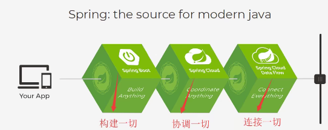
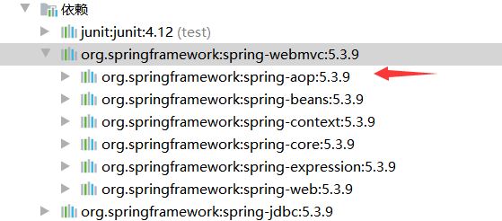
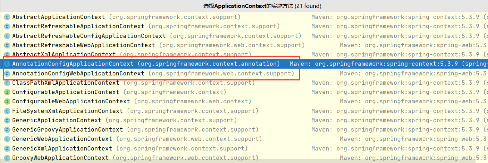
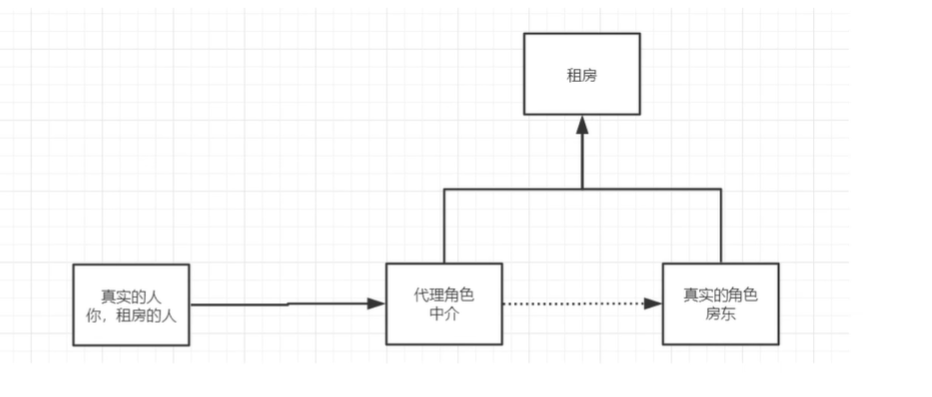
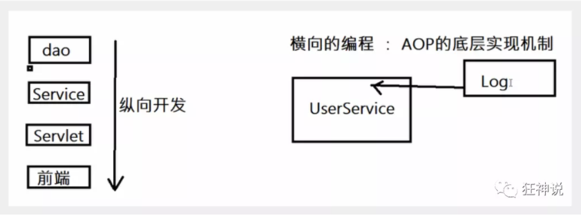
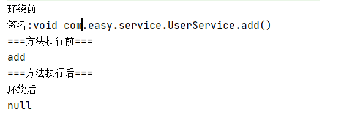
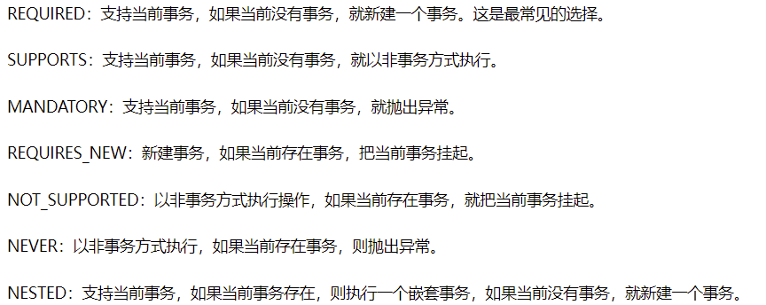

# Spring框架

## Spring

### 简介

Spring 是最受欢迎的企业级 Java 应用程序开发框架，数以百万的来自世界各地的开发人员使用 Spring 框架来创建性能好、易于测试、可重用的代码。

Spring 框架是一个开源的 Java 平台，它最初是由 Rod Johnson 编写的，并且于 2003 年 6 月首次在 Apache 2.0 许可下发布。

Spring 框架的核心特性是可以用于开发任何 Java 应用程序，但是在 Java EE 平台上构建 web 应用程序是需要扩展的。 Spring 框架的目标是使 J2EE 开发变得更容易使用，通过启用基于 POJO 编程模型来促进良好的编程实践。

> SSH：Struct2 + Spring  + Hibernate
>
> SSM：SpringMVC + Spring + Mybatis

### 相关资料

官网：https://spring.io/projects/spring-framework#overview

中文文档：https://m.w3cschool.cn/wkspring/pesy1icl.html

狂神Spring视频：https://www.bilibili.com/video/BV1WE411d7Dv

```xml
<dependencies>
    <!-- https://mvnrepository.com/artifact/org.springframework/spring-webmvc -->
    <dependency>
        <groupId>org.springframework</groupId>
        <artifactId>spring-webmvc</artifactId>
        <!--            <version>5.2.16.RELEASE</version>-->
        <!--            <version>5.1.10.RELEASE</version>-->
        <version>5.3.9</version>
    </dependency>
    <!-- https://mvnrepository.com/artifact/org.springframework/spring-jdbc -->
    <dependency>
        <groupId>org.springframework</groupId>
        <artifactId>spring-jdbc</artifactId>
        <version>5.3.9</version>
    </dependency>
</dependencies>
```

### 优点

* Spring是一个开源的免费的框架（容器）
* Spring是一个轻量级的、非入侵式的框架
* **控制反转、面向切面编程（AOP）**
* 支持事务的处理

### 组成


**核心容器（Spring Core）**

　　核心容器提供Spring框架的基本功能。Spring以bean的方式组织和管理Java应用中的各个组件及其关系。Spring使用BeanFactory来产生和管理Bean，它是工厂模式的实现。BeanFactory使用控制反转(IoC)模式将应用的配置和依赖性规范与实际的应用程序代码分开。

**应用上下文（Spring Context）**

　　Spring上下文是一个配置文件，向Spring框架提供上下文信息。Spring上下文包括企业服务，如JNDI、EJB、电子邮件、国际化、校验和调度功能。

**Spring面向切面编程（Spring AOP）**

　　通过配置管理特性，Spring AOP 模块直接将面向方面的编程功能集成到了 Spring框架中。所以，可以很容易地使 Spring框架管理的任何对象支持 AOP。Spring AOP 模块为基于 Spring 的应用程序中的对象提供了事务管理服务。通过使用 Spring AOP，不用依赖 EJB 组件，就可以将声明性事务管理集成到应用程序中。

**JDBC和DAO模块（Spring DAO）**

　　JDBC、DAO的抽象层提供了有意义的异常层次结构，可用该结构来管理异常处理，和不同数据库供应商所抛出的错误信息。异常层次结构简化了错误处理，并且极大的降低了需要编写的代码数量，比如打开和关闭链接。

**对象实体映射（Spring ORM）**

　　Spring框架插入了若干个ORM框架，从而提供了ORM对象的关系工具，其中包括了Hibernate、JDO和 IBatis SQL Map等，所有这些都遵从Spring的通用事物和DAO异常层次结构。

**Web模块（Spring Web）**

　　Web上下文模块建立在应用程序上下文模块之上，为基于web的应用程序提供了上下文。所以Spring框架支持与Struts集成，web模块还简化了处理多部分请求以及将请求参数绑定到域对象的工作。

**MVC模块（Spring Web MVC）**

　　MVC框架是一个全功能的构建Web应用程序的MVC实现。通过策略接口，MVC框架变成为高度可配置的。MVC容纳了大量视图技术，其中包括JSP、POI等，模型来有JavaBean来构成，存放于m当中，而视图是一个街口，负责实现模型，控制器表示逻辑代码，由c的事情。Spring框架的功能可以用在任何J2EE服务器当中，大多数功能也适用于不受管理的环境。Spring的核心要点就是支持不绑定到特定J2EE服务的可重用业务和数据的访问的对象，毫无疑问这样的对象可以在不同的J2EE环境，独立应用程序和测试环境之间重用。

### 拓展



在Spring的官网有这个介绍：现代化的java开发，说白就是基于Spring的开发。

* Spring Boot：
  * 一个快速开发的脚手架
  * 基于SpringBoot可以快速的开发单个微服务
  * 约定大于配置
* Spring Cloud
  * Spring Cloud是基于Spring Boot实现的

因为现在大多数公司都在使用SpringBoot进行快速开发，学习SpringBoot的前提，需要完全掌握Spring以及SpringMVC。

> 由于发展了太久，违背了原来的理念，配置十分的繁琐。

## IOC理论推导

* `UserDao`接口

```java
package com.easy.dao;

public interface UserDao {
    void getUser();
}
```

* `UserDaoImpl`实现类

```java
package com.easy.dao;

public class UserDaoImpl implements UserDao {

    public void getUser() {
        System.out.println("默认获取用户的数据");
    }
}
```

* `UserService`业务接口

```java
package com.easy.service;

public interface UserService {
    void getUser();
}
```

* `UserServiceImpl`业务实现类

```java
package com.easy.service;

import com.easy.dao.UserDao;
import com.easy.dao.UserDaoImpl;

public class UserServiceImpl implements UserService {

    private UserDao userDao;

    public void setUserDao(UserDao userDao){
        this.userDao = userDao;
    }

    public void getUser() {
        userDao.getUser();
    }
}

```

在之前的业务中，用户的需求可能会影响原来的代码，需要根据用户的需求去修改源代码。如果代码量很大，会导致修改的成本代价过大。

通过`setUserDao`接口实现，从而解决这个问题：

```java
package com.easy.service;

import com.easy.dao.UserDao;
import com.easy.dao.UserDaoImpl;

public class UserServiceImpl implements UserService {

    private UserDao userDao;

    public void setUserDao(UserDao userDao){
        this.userDao = userDao;
    }

    public void getUser() {
        userDao.getUser();;
    }
}
```

​	采用XML方式配置Bean的时候，Bean的定义信息是和实现分离的，而采用注解的方式可以把两者合为一体，Bean的定义信息直接以注解的形式定义在实现类中，从而达到了零配置的目的。

​	**控制反转是一种通过描述（XML或注解）并通过第三方去生产或获取特定对象的方式。在Spring中实现控制反转的是loC容器，其实现方法是依赖注入(Dependency Injection,Dl)。**

## 第一个实例：Hello Spring

* 创建java实体类

**com.easy.pojo.Hello.java**

```java
package com.easy.pojo;

public class Hello {
    private String str;

    public String getStr() {
        return str;
    }

    public void setStr(String str) {
        this.str = str;
    }

    @Override
    public String toString() {
        return "Hello{" +
                "str='" + str + '\'' +
                '}';
    }
}
```

* 配置元数据

**resources/beans.xml**

```xml
<?xml version="1.0" encoding="UTF-8"?>
<beans xmlns="http://www.springframework.org/schema/beans"
       xmlns:xsi="http://www.w3.org/2001/XMLSchema-instance"
       xsi:schemaLocation="http://www.springframework.org/schema/beans
        http://www.springframework.org/schema/beans/spring-beans.xsd">

    <!-- 使用Spring来创建对象，在Spring这些都称为Bean -->
    <bean id="hello" class="com.easy.pojo.Hello">
        <property name="str" value="Spring"/>
    </bean>
</beans>
```

**(1)** `id`属性是标识单个 bean 定义的字符串。

**(2)** `class`属性定义 bean 的类型并使用完全限定的类名。

**(2)** `property`为对象设置一个值。

`id`属性的值是指协作对象。在此示例中未显示用于引用协作对象的 XML。

* 实例化容器

提供给`ApplicationContext`构造函数的位置路径是资源字符串，这些资源字符串使容器可以从各种外部资源(例如本地文件系统，Java `CLASSPATH`等)加载配置元数据。

**test.java.MyTest.java**

```java
import com.easy.pojo.Hello;
import org.springframework.context.ApplicationContext;
import org.springframework.context.support.ClassPathXmlApplicationContext;

public class MyTest {
    public static void main(String[] args){
        //获取Spring的上下文对象，解析beans.xml文件，生成管理相应bean对象
        ApplicationContext context = new ClassPathXmlApplicationContext("beans.xml");
        // 我们的对象现在都是在Spring中管理，要使用，直接去里面取出来就可以
        Hello hello = (Hello) context.getBean("hello");
        System.out.println(hello.toString());
    }
}

```

* Hello对象是谁创建的？Hello对象的属性是谁设置的？
  * hello对象是由Spring创建的，hello对象的属性是由Spring设置的。这个过程就叫控制反转：
  * **控制**：谁来控制对象的创建，传统应用程序的对象是由程序本身控制创建的，使用Spring之后，对象是由Spring来创建的。
  * **反转**：程序本身不创建对象，而变成被动的接收对象。
  * **依赖注入**：就是利用set方法来进行注入的！
  * IOC是一种编程思想，由主动的编程变成被动的接受。

对**spring-01-ioc1**进行改写：

```xml
<?xml version="1.0" encoding="UTF-8"?>
<beans xmlns="http://www.springframework.org/schema/beans"
       xmlns:xsi="http://www.w3.org/2001/XMLSchema-instance"
       xsi:schemaLocation="http://www.springframework.org/schema/beans
        http://www.springframework.org/schema/beans/spring-beans.xsd">

    <!-- 使用Spring来创建对象，在Spring这些都称为Bean -->
    <bean id="mysqlImpl" class="com.easy.dao.UserDaoMysqlImpl"/>
    <bean id="oracleImpl" class="com.easy.dao.UserDaoOracleImpl"/>
    <bean id="UserServiceImpl" class="com.easy.service.UserServiceImpl">
        <!-- 引用Spring容器中创建好的对象 -->
        <property name="userDao" ref="mysqlImpl"/>
    </bean>
</beans>
```

**测试类**

```java
import com.easy.service.UserServiceImpl;
import org.springframework.context.ApplicationContext;
import org.springframework.context.support.ClassPathXmlApplicationContext;

public class MyTest {
    public static void main(String[] args){
        ApplicationContext context = new ClassPathXmlApplicationContext("beans.xml");

        // 用户实际调用的是业务层，dao层不需要他们接触
        UserServiceImpl userServiceImpl = (UserServiceImpl)  context.getBean("UserServiceImpl");
        userServiceImpl.getUser();
    }

}
```

## IOC对象创建方式

1. 使用无参构造对象，默认
2. 使用有参构造对象：

* 通过下标创建

```xml
<?xml version="1.0" encoding="UTF-8"?>
<beans xmlns="http://www.springframework.org/schema/beans"
       xmlns:xsi="http://www.w3.org/2001/XMLSchema-instance"
       xsi:schemaLocation="http://www.springframework.org/schema/beans
        http://www.springframework.org/schema/beans/spring-beans.xsd">
    <bean id="user" class="com.easy.pojo.User">
        <constructor-arg index="0" value="LW"/>
    </bean>
</beans>
```

* 通过类型创建

```xml
<?xml version="1.0" encoding="UTF-8"?>
<beans xmlns="http://www.springframework.org/schema/beans"
       xmlns:xsi="http://www.w3.org/2001/XMLSchema-instance"
       xsi:schemaLocation="http://www.springframework.org/schema/beans
        http://www.springframework.org/schema/beans/spring-beans.xsd">
    <bean id="user" class="com.easy.pojo.User">
        <constructor-arg type="java.lang.String" value="LW"/>
    </bean>
</beans>
```

* 通过参数名创建

```xml
<?xml version="1.0" encoding="UTF-8"?>
<beans xmlns="http://www.springframework.org/schema/beans"
       xmlns:xsi="http://www.w3.org/2001/XMLSchema-instance"
       xsi:schemaLocation="http://www.springframework.org/schema/beans
        http://www.springframework.org/schema/beans/spring-beans.xsd">
    <bean id="user" class="com.easy.pojo.User">
        <constructor-arg name="s" value="LW"/>
    </bean>
</beans>
```

总结：在配置文件加载的时候，容器中管理的对象就已经初始化了！

## Spring配置

### 别名

```xml
<alias name="user" alias="customer"/>
```

如果添加了别名，也可以使用别名获取到这个对象。

### Bean的配置

```xml
<bean id="user" class="com.easy.pojo.User" name="user2,u2">
    <property name="name" value="name" />
</bean>
```

* `id`：bean的唯一标识符，也就是相当于学过的对象名
* `class`：bean对象所对应的全限定名（包名+类型）
* `name`：也是别名，而且可以同时取多个别名

### import

import一般用于团队开发使用，可以将多个配置文件，导入合并为一个。

假设，现在项目中有多个人开发，这三个人复制不同的类开发，不同的类需要注册在不同的bean中，我们可以利用import将所有人的beans.xml合并为一个总的！

**applicationContext.xml**

```xml
<?xml version="1.0" encoding="UTF-8"?>
<beans xmlns="http://www.springframework.org/schema/beans"
       xmlns:xsi="http://www.w3.org/2001/XMLSchema-instance"
       xsi:schemaLocation="http://www.springframework.org/schema/beans
        http://www.springframework.org/schema/beans/spring-beans.xsd">

    <import resource="beans.xml" />
    <import resource="beans2.xml" />
    <import resource="beans3.xml" />
</beans>
```

## 依赖注入

### 构造器注入

前面已经叙说过了。。

### set方式注入

#### 概念

* 依赖注入：set注入
  * 依赖：bean对象的创建依赖于容器
  * 注入：bean对象中的所有属性，由容器来注入！

#### 【环境搭建】

* 创建**spring-04-di**工程
* 创建**com.easy.pojo.Student**实体类

```java
package com.easy.pojo;

import java.util.*;

public class Student {
    private String name;
    private Address address;
    private String[] books;
    private List<String> hobbys;
    private Map<String,String> card;
    private Set<String> games;
    private String wife;
    private Properties info;

    public String getName() {
        return name;
    }

    public void setName(String name) {
        this.name = name;
    }

    public Address getAddress() {
        return address;
    }

    public void setAddress(Address address) {
        this.address = address;
    }

    public String[] getBooks() {
        return books;
    }

    public void setBooks(String[] books) {
        this.books = books;
    }

    public List<String> getHobbys() {
        return hobbys;
    }

    public void setHobbys(List<String> hobbys) {
        this.hobbys = hobbys;
    }

    public Map<String, String> getCard() {
        return card;
    }

    public void setCard(Map<String, String> card) {
        this.card = card;
    }

    public Set<String> getGames() {
        return games;
    }

    public void setGames(Set<String> games) {
        this.games = games;
    }

    public String getWife() {
        return wife;
    }

    public void setWife(String wife) {
        this.wife = wife;
    }

    public Properties getInfo() {
        return info;
    }

    public void setInfo(Properties info) {
        this.info = info;
    }

    @Override
    public String toString() {
        return "Student{" +
                "name='" + name + '\'' +
                ", address=" + address +
                ", books=" + Arrays.toString(books) +
                ", hobbys=" + hobbys +
                ", card=" + card +
                ", games=" + games +
                ", wife='" + wife + '\'' +
                ", info=" + info +
                '}';
    }
}

```

* 创建**com.easy.pojo.Address**实体类

```java
package com.easy.pojo;

public class Address {
    private String address;

    public String getAddress() {
        return address;
    }

    public void setAddress(String address) {
        this.address = address;
    }
}

```

* 创建**beans.xml**

```xml
<?xml version="1.0" encoding="UTF-8"?>
<beans xmlns="http://www.springframework.org/schema/beans"
       xmlns:xsi="http://www.w3.org/2001/XMLSchema-instance"
       xsi:schemaLocation="http://www.springframework.org/schema/beans
        http://www.springframework.org/schema/beans/spring-beans.xsd">
    <bean id="student" class="com.easy.pojo.Student">
        <property name="name" value="逗比" />
    </bean>
</beans>
```

* 测试

```java
import com.easy.pojo.Student;
import org.springframework.context.ApplicationContext;
import org.springframework.context.support.ClassPathXmlApplicationContext;

public class MyTest {
    public static void main(String[] args){
        ApplicationContext context = new ClassPathXmlApplicationContext("beans.xml");
        Student student = (Student) context.getBean("student");
        System.out.println(student.getName());
    }
}
```

#### 注入方式

##### 常量注入

```xml
<!--常量注入-->
<bean id="student" class="com.easy.pojo.Student">
    <property name="name" value="逗比" />
</bean>
```

##### Bean注入

```xml
<!--Bean注入-->
<bean id="addr" class="com.easy.pojo.Address">
    <property name="address" value="China"/>
</bean>
<bean id="student" class="com.easy.pojo.Student">
    <property name="name" value="美食" />
    <property name="address" ref="addr"/>
</bean>
```

##### 数组注入

```xml
<!--数组注入-->
<bean id="student" class="com.easy.pojo.Student">
    <property name="name" value="无敌" />
    <property name="address" ref="addr"/>
    <property name="books">
        <array>
            <value>金</value>
            <value>平</value>
            <value>美</value>
        </array>
    </property>
</bean>
```

##### List注入

```xml
<!--List注入-->
<bean id="student" class="com.easy.pojo.Student">
    <property name="name" value="阿呆"/>
    <property name="hobbys">
        <list>
            <value>音乐</value>
            <value>程序</value>
        </list>
    </property>
</bean>
```

##### Map注入

```xml
<!--Map注入-->
<bean id="student" class="com.easy.pojo.Student">
    <property name="card">
        <map>
            <entry key="逗" value="比"></entry>
        </map>
    </property>
</bean>
```

##### set注入

```xml
<!--Set注入-->
<bean id="student" class="com.easy.pojo.Student">
    <property name="games">
        <set>
            <value>LOL</value>
            <value>Plants</value>
        </set>
    </property>
</bean>
```

##### Null注入

```xml
<!--Null注入-->
<bean id="student" class="com.easy.pojo.Student">
    <property name="wife"><null/></property>
</bean>
```

##### Properties注入

```xml
<!--Properties注入-->
<bean id="student" class="com.easy.pojo.Student">
    <property name="info">
        <props>
            <prop key="学号">001007</prop>
            <prop key="性别">男</prop>
            <prop key="姓名">小豆</prop>
        </props>
    </property>
</bean>
```

> 有类似与Map

### 标签注入

* 创建**User.java**

```java
package com.easy.pojo;

public class User {
    private String name;
    private int age;

    public User(String name, int age) {
        this.name = name;
        this.age = age;
    }

    public String getName() {
        return name;
    }

    public void setName(String name) {
        this.name = name;
    }

    public int getAge() {
        return age;
    }

    public void setAge(int age) {
        this.age = age;
    }
}

```

* 创建**resourcse/userBeans.xml**

```xml
<?xml version="1.0" encoding="UTF-8"?>
<beans xmlns="http://www.springframework.org/schema/beans"
       xmlns:xsi="http://www.w3.org/2001/XMLSchema-instance"
       xmlns:p="http://www.springframework.org/schema/p"
       xsi:schemaLocation="http://www.springframework.org/schema/beans
        http://www.springframework.org/schema/beans/spring-beans.xsd">

</beans>
```

#### p命名空间注入/设置属性

* 需要在头文件中加入约束文件

```xml
xmlns:p="http://www.springframework.org/schema/p"
```

* 设置属性

```xml
<bean id="user" class="com.easy.pojo.User" p:name="勇者" p:age="16"/>
```

> p命名空间注入可以进行设置属性，代替**properties**

* 测试

```java
@Test
public void test2(){
    ApplicationContext context = new ClassPathXmlApplicationContext("userBeans.xml");
    User user = context.getBean("user",User.class);
    System.out.println(user);
}
```

>  如果不想强转类型，可以这样写`User user = context.getBean("user",User.class);`

#### c命名空间注入/设置有参构造器

* 需要在头文件中加入约束文件

```xml
xmlns:c="http://www.springframework.org/schema/c"
```

* 设置有参构造器

```xml
<bean id="user2" class="com.easy.pojo.User" c:age="18" c:name="勇者"/>
```

如果类中没有有参构造器，会报错。

## Bean的作用域

| Scope                                                        | Description                                                  |
| :----------------------------------------------------------- | :----------------------------------------------------------- |
| [singleton](https://docs.spring.io/spring-framework/docs/5.2.0.RELEASE/spring-framework-reference/core.html#beans-factory-scopes-singleton) | (Default) Scopes a single bean definition to a single object instance for each Spring IoC container. |
| [prototype](https://docs.spring.io/spring-framework/docs/5.2.0.RELEASE/spring-framework-reference/core.html#beans-factory-scopes-prototype) | Scopes a single bean definition to any number of object instances. |
| [request](https://docs.spring.io/spring-framework/docs/5.2.0.RELEASE/spring-framework-reference/core.html#beans-factory-scopes-request) | Scopes a single bean definition to the lifecycle of a single HTTP request. That is, each HTTP request has its own instance of a bean created off the back of a single bean definition. Only valid in the context of a web-aware Spring `ApplicationContext`. |
| [session](https://docs.spring.io/spring-framework/docs/5.2.0.RELEASE/spring-framework-reference/core.html#beans-factory-scopes-session) | Scopes a single bean definition to the lifecycle of an HTTP `Session`. Only valid in the context of a web-aware Spring `ApplicationContext`. |
| [application](https://docs.spring.io/spring-framework/docs/5.2.0.RELEASE/spring-framework-reference/core.html#beans-factory-scopes-application) | Scopes a single bean definition to the lifecycle of a `ServletContext`. Only valid in the context of a web-aware Spring `ApplicationContext`. |
| [websocket](https://docs.spring.io/spring-framework/docs/5.2.0.RELEASE/spring-framework-reference/web.html#websocket-stomp-websocket-scope) | Scopes a single bean definition to the lifecycle of a `WebSocket`. Only valid in the context of a web-aware Spring `ApplicationContext`. |

* 单例模式（Spring默认机制）

```xml
<bean id="user2" class="com.easy.pojo.User" c:age="18" c:name="勇者" scope="singleton"/>
```

* 原型模式：每次从容器中get的时候，都会产生一个新对象！

```xml
<bean id="user2" class="com.easy.pojo.User" c:age="18" c:name="勇者" scope="prototype"/>
```

* 其余的request（请求）、session（会话）、application（全局），这些只能在web开发中使用。

## Bean的自动装配

### 概念

* 自动装配是Spring满足bean依赖一种方式
* Spring会在上下文中自动寻找，并自动给bean装配属性

在Spring中有三种装配方式：

1. 在xml中显示的配置
2. 在java中显示配置
3. 隐式的自动装配bean【重要】

### 配置

* 创建**spring-05-Autowired**工程目录

* 创建**com.easy.pojo**包

  * 创建**Cat**类

  ```java
  package com.easy.pojo;
  
  public class Cat {
      public void action(){
          System.out.println("miao~");
      }
  }
  ```

  * 创建**Dog类**

  ```java
  package com.easy.pojo;
  
  public class Dog {
      public void action(){
          System.out.println("wang~");
      }
  }
  ```

  * 创建**People**类

  ```java
  package com.easy.pojo;
  
  public class People {
      private Cat cat;
      private Dog dog;
      private String name;
  
      public Cat getCat() {
          return cat;
      }
  
      public void setCat(Cat cat) {
          this.cat = cat;
      }
  
      public Dog getDog() {
          return dog;
      }
  
      public void setDog(Dog dog) {
          this.dog = dog;
      }
  
      public String getName() {
          return name;
      }
  
      public void setName(String name) {
          this.name = name;
      }
  
      @Override
      public String toString() {
          return "People{" +
                  "cat=" + cat +
                  ", dog=" + dog +
                  ", name='" + name + '\'' +
                  '}';
      }
  }
  
  ```

* 创建**resources/beans.xml**

```xml
<?xml version="1.0" encoding="UTF-8"?>
<beans xmlns="http://www.springframework.org/schema/beans"
       xmlns:xsi="http://www.w3.org/2001/XMLSchema-instance"
       xsi:schemaLocation="http://www.springframework.org/schema/beans
        http://www.springframework.org/schema/beans/spring-beans.xsd">

    <bean id="cat" class="com.easy.pojo.Cat" />
    <bean id="dog" class="com.easy.pojo.Dog" />

    <bean id="people" class="com.easy.pojo.People">
        <property name="name" value="小明" />
        <property name="cat" ref="cat" />
        <property name="dog" ref="dog" />
    </bean>
</beans>
```

* 测试

```java
import com.easy.pojo.People;
import org.junit.Test;
import org.springframework.context.ApplicationContext;
import org.springframework.context.support.ClassPathXmlApplicationContext;

public class Mytest {
    @Test
    public void test(){
        ApplicationContext context = new ClassPathXmlApplicationContext("beans.xml");

        People people = context.getBean("people",People.class);

        System.out.println(people.toString());
    }
}
```

### 自动装配

#### autowire byName (按名称自动装配)

由于在手动配置xml过程中，常常发生字母缺漏和大小写等错误，而无法对其进行检查，使得开发效率降低。

**采用自动装配将避免这些错误，并且使配置简单化。**

* 修改bean配置，增加一个属性  **autowire="byName"**

```xml
<bean id="people" class="com.easy.pojo.People" autowire="byName">
    <property name="name" value="小明" />
</bean>
```

该方法会自动在容器上下文中查找，和自己对象set方法后面的值对应的**bean.id**。

#### autowire byType (按类型自动装配)

使用autowire byType首先需要保证：同一类型的对象，在spring容器中唯一。如果不唯一，会报不唯一的异常。

```
NoUniqueBeanDefinitionException
```

* 修改bean配置，增加一个属性  **autowire="byType"**

```xml
<bean id="cat2" class="com.easy.pojo.Cat" />
<bean id="dog2" class="com.easy.pojo.Dog" />
<bean id="people" class="com.easy.pojo.People" autowire="byType">
    <property name="name" value="小明" />
</bean>
```

> 1. byname的时候，需要保证所有bean的id唯一，并且这个bean需要和自动注入的属性的set方法值一致。
> 2. bytype的时候，需要保证所有bean的class唯一，并且这个bean需要和自动注入的属性的类型一致。

#### 使用注解实现自动装配

jdk1.5开始支持注解，spring2.5开始全面支持注解。

要使用注解须知：

* 导入约束
* 配置注解的支持

```xml
<?xml version="1.0" encoding="UTF-8"?>
<beans xmlns="http://www.springframework.org/schema/beans"
    xmlns:xsi="http://www.w3.org/2001/XMLSchema-instance"
    xmlns:context="http://www.springframework.org/schema/context"
    xsi:schemaLocation="http://www.springframework.org/schema/beans
        https://www.springframework.org/schema/beans/spring-beans.xsd
        http://www.springframework.org/schema/context
        https://www.springframework.org/schema/context/spring-context.xsd">
    
    <!-- 开启注解支持 -->
    <context:annotation-config />

</beans>
```

> ==<context:annotation-config />==必须有

##### @Autowired

- @Autowired是按类型自动转配的，不支持id匹配。
- 需要导入 spring-aop的包！

1. 将User类中的set方法去掉，使用@Autowired注解

```java
package com.easy.pojo;

import org.springframework.beans.factory.annotation.Autowired;

public class People {
    @Autowired
    private Cat cat;
    @Autowired
    private Dog dog;
    private String name;

    public Cat getCat() {
        return cat;
    }

    public Dog getDog() {
        return dog;
    }

    public String getName() {
        return name;
    }

    @Override
    public String toString() {
        return "People{" +
                "cat=" + cat +
                ", dog=" + dog +
                ", name='" + name + '\'' +
                '}';
    }
}
```

2. 配置**Beans.xml**文件

```xml
<!-- 开启注解支持 -->
<context:annotation-config />

<bean id="cat" class="com.easy.pojo.Cat" />
<bean id="dog" class="com.easy.pojo.Dog" />
<bean id="people" class="com.easy.pojo.People"/>
```

**@Autowired(required=false)**  说明：false，对象可以为null；true，对象必须存对象，不能为null。

```java
//如果允许对象为null，设置required = false,默认为true
@Autowired(required = false)
private Cat cat;
```

**@Nullable** 注解可以使字段为null

由于Autowired默认是按类型注入，让出现多个bean引用同一个实体类时，会报错，才需要用**@Qualifier**按照指定id名进行注入

> @Inject代替@Autowired。完成自动装配

##### @Qualifier

- @Autowired是根据类型自动装配的，加上@Qualifier则可以根据byName的方式自动装配
- @Qualifier不能单独使用。

1. 配置文件修改内容，保证类型存在对象。且名字不为类的默认名字！

```xml
<bean id="cat1" class="com.easy.pojo.Cat" />
<bean id="cat2" class="com.easy.pojo.Cat" />
<bean id="dog1" class="com.easy.pojo.Dog" />
<bean id="dog2" class="com.easy.pojo.Dog" />
```

2. 没有加Qualifier测试，直接报错
3. 在属性上添加Qualifier注解

```java
@Autowired
@Qualifier(value = "cat2")
private Cat cat;

@Autowired
@Qualifier(value = "dog1")
private Dog dog;
```

##### @Resource

- @Resource如有指定的name属性，先按该属性进行byName方式查找装配；
- 其次再进行默认的byName方式进行装配；
- 如果以上都不成功，则按byType的方式自动装配。
- 都不成功，则报异常。

结论：先进行byName查找，失败；再进行byType查找，成功。

##### @Autowired与@Resource的区别

@Autowired与@Resource异同：

1. @Autowired与@Resource**都可以用来装配bean**。都可以写在字段上，或写在setter方法上。

2. **@Autowired默认按类型装配**（属于spring规范），默认情况下必须要求依赖对象必须存在，如果要允许null 值，可以设置它的required属性为false，如：@Autowired(required=false) ，如果我们想使用名称装配可以结合@Qualifier注解进行使用

3. **@Resource（属于J2EE复返），默认按照名称进行装配**，名称可以通过name属性进行指定。如果没有指定name属性，当注解写在字段上时，默认取字段名进行按照名称查找，如果注解写在setter方法上默认取属性名进行装配。当找不到与名称匹配的bean时才按照类型进行装配。但是需要注意的是，如果name属性一旦指定，就只会按照名称进行装配。

它们的作用相同都是用注解方式注入对象，但执行顺序不同。**@Autowired先byType，@Resource先byName。**

## 使用注解开发

### 流程

在Spring4之后，要使用注解开发，必须要保证aop的包导入



在配置文件中，引入**context**约束

```xml
<?xml version="1.0" encoding="UTF-8"?>
<beans xmlns="http://www.springframework.org/schema/beans"
      xmlns:xsi="http://www.w3.org/2001/XMLSchema-instance"
      xmlns:context="http://www.springframework.org/schema/context"
      xsi:schemaLocation="http://www.springframework.org/schema/beans
       http://www.springframework.org/schema/beans/spring-beans.xsd
       http://www.springframework.org/schema/context
       http://www.springframework.org/schema/context/spring-context.xsd">

    <context:annotation-config />
</beans>
```

**我们之前都是使用 bean 的标签进行bean注入，但是实际开发中，我们一般都会使用注解！**

### Bean的实现

* 配置扫描那些包下的注解

```xml
<!-- 指定要扫描的包，这个包下的注解就会生效-->
<context:component-scan base-package="com.easy.pojo" />
<context:annotation-config />
```

* 在指定包下编写类，增加注解

```java
package com.easy.pojo;

import org.springframework.stereotype.Component;

@Component // <=> <bean id="user" class="com.easy.pojo.User"/>
public class User {
    private String name = "123";

    public String getName() {
        return name;
    }
}

```

若想更改注册名称，如下操作：

```java
@Component("user2")
```

* 测试

```java
import com.easy.pojo.User;
import org.junit.Test;
import org.springframework.context.ApplicationContext;
import org.springframework.context.support.ClassPathXmlApplicationContext;

public class MyTest {
    @Test
    public void test(){
        ApplicationContext context = new ClassPathXmlApplicationContext("beans.xml");
        User user = context.getBean("user2",User.class);
        System.out.println(user.getName());
    }
}
```

### 属性注入

使用注解注入属性

* **可以不用提供set方法**，直接在直接名上添加**@value("值")**

```java
@Value("123") // <=> 相当于配置文件中 <property name="name" value="123"/>
private String name;
```

* 如果**提供了set方法**，在set方法上添加**@value("值");**

```java
package com.easy.pojo;

import org.springframework.beans.factory.annotation.Value;
import org.springframework.stereotype.Component;

@Component("user") // <=> <bean id="user" class="com.easy.pojo.User"/>
public class User {
    private String name;
    
    @Value("123")
    public void setName(String name) {
        this.name = name;
    }

    public String getName() {
        return name;
    }
}

```

### 衍生的注解

**@Component有几个衍生注解**。为了更好的进行分层，Spring可以使用其它三个注解，功能一样，目前使用哪一个功能都一样。

* dao：**@Repository**
* service：**@Service**
* controller：**@Controller**

这四个注解功能都是一样的，都是代表将某个类注册到Spring中，装配Bean。

### 自动装配

如上

### 作用域

**@scope**

- **singleton**：默认的，Spring会采用单例模式创建这个对象。关闭工厂 ，所有的对象都会销毁。
- **prototype**：多例模式。关闭工厂 ，所有的对象不会销毁。内部的垃圾回收机制会回收

```java
package com.easy.pojo;

import org.springframework.context.annotation.Scope;
import org.springframework.stereotype.Component;

@Component("user")
@Scope("prototype")
public class User {
    ...
}
```

### 小结

xml与注解：

* xml更加万能，适用于任何场合，维护简单方便。
* 注解 不是自己类使用不了，维护相对复杂

xml与注解最佳实践：

* xml用来管理bean
* 注解只负责属性注入
* 在使用过程中，只需要注意一个问题：必须让注解生效，就需要开启注解的支持！

```xml
<!-- 指定要扫描的包，这个包下的注解就会生效-->
<context:component-scan base-package="com.xxx.xxx" />
<context:annotation-config />
```

## 使用java的方式配置Spring

现在要完全不使用Spring的xml配置了，全权交给java来做！

JavaConfig是Spring的一个子项目，在Spring4之后，它成为了一个核心功能！



* 创建**spring-07-appconfig**工程目录
* 创建实体类**com.easy.pojo.User.java**

```java
package com.easy.pojo;

import org.springframework.beans.factory.annotation.Value;

public class User {
    private String name;

    public String getName() {
        return name;
    }

    @Value("123")
    public void setName(String name) {
        this.name = name;
    }

    @Override
    public String toString() {
        return "User{" +
                "name='" + name + '\'' +
                '}';
    }
}
```

* 创建配置文件**com.easy.config.AppConfig.java**

```java
package com.easy.config;

import org.springframework.context.annotation.Bean;
import org.springframework.context.annotation.ComponentScan;
import org.springframework.context.annotation.Configuration;
import com.easy.pojo.User;

//这个也会Spring容器托管，注册到容器中，因为他本来就是一个@Component。
//@Configuration代表这是一个配置类，就和我们之前看的beans.xml
@Configuration
@ComponentScan("com.easy.pojo")
public class AppConfig {

    @Bean
    public User getUser(){
        return new User();
    }
}
```

注册一个bean，就相当于之前写的一个bean标签。

1. 这个方法的名字，就相当丁bean标签中的**id属性**
2. 这个方法的返回值，就相当于 bean标签中的**class属性**

* 测试

```java
import com.easy.config.AppConfig;
import org.junit.Test;
import org.springframework.context.ApplicationContext;
import org.springframework.context.annotation.AnnotationConfigApplicationContext;
import org.springframework.context.support.ClassPathXmlApplicationContext;
import com.easy.pojo.User;

public class MyTest {
    @Test
    public void test(){
        //如果完全使用了配置类方式去做，我们就只能通过 AnnotationConfig 上下文来获取容器，通过配置类的cLass对象加载!
        ApplicationContext context = new AnnotationConfigApplicationContext(AppConfig.class);
		User user = context.getBean("getUser",User.class);
        System.out.println(user.getName());
    }
}
```

注意`context.getBean("getUser",User.class)`中填写的是方法名称。

**如果完全使用了配置类方式去做，我们就只能通过 AnnotationConfig 上下文来获取容器，通过配置类的class对象加载！**

* 如何写多个beans，和之前的多个beans.xml一样

1. 创建**appConfig2.java**

```java
package com.easy.config;

import org.springframework.context.annotation.Configuration;

@Configuration
public class AppConfig2 {
}
```

2. 通过使用**Import**进行导入

```java
@Import(AppConfig2.class)
public class AppConfig {
    ...
}
```

> 纯Java的配置方式，在Springboot随处可见。

## 代理模式

为什么要学习代理模式？因为这就是SpringAOP的底层！【SpringAOP和SpringMVC】

代理模式的分类：

* 静态代理
* 动态代理



### 静态代理

角色分析：

* 抽象角色：一般会使用接口或者抽象类来解决
* 真实角色：被代理的角色
* 代理角色：代理真实角色，代理真实角色后，一般会做一些附属操作。
* 客户：访问代理对象的人。

**Rent. java** 即抽象角色

```java
package com.easy.demo1;

// 租房
public interface  Rent {
    public void rent();
}
```

**Host.java** 即真实角色

```java
package com.easy.demo1;

// 房东
public class Host implements Rent {

    public void rent() {
        System.out.println("出租房子");
    }
}
```

**Proxy.java** 即代理角色

```java
package com.easy.demo1;

public class Proxy {
    private Host host;

    public Proxy(){};

    public Proxy(Host host) {
        this.host = host;
    }

    public void rent(){
        host.rent();
    }

    public void seeHouse(){
        System.out.println("看房");
    }

    public void fare(){
        System.out.println("收中介费");
    }

    public void contract(){
        System.out.println("签租赁合同");
    }
}
```

**Client.java** 即客户

```java
package com.easy.demo1;

public class Client {
    public static void main(String[] args){
        // 房东要出租房子
        Host host = new Host();
        // 代理，中介帮房东出租房子，代理一般会有一些附属操作
        Proxy proxy = new Proxy(host);
        // 不用面对房东，直接找中介租房即可！
        proxy.rent();
    }
}
```

**分析**：在这个过程中，你直接接触的就是中介，就如同现实生活中的样子，你看不到房东，但是你依旧租到了房东的房子通过代理，这就是所谓的代理模式，程序源自于生活，所以学编程的人，一般能够更加抽象的看待生活中发生的事情。

**静态代理的好处:**

- 可以使得我们的真实角色更加纯粹 ，不再去关注一些公共的事情
- 公共的业务由代理来完成 ，实现了业务的分工
- 公共业务发生扩展时，变得更加集中和方便

**缺点** :

- 类多了 , 多了代理类 , 工作量变大了 . 开发效率降低 .

我们想要静态代理的好处，又不想要静态代理的缺点，所以 , 就有了动态代理 !

### 静态代理再理解

1、创建一个抽象角色，比如咋们平时做的用户业务，抽象起来就是增删改查！

```java
package com.easy.demo2;

public interface UserService {
    public void add();
    public void delete();
    public void update();
    public void query();
}
```

2、我们需要一个真实对象来完成这些增删改查操作

```java
package com.easy.demo2;

public class UserServiceImpl implements UserService {

    @Override
    public void add() {
        System.out.println("add");
    }

    @Override
    public void delete() {
        System.out.println("delete");
    }

    @Override
    public void update() {
        System.out.println("update");
    }

    @Override
    public void query() {
        System.out.println("query");
    }
}
```

3、需求来了，现在我们需要增加一个日志功能，怎么实现！

- 思路1 ：在实现类上增加代码 【麻烦！】
- 思路2：使用代理来做，能够不改变原来的业务情况下，实现此功能就是最好的了！

4、设置一个代理类来处理日志！代理角色

```java
package com.easy.demo2;

public class UserServiceProxy implements UserService {

    public UserServiceImpl userService;

    public void setUserService(UserServiceImpl userService) {
        this.userService = userService;
    }

    @Override
    public void add() {
        log("add");
        userService.add();
    }

    @Override
    public void delete() {
        log("delete");
        userService.delete();
    }

    @Override
    public void update() {
        log("update");
        userService.update();
    }

    @Override
    public void query() {
        log("query");
        userService.query();
    }

    // 日志方法
    public void log(String msg){
        System.out.printf("使用了%s方法\n",msg);
    }
}
```

5、测试访问类：

```java
package com.easy.demo2;

public class Client {
    public static void main(String[] args){
        UserServiceImpl userService = new UserServiceImpl();

        UserServiceProxy proxy = new UserServiceProxy();
        proxy.setUserService(userService);

        proxy.query();
    }
}
```

OK，到了现在代理模式大家应该都没有什么问题了，重点大家需要理解其中的思想；

我们在不改变原来的代码的情况下，实现了对原有功能的增强，这是AOP中最核心的思想

聊聊AOP：纵向开发，横向开发



### 动态代理

* 动态代理和静态代理角色一样
* 动态代理的代理类是动态生成的，不是直接写好的！

* 动态代理分为两大类：基于接口的动态代理，基于类的动态代理
  * 基于接口———JDK动态代理
  * 基于类：cglib
  * java字节码实现：JAVAssist

关于java字节码的处理，有很多工具，如bcel，asm。不过这些都需要直接跟[虚拟机](https://baike.baidu.com/item/虚拟机)指令打交道。如果你不想了解虚拟机指令，可以采用javassist。**javassist**是[jboss](https://baike.baidu.com/item/jboss)的一个子项目，其主要的优点，在于简单，而且快速。直接使用java编码的形式，而不需要了解虚拟机指令，就能动态改变类的结构，或者动态生成类。


需要了解两个类：Proxy，InvocationHandler

* `InvocationHandler`是通过一个代理实例零调用处理程序实现的接口。 
* `Proxy`提供了创建动态代理类和实例的静态方法，也是由这些方法创建的所有动态代理类的超类。 

改写上面的**静态代理实例2**

* **UserService.java**和**UserServiceImpl.java**不变
* 将**UserServiceProxy.java**改为**ProxyInvocationHandler.java**

```java
package com.easy.demo4;

import com.easy.demo3.Rent;

import java.lang.reflect.InvocationHandler;
import java.lang.reflect.Method;
import java.lang.reflect.Proxy;

// 使用该类，自动生成代理类！
public class ProxyInvocationHandler implements InvocationHandler {

    // 被代理的接口
    private Object target;

    public void setTarget(Object target) {
        this.target = target;
    }

    // 生成得到代理类
    public Object getProxy(){
        return Proxy.newProxyInstance(this.getClass().getClassLoader(),target.getClass().getInterfaces(),this);
    }

    // 处理代理实例，并返回结果
    @Override
    public Object invoke(Object proxy, Method method, Object[] args) throws Throwable {
        log(method.getName());
        // 动态代理的本质，就是使用反射机制实现
        Object result = method.invoke(target,args);
        return result;
    }

    // 日志方法
    public void log(String msg){
        System.out.printf("使用了%s方法\n",msg);
    }
}
```

* 测试类

```java
package com.easy.demo4;

import com.easy.demo2.UserService;
import com.easy.demo2.UserServiceImpl;

public class Client {
    public static void main(String[] args){
        // 真实角色
        UserServiceImpl userService = new UserServiceImpl();
        // 代理角色：不存在
        ProxyInvocationHandler pih = new ProxyInvocationHandler();
        // 设置要代理的对象
        pih.setTarget(userService);
        // 动态生成代理类
        UserService proxy = (UserService) pih.getProxy();

        proxy.delete();
    }
}
```

动态代理的好处：

* 可以使得我们的真实角色更加纯粹 ，不再去关注一些公共的事情
* 公共的业务由代理来完成 ，实现了业务的分工
* 公共业务发生扩展时，变得更加集中和方便
* 一个动态代理类代理的是一个接口，一般就是对应的一类业务
* 一个动态代理类可以代理多个类，只要是实现了同一个接口即可

## AOP

### 什么是AOP

AOP（Aspect Oriented Programming）意为：面向切面编程，通过预编译方式和运行期动态代理实现程序功能的统一维护的一种技术。AOP是OOP的延续，是软件开发中的一个热点，也是Spring框架中的一个重要内容，是函数式编程的一种衍生范型。利用AOP可以对业务逻辑的各个部分进行隔离，从而使得业务逻辑各部分之间的耦合度降低，提高程序的可重用性，同时提高了开发的效率。


### AOP在Spring中的作用

提供声明式事务；允许用户自定义切面

以下名词需要了解下：

- 横切关注点：跨越应用程序多个模块的方法或功能。即是，与我们业务逻辑无关的，但是我们需要关注的部分，就是横切关注点。如日志 , 安全 , 缓存 , 事务等等 ....
- 切面（ASPECT）：横切关注点 被模块化 的特殊对象。即，它是一个类。
- 通知（Advice）：切面必须要完成的工作。即，它是类中的一个方法。
- 目标（Target）：被通知对象。
- 代理（Proxy）：向目标对象应用通知之后创建的对象。
- 切入点（PointCut）：切面通知 执行的 “地点”的定义。
- 连接点（JointPoint）：与切入点匹配的执行点。


SpringAOP中，通过Advice定义横切逻辑，Spring中支持5种类型的Advice:


即 Aop 在 不改变原有代码的情况下 , 去增加新的功能 。

### 使用Spring实现AOP

【重点】使用AOP织入，需要导入一个依赖包！

```xml
<!-- https://mvnrepository.com/artifact/org.aspectj/aspectjweaver -->
<dependency>
   <groupId>org.aspectj</groupId>
   <artifactId>aspectjweaver</artifactId>
   <version>1.9.4</version>
</dependency>
```

#### 第一种方式：通过Spring API实现

* 编写业务接口和实现类

1. **UserService.java**

```java
package com.easy.service;

public interface UserService {
    public void add();
    public void delete();
    public void update();
    public void query();
}
```

2. **UserServiceImpl.java**

```java
package com.easy.service;

public class UserServiceImpl implements UserService {

    public void add() {
        System.out.println("add");
    }

    public void delete() {
        System.out.println("delete");
    }

    public void update() {
        System.out.println("update");
    }

    public void query() {
        System.out.println("query");
    }
}
```

* 然后写增强类 , 编写两个 , 一个前置增强 一个后置增强

1. **BeforeLog.java**

```java
package com.easy.log;

import org.springframework.aop.MethodBeforeAdvice;

import java.lang.reflect.Method;

public class BeforeLog implements MethodBeforeAdvice {

    // method:要执行的目标对象方法
    // args:参数
    // target:目标对象
    public void before(Method method, Object[] args, Object target) throws Throwable {
        System.out.println(target.getClass().getName()+"的"+method.getName()+"被执行了");
    }
}
```

2. **AfterLog.java**

```java
package com.easy.log;

import org.springframework.aop.AfterAdvice;
import org.springframework.aop.AfterReturningAdvice;

import java.lang.reflect.Method;

public class AfterLog implements AfterReturningAdvice {

    // returnValue:返回值
    public void afterReturning(Object returnValue, Method method, Object[] args, Object target) throws Throwable {
        System.out.println("执行了"+method.getName()+"方法，返回结果为"+returnValue);
    }
}
```

* 最后去spring的文件中注册 , 并实现aop切入实现 , 注意导入约束 .

```xml
<?xml version="1.0" encoding="UTF-8"?>
<beans xmlns="http://www.springframework.org/schema/beans"
       xmlns:xsi="http://www.w3.org/2001/XMLSchema-instance"
       xmlns:aop="http://www.springframework.org/schema/aop"
       xsi:schemaLocation="http://www.springframework.org/schema/beans
       http://www.springframework.org/schema/beans/spring-beans.xsd
       http://www.springframework.org/schema/aop
       http://www.springframework.org/schema/aop/spring-aop.xsd">

    <!--注册bean-->
    <bean id="userService" class="com.easy.service.UserServiceImpl" />
    <bean id="beforeLog" class="com.easy.log.BeforeLog" />
    <bean id="afterLog" class="com.easy.log.AfterLog" />

    <!--方式一：使用原生Spring API接口-->
    <!--配置aop：需要导入aop的约束-->
    <aop:config>
        <!--切入点：expression：表达式，execution(要执行的位置)-->
        <aop:pointcut id="pointcut" expression="execution(* com.easy.service.UserServiceImpl.*(..))"/>
        <!--执行环绕增加！-->
        <aop:advisor advice-ref="beforeLog" pointcut-ref="pointcut" />
        <aop:advisor advice-ref="afterLog" pointcut-ref="pointcut" />
    </aop:config>
</beans>
```

* 测试

```java
import com.easy.service.UserService;
import com.easy.service.UserServiceImpl;
import org.springframework.context.ApplicationContext;
import org.springframework.context.support.ClassPathXmlApplicationContext;

public class Mytest {
    public static void main(String[] args){
        ApplicationContext context = new ClassPathXmlApplicationContext("applicationContext.xml");
        UserService userService = (UserService) context.getBean("userService");

        userService.add();
    }
}
```

Aop的重要性 : 很重要 ！！！一定要理解其中的思路，主要是思想的理解这一块 。

Spring的Aop就是将公共的业务 (日志 , 安全等) 和领域业务结合起来，当执行领域业务时，将会把公共业务加进来 ，实现公共业务的重复利用。领域业务更纯粹，程序猿专注领域业务，其本质还是动态代理。

#### 第二种方式：通过自定义类来实现AOP

目标业务类不变依旧是userServiceImpl

第一步： 写我们自己的一个切入类

```java
package com.easy.diy;

public class DiyPointCut {
    public void before(){
        System.out.println("===方法执行前===");
    }

    public void after(){
        System.out.println("===方法执行后===");
    }
}
```

第二步：去spring中配置

```xml
<!--通过自定义类实现AOP-->
<bean id="diy" class="com.easy.diy.DiyPointCut" />
<aop:config>
    <!--自定义切面，ref要引用的类-->
    <aop:aspect ref="diy">
        <!--切入点-->
        <aop:pointcut id="point" expression="execution(* com.easy.service.UserServiceImpl.*(..))"/>
        <!--通知-->
        <aop:before method="before" pointcut-ref="point" />
        <aop:after method="after" pointcut-ref="point" />
    </aop:aspect>
</aop:config>
```

#### 第三种方式：使用注解方式来实现AOP

* 第一步：编写一个注解实现的增强类

```java
package com.easy.diy;

// 方式三：使用注解方式实现AOP

import org.aspectj.lang.ProceedingJoinPoint;
import org.aspectj.lang.annotation.After;
import org.aspectj.lang.annotation.Around;
import org.aspectj.lang.annotation.Aspect;
import org.aspectj.lang.annotation.Before;
import org.springframework.cglib.core.Signature;

@Aspect // 标注这个类是一个切面
public class AnnotationPointCut {
    @Before("execution(* com.easy.service.UserServiceImpl.*(..))")
    public void before(){
        System.out.println("===方法执行前===");
    }

    @After("execution(* com.easy.service.UserServiceImpl.*(..))")
    public void after(){
        System.out.println("===方法执行后===");
    }

    @Around("execution(* com.easy.service.UserServiceImpl.*(..))")
    public void around(ProceedingJoinPoint jp) throws Throwable{
        System.out.println("环绕前");
        System.out.println("签名:"+jp.getSignature());
        //执行目标方法proceed
        Object proceed = jp.proceed();
        System.out.println("环绕后");
        System.out.println(proceed);
    }
}
```

* 第二步：在Spring配置文件中，注册bean，并增加支持注解的配置

```xml
<!--方式三-->
<bean id="annotationPointCut" class="com.easy.diy.AnnotationPointCut"/>
<!--开启注解支持-->
<aop:aspectj-autoproxy />
```

其中，注册bean可以通过@Component实现。

* 测试



`<aop:aspectj-autoproxy />`：

通过**aop**命名空间的`<aop:aspectj-autoproxy />`声明自动为**spring**容器中那些配置@**aspect**切面的bean创建代理，织入切面。

当然，spring 在内部依旧采用**AnnotationAwareAspectJAutoProxyCreator**进行自动代理的创建工作，但具体实现的细节已经被`<aop:aspectj-autoproxy />`隐藏起来了。

`<aop:aspectj-autoproxy />`有一个**proxy-target-class**属性，默认为**false**，表示使用**jdk**动态代理织入增强，当配为`<aop:aspectj-autoproxy  poxy-target-class="true"/>`时，表示使用**CGLib**动态代理技术织入增强。**不过即使proxy-target-class设置为false，如果目标类没有声明接口，则spring将自动使用CGLib动态代理。**

## 整合Mybatis

### 回顾Mybatis

#### 导入相关的包

- 导入相关jar包
- mybatis
- mysql数据库
- spring相关的
- aop织入
- mybatis-spring

```xml
<!--导入相关jar包-->
<dependencies>
    <dependency>
        <groupId>junit</groupId>
        <artifactId>junit</artifactId>
        <version>4.13.2</version>
    </dependency>
    <dependency>
        <groupId>mysql</groupId>
        <artifactId>mysql-connector-java</artifactId>
        <version>5.1.46</version>
    </dependency>
    <dependency>
        <groupId>org.mybatis</groupId>
        <artifactId>mybatis</artifactId>
        <version>3.5.7</version>
    </dependency>
    <dependency>
        <groupId>org.springframework</groupId>
        <artifactId>spring-webmvc</artifactId>
        <version>5.3.9</version>
    </dependency>
    <!--连接Spring操作数据库，还需要一个spring-jdbc-->
    <dependency>
        <groupId>org.springframework</groupId>
        <artifactId>spring-jdbc</artifactId>
        <version>5.3.9</version>
    </dependency>
    <dependency>
        <groupId>org.aspectj</groupId>
        <artifactId>aspectjweaver</artifactId>
        <version>1.9.4</version>
    </dependency>
    <!-- https://mvnrepository.com/artifact/org.mybatis/mybatis-spring -->
    <dependency>
        <groupId>org.mybatis</groupId>
        <artifactId>mybatis-spring</artifactId>
        <version>2.0.6</version>
    </dependency>
    <dependency>
        <groupId>org.projectlombok</groupId>
        <artifactId>lombok</artifactId>
        <version>1.18.20</version>
    </dependency>
</dependencies>
```

#### 编写配置文件

* 防止资源导出失败

```xml
<!-- 在build中配置resources，来防止资源导出失败的问题 -->
<build>
    <resources>
        <resource>
            <directory>src/main/resources</directory>
            <includes>
                <include>**/*.properties</include>
                <include>**/*.xml</include>
            </includes>
            <filtering>true</filtering>
        </resource>
        <resource>
            <directory>src/main/java</directory>
            <includes>
                <include>**/*.properties</include>
                <include>**/*.xml</include>
            </includes>
            <filtering>true</filtering>
        </resource>
    </resources>
</build>
```

* 编写实体类

```java
package com.easy.pojo;

import lombok.*;

// 实体类
@Data
public class User {
    private int id;
    private String name;
    private String pwd;
}
```

* 编写核心配置文件

```xml
<?xml version="1.0" encoding="UTF8" ?>
<!DOCTYPE configuration
        PUBLIC "-//mybatis.org//DTD Config 3.0//EN"
        "http://mybatis.org/dtd/mybatis-3-config.dtd">
<!-- configuration:核心配置文件 -->
<configuration>

    <typeAliases>
        <package name="com.easy.pojo"/>
    </typeAliases>

    <environments default="development">
        <environment id="development">
            <transactionManager type="JDBC"/>
            <dataSource type="POOLED">
                <property name="driver" value="com.mysql.jdbc.Driver"/>
                <property name="url"
                          value="jdbc:mysql://localhost:3306/mybatis?characterEncoding=utf8&amp;useSSL=false"/>
                <property name="username" value="root"/>
                <property name="password" value="123456"/>
            </dataSource>
        </environment>
    </environments>

    <mappers>
        <mapper class="com.easy.mapper.UserMapper" />
    </mappers>

</configuration>
```

* 编写接口

```java
package com.easy.mapper;

import com.easy.pojo.User;
import java.util.List;

// 在Mapper或者Dao里面定义方法名
public interface UserMapper {
    public List<User> getAllUser();
}
```

* 编写Mapper.xml

```xml
<?xml version="1.0" encoding="UTF8" ?>
<!DOCTYPE mapper
        PUBLIC "-//mybatis.org//DTD Mapper 3.0//EN"
        "http://mybatis.org/dtd/mybatis-3-mapper.dtd">
<!-- namespace=绑定一个对应的Dao/Mapper接口 -->
<mapper namespace="com.easy.mapper.UserMapper">
    <select id="getAllUser" resultType="user">
        select * from mybatis.user;
    </select>
</mapper>
```

* 测试

```java
import com.easy.mapper.UserMapper;
import com.easy.pojo.User;
import org.apache.ibatis.io.Resources;
import org.apache.ibatis.session.SqlSession;
import org.apache.ibatis.session.SqlSessionFactory;
import org.apache.ibatis.session.SqlSessionFactoryBuilder;
import org.junit.Test;

import java.io.IOException;
import java.io.InputStream;
import java.util.List;

public class MyTest {
    @Test
    public void test(){
        String resources = "mybatis-config.xml";
        try {
            InputStream in = Resources.getResourceAsStream(resources);
            SqlSessionFactory sqlSessionFactory = new SqlSessionFactoryBuilder().build(in);
            SqlSession sqlSession = sqlSessionFactory.openSession(true);

            UserMapper mapper = sqlSession.getMapper(UserMapper.class);
            List<User> users = mapper.getAllUser();

            for(User user:users){
                System.out.println(user.toString());
            }

        } catch (IOException e) {
            e.printStackTrace();
        }
    }
}
```

接下来整合mybatis：步骤：

* 编写数据源配置
* sqlSessionFactory
* sqlSessionTemplate
* 需要给接口增加实现类
* 将自己写的实现类，注入到Spring中
* 测试使用即可！！！

### 整合Mybatis方式一

* 引入Spring配置文件beans.xml

```xml
<?xml version="1.0" encoding="UTF8"?>
<beans xmlns="http://www.springframework.org/schema/beans"
       xmlns:xsi="http://www.w3.org/2001/XMLSchema-instance"
       xmlns:aop="http://www.springframework.org/schema/aop"
       xmlns:tx="http://www.springframework.org/schema/tx"
       xsi:schemaLocation="http://www.springframework.org/schema/beans
       http://www.springframework.org/schema/beans/spring-beans.xsd
       http://www.springframework.org/schema/aop
       https://www.springframework.org/schema/aop/spring-aop.xsd
       http://www.springframework.org/schema/tx
       https://www.springframework.org/schema/tx/sprinig-tx.xsd">
</beans>
```

* 配置数据源替换mybaits的数据源

```xml
<!--DataSource：使用Spring的数据源替换Mybatis的配置 c3p0 dbcp druid-->
<bean id="datasource" class="org.springframework.jdbc.datasource.DriverManagerDataSource">
    <property name="driverClassName" value="com.mysql.jdbc.Driver" />
    <property name="url"
              value="jdbc:mysql://localhost:3306/mybatis?characterEncoding=utf8&amp;useSSL=false"/>
    <property name="username" value="root"/>
    <property name="password" value="123456"/>
</bean>
```

* 配置SqlSessionFactory，关联MyBatis

```xml
<!--sqlSessionFactory-->
<bean id="sqlSessionFactory" class="org.mybatis.spring.SqlSessionFactoryBean">
    <property name="dataSource" ref="datasource" />
    <!--绑定Mybatis配置文件-->
    <property name="configLocation" value="classpath:mybatis-config.xml" />
    <property name="mapperLocations" value="classpath:com/easy/mapper/*.xml"/>
</bean>
```

* 注册sqlSessionTemplate，关联sqlSessionFactory；

```xml
<!--SqlsessionTemplate：就是mybatis中的Sqlsession-->
<bean id="sqlSession" class="org.mybatis.spring.SqlSessionTemplate">
    <!--只能使用构造器注入sqlSession，因为它没有set方法-->
    <constructor-arg index="0" ref="sqlSessionFactory" />
</bean>
```

* 增加Mapper接口的实现类；私有化sqlSessionTemplate

```xml
package com.easy.mapper;

import com.easy.pojo.User;
import org.mybatis.spring.SqlSessionTemplate;

import java.util.List;

public class UserMapperImpl implements UserMapper {


    // 在原来所有操作都是用sqlSession来执行，现在都是用SqlsessionTemplate
    private SqlSessionTemplate sqlSession;

    public void setSqlSession(SqlSessionTemplate sqlSession) {
        this.sqlSession = sqlSession;
    }

    @Override
    public List<User> getAllUser() {
        UserMapper mapper = sqlSession.getMapper(UserMapper.class);
        return mapper.getAllUser();
    }

}
```

* 注册bean实现

```xml
<!--注册-->
<bean id="userMapper" class="com.easy.mapper.UserMapperImpl">
    <property name="sqlSession" ref="sqlSession"/>
</bean>
```

* 测试

```java
public class MyTest {
    @Test
    public void test(){
        ApplicationContext context = new ClassPathXmlApplicationContext("spring-config.xml");
        UserMapper mapper = context.getBean("userMapper",UserMapper.class);
        List<User> users = mapper.getAllUser();
        for(User user:users)
            System.out.println(user.toString());
    }
}
```

### 整合Mybatis方式二

* 增加Mapper接口的实现类；私有化sqlSessionTemplate2

```java
package com.easy.mapper;

import com.easy.pojo.User;
import org.apache.ibatis.session.SqlSession;
import org.mybatis.spring.support.SqlSessionDaoSupport;

import java.util.List;

public class UserMapperImpl2 extends SqlSessionDaoSupport implements UserMapper {

    @Override
    public List<User> getAllUser() {
        SqlSession sqlSession = getSqlSession();
        UserMapper mapper = sqlSession.getMapper(UserMapper.class);
        return mapper.getAllUser();
    }

}
```

* 注册bean

```xml
<bean id="userMapper2" class="com.easy.mapper.UserMapperImpl2">
    <property name="sqlSessionFactory" ref="sqlSessionFactory"/>
</bean>
```

## 声明式事务

### 回顾事务

事务的四大特性主要是：

原子性（Atomicity）：事务包含的所有操作要么全部成功，要么全部失败回滚。

一致性（Consistency）：一个事务执行之前和执行之后都必须处于一致性状态。

隔离性（Isolation）：多个业务可能操作同一个资源，防止数据损坏。

持久性（Durability）：事务一旦提交，无论系统发生什么问题，结果都不会再被影响，被持久化的写到存储器中！

### spring中的事务管理

* 声明式事务：AOP
* 编程式事务：需要在代码中，进行事务的管理

1. **使用Spring管理事务，注意头文件的约束导入 : tx**

```xml
<beans xmlns="http://www.springframework.org/schema/beans"
       xmlns:xsi="http://www.w3.org/2001/XMLSchema-instance"
       xmlns:aop="http://www.springframework.org/schema/aop"
       xmlns:tx="http://www.springframework.org/schema/tx"
       xsi:schemaLocation="http://www.springframework.org/schema/beans
       http://www.springframework.org/schema/beans/spring-beans.xsd
       http://www.springframework.org/schema/aop
       https://www.springframework.org/schema/aop/spring-aop.xsd
       http://www.springframework.org/schema/tx
       http://www.springframework.org/schema/tx/spring-tx.xsd">
</beans>
```

2. **JDBC事务**

```xml
<!--配置声明式事务-->
<bean id="transactionManager" class="org.springframework.jdbc.datasource.DataSourceTransactionManager">
    <property name="dataSource" ref="dataSource" />
</bean>
```

3. **配置好事务管理器后我们需要去配置事务的通知**

```xml
<!--结合AOP实现事务的织入-->
<!--配置事务的类-->
<tx:advice id="txAdvice" transaction-manager="transactionManager">
    <!--给那些方法配置事务-->
    <!--配置事务的传统特性：new propagation-->
    <tx:attributes>
        <tx:method name="add" propagation="REQUIRED"/>
        <tx:method name="delete" propagation="REQUIRED"/>
        <tx:method name="update" propagation="REQUIRED"/>
        <tx:method name="query" read-only="true"/>
        <tx:method name="*" propagation="REQUIRED"/>
    </tx:attributes>
</tx:advice>
```

4. **spring事务传播特性**

**Spring中七种Propagation类的事务属性**



5. 配置aop

```xml
<!--配置事务切入-->
<aop:config>
    <aop:pointcut id="txPointCut" expression="execution(* com.easy.mapper.*.*(..))"/>
    <aop:advisor advice-ref="txAdvice" pointcut-ref="txPointCut" />
</aop:config>
```

6. 测试

```java
public class MyTest {
    @Test
    public void test(){
        ApplicationContext context = new ClassPathXmlApplicationContext("applicationConfig.xml");
        UserMapper mapper = context.getBean("userMapper",UserMapper.class);


        User user = new User("doubi","123456",7);
        mapper.addUser(user);
//        mapper.delUser(7);

        List<User> users = mapper.getAllUser();
        for(User u:users)
            System.out.println(u.toString());
    }
}
```

**为什么需要配置事务？**

- 如果不配置，就需要我们手动提交控制事务；
- 事务在项目开发过程非常重要，涉及到数据的一致性的问题，不容马虎！

