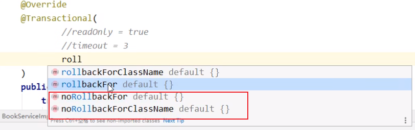

# Spring篇（新版）

## 概述

### 什么是Spring

1. Spring 是**轻量级的开源**的框架
2. **一站式**框架，内部支持对多种优秀开源框架的集成
3. **Spring 有两个核心部分：IOC 和 AOP**
   - **IOC：控制反转，把创建对象过程交给 Spring 进行管理**
   - **AOP：面向切面，不修改源代码进行功能增强**

### Spring的特点

- 方便解耦，简化开发
- Aop 编程支持
- 方便程序测试
- 方便和其他框架进行整合
- 方便进行事务操作
- 降低 API 开发难度

### Spring模块结构

Spring有七大功能模块，分别是Spring Core，AOP，ORM，DAO，MVC，WEB，Context。

## Spring 简单示例

### 创建项目


先创建一个SpringDemo项目。

### 导入依赖

```xml
<properties>
    <java.version>1.8</java.version>
    <spring-verion>5.2.22.RELEASE</spring-verion>
</properties>

<dependencies>
    <!-- https://mvnrepository.com/artifact/org.springframework/spring-core -->
    <dependency>
        <groupId>org.springframework</groupId>
        <artifactId>spring-core</artifactId>
        <version>${spring-verion}</version>
    </dependency>
    <dependency>
        <groupId>org.springframework</groupId>
        <artifactId>spring-beans</artifactId>
        <version>${spring-verion}</version>
    </dependency>
    <dependency>
        <groupId>org.springframework</groupId>
        <artifactId>spring-context</artifactId>
        <version>${spring-verion}</version>
    </dependency>
    <dependency>
        <groupId>org.springframework</groupId>
        <artifactId>spring-beans</artifactId>
        <version>${spring-verion}</version>
    </dependency>
    <dependency>
        <groupId>org.springframework</groupId>
        <artifactId>spring-expression</artifactId>
        <version>${spring-verion}</version>
    </dependency>
    <dependency>
        <groupId>org.springframework</groupId>
        <artifactId>spring-webmvc</artifactId>
        <version>${spring-verion}</version>
    </dependency>

    <dependency>
        <groupId>org.projectlombok</groupId>
        <artifactId>lombok</artifactId>
        <version>1.18.24</version>
        <scope>compile</scope>
    </dependency>
    <dependency>
        <groupId>junit</groupId>
        <artifactId>junit</artifactId>
        <version>4.12</version>
        <scope>compile</scope>
    </dependency>
</dependencies>
```

指定jdk版本编译插件

```xml
<build>
    <plugins>
        <plugin>
            <groupId>org.apache.maven.plugins</groupId>
            <artifactId>maven-compiler-plugin</artifactId>
            <version>3.8.1</version>
            <configuration>
                <source>1.8</source>
                <target>1.8</target>
                <encoding>UTF-8</encoding>
            </configuration>
        </plugin>
        <plugin>
            <groupId>org.springframework.boot</groupId>
            <artifactId>spring-boot-maven-plugin</artifactId>
        </plugin>
    </plugins>
</build>
```

### 创建普通类

```java
public class User {
    private String userName;
    private int age;

    public void print(){
        System.out.println(this.userName + ":" + this.age);
    }
}
```

### 创建 Spring 配置文件

在resources资源目录下配置文件配置创建的对象


```xml
<?xml version="1.0" encoding="UTF-8"?>
<beans xmlns="http://www.springframework.org/schema/beans"
       xmlns:xsi="http://www.w3.org/2001/XMLSchema-instance"
       xsi:schemaLocation="http://www.springframework.org/schema/beans
                           http://www.springframework.org/schema/beans/spring-beans.xsd">
    <!--配置 User 对象创建-->
    <bean id="user" class="com.example.spring.demo.User">
        <property name="userName" value="胡桃" />
        <property name="age" value="1" />
    </bean>
</beans>
```

在上述示例中：

- `xmlns="http://www.springframework.org/schema/beans"`，默认命名空间：它没有空间名，用于Spring Bean的定义；
- `xmlns:xsi="http://www.w3.org/2001/XMLSchema-instance"`，xsi命名空间：这个命名空间用于为每个文档中命名空间指定相应的Schema样式文件，是标准组织定义的标准命名空间。

### 测试代码编写

```java
public class MyTest {
    @Test
    public void test(){
        // 加载 spring 配置文件
        ApplicationContext context = new ClassPathXmlApplicationContext("beans.xml");
        // 获取配置创建的对象，其中第一个参数是bean对象名称是 User类的小写
        User user = context.getBean("user", User.class);
        System.out.println(user);
        user.print();
    }
}
```

## Spring 基本配置

### 别名

```xml
<alias name="user" alias="user2"/>
```

然后进行测试

```java
User user = context.getBean("user2", User.class);
```

### Bean的配置

```xml
<bean id="user" class="com.example.spring.demo.User" name="u1,u2">
    <property name="userName" value="胡桃" />
    <property name="age" value="1" />
</bean>
```

* `id`：bean的唯一标识符，也就是相当于类的小写的对象名
* `class`：bean对象所对应的全限定名（包名+类型），这样是为了定位这个bean是属于那个类的
* `name`：也是别名，而且可以同时取多个别名，类似上述的alias。

### import方式

import一般用于团队开发使用，可以将多个配置文件，导入合并为一个。

假设，现在项目中有多个人开发，这三个人复制不同的类开发，不同的类需要注册在不同的bean中，可以利用import将所有人的beans.xml合并为一个总的！

```xml
<import resource="beans1.xml" />
<import resource="beans2.xml" />
<import resource="beans3.xml" />
```

## Spring IOC容器

### IOC容器

#### 概述

##### 什么是IOC容器

**IOC 容器**具有依赖注入功能的容器，它可以创建对象，IOC 容器负责实例化、定位、配置应用程序中的对象及建立这些对象间的依赖。通常new一个实例，控制权由程序员控制，而"控制反转"是指new实例工作不由程序员来做而是交给Spring容器来做。在Spring中**BeanFactory**是IOC容器的实际代表者。

##### 什么是beans

在 Spring 中，构成应用程序**主干**并由**Spring IoC容器**管理的**对象**称为**bean**。bean是一个由Spring IoC容器实例化、组装和管理的对象。

##### 什么是依赖注入和控制反转

###### 控制反转

**IOC（**Inversion of Control**）**：**IOC即控制反转**，不是什么技术，而是一种设计思想。在Java开发中，**Ioc意味着将设计好的对象交给容器控制，而不是传统的在对象内部直接控制**。

<u>理解Ioc的关键是要明确“谁控制谁，控制什么，为何是反转（有反转就应该有正转了），哪些方面反转了”。</u>

- 谁控制谁，控制什么

传统Java SE程序设计，我们直接在对象内部通过new进行创建对象，是程序主动去创建依赖对象；而IoC是有专门一个容器来创建这些对象，即由Ioc容器来控制对象的创建。

谁控制谁？当然是IoC 容器控制了对象。

控制什么？那就是主要控制了外部资源获取（不只是对象包括比如文件等）。

- 为何是反转，哪些方面反转了

有反转就有正转，传统应用程序是由我们自己在对象中主动控制去直接获取依赖对象，也就是正转；而反转则是由容器来帮忙创建及注入依赖对象，对象只是被动的接受依赖对象。

哪些方面反转了？依赖对象的获取被反转了。

###### 依赖注入

**DI（**Dependency Injection**）**：**DI即依赖注入**，是组件之间依赖关系由容器在运行期决定，形象的说，即**由容器动态的将某个依赖关系注入到组件之中**。依赖注入的目的并非为软件系统带来更多功能，而是为了提升组件重用的频率，并为系统搭建一个灵活、可扩展的平台。通过依赖注入机制，只需要通过简单的配置，而无需任何代码就可指定目标需要的资源，完成自身的业务逻辑，而不需要关心具体的资源来自何处，由谁实现。

<u>理解DI的关键是：“谁依赖谁，为什么需要依赖，谁注入谁，注入了什么”。</u>

- 谁依赖于谁

当然是应用程序依赖于IoC容器

- 为什么需要依赖

应用程序需要IoC容器来提供对象需要的外部资源

- 谁注入谁

很明显是IoC容器注入应用程序某个对象，应用程序依赖的对象

- 注入了什么

就是注入某个对象所需要的外部资源（包括对象、资源、常量数据）

##### 依赖注入与控制反转之间的关系

IoC和DI有什么关系呢？其实它们是**同一个概念的不同角度描述**，由于控制反转概念比较含糊（可能只是理解为容器控制对象这一个层面，很难让人想到谁来维护对象关系），所以2004年大师级人物Martin Fowler又给出了一个新的名字：“依赖注入”，相对IoC而言，**“依赖注入”明确描述了“被注入对象依赖IoC容器配置依赖对象”**。

依赖注入是从应用程序的角度在描述，可以把依赖注入描述完整点：应用程序依赖容器创建并注入它所需要的外部资源；而控制反转是从容器的角度在描述，描述完整点：容器控制应用程序，由容器反向的向应用程序注入应用程序所需要的外部资源。

#### IOC容器在Spring中的实现

Spring 的 IOC 容器就是 IOC 思想的一个落地的产品实现。IOC 容器中管理的组件也叫做 bean。在创建bean 之前，首先需要创建 IOC 容器。Spring 提供了 IOC 容器的两种实现方式：

**① BeanFactory**

这是 IOC 容器的基本实现，是 Spring 内部使用的接口。面向 Spring 本身，不提供给开发人员使用。

**② ApplicationContext**

BeanFactory 的子接口，提供了更多高级特性。面向 Spring 的使用者，几乎所有场合都使用ApplicationContext 而不是底层的 BeanFactory。

**③ ApplicationContext的主要实现类**

| **类型名**                      | **简介**                                                     |
| ------------------------------- | ------------------------------------------------------------ |
| ClassPathXmlApplicationContext  | 通过读取类路径下的 XML 格式的配置文件创建 IOC 容器对象       |
| FileSystemXmlApplicationContext | 通过文件系统路径读取 XML 格式的配置文件创建 IOC 容器对象     |
| ConfigurableApplicationContext  | ApplicationContext 的子接口，包含一些扩展方法refresh() 和 close() ，让 ApplicationContext 具有启动、关闭和刷新上下文的能力。 |
| WebApplicationContext           | 专门为 Web 应用准备，基于 Web 环境创建 IOC 容器对象，并将对象引入存入 ServletContext 域中。 |

>  **ConfigurableApplicationContext** 相比较于 **ApplicationContext** 提供了关闭容器 和 刷新容器的方法。
>
> Web 应用会创建 **WebApplicationContext**。

### Spring BeanFactory容器

这是一个最简单的容器，它主要的功能是为依赖注入 （DI） 提供支持，这个容器接口在org.springframework.beans.factory.BeanFactory中被定义。BeanFactory 和相关的接口，比如BeanFactoryAware、DisposableBean、InitializingBean（在后续生命周期中学习），仍旧保留在 Spring 中，主要目的是向后兼容已经存在的和那些 Spring 整合在一起的第三方框架。

在 Spring 中，有大量对 BeanFactory 接口的实现。其中，最常被使用的是 **ClassPathXmlApplicationContext** 类。这个容器从一个 XML 文件中读取配置元数据，由这些元数据来生成一个被配置化的系统或者应用。

```java
@Test
public void test(){
    // 加载 spring 配置文件
    XmlBeanFactory factory = new XmlBeanFactory(new ClassPathResource("beans.xml"));
    // 获取配置创建的对象，其中第一个参数是bean对象名称是 beans.xml 中bean标签 id
    User user =  factory.getBean("user",User.class);
    System.out.println(user);
    user.print();
}
```

在主程序当中，需要注意以下两点：

- 第一步利用框架提供的 **XmlBeanFactory()** API 去生成工厂 bean 以及利用 **ClassPathResource()** API 去加载在路径 CLASSPATH 下可用的 bean 配置文件。**XmlBeanFactory()** API 负责创建并初始化所有的对象，即在配置文件中提到的 bean。
- 第二步利用第一步生成的 bean 工厂对象的 **getBean()** 方法得到所需要的 bean。 这个方法通过配置文件中的 bean ID 来返回一个真正的对象，该对象最后可以用于实际的对象。一旦得到这个对象，你就可以利用这个对象来调用任何方法。

> 目前**XmlBeanFactory()** API已经被弃用了。

下面是配置文件 **beans.xml** 中的内容：

```xml
<?xml version="1.0" encoding="UTF-8"?>
<beans xmlns="http://www.springframework.org/schema/beans"
       xmlns:xsi="http://www.w3.org/2001/XMLSchema-instance"
       xsi:schemaLocation="http://www.springframework.org/schema/beans
http://www.springframework.org/schema/beans/spring-beans.xsd">

    <bean id="user" class="com.example.spring.demo.User">
        <property name="userName" value="胡桃" />
        <property name="age" value="1" />
    </bean>
</beans>
```

Application Context 是 BeanFactory 的子接口，也被称为 Spring 上下文。

Application Context 是 spring 中较高级的容器。和 BeanFactory 类似，它可以加载配置文件中定义的 bean，将所有的 bean 集中在一起，当有请求的时候分配 bean。 另外，它增加了企业所需要的功能，比如，从属性文件中解析文本信息和将事件传递给所指定的监听器。这个容器在 org.springframework.context.ApplicationContext interface 接口中定义。

ApplicationContext 包含 BeanFactory 所有的功能，一般情况下，相对于 BeanFactory，ApplicationContext 会更加优秀。当然，BeanFactory 仍可以在轻量级应用中使用，比如移动设备或者基于 applet 的应用程序。

### Spring ApplicationContext 容器

Application Context 是 BeanFactory 的子接口，也被称为 Spring 上下文。

Application Context 是 spring 中较高级的容器。和 BeanFactory 类似，它可以加载配置文件中定义的 bean，将所有的 bean 集中在一起，当有请求的时候分配 bean。 

最常被使用的 ApplicationContext 接口实现：

- **FileSystemXmlApplicationContext**：该容器从 XML 文件中加载已被定义的 bean。在这里，你需要提供给构造器 XML 文件的完整路径。

```java
ApplicationContext context = new FileSystemXmlApplicationContext(
    "src/main/resources/beans.xml");
User user =  context.getBean("user",User.class);
```

第一步生成工厂对象。加载完指定路径下 bean 配置文件后，利用框架提供的 **FileSystemXmlApplicationContext** API 去生成工厂 bean。

**FileSystemXmlApplicationContext** 负责生成和初始化所有的对象，比如，所有在 XML bean 配置文件中的 bean。

第二步利用第一步生成的上下文中的 **getBean()** 方法得到所需要的 bean。 这个方法通过配置文件中的 bean ID 来返回一个真正的对象。一旦得到这个对象，就可以利用这个对象来调用任何方法。

- **ClassPathXmlApplicationContext**：该容器从 XML 文件中加载已被定义的 bean。在这里，不需要提供 XML 文件的完整路径，只需正确配置CLASSPATH 环境变量即可，因为，容器会从 CLASSPATH 中搜索 bean 配置文件。

```java
ApplicationContext context = new ClassPathXmlApplicationContext("beans.xml");
```

* **XmlWebApplicationContext**：该容器会在一个 web 应用程序的范围内加载在 XML 文件中已被定义的 bean。

### Spring Bean 定义

bean 定义包含称为**配置元数据**的信息，下述容器也需要知道配置元数据：

- 如何创建一个 bean
- bean 的生命周期的详细信息
- bean 的依赖关系

上述所有的配置元数据转换成一组构成每个 bean 定义的下列属性。

| 属性                     | 描述                                                         |
| :----------------------- | :----------------------------------------------------------- |
| class                    | 这个属性是强制性的，并且指定用来创建 bean 的 bean 类。       |
| name                     | 这个属性指定唯一的 bean 标识符。在基于 XML 的配置元数据中，你可以使用 ID 和/或 name 属性来指定 bean 标识符。 |
| scope                    | 这个属性指定由特定的 bean 定义创建的对象的作用域，它将会在 bean 作用域的章节中进行讨论。 |
| constructor-arg          | 它是用来注入依赖关系的，并会在接下来的章节中进行讨论。       |
| properties               | 它是用来注入依赖关系的，并会在接下来的章节中进行讨论。       |
| autowiring mode          | 它是用来注入依赖关系的，并会在接下来的章节中进行讨论。       |
| lazy-initialization mode | 延迟初始化的 bean 告诉 IoC 容器在它第一次被请求时，而不是在启动时去创建一个 bean 实例。 |
| initialization 方法      | 在 bean 的所有必需的属性被容器设置之后，调用回调方法。它将会在 bean 的生命周期章节中进行讨论。 |
| destruction 方法         | 当包含该 bean 的容器被销毁时，使用回调方法。它将会在 bean 的生命周期章节中进行讨论。 |

**Bean 与 Spring 容器的关系**


已经了解了如何将基于 XML 的配置元数据提供给容器，但让看看另一个基于 XML 的配置文件示例，其中包含不同的 bean 定义，包括延迟初始化、初始化方法和销毁方法。

```xml
<?xml version="1.0" encoding="UTF-8"?>

<beans xmlns="http://www.springframework.org/schema/beans"
       xmlns:xsi="http://www.w3.org/2001/XMLSchema-instance"
       xsi:schemaLocation="http://www.springframework.org/schema/beans
                           http://www.springframework.org/schema/beans/spring-beans-3.0.xsd">

    <!-- A simple bean definition -->
    <bean id="..." class="...">
        <!-- collaborators and configuration for this bean go here -->
    </bean>

    <!-- A bean definition with lazy init set on -->
    <bean id="..." class="..." lazy-init="true">
        <!-- collaborators and configuration for this bean go here -->
    </bean>

    <!-- A bean definition with initialization method -->
    <bean id="..." class="..." init-method="...">
        <!-- collaborators and configuration for this bean go here -->
    </bean>

    <!-- A bean definition with destruction method -->
    <bean id="..." class="..." destroy-method="...">
        <!-- collaborators and configuration for this bean go here -->
    </bean>

    <!-- more bean definitions go here -->

</beans>
```

> 在工作中使用注解进行实现，后续也会学习到

### Spring Bean 作用域

#### 概述

当在 Spring 中定义一个 bean 时，必须声明该 bean 的作用域的选项，默认是**singleton**。

Spring 框架支持以下五个作用域，分别为 singleton、prototype、request、session 和 global session，5种作用域说明如下所示，注意，如果你使用 web-aware ApplicationContext 时，其中三个是可用的。   

| 作用域         | 描述                                                         |
| :------------- | :----------------------------------------------------------- |
| singleton      | 在spring IoC容器仅存在一个Bean实例，Bean以单例方式存在，默认值 |
| prototype      | 每次从容器中调用Bean时，都返回一个新的实例，即每次调用getBean()时，相当于执行newXxxBean() |
| request        | 每次HTTP请求都会创建一个新的Bean，该作用域仅适用于WebApplicationContext环境 |
| session        | 同一个HTTP Session共享一个Bean，不同Session使用不同的Bean，仅适用于WebApplicationContext环境 |
| global-session | 一般用于Portlet应用环境，该作用域仅适用于WebApplicationContext环境 |

> 后续三种，在后续会学习到

#### singleton 作用域

singleton 是默认的作用域，也就是说，当定义 Bean 时，如果没有指定作用域配置项，则 Bean 的作用域被默认为 singleton。

``` xml
ApplicationContext context = new ClassPathXmlApplicationContext("beans.xml");

User user =  context.getBean("user",User.class);
user.setUserName("1");
System.out.println(user + ":" + user.hashCode());

User user1 =  context.getBean("user",User.class);
System.out.println(user1 + ":" + user1.hashCode());
```

配置文件 **beans.xml** 配置singleton 作用域

```
    <!--配置 User 对象创建-->
    <bean id="user" class="com.example.spring.demo.User" scope="singleton">
        <property name="userName" value="胡桃" />
        <property name="age" value="1" />
    </bean>
```

输出结果如下：


#### prototype 作用域

当一个 bean 的作用域为 Prototype，表示一个 bean 定义对应多个对象实例。Prototype 作用域的 bean 会导致在每次对该 bean 请求（将其注入到另一个 bean 中，或者以程序的方式调用容器的 getBean() 方法）时**都会创建一个新的 bean 实例**。Prototype 是原型类型，它在我们创建容器的时候并没有实例化，而是当我们获取bean的时候才会去创建一个对象，而且我们每次获取到的对象都不是同一个对象。根据经验，对有状态的 bean 应该使用 prototype 作用域，而对无状态的bean则应该使用 singleton 作用域。

```xml
<!--配置 User 对象创建-->
<bean id="user" class="com.example.spring.demo.User" scope="prototype">
    <property name="userName" value="胡桃" />
    <property name="age" value="1" />
</bean>
```

输出结果如下：


### Spring Bean 生命周期

#### 概述

Bean的生命周期大致可以分为四个阶段：实例化Instantiation、属性赋值Populate、初始化Initialization、销毁Destruction。


#### 生命周期流程图

Spring Bean的完整生命周期从创建Spring容器开始，直到最终Spring容器销毁Bean，这其中包含了一系列关键点。


流程图过于详细，有点迷糊。。。。


#### 初始化回调

```java
public class ExampleBean implements InitializingBean {
    public void afterPropertiesSet() throws Exception {// do some initialization work
        System.out.println("初始化");
    }
}
```

afterPropertiesSet方法，初始化bean的时候执行，可以针对某个具体的bean进行配置。afterPropertiesSet 必须实现 InitializingBean接口。

在基于 XML 的配置元数据的情况下，可以使用 **init-method** 属性来指定带有 void 无参数方法的名称。

```xml
<bean id="exampleBean" class="com.example.spring.demo.ExampleBean" init-method="init"/>
```

下面是类的定义：

```java
public class ExampleBean {
    public void init() {
        // do some initialization work
    }
}
```

#### 销毁回调

```java
public class ExampleBean implements DisposableBean {
    public void destroy() {
        // do some destruction work
    }
}
```

destroy方法，销毁bean的时候执行，可以针对某个具体的bean进行配置。destroy必须实现 DisposableBean接口。

### Spring Bean 后置处理器

#### 概述

Bean 后置处理器允许在调用初始化方法前后对 Bean 进行额外的处理。

BeanPostProcessor 接口定义回调方法，可以实现该方法来提供自己的实例化逻辑，依赖解析逻辑等。也可以在  Spring 容器通过插入一个或多个 BeanPostProcessor 的实现来完成实例化，配置和初始化一个bean之后实现一些自定义逻辑回调方法。

可以配置多个 BeanPostProcessor 接口，通过设置 BeanPostProcessor 实现的 Ordered 接口提供的 order 属性来控制这些BeanPostProcessor 接口的执行顺序。

BeanPostProcessor 可以对 bean（或对象）实例进行操作，这意味着 Spring IoC 容器实例化一个 bean 实例，然后 BeanPostProcessor 接口进行它们的工作。

#### BeanPostProcessor

##### BeanPostProcessor简介

BeanPostProcessor是Spring IOC容器提供的一个扩展接口。接口声明如下：

```java
public interface BeanPostProcessor {
    //bean初始化方法调用前被调用
    Object postProcessBeforeInitialization(Object bean, String beanName) throws BeansException;
    //bean初始化方法调用后被调用
    Object postProcessAfterInitialization(Object bean, String beanName) throws BeansException;

}
```

如上接口声明所示，BeanPostProcessor接口有两个回调方法。当一个BeanPostProcessor的实现类注册到Spring IOC容器后，对于该Spring IOC容器所创建的每个bean实例在初始化方法（如afterPropertiesSet和任意已声明的init方法）调用前，将会调用BeanPostProcessor中的postProcessBeforeInitialization方法，而在bean实例初始化方法调用完成后，则会调用BeanPostProcessor中的postProcessAfterInitialization方法，整个调用顺序可以简单示意如下：

 <u>-->  Spring IOC 容器实例化 Bean</u>
 <u>-->  调用 BeanPostProcessor 的 postProcessBeforeInitialization方法</u>
 <u>-->  调用 bean 实例的初始化方法</u>
 <u>-->  调用 BeanPostProcessor 的 postProcessAfterInitialization 方法</u>

可以看到，Spring容器通过 BeanPostProcessor 给了一个机会对Spring管理的bean进行再加工。比如：<u>可以修改bean的属性，可以给bean生成一个动态代理实例等等。一些Spring AOP的底层处理也是通过实现 BeanPostProcessor 来执行代理包装逻辑的。</u>

>  在这里，需要注册一个在 AbstractApplicationContext 类中声明的关闭 hook 的 registerShutdownHook() 方法。它将确保正常关闭，并且调用相关的 destroy 方法。

##### BeanPostProcessor实战

###### 实现属性注入

首先自定义注解

* MyAutowired

```java
@Retention(RetentionPolicy.RUNTIME)
@Target({ElementType.FIELD, ElementType.TYPE})
@Component
public @interface MyAutowired {
}
```

* MyService

```java
@Retention(RetentionPolicy.RUNTIME)
@Target(ElementType.TYPE)
@Component
public @interface MyService {
}
```

之后创建service包，定义服务接口和服务实现类

* UserService

```java
public interface UserService {
    public String say(String name);
}
```

* UserServiceImpl

```java
@MyService
public class UserServiceImpl implements UserService {
    public String say(String name) {
        return "hello " + name;
    }
}
```

然后创建HelloController类，用于调用

```java
public class HelloController {

    @MyAutowired
    UserService userService;

    public String say(){
        return userService.say("胡桃");
    }
}
```

之后，创建一个代理类，实现代理功能

```java
public class ProxyUtil {
    public static <T> T newProxyInstance(Class<?> targetClass, InvocationHandler invocationHandler,
                                         ProxyUtil.CallbackFilter filter) {
        if (targetClass == null) {
            return null;
        } else {
            Enhancer enhancer = new Enhancer();
            enhancer.setSuperclass(targetClass);
            enhancer.setUseCache(true);
            enhancer.setCallback(new ProxyUtil.SimpleMethodInterceptor(invocationHandler, filter));
            // 无参构造方法
            return (T) enhancer.create();
        }
    }

    public interface CallbackFilter {
        boolean accept(Method var1);
    }

    private static class SimpleMethodInterceptor implements MethodInterceptor, Serializable {
        private transient InvocationHandler invocationHandler;
        private transient ProxyUtil.CallbackFilter filter;

        public SimpleMethodInterceptor(InvocationHandler invocationHandler, ProxyUtil.CallbackFilter filter) {
            this.invocationHandler = invocationHandler;
            this.filter = filter;
        }

        @Override
        public Object intercept(Object o, Method method, Object[] objects, MethodProxy methodProxy) throws Throwable {
            return this.filter.accept(method) ? this.invocationHandler.invoke(o, method, objects) : methodProxy.invokeSuper(o, objects);
        }

    }
}
```

思路：启动springboot项目，然后先将自定义注解@MySerivce下的类，注册到bean容器中，之后从bean容器中，拿到已经注册的bean赋值给@MyAutowired的字段。

首选先进行注册bean到容器中

```java
@Component
public class ServiceAnnotationPostProcessor implements BeanFactoryPostProcessor, BeanClassLoaderAware,ApplicationContextAware {

    private ClassLoader classLoader;// 通过 BeanClassLoaderAware 获取

    private ApplicationContext applicationContext;// 通过 ApplicationContextAware 获取


    private final Map<String,BeanDefinition> beanDefinitionMap = new ConcurrentHashMap<>();
    /*
        这里实现 bean实例化
     */

    @Override
    public void postProcessBeanFactory(ConfigurableListableBeanFactory beanFactory) throws BeansException {

        // 获取所有bean的名称循环
        for(String beanName : beanFactory.getBeanDefinitionNames()){
            BeanDefinition beanDefinition = beanFactory.getBeanDefinition(beanName);
            String beanClassName = beanDefinition.getBeanClassName();
            if(beanClassName!=null){
                Class<?> clazz = ClassUtils.resolveClassName(beanClassName, this.classLoader);
                // 这里是注册@MyService注解下的类，这里主要是先进行存储，后面进行统一注册
                if(clazz.isAnnotationPresent(MyService.class)){
                    BeanDefinitionBuilder beanDefinitionBuilder = BeanDefinitionBuilder.genericBeanDefinition(clazz);
                    beanDefinitionMap.put(clazz.getName(),beanDefinitionBuilder.getBeanDefinition());

                    for (Class<?> clazzInterface: clazz.getInterfaces()){
                        beanDefinitionMap.put(clazzInterface.getName(),beanDefinitionBuilder.getBeanDefinition());
                    }
                }
            }
        }
        // 注入到容器里面
        BeanDefinitionRegistry registry = (BeanDefinitionRegistry)beanFactory;
        this.beanDefinitionMap.forEach((beaName,beanDefinition) -> {
            if(applicationContext.containsBean(beaName)){
                return;
            }
//            System.out.println(beaName + ":" + beanDefinition);
            registry.registerBeanDefinition(beaName,beanDefinition);
        });
    }

    @Override
    public void setBeanClassLoader(ClassLoader classLoader) {
        this.classLoader = classLoader;
    }

    @Override
    public void setApplicationContext(ApplicationContext applicationContext) throws BeansException {
        this.applicationContext = applicationContext;
    }
}
```

然后在为字段进行属性注入

```java
@Component
public class AutowiredAnnotationPostProcessor implements BeanPostProcessor, ApplicationContextAware {
    private ApplicationContext applicationContext;

    /*
        这里实现 属性注入
     */

    @Override
    public Object postProcessBeforeInitialization(Object bean, String beanName) throws BeansException {

        Class<?> clazz = bean.getClass();

        do {
            for (final Field field : clazz.getDeclaredFields()) {
                final MyAutowired annotation = AnnotationUtils.findAnnotation(field, MyAutowired.class);
                if (annotation != null) {
                    ReflectionUtils.makeAccessible(field);

                    // 这里测试，发现bean已经注册成功
//                    UserService userService = (UserService) applicationContext.getAutowireCapableBeanFactory().getBean(field.getType().getName());
//                    userService.say("胡桃");
//                    System.out.println(field.getType().getName());

                    ReflectionUtils.makeAccessible(field);
                    ReflectionUtils.setField(field, bean, processInjectionPoint(field.getType()));

                }
            }
            clazz = clazz.getSuperclass();
        } while (clazz != null);

        return bean;
    }

    // 创建代理类，在具体方法执行前后输出一个日志
    protected <T> T processInjectionPoint(final Class<T> injectionType) {
        return ProxyUtil.newProxyInstance(injectionType, new InvocationHandler() {
            @Override
            public Object invoke(Object proxy, Method method, Object[] args) throws Throwable {
                System.out.println("do before " + method.getName() + " | " + Thread.currentThread());
                try {
                    Object obj = applicationContext.getBean(injectionType.getName());
                    return method.invoke(obj, args);
                } finally {
                    System.out.println("do after " + method.getName() + " | " + Thread.currentThread());
                }
            }
        }, new ProxyUtil.CallbackFilter() {
            @Override
            public boolean accept(Method var1) {
                return true;
            }
        });
    }

    @Override
    public void setApplicationContext(ApplicationContext applicationContext) throws BeansException {
        this.applicationContext = applicationContext;
    }

}
```

###### 远程调用服务

**见netty实现RPC远程调用。**

### Spring Bean 定义继承（无用）

bean 定义可以包含很多的配置信息，包括构造函数的参数，属性值，容器的具体信息例如初始化方法，静态工厂方法名，等等。

子 bean 的定义继承父定义的配置数据。子定义可以根据需要重写一些值，或者添加其他值。

Spring Bean 定义的继承与 Java 类的继承无关，但是继承的概念是一样的。可以定义一个父 bean 的定义作为模板和其他子 bean 就可以从父 bean 中继承所需的配置。

当使用基于 XML 的配置元数据时，通过使用父属性，指定父 bean 作为该属性的值来表明子 bean 的定义。

```xml
<bean id="beanTeamplate" abstract="true">
    <property name="message1" value="Hello World!"/>
    <property name="message2" value="Hello Second World!"/>
    <property name="message3" value="Namaste India!"/>
</bean>

<bean id="helloIndia" class="com.tutorialspoint.HelloIndia" parent="beanTeamplate">
    <property name="message1" value="Hello India!"/>
    <property name="message3" value="Namaste India!"/>
</bean>
```

你可以创建一个 Bean 定义模板，不需要花太多功夫它就可以被其他子 bean 定义使用。在定义一个 Bean 定义模板时，你不应该指定**类**的属性，而应该指定带 **true** 值的**抽象**属性。

父 bean 自身不能被实例化，因为它是不完整的，而且它也被明确地标记为抽象的。当一个定义是抽象的，它仅仅作为一个纯粹的模板 bean 定义来使用的，充当子定义的父定义使用。

## Spring 依赖注入与自动装配

### 基于XML管理Bean

#### 注册Bean

通过bean标签进行注册

```xml
<bean id="xxx" class="xxx"/>
```

其中，id是bean标签名称，class是类所在位置。

#### 获取Bean的方式

获取Bean的方式，有id，类型，id + 类型获取的三种方式。

> 根据类型获取注意点：当容器当中有多个相同类型的Bean的时候就会报错。 如错误：NoUniqueBeanDefinitionException ( 这个最常用，就用这个 )

一般情况使用**id + 类型的方式**这种方式。

#### 依赖注入方式

##### settet注入

setter 注入 和 set方法有关，跟成员变量没有关系。

```xml
<bean id="user" class="com.example.spring.demo.entity.User">
    <property name="userName" value="胡桃" />
</bean>
```

如果没有对应的set方法，就会保存。

##### 构造函数注入

根据\<constructor-arg\>标签的顺序来决定调用那个构造参数，name 属性不要省（虽然可以省）

```xml
<bean id="user" class="com.example.spring.demo.entity.User">
    <constructor-arg name="userName" value="胡桃" />
    <constructor-arg name="age" value="1"/>
</bean>
```

##### 数据类型注入

###### 常量

```xml
<property name="userName" value="胡桃"/>
```

###### 引用类型

创建Course类

```java
@Data
public class Course {
    private String courseName;
}
```

创建User类

```java
@Data
public  class User {
    private String userName;
    private int age;
    private Course course;
}
```

编写beans.xml配置文件

```xml
<bean id="course" class="com.example.spring.demo.entity.Course">
    <property name="courseName" value="数学"/>
</bean>
<bean id="user" class="com.example.spring.demo.entity.User">
    <property name="userName" value="胡桃"/>
    <property name="course" ref="course"/>
</bean>
```

###### 数组

创建User类

```java
@Data
public  class User {
    private String[] hobby;
}
```

编写beans.xml配置文件

```xml
<bean id="user" class="com.example.spring.demo.entity.User">
    <property name="hobby">
        <array>
            <value>1</value>
            <value>2</value>
            <value>3</value>
        </array>
    </property>
</bean>
```

###### List集合（两种方式）

创建User类

```java
@Data
public  class User {
    private List<Course> courseList;
}
```

编写beans.xml配置文件

```xml
<bean id="course1" class="com.example.spring.demo.entity.Course">
    <property name="courseName" value="英语"/>
</bean>
<bean id="course2" class="com.example.spring.demo.entity.Course">
    <property name="courseName" value="高数"/>
</bean>
```

方式一：Property标签内部设置，字面量类型用 value，类类型用 ref

```xml
<bean id="user" class="com.example.spring.demo.entity.User">
    <property name="courseList">
        <list>
            <ref bean="course1"/>
            <ref bean="course2"/>
        </list>
    </property>
</bean>
```

方式二：从List类型的bean 注入

```xml
<bean id="user" class="com.example.spring.demo.entity.User">
    <property name="courseList" ref="courseList">
    </property>
</bean>
<util:list id="courseList">
    <ref bean="course1"/>
    <ref bean="course2"/>
</util:list>
```

###### Map 集合（两种方式）

创建User类

```java
@Data
public  class User {
    private Map<String,Course> map;
}
```

编写beans.xml配置文件

```xml
<bean id="course1" class="com.example.spring.demo.entity.Course">
    <property name="courseName" value="英语"/>
</bean>
<bean id="course2" class="com.example.spring.demo.entity.Course">
    <property name="courseName" value="高数"/>
</bean>
```

方式一：Property标签内部设置 键是字面量类型则用 key 属性，类类型则用 key-ref

```xml
<bean id="user" class="com.example.spring.demo.entity.User">
    <property name="courseMap">
        <map>
            <entry key="course1" value-ref="course1"/>
            <entry key="course2" value-ref="course2"/>
        </map>
    </property>
</bean>
```

方式二：或者从Map类型的bean 注入

```xml
<bean id="user" class="com.example.spring.demo.entity.User">
    <property name="courseMap" ref="courseMap">
    </property>
</bean>
<util:map id="courseMap">
    <entry key="course1" value-ref="course1"/>
    <entry key="course2" value-ref="course2"/>
</util:map>
```

###### Null注入

```xml
<bean id="user" class="com.example.spring.demo.entity.User">
    <property name="wife"><null/></property>
</bean>
```

###### Properties注入

```xml
<bean id="student" class="com.example.spring.demo.entity.Student">
    <property name="info">
        <props>
            <prop key="学号">001</prop>
            <prop key="姓名">胡桃</prop>
        </props>
    </property>
</bean>
```

> 类似与Map

##### 标签注入

创建**User.java**

```java
@Data
@AllArgsConstructor
@NoArgsConstructor
public  class User {
    private String userName;
    private int age;
    private Course course;
}
```

###### p命名空间注入/设置属性

```xml
<bean id="user" class="com.example.spring.demo.entity.User" p:userName="勇者" p:age="16" p:course-ref="course"/>
<bean id="course" class="com.example.spring.demo.entity.Course" p:courseName="高数"/>
```

###### c命名空间注入/设置有参构造器

```xml
<bean id="user" class="com.example.spring.demo.entity.User" c:userName="胡桃" c:age="18" c:course-ref="course"/>
<bean id="course" class="com.example.spring.demo.entity.Course" p:courseName="高数"/>
```

> 带有ref都是引用另一个bean对象。

#### 基于XML的自动装配

##### autowire byName (按名称自动装配)

由于在手动配置xml过程中，常常发生字母缺漏和大小写等错误，而无法对其进行检查，使得开发效率降低。

**采用自动装配将避免这些错误，并且使配置简单化。**

* 修改bean配置，增加一个属性  **autowire="byName"**

```xml
<bean id="people" class="xxx.People" autowire="byName">
    <property name="name" value="小明" />
</bean>
```

该方法会自动在容器上下文中查找，和自己对象set方法后面的值对应的**bean.id**。

##### autowire byType (按类型自动装配)

使用autowire byType首先需要保证：同一类型的对象，在spring容器中唯一。如果不唯一，会报不唯一的异常。

```
NoUniqueBeanDefinitionException
```

* 修改bean配置，增加一个属性  **autowire="byType"**

```xml
<bean id="people" class="xxx.People" autowire="byType">
    <property name="name" value="小明" />
</bean>
```

> 1. byname的时候，需要保证所有bean的id唯一，并且这个bean需要和自动注入的属性的set方法值一致。
> 2. bytype的时候，需要保证所有bean的class唯一，并且这个bean需要和自动注入的属性的类型一致。

### 基于注解管理Bean

#### 注册Bean的注解

- **@Component** : 将类标识为普通组件 
- **@Controller**：将类标识为控制层组件 
- **@Service**：将类标识为业务层组件 
- **@Repository**: 将类标识为持久层组件

四个注解之间的关系 ：均由 @Component 扩展出来。

注意，id不写的时候默认是小驼峰，比如 UserController 加上 @Controller 注解以后，其在容器的id就是 userController。

自定义id，如 @Controller("userController")。

#### 扫描组件

```xml
<!-- 组件扫描配置 -->
<context:component-scan base-package="com.example.spring.demo" />
<!-- 开启注解支持 -->
<context:annotation-config />
```

排除扫描：排除对某些包下的组件的扫描

```xml
<!-- 组件扫描配置 -->
<context:component-scan base-package="com.example.spring.demo" >
    <!--
        type: annotation -> 根据注解排除
              assignable -> 根据类类型进行排除
        如下排除掉控制层的组件
     -->
    <context:exclude-filter type="annotation" expression="org.springframework.stereotype.Controller"/>
</context:component-scan>
```

包含扫描：只对某些包下的某些组件的扫描。

`use-default-filters="ture" `：表示包下的所有的类都需要扫描，需要关掉(false)才能使用包含扫描

```xml
<!-- 组件扫描配置 -->
<context:component-scan base-package="com.example.spring.demo"  use-default-filters="false">
    <!--
        type: annotation -> 根据注解只扫描
              assignable -> 根据类类型只扫描
        如下只扫描控制层的组件
     -->
    <context:include-filter type="annotation" expression="org.springframework.stereotype.Controller"/>
</context:component-scan>
```

#### 自动装配注解

##### 如何使用注解

放置位置：放在成员变量上，则Spring会使用暴力反射的方式完成私有属性输入。

创建服务类

```java
@Service
public class UserServiceImpl implements UserService {
    public void say(String name) {
        System.out.println("hello " + name);
    }
}
```

创建controller类

```java
@Component
public class HelloController {

    @Autowired
    UserService userService;

    public void say(){
        userService.say("胡桃");
    }
}
```

测试

```java
ApplicationContext context = new ClassPathXmlApplicationContext("beans.xml");
HelloController helloController = context.getBean("helloController",HelloController.class);
helloController.say();
```

##### @Value注解

创建User类

```java
@Repository
@Data
public class User {
    @Value("胡桃")
    private String userName;
    @Value("1")
    private int age;
}
```

@Value注解用来赋值的。

##### @Autowire 注解

1. 默认通过 byType 的方式，在IOC容器中通过类型匹配某个bean为属性赋值。 
2. 当有多个 bean 的类型能匹配到，其会转换为 byName 的方式，其匹配名称为属性名。 
3. 当有多个 bean 的类型能匹配到，但未找到id相同的，则报 noUniqueBeanDefinationException.

##### @Qualifier 注解

当发生 @Autowire 的 第3种情况，可以自己指定bean的id

```java
@Component
public class HelloController {

    @Autowired
    @Qualifier("userService2")
    UserService userService;

    public void say(){
        userService.say("胡桃");
    }
}

@Service("userService2")
public class UserServiceImpl implements UserService {
    public void say(String name) {
        System.out.println("hello " + name);
    }
}
```

##### @Scope注解

和xml一样，用来配置bean对象的作用域。

```java
@Scope("prototype")
```

##### NoSuchBeanDefinationException

当匹配不到Bean完成自动装配的时候，会报 NoSuchBeanDefinationException 的错误。当修改为 `@Autowire(required = false) `的时候，找不到Bean完成自动装配则使用默认值，和使用XML自动装配的时候的情况一样。

##### @Autowire与@Resource的区别

@Autowired与@Resource异同：

1. @Autowired与@Resource**都可以用来装配bean**。都可以写在字段上，或写在setter方法上。

2. **@Autowired默认按类型装配**（属于spring规范），默认情况下必须要求依赖对象必须存在，如果要允许null 值，可以设置它的required属性为false，如：@Autowired(required=false) ，如果我们想使用名称装配可以结合@Qualifier注解进行使用

3. **@Resource（属于J2EE复返），默认按照名称进行装配**，名称可以通过name属性进行指定。如果没有指定name属性，当注解写在字段上时，默认取字段名进行按照名称查找，如果注解写在setter方法上默认取属性名进行装配。当找不到与名称匹配的bean时才按照类型进行装配。但是需要注意的是，如果name属性一旦指定，就只会按照名称进行装配。

它们的作用相同都是用注解方式注入对象，但执行顺序不同。**@Autowired先byType，@Resource先byName。**

### 基于Java编程配置

创建AppConfig配置类

```java
//这个也会Spring容器托管，注册到容器中，因为他本来就是一个@Component。
//@Configuration代表这是一个配置类，就和之前看的beans.xml等价
@Configuration
public class AppConfig {
    @Bean(value = "user")
    public User getUser(){
        return new User();
    }
    @Bean(value = "user2")
    public User getUser(){
        return new User();
    }
}
```

创建User类

```java
@Repository
@Data
public  class User {
    @Value("胡桃")
    private String userName;
    @Value("1")
    private int age;
}
```

注册一个bean，就相当于之前写的一个bean标签，默认是类对象名称。

1. 这个方法的名字，就相当丁bean标签中的**id属性**
2. 这个方法的返回值，就相当于 bean标签中的**class属性**

接下来进行测试

```java
@Test
public void test(){
    ApplicationContext context = new AnnotationConfigApplicationContext(AppConfig.class);
    User user = context.getBean("user2",User.class);
    System.out.println(user);
}
```

如果想要扫描指定包下的所有类，都进行创建bean对象，可以如下：

```java
@Configuration
@ComponentScan("com.example.spring.demo.entity")
public class AppConfig {
}
```

如何写多个beans，和之前的多个beans.xml一样。

- 创建**appConfig2.java**

```java
@Configuration
public class AppConfig2 {
}
```

- 通过使用**Import**进行导入

```java
@Import(AppConfig2.class)
public class AppConfig {
    ...
}
```

## Spring AOP

### **代理模式**

#### 什么是代理模式

**代理模式**：**由于某些原因需要给某对象提供一个代理以控制对该对象的访问。**这时，访问对象不适合或者不能直接引用目标对象，代理对象作为访问对象和目标对象之间的中介，并允许在将请求提交给对象前后进行一些处理。（隐藏目标对象）

比如代理商就是生产厂家和顾客中间的代理中介。买家想要买生产厂家生产的产品，就去代理商那儿去买，而不是直接去找生产厂家。

Java中的代理按照代理类生成时机不同又分为**静态代理**和**动态代理** 。**静态代理代理类在编译期就生成，动态代理代理类则是在Java运行时动态生成。动态代理又有JDK代理和CGLib代理两种。**

**代理模式的优点**：

- 代理模式在客户端与目标对象之间起到一个中介作用和保护目标对象的作用；
- 代理对象可以扩展目标对象的功能；
- 代理模式能将客户端与目标对象分离，在一定程度上降低了系统的耦合度（有架构的思想，由第三方来代理服务）；

**代理模式的缺点**：增加了系统的复杂度；

**代理模式的使用场景**：

- **防火墙（Firewall）代理**：当你将浏览器配置成使用代理功能时，防火墙就将你的浏览器的请求转给互联网；当互联网返回响应时，代理服务器再把它转给你的浏览器。
- **保护（Protect or Access）代理**：控制对一个对象的访问，如果需要，可以给不同的用户提供不同级别的使用权限。

- **远程（Remote）代理**：本地服务通过网络请求远程服务。为了实现本地到远程的通信，我们需要实现网络通信，处理其中可能的异常。为良好的代码设计和可维护性，我们将网络通信部分隐藏起来，只暴露给本地服务一个接口，通过该接口即可访问远程服务提供的功能，而不必过多关心通信部分的细节。

**代理模式在缓存中的应用**：实际上，RPC 框架也可以看作一种代理模式，GoF 的《设计模式》一书中把它称作远程代理。通过远程代理，将网络通信、数据编解码等细节隐藏起来。客户端在使用 RPC 服务的时候，就像使用本地函数一样，无需了解跟服务器交互的细节。除此之外，RPC 服务的开发者也只需要开发业务逻辑，就像开发本地使用的函数一样，不需要关注跟客户端的交互细节。

1. 假设我们要开发一个接口请求的缓存功能，对于某些接口请求，如果入参相同，在设定的过期时间内，直接返回缓存结果，而不用重新进行逻辑处理。比如，针对获取用户个人信息的需求，我们可以开发两个接口，一个支持缓存，一个支持实时查询。对于需要实时数据的需求，我们让其调用实时查询接口，对于不需要实时数据的需求，我们让其调用支持缓存的接口。那如何来实现接口请求的缓存功能呢？
2. 最简单的实现方法就是刚刚我们讲到的，给每个需要支持缓存的查询需求都开发两个不同的接口，一个支持缓存，一个支持实时查询。但是，这样做显然增加了开发成本，而且会让代码看起来非常臃肿（接口个数成倍增加），也不方便缓存接口的集中管理（增加、删除缓存接口）、集中配置（比如配置每个接口缓存过期时间）。
3. 针对这些问题，代理模式就能派上用场了，确切地说，应该是动态代理。如果是基于 Spring 框架来开发的话，那就可以在 AOP 切面中完成接口缓存的功能。在应用启动的时候，我们从配置文件中加载需要支持缓存的接口，以及相应的缓存策略（比如过期时间）等。当请求到来的时候，我们在 AOP 切面中拦截请求，如果请求中带有支持缓存的字段（比如 http://…?..&cached=true），我们便从缓存（内存缓存或者 Redis 缓存等）中获取数据直接返回。

#### 代理模式的结构

代理（Proxy）模式分为三种角色：

- **抽象主题（Subject）类**： 通过接口或抽象类声明真实主题和代理对象实现的业务方法。
- **真实主题（Real Subject）类**： 实现了抽象主题中的具体业务，是代理对象所代表的真实对象，是最终要引用的对象。
- **代理（Proxy）类** ： 提供了与真实主题相同的接口，其内部含有对真实主题的引用，它可以访问、控制或扩展真实主题的功能。

#### 静态代理

【例】火车站卖票：如果要买火车票的话，需要去火车站买票，坐车到火车站，排队等一系列的操作，显然比较麻烦。而火车站在多个地方都有代售点，我们去代售点买票就方便很多了。

这个例子其实就是典型的代理模式，火车站是目标对象，代售点是代理对象。类图如下：


代码如下：

```java
public class Client {
    public static void main(String[] args) {
        TrainStation station = new TrainStation();
        ProxyPoint proxy = new ProxyPoint(station);
        proxy.sell();
    }
}

// 抽象类，业务接口
interface SellTickets{
    // 卖票
    public void sell();
}

// 火车站
class TrainStation implements SellTickets{

    @Override
    public void sell() {
        System.out.println("火车站卖票");
    }

}

// 中介代理
class ProxyPoint implements SellTickets{
    
    private TrainStation station;

    public ProxyPoint(TrainStation station){
        this.station = station;
    }

    @Override
    public void sell() {
        System.out.println("当前是火车站委托给了中间代理，帮忙卖票，会收取一定的代理费");
        this.station.sell();
    }
}
```

从上面代码中可以看出测试类直接访问的是ProxyPoint类对象，也就是说ProxyPoint作为访问对象和目标对象的中介。同时也对sell方法进行了增强（代理点收取一些服务费用）。

#### 动态代理

##### JDK动态代理

现在来使用JDK实现上面的例子。Java中提供了一个动态代理类Proxy，Proxy并不是我们上述所说的代理对象的类，而是提供了一个创建代理对象的静态方法（newProxyInstance方法）来获取代理对象。

仍然是通过火车站卖票的例子来学习。

```java
public class Client {
    public static void main(String[] args) {
        // 提供者
        TrainStation station = new TrainStation();
        // 声明获取代理对象的工厂
        ProxyFactory factory = new ProxyFactory(station);
        // 通过工厂获取代理对象
        SellTickets proxyObject = (SellTickets) factory.getProxyInstance();
        // 代理对象执行业务逻辑
        proxyObject.sell();
    }
}

// 业务接口
interface SellTickets {
    public void sell();
}

// 火车站
class TrainStation implements SellTickets {

    @Override
    public void sell() {
        System.out.println("火车站卖票");
    }
}

// 代理
class ProxyFactory {

    // 维护一个目标对象，Object
    private final Object target;

    // 对target进行初始化
    public ProxyFactory(Object target) {
        this.target = target;
    }

    /* 说明
         public static Object newProxyInstance(ClassLoader loader,
                                          Class<?>[] interfaces,
                                          InvocationHandler h)

            1. ClassLoader loader ： 指定当前目标对象使用的类加载器, 获取加载器的方法固定
            2. Class<?>[] interfaces: 目标对象实现的接口类型，使用泛型方法确认类型
            3. InvocationHandler h : 事情处理，执行目标对象的方法时，会触发事情处理器方法,
             会把当前执行的目标对象方法作为参数传入
       */

    public Object getProxyInstance() {

        return Proxy.newProxyInstance(
                target.getClass().getClassLoader(), //类加载器，用来加载代理类
                target.getClass().getInterfaces(),  //真实对象实现的接口，代理对象跟真实对象实现同样的接口
                (Object proxy, Method method, Object[] args) -> {   //匿名内部类中定义代理对象要处理的业务逻辑

                    // proxy 代理对象
                    // method 对应于在代理对象上调用的接口方法的 Method 实例
                    // args 代理对象调用接口方法时传递的实际参数

                    System.out.println("代理点收取一些服务费用(JDK动态代理方式)");
                    // 执行真实对象
                    return method.invoke(target, args);

                }
        );
    }
}
```

上面程序中，ProxyFactory不是代理模式中所说的代理类，而**代理类是程序在运行过程中动态的在内存中生成的类。**

通过阿里巴巴开源的 Java 诊断工具（Arthas【阿尔萨斯】）查看代理类的结构，但是需要不停运行程序，因为代理是在内存中生成的。

下载`arthas-boot.jar`，然后用`java -jar`的方式启动：

````java
curl -O https://arthas.aliyun.com/arthas-boot.jar
java -jar arthas-boot.jar
````


然后直接输入对应的数字`4`


然后输入`jad 类名`：

```sh
jad com.proxy.type2.$Proxy0
```

然后就可以查看代理类的结构（删除多余代码，只看重要的）：

```java
// 程序运行过程中动态生成的代理类
final class $Proxy0 extends Proxy implements SellTickets {

    private static Method m3;

    public $Proxy0(InvocationHandler invocationHandler) {
        super(invocationHandler);
    }

    static {
        m3 = Class.forName("com.proxy.type2.SellTickets").getMethod("sell", new Class[0]);
    }

    public final void sell() {
        this.h.invoke(this, m3, null);
    }
}

// Java提供的动态代理相关类 
public class Proxy implements java.io.Serializable {
    
    protected InvocationHandler h;

    protected Proxy(InvocationHandler h) {
        Objects.requireNonNull(h);
        this.h = h;
    }
}

//代理工厂类
class ProxyFactory {

    // 维护一个目标对象，Object
    private final Object target;

    // 对target进行初始化
    public ProxyFactory(Object target) {
        this.target = target;
    }

    /* 说明
         public static Object newProxyInstance(ClassLoader loader,
                                          Class<?>[] interfaces,
                                          InvocationHandler h)

            1. ClassLoader loader ： 指定当前目标对象使用的类加载器, 获取加载器的方法固定
            2. Class<?>[] interfaces: 目标对象实现的接口类型，使用泛型方法确认类型
            3. InvocationHandler h : 事情处理，执行目标对象的方法时，会触发事情处理器方法,
             会把当前执行的目标对象方法作为参数传入
       */

    public Object getProxyInstance() {

        return Proxy.newProxyInstance(
                target.getClass().getClassLoader(), //类加载器，用来加载代理类
                target.getClass().getInterfaces(),  //真实对象实现的接口，代理对象跟真实对象实现同样的接口
                (Object proxy, Method method, Object[] args) -> {   //匿名内部类中定义代理对象要处理的业务逻辑

                    // proxy 代理对象
                    // method 对应于在代理对象上调用的接口方法的 Method 实例
                    // args 代理对象调用接口方法时传递的实际参数

                    System.out.println("代理点收取一些服务费用(JDK动态代理方式)");

                    // 执行真实对象
                    return method.invoke(target, args);

                }
        );
    }
}
```

**从上面的类中，可以看到以下几个信息：**

- 代理类（$Proxy0）实现了SellTickets。这也就印证了我们之前说的真实类和代理类实现同样的接口。
- 代理类（$Proxy0）将我们提供了的匿名内部类对象传递给了父类。

**执行流程如下**：

* **拿到被代理类的引用,并且获取它的所有的接口(反射获取)**
* **JDK Proxy类重新生成一个新的类，实现了被代理类所有接口的方法**
* **动态生成Java代码，把增强逻辑加入到新生成代码中**
* **编译生成新的Java代码的class文件**
* **加载并重新运行新的class，得到类就是全新类**

##### CGLIB动态代理

现在使用CGLIB代理实现上面的例子。如果没有定义SellTickets接口，只定义了TrainStation(火车站类)。很显然JDK代理是无法使用了，因为JDK动态代理要求必须定义接口，对接口进行代理。

CGLIB是一个功能强大，高性能的代码生成包。它可以为没有实现接口的类提供代理，为JDK的动态代理提供了很好的补充。

CGLIB是第三方提供的包，需要导入相关依赖：

```xml
<dependency>
    <groupId>cglib</groupId>
    <artifactId>cglib</artifactId>
    <version>3.1</version>
</dependency>
```

实现火车票例子：

```java
public class Client {
    public static void main(String[] args) {
        // 提供者
        TrainStation station = new TrainStation();
        // 声明获取代理对象的工厂
        ProxyFactory factory = new ProxyFactory(station);
        // 获取代理对象
        TrainStation proxy = (TrainStation) factory.getProxyObject();

        proxy.sell();

    }
}

// 火车站类，没有实现任何接口
class TrainStation{
    public void sell(){
        System.out.println("火车站卖票");
    }
}

// CGLIB动态代理类-代理工厂类
class ProxyFactory implements MethodInterceptor {

    private final Object target;

    public ProxyFactory(Object target){
        this.target = target;
    }

    public Object getProxyObject(){

        // 创建Enhancer对象，类似于JDK代理中的Proxy类
        Enhancer enhancer = new Enhancer();
        // 设置父类的字节码对象
        enhancer.setSuperclass(target.getClass());
        // 设置回调函数
        enhancer.setCallback(this);
        // 创建代理对象
        return enhancer.create();
    }

    @Override
    public Object intercept(Object o, Method method, Object[] objects, MethodProxy methodProxy) throws Throwable {
        System.out.println("当前是火车站委托给了中间代理，帮忙卖票，会收取一定的代理费");
        Object result = (Object) methodProxy.invokeSuper(o,objects);
      //Object result = (Object) methodProxy.invoke(target,objects);
        return result;
    }
}
```

在Spring中，Spring AOP 底层的实现原理就是基于动态代理。用户配置好需要给哪些类创建代理，并定义好在执行原始类的业务代码前后执行哪些附加功能。Spring 为这些类创建动态代理对象，并在 JVM 中替代原始类对象。原本在代码中执行的原始类的方法，被换作执行代理类的方法，也就实现了给原始类添加附加功能的目的。

#### 三种代理的对比

##### jdk代理和CGLIB代理

使用CGLib实现动态代理，**CGLib底层采用ASM字节码生成框架**，使用字节码技术生成代理类，在JDK1.6之前比使用Java反射效率要高。唯一需要注意的是，**CGLib不能对声明为final的类或者方法进行代理**，因为**CGLib原理是动态生成被代理类的子类**。

在JDK1.6、JDK1.7、JDK1.8逐步对JDK动态代理优化之后，在调用次数较少的情况下，JDK代理效率高于CGLib代理效率，只有当进行大量调用的时候，JDK1.6和JDK1.7比CGLib代理效率低一点，但是到JDK1.8的时候，JDK代理效率高于CGLib代理。所以**如果有接口使用JDK动态代理，如果没有接口使用CGLIB代理。**

##### 动态代理和静态代理

动态代理与静态代理相比较，最大的好处是接口中声明的所有方法都被转移到调用处理器一个集中的方法中处理（InvocationHandler.invoke）。这样，在接口方法数量比较多的时候，我们可以进行灵活处理，而不需要像静态代理那样每一个方法进行中转。

如果接口增加一个方法，静态代理模式除了所有实现类需要实现这个方法外，所有代理类也需要实现此方法。增加了代码维护的复杂度。而动态代理不会出现该问题。

总结就是以下：

- 一个代理只能服务于一种类型的对象，当有n个业务时，需要n个静态代理，不利于业务的扩展。（静态）

- 一个代理类可以服务于所有的业务对象。（动态）

### AOP

#### 术语


| 项                    | 描述                                                         |
| :-------------------- | :----------------------------------------------------------- |
| Aspect（切面）        | 一个模块具有一组提供横切需求的 APIs。例如，一个日志模块为了记录日志将被 AOP 方面调用。应用程序可以拥有任意数量的方面，这取决于需求。 |
| Join point（连接点）  | 在你的应用程序中它代表一个点，你可以在插件 AOP 方面。你也能说，它是在实际的应用程序中，其中一个操作将使用 Spring AOP 框架。 |
| Advice（通知）        | 这是实际行动之前或之后执行的方法。这是在程序执行期间通过 Spring AOP 框架实际被调用的代码。 |
| Pointcut（切入点）    | 这是一组一个或多个连接点，通知应该被执行。你可以使用表达式或模式指定切入点正如我们将在 AOP 的例子中看到的。 |
| Introduction          | 引用允许你添加新方法或属性到现有的类中。                     |
| Target object（目标） | 被一个或者多个方面所通知的对象，这个对象永远是一个被代理对象。也称为被通知对象。 |
| Proxy（代理）         | 向目标对象应用通知之后创建的对象。                           |
| Weaving               | Weaving 把方面连接到其它的应用程序类型或者对象上，并创建一个被通知的对象。这些可以在编译时，类加载时和运行时完成。 |

#### 通知的类型

Spring 方面可以使用下面提到的五种通知工作：

| 通知                           | 描述                                                         |
| :----------------------------- | :----------------------------------------------------------- |
| 前置通知`@Before`              | 在一个方法执行之前，执行通知。                               |
| 后置通知`@After`               | 在一个方法执行之后，不考虑其结果，执行通知。                 |
| 返回后通知`@AfterReturning`    | 在一个方法执行之后，只有在方法成功完成时，才能执行通知。     |
| 抛出异常后通知`@AfterThrowing` | 在一个方法执行之后，只有在方法退出抛出异常时，才能执行通知。 |
| 环绕通知`@Around`              | 在建议方法调用之前和之后，执行通知。                         |

#### 什么是AOP

AOP是一种思想，面向切面编程, 是面向对象编程的一种补充和完善，它以通过预编译的方式和运行期动态代理的方式实现在不修改源代码的情况下给程序动态统一添加额外功能的一种技术。

#### AOP的作用

**简化代码** : 具有重复性( 多个类的相同位置 )的非核心业务代码抽取 , 让目标类当中仅剩下简洁的核心业务代码.

**代码增强** : 需要切面类里面功能, 直接套上去就增强目标类的代码了.

### 基于注解实现的AOP


AspectJ : 本质上是静态代理, 将代理逻辑"织入" 被代理的目标类编译得到的字节码文件, 所以最终效果是动态。

weaver 就是织入器，Spring 只是借用了 AspectJ 中的注解。

#### 添加依赖

 在IOC 所需依赖 ( spring-context ) 基础上再加入下面依赖即可。

```xml
<dependency>
    <groupId>org.springframework</groupId>
    <artifactId>spring-aspects</artifactId>
    <version>${spring-verion}</version>
</dependency>
```

#### 创建切面类并配置(**)

实现个日志的切面类。

1. 切面类 和 目标类都要注册到 容器   @Component 组件修饰
1. 切面类必须通过 @Aspect 注解标识为一个切面
1. 在Spring的配置文件中开启aop 注解功能 <aop:aspectj-autoproxy/>或者使用注解

在xml中配置

```xml
<!-- 开启基于注解的AOP功能 -->
<aop:aspectj-autoproxy/>
```

或者开启注解

```java
@EnableAspectJAutoProxy
```

然后开始定义一个日志类，使用execution表达式定位类的方法的位置

```java
@Component
@Aspect // 将组件标识为 切面 组件
public class LoggerAspect {

    // @Before("execution(* com.example.spring.demo.controller.HelloController.add(int, int))")

    // 被增强类的所有的方法
    @Before("execution(* com.example.spring.demo.controller.HelloController.*(..))")
    public void beforeAdviceMethod(JoinPoint joinPoint) {
        System.out.println("前置方法通知");
    }

    // 被增强类的所有的方法
    @After("execution(* com.example.spring.demo.controller.HelloController.*(..))")
    public void afterAdviceMethod(JoinPoint joinPoint) {
        System.out.println("后置方法通知");
    }
}
```

然后启动测试。

#### 获取链接点的方法信息

添加JoinPoint 参数即可

```java
// 被增强类的所有的方法
@Before("execution(* com.example.spring.demo.controller.HelloController.*(..))")
public void beforeAdviceMethod(JoinPoint joinPoint) {
    System.out.println("前置方法通知");

    System.out.println(joinPoint.getSignature().getName());  // 获取方法名称
    Object[] args = joinPoint.getArgs(); // 获取连接点的参数
    for (Object arg : args) {
        System.out.println(arg);
    }
}
```

#### 切入点表达式的重用

创建一个没有任何作用的方法, 用来放置公共的切断点表达式。

```java
@Pointcut("execution(* com.example.spring.demo.controller.HelloController.*(..))")
public void pointCut() {}

@Before("pointCut()")
public void beforeAdviceMethod(JoinPoint joinPoint) {
    System.out.println("前置方法通知");
}
```

#### 返回通知获得返回值

```java
@AfterReturning(value = "pointCut()", returning = "result")
public void afterAdviceMethod(JoinPoint joinPoint, Object result) {
    System.out.println("返回通知, 且返回值为 : " + result);
}
```

#### 异常通知获取异常

```java
@AfterThrowing(value = "pointCut()", throwing = "ex")
public void afterThrowingAdviceMethod(JoinPoint joinPoint, Exception ex) {
    System.out.println("发生异常" + ex);
}
```

#### 环绕通知

相当于手动实现动态代理，能代替前面四种通知，且能与前面4种通知共存。一般设置了前面的通知后，就没必要设置环绕通知啦。

```java
/**
 *
 * @param proceedingJoinPoint 可执行的连接点
 */
@Around("pointCut()")
public void aroundAdviceMethod(ProceedingJoinPoint proceedingJoinPoint) {
    try {
        System.out.println("环绕通知 --> 前置通知");
        Object proceed = proceedingJoinPoint.proceed();
        System.out.println("环绕通知 --> 返回通知");
    } catch (Throwable e) {
        System.out.println("环绕通知 --> 异常通知");
        throw new RuntimeException(e);
    } finally {
        System.out.println("环绕通知 --> 后置通知");
    }
}
```

#### 各种通知的执行顺序

> Spring 5.3.x 版本以前

前置通知 → 目标操作 → 后置通知 → 返回通知/异常通知

> Spring 5.3.x 版本以后 （ 当前笔记所作的版本 ）

前置通知 → 目标操作 → 返回通知 / 异常通知 → 后置通知

#### 切面优先级

只需要使用注解 @Order 在切面类的注解上即可，数值越小优先级越高。且默认值是 INT_MAX。

```java
@Component
@Aspect     // 将组件标识为 切面 组件
@Order(1)   // 设置切面的优先级
public class LoggerAspect {

    @Pointcut("execution(* com.example.spring.demo.controller.HelloController.*(..))")
    public void pointCut() {}

    @Before("pointCut()")
    public void beforeAdviceMethod(JoinPoint joinPoint) {
        System.out.println("前置通知");
    }

    @AfterReturning("pointCut()")
    public void afterAdviceMethod(JoinPoint joinPoint) {
        System.out.println("返回通知");
    }
}
```

### 基于XML实现的AOP

这个就没必要学习了。

## 声明式事务

### Spring 事务抽象

Spring事务管理的五大属性：**隔离级别**、**传播行为**、**是否只读**、**事务超时**、**回滚规则**

Spring 事务抽象的关键是由 org.springframework.transaction.PlatformTransactionManager 接口定义，如下所示：

```java
public interface PlatformTransactionManager {
    TransactionStatus getTransaction(TransactionDefinition definition) throws TransactionException;
    void commit(TransactionStatus status) throws TransactionException;
    void rollback(TransactionStatus status) throws TransactionException;
}
```

| 序号 | 方法 & 描述                                                  |
| :--- | :----------------------------------------------------------- |
| 1    | **TransactionStatus getTransaction(TransactionDefinition definition)**根据指定的传播行为，该方法返回当前活动事务或创建一个新的事务。 |
| 2    | **void commit(TransactionStatus status)**该方法提交给定的事务和关于它的状态。 |
| 3    | **void rollback(TransactionStatus status)**该方法执行一个给定事务的回滚。 |

TransactionDefinition 是在 Spring 中事务支持的核心接口，它的定义如下：

```java
public interface TransactionDefinition {
    int getPropagationBehavior();
    int getIsolationLevel();
    String getName();
    int getTimeout();
    boolean isReadOnly();
}
```

| 序号 | 方法 & 描述                                                  |
| :--- | :----------------------------------------------------------- |
| 1    | **int getPropagationBehavior()**该方法返回传播行为。Spring 提供了与 EJB CMT 类似的所有的事务传播选项。 |
| 2    | **int getIsolationLevel()**该方法返回该事务独立于其他事务的工作的程度。 |
| 3    | **String getName()**该方法返回该事务的名称。                 |
| 4    | **int getTimeout()**该方法返回以秒为单位的时间间隔，事务必须在该时间间隔内完成。 |
| 5    | **boolean isReadOnly()**该方法返回该事务是否是只读的。       |

下面是隔离级别的可能值：

| 序号 | 隔离 & 描述                                                  |
| :--- | :----------------------------------------------------------- |
| 1    | **TransactionDefinition.ISOLATION_DEFAULT**这是默认的隔离级别。 |
| 2    | **TransactionDefinition.ISOLATION_READ_COMMITTED**表明能够阻止误读；可以发生不可重复读和虚读。 |
| 3    | **TransactionDefinition.ISOLATION_READ_UNCOMMITTED**表明可以发生误读、不可重复读和虚读。 |
| 4    | **TransactionDefinition.ISOLATION_REPEATABLE_READ**表明能够阻止误读和不可重复读；可以发生虚读。 |
| 5    | **TransactionDefinition.ISOLATION_SERIALIZABLE**表明能够阻止误读、不可重复读和虚读。 |

下面是传播类型的可能值：

| 序号 | 传播 & 描述                                                  |
| :--- | :----------------------------------------------------------- |
| 1    | **TransactionDefinition.PROPAGATION_MANDATORY**支持当前事务；如果不存在当前事务，则抛出一个异常。 |
| 2    | **TransactionDefinition.PROPAGATION_NESTED**如果存在当前事务，则在一个嵌套的事务中执行。 |
| 3    | **TransactionDefinition.PROPAGATION_NEVER**不支持当前事务；如果存在当前事务，则抛出一个异常。 |
| 4    | **TransactionDefinition.PROPAGATION_NOT_SUPPORTED**不支持当前事务；而总是执行非事务性。 |
| 5    | **TransactionDefinition.PROPAGATION_REQUIRED**支持当前事务；如果不存在事务，则创建一个新的事务。 |
| 6    | **TransactionDefinition.PROPAGATION_REQUIRES_NEW**创建一个新事务，如果存在一个事务，则把当前事务挂起。 |
| 7    | **TransactionDefinition.PROPAGATION_SUPPORTS**支持当前事务；如果不存在，则执行非事务性。 |
| 8    | **TransactionDefinition.TIMEOUT_DEFAULT**使用默认超时的底层事务系统，或者如果不支持超时则没有。 |

TransactionStatus 接口为事务代码提供了一个简单的方法来控制事务的执行和查询事务状态。

```java
public interface TransactionStatus extends SavepointManager {
    boolean isNewTransaction();
    boolean hasSavepoint();
    void setRollbackOnly();
    boolean isRollbackOnly();
    boolean isCompleted();
}
```

| 序号 | 方法 & 描述                                                  |
| :--- | :----------------------------------------------------------- |
| 1    | **boolean hasSavepoint()**该方法返回该事务内部是否有一个保存点，也就是说，基于一个保存点已经创建了嵌套事务。 |
| 2    | **boolean isCompleted()**该方法返回该事务是否完成，也就是说，它是否已经提交或回滚。 |
| 3    | **boolean isNewTransaction()**在当前事务时新的情况下，该方法返回 true。 |
| 4    | **boolean isRollbackOnly()**该方法返回该事务是否已标记为 rollback-only。 |
| 5    | **void setRollbackOnly()**该方法设置该事务为 rollback-only 标记。 |

### 编程式事务

事务的提交 和 回滚等操作需要程序员自己编写代码实现。

缺点：

1. 细节没有被屏蔽 ：所有细节都要程序员自己来实现，比较繁琐。

2. 代码复用性不高 ：没有有效抽取出来，每次实现功能都需要自己编写代码，代码没有得到复用。

```java
try {
    // 开启事务
    conn.setAutoCommit(false);

    // 核心操作

    // 提交事务
    conn.commit();
} catch (Exception e) {

    // 回滚事务
    conn.rollback();
} finally {
    // 资源回收 或 归还链接到连接池中
    conn.close();
}
```

### 声明式事务

只需要 配置 或 注解 来让框架完成事务的管理 S**pring 中实现事务的切面 和 通知已经写好（事务管理器）**，我们只需要使用 @Transaction 来标记需要套的连接点。

> 这里采用springboot实现

#### 添加依赖

```xml
<!-- Spring jdbc 和 spring-tx 事务 -->
<dependency>
    <groupId>org.springframework</groupId>
    <artifactId>spring-orm</artifactId>
    <version>5.3.1</version>
</dependency>
<dependency>
    <groupId>mysql</groupId>
    <artifactId>mysql-connector-java</artifactId>
    <version>8.0.30</version>
</dependency>
```

#### 配置properties

```properties
spring.datasource.url = jdbc:mysql://localhost:3306/test
spring.datasource.username = root
spring.datasource.password = root
spring.datasource.driverClassName = com.mysql.cj.jdbc.Driver
```

#### 开启事务管理

```java
@EnableTransactionManagement
```

#### 测试 spring-test

买书操作：1. 先查询图书价格 → 2.  更新图书库存 → 3. 更新用户余额 ；其中2，3环节余额不足的时候就会触发事务的回滚。

```java
@Service
public class BookServiceImpl implements BookService {
    @Autowired
    private BookDao bookDao;

    @Autowired
    private UserDao userDao;

    /**
     * 不做数据的检验和抛出异常, 借助数据库 unsigned 类型抛出异常
     * @param userId
     * @param bookId
     */
    @Override
    @Transactional
    public void buyBook(Integer userId, Integer bookId) {
        // 查询图书的价格 和 用户余额
        Integer bookPrice = bookDao.getPriceById(bookId);
        Integer userBalance = userDao.getBalanceById(userId);

        // 更新图书的库存
        bookDao.updateStock(bookId);

        // 更新用户的余额
        userDao.updateBnlance(userId, userBalance - bookPrice);

    }
}
```

#### 事务属性：只读

对一个查询操作来说，我们设置成只读（默认 false ），就能明确告诉数据库这个操作不涉及写操作。这样数据库针对查询操作就能进行优化。

 如果事务内部涉及到任何增删改，则会报错：SQLException：Connection is read-only。

```java
@Override
@Transactional(readOnly=true)
public void buyBook(Integer userId, Integer bookId) {
    // 查询图书的价格 和 用户余额
    Integer bookPrice = bookDao.getPriceById(bookId);
    Integer userBalance = userDao.getBalanceById(userId);

    // 更新图书的库存
    bookDao.updateStock(bookId);  // 有修改操作：报错

    // 更新用户的余额
    userDao.updateBnlance(userId, userBalance - bookPrice);

}
```

#### 事务属性：超时

事务当中程序阻塞住了，从而长时间占用数据库资源（大概率是java程序 或者 MySQL 数据库链接等等）。 这个时候设置超时，可以在规定时间到达后立马回滚，将资源释放出来，并抛出 TransactionTimedOutException。

```java
@Override
@Transactional(timeout=3)  // 设置超市时间为 3S
public void buyBook(Integer userId, Integer bookId) {
    @Override
    @Transactional(timeout = 3)
    public void buyBook(Integer userId, Integer bookId) {

        try {
            TimeUnit.SECONDS.sleep(5);
        } catch (InterruptedException e) {
            throw new RuntimeException(e);
        }

        // 查询图书的价格 和 用户余额
        Integer bookPrice = bookDao.getPriceById(bookId);
    }

}
```

#### **事务属性：回滚策略**

声明式事务默认只针对运行时异常回滚，编译时异常不会滚。 使用 回滚策略 能决定那些运行时异常可以不造成事务回滚。



```java
@Override
@Transactional(
    noRollbackFor = {ArithmeticException.class}  // 1/0 的运行异常被排除出去，事务依然执行成功
)
public void buyBook(Integer userId, Integer bookId) {
    // 查询图书的价格 和 用户余额z
    Integer bookPrice = bookDao.getPriceById(bookId);
    Integer userBalance = userDao.getBalanceById(userId);

    // 更新图书的库存
    bookDao.updateStock(bookId);

    // 更新用户的余额
    userDao.updateBnlance(userId, userBalance - bookPrice);

    System.out.println(1/0); // 抛出 数学运行时异常 会导致事务回滚, 但是事务内的操作应该是执行成功了，因此遇见此异常不回滚
}
```

#### 事务属性：隔离级别

一个事务与另一个事务的隔离程度称为隔离级别，当隔离级别越高，数据的一致性就越好，但并发性越弱。


```java
@Override
@Transactional(
    isolation = Isolation.REPEATABLE_READ  // 修改为可重复读（其实就是MySQL的默认的隔离级别）
)
public void buyBook(Integer userId, Integer bookId) {
    // 查询图书的价格 和 用户余额
    Integer bookPrice = bookDao.getPriceById(bookId);
    Integer userBalance = userDao.getBalanceById(userId);

    // 更新图书的库存
    bookDao.updateStock(bookId);

    // 更新用户的余额
    userDao.updateBnlance(userId, userBalance - bookPrice);
}
```

#### 事务属性：传播行为

A 方法 调用 B 方法，且两者都声明了事务，我们从 B 的角度来思考： 

1. B 使用自己的事务 :  如果 B 回滚了，不会影响A的回滚。``propagation = Propagation.REQUIRED_NEW ``
2. B 使用A的事务：如果B发生回滚了，则 A 耶发生回滚。`propagation = Propagation.REQUIRED`

```java
/**
 * 不做数据的检验和抛出异常, 借助数据库 unsigned 类型抛出异常
 * @param userId
 * @param bookId
 */
@Override
@Transactional(
    propagation = Propagation.REQUIRED
)
public void buyBook(Integer userId, Integer bookId) {
    // 查询图书的价格 和 用户余额
    Integer bookPrice = bookDao.getPriceById(bookId);
    Integer userBalance = userDao.getBalanceById(userId);

    // 更新图书的库存
    bookDao.updateStock(bookId);

    // 更新用户的余额
    userDao.updateBnlance(userId, userBalance - bookPrice);
}

/**
 * 买多本书
 * @param userId
 * @param bookIds
 */
@Override
@Transactional
public void checkout(Integer userId, Integer[] bookIds) {
    for(Integer bookId : bookIds) {
        buyBook(userId, bookId);
    }
}
```

#### 简单测试XML

基本不用、用到的时候再来看

```xml
<!-- 配置事务管理器 -->
<bean id="txManager" class="org.springframework.jdbc.datasource.DataSourceTransactionManager">
    <property name="dataSource" ref="dataSource"/>
</bean>

<!-- 配置事务的切面 -->
<aop:config>
    <!-- 考虑到后面整合 SpringSecurity, 避免把 UserDetialsService 扫描到事务控制，因此让切入点表达式定位到 impl  -->
    <aop:pointcut id="txPointcut" expression="execution(* *..*ServiceImpl.*(..))"/>

    <!-- 将切入点表达式 和 事务的通知关联起来 -->
    <aop:advisor advice-ref="txAdvice" pointcut-ref="txPointcut" />
</aop:config>

<!-- 配置事务通知 -->
<tx:advice id="txAdvice" transaction-manager="txManager">
    <!-- 配置事务的属性 -->
    <tx:attributes>
        <!-- 查询方法：配置只读属性，让数据库知道这是一个查询操作 -->
        <tx:method name="get*" read-only="true"/>
        <tx:method name="find*" read-only="true"/>
        <tx:method name="query*" read-only="true"/>

        <!-- 增删改查方法：配置下事务的传播行为、回滚异常
            rollbackfor:
                默认：运行时异常
                建议：编译时异常和运行时异常都回滚
        -->
        <tx:method name="save*" propagation="REQUIRED" rollback-for="Exception"/>
        <tx:method name="update*" propagation="REQUIRED" rollback-for="Exception"/>
        <tx:method name="remove*" propagation="REQUIRED" rollback-for="Exception"/>
        <tx:method name="batch*" propagation="REQUIRED" rollback-for="Exception"/>
    </tx:attributes>
</tx:advice>
```

## Spring MVC篇

### 概述

#### 什么是Spring MVC

SpringMVC 是 Spring 的一个后续产品，是Spring的一个子项目，是View层一整套完备解决方案。

#### Spring MVC的特点

1. Spring 家族原生产品，与IOC容器无缝对接。
2. 基于原生Servlet，通过了功能强大的前端控制器DispatcherServlet来进行请求的统一管理。
3. 内部组件化程度高、可插拔式组件即插即用，想要什么功能配置相应组件即可。

#### 中心控制器

Spring的web框架围绕DispatcherServlet设计。DispatcherServlet的作用是将请求分发到不同的处理器。从Spring 2.5开始，使用 Java 5或者以上版本的用户可以采用基于注解的controller声明方式。

Spring MVC框架像许多其他MVC框架一样，**以请求为驱动** ，**围绕一个中心Servlet分派请求及提供其他功能**，**DispatcherServlet是一个实际的Servlet (它继承自HttpServlet 基类)**。


SpringMVC的原理如下图所示：

当发起请求时被前置的控制器拦截到请求，根据请求参数生成代理请求，找到请求对应的实际控制器，控制器处理请求，创建数据模型，访问数据库，将模型响应给中心控制器，控制器使用模型与视图渲染视图结果，将结果返回给中心控制器，再将结果返回给请求者。


#### Spring MVC执行原理


图为SpringMVC的一个较完整的流程图，实线表示SpringMVC框架提供的技术，不需要开发者实现，虚线表示需要开发者实现。

**简要分析执行流程**

1. DispatcherServlet表示前置控制器，是整个SpringMVC的控制中心。用户发出请求，DispatcherServlet接收请求并拦截请求。

   我们假设请求的url为 : http://localhost:8080/SpringMVC/hello

   **如上url拆分成三部分：**

   - http://localhost:8080服务器域名


   - SpringMVC部署在服务器上的web站点


   - hello表示控制器


   通过分析，如上url表示为：请求位于服务器localhost:8080上的SpringMVC站点的hello控制器。

2. HandlerMapping为处理器映射。DispatcherServlet调用HandlerMapping,HandlerMapping根据请求url查找Handler。

3. HandlerExecution表示具体的Handler,其主要作用是根据url查找控制器，如上url被查找控制器为：hello。

4. HandlerExecution将解析后的信息传递给DispatcherServlet,如解析控制器映射等。

5. HandlerAdapter表示处理器适配器，其按照特定的规则去执行Handler。

6. Handler让具体的Controller执行。

7. Controller将具体的执行信息返回给HandlerAdapter,如ModelAndView。

8. HandlerAdapter将视图逻辑名或模型传递给DispatcherServlet。

9. DispatcherServlet调用视图解析器(ViewResolver)来解析HandlerAdapter传递的逻辑视图名。

10. 视图解析器将解析的逻辑视图名传给DispatcherServlet。

11. DispatcherServlet根据视图解析器解析的视图结果，调用具体的视图。

12. 最终视图呈现给用户。

### SpringMVC简单示例

#### 创建MAVEN工程

创建一个SpringMvcDemo项目。


#### 导入依赖

```xml
<dependencies>
    <!-- 依赖 SpringMVC 则就直接依赖了 Spring 的IOC-->
    <dependency>
        <groupId>org.springframework</groupId>
        <artifactId>spring-webmvc</artifactId>
        <version>5.3.1</version>
    </dependency>

    <!-- Servlet API -->
    <dependency>
        <groupId>javax.servlet</groupId>
        <artifactId>javax.servlet-api</artifactId>
        <version>3.1.0</version>
        <scope>provided</scope>
    </dependency>

    <!-- Spring5 和 Thymeleaf 整合包 -->
    <dependency>
        <groupId>org.thymeleaf</groupId>
        <artifactId>thymeleaf-spring5</artifactId>
        <version>3.0.12.RELEASE</version>
    </dependency>

    <!-- logback 日志: thymeleaf 整合包里面包含了 slf4j 的门面, 因此需要此实现 -->
    <dependency>
        <groupId>ch.qos.logback</groupId>
        <artifactId>logback-classic</artifactId>
        <version>1.2.3</version>
    </dependency>
</dependencies>
```

#### 添加web框架支持

首选右键选中项目，找到添加框架支持


然后找到web应用程序，点击确定


#### 配置web.xml

添加框架支持，会出现web目录，在里面找到web.xml，进行相应配置

```xml
<?xml version="1.0" encoding="UTF-8"?>
<web-app xmlns="http://xmlns.jcp.org/xml/ns/javaee"
         xmlns:xsi="http://www.w3.org/2001/XMLSchema-instance"
         xsi:schemaLocation="http://xmlns.jcp.org/xml/ns/javaee http://xmlns.jcp.org/xml/ns/javaee/web-app_4_0.xsd"
         version="4.0">

    <!-- 配置SpringMVC的前端控制器 DispatcherServlet -->
    <servlet>
        <servlet-name>dispatcherServlet</servlet-name>  <!-- 名称可以随便写 -->
        <servlet-class>org.springframework.web.servlet.DispatcherServlet</servlet-class>

        <!--        <init-param>-->
        <!--            <param-name>ContextConfigLocation</param-name>-->
        <!--            <param-value>classpath:springmvc-config.xml</param-value>-->
        <!--        </init-param>-->

        <load-on-startup>1</load-on-startup>
    </servlet>
    <servlet-mapping>
        <servlet-name>dispatcherServlet</servlet-name>
        <url-pattern>/</url-pattern>
    </servlet-mapping>
</web-app>
```

其中，在url-pattern的参数，有三种写法：

- ``/ ``：能匹配所有的请求，但是不能包括 .jsp 结尾的请求会交给 JSPServlet 进行处理。（推荐使用）、且需 springmvc 开启静态资源处理, 才能访问静态资源
- ``/*`` ：能匹配到所有的请求
- `*.do`： 后缀匹配
  - 静态资源不会经过 springmvc， 不用额外开启静态资源配置 ；
  - 可以实现伪静态的效果，比如 *.html
    - 作用1：给黑客入侵增加难度
    - 作用2：有利于SEO的优化(排名更靠前)

**/ 和 /\* 的区别：**``< url-pattern > / </ url-pattern >`` 不会匹配到.jsp， 只针对编写的请求；即：.jsp 不会进入spring的 DispatcherServlet类 。``< url-pattern > /* </ url-pattern >`` 会匹配 *.jsp，会出现返回 jsp视图 时再次进入spring的DispatcherServlet 类，导致找不到对应的controller所以报404错。

#### SpringMVC配置文件

默认固定名字：``<servlet-name>-servlet.xml → dispatcherServlet-servlet.xml ``

默认固定位置：WEB-INF下  →  `/WEB-INF/dispatcherServlet-servlet.xml`

> 如果想修改SpringMVC配置文件的名称和路径，则看上方 web.xml 中被注释掉的初始化参数即可

首先开启包扫描，只扫描controlller包，放置到MVC容器中

```xml
<context:component-scan base-package="com.springmvc.demo.controller"/>
```

然后开启支持mvc注解驱动。在spring中一般采用 @RequestMapping 注解来完成映射关系，要想使 @RequestMapping 注解生效，必须向上下文中注册 DefaultAnnotationHandlerMapping 和一个 AnnotationMethodHandlerAdapter 实例。这两个实例分别在类级别和方法级别处理。而 annotation-driven 配置帮助自动完成上述两个实例的注入。

- @ControllerAdvice
- @ResponseBody
- @RequestBody

```xml
<mvc:annotation-driven/>
```

最后配置视图解析器，配置完成后就可以进行视图渲染和跳转了

```xml
<!-- 视图解析器 -->
<bean class="org.springframework.web.servlet.view.InternalResourceViewResolver"
      id="viewResolver">
    <!-- 前缀 -->
    <property name="prefix" value="/WEB-INF/jsp/"/>
    <!-- 后缀 -->
    <property name="suffix" value=".jsp"/>
</bean>
```

#### 编写html页面

```html
<!DOCTYPE html>
<html lang="en" xmlns:th="http://www.thymeleaf.org">
    <head>
        <meta charset="UTF-8">
        <title>Title</title>
    </head>
    <body>
        <h1>Hello, Spring</h1>
    </body>
</html>
```

#### 创建Controller类

```java
@Controller
public class HelloController {

    @RequestMapping("/")
    public String portal() {
        // 将逻辑视图返回
        return "index";
    }
}
```

#### 加载jar包

首先右键点击项目打开模块设置，找到工件选项，然后创建lib目录，之后点击+号选项，添加库文件，添加相关依赖到lib中即可。


#### 页面访问测试

启动tomcat进行测试http://localhost:8080/


### @RequestMapping

@RequestMapping的完整代码：

```java
@Target({ElementType.TYPE, ElementType.METHOD})
@Retention(RetentionPolicy.RUNTIME)
@Documented
@Mapping
public @interface RequestMapping {
    String name() default "";

    @AliasFor("path")
    String[] value() default {};

    @AliasFor("value")
    String[] path() default {};

    RequestMethod[] method() default {};

    String[] params() default {};

    String[] headers() default {};

    String[] consumes() default {};

    String[] produces() default {};
}
```

接下来一个个的学习。

#### 标识位置

```java
@Target({ElementType.TYPE, ElementType.METHOD})
public @interface RequestMapping {
}
```

@Target 说明了Annotation所修饰的对象范围，用于描述注解的使用范围（即：被描述的注解可以用在什么地方）。取值(ElementType)有：

- CONSTRUCTOR：用于描述构造器
- FIELD：用于描述域
- LOCAL_VARIABLE：用于描述局部变量
- **METHOD：用于描述方法**
- PACKAGE：用于描述包
- PARAMETER：用于描述参数
- **TYPE：用于描述类、接口(包括注解类型) 或enum声明**

通常RequestMapping放在controller模块中。

#### Value

```java
@AliasFor("path")
String[] value() default {};
@AliasFor("value")
String[] path() default {};
```

是个数组，表明其可以放置多个 path ，匹配当中任意一个均可。

```java
@RequestMapping({"/hello","/"})
```

#### method属性（限制请求方式）

除了匹配到 Path 还要 请求方式相同，取值是个枚举量。

```java
RequestMethod[] method() default {};
```

请求方式取值如下：

```java
public enum RequestMethod {
    GET,
    HEAD,
    POST,
    PUT,
    PATCH,
    DELETE,
    OPTIONS,
    TRACE;

    private RequestMethod() {
    }
}
```

示例：

```java
@RequestMapping(value = {"/hello","/"},method = RequestMethod.GET)
```

其中，一些请求方式方法，可以进行替换，比如：

```java
@RequestMapping(value = {"/hello","/"},method = RequestMethod.GET)
```

等价于如下

```java
@GetMapping(value = {"/hello","/"})
```

还有@PostMapping、@PutMapping等。

#### Params属性

对参数进行限制，可以要求必须携带某些参数，或者是某些参数必须是某个值，或者是某些参数不是某个值。

示例1：期望让请求的资源路径为 /test/testParams 的 GET 请求，并且请求参数中 具有 code参数 能够被 testParams 方法处理，则可以写如下代码。

```java
@RestController
@RequestMapping("/test")
public class TestController {

    @RequestMapping(value = "/testParams", method = RequestMethod.GET, params = "code")
    public String testParams() {

        return "ok";
    }
}
```

访问测试：http://localhost:8080/test/testParams?code=q以及不带code参数的。可以发现如果不带code参数，则是不予通过。

示例2：期望让请求的资源路径为 /test/testParams 的 GET 请求，并且请求参数中 不能具有 code参数 能够被 testParams 方法处理，则可以写如下代码。

```java
@RequestMapping(value = "/testParams", method = RequestMethod.GET, params = "!code")
```

示例3：期望让请求的资源路径为 /test/testParams 的 GET 请求，并且请求参数中 具有 code参数 ，且必须为某个值能够被 testParams 方法处理，则可以写如下代码。

```java
@RequestMapping(value = "/testParams", method = RequestMethod.GET, params = "code=胡桃")
```

#### headers属性

设置请求头当中必须包含 或 必须不包含 某个键。

@RequestMapping注解的headers属性是一个字符串类型的数组，可以通过四种表达式设置请求头信息和请求映射的匹配关系。

- `header`：要求请求映射所匹配的请求必须携带header请求头信息
- ``!header``：要求请求映射所匹配的请求必须不能携带header请求头信息
- `header=value`：要求请求映射所匹配的请求必须携带header请求头信息且``header=value``
- `header!=value`：要求请求映射所匹配的请求必须携带header请求头信息且``header!=value``

若当前请求满足@RequestMapping注解的value和method属性，但是不满足headers属性，此时页面显示404错误，即资源未找到。

示例：期望让请求的资源路径为 /test/testParams 的 GET 请求，并且请求头中 必须携带信息，且header!=deviceType 能够被 testParams 方法处理，则可以写如下代码。

```java
@RequestMapping(value = "/testParams", method = Request,GET, headers = "!deviceType")
```

#### consumes属性

指定请求的 `content-type` 内容：比如如下代码指定 ContentType 必须为 **multipart/form-data**（即包含文件域）的请求才能接收处理。

```java
@RequestMapping(value = "/testConsumes", method = Request.POST, consumes = "multipart/form-data")
```

比如如下代码指定 ContentType 不能为 multipart/form-data（即包含文件域）的请求才能接收处理。

```java
@RequestMapping(value = "/testConsumes", method = Request.POST, consumes = "!multipart/form-data")
```

#### Ant风格路径

即请求路径当中可以放置一些特殊字符来表示特殊含义

- ``?``：表示任意的单个字符
- ``*``：表示任意的0个或多个字符
- ``**``：表示任意层数的任意目录

注意：在使用``**``时，只能使用``/**/xxx``的方式。

```java
// aba/test/ant 或 ava/test/ant 都能匹配到，但是 ? 本身无法匹配
@RequestMappng("/a?a/test/ant")   

// aaaa/test/ant 能匹配到，但是不能使用 ? 和 / 替换*
@RequestMappng("/a*a/test/ant")    

@RequestMappng("/**/test/ant")
```

#### 路径中的占位符

参数也作为路径的一部分。

- 原始方式：/user/deleteUser?id=1
- Restful : /user/delete/1

```java
@DeleteMapping("/delete/{username}/{id}")
public String delete(@PathVariable("username") String username, @PathVariable("id") Integer uid) {
    // 将逻辑视图返回
    return "index";
}
```

#### 注解替换

- `@PostMapping`等价于``@RequestMapping(method = RequestMethod.POST)``
- `@GetMapping`等价于``@RequestMapping(method = RequestMethod.GET)``
- `@PutMapping`等价于``@RequestMapping(method = RequestMethod.PUT)``
- `@DeleteMapping`等价于``@RequestMapping(method = RequestMethod.DELETE)``

### 获取请求参数

#### Servlet API 获取（不推荐）

通过`request.getParameter(参数名)`方式进行获取参数值。

```java
@RequestMapping("/paramServletAPI")
public String getParamByServletAPI(HttpServletRequest request) {
    String username = request.getParameter("username");
    String password = request.getParameter("password");
    return "success";
}
```

#### 直接形参

请求参数的name 和 形式参数名字相同即可。

当名字不一致的时候，使用 `@RequestParam`，其有三个属性value， required，defaultValue (当 required 为false的时候，且未获取到参数，则使用 defaultValue)

```java
// http://localhost:8080/mvc?username=胡桃&password=123
@RequestMapping("/mvc")
public String getParam(String username, String password) {
    return "success";
}


// http://localhost:8080/mvc?username=胡桃&password=123
@RequestMapping("/mvc")
public String getParam(@RequestParam(value = "user", required = true) String username,@RequestParam(value = "pwd", required = true) String password) {
    return "success";
}
```

#### 获取请求头

使用 `@RequestHeader`，其有三个属性value， required，defaultValue (当 required 为false的时候，且未获取到参数，则使用 defaultValue)

```java
@RequestMapping("/mvc")
public String getParam(@RequestHeader(value = "referer", required = false, defaultValue = "aaa") String referer) {
    return "success";
}
```

#### 获取 Cookie 值

使用 @CookieValue，其有三个属性value，required，defaultValue (当 required 为false的时候，且未获取到参数，则使用 defaultValue)

```java
@RequestMapping("/mvc")
public String getParam(@CookieValue(value = "JSESSIONID") String jsessionId) {
    return "success";
}
```

#### 封装 POJO

属性名 和 请求参数名字一致即可。 不管是 GET 或 POST 的x-www-urlencode 均可。

```java
@Data
public class User {
    private Integer id;
    private String username;
    private String password;
}
```

```java
@RequestMapping("/pojo")
public String getParamByPojo(User user) {
    return "success";
}
```

#### 封装成 Map

GET/POST 均可，需要加上**@RequestParam**注解

```java
@RequestMapping(value = "/queryActivityByConditionForPage")
public @ResponseBody PageInfo<Activity> queryActivityByConditionForPage(@RequestParam Map<String, Object> condition) {
    if(null == condition.get("pageNo"))
        condition.put("pageNo", 1);
    if(null == condition.get("pageSize"))
        condition.put("pageSize", 10);
    return activityService.queryActivitiesByCondition(condition);
}
```

### 编码过滤器

Tomcat 中 get/post 请求的编码格式为 UTF-8，这时候中文就会发生乱码。解决方法：

方法一：修改 conf/server.xml 文件中的 \<Connector> 元素，给该元素增加 URIEncoding 属性，属性值设为 UTF-8，修改后如下所示：

```xml
<Connector port="8080" protocol="HTTP/1.1"
           connectionTimeout="20000"
           redirectPort="8443" 
           URIEncoding="UTF-8" />
```

然后在web.xml中设置编码过滤器

```xml
<filter>
   <filter-name>encoding</filter-name>
   <filter-class>org.springframework.web.filter.CharacterEncodingFilter</filter-class>
   <init-param>
       <param-name>encoding</param-name>
       <param-value>utf-8</param-value>
   </init-param>
</filter>
<filter-mapping>
   <filter-name>encoding</filter-name>
   <url-pattern>/*</url-pattern>
</filter-mapping>
```

但是发现 , 有些极端情况下这个过滤器对get的支持不好。

### 域对象共享数据

#### ServletAPI → Request域

```java
@RequestMapping("/pojo")
public String getParamByPojo(User user, HttpServletRequest request) {
    request.setAttribute("name",user.getName());
    return "success";
}
```

获取对应的数据可以通过`request.getAttribute("name")`进行获取。

#### ModelAndView → Request

不管用什么方式设置域数据，最终在SpringMVC的底层都会被封装成一个ModelAndView，所以直接用ModelAndView即可。

```java
@Controller
@RequestMapping("/scope")
public class TestScopeController {
    @RequestMapping("/mvc")
    public ModelAndView testMAV() {
        /**
         * 包含 Model 和 View 的功能
         * Model ： 向 Request 域中共享数据
         * View : 设置逻辑视图，实现页面跳转
         */
        ModelAndView modelAndView = new ModelAndView();
        modelAndView.addObject("testRequestScope", "Hello, ModelAndView");
        modelAndView.setViewName("success");

        // 设置逻辑视图
        return modelAndView;
    }
}
```

#### Model → Request

就是Model单独拿出来，方法依然返回String即可。

```java
@RequestMapping("/model")
public String testModel(Model model) {

    model.addAttribute("testRequestScope", "Hello Model");

    // 设置逻辑视图
    return "success";
}
```

#### 向 Session 域共享

```java
//向Session域共享数据
@RequestMapping("/testSession")
public String testSession(HttpSession session){
    session.setAttribute("testSessionScope","hello,Session");
    return "success";
}
```

#### 向 application域共享

```java
//向Session域共享数据
@RequestMapping("/testApplication")
public String testApplication(HttpSession session){
    ServletContext application = session.getServletContext();
    application.setAttribute("name","胡桃");
    return "success";
}
```

### 重定向与请求转发

使用`forward`进行转发

```java
@Controller
public class HelloController {

    @GetMapping("/test")
    public String test1() {
        // 将逻辑视图返回
        return "index";
    }

    @RequestMapping(value = "/test2")
    public String test2() {
        return "forward:/test";
    }
}
```

使用`redirect`进行重定向

```java
@Controller
public class HelloController {

    @GetMapping("/test")
    public String test1() {
        // 将逻辑视图返回
        return "index";
    }

    @RequestMapping(value = "/test2")
    public String test2() {
        return "redirect:/test";
    }
}
```

两者之间的区别

| 区别                  | 重定向                                              | 请求转发                                                     |
| --------------------- | --------------------------------------------------- | ------------------------------------------------------------ |
| 在哪里完成            | 客户端完成(可以在不同的服务器下完成)                | 服务器端完成(必须是在同一台服务器下完成)                     |
| 浏览器发送请求的次数  | 2次或者2次以上                                      | 1次                                                          |
| 地址栏URL是否发生改变 | 地址栏发生变化                                      | 地址栏的地址不变                                             |
| 是否共享request       | 不共享数据(经过重定向后，request内的对象将无法使用) | 共享数据(以前的request中存放的变量不会失效，就像把两个页面拼到了一起) |
| 第二次请求发起者      | 浏览器                                              | 服务器                                                       |
| 第二次的请求路径方式  | 绝对路径                                            | 相对路径                                                     |
| 速度                  | 因为还要浏览器发送第二次请求，重定向相对慢一点      | 快                                                           |
| 语句                  | response.sendRedirect("success.jsp");               | request.getRequestDispatcher("success.jsp").forward(request,response); |

### 视图控制器

如果Controller代码里面仅仅是完成页面跳转，则可以使用**视图控制器**，就不用写Contrller的代码的了。可以在SpringMVC的xml文件当中进行配置。

注意：页面里面的请求必须也是**视图控制器**配置，除非开启 mvc 注解驱动，否则请求都是 404。

```xml
<!-- 配置视图控制器 -->
<mvc:view-controller path="/" view-name="index"></mvc:view-controller>

<!-- 注解驱动开启 -->
<mvc:annotation-driven/>
```

标签内部的两个属性介绍如下：

- path=“/hello” 就是访问的路径（相当于RequestMapping(“/hello”)）
- view-name=”success”就是你要跳转的视图页面（如success.jsp，相当于return “success”） 配置了这个后对于/success请求就会直接交给dispatcherServlet处理，然后使用ViewResolver进行解析。

### RESTful支持

#### 概念

RESTFUL是一种网络应用程序的设计风格和开发方式，基于HTTP，可以使用XML格式定义或JSON格式定义。RESTFUL适用于移动互联网厂商作为业务接口的场景，实现第三方OTT调用移动网络资源的功能，动作类型为新增、变更、删除所调用资源。

RESTFUL特点包括：

- 每一个URI代表1种资源；
- 客户端使用GET、POST、PUT、DELETE4个表示操作方式的动词对服务端资源进行操作：GET用来获取资源，POST用来新建资源（也可以用于更新资源），PUT用来更新资源，DELETE用来删除资源；
- 通过操作资源的表现形式来操作资源；
- 资源的表现形式是XML或者HTML；
- 客户端与服务端之间的交互在请求之间是无状态的，从客户端到服务端的每个请求都必须包含理解请求所必需的信息。 

#### HiddenHttpMethodFilter

目前从浏览器能发送的请求只有GET 和 POST，所以需要添加 HiddenHttpMethodFilter让其支持 PUT 和 DELETE。

```xml
<!-- 处理请求方式的过滤器 -->
<filter>
    <filter-name>hiddenHttpMethodFilter</filter-name>
    <filter-class>org.springframework.web.filter.HiddenHttpMethodFilter</filter-class>
</filter>
<filter-mapping>
    <filter-name>hiddenHttpMethodFilter</filter-name>
    <url-pattern>/*</url-pattern>
</filter-mapping>
```

- 注意点1：PUT/DELETE 的请求从浏览器发出的时候必须以POST方式发出，然后携带请求参数 _method = "PUT" 或 "DELETE"。 
- 注意点2：如果配置了编码过滤器，记得将编码过滤器放到 处理请求方式的过滤器 的前面。

之后，使用各种访问方式

```java
import org.springframework.web.bind.annotation.PathVariable;
import org.springframework.web.bind.annotation.RequestMapping;
import org.springframework.web.bind.annotation.RequestMethod;
import org.springframework.web.bind.annotation.RestController;

/**
 * 用户资源 user
 * 查询所有的用户信息 ---> /user      :GET
 * 根据id查询所有的用户 ---> /user/id :GET
 * 添加用户信息 ---> /user           :POST
 * 修改用户信息 ---> /user           :PUT
 * 删除用户信息 ---> /user/id        :DELETE
 */
@RestController
@RequestMapping("/user")
public class TestRestController {

    @RequestMapping(value = "", method = RequestMethod.GET)
    public String getAllUser(){
        return "getAllUser";
    }

    @RequestMapping(value = "/{id}", method = RequestMethod.GET)
    public Integer getUserById(@PathVariable("id") Integer userId) {
        return userId;
    }

    @RequestMapping(value = "", method = RequestMethod.POST)
    public String addUser() {

        return "addUser";
    }

    @RequestMapping(value = "", method = RequestMethod.PUT)
    public String modifyUser() {
        return "modifyUser";
    }

    @RequestMapping(value = "/{id}", method = RequestMethod.DELETE)
    public String deleteUser(@PathVariable("id") String userId) {
        return userId;
    }
}
```

方法级别的注解变体有如下几个：组合注解

- **@GetMapping**
- **@PostMapping**
- **@PutMapping**
- **@DeleteMapping**
- **@PatchMapping**

### 静态资源处理

使用默认配置的Servlet处理静态资源当前工程的**web.xml**配置的前端控制器 **DispatcherServlet** 的 url-pattern 是`` / ``。

Tomcat 的 **web.xml** 配置的 **DefaultServlet** 的url-pattern 也是`` / ``此时，浏览器发送的请求会优先被 DispatcherServlet 进行处理，但是 DispatcherServlet  无法处理静态资源。

若配置了\<mvc:default-servlet-handler/> ，则所有请求都会被 **DefaultServlet**  处理。 若配置了\<mvc:default-servlet-handler /> 和 \<mvc:annotation-driven />，则浏览器发送的请求会先被 **DispatcherServlet**  处理，无法处理的在交给 **DefaultServlet**。

```xml
<mvc:default-servlet-handler />
<mvc:annotation-driven />
```

### Ajax异步请求

#### 简介

1. **AJAX = Asynchronous JavaScript and XML（异步的 JavaScript 和 XML）。**
2. AJAX 是一种在无需重新加载整个网页的情况下，能够更新部分网页的技术。
3. **Ajax 不是一种新的编程语言，而是一种用于创建更好更快以及交互性更强的Web应用程序的技术。**
4. 使用ajax技术的网页，通过在后台服务器进行少量的数据交换，就可以实现异步局部更新。
5. 使用Ajax，用户可以创建接近本地桌面应用的直接、高可用、更丰富、更动态的Web用户界面。


#### jQuery.ajax

jQuery Ajax本质就是 XMLHttpRequest，对他进行了封装，方便调用！

```html
jQuery.ajax(...)
      部分参数：
            url：请求地址
            type：请求方式，GET、POST（1.9.0之后用method）
        headers：请求头
            data：要发送的数据
    contentType：即将发送信息至服务器的内容编码类型(默认: "application/x-www-form-urlencoded; charset=UTF-8")
          async：是否异步
        timeout：设置请求超时时间（毫秒）
      beforeSend：发送请求前执行的函数(全局)
        complete：完成之后执行的回调函数(全局)
        success：成功之后执行的回调函数(全局)
          error：失败之后执行的回调函数(全局)
        accepts：通过请求头发送给服务器，告诉服务器当前客户端可接受的数据类型
        dataType：将服务器端返回的数据转换成指定类型
          "xml": 将服务器端返回的内容转换成xml格式
          "text": 将服务器端返回的内容转换成普通文本格式
          "html": 将服务器端返回的内容转换成普通文本格式，在插入DOM中时，如果包含JavaScript标签，则会尝试去执行。
        "script": 尝试将返回值当作JavaScript去执行，然后再将服务器端返回的内容转换成普通文本格式
          "json": 将服务器端返回的内容转换成相应的JavaScript对象
        "jsonp": JSONP 格式使用 JSONP 形式调用函数时，如 "myurl?callback=?" jQuery 将自动替换 ? 为正确的函数名，以执行回调函数
```

导入jackjson包

```xml
<dependency>
    <groupId>com.fasterxml.jackson.core</groupId>
    <artifactId>jackson-databind</artifactId>
    <version>2.9.8</version>
</dependency>
<!-- https://mvnrepository.com/artifact/com.fasterxml.jackson.core/jackson-core -->
<dependency>
    <groupId>com.fasterxml.jackson.core</groupId>
    <artifactId>jackson-core</artifactId>
    <version>2.9.8</version>
</dependency>
<!-- https://mvnrepository.com/artifact/com.fasterxml.jackson.core/jackson-annotations -->
<dependency>
    <groupId>com.fasterxml.jackson.core</groupId>
    <artifactId>jackson-annotations</artifactId>
    <version>2.9.8</version>
</dependency>
```

配置**web.xml**，配置编码

```xml
<filter>
    <filter-name>encoding</filter-name>
    <filter-class>org.springframework.web.filter.CharacterEncodingFilter</filter-class>
    <init-param>
        <param-name>encoding</param-name>
        <param-value>utf-8</param-value>
    </init-param>
</filter>
<filter-mapping>
    <filter-name>encoding</filter-name>
    <url-pattern>/*</url-pattern>
</filter-mapping>
```

配置**dispatcherServlet-servlet.xml**，防止ajax请求乱码。

```xml
<mvc:annotation-driven>
    <mvc:message-converters register-defaults="true">
        <bean class="org.springframework.http.converter.StringHttpMessageConverter">
            <constructor-arg value="UTF-8"/>
        </bean>
        <bean class="org.springframework.http.converter.json.MappingJackson2HttpMessageConverter">
            <property name="objectMapper">
                <bean class="org.springframework.http.converter.json.Jackson2ObjectMapperFactoryBean">
                    <property name="failOnEmptyBeans" value="false"/>
                </bean>
            </property>
        </bean>
    </mvc:message-converters>
</mvc:annotation-driven>
```

导入jquery ， 可以使用在线的CDN ， 也可以下载导入

```js
<script src="https://cdn.bootcdn.net/ajax/libs/jquery/3.6.0/jquery.min.js"></script>
```

#### (接收) POST请求/GET请求→ param

即表单类型的POST key-value 或 GET 请求 ？后跟的 key-value，直接使用 同名参数接收即可，可以基本数据类型，SpringMvc会帮忙转换，或者直接用String也可以的啦的，如果参数名和形参名不同，使用 @RequestParam 注解即可，@RequestParam 还可以设置参数默认值，以及是否必须。

请求参数：

* POST请求表单


* GET请求参数


```java
@RestController
public class TestAjaxController {

    @RequestMapping(value = "/ajax", method = RequestMethod.POST)
    public String testAjax(String name, @RequestParam("age") Integer age) throws IOException {

        HashMap<String, Object> requestJson = new HashMap<>();
        requestJson.put("name", name);
        requestJson.put("age", age);

        //创建一个jackson的对象映射器，用来解析数据
        ObjectMapper mapper = new ObjectMapper();
        //将对象解析成为json格式
        String str = mapper.writeValueAsString(requestJson);

        return str;
    }
}
```

#### (接收) POST请求/GET请求→ POJO

```java
@RequestMapping(value = "/ajax", method = RequestMethod.POST)
public String testAjax(User user) throws IOException {

    //创建一个jackson的对象映射器，用来解析数据
    ObjectMapper mapper = new ObjectMapper();
    //将对象解析成为json格式
    return mapper.writeValueAsString(user);
}


@RequestMapping(value = "/ajax", method = RequestMethod.POST)
public String testAjax(User user) throws IOException {
    return user.toString();
}
```

#### (接收)application/json  → JSON(String) 


```java
@RequestMapping(value = "/ajax", method = {RequestMethod.POST})
public String testAjax(@RequestBody(required = false) String requestJson) throws IOException {
    return requestJson;
}
```

#### (接收)application/json → POJO


```java
@RequestMapping(value = "/ajax", method = RequestMethod.POST)
public String testRequestBody(@RequestBody(required = false) User user) throws IOException {

    //创建一个jackson的对象映射器，用来解析数据
    ObjectMapper mapper = new ObjectMapper();
    //将对象解析成为json格式
    return mapper.writeValueAsString(user);
}
```

####  (接收)application/json→ Map (@RequestBody)

```java
@RequestMapping(value = "/ajax", method = RequestMethod.POST)
public Object testRequestBody(@RequestBody(required = false) Map<String, Object> map) throws IOException {
    return map;
}
```

#### (接收)RESTFul 路径参数 → param

```java
@RequestMapping(value = "/user/{id}")
public void testRequestBody(@PathVariable("id") Integer id) {}
```

#### **(返回)@ResponseBody → JSON**

```java
@RequestMapping(value = "/responseBody")
public @ResponseBody User testResponseBody(){
    return new User("胡桃", 123456);
}
```

#### (返回)@RestController

相当于一个复合注解，再类上添加 @RestController 等价为类添加了 @Controller 注解，且为每个方法添加了 @ResponseBody ，适用于前后端分离的开发方式。

### 文件处理

#### 准备工作

文件上传是项目开发中最常见的功能之一 ，springMVC 可以很好的支持文件上传，但是SpringMVC上下文中默认没有装配MultipartResolver，因此默认情况下其不能处理文件上传工作。如果想使用Spring的文件上传功能，则需要在上下文中配置MultipartResolver。

前端表单要求：为了能上传文件，必须将表单的method设置为POST，并将enctype设置为multipart/form-data。只有在这样的情况下，浏览器才会把用户选择的文件以二进制数据发送给服务器；

**对表单中的 enctype 属性做个详细的说明：**

- application/x-www=form-urlencoded：默认方式，只处理表单域中的 value 属性值，采用这种编码方式的表单会将表单域中的值处理成 URL 编码方式。
- multipart/form-data：这种编码方式会以二进制流的方式来处理表单数据，这种编码方式会把文件域指定文件的内容也封装到请求参数中，不会对字符编码。
- text/plain：除了把空格转换为 "+" 号外，其他字符都不做编码处理，这种方式适用直接通过表单发送邮件。

```xml
<form action="" enctype="multipart/form-data" method="post">
   <input type="file" name="file"/>
   <input type="submit">
</form>
```

一旦设置了**enctype为multipart/form-data**，浏览器即会采用二进制流的方式来处理表单数据，而对于文件上传的处理则涉及在服务器端解析原始的HTTP响应。在2003年，Apache Software Foundation发布了开源的Commons FileUpload组件，其很快成为Servlet/JSP程序员上传文件的最佳选择。

- Servlet3.0规范已经提供方法来处理文件上传，但这种上传需要在Servlet中完成。
- 而Spring MVC则提供了更简单的封装。
- Spring MVC为文件上传提供了直接的支持，这种支持是用即插即用的MultipartResolver实现的。
- Spring MVC使用Apache Commons FileUpload技术实现了一个MultipartResolver实现类：
- CommonsMultipartResolver。因此，SpringMVC的文件上传还需要依赖Apache Commons FileUpload的组件。

#### 文件上传

* 新建一个module，springmvc-08-file，添加web支持
* 配置web.xml和springmvc-servlet.xml

* 导入文件上传的jar包，commons-fileupload 

```xml
<!--文件上传---fileupload</groupId>
   <artifactId>commons-fileupload</artifactId>
   <version>1.3.3</version>
</dependency>
<!--servlet-api导入高版本的-->
<dependency>
   <groupId>javax.servlet</groupId>
   <artifactId>javax.servlet-api</artifactId>
   <version>4.0.1</version>
</dependency>
```

* 配置bean：multipartResolver

【**注意！！！这个bena的id必须为：multipartResolver ， 否则上传文件会报400的错误！在这里栽过坑,教训！**】

```xml
<!--文件上传配置-->
<bean id="multipartResolver" class="org.springframework.web.multipart.commons.CommonsMultipartResolver">

    <!-- 请求的编码格式，必须和jSP的pageEncoding属性一致，以便正确读取表单的内容，默认为ISO-8f859-1 -->
    <property name="defaultEncoding" value="utf-8" />

    <!-- 上传文件大小上限，单位为字节（10485760=10M） -->
    <property name="maxUploadSize" value="10485760" />

    <property name="maxInMemorySize" value="40960"/>
</bean>
```

CommonsMultipartFile 的 常用方法：

- **String getOriginalFilename()：获取上传文件的原名**
- **InputStream getInputStream()：获取文件流**
- **void transferTo(File dest)：将上传文件保存到一个目录文件中**

* 编写前端页面file.jsp

```html
<%@ page contentType="text/html;charset=UTF-8" language="java" %>
<html>
<head>
    <title>Title</title>
</head>
<body>
<form action="/upload" enctype="multipart/form-data" method="post">
    <input type="file" name="file"/>
    <input type="submit" value="upload">
</form>
</body>
</html>
```

* 编写utils类

```java
package com.easy.utils;

import org.springframework.web.multipart.commons.CommonsMultipartFile;
import javax.servlet.http.HttpServletRequest;
import java.io.*;

public class FileOperator {

public static boolean upload(CommonsMultipartFile file,HttpServletRequest request, String uploadPath) throws IOException {

        //获取文件名 : file.getOriginalFilename();
        String filename = file.getOriginalFilename();

        //如果文件名为空，直接回到首页！
        if ("".equals(filename)){
            return false;
        }

        System.out.println("上传文件名 : "+filename);

        //上传路径保存设置
        String path = request.getServletContext().getRealPath("/"+uploadPath);
        //如果路径不存在，创建一个
        File realPath = new File(path);

        if (!realPath.exists()){
            realPath.mkdir();
        }

        System.out.println("上传文件保存地址："+realPath);

        InputStream is = file.getInputStream(); //文件输入流
        OutputStream os = new FileOutputStream(new File(realPath,filename)); //文件输出流

        //读取写出
        int len=0;
        byte[] buffer = new byte[1024];
        while ((len=is.read(buffer))!=-1){
            os.write(buffer,0,len);
            os.flush();
        }
        os.close();
        is.close();
        return true;
    }
}
```

* 编写controller类

```java
@RestController
public class FileController {
    //@RequestParam("file") 将name=file控件得到的文件封装成CommonsMultipartFile 对象
    //批量上传CommonsMultipartFile则为数组即可
    @RequestMapping("/upload")
    public String fileUpload(@RequestParam("file") CommonsMultipartFile file , HttpServletRequest request) throws IOException {

        boolean flag = FileOperator.upload(file,request,"/upload");

        if(flag){
            return "上传成功";
        }else {
            return "上传失败";
        }
    }

```

#### 采用file.Transto 来保存上传的文件

定义工具类

```java
public static boolean upload2(CommonsMultipartFile file,HttpServletRequest request, String uploadPath) throws IOException {

    //获取文件名 : file.getOriginalFilename();
    String filename = file.getOriginalFilename();

    //如果文件名为空，直接回到首页！
    if ("".equals(filename)){
        return false;
    }

    System.out.println("上传文件名 : "+filename);

    //上传路径保存设置
    String path = request.getServletContext().getRealPath(uploadPath);
    File realPath = new File(path);
    if (!realPath.exists()){
        realPath.mkdir();
    }
    //上传文件地址
    System.out.println("上传文件保存地址："+realPath);

    //通过CommonsMultipartFile的方法直接写文件（注意这个时候）
    file.transferTo(new File(realPath +"/"+ file.getOriginalFilename()));

    return true;
}
```

#### 文件下载

**文件下载步骤：**

1、设置 response 响应头

2、读取文件 -- InputStream

3、写出文件 -- OutputStream

4、执行操作

5、关闭流 （先开后关）

* 定义工具类

```java
public static boolean download(HttpServletResponse response , HttpServletRequest request,String downloadPath,String filename) throws IOException {
    //要下载的图片地址
    String  path = request.getServletContext().getRealPath(downloadPath);

    //1、设置response 响应头
    response.reset(); //设置页面不缓存,清空buffer

    response.setCharacterEncoding("UTF-8"); //字符编码
    response.setContentType("multipart/form-data"); //二进制传输数据
    //设置响应头
    response.setHeader("Content-Disposition",
                       "attachment;fileName="+ URLEncoder.encode(filename, "UTF-8"));

    File file = new File(path,filename);
    //2、 读取文件--输入流
    InputStream input=new FileInputStream(file);
    //3、 写出文件--输出流
    OutputStream out = response.getOutputStream();

    byte[] buff =new byte[1024];
    int index=0;
    //4、执行 写出操作
    while((index= input.read(buff))!= -1){
        out.write(buff, 0, index);
        out.flush();
    }
    out.close();
    input.close();
    return true;
}
```

* 编写controller类

```java
@RequestMapping(value="/download")
public String downloads(HttpServletResponse response , HttpServletRequest request) throws Exception{
    //要下载的图片地址
    String pathname = "/upload";
    String fileName = "336739.jpg";

    boolean flag = FileOperator.download(response,request,pathname,fileName);


    return null;
}
```

### 拦截器

#### 概述

SpringMVC的处理器拦截器类似于Servlet开发中的过滤器Filter,用于对处理器进行预处理和后处理。开发者可以自己定义一些拦截器来实现特定的功能。

**过滤器与拦截器的区别：**拦截器是AOP思想的具体应用。

**过滤器**

- servlet规范中的一部分，任何java web工程都可以使用
- 在url-pattern中配置了/*之后，可以对所有要访问的资源进行拦截

**拦截器** 

- 拦截器是SpringMVC框架自己的，只有使用了SpringMVC框架的工程才能使用
- 拦截器只会拦截访问的**控制器方法**， 如果访问的是jsp/html/css/image/js是不会进行拦截的

#### 自定义拦截器

拦截器是在Controller方法执行前后执行、或渲染完毕之后执行。

> 不管控制器方法有没有，能不能匹配到，其三个方法是一定要执行的。

```java
package com.easy.interceptor;

import org.springframework.web.servlet.HandlerInterceptor;
import org.springframework.web.servlet.ModelAndView;

import javax.servlet.http.HttpServletRequest;
import javax.servlet.http.HttpServletResponse;

public class FirstInterceptor implements HandlerInterceptor {
    @Override
    public boolean preHandle(HttpServletRequest request, HttpServletResponse response, Object handler) throws Exception {
        System.out.println("------------处理前------------");
        return true;  // return false 表示不放行
    }

    @Override
    public void postHandle(HttpServletRequest request, HttpServletResponse response, Object handler, ModelAndView modelAndView) throws Exception {
        System.out.println("------------处理后------------");
        HandlerInterceptor.super.postHandle(request, response, handler, modelAndView);
    }

    @Override
    public void afterCompletion(HttpServletRequest request, HttpServletResponse response, Object handler, Exception ex) throws Exception {
        System.out.println("------------清理------------");
        HandlerInterceptor.super.afterCompletion(request, response, handler, ex);
    }
}
```

然后在dispatcherServlet-servlet.xml中配置拦截器

```xml
<!--拦截器配置-->
<mvc:interceptors>
    <mvc:interceptor>
        <!-- <mvc:mapping path="/*"/>  从 contextRoot/ 开始 匹配一层 如 /aaa 可以, 但 /ab/aa 就不行-->
        
        <mvc:mapping path="/**"/> <!-- /** 才能匹配到所有的请求 -->
        <mvc:exclude-mapping path="/abc"/> <!-- 可拦截到 /abc/.... 后面的所有的请求 -->
        
        <bean class="com.easy.interceptor.MyInterceptor"/>
    </mvc:interceptor>
</mvc:interceptors>
```

#### 拦截器执行顺序

preHandle 和配置的顺序有关。

而 postHandle 和 after Cmpeletion 按照配置逆序执行。

总结：若拦截器链中的某个拦截器的 preHandle 返回了 false，则此拦截器和其之前的拦截器的 preHandle 方法都会执行，之后的 preHandle 方法不会执行了；且所有的postHandle 方法都不执行 ；afterCompletion 会从返回false的拦截器之前的拦截器开始逆序执行。

#### 登录验证判断

##### 需求

1、有一个登陆页面，需要写一个controller访问页面。

2、登陆页面有一提交表单的动作。需要在controller中处理。判断用户名密码是否正确。如果正确，向session中写入用户信息。*返回登陆成功。*

3、拦截用户请求，判断用户是否登陆。如果用户已经登陆。放行， 如果用户未登陆，跳转到登陆页面

##### 测试

* 编写登录页面login.jsp

```jsp
<%@ page contentType="text/html;charset=UTF-8" language="java" %>
<html>
<head>
   <title>Title</title>
</head>

<h1>登录页面</h1>
<hr>

<body>
<form action="${pageContext.request.contextPath}/user/login">
  用户名：<input type="text" name="username"> <br>
  密码：<input type="password" name="pwd"> <br>
   <input type="submit" value="提交">
</form>
</body>
</html>
```

* 编写登录成功页面success.jsp

```html
<%@ page contentType="text/html;charset=UTF-8" language="java" %>
<html>
<head>
   <title>Title</title>
</head>
<body>

<h1>登录成功页面</h1>
<hr>

${user}
<a href="${pageContext.request.contextPath}/user/logout">注销</a>
</body>
</html>
```

* 改写index页面

```html
<%@ page contentType="text/html;charset=UTF-8" language="java" %>
<html>
 <head>
   <title>$Title$</title>
 </head>
 <body>
 <h1>首页</h1>
 <hr>
<%--登录--%>
 <a href="${pageContext.request.contextPath}/user/jumplogin">登录</a>
 <a href="${pageContext.request.contextPath}/user/jumpSuccess">成功页面</a>
 </body>
</html>
```

```java
package com.easy.interceptor;

import org.springframework.stereotype.Controller;
import org.springframework.web.bind.annotation.RequestMapping;

import javax.servlet.http.HttpSession;

@Controller
@RequestMapping("/user")
public class UserController {

    //跳转到登陆页面
    @RequestMapping("/jumplogin")
    public String jumpLogin() throws Exception {
        return "login";
    }

    //跳转到成功页面
    @RequestMapping("/jumpSuccess")
    public String jumpSuccess() throws Exception {
        return "success";
    }

    //登陆提交
    @RequestMapping("/login")
    public String login(HttpSession session, String username, String pwd) throws Exception {
        // 向session记录用户身份信息
        System.out.println("接收前端==="+username);
        session.setAttribute("user", username);
        return "success";
    }

    //退出登陆
    @RequestMapping("logout")
    public String logout(HttpSession session) throws Exception {
        // session 过期
        session.invalidate();
        return "login";
    }

}
```

* 编写拦截器

```java
package com.easy.interceptor;

import org.springframework.web.servlet.HandlerInterceptor;
import org.springframework.web.servlet.ModelAndView;

import javax.servlet.http.HttpServletRequest;
import javax.servlet.http.HttpServletResponse;
import javax.servlet.http.HttpSession;

public class LoginInterceptor implements HandlerInterceptor {
    
    // 登录都是请求前，进行判断，因此放在这里
    @Override
    public boolean preHandle(HttpServletRequest request, HttpServletResponse response, Object handler) throws Exception {

        // 如果是登录页面就放行
        System.out.println("uri: " + request.getRequestURI());
        if (request.getRequestURI().contains("login")){
            return true;
        }

        HttpSession session = request.getSession();

        if (session.getAttribute("user") != null){
            return true;
        }

        request.getRequestDispatcher("/WEB-INF/jsp/login.jsp").forward(request,response);

        return false;
    }

    @Override
    public void postHandle(HttpServletRequest request, HttpServletResponse response, Object handler, ModelAndView modelAndView) throws Exception {

    }

    @Override
    public void afterCompletion(HttpServletRequest request, HttpServletResponse response, Object handler, Exception ex) throws Exception {

    }
}
```

* 在Springmvc的配置文件中注册拦截器

```xml
<!--关于拦截器的配置-->
<mvc:interceptors>
   <mvc:interceptor>
       <mvc:mapping path="/**"/>
       <bean id="loginInterceptor" class="com.kuang.interceptor.LoginInterceptor"/>
   </mvc:interceptor>
</mvc:interceptors>
```

> 编写拦截器后一定要注册


### 异常处理器

#### XML配置 SimpleMappingExceptionResolver

SpringMVC 自带的异常处理器，当发生指定异常直接跳转到指定模板页面

```xml
<!-- 异常处理器 -->
<bean class="org.springframework.web.servlet.handler.SimpleMappingExceptionResolver">
    <!-- 配置异常 和 逻辑视图的映射 -->
    <property name="exceptionMappings">
        <props>
            <prop key="java.lang.ArithmeticException">error</prop>
        </props>
    </property>

    <!-- 配置 异常到 Model里 -->
    <property name="exceptionAttribute" value="ex"></property>
</bean>
```

```java
@Controller
@RequestMapping("/test")
public class TestController {
    @RequestMapping("/hello")
    public String hello() {
        System.out.println(1/0);   // 发生 java.lang.ArithmeticException, 交给 SimpleMappingExceptionResolver
        return "success";
    }
}
```

#### @ControllerAdvice（更简单）

- 所有的Controller 发生了指定异常都会走这个方法
- 配置在SpringMVC能扫描到

```java
@ControllerAdvice  // 父 Anno : Component, 必须配置在
public class ExceptionController {

    // 处理指定异常的方法
    @ExceptionHandler({ArithmeticException.class})
    public String handleException(Model model, Throwable ex) {
        model.addAttribute("ex", ex);
        return "error";
    }
}
```

#### 两者区别

视图控制器抛出的异常，只能用 基于 XML的异常处理方式。


### 注解配置Spring MVC

使用配置类的方式代替 springmvc.xml 和 web.xml 的配置，后续SpringBoot的零配置就是基于这种方式实现，因此非常重要。

**抛弃web.xml 的原理**：

- （发现机制） 在 servlet3.0 环境中，容器会在类路径中查找实现 **javax.servlet.ServletContainerInitializer** 接口类，如果找到就用它来配置Servlet容器，否则就查找 web.xml 进行配置。
- 而 Spring 提供了这个接口的实现类，名为 **SpringServletContainerInitializer**的类，并将配置任务交给它们来完成，此时就可以抛弃掉web.xml 。
- **SpringServletContainerInitializer**又会查找实现了 **WebApplicationInitializer** 的类，并将配置任务交给它们来完成。
- Spring3.2 又提供了一个便利的 **WebApplicationInitializer** 的基础实现（抽象类），名为 **AbstractAnnotationConfigDispatcherServletInitializer**，当我们的类扩展了**AbstractAnnotationConfigDispatcherServletInitializer** 并将其部署到 Servlet3.0容器的时候，容器会自动发现他，并用来配置Servlet 上下文。
- 由 **AbstractAnnotationConfigDispatcherServletInitializer** 的实现类带动 Spring的IOC配置和SpringMVC的IOC配置，进而消灭了Spring 和 SpringMVC 的核心配置文件。
- WebInit implements **AbstractAnnotationConfigDispatcherServletInitializer** 代替 web.xml。

```java
import org.springframework.web.filter.CharacterEncodingFilter;
import org.springframework.web.filter.HiddenHttpMethodFilter;
import org.springframework.web.servlet.support.AbstractAnnotationConfigDispatcherServletInitializer;

import javax.servlet.Filter;

/**
 * AbstractAnnotationConfigDispatcherServletInitializer 内部配置了 DispatcherServlet
 *
 * 此类用来代替 web.xml.
 */
public class webInit extends AbstractAnnotationConfigDispatcherServletInitializer {

    /**
     * 设置一个多个配置类 代替Spring的配置文件, 按照功能划分出来多个配置类
     * 比如 Spring 配置普通组件、Spring管理Redis、Spring管理Bybaits
     * @return
     */
    @Override
    protected Class<?>[] getRootConfigClasses() {
        return new Class[]{SpringConfig.class};
    }

    /**
     * 设置一个配置类 代替SpringMVC的配置文件
     * @return
     */
    @Override
    protected Class<?>[] getServletConfigClasses() {
        return new Class[]{WebConfig.class};
    }

    /**
     * 设置 DispatcherServlet 的 url-pattern
     * @return
     */
    @Override
    protected String[] getServletMappings() {
        return new String[]{"/"};
    }

    /**
     * 设置过滤器
     * @return
     */
    @Override
    protected Filter[] getServletFilters() {

        // 创建编码过滤器
        CharacterEncodingFilter characterEncodingFilter = new CharacterEncodingFilter();
        characterEncodingFilter.setEncoding("UTF-8");
        characterEncodingFilter.setForceEncoding(true);  // 请求和响应都设置为 utf-8

        // 创建 处理请求方式的过滤器
        HiddenHttpMethodFilter hiddenHttpMethodFilter = new HiddenHttpMethodFilter();

        // 注册 filter
        return new Filter[]{characterEncodingFilter, hiddenHttpMethodFilter};
    }
}
```

WebConfig.java代替SpringMVC的配置文件

```java
import com.easy.springmvc.interceptor.FirstInterceptor;
import com.easy.springmvc.pojo.User;
import org.springframework.context.annotation.Bean;
import org.springframework.context.annotation.ComponentScan;
import org.springframework.context.annotation.Configuration;
import org.springframework.web.context.ContextLoader;
import org.springframework.web.context.WebApplicationContext;
import org.springframework.web.servlet.HandlerExceptionResolver;
import org.springframework.web.servlet.ViewResolver;
import org.springframework.web.servlet.config.annotation.*;
import org.springframework.web.servlet.handler.SimpleMappingExceptionResolver;
import org.thymeleaf.TemplateEngine;
import org.thymeleaf.spring5.SpringTemplateEngine;
import org.thymeleaf.spring5.view.ThymeleafViewResolver;
import org.thymeleaf.templatemode.TemplateMode;
import org.thymeleaf.templateresolver.ITemplateResolver;
import org.thymeleaf.templateresolver.ServletContextTemplateResolver;

import java.util.List;
import java.util.Properties;

/**
 * SpringMVC 的配置类
 * 用来代替 SpringMVC 的配置文件
 * 1. 包扫描组件 : @ComponentScan
 * 2. 视图解析器 : 复制粘贴下方代码即可
 * 3. 默认的Servlet处理静态资源 : 重写 configureDefaultServletHandling
 * 4. MVC 注解驱动 : 开启 MVC 的注解驱动
 * 5. 视图控制器 : 重写的 addViewControllers
 * 6. 文件上传解析器（跳过了）
 * 7. 拦截器 : 重写 addInterceptors
 * 8. 异常解析器 : @Bean 返回一个即可
 * 9. 向容器中配置普通的bean : @Bean 注解 ，但是 scope 怎么配置
 */
@Configuration // 将当前类标识为配置类
@ComponentScan("com.atguigu.springmvc.controller")  // 扫描组件
@EnableWebMvc
public class WebConfig implements WebMvcConfigurer {

    /**
     * 开启 默认的 servlet 处理静态资源
     * @param configurer
     */
    @Override
    public void configureDefaultServletHandling(DefaultServletHandlerConfigurer configurer) {
        configurer.enable();  // 开启 默认 servlet 的 处理
    }

    /**
     * 配置 视图控制器
     * @param registry
     */
    @Override
    public void addViewControllers(ViewControllerRegistry registry) {
        // / -> index.html
        registry.addViewController("/").setViewName("index");
    }

    /**
     * 注册拦截器
     * @param registry
     */
    @Override
    public void addInterceptors(InterceptorRegistry registry) {
        // 注册 FirstInterceptor
        registry.addInterceptor(new FirstInterceptor()).addPathPatterns("/**").excludePathPatterns();
    }

    @Override
    public void configureHandlerExceptionResolvers(List<HandlerExceptionResolver> resolvers) {

        // 创建MVC提供的一个错误处理器
        SimpleMappingExceptionResolver exceptionResolver = new SimpleMappingExceptionResolver();

        // 创建并初始化 异常-视图映射
        Properties properties = new Properties();
        properties.setProperty("java.lang.ArithmeticException", "error");
        exceptionResolver.setExceptionMappings(properties);

        // 设置异常到数据域
        exceptionResolver.setExceptionAttribute("ex");

        // 注册
        resolvers.add(exceptionResolver);
    }

    /**
     * 注册普通的 bean 到MVC的容器 , id 为方法名,
     * @return
     */
    @Bean
    public User user() {
        return new User();
    }

    @Bean
    public ITemplateResolver templateResolver() {
        WebApplicationContext webApplicationContext = ContextLoader.getCurrentWebApplicationContext();
        ServletContextTemplateResolver templateResolver = new ServletContextTemplateResolver(webApplicationContext.getServletContext());
        templateResolver.setPrefix("/WEB-INF/templates/");
        templateResolver.setSuffix(".html");
        templateResolver.setCharacterEncoding("UTF-8");
        templateResolver.setTemplateMode(TemplateMode.HTML);
        return templateResolver;
    }

    @Bean
    public SpringTemplateEngine templateEngine(ITemplateResolver templateResolver) {
        SpringTemplateEngine templateEngine = new SpringTemplateEngine();
        templateEngine.setTemplateResolver(templateResolver);
        return templateEngine;
    }

    @Bean
    public ViewResolver viewResolver(SpringTemplateEngine templateEngine) {
        ThymeleafViewResolver viewResolver = new ThymeleafViewResolver();
        viewResolver.setCharacterEncoding("UTF-8");
        viewResolver.setTemplateEngine(templateEngine);
        return viewResolver;
    }
}
```

## Spring底层原理篇
