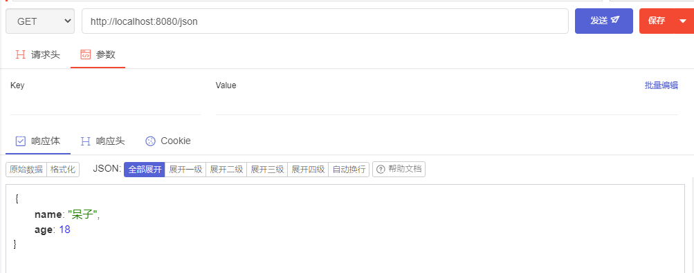

# SpringMVC笔记

## 回顾MVC


### 什么是MVC

- MVC是模型(Model)、视图(View)、控制器(Controller)的简写，是一种软件设计规范。
- 是将业务逻辑、数据、显示分离的方法来组织代码。
- MVC主要作用是**降低了视图与业务逻辑间的双向偶合**。
- MVC不是一种设计模式，**MVC是一种架构模式**。当然不同的MVC存在差异。

**Model（模型）：**数据模型，提供要展示的数据，因此包含数据和行为，可以认为是领域模型或JavaBean组件（包含数据和行为），不过现在一般都分离开来：Value Object（数据Dao） 和 服务层（行为Service）。也就是模型提供了模型数据查询和模型数据的状态更新等功能，包括数据和业务。

**View（视图）：**负责进行模型的展示，一般就是我们见到的用户界面，客户想看到的东西。

**Controller（控制器）：**接收用户请求，委托给模型进行处理（状态改变），处理完毕后把返回的模型数据返回给视图，由视图负责展示。也就是说控制器做了个调度员的工作。

**最典型的MVC就是JSP + servlet + javabean的模式。**


**职责分析：**

**Controller：控制器**

1. 取得表单数据
2. 调用业务逻辑
3. 转向指定的页面

**Model：模型**

1. 业务逻辑
2. 保存数据的状态

**View：视图**

1. 示页面

Model这样不仅提高的代码的复用率与项目的扩展性，且大大降低了项目的维护成本。

### 回顾Servlet

* 新建一个Maven工程当做父工程！pom依赖！

```xml
<dependencies>
   <dependency>
       <groupId>junit</groupId>
       <artifactId>junit</artifactId>
       <version>4.12</version>
   </dependency>
   <dependency>
       <groupId>org.springframework</groupId>
       <artifactId>spring-webmvc</artifactId>
       <version>5.1.9.RELEASE</version>
   </dependency>
   <dependency>
       <groupId>javax.servlet</groupId>
       <artifactId>servlet-api</artifactId>
       <version>2.5</version>
   </dependency>
   <dependency>
       <groupId>javax.servlet.jsp</groupId>
       <artifactId>jsp-api</artifactId>
       <version>2.2</version>
   </dependency>
   <dependency>
       <groupId>javax.servlet</groupId>
       <artifactId>jstl</artifactId>
       <version>1.2</version>
   </dependency>
</dependencies>
```

* 建立一个Moudle：00-servlet ， 添加Web app的支持！
* 添加框架支持


* 导入servlet 和 jsp 的 jar 依赖

```xml
<dependency>
   <groupId>javax.servlet</groupId>
   <artifactId>servlet-api</artifactId>
   <version>2.5</version>
</dependency>
<dependency>
   <groupId>javax.servlet.jsp</groupId>
   <artifactId>jsp-api</artifactId>
   <version>2.2</version>
</dependency>
```

* 编写一个Servlet类，用来处理用户的请求

```xml
package com.easy.servlet;

import javax.servlet.ServletException;
import javax.servlet.http.HttpServlet;
import javax.servlet.http.HttpServletRequest;
import javax.servlet.http.HttpServletResponse;
import java.io.IOException;

public class HelloServlet extends HttpServlet {
    @Override
    protected void doGet(HttpServletRequest req, HttpServletResponse resp) throws ServletException, IOException {
        String method = req.getParameter("method");
        if(method.equals("add")){
            req.getSession().setAttribute("msg","执行了add方法");
        }
        if(method.equals("delete")){
            req.getSession().setAttribute("msg","执行了delete方法");
        }

        req.getRequestDispatcher("/WEB-INF/jsp/hello.jsp").forward(req,resp);
    }

    @Override
    protected void doPost(HttpServletRequest req, HttpServletResponse resp) throws ServletException, IOException {
        this.doGet(req,resp);
    }
}
```

* 编写Hello.jsp，在WEB-INF目录下新建一个jsp的文件夹，新建hello.jsp

```jsp
<%@ page contentType="text/html;charset=UTF-8" language="java" %>
<html>
    <head>
        <title>测试</title>
    </head>
    <body>
        ${msg}
    </body>
</html>
```

* 在web.xml中注册Servlet

```xml
<?xml version="1.0" encoding="UTF-8"?>
<web-app xmlns="http://xmlns.jcp.org/xml/ns/javaee"
         xmlns:xsi="http://www.w3.org/2001/XMLSchema-instance"
         xsi:schemaLocation="http://xmlns.jcp.org/xml/ns/javaee http://xmlns.jcp.org/xml/ns/javaee/web-app_4_0.xsd"
         version="4.0">
    <servlet>
        <servlet-name>HelloServlet</servlet-name>
        <servlet-class>com.easy.servlet.HelloServlet</servlet-class>
    </servlet>
    <servlet-mapping>
        <servlet-name>HelloServlet</servlet-name>
        <url-pattern>/hello</url-pattern>
    </servlet-mapping>

    <session-config>
        <session-timeout>15</session-timeout>
    </session-config>
    
    <welcome-file-list>
        <welcome-file>index.jsp</welcome-file>
    </welcome-file-list>
</web-app>
```

* 配置Tomcat，并启动测试
  * **localhost:8080/hello?method=add**
  * **localhost:8080/hello?method=delete**

**MVC框架要做哪些事情**

1. 将url映射到java类或java类的方法 .
2. 封装用户提交的数据 .
3. 处理请求--调用相关的业务处理--封装响应数据 .
4. 将响应的数据进行渲染 . jsp / html 等表示层数据 .

**说明：**

​	常见的服务器端MVC框架有：Struts、Spring MVC、ASP.NET MVC、Zend Framework、JSF；常见前端MVC框架：vue、angularjs、react、backbone；由MVC演化出了另外一些模式如：MVP、MVVM 等等....

## 什么是SpringMVC

### 概述


Spring MVC是Spring Framework的一部分，是基于Java实现MVC的轻量级Web框架。

查看官方文档：https://docs.spring.io/spring/docs/5.2.0.RELEASE/spring-framework-reference/web.html#spring-web

**我们为什么要学习SpringMVC呢?**

 Spring MVC的特点：

1. **轻量级，简单易学**
2. **高效 , 基于请求响应的MVC框架**
3. **与Spring兼容性好，无缝结合**
4. **约定优于配置**
5. **功能强大：RESTful、数据验证、格式化、本地化、主题等**
6. **简洁灵活**

Spring的web框架围绕**DispatcherServlet** [ 调度Servlet ] 设计。

DispatcherServlet的作用是将请求分发到不同的处理器。从Spring 2.5开始，使用Java 5或者以上版本的用户可以采用基于注解形式进行开发，十分简洁；

正因为SpringMVC好 , 简单 , 便捷 , 易学 , 天生和Spring无缝集成(使用SpringIoC和Aop) , 使用约定优于配置 . 能够进行简单的junit测试 . 支持Restful风格 .异常处理 , 本地化 , 国际化 , 数据验证 , 类型转换 , 拦截器 等等......所以我们要学习 .

**最重要的一点还是用的人多 , 使用的公司多 .** 

### 中心控制器

Spring的web框架围绕DispatcherServlet设计。DispatcherServlet的作用是将请求分发到不同的处理器。从Spring 2.5开始，使用Java 5或者以上版本的用户可以采用基于注解的controller声明方式。

Spring MVC框架像许多其他MVC框架一样, **以请求为驱动** , **围绕一个中心Servlet分派请求及提供其他功能**，**DispatcherServlet是一个实际的Servlet (它继承自HttpServlet 基类)**。


SpringMVC的原理如下图所示：

​	当发起请求时被前置的控制器拦截到请求，根据请求参数生成代理请求，找到请求对应的实际控制器，控制器处理请求，创建数据模型，访问数据库，将模型响应给中心控制器，控制器使用模型与视图渲染视图结果，将结果返回给中心控制器，再将结果返回给请求者。


### SpringMVC执行原理


图为SpringMVC的一个较完整的流程图，实线表示SpringMVC框架提供的技术，不需要开发者实现，虚线表示需要开发者实现。

**简要分析执行流程**

1. DispatcherServlet表示前置控制器，是整个SpringMVC的控制中心。用户发出请求，DispatcherServlet接收请求并拦截请求。

   我们假设请求的url为 : http://localhost:8080/SpringMVC/hello

   **如上url拆分成三部分：**

   http://localhost:8080服务器域名

   SpringMVC部署在服务器上的web站点

   hello表示控制器

   通过分析，如上url表示为：请求位于服务器localhost:8080上的SpringMVC站点的hello控制器。

2. HandlerMapping为处理器映射。DispatcherServlet调用HandlerMapping,HandlerMapping根据请求url查找Handler。

3. HandlerExecution表示具体的Handler,其主要作用是根据url查找控制器，如上url被查找控制器为：hello。

4. HandlerExecution将解析后的信息传递给DispatcherServlet,如解析控制器映射等。

5. HandlerAdapter表示处理器适配器，其按照特定的规则去执行Handler。

6. Handler让具体的Controller执行。

7. Controller将具体的执行信息返回给HandlerAdapter,如ModelAndView。

8. HandlerAdapter将视图逻辑名或模型传递给DispatcherServlet。

9. DispatcherServlet调用视图解析器(ViewResolver)来解析HandlerAdapter传递的逻辑视图名。

10. 视图解析器将解析的逻辑视图名传给DispatcherServlet。

11. DispatcherServlet根据视图解析器解析的视图结果，调用具体的视图。

12. 最终视图呈现给用户。

## 第一个MVC程序：HelloSpringMVC

### 配置版

* 新建一个Moudle ， springmvc-02-hello ， 添加web的支持！
* 确定导入了SpringMVC 的依赖！

```xml
<dependencies>
   <dependency>
       <groupId>junit</groupId>
       <artifactId>junit</artifactId>
       <version>4.12</version>
   </dependency>
   <dependency>
       <groupId>org.springframework</groupId>
       <artifactId>spring-webmvc</artifactId>
       <version>5.1.9.RELEASE</version>
   </dependency>
   <dependency>
       <groupId>javax.servlet</groupId>
       <artifactId>servlet-api</artifactId>
       <version>2.5</version>
   </dependency>
   <dependency>
       <groupId>javax.servlet.jsp</groupId>
       <artifactId>jsp-api</artifactId>
       <version>2.2</version>
   </dependency>
   <dependency>
       <groupId>javax.servlet</groupId>
       <artifactId>jstl</artifactId>
       <version>1.2</version>
   </dependency>
</dependencies>
```

* 配置web.xml  ， 注册DispatcherServlet

```xml
<?xml version="1.0" encoding="UTF-8"?>
<web-app xmlns="http://xmlns.jcp.org/xml/ns/javaee"
         xmlns:xsi="http://www.w3.org/2001/XMLSchema-instance"
         xsi:schemaLocation="http://xmlns.jcp.org/xml/ns/javaee http://xmlns.jcp.org/xml/ns/javaee/web-app_4_0.xsd"
         version="4.0">
    
    <!-- 1.注册DispatcherServlet -->
    <servlet>
        <servlet-name>springmvc</servlet-name>
        <servlet-class>org.springframework.web.servlet.DispatcherServlet</servlet-class>
        <!--关联一个springmvc的配置文件：【servlet-name】-servlet.xml-->
        <init-param>
            <param-name>contextConfigLocation</param-name>
            <param-value>classpath:springmvc-servlet.xml</param-value>
        </init-param>
        <!--启动级别-->
        <load-on-startup>1</load-on-startup>
    </servlet>

    <!--/ 匹配所有的请求；（不包括.jsp）-->
    <!--/* 匹配所有的请求；（包括.jsp）-->
    <servlet-mapping>
        <servlet-name>springmvc</servlet-name>
        <url-pattern>/</url-pattern>
    </servlet-mapping>
</web-app>
```

* 编写SpringMVC 的 配置文件！名称：resources/springmvc-servlet.xml  : [servletname]-servlet.xml

  说明，这里的名称要求是按照官方来的

```xml
<?xml version="1.0" encoding="UTF-8"?>
<beans xmlns="http://www.springframework.org/schema/beans"
       xmlns:xsi="http://www.w3.org/2001/XMLSchema-instance"
       xsi:schemaLocation="http://www.springframework.org/schema/beans
       http://www.springframework.org/schema/beans/spring-beans.xsd">

</beans>
```

* 添加 处理映射器

```xml
<bean class="org.springframework.web.servlet.handler.BeanNameUrlHandlerMapping"/>
```

* 添加 处理器适配器

```xml
<bean class="org.springframework.web.servlet.mvc.SimpleControllerHandlerAdapter"/>
```

* 添加 视图解析器

```xml
<!--视图解析器:DispatcherServlet给他的ModelAndView-->
<bean class="org.springframework.web.servlet.view.InternalResourceViewResolver" id="InternalResourceViewResolver">
   <!--前缀-->
   <property name="prefix" value="/WEB-INF/jsp/"/>
   <!--后缀-->
   <property name="suffix" value=".jsp"/>
</bean>
```

* 完整

```xml
<?xml version="1.0" encoding="UTF-8"?>
<beans xmlns="http://www.springframework.org/schema/beans"
       xmlns:xsi="http://www.w3.org/2001/XMLSchema-instance"
       xsi:schemaLocation="http://www.springframework.org/schema/beans
       http://www.springframework.org/schema/beans/spring-beans.xsd">

    <bean class="org.springframework.web.servlet.handler.BeanNameUrlHandlerMapping"/>
    <bean class="org.springframework.web.servlet.mvc.SimpleControllerHandlerAdapter"/>
    <!--视图解析器:DispatcherServlet给他的ModelAndView-->
    <bean class="org.springframework.web.servlet.view.InternalResourceViewResolver" id="InternalResourceViewResolver">
        <!--前缀-->
        <property name="prefix" value="/WEB-INF/jsp/"/>
        <!--后缀-->
        <property name="suffix" value=".jsp"/>
    </bean>
</beans>
```

* 编写我们要操作业务Controller ，要么实现Controller接口，要么增加注解；需要返回一个ModelAndView，装数据，封视图；

```java
package com.easy.controller;


import org.springframework.web.servlet.ModelAndView;
import org.springframework.web.servlet.mvc.Controller;

import javax.servlet.http.HttpServletRequest;
import javax.servlet.http.HttpServletResponse;

public class HelloController implements Controller {

    @Override
    public ModelAndView handleRequest(HttpServletRequest httpServletRequest, HttpServletResponse httpServletResponse) throws Exception {
        //ModelAndView 模型和视图
        ModelAndView mv = new ModelAndView();

        //封装对象，放在ModelAndView中。Model
        mv.addObject("msg","HelloSpringMVC！！！");
        //封装要跳转的视图，放在ModelAndView中
        mv.setViewName("hello");
        return mv;
    }
}
```

* 将自己的类交给SpringIOC容器，注册bean

```xml
<!--Handler-->
<bean id="/hello" class="com.easy.controller.HelloController" />
```

* 写要跳转的jsp页面，显示ModelandView存放的数据，以及我们的正常页面；

```html
<%@ page contentType="text/html;charset=UTF-8" language="java" %>
    <html>
        <head>
            <title>Title</title>
        </head>
        <body>
            ${msg}
        </body>
    </html>
```

* 配置Tomcat 启动测试！

### 注解版

* **建一个Moudle，springmvc-03-hello-annotation 。添加web支持！**
* 由于Maven可能存在资源过滤的问题，我们将配置完善

```xml
<build>
   <resources>
       <resource>
           <directory>src/main/java</directory>
           <includes>
               <include>**/*.properties</include>
               <include>**/*.xml</include>
           </includes>
           <filtering>false</filtering>
       </resource>
       <resource>
           <directory>src/main/resources</directory>
           <includes>
               <include>**/*.properties</include>
               <include>**/*.xml</include>
           </includes>
           <filtering>false</filtering>
       </resource>
   </resources>
</build>
```

* 在pom.xml文件引入相关的依赖：主要有Spring框架核心库、Spring MVC、servlet , JSTL等。我们在父依赖中已经引入了！

* **配置web.xml**

```xml
<?xml version="1.0" encoding="UTF-8"?>
<web-app xmlns="http://xmlns.jcp.org/xml/ns/javaee"
         xmlns:xsi="http://www.w3.org/2001/XMLSchema-instance"
         xsi:schemaLocation="http://xmlns.jcp.org/xml/ns/javaee http://xmlns.jcp.org/xml/ns/javaee/web-app_4_0.xsd"
         version="4.0">

    <!-- 1.注册servlet -->
    <servlet>
        <servlet-name>dispatcherServlet</servlet-name>
        <servlet-class>org.springframework.web.servlet.DispatcherServlet</servlet-class>
        <!--通过初始化参数指定dispatcherServlet配置文件的位置，进行关联-->
        <init-param>
            <param-name>contextConfigLocation</param-name>
            <param-value>classpath:springmvc.xml</param-value>
        </init-param>
        <!-- 启动顺序，数字越小，启动越早 -->
        <load-on-startup>1</load-on-startup>
    </servlet>
    <!--所有请求都会被dispatcherServlet拦截 -->
    <servlet-mapping>
        <servlet-name>dispatcherServlet</servlet-name>
        <url-pattern>/</url-pattern>
    </servlet-mapping>
</web-app>
```

**/ 和 /\* 的区别：**< url-pattern > / </ url-pattern > 不会匹配到.jsp， 只针对我们编写的请求；即：.jsp 不会进入spring的 DispatcherServlet类 。< url-pattern > /* </ url-pattern > 会匹配 *.jsp，会出现返回 jsp视图 时再次进入spring的DispatcherServlet 类，导致找不到对应的controller所以报404错。

- 注意web.xml版本问题，要最新版！

- 注册DispatcherServlet
- 关联SpringMVC的配置文件
- 启动级别为1
- 映射路径为 / 【不要用/*，会404】

* **添加Spring MVC配置文件**

在resource目录下添加springmvc.xml配置文件，配置的形式与Spring容器配置基本类似，为了支持基于注解的IOC，设置了自动扫描包的功能，具体配置信息如下：

```xml
<?xml version="1.0" encoding="UTF-8"?>
<beans xmlns="http://www.springframework.org/schema/beans"
       xmlns:xsi="http://www.w3.org/2001/XMLSchema-instance"
       xmlns:context="http://www.springframework.org/schema/context"
       xmlns:mvc="http://www.springframework.org/schema/mvc"
       xsi:schemaLocation="http://www.springframework.org/schema/beans
       http://www.springframework.org/schema/beans/spring-beans.xsd
       http://www.springframework.org/schema/context
       https://www.springframework.org/schema/context/spring-context.xsd
       http://www.springframework.org/schema/mvc
       https://www.springframework.org/schema/mvc/spring-mvc.xsd">

    <!-- 自动扫描包，让指定包下的注解生效,由IOC容器统一管理 -->
    <context:component-scan base-package="com.easy.controller"/>
    <!-- 让Spring MVC不处理静态资源 -->
    <mvc:default-servlet-handler />
    <!--
    支持mvc注解驱动
        在spring中一般采用@RequestMapping注解来完成映射关系
        要想使@RequestMapping注解生效
        必须向上下文中注册DefaultAnnotationHandlerMapping
        和一个AnnotationMethodHandlerAdapter实例
        这两个实例分别在类级别和方法级别处理。
        而annotation-driven配置帮助我们自动完成上述两个实例的注入。
     -->
    <mvc:annotation-driven />

    <!-- 视图解析器 -->
    <bean class="org.springframework.web.servlet.view.InternalResourceViewResolver"
          id="internalResourceViewResolver">
        <!-- 前缀 -->
        <property name="prefix" value="/WEB-INF/"/>
        <!-- 后缀 -->
        <property name="suffix" value=".html"/>
    </bean>

</beans>
```

1. 在视图解析器中我们把所有的视图都存放在/WEB-INF/目录下，这样可以保证视图安全，因为这个目录下的文件，客户端不能直接访问。

2. - 让IOC的注解生效
   - 静态资源过滤 ：HTML . JS . CSS . 图片 ， 视频 .....
   - MVC的注解驱动
   - 配置视图解析器

* **创建Controller**

编写一个Java控制类：`com.easy.controller.HelloController` , 注意编码规范

```java
package com.easy.controller;

import org.springframework.stereotype.Controller;
import org.springframework.ui.Model;
import org.springframework.web.bind.annotation.RequestMapping;

@Controller
public class HelloController {

    //真实访问地址 : 项目名/HelloController/hello
    @RequestMapping("/hello")
    public String sayHello(Model model){
        //向模型中添加属性msg与值，可以在JSP页面中取出并渲染
        model.addAttribute("msg","hello,SpringMVC");
        //web-inf/jsp/hello.jsp
        return "hello";
    }
}
```

1. @Controller是为了让Spring IOC容器初始化时自动扫描到；
2. @RequestMapping是为了映射请求路径，这里因为类与方法上都有映射所以访问时应该是/HelloController/hello；
3. 方法中声明Model类型的参数是为了把Action中的数据带到视图中；
4. 方法返回的结果是视图的名称hello，加上配置文件中的前后缀变成WEB-INF/jsp/**hello**.jsp。

* **创建视图层**

1. 在WEB-INF/ jsp目录中创建hello.jsp ， 视图可以直接取出并展示从Controller带回的信息；

2. 可以通过EL表示取出Model中存放的值，或者对象；

```html
<%@ page contentType="text/html;charset=UTF-8" language="java" %>
    <html>
        <head>
            <title>SpringMVC</title>
        </head>
        <body>
            ${msg}
        </body>
    </html>
```

* **配置Tomcat运行**

### 小结

实现步骤其实非常的简单：

1. 新建一个web项目
2. 导入相关jar包
3. 编写web.xml , 注册DispatcherServlet
4. 编写springmvc配置文件
5. 接下来就是去创建对应的控制类 , controller
6. 最后完善前端视图和controller之间的对应
7. 测试运行调试.

使用springMVC必须配置的三大件：

**处理器映射器、处理器适配器、视图解析器**

通常，我们只需要**手动配置视图解析器**，而**处理器映射器**和**处理器适配器**只需要开启**注解驱动**即可，而省去了大段的xml配置

## 相关问题

### 出现404或者505

* WEB-INF下根本没有lib文件夹，添加jar包


## 控制器Controller

### 介绍

- 控制器复杂提供访问应用程序的行为，通常通过接口定义或注解定义两种方法实现。
- 控制器负责解析用户的请求并将其转换为一个模型。
- 在Spring MVC中一个控制器类可以包含多个方法
- 在Spring MVC中，对于Controller的配置方式有很多种

### 实现Controller接口

* 新建一个Moudle，springmvc-04-controller,添加web支持，并将jar包导入


* 编写一个Controller类，HelloController

```java
package com.easy.controller;


import org.springframework.web.servlet.ModelAndView;
import org.springframework.web.servlet.mvc.Controller;

import javax.servlet.http.HttpServletRequest;
import javax.servlet.http.HttpServletResponse;

public class HelloController implements Controller {
    @Override
    public ModelAndView handleRequest(HttpServletRequest request, HttpServletResponse response) throws Exception {
        ModelAndView mv = new ModelAndView();

        mv.addObject("msg","hello Controller!!!");
        mv.setViewName("test");
        return mv;
    }
}
```

* 编写完毕后，去Spring配置文件中注册请求的bean；name对应请求路径，class对应处理请求的类

```xml
<bean name="/t1" class="com.easy.controller.HelloController"/>
```

* 编写前端test.jsp，注意在WEB-INF/jsp目录下编写，对应我们的视图解析器

```html
<%@ page contentType="text/html;charset=UTF-8" language="java" %>
<html>
<head>
   <title>Kuangshen</title>
</head>
<body>
${msg}
</body>
</html>
```

* 配置web.xml

```xml
<?xml version="1.0" encoding="UTF-8"?>
<web-app xmlns="http://xmlns.jcp.org/xml/ns/javaee"
         xmlns:xsi="http://www.w3.org/2001/XMLSchema-instance"
         xsi:schemaLocation="http://xmlns.jcp.org/xml/ns/javaee http://xmlns.jcp.org/xml/ns/javaee/web-app_4_0.xsd"
         version="4.0">
    <servlet>
        <servlet-name>dispatcherServlet</servlet-name>
        <servlet-class>org.springframework.web.servlet.DispatcherServlet</servlet-class>
        <init-param>
            <param-name>contextConfigLocation</param-name>
            <param-value>classpath:spring-config.xml</param-value>
        </init-param>
        <load-on-startup>1</load-on-startup>
    </servlet>
    
    <servlet-mapping>
        <servlet-name>dispatcherServlet</servlet-name>
        <url-pattern>/</url-pattern>
    </servlet-mapping>
</web-app>
```

* 配置`spring-config.xml`

```xml
<?xml version="1.0" encoding="UTF-8"?>
<beans xmlns="http://www.springframework.org/schema/beans"
       xmlns:xsi="http://www.w3.org/2001/XMLSchema-instance"
       xmlns:context="http://www.springframework.org/schema/context"
       xmlns:mvc="http://www.springframework.org/schema/mvc"
       xsi:schemaLocation="http://www.springframework.org/schema/beans
                           http://www.springframework.org/schema/beans/spring-beans.xsd http://www.springframework.org/schema/context https://www.springframework.org/schema/context/spring-context.xsd http://www.springframework.org/schema/mvc https://www.springframework.org/schema/mvc/spring-mvc.xsd">

    <context:component-scan base-package="com.easy.controller" />
    <mvc:default-servlet-handler/>
    <mvc:annotation-driven />

    <!--视图解析器:DispatcherServlet给他的ModelAndView-->
    <bean class="org.springframework.web.servlet.view.InternalResourceViewResolver" id="InternalResourceViewResolver">
        <!--前缀-->
        <property name="prefix" value="/WEB-INF/jsp/"/>
        <!--后缀-->
        <property name="suffix" value=".jsp"/>
    </bean>

    <!--Handler-->
    <bean id="/t" class="com.easy.controller.HelloController"/>
</beans>
```

* 配置Tomcat运行测试，我这里没有项目发布名配置的就是一个 / ，所以请求不用加项目名，OK！


**说明：**

- 实现接口Controller定义控制器是较老的办法
- 缺点是：**一个控制器中只有一个方法，如果要多个方法则需要定义多个Controller；定义的方式比较麻烦；**

### 使用注解@Controller

- @Controller注解类型用于声明Spring类的实例是一个控制器（在讲IOC时还提到了另外3个注解）；
- Spring可以使用扫描机制来找到应用程序中所有基于注解的控制器类，为了保证Spring能找到你的控制器，需要在配置文件中声明组件扫描。

```xml
<!-- 自动扫描指定的包，下面所有注解类交给IOC容器管理 -->
<context:component-scan base-package="com.easy.controller" />
```

* 增加一个ControllerTest类，使用注解实现；

```java
package com.easy.controller;

import org.springframework.stereotype.Controller;
import org.springframework.ui.Model;
import org.springframework.web.bind.annotation.RequestMapping;

@Controller
public class TestController {
    @RequestMapping("/test")
    public String index(Model model){
        model.addAttribute("msg","Test");
        return "test";
    }
}
```

* 运行Tomcat测试


> **控制器与视图之间是弱偶合关系。**

小细节：

* @Component：组件
* @Service：service
* @Controller：controller
* @Repository：dao/mapper

### RequestMapping

#### @RequestMapping

- @RequestMapping注解用于映射url到控制器类或一个特定的处理程序方法。可用于类或方法上。用于类上，表示类中的所有响应请求的方法都是以该地址作为父路径。
- 为了测试结论更加准确，我们可以加上一个项目名测试 myweb
- 只注解在方法上面

```java
@Controller
public class TestController {
    @RequestMapping("/test")
    public String index(Model model){
        model.addAttribute("msg","Test");
        return "test";
    }
}
```

http://localhost:8080/test

* 同时注解类与方法

```java
@Controller
@RequestMapping("/TestController")
public class TestController {
    @RequestMapping("/test")
    public String index(Model model){
        model.addAttribute("msg","Test");
        return "test";
    }
}
```

http://localhost:8080/TestController/test

## RestFul

### 概念

Restful就是一个资源定位及资源操作的风格。不是标准也不是协议，只是一种风格。基于这个风格设计的软件可以更简洁，更有层次，更易于实现缓存等机制。

### 功能

资源：互联网所有的事物都可以被抽象为资源

资源操作：使用POST、DELETE、PUT、GET，使用不同方法对资源进行操作。

分别对应 添加、 删除、修改、查询。

**传统方式操作资源**：通过不同的参数来实现不同的效果！方法单一，post 和 get

- ​	http://127.0.0.1/item/queryItem.action?id=1 查询,GET
- ​	http://127.0.0.1/item/saveItem.action 新增,POST
- ​	http://127.0.0.1/item/updateItem.action 更新,POST
- ​	http://127.0.0.1/item/deleteItem.action?id=1 删除,GET或POST

**使用RESTful操作资源**：可以通过不同的请求方式来实现不同的效果！如下：请求地址一样，但是功能可以不同！

- ​	http://127.0.0.1/item/1 查询,GET
- ​	http://127.0.0.1/item 新增,POST
- ​	http://127.0.0.1/item 更新,PUT
- ​	http://127.0.0.1/item/1 删除,DELETE

**学习测试**

* 新建一个类`RestFulController`

```java
@Controller
public class RestFulController {
}
```

* 在Spring MVC中可以使用  @PathVariable 注解，让方法参数的值对应绑定到一个URI模板变量上。

```java
@Controller
public class RestFulController {
    @RequestMapping("/add/{a}/{b}")
    public String test(@PathVariable int a,@PathVariable int b, Model model){
        int res = a + b;
        model.addAttribute("msg",res);
        return "test";
    }
}
```


思考：使用路径变量的好处？

1. 使路径变得更加简洁；
2. 获得参数更加方便，框架会自动进行类型转换。
3. 通过路径变量的类型可以约束访问参数，如果类型不一样，则访问不到对应的请求方法，如这里访问是的路径是/add/1/a，则路径与方法不匹配，而不会是参数转换失败。

### 使用method属性指定请求类型

用于约束请求的类型，可以收窄请求范围。指定请求谓词的类型如GET, POST, HEAD, OPTIONS, PUT, PATCH, DELETE, TRACE等

* 增加一个方法

```java
@Controller
public class RestFulController {
    //    @RequestMapping(value = "/add/{a}/{b}",method = RequestMethod.POST)
    @PostMapping(value = "/add/{a}/{b}")
    public String test2(@PathVariable int a,@PathVariable int b, Model model){
        int res = a + b;
        model.addAttribute("msg",res);
        return "test";
    }
}
```

> 使用PostWoman Http接口调试插件进行调试


**小结：**

Spring MVC 的 @RequestMapping 注解能够处理 HTTP 请求的方法, 比如 GET, PUT, POST, DELETE 以及 PATCH。

**所有的地址栏请求默认都会是 HTTP GET 类型的。**

方法级别的注解变体有如下几个：组合注解

- **@GetMapping**
- **@PostMapping**
- **@PutMapping**
- **@DeleteMapping**
- **@PatchMapping**

@GetMapping 是一个组合注解，平时使用的会比较多！

它所扮演的是 @RequestMapping(method =RequestMethod.GET) 的一个快捷方式。

## 数据处理及跳转

### 跳转方式

#### ModelAndView

设置ModelAndView，根据View的名称，和视图解析器跳转到指定的页面

* 页面：{视图解析器前缀}+viewName+{视图解析器后缀}

```xml
<!-- 视图解析器 -->
<bean class="org.springframework.web.servlet.view.InternalResourceViewResolver"
     id="internalResourceViewResolver">
   <!-- 前缀 -->
   <property name="prefix" value="/WEB-INF/jsp/" />
   <!-- 后缀 -->
   <property name="suffix" value=".jsp" />
</bean>
```

* 对应的controller类

```java
public class ControllerTest1 implements Controller {

   public ModelAndView handleRequest(HttpServletRequest httpServletRequest, HttpServletResponse httpServletResponse) throws Exception {
       //返回一个模型视图对象
       ModelAndView mv = new ModelAndView();
       mv.addObject("msg","ControllerTest1");
       mv.setViewName("test");
       return mv;
  }
}
```

#### ServletAPI

通过设置ServletAPI , 不需要视图解析器 .

1、通过HttpServletResponse进行输出

2、通过HttpServletResponse实现重定向

3、通过HttpServletResponse实现转发

```java
package com.easy.controller;

import org.springframework.stereotype.Controller;
import org.springframework.web.bind.annotation.RequestMapping;

import javax.servlet.*;
import javax.servlet.http.*;
import java.io.IOException;

@Controller
public class ResultServlet {

    @RequestMapping("/result/test1")
    protected void test1(HttpServletRequest request, HttpServletResponse response) throws ServletException, IOException {
     response.getWriter() .println("Hello,Spring By Servlet API");
    }

    @RequestMapping("/result/test2")
    protected void test2(HttpServletRequest request, HttpServletResponse response) throws ServletException, IOException {
        response.sendRedirect("/index.jsp");
    }

    @RequestMapping("/result/test3")
    protected void test3(HttpServletRequest request, HttpServletResponse response) throws ServletException, IOException {
        request.setAttribute("msg","/result/test3");
        request.getRequestDispatcher("/WEB-INF/jsp/test.jsp").forward(request,response);
    }
}
```

#### SpringMVC

**通过SpringMVC来实现转发和重定向 - 无需视图解析器；**

测试前，需要将视图解析器注释掉

```java
@Controller
public class ResultSpringMVC {
   @RequestMapping("/result/test1")
   public String test1(){
       //转发
       return "/index.jsp";
  }

   @RequestMapping("/result/test2")
   public String test2(){
       //转发二
       return "forward:/index.jsp";
  }

   @RequestMapping("/result/test3")
   public String test3(){
       //重定向
       return "redirect:/index.jsp";
  }
}
```

**通过SpringMVC来实现转发和重定向 - 有视图解析器；**

重定向 , 不需要视图解析器 , 本质就是重新请求一个新地方嘛 , 所以注意路径问题.

可以重定向到另外一个请求实现 .

```java
@Controller
public class RestFulController {
    @RequestMapping(value = "/add/{a}/{b}")
    public String test(@PathVariable int a,@PathVariable int b, Model model){
        int res = a + b;
        model.addAttribute("msg",res);
          //转发
        return "test";
    }

    @RequestMapping(value = "/index")
    public String test3(){
        return "redirect:/add/1/2";
       //重定向
       //return "redirect:/index.jsp";
       //return "redirect:hello.do"; //hello.do为另一个请求/
    }
}

```


### 数据处理

#### 处理提交数据

* **提交的域名称和处理方法的参数名一致**

```java
@RequestMapping("/say")
public String hello(String name){
    System.out.println(name);
    return "hello";
}
```

http://localhost:8080/say?name=hello


* **提交的域名称和处理方法的参数名不一致**

```java
@RequestMapping("/say")
public String hello(@RequestMapping("username") String name){
    System.out.println(name);
    return "hello";
}
```

http://localhost:8080/say?username=hello


* **提交的是一个对象**

要求提交的表单域和对象的属性名一致，参数使用对象即可。

1. 实体类

```java
package com.easy.pojo;

import lombok.AllArgsConstructor;
import lombok.Data;
import lombok.NoArgsConstructor;

@Data
@AllArgsConstructor
@NoArgsConstructor
public class User {
    private String name;
    private int age;
}
```

2. 提交数据：http://localhost:8080/user?name=bob&age=18
3. 处理方法

```java
@RequestMapping("/user")
public String user(User user){
    System.out.println(user);
    return "hello";
}
```


说明：如果使用对象的话，前端传递的参数名和对象名必须一致，否则就是null。

#### 数据显示到前端

##### **第一种 : 通过ModelAndView**

我们前面一直都是如此 . 就不过多解释

```
public class ControllerTest1 implements Controller {

   public ModelAndView handleRequest(HttpServletRequest httpServletRequest, HttpServletResponse httpServletResponse) throws Exception {
       //返回一个模型视图对象
       ModelAndView mv = new ModelAndView();
       mv.addObject("msg","ControllerTest1");
       mv.setViewName("test");
       return mv;
  }
}
```

##### **第二种 : 通过ModelMap**

ModelMap

```
@RequestMapping("/hello")
public String hello(@RequestParam("username") String name, ModelMap model){
   //封装要显示到视图中的数据
   //相当于req.setAttribute("name",name);
   model.addAttribute("name",name);
   System.out.println(name);
   return "hello";
}
```

##### **第三种 : 通过Model**

Model

```
@RequestMapping("/ct2/hello")
public String hello(@RequestParam("username") String name, Model model){
   //封装要显示到视图中的数据
   //相当于req.setAttribute("name",name);
   model.addAttribute("msg",name);
   System.out.println(name);
   return "test";
}
```

#### 方法对比

就对于新手而言简单来说使用区别就是：

```
Model 只有寥寥几个方法只适合用于储存数据，简化了新手对于Model对象的操作和理解；

ModelMap 继承了 LinkedHashMap ，除了实现了自身的一些方法，同样的继承 LinkedHashMap 的方法和特性；

ModelAndView 可以在储存数据的同时，可以进行设置返回的逻辑视图，进行控制展示层的跳转。
```

当然更多的以后开发考虑的更多的是性能和优化，就不能单单仅限于此的了解。

**请使用80%的时间打好扎实的基础，剩下18%的时间研究框架，2%的时间去学点英文，框架的官方文档永远是最好的教程。**

### 乱码问题

* 建立form.jsp

```html
<form action="/en" method="post">
 <input type="text" name="name">
 <input type="submit">
</form>
```

* 后台编写对应的处理类

```java
package com.easy.controller;


import org.springframework.stereotype.Controller;
import org.springframework.ui.Model;
import org.springframework.web.bind.annotation.RequestMapping;

@Controller
public class Encoding {
    @RequestMapping("/en")
    public String test(Model model, String name){
        model.addAttribute("msg",name); //获取表单提交的值
        return "test"; //跳转到test页面显示输入的值
    }
}
```

* http://localhost:8080/form.jsp输入中文测试，发现乱码


* 修改了web.xml文件需要重启服务器

```xml
<filter>
   <filter-name>encoding</filter-name>
   <filter-class>org.springframework.web.filter.CharacterEncodingFilter</filter-class>
   <init-param>
       <param-name>encoding</param-name>
       <param-value>utf-8</param-value>
   </init-param>
</filter>
<filter-mapping>
   <filter-name>encoding</filter-name>
   <url-pattern>/*</url-pattern>
</filter-mapping>
```

但是我们发现 , 有些极端情况下.这个过滤器对get的支持不好 .

**处理方法** :

* 修改tomcat配置文件`tomcat\conf\server.xml` ：设置编码！

```xml
<Connector URIEncoding="utf-8" port="8080" protocol="HTTP/1.1"
          connectionTimeout="20000"
          redirectPort="8443" />
```

* 自定义过滤器

```java
package com.easy.filter;

import javax.servlet.*;
import javax.servlet.http.HttpServletRequest;
import javax.servlet.http.HttpServletRequestWrapper;
import javax.servlet.http.HttpServletResponse;
import java.io.IOException;
import java.io.UnsupportedEncodingException;
import java.util.Map;

/**
* 解决get和post请求 全部乱码的过滤器
*/
public class GenericEncodingFilter implements Filter {

   @Override
   public void destroy() {
  }

   @Override
   public void doFilter(ServletRequest request, ServletResponse response, FilterChain chain) throws IOException, ServletException {
       //处理response的字符编码
       HttpServletResponse myResponse=(HttpServletResponse) response;
       myResponse.setContentType("text/html;charset=UTF-8");

       // 转型为与协议相关对象
       HttpServletRequest httpServletRequest = (HttpServletRequest) request;
       // 对request包装增强
       HttpServletRequest myrequest = new MyRequest(httpServletRequest);
       chain.doFilter(myrequest, response);
  }

   @Override
   public void init(FilterConfig filterConfig) throws ServletException {
  }

}

//自定义request对象，HttpServletRequest的包装类
class MyRequest extends HttpServletRequestWrapper {

   private HttpServletRequest request;
   //是否编码的标记
   private boolean hasEncode;
   //定义一个可以传入HttpServletRequest对象的构造函数，以便对其进行装饰
   public MyRequest(HttpServletRequest request) {
       super(request);// super必须写
       this.request = request;
  }

   // 对需要增强方法 进行覆盖
   @Override
   public Map getParameterMap() {
       // 先获得请求方式
       String method = request.getMethod();
       if (method.equalsIgnoreCase("post")) {
           // post请求
           try {
               // 处理post乱码
               request.setCharacterEncoding("utf-8");
               return request.getParameterMap();
          } catch (UnsupportedEncodingException e) {
               e.printStackTrace();
          }
      } else if (method.equalsIgnoreCase("get")) {
           // get请求
           Map<String, String[]> parameterMap = request.getParameterMap();
           if (!hasEncode) { // 确保get手动编码逻辑只运行一次
               for (String parameterName : parameterMap.keySet()) {
                   String[] values = parameterMap.get(parameterName);
                   if (values != null) {
                       for (int i = 0; i < values.length; i++) {
                           try {
                               // 处理get乱码
                               values[i] = new String(values[i]
                                      .getBytes("ISO-8859-1"), "utf-8");
                          } catch (UnsupportedEncodingException e) {
                               e.printStackTrace();
                          }
                      }
                  }
              }
               hasEncode = true;
          }
           return parameterMap;
      }
       return super.getParameterMap();
  }

   //取一个值
   @Override
   public String getParameter(String name) {
       Map<String, String[]> parameterMap = getParameterMap();
       String[] values = parameterMap.get(name);
       if (values == null) {
           return null;
      }
       return values[0]; // 取回参数的第一个值
  }

   //取所有值
   @Override
   public String[] getParameterValues(String name) {
       Map<String, String[]> parameterMap = getParameterMap();
       String[] values = parameterMap.get(name);
       return values;
  }
}
```

**然后在web.xml中配置这个过滤器即可！**

```xml
<filter>
    <filter-name>encoding</filter-name>
    <filter-class>com.easy.filter.GenericEncodingFilter</filter-class>
    <init-param>
        <param-name>encoding</param-name>
        <param-value>utf-8</param-value>
    </init-param>
</filter>
<filter-mapping>
    <filter-name>encoding</filter-name>
    <url-pattern>/*</url-pattern>
</filter-mapping>
```

乱码问题，需要平时多注意，在尽可能能设置编码的地方，都设置为统一编码 UTF-8！

## Json交互处理

### 什么是JSON？

- JSON(JavaScript Object Notation, JS 对象标记) 是一种轻量级的数据交换格式，目前使用特别广泛。
- 采用完全独立于编程语言的**文本格式**来存储和表示数据。
- 简洁和清晰的层次结构使得 JSON 成为理想的数据交换语言。
- 易于人阅读和编写，同时也易于机器解析和生成，并有效地提升网络传输效率。

在 JavaScript 语言中，一切都是对象。因此，任何JavaScript 支持的类型都可以通过 JSON 来表示，例如字符串、数字、对象、数组等。看看他的要求和语法格式：

- 对象表示为键值对，数据由逗号分隔
- 花括号保存对象
- 方括号保存数组

JSON 是 JavaScript 对象的字符串表示法，它使用文本表示一个 JS 对象的信息，本质是一个字符串。

### 对象转换

数据

```js
let user = {
    name:'bob',
    age:3,
}
```

* 将js对象转换为JSON对象

```js
// 将js对象转换为JSON对象
let data = JSON.stringify(user);
console.log(data)
```

* 将JSON对象转换为js对象

```js
// 将JSON对象转换为js对象
let to_user = JSON.parse(data);
console.log(to_user)
```

### 代码测试

* 新建module，springmvc-05-json，添加web支持
* 在web目录下新建一个jsontest.html，编写测试内容

```html
<!DOCTYPE html>
<html lang="en">
<head>
    <meta charset="UTF-8">
    <title>Title</title>
    <script type="text/javascript">
        let user = {
            name:'bob',
            age:3,
        }

        console.log(user)

        // 将js对象转换为JSON对象
        let data = JSON.stringify(user);
        console.log(data)

        // 将JSON对象转换为js对象
        let to_user = JSON.parse(data);
        console.log(to_user)
    </script>
</head>
<body>

</body>
</html>
```


### Controller返回JSON数据

#### Jackson

* 导入jar包

```xml
<dependency>
    <groupId>com.fasterxml.jackson.core</groupId>
    <artifactId>jackson-databind</artifactId>
    <version>2.9.8</version>
</dependency>
<!-- https://mvnrepository.com/artifact/com.fasterxml.jackson.core/jackson-core -->
<dependency>
    <groupId>com.fasterxml.jackson.core</groupId>
    <artifactId>jackson-core</artifactId>
    <version>2.9.8</version>
</dependency>
<!-- https://mvnrepository.com/artifact/com.fasterxml.jackson.core/jackson-annotations -->
<dependency>
    <groupId>com.fasterxml.jackson.core</groupId>
    <artifactId>jackson-annotations</artifactId>
    <version>2.9.8</version>
</dependency>
```

* 配置web.xml

```xml
<?xml version="1.0" encoding="UTF-8"?>
<web-app xmlns="http://xmlns.jcp.org/xml/ns/javaee"
         xmlns:xsi="http://www.w3.org/2001/XMLSchema-instance"
         xsi:schemaLocation="http://xmlns.jcp.org/xml/ns/javaee http://xmlns.jcp.org/xml/ns/javaee/web-app_4_0.xsd"
         version="4.0">

    <filter>
        <filter-name>encoding</filter-name>
        <filter-class>com.easy.filter.GenericEncodingFilter</filter-class>
        <init-param>
            <param-name>encoding</param-name>
            <param-value>utf-8</param-value>
        </init-param>
    </filter>
    <filter-mapping>
        <filter-name>encoding</filter-name>
        <url-pattern>/*</url-pattern>
    </filter-mapping>

    <servlet>
        <servlet-name>dispatcherServlet</servlet-name>
        <servlet-class>org.springframework.web.servlet.DispatcherServlet</servlet-class>
        <init-param>
            <param-name>contextConfigLocation</param-name>
            <param-value>classpath:springmvc-servlet.xml</param-value>
        </init-param>
        <load-on-startup>1</load-on-startup>
    </servlet>
    
    <servlet-mapping>
        <servlet-name>dispatcherServlet</servlet-name>
        <url-pattern>/</url-pattern>
    </servlet-mapping>
</web-app>
```

* 配置springmvc-servlet.xml

```xml
<?xml version="1.0" encoding="UTF-8"?>
<beans xmlns="http://www.springframework.org/schema/beans"
       xmlns:xsi="http://www.w3.org/2001/XMLSchema-instance"
       xmlns:context="http://www.springframework.org/schema/context"
       xmlns:mvc="http://www.springframework.org/schema/mvc"
       xsi:schemaLocation="http://www.springframework.org/schema/beans
       http://www.springframework.org/schema/beans/spring-beans.xsd
       http://www.springframework.org/schema/context
       http://www.springframework.org/schema/context/spring-context.xsd http://www.springframework.org/schema/mvc https://www.springframework.org/schema/mvc/spring-mvc.xsd">

    <!-- 指定要扫描的包，这个包下的注解就会生效-->
    <context:component-scan base-package="com.easy.controller"/>
    <mvc:default-servlet-handler />
    <mvc:annotation-driven />

    <bean id="internalResourceViewResolver" class="org.springframework.web.servlet.view.InternalResourceViewResolver">
        <property name="prefix" value="/WEB-INF/jsp/"/>
        <property name="suffix" value=".jsp" />
     </bean>
</beans>
```

* 编写实体类User

```java
package com.easy.pojo;

import lombok.AllArgsConstructor;
import lombok.Data;
import lombok.NoArgsConstructor;

@Data
@AllArgsConstructor
@NoArgsConstructor
public class User {
    private String name;
    private int age;
}
```

* 编写一个UserController类

这里我们需要两个新东西，一个是@ResponseBody，一个是ObjectMapper对象，我们看下具体的用法

```java
package com.easy.controller;

import com.easy.pojo.User;
import com.fasterxml.jackson.core.JsonProcessingException;
import com.fasterxml.jackson.databind.ObjectMapper;
import org.springframework.stereotype.Controller;
import org.springframework.web.bind.annotation.RequestMapping;
import org.springframework.web.bind.annotation.ResponseBody;

@Controller
public class UserController {

    @RequestMapping("/json")
    @ResponseBody
    public String jsonToTest() throws JsonProcessingException {
        // 创建一个jackson的对象映射器，用来解析数据
        ObjectMapper mapper = new ObjectMapper();

        // 创建一个对象
        User user = new User("呆子",18);

        // 将对象解析成json格式
        String data = mapper.writeValueAsString(user);

        // 由于@ResponseBody注解，这里会将str转换成json格式返回
        return data;
    }
}

```

* 配置Tomcat ， 启动http://localhost:8080/json测试一下！


#### 乱码问题

##### 通过@RequestMaping的produces属性来实现

通过@RequestMaping的produces属性来实现，修改下代码

```
@RequestMapping(value = "/json",produces = "application/json;charset=utf-8")
```

再次测试， http://localhost:8080/json ， 乱码问题OK！



##### 乱码统一解决

在springmvc的配置文件上添加一段消息StringHttpMessageConverter转换配置！

```xml
<mvc:annotation-driven>
   <mvc:message-converters register-defaults="true">
       <bean class="org.springframework.http.converter.StringHttpMessageConverter">
           <constructor-arg value="UTF-8"/>
       </bean>
       <bean class="org.springframework.http.converter.json.MappingJackson2HttpMessageConverter">
           <property name="objectMapper">
               <bean class="org.springframework.http.converter.json.Jackson2ObjectMapperFactoryBean">
                   <property name="failOnEmptyBeans" value="false"/>
               </bean>
           </property>
       </bean>
   </mvc:message-converters>
</mvc:annotation-driven>
```

##### 返回json字符串统一解决

在类上直接使用 **@RestController** ，这样子，里面所有的方法都只会返回 json 字符串了，不用再每一个都添加@ResponseBody ！我们在前后端分离开发中，一般都使用 @RestController ，十分便捷！

```java
@RestController
public class UserController {

    @RequestMapping(value = "/json")
    @ResponseBody
    public String jsonToTest() throws JsonProcessingException {
        // 创建一个jackson的对象映射器，用来解析数据
        ObjectMapper mapper = new ObjectMapper();

        // 创建一个对象
        User user = new User("呆子",18);

        // 将对象解析成json格式
        String data = mapper.writeValueAsString(user);

        // 由于@ResponseBody注解，这里会将str转换成json格式返回
        return data;
    }
}
```

测试

```java
@RequestMapping("/json2")
public String json2() throws JsonProcessingException {

    //创建一个jackson的对象映射器，用来解析数据
    ObjectMapper mapper = new ObjectMapper();
    //创建一个对象
    User user1 = new User("1号", 3);
    User user2 = new User("2号", 3);
    User user3 = new User("3号", 3);
    User user4 = new User("4号", 3);
    List<User> list = new ArrayList<User>();
    list.add(user1);
    list.add(user2);
    list.add(user3);
    list.add(user4);

    //将我们的对象解析成为json格式
    String str = mapper.writeValueAsString(list);
    return str;
}
```


* **@RestController用于返回字符串**
* **@Controller用于视图解析**

#### 输出时间对象

Jackson 默认是会把时间转成timestamps形式

**解决方案：取消timestamps形式 ， 自定义时间格式**

##### 通过使用SimpleDateFormat

```java
@RequestMapping("/json4")
public String json4() throws JsonProcessingException {

    ObjectMapper mapper = new ObjectMapper();
    //创建一个时间对象
    Date date = new Date();

    SimpleDateFormat sdf = new SimpleDateFormat("yyyy-MM-dd HH:mm:ss");

    String str = mapper.writeValueAsString(sdf.format(date));
    return str;
}
```


##### 通过使用ObjectMapper

```java
@RequestMapping("/json5")
public String json5() throws JsonProcessingException {

    ObjectMapper mapper = new ObjectMapper();

    //使用ObjectMapper进行日期格式化
    mapper.configure(SerializationFeature.WRITE_DATES_AS_TIMESTAMPS,false);

    //自定义日期格式对象
    SimpleDateFormat sdf = new SimpleDateFormat("yyyy-MM-dd HH:mm:ss");

    //指定日期格式
    mapper.setDateFormat(sdf);

    Date date = new Date();
    String str = mapper.writeValueAsString(date);
    return str;
}
```

**如果要经常使用的话，这样是比较麻烦的，我们可以将这些代码封装到一个工具类中；我们去编写下**

```java
package com.easy.utils;

import com.fasterxml.jackson.core.JsonProcessingException;
import com.fasterxml.jackson.databind.ObjectMapper;
import com.fasterxml.jackson.databind.SerializationFeature;

import java.text.SimpleDateFormat;

public class JsonUtils {
   
   public static String getJson(Object object) {
       return getJson(object,"yyyy-MM-dd HH:mm:ss");
  }

   public static String getJson(Object object,String dateFormat) {
       ObjectMapper mapper = new ObjectMapper();
       //不使用时间差的方式
       mapper.configure(SerializationFeature.WRITE_DATES_AS_TIMESTAMPS, false);
       //自定义日期格式对象
       SimpleDateFormat sdf = new SimpleDateFormat(dateFormat);
       //指定日期格式
       mapper.setDateFormat(sdf);
       try {
           return mapper.writeValueAsString(object);
      } catch (JsonProcessingException e) {
           e.printStackTrace();
      }
       return null;
  }
}
```

我们使用工具类，代码就更加简洁了！

```java
@RequestMapping("/json5")
public String json5() throws JsonProcessingException {
   Date date = new Date();
   String json = JsonUtils.getJson(date);
   return json;
}
```

#### Fastjson

fastjson.jar是阿里开发的一款专门用于Java开发的包，可以方便的实现json对象与JavaBean对象的转换，实现JavaBean对象与json字符串的转换，实现json对象与json字符串的转换。实现json的转换方法很多，最后的实现结果都是一样的。

* 导入jar包

```xml
<dependency>
    <groupId>com.alibaba</groupId>
    <artifactId>fastjson</artifactId>
    <version>1.2.76</version>
</dependency>
```

fastjson 三个主要的类：

**JSONObject  代表 json 对象** 

- JSONObject实现了Map接口, 猜想 JSONObject底层操作是由Map实现的。
- JSONObject对应json对象，通过各种形式的get()方法可以获取json对象中的数据，也可利用诸如size()，isEmpty()等方法获取"键：值"对的个数和判断是否为空。其本质是通过实现Map接口并调用接口中的方法完成的。

**JSONArray  代表 json 对象数组**

- 内部是有List接口中的方法来完成操作的。

**JSON代表 JSONObject和JSONArray的转化**

- JSON类源码分析与使用
- 仔细观察这些方法，主要是实现json对象，json对象数组，javabean对象，json字符串之间的相互转化。

**Java对象 转 JSON字符串**

```java
    @RequestMapping("/json2")
    public String json2() throws JsonProcessingException {

        //创建一个对象
        User user1 = new User("1号", 3);

        //将我们的对象解析成为json格式
        String str = JSON.toJSONString(user);
        return str;
    }
```

**JSON字符串 转 Java对象**

```javajava
User jp_user1=JSON.parseObject(str,User.class);
```

**Java对象 转 JSON对象**

```java
JSONObject jsonObject1 = (JSONObject) JSON.toJSON(user2);
```

**JSON对象 转 Java对象**

```java
User to_java_user = JSON.toJavaObject(jsonObject1, User.class);
```

这种工具类，我们只需要掌握使用就好了，在使用的时候在根据具体的业务去找对应的实现。和以前的commons-io那种工具包一样，拿来用就好了！

## Ajax研究

### 简介

- **AJAX = Asynchronous JavaScript and XML（异步的 JavaScript 和 XML）。**
- AJAX 是一种在无需重新加载整个网页的情况下，能够更新部分网页的技术。
- **Ajax 不是一种新的编程语言，而是一种用于创建更好更快以及交互性更强的Web应用程序的技术。**
- 在 2005 年，Google 通过其 Google Suggest 使 AJAX 变得流行起来。Google Suggest能够自动帮你完成搜索单词。
- Google Suggest 使用 AJAX 创造出动态性极强的 web 界面：当您在谷歌的搜索框输入关键字时，JavaScript 会把这些字符发送到服务器，然后服务器会返回一个搜索建议的列表。
- 就和国内百度的搜索框一样!

- 传统的网页(即不用ajax技术的网页)，想要更新内容或者提交一个表单，都需要重新加载整个网页。
- 使用ajax技术的网页，通过在后台服务器进行少量的数据交换，就可以实现异步局部更新。
- 使用Ajax，用户可以创建接近本地桌面应用的直接、高可用、更丰富、更动态的Web用户界面。

### jQuery.ajax

jQuery Ajax本质就是 XMLHttpRequest，对他进行了封装，方便调用！

```txt
jQuery.ajax(...)
      部分参数：
            url：请求地址
            type：请求方式，GET、POST（1.9.0之后用method）
        headers：请求头
            data：要发送的数据
    contentType：即将发送信息至服务器的内容编码类型(默认: "application/x-www-form-urlencoded; charset=UTF-8")
          async：是否异步
        timeout：设置请求超时时间（毫秒）
      beforeSend：发送请求前执行的函数(全局)
        complete：完成之后执行的回调函数(全局)
        success：成功之后执行的回调函数(全局)
          error：失败之后执行的回调函数(全局)
        accepts：通过请求头发送给服务器，告诉服务器当前客户端可接受的数据类型
        dataType：将服务器端返回的数据转换成指定类型
          "xml": 将服务器端返回的内容转换成xml格式
          "text": 将服务器端返回的内容转换成普通文本格式
          "html": 将服务器端返回的内容转换成普通文本格式，在插入DOM中时，如果包含JavaScript标签，则会尝试去执行。
        "script": 尝试将返回值当作JavaScript去执行，然后再将服务器端返回的内容转换成普通文本格式
          "json": 将服务器端返回的内容转换成相应的JavaScript对象
        "jsonp": JSONP 格式使用 JSONP 形式调用函数时，如 "myurl?callback=?" jQuery 将自动替换 ? 为正确的函数名，以执行回调函数
```

* 配置web.xml

```xml
<?xml version="1.0" encoding="UTF-8"?>
<web-app xmlns="http://xmlns.jcp.org/xml/ns/javaee"
         xmlns:xsi="http://www.w3.org/2001/XMLSchema-instance"
         xsi:schemaLocation="http://xmlns.jcp.org/xml/ns/javaee http://xmlns.jcp.org/xml/ns/javaee/web-app_4_0.xsd"
         version="4.0">

    <filter>
        <filter-name>encoding</filter-name>
        <filter-class>com.easy.filter.GenericEncodingFilter</filter-class>
        <init-param>
            <param-name>encoding</param-name>
            <param-value>utf-8</param-value>
        </init-param>
    </filter>
    <filter-mapping>
        <filter-name>encoding</filter-name>
        <url-pattern>/*</url-pattern>
    </filter-mapping>

    <servlet>
        <servlet-name>dispatcherServlet</servlet-name>
        <servlet-class>org.springframework.web.servlet.DispatcherServlet</servlet-class>
        <init-param>
            <param-name>contextConfigLocation</param-name>
            <param-value>classpath:springmvc-servlet.xml</param-value>
        </init-param>
        <load-on-startup>1</load-on-startup>
    </servlet>

    <servlet-mapping>
        <servlet-name>dispatcherServlet</servlet-name>
        <url-pattern>/</url-pattern>
    </servlet-mapping>
</web-app>
```

* 配置springmvc-servlet.xml

```xml
<?xml version="1.0" encoding="UTF-8"?>
<beans xmlns="http://www.springframework.org/schema/beans"
       xmlns:xsi="http://www.w3.org/2001/XMLSchema-instance"
       xmlns:context="http://www.springframework.org/schema/context"
       xmlns:mvc="http://www.springframework.org/schema/mvc"
       xsi:schemaLocation="http://www.springframework.org/schema/beans
       http://www.springframework.org/schema/beans/spring-beans.xsd
       http://www.springframework.org/schema/context
       http://www.springframework.org/schema/context/spring-context.xsd
       http://www.springframework.org/schema/mvc
       https://www.springframework.org/schema/mvc/spring-mvc.xsd">

    <!-- 指定要扫描的包，这个包下的注解就会生效-->
    <context:component-scan base-package="com.easy.controller"/>
    <mvc:default-servlet-handler />
    <mvc:annotation-driven>
        <mvc:message-converters register-defaults="true">
            <bean class="org.springframework.http.converter.StringHttpMessageConverter">
                <constructor-arg value="UTF-8"/>
            </bean>
            <bean class="org.springframework.http.converter.json.MappingJackson2HttpMessageConverter">
                <property name="objectMapper">
                    <bean class="org.springframework.http.converter.json.Jackson2ObjectMapperFactoryBean">
                        <property name="failOnEmptyBeans" value="false"/>
                    </bean>
                </property>
            </bean>
        </mvc:message-converters>
    </mvc:annotation-driven>

    <bean id="internalResourceViewResolver" class="org.springframework.web.servlet.view.InternalResourceViewResolver">
        <property name="prefix" value="/WEB-INF/jsp/"/>
        <property name="suffix" value=".jsp" />
    </bean>
</beans>
```

* 导入jquery ， 可以使用在线的CDN ， 也可以下载导入

```html
<script src="https://cdn.bootcdn.net/ajax/libs/jquery/3.6.0/jquery.min.js"></script>
```

### Springmvc实现

* 实体类User

```java
package com.easy.pojo;

import lombok.AllArgsConstructor;
import lombok.Data;
import lombok.NoArgsConstructor;

@Data
@AllArgsConstructor
@NoArgsConstructor
public class User {
    private String name;
    private int age;
    private String sex;
}
```

* 编写AjaxController类

```java
@RestController
public class AjaxController {
    @RequestMapping("/ajax")
    public List<User> getAjax(String name , HttpServletResponse response) throws IOException {
        List<User> list = new ArrayList<User>();
        list.add(new User("1号",3,"男"));
        list.add(new User("2号",3,"男"));
        list.add(new User("3号",3,"男"));
        return list; //由于@RestController注解，将list转成json格式返回
    }
    
    @RequestMapping("/test")
    public String index(Model model){
        model.addAttribute("msg","Test");
        return "test";
    }
}

```

* 前端页面`test.jsp`

```
<%@ page contentType="text/html;charset=UTF-8" %>
<html>
<head>
    <title>Title</title>
</head>
<body>
<input type="button" id="btn" value="获取数据"/>
<table width="80%" align="center">
    <tr>
        <td>姓名</td>
        <td>年龄</td>
        <td>性别</td>
    </tr>
    <tbody id="content">
    </tbody>
</table>

<script src="https://cdn.bootcdn.net/ajax/libs/jquery/3.6.0/jquery.min.js"></script>
<script>

    $(function () {
        $("#btn").click(function () {
            $.post("${pageContext.request.contextPath}/ajax",function (data) {
                console.log(data)
                let html="";
                for (let i = 0; i <data.length ; i++) {
                    html+= "<tr>" +
                        "<td>" + data[i].name + "</td>" +
                        "<td>" + data[i].age + "</td>" +
                        "<td>" + data[i].sex + "</td>" +
                        "</tr>"
                }
                $("#content").html(html);
            });
        })
    })
</script>
</body>
</html>
```

## 拦截器

### 概述

SpringMVC的处理器拦截器类似于Servlet开发中的过滤器Filter,用于对处理器进行预处理和后处理。开发者可以自己定义一些拦截器来实现特定的功能。

**过滤器与拦截器的区别：**拦截器是AOP思想的具体应用。

**过滤器**

- servlet规范中的一部分，任何java web工程都可以使用
- 在url-pattern中配置了/*之后，可以对所有要访问的资源进行拦截

**拦截器** 

- 拦截器是SpringMVC框架自己的，只有使用了SpringMVC框架的工程才能使用
- 拦截器只会拦截访问的**控制器方法**， 如果访问的是jsp/html/css/image/js是不会进行拦截的

### 自定义拦截器

想要自定义拦截器，必须实现 **HandlerInterceptor** 接口。

* 新建一个module，springmvc-07-interceptor
* 配置springmvc-servlet.xml以及web.xml

* 编写拦截器

继承 **HandlerInterceptor** 接口，重写方法。

```java
package com.easy.interceptor;

import org.springframework.web.servlet.HandlerInterceptor;
import org.springframework.web.servlet.ModelAndView;

import javax.servlet.http.HttpServletRequest;
import javax.servlet.http.HttpServletResponse;

public class MyInterceptor implements HandlerInterceptor {

    //在请求处理的方法之前执行
    //如果返回true执行下一个拦截器
    //如果返回false就不执行下一个拦截器
    @Override
    public boolean preHandle(HttpServletRequest request, HttpServletResponse response, Object handler) throws Exception {
        System.out.println("------------处理前------------");
        return true;
    }

    @Override
    public void postHandle(HttpServletRequest request, HttpServletResponse response, Object handler, ModelAndView modelAndView) throws Exception {
        System.out.println("------------处理后------------");
    }

    @Override
    public void afterCompletion(HttpServletRequest request, HttpServletResponse response, Object handler, Exception ex) throws Exception {
        System.out.println("------------清理------------");
    }
}

```

* 在springmvc-servlet.xml中配置拦截器

```xml
<!--拦截器配置-->
<mvc:interceptors>
    <mvc:interceptor>
        <!--包括这个请求以及下面的所有子请求-->
        <mvc:mapping path="/**"/>
        <bean class="com.easy.interceptor.MyInterceptor"/>
    </mvc:interceptor>
</mvc:interceptors>
</beans>
```

### 登录判断验证

#### 需求

1、有一个登陆页面，需要写一个controller访问页面。

2、登陆页面有一提交表单的动作。需要在controller中处理。判断用户名密码是否正确。如果正确，向session中写入用户信息。*返回登陆成功。*

3、拦截用户请求，判断用户是否登陆。如果用户已经登陆。放行， 如果用户未登陆，跳转到登陆页面

#### 测试

* 编写登录页面login.jsp

```html
<%@ page contentType="text/html;charset=UTF-8" language="java" %>
<html>
<head>
   <title>Title</title>
</head>

<h1>登录页面</h1>
<hr>

<body>
<form action="${pageContext.request.contextPath}/user/login">
  用户名：<input type="text" name="username"> <br>
  密码：<input type="password" name="pwd"> <br>
   <input type="submit" value="提交">
</form>
</body>
</html>
```

* 编写登录成功页面success.jsp

```html
<%@ page contentType="text/html;charset=UTF-8" language="java" %>
<html>
<head>
   <title>Title</title>
</head>
<body>

<h1>登录成功页面</h1>
<hr>

${user}
<a href="${pageContext.request.contextPath}/user/logout">注销</a>
</body>
</html>
```

* 改写index页面

```html
<%@ page contentType="text/html;charset=UTF-8" language="java" %>
<html>
 <head>
   <title>$Title$</title>
 </head>
 <body>
 <h1>首页</h1>
 <hr>
<%--登录--%>
 <a href="${pageContext.request.contextPath}/user/jumplogin">登录</a>
 <a href="${pageContext.request.contextPath}/user/jumpSuccess">成功页面</a>
 </body>
</html>
```

```java
package com.easy.interceptor;

import org.springframework.stereotype.Controller;
import org.springframework.web.bind.annotation.RequestMapping;

import javax.servlet.http.HttpSession;

@Controller
@RequestMapping("/user")
public class UserController {

    //跳转到登陆页面
    @RequestMapping("/jumplogin")
    public String jumpLogin() throws Exception {
        return "login";
    }

    //跳转到成功页面
    @RequestMapping("/jumpSuccess")
    public String jumpSuccess() throws Exception {
        return "success";
    }

    //登陆提交
    @RequestMapping("/login")
    public String login(HttpSession session, String username, String pwd) throws Exception {
        // 向session记录用户身份信息
        System.out.println("接收前端==="+username);
        session.setAttribute("user", username);
        return "success";
    }

    //退出登陆
    @RequestMapping("logout")
    public String logout(HttpSession session) throws Exception {
        // session 过期
        session.invalidate();
        return "login";
    }

}
```

* 编写拦截器

```java
package com.easy.interceptor;

import org.springframework.web.servlet.HandlerInterceptor;
import org.springframework.web.servlet.ModelAndView;

import javax.servlet.http.HttpServletRequest;
import javax.servlet.http.HttpServletResponse;
import javax.servlet.http.HttpSession;

public class LoginInterceptor implements HandlerInterceptor {
    
    // 登录都是请求前，进行判断，因此放在这里
    @Override
    public boolean preHandle(HttpServletRequest request, HttpServletResponse response, Object handler) throws Exception {

        // 如果是登录页面就放行
        System.out.println("uri: " + request.getRequestURI());
        if (request.getRequestURI().contains("login")){
            return true;
        }

        HttpSession session = request.getSession();

        if (session.getAttribute("user") != null){
            return true;
        }

        request.getRequestDispatcher("/WEB-INF/jsp/login.jsp").forward(request,response);

        return false;
    }

    @Override
    public void postHandle(HttpServletRequest request, HttpServletResponse response, Object handler, ModelAndView modelAndView) throws Exception {

    }

    @Override
    public void afterCompletion(HttpServletRequest request, HttpServletResponse response, Object handler, Exception ex) throws Exception {

    }
}
```

* 在Springmvc的配置文件中注册拦截器

```xml
<!--关于拦截器的配置-->
<mvc:interceptors>
   <mvc:interceptor>
       <mvc:mapping path="/**"/>
       <bean id="loginInterceptor" class="com.kuang.interceptor.LoginInterceptor"/>
   </mvc:interceptor>
</mvc:interceptors>
```

> 编写拦截器后一定要注册


## 文件上传与下载

### 准备工作

文件上传是项目开发中最常见的功能之一 ,springMVC 可以很好的支持文件上传，但是SpringMVC上下文中默认没有装配MultipartResolver，因此默认情况下其不能处理文件上传工作。如果想使用Spring的文件上传功能，则需要在上下文中配置MultipartResolver。

前端表单要求：为了能上传文件，必须将表单的method设置为POST，并将enctype设置为multipart/form-data。只有在这样的情况下，浏览器才会把用户选择的文件以二进制数据发送给服务器；

**对表单中的 enctype 属性做个详细的说明：**

- application/x-www=form-urlencoded：默认方式，只处理表单域中的 value 属性值，采用这种编码方式的表单会将表单域中的值处理成 URL 编码方式。
- multipart/form-data：这种编码方式会以二进制流的方式来处理表单数据，这种编码方式会把文件域指定文件的内容也封装到请求参数中，不会对字符编码。
- text/plain：除了把空格转换为 "+" 号外，其他字符都不做编码处理，这种方式适用直接通过表单发送邮件。

```xml
<form action="" enctype="multipart/form-data" method="post">
   <input type="file" name="file"/>
   <input type="submit">
</form>
```

一旦设置了**enctype为multipart/form-data**，浏览器即会采用二进制流的方式来处理表单数据，而对于文件上传的处理则涉及在服务器端解析原始的HTTP响应。在2003年，Apache Software Foundation发布了开源的Commons FileUpload组件，其很快成为Servlet/JSP程序员上传文件的最佳选择。

- Servlet3.0规范已经提供方法来处理文件上传，但这种上传需要在Servlet中完成。
- 而Spring MVC则提供了更简单的封装。
- Spring MVC为文件上传提供了直接的支持，这种支持是用即插即用的MultipartResolver实现的。
- Spring MVC使用Apache Commons FileUpload技术实现了一个MultipartResolver实现类：
- CommonsMultipartResolver。因此，SpringMVC的文件上传还需要依赖Apache Commons FileUpload的组件。

### 文件上传

* 新建一个module，springmvc-08-file，添加web支持
* 配置web.xml和springmvc-servlet.xml

* 导入文件上传的jar包，commons-fileupload 

```xml
<!--文件上传---fileupload</groupId>
   <artifactId>commons-fileupload</artifactId>
   <version>1.3.3</version>
</dependency>
<!--servlet-api导入高版本的-->
<dependency>
   <groupId>javax.servlet</groupId>
   <artifactId>javax.servlet-api</artifactId>
   <version>4.0.1</version>
</dependency>
```

* 配置bean：multipartResolver

【**注意！！！这个bena的id必须为：multipartResolver ， 否则上传文件会报400的错误！在这里栽过坑,教训！**】

```xml
<!--文件上传配置-->
<bean id="multipartResolver" class="org.springframework.web.multipart.commons.CommonsMultipartResolver">

    <!-- 请求的编码格式，必须和jSP的pageEncoding属性一致，以便正确读取表单的内容，默认为ISO-8f859-1 -->
    <property name="defaultEncoding" value="utf-8" />

    <!-- 上传文件大小上限，单位为字节（10485760=10M） -->
    <property name="maxUploadSize" value="10485760" />

    <property name="maxInMemorySize" value="40960"/>
</bean>
```

CommonsMultipartFile 的 常用方法：

- **String getOriginalFilename()：获取上传文件的原名**
- **InputStream getInputStream()：获取文件流**
- **void transferTo(File dest)：将上传文件保存到一个目录文件中**

* 编写前端页面file.jsp

```html
<%@ page contentType="text/html;charset=UTF-8" language="java" %>
<html>
<head>
    <title>Title</title>
</head>
<body>
<form action="/upload" enctype="multipart/form-data" method="post">
    <input type="file" name="file"/>
    <input type="submit" value="upload">
</form>
</body>
</html>
```

* 编写utils类

```java
package com.easy.utils;

import org.springframework.web.multipart.commons.CommonsMultipartFile;
import javax.servlet.http.HttpServletRequest;
import java.io.*;

public class FileOperator {

public static boolean upload(CommonsMultipartFile file,HttpServletRequest request, String uploadPath) throws IOException {

        //获取文件名 : file.getOriginalFilename();
        String filename = file.getOriginalFilename();

        //如果文件名为空，直接回到首页！
        if ("".equals(filename)){
            return false;
        }

        System.out.println("上传文件名 : "+filename);

        //上传路径保存设置
        String path = request.getServletContext().getRealPath("/"+uploadPath);
        //如果路径不存在，创建一个
        File realPath = new File(path);

        if (!realPath.exists()){
            realPath.mkdir();
        }

        System.out.println("上传文件保存地址："+realPath);

        InputStream is = file.getInputStream(); //文件输入流
        OutputStream os = new FileOutputStream(new File(realPath,filename)); //文件输出流

        //读取写出
        int len=0;
        byte[] buffer = new byte[1024];
        while ((len=is.read(buffer))!=-1){
            os.write(buffer,0,len);
            os.flush();
        }
        os.close();
        is.close();
        return true;
    }
}
```

* 编写controller类

```java
@RestController
public class FileController {
    //@RequestParam("file") 将name=file控件得到的文件封装成CommonsMultipartFile 对象
    //批量上传CommonsMultipartFile则为数组即可
    @RequestMapping("/upload")
    public String fileUpload(@RequestParam("file") CommonsMultipartFile file , HttpServletRequest request) throws IOException {

        boolean flag = FileOperator.upload(file,request,"/upload");

        if(flag){
            return "上传成功";
        }else {
            return "上传失败";
        }
    }

```

### 采用file.Transto 来保存上传的文件

* 定义工具类

```java
public static boolean upload2(CommonsMultipartFile file,HttpServletRequest request, String uploadPath) throws IOException {

    //获取文件名 : file.getOriginalFilename();
    String filename = file.getOriginalFilename();

    //如果文件名为空，直接回到首页！
    if ("".equals(filename)){
        return false;
    }

    System.out.println("上传文件名 : "+filename);

    //上传路径保存设置
    String path = request.getServletContext().getRealPath(uploadPath);
    File realPath = new File(path);
    if (!realPath.exists()){
        realPath.mkdir();
    }
    //上传文件地址
    System.out.println("上传文件保存地址："+realPath);

    //通过CommonsMultipartFile的方法直接写文件（注意这个时候）
    file.transferTo(new File(realPath +"/"+ file.getOriginalFilename()));

    return true;
}
```

### 文件下载

**文件下载步骤：**

1、设置 response 响应头

2、读取文件 -- InputStream

3、写出文件 -- OutputStream

4、执行操作

5、关闭流 （先开后关）

* 定义工具类

```java
public static boolean download(HttpServletResponse response , HttpServletRequest request,String downloadPath,String filename) throws IOException {
    //要下载的图片地址
    String  path = request.getServletContext().getRealPath(downloadPath);

    //1、设置response 响应头
    response.reset(); //设置页面不缓存,清空buffer

    response.setCharacterEncoding("UTF-8"); //字符编码
    response.setContentType("multipart/form-data"); //二进制传输数据
    //设置响应头
    response.setHeader("Content-Disposition",
                       "attachment;fileName="+ URLEncoder.encode(filename, "UTF-8"));

    File file = new File(path,filename);
    //2、 读取文件--输入流
    InputStream input=new FileInputStream(file);
    //3、 写出文件--输出流
    OutputStream out = response.getOutputStream();

    byte[] buff =new byte[1024];
    int index=0;
    //4、执行 写出操作
    while((index= input.read(buff))!= -1){
        out.write(buff, 0, index);
        out.flush();
    }
    out.close();
    input.close();
    return true;
}
```

* 编写controller类

```java
@RequestMapping(value="/download")
public String downloads(HttpServletResponse response , HttpServletRequest request) throws Exception{
    //要下载的图片地址
    String pathname = "/upload";
    String fileName = "336739.jpg";

    boolean flag = FileOperator.download(response,request,pathname,fileName);


    return null;
}
```

## 整合SSM框架

### 环境要求

- IDEA
- MySQL 5.7.19
- Tomcat 9
- Maven 3.6

 要求：

- 需要熟练掌握MySQL数据库，Spring，JavaWeb及MyBatis知识，简单的前端知识；

### 数据库环境

```mysql
CREATE DATABASE `ssmbuild`;

USE `ssmbuild`;

DROP TABLE IF EXISTS `books`;

CREATE TABLE books (
bookID INT(10) NOT NULL AUTO_INCREMENT COMMENT '书id',
bookName VARCHAR(100) NOT NULL COMMENT '书名',
bookCounts INT(11) NOT NULL COMMENT '数量',
detail VARCHAR(200) NOT NULL COMMENT '描述',
KEY `bookID` (`bookID`)
) ENGINE=INNODB DEFAULT CHARSET=utf8

INSERT  INTO books(bookID,bookName,bookCounts,detail)VALUES
(1,'Java',1,'从入门到放弃'),
(2,'MySQL',10,'从删库到跑路'),
(3,'Linux',5,'从进门到进牢');
```

### 基本环境搭建

* 新建一Maven项目！ssmbuild ， 添加web的支持
* 导入相关的pom依赖！

```xml
<dependencies>
    <!--Junit-->
    <dependency>
        <groupId>junit</groupId>
        <artifactId>junit</artifactId>
        <version>4.12</version>
    </dependency>
    <!--数据库驱动-->
    <dependency>
        <groupId>mysql</groupId>
        <artifactId>mysql-connector-java</artifactId>
        <version>5.1.47</version>
    </dependency>
    <!-- 数据库连接池 -->
    <dependency>
        <groupId>com.mchange</groupId>
        <artifactId>c3p0</artifactId>
        <version>0.9.5.2</version>
    </dependency>

    <!--Servlet - JSP -->
    <dependency>
        <groupId>javax.servlet</groupId>
        <artifactId>servlet-api</artifactId>
        <version>2.5</version>
        <scope>provided</scope>
    </dependency>
    <dependency>
        <groupId>javax.servlet.jsp</groupId>
        <artifactId>jsp-api</artifactId>
        <version>2.2</version>
        <scope>provided</scope>
    </dependency>

    <dependency>
        <groupId>javax.servlet</groupId>
        <artifactId>jstl</artifactId>
        <version>1.2</version>
    </dependency>

    <!--Mybatis-->
    <dependency>
        <groupId>org.mybatis</groupId>
        <artifactId>mybatis</artifactId>
        <version>3.5.9</version>
    </dependency>
    <dependency>
        <groupId>org.mybatis</groupId>
        <artifactId>mybatis-spring</artifactId>
        <version>2.0.6</version>
    </dependency>

    <!--Spring-->
    <dependency>
        <groupId>org.springframework</groupId>
        <artifactId>spring-webmvc</artifactId>
        <version>5.3.14</version>
    </dependency>
    <dependency>
        <groupId>org.springframework</groupId>
        <artifactId>spring-jdbc</artifactId>
        <version>5.3.14</version>
    </dependency>
    <dependency>
        <groupId>javax.annotation</groupId>
        <artifactId>javax.annotation-api</artifactId>
        <version>1.3.2</version>
    </dependency>

    <dependency>
        <groupId>org.aspectj</groupId>
        <artifactId>aspectjweaver</artifactId>
        <version>1.9.4</version>
    </dependency>
</dependencies>
```

* Maven资源过滤设置

```xml
<build>
   <resources>
       <resource>
           <directory>src/main/java</directory>
           <includes>
               <include>**/*.properties</include>
               <include>**/*.xml</include>
           </includes>
           <filtering>false</filtering>
       </resource>
       <resource>
           <directory>src/main/resources</directory>
           <includes>
               <include>**/*.properties</include>
               <include>**/*.xml</include>
           </includes>
           <filtering>false</filtering>
       </resource>
   </resources>
</build>
```

* 建立基本结构和配置框架！

  * com.easy.controller
  * com.easy.mapper
  * com.easy.service
  * com.easy.pojo
  * mybatis-config.xml

  ```xml
  <?xml version="1.0" encoding="UTF-8" ?>
  <!DOCTYPE configuration
         PUBLIC "-//mybatis.org//DTD Config 3.0//EN"
         "http://mybatis.org/dtd/mybatis-3-config.dtd">
  <configuration>
  
  </configuration>
  ```

  * applicationContext.xml

  ```xml
  <?xml version="1.0" encoding="UTF-8"?>
  <beans xmlns="http://www.springframework.org/schema/beans"
        xmlns:xsi="http://www.w3.org/2001/XMLSchema-instance"
        xsi:schemaLocation="http://www.springframework.org/schema/beans
         http://www.springframework.org/schema/beans/spring-beans.xsd">
  
  </beans>
  ```

###  Mybatis层

* 数据库配置文件db.properties

```properties
jdbc.driver=com.mysql.jdbc.Driver
jdbc.url=jdbc:mysql://localhost:3306/ssmbuild?useSSL=false&serverTimezone=UTC&allowPublicKeyRetrieval=true&characterEncoding=utf-8
jdbc.username=root
jdbc.password=123456
```

* IDEA关联数据库
* 编写Mybatis的核心配置文件

```xml
<?xml version="1.0" encoding="UTF-8" ?>
<!DOCTYPE configuration
        PUBLIC "-//mybatis.org//DTD Config 3.0//EN"
        "http://mybatis.org/dtd/mybatis-3-config.dtd">

<!-- configuration:核心配置文件 -->
<configuration>
    
    <typeAliases>
        <package name="com.easy.pojo"/>
    </typeAliases>

    <mappers>
        <mapper class="com.easy.mapper.BookMapper" />
    </mappers>

</configuration>
```

* 编写数据库对应的实体类com.easy.pojo.Books

使用lombok

```java
package com.easy.pojo;

import lombok.AllArgsConstructor;
import lombok.Data;
import lombok.NoArgsConstructor;

@Data
@AllArgsConstructor
@NoArgsConstructor
public class Books {
    private int bookId;
    private String bookName;
    private int bookCounts;
    private String detail;

    @Override
    public String toString() {
        return "Books{" +
                "bookId=" + bookId +
                ", bookName='" + bookName + '\'' +
                ", bookCounts=" + bookCounts +
                ", detail='" + detail + '\'' +
                '}';
    }
}
```

* 编写Mapper层的Mapper接口

```java
package com.easy.mapper;

import com.easy.pojo.Books;
import org.apache.ibatis.annotations.Param;

import java.util.List;

public interface BooksMapper {

    // 添加一个Book
    boolean addBook(Books books);

    // 根据id删除一个Book
    boolean delBookByID(@Param("bookID") int id);

    // 更新Book
    boolean updateBook(Books book);

    // 根据id查询，返回一个Book
    Books queryBookByID(@Param("bookID") int id);

    // 查询全部Book，返回list集合
    List<Books> queryAllBooks();
}
```

* 编写接口对应的Mapper.xml文件，需要导入Mybatis的包

```xml
<?xml version="1.0" encoding="UTF-8" ?>
<!DOCTYPE mapper
        PUBLIC "-//mybatis.org//DTD Mapper 3.0//EN"
        "http://mybatis.org/dtd/mybatis-3-mapper.dtd">

<mapper namespace="com.easy.mapper.BooksMapper">

    <!--添加一个Book-->
    <insert id="addBook" parameterType="Books">
        insert into ssmbuild.books (bookName, bookCounts, detail)
        values (#{bookName}, #{bookCounts}, #{detail});
    </insert>

    <!--根据id删除一个Book-->
    <delete id="delBookByID" parameterType="int">
        delete
        from books
        where bookID = #{bookID};
    </delete>

    <!--更新Book-->
    <update id="updateBook" parameterType="Books">
        update ssmbuild.books
        set bookName  = #{bookName},
            bookCounts= #{bookCounts},
            detail    = #{detail}
        where bookID =  #{bookID};
    </update>

    <!--根据id查询，返回一个Book-->
    <select id="queryBookByID" resultType="Books">
        select *
        from ssmbuild.books
        where bookID = #{bookID};
    </select>

    <!--查询全部Book，返回list集合-->
    <select id="queryAllBooks" resultType="Books">
        select * from ssmbuild.books;
    </select>

</mapper>
```

* 编写Service层的接口和实现类

接口：

```java
package com.easy.service;

import com.easy.pojo.Books;
import org.apache.ibatis.annotations.Param;

import java.util.List;

public interface BookService {
    // 添加一个Book
    boolean addBook(Books books);

    // 根据id删除一个Book
    boolean delBookByID(@Param("bookID") int id);

    // 更新Book
    boolean updateBook(Books book);

    // 根据id查询，返回一个Book
    Books queryBookByID(@Param("bookID") int id);

    // 查询全部Book，返回list集合
    List<Books> queryAllBooks();
}
```

实现类：

```java
package com.easy.service;

import com.easy.mapper.BooksMapper;
import com.easy.pojo.Books;

import java.util.List;

public class BookServiceImpl implements BookService{

    // 调用mapper层的操作，设置一个set接口，方便Spring管理
    private BooksMapper booksMapper;

    public void setBooksMapper(BooksMapper booksMapper) {
        this.booksMapper = booksMapper;
    }

    @Override
    public boolean addBook(Books book) {
        return this.booksMapper.addBook(book);
    }

    @Override
    public boolean delBookByID(int id) {
        return this.booksMapper.delBookByID(id);
    }

    @Override
    public boolean updateBook(Books book) {
        return this.booksMapper.updateBook(book);
    }

    @Override
    public Books queryBookByID(int id) {
        return this.booksMapper.queryBookByID(id);
    }

    @Override
    public List<Books> queryAllBooks() {
        return this.booksMapper.queryAllBooks();
    }
}
```

### Spring层

* 配置**Spring整合MyBatis**，我们这里数据源使用c3p0连接池；
* 编写Spring整合Mybatis的相关的配置文件；spring-mapper.xml

```xml
<?xml version="1.0" encoding="UTF-8"?>
<beans xmlns="http://www.springframework.org/schema/beans"
       xmlns:xsi="http://www.w3.org/2001/XMLSchema-instance"
       xmlns:context="http://www.springframework.org/schema/context"
       xsi:schemaLocation="http://www.springframework.org/schema/beans
       http://www.springframework.org/schema/beans/spring-beans.xsd
       http://www.springframework.org/schema/context
       https://www.springframework.org/schema/context/spring-context.xsd">

    <!-- 配置整合mybatis -->
    <!-- 1.关联数据库文件 -->
    <context:property-placeholder location="classpath:db.properties"/>


    <!-- 2.数据库连接池 -->
    <!--DataSource：使用Spring的数据源替换Mybatis的配置
        dbcp 半自动化操作 不能自动连接
        c3p0 自动化操作（自动的加载配置文件 并且设置到对象里面）
    -->
    <bean id="dataSource" class="com.mchange.v2.c3p0.ComboPooledDataSource">
        <!-- 配置连接池属性 -->
        <property name="driverClass" value="${jdbc.driver}"/>
        <property name="jdbcUrl" value="${jdbc.url}"/>
        <property name="user" value="${jdbc.username}"/>
        <property name="password" value="${jdbc.password}"/>

        <!-- c3p0连接池的私有属性 -->
        <property name="maxPoolSize" value="30"/>
        <property name="minPoolSize" value="10"/>
        <!-- 关闭连接后不自动commit -->
        <property name="autoCommitOnClose" value="false"/>
        <!-- 获取连接超时时间 -->
        <property name="checkoutTimeout" value="10000"/>
        <!-- 当获取连接失败重试次数 -->
        <property name="acquireRetryAttempts" value="2"/>
    </bean>

    <!-- 3.配置SqlSessionFactory对象 -->
    <bean id="sqlSessionFactory" class="org.mybatis.spring.SqlSessionFactoryBean">
        <!-- 注入数据库连接池 -->
        <property name="dataSource" ref="dataSource"/>
        <!-- 配置Mybatis全局配置文件:mybatis-config.xml -->
        <property name="configLocation" value="classpath:mybatis-config.xml"/>
        <!-- 自动扫描同名的Mapper.xml并装配到Mapper.class -->
<!--        <property name="mapperLocations" value="classpath:com/easy/mapper/*.xml"/>-->
    </bean>

    <!-- 4.配置扫描Dao接口包，动态实现Dao接口注入到spring容器中 -->
    <!--解释 ：https://www.cnblogs.com/jpfss/p/7799806.html-->
    <bean class="org.mybatis.spring.mapper.MapperScannerConfigurer">
        <!-- 注入sqlSessionFactory -->
        <property name="sqlSessionFactoryBeanName" value="sqlSessionFactory"/>
        <!-- 给出需要扫描Dao接口包 -->
        <property name="basePackage" value="com.easy.mapper"/>
    </bean>

</beans>
```

[Mybatis MapperScannerConfigurer 自动扫描 将Mapper接口生成代理注入到Spring](https://www.cnblogs.com/jpfss/p/7799806.html)


* **Spring整合service层** spring-service.xml

```xml
<?xml version="1.0" encoding="UTF-8"?>
<beans xmlns="http://www.springframework.org/schema/beans"
       xmlns:xsi="http://www.w3.org/2001/XMLSchema-instance"
       xmlns:aop="http://www.springframework.org/schema/aop"
       xmlns:tx="http://www.springframework.org/schema/tx"
       xmlns:context="http://www.springframework.org/schema/context"
       xsi:schemaLocation="http://www.springframework.org/schema/beans
       http://www.springframework.org/schema/beans/spring-beans.xsd
       http://www.springframework.org/schema/aop
       https://www.springframework.org/schema/aop/spring-aop.xsd
       http://www.springframework.org/schema/tx
       http://www.springframework.org/schema/tx/spring-tx.xsd
       http://www.springframework.org/schema/context
       https://www.springframework.org/schema/context/spring-context.xsd">

    <!-- 扫描service相关的bean -->
    <context:component-scan base-package="com.easy.service" />
    <!-- 开启注解支持 -->
    <context:annotation-config />

    <!--BookServiceImpl注入到IOC容器中-->
    <bean id="bookServiceImpl" class="com.easy.service.BookServiceImpl">
        <property name="booksMapper" ref="booksMapper" />
    </bean>


    <!--配置声明式事务-->
    <bean id="transactionManager" class="org.springframework.jdbc.datasource.DataSourceTransactionManager">
        <property name="dataSource" ref="dataSource"/>
    </bean>


    <!--结合AOP实现事务的织入-->
    <!--配置事务的类-->
    <tx:advice id="txAdvice" transaction-manager="transactionManager">
        <!--给那些方法配置事务-->
        <!--配置事务的传统特性：new propagation-->
        <tx:attributes>
            <tx:method name="add" propagation="REQUIRED"/>
            <tx:method name="delete" propagation="REQUIRED"/>
            <tx:method name="update" propagation="REQUIRED"/>
            <tx:method name="query" read-only="true"/>
            <tx:method name="*" propagation="REQUIRED"/>
        </tx:attributes>
    </tx:advice>

    <!--配置事务切入-->
    <aop:config>
        <aop:pointcut id="txPointCut" expression="execution(* com.easy.mapper.*.*(..))"/>
        <aop:advisor advice-ref="txAdvice" pointcut-ref="txPointCut"/>
    </aop:config>
</beans>
```

* 合并beans.xml

```xml
<?xml version="1.0" encoding="UTF8"?>
<beans xmlns="http://www.springframework.org/schema/beans"
       xmlns:xsi="http://www.w3.org/2001/XMLSchema-instance"
       xsi:schemaLocation="http://www.springframework.org/schema/beans http://www.springframework.org/schema/beans/spring-beans.xsd">


    <import resource="spring-mapper.xml"/>
    <import resource="spring-service.xml"/>
    
</beans>
```

### SpringMVC层

* web.xml

```xml
<?xml version="1.0" encoding="UTF-8"?>
<web-app xmlns="http://xmlns.jcp.org/xml/ns/javaee"
         xmlns:xsi="http://www.w3.org/2001/XMLSchema-instance"
         xsi:schemaLocation="http://xmlns.jcp.org/xml/ns/javaee http://xmlns.jcp.org/xml/ns/javaee/web-app_4_0.xsd"
         version="4.0">

    <!--DispatcherServlet-->
    <servlet>
        <servlet-name>dispatcherServlet</servlet-name>
        <servlet-class>org.springframework.web.servlet.DispatcherServlet</servlet-class>
        <init-param>
            <param-name>contextConfigLocation</param-name>
            <param-value>classpath:applicationConfig.xml</param-value>
        </init-param>
        <load-on-startup>1</load-on-startup>
    </servlet>
    <servlet-mapping>
        <servlet-name>dispatcherServlet</servlet-name>
        <url-pattern>/</url-pattern>
    </servlet-mapping>

    <!--encodingFilter-->
    <filter>
        <filter-name>encoding</filter-name>
        <filter-class>org.springframework.web.filter.CharacterEncodingFilter</filter-class>
        <init-param>
            <param-name>encoding</param-name>
            <param-value>utf-8</param-value>
        </init-param>
    </filter>
    <filter-mapping>
        <filter-name>encoding</filter-name>
        <url-pattern>/*</url-pattern>
    </filter-mapping>

    <!--Session过期时间-->
    <session-config>
        <session-timeout>15</session-timeout>
    </session-config>
</web-app>
```

* spring-mvc.xml

```xml
<?xml version="1.0" encoding="UTF-8"?>
<beans xmlns="http://www.springframework.org/schema/beans"
       xmlns:xsi="http://www.w3.org/2001/XMLSchema-instance"
       xmlns:context="http://www.springframework.org/schema/context"
       xmlns:mvc="http://www.springframework.org/schema/mvc"
       xsi:schemaLocation="http://www.springframework.org/schema/beans
       http://www.springframework.org/schema/beans/spring-beans.xsd
       http://www.springframework.org/schema/context
       http://www.springframework.org/schema/context/spring-context.xsd
       http://www.springframework.org/schema/mvc
       https://www.springframework.org/schema/mvc/spring-mvc.xsd">

    <!-- 1.指定要扫描的包，这个包下的注解就会生效-->
    <context:component-scan base-package="com.easy.controller"/>
    
    <!-- 配置SpringMVC -->
    <!-- 2.静态资源默认servlet配置-->
    <mvc:default-servlet-handler/>
    <!-- 3.开启SpringMVC注解驱动 -->
    <mvc:annotation-driven>
        <mvc:message-converters register-defaults="true">
            <bean class="org.springframework.http.converter.StringHttpMessageConverter">
                <constructor-arg value="UTF-8"/>
            </bean>
            <bean class="org.springframework.http.converter.json.MappingJackson2HttpMessageConverter">
                <property name="objectMapper">
                    <bean class="org.springframework.http.converter.json.Jackson2ObjectMapperFactoryBean">
                        <property name="failOnEmptyBeans" value="false"/>
                    </bean>
                </property>
            </bean>
        </mvc:message-converters>
    </mvc:annotation-driven>

    <!-- 4.配置jsp 显示ViewResolver视图解析器 -->
    <bean id="internalResourceViewResolver" class="org.springframework.web.servlet.view.InternalResourceViewResolver">
        <property name="prefix" value="/WEB-INF/jsp/"/>
        <property name="suffix" value=".jsp"/>
    </bean>
</beans>
```

* **Spring配置整合文件，applicationConfig.xml**

```xml
<?xml version="1.0" encoding="UTF8"?>
<beans xmlns="http://www.springframework.org/schema/beans"
       xmlns:xsi="http://www.w3.org/2001/XMLSchema-instance"
       xsi:schemaLocation="http://www.springframework.org/schema/beans http://www.springframework.org/schema/beans/spring-beans.xsd">


    <import resource="spring-mapper.xml"/>
    <import resource="spring-service.xml"/>
    <import resource="spring-mvc.xml"/>

</beans>
```

### CURD

#### 查询

* 编写Controller类：BookController

```java
package com.easy.controller;

import com.easy.pojo.Books;
import com.easy.service.BookService;
import org.springframework.beans.factory.annotation.Autowired;
import org.springframework.beans.factory.annotation.Qualifier;
import org.springframework.stereotype.Controller;
import org.springframework.ui.Model;
import org.springframework.web.bind.annotation.RequestMapping;
import javax.annotation.Resource;
import java.util.List;

@Controller
@RequestMapping("/book")
public class BookController {


//    @Autowired
//    @Qualifier(value = "bookServiceImpl") // 需要跟在spring-service.xml中的id=bookServiceImpl下的property属性值一致
//    等价于下面
    @Resource(name = "bookServiceImpl")
    private BookService bookService;

    @RequestMapping("/allBook")
    public String getAllBook(Model model){
        List<Books> books = this.bookService.queryAllBooks();
        model.addAttribute("books", books);
        return "allBook";
    }
}
```

* 编写首页 **index.jsp**

```html
<%@ page language="java" contentType="text/html; charset=UTF-8" pageEncoding="UTF-8" %>
<!DOCTYPE HTML>
<html>
<head>
   <title>首页</title>
   <style type="text/css">
       a {
           text-decoration: none;
           color: black;
           font-size: 18px;
      }
       h3 {
           width: 180px;
           height: 38px;
           margin: 100px auto;
           text-align: center;
           line-height: 38px;
           background: deepskyblue;
           border-radius: 4px;
      }
   </style>
</head>
<body>

<h3>
   <a href="${pageContext.request.contextPath}/book/allBook">点击进入列表页</a>
</h3>
</body>
</html>
```

* 书籍列表页面 **allbook.jsp**

```html
<%@ taglib prefix="c" uri="http://java.sun.com/jsp/jstl/core" %>
<%@ page contentType="text/html;charset=UTF-8" language="java" %>
<html>
<head>
    <title>书籍列表</title>
    <meta name="viewport" content="width=device-width, initial-scale=1.0">
    <!-- 引入 Bootstrap -->
    <link href="https://cdn.bootcss.com/bootstrap/3.3.7/css/bootstrap.min.css" rel="stylesheet">
</head>
<body>

<div class="container">

    <div class="row clearfix">
        <div class="col-md-12 column">
            <div class="page-header">
                <h1>
                    <small>书籍列表 —— 显示所有书籍</small>
                </h1>
            </div>
        </div>
    </div>

    <div class="row">
        <div class="col-md-4 column">
            <a class="btn btn-primary" href="${pageContext.request.contextPath}/book/toAddBook">新增</a>
        </div>
    </div>

    <div class="row clearfix">
        <div class="col-md-12 column">
            <table class="table table-hover table-striped">
                <thead>
                <tr>
                    <th>书籍编号</th>
                    <th>书籍名字</th>
                    <th>书籍数量</th>
                    <th>书籍详情</th>
                    <th>操作</th>
                </tr>
                </thead>

                <tbody>
                <c:forEach var="book" items="${requestScope.get('books')}">
                    <tr>
                        <td>${book.getBookID()}</td>
                        <td>${book.getBookName()}</td>
                        <td>${book.getBookCounts()}</td>
                        <td>${book.getDetail()}</td>
                        <td>
                            <a href="${pageContext.request.contextPath}/book/toUpdateBook?id=${book.getBookID()}">更改</a>
                            |
                            <a href="${pageContext.request.contextPath}/book/del/${book.getBookID()}">删除</a>
                        </td>
                    </tr>
                </c:forEach>
                </tbody>
            </table>
        </div>
    </div>
</div>

</body>
</html>
```

如果出现如下错误：非法访问：此Web应用程序实例已停止。无法加载[]。为了调试以及终止导致非法访问的线程，将抛出以下堆栈跟踪。

则在Tomcat中conf里找到server.xml进行修改：


* 然后运行Tomcat进行测试


#### 添加

* 添加书籍页面：addBook.jsp

```html
<%@ taglib prefix="c" uri="http://java.sun.com/jsp/jstl/core" %>
<%@ page contentType="text/html;charset=UTF-8" language="java" %>

<html>
<head>
    <title>新增书籍</title>
    <meta name="viewport" content="width=device-width, initial-scale=1.0">
    <!-- 引入 Bootstrap -->
    <link href="https://cdn.bootcss.com/bootstrap/3.3.7/css/bootstrap.min.css" rel="stylesheet">
</head>
<body>
<div class="container">

    <div class="row clearfix">
        <div class="col-md-12 column">
            <div class="page-header">
                <h1>
                    <small>新增书籍</small>
                </h1>
            </div>
        </div>
    </div>
    <form action="${pageContext.request.contextPath}/book/addBook" method="post">
        书籍名称：<input type="text" name="bookName"><br><br><br>
        书籍数量：<input type="text" name="bookCounts"><br><br><br>
        书籍详情：<input type="text" name="detail"><br><br><br>
        <input type="submit" value="添加">
    </form>

</div>

</body>
</html>
```

* BookController 类编写 ：添加书籍

```java
@RequestMapping("/toAddBook")
public String addBookPaper(){
    return "addBook";
}

@RequestMapping("/addBook")
public String addBook(Books book){
    this.bookService.addBook(book);
    return "redirect:/book/allBook";
}
```


#### 更新

* 修改书籍页面  **updateBook.jsp**

```html
<%@ taglib prefix="c" uri="http://java.sun.com/jsp/jstl/core" %>
<%@ page contentType="text/html;charset=UTF-8" language="java" %>
<html>
<head>
  <title>修改信息</title>
  <meta name="viewport" content="width=device-width, initial-scale=1.0">
  <!-- 引入 Bootstrap -->
  <link href="https://cdn.bootcss.com/bootstrap/3.3.7/css/bootstrap.min.css" rel="stylesheet">
</head>
<body>
<div class="container">

  <div class="row clearfix">
    <div class="col-md-12 column">
      <div class="page-header">
        <h1>
          <small>修改信息</small>
        </h1>
      </div>
    </div>
  </div>

  <form action="${pageContext.request.contextPath}/book/updateBook" method="post">
    <input type="hidden" name="bookID" value="${book.getBookID()}"/>
    书籍名称：<input type="text" name="bookName" value="${book.getBookName()}"/>
    书籍数量：<input type="text" name="bookCounts" value="${book.getBookCounts()}"/>
    书籍详情：<input type="text" name="detail" value="${book.getDetail() }"/>
    <input type="submit" value="提交"/>
  </form>
</div>

</body>
</html>

```

* BookController 类编写 ：修改书籍

```java
@RequestMapping("/toUpdateBook")
public String updateBookPaper(){
    return "updateBook";
}

@RequestMapping("/updateBook")
public String updateBook(Books book){
    this.bookService.updateBook(book);
    return "redirect:/book/allBook";
}
```


#### 删除

* BookController 类编写 ：删除书籍

```java
@RequestMapping("/del/{bookId}")
public String delBook(@PathVariable("bookId")int id){
    this.bookService.delBookByID(id);
    return "redirect:/book/allBook";
}
```

> @PathVariable详见RestFul内容