# MybatisPlus笔记

## 概述

需要的基础：把我的MyBatis、Spring、SpringMVC就可以学习这个了！ 

为什么要学习它呢？MyBatisPlus可以节省我们大量工作时间，所有的CRUD代码它都可以自动化完成！

* 狂神说-MybatisPlus视频

## 简介

 MyBatis 本来就是简化 JDBC 操作的！

MyBatis Plus，简化 MyBatis ！

* 官方：https://baomidou.com/

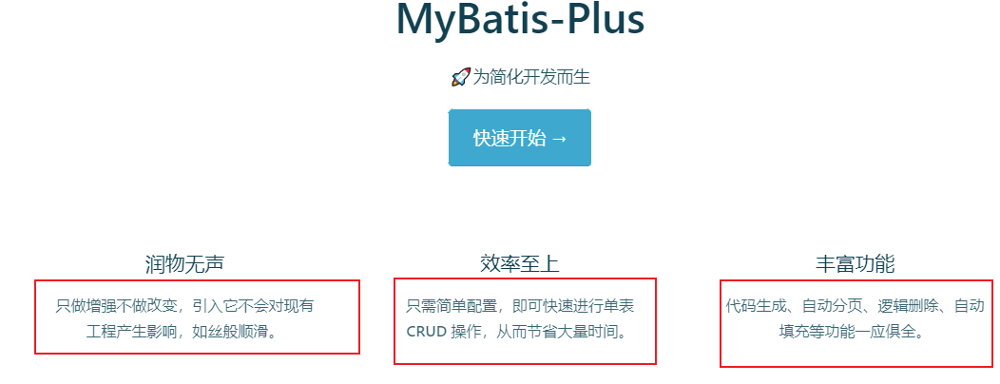

## 特性

- **无侵入**：只做增强不做改变，引入它不会对现有工程产生影响，如丝般顺滑 
- **损耗小**：启动即会自动注入基本 CURD，性能基本无损耗，直接面向对象操作， BaseMapper
- **强大的 CRUD 操作**：内置通用 Mapper、通用 Service，仅仅通过少量配置即可实现单表大部分 CRUD 操作，更有强大的条件构造器，满足各类使用需求, 以后简单的CRUD操作，它不用自己编写 了！ 
- **支持 Lambda 形式调用**：通过 Lambda 表达式，方便的编写各类查询条件，无需再担心字段写错 
- **支持主键自动生成**：支持多达 4 种主键策略（内含分布式唯一 ID 生成器 - Sequence），可自由配 置，完美解决主键问题
- **支持 ActiveRecord 模式**：支持 ActiveRecord 形式调用，实体类只需继承 Model 类即可进行强大 的 CRUD 操作
- **支持自定义全局通用操作**：支持全局通用方法注入（ Write once, use anywhere ）
- **内置代码生成器**：采用代码或者 Maven 插件可快速生成 Mapper 、 Model 、 Service 、 Controller 层代码，支持模板引擎，更有超多自定义配置等您来使用（自动帮你生成代码）
- **内置分页插件**：基于 MyBatis 物理分页，开发者无需关心具体操作，配置好插件之后，写分页等同 于普通 List 查询
- **分页插件支持多种数据库**：支持 MySQL、MariaDB、Oracle、DB2、H2、HSQL、SQLite、 Postgre、SQLServer 等多种数据库
- **内置性能分析插件**：可输出 Sql 语句以及其执行时间，建议开发测试时启用该功能，能快速揪出慢查询
- **内置全局拦截插件**：提供全表 delete 、 update 操作智能分析阻断，也可自定义拦截规则，预防误 操作

## 快速入门

* 教程：https://baomidou.com/pages/226c21/

### 步骤

1. 创建数据库`mybatis_plus`

```mysql
create database mybatis_plus charset=utf8;

use mybatis_plus;

create table user(
    id bigint(20) not null comment '主键ID',
    name varchar(30) null default null comment '姓名',
    age int(11) null default null comment '年龄',
    email varchar(50) null default null comment '邮箱',
    primary key(id)
);

insert into user(id,name,age,email) values
(1, 'Jone', 18, 'test1@baomidou.com'),
(2, 'Jack', 20, 'test2@baomidou.com'),
(3, 'Tom', 28, 'test3@baomidou.com'),
(4, 'Sandy', 21, 'test4@baomidou.com'),
(5, 'Billie', 24, 'test5@baomidou.com');
```

 `User` 表，其表结构如下：

| id   | name   | age  | email              |
| ---- | ------ | ---- | ------------------ |
| 1    | Jone   | 18   | test1@baomidou.com |
| 2    | Jack   | 20   | test2@baomidou.com |
| 3    | Tom    | 28   | test3@baomidou.com |
| 4    | Sandy  | 21   | test4@baomidou.com |
| 5    | Billie | 24   | test5@baomidou.com |

2. 编写项目，初始化项目！使用SpringBoot初始化！

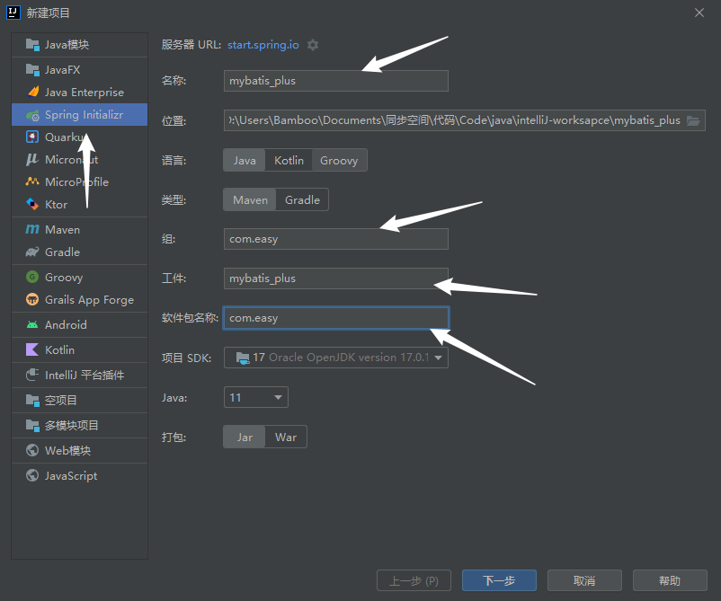

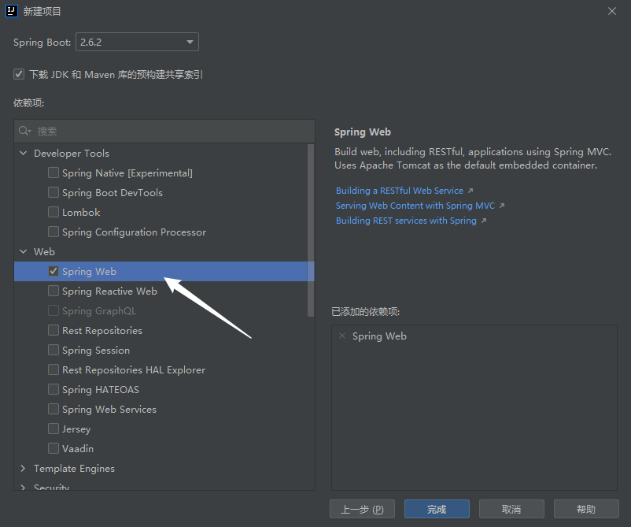

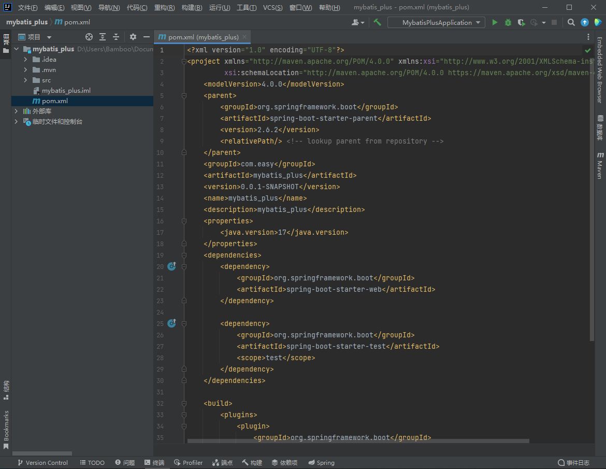

3. 导入依赖

```xml
<!-- 数据库驱动 -->
<dependency>
    <groupId>mysql</groupId>
    <artifactId>mysql-connector-java</artifactId>
</dependency>
<!--lombok-->
<dependency>
    <groupId>org.projectlombok</groupId>
    <artifactId>lombok</artifactId>
</dependency>
<!--导入mybatis-plus-->
<dependency>
    <groupId>com.baomidou</groupId>
    <artifactId>mybatis-plus-boot-starter</artifactId>
    <version>3.5.1</version>
</dependency>
```

> mybatis-plus可以节省大量的代码，mybatis与mybatis-plus尽量不要同时导入，会存在版本差异。

4. 连接数据库！这一步和 mybatis 相同！

```properties
# mysql 8
spring.datasource.username=root
spring.datasource.password=123456
spring.datasource.url=jdbc:mysql://localhost:3306/mybatis_plus?useUnicode=true&characterEncoding=UTF-8&useSSL=False&allowPublicKeyRetrieval=true
spring.datasource.driver-class-name=com.mysql.cj.jdbc.Driver
```

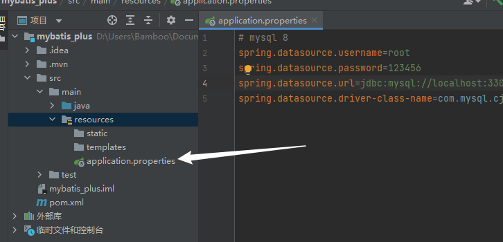

6. 传统方式pojo、dao（链接mybatis，配置mapper.xml）、service、controller

7. 使用了mybatis-plus之后

   * pojo

   ```java
   @Data
   @AllArgsConstructor
   @NoArgsConstructor
   public class User {
       private Long id;
       private String name;
       private int age;
       private String email;
   
       @Override
       public String toString() {
           return "User{" +
                   "id=" + id +
                   ", name='" + name + '\'' +
                   ", age=" + age +
                   ", email='" + email + '\'' +
                   '}';
       }
   }
   ```

   * mapper接口

   ```java
   // 在对应的Mapper上面继承基本的类BaseMapper
   @Repository
   public interface UserMapper extends BaseMapper<User> {
       // 所有CURD的操作都已经编写完成了
       // 不需要像以前配置一大堆文件
   }
   ```

   > 最好使用@Mapper进行注册，后面就不需要使用@MapperScan

   * 注意点，需要在主启动类上去扫描我们的mapper包下的所有接口

   ```java
   @SpringBootApplication
   @MapperScan("com.easy.mapper")
   public class MybatisPlusApplication {
   
       public static void main(String[] args) {
           SpringApplication.run(MybatisPlusApplication.class, args);
       }
   
   }
   ```

   > 在mapper层使用@Mapper就不需要扫描了

   * 测试类中测试

   ```java
   @SpringBootTest
   class MybatisPlusApplicationTests {
   
       // 继承了BaseMapper，所有的方法都来自己父类
       // 我们也可以编写自己的扩展方法！
   
       @Autowired
       private UserMapper userMapper;
   
       @Test
       void contextLoads() {
           // 参数是一个 Wrapper ，条件构造器，这里我们先不用该参数，则设置为null
           // 查询全部用户
           List<User> userList = userMapper.selectList(null) ;
           userList.forEach(System.out::println);
       }
   }
   ```

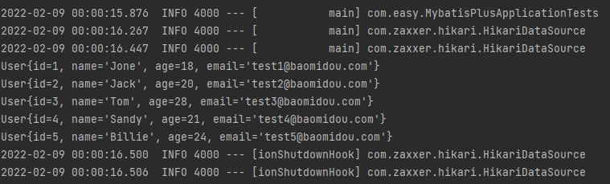

## 配置日志

所有的sql现在是不可见的，希望知道它是怎么执行的，所以必须要看日志！

```properties
# 日志
mybatis-plus.configuration.log-impl=org.apache.ibatis.logging.stdout.StdOutImpl
```

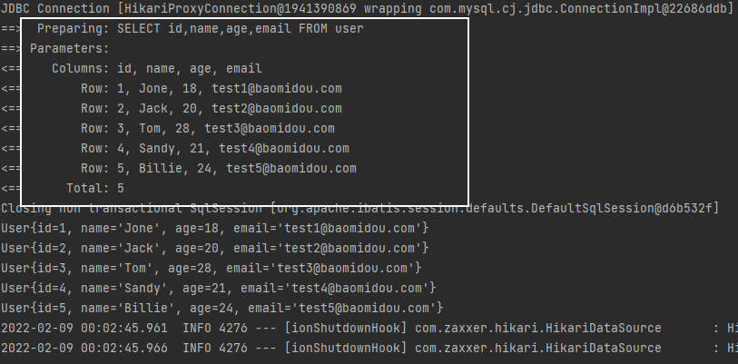

## CRUD操作

### 插入操作

```java
@Test
public void testInsert(){
    User user = new User();
    user.setAge(18);
    user.setName("胡桃");
    user.setEmail("hutao@qq.com");

    int result = userMapper.insert(user);
    System.out.println(result); // 影响行数
    System.out.println(user); // 发现，id已经被自动填写了
}
```

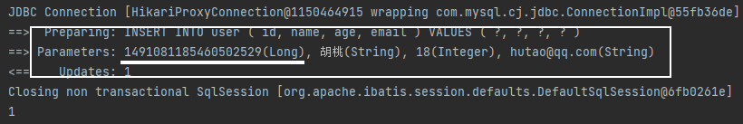

> 数据库插入的id的默认值为：全局的唯一id

### 主键生成策略

#### 默认ID_WORKER全局唯一id

分布式系统唯一id生成：https://www.cnblogs.com/haoxinyue/p/5208136.html

雪花算法： snowflake是Twitter开源的分布式ID生成算法，结果是一个long型的ID。其核心思想是：使用41bit作为 毫秒数，10bit作为机器的ID（5个bit是数据中心，5个bit的机器ID），12bit作为毫秒内的流水号（意味 着每个节点在每毫秒可以产生 4096 个 ID），最后还有一个符号位，永远是0。可以保证几乎全球唯 一！

#### 主键自增

* 实体类字段上 添加`@TableId(type = IdType.AUTO)`

```java
public class User {
    @TableId(type = IdType.AUTO)
    private Long id;
}
```

* 修改主键字段id为自增，数据库字段一定要是自增！

```sql
alter table user modify id bigint(20) auto_increment;
```

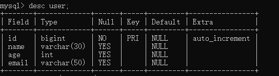

* 测试


* `IdType`其他类型字段

```java
public enum IdType {
    AUTO(0), // 数据库id自增
    NONE(1), // 未设置主键
    INPUT(2), // 手动输入
    ID_WORKER(3), // 默认的全局唯一id
    UUID(4), // 全局唯一id uuid
    ID_WORKER_STR(5); //ID_WORKER 字符串表示法
}

```

### 自定义ID生成器

### 更新操作

* `updateById(Object)`：根据id进行更新，参数为对象

```java
@Test
public void testUpdate(){
    User user = new User();

    user.setId(1L);
    user.setName("我是小胡桃");
    user.setAge(188);

    // 根据id进行更新数据
    int row = userMapper.updateById(user);
    System.out.println(row);
}
```


* `update(Object,Wrapper)`根据指定Wrapper参数进行更新Object

```java
@Test
public void testUpdate(){
    
    // 条件设置
    UpdateWrapper<User> updateWrapper = new UpdateWrapper();
    updateWrapper.eq("name","胡桃");
    updateWrapper.eq("age",18);
	
    // 数据
	User user = new User();
    user.setName("我是大胡桃");
    user.setAge(188);

    // 根据条件进行更新数据
    int row = userMapper.update(user, updateWrapper);
    System.out.println(row);
}
```

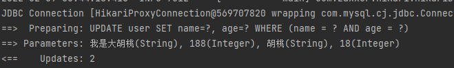

### 自动填充

创建时间、修改时间！这些个操作一遍都是自动化完成的，我们不希望手动更新！

阿里巴巴开发手册：所有的数据库表：gmt_create、gmt_modified几乎所有的表都要配置上！而且需 要自动化！

#### 方式一：数据库级别（工作中不允许你修改数据库）

* 在表中新增字段 create_time, update_time

```sql
alter table user add create_time datetime DEFAULT CURRENT_TIMESTAMP;
alter table user add update_time datetime DEFAULT CURRENT_TIMESTAMP ON UPDATE CURRENT_TIMESTAMP;
```

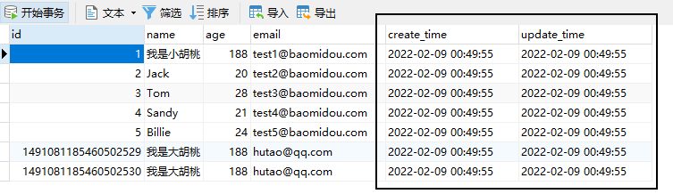

* 再次测试插入方法，我们需要先把实体类同步！

```java
public class User{
    private Date createTime;
    private Date updateTime;
}
```

* 再次更新查看结果

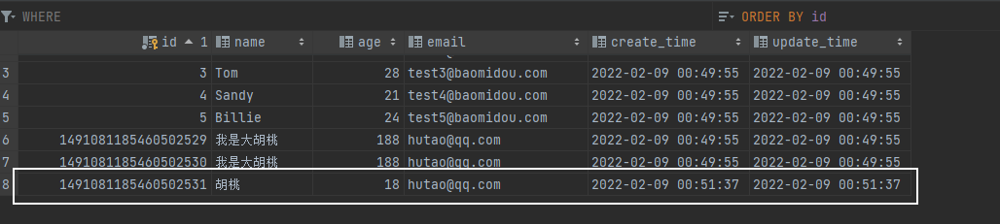

#### 方式二：代码级别

* 删除数据库的默认值、更新操作！

```sql
alter table user drop create_time;
alter table user drop update_time;

alter table user add create_time datetime;
alter table user add update_time datetime;
```

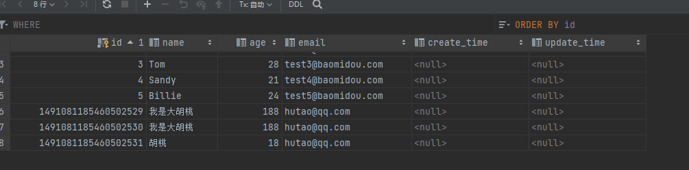

* 实体类字段属性上需要增加注解

```java
// 字段添加填充内容
@TableField(fill = FieldFill.INSERT)
private Date createTime;
@TableField(fill = FieldFill.INSERT_UPDATE)
private Date updateTime;
```

* 编写处理器来处理这个注解即可！

创建`handler`包，在包下面创建`MyMetaObjectHandler.java`

```java
@Slf4j //日志
@Component
public class MyMetaObjectHandler implements MetaObjectHandler {

    // 插入时的填充策略
    @Override
    public void insertFill(MetaObject metaObject) {
        log.info("start insert fill.....");
        // setFieldValByName(String fieldName, Object fieldVal, MetaObject metaObject)

        this.setFieldValByName("createTime",new Date(),metaObject);
        this.setFieldValByName("updateTime",new Date(),metaObject);

    }

    // 更新时的填充策略
    @Override
    public void updateFill(MetaObject metaObject) {
        log.info("start update fill.....");
        this.setFieldValByName("updateTime",new Date(),metaObject);
    }
}
```

* 测试插入 

* 测试更新、观察时间即可！

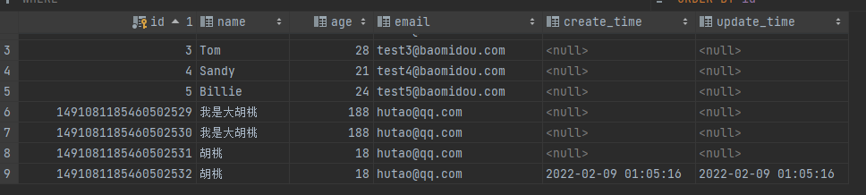

### 乐观锁

在面试过程中，我们经常会被问道乐观锁，悲观锁！这个其实非常简单！ 

> 乐观锁 : 故名思意十分乐观，它总是认为不会出现问题，无论干什么不去上锁！如果出现了问题， 再次更新值测试 
>
> 悲观锁：故名思意十分悲观，它总是认为总是出现问题，无论干什么都会上锁！再去操作！

这里主要讲解 乐观锁机制！

乐观锁实现方式： 

- 取出记录时，获取当前 version 
- 更新时，带上这个version 
- 执行更新时， set version = newVersion where version = oldVersion 
- 如果version不对，就更新失败

```sql
乐观锁：1、先查询，获得版本号 version = 1
-- A
update user set name = "kuangshen", version = version + 1
where id = 2 and version = 1
-- B 线程抢先完成，这个时候 version = 2，会导致 A 修改失败！
update user set name = "kuangshen", version = version + 1
where id = 2 and version = 1

```

1. 给数据库中增加version字段！

```sql
alter table user add version int default 1;
```

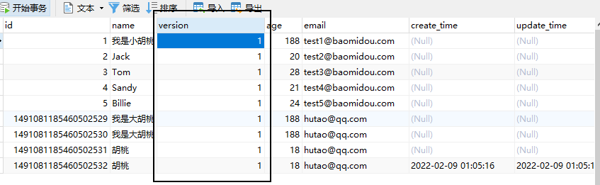

2. 实体类加对应的字段

```java
@Version //乐观锁Version注解
private Integer version;
```

3. 注册组件

```java
@EnableTransactionManagement
@Configuration
public class MyBatisPlusConfig {

    @Bean
    public MybatisPlusInterceptor mybatisPlusInterceptor  (){
        MybatisPlusInterceptor interceptor = new MybatisPlusInterceptor();
        interceptor.addInnerInterceptor(new OptimisticLockerInnerInterceptor()); // 注册乐观锁插件
        return interceptor;
    }

}
```

* 测试一下！

1.  测试乐观锁成功

```java
// 测试乐观锁成功
@Test
public void testOptimisticLocker(){
    // 查询用户信息
    User user = userMapper.selectById(3L);
    // 修改用户信息
    user.setName("超级胡桃");
    // 执行更新操作
    userMapper.updateById(user);
}
```

2. 测试乐观锁失败！

```java
// 测试乐观锁失败！多线程下
@Test
public void testOptimisticLocker2(){
    // 线程 1
    User user = userMapper.selectById(2L);
    user.setName("胡桃1");
    user.setEmail("hutao1@qq.com");

    // 模拟另外一个线程执行了插队操作
    User user2 = userMapper.selectById(2L);
    user2.setName("胡桃2");
    user2.setEmail("hutao2@qq.com");

    userMapper.updateById(user2);

    // 可以使用自旋锁来多次尝试提交！
    userMapper.updateById(user); // 更新失败。如果没有乐观锁，就会覆盖插队线程的值！
}
```


### 查询操作

* 根据id查询

```java
@Test
public void testSelect(){

    User user = userMapper.selectById(2L);
    System.out.println(user);

}
```

* 根据多个id查询

````java
@Test
public void testSelect(){

    List<User> users = userMapper.selectBatchIds(Arrays.asList(2,3));
    users.forEach(System.out::println);

}
````

* 根据map条件查询

```java
@Test
public void testSelect(){

    Map<String,Object> map = new HashMap<>();
    map.put("name", "胡桃");
    map.put("age",  18);
    List<User> users = userMapper.selectByMap(map);
    users.forEach(System.out::println);

}
```

### 分页操作

* 原始的 limit 进行分页

* pageHelper 第三方插件
* 内置分页插件

1. 在`MybatisPlusConfig.java`中添加分页插件

```java
@EnableTransactionManagement
@Configuration
public class MyBatisPlusConfig {


    @Bean
    public MybatisPlusInterceptor mybatisPlusInterceptor  (){
        MybatisPlusInterceptor interceptor = new MybatisPlusInterceptor();
        
        interceptor.addInnerInterceptor(new PaginationInnerInterceptor()); // 添加分页插件
        
        return interceptor;
    }
    

}

```

* 直接使用Page对象即可！

1. 默认分页

```java
@Test
public void testPage(){
    // 参数一：当前页
    // 参数二：页面大小
    // 使用了分页插件之后，所有的分页操作也变得简单的！
    // selectPage(page,queryWrapper)：queryWrapper为查询条件
    Page<User> page = new Page<>(2,5);
    userMapper.selectPage(page,null);

    page.getRecords().forEach(System.out::println);
    System.out.println(page.getTotal());
}
```

2. 根据wrapper条件分页

```java
@Test
public void testPage(){
	// selectPage(page,queryWrapper)：queryWrapper为查询条件
    Page<User> page = new Page<>(0,5);
    QueryWrapper<User> queryWrapper = new QueryWrapper<>();
    queryWrapper.eq("name","胡桃");
    queryWrapper.eq("age",18);

    userMapper.selectPage(page,queryWrapper);

    page.getRecords().forEach(System.out::println);
    System.out.println(page.getTotal());
}
```

### 删除操作

* 根据id删除记录

```java
@Test
public void testDel(){
    userMapper.deleteById(5L);
}
```

* 通过id批量删除

```java
@Test
public void testDel(){
    userMapper.deleteBatchIds(Arrays.asList(3,4,5));
}
```

*  通过map删除

```java
@Test
public void testDel(){
    HashMap<String, Object> map = new HashMap<>();
    map.put("name","胡桃");
    userMapper.deleteByMap(map);
}
```

> 在工作中会遇到一些问题：逻辑删除！

### 逻辑删除

> 物理删除 ：从数据库中直接移除
>
> 逻辑删除 ：再数据库中没有被移除，而是通过一个变量来让他失效！ deleted = 0 => deleted = 1

* 在数据表中增加一个 deleted 字段

```sql
alter table user add deleted int default 0;
```

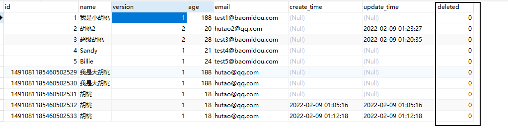

* 实体类中增加相应属性

```java
@TableLogic  //逻辑删除
private Integer deleted;
```

* `MybatisPlusConfig.java`中配置逻辑删除组件

```java
@Bean
public ISqlInjector sqlInjector() {
    return new LogicSqlInjector();
}
```

> 高版本不用配置插件了，上述java代码无需编写。

* 配置参数

```properties
# 配置逻辑删除
mybatis-plus.global-config.db-config.logic-delete-value=1
mybatis-plus.global-config.db-config.logic-not-delete-value=0
```

* 测试下删除

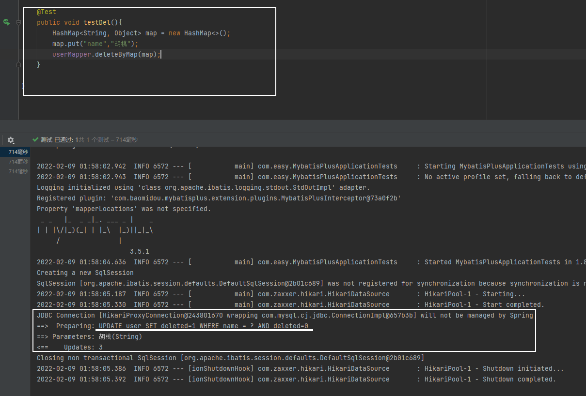

发现，现在没有实行删除了，而是进行了更新操作。

## 性能分析插件

我们在平时的开发中，会遇到一些慢sql。测试！ druid…..

作用：该功能依赖 `p6spy` 组件，完美的输出打印 SQL 及执行时长 `3.1.0` 以上版本

MP也提供性能分析插件，如果超过这个时间就停止运行！

* 导入插件

```java
<dependency>
  <groupId>p6spy</groupId>
  <artifactId>p6spy</artifactId>
   <version>3.9.1</version>
</dependency>
```

* application.properties配置

```properties
spring.datasource.url=jdbc:p6spy:mysql://localhost:3306/mybatis_plus?useUnicode=true&characterEncoding=UTF-8&useSSL=False&allowPublicKeyRetrieval=true
spring.datasource.driver-class-name=com.p6spy.engine.spy.P6SpyDriver
```

* 添加 spy.properties配置文件，在resources目录下

```properties
#3.2.1以上使用
modulelist=com.baomidou.mybatisplus.extension.p6spy.MybatisPlusLogFactory,com.p6spy.engine.outage.P6OutageFactory
#3.2.1以下使用或者不配置
#modulelist=com.p6spy.engine.logging.P6LogFactory,com.p6spy.engine.outage.P6OutageFactory
# 自定义日志打印
logMessageFormat=com.baomidou.mybatisplus.extension.p6spy.P6SpyLogger
#日志输出到控制台
appender=com.baomidou.mybatisplus.extension.p6spy.StdoutLogger
# 使用日志系统记录 sql
#appender=com.p6spy.engine.spy.appender.Slf4JLogger
# 设置 p6spy driver 代理
deregisterdrivers=true
# 取消JDBC URL前缀
useprefix=true
# 配置记录 Log 例外,可去掉的结果集有error,info,batch,debug,statement,commit,rollback,result,resultset.
excludecategories=info,debug,result,commit,resultset
# 日期格式
dateformat=yyyy-MM-dd HH:mm:ss
# 实际驱动可多个
#driverlist=org.h2.Driver
# 是否开启慢SQL记录
outagedetection=true
# 慢SQL记录标准 2 秒
outagedetectioninterval=2
```

* 运行查询测试

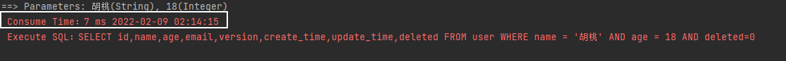

## 条件构造器

十分重要：Wrapper

写一些复杂的sql就可以使用它来替代！

### AbstractWrapper

QueryWrapper(LambdaQueryWrapper) 和 UpdateWrapper(LambdaUpdateWrapper) 的父类
用于生成 sql 的 where 条件, entity 属性也用于生成 sql 的 where 条件
注意: entity 生成的 where 条件与 使用各个 api 生成的 where 条件**没有任何关联行为**

#### allEq

```java
allEq(Map<R, V> params)
allEq(Map<R, V> params, boolean null2IsNull)
allEq(boolean condition, Map<R, V> params, boolean null2IsNull)
```

- 全部[eq](eq)(或个别[isNull](isnull))

  `params` : `key`为数据库字段名,`value`为字段值
  `null2IsNull` : 为`true`则在`map`的`value`为`null`时调用 [isNull](isnull) 方法,为`false`时则忽略`value`为`null`的

- 例1: `allEq({id:1,name:"老王",age:null})`--->`id = 1 and name = '老王' and age is null`

- 例2: `allEq({id:1,name:"老王",age:null}, false)`--->`id = 1 and name = '老王'`


```java
allEq(BiPredicate<R, V> filter, Map<R, V> params)
allEq(BiPredicate<R, V> filter, Map<R, V> params, boolean null2IsNull)
allEq(boolean condition, BiPredicate<R, V> filter, Map<R, V> params, boolean null2IsNull) 
```

个别参数说明:

`filter` : 过滤函数,是否允许字段传入比对条件中
`params` 与 `null2IsNull` : 同上

- 例1: `allEq((k,v) -> k.indexOf("a") >= 0, {id:1,name:"老王",age:null})`--->`name = '老王' and age is null`
- 例2: `allEq((k,v) -> k.indexOf("a") >= 0, {id:1,name:"老王",age:null}, false)`--->`name = '老王'`

#### eq

```java
eq(R column, Object val)
eq(boolean condition, R column, Object val)
```

- 等于 =
- 例: `eq("name", "老王")`--->`name = '老王'`

#### ne

```java
ne(R column, Object val)
ne(boolean condition, R column, Object val)
```

- 不等于 <>
- 例: `ne("name", "老王")`--->`name <> '老王'`

#### gt

```java
gt(R column, Object val)
gt(boolean condition, R column, Object val)
```

- 大于 >
- 例: `gt("age", 18)`--->`age > 18`

#### ge

```java
ge(R column, Object val)
ge(boolean condition, R column, Object val)
```

- 大于等于 >=
- 例: `ge("age", 18)`--->`age >= 18`

#### lt

```java
lt(R column, Object val)
lt(boolean condition, R column, Object val)
```

- 小于 <
- 例: `lt("age", 18)`--->`age < 18`

#### le

```java
le(R column, Object val)
le(boolean condition, R column, Object val)
```

- 小于等于 <=
- 例: `le("age", 18)`--->`age <= 18`

#### between

```java
between(R column, Object val1, Object val2)
between(boolean condition, R column, Object val1, Object val2)
```

- BETWEEN 值1 AND 值2
- 例: `between("age", 18, 30)`--->`age between 18 and 30`

#### notBetween

```java
notBetween(R column, Object val1, Object val2)
notBetween(boolean condition, R column, Object val1, Object val2)
```

- NOT BETWEEN 值1 AND 值2
- 例: `notBetween("age", 18, 30)`--->`age not between 18 and 30`

#### like

```java
like(R column, Object val)
like(boolean condition, R column, Object val)
```

- LIKE '%值%'
- 例: `like("name", "王")`--->`name like '%王%'`

#### notLike

```java
notLike(R column, Object val)
notLike(boolean condition, R column, Object val)
```

- NOT LIKE '%值%'
- 例: `notLike("name", "王")`--->`name not like '%王%'`

#### likeLeft

```java
likeLeft(R column, Object val)
likeLeft(boolean condition, R column, Object val)
```

- LIKE '%值'
- 例: `likeLeft("name", "王")`--->`name like '%王'`

#### likeRight

```java
likeRight(R column, Object val)
likeRight(boolean condition, R column, Object val)
```

- LIKE '值%'
- 例: `likeRight("name", "王")`--->`name like '王%'`

#### isNull

```java
isNull(R column)
isNull(boolean condition, R column)
```

- 字段 IS NULL
- 例: `isNull("name")`--->`name is null`

#### isNotNull

```java
isNotNull(R column)
isNotNull(boolean condition, R column)
```

- 字段 IS NOT NULL
- 例: `isNotNull("name")`--->`name is not null`

#### in

```java
in(R column, Collection<?> value)
in(boolean condition, R column, Collection<?> value)
```

- 字段 IN (value.get(0), value.get(1), ...)
- 例: `in("age",{1,2,3})`--->`age in (1,2,3)`

```java
in(R column, Object... values)
in(boolean condition, R column, Object... values)
```

- 字段 IN (v0, v1, ...)
- 例: `in("age", 1, 2, 3)`--->`age in (1,2,3)`

#### notIn

```java
notIn(R column, Collection<?> value)
notIn(boolean condition, R column, Collection<?> value)
```

- 字段 NOT IN (value.get(0), value.get(1), ...)
- 例: `notIn("age",{1,2,3})`--->`age not in (1,2,3)`

```java
notIn(R column, Object... values)
notIn(boolean condition, R column, Object... values)
```

- 字段 NOT IN (v0, v1, ...)
- 例: `notIn("age", 1, 2, 3)`--->`age not in (1,2,3)`

#### inSql

```java
inSql(R column, String inValue)
inSql(boolean condition, R column, String inValue)
```

- 字段 IN ( sql语句 )
- 例: `inSql("age", "1,2,3,4,5,6")`--->`age in (1,2,3,4,5,6)`
- 例: `inSql("id", "select id from table where id < 3")`--->`id in (select id from table where id < 3)`

#### notInSql

```java
notInSql(R column, String inValue)
notInSql(boolean condition, R column, String inValue)
```

- 字段 NOT IN ( sql语句 )
- 例: `notInSql("age", "1,2,3,4,5,6")`--->`age not in (1,2,3,4,5,6)`
- 例: `notInSql("id", "select id from table where id < 3")`--->`id not in (select id from table where id < 3)`

#### groupBy

```java
groupBy(R... columns)
groupBy(boolean condition, R... columns)
```

- 分组：GROUP BY 字段, ...
- 例: `groupBy("id", "name")`--->`group by id,name`

#### orderByAsc

```java
orderByAsc(R... columns)
orderByAsc(boolean condition, R... columns)
```

- 排序：ORDER BY 字段, ... ASC
- 例: `orderByAsc("id", "name")`--->`order by id ASC,name ASC`

#### orderByDesc

```java
orderByDesc(R... columns)
orderByDesc(boolean condition, R... columns)
```

- 排序：ORDER BY 字段, ... DESC
- 例: `orderByDesc("id", "name")`--->`order by id DESC,name DESC`

#### orderBy

```java
orderBy(boolean condition, boolean isAsc, R... columns)
```

- 排序：ORDER BY 字段, ...
- 例: `orderBy(true, true, "id", "name")`--->`order by id ASC,name ASC`

#### having

```java
having(String sqlHaving, Object... params)
having(boolean condition, String sqlHaving, Object... params)
```

- HAVING ( sql语句 )
- 例: `having("sum(age) > 10")`--->`having sum(age) > 10`
- 例: `having("sum(age) > {0}", 11)`--->`having sum(age) > 11`

#### func

```java
func(Consumer<Children> consumer)
func(boolean condition, Consumer<Children> consumer)
```

- func 方法(主要方便在出现if...else下调用不同方法能不断链)
- 例: `func(i -> if(true) {i.eq("id", 1)} else {i.ne("id", 1)})`

#### or

```java
or()
or(boolean condition)
```

- 拼接 OR

  注意事项:

  主动调用`or`表示紧接着下一个**方法**不是用`and`连接!(不调用`or`则默认为使用`and`连接)

- 例: `eq("id",1).or().eq("name","老王")`--->`id = 1 or name = '老王'`

```java
or(Consumer<Param> consumer)
or(boolean condition, Consumer<Param> consumer)
```

- OR 嵌套
- 例: `or(i -> i.eq("name", "李白").ne("status", "活着"))`--->`or (name = '李白' and status <> '活着')`

#### and

```java
and(Consumer<Param> consumer)
and(boolean condition, Consumer<Param> consumer)
```

- AND 嵌套
- 例: `and(i -> i.eq("name", "李白").ne("status", "活着"))`--->`and (name = '李白' and status <> '活着')`

#### nested

```java
nested(Consumer<Param> consumer)
nested(boolean condition, Consumer<Param> consumer)
```

- 正常嵌套 不带 AND 或者 OR
- 例: `nested(i -> i.eq("name", "李白").ne("status", "活着"))`--->`(name = '李白' and status <> '活着')`

#### apply

```java
apply(String applySql, Object... params)
apply(boolean condition, String applySql, Object... params)
```

- 拼接 sql

  注意事项:

  该方法可用于数据库**函数** 动态入参的`params`对应前面`applySql`内部的`{index}`部分.这样是不会有sql注入风险的,反之会有!

- 例: `apply("id = 1")`--->`id = 1`

- 例: `apply("date_format(dateColumn,'%Y-%m-%d') = '2008-08-08'")`--->`date_format(dateColumn,'%Y-%m-%d') = '2008-08-08'")`

- 例: `apply("date_format(dateColumn,'%Y-%m-%d') = {0}", "2008-08-08")`--->`date_format(dateColumn,'%Y-%m-%d') = '2008-08-08'")`

#### last

```java
last(String lastSql)
last(boolean condition, String lastSql)
```

- 无视优化规则直接拼接到 sql 的最后

  注意事项:

  只能调用一次,多次调用以最后一次为准 有sql注入的风险,请谨慎使用

- 例: `last("limit 1")`

#### exists

```java
exists(String existsSql)
exists(boolean condition, String existsSql)
```

- 拼接 EXISTS ( sql语句 )
- 例: `exists("select id from table where age = 1")`--->`exists (select id from table where age = 1)`

#### notExists

```java
notExists(String notExistsSql)
notExists(boolean condition, String notExistsSql)
```

- 拼接 NOT EXISTS ( sql语句 )
- 例: `notExists("select id from table where age = 1")`--->`not exists (select id from table where age = 1)`

### QueryWrapper

继承自 AbstractWrapper ,自身的内部属性 entity 也用于生成 where 条件
及 LambdaQueryWrapper, 可以通过 new QueryWrapper().lambda() 方法获取

#### select

```java
select(String... sqlSelect)
select(Predicate<TableFieldInfo> predicate)
select(Class<T> entityClass, Predicate<TableFieldInfo> predicate)
```

- 设置查询字段

  说明:

  以上方法分为两类.
  第二类方法为:过滤查询字段(主键除外),入参不包含 class 的调用前需要`wrapper`内的`entity`属性有值! 这两类方法重复调用以最后一次为准

- 例: `select("id", "name", "age")`

- 例: `select(i -> i.getProperty().startsWith("test"))`

### UpdateWrapper

继承自 `AbstractWrapper` ,自身的内部属性 `entity` 也用于生成 where 条件
及 `LambdaUpdateWrapper`, 可以通过 `new UpdateWrapper().lambda()` 方法获取!

#### set

```java
set(String column, Object val)
set(boolean condition, String column, Object val)
```

- SQL SET 字段
- 例: `set("name", "老李头")`
- 例: `set("name", "")`--->数据库字段值变为**空字符串**
- 例: `set("name", null)`--->数据库字段值变为`null`

#### setSql

```java
setSql(String sql)
```

- 设置 SET 部分 SQL
- 例: `setSql("name = '老李头'")`

#### lambda

- 获取 `LambdaWrapper`
  在`QueryWrapper`中是获取`LambdaQueryWrapper`
  在`UpdateWrapper`中是获取`LambdaUpdateWrapper`

### 使用 Wrapper 自定义SQL

需要`mybatis-plus`版本 >= `3.0.7` param 参数名要么叫`ew`,要么加上注解`@Param(Constants.WRAPPER)` 使用`${ew.customSqlSegment}` 不支持 `Wrapper` 内的entity生成where语句

#### kotlin持久化对象定义最佳实践

由于`kotlin`相比于`java`多了数据对象（`data class`)，在未说明情况下可能会混用。建议按照以下形式定义持久化对象

```kotlin
@TableName("sys_user")
class User {
		@TableId(type = IdType.AUTO)
    var id: Int? = null

    @TableField("username")
    var name: String? = null

    var roleId: Int? = null
}
```

**注意**：这里的`TableId`及`TableField`并非必要，只是为了展示`Mybatis-Plus`中的`annotation`使用

这里所有成员都需要定义为可空类型（`?`），并赋予`null`的初始值，方便我们在以下场景中使用（类似java中的`updateSelective`）

```kotlin
val wrapper = KtUpdateWrapper(User::class.java).eq(User::id, 2)
val newRecord = User()
newRecord.name = "newName"
userMapper!!.update(newRecord, wrapper)
```

不建议使用`data class`及全参数构造方法，这样我们会写很多不必要的`null`来构造一个空对象

#### 用注解

```java
@Select("select * from mysql_data ${ew.customSqlSegment}")
List<MysqlData> getAll(@Param(Constants.WRAPPER) Wrapper wrapper);
```

#### 用XML

```java
List<MysqlData> getAll(Wrapper ew);
```

```xml
<select id="getAll" resultType="MysqlData">
	SELECT * FROM mysql_data ${ew.customSqlSegment}
</select>
```

#### kotlin使用wrapper

> kotlin 可以使用 `QueryWrapper` 和 `UpdateWrapper` 但无法使用 `LambdaQueryWrapper` 和 `LambdaUpdateWrapper`
> 如果想使用 lambda 方式的 wrapper 请使用 `KtQueryWrapper` 和 `KtUpdateWrapper`

请参考[实例(opens new window)](https://github.com/baomidou/mybatis-plus/blob/master/mybatis-plus-extension/src/test/kotlin/com/baomidou/mybatisplus/extension/kotlin/WrapperTest.kt)

```kotlin
val queryWrapper = KtQueryWrapper(User()).eq(User::name, "sss").eq(User::roleId, "sss2")
userMapper!!.selectList(queryWrapper)

val updateConditionWrapper = KtUpdateWrapper(User()).eq(User::name, "sss").eq(User::roleId, "sss2")
val updateRecord = User()
updateRecord.name = "newName"
userMapper!!.update(updateRecord, updateConditionWrapper)

val updateRecord = User()
updateRecord.id = 2
updateRecord.name = "haha"
userMapper.updateById(updateRecord)
```

#### 链式调用 lambda 式

```java
// 区分:
// 链式调用 普通
UpdateChainWrapper<T> update();
// 链式调用 lambda 式。注意：不支持 Kotlin 
LambdaUpdateChainWrapper<T> lambdaUpdate();

// 等价示例：
query().eq("id", value).one();
lambdaQuery().eq(Entity::getId, value).one();

// 等价示例：
update().eq("id", value).remove();
lambdaUpdate().eq(Entity::getId, value).remove();
```

## 代码自动生成器

dao、pojo、service、controller都给我自己去编写完成！ 

AutoGenerator 是 MyBatis-Plus 的代码生成器，通过 AutoGenerator 可以快速生成 Entity、 Mapper、Mapper XML、Service、Controller 等各个模块的代码，极大的提升了开发效率。

### 导入依赖

```xml
<!--mybatis-plus代码生成器-->
<dependency>
    <groupId>com.baomidou</groupId>
    <artifactId>mybatis-plus-generator</artifactId>
    <version>3.5.1</version>
</dependency>
<!--velocity模板-->
<dependency>
    <groupId>org.apache.velocity</groupId>
    <artifactId>velocity-engine-core</artifactId>
    <version>2.3</version>
</dependency>
<!--freemarker模板-->
<dependency>
    <groupId>org.freemarker</groupId>
    <artifactId>freemarker</artifactId>
</dependency>
<dependency>
    <groupId>io.swagger</groupId>
    <artifactId>swagger-annotations</artifactId>
    <version>1.5.22</version>
</dependency>
```

plus代码生成器需要一个模板引擎，velocity和[freemarker](https://so.csdn.net/so/search?q=freemarker&spm=1001.2101.3001.7020)任选一个，velocity是生成器中默认使用的，根据你的选择引依赖。

### 写一个构造器类

```java
public class CodeGenerator {

    public static void main(String[] args) {

    }
}
```

### 生成模板

#### 官方快速生成模板

```java
FastAutoGenerator.create("url", "username", "password")
    .globalConfig(builder -> {
        builder.author("baomidou") // 设置作者
            .enableSwagger() // 开启 swagger 模式
            .fileOverride() // 覆盖已生成文件
            .outputDir("D://"); // 指定输出目录
    })
    .packageConfig(builder -> {
        builder.parent("com.baomidou.mybatisplus.samples.generator") // 设置父包名
            .moduleName("system") // 设置父包模块名
            .pathInfo(Collections.singletonMap(OutputFile.mapperXml, "D://")); // 设置mapperXml生成路径
    })
    .strategyConfig(builder -> {
        builder.addInclude("t_simple") // 设置需要生成的表名
            .addTablePrefix("t_", "c_"); // 设置过滤表前缀
    })
    .templateEngine(new FreemarkerTemplateEngine()) // 使用Freemarker引擎模板，默认的是Velocity引擎模板
    .execute();

```

#### 官方交互式生成模板

```java
FastAutoGenerator.create(DATA_SOURCE_CONFIG)
    // 全局配置
    .globalConfig((scanner, builder) -> builder.author(scanner.apply("请输入作者名称？")).fileOverride())
    // 包配置
    .packageConfig((scanner, builder) -> builder.parent(scanner.apply("请输入包名？")))
    // 策略配置
    .strategyConfig((scanner, builder) -> builder.addInclude(getTables(scanner.apply("请输入表名，多个英文逗号分隔？所有输入 all")))
                        .controllerBuilder().enableRestStyle().enableHyphenStyle()
                        .entityBuilder().enableLombok().addTableFills(
                                new Column("create_time", FieldFill.INSERT)
                        ).build())
    /*
        模板引擎配置，默认 Velocity 可选模板引擎 Beetl 或 Freemarker
       .templateEngine(new BeetlTemplateEngine())
       .templateEngine(new FreemarkerTemplateEngine())
     */
    .execute();


// 处理 all 情况
protected static List<String> getTables(String tables) {
    return "all".equals(tables) ? Collections.emptyList() : Arrays.asList(tables.split(","));
}
```

### 代码配置

```java
package com.easy;

import com.baomidou.mybatisplus.core.mapper.BaseMapper;
import com.baomidou.mybatisplus.generator.FastAutoGenerator;
import com.baomidou.mybatisplus.generator.config.DataSourceConfig;
import com.baomidou.mybatisplus.generator.config.OutputFile;
import com.baomidou.mybatisplus.generator.engine.FreemarkerTemplateEngine;

import java.util.Collections;

public class CodeGenerator {

    /**
     * 数据源配置
     */
    private static final String url = "jdbc:mysql://localhost:3306/mybatis_plus?useUnicode=true&characterEncoding=UTF-8&useSSL=False&allowPublicKeyRetrieval=true";
    private static final String username = "root";
    private static final String password = "123456";
    private static final DataSourceConfig.Builder DATA_SOURCE_CONFIG = new DataSourceConfig
            .Builder(url,username,password);

    public static void main(String[] args) {

        String projectPath = System.getProperty("user.dir");
        String outputDir = projectPath+"/src/main/java";
        String outputMapperXmlDir =projectPath+"/src/main/resources/mapper";


        FastAutoGenerator.create(DATA_SOURCE_CONFIG)

                // 全局配置(GlobalConfig)
                .globalConfig(builder -> {
                    builder.author("hutao") // 设置作者
                            .enableSwagger() // 开启 swagger 模式,（非常nice，记得引swagger依赖）
                            .fileOverride() // 覆盖已生成文件
                            .commentDate("yyyy-MM-dd") // 时间格式
                            .fileOverride() // 覆盖之前的文件
                            .outputDir(outputDir); // 指定输出目录
                })

                // 包配置(PackageConfig)
                .packageConfig(builder -> {
                    builder.parent("com") // 设置父包名
                            .moduleName("easy") // 设置父包模块名
                            .service("service")  //生成相应的层
                            .mapper("mapper")
                            .entity("pojo")
                            .controller("controller")
                            .serviceImpl("serviceImpl")
                            .xml("mapper")
                            .pathInfo(Collections.singletonMap(OutputFile.mapperXml, outputMapperXmlDir)); // 设置mapperXml生成路径
                })

                // 策略配置(StrategyConfig)
                .strategyConfig(builder -> {
                    builder.addInclude("user") // 设置需要生成的表名
                            .addTablePrefix("t_", "c_") // 设置过滤表前缀，比如p_test，生成的类名只需要test
                            .serviceBuilder() //service策略配置
                            .formatServiceFileName("%sService") //service类名，%s用于根据表明动态替换
                            .formatServiceImplFileName("%sServiceImpl") //同上
                            .entityBuilder() // 实体类策略配置
                            .enableLombok() // 开启lombok
                            .logicDeleteColumnName("deleted") //指定逻辑删除字段
                            .enableTableFieldAnnotation() // 属性上说明注解
                            .controllerBuilder() // controller策略配置
                            .formatFileName("%sController")
                            .enableRestStyle() // 开启RestController
                            .mapperBuilder() // mapper策略配置
                            .superClass(BaseMapper.class) //继承那个父类
                            .formatMapperFileName("%sMapper")
                            .enableMapperAnnotation() //开启@Mapper
                            .formatXmlFileName("%sMapper") //xml名
                    ;
                })
                .templateEngine(new FreemarkerTemplateEngine()) // 使用Freemarker引擎模板，默认的是Velocity引擎模板
                .execute();
    }

}
```

* 运行

