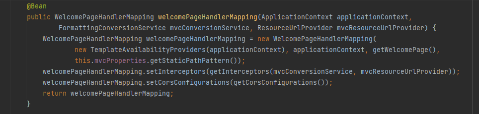
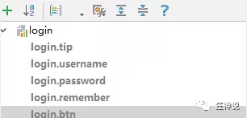
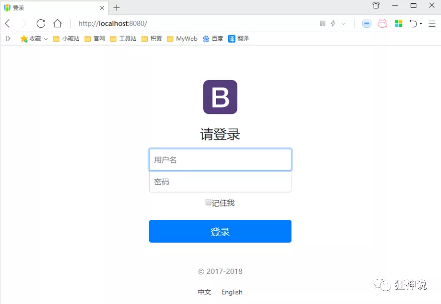
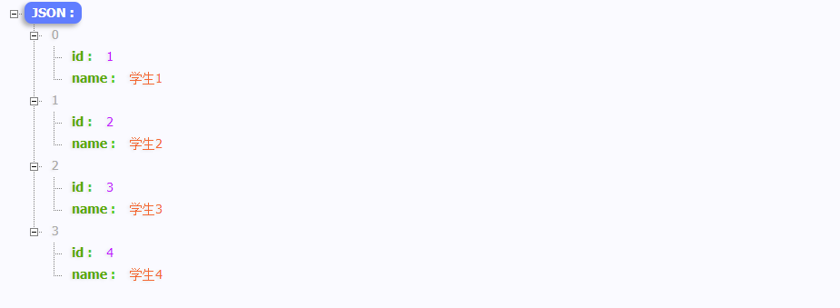

# SpringBoot笔记

## 文档

* [spring boot](https://docs.spring.io/spring-boot/docs/current/reference/html/using.html#using.build-systems)

## 前言

### 回顾Spring

Spring是一个开源框架，2003 年兴起的一个轻量级的Java 开发框架，作者：Rod Johnson  。**Spring是为了解决企业级应用开发的复杂性而创建的，简化开发。**

为了降低Java开发的复杂性，Spring采用了以下4种关键策略：

1、基于POJO的轻量级和最小侵入性编程，所有东西都是bean；

2、通过IOC，依赖注入（DI）和面向接口实现松耦合；

3、基于切面（AOP）和惯例进行声明式编程；

4、通过切面和模版减少样式代码，RedisTemplate，xxxTemplate；

### 什么是SpringBoot

SpringBoot就是一个javaweb的开发框架，和SpringMVC类似，对比其他javaweb框架的好处，官方说是简化开发，**约定大于配置**，  you can "just run"，能迅速的开发web应用，几行代码开发一个http接口。

Spring Boot 基于 Spring 开发，Spirng Boot 本身并不提供 Spring 框架的核心特性以及扩展功能，只是用于快速、敏捷地开发新一代基于 Spring 框架的应用程序。也就是说，它并不是用来替代 Spring 的解决方案，而是和 Spring 框架紧密结合用于提升 Spring 开发者体验的工具。Spring Boot 以**约定大于配置的核心思想**，默认帮我们进行了很多设置，多数 Spring Boot 应用只需要很少的 Spring 配置。同时它集成了大量常用的第三方库配置（例如 Redis、MongoDB、Jpa、RabbitMQ、Quartz 等等），Spring Boot 应用中这些第三方库几乎可以零配置的开箱即用。

简单来说就是SpringBoot其实不是什么新的框架，它默认配置了很多框架的使用方式，就像maven整合了所有的jar包，spring boot整合了所有的框架 。

### SpringBoot的主要优点

- 为所有Spring开发者更快的入门
- **开箱即用**，提供各种默认配置来简化项目配置
- 内嵌式容器简化Web项目
- 没有冗余代码生成和XML配置的要求

## 什么是微服务架构

### 什么是微服务

微服务是一种架构风格，它要求我们在开发一个应用的时候，这个应用必须构建成―系列小服务的组合；可以通过http的方式进行互通。

### 单体应用架构

所谓单体应用架构（all in one)是指，我们将一个应用的中的所有应用服务都封装在一个应用中。

无论是ERP、CRM或是其他什么系统，你都把数据库访问，web访问，等等各个功能放到一个war包内。

- 这样做的好处是，易于开发和测试;也十分方便部署;当需要扩展时，只需要将war复制多份，然后放到多个服务器上，再做个负载均衡就可以了。
- 单体应用架构的缺点是，哪怕我要修改一个非常小的地方，我都需要停掉整个服务，重新打包、部署这个应用war包。特别是对于一个大型应用，我们不可能吧所有内容都放在一个应用里面，我们如何维护、如何分工合作都是问题。

### 微服务架构

all in one的架构方式，我们把所有的功能单元放在一个应用里面。然后我们把整个应用部署到服务器上。如果负载能力不行，我们将整个应用进行水平复制，进行扩展，然后在负载均衡。

所谓微服务架构，就是打破之前all in one的架构方式，把每个功能元素独立出来。把独立出来的功能元素的动态组合，需要的功能元素才去拿来组合，需要多一些时可以整合多个功能元素。所以微服务架构是对功能元素进行复制，而没有对整个应用进行复制。

这样做的好处是:

1. 节省了调用资源。
2. 每个功能元素的服务都是一个可替换的、可独立升级的软件代码。


### 如何构建微服务

​	一个大型系统的微服务架构，就像一个复杂交织的神经网络，每一个神经元就是一个功能元素，它们各自完成自己的功能，然后通过http相互请求调用。比如一个电商系统，查缓存、连数据库、浏览页面、结账、支付等服务都是一个个独立的功能服务，都被微化了，它们作为一个个微服务共同构建了一个庞大的系统。如果修改其中的一个功能，只需要更新升级其中一个功能服务单元即可。

​	但是这种庞大的系统架构给部署和运维带来很大的难度。于是,spring为我们带来了构建大型分布式微服务的全套、全程产品:

- 构建一个个功能独立的微服务应用单元，可以使用springboot，可以帮我们快速构建一个应用;

- 大型分布式网络服务的调用，这部分由spring cloud来完成，实现分布式;
- 在分布式中间，进行流式数据计算、批处理，我们有spring cloud data flow。
- spring为我们想清楚了整个从开始构建应用到大型分布式应用全流程方案。

## 第一个SpringBoot程序

### 创建项目

Spring官方提供了非常方便的工具让我们快速构建应用

Spring Initializr：https://start.spring.io/

#### 第一种创建方式：使用Spring Initializr 的 Web页面创建项目

* 打开https://start.spring.io/
* 填写项目信息，并添加依赖


* 点击”Generate Project“按钮生成项目；下载此项目

* 解压项目包，并用IDEA以Maven项目导入，一路下一步即可，直到项目导入完毕


* 如果是第一次使用，可能速度会比较慢，包比较多、需要耐心等待一切就绪。

#### 第一种创建方式：使用 IDEA 直接创建项目

- 创建一个新项目
- 选择spring initalizr ， 可以看到默认就是去官网的快速构建工具那里实现
- 填写项目信息
- 选择初始化的组件（初学勾选 Web 即可）
- 填写项目路径
- 等待项目构建成功

### 项目分析

* 打开`pom.xml`，看看Spring Boot项目的依赖：

````xml
<!-- 父依赖 -->
<parent>
    <groupId>org.springframework.boot</groupId>
    <artifactId>spring-boot-starter-parent</artifactId>
    <version>2.6.2</version>
    <relativePath/> <!-- lookup parent from repository -->
</parent>

<!--java版本-->
<properties>
    <java.version>17</java.version>
</properties>

<dependencies>
    <!-- web场景启动器 -->
    <!--web依赖：tomcat，dispatcherServlet，xml-->
    <dependency>
        <groupId>org.springframework.boot</groupId>
        <artifactId>spring-boot-starter-web</artifactId>
    </dependency>
    <!--单元测试-->
    <dependency>
        <groupId>org.springframework.boot</groupId>
        <artifactId>spring-boot-starter-test</artifactId>
        <scope>test</scope>

        <!-- 剔除依赖 -->
        <exclusions>
            <exclusion>
                <groupId>org.junit.vintage</groupId>
                <artifactId>junit-vintage-engine</artifactId>
            </exclusion>
        </exclusions>
    </dependency>
</dependencies>

<!--打包插件-->
<build>
    <plugins>
        <plugin>
            <groupId>org.springframework.boot</groupId>
            <artifactId>spring-boot-maven-plugin</artifactId>
        </plugin>
    </plugins>
</build>
````


* 主程序入口


* 在主程序的同级目录下，新建一个controller包，一定要在同级目录下，否则识别不到
* 在包中新建一个HelloController类

```java
@RestController
public class HelloController {

    @RequestMapping("/hello")
    public String hello(){
        return "Hello SpringBoot";
    }
}
```

* 编写完毕后，从主程序启动项目，浏览器发起请求，看页面返回；控制台输出了 Tomcat 访问的端口号

http://localhost:8080/hello


### 更改项目启动名称

如何更改启动时显示的字符拼成的字母，SpringBoot呢？也就是 banner 图案；

只需一步：到项目下的 resources 目录下新建一个banner.txt 即可。

图案可以到：https://www.bootschool.net/ascii 这个网站生成，然后拷贝到文件中即可！


## 初探：自动配置原理

之前写的HelloSpringBoot，到底是怎么运行的呢，Maven项目，我们一般从pom.xml文件探究起；

### `pom.xml`

#### 父依赖

其中它主要是依赖一个父项目，主要是管理项目的资源过滤及插件！

 ```xml
<!-- 父依赖 -->
<parent>
    <groupId>org.springframework.boot</groupId>
    <artifactId>spring-boot-starter-parent</artifactId>
    <version>2.6.2</version>
    <relativePath/> <!-- lookup parent from repository -->
</parent>
 ```

点进去，发现还有一个父依赖

```xml
<parent>
    <groupId>org.springframework.boot</groupId>
    <artifactId>spring-boot-dependencies</artifactId>
    <version>2.6.2</version>
</parent>
```

这里才是真正管理SpringBoot应用里面所有依赖版本的地方，SpringBoot的版本控制中心；

#### 启动器 spring-boot-starter

```xml
<dependency>
    <groupId>org.springframework.boot</groupId>
    <artifactId>spring-boot-starter-web</artifactId>
</dependency>
```

**springboot-boot-starter-xxx**：就是spring-boot的场景启动器

**spring-boot-starter-web**：帮我们导入了web模块正常运行所依赖的组件；

SpringBoot将所有的功能场景都抽取出来，做成一个个的starter （启动器），只需要在项目中引入这些starter即可，所有相关的依赖都会导入进来 ， 我们要用什么功能就导入什么样的场景启动器即可 ；我们未来也可以自己自定义 starter；

* [更多启动器](https://docs.spring.io/spring-boot/docs/current/reference/html/using.html#using.build-systems.ant)

### 主启动类

分析完了 pom.xml 来看看这个启动类

#### 默认的主启动类

```java
// 程序主入口
@SpringBootApplication // 标注这个类是一个springboot应用
public class HelloworldApplication {

	public static void main(String[] args) {
		SpringApplication.run(HelloworldApplication.class, args);
	}
}
```

但是**一个简单的启动类并不简单！**来分析一下这些注解都干了什么

#### @SpringBootApplication

作用：标注在某个类上说明这个类是SpringBoot的主配置类 ， SpringBoot就应该运行这个类的main方法来启动SpringBoot应用；

进入这个注解：可以看到上面还有很多其他注解！

```java
@SpringBootConfiguration // springboot的配置
@EnableAutoConfiguration // 自动配置
@ComponentScan( // 自动扫描并加载符合条件的组件或者bean
    excludeFilters = {@Filter(
    type = FilterType.CUSTOM,
    classes = {TypeExcludeFilter.class}
), @Filter(
    type = FilterType.CUSTOM,
    classes = {AutoConfigurationExcludeFilter.class}
)}
)
public @interface SpringBootApplication {
    // ......
}
```

##### @ComponentScan

这个注解在Spring中很重要 ,它对应XML配置中的元素。

**作用：自动扫描并加载符合条件的组件或者bean ， 将这个bean定义加载到IOC容器中**

##### @SpringBootConfiguration

**作用：SpringBoot的配置类 ，标注在某个类上 ， 表示这是一个SpringBoot的配置类；**

继续进去这个注解查看

```java
// 点进去得到下面的 @Component
@Configuration
public @interface SpringBootConfiguration {}

@Component
public @interface Configuration {}
```

这里的 @Configuration，说明这是一个配置类 ，配置类就是对应Spring的xml 配置文件；

里面的 @Component 这就说明，启动类本身也是Spring中的一个组件而已，负责启动应用！

回到 SpringBootApplication 注解中继续看。

##### @EnableAutoConfiguration

**@EnableAutoConfiguration ：开启自动配置功能**

以前我们需要自己配置的东西，而现在SpringBoot可以自动帮我们配置 ；@EnableAutoConfiguration告诉SpringBoot开启自动配置功能，这样自动配置才能生效；

点进注解接续查看：

**@AutoConfigurationPackage ：自动配置包**

```java
@Import({Registrar.class})
public @interface AutoConfigurationPackage {
}
```

**@import** **：Spring底层注解@import ， 给容器中导入一个组件**

**Registrar.class 作用：将主启动类的所在包及包下面所有子包里面的所有组件扫描到Spring容器 ；**

这个分析完了，退到上一步，继续看

**@Import({AutoConfigurationImportSelector.class}) ：给容器导入组件 ；**

AutoConfigurationImportSelector ：自动配置导入选择器，那么它会导入哪些组件的选择器呢？我们点击去这个类看源码：

* 这个类中有一个这样的方法

```java
// 获得候选的配置
protected List<String> getCandidateConfigurations(AnnotationMetadata metadata, AnnotationAttributes attributes) {
    //这里的getSpringFactoriesLoaderFactoryClass（）方法
    //返回的就是我们最开始看的启动自动导入配置文件的注解类；EnableAutoConfiguration
    List<String> configurations = SpringFactoriesLoader.loadFactoryNames(this.getSpringFactoriesLoaderFactoryClass(), this.getBeanClassLoader());
    Assert.notEmpty(configurations, "No auto configuration classes found in META-INF/spring.factories. If you are using a custom packaging, make sure that file is correct.");
    return configurations;
}
```

* 这个方法又调用了  SpringFactoriesLoader 类的静态方法！我们进入SpringFactoriesLoader类loadFactoryNames() 方法

```java
public static List<String> loadFactoryNames(Class<?> factoryClass, @Nullable ClassLoader classLoader) {
    String factoryClassName = factoryClass.getName();
    //这里它又调用了 loadSpringFactories 方法
    return (List)loadSpringFactories(classLoader).getOrDefault(factoryClassName, Collections.emptyList());
}
```

* 继续点击查看 loadSpringFactories 方法

```java
private static Map<String, List<String>> loadSpringFactories(@Nullable ClassLoader classLoader) {
    //获得classLoader ， 我们返回可以看到这里得到的就是EnableAutoConfiguration标注的类本身
    MultiValueMap<String, String> result = (MultiValueMap)cache.get(classLoader);
    if (result != null) {
        return result;
    } else {
        try {
            //去获取一个资源 "META-INF/spring.factories"
            Enumeration<URL> urls = classLoader != null ? classLoader.getResources("META-INF/spring.factories") : ClassLoader.getSystemResources("META-INF/spring.factories");
            LinkedMultiValueMap result = new LinkedMultiValueMap();

            //将读取到的资源遍历，封装成为一个Properties
            while(urls.hasMoreElements()) {
                URL url = (URL)urls.nextElement();
                UrlResource resource = new UrlResource(url);
                Properties properties = PropertiesLoaderUtils.loadProperties(resource);
                Iterator var6 = properties.entrySet().iterator();

                while(var6.hasNext()) {
                    Entry<?, ?> entry = (Entry)var6.next();
                    String factoryClassName = ((String)entry.getKey()).trim();
                    String[] var9 = StringUtils.commaDelimitedListToStringArray((String)entry.getValue());
                    int var10 = var9.length;

                    for(int var11 = 0; var11 < var10; ++var11) {
                        String factoryName = var9[var11];
                        result.add(factoryClassName, factoryName.trim());
                    }
                }
            }
            cache.put(classLoader, result);
            return result;
        } catch (IOException var13) {
            throw new IllegalArgumentException("Unable to load factories from location [META-INF/spring.factories]", var13);
        }
    }
}
```

* 发现一个多次出现的文件：spring.factories，全局搜索它

##### spring.factories

们根据源头打开spring.factories ， 看到了很多自动配置的文件；这就是自动配置根源所在！


**WebMvcAutoConfiguration**

我们在上面的自动配置类随便找一个打开看看，比如 ：WebMvcAutoConfiguration


可以看到这些一个个的都是JavaConfig配置类，而且都注入了一些Bean，可以找一些自己认识的类，看着熟悉一下！

所以，自动配置真正实现是从classpath中搜寻所有的META-INF/spring.factories配置文件 ，并将其中对应的 org.springframework.boot.autoconfigure. 包下的配置项，通过反射实例化为对应标注了 @Configuration的JavaConfig形式的IOC容器配置类 ， 然后将这些都汇总成为一个实例并加载到IOC容器中。

**结论：**

1. SpringBoot在启动的时候从类路径下的META-INF/spring.factories中获取EnableAutoConfiguration指定的值
2. 将这些值作为自动配置类导入容器 ， 自动配置类就生效 ， 帮我们进行自动配置工作；
3. 整个J2EE的整体解决方案和自动配置都在springboot-autoconfigure的jar包中；
4. 它会给容器中导入非常多的自动配置类 （xxxAutoConfiguration）, 就是给容器中导入这个场景需要的所有组件 ， 并配置好这些组件 ；
5. 有了自动配置类 ， 免去了我们手动编写配置注入功能组件等的工作；

#### **SpringApplication**

```java
@SpringBootApplication
public class SpringbootApplication {
    public static void main(String[] args) {
        SpringApplication.run(SpringbootApplication.class, args);
    }
}
```

**SpringApplication.run分析**

分析该方法主要分两部分，一部分是SpringApplication的实例化，二是run方法的执行；


**这个类主要做了以下四件事情：**

1、推断应用的类型是普通的项目还是Web项目

2、查找并加载所有可用初始化器 ， 设置到initializers属性中

3、找出所有的应用程序监听器，设置到listeners属性中

4、推断并设置main方法的定义类，找到运行的主类

查看构造器：

```java
public SpringApplication(ResourceLoader resourceLoader, Class... primarySources) {
    // ......
    this.webApplicationType = WebApplicationType.deduceFromClasspath();
    this.setInitializers(this.getSpringFactoriesInstances();
    this.setListeners(this.getSpringFactoriesInstances(ApplicationListener.class));
    this.mainApplicationClass = this.deduceMainApplicationClass();
}
```

#### run方法流程分析


### 谈谈对SpringBoot的理解

* 自动装配
* run方法

## yaml配置注入

### yaml语法学习

#### 配置文件

SpringBoot使用一个全局的配置文件 ， 配置文件名称是固定的

- application.properties

- - 语法结构 ：key=value

- application.yml

- - 语法结构 ：key：空格 value

**配置文件的作用 ：**修改SpringBoot自动配置的默认值，因为SpringBoot在底层都给我们自动配置好了；

比如可以在配置文件中修改Tomcat 默认启动的端口号！测试一下！

 ```properties
server.port=8081
 ```

#### yaml概述

YAML是 "YAML Ain't a Markup Language" （YAML不是一种标记语言）的递归缩写。在开发的这种语言时，YAML 的意思其实是："Yet Another Markup Language"（仍是一种标记语言）

> **这种语言以数据作为中心，而不是以标记语言为重点！**

以前的配置文件，大多数都是使用xml来配置；比如一个简单的端口配置，我们来对比下yaml和xml

传统xml配置：

```xml
<server>
    <port>8081<port>
</server>
```

yaml配置：

```yaml
server：
  prot: 8080
```

> application.properties与application.yaml一样，都能生效。

#### yaml基础语法

说明：语法要求严格！

1、空格不能省略

2、以缩进来控制层级关系，只要是左边对齐的一列数据都是同一个层级的。

3、属性和值的大小写都是十分敏感的。

**字面量：普通的值  [ 数字，布尔值，字符串  ]**

字面量直接写在后面就可以 ， 字符串默认不用加上双引号或者单引号；

```yaml
k: v
```

注意：

- “ ” 双引号，不会转义字符串里面的特殊字符 ， 特殊字符会作为本身想表示的意思；

  比如 ：name: "kuang \n shen"  输出 ：kuang  换行  shen

- '' 单引号，会转义特殊字符 ， 特殊字符最终会变成和普通字符一样输出

  比如 ：name: ‘kuang \n shen’  输出 ：kuang  \n  shen

**对象、Map（键值对）**

```yaml
#对象、Map格式
k: 
    v1:
    v2:
```

在下一行来写对象的属性和值得关系，注意缩进；比如：

 ```yaml
student:
    name: aaaa
    age: 3
 ```

行内写法

```yaml
dog:
   {name: 小明,age: 18}
```

**数组（ List、set ）**

用 - 值表示数组中的一个元素，比如：

```yaml
pets:
 - cat
 - dog
 - pig
```

行内写法

```yaml
pets: [cat,dog,pig]
```

**修改SpringBoot的默认端口号**

配置文件中添加，端口号的参数，就可以切换端口；

```yaml
server:
  port: 8082
```

### 注入配置文件

yaml文件更强大的地方在于，他可以给我们的实体类直接注入匹配值！

#### yaml注入配置文件

1、在springboot项目中的resources目录下新建一个文件 application.yml

2、编写一个实体类 Dog；

```yaml
@Component  //注册bean到容器中
public class Dog {
    @Value("小明")
    private String name;
    @Value("18")
    private Integer age;

    //有参无参构造、get、set方法、toString()方法

    @Override
    public String toString() {
        return "Dog{" +
                "name='" + name + '\'' +
                ", age=" + age +
                '}';
    }
}
```

* 思考，原来是如何给bean注入属性值的！@Value，给狗狗类测试一下：

```java
@Component //注册bean
public class Dog {
    @Value("小明")
    private String name;
    @Value("18")
    private Integer age;
}
```

* 在SpringBoot的测试类下注入Dog输出一下；

```java
@SpringBootTest
class DemoApplicationTests {

    @Autowired //将狗狗自动注入进来
    Dog dog;

    @Test
    public void contextLoads() {
        System.out.println(dog); //打印看下狗狗对象
    }
}
```

结果成功输出，@Value注入成功。


* 来使用yaml配置的方式进行注入，写的时候注意区别和优势，编写一个yaml配置！

```yaml
dog:
   {name: 小明,age: 18}
```

或者

```yaml
dog:
  name: 旺财
  age: 1
```

* 注入到类中！

```java
@Data
@AllArgsConstructor
@NoArgsConstructor
@Component  //注册bean到容器中
@ConfigurationProperties(prefix = "dog")
public class Dog {
    private String name;
    private Integer age;
    
     //有参无参构造、get、set方法、toString()方法  

    @Override
    public String toString() {
        return "Dog{" +
                "name='" + name + '\'' +
                ", age=" + age +
                '}';
    }
}
```

* IDEA 提示，springboot配置注解处理器没有找到，让我们看文档，我们可以查看文档，找到一个依赖！


```xml
<!-- 导入配置文件处理器，配置文件进行绑定就会有提示，需要重启 -->
<dependency>
    <groupId>org.springframework.boot</groupId>
    <artifactId>spring-boot-configuration-processor</artifactId>
    <optional>true</optional>
</dependency>
```

* 确认以上配置都OK之后，去测试类中测试一下


#### 加载指定的配置文件

**@PropertySource ：**加载指定的配置文件；

**@configurationProperties**：默认从全局配置文件中获取值；

* 在resources目录下新建一个**application.properties**文件

```properties
name=小明
```

* 然后在代码中指定加载application.properties文件

```java
@PropertySource(value = "classpath:application.properties")
@Component
public class Person {
    @Value("${name}") // 引用配置文件中name属性，进行赋值
    private String name;
}
```

* 再次输出测试一下：指定配置文件绑定成功！


#### properties配置

properties配置文件在写中文的时候，会有乱码 ， 我们需要去IDEA中设置编码格式为UTF-8；

settings-->FileEncodings 中配置；


#### 对比小结

@Value这个使用起来并不友好！我们需要为每个属性单独注解赋值，比较麻烦；我们来看个功能对比图


1. @ConfigurationProperties只需要写一次即可 ， @Value则需要每个字段都添加
2. 松散绑定：这个什么意思呢? 比如我的yml中写的last-name，这个和lastName是一样的， - 后面跟着的字母默认是大写的。这就是松散绑定。可以测试一下

```yaml
person:
  last-name: 小明
```

```java
@Data
@AllArgsConstructor
@NoArgsConstructor
@Component
@ConfigurationProperties(prefix = "person")
public class Person {
    @Value("${name}")
    private String lastName;

    @Override
    public String toString() {
        return "Person{" +
                "lastName='" + lastName + '\'' +
                '}';
    }
}
```

3. JSR303数据校验 ， 这个就是我们可以在字段是增加一层过滤器验证 ， 可以保证数据的合法性

4. 复杂类型封装，yml中可以封装对象 ， 使用value就不支持

**结论：**

配置yml和配置properties都可以获取到值 ， 强烈推荐 yml；

如果我们在某个业务中，只需要获取配置文件中的某个值，可以使用一下 @value；

如果说，专门编写了一个JavaBean来和配置文件进行一一映射，就直接@configurationProperties，不要犹豫！

## JSR303

* https://doc.stack.seezoon.com/guide/feature/jsr-303.html

### 数据校验

`person.java`

```java
@Data
@AllArgsConstructor
@NoArgsConstructor
@Component
@ConfigurationProperties(prefix = "person")
@Validated // 数据校验
public class Person {
    private String email;

    @Override
    public String toString() {
        return "Person{" +
                "email='" + email + '\'' +
                '}';
    }
}
```

`application.yaml`

```yaml
person:
  email: 1111@qq.com
```

添加相关依赖：

```xml
<dependency>
    <groupId>commons-validator</groupId>
    <artifactId>commons-validator</artifactId>
    <version>1.3.1</version>
</dependency>
<dependency>
    <groupId>org.springframework.boot</groupId>
    <artifactId>spring-boot-starter-validation</artifactId>
</dependency>
```

Springboot中可以用@validated来校验数据，如果数据异常则会统一抛出异常，方便异常中心统一处理。这里来写个注解让我们的email只能支持Email格式；

```java
@Validated // 数据校验
public class Person {

    @Email(message = "邮箱格式错误")
    private String email;
    
}
```


如果emial格式错误，输出会怎么样：

```yaml
email: 1111
```


如果数据不符合规定，则会打印错误。

常见jsr303验证注解：

| 常用验证注解 | 描述                                                        |
| ------------ | ----------------------------------------------------------- |
| @NotNull     | 不能为null。                                                |
| @NotEmpty    | 不能为null 不能为空，适用字符、集合、Map、数组的验证。      |
| @NotBlank    | 不能为null或者空白符。                                      |
| @Null        | 必须为null，用的较少。                                      |
| @Size        | 为null的时候不生效，适用字符长度，集合、Map、数组容量校验。 |
| @Pattern     | 为null的时候不生效，适用字符正则验证。                      |
| @Min和@Max   | 为null的时候不生效，适合数值类验证。                        |
| @Email       | 为null的时候不生效，验证字符是否符合邮箱格式。              |
| @Digits      | 为null的时候不生效，小数验证。                              |
| @AssertTrue  | 验证 Boolean 对象是否为 true                                |
| @AssertFalse | 验证 Boolean 对象是否为 false                               |
| @Past@Past   | 验证 Date 和 Calendar 对象是否在当前时间之前                |
| @Future      | 验证 Date 和 Calendar 对象是否在当前时间之后                |
| @Pattern     | 验证 String 对象是否符合正则表达式的规则                    |

### 多环境切换

profile是Spring对不同环境提供不同配置功能的支持，可以通过激活不同的环境版本，实现快速切换环境；

#### 多配置文件

在主配置文件编写的时候，文件名可以是 application-{profile}.properties/yml , 用来指定多个环境版本；

**例如：**

application-test.properties 代表测试环境配置

application-dev.properties 代表开发环境配置

但是Springboot并不会直接启动这些配置文件，它**默认使用application.properties主配置文件**；

需要通过一个配置来选择需要激活的环境：

```properties
#比如在配置文件中指定使用dev环境，我们可以通过设置不同的端口号进行测试；
#我们启动SpringBoot，就可以看到已经切换到dev下的配置了；
spring.profiles.active=dev
```

#### yaml的多文档块

和properties配置文件中一样，但是使用yml去实现不需要创建多个配置文件，更加方便了 !

 ```yaml
server:
  port: 8081
#选择要激活那个环境块
spring:
  profiles:
    active: prod

---
server:
  port: 8083
spring:
  profiles: dev #配置环境的名称


---

server:
  port: 8084
spring:
  profiles: prod  #配置环境的名称
 ```

**注意：如果yml和properties同时都配置了端口，并且没有激活其他环境 ， 默认会使用properties配置文件的**

#### 配置文件加载位置

**外部加载配置文件的方式十分多，选择最常用的即可，在开发的资源文件中进行配置！**

官方外部配置文件说明参考文档


springboot 启动会扫描以下位置的application.properties或者application.yml文件作为Spring boot的默认配置文件：

```properties
优先级1：项目路径下的config文件夹配置文件
优先级2：项目路径下配置文件
优先级3：资源路径下的config文件夹配置文件
优先级4：资源路径下配置文
```

优先级由高到底，高优先级的配置会覆盖低优先级的配置；

**SpringBoot会从这四个位置全部加载主配置文件；互补配置；**

我们在最低级的配置文件中设置一个项目访问路径的配置来测试互补问题；

```properties
#配置项目的访问路径
server.servlet.context-path=/easy
```

#### 拓展，运维小技巧

指定位置加载配置文件

我们还可以通过spring.config.location来改变默认的配置文件位置

项目打包好以后，我们可以使用命令行参数的形式，启动项目的时候来指定配置文件的新位置；这种情况，一般是后期运维做的多，相同配置，外部指定的配置文件优先级最高

```sh
java -jar spring-boot-config.jar --spring.config.location=C:/application.properties
```

## 进阶：自动配置原理

配置文件到底能写什么？怎么写？

SpringBoot官方文档中有大量的配置，我们无法全部记住


### 分析自动配置原理

以**HttpEncodingAutoConfiguration（Http编码自动配置）**为例解释自动配置原理；

```java
//表示这是一个配置类，和以前编写的配置文件一样，也可以给容器中添加组件；
@Configuration(proxyBeanMethods = false)

//启动指定类的ConfigurationProperties功能；
  //进入这个ServerProperties查看，将配置文件中对应的值和ServerProperties绑定起来；
  //并把ServerProperties加入到ioc容器中
@EnableConfigurationProperties(ServerProperties.class)

//Spring底层@Conditional注解
  //根据不同的条件判断，如果满足指定的条件，整个配置类里面的配置就会生效；
  //这里的意思就是判断当前应用是否是web应用，如果是，当前配置类生效
@ConditionalOnWebApplication(type = ConditionalOnWebApplication.Type.SERVLET)

//判断当前项目有没有这个类CharacterEncodingFilter；SpringMVC中进行乱码解决的过滤器；
@ConditionalOnClass(CharacterEncodingFilter.class)

//判断配置文件中是否存在某个配置：server.servlet.encoding.enabled；
  //如果不存在，判断也是成立的
  //即使我们配置文件中不配置server.servlet.encoding.enabled=true，也是默认生效的；
@ConditionalOnProperty(
    prefix = "server.servlet.encoding", 
    value = "enabled", 
    matchIfMissing = true)


public class HttpEncodingAutoConfiguration {

	private final Encoding properties;

	public HttpEncodingAutoConfiguration(ServerProperties properties) {
		this.properties = properties.getServlet().getEncoding();
	}

	@Bean
	@ConditionalOnMissingBean
	public CharacterEncodingFilter characterEncodingFilter() {
		CharacterEncodingFilter filter = new OrderedCharacterEncodingFilter();
		filter.setEncoding(this.properties.getCharset().name());
		filter.setForceRequestEncoding(this.properties.shouldForce(Encoding.Type.REQUEST));
		filter.setForceResponseEncoding(this.properties.shouldForce(Encoding.Type.RESPONSE));
		return filter;
	}

	@Bean
	public LocaleCharsetMappingsCustomizer localeCharsetMappingsCustomizer() {
		return new LocaleCharsetMappingsCustomizer(this.properties);
	}

	static class LocaleCharsetMappingsCustomizer
			implements WebServerFactoryCustomizer<ConfigurableServletWebServerFactory>, Ordered {
        
		private final Encoding properties;
        
		LocaleCharsetMappingsCustomizer(Encoding properties) {
			this.properties = properties;
		}

		@Override
		public void customize(ConfigurableServletWebServerFactory factory) {
			if (this.properties.getMapping() != null) {
				factory.setLocaleCharsetMappings(this.properties.getMapping());
			}
		}
        
		@Override
		public int getOrder() {
			return 0;
		}
	}
}
```

**一句话总结 ：根据当前不同的条件判断，决定这个配置类是否生效！**

- 一但这个配置类生效；这个配置类就会给容器中添加各种组件；
- 这些组件的属性是从对应的properties类中获取的，这些类里面的每一个属性又是和配置文件绑定的；
- 所有在配置文件中能配置的属性都是在xxxxProperties类中封装着；
- 配置文件能配置什么就可以参照某个功能对应的这个属性类

```java
//从配置文件中获取指定的值和bean的属性进行绑定
@ConfigurationProperties(prefix = "server", ignoreUnknownFields = true)
public class ServerProperties {
    // .....
}
```

去配置文件里面试试前缀，看提示！


> **这就是自动装配的原理！**

### 精髓

1、SpringBoot启动会加载大量的自动配置类

2、我们看我们需要的功能有没有在SpringBoot默认写好的自动配置类当中；

3、我们再来看这个自动配置类中到底配置了哪些组件；（只要我们要用的组件存在在其中，我们就不需要再手动配置了）

4、给容器中自动配置类添加组件的时候，会从properties类中获取某些属性。我们只需要在配置文件中指定这些属性的值即可；

**xxxxAutoConfigurartion：自动配置类；**给容器中添加组件

**xxxxProperties:封装配置文件中相关属性；**

### 了解：@Conditional

了解完自动装配的原理后，我们来关注一个细节问题，**自动配置类必须在一定的条件下才能生效；**

**@Conditional派生注解（Spring注解版原生的@Conditional作用）**

作用：必须是@Conditional指定的条件成立，才给容器中添加组件，配置配里面的所有内容才生效；


**那么多的自动配置类，必须在一定的条件下才能生效；也就是说，我们加载了这么多的配置类，但不是所有的都生效了。**

我们怎么知道哪些自动配置类生效？

**我们可以通过启用 debug=true属性；来让控制台打印自动配置报告，这样我们就可以很方便的知道哪些自动配置类生效；**

```properties
#开启springboot的调试类
debug=true
```

**Positive matches:（自动配置类启用的：正匹配）**

**Negative matches:（没有启动，没有匹配成功的自动配置类：负匹配）**

**Unconditional classes: （没有条件的类）**

## SpringBoot Web开发

### 回顾知识点

SpringBoot最大的特点就是自动装配。说白了就是别人写好的了，自动进行配置。

**使用SpringBoot的步骤：**

1、创建一个SpringBoot应用，选择我们需要的模块，SpringBoot就会默认将我们的需要的模块自动配置好

2、手动在配置文件中配置部分配置项目就可以运行起来了

3、专注编写业务代码，不需要考虑以前那样一大堆的配置了。

要熟悉掌握开发，之前学习的自动配置的原理一定要搞明白！

比如SpringBoot到底帮我们配置了什么？我们能不能修改？我们能修改哪些配置？我们能不能扩展？

- 向容器中自动配置组件 ：*** Autoconfiguration
- 自动配置类，封装配置文件的内容：***Properties

没事就找找类，看看自动装配原理！

### Web开发静态资源处理

#### 准备工作

* **搭建一个普通的SpringBoot项目**，回顾一下HelloWorld程序！

项目中有许多的静态资源，比如css，js等文件，这个SpringBoot怎么处理呢？

#### 静态资源处理

##### 第一种静态资源映射规则：通过webjars导入

SpringBoot中，SpringMVC的web配置都在 WebMvcAutoConfiguration 这个配置类里面；

我们可以去看看 WebMvcAutoConfigurationAdapter 中有很多配置方法；

有一个方法：addResourceHandlers 添加资源处理

```java
@Override
public void addResourceHandlers(ResourceHandlerRegistry registry) {
    if (!this.resourceProperties.isAddMappings()) {
        logger.debug("Default resource handling disabled");
        return;
    }
    addResourceHandler(registry, "/webjars/**", "classpath:/META-INF/resources/webjars/");
    addResourceHandler(registry, this.mvcProperties.getStaticPathPattern(), (registration) -> {
        registration.addResourceLocations(this.resourceProperties.getStaticLocations());
        if (this.servletContext != null) {
            ServletContextResource resource = new ServletContextResource(this.servletContext, SERVLET_LOCATION);
            registration.addResourceLocations(resource);
        }
    });
}
```

读一下源代码：比如所有的 `/webjars/**` ， 都需要去 `classpath:/META-INF/resources/webjars/` 找对应的资源；

##### 什么是webjars？

Webjars本质就是以jar包的方式引入的静态资源 ， 以前要导入一个静态资源文件，直接导入即可。

* 网站：https://www.webjars.org 

要使用jQuery，我们只要要引入jQuery对应版本的pom依赖即可！

 ```xml
<dependency>
    <groupId>org.webjars</groupId>
    <artifactId>jquery</artifactId>
    <version>3.6.0</version>
</dependency>
 ```

导入完毕，查看webjars目录结构，并访问Jquery.js文件！


访问：只要是静态资源，SpringBoot就会去对应的路径寻找资源，这里访问：

* http://localhost:8080/webjars/jquery/3.6.0/jquery.js


##### 第二种静态资源映射规则：通过static导入

在项目中要是使用自己的静态资源该怎么导入呢？

去找staticPathPattern发现第二种映射规则 ：`/**` , 访问当前的项目任意资源，它会去找 resourceProperties 这个类，可以点进去看一下分析：


ResourceProperties 可以设置静态资源有关的参数；这里面指向了它会去寻找资源的文件夹，即上面数组的内容。

所以得出结论，以下四个目录存放的静态资源可以被我们识别：

```properties
"classpath:/META-INF/resources/"
"classpath:/resources/"
"classpath:/static/"
"classpath:/public/"
```


可以在resources根目录下新建对应的文件夹，都可以存放静态文件；

*  http://localhost:8080/test.js , 就会去这些文件夹中寻找对应的静态资源文件；


##### 第三种静态资源映射规则：自定义

也可以自己通过配置文件来指定一下，哪些文件夹是需要我们放静态资源文件的，在application.properties中配置；

```properties
spring.web.resources.static-locations=classpath:/coding/,classpath:/documents/
```

#### 优先级

自定义规则 > `resouces` > `static`(默认) > `public`

### 自定义首页和图标

#### 首页

继续向下看`WebMvcAutoConfiguration.java`源码！可以看到一个欢迎页的映射，就是首页！



点击`WelcomePageHandlerMapping.java`


通过大致阅读，可知，这就是首页显示的源码，默认首页为`index.html`

```html
<!DOCTYPE html>
<html lang="en">
    <head>
        <meta charset="UTF-8">
        <title>首页</title>
    </head>
    <body>
        Hello SpringBoot
    </body>
</html>
```

> 静态资源可以放到上面所描述的任何地方。

#### 图标

与其他静态资源一样，Spring Boot在配置的静态内容位置中查找 favicon.ico。如果存在这样的文件，它将自动用作应用程序的favicon。

* 关闭SpringBoot默认图标

```properties
#关闭默认图标
spring.mvc.favicon.enabled=false
```

* 放一个图标在静态资源目录下，放在 public 目录或者static下，都可以4
* 清除浏览器缓存！刷新网页，发现图标已经变成自己的了！


但是由于favicon在最新的springboot已经被禁止使用了，禁止原因详情请百度。

通过css进行导入，如下：

```css
<link rel="shortcut icon" href="favicon.ico" >
```

### Thymeleaf模板引擎

> 现在已经前后端分离啦，但是该学的还是要学

#### 模板引擎

前端交给我们的页面，是html页面。如果是我们以前开发，我们需要把他们转成jsp页面，jsp好处就是当我们查出一些数据转发到JSP页面以后，我们可以用jsp轻松实现数据的显示，及交互等。

现在springboot**现在默认是不支持jsp的**。**SpringBoot可以来使用模板引擎**来代替jsp。


> SpringBoot给推荐的Thymeleaf，模板引擎有非常多

模板引擎的作用就是来写一个页面模板，可以进行动态传参以及写表达式。

#### 引入Thymeleaf

* Thymeleaf 官网：https://www.thymeleaf.org/

* Spring官方文档：找到对应的版本

  https://docs.spring.io/spring-boot/docs/2.6.2/reference/htmlsingle/#using.build-systems.starters

* 导入依赖

```xml
<!--thymeleaf-->
<dependency>
    <groupId>org.springframework.boot</groupId>
    <artifactId>spring-boot-starter-thymeleaf</artifactId>
</dependency>
```

* 编写测试页面`test.html`，在`resources/templates/test.html`

```html
<!DOCTYPE html>
<html lang="en">
<head>
    <meta charset="UTF-8">
    <title>Title</title>
</head>
<body>
    test
</body>
</html>
```

#### Thymeleaf分析

按照SpringBoot的自动配置原理看一下Thymeleaf的自动配置规则，在按照那个规则，进行使用。

找一下Thymeleaf的自动配置类：ThymeleafProperties

```java
@ConfigurationProperties(prefix = "spring.thymeleaf")
public class ThymeleafProperties {

	private static final Charset DEFAULT_ENCODING = StandardCharsets.UTF_8;

	public static final String DEFAULT_PREFIX = "classpath:/templates/";

	public static final String DEFAULT_SUFFIX = ".html";

	/**
	 * Whether to check that the template exists before rendering it.
	 */
	private boolean checkTemplate = true;

	/**
	 * Whether to check that the templates location exists.
	 */
	private boolean checkTemplateLocation = true;

	/**
	 * Prefix that gets prepended to view names when building a URL.
	 */
	private String prefix = DEFAULT_PREFIX;

	/**
	 * Suffix that gets appended to view names when building a URL.
	 */
	private String suffix = DEFAULT_SUFFIX;

	/**
	 * Template mode to be applied to templates. See also Thymeleaf's TemplateMode enum.
	 */
	private String mode = "HTML";

	/**
	 * Template files encoding.
	 */
	private Charset encoding = DEFAULT_ENCODING;
  	...
}
```

可以在其中看到默认的前缀和后缀！**只需要把html页面放在类路径下的templates下，thymeleaf就可以自动渲染了。**

>  使用thymeleaf什么都不需要配置，只需要将他放在指定的文件夹下即可！

首先编写一个TestController

```java
@Controller
public class TestController {
    @GetMapping("/test")
    public String test(){
        return "test";
    }
}
```

然后启动项目请求测试

* http://localhost:8080/test


#### Thymeleaf语法

* Thymeleaf 官网：https://www.thymeleaf.org/ 

##### 简单测试

* 在`resources/templates/test.html`

```html
<!DOCTYPE html>
<html lang="en">
<head>
    <meta charset="UTF-8">
    <title>Title</title>
</head>
<body>
    !--th:text就是将div中的内容设置为它指定的值，和之前学习的Vue一样-->
	<div th:text="${msg}"></div>
</body>
</html>
```

* 编写TestController

```java
@Controller
public class TestController {
    @GetMapping("/test")
    public String test(Model model){
        model.addAttribute("msg", "Hello SpringBoot");
        return "test";
    }
}
```

##### 使用语法

* **可以使用任意的 th:attr 来替换Html中原生属性的值！**


* **表达式**

```properties
Simple expressions:（表达式语法）
Variable Expressions: ${...}：获取变量值；OGNL；
    1）、获取对象的属性、调用方法
    2）、使用内置的基本对象：#18
         #ctx : the context object.
         #vars: the context variables.
         #locale : the context locale.
         #request : (only in Web Contexts) the HttpServletRequest object.
         #response : (only in Web Contexts) the HttpServletResponse object.
         #session : (only in Web Contexts) the HttpSession object.
         #servletContext : (only in Web Contexts) the ServletContext object.

    3）、内置的一些工具对象：
　　　　　　#execInfo : information about the template being processed.
　　　　　　#uris : methods for escaping parts of URLs/URIs
　　　　　　#conversions : methods for executing the configured conversion service (if any).
　　　　　　#dates : methods for java.util.Date objects: formatting, component extraction, etc.
　　　　　　#calendars : analogous to #dates , but for java.util.Calendar objects.
　　　　　　#numbers : methods for formatting numeric objects.
　　　　　　#strings : methods for String objects: contains, startsWith, prepending/appending, etc.
　　　　　　#objects : methods for objects in general.
　　　　　　#bools : methods for boolean evaluation.
　　　　　　#arrays : methods for arrays.
　　　　　　#lists : methods for lists.
　　　　　　#sets : methods for sets.
　　　　　　#maps : methods for maps.
　　　　　　#aggregates : methods for creating aggregates on arrays or collections.
==================================================================================

  Selection Variable Expressions: *{...}：选择表达式：和${}在功能上是一样；
  Message Expressions: #{...}：获取国际化内容
  Link URL Expressions: @{...}：定义URL；
  Fragment Expressions: ~{...}：片段引用表达式

Literals（字面量）
      Text literals: 'one text' , 'Another one!' ,…
      Number literals: 0 , 34 , 3.0 , 12.3 ,…
      Boolean literals: true , false
      Null literal: null
      Literal tokens: one , sometext , main ,…
      
Text operations:（文本操作）
    String concatenation: +
    Literal substitutions: |The name is ${name}|
    
Arithmetic operations:（数学运算）
    Binary operators: + , - , * , / , %
    Minus sign (unary operator): -
    
Boolean operations:（布尔运算）
    Binary operators: and , or
    Boolean negation (unary operator): ! , not
    
Comparisons and equality:（比较运算）
    Comparators: > , < , >= , <= ( gt , lt , ge , le )
    Equality operators: == , != ( eq , ne )
    
Conditional operators:条件运算（三元运算符）
    If-then: (if) ? (then)
    If-then-else: (if) ? (then) : (else)
    Default: (value) ?: (defaultvalue)
    
Special tokens:
    No-Operation: _
```

* 抽取公共模板

`common.html`

```html
<html xmlns:th="http://www.thymeleaf.org">
    <div th:fragment="xxx">
        xxx
    </div>
</html>
```

`index.html`

插入公共部分

```html
<div th:replace="~{commons/commno::xxx}">
</div>
```

其中`xxx`类似于id，便于进行插入，`~{commons/common::xxx}`是该公共部分被放在`commons/common.html`中的`xxx`部分处。

* 日期格式化

```html
th:text="${#dates.format(date,'yyyy-MM-dd HH:mm:ss')}"
```

**练习测试：**

* 编写一个Controller，放一些数据

````java
@RequestMapping("/t2")
public String test2(Map<String,Object> map){
    //存入数据
    map.put("msg","<h1>Hello</h1>");
    map.put("users", Arrays.asList("aaa","asda"));
    //classpath:/templates/test.html
    return "test";
}
````

* 测试页面取出数据

````html
<!DOCTYPE html>
<html lang="en" xmlns:th="http://www.thymeleaf.org">
    <head>
        <meta charset="UTF-8">
        <title>狂神说</title>
    </head>
    <body>
        <h1>测试页面</h1>

        <div th:text="${msg}"></div>
        <!--不转义-->
        <div th:utext="${msg}"></div>

        <!--遍历数据-->
        <!--th:each每次遍历都会生成当前这个标签：官网#9-->
        <h4 th:each="user :${users}" th:text="${user}"></h4>

        <h4>
            <!--行内写法：官网#12-->
            <span th:each="user:${users}">[[${user}]]</span>
        </h4>

    </body>
</html>
````

> web中的session可以通过`${session.key}`进行取出来使用

### MVC自动配置原理

* 官方文档：https://docs.spring.io/spring-boot/docs/2.6.2/reference/htmlsingle/#web.servlet.spring-mvc.auto-configuration

如何扩展SpringMVC：编写一个@Configuration注解类，并且类型要为WebMvcConfigurer，还不能标注@EnableWebMvc注解；我们去自己写一个；我们新建一个包叫config，写一个类MyMvcConfig；

```java
/应为类型要求为WebMvcConfigurer，所以我们实现其接口
//可以使用自定义类扩展MVC的功能
@Configuration
public class MyMvcConfig implements WebMvcConfigurer {

    @Override
    public void addViewControllers(ViewControllerRegistry registry) {
        // 浏览器发送/test ， 就会跳转到test页面；
        registry.addViewController("/test").setViewName("test");
    }
}
```

**要扩展SpringMVC，官方就推荐这么去使用，既保SpringBoot留所有的自动配置，也能用我们扩展的配置**

> **开发中，不推荐使用全面接管SpringMVC**

全面接管即：SpringBoot对SpringMVC的自动配置不需要了，所有都是我们自己去配置！

只需在我们的配置类中要加一个`@EnableWebMvc`。

### 错误页面

只需要在templates文件夹下创建error文件夹，放进错误页面，比如`404.html`，SpringBoot会自动寻找。

### 拦截器

> 对于登录进行拦截，进行权限判断

* 编写`config/LoginHandlerInterceptor.java`

```java
public class LoginHandlerInterceptor implements HandlerInterceptor {

    // 处理前
    @Override
    public boolean preHandle(HttpServletRequest request, HttpServletResponse response, Object handler) throws Exception {

        // 登录成功之后，应该有用户会话session
        Object loginUser = request.getSession().getAttribute("loginUser");

        if(loginUser == null){ //没有登录
            request.setAttribute("msg","不能登录");
            request.getRequestDispatcher("/index.html").forward(request,response);
            return false;
        }else {
            return true;
        }
    }

    //处理后
    @Override
    public void postHandle(HttpServletRequest request, HttpServletResponse response, Object handler, ModelAndView modelAndView) throws Exception {
        HandlerInterceptor.super.postHandle(request, response, handler, modelAndView);
    }

    // 清理后
    @Override
    public void afterCompletion(HttpServletRequest request, HttpServletResponse response, Object handler, Exception ex) throws Exception {
        HandlerInterceptor.super.afterCompletion(request, response, handler, ex);
    }
}
```

* 在`config/WebMvcConfig.java`配置拦截器，进行生效

```java
@Configuration
public class MyMvcConfig implements WebMvcConfigurer {
    @Override
    public void addInterceptors(InterceptorRegistry registry) {
        registry.addInterceptor(new LoginHandlerInterceptor()).addPathPatterns("/**").excludePathPatterns("/login","/index","/css/*","/img/*","/js/*");
    }
}
```

* addPathPatterns：进行设置地址进行拦截，`/**`表示所有地址。
  * excludePathPatterns：对不需要的地址进行放行，不需要拦截，比如首页，`"/css/*","/img/*","/js/*"`必须放行。

### 国际化

#### 编码问题

* 先在IDEA中统一设置properties的编码问题！


编写国际化配置文件，抽取页面需要显示的国际化页面消息。我们可以去登录页面查看一下，哪些内容我们需要编写国际化的配置！

#### 配置文件编写

* 在resources资源文件下新建一个i18n目录，存放国际化配置文件

* 建立一个login.properties文件，还有一个login_zh_CN.properties；发现IDEA自动识别了我们要做国际化操作；文件夹变了！


* 可以在这上面去新建一个文件；


弹出如下页面：再添加一个英文的；


这样就快捷多了！

* **接下来，我们就来编写配置，我们可以看到idea下面有另外一个视图；**


这个视图我们点击 + 号就可以直接添加属性了；我们新建一个login.tip，可以看到边上有三个文件框可以输入


添加一下首页的内容


然后依次添加其他页面内容即可！



然后去查看我们的配置文件；

login.properties ：默认

```properties
login.btn=登录
login.password=密码
login.remember=记住我
login.tip=请登录
login.username=用户名
```

英文：

```properties
login.btn=Sign in
login.password=Password
login.remember=Remember me
login.tip=Please sign in
login.username=Username
```

中文：

```properties
login.btn=登录
login.password=密码
login.remember=记住我
login.tip=请登录
login.username=用户名
```

OK，配置文件步骤搞定！

#### 配置文件生效

```properties
spring.messages.basename=i18n.login
```

真实的情况是放在了i18n目录下，所以我们要去配置这个messages的路径；

#### 配置页面国际化值

去页面获取国际化的值，查看Thymeleaf的文档，找到message取值操作为：`#{...}`。我们去页面测试下：

IDEA还有提示，非常智能的！


可以去启动项目，访问一下，发现已经自动识别为中文的了！




**但是我们想要更好！可以根据按钮自动切换中文英文！**

#### 配置国际化解析

在Spring中有一个国际化的Locale （区域信息对象）；里面有一个叫做LocaleResolver （获取区域信息对象）的解析器！

如果我们现在想点击链接让我们的国际化资源生效，就需要让我们自己的Locale生效！

需要写一个自己的LocaleResolver，可以在链接上携带区域信息！

修改一下前端页面的跳转连接：

```html
<!-- 这里传入参数不需要使用 ？使用 （key=value）-->
<a class="btn btn-sm" th:href="@{/index.html(l='zh_CN')}">中文</a>
<a class="btn btn-sm" th:href="@{/index.html(l='en_US')}">English</a>
```

去写一个处理的组件类！

```java
package com.easy.component;

import org.springframework.util.StringUtils;
import org.springframework.web.servlet.LocaleResolver;

import javax.servlet.http.HttpServletRequest;
import javax.servlet.http.HttpServletResponse;
import java.util.Locale;

//可以在链接上携带区域信息
public class MyLocaleResolver implements LocaleResolver {

    //解析请求
    @Override
    public Locale resolveLocale(HttpServletRequest request) {

        String language = request.getParameter("l");
        Locale locale = Locale.getDefault(); // 如果没有获取到就使用系统默认的
        //如果请求链接不为空
        if (!StringUtils.isEmpty(language)){
            //分割请求参数
            String[] split = language.split("_");
            //国家，地区
            locale = new Locale(split[0],split[1]);
        }
        return locale;
    }

    @Override
    public void setLocale(HttpServletRequest httpServletRequest, HttpServletResponse httpServletResponse, Locale locale) {

    }
}
```

为了让我们的区域化信息能够生效，我们需要再配置一下这个组件！在我们自己的MvcConofig下添加bean；

```java
@Bean
public LocaleResolver localeResolver(){
    return new MyLocaleResolver();
}
```

### Json乱码

```properties
#设置响应为utf-8
spring.http.encoding.force-response=true
```

### 整合JDBC

对于数据访问层，无论是 SQL(关系型数据库) 还是 NOSQL(非关系型数据库)，Spring Boot 底层都是采用 Spring Data 的方式进行统一处理。

Spring Boot 底层都是采用 Spring Data 的方式进行统一处理各种数据库，Spring Data 也是 Spring 中与 Spring Boot、Spring Cloud 等齐名的知名项目。

- Sping Data 官网：https://spring.io/projects/spring-data

- 数据库相关的启动器 ：可以参考官方文档：https://docs.spring.io/spring-boot/docs/2.2.5.RELEASE/reference/htmlsingle/#using-boot-starter

#### 创建测试项目测试数据源

* 创建新项目：springboot-data-jdbc，引入相应的模块


* 项目建好之后，发现自动帮我们导入了如下的启动器：

```xml
<!-- JDBC -->
<dependency>
    <groupId>org.springframework.boot</groupId>
    <artifactId>spring-boot-starter-jdbc</artifactId>
</dependency>
<!-- Mysql -->
<dependency>
    <groupId>mysql</groupId>
    <artifactId>mysql-connector-java</artifactId>
    <scope>runtime</scope>
</dependency>
```

* 编写yaml配置文件连接数据库

```yaml
spring:
  datasource:
    username: root
    password: 123456
    driver-class-name: com.mysql.cj.jdbc.Driver
    url: jdbc:mysql://localhost:3306/review01?serverTimezone=UTC&useUnicode=true&characterEncoding=utf-8
```

* 配置完这一些东西后，我们就可以直接去使用了，因为SpringBoot已经默认帮我们进行了自动配置；去测试类测试一下

```java
@SpringBootTest
class SpringbootDataJdbcApplicationTests {

    // DI注入数据源
    @Autowired
    DataSource dataSource;

    @Test
    void contextLoads() throws SQLException {
        //看一下数据源
        System.out.println(dataSource.getClass());

        // 获得连接
        Connection connection = dataSource.getConnection();
        System.out.println(connection);

        // 关闭连接
        connection.close();
    }
}
```

可以看到他默认给我们配置的数据源为 : class

`com.zaxxer.hikari.HikariDataSource `

> 默认使用HikariDataSource 数据源，**HikariDataSource 号称 Java WEB 当前速度最快的数据源，相比于传统的 C3P0 、DBCP、Tomcat jdbc 等连接池更加优秀；**

**可以使用 spring.datasource.type 指定自定义的数据源类型，值为 要使用的连接池实现的完全限定名。**

#### JDBCTemplate

1、有了数据源(com.zaxxer.hikari.HikariDataSource)，然后可以拿到数据库连接(java.sql.Connection)，有了连接，就可以使用原生的 JDBC 语句来操作数据库；

2、即使不使用第三方第数据库操作框架，如 MyBatis等，Spring 本身也对原生的JDBC 做了轻量级的封装，即JdbcTemplate。

3、数据库操作的所有 CRUD 方法都在 JdbcTemplate 中。

4、Spring Boot 不仅提供了默认的数据源，同时默认已经配置好了 JdbcTemplate 放在了容器中，程序员只需自己注入即可使用

5、JdbcTemplate 的自动配置是依赖 org.springframework.boot.autoconfigure.jdbc 包下的 JdbcTemplateConfiguration 类

**JdbcTemplate主要提供以下几类方法：**

- execute方法：可以用于执行任何SQL语句，一般用于执行DDL语句；
- update方法及batchUpdate方法：update方法用于执行新增、修改、删除等语句；batchUpdate方法用于执行批处理相关语句；
- query方法及queryForXXX方法：用于执行查询相关语句；
- call方法：用于执行存储过程、函数相关语句。

**测试**

* 编写一个Controller，注入 jdbcTemplate，编写测试方法进行访问测试；

```java
@RestController
public class JdbcController {

    /**
     * Spring Boot 默认提供了数据源，默认提供了 org.springframework.jdbc.core.JdbcTemplate
     * JdbcTemplate 中会自己注入数据源，用于简化 JDBC操作
     * 还能避免一些常见的错误,使用起来也不用再自己来关闭数据库连接
     */
    @Autowired
    JdbcTemplate jdbcTemplate;

    @RequestMapping("/test")
    public List<Map<String,Object>> test(){
        String sql = "select * from student";
        List<Map<String,Object>> students = jdbcTemplate.queryForList(sql);
        return students;
    }
}
```

* 启动程序



### 整合Druid

#### 简介

Java程序很大一部分要操作数据库，为了提高性能操作数据库的时候，又不得不使用数据库连接池。

Druid 是阿里巴巴开源平台上一个数据库连接池实现，结合了 C3P0、DBCP 等 DB 池的优点，同时加入了日志监控。

Druid 可以很好的监控 DB 池连接和 SQL 的执行情况，天生就是针对监控而生的 DB 连接池。

Druid已经在阿里巴巴部署了超过600个应用，经过一年多生产环境大规模部署的严苛考验。

Spring Boot 2.0 以上默认使用 Hikari 数据源，可以说 Hikari 与 Driud 都是当前 Java Web 上最优秀的数据源，我们来重点介绍 Spring Boot 如何集成 Druid 数据源，如何实现数据库监控。

Github地址：https://github.com/alibaba/druid/

**com.alibaba.druid.pool.DruidDataSource 基本配置参数如下：**


#### 配置数据源

* 添加上 Druid 数据源依赖。

```xml
<!-- https://mvnrepository.com/artifact/com.alibaba/druid -->
<dependency>
    <groupId>com.alibaba</groupId>
    <artifactId>druid</artifactId>
    <version>1.2.8</version>
</dependency>
```

* 切换数据源；之前已经说过 Spring Boot 2.0 以上默认使用 com.zaxxer.hikari.HikariDataSource 数据源，但可以 通过 spring.datasource.type 指定数据源。

```yaml
spring:
  datasource:
    username: root
    password: 123456
    driver-class-name: com.mysql.cj.jdbc.Driver
    url: jdbc:mysql://localhost:3306/review01?serverTimezone=UTC&useUnicode=true&characterEncoding=utf-8
    type: com.alibaba.druid.pool.DruidDataSource # 自定义数据源
```

* 数据源切换之后，在测试类中注入 DataSource，然后获取到它，输出一看便知是否成功切换；


* 切换成功！既然切换成功，就可以设置数据源连接初始化大小、最大连接数、等待时间、最小连接数 等设置项；可以查看源码

```yaml
spring:
  datasource:
    username: root
    password: 123456
    driver-class-name: com.mysql.cj.jdbc.Driver
    url: jdbc:mysql://localhost:3306/review01?serverTimezone=UTC&useUnicode=true&characterEncoding=utf-8
    type: com.alibaba.druid.pool.DruidDataSource # 自定义数据源

    #Spring Boot 默认是不注入这些属性值的，需要自己绑定
    #druid 数据源专有配置
    initialSize: 5
    minIdle: 5
    maxActive: 20
    maxWait: 60000
    timeBetweenEvictionRunsMillis: 60000
    minEvictableIdleTimeMillis: 300000
    validationQuery: SELECT 1 FROM DUAL
    testWhileIdle: true
    testOnBorrow: false
    testOnReturn: false
    poolPreparedStatements: true

    #配置监控统计拦截的filters，stat:监控统计、log4j：日志记录、wall：防御sql注入
    #如果允许时报错  java.lang.ClassNotFoundException: org.apache.log4j.Priority
    #则导入 log4j 依赖即可，Maven 地址：https://mvnrepository.com/artifact/log4j/log4j
    filters: stat,wall,log4j
    maxPoolPreparedStatementPerConnectionSize: 20
    useGlobalDataSourceStat: true
    connectionProperties: druid.stat.mergeSql=true;druid.stat.slowSqlMillis=500
```

* 导入Log4j 的依赖

```xml
<!-- https://mvnrepository.com/artifact/log4j/log4j -->
<dependency>
    <groupId>log4j</groupId>
    <artifactId>log4j</artifactId>
    <version>1.2.17</version>
</dependency>
```

* 现在需要程序员自己为 DruidDataSource 绑定全局配置文件中的参数，再添加到容器中，而不再使用 Spring Boot 的自动生成了；我们需要 自己添加 DruidDataSource 组件到容器中，并绑定属性；

```java
@Configuration
public class DruidConfig {
    /*
       将自定义的 Druid数据源添加到容器中，不再让 Spring Boot 自动创建
       绑定全局配置文件中的 druid 数据源属性到 com.alibaba.druid.pool.DruidDataSource从而让它们生效
       @ConfigurationProperties(prefix = "spring.datasource")：作用就是将 全局配置文件中
       前缀为 spring.datasource的属性值注入到 com.alibaba.druid.pool.DruidDataSource 的同名参数中
     */
    @ConfigurationProperties(prefix = "spring.datasource")
    @Bean
    public DataSource druidDataSource(){
        return new DruidDataSource();
    }
}
```

* 去测试类中测试一下；看是否成功！

```java
@SpringBootTest
class SpringbootDataJdbcApplicationTests {

    //DI注入数据源
    @Autowired
    DataSource dataSource;

    @Test
    public void contextLoads() throws SQLException {
        //看一下默认数据源
        System.out.println(dataSource.getClass());
        //获得连接
        Connection connection =   dataSource.getConnection();
        System.out.println(connection);

        DruidDataSource druidDataSource = (DruidDataSource) dataSource;
        System.out.println("druidDataSource 数据源最大连接数：" + druidDataSource.getMaxActive());
        System.out.println("druidDataSource 数据源初始化连接数：" + druidDataSource.getInitialSize());

        //关闭连接
        connection.close();
    }
}
```


> springboot整合Druid数据(出现log4j:WARN No appenders could be found for logger (druid.sql.Connection))的解决方案：配置log4j.properties文件，详细见Mybatis日志。

#### 配置Druid数据源监控

Druid 数据源具有监控的功能，并提供了一个 web 界面方便用户查看，类似安装 路由器 时，人家也提供了一个默认的 web 页面。

所以第一步需要设置 Druid 的后台管理页面，比如 登录账号、密码 等；配置后台管理；

```java
@Configuration
public class DruidConfig {

    ...

    // 后台监控
    @Bean
    public ServletRegistrationBean statViewServlet(){
        ServletRegistrationBean<StatViewServlet> bean = new ServletRegistrationBean<>(new StatViewServlet(),"/druid/*");
        //后台，账号密码设置

        HashMap<String,String> initParameters = new HashMap<>();
        // 账号
        initParameters.put("loginUsername","admin");
        // 密码
        initParameters.put("loginPassword","123456");
        // 允许谁可以访问
        /*
            initParams.put("allow", "localhost")：表示只有本机可以访问
            initParams.put("allow", "")：为空或者为null时，表示允许所有访问
         */
        initParameters.put("allow", "");

        bean.setInitParameters(initParameters); // 初始化参数

        return bean;
    }
}
```


### 整合Mybatis

- 官方文档：http://mybatis.org/spring-boot-starter/mybatis-spring-boot-autoconfigure/
- Maven仓库地址：https://mvnrepository.com/artifact/org.mybatis.spring.boot/mybatis-spring-boot-starter/2.2.2

1. 导入 MyBatis 所需要的依赖

```xml
<dependency>
    <groupId>org.mybatis.spring.boot</groupId>
    <artifactId>mybatis-spring-boot-starter</artifactId>
    <version>2.2.2</version>
</dependency>
```

2. 配置数据库连接信息（不变），对mybatis进行配置

```yaml
spring:
  datasource:
    username: root
    password: 123456
    driver-class-name: com.mysql.cj.jdbc.Driver
    url: jdbc:mysql://localhost:3306/review01?serverTimezone=UTC&useUnicode=true&characterEncoding=utf-8
    type: com.alibaba.druid.pool.DruidDataSource # 自定义数据源

    #Spring Boot 默认是不注入这些属性值的，需要自己绑定
    #druid 数据源专有配置
    initialSize: 5
    minIdle: 5
    maxActive: 20
    maxWait: 60000
    timeBetweenEvictionRunsMillis: 60000
    minEvictableIdleTimeMillis: 300000
    validationQuery: SELECT 1 FROM DUAL
    testWhileIdle: true
    testOnBorrow: false
    testOnReturn: false
    poolPreparedStatements: true

    #配置监控统计拦截的filters，stat:监控统计、log4j：日志记录、wall：防御sql注入
    #如果允许时报错  java.lang.ClassNotFoundException: org.apache.log4j.Priority
    #则导入 log4j 依赖即可，Maven 地址：https://mvnrepository.com/artifact/log4j/log4j
    filters: stat,wall,log4j
    maxPoolPreparedStatementPerConnectionSize: 20
    useGlobalDataSourceStat: true
    connectionProperties: druid.stat.mergeSql=true;druid.stat.slowSqlMillis=500
    

#配置mybatis
mybatis:
  #开启驼峰写法
  configuration:
    map-underscore-to-camel-case: true
  #如果配置文件和类名对应包名可以省略，否则 需要声明位置
  mapper-locations: classpath:mapper/*.xml
  #配置别名
  type-aliases-package: com.easy.pojo
```

3. **测试数据库是否连接成功！**

4. **创建实体类`Student.java`，导入 Lombok！**

```java
@Data
@AllArgsConstructor
@NoArgsConstructor
public class Student {
    private int id;
    private String name;
}
```

* **创建mapper目录以及对应的 Mapper 接口**`StudentMapper.java`

```java
//@Mapper : 表示本类是一个 MyBatis 的 Mapper
@Mapper
@Repository
public interface StudentMapper {
    public List<Student> getAllStudent();
}
```

* **对应的Mapper映射文件**`StudentMapper.xml`

```xml
<mapper namespace="com.easy.dao.StudentMapper">
    <select id="getAllStudent" resultType="Student">
        select * from student;
    </select>
</mapper>
```

> SpringBoot会自动默认生成bean名称，生成bean规则：
>
> 1、如果首字母和第二个字母都是大写，这直接使用类名作为bean名称
>
> 2、默认是首字母转换成小写，作为bean名称
>
> 直接使用类名最方便。

* maven配置资源过滤问题

```xml
<resources>
    <resource>
        <directory>src/main/java</directory>
        <includes>
            <include>**/*.xml</include>
        </includes>
        <filtering>true</filtering>
    </resource>
</resources>
```

* **编写StudentController测试**

```java
@RestController
public class StudentController {
    @Autowired
    StudentMapper studentMapper;

    @GetMapping("/query")
    public List<Student> query(){
        return studentMapper.getAllStudent();
    }
}
```

## 任务

### 前言

在工作中，常常会用到异步处理任务，比如在网站上发送邮件，后台会去发送邮件，此时前台会造成响应不动，直到邮件发送完毕，响应才会成功，所以一般会采用多线程的方式去处理这些任务。

还有一些定时任务，比如需要在每天凌晨的时候，分析一次前一天的日志信息。

还有就是邮件的发送，微信的前身也是邮件服务呢？这些东西都是怎么实现的呢？其实SpringBoot都给提供了对应的支持，上手使用十分的简单，只需要开启一些注解支持，配置一些配置文件即可！

### 异步任务

* 创建一个新项目`springboot-08-schedule`，添加web基础模块

* 创建一个service包
* 创建一个类AsyncService

异步处理还是非常常用的，比如在网站上发送邮件，后台会去发送邮件，此时前台会造成响应不动，直到邮件发送完毕，响应才会成功，所以一般会采用多线程的方式去处理这些任务。

编写方法，假装正在处理数据，使用线程设置一些延时，模拟同步等待的情况；

```java
@Service
public class AsyncService {

    public void test(){
        try {
            Thread.sleep(3000);
        }catch (InterruptedException e){
            e.printStackTrace();
        }
        System.out.println("正在等待中~");
    }
}
```

* 编写controller包
* 编写AsyncController类

```java
@RestController
public class AsyncController {

    @Autowired
    AsyncService asyncService;

    @GetMapping("/test")
    public String test(){
        asyncService.test();
        return "success";
    }
}
```

* 访问http://localhost:8080/test进行测试，3秒后出现success，这是同步等待的情况。

问题：如果想让用户直接得到消息，就在后台使用多线程的方式进行处理即可，但是每次都需要自己手动去编写多线程的实现的话，太麻烦了，只需要用一个简单的办法，在方法上加一个简单的注解即可。

* 给test方法添加@Async注解；

```java
@Service
public class AsyncService {

    //告诉Spring这是一个异步方法
    @Async
    public void test(){
        try {
            Thread.sleep(3000);
        }catch (InterruptedException e){
            e.printStackTrace();
        }
        System.out.println("正在等待中~");
    }
}
```

SpringBoot就会自己开一个线程池，进行调用！但是要让这个注解生效，还需要在主程序上添加一个注解@EnableAsync ，开启异步注解功能；

```java
@EnableAsync //开启异步注解功能
@SpringBootApplication
public class Springboot09ScheduleApplication {

    public static void main(String[] args) {
        SpringApplication.run(Springboot09ScheduleApplication.class, args);
    }

}
```

* 重启测试，网页瞬间响应，后台代码依旧执行！

### 定时任务

项目开发中经常需要执行一些定时任务，比如需要在每天凌晨的时候，分析一次前一天的日志信息，Spring为我们提供了异步执行任务调度的方式，提供了两个接口。

- TaskExecutor接口
- TaskScheduler接口

两个注解：

- @EnableScheduling
- @Scheduled

**cron表达式：**


**测试步骤：**

1、创建一个ScheduledService

里面存在一个hello方法，他需要定时执行，怎么处理呢？

```java
@Service
public class ScheduledService {

    //秒   分   时     日   月   周几
    //0 * * * * MON-FRI
    //注意cron表达式的用法；
    @Scheduled(cron = "0 * * * * 0-7")
    public void hello(){
        System.out.println("hello.....");
    }
}
```

* 这里写完定时任务之后，需要在主程序上增加@EnableScheduling 开启定时任务功能

```java
@EnableAsync //开启异步注解功能
@EnableScheduling //开启基于注解的定时任务
@SpringBootApplication
public class Springboot09ScheduleApplication {
    public static void main(String[] args) {
        SpringApplication.run(Springboot09ScheduleApplication.class, args);
    }
}
```

* 详细了解下cron表达式：http://www.bejson.com/othertools/cron/
* 常用的表达式

```
（1）0/2 * * * * ?   表示每2秒 执行任务
（1）0 0/2 * * * ?   表示每2分钟 执行任务
（1）0 0 2 1 * ?   表示在每月的1日的凌晨2点调整任务
（2）0 15 10 ? * MON-FRI   表示周一到周五每天上午10:15执行作业
（3）0 15 10 ? 6L 2002-2006   表示2002-2006年的每个月的最后一个星期五上午10:15执行作
（4）0 0 10,14,16 * * ?   每天上午10点，下午2点，4点
（5）0 0/30 9-17 * * ?   朝九晚五工作时间内每半小时
（6）0 0 12 ? * WED   表示每个星期三中午12点
（7）0 0 12 * * ?   每天中午12点触发
（8）0 15 10 ? * *   每天上午10:15触发
（9）0 15 10 * * ?     每天上午10:15触发
（10）0 15 10 * * ?   每天上午10:15触发
（11）0 15 10 * * ? 2005   2005年的每天上午10:15触发
（12）0 * 14 * * ?     在每天下午2点到下午2:59期间的每1分钟触发
（13）0 0/5 14 * * ?   在每天下午2点到下午2:55期间的每5分钟触发
（14）0 0/5 14,18 * * ?     在每天下午2点到2:55期间和下午6点到6:55期间的每5分钟触发
（15）0 0-5 14 * * ?   在每天下午2点到下午2:05期间的每1分钟触发
（16）0 10,44 14 ? 3 WED   每年三月的星期三的下午2:10和2:44触发
（17）0 15 10 ? * MON-FRI   周一至周五的上午10:15触发
（18）0 15 10 15 * ?   每月15日上午10:15触发
（19）0 15 10 L * ?   每月最后一日的上午10:15触发
（20）0 15 10 ? * 6L   每月的最后一个星期五上午10:15触发
（21）0 15 10 ? * 6L 2002-2005   2002年至2005年的每月的最后一个星期五上午10:15触发
（22）0 15 10 ? * 6#3   每月的第三个星期五上午10:15触发
```

### 邮件任务

邮件发送，在日常开发中，也非常的多，Springboot也帮我们做了支持

- 邮件发送需要引入spring-boot-start-mail
- SpringBoot 自动配置MailSenderAutoConfiguration
- 定义MailProperties内容，配置在application.yml中
- 自动装配JavaMailSender
- 测试邮件发送

**测试：**

1. 引入pom依赖

```xml
<dependency>
   <groupId>org.springframework.boot</groupId>
   <artifactId>spring-boot-starter-mail</artifactId>
</dependency>
```

看它引入的依赖，可以看到 jakarta.mail

```xml
<dependency>
   <groupId>com.sun.mail</groupId>
   <artifactId>jakarta.mail</artifactId>
   <version>1.6.4</version>
   <scope>compile</scope>
</dependency>
```

* 查看自动配置类：MailSenderAutoConfiguration


点击`MailSenderJndiConfiguration`，这个类中存在bean，`JavaMailSenderImpl`


然后去看下配置文件


* 配置文件

```properties
spring.mail.username=xxxxx@qq.com
spring.mail.password=你的qq授权码
spring.mail.host=smtp.qq.com
# qq需要配置ssl
spring.mail.properties.mail.smtp.ssl.enable=true
```

* 获取QQ授权码：在QQ邮箱中的设置->账户->开启pop3和smtp服务


* Spring单元测试

```java
@SpringBootTest
class Springboot09ScheduleApplicationTests {

    @Autowired
    JavaMailSenderImpl mailSender;

    @Test
    public void contextLoads() {
        //邮件设置1：一个简单的邮件
        SimpleMailMessage message = new SimpleMailMessage();
        message.setSubject("通知-明天来狂神这听课");
        message.setText("今晚7:30开会");

        message.setTo("24736743@qq.com");
        message.setFrom("24736743@qq.com");
        mailSender.send(message);
    }

    @Test
    public void contextLoads2() throws MessagingException {
        //邮件设置2：一个复杂的邮件
        MimeMessage mimeMessage = mailSender.createMimeMessage();
        MimeMessageHelper helper = new MimeMessageHelper(mimeMessage, true);

        helper.setSubject("通知-明天来狂神这听课");
        helper.setText("<b style='color:red'>今天 7:30来开会</b>",true);

        //发送附件
        helper.addAttachment("1.jpg",new File(""));
        helper.addAttachment("2.jpg",new File(""));

        helper.setTo("24736743@qq.com");
        helper.setFrom("24736743@qq.com");

        mailSender.send(mimeMessage);
    }

}
```

查看邮箱，邮件接收成功！

>  只需要使用Thymeleaf进行前后端结合即可开发自己网站邮件收发功能了！

## 集成Redis

### 准备工作

* 创建新项目`springboot-10-redis`


* 导入依赖（前面勾选了，不需要导入了）

```xml
<dependency>
    <groupId>org.springframework.boot</groupId>
    <artifactId>spring-boot-starter-data-redis</artifactId>
</dependency>
```

> 在 SpringBoot 2.X 之后，原来的 Jedis 被替换为了 lettuce
>
> **Jedis 和 lettuce 区别**
>
> Jedis ：采用的是直连的服务，如果有多个线程操作的话是不安全的，就需要使用 Jedis Pool 连接池取解决。问题就会比较多。
>
> lettuce ：底层采用 Netty ，实例可以在多个线程中共享，不存在线程不安全的情况。可以减少线程数据了，性能更高。

* 配置`application.yaml`

```yaml
# 配置 Redis
spring:
  redis:
    host: localhost
    port: 6379
```

* Spring单元测试

```java
@SpringBootTest
class Springboot10RedisApplicationTests {

    @Autowired
    private RedisTemplate redisTemplate;

    @Test
    void contextLoads() {
        /** redisTemplate 操作不同的数据类型，API 和 Redis 中的是一样的
         * opsForValue 类似于 Redis 中的 String
         * opsForList 类似于 Redis 中的 List
         * opsForSet 类似于 Redis 中的 Set
         * opsForHash 类似于 Redis 中的 Hash
         * opsForZSet 类似于 Redis 中的 ZSet
         * opsForGeo 类似于 Redis 中的 Geospatial
         * opsForHyperLogLog 类似于 Redis 中的 HyperLogLog
         */

        // 除了基本的操作，常用的命令都可以直接通过redisTemplate操作，比如事务……

        // 和数据库相关的操作都需要通过连接操作
        //RedisConnection connection = redisTemplate.getConnectionFactory().getConnection();
        //connection.flushDb();

        redisTemplate.opsForValue().set("key", "呵呵");
        System.out.println(redisTemplate.opsForValue().get("key"));
    }

}
```

### 自定义配置类

* `RedisConfig.java`，从`RedisAutoConfiguration`中粘贴过来`RedisTemplate`，进行修改

```java
@Configuration
public class RedisConfig {

    @Bean
    public RedisTemplate<String, Object> redisTemplate(RedisConnectionFactory redisConnectionFactory) {
        RedisTemplate<String, Object> template = new RedisTemplate();
        template.setConnectionFactory(redisConnectionFactory);
        return template;
    }

}
```

### 序列化

* 导入json相关依赖

```xml
<dependency>
    <groupId>com.fasterxml.jackson.core</groupId>
    <artifactId>jackson-databind</artifactId>
    <version>2.13.1</version>
</dependency>
<!-- https://mvnrepository.com/artifact/com.fasterxml.jackson.core/jackson-core -->
<dependency>
    <groupId>com.fasterxml.jackson.core</groupId>
    <artifactId>jackson-core</artifactId>
    <version>2.13.1</version>
</dependency>
<!-- https://mvnrepository.com/artifact/com.fasterxml.jackson.core/jackson-annotations -->
<dependency>
    <groupId>com.fasterxml.jackson.core</groupId>
    <artifactId>jackson-annotations</artifactId>
    <version>2.13.1</version>
</dependency>
```

* 创建实体类

```java
@Data
@AllArgsConstructor
@NoArgsConstructor
public class User {
    private String username;
    private int age;
}
```

* 编写测试类，先不序列化

```java
@Test
public void test() throws JsonProcessingException {
    // 真实开发都是使用json来传递对象
    User user = new User("胡桃",18);
    String jsonUser = new ObjectMapper().writeValueAsString(user);
    redisTemplate.opsForValue().set("user", jsonUser);
    Object userData = redisTemplate.opsForValue().get("user");
    System.out.println(userData);
}
```


> 有时候会报错，如果序列化就不会报错

虽然在 Java 端可以看到返回了中文，但是在 Redis 中查看是一串乱码，因此需要序列化。


* 配置`RedisConfig.java`

```java
@Configuration
public class RedisConfig {
    /**
     *  编写自定义的 redisTemplate
     *  这是一个比较固定的模板
     */
    @Bean
    @SuppressWarnings("all")
    public RedisTemplate<String, Object> redisTemplate(RedisConnectionFactory redisConnectionFactory) throws UnknownHostException {
        // 为了开发方便，直接使用<String, Object>
        RedisTemplate<String, Object> template = new RedisTemplate();
        template.setConnectionFactory(redisConnectionFactory);

        // Json 配置序列化
        // 使用 jackson 解析任意的对象
        Jackson2JsonRedisSerializer<Object> jackson2JsonRedisSerializer = new Jackson2JsonRedisSerializer<>(Object.class);
        // 使用 objectMapper 进行转义
        ObjectMapper objectMapper = new ObjectMapper();
        objectMapper.setVisibility(PropertyAccessor.ALL, JsonAutoDetect.Visibility.ANY);
        objectMapper.activateDefaultTyping(LaissezFaireSubTypeValidator.instance, ObjectMapper.DefaultTyping.NON_FINAL);
        jackson2JsonRedisSerializer.setObjectMapper(objectMapper);
        // String 的序列化
        StringRedisSerializer stringRedisSerializer = new StringRedisSerializer();

        // key 采用 String 的序列化方式
        template.setKeySerializer(stringRedisSerializer);
        // Hash 的 key 采用 String 的序列化方式
        template.setHashKeySerializer(stringRedisSerializer);
        // value 采用 jackson 的序列化方式
        template.setValueSerializer(jackson2JsonRedisSerializer);
        // Hash 的 value 采用 jackson 的序列化方式
        template.setHashValueSerializer(jackson2JsonRedisSerializer);
        // 把所有的配置 set 进 template
        template.afterPropertiesSet();

        return template;
    }
}
```

* 单元测试

```java
@SpringBootTest
class Springboot10RedisApplicationTests {

    @Autowired
    @Qualifier("redisTemplate") // 如果多个重名的，可以通过Qualifier指定
    private RedisTemplate redisTemplate;

    @Test
    public void test() throws JsonProcessingException {
        // 真实开发都是使用json来传递对象
        User user = new User("胡桃",18);
        String jsonUser = new ObjectMapper().writeValueAsString(user);
        redisTemplate.opsForValue().set("user", jsonUser);
        Object userData = redisTemplate.opsForValue().get("user");
        System.out.println(userData);

    }
}
```


### 工具类

[RedisUtil.java](./工具类/RedisUtil.md)

## 总结

````
一、三层架构 + MVC
	架构 ——>解耦

开发框架
	Spring
		IOC AOP
		IOC：控制反转
             约泡：
                泡温泉，泡茶…，泡友
                （传统方式）附近的人，打招呼。加微信，聊天，天天聊… ——>约泡
                浴场（容器）：温泉，茶庄，泡友
                直接进温泉，就有人和你一起了！
                原来我们都是自己一步步操作，现在交给容器了！我们需要什么就去拿就行了
		AOP：切面（本质，动态代理）
		

	为了解决什么？不影响业务本来的情况下，实现动态增加功能。
	大量应用在日志，事务…等方面

	Spring是一个轻量级的Java开源框架，容器
	目的：解决企业开发的复杂性问题
	Spring是春天，开始觉得是春天，也十分复杂，大量配置文件！


SpringBoot
	SpringBoot并不是新东西，就是Spring的升级版！
	新一代JavaEE的开发标准,开箱即用！	——>拿过来就可以用！
	它自动帮我们配置了非常多的东西，我们拿来即用！
	特点：约定大于配置!
		比如静态资源就要放到static下，不然就不让用【类似maven】

随着公司体系越来越大，用户越来越多！


二、微服务架构 ——>新的架构
模块化，功能化！
【这里所有功能都在一块，无论人多不多，我都可以横向扩展，发生假设1问题，就负载均衡一下】
用户，支付，签到，娱乐…【以前这些模块都写到一个项目里面】
但是人过于多的时候：一台服务器解决不了！就在增加一台服务器【横向】

假设1：A服务器占用98%资源，B服务器占用10%资源。 ——>负载均衡【解决方法,它里面的算法会将请求分配，让两个服务器变成50%】

【将原来的整体项目，分成模块化，用户就是一个单独的项目，签到也是一个单独的项目，项目与项目之间需要通信】

假设2：用户非常多！而签到非常少	——>解决：给用户多一点服务器，给签到少一点服务器
微服务架构问题？

分布式架构会遇到的四个核心问题？
    1. 这么多服务，客户端应该如何去访问？【一个共同的接口来处理它，类似网关】
    2. 这么多服务，服务之间如何进行通信？
    3. 这么多服务，如何治理呢？:如何进行统一的管理【解决：统一的服务管理平台——>Zookeeper（注册中心）】
    4. 服务挂了怎么办？

基于以上问题，有一些解决方案：
SpringCloud，是一套生态，就是来解决以上分布式架构的4个问题
想使用SpringCloud，必须要掌握SpringBoot【因为SpringCloud是基于SpringBoot的】

1. Spring Cloud NetFlix，出来了一套解决方案！一站式解决方案，我们都可以直接在这里拿【淘汰】
   问题1的解决：Api网关，zuul组件
    问题2的解决：Feign ——> 基于HttpClient ——> Http的通信方式,同步并阻塞
    问题3的解决：服务注册与发现，Eureka组件
    问题4的解决：熔断机制，Hystrix
    ****2018年年底，NetFlix宣布无限期停止维护，生态不在维护，产生脱节。

2. Apache Dubbo zookeeper，第二套解决系统
   问题1的解决：API没有！	——>要么找第三方组件，要不自己实现
   问题2的解决：Dubbo是一个高性能的基于Java实现的 RPC通信框架！【写一个Java类，调用一下】
   问题3的解决：服务注册与发现，zooKeeper[动物园管理者]——>比如（Hadoop，Hive）
   问题4的解决：熔断机制没有！	——>借助了Hystrix
   ****不完善，Dubbo3.0

3. SpringCloud Alibaba，一站式解决方案！

   三、设想：提出一个方案——>服务网格
   服务网格：下一代微服务标准，Service Mesh
   代表解决方案：istio

万变不离其宗，一通百通！

1. API网关问题，服务路由
2. HTTP或者RPC框架，异步调用
3. 服务注册与发现，高可用
4. 熔断机制，服务降级

为什么要解决这些问题？——>网络不可靠
````

