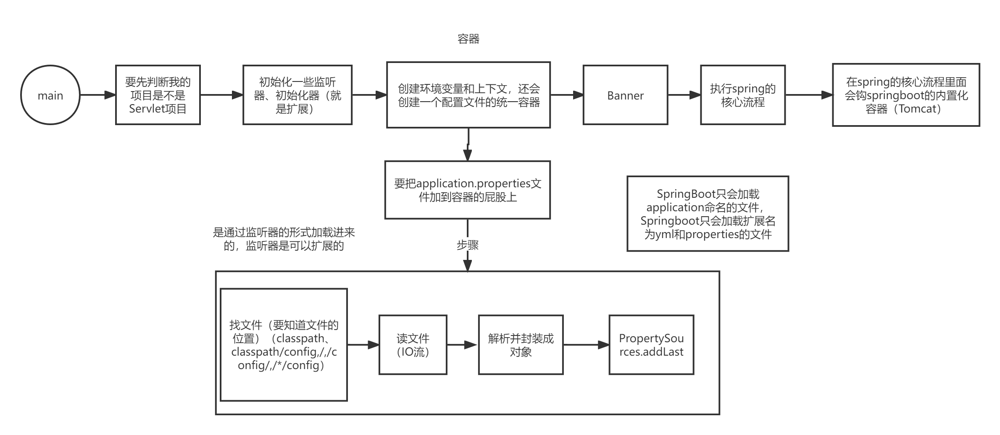

# SpringBoot篇

## 基础篇

### 相关概念

**Spring Boot** 是一种用于简化Java应用程序开发的框架，它建立在Spring框架之上。Spring Boot的核心理念是"约定优于配置"，它通过提供默认配置来加速项目启动，并允许根据需要进行自定义配置。

**自动配置（Auto-Configuration）** 是Spring Boot的关键特性之一。它根据项目的依赖关系自动配置应用程序，减少了繁琐的手动设置和配置文件的编写。

### 第一个SpringBoot程序

下面创建第一个Spring Boot程序。首先，确保已经安装了Java和Maven（或Gradle）。然后，按照以下步骤开始：

1. **创建一个新的Spring Boot项目**：你可以使用Spring Initializer（https://start.spring.io/）来生成一个Spring Boot项目的基本结构。在这里，可以选择项目的元数据，例如项目名称、包名、Java版本和依赖库。
2. **导入项目到集成开发环境（IDE）**：将生成的项目导入IDE中，例如Eclipse或IntelliJ IDEA。这将更容易管理和编写代码。
3. **编写一个简单的控制器**：在项目中创建一个新的Java类，用于处理HTTP请求。例如，可以创建一个名为`HelloController`的类，其中包含一个处理"/hello"路径的方法。

```java
import org.springframework.web.bind.annotation.GetMapping;
import org.springframework.web.bind.annotation.RestController;

@RestController
public class HelloController {

    @GetMapping("/hello")
    public String hello() {
        return "Hello, Spring Boot!";
    }
}
```

### 了解自动配置原理

#### SpringBoot特点

Spring Boot是一个基于Spring框架的开发框架，具有以下显著特点：

##### 1. **依赖管理**

Spring Boot提供了强大的依赖管理功能，通过使用Maven或Gradle构建工具，你可以简单地添加依赖，Spring Boot会自动处理版本兼容性问题。这使得项目的依赖管理变得非常容易，开发人员可以专注于业务逻辑而不必担心依赖的版本问题。

##### 2. **自动配置**

Spring Boot的自动配置是其最引人注目的特点之一。它根据应用程序的类路径和依赖自动配置应用程序的行为。这意味着你可以立即开始开发，而不必编写大量的配置文件。Spring Boot为你提供了默认配置，根据需要还可以进行自定义配置。

##### 3. 内嵌式容器

Spring Boot内置了常见的Web服务器，如Tomcat、Jetty和Undertow，这意味着你可以将你的Spring Boot应用程序打包成一个可执行的JAR文件或WAR文件，并在内嵌的容器中运行，而无需部署到外部容器中。

##### 4. 生产就绪

Spring Boot具备一系列功能，使应用程序更容易在生产环境中部署和管理。它提供了健康检查、指标监控、外部配置等功能，以帮助你构建可维护和可扩展的应用程序。

##### 5. 无代码生成和XML配置

Spring Boot鼓励基于Java配置的方式，避免了繁琐的XML配置。你可以使用`@Configuration`注解来创建配置类，并使用注解来定义Bean和组件，而无需手动编写XML。

##### 6. 集成丰富

Spring Boot内置了对许多常用技术的支持，包括数据库访问（JPA、JdbcTemplate）、消息队列（Kafka、RabbitMQ）、安全性（Spring Security）、缓存（Ehcache、Redis）等。这些集成使得开发更加便捷

#### 容器功能

##### 组件注册方式

在Spring Boot中，组件的注册方式是定义和管理应用程序中的各种Bean和组件的方法。

###### @Configuration

`@Configuration`注解用于标记一个类，表明它是一个配置类。配置类中可以包含`@Bean`方法，这些方法定义了应用程序中的Bean。Spring容器会自动扫描这些配置类，并将其中定义的Bean注册到容器中。

```java
@Configuration
public class MyConfiguration {
    @Bean
    public MyBean myBean() {
        return new MyBean();
    }
}
```

###### @Bean、@Component、@Controller、@Service、@Repository

这些注解用于标记类，将其识别为Spring管理的组件。每个注解都有不同的语义，例如：

- `@Component`：通用组件注解，用于将类标记为Spring组件。
- `@Controller`：标记一个类为控制器，通常用于处理Web请求。
- `@Service`：标记一个类为服务层组件，通常用于业务逻辑。
- `@Repository`：标记一个类为数据访问层组件，通常用于数据库操作。

```java
@Service
public class MyService {
    // 业务逻辑
}
```

###### @ComponentScan

`@ComponentScan`注解用于启用组件扫描，它可以在配置类上使用。当Spring Boot启动时，它会自动扫描指定包及其子包中的所有类，以查找带有`@Component`注解的类，并将它们注册到容器中。

```java
@Configuration
@ComponentScan(basePackages = "com.example")
public class MyConfiguration {
    // 不需要显式定义@Bean，组件将被自动扫描并注册
}

```

###### @Import

`@Import`注解用于引入其他配置类，这样可以将多个配置类组合在一起。它允许模块化组织配置，使得配置更加清晰和可维护。

```java
@Configuration
@Import({DatabaseConfig.class, MessagingConfig.class})
public class AppConfig {
    // 这里可以定义其他Bean或配置
}

```

###### @Conditional

`@Conditional`注解允许你根据条件来注册组件。你可以创建一个条件类，根据某些条件来确定是否注册Bean。这对于根据不同的环境或配置动态地选择注册哪些Bean非常有用。

```java
@Configuration
public class MyConfiguration {
    @Bean
    @Conditional(DatabaseTypeCondition.class)
    public DataSource dataSource() {
        // 根据条件返回不同的数据源
    }
}
```

在上述示例中，`DatabaseTypeCondition`类根据某些条件来决定是否创建`DataSource` Bean。

`DatabaseTypeCondition`是一个自定义的条件类，你可以根据需要编写它来根据条件来决定是否注册特定的Bean。它实现了Spring框架的`Condition`接口，需要重写`matches`方法来执行条件判断。

下面是一个简单的示例，展示了一个可能的`DatabaseTypeCondition`的实现：

```java
import org.springframework.context.annotation.Condition;
import org.springframework.context.annotation.ConditionContext;
import org.springframework.core.type.AnnotatedTypeMetadata;

public class DatabaseTypeCondition implements Condition {

    @Override
    public boolean matches(ConditionContext context, AnnotatedTypeMetadata metadata) {
        // 在这里执行条件判断逻辑
        String databaseType = context.getEnvironment().getProperty("myapp.database.type");
        return "mysql".equalsIgnoreCase(databaseType); // 判断数据库类型是否是MySQL
    }
}
```

在上述示例中，`DatabaseTypeCondition`实现了`Condition`接口，并重写了`matches`方法。在`matches`方法中，它首先通过`ConditionContext`访问应用程序的环境（`context.getEnvironment()`），然后获取名为"myapp.database.type"的属性值。接下来，它检查属性值是否等于"mysql"，如果是，则返回`true`，表示条件满足，Bean将被注册；否则返回`false`，表示条件不满足，Bean不会被注册。

##### 常用条件注解

当使用条件注解来控制Bean的注册时，有许多内置的条件注解可供选择。以下是一些常用的条件注解，以表格形式列出它们及其用途：

| 条件注解                          | 用途                                                         |
| --------------------------------- | ------------------------------------------------------------ |
| `@ConditionalOnClass`             | 当类路径中存在指定的类时注册Bean。                           |
| `@ConditionalOnMissingClass`      | 当类路径中不存在指定的类时注册Bean。                         |
| `@ConditionalOnBean`              | 当容器中存在指定的Bean时注册Bean。                           |
| `@ConditionalOnMissingBean`       | 当容器中不存在指定的Bean时注册Bean。                         |
| `@ConditionalOnProperty`          | 当指定的属性存在并且其值满足指定条件时注册Bean。             |
| `@ConditionalOnExpression`        | 当指定的SpEL表达式的结果为true时注册Bean。                   |
| `@ConditionalOnResource`          | 当指定的资源存在于类路径中时注册Bean。                       |
| `@ConditionalOnWebApplication`    | 当应用程序是一个Web应用程序时注册Bean。                      |
| `@ConditionalOnNotWebApplication` | 当应用程序不是一个Web应用程序时注册Bean。                    |
| `@ConditionalOnJava`              | 当Java的版本满足指定要求时注册Bean。                         |
| `@ConditionalOnJndi`              | 当JNDI环境中存在指定的JNDI项时注册Bean。                     |
| `@ConditionalOnSingleCandidate`   | 当指定类型的Bean只有一个候选者时注册Bean。                   |
| `@ConditionalOnExpression`        | 当指定的表达式计算结果为true时注册Bean。                     |
| `@ConditionalOnNotExpression`     | 当指定的表达式计算结果为false时注册Bean。                    |
| `@ConditionalOnCloudPlatform`     | 当应用程序部署在特定的云平台上时注册Bean（例如，AWS、GCP等）。 |
| `@ConditionalOnPropertyMissing`   | 当指定的属性不存在时注册Bean。                               |
| `@ConditionalOnPropertyNotEmpty`  | 当指定的属性存在且不为空时注册Bean。                         |

##### 原生配置文件引入@ImportResource

`@ImportResource`注解用于将原生的Spring XML配置文件引入到Spring Boot应用程序中。通过这种方式，你可以重用已有的XML配置，而无需将整个项目迁移到纯粹的Java配置。

以下是使用`@ImportResource`的基本步骤：

1. 创建一个Spring Boot配置类，该类将用于引入XML配置文件。
2. 在配置类上使用`@ImportResource`注解，并指定需要引入的XML配置文件的路径。
3. 确保XML配置文件在类路径下可用。
4. 在XML配置文件中定义你的Bean和配置。

下面是一个示例，演示了如何引入名为`application-context.xml`的XML配置文件：

```java
import org.springframework.context.annotation.Configuration;
import org.springframework.context.annotation.ImportResource;

@Configuration
@ImportResource("classpath:application-context.xml")
public class XmlConfiguration {
    // 这里可以定义其他Bean或配置
}
```

在这个示例中，`@ImportResource`注解引入了类路径下的`application-context.xml`文件。接下来，你可以在XML文件中定义Spring配置，包括Bean定义、属性配置等等。

```xml
<!-- application-context.xml -->
<beans xmlns="http://www.springframework.org/schema/beans"
       xmlns:xsi="http://www.w3.org/2001/XMLSchema-instance"
       xsi:schemaLocation="http://www.springframework.org/schema/beans
                           http://www.springframework.org/schema/beans/spring-beans.xsd">

    <!-- 定义一个示例Bean -->
    <bean id="myBean" class="com.example.MyBean">
        <!-- Bean属性配置 -->
        <property name="message" value="Hello from XML Configuration"/>
    </bean>

</beans>

```

##### 配置绑定方式

###### @ConfigurationProperties

`@ConfigurationProperties`注解用于将属性值从配置文件绑定到Java对象中。这是一种非常方便的方式，特别是当你需要将大量属性从配置文件加载到一个配置类中时。

以下是使用`@ConfigurationProperties`的基本步骤：

1. 创建一个用于保存属性值的Java配置类，并使用`@ConfigurationProperties`注解标记它。
2. 在配置类中定义与配置属性相匹配的字段，并提供getter和setter方法。
3. 在`application.properties`或`application.yml`配置文件中定义属性，并使用特定的前缀与配置类中的字段关联。

下面是一个示例，演示了如何使用`@ConfigurationProperties`：

```java
import org.springframework.boot.context.properties.ConfigurationProperties;
import org.springframework.stereotype.Component;

@Component
@ConfigurationProperties(prefix = "myapp")
public class MyAppProperties {
    private String name;
    private int port;

    // 省略getter和setter方法

    public String getName() {
        return name;
    }

    public void setName(String name) {
        this.name = name;
    }

    public int getPort() {
        return port;
    }

    public void setPort(int port) {
        this.port = port;
    }
}
```

在上述示例中，`MyAppProperties`类使用了`@ConfigurationProperties`注解，并设置了`prefix`属性为"myapp"，这意味着它将绑定以"myapp"为前缀的属性。

然后，在`application.properties`或`application.yml`配置文件中定义了属性值：

```properties
myapp.name=My Application
myapp.port=8080
```

现在，你可以在应用程序中注入`MyAppProperties`，并访问这些属性值。

###### @EnableConfigurationProperties + @ConfigurationProperties

如果你想要启用特定的`@ConfigurationProperties`类，你可以使用`@EnableConfigurationProperties`注解，并在其中引用这些配置类。

以下是示例：

```java
import org.springframework.boot.context.properties.EnableConfigurationProperties;
import org.springframework.context.annotation.Configuration;

@Configuration
@EnableConfigurationProperties(MyAppProperties.class)
public class MyAppConfiguration {
    // 这里可以定义其他Bean或配置
}

```

这将启用`MyAppProperties`配置类，使其生效。然后，你可以像之前一样在应用程序中使用它。

###### @Component + @ConfigurationProperties

除了使用`@ConfigurationProperties`注解的方式，你还可以使用`@Component`注解将配置类作为Spring组件进行注册，并与`@ConfigurationProperties`一起使用。

以下是示例：

```java
import org.springframework.boot.context.properties.ConfigurationProperties;
import org.springframework.stereotype.Component;

@Component
@ConfigurationProperties(prefix = "myapp")
public class MyAppProperties {
    // 属性和getter/setter方法
}
```

在这个示例中，`MyAppProperties`类被标记为Spring组件，并使用`@ConfigurationProperties`注解，以便绑定属性值。这意味着你可以直接在应用程序中注入`MyAppProperties`，而无需显式地引用它。

#### 引导加载自动配置类

##### @SpringBootConfiguration

`@SpringBootConfiguration`注解是Spring Boot的核心注解之一，它通常用于标识一个类，表明它是应用程序的配置类。这意味着在这个类中，我们可以定义应用程序的配置信息，包括数据源配置、Bean定义等。下面是一个示例：

```java
@SpringBootConfiguration
public class MyConfiguration {
    // 应用程序配置
}
```

##### @ComponentScan

`@ComponentScan`注解在Spring Boot中扮演着重要的角色。它告诉Spring在哪些包中扫描组件（如Spring Bean），并自动注册它们。这使得组件的发现和加载变得更加方便。以下是一个使用`@ComponentScan`的示例：

```java
@SpringBootConfiguration
@ComponentScan(basePackages = "com.example.myapp")
public class MyConfiguration {
    // ...
}
```

##### @EnableAutoConfiguration

`@EnableAutoConfiguration`注解是启用Spring Boot自动配置的关键。通过在主配置类上添加这个注解，我们告诉Spring Boot启用自动配置功能，根据项目的依赖和需要自动配置各种组件。下面是一个示例：

```java
@SpringBootConfiguration
@EnableAutoConfiguration
public class MyApplication {
    public static void main(String[] args) {
        SpringApplication.run(MyApplication.class, args);
    }
}
```

###### @AutoConfigurationPackage

`@AutoConfigurationPackage`注解是Spring Boot内部使用的注解，它通常不需要手动配置。它的作用是指定一个基本包，Spring Boot会从这个包开始扫描并加载自动配置类。这个注解通常在`@EnableAutoConfiguration`注解的背后起作用。

```java
import org.springframework.boot.autoconfigure.AutoConfigurationPackage;
import org.springframework.boot.context.annotation.ImportAutoConfiguration;
import org.springframework.context.annotation.Configuration;

// 使用 @AutoConfigurationPackage 注解指定基本包
@AutoConfigurationPackage
@Configuration
// 使用 @Import(AutoConfigurationImportSelector.class) 引入自动配置选择器
@ImportAutoConfiguration
public class MyAutoConfiguration {
    // 自定义的自动配置类
}

```

在这个示例中，我们首先使用`@AutoConfigurationPackage`注解指定了自动配置包的基本包路径。然后，通过`@Import(AutoConfigurationImportSelector.class)`注解引入了自动配置选择器，该选择器负责选择和加载适用于当前项目的自动配置类。

###### @Import(AutoConfigurationImportSelector.class)

为了完整地启用Spring Boot的自动配置，通常会使用`@Import(AutoConfigurationImportSelector.class)`注解，这将引入`AutoConfigurationImportSelector`类，它负责选择和加载适用于当前项目的自动配置类。这个注解通常不需要手动配置，因为它在`@EnableAutoConfiguration`背后起作用。

#### 按需开启自动配置项

Spring Boot 提供了一种按需开启或关闭自动配置项的方式，通过使用 `spring.autoconfigure.exclude` 属性来实现。这个属性允许你明确指定要排除的自动配置类，从而禁用它们。这对于项目需要特定配置或不需要某些自动配置的情况非常有用。

示例：

```properties
# 禁用特定自动配置类
spring.autoconfigure.exclude=org.springframework.boot.autoconfigure.jdbc.DataSourceAutoConfiguration
```

在上面的示例中，我们禁用了 `DataSourceAutoConfiguration` 自动配置类，这对于不需要数据库连接的项目非常有用。

对于按需加载或禁用 Spring Boot 自动配置项，通常建议使用条件装配规则（`@Conditional` 注解）而不是显式排除自动配置类。通过条件装配规则，你可以在满足特定条件时启用或禁用自动配置。

以下是一个示例，演示如何使用条件装配规则禁用特定的自动配置类：

```java
import org.springframework.boot.autoconfigure.SpringBootApplication;
import org.springframework.boot.autoconfigure.condition.ConditionalOnProperty;
import org.springframework.boot.SpringApplication;

@SpringBootApplication
@ConditionalOnProperty(name = "custom.autoconfig.enabled", havingValue = "true", matchIfMissing = true)
public class MyApplication {
    public static void main(String[] args) {
        SpringApplication.run(MyApplication.class, args);
    }
}
```

在上述示例中，我们使用了 `@ConditionalOnProperty` 注解，它根据属性的值来决定是否启用这个配置类。具体来说：

- `name` 参数指定了要检查的属性名，这里是 `custom.autoconfig.enabled`。
- `havingValue` 参数指定了属性的期望值，这里是 `"true"`。如果属性的值等于这个值，配置类将被启用。
- `matchIfMissing` 参数是一个布尔值，指定如果属性不存在时是否匹配，默认为 `true`。这意味着如果 `custom.autoconfig.enabled` 属性未在配置文件中定义，也会匹配。

#### 修改默认配置

Spring Boot 允许你通过在 `application.properties` 或 `application.yml` 中添加属性来修改默认配置。这使得你可以轻松地自定义应用程序的行为，而不必手动配置大量的设置。

示例：

```properties
# 修改默认端口
server.port=8081

# 自定义数据库连接
spring.datasource.url=jdbc:mysql://localhost:3306/mydb
spring.datasource.username=myuser
spring.datasource.password=mypassword
```

在上面的示例中，我们修改了默认的HTTP端口和数据库连接信息，这些设置将覆盖默认的Spring Boot自动配置。

#### 最佳实践

在使用Spring Boot自动配置时，以下是一些最佳实践：

1. **谨慎选择依赖**：选择与项目需求相关的依赖项，不要包含不必要的依赖，以减少不必要的自动配置类加载。
2. **了解自动配置**：深入了解Spring Boot自动配置，了解每个自动配置类的作用和影响，以便根据需要进行调整。
3. **按需开启或关闭**：按需加载或禁用 Spring Boot 自动配置项，通常建议使用条件装配规则（`@Conditional` 注解。
4. **自定义配置**：在 `application.properties` 或 `application.yml` 中添加自定义属性，以覆盖默认的自动配置，从而满足项目的特定需求。
5. **仔细测试**：自动配置虽然便捷，但仍然需要仔细测试确保应用程序的行为符合预期。

### 开发小技巧

#### Lombok

Lombok是一个Java库，它可以通过注解来自动生成Java类的样板代码，如getter、setter、equals、hashCode等，从而减少了样板代码的编写量。使用Lombok可以使代码更简洁、可读性更高，同时减少了出错的机会。

示例使用Lombok的@Data注解：

```
javaCopy codeimport lombok.Data;

@Data
public class Person {
    private String name;
    private int age;
}
```

上面的代码使用@Data注解，自动生成了`toString()`、`equals()`、`hashCode()`方法以及getter和setter方法。这样，你可以在代码中更专注于业务逻辑而不必编写这些重复的方法。

#### dev-tools

Spring Boot DevTools是一个开发辅助工具，它提供了许多功能，用于提高开发体验。其中包括：

- 热部署：在开发过程中，你可以进行代码更改，而不必重新启动应用程序。
- 自动重启：当类路径发生变化时，Spring Boot DevTools可以自动重启应用程序。
- 属性热加载：你可以在不重新启动应用程序的情况下更改属性文件。

要使用Spring Boot DevTools，只需将其添加为项目的依赖项，并在IDE中启用自动构建（automatic build）。例如，在Maven项目中，可以添加以下依赖：

```xml
<dependency>
    <groupId>org.springframework.boot</groupId>
    <artifactId>spring-boot-devtools</artifactId>
    <scope>runtime</scope>
</dependency>
```

#### Spring Initailizr（项目初始化向导）

Spring Initializr是一个Web工具，用于快速生成Spring Boot项目的骨架。它提供了以下功能：

- 选择开发场景：你可以选择不同的开发场景，如Web、数据、安全等，以生成符合需求的项目。
- 自动依赖引入：Spring Initializr会根据选择的场景自动引入所需的依赖。
- 自动创建项目结构：生成的项目具有标准的Maven或Gradle项目结构。
- 自动编写主配置类：Spring Initializr会为你生成一个主配置类，其中包含了应用程序的入口点。

你可以访问 [Spring Initializr](https://start.spring.io/) 网站，选择项目的配置选项，然后点击"Generate"按钮来生成项目的基础结构。

#### 对象转换 MapStruct

##### 概述

##### 快速入门

##### 集成 Lombok

##### @Mapping

##### IDEA MapStruct 插件

### 配置文件

#### 1. application.properties 文件

Spring Boot 使用 `application.properties` 文件来配置应用程序。这些配置文件通常位于项目的 `src/main/resources` 目录下。以下是一个示例 `application.properties` 文件：

```properties
# 数据源配置
spring.datasource.url=jdbc:mysql://localhost:3306/mydb
spring.datasource.username=root
spring.datasource.password=secret
spring.datasource.driverClassName=com.mysql.jdbc.Driver

# 应用程序端口
server.port=8080

# 日志级别
logging.level.org.springframework=INFO
logging.level.com.example=DEBUG
```

#### 2. application.yml 文件

Spring Boot 还支持使用 YAML（YAML Ain't Markup Language）格式的配置文件。YAML 文件具有更人类可读的语法。以下是一个示例 `application.yml` 文件：

```yaml
# 数据源配置
spring:
  datasource:
    url: jdbc:mysql://localhost:3306/mydb
    username: root
    password: secret
    driver-class-name: com.mysql.jdbc.Driver

# 应用程序端口
server:
  port: 8080

# 日志级别
logging:
  level:
    org.springframework: INFO
    com.example: DEBUG
```

#### 3. 配置文件的优先级

Spring Boot 配置文件有不同的优先级，具体如下：

- `application.properties` 和 `application.yml` 文件位于 `src/main/resources` 目录下的默认配置。
- 通过 `--spring.config.location` 命令行参数指定的外部配置文件。

```bash
java -jar myapp.jar --spring.config.location=file:/path/to/my-config.properties
```

- **环境变量 (`SPRING_CONFIG_NAME` 和 `SPRING_CONFIG_LOCATION`)：** 你可以通过设置环境变量 `SPRING_CONFIG_NAME` 来指定外部配置文件的名称，以及通过 `SPRING_CONFIG_LOCATION` 来指定配置文件的位置。这些环境变量将覆盖默认的配置文件。

```properties
arduinoCopy codeexport SPRING_CONFIG_NAME=my-config
export SPRING_CONFIG_LOCATION=file:/path/to/config-folder/
```

#### 4. 配置属性的引用

在配置文件中，你可以使用 `${}` 语法引用其他配置属性。例如：

```properties
server.port=8080
myapp.base-url=http://localhost:${server.port}/myapp
```

这样，`myapp.base-url` 将被解析为 `http://localhost:8080/myapp`。

#### 5. 配置文件的注释

在配置文件中，使用 `#` 符号来添加注释。注释将被忽略，不会影响配置属性的解析。

#### 6. 配置文件的动态刷新

Spring Boot 支持动态刷新配置文件，当配置属性发生更改时，应用程序可以重新加载新的配置。你可以通过在配置类上使用 `@RefreshScope` 注解来实现这一点，并使用 Actuator 的 `/actuator/refresh` 端点来触发配置的刷新。

##### **步骤 1：创建一个可刷新的配置类**

首先，创建一个配置类，并在该类上使用 `@Configuration` 和 `@RefreshScope` 注解。这将告诉 Spring Boot 需要刷新这个配置类的属性。

```java
import org.springframework.boot.context.properties.ConfigurationProperties;
import org.springframework.cloud.context.config.annotation.RefreshScope;
import org.springframework.context.annotation.Configuration;

@Configuration
@RefreshScope
@ConfigurationProperties("myapp")
public class MyConfig {

    private String appName;

    // 省略其他属性和 getter/setter 方法
}
```

##### **步骤 2：在配置文件中定义属性**

在 `application.properties` 或 `application.yml` 配置文件中，定义需要动态刷新的属性。确保属性的前缀与配置类中的前缀匹配。

```properties
myapp.appName=My App
```

##### **步骤 3：启用 Actuator 的刷新功能**

确保在 `pom.xml` 文件中引入 Actuator 依赖：

```xml
<dependency>
    <groupId>org.springframework.boot</groupId>
    <artifactId>spring-boot-starter-actuator</artifactId>
</dependency>
```

##### **步骤 4：触发配置的刷新**

使用 POST 请求访问 Actuator 的 `/actuator/refresh` 端点，以触发配置的刷新。可以使用 `curl` 命令或任何 HTTP 客户端工具执行此操作：

```bash
curl -X POST http://localhost:8080/actuator/refresh
```

##### **步骤 5：访问刷新后的属性**

一旦配置属性被刷新，你可以在应用程序中访问新的属性值。Spring Boot 会自动将更新后的属性值注入到 `MyConfig` 类中。

```java
@RestController
public class MyController {

    @Autowired
    private MyConfig myConfig;

    @GetMapping("/app-name")
    public String getAppName() {
        return myConfig.getAppName();
    }
}
```

现在，每当配置文件中的 `myapp.appName` 属性发生变化并触发刷新时，你可以通过访问 `/app-name` 路径来获取最新的属性值。

### 数据访问

MyBatis-Plus 是 MyBatis 的增强工具包，它提供了一组强大而便捷的功能，用于简化数据库访问和操作。在 Spring Boot 项目中，你可以集成 MyBatis-Plus 来进行数据访问，以下是集成 MyBatis-Plus 的步骤：

#### 1. 添加依赖

首先，在项目的 `pom.xml` 文件中添加 MyBatis-Plus 的依赖：

```xml
<!--Mybatis-plus的依赖-->
<dependency>
    <groupId>com.baomidou</groupId>
    <artifactId>mybatis-plus-boot-starter</artifactId>
    <version>3.3.1</version>
</dependency>
<!--mysql的依赖-->
<dependency>
    <groupId>mysql</groupId>
    <artifactId>mysql-connector-java</artifactId>
    <version>8.0.27</version>
</dependency>
<!--lombok的依赖，为了优化实体类，可以不去实现实体类的set()、get()-->
<dependency>
    <groupId>org.projectlombok</groupId>
    <artifactId>lombok</artifactId>
    <optional>true</optional>
</dependency>
```

你需要将 `最新版本` 替换为实际的 MyBatis-Plus 版本。

#### 2. 配置数据源

在 Spring Boot 项目中，你需要配置数据源信息，例如连接数据库的 URL、用户名和密码等。你可以在 `application.properties` 或 `application.yml` 中添加以下配置：

```properties
 #数据库的驱动
spring.datasource.driver-class-name=com.mysql.cj.jdbc.Driver
#mysql的地址，还有所在时区
spring.datasource.url=jdbc:mysql://localhost:3306/mybatis-plus?serverTimezone=GMT%2b8
#mysql的用户名和地址
spring.datasource.username=root
spring.datasource.password=123
#mybatis的日志、可以看到mybatisPlus的执行语句，参数等详细信息
mybatis-plus.configuration.log-impl=org.apache.ibatis.logging.stdout.StdOutImpl
```

#### 3. 创建实体类

创建一个实体类，表示数据库中的表。在实体类上使用注解来标识表名、字段名以及主键等信息。例如：

```java
import com.baomidou.mybatisplus.annotation.IdType;
import com.baomidou.mybatisplus.annotation.TableId;
import com.baomidou.mybatisplus.annotation.TableName;

@TableName("user")
public class User {
    @TableId(type = IdType.AUTO)
    private Long id;
    private String username;
    private String email;

    // 省略 getter 和 setter 方法
}
```

#### 4. 创建 Mapper 接口

创建一个 Mapper 接口，继承 `BaseMapper` 接口，并指定实体类的类型。例如：

```java
import com.baomidou.mybatisplus.core.mapper.BaseMapper;
import org.apache.ibatis.annotations.Mapper;

@Mapper
public interface UserMapper extends BaseMapper<User> {
}
```

#### 5. 配置 MyBatis-Plus

在 Spring Boot 项目的配置类中，添加 MyBatis-Plus 的配置。你可以使用 `@MapperScan` 注解来扫描 Mapper 接口的包路径，以便自动注入 Mapper 对象。例如：

```java
import org.mybatis.spring.annotation.MapperScan;
import org.springframework.context.annotation.Configuration;

@Configuration
@MapperScan("com.example.mapper")
public class MyBatisPlusConfig {
}
```

#### 6. 使用 MyBatis-Plus 进行数据访问

现在你可以在 Service 或 Controller 中使用 MyBatis-Plus 进行数据访问操作。MyBatis-Plus 提供了丰富的方法，可以用于查询、插入、更新和删除数据。以下是一些常用的示例：

```java
import org.springframework.beans.factory.annotation.Autowired;
import org.springframework.stereotype.Service;
import java.util.List;

@Service
public class UserService {
    @Autowired
    private UserMapper userMapper;

    public User getUserById(Long id) {
        return userMapper.selectById(id);
    }

    public List<User> getUsersByUsername(String username) {
        return userMapper.selectList(
            new QueryWrapper<User>().eq("username", username)
        );
    }

    public int addUser(User user) {
        return userMapper.insert(user);
    }

    public int updateUser(User user) {
        return userMapper.updateById(user);
    }

    public int deleteUserById(Long id) {
        return userMapper.deleteById(id);
    }
}
```

### 单元测试

在 Spring Boot 项目中进行单元测试是一种有效的方式来确保你的应用程序的各个部分正常工作。Spring Boot 提供了许多工具和注解，使单元测试变得更加容易。以下是进行 Spring Boot 单元测试的一般步骤：

#### 1. 添加单元测试依赖

首先，在项目的 `pom.xml` 文件中添加单元测试依赖。Spring Boot 默认使用 JUnit 5 作为单元测试框架，你可以不需要额外配置，只需确保 JUnit 5 的依赖存在即可：

```xml
<dependency>
    <groupId>org.springframework.boot</groupId>
    <artifactId>spring-boot-starter-test</artifactId>
    <scope>test</scope>
</dependency>
```

#### 2. 创建单元测试类

在项目的 `src/test/java` 目录下，创建单元测试类。这些测试类应该与你的源代码包结构相对应，并以 `Test` 结尾。例如，如果你有一个名为 `UserService` 的服务类，你可以创建一个名为 `UserServiceTest` 的测试类。

#### 3. 使用测试注解

在测试类中使用 Spring Boot 提供的测试注解，例如 `@SpringBootTest` 和 `@RunWith(SpringRunner.class)`。这些注解将帮助你启动 Spring Boot 应用程序上下文，并将 Spring Boot 特性集成到测试中。

```java
import org.junit.jupiter.api.Test;
import org.springframework.boot.test.context.SpringBootTest;
import org.springframework.test.context.junit.jupiter.SpringJUnitConfig;

@SpringBootTest
public class UserServiceTest {

    @Test
    public void testSomething() {
        // 编写你的测试逻辑
    }
}
```

#### 4. 编写测试方法

在测试类中编写测试方法，使用 JUnit 5 的 `@Test` 注解标记这些方法。然后，编写测试逻辑以验证你的代码行为是否符合预期。

```java
@Test
public void testAddUser() {
    UserService userService = new UserService();
    User user = new User("john", "john@example.com");
    userService.addUser(user);

    // 验证逻辑，例如断言用户是否添加成功
    User savedUser = userService.getUserById(user.getId());
    assertNotNull(savedUser);
    assertEquals(user.getUsername(), savedUser.getUsername());
}
```

#### 5. 运行单元测试

你可以使用你的集成开发环境（IDE）或构建工具（如 Maven 或 Gradle）来运行单元测试。在大多数情况下，只需右键单击测试类或使用命令行工具运行测试即可。

#### 6. 使用模拟对象

在进行单元测试时，你可能需要模拟依赖的外部组件，例如数据库或其他服务。Spring Boot 提供了集成测试工具，如 Mockito 和 Spring Boot Test 来帮助你模拟这些依赖。

这是一个简单的示例，演示了如何使用 Mockito 来模拟依赖：

```java
import org.junit.jupiter.api.Test;
import org.springframework.boot.test.context.SpringBootTest;
import org.mockito.Mock;
import org.mockito.Mockito;

@SpringBootTest
public class UserServiceTest {

    @Mock
    private UserRepository userRepository;

    @Test
    public void testAddUser() {
        UserService userService = new UserService(userRepository);
        User user = new User("john", "john@example.com");
        
        // 模拟 userRepository 的行为
        Mockito.when(userRepository.save(user)).thenReturn(user);
        
        userService.addUser(user);
        
        // 验证逻辑
        User savedUser = userService.getUserById(user.getId());
        assertNotNull(savedUser);
        assertEquals(user.getUsername(), savedUser.getUsername());
    }
}
```

[]:

这个示例中，我们使用了 `@Mock` 注解来创建一个模拟的 `UserRepository` 对象，并使用 Mockito 的 `when` 方法来模拟其行为。

## Web篇

### SpringBoot Web基础篇

#### 依赖配置

```xml
<dependency>
    <groupId>org.springframework.boot</groupId>
    <artifactId>spring-boot-starter-web</artifactId>
    <version>RELEASE</version>
    <scope>compile</scope>
</dependency>
```

#### 控制器（Controller）

##### 请求映射（RequestMapping）

在Spring Boot中，我们可以使用@RequestMapping注解将请求映射到控制器的特定方法上。这个注解可以用于类级别和方法级别。

```java
@Controller
@RequestMapping("/users")
public class UserController {
    
    @GetMapping("/{id}")
    public ResponseEntity<User> getUser(@PathVariable Long id) {
        // 从数据库中根据ID获取用户信息
        User user = userRepository.findById(id);
        return ResponseEntity.ok(user);
    }
    
    @PostMapping
    public ResponseEntity<User> createUser(@RequestBody User user) {
        // 创建用户并保存到数据库
        User savedUser = userRepository.save(user);
        return ResponseEntity.status(HttpStatus.CREATED).body(savedUser);
    }
}
```

上面的示例中，我们将`/users`路径映射到UserController类，**使用@GetMapping注解来处理GET请求，使用@PostMapping注解来处理POST请求**。

**`/{id}`中的花括号表示路径中的变量，可以通过``@PathVariable``注解获取**。

以下表格来说明不同的请求映射方法以及它们的特点：

| 请求方法 | 注解            | 描述                                               |
| :------- | :-------------- | :------------------------------------------------- |
| GET      | @GetMapping     | 获取资源，可以从服务器请求数据，并将其发送回客户端 |
| POST     | @PostMapping    | 向服务器提交数据，通常用于创建新资源               |
| PUT      | @PutMapping     | 更新服务器上的资源                                 |
| DELETE   | @DeleteMapping  | 删除服务器上的资源                                 |
| PATCH    | @PatchMapping   | 部分更新服务器上的资源                             |
| HEAD     | @RequestMapping | 类似于GET，但只返回响应头，不返回响应体            |
| OPTIONS  | @RequestMapping | 返回服务器支持的HTTP方法列表                       |
| TRACE    | @RequestMapping | 回显服务器收到的请求，用于测试和诊断               |

这些注解是Spring框架中常用的请求映射注解，用于将HTTP请求映射到相应的处理方法（Controller方法）。使用这些注解可以根据请求的HTTP方法执行相应的操作。

##### 请求参数获取

在控制器方法中，我们通常需要获取HTTP请求中的参数。Spring Boot提供了多种方式来获取请求参数：

- **使用@RequestParam注解获取请求参数：**

```java
@GetMapping("/users")
public ResponseEntity<List<User>> getUsers(@RequestParam("name") String name) {
    // 根据名称查询用户列表
    List<User> users = userRepository.findByName(name);
    return ResponseEntity.ok(users);
}
```

上述示例中，我们使用@RequestParam注解将请求参数"name"绑定到方法参数name上。

- **使用@PathVariable注解获取路径变量：**

```java
@GetMapping("/users/{id}")
public ResponseEntity<User> getUser(@PathVariable Long id) {
    // 根据ID查询用户信息
    User user = userRepository.findById(id);
    return ResponseEntity.ok(user);
}
```

在上面的示例中，我们使用@PathVariable注解将路径中的变量"id"绑定到方法参数id上。

- **使用@RequestBody注解获取请求体参数：**

```java
@PostMapping("/users")
public ResponseEntity<User> createUser(@RequestBody User user) {
    // 创建用户并保存到数据库
    User savedUser = userRepository.save(user);
    return ResponseEntity.status(HttpStatus.CREATED).body(savedUser);
}
```

在上述示例中，我们使用@RequestBody注解将请求体中的参数映射到User对象上。

##### 响应数据处理

控制器方法的返回值决定了HTTP响应的内容。Spring Boot提供了多种方式来处理响应数据：

- 返回普通对象或集合：

```java
@GetMapping("/users")
public ResponseEntity<List<User>> getUsers() {
    // 查询所有用户
    List<User> users = userRepository.findAll();
    return ResponseEntity.ok(users);
}
```

在上面的示例中，我们直接返回了一个List<User>对象，并使用ResponseEntity.ok()方法来构建响应。

- 返回自定义响应对象：

```java
@PostMapping("/users")
public ResponseEntity<Response> createUser(@RequestBody User user) {
    // 创建用户并保存到数据库
    User savedUser = userRepository.save(user);
    
    Response response = new Response("User created successfully", savedUser.getId());
    return ResponseEntity.status(HttpStatus.CREATED).body(response);
}
```

在上述示例中，我们创建了一个自定义的Response对象，并将其作为响应体返回。

##### 全局异常处理

在控制器中，异常处理是非常重要的一部分。Spring Boot提供了**@ControllerAdvice注解，用于定义全局的异常处理器**。

```java
@ControllerAdvice
public class GlobalExceptionHandler {
    
    @ExceptionHandler(UserNotFoundException.class)
    public ResponseEntity<String> handleUserNotFoundException(UserNotFoundException ex) {
        return ResponseEntity.status(HttpStatus.NOT_FOUND).body(ex.getMessage());
    }
    
    @ExceptionHandler(Exception.class)
    public ResponseEntity<String> handleException(Exception ex) {
        return ResponseEntity.status(HttpStatus.INTERNAL_SERVER_ERROR).body("Internal Server Error");
    }
}
```

在上面的示例中，我们定义了两个异常处理方法：handleUserNotFoundException处理UserNotFoundException异常，handleException处理其他未捕获的异常。我们可以根据不同的异常类型来定义相应的处理方法，然后使用ResponseEntity来构造合适的HTTP响应。

#### 静态资源处理

在Spring Boot中，静态资源是指项目中的静态文件，如CSS、JavaScript、图像等。Spring Boot提供了内置的静态资源处理功能，使得在应用程序中管理和提供静态资源变得更加简单和方便。

##### 默认的静态资源路径

Spring Boot默认的静态资源路径是`/static`、`/public`、`/resources`和`/META-INF/resources`。当我们将静态资源文件放置在这些路径下时，它们会被自动映射到应用程序的根路径下，可直接通过URL访问。

例如，我们在`/static/css`目录下有一个名为`style.css`的文件，那么它可以通过`http://localhost:8080/css/style.css`的URL进行访问。

##### 自定义的静态资源路径

除了默认的静态资源路径，我们还可以通过配置来自定义静态资源的路径。在`application.properties`或`application.yml`文件中，可以使用以下属性进行配置：

```yaml
spring:
  web:
    resources:
      static-locations: classpath:/custom-static/
```

上述示例中，我们使用`spring.resources.static-locations`属性来指定自定义的静态资源路径。在这里，我们将静态资源文件放置在`/custom-static/`目录下，并通过`classpath:`前缀指定该目录位于类路径下。

##### 自定义静态资源处理

除了默认的静态资源处理机制，我们还可以自定义静态资源处理行为。通过实现`WebMvcConfigurer`接口，并重写其中的方法，我们可以进行自定义配置。

例如，我们可以自定义静态资源的映射路径：

```java
@Configuration
public class WebConfig implements WebMvcConfigurer {
    
    @Override
    public void addResourceHandlers(ResourceHandlerRegistry registry) {
        // 自定义静态资源处理规则1
        registry.addResourceHandler("/custom1/**")
                .addResourceLocations("classpath:/custom1-static/");
        
        // 自定义静态资源处理规则2
        registry.addResourceHandler("/custom2/**")
                .addResourceLocations("classpath:/custom2-static/");
        
        // 保留默认的静态资源处理配置
        super.addResourceHandlers(registry);
    }
}
```

在上述示例中，我们通过`addResourceHandlers()`方法将`/custom/**`路径映射到`classpath:/custom*-static/`目录下的静态资源文件。

通过自定义静态资源处理，我们可以根据具体需求灵活地配置静态资源的路径、缓存策略等，以便更好地管理和提供静态资源。

#### 表单处理

##### 表单提交

表单提交是指将用户在前端页面填写的表单数据发送到后端进行处理和存储的过程。Spring Boot提供了多种方式来处理表单提交，包括使用`@RequestParam`、`@ModelAttribute`和`@RequestBody`等注解。

###### 使用@RequestParam

**`@RequestParam`注解用于从请求参数中获取单个值或多个值。当表单中的字段与后端接收参数的名称一致时，可以使用`@RequestParam`注解直接获取表单数据。**

以下是一个使用`@RequestParam`处理表单提交的示例：

```java
@PostMapping("/submit")
public String submitForm(@RequestParam("name") String name, @RequestParam("email") String email) {
    // 处理表单数据
    // ...
    return "success";
}
```

在上述示例中，`name`和`email`参数使用`@RequestParam`注解，对应于表单中的字段名。当提交表单时，Spring Boot会自动将对应字段的值传递给这些参数。

###### 使用@ModelAttribute

**`@ModelAttribute`注解用于将表单数据绑定到一个对象上。通过创建一个与表单字段对应的Java类，并使用`@ModelAttribute`注解将该类作为方法参数，可以方便地获取和处理表单数据。**

以下是一个使用`@ModelAttribute`处理表单提交的示例：

```java
@PostMapping("/submit")
public String submitForm(@ModelAttribute UserForm userForm) {
    // 处理表单数据
    // ...
    return "success";
}
```

在上述示例中，`UserForm`是一个包含表单字段的Java类。通过将`UserForm`类作为方法参数并使用`@ModelAttribute`注解，Spring Boot会自动将表单数据绑定到`UserForm`对象上。

###### 使用@RequestBody

**`@RequestBody`注解用于接收请求体中的数据，通常用于处理JSON或XML格式的数据。如果前端以JSON格式提交表单数据，可以使用`@RequestBody`注解将JSON数据映射到一个Java对象上。**

以下是一个使用`@RequestBody`处理表单提交的示例：

```java
@PostMapping("/submit")
public String submitForm(@RequestBody UserForm userForm) {
    // 处理表单数据
    // ...
    return "success";
}
```

在上述示例中，`UserForm`是一个包含表单字段的Java类。通过将`UserForm`类作为方法参数并使用`@RequestBody`注解，Spring Boot会自动将请求体中的JSON数据映射到`UserForm`对象上。

###### RequestBody和ModelAttribute的区别

@RequestBody和@ModelAttribute是Spring MVC中用于处理请求数据的注解，它们有以下区别：

- 数据来源：@RequestBody注解用于从请求体中获取数据，通常用于处理JSON或XML格式的数据。@ModelAttribute注解用于从请求参数中获取数据，包括查询参数、表单参数等。

- 数据绑定方式：@RequestBody将请求体中的数据直接绑定到方法参数上。它适用于请求体中包含的数据与方法参数类型完全匹配的情况，例如将JSON数据映射到Java对象上。@ModelAttribute将请求参数的值绑定到方法参数对应的属性上，它可以通过名称匹配或按类型绑定。

- 数据格式：@RequestBody主要用于处理非表单数据，比如JSON、XML等格式的数据。它会根据请求的Content-Type自动进行数据格式转换。@ModelAttribute主要用于处理表单数据，它默认使用表单提交的键值对数据。

- 默认处理方式：@RequestBody默认情况下使用的是HttpMessageConverter来处理请求体中的数据，可以自定义转换器来支持不同的数据格式。@ModelAttribute默认使用的是Spring的数据绑定机制，根据请求参数的名称和方法参数的属性名称进行绑定。


下面是一个使用@RequestBody和@ModelAttribute的示例，以更好地理解它们的区别：

```java
@PostMapping("/json")
public String handleJsonRequest(@RequestBody User user) {
    // 处理JSON请求体中的数据
    // ...
    return "success";
}

@PostMapping("/form")
public String handleFormRequest(@ModelAttribute User user) {
    // 处理表单请求参数中的数据
    // ...
    return "success";
}
```

在上述示例中，**handleJsonRequest方法使用@RequestBody注解，将JSON请求体中的数据映射到User对象上。而handleFormRequest方法使用@ModelAttribute注解，将表单请求参数中的数据映射到User对象上。**

##### 表单验证

表单验证是确保用户输入数据的有效性和合法性的过程。Spring Boot提供了集成的验证机制，可以使用注解和验证器来对表单数据进行验证。

###### 使用注解进行验证

Spring Boot支持使用标准的JSR 303验证注解（如`@NotNull`、`@Size`、`@Email`等）对表单数据进行验证。通过在表单对应的Java类的字段上添加这些注解，可以定义验证规则。

以下是一个使用注解进行表单验证的示例：

```java
@Data
public class User {

    @NotNull
    private String name;
    
    private Integer age;
}
```

在上述示例中，`User`类中的`name`字段使用`@NotNull`注解表示不能为空。

在控制器中，可以使用`@Valid`注解标注需要验证的对象，并使用`BindingResult`对象来获取验证结果。

```java
@PostMapping("/")
public String submitForm(@Valid @ModelAttribute User user, BindingResult bindingResult) {
    if (bindingResult.hasErrors()) {
        // 处理验证错误
        // ...
        return "error";
    }

    // 验证通过，处理表单数据
    // ...
    return "success";
}
```

在上述示例中，`@Valid`注解用于启用验证，并将验证结果存储在`BindingResult`对象中。通过检查`BindingResult`对象的`hasErrors()`方法，可以确定是否有验证错误发生。如果有验证错误，可以根据需要进行错误处理。

##### 使用验证器进行验证

除了注解验证外，还可以使用自定义的验证器（Validator）对表单数据进行验证。验证器是一个实现了`Validator`接口的类，它可以定义自定义的验证规则。

首先创建注解

```java
@Retention(RetentionPolicy.RUNTIME)
@Target({ElementType.TYPE}) // 用于描述类、接口(包括注解类型) 或enum声明
@Documented
@Constraint(validatedBy = IsStudentValidator.class)
public @interface IsStudent {
    // 校验未通过时的返回信息
    String message() default "一般情况下年龄大于25，就基本不是学生了，必须小于等于25";
    
    // 以下两行为固定模板
    Class<?>[] groups() default {};
    
    Class<? extends Payload>[] payload() default {};
}
```

以下是一个使用验证器进行表单验证的示例：

```java
public class IsStudentValidator  implements ConstraintValidator<IsStudent, User> {

    @Override
    public boolean isValid(User user, ConstraintValidatorContext constraintValidatorContext) {

        return user.getAge() <= 25;
    }

}
```

在上述示例中，`IsStudentValidator`是一个实现了`Validator`接口的验证器类。在`validate()`方法中，可以使用`ValidationUtils`类来进行通用的字段验证，也可以自定义验证规则，比如。

```java
public class IsStudentValidator  implements ConstraintValidator<IsStudent, User> {

    @Override
    public boolean isValid(User user, ConstraintValidatorContext constraintValidatorContext) {

        if (user.getAge() > 25) {
            // 添加验证错误信息
            context.buildConstraintViolationWithTemplate("年龄不能超过25岁")
                .addPropertyNode("age")
                .addConstraintViolation();
            return false;
        }

        return user.getAge() <= 25;
    }

}
```

在控制器中，需要将验证器注入，并在需要验证的方法中调用验证器进行验证：

```java
@RestController
@RequestMapping("/")
public class TestController {
    
    @GetMapping()
    public ResponseEntity<Object> test(@Validated User user, BindingResult bindingResult){
        
        if(bindingResult.hasErrors()){
            List<ObjectError> errors = bindingResult.getAllErrors();
            
            return new ResponseEntity<>(errors, HttpStatus.BAD_REQUEST);
        }
        
        return ResponseEntity.ok(user);
    }
}
```

在上述示例中，通过`@Validated`注解启用验证，并使用`BindingResult`对象获取验证结果。

> 扩展学习：[spring boot2.x 使用validator进行数据校验以及扩展自定义参数校验_springboot 自定义validator_三分魔系的博客-CSDN博客](https://blog.csdn.net/C_AJing/article/details/109806140)

##### [JSR303常见数据校验方法](https://www.iocoder.cn/Spring-Boot/Validation/?github)

常见的注解及其功能的表格总结：

| 注解                       | 功能                                                         |
| :------------------------- | :----------------------------------------------------------- |
| @NotNull                   | 检查字段值不能为null                                         |
| @NotBlank                  | 检查字符串字段值不能为空白（不包含空格）                     |
| @NotEmpty                  | 检查集合、数组或Map字段值不能为空                            |
| @Size(min, max)            | 检查字符串、集合、数组或Map字段值的长度或大小是否在指定范围内 |
| @Min(value)                | 检查数字字段值是否大于或等于指定最小值                       |
| @Max(value)                | 检查数字字段值是否小于或等于指定最大值                       |
| @DecimalMin(value)         | 检查数字字段值是否大于或等于指定最小值（包括小数）           |
| @DecimalMax(value)         | 检查数字字段值是否小于或等于指定最大值（包括小数）           |
| @Digits(integer, fraction) | 检查数字字段值的整数和小数位数是否符合指定要求               |
| @Positive                  | 检查数字字段值是否为正数                                     |
| @Negative                  | 检查数字字段值是否为负数                                     |
| @Email                     | 检查字符串字段值是否符合电子邮件格式                         |
| @Pattern(regex)            | 检查字符串字段值是否匹配指定的正则表达式                     |
| @AssertTrue                | 检查布尔字段值是否为true                                     |
| @AssertFalse               | 检查布尔字段值是否为false                                    |
| @Future                    | 检查日期或时间字段值是否为将来的时间                         |
| @Past                      | 检查日期或时间字段值是否为过去的时间                         |

#### 文件上传与下载

### SpringBoot Web进阶篇

#### 过滤器（Filter）

在Spring Boot应用程序中，过滤器（Filter）是一种用于对HTTP请求进行预处理和后处理的组件。它可以拦截请求，并在请求到达目标资源之前或之后执行特定的逻辑操作。过滤器通常用于实现与请求相关的功能，如身份验证、日志记录和请求转换等。

##### 步骤一：创建过滤器类

首先，创建一个实现 `javax.servlet.Filter` 接口的类，例如 `MyFilter`。在该类中，需要实现 `init()`、`doFilter()` 和 `destroy()` 方法。

```java
import javax.servlet.*;
import java.io.IOException;

public class MyFilter implements Filter {
    @Override
    public void init(FilterConfig filterConfig) throws ServletException {
        // 过滤器初始化逻辑
    }

    @Override
    public void doFilter(ServletRequest request, ServletResponse response, FilterChain chain)
            throws IOException, ServletException {
        // 请求过滤逻辑

        chain.doFilter(request, response); // 继续执行过滤链

        // 响应过滤逻辑
    }

    @Override
    public void destroy() {
        // 过滤器销毁逻辑
    }
}
```

##### 步骤二：配置过滤器

有多种方式可以配置过滤器，下面介绍两种常见的方式。

###### 方式一：使用注解配置

在过滤器类上使用 `@WebFilter` 注解，并指定过滤器的URL模式和顺序。

```java
import org.springframework.core.Ordered;
import org.springframework.core.annotation.Order;
import org.springframework.web.filter.GenericFilterBean;

import javax.servlet.*;
import javax.servlet.annotation.WebFilter;
import java.io.IOException;

@WebFilter(urlPatterns = "/*")
@Order(Ordered.HIGHEST_PRECEDENCE)
public class MyFilter extends GenericFilterBean {
    @Override
    public void doFilter(ServletRequest request, ServletResponse response, FilterChain chain)
            throws IOException, ServletException {
        // 请求过滤逻辑

        chain.doFilter(request, response); // 继续执行过滤链

        // 响应过滤逻辑
    }
}
```

###### 方式二：在配置类中注册过滤器

在配置类（如 `Application.java`）中注册过滤器。

```java
import org.springframework.boot.web.servlet.FilterRegistrationBean;
import org.springframework.context.annotation.Bean;
import org.springframework.context.annotation.Configuration;
import org.springframework.core.Ordered;

@Configuration
public class Application {
    @Bean
    public FilterRegistrationBean<MyFilter> myFilter() {
        FilterRegistrationBean<MyFilter> registrationBean = new FilterRegistrationBean<>();
        registrationBean.setFilter(new MyFilter());
        registrationBean.addUrlPatterns("/*");
        registrationBean.setOrder(Ordered.HIGHEST_PRECEDENCE); // 设置优先级
        return registrationBean;
    }
}
```

在上述示例中，通过调用 `setOrder()` 方法设置过滤器的优先级。`Ordered.HIGHEST_PRECEDENCE` 表示最高优先级，数字越小的优先级越高。

请注意，通过配置类注册过滤器时，可以通过 `setOrder()` 方法来设置过滤器的优先级。而使用注解配置过滤器时，**默认情况下，过滤器的优先级是根据类的加载顺序确定的。**

##### 使用多个过滤器

如果需要在应用程序中使用多个过滤器，可以按以下步骤进行配置：

1. 创建多个过滤器类：根据的需求，创建多个实现 `javax.servlet.Filter` 接口的过滤器类，例如 `Filter1`、`Filter2` 等。
2. 注册过滤器：使用注解或配置类的方式分别注册每个过滤器，并指定它们的顺序。
   - 使用注解配置时，可以使用 `@Order` 注解指定过滤器的顺序。
   - 使用配置类时，可以创建多个 `FilterRegistrationBean` 对象，分别注册每个过滤器，并使用 `setOrder()` 方法指定顺序。

注意：过滤器的顺序决定了它们被应用的顺序，数字越小的过滤器优先级越高。

#### 拦截器（Interceptor）

在Spring Boot应用程序中，拦截器（Interceptor）是一种用于对请求进行预处理和后处理的组件。它可以拦截请求，并在请求到达目标处理程序之前或之后执行特定的逻辑操作。拦截器是基于Spring MVC框架的，提供了更灵活的请求拦截和处理能力。

##### 步骤一：创建拦截器类

首先，创建一个实现 `HandlerInterceptor` 接口的拦截器类，例如 `MyInterceptor`。在该类中，需要实现 `preHandle()`、`postHandle()` 和 `afterCompletion()` 方法。

```java
import javax.servlet.http.HttpServletRequest;
import javax.servlet.http.HttpServletResponse;

import org.springframework.web.servlet.HandlerInterceptor;
import org.springframework.web.servlet.ModelAndView;

public class MyInterceptor implements HandlerInterceptor {

    @Override
    public boolean preHandle(HttpServletRequest request, HttpServletResponse response, Object handler)
            throws Exception {
        // 在请求处理之前执行逻辑
        return true; // 返回true继续执行请求，返回false中断请求
    }

    @Override
    public void postHandle(HttpServletRequest request, HttpServletResponse response, Object handler,
            ModelAndView modelAndView) throws Exception {
        // 在请求处理之后、视图渲染之前执行逻辑
    }

    @Override
    public void afterCompletion(HttpServletRequest request, HttpServletResponse response, Object handler, Exception ex)
            throws Exception {
        // 在请求处理完成后执行逻辑，可用于资源清理等操作
    }
}
```

##### 步骤二：配置拦截器

在配置类中注册拦截器，以便Spring Boot应用程序可以使用它。

```java
import org.springframework.context.annotation.Configuration;
import org.springframework.web.servlet.config.annotation.InterceptorRegistry;
import org.springframework.web.servlet.config.annotation.WebMvcConfigurer;

@Configuration
public class ApplicationConfig implements WebMvcConfigurer {

    @Override
    public void addInterceptors(InterceptorRegistry registry) {
        registry.addInterceptor(new MyInterceptor())
                .addPathPatterns("/**") // 拦截所有路径
                .excludePathPatterns("/public/**"); // 排除指定路径
    }
}
```

在上述示例中，我们创建了一个 `ApplicationConfig` 类，并实现了 `WebMvcConfigurer` 接口。通过重写 `addInterceptors()` 方法，我们可以将拦截器注册到 `InterceptorRegistry` 中。在`addPathPatterns()` 方法中，我们指定了要拦截的路径模式。可以使用通配符、正则表达式等方式指定不同的路径。使用 `excludePathPatterns()` 方法可以排除特定的路径。

##### 为什么需要使用拦截器

一旦配置了拦截器，它将自动应用于匹配的请求路径。拦截器将按照配置的顺序执行，并在请求到达目标处理程序之前或之后执行相应的逻辑操作。

在拦截器的 `preHandle()` 方法中，可以执行一些预处理逻辑，例如身份验证、请求日志记录等。在 `postHandle()` 方法中，可以对处理结果进行操作，例如修改视图模型数据等。在 `afterCompletion()` 方法中，可以进行一些资源清理等收尾工作。

#### 监听器（Listener）

##### 通过Bean注册

Spring Boot 提供了一些特定于 Spring 应用程序的监听器，用于处理与 Spring 框架相关的事件。以下是几个常用的 Spring Boot 监听器示例：

1. ApplicationStartedEvent：在应用程序启动开始时触发，但在任何处理之前。

```java
import org.springframework.boot.context.event.ApplicationStartedEvent;
import org.springframework.context.ApplicationListener;

public class MyApplicationStartedListener implements ApplicationListener<ApplicationStartedEvent> {

    @Override
    public void onApplicationEvent(ApplicationStartedEvent event) {
        // 应用程序启动时触发
        System.out.println("应用程序已启动");
    }
}
```

2. ApplicationReadyEvent：在应用程序启动完成时触发，此时应用程序已准备好处理请求。

```java
import org.springframework.boot.context.event.ApplicationReadyEvent;
import org.springframework.context.ApplicationListener;

public class MyApplicationReadyListener implements ApplicationListener<ApplicationReadyEvent> {

    @Override
    public void onApplicationEvent(ApplicationReadyEvent event) {
        // 应用程序启动完成时触发
        System.out.println("应用程序已准备就绪");
    }
}
```

3. ApplicationFailedEvent：在应用程序启动过程中发生异常时触发。

```java
import org.springframework.boot.context.event.ApplicationFailedEvent;
import org.springframework.context.ApplicationListener;

public class MyApplicationFailedListener implements ApplicationListener<ApplicationFailedEvent> {

    @Override
    public void onApplicationEvent(ApplicationFailedEvent event) {
        // 应用程序启动失败时触发
        System.out.println("应用程序启动失败");
    }
}
```

这些监听器可以通过实现 `ApplicationListener` 接口，并指定相应的事件类型作为泛型参数来创建。可以在监听器的 `onApplicationEvent` 方法中编写自定义的逻辑，以响应相应事件的触发。

要在 Spring Boot 应用程序中使用这些监听器，可以将它们声明为 Spring 组件，并使用 `@EventListener` 注解或 `SpringApplication.addListeners()` 方法注册它们。

```java
import org.springframework.boot.SpringApplication;
import org.springframework.boot.autoconfigure.SpringBootApplication;
import org.springframework.context.annotation.Bean;

@SpringBootApplication
public class MyApplication {

    @Bean
    public MyApplicationStartedListener myApplicationStartedListener() {
        return new MyApplicationStartedListener();
    }

    @Bean
    public MyApplicationReadyListener myApplicationReadyListener() {
        return new MyApplicationReadyListener();
    }

    @Bean
    public MyApplicationFailedListener myApplicationFailedListener() {
        return new MyApplicationFailedListener();
    }

    public static void main(String[] args) {
        SpringApplication.run(MyApplication.class, args);
    }
}
```

在上面的示例中，我们通过 `@Bean` 注解将自定义的监听器添加到 Spring 容器中。Spring Boot 会自动检测并注册这些监听器。

##### 通过EventListener注册

使用 `@EventListener` 注解注册监听器非常简单。可以直接在 Spring 组件中的方法上添加 `@EventListener` 注解，并指定要监听的事件类型作为参数。当事件触发时，Spring 会自动调用带有 `@EventListener` 注解的方法。

下面是一个示例，展示了如何使用 `@EventListener` 注解注册监听器：

```java
import org.springframework.boot.context.event.ApplicationStartedEvent;
import org.springframework.context.event.EventListener;
import org.springframework.stereotype.Component;

@Component
public class MyEventListener {

    @EventListener(ApplicationStartedEvent.class)
    public void onApplicationStarted(ApplicationStartedEvent event) {
        // 应用程序启动时触发
        System.out.println("应用程序已启动");
    }
}
```

在上述示例中，我们创建了一个名为 `MyEventListener` 的组件，并在其中定义了一个方法 `onApplicationStarted`。通过在该方法上添加 `@EventListener(ApplicationStartedEvent.class)` 注解，我们告诉 Spring 当 `ApplicationStartedEvent` 事件发生时，调用该方法。

注意，为了使 Spring 能够扫描和识别到带有 `@EventListener` 注解的方法，我们需要将 `MyEventListener` 类声明为一个组件（如 `@Component`、`@Service`、`@Controller` 等）。

当应用程序启动时，`ApplicationStartedEvent` 事件被触发，`onApplicationStarted` 方法会被调用，并执行其中定义的逻辑。

除了在组件类中使用 `@EventListener` 注解，还可以在任何 Spring 管理的 Bean 中使用它。只要确保 Spring 容器能够扫描到带有 `@EventListener` 注解的方法即可。

#### 国际化（Internationalization）

##### 配置消息源

在 Spring Boot 中，我们使用 `MessageSource` 接口和其实现类来加载不同语言的消息资源文件。通过配置消息源，我们可以将应用程序的本地化文本集中管理。

首先，需要在 Spring Boot 的配置文件（例如 `application.properties` 或 `application.yml`）中配置消息源的基本信息：

```properties
spring.messages.basename=messages
spring.messages.encoding=UTF-8
```

上述配置指定了消息资源文件的基础名称为 `messages`，编码为 UTF-8。这意味着 Spring Boot 会在类路径下查找名为 `messages.properties` 的默认消息资源文件。

#####  创建消息资源文件

为每种语言创建对应的消息资源文件，包含相同的键（key），但对应不同的本地化文本（value）。这些文件存储了应用程序中使用的所有本地化文本，如标签、错误消息等。

以英语为例，创建一个名为 `messages_en.properties` 的消息资源文件，并在其中定义键值对：

```properties
greeting=Hello!
```

再创建一个名为 `messages_zh_CN.properties` 的消息资源文件，并在其中定义相同的键值对的中文翻译：

```properties
greeting=你好！
```

可以根据需要创建其他语言的消息资源文件。

##### 获取本地化文本

在应用程序中，通过注入 `MessageSource` 实例，我们可以在需要的地方获取本地化的文本。通过指定键，我们可以获取相应语言的本地化文本，以供应用程序使用。

在的 Spring Boot 应用程序中，可以使用 `@Autowired` 注解将 `MessageSource` 注入到需要国际化文本的组件中：

```java
@Component
public class MyComponent {
    private final MessageSource messageSource;

    @Autowired
    public MyComponent(MessageSource messageSource) {
        this.messageSource = messageSource;
    }

    public String getGreeting(String language) {
        return messageSource.getMessage("greeting", null, new Locale(language));
    }
}
```

在上述示例中，我们注入了 `MessageSource` 并在 `getGreeting` 方法中获取键为 "greeting" 的本地化文本。通过传入不同的语言参数，可以获取对应语言的文本。

##### 示例

假设我们有一个简单的 Spring Boot Web 应用程序，其中包含一个 API 端点 `/greeting`，用于返回问候语。根据用户指定的语言参数，我们返回相应的本地化问候语。

```java
@RestController
public class GreetingController {
    private final MyComponent myComponent;

    @Autowired
    public GreetingController(MyComponent myComponent) {
        this.myComponent = myComponent;
    }

    @GetMapping("/greeting")
    public String greeting(@RequestParam String language) {
        return myComponent.getGreeting(language);
    }
}
```

在上述示例中，我们通过调用 `myComponent.getGreeting(language)` 方法来获取本地化的问候语。

通过访问 `/greeting?language=en`，将返回英语问候语 "Hello!"，而通过访问 `/greeting?language=zh_CN`，将返回中文问候语 "你好！"。

#### 邮件发送

在 Spring Boot 中发送电子邮件可以通过使用 JavaMailSender 来实现。JavaMailSender 是 Spring Framework 提供的用于发送电子邮件的接口，它简化了与邮件服务器的交互。

以下是在 Spring Boot 中发送电子邮件的基本步骤：

1. 添加依赖

首先，需要在 Maven 或 Gradle 构建文件中添加适当的依赖项以使用邮件发送功能。在 Maven 中，可以添加以下依赖项：

```xml
<dependency>
    <groupId>org.springframework.boot</groupId>
    <artifactId>spring-boot-starter-mail</artifactId>
</dependency>
```

2. 配置邮件服务器

在 Spring Boot 的配置文件（例如 application.properties 或 application.yml）中，配置的邮件服务器的相关信息，例如主机名、端口、用户名和密码等。以下是一个示例配置：

```properties
spring.mail.host=your-mail-server-host
spring.mail.port=your-mail-server-port
spring.mail.username=your-username
spring.mail.password=your-password
```

请将 "your-mail-server-host"、"your-mail-server-port"、"your-username" 和 "your-password" 替换为实际的邮件服务器信息。

3. 创建邮件发送服务类

创建一个邮件发送服务类，用于封装发送邮件的逻辑。可以使用 JavaMailSender 接口来发送邮件。

```java
@Service
public class EmailService {

    private final JavaMailSender mailSender;

    public EmailService(JavaMailSender mailSender) {
        this.mailSender = mailSender;
    }

    public void sendEmail(String to, String subject, String text) {
        SimpleMailMessage message = new SimpleMailMessage();
        message.setTo(to);
        message.setSubject(subject);
        message.setText(text);
        mailSender.send(message);
    }
}
```

在上述示例中，我们使用 `JavaMailSender` 来发送一个简单的文本邮件。可以根据需要扩展此类以满足更复杂的邮件发送需求。

4. 使用邮件发送服务

在的应用程序中，通过依赖注入 `EmailService`，可以在需要发送邮件的地方使用它。

```java
@RestController
public class EmailController {

    private final EmailService emailService;

    @Autowired
    public EmailController(EmailService emailService) {
        this.emailService = emailService;
    }

    @PostMapping("/send-email")
    public String sendEmail(@RequestBody EmailRequest emailRequest) {
        // 从请求中获取收件人、主题和内容
        String to = emailRequest.getTo();
        String subject = emailRequest.getSubject();
        String text = emailRequest.getText();

        // 发送邮件
        emailService.sendEmail(to, subject, text);

        return "Email sent successfully";
    }
}
```

在上述示例中，我们创建了一个简单的 REST 控制器 `EmailController`，其中包含一个 `sendEmail` 方法，用于接收邮件请求并调用 `EmailService` 发送邮件。

这是一个简单的示例，可以根据实际需求进行扩展和定制，例如添加附件、HTML 邮件等。

#### WebSocket通信

在 Spring Boot 中使用 WebSocket 进行通信可以实现实时的双向通信，让服务器和客户端之间能够进行实时数据交换。下面是在 Spring Boot 中使用 WebSocket 进行通信的基本步骤：

1. 添加依赖

首先，需要在 Maven 或 Gradle 构建文件中添加适当的依赖项以使用 WebSocket 功能。在 Maven 中，可以添加以下依赖项：

```xml
<dependency>
    <groupId>org.springframework.boot</groupId>
    <artifactId>spring-boot-starter-websocket</artifactId>
</dependency>
```

2. 创建 WebSocket 配置类

创建一个 WebSocket 配置类，用于配置 WebSocket 相关的 bean 和处理程序。可以通过 `@Configuration` 注解将其标记为配置类，并使用 `@EnableWebSocket` 注解启用 WebSocket 支持。

```java
@Configuration
@EnableWebSocket
public class WebSocketConfig implements WebSocketConfigurer {

    @Override
    public void registerWebSocketHandlers(WebSocketHandlerRegistry registry) {
        registry.addHandler(new MyWebSocketHandler(), "/websocket")
            .setAllowedOrigins("*");
    }
}
```

在上述示例中，我们创建了一个名为 `MyWebSocketHandler` 的 WebSocket 处理程序，并将其注册到路径 `/websocket` 上。`setAllowedOrigins("*")` 允许所有来源的请求进行连接。可以根据需要进行定制。

3. 创建 WebSocket 处理程序

创建一个 WebSocket 处理程序类，实现 `WebSocketHandler` 接口，并重写相应的方法来处理 WebSocket 连接、消息传递等。

```java
public class MyWebSocketHandler extends TextWebSocketHandler {

    private boolean stopSending = false;

    @Override
    public void afterConnectionEstablished(WebSocketSession session) throws Exception {
        // 连接建立时执行的逻辑
        // 可以在这里启动触发机制，定期发送消息
        startSendingMessages(session);
    }

    @Override
    public void afterConnectionClosed(WebSocketSession session, CloseStatus status) throws Exception {
        // 连接关闭时执行的逻辑
        // 可以在这里停止触发机制，停止发送消息
        stopSendingMessages();
    }

    @Override
    protected void handleTextMessage(WebSocketSession session, TextMessage message) throws Exception {
        // 处理前端发送的消息
        String payload = message.getPayload();
        if ("stop".equals(payload)) {
            stopSending = true; // 收到停止信号
        }
    }

    private void startSendingMessages(WebSocketSession session) {
        // 启动触发机制，定期发送消息
        // 例如使用定时任务或线程来触发消息的发送
        // 这里仅作示例，每隔1秒发送一条消息
        Runnable task = () -> {
            try {
                while (true) {
                    Thread.sleep(1000);
                    if (session.isOpen() && !stopSending) {
                        session.sendMessage(new TextMessage("This is a real-time message."));
                    } else {
                        break;
                    }
                }
            } catch (IOException | InterruptedException e) {
                e.printStackTrace();
            }
        };

        Thread thread = new Thread(task);
        thread.start();
    }

    private void stopSendingMessages() {
        // 停止触发机制，停止发送消息
        // 例如停止定时任务或线程
        // 这里仅作示例，不做具体实现
    }
}
```

在上述示例中，我们扩展了 `TextWebSocketHandler` 类并重写了相应的方法。在 `afterConnectionEstablished()` 方法中，可以执行在建立连接后执行的逻辑；在 `handleTextMessage()` 方法中，可以处理收到的文本消息；在 `afterConnectionClosed()` 方法中，可以执行在连接关闭后执行的逻辑。

4. 处理客户端连接

在客户端（例如前端页面）中，可以使用 WebSocket API 连接到服务器并进行通信。以下是一个简单的 JavaScript 代码示例：

```js
var socket = new WebSocket("ws://localhost:8080/websocket");

socket.onopen = function() {
    console.log("WebSocket connection established.");
};

socket.onmessage = function(event) {
    var message = event.data;
    console.log("Received message: " + message);
};

socket.onclose = function(event) {
    console.log("WebSocket connection closed with code: " + event.code);
};
```

在上述示例中，我们创建了一个 WebSocket 对象并连接到服务器的 `/websocket` 路径。然后，我们可以通过监听 `onopen`、`onmessage` 和 `onclose` 事件来处理连接建立、收到消息和连接关闭的情况。

#### 缓存（Cache）

在 Spring Boot 中使用缓存可以通过集成 Spring Framework 的缓存抽象和适配器来实现。Spring Boot 提供了对多个缓存实现的自动配置支持，包括 Java Caching API (JSR-107)、Ehcache、Caffeine、Hazelcast、Infinispan、Redis 等。

以下是在 Spring Boot 中使用缓存的一般步骤：

1. 添加依赖：在项目的 Maven 或 Gradle 配置文件中添加相应的缓存依赖。例如，如果要使用 Caffeine 缓存，可以添加以下 Maven 依赖：

```xml
<dependency>
    <groupId>org.springframework.boot</groupId>
    <artifactId>spring-boot-starter-cache</artifactId>
</dependency>
<dependency>
    <groupId>com.github.ben-manes.caffeine</groupId>
    <artifactId>caffeine</artifactId>
</dependency>
```

2. 启用缓存：在 Spring Boot 应用程序的主类上添加 `@EnableCaching` 注解，以启用缓存。

```java
@SpringBootApplication
@EnableCaching
public class YourApplication {
    public static void main(String[] args) {
        SpringApplication.run(YourApplication.class, args);
    }
}
```

3. 配置缓存：在 `application.properties` 或 `application.yml` 配置文件中配置缓存相关的属性。根据所选择的缓存实现不同，配置方式也会有所不同。例如，如果要使用 Caffeine 缓存，可以添加以下配置：

```properties
spring.cache.type=caffeine
spring.cache.cache-names=cacheRegion1,cacheRegion2
spring.cache.caffeine.spec=maximumSize=100,expireAfterAccess=600s
```

- `spring.cache.type`：指定所使用的缓存类型，这里使用了 Caffeine 缓存。
- `spring.cache.cache-names`：指定缓存区域的名称，多个名称使用逗号分隔，用于区分不同的缓存区域。
- `spring.cache.caffeine.spec`：Caffeine 缓存的配置参数，可以根据需要进行调整，例如设置缓存的最大大小和过期时间等。

4. 缓存数据：在需要缓存的方法上添加 `@Cacheable` 注解，来声明该方法的返回值应该被缓存。可以使用不同的缓存名称来区分不同的缓存区域。

```java
@Service
public class YourService {

    @Cacheable(value = "yourCacheName", key = "#key")
    public String getCachedData(String key) {
        // 从数据库或其他数据源获取数据的逻辑
        return data;
    }
}


```

通过以上步骤，就可以在 Spring Boot 中使用缓存来提高应用程序的性能和响应速度。

5. 使用缓存：通过调用被`@Cacheable`注解标记的方法来获取缓存数据。如果缓存中不存在相应的数据，方法体内的逻辑将被执行，并将结果存储到缓存中。

```java
@Controller
public class YourController {

    private final YourService yourService;

    public YourController(YourService yourService) {
        this.yourService = yourService;
    }

    @GetMapping("/getData")
    public ResponseEntity<String> getData(@RequestParam String key) {
        String data = yourService.getCachedData(key);
        // 根据需要处理获取到的数据
        return ResponseEntity.ok(data);
    }
}
```

#### [swagger2](https://www.iocoder.cn/Spring-Boot/Swagger/?github)

Swagger2在Spring Boot应用程序中使用的步骤，包括字段级别的描述：

1. 添加Swagger依赖：在Maven或Gradle构建文件中添加Swagger的依赖项，以引入Swagger相关的库和工具。Maven依赖（在`pom.xml`文件中添加）：

```xml
<!-- 引入 Swagger 依赖 -->
<dependency>
    <groupId>io.springfox</groupId>
    <artifactId>springfox-swagger2</artifactId>
    <version>2.9.2</version>
</dependency>

<!-- 引入 Swagger UI 依赖，以实现 API 接口的 UI 界面 -->
<dependency>
    <groupId>io.springfox</groupId>
    <artifactId>springfox-swagger-ui</artifactId>
    <version>2.9.2</version>
</dependency>
```

2. 配置Swagger：创建一个Swagger配置类，用于配置Swagger的行为和属性。使用`@EnableSwagger2`注解启用Swagger，并通过`Docket`类进行更多的配置。

```java
@Configuration
@EnableSwagger2
public class SwaggerConfig {

    @Bean
    public Docket api() {
        return new Docket(DocumentationType.SWAGGER_2)
            .select() 
            .apis(RequestHandlerSelectors.basePackage("com.example.controller")) // 选择指定包中的API
            .paths(PathSelectors.any()) // 选择所有路径以生成文档
            .build()
            .apiInfo(apiInfo()); // 设置API信息
    }

    private ApiInfo apiInfo() {
        return new ApiInfoBuilder()
            .title("API文档") // 设置API文档的标题
            .description("Spring Boot应用程序的API文档") // 设置API文档的描述
            .version("1.0") // 设置API的版本
            .contact(new Contact("你的名字", "你的网站", "你的电子邮件")) // 设置联系人信息
            .build();
    }

}
```

在上述配置中，可以使用`api()`方法来进行更多的自定义配置。例如，可以使用`path()`方法来选择包含在API文档中的特定路径，或使用`excludePath()`方法来排除某些路径。

3. 添加Swagger注解：在控制器类和方法上添加Swagger的注解，以描述API的信息和用法。除此之外，还可以在字段上使用`@ApiModelProperty`注解来描述字段的含义和用途。

```java
@RestController
@RequestMapping("/api")
@Api(tags = "Sample API")
public class SampleController {

    @GetMapping("/hello")
    @ApiOperation("Say hello")
    public String sayHello() {
        return "Hello, Swagger!";
    }

    @GetMapping("/user")
    @ApiOperation("Get user details")
    public User getUser() {
        User user = new User();
        user.setId(1);
        user.setUsername("JohnDoe");
        user.setEmail("john.doe@example.com");
        return user;
    }

    public class User {
        @ApiModelProperty("User ID")
        private int id;

        @ApiModelProperty("Username")
        private String username;

        @ApiModelProperty("Email address")
        private String email;

        // Getters and setters
    }
}
```

在上述示例中，`@ApiModelProperty`注解用于描述`User`类中的字段，提供了字段的含义和用途。

4. 运行应用程序：启动Spring Boot应用程序，并访问Swagger UI界面。默认情况下，Swagger UI界面的URL为`http://localhost:8080/swagger-ui.html`。

在Swagger UI界面上，将看到自动生成的API文档，包括每个API的描述、参数、响应等信息。同时，字段级别的描述也会在API文档中显示出来。

5. 常用的Swagger注解及其使用场景

| 注解                | 使用场景                                              |
| :------------------ | :---------------------------------------------------- |
| `@Api`              | 描述整个API的信息，包括标题、描述等                   |
| `@ApiOperation`     | 描述API接口的操作，包括请求方法、路径、摘要等         |
| `@ApiParam`         | 描述API接口的参数，包括名称、类型、描述等             |
| `@ApiImplicitParam` | 描述API接口的隐式参数，用于非标准化的参数描述         |
| `@ApiModel`         | 描述数据模型，包括名称、描述等                        |
| `@ApiModelProperty` | 描述数据模型的属性，包括名称、类型、描述等            |
| `@ApiResponse`      | 描述API接口的响应，包括状态码、描述等                 |
| `@ApiResponses`     | 描述API接口的多个响应，可以定义多个`@ApiResponse`注解 |
| `@ApiIgnore`        | 忽略特定的API接口，使其不会出现在生成的文档中         |

这些注解常用于编写Swagger API文档，你可以根据需要在控制器类、方法和数据模型上使用这些注解。

以下是一些使用这些注解的示例：

```java
@RestController
@RequestMapping("/api/users")
@Api(tags = "用户管理") // 描述整个API的信息
public class UserController {

    @GetMapping("/{id}")
    @ApiOperation("获取用户信息") // 描述API接口的操作
    @ApiResponses({
        @ApiResponse(code = 200, message = "成功", response = User.class),
        @ApiResponse(code = 404, message = "用户不存在")
    })
    public User getUser(@PathVariable("id") Long id) {
        // ...
    }

    @PostMapping("/")
    @ApiOperation("创建用户") // 描述API接口的操作
    public ResponseEntity<User> createUser(
            @ApiParam("用户信息") @RequestBody User user) {
        // ...
    }

    @GetMapping("/")
    @ApiOperation("获取用户列表") // 描述API接口的操作
    public List<User> getUsers(
            @ApiParam(value = "页码", defaultValue = "1") @RequestParam("page") int page,
            @ApiParam(value = "每页数量", defaultValue = "10") @RequestParam("size") int size) {
        // ...
    }
}
```

在上述示例中，我们使用了不同的Swagger注解来描述API接口的操作、参数、响应和数据模型。这些注解使得生成的API文档更加清晰和详细。

### SpringBoot Flux篇

#### 引言

##### 什么是Spring Boot Flux

Spring Boot Flux是基于Spring Framework 5和Reactor项目构建的响应式编程框架。它提供了一种基于事件驱动和异步非阻塞的编程模型，用于构建高性能、可扩展的Web应用程序。

传统的阻塞式编程模型在每个请求上都会创建一个线程，并在请求处理期间阻塞线程。这种模型在面对大量并发请求时会导致资源浪费，降低应用程序的性能和吞吐量。

相比之下，Spring Boot Flux利用了响应式编程的思想，通过使用异步非阻塞的方式处理请求。它基于Reactor项目的反应式流库，使用Flux和Mono这两个响应式类型来处理数据流。Flux表示零到多个数据项的响应式序列，而Mono表示零或一个数据项的响应式序列。

##### 为什么使用Spring Boot Flux

使用Spring Boot Flux可以带来以下好处：

1. 高性能：Spring Boot Flux使用非阻塞的方式处理请求，可以在相对较少的线程上处理更多的并发请求，提高应用程序的性能和吞吐量。
2. 可扩展性：由于使用异步非阻塞的编程模型，Spring Boot Flux能够处理大量并发请求，适用于高负载和高并发的场景。它还提供了背压m机制，可以控制数据流的速率，防止资源耗尽。
3. 响应式编程：Spring Boot Flux基于响应式编程的思想，通过使用Flux和Mono来处理数据流。响应式编程能够简化异步编程的复杂性，提供了丰富的操作符和转换函数，方便处理和转换数据流。
4. 兼容性：Spring Boot Flux是构建在Spring Framework 5之上的，可以与现有的Spring生态系统和其他Spring项目（如Spring MVC）进行集成。它提供了与传统Spring应用程序的平滑迁移路径。

##### 响应式流和背压（Backpressure）

在响应式编程中，数据流通常被表示为响应式流，可以是多个数据项的序列。Reactor项目中的Flux（表示零到多个数据项的响应式序列）和Mono（表示零或一个数据项的响应式序列）就是常用的响应式流类型。

背压（Backpressure）是指当数据生产者的速度超过数据消费者的速度时，消费者通过通知生产者降低生产速率的机制。背压是响应式编程中的重要概念，用于控制数据流的速率，防止资源耗尽和系统崩溃。

Reactor项目提供了丰富的背压策略和操作符，可以处理不同的背压情况。通过使用背压策略和操作符，可以使数据生产者和消费者之间保持平衡，确保数据流的稳定和可控。

总之，响应式编程基于异步非阻塞的编程模型，通过处理事件驱动的数据流来提高应用程序的性能和响应能力。背压机制用于控制数据流的速率，防止资源耗尽。这些概念和技术使得响应式编程成为处理并发和实时数据的强大工具。

#### Spring Boot Flux简介

##### Spring Framework 5和Reactor项目

Spring Boot Flux是构建在Spring Framework 5和Reactor项目之上的响应式编程框架。下面简要介绍一下这两个核心组件：

1. Spring Framework 5：Spring Framework是一个用于构建企业级Java应用程序的开发框架。Spring Framework 5引入了对响应式编程的支持，包括对反应式流库的整合和对非阻塞Web框架的支持。它提供了一套强大的工具和功能，用于构建响应式应用程序。
2. Reactor项目：Reactor是一个基于JVM的响应式编程库，提供了对反应式流的实现和操作。它包括两个核心类型：Flux和Mono。Flux表示零到多个数据项的响应式序列，可以发出多个数据项。Mono表示零或一个数据项的响应式序列，只能发出一个数据项或者空值。Reactor提供了丰富的操作符和转换函数，用于处理和转换数据流。

##### Spring Boot Flux的核心组件

Spring Boot Flux提供了一系列核心组件，用于构建响应式应用程序。以下是一些重要的组件：

| 组件             | 描述                                                         |
| :--------------- | :----------------------------------------------------------- |
| Router           | Router用于定义URL路径和请求处理器之间的映射关系。它基于函数式编程风格，可以根据URL路径、HTTP方法等条件将请求路由到相应的处理器函数。 |
| Handler          | Handler是处理请求的函数，它接收一个请求并返回一个响应。Handler函数可以执行各种操作，如数据转换、业务逻辑处理等。 |
| Request/Response | Request和Response是表示HTTP请求和响应的对象。它们提供了访问请求和响应的各种属性和方法，如请求头、请求体、响应状态等。 |
| Scheduler        | Scheduler用于调度和控制异步任务的执行。它可以指定任务执行的线程池、调度策略等。Scheduler还提供了一些操作符，用于控制任务的执行顺序和时间间隔。 |
| Error Handling   | Error Handling组件用于处理错误和异常。它提供了一系列的操作符和函数，用于捕获和处理错误，以及定义错误处理的逻辑。 |
| WebClient        | WebClient是Spring提供的非阻塞Web客户端，用于发送HTTP请求并接收响应。它基于Reactor的Flux和Mono类型，可以以响应式的方式处理Web请求。 |
| Security         | Security模块提供了对应用程序安全的支持。它包括认证、授权、加密等功能，可以保护应用程序的资源和数据。 |

除了以上列举的核心组件，Spring Boot Flux还提供了其他许多功能和扩展，如数据访问、数据库集成、消息队列等。这些组件和功能使得Spring Boot Flux成为一个全面的响应式编程框架。

#### 创建Spring Boot Flux应用程序

##### 添加Spring Boot Flux依赖

```xml
<dependency>
    <groupId>org.springframework.boot</groupId>
    <artifactId>spring-boot-starter-webflux</artifactId>
</dependency>
```

##### `@RestController`注解来创建一个简单的控制器类

```java
@RestController
public class UserController {

    @GetMapping("/user")
    public Mono<User> getUser() {
        User user = new User();
        // 设置用户属性...

        return Mono.just(user);
    }
}
```

## 进阶篇

### SpringBoot的生命周期

#### **Spring Bean的初始化和销毁**

##### Bean的生命周期概述

###### Bean的生命周期概念和流程

Bean的生命周期是指从它创建到销毁的整个过程。了解Bean的生命周期可以帮助我们在适当的时间执行必要的操作。

- Bean的创建：在容器中实例化Bean对象。
- 属性注入：将依赖的属性注入到Bean中。
- 初始化：执行Bean的初始化逻辑，可以自定义初始化方法。
- 使用：Bean可以被使用，执行业务逻辑。
- 销毁：容器关闭或者手动销毁Bean时，执行销毁逻辑，可以自定义销毁方法。

###### Bean的实例化、属性注入、初始化和销毁阶段

| 阶段     | 描述                                                         | 注解方法名            |
| :------- | :----------------------------------------------------------- | :-------------------- |
| 实例化   | 创建Bean的实例对象                                           | 无                    |
| 属性注入 | 将依赖的属性注入到Bean中                                     | 无                    |
| 初始化   | 执行Bean的初始化逻辑，可以自定义初始化方法                   | `@PostConstruct`      |
| 使用     | Bean可以被使用，执行业务逻辑                                 | 无                    |
| 销毁     | 容器关闭或者手动销毁Bean时，执行销毁逻辑，可以自定义销毁方法 | `@PreDestroy`（可选） |

###### 完整的Bean生命周期示例（使用Spring Boot注解）

考虑一个名为`UserService`的服务类，使用Spring Boot的注解来定义Bean的生命周期方法。

```java
public class UserService {
    public UserService() {
        System.out.println("UserService实例化");
    }

    @PostConstruct
    public void init() {
        System.out.println("UserService初始化");
    }

    @PreDestroy
    public void destroy() {
        System.out.println("UserService销毁");
    }

    // 其他方法...
}
```

在Spring Boot中，通常使用`@Component`注解将类标记为Bean，并使用`@Autowired`注解进行属性注入。

```java
@Component
public class MyBean {
    private UserService userService;

    @Autowired
    public MyBean(UserService userService) {
        this.userService = userService;
    }

    // 其他方法...
}
```

在上述示例中，我们使用了`@PostConstruct`注解标记初始化方法，将其命名为`init()`；使用`@PreDestroy`注解标记销毁方法，将其命名为`destroy()`。在`MyBean`类中，我们使用`@Autowired`注解进行属性注入，将`UserService`作为依赖注入到`MyBean`中。

##### Bean的实例化和属性注入过程

###### 实例化Bean的方式：构造函数、静态工厂方法、实例工厂方法

1. 构造函数实例化：通过调用Bean类的构造函数来实例化Bean对象。这是最常用的实例化方式。

```java
public class MyBean {
    public MyBean() {
        // 构造函数实例化
    }
}
```

2. 静态工厂方法实例化：通过调用Bean类中的静态工厂方法来实例化Bean对象。

```java
public class MyBean {
    private MyBean() {
        // 私有构造函数
    }

    public static MyBean createInstance() {
        // 静态工厂方法实例化
        return new MyBean();
    }
}
```

3. 实例工厂方法实例化：通过调用另一个Bean对象中的实例工厂方法来实例化Bean对象。

```java
public class MyBeanFactory {
    public MyBean createInstance() {
        // 实例工厂方法实例化
        return new MyBean();
    }
}

public class AnotherBean {
    private MyBeanFactory beanFactory;

    public AnotherBean(MyBeanFactory beanFactory) {
        this.beanFactory = beanFactory;
    }

    public MyBean getMyBean() {
        return beanFactory.createInstance();
    }
}
```

###### 属性注入的方式：构造函数注入、Setter方法注入、字段注入

1. 构造函数注入：通过构造函数的参数来注入Bean的属性。

```java
public class MyBean {
    private Dependency dependency;

    public MyBean(Dependency dependency) {
        this.dependency = dependency;
    }
}
```

2. Setter方法注入：通过Setter方法来设置Bean的属性。

```java
public class MyBean {
    private Dependency dependency;

    public void setDependency(Dependency dependency) {
        this.dependency = dependency;
    }
}
```

3. 字段注入：通过直接在字段上使用注解（如`@Autowired`）来进行属性注入。

```java
public class MyBean {
    @Autowired
    private Dependency dependency;
}
```

在Spring框架中，通常使用构造函数注入或Setter方法注入来实现属性注入。

```java
@Component
public class MyBean {
    private Dependency dependency;

    @Autowired
    public MyBean(Dependency dependency) {
        this.dependency = dependency;
    }

    // 或者使用Setter方法注入
    // @Autowired
    // public void setDependency(Dependency dependency) {
    //     this.dependency = dependency;
    // }
}
```

上述示例中的`Dependency`表示另一个Bean对象，可以是通过构造函数注入、Setter方法注入或字段注入的方式进行依赖注入。

#### 定义和配置初始化方法和销毁方法

##### 在XML配置文件中定义初始化方法和销毁方法

在XML配置文件中，可以使用`init-method`和`destroy-method`属性来指定Bean的初始化方法和销毁方法。

```xml
<bean id="myBean" class="com.example.MyBean" init-method="init" destroy-method="destroy">
    <!-- 其他属性配置 -->
</bean>
```

在上述示例中，`init-method`属性指定了初始化方法的名称为`init`，`destroy-method`属性指定了销毁方法的名称为`destroy`。这些方法会在Bean实例化和销毁的时候被调用。

##### 在Java配置类中使用@Bean注解指定初始化和销毁方法

在Java配置类中，可以使用`@Bean`注解来定义Bean，并使用`initMethod`和`destroyMethod`属性指定初始化方法和销毁方法。

```java
@Configuration
public class AppConfig {
    @Bean(initMethod = "init", destroyMethod = "destroy")
    public MyBean myBean() {
        return new MyBean();
    }
}
```

在上述示例中，`initMethod`属性指定了初始化方法的名称为`init`，`destroyMethod`属性指定了销毁方法的名称为`destroy`。

##### 使用@PostConstruct和@PreDestroy注解定义初始化和销毁方法

使用Spring的注解方式，可以在Bean类的方法上使用`@PostConstruct`和`@PreDestroy`注解来定义初始化方法和销毁方法。

```java
@Component
// @Configuration
public class MyBean {
    @PostConstruct
    public void init() {
        // 初始化逻辑
    }

    @PreDestroy
    public void destroy() {
        // 销毁逻辑
    }
}
```

在上述示例中，`@PostConstruct`注解用于标记初始化方法，`@PreDestroy`注解用于标记销毁方法。

#### InitializingBean和DisposableBean接口

##### 实现`InitializingBean`接口定义初始化逻辑

`InitializingBean`接口包含一个`afterPropertiesSet()`方法，当Bean的所有属性被设置后，该方法将被调用，可以在其中定义初始化逻辑。

```java
public class MyBean implements InitializingBean {
    @Override
    public void afterPropertiesSet() throws Exception {
        // 初始化逻辑
    }
}
```

在上述示例中，`MyBean`类实现了`InitializingBean`接口，并重写了`afterPropertiesSet()`方法。当Bean的所有属性被设置后，该方法将被自动调用，可以在其中编写自定义的初始化逻辑。

##### 实现`DisposableBean`接口定义销毁逻辑

`DisposableBean`接口包含一个`destroy()`方法，当Bean被销毁时，该方法将被调用，可以在其中定义销毁逻辑。

```java
@Component
public class MyBean implements DisposableBean {
    @Override
    public void destroy() throws Exception {
        // 销毁逻辑
    }
}
```

在上述示例中，`MyBean`类实现了`DisposableBean`接口，并重写了`destroy()`方法。当Bean被销毁时，该方法将被自动调用，可以在其中编写自定义的销毁逻辑。

##### 与`@Bean`注解结合使用

可以将实现了`InitializingBean`和`DisposableBean`接口的Bean与`@Bean`注解结合使用。

```java
@Configuration
public class AppConfig {
    @Bean
    public MyBean myBean() {
        return new MyBean();
    }
}
```

在上述示例中，通过在Java配置类中使用`@Bean`注解创建了一个名为`myBean`的Bean。如果`MyBean`类实现了`InitializingBean`和`DisposableBean`接口，那么在Bean的初始化和销毁过程中，相应的方法将被自动调用。

通过实现`InitializingBean`和`DisposableBean`接口，可以将Bean的初始化和销毁逻辑集中在Bean类中，使得代码更加清晰和可维护。

#### **BeanPostProcessor后置处理器**

##### BeanPostProcessor的作用和原理

`BeanPostProcessor`是Spring框架提供的一个扩展点，**用于在容器实例化Bean并完成依赖注入之后，在初始化前后对Bean进行自定义的处理**。它允许开发人员在Bean的实例化和初始化过程中干预，添加自定义逻辑或修改Bean的属性。

`BeanPostProcessor`接口定义了两个方法：

- `postProcessBeforeInitialization(Object bean, String beanName)`：在**Bean的初始化之前调用**，可以对Bean进行自定义处理。该方法返回的对象将作为最终的Bean实例。
- `postProcessAfterInitialization(Object bean, String beanName)`：在**Bean的初始化之后调用**，可以对Bean进行自定义处理，例如添加代理等。

通过实现`BeanPostProcessor`接口，可以在容器实例化Bean并完成依赖注入后，对Bean进行自定义的初始化和处理。

##### 自定义BeanPostProcessor实现扩展功能

可以自定义实现`BeanPostProcessor`接口，以扩展功能并对Bean进行自定义处理。

```java
public class MyBeanPostProcessor implements BeanPostProcessor {
    @Override
    public Object postProcessBeforeInitialization(Object bean, String beanName) throws BeansException {
        // 在Bean的初始化之前进行处理
        return bean;
    }

    @Override
    public Object postProcessAfterInitialization(Object bean, String beanName) throws BeansException {
        // 在Bean的初始化之后进行处理
        return bean;
    }
}
```

在上述示例中，`MyBeanPostProcessor`类实现了`BeanPostProcessor`接口，并重写了`postProcessBeforeInitialization()`和`postProcessAfterInitialization()`方法。可以在这些方法中编写自定义的逻辑，以对Bean进行处理。

##### 常见的BeanPostProcessor实现类和应用场景

在Spring框架中，有一些常见的`BeanPostProcessor`实现类，用于特定的扩展和处理需求，例如：

- `CommonAnnotationBeanPostProcessor`：用于处理标准的注解，如`@PostConstruct`和`@PreDestroy`。
- `AutowiredAnnotationBeanPostProcessor`：用于处理`@Autowired`和`@Value`注解，实现自动装配功能。
- `BeanValidationPostProcessor`：用于处理Bean上的JSR-303验证注解，实现Bean的验证功能。
- `InitDestroyAnnotationBeanPostProcessor`：用于处理`@PostConstruct`和`@PreDestroy`注解，实现Bean的初始化和销毁逻辑。

这些`BeanPostProcessor`实现类提供了不同的功能和应用场景，并可以通过配置文件或注解进行启用。

在应用程序中，可以根据需要自定义`BeanPostProcessor`实现类，以扩展功能或自定义处理逻辑。例如，可以实现一个`LoggingBeanPostProcessor`，在Bean的初始化前后记录日志。

```java
public class LoggingBeanPostProcessor implements BeanPostProcessor {
    @Override
    public Object postProcessBeforeInitialization(Object bean, String beanName) throws BeansException {
        // 在Bean的初始化之前记录日志
        System.out.println("Initializing bean: " + beanName);
        return bean;
    }

    @Override
    public Object postProcessAfterInitialization(Object bean, String beanName) throws BeansException {
        // 在Bean的初始化之后记录日志
        System.out.println("Bean initialized: " + beanName);
        return bean;
    }
}
```

上述示例中的`LoggingBeanPostProcessor`在Bean的初始化前后记录了日志信息。可以将自定义的`BeanPostProcessor`实现类注册到Spring容器中，以便在Bean初始化过程中应用自定义的逻辑。

#### **Spring底层对BeanPostProcessor的使用**

每个`BeanPostProcessor`的作用和使用的详细解释：

1. `ApplicationContextAwareProcessor`：
   - 作用：`ApplicationContextAwareProcessor`是一个内部类，用于处理实现`ApplicationContextAware`接口的Bean。它在Bean的初始化过程中检测并处理这些特殊的Bean，将应用程序上下文（`ApplicationContext`）注入到它们中。
   - 使用：在应用程序中使用`ApplicationContextAware`接口，并实现`setApplicationContext()`方法，Spring会自动检测到实现了该接口的Bean，并将应用程序上下文注入其中。
2. `CommonAnnotationBeanPostProcessor`：
   - 作用：`CommonAnnotationBeanPostProcessor`用于处理常见的注解，如`@PostConstruct`和`@PreDestroy`。它在Bean的初始化过程中检测并处理这些注解，执行相应的初始化和销毁操作。
   - 使用：在Spring应用程序中，只需将`CommonAnnotationBeanPostProcessor`作为Bean注册到应用程序上下文中即可，它会自动检测并处理带有`@PostConstruct`和`@PreDestroy`注解的方法。
3. `AutowiredAnnotationBeanPostProcessor`：
   - 作用：`AutowiredAnnotationBeanPostProcessor`用于处理`@Autowired`注解，实现自动装配（依赖注入）功能。它在Bean的初始化过程中检测并处理带有`@Autowired`注解的字段、构造函数和方法，将相应的依赖注入到Bean中。
   - 使用：在Spring应用程序中，无需显式注册`AutowiredAnnotationBeanPostProcessor`，它会自动被注册到应用程序上下文中并应用于自动装配。
4. `InitDestroyAnnotationBeanPostProcessor`：
   - 作用：`InitDestroyAnnotationBeanPostProcessor`用于处理`@PostConstruct`和`@PreDestroy`注解，并执行相应的初始化和销毁操作。它在Bean的初始化过程中检测并处理这些注解。
   - 使用：在Spring应用程序中，无需显式注册`InitDestroyAnnotationBeanPostProcessor`，它会自动被注册到应用程序上下文中并应用于带有`@PostConstruct`和`@PreDestroy`注解的方法。
5. `BeanValidationPostProcessor`：
   - 作用：`BeanValidationPostProcessor`用于处理JSR-303/349规范（Bean验证规范）中定义的注解，如`@NotNull`、`@Size`、`@Email`等。它在Bean的初始化过程中检测并处理这些注解，执行验证操作。
   - 使用：在Spring应用程序中，只需将`BeanValidationPostProcessor`作为Bean注册到应用程序上下文中即可，它会自动检测并处理带有Bean验证注解的字段和方法。

在Spring底层，这些`BeanPostProcessor`实现类被自动注册到应用程序上下文中，并在Bean的生命周期中调用相应的方法。它们提供了一种扩展和定制Spring容器行为的方式，允许在Bean的初始化和销毁过程中执行额外的操作。

以下是一个示例，展示了如何在Spring Boot中注册和使用`BeanPostProcessor`：

```java
@Configuration
public class AppConfig {

    @Bean
    public ApplicationContextAwareProcessor applicationContextAwareProcessor() {
        return new ApplicationContextAwareProcessor();
    }

    @Bean
    public CommonAnnotationBeanPostProcessor commonAnnotationBeanPostProcessor() {
        return new CommonAnnotationBeanPostProcessor();
    }

    // AutowiredAnnotationBeanPostProcessor会自动注册，无需额外配置

    @Bean
    public InitDestroyAnnotationBeanPostProcessor initDestroyAnnotationBeanPostProcessor() {
        return new InitDestroyAnnotationBeanPostProcessor();
    }

    @Bean
    public BeanValidationPostProcessor beanValidationPostProcessor() {
        return new BeanValidationPostProcessor();
    }

```

请注意，以上示例中只涉及到了如何注册`BeanPostProcessor`，而没有给出这些类的具体实现代码。这是因为这些`BeanPostProcessor`的实现是Spring框架的内部实现，无需自己编写这些类的代码，只需将它们作为Bean注册到应用程序上下文中即可。

#### 示例：自定义注解和依赖注入

##### 自定义注解

首先，定义 `@MyAutowired` 注解：

```java
@Retention(RetentionPolicy.RUNTIME)
@Target(ElementType.FIELD)
public @interface MyAutowired {
    // 可添加自定义属性
}
```

在上述示例中，`@MyAutowired` 注解用于标记需要进行依赖注入的字段。

##### 创建服务类

然后，创建一个使用 `@Service` 注解的服务类 `YourService`：

```java
@Service
public class YourService {
    public String say(){
        return "Hello Autowired!";
    }
}
```

##### 创建控制类

接下来，我们创建一个需要注入 `YourService` 的类 `YourController`：

```java
@RestController
public class YourController {
    @MyAutowired
    private YourService yourService;

    @GetMapping("/myController")
    public String say(){
        return yourService.say();
    }
}
```

在上述示例中，`YourController` 类中的 `YourService` 字段使用了 `@MyAutowired` 注解，表示它需要通过自定义的注入方式注入 `YourService` 实例。

##### 代理类生成工具

```java
public class ProxyUtil {
    public static <T> T newProxyInstance(Class<?> targetClass, InvocationHandler invocationHandler,
                                         ProxyUtil.CallbackFilter filter) {
        if (targetClass == null) {
            return null;
        } else {
            Enhancer enhancer = new Enhancer();
            enhancer.setSuperclass(targetClass);
            enhancer.setUseCache(true);
            enhancer.setCallback(new ProxyUtil.SimpleMethodInterceptor(invocationHandler, filter));
            // 无参构造方法
            return (T) enhancer.create();
        }
    }

    public interface CallbackFilter {
        boolean accept(Method var1);
    }

    private static class SimpleMethodInterceptor implements MethodInterceptor, Serializable, Callback {
        private transient InvocationHandler invocationHandler;
        private transient ProxyUtil.CallbackFilter filter;

        public SimpleMethodInterceptor(InvocationHandler invocationHandler, ProxyUtil.CallbackFilter filter) {
            this.invocationHandler = invocationHandler;
            this.filter = filter;
        }

        @Override
        public Object intercept(Object o, Method method, Object[] objects, MethodProxy methodProxy) throws Throwable {
            return this.filter.accept(method) ? this.invocationHandler.invoke(o, method, objects) : methodProxy.invokeSuper(o, objects);
        }
    }
}
```

##### 依赖注入

在加载含有带有`@MyAutowired`注解的属性的类时，生成代理类，并实现`BeanFactoryPostProcessor`、`ApplicationContextAware`和`BeanClassLoaderAware`接口。

下面是一个示例代码，展示了如何实现这个逻辑：

```java
@Component
public class MyAutowiredProcessor implements BeanPostProcessor {

    private final ApplicationContext applicationContext;

    public MyAutowiredProcessor(ApplicationContext applicationContext) {
        this.applicationContext = applicationContext;
    }

    @Override
    public Object postProcessBeforeInitialization(Object bean, String beanName) throws BeansException {
        Class<?> clazz = bean.getClass();
        do {
            for (final Field field : clazz.getDeclaredFields()) {
                final MyAutowired annotation = AnnotationUtils.findAnnotation(field, MyAutowired.class);
                if (annotation != null) {
                    ReflectionUtils.makeAccessible(field);
                    ReflectionUtils.setField(field, bean, processInjectionPoint(field.getType()));
                }
            }
            for (final Method method : clazz.getDeclaredMethods()) {
                final MyAutowired annotation = AnnotationUtils.findAnnotation(method, MyAutowired.class);
                if (annotation != null) {
                    final Class<?>[] paramTypes = method.getParameterTypes();
                    if (paramTypes.length != 1) {
                        throw new BeanDefinitionStoreException(
                                "Method " + method + " doesn't have exactly one parameter.");
                    }
                    ReflectionUtils.makeAccessible(method);
                    ReflectionUtils.invokeMethod(method, bean,
                            processInjectionPoint(paramTypes[0]));
                }
            }
            clazz = clazz.getSuperclass();
        } while (clazz != null);
        return bean;
    }

    // 创建代理类，在具体方法执行前后输出一个日志
    protected <T> T processInjectionPoint(final Class<T> injectionType) {
        return ProxyUtil.newProxyInstance(injectionType, new InvocationHandler() {
            @Override
            public Object invoke(Object proxy, Method method, Object[] args) throws Throwable {
                System.out.println("do before " + method.getName() + " | " + Thread.currentThread());
                try {
                    Object obj = applicationContext.getBean(injectionType);
                    return method.invoke(obj, args);
                } finally {
                    System.out.println("do after " + method.getName() + " | " + Thread.currentThread());
                }
            }
        }, new ProxyUtil.CallbackFilter() {
            @Override
            public boolean accept(Method var1) {
                return true;
            }
        });
    }

```

1. `MyAutowiredProcessor`类实现了`BeanPostProcessor`接口，用于处理Bean的后置处理逻辑。
2. 构造函数接收一个`ApplicationContext`实例，用于获取其他的Bean实例。
3. `postProcessBeforeInitialization`方法是`BeanPostProcessor`接口的一个方法，用于在Bean初始化之前执行自定义逻辑。在这个方法中，它遍历了Bean的类和父类的所有字段和方法，查找带有`@MyAutowired`注解的成员，并进行处理。
4. 在处理字段时，它使用`ReflectionUtils`工具类设置了字段的值。通过调用`processInjectionPoint`方法，它创建了一个代理对象来处理注入点。代理对象实现了目标类型的接口，并在具体方法执行前后输出日志。
5. 在处理方法时，它检查方法的参数数量，如果不等于1，则抛出异常。然后使用`ReflectionUtils`工具类调用方法，并传递处理后的注入点作为参数。
6. `processInjectionPoint`方法是一个辅助方法，用于创建代理对象。它使用`ProxyUtil`工具类创建了一个动态代理对象，实现了目标类型的接口。代理对象的`invoke`方法会在具体方法执行前后输出日志，并调用`applicationContext.getBean`方法获取目标类型的实例。

#### 示例：通过自定义注解@MyService，将扫描到的类注册为Bean

##### 自定义注解

```java
@Retention(RetentionPolicy.RUNTIME)
@Target(ElementType.TYPE)
public @interface MyService {
    String value() default "";
}
```

##### 扫描带有自定义注解的类，注册成bean

- 定义MyServiceRegistrar类，作为启动接口

```java
@Slf4j
public class MyServiceRegistrar implements ImportBeanDefinitionRegistrar {

    /**
     * 注册@MyService注解标注的类的Bean定义
     *
     * @param importingClassMetadata 注解元数据
     * @param registry               Bean定义注册器
     */
    @SneakyThrows
    @Override
    public void registerBeanDefinitions(AnnotationMetadata importingClassMetadata, BeanDefinitionRegistry registry) {
        // 创建ClassPathMyServiceScanner对象，传入Bean定义注册器
        ClassPathMyServiceScanner scanner = new ClassPathMyServiceScanner(registry);

        // 扫描并注册带有@MyService注解的类
        scanner.scan();
    }
}
```

- 定义ClassPathMyServiceScanner类，用于扫描包路径，找到带有@Myservice注解的类，注册成bean

```java
public class ClassPathMyServiceScanner {

    private final BeanDefinitionRegistry registry;
    private final String basePackage;

    public ClassPathMyServiceScanner(BeanDefinitionRegistry registry) {
        this(registry, "");
    }

    /**
     * 构造方法
     *
     * @param registry     Bean定义注册器
     * @param basePackage  基础包路径
     */
    public ClassPathMyServiceScanner(BeanDefinitionRegistry registry, String basePackage) {
        this.registry = registry;
        this.basePackage = basePackage;
    }

    /**
     * 扫描并注册带有@MyService注解的类
     *
     * @throws IOException 如果扫描过程中发生I/O异常
     */
    public void scan() throws IOException {
        // 创建ClassPathScanningCandidateComponentProvider对象，用于扫描候选组件（类）
        ClassPathScanningCandidateComponentProvider scanner = new ClassPathScanningCandidateComponentProvider(false);

        // 创建TypeFilter对象，用于过滤带有@MyService注解的类型
        TypeFilter myServiceFilter = new AnnotationTypeFilter(MyService.class);

        // 将过滤器添加到扫描器中
        scanner.addIncludeFilter(myServiceFilter);

        // 构建基于包路径的搜索路径
        String packageSearchPath = "classpath*:" + basePackage.replace('.', '/') + "/**";

        // 获取匹配搜索路径的资源列表
        Resource[] resources = new PathMatchingResourcePatternResolver().getResources(packageSearchPath);

        // 遍历资源列表，解析类名并注册为Bean定义
        for (Resource resource : resources) {
            String className = resolveClassName(resource);
            if (className != null) {
                // 创建一个通用的Bean定义实例
                BeanDefinition beanDefinition = new GenericBeanDefinition();

                // 设置Bean定义的类名为解析得到的类名
                beanDefinition.setBeanClassName(className);

                // 将Bean定义注册到Bean定义注册器中
                registry.registerBeanDefinition(className, beanDefinition);
            }
        }
    }

    /**
     * 解析资源的类名
     *
     * @param resource 资源对象
     * @return 类名
     */
    private String resolveClassName(Resource resource) {
        try {
            // 使用SimpleMetadataReaderFactory创建MetadataReader
            MetadataReader metadataReader = new SimpleMetadataReaderFactory().getMetadataReader(resource);
            
            // 判断类的注解元数据中是否包含@MyService注解
            if (metadataReader.getAnnotationMetadata().hasAnnotation(MyService.class.getName())) {
                // 返回类的全限定名作为类名
                return metadataReader.getClassMetadata().getClassName();
            }
        } catch (Exception e) {
            // 处理异常情况
        }
        return null;
    }
}
```

##### 添加自定义注解

```java
@MyService
public class YourServiceImpl implements YourService {
    @Override
    public String say(){
        return "Hello Autowired!";
    }
}
```

#### **其他生命周期关注解和接口**

##### @Resource注解和@Resource注解的生命周期

`@Resource`注解是Java EE提供的注解，用于进行依赖注入。它可以用于字段、方法和构造函数上。`@Resource`注解的生命周期与被注解的成员所在的类的生命周期相同。

当使用`@Resource`注解时，容器会在实例化Bean后，通过反射将依赖注入到被注解的成员中。这发生在Spring Bean的初始化过程中，具体取决于Bean的作用域和初始化策略。

##### @Autowired注解和@Autowired注解的生命周期

`@Autowired`注解是Spring框架提供的注解，用于进行依赖注入。它可以用于字段、方法、构造函数和参数上。`@Autowired`注解的生命周期与被注解的成员所在的类的生命周期相同。

当使用`@Autowired`注解时，Spring容器会在实例化Bean后，通过反射将依赖注入到被注解的成员中。这发生在Spring Bean的初始化过程中，具体取决于Bean的作用域和初始化策略。

需要注意的是，`@Autowired`注解是Spring框架特有的，而`@Resource`注解是Java EE标准的一部分。在Spring中，通常推荐使用`@Autowired`注解来进行依赖注入。

##### BeanFactoryPostProcessor和BeanDefinitionRegistryPostProcessor接口的使用

这两个接口都是Spring框架提供的用于扩展Bean定义和处理BeanFactory的接口。

1. `BeanFactoryPostProcessor`接口：它允许在BeanFactory标准初始化之后修改或注册Bean定义。实现该接口的类可以在Spring容器加载Bean定义之后，对Bean定义进行进一步的修改或添加。它的`postProcessBeanFactory(ConfigurableListableBeanFactory beanFactory)`方法允许对BeanFactory进行自定义的后置处理。
2. `BeanDefinitionRegistryPostProcessor`接口：它是`BeanFactoryPostProcessor`接口的子接口，用于在BeanFactory标准初始化之前修改或注册Bean定义。与`BeanFactoryPostProcessor`不同之处在于，它可以直接访问Bean定义的注册表，可以在容器加载Bean定义之前添加、修改或删除Bean定义。它的`postProcessBeanDefinitionRegistry(BeanDefinitionRegistry registry)`方法允许对Bean定义注册表进行自定义的后置处理。

这两个接口的使用可以通过编写实现类并将其注册为Spring容器的Bean来实现。在实现类中，可以使用提供的回调方法对BeanFactory或Bean定义进行自定义的处理。通常，这些接口用于扩展Spring容器的功能，例如动态注册Bean定义、修改属性值、条件化注册等。

### SpringBoot中的AOP

#### 步骤一：添加依赖

首先，我们需要在项目的`pom.xml`文件中添加Spring AOP依赖：

```xml
<dependency>
    <groupId>org.springframework.boot</groupId>
    <artifactId>spring-boot-starter-aop</artifactId>
</dependency>
```

这将使你能够在Spring Boot应用程序中使用AOP功能。

#### 步骤二：创建切面类

接下来，我们需要创建一个切面类，该类将包含切点和通知的定义。切点指定在哪些方法上应用通知，而通知定义了在切点处执行的逻辑。

在本例中，我们将创建一个用于记录方法返回值的切面。首先，创建一个切面类，并使用`@Aspect`注解进行标记：

```java
@Aspect
@Component
public class LoggingAspect {

    @AfterReturning(pointcut = "execution(* com.example.demo.service.*.*(..))", returning = "result")
    public void logAfterReturning(JoinPoint joinPoint, Object result) {
        // 执行通知逻辑
    }
}
```

在上面的示例中，我们定义了一个后置通知（`@AfterReturning`），它将在`com.example.demo.service`包中的所有方法返回后执行。你可以根据需要定义其他类型的通知，如前置通知、异常通知和环绕通知。

#### 步骤三：启用AOP

最后，在Spring Boot应用程序的入口类上添加`@EnableAspectJAutoProxy`注解，以启用AOP：

```java
@SpringBootApplication
@EnableAspectJAutoProxy
public class YourApplication {
    public static void main(String[] args) {
        SpringApplication.run(YourApplication.class, args);
    }
}
```

通过添加`@EnableAspectJAutoProxy`注解，Spring Boot将自动创建AOP代理。

#### 常见的通知类型

当使用AOP时，常见的通知类型包括前置通知（Before）、后置通知（AfterReturning）、异常通知（AfterThrowing）和环绕通知（Around）。下面是这些通知类型的简要说明和对应的通知注解：

| 通知类型 | 描述                                                         | 通知注解          |
| :------- | :----------------------------------------------------------- | :---------------- |
| 前置通知 | 在目标方法执行之前执行的通知，常用于执行一些预处理操作。     | `@Before`         |
| 后置通知 | 在目标方法返回之后执行的通知，常用于执行一些清理操作。       | `@AfterReturning` |
| 异常通知 | 在目标方法抛出异常时执行的通知，常用于处理异常情况。         | `@AfterThrowing`  |
| 环绕通知 | 在目标方法之前和之后执行的通知，可以控制目标方法的执行过程。 | `@Around`         |

### SpringBoot集成Mybatis

#### 添加依赖

```xml
<dependency>
    <groupId>mysql</groupId>
    <artifactId>mysql-connector-java</artifactId>
    <version>8.0.30</version>
</dependency>
<dependency>
    <groupId>org.mybatis.spring.boot</groupId>
    <artifactId>mybatis-spring-boot-starter</artifactId>
    <version>2.3.1</version>
</dependency>
<dependency>
    <groupId>com.baomidou</groupId>
    <artifactId>mybatis-plus-boot-starter</artifactId>
    <version>3.3.1</version>
</dependency>
```

#### 配置数据源和MyBatis

```properties
# 数据源配置
spring.datasource.url=jdbc:mysql://localhost:3306/mydatabase
spring.datasource.username=username
spring.datasource.password=password
spring.datasource.driver-class-name=com.mysql.jdbc.Driver

# MyBatis配置
mybatis.mapper-locations=classpath:mapper/*.xml
mybatis.type-aliases-package=com.example.demo.model
```

#### 创建Entity实体类

```java
@Data
public class UserEntity {
    private Integer id;
    private String userName;
    private String email;
}
```

#### 创建Mapper接口和映射文件

创建Mapper接口，定义数据库操作的方法。例如：

```java
public interface UserMapper {
    User getUserById(Long id);
    List<User> getAllUsers();
    void insertUser(User user);
    void updateUser(User user);
    void deleteUser(Long id);
}
```

创建对应的映射文件（XML文件），定义SQL语句和结果映射。例如，创建`UserMapper.xml`文件：

```xml
<mapper namespace="com.example.demo.mapper.UserMapper">

    <!-- 定义实体类的结果映射 -->
    <resultMap id="UserResultMap" type="com.example.demo.model.User">
        <!-- 主键映射 -->
        <id property="id" column="id" />

        <!-- 其他属性映射 -->
        <result property="username" column="username" />
        <result property="email" column="email" />
        <!-- 其他属性映射... -->
    </resultMap>

    <select id="getUserById" resultType="com.example.demo.entity.UserEntity">
        SELECT * FROM users WHERE id = #{id}
    </select>
    <!-- 其他SQL语句 -->
</mapper>
```

#### 使用MyBatis-Plus简化CRUD操作

MyBatis-Plus提供了一套更简化的API，可以进一步简化CRUD操作。首先，创建继承自`BaseMapper`的Mapper接口：

```java
@Repository
public interface UserMapper extends BaseMapper<UserEntity> {
}
```

接下来，可以直接使用继承的方法进行CRUD操作，无需编写SQL语句。例如：

- service类

```java
public interface UserService extends IService<UserEntity> {

    void getAllUserByUserName(String userName);

}

```

- 实现类

```java
@Service
public class UserServiceImpl extends ServiceImpl<UserMapper, UserEntity> implements UserService{
    @Override
    public void getAllUserByUserName(String username) {

        // 1. 通过 map 进行筛选使用
        Map<String, Object> map = new HashMap<>();
        map.put("user_name",username);
        this.baseMapper.selectByMap(map);

        // 2. 通过 QueryWrapper 进行筛选使用
        QueryWrapper<UserEntity> queryWrapper = new QueryWrapper<>();
        queryWrapper.lambda().eq(UserEntity::getUserName, username);
        this.baseMapper.selectOne(queryWrapper);
    }
}
```

使用mybatis-plus默认方法完成相应的数据库操作。

### SpringBoot事务管理

#### 什么是事务管理

事务管理是现代应用程序开发中的重要概念，它确保**一组相关操作要么全部成功执行，要么全部回滚**。事务可确保数据的一致性和可靠性，是保障应用程序可靠性的重要机制。

#### Spring Boot事务管理的优势

Spring Boot事务管理提供了一系列优势，使开发者能够高效地处理事务操作。以下是其中的一些优势：

##### 简化配置

Spring Boot通过自动化配置简化了事务管理的配置过程，减少了繁琐的手动配置。它提供了默认的事务管理器和事务属性，使得开发者可以更专注于业务逻辑的实现。

##### 声明式事务管理

Spring Boot支持声明式事务管理，通过注解或XML配置的方式，使得事务管理变得更加简洁和易于理解。开发者可以使用注解来标记事务边界，而无需显式编写事务管理的代码。

##### 可扩展性和灵活性

Spring Boot事务管理具有很高的可扩展性和灵活性。开发者可以根据不同的业务需求，配置不同的事务传播行为、隔离级别和回滚规则。这使得事务管理能够适应各种复杂的业务场景。

#### 基本概念和术语

在深入了解Spring Boot事务管理之前，我们需要了解一些基本的事务管理概念和术语。以下是其中的几个重要概念：

##### 事务传播行为

事务传播行为定义了事务在不同方法调用之间如何传播和交互。它决定了多个方法在同一个事务中执行还是分别执行独立的事务。

##### 隔离级别

隔离级别定义了事务之间的隔离程度，用于控制并发事务之间的相互影响。不同的隔离级别提供了不同的事务隔离程度和并发控制策略。

##### 回滚规则

回滚规则定义了在发生异常时事务是否回滚。它可以根据异常类型或其他条件来指定事务的回滚行为。

#### 配置Spring Boot事务管理

Spring Boot提供了多种配置方式来管理事务。以下是两种常用的配置方式：

##### 声明式事务管理

声明式事务管理是通过注解或XML配置来实现的。通过在方法上添加@Transactional注解，开发者可以指定事务的边界和属性，并对事务进行精确控制。

```java
@Service
public class UserService {

    @Autowired
    private UserRepository userRepository;

    @Transactional
    public void createUser(String username, String email) {
        User user = new User(username, email);
        userRepository.save(user);
    }
}
```

##### 编程式事务管理

除了声明式事务管理外，Spring Boot还支持编程式事务管理。通过编写代码来手动管理事务的开始、提交和回滚，可以提供更细粒度的事务控制。

```java
@Service
public class UserService {

    @Autowired
    private UserRepository userRepository;

    @Autowired
    private PlatformTransactionManager transactionManager;

    public void createUser(String username, String email) {
        TransactionDefinition def = new DefaultTransactionDefinition();
        TransactionStatus status = transactionManager.getTransaction(def);

        try {
            User user = new User(username, email);
            userRepository.save(user);
            transactionManager.commit(status);
        } catch (Exception ex) {
            transactionManager.rollback(status);
            throw ex;
        }
    }
}
```

在上述示例中，通过@Autowired注解注入了PlatformTransactionManager实例，用于管理事务。在createUser方法中，手动开始事务、执行保存操作，并根据异常情况决定是提交事务还是回滚事务。

#### 事务属性配置

`@Transactional`注解还支持一系列属性，用于配置事务的行为。下面是一些常用的属性：

- `readOnly`：指定事务是否为只读，默认值为`false`。如果设置为`true`，则事务只能读取数据，不能进行数据修改操作。
- `propagation`：指定事务的传播行为，默认值为`Propagation.REQUIRED`。可以通过该属性控制事务的传播方式，例如嵌套事务、新建事务等。
- `isolation`：指定事务的隔离级别，默认值为`Isolation.DEFAULT`。可以根据具体需求设置不同的隔离级别，如读未提交、读已提交、可重复读或串行化。
- `timeout`：指定事务的超时时间，默认值为-1，表示没有超时限制。可以设置一个正整数值，以秒为单位，用于限制事务的执行时间。
- `rollbackFor`和`noRollbackFor`：指定事务在遇到哪些异常时进行回滚或不回滚。可以指定具体的异常类型或其父类。

```java
@Service
@Transactional(propagation = Propagation.REQUIRED, isolation = Isolation.READ_COMMITTED, timeout = 30, rollbackFor = Exception.class)
public class UserService {

    @Autowired
    private UserRepository userRepository;

    public void createUser(String username, String email) {
        User user = new User(username, email);
        userRepository.save(user);
    }
}
```

在上述示例中，`@Transactional`注解通过属性进行了配置，指定了事务的传播行为为`Propagation.REQUIRED`，隔离级别为`Isolation.READ_COMMITTED`，超时时间为30秒，并且在遇到任何`Exception`类型的异常时进行回滚。

通过使用`@Transactional`注解和相应的属性，可以轻松地控制事务的行为，并确保数据的一致性和可靠性。

### SpringBoot项目架构划分

相对完整的Spring Boot项目架构划分：

1. **Controller层：** 负责接收和处理外部请求，处理请求的参数验证和转换，并将请求转发给相应的Service层进行业务逻辑处理。它通常包含以下组件：
   - 请求映射：使用注解（如`@RequestMapping`、`@GetMapping`等）定义请求的URL路径和请求方法。
   - 参数校验：使用注解（如`@Valid`、`@RequestParam`、`@PathVariable`等）对请求参数进行验证和绑定。
   - 数据转换：将请求参数转换为业务需要的数据类型。
   - 响应处理：将处理结果封装为响应对象，并返回给客户端。
2. **Service层：** 处理业务逻辑，协调各个业务模块之间的交互和数据处理。Service层通常包含以下组件：
   - 业务逻辑处理：实现具体的业务逻辑，包括数据处理、业务规则校验、算法计算等。
   - 数据访问：通过调用Repository层提供的接口，实现对数据的增删改查操作。
   - 事务管理：确保操作的原子性和一致性，使用`@Transactional`注解管理事务的边界。
3. **Repository（或Dao）层：** 负责与数据库进行交互，提供数据访问接口和数据操作的具体实现。Repository层通常包含以下组件：
   - 数据访问接口：定义对数据库的增删改查操作，可以使用ORM框架（如Spring Data JPA）或自定义SQL语句。
   - 数据访问实现：实现数据访问接口，执行具体的数据库操作，如使用JPA提供的方法或编写自定义SQL查询语句。
4. **Model层：** 定义数据模型和业务对象，用于封装数据和处理业务逻辑。Model层通常包含以下组件：
   - 实体类（Entity）：与数据库表映射的POJO（Plain Old Java Object），包含表的字段和对应的访问方法。
   - 数据传输对象（DTO）：用于在不同层之间传递数据，通常用于封装复杂的数据结构或只包含部分字段的对象。
   - 值对象（VO）：用于数据展示和传输的对象，包含需要在前端展示或传输的数据字段。
5. **Utils层：** 包含一些通用的工具类和功能，用于提供常用的方法和功能。Utils层通常包含以下组件：
   - 工具类：提供常用的工具方法，如日期处理、加密解密、文件操作等。
   - 辅助类：封装一些辅助功能和逻辑，如数据转换、异常处理等。

### SpringBoot本地缓存Caffeine

#### 添加依赖

```xml
<dependency>
    <groupId>com.github.ben-manes.caffeine</groupId>
    <artifactId>caffeine</artifactId>
    <version>3.0.0</version>
</dependency>
```

#### 配置Caffeine缓存管理器

创建一个配置类，用于配置Caffeine缓存管理器。

```java
@Configuration
@EnableCaching
public class CacheConfig {

    @Bean
    public CacheManager cacheManager() {
        CaffeineCacheManager cacheManager = new CaffeineCacheManager();
        cacheManager.setCaffeine(Caffeine.newBuilder().maximumSize(100));
        return cacheManager;
    }
}
```

在上述示例中，通过`CaffeineCacheManager`创建了一个基于Caffeine的缓存管理器，将最大缓存大小设置为100。您可以根据需要进行其他配置，例如设置过期时间、缓存策略等。

#### 使用缓存注解

同时实现更新缓存和使用缓存的功能，可以使用`@CachePut`注解来更新缓存，同时使用`@Cacheable`注解来使用缓存。以下是一个示例：

```java
@Service
public class MyService {

    @CachePut("myCache")
    public String updateCachedData(String key, String newValue) {
        // 执行更新数据的逻辑
        return newValue;
    }

    @Cacheable("myCache")
    public String getCachedData(String key) {
        // 从数据库或其他数据源获取数据的逻辑
        return "Cached Data";
    }
}
```

在上述示例中，`updateCachedData()`方法使用了`@CachePut("myCache")`注解，该注解将方法的返回值存储到名为"myCache"的缓存中，并更新对应的键的值。

`getCachedData()`方法使用了`@Cacheable("myCache")`注解，该注解会在方法被调用时检查名为"myCache"的缓存中是否已有对应的键的值，如果存在则直接返回缓存数据，不会执行方法体内的逻辑。

这样，当`updateCachedData()`方法被调用时，缓存会被更新，并将新的值存储在缓存中。而当`getCachedData()`方法被调用时，会先检查缓存中是否存在对应的键的值，如果存在则直接返回缓存数据，不会执行方法体内的逻辑。

需要注意的是，使用`@CachePut`注解更新缓存时，确保方法的返回值正确更新了缓存。同时，使用`@Cacheable`注解时，缓存的键名称要与`@CachePut`注解中的键名称保持一致，以确保它们操作的是同一个缓存。

## 原理篇

### 解决Bean的复杂配置--自动装配

#### 核心原理流程推导

在Spring框架中，自动装配是一种方便且强大的机制，用于解决Bean的复杂配置问题。自动装配能够自动地将依赖注入到目标Bean中，减少了手动配置的工作量，提高了开发效率。

##### Bean的扫描和注册流程

在开始解析自动装配的过程之前，首先需要了解Bean的扫描和注册流程。当Spring容器启动时，它会通过扫描指定的包路径，查找带有特定注解（如@Component、@Service、@Repository等）的类，并将它们注册为Bean。这个过程主要包括以下几个步骤：

1. **扫描包路径**：Spring容器会扫描指定的包路径，查找所有带有注解的类。
2. **解析类信息**：对于每个找到的类，Spring会解析其类信息，包括类名、字段、方法等。
3. **创建BeanDefinition**：根据类信息，Spring会创建相应的BeanDefinition对象，用于描述Bean的属性和依赖关系。
4. **注册BeanDefinition**：将创建的BeanDefinition对象注册到BeanFactory中，以便后续的依赖注入和Bean的实例化。

这样，当在代码中使用@Autowired或者@Resource等注解进行依赖注入时，Spring容器就能够根据注册的BeanDefinition找到对应的Bean，并将其自动注入到目标Bean中。

##### 依赖注入的实现原理

了解了Bean的扫描和注册流程之后，接下来要探讨的是依赖注入的实现原理。依赖注入是指将一个Bean所依赖的其他Bean自动注入到它的属性中，使得Bean能够正常工作。

在Spring框架中，依赖注入的实现主要有以下几种方式：

1. 基于字段的依赖注入：Spring通过反射机制，直接将依赖的Bean注入到目标Bean的字段中。这种方式需要保证目标Bean的字段具有足够的访问权限（通常是private），并且提供相应的Setter方法。
2. 基于构造函数的依赖注入：Spring通过查找目标Bean所依赖的其他Bean，并通过构造函数进行实例化和注入。这种方式能够保证目标Bean在创建时具有所有必要的依赖关系。
3. 基于Setter方法的依赖注入：Spring通过调用目标Bean的Setter方法，将依赖的Bean注入到目标Bean中。这种方式提供了更灵活的注入方式，可以在目标Bean创建后动态地注入依赖。

不同的依赖注入方式适用于不同的场景，开发者可以根据具体需求选择合适的方式进行依赖注入。

##### 自动装配的过程解析

有了对Bean的扫描和注册流程以及依赖注入的实现原理的了解，现在可以来解析自动装配的过程了。**自动装配是指Spring容器自动地将依赖注入到目标Bean中，从而减少手动配置的工作量**。

自动装配的过程主要包括以下几个步骤：

1. 定位候选Bean：当需要进行自动装配时，Spring容器首先会根据目标Bean的类型或名称，定位到所有符合条件的候选Bean。这些候选Bean通常是之前注册到容器中的其他Bean。
2. 解析自动装配模式：接下来，Spring会解析目标Bean上的自动装配注解（如@Autowired、@Qualifier等），确定自动装配的模式。自动装配模式可以是按类型、按名称、按构造函数等。
3. 执行自动装配：根据自动装配模式，Spring容器会选择合适的候选Bean进行装配。具体的装配方式包括基于字段的注入、基于构造函数的注入或者基于Setter方法的注入。
4. 处理冲突情况：在某些情况下，可能存在多个候选Bean符合自动装配的条件，此时就会产生冲突。Spring会根据一定的规则来解决冲突，例如通过@Primary注解指定首选Bean，或者使用@Qualifier注解指定具体的Bean名称。
5. 完成自动装配：一旦完成自动装配，目标Bean就具备了所有依赖的对象，并可以正常使用了。此时，Spring容器会将目标Bean注册为可用的Bean，供其他Bean进行依赖注入或引用。

通过自动装配，可以简化Bean的配置过程，避免手动配置大量的依赖关系。同时，自动装配也提高了代码的可读性和可维护性，减少了手动装配可能引发的错误。

#### 手写核心注解

##### 实现自定义注解

【[示例：自定义注解和依赖注入](####示例：自定义注解和依赖注入)】

【[示例：通过自定义注解@MyService，将扫描到的类注册为Bean](####示例：通过自定义注解@MyService，将扫描到的类注册为Bean)】

##### 实现自动装配

- 创建注解

```java
@Target(ElementType.TYPE)
@Retention(RetentionPolicy.RUNTIME)
@Import(MyServiceRegistrar.class)
public @interface EnableMyAutoConfiguration {
}
```

- 使用注解

```java
@SpringBootApplication
@EnableMyAutoConfiguration
public class Demo1Application {

    public static void main(String[] args) {
        SpringApplication.run(Demo1Application.class, args);
    }

}
```

#### 理解SPI机制

##### SPI（Service Provider Interface）机制

SPI（Service Provider Interface）是一种Java的扩展机制，允许第三方服务提供者在不修改原始代码的情况下，向应用程序注入实现类。SPI机制通过在类路径中查找并加载服务提供者的实现类，实现了解耦和动态扩展的效果。

###### SPI机制概述

SPI机制由Java提供，它定义了一组接口和约定，用于在运行时动态加载和使用服务提供者的实现类。它通常由三个角色组成：

1. **服务接口（Service Interface）**：定义了服务的接口规范，作为服务的契约。
2. **服务提供者（Service Provider）**：实现了服务接口，并通过配置文件或其他方式将自己的实现类注册到SPI机制中。
3. **服务加载器（Service Loader）**：负责在运行时加载和实例化服务提供者的实现类，并提供统一的访问接口给应用程序使用。

SPI机制的核心思想是，应用程序在运行时通过服务加载器动态加载服务提供者的实现类，实现了应用程序与具体实现类的解耦。这样，应用程序可以通过简单的配置文件或其他方式指定使用的实现类，而无需修改源代码。

###### JDK的SPI机制

JDK的SPI机制是SPI机制的一种具体实现。在JDK中，SPI机制通过`java.util.ServiceLoader`类来实现。JDK的SPI机制的主要特点包括：

1. **服务接口定义**：定义服务接口，并在`META-INF/services`目录下创建以服务接口全限定名命名的文本文件。
2. **服务提供者注册**：在服务接口的文本文件中，以每行一个的形式写入服务提供者的实现类全限定名。
3. **服务加载器使用**：通过`ServiceLoader`类的`load()`方法加载服务接口的实现类，并使用迭代器遍历获取具体的实现对象。

JDK的SPI机制在Java标准库中被广泛使用，例如`JDBC`和`JAX-WS`等模块都使用了SPI机制来扩展和定制。

###### Dubbo的SPI机制

Dubbo是一款高性能分布式服务框架，它也使用了自己的SPI机制来实现扩展和插件机制。Dubbo的SPI机制相对于JDK的SPI机制进行了一些改进和增强，包括：

1. **注解驱动**：Dubbo使用注解来标记扩展点接口和实现类，使得代码更加清晰和易读。
2. **自适应扩展**：Dubbo的SPI机制支持自适应扩展，即根据运行时环境和配置自动选择合适的扩展实现。
3. **AOP支持**：Dubbo的SPI机制可以结合AOP技术，实现对扩展实现类的增强和拦截。

Dubbo的SPI机制为Dubbo框架的扩展和插件提供了灵活而强大的能力。

###### Spring Boot的SPI机制

Spring Boot是Spring框架的一种简化和快速开发的扩展，它也引入了自己的SPI机制来实现自动化配置和扩展。Spring Boot的SPI机制建立在JDK的SPI机制之上，并具有以下特点：

1. 自动配置：Spring Boot通过自动配置来简化应用程序的配置过程。开发者可以编写自己的自动配置类，并将其添加到`META-INF/spring.factories`文件中，Spring Boot会自动加载并应用这些配置。
2. 条件化配置：Spring Boot的SPI机制支持条件化配置，即根据特定条件来确定是否执行某个自动配置。开发者可以使用Spring Boot提供的条件注解（如`@ConditionalOnClass`、`@ConditionalOnProperty`等）来指定条件，当满足条件时，自动配置会生效。
3. 扩展点机制：**Spring Boot的SPI机制支持定义和加载扩展点。开发者可以定义自己的扩展点接口，并在`META-INF/spring.factories`文件中指定扩展点接口和实现类的映射关系。**
4. 启动器（Starters）：Spring Boot的启动器是一种特殊的依赖，它提供了一组预配置的依赖项，用于快速构建特定类型的应用程序。启动器通过自动配置和默认依赖项简化了应用程序的构建过程。

通过Spring Boot的SPI机制，开发者可以利用自动配置和扩展点的特性，快速构建和定制Spring Boot应用程序。SPI机制为应用程序的灵活性、可扩展性和可配置性提供了重要支持。

##### JDK的SPI和Spring Boot的SPI的区别

JDK的SPI和Spring Boot的SPI都是基于SPI（Service Provider Interface）机制，但在实现和使用上存在一些区别。

1. **SPI机制的引入方式**：JDK的SPI机制是Java标准库中提供的机制，开发者无需引入额外的依赖，可以直接使用`java.util.ServiceLoader`类进行加载和使用。而Spring Boot的SPI机制是Spring Boot框架自身引入的一种扩展机制，需要引入Spring Boot相关的依赖才能使用。
2. **配置文件位置和格式**：在JDK的SPI机制中，服务提供者的实现类需要在`META-INF/services/`目录下创建以服务接口全限定名命名的文本文件，并将实现类的全限定名逐行写入文件中。而在Spring Boot的SPI机制中，服务提供者的自动配置类需要在`META-INF/spring.factories`文件中以键值对的形式进行配置。
3. **条件化配置**：Spring Boot的SPI机制支持条件化配置。通过使用Spring Boot提供的条件注解（如`@ConditionalOnClass`、`@ConditionalOnProperty`等），可以根据特定的条件来确定是否执行某个自动配置。这使得开发者可以更加灵活地控制自动配置的生效条件。
4. **启动器（Starters）**：Spring Boot的SPI机制引入了启动器的概念，启动器是一种特殊的依赖，提供了一组预配置的依赖项，用于快速构建特定类型的应用程序。启动器通过自动配置和默认依赖项简化了应用程序的构建过程。

##### Dubbo的SPI和Spring Boot的SPI的区别

###### Dubbo的SPI机制

Dubbo的SPI机制是为了支持Dubbo框架的扩展和插件机制而设计的。以下是Dubbo的SPI机制的一些特点：

1. **注解驱动**：Dubbo的SPI机制使用注解来标记扩展点接口和扩展实现类。通过在接口上使用`@SPI`注解，可以指定默认的扩展实现类。而在实现类上使用`@Adaptive`注解，可以标记自适应扩展实现类。
2. **自适应扩展**：Dubbo的SPI机制支持自适应扩展，即根据运行时的配置和上下文环境自动选择合适的扩展实现类。自适应扩展通过解析URL参数、配置文件等来决定使用哪个扩展实现类。开发者可以使用`@Adaptive`注解来标记自适应扩展点接口方法参数和返回值。
3. **AOP支持**：Dubbo的SPI机制可以与AOP（面向切面编程）技术结合使用，实现对扩展实现类的增强和拦截。Dubbo提供了一些拦截器接口和注解，可以在调用链路中添加额外的逻辑。
4. **配置文件**：Dubbo的SPI机制使用配置文件来指定扩展实现类。在`META-INF/dubbo`目录下，可以创建以扩展接口全限定名命名的配置文件，并在文件中指定扩展实现类的全限定名。

###### Dubbo的SPI与Spring Boot的SPI的区别

Dubbo的SPI机制和Spring Boot的SPI机制在设计和使用上有以下区别：

1. **应用场景**：Dubbo的SPI机制主要用于Dubbo框架的扩展和插件机制，用于实现Dubbo的核心功能扩展。而Spring Boot的SPI机制主要用于Spring Boot框架的自动配置和扩展点机制，用于简化应用程序的配置和定制。
2. **注解驱动**：Dubbo的SPI机制使用注解来标记扩展点接口和实现类，使得代码更加清晰和易读。而Spring Boot的SPI机制并没有引入类似的注解驱动方式。
3. **自适应扩展**：Dubbo的SPI机制内置了自适应扩展的支持，根据配置和运行时上下文自动选择合适的扩展实现类。而Spring Boot的SPI机制并没有内置的自适应扩展机制，需要开发者自行处理。
4. **AOP支持**：Dubbo的SPI机制可以结合AOP技术，实现对扩展实现类的增强和拦截。Dubbo提供了一些拦截器接口和注解，可以对扩展实现类进行切面处理。而在Spring Boot的SPI机制中，AOP的支持是通过Spring框架的其他特性来实现的，与SPI机制本身没有直接关联。

### SpringBoot启动流程

在使用Spring Boot构建应用程序时，它的启动过程可以分为以下几个关键步骤：

1. `main`方法启动应用程序时，会执行`run`方法。

```java
public static void main(String[] args) {
    SpringApplication app = new SpringApplication(MyAppApplication.class);
    app.run(args);
}
```

2. `run`方法创建了一个`SpringApplication`对象。

```java
SpringApplication app = new SpringApplication(MyAppApplication.class);
```

```java
public SpringApplication(Class<?>... primarySources) {
    this((ResourceLoader)null, primarySources);
}

public SpringApplication(ResourceLoader resourceLoader, Class<?>... primarySources) {
    this.bootstrapRegistryInitializers = new ArrayList(this.getSpringFactoriesInstances(BootstrapRegistryInitializer.class));
}

private <T> Collection<T> getSpringFactoriesInstances(Class<T> type, Class<?>[] parameterTypes, Object... args) {
    Set<String> names = new LinkedHashSet(SpringFactoriesLoader.loadFactoryNames(type, classLoader));
    return instances;
}
```

3. `run`方法调用了`SpringApplication`对象的`run`方法。之后，通过refreshContext（就是spring的核心流程）—invokeBeanFactoryPostProcessors会扫描到Import注解，然后如果某个类带有该注解，则会通过反射机制实例化，并且调用selectImport方法，实际上selectImport方法就是去找需要注入的配置类。

```java
app.run(args);
```

4. 而SPI机制的加载和处理逻辑主要在`SpringFactoriesLoader`类中实现。以下是简化的伪代码示例：

```java
public final class SpringFactoriesLoader {

    public static final String FACTORIES_RESOURCE_LOCATION = "META-INF/spring.factories";
    // spring.factories文件的格式为：key=value1,value2,value3
    // 从所有的jar包中找到META-INF/spring.factories文件
    // 然后从文件中解析出key=factoryClass类名称的所有value值
    public static List<String> loadFactoryNames(Class<?> factoryClass, ClassLoader classLoader) {
        String factoryClassName = factoryClass.getName();
        // 取得资源文件的URL
        Enumeration<URL> urls = (classLoader != null ? classLoader.getResources(FACTORIES_RESOURCE_LOCATION) : ClassLoader.getSystemResources(FACTORIES_RESOURCE_LOCATION));
        List<String> result = new ArrayList<String>();
        // 遍历所有的URL
        while (urls.hasMoreElements()) {
            URL url = urls.nextElement();
            // 根据资源文件URL解析properties文件，得到对应的一组@Configuration类
            Properties properties = PropertiesLoaderUtils.loadProperties(new UrlResource(url));
            String factoryClassNames = properties.getProperty(factoryClassName);
            // 组装数据，并返回
            result.addAll(Arrays.asList(StringUtils.commaDelimitedListToStringArray(factoryClassNames)));
        }
        return result;
    }
}
```

上述代码通过使用Java的SPI机制，通过类加载器加载`META-INF/spring.factories`文件，并将其中的配置信息存储在`Map`中返回。

5. 总结：这个run方法就做了两件事情：

   1. new 一个SpringApplication()对象

   2. 执行new出来的SpringApplication对象的run()方法

      -  main方法启动——>执行run方法——>refreshContext（就是spring的核心流程）——>invokeBeanFactoryPostProcessors会扫描到Import注解，然后如果某个类带有该注解，则会通过反射机制实例化，并且调用selectImport方法，实际上selectImport方法就是去找需要注入的配置类。

      -  selectImport找的过程用到了SPI机制，去META-INF/spring.factories文件找




### SpringBoot Starter组件详解

#### Starter组件的概念和作用

##### 理解Starter组件的目的

##### Starter组件的依赖管理

#### Starter组件的结构和内容

##### 分析Starter组件的项目结构

##### Starter组件的依赖和配置

#### 常见的Spring Boot官方Starter组件介绍

##### 数据库连接池Starter

##### 日志系统Starter

##### Web开发Starter

#### 自定义Starter组件的设计和开发

##### 创建自定义Starter项目

##### 定义自动配置类和条件注解

##### 发布和使用自定义Starter

### 自动装配核心原理及手写Starter组件

#### 自动装配的核心原理和流程

##### 自动装配的触发时机

##### 自动装配的处理过程

#### 自定义注解和条件注解的使用

##### 创建自定义注解

##### 定义条件注解和条件判断

#### 自动装配的常见问题和解决方案

##### 多个候选Bean的处理方法

##### 循环依赖的解决方案

#### 手写Starter组件的步骤和示例

##### 创建Starter项目

##### 实现自动配置类和条件注解

##### 测试和使用自定义Starter组件