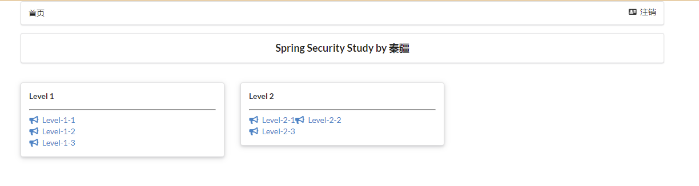

## SpringSecurity笔记

### 扩展阅读

* https://www.cnblogs.com/zongmin/p/13783285.html

### 安全简介

在 Web 开发中，安全一直是非常重要的一个方面。安全虽然属于应用的非功能性需求，但是应该在应用开发的初期就考虑进来。如果在应用开发的后期才考虑安全的问题，就可能陷入一个两难的境地：**一方面，应用存在严重的安全漏洞，无法满足用户的要求，并可能造成用户的隐私数据被攻击者窃取；另一方面，应用的基本架构已经确定，要修复安全漏洞，可能需要对系统的架构做出比较重大的调整，因而需要更多的开发时间，影响应用的发布进程。**因此，从应用开发的第一天就应该把安全相关的因素考虑进来，并在整个应用的开发过程中。

> 市面上存在比较有名的：Shiro，Spring Security ！

### 什么是Spring Security？

- Spring Security是一个功能强大且高度可定制的身份验证和访问控制框架。它实际上是保护基于spring的应用程序的标准。
- Spring Security是一个框架，侧重于为Java应用程序提供身份验证和授权。与所有Spring项目一样，Spring安全性的真正强大之处在于它可以轻松地扩展以满足定制需求

从上面的介绍中可以知道这是一个权限框架。想我们之前做项目是没有使用框架是怎么控制权限的？对于权限 一般会细分为功能权限，访问权限，和菜单权限。代码会写的非常的繁琐，冗余。

怎么解决之前写权限代码繁琐，冗余的问题，一些主流框架就应运而生而Spring Scecurity就是其中的一种。

Spring 是一个非常流行和成功的 Java 应用开发框架。**Spring Security 基于 Spring 框架，提供了一套 Web 应用安全性的完整解决方案。**一般来说，Web 应用的安全性包括用户认证（Authentication）和用户授权（Authorization）两个部分。用户认证指的是验证某个用户是否为系统中的合法主体，也就是说用户能否访问该系统。用户认证一般要求用户提供用户名和密码。系统通过校验用户名和密码来完成认证过程。用户授权指的是验证某个用户是否有权限执行某个操作。在一个系统中，不同用户所具有的权限是不同的。比如对一个文件来说，有的用户只能进行读取，而有的用户可以进行修改。一般来说，系统会为不同的用户分配不同的角色，而每个角色则对应一系列的权限。

对于上面提到的两种应用情景，Spring Security 框架都有很好的支持。**在用户认证方面，Spring Security 框架支持主流的认证方式，包括 HTTP 基本认证、HTTP 表单验证、HTTP 摘要认证、OpenID 和 LDAP 等。在用户授权方面，Spring Security 提供了基于角色的访问控制和访问控制列表（Access Control List，ACL），可以对应用中的领域对象进行细粒度的控制。**

> 工作：认证、授权

### 认识SpringSecurity

Spring Security 是针对Spring项目的安全框架，也是Spring Boot底层安全模块默认的技术选型，他可以实现强大的Web安全控制，对于安全控制，我们仅需要引入 spring-boot-starter-security 模块，进行少量的配置，即可实现强大的安全管理！

记住几个类：

- **WebSecurityConfigurerAdapter：自定义Security策略**
- **AuthenticationManagerBuilder：自定义认证策略**
- **@EnableWebSecurity：开启WebSecurity模式**

> 开启某个功能，@Enablexxx

Spring Security的两个主要目标是 “认证” 和 “授权”（访问控制）。

**“认证”（Authentication）**

身份验证是关于验证您的凭据，如用户名/用户ID和密码，以验证您的身份。

身份验证通常通过用户名和密码完成，有时与身份验证因素结合使用。

 **“授权” （Authorization）**

授权发生在系统成功验证您的身份后，最终会授予您访问资源（如信息，文件，数据库，资金，位置，几乎任何内容）的完全权限。

这个概念是通用的，而不是只在Spring Security 中存在。

### 前提工作

* 创建新项目`springboot-06-security`，添加基础模块


* 创建在`templates`文件夹下创建

```properties
index.html
|views
    |level1
        1.html
        2.html
        3.html
    |level2
        1.html
        2.html
        3.html
    |level3
        1.html
        2.html
        3.html
    Login.html
```

> 链接：https://pan.baidu.com/s/1K2CzctswRKit5bce5_CpVw 
>
> 提取码：ps61 

* 在`application.properties`中关闭模板引擎缓存，方便调试

```properties
spring.thymeleaf.cache=false
```

* 创建Controller类`RouterController.java`

```java
@Controller
public class RouterController {

    @RequestMapping({"/","/index"})
    public String index(){
        return "index";
    }

    @RequestMapping("/toLogin")
    public String toLogin(){
        return "views/login";
    }

    @RequestMapping("level1/{id}")
    public String level1(@PathVariable("id") int id){
        return String.format("views/level1/%d", id);
    }

    @RequestMapping("level2/{id}")
    public String level2(@PathVariable("id") int id){
        return String.format("views/level2/%d", id);
    }

    @RequestMapping("level3/{id}")
    public String level3(@PathVariable("id") int id){
        return String.format("views/level3/%d", id);
    }
}
```

* 测试环境，是否成功


### 认证和授权

目前，测试环境，是谁都可以访问的，使用 Spring Security 增加上认证和授权的功能

* 引入 Spring Security 模块，已经在前面引入了

```xml
<dependency>
   <groupId>org.springframework.boot</groupId>
   <artifactId>spring-boot-starter-security</artifactId>
</dependency>
```

#### 授权

* 编写 Spring Security 配置类

参考官网：https://spring.io/projects/spring-security 

对应的帮助文档：https://www.baeldung.com/spring-security-jdbc-authentication


* 编写基础配置类

```java
@EnableWebSecurity
@Configuration
public class SecurityConfig extends WebSecurityConfigurerAdapter {
    @Override
    protected void configure(HttpSecurity http) throws Exception {
    }
}
```

* 定制请求的授权规则，对不同角色进行设置权限

```java
@EnableWebSecurity
@Configuration
public class SecurityConfig extends WebSecurityConfigurerAdapter {

    @Override
    protected void configure(HttpSecurity http) throws Exception {
        // 设置权限
        http.authorizeRequests()
                .antMatchers("/").permitAll()
                .antMatchers("/level1/**").hasRole("vip1")
                .antMatchers("/level2/**").hasRole("vip2")
                .antMatchers("/level3/**").hasRole("vip3");
    }
}
```

* 在configure()方法中加入以下配置，开启自动配置的登录功能！对没有权限的用户跳转到登录页面

```
// 开启自动配置的登录功能
// /login 请求来到登录页
// /login?error 重定向到这里表示登录失败
http.formLogin();
```

* 测试一下：发现，没有权限的时候，会跳转到登录的页面！


#### 认证

##### 内存认证

定义认证规则，重写configure(AuthenticationManagerBuilder auth)方法

```java
@EnableWebSecurity
@Configuration
public class SecurityConfig extends WebSecurityConfigurerAdapter {
    
	...
        
    @Override
    protected void configure(AuthenticationManagerBuilder auth) throws Exception {
        auth.inMemoryAuthentication()
                .withUser("customer").password("123456").roles("vip1","vip2")
                .and()
                .withUser("admin").password("123456").roles("vip1","vip2","vip3");
    }
}
```

`inMemoryAuthentication`是从内存中读取，正常情况下应该从数据库中读取。

直接运行后，出现`java.lang.IllegalArgumentException: There is no PasswordEncoder mapped for the id "null"`错误，解决如下：

在Spring Security5.0+中，新增了很多加密方式。

```java
@EnableWebSecurity
@Configuration
public class SecurityConfig extends WebSecurityConfigurerAdapter {

	...

    @Override
    protected void configure(AuthenticationManagerBuilder auth) throws Exception {
        // 加密
        BCryptPasswordEncoder bpe = new BCryptPasswordEncoder();
        auth.inMemoryAuthentication().passwordEncoder(bpe)
                .withUser("customer").password(bpe.encode("123456")).roles("vip1","vip2")
                .and()
                .withUser("admin").password(bpe.encode("123456")).roles("vip1","vip2","vip3");
    }
}

```

> spring security 官方推荐的是使用bcrypt加密方式。

* 测试，发现，登录成功，并且每个角色只能访问自己认证下的规则！搞定


##### JDBC身份验证

* 创建数据库

```mysql
create table users(
    username varchar(50) not null primary key,
    password varchar(200) not null,
    enabled boolean not null
);
create table authorities (
    username varchar(50) not null,
    authority varchar(200) not null,
    constraint fk_authorities_users foreign key(username) references users(username)
);
create unique index ix_auth_username on authorities (username,authority);

-- User user/pass
INSERT INTO users (username, password, enabled) values 
('customer',
    '$2a$10$SBrJ5ixGwqZaE5jPnDSCZOLagXpju4lLk9XrvAYvlyE8QASC7vova',
    1),
('admin',
    '$2a$10$SBrJ5ixGwqZaE5jPnDSCZOLagXpju4lLk9XrvAYvlyE8QASC7vova',
    1);

INSERT INTO authorities (username, authority) values
('customer', 'ROLE_vip1'),
('customer', 'ROLE_vip2'),
('admin', 'ROLE_vip1'),
('admin', 'ROLE_vip2'),
('admin', 'ROLE_vip3');
```

* 导入依赖

```xml
<!-- JDBC -->
<dependency>
    <groupId>org.springframework.boot</groupId>
    <artifactId>spring-boot-starter-jdbc</artifactId>
</dependency>
<!-- Mysql -->
<dependency>
    <groupId>mysql</groupId>
    <artifactId>mysql-connector-java</artifactId>
    <scope>runtime</scope>
</dependency>
```

* 在application.yml中配置数据库

```yaml
spring:
  datasource:
    username: root
    password: 123456
    driver-class-name: com.mysql.cj.jdbc.Driver
    url: jdbc:mysql://localhost:3306/review01?serverTimezone=UTC&useUnicode=true&characterEncoding=utf-8
```

* 必须禁用ddl-auto属性，不然JDBC无法使用

```pro
#spring.sql.init.mode=always
spring.datasource.initialization-mode=always
spring.jpa.hibernate.ddl-auto=none
```

> 另外，请注意spring.sql.init.mode属性是在 Spring Boot 2.5.0 中引入的；对于早期版本，我们需要使用spring.datasource.initialization-mode。

* 配置JDBC身份验证

```java
    @Override
    protected void configure(AuthenticationManagerBuilder auth) throws Exception {
        auth.jdbcAuthentication().dataSource(dataSource)
                .usersByUsernameQuery("select username, password, enabled from users where username=?")
                .authoritiesByUsernameQuery(
                        "select username, authority from authorities where username = ?");
    }
```

### 权限控制和注销

#### 注销

* 开启自动配置的注销的功能

```java
    @Override
    protected void configure(HttpSecurity http) throws Exception {
		
        ...
        // 没有权限的跳转到登录页面
        http.formLogin();

        //开启自动配置的注销的功能
        // /logout 注销请求
        http.logout();
    }
```

* 在前端，增加一个注销的按钮，index.html 导航栏中

```html
<a class="item" th:href="@{/logout}">
   <i class="address card icon"></i> 注销
</a>
```


* 运行测试


* 注销后，可以重定向页面

```java
// 开启注销登录功能
http.logout()
    // 用户注销登录时访问的 url，默认为 /logout
    .logoutUrl("/logout")
    // 用户成功注销登录后重定向的地址，默认为 loginPage() + ?logout
    .logoutSuccessUrl("/login/page?logout");    
```

#### 权限控制

根据角色的权限显示出当前角色拥有的页面功能，无权限页面则不显示，并且如果登录了则隐藏登录按钮，只显示注销按钮，而未登录同理。

* ==我们需要结合thymeleaf中的一些功能==

`sec：authorize="isAuthenticated()"`:是否认证登录！来显示不同的页面

* 导入依赖

```xml
<!-- https://mvnrepository.com/artifact/org.thymeleaf.extras/thymeleaf-extras-springsecurity4 -->
<dependency>
   <groupId>org.thymeleaf.extras</groupId>
   <artifactId>thymeleaf-extras-springsecurity5</artifactId>
   <version>3.0.4.RELEASE</version>
</dependency>
```

* 修改`index.html`前端页面，导入命名空间

```html
xmlns:sec="http://www.thymeleaf.org/thymeleaf-extras-springsecurity5"
```

* 修改导航栏，增加认证判断

```html
<!--登录注销-->
<div class="right menu">
    <!--未登录-->
    <div sec:authorize="!isAuthenticated()">
        <a class="item" th:href="@{/toLogin}">
            <i class="address card icon"></i> 登录
        </a>
    </div>

    <!--如果已登录-->
    <div sec:authorize="isAuthenticated()">
        <a class="item" th:href="@{/logout}">
            <i class="address card icon"></i> 注销
        </a>
    </div>
</div>
```

修改完后，进行测试


* 如果注销404了，就是因为它默认防止csrf跨站请求伪造，因为会产生安全问题，我们可以将请求改为post表单提交，或者在spring security中关闭csrf功能；我们试试：在 配置中增加 `http.csrf().disable();`

```properties
http.csrf().disable();//关闭csrf功能:跨站请求伪造,默认只能通过post方式提交logout请求
http.logout().logoutSuccessUrl("/");
```

* 修改角色功能块认证完成

```html
<div class="ui three column stackable grid">
    <div class="column"  sec:authorize="hasRole('vip1')">
        <div class="ui raised segment">
            <div class="ui">
                <div class="content">
                    <h5 class="content">Level 1</h5>
                    <hr>
                    <div><a th:href="@{/level1/1}"><i class="bullhorn icon"></i> Level-1-1</a></div>
                    <div><a th:href="@{/level1/2}"><i class="bullhorn icon"></i> Level-1-2</a></div>
                    <div><a th:href="@{/level1/3}"><i class="bullhorn icon"></i> Level-1-3</a></div>
                </div>
            </div>
        </div>
    </div>

    <div class="column" sec:authorize="hasRole('vip2')">
        <div class="ui raised segment">
            <div class="ui">
                <div class="content">
                    <h5 class="content">Level 2</h5>
                    <hr>
                    <div><a th:href="@{/level2/1}"><i class="bullhorn icon"></i> Level-2-1</a><a
                                                                                                 th:href="@{/level2/2}"><i class="bullhorn icon"></i> Level-2-2</a></div>
                    <div><a th:href="@{/level2/3}"><i class="bullhorn icon"></i> Level-2-3</a></div>
                </div>
            </div>
        </div>
    </div>

    <div class="column" sec:authorize="hasRole('vip3')">
        <div class="ui raised segment">
            <div class="ui">
                <div class="content">
                    <h5 class="content">Level 3</h5>
                    <hr>
                    <div><a th:href="@{/level3/1}"><i class="bullhorn icon"></i> Level-3-1</a></div>
                    <div><a th:href="@{/level3/2}"><i class="bullhorn icon"></i> Level-3-2</a></div>
                    <div><a th:href="@{/level3/3}"><i class="bullhorn icon"></i> Level-3-3</a></div>
                </div>
            </div>
        </div>
    </div>

</div>
```

其中，进行判断的语句是` <div class="column" sec:authorize="hasRole('vip3')">`。判断角色拥有的权限。



### 记住我

现在的情况，只要登录之后，关闭浏览器，再登录，就会让重新登录，但是很多网站的情况，就是有一个记住密码的功能，这个该如何实现呢？很简单

* 开启记住我功能

```java
//定制请求的授权规则
@Override
protected void configure(HttpSecurity http) throws Exception {
    ....
    //记住我
    http.rememberMe();
}
```

* 再次启动项目测试一下，发现登录页多了一个记住我功能，登录之后关闭 浏览器，然后重新打开浏览器访问，发现用户依旧存在！


思考：如何实现的呢？其实非常简单，可以查看浏览器的cookie


> 默认保存14天

* 更改默认保存时间

```java
// 开启 Remember-Me 功能
http.rememberMe()
    // 指定在登录时“记住我”的 HTTP 参数，默认为 remember-me
    .rememberMeParameter("remember-me")
    // 设置 Token 有效期为 200s，默认时长为 2 星期
    .tokenValiditySeconds(200)
    // 指定 UserDetailsService 对象
    .userDetailsService(userDetailsService);
```

### 全局性的安全配置

```java
/**
     * 定制一些全局性的安全配置，例如：不拦截静态资源的访问
     */
@Override
public void configure(WebSecurity web) throws Exception {
    // 静态资源的访问不需要拦截，直接放行
    web.ignoring().antMatchers("/**/*.css", "/**/*.js", "/**/*.png", "/**/*.jpg", "/**/*.jpeg");
}
```

### 定制登录页

现在这个登录页面都是spring security 默认的，怎么样可以使用我们自己写的Login界面呢？

* 在刚才的登录页配置后面指定 loginpage

```java
http.formLogin().loginPage("/toLogin");
```

* 然后前端也需要指向我们自己定义的 login请求

```html
<a class="item" th:href="@{/toLogin}">
   <i class="address card icon"></i> 登录
</a>
```

* 我们登录，需要将这些信息发送到哪里，我们也需要配置，login.html 配置提交请求及方式，方式必须为post:

```html
<form th:action="@{/login}" method="post">
   <div class="field">
       <label>Username</label>
       <div class="ui left icon input">
           <input type="text" placeholder="Username" name="username">
           <i class="user icon"></i>
       </div>
   </div>
   <div class="field">
       <label>Password</label>
       <div class="ui left icon input">
           <input type="password" name="password">
           <i class="lock icon"></i>
       </div>
   </div>
   <input type="submit" class="ui blue submit button"/>
</form>
```

* 这个请求提交上来，我们还需要验证处理，怎么做呢？我们可以查看formLogin()方法的源码！我们配置接收登录的用户名和密码的参数！

```java
http.formLogin()
    .usernameParameter("username")
    .passwordParameter("password")
    .loginPage("/toLogin")
    .loginProcessingUrl("/login"); // 登陆表单提交请求
```

* 在登录页增加记住我的多选框

```html
<input type="checkbox" name="remember"> 记住我
```

* 后端验证处理！

```java
http.rememberMe().rememberMeParameter("remember");
```


### 完整配置代码

```java
@EnableWebSecurity
@Configuration
public class SecurityConfig extends WebSecurityConfigurerAdapter {

    @Autowired
    private DataSource dataSource; //注入数据源

    @Override
    protected void configure(HttpSecurity http) throws Exception {
        // 设置权限
        http.authorizeRequests()
                .antMatchers("/").permitAll()
                .antMatchers("/level1/**").hasRole("vip1")
                .antMatchers("/level2/**").hasRole("vip2")
                .antMatchers("/level3/**").hasRole("vip3");

        // 没有权限的跳转到登录页面
        http.formLogin()
                .usernameParameter("username")
                .passwordParameter("password")
                .loginPage("/toLogin")
                .loginProcessingUrl("/login"); // 登陆表单提交请求

        //开启自动配置的注销的功能
        // /logout 注销请求
        http.logout();

        http.csrf().disable();//关闭csrf功能:跨站请求伪造,默认只能通过post方式提交logout请求
        http.logout().logoutSuccessUrl("/");

        http.rememberMe().rememberMeParameter("remember");
    }

    @Override
    protected void configure(AuthenticationManagerBuilder auth) throws Exception {
//        BCryptPasswordEncoder bpe = new BCryptPasswordEncoder();
//        auth.inMemoryAuthentication().passwordEncoder(bpe)
//                .withUser("customer").password(bpe.encode("123456")).roles("vip1", "vip2")
//                .and()
//                .withUser("admin").password(bpe.encode("123456")).roles("vip1", "vip2", "vip3");

        auth.jdbcAuthentication().dataSource(dataSource)
                .usersByUsernameQuery("select username, password, enabled from users where username=?")
                .authoritiesByUsernameQuery(
                        "select username, authority from authorities where username = ?");
    }

    @Bean
    public PasswordEncoder passwordEncoder() {
        return new BCryptPasswordEncoder();
    }
    
}
```

