## Shiro笔记

### 概述

#### 简介

[Apache](https://so.csdn.net/so/search?q=Apache&spm=1001.2101.3001.7020) Shiro是一个强大且易用的Java安全框架

[Shiro](https://so.csdn.net/so/search?q=Shiro&spm=1001.2101.3001.7020) 不仅可以用在 JavaSE 环境中，也可以用在 JavaEE 环境中，它可以完成身份验证、授权、密码和会话管理

官网： http://shiro.apache.org/

#### 功能

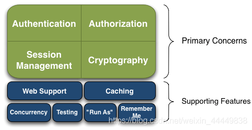

- Authentication：身份认证/登录，验证用户是不是拥有相应的身份；

- Authorization：授权，即权限验证，验证某个已认证的用户是否拥有某个权限；即判断用户是否能做事情，常见的如：验证某个用户是否拥有某个角色。或者细粒度的验证某个用户对某个资源是否具有某个权限；

- Session Manager：会话管理，即用户登录后就是一次会话，在没有退出之前，它的所有信息都在会话中；会话可以是普通JavaSE环境的，也可以是如Web环境的；

- Cryptography：加密，保护数据的安全性，如密码加密存储到数据库，而不是明文存储；

- Web Support：Web支持，可以非常容易的集成到Web环境；

- Caching：缓存，比如用户登录后，其用户信息、拥有的角色/权限不必每次去查，这样可以提高效率；

- Concurrency：shiro支持多线程应用的并发验证，即如在一个线程中开启另一个线程，能把权限自动传播过去；

- Testing：提供测试支持；

- Run As：允许一个用户假装为另一个用户（如果他们允许）的身份进行访问；

- Remember Me：记住我，这个是非常常见的功能，即一次登录后，下次再来的话不用登录了。

#### 从外部看

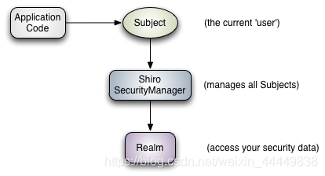

应用代码直接交互的对象是Subject，也就是说Shiro的对外API核心就是Subject；其每个API的含义：

​	**Subject**：主体，代表了当前“用户”，这个用户不一定是一个具体的人，与当前应用交互的任何东西都是Subject，如网络爬虫，机器人等；即一个抽象概念；所有Subject都绑定到SecurityManager，与Subject的所有交互都会委托给SecurityManager；可以把Subject认为是一个门面；SecurityManager才是实际的执行者；

​	**SecurityManager**：安全管理器；即所有与安全有关的操作都会与SecurityManager交互；且它管理着所有Subject；可以看出它是Shiro的核心，它负责与后边介绍的其他组件进行交互，如果学习过SpringMVC，你可以把它看成DispatcherServlet前端控制器；

​	**Realm**：域，Shiro从从Realm获取安全数据（如用户、角色、权限），就是说SecurityManager要验证用户身份，那么它需要从Realm获取相应的用户进行比较以确定用户身份是否合法；也需要从Realm得到用户相应的角色/权限进行验证用户是否能进行操作；可以把Realm看成DataSource，即安全数据源。

也就是说对于我们而言，最简单的一个Shiro应用：

1. 应用代码通过Subject来进行认证和授权，而Subject又委托给SecurityManager；

2. 我们需要给Shiro的SecurityManager注入Realm，从而让SecurityManager能得到合法的用户及其权限进行判断。


从以上也可以看出，Shiro不提供维护用户/权限，而是通过Realm让开发人员自己注入

外部架构


- **Subject**：主体，可以看到主体可以是任何可以与应用交互的“用户”；
- **SecurityManager**：相当于SpringMVC中的DispatcherServlet或者Struts2中的FilterDispatcher；是Shiro的心脏；所有具体的交互都通过SecurityManager进行控制；它管理着所有Subject、且负责进行认证和授权、及会话、缓存的管理。
- **Authenticator**：认证器，负责主体认证的，这是一个扩展点，如果用户觉得Shiro默认的不好，可以自定义实现；其需要认证策略（Authentication Strategy），即什么情况下算用户认证通过了；
- **Authrizer**：授权器，或者访问控制器，用来决定主体是否有权限进行相应的操作；即控制着用户能访问应用中的哪些功能；
- **Realm**：可以有1个或多个Realm，可以认为是安全实体数据源，即用于获取安全实体的；可以是JDBC实现，也可以是LDAP实现，或者内存实现等等；由用户提供；注意：Shiro不知道你的用户/权限存储在哪及以何种格式存储；所以我们一般在应用中都需要实现自己的Realm；
- **SessionManager**：如果写过Servlet就应该知道Session的概念，Session呢需要有人去管理它的生命周期，这个组件就是SessionManager；而Shiro并不仅仅可以用在Web环境，也可以用在如普通的JavaSE环境、EJB等环境；所有呢，Shiro就抽象了一个自己的Session来管理主体与应用之间交互的数据；这样的话，比如我们在Web环境用，刚开始是一台Web服务器；接着又上了台EJB服务器；这时想把两台服务器的会话数据放到一个地方，这个时候就可以实现自己的分布式会话（如把数据放到Memcached服务器）；
- **SessionDAO**：DAO大家都用过，数据访问对象，用于会话的CRUD，比如我们想把Session保存到数据库，那么可以实现自己的SessionDAO，通过如JDBC写到数据库；比如想把Session放到Memcached中，可以实现自己的Memcached SessionDAO；另外SessionDAO中可以使用Cache进行缓存，以提高性能；
- **CacheManager**：缓存控制器，来管理如用户、角色、权限等的缓存的；因为这些数据基本上很少去改变，放到缓存中后可以提高访问的性能
- **Cryptography**：密码模块，Shiro提高了一些常见的加密组件用于如密码加密/解密的

####  认证流程


**用户** 提交 **身份信息、凭证信息** 封装成 **令牌** 交由 **安全管理器** 认证

### 快速入门

* 新建一个Maven工程`springboot-08-shiro`，删除其 src 目录，将其作为父工程

* 在父工程中新建一个 Maven 模块`hello-shiro`


* 复制快速入门案例 POM.xml 文件中的依赖 （版本号自选）

```xml
<dependencies>
    <dependency>
        <groupId>org.apache.shiro</groupId>
        <artifactId>shiro-core</artifactId>
        <version>1.4.1</version>
    </dependency>

    <!-- configure logging -->
    <dependency>
        <groupId>org.slf4j</groupId>
        <artifactId>jcl-over-slf4j</artifactId>
        <version>1.7.29</version>
    </dependency>
    <dependency>
        <groupId>org.apache.logging.log4j</groupId>
        <artifactId>log4j-slf4j-impl</artifactId>
        <version>2.17.1</version>
    </dependency>
    <dependency>
        <groupId>org.apache.logging.log4j</groupId>
        <artifactId>log4j-core</artifactId>
        <version>2.17.1</version>
    </dependency>
</dependencies>
```

* 把快速入门案例中的 resource 下的`log4j.xml`复制下来
* 复制一下 `shiro.ini` 文件
* 复制一下 `Quickstart.java` 文件
  **如果有导包的错误，把那两个错误的包删掉，就会自动导对的包了，快速入门案例中用的方法过时了**

其中IniSecurityManager已经弃用

```java
Factory<SecurityManager> factory = new IniSecurityManagerFactory("classpath:shiro.ini");
SecurityManager securityManager = factory.getInstance();
```

新写法如下：

```java
DefaultSecurityManager securityManager = new DefaultSecurityManager();
IniRealm iniRealm = new IniRealm("classpath:shiro.ini");
securityManager.setRealm(iniRealm);
```

* 运行 `Quickstart.java`，得到结果

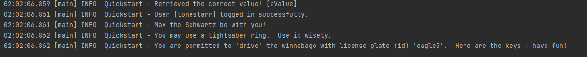

### 分析案例

* 通过 SecurityUtils 获取当前执行的用户 Subject

```java
Subject currentUser = SecurityUtils.getSubject();
```

* 通过 当前用户拿到 Session

```java
Session session = currentUser.getSession();
```

* 用 Session 存值取值

```java
session.setAttribute("someKey", "aValue");
        String value = (String) session.getAttribute("someKey");
```

* 判断用户是否被认证

```java
currentUser.isAuthenticated()
```

* 权限判断

```java
currentUser.hasRole("vip1")
```

* 执行登录操作

```java
 currentUser.login(token);
```

* 打印其标识主体

```java
currentUser.getPrincipal()
```

* 注销

```java
currentUser.logout();
```

* 完整样例

```java
public class Quickstart {

    private static final transient Logger log = LoggerFactory.getLogger(Quickstart.class);


    public static void main(String[] args) {

        // 工厂模式，通过shiro.ini 配置文件中的信息，生成一个工厂实例
        DefaultSecurityManager securityManager = new DefaultSecurityManager();
        IniRealm iniRealm = new IniRealm("classpath:shiro.ini");
        securityManager.setRealm(iniRealm);
        SecurityUtils.setSecurityManager(securityManager);

        // 现在已经建立了一个简单的shiro环境，看看能做什么
        // 通过SecurityUtils获取当前执行的用户Subject
        Subject currentUser = SecurityUtils.getSubject();

        // 通过当前用户拿到session
        // 使用shiro的session（不需要web或者EJB容器）
        Session session = currentUser.getSession();

        // 通过session进行存值取值
        session.setAttribute("someKey", "aValue");
        String value = (String) session.getAttribute("someKey");
        if (value.equals("aValue")) {
            log.info("Retrieved the correct value! [" + value + "]");
        }

        // 登录当前用户，以便可以检查角色和权限
        // 这里和SpringSecurity使用了类似的代码，判断用户是否被认证
        if (!currentUser.isAuthenticated()) {

            // 如果被认证，就可以获得一个令牌（token）
            // 通过用户的账号密码生成一个令牌
            UsernamePasswordToken token = new UsernamePasswordToken("lonestarr", "vespa");
            token.setRememberMe(true);
            try {
                // 执行登录操作
                currentUser.login(token);
            } catch (UnknownAccountException uae) {
                // 如果用户不存在
                log.info("没有用户名为 " + token.getPrincipal());
            } catch (IncorrectCredentialsException ice) {
                //如果密码不正确
                log.info("账户密码 " + token.getPrincipal() + " 不正确");
            } catch (LockedAccountException lae) {
                // 用户被锁定，如密码输出过多，则被锁住
                log.info("用户名账户 " + token.getPrincipal() + " 被锁住了  " +
                        "请与管理员联系将其解锁");
            }
            // 在此处捕获更多异常
            catch (AuthenticationException ae) {
                //异常
            }
        }

        // currentUser一些用法
        // 打印其标识主题（在这种情况下，为用户名）
        log.info("User [" + currentUser.getPrincipal() + "] logged in successfully.");

        // 测试角色是否存在
        if (currentUser.hasRole("schwartz")) {
            log.info("schwartz 用户存在");
        } else {
            log.info("schwartz 用户不存在");
        }

        // 细粒度，权限范围小
        // 测试类型化的权限（不是实例级别）
        if (currentUser.isPermitted("lightsaber:wield")) {
            log.info("You may use a lightsaber ring.  Use it wisely.");
        } else {
            log.info("Sorry, lightsaber rings are for schwartz masters only.");
        }

        // x粒度，权限范围广
        // 实例级别权限
        if (currentUser.isPermitted("winnebago:drive:eagle5")) {
            log.info("You are permitted to 'drive' the winnebago with license plate (id) 'eagle5'.  " +
                    "Here are the keys - have fun!");
        } else {
            log.info("Sorry, you aren't allowed to drive the 'eagle5' winnebago!");
        }

        // 注销
        currentUser.logout();

        System.exit(0);
    }
}
```

### SpringBoot 集成 Shiro

#### 编写配置文件

* 在刚刚的父项目中新建一个 springboot 模块`shiro-springboot`

* 导入 SpringBoot 和 Shiro 整合包的依赖

```xml
<!--SpringBoot 和 Shiro 整合包-->
<!-- https://mvnrepository.com/artifact/org.apache.shiro/shiro-spring-boot-web-starter -->
<dependency>
    <groupId>org.apache.shiro</groupId>
    <artifactId>shiro-spring-boot-web-starter</artifactId>
    <version>1.6.0</version>
</dependency>

<dependency>
    <groupId>org.springframework.boot</groupId>
    <artifactId>spring-boot-starter-thymeleaf</artifactId>
</dependency>
```

* 在`resources`或者`src/main/resources/META-INF`文件夹下创建一个名为`shiro.ini`的文件.并且添加我们的用户验证信息.如下图所示

  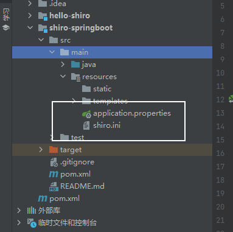

不然会出现`Description: No bean of type ‘org.apache.shiro.realm.Realm‘ found.`错误。

* 下面是编写配置文件

Shiro 三大要素

1. subject -> ShiroFilterFactoryBean（用户）
2. securityManager -> DefaultWebSecurityManager（管理所有用户）
3. realm（数据）

实际操作中对象创建的顺序 ： realm -> securityManager -> subject

* 编写自定义的ShiroConfig，需要继承 `AuthorizingRealm`

```java
@Configuration
public class ShiroConfig {

    // ShiroFilterFactoryBean
    @Bean(name = "shiroFilterFactoryBean") //这里必须这样写
    public ShiroFilterFactoryBean getShiroFilterFactoryBean(@Qualifier("defaultWebSecurityManager") DefaultWebSecurityManager defaultWebSecurityManager){
        ShiroFilterFactoryBean bean = new ShiroFilterFactoryBean();

        // 关联securityManager
        // 设置安全管理器
        bean.setSecurityManager(defaultWebSecurityManager);

        /*
          添加shiro的内置过滤器：
            anon:无需认证就可以访问
            authc:必须认证才可以访问
            user:必须拥有 记住我  功能才能用
            perms:拥有某个资源的权限才能访问
            role:拥有某个角色的权限才能访问
         */

        Map<String ,String> filterMap = new LinkedHashMap<>();
        filterMap.put("/index", "anon");
        filterMap.put("/", "anon");
        filterMap.put("/login", "anon");
        filterMap.put("/**", "authc");

        bean.setFilterChainDefinitionMap(filterMap);
        
        bean.setLoginUrl("/toLogin");

        return bean;
    }

    // DefaultWebSecurityManager
    // 通过@Qualifier("userRealm")创建realm对象数据
    @Bean(name = "defaultWebSecurityManager")
    public DefaultWebSecurityManager getDefaultWebSecurityManager(@Qualifier("userRealm") UserRealm userRealm){
        DefaultWebSecurityManager securityManager = new DefaultWebSecurityManager();

        // 关联UserRealm
        securityManager.setRealm(userRealm);

        return securityManager;
    }

    // 创建realm对象，需要自定义类
    @Bean
    public UserRealm userRealm(){
        return new UserRealm();
    }
}
```

* 编写UserRealm类

```java
// 自定义的UserRealm
public class UserRealm extends AuthorizingRealm {
    // 授权
    @Override
    protected AuthorizationInfo doGetAuthorizationInfo(PrincipalCollection principalCollection) {
       System.out.println("执行了授权");
        return null;
    }

    // 认证
    @Override
    protected AuthenticationInfo doGetAuthenticationInfo(AuthenticationToken authenticationToken) throws AuthenticationException {
        System.out.println("执行了认证");
        return null;
    }
}
```

* 编写前端页面

`index.html`

```html
<!DOCTYPE html>
<html lang="en" xmlns:th="http://www.thymeleaf.org">
<head>
    <meta charset="UTF-8">
    <title>Title</title>
</head>
<body>
    首页
    <div th:text="${msg}"></div>
</body>
</html>
```

`add.html`

```html
<body>
    添加
</body>
```

`update.html`

```
<body>
   	修改
</body>
```

编写登录页面`login.html`

```html
<!DOCTYPE html>
<html lang="en" xmlns:th="http://www.thymeleaf.org">
<head>
    <meta charset="UTF-8">
    <title>Title</title>
</head>
<body>
    <h1>登录</h1>
    <hr/>
    <form th:action="@{/login}">
        <p>用户名：<input type="text" name="username"></p>
        <p>密码：<input type="password" name="password"></p>
        <p><input type="submit"></p>
        <div th:text="${msg}"></div>
    </form>
</body>
</html>
```

* 编写控制类`MyController.java`

```java
@Controller
public class MyController {

    @GetMapping({"/","/index"})
    public String index(Model model){
        model.addAttribute("msg", "hello shiro");
        return "index";
    }

    @GetMapping("/add")
    public String add(){
        return "add";
    }

    @GetMapping("/update")
    public String update(){
        return "update";
    }
    
    @GetMapping("/toLogin")
    public String toLogin(){
        return "login";
    }
}
```

* 测试，发现shiro默认在没有认证的情况下会自动跳往login.jsp，这是因为权限问题。
* 可以自行设置登录页面

```java
//设置登录页面
bean.setLoginUrl("/toLogin");
```

#### 登录拦截器

在上面的 `getShiroFilterFactoryBean` 方法中加上需要拦截的登录请求

```java
    // ShiroFilterFactoryBean
    @Bean(name = "shiroFilterFactoryBean") //这里必须这样写
    public ShiroFilterFactoryBean getShiroFilterFactoryBean(@Qualifier("securityManager") DefaultWebSecurityManager defaultWebSecurityManager){
        ShiroFilterFactoryBean bean = new ShiroFilterFactoryBean();

        // 关联securityManager
        // 设置安全管理器
        bean.setSecurityManager(defaultWebSecurityManager);

        
        // 拦截
        /*
          添加shiro的内置过滤器：
            anon:无需认证就可以访问
            authc:必须认证才可以访问
            user:必须拥有 记住我  功能才能用
            perms:拥有某个资源的权限才能访问
            role:拥有某个角色的权限才能访问
         */

        Map<String ,String> filterMap = new LinkedHashMap<>();
        // 这样就可以进行访问了
        filterMap.put("/index", "anon");
        filterMap.put("/", "anon");
        filterMap.put("/login", "anon");
        filterMap.put("/**", "authc");
        
        // 放开静态资源
        filterMap.put("/imgs/**","anon");
        filterMap.put("/css/**","anon");
        filterMap.put("/js/**","anon");

        bean.setFilterChainDefinitionMap(filterMap);
        
        //设置登录页面
        bean.setLoginUrl("/toLogin");

        return bean;
    }
```

* 测试，点击 add链接，不会跳到 add页面，而是跳到登录页，拦截成功

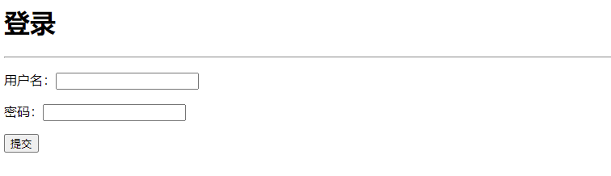

#### 用户认证

* 在 Controller 中写一个登录的控制器

```java
@GetMapping("/login")
public String login(String username,String password,Model model){

    // 获取当前的用户
    Subject subject = SecurityUtils.getSubject();
    // 封装用户的登录数据=>token
    UsernamePasswordToken token = new UsernamePasswordToken(username, password);
    try {
        // 执行登录的方法
        subject.login(token);
        return "index";
    }catch (UnknownAccountException e){
        model.addAttribute("msg", "用户名错误");
        return "login";
    }catch (IncorrectCredentialsException e){
        model.addAttribute("msg", "密码错误");
        return "login";
    }
    return "login";
}
```

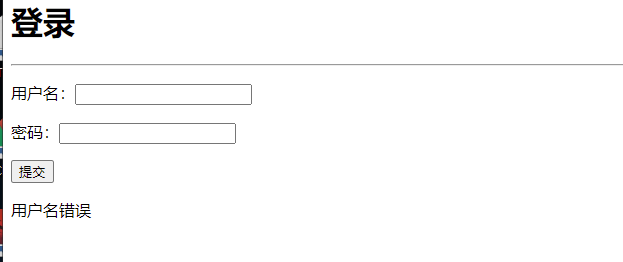

* 下面去自定义的 `UserRealm` 中的 `AuthenticationInfo` 方法中去获取用户信息

```java
    // 认证
    @Override
    protected AuthenticationInfo doGetAuthenticationInfo(AuthenticationToken authenticationToken) throws AuthenticationException {
        System.out.println("执行了认证");

        // 用户名&密码，一般在用户库中取
        String name = "admin";
        String password = "123456";

        UsernamePasswordToken token = (UsernamePasswordToken) authenticationToken;

        // 获取用户名并进行判断
        if (token.getUsername() !=null &&!token.getUsername().equals(name)){
            return null;// 抛出异常，UnknownAccountException
        }

        //密码认证， Shiro 自己做，为了避免和密码的接触
        //最后返回一个 AuthenticationInfo 接口的实现类，这里选择 SimpleAuthenticationInfo
        // 三个参数：获取当前用户的认证 ； 密码 ； 认证名
        return new SimpleAuthenticationInfo("",password,"");
    }
```

#### 整合Mybatis

* 导入依赖

```xml
<dependency>
    <groupId>org.springframework.boot</groupId>
    <artifactId>spring-boot-starter-jdbc</artifactId>
</dependency>
<dependency>
    <groupId>mysql</groupId>
    <artifactId>mysql-connector-java</artifactId>
    <scope>runtime</scope>
</dependency>

<dependency>
    <groupId>org.mybatis.spring.boot</groupId>
    <artifactId>mybatis-spring-boot-starter</artifactId>
    <version>2.2.2</version>
</dependency>

<dependency>
    <groupId>org.projectlombok</groupId>
    <artifactId>lombok</artifactId>
    <version>1.18.22</version>
</dependency>
```

* 在`application.yaml`中配置数据源

```yaml
spring:
  datasource:
    username: root
    password: 123456
    driver-class-name: com.mysql.cj.jdbc.Driver
    url: jdbc:mysql://localhost:3306/review01?serverTimezone=UTC&useUnicode=true&characterEncoding=utf-8

#配置mybatis
mybatis:
  #开启驼峰写法
  configuration:
    map-underscore-to-camel-case: true
  #如果配置文件和类名对应包名可以省略，否则 需要声明位置
  mapper-locations: classpath:mapper/*.xml,dao/*.xml
  #配置别名
  type-aliases-package: com.easy.pojo
```

* 必须禁用ddl-auto属性，不然JDBC无法使用

```pro
#spring.sql.init.mode=always
spring.datasource.initialization-mode=always
spring.jpa.hibernate.ddl-auto=none
```

> 另外，请注意spring.sql.init.mode属性是在 Spring Boot 2.5.0 中引入的；对于早期版本，我们需要使用spring.datasource.initialization-mode。

* 编写实体类`User`

```java
@Data
@AllArgsConstructor
@NoArgsConstructor
public class User {
    private String username;
    private String password;

    @Override
    public String toString() {
        return "User{" +
                "username='" + username + '\'' +
                ", password='" + password + '\'' +
                '}';
    }
}
```

* 编写mapper层`UserMapper.java`

```java
@Repository // bean
@Mapper // 注册
public interface UserMapper {
    public User getUserByName(@Param("username") String name);
}

```

* 编写mapper层`UserMapper.xml`

```xml
<mapper namespace="com.easy.mapper.UserMapper">
    <select id="getUserByName" resultType="User" parameterType="String">
        select * from users where username = #{username};
    </select>
</mapper>
```

* 如果出现错误，可能是资源过滤问题，在`pom.xml`中配置

```xml
<resources>
    <resource>
        <directory>src/main/java</directory>
        <includes>
            <include>**/*.xml</include>
        </includes>
        <filtering>true</filtering>
    </resource>
</resources>
```

* 测试

```java
@SpringBootTest
class ShiroSpringbootApplicationTests {

    @Autowired
    UserServiceImpl userService;

    @Test
    void contextLoads() {
        System.out.println(userService.getUserByName("admin"));
    }
}

```

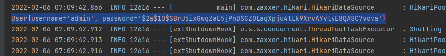

* 修改 `UserRealm` 中的 `AuthenticationInfo`，连接数据库

```java
// 自定义的UserRealm
public class UserRealm extends AuthorizingRealm {

    @Autowired
    UserService userService;

    // 授权
    @Override
    protected AuthorizationInfo doGetAuthorizationInfo(PrincipalCollection principalCollection) {
        System.out.println("执行了授权");
        return null;
    }

    // 认证
    @Override
    protected AuthenticationInfo doGetAuthenticationInfo(AuthenticationToken authenticationToken) throws AuthenticationException {
        System.out.println("执行了认证");

        UsernamePasswordToken token = (UsernamePasswordToken) authenticationToken;

        // 连接真实数据库
        User user = userService.getUserByName(token.getUsername());

        if(user == null) {
            return null;
        }

        //根据用户的情况，来构建AuthenticationInfo对象,通常使用的实现类为SimpleAuthenticationInfo
        //以下信息是从数据库中获取的
        //1)principal：认证的实体信息，可以是username，也可以是数据库表对应的用户的实体对象
        //Object principal = token.getPrincipal();
        User principal = user; //这里一定要写为User对象，不然在授权时，会因为获取对象出错
        //2)credentials：数据库中的密码（经过加密的密码）
        Object credentials = user.getPassword();
        //3)credentials：盐值（使用用户名）
        ByteSource credentialsSalt = ByteSource.Util.bytes(principal.getUsername());
        //4)realmName：当前realm对象的name，调用父类的getName()方法即可
        String realmName = getName();
    }
}
```

* 在注册用户时修改加密方式,在 BCrypt 中我们不需要为每个用户分配不同的盐，只要使用 `BCrypt.gensalt()` 就可以生成盐。

```java
public String encodeByBCrypt(String password) {
    return BCrypt.hashpw(password, BCrypt.gensalt());
}
```

* 如果需要加密，Shiro 框架没有内置 BCrypt 。需要引入新的库 `jBCrypt`:

```xml
<dependency>
    <groupId>de.svenkubiak</groupId>
    <artifactId>jBCrypt</artifactId>
    <version>0.4.1</version>
</dependency>
```

* 在 Shiro 配置文件 `ShiroConfig` 中为我们自定义的 `UserRealm` Bean 添加凭证匹配器。

```java
// 创建realm对象，需要自定义类
@Bean
public UserRealm userRealm(){

    UserRealm realm = new UserRealm();
    //配置单项hash
    //UserRealm.setCredentialsMatcher(hashedCredentialsMatcher());

    //配置 BCrypt
    realm.setCredentialsMatcher(new CredentialsMatcher() {
        @Override
        public boolean doCredentialsMatch(AuthenticationToken token, AuthenticationInfo info) {
            UsernamePasswordToken userToken = (UsernamePasswordToken) token;
            //要验证的明文密码
            String plaintext = new String(userToken.getPassword());
            //数据库中的加密后的密文
            String hashed = info.getCredentials().toString();
            return BCrypt.checkpw(plaintext, hashed);
        }
    });
    return realm;
}
```

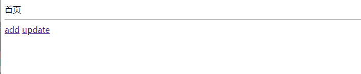

#### 请求授权

**修改实体类，增加一个字段**

```java
@Data
@AllArgsConstructor
@NoArgsConstructor
public class User {
    private String username;
    private String password;
    private String perms;
}
```

对数据库进行修改，添加一个字段

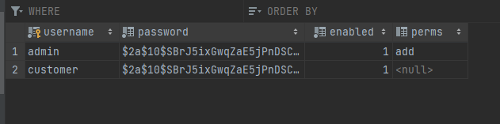

在`public ShiroFilterFactoryBean getShiroFilterFactoryBean`中，添加授权样例

```java
// 授权
filterMap.put("/add", "perms[add]");
```

必须通过当前参数，比如perms[user:method]，表示`/user/method`类似链接。在未授权进行访问的时候，会跳转到未授权页面。如果想修改跳转到其他未授权页面，如下：

```java
bean.setUnauthorizedUrl("/unauthorized");
```

* 对被拦截的用户进行授权访问

```java
// 授权
@Override
protected AuthorizationInfo doGetAuthorizationInfo(PrincipalCollection principalCollection) {
    System.out.println("执行了授权");

    SimpleAuthorizationInfo info = new SimpleAuthorizationInfo();

    Subject subject = SecurityUtils.getSubject(); //获得当前对象
    User currentUser = (User) subject.getPrincipal(); //拿到User对象
    info.addStringPermission(currentUser.getPerms()); //设置权限

    return info;
}
```


#### 整合Thymeleaf

需求：**根据权限展示不同的前端页面**

* 添加maven依赖

```xml
<!-- https://mvnrepository.com/artifact/com.github.theborakompanioni/thymeleaf-extras-shiro -->
<dependency>
    <groupId>com.github.theborakompanioni</groupId>
    <artifactId>thymeleaf-extras-shiro</artifactId>
    <version>2.1.0</version>
</dependency>
```

* **配置一个shiro的Dialect ，在shiro的配置中增加一个Bean**

```java
//配置ShiroDialect：用于 thymeleaf 和 shiro 标签配合使用
@Bean
public ShiroDialect getShiroDialect(){
    return new ShiroDialect();
}
```

* 修改`index.html`

```html
<!DOCTYPE html>
<html lang="en" xmlns:th="http://www.thymeleaf.org"
      xmlns:shiro="http://www.pollix.at/thymeleaf/shiro">

<head>
    <meta charset="UTF-8">
    <title>Title</title>
</head>
<body>
    首页
    <div th:text="${msg}"></div>

    <hr/>

    <div shiro:hasPermission="add">
        <a th:href="@{/add}">add</a>
    </div>

    <div shiro:hasPermission="update">
        <a th:href="@{/update}">update</a>
    </div>

</body>
</html>
```

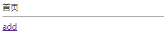

* 在用户登录后应该把信息放到Session中，完善下！在执行认证逻辑时候，加入session

**在controller的login方法中**

```java
// 执行登录的方法
subject.login(token);

//登陆成功存放用户信息
Subject currentSubject = SecurityUtils.getSubject();
Session session = currentSubject.getSession();
session.setAttribute("loginUser",username);
```

* 修改`index.html`页面，添加登录和注销

```html
<p th:if="${session.get('loginUser')}==null">
    <a th:href="@{/toLogin}">登录</a>
</p>
<p th:if="${session.get('loginUser')}!=null">
    <a th:href="@{/logOut}">注销</a>
</p>
```

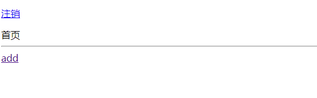

* 实现注销功能

```java
//注销登录功能
@RequestMapping("/logOut")
public String logOut(){

    Subject currentUser = SecurityUtils.getSubject();
    currentUser.logout();

    return "index";
}
```
