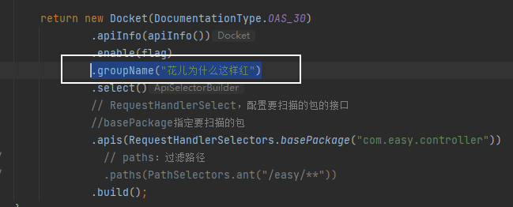

## Swagger


### 学习目标

- 了解Swagger的概念及作用
- 掌握在项目中集成Swagger自动生成API文档

### Swagger简介

**前后端分离**

- 前端 -> 前端控制层、视图层
- 后端 -> 后端控制层、服务层、数据访问层
- 前后端通过API进行交互
- 前后端相对独立且松耦合

**产生的问题**

- 前后端集成，前端或者后端无法做到“及时协商，尽早解决”，最终导致问题集中爆发

**解决方案**

- 首先定义schema [ 计划的提纲 ]，并实时跟踪最新的API，降低集成风险
- 以前：指定word计划文档

**Swagger**

- 号称世界上最流行的API框架
- Restful Api 文档在线自动生成器 => **API 文档 与API 定义同步更新**
- 直接运行，在线测试API
- 支持多种语言 （如：Java，PHP等）
- 官网：https://swagger.io/

### SpringBoot集成Swagger

**SpringBoot集成Swagger** => **springfox**，两个jar包

1. **Springfox-swagger2**
2. swagger-springmvc

**使用Swagger**，要求：jdk 1.8 + 否则swagger2无法运行

* 新建一个SpringBoot-web项目
* 导入相应依赖

`swagger2.9.2`版本

```xml
<!-- https://mvnrepository.com/artifact/io.springfox/springfox-swagger2 -->
<dependency>
    <groupId>io.springfox</groupId>
    <artifactId>springfox-swagger2</artifactId>
    <version>2.9.2</version>
</dependency>

<!-- https://mvnrepository.com/artifact/io.springfox/springfox-swagger-ui -->
<dependency>
    <groupId>io.springfox</groupId>
    <artifactId>springfox-swagger-ui</artifactId>
    <version>2.9.2</version>
</dependency>
</dependencies>
```

`swagger3.0.0`版本

```xml
<!-- https://mvnrepository.com/artifact/io.springfox/springfox-swagger2 -->
<dependency>
    <groupId>io.springfox</groupId>
    <artifactId>springfox-swagger2</artifactId>
    <version>3.0.0</version>
</dependency>

<!-- https://mvnrepository.com/artifact/io.springfox/springfox-swagger-ui -->
<dependency>
    <groupId>io.springfox</groupId>
    <artifactId>springfox-swagger-ui</artifactId>
    <version>3.0.0</version>
</dependency>

<!-- https://mvnrepository.com/artifact/io.springfox/springfox-boot-starter -->
<dependency>
    <groupId>io.springfox</groupId>
    <artifactId>springfox-boot-starter</artifactId>
    <version>3.0.0</version>
</dependency>
```


* 编写一个HelloController

```java
@RestController
public class HelloController {
    @RequestMapping("/")
    public String hello(){
        return "hello swagger";
    }
}
```

* 在WebMvcConfig中配置静态资源

```java
@Configuration
public class WebMvcConfig implements WebMvcConfigurer {

    @Override
    public void addResourceHandlers(ResourceHandlerRegistry registry) {
        registry.addResourceHandler("/**").addResourceLocations("classpath:/static/");
        registry.addResourceHandler("swagger-ui.html")
                .addResourceLocations("classpath:/META-INF/resources/");
        registry.addResourceHandler("/webjars/**")
                .addResourceLocations("classpath:/META-INF/resources/webjars/");
    }
}
```

* 在SwaggerConfig中配置Swagger

```java
@Configuration
@EnableSwagger2 //开启Swagger2
// @EnableOpenApi //开启Swagger3
public class SwaggerConfig{

}
```

**注意：版本不同`注解`不同**

- **Swagger3.0**——>注解：`@EnableOpenApi` //开启Swagger3.0

```java
// 配置Swagger的Docket的Bean实例
@Bean
public Docket docket() {
    return new Docket(DocumentationType.OAS_30) // 这里和2.x有区别
        .apiInfo(apiInfo())
        .select()
        // RequestHandlerSelect，配置要扫描的包的接口
        .apis(RequestHandlerSelectors.basePackage("com.easy.controller"))
        .build();
}
```

- **Swagger2.0**——>注解：`@EnableSwagger2`

* 测试运行：http://localhost:8080/swagger-ui.html

**注意：版本不同`测试路径`不同**

- **Swagger3.0**——>测试地址：`http://localhost:8080/swagger-ui/index.html`
- **Swagger2.0**——>测试地址：`http://localhost:8080/swagger-ui.html`


### 配置Swagger

Swagger实例Bean是Docket，所以通过配置Docket实例来配置Swaggger。其中可以通过apiInfo()属性配置文档信息

```java
@Configuration
@EnableSwagger2 //开启Swagger2
public class SwaggerConfig {

    // 配置Swagger的Docket的Bean实例
    @Bean
    public Docket docket() {
        return new Docket(DocumentationType.OAS_30)
                .apiInfo(apiInfo());
    }

    // 配置Swagger信息（apiInfo）
    private ApiInfo apiInfo() {

        Contact contact = new Contact("洛洛历险记", "https://xxx.com", "xxx@qq.com");

        ApiInfo info = new ApiInfo(
                "Api接口文档",
                "这是一个Api接口文档",
                "v1.0",
                "https://xxx.com",
                contact,
                "Apache 2.0",
                "http://www.apache.org/licenses/LICENSE-2.0",
                new ArrayList());
        return info;
    }
}

```


### 配置扫描端口

分析一下接口部分显示信息


#### 设置扫描包及过滤

* 构建Docket时通过select()方法配置怎么扫描接口。

```java
// 配置Swagger的Docket的Bean实例
@Bean
public Docket docket() {
    return new Docket(DocumentationType.OAS_30)
        .apiInfo(apiInfo())
        .select()
        // RequestHandlerSelect，配置要扫描的包的接口
        //basePackage指定要扫描的包
        .apis(RequestHandlerSelectors.basePackage("com.easy.controller"))
        .build();
}
```


RequestHandlerSelectors扫描接口的方式

**RequestHandlerSelectors**，扫描接口的方式。其拥有的配置方法：

- **basePackage**指定要扫描的包（常用）
- **any()**扫描全部
- **none**不扫描
- **withClassAnnotation** 扫描类上得注解
- **withMethodAnnotation** 扫描方法上得注解

#### PathSelectors过滤方式

方法：

- ant()：过滤路径
- any()：全部过滤
- none()：不过滤
- regex()：正则表达式

使用第一种过滤路径测试


过滤后什么都没有了


#### 配置是否启动

`enabled=true`属性是控制启动

在`.apiInfo(apiInfo())`后面进行添加`.enable(false)`

```java
// 配置Swagger的Docket的Bean实例
@Bean
public Docket docket() {
    return new Docket(DocumentationType.OAS_30)
        .apiInfo(apiInfo())
        .enable(false)//关闭Swagger
        .select()
        .apis(RequestHandlerSelectors.basePackage("com.easy.controller"))
        .build();
}
```

测试地址：http://localhost:8080/swagger-ui/index.html#/


#### 设置Swagger在对应的项目环境启动

在项目中只在**开发环境**开启Swagger，**生产环境**就要关闭Swagger。下面进行设置。

##### 创建测试环境

- application-dev：开发环境
- application-pro：生产环境


`application.properties`内代码：``spring.profiles.active=dev`
`application-dev.properties`内代码：`server.port=8081`
`application-pro.properties`内代码：`server.port=8082`

##### 编写配置类获取项目环境

- `Profiles.of()`设置要显示的swagger的环境
- 通过`environment.acceptsProfiles`判断是否处在自己设定的环境中 获取`boolean`值`flag`
- 赋值给`enable（flag）`

```java
// 配置Swagger的Docket的Bean实例
@Bean
public Docket docket(Environment environment) {

    // 设置要显示的Swagger环境
    Profiles profiles = Profiles.of("dev","test");
    // 通过`Environment environment`获取项目环境
    // 通过environment.acceptsProfiles判断是否处于自己设置的环境中
    boolean flag = environment.acceptsProfiles(profiles);

    return new Docket(DocumentationType.OAS_30)
        .apiInfo(apiInfo())
        .enable(flag)
        .select()
        .apis(RequestHandlerSelectors.basePackage("com.easy.controller"))
        .build();
}
```

##### 测试

application.properties中切换环境为dev环境： `spring.profiles.active=dev`

dev环境的测试地址：http://localhost:8081/swagger-ui/index.html#/


application.properties中切换环境为pro环境： `spring.profiles.active=pro`


### API分组

#### 设置分组

Docket的源码可以看到分组的默认值为default


进行修改,只需要一行代码

```java
.groupName("花儿为什么这样红")
```



运行后，看到前端页面，也发什么了修改


#### 设置分组

**多个分组就是多人协作开发时每个人分组**，其实就是多个**Docket实例**。

```java
@Bean
public Docket docket1(){
    return new Docket(DocumentationType.OAS_30).groupName("A");
}

@Bean
public Docket docket2(){
    return new Docket(DocumentationType.OAS_30).groupName("B");
}

@Bean
public Docket docket3(){
    return new Docket(DocumentationType.OAS_30).groupName("C");
}
```

运行一下就可以看到多个分组了，选择一个分组信息就会发生变化，以及测试路径。


### 注释

#### 常用注解

Swagger的所有注解定义在io.swagger.annotations包下

下面列一些经常用到的，未列举出来的可以另行查阅说明：

| Swagger注解                                            | 简单说明                                             |
| ------------------------------------------------------ | ---------------------------------------------------- |
| @Api(tags = "xxx模块说明")                             | 作用在模块类上                                       |
| @ApiOperation("xxx接口说明")                           | 作用在接口方法上                                     |
| @ApiModel("xxxPOJO说明")                               | 作用在模型类上：如VO、BO                             |
| @ApiModelProperty(value = "xxx属性说明",hidden = true) | 作用在类方法和属性上，hidden设置为true可以隐藏该属性 |
| @ApiParam("xxx参数说明")                               | 作用在参数、方法和字段上，类似@ApiModelProperty      |

#### 实体类注释

先创建pojo编写一个User进行测试

```java
public class User {
    private String username;
    private String password;
}
```

直接启动项目是不能扫描到实体类的。

#### 方法一（不是用注解，也可以扫描到实体类）

实体类不使用注释也可以被扫描，只要请求返回类型是实体类即可。

* 在`HelloController`中添加方法

```java
@RequestMapping("/user")
public User getUser(){
    return new User();
}
```

* 运行测试


实体有了但是这样的没有属性，这是因为没有给属性添加get set方法。给是实体类添加get set 方法,再次测试

```java
import lombok.Data;

@Data
@AllArgsConstructor
@NoArgsConstructor
public class User {
    private String username;
    private String password;
}
```


#### 方法二（注解）

- `@ApiModel("用户实体类")`：用于实体类上，描述实体类
- `@ApiModelProperty(value = "用户名",hidden = false)`：用于属性上描述实体类属性，hidden功能是，是否隐藏该属性

```java
@ApiModel("用户实体类")
@Data
@AllArgsConstructor
@NoArgsConstructor
public class User {
    @ApiModelProperty(value = "用户名",hidden = false)//hidden是否隐藏
    private String username;
    @ApiModelProperty(value = "密码")
    private String password;
}

```


#### 接口注释

接口常用的三个注解

- `@Api(tags = "helloController层")`：放在控制层类上，描述控制层

- `@ApiOperation(value = "hello2方法",notes = "方法描述")`：放在方法控制层上，描述控制层方法

- `@ApiParam("用户名")`：参数描述

```java
@Api(tags = "HelloController层")
@RestController
public class HelloController {

    @ApiOperation("hello方法")
    @RequestMapping("/")
    public String hello(){
        return "hello swagger";
    }

    @ApiOperation(value = "用户接口方法",notes = "方法描述")
    @RequestMapping("/user")
    public User getUser(@ApiParam("用户名") String username,@ApiParam("密码") String password){
        return new User(username,password);
    }
}
```


### 扩展功能

#### 默认的 

Swagger2：http://localhost:8080/swagger-ui.html

Swagger3： http://localhost:8080/swagger-ui/index.html

```xml
<dependency>
   <groupId>io.springfox</groupId>
   <artifactId>springfox-swagger-ui</artifactId>
   <version>2.9.2</version>
</dependency>
```

#### Layui-ui

 http://localhost:8080/docs.html

```xml
<!-- 引入swagger-ui-layer包 /docs.html-->
<dependency>
   <groupId>com.github.caspar-chen</groupId>
   <artifactId>swagger-ui-layer</artifactId>
   <version>1.1.3</version>
</dependency>
```

#### mg-ui

http://localhost:8080/document.html

```xml
<!-- 引入swagger-mg-ui包 /document.html-->
<dependency>
   <groupId>com.zyplayer</groupId>
   <artifactId>swagger-mg-ui</artifactId>
   <version>1.0.6</version>
</dependency>
```


需要在`webMvcConfig.java`设置

```java
@Configuration
public class WebMvcConfig implements WebMvcConfigurer {

    @Override
    public void addResourceHandlers(ResourceHandlerRegistry registry) {
        registry.addResourceHandler("/**").addResourceLocations("classpath:/static/");
        registry.addResourceHandler("swagger-ui.html")
                .addResourceLocations("classpath:/META-INF/resources/");
        registry.addResourceHandler("document.html")
                .addResourceLocations("classpath:/META-INF/resources/");
        registry.addResourceHandler("docs.html")
                .addResourceLocations("classpath:/META-INF/resources/");
        registry.addResourceHandler("/webjars/**")
                .addResourceLocations("classpath:/META-INF/resources/webjars/");
    }
}
```

#### knife4j（推荐）

#### 配置

http://localhost:8080/doc.html

```xml
<dependency>
    <groupId>com.github.xiaoymin</groupId>
    <artifactId>knife4j-spring-boot-starter</artifactId>
    <version>3.0.3</version>
</dependency>
```

注意

- knife4j 已经引入了 springfox，所以在使用的时候无需再次引入
  springfox，否则有可能会导致版本冲突，如果你在网关聚合时，必须禁用 knife4j 的增强功能。
- 使用Knife4j2.0.6及以上的版本，Spring Boot的版本必须大于等于2.2.x

**SwaggerConfig 配置依赖**

```java
@Configuration
@EnableOpenApi // 开启Swagger3
public class SwaggerConfig{

    // 配置Swagger的Docket的Bean实例
    @Bean
    public Docket docket(Environment environment) {

        // 设置要显示的Swagger环境
        Profiles profiles = Profiles.of("dev","test");
        // 通过`Environment environment`获取项目环境
        // 通过environment.acceptsProfiles判断是否处于自己设置的环境中
        boolean flag = environment.acceptsProfiles(profiles);


        return new Docket(DocumentationType.OAS_30)
                .apiInfo(apiInfo())
                .enable(flag)
                .groupName("花儿为什么这样红")
                .select()
                // RequestHandlerSelect，配置要扫描的包的接口
                //basePackage指定要扫描的包
                .apis(RequestHandlerSelectors.basePackage("com.easy.controller"))
//                // paths：过滤路径
//                .paths(PathSelectors.ant("/easy/**"))
                .build();
    }

    @Bean
    public Docket docket1(){
        return new Docket(DocumentationType.OAS_30).groupName("A");
    }

    @Bean
    public Docket docket2(){
        return new Docket(DocumentationType.OAS_30).groupName("B");
    }

    @Bean
    public Docket docket3(){
        return new Docket(DocumentationType.OAS_30).groupName("C");
    }

    // 配置Swagger信息（apiInfo）
    private ApiInfo apiInfo() {

        Contact contact = new Contact("洛洛历险记", "https://xxx.com", "xxx@qq.com");

        return new ApiInfo(
                "Api接口文档",
                "这是一个Api接口文档",
                "v1.0",
                "https://xxx.com",
                contact,
                "Apache 2.0",
                "http://www.apache.org/licenses/LICENSE-2.0",
                new ArrayList());
    }

}
```

如果在启动项目的时候抛出：**Failed to start bean 'documentationPluginsBootstrapper'; nested exception is java.lang.NullPointerException**

那是因为springboot 版本太高，应该是 2.6.x，由于Springfox使用的路径匹配是基于AntPathMatcher，而Spring Boot 2.6.X使用的是PathPatternMatcher，所以将MVC的路径匹配规则改成 AntPathMatcher，在配置文件中加入如下参数即可（如果没有报错，可以跳过这个环节）

```yaml
spring:
  mvc:
    pathmatch:
      # Springfox使用的路径匹配是基于AntPathMatcher的，而Spring Boot 2.6.X使用的是PathPatternMatcher
      # 所以需要配置此参数
      matching-strategy: ant_path_matcher
```

启动成功之后，在浏览器中访问：http://localhost:8080/doc.html。

并且在`WebMvcConfig`中配置如下：

```java
registry.addResourceHandler("doc.html")
    .addResourceLocations("classpath:/META-INF/resources/");
```


#### knife4j增强功能

什么是 knife4j 的增强功能？我们在前面看到的只是 knife4j 最基础的使用方式，knife4j 还有很多强大的功能还没有展示出来，比如：i18n国际化、接口添加作责、自定义文档、访问权限控制、接口排序、到处离线文档、过滤请求参数等等，这些都是 knife4j 的增强功能，那如何开启 knife4j 的增强功能呢？

Knife4j自2.0.6版本开始,将目前在Ui界面中一些个性化配置剥离,开发者可以在后端进行配置，并且提供的knife4j-spring-boot-strater组件自动装载，开发者可以在配置文件中决定需要开启的功能。

springboot 中 knife4j的完整参数如下：

```yaml
knife4j:
  # 开启增强配置 
  enable: true
  # 开启生产环境屏蔽
  production: false
  documents:
    -
      group: 2.X版本
      name: 接口签名
      locations: classpath:sign/*
  setting:
    language: zh-CN
    enableSwaggerModels: true
    enableDocumentManage: true
    swaggerModelName: 实体类列表
    enableVersion: false
    enableReloadCacheParameter: false
    enableAfterScript: true
    enableFilterMultipartApiMethodType: POST
    enableFilterMultipartApis: false
    enableRequestCache: true
    enableHost: false
    enableHostText: 192.168.0.193:8000
    enableHomeCustom: true
    homeCustomLocation: classpath:markdown/home.md
    enableSearch: false
    enableFooter: false
    enableFooterCustom: true
    footerCustomContent: Apache License 2.0 | Copyright  2019-[浙江八一菜刀股份有限公司](https://gitee.com/xiaoym/knife4j)
    enableDynamicParameter: false
    enableDebug: true
    enableOpenApi: false
    enableGroup: true
  cors: false
  basic:
    enable: false
    username: test
    password: 12313
```

knife4j 的增强功能是需要开启的，默认关闭，开启也是十分的简单，**在以前的版本中,开发者需要在配置文件中手动使用@EnableKnife4j来使用增强，自2.0.6版本后,只需要在配置文件中配置knife4j.enable=true即可不在使用注解**
**注意：要使用Knife4j提供的增强，knife4j.enable=true必须开启。包括后面所讲解到的所有增强功能，都需要设置这个参数。**

下面来介绍以下上面的这些属性值所表达的是什么意思

| 属性                                               | 默认值         | 说明                                                         |
| -------------------------------------------------- | -------------- | ------------------------------------------------------------ |
| knife4j.enable                                     | false          | 是否开启Knife4j增强模式                                      |
| knife4j.cors                                       | false          | 是否开启一个默认的跨域配置,该功能配合自定义Host使用          |
| knife4j.production                                 | false          | 是否开启生产环境保护策略,详情参考文档                        |
| knife4j.basic                                      |                | 对Knife4j提供的资源提供BasicHttp校验,保护文档                |
| knife4j.basic.enable                               | false          | 关闭BasicHttp功能                                            |
| knife4j.basic.username                             |                | basic用户名                                                  |
| knife4j.basic.password                             |                | basic密码                                                    |
| knife4j.documents                                  |                | 自定义文档集合，该属性是数组                                 |
| knife4j.documents.group                            |                | 所属分组                                                     |
| knife4j.documents.name                             |                | 类似于接口中的tag,对于自定义文档的分组                       |
| knife4j.documents.locations                        |                | markdown文件路径,可以是一个文件夹(classpath:markdowns/*)，也可以是单个文件(classpath:md/sign.md) |
| knife4j.setting                                    |                | 前端Ui的个性化配置属性                                       |
| knife4j.setting.enableAfterScript                  | true           | 调试Tab是否显示AfterScript功能,默认开启                      |
| knife4j.setting.language                           | zh-CN          | Ui默认显示语言,目前主要有两种:中文(zh-CN)、英文(en-US)       |
| knife4j.setting.enableSwaggerModels                | true           | 是否显示界面中SwaggerModel功能                               |
| knife4j.setting.swaggerModelName                   | Swagger Models | 重命名SwaggerModel名称,默认                                  |
| knife4j.setting.enableDocumentManage               | true           | 是否显示界面中"文档管理"功能                                 |
| knife4j.setting.enableReloadCacheParameter         | false          | 是否在每个Debug调试栏后显示刷新变量按钮,默认不显示           |
| knife4j.setting.enableVersion                      | false          | 是否开启界面中对某接口的版本控制,如果开启，后端变化后Ui界面会存在小蓝点 |
| knife4j.setting.enableRequestCache                 | true           | 是否开启请求参数缓存                                         |
| knife4j.setting.enableFilterMultipartApis          | false          | 针对RequestMapping的接口请求类型,在不指定参数类型的情况下,如果不过滤,默认会显示7个类型的接口地址参数,如果开启此配置,默认展示一个Post类型的接口地址 |
| knife4j.setting.enableFilterMultipartApiMethodType | POST           | 具体接口的过滤类型                                           |
| knife4j.setting.enableHost                         | false          | 是否启用Host                                                 |
| knife4j.setting.enableHomeCustom                   | false          | 是否开启自定义主页内容                                       |
| knife4j.setting.homeCustomLocation                 |                | 主页内容Markdown文件路径                                     |
| knife4j.setting.enableSearch                       | false          | 是否禁用Ui界面中的搜索框                                     |
| knife4j.setting.enableFooter                       | true           | 是否显示Footer                                               |
| knife4j.setting.enableFooterCustom                 | false          | 是否开启自定义Footer                                         |
| knife4j.setting.footerCustomContent                | false          | 自定义Footer内容                                             |
| knife4j.setting.enableDynamicParameter             | false          | 是否开启动态参数调试功能                                     |
| knife4j.setting.enableDebug                        | true           | 启用调试                                                     |
| knife4j.setting.enableOpenApi                      | true           | 显示OpenAPI规范                                              |
| knife4j.setting.enableGroup                        | true           | 显示服务分组                                                 |

以下增强功能都需要

#### 接口添加作者

用于查看谁实现的接口

使用方式：添加注解 `@ApiOperationSupport(author = "胡桃最棒")`

```java
@ApiImplicitParam(name = "name",value = "姓名",required = true)
@ApiOperationSupport(author = "胡桃最棒")
@ApiOperation("hello方法")
@GetMapping("/hello")
public String hello(@RequestParam("name") String name){
    return "hello "+name;
}
```


#### 访问权限控制

虽然 knife4j给我们提供了很方便的在线接口文档，俗话说的好，凡事都具有两面性，有利自然也有弊，那就是在生茶环境上，也会显示出接口文档，这是非常危险的一件事情，问题如下：

- 系统部署生产环境时,我们想屏蔽Swagger的文档功能,不管是接口或者html文档
- 通常我们有时候需要生产环境部署后，又需要Swagger的文档调试功能,辅助开发者调试,但是存在安全隐患,没有对Swagger的资源接口过滤

Knife4j 基于 Servlet 体系提供了过滤 Filter 功能,如果开发者使用 Spring Boot 开发框架进行开发的话,只需在`application.properties`或者`application.yml`配置文件中配置相关属性即可方便的解决上面的问题,不用删除 Springfox-swagger 的 jar 包或者删除相关代码等复杂的操作,提升开发体验。

#### 资源屏蔽

目前`Springfox-Swagger`以及`Knife4j`提供的资源接口包括如下

| 资源                                      | 说明                                          |
| ----------------------------------------- | --------------------------------------------- |
| /doc.html                                 | Knife4j提供的文档访问地址                     |
| /v2/api-docs-ext                          | Knife4j提供的增强接口地址,自`2.0.6`版本后删除 |
| /swagger-resources                        | Springfox-Swagger提供的分组接口               |
| /v2/api-docs                              | Springfox-Swagger提供的分组实例详情接口       |
| /swagger-ui.html                          | Springfox-Swagger提供的文档访问地址           |
| /swagger-resources/configuration/ui       | Springfox-Swagger提供                         |
| /swagger-resources/configuration/security | Springfox-Swagger提供                         |

项目发布到生产环境之后，我们需要屏蔽 swagger 相关的资源，由于 Knife4j 基于 Servlet 体系提供了过滤 Filter 功能，所以就不需要我们再去造轮子了，直接使用即可。

springboot 只需要在配置文件中做如下修改即可

```yaml
knife4j:
  # 开启增强配置 
  enable: true
　# 开启生产环境屏蔽
  production: true
```

然后重启项目


如果看到如下信息，说明资源已经屏蔽成功，但是你又不想在生产环境中屏蔽 swagger 资源，只想给一部分人使用，也是可以的，加入权限校验即可。

#### 访问页面加权控制

针对Swagger的资源接口,`Knife4j`提供了简单的**Basic认证功能**

简单点说，指定一个用户名和密码，访问 Swagger 文档需要验证登录名和密码，验证通过之后才能正常访问。

knife4 允许开发者在配置文件（application.yml/properties）中增加一组用户名和密码。

```yaml
knife4j:
  # 开启增强配置 
  enable: true
　# 开启Swagger的Basic认证功能,默认是false
  basic:
      enable: true
      # Basic认证用户名
      username: test
      # Basic认证密码
      password: 123
```

如果用户开启了 basic （knife4j.basic.enable = true）认证功能，但是没有指定 username 和password，那么 knife4j 提供了一组默认的用户名密码

配置好application.yml 文件之后，我们再次重启项目（这个时候需要将之前设置的资源屏蔽需要去掉哦）


#### 接口排序

们在开发中，一个 controller 中往往会存在很多的接口，这样我们在文档查找的时候就会变得很苦恼，所以 knife4j 在 `@ApiOperationSupport`注解中增加了 order 字段,用于接口排序。

**在使用此注解之前需要开启增强功能。**

```java
@Api(tags = "HelloController层")
@RestController
public class HelloController {

    @ApiImplicitParam(name = "name",value = "姓名",required = true)
    @ApiOperationSupport(author = "胡桃最棒",order = 1)
    @ApiOperation("hello方法")
    @GetMapping("/hello")
    public String hello(@RequestParam("name") String name){
        return "hello "+name;
    }

    @ApiOperation(value = "用户接口方法",notes = "方法描述")
    @ApiOperationSupport(author = "胡桃最棒",order = 2)
    @RequestMapping("/user")
    public User getUser(@ApiParam("用户名") String username,@ApiParam("密码") String password){
        return new User(username,password);
    }

}
```


[更多方法，查看该文档](https://doc.xiaominfo.com/knife4j/documentation/)