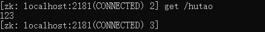
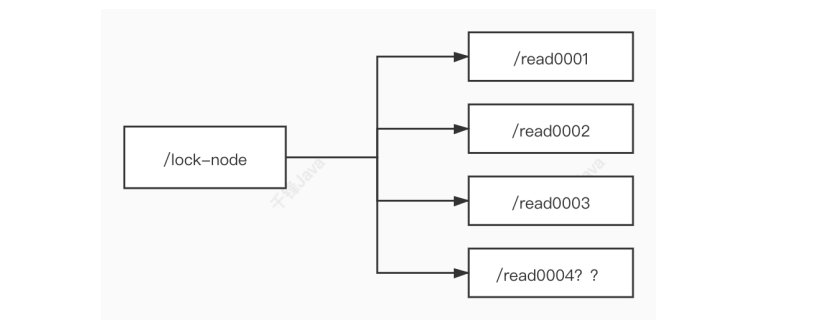
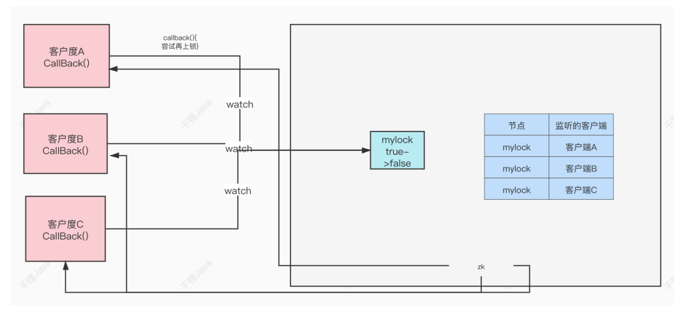

## Zookeeper

### Zookeeper介绍

#### 什么是Zookeeper

**Zookeeper 是一种分布式协调服务，用于管理大型主机。**在分布式环境中协调和管理服务是一个复杂的过程。Zookeeper 通过其简单的架构和API解决了这个问题。Zookeeper允许开发人员专注于核心应用逻辑，而不必担心应用程序的分布式特性。

#### Zookeeper的应用场景

- 分布式协调组件


在分布式系统中，需要有Zookeeper作为分布式协调组件，协调分布式系统中的状态。

- 分布式锁

zk在实现分布式锁上，可以做到强一致性，关于分布式锁相关的知识，在之后的ZAB协议中介绍。

- 无状态化的实现


例子，登录信息状态通过Zookeeper进行维护。

### 搭建Zookeeper服务器

#### 	Zookeeper安装

##### Windows下安装

* 下载带`bin`的Zookeeper ：https://zookeeper.apache.org/

* 解压Zookeeper


* 修改zoo.cfg配置文件

将conf文件夹下面的zoo_sample.cfg复制一份改名为zoo.cfg即可。

注意几个重要位置：

`dataDir=./`  临时数据存储的目录（可写相对路径）

`clientPort=2181`  Zookeeper的端口号

* 运行`/bin/zkServer.cmd` ，初次运行会报错，没有zoo.cfg配置文件；可能遇到问题：闪退 !

解决方案：编辑zkServer.cmd文件末尾添加pause 。这样运行出错就不会退出，会提示错误信息，方便找到原因。


继续运行


* 使用zkCli.cmd测试

`ls /`：列出Zookeeper根下保存的所有节点


`create –e /hutao 123`：创建一个hutao节点，值为123


`get /hutao` ：获取/hutao 节点的值



再来查看一下节点


##### Linux下安装

* 下载带`bin`的Zookeeper ：https://zookeeper.apache.org/

```sh
wget https://dlcdn.apache.org/zookeeper/zookeeper-3.7.0/apache-zookeeper-3.7.0-bin.tar.gz
```

或者通过xshell进行传输，通过`rz`命令。

* 解压，复制到`/usr/local/zookeeper`文件夹下

```sh
tar zxvf apache-zookeeper-3.7.0-bin.tar.gz

sudo cp -r apache-zookeeper-3.7.0-bin /usr/local/zookeeper

cd /usr/local/zookeeper

ls
```

* 测试

```sh
sudo ./bin/zkServer.sh start ./conf/zoo.cfg

sudo ./bin/zkCli.sh
```


#### zoo.cfg配置文件说明

在`conf`文件夹中`zoo.cfg`，如果没有，则将`zoo_sample.cfg`进行备份为`zoo.cfg`

```properties
# zookeeper时间配置中的基本单位 (毫秒)
tickTime=2000
# 允许follower初始化连接到leader最大时⻓，它表示tickTime时间倍数即:initLimit*tickTime
initLimit=10
# 允许follower与leader数据同步最大时⻓,它表示tickTime时间倍数
syncLimit=5

#zookeper 数据存储⽬录及⽇志保存⽬录（如果没有指明dataLogDir，则⽇志也保存在这个⽂件中）
dataDir=./data

#对客户端提供的端⼝号
clientPort=2181
#单个客户端与zookeeper最大并发连接数
maxClientCnxns=60
# 保存的数据快照数量，之外的将会被清除
autopurge.snapRetainCount=3
#⾃动触发清除任务时间间隔，⼩时为单位。默认为0，表示不⾃动清除。
autopurge.purgeInterval=1
```

#### Zookeeper服务器的操作命令

* 打印日志启动服务器`start-foreground`

```sh
sudo ./bin/zkServer.sh start-foreground ./conf/zoo.cfg
```

* 启动zk服务器`start`

```sh
sudo ./bin/zkServer.sh start ./conf/zoo.cfg
```

* 查看zk服务器状态`status`

```sh
sudo ./bin/zkServer.sh status ./conf/zoo.cfg
```

* 停止zk服务器`stop`

```sh
sudo ./bin/zkServer.sh stop ./conf/zoo.cfg
```

### Zookeeper内部的数据模型

#### zk是如何保存数据的

zk中的数据是保存在节点上的，节点就是znode，多个znode之间构成一颗树的⽬录结构。

Zookeeper 的数据模型是什么样子呢？它很像数据结构当中的树，也很像文件系统的目录。


树是由节点所组成，Zookeeper 的数据存储也同样是基于节点，这种节点叫做**Znode** 

但是，不同于树的节点，**Znode的引用方式是路径引用，类似于文件路径**：

```sh
/tianhai
/hutao
```


这样的层级结构，让每一个Znode节点拥有唯一的路径，就像命名空间一样对不同信息作出清晰的隔离。

* 创建节点

```sh
create /hutao
create /hutao/yaodao

create /tianhai 123
```

* 查看节点和节点的值

```sh
ls /hutao
ls /hutao/yaodao
get /tianhai
```

#### zk中的znode是什么样的结构

zk中的znode，包含了四个部分：

- data：保存数据
- acl：权限，定义了什么样的用户能够操作这个节点，且能够进行怎样的操作。
  - c： create 创建权限，允许在该节点下创建子节点
  - w： write 更新权限，允许更新该节点的数据
  - r：  read 读取权限，允许读取该节点的内容以及子节点的列表信息
  - d： delete 删除权限，允许删除该节点的子节点
  - a： admin 管理者权限，允许对该节点进行acl权限设置
- stat：描述当前znode的元数据
- child：当前节点的子节点

#### zk中节点znode的类型

- **持久节点**: 创建出的节点，在会话结束后依然存在。保存数据

```sh
create /test
```


- **持久序号节点[-s]**: 创建出的节点，根据先后顺序，会在节点之后带上一个数值，越后执行数值越大，适用于分布式锁的应用场景–单调递增

```sh
create -s /test
```


- **临时节点[-e]**： **临时节点是在会话结束后，自动被删除的**，通过这个特性，zk可以实现服务注册与发现的效果。那么临时节点是如何维持心跳呢？

```sh
create -e /test5
```


- **临时序号节点[-s] [-e]**：跟持久序号节点相同，适用于临时的分布式锁。

```sh
create -s -e /test6
```

- Container节点（3.5.3版本新增）：Container容器节点，当容器中没有任何子节点，该容器节点会被zk定期删除（60s）。

```sh
create -c /mycontainer
```

- TTL节点：可以指定节点的到期时间，到期后被zk定时删除。只能通过系统配置 `zookeeper.extendedTypesEnabled=true` 开启

```shell
create -t 2 /zk-ttl 111
```

#### zk的数据持久化

zk的数据是运行在内存中，zk提供了两种持久化机制：

* **事务日志**：zk把执行的命令以日志形式保存在**dataLogDir**指定的路径中的文件中（如果没有指定 dataLogDir，则按dataDir指定的路径）。

* **数据快照**：zk会在一定的时间间隔内做一次内存数据的快照，把该时刻的内存数据保存在快照文件中。

zk通过两种形式的持久化，在恢复时先恢复快照文件到内存中，再用日志文件中的数据做增量恢复，这样的恢复速度更快。

### Zookeeper客户端（zkCli）的使用

#### [多节点类型创建](#zk中节点znode的类型)

```sh
create [-s] [-e] [-c] [-t ttl] path [data] [acl]
```

* 创建持久节点
* 创建持久序号节点`[-s]`
* 创建临时节点`[-e]`
* 创建临时序号节点`[-s] [-e]`  
* 创建容器节点`[-c]`

示例：创建节点的路径为path，值为data。

```sh
create path data
```

```sh
[zk: localhost:2181(CONNECTED) 0] create /t1
Created /t1
[zk: localhost:2181(CONNECTED) 1] create /t1/t2 1
Created /t1/t2
[zk: localhost:2181(CONNECTED) 2] create /t3 -s
Created /t30000000012
[zk: localhost:2181(CONNECTED) 3] create /t4 -e
Created /t4
[zk: localhost:2181(CONNECTED) 4] create /t4 -c
Node already exists: /t4
[zk: localhost:2181(CONNECTED) 5] create /t5 -c
Created /t5
```

#### 添加节点值

```sh
create /t1
set /t1 abc
```

#### 查询节点

* 普通查询

```sh
ls path
```

* 递归查询

```sh
ls -R path
```

* 获取节点数据

```sh
get path
```

* 查询节点相关信息`get -s path`
  * cZxid：创建节点的事务ID
  * mZxid：修改节点的事务ID
  * pZxid：添加和删除子节点的事务ID
  * ctime：节点创建的时间
  * mtime: 节点最近修改的时间
  * dataVersion: 节点内数据的版本，每更新一次数据，版本会+1
  * aclVersion: 此节点的权限版本
  * ephemeralOwner: 如果当前节点是临时节点，该值是当前节点所有者的
  * session id。如果节点不是临时节点，则该值为零。
  * dataLength:  节点内数据的长度
  * numChildren:  该节点的子节点个数

```sh
[zk: localhost:2181(CONNECTED) 6] get -s /t1/t2
1
cZxid = 0x21
ctime = Sun Feb 13 17:08:16 CST 2022
mZxid = 0x21
mtime = Sun Feb 13 17:08:16 CST 2022
pZxid = 0x21
cversion = 0
dataVersion = 0
aclVersion = 0
ephemeralOwner = 0x0
dataLength = 1
numChildren = 0
```

#### 删除节点

- 普通删除

```sh
delete path // 如果该节点下没有子节点了，则可以删除，否则使用deleteall
deleteall path
```

- 乐观锁删除

```sh
delete -v dataVersion path
```

#### 权限设置

##### zookeeper权限设置示例

* 注册当前会话的账号和密码

```sh
addauth digest username:password
```

登录用户会将用户名注册到上下文中，在访问auth/digest授权的节点时，会根据上下文中存在的用户名进行权限校验

* 创建节点并设置权限

```sh
create path data auth:username:password:cdrwa
```

示例：

```sh
create /test-node abc auth:hutao:123456:cdrwa
```

* world授权

```shell
setAcl /test world:anyone:crwda
```

* digest授权

```shell
setAcl /test digest:<用户名>:<用户名:密码的密文>:crwda
```

##### zookeeper的权限类型

- c: 创建节点权限
- r: 读取数据权限
- w: 写入数据权限
- d: 删除节点权限
- a: 节点授权权限

##### zookeeper的授权类型

- world：默认权限，开放式访问
- auth：对当前已经登录用户授予权限
- digest：指定用户名密码进行授权
- ip: 指定ip地址进行授权
- super: 超级管理员权限

### curator客户端的使用

#### Curator介绍

Curator是Netflix公司开源的一套zookeeper客户端框架，Curator是对Zookeeper⽀持最好 的客户端框架。Curator封装了大部分Zookeeper的功能，⽐如Leader选举、分布式锁等，减 少了技术⼈员在使用Zookeeper时的底层细节开发⼯作。

#### 引入Curator

* 导入依赖

```xml
<!--Curator-->
<dependency>
    <groupId>org.apache.curator</groupId>
    <artifactId>curator-framework</artifactId>
    <version>2.12.0</version>
</dependency>
<dependency>
    <groupId>org.apache.curator</groupId>
    <artifactId>curator-recipes</artifactId>
    <version>2.12.0</version>
</dependency>
<!--Zookeeper-->
<dependency>
    <groupId>org.apache.zookeeper</groupId>
    <artifactId>zookeeper</artifactId>
    <version>3.7.14</version>
</dependency>
```

* application.properties配置⽂件

```properties
curator.retryCount=5
curator.elapsedTimeMs=5000
curator.connectString=172.16.253.35:2181
curator.sessionTimeoutMs=60000
curator.connectionTimeoutMs=5000
```

* 注入配置Bean

```java
@Data
@Component
@ConfigurationProperties(prefix = "curator")
public class WrapperZK {
    private int retryCount;
    private int elapsedTimeMs;
    private String connectString;
    private int sessionTimeoutMs;
    private int connectionTimeoutMs;
}
```

* 注入CuratorFramework

```java
@Configuration
public class CuratorConfig {
    @Autowired
    WrapperZK wrapperZk;

    @Bean(initMethod = "start")
    public CuratorFramework curatorFramework() {
        return CuratorFrameworkFactory.newClient(
            wrapperZk.getConnectString(),
            wrapperZk.getSessionTimeoutMs(),
            wrapperZk.getConnectionTimeoutMs(),
            new RetryNTimes(wrapperZk.getRetryCount(),wrapperZk.getElapsedTimeMs()));
    }
}
```

#### 创建节点

```java
@Autowired
CuratorFramework curatorFramework;

@Test
void createNode() throws Exception {
    //添加持久节点
    String path = curatorFramework.create().forPath("/curator-node");
    //添加临时序号节点
    String path1 = curatorFramework.create()
        .withMode(CreateMode.EPHEMERAL_SEQUENTIAL)
        .forPath("/curator-node", "some-data".getBytes());
    System.out.println(String.format("curator create node :%s successfully.",path));
    System.in.read();
}
```

#### 获得节点数据

```java
@Test
public void testGetData() throws Exception {
    byte[] bytes = curatorFramework.getData().forPath("/curator-node");
    System.out.println(new String(bytes));
}
```

#### 修改节点数据

```java
@Test
public void testSetData() throws Exception {
    curatorFramework.setData().forPath("/curatornode","changed!".getBytes());
    byte[] bytes = curatorFramework.getData().forPath("/curator-node");
    System.out.println(new String(bytes));
}
```

#### 创建节点同时创建⽗节点

```java
@Test
public void testCreateWithParent() throws Exception {
    String pathWithParent="/node-parent/sub-node-1";
    String path = curatorFramework.create().creatingParentsIfNeeded()
        .forPath(pathWithParent);
    System.out.println(String.format("curator create node :%s successfully.",path));
}
```

#### 删除节点

```java
@Test
public void testDelete() throws Exception {
    String pathWithParent="/node-parent";
    curatorFramework.delete().guaranteed()
        .deletingChildrenIfNeeded().forPath(pathWithParent);
}
```

### zk实现分布式锁

#### zk中锁的种类

- 读锁（共享锁）：大家都可以读，要想上读锁的前提：之前的锁没有写锁
- 写锁：只有得到写锁的才能写。要想上写锁的前提是，之前没有任何锁。

#### zk如何上读锁

* 创建一个临时序号节点，节点的数据是read，表示是读锁

- 获取当前zk中序号比自己小的所有节点

* 判断最小节点是否是读锁：
  * 如果不是读锁的话，则上锁失败，为最小节点设置监听。阻塞等待，zk的watch机制 会当最小节点发生变化时通知当前节点，于是再执行第二步的流程
  * 如果是读锁的话，则上锁成功



#### zk如何上写锁

- 创建一个临时序号节点，节点的数据是write，表示是写锁

* 获取zk中所有的子节点

* 判断自己是否是最小的节点： 
  * 如果是，则上写锁成功
  * 如果不是，说明前面还有锁，则上锁失败，监听最小的节点，如果最小节点有变化， 则回到第二步。


#### 羊群效应

如果用上述的上锁方式，只要有节点发生变化，就会触发其他节点的监听事件，这样的话对zk的压力非常大，即羊群效应。可以通过调整成链式监听，解决这个问题。


#### curator实现读写锁

##### 1）获取读锁

```java
@Test
void testGetReadLock() throws Exception {
    // 读写锁
    InterProcessReadWriteLock interProcessReadWriteLock=new
        InterProcessReadWriteLock(client, "/lock1");
    // 获取读锁对象
    InterProcessLock
        interProcessLock=interProcessReadWriteLock.readLock();
    System.out.println("等待获取读锁对象!");
    // 获取锁
    interProcessLock.acquire();
    for (int i = 1; i <= 100; i++) {
        Thread.sleep(3000);
        System.out.println(i);
    }
    // 释放锁
    interProcessLock.release();
    System.out.println("等待释放锁!");
}
```

##### 2）获取写锁

```java
@Test
void testGetWriteLock() throws Exception {
    // 读写锁
    InterProcessReadWriteLock interProcessReadWriteLock=new
        InterProcessReadWriteLock(client, "/lock1");
    // 获取写锁对象
    InterProcessLock
        interProcessLock=interProcessReadWriteLock.writeLock();
    System.out.println("等待获取写锁对象!");
    // 获取锁
    interProcessLock.acquire();
    for (int i = 1; i <= 100; i++) {
        Thread.sleep(3000);
        System.out.println(i);
    }
    // 释放锁
    interProcessLock.release();
    System.out.println("等待释放锁!");
}
```

### zk的watch机制

#### watch机制介绍

我们可以把Watch理解成是注册在特定Znode上的触发器。当这个Znode发生改变，也就是调用了 `create`，`delete`，`setData`方法的时候，将会触发Znode上注册的对应事件，请求Watch的客户端会接收到异步通知。

具体交互过程如下： 

- 客户端调用 `getData` ⽅法， `watch`参数是`true `。服务端接到请求，返回节点数据，并 且在对应的哈希表里插入被Watch的Znode 路径，以及 Watcher 列表。 

- 当被Watch的Znode已删除，服务端会查找哈希表，找到该Znode对应的所有Watcher，异步通知客户端，并且删除哈希表中对应的 Key-Value。



客户端使用了NIO通信模式监听服务端的调用。

打开两个会话，便于测试。

* 在会话1中，创建节点

```sh
create /t1
```

* 在会话1中，一次性监听节点

```-
get -w /t1
```

* 在会话2中，设置节点值，观察会话1

```sh
set /t1 abc
```

会话1中，出现如下：


#### zkCli客户端使用watch

```sh
create /test xxx
get -w /test 	# 一次性监听节点
ls -w /test 	# 监听⽬录,创建和删除子节点会收到通知。子节点中新增节点不会收到通知
ls -R -w /test 	# 对于子节点中子节点的变化，但内容的变化不会收到通知

get-w /test #监听是一次性的，只对ZNode节点数据的变化有效果
ls [-s][-w][-R] path # 当前节点变化，有效果

# 监听节点的变化
addWatch [-m mode]，mode=[PERSISTENT(当前节点), PERSISTENT_RECURSIVE(包括子节点)] - default is PERSISTENT_RECURSIVE
```

#### curator客户端使用watch

```java
@Test
public void addNodeListener() throws Exception {

    NodeCache nodeCache = new NodeCache(curatorFramework, "/curatornode");
    nodeCache.getListenable().addListener(new NodeCacheListener() {
        @Override
        public void nodeChanged() throws Exception {
            log.info("{} path nodeChanged: ","/curator-node");
            printNodeData();
        }
    });
    nodeCache.start(); // 开启
    System.in.read(); // 阻塞，便于观察监听器
}
public void printNodeData() throws Exception {
    byte[] bytes = curatorFramework.getData().forPath("/curator-node");
    log.info("data: {}",new String(bytes));
}
```

### zk-server的监听情况

* Four letter words
* AdminServer：http://192.168.183.101:8080/commands/stat

### Zookeeper集群

#### Zookeeper集群角色

zookeeper集群中的节点有三种角色

* **Leader（主）**：处理集群的所有事务请求，集群中只有一个Leader。

- **Follower（从）**：只能处理读请求，参与Leader选举。

* **Observer（观察者）**：只能处理读请求，提升集群读的性能，但不能参与Leader选举。

#### 集群搭建

搭建4个节点，其中一个节点为Observer

##### 1）创建4个节点的myid，并设值

```sh
# 创建文件夹
cd data
sudo mkdir zk1
sudo mkdir zk2
sudo mkdir zk3
sudo mkdir zk4

# 创建4个文件

sudo vim ./zk1/myid # 写入1即可
sudo vim ./zk2/myid # 写入2即可
sudo vim ./zk3/myid # 写入3即可
sudo vim ./zk4/myid # 写入4即可
```

##### 2）编写4个zoo.cfg

* 创建cfg文件

```sh
sudo cp zoo.cfg zoo1.cfg
sudo cp zoo.cfg zoo2.cfg
sudo cp zoo.cfg zoo3.cfg
sudo cp zoo.cfg zoo4.cfg
```

* 修改内容

```properties
# The number of milliseconds of each tick
tickTime=2000
# The number of ticks that the initial
# synchronization phase can take
initLimit=10
# The number of ticks that can pass between
# sending a request and getting an acknowledgement
syncLimit=5
# 修改对应的zk1 zk2 zk3 zk4
dataDir=/usr/local/zookeeper/data/zk1
# 修改对应的端⼝ 2181 2182 2183 2184
clientPort=2181
# 2001为集群通信端⼝，3001为集群选举端⼝，observer表示不参与集群选举
server.1=127.0.0.1:2001:3001
server.2=127.0.0.1:2002:3002
server.3=127.0.0.1:2003:3003
server.4=127.0.0.1:2004:3004:observer

# admin.serverPort=9081
```

##### 3）启动4台Zookeeper

```sh
sudo ./bin/zkServer.sh start ./conf/zoo1.cfg
sudo ./bin/zkServer.sh start ./conf/zoo2.cfg
sudo ./bin/zkServer.sh start ./conf/zoo3.cfg
sudo ./bin/zkServer.sh start ./conf/zoo4.cfg
```

4）查看zookeeper服务器状态

```sh
sudo ./bin/zkServer.sh status ./conf/zoo1.cfg
sudo ./bin/zkServer.sh status ./conf/zoo2.cfg
sudo ./bin/zkServer.sh status ./conf/zoo3.cfg
sudo ./bin/zkServer.sh status ./conf/zoo4.cfg
```


##### 4）连接Zookeeper集群

不需要观察者。

```sh
sudo ./bin/zkCli.sh -server 127.0.0.1:2181,127.0.0.1:2182,127.0.0.1:2183
```


### ZAB协议 

#### 什么是ZAB协议

zookeeper作为非常重要的分布式协调组件，需要进行集群部署，集群中会以一主多从的形式 进行部署。zookeeper为了保证数据的一致性，使用了ZAB（Zookeeper Atomic Broadcast，Zookeeper的原子广播）协议，**这个协议解决了Zookeeper的崩溃恢复和主从数据同步的问题**。


#### ZAB协议定义的四种节点状态

- Looking ：选举状态

- Following ：Follower 节点（从节点）所处的状态

- Leading ：Leader 节点（主节点）所处状态

- Observing：观察者节点所处的状态

#### 集群上线时的Leader选举过程

Zookeeper集群中的节点在上线时，将会进入到Looking状态，也就是选举Leader的状态，这 个状态具体会发生什么？


#### 崩溃恢复时的Leader选举过程

**Leader建立完后，Leader周期性地不断向Follower发送心跳（ping命令，没有内容的 socket）。**

**当Leader崩溃后，Follower发现socket通道已关闭，于是Follower开始进入到 Looking状态，重新回到上一节中的Leader选举过程，此时集群不能对外提供服务。**


#### 主从服务器之间的数据同步


#### Zookeeper中的NIO与BIO的应用

- **NIO**：用于被客户端连接的2181端⼝，使用的是NIO模式与客户端建立连接 客户端开启Watch时，也使用NIO，等待Zookeeper服务器的回调

- **BIO**：集群在选举时，多个节点之间的投票通信端⼝，使用BIO进行通信。

### CAP理论

#### CAP定理

2000 年 7 ⽉，加州大学伯克利分校的 Eric Brewer 教授在 ACM PODC会议上提出CAP猜想。2年后，麻省理⼯学院的 Seth Gilbert 和 Nancy Lynch 从理论上证明了CAP。之后， CAP 理论正式成为分布式计算领域的公认定理。

**CAP 理论**：一个分布式系统最多只能同时满⾜一致性（Consistency）、可用性（Availability）和分区容错性（Partition tolerance）这三项中的两项。

- **一致性（Consistency）**：一致性指 “all nodes see the same data at the same time”，即更新操作成功并返回客户端 完成后，所有节点在同一时间的数据完全一致。

- **可用性（Availability）**：可用性指“Reads and writes always succeed”，即服务一直可用，而且是正常响应时间。

- **分区容错性（Partition tolerance）**：分区容错性指“the system continues to operate despite arbitrary message loss or failure of part of the system”，即分布式系统在遇到某节点或网络分区故障的时候，仍然能够对外 提供满足一致性或可用性的服务。——避免单点故障，就要进行冗余部署，冗余部署相当于是服务的分区，这样的分区就具备了容错性。

#### CAP权衡

通过 CAP 理论，我们知道无法同时满足一致性、可用性和分区容错性这三个特性，那要舍弃哪个呢？

对于多数大型互联网应用的场景，主机众多、部署分散，而且现在的集群规模越来越大，所 以节点故障、网络故障是常态，而且要保证服务可用性达到N个9，即保证 P 和 A，舍弃 C（退而求其次保证最终一致性）。虽然某些地⽅会影响客户体验，但没达到造成用户流程的严重程度。

对于涉及到钱财这样不能有一丝让步的场景，C 必须保证。网络发生故障宁可停止服务，这是保证 CA，舍弃P。貌似这几年国内银行业发生了不下 10 起事故，但影响面不大，报到也不多，广大群众知道的少。还有一种是保证 CP，舍弃A。例如网络故障是只读不写。

孰优孰略，没有定论，只能根据场景定夺，适合的才是最好的。


#### BASE理论

eBay 的架构师 Dan Pritchett 源于对大规模分布式系统的实践总结，在 ACM 上发表⽂章提出 BASE 理论，BASE 理论是对 CAP 理论的延伸，核⼼思想是即使无法做到强一致性（Strong Consistency，CAP 的一致性就是强一致性），但应用可以采用适合的⽅式达到最终一致性 （Eventual Consitency）。

- **基本可用（Basically Available）**：基本可用是指分布式系统在出现故障的时候，允许损失部分可用性，即保证核⼼可用。 电商大促时，为了应对访问量激增，部分用户可能会被引导到降级⻚⾯，服务层也可能只提 供降级服务。这就是损失部分可用性的体现。

* **软状态（Soft State）**： 软状态是指允许系统存在中间状态，而该中间状态不会影响系统整体可用性。分布式存储中一般一份数据⾄少会有三个副本，允许不同节点间副本同步的延时就是软状态的体现。mysql replication 的异步复制也是一种体现。

- **最终一致性（Eventual Consistency）**：最终一致性是指系统中的所有数据副本经过一定时间后，最终能够达到一致的状态。弱一致性和强一致性相反，最终一致性是弱一致性的一种特殊情况。

#### Zookeeper追求的一致性

**Zookeeper在数据同步时，追求的并不是强一致性，而是顺序一致性（事务id的单调递增）。**

## 面试题

### 选举机制

半数机制，超过半数的投票通过，即通过。

（1）第一次启动选举规则：投票过半数时，服务器id大的胜出

（2）第二次启动选举规则：

* EPOCH（Leader编号）大的直接胜出
* EPOCH相同，事务id大的胜出
* 事务id相同，服务器id大的胜出

### 生产集群安装多少zk合适？

安装奇数台。

- 10台服务器：3台zk；
- 20台服务器：5台zk；
- 100台服务器：11台zk；
- 200台服务器：11台zk

**服务器台数多：好处，提高可靠性；坏处：提高通信延时**。

### 常用命令

ls、get、create、delete。