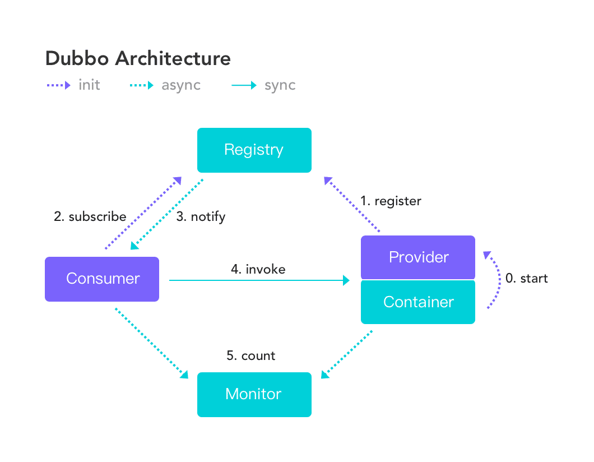
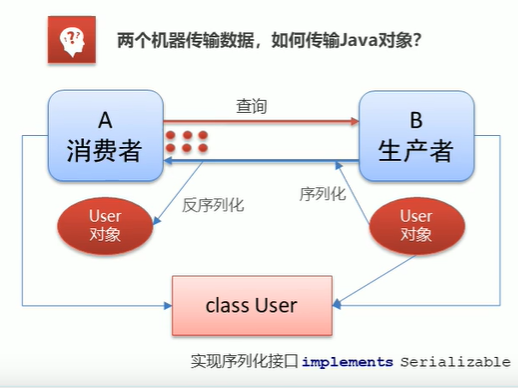

## Dubbo

### Dubbo入门

#### Dubbo概念

Dubbo是阿里巴巴公司开源的一个高性能、轻量级的Java RPC框架。致力于提供高性能和透明化的RPC远程服务调用方案,以及SOA服务治理方案。

Dubbo 提供了六大核心能力：

- 面向接口代理的高性能 RPC 调用
- 智能容错和负载均衡。
- 服务自动注册和发现
- 高度可扩展能力
- 运行期流量调度
- 可视化的服务治理与运维

官方地址：https://dubbo.apache.org/zh/

官方文档：https://dubbo.apache.org/zh/docs/

#### Dubbo架构



**服务提供者**（Provider）：暴露服务的服务提供方，服务提供者在启动时，向注册中心注册自己提供的服务。

**服务消费者**（Consumer）：调用远程服务的服务消费方，服务消费者在启动时，向注册中心订阅自己所需的服务，服务消费者，从提供者地址列表中，基于软负载均衡算法，选一台提供者进行调用，如果调用失败，再选另一台调用。

**注册中心**（Registry）：注册中心返回服务提供者地址列表给消费者，如果有变更，注册中心将基于长连接推送变更数据给消费者

**监控中心**（Monitor）：服务消费者和提供者，在内存中累计调用次数和调用时间，定时每分钟发送一次统计数据到监控中心

**调用关系说明**

- `0.start`服务容器负责启动，加载，运行服务提供者。
- `1.reguster`服务提供者在启动时，向注册中心注册自己提供的服务。
- `2.subscribe`服务消费者在启动时，向注册中心订阅自己所需的服务。
- `3.notify`注册中心返回服务提供者地址列表给消费者，如果有变更，注册中心将基于长连接推送变更数据给消费者。
- `4.invoke`服务消费者，从提供者地址列表中，基于软负载均衡算法，选一台提供者进行调用，如果调用失败，再选另一台调用。
- `5.count`服务消费者和提供者，在内存中累计调用次数和调用时间，定时每分钟发送一次统计数据到监控中心。

#### Dubbo安装

[Zookeeper](http://Zookeeper.apache.org/) 是 Apache Hadoop 的子项目，是一个树型的目录服务，支持变更推送，适合作为 Dubbo 服务的注册中心，工业强度较高，可用于生产环境，并推荐使用。

##### Zookeeper安装

[安装地址](#Zookeeper安装)

##### dubbo-admin安装

dubbo本身并不是一个服务软件。它其实就是一个jar包，能够帮你的java程序连接到Zookeeper，并利用Zookeeper消费、提供服务。

但是为了让用户更好的管理监控众多的dubbo服务，官方提供了一个可视化的监控程序dubbo-admin，不过这个监控即使不装也不影响使用。

> 比monitor更强大。

1. **下载dubbo-admin**：https://github.com/apache/dubbo-admin/tree/master-0.2.0
2. **解压进入目录**


修改 `dubbo-admin-server\src\main\resources\application.properties` 或者`\dubbo-admin-server\src\main\resourcess\application.properties`指定Zookeeper地址以及端口修改

```xml
server.port=7001
spring.velocity.cache=false
spring.velocity.charset=UTF-8
spring.velocity.layout-url=/templates/default.vm
spring.messages.fallback-to-system-locale=false
spring.messages.basename=i18n/message
spring.root.password=root
spring.guest.password=guest

dubbo.registry.address=Zookeeper://127.0.0.1:2181
```

3. 配置Apache Maven：https://maven.apache.org/download.cgi

- 变量名：MAVEN_HOME
- 变量值：E:\apache-maven-3.2.3
- 变量名：Path
- 变量值：;%MVN_HOME%\bin
- 打开cmd输入`echo %MAVEN_HOME%`，测试是否安装成功

4. **在项目目录下**打包dubbo-admin

```sh
mvn clean package -Dmaven.test.skip=true
```


5. 执行 `dubbo-admin\target` 下的`dubbo-admin-0.0.1-SNAPSHOT.jar`或者执行 `\dubbo-admin-distribution\target` 下的`dubbo-admin-xxx.jar`

```sh
java -jar dubbo-admin-0.0.1-SNAPSHOT.jar
```

【注意：Zookeeper的服务一定要打开！】

执行完毕，去访问一下 http://localhost:7001/ ， 这时候我们需要输入登录账户和密码，我们都是默认的root-root；

登录成功后，查看界面


或者通过idea打开项目，并且将java版本修改为1.8，并查看pom.xml，然后运行`dubbo-admin`即可。

#### 服务注册分发步骤

* Zookeeper作为注册中心，也就是`registry`。
* 创建服务提供者Provider模块
* 创建服务消费者Consumer模块
* 在服务提供者模块编写UserServiceImpl提供服务
* 在服务消费者中的UserController远程调用UserServiceImpl提供的服务
* 分别启动两个服务，进行测试

> (SpringBoot + Dubbo + Zookeeper)

##### 准备工作

* 启动Zookeeper
* 启动dubbo-admin
* 使用IDEA创建一个Maven项目`dubbo_Zookeeper_demo`
* 创建一个模块`provider-server`，选择web依赖即可


* **项目创建完毕，写一个服务，比如卖票的服务；**

编写接口`service/TicketService.java`

```java
package com.easy.service;

public interface TicketService {
    public String getTicket();
}

```

编写实现类

```java
package com.easy.service;

public class TicketServiceImpl implements TicketService{
    @Override
    public String getTicket(){
        return "Dubbo+Zookeeper+SpringBoot实战教程";
    }
}
```

* **创建一个模块，实现服务消费者：consumer-server ， 选择web依赖即可**
* **项目创建完毕，写一个服务，比如用户的服务；**

编写service

```java
package com.easy.service;

public class UserService {
    // 想拿到provider-server提供的票
}
```

* 如果想让两个文件夹同时出现在`dubbo-Zookeeper-demo`文件夹下的话，先切换到项目文件，先显示所有文件夹。


然后在每个工程文件下找到文件pom.xml，如果没有，则新建一个并填写好内容。并在pom.xml 文件上右键 Add as Maven Project，这样就将文件夹变成了一个maven项目。这样就可以同时存在了。之后切换回项目。


**需求：现在用户想使用买票的服务，这要怎么弄呢 ？**


##### 服务提供者

* **将服务提供者注册到注册中心，我们需要整合Dubbo和Zookeeper，所以需要导包**

  **从dubbo官网进入github，看下方的帮助文档，找到dubbo-springboot，找到依赖包**

`dubbo2.x版本配置`

```xml
<!-- Dubbo Spring Boot Starter -->
<!-- https://mvnrepository.com/artifact/org.apache.dubbo/dubbo-spring-boot-starter -->
<dependency>
    <groupId>org.apache.dubbo</groupId>
    <artifactId>dubbo-spring-boot-starter</artifactId>
    <version>2.7.3</version>
</dependency>

```

**Zookeeper去maven仓库下载，zkclient；**

```xml
<!-- https://mvnrepository.com/artifact/com.github.sgroschupf/zkclient -->
<dependency>
   <groupId>com.github.sgroschupf</groupId>
   <artifactId>zkclient</artifactId>
   <version>0.1</version>
</dependency>
```

**【新版的坑】Zookeeper及其依赖包，解决日志冲突，还需要剔除日志依赖；**

```xml
<!-- 引入Zookeeper -->
<dependency>
   <groupId>org.apache.curator</groupId>
   <artifactId>curator-framework</artifactId>
   <version>2.12.0</version>
</dependency>
<dependency>
   <groupId>org.apache.curator</groupId>
   <artifactId>curator-recipes</artifactId>
   <version>2.12.0</version>
</dependency>
<dependency>
   <groupId>org.apache.Zookeeper</groupId>
   <artifactId>Zookeeper</artifactId>
   <version>3.4.14</version>
   <!--排除这个slf4j-log4j12-->
   <exclusions>
       <exclusion>
           <groupId>org.slf4j</groupId>
           <artifactId>slf4j-log4j12</artifactId>
       </exclusion>
   </exclusions>
</dependency>
```

`dubbo3.x版本配置`

```xml
<dependency>
    <groupId>org.apache.dubbo</groupId>
    <artifactId>dubbo-spring-boot-starter</artifactId>
    <version>3.0.5</version>
</dependency>
<dependency>
    <groupId>org.apache.dubbo</groupId>
    <artifactId>dubbo</artifactId>
    <version>3.0.5</version>
</dependency>

<dependency>
    <groupId>org.apache.dubbo</groupId>
    <artifactId>dubbo-dependencies-Zookeeper</artifactId>
    <version>3.0.5</version>
    <type>pom</type>
    <!--排除这个slf4j-log4j12-->
    <exclusions>
        <exclusion>
            <groupId>org.slf4j</groupId>
            <artifactId>slf4j-log4j12</artifactId>
        </exclusion>
    </exclusions>
</dependency>
```

* 配置参数

```properties
#当前应用名字
dubbo.application.name=provider-server
#注册中心地址
dubbo.registry.address=Zookeeper://127.0.0.1:2181
#扫描指定包下服务/那些服务要被注册
dubbo.scan.base-packages=com.easy.service
# 应用服务 WEB 访问端口
server.port=8081
dubbo.protocol.port=20881

dubbo.registry.timeout = 100000
dubbo.provider.timeout = 100000
```

* 在service的实现类`TicketServiceImpl`中配置服务注解，发布服务！注意导包问题

```java
package com.easy.service;

// Zookeeper：服务注册与发现

import org.apache.dubbo.config.annotation.Service;
import org.springframework.stereotype.Component;

@Service  // 可以被扫描到，在项目启动后就会被自动注册到注册中心
@Component // 使用了Dubbo后尽量不要使用Service
// 3.x 中dubbo中的Service被弃用
// @DubboService
// @Service
public class TicketServiceImpl implements TicketService{
    @Override
    public String getTicket(){
        return "Dubbo+Zookeeper+SpringBoot实战教程";
    }
}

```

**逻辑理解 ：应用启动起来，dubbo就会扫描指定的包下带有@component注解的服务，将它发布在指定的注册中心中！**

* 启动程序


##### 服务消费者

现在已经部署好了服务，消费者应用需要进行调用该业务，如何使用？

* 导入依赖，和之前的依赖一样；

`2.x版本`

```
<!-- Dubbo Spring Boot Starter -->
<!-- https://mvnrepository.com/artifact/org.apache.dubbo/dubbo-spring-boot-starter -->
<dependency>
    <groupId>org.apache.dubbo</groupId>
    <artifactId>dubbo-spring-boot-starter</artifactId>
    <version>2.7.3</version>
</dependency>
<!-- https://mvnrepository.com/artifact/com.github.sgroschupf/zkclient -->
<dependency>
   <groupId>com.github.sgroschupf</groupId>
   <artifactId>zkclient</artifactId>
   <version>0.1</version>
</dependency>
<!-- 引入Zookeeper -->
<dependency>
   <groupId>org.apache.curator</groupId>
   <artifactId>curator-framework</artifactId>
   <version>2.12.0</version>
</dependency>
<dependency>
   <groupId>org.apache.curator</groupId>
   <artifactId>curator-recipes</artifactId>
   <version>2.12.0</version>
</dependency>
<dependency>
   <groupId>org.apache.Zookeeper</groupId>
   <artifactId>Zookeeper</artifactId>
   <version>3.4.14</version>
   <!--排除这个slf4j-log4j12-->
   <exclusions>
       <exclusion>
           <groupId>org.slf4j</groupId>
           <artifactId>slf4j-log4j12</artifactId>
       </exclusion>
   </exclusions>
</dependency>
```

`3.x版本`

```xml
<dependency>
    <groupId>org.apache.dubbo</groupId>
    <artifactId>dubbo-spring-boot-starter</artifactId>
    <version>3.0.5</version>
</dependency>
<dependency>
    <groupId>org.apache.dubbo</groupId>
    <artifactId>dubbo</artifactId>
    <version>3.0.5</version>
</dependency>

<dependency>
    <groupId>org.apache.dubbo</groupId>
    <artifactId>dubbo-dependencies-Zookeeper</artifactId>
    <version>3.0.5</version>
    <type>pom</type>
    <!--排除这个slf4j-log4j12-->
    <exclusions>
        <exclusion>
            <groupId>org.slf4j</groupId>
            <artifactId>slf4j-log4j12</artifactId>
        </exclusion>
    </exclusions>
</dependency>
```

* **配置参数**

```properties
#当前应用名字/消费者去哪里拿服务，需要暴露自己的名字
dubbo.application.name=consumer-server
#注册中心地址
dubbo.registry.address=Zookeeper://127.0.0.1:2181
# 应用服务 WEB 访问端口
server.port=8082
dubbo.protocol.port=20882

dubbo.registry.timeout = 100000
dubbo.consumer.timeout = 100000
```

* **本来正常步骤是需要将服务提供者的接口打包，然后用pom文件导入，这里使用简单的方式，直接将服务的接口拿过来，路径必须保证正确，即和服务提供者相同；**


> 只拿接口

* **完善消费者的服务类**

```java
package com.easy.service;

import org.apache.dubbo.config.annotation.Reference;
import org.apache.dubbo.config.annotation.Service;
import org.springframework.stereotype.Component;

@Service
@Component
// 3.x 中dubbo中的Service被弃用
// @DubboService
// @Service
public class UserService {

    // 想拿到provider-server提供的票，要去注册中心拿到服务
    @Reference // 两种方式：1.pom坐标 2.定义相同路径的接口方法，因为具体实现是在其他服务器上进行逻辑运算的
    // DubboReference
    TicketService ticketService;

    public void buyTicket(){
       String ticket = ticketService.getTicket();
       System.out.println("在注册中心拿到=>"+ticket);
    }
}

```

* **测试类编写；**

```java
@SpringBootTest
class ConsumerServerApplicationTests {

    @Autowired
    UserService userService;

    @Test
    void contextLoads() {
        userService.buyTicket();
    }
    
}
```

##### 启动测试

**1. 开启Zookeeper**

**2. 打开dubbo-admin实现监控【可以不用做】**

**3. 开启服务者**

**4. 消费者消费测试**

**结果：**


**监控中心 ：**


如果出现`异常调试 java.lang.IllegalStateException: Zookeeper not connected`，只需要添加超时时间即可：

* `provider`

```properties
dubbo.registry.timeout = 100000
dubbo.provider.timeout = 100000
```

* `consumer`

```properties
dubbo.registry.timeout = 100000
dubbo.consumer.timeout=  100000
```


**这就是SpingBoot + dubbo + Zookeeper实现分布式开发的应用，其实就是一个服务拆分的思想；**

### Dubbo常用配置

#### 序列化

举个简单的例子：当我们需要把一个数据对象写入到文件或者在网络中传输时，就要把数据对象进行转换为二进制格式进行数据传输这个过程就叫做序列化。反之如果一个远程数据或本地文件数据需要读取并解析为我们的对象时就叫做反序列化。

在 Dubbo RPC 中，同时支持多种序列化方式：

1. Dubbo 序列化：阿里尚未开发成熟的高效 Java 序列化实现，阿里不建议在生产环境使用它
2. Hessian2 序列化：Hessian 是一种跨语言的高效二进制序列化方式。但这里实际不是原生的 Hessian2 序列化，而是阿里修改过的Hessian Lite，它是 Dubbo RPC 默认启用的序列化方式
3. Json 序列化：目前有两种实现，一种是采用的阿里的 Fastjson 库，另一种是采用 Dubbo中自己实现的简单 Json库，但其实现都不是特别成熟，而且 Json 这种文本序列化性能一般不如上面两种二进制序列化。
4. Java 序列化：主要是采用 JDK 自带的 Java 序列化实现，性能很不理想。



* 在`provider-server`以及`consumer-server`项目中，添加web支持和`lombok`

```xml
<dependency>
    <groupId>org.projectlombok</groupId>
    <artifactId>lombok</artifactId>
    <version>1.18.22</version>
</dependency>
```

* 在`provider-server`以及`consumer-server`项目中创建`com.easy.pojo.User.java`

```java
@Data
@AllArgsConstructor
@NoArgsConstructor
public class User {
    private String name;
    private int age;

    @Override
    public String toString() {
        return "User{" +
                "name='" + name + '\'' +
                ", age=" + age +
                '}';
    }
}

```

* 在`provider-server`以及`consumer-server`项目中创建`com.easy.servie.UserService.java`

```java
// 必须实现implements Serializable，不然会报错
public interface UserService implements Serializable {
    /**
     * 查询用户
     */
    public User getUser(int id);
}
```

* 在`provider-server`以及`consumer-server`项目中创建`com.easy.servie.UserServiceImpl.java`

`provider-server`

```java
@DubboService
@Service
public class UserServiceImpl implements UserService {

    @Override
    public User getUser() {
        // 直接创建User对象
        User user = new User("hutao",18);

        return user;
    }
}

```

`consumer-server`

```java
@DubboService
@Service
public class UserServiceImpl {

    @DubboReference
    UserService userService;

    public void getUser() {

        User user = userService.getUser();
        System.out.println(user.toString());

    }
}
```

* 测试

```java
@SpringBootTest
class ConsumerServerApplicationTests {


    @Autowired
    UserServiceImpl userService;

    @Test
    void contextLoads() {
        userService.getUser();
    }

}

```


#### 地址缓存

注册中心挂了，服务可以正常访问，是因为dubbo服务消费者在第一次调用时，会将服务提供方地址缓存到本地，以后在调用则不会访问注册中心。说白就是，可以继续访问以前旧地址。

当服务提供者地址发生变化时，注册中心会通知服务消费者。

#### 超时


* 服务消费者在调用服务提供者的时候发生了阻塞，等待的情形，这个时候，服务消费者会一直等待下去。
* 在某个峰值时刻，大量的请求都在同时请求服务消费者，会造成线程的大量堆积，势必会造成雪崩。


dubbo利用超时机制来解决这个问题，设置一个超时时间，在这个时间段内，无法完成访问，则自动断开连接。dubbo是通过使用`timeout`属性配置超时时间，默认值1000，单位毫秒。

在`provider-server`中`server/UserServiceImpl.java`中配置

```java
@DubboService(timeout = 3000) // 当前服务3秒后超时
```

也可以这样设置

```java
@DubboReference(timeout = 3000)
```

> @DubboReference配置优先级别比@DubboService高，建议配置在服务的提供方。

#### 重试


* 设置了超时时间，在这个时间段内，无法完成服务访问，则自动断开连接
* 如果出现了网络抖动，则会再发一次请求就会失败。


Dubbo提供了重试机制来避免类似问题的发生，通过使用`retries`属性配置重试次数，默认值为2。

```java
@DubboService(retries = 2)
```

#### 多版本


在D中部署了服务提供者版本为v1.0，为三个不同的消费者提供服务。


一般情况下当D升级了服务提供者版本为2.0后，会让一部分服务消费者转到新的服务提供者上，这就是灰度发布。

* 灰度发布：当出现新功能时，会让一部分用户使用新功能，用户反馈没问题时，再将所有用户迁移到新功能。

在`provider-server`中的`service`创建一个`UserServiceImpl`的副本``UserServiceImpl2``，分别修改为：

``UserServiceImpl``

```
@DubboService(version = "v1.0")
@Service
public class UserServiceImpl implements UserService {

    @Override
    public User getUser() {

        // 直接创建User对象
        User user = new User("v1.0",18);

        return user;
    }
}
```

``UserServiceImpl2``

```java
@DubboService(version = "v2.0")
@Service
public class UserServiceImpl2 implements UserService {

    @Override
    public User getUser() {

        // 直接创建User对象
        User user = new User("v2.0",18);

        return user;
    }
}
```

在`consumer-server`中的`service`修改`UserServiceImpl`：

```java
@DubboReference(version = "v1.0")
```

在dubbo中使用`version`属性来设置和调用同一个接口的不同版本。

```java
@DubboReference(version = "v1.0")
```

#### 负载均衡


部署多个服务提供者，为服务消费者进行提供服务。

具体实现上，Dubbo 提供的是客户端负载均衡，即由 Consumer 通过负载均衡算法得出需要将请求提交到哪个 Provider 实例。

Dubbo提供了如下负载均衡算法，可直接配置使用：

| 算法             | 特性                    | 备注                                            | 缺点                                                         |
| :--------------- | :---------------------- | :---------------------------------------------- | ------------------------------------------------------------ |
| Random           | 加权随机                | 默认算法，默认权重相同                          | 存在慢的提供者累积请求的问题，比如：第二台机器很慢，但没挂，当请求调到第二台时就卡在那，久而久之，所有请求都卡在调到第二台上。 |
| RoundRobin       | 轮询                    | 借鉴于 Nginx 的平滑加权轮询算法，默认权重相同， | 同样存在慢的提供者累积请求的问题。                           |
| LeastActive      | 最少活跃优先 + 加权随机 | 背后是能者多劳的思想                            |                                                              |
| ShortestResponse | 最短响应优先 + 加权随机 | 更加关注响应速度                                | 可能会造成流量过于集中于高性能节点的问题。                   |
| ConsistentHash   | 一致性 Hash             | 确定的入参，确定的提供者，适用于有状态请求      |                                                              |

1. 在每个提供服务者机器上设置权重

```java
`@DubboService(weight = 100)`
```

2. 在提供消费者机器上获取

```java
@DubboReference(version = "2.0",loadbalance = "random")
```

#### 集群容错


服务提供者部署了集群(B,C,D)，如果服务消费者A调用服务提供者。比如说服务消费者A调用服务提供者B出错了，那么出错了怎么处理？可以通过集群容错模式进程处理。

Dubbo提供了以下[集群容错模式](https://dubbo.apache.org/zh/docs/advanced/fault-tolerent-strategy/)：

* **Failover Cluster**：**失败自动切换**，当出现失败，重试其它服务器。通常用于读操作，但重试会带来更长延迟。可通过 `retries="2"` 来设置重试次数(不含第一次)。
* **Failfast Cluster**：**快速失败**，只发起一次调用，失败立即报错。通常用于非幂等性的写操作，比如新增记录。
* **Failsafe Cluster**：**失败安全**，出现异常时，直接忽略。通常用于写入审计日志等操作。
* **Failback Cluster**：**失败自动恢复**，后台记录失败请求，定时重发。通常用于消息通知操作。
* **Forking Cluster**：并行调用多个服务器，只要一个成功即返回。通常用于实时性要求较高的读操作，但需要浪费更多服务资源。可通过 `forks="2"` 来设置最大并行数。
* **Broadcast Cluster**：**广播调用所有提供者**，逐个调用，任意一台报错则报错。通常用于通知所有提供者更新缓存或日志等本地资源信息。
* …

**集群模式配置**

按照以下示例在消费方配置集群模式

```xml
@DubboReference(cluster = "failsafe")
```

#### 服务降级

关掉不重要的服务，为重要的服务提供服务。

Dubbo的服务降级方式：

- `mock="force:return null"` 表示消费方对该服务的方法调用都直接返回 null 值，不发起远程调用。用来屏蔽不重要服务不可用时对调用方的影响。
- `mock="fail:return null"` 表示消费方对该服务的方法调用在失败后，再返回 null 值，不抛异常。用来容忍不重要服务不稳定时对调用方的影响。

按照以下示例在消费方配置集群模式

```java
@DubboReference(mock="force:return null")
```