# SpringCloud笔记

## 前言

### 内容

SpringCloud + SpringCloud alibaba

### 前提技术要求

java8+maven+git+github+nginx+RabbitMQ+SpringBoot2.0

## 微服务架构零基础理论入门

### 微服务架构概述

#### 什么是微服务

微服务是将完整系统的各个模块拆分成一个个独立的服务模块，服务之间可以相互调用。

#### 微服务的优缺点

优点：

- 单个服务代码量少，易于维护；
- 单个微服务可独立部署和运行；
- 进程独立，可以动态升级；
- 多个相同的微服务可以做负载均衡，提高性能和可靠性；

缺点：

- 虽然代码量少，但系统复杂度的总量是不变的；
- 每一个微服务需要一个团队维护，小公司玩不起…

#### 什么是分布式微服务架构

分布式微服务架构：**服务注册与发现**、**服务调用**、**服务熔断**、**负载均衡**、**服务降级**、**服务消息队列**、**配置中心管理**、**服务网关**、**服务监控**、**全链路追踪**、自动化构建部署、服务定时任务调度操作。


#### SpringCloud与微服务的关系

SpringCloud是分布式微服务架构的**一站式解决方案**，是多种微服务架构落地技术的**集合体**，俗称微服务全家桶。

SpringCloud官网：https://spring.io/

#### SpringCloud集成相关优质项目推荐

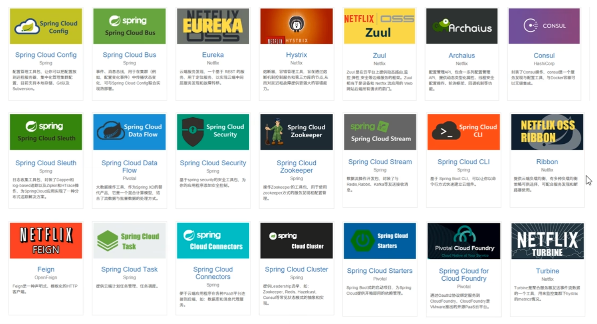

#### 大厂案例

##### 京东

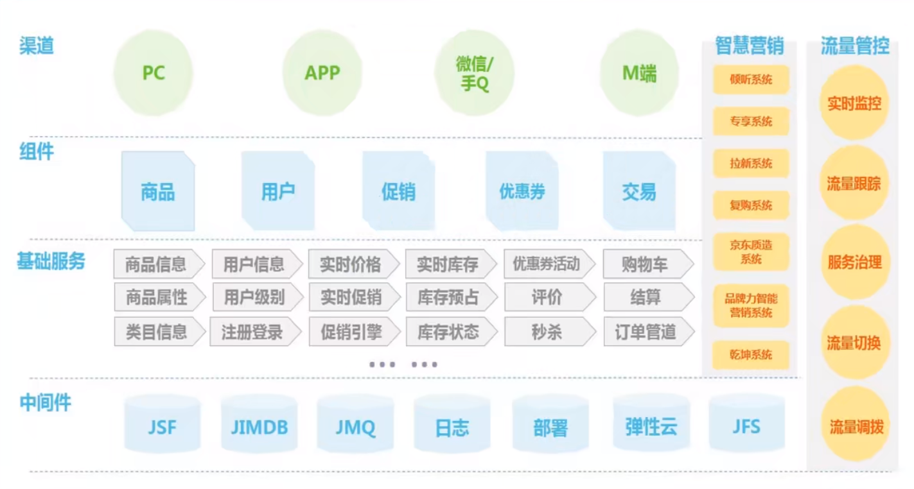

##### 阿里

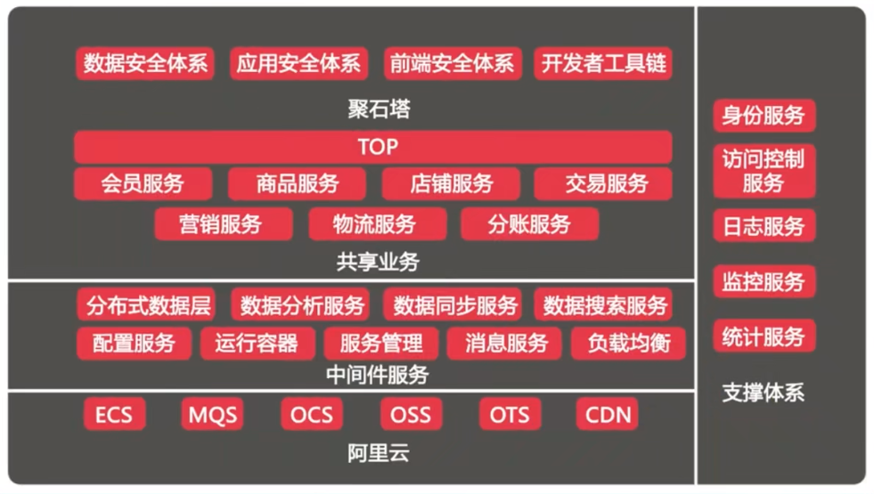

##### 京东物流

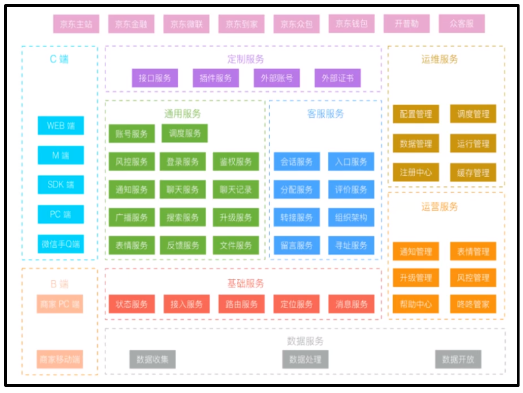

#### 基础服务

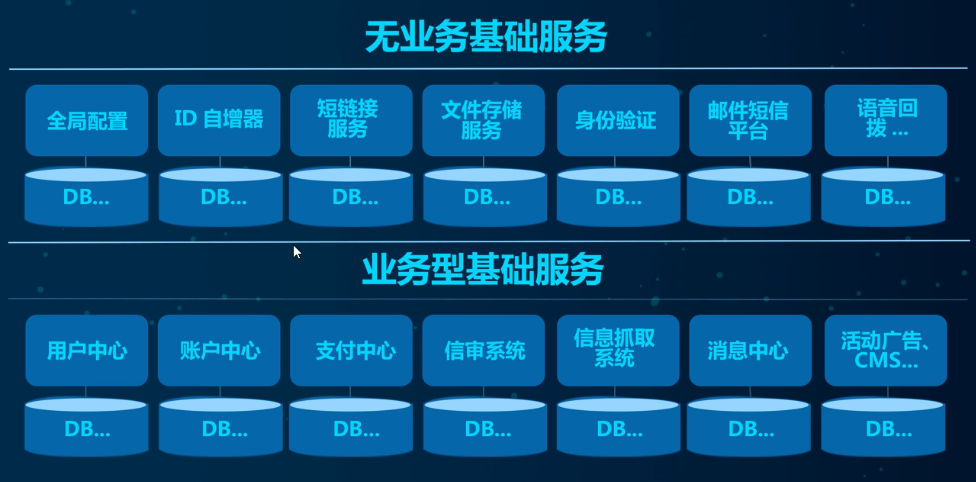

#### SpringCloud技术栈

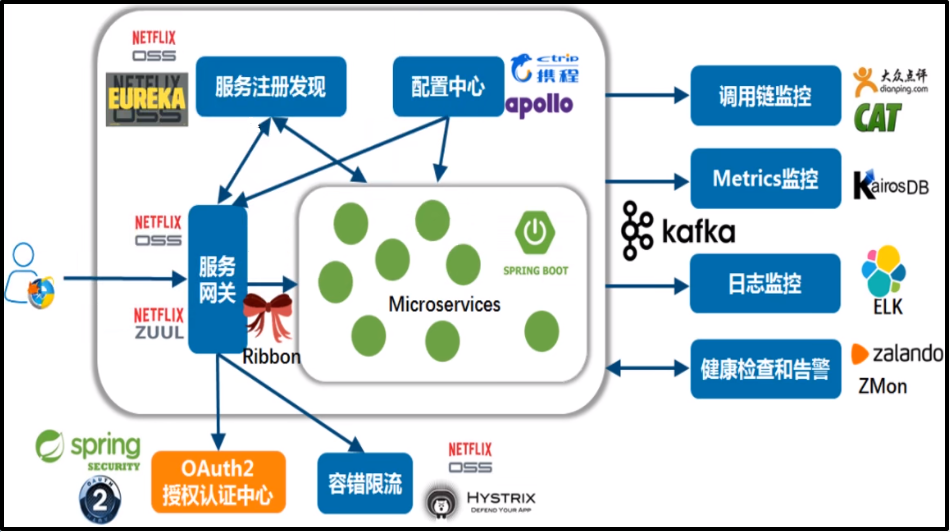

## 从2.2.x和H版开始说起

### 环境配置

| 工具         | 版本          |
| ------------ | ------------- |
| Cloud        | Hoxton.SR1    |
| Boot         | 2.2.2.RELEASE |
| CloudAlibaba | 2.1.0.RELEASE |
| Java         | Java8         |
| Maven        | 3.5及以上     |
| Mysql        | 5.7及以上     |

这里是对照这视频的版本对应，可以自己去在[官网里面进行查找对应版本](https://docs.spring.io/spring-cloud/docs/Hoxton.SR12/reference/html/)。

### SpringCloud版本（升级至2.0及以上）

SpringBoot 官网：https://spring.io/projects/spring-boot

源码：https://github.com/spring-projects/spring-boot/releases/

- GA：当前最稳定版本
- Pre-release：预发布版本

### SpringCloud 版本选择

官网：[https://spring.io/projects/spring-cloud](https://spring.io/projects/spring-cloud#learn)

源码：https://github.com/spring-projects/spring-cloud

### Cloud与Boot的对应的依赖关系

推荐：Cloud官网LEARN选项中查看版本后的Reference Doc。

或者：overview选项下翻查看表格选择，如下。

| Release Train       | Boot Version                     |
| ------------------- | -------------------------------- |
| 2020.0.x aka Ilford | 2.4.x                            |
| Hoxton              | 2.2.x, 2.3.x (Starting with SR5) |
| Greenwich           | 2.1.x                            |
| Finchley            | 2.0.x                            |

更详细版本对应关系：使用JSON工具查看[JSON串结果](https://start.spring.io/actuator/info)。

## 关于Cloud各种组件的停更/升级/替换

| 服务注册中心                                | 服务调用                                                 | 服务调用2 | 服务降级                            | 服务网关            | 服务配置 | 服务总线 |
| ------------------------------------------- | -------------------------------------------------------- | --------- | ----------------------------------- | ------------------- | -------- | -------- |
| ✖ Eureka（停更，要学）                      | ✔ Ribbon（正在使用，但已停更，未来将被LoadBalancer替换） | ✖ Feign   | ✖ Hystrix（停更，国内大规模使用中） | ✖ Zuul              | ✖ Config | ✖ Bus    |
| ✔ Zookeeper                                 | ✔ LoadBalancer（还没成熟）                               | OpenFeign | ✔ resilience4j（国外使用）          | ？ Zuul2 （还没出） | ✔ Nacos  | ✔ Nacos  |
| ✔ Consul                                    | -                                                        | -         | ✔ rentienl（阿里的，国内使用）      | ✔ gateway           | apollo   | -        |
| ✔ Nacos（阿里的，重点推荐，完美替换Eureka） | -                                                        | -         | -                                   | -                   | -        |          |

- ✖为老技术，基本上已停更，但很多公司还在用。

- ✔为老技术停更后的替代方法。
- 新老技术都会讲解，因此课程量很大。

参考资料： [SpringCloud官网文档](https://cloud.spring.io/spring-cloud-static/Hoxton.SR1/reference/htmlsingle/)、[SpringCloud中文文档](https://www.bookstack.cn/read/spring-cloud-docs/docs-index.md)、 [SpringBoot官方文档](https://docs.spring.io/spring-boot/docs/2.2.2.RELEASE/reference/htmlsingle/)

## 微服务架构编码构建

### 微服务的规矩

**约定>配置>编码**

### IDEA新建project工作空间

#### 微服务cloud整体聚合父工程Project

- 新建Project

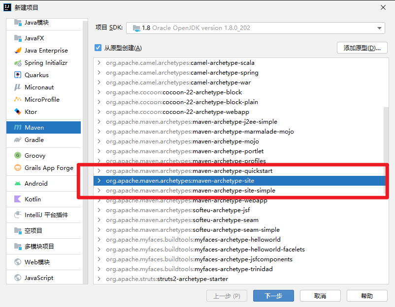

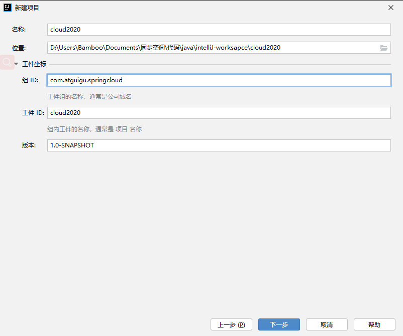

**之后删除src文件夹。**

- 字符编码

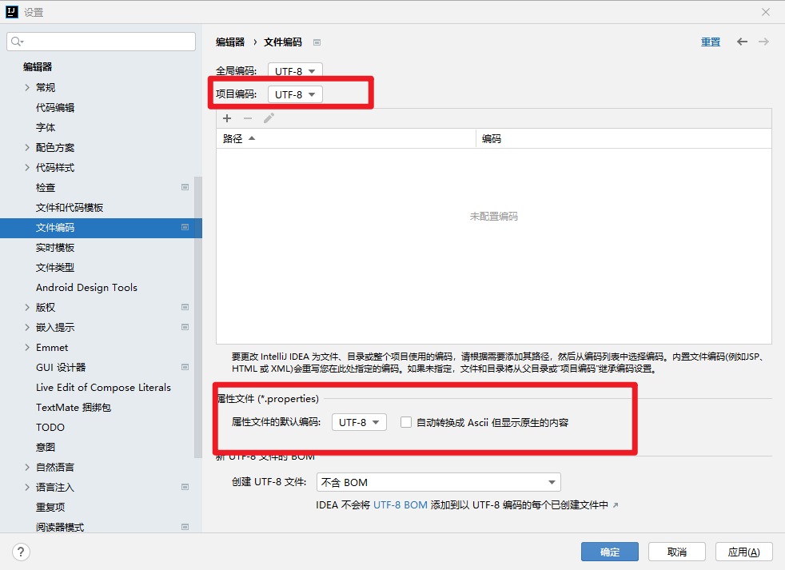

- 注解生效激活

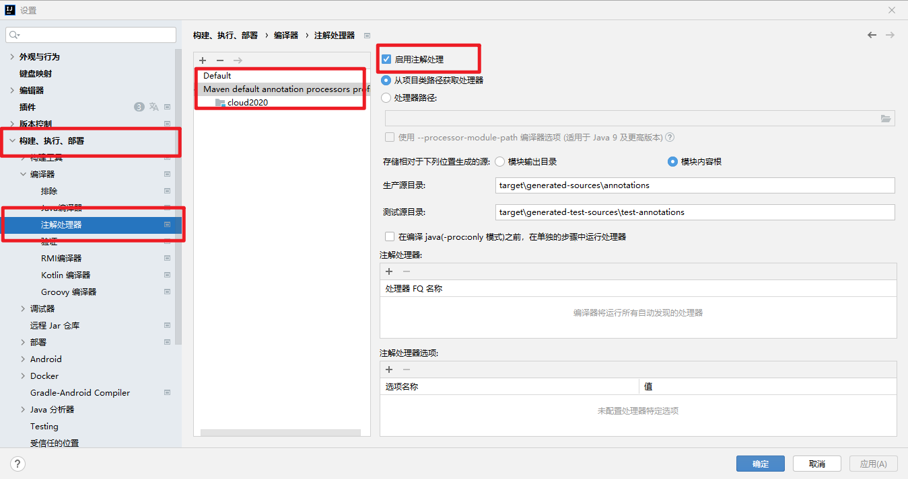

- Java编译版本选8

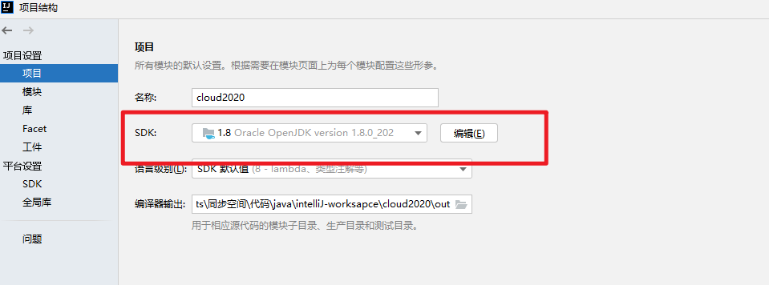

- File Type过滤

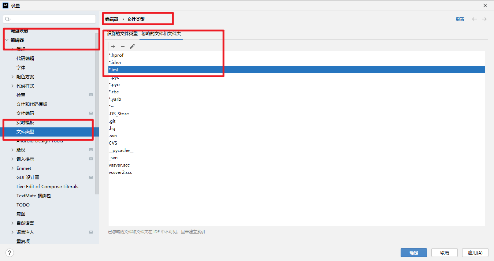

#### 父工程pom文件

- 在pom.xml中添加`<packaging>pom</packaging>`标签，表示这个pom是个总的父工程，如下：

```
<version>1.0-SNAPSHOT</version>
<packaging>pom</packaging>
```

- 统一管理Jar包版本

```
<!-- 统一管理Jar包版本 -->
<properties>
    <project.build.sourceEncoding>UTF-8</project.build.sourceEncoding>
    <maven.compiler.source>1.8</maven.compiler.source>
    <maven.compiler.target>1.8</maven.compiler.target>
    <junit.version>4.12</junit.version>
    <log4j.version>1.2.17</log4j.version>
    <lombok.version>1.16.18</lombok.version>
    <mysql.version>8.0.15</mysql.version>
    <druid.version>1.1.16</druid.version>
    <mybatis.spring.boot.version>1.3.0</mybatis.spring.boot.version>
</properties>
```

- 子模块继承之后，提供作用：``锁定版本+子module`不用写groupId和version

```
<dependencyManagement>
    <dependencies>
        <!--spring boot 2.2.2-->
        <dependency>
            <groupId>org.springframework.boot</groupId>
            <artifactId>spring-boot-dependencies</artifactId>
            <version>2.2.2.RELEASE</version>
            <type>pom</type>
            <scope>import</scope>
        </dependency>
        <!--spring cloud Hoxton.SR1-->
        <dependency>
            <groupId>org.springframework.cloud</groupId>
            <artifactId>spring-cloud-dependencies</artifactId>
            <version>Hoxton.SR1</version>
            <type>pom</type>
            <scope>import</scope>
        </dependency>
        <!--spring cloud 阿里巴巴-->
        <dependency>
            <groupId>com.alibaba.cloud</groupId>
            <artifactId>spring-cloud-alibaba-dependencies</artifactId>
            <version>2.1.0.RELEASE</version>
            <type>pom</type>
            <scope>import</scope>
        </dependency>
        <!--mysql-->
        <dependency>
            <groupId>mysql</groupId>
            <artifactId>mysql-connector-java</artifactId>
            <version>${mysql.version}</version>
            <!--      <scope>runtime</scope>-->
        </dependency>
        <!-- druid-->
        <dependency>
            <groupId>com.alibaba</groupId>
            <artifactId>druid</artifactId>
            <version>${druid.version}</version>
        </dependency>
        <!--mybatis-->
        <dependency>
            <groupId>org.mybatis.spring.boot</groupId>
            <artifactId>mybatis-spring-boot-starter</artifactId>
            <version>${mybatis.spring.boot.version}</version>
        </dependency>
        <!--junit-->
        <dependency>
            <groupId>junit</groupId>
            <artifactId>junit</artifactId>
            <version>${junit.version}</version>
        </dependency>
        <!--log4j-->
        <dependency>
            <groupId>log4j</groupId>
            <artifactId>log4j</artifactId>
            <version>${log4j.version}</version>
        </dependency>
        <!--解决maven项目中 无法打包生成空文件夹的问题-->
        <dependency>
            <groupId>org.apache.maven.plugins</groupId>
            <artifactId>maven-project-info-reports-plugin</artifactId>
            <version>3.0.0</version>
        </dependency>
    </dependencies>
</dependencyManagement>

<build>
    <plugins>
        <plugin>
            <groupId>org.springframework.boot</groupId>
            <artifactId>spring-boot-maven-plugin</artifactId>
            <version>2.3.7.RELEASE</version>
            <configuration>
                <fork>true</fork>
                <addResources>true</addResources>
            </configuration>
        </plugin>
    </plugins>
</build>
```

#### Maven工程落地细节

##### DependencyManagement与Dependencies

Maven使用dependencyManagement元素来提供了一种管理依赖版本号的方式。

**通常会在一个组织或者项目的最顶层的父POM中看到dependencyManagement元素。**

使用pom.xml中的dependencyManagement元素能让所有在子项目中引用一个依赖而不用显式的列出版本号。

Maven会沿着父子层次向上走，直到找到一个拥有dependencyManagement元素的项目，然后它就会使用这个dependencyManagement元素中指定的版本号。

比如：

```
<dependencyManagement>
    <dependencies>
        <dependency>
            <groupId>mysql</groupId>
            <artifactId>mysql-connector-java</artifactId>
            <version>8.0.15</version>
        </dependency>
    </dependencies>
</dependencyManagement>
```

然后在子项目里就可以添加mysql-connector时可以不指定版本号 **（如果指定了就优先用子项目的版本号）**，例如：

```
<dependencies>
    <dependency>
        <groupId>mysql</groupId>
        <artifactId>mysql-connector-java</artifactId>
    </dependency>
</dependencies>
```

这样做的好处就是：如果有多个子项目都引用同一样依赖，则可以避免在每个使用的子项目里都声明一个版本号，这样当想升级或切换到另一个版本时，只需要在顶层父容器里更新，而不需要一个一个子项目的修改；另外如果某个子项目需要另外的一个版本，只需要声明version就可。

- dependencyManagement里只是声明依赖，并不实现引入，因此子项目需要显示的声明需要用的依赖。
- 如果不在子项目中声明依赖，是不会从父项目中继承下来的；只有在子项目中写了该依赖项，并且没有指定具体版本，才会从父项目中继承该项，并且version和scope都读取自父pom
- 如果子项目中指定了版本号，那么会使用子项目中指定的jar版本。

##### Maven中如何跳过单元测试

为什么要跳过单元测试：节约时间

这上面有一个闪电的标记，点击后，test测试会变成不可用。

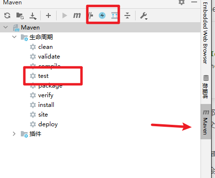

#### 将父工程发布到仓库

父工程创建完成执行`mvn:install`将父工程发布到仓库方便子工程继承。

测试一下发布：

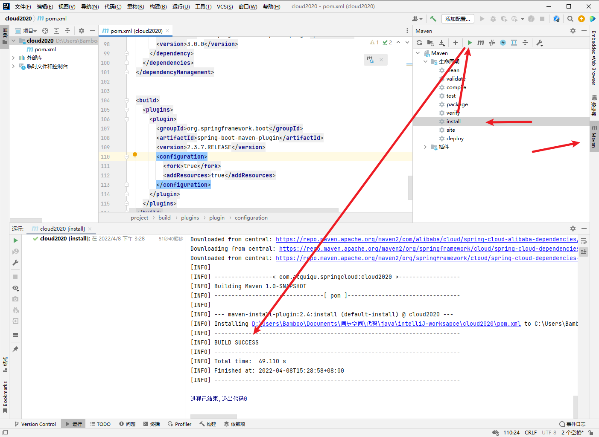

然后清除：

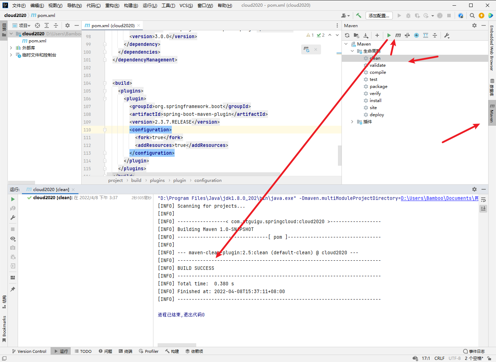

### Rest微服务工程构建

#### 构建步骤

##### 支付模块构建

###### 新建module

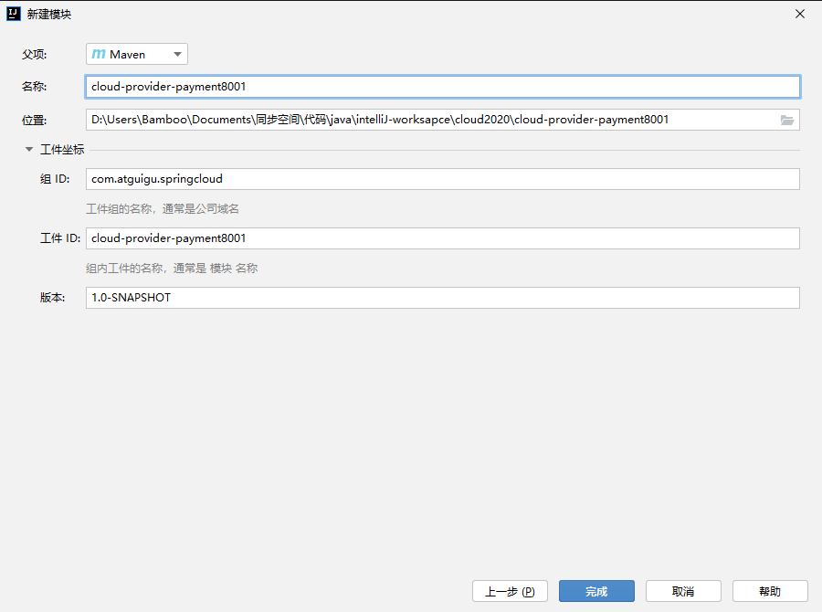

###### 修改父pom

将pom文件的modules放在packing下面。


导入依赖，子模块中有需要的在父工程中有的话，直接引入，不需要写版本号。

```
<dependencies>
    <!--spring boot 2.2.2-->
    <!--图形化监控展现-->
    <dependency>
        <groupId>org.springframework.boot</groupId>
        <artifactId>spring-boot-starter-web</artifactId>
    </dependency>
    <dependency>
        <groupId>org.springframework.boot</groupId>
        <artifactId>spring-boot-starter-actuator</artifactId>
    </dependency>
    <!--mybatis-->
    <dependency>
        <groupId>org.mybatis.spring.boot</groupId>
        <artifactId>mybatis-spring-boot-starter</artifactId>
    </dependency>
    <!-- druid-->
    <dependency>
        <groupId>com.alibaba</groupId>
        <artifactId>druid-spring-boot-starter</artifactId>
        <version>1.1.10</version>
    </dependency>
    <!--mysql-connector-java-->
    <dependency>
        <groupId>mysql</groupId>
        <artifactId>mysql-connector-java</artifactId>
    </dependency>
    <!--jdbc-->
    <dependency>
        <groupId>org.springframework.boot</groupId>
        <artifactId>spring-boot-starter-jdbc</artifactId>
    </dependency>
    <dependency>
        <groupId>org.springframework.boot</groupId>
        <artifactId>spring-boot-devtools</artifactId>
        <scope>runtime</scope>
        <optional>true</optional>
    </dependency>
    <dependency>
        <groupId>org.projectlombok</groupId>
        <artifactId>lombok</artifactId>
        <optional>true</optional>
    </dependency>
    <dependency>
        <groupId>org.springframework.boot</groupId>
        <artifactId>spring-boot-starter-test</artifactId>
        <scope>test</scope>
    </dependency>
    <dependency>
        <groupId>org.springframework.cloud</groupId>
        <artifactId>spring-cloud-starter-netflix-eureka-client</artifactId>
    </dependency>
</dependencies>
```

- 写yml文件

在`src/main/resources`下创建`application.yml`文件。

```
server:
  port: 8001 # 端口号

spring:
  application:
    name: cloud-payment-service # 应用名称
  datasource: # 数据库
    type: com.alibaba.druid.pool.DruidDataSource
    driver-class-name: com.mysql.jdbc.Driver
    url: jdbc:mysql://localhost:3306/db2020?serverTimezone=UTC&useUnicode=true&characterEncoding=utf-8&useSSL=false
    username: root
    password: 123456

mybatis:
  mapper-locations: classpath:mapper/*.xml
  type-aliases-package: com.atguigu.springcloud.entities # 所有Entity别名类所在包
```

- 主启动

创建`com.atguigu.springcloud.PaymentMain8001`

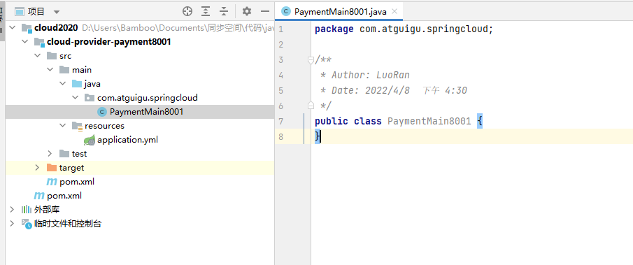

手动设置主启动

```
@SpringBootApplication
public class PaymentMain8001 {
    public static void main(String[] args) {
        SpringApplication.run(PaymentMain8001.class,args);
    }
}
```

###### 业务类

1. **[创建数据库](typora://app/typemark/工具类/db2020.md)**
2. 实体类

主实体**Payment.java**

```
@Data
@AllArgsConstructor
@NoArgsConstructor
public class Payment implements Serializable {

    private Long id;
    private String serial;

}
```

由于给前端不显示业务类，只需要传给前端是否成功的信息。

Json封装体**CommonResult.java**

```
@Data
@AllArgsConstructor
@NoArgsConstructor
public class CommonResult <T>{

    private Integer code;
    private String message;
    private T data;

    public CommonResult(Integer code,String message){
        this(code,message,null);
    }

}
```

###### 创建dao层

**PaymentDao.java**接口

```
@Mapper // 注册Dao层
public interface PaymentDao {
    public int create(Payment payment);
    public Payment getPaymentById(@Param("id") Long id);
}
```

**mybatis的映射文件PaymentMapper.xml**

路径一般设置在`resources/mapper`下，以便于后续方便修改。

```
<?xml version="1.0" encoding="UTF-8" ?>
<!DOCTYPE mapper
        PUBLIC "-//mybatis.org//DTD Mapper 3.0//EN"
        "http://mybatis.org/dtd/mybatis-3-mapper.dtd">

<!-- 命名空间一般设置dao接口，声明该xml文件属于那个接口的 -->
<mapper namespace="com.atguigu.springcloud.dao.PaymentDao">

    <insert id="create" parameterType="Payment" useGeneratedKeys="true" keyProperty="id">
        insert into payment(serial) values (#{serial});
    </insert>


    <resultMap id="BaseResultMap" type="Payment">
        <id column="id" property="id" jdbcType="BIGINT" />
        <id column="serial" property="serial" jdbcType="VARCHAR" />
    </resultMap>
    <select id="getPaymentById" parameterType="Long" resultMap="BaseResultMap">
        select * from payment where id = #{id};
    </select>

</mapper>
```

最好使用resultMap进行封装数据后返回使用，因为可能类里面的属性名与数据库的列名名字不同。

###### 创建service层

**PaymentService.java**接口

```
public interface PaymentService {
    public int create(Payment payment);
    public Payment getPaymentById(@Param("id") Long id);
}
```

**创建业务实体类PaymentServiceImpl.java**

```
@Service
public class PaymentServiceImpl implements PaymentService{

    @Resource
    private PaymentDao paymentDao;

    @Override
    public int create(Payment payment) {
        return paymentDao.create(payment);
    }

    @Override
    public Payment getPaymentById(Long id) {
        return paymentDao.getPaymentById(id);
    }

}
```

**创建控制类PaymentController.java**

```
@RestController
@Slf4j // 打印日志
public class PaymentController {

    @Resource
    private PaymentService paymentService;

    @PostMapping("/payment/create")
    public CommonResult create(Payment payment){

        int result = paymentService.create(payment);
        log.info("插入结果:"+result);

        int code = 404;
        String message = null;

        if(result > 0){
            code = 200;
            message = "插入成功";
        }else {
            code = 444;
            message = "插入数据库失败";
        }

        return new CommonResult(code,message,result);
    }

    @GetMapping("/payment/get/{id}")
    public CommonResult getPaymentById(@PathVariable("id") Long id){

        Payment payment = paymentService.getPaymentById(id);
        log.info("查询结果:"+payment);

        int code = 404;
        String message = null;

        if(payment != null ){
            code = 200;
            message = "查询成功";
        }else {
            code = 444;
            message = "查询数据库失败";
        }

        return new CommonResult(code,message,payment);
    }
}
```

###### 小结

1. 构造方法注解化的实现使用了插件lombok，要上线的项目还是全部敲出来较好
2. 前后端分离，返回给前端一个json形式的封装类
3. dao接口推荐使用@Mapper注解而不是@Repository，因为@Repository插入时可能会有问题
4. 返回结果集建议使用映射resultMap，可以避免大小写、下划线等错误。（如果开启Mybatis的驼峰匹配，其实也无所谓）

###### 测试

将没用过的模块（eureka）先注释了，然后重新加载依赖即可。然后点击主启动开启服务。

查询数据：http://localhost:8001/payment/get/31。

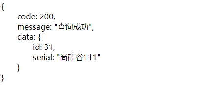

插入数据：http://localhost:8001/payment/create


如果报错，就如下输入

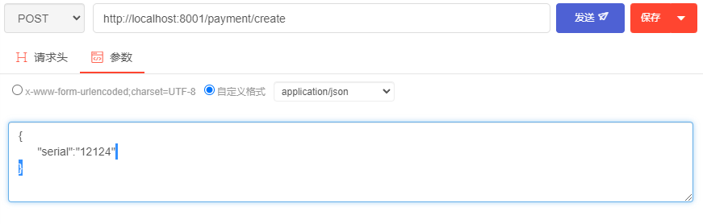

##### 热部署Devtools

热部署：开启后，项目在已部署状态下，每次代码改动后无需手动重新部署，可以实时更新。付费插件`JRebel`也可实现热部署。

> 比较耗内存

- 添加DevTools到项目中

```
<dependency>
    <groupId>org.springframework.boot</groupId>
    <artifactId>spring-boot-devtools</artifactId>
    <scope>runtime</scope>
    <optional>true</optional>
</dependency>
```

- 添加maven插件到父工程的`pom.xml`中（如果报错就加上版本号）

```
<build>
    <plugins>
        <plugin>
            <groupId>org.springframework.boot</groupId>
            <artifactId>spring-boot-maven-plugin</artifactId>
            <version>2.3.7.RELEASE</version>
            <configuration>
                <fork>true</fork>
                <addResources>true</addResources>
            </configuration>
        </plugin>
    </plugins>
</build>
```

- 开启IDEA的自动编译

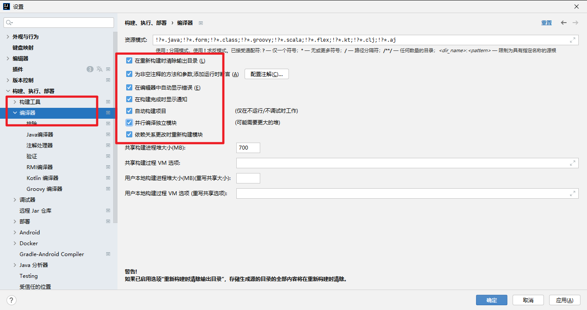

- 重启IDEA

**注：开发阶段可用热部署，生产环境中必须关闭**

##### 消费者订单模块

###### 新建module


###### 修改pom

```
<dependencies>
    <dependency>
        <groupId>org.springframework.boot</groupId>
        <artifactId>spring-boot-starter-actuator</artifactId>
    </dependency>
    <dependency>
        <groupId>org.springframework.boot</groupId>
        <artifactId>spring-boot-starter-web</artifactId>
    </dependency>

    <dependency>
        <groupId>org.springframework.boot</groupId>
        <artifactId>spring-boot-devtools</artifactId>
        <scope>runtime</scope>
        <optional>true</optional>
    </dependency>

    <dependency>
        <groupId>org.projectlombok</groupId>
        <artifactId>lombok</artifactId>
        <optional>true</optional>
    </dependency>

    <dependency>
        <groupId>org.springframework.boot</groupId>
        <artifactId>spring-boot-starter-test</artifactId>
        <scope>test</scope>
    </dependency>
</dependencies>
```

###### 修改yaml

浏览器**默认为80端口**，所以客户端使用80端口可以方便用户。 如百度`baidu.com:80`，我们直接输入`baidu.com`就可以了

###### 业务类

- entites

与支付模块一样：`Payment`与`CommonResult`

- RestTemplate

RestTemplate提供了多种便捷访问远程Http服务的方法，是一种简单便捷的访问restful服务模板类，是Spring提供的用于访问Rest服务的**客户端模板工具集**

官网文档地址：https://docs.spring.io/spring-framework/docs/5.2.2.RELEASE/javadoc-api/org/springframework/web/client/RestTemplate.html

使用：`(url,requestMap,ResponseBean.class)`这三个参数分别代表`REST请求地址`、`请求参数`、`HTTP响应转换被转换成的对象类型`。

- config配置类：RestTemplate的依赖注入配置

```
@Configuration
public class ApplicationContextConfig {

    @Bean
    public RestTemplate getRestTemplate(){
        return new RestTemplate();
    }

}
```

- controller

```
@RestController
@Slf4j
public class OrderController {

    public static final String PAYMENT_URL = "http://localhost:8001";

    @Resource
    private RestTemplate restTemplate;

    @GetMapping("/consumer/payment/create")
    public CommonResult<Payment> create(Payment payment){

        return restTemplate.postForObject(PAYMENT_URL+"/payment/create",payment,CommonResult.class);

    }

    @GetMapping("/consumer/payment/get/{id}")
    public CommonResult<Payment> getPayment(@PathVariable("id") Long id){
        return restTemplate.getForObject(PAYMENT_URL+"/payment/get/"+id,CommonResult.class);
    }
    
}
```

###### 测试

同时启动`cloud-consumer-order80`与`cloud-provider-payment8001`两个子工程项目。

查询地址：http://127.0.0.1/consumer/payment/get/31

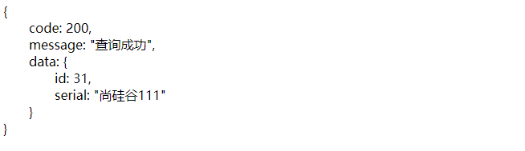

插入地址：http://127.0.0.1/consumer/payment/create?serial=111

不要忘记@RequestBody，**`@RequestBody`主要用来接收前端传递给后端的json字符串中的数据的(请求体中的数据)；** GET方式无请求体，所以使用@RequestBody接收数据时，前端不能使用GET方式提交数据，而是用POST方式进行提交。

`cloud-provider-payment8001`下的`create`方法进行修改：

```
@PostMapping("/payment/create")
public CommonResult create(@RequestBody Payment payment){

    int result = paymentService.create(payment);
    log.info("插入结果:"+result);

    int code = 404;
    String message = null;


    if(result > 0){
        code = 200;
        message = "插入成功";
    }else {
        code = 444;
        message = "插入数据库失败";
    }

    return new CommonResult(code,message,result);
}
```

如下：


##### 工程重构

###### 观察问题

系统中有重复问题，重构

###### 新建module

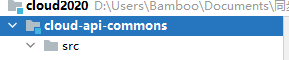

###### 重写pom

```
<dependencies>
    <dependency>
        <groupId>org.springframework.boot</groupId>
        <artifactId>spring-boot-devtools</artifactId>
        <scope>runtime</scope>
        <optional>true</optional>
    </dependency>
    <dependency>
        <groupId>org.projectlombok</groupId>
        <artifactId>lombok</artifactId>
        <optional>true</optional>
    </dependency>
    <!--工具包，如时间日期格式-->
    <dependency>
        <groupId>cn.hutool</groupId>
        <artifactId>hutool-all</artifactId>
        <version>5.1.0</version>
    </dependency>
</dependencies>
```

###### entities

将两个子工程的entities复制到`cloud-api-commons`中。

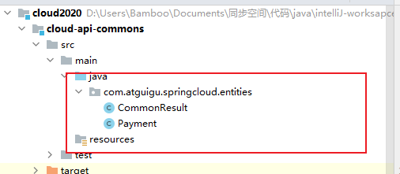

###### maven命令

清除和重新安装依赖库。

###### 改造两个子工程项目

- 删除原来的entities
- 然后引入相关依赖

```
<dependency>
    <groupId>com.atguigu.springcloud</groupId>
    <artifactId>cloud-api-commons</artifactId>
    <version>${project.version}</version>
</dependency>
```

- 重新启动测试

## 服务注册与发现

### 什么是服务治理？

在传统的rpc远程调用框架中，管理每个服务与服务之间依赖关系比较复杂，管理比较复杂，所以需要使用服务治理，**管理服务于服务之间依赖关系，可以实现服务调用、负载均衡、容错等，实现服务发现与注册**。

### 什么是服务注册与发现

**服务注册**：服务进程在注册中心注册自己的元数据信息。 通常包括主机和端口号，有时还有身份验证信息，协议，版本号，以及运行环境的信息。

**服务发现**：客户端服务进程向注册中心发起查询，来获取服务的信息。 服务发现的一个重要作用就是提供给客户端一个可用的服务列表。

在服务注册与发现中，有一个注册中心。当服务器启动的时候，会把当前自己服务器的信息比如服务地址通讯地址等以别名方式注册到注册中心上。另一方(消费者|服务提供者)，以该别名的方式去注册中心上获取到实际的服务通讯地址，然后再实现本地NRPC调用RPC远程调用框架核心设计思想：在于注册中心，因为使用注册中心管理每个服务与服务之间的一个依赖关系(服务治理概念)。在任何rpc远程框架中，都会有一个注册中心(存放服务地址相关信息(接口地址))

### Eureka

#### Eureka简述

##### 什么是Eureka？

[Eureka](https://github.com/Netflix/Eureka) 是 [Netflix](https://github.com/Netflix) 开发的，一个基于 REST 服务的，服务注册与发现的组件，以实现中间层服务器的负载平衡和故障转移。

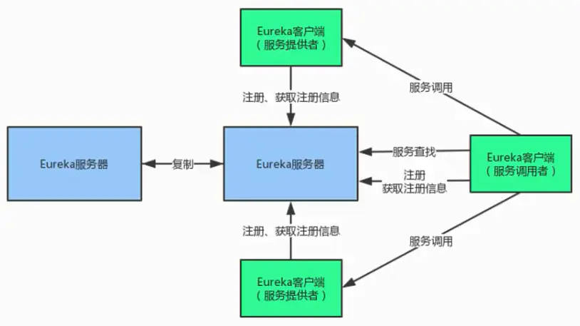

Eureka采用了CS的设计架构，Eureka Server作为服务注册功能的服务器，它是服务注册中心。而系统中的其他微服务，使用Eureka的值客户端连接到Eurek a sever并推持心跳连接。这样系统的维护人员就可以通过Eureka Server 来监控系统中各个微服务是否正常运行。 

##### Eureka两大组件

它主要包括两个组件：Eureka Server 和 Eureka Client

- **Eureka Server**：提供服务注册与发现（通常就是微服务中的注册中心）

各个微服务节点通过配置启动后，会在EurekaServer中进行注册，这样EurekaServer中的服务注册表中将会存储所有可用服务节点的信息，服务节点的信息可以在界面中直观看到。

- **Eureka Client**：通过注册中心进行访问

它是一个Java客户端，用于简化Eureka Server的交互，客户端同时也具备一个内置的、使用轮询(round-robin)负载算法的负载均衡器。在应用启动后，将会向Eureka Server发送心跳(默认周期为30秒)。如果Eureka Server在多个心跳周期内没有接收到某个节点的心跳，EurekaServer将会从服务注册表中把这个服务节点移除(默认90秒)。

#### 单机Eureka构建步骤

##### eurekaServer端服务注册中心（类似物业公司）

###### 新建module

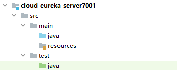

###### 改写pom

```
<dependencies>
    <!--eureka-server-->
    <dependency>
        <groupId>org.springframework.cloud</groupId>
        <artifactId>spring-cloud-starter-netflix-eureka-server</artifactId>
    </dependency>
    <!--自定义api通用包-->
    <dependency>
        <groupId>com.atguigu.springcloud</groupId>
        <artifactId>cloud-api-commons</artifactId>
        <version>${project.version}</version>
    </dependency>
    <!--boot web acctuator-->
    <dependency>
        <groupId>org.springframework.boot</groupId>
        <artifactId>spring-boot</artifactId>
    </dependency>
    <dependency>
        <groupId>org.springframework.boot</groupId>
        <artifactId>spring-boot-starter-web</artifactId>
    </dependency>
    <dependency>
        <groupId>org.springframework.boot</groupId>
        <artifactId>spring-boot-starter-actuator</artifactId>
    </dependency>
    <dependency>
        <groupId>org.springframework.boot</groupId>
        <artifactId>spring-boot-devtools</artifactId>
        <scope>runtime</scope>
        <optional>true</optional>
    </dependency>
</dependencies>
```

###### 写yaml

```
server:
  port: 7001

eureka:
  instance:
    hostname: localhost # eureka服务端的实例名称
  client:
    register-with-eureka: false # false表示不能向注册中心注册自己
    fetch-registry: false # false表示自己就是注册中心，其职责就是维护服务实例，并不需要去检索服务
    service-url:
      # 设置与Eureka Server交互的地址查询服务和注册服务都需要依赖这个地址
      defaultZone: http://${eureka.instance.hostname}:${server.port}/eureka/
```

###### 主启动

```
@SpringBootApplication
@EnableEurekaServer
public class EurekaMain7001 {
    public static void main(String[] args) {
        SpringApplication.run(EurekaMain7001.class,args);
    }
}
```

###### 测试   

Eureka地址：http://127.0.0.1:7001/

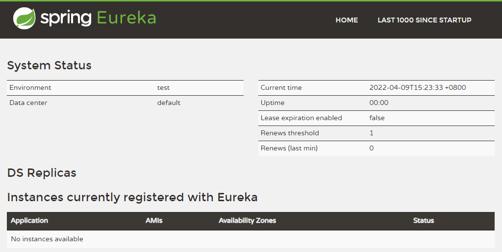

##### 服务提供者

找到`cloud-provider-payment8001`进行改写，注册成为服务提供者。

###### 改pom

```
<dependency>
    <groupId>org.springframework.cloud</groupId>
    <artifactId>spring-cloud-starter-netflix-eureka-client</artifactId>
</dependency>
```

###### 写yaml

```
server:
  port: 8001 # 端口号

spring:
  application:
    name: cloud-payment-service # 应用名称
  datasource:
    username: root
    password: 123456
    driver-class-name: com.mysql.cj.jdbc.Driver
    url: jdbc:mysql://localhost:3306/db2020?serverTimezone=UTC&useUnicode=true&characterEncoding=utf-8
    type: com.alibaba.druid.pool.DruidDataSource # 自定义数据源

mybatis:
  mapper-locations: classpath:mapper/*.xml
  type-aliases-package: com.atguigu.springcloud.entities # 所有Entity别名类所在包


eureka:
  client:
    register-with-eureka: true # 表示是否将自己注册进EurekaServer，默认为true
    fetch-registry: true # 是否从EurekaServer抓取已有的注册信息，默认为true。单节点无所谓，集群必须设置为true才能配合ribbon使用均衡负载
    service-url:
    # 这里地址一定是注册中心的地址
      defaultZone: http://localhost:7001/eureka/
```

###### 主启动

```
@SpringBootApplication
@EnableEurekaClient
public class PaymentMain8001 {
    public static void main(String[] args) {
        SpringApplication.run(PaymentMain8001.class,args);
    }
}
```

###### 测试

启动服务提供者和注册中心。访问地址：http://127.0.0.1:7001/

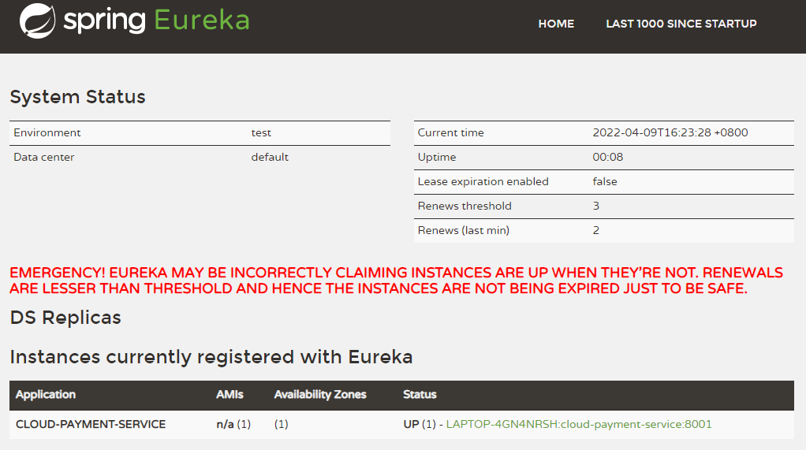

##### 服务消费者

找到`cloud-consumer-order80`进行改写，注册成为服务提供者。

###### 改pom

```
<dependency>
    <groupId>org.springframework.cloud</groupId>
    <artifactId>spring-cloud-starter-netflix-eureka-client</artifactId>
</dependency>
```

###### 写yaml

```
server:
  port: 80

spring:
  application:
    name: cloud-consumer-order # 应用名称

eureka:
  client:
    register-with-eureka: true # 表示是否将自己注册进EurekaServer，默认为true
    fetch-registry: true # 是否从EurekaServer抓取已有的注册信息，默认为true。单节点无所谓，集群必须设置为true才能配合ribbon使用均衡负载
    service-url:
      # 这里地址一定是注册中心的地址
      defaultZone: http://localhost:7001/eureka/
```

###### 主启动

```
@SpringBootApplication
@EnableEurekaClient
public class OrderMain80 {
    public static void main(String[] args) {
        SpringApplication.run(OrderMain80.class,args);
    }
}
```

###### 测试

启动服务消费者，然后刷新地址。访问地址：http://127.0.0.1:7001/

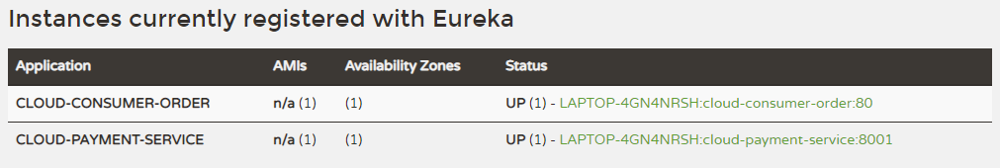

#### 集群Eureka构建步骤

##### Eureka集群原理

**服务注册**：将服务信息注册到注册中心

**服务发现**：从注册中心获取服务信息

**实质**：存key服务名，取value调用地址

**步骤**：

1. 先启动eureka注册中心
2. 启动服务提供者payment支付服务
3. 支付服务启动后，会把自身信息注册到eureka
4. 消费者order服务在需要调用接口时，使用服务别名去注册中心获取实际的远程调用地址
5. 消费者获得调用地址后，底层实际是调用httpclient技术实现远程调用
6. 消费者获得服务地址后会缓存在本地jvm中，默认每30秒更新异常服务调用地址

**问题：**微服务RPC远程调用最核心的是说明？

高可用，如果注册中心只有一个，出现故障就麻烦了o(*￣︶￣*)o。会导致整个服务环境不可用。

**解决办法**：搭建eureka注册中心集群，实现**负载均衡+故障容错**

> 互相注册，相互守望

##### EurekaServer集群环境构建步骤

###### 新建module

参考`cloud-eureka-server7001`新建一个`clourd-eureka-server7002`。

###### 修改映射配置

找到当前系统的hosts文件，进行修改。windows中hosts在`C:\Windows\System32\drivers\etc`，添加如下：

```
127.0.0.1 eureka7001.com
127.0.0.1 eureka7002.com
```

###### 修改yml

```
cloud-eureka-server7001\...\application.yml
server:
  port: 7001

eureka:
  instance:
    hostname: eureka7001.com # eureka服务端的实例名称
  client:
    register-with-eureka: false # false表示不能向注册中心注册自己
    fetch-registry: false # false表示自己就是注册中心，其职责就是维护服务实例，并不需要去检索服务
    service-url:
      # 设置与Eureka Server交互的地址查询服务和注册服务都需要依赖这个地址
      defaultZone: http://eureka7002.com:7002/eureka/
     
spring:
  freemarker:
    prefer-file-system-access: false
cloud-eureka-server7002\...\application.yml
server:
  port: 7002

eureka:
  instance:
    hostname: eureka7001.com
  client:
    fetch-registry: false
    register-with-eureka: false
    service-url:
      defaultZone: http://eureka7001.com:7001/eureka/
      
spring:
  freemarker:
    prefer-file-system-access: false
```

注意，hostname不能为同一个名字，因此配合上面的hosts，进行改写。然后两个注册中心之间进行相互注册，在`defaultZone`处相互写注册的地址。

如果想继续添加多个集群，在`defaultZone=http://node1:10001/eureka/,http://node2:10002/eureka/`处，类似的注册其他的地址即可。

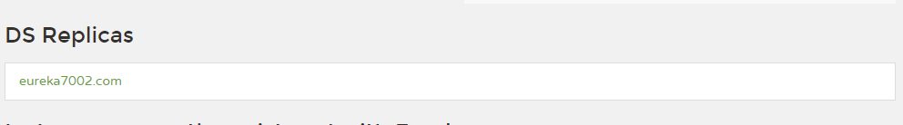

##### 将支付8001微服务发布到上面2台Eureka集群配置中

注册中心集群搭建好后，只需要修改yml即可。对`cloud-provider-payment8001`下的application.yml进行修改。

```
eureka:
  client:
    register-with-eureka: true # 表示是否将自己注册进EurekaServer，默认为true
    fetch-registry: true # 是否从EurekaServer抓取已有的注册信息，默认为true。单节点无所谓，集群必须设置为true才能配合ribbon使用均衡负载
    service-url:
      defaultZone: http://eureka7001.com:7001/eureka/,http://eureka7002.com:7002/eureka/
```

##### 将订单服务80微服务发布到上面2台Eureka集群配置中

同理，对`cloud-consumer-order80`下的application.yml进行修改。

```
defaultZone: http://eureka7001.com:7001/eureka/,http://eureka7002.com:7002/eureka/
```

##### 测试

- 先启动EurekaServer，7001/7002服务
- 再启动服务提供者provider，8001
- 最后启动消费者consumer，80

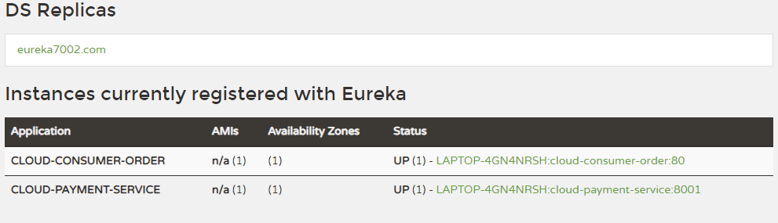

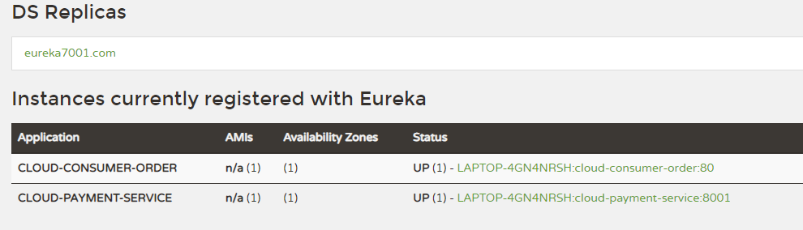

访问地址：http://localhost/consumer/payment/get/31

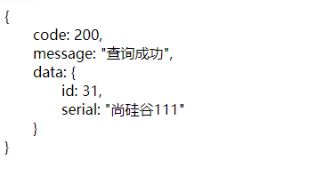

##### 支付服务提供者8001集群环境构建

###### 新建module

参考`cloud-provider-payment8001`，新建一个`cloud-provider-payment8002`。

###### 写yml

注意修改端口号

```
server:
  port: 8002 # 端口号

spring:
  application:
    name: cloud-payment-service # 应用名称
  datasource: # 数据库
    type: com.alibaba.druid.pool.DruidDataSource
    driver-class-name: com.mysql.jdbc.Driver
    url: jdbc:mysql://localhost:3306/db2020?serverTimezone=UTC&useUnicode=true&characterEncoding=utf-8&useSSL=false
    username: root
    password: 123456

mybatis:
  mapper-locations: classpath:mapper/*.xml
  type-aliases-package: com.atguigu.springcloud.entities # 所有Entity别名类所在包

eureka:
  client:
    register-with-eureka: true # 表示是否将自己注册进EurekaServer，默认为true
    fetch-registry: true # 是否从EurekaServer抓取已有的注册信息，默认为true。单节点无所谓，集群必须设置为true才能配合ribbon使用均衡负载
    service-url:
      defaultZone: http://eureka7001.com:7001/eureka/,http://eureka7001.com:7002/eureka/
```

###### 修改8001/8002的Controller

```
@RestController
@Slf4j // 打印日志
public class PaymentController {

    @Resource
    private PaymentService paymentService;

    @Value("${server.port}")
    private String serverPort;

    @PostMapping("/payment/create")
    public CommonResult create(Payment payment){

        int result = paymentService.create(payment);
        log.info("插入结果:"+result);

        int code = 404;
        String message = "当前端口号:"+serverPort;

        if(result > 0){
            code = 200;
            message += "插入成功";
        }else {
            code = 444;
            message += "插入数据库失败";
        }

        return new CommonResult(code,message,result);
    }

    @GetMapping("/payment/get/{id}")
    public CommonResult getPaymentById(@PathVariable("id") Long id){

        Payment payment = paymentService.getPaymentById(id);
        log.info("查询结果:"+payment);

        int code = 404;
        String message = "当前端口号:"+serverPort;

        if(payment != null ){
            code = 200;
            message += "查询成功";
        }else {
            code = 444;
            message += "查询数据库失败";
        }

        return new CommonResult(code,message,payment);
    }
}
```

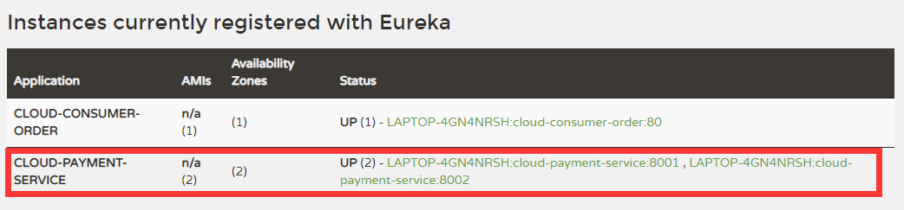

###### 修改Order80的Controller

由于Order80的端口是写死的，会一直只访问一个提供者。

单机版写成这样没问题：

```
public static final String PAYMENT_URL = "http://localhost:8001";
```

但是在多集群上，不能这样。通过在eureka上注册过的微服务名称调用。

```
public static final String PAYMENT_URL = "http://CLOUD-PAYMENT-SERVICE";
```

重新访问，http://localhost/consumer/payment/get/31，出现如下错误：

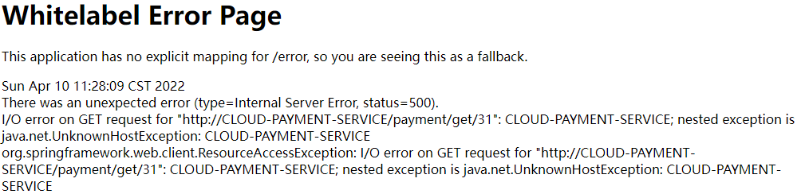

因为不知道是那一台机器，导致无法找到。可以通过负载均衡解决。

###### 负载均衡

修改Order80的config类，使用`@LoadBalanced`注解赋予RestTemplate负载均衡的能力。

```
@Configuration
public class ApplicationContextConfig {

    @Bean
    @LoadBalanced // 使用@LoadBalanced注解赋予RestTemplate负载均衡的能力
    public RestTemplate getRestTemplate(){
        return new RestTemplate();
    }

}
```

重新访问：http://localhost/consumer/payment/get/31

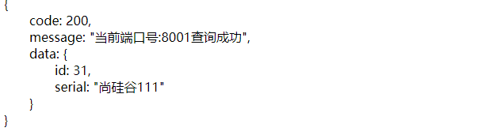

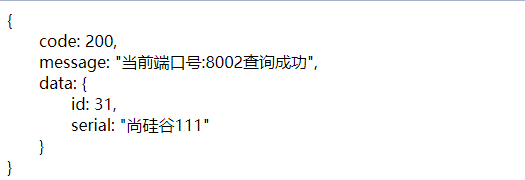

#### actuator微服务信息完善

##### 主机名称与服务名称的修改

修改`cloud-provider-payment8001`以及`cloud-provider-payment8002`的yaml文件，在eureka下添加instance-id。

```
eureka:
  client:
    register-with-eureka: true # 表示是否将自己注册进EurekaServer，默认为true
    fetch-registry: true # 是否从EurekaServer抓取已有的注册信息，默认为true。单节点无所谓，集群必须设置为true才能配合ribbon使用均衡负载
    service-url:
      defaultZone: http://eureka7001.com:7001/eureka/,http://eureka7001.com:7002/eureka/
  instance:
    instance-id: payment8001
```

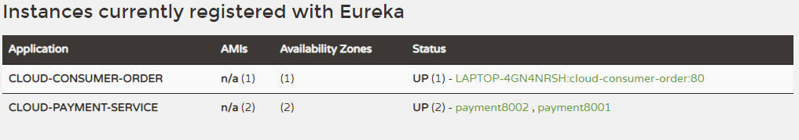

##### 显示访问者的IP名称

修改`cloud-provider-payment8001`以及`cloud-provider-payment8002`的yaml文件，在eureka下添加prefer-ip-adress用于显示访问者ip。

```
eureka:
  client:
    register-with-eureka: true # 表示是否将自己注册进EurekaServer，默认为true
    fetch-registry: true # 是否从EurekaServer抓取已有的注册信息，默认为true。单节点无所谓，集群必须设置为true才能配合ribbon使用均衡负载
    service-url:
      defaultZone: http://eureka7001.com:7001/eureka/,http://eureka7001.com:7002/eureka/
  instance:
    instance-id: payment8001
    prefer-ip-address: true
```


#### 服务发现Discovery

对于注册进eureka里面的微服务，可以通过服务发现来获得该服务的信息。

需要修改`cloud-provider-payment8001`以及`cloud-provider-payment8002`的controller。

```
import org.springframework.cloud.client.discovery.DiscoveryClient;

@Resource
private DiscoveryClient discoveryClient;

@GetMapping("/payment/discovery")
public Object discovery(){
    // 获取服务列表名单
    List<String> services = discoveryClient.getServices();
    for(String service:services)
        log.info("当前服务service："+service);

    // 获取具体服务名称下的所有实例以及其所有信息
    List<ServiceInstance> instances = discoveryClient.getInstances("CLOUD-PAYMENT-SERVICE");
    for(ServiceInstance serviceInstance:instances)
        log.info("当前实例instance ID："+serviceInstance.getInstanceId() +";端口号："+serviceInstance.getPort());

    return discoveryClient;
}
```

并在主启动类添加`@EnableDiscoveryClient`

```
@SpringBootApplication
@EnableEurekaClient
@EnableDiscoveryClient
public class PaymentMain8002 {
    public static void main(String[] args) {
        SpringApplication.run(PaymentMain8002.class,args);
    }
}
```

#### Eureka自我保护机制

##### 概述

保护模式主要用于一组客户端和Eureka Server之间存在网络分区场景下的保护。一旦进入保护模式，Eureka Server将会尝试保护其服务注册表中的信息，不再删除服务注册表中的数据，也就是不会注销任何微服务。

如果在Eureka Server的首页看到以下这段提示，则说明eureka进入了保护模式：


也就是某时刻某一个微服务不可用了，Eureka不会立刻清理，依旧会对该微服务的信息进行保存。属于CAP里面的AP分支。

##### 为什么会产生Eureka自我保护机制？

为了防止EurekaClient可以正常运行，但是与EurekaServer网络不通情况下，EurekaServer不会立刻将EurekaClient服务剔除。

##### 什么是自我保护模式？

默认情况下，如果EurekaServer在一定时间内没有接收到某个微服务实例的心跳，EurekaServer将会注销该实例（默认90秒)。但是当网络分区故障发生(延时、卡顿、拥挤)时，微服务与EurekaServer之间无法正常通信，以上行为可能变得非常危险了——**因为微服务本身其实是健康的，此时本不应该注销这个微服务**。Eureka通过“自我保护模式”来解决这个问题—当EurekaServer节点在短时间内丢失过多客户端时（可能发生了网络分区故障)，那么这个节点就会进入自我保护模式。

##### 如何进行eureka的自我保护？

- Eureka 服务中心配置

在注册中心`cloud-eureka-server7001`以及`cloud-eureka-server7002`中配置

```
eureka:
  server:
    enable-self-preservation: false # 关闭自我保护机制，保证不可用服务被及时踢除
    eviction-interval-timer-in-ms: 2000
```

- Eureka 客户端配置

```
eureka:
  instance:
    # Eureka客户端向服务端发送心跳的时间间隔，单位为秒(默认是30秒)
    lease-renewal-interval-in-seconds: 1
    #  Eureka服务端在收到最后一次心跳后等待时间上限，单位为秒(默认是90秒)，超时将剔除服务
    lease-expiration-duration-in-seconds: 2
```


关了自我保护机制，一旦发生故障，就去除。

- 停止8001或者8002其中一个，会立马删除
- 启动后，又会加回来

#### Eureka停止更新了怎么办？

作为Eureka的替换，还可以使用Zookeeper、Consul、Nacos进行替换。

### Zookeeper

#### 什么是Zookeeper?

Zookeeper是一个分布式协调工具，可以实现注册中心功能。[Zookeeper相关内容学习](typora://app/typemark/分布式开发笔记.md#Zookeeper)。

#### Zookeeper简单使用

配好集群过来使用….

```
systemctl stop firewalld # 关闭防火墙

ifconfig # 查看当前虚拟机中的IP地址，然后使用ping查看是否连通
```

#### 服务提供者

##### 新建module


##### 改写pom

与之前类似，只是将eureka换成了zookeeper

```
    <dependencies>

        <dependency>
            <groupId>com.atguigu.springcloud</groupId>
            <artifactId>cloud-api-commons</artifactId>
            <version>${project.version}</version>
        </dependency>
        <!--spring boot 2.2.2-->
        <!--图形化监控展现-->
        <dependency>
            <groupId>org.springframework.boot</groupId>
            <artifactId>spring-boot-starter-web</artifactId>
        </dependency>
        <dependency>
            <groupId>org.springframework.boot</groupId>
            <artifactId>spring-boot-starter-actuator</artifactId>
        </dependency>
        
        <!--SpringBoot整合Zookeeper客户端-->
        <dependency>
            <groupId>org.springframework.cloud</groupId>
            <artifactId>spring-cloud-starter-zookeeper-discovery</artifactId>
            <exclusions>
                <!--先排除自带的zookeeper3.5.3-->
                <exclusion>
                    <groupId>org.apache.zookeeper</groupId>
                    <artifactId>zookeeper</artifactId>
                </exclusion>
            </exclusions>
        </dependency>
        <!--添加zookeeper3.4.6版本 -->
        <dependency>
            <groupId>org.apache.zookeeper</groupId>
            <artifactId>zookeeper</artifactId>
            <version>3.4.6</version>
        </dependency>
        <!--mybatis-->
        <dependency>
            <groupId>org.mybatis.spring.boot</groupId>
            <artifactId>mybatis-spring-boot-starter</artifactId>
        </dependency>
        <!-- druid-->
        <dependency>
            <groupId>com.alibaba</groupId>
            <artifactId>druid-spring-boot-starter</artifactId>
            <version>1.1.10</version>
        </dependency>
        <!--mysql-connector-java-->
        <dependency>
            <groupId>mysql</groupId>
            <artifactId>mysql-connector-java</artifactId>
        </dependency>
        <!--jdbc-->
        <dependency>
            <groupId>org.springframework.boot</groupId>
            <artifactId>spring-boot-starter-jdbc</artifactId>
        </dependency>
        <dependency>
            <groupId>org.springframework.boot</groupId>
            <artifactId>spring-boot-devtools</artifactId>
            <scope>runtime</scope>
            <optional>true</optional>
        </dependency>
        <dependency>
            <groupId>org.projectlombok</groupId>
            <artifactId>lombok</artifactId>
            <optional>true</optional>
        </dependency>
        <dependency>
            <groupId>org.springframework.boot</groupId>
            <artifactId>spring-boot-starter-test</artifactId>
            <scope>test</scope>
        </dependency>
    </dependencies>
```

##### 写yaml

与之前类似

```
server:
  port: 8004

# 服务名称--注册zookeeper到注册中心名称
spring:
  application:
    name: cloud-provider-payment
  cloud:
    zookeeper:
      connect-string: 192.168.183.102:2181
```

##### 主启动

```
@SpringBootApplication
@EnableDiscoveryClient
public class PaymentMain8004 {
    public static void main(String[] args) {
        SpringApplication.run(PaymentMain8004.class,args);
    }
}
```

##### Controller

可以和之前一样，这里为了快速测试，就简单写一个函数，方便访问进行测试zookeeper是否可用。

```
@RestController
@Slf4j
public class PaymentController {
    @Value("${server.port}")
    private String serverPort;

    @GetMapping("/payment/zk")
    public String paymentZk(){
        return "spring cloud with zookeeper:" + serverPort +":" + UUID.randomUUID().toString();
    }
}
```

访问地址：http://localhost:8004/payment/zk


之后，查看zookeeper里面的当前数据。

```
ls / # 查看当前节点数据
ls /services # 这是当前服务的数据
```

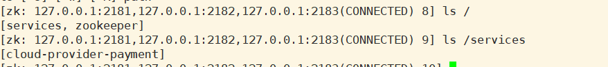

一直查下去，会出现一个流水号

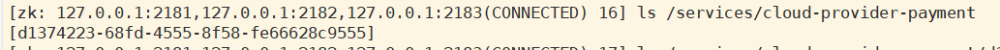

之后，使用get获取节点的内部数据信息

```
get /services/cloud-provider-payment/d1374223-68fd-4555-8f58-fe66628c9555
```

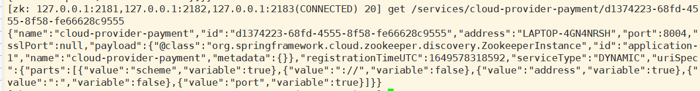

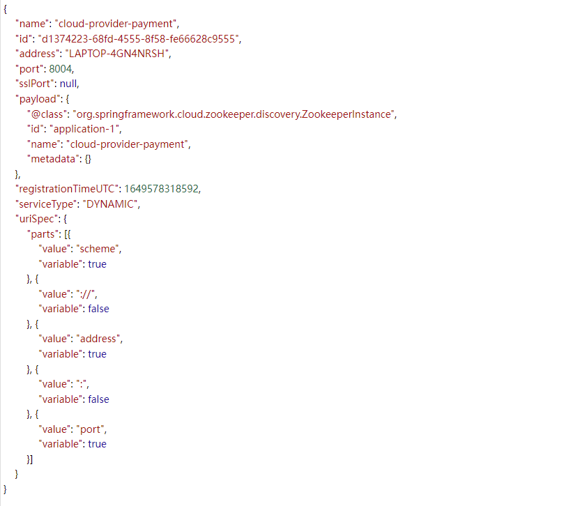

#### 思考：服务节点是临时还是永久？

在zookeeper中服务节点是临时的，如果服务挂掉了，过一段时间后，服务节点就会在zookeeper中去掉。

重新加入后，流水号就会变了，因为它会默认是加入了新的一个服务节点进来。

#### 服务消费者

##### 新建module


##### 改写pom

```
<dependencies>

    <dependency>
        <groupId>com.atguigu.springcloud</groupId>
        <artifactId>cloud-api-commons</artifactId>
        <version>${project.version}</version>
    </dependency>

    <dependency>
        <groupId>org.springframework.boot</groupId>
        <artifactId>spring-boot-starter-actuator</artifactId>
    </dependency>
    <dependency>
        <groupId>org.springframework.boot</groupId>
        <artifactId>spring-boot-starter-web</artifactId>
    </dependency>

    <dependency>
        <groupId>org.springframework.boot</groupId>
        <artifactId>spring-boot-devtools</artifactId>
        <scope>runtime</scope>
        <optional>true</optional>
    </dependency>

    <dependency>
        <groupId>org.projectlombok</groupId>
        <artifactId>lombok</artifactId>
        <optional>true</optional>
    </dependency>

    <dependency>
        <groupId>org.springframework.boot</groupId>
        <artifactId>spring-boot-starter-test</artifactId>
        <scope>test</scope>
    </dependency>

    <!--SpringBoot整合Zookeeper客户端-->
    <dependency>
        <groupId>org.springframework.cloud</groupId>
        <artifactId>spring-cloud-starter-zookeeper-discovery</artifactId>
        <exclusions>
            <!--先排除自带的zookeeper3.5.3-->
            <exclusion>
                <groupId>org.apache.zookeeper</groupId>
                <artifactId>zookeeper</artifactId>
            </exclusion>
        </exclusions>
    </dependency>
    <!--添加zookeeper3.4.6版本 -->
    <dependency>
        <groupId>org.apache.zookeeper</groupId>
        <artifactId>zookeeper</artifactId>
        <version>3.4.6</version>
    </dependency>
</dependencies>
```

##### 写yaml

```
server:
  port: 80

# 服务名称--注册zookeeper到注册中心名称
spring:
  application:
    name: cloud-consumer-order
  cloud:
    zookeeper:
      connect-string: 192.168.183.102:2181
```

##### 主启动

```
@SpringBootApplication
@EnableDiscoveryClient
public class OrderZookeeperMain80 {
    public static void main(String[] args) {
        SpringApplication.run(OrderZookeeperMain80.class,args);
    }
}
```

##### 配置类

```
@Configuration
public class ApplicationContextConfig {
    @Bean
    @LoadBalanced
    public RestTemplate getRestRemplate(){
        return new RestTemplate();
    }
}
```

##### Controller

```
@RestController
@Slf4j
public class PaymentController {

    public static final String INVOKE_URL = "http://cloud-provider-payment";

    @Resource
    private RestTemplate restTemplate;

    @GetMapping("/consumer/payment/zk")
    public String paymentInfo(){
        String result = restTemplate.getForObject(INVOKE_URL+"/payment/zk",String.class);
        return result;
    }
}
```

##### 测试

启动后，发现该项目也加入进来了。

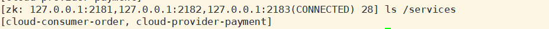

之后访问地址：http://localhost/consumer/payment/zk


##### Eureka与Zookeeper的区别

###### Eureka保证AP

Eureka服务器节点之间是对等的，只要有一个节点在，就可以正常提供服务。

Eureka客户端的所有操作可能需要一段时间才能在Eureka服务器中反映出来，随后在其他Eureka客户端中反映出来。也就是说，客户端获取到的注册信息可能不是最新的，它并不保证强一致性

###### Zookeeper保证CP

Zookeeper集群中有一个Leader，多个Follower。Leader负责写，Follower负责读，ZK客户端连接到任何一个节点都是一样的，写操作完成以后要同步给所有Follower以后才会返回。如果Leader挂了，那么重新选出新的Leader，在此期间服务不可用。

###### 为什么用Eureka

分布式系统大都可以归结为两个问题：数据一致性和防止单点故障。而作为注册中心的话，即使在一段时间内不一致，也不会有太大影响，所以在A和C之间选择A是比较适合该场景的。

### Consul

#### 什么是Consul？


Consul是一个服务网格（微服务间的 TCP/IP，负责服务之间的网络调用、限流、熔断和监控）解决方案，它是一个一个分布式的，高度可用的系统，而且开发使用都很简便。它提供了一个功能齐全的控制平面，主要特点是：**服务发现、健康检查、键值存储、安全服务通信、多数据中心**。

与其它分布式服务注册与发现的方案相比，Consul 的方案更“一站式”——内置了服务注册与发现框架、分布一致性协议实现、健康检查、Key/Value 存储、多数据中心方案，不再需要依赖其它工具。Consul 本身使用 go 语言开发，具有跨平台、运行高效等特点，也非常方便和 Docker 配合使用。

#### Consul的安装与使用

##### 安装

下载地址：https://www.consul.io/downloads

##### 运行

- 查看版本信息

```
consul --version
```

- 使用开发模式启动

```
consul agent -dev
```

- 访问Consul地址：http://localhost:8500/

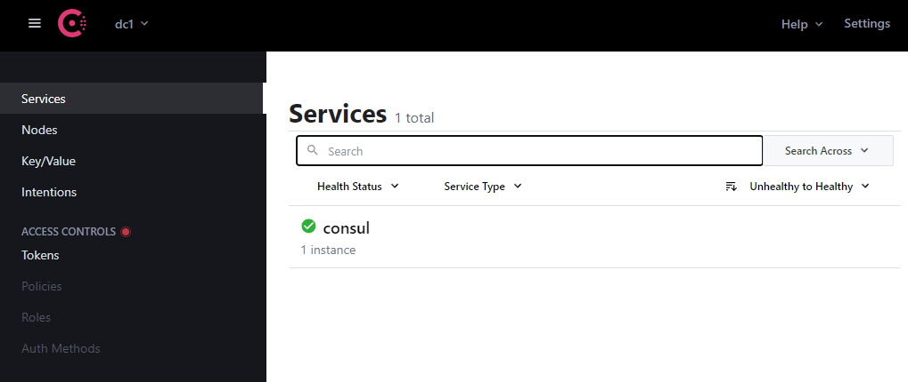

#### 服务提供者

##### 新建module


##### 改pom

```
<dependencies>
    <dependency>
        <groupId>org.springframework.cloud</groupId>
        <artifactId>spring-cloud-starter-consul-discovery</artifactId>
    </dependency>
    <dependency>
        <groupId>com.atguigu.springcloud</groupId>
        <artifactId>cloud-api-commons</artifactId>
        <version>1.0-SNAPSHOT</version>
    </dependency>
    <!--spring boot 2.2.2-->
    <!--图形化监控展现-->
    <dependency>
        <groupId>org.springframework.boot</groupId>
        <artifactId>spring-boot-starter-web</artifactId>
    </dependency>
    <dependency>
        <groupId>org.springframework.boot</groupId>
        <artifactId>spring-boot-starter-actuator</artifactId>
    </dependency>
    <!--mybatis-->
    <dependency>
        <groupId>org.mybatis.spring.boot</groupId>
        <artifactId>mybatis-spring-boot-starter</artifactId>
    </dependency>
    <!-- druid-->
    <dependency>
        <groupId>com.alibaba</groupId>
        <artifactId>druid-spring-boot-starter</artifactId>
        <version>1.1.10</version>
    </dependency>
    <!--mysql-connector-java-->
    <dependency>
        <groupId>mysql</groupId>
        <artifactId>mysql-connector-java</artifactId>
    </dependency>
    <!--jdbc-->
    <dependency>
        <groupId>org.springframework.boot</groupId>
        <artifactId>spring-boot-starter-jdbc</artifactId>
    </dependency>
    <dependency>
        <groupId>org.springframework.boot</groupId>
        <artifactId>spring-boot-devtools</artifactId>
        <scope>runtime</scope>
        <optional>true</optional>
    </dependency>
    <dependency>
        <groupId>org.projectlombok</groupId>
        <artifactId>lombok</artifactId>
        <optional>true</optional>
    </dependency>
    <dependency>
        <groupId>org.springframework.boot</groupId>
        <artifactId>spring-boot-starter-test</artifactId>
        <scope>test</scope>
    </dependency>
</dependencies>
```

##### 写yml

```
server:
  port: 8006 # 端口号

spring:
  application:
    name: cloud-payment-service # 应用名称
  datasource: # 数据库
    type: com.alibaba.druid.pool.DruidDataSource
    driver-class-name: com.mysql.jdbc.Driver
    url: jdbc:mysql://localhost:3306/db2020?serverTimezone=UTC&useUnicode=true&characterEncoding=utf-8&useSSL=false
    username: root
    password: 123456
  # consul注册中心地址
  cloud:
    consul:
      host: localhost
      port: 8500
      discovery:
        service-name: ${spring.application.name}

mybatis:
  mapper-locations: classpath:mapper/*.xml
  type-aliases-package: com.atguigu.springcloud.entities # 所有Entity别名类所在包
```

##### 主启动

```
@SpringBootApplication
@EnableDiscoveryClient
public class PaymentMain8006 {
    public static void main(String[] args) {
        SpringApplication.run(PaymentMain8006.class,args);
    }
}
```

##### Controller

参考其他的`provider8001`工程项目。

```
@RestController
@Slf4j
public class PaymentController {

    @Resource
    private PaymentService paymentService;

    @Value("${server.port}")
    private String serverPort;

    @Resource
    private DiscoveryClient discoveryClient;

    @GetMapping("/payment/discovery")
    public Object discovery(){
        // 获取服务列表名单
        List<String> services = discoveryClient.getServices();
        for(String service:services)
            log.info("当前服务service："+service);

        // 获取具体服务名称下的所有实例以及其所有信息
        List<ServiceInstance> instances = discoveryClient.getInstances("CLOUD-PAYMENT-SERVICE");
        for(ServiceInstance serviceInstance:instances)
            log.info("当前实例instance ID："+serviceInstance.getInstanceId() +";端口号："+serviceInstance.getPort());

        return discoveryClient;
    }

    @PostMapping("/payment/create")
    public CommonResult create(Payment payment){

        int result = paymentService.create(payment);
        log.info("插入结果:"+result);

        int code = 404;
        String message = "当前端口号:"+serverPort;

        if(result > 0){
            code = 200;
            message += "插入成功";
        }else {
            code = 444;
            message += "插入数据库失败";
        }

        return new CommonResult(code,message,result);
    }

    @GetMapping("/payment/get/{id}")
    public CommonResult getPaymentById(@PathVariable("id") Long id){

        Payment payment = paymentService.getPaymentById(id);
        log.info("查询结果:"+payment);

        int code = 404;
        String message = "当前端口号:"+serverPort;

        if(payment != null ){
            code = 200;
            message += "查询成功";
        }else {
            code = 444;
            message += "查询数据库失败";
        }

        return new CommonResult(code,message,payment);
    }
}
```

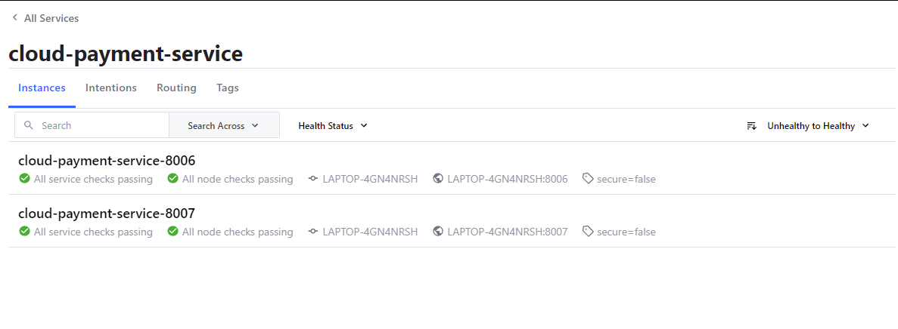

#### 服务消费者

##### 新建module

##### 改写pom

```
<dependencies>

    <dependency>
        <groupId>com.atguigu.springcloud</groupId>
        <artifactId>cloud-api-commons</artifactId>
        <version>${project.version}</version>
    </dependency>

    <dependency>
        <groupId>org.springframework.boot</groupId>
        <artifactId>spring-boot-starter-actuator</artifactId>
    </dependency>
    <dependency>
        <groupId>org.springframework.boot</groupId>
        <artifactId>spring-boot-starter-web</artifactId>
    </dependency>

    <dependency>
        <groupId>org.springframework.boot</groupId>
        <artifactId>spring-boot-devtools</artifactId>
        <scope>runtime</scope>
        <optional>true</optional>
    </dependency>

    <dependency>
        <groupId>org.projectlombok</groupId>
        <artifactId>lombok</artifactId>
        <optional>true</optional>
    </dependency>

    <dependency>
        <groupId>org.springframework.boot</groupId>
        <artifactId>spring-boot-starter-test</artifactId>
        <scope>test</scope>
    </dependency>

    <dependency>
        <groupId>org.springframework.cloud</groupId>
        <artifactId>spring-cloud-starter-consul-discovery</artifactId>
    </dependency>
</dependencies>
```

##### 写yaml

```
server:
  port: 80

spring:
  cloud:
    consul:
      host: localhost
      port: 8500
      discovery:
        service-name: ${spring.application.name}
  application:
    name: cloud-consumer-order
```

##### 主启动

```
@SpringBootApplication
@EnableDiscoveryClient
public class OrderMain80 {
    public static void main(String[] args) {
        SpringApplication.run(OrderMain80.class,args);
    }
}
```

##### Config

```
@Configuration
public class ApplicationContextConfig {
    
    @Bean
    @LoadBalanced
    public RestTemplate getRestTemplate(){
        return new RestTemplate();
    }
    
}
```

##### Controller

```
@RestController
@Slf4j
public class OrderController {

    public static final String PAYMENT_URL = "http://CLOUD-PAYMENT-SERVICE";

    @Resource
    private RestTemplate restTemplate;

    @GetMapping("/consumer/payment/create")
    public CommonResult<Payment> create(Payment payment){
        return restTemplate.postForObject(PAYMENT_URL+"/payment/create",payment,CommonResult.class);

    }

    @GetMapping("/consumer/payment/get/{id}")
    public CommonResult<Payment> getPayment(@PathVariable("id") Long id){
        return restTemplate.getForObject(PAYMENT_URL+"/payment/get/"+id,CommonResult.class);
    }

}
```

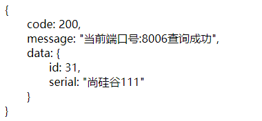

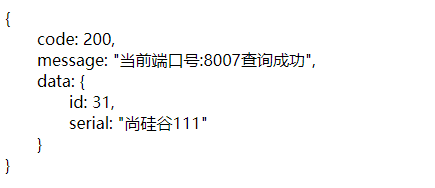

### Eureka、Zookeeper与Consul注册中心的异同点

| 组件名    | 语言 | CAP  | 健康检查 | 对外暴露接口 | Spring Cloud 集成 |
| --------- | ---- | ---- | -------- | ------------ | ----------------- |
| Eureka    | Java | AP   | 可配支持 | HTTP         | 已集成            |
| Consul    | Go   | CP   | 支持     | HTTP/DNS     | 已集成            |
| ZooKeeper | Java | CP   | 支持     | 客户端       | 已集成            |

### CAP理论

- Consistency：强一致性
- Availability：可用性
- Partition tolerance：分区容错性

CAP关注的粒度是数据，而不是整个系统CAP理论的定义和解释上，用的都是system、node这类的系统级概念，容易给我们造成误解，认为系统只能选择AP或者CP。 但是在实际设计中，系统不可能只处理一种数据，有的数据需要使用AP，有的数据需要使用CP。

**最多只能同时较好的满足两个**。 CAP理论的核心是：**一个分布式系统不可能同时很好的满足一致性，可用性和分区容错性这三个需求**，因此，根据CAP原理将NoSQL数据库分成了满足CA原则、满足CР原则和满足AP原则三大类：

- CA-单点集群，满足—致性，可用性的系统，通常在可扩展性上不太强大。
- CP -满足—致性，分区容忍必的系统，通常性能不是特别高。
- AP–满足可用性，分区容忍性的系统，通常可能对—致性要求低一些。

> 先保证AP，再CP

## 服务调用

### Ribbon负载均衡服务调用

#### Ribbon概述

##### 什么是Ribbon

Spring Cloud Ribbon是基于Netflix Ribbon实现的一套客户端负载均衡的工具。

简单的说，Ribbon是Netflix发布的开源项目，主要功能是提供客户端的软件负载均衡算法和服务调用。Ribbon客户端组件提供一系列完善的配置项如连接超时，重试等。简单的说，就是在配置文件中列出Load Balancer(简称LB)后面所有的机器，Ribbon会自动的帮助你基于某种规则(如简单轮询，随机连接等）去连接这些机器。我们很容易使用Ribbon实现自定义的负载均衡算法。

##### Ribbon官网

官网：https://github.com/Netflix/ribbon/wiki/Getting-Started

目前Ribbon进入维护模式中。

##### Ribbon能做什么

###### LB负载均衡(Load Balance)是什么

简单的说就是将用户的请求平摊的分配到多个服务上，从而达到系统的HA（高可用)。常见的负载均衡有软件Nginx，LVS，硬件F5等。

###### Ribbon本地负载均衡客户端 VS Nginx服务端负载均衡区别

Nginx是服务器负载均衡，客户端所有请求都会交给nginx，然后由nginx实现转发请求。即负载均衡是由服务端实现的。（集中式LB）

Ribbon本地负载均衡，在调用微服务接口时候，会在注册中心上获取注册信息服务列表之后缓存到JVM本地，从而在本地实现RPC远程服务调用技术。（进程式LB）

#### Ribbon负载均衡演示

Ribbon其实就是一个软负载均衡的客户端组件, 他可以和其他所需请求的客户端结合使用，和eureka结合只是其中一个实例。

> 说白了就是通过负载均衡+RestTemplate调用

##### 架构说明

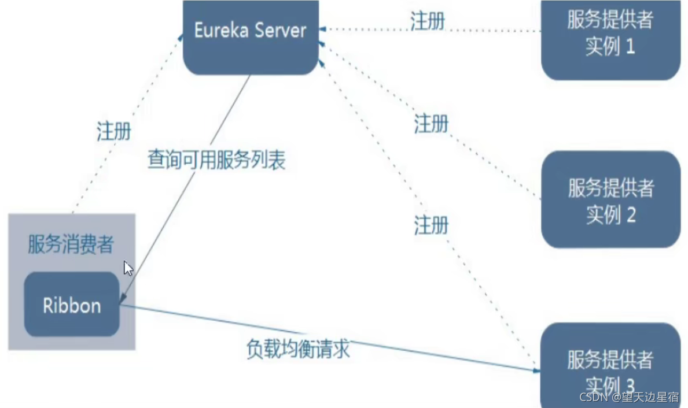

##### pom

```
<dependency>
    <groupId>org.springframework.cloud</groupId>
    <artifactId>spring-cloud-starter-netflix-eureka-client</artifactId>
</dependency>
```

eureka包就已经整合了ribbon的包。

##### RestTemplate使用

语法文档：https://docs.spring.io/spring-framework/docs/5.2.2.RELEASE/javadoc-api/org/springframework/web/client/RestTemplate.html

前面已经写过配置类

```
@Configuration
public class ApplicationContextConfig {

    @Bean
    @LoadBalanced // 使用@LoadBalanced注解赋予RestTemplate负载均衡的能力
    public RestTemplate getRestTemplate(){
        return new RestTemplate();
    }

}
```

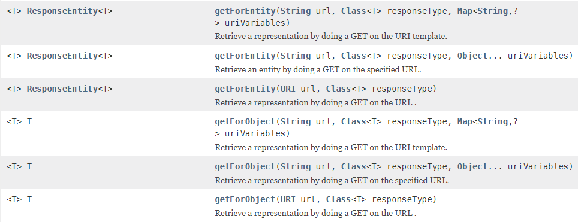


`restTemplate.getForObject`：返回对象为响应体中数据转化成的对象，基本上可以理解为json

`restTemplate.getForEntity`：返回对象为ResponseEntity对象，包含了响应中的一些重要信息，比如响应头、响应状态码、响应体。

```
@RestController
@Slf4j
public class OrderController {

    public static final String PAYMENT_URL = "http://CLOUD-PAYMENT-SERVICE";

    @Resource
    private RestTemplate restTemplate;

    @GetMapping("/consumer/payment/create")
    public CommonResult<Payment> create(Payment payment){
        return restTemplate.postForObject(PAYMENT_URL+"/payment/create",payment,CommonResult.class);

    }

    @GetMapping("/consumer/payment/get/{id}")
    public CommonResult<Payment> getPayment(@PathVariable("id") Long id){
        return restTemplate.getForObject(PAYMENT_URL+"/payment/get/"+id,CommonResult.class);
    }

    @GetMapping("/consumer/payment2/get/{id}")
    public CommonResult<Payment> getPayment2(@PathVariable("id") Long id){
        ResponseEntity<CommonResult> entity = restTemplate.getForEntity(PAYMENT_URL+"/payment/get/"+id,CommonResult.class);

        if(entity.getStatusCode().is2xxSuccessful()){
            return entity.getBody();
        }else{
            return new CommonResult<>(444,"操作失败");
        }
    }

    @GetMapping("/consumer/payment2/create")
    public CommonResult<Payment> create2(Payment payment){

        ResponseEntity<CommonResult> entity = restTemplate.postForEntity(PAYMENT_URL+"/payment/create",payment,CommonResult.class);

        if (entity.getStatusCode().is2xxSuccessful()){
            return entity.getBody();
        }else{
            return new CommonResult<>(400,"操作失败");
        }

    }

}
```

#### Ribbon核心组件IRule

IRule：根据特点算法中从服务列表中选取一个要访问的服务。

Rule接口常见的有7个实现类，每个实现类代表一个[负载均衡](https://so.csdn.net/so/search?q=负载均衡&spm=1001.2101.3001.7020)算法，默认使用轮询。

| 接口                                    | 作用                                                         |
| --------------------------------------- | ------------------------------------------------------------ |
| com.netflix.loadbalancer.RoundRobinRule | 轮询                                                         |
| com.netflix.loadbalancer.RandomRule     | 随机                                                         |
| com.netflix.loadbalancer.RetryRule      | 先按照RoundRobinRule的策略获取服务，如果获取服务失败则在指定时间内会进行重试，获取可用的服务 |
| WeightedResponseTimeRule                | 对RoundRobinRule的扩展，响应速度越快的实例选择权重越大，越容易被选择 |
| BestAvailableRule                       | 会先过滤掉由于多次访问故障而处于断路器跳闸状态的服务，然后选择一个并发量最小的服务 |
| AvailabilityFilteringRule               | 先过滤掉故障实例，再选择并发较小的实例                       |
| ZoneAvoidanceRule                       | 默认规则，复合判断server所在区域的性能和server的可用性选择服务器 |

在springcloud中，如何替换负载均衡算法？

对原来的`cloud-consumer-order80`作为样例进行修改测试，首先需要注意配置细节：

> 这个自定义配置类不能放在@CompanentScan所扫描的当前包下以及子包下，否则我们自定义的这个配置类就会被所有的Ribbon客户端所共享，达不到特殊化定制的目的了。

因此创建`com.atguigu.myrule`，避免放到`com.atguigu.springcloud`被扫描到，就无法实现特殊化定制。在`com.atguigu.myrule`下创建`MySelfRule`规则类：

```
@Configuration
public class MySelfRule {

    @Bean
    public IRule myRule(){
        // 定义为随机
        return new RandomRule();
    }

}
```

最后在主启动类中添加`@RibbonClient(name = "CLOUD-PAYMENT-SERVICE",configuration = MySelfRule.class)`，其中参数分别为`服务名`以及`规则类.class`。

```
@SpringBootApplication
@EnableEurekaClient
@RibbonClient(name = "CLOUD-PAYMENT-SERVICE",configuration = MySelfRule.class)
public class OrderMain80 {
    public static void main(String[] args) {
        SpringApplication.run(OrderMain80.class,args);
    }
}
```

#### Ribbon负载均衡算法

##### 负载均衡算法原理

**负载均衡轮询算法**：rest接口第几次请求次数 % 服务器集群总数量 = 实际调用服务器位置下标，每次服务器重启后，rest接口计数从1开始。

##### 负载均衡算法源码

```
private int incrementAndGetModulo(int modulo) {
    int current;
    int next;
    do {
        current = this.nextServerCyclicCounter.get();
        next = (current + 1) % modulo;
    } while(!this.nextServerCyclicCounter.compareAndSet(current, next));
    return next;
}
```

##### 手写负载均衡算法

原理：CAS+自旋锁

- 首先8001、8002服务controller层加上

```
@GetMapping("/payment/lb")
public String getPaymentLB() {
    return serverPort;
}
 
```

- 对于服务订单80进行改造

1. 将config中的@LoadBalanced注释
2. 创建`com.atguigu.springcloud.lb`包，并创建`LoabBalancer`接口类

```
public interface LoadBalancer {
    ServiceInstance instances(List<ServiceInstance> serviceInstances);
}
```

之后创建`MyLoadBalancer`实现类。

```
@Component
public class MyLoadBalancer implements LoadBalancer{

    private AtomicInteger atomicInteger = new AtomicInteger(0);

    public final int getAndIncrement(){
        int current;
        int next;

        do{

            current = this.atomicInteger.get();
            next = current >= Integer.MAX_VALUE?0: current+1;

        }while (!atomicInteger.compareAndSet(current,next));

        return next;
    }

    @Override
    public ServiceInstance instances(List<ServiceInstance> serviceInstances) {

        int index = getAndIncrement() % serviceInstances.size();

        return serviceInstances.get(index);
    }

}
```

最后对controller进行修改。

```
@RestController
@Slf4j
public class OrderController {

    public static final String PAYMENT_URL = "http://CLOUD-PAYMENT-SERVICE";

    @Resource
    private RestTemplate restTemplate;
    @Resource
    private MyLoadBalancer loadBalancer;
    @Resource
    private DiscoveryClient discoveryClient;

    @GetMapping("/consumer/payment/lb")
    public String getPaymentLB() {
        List<ServiceInstance> instances = discoveryClient.getInstances("CLOUD-PAYMENT-SERVICE");
        if (instances == null || instances.size() <= 0) {
            return null;
        }
        ServiceInstance serviceInstance = loadBalancer.instances(instances);
        URI uri = serviceInstance.getUri();
        return restTemplate.getForObject(uri + "/payment/lb", String.class);
    }

}
```

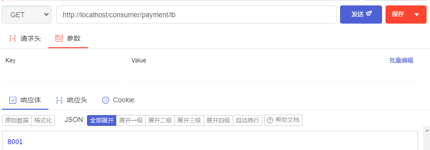

### OpenFeign服务接口调用

#### OpenFeign概述

##### 官方文档

地址：https://cloud.spring.io/spring-cloud-static/Hoxton.SR1/reference/htmlsingle/#spring-cloud-openfeign

##### 什么是OpenFeign？

Feign是一个声明式WebService客户端。使用Feign能让编写Web Service客户端更加简单。它的使用方法是定义一个服务接口然后在上面添加注解。Feign也支持可拔插式的编码器和解码器。Spring Cloud对Feign进行了封装，使其支持了Spring MVC标准注解和HttpMessageConverters。Feign可以与Eureka和Ribbon组合使用以支持负载均衡。

OpenFeigh地址：https://github.com/spring-cloud/spring-cloud-openfeign

##### OpenFeign能做什么

###### Feign旨在使编写Java Http客户端变得更容易

前面在使用Ribbon+RestTemplate时，利用RestTemplate对http请求的封装处理，形成了—套模版化的调用方法。但是在实际开发中，由于对服务依赖的调用可能不止一处，**往往一个接口会被多处调用，所以通常都会针对每个微服务自行封装一些客户端类来包装这些依赖服务的调用。**所以，Feign在此基础上做了进一步封装，由他来帮助我们定义和实现依赖服务接口的定义。在Feign的实现下，**我们只需创建一个接口并使用注解的方式来配置它{以前是Dao接口上面标注Mapper注解,现在是一个微服务接口上面标注一个Feign注解即可)**，即可完成对服务提供方的接口绑定，简化了使用Spring cloud Ribbon时，自动封装服务调用客户端的开发量。

##### Feign集成了Ribbon

利用Ribbon维护了Payment的服务列表信息，并且通过轮询实现了客户端的负载均衡。而与Ribbon不同的是，**通过feign只需要定义服务绑定接口且以声明式的方法**，优雅而简单的实现了服务调用。

##### Feign与OpenFeign的区别

| Feign                                                        | OpenFeign                                                    |
| ------------------------------------------------------------ | ------------------------------------------------------------ |
| Feign是Spring Cloud组件中的一个轻量级RESTful的HTTP服务客户端Feign内置了Ribbon，用来做客户端负载均衡，去调用服务注册中心的服务。Feign的使用方式是:使用Feign的注解定义接口，调用这个接口，就可以调用服务注册中心的服务 | OpenFeign是Spring Cloud在Feign的基础上支持了SpringMVC的注解，如@RequesMapping等等。OpenFeign的@FeignClient可以解析SpringMVC的@RequestMapping注解下的接口，并通过动态代理的方式产生实现类，实现类中做负载均衡并调用其他服务。 |

##### 相关依赖

```
<!--openfeign-->
<dependency>
    <groupId>org.springframework.cloud</groupId>
    <artifactId>spring-cloud-starter-openfeign</artifactId>
</dependency>
```

之前使用的ribbon+restTemplate，而OpenFeign整合了之前的。

#### OpenFeign使用步骤

##### 接口+注解

微服务调用接口+@FeignClient。

##### 新建module

新建`cloud-feign-consumer-order80`，并且Feign在消费端使用。


##### 改pom

```
<dependencies>
    <!--openfeign-->
    <dependency>
        <groupId>org.springframework.cloud</groupId>
        <artifactId>spring-cloud-starter-openfeign</artifactId>
    </dependency>
    <!--eureka client-->
    <dependency>
        <groupId>org.springframework.cloud</groupId>
        <artifactId>spring-cloud-starter-netflix-eureka-server</artifactId>
    </dependency>
    <dependency>
        <groupId>com.atguigu.springcloud</groupId>
        <artifactId>cloud-api-commons</artifactId>
        <version>1.0-SNAPSHOT</version>
    </dependency>
    <dependency>
        <groupId>org.springframework.boot</groupId>
        <artifactId>spring-boot-starter-web</artifactId>
    </dependency>
    <!--监控-->
    <dependency>
        <groupId>org.springframework.boot</groupId>
        <artifactId>spring-boot-starter-actuator</artifactId>
    </dependency>
    <!--热部署-->
    <dependency>
        <groupId>org.springframework.boot</groupId>
        <artifactId>spring-boot-devtools</artifactId>
        <scope>runtime</scope>
        <optional>true</optional>
    </dependency>
    <dependency>
        <groupId>org.projectlombok</groupId>
        <artifactId>lombok</artifactId>
        <optional>true</optional>
    </dependency>
    <dependency>
        <groupId>org.springframework.boot</groupId>
        <artifactId>spring-boot-starter-test</artifactId>
        <scope>test</scope>
    </dependency>
</dependencies>
```

##### 写yaml

```
server:
  port: 80

eureka:
  client:
    register-with-eureka: true
    fetch-registry: true
    service-url:
      defaultZone: http://eureka7001.com:7001/eureka/, http://eureka7002.com:7002/eureka/
```

##### 主启动

```
@SpringBootApplication
@EnableFeignClients
public class OrderFeignMain80 {
    public static void main(String[] args) {
        SpringApplication.run(OrderFeignMain80.class,args);
    }
}
```

##### 业务类

新建`service.PaymentFeignService`

`@FeignClient(value = "CLOUD-PAYMENT-SERVICE")`这里的value是eureka里面注册的服务名称。

```
@Component
@FeignClient(value = "CLOUD-PAYMENT-SERVICE")
public interface PaymentFeignService {

    @GetMapping("/payment/get/{id}")
    CommonResult<Payment> getPaymentById(@PathVariable("id") Long id);
}
```

##### 控制层Controller

```
@RestController
@Slf4j
public class OrderController{

    @Resource
    private PaymentFeignService paymentFeignService;

    @GetMapping(value = "/consumer/payment/get/{id}")
    public CommonResult<Payment> getPaymentById(@PathVariable("id") Long id) {
        return paymentFeignService.getPaymentById(id);
    }

    public String paymentFeignTimeout() {
        return null;
    }
}
```

##### 测试

启动eureka集群7001/7002，再启动微服务8001/8002，最后启动OpenFeign。

访问地址：http://localhost/consumer/payment/get/31

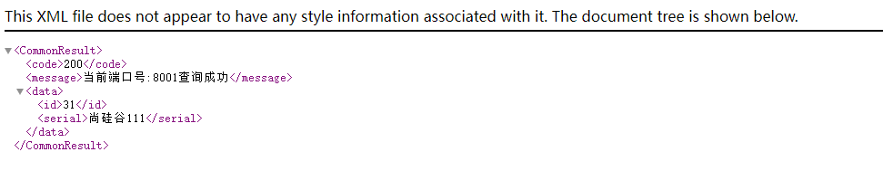

> Feign自带负载均衡配置项。

#### OpenFeign超时控制

##### 超时设置，故意设置超时演示出错情况

服务提供方8001故意写暂停程序

```
@GetMapping("/payment/feign/timeout")
public String paymentFeignTimeout(){

    try {
        TimeUnit.SECONDS.sleep(3);
    } catch (InterruptedException e) {
        e.printStackTrace();
    }

    return serverPort;
}
```

服务消费方80添加超时方法PaymentFeignService

```
@Component
@FeignClient(value = "CLOUD-PAYMENT-SERVICE")
public interface PaymentFeignService {

    @GetMapping(value = "/payment/feign/timeout")
    String paymentFeignTimeout();
}
```

服务消费方80添加超时方法OrderFeignController

```
@RestController
@Slf4j
public class OrderController{

    @GetMapping(value = "/consumer/payment/timeout")
    public String paymentFeignTimeout() {
        
        return paymentFeignService.paymentFeignTimeout();
    }
}
```

##### OpenFeign默认等待1秒钟，超过后报错

访问地址：http://localhost/consumer/payment/timeout

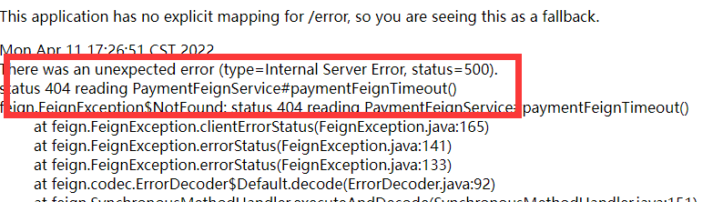

##### YML文件里需要开启OpenFeign客户端超时控制

```
#设置feign客户端超时时间i(openFeign.默认支持ribbon)
ribbon:
  ReadTimeout: 5000 # 指的是建立连接所用的时间，适用于网络状况正常的情况下,两端连接所用的时问
  ConnectTimeout: 5000 # 指的是建立连接后从服务器读取到可用资源所用的时问
```

#### OpenFeign日志打印功能

##### 日志级别

- NONE：默认的，不显示任何日志;
- BASIC：仅记录请求方法、URL、响应状态码及执行时间;
- HEADERS：除了BASIC中定义的信息之外，还有请求和响应的头信息;
- FULL：除了HEADERS中定义的信息之外，还有请求和响应的正文及元数据。

##### 配置日志Bean

在`cloud-feign-consumer-order80`中创建`config/FeignConfig`：

```
@Configuration
public class FeignConfig {
    @Bean
    Logger.Level feignLoggerLevel(){
        return Logger.Level.FULL;
    }
}
```

##### yml文件里需要开启日志的Feign客户端

```
logging:
  level:
    # feign日志以什么级别监控哪个接口
    com.atguigu.springcloud.service.PaymentFeignService: debug
```

##### 后台日志查看

访问地址：http://localhost/consumer/payment/get/31

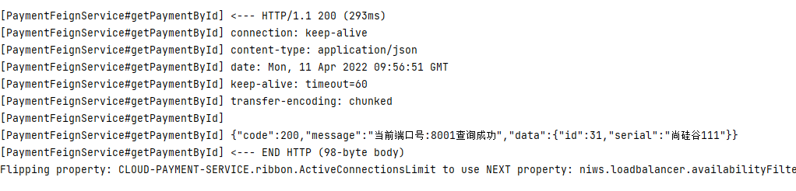

## Hystrix断路器

### Hystrix概述

#### 分布式系统面临的问题

分布式系统是一个硬件或者软件分布在不同的网络计算机上，彼此之间仅仅通过消息传递进行通信和协调的系统。

通俗的点说。就是一个任务分成多个子任务，这些子任务部署在不同的服务器节点，共同构成的系统就叫分布式系统。同一个分布式系统的服务及节点在空间上的部署可以是任意的。可以是不同机柜，不同机房，不同的城市中

Tips:分布式和集群的区别

- 集群：同一个服务拷贝部署在多个子节点(多个人在完成同一件事)
- 分布式：一个系统拆分成多个不同服务部署在不同的服务节点上（多个人在完成不同的事情）

服务雪崩：多个微服务之间调用的时候，假设微服务A调用微服务B和微服务C，微服务B和微服务C又调用其它的微服务，这就是所谓的“扇出”。如果扇出的链路上某个微服务的调用响应时间过长或者不可用，对微服务A的调用就会占用越来越多的系统资源，进而引起系统崩溃，所谓的“雪崩效应”。

对于高流量的应用来说，单一的后端依赖可能会导致所有服务器上的所有资源都在几秒钟内饱和。比失败更糟糕的是，这些应用程序还可能导致服务之间的延迟增加，备份队列，线程和其他系统资源紧张，导致整个系统发生更多的级联故障。这些都表示需要对故障和延迟进行隔离和管理，以便单个依赖关系的失败，不能取消整个应用程序或系统。

所以，通常当你发现一个模块下的某个实例失败后，这时候这个模块依然还会接收流量，然后这个有问题的模块还调用了其他的模块，这样就会发生级联故障，或者叫雪崩。|

#### 什么是Hystrix？

Hystrix是一个用于处理分布式系统的延迟和容错的开源库，在分布式系统里，许多依赖不可避免的会调用失败，比如超时、异常等，Hystrix能够保证在一个依赖出问题的情况下，**不会导致整体服务失败，避免级联故障，以提高分布式系统的弹性。**

"断路器”本身是一种开关装置，当某个服务单元发生故障之后，通过断路器的故障监控（类似熔断保险丝)，**向调用方返回一个符合预期的、可处理的备选响应(FallBack)，而不是长时间的等待或者抛出调用方无法处理的异常**，这样就保证了服务调用方的线程不会被长时间、不必要地占用，从而避免了故障在分布式系统中的蔓延，乃至雪崩。

> Hystrix停止更新，进入维护阶段

#### Hystrix的功能

- 服务降级
- 服务熔断
- 接近实时的监控

### Hystrix重要概念

#### 服务降级

服务降级一般是指在服务器压力剧增的时候，根据实际业务使用情况以及流量，对一些服务和页面有策略的不处理或者用一种简单的方式进行处理，从而释放服务器资源的资源以保证核心业务的正常高效运行。

> 就是服务器忙，请稍后再试

那些情况会触发降级？

- 程序运行异常
- 超时
- 服务熔断触发服务降级
- 线程池/信号量打满也会导致服务降级

#### 服务熔断

服务熔断是应对雪崩效应的一种微服务链路保护机制。 例如在高压电路中，如果某个地方的电压过高，熔断器就会熔断，对电路进行保护。 同样，在微服务架构中，熔断机制也是起着类似的作用。 **当调用链路的某个微服务不可用或者响应时间太长时，会进行服务熔断，不再有该节点微服务的调用，快速返回错误的响应信息。**当检测到该节点微服务调用响应正常后，恢复调用链路。


#### 服务限流

限流主要的作用是保护服务节点或者集群后面的数据节点，防止瞬时流量过大使服务和数据崩溃（如前端缓存大量实效），造成不可用；还可用于平滑请求。比如秒杀高并发等操作。

### Hystrix案例

#### 构建服务提供者

##### 新建module

新建一个`cloud-provider-hystrix-payment8001`工程。


##### 改pom

```
<dependencies>

    <dependency>
        <groupId>org.springframework.cloud</groupId>
        <artifactId>spring-cloud-starter-netflix-hystrix</artifactId>
    </dependency>
    <dependency>
        <groupId>com.atguigu.springcloud</groupId>
        <artifactId>cloud-api-commons</artifactId>
        <version>${project.version}</version>
    </dependency>
    <!--spring boot 2.2.2-->
    <!--图形化监控展现-->
    <dependency>
        <groupId>org.springframework.boot</groupId>
        <artifactId>spring-boot-starter-web</artifactId>
    </dependency>
    <dependency>
        <groupId>org.springframework.boot</groupId>
        <artifactId>spring-boot-starter-actuator</artifactId>
    </dependency>
    <dependency>
        <groupId>org.springframework.boot</groupId>
        <artifactId>spring-boot-devtools</artifactId>
        <scope>runtime</scope>
        <optional>true</optional>
    </dependency>
    <dependency>
        <groupId>org.projectlombok</groupId>
        <artifactId>lombok</artifactId>
        <optional>true</optional>
    </dependency>
    <dependency>
        <groupId>org.springframework.boot</groupId>
        <artifactId>spring-boot-starter-test</artifactId>
        <scope>test</scope>
    </dependency>
    <dependency>
        <groupId>org.springframework.cloud</groupId>
        <artifactId>spring-cloud-starter-netflix-eureka-client</artifactId>
    </dependency>
</dependencies>
```

##### 写yaml

```
server:
  port: 8001
spring:
  application:
    name: cloud-provider-hystrix-payment

eureka:
  client:
    service-url:
      defaultZone: http://eureka7001.com:7001/eureka
    register-with-eureka: true
    fetch-reistry: true
```

##### 主启动

```
@SpringBootApplication
@EnableEurekaClient
@EnableHystrix
public class PaymentHystrixMain8001 {
    public static void main(String[] args) {
        SpringApplication.run(PaymentHystrixMain8001.class,args);
    }
}
```

##### 业务类

###### service

```
@Service
public class PaymentService {

    //正常访问
    public String paymentInfo(Integer id){
        return "线程池：" + Thread.currentThread().getName() + "  paymentInfo,id" + id +"\n";
    }

    // 超时访问
    public String paymentInfoTimeout(Integer id){
        int seconds = 5;
        try {
            TimeUnit.SECONDS.sleep(seconds);
        } catch (InterruptedException e) {
            e.printStackTrace();
        }
        return "线程池：" + Thread.currentThread().getName() + "  paymentInfo,id" + id + " 耗时"+seconds+"秒钟"+"\n";
    }

}
```

###### controller

```
@RestController
@Slf4j
public class PaymentController {

    @Resource
    private PaymentService paymentService;

    @Value("${server.port}")
    private String serverPort;

    @GetMapping("/payment/hystrix/info/{id}")
    public String paymentInfo(@PathVariable("id") Integer id){

        String result = paymentService.paymentInfo(id);

        log.info("result = " + result);

        return result;
    }

    @GetMapping("/payment/hystrix/timeout/{id}")
    public String paymentInfoTimeout(@PathVariable("id") Integer id){
        String result = paymentService.paymentInfoTimeout(id);

        log.info("result = " + result);

        return result;
    }

}
```

##### 正常测试

正常访问地址：http://localhost:8001/payment/hystrix/info/1


超时访问地址：http://localhost:8001/payment/hystrix/timeout/1


> 从上面开始为根基，开始学习：正确-> 错误->服务熔断->服务恢复

##### 高并发测试

下载地址：https://jmeter.apache.org/download_jmeter.cgi

在非高并发情形下，还能勉强满足，但是在高并发情况下，就不能满足了。

通过开启Jmeter对8001进行测试，能够压死8001。

- 开启Jmeter，并选择options下的语言选择，换成中文界面。

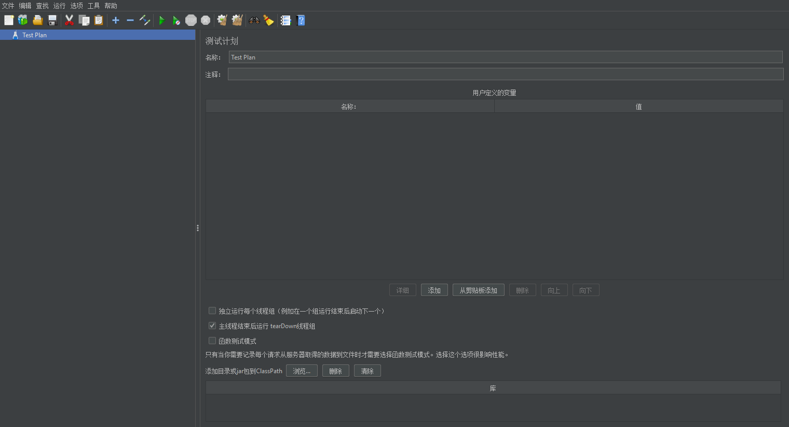

- 填写测试信息，开启20000个请求，之后保存测试信息

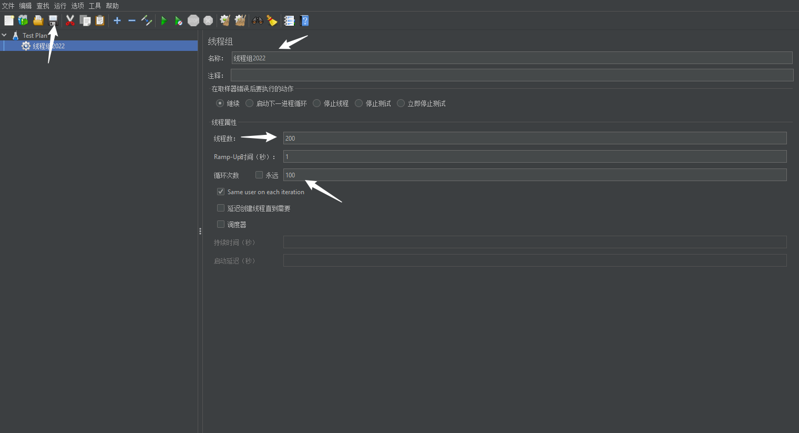

- 之后，添加>Sampler>Http请求

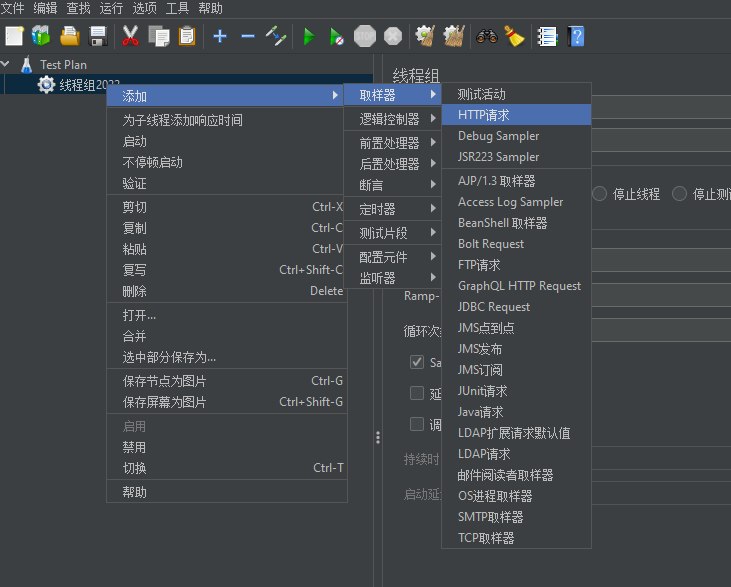

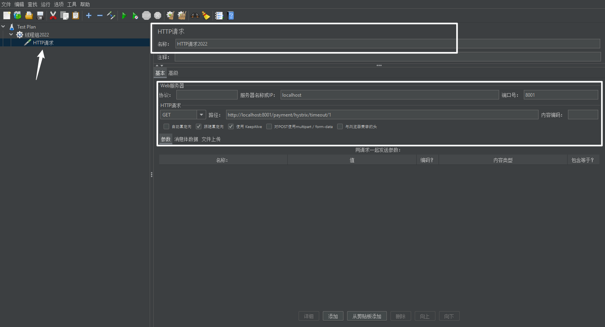

- 保存信息，之后启动测试，点击启动按钮

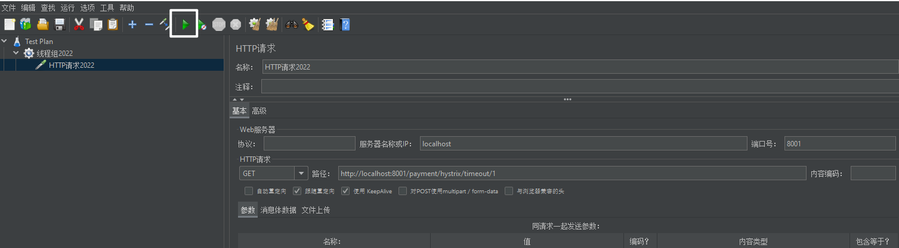

访问：http://localhost:8001/payment/hystrix/info/1，发现现在这个也需要等待一些时间了。

停掉线程测试后，该网址又恢复秒回的状态了。

#### 构建服务消费者

上面还是服务提供者8001自己测试，假如此时外部的消费者80也来访问，那消费者只能干等，最终导致消费端80不满意，服务端8001直接被拖死。

##### 新建module


##### 改pom

```
<dependencies>
    <!--hystrix-->
    <dependency>
        <groupId>org.springframework.cloud</groupId>
        <artifactId>spring-cloud-starter-netflix-hystrix</artifactId>
    </dependency>
    <!--openfeign-->
    <dependency>
        <groupId>org.springframework.cloud</groupId>
        <artifactId>spring-cloud-starter-openfeign</artifactId>
    </dependency>
    <!--eureka client-->
    <dependency>
        <groupId>org.springframework.cloud</groupId>
        <artifactId>spring-cloud-starter-netflix-eureka-server</artifactId>
    </dependency>
    <dependency>
        <groupId>com.atguigu.springcloud</groupId>
        <artifactId>cloud-api-commons</artifactId>
        <version>1.0-SNAPSHOT</version>
    </dependency>
    <dependency>
        <groupId>org.springframework.boot</groupId>
        <artifactId>spring-boot-starter-web</artifactId>
    </dependency>
    <!--监控-->
    <dependency>
        <groupId>org.springframework.boot</groupId>
        <artifactId>spring-boot-starter-actuator</artifactId>
    </dependency>
    <!--热部署-->
    <dependency>
        <groupId>org.springframework.boot</groupId>
        <artifactId>spring-boot-devtools</artifactId>
        <scope>runtime</scope>
        <optional>true</optional>
    </dependency>
    <dependency>
        <groupId>org.projectlombok</groupId>
        <artifactId>lombok</artifactId>
        <optional>true</optional>
    </dependency>
    <dependency>
        <groupId>org.springframework.boot</groupId>
        <artifactId>spring-boot-starter-test</artifactId>
        <scope>test</scope>
    </dependency>
</dependencies>
```

##### 写yaml

```
server:
  port: 80

spring:
  application:
    name: cloud-consumer-hystrix-order

eureka:
  client:
    fetch-registry: true
    register-with-eureka: true
    service-url:
      defaultZone: http://eureka7001.com:7001/eureka/
```

##### 主启动

```
@SpringBootApplication
@EnableFeignClients
@EnableHystrix
public class OrderHystrixMain80 {
    public static void main(String[] args) {
        SpringApplication.run(OrderHystrixMain80.class,args);
    }
}
```

##### 业务类

###### service

```
@Component
@FeignClient(value = "CLOUD-PROVIDER-HYSTRIX-PAYMENT")
public interface PaymentHystrixService {

    @GetMapping("/payment/hystrix/info/{id}")
    public String paymentInfo(@PathVariable("id") Integer id);

    @GetMapping("/payment/hystrix/timeout/{id}")
    public String paymentInfoTimeout(@PathVariable("id") Integer id);

}
```

###### controller

```
@RestController
@Slf4j
public class OrderHystrixController {

    @Resource
    private PaymentHystrixService paymentHystrixService;

    @GetMapping("/consumer/hystrix/info/{id}")
    public String paymentInfo(@PathVariable("id")Integer id) {
        return paymentHystrixService.paymentInfo(id);
    }

    @GetMapping("/consumer/hystrix/timeout/{id}")
    public String paymentInfoTimeout(@PathVariable("id") Integer id) {
        return paymentHystrixService.paymentInfoTimeout(id);
    }
}
```

##### 正常测试

正常访问地址：http://localhost/consumer/hystrix/info/2


超时访问地址：http://localhost/consumer/hystrix/timeout/2

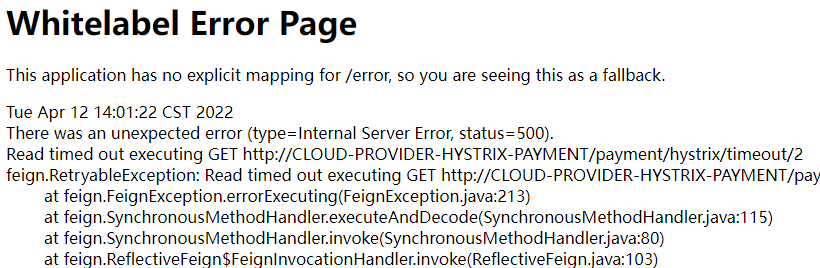

需要在yaml中添加超时设置

```
#设置feign客户端超时时间(openFeign.默认支持ribbon)
ribbon:
  ReadTimeout: 6000 # 指的是建立连接所用的时间，适用于网络状况正常的情况下,两端连接所用的时问
  ConnectTimeout: 6000 # 指的是建立连接后从服务器读取到可用资源所用的时问
```

重新访问，最好是在服务端修改为等待时间为3秒，这样就不影响后面测试。


##### 高并发测试

开启20000个线程给8001压力，消费端80微服务再去访问正常的微服务8001地址。

访问地址：http://localhost/consumer/hystrix/info/2，会发现消费者端80，要么转圈圈等待，要么消费端报超时错误。

#### 故障现象和导致原因

8001同一层次的其它接口服务被困死，因为tomcat线程池里面的工作线程已经被挤占完毕；

80此时调用8001，客户端访问响应缓慢，转圈圈。

#### 如何解决所存在的问题？

所存在的问题：

- 超时导致服务器变慢(转圈)-超时不再等待
- 出错(宕机或程序运行出错)-出错要有兜底

解决：

- 对方服务(8001)超时了，调用者(80)不能一直卡死等待，必须有服务降级
- 对方服务(8001)down机了，调用者(80)不能一直卡死等待，必须有服务降级
- 对方服务(8001)OK，调用者(80)自己出故障或有自我要求(自己的等待时间小于服务提供者），自己处理降级

#### 服务降级

##### 降级配置

使用`@HystrixCommmand`。

##### 8001先从自身找问题

设置自身调用超时时间的峰值，峰值内可以正常运行，超过了需要有兜底的方法处理，作服务降级fallback。

##### 8001fallback

在`cloud-provider-hystrix-payment8001`中的`PaymentService`设置一个兜底的方法。

```
// 超时访问
@HystrixCommand(fallbackMethod = "paymentInfoTimeoutHandler",commandProperties = {
    @HystrixProperty(name = "execution.isolation.thread.timeoutInMilliseconds", value = "3000")
})
public String paymentInfoTimeout(Integer id){
    int seconds = 5;
    try {
        TimeUnit.SECONDS.sleep(seconds);
    } catch (InterruptedException e) {
        e.printStackTrace();
    }
    return "线程池：" + Thread.currentThread().getName() + "  paymentInfo,id" + id + " 耗时"+seconds+"秒钟"+"\n";
}

public String paymentInfoTimeoutHandler(Integer id){
    return "线程池：" + Thread.currentThread().getName() + "  paymentInfoTimeoutHandler,id" + id+"\n";
}
```

`@HystrixCommand`报异常后如何处理？

##### 80fallback

对消费者80端，也就是设置降级保护。

对yaml添加一些配置：

```
server:
  port: 80

spring:
  application:
    name: cloud-consumer-hystrix-order

eureka:
  client:
    fetch-registry: true
    register-with-eureka: true
    service-url:
      defaultZone: http://eureka7001.com:7001/eureka/

feign:
  hystrix:
    enabled: true
```

在主启动中需要保证开启了`@EnableHystrix`。然后在`controller.OrderHystrixController`中修改为如下：

```
@GetMapping("/consumer/hystrix/timeout/{id}")
@HystrixCommand(fallbackMethod = "paymentInfoTimeoutHandler",commandProperties = {
    @HystrixProperty(name = "execution.isolation.thread.timeoutInMilliseconds", value = "3000")
})
public String paymentInfoTimeout(@PathVariable("id") Integer id) {

    int age = 0 /10;

    return paymentHystrixService.paymentInfoTimeout(id);
}

public String paymentInfoTimeoutHandler(Integer id){
    return "消费者80出错了";
}
```

和8001端一样，也需要一个兜底的方法。访问地址：http://localhost/consumer/hystrix/timeout/2


##### 目前问题

每个业务方法对应一个兜底的方法，代码膨胀，需要**统一**（全局的）和自定义（特定的）的分开。

##### 解决问题

- 每个方法都配置一个兜底的方法，会导致代码膨胀，如何解决？

通过`@DefaultProperties(defaultFallback = "")`实现全局的服务降级的保护。还需要在每个函数上添加`@HystrixCommand`表示开启了服务降级。

除了个别重要的核心业务，其他都可以跳转到去全局配置。

对`cloud*consumer-feign-hystrix-order80.controller.OrderHystrixController`进行修改测试：

```
@RestController
@Slf4j
@DefaultProperties(defaultFallback = "paymentGlobalFallbackMethod")
public class OrderHystrixController {

    @Resource
    private PaymentHystrixService paymentHystrixService;

    @GetMapping("/consumer/hystrix/timeout/{id}")
    @HystrixCommand
    public String paymentInfoTimeout(@PathVariable("id") Integer id) {
        int age = 0 /10;
        return paymentHystrixService.paymentInfoTimeout(id);
    }

    public String paymentGlobalFallbackMethod(){
        return "全局服务";
    }
}
```

之后重启测试：http://localhost/consumer/hystrix/timeout/2


- 配置的指定服务降级保护的方法和业务逻辑混在一起，导致代码混乱，如何解决？

> 服务降级，客户端去调用服务端，碰上服务端宕机或关闭

本次案例服务降级处理是在客户端80处实现完成的，与服务端8001没有关系，只需要为Feign客户端定义的接口添加一个服务降级处理的实现类即可实现解耦。

> 未来需要面对的异常：运行、超时、宕机。

现在开始修改代码，根据`cloud-consumer-feign-hystrix-order80`已经有的`PaymentHystrixService`接口，重新新建一个类`PaymentFallbackService`实现该接口，统一为接口里面的方法进行异常处理。

```
@Service
public class PaymentFallbackService implements PaymentHystrixService{
    @Override
    public String paymentInfo(Integer id) {
        return "==============PaymentFallbackService paymentInfo================";
    }

    @Override
    public String paymentInfoTimeout(Integer id) {
        return "==============PaymentFallbackService paymentInfoTimeout================";
    }
}
```

然后修改`PaymentHystrixService`中的`@FeignClient`，fallback表示如果失败了，就调用这里面的相对应的实现方法。

```
@FeignClient(value = "CLOUD-PROVIDER-HYSTRIX-PAYMENT", fallback = PaymentFallbackService.class)
```

注意yaml文件中一定要保证hystrix开启。

```
feign:
  hystrix:
    enabled: true
```

重启之后，访问正常的；如果8001挂了后，运行测试：http://localhost/consumer/hystrix/timeout/2

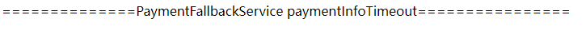

#### 服务熔断

##### 概述

在Spring Cloud框架里，熔断机制通过Hystrix实现。Hystrix会监控微服务间调用的状况，当失败的调用到一定阈值，缺省是5秒内20次调用失败，就会启动熔断机制。熔断机制的注解是`@HystrixCommand`。

地址：https://martinfowler.com/bliki/CircuitBreaker.html

##### 重构服务提供者

对`cloud-provider-hystrix-payment8001`进行修改。

首先先对`PaymentService`进行修改：

| 参数                                                         | 含义                 |
| ------------------------------------------------------------ | -------------------- |
| `@HystrixProperty(name = "circuitBreaker.enabled",value = "true")` | 是否开启断路器       |
| `@HystrixProperty(name = "circuitBreaker.requestVolumeThreshold",value = "true")` | 请求次数，有没有达到 |
| `@HystrixProperty(name = "circuitBreaker.sleepWindowInMilliseconds",value = "10000")` | 时间窗口期           |
| `@HystrixProperty(name = "circuitBreaker.errorThresholdPercentage",value = "60")` | 失败率达到多少后跳闸 |

```
// === 服务熔断
@HystrixCommand(fallbackMethod = "paymentCircuitBreakerFallback",commandProperties = {

    @HystrixProperty(name = "circuitBreaker.enabled",value = "true"), // 是否开启断路器
    @HystrixProperty(name = "circuitBreaker.requestVolumeThreshold",value = "10"), // 请求次数
    @HystrixProperty(name = "circuitBreaker.sleepWindowInMilliseconds",value = "10000"), // 时间窗口期
    @HystrixProperty(name = "circuitBreaker.errorThresholdPercentage",value = "60"), // 失败率达到多少后跳闸

})
public String paymentCircuitBreaker(Integer id){
    if(id < 0){
        throw new RuntimeException("id不能为负数");
    }
    String serialNumber = IdUtil.simpleUUID();

    return Thread.currentThread().getName() + "\t" + "调用成功，流水号："+serialNumber;
}

public String paymentCircuitBreakerFallback(Integer id){
    return "id 不能为负数，请稍后再试o(╥﹏╥)o ~~~~ id:"+id;
}
hystrix.command.default和hystrix.threadpool.default中的default为默认CommandKey
======================================================================================================================
Command Properties
Execution相关的属性的配置：
hystrix.command.default.execution.isolation.strategy 隔离策略，默认是Thread, 可选Thread｜Semaphore

hystrix.command.default.execution.isolation.thread.timeoutInMilliseconds 命令执行超时时间，默认1000ms

hystrix.command.default.execution.timeout.enabled 执行是否启用超时，默认启用true
hystrix.command.default.execution.isolation.thread.interruptOnTimeout 发生超时是是否中断，默认true
hystrix.command.default.execution.isolation.semaphore.maxConcurrentRequests 最大并发请求数，默认10，该参数当使用ExecutionIsolationStrategy.SEMAPHORE策略时才有效。如果达到最大并发请求数，请求会被拒绝。理论上选择semaphore size的原则和选择thread size一致，但选用semaphore时每次执行的单元要比较小且执行速度快（ms级别），否则的话应该用thread。
semaphore应该占整个容器（tomcat）的线程池的一小部分。
Fallback相关的属性
这些参数可以应用于Hystrix的THREAD和SEMAPHORE策略

hystrix.command.default.fallback.isolation.semaphore.maxConcurrentRequests 如果并发数达到该设置值，请求会被拒绝和抛出异常并且fallback不会被调用。默认10
hystrix.command.default.fallback.enabled 当执行失败或者请求被拒绝，是否会尝试调用hystrixCommand.getFallback() 。默认true
======================================================================================================================
Circuit Breaker相关的属性
hystrix.command.default.circuitBreaker.enabled 用来跟踪circuit的健康性，如果未达标则让request短路。默认true
hystrix.command.default.circuitBreaker.requestVolumeThreshold 一个rolling window内最小的请求数。如果设为20，那么当一个rolling window的时间内（比如说1个rolling window是10秒）收到19个请求，即使19个请求都失败，也不会触发circuit break。默认20
hystrix.command.default.circuitBreaker.sleepWindowInMilliseconds 触发短路的时间值，当该值设为5000时，则当触发circuit break后的5000毫秒内都会拒绝request，也就是5000毫秒后才会关闭circuit。默认5000
hystrix.command.default.circuitBreaker.errorThresholdPercentage错误比率阀值，如果错误率>=该值，circuit会被打开，并短路所有请求触发fallback。默认50
hystrix.command.default.circuitBreaker.forceOpen 强制打开熔断器，如果打开这个开关，那么拒绝所有request，默认false
hystrix.command.default.circuitBreaker.forceClosed 强制关闭熔断器 如果这个开关打开，circuit将一直关闭且忽略circuitBreaker.errorThresholdPercentage
======================================================================================================================
Metrics相关参数
hystrix.command.default.metrics.rollingStats.timeInMilliseconds 设置统计的时间窗口值的，毫秒值，circuit break 的打开会根据1个rolling window的统计来计算。若rolling window被设为10000毫秒，则rolling window会被分成n个buckets，每个bucket包含success，failure，timeout，rejection的次数的统计信息。默认10000
hystrix.command.default.metrics.rollingStats.numBuckets 设置一个rolling window被划分的数量，若numBuckets＝10，rolling window＝10000，那么一个bucket的时间即1秒。必须符合rolling window % numberBuckets == 0。默认10
hystrix.command.default.metrics.rollingPercentile.enabled 执行时是否enable指标的计算和跟踪，默认true
hystrix.command.default.metrics.rollingPercentile.timeInMilliseconds 设置rolling percentile window的时间，默认60000
hystrix.command.default.metrics.rollingPercentile.numBuckets 设置rolling percentile window的numberBuckets。逻辑同上。默认6
hystrix.command.default.metrics.rollingPercentile.bucketSize 如果bucket size＝100，window＝10s，若这10s里有500次执行，只有最后100次执行会被统计到bucket里去。增加该值会增加内存开销以及排序的开销。默认100
hystrix.command.default.metrics.healthSnapshot.intervalInMilliseconds 记录health 快照（用来统计成功和错误绿）的间隔，默认500ms
Request Context 相关参数
hystrix.command.default.requestCache.enabled 默认true，需要重载getCacheKey()，返回null时不缓存
hystrix.command.default.requestLog.enabled 记录日志到HystrixRequestLog，默认true
======================================================================================================================
Collapser Properties 相关参数
hystrix.collapser.default.maxRequestsInBatch 单次批处理的最大请求数，达到该数量触发批处理，默认Integer.MAX_VALUE
hystrix.collapser.default.timerDelayInMilliseconds 触发批处理的延迟，也可以为创建批处理的时间＋该值，默认10
hystrix.collapser.default.requestCache.enabled 是否对HystrixCollapser.execute() and HystrixCollapser.queue()的cache，默认true
======================================================================================================================
ThreadPool 相关参数
线程数默认值10适用于大部分情况（有时可以设置得更小），如果需要设置得更大，那有个基本得公式可以follow：
requests per second at peak when healthy × 99th percentile latency in seconds + some breathing room
每秒最大支撑的请求数 (99%平均响应时间 + 缓存值)
比如：每秒能处理1000个请求，99%的请求响应时间是60ms，那么公式是：
（0.060+0.012）

基本得原则时保持线程池尽可能小，他主要是为了释放压力，防止资源被阻塞。
当一切都是正常的时候，线程池一般仅会有1到2个线程激活来提供服务

hystrix.threadpool.default.coreSize 并发执行的最大线程数，默认10
hystrix.threadpool.default.maxQueueSize BlockingQueue的最大队列数，当设为－1，会使用SynchronousQueue，值为正时使用LinkedBlcokingQueue。该设置只会在初始化时有效，之后不能修改threadpool的queue size，除非reinitialising thread executor。默认－1。
hystrix.threadpool.default.queueSizeRejectionThreshold 即使maxQueueSize没有达到，达到queueSizeRejectionThreshold该值后，请求也会被拒绝。因为maxQueueSize不能被动态修改，这个参数将允许我们动态设置该值。if maxQueueSize == -1，该字段将不起作用
hystrix.threadpool.default.keepAliveTimeMinutes 如果corePoolSize和maxPoolSize设成一样（默认实现）该设置无效。如果通过plugin（https://github.com/Netflix/Hystrix/wiki/Plugins）使用自定义实现，该设置才有用，默认1.
hystrix.threadpool.default.metrics.rollingStats.timeInMilliseconds 线程池统计指标的时间，默认10000
hystrix.threadpool.default.metrics.rollingStats.numBuckets 将rolling window划分为n个buckets，默认10
```

接下来对`controller.PaymentController`进行修改：

```
@GetMapping("/payment/circuit/{id}")
public String paymentCircuitBreaker(@PathVariable("id") Integer id){
    String result = paymentService.paymentCircuitBreaker(id);
    log.info(result);
    return result;
}
```

配置完后，进行测试：http://localhost:8001/payment/circuit/1


之后访问http://localhost:8001/payment/circuit/-1，连续访问超过10次以上。之后又马上去访问正确的上述地址：


这时会发现，服务不可用了，但是过一会儿服务又可以恢复使用了。

> 错误->恢复->正确

##### 总结

###### 降级与熔断

**降级一般而言指的是我们自身的系统出现了故障而降级。而熔断一般是指依赖的外部接口出现故障的情况断绝和外部接口的关系**。

###### 熔断类型

- 熔断打开：请求不再进行调用当前服务，内部设置时钟一般为MTTR(平均故障处理时间)，当打开时长达到所设时钟则进入半熔断状态
- 熔断关闭：熔断关闭不会对服务进行熔断
- 熔断半开：部分请求根据规则调用当前服务，如果请求成功且符合规则则认为当前服务恢复正常，关闭熔断

###### 断路器相关信息

涉及到断路器的三个重要参数：快照时间窗、请求总数阀值、错误百分比阀值。

- 快照时间窗:断路器确定是否打开需要统计一些请求和错误数据，而统计的时间范围就是快照时间窗，默认为最近的10秒。
- 请求总数阀值:在快照时间窗内，必须满足请求总数阀值才有资格熔断。默认为20，意味着在10秒内，如果该hystrix命令的调用次数不足20次,即使所有的请求都超时或其他原因失败，断路器都不会打开。
- 错误百分比阀值:当请求总数在快照时间窗内超过了阀值，比如发生了30次调用，如果在这30次调用中，有15次发生了超时异常，也就是超过50%的错误百分比，在默认设定50%阀值情况下，这时候就会将断路器打开。 

断路器开启或者关闭的条件：

到达以下阀值，断路器将会开启

- 当满足一定的阀值的时候（默认10秒内超过20个请求次数)
- 当失败率达到一定的时候（默认10秒内超过50%的请求失败)

当开启的时候：

- 所有请求都不会进行转发
- 一段时间之后（默认是5秒)，这个时候断路器是半开状态，会让其中一个请求进行转发。如果成功，断路器会关闭，若失败，继续开启。重复如此上述两项。

断路器打开之后：

再有请求调用的时候，将不会调用主逻辑，而是直接调用降级fallback。通过断路器，实现了自动地发现错误并将降级逻辐切换为主逻辑，减少响应延迟的效果。

原来的主逻辑要如何恢复呢?

对于这一问题，hystrix也为我们实现了自动恢复功能。当断路器打开，对主逻辑进行熔断之后，hystrix会启动一个休眠时间窗，在这个时间窗内，降级逻辑是临时的成为主逻辑，当休眠时间窗到期，断路器将进入半开状态，释放一次请求到原来的主逻辑上，如果此次请求正常返回，那么断路器将继续闭合,主逻辑恢复，如果这次请求依然有问题，断路器继续进入打开状态，休眠时间窗重新计时。

#### 服务限流

由于hystrix已经停止更新，所以把限流放在 `Alibaba`的 `Sentinel` 说明。

### Hystrix工作流程

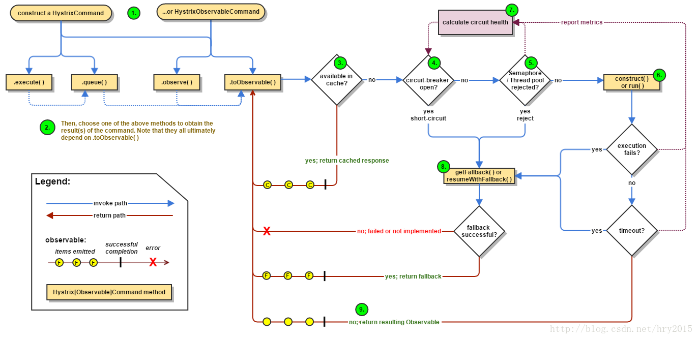

### 服务监控hystrixDashborad

创建`cloud-consumer-hystrix-dashboard9001`，添加依赖

```
<dependency>
    <groupId>org.springframework.cloud</groupId>
    <artifactId>spring-cloud-starter-netflix-hystrix-dashboard</artifactId>
    <version>2.2.1.RELEASE</version>
</dependency>
```

并设置端口为9001

```
server:
  port: 9001
```

之后在主启动类上添加配置。

```
@SpringBootApplication
@EnableHystrixDashboard // 开启仪表盘
public class DashBoardMain9001 {
    public static void main(String[] args) {
        SpringApplication.run(DashBoardMain9001.class,args);
    }
}
```

注意所有服务提供者(8001/8002)都需要引入以下依赖，前面已经配置过了。

```
<dependency>
    <groupId>org.springframework.boot</groupId>
    <artifactId>spring-boot-starter-actuator</artifactId>
</dependency>
```

然后启动9001，访问地址：http://localhost:9001/hystrix

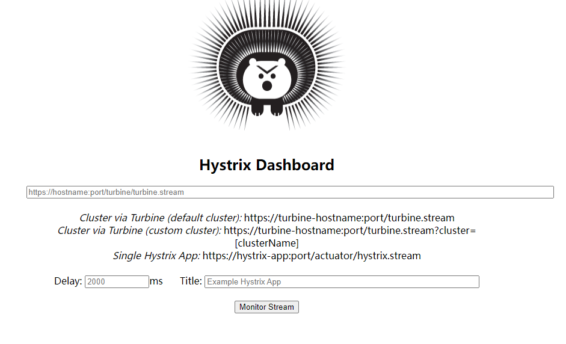

配置好了，接下来进行断路器演示。还需要在8001的主启动类，进行添加如下配置：

```
@SpringBootApplication
@EnableEurekaClient
@EnableHystrix
@EnableCircuitBreaker
public class PaymentHystrixMain8001 {
    public static void main(String[] args) {
        SpringApplication.run(PaymentHystrixMain8001.class,args);
    }

    /**
     * 注意：新版本Hystrix需要在主启动类中指定监控路径
     * 此配置是为了服务监控而配置，与服务容错本身无关，spring cloud升级后的坑
     * ServletRegistrationBean因为springboot的默认路径不是"/hystrix.stream"，
     * 只要在自己的项目里配置上下面的servlet就可以了
     *
     * @return ServletRegistrationBean
     */
    @Bean
    public ServletRegistrationBean getServlet() {
        HystrixMetricsStreamServlet streamServlet = new HystrixMetricsStreamServlet();
        ServletRegistrationBean registrationBean = new ServletRegistrationBean(streamServlet);

        // 一启动就加载
        registrationBean.setLoadOnStartup(1);
        // 添加url
        registrationBean.addUrlMappings("/hystrix.stream");
        // 设置名称
        registrationBean.setName("HystrixMetricsStreamServlet");
        return registrationBean;
    }

}
```

现在开始启动测试，先进行熔断测试，在观察仪表盘。然后访问：http://localhost:9001/hystrix，之后在对应地方填上地址，然后点击按钮，就可以看到图表了。

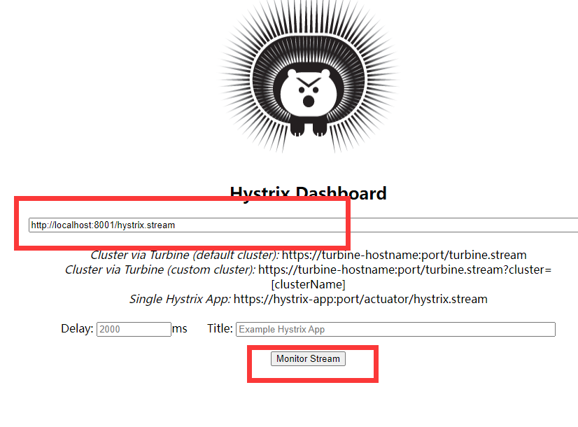

之后不停点击：http://localhost:8001/payment/circuit/1和http://localhost:8001/payment/circuit/-1进行测试观察如下图表。

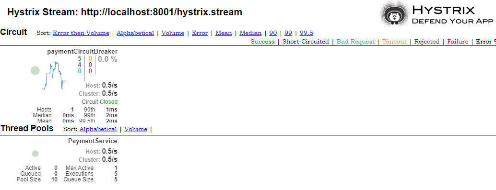

实心圆：共有两种含义。它通过颜色的变化代表了实例的健康程度，它的健康度从绿色<黄色<橙色<红色递减。 该实心圆除了颜色的变化之外，它的大小也会根据实例的请求流量发生变化，流量越大该实心圆就越大。所以通过该实心圆的展示，就可以在大量的实例中快速的发现故障实例种高压力实例。

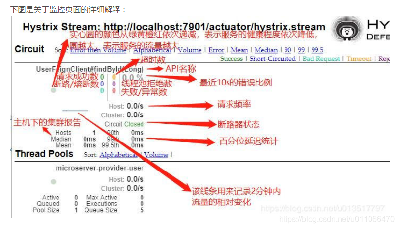

## 服务网关

### Zuul路由网关

#### 概述

#### 路由基本配置

#### 路由访问映射规则

#### 查看路由信息

#### 过滤器

### Zuul2路由网关

#### 概述

#### 路由基本配置

#### 路由访问映射规则

#### 查看路由信息

#### 过滤器

### **Gateway新一代网关**

#### 概述

##### 官网

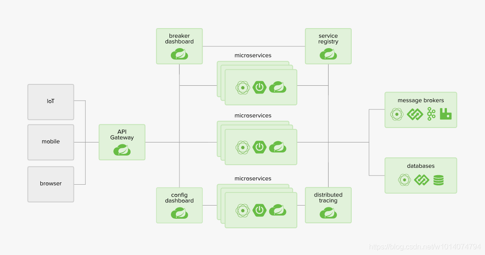

官网地址：https://github.com/spring-cloud/spring-cloud-gateway

##### 什么是Gateway？

SpringCloud Gateway 是 Spring Cloud 的个全新项目，基于 Spring5.0+ Spring Boot2.0 和 Project Reactor 等技术开发的网关，它旨在为微服务架构提供一种简单有效的统一的API路由管理方式。

SpringCloud Gateway 作为 Spring Cloud 生态系统中的网关，**目标是替代zuul**，在 Spring Cloud2.0以上版本中，没有对新版本的zuul2.0以上最新高性能版本进行集成，仍然还是使用的 zuul1.× 非 Reactor 模式的老版本。

**Spring Cloud Gateway使用的 Webflux中的 reactor-netty响应式编程组件，底层使用了 Netty通讯框架，是基于异步非阻塞模型上进行开发的**。

Spring Cloud Gateway的目标提供统-的路由方式且基于 Filter 链的方式提供了网关基本的功能，例如：**安全，监控/指标，和限流**。

##### 微服务架构中网关在哪里？

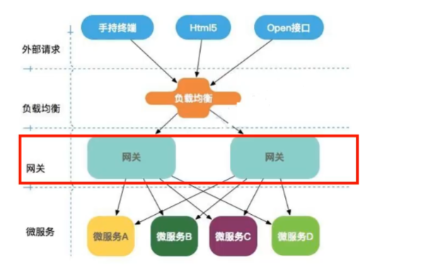

##### zuul与gateway

###### 为什么有了zuul还需要gateway？

一方面因为Zuul1.0已经进入了维护阶段，而且Gateway是SpringCloud团队研发的，是亲儿子产品，值得信赖。而且很多功能Zuul都没有用起来也非常的简单便捷。

Gateway是基于异步非阻塞模型上进行开发的，性能方面不需要担心。虽然Netflix早就发布了最新的Zuul 2.x，但Spring Cloud貌似没有整合计划。而且Netflix相关组件都宣布进入维护期；不知前景如何?

多方面综合考虑Gateway是很理想的网关选择。

###### **Spring Cloud Gateway具有如下特性**

- 基于Spring Framework 5, Project Reactor和 Spring Boot 2.0进行构建；
- 动态路由：能够匹配任何请求属性；
- 可以对路由指定Predicate (断言）和Filter (过滤器);集成Hystrix的断路器功能；
- 集成Spring Cloud 服务发现功能；
- 易于编写的Predicate (断言）和Filter (过滤器);请求限流功能；
- 支持路径重写

###### **Spring Cloud Gateway 与Zuul的区别**

在SpringCloud Finchley 正式版之前，Spring Cloud推荐的网关是Netflix提供的Zuul：

1. Zuul 1.x，是一个基于阻塞V/O的API Gateway；
2. Zuul 1.x**基于Servlet 2.5使用阻塞架构**它不支持任何长连接(如WebSocket)Zuul的设计模式和Nginx较像，每次V/О操作都是从工作线程中选择一个执行，请求线程被阻塞到工作线程完成，但是差别是Nginx用C++实现，Zuul用Java 实现，而JVM本身会有第一次加载较慢的情况，使得Zuul的性能相对较差；
3. Zuul 2.x理念更先进，**想基于Netty非阻塞和支持长连接**，但SpringCloud目前还没有整合。Zul 2.x的性能较Zuul 1.x有较大提升。在性能方面，根据官方提供的基准测试,Spring Cloud Gateway的RPS(每秒请求数)是Zuul的1.6倍；
4. Spring Cloud Gateway建立在Spring Framework 5、Project Reactor和Spring Boot 2之上，使用非阻塞API；
5. Spring Cloud Gateway还支持WebSocket，并且与Spring紧密集成拥有更好的开发体验。

###### zuul1模型

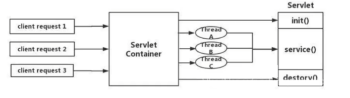

上述模式的缺点，servlet是一个简单的网络IO模型，当请求进入servlet container时，servlet container就会为其绑定一个线程，在并发不高的场景下这种模型是适用的。但是一旦高并发(比如抽风用jemeter压)，线程数量就会上涨，而线程资源代价是昂贵的(上线文切换，内存消耗大)严重影响请求的处理时间。在一些简单业务场景下，不希望为每个request分配一个线程，只需要1个或几个线程就能应对极大并发的请求，这种业务场景下servlet模型没有优势。

所以**Zuul 1.X是基于servlet之上的一个阻塞式处理模型**，即spring实现了处理所有request请求的一个servlet (Dispatcherservlet)并由该servlet阻塞式处理处理。所以Springcloud Zuul无法摆脱servlet模型的弊端。

###### geteway模型

传统的Web框架，比如说: struts2，springmvc等都是基于Servlet API与Servlet容器基础之上运行的。但是 **在Servlet3.1之后有了异步非阻塞的支持**。而WebFlux是一个典型非阻塞异步的框架，它的核心是基于Reactor的相关API实现的。相对于传统的web框架来说，它可以运行在诸如Netty,Undertow及支持Servlet3.1的容器上。非阻塞式+函数式编程（Spring5必须让你使用java8)。

Spring WebFlux是 Spring 5.0 引入的新的响应式框架，区别于Spring MVC，它不需要依赖Servlet API，它是完全异步非阻塞的，并且基于Reactor来实现响应式流规范。

#### 三大核心概念

**Route（路由）**：路由是构建网关的基本模块，它由 ID，目标URI，一系列的断言和过滤器组成，如果断言为 true 则匹配该路由

**Predicate（断言）**：开发人员可以匹配HTTP请求中的所有内容（例如请求头或请求参数），如果请求与断言相匹配则进行路由

**Filter（过滤）**：指的是 Spring框架中 Gateway Filter的实例，使用过滤器，可以在请求被路由前或者之后对请求进行修改。

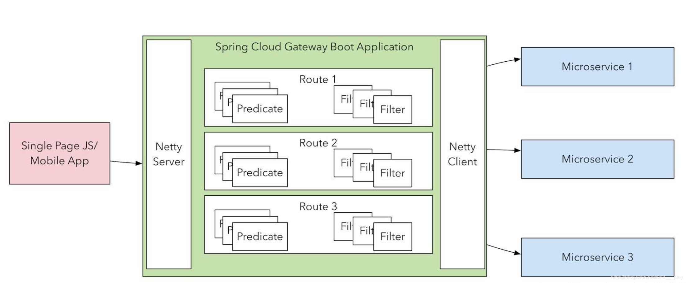

web请求，通过一些匹配条件，定位到真正的服务节点。并在这个转发过程的前后，进行一些精细化控制。

**predicate就是我们的匹配条件，而 Filter，就可以理解为个无所不能的拦截器有了这两个元素，再加上目标 uri 就可以实现一个具体的路由了**。

#### Gateway工作流程

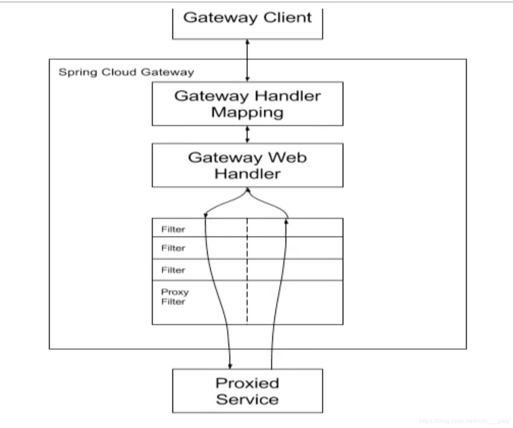

客户端向Spring Cloud Gateway发出请求。然后在Gateway Handler Mapping中找到与请求相匹配的路由，将其发送到Gateway Web Handler。

Handler再通过指定的过滤器链来将请求发送到我们实际的服务执行业务逻辑，然后返回。过滤器之间用虚线分开是因为过滤器可能会再发送代理请求之前（Pre）或之后（post）执行业务逻辑。

#### 入门配置

##### 新建module

新建一个module`cloud-gateway-gateway9527`。


##### 改pom

```
<dependencies>
    <dependency>
        <groupId>org.springframework.cloud</groupId>
        <artifactId>spring-cloud-starter-gateway</artifactId>
    </dependency>
    <!--eureka-client-->
    <dependency>
        <groupId>org.springframework.cloud</groupId>
        <artifactId>spring-cloud-starter-netflix-eureka-client</artifactId>
    </dependency>
    <!-- 引入自己定义的api通用包，可以使用Payment支付Entity -->
    <dependency>
        <groupId>com.atguigu.springcloud</groupId>
        <artifactId>cloud-api-commons</artifactId>
        <version>${project.version}</version>
        <scope>compile</scope>
    </dependency>
    <dependency>
        <groupId>org.springframework.boot</groupId>
        <artifactId>spring-boot-devtools</artifactId>
        <scope>runtime</scope>
        <optional>true</optional>
    </dependency>
    <dependency>
        <groupId>org.projectlombok</groupId>
        <artifactId>lombok</artifactId>
        <optional>true</optional>
    </dependency>
    <dependency>
        <groupId>org.springframework.boot</groupId>
        <artifactId>spring-boot-starter-test</artifactId>
        <scope>test</scope>
    </dependency>
</dependencies>
```

##### 写yaml

```
server:
  port: 9527

spring:
  application:
    name: cloud-gateway

eureka:
  instance:
    hostname: cloud-gateway-service
  client:
    service-url:
      defaultZone: http://eureka7001.com:7001/eureka/
    register-with-eureka: true
    fetch-registry: true
```

##### 业务类

跳过

##### 主启动类

```
@SpringBootApplication
@EnableEurekaClient
public class GateWayMain9527 {
    public static void main(String[] args) {
        SpringApplication.run(GateWayMain9527.class,args);
    }
}
```

##### 网关如何做路由映射

###### 需求

首先找到`cloud-provider-payment8001`看看里面controller的访问地址，有`get`以及lb。由于我们目前不想暴露8001端口，希望在8001外面套一层9527。

###### yaml网关配置

```
server:
  port: 9527

spring:
  application:
    name: cloud-gateway
  cloud:
    gateway:
      discovery:
        locator:
          enabled: true                       # 开启从注册中心动态创建路由的功能，利用微服务名进行路由
      routes:
        - id: payment_routh # payment_route   # 路由的ID，没有固定规则但要求唯一，建议配合服务名
          uri: http://localhost:8001          # 匹配后提供服务的路由地址
          predicates:
            - Path=/payment/get/**            # 断言，路径相匹配的进行路由

        - id: payment_routh2 #payment_route   # 路由的ID，没有固定规则但要求唯一，建议配合服务名
          uri: http://localhost:8001          # 匹配后提供服务的路由地址
          predicates:
            - Path=/payment/lb/**             # 断言，路径相匹配的进行路由

eureka:
  instance:
    hostname: cloud-gateway-service
  client:
    service-url:
      defaultZone: http://eureka7001.com:7001/eureka/
    register-with-eureka: true
    fetch-registry: true
```

##### 测试

启动7001、8001、9527，进行测试：http://localhost:9527/payment/get/31

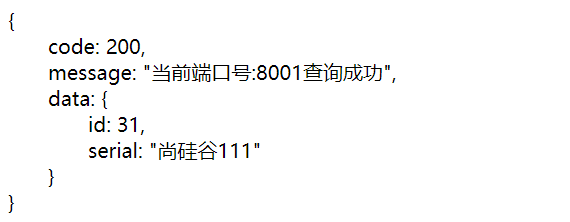

#### Gateway的两种配置方式

##### 在配置文件yaml文件中配置

- 在配置文件yaml文件中配置，见前面的步骤

##### 在Java代码中配置

> 在代码中注入RouteLocator的Bean

业务需求：通过9527网关访问到外网的百度新闻网址(http://news.baidu.com/guonei)

在之前的9527工程下创建`config.GatewayConfig.java`

```
 */
@Configuration
public class GatewayConfig {

    @Bean
    public RouteLocator customerRouteLocator(RouteLocatorBuilder routeLocatorBuilder){

        RouteLocatorBuilder.Builder routes = routeLocatorBuilder.routes();

        // id是全局唯一的，可以随意取名
        // 其中path是匹配规则，uri是对应的跳转地址
        routes.route("payment_id_route_path",
                r -> r.path("/guonei")
                        .uri("http://news.baidu.com/guonei")).build();

        return routes.build();
    }

}
```

测试：http://localhost:9527/guonei。注意其中，

- id是全局唯一的，可以随意取名
- path是匹配地址的规则，uri是对应的跳转地址

#### Route动态路由

通常情况下 Gateway 会根据注册中心注册的服务列表，以**注册中心上微服务为路径创建动态路由进行转发，从而实现动态路由的功能**，所谓的动态路由就是将**写死的地址转化为注册在 Eureka 中新的 Application** 。

在yaml文件如下修改：

```
server:
  port: 9527

spring:
  application:
    name: cloud-gateway
  cloud:
    gateway:
      discovery:
        locator:
          enabled: true                       # 开启从注册中心动态创建路由的功能，利用微服务名进行路由
      routes:
        - id: payment_routh # payment_route   # 路由的ID，没有固定规则但要求唯一，建议配合服务名
#          uri: http://localhost:8001          # 匹配后提供服务的路由地址
          uri: lb://cloud-payment-service
          predicates:
            - Path=/payment/get/**            # 断言，路径相匹配的进行路由

        - id: payment_routh2 #payment_route   # 路由的ID，没有固定规则但要求唯一，建议配合服务名
#          uri: http://localhost:8001          # 匹配后提供服务的路由地址
          uri: lb://cloud-payment-service
          predicates:
            - Path=/payment/lb/**             # 断言，路径相匹配的进行路由

eureka:
  instance:
    hostname: cloud-gateway-service
  client:
    service-url:
      defaultZone: http://eureka7001.com:7001/eureka/
    register-with-eureka: true
    fetch-registry: true
```

只需要修改`uri: lb://cloud-payment-service`即可，即`lb://服务名`。

在配置类中如下修改：

```
@Configuration
public class GatewayConfig {

    @Bean
    public RouteLocator customerRouteLocator(RouteLocatorBuilder routeLocatorBuilder){

        RouteLocatorBuilder.Builder routes = routeLocatorBuilder.routes();

        // id是全局唯一的，可以随意取名
        // 其中path是匹配规则，uri是对应的跳转地址
        routes
                .route("payment_discovery_path",r->r.path("/payment/discovery")
                        .uri("lb://cloud-payment-service"));
        return routes.build();
    }

}
```

之后进行测试，开启eureka7001、服务提供者8001/8002，gateway9527进行测试：http://localhost:9527/payment/discovery

#### Predicate的使用

##### 什么是predicate？

什么是断言，简而言之就是**在什么情况下，进行路由转发（可以使用这个地址）**。

##### 内置断言工厂

###### 基于Datetime类型的断言工厂

此类型的断言根据时间做判断，主要有三个：

- AfterRoutePredicateFactory： 接收一个日期参数，判断请求日期是否晚于指定日期
- BeforeRoutePredicateFactory： 接收一个日期参数，判断请求日期是否早于指定日期
- BetweenRoutePredicateFactory： 接收两个日期参数，判断请求日期是否在指定时间段内

```
spring:
  cloud:
    gateway:
      routes:
        - id: shop-product            # 路由的唯一标识
          uri: lb://shop-product      # 如果断言成功，将要转发去的地址
          order: 0                    # 优先级，越小优先级越高
          predicates:                 # 断言，满足所有断言，才会进行转发
          	# 在这个时间之后才能进行访问
            - After=2022-04-13T20:48:17.866+08:00[Asia/Shanghai]
```

但是有个问题，如何获取时间，如下：

```
ZonedDateTime zbj = ZonedDateTime.now(); // 默认时区
System.out.println(zbj);
```

###### 基于远程地址的断言工厂

- RemoteAddrRoutePredicateFactory： 接收一个IP地址段，判断请求主机地址是否在地址段中

```
- RemoteAddr=192.168.1.1/24 
```

###### 基于Cookie的断言工厂

- CookieRoutePredicateFactory：接收两个参数，cookie 名字和一个正则表达式。 判断请求cookie是否具有给定名称且值与正则表达式匹配。

```
- Cookie=chocolate, ch.p
```

通过`curl`进行测试有无cookie两种地址，在yaml中添加`- Cookie=username,zzzz`。

然后使用`curl`命令。

```
curl http://localhost:9527/payment/lb
curl http://localhost:9527/payment/lb --cookie "username=zzzz"
```

###### 基于Header的断言工厂

- HeaderRoutePredicateFactory：接收两个参数，标题名称和正则表达式。 判断请求Header是否具有给定名称且值与正则表达式匹配。

```
- Header=X-Request-Id, \d+
```

通过`curl`进行测试有无Header两种地址，在yaml中添加`- Header=X-Request-Id, \d+`表示请求头要有X-Request-Id属性并且值为整数的正则表达式。

然后使用`curl`命令。

```
curl http://localhost:9527/payment/lb
curl http://localhost:9527/payment/lb -H "X-Request-Id:1234"
```

###### 基于Host的断言工厂

- HostRoutePredicateFactory：接收一个参数，主机名模式。判断请求的Host是否满足匹配规则。

```
- Host=**.testhost.org
```

###### 基于Method请求方法的断言工厂

- MethodRoutePredicateFactory：接收一个参数，判断请求类型是否跟指定的类型匹配。

```
- Method=GET
```

###### 基于Path请求路径的断言工厂

- PathRoutePredicateFactory：接收一个参数，判断请求的URI部分是否满足路径规则。

```
- Path=/foo/{segment}
```

###### 基于Query请求参数的断言工厂

- QueryRoutePredicateFactory ：接收两个参数，请求param和正则表达式， 判断请求参数是否具有给定名称且值与正则表达式匹配。

```
- Query=baz, ba. 
```

###### 基于路由权重的断言工厂

- WeightRoutePredicateFactory：接收一个 **[组名,权重]** 然后对于**同一个组**内的路由按照权重转发

```
gateway:
  routes:
  - id: weight_route1
    uri: host1
    predicates:
      - Path=/product/**
      - Weight=group3, 1
  - id: weight_route2
    uri: host2
    predicates:
      # 路径一致，组一致，权重不同
      - Path=/product/**
      - Weight= group3, 9
```

##### 自定义断言工厂

我们来设定一个场景: 假设我们的应用仅仅让age在(min,max)之间的人来访问。使用例子来体验一把自定义路由断言工厂。

###### 定义一个断言工厂，实现断言方法

新建一个类，继承 `AbstractRoutePredicateFactory` 类，这个类的泛型是 自定义断言工厂的一个内部类叫做``Config` 是一个固定的名字，在Config 类中定义自定义断言需要的一些属性，并且自定义断言工厂使用 `@Component` 注解，交给spring容器创建。

```
@Component
public class AgeRoutePredicateFactory extends AbstractRoutePredicateFactory<AgeRoutePredicateFactory.Config> {
    public AgeRoutePredicateFactory() {
        super(AgeRoutePredicateFactory.Config.class);
    }

    //读取配置文件中的内容并配置给配置类中的属性
    @Override
    public List<String> shortcutFieldOrder() {
        return Arrays.asList("minAge","maxAge");
    }

    @Override
    public Predicate<ServerWebExchange> apply(Config config) {
        return exchange -> {
            // 获取请求参数中的 age 属性
            String age = exchange.getRequest().getQueryParams().getFirst("age");
            if(StringUtils.isNotEmpty(age)) {
                try {
                    int a = Integer.parseInt(age);
                    boolean res = a >= config.minAge && a <= config.maxAge;
                    return res;
                } catch (Exception e) {
                    System.out.println("输入的参数不是数字格式");
                }
            }
            return false;
        };
    }

    @Validated
    public static class Config {
        private Integer minAge;
        private Integer maxAge;

        public Integer getMinAge() {
            return minAge;
        }

        public void setMinAge(Integer minAge) {
            this.minAge = minAge;
        }

        public Integer getMaxage() {
            return maxAge;
        }

        public void setMaxage(Integer maxage) {
            this.maxAge = maxage;
        }
    }
}
```

在这个自定义断言中，`.Config` 中有两个属性 minAge 和 maxAge；在 `apply()` 方法中编写断言的比较逻辑。

###### 在yml中使用自定义的断言

```
spring:
  cloud:
    gateway:
      routes:
        - id: shop-product            # 路由的唯一标识
          uri: lb://shop-product      # 如果断言成功，将要转发去的地址
          order: 0                    # 优先级，越小优先级越高
          predicates:                 # 断言，满足所有断言，才会进行转发
            - Path=/product/**        # 注意：这是使用= 不是：
            # 自定义断言，第一个参数对应minAge，第二个参数对应maxAge
            - Age=18, 60
```

从这里的演示应该可以看出来，自定义断言与系统自带断言的配置，在yml中只需要使用首部名称，默认忽略类名中的 RoutePredicateFactory。

#### Filter的使用

##### 什么是Filter？

概念：路由过滤器可用于修改进入的 HTTP 请求和返回的 HTTP 响应，路由过滤器只能指定路由进行使用。

##### SpringCloud Gateway的Filter

- 按生命周期分为pre和post
- 按种类分为GatewayFilter和Globalfilter

地址：https://docs.spring.io/spring-cloud-gateway/docs/2.2.9.RELEASE/reference/html/#gatewayfilter-factories

一共有31中过滤器。。。示例：

```
spring:
  cloud:
    gateway:
      routes:
      - id: add_request_header_route
        uri: https://example.org
        filters:
        - AddRequestHeader=X-Request-red, blue # 表示需要添加请求头X-Request-red:blue
```

##### **自定义过滤器**

我们实现一个自定义过滤器（常用），`MyLogGateWayFilter` 实现 `GlobalFilter，Ordered` 两个接口。

```
@Component
@Slf4j
public class MyLogGatewayFilter implements GlobalFilter, Ordered {


    /**
     * 执行过滤逻辑
     */
    @Override
    public Mono<Void> filter(ServerWebExchange exchange, GatewayFilterChain chain) {
        log.info("进入过滤器   " + new Date());

        //得到请求参数
        String name = exchange.getRequest().getQueryParams().getFirst("name");
        //执行过滤逻辑
        if (name == null || "".equals(name)) {
            log.info("name为null，非法用户");
            //定义拦截返回状态码
            exchange.getResponse().setStatusCode(HttpStatus.NOT_ACCEPTABLE);
            return exchange.getResponse().setComplete();
        }
        // 放行
        return chain.filter(exchange);
    }

    /**
     * 过滤器加载的顺序 越小,优先级别越高
     */
    @Override
    public int getOrder() {
        return 0;
    }
}
```

访问地址：http://localhost:9527/payment/lb


访问地址：http://localhost:9527/payment/lb?name=1234


## SpringCloud Config分布式配置中心

### 概述

#### 分布式系统面临的配置问题

微服务意味着要将单体应用中的业务拆分成一个个子服务，每个服务的粒度相对较小，因此系统会出现大量的服务，**由于每个服务都需要必要的配置信息才能运行**，所以一套集中的、动态的配置管理设施必不可少。

Spring Cloud 提供了 ConfigServer 来解决这个问题，我们每一个微服务自己带着一个`application.yml`，上百个配置就挺 **emo** 😈 的。

#### 什么是分布式配置中心

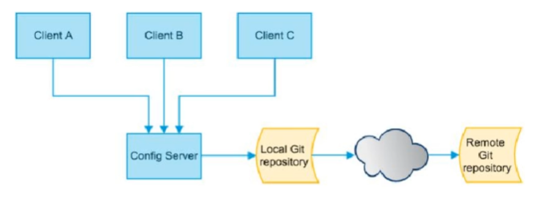

SpringCloud Config为微服务架构中的微服务提供集中化的外部配置支持，配置服务器为各个不同微服务应用的所有环境提供了一个中心化的外部配置。

SpringCloud Config分为服务端和客户端两部分。

- 服务端也称为分布式配置中心，它是一个独立的微服务应用，用来连接配置服务器并为客户端提供获取配置信息，加密/解密信息等访问接口。
- 客户端则是通过指定的配置中心来管理应用资源，以及与业务相关的配置内容，并在启动的时候从配置中心获取和加载配置信息配置服务器默认采用git来存储配置信息，这样就有助于对环境配置进行版本管理，并且可以通过git客户端工具来方便的管理和访问配置内容。

#### SpringCloud Config的用途

- 集中管理配置文件
- 不同环境不同配置，动态化的配置更新，分环境部署比如dev/test/prod/beta/release
- 运行期间动态调整配置，不再需要在每个服务部署的机器上编写配置文件，服务会向配置中心统一拉取配置自己的信息
- 当配置发生变动时，服务不需要重启即可感知到配置的变化并应用新的配置
- 将配置信息以REST接口的形式暴露 - post/crul访问刷新即可…

#### 与Github整合配置

由于SpringCloud Config默认使用Git来存储配置文件(也有其它方式,比如支持SVN和本地文件),但最推荐的还是Git,而且使用的是http/https访问的形式。建议使用gitee，和github操作一样。

### Config服务端配置与测试

#### 创建仓库

首先在自己的Github账号上新建一个`springcloud-config`的新Repository。

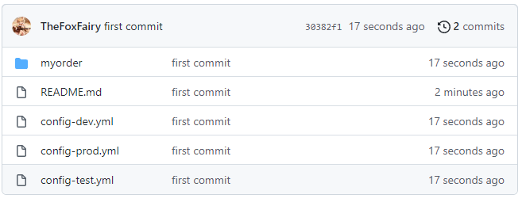

仓库地址：https://github.com/TheFoxFairy/springcloud-config

#### 构建步骤

##### 新建module

然后在当前仓库里面创建一个新的module模块`cloud-config-center-3344`它即为cloud的配置中心模块cloudConfig Center。

##### 改pom

```
<dependencies>
    <!--    Config服务端-->
    <dependency>
        <groupId>org.springframework.cloud</groupId>
        <artifactId>spring-cloud-config-server</artifactId>
    </dependency>
    <dependency>
        <groupId>org.springframework.cloud</groupId>
        <artifactId>spring-cloud-starter-netflix-eureka-client</artifactId>
    </dependency>
    <dependency>
        <groupId>org.springframework.boot</groupId>
        <artifactId>spring-boot-starter-web</artifactId>
    </dependency>
    <dependency>
        <groupId>org.springframework.boot</groupId>
        <artifactId>spring-boot-starter-actuator</artifactId>
    </dependency>
    <dependency>
        <groupId>org.projectlombok</groupId>
        <artifactId>lombok</artifactId>
        <optional>true</optional>
    </dependency>
    <dependency>
        <groupId>org.springframework.boot</groupId>
        <artifactId>spring-boot-starter-test</artifactId>
        <scope>test</scope>
    </dependency>
</dependencies>
```

##### 写yaml

```
server:
  port: 3344

spring:
  application:
    name: cloud-config-center
  cloud:
    config:
      server:
        git:
          username: xxxx # github账户和密码
          password: xxxx
          uri: https://github.com/TheFoxFairy/springcloud-config.git # Github上面的git仓库名字，这里最好填写为https形式
          search-paths:
            - springcloud-config # 搜索目录
      label: main # 读取仓库分支

eureka:
  client:
    fetch-registry: true
    register-with-eureka: true
    service-url:
      defaultZone: http://localhost:7001/eureka
```

##### 主启动类

```
@SpringBootApplication
@EnableEurekaClient
@EnableConfigServer
public class ConfigMain3344 {
    public static void main(String[] args) {
        SpringApplication.run(ConfigMain3344.class,args);
    }
}
```

##### 修改hosts文件

windows下修改hosts文件，增加映射

```
127.0.0.1 config-3344.com
```

##### 测试

通过访问 http://config-3344.com:3344/main/config-dev.yml 进行测试。


> ```
> http://配置中心地址/{label}/{仓库文件地址}
> ```

#### 配置读取规则

```
/{label}/{application}-{profile}.yml => http://config-3344.com:3344/main/config-test.yml

label:仓库分支
{application}-{profile}:就是对应的文件


/{application}-{profile}.yml => 会去自动查找相应文件

/{profile}/{application}/{label}.yml => json串
```

### Config客户端配置与测试

#### 构建步骤

##### 新建module

新建一个客户端`cloud-config-client-3355`


##### 改pom

```
<dependencies>
    <dependency>
        <groupId>org.springframework.cloud</groupId>
        <artifactId>spring-cloud-starter-config</artifactId>
    </dependency>
    <dependency>
        <groupId>org.springframework.cloud</groupId>
        <artifactId>spring-cloud-starter-netflix-eureka-client</artifactId>
    </dependency>
    <dependency>
        <groupId>org.springframework.boot</groupId>
        <artifactId>spring-boot-starter-web</artifactId>
    </dependency>
    <dependency>
        <groupId>org.springframework.boot</groupId>
        <artifactId>spring-boot-starter-actuator</artifactId>
    </dependency>
    <dependency>
        <groupId>org.projectlombok</groupId>
        <artifactId>lombok</artifactId>
        <optional>true</optional>
    </dependency>
    <dependency>
        <groupId>org.springframework.boot</groupId>
        <artifactId>spring-boot-starter-test</artifactId>
        <scope>test</scope>
    </dependency>
</dependencies>
```

##### 写boostrap.yml

- applicaiton.ynl是用户级的资源配置项
- bootstrap.yml是系统级的，优先级更加高

Spring Cloud会创建一个“Bootstrap Context”，作为Spring应用的`Application Context`的父上下文。初始化的时候，`BootstrapContext`负责从外部源加载配置属性并解析配置。这两个上下文共享一个从外部获取的`Environment`。

`Bootstrap`属性有高优先级，默认情况下，它们不会被本地配置覆盖。`Bootstrap context和Application Context有着不同的约定，所以新增了一个'bootstrap.yml'文件，保证`Bootstrap Context'和'Application Context'配置的分离。

要将Client模块下的application.yml文件改为bootstrap.yml，这是很关键的，因为bootstrap.yml是比application.yml先加载的。bootstrap.yml优先级高于application.yml。

```
server:
  port: 3355

spring:
  application:
    name: config-client
  cloud:
    config:
      label: main # 分支名称
      name: config # 配置文件名称
      profile: dev # 读取后缀名称，这三个加起来就是main分支上的config-dev.yml配置文件
      uri: http://localhost:3344 # 配置中心地址

eureka:
  client:
    service-url:
      defaultZone: http://localhost:7001/eureka
```

##### 主启动类

```
@SpringBootApplication
@EnableEurekaClient
public class ConfigClientMain3355 {
    public static void main(String[] args) {
        SpringApplication.run(ConfigClientMain3355.class, args);
    }
}
```

##### 业务类

创建 controller 层方法

```
@RestController
public class ConfigClientController {

    @Value("${config.info}")
    private String configInfo;

    @GetMapping("/configInfo")
    public String getConfigInfo(){
        return configInfo;
    }
}
```

##### 测试

启动Copfig配置中心3344微服务并自测，然后启动3355作为Client准备访问。

访问地址：http://localhost:3355/configInfo


成功实现了客户端3355访问SpringCloud Config3344通过GitHub获取配置信息。

#### 分布式配置的动态刷新问题

现在修改config-dev.yml配置并提交到GitHub中，比如加个变量age或者版本号version。

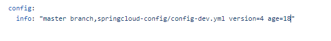

之后刷新3344，发现ConfigServer配置中心立刻响应；

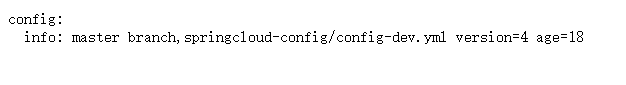

然后刷新3355，发现ConfigClient客户端没有任何响应。3355没有变化，除非3355重启或者重新加载，难到每次运维修改配置文件，客户端都需要重启，这将是一个可怕的噩梦！！！

访问地址：http://localhost:3355/configInfo


### Config客户端之动态刷新

为了避免每次更新配置都要重启客户端微服务3355。采用如下步骤，进行动态刷新。

- 首先修改3355模块
- 在pom引入actuator监控

```
<dependency>
    <groupId>org.springframework.boot</groupId>
    <artifactId>spring-boot-starter-actuator</artifactId>
</dependency>
```

- 修改yaml，暴露监控端口

```
server:
  port: 3355

spring:
  application:
    name: config-client
  cloud:
    config:
      label: main # 分支名称
      name: config # 配置文件名称
      profile: dev # 读取后缀名称，这三个加起来就是main分支上的config-dev.yml配置文件
      uri: http://localhost:3344 # 配置中心地址

eureka:
  client:
    service-url:
      defaultZone: http://localhost:7001/eureka

# 暴露监控端点
management:
  endpoints:
    web:
      exposure:
        include: "*"
```

- `@RefreshScope`业务类controller修改

```
@RestController
@RefreshScope
public class ConfigClientController {

    @Value("${config.info}")
    private String configInfo;

    @GetMapping("/configInfo")
    public String getConfigInfo(){
        return configInfo;
    }
}
```

- 此时修改github->3344->3355

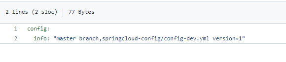

还需要发送post请求，对3355进行刷新，就是手动激活3355….

```
curl -X POST "http://localhost:3355/actuator/refresh" 
```

访问地址1：http://localhost:3344/main/config-dev.yml

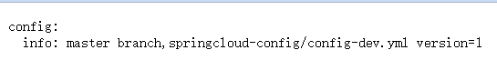

访问地址2：http://localhost:3355/configInfo


现在就已经成功更新了。避免了服务重启。

## SpringCloud Bus消息总线

### 概述

Spring Cloud Bus 使用轻量级的消息代理来连接微服务架构中的各个服务，可以将其用于广播状态更改（例如配置中心配置更改）或其他管理指令。

通常会使用消息代理来构建一个主题，然后把微服务架构中的所有服务都连接到这个主题上去，当我们向该主题发送消息时，所有订阅该主题的服务都会收到消息并进行消费。

使用 Spring Cloud Bus 可以方便地构建起这套机制，所以 **Spring Cloud Bus 又被称为消息总线**。

**Spring Cloud Bus 配合 Spring Cloud Config 使用可以实现配置的动态刷新。**

目前 Spring Cloud Bus 支持两种消息代理：**RabbitMQ 和 Kafka。**

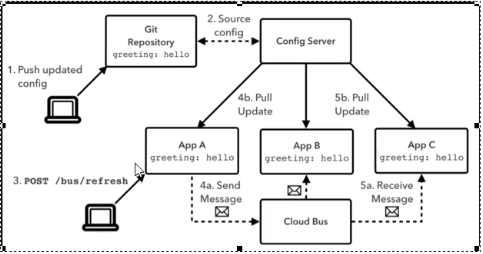


但是该图不合适，原因如下：

- 破坏了微服务间的职责单一性，因为微服务 3355 本身是业务模块，他本不应该承担配置刷新的职责
- 破坏了微服务各节点的对等性，3355 不能特殊，不能和 3366 不一样，得藏拙
- 有一定的局限性，例如：微服务在迁移时，他的网络地址常常会发生变化，此时如果想要做到自动刷新，那就会增加更多修改。


为什么被称为总线？

在微服务架构的系统中，通常会使用**轻量级的消息代理**来构建一个**共用的消息主题**，并让系统中所有微服务实例都连接上来。由于**该主题中产生的消息会被所有实例监听和消费，所以称它为消息总线**。在总线上的各个实例，都可以方便地广播一些需要让其他连接在该主题上的实例都知道的消息。

基本原理：ConfigClient实例都监听MQ中同一个topic(默认是springCloudBus)。当一个服务刷新数据的时候，它会把这个信息放入到Topic中，这样其它监听同一Topic的服务就能得到通知，然后去更新自身的配置。

### RabbitMQ环境配置

[RabbitMQ笔记](typora://app/编程笔记/Java笔记/常用中间件/RabbitMQ笔记.md)

**然后进入网址测试 http://192.168.183.102:15672/** 是否访问成功。

### SpringCloud Bus动态刷新全局广播

创建一个新模块3366，配与3355完全相同（端口3366）

以上两种服务（刷新客户端、刷新服务端）我们选择通过利用消息总线触发一个服务端ConfigServer的`/bus/refresh`端点，进而刷新所有客户端的配置。

**bootstrap.yaml**

```
server:
  port: 3366


eureka:
  client:
    service-url:
      defaultZone: http://localhost:7001/eureka

spring:
  application:
    name: config-client
  cloud:
    config:
      label: main
      profile: dev
      uri: http://localhost:3344

management:
  endpoints:
    web:
      exposure:
        include: "*"
```

**ConfigClientController.java**

```
@RestController
@RefreshScope # 一定要添加这个，动态刷新
public class ConfigClientController {

    @Value("${config.info}")
    private String configInfo;

    @GetMapping("/configInfo")
    public String getConfigInfo(){
        return configInfo;
    }

}
```

为了实现动态的全局刷新，我们将 `3344 、3355、3366` 均加入以下依赖

```
<dependency>
    <groupId>org.springframework.cloud</groupId>
    <artifactId>spring-cloud-starter-bus-amqp</artifactId>
</dependency>
```

在所有的 `application.yml（bootstrap.yml）`文件中加入如下配置 `rabbitMQ`，注意RabbitMQ的端口是5672，而界面管理的端口是15672。

```
spring:
  rabbitmq: # 配置rabbitmq
    host: 192.168.183.102 # rabbitmq服务器
    port: 5672           # rabbitmq端口
    username: admin       # 用户名以及密码
    password: 123456
```

然而服务端的配置略有不同

```
server:
  port: 3344

spring:
  application:
    name: cloud-config-center
  cloud:
    config:
      server:
        git:
          username: xxxx
          password: xxxx
          uri: https://gitee.com/TheFoxFairy/springcloud-config.git # Gitee
          search-paths:
            - springcloud-config # 搜索目录
      label: main # 读取仓库分支
  
  rabbitmq:  ##rabbitmq相关配置,暴露bus刷新配置的端点
    host: 192.168.183.102
    port: 5672
    username: admin
    password: 123456
    
#rabbitmq相关配置,暴露bus刷新配置的端点 SpringCloud Bus动态刷新全局广播
management:
  endpoints: #暴露bus刷新配置的端点
    web:
      exposure:
        include: 'bus-refresh'

eureka:
  client:
    fetch-registry: true
    register-with-eureka: true
    service-url:
      defaultZone: http://localhost:7001/eureka
```

**此处暴露的端点为 `bus-refresh`，作为服务端与客户端的区别**。之后，启动`7001,3344,3355,3366`进行测试。

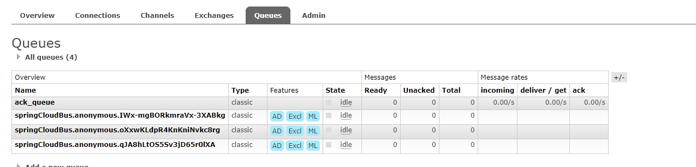

访问地址：http://localhost:3344/main/config-dev.yml，可能需要等一段时间，速度有一点慢。

访问地址：http://localhost:3355/configInfo

访问地址：http://localhost:3366/configInfo

将所有服务启动后，我们修改 gitee 中的文件，然后观察 3344 与 3355、3366 的区别。

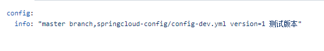

证明只有3344可以同步gitee的变化，此时我们需要进行POST进行全局广，进行刷新：http://localhost:3344/actuator/bus-refresh，而后，3355与3366均可同步3344的信息。 

```
curl -X POST "http://localhost:3344/actuator/bus-refresh"
```

### SpringCloud Bus动态刷新定点通知

此处的 config-client 为 spring-application-name ，3344 为 Config 服务端的端口号，bus-refresh 为 3344 端口中 yaml 配置文件中刷新配置的端点名称。

指定刷新地址：http://localhost:3344/actuator/bus-refresh/config-client:3355

```
curl -X POST "http://localhost:3344/actuator/bus-refresh/config-client:3355"
```

## SpringCloud Stream消息驱动

### 概述

#### 什么是Spring Cloud Stream

简而言之：**Spring Cloud Stream 就是屏蔽底层消息中间件（ActiveMQ、RabbitMQ、RocketMQ、Kafka）的差异，降低切换成本，统一消息的编程模型**。

Spring Cloud Stream 的官方定义为 **是一个构建消息驱动微服务的框架**。

**应用程序通过 inputs 或 outputs 来与 Spring Cloud Stream 中 binder 对象交互，通过我们配置 binding（绑定），而 Spring Cloud Stream 的 binder 对象负责与消息中间件交互**，所以我们只需要搞清楚如何与 Spring Cloud Stream 交互就可以方便实用消息驱动的方式。

通过使用 Spring Integration 来链接消息代理中间件以实现消息事件驱动，Spring Cloud Stream 为一些供应商的消息中间件产品**提供了个性化的自动化配置**，引用了 **发布-订阅、消费组、分区**的三个概念。

Spring Cloud Stream由一个中立的中间件内核组成。Spring Cloud Stream会**注入输入和输出的channels**，应用程序通过这些channels与外界通信，而**channels则是通过一个明确的中间件Binder与外部brokers连接**。

> （目前仅支持 RabbitMQ、Kafka）

#### 文档

官网地址：

- https://spring.io/projects/spring-cloud-stream#overview
- https://cloud.spring.io/spring-cloud-static/spring-cloud-stream/3.0.1.RELEASE/reference/html/
- SpringCloud Steam中文指导手册：https://m.wang1314.com/doc/webapp/topic/20971999.html

#### 设计思想

##### 标准MQ

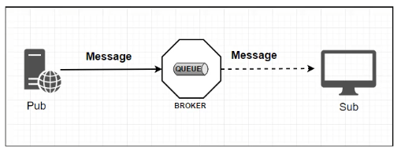

- 生产者/消费者之间靠**消息**媒介传递信息内容——`Message`
- 消息必须走特定的**通道**——消息通道 `MessageChannel`
- 消息通道里的消息如何被消费呢，谁负责收发**处理**——消息通道`MessageChannel`的子接口`SubscribableChannel`，由`MessageHandler`消息处理器订阅

##### 为什么用Cloud Stream

###### stream凭什么可以统一底层差异

与MQ的实现解耦，统一底层差异：

在没有绑定器这个概念的情況下，我们的 Spring Boot 应用要直接与消息中间件进行信息交互的时侯，由于各消息中间件构建的初衷不同，它们的实现细节上会有较大的差异性。

通过定义绑定器作为中间层，完美地实现了**应用程序与消息中间件细节之间的隔离**。通过向应用程序暴露统一的 Channel 通道，使得应用程序不需要再考虑各种不同的消息中间件实现。

**通过定义绑定器 Binder 作为中间层，实现了应用程序与消息中间件细节之间的隔离。**

###### Binder

- INPUT 对应于消费者
- OUTPUT对应于生产者

Stream对消息中间件的进一步封装，可以做到代码层面对中间件的无感知,甚至于动态的切换中间件（RabbitMQ 切换为 Kafka），使得微服务开发的高度解耦，服务可以关注更多自己的业务流程。

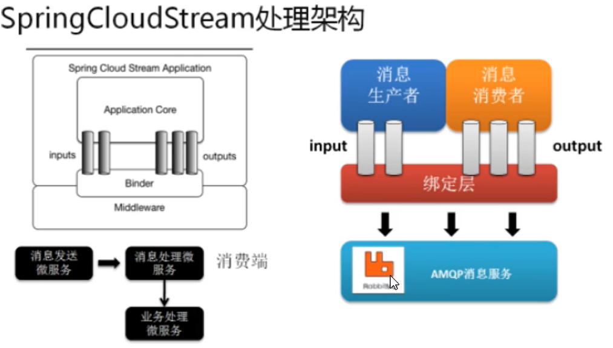

###### Stream中的消息通信方式遵循了发布-订阅模式

Topic主题进行广播：

- 在 RabbitMQ 就是 Exchange
- 在 Kafka 中就是 Topic

#### SpringCloudStream标准流程套路

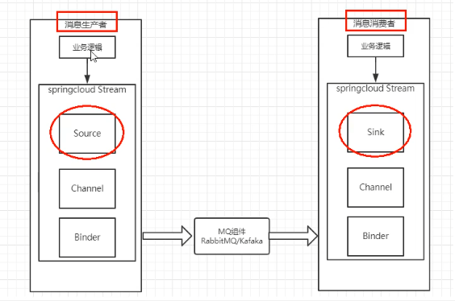

- Binder：很方便的连接中间件，屏蔽差异
- Channel：通道，是队列Queue的一种抽象，在消息通讯系统中就是实现存储和转发的媒介，通过对Channel对队列进行配置
- Source 和 Sink：简单的可理解为参照对象是 Spring Cloud Stream 自身，从 Stream 发布消息就是输出，接受消息就是输入

#### 编码API和常用注解

| 组成            | 说明                                                         |
| --------------- | ------------------------------------------------------------ |
| Middleware      | 中间件，目前只支持 RabbitMQ 和 Kaka                          |
| Binder          | Binder 是应用与消息中间件之间的封装，目前实现了Kafka 和 RabbitMQ 的 Binder，通过 Binder 可以很方便的连接中间件，可以动态的改变消息类型（对应于 Kafka 的 topic，RabbitMQ 的 exchange），这些都可以通过配置文件来实现 |
| @Input          | 注解标识输入通道，通过该输入通道接收到的消息进入应用程序     |
| @Output         | 注解标识输出通道，发布的消息将通过该通道离开应用程序         |
| @StreamListener | 监听队列，用于消费者的队列的消息接收                         |
| @Enablebinding  | 指信道 channel 和 exchange 绑定在一起                        |

### 实现

新建三个子模块

- `cloud-stream-rabbitmq-provider8801`作为生产者进行发消息模块

添加依赖

```
<dependencies>
    <dependency>
        <groupId>org.springframework.cloud</groupId>
        <artifactId>spring-cloud-starter-stream-rabbit</artifactId>
    </dependency>

    <!-- https://mvnrepository.com/artifact/org.springframework.cloud/spring-cloud-starter-eureka-server -->
    <dependency>
        <groupId>org.springframework.cloud</groupId>
        <artifactId>spring-cloud-starter-netflix-eureka-client</artifactId>
    </dependency>

    <!-- https://mvnrepository.com/artifact/org.springframework.boot/spring-boot-starter-web -->
    <dependency>
        <groupId>org.springframework.boot</groupId>
        <artifactId>spring-boot-starter-web</artifactId>
    </dependency>

    <!-- https://mvnrepository.com/artifact/org.springframework.boot/spring-boot-starter-web -->
    <dependency>
        <groupId>org.springframework.boot</groupId>
        <artifactId>spring-boot-starter-actuator</artifactId>
    </dependency>


    <!-- https://mvnrepository.com/artifact/org.springframework.boot/spring-boot-devtools -->
    <dependency>
        <groupId>org.springframework.boot</groupId>
        <artifactId>spring-boot-devtools</artifactId>
        <scope>runtime</scope>
        <optional>true</optional>
    </dependency>

    <!-- https://mvnrepository.com/artifact/org.projectlombok/lombok -->
    <dependency>
        <groupId>org.projectlombok</groupId>
        <artifactId>lombok</artifactId>
        <optional>true</optional>
    </dependency>

    <!-- https://mvnrepository.com/artifact/org.springframework.boot/spring-boot-starter-test -->
    <dependency>
        <groupId>org.springframework.boot</groupId>
        <artifactId>spring-boot-starter-test</artifactId>
        <scope>test</scope>
    </dependency>

</dependencies>
```

配置文件如下：

```
server:
  port: 8801

spring:
  application:
    name: cloud-stream-provider
  cloud:
    stream:
      bindings: # 服务的整合处理
        output: # 这个名字是一个通道的名称
          destination: studyExchange # 表示要使用的Exchange名称定义
          content-type: text/plain # 设置消息类型，本次为json，文本则设置“text/plain”
  rabbitmq:
    host: 192.168.183.102
    port: 5672
    username: admin
    password: 123456

eureka:
  client: # 客户端进行Eureka注册的配置
    service-url:
      defaultZone: http://localhost:7001/eureka
  instance:
    lease-renewal-interval-in-seconds: 2 # 设置心跳的时间间隔（默认是30秒）
    lease-expiration-duration-in-seconds: 5 # 如果现在超过了5秒的间隔（默认是90秒）
    instance-id: send-8801.com  # 在信息列表时显示主机名称
    prefer-ip-address: true     # 访问的路径变为IP地址

#rabbitmq关闭检查
management:
  health: # 关闭 RabbitMQ 的 health check
    rabbit:
      enabled: false
```

然后配置主启动类，然后创建`service.IMessageProvider`以及`serviceImpl.MessageProviderImpl`

```
import org.springframework.cloud.stream.messaging.Source;
import org.springframework.integration.support.MessageBuilder;

// 定义消息的推送管道
@EnableBinding(Source.class) // 包别引入错了
public class MessageProviderImpl implements IMessageProvider {

    @Resource
    private MessageChannel output; // 消息发送管道

    @Override
    public String send() {
        String serial = UUID.randomUUID().toString();
        output.send(MessageBuilder.withPayload(serial).build());
        System.out.println("serial="+serial);
        return serial;
    }

}
```

接下来创建`controller.SendMessageController`。

```
@RestController
public class SendMessageController {
    @Resource
    private IMessageProvider provider;

    @GetMapping("/send")
    public String sendMessage(){
        return provider.send();
    }
}
```

之后，访问http://localhost:8801/send，然后观察rabbitmq的web界面

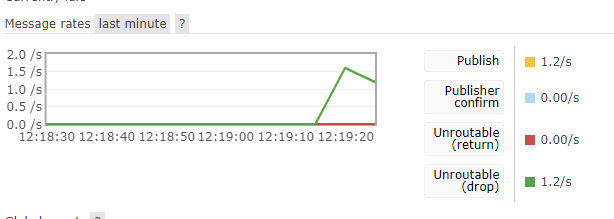

- `cloud-stream-rabbitmq-consumer8802`作为消息接收模块

依赖于8801完全相同。

配置如下：

```
server:
  port: 8802

spring:
  application:
    name: cloud-stream-consumer
  cloud:
    stream:
      bindings: # 服务的整合处理
        input: # 这个名字是一个通道的名称
          destination: studyExchange # 表示要使用的Exchange名称定义
          content-type: text/plain # 设置消息类型，本次为json，文本则设置“text/plain”
  rabbitmq:
    host: 192.168.183.102
    port: 5672
    username: admin
    password: 123456
eureka:
  client: # 客户端进行Eureka注册的配置
    service-url:
      defaultZone: http://localhost:7001/eureka
  instance:
    lease-renewal-interval-in-seconds: 2 # 设置心跳的时间间隔（默认是30秒）
    lease-expiration-duration-in-seconds: 5 # 如果现在超过了5秒的间隔（默认是90秒）
    instance-id: send-8802.com  # 在信息列表时显示主机名称
    prefer-ip-address: true     # 访问的路径变为IP地址

#rabbitmq相关配置,暴露bus刷新配置的端点 SpringCloud Bus动态刷新全局广播
management:
  health: # 关闭 RabbitMQ 的 health check
    rabbit:
      enabled: false
```

创建`controller.ReceiveMessageListenerController`

```
import org.springframework.cloud.stream.messaging.Sink;
import org.springframework.messaging.Message;

@Component
@EnableBinding(Sink.class)
public class ReceiveMessageListenerController {
    @Value("${server.port}")
    public String serverPort;

    @StreamListener(Sink.INPUT)
    public void input(Message<String> message){
        System.out.println("消费者 1 号，---》》》收到的消息："+message.getPayload()+"/t"+serverPort);
    }
}
```

之后运行测试，8001与8002。访问地址：http://localhost:8801/sendMessage。

### 分组消费

然后与建立与8002相同的8003，`cloud-stream-rabbitmq-consumer8803`作为消息接收模块。然后运行测试：http://localhost:8801/sendMessage，会发现消息被重复消息了，以及还存在一个持久化问题。

现在先了解为什么会有重复消费问题？

因为默认分组 group 是不同的，组流水号不同，被认为不同组，所以重复消费，同一个组会产生竞争，只有一个可以消费。

**故可以采用分组解决重复消费问题**：只需要 8802、8803 加入 group： group_id，但是group_id用来表示是否在同一组

```
group: ${spring.application.name}
```

此处再次使用 8801 发送两条信息，就会发现 8802、8803 各一条。

### 消息的持久化

当你没有分组时，8802（没有 group） 宕机，此时8801 一直在发送信息，但是 8802 重启后接受不到宕机这段时间 8801 发送的消息。

但是 group 的 8803 却可以在重启后，接收到 8801 的消息。

原理：由于数据发送者将数据发送到队列中，由于 8002 没有设置分组，会重新创建队列并监听，而 8003 创建了分组，再次启动会直接返回分组中监听到的。

**故group 可以解决分组消费和消息持久化两个问题**。

## SpringCloud Sleuth分布式请求链路追踪

### 概述

#### 分布式服务追踪与调用链系统产生的背景

在微服务框架中，一个由客户端发起的请求在后端系统中会经过多个不同的服务节点调用来协同产生最后的请求结果，每一个前端请求都会形成一条**复杂的分布式服务调用链路**，链路中的任何一环出现高延时或错误都会引起整个请求最后的失败。

#### SpringCloud Sleuth是什么

Spring Cloud Sleuth为Spring Cloud实现了一种分布式跟踪解决方案。在分布式系统中提供追踪解决方案并且兼容支持了zipkin。

完整的调用链路：一条链路通过Trace Id唯一标识，Span标识发起的请求信息，各span通过parent id关联起来。


### 搭建链路监控步骤

#### Zipkin环境搭建

下载地址：

- https://repo1.maven.org/maven2/io/zipkin/java/zipkin-server/2.12.9

或者通过如下下载

```
curl -sSL https://zipkin.io/quickstart.sh | bash -s
```

运行zipkin：

```
java -jar zipkin.jar
```

访问：http://localhost:9411/zipkin/


#### 链路追踪演示

本次链路追踪的演示，选择不新建项目，选取老项目演示。

选取`cloud-provider-payment8001`作为服务的提供者，选取`cloud-consumer-order80`作为服务的消费者。

服务提供者和消费者配置，都添加配置pom.xml

```
<!--包含了sleuth+zipkin-->
<dependency>
    <groupId>org.springframework.cloud</groupId>
    <artifactId>spring-cloud-starter-zipkin</artifactId>
</dependency>
```

俩服务都添加配置yml

```
spring:
  application:
    name: cloud-payment-service # 应用名称 
  zipkin:
    base-url: http://localhost:9411 # 监控中心
  sleuth:
    sampler: # 采样率值介于0到1之间，则表示全部采集
      probability: 1
```

服务提供者提供测试接口

```
@GetMapping("/payment/zipkin")
public String paymentZipkin(){
    return "payment zipkin!";
}
```

服务消费者提供测试接口

```
@GetMapping("/payment/zipkin")
public String paymentZipkin(){
    return restTemplate.getForObject(PAYMENT_URL+"/payment/zipkin",String.class);
}
```

之后，依次启动7001,80,8001模块，消费者调用测试接口，产生调用链路，进入zipkin管理页面，可以观测调用链路的响应情况等。

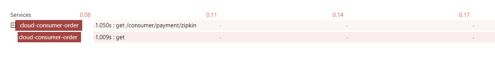