# SpringCloud Alibaba笔记

## SpringCloud Alibaba入门简介

### 概述

官网：https://spring.io/projects/spring-cloud-alibaba

中文文档：https://github.com/alibaba/spring-cloud-alibaba/blob/master/README-zh.md

为什么要是用SpringCloud Alibaba？因为Netflix进入了维护模式，陆陆续续停更了其他相关组件。

什么是维护模式？将模块置于维护模式，意味着Spring Cloud团队将不会再向模块添加新功能。我们将修复block级别的bug以及安全问题，我们也会考虑并审查社区的小型pull request。

Spring Cloud Alibaba 致力于提供微服务开发的一站式解决方案。此项目包含开发分布式应用微服务的必需组件，方便开发者通过 Spring Cloud 编程模型轻松使用这些组件来开发分布式应用服务。

依托 Spring Cloud Alibaba，您只需要添加一些注解和少量配置，就可以将 Spring Cloud 应用接入阿里微服务解决方案，通过阿里中间件来迅速搭建分布式应用系统。

### 主要功能

- **服务限流降级**：默认支持 WebServlet、WebFlux, OpenFeign、RestTemplate、Spring Cloud Gateway, Zuul, Dubbo 和 RocketMQ 限流降级功能的接入，可以在运行时通过控制台实时修改限流降级规则，还支持查看限流降级 Metrics 监控。
- **服务注册与发现**：适配 Spring Cloud 服务注册与发现标准，默认集成了 Ribbon 的支持。
- **分布式配置管理**：支持分布式系统中的外部化配置，配置更改时自动刷新。
- **消息驱动能力**：基于 Spring Cloud Stream 为微服务应用构建消息驱动能力。
- **分布式事务**：使用 @GlobalTransactional 注解， 高效并且对业务零侵入地解决分布式事务问题。。
- **阿里云对象存储**：阿里云提供的海量、安全、低成本、高可靠的云存储服务。支持在任何应用、任何时间、任何地点存储和访问任意类型的数据。
- **分布式任务调度**：提供秒级、精准、高可靠、高可用的定时（基于 Cron 表达式）任务调度服务。同时提供分布式的任务执行模型，如网格任务。网格任务支持海量子任务均匀分配到所有 Worker（schedulerx-client）上执行。
- **阿里云短信服务**：覆盖全球的短信服务，友好、高效、智能的互联化通讯能力，帮助企业迅速搭建客户触达通道。

### 依赖版本

```xml
<!--spring boot 2.2.x-->
<dependency>
    <groupId>org.springframework.boot</groupId>
    <artifactId>spring-boot-dependencies</artifactId>
    <version>2.2.7.RELEASE</version>
    <type>pom</type>
    <scope>import</scope>
</dependency>
<!--spring cloud Hoxton.SR9-->
<dependency>
    <groupId>org.springframework.cloud</groupId>
    <artifactId>spring-cloud-dependencies</artifactId>
    <version>Hoxton.SR9</version>
    <type>pom</type>
    <scope>import</scope>
</dependency>
<!--spring cloud alibaba-->
<dependency>
    <groupId>com.alibaba.cloud</groupId>
    <artifactId>spring-cloud-alibaba-dependencies</artifactId>
    <version>2.2.3.RELEASE</version>
    <type>pom</type>
    <scope>import</scope>
</dependency>
```

## SpringCloud Alibaba Nacos服务注册与配置中心

### Nacos简介

#### 什么是Nacos

**Nacos** = (Dynamic) **Na**ming and **Co**nfiguration **S**ervice 注册中心+配置中心，也就是代替**Eureka**作为服务注册中心，替代**Config**作为配置中心，替代**Bus**作为消息总线。也就是**Nacos = Eureka + Config + Bus**。

Nacos是一个更易于构建云原生应用的**动态服务发现、配置管理和服务管理**平台。

服务是Nacos中的头等公民，Nacos支持几乎所有类型的服务：Dubbo/GRPC，Spring Cloud RESTFUL服务或Kubernetes服务。

#### Nacos文档

官方网站: [http://nacos.io](http://nacos.io/)

#### Nacos与其他注册中心对比

|                 | **Nacos**                  | **Eureka**  | **Consul**        | **CoreDNS** | **Zookeeper** |
| --------------- | -------------------------- | ----------- | ----------------- | ----------- | ------------- |
| 一致性协议      | CP+AP                      | AP          | CP                | —           | CP            |
| 健康检查        | TCP/HTTP/MYSQL/Client Beat | Client Beat | TCP/HTTP/gRPC/Cmd | —           | Keep Alive    |
| 负载均衡策略    | 权重/ metadata/Selector    | Ribbon      | Fabio             | RoundRobin  | —             |
| 雪崩保护        | 有                         | 有          | 无                | 无          | 无            |
| 自动注销实例    | 支持                       | 支持        | 支持              | 不支持      | 支持          |
| 访问协议        | HTTP/DNS                   | HTTP        | HTTP/DNS          | DNS         | TCP           |
| 监听支持        | 支持                       | 支持        | 支持              | 不支持      | 支持          |
| 多数据中心      | 支持                       | 支持        | 支持              | 不支持      | 不支持        |
| 跨注册中心同步  | 支持                       | 不支持      | 支持              | 不支持      | 不支持        |
| SpringCloud集成 | 支持                       | 支持        | 支持              | 不支持      | 支持          |
| Dubbo集成       | 支持                       | 不支持      | 支持              | 不支持      | 支持          |
| K8S集成         | 支持                       | 不支持      | 支持              | 支持        | 不支持        |

### Nacos主要提供的四种功能

**服务发现和服务运行状况检查**：Nacos使服务易于注册自己并通过DNS或HTTP接口发现其他服务。 Nacos还提供服务的实时运行状况检查，以防止向不正常的主机或服务实例发送请求。

**动态配置管理**：动态配置服务使您可以在所有环境中以集中和动态的方式管理所有服务的配置。 Nacos消除了在更新配置时重新部署应用程序和服务的需求，这使配置更改更加有效和敏捷。

**动态DNS服务**：Nacos支持加权路由，使您可以更轻松地在数据中心内的生产环境中实施中间层负载平衡，灵活的路由策略，流控制和简单的DNS解析服务。它可以帮助您轻松实现基于DNS的服务发现，并防止应用程序耦合到特定于供应商的服务发现API。

**服务和元数据管理**：Nacos提供了易于使用的服务仪表板，可帮助您管理服务元数据，配置，kubernetes DNS，服务运行状况和指标统计信息。

### Nacos的安装及运行

#### Windows安装

* 下载地址：https://github.com/alibaba/nacos/releases

* 解压后，切换到bin目录，然后打开cmd，启动服务

```sh
startup.cmd -m standalone # 启动单机模式
```

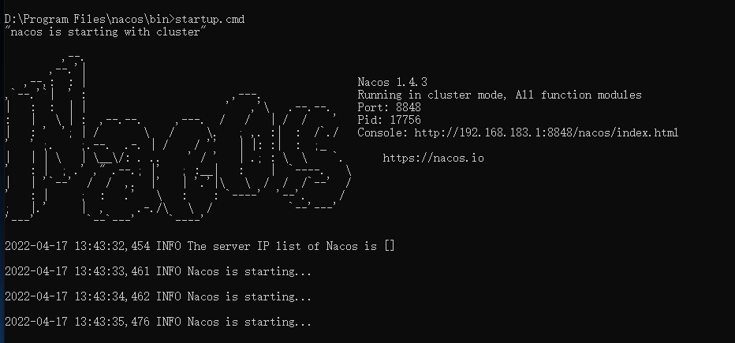

接着访问：http://localhost:8848/nacos/，账号密码都是`nacos`。

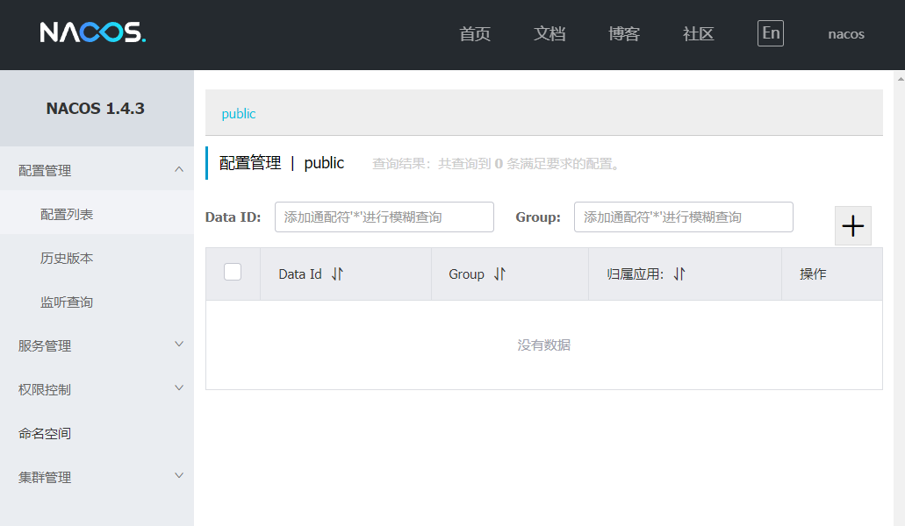

#### Linux安装

```sh
wget https://github.com/alibaba/nacos/releases/download/1.4.3/nacos-server-1.4.3.tar.gz

tar -zxvf nacos-server-1.4.3.tar.gz

sudo cp nacos /usr/local/nacos -r

cd /usr/local/nacos
```

### 作为服务注册中心演示

#### 新建服务模块

新建一个module`cloudalibaba-provider-payment9001`

注意，父pom中依赖为：

```xml
<!--spring cloud 阿里巴巴-->
<dependency>
    <groupId>com.alibaba.cloud</groupId>
    <artifactId>spring-cloud-alibaba-dependencies</artifactId>
    <version>2.1.0.RELEASE</version>
    <type>pom</type>
    <scope>import</scope>
</dependency>
```

#### 编写yaml配置

```yaml
server:
  port: 9001

spring:
  application:
    name: nacos-payment-provider
  cloud:
    nacos:
      discovery:
        server-addr: localhost:8848 # 配置Nacos地址

management:
  endpoints:
    web:
      exposure:
        include: "*"
```

#### 主启动类

```java
@SpringBootApplication
@EnableDiscoveryClient
public class PaymentMain9001 {
    public static void main(String[] args) {
        SpringApplication.run(PaymentMain9001.class,args);
    }
}
```

#### Controller接口

```java
@RestController
public class PaymentController {
    @Value("${server.port}")
    private String serverPort;

    @GetMapping(value = "/payment/nacos/{id}")
    public String getPayment(@PathVariable("id") Integer id){
        return "nacos registry,serverPort："+serverPort + "\t id" + id;
    }
    
}
```

#### 测试

启动nacos，启动9001服务，访问：

- http://localhost:9001/payment/nacos/1

- http://localhost:8848/nacos

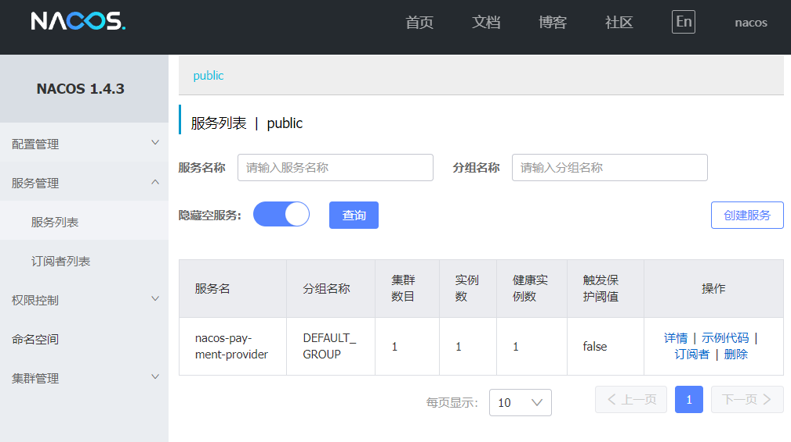

### 演示负载均衡

#### 新建服务提供者

仿照9001模块再建一个9002模块，具体步骤就省略了，端口号改一改就可以。接着依次启动nacos，9001，9002，观察nacos服务注册中心的情况：

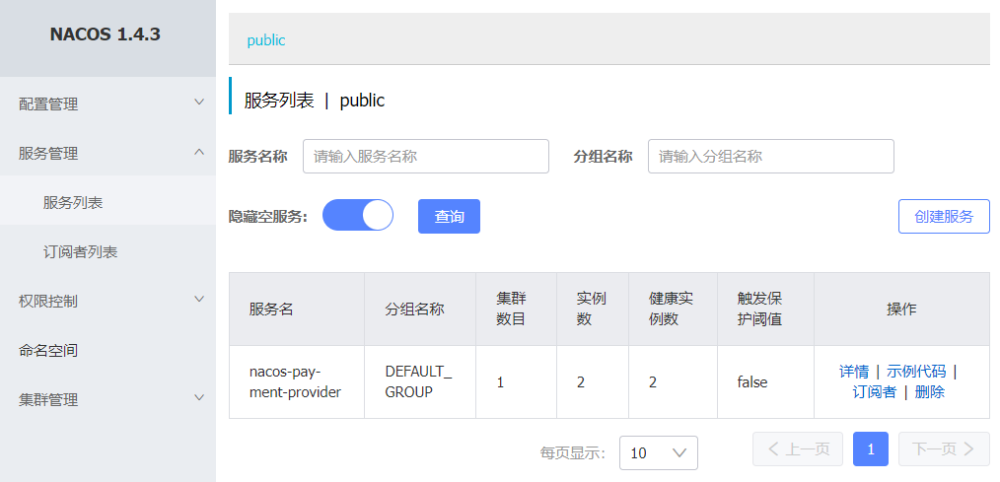

#### 新建消费者模块

新建一个`cloudalibaba-consumer-nacos-order83`模块，然后导入的依赖于9001与9002配置相同。

```xml
<dependencies>
    <!--spring cloud 阿里巴巴-->
    <dependency>
        <groupId>com.alibaba.cloud</groupId>
        <artifactId>spring-cloud-starter-alibaba-nacos-discovery</artifactId>
    </dependency>
    <dependency>
        <groupId>com.atguigu.springcloud</groupId>
        <artifactId>cloud-api-commons</artifactId>
        <version>${project.version}</version>
    </dependency>
    <!--spring boot 2.2.2-->
    <!--图形化监控展现-->
    <dependency>
        <groupId>org.springframework.boot</groupId>
        <artifactId>spring-boot-starter-web</artifactId>
    </dependency>
    <dependency>
        <groupId>org.springframework.boot</groupId>
        <artifactId>spring-boot-starter-actuator</artifactId>
    </dependency>
    <dependency>
        <groupId>org.springframework.boot</groupId>
        <artifactId>spring-boot-devtools</artifactId>
        <scope>runtime</scope>
        <optional>true</optional>
    </dependency>
    <dependency>
        <groupId>org.projectlombok</groupId>
        <artifactId>lombok</artifactId>
        <optional>true</optional>
    </dependency>
    <dependency>
        <groupId>org.springframework.boot</groupId>
        <artifactId>spring-boot-starter-test</artifactId>
        <scope>test</scope>
    </dependency>
</dependencies>
```

#### 编写yaml配置

```yaml
server:
  port: 83

spring:
  application:
    name: nacos-order-consumer
  cloud:
    nacos:
      discovery:
        server-addr: localhost:8848

# 消费者将要去访问的微服务名称(注册成功进nacos的微服务提供者)
service-url:
  nacos-user-service: http://nacos-payment-provider
```

#### 主启动类

```java
@SpringBootApplication
@EnableDiscoveryClient
public class OrderMain83 {
    public static void main(String[] args) {
        SpringApplication.run(OrderMain83.class, args);
    }
}
```

#### 配置类

```java
@Configuration
public class ApplicaitonContextConfig {

    @Bean
    @LoadBalanced
    public RestTemplate getRestRemplate(){
        return new RestTemplate();
    }

}
```

#### Controller接口

```java
@RestController
@Slf4j
public class OrderNacosController {

    @Resource
    private RestTemplate restTemplate;

    @Value("${service-url.nacos-user-service}")
    private String serverURL;

    @GetMapping(value = "/consumer/payment/nacos/{id}")
    public String paymentInfo(@PathVariable("id") Long id) {
        return restTemplate.getForObject(serverURL + "/payment/nacos/" + id, String.class);
    }

}
```

#### 测试

启动83,9001,9002观察：http://localhost:8848/nacos

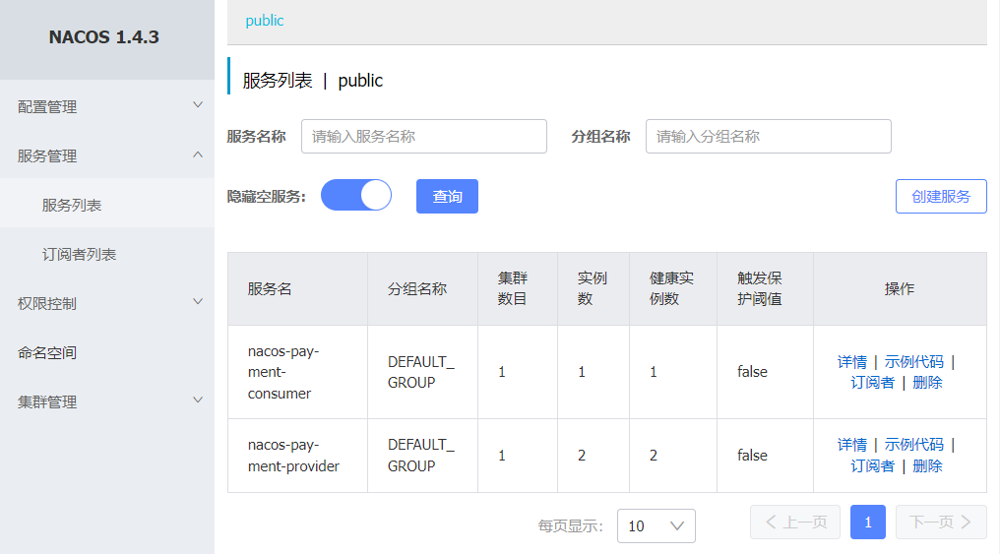

访问地址：http://localhost:83/consumer/payment/nacos/1，发现是轮询负载的。是因为这个是套ribbon壳的。。。做了封装方便使用。


#### 总结

$C$是所有节点在同一时间看到的数据是一致的（一致性）；而$A$的定义是所有的请求都会收到响应（高响应）。nacos支持AP和CP的切换。

何时选择何种模式？

一般来说，如果不需要存储服务级别的信息旦服务实例是通过nacos-clent注册，并能够保持心跳上报，那么就可以选择AP模式。当前主流的服务如 Spring cloud 和Dubbo服务，都适用于AP模式，AP模式为了服务的可能性而减弱了一致性，因此AP模式下只支持注册临时实例。

如果需要在服务级别编辑或者存储配置信息，那么CP是必须，K8S服务和DNS服务则适用于CP模式。
CP模式下则支持注册持久化实例，此时则是以Raft协议为集群运行模式，该模式下注册实例之前必须先注册服务，如果服务不存在，则会返回错误。

```sh
curl -X PUT '$NACOS_SERVER:8848/nacos/v1/ns/operator/switches?entry=serverMode&value=CP'
```

### Nacos服务配置中心

#### 基础配置

##### 构建步骤

###### 新建module模块 

新建一个module模块`cloudalibaba-config-nacos-client3377`

###### pom

```xml
<dependencies>
    <!--nacos-config-->
    <dependency>
        <groupId>com.alibaba.cloud</groupId>
        <artifactId>spring-cloud-starter-alibaba-nacos-config</artifactId>
    </dependency>
    <!--nacos-discovery-->
    <dependency>
        <groupId>com.alibaba.cloud</groupId>
        <artifactId>spring-cloud-starter-alibaba-nacos-discovery</artifactId>
    </dependency>
    <!--spring boot 2.2.2-->
    <!--图形化监控展现-->
    <dependency>
        <groupId>org.springframework.boot</groupId>
        <artifactId>spring-boot-starter-web</artifactId>
    </dependency>
    <dependency>
        <groupId>org.springframework.boot</groupId>
        <artifactId>spring-boot-starter-actuator</artifactId>
    </dependency>
    <dependency>
        <groupId>org.springframework.boot</groupId>
        <artifactId>spring-boot-devtools</artifactId>
        <scope>runtime</scope>
        <optional>true</optional>
    </dependency>
    <dependency>
        <groupId>org.projectlombok</groupId>
        <artifactId>lombok</artifactId>
        <optional>true</optional>
    </dependency>
    <dependency>
        <groupId>org.springframework.boot</groupId>
        <artifactId>spring-boot-starter-test</artifactId>
        <scope>test</scope>
    </dependency>
</dependencies>
```

###### yaml

Nacos同springcloud-config一样，在项目初始化时，要保证先从配置中心进行配置拉取，拉取配置之后，才能保证项目的正常启动。
springboot中配置文件的加载是存在优先级顺序的，bootstrap优先级高于application。

**bootstrap.yml**

```yaml
server:
  port: 3377

spring:
  application:
    name: nacos-config-client
  cloud:
    nacos:
      discovery:
        server-addr: localhost:8848 # Nacos服务注册中心地址
      config:
        server-addr: localhost:8848 # Nacos作为配置中心地址
        file-extension: yaml # 指定yaml格式的位置
```

###### 主启动

```java
@EnableDiscoveryClient
@SpringBootApplication
public class NacosConfigClientMain3377 {
    public static void main(String[] args) {
        SpringApplication.run(NacosConfigClientMain3377.class,args);
    }
}
```

###### 业务类

创建`controller.CofigClientController.java`

```java
@RestController
@RefreshScope // 支持Nacos的动态刷新功能
public class ConfigClientController {

    @Value("${config.info}")
    private String configInfo;

    @GetMapping("/config/info")
    public String getConfigInfo(){
        return configInfo;
    }

}
```

##### 在Nacos中添加配置信息

在 Nacos Spring Cloud 中，`dataId` 的完整格式如下：

```plain
${prefix}-${spring.profiles.active}.${file-extension}
```

- `prefix` 默认为 `spring.application.name` 的值，也可以通过配置项 `spring.cloud.nacos.config.prefix`来配置。
- `spring.profiles.active` 即为当前环境对应的 profile，详情可以参考 [Spring Boot文档](https://docs.spring.io/spring-boot/docs/current/reference/html/boot-features-profiles.html#boot-features-profiles)。 **注意：当 `spring.profiles.active` 为空时，对应的连接符 `-` 也将不存在，dataId 的拼接格式变成 `${prefix}.${file-extension}`**
- `file-exetension` 为配置内容的数据格式，可以通过配置项 `spring.cloud.nacos.config.file-extension` 来配置。目前只支持 `properties` 和 `yaml` 类型。

综上所述，按照我们的配置，最后的dataId结果应该为：

```tex
nacos-config-client-dev.yaml
```

我们选中配置列表，选择新建配置，DataID就是我们刚刚得到的`nacos-config-client-dev.yaml`。

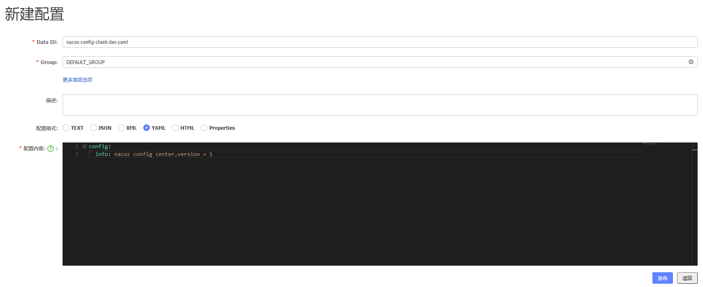

新建配置完成之后是这样：

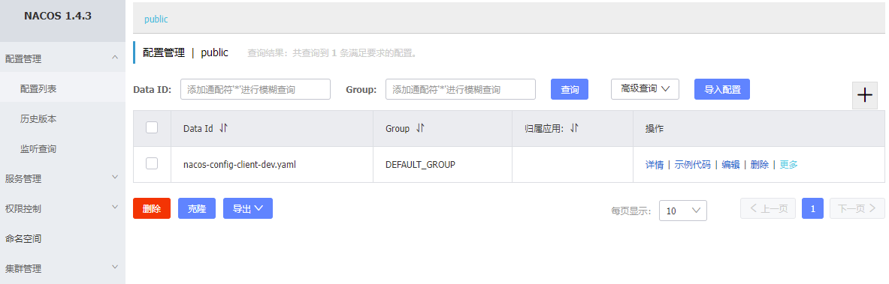

##### 测试

运行3377服务，调用接口http://localhost:3377/config/info测试配置读取是否成功。


##### 自带动态刷新

它支持动态刷新，当我们修改手动修改配置中心数据时，修改的配置会被动态刷新，自动读取。

> 如何能和github/gitee结合就好了，好想自己写一个类似框架。

#### 分类配置

##### 多环境多项目管理问题

1. 实际开发中，一个系统会准备多个环境，如dev开发环境，test测试环境，prod生产环境等，如何保证指定环境启动时服务能正确读取到Nacos上相应环境的配置文件？
2. 一个大型分布式微服务系统会有很多微服务子项目，每个微服务项目都会有相应的开发环境、测试环境等，如何管理这些微服务配置呢？

##### 命名空间：DataId和Group的关系 

Namespace默认为空串，公共命名空间（public），分组默认是DEFAULT_GROUP。

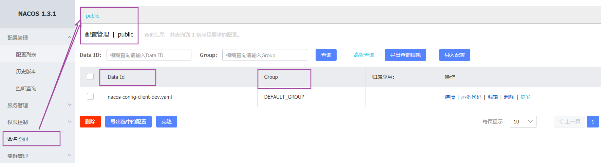

Nacos的数据模型如下：


namespace用于区分部署环境【开发、测试、生产】，创建三个不同的namespace相互隔离。

Group可以把不同的微服务划分到同一个分组中。

Service可以包含多个Cluster集群，Nacos默认Cluster是DEFAULT，Cluster是对指定微服务的一个虚拟划分。

**比方说为了容灾，将Service微服务分别部署在了杭州机房和广州机房，这时就可以给杭州机房的Service微服务起一个集群名称(HZ) ,给广州机房的Service微服务起一个集群名称(GZ)，还可以尽量让同一个机房的微服务互相调用，以提升性能。**

最后，Instance是微服务的实例。

#### 三种方案的加载配置

##### Data Id的方案

> 保证命名空间相同，分组相同，只有DataId不同。

指定`spring.profile.active`和配置文件的`DataId`来使不同环境下读取不同的配置。为了演示这个效果，我们总共新建以下两个配置，保证它们命名空间相同，分组相同，只有Data Id不同：

````tex
nacos-config-client-dev.yaml
nacos-config-client-test.yaml
````

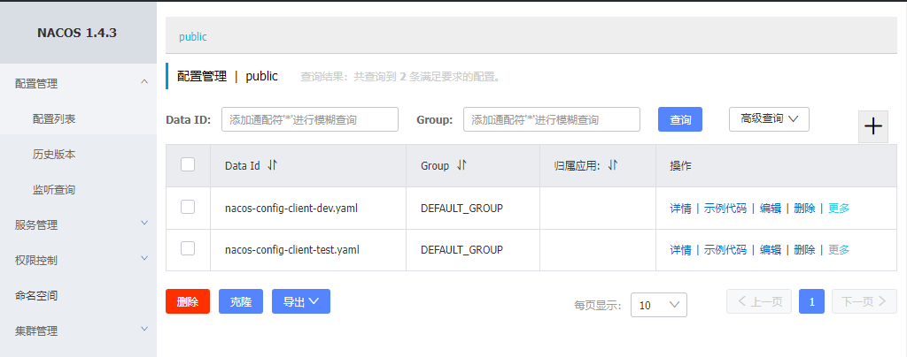

通过`spring.profile.active`属性就能进行多环境下配置文件的读取，刚刚已经测试过dev环境，我们测试以下test环境，是否能够读取到：`nacos-config-client-test.yaml`的配置呢，答案是肯定的，可以访问：http://localhost:3377/config/info测试一下。

```yaml
spring:
  profiles:
    active: test # 表示开发环境
```

##### Group方案

> 保证命名空间相同，Data相同，只有分组不同

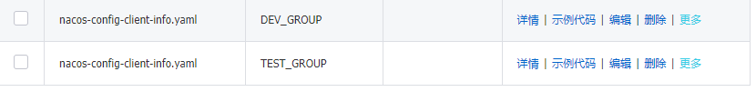

注意，这里我们需要在application.yml中指定profile为info，在bootstrap.yml指定group。

```yaml
### boostrap.yml

server:
  port: 3377

spring:
  application:
    name: nacos-config-client
  cloud:
    nacos:
      discovery:
        server-addr: localhost:8848 # Nacos服务注册中心地址
      config:
        server-addr: localhost:8848 # Nacos作为配置中心地址
        file-extension: yaml # 指定yaml格式的位置
        group: DEV_GROUP

# ${spring.application.name}-${spring.profile.active}.${spring.cloud.nacos.config.file-extension}


### application.yml
spring:
  profiles:
    active: info
```

在TEST_GROUP和DEV_GROUP之间切换进行测试。

##### namespace方案

> 保证命名空间不同

新建两个命名空间：dev和test。

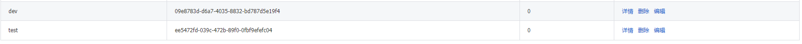

如果需要指定命名空间，则指定yml中的namespace属性即可。

```yaml
### bootstrap.yml
server:
  port: 3377

spring:
  application:
    name: nacos-config-client
  cloud:
    nacos:
      discovery:
        server-addr: localhost:8848 # Nacos服务注册中心地址
      config:
        server-addr: localhost:8848 # Nacos作为配置中心地址
        file-extension: yaml # 指定yaml格式的位置
        group: TEST_GROUP
        namespace: ee5472fd-039c-472b-89f0-0fbf9efefc04 # 命名空间ID

### application.yml

spring:
  profiles:
    active: test
```

将会从命名空间ID为`ee5472fd-039c-472b-89f0-0fbf9efefc04`的`TEST_GROUP`组中，读取`nacos-config-client-test`的配置文件。

### **Nacos集群和持久化配置**

#### Nacos部署模式

**Nacos三种部署模式：（默认自带是嵌入式数据库derby）**

- 单机模式-用于测试和单机使用
- 集群模式-用于生产环境，确保高可用
- 多集群模式-用于多数据中心模式

**支持MySQL数据源：**

- 安装数据库版本5.6.5+
- 初始化mysql数据库，数据库初始文件nacos-mysql.sql
- 修改conf-application.properties文件，增加支持mysql数据源配置，添加mysql数据源的URL、用户名和密码。

#### 集群部署架构图

官网地址：https://nacos.io/zh-cn/docs/cluster-mode-quick-start.html

因此开源的时候推荐用户把所有服务列表放到一个vip下面，然后挂到一个域名下面

[http://ip1](http://ip1/):port/openAPI 直连ip模式，机器挂则需要修改ip才可以使用。

[http://SLB](http://slb/):port/openAPI 挂载SLB模式(内网SLB，不可暴露到公网，以免带来安全风险)，直连SLB即可，下面挂server真实ip，可读性不好。

[http://nacos.com](http://nacos.com/):port/openAPI 域名 + SLB模式(内网SLB，不可暴露到公网，以免带来安全风险)，可读性好，而且换ip方便，推荐模式


更详细的架构图

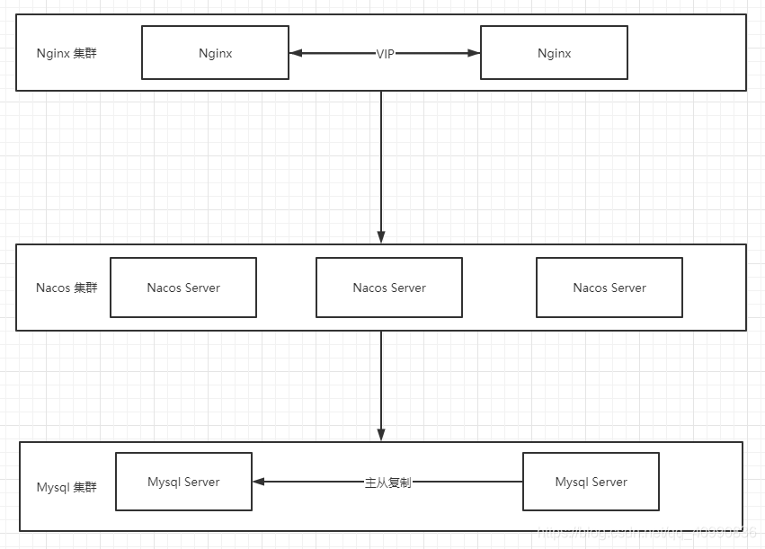

#### Nacos集群配置

默认Nacos使用嵌入式数据库实现数据的存储。所以，如果启动多个默认配置下的Nacos节点，数据存储是存在一致性问题的。为了解决这个问题，Nacos采用了集中式存储的方式来支持集群化部署，目前只支持MySQL的存储。

配置要求：1个Nginx+3个注册中心+1个Mysql

* 直接复制三份nacos文件夹

```sh
cp -r nacos nacos-01
cp -r nacos nacos-02
cp -r nacos nacos-03
```

* 导入`` nacos/conf`` 下的 sql 文件 ， 导入到 Mysql 数据库中

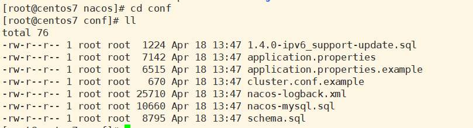

* 创建数据库

```mysql
create database nacosexample character set utf8;
```

* 导入数据库

```mysql
use nacosexample;12wq23123w
source /usr/local/nacos/conf/nacos-mysql.sql
```

* 修改数据库配置

配置数据库连接。 修改 `conf/application.properties` 配置文件， 在尾部额外增加 Mysql 数据库配置如下 ，记得修改 三个 nacos 都要修改。

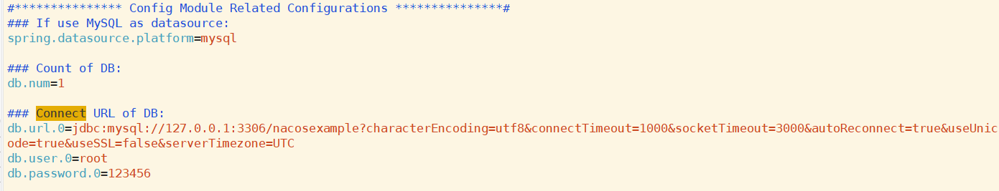

* 修改 application.properties 下的端口号。 三个文件夹都要修改 分别为 `3333,4444,5555`

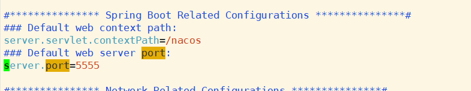

* 配置nacos集群

在 nacos-01, 02 .03 文件夹中创建 `conf/cluster.conf` 配置文件。配置每一个Nacos 集群的所有节点。 具体内容如下：

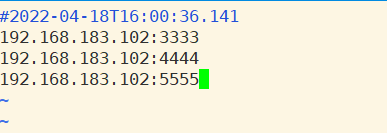

> ip addr或者ifconfig查看本机ip地址。

* 编写nacos的启动脚本startup.sh，使它能够接收不同的启动端口

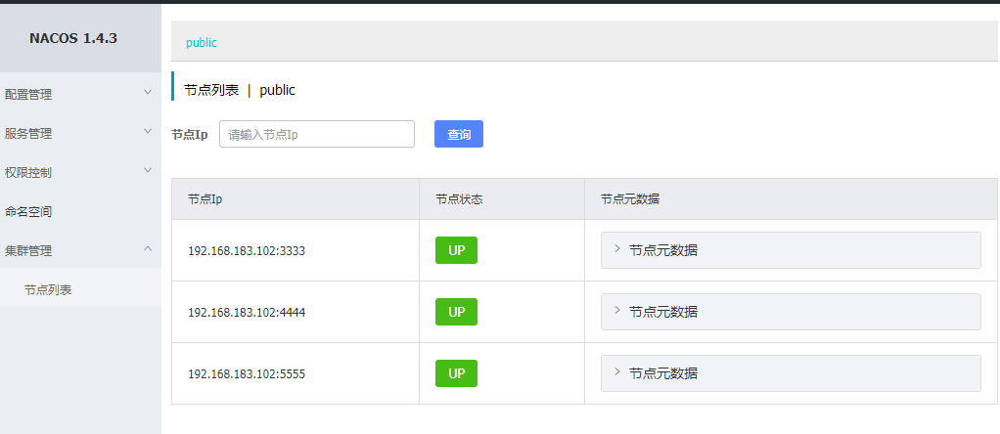

> 注意可能会不成功，注意端口的设置以及虚拟机中内存的大小。如果是不同的机器进行配置的话，就没有这么多问题，单机配置集群即使步骤正确，但不容易成功。

* Nginx配置，去查看linux运维笔记中的Nginx笔记。

首先添加源

```sh
vim /etc/yum.repos.d/nginx.repo
##### 

[nginx]
name=nginx repo
baseurl=http://nginx.org/packages/centos/$releasever/$basearch/
gpgcheck=0
enabled=1


### 之后安装
yum install nginx

### 查看nginx位置
nginx -t
```

切换到`/etc/nginx`，编写`nginx.conf`

```tex
http {
    include       /etc/nginx/mime.types;
    default_type  application/octet-stream;

    # log_format  main  '$remote_addr - $remote_user [$time_local] "$request" '
    #                  '$status $body_bytes_sent "$http_referer" '
    #                  '"$http_user_agent" "$http_x_forwarded_for"';

    # access_log  /var/log/nginx/access.log  main;

    sendfile        on;
    #tcp_nopush     on;

    keepalive_timeout  65;

    #gzip  on;


    upstream cluster{
        server 192.168.183.102:3333;
        server 192.168.183.102:4444;
        server 192.168.183.102:5555;
    }

    server {
        listen       1111;
        listen       8848;
        server_name  localhost;
        #charset koi8-r;

        #access_log  logs/host.access.log  main;

        location / {
           # root   html;
           # index  index.html index.htm;
            proxy_pass http://cluster;
        }
   }
    # include /etc/nginx/conf.d/*.conf;
}
```

重启 Nginx ，访问 Nacos 接口：http://192.168.183.102:8848/nacos 。

```sh
nginx -s reload
```

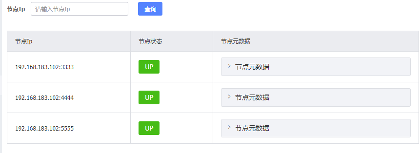

然后启动9001进行测试，是否进行注册成功。

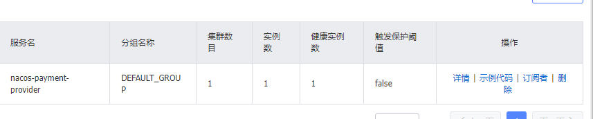


## SpringCloud Alibaba Sentinel实现熔断与限流

### 概述

#### 文档

Github中文文档：https://github.com/alibaba/Sentinel/wiki/%E4%BB%8B%E7%BB%8D

SpringCloud Alibaba：https://spring-cloud-alibaba-group.github.io/github-pages/greenwich/spring-cloud-alibaba.html#_spring_cloud_alibaba_sentinel

#### Sentinel是什么

随着微服务的流行，服务和服务之间的稳定性变得越来越重要。Sentinel 以流量为切入点，从流量控制、熔断降级、系统负载保护等多个维度保护服务的稳定性。

Sentinel 具有以下特征:

- **丰富的应用场景**：Sentinel 承接了阿里巴巴近 10 年的双十一大促流量的核心场景，例如秒杀（即突发流量控制在系统容量可以承受的范围）、消息削峰填谷、集群流量控制、实时熔断下游不可用应用等。
- **完备的实时监控**：Sentinel 同时提供实时的监控功能。您可以在控制台中看到接入应用的单台机器秒级数据，甚至 500 台以下规模的集群的汇总运行情况。
- **广泛的开源生态**：Sentinel 提供开箱即用的与其它开源框架/库的整合模块，例如与 Spring Cloud、Apache Dubbo、gRPC、Quarkus 的整合。您只需要引入相应的依赖并进行简单的配置即可快速地接入 Sentinel。同时 Sentinel 提供 Java/Go/C++ 等多语言的原生实现。
- **完善的 SPI 扩展机制**：Sentinel 提供简单易用、完善的 SPI 扩展接口。您可以通过实现扩展接口来快速地定制逻辑。例如定制规则管理、适配动态数据源等。

Sentinel 的主要特性：


Sentinel 分为两个部分:

- 核心库（Java 客户端）不依赖任何框架/库，能够运行于所有 Java 运行时环境，同时对 Dubbo / Spring Cloud 等框架也有较好的支持。
- 控制台（Dashboard）基于 Spring Boot 开发，打包后可以直接运行，不需要额外的 Tomcat 等应用容器。默认使用8080端口。

#### 下载

github：https://github.com/alibaba/Sentinel/releases

#### 运行

默认端口运行

```sh
java -jar sentinel-dashboard-1.8.4.jar
```

指定端口运行

```sh
java -Dserver.port=9999 -Dcsp.sentinel.dashboard.server=localhost:9999 -Dproject.name=sentinel-dashboard -jar sentinel-dashboard-1.8.4.jar
```

访问sentinel管理界面，默认用户和密码为：sentinel。

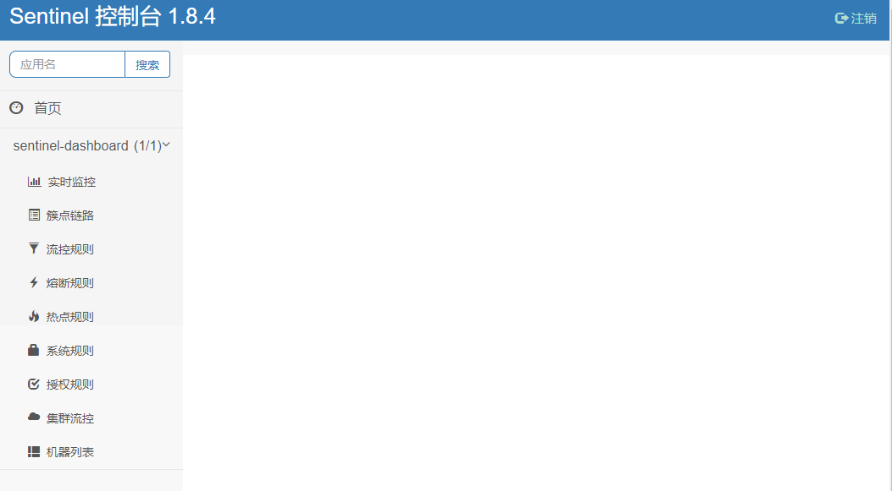

### 初始化演示工程

#### 启动服务

启动nacos以及sentinel。

#### 新建module

新建一个`cloudalibaba-sentinel-service8401`

#### pom

```xml
<dependencies>
    <!--SpringCloud ailibaba nacos -->
    <dependency>
        <groupId>com.alibaba.cloud</groupId>
        <artifactId>spring-cloud-starter-alibaba-nacos-discovery</artifactId>
    </dependency>
    <!--SpringCloud ailibaba sentinel-datasource-nacos 后续做持久化用到-->
    <dependency>
        <groupId>com.alibaba.csp</groupId>
        <artifactId>sentinel-datasource-nacos</artifactId>
    </dependency>
    <!--SpringCloud ailibaba sentinel -->
    <dependency>
        <groupId>com.alibaba.cloud</groupId>
        <artifactId>spring-cloud-starter-alibaba-sentinel</artifactId>
    </dependency>
    <dependency>
        <groupId>org.springframework.boot</groupId>
        <artifactId>spring-boot-starter-actuator</artifactId>
    </dependency>
    <dependency>
        <groupId>org.springframework.boot</groupId>
        <artifactId>spring-boot-starter-web</artifactId>
    </dependency>
    <dependency>
        <groupId>org.projectlombok</groupId>
        <artifactId>lombok</artifactId>
    </dependency>

</dependencies>
```

#### yaml

````yaml
server:
  port: 8401

spring:
  application:
    name: cloudalibaba-sentinel-service
  cloud:
    nacos:
      discovery:
        server-addr: localhost:8848
    sentinel:
      transport:
        dashboard: localhost:9999
        port: 8719

management:
  endpoints:
    web:
      exposure:
        include: "*"
````

#### 主启动

```java
@SpringBootApplication
@EnableDiscoveryClient
public class SentinelMain8401 {
    public static void main(String[] args) {
        SpringApplication.run(SentinelMain8401.class,args);
    }
}
```

#### 业务类

```java
@RestController
@Slf4j
public class FlowLimitController {
    @GetMapping("/testA")
    public String testA() {
        return "------testA";
    }

    @GetMapping("/testB")
    public String testB() {
        log.info(Thread.currentThread().getName() + "\t" + "...testB");
        return "------testB";
    }
}
```

#### 启动微服务

启动微服务8401，然后访问请求，刷新sentinel，可以在控制平台看到此请求。

> sentinel使用的是懒加载机制，需要先访问请求，刷新。

* http://localhost:8401/testA
* http://localhost:8401/testB

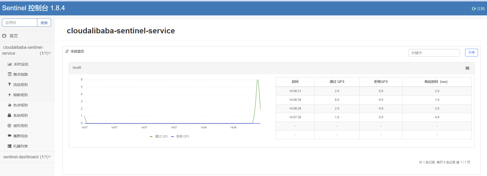

### 流控规则

#### 基本介绍

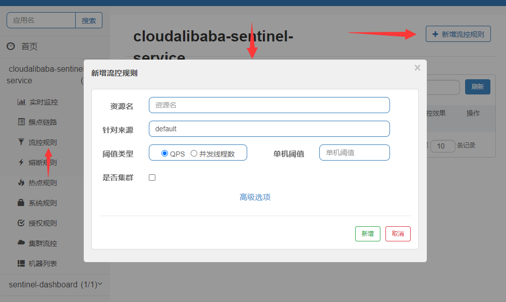

- 资源名：唯一名称，默认请求路径
- 针对来源：Sentinel 可以针对调用者进行限流，填写微服务名，默认 default（不区分来源）
- 阈值类型/单机阈值：
  - QPS（Queries-per-second，每秒钟的请求数量）：当调用该 api 的 QPS 达到阈值的时候，进行限流
  - 线程数：当调用该 api 的线程数达到阈值的时候，进行限流
- 是否集群：不需要集群
- 流控模式：
  - 直接：api达到限流条件时，直接限流
  - 关联：当关联的资源达到阈值时，就限流自己
  - 链路：只记录指定链路上的流量（指定资源从入口资源进来的流量，如果达到阈值，就进行限流）【api 级别的针对来源 】
- 流控效果：
  - 快速失败：直接失败，抛异常
  - Warm Up：根据 codeFactor（冷加載因子，默认3）的值，从阈值/codefactor，经过预热时长，才达到设置的 QPS 阈值
  - 排队等待：匀速排队，让请求以匀速的速度通过，阈值类型必须设置为 QPS，否则无效

#### 流控模式

##### 直接（默认）

######  QPS直接失败

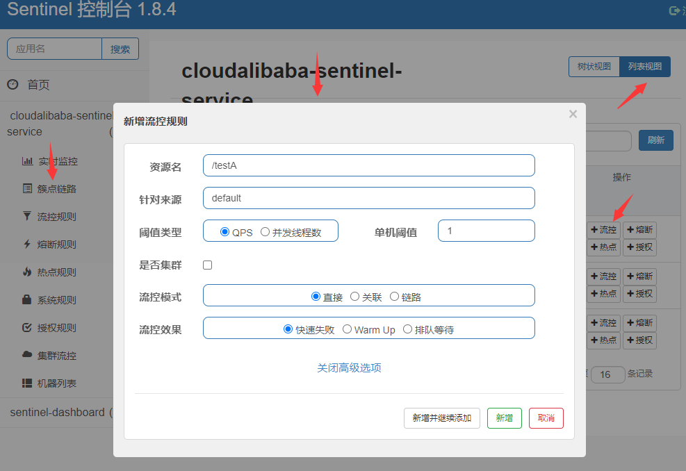

快速刷新访问 `http://localhost:8401/testA`，出现 Sentinel 提示：

```tex
Blocked by Sentinel (flow limiting)
```

###### 线程数直接失败

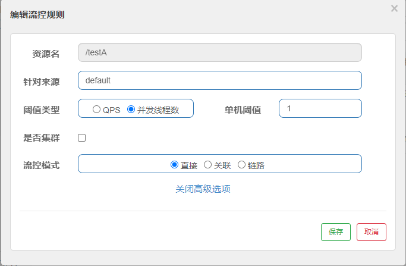

在业务代码中增加延时，之后操作如上，也会出现 Sentinel 提示

```java
Blocked by Sentinel (flow limiting)
```

##### 关联

###### 什么是关联

- 当关联的资源达到阈值时，就限流自己
- 当与A关联的资源B达到阈值后，就限流自己
- B惹事，A挂了

###### QPS-关联-快速失败

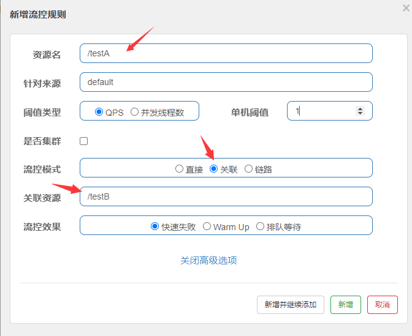

是否流控 `/testA` 取决于 `/testB` 的 QPS，如果超过阈值，访问 `/testA` 会出现 Sentinel 提示信息，而 `/testB` 不受影响。

使 `/testB` QPS 超过阈值，可以使用 Postman 的 【Run Collection】 功能。也即是模拟并发访问。

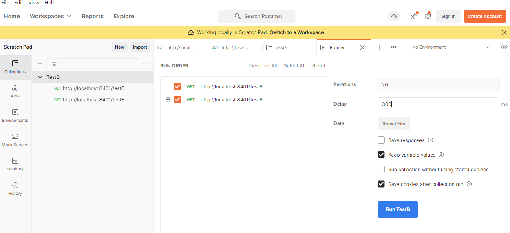

之后访问`testA`，发现被限制了。

##### 链路

多个请求调用了同一个微服务。

添加相关依赖

```xml
<dependency>
    <groupId>com.alibaba.csp</groupId>
    <artifactId>sentinel-web-servlet</artifactId>
    <version>1.7.0</version>
</dependency>
```

添加配置

```java
@Configuration
public class FilterContextConfig {
    @Bean
    public FilterRegistrationBean sentinelFilterRegistration() {
        FilterRegistrationBean registration = new FilterRegistrationBean();
        registration.setFilter(new CommonFilter());
        registration.addUrlPatterns("/*");
        // 入口资源关闭聚合
        registration.addInitParameter(CommonFilter.WEB_CONTEXT_UNIFY, "false");
        registration.setName("sentinelFilter");
        registration.setOrder(1);
        return registration;
    }
}
```

然后在yml文件中，添加如下：

```properties
spring.cloud.sentinel.filter.enabled=false
```

链路流控模式指的是，当从某个接口过来的资源达到限流条件时，就开启限流；

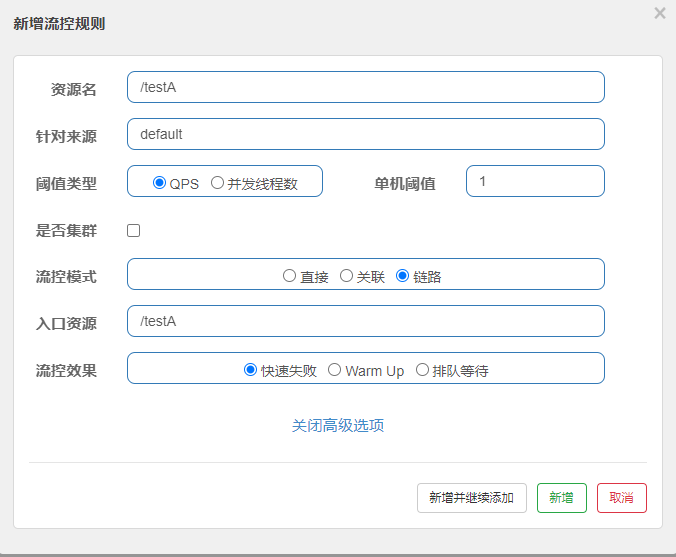

然后进行访问测试。

举个例子：/test1接口去调用/test2接口，调用QPS超出阈值了，此时对/test1进行限流。总结就是针对上级接口。

#### 流控效果

##### 直接->快速失败（默认的流控处理）

直接失败，抛出异常

```tex
Blocked by Sentinel (flow limiting)
```

源码

```tex
com.alibaba.csp.sentinel.slots.block.flow.controller.DefaultController
```

##### 预热

**公式**：阈值会经过变化，开始为阈值除以coldFactor（默认值为3），经过预热时长后才会达到阈值。

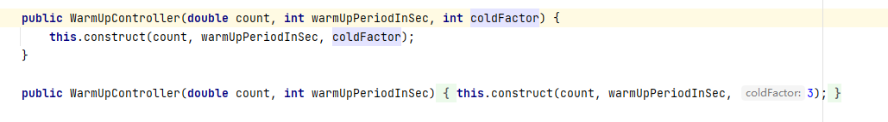

```tex
com.alibaba.csp.sentinel.slots.block.flow.controller.WarmUpController
```

Warm up ( Ruleconstant.cONTROL_BEHAVIOR_MAR_uP )方式，即预热/冷启动方式。当系统长期处于低水位的情况下，当流星突然增加时，直接把系统拉升到高水位可能瞬间把系统压垮。通过"冷启动"，让通过的流呈缓慢增加，在一定时间内逐渐增加到阈值上限，给冷系统一个预热的时间，避免冷系统被压垮。

> 案例：阈值为10，预热市场 5s
>
> 系统初始化阈值为 10/3，约等于 3，即阈值开始为 3；经过 5s 后阈值慢慢升高，恢复到 10

应用场景：

如：**秒杀系统**在开启的瞬间，会有很多流量上来，很有可能把系统打死，预热方式就是把为了保护系统，可慢慢的把流量放进来，慢慢的把阀值增长到设置的阀值。

##### 排队等待

匀速排队，阈值必须设置为 QPS

```tex
com.alibaba.csp.sentinel.slots.block.flow.controller.RateLimiterController
```

匀速排队( Ruleconstant.CONTROL_EEHAVIOR_RATE_LIMITER ）方式会严格控制请求通过的间隔时间，也即是让请求以均匀的速度通过，对应的是漏桶算法。

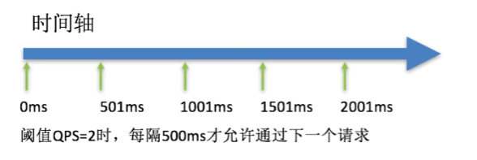

### 熔断降级

#### 概述

Sentinel 提供以下几种熔断策略：

- 慢调用比例 (`SLOW_REQUEST_RATIO`)：选择以慢调用比例作为阈值，需要设置允许的慢调用 RT（即最大的响应时间），请求的响应时间大于该值则统计为慢调用。当单位统计时长（`statIntervalMs`）内请求数目大于设置的最小请求数目，并且慢调用的比例大于阈值，则接下来的熔断时长内请求会自动被熔断。经过熔断时长后熔断器会进入探测恢复状态（HALF-OPEN 状态），若接下来的一个请求响应时间小于设置的慢调用 RT 则结束熔断，若大于设置的慢调用 RT 则会再次被熔断。
- 异常比例 (`ERROR_RATIO`)：当单位统计时长（`statIntervalMs`）内请求数目大于设置的最小请求数目，并且异常的比例大于阈值，则接下来的熔断时长内请求会自动被熔断。经过熔断时长后熔断器会进入探测恢复状态（HALF-OPEN 状态），若接下来的一个请求成功完成（没有错误）则结束熔断，否则会再次被熔断。异常比率的阈值范围是 `[0.0, 1.0]`，代表 0% - 100%。
- 异常数 (`ERROR_COUNT`)：当单位统计时长内的异常数目超过阈值之后会自动进行熔断。经过熔断时长后熔断器会进入探测恢复状态（HALF-OPEN 状态），若接下来的一个请求成功完成（没有错误）则结束熔断，否则会再次被熔断。

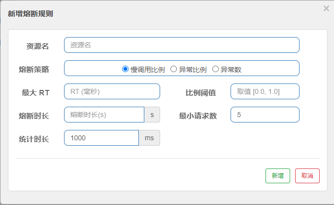

#### 熔断降级策略

##### 慢调用比例

慢调用比例 (`SLOW_REQUEST_RATIO`)：选择以慢调用比例作为阈值，需要设置允许的慢调用 RT（即最大的响应时间），请求的响应时间大于该值则统计为慢调用。当单位统计时长（`statIntervalMs`）内请求数目大于设置的最小请求数目（默认为5），并且慢调用的比例大于阈值，则接下来的熔断时长内请求会自动被熔断。经过熔断时长后熔断器会进入探测恢复状态（HALF-OPEN 状态），若接下来的一个请求响应时间小于设置的慢调用 RT 则结束熔断，若大于设置的慢调用 RT 则会再次被熔断。

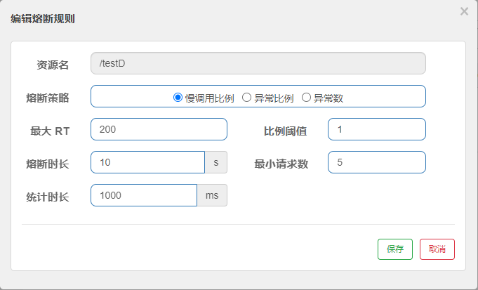

解读：RT超过200ms的调用是慢调用，统计最近1000ms内的请求，如果请求量超过5次，并且有80%的接口超过了200ms的时间，则触发熔断，熔断时长为10秒。然后进入half-open状态（半开路状态），放行一次请求做测试。

也可以这样说：在1ms内请求数目大于5，并且慢调用的比例大于80%，则接下来的熔断时长内请求会自动被熔断，熔断时长是10秒，10秒之后会进入探测恢复状态（HALF-OPEN 状态），若接下来的一个请求响应时间小于200ms， 则结束熔断，若大于200ms 则会再次被熔断。

为了更直观的观察学习，在代码层添加时间进行模拟延时。

```java
@GetMapping("/testD")
public String testD() {

    try {
        TimeUnit.SECONDS.sleep(1);
    } catch (InterruptedException e) {
        e.printStackTrace();
    }
    log.info("慢调用测试");
    return "-----------testD-------------";
}
```

然后通过使用jmeter进行多线程访问测试：

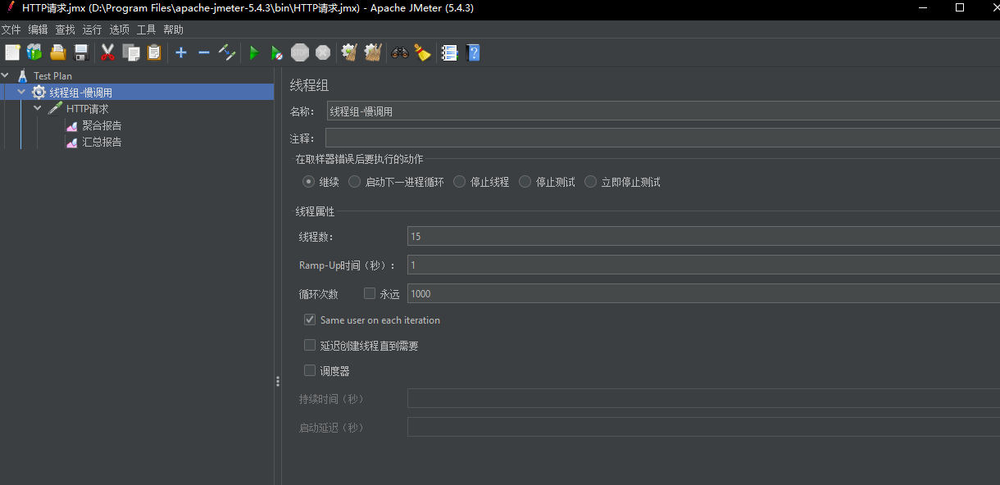

然后在访问http://localhost:8401/testD。可以看到被限制了。

##### 异常比例

异常比例或异常数：统计指定时间内的调用，如果调用次数超过指定请求数，并且出现异常的比例达到设定的比例阈值（或超过指定异常数），则触发熔断。例如：

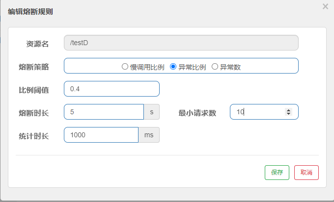

解读：统计最近1000ms内的请求，如果请求量超过10次，并且异常比例不低于0.4，则触发熔断，熔断时长为5秒。然后进入half-open状态，放行一次请求做测试。

然后修改代码：

```java
@GetMapping("/testD")
public String testD() {
    int age = 10 / 0;
    log.info("慢调用测试");
    return "-----------testD-------------";
}
```

之后，进行访问测试：http://localhost:8401/testD，如果失败，就重新配置规则。

##### 异常数

异常数 (`ERROR_COUNT`)：当单位统计时长内的异常数目超过阈值之后会自动进行熔断。经过熔断时长后熔断器会进入探测恢复状态（HALF-OPEN 状态），若接下来的一个请求成功完成（没有错误）则结束熔断，否则会再次被熔断。

#### 服务熔断

sentinel整合ribbon+openFeign+fallback

##### Ribbon系列

###### 启动服务

启动nacos和sentinel

###### 搭建module

- 生产者：``cloudalibaba-provider-payment9003``、``cloudalibaba-provider-payment9004``

导入依赖

```xml
<dependencies>
    <dependency>
        <groupId>org.springframework.boot</groupId>
        <artifactId>spring-boot-starter-web</artifactId>
    </dependency>
    <!-- nacos-discovery -->
    <dependency>
        <groupId>com.alibaba.cloud</groupId>
        <artifactId>spring-cloud-starter-alibaba-nacos-discovery</artifactId>
    </dependency>
    <!--sentinel datasource nacos  持久化会用到-->
    <dependency>
        <groupId>com.alibaba.cloud</groupId>
        <artifactId>spring-cloud-starter-alibaba-sentinel</artifactId>
    </dependency>
    <!--openfeign-->
    <dependency>
        <groupId>org.springframework.cloud</groupId>
        <artifactId>spring-cloud-starter-openfeign</artifactId>
    </dependency>
    <!--引入自己定义的api通用包， 可以使用Payment支付Entity-->
    <dependency>
        <groupId>com.atguigu.springcloud</groupId>
        <artifactId>cloud-api-commons</artifactId>
        <version>${project.version}</version>
    </dependency>
    <dependency>
        <groupId>org.springframework.boot</groupId>
        <artifactId>spring-boot-starter-actuator</artifactId>
    </dependency>

    <dependency>
        <groupId>com.alibaba.cloud</groupId>
        <artifactId>spring-cloud-starter-alibaba-nacos-discovery</artifactId>
    </dependency>
    <dependency>
        <groupId>org.springframework.boot</groupId>
        <artifactId>spring-boot-devtools</artifactId>
        <scope>runtime</scope>
        <optional>true</optional>
    </dependency>
    <dependency>
        <groupId>org.projectlombok</groupId>
        <artifactId>lombok</artifactId>
        <optional>true</optional>
    </dependency>
    <dependency>
        <groupId>org.springframework.boot</groupId>
        <artifactId>spring-boot-starter-test</artifactId>
    </dependency>
</dependencies>
```

配置yaml文件

```yaml
server:
  port: 9003

spring:
  cloud:
    nacos:
      discovery:
        server-addr: localhost:8848
  application:
    name: nacos-payment-provider

management:
  endpoints:
    web:
      exposure:
        include: "*"
```

创建controller

```java
@RestController
public class PaymentController {
    @Value("${server.port}")
    private String serverPort;

    public static HashMap<Long,Payment> hashMap=new HashMap<>();

    static {
        hashMap.put(1L, new Payment(1L,"199811046510"));
        hashMap.put(2L, new Payment(2L,"199811046511"));
        hashMap.put(3L, new Payment(3L,"199811046512"));
    }

    @GetMapping(value = "/payment/{id}")
    public CommonResult<Payment> paymentSQL(@PathVariable("id")Long id){
        Payment payment=hashMap.get(id);
        CommonResult<Payment> result=new CommonResult(200,"from mysql ,serverport: "+serverPort ,payment);
        return result;
    }
}
```

启动9003以及9004，进行测试。

- 消费者：``cloudalibaba-consumer-nacos-order84``

导入相关依赖与上面一样。一定要保证导入的依赖正确。

配置yaml文件

```yaml
server:
  port: 84

spring:
  application:
    name: nacos-order-consumer
  cloud:
    nacos:
      discovery:
        server-addr: localhost:8848
    sentinel:
      transport:
        dashboard: localhost:9999
        port: 8719

service-url:
  nacos-user-service: http://nacos-payment-provider
```

配置类

```java
@Configuration
public class ApplicationContextConfig {
    @Bean
    @LoadBalanced
    public RestTemplate getRestTemplate(){
        return new RestTemplate();
    }
}
```

controller，创建`CircleBreakerController`

```java
@RestController
@Slf4j
public class CircleBreakerController {
    public static final String SERVICE_URL="http://nacos-payment-provider";

    @Resource
    private RestTemplate restTemplate;
    @RequestMapping("/consumer/fallback/{id}")
    @SentinelResource(value = "fallback") //没有配置
    public CommonResult<Payment> fallback(@PathVariable Long id){
        CommonResult<Payment> result=restTemplate.getForObject(SERVICE_URL+"/payment/"+id,
                CommonResult.class,id);
        if(id == 4){
            throw  new IllegalArgumentException("IllegalArgumentException,非法参数异常.....");
        }else if(result.getData()==null){
            throw new NullPointerException("NullPointerException,该Id没有对应记录.空指针异常.....");
        }
        return  result;
    }
}
```

启动测试。

###### 配置fallback

`@SentinelResource` 注解的 `fallback` 和 `blockHandler` 属性中`fallback` 管运行异常，无 `blockHandler` 时，也管配置违规。

```java
@SentinelResource(value = "fallback",fallback = "handlerFallback") //fallback只负责业务异常

//本例是fallback的兜底
public CommonResult handlerFallback(@PathVariable Long id,Throwable e){
    Payment payment = new Payment(id,"null");
    return new CommonResult<>(444,"兜底异常类handlerFallback,Exception内容: "+ e.getMessage(),payment);
}
```

###### 配置blockHandler

`@SentinelResource` 注解的 `fallback` 和 `blockHandler` 属性中`blockHandler` 管配置违规


```java
@SentinelResource(value = "fallback",blockHandler = "blockHandlerFallback") 

public CommonResult blockHandlerFallback(@PathVariable Long id, BlockException blockException){
    Payment payment = new Payment(id,"null");
    return new CommonResult<>(444,"兜底异常类blockHandlerFallback,Exception内容: "+ blockException.getMessage(),payment);
}
```

访问次数超过两次以上：http://localhost:84/consumer/fallback/5

###### 同时配置两个

`@SentinelResource` 注解的 `fallback` 和 `blockHandler` 属性中`fallback` 管运行异常，无 `blockHandler` 时，也管配置违规。

```java
@SentinelResource(value = "fallback",fallback = "handlerFallback",blockHandler = "blockHandlerFallback")
```

> 实际上我这里`fallback`优先级比`blockHandler`高，其他都一样。。

###### 忽略异常属性

`exceptionsToIgnore = {IllegalArgumentException.class}`能够忽略指定的异常。

```java
@SentinelResource(value = "fallback",fallback = "handlerFallback",
                  exceptionsToIgnore = {IllegalArgumentException.class})
```

##### Feign系列

首先在工程项目中，引入以下依赖：

```xml
<!--openfeign-->
<dependency>
    <groupId>org.springframework.cloud</groupId>
    <artifactId>spring-cloud-starter-openfeign</artifactId>
</dependency>
```

然后在yaml文件中，激活sentinel对Feign的支持。

```yaml
# 激活sentinel对Feign的支持
feign:
  sentinel:
    enabled: true
```

然后在主启动类中开启Feign服务。

```java
@SpringBootApplication
@EnableDiscoveryClient
@EnableFeignClients
public class SentinelOrderMain84 {
    public static void main(String[] args) {
        SpringApplication.run(SentinelOrderMain84.class,args);
    }
}
```

新增service接口：feign 接口+注解

```java
@FeignClient(value = "nacos-payment-provider",fallback = PaymentFallBackService.class)
public interface PaymentService {

    @GetMapping("/payment/{id}")
    public CommonResult<Payment> payment(@PathVariable("id") Long id);
}
```

兜底实现类

```java
@Component
public class PaymentFallBackService implements PaymentService{
    @Override
    public CommonResult<Payment> payment(Long id) {
        return new CommonResult<>(444,"服务降级返回--PaymentFallBackService",new Payment(id,null));
    }
}
```

controller类加入新代码

```java
@Resource
private PaymentService paymentService;
@GetMapping(value = "/consumer/payment/{id}")
public CommonResult<Payment> payment(@PathVariable("id")Long id) {
    return paymentService.payment(id);
}
```

启动测试，正常测试无异常。关闭生产者，会调用服务降级。

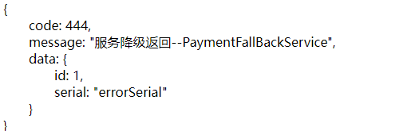

#### 熔断框架比较

|                | Sentinel                                                   | Hystrix                 | Resilience4j                     |
| -------------- | ---------------------------------------------------------- | ----------------------- | -------------------------------- |
| 隔离策略       | 信号量隔离（并发线程数限流）                               | 线程池隔离/信号量隔离   | 信号量隔离                       |
| 熔断降级策略   | 基于响应时间、异常比率、异常数                             | 基于异常比率            | 基于异常比率、响应时间           |
| 实时统计实现   | 滑动窗口（Leaparray）                                      | 滑动窗口（基于 RxJava） | Ring Bit Buffer                  |
| 动态规则配置   | 支持多种数据源                                             | 支持多种数据源          | 有限支持                         |
| 扩展性         | 多个扩展点                                                 | 插件的形式              | 接口的形式                       |
| 限流           | 基于QPS，支持基于调用关系的限流                            | 有限的支持              | Rate Limiter                     |
| 流量整形       | 支持预热模式、匀速器模式、预热排队模式                     | 不支持                  | 简单的 Rate Limiter 模式         |
| 系统自适应保护 | 支持                                                       | 不支持                  | 不支持                           |
| 控制台         | 提供开箱即用的控制台，可配置规则、查看秒级监控、机器发现等 | 简单的监控查看          | 不提供控制台，可对接其他监控系统 |

### 热点参数限流

#### 什么是热点参数限流

何为热点？热点即经常访问的数据。很多时候我们希望统计某个热点数据中访问频次最高的 Top K 数据，并对其访问进行限制。比如：

- 商品 ID 为参数，统计一段时间内最常购买的商品 ID 并进行限制
- 用户 ID 为参数，针对一段时间内频繁访问的用户 ID 进行限制

热点参数限流会统计传入参数中的热点参数，并根据配置的限流阈值与模式，对包含热点参数的资源调用进行限流。热点参数限流可以看做是一种特殊的流量控制，仅对包含热点参数的资源调用生效。

```java
com.alibaba.csp.sentinel.slots.block.BlockException
```

#### 承上启下

承接 Hystrix，能够实现兜底方法，分为系统默认和客户自定义，两种

之前的case，限流出问题后，都是用 sentinel 系统默认的提示：**Blocked by Sentinel (flow limiting)**。

**`@SentinelResource` 只管 Sentinel 配置违规，不处理代码异常**。

#### 代码

```java
@GetMapping("/testHotKey")
@SentinelResource(value = "testHotKey",blockHandler = "dealTestHostKey")
public String testHotKey(@RequestParam(value = "p1", required = false) String p1,
                         @RequestParam(value = "p2", required = false) String p2){
    return "testHotKey：p1="+p1+",p2="+p2;
}
public String dealTestHostKey(String p1, String p2, BlockException blockException){
    return "dealTestHostKey：p1="+p1+",p2="+p2;
}
```

如果使用了 `@SentinelResource` ，但是没有配置 `blockHandler` 属性，违反热点规则会出现错误页面，而不是 Sentinel 默认的错误提示。

#### 参数例外项

上述案例演示了第一个参数p1，当QPS超过1秒1次点击后马上被限流

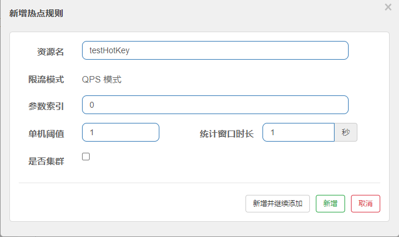

热点参数的注意点，参数必须是基本类型或者String

特殊情况：

- 普通：超过1秒钟一个后，达到阈值1后马上被限流

- 我们期望p1参数当它是某个特殊值时，它的限流值和平时不一样
- 特例：假如当p1的值等于5时，它的阈值可以达到200

访问：

* http://localhost:8401/testHotKey?p1=2
* http://localhost:8401/testHotKey?p1=5

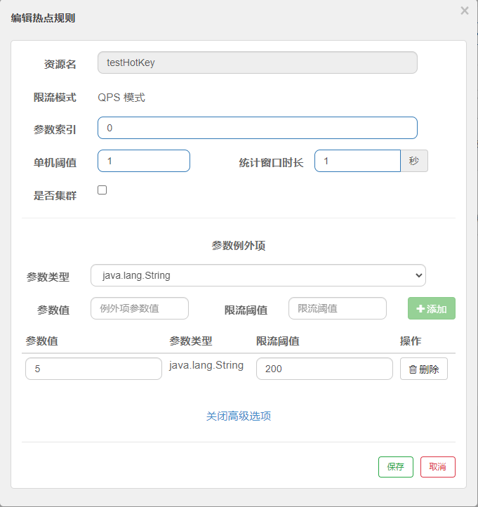

> @SentinelResource主管配置出错，运行出错该走异常走异常。

### 系统规则

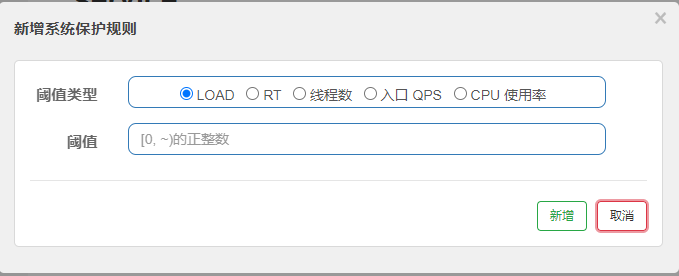

系统保护规则是从应用级别的入口流量进行控制，从单台机器的 load、CPU 使用率、平均 RT、入口 QPS 和并发线程数等几个维度监控应用指标，让系统尽可能跑在最大吞吐量的同时保证系统整体的稳定性。

系统保护规则是应用整体维度的，而不是资源维度的，并且**仅对入口流量生效**。入口流量指的是进入应用的流量（`EntryType.IN`），比如 Web 服务或 Dubbo 服务端接收的请求，都属于入口流量。

系统规则支持以下的模式：

- **Load 自适应**（仅对 Linux/Unix-like 机器生效）：系统的 load1 作为启发指标，进行自适应系统保护。当系统 load1 超过设定的启发值，且系统当前的并发线程数超过估算的系统容量时才会触发系统保护（BBR 阶段）。系统容量由系统的 `maxQps * minRt` 估算得出。设定参考值一般是 `CPU cores * 2.5`。
- **CPU usage**（1.5.0+ 版本）：当系统 CPU 使用率超过阈值即触发系统保护（取值范围 0.0-1.0），比较灵敏。
- **平均 RT**：当单台机器上所有入口流量的平均 RT 达到阈值即触发系统保护，单位是毫秒。
- **并发线程数**：当单台机器上所有入口流量的并发线程数达到阈值即触发系统保护。
- **入口 QPS**：当单台机器上所有入口流量的 QPS 达到阈值即触发系统保护。

### @SentinelResource

#### 按资源名称限流+后续处理

* 启动服务

启动Nacos+Sentinel

* 在`cloudalibaba-sentinel-service8401`中引入自定义的依赖

```xml
<dependency>
    <groupId>com.atguigu.springcloud</groupId>
    <artifactId>cloud-api-commons</artifactId>
    <version>${project.version}</version>
</dependency>
```

* 创建`RateLimitController.java`

```java
@RestController
public class RateLimitController {

    @GetMapping("/byResource")
    @SentinelResource(value = "byResource", blockHandler = "handleException")
    public CommonResult<Payment> byResource(){
        return new CommonResult<Payment>(200,"按资源名称限流测试OK",new Payment(1L,"serial001"));
    }
    public CommonResult handleException(BlockException blockException){
        return new CommonResult(444,blockException.getClass().getCanonicalName());
    }

}
```

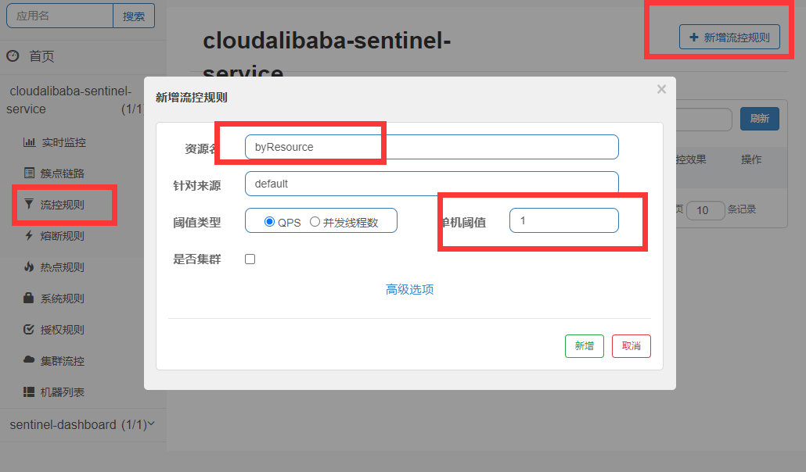

#### 按照Url地址限流+后续处理

配置资源名为 `/rateLimit/byUrl` 的流控规则，没有配置 `blockHandler`，返回 Sentinel 默认的提示信息。

```java
@GetMapping("/rateLimit/byUrl")
@SentinelResource(value = "byUrl")
public CommonResult byUrl(){
    return new CommonResult(200,"按url限流测试ok",new Payment(1L,"serial002"));
}
```

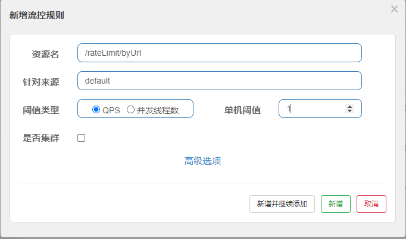

#### 上面兜底方案面临的问题

1. 系统默认的，没有体现我们自己的业务要求。
2. 依照现有条件，我们自定义的处理方法又和业务代码耦合在一块，不直观。
3. 每个业务方法都添加一个兜底的，代码膨胀加剧。
4. 全局统一的处理方法没有体现。

#### 客户自定义限流处理逻辑

* 创建`handler.CustomerBlockHandler`

```java
public class CustomerBlockHandler {
    public static CommonResult handleException(BlockException blockException){
        return new CommonResult(444,"按客户自定义,global handlerException --------- 1");
    }

    public static CommonResult handleException2(BlockException blockException){
        return new CommonResult(444,"按客户自定义,global handlerException --------- 2");
    }
}
```

* 业务类中，添加方法

```java
@GetMapping("/rateLimit/customerBlockHandler")
@SentinelResource(value = "customerBlockHandler",blockHandlerClass = CustomerBlockHandler.class,blockHandler = "handleException2")
public CommonResult customerBlockHandler(){
    return new CommonResult(200,"客户自定义",new Payment(1L,"serial003"));
}
```

`@SentinelResource(value = "customerBlockHandler",blockHandlerClass = CustomerBlockHandler.class,blockHandler = "handleException2")`中`blockHandlerClass `用于指定自定义的兜底类，`blockHandler `用于指定当前指定类中的方法。

现在测试，限流。

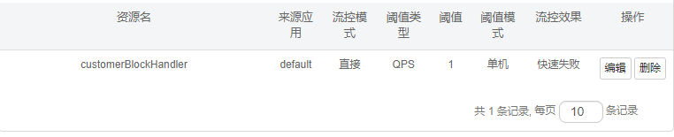

> 如果是通过url进行降级，那么只会触发默认降级方法。

#### 更多注解属性说明 

[Sentinel更多注解属性](https://github.com/alibaba/Sentinel/wiki/%E6%B3%A8%E8%A7%A3%E6%94%AF%E6%8C%81)

Sentinel 主要有三个核心 API：

- `SphU` 定义资源
- `Tracer` 定义统计
- `ContextUtil` 定义了上下文

### 规则持久化

一旦我们重启应用，Sentinel规则将消失，生产环境需要将配置规则进行持久化。

将限流配置规则持久化进Nacos保存，只要刷新8401某个rest地址，sentinel控制台的流控规则就能看到，只要Nacos里面的配置不删除，针对8401上Sentinel上的流控规则持续有效。

* 对`cloudalibaba-sentinel-service8401`进行修改。首先添加相关依赖：

```xml
<!--SpringCloud ailibaba sentinel-datasource-nacos 做持久化用-->
<dependency>
    <groupId>com.alibaba.csp</groupId>
    <artifactId>sentinel-datasource-nacos</artifactId>
</dependency>
```

* 然后对yaml文件进行修改

```yaml
server:
  port: 8401

spring:
  application:
    name: cloudalibaba-sentinel-service
  cloud:
    nacos:
      discovery:
        # nacos服务注册中心地址
        server-addr: localhost:8848
    sentinel:
      transport:
        # 配置sentinel dashboard地址
        dashboard: localhost:9999
        # 默认8719端口，假如被占用会自动从8719开始依次+1扫描，直至找到未被占用的端口为止。
        port: 8719
      filter:
        enabled: false
      datasource:
        ds1: 
          nacos:
            server-addr: localhost:8848
            dataId: cloudalibaba-sentinel-service
            groupId: DEFAULT_GROUP
            data-type: json
            rule-type: flow

          
management:
  endpoints:
    web:
      exposure:
        include: "*"
feign:
  sentinel:
    enabled: true
```

之后，在nacos管理界面中添加配置规则。

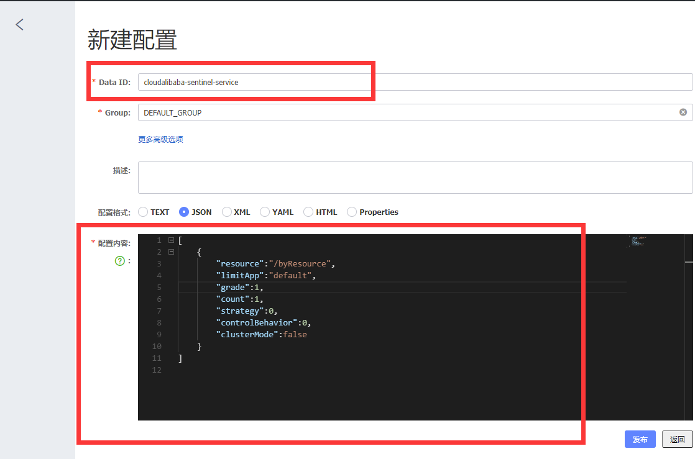

```json
[
    {
        "resource":"/byResource",
        "limitApp":"default",
        "grade":1,
        "count":1,
        "strategy":0,
        "controlBehavior":0,
        "clusterMode":false
    }
]
```

json说明：

- resource：资源名称

- limitApp：来源应用

- grade：阈值类型，0表示线程数，1表示QPS

- count：单机阈值

- strategy：流控模式，0表示直接，1表示关联，2表示链路

- controlBehavior：流控效果，0表示快速失败，1表示Warm Up，2表示排队等待

- clusterMode：是否集群。

之后运行8401，刷新并观察sentinel。

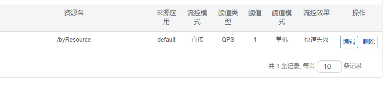

## SpringCloud Alibaba Seata处理分布式事务

### 概述

#### 分布式事务问题

一次业务操作需要跨多个数据源或需要跨多个系统进行远程调用，就会产生分布式事务问题。

#### Seata术语

Seata是一款开源的分布式事务解决方案，致力于在微服务架构下提供高性能和简单易用的分布式事务服务。

#### 一个典型的分布式事务过程

##### 分布式事务处理过程的-ID + 三组件模型

3 组件概念：

- Transaction Coordinator（TC）：事务协调者，维护全局事务的运行状态，负责协调并驱动全局事务的提交或回滚;
- Transaction Manager（TM）：事务管理器，定义全局事务的范围，开始全局事务、提交或回滚全局事务。
- Resource Manager（RM）：资源管理器，管理分支事务处理的资源，与TC交谈以注册分支事务和报告分支事务的状态，并驱动分支事务提交或回滚。

##### 处理过程


1. TM 向 TC 申请开启一个全局事务，全局事务创建成功并生成一个全局唯一的 XID
2. XID 在微服务调用链路的上下文中传播
3. RM 向 TC 注册分支事务，将其纳入 XID 对应全局事务的管辖
4. TM 向 TC 发起针对 XD 的全局提交或回滚決议
5. TC 调度 XID 下管辖的全部分支事务完成提交或回滚请求

#### 怎么用

- 本地 `@Transactional`

- 全局 `@GlobalTransactional`

#### 安装

* 官网地址：http://seata.io/zh-cn/
* 下载地址：https://github.com/seata/seata/releases

seata建表，一定要先在mysql里建表。sql语句地址：https://github.com/seata/seata/blob/develop/script/server/db/mysql.sql。直接运行即可。因为seata表自动创建好了。

````mysql
-- -------------------------------- The script used when storeMode is 'db' --------------------------------
-- the table to store GlobalSession data
CREATE TABLE IF NOT EXISTS `global_table`
(
    `xid`                       VARCHAR(128) NOT NULL,
    `transaction_id`            BIGINT,
    `status`                    TINYINT      NOT NULL,
    `application_id`            VARCHAR(32),
    `transaction_service_group` VARCHAR(32),
    `transaction_name`          VARCHAR(128),
    `timeout`                   INT,
    `begin_time`                BIGINT,
    `application_data`          VARCHAR(2000),
    `gmt_create`                DATETIME,
    `gmt_modified`              DATETIME,
    PRIMARY KEY (`xid`),
    KEY `idx_status_gmt_modified` (`status` , `gmt_modified`),
    KEY `idx_transaction_id` (`transaction_id`)
) ENGINE = InnoDB
  DEFAULT CHARSET = utf8mb4;

-- the table to store BranchSession data
CREATE TABLE IF NOT EXISTS `branch_table`
(
    `branch_id`         BIGINT       NOT NULL,
    `xid`               VARCHAR(128) NOT NULL,
    `transaction_id`    BIGINT,
    `resource_group_id` VARCHAR(32),
    `resource_id`       VARCHAR(256),
    `branch_type`       VARCHAR(8),
    `status`            TINYINT,
    `client_id`         VARCHAR(64),
    `application_data`  VARCHAR(2000),
    `gmt_create`        DATETIME(6),
    `gmt_modified`      DATETIME(6),
    PRIMARY KEY (`branch_id`),
    KEY `idx_xid` (`xid`)
) ENGINE = InnoDB
  DEFAULT CHARSET = utf8mb4;

-- the table to store lock data
CREATE TABLE IF NOT EXISTS `lock_table`
(
    `row_key`        VARCHAR(128) NOT NULL,
    `xid`            VARCHAR(128),
    `transaction_id` BIGINT,
    `branch_id`      BIGINT       NOT NULL,
    `resource_id`    VARCHAR(256),
    `table_name`     VARCHAR(32),
    `pk`             VARCHAR(36),
    `status`         TINYINT      NOT NULL DEFAULT '0' COMMENT '0:locked ,1:rollbacking',
    `gmt_create`     DATETIME,
    `gmt_modified`   DATETIME,
    PRIMARY KEY (`row_key`),
    KEY `idx_status` (`status`),
    KEY `idx_branch_id` (`branch_id`)
) ENGINE = InnoDB
  DEFAULT CHARSET = utf8mb4;

CREATE TABLE IF NOT EXISTS `distributed_lock`
(
    `lock_key`       CHAR(20) NOT NULL,
    `lock_value`     VARCHAR(20) NOT NULL,
    `expire`         BIGINT,
    primary key (`lock_key`)
) ENGINE = InnoDB
  DEFAULT CHARSET = utf8mb4;

INSERT INTO `distributed_lock` (lock_key, lock_value, expire) VALUES ('HandleAllSession', ' ', 0);
````

 下载后解压到指定目录并修改conf目录下的``file.conf``配置文件，完整的配置在`file.conf.example`中：对`service`和`store`模块进行了相关修改。

```properties
mode = "db" # 修改为 db即可

  ## database store property
  db {
    datasource = "druid"
    dbType = "mysql"
    driverClassName = "com.mysql.cj.jdbc.Driver"
    url = "jdbc:mysql://localhost:3306/seata?useUnicode=true&characterEncoding=utf-8&allowMultiQueries=true&serverTimezone=Asia/Shanghai"
    user = "root"
    password = "123456"
  }
```

修改解压后conf下registry.conf配置文件的registry 和config，修改下`nacos`的密码和用户以及类型即可。

```properties
registry {
  # file 、nacos 、eureka、redis、zk、consul、etcd3、sofa
  type = "nacos"

  nacos {
    application = "seata-server"
    serverAddr = "127.0.0.1:8848" # nacos地址
    group = "SEATA_GROUP"
    namespace = "b84c0fd8-d1d9-477f-a8e6-b4fb50d6bdcf"
    cluster = "default"
    username = "nacos"
    password = "nacos"
  }
}

config {
  # file、nacos 、apollo、zk、consul、etcd3
  type = "nacos"

  nacos {
    serverAddr = "127.0.0.1:8848"
    namespace = "b84c0fd8-d1d9-477f-a8e6-b4fb50d6bdcf"
    group = "SEATA_GROUP" 
    username = "nacos"
    password = "nacos"
    dataId = "seataServer.properties"
  }
}

```

然后在nacos中创建空间，并且修改上面的namespace以及group

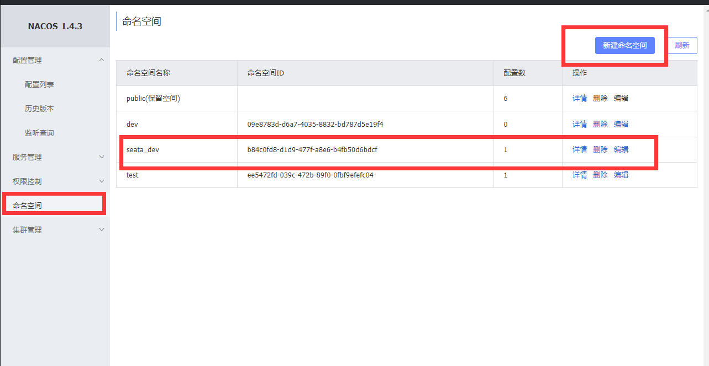

然后运行seata

```sh
seata-server.bat -m db
```

之后，下载：https://github.com/seata/seata/tree/1.4.2，

seata使用1.4.2版本，新建的data id文件类型选择properties。若是使用seata1.4.2之前的版本，以下的每个配置项在nacos中就是一个条目，需要使用script/config-center/nacos/下的nacos-config.sh（linux或者windows下装git）或者nacos-config.py（python脚本）执行上传注册。

先修改seata-1.4.2\seata-1.4.2\script\config-center\config.txt。

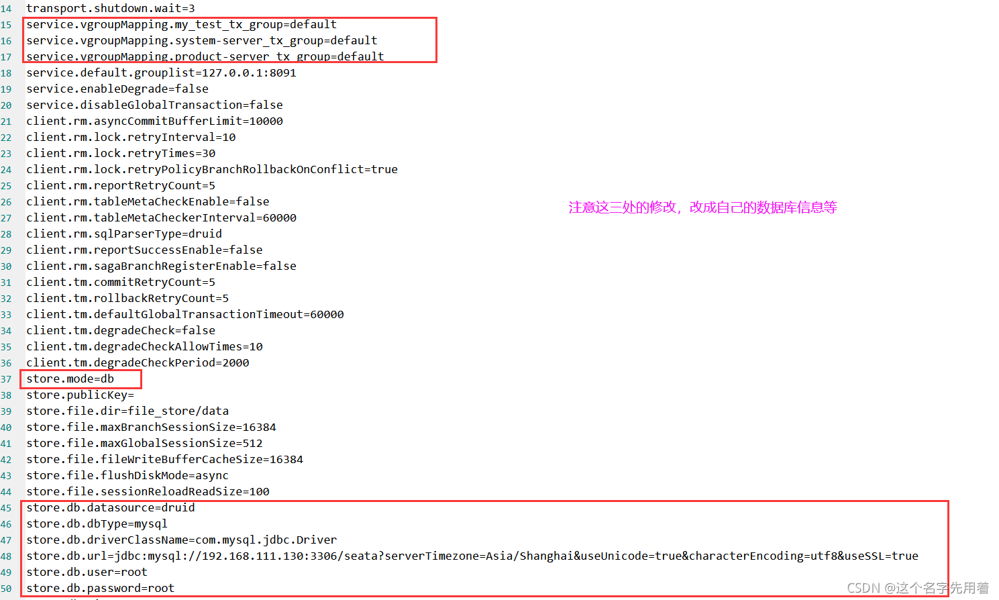

注意上传的版本必须将所有注释#都直接删除掉，否则上传失败，还有必须将=后边给值，没有值的话给""；

**使用script/config-center/nacos/下的nacos-config.sh（linux或者windows下装git）或者nacos-config.py（python脚本）执行上传注册:**

```sh
-h nacos地址
-p 端口
-t 命名空间不写默认public
-u 用户名
-p 密码

sh nacos-config.sh -h 192.168.7.231 -p 8848 -g SEATA_GROUP -t 73164d7c-6ea7-491c-b5a5-0da02d9d2d65 -u nacos -w nacos
```

**然后我们看我们的配置是否推送上来到nacos：**

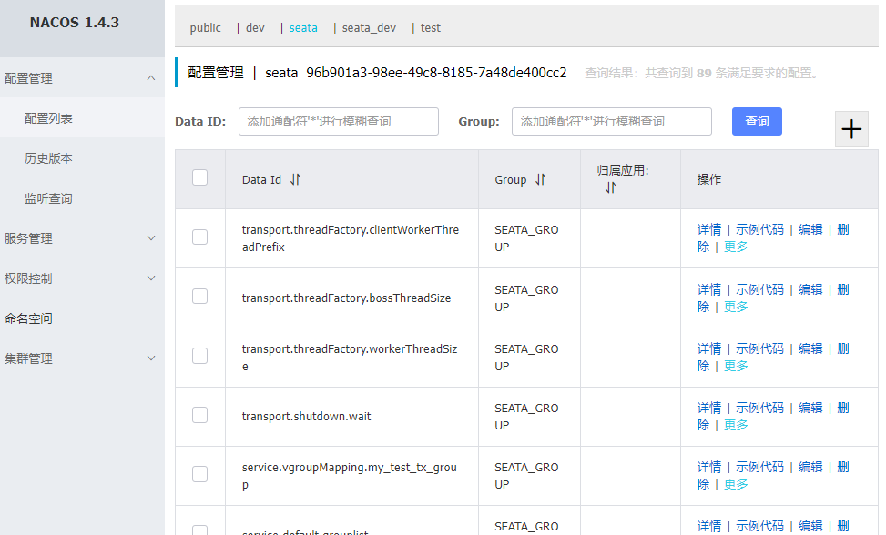

### 业务数据库准备

#### 业务说明

这里我们会创建三个服务，一个订单服务，一个库存服务，一个账户服务。

当用户下单时，会在订单服务中创建一个订单，然后通过远程调用库存服务来扣减下单商品的库存，再通过远程调用账户服务来扣减用户账户里面的余额，最后在订单服务中修改订单状态为已完成。

该操作跨越三个数据库，有两次远程调用，很明显会有分布式事务问题。

#### 创建数据库

注意数据库中，应该会创建好了，如果没有创建好，自己配置。

* seata_order库下建t_order表

```mysql
CREATE TABLE t_order(
    `id` BIGINT(11) NOT NULL AUTO_INCREMENT PRIMARY KEY,
    `user_id` BIGINT(11) DEFAULT NULL COMMENT '用户id',
    `product_id` BIGINT(11) DEFAULT NULL COMMENT '产品id',
    `count` INT(11) DEFAULT NULL COMMENT '数量',
    `money` DECIMAL(11,0) DEFAULT NULL COMMENT '金额',
    `status` INT(1) DEFAULT NULL COMMENT '订单状态：0：创建中; 1：已完结'
) ENGINE=INNODB AUTO_INCREMENT=7 DEFAULT CHARSET=utf8;
 
SELECT * FROM t_order;
```

* seata_storage库下建t_storage表

```mysql
CREATE TABLE t_storage(
    `id` BIGINT(11) NOT NULL AUTO_INCREMENT PRIMARY KEY,
    `product_id` BIGINT(11) DEFAULT NULL COMMENT '产品id',
   `'total` INT(11) DEFAULT NULL COMMENT '总库存',
    `used` INT(11) DEFAULT NULL COMMENT '已用库存',
    `residue` INT(11) DEFAULT NULL COMMENT '剩余库存'
) ENGINE=INNODB AUTO_INCREMENT=2 DEFAULT CHARSET=utf8;
 
INSERT INTO seata_storage.t_storage(`id`,`product_id`,`total`,`used`,`residue`)
VALUES('1','1','100','0','100');
 
SELECT * FROM t_storage;
```

* seata_account库下建t_account表

```mysql
CREATE TABLE t_account(
    `id` BIGINT(11) NOT NULL AUTO_INCREMENT PRIMARY KEY COMMENT 'id',
    `user_id` BIGINT(11) DEFAULT NULL COMMENT '用户id',
    `total` DECIMAL(10,0) DEFAULT NULL COMMENT '总额度',
    `used` DECIMAL(10,0) DEFAULT NULL COMMENT '已用余额',
    `residue` DECIMAL(10,0) DEFAULT '0' COMMENT '剩余可用额度'
) ENGINE=INNODB AUTO_INCREMENT=2 DEFAULT CHARSET=utf8;
 
INSERT INTO seata_account.t_account(`id`,`user_id`,`total`,`used`,`residue`) VALUES('1','1','1000','0','1000')
 
SELECT * FROM t_account;
```

#### 按照上述3库分别建对应的回滚日志表

sql地址：https://github.com/seata/seata/blob/develop/script/client/at/db/mysql.sql

````mysql
-- for AT mode you must to init this sql for you business database. the seata server not need it.
CREATE TABLE IF NOT EXISTS `undo_log`
(
    `branch_id`     BIGINT       NOT NULL COMMENT 'branch transaction id',
    `xid`           VARCHAR(128) NOT NULL COMMENT 'global transaction id',
    `context`       VARCHAR(128) NOT NULL COMMENT 'undo_log context,such as serialization',
    `rollback_info` LONGBLOB     NOT NULL COMMENT 'rollback info',
    `log_status`    INT(11)      NOT NULL COMMENT '0:normal status,1:defense status',
    `log_created`   DATETIME(6)  NOT NULL COMMENT 'create datetime',
    `log_modified`  DATETIME(6)  NOT NULL COMMENT 'modify datetime',
    UNIQUE KEY `ux_undo_log` (`xid`, `branch_id`)
) ENGINE = InnoDB
  AUTO_INCREMENT = 1
  DEFAULT CHARSET = utf8mb4 COMMENT ='AT transaction mode undo table';
````

### 业务微服务准备

#### 业务需求

下订单>减库存>扣余额>改（订单）状态。

#### 新建Order-Module

##### 新建module

新建一个seata-order-service2001

##### pom

```xml
<dependencies>
    <!--nacos-->
    <dependency>
        <groupId>com.alibaba.cloud</groupId>
        <artifactId>spring-cloud-starter-alibaba-nacos-discovery</artifactId>
    </dependency>
    <!--seata-->
    <dependency>
        <groupId>com.alibaba.cloud</groupId>
        <artifactId>spring-cloud-starter-alibaba-seata</artifactId>
        <exclusions>
            <exclusion>
                <artifactId>seata-all</artifactId>
                <groupId>io.seata</groupId>
            </exclusion>
        </exclusions>
    </dependency>
    <dependency>
        <groupId>io.seata</groupId>
        <artifactId>seata-spring-boot-starter</artifactId>
        <version>1.4.2</version>
    </dependency>
    <dependency>
        <groupId>io.seata</groupId>
        <artifactId>seata-all</artifactId>
        <version>1.4.2</version>
    </dependency>
    <!--feign-->
    <dependency>
        <groupId>org.springframework.cloud</groupId>
        <artifactId>spring-cloud-starter-openfeign</artifactId>
    </dependency>
    <!--web-actuator-->
    <dependency>
        <groupId>org.springframework.boot</groupId>
        <artifactId>spring-boot-starter-web</artifactId>
    </dependency>
    <dependency>
        <groupId>org.springframework.boot</groupId>
        <artifactId>spring-boot-starter-actuator</artifactId>
    </dependency>
    <!--mysql-druid-->
    <dependency>
        <groupId>mysql</groupId>
        <artifactId>mysql-connector-java</artifactId>
        <version>5.1.37</version>
    </dependency>
    <dependency>
        <groupId>com.alibaba</groupId>
        <artifactId>druid-spring-boot-starter</artifactId>
        <version>1.1.10</version>
    </dependency>
    <dependency>
        <groupId>org.mybatis.spring.boot</groupId>
        <artifactId>mybatis-spring-boot-starter</artifactId>
        <version>2.0.0</version>
    </dependency>
    <dependency>
        <groupId>org.springframework.boot</groupId>
        <artifactId>spring-boot-starter-test</artifactId>
        <scope>test</scope>
    </dependency>
    <dependency>
        <groupId>org.projectlombok</groupId>
        <artifactId>lombok</artifactId>
        <optional>true</optional>
    </dependency>
</dependencies>
```

##### yaml

```yaml
server:
  port: 2001

spring:
  application:
    name: seata-order-service
  cloud:
    #nacos配置
    nacos:
      discovery:
        #nacos服务地址
        server-addr: localhost:8848
        namespace: "96b901a3-98ee-49c8-8185-7a48de400cc2"
        group: SEATA_GROUP  #seata分组名称

    alibaba:
      #事务群组，要和下方vgroup-mapping保持一致（可以每个应用独立取名，也可以使用相同的名字），
      #要与服务端nacos-config.txt中service.vgroup_mapping中存在,并且要保证多个群组情况下后缀名要保持一致-tx_group
      seata:
        tx-service-group: my_test_tx_group

  datasource:  #druid数据源连接池
    driver-class-name: com.mysql.cj.jdbc.Driver
    url: jdbc:mysql://localhost:3306/seata_order?serverTimezone=UTC&useUnicode=true&characterEncoding=utf-8&useSSL=false
    username: root
    password: 123456
    type: com.alibaba.druid.pool.DruidDataSource
#seata配置
seata:
  application-id: ${spring.application.name}
  enable-auto-data-source-proxy: true  #是否开启数据源自动代理,默认为true
  #（1）事务群组（可以每个应用独立取名，也可以使用相同的名字），
  #要与服务端nacos-config.txt中service.vgroupMapping.my_test_tx_group=default,并且要保证多个群组情况下后缀名要保持一致-tx_group
  service:
    vgroup-mapping:
      my_test_tx_group: default
  # （2）seata配置中心
  config:
    type: nacos
    nacos:
      namespace: 96b901a3-98ee-49c8-8185-7a48de400cc2  #nacos命名空间ID
      serverAddr: 127.0.0.1:8848  #nacos服务的地址
      group: SEATA_GROUP    #seata分组名称
      username: "nacos"  #nacos服务登录名称
      password: "nacos"  #nacos服务登录密码
  # （3）seata的注册中心
  registry:  #registry根据seata服务端的registry配置
    type: nacos
    nacos:
      application: seata-server #配置自己的seata服务
      server-addr: 127.0.0.1:8848  #nacos服务的地址
      group: SEATA_GROUP  #seata分组名称
      namespace: 96b901a3-98ee-49c8-8185-7a48de400cc2  #nacos命名空间ID
      username: "nacos"  #nacos服务登录名称
      password: "nacos"  #nacos服务登录密码


# feign组件超时设置，用于查看seata数据库中的临时数据内容
feign:
#  client:
#    config:
#      default:
#        connect-timeout: 10000
#        read-timeout: 10000
  hystrix:
    enabled: false

logging:
  level:
    io:
      seata: info

#mybatis的配置
mybatis:
  mapper-locations: classpath:mapper/*.xml
  type-aliases-package: com.atguigu.springcloud.domain # 所有Entity别名类所在包
```

##### domain

###### Order

```java
@Data
@AllArgsConstructor
@NoArgsConstructor
public class Order
{
    private Long id;

    private Long userId;

    private Long productId;

    private Integer count;

    private BigDecimal money;

    private Integer status; //订单状态：0：创建中；1：已完结
}
```

###### CommonResult

```java
@Data
@AllArgsConstructor
@NoArgsConstructor
public class CommonResult<T>
{
    private Integer code;
    private String  message;
    private T       data;

    public CommonResult(Integer code, String message)
    {
        this(code,message,null);
    }
}
```

##### dao接口及实现

###### OrderDao

```java
@Mapper
public interface OrderDao
{
    //新建订单
    void create(Order order);

    //修改订单状态，从零改为1
    void update(@Param("userId") Long userId,@Param("status") Integer status);
}
```

###### OrderMapper

resources文件夹下新建mapper文件夹后添加OrderMapper.xml

```xml
<?xml version="1.0" encoding="UTF-8" ?>
<!DOCTYPE mapper PUBLIC "-//mybatis.org//DTD Mapper 3.0//EN" "http://mybatis.org/dtd/mybatis-3-mapper.dtd" >

<mapper namespace="com.atguigu.springcloud.dao.OrderDao">

    <resultMap id="BaseResultMap" type="com.atguigu.springcloud.domain.Order">
        <id column="id" property="id" jdbcType="BIGINT"/>
        <result column="user_id" property="userId" jdbcType="BIGINT"/>
        <result column="product_id" property="productId" jdbcType="BIGINT"/>
        <result column="count" property="count" jdbcType="INTEGER"/>
        <result column="money" property="money" jdbcType="DECIMAL"/>
        <result column="status" property="status" jdbcType="INTEGER"/>
    </resultMap>

    <insert id="create">
        insert into seata_order.t_order (id,user_id,product_id,count,money,status)
        values (null,#{userId},#{productId},#{count},#{money},0);
    </insert>


    <update id="update">
        update seata_order.t_order set status = 1
        where user_id=#{userId} and status = #{status};
    </update>

</mapper>
```

##### service接口及实现

###### OrderService

```java
public interface OrderService {
    void create(Order order);
}
```

###### StorageService

```java
@FeignClient(value = "seata-storage-service")
public interface StorageService{
    @PostMapping(value = "/storage/decrease")
    CommonResult decrease(@RequestParam("productId") Long productId, @RequestParam("count") Integer count);
}
```

###### AccountService

```java
@FeignClient(value = "seata-account-service")
public interface AccountService{
    @PostMapping(value = "/account/decrease")
    CommonResult decrease(@RequestParam("userId") Long userId, @RequestParam("money") BigDecimal money);
}
```

###### OrderServiceImpl

```java
@Service
@Slf4j
public class OrderServiceImpl implements OrderService
{
    @Resource
    private OrderDao orderDao;
    @Resource
    private StorageService storageService;
    @Resource
    private AccountService accountService;

    /**
     * 创建订单->调用库存服务扣减库存->调用账户服务扣减账户余额->修改订单状态
     */

    @Override
    @GlobalTransactional(name = "fsp-create-order",rollbackFor = Exception.class)
    public void create(Order order){
        log.info("----->开始新建订单");
        //新建订单
        orderDao.create(order);

        //扣减库存
        log.info("----->订单微服务开始调用库存，做扣减Count");
        storageService.decrease(order.getProductId(),order.getCount());
        log.info("----->订单微服务开始调用库存，做扣减end");

        //扣减账户
        log.info("----->订单微服务开始调用账户，做扣减Money");
        accountService.decrease(order.getUserId(),order.getMoney());
        log.info("----->订单微服务开始调用账户，做扣减end");


        //修改订单状态，从零到1代表已经完成
        log.info("----->修改订单状态开始");
        orderDao.update(order.getUserId(),0);
        log.info("----->修改订单状态结束");

        log.info("----->下订单结束了");

    }
}
```

##### controller

```java
@RestController
public class OrderController {
    @Resource
    private OrderService orderService;

    @GetMapping("/order/create")
    public CommonResult create(Order order)
    {
        orderService.create(order);
        return new CommonResult(200,"订单创建成功");
    }
}
```

##### 主启动

```java
@SpringBootApplication
@EnableFeignClients
@EnableDiscoveryClient
public class SeataOrderMain2001 {
    public static void main(String[] args) {
        SpringApplication.run(SeataOrderMain2001.class,args);
    }
}
```

#### 新建Storage-Module

##### 新建module

新建一个`seata-storage-service2002`

##### pom

与2001一样

##### yaml

与2001类似

##### domain

###### Storage

```java
@Data
@AllArgsConstructor
@NoArgsConstructor
public class Storage {
    private Long id;
    private Long productId; // 产品ID
    private Integer total; // 总库存
    private Integer used; // 已用库存
    private Integer residue; // 剩余库存
}
```

###### CommonResult

与2001一样。

##### dao接口及实现

###### StorageDao

```java
@Mapper
public interface StorageDao {

    //扣减库存
    void decrease(@Param("productId") Long productId, @Param("count") Integer count);
}
```

###### StorageMapper

```xml
<?xml version="1.0" encoding="UTF-8" ?>
<!DOCTYPE mapper PUBLIC "-//mybatis.org//DTD Mapper 3.0//EN" "http://mybatis.org/dtd/mybatis-3-mapper.dtd" >

<mapper namespace="com.atguigu.springcloud.dao.StorageDao">

    <resultMap id="BaseResultMap" type="com.atguigu.springcloud.domain.Storage">
        <id column="id" property="id" jdbcType="BIGINT"/>
        <result column="product_id" property="productId" jdbcType="BIGINT"/>
        <result column="total" property="total" jdbcType="INTEGER"/>
        <result column="used" property="used" jdbcType="INTEGER"/>
        <result column="residue" property="residue" jdbcType="INTEGER"/>
    </resultMap>

    <update id="decrease">
        UPDATE
            seata_storage.t_storage
        SET
            used = used + #{count},residue = residue - #{count}
        WHERE
            product_id = #{productId}
    </update>

</mapper>
```

##### service接口及实现

###### StorageService

```java
public interface StorageService {
    /**
     * 扣减库存
     */
    void decrease(Long productId, Integer count);
}
```

###### StorageServiceImpl

```java
@Service
public class StorageServiceImpl implements StorageService {

    private static final Logger LOGGER = LoggerFactory.getLogger(StorageServiceImpl.class);

    @Resource
    private StorageDao storageDao;

    /**
     * 扣减库存
     */
    @Override
    public void decrease(Long productId, Integer count) {
        LOGGER.info("------->storage-service中扣减库存开始");
        storageDao.decrease(productId,count);
        LOGGER.info("------->storage-service中扣减库存结束");
    }
}
```

##### controller

```java
@RestController
public class StorageController {

    @Autowired
    private StorageService storageService;

    /**
     * 扣减库存
     */
    @RequestMapping("/storage/decrease")
    public CommonResult decrease(Long productId, Integer count) {
        storageService.decrease(productId, count);
        return new CommonResult(200,"扣减库存成功！");
    }
}
```

#### 新建Account-Module

##### yaml

与2001类似

##### domain-Account

```java
@Data
@AllArgsConstructor
@NoArgsConstructor
public class Account {

    private Long id;
    private Long userId; // 用户id
    private BigDecimal total; // 总额度
    private BigDecimal used; // 已用额度
    private BigDecimal residue; // 剩余额度
}
```

##### dao接口及实现

###### AccountDao

```java
@Mapper
public interface AccountDao {

    /**
     * 扣减账户余额
     */
    void decrease(@Param("userId") Long userId, @Param("money") BigDecimal money);
}
```

###### AccountMapper

```xml
<?xml version="1.0" encoding="UTF-8" ?>
<!DOCTYPE mapper PUBLIC "-//mybatis.org//DTD Mapper 3.0//EN" "http://mybatis.org/dtd/mybatis-3-mapper.dtd" >

<mapper namespace="com.atguigu.springcloud.dao.AccountDao">

    <resultMap id="BaseResultMap" type="com.atguigu.springcloud.domain.Account">
        <id column="id" property="id" jdbcType="BIGINT"/>
        <result column="user_id" property="userId" jdbcType="BIGINT"/>
        <result column="total" property="total" jdbcType="DECIMAL"/>
        <result column="used" property="used" jdbcType="DECIMAL"/>
        <result column="residue" property="residue" jdbcType="DECIMAL"/>
    </resultMap>

    <update id="decrease">
        UPDATE seata_account.t_account
        SET residue = residue - #{money},used = used + #{money}
        WHERE user_id = #{userId};
    </update>

</mapper>
```

##### service接口及实现

###### AccountService

```java
public interface AccountService {

    /**
     * 扣减账户余额
     * @param userId 用户id
     * @param money 金额
     */
    void decrease(@RequestParam("userId") Long userId, @RequestParam("money") BigDecimal money);
}
```

###### AccountServiceImpl

```java
@Service
public class AccountServiceImpl implements AccountService {

    private static final Logger LOGGER = LoggerFactory.getLogger(AccountServiceImpl.class);


    @Resource
    AccountDao accountDao;

    /**
     * 扣减账户余额
     */
    @Override
    public void decrease(Long userId, BigDecimal money) {
        LOGGER.info("------->account-service中扣减账户余额开始");
        accountDao.decrease(userId,money);
        LOGGER.info("------->account-service中扣减账户余额结束");
    }
}
```

##### controller

```java
@RestController
public class AccountController {

    @Resource
    AccountService accountService;

    /**
     * 扣减账户余额
     */
    @RequestMapping("/account/decrease")
    public CommonResult decrease(@RequestParam("userId") Long userId, @RequestParam("money") BigDecimal money){
        accountService.decrease(userId,money);
        return new CommonResult(200,"扣减账户余额成功！");
    }
}
```

### @GlobalTransaction验证

#### 正常下单

下订单 -> 减库存 -> 扣余额 -> 改（订单）状态。

数据库初始化情况：

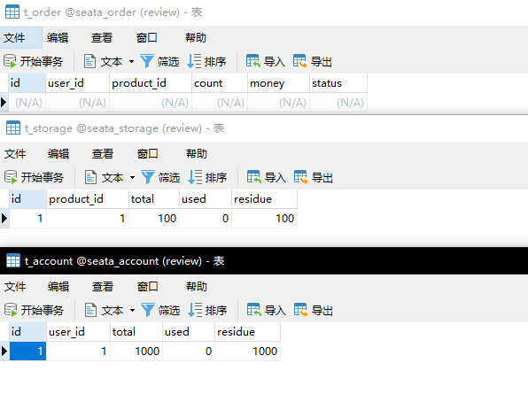

启动nacos、seata、2001、2002、2003，进行测试访问：正常下单 - http://localhost:2001/order/create?userId=1&productId=1&count=10&money=100

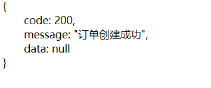

#### **超时异常，没加@GlobalTransactional**

模拟AccountServiceImpl添加超时

```java
@Override
public void decrease(Long userId, BigDecimal money) {

    try {
        TimeUnit.SECONDS.sleep(20);
    } catch (InterruptedException e) {
        e.printStackTrace();
    }

    LOGGER.info("------->account-service中扣减账户余额开始");
    accountDao.decrease(userId,money);
    LOGGER.info("------->account-service中扣减账户余额结束");
}
```

另外，OpenFeign的调用默认时间是1s以内，所以最后会抛异常。

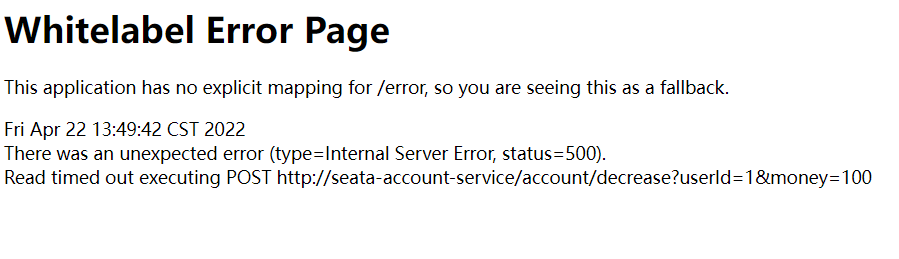

现在查看下数据库情况。

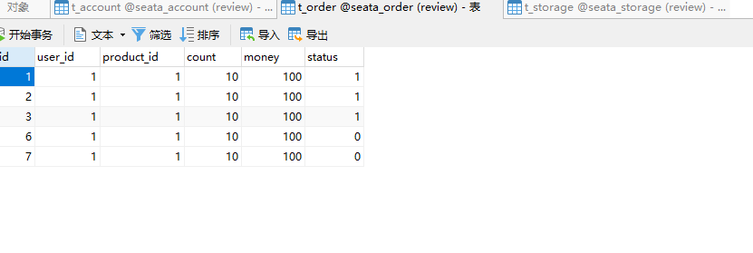

**故障情况**

- 当库存和账户金额扣减后，订单状态并没有设置为已经完成，没有从零改为1
- 而且由于feign的重试机制，账户余额还有可能被多次扣减

#### **超时异常，加了@GlobalTransactional**

用@GlobalTransactional标注OrderServiceImpl的create()方法。

```java
@Override
@GlobalTransactional(name = "fsp-create-order",rollbackFor = Exception.class,timeoutMills = 60000)
//    @Transactional
public void create(Order order){
    ....
}
```

还是模拟AccountServiceImpl添加超时，下单后数据库数据并没有任何改变，记录都添加不进来，**达到出异常，数据库回滚的效果**。

### Seata原理简介

2019年1月份蚂蚁金服和阿里巴巴共同开源的分布式事务解决方案。

Simple Extensible Autonomous Transaction Architecture，简单可扩展自治事务框架。

2020起始，用1.0以后的版本。Alina Gingertail


##### 分布式事务的执行流程

- TM开启分布式事务(TM向TC注册全局事务记录) ;

- 按业务场景，编排数据库、服务等事务内资源(RM向TC汇报资源准备状态) ;

- TM结束分布式事务，事务一阶段结束(TM通知TC提交/回滚分布式事务) ;

- TC汇总事务信息，决定分布式事务是提交还是回滚；

- TC通知所有RM提交/回滚资源，事务二阶段结束。


##### AT模式如何做到对业务的无侵入

###### 前提

* 基于支持本地 ACID 事务的关系型数据库。

* Java 应用，通过 JDBC 访问数据库。

###### 整体机制

两阶段提交协议的演变：

* 一阶段：业务数据和回滚日志记录在同一个本地事务中提交，释放本地锁和连接资源。
* 二阶段：
  * 提交异步化，非常快速地完成。
  * 回滚通过一阶段的回滚日志进行反向补偿。

###### 一阶段加载

在一阶段，Seata会拦截“业务SQL”

- 解析SQL语义，找到“业务SQL" 要更新的业务数据，在业务数据被更新前，将其保存成"before image”


- 执行“业务SQL" 更新业务数据，在业务数据更新之后,


- 其保存成"after image”，最后生成行锁。


以上操作全部在一个数据库事务内完成, 这样保证了一阶段操作的原子性。


###### 二阶段提交

二阶段如果顺利提交的话，因为"业务SQL"在一阶段已经提交至数据库，所以Seata框架只需将一阶段保存的快照数据和行锁删掉，完成数据清理即可。

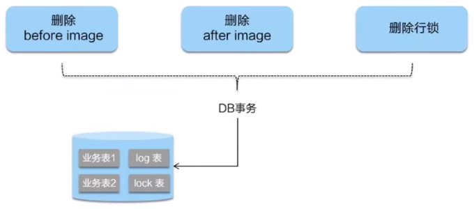

###### 二阶段回滚

二阶段如果是回滚的话，Seata 就需要回滚一阶段已经执行的 “业务SQL"，还原业务数据。

回滚方式便是用"before image"还原业务数据；但在还原前要首先要校验脏写，对比“数据库当前业务数据”和"after image"。

如果两份数据完全一致就说明没有脏写， 可以还原业务数据，如果不一致就说明有脏写, 出现脏写就需要转人工处理。


补充：

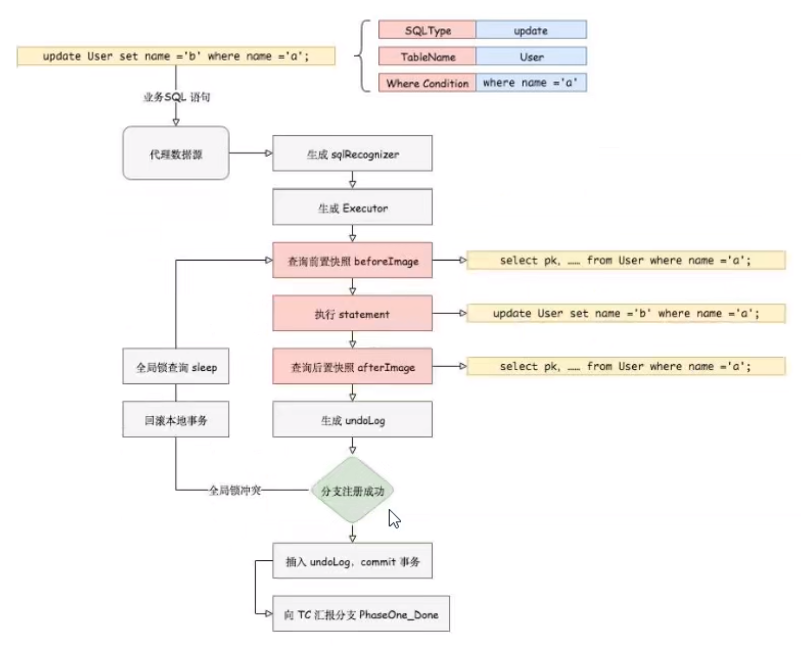