## MQ概述

### 分布式架构的演进过程

#### 概述

分布式微服务架构的发展，主要经历了四个阶段：单一应用架构、垂直应用架构、分布式架构和弹性 SOA架构。

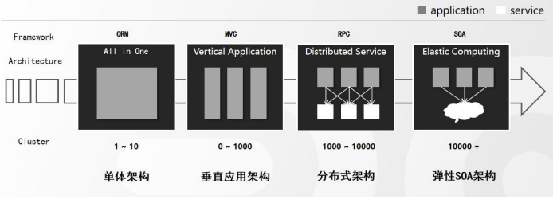

#### 单体架构（All In One）

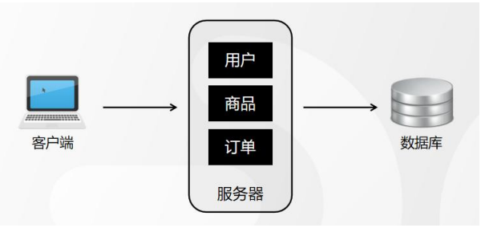

当网站流量很小时，只需一个应用，将所有功能都部署在一起，以减少部署节点和成本。此时，用于简化增删改查工作量的数据访问框架(ORM)是关键。

适用于小型网站，小型管理系统，将所有功能都部署到一个功能里，简单易用。

#### 垂直应用架构（Vertical Application）

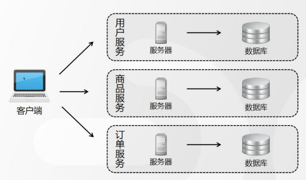

随着网站访问量的增加，一旦服务器或者数据库出现问题，将会导致整个系统故障，造成所有服务不可用， 而且功能修改发布也不方便，所以，就把大系统拆分成了多个子系统， 比如将“用户”、“商品”、“订单“等按业务进行拆分，也就是”垂直拆分“，并且每个子系统都部署到不同的服务器上。

**垂直架构存在的问题：** 重复功能太多。

#### 分布式架构（Distributed Service）

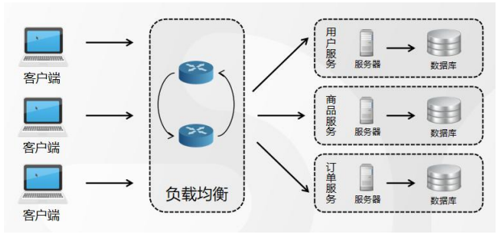

随着用户访问越来越大，意味着需要更多的服务器才能支撑服务的运行，而应用之间的交互不可能避免地变得越来越复杂。

为了保证服务稳定，提高管理效率，需要对这些应用做负载均衡。因为用户不可能去了解后台服务器的数量和业务结构，有了负载均衡以后，用户只需要统一访问负载均衡服务器就可以，后端的应用就可以根据流量的大小进⾏动态的扩缩容，也就是“水平扩展”。

**分布式架构存在的问题：**服务提供方--旦产生变更，所有消费方都需要变更。

#### 弹性SOA架构（Elastic Computing）

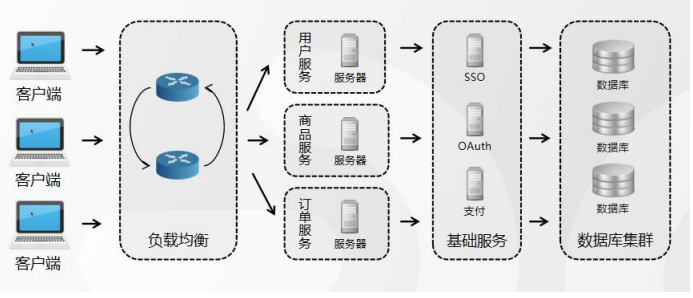

当服务越来越多，容量的评估，小服务资源的浪费等问题逐渐显现，此时需增加一个调度中心基于访问压力实时管理集群容量，提高集群利用率。此时，用于**提高机器利用率的资源调度和治理中心**(SOA)[ Service Oriented Architecture]是关键。

**SOA： (Service- Oriented Architecture,面向服务的架构)**：是一个组件模型,它将应用程序的不同功能单元(称为服务)进行拆分，并通过这些服务之间定义良好的接口和契约联系起来。

**ESB： (Enterparise Servce Bus)**，就是所谓的**注册中心**：企业服务总线,服务中介。主要是提供了一一个服务于服务之间的交互。ESB包含的功能如：负载均衡，流量控制，加密处理，服务的监控，异常处理，监控告急等等。

#### 服务网格

在 Java 中微服务架构的主流解决方案是 Spring Cloud，给程序员带来了非常便捷的开发体验。但是，有 了 Spring Cloud 的微服务架构就完美了吗？现实并非如此，很快就发现微服务带来了很多的问题，大致总结为以下三点：

第 1 点：非功能代码侵入严重。为了满足业务需要，我们可以使用框架提供给我们的各种组件，比如网络通信、消息处理等。于是，我们需要引入各种依赖， 加注解，写配置，最后将这些非业务功能的代码和业务 代码打包一起部署，这就是“侵入式框架”；

第 2 点：微服务框架学习成本还是较大。Spring Cloud 虽然能解决微服务领域的很多问题，但是需要程 序员花费比较多的精力来学习它的使用。本来程序员应该把更多的精力投入到业务开发上，而不应该是非业务 上。

第 3 点：维护成本变高。互联网公司产品的版本升级是费非常频繁的，因为 Spring Cloud 是“代码侵⼊式 的框架”，为了维护各个版本的兼容性、权限、流量等，这时候版本的升级就注定要让非业务代码一起， 再加上多语言之间的调用，一旦出现问题，程序员们会非常痛苦。

其实，大家有没有发现？服务拆分的越细，只是感觉上解耦了，但是维护成本却变高了，那怎么办呢？ 

网络的问题当然还是要交给网络本身来解决。所以，服务网格的技术就应运而生，也就是 Service Mesh。

我们可以为每个服务单独配置一个 Sidecar，所有服务通信的进出口流量都会通过 Sidecar 来进⾏操作， 如图所示：

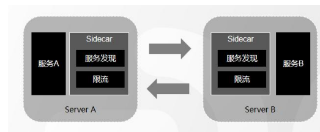

常见的服务网格产品有 Prana、Local Proxy、Linkerd、Istio 等，目前比较主流的是 Istio，来看看 Istio 的架构图：

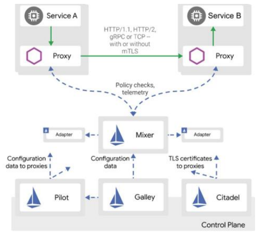

可以发现，该架构图分为数据平面和控制平台，数据平面就是前面的 ServiceA 和 ServiceB 组成的部分， 控制平面主要指的是 Mixer、Pilot、Galley、Cidatel 等组件。

#### 容器化云原生架构

架构演进到现在这个阶段，我们可以基于容器化和容器编排的技术来实现公有云、私有云、混合云地无缝迁移，也就是可以使用云原生架构来考虑组件和服务的部署方案。通过这张图来理解⼀下：

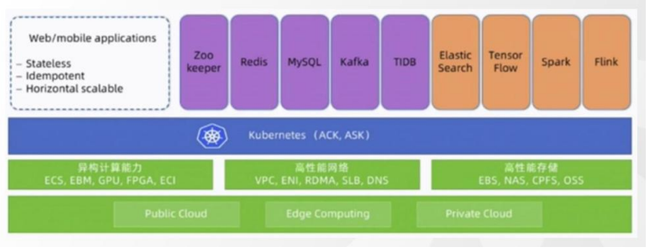

### 分布式系统面临的挑战

#### 分布式系统的普通特征

- 高吞吐：更高的吞吐量，以每秒钟能处理的请求数来衡量
- 高可用：也可以叫做容错性，以请求的成功率来衡量。可以用请求成功次数比例来算，也可以用正常服务时间比例来算。我们见到的多少个9——99.9999%，就是对可用性的描述。
- 高并发：更高的并发量，系统同时能支持的最大请求数
- 可伸缩：更侧重于系统的水平伸缩，通过廉价的服务器实现分布式计算
- 可扩展：设计的可扩展性，代码的可扩展性。也可以说是系统设计的松耦合性，也可以说系统的松耦合性
- 低延时：更低的延迟，以交易平均完成时间来衡量

> 三高一低

#### 分布式系统的数据一致性

怎么做到一致呢？肯定要有一个指导思想。所以有计算机大牛提出了CAP理论、BASE理论，给大家实现一致性提供参考。

后面又有了ZAB协议、Paxos算法、Raft算法等等来帮助大家实现一致性或者说达成共识。

比如，数据库的本地事务是为了保证一致性，那么分布式事务就是为了保证分布式环境的一致性。当然，一致性并不一定只有事务一种手段去保证，因为分布式环境不一定需要实时一致。

#### 分布式的开源技术

对于分布式环境存储、通信、计算的需求，出现了各种各样的开源技术，比如：

1. **服务协调**：如果要管理分布式环境中的服务节点，或者协调节点之间的操作，必须要有一个中心化的节点
   - 代表技术：**Zookeeper**，它可以用来实现分布式锁，注册中心等等。
2. **消息中间件**：如果要实现异步通信，需要用到存储和转发消息的中间件
   - 代表技术**RabbitMQ、 Kafka、RocketMQ**，还可以用来实现服务解耦、削峰。
3. **NoSQL存储**：如果要实现非关系型数据的存储，提供很高的读写速度，需要NoSQL存储的存储
   - 代表技术 **Redis**，可以实现缓存、分布式锁、分布式ID、分布式Session等。
4. **任务调度**：为了避免多个节点任务重复执行和漏掉执行，必须要有分布式环境下的任务调度工具
   - 代表技术**Elastic-Job、xxl-job**。
5. **数据存储**：为了实现分布式环境下的数据分片存储和一致性，关系型数据库本身是做不到的，必须提供动态数据源选择、数据源路由、SQL改写、结果汇总等功能
   - 代表技术： **MyCat、 Sharding-JDBC**。
6. **负载均衡**：为了解决分摊访问压力和提供统一入口的问题，需要有负载均衡的组件。
   - 代表技术**Nginx，HAProxy**。
7. **日志**：当系统拆分后，根据日志追踪问题变得非常麻烦，需要一个个节点去查看，所以需要一个可以聚合日志并且提供搜索功能的系统
   - 代表技术：**ELK**。
8. **通信**：分布式环境中的通信
   - 代表技术**Netty**，很多中间件的底层通信都是用Netty 实现的。
   - Dubbo基于Netty"实现了RPC。
9. **文件系统**：为了解决文件的分片管理，比如淘宝的商品图片，一个节点肯定是搞不定的，需要分布式的文件管理系统。
   - 比如，**MiniIO、GFS、HDFS**。
10. **内容分发(CDN)**：为了解决地域带来的网络延迟问题，需要把内容缓存在不同区域的节点上，用户访问时就近选择节点。这个需要网络提供商实现。
11. **容器**：为了提升硬件资源的利用效率，解决环境差异和组件依赖带来的部署问题，需要容器化技术。
    - 代表技术:**Docker、K8s**

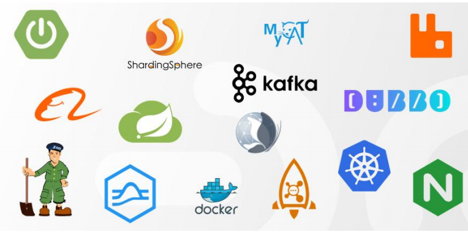

这些技术共同构成了分布式的生态体系。

### 消息中间件

#### MQ的诞生历程

我们要去用MQ，先来了解一下MQ是怎么诞生的，这样对于它解决了什么问题理解会更加深刻。

以前网络上的计算机(或者说不同的进程)传递数据，通信都是点对点的，而且要实现相同的协议(HTTP、TCP、WebService)。1983年的时候，有个在MIT工作的印度小伙突发奇想，能不能发明一种专门用来通信的中间件，就像主板(BUS)一样，把不同的软件集成起来呢？于是他搞了一家公司(Teknekron)，开发了世界上第一个消息队列软件The Information Bus(TlB)。最开始的时候，它被高盛这些公司用在金融交易里面。

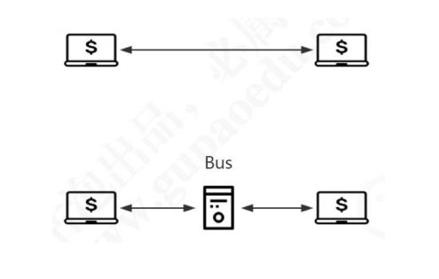

#### 什么是MQ？

MQ全称是Message Queue，直译过来叫做消息队列，主要是**作为分布式应用之间实现异步通信的方式**。

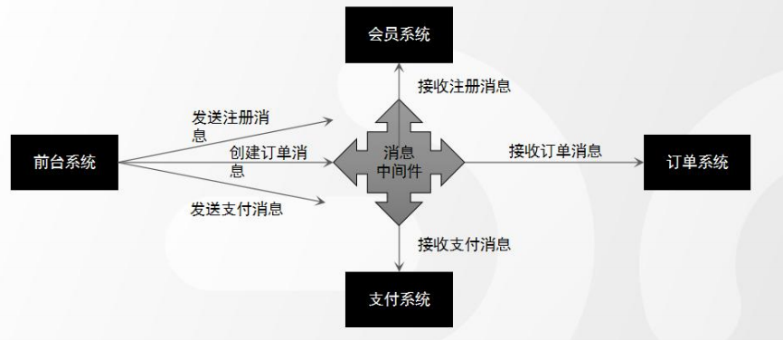

主要由三个部分组成，分别是生产者、消息服务端和消费者。

- 生产者(Producer)，是生产消息的一端，相当于消息的发起方，主要负责载业务信息的消息的创建。
- 消息服务端(Server)，是处理消息的单元，本质就是用来创建和保存消息队列，它主要负责消息的存储、投递以及跟消息队列相关的附加功能。消息服务端是整个消息队列最核心的组成部分。
- 消费者（Consumer)，是消费消息的一端，主要是根据消息所承载的信息去处理各种业务逻辑。

#### 为什么要使用MQ?

具体地说，中间件**屏蔽了底层操作系统的复杂性**，使程序开发人员面对一个简单而统一的开发环境，减少程序设计的复杂性，将注意力集中在自己的业务上，不必再为程序在不同系统软件上的移植而重复工作，从而大大减少了技术上的负担，中间件带给应用系统的，不只是开发的简便、开发周期的缩短，也减少了系统的维护、运行和管理的工作量，还减少了计算机总体费用的投入。

* 实现异步通信
* 实现系统解耦
* 实现流量削峰
* 实现广播通信

##### 实现异步通信

有些服务间调用是异步的，例如 A 调用 B，B 需要花费很长时间执行，但是 A 需要知道 B 什么时候可以执行完。

以前一般有两种方式，A 过一段时间去调用 B 的查询 api 查询。或者 A 提供一个 callback api， B 执行完之后调用 api 通知 A 服务。这两种方式都不是很优雅。

使用消息总线，可以很方便解决这个问题， A 调用 B 服务后，只需要监听 B 处理完成的消息，当 B 处理完成后，会发送一条消息给 MQ，MQ 会将此消息转发给 A 服务。这样 A 服务既不用循环调用 B 的查询 api，也不用提供 callback api。同样B 服务也不用做这些操作。A 服务还能及时的得到异步处理成功的消息。

##### 实现系统解耦

以电商应用为例，应用中有订单系统、库存系统、物流系统、支付系统。用户创建订单后，如果耦合调用库存系统、物流系统、支付系统，任何一个子系统出了故障，都会造成下单操作异常。当转变成基于消息队列的方式后，系统间调用的问题会减少很多，比如物流系统因为发生故障，需要几分钟来修复。在这几分钟的时间里，物流系统要处理的内存被缓存在消息队列中，用户的下单操作可以正常完成。当物流系统恢复后，继续处理订单信息即可，中单用户感受不到物流系统的故障，提升系统的可用性。

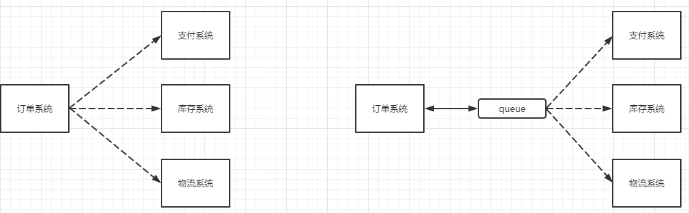

##### 实现流量削峰

举个例子，如果订单系统最多能处理一万次订单，这个处理能力应付正常时段的下单时绰绰有余，正常时段我们下单一秒后就能返回结果。但是在高峰期，如果有两万次下单操作系统是处理不了的，只能限制订单超过一万后不允许用户下单。使用消息队列做缓冲，我们可以取消这个限制，把一秒内下的订单分散成一段时间来处理，这时有些用户可能在下单十几秒后才能收到下单成功的操作，但是比不能下单的体验要好。

##### 实现广播通信

实现一对多通信。以订单系统退货为例，如果新增了积分系统，需要获取订单状态变化信息，只需要增加队列监听就可以了，生产者没有任何代码修改。

比如你买了辆保时捷，如果要让村里所有人知道，只要跟大妈说一下就行了。

总结起来:

- 对于数据量大或者处理耗时长的操作，我们可以引入MQ实现异步通信，减少客户端的等待，提升响应速度，优化客户体验。
- 对于改动影响大的系统之间，可以引入MQ实现解耦，减少系统之间的直接依赖，提升可维护性和可扩展性。
- 对于会出现瞬间的流量峰值的系统，我们可以引入MQ实现流量削峰，达到保护应用和数据库的目的。
- —对多的广播通信。

#### 使用MQ带来的一些问题

打个简单的比方，以前你跟小王直接对话，现在改成了通过小黄传话给小王，肯定还是会有些问题出现的。

第一个就是运维成本的增加。既然要用MQ，必须要分配资源部署MQ，还要保证它时刻正常运行。

第二个是系统的可用性降低。原来是两个节点的通信，现在还需要独立运行一个服务。虽然一般的MQ都有很高的可靠性和低延迟的特性，但是一旦网络或者MQ服务器出现问题，就会导致请求失败，严重地影响业务。

第三个是系统复杂性提高。为什么说复杂?作为开发人员，要使用MQ，首先必须要理解相关的模型和概念，才能正确地配置和使用MQ。其次，使用MQ发送消息必须要考虑消息丢失和消息重复消费的问题。一旦消息没有被正确地消费，就会带来数据一致性的问题。
所以，我们在做系统架构，选择通信方式的时候一定要根据实际情况来分析，不要因为我们说了这么多的MQ能解决的问题，就盲目地引入MQ。

#### 中间件特点

为解决分布异构问题，人们提出了中间件（middleware)的概念。中间件时位于平台（硬件和操作系统）和应用之间的通用服务，如下图所示，这些服务具有标准的程序接口和协议。针对不同的操作系统和硬件平台，它们可以有符合接口的协议规范的多种实现。

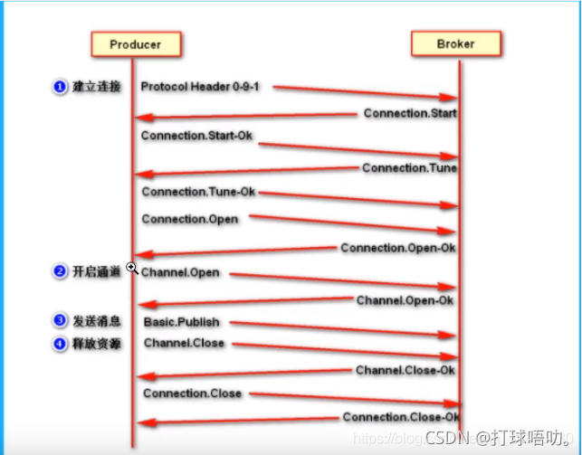

也很难给中间件一个严格的定义，但中间件应具有如下的一些特点：

（1）满足大量应用的需要

（2）运行于多种硬件和 OS平台

（3）支持分布计算，提供跨网络、硬件和 OS平台的透明性的应用或服务的交互

（4）支持标准的协议

（5）支持标准的接口

由于标准接口对于可移植性和标准协议对于互操作性的重要性，中间件已成为许多标准化工作的主要部分。对于应用软件开发，中间件远比操作系统和网络服务更为重要，中间件提供的程序接口定义了一个相对稳定的高层应用环境，不管底层的计算机硬件和系统软件怎样更新换代，只要将中间件升级更新，并保持中间件对外的接口定义不变，应用软件几乎不需任何修改，从而保护了企业在应用软件开发和维护中的重大投资。

简单说：中间件有个很大的特点，是脱离于具体设计目标，而具备提供普遍独立功能需求的模块。这使得中间件一定是可替换的。如果一个系统设计中，中间件时不可替代的，不是架构、框架设计有问题，那么就是这个中间件，在别处可能是个中间件，在这个系统内是引擎。

#### 在项目中什么时候使用中间件技术

在项目的架构和重构中，使用任何技术和架构的改变我们都需要谨慎斟酌和思考，因为任何技术的融入和变化都可能人员，技术，和成本的增加，中间件的技术一般现在一些互联网公司或者项目中使用比较多，如果你仅仅还只是一个初创公司建议还是使用单体架构，最多加个缓存中间件即可，不要盲目追求新或者所谓的高性能，而追求的背后一定是业务的驱动和项目的驱动，因为一旦追求就意味着你的学习成本，公司的人员结构以及服务器成本，维护和运维的成本都会增加，所以需要谨慎选择和考虑。

但是作为一个开放人员，一定要有学习中间件技术的能力和思维，否则很容易当项目发展到一个阶段在去掌握估计或者在面试中提及，就会给自己带来不小的困扰，在当今这个时代这些技术也并不是什么新鲜的东西，如果去掌握和挖掘最关键的还是自己花时间和经历去探讨和研究。

### 消息队列协议

#### 什么是协议

协议是计算机之间通信时共同遵从的一组约定，都遵守相同的约定，计算机之间才能相互交流。是对数据格式和计算机之间交换数据时必须遵守的规则的正式描述。

#### 协议三要素

- 语法：即数据与控制信息的结构或格式
- 语义：即需要发出何种控制信息，完成何种动作以及做出何种响应
- 时序(同步)：即事件实现顺序的详细说明

比如MQ发送一个信息，是以什么数据格式发送到队列中，然后每个部分的含义是什么，发送完毕以后的执行的动作，以及消费者消费消息的动作，消费完毕的相应结构和反馈是什么，然后按照对应的执行顺序进行处理。如果你还是不理解：大家每天都在接触的 http请求协议：

- 语法：http规定了请求报文和响应报文的格式
- 语义：客户端主动发起请求称之为请求（这是一种定义，同时你发起的是 post/get请求）
- 时序：一个请求对应一个响应（一定先有请求在有响应，这个是时序）

而消息中间件采用的并不是 http协议，而常见的消息中间件协议有：OpenWire、AMQP、MQTT、Kafka，OpenMessage协议。

**面试题：为什么消息中间件不直接使用 http协议**

因为 http请求报文头和响应报文头是比较复杂的，包含了Cookie，数据的加密解密，响应码等附加的功能，但是对于一个消息而言，我们并不需要这么复杂，也没有这个必要性，它其实就是负责数据传递，存储，分发就行，一定要追求的是**高性能，尽量简洁，快速**。

大部分情况下 **http大部分都是短链接**，在实际的交互过程中，一个请求到响应都很有可能会中断，中断以后就不会执行持久化，就会造成请求的丢失。这样就不利于消息中间件的业务场景，因为消息中间件可能是一个**长期的获取信息的过**程，出现问题和故障要对数据或消息执行持久化等，**目的是为了保证消息和数据的高可靠和稳健的运行**。

#### AMQP协议

##### AMQP 是什么？

AMQP：（全称：Advanced Message Queuing Protocol）是高级消息队列协议。由摩根大通集团联合其他公司共同设计。是一个提供统一消息服务的应用层标准高级消息队列协议，是应用层协议的一个开放标准，为面向消息的中间件设计。基于此协议的客户端与消息中间件可传递消息，并不受客户端/中间件不同产品，不同的开发语言等条件的限制。Erlang中的实现由 RabbitMQ等。

##### 特性

事务支持、持久化支持，出生金融行业，在可靠性消息处理上具备天然的优势。

##### 应用

RabbitMQ、ActiveMQ

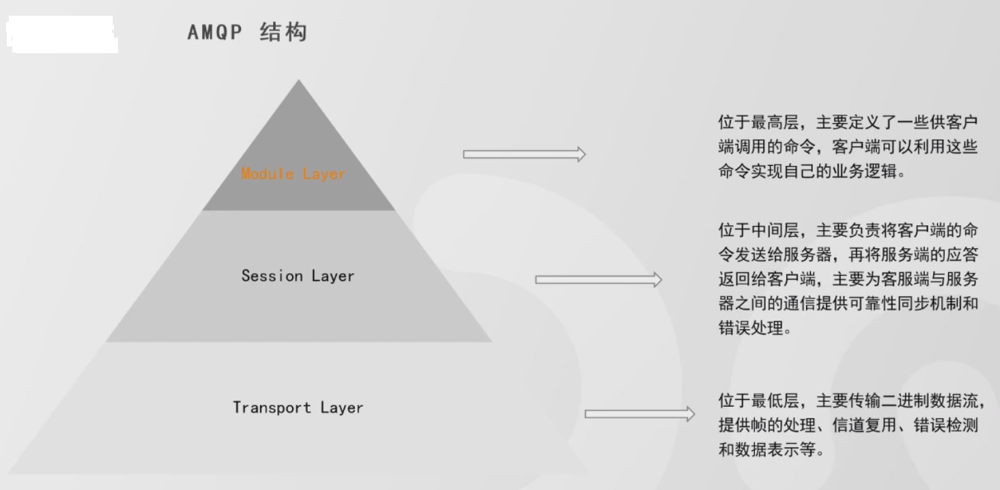

##### 生产者流转过程

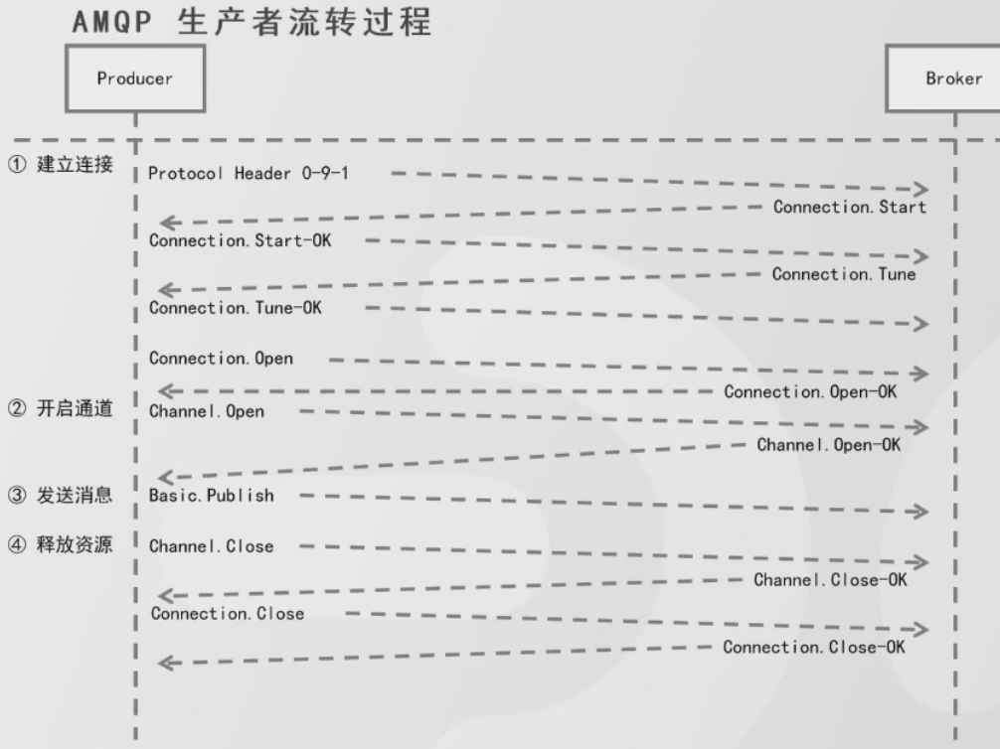

##### 消费者流转过程

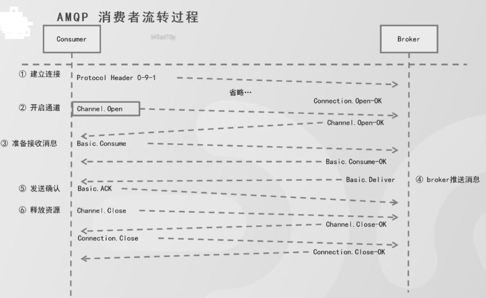

##### AMQP 协议3 层

- **Module Layer**：协议最高层，主要定义了一些客户端调用的命令，客户端可以用这些命令实现自己的业务逻辑。
- **Session Layer:**中间层，主要负责客户端命令发送给服务器，再将服务端应答返回客户端，提供可靠性同步机制和错误处理。
- **Transport Layer**：最底层，主要传输二进制数据流，提供帧的处理、信道服用、错误检测和数据表示等。

##### AMQP 模型的几大组件

- 交换器(Exchange)：消息代理服务器中用于把消息路由到队列的组件。
- 队列(Queue)：用来存储消息的数据结构，位于硬盘或内存中。
- 绑定(Binding)：一套规则，告知交换器消息应该将消息投递给哪个队列。

#### MQTT协议

MQTT (Message Queuing Telemetry Transport)消息队列遥测传输是IBM开发的一个即时通讯协议，物联网系统架构中的重要组成部分。

特性：轻量、结构简单、传输快、没有事务支持、没有持久化相关设计。

应用：RabbitMQ、ActiveMQ

#### Open Message协议

Open Messaging是近一两年由阿里发起，与雅虎、滴滴出行、Streamlio等公司共同参与创立的分布式消息中间件、流处理领域的应用开发标准。是国内首个在全球范围内发起的分布式消息领域国际标准

特性：结构简单、解析快、有事务设计、有持久化设计

应用：RocketMQ

#### Kafka协议

Kafka 协议是基于TCP的二进制协议，消息内部是通过长度来分隔，由一些基本数据类型组成。

特性：结构简单、解析快、无事务设计、有持久化设计

应用：Kafka

### 消息队列持久化

简单来说就是将数据存入磁盘，而不是存在内存中随服务重启而消失，使**数据能够永久保存**叫做持久化。

持久化有两种方式：直接存磁盘以及数据库。

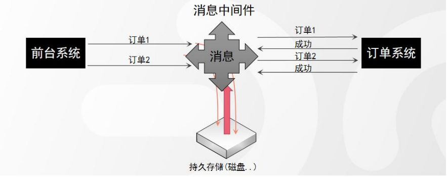

常用的消息中间件对持久化的支持

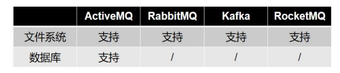

### 消息的分发策略

#### 消息的分发策略

MQ消息 队列有如下几个角色：

- 生产者
- 存储消息
- 消费者

那么生产者生成消息以后，MQ进行存储，消费者是如何获取消息的呢？一般获取数据的方式无外乎推（push）或者拉（pull）两种方式，典型的 git就有推拉机制，我们发送的 http请求就是一种典型的拉取数据库数据返回的过程。而消息队列 MQ是一种推送的过程，而这些推机制会使用到很多的业务场景也有很多对应推机制策略。

#### 场景分析一

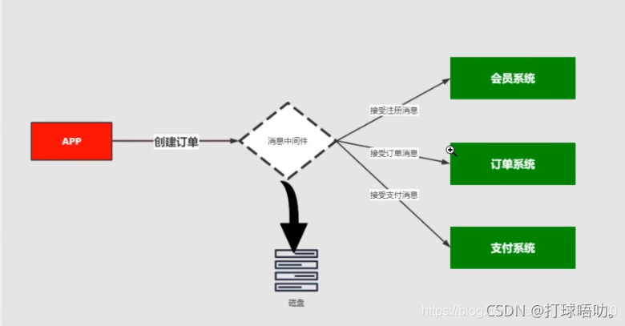

比如我在 APP上下了一个订单，我们的系统和服务很多，我们如何得知这个消息被哪个系统或者哪些服务器或者系统进行消费，那这个时候就需要一个分发的策略。这就需要消费策略。或者称之为消费的方法论。

#### 场景分析二

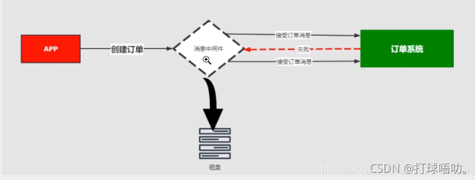

在发送消息的过程中可能会出现异常，或者网络的抖动，故障等等因为造成消息的无法消费，比如用户在下订单，消费 MQ接受，订单系统出现故障，导致用户支付失败，那么这个时候就需要消息中间件就必须支持消息重试机制策略。也就是支持：出现问题和故障的情况下，消息不丢失还可以进行重发。

#### 消息分发策略的机制和对比

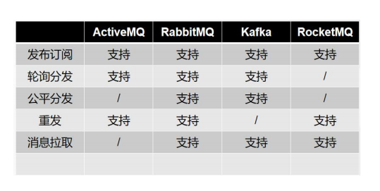

### 高可靠

#### 什么是高可用机制

所谓高可用：是指产品在规定的条件和规定的时刻或时间内处于可执行规定功能状态的能力

当业务量增加时，请求也过大，一台消息中间件服务器的会触及硬件（CPU，内存，磁盘）的极限，一台消息服务器你已经无法满足业务的需求，所以消息中间件必须支持集群部署，来达到高可用的目的

#### 集群模式1 - Master-slave主从共享数据的部署方式

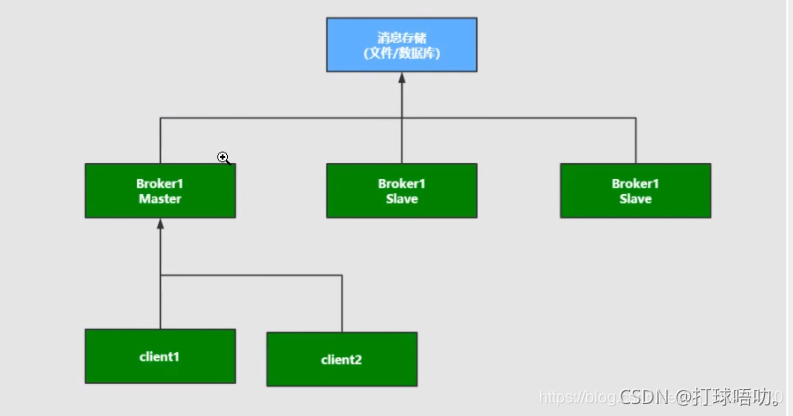

#### 集群模式2 - Master-slave主从同步部署方式

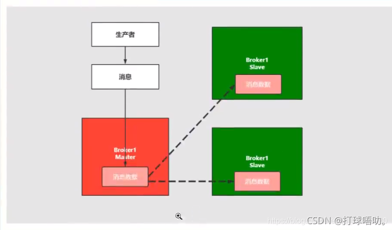

这种模式写入消息同样在 Master主节点上，但是主节点会同步数据到 slave节点形成副本，和 zookeeper或者 redis主从机制很雷同。这样可以达到负载均衡的效果，如果消费者有多个这样就可以去不同的节点进行消费，以为消息的拷贝和同步会占用很大的带宽和网络资源。在后面的rabbitmq中会有使用。

#### 集群模式3 - 多主集群同步部署模式

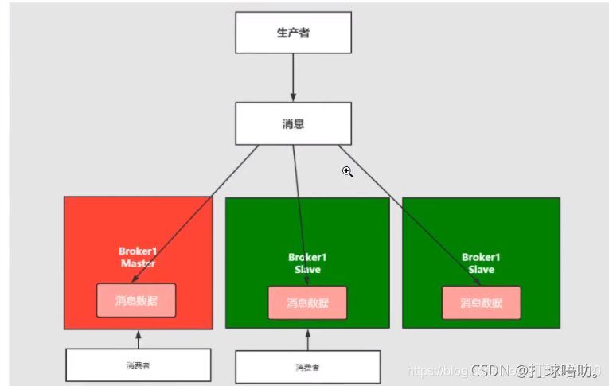

解释：和上面的区别不是特别的大，但是它的写入可以往任意节点去写入

#### 集群模式4 - 多主集群转发部署模式

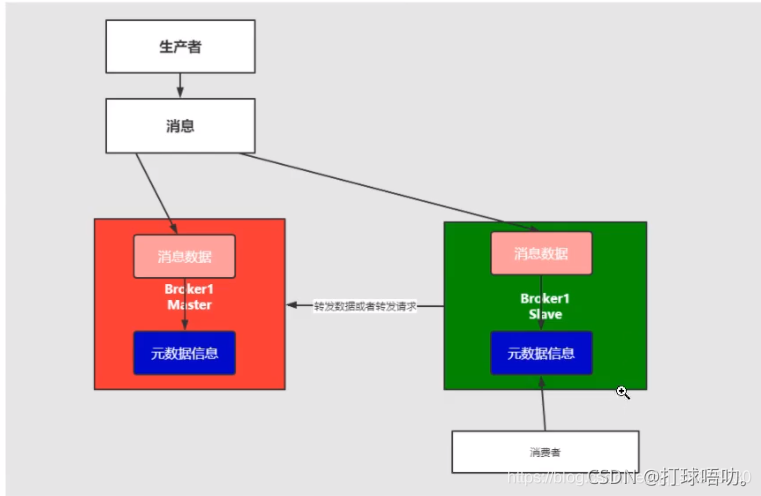

解释：如果你插入的数据是 broker-1中国，元数据信息会存储数据的相关描述和记录存放的位置（队列）。它会对描述信息也就是元数据信息进行同步，如果消费者在 broker-2中进行消费，发现自己节点没有对应的信息，可以从对应的元数据信息中去查询，然后返回对应的消息信息，场景：比如买火车票或者黄牛买演唱会门票，比如第一个黄牛有顾客说要买的演唱会门票，但是没有但是他回去联系其他的黄牛询问，如果有就返回。

#### 集群模式5 Master-slave与 Broker-cluster组合的方案

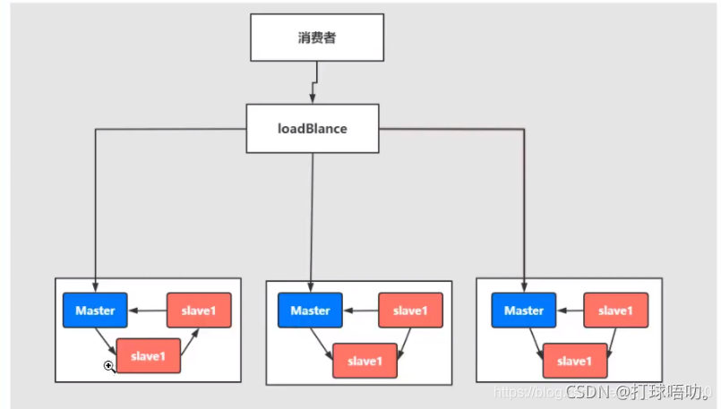

解释：实现多主多从的热备机制来完成消息的高可用以及数据的热备机制，在生产规模达到一定的阶段的时候，这种使用的频率比较高。

#### 什么是高可靠机制

高可靠性是指系统可以无故障地持续运行。比如一个系统从来不崩溃、报错，或者崩溃、报错的几率较低，那就是高可靠。

在高并发业务场景下，如果不能保证系统的高可靠，那造成的损失将会非常严重。

保证消息中间件的高可靠性，可以从以下几方面考虑：

- 消息**传输**可靠：通过协议来保证系统间数据解析的正确性。
- 消息**存储**可靠：通过持久化来保证消息的存储可靠性