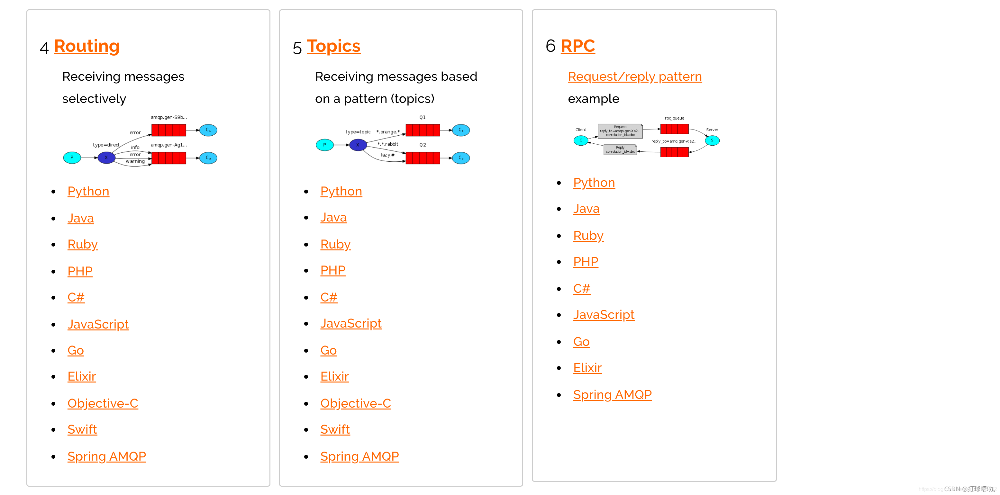
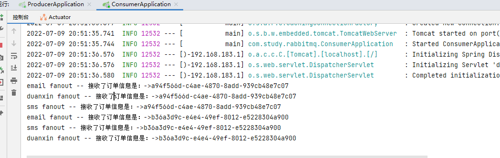
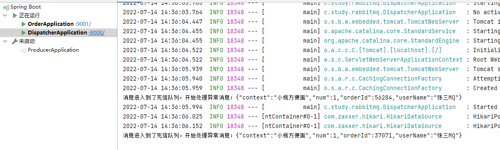

## RabbitMQ专题

### RabbitMQ安装

#### Linux安装

##### 下载

官网下载地址：[https：//www.rabbitmq.com/download.html(opens new window)](https：//www.rabbitmq.com/download.html)

这里我们选择的版本号（注意这两版本要求）

- rabbitmq-server-3.8.8-1.el7.noarch.rpm

  GitHub：[https://github.com/rabbitmq/rabbitmq-server/releases/tag/v3.8.8(opens new window)](https://github.com/rabbitmq/rabbitmq-server/releases/tag/v3.8.8)

  加载下载：[https://packagecloud.io/rabbitmq/rabbitmq-server/packages/el/7/rabbitmq-server-3.8.8-1.el7.noarch.rpm(opens new window)](https://packagecloud.io/rabbitmq/rabbitmq-server/packages/el/7/rabbitmq-server-3.8.8-1.el7.noarch.rpm)

- erlang-21.3.8.21-1.el7.x86_64.rpm

  官网：https://www.erlang-solutions.com/downloads/

  加速：[https://packagecloud.io/rabbitmq/erlang/packages/el/7/erlang-21.3.8.21-1.el7.x86_64.rpm(opens new window)](https://packagecloud.io/rabbitmq/erlang/packages/el/7/erlang-21.3.8.21-1.el7.x86_64.rpm)

Red Hat 8, CentOS 8 和 modern Fedora 版本，把“el7”替换成“el8”


##### 安装

```sh
sudo rpm -ivh erlang-21.3.8.21-1.el7.x86_64.rpm
sudo yum install socat -y
sudo rpm -ivh rabbitmq-server-3.8.8-1.el7.noarch.rpm
```

##### 启动

```sh
#启动服务
systemctl start rabbitmq-server

#查看服务状态
systemctl status rabbitmq-server

#开机自启动
systemctl enable rabbitmq-server

#停止服务
systemctl stop rabbitmq-server

#重启服务
systemctl restart rabbitmq-server
```

##### 配置文件

配置文件地址：https://github.com/rabbitmq/rabbitmq-server/tree/v3.8.x/deps/rabbit/docs

在`/etc/rabbitmq`中配置advanced.config和rabbitmq.conf两个文件。

#### Web管理界面

##### 安装

默认情况下，是没有安装web端的客户端插件，需要安装才可以生效

```sh
sudo rabbitmq-plugins enable rabbitmq_management
```

安装完毕以后，重启服务即可

```sh
sudo systemctl restart rabbitmq-server
```

访问 http://192.168.183.102:15672 ，用默认账号密码(都是guest)登录，出现权限问题。

默认情况只能在 localhost 本机下访问，所以需要添加一个远程登录的用户

> 通过ip addr或者ifconfig查看当前服务器地址，注意还需要关闭防火墙`systemctl stop firewalld`


##### 添加用户

###### 创建账号

```sh
sudo rabbitmqctl add_user admin 123456
```

###### 设置用户角色

```sh
sudo rabbitmqctl set_user_tags admin administrator
```

用户级别：

1. **administrator**：可以登录控制台、查看所有信息、可以对 rabbitmq 进行管理
2. **monitoring**：监控者登录控制台，查看所有信息
3. **policymaker**：策略制定者登录控制台，指定策略
4. **managment**：普通管理员登录控制台

###### 设置用户权限

```sh
set_permissions [-p <vhostpath>]<user> <conf> <write> <read>
```

比如：用户admin具有/vhost1这个virtual host中所有资源的配置、写、读权限

```sh
sudo rabbitmqctl set_permissions -p "/" admin ".*" ".*" ".*"
```

###### 当前用户和角色

```sh
sudo rabbitmqctl list_users
```


###### 再次登录，用 admin 用户

- 关闭应用的命令为：``rabbitmqctl stop_app``
- 清除的命令为：``rabbitmqctl reset``
- 重新启动命令为：``rabbitmqctl start_app``

访问地址：http://192.168.183.102:15672/#/


#### Docker安装

官网：https://registry.hub.docker.com/_/rabbitmq/

```sh
docker run -id --name myrabbit -e RABBITMQ_DEFAULT_USER=admin -e RABBITMQ_DEFAULT_PASS=123456 -p 15672：15672 rabbitmq:3-management
```

#### 前提准备

##### 构建一个maven工程

创建一个`rabbitmq-demo`工程项目。


##### 导入依赖

###### Java原生依赖

```xml
<dependency>
    <groupId>com.rabbitmq</groupId>
    <artifactId>amqp-client</artifactId>
    <version>5.10.0</version>
</dependency>
```

###### Spring依赖

```xml
<dependency>
    <groupId>org.springframework.amqp</groupId>
    <artifactId>spring-amqp</artifactId>
    <version>2.2.5.RELEASE</version>
</dependency>
<dependency>
    <groupId>org.springframework.amqp</groupId>
    <artifactId>spring-rabbit</artifactId>
    <version>2.2.5.RELEASE</version>
</dependency>
```

###### SpringBoot依赖

```xml
<dependencies>
    <!--Spring提供的一个统一消息服务的应用层标准高级消息队列协议引入这个目前就够了-->
    <dependency>
        <groupId>org.springframework.boot</groupId>
        <artifactId>spring-boot-starter-amqp</artifactId>
    </dependency>
    <!-- 支持Web -->
    <dependency>
        <groupId>org.springframework.boot</groupId>
        <artifactId>spring-boot-starter-web</artifactId>
    </dependency>
    <!-- 支持Junit单元测试 -->
    <dependency>
        <groupId>org.springframework.boot</groupId>
        <artifactId>spring-boot-starter-test</artifactId>
        <scope>test</scope>
    </dependency>
    <!-- 支持Lombok注解 -->
    <dependency>
        <groupId>org.projectlombok</groupId>
        <artifactId>lombok</artifactId>
        <optional>true</optional>
    </dependency>

    <!-- 添加热部署 -->
    <dependency>
        <groupId>org.springframework.boot</groupId>
        <artifactId>spring-boot-devtools</artifactId>
        <scope>runtime</scope>
        <optional>true</optional>
    </dependency>
</dependencies>

<build>
    <plugins>
        <plugin>
            <groupId>org.springframework.boot</groupId>
            <artifactId>spring-boot-maven-plugin</artifactId>
        </plugin>
    </plugins>
</build>
```

### RabbitMQ参数详解

- `channel.queueDeclare(QUEUE_NAME, true, false, false, null)`：生成一个队列
  - 参数1：队列名称

  - 参数2（durable）：队列里面的消息是否进行持久化

  - 参数3（exclusive）：是否共享消息

  - 参数4（autoDelete）：是否自动删除

  - 参数5（arguments）：其他高级参数

- `channel.basicConsume(QUEUE_NAME, true, ...)`
  - 参数1：队列名称
  - 参数2（autoAck）：是否自动签收，对应着手动签收

- `channel.basicPublish("", QUEUE_NAME, MessageProperties.PERSISTENT_TEXT_PLAIN,msg.getBytes("UTF-8"))`：发送一个消息

  - 参数1：发送到哪个交换机
  - 参数2：路由的key，队列名称
  - 参数3：其他的参数信息，比如headers模式的map就是在这里配置
    - `MessageProperties.PERSISTENT_TEXT_PLAIN`：消息持久化
  - 参数4：发送消息内容

### RabbitMQ入门案例

#### 基本概念

##### 交换机

###### Exchanges概念

RabbitMQ 消息传递模型的核心思想是: **生产者生产的消息从不会直接发送到队列**。实际上，通常生产者甚至都不知道这些消息传递传递到了哪些队列中。

相反，**生产者只能将消息发送到交换机(exchange)**，交换机工作的内容非常简单，一方面它接收来自生产者的消息，另一方面将它们推入队列。交换机必须确切知道如何处理收到的消息。是应该把这些消息放到特定队列还是说把他们到许多队列中还是说应该丢弃它们。这就的由交换机的类型来决定。

###### Exchanges类型

- **直接(direct)（路由）**
- **主题(topic)**
- 标题(headers)
- **扇出(fanout)（发布订阅）**

###### 无名Exchanges

在前面部分我们对 exchange 一无所知，但仍然能够将消息发送到队列。之前能实现的 原因是因为我们使用的是默认交换，我们通过空字符串(“”)进行标识。

```java
channel.basicPublish("",queueName,null,message.getBytes());
```

第一个参数是交换机的名称。空字符串表示默认或无名称交换机：消息能路由发送到队列中其实是由 routingKey(bindingkey)绑定 key 指定的，如果它存在的话。

##### 临时队列

队列的名称我们来说至关重要，我们需要指定我们的消费者去消费哪个队列的消息。

每当我们连接到 Rabbit 时，我们都需要一个全新的空队列，为此我们可以创建一个具有**随机名称的队列**，或者能让服务器为我们选择一个随机队列名称那就更好了。其次一旦我们断开了消费者的连接，队列将被自动删除。

创建临时队列的方式如下：

```java
String queueName = channel.queueDeclare().getQueue();
```

##### 绑定

什么是 bingding 呢，binding 其实是 exchange 和 queue 之间的桥梁，它告诉我们 exchange 和那个队列进行了绑定关系。

> 生产者通过将交换机与队列绑定，能够区别对待，想使用那个队列就是用那个队列。

#### Simple简单模式

##### 概述


在上图的模型中，有以下概念：

1. 生产者，也就是要发送消息的程序
2. 消费者：消息的接受者，会一直等待消息到来。
3. 消息队列：图中红色部分。类似一个邮箱，可以缓存消息；生产者向其中投递消息，消费者从其中取出消息。

##### 生产者

````java
public class Producer {
    public static void main(String[] args)  {
        // 1.创建连接工厂
        ConnectionFactory factory = new ConnectionFactory();
        factory.setHost("192.168.183.101");
        factory.setPort(5672);
        factory.setUsername("admin");
        factory.setPassword("123456");
        factory.setVirtualHost("/");

        Connection connection = null;
        Channel channel = null;

        try {
            // 2.创建连接Connection
            connection = factory.newConnection("生产者");
            // 3.通过连接获取通道Channel
            channel = connection.createChannel();
            // 4.通过创建交换机，声明队列，绑定关系，路由key，发送消息，和接受消息
            String queueName = "queue1";

            /**
             * @params1 队列的名称
             * @params2 是否要持久化durable=false,所谓持久化是否存到磁盘中，如果是false表示非持久化，是true表示持久化
             * @params3 排他性，是否是独占队列
             * @params4 是否自动删除，随着最后一个消费者消费完毕消息以后是否把队列自动删除
             * @params5 携带附属参数
             */
            channel.queueDeclare(queueName,false,false,false,null);
            // 5.准备消息内容
            String message = "hello rabbitmq";
            // 6.发送消息给队列queue
            // @params1: 交换机  @params2 队列、路由key @params 消息的状态控制  @params4 消息主题
            // 面试题：可以存在没有交换机的队列吗？不可能，虽然没有指定交换机但是一定会存在一个默认的交换机。
            channel.basicPublish("",queueName, null,message.getBytes());

            System.out.println("消息发送成功！！！");
            // 让消费者一端有足够时间处理消息
            TimeUnit.SECONDS.sleep(1000);
        }catch (Exception e){

        }finally {
            // 7.关闭连接
            if(connection != null) {
                try {
                    connection.close();
                } catch (IOException e) {
                    e.printStackTrace();
                }
            }
            // 8.关闭通道
            if(channel != null) {
                try {
                    channel.close();
                } catch (IOException e) {
                    e.printStackTrace();
                } catch (TimeoutException e) {
                    e.printStackTrace();
                }
            }
        }
    }
}
````

##### 消费者

```java
public class Consumer {
    public static void main(String[] args) {
        // 1.创建连接工厂
        ConnectionFactory factory = new ConnectionFactory();
        factory.setHost("192.168.183.101");
        factory.setPort(5672);
        factory.setUsername("admin");
        factory.setPassword("123456");
        factory.setVirtualHost("/");

        Connection connection = null;
        Channel channel = null;

        try {
            // 2.创建连接Connection
            connection = factory.newConnection("消费者");
            // 3.通过连接获取通道Channel
            channel = connection.createChannel();
            // 4.通过创建交换机，声明队列，绑定关系，路由key，发送消息，和接受消息
            String queueName = "queue1";

            // true = ack 正常的逻辑是没问题 死循环 rabbit 重发策略
            // false = nack 消息这在消费消息的时候可能会异常和故障

            final Channel channel2 = channel;
            channel2.basicConsume("queue1", false, (consumerTag, message) -> { // 成功回调
                try {
                    System.out.println("收到消息是" + new String(message.getBody(), "UTF-8"));
                    channel2.basicAck(message.getEnvelope().getDeliveryTag(), false);
                } catch (Exception ex) {
                    ex.printStackTrace();
                    // 三次确认 -- reject + sixin
                }
            }, (consumerTag) -> { // 失败回调
                System.out.println("接受失败了...");
            });

            System.out.println("开始接受消息");
            // 等待
            System.in.read();
        } catch (Exception e) {

        } finally {

            // 7.关闭连接
            if (connection != null) {
                try {
                    connection.close();
                } catch (IOException e) {
                    e.printStackTrace();
                }
            }
            // 8.关闭通道
            if (channel != null) {
                try {
                    channel.close();
                } catch (IOException e) {
                    e.printStackTrace();
                } catch (TimeoutException e) {
                    e.printStackTrace();
                }
            }
        }
    }
}
```

#### 常见用法

##### 持久化

###### 队列持久化

之前我们创建的队列都是非持久化的，rabbitmq 如果重启的化，该队列就会被删除掉，如果要队列实现持久化需要在声明队列的时候把 durable 参数设置为持久化。

```java
// 让队列持久化
boolean durable = true;
// 声明队列
channel.queueDeclare(QUEUE_NAME,durable,false,false,null);
```

注意：如果之前声明的队列不是持久化的，需要把原先队列先删除，或者重新创建一个持久化的队列，不然就会出现错误。

在web界面中，队列中显示出的`D`字母表示已经持久化了。

###### 消息持久化

需要在消息**生产者**修改代码，`MessageProperties.PERSISTENT_TEXT_PLAIN` 添加这个属性。

```java
// 设置生产者消息为持久化消息（要求保存在磁盘上）保存在内存中
channel.basicPublish("",TASK_QUEUE_NAME,MessageProperties.PERSISTENT_TEXT_PLAIN,message.getBytes(StandardCharsets.UTF_8));
```

将消息标记为持久化并不能完全保证不会丢失消息。尽管它告诉 RabbitMQ 将消息保存到磁盘，但是这里依然存在当消息刚准备存储在磁盘的时候 但是还没有存储完，消息还在缓存的一个间隔点。此时并没有真正写入磁盘。持久性保证并不强，但是对于我们的简单任务队列而言，这已经绰绰有余了。

> 在发布确认中，会学习更强有力的持久化策略。

##### 不公平分发

在最开始的时候我们学习到 RabbitMQ 分发消息采用的轮训分发，但是在某种场景下这种策略并不是很好，比方说有两个消费者在处理任务，其中有个**消费者 1** 处理任务的速度非常快，而另外一个**消费者 2** 处理速度却很慢，这个时候我们还是采用轮训分发的化就会到这处理速度快的这个消费者很大一部分时间处于空闲状态，而处理慢的那个消费者一直在干活，这种分配方式在这种情况下其实就不太好，但是 RabbitMQ 并不知道这种情况它依然很公平的进行分发。

为了避免这种情况，**在消费者中消费之前**，我们可以设置参数 `channel.basicQos(1);`

`````java
// 不公平分发
int prefetchCount = 1;
channel.basicQos(prefetchCount); // 这个表示队列中能够存放处理的数量。2就是提前存放两条数据，等着排队处理。
// 采用手动应答
boolean autoAck = false;
// 消息接收
channel.basicConsume(TASK_QUEUE_NAME, autoAck, deliverCallback, cancelCallback);
`````

意思就是如果这个任务我还没有处理完或者我还没有应答你，你先别分配给我，我目前只能处理一个任务，然后 rabbitmq 就会把该任务分配给没有那么忙的那个空闲消费者，当然如果所有的消费者都没有完成手上任务，队列还在不停的添加新任务，队列有可能就会遇到队列被撑满的情况，这个时候就只能添加 新的 worker 或者改变其他存储任务的策略。

##### 预取值分发(带权的消息分发)

本身消息的发送就是异步发送的，所以在任何时候，channel 上肯定不止只有一个消息另外来自消费 者的手动确认本质上也是异步的。因此这里就存在一个未确认的消息缓冲区，因此希望开发人员能**限制此缓冲区的大小**，**以避免缓冲区里面无限制的未确认消息问题**。**这个时候就可以通过使用 basic.qos 方法设 置“预取计数”值来完成的。**

该值定义通道上允许的未确认消息的最大数量。一旦数量达到配置的数量， RabbitMQ 将停止在通道上传递更多消息，除非至少有一个未处理的消息被确认，例如，假设在通道上有未确认的消息 5、6、7，8，并且通道的预取计数设置为 4，此时RabbitMQ 将不会在该通道上再传递任何消息，除非至少有一个未应答的消息被 ack。比方说 tag=6 这个消息刚刚被确认 ACK，RabbitMQ 将会感知 这个情况到并再发送一条消息。消息应答和 QoS 预取值对用户吞吐量有重大影响。

通常，增加预取将提高 向消费者传递消息的速度。**虽然自动应答传输消息速率是最佳的，但是，在这种情况下已传递但尚未处理的消息的数量也会增加，从而增加了消费者的 RAM 消耗**(随机存取存储器)应该小心使用具有无限预处理的自动确认模式或手动确认模式，消费者消费了大量的消息如果没有确认的话，会导致消费者连接节点的内存消耗变大，所以找到合适的预取值是一个反复试验的过程，不同的负载该值取值也不同 100 到 300 范 围内的值通常可提供最佳的吞吐量，并且不会给消费者带来太大的风险。

预取值为 1 是最保守的。当然这将使吞吐量变得很低，特别是消费者连接延迟很严重的情况下，特别是在消费者连接等待时间较长的环境 中。对于大多数应用来说，稍微高一点的值将是最佳的。

##### 发布确认

###### 发布确认原理

生产者将信道设置成 confirm 模式，一旦信道进入 confirm 模式，所有在该信道上面发布的消息都将会被指派一个唯一的 ID(从 1 开始)，一旦消息被投递到所有匹配的队列之后，broker 就会发送一个确认给生产者(包含消息的唯一 ID)，这就使得生产者知道消息已经正确到达目的队列了，如果消息和队列是可持久化的，那么确认消息会在将消息写入磁盘之后发出，broker 回传给生产者的确认消息中 delivery-tag 域包含了确认消息的序列号，此外 broker 也可以设置basic.ack 的 multiple 域，表示到这个序列号之前的所有消息都已经得到了处理。

confirm 模式最大的好处在于他是异步的，一旦发布一条消息，生产者应用程序就可以在等信道返回确认的同时继续发送下一条消息，当消息最终得到确认之后，生产者应用便可以通过回调方法来处理该确认消息，如果RabbitMQ 因为自身内部错误导致消息丢失，就会发送一条 nack 消息， 生产者应用程序同样可以在回调方法中处理该 nack 消息。

###### 开启确认发布

- 开启队列持久化

```java
// 1. 队列持久化
boolean durable = true;
channel.queueDeclare(TASK_QUEUE_NAME,durable,false,false,null);
```

- 开启消息持久化

```java
// 2. 设置生产者消息为持久化消息（要求保存在磁盘上）保存在内存中
channel.basicPublish("",TASK_QUEUE_NAME,MessageProperties.PERSISTENT_TEXT_PLAIN,message.getBytes(StandardCharsets.UTF_8));
```

- 开启发布确认

发布确认默认是没有开启的，如果要开启需要调用方法 confirmSelect，每当你要想使用发布确认，都需要在 channel 上调用该方法。

````java
// 3. 开启发布确认
channel.confirmSelect();
````

###### 单个确认发布

这是一种简单的确认方式，它是一种**同步确认发布**的方式，也就是发布一个消息之后只有它被确认发布，后续的消息才能继续发布，`waitForConfirmsOrDie(long)` 这个方法只有在消息被确认的时候才返回，如果在指定时间范围内这个消息没有被确认那么它将抛出异常。

这种确认方式有一个最大的缺点就是：**发布速度特别的慢**，因为如果没有确认发布的消息就会阻塞所有后续消息的发布，这种方式最多提供每秒不超过数百条发布消息的吞吐量。当然对于某些应用程序来说这可能已经足够了。

```java
// 1. 单个确认
public static void publishMessageIndividually() throws Exception {
    String queueName = UUID.randomUUID().toString();
    // 队列的声明
    Channel channel = RabbitMqUtils.getChannel();
    channel.queueDeclare(queueName,true,false,false,null);

    // 开启发布确认
    channel.confirmSelect();

    // 开始时间
    long beginTime = System.currentTimeMillis();

    // 批量发送消息
    for(int i=0;i<MEESAGE_COUNT;i++){

        String message = String.valueOf(i);

        channel.basicPublish("",queueName,null,message.getBytes(StandardCharsets.UTF_8));

        // 单个消费就马上进行发布确认
        boolean flag = channel.waitForConfirms();
        if(flag){
            System.out.println("消息发送成功");
        }

    }

    // 结束时间
    long endTime = System.currentTimeMillis();

    System.out.println("发布"+MEESAGE_COUNT+"个单独确认消息，耗时"+(endTime - beginTime)+"ms");

}
```

###### 批量确认发布

上面那种方式非常慢，与单个等待确认消息相比，先发布一批消息然后一起确认可以极大地提高吞吐量，当然这种方式的缺点就是：当发生故障导致发布出现问题时，不知道是哪个消息出问题了，我们必须将整个批处理保存在内存中，以记录重要的信息而后重新发布消息。当然这种方案仍然是同步的，也一样阻塞消息的发布。

```java
// 2. 批量确认
public static void publishMessageBatch() throws Exception{
    String queueName = UUID.randomUUID().toString();

    Channel channel = RabbitMqUtils.getChannel();
    channel.queueDeclare(queueName,false,false,false,null);

    channel.confirmSelect();

    long beginTime = System.currentTimeMillis();

    // 批量确认消息大小
    int batchSize = 100;

    for(int i = 0;i<MEESAGE_COUNT;i++){
        String message = String.valueOf(i);
        channel.basicPublish("",queueName,null,message.getBytes(StandardCharsets.UTF_8));

        // 判断达到100条消息的时候，批量确认一次
        if((i+1) % batchSize == 0){
            // 发布确认
            channel.waitForConfirms();
        }

    }

    long endTime = System.currentTimeMillis();
    System.out.println("发布"+MEESAGE_COUNT+"个批量确认消息，耗时"+(endTime - beginTime)+"ms");
}
```

###### 异步确认发布

异步确认虽然编程逻辑比上两个要复杂，但是性价比最高，无论是可靠性还是效率都没得说， 他是利用回调函数来达到消息可靠性传递的，这个中间件也是通过函数回调来保证是否投递成功， 下面就让我们来详细讲解异步确认是怎么实现的。

如何处理异步未确认消息?

最好的解决的解决方案就是把未确认的消息放到一个基于内存的能被发布线程访问的队列， 比如说用 ConcurrentLinkedQueue 这个队列在 confirm callbacks 与发布线程之间进行消息的传递。

```java
// 3. 异步批量确认
public static void publishMessageAsync() throws Exception{
    String queueName = UUID.randomUUID().toString();

    Channel channel = RabbitMqUtils.getChannel();
    channel.queueDeclare(queueName,false,false,false,null);

    channel.confirmSelect();

    long beginTime = System.currentTimeMillis();


    ConfirmCallback confirmCallback1 =(delivery, multiple)->{ // 消息确认成功
        System.out.println("确认的消息："+delivery);
    };
    ConfirmCallback confirmCallback2 =(delivery, multiple)->{ // 消息确认失败
        System.out.println("未确认的消息："+delivery);
    };
    // 开启监听 -- 准备消息的监听器，监听那些消息成功了，哪些消息失败了
    channel.addConfirmListener(confirmCallback1,confirmCallback2); //异步通知

    for(int i = 0;i<MEESAGE_COUNT;i++){
        String message = String.valueOf("消息"+i);
        channel.basicPublish("",queueName,null,message.getBytes(StandardCharsets.UTF_8));
    }

    long endTime = System.currentTimeMillis();
    System.out.println("发布"+MEESAGE_COUNT+"个异步确认消息，耗时"+(endTime - beginTime)+"ms");
}
```

如何处理异步未确认消息?

最好的解决的解决方案就是把未确认的消息放到一个基于内存的能被发布线程访问的队列， 比如说用 ConcurrentLinkedQueue 这个队列在 confirm callbacks 与发布线程之间进行消息的传递。

###### 发布确认方法对比

- **单独发布消息**：同步等待确认，简单，但吞吐量非常有限。
- **批量发布消息**：批量同步等待确认，简单，合理的吞吐量，一旦出现问题但很难推断出是那条消息出现了问题。
- **异步处理**：最佳性能和资源使用，在出现错误的情况下可以很好地控制，但是实现起来稍微难些

#### AMQP协议

##### 什么是AMQP

AMQP全称：Advanced Message Queuing Protocol（高级消息队列协议）。是应用层协议的一个开发标准，为面向消息的中间件设计.

##### AMQP生产者流转过程

思考：RabbitMQ为什么是基于channel去处理而不是连接。

1. TCP的创建和销毁，开销大。创建需要三次握手，销毁需要四次分手。
2. 如果不使用信道，那么引用程序就会使用TCP的方式连接到rabbitmq，高峰时每秒成千上万条连接会造成资源的巨大浪费(一条tcp消耗资源，成千上万的tcp会**非常消耗资源**)，而且操作系统每秒处理TCP连接数量也是有限的，必定会造成性能瓶颈。
3. 信道的原理是一条线程一条信道，多条线程多条信道共同使用一条TCP连接。一条TCP连接可以容纳无限的信道，及时每秒造成成千上万的请求也不会造成性能瓶颈，**实现连接复用**。


##### AMQP消费者流转过程


#### RabbitMQ的核心组成部分 

##### 核心组成部分


核心概念：

- **Server**：又称**Broker**，接受客户端的连接，实现AMQP实体服务。安装rabbitmq-server
- **Connection**：连接，应用程序与Broker的网络连接TCP/IP/三次握手和四次挥手
- **Channel**：网络信道，几乎所有的操作都在Channel中进行，Channel是进行消息读写的通道，客户端可以建立对各Channel，每个Channel代表一个会话任务。
- **Message**：消息，服务与应用程序之间传送的数据，由Properties和body组成，Properties可是对消息进行修饰，比如消息的优先级，延迟等高级特性，Body则就是消息体的内容。
- **Virtual Host**：虚拟地址，用于进行逻辑隔离，最上层的消息路由，一个虚拟主机理由可以有若干个Exchange和Queue，同一个虚拟主机里面不能有相同名字的Exchange
- **Exchange**：交换机，接受消息，根据路由键发送消息到绑定的队列。(==不具备消息存储的能力==)
- **Bindings**： Exchange和Queue之间的虚拟连接，binding中可以保存多个routing key
- **Routing key**：是一个路由规则，虚拟机可以用它来确定如何路由一个特定消息.
- **Queue**：队列，也称为Message Queue消息队列，保存消息并将它们转发给消费者

##### RabbitMQ整体架构是什么样子的？


##### RabbitMQ的运行流程


##### RabbitMQ支持的消息模型




1. 简单模式 Simple
2. 工作模式 Work
3. 发布订阅模式
4. 路由模式
5. 主题Topic模式
6. 参数模式
7. RPC

### RabbitMQ支持消息的模式

#### 概述

所有的中间件技术都是基于tcp/ip协议基础之上构建新型的协议规范，只不过rabbitmq遵循的是amqp。

#### 第一种模式：Simple模式（简单模式）

[simple简单模式](#Simple简单模式)

#### 第二种模式：Fanout模式（发布/订阅模式）

##### 概述


在发布/订阅模式下，消息发送流程是这样的：

- 可以有多个消费者
- 每个**消费者有自己的queue**（队列）
- 每个**队列都要绑定到Exchange**（交换机）
- **生产者发送的消息，只能发送到交换机**，交换机来决定要发给哪个队列，生产者无法决定。
- 交换机把消息发送给绑定过的所有队列
- 队列的消费者都能拿到消息。实现一条消息被多个消费者消费

> 该模式，只要发送，所有与交换机绑定的队列都能够收到信息。
>
> 应用场景，比如，群聊。

##### 图形化界面操作

###### 创建交换机


###### 创建队列


###### 绑定


###### 发送消息


###### 查看消息


##### 代码实战

###### 生产者

```java
// 声明路由以及路由的类型
channel.exchangeDeclare(exchange_name,BuiltinExchangeType.FANOUT);

// 发送消息给交换机，而不是给队列
// @params1: 交换机  @params2 队列、路由key @params 消息的状态控制  @params4 消息主题
channel.basicPublish(exchange_name,"", null,message.getBytes());
```

###### 消费者

```java
// 指定交换机名称
String exchange_name = "logs";
// 绑定交换机
channel.exchangeDeclare(exchange_name, BuiltinExchangeType.FANOUT);
// 创建临时队列
String queueName = channel.queueDeclare().getQueue();
// 将临时队列绑定exchange
channel.queueBind(queueName,exchange_name,"");

final Channel channel2 = channel;
// 第二个参数需要设置为true
channel2.basicConsume(queueName, true, (consumerTag, message) -> { // 成功回调
    try {
        System.out.println("收到消息是" + new String(message.getBody(), "UTF-8"));
        channel2.basicAck(message.getEnvelope().getDeliveryTag(), false);
    } catch (Exception ex) {
        ex.printStackTrace();
        // 三次确认 -- reject + sixin
    }
}, (consumerTag) -> { // 失败回调
    System.out.println("接受失败了...");
});
```

#### 第三种模式：Direct模式（路由模式）

##### 概述

**在Fanout模式中，一条消息，会被所有订阅的队列都消费。**但是，在某些场景下，我们希望不同的消息被不同的队列消费。这时就要用到Direct类型的Exchange。

在Direct模型下：

- 队列与交换机的绑定，不能是任意绑定了，而是要指定一个`RoutingKey`（路由key）
- 消息的发送方在 向 Exchange发送消息时，也必须指定消息的 `RoutingKey`。
- Exchange不再把消息交给每一个绑定的队列，而是根据消息的`Routing Key`进行判断，只有队列的`Routingkey`与消息的 `Routing key`完全一致，才会接收到消息


该图含义：

- P：生产者，向Exchange发送消息，发送消息时，会指定一个routing key。
- X：Exchange（交换机），接收生产者的消息，然后把消息递交给 与routing key完全匹配的队列
- C1：消费者，其所在队列指定了需要routing key 为 error 的消息
- C2：消费者，其所在队列指定了需要routing key 为 info、error、warning 的消息

##### 图形化界面操作

###### 创建交换机


###### 绑定队列-指定routing key

一个队列可以有多个不同的routing key。


###### 发送信息-指定routing key

可以给指定的routing key的队列发送信息，其他与当前交换机绑定的队列无法获取信息。


##### 代码实战

###### 生产者

```java
channel.queueDeclare(queueName,false,false,false,null);
String exchange_name = "logs1";
String key = "email";//指定routing key
//声明交换机  参数1:交换机名称 参数2:交换机类型 基于指令的Routing key转发
channel.exchangeDeclare(exchange_name, BuiltinExchangeType.DIRECT);

// 准备消息内容
String message = "hello direct message";
// 发送消息给交换机，并只广播给拥有routing key的队列
// @params1: 交换机  @params2 队列、路由key @params 消息的状态控制  @params4 消息主题
channel.basicPublish(exchange_name,key, null,message.getBytes());
```

###### 消费者

```java
String exchange_name = "logs1";
String key = "email";
// 绑定交换机
channel.exchangeDeclare(exchange_name, BuiltinExchangeType.DIRECT);
// 创建临时队列
String queueName = channel.queueDeclare().getQueue();
// 将临时队列绑定exchange，并指定routing key，可以绑定多个key
channel.queueBind(queueName,exchange_name,key);

final Channel channel2 = channel;
channel2.basicConsume(queueName, true, (consumerTag, message) -> { // 成功回调
    try {
        System.out.println("收到消息是" + new String(message.getBody(), "UTF-8"));
        channel2.basicAck(message.getEnvelope().getDeliveryTag(), false);
    } catch (Exception ex) {
        ex.printStackTrace();
        // 三次确认 -- reject + sixin
    }
}, (consumerTag) -> { // 失败回调
    System.out.println("接受失败了...");
});
```

#### 第四种模式：Topic模式（主题模式）

##### 概述

`Topic`类型的`Exchange`与`Direct`相比，都是可以根据`RoutingKey`把消息路由到不同的队列。只不过`Topic`类型`Exchange`可以让队列在绑定`Routing key` 的时候使用通配符！这种模型`Routingkey` 一般都是由一个或多个单词组成，多个单词之间以``.``分割，例如： `item.insert`。


* `*`通配符：有且只有一个
  * `audit.*`  只能匹配 `audit.irs`
* `#`通配符：匹配一个或多个词
  * `audit.#`匹配``audit.irs.corporate``或者 `audit.irs` 等

##### 图形化界面操作

###### 创建交换机


###### 绑定队列


###### 发送信息

根据路由规则，模糊匹配符合的routing key。比如，给queue1和queue2发送消息。


##### 代码实战

###### 生产者

```java
String exchange_name = "logs-topic";
String key = "com.course.order";
//生命交换机和交换机类型 topic 使用动态路由(通配符方式)
channel.exchangeDeclare(exchange_name, BuiltinExchangeType.TOPIC);

// 发送消息
channel.basicPublish(exchange_name,key, null,message.getBytes());
```

###### 消费者

```java
String exchange_name = "logs-topic";
String key = "com.#";
 //声明交换机
channel.exchangeDeclare(exchange_name, BuiltinExchangeType.TOPIC);
// 创建临时队列
String queueName = channel.queueDeclare().getQueue();
//绑定队列与交换机并设置获取交换机中动态路由
channel.queueBind(queueName,exchange_name,key);
```

#### 第五种模式：Headers模式（参数模式）

##### 概述

header模式与routing key，使用header中的key/value（键值对）匹配队列。

比如，根据用户的通知设置去通知用户，设置接收Email的用户只接收Email，设置接收sms的用户只接收sms，设置两种通知类型都接收的则两种通知都有效。

##### 图形界面操作

###### 创建交换机


###### 绑定队列


通过key/value（键值对）进行绑定队列


###### 发送消息

指定相应键值对，只要当前队列的键值对都匹配上，那么当前队列能够接收到消息。


##### 代码实战

###### 生产者

```java
String exchange_name = "logs-headers";

Map<String, Object> headersMap = new HashMap<>();
headersMap.put("x","1");
headersMap.put("y","1");

AMQP.BasicProperties properties = new AMQP.BasicProperties()
    .builder()
    .headers(headersMap)
    .build();

//声明交换机  参数1:交换机名称 参数2:交换机类型
channel.exchangeDeclare(exchange_name, BuiltinExchangeType.HEADERS);

// 准备消息内容
String message = "hello headers message";
// 发送消息
// @params1: 交换机  @params2 队列、路由key @params 消息的状态控制  @params4 消息主题
channel.basicPublish(exchange_name,"", properties,message.getBytes());
```

###### 消费者

```java
String exchange_name = "logs-headers";

// 绑定交换机
channel.exchangeDeclare(exchange_name, BuiltinExchangeType.HEADERS);
// 创建临时队列
String queueName = channel.queueDeclare().getQueue();

Map<String, Object> headersMap = new HashMap<>();
headersMap.put("x","1");

// 将临时队列绑定exchange，并指定headersMap
channel.queueBind(queueName,exchange_name,"",headersMap);
```

#### 第六种模式：Work模式（工作模式）

##### 概述

`Work queues`，也被称为（`Task queues`），任务模型。当消息处理比较耗时的时候，可能生产消息的速度会远远大于消息的消费速度。长此以往，消息就会堆积越来越多，无法及时处理。此时就可以使用work 模型：**让多个消费者绑定到一个队列，共同消费队列中的消息**。队列中的消息一旦消费，就会消失，因此任务是不会被重复执行的。


跟简单模式进行比较，


看区别，然后总结一句话就是，**work模式就是多个消费者的简单模式**。

work模式有两种分配方式

- 轮询分配
- 不公平分配

##### 轮询模式

###### 概述

- 一个消费者一条消息，按均分配；
- 多个消费者的简单模式，简单模式下使用的是默认交换机，无需创建，无需显式绑定，路由key就是队列名。

默认情况下，RabbitMQ将按顺序将每个消息发送给下一个使用者。平均而言，每个消费者都会收到相同数量的消息。这种分发消息的方式称为循环。

###### 生产者

```java
// 通过创建交换机，声明队列，绑定关系，路由key，发送消息，和接受消息
String queueName = "work_queues";

channel.queueDeclare(queueName,true,false,false,null);

String message = "hello work message";

for (int i = 1; i <=10; i++) {
    channel.basicPublish("",queueName,null,(message+" "+i).getBytes());
}
```

###### 消费者

 ```java
// 通过创建交换机，声明队列，绑定关系，路由key，发送消息，和接受消息
String queueName = "work_queues";

channel.queueDeclare(queueName,true,false,false,null);

final Channel channel2 = channel;
channel.basicConsume(queueName, true, (consumerTag, message) -> { // 成功回调
    try {
        TimeUnit.SECONDS.sleep(1);
        System.out.println("收到消息是" + new String(message.getBody(), "UTF-8"));
    } catch (Exception e) {
        e.printStackTrace();
        // 三次确认 -- reject + sixin
    }
}, (consumerTag) -> { // 失败回调
    System.out.println("接受失败了...");
});
 ```

定义两个消费者，两个之间的区别，就是暂停时间，一个是1秒，一个是10秒。

##### 不公平分发

###### 消息自动应答机制

完成一项任务可能需要几秒钟。你可能想知道，如果其中一个消费者开始了一项长期任务，但只完成了一部分就去世了，会发生什么。使用我们当前的代码，一旦RabbitMQ将消息传递给消费者，它就会立即将其标记为删除。

在这种情况下，如果你杀死一个工人，我们将丢失它刚刚处理的消息。我们还将丢失发送给该特定工作者但尚未处理的所有消息。

但我们不想失去任何任务。如果一名工人死亡，我们希望将任务交付给另一名工人。

###### 手动应答

如果需要公平公发，需要修改为手动应答的方式。

```java
channel.basicQos(1);//一次只接受一条未确认的消息
//参数2:关闭自动确认消息
channel.basicConsume("hello",false,new DefaultConsumer(channel){
    @Override
    public void handleDelivery(String consumerTag, Envelope envelope, AMQP.BasicProperties properties, byte[] body) throws IOException {
        System.out.println("消费者1: "+new String(body));
        channel.basicAck(envelope.getDeliveryTag(),false);//手动确认消息
    }
});
```

- 设置通道一次只能消费一个消息
- 关闭消息的自动确认，开启手动确认消息

#### 第七种模式：RPC模式

##### 概述

RPC客户端启动后，创建一个匿名、独占的、回调的队列

RPC客户端设置消息的2个属性：``replyTo``和``correlationId``，然后将消息发送到队列``rpc_queue``。

RPC服务端在队列``rpc_queue``上等待消息。RPC服务端处理完收到消息后，然后将处理结果封装成消息发送到``replyTo``指定的队列上，并且此消息带上``correlationId``（此值为收到消息里的``correlationId``）。

RPC客户端在队列``replyTo``上等待消息，当收到消息后，它会判断收到消息的``correlationId``。如果值和自己之前发送的一样，则这个值就是RPC的处理结果。

##### 过程示意图


客户端将请求发送至rpc_queue（我们定义的消息队列），然后等待响应；服务端获取请求，并处理请求，然后将请求结果返回给队列，客户端得知请求被响应后获取结果。

在结果被响应之前，客户端是被阻塞的，主线程会等待RPC响应。

如果每个RPC请求都创建一个回调队列。这是非常低效，会创建一个单一的客户端回调队列。

这引发了一个新的问题，在该队列中收到回复时，不清楚回复属于哪个请求。这就需要用到 correlationId属性。我们为没有请求设置唯一的correlationId值。然后，当我们在回调队列中收到一条消息时，我们将获取这个值，将响应与请求的进行correlationId匹配。如果我们一致就是我们需要的结果，否则就不是。

##### 服务器端

```java
public class RPCServer {
	public static void main(String[] args) throws Exception {
		ConnectionFactory f = new ConnectionFactory();
		f.setHost("192.168.64.140");
		f.setPort(5672);
		f.setUsername("admin");
		f.setPassword("admin");
		
		Connection c = f.newConnection();
		Channel ch = c.createChannel();
		/*
		 * 定义队列 rpc_queue, 将从它接收请求信息
		 * 
		 * 参数:
		 * 1. queue, 对列名
		 * 2. durable, 持久化
		 * 3. exclusive, 排他
		 * 4. autoDelete, 自动删除
		 * 5. arguments, 其他参数属性
		 */
		ch.queueDeclare("rpc_queue",false,false,false,null);
		ch.queuePurge("rpc_queue");//清除队列中的内容
		
		ch.basicQos(1);//一次只接收一条消息
		
		
		//收到请求消息后的回调对象
		DeliverCallback deliverCallback = new DeliverCallback() {
			@Override
			public void handle(String consumerTag, Delivery message) throws IOException {
				//处理收到的数据(要求第几个斐波那契数)
				String msg = new String(message.getBody(), "UTF-8");
				int n = Integer.parseInt(msg);
				//求出第n个斐波那契数
				int r = fbnq(n);
				String response = String.valueOf(r);
				
				//设置发回响应的id, 与请求id一致, 这样客户端可以把该响应与它的请求进行对应
				BasicProperties replyProps = new BasicProperties.Builder()
						.correlationId(message.getProperties().getCorrelationId())
						.build();
				/*
				 * 发送响应消息
				 * 1. 默认交换机
				 * 2. 由客户端指定的,用来传递响应消息的队列名
				 * 3. 参数(关联id)
				 * 4. 发回的响应消息
				 */
				ch.basicPublish("",message.getProperties().getReplyTo(), replyProps, response.getBytes("UTF-8"));
				//发送确认消息
				ch.basicAck(message.getEnvelope().getDeliveryTag(), false);
			}
		};
		
		//
		CancelCallback cancelCallback = new CancelCallback() {
			@Override
			public void handle(String consumerTag) throws IOException {
			}
		};
		
		//消费者开始接收消息, 等待从 rpc_queue接收请求消息, 不自动确认
		ch.basicConsume("rpc_queue", false, deliverCallback, cancelCallback);
	}
 
	protected static int fbnq(int n) {
		if(n == 1 || n == 2) return 1;
		
		return fbnq(n-1)+fbnq(n-2);
	}
}
```

##### 客户端

```java
public class RPCClient {
    Connection con;
    Channel ch;

    public RPCClient() throws Exception {
        ConnectionFactory f = new ConnectionFactory();
        f.setHost("192.168.64.140");
        f.setUsername("admin");
        f.setPassword("admin");
        con = f.newConnection();
        ch = con.createChannel();
    }

    public String call(String msg) throws Exception {
        //自动生成对列名,非持久,独占,自动删除
        String replyQueueName = ch.queueDeclare().getQueue();
        //生成关联id
        String corrId = UUID.randomUUID().toString();

        //设置两个参数:
        //1. 请求和响应的关联id
        //2. 传递响应数据的queue
        BasicProperties props = new BasicProperties.Builder()
            .correlationId(corrId)
            .replyTo(replyQueueName)
            .build();
        //向 rpc_queue 队列发送请求数据, 请求第n个斐波那契数
        ch.basicPublish("", "rpc_queue", props, msg.getBytes("UTF-8"));

        //用来保存结果的阻塞集合,取数据时,没有数据会暂停等待
        BlockingQueue<String> response = new ArrayBlockingQueue<String>(1);

        //接收响应数据的回调对象
        DeliverCallback deliverCallback = new DeliverCallback() {
            @Override
            public void handle(String consumerTag, Delivery message) throws IOException {
                //如果响应消息的关联id,与请求的关联id相同,我们来处理这个响应数据
                if (message.getProperties().getCorrelationId().contentEquals(corrId)) {
                    //把收到的响应数据,放入阻塞集合
                    response.offer(new String(message.getBody(), "UTF-8"));
                }
            }
        };

        CancelCallback cancelCallback = new CancelCallback() {
            @Override
            public void handle(String consumerTag) throws IOException {
            }
        };

        //开始从队列接收响应数据
        ch.basicConsume(replyQueueName, true, deliverCallback, cancelCallback);
        //返回保存在集合中的响应数据
        return response.take();
    }

    public static void main(String[] args) throws Exception {
        RPCClient client = new RPCClient();
        while (true) {
            System.out.print("求第几个斐波那契数:");
            int n = new Scanner(System.in).nextInt();
            String r = client.call(""+n);
            System.out.println(r);
        }
    }
}
```

#### MQ的使用场景

##### 异步处理

场景说明：用户注册后，需要发注册邮件和注册短信，传统的做法有两种

- **串行的方式**： 将注册信息写入数据库后,发送注册邮件,再发送注册短信,以上三个任务全部完成后才返回给客户端。 这有一个问题是,邮件,短信并不是必须的,它只是一个通知,而这种做法让客户端等待没有必要等待的东西.


- **并行的方式**：将注册信息写入数据库后,发送邮件的同时,发送短信,以上三个任务完成后,返回给客户端,并行的方式能提高处理的时间。


- **消息队列**：假设三个业务节点分别使用50ms,串行方式使用时间150ms,并行使用时间100ms。虽然并行已经提高的处理时间,但是,前面说过,邮件和短信对我正常的使用网站没有任何影响，客户端没有必要等着其发送完成才显示注册成功,应该是写入数据库后就返回。
  - **消息队列**：引入消息队列后，把发送邮件，短信不是必须的业务逻辑异步处理


由此可以看出，引入消息队列后，用户的响应时间就等于写入数据库的时间+写入消息队列的时间(可以忽略不计)，引入消息队列后处理后，响应时间是串行的3倍，是并行的2倍。

##### 应用解耦

场景：双11是购物狂节，用户下单后，订单系统需要通知库存系统，传统的做法就是订单系统调用库存系统的接口。


这种做法有一个缺点：当库存系统出现故障时，订单就会失败。 订单系统和库存系统高耦合，因此引入消息队列。


- 订单系统：用户下单后，订单系统完成持久化处理，将消息写入消息队列，返回用户订单下单成功。
- 库存系统：订阅下单的消息，获取下单消息，进行库操作。 就算库存系统出现故障，消息队列也能保证消息的可靠投递，不会导致消息丢失.

### SpringBoot案例

#### 相关配置

##### 导入依赖

```xml
<dependencies>
    <dependency>
        <groupId>org.springframework.boot</groupId>
        <artifactId>spring-boot-starter-amqp</artifactId>
        <version>2.2.2.RELEASE</version>
    </dependency>


    <!-- https://mvnrepository.com/artifact/org.springframework.boot/spring-boot-starter-web -->
    <dependency>
        <groupId>org.springframework.boot</groupId>
        <artifactId>spring-boot-starter-web</artifactId>
        <version>2.2.2.RELEASE</version>
    </dependency>

    <!-- https://mvnrepository.com/artifact/org.springframework.boot/spring-boot-starter-web -->
    <dependency>
        <groupId>org.springframework.boot</groupId>
        <artifactId>spring-boot-starter-actuator</artifactId>
        <version>2.2.2.RELEASE</version>
    </dependency>


    <!-- https://mvnrepository.com/artifact/org.springframework.boot/spring-boot-starter-test -->
    <dependency>
        <groupId>org.springframework.boot</groupId>
        <artifactId>spring-boot-starter-test</artifactId>
        <scope>test</scope>
        <version>2.2.2.RELEASE</version>
    </dependency>
</dependencies>
```

##### 创建工程

创建`spring-order-rabbitmq-producer`以及`spring-order-rabbitmq-consumer`两个子工程，分别作为提供者以及消费者


##### RabbitMQ提供者

###### application.yml

```yaml
server:
  port: 8801

spring:
  application:
    name: provider
#  cloud:
#    stream:
#      bindings: # 服务的整合处理
#        output: # 这个名字是一个通道的名称
#          destination: studyExchange # 表示要使用的Exchange名称定义
#          content-type: text/plain # 设置消息类型，本次为json，文本则设置“text/plain”
  rabbitmq:
    host: 192.168.183.101
    port: 5672
    username: admin
    password: 123456

##rabbitmq关闭检查
#management:
#  health: # 关闭 RabbitMQ 的 health check
#    rabbit:
#      enabled: false
```

###### 主启动类

```java
@SpringBootApplication
@EnableRabbit
public class ProducerApplication {
    public static void main(String[] args) {
        SpringApplication.run(ProducerApplication.class, args);
    }
}
```

###### 配置类

`config/RabbitMQConfiguration`

```java
@Configuration
public class RabbitMQConfiguration {

    // 1. 声明注册fanout模式的交换机
    @Bean
    public FanoutExchange fanoutExchange(){
        return new FanoutExchange("fanout_order_exchange",true,false);
    }
    // 2. 声明队列 sms.fanout.queue email.fanout.queue duanxin.fanout.queue

    @Bean
    public Queue smsQueue(){
        return new Queue("sms.fanout.queue",true);
    }

    @Bean
    public Queue emailQueue(){
        return new Queue("email.fanout.queue",true);
    }

    @Bean
    public Queue duanxinQueue(){
        return new Queue("duanxin.fanout.queue",true);
    }

    // 3. 完成绑定关系（队列和交换机完成绑定关系）
    @Bean
    public Binding smsBinding(){
        return BindingBuilder.bind(smsQueue()).to(fanoutExchange());
    }

    @Bean
    public Binding emailBinding(){
        return BindingBuilder.bind(emailQueue()).to(fanoutExchange());
    }

    @Bean
    public Binding duanxinBinding(){
        return BindingBuilder.bind(duanxinQueue()).to(fanoutExchange());
    }

}
```

###### OrderService服务类

```java
@Service
public class OrderService {

    @Autowired
    private RabbitTemplate rabbitTemplate;

    public void makeOrder(String userId,String productId,int num){
        // 1. 根据商品id查询库存是否充足
        // 2. 保存订单
        String orderId = UUID.randomUUID().toString();
        System.out.println("订单生产成功："+orderId);
        // 3. 通过MQ来完成消息的分发
        // 参数1：交换机，参数2：路由key/queueName，参数3：消息内容
        String exchangeName = "fanout_order_exchange";
        String routingKey = "";
        rabbitTemplate.convertAndSend(exchangeName,routingKey,orderId);
    }

}
```

###### OrderController类

```java
@RestController
public class OrderController {

    @Autowired
    private OrderService orderService;

    @GetMapping("/provider/send")
    public void send(){
        orderService.makeOrder("1","1",12);
    }
}
```

##### RabbitMQ消费者

###### application.yml

```yaml
server:
  port: 8802 # 只有这里不同
```

###### 主启动

```java
@SpringBootApplication
@EnableRabbit
public class ConsumerApplication {
    public static void main(String[] args) {
        SpringApplication.run(ConsumerApplication.class,args);
    }
}
```

###### Service服务类

以fanout模式作例子

* `FanoutDuanXinConsumer.java`

```java
@Service
@RabbitListener(queues = {"duanxin.fanout.queue"})
public class FanoutDuanXinConsumer {
    @RabbitHandler
    public void receiveMessage(String message){
        System.out.println("duanxin fanout -- 接收了订单信息是：->" + message);
    }
}
```

- `FanoutEmailConsumer.java`

```java
@Service
@RabbitListener(queues = {"email.fanout.queue"})
public class FanoutEmailConsumer {
    @RabbitHandler
    public void receiveMessage(String message){
        System.out.println("email fanout -- 接收了订单信息是：->" + message);
    }
}
```

- `FanoutSMSConsumer.java`

```java
@Service
@RabbitListener(queues = {"sms.fanout.queue"})
public class FanoutSMSConsumer {
    @RabbitHandler
    public void receiveMessage(String message){
        System.out.println("sms fanout -- 接收了订单信息是：->" + message);
    }
}
```

##### 运行测试

访问`http://127.0.0.1:8801/provider/send`，可以看到Consumer中已经接收了。



#### 其他模式-以direct模式为例

##### 修改配置类

如果使用direct模式，需要通过with指定routing key。

```java
@Configuration
public class RabbitMQConfiguration {

    // 1. 声明注册fanout模式的交换机
    @Bean
    public DirectExchange directExchange(){
        return new DirectExchange("direct_order_exchange",true,false);
    }

    // 2. 声明队列 sms.direct.queue email.direct.queue duanxin.direct.queue

    @Bean
    public Queue smsQueue(){
        return new Queue("sms.direct.queue",true);
    }

    @Bean
    public Queue emailQueue(){
        return new Queue("email.direct.queue",true);
    }

    @Bean
    public Queue duanxinQueue(){
        return new Queue("duanxin.direct.queue",true);
    }

    // 3. 完成绑定关系（队列和交换机完成绑定关系）
    @Bean
    public Binding smsBinding(){
        return BindingBuilder.bind(smsQueue()).to(directExchange()).with("sms");
    }

    @Bean
    public Binding emailBinding(){
        return BindingBuilder.bind(emailQueue()).to(directExchange()).with("email");
    }

    @Bean
    public Binding duanxinBinding(){
        return BindingBuilder.bind(duanxinQueue()).to(directExchange()).with("duanxin");
    }

}
```

##### OrderService类

```java
public void makeOrder(String userId,String productId,int num){
    // 1. 根据商品id查询库存是否充足
    // 2. 保存订单
    String orderId = UUID.randomUUID().toString();
    System.out.println("订单生产成功："+orderId);
    // 3. 通过MQ来完成消息的分发
    // 参数1：交换机，参数2：路由key/queueName，参数3：消息内容
    String exchangeName = "direct_order_exchange";
    rabbitTemplate.convertAndSend(exchangeName,"email",orderId);
    rabbitTemplate.convertAndSend(exchangeName,"sms",orderId);
    rabbitTemplate.convertAndSend(exchangeName,"duanxin",orderId);
}
```

##### DirectDuanxinConsumer类

在消费者端，需要匹配提供者端的队列

```java
@Service
@RabbitListener(queues = {"duanxin.direct.queue"})
public class DirectDuanXinConsumer {
    @RabbitHandler
    public void receiveMessage(String message){
        System.out.println("duanxin direct -- 接收了订单信息是：->" + message);
    }
}
```

#### 注解方式配置-以topic模式为例

##### 消费者

创建``service.topic``包

* `TopicDuanxinConsumer.java`

```java
@Service
@RabbitListener(
    bindings = @QueueBinding(
        value = @Queue(value = "duanxin.topic.queue",durable = "true",autoDelete = "false"),
        exchange = @Exchange(value = "topic_order_exchange",type = ExchangeTypes.TOPIC),
        key = "#.duanxin.#"
    )
)
public class TopicDuanXinConsumer {
    @RabbitHandler
    public void receiveMessage(String message){
        System.out.println("duanxin fanout -- 接收了订单信息是：->" + message);
    }
}
```

* `TopicEmailConsumer.java`

```java
@Service
@RabbitListener(
    bindings = @QueueBinding(
        value = @Queue(value = "email.topic.queue",durable = "true",autoDelete = "false"),
        exchange = @Exchange(value = "topic_order_exchange",type = ExchangeTypes.TOPIC),
        key = "*.email.#"
    )
)
public class TopicEmailConsumer {
    @RabbitHandler
    public void receiveMessage(String message){
        System.out.println("email fanout -- 接收了订单信息是：->" + message);
    }
}
```

* ``TopicSMSConsumer.java``

```java
@Service
@RabbitListener(
    bindings = @QueueBinding(
        value = @Queue(value = "sms.topic.queue",durable = "true",autoDelete = "false"),
        exchange = @Exchange(value = "topic_order_exchange",type = ExchangeTypes.TOPIC),
        key = "com.#"
    )
)
public class TopicSMSConsumer {
    @RabbitHandler
    public void receiveMessage(String message){
        System.out.println("sms fanout -- 接收了订单信息是：->" + message);
    }
}
```

##### 提供者

由消费者端可以知道，duanxin的routing key为`#.duanxin.#`，email的routing key为`*.email.#`，sms的routing key为`com.#`。

例子，同时给`emial`和`sms`发送信息。

修改`OrderService`类

```java
@Service
public class OrderService {

    @Autowired
    private RabbitTemplate rabbitTemplate;

    public void makeOrder(String userId,String productId,int num){
        // 1. 根据商品id查询库存是否充足
        // 2. 保存订单
        String orderId = UUID.randomUUID().toString();
        System.out.println("订单生产成功："+orderId);
        // 3. 通过MQ来完成消息的分发
        // 参数1：交换机，参数2：路由key/queueName，参数3：消息内容
        String exchangeName = "topic_order_exchange";
        String routingKey = "com.email.xxx";
        rabbitTemplate.convertAndSend(exchangeName,routingKey,orderId);
    }

}
```

### RabbitMQ高级

#### TTL队列过期时间

##### 概述

过期时间TTL表示可以对消息设置预期的时间，在这个时间内都可以被消费者接收获取；过了之后消息将自动被删除。RabbitMQ可以对消息和队列设置TTL。目前有两种方法可以设置：

- 第一种方法是通过队列属性设置，队列中所有涌息都有相同的过期时间。
- 第二种方法是对消息进行单独设置，每条海息TTL可以不同。

如果上述两种方法同时使用，则消息的过期时间以两者之间TTL较小的那个数值为准。消息在队列的生存时间一旦超过设置的TTL值，就称为dead message被投递到死信队列，消费者将无法再收到该消息。

##### 设置队列TTL-通过队列属性

###### 消费者

设置`TTLRabbitMQConfiguration`配置类

```java
@Configuration
public class TTLRabbitMQConfiguration {

    @Bean
    public DirectExchange ttlDirectExchange(){
        return new DirectExchange("ttl_direct_exchange",true,false);
    }

    @Bean
    public Queue directTTLQueue(){
        Map<String,Object> args = new HashMap<>();
        args.put("x-message-ttl",5000); // 设置过期时间
        return new Queue("sms.ttl.direct.queue",true,false,false,args);
    }

    @Bean
    public Binding directTTLBinding(){
        return BindingBuilder.bind(directTTLQueue()).to(ttlDirectExchange()).with("ttl");
    }
}
```

###### 生产者

为了测试TTL队列，这里创建新的服务方法。

* `OrderService.java`

```java
public void makeOrderTTL(String userId,String productId,int num){
    // 1. 根据商品id查询库存是否充足
    // 2. 保存订单
    String orderId = UUID.randomUUID().toString();
    System.out.println("订单生产成功："+orderId);
    // 3. 通过MQ来完成消息的分发
    // 参数1：交换机，参数2：路由key/queueName，参数3：消息内容
    String exchangeName = "ttl_direct_exchange";
    String routingKey = "ttl";
    rabbitTemplate.convertAndSend(exchangeName,routingKey,orderId);
}
```

* `OrderController.java`

```java
@GetMapping("/provider/ttl/send")
public void sendTTL(){
    orderService.makeOrderTTL("1","1",12);
}
```

然后访问`http://127.0.0.1:8801/provider/ttl/send`，观察RabbitMQ的Web界面，可以发现当前接收到的消息，过了5秒之后就会消失了。


##### 设置队列TTL-单独设置消息

###### 消费者

修改`TTLRabbitMQConfiguration`配置类

````java
@Configuration
public class TTLRabbitMQConfiguration {

    @Bean
    public DirectExchange ttlDirectExchange(){
        return new DirectExchange("ttl_direct_exchange",true,false);
    }

    @Bean
    public Queue directTTLMessageQueue(){
        return new Queue("ttl.message.direct.queue",true);
    }

    @Bean
    public Binding directTTLMessageBinding(){
        return BindingBuilder.bind(directTTLMessageQueue()).to(ttlDirectExchange()).with("ttl-message");
    }
}
````

###### 生产者

* 修改`OrderService.java`类，单独给消息设置过期时间

```java
public void makeOrderTTLMessage(String userId,String productId,int num){
    // 1. 根据商品id查询库存是否充足
    // 2. 保存订单
    String orderId = UUID.randomUUID().toString();
    System.out.println("订单生产成功："+orderId);
    // 3. 通过MQ来完成消息的分发
    // 参数1：交换机，参数2：路由key/queueName，参数3：消息内容
    String exchangeName = "ttl_direct_exchange";
    String routingKey = "ttl-message";

    // 给消息设置过期时间
    MessagePostProcessor messagePostProcessor = (message)->{

        message.getMessageProperties().setExpiration("5000");
        message.getMessageProperties().setContentEncoding("UTF-8");

        return message;
    };
    rabbitTemplate.convertAndSend(exchangeName,routingKey,orderId,messagePostProcessor);
}
```

* 修改`OrderController.java`类，方便测试

```java
@GetMapping("/provider/ttl-message/send")
public void sendTTLMessage(){
    orderService.makeOrderTTLMessage("1","1",12);
}
```

测试访问`http://127.0.0.1:8801/provider/ttl-message/send`，可以发现给消息设置的过期时间，没有TTL这个标志。


这两个区别：

* 给消息设置过期时间，一旦过期，消息直接丢失
* 给队列设置过期时间，一旦过期，会将消息移至死信队列中

如果两种过期时间都设置了，会以最小的过期时间为准则。

#### 死信队列

##### 业务场景

假设有一个业务场景：超过 30 分钟未付款的订单自动关闭，这个功能应该怎么实现？ 

思路：发一条跟订单相关的消息，30 分钟以后被消费，在消费者的代码中查询订单数据，如果支付状态是未付款，就关闭订单。 

问题来了，怎么实现在指定的时候之后消息才发给消费者呢？ 

RabbitMQ 本身不支持延迟投递，总的来说有 2 种实现方案： 

-  先存储到数据库，用定时任务扫描
-  利用 RabbitMQ 的死信队列（Dead Letter Queue）实现

定时任务比较容易实现，比如每隔 1 分钟扫描一次，查出 30 分钟之前未付款的订单，把状态改成关闭。但是如果瞬间要处理的数据量过大，比如 10 万条，把这些全部的数据查询到内存中逐条处理，也会给服务器带来很大的压力，影响正常业务的运行。 

利用死信队列怎么实现呢？ 这里要借助 RabbitMQ 消息的特性实现。

##### TTL死信

* 在消费者中，设置死信队列的配置类`DeadRabbitMQConfiguration.java`

```java
@Configuration
public class DeadRabbitMQConfiguration {

    // 1. 声明注册direct模式的交换机
    @Bean
    public DirectExchange deadDirectExchange(){
        return new DirectExchange("dead_direct_exchange",true,false);
    }

    // 2. 声明队列 dead.direct.queue，并设置队列过期时间
    @Bean
    public Queue deadQueue(){
        return new Queue("dead.direct.queue",true);
    }

    // 3. 完成绑定关系（队列和交换机完成绑定关系）
    @Bean
    public Binding directTTLMessageBindingTTL(){
        return BindingBuilder.bind(deadQueue()).to(deadDirectExchange()).with("dead");
    }
}
```

* 在消费者中，修改`TTLRabbitMQConfiguration.java`，为过期队列设置兜底的队列，也就是死信队列。

````java
@Configuration
public class TTLRabbitMQConfiguration {
    /***/

    @Bean
    public Queue directTTLQueue(){
        Map<String,Object> args = new HashMap<>();
        args.put("x-message-ttl",5000); // 设置过期时间，和`x-expires`类似
        args.put("x-dead-letter-exchange","dead_direct_exchange"); // 设置死信队列的交换机
        args.put("x-dead-letter-routing-key","dead"); // 设置死信队列的指定routing key
        return new Queue("sms.ttl.direct.queue",true,false,false,args);
    }

    /***/
}
````

然后运行`http://127.0.0.1:8801/provider/ttl/send`进行测试，可以发现，消息跑到了死信队列。


##### MAX死信

```java
@Bean
public Queue directTTLQueue(){
    Map<String,Object> args = new HashMap<>();
    args.put("x-message-ttl",5000); // 设置过期时间
    args.put("x-dead-letter-exchange","dead_direct_exchange"); // 设置死信队列的交换机
    args.put("x-dead-letter-routing-key","dead"); // 设置死信队列的指定routing key
    args.put("x-max-length",5); // 如果消息数量超过当前队列容量，会被转移到死信队列中
    return new Queue("sms.ttl.direct.queue",true,false,false,args);
}
```

##### 缺点

使用死信队列实现延时消息的缺点：

- 如果统一用队列来设置消息的 TTL，当梯度非常多的情况下，比如 1 分钟，2 分钟，5 分钟，10 分钟，20 分钟，30 分钟……需要创建很多交换机和队列来路由消息。 
- 如果单独设置消息的 TTL，则可能会造成队列中的消息阻塞——前一条消息 没有出队（没有被消费），后面的消息无法投递（比如第一条消息过期 TTL 是 30min， 第二条消息 TTL 是 10min。10 分钟后，即使第二条消息应该投递了，但是由于第一条消息还未出队，所以无法投递）。 
- 可能存在一定的时间误差。

#### 延迟队列（死信队列的一种）

##### 概述

延迟队列存储的对象时对应的延迟消息，所谓“延迟消息”是指当消息被发送以后，并不想让消费者立刻拿到消息，而是等待特定时间后，消费者才能拿到这个消息进行消费。

##### 安装`X-DELAYED-MESSAGE`

- 下载插件：https://github.com/rabbitmq/rabbitmq-delayed-message-exchange/releases。
- 将下载的包放到 ``/usr/lib/rabbitmq/lib/rabbitmq_server-3.8.8/plugins``下。

> 这里下载的是3.8.0.ez版本

```shell
cd /usr/lib/rabbitmq/lib/rabbitmq_server-3.8.8/plugins
```

- 执行命令`rabbitmq-plugins enable rabbitmq_delayed_message_exchange`去启用

```shell
rabbitmq-plugins enable rabbitmq_delayed_message_exchange
```

- 重启rabbitmq

```shell
service rabbitmq-server restart
```

##### 基本情况

通过声明一个x-delayed-message类型的Exchange 来使用delayed-messaging 特性 。 x-delayed-message 是插件提供的类型 ， 并不是RabbitMQ 本身的（区别于 direct、topic、fanout、headers）。

##### 代码实战

###### 生产者

* `OrderService.java`类添加服务方法

````java
public void makeOrderDelay(){

    String messageId = String.valueOf(UUID.randomUUID());
    String messageData = "test message, hello! waitTime";
    String createTime = LocalDateTime.now().format(DateTimeFormatter.ofPattern("yyyy-MM-dd HH:mm:ss"));
    Map<String,Object> map=new HashMap<>();
    map.put("messageId",messageId);
    map.put("messageData",messageData);
    map.put("createTime",createTime);
    System.out.println("发送消息："+messageId);

    // 3. 通过MQ来完成消息的分发
    // 参数1：交换机，参数2：路由key/queueName，参数3：消息内容
    String exchangeName = "delay_direct_exchange";
    String routingKey = "delay";

    // 给消息设置过期时间
    MessagePostProcessor messagePostProcessor = (message)->{
        //设置消息持久化
        message.getMessageProperties().setDeliveryMode(MessageDeliveryMode.PERSISTENT);
        //message.getMessageProperties().setHeader("x-delay", "6000");
        message.getMessageProperties().setDelay(6000);//设置延时6秒

        return message;
    };

    rabbitTemplate.convertAndSend(exchangeName,routingKey,map,messagePostProcessor);
}
````

* `OrderController.java`添加访问测试

```java
@GetMapping("/provider/delay/send")
public void sendDelay(){
    orderService.makeOrderDelay();
}
```

###### 消费者

* 添加延迟队列的配置类

```java
@Configuration
public class DelayRabbitMQConfiguration {

    // 1. 声明注册direct模式的交换机
    @Bean
    public DirectExchange delayDirectExchange(){

        DirectExchange directExchange = new DirectExchange("delay_direct_exchange",true,false);

        directExchange.setDelayed(true);

        return directExchange;
    }

    // 2. 声明队列 dead.direct.queue，并设置队列过期时间
    @Bean
    public Queue delayQueue(){
        return new Queue("delay.direct.queue",true);
    }

    // 3. 完成绑定关系（队列和交换机完成绑定关系）
    @Bean
    public Binding delayDirectBinding(){
        return BindingBuilder.bind(delayQueue()).to(delayDirectExchange()).with("delay");
    }
}
```

* 创建`service/delay/DelayConsumer.java`消费者类

```java
@Service
@RabbitListener(queues = {"delay.direct.queue"})
public class DelayConsumer {
    @RabbitHandler
    public void process(Map testMessage, Channel channel, Message message) throws IOException {
        System.out.println("Delay Queue消费者一收到消息  : " + testMessage.toString());
        System.out.println("加入死信队列");
    }
}
```

#### 内存磁盘的监控

##### RabbitMQ内存警告

当内存使用超过配置的阈值或者磁盘空间剩余空间对于配置的阈值时，RabbitMQ会暂时阻塞客户端的连接，并且停止接收从客户端发来的消息，以此避免服务器的崩溃，客户端与服务端的心态检测机制也会失效。

如下图：


##### RabbitMQ的内存控制

参考帮助文档：`http://www.rabbbitmq.com/configure.html`

当出现警告的时候，可以通过配置去修改和调整

###### 命令的方式

```shell
rabbitmqctl set_vm_memory_high_watermark <fraction>

rabbitmqctl set_vm_memory_high_watermark absolute 50MB
```

fraction/value 为内存阈值。默认情况是：0.4，代表的含义是：当 RabbitMQ的内存超过40%时，就会产生警告并且会阻塞所有生产者的连接。

通过此命令修改阈值在 Broker重启以后将会失效，通过修改配置文件设置的阈值则不会随着重启而消失，但修改了配置文件一样要重启 Broker才会生效。


###### 配置文件方式 rabbitmq.conf

```properties
# 默认
# vm_memory_high_watermark.relative = 0.4
# 使用relative相对值进行设置fraction,建议取值在0.4~0.7之间，不建议超过0.7
vm_memory_high_watereark.relative = 0.6
# 使用absolute的绝对值的方式，但是是KB,MB,GB对应的命令如下 
vm_memory_high_watermark.absolute = 2GB
```

##### RabbitMQ的内存换页

在某个Broker节点及内存阻塞生产者之前，它会尝试将队列中的消息换页到磁盘以释放内存空间，持久化和非持久化的消息都会写入磁盘中，其中持久化的消息本身就在磁盘中有一个副本，所以在转移的过程中持久化的消息会先从内存中清除掉。

默认情况下，内存到达的阈值是50%时就会换页处理。

也就是说，在默认情况下该内存的阈值是0.4的情况下，当内存超过0.4*0.5=0.2时，会进行换页动作。

比如有1000MB内存，当内存的使用率达到了400MB，已经达到了极限，但是因为配置的换页内存0.5，这个时候会在达到极限400mb之前，会把内存中的200MB进行转移到磁盘中。从而达到稳健的运行。

可以通过设置`vm_memory_high_watermark_paging_ratio`来进行调整

```properties
vm_memory_high_watermark.relative = 0.4

vm_memory_high_watermark_paging_ratio = 0.7(设置小于1的值)
```

为什么设置小于1？如果设置为1的阈值，内存都已经达到了极限了，再去换页意义不是很大了。

##### RabbitMQ的磁盘预警

当磁盘的剩余空间低于确定的阈值时，RabbitMQ同样会阻塞生产者，这样可以避免因非持久化的消息持续换页而耗尽磁盘空间导致服务器崩渍。

<u>默认情况下︰磁盘预警为50MB的时候会进行预警。表示当前磁盘空间为50MB的时候会阻塞生产者并且停止内存消息换页到磁盘的过程。</u>

<u>这个阈值可以减小，但是不能完全的消除因磁盘耗尽而导致崩溃的可能性。比如在两次磁盘空间的检查空隙内，第一次检查是60MB，第二次检查可能就是1MB，就会出现警告。</u>

通过命令方式修改如下:

```shell
rabbitmqctl set_disk_free_limit <disk_limit>

rabbitmactl set_disk_free_limit memory_limit <fraction>
```

#### RabbitMQ集群

##### 概述

RabbitMQ这款消息队列中间件产品本身是基于Erlang编写，Erlang语言天生具备分布式特性（通过同步Erlang集群各节点的magic cookie来实现)。

因此，RabbitMQ天然支持Clustering。这使得RabbitMQ本身不需要像ActiveMQ、Kafka那样通过ZooKeeper分别来实现HA方案和保存集群的元数据。集群是保证可靠性的一种方式，同时可以通过水平扩展以达到增加消息吞吐量能力的目的。

主要参考官方文档：https://www.rabbitmq.com/clustering.html

rabbitmq有三种模式：单机模式、普通集群模式、镜像集群模式。

##### 节点类型

RabbitMQ 中的节点类型有两种：

- **RAM node**：**内存节点将所有的队列、交换机、绑定、用户、权限和 vhost 的元数据定义存储在内存中**，好处是可以使得交换机和队列声明等操作速度更快。
- **Disk node**：**将元数据存储在磁盘中**，单节点系统只允许磁盘类型的节点，防止重启 RabbitMQ 的时候，丢失系统的配置信息

RabbitMQ 要求在集群中至少有一个磁盘节点，所有其他节点可以是内存节点，当节点加入或者离开集群时，必须要将该变更通知到至少一个磁盘节点。如果集群中唯一的一个磁盘节点崩溃的话，集群仍然可以保持运行，但是无法进行其他操作（增删改查），直到节点恢复。为了确保集群信息的可靠性，或者在不确定使用磁盘节点还是内存节点的时候，建议直接用磁盘节点。

##### 普通集群模式

###### 概述

普通集群模式，就是将 RabbitMQ 部署到多台服务器上，每个服务器启动一个 RabbitMQ 实例，多个实例之间进行消息通信。

此时我们创建的队列 Queue，它的元数据（主要就是 Queue 的一些配置信息）会在所有的 RabbitMQ 实例中进行同步，但是队列中的消息只会存在于一个 RabbitMQ 实例上，而不会同步到其他队列。

当我们消费消息的时候，如果连接到了另外一个实例，那么那个实例会通过元数据定位到 Queue 所在的位置，然后访问 Queue 所在的实例，拉取数据过来发送给消费者。

这种集群**可以提高 RabbitMQ 的消息吞吐能力，但是无法保证高可用**，因为一旦一个 RabbitMQ 实例挂了，消息就没法访问了，如果消息队列做了持久化，那么等 RabbitMQ 实例恢复后，就可以继续访问了；如果消息队列没做持久化，那么消息就丢了。

大致的流程图如下图：


> 类似于redis的主从模式。

###### 前提准备

准备三台虚拟机分别为：

* `192.168.183.101`RabbitMQ 内存节点（主节点）
* `192.168.183.102`RabbitMQ 内存节点（从节点）
* `192.168.183.103`磁盘节点

在RabbitMQ集群集群中，必须至少有一个磁盘节点，否则队列元数据无法写入到集群中，当磁盘节点宕掉时，集群将无法写入新的队列元数据信息。

###### 配置host

集群节点间需能互相访问，故每个集群节点的hosts文件应包含集群内所有节点的信息以保证互相解析。

```shell
vim /etc/hosts
```

添加内容：

```properties
192.168.183.101 MQ1
192.168.183.102 MQ2
192.168.183.103 MQ3
```

重启网络

```shell
service network restart
```

相互验证一下，看看能不能ping通：

```shell
ping MQ1
```

###### 配置`.erlang.cookie`

`.erlang.cookie`默认在当前用户根目录下，是隐藏文件，只读文件。

权限要先改成777，改完以后还原成400。

将三台机器内容改为一致，或者把第一台机器`.erlang.cookie`上传到其他两台机器，必须保证各节点cookie一致,不然节点之间就无法通信。

```shell
cd ~
cd /var/lib/rabbitmq
cat /var/lib/rabbitmq/.erlang.cookie

# 当前cookie值
FQPNOXSGDHKJUNDRTAKS
```

然后将其他的机器内容改为一致。

```shell
chmod 777 .erlang.cookie
vim .erlang.cookie
chmod 400 .erlang.cookie
```

如果服务器之间已经免密钥了，可以通过scp命令进行传输数据：

用scp的方式将MQ1节点的``.erlang.cookie``的值复制到其他两个节点中。

```shell
scp /var/lib/rabbitmq/.erlang.cookie root@192.168.183.102:/var/lib/rabbitmq/.erlang.cookie

scp /var/lib/rabbitmq/.erlang.cookie root@192.168.183.103:/var/lib/rabbitmq/.erlang.cookie
```

###### 添加节点到集群

在（磁盘节点）`192.168.183.103`上执行

```shell
rabbitmq-server -detached >nohup.out&
rabbitmqctl start_app
```

在（内存节点）`192.168.183.101`以及`192.168.183.102`上执行

```shell
rabbitmq-server -detached >nohup.out&
rabbitmqctl stop_app
rabbitmqctl join_cluster --ram rabbit@MQ1
rabbitmqctl start_app
```

###### 查看集群状态

通过命令查看集群状态

```shell
rabbitmqctl cluster_status
```


也可以在任何一台机器的管理界面查看：


##### 镜像集群模式

###### 概述

它和普通集群最大的区别在于 Queue 数据和原数据不再是单独存储在一台机器上，而是同时存储在多台机器上。也就是说每个 RabbitMQ 实例都有一份镜像数据（副本数据）。每次写入消息的时候都会自动把数据同步到多台实例上去，这样一旦其中一台机器发生故障，其他机器还有一份副本数据可以继续提供服务，也就实现了高可用。

大致流程图如下图：


镜像队列中最后一个停止的节点会是master，启动顺序必须是master先启动

如果slave先启动，它会有30秒的等待时间，等待master的启动，然后加入到集群中；如果30秒内master没有启动，slave会自动停止。

当所有节点因故同时离线时，每个节点都认为自己不是最后一个停止的节点，要恢复镜像队列，可以尝试在30秒内启动所有节点。

###### 镜像集群配置

镜像队列实现了较普通集群更为靠谱的高可用

普通集群中，内存节点队列的数据并不真实存在，通过构建镜像队列，可以让每一个节点都实际备份复制一份主节点的数据。

可以在控制台进行镜像队列集群的配置，也可以在命令行进行策略控制

```sh
rabbitmqctl set_policy my-policy "^order" '{"ha-mode": "all"}'
```

- `my-policy`：策略名称
- `^order`：匹配的``exchange/queue``正则规则

比如，现在创建一个以`order`开头的队列，就会自动创建一个镜像队列。


镜像队列显示的蓝色 `+2` 表示同步副本数为 2 个。此处如果用红色显示，则表示为同步副本数。

显示的 `my-policy` 为该队列应用的镜像策略。

点击队列名称可以进入查看队列详细信息，从中可以看出队列的主节点、从节点和镜像策略。


###### 同步策略中的参数

`ha-mode`：同步策略

- `all`：镜像将生效至集群的所有节点
- `exctl`：结合``ha-params``使用，用来指定集群中复制几份机器复制
- `nodes`： 数组类型，指定复制的主机节点有哪些

`ha-params`：与``ha-mode`搭配的参数

- `ha-mode:all`：不生效
- `ha-mode:exactly`： 一个数字类型，集群中队列的镜像节点个数，这个数里还包含主机
  - 如果指定2个数量的丛机节点都挂了，剩余数量的节点还大于等于2，那么rq会继续自动的从剩余节点中选两个从节点
- `ha-mode:nodes`： 指定当前哪些具体节点成为镜像节点

参考配置：

```json
{
    "ha-mode":"nodes",
    "ha-params":["rabbit@MQ1","rabbit@MQ2"]
}
```

`ha-sync-mode`：队列同步参数

- `manual`：默认模式，新的队列镜像不会接收现有消息，它只会接收新消息
- `automatic`：新镜像加入时，队列将自动同步

###### 同步命令

队列同步是一个阻塞操作，建议在队列很小，或节点间网络io较小的情况下使用。

* 手动同步

```shell
rabbitmqctl sync_queue {name}
```

* 手动取消同步

```shell
rabbitmqctl cancel_sync_queue {name}
```

* 查看节点同步状态

```shell
rabbitmqctl list_queues name slave_pids synchronised_slave_pids
```

- `name`：队列名称
- `slave_pids`：表示已经同步过的节点
- `synchronised_slave_pids`：未同步的节点

 如果`slave_pids`和`synchronised_slave_pids`里面的节点是一致的，那说明全都同步了。

样例：镜像集群内2个节点，并且匹配**队列/交换机**为`order`开头的

```shell
rabbitmqctl set_policy my-policy "^order" '{"ha-mode": "exactly","ha-sync-mode":"automatic","ha-params":2}'
```

###### 从节点晋升策略

镜像队列主节点出现故障时，最老的从节点会被提升为新的主节点。如果新提升为主节点的这个副本与原有的主节点并未完成数据的同步，那么就会出现数据的丢失，而实际应用中，出现数据丢失可能会导致出现严重后果。

rabbitmq 提供了 `ha-promote-on-shutdown`，``ha-promote-on-failure`` 两个参数让用户决策是保证队列的可用性，还是保证队列的一致性；两个参数分别控制正常关闭、异常故障情况下从节点是否提升为主节点，其可设置的值为 `when-synced` 和 `always`。

`ha-promote-on-shutdown/ha-promote-on-failure`：

* `when-synced`：从节点与主节点完成数据同步，才会被提升为主节点
* `always`：无论什么情况下从节点都将被提升为主节点


这里要注意的是``ha-promote-on-failure``设置为``always``，插拔网线模拟网络异常的两个测试场景：当网络恢复后，其中一个会重新变为``mirror``，具体是哪个变为``mirror``，受``cluster_partition_handling``处理策略的影响。

例如两台节点A，B组成集群，并且``cluster_partition_handling`设置为`autoheal`，队列的master位于节点A上，具有全量数据，mirror位于节点B上，并且还未完成消息的同步，此时出现网络异常，网络异常后两个节点交互决策：如果节点A节点成为赢家，此时B节点内部会重启，这样数据全部保留不会丢失；相反如果B节点成为赢家，A需要重启，那么由于`ha-prromote-on-failure`设置为`always`，B节点上的`mirror`提升为`master`，这样就出现了数据丢失。

###### 主队列选择策略

RabbitMQ中的每个队列都有一个主队列。该节点称为队列主服务器。所有队列操作首先经过主队列，然后复制到镜像。这对于保证消息的FIFO排序是必要的。

通过在策略中设置 `queue-master-locator` 键的方法可以定义主队列选择策略，这是常用的方法。


此外，也可以用队列参数 `x-queue-master-locator` 或配置文件中定义 `queue_master_locator` 的方式指定。

下面是该策略的可选参数列表

| queue-master-locator | 说明                           |
| -------------------- | ------------------------------ |
| min-masters          | 选择承载最小绑定主机数量的节点 |
| client-local         | 选择客户机声明队列连接到的节点 |
| min-masters          | 随机选择一个节点               |

###### 注意事项

* 多少个镜像才是最优的

镜像到所有节点会增加所有集群节点的负载，包括网络 I/O、磁盘 I/O 和磁盘空间的使用。

在大多数情况下，在每个节点上都有一个副本是不必要的。对于3个或更多节点的集群，建议复制到（N/2+1）个节点，例如 3 个节点集群中的 2 个节点或 5 个节点集群中的 3 个节点。

由于某些数据可能天生是短暂的或对时间非常敏感，因此对某些队列使用较少的镜像（甚至不使用任何镜像）是完全合理的。

* 生产者确认和事务

镜像队列同时支持生产者确认和事务机制。在事务机制中，只有当前事务在全部镜像中执行之后，客户端才会收到 `Tx.Commit-OK` 的消息。

同样的，在生产者确认机制中，生产者进行当前消息确认的前提是该消息被全部镜像接收。

* 流控

RabbitMQ 使用信用证机制限制消息生产的速度。当生产者收到队列的所有镜像授予的信用时，才允许发送新的消息。（这里的信用指的时发送许可。）如果有镜像没有授予生产者信用，会导致生产者生产阻塞。生产者会一直被阻塞，直到所有镜像都授予它信用值，或者有的镜像从集群中断开。

Erlang 通过定时向所有节点发送心跳的方式检测断开的情况。发送心跳的间隔可以用 net_ticktime 来控制。

- 主节点失效和消费者取消

从镜像队列中消费的客户端可能希望知道他们所消费的队列已经失败转移。当镜像队列发生故障时，哪些消息被发送到哪个消费者的信息就丢失了，因此所有未被确认的消息都会被重新发送，并设置了 redelivered 的标志。消费者可能希望知道这将会发生。

如果是这样，他们可以使用参数 `x-cancel-on-ha-failover` 设置为 true。然后，它们的消费将在故障转移时被取消，并发送消费者取消通知。然后消费者就有责任重新发行基本版。消费来重新开始消费。

```java
Channel channel = ...;
Consumer consumer = ...;
Map<String, Object> args = new HashMap<String, Object>();
args.put("x-cancel-on-ha-failover", true);
channel.basicConsume("my-queue", false, args, consumer);
```

###### 设计缺陷

镜像队列最大的问题是其同步算法造成的低性能。镜像队列有如下几个设计缺陷

> 在许多情况下，仲裁队列将是比传统队列镜像更好的选择。

* broker 离线后重新上线

基本的问题是，当 broker 离线并再次恢复时，它在镜像中的任何数据都将被丢弃。这是关键的设计缺陷。现在，镜像已恢复在线，但为空，管理员需要做出决定：是否同步镜像。“同步”意味着将当前消息从 leader 复制到镜像。

* 同步阻塞

此时第二个致命的设计缺陷显露了出来。如果要同步消息，会阻塞整个队列，让这个队列不可用。当队列比较短的时候这通常不是什么问题，但当队列很长或者消息总大小很大的时候，同步将会需要很长时间。不仅如此，同步会导致集群中与内存相关的问题，有时甚至会导致同步卡住，需要重新启动。

默认情况下，所有镜像队列都会自动同步，但也有人用户不同步镜像。这样，所有新消息都将被复制，老消息都不会被复制，这将减少冗余，会使消息丢失的概率加大。

这个问题也引发滚动升级的问题，因为重新启动的 broker 将丢弃其所有数据，并需要同步来恢复全部数据冗余。

##### 节点集群高可用

###### 概述

节点集群主要的功能就是要实现高可用，在某个节点失效的情况下，还能继续提供服务。当客户端正在使用的节点失效时，对应的连接会失效，然后重新连接集群后会连接到另外一个可用的节点。所以之前定义的exchange，queue都不能确保还能重用，因此在失效转移之后，我们可以认为是重新连接到了一个全新的节点，涉及的exchange，queue和bindings都需要重新定义。

###### 配置HAPRoxy

* 安装

```shell
yum install -y haproxy
```

* 配置HAPRoxy

```shell
cd /etc/haproxy
cp haproxy.cfg  haproxy.cfg.bak # 备份
```

然后将，配置文件内容全部覆盖。

```shell
#---------------------------------------------------------------------
# Global settings
#---------------------------------------------------------------------

global
    log 127.0.0.1 local2
    chroot /var/lib/haproxy # 改变当前工作目录
    pidfile /var/run/haproxy.pid # haproxy 的 pid 存放路径,启动进程的用户必须有权限访问此文件
    maxconn 4000 # 最大连接数，默认 4000
    user root # 默认用户
    group root # 默认组
    daemon # 创建 1 个进程进入 deamon 模式运行。此参数要求将运行模式设置为 daemon
    stats socket /var/lib/haproxy/stats # 创建监控所用的套接字目录

#---------------------------------------------------------------------
# defaults settings
#---------------------------------------------------------------------

# 注意：因为要使用 tcp 的负载，屏蔽掉与 http 相关的默认配置
defaults

    mode http # 默认的模式 mode { tcp|http|health }，tcp 是 4 层，http 是 7 层，health 只会返回 OK

    log global

    # option httplog # 采用 http 日志格式
    option dontlognull # 启用该项，日志中将不会记录空连接。所谓空连接就是在上游的负载均衡器

    # option http-server-close # 每次请求完毕后主动关闭 http 通道

    # option forwardfor except 127.0.0.0/8 # 如果后端服务器需要获得客户端真实 ip 需要配置的参数，可以从 Http Header 中获得客户端 ip

    option redispatch # serverId 对应的服务器挂掉后,强制定向到其他健康的服务器

    retries 3 # 3 次连接失败就认为服务不可用，也可以通过后面设置

    # timeout http-request 10s
    timeout queue 1m
    timeout connect 10s # 连接超时时间
    timeout client 1m # 客户端连接超时时间
    timeout server 1m # 服务器端连接超时时间

    # timeout http-keep-alive 10s
    timeout check 10s
    maxconn 3000 # 最大连接数

###################### 打开 haproxy 的监测界面###############################
listen status
    bind 0.0.0.0:9188
    mode http
    stats enable
    stats refresh 30s
    stats uri /stats #设置 haproxy 监控地址为 http://localhost:9188/stats
    stats auth admin:123456 #添加用户名密码认证
    stats realm (Haproxy\ statistic)
    stats admin if TRUE

######################监听 rabbitmq 的 web 操作页面############################
listen rabbitmq_admin
    bind 0.0.0.0:15670
    server MQ1 192.168.183.101:15672
    server MQ2 192.168.183.102:15672
    server MQ3 192.168.183.103:15672

#######################监听 rabbimq_cluster #################################
listen rabbitmq_cluster
    bind 0.0.0.0:5670
    mode tcp
    #负载均衡算法（#banlance roundrobin 轮询，balance source 保存 session 值，支持 static-rr，leastconn，first，uri 等参数）
    balance roundrobin
    #check inter 2000 是检测心跳频率
    #rise 2 是 2 次正确认为服务器可用
    #fall 2 是 2 次失败认为服务器不可用
    server rabbit1 192.168.183.101:5672 check inter 5000 rise 2 fall 2
    server rabbit2 192.168.183.102:5672 check inter 5000 rise 2 fall 2
    server rabbit3 192.168.183.103:5672 check inter 5000 rise 2 fall 2
```

* 启动haproxy

```shell
sudo haproxy -f /etc/haproxy/haproxy.cfg
```

* 重启haproxy

```shell
service haproxy restart
```

* 关闭haproxy

```shell
service haproxy stop
```

* 浏览器访问

`192.168.183.102:15670`以及`192.168.183.103:15670`都可以正常访问RabbitMQ管理界面，用`admin/123456`登录。

`192.168.183.102:9188/status`以及`192.168.183.103:9188/status`都可以正常访问HAProxy监控界面，用`admin/123456`登录。


###### 安装Keepalived

* 安装

```shell
yum install -y keepalived
```

- 配置keepalived

```shell
cd /etc/keepalived
cp keepalived.conf keepalived.conf.bak # 备份
```

配置主节点（master）`192.168.183.101`，配置内容如下：

```shell
global_defs {
	router_id NodeA # 起一个唯一的名字，不能与备机相同
}
vrrp_script chk_haproxy {
	script "/etc/keepalived/check_haproxy.sh"
	interval 5
	weight 2
}
vrrp_instance VI_1 {
	state MASTER # 这里标记为主
	interface ens33 # 这里的必须和你的网卡一致，ipconfig 获得
	virtual_router_id 1 # 这里表示路由的唯一标识与备机一致
	priority 100 # 配置优先级
	advert_int 1
	authentication {
		auth_type PASS
		auth_pass 123456 # 配置认证密码
	}
    virtual_ipaddress { # 配置虚拟 ip 地址，就是开放的地址，与本机 ip 不同
    	192.168.183.104

    }
    track_script {
    	chk_haproxy
    }
}
```

配置从节点（backup）`192.168.183.102`，配置内容如下：

```shell
global_defs {
	router_id NodeB
}
vrrp_script chk_haproxy {
    script "/etc/keepalived/check_haproxy.sh"
    interval 5
    weight 2
}
vrrp_instance VI_1 {
    state BACKUP # 通过 BACKUP 表示该机器为备机
    interface ens33 # 与网卡一致，ipconfig 获得
    virtual_router_id 1 # 与主机一致
    priority 50
    advert_int 1
    authentication {
        auth_type PASS
        auth_pass 123456
    }
    # 配置虚拟ip地址，就是开放的地址，与本机ip不同,可以设置多个
    virtual_ipaddress {
    	192.168.183.104
    }
    #自定义监控脚本
    track_script {
    	chk_haproxy
    }
}
```

* 编写脚本内容，自动重启HAPRoxy服务，如果不成功则关闭Keepalived服务

```shell
vim /etc/keepalived/check_haproxy.sh
```

内容如下：

```sh
#!/bin/bash
if [ $(ps -C haproxy --no-header | wc -l) -eq 0 ];then
haproxy -f /etc/haproxy/haproxy.cfg
fi

sleep 2

if [ $(ps -C haproxy --no-header | wc -l) -eq 0 ];then
service keepalived stop
fi
```

作用： 如果 HAProxy 服务挂了，先重启。 如果重启不成功，关闭 Keepalived 服务，切换倒 backup。

* 启动keepalived

先启动`192.168.183.101`主节点，然后再启动`192.168.183.102`从节点

```shell
service keepalived start
```

之后查看状态

```shell
service keepalived status
```


查看启动日志

```shell
journalctl -xe
```

查看keepalived日志

```shell
tail -f /var/log/messages
```

之后，访问`192.168.183.104`配置的虚拟地址，地址`192.168.183.104:15670`

#### 集群实战案例

##### 集群模式

只要修改配置文件application.yml即可。生产者和消费者都需要添加。

```yaml
spring:
  application:
    name: provider
#  cloud:
#    stream:
#      bindings: # 服务的整合处理
#        output: # 这个名字是一个通道的名称
#          destination: studyExchange # 表示要使用的Exchange名称定义
#          content-type: text/plain # 设置消息类型，本次为json，文本则设置“text/plain”
  rabbitmq:
#    host: 192.168.183.101
#    port: 5672
    username: admin
    password: 123456
    addresses: 192.168.183.101:5672,192.168.183.102:5672,192.168.183.101:5672

#rabbitmq关闭检查
management:
  health: # 关闭 RabbitMQ 的 health check
    rabbit:
      enabled: false
```

##### 高可用

```yaml
spring:
  application:
    name: provider
#  cloud:
#    stream:
#      bindings: # 服务的整合处理
#        output: # 这个名字是一个通道的名称
#          destination: studyExchange # 表示要使用的Exchange名称定义
#          content-type: text/plain # 设置消息类型，本次为json，文本则设置“text/plain”
  rabbitmq:
    host: 192.168.183.104
    port: 5672
    username: admin
    password: 123456

#rabbitmq关闭检查
management:
  health: # 关闭 RabbitMQ 的 health check
    rabbit:
      enabled: false
```

#### 分布式事务

##### 分布式事务概述

###### 概述

分布式事务是指事物的操作位于不同的节点上，需要保证事务的AICD特性。

例如：在下单场景下，库存和订单如果不在同一个节点上，就涉及分布式事务。


**功能描述**：订单和配送中心两个服务之间是独立的，现在要把它们变为一个“ 整体  ”。用户下单，订单系统完成订单创建，再远程调用配送中心服务，传递已创建的订单信息过去，配送中心接收到订单详情，再根据该笔订单进行一系列的骑手接单配送等操作，介于两套系统之间，完成一个闭环操作。

###### **问题：数据的一致性如何保证？**

往往在线上环境，可能会遇到如下问题，比如配送中心服务出现异常，或者因网络波动，远程调用配送中心接口超时，最终导致订单创建失败，从而引发事务的控制。

由于订单服务和配送中心都是独立的系统，独立的jvm，独立的数据库连接，连接过程中事务的管理只能控制自身的系统，而无法去回滚其他系统。

> 订单系统报错，配送中心无法回滚，配送中心报错，也无法回滚订单服务

事务与事务之间没办法相互控制，根据数据库的ACID 原则，要么全部成功，要么全部失败的特性，显然它们之间破坏了数据库的完整性。

**影响：最终造成脏数据，数据的不一致性就会出现很多。**

###### 如何解决跨JVM的事务？

在不同系统之间，如何保证数据完整性的解决方案？


在Java中，Spring里提供的对数据库事务支持，只能控制当前 jvm自己级别范围的，也就是无法跨jvm去控制，订单的事务无法控制配送中心的事务，配送中心的事务也无法控制订单的事务。

**但是我们可以使用一些方式，来弥补或达成最终事务一致性的解决方案！**

##### 分布式事务的方式

在分布式系统中，要实现分布式事务，有几种解决方案

###### 两阶段提交（2PC）

需要数据库产商的支持，Java组件有atomikos等。

两阶段提交（Two-phase-commit，2pc） ，通过引入协调者（coordinator）来协调参与者的行为，并最终决定这些参与者是否要真正执行事务。

**准备阶段**：协调者询问参与者事务是否执行成功，参与者发回事务执行结果


**提交阶段**：如果事务在每个参与者上都执行成功，事务协调者发送通知让参与者提交事务，否则，协调者发送通知让参与者回滚事务。


需要注意的是，在准备阶段，参与者只是执行了事务，但还未提交 !!  只有在提交阶段接收到协调者发来的通知后，才进行提交或者回滚。

**2pc存在问题**：

① **同步阻塞**：所有事务参与者在等待其它参与者响应时，都处于同步阻塞状态，无法进行其它操作

② **单点问题**：协调者在2pc中起到非常大的作用，发生故障将会造成很大影响，特别是在阶段二发生故障，所有参与者会一直等待状态，无法完成其它操作

③ **数据不一致**：在阶段二，如果协调者只发送了部分commit消息，此时网络发生异常，那么只有部分参与者接收到commit消息，也就是说只有部分参与者提交了事务，使得系统数据不一致

④ **太过保守**：任意一个节点失败就会导致整个事务失败，没有完善的容错机制

###### 补偿事务（TCC）严选，阿里，蚂蚁金服

TCC 其实就是采用的补偿机制，其核心思想是：针对每个操作，都要注册一个与其对应的确认和补偿（撤销）操作，它分为三个阶段。

**（1）try阶段**：主要是对业务系统做检测及预留资源

**（2）confirm阶段**：主要是对业务系统做确认提交，try阶段执行成功并开始执行confirm阶段时，默认-- confirm阶段是不会错误的，即只要try成功，confirm一定成功

**（3）cancel阶段**：主要是在业务执行错误，需要回滚的状态下执行的业务取消，预留资源释放

举例说明：

张三要向李四转账，思路大概是：我们有一个本地方法，里面依次调用：
   ①. 首先在try阶段，要先调用远程接口把两个人的钱冻结起
   ②. 在confirm阶段，执行远程调用的转账的操作，转账成功进行解冻
   ③. 第二步执行成功，则转账成功，如失败，则调用远程冻结接口对应的解冻方法（cancel）

优点：跟2pc相比，实现及流程相对简单些，但数据的一致性比2pc要差一些

缺点：第2、3步都有可能失败，TCC属于应用层的补偿方式，需程序员在实现时写很多补偿代码。

###### 本地消息表（异步确保）

比如：支付宝、微信支付主动查询支付状态，对帐单的形式。

本地消息表与业务数据表处于同一个数据库中，这样就能利用本地事务来保证在对这两个表的操作满足事务特性，并且使用了消息队列来保证最终一致性。

**操作流程**：

1. 在分布式事务操作的一方，完成写业务数据的操作之后，向本地消息表发送一个消息，本地事务能保证这个消息一定会被写入本地消息表中
2. 之后将本地消息表中的消息转发到Kafka等消息队列中，如果转发成功，则将消息从本地消息表中删除，否则继续重新转发
3. 在分布式事务操作的另一方从消息队列中读取一个消息，并执行消息中的操作


**优点：**一种非常经典的实现，避免了分布式事务，实现了最终一致性

**缺点：**消息表会耦合到业务系统中，如何没有封装好的解决方案，会有很多杂活需要处理

###### MQ事务消息

异步场景，通用性较强，拓展性较强。

有些第三方的MQ是支持事务消息的，比如RocketMQ，他们支持事务消息的方式也是类似于采用的二阶段提交，但是市面上一些主流的MQ都是不支持事务消息的，比如Kafka。

**以阿里的RabbitMQ中间件为例，思路大致为**

- 第一阶段prepared消息，会拿到消息的地址，第二阶段执行本地事务，第三阶段通过第一阶段拿到的地址去访问消息，并修改消息状态
- 也就是说在业务方法内要想消息队列提交两次请求，一次发送消息和一次确认消息，如果确认消息发送失败了，RabbitMQ会定期扫描消息集群中的事务消息，这时候发现了prepared消息，它会向消息发送者确认，所以生产方需要实现一个check接口，RabbitMQ会根据发送端设置的策略来决定是回滚还是继续发送确认消息，这样就保证了消息发送与本地事务同时成功或同时失效。

**优点：**实现了最终一致性，不需要依赖本地数据库事务

**缺点：**实现难度大，主流MQ不支持，RocketMQ事务消息部分代码也未开源

##### 前提工作准备

###### 案例流程


以上图所示流程为例，建立订单服务和配送中心两套系统，具体流程如下

1. 用户在订单服务系统完成下单等操作
2. 订单信息存入订单数据库
3. 获取订单ID，通过http远程调用配送中心接口，并携带参数订单ID
4. 配送中心根据订单ID，进行骑手接单，数据存库等操作

!! 注意：订单服务创建订单时包裹了事务，配送中心接收订单ID，进行派单流程时也包裹了事务，因此，总共存在2个事务。

###### 项目架构

系统：订单服务（负责用户订单的接收）、运单中心（负责订单的配送）

使用技术：SpringBoot + SpringMVC + JdbcTemplate

项目内容：两套系统，订单系统下单，配送系统骑手接单

功能描述：订单系统创建订单，封装订单信息远程调用rpc接口（配送系统），配送服务通过订单详情进行对订单配送等追踪物流信息

问题描述：创建订单有事务，调用远程接口（运单系统）如果超时，则抛出异常，事务回滚，由于是2个系统，独立的jvm，独立的数据库连接，连接过程中事务的管理只能控制自身的系统，而无法去回滚其他系统， 最终导致两个订单系统和配送系统的数据不一致。

###### 数据库

```mysql
-- 订单系统数据库
create schema test collate utf8mb4_0900_ai_ci;
 
-- 订单表
create table orders
(
    id       int          not null primary key, -- 订单ID
    context  varchar(200) not null,             -- 商品内容
    num      int          null,                 -- 数量
    username varchar(200) null                  -- 用户名称
);
 
 
------------------------------------------------------------------------
 
-- 配送系统数据库
create schema test2 collate utf8mb4_0900_ai_ci;
 
-- 配送数据表
create table kd_Order
(
    id      int auto_increment primary key,-- 主键ID
    orderId int           null,            -- 订单ID
    name    varchar(200)  null,            -- 骑手名称
    status  int default 0 null             -- 配送状态 0.配送中 1.配送完成  2.取消
);
```

###### dispatcher 配送中心系统

* 项目结构如下


* 相关依赖

```xml
<dependencies>

    <dependency>
        <groupId>org.springframework.boot</groupId>
        <artifactId>spring-boot-starter-amqp</artifactId>
        <version>2.6.2</version>
    </dependency>

    <!-- spring -->
    <dependency>
        <groupId>org.springframework.boot</groupId>
        <artifactId>spring-boot-starter-web</artifactId>
        <version>2.6.2</version>
    </dependency>
    <dependency>
        <groupId>org.springframework.boot</groupId>
        <artifactId>spring-boot-starter-test</artifactId>
        <scope>test</scope>
        <version>2.6.2</version>
    </dependency>

    <!-- lombok 依赖-->
    <dependency>
        <groupId>org.projectlombok</groupId>
        <artifactId>lombok</artifactId>
        <optional>true</optional>
        <version>1.18.24</version>
    </dependency>

    <!-- jdbctemplate 依赖-->
    <dependency>
        <groupId>org.springframework.boot</groupId>
        <artifactId>spring-boot-starter-jdbc</artifactId>
        <version>2.6.2</version>
    </dependency>
    <dependency>
        <groupId>mysql</groupId>
        <artifactId>mysql-connector-java</artifactId>
        <version>8.0.27</version>
    </dependency>
</dependencies>
```

* `application.yml`配置文件，相关配置如下：

```yaml
server:
  port: 9000

spring:
  application:
    name: dispatcher
  datasource:
    password: 123456
    username: root
    url: jdbc:mysql://192.168.183.101:3306/test2?useUnicode=true&characterEncoding=UTF-8&serverTimezone=UTC
    driver-class-name: com.mysql.cj.jdbc.Driver

  rabbitmq:
    host: 192.168.183.104
    port: 5672
    username: admin
    password: 123456

#rabbitmq关闭检查
management:
  health: # 关闭 RabbitMQ 的 health check
    rabbit:
      enabled: false
```

* 编写`DispatcherService`实现类，完成骑手接单数据入库等操作

````java
@Service
public class DispatcherService {

    @Autowired
    private JdbcTemplate jdbcTemplate;

    public void dispatch(String orderId) throws Exception{
        String addSql = "insert into kd_Order(orderId, name,status)  values (?,?,?)";
        int count = jdbcTemplate.update(addSql,orderId,"骑手小桃","0");
        if(count != 1){
            throw new Exception("物流信息创建失败，原因【数据库插入失败】");
        }
    }

}
````

* 编写web层 `DispatchController` 类

```java
@RestController
@RequestMapping("/dispatch")
public class DispatcherController {

    @Autowired
    private DispatcherService dispatcherService;


    // 添加订单后，添加骑手接单信息
    @GetMapping("/order")
    public String lock(String orderId) throws Exception {

        // 服务与服务之间的调用，可能会存在网络抖动，或者延迟
        if(orderId.equals("100001")){
            Thread.sleep(3000L);  // 模拟业务处理耗时。接口调用者会认为超时
        }
        dispatcherService.dispatch(orderId);
        return "success";
    }
}
```

###### Order订单系统

* 项目结构如下


* 相关依赖，与上面相同
* `application.yml`配置文件内容

```yaml
server:
  port: 9001

spring:
  application:
    name: order
  datasource:
    password: 123456
    username: root
    url: jdbc:mysql://192.168.183.101:3306/test?useUnicode=true&characterEncoding=UTF-8&serverTimezone=UTC
    driver-class-name: com.mysql.cj.jdbc.Driver

  rabbitmq:
    host: 192.168.183.104
    port: 5672
    username: admin
    password: 123456

#rabbitmq关闭检查
management:
  health: # 关闭 RabbitMQ 的 health check
    rabbit:
      enabled: false
```

* 实体类Order

```java
@Data
public class Order {
    // 订单ID
    private int orderId;
    // 用户名
    private String username;
    // 商品内容
    private String content;
    // 购买数量
    private int num;
}
```

* `OrderDao`接口，完成数据信息入库

```java
@Service
public class OrderService {

    @Autowired
    private OrderDao orderDao;
    
    // 订单创建，整个方法添加事物
    @Transactional(rollbackFor = Exception.class)
    public void createOrder(Order order) throws Exception {

        // 1.订单信息--插入订单系统，订单数据库事物
        orderDao.saveOrder(order);

        // 2.通过http接口发送订单信息到运单系统
        String result = dispatchHttpApi(order.getOrderId());
        if(!"success".equals(result)){
            throw new Exception("订单系统创建失败，原因是运单接口调用失败！");
        }
    }


    // 模拟http请求接口发送，运单系统，将订单号传过去
    public String dispatchHttpApi(int orderId){

        SimpleClientHttpRequestFactory factory = new SimpleClientHttpRequestFactory();

        // 连接超时时间，连接上服务器(握手成功)的时间，超出抛出connect timeout
        factory.setConnectTimeout(3000); // 3秒

        // 处理超时：数据读取超时时间(毫秒)，服务器返回数据(response)的时间，超过抛出read timeout
        factory.setReadTimeout(2000); // 2秒

        // 发送http请求
        String url = "http://localhost:9000/dispatch/order?orderId="+orderId;

        RestTemplate restTemplate = new RestTemplate(factory);
        String result = restTemplate.getForObject(url,String.class);
        return result;
    }

}
```

* `OrderController`测试类，模拟订单下单

```java
@RestController
public class OrderController {

    @Resource
    private OrderService orderService;

    @GetMapping("/test")
    public void test() throws Exception{
        Order order = new Order();
        order.setOrderId(100001);
        order.setUserName("张三");
        order.setContext("方便面"); // 订单内容
        order.setNum(1);
        orderService.createOrder(order);
    }

}
```

访问：http://127.0.0.1:9001/test，观察OrderApplication的打印信息。


**调用配送系统时，发生超时异常**

由于订单服务设置了2秒处理超时机制，在配送中心系统中，休眠了3秒，从而引发订单系统调用配送中心的远程接口，造成读超时，导致订单系统的事务进行了回滚。


由于分布式事务问题，配送中心的事务不受订单服务的事务控制，因此配送系统休眠3秒后，继续处理业务插入数据，而订单服务由于远程接口处理超时，导致事务回滚，**数据的完整性遭到破坏！**


##### 基于MQ方案解决分布式事务问题

主要注意的是：使用了RabbitMQ并不能完全解决分布式系统事务所引发的数据不一致性问题，必须通过一系列的策略和手段，来结合消息中间件，一起达成数据最终一致性解决方案。

###### 整体设计思路

使用消息中间件来接收消息的载体，将订单信息封装成消息投递到交换机，交换机再转发到队列，由队列推送消息到配送中心，最后配送中心系统进行读取消息消费，整体流程如下：


**说明：**MQ类似于一个中间商一样，双方系统通过中间商来进行交流沟通，到达异步处理效果。

###### Order系统代码改造

在上述order系统的基础上，我们需要增加rabbit消息中间件的支持，以及对相关代码改造。

 **（1） 代码变更：**流程如下

1. 配置MQ的连接信息
2. 声明创建与绑定相关MQ组件：交换机、队列、交换机&队列
3. 增加消息service类，用于消息投递
4. service层执行订单创建、封装订单信息、向消息队列投递订单消息

**（2）项目结构如下：**


* 在原有订单服务系统的基础上增加RabbitMQ等相关依赖

```xml
<dependency>
    <groupId>org.springframework.boot</groupId>
    <artifactId>spring-boot-starter-amqp</artifactId>
    <version>2.6.2</version>
</dependency>
<dependency>
    <groupId>org.springframework.amqp</groupId>
    <artifactId>spring-rabbit-test</artifactId>
    <scope>test</scope>
    <version>2.4.4</version>
</dependency>

<!-- json对象格式化依赖 -->
<dependency>
    <groupId>net.sf.json-lib</groupId>
    <artifactId>json-lib</artifactId>
    <version>2.2.3</version>
    <classifier>jdk15</classifier><!-- jdk版本 -->
</dependency>
```

* 在 application.yml 配置文件中，配置MQ的连接信息

```yaml
server:
  port: 9001

spring:
  application:
    name: order
  datasource:
    password: 123456
    username: root
    url: jdbc:mysql://192.168.183.101:3306/test?useUnicode=true&characterEncoding=UTF-8&serverTimezone=UTC
    driver-class-name: com.mysql.cj.jdbc.Driver

  rabbitmq:
    host: 192.168.183.104
    port: 5672
    username: admin
    password: 123456

#rabbitmq关闭检查
management:
  health: # 关闭 RabbitMQ 的 health check
    rabbit:
      enabled: false
```

* 编写 `OrderRabbitConfiguration` 配置类，声明创建交换机、队列以及绑定关系

```java
@Configuration
public class OrderRabbitConfiguration {

    @Bean
    public FanoutExchange getFanoutExchange(){
        return new FanoutExchange("order_confirm_fanoutExchange",true,false);
    }

    @Bean
    public Queue getQueue(){
        return new Queue("order_confirm_fanoutQueue",true);
    }

    @Bean
    public Binding getBinding(){
        return BindingBuilder.bind(getQueue()).to(getFanoutExchange());
    }

}
```

* 编写 `MQService` 类，用于消息投递

```java
@Service
public class MQService {

    @Autowired
    private RabbitTemplate rabbitTemplate;

    // 投递订单信息到mq队列
    public void pushMessage(Order order){
        // 将订单对象转成json
        String objStr = JSONObject.fromObject(order).toString();
        // 投递消息到交换机中
        rabbitTemplate.convertAndSend("order_confirm_fanoutExchange","",objStr,new CorrelationData(order.getOrderId()+""));
    }
}
```

* 改造 `OrderService` 类代码，创建订单后，再把订单信息投递到消息队列

```java
    public void createMQOrder(Order order) throws Exception {

        // 1.订单信息--插入订单系统，订单数据库事物
        orderDao.saveMQOrder(order);

        // 2.通过mq分发消息
        mqService.pushMessage(order);
    }
```

* 测试类`OrderController`进行测试，检测消息是否能够投递到队列中

```java
@RestController
public class OrderController {

    @Resource
    private OrderService orderService;

    @GetMapping("/test2")
    public void test2() throws Exception{
        Order order = new Order();
        order.setOrderId(100001);
        order.setUserName("张三MQ");
        order.setContext("小桃方便面"); // 订单内容
        order.setNum(1);
        orderService.createMQOrder(order);
    }

}
```

* 查看图形化结果


点击进去队列，通过图形化界面获取消息，可以看到具体被投递消息的内容


* 查看数据库插入结果 


上述过程中， 完成了消息中间件的引入，创建订单之后，把订单信息封装再投递到消息队列中，作为订单系统需要做的使命已经完成！

###### 思考：消息百分百投递到队列中？

假如我们将消息投递给交换机，而交换机路由不到队列该怎么处理呢，比如此时刚好MQ服务器宕机了，或网络延迟导致，导致路由失败。

在 springboot 中 如果交换机找不到队列默认是直接丢弃！因此我们需要保证：订单服务作为一个生产消息者，消息必须投递成功到队列，如果投递失败了，需要将消息进行重新投递等等策略！

##### 可靠生产与推送确认

使用MQ作为消息存储，达到消息异步分发，就需要考虑两个问题：**可靠生产、可靠消费**。

###### 什么是publisher生产者确认机制？

就是你去驿站寄快递（投递消息），快递员揽收快递后，给你一个快递单号（回执单），接下来你的快递就会被物流系统运送，而你的任务是保证这个快递已经成功寄出去了，即快递员揽收成功！

在订单服务系统里，我们在投递消息到交换机中时，可能由于网络波动，或者MQ服务宕机导致投递不成功，就可能引发配送中心无法读取到订单信息，造成数据丢失。那么就必须保证可靠生产！

###### **基于MQ的分布式事务消息的可靠生产问题**


**说明：**如果想要消息的可靠生产，就必须知道消息的投递状态，因此，需要改造订单服务的代码，在原来的基础上增加一张消息冗余表，订单创建的同时，冗余一份订单数据到消息表中：

* 记录订单每条数据和是否投递成功的状态
* 利用RabbitMQ提供的publisher生产者确认机制，更新消息冗余表中的投递状态！

###### **代码变更：可靠生产**

* 在订单db中，增加了一张订单消息冗余表

```java
-- 存放在订单服务的数据库中
    use test;

-- 冗余订单表
    create table message_order 
    (
    id      int auto_increment primary key,-- 主键
    context varchar(200)  null,  -- 商品内容
    status  int default 0 null,  -- 状态 0.未投递  1.投递成功  2.消息异常
    orderId varchar(200)  not null
);
```

* 改造 `OrderDao` 类，保存订单的同时，冗余一份订单消息数据

```java
@Service
public class OrderDao {

    @Autowired
    private JdbcTemplate jdbcTemplate;

    // 创建订单
    public void saveOrder(Order order) throws Exception {
        String addSql = "insert into orders (id,username,context,num) values (?,?,?,?)";
        int count = jdbcTemplate.update(addSql, order.getOrderId(),order.getUserName(), order.getContext(), order.getNum());
        if(count!=1){
            throw new Exception("订单创建失败，原因【数据库插入失败】");
        }
    }

    // 可靠生产：创建订单
    public void saveMQOrder(Order order) throws Exception {
        // 1.保存订单到数据库
        String addSql = "insert into orders (id,username,context,num) values (?,?,?,?)";
        int count = jdbcTemplate.update(addSql, order.getOrderId(),order.getUserName(), order.getContext(), order.getNum());
        if(count!=1){
            throw new Exception("订单创建失败，原因【数据库插入失败】");
        }
        /**
         2.冗余一份订单信息到本地数据库
         原因：下单之后，rabbit可能会出现宕机，就引发消息没有投递成功，为了消息可靠生产，对消息做一次冗余
         */
        saveLocalMessage(order);
    }

    /**
     * 保存消息到本地数据库
     */
    public void saveLocalMessage(Order order) throws Exception {
        String addSql = "insert into message_order (context,orderId,status) values (?,?,?)";
        int count =jdbcTemplate.update(addSql, order.getContext(), order.getOrderId(),"0");
        if(count!=1){
            throw new Exception("冗余订单信息保存失败，原因【数据库插入失败】");
        }
    }
}
```

**!! 注意：**``dao``类中，我没有去除原来的``saveOrder``方法，而是新增了，因此在 ``OrderService``中，调用``dao``的保存订单方法，记得修改为新的方法为 ``saveMQOrder``，而不是 ``saveOrder``。

* 在 `MQService` 类中增加publisher确认机制

```java
@Service
public class MQService {

    @Autowired
    private RabbitTemplate rabbitTemplate;
    @Autowired
    private JdbcTemplate jdbcTemplate;


    // publisher生产者确认
    /**
     * 注解好多人以为是Spring提供的，其实是java自己的注解
     * @PostConstruct ：用来修饰一个非静态的void方法，在服务器加载servlet时运行，
    PostConstruct在构造函数之后执行，init()方法前执行
     * 作用：在当前对象加载完依赖注入的bean后，运行该注解修饰的方法，而且只运行一次。
     * （该注解可以用来当作一些初始化的处理）
     */
    @PostConstruct
    public void regCallback(){
        // 注意：下面内容也可放到消息投递的方法里，为了代码层次感，因此封装为单独的方法
        // 生产者确认机制：消息发送成功后，给予生产者的消息回执，来确保生产者的可靠性
        rabbitTemplate.setConfirmCallback(new RabbitTemplate.ConfirmCallback() {
            @Override
            public void confirm(CorrelationData correlationData, boolean ack, String cause) {
                // 如果ack为true 代表消息已投递成功
                String orderId = correlationData.getId();
                if(!ack){
                    // 消息投递失败了，这里可能要进行其他方式存储
                    System.out.println("MQ队列应答失败，orderId是："+orderId);
                    return;
                }

                // 应答成功业务逻辑
                try {
                    // 投递成功：冗余消息表该订单状态改为1，表示该条消息已成功投递到队列中去
                    int count = jdbcTemplate.update("update message_order set status=1 where orderId=?", orderId);
                    if(count==1){
                        System.out.println("本地消息状态修改成功，消息成功投递到消息队列......");
                    }
                }catch (Exception e){
                    System.out.println("本地消息状态修改失败，原因："+e.getMessage());
                }
            }
        });
    }


    // 投递订单信息到mq队列
    public void pushMessage(Order order){
        // 将订单对象转成json
        String objStr = JSONObject.fromObject(order).toString();
        // 投递消息到交换机中
        rabbitTemplate.convertAndSend("order_confirm_fanoutExchange","",objStr,new CorrelationData(order.getOrderId()+""));
    }
}
```

* service层增加了生产者确认的代码还不够，还需要配置``application.yml``文件，否则代码会失效

```yaml
server:
  port: 9001

spring:
  application:
    name: order
  datasource:
    password: 123456
    username: root
    url: jdbc:mysql://192.168.183.101:3306/test?useUnicode=true&characterEncoding=UTF-8&serverTimezone=UTC
    driver-class-name: com.mysql.cj.jdbc.Driver

  rabbitmq:
    host: 192.168.183.101
    port: 5672
    username: admin
    password: 123456
    publisher-confirm-type: correlated # 配置生产者确认机制

    # NONE：禁用发布确认模式，是默认值
    # CORRELATED：发布消息成功到交换器后会触发回调方法
    # SIMPLE：经测试有两种效果
    # 其一效果和CORRELATED值一样会触发回调方法
    # 其二在发布消息成功后使用rabbitTemplate调用waitForConfirms或waitForConfirmsOrDie方法等待broker节点返回发送结果
    # 根据返回结果来判定下一步的逻辑，要注意的点是waitForConfirmsOrDie方法如果返回false则会关闭channel，则接下来无法发送消息到broker;

#rabbitmq关闭检查
management:
  health: # 关闭 RabbitMQ 的 health check
    rabbit:
      enabled: false
```

* 测试类运行，看消息是否投递成功

http://127.0.0.1:9001/test2

```java
@GetMapping("/test2")
public void test2() throws Exception{
    int orderId = (int)((Math.random()*9+1)*10000);
    Order order = new Order();
    order.setOrderId(orderId);
    order.setUserName("张三MQ");
    order.setContext("小桃方便面"); // 订单内容
    order.setNum(1);
    orderService.createMQOrder(order);
}
```


* 查看数据库


仔细看代码，创建订单时，同时插入了一条冗余订单消息记录，插入时的status=0，数据库中是1，是因为在publisher生产者确认机制代码中，由于收到了消息投递成功的回执，所以修改了此条消息的status=1，表示消息成功投递。

* 图形化界面，查看生产者可靠的改造代码，消息是否投递成功


**结论：**从结果得知，通过RabbitMQ提供的publisher生产者确认，以及消息冗余机制，基本保证了消息的可靠生产问题，但这种可靠生产的方式的前提是必须保证MQ服务器正常运行。

**扩展思考：获取回执信息失败问题？**

如果此时MQ服务器出现了异常故障，那么消息是无法获取到回执信息，怎么解决呢？

###### **定时重发**

如果MQ服务器宕机，无法响应，我们可以使用定时器，定时扫描消息冗余表中status=0，也就是未发送成功的消息，进行二次发送如果MQ服务器宕机，无法响应，我们可以使用定时器，定时扫描消息冗余表中status=0，也就是未发送成功的消息，进行二次发送，并记录消息的重试次数，如果重试次数>2，说明消息存在异常，那么就可以发送邮件，通知人为处理消息，并记录消息的重试次数，如果重试次数>2，说明消息存在异常，那么就可以发送邮件，通知人为处理消息。


定时重发代码就不具体展示了，这里只负责提一下MQ服务器宕机，无法响应回执的兜底解决方案。

```java
@EnableScheduling
public class TaskMQService {
 
    // 每隔5秒重发一次消息
    @Scheduled(cron = "xxx")
    public void sendMessage(){
        // 1.把冗余消息表中status为0的状态消息重新查询出来，投递到MQ中
    }
}
```

###### 可靠生产流程图

在订单服务系统中，整体保证可靠生产消息的流程图如下


###### 思考：发布的消息什么时候会被MQ服务器确认?

发布者确认分为同步和异步两种。

**对于不可路由的消息**

broker 将在 exchange 验证消息不会路由到任何队列（发回一个空的队列列表）后发出确认；如果消息被设置为"必需消息"发布，即 `BasicPublish()` 方法的 "mandatory" 入参为true，则 `BasicReturn` 事件将在 `BasicAcks` 事件之前触发，否定确认`` BasicNacks`` 事件也是如此。

**对于可路由消息**

当所有队列都接受消息时才触发 BasicAcks 事件

- 对于路由到持久化队列的持久性消息：持久化到磁盘后才会触发 `BasicAcks` 事件
- 对于消息的镜像队列：所有镜像都已接受该消息后才会触发 `BasicAcks` 事件

为了保证持久化效率，RabbitMQ不是来一条存一条，而是定时批量地持久化消息到磁盘。RabbitMQ 消息存储一段时间（几百毫秒）之后或者当队列空闲时，才会批量写到磁盘。

> 这意味着在恒定负载下：``BasicAck`` 的延迟可以达到几百毫秒。如果队列支持镜像队列，则延迟时间更大

###### 发布者确认的注意事项

在大多数情况下，RabbitMQ将以与发布时相同的顺序向发布者确认消息（这适用于在单个频道上发布的消息）。但是，发布者确认是异步发出的，可以确认单个消息或一组消息。发出确认的确切时刻取决于消息的传递模式（持久性与瞬态）以及队列的属性。

也就是说，RabbitMQ可能不以消息发布的顺序向发布者发送确认消息。生产者端尽量不要依赖消息确认的顺序处理业务逻辑！！

###### 其他拓展：事务机制

> 除了生产者确认机制之后，还可以使用事务机制来保证消息的可靠生产。

在标准的AMQP 0-9-1，保证消息不会丢失的唯一方法是使用事务：在通道上开启事务，发布消息，提交事务。但是事务是非常重量级的，它使得RabbitMQ的吞吐量降低250倍。

```java
//生产者部分代码:
try{               
    channel.TxSelect();//开启事务机制               
    channel.BasicPublish("", QueueName, null, "hello world");              
    channel.TxCommit();//提交
    Console.WriteLine($"send {msg}");
}catch (Exception e){                
    channel.TxRollback();//回滚
    Console.WriteLine(e);
}
```

**!! 注意：**一旦信道处于生产者确认模式，则不能开启事务，即事务和生产者确认机制只能二选一

##### 可靠消费

由于生产者和消费者不直接通信，生产者只负责把消息发送到队列，消费者负责从队列获取消息，消息被"消费"后，是需要从队列中删除的，那怎么确认消息被"成功消费"了呢？

###### 消费者确认

消费者确认分两种：**自动确认**、**手动确认**。

在自动确认模式中，消息在发送到消费者后即被认为"成功消费"，这种模式可以降低吞吐量（只要消费者可以跟上），以降低交付和消费者处理的安全性，这种模式通常被称为“即发即忘”，与手动确认模型不同，如果消费者的TCP连接或通道在真正的"成功消费"之前关闭，则服务器发送的消息**将丢失**。因此，自动消息确认**应被视为不安全**，并不适用于所有工作负载。

###### 消费者过载

手动确认模式通常与有界信道预取(BasicQos方法)一起使用，该预取限制了信道上未完成（“进行中”）的消息数量。**自动确认没有这种限制。因此消费者可能会被消息的发送速度所淹没，可能会导致消息积压并耗尽堆，或使操作系统终止其进程。**

###### 案例说明

继续以上面的例子，进行操作。

**分布式系统分布式事务解决方案——配送中心篇**


**dispatcher 配送中心系统相关配置增加**

* 相关依赖

```xml
<dependencies>

    <dependency>
        <groupId>org.springframework.boot</groupId>
        <artifactId>spring-boot-starter-amqp</artifactId>
        <version>2.6.2</version>
    </dependency>

    <!-- spring -->
    <dependency>
        <groupId>org.springframework.boot</groupId>
        <artifactId>spring-boot-starter-web</artifactId>
        <version>2.6.2</version>
    </dependency>
    <dependency>
        <groupId>org.springframework.boot</groupId>
        <artifactId>spring-boot-starter-test</artifactId>
        <scope>test</scope>
        <version>2.6.2</version>
    </dependency>

    <!-- lombok 依赖-->
    <dependency>
        <groupId>org.projectlombok</groupId>
        <artifactId>lombok</artifactId>
        <optional>true</optional>
        <version>1.18.24</version>
    </dependency>

    <!-- jdbctemplate 依赖-->
    <dependency>
        <groupId>org.springframework.boot</groupId>
        <artifactId>spring-boot-starter-jdbc</artifactId>
        <version>2.6.2</version>
    </dependency>
    <dependency>
        <groupId>mysql</groupId>
        <artifactId>mysql-connector-java</artifactId>
        <version>8.0.27</version>
    </dependency>

    <!-- json对象格式化依赖 -->
    <dependency>
        <groupId>net.sf.json-lib</groupId>
        <artifactId>json-lib</artifactId>
        <version>2.4</version>
        <classifier>jdk15</classifier><!-- jdk版本 -->
    </dependency>
</dependencies>
```

* `application.yml` 文件增加MQ的连接配置

```yaml
server:
  port: 9000

spring:
  application:
    name: dispatcher
  datasource:
    password: 123456
    username: root
    url: jdbc:mysql://192.168.183.101:3306/test2?useUnicode=true&characterEncoding=UTF-8&serverTimezone=UTC
    driver-class-name: com.mysql.cj.jdbc.Driver

  rabbitmq:
    host: 192.168.183.104
    port: 5672
    username: admin
    password: 123456

#rabbitmq关闭检查
management:
  health: # 关闭 RabbitMQ 的 health check
    rabbit:
      enabled: false
```

* 建立 `Order` 实体类，与订单服务系统中一致，主要用于接收消息的``json``转换

```java
@Data
public class Order {
    // 订单ID
    private int orderId;
    // 用户名
    private String userName;
    // 商品内容
    private String context;
    // 购买数量
    private int num;

}
```

* 整体项目结构


###### 消费者：普通消费

基于配送中心的消息普通消费，消费者收到消息后即被认为"成功消费"。

* 编写 `OrderMQConsumer` 消费者类，监听订单队列，进行消息的消费

```java
/**
 *
 *  @RabbitListener 可以标注在类上面，需配合 @RabbitHandler 注解一起使用
 *  @RabbitListener 标注在类上面表示当有收到消息的时候，就交给 @RabbitHandler 的方法处理
 *  具体使用哪个方法处理，根据 MessageConverter转换后的参数类型 （message的类型匹配到哪个方法就交给哪个方法处理）
 */
// 监听order_confirm_fanoutQueue队列，该队列在订单服务系统声明创建的
@Component
@RabbitListener(queues = {"order_confirm_fanoutQueue"})
public class OrderMQConsumer {

    @Autowired
    private DispatcherService dispatcherService;

    private int count=1;

    // 接收消息
    @RabbitHandler
    public void receiveMess(String message) throws Exception {

        System.out.println("接收到订单消息："+message+"，count："+count++);

        // 2.获取订单信息：mq消息存的是json格式，需要转换回来
        Order order = (Order) JSONObject.toBean(JSONObject.fromObject(message), Order.class);
        String orderId = order.getOrderId()+"";

        // 3.保存运单
        dispatcherService.dispatch(orderId);
    }
}
```

* 由于之前，已经往消息队列中投递了几条消息，因此这里直接消费即可，不需要再启动订单系统的创建订单方法了


* 查看数据库配送表结果


* 查看图形化界面，队列消息的消费情况

会发现队列中的消息已经被消费了。

###### **思考：MQ服务器宕机或其他因素，导致数据未入库怎么办？**

生产环境往往存在很多风险，比如服务器宕机，系统重启等等。


由运行结果可知，如果接收消息时发生异常，会触发服务器的重试机制，陷入死循环！如果是集群模式下，会造成MQ服务器奔溃，引发磁盘和内存消耗殆尽，知道服务器宕机为止！


###### 消费者：可靠消费

> 解决上述代码异常，导致消息死循环重试的几种方案

1. 控制重试的次数 + 死信队列
2. try/catch + 手动ack
3. try/catch + 手动ack + 死信队列处理 + 人工干预

###### 可靠消费方式一：重试机制

* 在application.yml文件中配置MQ重试次数，如下

```yaml
spring:
  application:
    name: dispatcher
  datasource:
    password: 123456
    username: root
    url: jdbc:mysql://192.168.183.101:3306/test2?useUnicode=true&characterEncoding=UTF-8&serverTimezone=UTC
    driver-class-name: com.mysql.cj.jdbc.Driver

  rabbitmq:
    host: 192.168.183.104
    port: 5672
    username: admin
    password: 123456
    listener:
      simple:
        retry:
          enabled: true # 开启重试，默认是false关闭状态
          max-attempts: 3 # 最大重试次数，默认是3次
          initial-interval: 2000ms # 每次重试间隔时间
```

* 启动订单服务，让其创建一条订单，并投递到消息队列
* 启动配送中心服务，进行消息消费


由于配置了重试次数，因此消费消息时，即使发生了异常，也不会陷入死循环，不断的重试，最终导致系统奔溃，cpu飙升等情况。

虽然能够解决死循环问题，但是这种情况会造成消息丢失，最终配送中心无法对这个订单进行入库等操作，从而造成订单系统和配送系统**数据不一致问题**！

###### 可靠消费方式二：：try/catch + 手动确认消息

* 配送中心系统的application.yml 配置文件中配置开启手动ack


```yaml
listener:
  simple:
    acknowledge-mode: manual
# 参数说明：none 不确认   auto 自动确认   manual 手动确认
```

注意：之前的配置的重试策略的参数可以去除掉了，重试策略本质也是针对消息的确认，即使没把重试的参数配置删除，也不会生效的，如果开启了手动ack。

* 接收消息代码如下

```java
@Component
@RabbitListener(queues = {"order_confirm_fanoutQueue"})
public class OrderMQConsumer {

    @Autowired
    private DispatcherService dispatcherService;

    private int count=1;

    // 接收消息
    @RabbitHandler
    public void receiveMess(String message, Channel channel,@Header(AmqpHeaders.DELIVERY_TAG) long tag) throws Exception {

        try {
            // 1.获取消息队列的消息
            System.out.println("接收到订单消息："+message+"，count："+count++);

            // 2.获取订单信息：mq消息存的是json格式，需要转换回来
            Order order = (Order) JSONObject.toBean(JSONObject.fromObject(message), Order.class);
            String orderId = order.getOrderId()+"";


            // 假设出现异常，会触发服务器的重试机制，造成死循环（如果不饿骗自己最大重试次数就会死循环）
            System.out.println(1 / 0); // 数据入库之前，发送了异常

            // 3.保存运单
            dispatcherService.dispatch(orderId);

            // 4. 收到ack告诉mq消息已经正常消费
            channel.basicAck(tag,false);

        }catch (Exception e){
// 如果出现异常的情况下，根据实际的情况去进行重发
            /** @param1 : 传递标签，消息的tag
             *  @param2 : 确认一条消息还是多条， false：只确认e.DeliverTag这条消息  true：确认小于等于e.DeliverTag的所有消息
             *  @param3 : 消息失败了是否进行重发
             *            false：消息直接丢弃，不重发，如果绑定了死信队列，则消息打入死信队列
             *            true：重发，设置为true，就不要加到try/catch代码中，否则会进入重发死循环
             */
            channel.basicNack(tag,false,false);
        }

    }
}
```

**了解三个代码关键处：**


流程解析：

- 发生异常，流程进入到catch块
- `channel.basicAck(tag,false);` ，第一个参数是消息的标签，第二个参数是确认一条消息还是多条，设置的是false，表示只确认当前处理的这条消息，确认消费成功了
- catch块是针对消息处理的策略，准备如何处理这条消息？直接抛异常丢弃消息，还是触发消息的重新发送，具体需要根据业务进行处理

 **注意：用了try/catch ，yml 配置了重试次数没有意义，try/catch会屏蔽掉重试策略！！**

上述图第3步，try/catch中如果将 `channel.basicNack(tag,false,false);` 的第三个参数``requeue``设置为false，表示消息会直接丢弃，如果队列绑定了接盘侠死信队列，则消息会被转发到死信队列。如果``requeue=true``，则会进入重试死循环！

###### 可靠消费方式三：死信队列

如果消息没有正常消费，应该设置队列的接盘侠，专门处理这些异常消息，再由一个消费者去监听死信队列，针对消息做特殊处理，整体流程如下：


**由于队列绑定和声明是在订单服务中完成的，因此需要修改订单系统的代码，配送中心的代码保持方式二中的消费配置，不需要修改。**

* 声明创建死信组件

```java
@Configuration
public class OrderRabbitConfiguration {


    // 1. 配置死信交换机、队列
    @Bean
    public FanoutExchange deadFanoutExchange(){
        return new FanoutExchange("dead_order_fanoutExchange",true,false);
    }

    @Bean
    public Queue deadQueue(){
        return new Queue("dead_order_fanoutQueue",true);
    }

    @Bean
    public Binding deadBinding(){
        return BindingBuilder.bind(deadQueue()).to(deadFanoutExchange());
    }

    // 2. 配置普通队列
    @Bean
    public FanoutExchange getFanoutExchange(){
        return new FanoutExchange("order_confirm_fanoutExchange",true,false);
    }

    @Bean
    public Queue getQueue(){

        // 设置消息接盘侠：队列已满、消息拒收、消息异常 等情况，该条消息就会被重新路由到死信队列
        Map<String, Object> args = new HashMap<>();
        args.put("x-dead-letter-exchange", "dead_order_fanoutExchange");
        return new Queue("order_confirm_fanoutQueue",true,false,false,args);
    }

    @Bean
    public Binding getBinding(){
        return BindingBuilder.bind(getQueue()).to(getFanoutExchange());
    }

}
```

* 去图形化界面中，删除原来的队列，由于增加了队列的接盘侠，因此重新设置属性的话，需要删除原来的队列，重新创建，否则启动会报异常


**!! 注意：**生产环境不建议这么做最好是重新创建新的队列进行绑定，生产者路由到新队列中

* 重新启动Order以及Dispatcher，会发现消息已经进入到了死信队列中


###### 监听死信队列

由于上述消费异常，订单队列绑定了接盘侠死信队列，未被正常消费成功的消息会被重新路由到死信队列，因此也需要监听死信队列，进行消息消费！

* 在配送中心系统，新建死信队列的消费者


```java
@Component
@RabbitListener(queues = {"dead_order_fanoutQueue"}) // 监听死信队列
public class DeadOrderMQConsumer {
    @Autowired
    private DispatcherService dispatchService;

    // 接收消息：代码与订单消费者一致
    @RabbitHandler
    public void receiveMess(String message, Channel channel,@Header(AmqpHeaders.DELIVERY_TAG) long tag) throws Exception {
        try {
            // 1.获取消息队列的消息
            System.out.println("消息进入到了死信队列，开始处理异常消息："+message);
            // 2.获取订单信息：mq消息存的是json格式，需要转换回来
            Order order = (Order) JSONObject.toBean(JSONObject.fromObject(message), Order.class);
            String orderId = order.getOrderId()+"";
            // 3.保存运单
            dispatchService.dispatch(orderId);
            // 4.收到ack告诉mq消息已经正常消费
            channel.basicAck(tag,false);

        }catch (Exception e){
            // 由于消息进入了死信队列，说明消息有异常，需要采取新的措施来处理这条消息
            // 比如人为进行处理，同时也需要从队列中移除这条消息，防止死信队列堆积
            System.out.println("人工干预");
            System.out.println("发送邮件、短信通知技术人员等");
            System.out.println("将消息存入其他DB库，技术人员好根据消息排查");

            // 同样也要Nack这条消息，保障死信队列不会产生消息堆积
            channel.basicNack(tag,false,false);
        }
    }

}
```

* 重新启动配送系统



* 查看图形化界面


**结论：**由上图可知，死信队列的消息被正常消费成功了，从队列中移除。死信队列的消费代码与订单消费者一致，只是在catch块的处理消息策略，需要额外增加其他处理机制。

###### 其他问题

yml 配置手动ACK后，消费时没有进行消息确认，会导致重复消费。

> 我们知道配置重试策略，当达到最大重试次数，消息会从队列中自动删除，如果同时也配置了手动ack，但实际代码没有进行ack的设置，则达到最大重试次数后，消息不会被删除，而是从ready就绪状态，变更为未应答状态

* 配置了2种


* 消费代码如下，虽然配置了手动ack参数，但是代码中并没有手动确认

```java
@RabbitHandler
public void receiveMess(String message, Channel channel,@Header(AmqpHeaders.DELIVERY_TAG) long tag) throws Exception {
    System.out.println("接收到订单消息："+message+"，count："+count++);

    // 2.获取订单信息：mq消息存的是json格式，需要转换回来
    Order order = (Order) JSONObject.toBean(JSONObject.fromObject(message), Order.class);
    String orderId = order.getOrderId()+"";


    // 3.保存运单
    dispatchService.dispatch(orderId);
}
```

* 控制台打印成功消费的信息，但是队列中消息并不会移除，而是从ready就绪状态，变更为未应答状态，重启项目，又会再次重复消费，直到有手动ack的消费者，将这条消息消费掉

因此需要注意，如果yml配置了手动确认ack，但代码消费时并没有确认消息就会造成重复消费！

###### 生产环境可靠消费注意事项

可靠生产中，需要确保消息正确投递到队列中去，由于外界因素，网络波动导致处理延迟等因素，而可能会造成消息的投递失败，或者是多次投递。


例如订单服务投递消息成功了，但由于MQ服务器宕机，订单服务未及时收到消息投递的回执结果，触发消息的重试机制，消息被二次投递，实际消息队列中存在多条同一个订单消息记录。

**结论：消费者在消费消息时，要保证数据的幂等性，不能重复消费同一个订单。**

消息永远不会被消费多次，实现方式通常有：

- 唯一 ID + 指纹码机制, 利用数据库的主键去重，高并发下可能需要 Hash 分库分表

- 利用 Redis 的原子性+哨兵+集群模式，这种方式需要定期将 Redis 的记录同步到数据库中

#### 可视化监控

##### Prometheus

###### Prometheus服务端安装

* 关闭机器防火墙

```shell
systemctl stop firewalld
systemctl disable firewalld
```

* 安装go环境

下载地址：https://studygolang.com/dl


* 解压安装包

```shell
tar -xvf go1.18.4.linux-amd64.tar.gz
cp -r go /usr/local/go
```

* 配置环境变量

添加``/usr/loacl/go/bin ``目录到 PATH 变量中。添加到``/etc/profile`` 或``$HOME/.profile`` 都可以

编辑`vi /etc/profile`，内容如下：

```shell
export GOROOT=/usr/local/go
export PATH=$PATH:$GOROOT/bin//
```

然后`source /etc/profile`一下。

* 执行`go version`，如果显示版本号，则Go环境安装成功


###### 安装Prometheus

* 下载https://prometheus.io/download/
* 下载安装包后，解压并移动到`/usr/local`目录下

```shell
tar -xvf prometheus-2.37.0-rc.1.linux-amd64.tar.gz 

cp -r prometheus-2.37.0-rc.1.linux-amd64 /usr/local/prometheus
```

* 启动

Prometheus 的配置文件位于 ``/usr/local/Prometheus/prometheus.yml ``，此处采用默认配置。

进入解压后的文件夹下，启动 Prometheus。 

```shell
cd /usr/local/prometheus

./prometheus --config.file=/usr/local/prometheus/prometheus.yml &
```

* 验证

浏览器打开 http://192.168.183.101:9090（IP:9090 端口）即可打开普罗米修斯自带的监控页面


* 以服务的方式启动

Ctrl+C 结束掉 Prometheus 进程。创建 Prometheus 服务，让 Prometheus 以服务的方式，开机自启。

添加系统服务

```shell
vim /etc/systemd/system/prometheus.service
```

将以下内容写入到文件中

```properties
[Unit] 
Description=Prometheus Monitoring System 
Documentation=Prometheus Monitoring System 

[Service] 
ExecStart=/usr/local/prometheus/prometheus
  --config.file=/usr/local/prometheus/prometheus.yml 
  --web.listen-address=:9090 
Restart=on-failure 

[Install] 
WantedBy=multi-user.target
```

启动服务，设置开机自启，并检查服务开启状态

```shell
systemctl daemon-reload

systemctl enable prometheus

systemctl start prometheus

systemctl status prometheus
```

