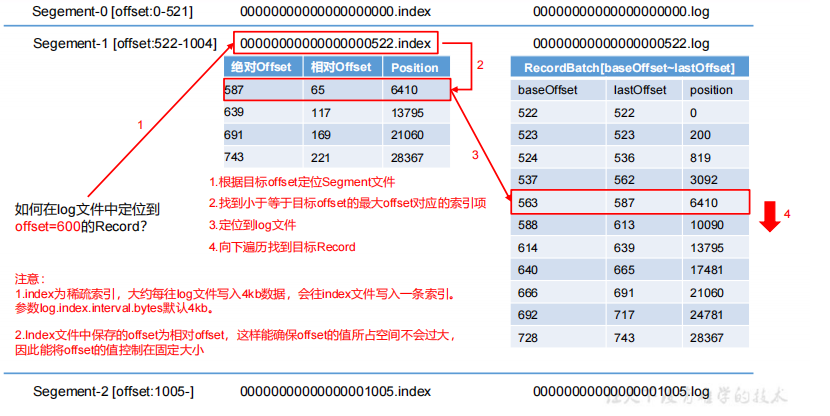
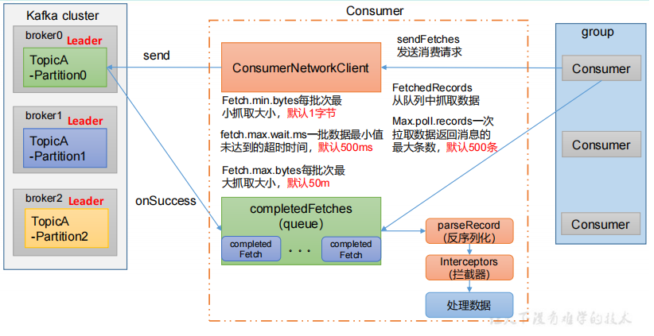

## Kafka专题

### 入门篇

#### Kafka概述

##### 定义

**Kafka传统定义：**Kafka是一个**分布式**的基于**发布/订阅模式的消息队列**（Message Queue），主要应用于大数据实时处理领域。 

**发布订阅**：消息的发布者不会将消息直接发送给特定的订阅者，而是将**发布的消息分为不同的类别**，订阅者**只接收感兴趣的消息**。

**Kafka最新定义 ：** Kafka是一个开源的**分布式事件流平台**（Event Streaming Platform），被数千家公司用于高性能**数据管道、流分析、数据集成和关键任务应用。**

##### 消息队列

###### 概述

目前企业中比较常见的消息队列产品主要有Kafka、ActiveMQ 、RabbitMQ 、RocketMQ等。

在大数据场景主要采用 Kafka 作为消息队列。在 JavaEE 开发中主要采用 ActiveMQ、RabbitMQ、RocketMQ。

###### 传统消息队列的应用场景

传统的消息队列的主要应用场景包括：**缓存消峰**、**解耦**和**异步通信。**

**缓冲/消峰：**有助于控制和优化数据流经过系统的速度，解决生产消息和消费消息的处理速度不一致的情况。


**解耦：**允许你独立的扩展或修改两边的处理过程，只要确保它们遵守同样的接口约束。


**异步通信：**允许用户把一个消息放入队列，但并不立即处理它，然后在需要的时候再去处理它们。


###### 消息队列的两种模式

**1）点对点模式**：消费者主动拉取数据，消息收到后清除消息


**2）发布订阅模式**

- 消费者消费数据之后，不删除数据
- 每个消费者相互独立，都可以消费到数据
- 可以有多个topic主题（浏览、点赞、收藏、评论等）


##### Kafka基础架构

**1.为方便扩展，并提高吞吐量，一个topic分为多个partition**

**2.配合分区的设计，提出消费者组的概念，组内每个消费者并行消费**

**3.为提高可用性，为每个partition增加若干副本，类似NameNode HA**

**4. ZK中记录谁是leader，Kafka2.8.0以后也可以配置不采用ZK**


**（1）Producer：**消息生产者，就是向 Kafka broker 发消息的客户端。 

**（2）Consumer：**消息消费者，向 Kafka broker 取消息的客户端。 

**（3）Consumer Group（CG）：**消费者组，由多个 consumer 组成。**消费者组内每个消费者负责消费不同分区的数据，一个分区只能由一个组内消费者消费；消费者组之间互不影响。**所有的消费者都属于某个消费者组，即**消费者组是逻辑上的一个订阅者**。 

**（4）Broker：**一台 Kafka 服务器就是一个 broker。一个集群由多个 broker 组成。一个broker 可以容纳多个 topic。 

**（5）Topic：**可以理解为一个队列，**生产者和消费者面向的都是一个** **topic**。 

**（6）Partition：**为了实现扩展性，一个非常大的 topic 可以分布到多个 broker（即服务器）上，**一个** **topic** **可以分为多个** **partition**，每个 partition 是一个有序的队列。 

**（7）Replica：**副本。一个 topic 的每个分区都有若干个副本，一个 **Leader** 和若干个**Follower**。 

**（8）Leader：**每个分区多个副本的“主”，生产者发送数据的对象，以及消费者消费数据的对象都是 Leader。 

**（9）Follower：**每个分区多个副本中的“从”，实时从 Leader 中同步数据，保持和Leader 数据的同步。Leader 发生故障时，某个 Follower 会成为新的Leader。

#### Kafka快速入门

##### 安装部署

###### 集群规划

| MQ1   | MQ2   | MQ3   |
| ----- | ----- | ----- |
| zk    | zk    | zk    |
| kafka | kafka | kafka |

###### 集群部署

* 下载地址：http://kafka.apache.org/downloads.html
* 上传到`~`目录下，解压安装包

```shell
tar -zxvf kafka_2.12-3.2.0.tgz
cp -r kafka_2.12-3.2.0 /usr/local/kafka
```

* 修改配置文件

```shell
cd /usr/local/kafka
cd config
vim server.properties
```

主要修改以下内容：

```properties
broker.id=0 # 分别设置0,1,2，保证集群id唯一
advertised.listeners=PLAINTEXT://192.168.183.101:9092 # 改成本机ip地址，一定要配置，不然后面通过java无法连接到
log.dirs=/usr/local/kafka/kafka-logs
zookeeper.connect=192.168.183.101:2181,192.168.183.102,:2181,192.168.183.103:2181/kafka
```

完整详细内容：

```properties
#broker 的全局唯一编号，不能重复，只能是数字。
broker.id=0
#处理网络请求的线程数量
num.network.threads=3
#用来处理磁盘 IO 的线程数量
num.io.threads=8
#发送套接字的缓冲区大小
socket.send.buffer.bytes=102400
#接收套接字的缓冲区大小
socket.receive.buffer.bytes=102400
#请求套接字的缓冲区大小
socket.request.max.bytes=104857600
#kafka 运行日志(数据)存放的路径，路径不需要提前创建，kafka 自动帮你创建，可以配置多个磁盘路径，路径与路径之间可以用"，"分隔
log.dirs=/usr/local/kafka/kafka-logs
#topic 在当前 broker 上的分区个数
num.partitions=1
#用来恢复和清理 data 下数据的线程数量
num.recovery.threads.per.data.dir=1
# 每个 topic 创建时的副本数，默认时 1 个副本
offsets.topic.replication.factor=1
#segment 文件保留的最长时间，超时将被删除
log.retention.hours=168
#每个 segment 文件的大小，默认最大 1G
log.segment.bytes=1073741824
# 检查过期数据的时间，默认 5 分钟检查一次是否数据过期
log.retention.check.interval.ms=300000
#配置连接 Zookeeper 集群地址（在 zk 根目录下创建/kafka，方便管理）
zookeeper.connect=192.168.183.101:2181,192.168.183.102,:2181,192.168.183.103:2181/kafka
```

* 其他机器都配置相同的kafka

* 但是需要修改``server.properties``中的`broker.id=1`、``broker.id=2`


* 配置环境变量

```shell
sudo vim /etc/profile
```

配置如下：

```shell
# KAFKA_HOME
export KAFKA_HOME=/usr/local/kafka
export PATH=$KAFKA_HOME/bin:$PATH
```

刷新环境变量

```shell
source /etc/profile
```

* 启动集群

```shell
./bin/kafka-server-start.sh -daemon ./config/server.properties
```

* 关闭集群

```shell
./bin/kafka-server-stop.sh
```

##### Kafka命令行操作


###### 主题命令操作

* 查看操作主题命令参数

```shell
./bin/kafka-topics.sh
```

| 参数                                              | 描述                                   |
| ------------------------------------------------- | -------------------------------------- |
| --bootstrap-server<String: server toconnect to>   | 连接的 Kafka Broker 主机名称和端口号。 |
| --topic <String: topic>                           | 操作的 topic 名称。                    |
| --create                                          | 创建主题。                             |
| --delete                                          | 删除主题。                             |
| --alter                                           | 修改主题                               |
| --list                                            | 查看所有主题。                         |
| --describe                                        | 查看主题详细描述。                     |
| --partitions <Integer: # of partitions>           | 设置分区数。                           |
| --replication-factor<Integer: replication factor> | 设置分区副本。                         |
| --config <String: name=value>                     | 更新系统默认的配置。                   |

* 查看当前服务器中的所有topic

```shell
./bin/kafka-topics.sh --list --bootstrap-server 192.168.183.101:9092
```

* 创建topic

```shell
./bin/kafka-topics.sh --create --partitions 1 --replication-factor 3 --topic first --bootstrap-server 192.168.183.101:9092
```

选项说明：

`--topic`：定义topic名

`--replication-factor`：定义副本数

`--partitions`：定义分区数

* 查看first主题的详情

```shell
./bin/kafka-topics.sh --describe --topic first --bootstrap-server 192.168.183.101:9092
```


* 修改分区数（注意，分区数只能增加，不能减少）

```shell
./bin/kafka-topics.sh --alter --topic first --partitions 3 --bootstrap-server 192.168.183.101:9092
```

* 再次查看first主题详情

```shell
./bin/kafka-topics.sh --describe --topic first --bootstrap-server 192.168.183.101:9092
```


* 删除topic

```shell
./bin/kafka-topics.sh --delete --topic first --bootstrap-server 192.168.183.101:9092
```

###### 生产者命令行操作

* 查看操作生产者命令参数

```shell
./bin/kafka-console-producer.sh
```

| 参数                                             | 描述                                   |
| ------------------------------------------------ | -------------------------------------- |
| --bootstrap-server <String: server toconnect to> | 连接的 Kafka Broker 主机名称和端口号。 |
| --topic <String: topic>                          | 操作的 topic 名称。                    |

* 发送消息

```shell
./bin/kafka-console-producer.sh --topic first --bootstrap-server 192.168.183.101:9092
```


###### 消费者命令行操作

* 查看操作消费者命令参数

```shell
./bin/kafka-console-consumer.sh
```

| 参数                                             | 描述                                   |
| ------------------------------------------------ | -------------------------------------- |
| --bootstrap-server <String: server toconnect to> | 连接的 Kafka Broker 主机名称和端口号。 |
| --topic <String: topic>                          | 操作的 topic 名称。                    |
| --from-beginning                                 | 从头开始消费。                         |
| --group <String: consumer group id>              | 指定消费者组名称。                     |

* 消费消息

消费first主题中的数据，不会读取历史数据，只会实时接收发送端发送的信息。

```shell
./bin/kafka-console-consumer.sh --topic first --bootstrap-server 192.168.183.101:9092
```

把主题中所有的数据都读取出来（包括历史数据）。

```shell
./bin/kafka-console-consumer.sh --from-beginning --topic first --bootstrap-server 192.168.183.101:9092
```

#### Kafka生产者

##### 生产者消息发送流程

###### 发送原理

在消息发送的过程中，涉及到了**两个线程——main线程和Sender** **线程**。在 main 线程中创建了**一个双端队列RecordAccumulator**。main 线程将消息发送给 RecordAccumulator，Sender 线程不断从 RecordAccumulator 中拉取消息发送到 Kafka Broker。


###### 生产者重要参数列表

| 参数名称                              | 描述                                                         |
| ------------------------------------- | ------------------------------------------------------------ |
| bootstrap.servers                     | 生产者连接集群所需的 broker 地 址 清 单 。 例如192.168.183.101:9092,92.168.183.102:9092,92.168.183.103:9092，可以 设置 1 个或者多个，中间用逗号隔开。注意这里并非需要所有的 broker 地址，因为生产者从给定的 broker 里查找到其他 broker 信息。 |
| key.serializer 和value.serializer     | 指定发送消息的 key 和 value 的序列化类型。一定要写全类名。   |
| buffer.memory                         | RecordAccumulator 缓冲区总大小，默认 32m。                   |
| batch.size                            | 缓冲区一批数据最大值，默认 16k。适当增加该值，可以提高吞吐量，但是如果该值设置太大，会导致数据 |
| linger.ms                             | 如果数据迟迟未达到 batch.size，sender 等待 linger.time 之后就会发送数据。单位 ms，**默认值是 0ms**，表示没 有延迟。生产环境建议该值大小为 5-100ms 之间。 |
| acks                                  | **0**：生产者发送过来的数据，不需要等数据落盘应答。 **1**：生产者发送过来的数据，Leader 收到数据后应答。 **-1（all）**：生产者发送过来的数据，Leader+和 isr 队列 里面的所有节点收齐数据后应答。默认值是-1，**-1 和 all 是等价的**。 |
| max.in.flight.requests.per.connection | 允许最多没有返回 ack 的次数，默认为 5，开启幂等性 要保证该值是 1-5 的数字。 |
| retries                               | 当消息发送出现错误的时候，系统会重发消息。retries 表示重试次数。默认是 int 最大值，2147483647。 如果设置了重试，还想保证消息的有序性，需要设置 MAX_IN_FLIGHT_REQUESTS_PER_CONNECTION=1 否则在重试此失败消息的时候，其他的消息可能发送 成功了。 |
| retry.backoff.ms                      | 两次重试之间的时间间隔，默认是 100ms。                       |
| enable.idempotence                    | 是否开启幂等性，**默认 true**，开启幂等性。                  |
| compression.type                      | 生产者发送的所有数据的压缩方式。默认是 none，也就是不压缩。 支持压缩类型：none、gzip、snappy、lz4 和 zstd。 |

##### 异步发送API

可以从返回的future对象中稍后获取发送的结果，ProducerRecord、RecordMetadata包含了返回的结果信息

###### 普通异步发送

* 需求：创建Kafka生产者，采用异步的方式发送到Kafka Broker


* 代码实战

（1）创建工厂`kafka-demo`

（2）导入依赖

```xml
<dependency>
    <groupId>org.apache.kafka</groupId>
    <artifactId>kafka-clients</artifactId>
    <version>3.1.0</version>
</dependency>
```

（3）创建包名：`com.study.kafka.producer`

（4）编写不带回调函数的API代码

```java
public class CustomProducer {
    public static void main(String[] args) {
        // 1. 创建kafka生产者的配置对象
        Properties properties = new Properties();

        // 2. 给kafka配置对象添加配置信息：bootstrap.servers（连接集群）
        properties.put(ProducerConfig.BOOTSTRAP_SERVERS_CONFIG,"192.168.183.101:9092,192.168.183.102:9092");

        // 指定对应的key和value序列化（必须）：key.serializer，value.serializer
        properties.put(ProducerConfig.KEY_SERIALIZER_CLASS_CONFIG, StringSerializer.class.getName());
        properties.put(ProducerConfig.VALUE_SERIALIZER_CLASS_CONFIG, StringSerializer.class.getName());

        // 3. 创建kafka生产者对象
        KafkaProducer<String, String> kafkaProducer = new KafkaProducer<String, String>(properties);

        // 4. 调用send方法，发送消息
        for (int i = 0; i < 5; i++) {
            kafkaProducer.send(new ProducerRecord<>("first","hello kafka"+i));
            System.out.println("hello kafka"+i);
        }

        // 5. 关闭资源
        kafkaProducer.close();
    }
}
```

在虚拟机上开启Kafka消费者，

```shell
./bin/kafka-console-consumer.sh --from-beginning --topic first --bootstrap-server 192.168.183.101:9092
```


###### 带回调函数的异步发送

回调函数会在 producer 收到 ack 时调用，为异步调用，该方法有两个参数，分别是元数据信息（RecordMetadata）和异常信息（Exception），如果 Exception 为 null，说明消息发送成功，如果 Exception 不为 null，说明消息发送失败。


注意：消息发送失败会自动重试，不需要我们在回调函数中手动重试。

```java
kafkaProducer.send(new ProducerRecord<>("first","hello kafka"+i),(metadata,exception)->{
    if(exception == null)
        System.out.println("主题："+metadata.topic() + "分区："+metadata.partition());
});

// 延迟一会会看到数据发往不同分区
Thread.sleep(2);
```

##### 同步发送API

如果需要使用同步发送，可以在每次发送之后使用get方法，因为producer.send方法返回一个Future类型的结果，Future的get方法会一直阻塞直到该线程的任务得到返回值，也就是broker返回发送成功。


只需在异步发送的基础上，再调用一下 get()方法即可。

```java
kafkaProducer.send(new ProducerRecord<>("first","hello kafka"+i),(metadata,exception)->{
    if(exception == null)
        System.out.println("主题："+metadata.topic() + "分区："+metadata.partition());
}).get();
```

##### 生产者分区

###### 分区好处

- **便于合理使用存储资源**，每个Partition在一个Broker上存储，可以把海量的数据按照分区切割成一块一块数据存储在多台Broker上。合理控制分区的任务，可以实现负载均衡的效果。 
- **提高并行度**，生产者可以以分区为单位发送数据；消费者可以以分区为单位进行消费数据。


###### 生产者发送 消息的分区策略

* **默认的分区器DefaultPartitioner**

在 IDEA 中 ctrl +n，全局查找 DefaultPartitioner。


* **案例一**：将数据发往指定 partition 的情况下，例如，将所有数据发往分区 1 中。

```java
kafkaProducer.send(new ProducerRecord<>("first",1,"","hello kafka"+i))
```

* **案例二**：没有指明 partition 值但有 key 的情况下，将 key 的 hash 值与 topic 的 partition 数进行取余得到 partition 值。

```java
kafkaProducer.send(new ProducerRecord<>("first","","hello kafka"+i))
```

###### 自定义分区器

**需求**：例如实现一个分区器实现，发送过来的数据中如果包含`hutao`，就发往 0 号分区，不包含 `hutao`，就发往 1 号分区。 

**实现步骤**：

* 定义类实现Partitioner接口
* 重写partition()方法

```java
/**
 * 1. 实现接口 Partitioner
 * 2. 实现 3 个方法:partition,close,configure
 * 3. 编写 partition 方法,返回分区号
 */
public class MyPartitioner implements Partitioner {
    /**
     * * 返回信息对应的分区
     *  * @param topic      主题
     *  * @param key        消息的 key
     *  * @param keyBytes   消息的 key 序列化后的字节数组
     *  * @param value      消息的 value
     *  * @param valueBytes 消息的 value 序列化后的字节数组
     *  * @param cluster    集群元数据可以查看分区信息
     */
    @Override
    public int partition(String topic, Object key, byte[] keyBytes, Object value, byte[] valueBytes, Cluster cluster) {
        // 获取消息
        String msg = value.toString();

        // 创建partition
        int partition;

        // 判断消息是否包含 hutao
        if(msg.contains("hutao"))
            partition = 0;
        else
            partition = 1;

        return partition;
    }

    // 关闭资源
    @Override
    public void close() {

    }

    // 配置方法
    @Override
    public void configure(Map<String, ?> map) {

    }
}
```

* 使用分区器的方法，在生产者的配置中添加分区器参数。

```java
public class CustomProducer {
    public static void main(String[] args) throws InterruptedException, ExecutionException {
        // 1. 创建kafka生产者的配置对象
        Properties properties = new Properties();

        // 2. 给kafka配置对象添加配置信息：bootstrap.servers（连接集群）
        properties.put(ProducerConfig.BOOTSTRAP_SERVERS_CONFIG,"192.168.183.101:9092,192.168.183.103:9092");

        // 指定对应的key和value序列化（必须）：key.serializer，value.serializer
        properties.put(ProducerConfig.KEY_SERIALIZER_CLASS_CONFIG, StringSerializer.class.getName());
        properties.put(ProducerConfig.VALUE_SERIALIZER_CLASS_CONFIG, StringSerializer.class.getName());

        // 添加自定义分区器
        properties.put(ProducerConfig.PARTITIONER_CLASS_CONFIG,MyPartitioner.class.getName());

        // 3. 创建kafka生产者对象
        KafkaProducer<String, String> kafkaProducer = new KafkaProducer<String, String>(properties);

        // 4. 调用send方法，发送消息
        for (int i = 0; i < 5; i++) {

            String msg = i%2==0?"hutao":"";

            kafkaProducer.send(new ProducerRecord<>("first","",msg+"hello kafka"+i),(metadata,exception)->{
                if(exception == null)
                    System.out.println("主题："+metadata.topic() + "分区："+metadata.partition());
            });
        }

        // 5. 关闭资源
        kafkaProducer.close();
    }
}
```


##### 生产经验-生产者如何提高吞吐量


```java
public class CustomProducerParameters {
    public static void main(String[] args) throws InterruptedException, ExecutionException {
        // 1. 创建kafka生产者的配置对象
        Properties properties = new Properties();

        // 2. 给kafka配置对象添加配置信息：bootstrap.servers（连接集群）
        properties.put(ProducerConfig.BOOTSTRAP_SERVERS_CONFIG,"192.168.183.101:9092,192.168.183.103:9092");

        // 指定对应的key和value序列化（必须）：key.serializer，value.serializer
        properties.put(ProducerConfig.KEY_SERIALIZER_CLASS_CONFIG, StringSerializer.class.getName());
        properties.put(ProducerConfig.VALUE_SERIALIZER_CLASS_CONFIG, StringSerializer.class.getName());

        // RecordAccumulator：缓冲区大小，默认 32M：buffer.memory
        properties.put(ProducerConfig.BUFFER_MEMORY_CONFIG,1024*1024*32);

        // batch.size：批次大小，默认 16K
        properties.put(ProducerConfig.BATCH_SIZE_CONFIG,16*1024*1024);

        // linger.ms：等待时间，默认 0
        properties.put(ProducerConfig.LINGER_MS_CONFIG,1);

        // compression.type：压缩，默认 none，可配置值 gzip、snappy、lz4 和 zstd
        properties.put(ProducerConfig.COMPRESSION_TYPE_CONFIG,"snappy");

        // 3. 创建kafka生产者对象
        KafkaProducer<String, String> kafkaProducer = new KafkaProducer<String, String>(properties);

        // 4. 调用send方法，发送消息
        for (int i = 0; i < 5; i++) {

            kafkaProducer.send(new ProducerRecord<>("first","","hello kafka"+i),(metadata,exception)->{
                if(exception == null)
                    System.out.println("主题："+metadata.topic() + "分区："+metadata.partition());
            });
        }

        // 5. 关闭资源
        kafkaProducer.close();
    }
}
```

##### 生产经验-数据可靠性

###### 回顾发送流程


###### ack应答原理


###### 代码实战

```java
// 设置acks
properties.put(ProducerConfig.ACKS_CONFIG,"all");

// 重试次数 retries，默认是 int 最大值，2147483647
properties.put(ProducerConfig.RETRIES_CONFIG,3);
```

##### 生产经验-数据去重

###### 数据传递语义

- **至少一次（At Least Once）**= ACK级别设置为-1 **+** 分区副本大于等于2 **+** ISR里应答的最小副本数量大于等于2 
- **最多一次（At Most Once）=** ACK级别设置为0 

- **总结：**

  - At Least Once可以保证数据不丢失，但是**不能保证数据不重复**；

  - At Most Once可以保证数据不重复，但是**不能保证数据不丢失**。 

- **精确一次（Exactly Once）：**对于一些非常重要的信息，比如和钱相关的数据，要求数据既不能重复也不丢失。

Kafka 0.11版本以后，引入了一项重大特性：**幂等性和事务**。

###### 幂等性

* 幂等性原理

**幂等性**就是指Producer不论向Broker发送多少次重复数据，Broker端都只会持久化一条，保证了不重复。

**精确一次（Exactly Once）=幂等性 + 至少一次（ ack=-1 +分区副本数>=2 + ISR最小副本数量>=2） 。**

**重复数据的判断标准**：具有<PID, Partition, SeqNumber>相同主键的消息提交时，Broker只会持久化一条。

1. 其中PID是Kafka每次重启都会分配一个新的；
2. Partition 表示分区号；
3. Sequence Number是单调自增的。

所以幂等性**只能保证的是在单分区单会话内不重复**。 


* 如何使用幂等性

开启参数`enable.idempotence`默认为true，false关闭。

###### 生产者事务

* Kafka事务原理

**说明：开启事务，必须开启幂等性。**


* Kafka的事务一共有如下5个API

```java
// 设置事务id（必须），事务id任意起名
properties.put(ProducerConfig.TRANSACTIONAL_ID_CONFIG,"transaction_id_1");

// 1 初始化事务
void initTransactions();

// 2 开启事务
void beginTransaction() throws ProducerFencedException;

// 3 在事务内提交已经消费的偏移量（主要用于消费者）
void sendOffsetsToTransaction(Map<TopicPartition, OffsetAndMetadata> offsets,
                              String consumerGroupId) throws 
    ProducerFencedException;

// 4 提交事务
void commitTransaction() throws ProducerFencedException;

// 5 放弃事务（类似于回滚事务的操作）
void abortTransaction() throws ProducerFencedException;
```

* 单个Producer，使用事务保证消息的仅一次发送

```java
public class CustomProducerTransactions {
    public static void main(String[] args) throws InterruptedException, ExecutionException {
        // 1. 创建kafka生产者的配置对象
        Properties properties = new Properties();

        // 2. 给kafka配置对象添加配置信息：bootstrap.servers（连接集群）
        properties.put(ProducerConfig.BOOTSTRAP_SERVERS_CONFIG,"192.168.183.101:9092,192.168.183.103:9092");

        // 指定对应的key和value序列化（必须）：key.serializer，value.serializer
        properties.put(ProducerConfig.KEY_SERIALIZER_CLASS_CONFIG, StringSerializer.class.getName());
        properties.put(ProducerConfig.VALUE_SERIALIZER_CLASS_CONFIG, StringSerializer.class.getName());

        // 设置事务id（必须），事务id任意起名
        properties.put(ProducerConfig.TRANSACTIONAL_ID_CONFIG,"transaction_id_1");

        // 3. 创建kafka生产者对象
        KafkaProducer<String, String> kafkaProducer = new KafkaProducer<String, String>(properties);


        // 初始化事务
        kafkaProducer.initTransactions();

        // 开启事务
        kafkaProducer.beginTransaction();

        try {
            // 4. 调用send方法，发送消息
            for (int i = 0; i < 5; i++) {

                String msg = i%2==0?"hutao":"";

                kafkaProducer.send(new ProducerRecord<>("first","",msg+"hello kafka"+i),(metadata,exception)->{
                    if(exception == null)
                        System.out.println("主题："+metadata.topic() + "分区："+metadata.partition());
                });
            }
            // 故意出错
            int i = 1 / 0;

            // 提交事务
            kafkaProducer.commitTransaction();
        }catch (Exception e){
            // 放弃事务（回滚）
            kafkaProducer.abortTransaction();
        }finally {
            // 关闭事务
            kafkaProducer.close();
        }

        // 5. 关闭资源
        kafkaProducer.close();
    }
}
```

##### 生产经验-数据有序


##### 生产经验-数据乱序

kafka在1.x版本**之前**保证数据单分区有序，条件如下：

- **max.in.flight.requests.per.connection**=1（不需要考虑是否开启幂等性）。 

kafka在1.x及**以后**版本保证数据单分区有序，条件如下：

- 开启幂等性
  - **max.in.flight.requests.per.connection需要设置小于等于5。**

- 未开启幂等性
  - **max.in.flight.requests.per.connection需要设置为1。**

原因说明：因为在kafka1.x以后，启用幂等后，kafka服务端会缓存producer发来的最近5个request的元数据，故无论如何，都可以保证最近5个request的数据都是有序的。


#### Kafka Broker

##### Kafka Broker工作流程

###### Zookeeper存储的Kafka消息

* 启动Zookeeper客户端

```shell
./bin/zkCli.sh
```

* 通过`ls`命令可以查看kafka相关信息

```shell
ls /kafka
```


###### Kafka Broker 总体工作流程


###### Broker 重要参数

| 参数名称                                | 描述                                                         |
| --------------------------------------- | ------------------------------------------------------------ |
| replica.lag.time.max.ms                 | ISR中，如果Follower长时间未向Leader 发送通 信请求或同步数据，则该Follower将被踢出ISR。 该时间阈值，**默认30s** |
| auto.leader.rebalance.enable            | 默认是true。自动Leader Partition平衡。                       |
| leader.imbalance.per.brokerpercentage   | 默认是10%。每个broker允许的不平衡的leader 的比率。如果每个broker 超过了这个值，控制器 会触发leader的平衡。 |
| leader.imbalance.check.interval.seconds | 默认值300秒。检查leader负载是否平衡的间隔时间。              |
| log.segmentbytes                        | Kafka中log日志是分成一块块存储的，此配置是 指log日志划分成块的大小，默认值1G |
| log.index.interval.bytes                | 默认4kb，kafka里面每当写入了4kb 大小的日志 (.log)，然后就往index文件里面记录一个索引。 |
| log.retention.hours                     | Kafka中数据保存的时间，默认7天。                             |
| log.retention.minutes                   | Kafka中数据保存的时间，分钟级别，默认关闭。                  |
| log.retention.ms                        | Kafka中数据保存的时间，毫秒级别，默认关闭。                  |
| log.retention.check. interval.ms        | 检查数据是否保存超时的间隔，默认是5分钟。                    |
| log.retention.bytes                     | 默认等于-1，表示无穷大。超过设置的所有日志总 大小，删除最早的segment. |
| log.cleanup.policy                      | 默认是delete，表示所有数据启用删除策略; 如果设置值为compact，表示所有数据启用压缩策 略。 |
| num.io.threads                          | 默认是8。负责写磁盘的线程数。整个参数值要占 总核数的50%。    |
| num.replica.fetchers                    | 副本拉取线程数，这个参数占总核数的50%的1/3                   |
| log.retention.hours                     | Kafka中数据保存的时间，默认7天。                             |
| log.retention.minutes                   | Kafka中数据保存的时间，分钟级别，默认关闭。                  |
| log.retention.ms                        | Kafka中数据保存的时间，毫秒级别，默认关闭。                  |
| log.retention.check. interval.ms        | 检查数据是否保存超时的间隔，默认是5分钟。                    |
| log.retention.bytes                     | 默认等于-1，表示无穷大。超过设置的所有日志总 大小，删除最早的segment. |
| log.cleanup.policy                      | 默认是delete，表示所有数据启用删除策略; 如果设置值为compact，表示所有数据启用压缩策 略。 |
| num.io.threads                          | 默认是8。负责写磁盘的线程数。整个参数值要占 总核数的50%。    |
| num.replica.fetchers                    | 副本拉取线程数，这个参数占总核数的50%的1/3                   |
| num.network.threads                     | 默认是3。数据传输线程数，这个参数占总核数的 50%的2/3。       |
| log.flush.interval.messages             | 强制页缓存刷写到磁盘的条数，默认是long 的最大值，9223372036854775807。一般不建议修改， 交给系统自己管理。 |
| log.flush.interval.ms                   | 每隔多久，刷数据到磁盘，默认是null。一般不建 议修改，交给系统自己管理。 |

##### 生产经验—节点服役和退役

###### 服役新节点

**1）新节点准备**：拷贝MQ3，也就是`192.168.183.103`这台虚拟机，新的虚拟机命名为MQ4，地址为`192.168.183.104`。

```shell
 vi /etc/sysconfig/network-scripts/ifcfg-ens33
```


* 修改主机名称

```shell
vi /etc/hostname
```

* 然后重启MQ4
* 然后修改MQ4中的kafka的`server.properties`配置，将`broker.id`修改为3，以及`advertised.listeners`。

* 删除MQ4中的kafka的`kafka-logs`以及`logs`两个文件夹

```shell
rm -rf kafka-logs
rm -rf logs
```

* 然后启动MQ1、MQ2、MQ3集群
* 然后单独启动MQ4的kafka。

**2）执行负载均衡操作**

* 创建一个要均衡的主体

`vim topics-to-move.json`

```json
{
    topics": [
        {"topic": "first"}
    ],
    "version": 1
}
```

* 生成一个负载均衡的计划

```shell
./bin/kafka-reassign-partitions.sh --topics-to-move-json-file topics-to-move.json --broker-list "0,1,2,3" --generate --bootstrap-server 192.168.183.101:9092
```


* 创建副本存储计划（所有副本存储在broker0、broker1、broker3中）

```shell
vim increase-replication-factor.json
```

输入如下内容：

```json
{
    "version":1,
    "partitions":[
        {
            "topic":"first",
            "partition":0,
            "replicas":[2,3,0],
            "log_dirs":["any","any","any"]
        },{
            "topic":"first",
            "partition":1,
            "replicas":[3,0,1],
            "log_dirs":["any","any","any"]
        },{
            "topic":"first",
            "partition":2,
            "replicas":[0,1,2],
            "log_dirs":["any","any","any"]
        }
    ]
}
```

* 执行副本存储计划

```shell
./bin/kafka-reassign-partitions.sh --reassignment-json-file increase-replication-factor.json --execute --bootstrap-server 192.168.183.101:9092
```


* 验证副本存储计划

```shell
./bin/kafka-reassign-partitions.sh --reassignment-json-file increase-replication-factor.json --verify --bootstrap-server 192.168.183.101:9092
```

###### 退役旧节点

**1）执行负载均衡操作**：先按照退役一台节点，生成执行计划，然后按照服役时操作流程执行负载均衡。

* 创建一个要均衡的主题

```shell
vim topics-to-move.json
```

内容如下：

```shell
{
    topics": [
        {"topic": "first"}
    ],
    "version": 1
}
```

* 创建执行计划

```shell
./bin/kafka-reassign-partitions.sh --topics-to-move-json-file topics-to-move.json --broker-list "0,1,2" --generate --bootstrap-server 192.168.183.101:9092
```

输出如下：

```shell
Current partition replica assignment
{"version":1,"partitions":[{"topic":"first","partition":0,"replicas":[2,3,1],"log_dirs":["any","any","any"]},{"topic":"first","partition":1,"replicas":[3,2,0],"log_dirs":["any","any","any"]},{"topic":"first","partition":2,"replicas":[0,3,1],"log_dirs":["any","any","any"]}]}

Proposed partition reassignment configuration
{"version":1,"partitions":[{"topic":"first","partition":0,"replicas":[2,1,0],"log_dirs":["any","any","any"]},{"topic":"first","partition":1,"replicas":[0,2,1],"log_dirs":["any","any","any"]},{"topic":"first","partition":2,"replicas":[1,0,2],"log_dirs":["any","any","any"]}]}
```

* 创建副本存储计划（所有副本存储在broker0，broker1，broker2中）

```shell
{"version":1,"partitions":[{"topic":"first","partition":0,"replicas":[2,1,0],"log_dirs":["any","any","any"]},{"topic":"first","partition":1,"replicas":[0,2,1],"log_dirs":["any","any","any"]},{"topic":"first","partition":2,"replicas":[1,0,2],"log_dirs":["any","any","any"]}]}
```

* 执行副本存储计划

```shell
./bin/kafka-reassign-partitions.sh --reassignment-json-file increase-replication-factor.json --execute --bootstrap-server 192.168.183.101:9092
```

* 验证副本存储计划

```shell
./bin/kafka-reassign-partitions.sh --reassignment-json-file increase-replication-factor.json --verify --bootstrap-server 192.168.183.101:9092
```

**2）执行停止命令**：在MQ4上执行停止命令即可。

```she
./bin/kafka-server-stop.sh
```

##### Kafka副本

###### 副本基本信息

（1）Kafka 副本作用：提高数据可靠性。 

（2）Kafka 默认副本 1 个，生产环境一般配置为 2 个，保证数据可靠性；太多副本会增加磁盘存储空间，增加网络上数据传输，降低效率。

（3）Kafka 中副本分为：Leader 和 Follower。Kafka 生产者只会把数据发往 Leader，然后 Follower 找 Leader 进行同步数据。

（4）Kafka 分区中的所有副本统称为 AR（Assigned Repllicas）。

AR = ISR + OSR

**ISR**，表示和 Leader 保持同步的 Follower 集合。如果 Follower 长时间未向 Leader 发送通信请求或同步数据，则该 Follower 将被踢出 ISR。该时间阈值由 **replica.lag.time.max.ms**参数设定，默认 30s。Leader 发生故障之后，就会从 ISR 中选举新的 Leader。

**OSR**，表示 Follower 与 Leader 副本同步时，延迟过多的副本。

###### Leader选举过程

Kafka 集群中有一个 broker 的 Controller 会被选举为 Controller Leader，负责**管理集群broker 的上下线**，所有 topic 的分区副本分配和 Leader 选举等工作。

Controller 的信息同步工作是依赖于 Zookeeper 的。


（1）创建一个新的 topic，4 个分区，4 个副本

```shell
./bin/kafka-topics.sh --create --topic test --partitions 4 --replication-factor 4 --bootstrap-server 192.168.183.101:9092
```

（2）查看 Leader 分布情况

```shell
./bin/kafka-topics.sh --describe --topic test --bootstrap-server 192.168.183.101:9092
```


（3）停止掉 MQ4的 kafka 进程，并查看 Leader 分区情况

```shell
./bin/kafka-server-stop.sh 
./bin/kafka-topics.sh --describe --topic test --bootstrap-server 192.168.183.101:9092
```


###### Leader和Follower故障处理细节

**LEO（Log End Offset）：每个副本的最后一个offset，LEO其实就是最新的offset + 1。**

**HW（High Watermark）：所有副本中最小的LEO** **。** 


###### 分区副本分配

如果 kafka 服务器只有 4 个节点，那么设置 kafka 的分区数大于服务器台数，在 kafka底层如何分配存储副本呢？

比如，创建 16 分区，3 个副本

（1）创建一个新的 topic，名称为 second。

```shell
./bin/kafka-topics.sh --create --topic second --partitions 16 --replication-factor 3 --bootstrap-server 192.168.183.101:9092
```

（2）查看分区和副本情况。

```shell
./bin/kafka-topics.sh --describe --topic second --bootstrap-server 192.168.183.101:9092
```


###### 生产经验–手动调整分区副本存储

在生产环境中，每台服务器的配置和性能不一致，但是Kafka只会根据自己的代码规则创建对应的分区副本，就会导致个别服务器存储压力较大。所有需要手动调整分区副本的存储。

需求：创建一个新的topic，4个分区，两个副本，名称为three。将该topic的所有副本都存储到broker0和broker1两台服务器上。


> 相对均匀的分配，前两台尽量多用，后面两台尽量少用

手动调整分区存储的步骤如下：

* 创建一个新的topic，名称为three

```shell
./bin/kafka-topics.sh --create --topic three --partitions 4 --replication-factor 2 --bootstrap-server 192.168.183.101:9092
```

* 查看分区副本存储情况

```shell
./bin/kafka-topics.sh --describe --topic three --bootstrap-server 192.168.183.101:9092
```

* 创建副本存储计划（所有副本都指定存储在broker0、broker1中）

```shell
vim increase-replication-factor.json
```

内容如下：

```json
{
    "version":1,
    "partitions":[
        {"topic":"three","partition":0,"replicas":[0,1]},
        {"topic":"three","partition":1,"replicas":[0,1]},
        {"topic":"three","partition":2,"replicas":[1,0]},
        {"topic":"three","partition":3,"replicas":[1,0]}
    ] 
}
```

* 执行副本存储计划

```shell
./bin/kafka-reassign-partitions.sh --reassignment-json-file increase-replication-factor.json --execute --bootstrap-server 192.168.183.101:9092
```

* 验证副本存储计划

```shell
./bin/kafka-reassign-partitions.sh --reassignment-json-file increase-replication-factor.json --verify --bootstrap-server 192.168.183.101:9092
```

* 查看分区副本存储情况

```shell
./bin/kafka-topics.sh --describe --topic three --bootstrap-server 192.168.183.101:9092
```

###### 生产经验–Leader Partition负载均衡

正常情况下，Kafka**本身会自动把Leader Partition均匀分散在各个机器上**，来保证每台机器的读写吞吐量都是均匀的。但是如果**某些broker宕机，会导致Leader Partition过于集中在其他少部分几台broker上**，这会导致少数几台broker的读写请求压力过高，其他宕机的broker重启之后都是follower partition，读写请求很低，**造成集群负载不均衡**。  


| 参数名称                                | 描述                                                         |
| --------------------------------------- | ------------------------------------------------------------ |
| auto.leader.rebalance.enable            | 默认是 true。 自动 Leader Partition 平衡。生产环 境中，leader 重选举的代价比较大，可能会带来性能影响，建议设置为 false 关闭。 |
| leader.imbalance.per.broker.percentage  | 默认是 10%。每个 broker 允许的不平衡的 leader 的比率。如果每个 broker 超过了这个值，控制器 会触发 leader 的平衡。 |
| leader.imbalance.check.interval.seconds | 默认值 300 秒。检查 leader 负载是否平衡的间隔 时间。         |

###### 生产经验–增加副本因子

在生产环境当中，由于某个主题的重要等级需要提升，考虑增加副本。副本数的增加需要先制定计划，然后根据计划执行。

* 创建topic

```shell
./bin/kafka-topics.sh --create --topic four --partitions 3 --replication-factor 1 --bootstrap-server 192.168.183.101:9092
```

* 手动增加副本存储

（1）创建副本存储计划（所有副本都指定存储在 broker0、broker1、broker2 中）。

```shell
vim increase-replication-factor.json
```

内容如下：

```json
{
    "version":1,"partitions":[
        {
            "topic":"four","partition":0,"replicas":[0,1,2]
        },
        {
            "topic":"four","partition":1,"replicas":[0,1,2]
        },
        {
            "topic":"four","partition":2,"replicas":[0,1,2]
        }
    ]
}
```

（2）执行副本存储计划。

```shell
./bin/kafka-reassign-partitions.sh --reassignment-json-file increase-replication-factor.json --execute --bootstrap-server 192.168.183.101:9092
```

##### 文件存储

###### Kafka文件存储机制

**1）Topic数据的存储机制**

Topic是逻辑上的概念，而partition是物理上的概念，**每个partition对应于一个log文件**，该log文件中存储的就是Producer生产的数据。**Producer生产的数据会被不断追加到该log文件末端**，为防止log文件过大导致数据定位效率低下，Kafka采取了**分片**和**索引**机制， **将每个partition分为多个segment**。每个segment包括：``.index``文件、``.log``文件和``.timeindex``等文件。这些文件位于一个文件夹下，该文件夹的命名规则为：topic名称+分区序号，例如：first-0。


**2）思考：Topic数据到底存储在什么位置？**

* 启动生产者，并发送消息

```shell
./bin/kafka-console-producer.sh --bootstrap-server 192.168.183.101:9092 --topic first

>hello
```

* 查看 MQ1（或者 MQ2、MQ3）的``/usr/local/kafka/datas/first-1`` （first-0、first-2）路径上的文件。

````shell
ll /usr/local/kafka/kafka-logs/first-1
````


* 直接查看 log 日志，发现是乱码。

```shell
cat  00000000000000000000.log
```


* 通过工具查看 index 和 log 信息。

```shell
kafka-run-class.sh kafka.tools.DumpLogSegments --files ./00000000000000000000.index
```


```shell
kafka-run-class.sh kafka.tools.DumpLogSegments --files ./00000000000000000000.log
```


**3）index文件和 log 文件详解**



| 参数                     | 描述                                                         |
| ------------------------ | ------------------------------------------------------------ |
| log.segment.bytes        | Kafka 中 log 日志是分成一块块存储的，此配置是指 log 日志划分成块的大小，默认值 1G。 |
| log.index.interval.bytes | 默认 4kb，kafka 里面每当写入了 4kb 大小的日志（.log），然后就往 index 文件里面记录一个索引。 稀疏索引。 |

###### 文件清理策略

Kafka 中**默认的日志保存时间为 7 天**，可以通过调整如下参数修改保存时间。

- log.retention.hours，最低优先级小时，默认 7 天。 
- log.retention.minutes，分钟。 
- log.retention.ms，最高优先级毫秒。 
- log.retention.check.interval.ms，负责设置检查周期，默认 5 分钟。

那么日志一旦超过了设置的时间，怎么处理呢？

Kafka 中提供的日志清理策略有 **delete** 和 **compact** 两种。 

* delete 日志删除：将过期数据删除

```properties
# 所有数据启用删除策略
log.cleanup.policy = delete
```

（1）基于时间：默认打开。以 segment 中所有记录中的最大时间戳作为该文件时间戳。

（2）基于大小：默认关闭。超过设置的所有日志总大小，删除最早的 segment。

`log.retention.bytes`，默认等于-1，表示无穷大。

**思考：**如果一个 segment 中有一部分数据过期，一部分没有过期，怎么处理？


* compact日志压缩：对于相同key的不同value值，只保留最后一个版本。

```properties
# 所有数据启用压缩策略
log.cleanup.policy = compact
```


压缩后的offset可能是不连续的，比如上图中没有6，当从这些offset消费消息时，将会拿到比这个offset大的offset对应的消息，实际上会拿到offset为7的消息，并从这个位置开始消费。

**这种策略只适合特殊场景**，比如消息的key是用户ID，value是用户的资料，通过这种压缩策略，整个消息集里就保存了所有用户最新的资料。 

##### 高效读写数据

**1）Kafka本身是分布式集群，可以采用分区技术，并行度高**

**2）读数据采用稀疏索引，可以快速定位要消费的数据**

**3）顺序写磁盘**

Kafka 的 producer 生产数据，要写入到 log 文件中，写的过程是一直追加到文件末端，为顺序写。**官网有数据表明**，同样的磁盘，顺序写能到600M/s，而随机写只有 100K/s。这与磁盘的机械机构有关，顺序写之所以快，是因为其省去了大量磁头寻址的时间。


**4）页缓存+ 零拷贝技术**

**零拷贝：**Kafka的数据加工处理操作交由Kafka生产者和Kafka消费者处理。**Kafka Broker应用层不关心存储的数据，所以就不用走应用层，传输效率高。**

**PageCache页缓存：**Kafka重度依赖底层操作系统提供的PageCache功能。当上层有写操作时，操作系统只是将数据写入PageCache。当读操作发生时，先从PageCache中查找，如果找不到，再去磁盘中读取。实际上PageCache是把尽可能多的空闲内存都当做了磁盘缓存来使用。


| 参数                        | 描述                                                         |
| --------------------------- | ------------------------------------------------------------ |
| log.flush.interval.messages | 强制页缓存刷写到磁盘的条数，默认是 long 的最大值， 9223372036854775807。一般不建议修改，交给系统自己管 理。 |
| log.flush.interval.ms       | 每隔多久，刷数据到磁盘，默认是 null。一般不建议修改， 交给系统自己管理。 |

#### Kafka 消费者

##### Kafka消费方式

- **pull（拉）模 式：**consumer采用从broker中主动拉取数据。**Kafka采用这种方式。**
- **push（推）模式：**Kafka没有采用这种方式，因为由broker决定消息发送速率，很难适应所有消费者的消费速率。例如推送的速度是50m/s，Consumer1、Consumer2就来不及处理消息。

pull模式不足之处是，如果Kafka没有数据，消费者可能会陷入循环中，一直返回空数据。


##### Kafka消费者工作流程

###### 消费者总体工作流程


###### 消费者组原理

**1）消费者组**

Consumer Group（CG）：消费者组，由多个consumer组成。形成一个消费者组的条件，是所有消费者的groupid相同。 

- **消费者组内每个消费者负责消费不同分区的数据，一个分区只能由一个组内消费者消费。** 
- **消费者组之间互不影响**。所有的消费者都属于某个消费者组，即**消费者组是逻辑上的一个订阅者。**


**2）消费者组初始化流程**

* coordinator：辅助实现消费者组的初始化和分区的分配。

`coordinator节点选择 = groupid的hashcode值 % 50（__consumer_offsets的分区数量）`

例如： groupid的hashcode值 = 1，1% 50 = 1，那么__consumer_offsets 主题的1号分区，在哪个broker上，就选择这个节点的coordinator作为这个消费者组的老大。消费者组下的所有的消费者提交offset的时候就往这个分区去提交offset。 


**3）消费者组详细消费流程**



###### 消费者重要参数

| 参数名称                              | 描述                                                         |
| ------------------------------------- | ------------------------------------------------------------ |
| bootstrap.servers                     | 向Kafka集群建立初始连接用到的host/port列表。                 |
| key.deserializer 和value.deserializer | 指定接收消息的key和 value的反序列化类型。一定要写全 类名。   |
| group.id                              | 标记消费者所属的消费者组。                                   |
| enable.auto.commit                    | 默认值为true，消费者会自动周期性地向服务器提交偏移 量。      |
| auto.commit.interval.ms               | 如果设置了enable.auto.commit的值为true，则该值定义了 消费者偏移量向Kafka提交的频率，默认5so |
| auto.offset.reset                     | 当Kafka中没有初始偏移量或当前偏移量在服务器中不存在 （如，数据被删除了)，该如何处理?earliest:自动重置偏 移量到最早的偏移量。latest:默认，自动重置偏移量为最 新的偏移量。none:如果消费组原来的（previous）偏移量 不存在，则向消费者抛异常。anything:向消费者抛异常。 |
| offsets.topic.num.partitions          | consumer_offsets的分区数，默认是50个分区。                   |
| heartbeat.interval.ms                 | Kafka消费者和coordinator之间的心跳时间，默认3s. 该条目的值必须小于session.timeout.ms ，也不应该高于 session.timeout.ms的1/3。 |
| session.timeout.ms                    | Kafka消费者和coordinator 之间连接超时时间，默认45s。 超过该值，该消费者被移除，消费者组执行再平衡。 |
| max.poll.interval.ms                  | 消费者处理消息的最大时长，默认是5分钟。超过该值，该 消费者被移除，消费者组执行再平衡。 |
| fetch.min.bytes                       | 默认1个字节。消费者获取服务器端一批消息最小的字节 数。       |
| fetch.max.wait.ms                     | 默认500ms。如果没有从服务器端获取到一批数据的最小字 节数。该时间到，仍然会返回数据。 |
| fetch.max.bytes                       | 默认Default:52428800 (50 m)。消费者获取服务器端一批 消息最大的字节数。如果服务器端一批次的数据大于该值 (50m）仍然可以拉取回来这批数据，因此，这不是一个绝 对最大值。一批次的大小受message.max.bytes( broker config) or max.message.bytes(topic config）影响。 |
| max.poll.records                      | 一次poll拉取数据返回消息的最大条数，默认是500条。            |

##### 消费者API

###### 独立消费者案例（订阅主题）

1）需要：创建一个独立消费者，消费first主题中数据


**注意：**在消费者 API 代码中必须配置消费者组 id。命令行启动消费者不填写消费者组id 会被自动填写随机的消费者组 id。 

2）实现步骤

* 创建包名：`com.study.kafka.consumer`
* 编写代码

```java
public class CustomConsumer {
    public static void main(String[] args) {
        // 1. 创建消费者的配置对象
        Properties properties = new Properties();

        // 2. 给消费者配置对象添加参数

        // 连接集群
        properties.put(ConsumerConfig.BOOTSTRAP_SERVERS_CONFIG,"192.168.183.101:9092");

        // 反序列化
        properties.put(ConsumerConfig.KEY_DESERIALIZER_CLASS_CONFIG, StringDeserializer.class.getName());
        properties.put(ConsumerConfig.VALUE_DESERIALIZER_CLASS_CONFIG, StringDeserializer.class.getName());

        // 配置消费者组id（任意起名）
        properties.put(ConsumerConfig.GROUP_ID_CONFIG,"test");

        // 3. 创建消费者对象
        KafkaConsumer<String, String> kafkaConsumer = new KafkaConsumer<String, String>(properties);

        // 4. 注册要消费的主题（可以消费多个主题）
        ArrayList<String> topics = new ArrayList<>();
        topics.add("first");
        kafkaConsumer.subscribe(topics);

        // 5. 消费数据
        while (true){
            ConsumerRecords<String,String> consumerRecords  = kafkaConsumer.poll(Duration.ofSeconds(1));
            for(ConsumerRecord<String,String> consumerRecord:consumerRecords)
                System.out.println(consumerRecord);
        }
    }
}
```

运行生产者代码或者命令行操作，进行演示，这里命令行操作：

```shell
./bin/kafka-console-producer.sh --bootstrap-server 192.168.183.101:9092 --topic first

> hello
```

观察消费者代码的输出：


###### 独立消费者案例（订阅分区）

1）需求：创建一个独立消费者，消费first主题0号分区的数据


2）实现步骤

```java
public class CustomConsumerPartition {
    public static void main(String[] args) {

        Properties properties = new Properties();
        properties.put(ConsumerConfig.BOOTSTRAP_SERVERS_CONFIG,"192.168.183.101:9092");
        properties.put(ConsumerConfig.KEY_DESERIALIZER_CLASS_CONFIG, StringDeserializer.class.getName());
        properties.put(ConsumerConfig.VALUE_DESERIALIZER_CLASS_CONFIG, StringDeserializer.class.getName());
        properties.put(ConsumerConfig.GROUP_ID_CONFIG,"test");

        KafkaConsumer<String, String> kafkaConsumer = new KafkaConsumer<String, String>(properties);

        // 消费某个主题的某个分区数据
        ArrayList<TopicPartition> topics = new ArrayList<>();;
        topics.add(new TopicPartition("first",0));
        kafkaConsumer.assign(topics);

        while (true){
            ConsumerRecords<String,String> consumerRecords = kafkaConsumer.poll(Duration.ofSeconds(1));
            for (ConsumerRecord<String,String> consumerRecord:consumerRecords)
                System.out.println(consumerRecord);
        }

    }
}
```

3）测试，通过生产者代码通过指定分区0发送数据，然后观察消费者


###### 消费者组案例

1）需求：测试同一个主题的分区数据，只能由一个消费者组中的一个消费。


2）实例：复制两份基础消费者的代码(CustomConsumer1,CustomConsumer2)，在 IDEA 中同时启动，即可启动同一个消费者组中的三个消费者。

```java
public class CustomConsumer {
    public static void main(String[] args) {
        // 1. 创建消费者的配置对象
        Properties properties = new Properties();

        // 2. 给消费者配置对象添加参数

        // 连接集群
        properties.put(ConsumerConfig.BOOTSTRAP_SERVERS_CONFIG,"192.168.183.101:9092");

        // 反序列化
        properties.put(ConsumerConfig.KEY_DESERIALIZER_CLASS_CONFIG, StringDeserializer.class.getName());
        properties.put(ConsumerConfig.VALUE_DESERIALIZER_CLASS_CONFIG, StringDeserializer.class.getName());

        // 配置消费者组id（任意起名）
        properties.put(ConsumerConfig.GROUP_ID_CONFIG,"test");

        // 3. 创建消费者对象
        KafkaConsumer<String, String> kafkaConsumer = new KafkaConsumer<String, String>(properties);

        // 4. 注册要消费的主题（可以消费多个主题）
        ArrayList<String> topics = new ArrayList<>();
        topics.add("first");
        kafkaConsumer.subscribe(topics);

        // 5. 消费数据
        while (true){
            ConsumerRecords<String,String> consumerRecords  = kafkaConsumer.poll(Duration.ofSeconds(1));
            for(ConsumerRecord<String,String> consumerRecord:consumerRecords)
                System.out.println(consumerRecord);
        }
    }
}
```

3）测试：生产者代码使用自定义分区的

```java
@Override
public int partition(String topic, Object key, byte[] keyBytes, Object value, byte[] valueBytes, Cluster cluster) {
    int paritionCount = cluster.partitionCountForTopic(topic);


    //主题分区数量
    return valueBytes.hashCode() % paritionCount;
    //自定义发送的分区
}
```

然后每个消费者代码会接收一个分区的数据。

##### 生产经验–分区的分配以及再平衡

###### 概述

1、一个consumer group中有多个consumer组成，一个 topic有多个partition组成，现在的问题是，**到底由哪个consumer来消费哪个partition的数据。** 

2、Kafka有四种主流的分区分配策略： **Range、RoundRobin、Sticky、CooperativeSticky**。可以通过配置参数**partition.assignment.strategy**，修改分区的分配策略。默认策略是Range + CooperativeSticky。Kafka可以同时使用多个分区分配策略。


| 参数名称                      | 描述                                                         |
| ----------------------------- | ------------------------------------------------------------ |
| heartbeat.interval.ms         | Kafka消费者和coordinator之间的心跳时间，默认3s。 该条目的值必须小于session.timeout.ms，也不应该高于 session.timeout.ms的1/3。 |
| session.timeout.ms            | Kafka消费者和coordinator之间连接超时时间，默认45s。超 过该值，该消费者被移除，消费者组执行再平衡。 |
| max.poll.interval.ms          | 消费者处理消息的最大时长，默认是5分钟。超过该值，该 消费者被移除，消费者组执行再平衡。 |
| partition.assignment.strategy | 消费者分区分配策略，默认策略是Range + CooperativeSticky。Kafka 可以同时使用多个分区分配策略。 可 以 选 择 的 策 略 包 括 ： Range 、 RoundRobin 、 Sticky 、 CooperativeSticky |

###### Range以及再平衡

**1）Range分区策略原理**

Range 是对每个 topic 而言的。

首先对同一个 topic 里面的**分区按照序号进行排序**，并对**消费者按照字母顺序进行排序**。

假如现在有 7 个分区，3 个消费者，排序后的分区将会是0,1,2,3,4,5,6；消费者排序完之后将会是C0,C1,C2。

例如，7/3 = 2 余 1 ，除不尽，那么 消费者 C0 便会多消费 1 个分区。 8/3=2余2，除不尽，那么C0和C1分别多消费一个。

通过 partitions数/consumer数 来决定每个消费者应该消费几个分区。如果除不尽，那么前面几个消费者将会多消费 1 个分区。

**注意**：如果只是针对 1 个 topic 而言，C0消费者多消费1个分区影响不是很大。但是如果有 N 多个 topic，那么针对每个 topic，消费者C0都将多消费 1 个分区，topic越多，C0消费的分区会比其他消费者明显多消费 N 个分区。

**容易产生数据倾斜！**


**2）Range分区分配策略案例**

* 修改主题first为7个分区

```shell
./bin/kafka-topics.sh --alter --topic first --partitions 7 --bootstrap-server 192.168.183.101:9092
```

* 查看当前主题分区情况

```shell
./bin/kafka-topics.sh --describe --topic first --bootstrap-server 192.168.183.101:9092
```

* 复制 CustomConsumer 类，创建 CustomConsumer2。这样可以由三个消费者CustomConsumer、CustomConsumer1、CustomConsumer2 组成消费者组，组名都为“test”，

  同时启动 3 个消费者。


* 启动 CustomProducer 生产者，发送 500 条消息，随机发送到不同的分区。

```java
public class CustomProducer {
    public static void main(String[] args) throws InterruptedException, ExecutionException {
        // 1. 创建kafka生产者的配置对象
        Properties properties = new Properties();

        // 2. 给kafka配置对象添加配置信息：bootstrap.servers（连接集群）
        properties.put(ProducerConfig.BOOTSTRAP_SERVERS_CONFIG,"192.168.183.101:9092,192.168.183.103:9092");

        // 指定对应的key和value序列化（必须）：key.serializer，value.serializer
        properties.put(ProducerConfig.KEY_SERIALIZER_CLASS_CONFIG, StringSerializer.class.getName());
        properties.put(ProducerConfig.VALUE_SERIALIZER_CLASS_CONFIG, StringSerializer.class.getName());

        // 3. 创建kafka生产者对象
        KafkaProducer<String, String> kafkaProducer = new KafkaProducer<String, String>(properties);

        // 4. 调用send方法，发送消息
        for (int i = 0; i < 500; i++) {


            kafkaProducer.send(new ProducerRecord<>("first","hello kafka"+i),(metadata,exception)->{
                if(exception == null)
                    System.out.println("主题："+metadata.topic() + "分区："+metadata.partition());
            });
            Thread.sleep(10);
        }

        // 5. 关闭资源
        kafkaProducer.close();
    }
}
```

说明：Kafka 默认的分区分配策略就是 Range + CooperativeSticky，所以不需要修改策略。

* 观看 3 个消费者分别消费哪些分区的数据。


**3）Range分区分配再平衡案例**

* 停止掉 0 号消费者，快速重新发送消息观看结果（45s 以内，越快越好）。 

0 号消费者挂掉后，消费者组需要按照超时时间 45s 来判断它是否退出，所以需要等待，时间到了 45s 后，判断它真的退出就会把任务分配给其他 broker 执行。

* 再次重新发送消息观看结果（45s 以后）。

消费者 0 已经被踢出消费者组，所以重新按照 range 方式分配。

###### RoundRobin以及再平衡

**1）RoundRobin分区策略原理**

RoundRobin 针对集群中**所有Topic而言**。

RoundRobin 轮询分区策略，是把**所有的 partition 和所有的consumer 都列出来**，然后**按照 hashcode 进行排序**，最后通过**轮询算法**来分配 partition 给到各个消费者。


**2）RoundRobin分区分配策略案例**

* 依次在 CustomConsumer、CustomConsumer1、CustomConsumer2 三个消费者代码中修改分区分配策略为 RoundRobin。

```java
properties.put(ConsumerConfig.PARTITION_ASSIGNMENT_STRATEGY_CONFIG, RoundRobinAssignor.class.getName());
```

* 重启 3 个消费者，重复发送消息的步骤，观看分区结果。


3）**RoundRobin** **分区分配再平衡案例**

* 停止掉 0 号消费者，快速重新发送消息观看结果（45s 以内，越快越好）。 

0 号消费者挂掉后，消费者组需要按照超时时间 45s 来判断它是否退出，所以需要等待，时间到了 45s 后，判断它真的退出就会把任务分配给其他 broker 执行。

* 再次重新发送消息观看结果（45s 以后）

消费者 0 已经被踢出消费者组，所以重新按照 RoundRobin 方式分配。

###### Sticky以及再平衡

**粘性分区定义：**可以理解为分配的结果带有“粘性的”。即在执行一次新的分配之前，考虑上一次分配的结果，尽量少的调整分配的变动，可以节省大量的开销。

粘性分区是 Kafka 从 0.11.x 版本开始引入这种分配策略，**首先会尽量均衡的放置分区到消费者上面**，在出现同一消费者组内消费者出现问题的时候，会**尽量保持原有分配的分区不变化**。

1）需求：设置主题为 first，7 个分区；准备 3 个消费者，采用粘性分区策略，并进行消费，观察消费分配情况。然后再停止其中一个消费者，再次观察消费分配情况。 

2）步骤

* 修改分区分配策略为粘性。

注意：3 个消费者都应该注释掉，之后重启 3 个消费者，如果出现报错，全部停止等会再重启，或者**修改为全新的消费者组**。

```java
ArrayList<String> startegys = new ArrayList<>();
startegys.add(StickyAssignor.class.getName());
properties.put(ConsumerConfig.PARTITION_ASSIGNMENT_STRATEGY_CONFIG, startegys);
```

* 使用同样的生产者发送 500 条消息。

可以看到会尽量保持分区的个数近似划分分区。

##### offset位移

###### offset的默认维护位置


__consumer_offsets 主题里面采用 key 和 value 的方式存储数据。key 是 group.id+topic+分区号，value 就是当前 offset 的值。每隔一段时间，kafka 内部会对这个 topic 进行compact，也就是每个 group.id+topic+分区号就保留最新数据。

**1）消费offset案例**

* 思想：__consumer_offsets 为 Kafka 中的 topic，那就可以通过消费者进行消费。 
* **在配置文件 config/consumer.properties 中添加配置 exclude.internal.topics=false，默认是 true，表示不能消费系统主题。为了查看该系统主题数据，所以该参数修改为 false。**（不用重启）
* 采用命令行方式，创建一个新的topic

```shell
./bin/kafka-topics.sh --create --topic hutao --partitions 2 --replication-factor 2 --bootstrap-server 192.168.183.101:909
```

* 启动生产者往`hutao`主题生产数据

```shell
./bin/kafka-console-producer.sh --topic hutao --bootstrap-server 192.168.183.101:9092
```

* 启动消费者消费`hutao`主题数据

```shell
./bin/kafka-console-consumer.sh --topic hutao --group test --bootstrap-server 192.168.183.101:9092
```

注意：指定消费者组名称，更好观察数据存储位置（key 是 group.id+topic+分区号）。

* 查看消费者消费主题__consumer_offsets。

```shell
bin/kafka-console-consumer.sh --topic __consumer_offsets --consumer.config config/consumer.properties --formatter "kafka.coordinator.group.GroupMetadataManager\$OffsetsMessageFormatter" --from-beginning --bootstrap-server 192.168.183.101:9092 
```

> 0.9版本以前维护在zookeeper中，0.9以后，维护在系统主题中

###### 自动提交offset

为了使我们能够专注于自己的业务逻辑，Kafka提供了自动提交offset的功能。

5s

自动提交offset的相关参数：

- **enable.auto.commit：**是否开启自动提交offset功能，默认是true。消费者会自动周期性地向服务器提交偏移量。
- **auto.commit.interval.ms：**自动提交offset的时间间隔，默认是5s


**1）消费者自动提交offset**

```java
// 自动提交
properties.put(ConsumerConfig.ENABLE_AUTO_COMMIT_CONFIG,true);
// 提交时间间隔
properties.put(ConsumerConfig.AUTO_COMMIT_INTERVAL_MS_CONFIG,1000);
```

###### 手动提交offset

虽然自动提交offset十分简单便利，但由于其是基于时间提交的，开发人员难以把握offset提交的时机。因此Kafka还提供了手动提交offset的API。

手动提交offset的方法有两种：分别是**commitSync（同步提交）和commitAsync（异步提交）**。两者的相同点是，都会将**本次提交的一批数据最高的偏移量提交**；不同点是，**同步提交阻塞当前线程**，一直到提交成功，并且会自动失败重试（由不可控因素导致，也会出现提交失败）；而**异步提交则没有失败重试机制，故有可能提交失败**。 

- **commitSync（同步提交）：必须等待offset提交完毕，再去消费下一批数据。**
- **commitAsync（异步提交） ：发送完提交offset请求后，就开始消费下一批数据了。**


**1）同步提交offset**

由于同步提交 offset 有失败重试机制，故更加可靠，但是由于一直等待提交结果，提交的效率比较低。以下为同步提交 offset 的示例。

```java
public class CustomConsumerByHandSync {
    public static void main(String[] args) {
        // 1. 创建消费者的配置对象
        Properties properties = new Properties();

        // 2. 给消费者配置对象添加参数

        // 连接集群
        properties.put(ConsumerConfig.BOOTSTRAP_SERVERS_CONFIG,"192.168.183.101:9092");

        // 反序列化
        properties.put(ConsumerConfig.KEY_DESERIALIZER_CLASS_CONFIG, StringDeserializer.class.getName());
        properties.put(ConsumerConfig.VALUE_DESERIALIZER_CLASS_CONFIG, StringDeserializer.class.getName());

        // 配置消费者组id（任意起名）
        properties.put(ConsumerConfig.GROUP_ID_CONFIG,"test5");

        // 手动提交
        properties.put(ConsumerConfig.ENABLE_AUTO_COMMIT_CONFIG,false);

        // 3. 创建消费者对象
        KafkaConsumer<String, String> kafkaConsumer = new KafkaConsumer<String, String>(properties);

        // 4. 注册要消费的主题（可以消费多个主题）
        ArrayList<String> topics = new ArrayList<>();
        topics.add("first");
        kafkaConsumer.subscribe(topics);

        // 5. 消费数据
        while (true){
            ConsumerRecords<String,String> consumerRecords  = kafkaConsumer.poll(Duration.ofSeconds(1));
            for(ConsumerRecord<String,String> consumerRecord:consumerRecords)
                System.out.println(consumerRecord);

            // 手动提交offset
            kafkaConsumer.commitSync(); // 同步
        }
    }
}
```

**2）异步提交offset**

虽然同步提交 offset 更可靠一些，但是由于其会阻塞当前线程，直到提交成功。因此吞吐量会受到很大的影响。因此更多的情况下，会选用异步提交 offset 的方式。

```java
kafkaConsumer.commitAsync(); // 异步提交
```

###### 指定Offset消费

`auto.offset.reset = earliest | latest | none` 默认是 latest。 

当 Kafka 中没有初始偏移量（消费者组第一次消费）或服务器上不再存在当前偏移量时（例如该数据已被删除），该怎么办？ 

（1）earliest：自动将偏移量重置为最早的偏移量，--from-beginning。 

（2）latest（默认值）：自动将偏移量重置为最新偏移量。

（3）none：如果未找到消费者组的先前偏移量，则向消费者抛出异常。


 （4）任意指定 offset 位移开始消费

```java
public class CustomConsumerSeek {
    public static void main(String[] args) {
        // 1. 消费者配置对象
        Properties properties = new Properties();

        // 2. 配置信息
        properties.put(ConsumerConfig.BOOTSTRAP_SERVERS_CONFIG,"192.168.183.101:9092");
        properties.put(ConsumerConfig.KEY_DESERIALIZER_CLASS_CONFIG, StringDeserializer.class.getName());
        properties.put(ConsumerConfig.VALUE_DESERIALIZER_CLASS_CONFIG, StringDeserializer.class.getName());
        properties.put(ConsumerConfig.GROUP_ID_CONFIG,"test6");

        // 3. 消费者对象
        KafkaConsumer<String,String> kafkaConsumer = new KafkaConsumer<String, String>(properties);

        // 4. 订阅主题
        ArrayList<String> topics = new ArrayList<>();
        topics.add("first");

        kafkaConsumer.subscribe(topics);

        // 指定位置进行消费
        Set<TopicPartition> assignment = kafkaConsumer.assignment();

        // 保证分区分配方案已经制定完毕
        while (assignment.size() == 0){
            kafkaConsumer.poll(Duration.ofSeconds(1));
            // 获取消费者分区分配信息（有了分区分配信息才能开始消费）
            assignment = kafkaConsumer.assignment();
        }

        // 指定offset
        // 遍历所有分区，并指定 offset 从 100 的位置开始消费
        for(TopicPartition topicPartition:assignment){
            kafkaConsumer.seek(topicPartition,100);
        }

        // 5. 消费数据
        while (true){

            ConsumerRecords<String,String> consumerRecords = kafkaConsumer.poll(Duration.ofSeconds(1));

            for(ConsumerRecord<String,String> consumerRecord : consumerRecords)
                System.out.println(consumerRecord);

        }
    }
}
```

注意：每次执行完，需要修改消费者组名；

###### 指定时间消费

需求：在生产环境中，会遇到最近消费的几个小时数据异常，想重新按照时间消费。

例如要求按照时间消费前一天的数据，怎么处理？

```java
// 指定位置进行消费
Set<TopicPartition> assignment = kafkaConsumer.assignment();

// 保证分区分配方案已经制定完毕
while (assignment.size() == 0){
    kafkaConsumer.poll(Duration.ofSeconds(1));
    // 获取消费者分区分配信息（有了分区分配信息才能开始消费）
    assignment = kafkaConsumer.assignment();
}

// 希望把时间转换为对应的offset
HashMap<TopicPartition,Long> topicPartitionLongHashMap = new HashMap<>();
// 封装集合存储，每个分区对应一天前的数据
for(TopicPartition topicPartition:assignment){ 
    topicPartitionLongHashMap.put(topicPartition,System.currentTimeMillis() - 1 * 32*3600*1000);
}
// 获取从 1 天前开始消费的每个分区的 offset
Map<TopicPartition, OffsetAndTimestamp> topicPartitionOffsetAndTimestampMap = kafkaConsumer.offsetsForTimes(topicPartitionLongHashMap);

// 遍历每个分区，对每个分区设置消费时间。
for (TopicPartition topicPartition : assignment) {
    OffsetAndTimestamp offsetAndTimestamp = topicPartitionOffsetAndTimestampMap.get(topicPartition);
    // 根据时间指定开始消费的位置
    if (offsetAndTimestamp != null) {
        kafkaConsumer.seek(topicPartition,
                           offsetAndTimestamp.offset());
    }
}
```

###### 漏消费和重复消费分析

**重复消费：**已经消费了数据，但是 offset 没提交。

**漏消费：**先提交 offset 后消费，有可能会造成数据的漏消费。

（1）场景1：重复消费。自动提交offset引起。 


（2）场景1：漏消费。设置offset为手动提交，当offset被提交时，数据还在内存中未落盘，此时刚好消费者线程被kill掉，那么offset已经提交，但是数据未处理，导致这部分内存中的数据丢失。


思考：怎么能做到既不漏消费也不重复消费呢？详看消费者事务。

##### 生产经验–消费者事务

如果想完成Consumer端的精准一次性消费，那么**需要Kafka消费端将消费过程和提交offset过程做原子绑定**。此时我们需要将Kafka的offset保存到支持事务的自定义介质（比如MySQL）。这部分知识会在后续项目部分涉及。


##### 生产经验–数据积压（消费者如何提高吞吐量）

1）如果是Kafka消费能力不足，则可以考虑增加Topic的分区数，并且同时提升消费组的消费者数量，**消费者数 = 分区数。**（两者缺一不可） 


2）如果是下游的数据处理不及时：**提高每批次拉取的数量**。批次拉取数据过少（拉取数据/处理时间 < 生产速度），使处理的数据小于生产的数据，也会造成数据积压。


| 参数名称         | 描述                                                         |
| ---------------- | ------------------------------------------------------------ |
| fetch.max.bytes  | 默认Default: 52428800 (50 m)。消费者获取服务器端一批消息最大的字节数。如果服务器端一批次的数据大于该值 (50m）仍然可以拉取回来这批数据，因此，这不是一个绝 对最大值。一批次的大小受message.max.bytes(broker config） or max.message.bytes (topic config）影响。 |
| max.poll.records | 一次poll拉取数据返回消息的最大条数，默认是500条              |

#### Kafka-Eagle监控

##### 概述

Kafka-Eagle 框架可以监控 Kafka 集群的整体运行情况，在生产环境中经常使用。

##### MySQL环境准备

Kafka-Eagle 的安装依赖于 MySQL，MySQL 主要用来存储可视化展示的数据。

##### Kafka环境准备

**1）关闭集群**

```shell
cd /usr/local/kafka
./bin/kafka-server-stop.sh
cd /usr/local/zookeeper
./bin/zkServer.sh stop
```

2）**修改/usr/local/kafka/bin/kafka-server-start.sh** **命令中**

```shell
if [ "x$KAFKA_HEAP_OPTS" = "x" ]; then
 export KAFKA_HEAP_OPTS="-Xmx1G -Xms1G"
fi
```

为

```sh
if [ "x$KAFKA_HEAP_OPTS" = "x" ]; then
    export KAFKA_HEAP_OPTS="-server -Xms2G -Xmx2G -XX:PermSize=128m -XX:+UseG1GC -XX:MaxGCPauseMillis=200 -XX:ParallelGCThreads=8 -XX:ConcGCThreads=5 -XX:InitiatingHeapOccupancyPercent=70"
    export JMX_PORT="9999"
	#export KAFKA_HEAP_OPTS="-Xmx1G -Xms1G"
fi
```

###### Kafka-Eagle安装

* 下载：**https://www.kafka-eagle.org/**
* 上传压缩包 `kafka-eagle-bin-2.0.8.tar.gz`到集群`~`目录
* 解压到本地，并拷贝至`/usr/local`

```shell
tar -zxvf kafka-eagle-bin-2.1.0.tar.gz 

cp -r kafka-eagle-bin-2.1.0 /usr/local/kafka-eagle
```

* 进入刚才解压的目录

```shell
cd /usr/local/kafka-eagle/
```


* 将`efak-web-xxx`解压至`/usr/local`，并且修改名称

```shell
tar -zxvf efak-web-2.1.0-bin.tar.gz -C /usr/local/

cd ..

mv efak-web-2.1.0/ efak-web
```

* 修改配置文件 `/usr/local/efak-web/conf/system-config.properties`

```shell
vim system-config.properties
```

内容如下：

```properties
######################################
# multi zookeeper & kafka cluster list
# Settings prefixed with 'kafka.eagle.' will be deprecated, use 'efak.' instead
######################################
# 修改1
efak.zk.cluster.alias=cluster1
cluster1.zk.list=192.168.183.101:2181,192.168.183.102:2181,192.168.183.103:2181/kafka
#cluster2.zk.list=xdn10:2181,xdn11:2181,xdn12:2181

######################################
# zookeeper enable acl
######################################
cluster1.zk.acl.enable=false
cluster1.zk.acl.schema=digest
cluster1.zk.acl.username=test
cluster1.zk.acl.password=test123

######################################
# broker size online list
######################################
cluster1.efak.broker.size=20

######################################
# zk client thread limit
######################################
# 修改2
kafka.zk.limit.size=32

######################################
# EFAK webui port
######################################
efak.webui.port=8048

######################################
# EFAK enable distributed
######################################
#efak.distributed.enable=false
#efak.cluster.mode.status=master
#efak.worknode.master.host=localhost
#efak.worknode.port=8085

######################################
# kafka jmx acl and ssl authenticate
######################################
cluster1.efak.jmx.acl=false
cluster1.efak.jmx.user=keadmin
cluster1.efak.jmx.password=keadmin123
cluster1.efak.jmx.ssl=false
cluster1.efak.jmx.truststore.location=/data/ssl/certificates/kafka.truststore
cluster1.efak.jmx.truststore.password=ke123456

######################################
# kafka offset storage
######################################
# 修改3
cluster1.efak.offset.storage=kafka
#cluster2.efak.offset.storage=zk

######################################
# kafka jmx uri
######################################
cluster1.efak.jmx.uri=service:jmx:rmi:///jndi/rmi://%s/jmxrmi

######################################
# kafka metrics, 15 days by default
######################################
efak.metrics.charts=true
efak.metrics.retain=15

######################################
# kafka sql topic records max
######################################
efak.sql.topic.records.max=5000
efak.sql.topic.preview.records.max=10

######################################
# delete kafka topic token
######################################
efak.topic.token=keadmin

######################################
# kafka sasl authenticate
######################################
cluster1.efak.sasl.enable=false
cluster1.efak.sasl.protocol=SASL_PLAINTEXT
cluster1.efak.sasl.mechanism=SCRAM-SHA-256
cluster1.efak.sasl.jaas.config=org.apache.kafka.common.security.scram.ScramLoginModule required username="kafka" password="kafka-eagle";
cluster1.efak.sasl.client.id=
cluster1.efak.blacklist.topics=
cluster1.efak.sasl.cgroup.enable=false
cluster1.efak.sasl.cgroup.topics=
cluster2.efak.sasl.enable=false
cluster2.efak.sasl.protocol=SASL_PLAINTEXT
cluster2.efak.sasl.mechanism=PLAIN
cluster2.efak.sasl.jaas.config=org.apache.kafka.common.security.plain.PlainLoginModule required username="kafka" password="kafka-eagle";
cluster2.efak.sasl.client.id=
cluster2.efak.blacklist.topics=
cluster2.efak.sasl.cgroup.enable=false
cluster2.efak.sasl.cgroup.topics=

######################################
# kafka ssl authenticate
######################################
cluster3.efak.ssl.enable=false
cluster3.efak.ssl.protocol=SSL
cluster3.efak.ssl.truststore.location=
cluster3.efak.ssl.truststore.password=
cluster3.efak.ssl.keystore.location=
cluster3.efak.ssl.keystore.password=
cluster3.efak.ssl.key.password=
cluster3.efak.ssl.endpoint.identification.algorithm=https
cluster3.efak.blacklist.topics=
cluster3.efak.ssl.cgroup.enable=false
cluster3.efak.ssl.cgroup.topics=

######################################
# kafka sqlite jdbc driver address
######################################
#efak.driver=org.sqlite.JDBC
#efak.url=jdbc:sqlite:/hadoop/kafka-eagle/db/ke.db
#efak.username=root
#efak.password=www.kafka-eagle.org

######################################
# kafka mysql jdbc driver address
######################################
# 修改4
#efak.driver=com.mysql.cj.jdbc.Driver
#efak.url=jdbc:mysql://127.0.0.1:3306/ke?useUnicode=true&characterEncoding=UTF-8&zeroDateTimeBehavior=convertToNull
efak.username=root
efak.password=123456
efak.driver=com.mysql.cj.jdbc.Driver
efak.url=jdbc:mysql://192.168.183.101:3306/ke?useUnicode=true&characterEncoding=UTF-8&zeroDateTimeBehavior=convertToNull
efak.username=root
efak.password=123456
```

* 添加环境变量

```shell
vim /etc/profile
```

添加内容如下：

```shell
export KE_HOME=/usr/local/efak-web
export PATH=$KE_HOME/bin:$PATH
```

刷新环境变量

```shell
source /etc/profile
```

* 启动集群

```shell
cd /usr/local/zookeeper

./bin/zkServer.sh start

cd /usr/local/kafka

./bin/kafka-server-start.sh -daemon ./config/server.properties
```

之后启动efak

```shell
cd /usr/local/efak-web
./bin/ke.sh start
```


* 如果需要停止efak，执行命令

```shell
./bin/ke.sh stop
```

###### Kafka-Eagle页面操作

1）登录页面查看监控数据：http://192.168.183.101:8048


#### Kafka-Kraft模式

###### Kafka-Kraft架构


左图为 Kafka 现有架构，元数据在 zookeeper 中，运行时动态选举 controller，由controller 进行 Kafka 集群管理。右图为 kraft 模式架构（实验性），不再依赖 zookeeper 集群，而是用三台 controller 节点代替 zookeeper，元数据保存在 controller 中，由 controller 直接进行 Kafka 集群管理。

这样做的好处有以下几个： 

- Kafka 不再依赖外部框架，而是能够独立运行； 
- controller 管理集群时，不再需要从 zookeeper 中先读取数据，集群性能上升； 
- 由于不依赖 zookeeper，集群扩展时不再受到 zookeeper 读写能力限制； 
- controller 不再动态选举，而是由配置文件规定。这样我们可以有针对性的加强
- controller 节点的配置，而不是像以前一样对随机 controller 节点的高负载束手无策。 

###### Kafka-Kraft集群部署

1）再次解压一份 kafka 安装包

2）重命名为 kafka2

```shell
cp -r kafka_2.12-3.2.0 /usr/local/kafka2
```

3）然后修改``/usr/local/kafka2/config/kraft/server.properties`` 配置文件，注意这个配置文件的位置

```properties
#kafka 的角色（controller 相当于主机、broker 节点相当于从机，主机类似 zk 功 能）
process.roles=broker, controller
#节点 ID
node.id=1
#controller 服务协议别名
controller.listener.names=CONTROLLER
#全 Controller 列表
controller.quorum.voters=1@192.168.183.101:9093,2@192.168.183.102:9093,3@192.168.183.103:9093
#不同服务器绑定的端口
listeners=PLAINTEXT://:9092,CONTROLLER://:9093
#broker 服务协议别名
inter.broker.listener.name=PLAINTEXT
#broker 对外暴露的地址
advertised.listeners=PLAINTEXT://192.168.183.101:9092
#协议别名到安全协议的映射
listener.security.protocol.map=CONTROLLER:PLAINTEXT,PLAINTEXT:PLAINTEXT,SSL:SSL,SASL_PLAINTEXT:SASL_PLAINTEXT,SASL_SSL:SASL_SSL
#kafka 数据存储目录
log.dirs=/usr/local/kafka2/kafka-logs
```

在 MQ2和 MQ3上 需 要 对 `node.id` 相应改变 ， 值需要和``controller.quorum.voters`` 对应。 

在 MQ2和 MQ3上需要根据各自的主机名称，修改相应``advertised.Listeners`` 地址。

* 初始化集群数据目录

1）首先生成存储目录唯一 ID。

```shell
./bin/kafka-storage.sh random-uuid

P7Ixjk46TNaIlb2_wb0fKw
```

2）用该 ID 格式化 kafka 存储目录（三台节点）。

```shell
./bin/kafka-storage.sh format -t P7Ixjk46TNaIlb2_wb0fKw -c /usr/local/kafka2/config/kraft/server.properties
```


* 启动kafka集群

```shell
 ./bin/kafka-server-start.sh -daemon ./config/kraft/server.properties
```

* 停止kafka集群

```shell
./bin/kafka-server-stop.sh
```

* 使用生产者以及消费者进行测试

### 外部系统集成篇

#### 集成SpringBoot

##### 概述

SpringBoot 是一个在 JavaEE 开发中非常常用的组件。可以用于 Kafka 的生产者，也可以用于 SpringBoot 的消费者。


##### SpringBoot环境准备

1）创建一个Spring Initializer


2）添加项目依赖


##### SpringBoot生产者

* 修改 SpringBoot 核心配置文件 `application.propeties`, 添加生产者相关信息

```properties
# 应用名称
spring.application.name=springboot-kafka
# 应用服务 WEB 访问端口
server.port=8080

# 指定kafka的地址
spring.kafka.bootstrap-servers=192.168.183.101:9092,192.168.183.102:9092,192.168.183.103:9092

# 指定key和value的序列化其
spring.kafka.producer.key-serializer=org.apache.kafka.common.serialization.StringSerializer
spring.kafka.producer.value-serializer=org.apache.kafka.common.serialization.StringSerializer
```

* 创建 controller 从浏览器接收数据, 并写入指定的 topic

```java
@RestController
public class ProducerController {
    // Kafka 模板用来向 kafka 发送数据
    @Autowired
    KafkaTemplate<String,String> kafkaTemplate;

    @GetMapping("/send")
    public String send(String msg){
        kafkaTemplate.send("first",msg);
        return "ok";
    }
}
```

* 在浏览器中给``/send``接口发送数据，地址：http://127.0.0.1:8080/send

##### SpringBoot消费者

* 修改 SpringBoot 核心配置文件 `application.propeties`

```properties
# 指定kafka的地址
spring.kafka.bootstrap-servers=192.168.183.101:9092,192.168.183.102:9092,192.168.183.103:9092

# 指定key和value的序列化其
spring.kafka.consumer.key-deserializer=org.apache.kafka.common.serialization.StringDeserializer
spring.kafka.consumer.value-deserializer=org.apache.kafka.common.serialization.StringDeserializer

# 指定消费者组的group_id
spring.kafka.consumer.group-id=test
```

* 创建类消费Kafka中指定的topic的数据

```java
@Configuration
public class ConsumerController {
    // 指定要监听的topic
    @KafkaListener(topics = "first")
    public void receive(String msg){ // 参数：收到的value
        System.out.println("收到的信息："+msg);
    }
}
```

* 向 first 主题发送数据


### 生产调优手册

#### Kafka硬件配置选择

##### 场景说明

##### 服务器台数选择

##### 磁盘选择

##### 内存选择

### 源码解析

#### 源码环境准备

##### 源码下载地址

https://kafka.apache.org/downloads


##### 安装JDK&Scala

https://www.scala-lang.org/download/2.12.0.html

需要在 Windows 本地安装 JDK 8 或者 JDK8 以上版本。

需要在 Windows 本地安装 Scala2.12。

##### 加载源码

将 kafka-3.0.0-src.tgz 源码包，解压到非中文目录。例如：``D:\SourceCode\kafka-3.2.0-src``。

打开 IDEA，点击 `File->Open…->源码包解压的位置`。

##### 安装gradle

Gradle 是类似于 maven 的代码管理工具。安卓程序管理通常采用 Gradle。

IDEA 自动帮你下载安装，下载的时间比较长（网络慢，需要 1 天时间，有 VPN 需要几分钟）


由于速度可能会很慢，因此在`在C:\Users\用户.gradle`下创建``init.gradle``文件

```json
allprojects {
    repositories {
    maven {
        //允许使用外部库
        allowInsecureProtocol = true
        //阿里云镜像
        url "http://maven.aliyun.com/nexus/content/groups/public"
    	}
    }
}
```

#### 生产者源码

##### 发送流程


##### 初始化

###### 生产者main线程初始化


###### 生产者sender线程初始化


###### 程序入口

1）从用户自己编写的 main 方法开始阅读

```java
public class CustomConsumer {
    public static void main(String[] args) {
        // 1. 创建消费者的配置对象
        Properties properties = new Properties();

        // 2. 给消费者配置对象添加参数

        // 连接集群
        properties.put(ConsumerConfig.BOOTSTRAP_SERVERS_CONFIG,"192.168.183.101:9092");

        // 反序列化
        properties.put(ConsumerConfig.KEY_DESERIALIZER_CLASS_CONFIG, StringDeserializer.class.getName());
        properties.put(ConsumerConfig.VALUE_DESERIALIZER_CLASS_CONFIG, StringDeserializer.class.getName());

        // 配置消费者组id（任意起名）
        properties.put(ConsumerConfig.GROUP_ID_CONFIG,"test3");

        // 3. 创建消费者对象
        KafkaConsumer<String, String> kafkaConsumer = new KafkaConsumer<String, String>(properties);

        // 4. 注册要消费的主题（可以消费多个主题）
        ArrayList<String> topics = new ArrayList<>();
        topics.add("first");
        kafkaConsumer.subscribe(topics);

        // 5. 消费数据
        while (true){
            ConsumerRecords<String,String> consumerRecords  = kafkaConsumer.poll(Duration.ofSeconds(1));
            for(ConsumerRecord<String,String> consumerRecord:consumerRecords)
                System.out.println(consumerRecord);
        }
    }
}
```

###### 生产者main线程初始化

点击 main()方法中的 KafkaProducer()。``KafkaProducer.java``

```java
KafkaProducer(ProducerConfig config,
              Serializer<K> keySerializer,
              Serializer<V> valueSerializer,
              ProducerMetadata metadata,
              KafkaClient kafkaClient,
              ProducerInterceptors<K, V> interceptors,
              Time time) {
    try {
        this.producerConfig = config;
        this.time = time;

        // 获取事务id
        String transactionalId = config.getString(ProducerConfig.TRANSACTIONAL_ID_CONFIG);

        // 获取客户端id
        this.clientId = config.getString(ProducerConfig.CLIENT_ID_CONFIG);

        // 日志（不重要）
        LogContext logContext;
        if (transactionalId == null)
            logContext = new LogContext(String.format("[Producer clientId=%s] ", clientId));
        else
            logContext = new LogContext(String.format("[Producer clientId=%s, transactionalId=%s] ", clientId, transactionalId));
        log = logContext.logger(KafkaProducer.class);
        log.trace("Starting the Kafka producer");

        Map<String, String> metricTags = Collections.singletonMap("client-id", clientId);
        MetricConfig metricConfig = new MetricConfig().samples(config.getInt(ProducerConfig.METRICS_NUM_SAMPLES_CONFIG))
            .timeWindow(config.getLong(ProducerConfig.METRICS_SAMPLE_WINDOW_MS_CONFIG), TimeUnit.MILLISECONDS)
            .recordLevel(Sensor.RecordingLevel.forName(config.getString(ProducerConfig.METRICS_RECORDING_LEVEL_CONFIG)))
            .tags(metricTags);
        List<MetricsReporter> reporters = config.getConfiguredInstances(ProducerConfig.METRIC_REPORTER_CLASSES_CONFIG,
                                                                        MetricsReporter.class,
                                                                        Collections.singletonMap(ProducerConfig.CLIENT_ID_CONFIG, clientId));
        // 监控kafka运行情况
        JmxReporter jmxReporter = new JmxReporter();
        jmxReporter.configure(config.originals(Collections.singletonMap(ProducerConfig.CLIENT_ID_CONFIG, clientId)));
        reporters.add(jmxReporter);
        MetricsContext metricsContext = new KafkaMetricsContext(JMX_PREFIX,
                                                                config.originalsWithPrefix(CommonClientConfigs.METRICS_CONTEXT_PREFIX));
        this.metrics = new Metrics(metricConfig, reporters, time, metricsContext);
        this.producerMetrics = new KafkaProducerMetrics(metrics);
        // 获取分区器
        this.partitioner = config.getConfiguredInstance(
            ProducerConfig.PARTITIONER_CLASS_CONFIG,
            Partitioner.class,
            Collections.singletonMap(ProducerConfig.CLIENT_ID_CONFIG, clientId));
        long retryBackoffMs = config.getLong(ProducerConfig.RETRY_BACKOFF_MS_CONFIG);
        // key和value的序列化
        if (keySerializer == null) {
            this.keySerializer = config.getConfiguredInstance(ProducerConfig.KEY_SERIALIZER_CLASS_CONFIG,
                                                              Serializer.class);
            this.keySerializer.configure(config.originals(Collections.singletonMap(ProducerConfig.CLIENT_ID_CONFIG, clientId)), true);
        } else {
            config.ignore(ProducerConfig.KEY_SERIALIZER_CLASS_CONFIG);
            this.keySerializer = keySerializer;
        }
        if (valueSerializer == null) {
            this.valueSerializer = config.getConfiguredInstance(ProducerConfig.VALUE_SERIALIZER_CLASS_CONFIG,
                                                                Serializer.class);
            this.valueSerializer.configure(config.originals(Collections.singletonMap(ProducerConfig.CLIENT_ID_CONFIG, clientId)), false);
        } else {
            config.ignore(ProducerConfig.VALUE_SERIALIZER_CLASS_CONFIG);
            this.valueSerializer = valueSerializer;
        }
        // 拦截器处理（可以有多个）
        List<ProducerInterceptor<K, V>> interceptorList = (List) config.getConfiguredInstances(
            ProducerConfig.INTERCEPTOR_CLASSES_CONFIG,
            ProducerInterceptor.class,
            Collections.singletonMap(ProducerConfig.CLIENT_ID_CONFIG, clientId));
        if (interceptors != null)
            this.interceptors = interceptors;
        else
            this.interceptors = new ProducerInterceptors<>(interceptorList);
        ClusterResourceListeners clusterResourceListeners = configureClusterResourceListeners(keySerializer,
                                                                                              valueSerializer, interceptorList, reporters);
        // 控制单条日志的大小，默认是1M
        this.maxRequestSize = config.getInt(ProducerConfig.MAX_REQUEST_SIZE_CONFIG);
        // 缓冲区大小，默认是32M
        this.totalMemorySize = config.getLong(ProducerConfig.BUFFER_MEMORY_CONFIG);
        // 压缩类型，默认是none
        this.compressionType = CompressionType.forName(config.getString(ProducerConfig.COMPRESSION_TYPE_CONFIG));
        this.maxBlockTimeMs = config.getLong(ProducerConfig.MAX_BLOCK_MS_CONFIG);
        int deliveryTimeoutMs = configureDeliveryTimeout(config, log);

        this.apiVersions = new ApiVersions();
        this.transactionManager = configureTransactionState(config, logContext);

        this.accumulator = new RecordAccumulator(logContext,
                                                 config.getInt(ProducerConfig.BATCH_SIZE_CONFIG),// 批次大小，默认大小是16k
                                                 this.compressionType,  // 压缩方式，默认是none
                                                 lingerMs(config),  // liner.ms 默认是0
                                                 retryBackoffMs,
                                                 deliveryTimeoutMs,
                                                 metrics,
                                                 PRODUCER_METRIC_GROUP_NAME,
                                                 time,
                                                 apiVersions,
                                                 transactionManager,
                                                 // totalMemorySize缓存区对象，默认是32M
                                                 // 内存池
                                                 new BufferPool(this.totalMemorySize, config.getInt(ProducerConfig.BATCH_SIZE_CONFIG), metrics, time, PRODUCER_METRIC_GROUP_NAME));

        // 连接kafka集群配置
        List<InetSocketAddress> addresses = ClientUtils.parseAndValidateAddresses(
            config.getList(ProducerConfig.BOOTSTRAP_SERVERS_CONFIG),
            config.getString(ProducerConfig.CLIENT_DNS_LOOKUP_CONFIG));
        // 获取元数据
        if (metadata != null) {
            this.metadata = metadata;
        } else {
            this.metadata = new ProducerMetadata(retryBackoffMs,
                                                 config.getLong(ProducerConfig.METADATA_MAX_AGE_CONFIG),
                                                 config.getLong(ProducerConfig.METADATA_MAX_IDLE_CONFIG),
                                                 logContext,
                                                 clusterResourceListeners,
                                                 Time.SYSTEM);
            this.metadata.bootstrap(addresses);
        }
        this.errors = this.metrics.sensor("errors");

        this.sender = newSender(logContext, kafkaClient, this.metadata);

        String ioThreadName = NETWORK_THREAD_PREFIX + " | " + clientId;
        // daemon设置为true，会把sender线程放到后台运行
        this.ioThread = new KafkaThread(ioThreadName, this.sender, true);
        // 真正的启动sender线程
        this.ioThread.start();
        config.logUnused();
        AppInfoParser.registerAppInfo(JMX_PREFIX, clientId, metrics, time.milliseconds());
        log.debug("Kafka producer started");
    } catch (Throwable t) {
        ...
    }
}
```

###### 生产者sender线程初始化

点击 newSender()方法，查看发送线程初始化。

```java
Sender newSender(LogContext logContext, KafkaClient kafkaClient, ProducerMetadata metadata) {
    // 缓存请求的个数，默认是5个
    int maxInflightRequests = producerConfig.getInt(ProducerConfig.MAX_IN_FLIGHT_REQUESTS_PER_CONNECTION);
    // 请求超时时间，默认是30s
    int requestTimeoutMs = producerConfig.getInt(ProducerConfig.REQUEST_TIMEOUT_MS_CONFIG);
    ChannelBuilder channelBuilder = ClientUtils.createChannelBuilder(producerConfig, time, logContext);
    ProducerMetrics metricsRegistry = new ProducerMetrics(this.metrics);
    Sensor throttleTimeSensor = Sender.throttleTimeSensor(metricsRegistry.senderMetrics);
    // 创建一个客户端对象
    KafkaClient client = kafkaClient != null ? kafkaClient : new NetworkClient(
        new Selector(producerConfig.getLong(ProducerConfig.CONNECTIONS_MAX_IDLE_MS_CONFIG),
                     this.metrics, time, "producer", channelBuilder, logContext),
        metadata,
        clientId, // clientId,客户端id
        maxInflightRequests, // maxInflightRequests,缓存请求的个数，默认是5个
        producerConfig.getLong(ProducerConfig.RECONNECT_BACKOFF_MS_CONFIG), // 重试时间
        producerConfig.getLong(ProducerConfig.RECONNECT_BACKOFF_MAX_MS_CONFIG),// 总的重试时间
        producerConfig.getInt(ProducerConfig.SEND_BUFFER_CONFIG),// 发送数据的缓冲区大小，默认是128k
        producerConfig.getInt(ProducerConfig.RECEIVE_BUFFER_CONFIG),// 接收数据的缓冲区大小，默认是32k
        requestTimeoutMs,
        producerConfig.getLong(ProducerConfig.SOCKET_CONNECTION_SETUP_TIMEOUT_MS_CONFIG),
        producerConfig.getLong(ProducerConfig.SOCKET_CONNECTION_SETUP_TIMEOUT_MAX_MS_CONFIG),
        time,
        true,
        apiVersions,
        throttleTimeSensor,
        logContext);
    // 0：生产者发送数据过来，不需要应答
    // 1：生产者发送数据过来，leader收到，应答
    // -1：生产者发送数据过来，leader和isr队列里面所有都收到了，才应答
    short acks = Short.parseShort(producerConfig.getString(ProducerConfig.ACKS_CONFIG));
    // 创建sender线程
    return new Sender(logContext,
                      client,
                      metadata,
                      this.accumulator,
                      maxInflightRequests == 1,
                      producerConfig.getInt(ProducerConfig.MAX_REQUEST_SIZE_CONFIG),
                      acks,
                      producerConfig.getInt(ProducerConfig.RETRIES_CONFIG),
                      metricsRegistry.senderMetrics,
                      time,
                      requestTimeoutMs,
                      producerConfig.getLong(ProducerConfig.RETRY_BACKOFF_MS_CONFIG),
                      this.transactionManager,
                      apiVersions);
}
```

##### 发送数据到缓冲区

###### 流程图


###### 发送总体流程

点击自己编写的 CustomProducer.java 中的 send()方法。

```java
kafkaProducer.send(new ProducerRecord<>("first","hello kafka"+i));
```

`KafkaProducer.java`

```java
@Override
public Future<RecordMetadata> send(ProducerRecord<K, V> record, Callback callback) {
    // intercept the record, which can be potentially modified; this method does not throw exceptions
    // 拦截器相关操作
    ProducerRecord<K, V> interceptedRecord = this.interceptors.onSend(record);
    return doSend(interceptedRecord, callback);
}
```

点击 `onSend()`方法，进行拦截器相关处理。`ProducerInterceptors.java`

```java
public ProducerRecord<K, V> onSend(ProducerRecord<K, V> record) {
    ProducerRecord<K, V> interceptRecord = record;
    // 拦截器处理发送的数据
    for (ProducerInterceptor<K, V> interceptor : this.interceptors) {
        try {
            // 拦截处理
            interceptRecord = interceptor.onSend(interceptRecord);
        } catch (Exception e) {
            // do not propagate interceptor exception, log and continue calling other interceptors
            // be careful not to throw exception from here
            if (record != null)
                log.warn("Error executing interceptor onSend callback for topic: {}, partition: {}", record.topic(), record.partition(), e);
            else
                log.warn("Error executing interceptor onSend callback", e);
        }
    }
    return interceptRecord;
}
```

从拦截器处理中返回，点击 `doSend()`方法。`KafkaProducer.java`

```java
private Future<RecordMetadata> doSend(ProducerRecord<K, V> record, Callback callback) {
    TopicPartition tp = null;
    try {
        throwIfProducerClosed();
        // first make sure the metadata for the topic is available
        long nowMs = time.milliseconds();
        ClusterAndWaitTime clusterAndWaitTime;
        try {
            // 从 Kafka 拉取元数据。maxBlockTimeMs 表示最多能等待多长时间。
            clusterAndWaitTime = waitOnMetadata(record.topic(), record.partition(), nowMs, maxBlockTimeMs);
        } catch (KafkaException e) {
            if (metadata.isClosed())
                throw new KafkaException("Producer closed while send in progress", e);
            throw e;
        }
        nowMs += clusterAndWaitTime.waitedOnMetadataMs;
        // 剩余时间 = 最多能等待时间 - 用了多少时间；
        long remainingWaitMs = Math.max(0, maxBlockTimeMs - clusterAndWaitTime.waitedOnMetadataMs);
        // 更新集群元数据
        Cluster cluster = clusterAndWaitTime.cluster;
        // 序列化相关操作
        byte[] serializedKey;
        try {
            serializedKey = keySerializer.serialize(record.topic(), record.headers(), record.key());
        } catch (ClassCastException cce) {
            throw new SerializationException("Can't convert key of class " + record.key().getClass().getName() +
                                             " to class " + producerConfig.getClass(ProducerConfig.KEY_SERIALIZER_CLASS_CONFIG).getName() +
                                             " specified in key.serializer", cce);
        }
        byte[] serializedValue;
        try {
            serializedValue = valueSerializer.serialize(record.topic(), record.headers(), record.value());
        } catch (ClassCastException cce) {
            throw new SerializationException("Can't convert value of class " + record.value().getClass().getName() +
                                             " to class " + producerConfig.getClass(ProducerConfig.VALUE_SERIALIZER_CLASS_CONFIG).getName() +
                                             " specified in value.serializer", cce);
        }
        // 分区操作
        int partition = partition(record, serializedKey, serializedValue, cluster);
        tp = new TopicPartition(record.topic(), partition);

        setReadOnly(record.headers());
        Header[] headers = record.headers().toArray();

        int serializedSize = AbstractRecords.estimateSizeInBytesUpperBound(apiVersions.maxUsableProduceMagic(),
                                                                           compressionType, serializedKey, serializedValue, headers);

        // 校验发送消息的大小是否超过最大值，默认是 1m（序列化后、压缩后的）
        ensureValidRecordSize(serializedSize);
        long timestamp = record.timestamp() == null ? nowMs : record.timestamp();
        if (log.isTraceEnabled()) {
            log.trace("Attempting to append record {} with callback {} to topic {} partition {}", record, callback, record.topic(), partition);
        }
        // producer callback will make sure to call both 'callback' and interceptor callback
        Callback interceptCallback = new InterceptorCallback<>(callback, this.interceptors, tp);

        // accumulator缓存，追加数据 ，result是是否添加成功后的结果
        RecordAccumulator.RecordAppendResult result = accumulator.append(tp, timestamp, serializedKey,
                                                                         serializedValue, headers, interceptCallback, remainingWaitMs, true, nowMs);

        if (result.abortForNewBatch) {
            int prevPartition = partition;
            partitioner.onNewBatch(record.topic(), cluster, prevPartition);
            partition = partition(record, serializedKey, serializedValue, cluster);
            tp = new TopicPartition(record.topic(), partition);
            if (log.isTraceEnabled()) {
                log.trace("Retrying append due to new batch creation for topic {} partition {}. The old partition was {}", record.topic(), partition, prevPartition);
            }
            // producer callback will make sure to call both 'callback' and interceptor callback
            interceptCallback = new InterceptorCallback<>(callback, this.interceptors, tp);

            result = accumulator.append(tp, timestamp, serializedKey,
                                        serializedValue, headers, interceptCallback, remainingWaitMs, false, nowMs);
        }

        if (transactionManager != null) {
            transactionManager.maybeAddPartition(tp);
        }
        // 批次大小已满了，获取一个新批次创建
        if (result.batchIsFull || result.newBatchCreated) {
            log.trace("Waking up the sender since topic {} partition {} is either full or getting a new batch", record.topic(), partition);
            // 唤醒发送线程
            this.sender.wakeup();
        }
        return result.future;
        // handling exceptions and record the errors;
        // for API exceptions return them in the future,
        // for other exceptions throw directly
    } catch (ApiException e) {
        ... ...
    }
}
```

###### 分区选择

`KafkaProducer.java`，详解默认分区规则。

```java
private int partition(ProducerRecord<K, V> record, byte[] serializedKey, byte[] serializedValue, Cluster cluster) {
    Integer partition = record.partition();

    // 如果指定分区，按照指定分区配置
    // 如果没有指定分区：没有指定key照粘性分区处理；如果有key，按照key的hashcode值对分区数求模

    if (partition != null) {
        return partition;
    }

    int customPartition = partitioner.partition(
        record.topic(), record.key(), serializedKey, record.value(), serializedValue, cluster);
    if (customPartition < 0) {
        throw new IllegalArgumentException(String.format(
            "The partitioner generated an invalid partition number: %d. Partition number should always be non-negative.", customPartition));
    }
    return customPartition;
}
```

点击 partition，跳转到 Partitioner 接口。选中 partition，点击 ctrl+ h，查找接口实现类。

```java
int partition(String topic, Object key, byte[] keyBytes, Object value, byte[] valueBytes, Cluster cluster);
```

选择默认的分区器 DefaultPartitioner

```java
public int partition(String topic, Object key, byte[] keyBytes, Object value, byte[] valueBytes, Cluster cluster,
                     int numPartitions) {
    // 没有指定key
    if (keyBytes == null) {
        // 按照粘性分区处理
        return stickyPartitionCache.partition(topic, cluster);
    }
    // 如果有key，按照key的hashcode值对分区数求模
    // hash the keyBytes to choose a partition
    return Utils.toPositive(Utils.murmur2(keyBytes)) % numPartitions;
}
```

###### 发送消息大小检验

`KafkaProducer.java`详解缓冲区大小

```java
private void ensureValidRecordSize(int size) {
    // 单条信息的最大值maxRequestSize是1M
    if (size > maxRequestSize)
        throw new RecordTooLargeException("The message is " + size +
                                          " bytes when serialized which is larger than " + maxRequestSize + ", which is the value of the " +
                                          ProducerConfig.MAX_REQUEST_SIZE_CONFIG + " configuration.");
    // totalMemorySize 默认是32M
    if (size > totalMemorySize)
        throw new RecordTooLargeException("The message is " + size +
                                          " bytes when serialized which is larger than the total memory buffer you have configured with the " +
                                          ProducerConfig.BUFFER_MEMORY_CONFIG +
                                          " configuration.");
}
```

###### 内存池

`KafkaProducer.java`详解内存池。

```java
public RecordAppendResult append(TopicPartition tp,
                                 long timestamp,
                                 byte[] key,
                                 byte[] value,
                                 Header[] headers,
                                 Callback callback,
                                 long maxTimeToBlock,
                                 boolean abortOnNewBatch,
                                 long nowMs) throws InterruptedException {
    // We keep track of the number of appending thread to make sure we do not miss batches in
    // abortIncompleteBatches().
    appendsInProgress.incrementAndGet();
    ByteBuffer buffer = null;
    if (headers == null) headers = Record.EMPTY_HEADERS;
    try {
        // check if we have an in-progress batch
        // 获取/创建一个队列（按照每个主题的分区，创建队列）
        Deque<ProducerBatch> dq = getOrCreateDeque(tp);
        synchronized (dq) {
            if (closed)
                throw new KafkaException("Producer closed while send in progress");
            // 尝试向队列里面添加数据（正常添加不成功）
            RecordAppendResult appendResult = tryAppend(timestamp, key, value, headers, callback, dq, nowMs);
            if (appendResult != null)
                return appendResult;
        }

        // we don't have an in-progress record batch try to allocate a new batch
        if (abortOnNewBatch) {
            // Return a result that will cause another call to append.
            return new RecordAppendResult(null, false, false, true);
        }

        byte maxUsableMagic = apiVersions.maxUsableProduceMagic();
        // 取批次大小（默认 16k）和消息大小的最大值（上限默认 1m）。这样设计的主要原因是有可能一条消息的大小大于批次大小。
        int size = Math.max(this.batchSize, AbstractRecords.estimateSizeInBytesUpperBound(maxUsableMagic, compression, key, value, headers));
        log.trace("Allocating a new {} byte message buffer for topic {} partition {} with remaining timeout {}ms", size, tp.topic(), tp.partition(), maxTimeToBlock);
        // 根据批次大小（默认 16k）和消息大小中最大值，分配内存
        buffer = free.allocate(size, maxTimeToBlock);

        // Update the current time in case the buffer allocation blocked above.
        nowMs = time.milliseconds();
        synchronized (dq) {
            // Need to check if producer is closed again after grabbing the dequeue lock.
            if (closed)
                throw new KafkaException("Producer closed while send in progress");
            // 尝试向队列里面添加数据（有内存，但是没有批次对象）
            RecordAppendResult appendResult = tryAppend(timestamp, key, value, headers, callback, dq, nowMs);
            if (appendResult != null) {
                // Somebody else found us a batch, return the one we waited for! Hopefully this doesn't happen often...
                return appendResult;
            }

            // 封装内存
            MemoryRecordsBuilder recordsBuilder = recordsBuilder(buffer, maxUsableMagic);
            // 根据内存大小封装批次（有内存、有批次对象）
            ProducerBatch batch = new ProducerBatch(tp, recordsBuilder, nowMs);
            // 尝试向队列里面添加数据
            FutureRecordMetadata future = Objects.requireNonNull(batch.tryAppend(timestamp, key, value, headers,
                                                                                 callback, nowMs));
            // 把新创建的批次放到队列末尾
            dq.addLast(batch);
            incomplete.add(batch);

            // Don't deallocate this buffer in the finally block as it's being used in the record batch
            buffer = null;
            return new RecordAppendResult(future, dq.size() > 1 || batch.isFull(), true, false);
        }
    } finally {
        if (buffer != null)
            free.deallocate(buffer);
        appendsInProgress.decrementAndGet();
    }
}
```

##### sender线程发送数据


`KafkaProducer.java`详解发送线程。`doSend()`方法

```java
if (result.batchIsFull || result.newBatchCreated) {
    log.trace("Waking up the sender since topic {} partition {} is either full or getting a new batch", record.topic(), partition);
    // 唤醒发送线程
    this.sender.wakeup();
}
```

进入 sender 发送线程的 run()方法。

```java
@Override
public void run() {
    log.debug("Starting Kafka producer I/O thread.");

    // main loop, runs until close is called
    while (running) {
        try {
            runOnce();
        } catch (Exception e) {
            log.error("Uncaught error in kafka producer I/O thread: ", e);
        }
    }
    ....
}
void runOnce() {
    ...
}
```

#### 消费者源码

##### 消费者组初始化流程


##### 初始化

###### 消费者初始化


###### 程序入口

1）从用户自己编写的 main 方法开始阅读

```java
public class CustomConsumer {
    public static void main(String[] args) {
        // 0 配置
        Properties properties = new Properties();
        // 连接 bootstrap.servers
        properties.put(ConsumerConfig.BOOTSTRAP_SERVERS_CONFIG,"192.168.183.101:9092");

        // 反序列化     
        properties.put(ConsumerConfig.KEY_DESERIALIZER_CLASS_CONFIG, 
                       StringDeserializer.class.getName());

        properties.put(ConsumerConfig.VALUE_DESERIALIZER_CLASS_CONFIG, 
                       StringDeserializer.class.getName());
        // 配置消费者组 id
        properties.put(ConsumerConfig.GROUP_ID_CONFIG,"test");
        // 手动提交
        properties.put(ConsumerConfig.ENABLE_AUTO_COMMIT_CONFIG,false);
        // 1 创建一个消费者 "", "hello"
        KafkaConsumer<String, String> kafkaConsumer = new
            KafkaConsumer<>(properties);
        // 2 订阅主题 first
        ArrayList<String> topics = new ArrayList<>();
        topics.add("first");   
        kafkaConsumer.subscribe(topics);
        // 3 消费数据
        while (true){
            ConsumerRecords<String, String> consumerRecords = 

                kafkaConsumer.poll(Duration.ofSeconds(1));
            for (ConsumerRecord<String, String> consumerRecord : consumerRecords) {
                System.out.println(consumerRecord);
            }
            // 手动提交 offset
            // kafkaConsumer.commitSync();
            kafkaConsumer.commitAsync();
        }
    }
}
```

###### 消费者初始化

点击 main()方法中的 KafkaConsumer()。

```java
KafkaConsumer(ConsumerConfig config, Deserializer<K> keyDeserializer, Deserializer<V> valueDeserializer) {
    try {
        // 消费者组平衡
        GroupRebalanceConfig groupRebalanceConfig = new GroupRebalanceConfig(config,
                                                                             GroupRebalanceConfig.ProtocolType.CONSUMER);
        // 获取消费者id
        this.groupId = Optional.ofNullable(groupRebalanceConfig.groupId);
        // 客户端id
        this.clientId = config.getString(CommonClientConfigs.CLIENT_ID_CONFIG);

        LogContext logContext;

        // If group.instance.id is set, we will append it to the log context.
        if (groupRebalanceConfig.groupInstanceId.isPresent()) {
            logContext = new LogContext("[Consumer instanceId=" + groupRebalanceConfig.groupInstanceId.get() +
                                        ", clientId=" + clientId + ", groupId=" + groupId.orElse("null") + "] ");
        } else {
            logContext = new LogContext("[Consumer clientId=" + clientId + ", groupId=" + groupId.orElse("null") + "] ");
        }

        this.log = logContext.logger(getClass());
        boolean enableAutoCommit = config.maybeOverrideEnableAutoCommit();
        groupId.ifPresent(groupIdStr -> {
            if (groupIdStr.isEmpty()) {
                log.warn("Support for using the empty group id by consumers is deprecated and will be removed in the next major release.");
            }
        });

        log.debug("Initializing the Kafka consumer");
        // 客户端请求服务端的请求等待时间，默认是30s
        this.requestTimeoutMs = config.getInt(ConsumerConfig.REQUEST_TIMEOUT_MS_CONFIG);
        this.defaultApiTimeoutMs = config.getInt(ConsumerConfig.DEFAULT_API_TIMEOUT_MS_CONFIG);
        this.time = Time.SYSTEM;
        this.metrics = buildMetrics(config, time, clientId);
        // 重试时间，默认是100ms
        this.retryBackoffMs = config.getLong(ConsumerConfig.RETRY_BACKOFF_MS_CONFIG);

        // 拦截器相关处理
        List<ConsumerInterceptor<K, V>> interceptorList = (List) config.getConfiguredInstances(
            ConsumerConfig.INTERCEPTOR_CLASSES_CONFIG,
            ConsumerInterceptor.class,
            Collections.singletonMap(ConsumerConfig.CLIENT_ID_CONFIG, clientId));
        this.interceptors = new ConsumerInterceptors<>(interceptorList);
        // 反序列化相关操作
        if (keyDeserializer == null) {
            this.keyDeserializer = config.getConfiguredInstance(ConsumerConfig.KEY_DESERIALIZER_CLASS_CONFIG, Deserializer.class);
            this.keyDeserializer.configure(config.originals(Collections.singletonMap(ConsumerConfig.CLIENT_ID_CONFIG, clientId)), true);
        } else {
            config.ignore(ConsumerConfig.KEY_DESERIALIZER_CLASS_CONFIG);
            this.keyDeserializer = keyDeserializer;
        }
        if (valueDeserializer == null) {
            this.valueDeserializer = config.getConfiguredInstance(ConsumerConfig.VALUE_DESERIALIZER_CLASS_CONFIG, Deserializer.class);
            this.valueDeserializer.configure(config.originals(Collections.singletonMap(ConsumerConfig.CLIENT_ID_CONFIG, clientId)), false);
        } else {
            config.ignore(ConsumerConfig.VALUE_DESERIALIZER_CLASS_CONFIG);
            this.valueDeserializer = valueDeserializer;
        }
        // offset从什么位置开始消费，默认 lastest
        OffsetResetStrategy offsetResetStrategy = OffsetResetStrategy.valueOf(config.getString(ConsumerConfig.AUTO_OFFSET_RESET_CONFIG).toUpperCase(Locale.ROOT));
        this.subscriptions = new SubscriptionState(logContext, offsetResetStrategy);
        ClusterResourceListeners clusterResourceListeners = configureClusterResourceListeners(keyDeserializer,
                                                                                              valueDeserializer, metrics.reporters(), interceptorList);
        // 元数据
        this.metadata = new ConsumerMetadata(retryBackoffMs, // 重试时间
                                             config.getLong(ConsumerConfig.METADATA_MAX_AGE_CONFIG),
                                             !config.getBoolean(ConsumerConfig.EXCLUDE_INTERNAL_TOPICS_CONFIG),// 是否允许访问系统主题，默认是true，表示不允许
                                             config.getBoolean(ConsumerConfig.ALLOW_AUTO_CREATE_TOPICS_CONFIG),// 是否允许自动创建主题，默认是true，表示允许
                                             subscriptions, logContext, clusterResourceListeners);
        // 连接kafka集群
        List<InetSocketAddress> addresses = ClientUtils.parseAndValidateAddresses(
            config.getList(ConsumerConfig.BOOTSTRAP_SERVERS_CONFIG), config.getString(ConsumerConfig.CLIENT_DNS_LOOKUP_CONFIG));
        this.metadata.bootstrap(addresses);
        String metricGrpPrefix = "consumer";

        FetcherMetricsRegistry metricsRegistry = new FetcherMetricsRegistry(Collections.singleton(CLIENT_ID_METRIC_TAG), metricGrpPrefix);
        ChannelBuilder channelBuilder = ClientUtils.createChannelBuilder(config, time, logContext);
        this.isolationLevel = IsolationLevel.valueOf(
            config.getString(ConsumerConfig.ISOLATION_LEVEL_CONFIG).toUpperCase(Locale.ROOT));
        Sensor throttleTimeSensor = Fetcher.throttleTimeSensor(metrics, metricsRegistry);
        int heartbeatIntervalMs = config.getInt(ConsumerConfig.HEARTBEAT_INTERVAL_MS_CONFIG);

        ApiVersions apiVersions = new ApiVersions();
        // 创建客户端对象
        NetworkClient netClient = new NetworkClient(
            new Selector(config.getLong(ConsumerConfig.CONNECTIONS_MAX_IDLE_MS_CONFIG), metrics, time, metricGrpPrefix, channelBuilder, logContext),
            this.metadata,
            clientId,
            100, // a fixed large enough value will suffice for max in-flight requests
            config.getLong(ConsumerConfig.RECONNECT_BACKOFF_MS_CONFIG),//连接重试时间，默认是50ms
            config.getLong(ConsumerConfig.RECONNECT_BACKOFF_MAX_MS_CONFIG),// 最大连接重试时间，默认是1s
            config.getInt(ConsumerConfig.SEND_BUFFER_CONFIG), // 发送缓存，默认是128kb
            config.getInt(ConsumerConfig.RECEIVE_BUFFER_CONFIG),// 接收缓存，默认是64kb
            config.getInt(ConsumerConfig.REQUEST_TIMEOUT_MS_CONFIG),  // 客户端请求服务端的请求等待时间，默认是30s
            config.getLong(ConsumerConfig.SOCKET_CONNECTION_SETUP_TIMEOUT_MS_CONFIG),
            config.getLong(ConsumerConfig.SOCKET_CONNECTION_SETUP_TIMEOUT_MAX_MS_CONFIG),
            time,
            true,
            apiVersions,
            throttleTimeSensor,
            logContext);
        this.client = new ConsumerNetworkClient(
            logContext,
            netClient,
            metadata,
            time,
            retryBackoffMs,
            config.getInt(ConsumerConfig.REQUEST_TIMEOUT_MS_CONFIG),
            heartbeatIntervalMs); //Will avoid blocking an extended period of time to prevent heartbeat thread starvation

        this.assignors = ConsumerPartitionAssignor.getAssignorInstances(
            config.getList(ConsumerConfig.PARTITION_ASSIGNMENT_STRATEGY_CONFIG),
            config.originals(Collections.singletonMap(ConsumerConfig.CLIENT_ID_CONFIG, clientId))
        );

        // no coordinator will be constructed for the default (null) group id
        // 创建消费者协调器
        // 自动提交 Offset 时间间隔，默认 5s
        this.coordinator = !groupId.isPresent() ? null :
        new ConsumerCoordinator(groupRebalanceConfig,
                                logContext,
                                this.client,
                                assignors,
                                this.metadata,
                                this.subscriptions,
                                metrics,
                                metricGrpPrefix,
                                this.time,
                                enableAutoCommit,
                                config.getInt(ConsumerConfig.AUTO_COMMIT_INTERVAL_MS_CONFIG),
                                this.interceptors,
                                config.getBoolean(ConsumerConfig.THROW_ON_FETCH_STABLE_OFFSET_UNSUPPORTED));
        // 一次抓取最小值，默认 1 个字节
        // 一次抓取最大值，默认 50m
        // 一次抓取最大等待时间，默认 500ms
        // 每个分区抓取的最大字节数，默认 1m
        // 一次 poll 拉取数据返回消息的最大条数，默认是 500 条。
        // key 和 value 的反序列化
        this.fetcher = new Fetcher<>(
            logContext,
            this.client,
            config.getInt(ConsumerConfig.FETCH_MIN_BYTES_CONFIG),
            config.getInt(ConsumerConfig.FETCH_MAX_BYTES_CONFIG),
            config.getInt(ConsumerConfig.FETCH_MAX_WAIT_MS_CONFIG),
            config.getInt(ConsumerConfig.MAX_PARTITION_FETCH_BYTES_CONFIG),
            config.getInt(ConsumerConfig.MAX_POLL_RECORDS_CONFIG),
            config.getBoolean(ConsumerConfig.CHECK_CRCS_CONFIG),
            config.getString(ConsumerConfig.CLIENT_RACK_CONFIG),
            this.keyDeserializer,
            this.valueDeserializer,
            this.metadata,
            this.subscriptions,
            metrics,
            metricsRegistry,
            this.time,
            this.retryBackoffMs,
            this.requestTimeoutMs,
            isolationLevel,
            apiVersions);

        this.kafkaConsumerMetrics = new KafkaConsumerMetrics(metrics, metricGrpPrefix);

        config.logUnused();
        AppInfoParser.registerAppInfo(JMX_PREFIX, clientId, metrics, time.milliseconds());
        log.debug("Kafka consumer initialized");
    } catch (Throwable t) {
        // call close methods if internal objects are already constructed; this is to prevent resource leak. see KAFKA-2121
        // we do not need to call `close` at all when `log` is null, which means no internal objects were initialized.
        if (this.log != null) {
            close(0, true);
        }
        // now propagate the exception
        throw new KafkaException("Failed to construct kafka consumer", t);
    }
}
```

##### 消费者订阅主题

###### 订阅流程


点击自己编写的 CustomConsumer.java 中的 subscribe ()方法。

```java
// 2 订阅主题 first
ArrayList<String> topics = new ArrayList<>();
topics.add("first");
kafkaConsumer.subscribe(topics);
```

`KafkaConsumer.java`

```java
@Override
public void subscribe(Collection<String> topics, ConsumerRebalanceListener listener) {
    acquireAndEnsureOpen();
    try {
        maybeThrowInvalidGroupIdException();
        // 如果订阅的主题为null，直接抛异常
        if (topics == null)
            throw new IllegalArgumentException("Topic collection to subscribe to cannot be null");
        // 如果订阅的主题，里面没有数据
        if (topics.isEmpty()) {
            // treat subscribing to empty topic list as the same as unsubscribing
            this.unsubscribe();
        } else {
            // 正常的处理操作
            for (String topic : topics) {
                if (Utils.isBlank(topic))
                    throw new IllegalArgumentException("Topic collection to subscribe to cannot contain null or empty topic");
            }

            throwIfNoAssignorsConfigured();
            // 清空订阅异常主题的缓存数据
            fetcher.clearBufferedDataForUnassignedTopics(topics);
            log.info("Subscribed to topic(s): {}", Utils.join(topics, ", "));
            // 订阅主题（判断是否需要更改订阅主题，如果需要更改主题，则更新元数据信息）
            if (this.subscriptions.subscribe(new HashSet<>(topics), listener))
                // 如果订阅的和以前不一致，需要更新元数据信息
                metadata.requestUpdateForNewTopics();
        }
    } finally {
        release();
    }
}


public synchronized boolean subscribe(Set<String> topics, ConsumerRebalanceListener listener) {
    // 注册负载均衡监听（例如消费者组中，其他消费者退出触发再平衡）
    registerRebalanceListener(listener);
    // 按照设置的主题开始订阅，自动分配分区
    setSubscriptionType(SubscriptionType.AUTO_TOPICS);
    // 修改订阅主题信息
    return changeSubscription(topics);
}
private boolean changeSubscription(Set<String> topicsToSubscribe) {
    // 如果订阅的主题和以前订阅的一致，就不需要修改订阅信息。如果不一致，就需要修改。
    if (subscription.equals(topicsToSubscribe))
        return false;

    subscription = topicsToSubscribe;
    return true;
}
// 如果订阅的和以前不一致，需要更新元数据信息
public synchronized int requestUpdateForNewTopics() {
    // Override the timestamp of last refresh to let immediate update.
    this.lastRefreshMs = 0;
    this.needPartialUpdate = true;
    this.requestVersion++;
    return this.updateVersion;
}
```

##### 消费者拉取和处理数据

###### 数据处理流程


###### 消费总体流程

点击自己编写的 `CustomConsumer.java` 中的 poll ()方法。

```java
// 3 消费数据
while (true){
    ConsumerRecords<String, String> consumerRecords = 
        kafkaConsumer.poll(Duration.ofSeconds(1));
    for (ConsumerRecord<String, String> consumerRecord : 
         consumerRecords) {
        System.out.println(consumerRecord);
    } 
}
```

`KafkaConsumer.java`

```java
private ConsumerRecords<K, V> poll(final Timer timer, final boolean includeMetadataInTimeout) {
    acquireAndEnsureOpen();
    try {
        this.kafkaConsumerMetrics.recordPollStart(timer.currentTimeMs());

        if (this.subscriptions.hasNoSubscriptionOrUserAssignment()) {
            throw new IllegalStateException("Consumer is not subscribed to any topics or assigned any partitions");
        }

        do {
            client.maybeTriggerWakeup();

            if (includeMetadataInTimeout) {
                // 消费者或者消费者组初始化
                // try to update assignment metadata BUT do not need to block on the timer for join group
                updateAssignmentMetadataIfNeeded(timer, false);
            } else {
                while (!updateAssignmentMetadataIfNeeded(time.timer(Long.MAX_VALUE), true)) {
                    log.warn("Still waiting for metadata");
                }
            }
            // 2. 抓取数据
            final Fetch<K, V> fetch = pollForFetches(timer);
            if (!fetch.isEmpty()) {
                // before returning the fetched records, we can send off the next round of fetches
                // and avoid block waiting for their responses to enable pipelining while the user
                // is handling the fetched records.
                //
                // NOTE: since the consumed position has already been updated, we must not allow
                // wakeups or any other errors to be triggered prior to returning the fetched records.
                if (fetcher.sendFetches() > 0 || client.hasPendingRequests()) {
                    client.transmitSends();
                }

                if (fetch.records().isEmpty()) {
                    log.trace("Returning empty records from `poll()` "
                              + "since the consumer's position has advanced for at least one topic partition");
                }
                // 拦截器处理数据
                return this.interceptors.onConsume(new ConsumerRecords<>(fetch.records()));
            }
        } while (timer.notExpired());

        return ConsumerRecords.empty();
    } finally {
        release();
        this.kafkaConsumerMetrics.recordPollEnd(timer.currentTimeMs());
    }
}
```

##### 消费者Offset提交


#### 服务器源码

