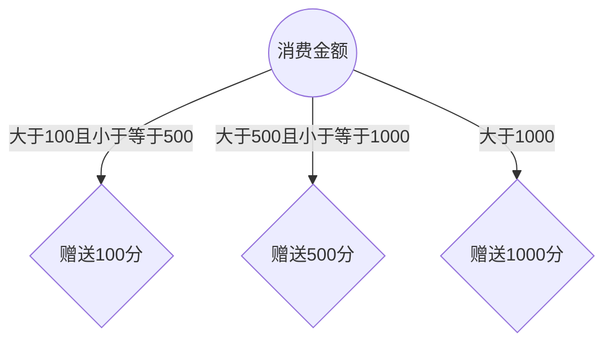
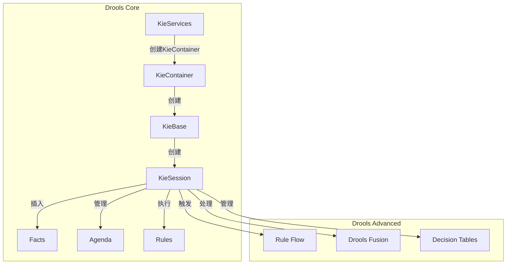
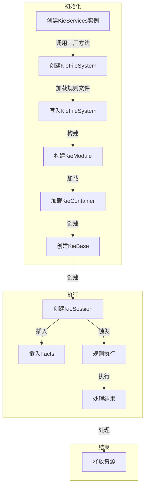
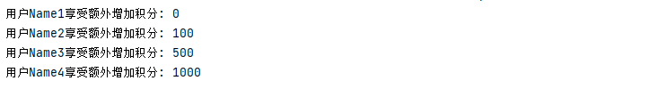
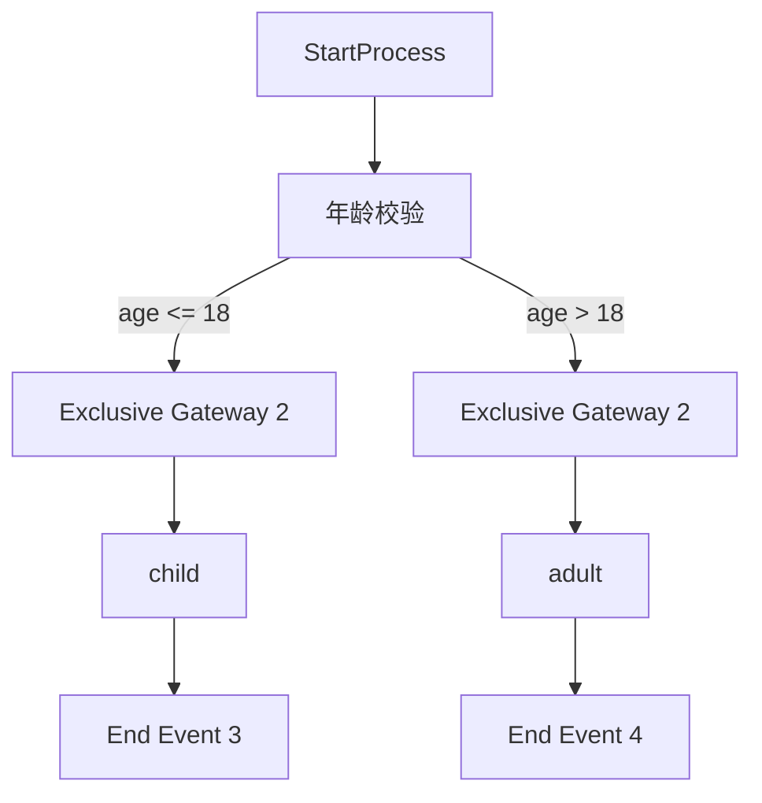
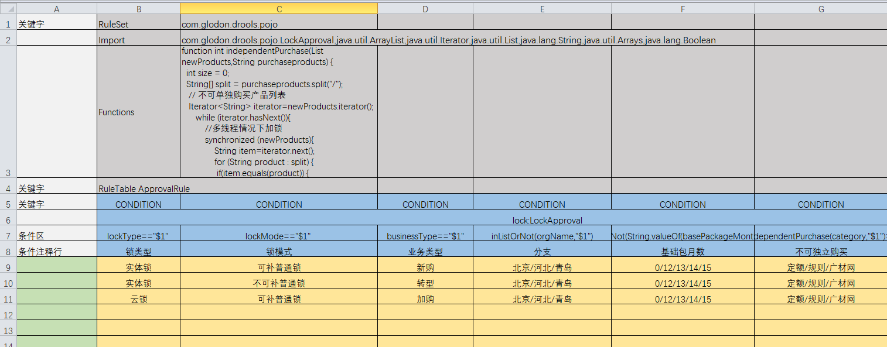
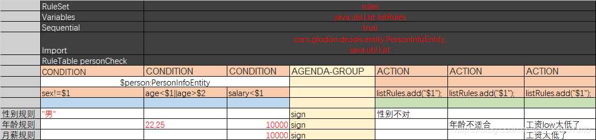

# Drools篇

扩展阅读：[Drools 规则引擎应用 看这一篇就够了](https://www.cnblogs.com/ityml/p/15993391.html#61-global全局变量)

## 基础篇

### 需求背景

在一个在线商店的购物系统中，根据用户的购物车中的商品数量和总价，以及用户的会员等级，系统需要自动计算出最终的订单金额，并根据会员等级给予相应的折扣。

#### 传统方式

在传统的方式中，购物系统通常会将所有的价格计算和折扣规则硬编码在系统的业务逻辑中。以下是一个简单的示例，展示了如何使用传统的方式来处理订单金额的计算和折扣：



在这个示例中，我们使用了传统的方式来计算订单的总金额，并根据用户的会员等级给予相应的折扣。这种方式存在以下几个问题：

- **硬编码规则**：所有的价格计算和折扣规则都被硬编码在方法中，难以管理和维护。
- **不灵活**：每次修改折扣规则都需要修改代码，重新部署应用程序。
- **可读性差**：代码逻辑复杂，不易于理解和维护。
- **不易扩展**：难以添加新的折扣规则或修改现有规则。

因此，我们需要一种更灵活和可扩展的方式来处理订单金额的计算和折扣，使得价格计算和折扣规则可以动态管理和修改，而不影响应用程序的代码逻辑。

Drools 就提供了这样一种解决方案，它可以帮助我们将价格计算和折扣规则从应用程序中分离出来，**实现动态管理和执行**。

### 规则引擎 概念

#### 什么是规则引擎

**规则引擎是一种软件系统，用于管理和执行业务规则**。它能够将业务规则从应用程序中分离出来，使得规则可以动态管理和修改，而不影响应用程序的代码逻辑。通过规则引擎，开发人员可以将复杂的业务逻辑表达为简洁的规则，从而实现业务逻辑的灵活性和可扩展性。

#### 为什么使用规则引擎

使用规则引擎有以下几个主要优势：

1. **业务逻辑分离**：规则引擎能够将业务规则从应用程序中分离出来，使得业务逻辑与应用程序的实现代码分离，降低了系统的耦合度。这样一来，业务规则可以动态管理和修改，而不需要修改应用程序的代码，提高了系统的灵活性和可维护性。
2. **灵活性与可扩展性**：通过规则引擎，开发人员可以将复杂的业务逻辑表达为简洁的规则，从而提高了系统的灵活性和可扩展性。新的业务规则可以动态添加或修改，而不需要重新编译和部署整个应用程序，大大加快了业务规则的开发和部署周期。
3. **高效执行**：规则引擎通常采用高效的规则匹配算法，如基于 Rete 算法的规则引擎，能够高效地处理复杂的规则和大量的事实数据，从而提高了规则引擎的执行效率和性能。
4. **可管理性和可维护性**：规则引擎通常提供了规则管理和版本控制的功能，能够对业务规则进行集中管理和监控。这样一来，开发人员可以更方便地管理和维护业务规则，保证了规则的一致性和可靠性。
5. **易于理解和调试**：通过规则引擎，业务规则可以以自然语言的方式进行表达，易于理解和调试。开发人员可以更加直观地理解业务规则的含义和逻辑，从而更加准确地调试和优化业务规则。

#### 原理--基于 rete 算法的规则引擎

当我们谈论规则引擎时，我们实际上在谈论一种能够帮助我们处理大量规则和数据的工具。而这其中的关键在于它所使用的算法和原理。Rete 算法便是其中之一，它是一种高效的模式匹配算法，通过构建一个网络（Rete 网络）来实现规则的匹配。

在我们理解 Rete 算法之前，我们需要先了解一下正向推理和反向推理的概念。正向推理是从已知事实出发，逐步推导出结论；而反向推理则是从目标出发，寻找支持目标的证据。Rete 算法主要用于正向推理，它通过构建一个网络来实现规则与事实之间的匹配，进而得出结论。

**Rete 算法的核心思想是将规则和事实表示为模式，并将这些模式动态地构建成一个网络。**这个网络可以高效地匹配规则与事实之间的关系，从而实现规则引擎的高效执行。**Rete 算法包括两个主要阶段：规则编译和规则执行。在执行阶段，通过匹配、选择和执行这三个步骤，实现规则的匹配和执行。**

通过 Rete 算法，规则引擎能够高效地处理复杂规则和大量数据，提高系统的性能和可扩展性。这使得规则引擎成为了处理复杂业务逻辑的重要工具，在许多领域得到了广泛的应用。

#### 规则引擎执行过程

规则引擎的执行过程是指规则引擎根据输入的数据和事实，匹配规则并执行相应的操作的过程。这个过程通常包括以下几个步骤：

1. **初始化规则引擎：** 规则引擎首先需要加载规则库，并初始化规则引擎的运行环境。
2. **匹配规则：** 规则引擎根据输入的数据和事实，与规则库中的规则进行匹配。这个过程通常涉及模式匹配和条件判断，以确定哪些规则适用于当前的输入。
3. **执行规则：** 匹配到的规则将被执行，其中包括规则中定义的操作或行为。这些操作可能包括更新数据、生成新的事实、发送通知等。
4. **评估结果：** 执行规则后，规则引擎会评估执行的结果，可能会产生新的数据或影响系统的状态。
5. **循环执行：** 在一些情况下，规则引擎可能需要多次执行规则以达到系统的期望状态。这通常涉及到循环执行规则的过程，直到满足终止条件为止。

#### 规则引擎应用场景

规则引擎在许多领域都有广泛的应用，特别是在需要处理大量规则和数据，并根据这些规则做出决策的场景中。一些常见的应用场景包括：

- 金融领域：用于信用评估、风险管理、欺诈检测等。
- 电商领域：用于推荐系统、促销活动、价格策略等。
- 物联网领域：用于设备监控、智能家居、工业自动化等。
- 医疗保健领域：用于诊断辅助、治疗方案推荐、健康管理等。

规则引擎的应用场景不仅局限于以上领域，几乎任何需要根据一组规则做出决策的场景都可以考虑使用规则引擎来简化系统的设计和实现。

### Drools 概念

#### 什么是Drools

Drools 是一个基于 Java 的开源规则引擎，它提供了一种灵活且高效的方式来管理和执行业务规则。Drools 允许用户使用规则语言定义业务规则，并在运行时动态地评估这些规则以做出决策。

Drools 提供了丰富的功能和特性，包括：

- 规则管理：支持通过规则文件、数据库或其他方式管理规则。
- 规则执行：提供高效的规则执行引擎，支持多种规则执行策略。
- 决策支持：支持多种决策逻辑，包括正向推理、反向推理和混合推理。
- 扩展性：支持自定义扩展和插件，满足不同场景下的需求。
- 与其他技术的集成：能够与 Spring、Quarkus、Camel 等技术无缝集成，实现更多功能和应用场景。

总的来说，Drools 是一个强大而灵活的规则引擎，适用于各种领域和场景，为用户提供了一种简单且高效的规则管理和执行解决方案。

#### Drools 相关概念

##### **规则（Rules）**

- 规则是Drools中的核心概念之一，用于描述系统中的业务逻辑或条件。规则由条件部分（也称为左手边或LHS）和操作部分（也称为右手边或RHS）组成。条件部分描述了规则触发的条件，操作部分描述了规则触发后执行的动作。规则通常以文本文件（DRL文件）的形式进行编写，并通过Drools引擎进行解析和执行。

##### **工作内存（Working Memory）**

- 工作内存是Drools引擎中用于存储事实（Facts）和规则匹配结果的内存区域。在规则执行期间，工作内存用于暂存规则匹配的事实，并在规则引擎执行规则时进行检索和操作。

##### **会话（Session）**

- 会话是Drools中用于执行规则的运行时环境。它提供了与Drools引擎进行交互的接口，允许向工作内存中插入事实、触发规则的执行并获取执行结果。会话可以分为两种类型：stateful session（有状态会话）和stateless session（无状态会话），分别用于处理有状态和无状态的业务逻辑。

##### **事实（Facts）**

- 事实是Drools中描述系统状态或信息的对象。事实可以是任何Java对象，它们被插入到Drools引擎的工作内存中，用于与规则进行匹配并触发规则的执行。事实通常代表了系统中的实体、事件或数据，并且可以根据业务需求进行动态修改和更新。

##### **规则引擎（Rule Engine）**

- 规则引擎是Drools的核心组件之一，负责解析、编译和执行规则。规则引擎根据事实与规则的匹配情况，以及规则的优先级和条件，动态地执行规则并产生相应的结果。规则引擎的设计目标是提供高效、灵活和可扩展的规则执行引擎，以满足不同领域的规则处理需求。

#### Drools的架构与组件



##### Drools 主要组件的详细介绍

###### **KieServices**

- **定义**: 提供Drools的各种服务接口，包括创建KieContainer、KieBase、KieSession等。
- **作用**: 是Drools应用程序的入口点，提供工厂方法来创建和管理Drools的核心组件。

###### **KieContainer**

- **定义**: 一个运行时容器，负责加载KieModule并创建KieBase和KieSession。
- **作用**: 动态加载和管理不同版本的KieModule，支持规则的热部署。

###### **KieBase**

- **定义**: 一个知识库，包含所有的规则、流程和函数。它是不可变的，一旦创建，不能修改其内容。
- **作用**: 持有编译后的规则，并提供创建KieSession的工厂方法。

###### **KieSession**

- **定义**: 与KieBase交互的入口点，持有工作内存，并负责规则的执行。KieSession可以是有状态的（Stateful）或无状态的（Stateless）。
- **作用**: 插入事实（Facts），触发规则执行，管理事务和事件监听器等。

###### **Facts**

- **定义**: 应用程序中的数据对象，Drools基于这些对象进行推理和操作。
- **作用**: 被插入到KieSession中，触发规则的条件匹配。

###### **Rules**

- **定义**: Drools的核心，定义了条件（左手边，LHS）和动作（右手边，RHS）。
- **作用**: 当规则的条件满足时，执行相应的动作。规则可以通过DRL文件、决策表等多种方式定义。

###### **Agenda**

- **定义**: 管理规则的执行顺序。
- **作用**: 符合条件的规则会被放入Agenda中等待执行，使用不同的策略（如Salience、No-Loop等）控制规则的执行顺序。

###### **Rule Flow**

- **定义**: 允许用户定义规则的执行顺序和条件。
- **作用**: 提供图形化界面或XML文件定义规则流，控制规则的执行路径。

###### **Drools Fusion**

- **定义**: Drools的复杂事件处理（CEP）模块。
- **作用**: 处理时间敏感的数据流，支持时间窗口、事件模式匹配等功能。

###### **Decision Tables**

- **定义**: 另一种定义规则的方法，通常使用电子表格来定义规则。
- **作用**: 提供更直观的规则管理方式，适用于业务用户定义和维护规则。

##### Drools 工作流程



###### **创建KieServices实例**

- **定义**: 使用Drools提供的KieServices工厂类创建KieServices实例。
- **作用**: 提供Drools的各种服务接口，是Drools应用程序的入口点。

```java
private KieServices getKieServices() {
    return KieServices.Factory.get();
}
```

###### KieFileSystem

KieFileSystem用于动态加载规则文件和资源。

```java
@Bean
public KieFileSystem kieFileSystem() throws IOException {
    KieFileSystem kieFileSystem = getKieServices().newKieFileSystem();
    for (Resource file : getRuleFiles()) {
        kieFileSystem.write(ResourceFactory.newClassPathResource(RULES_PATH + file.getFilename(), "UTF-8"));
    }
    return kieFileSystem;
}

private Resource[] getRuleFiles() throws IOException {
    ResourcePatternResolver resourcePatternResolver = new PathMatchingResourcePatternResolver();
    return resourcePatternResolver.getResources("classpath*:" + RULES_PATH + "**/*.*");
}
```

###### **构建KieModule**

- 通过 `KieBuilder` 从 `KieFileSystem` 构建 `KieModule`。这是一个逻辑步骤，用于表示规则文件和资源的集合。

[KieModule 是定义一组 KieBase 所需的所有资源的容器。](https://docs.drools.org/6.0.0.Final/kie-api-javadoc/org/kie/api/builder/KieModule.html#:~:text=A%20KieModule%20is%20a%20container%20of%20all%20the,other%20files%20necessary%20to%20build%20the%20KieBases%20themselves)

###### **加载KieContainer**

- **定义**: 通过KieServices加载KieContainer实例。
- **作用**: KieContainer负责加载KieModule，并管理KieBase和KieSession的创建。

```java
@Bean
public KieContainer kieContainer() throws IOException {
    final KieRepository kieRepository = getKieServices().getRepository();

    kieRepository.addKieModule(kieRepository::getDefaultReleaseId);

    KieBuilder kieBuilder = getKieServices().newKieBuilder(kieFileSystem());
    kieBuilder.buildAll();

    return getKieServices().newKieContainer(kieRepository.getDefaultReleaseId());
}
```

###### **创建KieBase**

- **定义**: 从KieContainer中创建KieBase。
- **作用**: KieBase是一个知识库，包含所有的规则、流程和函数。

```java
@Bean
public KieBase kieBase() throws IOException {
    return kieContainer().getKieBase();
}
```

###### **创建KieSession**

- **定义**: 使用KieContainer或KieBase创建KieSession实例。
- **作用**: KieSession持有工作内存，并负责规则的执行。

```java
KieSession kieSession = kieContainer.newKieSession();
```

###### **插入Facts**

- **定义**: 将数据对象（事实）插入到KieSession中。
- **作用**: 事实是应用程序中的数据对象，Drools基于这些对象进行推理和操作。

```java
Person person = new Person();
person.setName("John Doe");
person.setAge(30);

kieSession.insert(person);
```

###### **规则执行**

- **定义**: 触发规则引擎执行规则。
- **作用**: KieSession根据事实和规则进行推理，将符合条件的规则放入Agenda中并执行。

```java
kieSession.fireAllRules();
```

###### **处理结果**

- **定义**: 根据规则执行的结果进行相应处理。
- **作用**: 处理规则执行后的输出，如修改事实、触发事件等。

###### **释放资源**

- **定义**: 释放KieSession资源。
- **作用**: 清理和关闭KieSession，释放占用的资源。

```java
kieSession.dispose();
```

### 案例：消费者送积分案例

[Drools 规则引擎应用 看这一篇就够了 - ityml - 博客园 (cnblogs.com)](https://www.cnblogs.com/ityml/p/15993391.html#3-消费赠送积分案例)

#### Drools 依赖

```xml
<dependencies>

    <dependency>
        <groupId>org.apache.commons</groupId>
        <artifactId>commons-lang3</artifactId>
        <version>3.12.0</version>
    </dependency>
    <dependency>
        <groupId>org.apache.commons</groupId>
        <artifactId>commons-text</artifactId>
        <version>1.8</version>
    </dependency>
    <!-- drools依赖 -->
    <dependency>
        <groupId>org.kie</groupId>
        <artifactId>kie-spring</artifactId>
        <version>7.69.0.Final</version>
        <exclusions>
            <exclusion>
                <groupId>org.springframework</groupId>
                <artifactId>spring-tx</artifactId>
            </exclusion>
            <exclusion>
                <groupId>org.springframework</groupId>
                <artifactId>spring-beans</artifactId>
            </exclusion>
            <exclusion>
                <groupId>org.springframework</groupId>
                <artifactId>spring-core</artifactId>
            </exclusion>
            <exclusion>
                <groupId>org.springframework</groupId>
                <artifactId>spring-context</artifactId>
            </exclusion>
        </exclusions>
    </dependency>
    <dependency>
        <groupId>org.drools</groupId>
        <artifactId>drools-compiler</artifactId>
        <version>7.61.0.Final</version>
    </dependency>
    <dependency>
        <groupId>org.drools</groupId>
        <artifactId>drools-core</artifactId>
        <version>7.61.0.Final</version>
    </dependency>
    <dependency>
        <groupId>org.drools</groupId>
        <artifactId>drools-decisiontables</artifactId>
        <version>7.61.0.Final</version>
    </dependency>
    <dependency>
        <groupId>org.drools</groupId>
        <artifactId>drools-templates</artifactId>
        <version>7.61.0.Final</version>
    </dependency>
</dependencies>
```

#### 规则引擎配置

```java
@Configuration
@Slf4j
public class RuleEngineAutoConfiguration {
    
    
    private static final String RULES_PATH = "rules/";
    
    private KieServices getKieServices() {
        return KieServices.Factory.get();
    }
    
    @Bean
    public KieFileSystem kieFileSystem() throws IOException {
        KieFileSystem kieFileSystem = getKieServices().newKieFileSystem();
        for (Resource file : getRuleFiles()) {
            kieFileSystem.write(ResourceFactory.newClassPathResource(RULES_PATH + file.getFilename(), "UTF-8"));
        }
        return kieFileSystem;
    }
    
    private Resource[] getRuleFiles() throws IOException {
        ResourcePatternResolver resourcePatternResolver = new PathMatchingResourcePatternResolver();
        return resourcePatternResolver.getResources("classpath*:" + RULES_PATH + "**/*.*");
    }
    
    @Bean
    public KieContainer kieContainer() throws IOException {
        final KieRepository kieRepository = getKieServices().getRepository();
        
        kieRepository.addKieModule(kieRepository::getDefaultReleaseId);
        
        KieBuilder kieBuilder = getKieServices().newKieBuilder(kieFileSystem());
        kieBuilder.buildAll();
        
        return getKieServices().newKieContainer(kieRepository.getDefaultReleaseId());
    }
    
    @Bean
    public KieBase kieBase() throws IOException {
        return kieContainer().getKieBase();
    }
}
```

#### 创建实体类

```java
@Data
@Accessors(chain = true)
public class Order {
    /**
     * 订单原价金额
     */
    private int amout;
    /**
     *下单人
     */
    private User user;
    /**
     *积分
     */
    private int score;
    /**
     * 下单日期
     */
    private LocalDateTime bookingDate;
}
```

#### 规则文件

```java
package rules

import com.example.droolsdemo.Demo1.entity.Order;

rule "zero"
    no-loop true
    lock-on-active true
    salience 1
    when
        $s : Order(amount <= 100)
    then
        $s.setScore(0);
        update($s);
end

rule "add100"
    no-loop true
    lock-on-active true
    salience 1
    when
        $s : Order(amount > 100 && amount <= 500)
    then
        $s.setScore(100);
        update($s);
end

rule "add500"
    no-loop true
    lock-on-active true
    salience 1
    when
        $s : Order(amount > 500 && amount <= 1000)
    then
        $s.setScore(500);
        update($s);
end

rule "add1000"
    no-loop true
    lock-on-active true
    salience 1
    when
        $s : Order(amount > 1000)
    then
        $s.setScore(1000);
        update($s);
end
```

#### 模拟数据

```java
public static List<Order> createOrderList() {
    List<Order> orderList = new ArrayList<>();
    String formatTime = "yyyy-MM-dd";
    DateTimeFormatter formatter = DateTimeFormatter.ofPattern(formatTime);

    orderList.add(createOrder(80, "2015-07-01", formatter, 1, "Name1", 111));
    orderList.add(createOrder(200, "2015-07-02", formatter, 2, "Name2", 0));
    orderList.add(createOrder(800, "2015-07-03", formatter, 3, "Name3", 0));
    orderList.add(createOrder(1500, "2015-07-04", formatter, 4, "Name4", 0));

    return orderList;
}

private static Order createOrder(int amount, String bookingDateStr, DateTimeFormatter formatter, int userLevel, String userName, int score) {
    Order order = new Order();
    order.setAmount(amount);
    LocalDate date = LocalDate.parse(bookingDateStr, formatter);
    LocalDateTime bookingDateTime = date.atStartOfDay(); // 使用开始时间
    order.setBookingDate(bookingDateTime);

    User user = new User();
    user.setLevel(userLevel);
    user.setName(userName);
    order.setUser(user);

    order.setScore(score);
    return order;
}

private static void addScore(Order o){
    System.out.println("用户" + o.getUser().getName() + "享受额外增加积分: " + o.getScore());
}
```

#### 执行 Drools 规则

```java
@Test
public void test2(){
    List<Order> orderList = createOrderList();
    for (Order order : orderList) {
        if (order.getAmount() <= 100) {
            order.setScore(0);
            addScore(order);
        } else if (order.getAmount() <= 500) {
            order.setScore(100);
            addScore(order);
        } else if (order.getAmount() <= 1000) {
            order.setScore(500);
            addScore(order);
        } else {
            order.setScore(1000);
            addScore(order);
        }
    }
}

@Test
public void test3(){
    KieSession kieSession = kieContainer.newKieSession();
    List<Order> orderList = createOrderList();
    for (Order order: orderList) {
        // 1-规则引擎处理逻辑
        kieSession.insert(order);
        kieSession.fireAllRules();
        // 2-执行完规则后, 执行相关的逻辑
        addScore(order);
    }
    kieSession.dispose();
}
```



### 案例：多规则触发

```java
@Test
public void test4(){
    KieSession kieSession = kieContainer.newKieSession();

    // 创建事实对象
    Fact fact = new Fact();
    fact.setAge(20);
    fact.setName("胡桃");
    fact.setTriggered(false);

    kieSession.insert(fact);
    kieSession.fireAllRules();

}
```

```drools
package com.example.rules

// 导入你的事实类
import com.example.droolsdemo.Demo1.entity.Fact;

function boolean isCondition1(Fact fact) {
    return fact.getAge() > 18;
}
function boolean isCondition2(Fact fact) {
    return fact.getName().contains("胡桃");
}

// 定义规则 A
rule "RuleA"
activation-group "group1"
salience -1 // 低优先级
when
    $fact : Fact()
    eval(isCondition1($fact))
then
    System.out.println("规则A：年龄大于18");
end

// 定义规则 B
rule "RuleB"
activation-group "group1"
salience -1 // 低优先级
when
    $fact : Fact()
    eval(isCondition2($fact))
then
    System.out.println("规则B：名字包含胡桃");
end

// 后续操作规则 C：要求同时满足规则 A 和规则 B 的条件
rule "SubsequentOperationRule"
activation-group "group1"
salience 1 // 高优先级
when
    $fact : Fact()
    eval(isCondition1($fact))
    eval(isCondition2($fact))
then
    System.out.println("同时满足规则A和规则B，执行后续操作");
end
```

### Drools规则语言（DRL）

#### 规则文件详解

在使用Drools时非常重要的一个工作就是编写规则文件，通常规则文件的后缀为.drl。

**drl是Drools Rule Language的缩写**。在规则文件中编写具体的规则内容。

一套完整的规则文件结构的表格形式：

| 关键字   | 描述                         |
| -------- | ---------------------------- |
| package  | 包名，规则文件所属的命名空间 |
| import   | 导入类或静态方法             |
| global   | 声明全局变量                 |
| function | 定义自定义函数               |
| query    | 定义查询条件                 |
| rule end | 规则体的开始和结束标记       |

Drools支持的规则文件，除了drl形式，还有Excel文件类型的。

> 包声明在规则文件中是一个必须的元素，它用于指定规则文件所属的包名。包声明的作用包括：
>
> 1. **命名空间管理**：包声明将规则文件组织到一个命名空间中，确保不同的规则文件可以独立地定义相同名称的规则，避免命名冲突。
> 2. **规则组织**：通过包声明，您可以根据功能或领域将相关的规则组织到同一个包中，使得规则文件更加结构化和易于管理。
>    1. **规则版本控制**：包				声明还可以用于版本控制，您可以在不同的包中定义不同版本的规则，方便进行版本管理和更新。

#### DRL语法

规则体（Rule Body）是规则文件中最重要的部分之一，它定义了规则触发条件和执行动作。规则体的语法结构如下：

```drools
rule "RuleName"
    attributes
    when
        // 触发条件部分
    then
        // 执行动作部分
end
```

在这个结构中：

| 关键字          | 描述                                                         |
| --------------- | ------------------------------------------------------------ |
| rule "RuleName" | 规则声明，其中 "RuleName" 是规则的名称                       |
| attributes      | 规则属性，是 rule 与 when 之间的参数，为可选项               |
| when            | 条件部分的开始标记                                           |
| 触发条件部分    | 规则的触发条件，描述了规则触发的条件。通常是对事实对象的属性进行条件判断 |
| then            | 动作部分的开始标记                                           |
| 执行动作部分    | 规则的执行动作，描述了规则触发后执行的动作。通常包括对事实对象的操作、方法调用等 |
| end             | 规则体的结束标记                                             |

#### 变量绑定

变量绑定是规则引擎中一种重要的概念，它允许你将条件匹配的对象或属性值绑定到一个变量上，以便在规则的右侧部分（RHS）中进行进一步的处理或操作。

##### **基本绑定**

将条件匹配的对象绑定到一个变量上。示例：

```drools
$person : Person(age > 18)
```

##### **多重绑定**

在同一模式中绑定多个变量。示例：

```drools
$person : Person($age : age, $name : name)
```

在这个例子中，`$person` 是我们要匹配的 `Person` 对象，`$age` 和 `$name` 分别是我们绑定的两个变量，它们分别表示 `age` 和 `name` 属性的值。

##### **绑定操作符（:=）**

用于更复杂的绑定操作，将属性值直接绑定到变量。示例：

```drools
$age := Person(age > 18).age
```

#### Pattern模式匹配

##### 概述

###### Pattern模式匹配的基本概念

Pattern模式匹配是Drools规则引擎的核心概念之一，用于定义规则触发的条件。每个Pattern表示一个特定的条件，规则引擎会根据这些条件从工作内存中匹配相应的事实。当所有条件都满足时，规则将被触发执行。

**pattern的语法结构为：绑定变量名:Object(Field约束)**。

###### Pattern模式匹配在规则引擎中的作用

在Drools中，Pattern模式匹配用于筛选出符合特定条件的事实，从而触发相应的规则。它确保只有满足特定条件的事实才会导致规则的执行，这样可以实现复杂的业务逻辑控制和决策。

##### 基本语法

###### 简单模式匹配

简单模式匹配用于检查yy单个条件。例如，检查一个人的年龄是否大于18岁：

```drools
rule "Simple Match"
when
    $person : Person(age > 18)
then
    System.out.println($person.getName() + " is an adult.");
end
```

在这个示例中，`$person`是一个变量，表示工作内存中所有`Person`对象中满足年龄大于18的事实对象。

###### 复杂模式匹配

复杂模式匹配用于同时检查多个条件。例如，检查一个订单金额是否超过100，以及客户的年龄和忠诚度积分是否满足特定条件：

```drools
rule "Complex Match"
when
    $order : Order(totalAmount > 100)
    $customer : Customer(age > 18, loyaltyPoints > 1000)
then
    System.out.println("Eligible for discount: " + $customer.getName());
end
```

在这个示例中，规则引擎需要同时满足两个条件才能触发规则。

#### 常用操作符

| 操作符类型       | 操作符                                         | 示例                                             | 描述                                                         |
| ---------------- | ---------------------------------------------- | ------------------------------------------------ | ------------------------------------------------------------ |
| 比较操作符       | ``>, <, >=, <=, ==, !=``                       | `$person : Person(age > 18)`                     | 检查属性值是否满足特定条件                                   |
| 逻辑操作符       | ``&&, ||, !``                                  | `$person : Person(age > 18 && gender == "M")`    | 组合多个条件                                                 |
| 集合操作符       | `contains,not contains, memberOf,not memberOf` | `$order : Order(items contains "item1")`         | 检查集合中是否包含特定元素                                   |
| 正则表达式操作符 | `matches,not matches`                          | `$person : Person(name matches "^[A-Z][a-z]*$")` | 判断一个Fact对象的属性是否与提供的标准的Java正则表达式进行匹配 |

##### **比较操作符**

比较操作符用于比较事实对象的属性值。例如，检查一个人的年龄是否大于18岁：

```drools
$person : Person(age > 18)
```

##### **逻辑操作符**

逻辑操作符用于组合多个条件。例如，检查一个人的年龄大于18且性别为男性：

```drools
$person : Person(age > 18 && gender == "M")
```

##### **集合操作符**

集合操作符用于检查集合中是否包含特定元素。例如，检查订单中是否包含特定商品：

```drools
$order : Order(items contains "item1")
```

##### **正则表达式操作符**

正则表达式操作符用于判断一个Fact对象的属性是否与提供的标准Java正则表达式进行匹配。例如，检查一个人的名字是否以大写字母开头且后续是小写字母：

```drools
$person : Person(name matches "^[A-Z][a-z]*$")
```

##### 实践案例

###### **案例1：简单的年龄检查**

```drools
rule "Check Adult"
when
    $person : Person(age > 18)
then
    System.out.println($person.getName() + " is an adult.");
end
```

###### **案例2：复杂的订单折扣规则**

```drools
rule "Apply Discount"
when
    $order : Order(totalAmount > 100)
    $customer : Customer(loyaltyPoints > 1000)
then
    System.out.println("Discount applied to order for customer: " + $customer.getName());
    $order.setDiscount(true);
    update($order);
end
```

在这个案例中，当订单金额大于100且客户的忠诚度积分超过1000时，将触发规则，应用折扣并更新订单。

#### 执行指定规则

| 过滤器类型                       | 描述                             | 示例代码                                                     |
| -------------------------------- | -------------------------------- | ------------------------------------------------------------ |
| `RuleNameEqualsAgendaFilter`     | 仅执行指定名称的规则             | `kSession.fireAllRules(new RuleNameEqualsAgendaFilter("Check Age"));` |
| `RuleNameStartsWithAgendaFilter` | 执行所有以指定前缀开始的规则     | `kSession.fireAllRules(new RuleNameStartsWithAgendaFilter("Check"));` |
| 自定义过滤器                     | 实现自定义的 `AgendaFilter` 逻辑 | `kSession.fireAllRules(new CustomAgendaFilter());`           |

在Drools中，默认情况下，满足条件的所有规则都会被执行。如果我们只想执行其中的某个特定规则，可以通过规则过滤器来实现。Drools提供了多种方式来实现这一功能。下面将详细介绍这些方式，并提供相应的代码示例和注解。

##### 使用 `RuleNameEqualsAgendaFilter`

`RuleNameEqualsAgendaFilter` 用于仅执行指定名称的规则。

**示例规则文件**

```drools
// rules.drl

import com.example.droolsdemo.entity.Person;

rule "Check Age"
when
    $person : Person(age > 18)
then
    System.out.println($person.getName() + " is an adult.");
end

rule "Check Name"
when
    $person : Person(name == "John")
then
    System.out.println($person.getName() + " is named John.");
end
```

**Java代码：**

```java
@Configuration
public class DroolsConfig {

    @Bean
    public KieContainer kieContainer() {
        return KieServices.Factory.get().getKieClasspathContainer();
    }

    public static void main(String[] args) {
        KieServices ks = KieServices.Factory.get();
        KieContainer kContainer = ks.getKieClasspathContainer();
        KieSession kSession = kContainer.newKieSession("ksession-rules");

        Person john = new Person();
        john.setName("John");
        john.setAge(25);

        kSession.insert(john);
        
        // 使用 RuleNameEqualsAgendaFilter 仅执行名为 "Check Age" 的规则
        kSession.fireAllRules(new RuleNameEqualsAgendaFilter("Check Age"));
        
        kSession.dispose();
    }

    public static class RuleNameEqualsAgendaFilter implements AgendaFilter {
        private String ruleName;

        public RuleNameEqualsAgendaFilter(String ruleName) {
            this.ruleName = ruleName;
        }

        @Override
        public boolean accept(Match match) {
            return match.getRule().getName().equals(ruleName);
        }
    }
}
```

**注解：**

- `RuleNameEqualsAgendaFilter` 是一个自定义的过滤器，用于仅执行特定名称的规则。
- `accept` 方法根据规则名称进行匹配，只执行名称为 `ruleName` 的规则。

##### 使用 `RuleNameStartsWithAgendaFilter`

`RuleNameStartsWithAgendaFilter` 用于执行所有以指定前缀开始的规则。

**Java代码：**

```java
public class RuleNameStartsWithAgendaFilter implements AgendaFilter {
    private String prefix;

    public RuleNameStartsWithAgendaFilter(String prefix) {
        this.prefix = prefix;
    }

    @Override
    public boolean accept(Match match) {
        return match.getRule().getName().startsWith(prefix);
    }
}

// 使用示例
kSession.fireAllRules(new RuleNameStartsWithAgendaFilter("Check"));
```

**注解：**

- `RuleNameStartsWithAgendaFilter` 是一个自定义的过滤器，用于执行所有以指定前缀开始的规则。
- `accept` 方法根据规则名称前缀进行匹配，只执行名称以 `prefix` 开头的规则。

##### 使用自定义过滤器

可以实现自定义的 `AgendaFilter` 以满足特定需求。

**Java代码：**

```java
public class CustomAgendaFilter implements AgendaFilter {
    @Override
    public boolean accept(Match match) {
        // 自定义过滤逻辑，例如仅执行规则名包含“Age”的规则
        return match.getRule().getName().contains("Age");
    }
}

// 使用示例
kSession.fireAllRules(new CustomAgendaFilter());
```

**注解：**

- `CustomAgendaFilter` 是一个自定义的过滤器，用于执行满足自定义条件的规则。
- `accept` 方法实现自定义的过滤逻辑，例如只执行规则名包含 "Age" 的规则。

#### 关键字

Drools 中的关键字分为两类：**硬关键字**和**软关键字**。

##### 硬关键字（Hard keywords）

硬关键字是保留字，不能用作包名或规则名，否则会报错：

- `true`
- `false`
- `null`

示例：

```drools
rule true // 会报错
when
    // 条件
then
    // 动作
end

rule "true" // 合法
when
    // 条件
then
    // 动作
end
```

##### 软关键字（Soft keywords）

软关键字虽然可以使用，但不建议作为包名或规则名，因为它们有特殊含义：

```
lock-on-active; date-effective; date-expires; no-loop; auto-focus; activation-group; agenda-group; ruleflow-group; entry-point; duration; package; import; dialect; salience; enabled; attributes; rule; extend; when; then; template; query; declare; function; global; eval; not; in; or; and; exists; forall; accumulate; collect; from; action; reverse; result; end; over; init
```

示例：

```drools
rule package // 不推荐
when
    // 条件
then
    // 动作
end

rule "package" // 推荐
when
    // 条件
then
    // 动作
end
```

##### 推荐实践

- 避免使用硬关键字。
- 对于软关键字，尽量不用或用引号括起来。
- 使用描述性和独特的名称。

#### 动作（Actions）

在 Drools 中，动作（Actions）定义了在规则条件满足时需要执行的操作。动作位于 `then` 块中，通常包括修改事实、插入新事实、调用方法等。

##### 常见动作

###### **修改事实**

使用 `modify` 关键字来更新现有事实的属性。

```drools
then
    modify($fact) { setAttribute("newValue") };
```

示例：

```drools
rule "Update Age"
when
    $person : Person(age < 18)
then
    modify($person) { setAge(18) };
end
```

###### **插入新事实**

使用 `insert` 关键字插入新事实到工作内存中。

```drools
then
    insert(new FactType());
```

示例：

```drools
rule "Insert Audit Log"
when
    $person : Person(age > 18)
then
    insert(new AuditLog($person.getName(), "成人标记更新"));
end
```

###### **删除事实**

使用 `retract` 或 `delete` 关键字从工作内存中删除现有事实。

```drools
then
    retract($fact);
    // 或者
    delete($fact);
```

示例：

```drools
rule "Remove Person"
when
    $person : Person(status == "inactive")
then
    retract($person);
end
```

###### **调用方法**

可以在 `then` 块中调用任何 Java 方法。

```drools
then
    $fact.someMethod();
```

示例：

```
rule "Send Notification"
when
    $person : Person(age > 18)
then
    $person.sendNotification();
end
```

###### **打印信息**

使用 `System.out.println` 打印调试信息。

```drools
then
    System.out.println("条件满足，执行动作");
```

示例：

```drools
rule "Print Message"
when
    $person : Person(age > 18)
then
    System.out.println($person.getName() + " is an adult.");
end
```

##### 综合示例

以下是一个完整的示例规则，展示了多种动作的组合使用：

```drools
rule "Example Rule"
when
    $person : Person(age > 18)
then
    // 修改事实
    modify($person) { setAdult(true) };
    
    // 插入新事实
    insert(new AuditLog($person.getName(), "成人标记更新"));
    
    // 删除事实
    retract($person);
    
    // 调用方法
    $person.sendNotification();
    
    // 打印信息
    System.out.println("规则执行完成：" + $person.getName());
end
```

##### 推荐实践

- **清晰性和可读性**：保持动作简洁明了，避免复杂逻辑。
- **调试信息**：适当使用打印信息帮助调试。
- **事务一致性**：确保在动作中对事实的修改保持事务一致性，避免不一致状态。
- **日志记录**：在关键操作中添加日志记录，方便追踪规则执行情况。

#### 属性（Attributes）

```drools
rule "RuleName"
    attributes
    when
        // 规则的条件部分
    then
        // 规则的动作部分
end
```

针对规则体的**attributes**属性部分进行讲解。Drools中提供的属性如下表(部分属性)：

| 属性名           | 说明                                               |
| ---------------- | -------------------------------------------------- |
| salience         | 指定规则执行优先级                                 |
| dialect          | 指定规则使用的语言类型                             |
| enabled          | 指定规则是否启用                                   |
| date-effective   | 指定规则生效时间                                   |
| date-expires     | 指定规则失效时间                                   |
| activation-group | 激活分组，具有相同分组名称的规则只能有一个规则触发 |
| agenda-group     | 议程分组，只有获取焦点的组中的规则才有可能触发     |
| timer            | 定时器，指定规则触发的时间                         |
| auto-focus       | 自动获取焦点，一般结合agenda-group一起使用         |
| no-loop          | 防止死循环，防止自己更新规则再次触发               |
| lock-on-active   | no-loop增强版本，可防止别人更新规则再次触发        |

##### **salience**（优先级）

优先级是一个整数值，可以用来控制规则的执行顺序。值越高，优先级越高。例如，如果希望规则 A 的优先级高于规则 B，可以将规则 A 的 salience 设置为比规则 B 更高的值。

例如：

```
rule "RuleA"
    salience 10
    // 规则条件和动作部分
end
```

##### **dialect**（语言类型）

可以指定规则使用的语言类型，常用的选项是 Java 和 MVEL。默认情况下，Drools 使用 MVEL。

例如：

```
rule "RuleB"
    dialect "java"
    // 规则条件和动作部分
end
```

##### **enabled**（启用状态）

可以指定规则是否启用。如果设置为 `false`，则规则不会被执行。

例如：

```
rule "RuleC"
    enabled false
    // 规则条件和动作部分
end
```

##### **date-effective**（生效时间）

可以指定规则生效的时间，规则只有在指定的日期之后才会生效。日期格式为 `yyyy-MM-dd`。

例如：

```
rule "RuleD"
    date-effective "2024-01-01"
    // 规则条件和动作部分
end
```

##### **date-expires**（失效时间）

可以指定规则失效的时间，规则只有在指定的日期之前才会失效。日期格式为 `yyyy-MM-dd`。

例如：

```
rule "RuleE"
    date-expires "2024-12-31"
    // 规则条件和动作部分
end
```

##### **activation-group**（激活分组）

指定激活分组，具有相同分组名称的规则只能有一个规则触发。

> agenda-group属性为**议程分组**，属于另一种可控的规则执行方式。用户可以通过设置agenda-group来控制规则的执行，只有获取焦点的组中的规则才会被触发。

例如：

```
/*
 用于测试Drools 属性: agenda-group
*/

rule "rule_attributes_agenda_group_1"
    agenda-group "customAgendaGroup1"
    when
        $attributesAgendaGroupEntity:AttributesAgendaGroupEntity(num > 1)
    then
        System.out.println("规则 rule_attributes_agenda_group_1 触发");
end

rule "rule_attributes_agenda_group_2"
    agenda-group "customAgendaGroup1"
    when
        $attributesAgendaGroupEntity:AttributesAgendaGroupEntity(num > 1)
    then
        System.out.println("规则 rule_attributes_agenda_group_2 触发");
end


rule "rule_attributes_activation_group_3"
    agenda-group "customAgendaGroup2"
    when
        $attributesAgendaGroupEntity:AttributesAgendaGroupEntity(num > 1)
    then
        System.out.println("规则 rule_attributes_activation_group_3 触发");
end

rule "rule_attributes_agenda_group_4"
    agenda-group "customAgendaGroup2"
    when
        $attributesAgendaGroupEntity:AttributesAgendaGroupEntity(num > 1)
    then
        System.out.println("规则 rule_attributes_agenda_group_4 触发");
end
```

**agenda-group**（议程分组）：

将规则放置到特定的议程分组中，只有获取焦点的组中的规则才有可能被触发。

例如：

```
rule "RuleG"
    agenda-group "group2"
    // 规则条件和动作部分
end
```

##### **timer**（定时器）

指定规则触发的时间，可以是 cron 表达式或者延时时间。使用方式有两种：

- **方式一**：``timer (int: ?)`` 此种方式遵循``java.util.Timer``对象的使用方式，第一个参数表示几秒后执行，第二个参数表示每隔几秒执行一次，第二个参数为可选。
- **方式二**：``timer(cron: )`` 此种方式使用标准的unix cron表达式的使用方式来定义规则执行的时间。

例如：

```
/*
 用于测试Drools 属性: timer
*/

rule "rule_attributes_timer_1"
    timer(5s 2s)
    when
        $attributesTimerEntity:AttributesTimerEntity(num > 1)
    then
        System.out.println("规则 rule_attributes_timer_1 触发");
end

rule "rule_attributes_timer_2"
    timer(cron:0/1 * * * * ?)
    when
        $attributesTimerEntity:AttributesTimerEntity(num > 1)
    then
        System.out.println("规则 rule_attributes_timer_2 触发");
end
```

```java
@Test
public void test() throws InterruptedException {

    KieSession kieSession = kieBase.newKieSession();
    AttributesTimerEntity attributesTimerEntity = new AttributesTimerEntity();
    attributesTimerEntity.setNum(20);

    kieSession.insert(attributesTimerEntity);
    kieSession.fireUntilHalt();

    Thread.sleep(10000);
    kieSession.halt();

    kieSession.dispose();
}
```

##### **auto-focus**（自动获取焦点）

指定规则是否自动获取焦点，一般与 agenda-group 一起使用。如果一个规则具有 `auto-focus` 属性，并且该属性设置为 `true`，则这个规则会在被激活时自动获取焦点，**即成为下一个将被执行的规则**。这样可以确保具有 `auto-focus` 属性的规则在满足条件时会被立即执行，而不必等待其他规则的执行完毕。

注意：同一个组，只要有个设置auto-focus true 其他的设置不设置都无所谓啦。都会起作用的。

例如：

```
/*
 用于测试Drools 属性: auto-focus
*/

rule "rule_attributes_auto_focus_1"
    agenda-group "customAgendaGroup1"
    when
        $attributesAutoFocusEntity:AttributesAutoFocusEntity(num > 1)
    then
        System.out.println("规则 rule_attributes_auto_focus_1 触发");
end

rule "rule_attributes_auto_focus_2"
    agenda-group "customAgendaGroup1"
    when
        $attributesAutoFocusEntity:AttributesAutoFocusEntity(num > 1)
    then
        System.out.println("规则 rule_attributes_auto_focus_2 触发");
end

rule "rule_attributes_auto_focus_3"
    agenda-group "customAgendaGroup2"
//    auto-focus true
    when
        $attributesAutoFocusEntity:AttributesAutoFocusEntity(num > 1)
    then
        System.out.println("规则 rule_attributes_auto_focus_3 触发");
end

rule "rule_attributes_auto_focus_4"
    agenda-group "customAgendaGroup2"
    when
        $attributesAutoFocusEntity:AttributesAutoFocusEntity(num > 1)
    then
        System.out.println("规则 rule_attributes_auto_focus_4 触发");
end
```

##### **no-loop**（防止死循环）

防止规则出现死循环，如果规则导致自己再次触发，将不会再次被执行。

例如：

```
rule "RuleJ"
    no-loop true
    // 规则条件和动作部分
end
```

##### **lock-on-active**（防止并发更新）

增强版的 no-loop，可以防止其他规则对当前规则进行并发更新。

例如：

```
rule "RuleK"
    lock-on-active true
    // 规则条件和动作部分
end
```

### 规则流（Rule Flow）

规则流（Rule Flow）是一种用于管理和组织规则执行顺序的机制，通过定义规则流，我们可以控制规则在流程中的执行顺序，使得规则的处理更加灵活和可控。

拓展阅读：[Drools如何使用规则流bpmn2](https://blog.csdn.net/fengqingyuebai19/article/details/95939370)

#### 什么是规则流？

规则流是 Drools 提供的一个功能，允许我们使用流程图的方式来定义规则的执行顺序。通过规则流，我们可以将规则组织成一个有序的流程，按照定义的顺序来执行规则，而不是依赖规则引擎的默认执行顺序。

#### 规则流的基本结构

一个规则流文件通常包含以下几个部分：

1. **Header（头部）**：定义规则流的基本信息，例如标题、版本、描述等。
2. **Nodes（节点）**：定义规则流中的各个节点，包括开始节点、结束节点、规则节点等。
3. **Connections（连接）**：定义节点之间的连接，表示规则流的执行顺序。

#### 如何使用规则流

1. **定义规则文件**：首先，我们需要定义规则文件，其中包含规则流中涉及的各个规则。
2. **定义规则流文件**：然后，我们定义规则流文件，使用 XML 语法描述规则流的结构和节点。
3. **配置 Spring Boot 应用**：在 Spring Boot 应用中，加载规则文件和规则流文件，并配置规则引擎。
4. **运行规则流**：通过代码触发规则流的执行，处理业务逻辑。

#### 规则流节点类型

规则流支持多种节点类型，每种节点类型有不同的功能：

- **Start Node**（开始节点）：规则流的起点。
- **End Node**（结束节点）：规则流的终点。
- **Rule Set Node**（规则集节点）：执行一个规则集。
- **Split Node**（分支节点）：根据条件分支，类似于 if-else 逻辑。
- **Join Node**（合并节点）：合并多个分支。
- **Subflow Node**（子流程节点）：调用另一个规则流。

#### 复杂规则流示例

以下是一个复杂的规则流示例，展示了如何使用分支和合并节点：



规则流程的名称是`` "process.myProcess"``，创建对应的规则流程定义文件，命名为 `flow.bpmn`。

```xml
<?xml version="1.0" encoding="UTF-8"?>
<!-- origin at X=0.0 Y=0.0 -->
<bpmn2:definitions xmlns:xsi="http://www.w3.org/2001/XMLSchema-instance" xmlns:bpmn2="http://www.omg.org/spec/BPMN/20100524/MODEL" xmlns:bpmndi="http://www.omg.org/spec/BPMN/20100524/DI" xmlns:dc="http://www.omg.org/spec/DD/20100524/DC" xmlns:di="http://www.omg.org/spec/DD/20100524/DI" xmlns:java="http://www.java.com/javaTypes" xmlns:tns="http://www.jboss.org/drools" xmlns="http://www.jboss.org/drools" xsi:schemaLocation="http://www.omg.org/spec/BPMN/20100524/MODEL BPMN20.xsd http://www.jboss.org/drools drools.xsd http://www.bpsim.org/schemas/1.0 bpsim.xsd" id="Definition" exporter="org.eclipse.bpmn2.modeler.core" exporterVersion="1.2.5.Final-v20160831-1132-B114" expressionLanguage="http://www.mvel.org/2.0" targetNamespace="http://www.jboss.org/drools" typeLanguage="http://www.java.com/javaTypes">
  <bpmn2:itemDefinition id="ItemDefinition_2" isCollection="false" structureRef="com.example.droolsdemo.Demo1.entity.PersonFact"/>
  <bpmn2:process id="process.myProcess" tns:packageName="process" name="myProcess" isExecutable="true" processType="Private">
    <bpmn2:extensionElements>
      <tns:import name="com.example.droolsdemo.Demo1.entity.PersonFact"/>
    </bpmn2:extensionElements>
    <bpmn2:startEvent id="StartEvent_1" name="StartProcess">
      <bpmn2:extensionElements>
        <tns:metaData name="elementname">
          <tns:metaValue><![CDATA[StartProcess]]></tns:metaValue>
        </tns:metaData>
      </bpmn2:extensionElements>
      <bpmn2:outgoing>SequenceFlow_5</bpmn2:outgoing>
    </bpmn2:startEvent>
    <bpmn2:businessRuleTask id="BusinessRuleTask_2" tns:ruleFlowGroup="age-check-group" name="年龄校验">
      <bpmn2:extensionElements>
        <tns:metaData name="elementname">
          <tns:metaValue><![CDATA[年龄校验]]></tns:metaValue>
        </tns:metaData>
      </bpmn2:extensionElements>
      <bpmn2:incoming>SequenceFlow_5</bpmn2:incoming>
      <bpmn2:outgoing>SequenceFlow_8</bpmn2:outgoing>
    </bpmn2:businessRuleTask>
    <bpmn2:sequenceFlow id="SequenceFlow_5" tns:priority="1" sourceRef="StartEvent_1" targetRef="BusinessRuleTask_2"/>
    <bpmn2:exclusiveGateway id="ExclusiveGateway_2" name="Exclusive Gateway 2" gatewayDirection="Diverging">
      <bpmn2:incoming>SequenceFlow_8</bpmn2:incoming>
      <bpmn2:outgoing>SequenceFlow_9</bpmn2:outgoing>
      <bpmn2:outgoing>SequenceFlow_10</bpmn2:outgoing>
    </bpmn2:exclusiveGateway>
    <bpmn2:sequenceFlow id="SequenceFlow_8" tns:priority="1" sourceRef="BusinessRuleTask_2" targetRef="ExclusiveGateway_2"/>
    <bpmn2:businessRuleTask id="BusinessRuleTask_3" tns:ruleFlowGroup="teenager" name="child">
      <bpmn2:extensionElements>
        <tns:metaData name="elementname">
          <tns:metaValue><![CDATA[child]]></tns:metaValue>
        </tns:metaData>
      </bpmn2:extensionElements>
      <bpmn2:incoming>SequenceFlow_9</bpmn2:incoming>
      <bpmn2:outgoing>SequenceFlow_11</bpmn2:outgoing>
    </bpmn2:businessRuleTask>
    <bpmn2:sequenceFlow id="SequenceFlow_9" tns:priority="1" sourceRef="ExclusiveGateway_2" targetRef="BusinessRuleTask_3">
      <bpmn2:conditionExpression xsi:type="bpmn2:tFormalExpression" id="FormalExpression_1" language="http://www.jboss.org/drools/rule">p:PersonFact(age&lt;=18)</bpmn2:conditionExpression>
    </bpmn2:sequenceFlow>
    <bpmn2:businessRuleTask id="BusinessRuleTask_4" tns:ruleFlowGroup="adult" name="adult">
      <bpmn2:extensionElements>
        <tns:metaData name="elementname">
          <tns:metaValue><![CDATA[adult]]></tns:metaValue>
        </tns:metaData>
      </bpmn2:extensionElements>
      <bpmn2:incoming>SequenceFlow_10</bpmn2:incoming>
      <bpmn2:outgoing>SequenceFlow_12</bpmn2:outgoing>
    </bpmn2:businessRuleTask>
    <bpmn2:sequenceFlow id="SequenceFlow_10" tns:priority="2" sourceRef="ExclusiveGateway_2" targetRef="BusinessRuleTask_4">
      <bpmn2:conditionExpression xsi:type="bpmn2:tFormalExpression" id="FormalExpression_2" language="http://www.jboss.org/drools/rule">eval(true)</bpmn2:conditionExpression>
    </bpmn2:sequenceFlow>
    <bpmn2:endEvent id="EndEvent_3" name="End Event 3">
      <bpmn2:extensionElements>
        <tns:metaData name="elementname">
          <tns:metaValue><![CDATA[End Event 3]]></tns:metaValue>
        </tns:metaData>
      </bpmn2:extensionElements>
      <bpmn2:incoming>SequenceFlow_11</bpmn2:incoming>
    </bpmn2:endEvent>
    <bpmn2:sequenceFlow id="SequenceFlow_11" tns:priority="1" sourceRef="BusinessRuleTask_3" targetRef="EndEvent_3"/>
    <bpmn2:endEvent id="EndEvent_4" name="End Event 4">
      <bpmn2:extensionElements>
        <tns:metaData name="elementname">
          <tns:metaValue><![CDATA[End Event 4]]></tns:metaValue>
        </tns:metaData>
      </bpmn2:extensionElements>
      <bpmn2:incoming>SequenceFlow_12</bpmn2:incoming>
    </bpmn2:endEvent>
    <bpmn2:sequenceFlow id="SequenceFlow_12" tns:priority="1" sourceRef="BusinessRuleTask_4" targetRef="EndEvent_4"/>
  </bpmn2:process>
  <bpmndi:BPMNDiagram id="BPMNDiagram_1">
    <bpmndi:BPMNPlane id="BPMNPlane_Process_1" bpmnElement="process.myProcess">
      <bpmndi:BPMNShape id="BPMNShape_StartEvent_1" bpmnElement="StartEvent_1">
        <dc:Bounds height="0.0" width="0.0" x="45.0" y="45.0"/>
        <bpmndi:BPMNLabel>
          <dc:Bounds height="15.0" width="71.0" x="28.0" y="81.0"/>
        </bpmndi:BPMNLabel>
      </bpmndi:BPMNShape>
      <bpmndi:BPMNShape id="BPMNShape_BusinessRuleTask_2" bpmnElement="BusinessRuleTask_2">
        <dc:Bounds height="50.0" width="110.0" x="186.0" y="38.0"/>
        <bpmndi:BPMNLabel>
          <dc:Bounds height="15.0" width="48.0" x="217.0" y="55.0"/>
        </bpmndi:BPMNLabel>
      </bpmndi:BPMNShape>
      <bpmndi:BPMNShape id="BPMNShape_ExclusiveGateway_2" bpmnElement="ExclusiveGateway_2" isMarkerVisible="true">
        <dc:Bounds height="50.0" width="50.0" x="371.0" y="38.0"/>
        <bpmndi:BPMNLabel>
          <dc:Bounds height="30.0" width="57.0" x="368.0" y="88.0"/>
        </bpmndi:BPMNLabel>
      </bpmndi:BPMNShape>
      <bpmndi:BPMNShape id="BPMNShape_BusinessRuleTask_3" bpmnElement="BusinessRuleTask_3">
        <dc:Bounds height="50.0" width="110.0" x="526.0" y="38.0"/>
        <bpmndi:BPMNLabel>
          <dc:Bounds height="15.0" width="26.0" x="568.0" y="55.0"/>
        </bpmndi:BPMNLabel>
      </bpmndi:BPMNShape>
      <bpmndi:BPMNShape id="BPMNShape_BusinessRuleTask_4" bpmnElement="BusinessRuleTask_4">
        <dc:Bounds height="50.0" width="110.0" x="526.0" y="138.0"/>
        <bpmndi:BPMNLabel>
          <dc:Bounds height="15.0" width="27.0" x="567.0" y="155.0"/>
        </bpmndi:BPMNLabel>
      </bpmndi:BPMNShape>
      <bpmndi:BPMNShape id="BPMNShape_EndEvent_3" bpmnElement="EndEvent_3">
        <dc:Bounds height="36.0" width="36.0" x="704.0" y="45.0"/>
        <bpmndi:BPMNLabel>
          <dc:Bounds height="15.0" width="65.0" x="690.0" y="81.0"/>
        </bpmndi:BPMNLabel>
      </bpmndi:BPMNShape>
      <bpmndi:BPMNShape id="BPMNShape_EndEvent_4" bpmnElement="EndEvent_4">
        <dc:Bounds height="36.0" width="36.0" x="704.0" y="145.0"/>
        <bpmndi:BPMNLabel>
          <dc:Bounds height="15.0" width="65.0" x="690.0" y="181.0"/>
        </bpmndi:BPMNLabel>
      </bpmndi:BPMNShape>
      <bpmndi:BPMNEdge id="BPMNEdge_SequenceFlow_5" bpmnElement="SequenceFlow_5" sourceElement="BPMNShape_StartEvent_1" targetElement="BPMNShape_BusinessRuleTask_2">
        <di:waypoint xsi:type="dc:Point" x="81.0" y="63.0"/>
        <di:waypoint xsi:type="dc:Point" x="133.0" y="63.0"/>
        <di:waypoint xsi:type="dc:Point" x="186.0" y="63.0"/>
        <bpmndi:BPMNLabel/>
      </bpmndi:BPMNEdge>
      <bpmndi:BPMNEdge id="BPMNEdge_SequenceFlow_8" bpmnElement="SequenceFlow_8" sourceElement="BPMNShape_BusinessRuleTask_2" targetElement="BPMNShape_ExclusiveGateway_2">
        <di:waypoint xsi:type="dc:Point" x="296.0" y="63.0"/>
        <di:waypoint xsi:type="dc:Point" x="333.0" y="63.0"/>
        <di:waypoint xsi:type="dc:Point" x="371.0" y="63.0"/>
        <bpmndi:BPMNLabel/>
      </bpmndi:BPMNEdge>
      <bpmndi:BPMNEdge id="BPMNEdge_SequenceFlow_9" bpmnElement="SequenceFlow_9" sourceElement="BPMNShape_ExclusiveGateway_2" targetElement="BPMNShape_BusinessRuleTask_3">
        <di:waypoint xsi:type="dc:Point" x="421.0" y="63.0"/>
        <di:waypoint xsi:type="dc:Point" x="473.0" y="63.0"/>
        <di:waypoint xsi:type="dc:Point" x="526.0" y="63.0"/>
        <bpmndi:BPMNLabel/>
      </bpmndi:BPMNEdge>
      <bpmndi:BPMNEdge id="BPMNEdge_SequenceFlow_10" bpmnElement="SequenceFlow_10" sourceElement="BPMNShape_ExclusiveGateway_2" targetElement="BPMNShape_BusinessRuleTask_4">
        <di:waypoint xsi:type="dc:Point" x="396.0" y="88.0"/>
        <di:waypoint xsi:type="dc:Point" x="396.0" y="163.0"/>
        <di:waypoint xsi:type="dc:Point" x="526.0" y="163.0"/>
        <bpmndi:BPMNLabel/>
      </bpmndi:BPMNEdge>
      <bpmndi:BPMNEdge id="BPMNEdge_SequenceFlow_11" bpmnElement="SequenceFlow_11" sourceElement="BPMNShape_BusinessRuleTask_3" targetElement="BPMNShape_EndEvent_3">
        <di:waypoint xsi:type="dc:Point" x="636.0" y="63.0"/>
        <di:waypoint xsi:type="dc:Point" x="670.0" y="63.0"/>
        <di:waypoint xsi:type="dc:Point" x="704.0" y="63.0"/>
        <bpmndi:BPMNLabel/>
      </bpmndi:BPMNEdge>
      <bpmndi:BPMNEdge id="BPMNEdge_SequenceFlow_12" bpmnElement="SequenceFlow_12" sourceElement="BPMNShape_BusinessRuleTask_4" targetElement="BPMNShape_EndEvent_4">
        <di:waypoint xsi:type="dc:Point" x="636.0" y="163.0"/>
        <di:waypoint xsi:type="dc:Point" x="670.0" y="163.0"/>
        <di:waypoint xsi:type="dc:Point" x="704.0" y="163.0"/>
        <bpmndi:BPMNLabel/>
      </bpmndi:BPMNEdge>
    </bpmndi:BPMNPlane>
  </bpmndi:BPMNDiagram>
</bpmn2:definitions>
```

在这个规则流中，检查年龄节点之后，规则流分支为两个路径，一个路径检查姓名，另一个路径继续向前。两个路径在合并节点处合并，然后继续执行组合检查。

#### Drools 规则文件

```drools
package process2
import java.util.Calendar;
import java.util.Date;
import com.example.droolsdemo.Demo1.entity.PersonFact;

rule "age-rule"
	ruleflow-group "age-check-group"
    lock-on-active true
    when
        p:PersonFact()
    then
        System.out.println("hello"+p.getName());
        if(p.getBirthday()!=null){
    		int age =0;
    		Calendar now = Calendar.getInstance();
            now.setTime(new Date());

            Calendar birth = Calendar.getInstance();
            birth.setTime(p.getBirthday());

            if (birth.after(now)) {
                age = 0;
            } else {
                age = now.get(Calendar.YEAR) - birth.get(Calendar.YEAR);
                if (now.get(Calendar.DAY_OF_YEAR) > birth.get(Calendar.DAY_OF_YEAR)) {
                    age += 1;
                }
            }

            p.setAge(age);
    	}

end

rule "teenager-rule"
	ruleflow-group "teenager"
    lock-on-active true
    when
        p:PersonFact()
    then
        System.out.println(p.getName()+"是一名青少年");
end

rule "adult-rule"
	ruleflow-group "adult"
    lock-on-active true
    when
        p:PersonFact()
    then
        System.out.println(p.getName()+"是一名成年");
end
```

#### 规则流在 Spring Boot 中的使用

在 Spring Boot 应用中，我们需要配置 Drools，并加载规则文件和规则流文件。以下是一个配置示例：

```java
@Configuration
@Slf4j
public class DroolsConfig2 {
    
    private static final String RULES_PATH = "rules/";
    
    private KieServices getKieServices() {
        return KieServices.Factory.get();
    }
    
    private Resource[] getRuleFiles() throws IOException {
        ResourcePatternResolver resourcePatternResolver = new PathMatchingResourcePatternResolver();
        return resourcePatternResolver.getResources("classpath*:" + RULES_PATH + "**/*.*");
    }
    
    
    @Bean
    public KieContainer kieContainer() throws IOException {
        
        KieHelper helper = new KieHelper();
        
        for (Resource file : getRuleFiles()) {
            String fileName = file.getFilename();
            if (fileName != null) {
                log.info("Processing file: {}", file.getFile());
                if (fileName.endsWith(".drl")) {
                    helper.addResource(ResourceFactory.newClassPathResource(RULES_PATH + fileName, "UTF-8"), ResourceType.DRL);
                } else if (fileName.endsWith(".bpmn2") || fileName.endsWith(".bpmn")) {
                    helper.addResource(ResourceFactory.newClassPathResource(RULES_PATH + fileName, "UTF-8"), ResourceType.BPMN2);
                } else {
                    log.warn("Unknown file type: {}", fileName);
                }
            }
        }
        return helper.getKieContainer();
    }
    
    @Bean
    public KieBase kieBase() throws IOException {
        return kieContainer().getKieBase();
    }
    
}
```

#### 测试

插入事实并启动规则流：

```java
@SneakyThrows
@Test
public void test5(){


    KieSession kieSession = kieContainer.newKieSession();

    PersonFact person = new PersonFact();
    person.setName("李某某");
    person.setBirthday(DateUtils.parseDate("1999-01-01","yyyy-MM-dd"));

    kieSession.insert(person);

    Fact fact = new Fact();
    fact.setAge(20);
    fact.setName("1");

    kieSession.insert(fact);

    kieSession.startProcess("process.myProcess");
    kieSession.fireAllRules();
    kieSession.dispose();
}
```

### 规则管理

#### 1. KieBase和KieSession

##### KieBase

`KieBase`是知识库，包含了Drools中的所有规则、流程等信息。它是不可变的，一旦创建就不能更改。

##### KieSession

`KieSession`是与规则引擎的会话，通过它可以插入事实、触发规则。根据是否保持会话的状态，可以分为两种类型：

1. **Stateful KieSession**: 保持会话状态，可以在多个会话中插入、修改和删除事实，适用于复杂的业务流程。
2. **Stateless KieSession**: 无状态会话，每次调用都是独立的，不保留之前的上下文，适用于简单的规则执行。

#### 2. Stateful 和 Stateless 会话

扩展阅读：[drools用户指南----stateful session（有状态会话](https://blog.csdn.net/u013815546/article/details/70050315)

##### Stateful KieSession

- **特点**: 保持会话状态，可以在多个会话中插入、修改和删除事实。
- **适用场景**: 复杂的业务流程，需要保持上下文信息。

##### 示例 - 维护上下文信息

以下示例展示了如何使用Stateful会话维护上下文信息，包括插入多个事实、修改事实以及重新评估规则。

```java
import org.kie.api.runtime.KieContainer;
import org.kie.api.runtime.KieSession;

public class StatefulSessionExample {
    public static void main(String[] args) {
        // 获取 KieServices 实例
        KieServices ks = KieServices.Factory.get();
        // 创建 KieContainer 实例
        KieContainer kContainer = ks.getKieClasspathContainer();
        // 从 KieContainer 中获取 Stateful KieSession
        KieSession kSession = kContainer.newKieSession("ksession-rules");

        // 创建并插入第一个事实
        Person person1 = new Person("John", 20);
        kSession.insert(person1);

        // 创建并插入第二个事实
        Person person2 = new Person("Jane", 15);
        kSession.insert(person2);

        // 触发规则
        kSession.fireAllRules();

        // 修改第一个事实的属性
        person1.setAge(17);
        // 更新事实，通知规则引擎重新评估相关规则
        kSession.update(kSession.getFactHandle(person1), person1);

        // 再次触发规则
        kSession.fireAllRules();

        // 释放资源
        kSession.dispose();
    }
}
```

```drools
package com.example.rules

rule "Check Age Adult"
when
    $person : Person(age > 18)
then
    System.out.println($person.getName() + " is an adult.");
end

rule "Check Age Child"
when
    $person : Person(age <= 18)
then
    System.out.println($person.getName() + " is a child.");
end
```

##### Stateless KieSession

- **特点**: 无状态，每次调用都是独立的，不保留之前的上下文。
- **适用场景**: 简单的规则执行，每次调用都是独立的。

##### 示例

以下示例展示了如何使用Stateless会话进行简单的规则执行。

```java
import org.kie.api.KieServices;
import org.kie.api.runtime.KieContainer;
import org.kie.api.runtime.StatelessKieSession;

public class StatelessSessionExample {
    public static void main(String[] args) {
        // 获取 KieServices 实例
        KieServices ks = KieServices.Factory.get();
        // 创建 KieContainer 实例
        KieContainer kContainer = ks.getKieClasspathContainer();
        // 从 KieContainer 中获取 Stateless KieSession
        StatelessKieSession kSession = kContainer.newStatelessKieSession("ksession-rules");

        // 创建并插入事实
        Person person = new Person("John", 20);

        // 触发规则
        kSession.execute(person);
    }
}
```

```drools
package com.example.rules

rule "Check Age"
when
    $person : Person(age > 18)
then
    System.out.println($person.getName() + " is an adult.");
end
```

#### 3. 规则的加载和执行

##### 加载规则

Drools的规则文件通常使用`.drl`文件编写，并放置在类路径下。规则引擎会在启动时自动加载这些规则。

##### 执行规则

规则的执行通常通过`KieSession`完成，具体步骤如下：

1. 创建KieServices实例。
2. 创建KieContainer实例。
3. 获取KieSession实例。
4. 插入事实。
5. 触发规则。

##### 示例

以下示例展示了规则的加载和执行：

```java
import org.kie.api.KieServices;
import org.kie.api.runtime.KieContainer;
import org.kie.api.runtime.KieSession;

public class RuleExecutionExample {
    public static void main(String[] args) {
        // 获取 KieServices 实例
        KieServices ks = KieServices.Factory.get();
        // 创建 KieContainer 实例
        KieContainer kContainer = ks.getKieClasspathContainer();
        // 从 KieContainer 中获取 KieSession
        KieSession kSession = kContainer.newKieSession("ksession-rules");

        // 创建并插入事实
        Person person = new Person("John", 20);
        kSession.insert(person);

        // 触发规则
        kSession.fireAllRules();

        // 释放资源
        kSession.dispose();
    }
}
```

```drools
package com.example.rules

rule "Check Age"
when
    $person : Person(age > 18)
then
    System.out.println($person.getName() + " is an adult.");
end
```

#### 4. 规则的动态添加和移除

Drools支持在运行时动态添加和移除规则。可以通过`KieFileSystem`和`KieBuilder`来实现这一点。

##### 示例

以下示例展示了如何动态添加和移除规则：

```java
import org.kie.api.KieServices;
import org.kie.api.builder.KieFileSystem;
import org.kie.api.builder.KieBuilder;
import org.kie.api.runtime.KieContainer;
import org.kie.api.runtime.KieSession;

public class DynamicRuleExample {
    public static void main(String[] args) {
        // 获取 KieServices 实例
        KieServices ks = KieServices.Factory.get();
        // 创建 KieFileSystem 实例
        KieFileSystem kfs = ks.newKieFileSystem();

        // 添加规则文件到 KieFileSystem
        String rule = "package com.example.rules\n" +
                      "rule \"Check Age\"\n" +
                      "when\n" +
                      "    $person : Person(age > 18)\n" +
                      "then\n" +
                      "    System.out.println($person.getName() + \" is an adult.\");\n" +
                      "end";
        kfs.write("src/main/resources/com/example/rules/dynamic-rule.drl", rule);

        // 创建 KieBuilder 实例并构建
        KieBuilder kbuilder = ks.newKieBuilder(kfs);
        kbuilder.buildAll();

        // 获取 KieContainer 实例
        KieContainer kContainer = ks.newKieContainer(kbuilder.getKieModule().getReleaseId());
        // 从 KieContainer 中获取 KieSession
        KieSession kSession = kContainer.newKieSession();

        // 创建并插入事实
        Person person = new Person("John", 20);
        kSession.insert(person);

        // 触发规则
        kSession.fireAllRules();

        // 释放资源
        kSession.dispose();
    }
}
```

### Drools与数据库集成（MyBatis/MyBatis Plus）

#### 创建数据库

```mysql
-- 模板
CREATE TABLE basic_drools_rule (
    id BIGINT AUTO_INCREMENT PRIMARY KEY COMMENT '主键',
    uuid VARCHAR(255) NOT NULL COMMENT 'UUID',
    template TEXT DEFAULT NULL COMMENT '模板',
    content TEXT DEFAULT NULL COMMENT '模板内容'
);
```

#### 创建实体类

```java
@Data
@TableName("drools_rule")
public class DroolsRuleEntity {
    @TableId(value = "id", type = IdType.AUTO)
    private Long id;
    /**
     * 唯一标识，方便用在其他决策上
     */
    private String uuid;
    /**
     * 模板名称
     */
    private String name;
    /**
     * 模板内容
     */
    private String template;

    /**
     * 生成的内容，但是还是有部分变量没替换，这里是处理的全局替换
     */
    private String content;
}

```

#### 从数据库读取规则

```java
public interface DroolsRuleService extends IService<DroolsRuleEntity> {

    List<DroolsRuleEntity> getAllDroolsRules();

    DroolsRuleEntity getDroolsRuleByUuid(String uuid);

    void addDroolsRule(DroolsRuleEntity droolsRule);

    void updateDroolsRule(DroolsRuleEntity droolsRule);

    void deleteDroolsRule(String uuid);
}
```

```java
@Service
@Slf4j
public class DroolsRuleServiceImpl extends ServiceImpl<DroolsRuleMapper, DroolsRuleEntity> implements DroolsRuleService  {
    @Resource
    private DroolsRuleMapper droolsRuleMapper;
    
    @Override
    public  List<DroolsRuleEntity> getAllDroolsRules() {
        return droolsRuleMapper.selectList(null);
    }

    @Override
    public DroolsRuleEntity getDroolsRuleByUuid(String uuid) {
        return droolsRuleMapper.selectById(uuid);
    }

    // 动态替换变量
    private void generateContent(DroolsRuleEntity droolsRule) {
        String templateContent = droolsRule.getTemplate();
        if (StringUtils.isNotEmpty(templateContent)) {
            Map<String, Object> replaceMap = new HashMap<>(5);
            replaceMap.put("droolsUuid", droolsRule.getUuid());
            StringSubstitutor sub = new StringSubstitutor(replaceMap);
            droolsRule.setContent(sub.replace(templateContent));
        }
    }

    @Override
    public void addDroolsRule(DroolsRuleEntity droolsRule) {
        this.generateContent(droolsRule);

        log.info("droolsRule：{}", droolsRule);

        droolsRuleMapper.insert(droolsRule);
    }

    @Override
    public void updateDroolsRule(DroolsRuleEntity droolsRule) {
        this.generateContent(droolsRule);
        droolsRuleMapper.updateById(droolsRule);
    }
    @Override
    public void deleteDroolsRule(String uuid) {
        droolsRuleMapper.deleteById(uuid);
    }
}
```

#### 动态加载 Drools 规则

```java
@Service
@Slf4j
public class RuleEngineServiceImpl implements RuleEngineService {

    private KieContainer kieContainer;

    @Resource
    private DroolsRuleService droolsRuleService;


    @Override
    public KieContainer getKieContainer() {
        return kieContainer;
    }

    @Override
    public void reload() {
        log.info("触发重置操作，重新加载所有引擎规则！！！");
        KieHelper kieHelper = new KieHelper();

        List<DroolsRuleEntity> droolsRuleEntityList = droolsRuleService.getAllDroolsRules(); // 或者根据具体方法名修改
        log.info("drools-reload, rules:{}", droolsRuleEntityList);
        if (!CollectionUtils.isEmpty(droolsRuleEntityList)) {
            for (DroolsRuleEntity droolsRuleEntity: droolsRuleEntityList) {
                if(StringUtils.isNotEmpty(droolsRuleEntity.getContent())) {
                    kieHelper.addContent(droolsRuleEntity.getContent(), ResourceType.DRL);
                }
            }
        }

        Results results = kieHelper.verify();
        if (results.hasMessages(Message.Level.ERROR)) {
            log.error("规则校验异常，errMessage: {}", results.getMessages());
            throw new IllegalStateException("规则校验异常");
        }

        // 重置容器
        kieContainer = kieHelper.getKieContainer();
    }

    @Override
    public void trigger(TriggerVo triggerVo){
        if(Objects.isNull(triggerVo)){
            return;
        }
        KieSession kieSession = kieContainer.newKieSession();
        kieSession.setGlobal("XXX", "XXX");
        try {
            triggerVo.setCreateTime(LocalDateTime.now());
            kieSession.insert(triggerVo);
            // 通过指定rule 名称进行触发
            kieSession.fireAllRules(new RuleNameEndsWithAgendaFilter(triggerVo.getDroolsUuid()));
        } finally {
            kieSession.dispose();
        }
    }

}
```

#### 简单测试

```java
@RequestMapping("/drool/rule")
@RestController
@Slf4j
public class DroolsRuleController {
    @Resource
    private RuleEngineService ruleEngineService;

    @Resource
    private DroolsRuleService droolsRuleService;

    /**
     * 重新加载策略规则
     */
    @GetMapping("/reload")
    public void reload() {
        ruleEngineService.reload();
    }

    /**
     * 创建 drools 规则
     */
    @PostMapping("/create")
    public String createDroolsRule(){
        DroolsRuleEntity droolsRuleEntity = new DroolsRuleEntity();
        droolsRuleEntity.setName("模板1");
        droolsRuleEntity.setTemplate("rule \"${droolsUuid}\" \n" +
                "    when \n" +
                "        eval(true) \n" +
                "    then \n" +
                "        System.out.println(\"规则${droolsUuid}触发\"); \n" +
                "end\n");
        droolsRuleEntity.setUuid(UUID.randomUUID().toString());
        droolsRuleService.addDroolsRule(droolsRuleEntity);

        return droolsRuleEntity.getUuid();
    }

    /**
     * 告警触发
     */
    @PostMapping("/trigger/alarm")
    public void triggerAlarm(){
        ruleEngineService.reload();
        TriggerVo triggerVo = new TriggerVo();
        triggerVo.setDroolsUuid("dc6d1c3d-dbf4-4037-b412-4d1f679ca73a");
        ruleEngineService.trigger(triggerVo);
    }
}
```

### 决策表管理规则

#### 什么是决策表？

决策表（Decision Table）是一种表格形式的规则表达方式。它将条件和对应的操作以表格的形式展现出来，使得复杂的规则可以更加直观和易于管理。决策表通过将规则映射到表格的行和列中，可以帮助业务人员和开发人员更高效地理解和维护业务逻辑。

#### 解决的问题

在企业级应用中，业务规则通常非常复杂且变化频繁。传统的编码方式会使得这些规则难以维护和更新，尤其是在规则众多且需要频繁变动的场景中。决策表解决了以下几个关键问题：

1. **可维护性**：将复杂的业务规则以表格的形式表示，便于维护和更新。
2. **可读性**：业务人员可以更容易地理解规则逻辑，不需要深入的编码知识。
3. **可视化**：以直观的方式展示规则，便于审查和讨论。
4. **效率**：简化了规则管理和执行的过程，提高了开发和运维效率。

#### 决策表的结构

拓展阅读：[Drools决策表+SpringBoot使用及语法详解](https://www.codenong.com/cs10602439)

##### 决策表的结构

决策表是drl规则文件的变形，以excel 格式完成对规则的匹配，通俗的讲，决策表就是向电子表格输入特点的值，并加载到Drools规则库中，可以用特定的类对表格进行转换，转换为drl文件，从而用程序进行解析。废话不多说，先来一张做完的Drools决策表如下图，**Drools决策表大体包含两部分，灰色部分是决策表部分，浅蓝色部分为规则部分**，下面详细说明每个关键字的作用。



决策表必不可少的俩部分**RuleSet** 和**RuleTable**，RuleSet 后面填写转换为drl 文件的包名，一般和实体类包名一致，Import需要注意的是，在Java开发中，String，Boolean这些类型是不需要在类中Import，但是在决策表中需要Import，否则会找不到类；还有RuleTable部分主要是**CONDITION**和**ACTION**两个关键字，相当于 when … then … 当条件CONDITION满足时就执行ACTION后的动作。

##### 决策表部分关键字

| 关键字        | 是否必填 | 值         | 说明                                                         |
| :------------ | :------- | :--------- | :----------------------------------------------------------- |
| **RuleSet**   | 是       | String     | 在这个单元格右侧包含RuleSet的名称，与drl文件中的package一样的 |
| Sequential    | 否       | true/false | true则代表表格从上到下顺序执行，false 代表乱序执行           |
| Import        | 否       | String     | 导入所需的引用的类或方法，多个类用逗号隔开                   |
| Functions     | 否       | String     | 功能与标准的drl 文件中函数相同，多个函数在每个函数后用逗号隔开，有无返回值都可以 |
| Variables     | 否       | String     | 全局变量，多个变量用逗号隔开                                 |
| Queries       | 否       | String     | 定义查询函数，多个用逗号隔开                                 |
| **RuleTable** | 是       | String     | 表示规则名称，在RuleTable 后面直接写规则名称，不要另起一列，规则名以逗号隔开 |

##### 规则部分关键字

| 关键字            | 是否必填 | 值         | 说明                                                         |
| :---------------- | :------- | :--------- | :----------------------------------------------------------- |
| **CONDITION**     | 是       | String     | 指明该列为判断条件，相当于drl文件中的when 部分，每个规则至少有一个CONDITION |
| **ACTION**        | 是       | String     | 指明该列为结果，每行如果符合前面的所有CONDITION，既执行此行的ACTION，相当于drl文件中的then |
| PRIORITY          | 否       | int        | 指明该列的值将被设置为该规则的‘lalience’(规则执行先后顺序，值越大执行顺序越靠前)，但注意，若在ruleSet 下设置了sequential 为true,则PRIORITY不生效，设置为false或不设置，则PRIORITY生效 |
| NAME              | 否       | String     | 指明该列的值将会被设置为从那行产生的规则名称                 |
| NO-LOOP           | 否       | true/false | 指明这个规则不允许循环，与drl文件中no-loop功能一样           |
| ACTIOVATION-GROUP | 否       | String     | 在这个列中单元格的值，指出该规则行属于特定的活动分组。一个活动分组以为这在命名组中的规则只有一条会被引用（首条规则触发哦，中止其他规则活动）与drl中含义一样 |
| AGENDA-GROUP      | 否       | String     | 在这个列中单元格的值，指出该规则行属于特定的议程组，可以理解成获取焦点（这是一种在规则组之间控制流的方法），与drl文件中含义一样 |
| RULEFLOW-GROUP    | 否       | String     | 在这个列中单元格的值，指出该规则行属于特定的规则流组         |

#### 决策表示例

决策表形式更加直观，在解析时是由官方API把excel决策表解析成了硬编码。Excel表格形式如下



Ruleset对应package，Sequential代表根据排序进行优先级判断，CONDITION为条件，ACTION为结果。

excel由API转化为硬编码如下：

```drools
package rules;
//generated from Decision Table
import com.glodon.drools.entity.PersonInfoEntity;
import java.util.List;
global java.util.List listRules;
// rule values at B10, header at B5
rule "personCheck_10"
	salience 65535
	agenda-group "sign"
	when
		$person:PersonInfoEntity(sex!="男")
	then
		listRules.add("性别不对");
end

// rule values at B11, header at B5
rule "personCheck_11"
	salience 65534
	agenda-group "sign"
	when
		$person:PersonInfoEntity(age<22||age>25, salary<10000)
	then
		listRules.add("年龄不适合");
		listRules.add("工资low太低了");
end

// rule values at B12, header at B5
rule "personCheck_12"
	salience 65533
	agenda-group "sign"
	when
		$person:PersonInfoEntity(salary<10000)
	then
		listRules.add("工资太低了");
end
```

测试类

```java
@Test
public void test1() throws Exception{
    String realPath = "d:\\testRule.xlsx";//指定决策表xls文件的磁盘路径
    File file = new File(realPath);
    InputStream is = new FileInputStream(file);
    SpreadsheetCompiler compiler = new SpreadsheetCompiler();
    String drl = compiler.compile(is, InputType.XLS);

    System.out.println(drl);
    
    KieHelper kieHelper = new KieHelper();
    kieHelper.addContent(drl, ResourceType.DRL);
    KieSession session = kieHelper.build().newKieSession();

    PersonInfoEntity personInfoEntity = new PersonInfoEntity();
    personInfoEntity.setSex("男");
    personInfoEntity.setAge(35);
    personInfoEntity.setSalary(1000);

    List<String> list = new ArrayList<>();
    session.setGlobal("listRules",list);

    session.insert(personInfoEntity);

    session.getAgenda().getAgendaGroup("sign").setFocus();

    session.fireAllRules();

    for (String s : list) {
        System.out.println(s);
    }
    session.dispose();
}
```

### WorkBench

### 规则文件编码规范

#### 1. 规则文件组织

- **统一存放规则文件**：为了便于管理和维护，所有规则文件应统一存放在一个指定的文件夹中，例如 `/rules` 文件夹。这有助于保持项目结构的清晰，便于查找和管理规则文件。
- **模块化管理**：对于大型项目，可以根据业务模块将规则文件进一步划分成子文件夹。例如，将用户相关的规则文件存放在 `/rules/user`，订单相关的规则文件存放在 `/rules/order`。

#### 2. 规则注释

- **清晰明了的注释**：每个规则应尽量加上注释，描述其目的和逻辑。注释应言简意赅，避免冗长。良好的注释可以帮助其他开发人员快速理解规则的意图，降低维护成本。
- **版本控制和变更记录**：在注释中可以加入规则的版本信息和变更记录，便于追踪规则的演变。

#### 3. 对象规则文件

- **对象分类**：同一类型的对象尽量放在一个规则文件中。例如，将所有 `Student` 类型的规则放在一个文件中，这样可以提高规则文件的可读性和可维护性。
- **命名规范**：规则文件命名应与对象类型相关联，便于快速识别。例如，`student-rules.drl` 表示与学生对象相关的规则。

#### 4. 结果部分的条件语句

- **简化 RHS 逻辑**：规则结果部分（RHS）尽量不要有复杂的条件语句和深层次的嵌套逻辑。如果需要复杂的逻辑，可以考虑将其封装到函数或服务中，通过调用函数或服务来简化 RHS 的逻辑。
- **避免副作用**：RHS 部分的逻辑应尽量避免引入副作用，保持规则的纯粹性和可预测性。

#### 5. Salience 属性

- **明确执行顺序**：每个规则最好都加上 `salience` 属性，明确规则的执行顺序。`salience` 值越高，规则优先级越高。这样可以避免规则执行顺序不明确带来的问题。
- **谨慎使用**：过度依赖 `salience` 可能会导致规则管理复杂化，应尽量通过规则本身的逻辑关系来控制执行顺序。

#### 6. Dialect

- **使用 Java Dialect**：Drools 默认使用 `Java` dialect，推荐尽量使用 `Java` 而避免 `dialect "mvel"`，因为 `Java` dialect 更加直观且与现有 Java 代码兼容性更好。
- **保持一致性**：如果项目中确实需要使用不同的 dialect，应在项目级别保持一致，避免混用带来的困惑和错误。

## 高级篇

### **规则优先级和冲突解决**

#### 规则优先级

在Drools中，规则优先级（Rule Salience）用于控制规则的执行顺序。默认情况下，所有规则的优先级都是相同的，Drools会根据规则被激活的顺序来执行它们。但是，通过设置规则的优先级，你可以明确指定哪些规则应该优先执行。优先级通过`salience`属性进行设置，数值越高，优先级越高。示例如下：

```
rule "High Priority Rule"
    salience 10
when
    // 条件
then
    // 动作
end

rule "Low Priority Rule"
    salience -10
when
    // 条件
then
    // 动作
end
```

在这个例子中，"High Priority Rule" 的优先级高于 "Low Priority Rule"，因此在这两个规则都被触发的情况下，"High Priority Rule" 将会先执行。

#### 冲突解决策略

当多个规则可以触发时，Drools 使用冲突解决策略（Conflict Resolution Strategy）来决定哪个规则先执行。除了优先级（salience），Drools 还提供了其他几种冲突解决策略：

1. **Salience**: 使用规则优先级属性。
2. **Activation Group**: 激活组，属于同一个激活组的规则一次只会有一个被激活。
3. **Agenda Group**: 议程组，通过`agenda-group`属性分组，一次只会执行一个议程组的规则。
4. **No-Loop**: 防止规则自我触发，避免无限循环。
5. **Duration**: 规则延迟执行的时间。
6. **Rule Flow Group**: 通过流程控制规则执行顺序。

这些策略可以组合使用以实现更复杂的冲突解决机制。例如：

```
rule "Group A Rule"
    agenda-group "groupA"
when
    // 条件
then
    // 动作
end

rule "Group B Rule"
    agenda-group "groupB"
when
    // 条件
then
    // 动作
end
```

在这个例子中，"Group A Rule" 和 "Group B Rule" 被放在不同的议程组中，可以通过代码来控制哪个议程组先执行。

#### 规则组和规则流

规则组和规则流（Rule Group and Rule Flow）提供了一种组织和控制规则执行的方式。通过使用规则组和规则流，你可以定义规则的执行顺序，甚至可以在规则之间建立依赖关系。

##### 规则组

规则组通过`agenda-group`或`activation-group`属性进行定义。一个规则只能属于一个`agenda-group`，但可以属于多个`activation-group`。

```
rule "Rule 1"
    agenda-group "group1"
when
    // 条件
then
    // 动作
end

rule "Rule 2"
    agenda-group "group1"
when
    // 条件
then
    // 动作
end

rule "Rule 3"
    agenda-group "group2"
when
    // 条件
then
    // 动作
end
```

在这个例子中，"Rule 1" 和 "Rule 2" 属于同一个议程组 "group1"，而 "Rule 3" 属于另一个议程组 "group2"。

##### 规则流

规则流通过定义规则之间的流程图来控制规则的执行顺序。Drools 提供了一个图形化的编辑工具来创建规则流。一个简单的规则流示例如下：

```
ruleflow-group "flow1"

rule "Rule 1"
    ruleflow-group "flow1"
when
    // 条件
then
    // 动作
end

rule "Rule 2"
    ruleflow-group "flow1"
when
    // 条件
then
    // 动作
end
```

在这个例子中，"Rule 1" 和 "Rule 2" 都属于规则流 "flow1"，它们会按照规则流定义的顺序执行。

示例代码：

```java
// 创建KieServices实例
KieServices ks = KieServices.Factory.get();

// 获取KieContainer
KieContainer kContainer = ks.getKieClasspathContainer();

// 创建KieSession
KieSession kSession = kContainer.newKieSession("ksession-rules");

// 激活flow1并执行
kSession.getAgenda().getAgendaGroup("flow1").setFocus();
kSession.fireAllRules();

// 激活flow2并执行
kSession.getAgenda().getAgendaGroup("flow2").setFocus();
kSession.fireAllRules();

// 关闭KieSession
kSession.dispose();
```

通过这种方式，你可以在不使用BPMN的情况下，通过代码直接控制规则的执行顺序。虽然缺乏可视化的流程图，但这种方法在一些简单场景或对可视化需求不高的情况下仍然有效。

### **高级规则语言特性**

#### global 全局变量

在Drools规则文件中，全局变量 (`global`) 用于在规则和应用程序之间共享数据。它们允许你在规则中访问和修改外部数据，便于传递外部数据或共享对象实例。

##### 声明全局变量

全局变量在规则文件中使用 `global` 关键字声明。声明的格式如下：

```drools
global 数据类型 变量名;
```

例如，声明一个 `java.util.List` 类型的全局变量：

```drools
global java.util.List resultList;
```

在这个示例中，我们声明了一个名为 `resultList` 的全局变量，它是一个 `java.util.List` 类型的对象。

##### 设置和使用全局变量

###### 1. 在Java代码中设置全局变量

在执行规则之前，你必须在Java代码中设置全局变量。可以使用 `KieSession` 的 `setGlobal` 方法来完成这一操作。

示例：

```java
// 创建KieServices实例
KieServices ks = KieServices.Factory.get();

// 获取KieContainer
KieContainer kContainer = ks.getKieClasspathContainer();

// 创建KieSession
KieSession kSession = kContainer.newKieSession("ksession-rules");

// 准备全局变量
List<String> resultList = new ArrayList<>();

// 设置全局变量
kSession.setGlobal("resultList", resultList);

// 执行规则
kSession.fireAllRules();

// 关闭KieSession
kSession.dispose();

// 查看结果
for (String result : resultList) {
    System.out.println(result);
}
```

在这个示例中，我们创建了一个 `ArrayList` 类型的 `resultList`，并将其设置为全局变量。

###### 2. 在规则中使用全局变量

设置全局变量后，可以在规则的条件部分（LHS）或动作部分（RHS）中使用它。

示例规则文件（DRL）：

```drools
global java.util.List resultList;

rule "Example Rule"
when
    $i : Integer(this > 5)
then
    resultList.add("Number greater than 5: " + $i);
end
```

在这个示例中，规则 "Example Rule" 使用了全局变量 `resultList`。当一个大于5的整数被匹配时，这个整数会被添加到 `resultList` 中。

##### 注意事项

- **只读性**: 在规则文件中，全局变量是只读的，不能改变全局变量的引用，但可以修改其引用的对象的状态。
- **线程安全**: 在多线程环境中使用全局变量时需要特别小心，可能需要同步机制来确保线程安全，避免并发问题。
- **作用域**: 全局变量的作用域是整个KieSession，因此设置全局变量时需要考虑其生命周期和作用范围。

#### Query查询

Drools中的Query查询提供了一种机制，用于从工作内存中检索特定的数据。它们允许规则引擎在规则执行期间或之后查询工作内存中的事实，并根据特定条件过滤结果。

##### 声明查询

查询使用 `query` 关键字在DRL文件中进行声明。声明的格式如下：

```drools
query 查询名(参数列表)
    // 查询条件
end
```

在查询中，你可以定义一个或多个参数，这些参数用于指定查询的输入条件。

##### 示例查询声明

假设我们有一个`Person`类，包含姓名和年龄属性。我们想要创建一个查询，根据年龄来查找符合条件的人。以下是一个查询的示例声明：

```drools
query "findPeopleAboveAge" (int age)
    person : Person(age > age)
end
```

在这个查询中，我们声明了一个名为`findPeopleAboveAge`的查询，它接受一个整数参数`age`。查询条件指定了找到年龄大于给定参数的所有人。

##### 使用查询

查询可以在规则的条件部分（LHS）或Java代码中使用。

###### 在规则中使用查询

你可以在规则的条件部分（LHS）使用查询，以便根据查询结果触发规则。

例如，假设有一个规则，要求查找年龄大于30岁的人：

```drools
import java.util.List;
import com.example.droolsdemo.Demo1.entity.Person;


//不带参数的查询
//当前query用于查询Working Memory中age>10的Person对象
query "query_1"
    $personBasicInfo:Person(age > 10)
end

//带有参数的查询
//当前query用于查询Working Memory中age>10同时name需要和传递的参数name相同的Person对象
query "query_2"(String args)
    $personBasicInfo:Person(age > 20 && name == args)
end
```

在这个规则中，我们使用了`findPeopleAboveAge`查询，查询所有年龄大于给定年龄的人，并将结果收集到一个列表中。

###### 在Java代码中使用查询

你也可以在Java代码中执行查询，通过`KieSession`的`getQueryResults`方法。

```java
@Test
public void test7(){
    KieSession ksession = kieContainer.newKieSession();

    Person person1 = new Person("Alice", 25);
    Person person2 = new Person("Bob", 35);
    Person person3 = new Person("Charlie", 30);
    ksession.insert(person1);
    ksession.insert(person2);
    ksession.insert(person3);


    //调用规则文件中的查询
    QueryResults results1 = ksession.getQueryResults("query_1");
    int size = results1.size();
    System.out.println("size=" + size);
    for (QueryResultsRow row : results1) {
        Person person = (Person) row.get("$person");
        System.out.println(person);
    }

    // 执行查询，查询名称为 "query_2"，传入的参数为 "胡桃"
    QueryResults results2 = ksession.getQueryResults("query_2", "胡桃");

    // 获取查询结果的数量
    size = results2.size();
    System.out.println("size=" + size);

    // 遍历查询结果
    for (QueryResultsRow row : results2) {
        // 从查询结果中获取变量 "$person" 对应的值，即符合查询条件的 Person 对象
        Person person = (Person) row.get("$person");

        // 打印符合查询条件的 Person 对象信息
        System.out.println(person);
    }

    // 执行规则
    ksession.fireAllRules();
    ksession.dispose();
}
```

##### 注意事项

- 确保查询名称在整个DRL文件中是唯一的。
- 确保查询参数的类型与传递的值类型一致。
- 谨慎使用查询，特别是在处理大量数据时，因为它可能会影响性能。

#### function 函数

Drools是一种基于规则的业务逻辑管理系统，允许开发人员定义“规则”来响应业务事件。除了规则，Drools还支持在规则文件（.drl文件）中定义和使用函数。函数是可以在规则中调用的自定义代码块，用于封装通用逻辑，使代码更简洁和可维护。

##### 1. 函数的定义

在Drools中，函数的定义类似于在Java中定义方法。一个函数包括函数名、参数列表、返回类型和函数体。以下是一个示例，展示了如何定义一个函数来检查一个人是否是成年人：

```drools
package com.example.rules;

function boolean isAdult(int age) {
    return age >= 18;
}
```

在这个示例中：

- `function boolean isAdult(int age)`：定义了一个名为`isAdult`的函数，接受一个整数类型的参数`age`，返回一个布尔值。
- `return age >= 18;`：函数体，返回`true`如果`age`大于或等于18，否则返回`false`。

##### 2. 函数的使用

定义好函数后，我们可以在规则的条件部分（LHS）或动作部分（RHS）中调用它。以下是一个示例，展示了如何在规则中使用`isAdult`函数：

```drools
package com.example.rules;

import com.example.rules.Person;

function boolean isAdult(int age) {
    return age >= 18;
}

rule "CheckIfAdult"
when
    $person : Person(age > 0)
    eval(isAdult($person.getAge()))
then
    System.out.println("Person " + $person.getName() + " is an adult.");
end
```

在这个示例中：

- `import com.example.Person;`：导入需要的类。
- `eval(isAdult($person.getAge()))`：在规则的条件部分调用`isAdult`函数，检查`Person`对象的年龄是否大于或等于18。
- `System.out.println("Person " + $person.getName() + " is an adult.");`：在规则的动作部分打印出符合条件的人的信息。

##### 3. 复杂函数示例

我们还可以定义更复杂的函数，例如一个用于计算某人退休年份的函数：

```drools
package com.example.rules;

import java.time.LocalDate;
import com.example.rules.Person;

function int calculateRetirementYear(int birthYear, int retirementAge) {
    int currentYear = LocalDate.now().getYear();
    return birthYear + retirementAge;
}

rule "CalculateRetirementYear"
when
    $person : Person(birthYear > 0, retirementAge > 0)
then
    int retirementYear = calculateRetirementYear($person.getBirthYear(), $person.getRetirementAge());
    System.out.println("Person " + $person.getName() + " will retire in " + retirementYear);
end
```

在这个示例中：

- `import java.time.LocalDate;`：导入Java的日期时间类。
- `function int calculateRetirementYear(int birthYear, int retirementAge)`：定义了一个名为`calculateRetirementYear`的函数，用于计算某人退休的年份。
- 在规则的动作部分，调用`calculateRetirementYear`函数并打印结果。

##### 4. Java与Drools函数的结合

在实际项目中，通常会将复杂的逻辑封装在Java类中，然后在Drools规则中调用这些Java方法。这样可以进一步提高代码的可维护性和可测试性。

```java
package com.example.utils;

import java.time.LocalDate;

public class AgeUtils {
    public static boolean isAdult(int age) {
        return age >= 18;
    }
    
    public static int calculateRetirementYear(int birthYear, int retirementAge) {
        int currentYear = LocalDate.now().getYear();
        return birthYear + retirementAge;
    }
}
```

在Drools规则文件中调用这些Java方法：

```drools
package com.example.rules;

import com.example.Person;
import com.example.utils.AgeUtils.*;

rule "CheckIfAdult"
when
    $person : Person(age > 0)
    eval(isAdult($person.getAge()))
then
    System.out.println("Person " + $person.getName() + " is an adult.");
end

rule "CalculateRetirementYear"
when
    $person : Person(birthYear > 0, retirementAge > 0)
then
    int retirementYear = calculateRetirementYear($person.getBirthYear(), $person.getRetirementAge());
    System.out.println("Person " + $person.getName() + " will retire in " + retirementYear);
end
```

##### 5. 完整的示例

为了展示完整的流程，这里包括定义Person类、DRL规则文件、和测试代码。

###### Person类

```java
package com.example.rules;

import lombok.AllArgsConstructor;
import lombok.Data;
import lombok.NoArgsConstructor;

@Data
@AllArgsConstructor
@NoArgsConstructor
public class Person {
    private String name;
    private int age;
    private int birthYear;
    private int retirementAge;
}
```

###### DRL规则文件

```drools
package com.example.rules;

import com.example.rules.Person;
import com.example.utils.AgeUtils;

function boolean isAdult(int age) {
    return age >= 18;
}

function int calculateRetirementYear(int birthYear, int retirementAge) {
    int currentYear = java.time.LocalDate.now().getYear();
    return birthYear + retirementAge;
}

rule "CheckIfAdult"
when
    $person : Person(age > 0)
    eval(AgeUtils.isAdult($person.getAge()))
then
    System.out.println("Person " + $person.getName() + " is an adult.");
end

rule "CalculateRetirementYear"
when
    $person : Person(birthYear > 0, retirementAge > 0)
then
    int retirementYear = calculateRetirementYear($person.getBirthYear(), $person.getRetirementAge());
    System.out.println("Person " + $person.getName() + " will retire in " + retirementYear);
end
```

###### 测试代码

```java
@Test
public void test(){
    // 创建KieSession
    KieSession kSession = kieContainer.newKieSession();

    // 插入一些 Person 对象到工作内存中
    Person person1 = new Person("Alice", 25, 1996, 65);
    Person person2 = new Person("Bob", 35, 1986, 65);
    Person person3 = new Person("Charlie", 30, 1991, 65);
    kSession.insert(person1);
    kSession.insert(person2);
    kSession.insert(person3);

    // 执行规则
    kSession.fireAllRules();

    // 关闭KieSession
    kSession.dispose();
}
```

#### 条件 LHS【加强】

#####  复合值限制

在条件约束中，复合值限制提供了一种有效的方式来对属性值进行多个可能取值的匹配。这包括使用 `in` 操作符和 `not in` 操作符来检查属性值是否包含在给定的值列表中或不包含在列表中。

###### `in` 操作符

`in` 操作符用于检查属性值是否在指定的值列表中。如果属性值与列表中的任何一个值匹配，则条件满足，规则将触发。示例：

```drools
Person(age in (18, 20, 25))
```

在这个示例中，条件约束表示如果 `Person` 对象的年龄属性等于 18、20 或 25 中的任意一个，则条件满足，规则将触发。

###### `not in` 操作符

`not in` 操作符与 `in` 操作符相反，用于检查属性值是否不在指定的值列表中。如果属性值与列表中的任何一个值都不匹配，则条件满足，规则将触发。示例：

```drools
Person(age not in (30, 40, 50))
```

在这个示例中，条件约束表示如果 `Person` 对象的年龄属性不等于 30、40 或 50 中的任何一个，则条件满足，规则将触发。

##### 条件元素

条件元素是规则引擎中用于在条件约束中执行特定操作的构造。它们允许在规则的左侧部分（LHS）中执行复杂的条件判断、存在性检查以及对属性值的评估。在这里，我们将学习三种常见的条件元素：`eval`、`not` 和 `exists`。

###### `eval`

`eval` 条件元素允许在条件约束中执行自定义的Java表达式，用于进行更复杂的条件判断。通过 `eval`，你可以编写任意的Java代码，对匹配对象进行进一步的处理或操作，并根据表达式的返回值决定是否满足条件。示例：

```drools
Person($age : age)
eval($age > 18 && $age < 30)
```

在这个示例中，条件约束通过 `eval` 条件元素执行一个自定义的Java表达式，判断 `Person` 对象的年龄是否在 18 到 30 之间。如果表达式返回 true，则条件满足，规则将触发。

###### `not`

`not` 条件元素用于在条件约束中执行否定操作，即对条件的结果取反。它通常用于否定某个模式的匹配结果，表示条件只有在该模式的匹配结果为空时才满足。示例：

```drools
not Person(age > 18)
```

在这个示例中，条件约束表示如果不存在年龄大于 18 的 `Person` 对象，则条件满足，规则将触发。

###### `exists`

`exists` 条件元素用于检查指定模式的匹配结果是否存在。它通常用于判断某个对象是否存在于规则的工作内存中，从而影响规则的触发条件。示例：

```drools
exists Person(age > 18)
```

在这个示例中，条件约束表示如果存在年龄大于 18 的 `Person` 对象，则条件满足，规则将触发。

#### 规则继承

规则继承的基本概念是在一个规则中引用另一个规则，并在此基础上添加额外的逻辑。在Drools中，规则之间的继承可以通过继承实现类似于面向对象编程中的继承机制。关键字`extends`用于表示规则之间的继承关系。

**Item.java**

```java
@Data
@AllArgsConstructor
@NoArgsConstructor
public class Item {
    private String name;
    private String type;
    private double price;
    private int discount;
}
```

**BaseRules.drl**

```drools
package com.example.rules

import com.example.model.Item;

rule "Base Discount Rule"
when
    $item : Item(price > 100)
then
    modify($item) {
        setDiscount(10)
    }
end
```

**ExtendedRules.drl**

```drools
package com.example.rules

import com.example.model.Item

rule "Extended Discount Rule" extends "Base Discount Rule"
when
    $anotherItem : Item(type == "Electronics")
then
    modify($anotherItem) {
        setDiscount(15)
    }
end
```

在`ExtendedRules.drl`中，通过使用`extends`关键字来继承`BaseRules.drl`中的规则。这样，`Extended Rule 1`就继承了`Base Rule 1`，并且可以在其条件和动作部分添加额外的逻辑。

```java
@Test
public void test10(){
    List<Item> itemList = new ArrayList<>();
    itemList.add(new Item("Laptop", "Electronics", 120, 90));
    itemList.add(new Item("Shirt", "Clothing", 30,10));

    KieSession kieSession = kieContainer.newKieSession();

    for (Item item : itemList) {
        kieSession.insert(item);
        kieSession.fireAllRules();
        System.out.println("Item: " + item.getName() + ", Price: " + item.getPrice() + ", Discount: " + item.getDiscount() + "%");
    }
}
```

#### 结果 RHS

规则文件的`RHS`部分的主要作用是通过**插入，删除或修改工作内存中的Fact数据**，来达到控制规则引擎执行的目的。Drools提供了一些方法可以用来操作工作内存中的数据，**操作完成后规则引擎会重新进行相关规则的匹配，**原来没有匹配成功的规则在我们修改数据完成后有可能就会匹配成功了。

##### insert方法

**定义**：在Drools中，`insert`方法用于将一个新的事实插入到工作内存中。这个新事实可以触发其他规则的执行。

###### **使用场景**

- **触发其他规则**：插入一个新事实后，如果有规则的条件与该事实匹配，则这些规则会被激活并执行。
- **创建新事实**：在规则执行过程中，创建新的事实对象以供其他规则使用。
- **复杂决策逻辑**：当需要在规则的执行过程中动态创建和管理数据时，使用`insert`方法非常有效。

###### 示例代码

**示例场景**：计算购物车中商品的总价，并根据总价决定是否给予客户折扣。

**实体类：Item**

```java
@Data
@AllArgsConstructor
@NoArgsConstructor
public class Item {
    private String name;
    private String type;
    private double price;
    private int discount;
}
```

**规则文件：rules.drl**

```drools
package com.example.rules

import com.example.model.Item;
import java.util.List;

rule "Calculate Total Price"
when
    $items : List(size > 0) from collect( Item() )
    $totalPrice : Double() from accumulate (Item($price : price) from $items, sum($price))
then
    System.out.println("Total Price: " + $totalPrice);

    // 将总价作为新事实插入工作内存
    insert($totalPrice);
end

rule "Apply Discount"
when
    $totalPrice : Double(this > 100)
then
    System.out.println("Applying discount for total price: " + $totalPrice);
    // 在此规则中，可以根据总价对购物车中的商品应用折扣
end
```

**测试方法**

```java
@Test
public void test(){
    KieSession ksession = kieContainer.newKieSession();

    List<Item> itemList = new ArrayList<>();
    itemList.add(new Item("Laptop", "Electronics", 120, 0));
    itemList.add(new Item("Shirt", "Clothing", 30, 0));

    for (Item item : itemList) {
        ksession.insert(item);
    }

    ksession.fireAllRules();
    ksession.dispose();
}
```

通过控制台输出可以发现，3个规则都触发了，这是因为首先进行规则匹配时只有第一个规则可以匹配成功，但是在第一个规则中向工作内存中插入了一个数据导致重新进行规则匹配，此时第二个规则可以匹配成功。在第二个规则中同样向工作内存中插入了一个数据导致重新进行规则匹配，那么第三个规则就出发了。

##### update方法

**定义**：在Drools中，`update`方法用于更新工作内存中的事实。当一个事实的属性发生变化时，`update`方法会通知规则引擎重新评估与该事实相关的规则。（要避免死循环）

一种避免死循环的常见方法是**在规则条件中添加一个标记来阻止规则被无限激活**。这个标记可以是一个特定的属性值，例如一个布尔型属性，用于指示是否已经应用过某个规则。

###### 使用场景

- **事实属性变化**：当事实对象的属性发生变化并且这些变化可能影响规则的匹配时，需要使用`update`方法。
- **动态数据处理**：在规则执行过程中，根据某些逻辑动态更新事实对象。

###### 示例代码

**示例场景**：计算购物车中某个商品的价格，并根据规则是否给折扣。

**规则文件：rules.drl**

```drools
import com.example.model.Item;
import java.math.BigDecimal;
import java.math.RoundingMode;


rule "rule1"
when
    // 从事实中获取商品列表
    $item: Item($item.getPrice() > 550)
then
     $item.setPrice($item.getPrice().multiply(BigDecimal.valueOf(0.9)));
     update($item)
     System.out.println("Price：" + $item.getPrice());
end


rule "rule2"
when
    // 从事实中获取商品列表
    $item: Item($item.getPrice() > 500)
then
     $item.setPrice($item.getPrice().multiply(BigDecimal.valueOf(0.8)));
     update($item)
     System.out.println("Price：" + $item.getPrice());
end

rule "rule3"
when
    // 从事实中获取商品列表
    $item: Item($item.getPrice() > 100)
then
     $item.setPrice($item.getPrice().multiply(BigDecimal.valueOf(0.1)));
     System.out.println("Price：" + $item.getPrice());
end
```

**测试方法**

```java
@Test
public void test() {
    KieSession ksession = kieContainer.newKieSession();

    Item item = new Item("Laptop", new BigDecimal(600));
    ksession.insert(item);

    ksession.fireAllRules();
    ksession.dispose();
}

/**
    Price：540.0
    Price：432.00
    Price：43.200
**/
```

##### modify方法

**定义**：**modify方法的作用跟update一样，是更新工作内存中的数据，并让相关的规则重新匹配。只不过语法略有区别** （要避免死循环）

###### 使用场景

**示例场景**：计算购物车中某个商品的价格，并根据规则是否给折扣。

###### 示例代码

```drools
import com.example.model.Item;
import java.math.BigDecimal;
import java.math.RoundingMode;

rule "rule1"
when
    // 价格大于550的商品
    $item: Item(price > 550)
then
    modify($item) {
        setPrice($item.getPrice().multiply(BigDecimal.valueOf(0.8)).setScale(2, RoundingMode.HALF_UP));
    }
    // 打印更新后的价格
    System.out.println("Price after rule1: " + $item.getPrice());
end

rule "rule2"
when
    // 价格大于500的商品
    $item: Item(price > 400)
then
    modify($item) {
        setPrice($item.getPrice().multiply(BigDecimal.valueOf(0.8)).setScale(2, RoundingMode.HALF_UP));
    }
    // 打印更新后的价格
    System.out.println("Price after rule2: " + $item.getPrice());
end

rule "rule3"
when
    // 价格大于100的商品
    $item: Item(price > 100)
then
    modify($item) {
        setPrice($item.getPrice().multiply(BigDecimal.valueOf(0.1)).setScale(2, RoundingMode.HALF_UP));
    }
    // 打印更新后的价格
    System.out.println("Price after rule3: " + $item.getPrice());
end
```

##### retract/delete方法

**定义：****retract方法的作用是删除工作内存中的数据，并让相关的规则重新匹配。**

```java
import com.example.model.Item;
import java.math.BigDecimal;
import java.math.RoundingMode;

rule "rule1"
when
    // 价格大于550的商品
    $item: Item(price > 550)
then
    retract($item)
    // 打印更新后的价格
    System.out.println("Price after rule1: " + $item.getPrice());
end

rule "rule2"
when
    // 价格大于500的商品
    $item: Item(price > 400)
then
    modify($item) {
        setPrice($item.getPrice().multiply(BigDecimal.valueOf(0.8)).setScale(2, RoundingMode.HALF_UP));
    }
    // 打印更新后的价格
    System.out.println("Price after rule2: " + $item.getPrice());
end
```

通过控制台输出可以发现，只有第一个规则触发了，因为在第一个规则中将工作内存中的数据删除了导致后续规则并没有匹配成功。

##### RHS【加强】

在 `Drools` 规则引擎中，右手侧（RHS）操作指的是在规则条件匹配后执行的操作。我们将深入学习几个关键函数：`halt`、`getWorkingMemory` 和 `getRule`。

- **`halt`**：立即停止规则引擎的执行。
- **`getWorkingMemory`**：获取当前工作内存，访问和操作其中的事实。
- **`getRule`**：获取当前正在执行的规则对象，便于调试和日志记录。

###### halt

`halt` 函数用于立即停止规则引擎的执行。它会中断当前规则的执行，并阻止任何进一步的规则匹配和执行。这在某些情况下非常有用，比如当满足某个特定条件时，需要立即停止规则引擎。

```drools
rule "Stop Execution"
when
    // 任何条件
    $item : Item(price > 1000)
then
    System.out.println("Price too high, stopping execution.");
    halt();
end
```

在上面的规则中，一旦有商品的价格超过 1000，规则引擎会打印消息并立即停止执行。

###### getWorkingMemory

**`getWorkingMemory` 函数返回当前规则引擎的工作内存。**工作内存包含所有被插入、修改或删除的事实。通过这个函数，我们可以访问和操作工作内存中的事实。

```drools
rule "Access Working Memory"
when
    $item : Item(price > 500)
then
    // 获取工作内存并打印当前事实数量
    int factCount = drools.getWorkingMemory().getFactCount();
    System.out.println("Number of facts in working memory: " + factCount);
end
```

在这个示例中，规则引擎会在商品价格超过 500 时，获取工作内存并打印当前的事实数量。

###### getRule

`getRule` 函数返回当前正在执行的规则对象。通过这个函数，我们可以获取关于当前规则的信息，例如规则名称。这在调试和日志记录时非常有用。

```drools
rule "Log Rule Execution"
when
    $item : Item(price > 100)
then
    // 获取当前规则的名称并打印
    String ruleName = drools.getRule().getName();
    System.out.println("Executing rule: " + ruleName);
end
```

在这个示例中，一旦商品价格超过 100，规则引擎会打印当前执行的规则名称。

### Drools Fusion 

复杂事件处理（Complex Event Processing，CEP）是一种技术和方法，用于实时处理和分析大量事件数据，从中提取有价值的信息或识别特定的模式。CEP常用于监控、检测和响应各种复杂的事件流，如金融交易、网络监控、物流跟踪等。CEP的主要目的是在大量实时数据中，快速识别出相关事件组合，从而做出及时的反应或决策。

#### CEP概述

CEP的核心思想是通过定义和识别事件模式，来处理和分析事件流。以下是CEP的几个关键概念：

1. **事件（Event）**：事件是指系统中发生的某个特定的操作或状态变化，例如温度传感器的数据更新、交易的执行等。
2. **事件流（Event Stream）**：事件流是按时间顺序排列的一系列事件。
3. **事件模式（Event Pattern）**：事件模式是指通过指定某种规则或条件，从事件流中筛选出特定的事件组合。例如，可以定义一个模式来检测连续五次失败的登录尝试。
4. **时间窗口（Time Window）**：时间窗口是指在特定的时间范围内对事件进行处理和分析。时间窗口的大小和类型（滑动窗口、跳跃窗口等）决定了可以被识别的事件模式的时间范围。

#### event配置元数据

##### @role

用于定义事件的角色（role），可以是 `fact` 或 `event`。默认是 `fact`，对于事件处理，需要指定为 `event`。

```
declare VoiceCall
    @role( event )
end
```

##### @timestamp

默认情况下，drools给每个event创建一个时间戳。可以通过timestamp指定时间戳的属性。

```
declare VoiceCall
    @role( event )
    @timestamp( callDateTime )
end
```

##### @duration

该标签确定Drools引擎中事件的持续时间。事件可以是基于时间间隔的事件或时间点事件。基于间隔的事件具有持续时间，并且持续到Drools引擎的工作内存中，直到其持续时间过去。时间点事件没有持续时间，本质上是持续时间为零的基于间隔的事件。默认情况下，Drools引擎中的每个事件的持续时间为零。	

```
declare VoiceCall
    @role( event )
    @timestamp( callDateTime )
    @duration( callDuration )
end
```

##### @expires

该标签确定事件在Drools引擎的工作内存中到期之前的持续时间。默认情况下，当事件不再匹配并激活任何当前规则时，事件就会过期。

```
declare VoiceCall
    @role( event )
    @timestamp( callDateTime )
    @duration( callDuration )
    @expires( 1h35m )
end
```

#### 会话时钟

由于事件的时间性，处理事件时需要一个参考时钟。这个参考时钟在会话配置(KnowledgeSessionConfiguration)中指定，所以称为会话时钟(Session Clock)。

有很多种场景需要对时钟进行控制，比如：

- 规则测试

  测试总是需要一个可控的环境,并且当测试包含了带有时间约束的 规则时,不仅需要控制输入规则和事实,而且也需要时间流。

- 定期(regular)执行

  通常,在运行生产规则时,应用程序需要一个实时时 钟,允许引擎对时间的行进立即作出反应。

- 特殊环境

  特殊环境可以对时间的控制有特殊的要求。群集环境可能需要在心 跳中的时钟同步,或 JEE 环境可能需要使用一个应用服务器提供的时钟,等 等。

- 规则重演或模拟

  要重演场景或模拟场景也需要应用程序控制时间流。

Drools中默认使用基于系统时钟的实时时钟(realtime)，也可以使用能被应用程序控制的伪时钟(pseudo)。设置伪时钟的方法如下：

```java
session = kContainer.newKieSession();

SessionPseudoClock clock = session.getSessionClock();

// then, while inserting facts, advance the clock as necessary:
FactHandle handle1 = session.insert( tick1 );
clock.advanceTime( 10, TimeUnit.SECONDS );
FactHandle handle2 = session.insert( tick2 );
clock.advanceTime( 30, TimeUnit.SECONDS );
FactHandle handle3 = session.insert( tick3 );
```

#### 事件处理模式

Drools默认运行在云(Cloud)模式下。云模式下没有时间流的概念，引擎知道所有的事实(Fact)和事件(Event)。此时引擎将所有的事实/事件看做是一个无序的云。

由于云模式下引擎没有“现在”的概念，尽管事件具有时间戳、期限等元数据，这些数据也仅仅作为事件的属性，不代表事件发生的顺序，也不能进行。

##### 启用云模式

在云模式下不强加以下要求：

- 没有时钟同步，因为Drools引擎没有时间概念
- 没有事件的排序，因为Drools引擎将事件作为无序的云处理，Drools引擎根据该云对规则进行匹配

```java
KieHelper helper = new KieHelper();

KieBaseConfiguration config = helper.ks.newKieBaseConfiguration();
config.setOption(EventProcessingOption.CLOUD);
```

##### 启用流模式

**如果需要处理实时/准实时事件(Event)，需要时间推理，Drools必须工作在流(Stream)模式下**。此时要求每个流中的事件必须按照时间顺序插入。

```java
@Bean
public KieContainer kieContainer() throws IOException {

    KieHelper helper = new KieHelper();

    KieBaseConfiguration config = helper.ks.newKieBaseConfiguration();
    config.setOption(EventProcessingOption.STREAM);

    for (Resource file : getRuleFiles()) {
        String fileName = file.getFilename();
        if (fileName != null) {
            log.info("Processing file: {}", file.getFile());
            if (fileName.endsWith(".drl")) {
                helper.addResource(ResourceFactory.newClassPathResource(RULES_PATH + fileName, "UTF-8"), ResourceType.DRL);
            } else if (fileName.endsWith(".bpmn2") || fileName.endsWith(".bpmn")) {
                helper.addResource(ResourceFactory.newClassPathResource(RULES_PATH + fileName, "UTF-8"), ResourceType.BPMN2);
            } else {
                log.warn("Unknown file type: {}", fileName);
            }
        }
    }

    return helper.getKieContainer();
}

@Bean
public KieBase kieBase() throws IOException {
    KieHelper helper = new KieHelper();
    KieBaseConfiguration config = helper.ks.newKieBaseConfiguration();
    config.setOption(EventProcessingOption.STREAM);
    return kieContainer().newKieBase(config);
}
```

##### 入口点

Drools定义了工作空间的多个入口点(WorkingMemoryEntryPoint)，每个入口点可以看做是一个事件流，可以将事件通过不同的入口点插入到工作空间中。

来自同一个入口点的事件通过时间戳被排序。每个流既可以包含单一类型的事件，也可以包含多种类型的事件。

- 声明入口点：入口点不需要显式声明，在规则中引用的入口点都会在规则编译期间被自动识别和创建。

```drools
package com.example.rules;

import java.util.List;
import com.example.model.UserEvent;

declare UserEvent
    @role(event)
    @timestamp(eventTime)
    name : String
    eventTime : Long
end

rule "User Activity in Entry Point"
when
    // 从指定的入口点 "UserStream" 收集用户事件
    $events : List() from collect(
        UserEvent() over window:time(12m) from entry-point "UserStream"
    )
then
    System.out.println("User activity in the last session: " + $events.size());
    for (Object event : $events) {
        UserEvent userEvent = (UserEvent) event;
        System.out.println("Event: " + userEvent.getName() + ", Arrival Time: " + userEvent.getEventTime());
    }
end
```

规则编译器会识别”ATM Stream”入口点，并在规则库中创建该入口点。

- 使用入口点

```java
@Test
public void test() {
    KieBaseConfiguration config = KieServices.Factory.get().newKieBaseConfiguration();
    config.setOption(EventProcessingOption.STREAM);
    KieBase kieBase = kieContainer.newKieBase(config);

    KieSessionConfiguration conf = KieServices.Factory.get().newKieSessionConfiguration();
    conf.setOption( ClockTypeOption.get("pseudo"));
    KieSession kieSession = kieBase.newKieSession(conf, null);
    SessionPseudoClock clock = kieSession.getSessionClock();

    // 获取入口点 "UserStream"
    EntryPoint entryPoint = kieSession.getEntryPoint("UserStream");

    // 插入事件到入口点
    entryPoint.insert(new UserEvent(clock.getCurrentTime(), "user1"));
    clock.advanceTime(5, TimeUnit.MINUTES);
    entryPoint.insert(new UserEvent(clock.getCurrentTime(), "user2"));
    clock.advanceTime(6, TimeUnit.MINUTES);
    entryPoint.insert(new UserEvent(clock.getCurrentTime(), "user3"));
    clock.advanceTime(11, TimeUnit.MINUTES);
    entryPoint.insert(new UserEvent(clock.getCurrentTime(), "user4"));

    // [0 - user1 ] - [5 - user2] - [11 - user3] - [22 - user4]

    // 触发规则
    kieSession.fireAllRules();
}
```

除了这种手工插入事实的方式之外，Drools还提供了一系列的管道API和适配器，可以将其他流(如JMS、IO流、Socket等)之间接入到入口点上。

#### event临时运算符

在流模式下，Drools引擎支持以下临时运算符，用于将事件插入Drools引擎的工作存储器中。云模式不支持时间运算符。

##### after

该运算符指定当前事件是否在相关事件之后发生。例子：

```drools
#如果$eventA在$eventB完成后3分钟30秒至4分钟之间开始，则以下模式匹配。
$eventA : EventA(this after[3m30s, 4m] $eventB)
```

- 如果定义了两个值，则间隔从第一个值（示例中为3分钟30秒）开始，以第二个值（示例中为4分钟）结束。
- 如果仅定义一个值，则间隔从提供的值开始，并无限期地运行，没有结束时间。
- 如果未定义任何值，则间隔从1毫秒开始，并无限期地运行，没有结束时间。

##### before

该运算符指定当前事件是否在相关事件之前发生。
和after相似。

##### coincides

此运算符指定两个事件是否同时发生。

判断条件：eventA的开始时间和veventB的开始时间差在指定范围内，且结束时间差也在指定范围内。

coincides的参数制定时间差：

- 如果仅给出一个参数，则该参数用于设置两个事件的开始时间和结束时间的阈值。
- 如果给出了两个参数，则第一个用作开始时间的阈值，第二个用作结束时间的阈值。

```drools
$eventA : EventA(this coincides[15s, 10s] $eventB)
则判定条件为：
abs($eventA.startTimestamp - $eventB.startTimestamp) <= 15s
&&
abs($eventA.endTimestamp - $eventB.endTimestamp) <= 10s
```

##### during

该运算符指定当前事件是否在相关事件开始和结束的时间范围内发生。

```drools
$eventA : EventA(this during $eventB)
则计算方式为：
$eventB.startTimestamp < $eventA.startTimestamp <= $eventA.endTimestamp < $eventB.endTimestamp
```

##### includes

该运算符指定相关事件是否在当前事件发生的时间范围内发生。

```drools
$eventA : EventA(this includes $eventB)
则计算方法：
$eventA.startTimestamp < $eventB.startTimestamp <= $eventB.endTimestamp < $eventA.endTimestamp
```

##### finishes

该运算符指定当前事件是否在相关事件之后开始，但是两个事件同时结束。

```drools
$eventA : EventA(this finishes $eventB)
计算方法：
$eventB.startTimestamp < $eventA.startTimestamp
&&
$eventA.endTimestamp == $eventB.endTimestamp

$eventA : EventA(this finishes[5s] $eventB)
计算方法：
$eventB.startTimestamp < $eventA.startTimestamp
&&
abs($eventA.endTimestamp - $eventB.endTimestamp) <= 5s
```

##### finished by

该运算符指定相关事件是否在当前事件之后开始，但是两个事件同时结束。（此运算finishes符的行为与运算符的行为相反。）

```drools
$eventA : EventA(this finishedby $eventB)
计算方法：
$eventA.startTimestamp < $eventB.startTimestamp
&&
$eventA.endTimestamp == $eventB.endTimestamp

$eventA : EventA(this finishedby[5s] $eventB)
计算方法：
$eventA.startTimestamp < $eventB.startTimestamp
&&
abs($eventA.endTimestamp - $eventB.endTimestamp) <= 5s
```

##### meets

该运算符指定当前事件是否在相关事件开始的同时结束。

```drools
$eventA : EventA(this meets $eventB)
算法：
abs($eventB.startTimestamp - $eventA.endTimestamp) == 0

$eventA : EventA(this meets[5s] $eventB)
算法：
abs($eventB.startTimestamp - $eventA.endTimestamp) <= 5s
```

##### met by

该运算符指定相关事件是否在当前事件开始的同时结束。（此运算meets符的行为与运算符的行为相反。）

##### overlaps

该运算符指定当前事件是否在关联事件开始之前开始，是否在关联事件发生的时间段内结束。当前事件必须在相关事件的开始时间和结束时间之间结束。

##### overlapped by

此运算符指定相关事件是否在当前事件开始之前开始，是否在当前事件发生的时间段内结束。相关事件必须在当前事件的开始时间和结束时间之间结束。（此运算overlaps符的行为与运算符的行为相反。）

##### starts

该运算符指定两个事件是否同时开始，但是当前事件在相关事件结束之前结束。

```drools
$eventA : EventA(this starts $eventB)
算法：
$eventA.startTimestamp == $eventB.startTimestamp
&&
$eventA.endTimestamp < $eventB.endTimestamp

$eventA : EventA(this starts[5s] $eventB)
算法：
abs($eventA.startTimestamp - $eventB.startTimestamp) <= 5s
&&
$eventA.endTimestamp < $eventB.endTimestamp
```

##### started by

该运算符指定两个事件是否同时开始，但是相关事件在当前事件结束之前结束。（此运算starts符的行为与运算符的行为相反。）

#### 时间窗口

时间窗口是CEP系统中的一个重要概念，用于限制事件处理的时间范围。

1. **滑动窗口（Sliding Window）**：滑动窗口在固定的时间间隔内不断地向前移动。例如，一个5分钟的滑动窗口每分钟更新一次。滑动窗口适用于需要持续监控并实时更新的场景。
2.  **长度窗口（Length Window）**：长度窗口根据事件的数量来划分窗口的大小，例如窗口包含3个事件。只有在这个数量范围内的事件才会被收集和处理。

##### 滑动窗口

展示了每个事件的发生时间和对应的用户：

| 事件发生时间 | 用户  |
| ------------ | ----- |
| 0            | user1 |
| 5            | user2 |
| 11           | user3 |
| 22           | user4 |

测试代码中的时间窗口的运行过程：

Drools引擎中的伪时钟实现有助于测试时间规则，并且可以由应用程序控制。要将Drools引擎配置为使用伪时钟，请将KIE会话配置参数设置为pseudo。

```java
@Test
public void testSessionWindow() {
    // 创建一个 KieBaseConfiguration 对象
    KieBaseConfiguration config = KieServices.Factory.get().newKieBaseConfiguration();
    // 设置事件处理选项为 STREAM
    config.setOption(EventProcessingOption.STREAM);
    // 使用配置创建 KieBase 对象
    KieBase kieBase = kieContainer.newKieBase(config);

    // 创建一个 KieSessionConfiguration 对象
    KieSessionConfiguration conf = KieServices.Factory.get().newKieSessionConfiguration();
    // 设置时钟类型为伪时钟（pseudo）
    conf.setOption( ClockTypeOption.get("pseudo"));
    // 使用配置创建 KieSession 对象
    KieSession kieSession = kieBase.newKieSession(conf, null);
    // 获取 KieSession 的伪时钟对象
    SessionPseudoClock clock = kieSession.getSessionClock();

    // 插入事件
    // 插入发生时间为当前伪时钟时间的用户事件 "user1"
    kieSession.insert(new UserEvent(clock.getCurrentTime(), "user1"));
    // 将伪时钟时间向前推进 5 分钟
    clock.advanceTime(5, TimeUnit.MINUTES);
    // 插入发生时间为当前伪时钟时间的用户事件 "user2"
    kieSession.insert(new UserEvent(clock.getCurrentTime(), "user2"));
    // 将伪时钟时间向前推进 6 分钟
    clock.advanceTime(6, TimeUnit.MINUTES);
    // 插入发生时间为当前伪时钟时间的用户事件 "user3"
    kieSession.insert(new UserEvent(clock.getCurrentTime(), "user3"));
    // 将伪时钟时间向前推进 11 分钟
    clock.advanceTime(11, TimeUnit.MINUTES);
    // 插入发生时间为当前伪时钟时间的用户事件 "user4"
    kieSession.insert(new UserEvent(clock.getCurrentTime(), "user4"));

    // 触发规则
    kieSession.fireAllRules();

}
```

```drools
// user-rules.drl
// 定义规则文件的包名
package com.example.rules;

// 导入所需的类和接口
import java.util.List; // 导入列表类
import com.example.model.UserEvent; // 导入用户事件模型

// 声明用户事件类型
declare UserEvent
    @role(event) // 指定事件角色
    @timestamp(eventTime) // 指定事件时间戳
    name : String // 用户事件的名称
    eventTime : Long // 用户事件的发生时间
end

// 规则 "User Activity in Session Window"
rule "User Activity in Session Window"
when
    // 当满足以下条件时触发规则：
    $events : List() from collect(
        // 从滑动时间窗口中收集用户事件列表，窗口大小为12分钟
        UserEvent() over window:time(12m)
    )
then
    // 当规则触发时执行以下操作：
    // 输出用户活动在最近会话窗口内的数量
    System.out.println("User activity in the last session: " + $events.size());
    // 遍历用户事件列表并输出每个事件的名称和到达时间
    for (Object event : $events) {
        UserEvent userEvent = (UserEvent) event;
        System.out.println("Event: " + userEvent.getName() + ", Arrival Time: " + userEvent.getEventTime());
    }
end
```

##### 长度窗口

```drools
rule "User Activity in Length Window"
when
    $events : List() from collect(
        UserEvent() over window:length(3)
    )
then
    System.out.println("User activity in the last session: " + $events.size());
    for (Object event : $events) {
        UserEvent userEvent = (UserEvent) event;
        System.out.println("Event: " + userEvent.getName() + ", Arrival Time: " + userEvent.getEventTime());
    }
end
```

#### 常见案例

事件模式规则是当事件模式被匹配时指定执行某一动作的反应式规则。一个事件规则定义了一种因果关系，模式匹配时触发的事件触发规则执行动作产生的事件。

#####  示例：特定顺序

检测事件流中是否出现了特定顺序的事件。例如，检测用户是否在一定时间内连续进行了登录、查看商品、下单等操作。

规则示例：以下规则检测用户在10分钟内按顺序进行了登录、查看商品和下单的操作。

```drools
// sequence-pattern.drl
package com.example.rules;

import com.example.UserEvent;

// 定义用户事件类，包含事件时间和事件类型
declare UserEvent
    @role(event) // 声明这是一个事件类
    @timestamp(eventTime) // 指定事件的时间戳字段
    type : String // 事件类型字段
end

rule "User Sequence Event"
when
    // 匹配一个类型为"login"的事件
    $login : UserEvent(type == "login")
    // 匹配一个类型为"view"的事件，且发生在$login事件之后10分钟内
    $view : UserEvent(this after[0, 10m] $login, type == "view")
    // 匹配一个类型为"order"的事件，且发生在$view事件之后10分钟内
    $order : UserEvent(this after[0, 10m] $view, type == "order")
then
    // 当以上条件都满足时，执行下面的动作
    System.out.println("User sequence detected: login -> view -> order");
end
```

```java
@Test
public void testSequencePattern() {
    // 插入一个登录事件
    kieSession.insert(new UserEvent(new Date(clock.getCurrentTime()), "login"));
    // 时间前进2分钟
    clock.advanceTime(2, TimeUnit.MINUTES);
    // 插入一个查看商品事件
    kieSession.insert(new UserEvent(new Date(clock.getCurrentTime()), "view"));
    // 时间前进3分钟
    clock.advanceTime(3, TimeUnit.MINUTES);
    // 插入一个下单事件
    kieSession.insert(new UserEvent(new Date(clock.getCurrentTime()), "order"));
    // 时间前进1分钟
    clock.advanceTime(1, TimeUnit.MINUTES);

    // 触发规则
    kieSession.fireAllRules();
}
```

##### 示例：并发

检测事件流中是否在相同时间段内发生了多个特定事件。例如，检测某个时刻是否有多个传感器同时发出警报。

规则示例：以下规则检测在1分钟内是否有两个传感器同时发出警报。

```drools
// concurrent-pattern.drl
package com.example.rules;

import com.example.SensorEvent;

// 定义传感器事件类，包含事件时间、传感器ID和警报状态
declare SensorEvent
    @role(event) // 声明这是一个事件类
    @timestamp(eventTime) // 指定事件的时间戳字段
    sensorId : String // 传感器ID字段
    alert : boolean // 警报状态字段
end

rule "Concurrent Sensor Alerts"
when
    // 匹配一个警报状态为true的传感器事件
    $alert1 : SensorEvent(alert == true)
    // 匹配一个与$alert1不同的警报状态为true的传感器事件，且发生在$alert1事件之后1分钟内
    $alert2 : SensorEvent(this after[0, 1m] $alert1, alert == true, this != $alert1)
then
    // 当以上条件都满足时，执行下面的动作
    System.out.println("Concurrent sensor alerts detected: " + $alert1.getSensorId() + " and " + $alert2.getSensorId());
end
```

```java
@Test
public void testConcurrentPattern() {
    // 插入第一个传感器警报事件
    kieSession.insert(new SensorEvent(new Date(clock.getCurrentTime()), "sensor1", true));
    // 时间前进30秒
    clock.advanceTime(30, TimeUnit.SECONDS);
    // 插入第二个传感器警报事件
    kieSession.insert(new SensorEvent(new Date(clock.getCurrentTime()), "sensor2", true));
    // 时间前进1分钟
    clock.advanceTime(1, TimeUnit.MINUTES);

    // 触发规则
    kieSession.fireAllRules();
}
```

`clock.advanceTime(30, TimeUnit.SECONDS);` 这行代码的目的是模拟时间的流逝，从而测试在特定时间范围内事件是否正确匹配规则。在测试并发模式时，这个步骤尤其重要，因为它帮助验证多个事件在同一个时间窗口内发生的情况。

- `declare SensorEvent`：定义一个事件类 `SensorEvent`，包含事件时间、传感器ID和警报状态。
  - **`@role(event)`**：声明这是一个事件类，用于复杂事件处理（CEP）。
  - **`@timestamp(eventTime)`**：指定事件的时间戳字段为 `eventTime`。
  - **`sensorId : String`**：传感器ID字段。
  - **`alert : boolean`**：警报状态字段。
- `rule "Concurrent Sensor Alerts"`：定义一个名为 "Concurrent Sensor Alerts" 的规则。
  - `when` 部分：定义规则的条件。
    - **`$alert1 : SensorEvent(alert == true)`**：匹配一个警报状态为 `true` 的传感器事件。
    - **`$alert2 : SensorEvent(this after[0, 1m] $alert1, alert == true, this != $alert1)`**：匹配一个与 `$alert1` 不同的警报状态为 `true` 的传感器事件，且发生在 `$alert1` 事件之后1分钟内。

##### 示例：检测在一定时间内是否没有发生某个事件

检测在一定时间内是否没有发生某个事件。例如，检测在规定时间内是否没有收到心跳信号。

规则示例：以下规则检测在5分钟内没有收到心跳信号。

```drools
// absence-pattern.drl
package com.example.rules;

import com.example.HeartbeatEvent;

// 定义心跳事件类，包含事件时间
declare HeartbeatEvent
    @role(event) // 声明这是一个事件类
    @timestamp(eventTime) // 指定事件的时间戳字段
end

rule "Missing Heartbeat"
when
    // 检查在5分钟内是否没有心跳事件
    not(HeartbeatEvent(this over window:time(5m)))
then
    // 当以上条件满足时，执行下面的动作
    System.out.println("No heartbeat received in the last 5 minutes.");
end
```

```java
@Test
public void testAbsencePattern() {
    // 插入一个心跳事件
    kieSession.insert(new HeartbeatEvent(new Date(clock.getCurrentTime())));
    // 时间前进6分钟
    clock.advanceTime(6, TimeUnit.MINUTES);

    // 触发规则
    kieSession.fireAllRules();
}
```

- `declare HeartbeatEvent`：定义一个事件类 `HeartbeatEvent`，包含事件时间。
  - **`@role(event)`**：声明这是一个事件类，用于复杂事件处理（CEP）。
  - **`@timestamp(eventTime)`**：指定事件的时间戳字段为 `eventTime`。
- `rule "Missing Heartbeat"`：定义一个名为 "Missing Heartbeat" 的规则。
  - `when` 部分：定义规则的条件。
    - **`not(HeartbeatEvent(this over window:time(5m)))`**：检查在过去5分钟内是否没有 `HeartbeatEvent` 事件。`window:time(5m)` 表示时间窗口为5分钟。

##### 示例：聚合计算

对一组事件进行聚合计算，例如求和、计数、平均值等。例如，计算每分钟内温度传感器的平均值。

规则示例：以下规则计算每分钟内温度传感器的平均值。

```drools
// aggregation-pattern.drl
package com.example.rules;

import com.example.TemperatureEvent;

// 定义温度事件类，包含事件时间和温度值
declare TemperatureEvent
    @role(event) // 声明这是一个事件类
    @timestamp(eventTime) // 指定事件的时间戳字段
    value : double // 温度值字段
end

rule "Average Temperature Per Minute"
when
    // 聚合计算1分钟内的温度平均值
    $avgTemp : Number() from accumulate(
        TemperatureEvent(this over window:time(1m)), // 时间窗口为1分钟
        average(value) // 计算温度值的平均值
    )
then
    // 当以上条件满足时，执行下面的动作
    System.out.println("Average temperature in the last minute: " + $avgTemp.doubleValue());
end
```

```java
@Test
public void testAggregationPattern() {
    // 插入第一个温度事件
    kieSession.insert(new TemperatureEvent(new Date(clock.getCurrentTime()), 20.0));
    // 时间前进20秒
    clock.advanceTime(20, TimeUnit.SECONDS);

    // 插入第二个温度事件
    kieSession.insert(new TemperatureEvent(new Date(clock.getCurrentTime()), 22.0));
    // 时间前进20秒
    clock.advanceTime(20, TimeUnit.SECONDS);

    // 插入第三个温度事件
    kieSession.insert(new TemperatureEvent(new Date(clock.getCurrentTime()), 24.0));
    // 时间前进20秒
    clock.advanceTime(20, TimeUnit.SECONDS);

    // 触发规则
    kieSession.fireAllRules();

    // 时间前进1分钟，确保窗口内的事件过期
    clock.advanceTime(1, TimeUnit.MINUTES);
    kieSession.fireAllRules();
}
```

- **`declare TemperatureEvent`**：定义一个事件类 `TemperatureEvent`，包含事件时间和温度值。
- **`@role(event)`**：声明这是一个事件类，用于CEP处理。
- **`@timestamp(eventTime)`**：指定事件的时间戳字段为 `eventTime`。
- 规则 `Average Temperature Per Minute`：定义一个规则，计算1分钟内温度事件的平均值。
  - **`accumulate`**：使用 `accumulate` 函数来聚合计算。
  - **`this over window:time(1m)`**：指定时间窗口为1分钟。
  - **`average(value)`**：计算 `value` 字段的平均值。
