# Flowable篇

拓展阅读：https://blog.csdn.net/FBB360JAVA/article/details/131141005

## Flowable的基础概念

### Flowable 的出现是为了什么

Flowable 是一个轻量级的业务流程管理 (BPM) 和工作流引擎。它的出现是为了满足以下需求：

1. **自动化业务流程**：帮助企业和开发者自动化和优化复杂的业务流程，减少手动操作，提高效率。
2. **提高流程管理灵活性**：通过图形化流程定义和灵活的流程引擎，方便业务人员和开发者快速定义和调整业务流程。
3. **流程监控与优化**：提供强大的流程监控和分析功能，帮助企业及时发现流程中的瓶颈和问题，从而优化流程。
4. **可扩展性和集成**：支持与其他系统和服务的集成，具备良好的扩展性，适应不断变化的业务需求。

### Flowable 的优势

Flowable 在众多 BPM 和工作流引擎中脱颖而出的原因在于其多方面的优势：

1. **开源和免费**：Flowable 是一个开源项目，社区版免费使用，降低了企业的成本。
2. **轻量级**：相比其他 BPM 引擎，Flowable 设计轻量，易于嵌入和部署，特别适合微服务架构。
3. **灵活性和可扩展性**：支持 **BPMN 2.0**、CMMN 1.1 和 DMN 1.1 标准，具备高度的灵活性和可扩展性，能够适应各种复杂的业务场景。
4. **易用的API**：提供丰富且易用的 Java API，开发者可以方便地将其集成到现有的 Java 应用中。
5. **强大的Spring支持**：与 Spring Boot 无缝集成，使得在 Spring 应用中使用 Flowable 变得非常简单。
6. **社区和文档支持**：拥有活跃的社区和详尽的文档，为开发者提供了丰富的学习资源和支持。
7. **健壮的事务管理**：支持复杂的事务管理，确保流程执行的可靠性和一致性。
8. **良好的监控和管理工具**：提供 Flowable Modeler、Flowable Admin 等工具，方便用户进行流程设计、监控和管理。

## Flowable环境配置

### pom 依赖

```xml
<!-- Flowable Engine -->
<dependency>
    <groupId>org.flowable</groupId>
    <artifactId>flowable-spring-boot-starter</artifactId>
    <version>6.7.2</version>
</dependency>
```

### 配置Flowable

1. **配置初始化**：在 Spring Boot 启动时，Spring 容器会自动扫描并加载 `FlowableConfig` 类。
2. **Bean 创建**：当 Spring 发现 `processEngine` 方法被 `@Bean` 注解标注时，会调用该方法并将返回的 `ProcessEngine` 实例注册为一个 Spring Bean。
3. **依赖注入**：通过依赖注入的方式，`SpringProcessEngineConfiguration` 实例会自动传递给 `processEngine` 方法。
4. **引擎构建**：`processEngine` 方法调用 `configuration.buildProcessEngine()`，构建并返回一个 `ProcessEngine` 实例。
5. **引擎使用**：返回的 `ProcessEngine` 实例可以在应用的其他部分通过依赖注入的方式使用，以管理和执行业务流程。

```java
@Configuration
public class FlowableConfig implements EngineConfigurationConfigurer<SpringProcessEngineConfiguration> {
    
    @Resource
    private DataSource dataSource;
    
    @Override
    public void configure(SpringProcessEngineConfiguration config) {
        config.setDataSource(dataSource);
        config.setDatabaseSchemaUpdate(ProcessEngineConfiguration.DB_SCHEMA_UPDATE_TRUE);
    }
    
    @Bean
    public ProcessEngine processEngine(SpringProcessEngineConfiguration configuration) {
        return configuration.buildProcessEngine();
    }
}
```

### SpringProcessEngineConfiguration 常用字段

下面的表格列出了 `SpringProcessEngineConfiguration` 和 `ProcessEngineConfiguration` 的一些常用字段及其说明：

| 字段                        | 说明                                   | 示例值                                             |
| --------------------------- | -------------------------------------- | -------------------------------------------------- |
| `dataSource`                | 设置 Flowable 引擎使用的数据源         | `dataSource`                                       |
| `databaseSchemaUpdate`      | 设置数据库模式更新策略，见下文详细解释 | `ProcessEngineConfiguration.DB_SCHEMA_UPDATE_TRUE` |
| `asyncExecutorActivate`     | 是否启用异步执行器                     | `true`                                             |
| `historyLevel`              | 设置历史记录级别                       | `ProcessEngineConfiguration.HISTORY_FULL`          |
| `mailServerHost`            | 设置邮件服务器主机                     | `smtp.example.com`                                 |
| `mailServerPort`            | 设置邮件服务器端口                     | `587`                                              |
| `mailServerUsername`        | 设置邮件服务器用户名                   | `user@example.com`                                 |
| `mailServerPassword`        | 设置邮件服务器密码                     | `password`                                         |
| `jobExecutorActivate`       | 是否启用作业执行器                     | `true`                                             |
| `asyncExecutorCorePoolSize` | 设置异步执行器核心线程池大小           | `10`                                               |
| `asyncExecutorMaxPoolSize`  | 设置异步执行器最大线程池大小           | `50`                                               |

### 数据库模式更新策略

| 更新策略           | 常量名                         | 说明                                                         | 适用场景                                                     |
| ------------------ | ------------------------------ | ------------------------------------------------------------ | ------------------------------------------------------------ |
| **不更新**         | `DB_SCHEMA_UPDATE_FALSE`       | 不对数据库表进行任何操作。如果表不存在或结构不匹配，启动时会抛出异常。 | 生产环境中，需要手动管理数据库表结构。                       |
| **创建**           | `DB_SCHEMA_UPDATE_CREATE`      | 如果数据库表不存在，会自动创建表。如果表已经存在，不会做任何修改。 | 开发或测试环境中，首次启动应用时自动创建数据库表。           |
| **删除并重新创建** | `DB_SCHEMA_UPDATE_DROP_CREATE` | 启动时删除已存在的表，然后重新创建表，所有现有数据会丢失。   | 开发或测试环境中，每次启动时都有一个干净的数据库结构。       |
| **更新**           | `DB_SCHEMA_UPDATE_TRUE`        | 如果数据库表不存在，会自动创建表。如果表已经存在，会自动更新表结构以匹配最新的模式。 | 开发、测试和某些生产环境中，允许自动管理数据库表的更新。     |
| **创建并删除**     | `DB_SCHEMA_UPDATE_CREATE_DROP` | 启动时创建表，但在引擎关闭时删除表，通常用于测试目的。       | 单元测试或集成测试环境中，确保测试环境在每次测试后自动清理。 |

## Flowable UI应用

### 简介

Flowable-UI 是一组 Web 应用，主要提供以下四方面的功能：

| 应用                 | 功能描述                                                     | 主要用途           |
| -------------------- | ------------------------------------------------------------ | ------------------ |
| **Flowable IDM**     | - 提供单点登录认证功能<br>- 管理用户、组和权限（需 IDM 管理员权限） | 创建用户、分配角色 |
| **Flowable Modeler** | - 允许具有建模权限的用户创建和编辑流程模型、表单、选择表与应用定义 | 绘制流程图         |
| **Flowable Task**    | - 启动流程实例、编辑任务表单、完成任务<br>- 查询流程实例与任务 | 测试和体验流程     |
| **Flowable Admin**   | - 查询和管理 BPMN、DMN、Form 及 Content 引擎<br>- 修改流程实例、任务、作业等（通过 REST API 连接引擎） | 后台管理           |

### 安装方式

```bash
docker run -d --name flowableui -p 8086:8080 flowable/flowable-ui
```

运行成功之后，浏览器输入 `http://localhost:8086/flowable-ui` 进行访问，此时会弹出来如下页面：

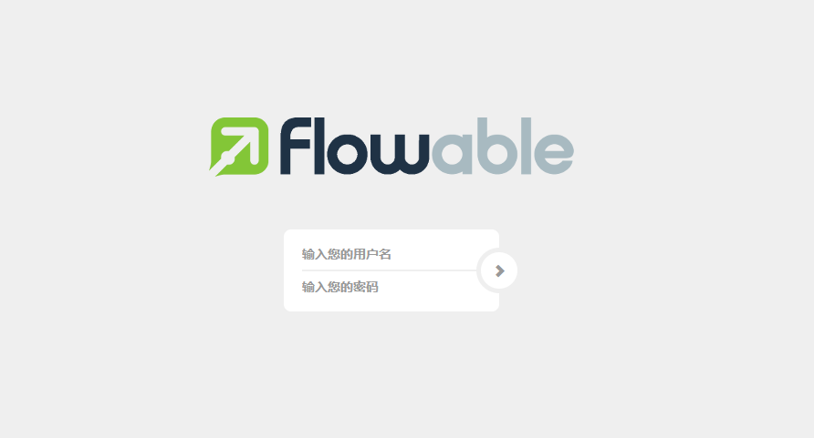

默认情况下，登录的用户名是 admin，密码是 test，注意别把密码写错了。

登录成功之后，如果看到如下页面，就表示安装成功了（一般来说应该不会有安装问题）：

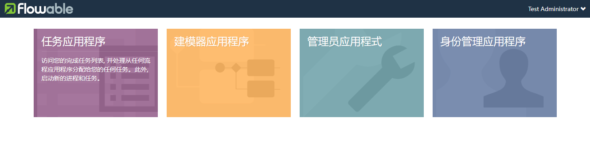

### 流程图绘制

首先点击建模器应用程序，开始绘制：

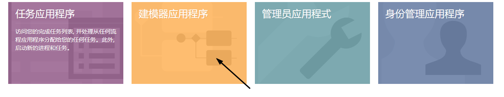

点击右上角创建流程，创建一个流程：

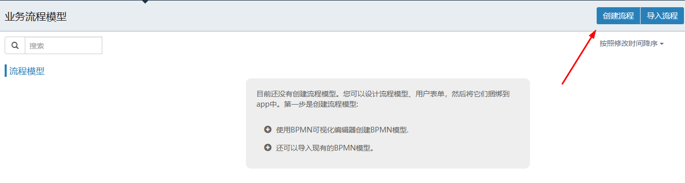


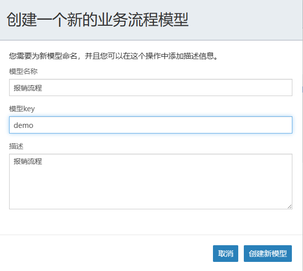

首先第一步是用户提交报销材料，报销材料需要填写一个表单，所以我们在下面的属性中，找到表单引用，为这个用户任务设置一个外部表单：

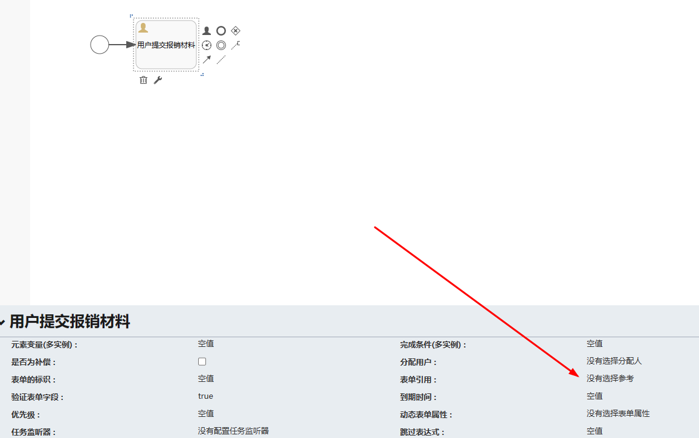

如果有提前绘制好的表单，这里就会显示出来，那么直接引用即可，如果没有提前绘制好的表单，那么看到的就如同上图那样。

现在点击新表单，创建一个新表单：

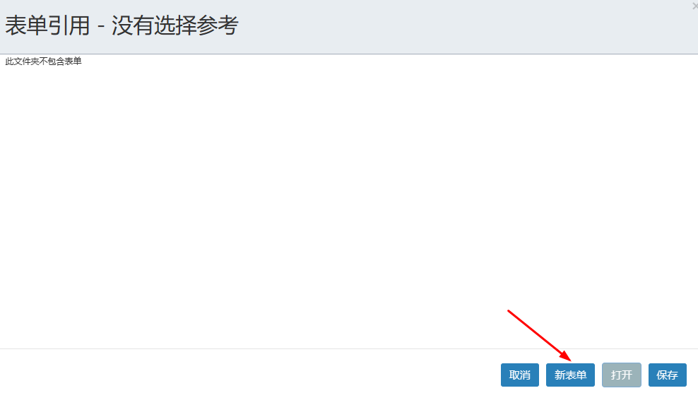

为新表单设置名称、key 等内容：

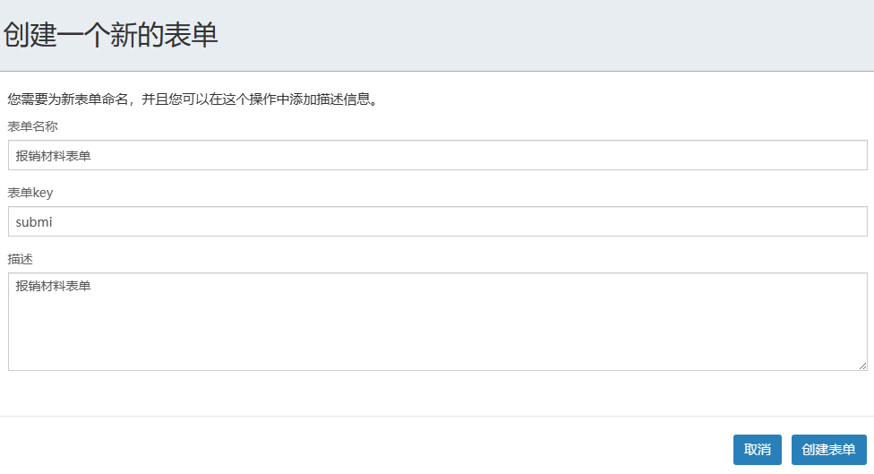

创建成功之后，就可以看到表单设计页面了：

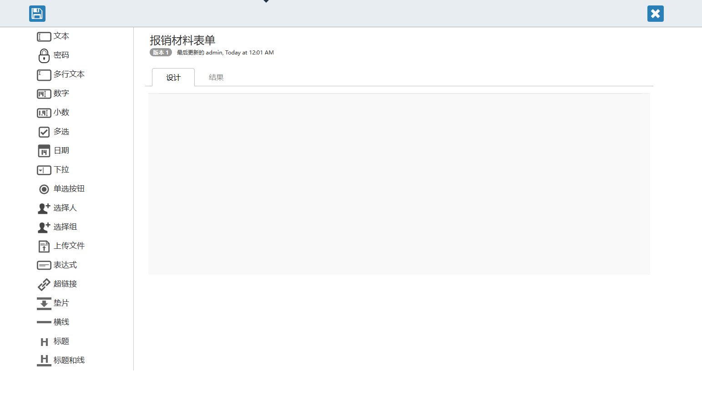

左边是表单组件区域，右边是表单绘制区域。思考用户需要提交哪些信息来报销，直接将相应的表单拖过来即可。

> 其实大家看最上面一栏的顶部菜单，也自动切换到表单菜单了，这也就意味着，当我们想要创建一个表单的时候，也可以不用从流程绘制那个入口进来，可以直接提前绘制好表单，然后在画流程的时候直接引用即可。

例如首先拖一个文本框过来，作为用户名，然后点击右边的编辑按钮进行编辑，如下：

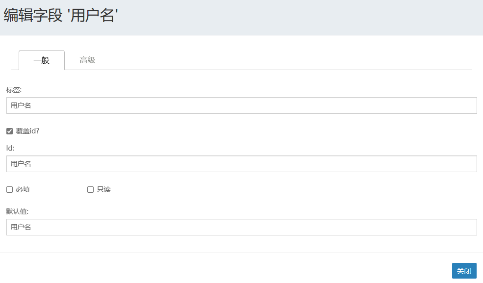

有如下属性：

- 标签：这个文本框将来展示的信息。
- 覆盖 id：勾上这个，就可以自定义 id 了，否则 id 和标签是一样的。
- id：这个是这个组件的唯一名称，将来在代码中，如果我们想要获取这个表单的值，就需要通过这个 id 去访问。
- 设置表单是否只读或者必填。
- 默认值：这个相当于是这个表单的 placeholder。

好了，理解了这个，再来加两个组件，按照相同的思路进行配置：

报销金额，这是一个小数组件：

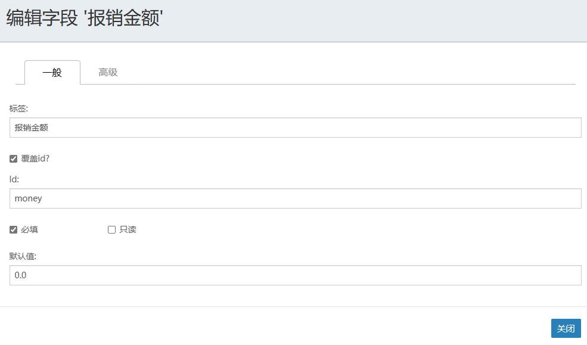

报销用途是一个多行文本组件：

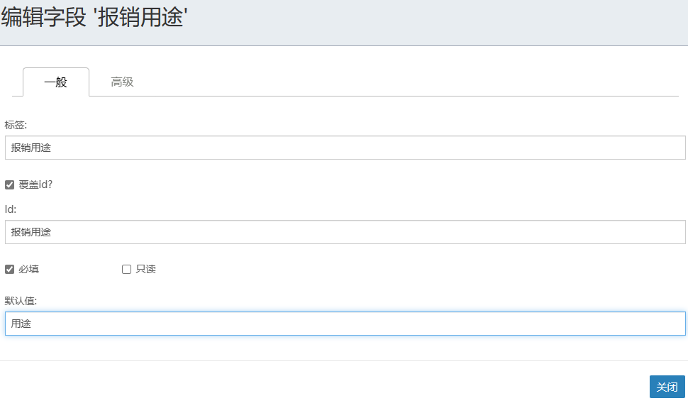

最终设计结果如下：

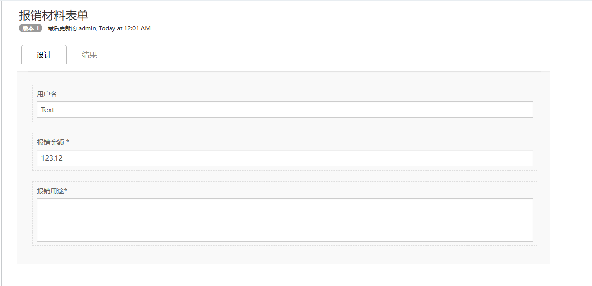

绘制完成后，点击左上角的保存按钮，保存成功后，会自动回到流程绘制页面。

## Flowable 类

### ProcessEngine

Flowable 引擎的核心接口，用于管理和执行流程定义，提供了与流程引擎交互的各种 API 方法。

通过 `ProcessEngine`，可以获取各种服务（例如 `RuntimeService`、`TaskService`、`RepositoryService` 等），这些服务用于管理和执行流程实例、任务等。

```java
@Bean
public ProcessEngine processEngine(SpringProcessEngineConfiguration configuration) {
    return configuration.buildProcessEngine();
}
```

### RepositoryService

`RepositoryService` 是 Flowable 提供的一个服务接口，主要用于管理流程定义和流程部署。它提供了一系列方法来部署新流程定义、查询已经部署的流程定义、管理流程资源等。

#### RepositoryService 主要方法

以下是 `RepositoryService` 中一些常用的方法及其说明：

| 方法                                                         | 说明                                                         |
| ------------------------------------------------------------ | ------------------------------------------------------------ |
| `createDeployment()`                                         | 创建一个新的部署对象，用于部署流程定义文件。                 |
| `deploy(DeploymentBuilder deployment)`                       | 执行部署，将流程定义文件部署到引擎中。                       |
| `createProcessDefinitionQuery()`                             | 创建一个新的查询对象，用于查询流程定义。                     |
| `getProcessDefinition(String processDefinitionId)`           | 根据流程定义ID查询流程定义。                                 |
| `getDeploymentResourceNames(String deploymentId)`            | 获取某个部署的资源名称列表。                                 |
| `getResourceAsStream(String deploymentId, String resourceName)` | 获取某个部署中指定资源的输入流。                             |
| `deleteDeployment(String deploymentId)`                      | 删除某个部署，可以选择是否级联删除相关的流程实例和历史数据。 |
| `suspendProcessDefinitionById(String processDefinitionId)`   | 挂起指定ID的流程定义，挂起后该流程定义将无法启动新的流程实例。 |
| `activateProcessDefinitionById(String processDefinitionId)`  | 激活指定ID的流程定义，恢复其启动新流程实例的能力。           |

#### 示例代码

以下是一个在 Spring Boot 中使用 `RepositoryService` 的示例代码，包括如何部署一个新的流程定义和查询已经部署的流程定义。

##### 部署流程定义

1. **创建部署对象**：通过 `repositoryService.createDeployment()` 创建一个新的部署对象。
2. **添加资源**：使用 `addClasspathResource("processes/my-process.bpmn20.xml")` 将 BPMN 文件添加到部署对象中。
3. **设置部署名称**：使用 `name("My Process Deployment")` 设置部署的名称。
4. **执行部署**：调用 `deploy()` 方法执行部署，将流程定义文件部署到 Flowable 引擎中。

```java
@Service
public class FlowableDeploymentService {

    @Resource
    private RepositoryService repositoryService;

    public void deployProcessDefinition() {
        Deployment deployment = repositoryService.createDeployment()
            .addClasspathResource("processes/my-process.bpmn20.xml")
            .name("My Process Deployment")
            .deploy();

        System.out.println("Deployment ID: " + deployment.getId());
    }
}

```

##### 查询流程定义

1. **创建查询对象**：通过 `repositoryService.createProcessDefinitionQuery()` 创建一个新的查询对象。
2. **设置查询条件**：使用 `orderByProcessDefinitionKey().asc()` 按照流程定义的 Key 进行升序排序。
3. **执行查询**：调用 `list()` 方法执行查询，返回一个包含所有符合条件的流程定义列表。
4. **处理查询结果**：遍历查询结果，输出每个流程定义的名称和版本。

```java
public class FlowableQueryService {

    @Resource
    private RepositoryService repositoryService;

    public String  queryProcessDefinitions() {
        List<ProcessDefinition> processDefinitions = repositoryService.createProcessDefinitionQuery()
            .orderByProcessDefinitionKey()
            .asc()
            .list();

        for (ProcessDefinition pd : processDefinitions) {
            System.out.println("Found process definition: " + pd.getName() + ", version: " + pd.getVersion());
            System.out.println("Process Definition ID: " + pd.getId());
        }

        // 获取第一个流程定义的ID
        if (!processDefinitions.isEmpty()) {
            ProcessDefinition pd = processDefinitions.get(0);
            String processDefinitionId = pd.getId();
            System.out.println("Process Definition ID: " + processDefinitionId);
            return processDefinitionId;
        }

        return null;
    }
}
```

### ProcessDefinition

`ProcessDefinition` 是 Flowable 中的一个接口，表示一个流程定义。流程定义是指在 BPMN 2.0 XML 文件中定义的流程模型。`ProcessDefinition` 对象包含了流程定义的元数据，例如 ID、名称、版本等。

#### ProcessDefinition 的主要方法

以下是 `ProcessDefinition` 接口中的一些常用方法及其说明：

| 方法                       | 返回类型  | 说明                                                         |
| -------------------------- | --------- | ------------------------------------------------------------ |
| `getId()`                  | `String`  | 返回流程定义的唯一标识符。                                   |
| `getKey()`                 | `String`  | 返回流程定义的 key，这是一个唯一标识符，用于流程定义的版本控制。 |
| `getName()`                | `String`  | 返回流程定义的名称。                                         |
| `getCategory()`            | `String`  | 返回流程定义的类别。                                         |
| `getVersion()`             | `int`     | 返回流程定义的版本号。                                       |
| `getDeploymentId()`        | `String`  | 返回部署该流程定义的部署 ID。                                |
| `getResourceName()`        | `String`  | 返回定义该流程的 BPMN 资源文件的名称。                       |
| `getDiagramResourceName()` | `String`  | 返回定义该流程的 BPMN 图形文件的名称（如果有）。             |
| `isSuspended()`            | `boolean` | 返回流程定义是否被挂起。                                     |
| `hasStartFormKey()`        | `boolean` | 返回流程定义是否有启动表单。                                 |
| `getDescription()`         | `String`  | 返回流程定义的描述信息。                                     |

#### 示例代码

以下是一些示例代码，展示如何使用 `RepositoryService` 来查询和管理 `ProcessDefinition` 对象。

##### 查询所有流程定义

1. **创建查询对象**：通过 `repositoryService.createProcessDefinitionQuery()` 创建一个新的查询对象。
2. **设置查询条件**：使用 `orderByProcessDefinitionKey().asc()` 按照流程定义的 Key 进行升序排序。
3. **执行查询**：调用 `list()` 方法执行查询，返回一个包含所有符合条件的流程定义列表。
4. **处理查询结果**：遍历查询结果，输出每个流程定义的 ID、Key、名称、版本和部署 ID。

```java
@Service
public class FlowableProcessDefinitionService {

    @Resource
    private RepositoryService repositoryService;

    public void queryProcessDefinitions() {
        List<ProcessDefinition> processDefinitions = repositoryService.createProcessDefinitionQuery()
            .orderByProcessDefinitionKey()
            .asc()
            .list();

        for (ProcessDefinition pd : processDefinitions) {
            System.out.println("Process Definition ID: " + pd.getId());
            System.out.println("Process Definition Key: " + pd.getKey());
            System.out.println("Process Definition Name: " + pd.getName());
            System.out.println("Process Definition Version: " + pd.getVersion());
            System.out.println("Process Definition Deployment ID: " + pd.getDeploymentId());
        }
    }
}
```

##### 查询特定流程定义

1. **通过 ID 查询流程定义**：使用 `repositoryService.getProcessDefinition(processDefinitionId)` 方法，根据流程定义的 ID 查询特定的流程定义。
2. **输出流程定义信息**：输出查询到的流程定义的 ID、Key、名称、版本和部署 ID。

```java
@Service
public class FlowableProcessDefinitionService {

    @Resource
    private RepositoryService repositoryService;

    public void queryProcessDefinitionById(String processDefinitionId) {
        ProcessDefinition pd = repositoryService.getProcessDefinition(processDefinitionId);

        System.out.println("Process Definition ID: " + pd.getId());
        System.out.println("Process Definition Key: " + pd.getKey());
        System.out.println("Process Definition Name: " + pd.getName());
        System.out.println("Process Definition Version: " + pd.getVersion());
        System.out.println("Process Definition Deployment ID: " + pd.getDeploymentId());
    }
}
```

```java
@Test
void test() {
    // 部署流程定义并获取ID
    String processDefinitionId = flowableQueryService.queryProcessDefinitions();

    // 使用获取到的流程定义ID查询详细信息
    if (processDefinitionId != null) {
        flowableProcessDefinitionService.queryProcessDefinitionById(processDefinitionId);
    }
}
```

### Deployment

在 Flowable 中，`Deployment` 表示一个流程定义或其他资源的部署。通过部署，Flowable 引擎将 BPMN 文件、表单、规则和其他资源注册到引擎中，从而使这些资源可以被执行和管理。

`Deployment` 接口提供了用于获取部署信息的方法。以下是一些常用的方法及其说明：

| 方法                  | 返回类型                | 说明                   |
| --------------------- | ----------------------- | ---------------------- |
| `getId()`             | `String`                | 返回部署的唯一标识符。 |
| `getName()`           | `String`                | 返回部署的名称。       |
| `getCategory()`       | `String`                | 返回部署的类别。       |
| `getDeploymentTime()` | `Date`                  | 返回部署的时间。       |
| `getTenantId()`       | `String`                | 返回租户ID。           |
| `getResources()`      | `Map<String, Resource>` | 返回部署中包含的资源。 |

部署实例，通过RepositoryService获取。部署之后可以查询流程定义，也可以启动流程实例。详见[RepositoryService](###RepositoryService)

### RuntimeService

`RuntimeService` 是 Flowable 的核心服务之一，主要负责管理流程实例的运行状态。通过 `RuntimeService` 可以启动流程实例、查询流程实例、获取和设置流程变量等。

#### 常用方法和属性

`RuntimeService` 提供了许多用于管理流程实例的方法：

| 方法                                                         | 返回类型               | 说明                                      |
| ------------------------------------------------------------ | ---------------------- | ----------------------------------------- |
| `startProcessInstanceByKey(String processDefinitionKey)`     | `ProcessInstance`      | 根据流程定义的 key 启动一个新的流程实例。 |
| `createProcessInstanceQuery()`                               | `ProcessInstanceQuery` | 创建一个新的流程实例查询对象。            |
| `getVariables(String executionId)`                           | `Map<String, Object>`  | 获取指定执行实例的所有流程变量。          |
| `setVariable(String executionId, String variableName, Object value)` | `void`                 | 设置指定执行实例的单个流程变量。          |
| `signalEventReceived(String signalName)`                     | `void`                 | 触发信号事件。                            |

#### 示例代码

##### 启动流程实例

1. **创建流程实例**：通过 `runtimeService.startProcessInstanceByKey("myProcess")` 启动一个新的流程实例。
2. **获取流程实例信息**：通过返回的 `ProcessInstance` 对象获取流程实例的 ID 和其他信息。

```java
@Service
public class FlowableRuntimeService {

    @Resource
    private RuntimeService runtimeService;

    public ProcessInstance startProcessInstance(String processDefinitionKey) {
        // 启动流程实例
        ProcessInstance processInstance = runtimeService.startProcessInstanceByKey(processDefinitionKey);

        // 输出流程实例信息
        System.out.println("Process Instance ID: " + processInstance.getId());
        System.out.println("Process Definition ID: " + processInstance.getProcessDefinitionId());

        return processInstance;
    }
}
```

**详解：**

1. `runtimeService.startProcessInstanceByKey(processDefinitionKey)`：根据流程定义的 key 启动一个新的流程实例。
2. `processInstance.getId()`：获取流程实例的唯一标识符。
3. `processInstance.getProcessDefinitionId()`：获取流程定义的 ID。

```java
// 部署流程定义并获取ID
ProcessDefinition processDefinition = flowableQueryService.queryProcessDefinitions();

// 使用获取到的流程定义ID查询详细信息
if (processDefinition != null) {
    flowableRuntimeService.startProcessInstance(processDefinition.getKey());
}
```

##### 查询流程实例

1. **创建查询对象**：通过 `runtimeService.createProcessInstanceQuery()` 创建一个新的流程实例查询对象。
2. **设置查询条件**：使用 `processDefinitionKey("myProcess").list()` 查询所有指定流程定义 key 的流程实例。
3. **处理查询结果**：遍历查询结果，输出每个流程实例的 ID 和其他信息。

```java
@Service
public class FlowableProcessInstanceQueryService {

    @Resource
    private RuntimeService runtimeService;

    public void queryProcessInstances(String processDefinitionKey) {
        // 创建查询对象
        List<ProcessInstance> processInstances = runtimeService.createProcessInstanceQuery()
            .processDefinitionKey(processDefinitionKey) // 设置查询条件
            .list(); // 执行查询

        // 处理查询结果
        for (ProcessInstance processInstance : processInstances) {
            System.out.println("Process Instance ID: " + processInstance.getId());
            System.out.println("Process Definition ID: " + processInstance.getProcessDefinitionId());
            System.out.println("Process Instance Start Time: " + processInstance.getStartTime());
        }
    }
}
```

**详解：**

1. `runtimeService.createProcessInstanceQuery()`：创建一个新的流程实例查询对象。
2. `.processDefinitionKey(processDefinitionKey)`：设置查询条件为指定的流程定义 key。
3. `.list()`：执行查询并返回结果列表。
4. `processInstance.getId()`：获取流程实例的唯一标识符。
5. `processInstance.getProcessDefinitionId()`：获取流程定义的 ID。
6. `processInstance.getStartTime()`：获取流程实例的开始时间。

##### 获取和设置流程变量

1. **获取流程变量**：通过 `runtimeService.getVariables(processInstanceId)` 获取指定执行实例的所有流程变量。
2. **设置流程变量**：通过 `runtimeService.setVariable(processInstanceId, variableName, value)` 设置指定执行实例的单个流程变量。

```java
@Service
public class FlowableVariableService {

    @Resource
    private RuntimeService runtimeService;

    public Map<String, Object> getProcessVariables(String processInstanceId) {
        // 获取流程变量
        return runtimeService.getVariables(processInstanceId);
    }

    public void setProcessVariable(String processInstanceId, String variableName, Object value) {
        // 设置流程变量
        runtimeService.setVariable(processInstanceId, variableName, value);
    }
}
```

**详解：**

1. `runtimeService.getVariables(executionId)`：获取指定执行实例的所有流程变量。
2. `runtimeService.setVariable(executionId, variableName, value)`：设置指定执行实例的单个流程变量。

```java
// 部署流程定义并获取ID
ProcessDefinition processDefinition = flowableQueryService.queryProcessDefinitions();

// 使用获取到的流程定义ID查询详细信息
if (processDefinition != null) {
    ProcessInstance processInstance = flowableRuntimeService.startProcessInstance(processDefinition.getKey());

    String processInstanceId = processInstance.getId();
    String variableName = "testVariable";
    String variableValue = "testValue";
    flowableVariableService.setProcessVariable(processInstanceId, variableName, variableValue);

    Map<String, Object> processVariables = flowableVariableService.getProcessVariables(processInstanceId);

    System.out.println("processVariables : " + processVariables);
}
```

##### 带有业务键的流程实例

业务键（Business Key）在 Flowable 中的主要作用是将流程实例与业务数据关联起来，从而在查询和管理流程实例时，可以通过业务键快速找到对应的业务数据。通过在启动流程实例时指定业务键，并在查询流程实例时使用业务键，可以方便地管理和查询流程实例。

```java
public ProcessInstance startProcessInstanceByKey(String processDefinitionKey, String businessKey) {
    // 启动流程实例
    ProcessInstance processInstance = runtimeService.startProcessInstanceByKey(processDefinitionKey, businessKey);

    // 输出流程实例信息
    System.out.println("Process Instance ID: " + processInstance.getId());
    System.out.println("Process Definition ID: " + processInstance.getProcessDefinitionId());

    return processInstance;
}
```

```java
public void  getProcessInstanceByBusinessKey(String businessKey){
    ProcessInstance processInstance = runtimeService.createProcessInstanceQuery().processInstanceBusinessKey(businessKey).singleResult();
    System.out.println("processInstance：" + processInstance);
}
```

```java
// 部署流程定义并获取ID
ProcessDefinition processDefinition = flowableQueryService.queryProcessDefinitions();

// 使用获取到的流程定义ID查询详细信息
if (processDefinition != null) {
    ProcessInstance processInstance = flowableRuntimeService.startProcessInstanceByKey(processDefinition.getKey(), "AAAA");
    flowableProcessInstanceQueryService.getProcessInstanceByBusinessKey(processDefinition.getKey());
}
```

### ProcessInstance

`ProcessInstance` 是 Flowable 中表示一个具体执行中的流程实例的接口。它提供了访问流程实例相关信息的方法，如流程实例的 ID、流程定义的 ID、业务键、启动时间等。详见[RuntimeService](###RuntimeService)。

以下是 `ProcessInstance` 接口的一些常用方法和属性：

| 方法                       | 返回类型  | 说明                                         |
| -------------------------- | --------- | -------------------------------------------- |
| `getId()`                  | `String`  | 返回流程实例的唯一标识。                     |
| `getProcessDefinitionId()` | `String`  | 返回流程实例对应的流程定义的唯一标识。       |
| `getBusinessKey()`         | `String`  | 返回流程实例的业务键。                       |
| `getStartTime()`           | `Date`    | 返回流程实例的启动时间。                     |
| `getEndTime()`             | `Date`    | 返回流程实例的结束时间（如果流程已经结束）。 |
| `getName()`                | `String`  | 返回流程实例的名称。                         |
| `isEnded()`                | `boolean` | 判断流程实例是否已经结束。                   |
| `getKey()`                 | `String`  | 返回流程实例的 Key。                         |

### TaskService

`TaskService` 是 Flowable 中用于管理任务（Task）的服务接口。通过 `TaskService` 可以创建、查询、完成、委派、指派等操作任务。

#### 常用方法和属性

以下是 `TaskService` 接口的一些常用方法和属性：

| 方法                                         | 返回类型       | 说明                                     |
| -------------------------------------------- | -------------- | ---------------------------------------- |
| `createTaskQuery()`                          | `TaskQuery`    | 创建一个任务查询对象，用于查询任务列表。 |
| `newTask()`                                  | `Task`         | 创建一个新的任务。                       |
| `saveTask()`                                 |                | 保存任务。                               |
| `complete(String taskId)`                    |                | 完成指定 ID 的任务。                     |
| `delegateTask(String taskId, String userId)` |                | 将任务委派给指定用户。                   |
| `claim(String taskId, String userId)`        |                | 认领任务。                               |
| `setAssignee(String taskId, String userId)`  |                | 指定任务的执行人。                       |
| `getTaskFormData(String taskId)`             | `TaskFormData` | 获取任务表单数据。                       |

#### 使用示例

以下是如何使用 `TaskService` 接口的一些示例代码，包括创建任务、查询任务、完成任务等操作。

##### 创建任务

通过 `TaskService.newTask()` 方法创建一个新的任务对象，然后设置任务的属性，最后通过 `TaskService.saveTask()` 方法保存任务。

```
@Service
public class FlowableTaskService {

    @Resource
    private TaskService taskService;

    public Task createTask(String name, String description, String assignee) {
        // 创建一个新的任务
        Task task = taskService.newTask();
        task.setName(name);
        task.setDescription(description);
        task.setAssignee(assignee);
        taskService.saveTask(task);
        return task;
    }
}
```

##### 查询任务

通过 `TaskService.createTaskQuery()` 方法创建一个任务查询对象，然后可以通过不同的条件进行查询，比如任务的执行人、任务的名称等。

```
@Service
public class FlowableQueryService {

    @Resource
    private TaskService taskService;

    public List<Task> getAllTasks() {
        // 查询所有任务
        return taskService.createTaskQuery().list();
    }
}
```

##### 完成任务

通过 `TaskService.complete(String taskId)` 方法完成指定 ID 的任务。

```
@Service
public class FlowableCompletionService {

    @Resource
    private TaskService taskService;

    public void completeTask(String taskId) {
        // 完成任务
        taskService.complete(taskId);
    }
}
```

##### 测试

```java
    @Test
    void test() {
        // Step 1: 创建任务
        String name = "Task 1";
        String description = "This is task 1";
        String assignee = "user1";
        Task task = taskService.createTask(name, description, assignee);
        
        // Step 2: 查询任务
        List<Task> tasks = queryService.getAllTasks();
        System.out.println("tasks:" + tasks);
        
        // Step 3: 完成任务
        completionService.completeTask(task.getId());
        
        // Step 4: 查询已完成的任务
        tasks = queryService.getAllTasks();
        System.out.println("tasks:" + tasks);
        
    }
```


### JavaDelegate

`JavaDelegate` 是 Flowable 中用于在流程执行过程中调用自定义 Java 代码的接口。通过实现 `JavaDelegate` 接口，可以在流程节点上定义具体的业务逻辑，当流程执行到该节点时，会自动调用相应的 Java 代码。

#### 常用方法和属性

`JavaDelegate` 接口只有一个方法：

| 方法                                   | 返回类型 | 说明                 |
| -------------------------------------- | -------- | -------------------- |
| `execute(DelegateExecution execution)` | `void`   | 执行具体的业务逻辑。 |

#### 使用示例

##### 自定义 `JavaDelegate` 类

```java
@Component
public class MyJavaDelegate implements JavaDelegate {
    
    @Override
    public void execute(DelegateExecution execution) {
        // 获取流程变量
        String processVariable = (String) execution.getVariable("myVariable");
        System.out.println("Process Variable: " + processVariable);
        
        // 执行业务逻辑
        System.out.println("Executing custom business logic.");
        
        // 设置新的流程变量
        execution.setVariable("newVariable", "newValue");
    }
}
```

##### **在 BPMN 文件中使用 JavaDelegate**

```xml
<?xml version="1.0" encoding="UTF-8"?>
<definitions xmlns="http://www.omg.org/spec/BPMN/20100524/MODEL"
             xmlns:xsi="http://www.w3.org/2001/XMLSchema-instance"
             xmlns:bpmndi="http://www.omg.org/spec/BPMN/20100524/DI"
             xmlns:omgdc="http://www.omg.org/spec/DD/20100524/DC"
             xmlns:omgdi="http://www.omg.org/spec/DD/20100524/DI"
             xmlns:flowable="http://flowable.org/bpmn"
             targetNamespace="http://www.flowable.org/processdef">

    <process id="myProcess" name="My Process" isExecutable="true">

        <!-- 开始事件 -->
        <startEvent id="startEvent" name="Start"/>

        <!-- 用户任务 -->
        <userTask id="approveTask" name="Approve Request" flowable:assignee="manager"/>

        <!-- 服务任务 -->
        <serviceTask id="serviceTask" name="Service Task" flowable:delegateExpression="${myJavaDelegate}"/>

        <!-- 结束事件 -->
        <endEvent id="endEvent" name="End"/>

        <!-- 连线 -->
        <sequenceFlow id="flow1" sourceRef="startEvent" targetRef="approveTask"/>
        <sequenceFlow id="flow2" sourceRef="approveTask" targetRef="serviceTask"/>
        <sequenceFlow id="flow3" sourceRef="serviceTask" targetRef="endEvent"/>

    </process>

    <!-- 图形信息 -->
    <bpmndi:BPMNDiagram id="BPMNDiagram_myProcess">
        <bpmndi:BPMNPlane id="BPMNPlane_myProcess" bpmnElement="myProcess">
            <bpmndi:BPMNShape id="BPMNShape_startEvent" bpmnElement="startEvent">
                <omgdc:Bounds x="100" y="100" width="36" height="36"/>
            </bpmndi:BPMNShape>
            <bpmndi:BPMNShape id="BPMNShape_approveTask" bpmnElement="approveTask">
                <omgdc:Bounds x="200" y="80" width="100" height="80"/>
            </bpmndi:BPMNShape>
            <bpmndi:BPMNShape id="BPMNShape_serviceTask" bpmnElement="serviceTask">
                <omgdc:Bounds x="350" y="80" width="100" height="80"/>
            </bpmndi:BPMNShape>
            <bpmndi:BPMNShape id="BPMNShape_endEvent" bpmnElement="endEvent">
                <omgdc:Bounds x="500" y="100" width="36" height="36"/>
            </bpmndi:BPMNShape>
            <bpmndi:BPMNEdge id="BPMNEdge_flow1" bpmnElement="flow1">
                <omgdi:waypoint x="136" y="118"/>
                <omgdi:waypoint x="200" y="118"/>
            </bpmndi:BPMNEdge>
            <bpmndi:BPMNEdge id="BPMNEdge_flow2" bpmnElement="flow2">
                <omgdi:waypoint x="300" y="118"/>
                <omgdi:waypoint x="350" y="118"/>
            </bpmndi:BPMNEdge>
            <bpmndi:BPMNEdge id="BPMNEdge_flow3" bpmnElement="flow3">
                <omgdi:waypoint x="450" y="118"/>
                <omgdi:waypoint x="500" y="118"/>
            </bpmndi:BPMNEdge>
        </bpmndi:BPMNPlane>
    </bpmndi:BPMNDiagram>
</definitions>
```

##### 部署流程定义

```java
@Service
public class FlowableDeploymentService {

    @Resource
    private RepositoryService repositoryService;

    @Transactional
    public void deployProcessDefinition() {
        Deployment deployment = repositoryService.createDeployment()
                .addClasspathResource("processes/my-process.bpmn20.xml")
                .name("My Process Deployment")
                .deploy();
        
        System.out.println("Deployment ID: " + deployment.getId());
    }
}
```

##### 启动流程实例

```java
@Service
public class FlowableRuntimeService {
    
    @Resource
    private RuntimeService runtimeService;
    
    public <K, V> ProcessInstance   startProcessInstance(String processDefinitionKey, Map<String, Object> kvMap) {
        // 启动流程实例
        ProcessInstance processInstance = runtimeService.startProcessInstanceByKey(processDefinitionKey, kvMap);
        
        // 输出流程实例信息
        System.out.println("Process Instance ID: " + processInstance.getId());
        System.out.println("Process Definition ID: " + processInstance.getProcessDefinitionId());
        
        return processInstance;
    }
}
```

##### 测试

```java
@Test
public void testJavaDelegate() {
    // 部署流程定义
    flowableDeploymentService.deployProcessDefinition();

    // 启动流程实例
    ProcessInstance processInstance = flowableRuntimeService.startProcessInstance("myProcess", Collections.singletonMap("myVariable", "initialValue"));

    // 打印流程实例信息
    flowableRuntimeService.printProcessInstanceInfo(processInstance);
}
```

### IdentityService

`IdentityService` 是 Flowable 的核心服务之一，主要用于管理用户和组的信息。通过 `IdentityService` 可以创建、查询、更新和删除用户和组，还可以管理用户和组之间的关系。

#### 常用方法和属性

`IdentityService` 提供了许多用于管理用户和组的方法：

| 方法                                              | 返回类型     | 说明             |
| ------------------------------------------------- | ------------ | ---------------- |
| `saveUser(User user)`                             | `void`       | 创建或更新用户   |
| `deleteUser(String userId)`                       | `void`       | 删除用户         |
| `createUserQuery()`                               | `UserQuery`  | 创建用户查询对象 |
| `saveGroup(Group group)`                          | `void`       | 创建或更新组     |
| `deleteGroup(String groupId)`                     | `void`       | 删除组           |
| `createGroupQuery()`                              | `GroupQuery` | 创建组查询对象   |
| `createMembership(String userId, String groupId)` | `void`       | 将用户添加到组   |
| `deleteMembership(String userId, String groupId)` | `void`       | 将用户从组中移除 |

#### 示例代码

##### 创建用户

1. **创建用户对象**：使用 `identityService.newUser(userId)` 方法创建一个新的用户对象。
2. **设置用户属性**：为用户对象设置用户名、密码、邮箱等属性。
3. **保存用户**：调用 `identityService.saveUser(user)` 方法保存用户信息。

```java
@Service
public class UserService {

    @Resource
    private IdentityService identityService;

    public void createUser(String userId, String firstName, String lastName, String email, String password) {
        // 创建用户对象
        User user = identityService.newUser(userId);
        user.setFirstName(firstName);
        user.setLastName(lastName);
        user.setEmail(email);
        user.setPassword(password);

        // 保存用户
        identityService.saveUser(user);
    }
}
```

##### 查询用户

1. **创建查询对象**：通过 `identityService.createUserQuery()` 创建一个新的用户查询对象。
2. **设置查询条件**：使用 `userId(userId)` 按用户 ID 进行查询。
3. **执行查询**：调用 `singleResult()` 方法执行查询，返回匹配的用户对象。

```java
@Service
public class UserQueryService {

    @Resource
    private IdentityService identityService;

    public User getUserById(String userId) {
        // 创建查询对象
        return identityService.createUserQuery()
                .userId(userId)
                .singleResult();
    }
}
```

##### 创建组

1. **创建组对象**：使用 `identityService.newGroup(groupId)` 方法创建一个新的组对象。
2. **设置组属性**：为组对象设置名称等属性。
3. **保存组**：调用 `identityService.saveGroup(group)` 方法保存组信息。

```java
@Service
public class GroupService {

    @Resource
    private IdentityService identityService;

    public void createGroup(String groupId, String name) {
        // 创建组对象
        Group group = identityService.newGroup(groupId);
        group.setName(name);

        // 保存组
        identityService.saveGroup(group);
    }
}
```

##### 用户添加到组

1. **创建成员关系**：使用 `identityService.createMembership(userId, groupId)` 将用户添加到组中。

```java
@Service
public class MembershipService {

    @Resource
    private IdentityService identityService;

    public void addUserToGroup(String userId, String groupId) {
        // 将用户添加到组
        identityService.createMembership(userId, groupId);
    }
}
```

##### 删除用户

1. **删除用户**：使用 `identityService.deleteUser(userId)` 方法删除用户。

```java
@Service
public class UserDeleteService {

    @Resource
    private IdentityService identityService;

    public void deleteUser(String userId) {
        // 删除用户
        identityService.deleteUser(userId);
    }
}
```

#### 测试示例

使用 Spring Boot 测试类来测试用户和组的管理功能。

```java
@Test
public void testUserAndGroupManagement() {
    // 创建用户
    String userId = "user1";
    userService.createUser(userId, "John", "Doe", "john.doe@example.com", "password");

    // 查询用户
    User user = userQueryService.getUserById(userId);
    log.info("user:{}", user.toString());

    // 创建组
    String groupId = "group1";
    groupService.createGroup(groupId, "Managers");

    // 将用户添加到组
    membershipService.addUserToGroup(userId, groupId);

    // 删除用户
    userService.deleteUser(userId);

}
```

### FormService

`FormService` 是 Flowable 中用于管理和操作表单数据的服务。它提供了一些方法，用于提交表单、获取表单数据和表单定义等。

#### 常用方法和属性

`FormService` 提供了许多用于管理和操作表单的方法：

| 方法                                                         | 返回类型          | 说明                           |
| ------------------------------------------------------------ | ----------------- | ------------------------------ |
| `submitTaskFormData(String taskId, Map<String, String> properties)` | `void`            | 提交任务表单数据               |
| `submitStartFormData(String processDefinitionId, Map<String, String> properties)` | `ProcessInstance` | 提交启动表单数据并启动流程实例 |
| `getStartFormData(String processDefinitionId)`               | `StartFormData`   | 获取流程启动表单数据           |
| `getTaskFormData(String taskId)`                             | `TaskFormData`    | 获取任务表单数据               |

#### 示例代码

##### 提交启动表单数据并启动流程实例

1. **创建表单数据**：构建表单数据的键值对。
2. **提交表单数据**：调用 `formService.submitStartFormData(processDefinitionId, properties)` 方法提交表单数据并启动流程实例。

```java
@Service
public class FormServiceExample {
    
    @Autowired
    private FormService formService;
    
    public ProcessInstance startProcessWithForm(String processDefinitionId) {
        // 创建表单数据
        Map<String, String> formProperties = new HashMap<>();
        formProperties.put("applicantName", "John Doe");
        formProperties.put("numberOfDays", "5");
        formProperties.put("vacationMotivation", "Family trip");
        
        // 提交表单数据并启动流程实例
        return formService.submitStartFormData(processDefinitionId, formProperties);
    }
}

```

##### 提交任务表单数据

1. **创建表单数据**：构建表单数据的键值对。
2. **提交表单数据**：调用 `formService.submitTaskFormData(taskId, properties)` 方法提交表单数据。

```java
@Service
public class TaskFormServiceExample {

    @Autowired
    private FormService formService;

    public void submitTaskForm(String taskId) {
        // 创建表单数据
        Map<String, String> formProperties = new HashMap<>();
        formProperties.put("approval", "approved");

        // 提交任务表单数据
        formService.submitTaskFormData(taskId, formProperties);
    }
}
```

##### 获取流程启动表单数据

1. **获取表单数据**：通过 `formService.getStartFormData(processDefinitionId)` 方法获取启动表单数据。

```java
@Service
public class StartFormDataService {

    @Autowired
    private FormService formService;

    public StartFormData getStartFormData(String processDefinitionId) {
        // 获取启动表单数据
        return formService.getStartFormData(processDefinitionId);
    }
}
```

##### 获取任务表单数据

1. **获取表单数据**：通过 `formService.getTaskFormData(taskId)` 方法获取任务表单数据。

```java
@Service
public class TaskFormDataService {

    @Autowired
    private FormService formService;

    public TaskFormData getTaskFormData(String taskId) {
        // 获取任务表单数据
        return formService.getTaskFormData(taskId);
    }
}
```

#### 测试示例

```xml
<?xml version="1.0" encoding="UTF-8"?>
<definitions xmlns="http://www.omg.org/spec/BPMN/20100524/MODEL"
             xmlns:xsi="http://www.w3.org/2001/XMLSchema-instance"
             xmlns:bpmndi="http://www.omg.org/spec/BPMN/20100524/DI"
             xmlns:omgdc="http://www.omg.org/spec/DD/20100524/DC"
             xmlns:omgdi="http://www.omg.org/spec/DD/20100524/DI"
             xmlns:flowable="http://flowable.org/bpmn"
             targetNamespace="http://www.flowable.org/processdef">

    <process id="myProcess3" name="My Process" isExecutable="true">

        <!-- 开始事件 -->
        <startEvent id="startEvent" name="Start"/>

        <!-- 用户任务 -->
        <userTask id="approveTask" name="Approve Request" flowable:formKey="approveForm" flowable:assignee="manager"/>

        <!-- 结束事件 -->
        <endEvent id="endEvent" name="End"/>

        <!-- 连线 -->
        <sequenceFlow id="flow1" sourceRef="startEvent" targetRef="approveTask"/>
        <sequenceFlow id="flow2" sourceRef="approveTask" targetRef="endEvent"/>

    </process>

    <!-- 图形信息 -->
    <bpmndi:BPMNDiagram id="BPMNDiagram_myProcess">
        <bpmndi:BPMNPlane id="BPMNPlane_myProcess" bpmnElement="myProcess">
            <bpmndi:BPMNShape id="BPMNShape_startEvent" bpmnElement="startEvent">
                <omgdc:Bounds x="100" y="100" width="36" height="36"/>
            </bpmndi:BPMNShape>
            <bpmndi:BPMNShape id="BPMNShape_approveTask" bpmnElement="approveTask">
                <omgdc:Bounds x="200" y="80" width="100" height="80"/>
            </bpmndi:BPMNShape>
            <bpmndi:BPMNShape id="BPMNShape_endEvent" bpmnElement="endEvent">
                <omgdc:Bounds x="350" y="100" width="36" height="36"/>
            </bpmndi:BPMNShape>
            <bpmndi:BPMNEdge id="BPMNEdge_flow1" bpmnElement="flow1">
                <omgdi:waypoint x="136" y="118"/>
                <omgdi:waypoint x="200" y="118"/>
            </bpmndi:BPMNEdge>
            <bpmndi:BPMNEdge id="BPMNEdge_flow2" bpmnElement="flow2">
                <omgdi:waypoint x="300" y="118"/>
                <omgdi:waypoint x="350" y="118"/>
            </bpmndi:BPMNEdge>
        </bpmndi:BPMNPlane>
    </bpmndi:BPMNDiagram>
</definitions>
```

使用 Spring Boot 测试类来测试表单服务功能。

```java
@Test
public void testFormService() {

    // 部署流程定义并获取ID
    ProcessInstance processInstance = flowableRuntimeService.startProcessInstance("myProcess3");

    // 调用服务创建任务
    Task task = taskService.createTaskQuery().processInstanceId(processInstance.getId()).singleResult();

    String taskId = task.getId();
    System.out.println("task =" + task);

    // 获取任务表单数据
    TaskFormData taskFormData = taskFormDataService.getTaskFormData(taskId);
    System.out.println("taskFormData = " + taskFormData);

    taskFormServiceExample.submitTaskForm(taskId);

    // 打印提交后任务状态
    Task updatedTask = taskService.createTaskQuery().taskId(taskId).singleResult();
    System.out.println("Task after form submission: " + updatedTask);

}
```

### HistoryService

`HistoryService` 是 Flowable 的核心服务之一，用于查询流程引擎的历史数据。它提供了一系列方法，可以用来查询已经完成的流程实例、任务、变量等的历史信息。

#### 常用方法和属性

`HistoryService` 提供了许多用于查询历史数据的方法：

| 方法                                    | 返回类型                        | 说明                                         |
| --------------------------------------- | ------------------------------- | -------------------------------------------- |
| `createHistoricProcessInstanceQuery()`  | `HistoricProcessInstanceQuery`  | 创建查询已完成的流程实例的查询对象           |
| `createHistoricActivityInstanceQuery()` | `HistoricActivityInstanceQuery` | 创建查询已完成的活动实例的查询对象           |
| `createHistoricTaskInstanceQuery()`     | `HistoricTaskInstanceQuery`     | 创建查询已完成的任务实例的查询对象           |
| `createHistoricVariableInstanceQuery()` | `HistoricVariableInstanceQuery` | 创建查询已完成的流程变量实例的查询对象       |
| `createHistoricIdentityLinkQuery()`     | `HistoricIdentityLinkQuery`     | 创建查询历史身份关联（历史参与者）的查询对象 |
| `createHistoricDetailQuery()`           | `HistoricDetailQuery`           | 创建查询已完成的流程实例的详细信息的查询对象 |
| `createHistoricProcessInstanceQuery()`  | `HistoricProcessInstanceQuery`  | 创建查询已完成的流程实例的查询对象           |

#### 使用示例

1. **创建查询对象：** 首先，通过 `historyService.createHistoricProcessInstanceQuery()` 创建了一个查询已完成的流程实例的查询对象。
2. **设置查询条件：** 可以设置各种查询条件，例如流程定义的 Key，以便过滤查询结果。
3. **执行查询：** 然后，执行查询并将结果存储在 `List<HistoricProcessInstance>` 中。
4. **处理查询结果：** 最后，遍历查询结果并处理每个历史流程实例的相关信息。

```java
@Service
public class HistoryServiceExample {

    @Resource
    private HistoryService historyService;

    public void queryHistoricProcessInstances() {
        // 创建查询已完成的流程实例的查询对象
        HistoricProcessInstanceQuery query = historyService.createHistoricProcessInstanceQuery();

        // 设置查询条件（例如流程定义的Key）
        query.processDefinitionKey("myProcess");

        // 执行查询
        List<HistoricProcessInstance> historicProcessInstances = query.list();

        // 处理查询结果
        for (HistoricProcessInstance historicProcessInstance : historicProcessInstances) {
            System.out.println("Historic Process Instance ID: " + historicProcessInstance.getId());
            System.out.println("Start Time: " + historicProcessInstance.getStartTime());
            System.out.println("End Time: " + historicProcessInstance.getEndTime());
            // 其他属性和方法
        }
    }
}
```

### ManagementService

`ManagementService` 是 Flowable 的核心服务之一，用于管理流程引擎的运行时状态和执行一些管理操作。它提供了一系列方法，可以用于执行诸如作业（jobs）管理、定时器（timers）管理、引擎配置信息获取等操作。

> `ManagementService`通常在用Flowable编写用户应用时不需要使用。它可以读取数据库表与表原始数据的信息，也提供了对作业(job)的查询与管理操作。

#### 常用方法和属性

`ManagementService` 提供了一些常用的方法和属性：

| 方法                                    | 返回类型             | 说明                                             |
| --------------------------------------- | -------------------- | ------------------------------------------------ |
| `createTimerJobQuery()`                 | `TimerJobQuery`      | 创建查询定时任务的查询对象                       |
| `createJobQuery()`                      | `JobQuery`           | 创建查询作业的查询对象                           |
| `createDeadLetterJobQuery()`            | `DeadLetterJobQuery` | 创建查询死信作业的查询对象                       |
| `createHistoryJobQuery()`               | `HistoryJobQuery`    | 创建查询历史作业的查询对象                       |
| `createJobQueryByProcessInstanceId()`   | `JobQuery`           | 根据流程实例ID创建查询作业的查询对象             |
| `createJobQueryByExecutionId()`         | `JobQuery`           | 根据执行ID创建查询作业的查询对象                 |
| `createJobQueryByProcessDefinitionId()` | `JobQuery`           | 根据流程定义ID创建查询作业的查询对象             |
| `getTimerJobCount()`                    | `long`               | 获取定时任务数量                                 |
| `getJobCount()`                         | `long`               | 获取作业数量                                     |
| `getDeadLetterJobCount()`               | `long`               | 获取死信作业数量                                 |
| `getHistoryJobCount()`                  | `long`               | 获取历史作业数量                                 |
| `executeCommand()`                      | `T`                  | 执行一个通用的命令，例如执行自定义的命令、查询等 |

#### 使用示例

```java
@Service
public class ManagementServiceExample {

    @Autowired
    private ManagementService managementService;

    public void queryJobs() {
        // 创建查询作业的查询对象
        JobQuery query = managementService.createJobQuery();

        // 设置查询条件（例如定时器类型）
        query.timers();

        // 执行查询
        List<Job> jobs = query.list();

        // 处理查询结果
        for (Job job : jobs) {
            System.out.println("Job ID: " + job.getId());
            System.out.println("Job Due Date: " + job.getDuedate());
            // 其他属性和方法
        }
    }
}
```

在上面的示例中，我们创建了一个 `ManagementServiceExample` 类来演示如何使用 `ManagementService` 查询作业。我们创建了一个查询对象，并设置了作业类型为定时器，然后执行查询并处理查询结果。

### DynamicBpmnService

`DynamicBpmnService` 是 Flowable 提供的一个核心服务，用于在运行时动态修改流程定义（BPMN）的内容。通过 `DynamicBpmnService`，可以实现对流程定义的动态调整，例如添加、删除、修改流程元素（如活动、网关、连线等），从而实现流程的灵活性和可定制性。

#### 常用方法和属性

`DynamicBpmnService` 提供了一些常用的方法和属性：

| 方法                                                         | 返回类型              | 说明                               |
| ------------------------------------------------------------ | --------------------- | ---------------------------------- |
| `changeDeploymentParentDeploymentId(String deploymentId, String newParentDeploymentId)` | `void`                | 修改部署的父部署ID                 |
| `changeLocalizationName(String language, String localizationKey, String newName)` | `void`                | 修改流程定义的本地化名称           |
| `changeLocalizationDescription(String language, String localizationKey, String newDescription)` | `void`                | 修改流程定义的本地化描述           |
| `changeLocalization(String language, String localizationKey, String newName, String newDescription)` | `void`                | 修改流程定义的本地化名称和描述     |
| `getBpmnModel(String processDefinitionId)`                   | `BpmnModel`           | 根据流程定义ID获取对应的BPMN模型   |
| `saveProcessDefinitionInfo(String processDefinitionId, Map<String, Object> info)` | `void`                | 保存流程定义的额外信息             |
| `getProcessDefinitionInfo(String processDefinitionId)`       | `Map<String, Object>` | 获取保存的流程定义的额外信息       |
| `setProcessDefinitionCategory(String processDefinitionId, String category)` | `void`                | 设置流程定义的类别                 |
| `setProcessDefinitionName(String processDefinitionId, String name)` | `void`                | 设置流程定义的名称                 |
| `setProcessDefinitionDescription(String processDefinitionId, String description)` | `void`                | 设置流程定义的描述                 |
| `changeFlowElementName(String processDefinitionId, String elementId, String newName)` | `void`                | 修改流程元素（活动、网关等）的名称 |
| `changeFlowElementDocumentation(String processDefinitionId, String elementId, String documentation)` | `void`                | 修改流程元素的文档                 |
| `addUserTask(String processDefinitionId, String taskId, String name, String assignee)` | `void`                | 添加用户任务节点到流程定义         |
| `addServiceTask(String processDefinitionId, String taskId, String name, String implementation)` | `void`                | 添加服务任务节点到流程定义         |
| `addSequenceFlow(String processDefinitionId, String flowId, String sourceRef, String targetRef)` | `void`                | 添加连线到流程定义                 |
| `addExclusiveGateway(String processDefinitionId, String gatewayId, String name)` | `void`                | 添加排他网关到流程定义             |
| `deleteFlowElement(String processDefinitionId, String elementId)` | `void`                | 删除流程定义中的元素               |
| `saveProcessDefinitionInfo(String processDefinitionId, Map<String, Object> info)` | `void`                | 保存流程定义的额外信息             |
| `getProcessDefinitionInfo(String processDefinitionId)`       | `Map<String, Object>` | 获取保存的流程定义的额外信息       |

#### 使用示例

```java
@Service
public class DynamicBpmnServiceExample {

    @Autowired
    private DynamicBpmnService dynamicBpmnService;

    public void addUserTaskToProcessDefinition(String processDefinitionId, String taskId, String name, String assignee) {
        // 添加用户任务节点到流程定义
        dynamicBpmnService.addUserTask(processDefinitionId, taskId, name, assignee);
    }
}
```

在上面的示例中，我们创建了一个 `DynamicBpmnServiceExample` 类，演示了如何使用 `DynamicBpmnService` 向流程定义中添加用户任务节点。我们调用了 `addUserTask` 方法，并传递了流程定义ID、任务ID、任务名称和指定的办理人，从而将用户任务节点添加到流程定义中。

## 核心数据库表

### 数据库介绍

Flowable 使用关系型数据库来存储流程引擎的相关数据。数据库的选择取决于具体的部署环境和需求，Flowable 支持多种关系型数据库，如 MySQL、PostgreSQL、Oracle、Microsoft SQL Server 等。

在数据库中，Flowable 使用一组表来存储不同类型的数据。这些表可以分为以下几类：

1. **通用数据表：** 包括用于存储流程定义、流程实例、任务、变量等运行时数据的表。
2. **历史表：** 用于存储已完成的流程实例、任务执行、变量历史等历史数据。
3. **用户相关表：** 用于管理流程引擎中的用户、用户组和权限等信息。
4. **流程定义和流程模板相关表：** 用于存储流程定义和流程模板的信息，包括流程定义的 XML 内容。
5. **流程运行时表：** 用于存储流程实例、任务、变量等运行时数据。

这些表在数据库中以特定的表名前缀标识，例如以 `ACT_` 前缀开头。每个表都有特定的结构，用于存储相应类型的数据。Flowable 引擎通过访问这些表来管理流程实例的运行、任务的分配与执行、历史数据的记录等功能。

| 表名    | 描述                                                      | 用途                                                   |
| ------- | --------------------------------------------------------- | ------------------------------------------------------ |
| ACT_RE_ | Repository，存储静态信息，如流程定义与资源                | 包含流程定义、流程资源（图片、规则等）                 |
| ACT_RU_ | Runtime，存储运行时信息，如流程实例、用户任务、变量、作业 | 在流程实例运行中保存运行时数据，流程实例结束时删除记录 |
| ACT_HI_ | History，存储历史数据，如已完成的流程实例、变量、任务等   | 记录已完成的流程实例、变量、任务等历史数据             |
| ACT_GE_ | General，通用数据，多处使用                               | 用于存储各种通用数据                                   |

### 通用数据表

| 表名              | 描述                                                         | 主要用途                                                     |
| ----------------- | ------------------------------------------------------------ | ------------------------------------------------------------ |
| ACT_GE_BYTEARRAY  | 存储字节数组，通常用于存储流程定义文件、表单文件、规则文件等。 | 存储各种文件的字节数据                                       |
| ACT_GE_PROPERTY   | 存储全局属性，如流程引擎的版本信息、数据库模式版本等。       | 存储全局属性，如版本信息和数据库模式版本。                   |
| ACT_GE_SCHEMA_LOG | 存储 Flowable 数据库中模式更改的历史记录。                   | 记录 Flowable 数据库模式更改的历史记录，用于数据库升级和版本管理。 |

### 历史表（由HistoryService接口操作）

常用的历史表及其主要用途：

| 表名                     | 描述                                                         |
| ------------------------ | ------------------------------------------------------------ |
| ACT_HI_PROCINST          | 存储流程实例的历史信息，包括流程实例的启动时间、结束时间、持续时间等。 |
| ACT_HI_TASKINST          | 存储任务实例的历史信息，包括任务的创建时间、结束时间、持续时间等。 |
| ACT_HI_ACTINST           | 存储活动实例（例如用户任务、服务任务等）的历史信息，包括活动的开始时间、结束时间、持续时间等。 |
| ACT_HI_VARINST           | 存储流程实例中的变量的历史信息，包括变量的名称、类型、值等。 |
| ACT_HI_DETAIL            | 存储流程执行过程中产生的详细信息，例如任务的创建、完成、变量的更新等。 |
| ACT_HI_COMMENT           | 存储用户在任务上添加的评论信息，用于审计和跟踪。             |
| ACT_HI_ATTACHMENT        | 存储与任务或流程实例相关联的附件信息，例如文档、图片等。     |
| ACT_HI_IDENTITYLINK      | 存储与流程实例或任务相关的身份链接信息，例如与用户或组的关联。 |
| ACT_HI_JOB_LOG           | 存储定时作业的执行日志信息。                                 |
| ACT_HI_BATCH             | 存储批处理作业的历史信息，例如批量操作的开始时间、结束时间、状态等。 |
| ACT_HI_EXTERNAL_TASK_LOG | 存储外部任务的执行日志信息，用于外部任务管理和跟踪。         |

这些历史表提供了丰富的历史数据，可以用于分析流程执行的情况、监控流程性能，并进行审计和跟踪。

### 用户相关表（由IdentityService接口操作）

常用的用户相关表及其主要用途：

| 表名                 | 描述                                                         |
| -------------------- | ------------------------------------------------------------ |
| ACT_ID_USER          | 存储流程中的用户信息，包括用户的唯一标识、用户名、密码等。   |
| ACT_ID_GROUP         | 存储流程中的用户组信息，包括用户组的唯一标识、用户组名称等。 |
| ACT_ID_MEMBERSHIP    | 存储用户与用户组之间的关联关系。                             |
| ACT_ID_TENANT        | 存储租户（tenant）信息，用于多租户环境中隔离不同的租户数据。 |
| ACT_ID_TENANT_MEMBER | 存储用户与租户之间的关联关系。                               |
| ACT_ID_INFO          | 存储用户扩展信息，包括用户的附加属性、个人信息等。           |

这些表用于管理流程中涉及的用户和用户组信息，包括用户的身份验证、权限管理、组织结构等。通过 IdentityService 接口可以对这些用户相关表进行增、删、改、查等操作，以实现用户管理功能。

### 流程定义和流程模板相关表（由RepositoryService接口操作）

流程定义和流程模板相关的表格：

| 表名              | 描述                                                         |
| ----------------- | ------------------------------------------------------------ |
| ACT_RE_DEPLOYMENT | 存储流程定义和模板的部署信息，包括部署时间、部署人员等。     |
| ACT_RE_PROCDEF    | 存储流程定义的相关描述信息，如流程名称、版本号、部署ID等，实际流程内容存储在字节表中。 |
| ACT_RE_MODEL      | 存储流程模板的相关描述信息，如模板名称、创建时间等，实际模板内容也存储在字节表中。 |

这些表提供了关于流程定义和模板的重要信息，并且由RepositoryService接口来操作。

### 流程运行时表（由RuntimeService接口操作）

流程运行时相关的表格：

| 表名                | 描述                                                         |
| ------------------- | ------------------------------------------------------------ |
| ACT_RU_TASK         | 存储运行时流程任务节点信息，常用于查询待办任务。             |
| ACT_RU_EVENT_SUBSCR | 存储流程的监听信息，较少使用。                               |
| ACT_RU_EXECUTION    | 记录运行中流程的执行实例信息，包括各个分支的执行情况，与任务节点一一对应。 |
| ACT_RU_IDENTITYLINK | 存储运行时流程中的人员关联信息，常用于查询待办任务。         |
| ACT_RU_JOB          | 存储运行时的定时任务信息，用于处理流程中的定时事件。         |
| ACT_RU_VARIABLE     | 存储运行时流程中各节点的变量信息，记录流程运行过程中的数据。 |

这些表存储了流程运行时的重要数据，由RuntimeService接口进行操作，可用于查询待办任务、流程实例执行情况以及流程变量等信息。

## 在Spring Boot中简单使用Flowable

### 环境配置

#### 引入依赖

```xml
<dependency>
    <groupId>org.flowable</groupId>
    <artifactId>flowable-spring-boot-starter</artifactId>
    <version>6.8.0</version>
</dependency>

<!--mysql8-->
<dependency>
    <groupId>mysql</groupId>
    <artifactId>mysql-connector-java</artifactId>
    <version>8.0.30</version>
</dependency>

<!--日志-->
<dependency>
    <groupId>org.slf4j</groupId>
    <artifactId>slf4j-api</artifactId>
    <version>1.7.21</version>
</dependency>
<dependency>
    <groupId>org.slf4j</groupId>
    <artifactId>slf4j-log4j12</artifactId>
    <version>1.7.21</version>
</dependency>
```

#### log4j.properties文件

```properties
log4j.rootLogger=DEBUG, CA

log4j.appender.CA=org.apache.log4j.ConsoleAppender
log4j.appender.CA.layout=org.apache.log4j.PatternLayout
log4j.appender.CA.layout.ConversionPattern= %d{hh:mm:ss,SSS} [%t] %-5p %c %x - %m%n
```

### 请假审批案例的实现

#### 需求背景

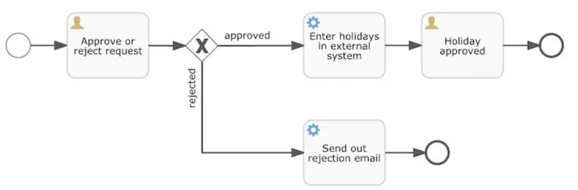

大致流程是这样的：发起一个开始事件，随后一个工作流引用到用户任务（Approve or reject request），分配给到经理，经理需要决定通过请求还是拒绝请求。然后使用一个排他网关，将流程实例路由到批准或者驳回。如果批准，则需要将申请注册至某个外部系统，并跟着另一个用户任务，将经理的决定通知给申请人。当然也可以改为发送邮件。如果驳回，则为雇员发送一封邮件通知他。

#### 配置文件（application.yml）

```yaml
spring:
  application:
    name: FlowableDemo
  datasource:
    url: jdbc:mysql://192.168.1.107:31746/flowable?useUnicode=true&serverTimezone=Asia/Shanghai
    username: root
    password: GZvlvASxBn
    driver-class-name: com.mysql.cj.jdbc.Driver

flowable:
  # 设置了true，确保在JDBC参数连接的数据库中，数据库表结构不存在时，会创建相应的表结构。
  database-schema-update: false
  #关闭定时任务JOB
  async-executor-activate: false
```

#### 流程定义文件（holiday-request.bpmn20.xml）

```xml
<?xml version="1.0" encoding="UTF-8"?>
<definitions xmlns="http://www.omg.org/spec/BPMN/20100524/MODEL"
             xmlns:xsi="http://www.w3.org/2001/XMLSchema-instance"
             xmlns:xsd="http://www.w3.org/2001/XMLSchema"
             xmlns:bpmndi="http://www.omg.org/spec/BPMN/20100524/DI"
             xmlns:omgdc="http://www.omg.org/spec/DD/20100524/DC"
             xmlns:omgdi="http://www.omg.org/spec/DD/20100524/DI"
             xmlns:flowable="http://flowable.org/bpmn"
             typeLanguage="http://www.w3.org/2001/XMLSchema"
             expressionLanguage="http://www.w3.org/1999/XPath"
             targetNamespace="http://www.flowable.org/processdef">

    <!--
        每一步都需要有一个id属性，标记当前流程的步骤，name是可选的
        当流程开始执行的时候，执行过程会从startEvent开始，跟着sequenceFlow往下走

        startEvent -> approveTask -> approved -> externalSystemCall -> holidayApprovedTask -> assign:employee -> approveEnd
                                  -> reject -> sendRejectionMail -> rejectEnd
      -->

    <process id="holidayRequest" name="Holiday Request" isExecutable="true">

        <startEvent id="startEvent"/>
        <sequenceFlow sourceRef="startEvent" targetRef="approveTask"/>

        <userTask id="approveTask" name="Approve or reject holiday request" flowable:candidateGroups="managers"/>
        <sequenceFlow sourceRef="approveTask" targetRef="decision"/>

        <exclusiveGateway id="decision"/>
        <sequenceFlow sourceRef="decision" targetRef="externalSystemCall">
            <conditionExpression xsi:type="tFormalExpression">
                <![CDATA[
                 ${approved}
              ]]>
            </conditionExpression>
        </sequenceFlow>
        <sequenceFlow  sourceRef="decision" targetRef="sendRejectionMail">
            <conditionExpression xsi:type="tFormalExpression">
                <![CDATA[
                 ${!approved}
               ]]>
            </conditionExpression>
        </sequenceFlow>

        <serviceTask id="externalSystemCall" name="Enter holidays in external system"
                     flowable:class="com.example.flowabledemo.Demo2.service.task.CallExternalSystemDelegate"/>
        <sequenceFlow sourceRef="externalSystemCall" targetRef="holidayApprovedTask"/>

        <userTask id="holidayApprovedTask" name="Holiday approved" flowable:assignee="${employee}"/>
        <sequenceFlow sourceRef="holidayApprovedTask" targetRef="approveEnd"/>

        <serviceTask id="sendRejectionMail" name="Send out rejection email"
                     flowable:class="com.example.flowabledemo.Demo2.service.task.SendRejectionMail"/>
        <sequenceFlow sourceRef="sendRejectionMail" targetRef="rejectEnd"/>

        <endEvent id="approveEnd"/>

        <endEvent id="rejectEnd"/>
    </process>
</definitions>
```

#### 目录结构

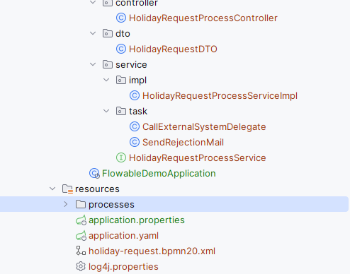

#### 数据传输对象（HolidayRequestDTO）

```java
@Data
public class HolidayRequestDTO {
    // 员工名
    private String employee;
    // 休假天数
    private Integer nrOfHolidays;
    // 备注
    private String description;
}
```

#### 流程服务接口（HolidayRequestProcessService）

```java
public interface HolidayRequestProcessService {
    
    void holidayRequest(HolidayRequestDTO holidayRequestDTO);
}
```

#### 流程服务实现（HolidayRequestProcessServiceImpl）

```java
@Service
public class HolidayRequestProcessServiceImpl implements HolidayRequestProcessService {
    
    @Resource
    private RepositoryService repositoryService;
    
    @Resource
    private RuntimeService runtimeService;
    
    @Resource
    private TaskService taskService;
    
    @Resource
    private HistoryService historyService;
    
    @Override
    public void holidayRequest(HolidayRequestDTO holidayRequestDTO) {
        // 组装参数
        Map<String, Object> variables = new HashMap<>(8);
        variables.put("employee", holidayRequestDTO.getEmployee());
        variables.put("nrOfHolidays", holidayRequestDTO.getNrOfHolidays());
        variables.put("description", holidayRequestDTO.getDescription());
        
        // 启动流程实例
        ProcessInstance processInstance = runtimeService.startProcessInstanceByKey("holidayRequest", variables);
        // 查询任务，组是“managers”
        List<Task> tasks = taskService.createTaskQuery().taskCandidateGroup("managers").list();
        // 打印查询到的任务信息
        System.out.println("You have " + tasks.size() + " tasks:");
        for (int i = 0; i < tasks.size(); i++) {
            System.out.println((i + 1) + ") " + tasks.get(i).getName());
        }
        // 获取要执行的任务：查询到的最后一个task
        if (!CollectionUtils.isEmpty(tasks)) {
            Task task = tasks.get(tasks.size() - 1);
            Map<String, Object> processVariables = taskService.getVariables(task.getId());
            System.out.println(processVariables.get("employee") + " wants " +
                    processVariables.get("nrOfHolidays") + " of holidays. Do you approve this?");
            
            // 生成随机数，从而决定请求是通过还是拒绝
            boolean approved = ThreadLocalRandom.current().nextInt(1, 10) > 5;
            System.out.println(approved ? "do approved" : "do rejected");
            variables = new HashMap<>();
            variables.put("approved", approved);
            
            // 执行完成
            taskService.complete(task.getId(), variables);
        }
        
        // 历史数据
        List<HistoricActivityInstance> activities =
                historyService.createHistoricActivityInstanceQuery()
                        .processInstanceId(processInstance.getId())
                        .finished()
                        .orderByHistoricActivityInstanceEndTime().asc()
                        .list();
        
        for (HistoricActivityInstance activity : activities) {
            System.out.println(activity.getActivityId() + " took "
                    + activity.getDurationInMillis() + " milliseconds");
        }
    }
    
    
    @PostConstruct
    private void deploy() {
        // 手动部署
        Deployment deployment = repositoryService.createDeployment()
                // 从xml文件读取流程
                .addClasspathResource("holiday-request.bpmn20.xml")
                // 执行部署
                .deploy();
        
        // 根据部署ID获取流程定义
        ProcessDefinition processDefinition = repositoryService.createProcessDefinitionQuery()
                .deploymentId(deployment.getId())
                .singleResult();
        
        // 输出流程名
        System.out.println("Found process definition : " + processDefinition.getName());
    }
}
```

#### 外部系统调用委派（CallExternalSystemDelegate）

```java
public class CallExternalSystemDelegate implements JavaDelegate {
    @Override
    public void execute(DelegateExecution execution) {
        System.out.println("Calling the external system for employee "
                + execution.getVariable("employee"));
    }
}
```

#### 拒绝邮件发送服务（SendRejectionMail）

```java
public class SendRejectionMail implements JavaDelegate {
    @Override
    public void execute(DelegateExecution execution) {
        System.out.println("Send Rejection Email ");
    }
}
```

#### 流程控制器（HolidayRequestProcessController）

```java
@RestController
public class HolidayRequestProcessController {
    
    @Resource
    private HolidayRequestProcessService holidayRequestProcessService;
    
    @PostMapping("/holidayRequest")
    public void holidayRequest(@RequestBody HolidayRequestDTO holidayRequestDTO) {
        holidayRequestProcessService.holidayRequest(holidayRequestDTO);
    }
}
```

#### 运行与结果展示

启动SpringBoot项目，随后访问rest接口：

```bash
POST http://localhost:8080/holidayRequest
Content-Type: application/json

{
  "employee": "bob",
  "nrOfHolidays": 3,
  "description": "就请假而已"
}
```

多次调整参数，可以看到不同的结果。部分结果展示：

请求通过时：

```
You have 1 tasks:
1) Approve or reject holiday request
bob wants 3 of holidays. Do you approve this?
do approved
Calling the external system for employee bob
startEvent took 3 milliseconds
_flow_startEvent__approveTask took 0 milliseconds
approveTask took 1122 milliseconds
_flow_approveTask__decision took 0 milliseconds
_flow_decision__externalSystemCall took 0 milliseconds
decision took 1 milliseconds
externalSystemCall took 1 milliseconds
_flow_externalSystemCall__holidayApprovedTask took 0 milliseconds
```

请求拒绝时：

```
You have 1 tasks:
1) Approve or reject holiday request
bob wants 3 of holidays. Do you approve this?
do rejected
Send Rejection Email 
_flow_startEvent__approveTask took 0 milliseconds
startEvent took 0 milliseconds
approveTask took 927 milliseconds
_flow_approveTask__decision took 0 milliseconds
_flow_decision__sendRejectionMail took 0 milliseconds
decision took 2 milliseconds
_flow_sendRejectionMail__rejectEnd took 0 milliseconds
sendRejectionMail took 1 milliseconds
rejectEnd took 1 milliseconds
```

## Flowable 进阶篇

### 网关

#### 排他网关

排他网关（Exclusive Gateway）是BPMN（业务流程建模与标注）中的一个重要元素，用于在流程中实现条件分支。通过排他网关，可以根据条件判断，选择其中一条路径继续执行。

##### 基本概念

- **功能**：根据条件选择一条路径，排他网关只允许一条路径通过。
- **标记**：通常用菱形表示，中间有一个X符号。
- **条件**：每条分支路径上都有一个条件表达式，条件为真则该路径被选中。

##### 使用场景

排他网关常用于以下场景：

- 流程需要根据某些条件决定下一步操作时。
- 例如：审批流程中，根据审批结果决定是继续下一步审批还是结束流程。

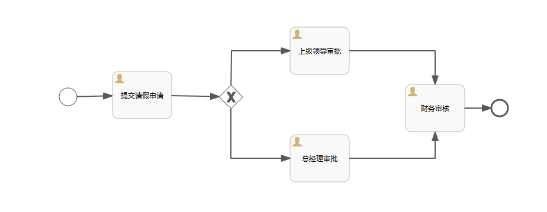

> 上级领导审批： 设置流条件\${num < 3}
>
> 总经理审批： 设置流条件\${num >=3}

##### 流程图定义

```xml
<?xml version="1.0" encoding="UTF-8"?>
<definitions xmlns="http://www.omg.org/spec/BPMN/20100524/MODEL" xmlns:xsi="http://www.w3.org/2001/XMLSchema-instance" xmlns:xsd="http://www.w3.org/2001/XMLSchema" xmlns:flowable="http://flowable.org/bpmn" xmlns:bpmndi="http://www.omg.org/spec/BPMN/20100524/DI" xmlns:omgdc="http://www.omg.org/spec/DD/20100524/DC" xmlns:omgdi="http://www.omg.org/spec/DD/20100524/DI" typeLanguage="http://www.w3.org/2001/XMLSchema" expressionLanguage="http://www.w3.org/1999/XPath" targetNamespace="http://www.flowable.org/processdef" exporter="Flowable Open Source Modeler" exporterVersion="6.8.0">
  <process id="LeaveProcessExclusiveGateway" name="请假流程-排他网关" isExecutable="true">
    <documentation>请假流程-排他网关</documentation>
    <startEvent id="startEvent1" flowable:formFieldValidation="true"></startEvent>
    <userTask id="sid-2F09D620-BA96-4D31-8AA1-ACC2E29F7CBA" name="提交请假申请" flowable:formFieldValidation="true"></userTask>
    <sequenceFlow id="sid-D4A95C09-CA32-4562-92DB-6ECBBAA4840C" sourceRef="startEvent1" targetRef="sid-2F09D620-BA96-4D31-8AA1-ACC2E29F7CBA"></sequenceFlow>
    <exclusiveGateway id="sid-A717B3B0-5D59-4343-9BB9-B2D8D1798202"></exclusiveGateway>
    <userTask id="sid-61F62D74-AD31-4CB4-ADE3-C46C19BF7B0D" name="上级领导审批" flowable:formFieldValidation="true"></userTask>
    <sequenceFlow id="sid-366BDB6C-A29A-4C98-BE82-C72B550B4CA1" sourceRef="sid-2F09D620-BA96-4D31-8AA1-ACC2E29F7CBA" targetRef="sid-A717B3B0-5D59-4343-9BB9-B2D8D1798202"></sequenceFlow>
    <userTask id="sid-37FCA07F-44C1-4F21-A882-28CA71EBB61E" name="总经理审批" flowable:formFieldValidation="true"></userTask>
    <userTask id="sid-BE60FC14-1C3E-47BB-88E1-9E29CC5121ED" name="财务审核" flowable:formFieldValidation="true"></userTask>
    <sequenceFlow id="sid-ED843CA9-5EF6-4315-9B19-21CEB3A23E6A" sourceRef="sid-61F62D74-AD31-4CB4-ADE3-C46C19BF7B0D" targetRef="sid-BE60FC14-1C3E-47BB-88E1-9E29CC5121ED"></sequenceFlow>
    <sequenceFlow id="sid-9DEDC243-58D1-4651-9304-0F80BBECB328" sourceRef="sid-37FCA07F-44C1-4F21-A882-28CA71EBB61E" targetRef="sid-BE60FC14-1C3E-47BB-88E1-9E29CC5121ED"></sequenceFlow>
    <sequenceFlow id="sid-85B50A51-5796-466F-ABDE-F4521DFC36B3" sourceRef="sid-A717B3B0-5D59-4343-9BB9-B2D8D1798202" targetRef="sid-61F62D74-AD31-4CB4-ADE3-C46C19BF7B0D">
      <conditionExpression xsi:type="tFormalExpression"><![CDATA[${num < 3}]]></conditionExpression>
    </sequenceFlow>
    <sequenceFlow id="sid-7989E166-3344-493C-9C36-2931ABB5EC23" sourceRef="sid-A717B3B0-5D59-4343-9BB9-B2D8D1798202" targetRef="sid-37FCA07F-44C1-4F21-A882-28CA71EBB61E">
      <conditionExpression xsi:type="tFormalExpression"><![CDATA[${num >= 3}]]></conditionExpression>
    </sequenceFlow>
    <endEvent id="sid-EB6A6549-7FB8-4700-AF9F-9C5921E89142"></endEvent>
    <sequenceFlow id="sid-14156286-A377-429B-AC5A-1C0D19F0F5C2" sourceRef="sid-BE60FC14-1C3E-47BB-88E1-9E29CC5121ED" targetRef="sid-EB6A6549-7FB8-4700-AF9F-9C5921E89142"></sequenceFlow>
  </process>
  <bpmndi:BPMNDiagram id="BPMNDiagram_LeaveProcessExclusiveGateway">
    <bpmndi:BPMNPlane bpmnElement="LeaveProcessExclusiveGateway" id="BPMNPlane_LeaveProcessExclusiveGateway">
      <bpmndi:BPMNShape bpmnElement="startEvent1" id="BPMNShape_startEvent1">
        <omgdc:Bounds height="30.0" width="30.0" x="120.0" y="163.0"></omgdc:Bounds>
      </bpmndi:BPMNShape>
      <bpmndi:BPMNShape bpmnElement="sid-2F09D620-BA96-4D31-8AA1-ACC2E29F7CBA" id="BPMNShape_sid-2F09D620-BA96-4D31-8AA1-ACC2E29F7CBA">
        <omgdc:Bounds height="80.0" width="100.0" x="210.0" y="135.0"></omgdc:Bounds>
      </bpmndi:BPMNShape>
      <bpmndi:BPMNShape bpmnElement="sid-A717B3B0-5D59-4343-9BB9-B2D8D1798202" id="BPMNShape_sid-A717B3B0-5D59-4343-9BB9-B2D8D1798202">
        <omgdc:Bounds height="40.0" width="40.0" x="390.0" y="158.0"></omgdc:Bounds>
      </bpmndi:BPMNShape>
      <bpmndi:BPMNShape bpmnElement="sid-61F62D74-AD31-4CB4-ADE3-C46C19BF7B0D" id="BPMNShape_sid-61F62D74-AD31-4CB4-ADE3-C46C19BF7B0D">
        <omgdc:Bounds height="80.0" width="100.0" x="510.0" y="60.0"></omgdc:Bounds>
      </bpmndi:BPMNShape>
      <bpmndi:BPMNShape bpmnElement="sid-37FCA07F-44C1-4F21-A882-28CA71EBB61E" id="BPMNShape_sid-37FCA07F-44C1-4F21-A882-28CA71EBB61E">
        <omgdc:Bounds height="80.0" width="100.0" x="510.0" y="242.0"></omgdc:Bounds>
      </bpmndi:BPMNShape>
      <bpmndi:BPMNShape bpmnElement="sid-BE60FC14-1C3E-47BB-88E1-9E29CC5121ED" id="BPMNShape_sid-BE60FC14-1C3E-47BB-88E1-9E29CC5121ED">
        <omgdc:Bounds height="80.0" width="100.0" x="705.0" y="157.0"></omgdc:Bounds>
      </bpmndi:BPMNShape>
      <bpmndi:BPMNShape bpmnElement="sid-EB6A6549-7FB8-4700-AF9F-9C5921E89142" id="BPMNShape_sid-EB6A6549-7FB8-4700-AF9F-9C5921E89142">
        <omgdc:Bounds height="28.0" width="28.0" x="850.0" y="183.0"></omgdc:Bounds>
      </bpmndi:BPMNShape>
      <bpmndi:BPMNEdge bpmnElement="sid-D4A95C09-CA32-4562-92DB-6ECBBAA4840C" id="BPMNEdge_sid-D4A95C09-CA32-4562-92DB-6ECBBAA4840C" flowable:sourceDockerX="15.0" flowable:sourceDockerY="15.0" flowable:targetDockerX="50.0" flowable:targetDockerY="40.0">
        <omgdi:waypoint x="149.94578119036544" y="177.6401015900637"></omgdi:waypoint>
        <omgdi:waypoint x="209.9999999999993" y="176.1988"></omgdi:waypoint>
      </bpmndi:BPMNEdge>
      <bpmndi:BPMNEdge bpmnElement="sid-ED843CA9-5EF6-4315-9B19-21CEB3A23E6A" id="BPMNEdge_sid-ED843CA9-5EF6-4315-9B19-21CEB3A23E6A" flowable:sourceDockerX="50.0" flowable:sourceDockerY="40.0" flowable:targetDockerX="50.0" flowable:targetDockerY="40.0">
        <omgdi:waypoint x="609.95" y="100.0"></omgdi:waypoint>
        <omgdi:waypoint x="755.0" y="100.0"></omgdi:waypoint>
        <omgdi:waypoint x="755.0" y="157.0"></omgdi:waypoint>
      </bpmndi:BPMNEdge>
      <bpmndi:BPMNEdge bpmnElement="sid-9DEDC243-58D1-4651-9304-0F80BBECB328" id="BPMNEdge_sid-9DEDC243-58D1-4651-9304-0F80BBECB328" flowable:sourceDockerX="50.0" flowable:sourceDockerY="40.0" flowable:targetDockerX="50.0" flowable:targetDockerY="40.0">
        <omgdi:waypoint x="609.9499999999803" y="282.0"></omgdi:waypoint>
        <omgdi:waypoint x="755.0" y="282.0"></omgdi:waypoint>
        <omgdi:waypoint x="755.0" y="236.95000000000002"></omgdi:waypoint>
      </bpmndi:BPMNEdge>
      <bpmndi:BPMNEdge bpmnElement="sid-85B50A51-5796-466F-ABDE-F4521DFC36B3" id="BPMNEdge_sid-85B50A51-5796-466F-ABDE-F4521DFC36B3" flowable:sourceDockerX="20.0" flowable:sourceDockerY="20.0" flowable:targetDockerX="50.0" flowable:targetDockerY="40.0">
        <omgdi:waypoint x="410.2525316455696" y="158.25316455696202"></omgdi:waypoint>
        <omgdi:waypoint x="411.0" y="100.0"></omgdi:waypoint>
        <omgdi:waypoint x="510.0" y="100.0"></omgdi:waypoint>
      </bpmndi:BPMNEdge>
      <bpmndi:BPMNEdge bpmnElement="sid-366BDB6C-A29A-4C98-BE82-C72B550B4CA1" id="BPMNEdge_sid-366BDB6C-A29A-4C98-BE82-C72B550B4CA1" flowable:sourceDockerX="50.0" flowable:sourceDockerY="40.0" flowable:targetDockerX="20.0" flowable:targetDockerY="20.0">
        <omgdi:waypoint x="309.95000000000005" y="175.99900000000002"></omgdi:waypoint>
        <omgdi:waypoint x="390.3504245591116" y="177.6078431372549"></omgdi:waypoint>
      </bpmndi:BPMNEdge>
      <bpmndi:BPMNEdge bpmnElement="sid-14156286-A377-429B-AC5A-1C0D19F0F5C2" id="BPMNEdge_sid-14156286-A377-429B-AC5A-1C0D19F0F5C2" flowable:sourceDockerX="50.0" flowable:sourceDockerY="40.0" flowable:targetDockerX="14.0" flowable:targetDockerY="14.0">
        <omgdi:waypoint x="804.949999999996" y="197.0"></omgdi:waypoint>
        <omgdi:waypoint x="850.0" y="197.0"></omgdi:waypoint>
      </bpmndi:BPMNEdge>
      <bpmndi:BPMNEdge bpmnElement="sid-7989E166-3344-493C-9C36-2931ABB5EC23" id="BPMNEdge_sid-7989E166-3344-493C-9C36-2931ABB5EC23" flowable:sourceDockerX="20.0" flowable:sourceDockerY="20.0" flowable:targetDockerX="50.0" flowable:targetDockerY="40.0">
        <omgdi:waypoint x="410.0" y="197.94041786743514"></omgdi:waypoint>
        <omgdi:waypoint x="410.0" y="282.0"></omgdi:waypoint>
        <omgdi:waypoint x="509.9999999999364" y="282.0"></omgdi:waypoint>
      </bpmndi:BPMNEdge>
    </bpmndi:BPMNPlane>
  </bpmndi:BPMNDiagram>
</definitions>
```


##### 测试

```java
@Test
public void test(){
    // 部署流程定义
    Deployment deployment = repositoryService.createDeployment()
        .addClasspathResource("processes/请假流程-排他网关.bpmn20.xml")
        .deploy();

    // 设置流程变量
    Map<String, Object> variables = new HashMap<>();
    variables.put("num", 2); // 假设请假天数为2

    // 启动流程实例
    ProcessInstance processInstance = runtimeService.startProcessInstanceByKey("LeaveProcessExclusiveGateway", variables);

    // 获取并完成第一个任务：提交请假申请
    Task task = taskService.createTaskQuery().processInstanceId(processInstance.getId()).singleResult();
    System.out.println("当前任务：" + task.getName());
    taskService.complete(task.getId());

    // 根据条件获取下一个任务：上级领导审批 或 总经理审批
    task = taskService.createTaskQuery().processInstanceId(processInstance.getId()).singleResult();
    System.out.println("当前任务：" + task.getName());
    taskService.complete(task.getId());

    // 获取财务审核任务
    task = taskService.createTaskQuery().processInstanceId(processInstance.getId()).singleResult();
    System.out.println("当前任务：" + task.getName());
    taskService.complete(task.getId());

    // 验证流程结束
    ProcessInstance result = runtimeService.createProcessInstanceQuery().processInstanceId(processInstance.getId()).singleResult();
    System.out.println("流程结束：" + (result == null));
}
```

这里与分支情况要做一个对比，其不同点在于使用网关的情况下，任务失败出现异常，该流程并未结束。**而分支的情况若出现异常，则流程异常结束。**这也是为什么需要排他网关的原因。

#### 并行网关

##### 基本概念

并行网关 (Parallel Gateway) 是 BPMN（业务流程建模与标注）中的一种网关类型，用于并行处理多个流程路径。在使用并行网关时，流程将被分成多条平行路径，所有路径将并行执行，直到它们都完成后才会继续执行后续任务。

##### 使用场景

并行网关有两个主要用途：

1. **分支 (Fork)**：将一个流程分成多条并行执行的路径。
2. **汇聚 (Join)**：等待所有并行路径执行完毕后再继续执行后续流程。

注意：如果同一个并行网关有多个进入和外出顺序流，他就同时具有分支和汇聚的功能。此时网关会线汇聚所有进入的顺序流，然后再切分为多个并行分支。

区别：并行网关并不会解析条件。即使顺序流中定义了条件，也会被忽略。

以下是一个包含并行网关的简单流程定义。此流程示例是一个假期申请流程。

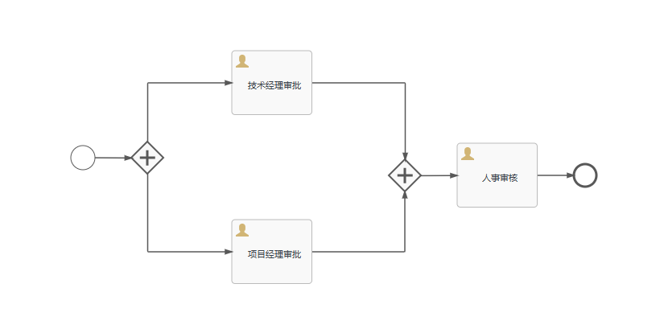

##### 流程图定义

```xml
<?xml version="1.0" encoding="UTF-8"?>
<definitions xmlns="http://www.omg.org/spec/BPMN/20100524/MODEL" xmlns:xsi="http://www.w3.org/2001/XMLSchema-instance" xmlns:xsd="http://www.w3.org/2001/XMLSchema" xmlns:flowable="http://flowable.org/bpmn" xmlns:bpmndi="http://www.omg.org/spec/BPMN/20100524/DI" xmlns:omgdc="http://www.omg.org/spec/DD/20100524/DC" xmlns:omgdi="http://www.omg.org/spec/DD/20100524/DI" typeLanguage="http://www.w3.org/2001/XMLSchema" expressionLanguage="http://www.w3.org/1999/XPath" targetNamespace="http://www.flowable.org/processdef" exporter="Flowable Open Source Modeler" exporterVersion="6.8.0">
  <process id="LeaveRequestProcessParallelGateway" name="请假流程-并行网关" isExecutable="true">
    <documentation>请假流程-并行网关</documentation>
    <startEvent id="startEvent1" flowable:formFieldValidation="true"></startEvent>
    <sequenceFlow id="sid-952A2625-BC07-4A1A-8FA0-5A627462F805" sourceRef="startEvent1" targetRef="sid-C33B2459-0F7D-4BA8-B6F8-40A422E65DF7"></sequenceFlow>
    <parallelGateway id="sid-C33B2459-0F7D-4BA8-B6F8-40A422E65DF7"></parallelGateway>
    <userTask id="sid-F2019EFF-851D-4B91-B253-12086FA0DC87" name="技术经理审批" flowable:formFieldValidation="true"></userTask>
    <sequenceFlow id="sid-434D5F5B-AB99-48D7-BA05-587CCBF61A8B" sourceRef="sid-C33B2459-0F7D-4BA8-B6F8-40A422E65DF7" targetRef="sid-F2019EFF-851D-4B91-B253-12086FA0DC87"></sequenceFlow>
    <userTask id="sid-E39C2B5A-A9D2-485C-97F8-7DF4C9FD2070" name="项目经理审批" flowable:formFieldValidation="true"></userTask>
    <sequenceFlow id="sid-4FFD1E23-F09A-4736-B239-E9573675F157" sourceRef="sid-C33B2459-0F7D-4BA8-B6F8-40A422E65DF7" targetRef="sid-E39C2B5A-A9D2-485C-97F8-7DF4C9FD2070"></sequenceFlow>
    <parallelGateway id="sid-F4FCECAC-855E-41CC-84C6-16142AC84945"></parallelGateway>
    <sequenceFlow id="sid-E37A1AD9-8A35-41BE-A238-23D875D143EF" sourceRef="sid-F2019EFF-851D-4B91-B253-12086FA0DC87" targetRef="sid-F4FCECAC-855E-41CC-84C6-16142AC84945"></sequenceFlow>
    <sequenceFlow id="sid-E788EFE2-98E1-49F3-99A7-5EABCBC10CA2" sourceRef="sid-E39C2B5A-A9D2-485C-97F8-7DF4C9FD2070" targetRef="sid-F4FCECAC-855E-41CC-84C6-16142AC84945"></sequenceFlow>
    <userTask id="sid-63C76ED6-705B-404A-8370-62FA97986061" name="人事审核" flowable:formFieldValidation="true"></userTask>
    <sequenceFlow id="sid-832BE8CD-7EA6-4746-B33B-7B243C9B4E9B" sourceRef="sid-F4FCECAC-855E-41CC-84C6-16142AC84945" targetRef="sid-63C76ED6-705B-404A-8370-62FA97986061"></sequenceFlow>
    <endEvent id="sid-4131148C-D19C-4191-82E7-704264263AD2"></endEvent>
    <sequenceFlow id="sid-830B0975-9826-4A89-9D4F-527FCFFBD48D" sourceRef="sid-63C76ED6-705B-404A-8370-62FA97986061" targetRef="sid-4131148C-D19C-4191-82E7-704264263AD2"></sequenceFlow>
  </process>
  <bpmndi:BPMNDiagram id="BPMNDiagram_LeaveRequestProcessParallelGateway">
    <bpmndi:BPMNPlane bpmnElement="LeaveRequestProcessParallelGateway" id="BPMNPlane_LeaveRequestProcessParallelGateway">
      <bpmndi:BPMNShape bpmnElement="startEvent1" id="BPMNShape_startEvent1">
        <omgdc:Bounds height="30.0" width="30.0" x="100.0" y="163.0"></omgdc:Bounds>
      </bpmndi:BPMNShape>
      <bpmndi:BPMNShape bpmnElement="sid-C33B2459-0F7D-4BA8-B6F8-40A422E65DF7" id="BPMNShape_sid-C33B2459-0F7D-4BA8-B6F8-40A422E65DF7">
        <omgdc:Bounds height="40.0" width="40.0" x="175.0" y="158.0"></omgdc:Bounds>
      </bpmndi:BPMNShape>
      <bpmndi:BPMNShape bpmnElement="sid-F2019EFF-851D-4B91-B253-12086FA0DC87" id="BPMNShape_sid-F2019EFF-851D-4B91-B253-12086FA0DC87">
        <omgdc:Bounds height="80.0" width="100.0" x="300.0" y="45.0"></omgdc:Bounds>
      </bpmndi:BPMNShape>
      <bpmndi:BPMNShape bpmnElement="sid-E39C2B5A-A9D2-485C-97F8-7DF4C9FD2070" id="BPMNShape_sid-E39C2B5A-A9D2-485C-97F8-7DF4C9FD2070">
        <omgdc:Bounds height="80.0" width="100.0" x="300.0" y="255.0"></omgdc:Bounds>
      </bpmndi:BPMNShape>
      <bpmndi:BPMNShape bpmnElement="sid-F4FCECAC-855E-41CC-84C6-16142AC84945" id="BPMNShape_sid-F4FCECAC-855E-41CC-84C6-16142AC84945">
        <omgdc:Bounds height="40.0" width="40.0" x="495.0" y="180.0"></omgdc:Bounds>
      </bpmndi:BPMNShape>
      <bpmndi:BPMNShape bpmnElement="sid-63C76ED6-705B-404A-8370-62FA97986061" id="BPMNShape_sid-63C76ED6-705B-404A-8370-62FA97986061">
        <omgdc:Bounds height="80.0" width="100.0" x="580.0" y="160.0"></omgdc:Bounds>
      </bpmndi:BPMNShape>
      <bpmndi:BPMNShape bpmnElement="sid-4131148C-D19C-4191-82E7-704264263AD2" id="BPMNShape_sid-4131148C-D19C-4191-82E7-704264263AD2">
        <omgdc:Bounds height="28.0" width="28.0" x="725.0" y="186.0"></omgdc:Bounds>
      </bpmndi:BPMNShape>
      <bpmndi:BPMNEdge bpmnElement="sid-4FFD1E23-F09A-4736-B239-E9573675F157" id="BPMNEdge_sid-4FFD1E23-F09A-4736-B239-E9573675F157" flowable:sourceDockerX="20.5" flowable:sourceDockerY="20.5" flowable:targetDockerX="1.0" flowable:targetDockerY="40.0">
        <omgdi:waypoint x="195.49999999999997" y="197.44187392795882"></omgdi:waypoint>
        <omgdi:waypoint x="195.5" y="295.0"></omgdi:waypoint>
        <omgdi:waypoint x="300.0" y="295.0"></omgdi:waypoint>
      </bpmndi:BPMNEdge>
      <bpmndi:BPMNEdge bpmnElement="sid-E37A1AD9-8A35-41BE-A238-23D875D143EF" id="BPMNEdge_sid-E37A1AD9-8A35-41BE-A238-23D875D143EF" flowable:sourceDockerX="50.0" flowable:sourceDockerY="40.0" flowable:targetDockerX="20.5" flowable:targetDockerY="20.5">
        <omgdi:waypoint x="399.95000000000005" y="85.0"></omgdi:waypoint>
        <omgdi:waypoint x="515.5" y="85.0"></omgdi:waypoint>
        <omgdi:waypoint x="515.5" y="180.5"></omgdi:waypoint>
      </bpmndi:BPMNEdge>
      <bpmndi:BPMNEdge bpmnElement="sid-832BE8CD-7EA6-4746-B33B-7B243C9B4E9B" id="BPMNEdge_sid-832BE8CD-7EA6-4746-B33B-7B243C9B4E9B" flowable:sourceDockerX="20.5" flowable:sourceDockerY="20.5" flowable:targetDockerX="50.0" flowable:targetDockerY="40.0">
        <omgdi:waypoint x="534.5247370727283" y="200.41666666666666"></omgdi:waypoint>
        <omgdi:waypoint x="579.9999999999953" y="200.21812227074236"></omgdi:waypoint>
      </bpmndi:BPMNEdge>
      <bpmndi:BPMNEdge bpmnElement="sid-830B0975-9826-4A89-9D4F-527FCFFBD48D" id="BPMNEdge_sid-830B0975-9826-4A89-9D4F-527FCFFBD48D" flowable:sourceDockerX="50.0" flowable:sourceDockerY="40.0" flowable:targetDockerX="14.0" flowable:targetDockerY="14.0">
        <omgdi:waypoint x="679.949999999996" y="200.0"></omgdi:waypoint>
        <omgdi:waypoint x="725.0" y="200.0"></omgdi:waypoint>
      </bpmndi:BPMNEdge>
      <bpmndi:BPMNEdge bpmnElement="sid-434D5F5B-AB99-48D7-BA05-587CCBF61A8B" id="BPMNEdge_sid-434D5F5B-AB99-48D7-BA05-587CCBF61A8B" flowable:sourceDockerX="20.5" flowable:sourceDockerY="20.5" flowable:targetDockerX="50.0" flowable:targetDockerY="40.0">
        <omgdi:waypoint x="195.5" y="158.5"></omgdi:waypoint>
        <omgdi:waypoint x="195.5" y="85.0"></omgdi:waypoint>
        <omgdi:waypoint x="300.0" y="85.0"></omgdi:waypoint>
      </bpmndi:BPMNEdge>
      <bpmndi:BPMNEdge bpmnElement="sid-E788EFE2-98E1-49F3-99A7-5EABCBC10CA2" id="BPMNEdge_sid-E788EFE2-98E1-49F3-99A7-5EABCBC10CA2" flowable:sourceDockerX="50.0" flowable:sourceDockerY="40.0" flowable:targetDockerX="20.0" flowable:targetDockerY="20.0">
        <omgdi:waypoint x="399.9499999998897" y="295.0"></omgdi:waypoint>
        <omgdi:waypoint x="515.0" y="295.0"></omgdi:waypoint>
        <omgdi:waypoint x="515.0" y="219.91045837723925"></omgdi:waypoint>
      </bpmndi:BPMNEdge>
      <bpmndi:BPMNEdge bpmnElement="sid-952A2625-BC07-4A1A-8FA0-5A627462F805" id="BPMNEdge_sid-952A2625-BC07-4A1A-8FA0-5A627462F805" flowable:sourceDockerX="15.0" flowable:sourceDockerY="15.0" flowable:targetDockerX="20.5" flowable:targetDockerY="20.5">
        <omgdi:waypoint x="129.9496588110467" y="178.09285545292158"></omgdi:waypoint>
        <omgdi:waypoint x="175.375" y="178.375"></omgdi:waypoint>
      </bpmndi:BPMNEdge>
    </bpmndi:BPMNPlane>
  </bpmndi:BPMNDiagram>
</definitions>
```

##### 测试

```java
@Test
public void test(){

    // 部署流程定义
    Deployment deployment = repositoryService.createDeployment()
        .addClasspathResource("processes/请假流程-并行网关.bpmn20.xml")
        .deploy();

    Map<String, Object> variables = new HashMap<>();
    variables.put("employee", "John Doe");
    ProcessInstance processInstance = runtimeService.startProcessInstanceByKey("LeaveRequestProcessParallelGateway", variables);

    List<Task> tasks = taskService.createTaskQuery().processInstanceId(processInstance.getId()).list();
    for (Task task : tasks) {
        System.out.println("Task available: " + task.getName());
    }

    // Completing tasks for demonstration purposes
    for (Task task : tasks) {
        taskService.complete(task.getId());
    }

    tasks = taskService.createTaskQuery().processInstanceId(processInstance.getId()).list();
    for (Task task : tasks) {
        System.out.println("Task available after completion: " + task.getName());
    }
}
```

#### 包容网关

##### 基本概念

包容网关（Inclusive Gateway）是BPMN中的一种流程控制元素，用于处理条件分支，允许根据条件启动一个或多个分支，并在所有活动分支都完成后再继续流程。以下是关于包容网关的详细介绍和如何在Spring Boot应用中使用它的示例。

包容网关的作用是评估每个分支的条件，激活满足条件的所有分支，并等待所有激活的分支完成后再继续执行后续任务。

##### 主要特点

1. **多分支激活**：可以激活一个或多个符合条件的分支。
2. **同步**：等待所有激活的分支完成后，再继续后续任务。

##### 流程图定义

- 上级领导审批： 设置流条件\${num <= 3}

- 总经理审批： 设置流条件\${num >3}

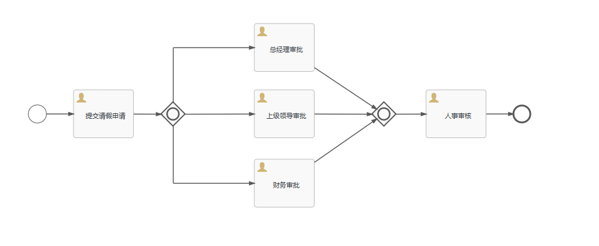

```xml
<?xml version="1.0" encoding="UTF-8"?>
<definitions xmlns="http://www.omg.org/spec/BPMN/20100524/MODEL" xmlns:xsi="http://www.w3.org/2001/XMLSchema-instance" xmlns:xsd="http://www.w3.org/2001/XMLSchema" xmlns:flowable="http://flowable.org/bpmn" xmlns:bpmndi="http://www.omg.org/spec/BPMN/20100524/DI" xmlns:omgdc="http://www.omg.org/spec/DD/20100524/DC" xmlns:omgdi="http://www.omg.org/spec/DD/20100524/DI" typeLanguage="http://www.w3.org/2001/XMLSchema" expressionLanguage="http://www.w3.org/1999/XPath" targetNamespace="http://www.flowable.org/processdef" exporter="Flowable Open Source Modeler" exporterVersion="6.8.0">
  <process id="LeaveProcessInclusionGateway" name="请假流程-包容网关" isExecutable="true">
    <documentation>请假流程-包容网关</documentation>
    <startEvent id="startEvent1" flowable:formFieldValidation="true"></startEvent>
    <userTask id="sid-D383A1E3-FFAE-4EF4-8301-8581F336FE73" name="提交请假申请" flowable:formFieldValidation="true"></userTask>
    <sequenceFlow id="sid-EE70260F-B3F7-4B78-B837-1715F7E8BF3A" sourceRef="startEvent1" targetRef="sid-D383A1E3-FFAE-4EF4-8301-8581F336FE73"></sequenceFlow>
    <sequenceFlow id="sid-A63AAD24-7F51-401D-B044-9FC3F2FA9D13" sourceRef="sid-D383A1E3-FFAE-4EF4-8301-8581F336FE73" targetRef="sid-CF42DC20-C092-4610-804C-E39C7E6C850D"></sequenceFlow>
    <inclusiveGateway id="sid-CF42DC20-C092-4610-804C-E39C7E6C850D"></inclusiveGateway>
    <userTask id="sid-BBD5EEB4-1FCA-4171-8164-0EAF6A1B742B" name="总经理审批" flowable:formFieldValidation="true"></userTask>
    <userTask id="sid-6A200BDC-0265-4CBF-B2A5-0B9713936740" name="上级领导审批" flowable:formFieldValidation="true"></userTask>
    <userTask id="sid-5092E3CD-6FF1-48C5-9902-60849E63B3C3" name="财务审批" flowable:formFieldValidation="true"></userTask>
    <sequenceFlow id="sid-9F47899B-CDC8-426D-B199-B976B08C00FD" sourceRef="sid-CF42DC20-C092-4610-804C-E39C7E6C850D" targetRef="sid-5092E3CD-6FF1-48C5-9902-60849E63B3C3"></sequenceFlow>
    <sequenceFlow id="sid-4EB797EE-45AF-4C88-B798-EFB5B0EC980F" sourceRef="sid-6A200BDC-0265-4CBF-B2A5-0B9713936740" targetRef="sid-50DAEB2F-7DD7-4C65-954A-F65EDAEACA7A"></sequenceFlow>
    <inclusiveGateway id="sid-50DAEB2F-7DD7-4C65-954A-F65EDAEACA7A"></inclusiveGateway>
    <sequenceFlow id="sid-2EE16412-4655-46C3-8291-5A11DC1F1D9B" sourceRef="sid-BBD5EEB4-1FCA-4171-8164-0EAF6A1B742B" targetRef="sid-50DAEB2F-7DD7-4C65-954A-F65EDAEACA7A"></sequenceFlow>
    <sequenceFlow id="sid-EE048BF9-E9DB-4DBB-BD4D-EA522DA4EDD2" sourceRef="sid-5092E3CD-6FF1-48C5-9902-60849E63B3C3" targetRef="sid-50DAEB2F-7DD7-4C65-954A-F65EDAEACA7A"></sequenceFlow>
    <userTask id="sid-C228BEA6-E8D3-4E3A-9747-2D202E6C3CF0" name="人事审核" flowable:formFieldValidation="true"></userTask>
    <sequenceFlow id="sid-DDC54A8B-726B-4A28-AA77-9A772F1FA3DA" sourceRef="sid-50DAEB2F-7DD7-4C65-954A-F65EDAEACA7A" targetRef="sid-C228BEA6-E8D3-4E3A-9747-2D202E6C3CF0"></sequenceFlow>
    <endEvent id="sid-4113CE0C-1BE7-4F75-B805-EA1B961B8A0D"></endEvent>
    <sequenceFlow id="sid-CF6A2A5F-1F9A-4BF4-A11B-0339AE09925C" sourceRef="sid-C228BEA6-E8D3-4E3A-9747-2D202E6C3CF0" targetRef="sid-4113CE0C-1BE7-4F75-B805-EA1B961B8A0D"></sequenceFlow>
    <sequenceFlow id="sid-63362710-A609-4208-9245-24029BA22E08" sourceRef="sid-CF42DC20-C092-4610-804C-E39C7E6C850D" targetRef="sid-6A200BDC-0265-4CBF-B2A5-0B9713936740">
      <conditionExpression xsi:type="tFormalExpression"><![CDATA[${num <= 3}]]></conditionExpression>
    </sequenceFlow>
    <sequenceFlow id="sid-E63156C2-9BE3-44C2-9B24-0EA5C7450BFA" sourceRef="sid-CF42DC20-C092-4610-804C-E39C7E6C850D" targetRef="sid-BBD5EEB4-1FCA-4171-8164-0EAF6A1B742B">
      <conditionExpression xsi:type="tFormalExpression"><![CDATA[${num > 3}]]></conditionExpression>
    </sequenceFlow>
  </process>
  <bpmndi:BPMNDiagram id="BPMNDiagram_LeaveProcessInclusionGateway">
    <bpmndi:BPMNPlane bpmnElement="LeaveProcessInclusionGateway" id="BPMNPlane_LeaveProcessInclusionGateway">
      <bpmndi:BPMNShape bpmnElement="startEvent1" id="BPMNShape_startEvent1">
        <omgdc:Bounds height="30.0" width="30.0" x="90.0" y="150.0"></omgdc:Bounds>
      </bpmndi:BPMNShape>
      <bpmndi:BPMNShape bpmnElement="sid-D383A1E3-FFAE-4EF4-8301-8581F336FE73" id="BPMNShape_sid-D383A1E3-FFAE-4EF4-8301-8581F336FE73">
        <omgdc:Bounds height="80.0" width="100.0" x="165.0" y="125.0"></omgdc:Bounds>
      </bpmndi:BPMNShape>
      <bpmndi:BPMNShape bpmnElement="sid-CF42DC20-C092-4610-804C-E39C7E6C850D" id="BPMNShape_sid-CF42DC20-C092-4610-804C-E39C7E6C850D">
        <omgdc:Bounds height="40.0" width="40.0" x="310.0" y="145.0"></omgdc:Bounds>
      </bpmndi:BPMNShape>
      <bpmndi:BPMNShape bpmnElement="sid-BBD5EEB4-1FCA-4171-8164-0EAF6A1B742B" id="BPMNShape_sid-BBD5EEB4-1FCA-4171-8164-0EAF6A1B742B">
        <omgdc:Bounds height="80.0" width="100.0" x="465.0" y="15.0"></omgdc:Bounds>
      </bpmndi:BPMNShape>
      <bpmndi:BPMNShape bpmnElement="sid-6A200BDC-0265-4CBF-B2A5-0B9713936740" id="BPMNShape_sid-6A200BDC-0265-4CBF-B2A5-0B9713936740">
        <omgdc:Bounds height="80.0" width="100.0" x="465.0" y="125.0"></omgdc:Bounds>
      </bpmndi:BPMNShape>
      <bpmndi:BPMNShape bpmnElement="sid-5092E3CD-6FF1-48C5-9902-60849E63B3C3" id="BPMNShape_sid-5092E3CD-6FF1-48C5-9902-60849E63B3C3">
        <omgdc:Bounds height="80.0" width="100.0" x="465.0" y="240.0"></omgdc:Bounds>
      </bpmndi:BPMNShape>
      <bpmndi:BPMNShape bpmnElement="sid-50DAEB2F-7DD7-4C65-954A-F65EDAEACA7A" id="BPMNShape_sid-50DAEB2F-7DD7-4C65-954A-F65EDAEACA7A">
        <omgdc:Bounds height="40.0" width="40.0" x="660.0" y="145.0"></omgdc:Bounds>
      </bpmndi:BPMNShape>
      <bpmndi:BPMNShape bpmnElement="sid-C228BEA6-E8D3-4E3A-9747-2D202E6C3CF0" id="BPMNShape_sid-C228BEA6-E8D3-4E3A-9747-2D202E6C3CF0">
        <omgdc:Bounds height="80.0" width="100.0" x="750.0" y="125.0"></omgdc:Bounds>
      </bpmndi:BPMNShape>
      <bpmndi:BPMNShape bpmnElement="sid-4113CE0C-1BE7-4F75-B805-EA1B961B8A0D" id="BPMNShape_sid-4113CE0C-1BE7-4F75-B805-EA1B961B8A0D">
        <omgdc:Bounds height="28.0" width="28.0" x="895.0" y="151.0"></omgdc:Bounds>
      </bpmndi:BPMNShape>
      <bpmndi:BPMNEdge bpmnElement="sid-EE70260F-B3F7-4B78-B837-1715F7E8BF3A" id="BPMNEdge_sid-EE70260F-B3F7-4B78-B837-1715F7E8BF3A" flowable:sourceDockerX="15.0" flowable:sourceDockerY="15.0" flowable:targetDockerX="50.0" flowable:targetDockerY="40.0">
        <omgdi:waypoint x="119.94999848995758" y="165.0"></omgdi:waypoint>
        <omgdi:waypoint x="165.0" y="165.0"></omgdi:waypoint>
      </bpmndi:BPMNEdge>
      <bpmndi:BPMNEdge bpmnElement="sid-4EB797EE-45AF-4C88-B798-EFB5B0EC980F" id="BPMNEdge_sid-4EB797EE-45AF-4C88-B798-EFB5B0EC980F" flowable:sourceDockerX="50.0" flowable:sourceDockerY="40.0" flowable:targetDockerX="20.5" flowable:targetDockerY="20.5">
        <omgdi:waypoint x="564.9499999999892" y="165.15090634441088"></omgdi:waypoint>
        <omgdi:waypoint x="660.439393939394" y="165.43939393939397"></omgdi:waypoint>
      </bpmndi:BPMNEdge>
      <bpmndi:BPMNEdge bpmnElement="sid-CF6A2A5F-1F9A-4BF4-A11B-0339AE09925C" id="BPMNEdge_sid-CF6A2A5F-1F9A-4BF4-A11B-0339AE09925C" flowable:sourceDockerX="50.0" flowable:sourceDockerY="40.0" flowable:targetDockerX="14.0" flowable:targetDockerY="14.0">
        <omgdi:waypoint x="849.949999999996" y="165.0"></omgdi:waypoint>
        <omgdi:waypoint x="895.0" y="165.0"></omgdi:waypoint>
      </bpmndi:BPMNEdge>
      <bpmndi:BPMNEdge bpmnElement="sid-2EE16412-4655-46C3-8291-5A11DC1F1D9B" id="BPMNEdge_sid-2EE16412-4655-46C3-8291-5A11DC1F1D9B" flowable:sourceDockerX="50.0" flowable:sourceDockerY="40.0" flowable:targetDockerX="20.0" flowable:targetDockerY="20.0">
        <omgdi:waypoint x="564.95" y="88.30000000000003"></omgdi:waypoint>
        <omgdi:waypoint x="667.9907306434023" y="157.0"></omgdi:waypoint>
      </bpmndi:BPMNEdge>
      <bpmndi:BPMNEdge bpmnElement="sid-EE048BF9-E9DB-4DBB-BD4D-EA522DA4EDD2" id="BPMNEdge_sid-EE048BF9-E9DB-4DBB-BD4D-EA522DA4EDD2" flowable:sourceDockerX="50.0" flowable:sourceDockerY="40.0" flowable:targetDockerX="20.0" flowable:targetDockerY="20.0">
        <omgdi:waypoint x="564.95" y="245.15151515151516"></omgdi:waypoint>
        <omgdi:waypoint x="668.2142857142857" y="173.19375000000002"></omgdi:waypoint>
      </bpmndi:BPMNEdge>
      <bpmndi:BPMNEdge bpmnElement="sid-9F47899B-CDC8-426D-B199-B976B08C00FD" id="BPMNEdge_sid-9F47899B-CDC8-426D-B199-B976B08C00FD" flowable:sourceDockerX="20.5" flowable:sourceDockerY="20.5" flowable:targetDockerX="50.0" flowable:targetDockerY="40.0">
        <omgdi:waypoint x="330.5" y="184.44173211169283"></omgdi:waypoint>
        <omgdi:waypoint x="330.5" y="280.0"></omgdi:waypoint>
        <omgdi:waypoint x="464.99999999997317" y="280.0"></omgdi:waypoint>
      </bpmndi:BPMNEdge>
      <bpmndi:BPMNEdge bpmnElement="sid-A63AAD24-7F51-401D-B044-9FC3F2FA9D13" id="BPMNEdge_sid-A63AAD24-7F51-401D-B044-9FC3F2FA9D13" flowable:sourceDockerX="50.0" flowable:sourceDockerY="40.0" flowable:targetDockerX="20.5" flowable:targetDockerY="20.5">
        <omgdi:waypoint x="264.9499999999977" y="165.21623376623376"></omgdi:waypoint>
        <omgdi:waypoint x="310.4130434782609" y="165.41304347826087"></omgdi:waypoint>
      </bpmndi:BPMNEdge>
      <bpmndi:BPMNEdge bpmnElement="sid-DDC54A8B-726B-4A28-AA77-9A772F1FA3DA" id="BPMNEdge_sid-DDC54A8B-726B-4A28-AA77-9A772F1FA3DA" flowable:sourceDockerX="20.5" flowable:sourceDockerY="20.5" flowable:targetDockerX="50.0" flowable:targetDockerY="40.0">
        <omgdi:waypoint x="699.5215994962216" y="165.42016806722685"></omgdi:waypoint>
        <omgdi:waypoint x="750.0" y="165.20899581589958"></omgdi:waypoint>
      </bpmndi:BPMNEdge>
      <bpmndi:BPMNEdge bpmnElement="sid-63362710-A609-4208-9245-24029BA22E08" id="BPMNEdge_sid-63362710-A609-4208-9245-24029BA22E08" flowable:sourceDockerX="20.5" flowable:sourceDockerY="20.5" flowable:targetDockerX="50.0" flowable:targetDockerY="40.0">
        <omgdi:waypoint x="349.4963199348169" y="165.44836956521738"></omgdi:waypoint>
        <omgdi:waypoint x="464.9999999999955" y="165.13536585365856"></omgdi:waypoint>
      </bpmndi:BPMNEdge>
      <bpmndi:BPMNEdge bpmnElement="sid-E63156C2-9BE3-44C2-9B24-0EA5C7450BFA" id="BPMNEdge_sid-E63156C2-9BE3-44C2-9B24-0EA5C7450BFA" flowable:sourceDockerX="20.5" flowable:sourceDockerY="20.5" flowable:targetDockerX="50.0" flowable:targetDockerY="40.0">
        <omgdi:waypoint x="330.5" y="145.5"></omgdi:waypoint>
        <omgdi:waypoint x="330.5" y="55.0"></omgdi:waypoint>
        <omgdi:waypoint x="465.0" y="55.0"></omgdi:waypoint>
      </bpmndi:BPMNEdge>
    </bpmndi:BPMNPlane>
  </bpmndi:BPMNDiagram>
</definitions>
```

##### 测试

```java
@Test
public void testEventGatewayProcess() {
    // 部署流程定义
    Deployment deployment = repositoryService.createDeployment()
        .addClasspathResource("processes/请假流程-事件网关.bpmn20.xml")
        .deploy();

    // 启动流程实例
    ProcessInstance processInstance = runtimeService.startProcessInstanceByKey("LeaveProcessEventGateway");

    // 获取并完成第一个任务：提交请假申请
    Task task = taskService.createTaskQuery().processInstanceId(processInstance.getId()).singleResult();
    System.out.println("当前任务：" + task.getName());
    taskService.complete(task.getId());

    // 获取流程定义ID
    ProcessDefinition processDefinition = repositoryService.createProcessDefinitionQuery()
        .deploymentId(deployment.getId()).singleResult();

    // 获取BPMN模型
    BpmnModel bpmnModel = repositoryService.getBpmnModel(processDefinition.getId());
    Process process = bpmnModel.getMainProcess();

    // 遍历所有FlowElement，找到EventGateway并获取其后连接的IntermediateCatchEvent
    for (FlowElement flowElement : process.getFlowElements()) {
        if (flowElement instanceof EventGateway) {
            EventGateway eventGateway = (EventGateway) flowElement;
            List<IntermediateCatchEvent> catchEvents = process.findFlowElementsOfType(IntermediateCatchEvent.class, false);
            for (IntermediateCatchEvent catchEvent : catchEvents) {
                if (eventGateway.getOutgoingFlows().stream().anyMatch(flow -> flow.getTargetRef().equals(catchEvent.getId()))) {
                    System.out.println("找到中间捕获事件: " + catchEvent.getId());
                    // 手动触发中间捕获事件
                    if (catchEvent.getEventDefinitions().get(0) instanceof TimerEventDefinition) {
                        // 模拟定时器事件触发 (这里我们可以等待一段时间或者直接完成)
                        // Note: 定时器事件在测试中通常是模拟的
                    } else if (catchEvent.getEventDefinitions().get(0) instanceof SignalEventDefinition) {
                        // 触发信号事件
                        runtimeService.signalEventReceived("approvalSignal");
                    }
                }
            }
        }
    }

    // 循环完成所有剩余任务，直到流程结束
    while (true) {
        task = taskService.createTaskQuery().processInstanceId(processInstance.getId()).singleResult();
        if (task == null) {
            break;
        }
        System.out.println("当前任务：" + task.getName());
        taskService.complete(task.getId());
    }

    // 验证流程结束
    ProcessInstance result = runtimeService.createProcessInstanceQuery().processInstanceId(processInstance.getId()).singleResult();
    System.out.println("流程结束：" + (result == null));
}
```

#### 事件网关

##### 基本概念

事件网关是BPMN中的一种网关类型，用于基于事件触发来控制流程的走向。它允许流程在某个事件发生时进行分支，以便根据不同的事件条件选择不同的路径。

##### 使用场景

- **等待外部事件：** 当流程需要等待外部事件发生时，可以使用事件网关来控制流程的分支。
- **多种事件选择：** 当一个任务需要等待多种不同类型的事件发生时，可以使用事件网关来根据不同的事件类型选择不同的路径。
- **异步处理：** 当流程中某个任务需要异步处理，可以使用事件网关来等待异步任务完成。

##### 流程图定义

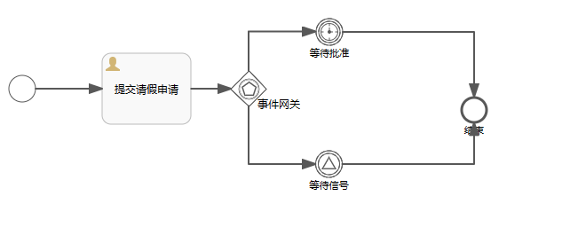

```xml
<definitions xmlns="http://www.omg.org/spec/BPMN/20100524/MODEL" xmlns:xsi="http://www.w3.org/2001/XMLSchema-instance" xmlns:xsd="http://www.w3.org/2001/XMLSchema" xmlns:flowable="http://flowable.org/bpmn" xmlns:bpmndi="http://www.omg.org/spec/BPMN/20100524/DI" xmlns:omgdc="http://www.omg.org/spec/DD/20100524/DC" xmlns:omgdi="http://www.omg.org/spec/DD/20100524/DI" typeLanguage="http://www.w3.org/2001/XMLSchema" expressionLanguage="http://www.w3.org/1999/XPath" targetNamespace="http://www.flowable.org/processdef" exporter="Flowable Open Source Modeler" exporterVersion="6.8.0">
    <signal id="approvalSignal" name="approvalSignal" flowable:scope="global"/>
    <process id="LeaveProcessEventGateway" name="请假流程-事件网关" isExecutable="true">
        <startEvent id="startEvent" flowable:formFieldValidation="true"/>
        <eventBasedGateway id="eventGateway" name="事件网关"/>
        <intermediateCatchEvent id="catchEvent1" name="等待批准">
            <timerEventDefinition>
                <timeDuration>PT1H</timeDuration>
            </timerEventDefinition>
        </intermediateCatchEvent>
        <intermediateCatchEvent id="catchEvent2" name="等待信号">
            <signalEventDefinition signalRef="approvalSignal"/>
        </intermediateCatchEvent>
        <sequenceFlow id="flow3" sourceRef="eventGateway" targetRef="catchEvent2"/>
        <endEvent id="endEvent" name="结束"/>
        <sequenceFlow id="flow2" sourceRef="eventGateway" targetRef="catchEvent1"/>
        <sequenceFlow id="flow5" sourceRef="catchEvent2" targetRef="endEvent"/>
        <userTask id="sid-87062453-B882-45C3-8EB2-8D493CF5F9CC" name="提交请假申请" flowable:formFieldValidation="true"/>
        <sequenceFlow id="flow1" sourceRef="startEvent" targetRef="sid-87062453-B882-45C3-8EB2-8D493CF5F9CC"/>
        <sequenceFlow id="sid-A4B8B1B6-D695-4D77-AF1F-EFDEB432E206" sourceRef="sid-87062453-B882-45C3-8EB2-8D493CF5F9CC" targetRef="eventGateway"/>
        <sequenceFlow id="flow4" sourceRef="catchEvent1" targetRef="endEvent"/>
    </process>
    <bpmndi:BPMNDiagram id="BPMNDiagram_LeaveProcessEventGateway">
        <bpmndi:BPMNPlane bpmnElement="LeaveProcessEventGateway" id="BPMNPlane_LeaveProcessEventGateway">
            <bpmndi:BPMNShape bpmnElement="startEvent" id="BPMNShape_startEvent">
                <omgdc:Bounds height="30.0" width="30.0" x="60.0" y="185.0"/>
            </bpmndi:BPMNShape>
            <bpmndi:BPMNShape bpmnElement="eventGateway" id="BPMNShape_eventGateway">
                <omgdc:Bounds height="40.0" width="40.0" x="310.0" y="180.0"/>
            </bpmndi:BPMNShape>
            <bpmndi:BPMNShape bpmnElement="catchEvent1" id="BPMNShape_catchEvent1">
                <omgdc:Bounds height="31.0" width="31.0" x="405.0" y="120.0"/>
            </bpmndi:BPMNShape>
            <bpmndi:BPMNShape bpmnElement="catchEvent2" id="BPMNShape_catchEvent2">
                <omgdc:Bounds height="30.0" width="30.0" x="405.5" y="270.0"/>
            </bpmndi:BPMNShape>
            <bpmndi:BPMNShape bpmnElement="endEvent" id="BPMNShape_endEvent">
                <omgdc:Bounds height="28.0" width="28.0" x="570.0" y="210.0"/>
            </bpmndi:BPMNShape>
            <bpmndi:BPMNShape bpmnElement="sid-87062453-B882-45C3-8EB2-8D493CF5F9CC" id="BPMNShape_sid-87062453-B882-45C3-8EB2-8D493CF5F9CC">
                <omgdc:Bounds height="80.0" width="100.0" x="165.0" y="160.0"/>
            </bpmndi:BPMNShape>
            <bpmndi:BPMNEdge bpmnElement="flow1" id="BPMNEdge_flow1" flowable:sourceDockerX="15.0" flowable:sourceDockerY="15.0" flowable:targetDockerX="1.0" flowable:targetDockerY="40.0">
                <omgdi:waypoint x="89.94999779398906" y="200.0"/>
                <omgdi:waypoint x="165.0" y="200.0"/>
            </bpmndi:BPMNEdge>
            <bpmndi:BPMNEdge bpmnElement="flow2" id="BPMNEdge_flow2" flowable:sourceDockerX="20.0" flowable:sourceDockerY="20.0" flowable:targetDockerX="15.500000000000002" flowable:targetDockerY="15.500000000000002">
                <omgdi:waypoint x="330.0" y="180.0"/>
                <omgdi:waypoint x="330.0" y="135.5"/>
                <omgdi:waypoint x="405.0" y="135.5"/>
            </bpmndi:BPMNEdge>
            <bpmndi:BPMNEdge bpmnElement="flow3" id="BPMNEdge_flow3" flowable:sourceDockerX="20.0" flowable:sourceDockerY="20.0" flowable:targetDockerX="15.0" flowable:targetDockerY="15.0">
                <omgdi:waypoint x="330.0" y="219.9382784958872"/>
                <omgdi:waypoint x="330.0" y="285.0"/>
                <omgdi:waypoint x="405.5" y="285.0"/>
            </bpmndi:BPMNEdge>
            <bpmndi:BPMNEdge bpmnElement="flow4" id="BPMNEdge_flow4" flowable:sourceDockerX="16.0" flowable:sourceDockerY="16.0" flowable:targetDockerX="14.0" flowable:targetDockerY="14.0">
                <omgdi:waypoint x="436.949999266017" y="136.0"/>
                <omgdi:waypoint x="584.0" y="136.0"/>
                <omgdi:waypoint x="584.0" y="210.0"/>
            </bpmndi:BPMNEdge>
            <bpmndi:BPMNEdge bpmnElement="flow5" id="BPMNEdge_flow5" flowable:sourceDockerX="15.0" flowable:sourceDockerY="15.0" flowable:targetDockerX="14.0" flowable:targetDockerY="14.0">
                <omgdi:waypoint x="435.44999931629184" y="285.0"/>
                <omgdi:waypoint x="584.0" y="285.0"/>
                <omgdi:waypoint x="584.0" y="237.94994773852034"/>
            </bpmndi:BPMNEdge>
            <bpmndi:BPMNEdge bpmnElement="sid-A4B8B1B6-D695-4D77-AF1F-EFDEB432E206" id="BPMNEdge_sid-A4B8B1B6-D695-4D77-AF1F-EFDEB432E206" flowable:sourceDockerX="50.0" flowable:sourceDockerY="40.0" flowable:targetDockerX="20.0" flowable:targetDockerY="20.0">
                <omgdi:waypoint x="264.95000000000005" y="200.0"/>
                <omgdi:waypoint x="310.0" y="200.0"/>
            </bpmndi:BPMNEdge>
        </bpmndi:BPMNPlane>
    </bpmndi:BPMNDiagram>
</definitions>
```

##### 测试

```java
@Test
public void testEventGatewayProcess() {
    // 部署流程定义
    Deployment deployment = repositoryService.createDeployment()
        .addClasspathResource("processes/请假流程-事件网关.bpmn20.xml")
        .deploy();

    // 启动流程实例
    ProcessInstance processInstance = runtimeService.startProcessInstanceByKey("LeaveProcessEventGateway");

    // 获取并完成第一个任务：提交请假申请
    Task task = taskService.createTaskQuery().processInstanceId(processInstance.getId()).singleResult();
    System.out.println("当前任务：" + task.getName());
    taskService.complete(task.getId());

    // 获取流程定义ID
    ProcessDefinition processDefinition = repositoryService.createProcessDefinitionQuery()
        .deploymentId(deployment.getId()).singleResult();

    // 获取BPMN模型
    BpmnModel bpmnModel = repositoryService.getBpmnModel(processDefinition.getId());
    Process process = bpmnModel.getMainProcess();

    // 遍历所有FlowElement，找到EventGateway并获取其后连接的IntermediateCatchEvent
    for (FlowElement flowElement : process.getFlowElements()) {
        if (flowElement instanceof EventGateway) {
            EventGateway eventGateway = (EventGateway) flowElement;
            List<IntermediateCatchEvent> catchEvents = process.findFlowElementsOfType(IntermediateCatchEvent.class, false);
            for (IntermediateCatchEvent catchEvent : catchEvents) {
                if (eventGateway.getOutgoingFlows().stream().anyMatch(flow -> flow.getTargetRef().equals(catchEvent.getId()))) {
                    System.out.println("找到中间捕获事件: " + catchEvent.getId());
                    // 手动触发中间捕获事件
                    if (catchEvent.getEventDefinitions().get(0) instanceof TimerEventDefinition) {
                        // 模拟定时器事件触发 (这里我们可以等待一段时间或者直接完成)
                        // Note: 定时器事件在测试中通常是模拟的
                    } else if (catchEvent.getEventDefinitions().get(0) instanceof SignalEventDefinition) {
                        // 触发信号事件
                        runtimeService.signalEventReceived("approvalSignal");
                    }
                }
            }
        }
    }

    // 循环完成所有剩余任务，直到流程结束
    while (true) {
        task = taskService.createTaskQuery().processInstanceId(processInstance.getId()).singleResult();
        if (task == null) {
            break;
        }
        System.out.println("当前任务：" + task.getName());
        taskService.complete(task.getId());
    }

    // 验证流程结束
    ProcessInstance result = runtimeService.createProcessInstanceQuery().processInstanceId(processInstance.getId()).singleResult();
    System.out.println("流程结束：" + (result == null));
}
```

### 动态表单

#### 动态表单

##### 基本概念

**动态表单（Dynamic Forms）是指那些能够根据用户输入或其他条件动态改变其内容和结构的表单**。实现动态表单的技术和工具有很多种，以下是一个关于如何使用Java和Flowable（一个BPMN 2.0工作流引擎）来实现动态表单的简单示例。

Flowable提供了一种简单灵活的方式，用来为业务流程中的人工步骤添加表单。由俩种方式使用表单的方法：

1. 使用（由表单设计器创建的）表单定义的内置表单渲染（弊端是每一步都要设计表单）。
2. 外部表单渲染。使用外部表单渲染时，可以使用表单参数；也可以使用表单key定义，引用外部的、使用自定义的代码解析表单。

动态表单相较于流程变量的优点在于变量是零散的，而表单是完整的，整存整取。

##### 流程设计

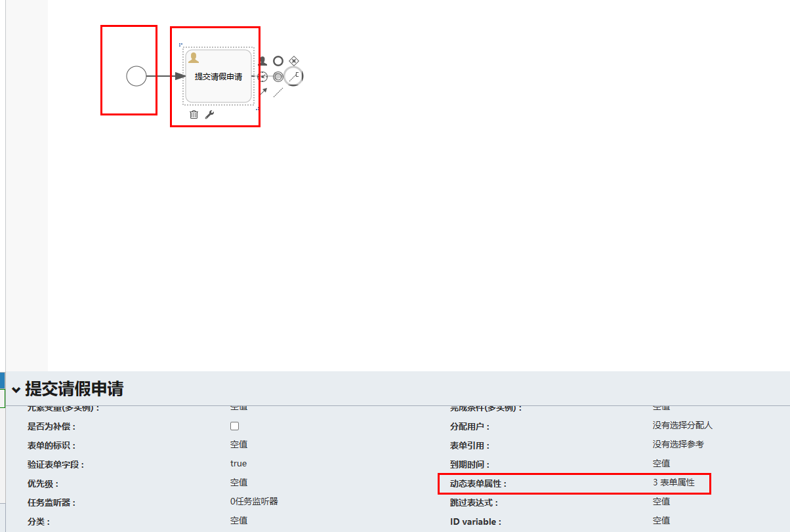

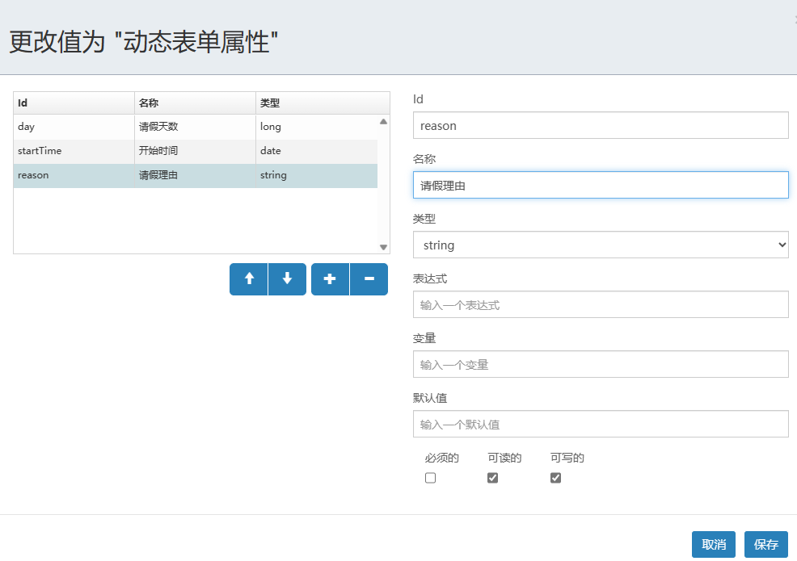

**对应任务也要创建相应表单数据。**

```xml
<definitions xmlns="http://www.omg.org/spec/BPMN/20100524/MODEL" xmlns:xsi="http://www.w3.org/2001/XMLSchema-instance" xmlns:xsd="http://www.w3.org/2001/XMLSchema" xmlns:flowable="http://flowable.org/bpmn" xmlns:bpmndi="http://www.omg.org/spec/BPMN/20100524/DI" xmlns:omgdc="http://www.omg.org/spec/DD/20100524/DC" xmlns:omgdi="http://www.omg.org/spec/DD/20100524/DI" typeLanguage="http://www.w3.org/2001/XMLSchema" expressionLanguage="http://www.w3.org/1999/XPath" targetNamespace="http://www.flowable.org/processdef" exporter="Flowable Open Source Modeler" exporterVersion="6.8.0">
    <process id="Process" name="请假流程" isExecutable="true">
        <documentation>请假流程</documentation>
        <startEvent id="startEvent1" flowable:formKey="json表单" flowable:formFieldValidation="true">
            <extensionElements>
                <flowable:formProperty id="day" name="请假天数" type="long" default="1"/>
                <flowable:formProperty id="startTime" name="开始时间" type="date" datePattern="MM-dd-yyyy hh:mm"/>
                <flowable:formProperty id="reason" name="请假理由" type="string"/>
            </extensionElements>
        </startEvent>
        <userTask id="sid-2F09D620-BA96-4D31-8AA1-ACC2E29F7CBA" name="提交请假申请" flowable:formFieldValidation="true">
            <extensionElements>
                <flowable:formProperty id="days" name="请假天数" type="long" default="1"/>
                <flowable:formProperty id="startTime" name="开始时间" type="date" datePattern="MM-dd-yyyy hh:mm"/>
                <flowable:formProperty id="reason" name="请假理由" type="string"/>
            </extensionElements>
        </userTask>
        <sequenceFlow id="sid-D4A95C09-CA32-4562-92DB-6ECBBAA4840C" sourceRef="startEvent1" targetRef="sid-2F09D620-BA96-4D31-8AA1-ACC2E29F7CBA"/>
        <endEvent id="sid-EB6A6549-7FB8-4700-AF9F-9C5921E89142"/>
        <sequenceFlow id="sid-366BDB6C-A29A-4C98-BE82-C72B550B4CA1" sourceRef="sid-2F09D620-BA96-4D31-8AA1-ACC2E29F7CBA" targetRef="sid-EB6A6549-7FB8-4700-AF9F-9C5921E89142"/>
    </process>
    <bpmndi:BPMNDiagram id="BPMNDiagram_Process">
        <bpmndi:BPMNPlane bpmnElement="Process" id="BPMNPlane_Process">
            <bpmndi:BPMNShape bpmnElement="startEvent1" id="BPMNShape_startEvent1">
                <omgdc:Bounds height="30.0" width="30.0" x="120.0" y="145.0"/>
            </bpmndi:BPMNShape>
            <bpmndi:BPMNShape bpmnElement="sid-2F09D620-BA96-4D31-8AA1-ACC2E29F7CBA" id="BPMNShape_sid-2F09D620-BA96-4D31-8AA1-ACC2E29F7CBA">
                <omgdc:Bounds height="80.0" width="100.0" x="210.0" y="120.0"/>
            </bpmndi:BPMNShape>
            <bpmndi:BPMNShape bpmnElement="sid-EB6A6549-7FB8-4700-AF9F-9C5921E89142" id="BPMNShape_sid-EB6A6549-7FB8-4700-AF9F-9C5921E89142">
                <omgdc:Bounds height="28.0" width="28.0" x="360.0" y="146.0"/>
            </bpmndi:BPMNShape>
            <bpmndi:BPMNEdge bpmnElement="sid-D4A95C09-CA32-4562-92DB-6ECBBAA4840C" id="BPMNEdge_sid-D4A95C09-CA32-4562-92DB-6ECBBAA4840C" flowable:sourceDockerX="15.0" flowable:sourceDockerY="15.0" flowable:targetDockerX="50.0" flowable:targetDockerY="40.0">
                <omgdi:waypoint x="149.94999883049306" y="160.0"/>
                <omgdi:waypoint x="210.0" y="160.0"/>
            </bpmndi:BPMNEdge>
            <bpmndi:BPMNEdge bpmnElement="sid-366BDB6C-A29A-4C98-BE82-C72B550B4CA1" id="BPMNEdge_sid-366BDB6C-A29A-4C98-BE82-C72B550B4CA1" flowable:sourceDockerX="50.0" flowable:sourceDockerY="40.0" flowable:targetDockerX="14.0" flowable:targetDockerY="14.0">
                <omgdi:waypoint x="309.94999999999595" y="160.0"/>
                <omgdi:waypoint x="360.0" y="160.0"/>
            </bpmndi:BPMNEdge>
        </bpmndi:BPMNPlane>
    </bpmndi:BPMNDiagram>
</definitions>
```

##### 案例

1. **`saveFormData(String taskId, Map<String, String> properties)`**：用于保存任务的表单数据，但不会完成任务。可以用于临时保存数据，用户可以在后续继续填写表单。
2. **`submitTaskFormData(String taskId, Map<String, String> properties)`**：用于提交任务的表单数据，并完成任务。适用于需要在提交表单后立即完成任务的场景。

###### 部署流程定义，启动流程实例

```java
private void deploy() {
    // 部署流程定义
    Deployment deployment = repositoryService.createDeployment()
        .addClasspathResource("processes/请假流程-并行网关.bpmn20.xml")
        .deploy();
    System.out.println("deployment = " + deployment);
}

private void startFlow(String key) {
    ProcessDefinition processDefinition = repositoryService.createProcessDefinitionQuery()
        .processDefinitionKey(key)
        .latestVersion()
        .singleResult();

    // 启动流程实例
    // 设置流程变量
    Map<String, String> variables = new HashMap<>();
    variables.put("day","3");
    variables.put("startTime","2024-01-29 00:00");
    variables.put("reason","去找胡桃了");

    // 启动流程实例
    ProcessInstance processInstance = formService.submitStartFormData(processDefinition.getId(), variables);
    System.out.println("processInstance.getProcessInstanceId() = " + processInstance.getProcessInstanceId());
}
```

###### 获取表单字段

```java
private void getStartFormData(String key) {
    ProcessDefinition processDefinition = repositoryService.createProcessDefinitionQuery()
        .processDefinitionKey(key)
        .latestVersion()
        .singleResult();
    // 获取表单字段
    StartFormData startFormData = formService.getStartFormData(processDefinition.getId());
    List<FormProperty> formProperties = startFormData.getFormProperties();
    for (FormProperty formProperty : formProperties) {
        String id = formProperty.getId();
        String name = formProperty.getName();
        FormType type = formProperty.getType();
        System.out.println("id = " + id);
        System.out.println("name = " + name);
        System.out.println("type.getClass() = " + type.getClass());
    }
}
```

###### 表单信息修改保存与查询

```java
private void modifyFormData(String key) {
    // 表单信息修改保存与查询
    Task task = taskService.createTaskQuery()
        .processDefinitionKey(key)
        .singleResult();

    if (task == null) {
        System.out.println("任务不存在");
        return;
    }

    Map<String, String> map = new HashMap<>();
    map.put("day", "3");
    map.put("startTime", "2023-01-27 22:42");
    map.put("reason", "测试以下提交流程");
    map.put("num", "3");
    formService.saveFormData(task.getId(), map);

    System.out.println("Form data updated for taskId = " + task.getId());

    TaskFormData taskFormData = formService.getTaskFormData(task.getId());
    List<FormProperty> formProperties = taskFormData.getFormProperties();
    System.out.println(formProperties);
    for (FormProperty formProperty : formProperties) {
        System.out.println("formProperty.getId() = " + formProperty.getId());
        System.out.println("formProperty.getName() = " + formProperty.getName());
        System.out.println("formProperty.getValue() = " + formProperty.getValue());
    }
}
```

###### 完成任务

```java
private void completeTask(String key) {
    // 完成任务
    List<Task> tasks = taskService.createTaskQuery()
        .processDefinitionKey(key)
        .orderByTaskCreateTime().desc().list();
    Task task = tasks.get(0);
    System.out.println(task.getAssignee() + "-完成任务-" + task.getId());
    Map<String, String> map = new HashMap<>();
    map.put("day", "4");
    map.put("startTime", "2023-01-30 22:42");
    map.put("reason", "一起去看《深海》吧");
    map.put("num", "3");
    formService.submitTaskFormData(task.getId(), map);
}
```

#### 外置表单

##### JSON 表单

集成SpringBoot的Flowable提供了`.form`的自动部署机制。会对保存在`forms`文件夹下的表单自动部署。

###### 配置表单位置和表单后缀名

默认加载对应目录下的表单。

```yaml
flowable:
  form:
    resource-suffixes: "**.form"    # 默认的表单⽂件后缀
    resource-location: "classpath*:/forms"    # 默认的表单⽂件位置
```

###### 创建form表单

```json
{
  "key":"FormLeaveProcess",
  "name": "请假流程外部表单",
  "fields": [
    {
      "id": "startTime",
      "name": "请假开始时间",
      "type": "date",
      "required": true,
      "placeholder": "empty"
    },
    {
      "id": "endTime",
      "name": "请假结束时间",
      "type": "date",
      "required": true,
      "placeholder": "empty"
    },
    {
      "id": "reason",
      "name": "请假原因",
      "type": "string",
      "required": false,
      "placeholder": "empty"
    }
  ]
}
```

###### 绘制流程

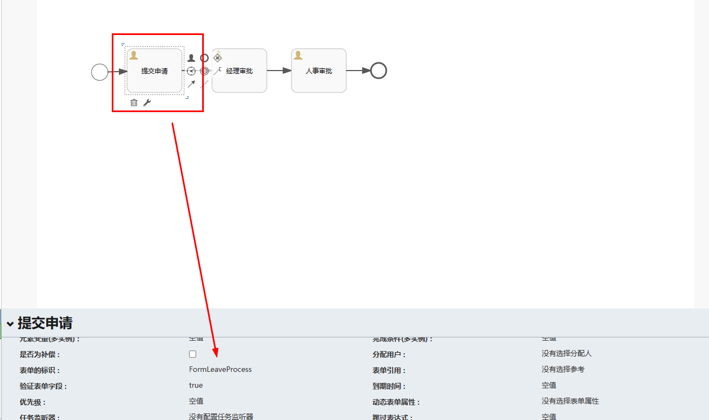

```xml
<definitions xmlns="http://www.omg.org/spec/BPMN/20100524/MODEL" xmlns:xsi="http://www.w3.org/2001/XMLSchema-instance" xmlns:xsd="http://www.w3.org/2001/XMLSchema" xmlns:flowable="http://flowable.org/bpmn" xmlns:bpmndi="http://www.omg.org/spec/BPMN/20100524/DI" xmlns:omgdc="http://www.omg.org/spec/DD/20100524/DC" xmlns:omgdi="http://www.omg.org/spec/DD/20100524/DI" typeLanguage="http://www.w3.org/2001/XMLSchema" expressionLanguage="http://www.w3.org/1999/XPath" targetNamespace="http://www.flowable.org/processdef" exporter="Flowable Open Source Modeler" exporterVersion="6.8.0">
    <process id="FormLeaveProcess" name="请假流程" isExecutable="true">
        <documentation>请假流程</documentation>
        <startEvent id="startEvent1" flowable:formFieldValidation="true"/>
        <userTask id="sid-AB0F10C4-38AE-4EA2-9EEA-BC13D76E1301" name="提交申请" flowable:formKey="FormLeaveProcess" flowable:formFieldValidation="true"/>
        <sequenceFlow id="sid-6668B1FE-CBD0-49C6-B334-F8DAC4AE2E97" sourceRef="startEvent1" targetRef="sid-AB0F10C4-38AE-4EA2-9EEA-BC13D76E1301"/>
        <userTask id="sid-1BC79BF2-69A4-4E1F-93D2-E615C2A86042" name="经理审批" flowable:formKey="FormLeaveProcess" flowable:formFieldValidation="true"/>
        <sequenceFlow id="sid-6A86EDF1-75BF-4920-B5C1-4890647AFE3E" sourceRef="sid-AB0F10C4-38AE-4EA2-9EEA-BC13D76E1301" targetRef="sid-1BC79BF2-69A4-4E1F-93D2-E615C2A86042"/>
        <userTask id="sid-9DC10D64-7502-44E5-83BF-17DF0F5F052B" name="人事审批" flowable:formFieldValidation="true"/>
        <sequenceFlow id="sid-7A4F6614-FA41-4E00-94A5-398832493FA0" sourceRef="sid-1BC79BF2-69A4-4E1F-93D2-E615C2A86042" targetRef="sid-9DC10D64-7502-44E5-83BF-17DF0F5F052B"/>
        <endEvent id="sid-4A27F0AA-2E15-434E-AA1C-FA145EF634FB"/>
        <sequenceFlow id="sid-D5F447A1-0045-4972-BB88-68CEA0133BA0" sourceRef="sid-9DC10D64-7502-44E5-83BF-17DF0F5F052B" targetRef="sid-4A27F0AA-2E15-434E-AA1C-FA145EF634FB"/>
    </process>
    <bpmndi:BPMNDiagram id="BPMNDiagram_FormLeaveProcess">
        <bpmndi:BPMNPlane bpmnElement="FormLeaveProcess" id="BPMNPlane_FormLeaveProcess">
            <bpmndi:BPMNShape bpmnElement="startEvent1" id="BPMNShape_startEvent1">
                <omgdc:Bounds height="30.0" width="30.0" x="100.0" y="163.0"/>
            </bpmndi:BPMNShape>
            <bpmndi:BPMNShape bpmnElement="sid-AB0F10C4-38AE-4EA2-9EEA-BC13D76E1301" id="BPMNShape_sid-AB0F10C4-38AE-4EA2-9EEA-BC13D76E1301">
                <omgdc:Bounds height="80.0" width="100.0" x="165.0" y="135.0"/>
            </bpmndi:BPMNShape>
            <bpmndi:BPMNShape bpmnElement="sid-1BC79BF2-69A4-4E1F-93D2-E615C2A86042" id="BPMNShape_sid-1BC79BF2-69A4-4E1F-93D2-E615C2A86042">
                <omgdc:Bounds height="80.0" width="100.0" x="320.0" y="138.0"/>
            </bpmndi:BPMNShape>
            <bpmndi:BPMNShape bpmnElement="sid-9DC10D64-7502-44E5-83BF-17DF0F5F052B" id="BPMNShape_sid-9DC10D64-7502-44E5-83BF-17DF0F5F052B">
                <omgdc:Bounds height="80.0" width="100.0" x="465.0" y="138.0"/>
            </bpmndi:BPMNShape>
            <bpmndi:BPMNShape bpmnElement="sid-4A27F0AA-2E15-434E-AA1C-FA145EF634FB" id="BPMNShape_sid-4A27F0AA-2E15-434E-AA1C-FA145EF634FB">
                <omgdc:Bounds height="28.0" width="28.0" x="610.0" y="164.0"/>
            </bpmndi:BPMNShape>
            <bpmndi:BPMNEdge bpmnElement="sid-D5F447A1-0045-4972-BB88-68CEA0133BA0" id="BPMNEdge_sid-D5F447A1-0045-4972-BB88-68CEA0133BA0" flowable:sourceDockerX="50.0" flowable:sourceDockerY="40.0" flowable:targetDockerX="14.0" flowable:targetDockerY="14.0">
                <omgdi:waypoint x="564.95" y="178.0"/>
                <omgdi:waypoint x="610.0" y="178.0"/>
            </bpmndi:BPMNEdge>
            <bpmndi:BPMNEdge bpmnElement="sid-7A4F6614-FA41-4E00-94A5-398832493FA0" id="BPMNEdge_sid-7A4F6614-FA41-4E00-94A5-398832493FA0" flowable:sourceDockerX="50.0" flowable:sourceDockerY="40.0" flowable:targetDockerX="50.0" flowable:targetDockerY="40.0">
                <omgdi:waypoint x="419.94999999999067" y="178.0"/>
                <omgdi:waypoint x="464.9999999999807" y="178.0"/>
            </bpmndi:BPMNEdge>
            <bpmndi:BPMNEdge bpmnElement="sid-6668B1FE-CBD0-49C6-B334-F8DAC4AE2E97" id="BPMNEdge_sid-6668B1FE-CBD0-49C6-B334-F8DAC4AE2E97" flowable:sourceDockerX="15.0" flowable:sourceDockerY="15.0" flowable:targetDockerX="50.0" flowable:targetDockerY="40.0">
                <omgdi:waypoint x="129.94340692927761" y="177.55019845363262"/>
                <omgdi:waypoint x="164.99999999999906" y="176.4985"/>
            </bpmndi:BPMNEdge>
            <bpmndi:BPMNEdge bpmnElement="sid-6A86EDF1-75BF-4920-B5C1-4890647AFE3E" id="BPMNEdge_sid-6A86EDF1-75BF-4920-B5C1-4890647AFE3E" flowable:sourceDockerX="50.0" flowable:sourceDockerY="40.0" flowable:targetDockerX="50.0" flowable:targetDockerY="40.0">
                <omgdi:waypoint x="264.9499999999882" y="175.0"/>
                <omgdi:waypoint x="292.5" y="175.0"/>
                <omgdi:waypoint x="292.5" y="178.0"/>
                <omgdi:waypoint x="319.9999999999603" y="178.0"/>
            </bpmndi:BPMNEdge>
        </bpmndi:BPMNPlane>
    </bpmndi:BPMNDiagram>
</definitions>
```

###### 部署流程与表单信息

```java
@Autowired
private RepositoryService repositoryService;

@Autowired
private FormRepositoryService formRepositoryService;

@Test
void deployFormProcess() {
    // 1.部署流程
    Deployment deploy = repositoryService.createDeployment()
        .addClasspathResource("processes/FormLeaveProcess.bpmn20.xml")
        .name("外部表单请假流程")
        .deploy();
    // 2.部署表单
    formRepositoryService.createDeployment()
        .addClasspathResource("forms/FormLeaveProcess.form")
        .name("请假流程外部表单")
        .parentDeploymentId(deploy.getId())
        .deploy();
}
```

###### 启动流程

```java
@Autowired
private RuntimeService runtimeService;

@Test
void startProcess() {

    // 查询最新版本的流程定义
    ProcessDefinition processDefinition = repositoryService.createProcessDefinitionQuery()
        .processDefinitionKey("FormLeaveProcess")
        .latestVersion().singleResult();

    String processDefinitionId = processDefinition.getId();
    ProcessInstance processInstance = runtimeService.startProcessInstanceWithForm(processDefinitionId, "表单请假流程outcome", null, "胡桃的请假流程");
    System.out.println("processInstance.getId() = " + processInstance.getId());
}
```

###### 完成任务

```java
@Test
void completeFormTask() {

    // 查询最新版本的流程定义
    ProcessDefinition processDefinition = repositoryService.createProcessDefinitionQuery()
        .processDefinitionKey("FormLeaveProcess")
        .latestVersion().singleResult();

    Map<String, Object> variables = new HashMap<>();
    variables.put("startTime", "20221111");
    variables.put("endTime", "20231110");
    variables.put("reason", "活着不是为了工作，工作是为了活得更有意义");

    Task task = taskService.createTaskQuery()
        .processDefinitionId(processDefinition.getId())
        .singleResult();

    String taskId = task.getId();

    FormInfo formInfo = taskService.getTaskFormModel(task.getId());
    String formDefinitionId = formInfo.getId();
    taskService.completeTaskWithForm(taskId, formDefinitionId, "胡桃", variables);
}
```

###### 获取表单信息

```java
@Test
void getTaskFormData() {

    // 查询最新版本的流程定义
    ProcessDefinition processDefinition = repositoryService.createProcessDefinitionQuery()
        .processDefinitionKey("FormLeaveProcess")
        .latestVersion().singleResult();

    Task task = taskService.createTaskQuery()
        .processDefinitionId(processDefinition.getId())
        .singleResult();

    FormInfo taskFormModel = taskService.getTaskFormModel(task.getId());
    System.out.println(taskFormModel.getId() + "-" + taskFormModel.getName() + "-" + taskFormModel.getKey());
    SimpleFormModel simpleFormModel = (SimpleFormModel)taskFormModel.getFormModel();
    List<FormField> fields = simpleFormModel.getFields();
    for (FormField field : fields) {
        System.out.println(field.getId() + ":" + field.getType() + ":" + field.getName() + ":" + field.getValue());
    }
}
```

##### HTML表单

###### 绘制流程

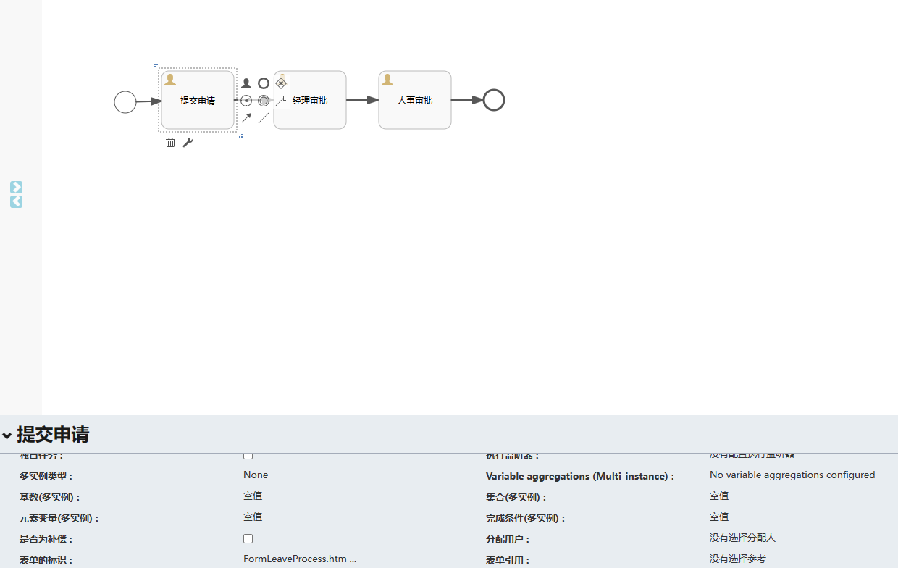

###### html表单

```html
<!DOCTYPE html>
<html lang="zh-CN">
    <head>
        <meta charset="UTF-8">
        <meta name="viewport" content="width=device-width, initial-scale=1.0">
        <title>请假流程外部表单</title>
    </head>
    <body>
        <form id="FormLeaveProcess">
            <div>
                <label for="startTime">请假开始时间</label>
                <input type="date" id="startTime" name="startTime" required>
            </div>
            <div>
                <label for="endTime">请假结束时间</label>
                <input type="date" id="endTime" name="endTime" required>
            </div>
            <div>
                <label for="reason">请假原因</label>
                <input type="text" id="reason" name="reason" placeholder="empty">
            </div>
            <div>
                <button type="submit">提交</button>
            </div>
        </form>
    </body>
</html>
```

###### 部署流程与表单信息

```java
@Test
void deploy() {
    DeploymentBuilder builder = repositoryService.createDeployment()
        .category("HX-FORM-TYPE")
        .name("HTML-FORM")
        .key("FormLeaveProcess3")
        .addClasspathResource("processes/FormLeaveProcess.bpmn20.xml");

    InputStream is = this.getClass().getClassLoader().getResourceAsStream("forms/FormLeaveProcess.html");
    // 注意！这里必须指定名称与流程定义的名称相同！否则将会报错
    // Form with formKey 'xxx.html' does not exist
    // 指定表单的名称与流程定义文件中的一致。
    builder.addInputStream("FormLeaveProcess.html", is);

    Deployment deployment = builder.deploy();
    System.out.println("deployment.getId() = " + deployment.getId());
}
```

###### 获取表单信息

```java
@Autowired
FormService formService;

@Test
void getStartFormContent() {
    ProcessDefinition pd = repositoryService.createProcessDefinitionQuery()
        .latestVersion().processDefinitionKey("FormLeaveProcess3").singleResult();
    System.out.println("pd = " + pd);
    String startFormKey = formService.getStartFormKey(pd.getId());
    System.out.println("startFormKey = " + startFormKey);
    String renderedStartForm = (String) formService.getRenderedStartForm(pd.getId());
    System.out.println("renderedStartForm = " + renderedStartForm);
}

@Test
void getFormContent2() throws IOException {
    ProcessDefinition pd = repositoryService.createProcessDefinitionQuery()
        .latestVersion().processDefinitionKey("FormLeaveProcess3").singleResult();
    List<String> deploymentResourceNames = repositoryService.getDeploymentResourceNames(pd.getDeploymentId());
    byte[] bt = new byte[1024];
    for (String name : deploymentResourceNames) {
        System.out.println("deploymentResourceName = " + name);
        try (InputStream is = repositoryService.getResourceAsStream(pd.getDeploymentId(), name)) {
            while (is.read(bt) != -1) {
                System.out.print(new String(bt));
            }
        }
    }
}
```

###### 启动流程

```java
@Test
void startFlow() {
    ProcessDefinition pd = repositoryService.createProcessDefinitionQuery()
        .processDefinitionKey("FormLeaveProcess3")
        .latestVersion().singleResult();
    Map<String, String> variables = new HashMap<>();
    variables.put("startTime", "20221111");
    variables.put("endTime", "20231110");
    variables.put("reason", "活着不是为了工作，工作是为了活得更有意义");
    ProcessInstance pi = formService.submitStartFormData(pd.getId(), variables);
    System.out.println("pi.getId() = " + pi.getId());
}
```

###### 完成任务

```java
@Test
void completeTask1() {
    ProcessDefinition pd = repositoryService.createProcessDefinitionQuery()
        .processDefinitionKey("FormLeaveProcess3").latestVersion().singleResult();
    Task task = taskService.createTaskQuery()
        .processDefinitionId(pd.getId())
        .singleResult();
    Map<String, String> variables = new HashMap<>();
    variables.put("startTime", "20221111");
    variables.put("endTime", "20231110");
    variables.put("reason", "活着不是为了工作，工作是为了活得更有意义");
    formService.submitTaskFormData(task.getId(), variables);
}
```

###### 获取任务表单信息

```java
@Test
void getTaskFormContent() {
    ProcessDefinition pd = repositoryService.createProcessDefinitionQuery()
        .processDefinitionKey("FormLeaveProcess3").latestVersion().singleResult();
    Task task = taskService.createTaskQuery()
        .processDefinitionId(pd.getId())
        .singleResult();
    String renderedTaskForm = (String) formService.getRenderedTaskForm(task.getId());
    System.out.println("renderedTaskForm = " + renderedTaskForm);
}
```

### 任务回退驳回

#### 串行任务

#### 并行任务

#### 子流程回退

#### 任务撤销

[Flowable进阶学习（八）动态表单；外置表单（JSON表单、HTML表单及踩坑记录）；任务回退（串行任务、并行任务、子流程回退）_flowable 表单-CSDN博客](https://blog.csdn.net/qq_40366738/article/details/128768412)

### 候选人与候选人组

#### 候选人

#### 候选人组

#### 候选用户候选组委托人

[Flowable进阶学习（五）候选人与候选人组_候选用户候选组委托人-CSDN博客](https://blog.csdn.net/qq_40366738/article/details/128752504)

### 任务分配与流程变量

[Flowable进阶学习（四）任务分配与流程变量_flowable 流程表达式-CSDN博客](https://blog.csdn.net/qq_40366738/article/details/128746821)

### 监听器

#### 执行监听器

#### 任务监听器

#### 全局监听器

[SpringBoot整合Flowable工作流-3（全局事件监听）_基于spring事件监听实现工作流-CSDN博客](https://blog.csdn.net/u010365819/article/details/120823612)

### 多人会签

### 子流程

### 任务专题

### 事件专题

## 通用审批流程应用实践

[Springboot整合Flowable并进行一个通用审批流程应用实践_springboot集成flowable启动 审批-CSDN博客](https://blog.csdn.net/jxlhljh/article/details/124466268)