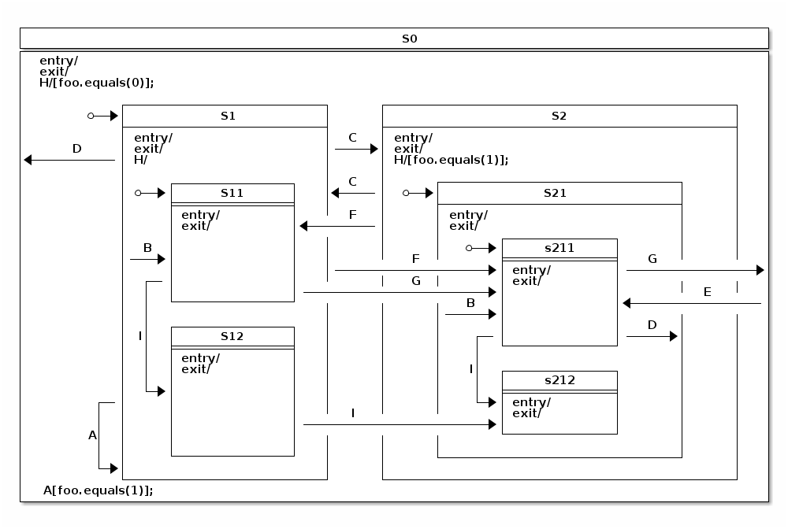

# Spring状态机篇

- [Spring 状态机中文文档](https://dev-cloud.gitcode.host/spring/guide/spring-statemachine/spring-statemachine.html)

## 第1章 介绍

### 1.1 什么是状态机

**状态机**（State Machine）是一种数学模型，用于表示有限数量的状态及其之间的转换。状态机主要由四个要素构成：

1. **现态（Current State）**：指当前所处的状态。
2. **条件（Condition/Event）**：当一个条件被满足，将会触发一个动作，或者执行一次状态的迁移。
3. **动作（Action）**：条件满足后执行的动作。动作执行完毕后，可以迁移到新的状态，也可以仍旧保持原状态。动作不是必须的，当条件满足后，也可以不执行任何动作，直接迁移到新的状态。
4. **次态（Next State）**：条件满足后要迁往的新状态。“次态”是相对于“现态”而言的，“次态”一旦被激活，就转换成“现态”。

通过这四个要素的相互作用，状态机可以帮助设计和实现复杂的逻辑流程，明确控制系统行为。

### 1.2 Spring State Machine 简介

**Spring State Machine** 是 Spring 提供的一种框架，用于实现状态机模型。它具有高度可配置性和可扩展性，支持多种状态机类型，包括简单状态机、分层状态机和并行状态机。

**主要特点**：

- 支持多种状态机模型
- 与 Spring 框架无缝集成
- 支持状态持久化
- 提供强大的扩展和配置能力

**基本组件**：

- **StateMachine**：状态机实例
- **StateMachineConfig**：状态机配置类
- **StateMachineBuilder**：用于构建状态机的构建器
- **StateMachineFactory**：状态机工厂类

### 1.3 状态机在应用中的典型场景

**典型应用场景**：

1. **电商订单系统**：
   - **现态**：创建、已支付、已发货、已收货、已取消
   - **条件**：支付、发货、确认收货、取消订单
   - **动作**：记录支付信息、更新库存、发送通知等
   - **次态**：已支付、已发货、已收货、已取消
2. **工作流管理**：
   - **现态**：待审批、审批中、已审批、已完成
   - **条件**：提交审批、开始审批、审批通过、审批拒绝
   - **动作**：发送审批请求、记录审批结果等
   - **次态**：审批中、已审批、已完成
3. **用户认证和授权**：
   - **现态**：未登录、已登录、已授权、未授权
   - **条件**：登录、登出、授权、撤销授权
   - **动作**：验证用户身份、分配权限等
   - **次态**：已登录、已授权、未授权
4. **游戏开发**：
   - **现态**：待机、移动、攻击、防御、死亡
   - **条件**：移动命令、攻击命令、防御命令、受到伤害
   - **动作**：更新角色位置、执行攻击动作、减少血量等
   - **次态**：移动、攻击、防御、死亡

### 1.4 环境搭建与基础配置（基于 Spring Boot）

#### 添加 Maven 依赖

```xml
<dependency>
    <groupId>org.springframework.statemachine</groupId>
    <artifactId>spring-statemachine-core</artifactId>
    <version>3.0.1</version>
</dependency>
<dependency>
    <groupId>org.springframework.boot</groupId>
    <artifactId>spring-boot-starter-web</artifactId>
</dependency>
<dependency>
    <groupId>org.springframework.boot</groupId>
    <artifactId>spring-boot-starter-test</artifactId>
    <scope>test</scope>
</dependency>
```

#### 简单的状态机配置类

```java
// 标注该类为一个配置类
@Configuration
@EnableStateMachineFactory
public class StateMachineConfig extends StateMachineConfigurerAdapter<String, String> {

    /**
     * 配置状态机的状态
     * 
     * @param states 状态配置器
     * @throws Exception 如果配置过程发生错误
     */
    @Override
    public void configure(StateMachineStateConfigurer<String, String> states) throws Exception {
        states
            .withStates()
                // 配置初始状态，即状态机启动时的默认状态
                .initial("STATE1")
                // 配置一个普通状态，状态机可以进入这个状态并在该状态中停留
                .state("STATE2")
                // 配置一个结束状态，状态机到达该状态后停止运行
                .end("STATE3");
    }

    /**
     * 配置状态机的状态转换规则
     * 
     * @param transitions 转换配置器
     * @throws Exception 如果配置过程发生错误
     */
    @Override
    public void configure(StateMachineTransitionConfigurer<String, String> transitions) throws Exception {
        transitions
            .withExternal()
                // 配置一个外部转换，从 STATE1 到 STATE2，当事件 EVENT1 发生时触发
                .source("STATE1").target("STATE2").event("EVENT1")
                .and()
            .withExternal()
                // 配置另一个外部转换，从 STATE2 到 STATE3，当事件 EVENT2 发生时触发
                .source("STATE2").target("STATE3").event("EVENT2");
    }
}
```

#### 编写测试类

```java
@Autowired
private StateMachineFactory<String, String> stateMachineFactory;

@Test
public void testStateMachineTransitions() {
    // 获取状态机实例
    StateMachine<String, String> stateMachine = stateMachineFactory.getStateMachine();

    // 重置状态机的初始状态
    stateMachine.getStateMachineAccessor()
        .doWithAllRegions(access -> access.resetStateMachineReactively(
            new DefaultStateMachineContext<>("STATE1", null, null, null)).block());

    // 启动状态机
    stateMachine.startReactively().block();
    log.info("Initial state: {}", getStateName(stateMachine));

    // 发送第一个事件并检查状态转换
    sendEvent(stateMachine, "EVENT1");
    log.info("State after EVENT1: {}", getStateName(stateMachine));

    // 发送第二个事件并检查状态转换
    sendEvent(stateMachine, "EVENT2");
    log.info("State after EVENT2: {}", getStateName(stateMachine));

    // 停止状态机
    stateMachine.stopReactively().block();
}

private void sendEvent(StateMachine<String, String> stateMachine, String event) {
    Message<String> message = MessageBuilder.withPayload(event).build();
    stateMachine.sendEvent(Mono.just(message)).blockFirst();
}

private String getStateName(StateMachine<String, String> stateMachine) {
    return stateMachine.getState() != null ? stateMachine.getState().getId() : "UNKNOWN";
}
```

## 第2章 Spring State Machine 基础

### 2.1 状态(State)

#### 什么是状态

状态是状态机中的一个核心概念，指的是在某一时刻系统的一个具体状态。状态可以理解为系统在某一特定时间点上的条件或情景。在状态机中，状态通常通过唯一的标识符（如字符串或枚举值）来表示。

#### 状态的分类

在状态机中，状态通常可以分为以下几类：

1. **初始状态 (Initial State)**：
   - 系统在启动时的默认状态。
   - 在 Spring State Machine 中，通过 `.initial("STATE_NAME")` 方法来配置。
2. **普通状态 (Regular State)**：
   - 状态机可以在这些状态之间转换。
   - 这些状态既可以是目标状态，也可以是源状态。
3. **结束状态 (End State)**：
   - 表示状态机的最终状态，一旦进入这个状态，状态机停止运行。
   - 在 Spring State Machine 中，通过 `.end("STATE_NAME")` 方法来配置。

#### 状态的配置

在 Spring State Machine 中，我们通过 `StateMachineConfigurerAdapter` 类来配置状态。以下是一个示例，展示了如何定义初始状态和普通状态：

```java
@Configuration
@EnableStateMachineFactory
public class StateMachineConfig extends StateMachineConfigurerAdapter<String, String> {

    @Override
    public void configure(StateMachineStateConfigurer<String, String> states) throws Exception {
        states
            .withStates()
            .initial("STATE1") // 初始状态
            .state("STATE2")   // 普通状态
            .state("STATE3")   // 普通状态
            .end("STATE4");    // 结束状态
    }

    @Override
    public void configure(StateMachineTransitionConfigurer<String, String> transitions) throws Exception {
        transitions
            .withExternal().source("STATE1").target("STATE2").event("EVENT1")
            .and()
            .withExternal().source("STATE2").target("STATE3").event("EVENT2")
            .and()
            .withExternal().source("STATE3").target("STATE4").event("EVENT3");
    }
}
```

#### 状态的行为

> 在 Spring State Machine 中，通常使用 `EnumStateMachineConfigurerAdapter` 来配置状态机，特别是在使用枚举类型来定义状态和事件时。
>
> 这个类提供了一组方法，可以轻松地配置状态机，包括定义状态、转换、监听器等。通过继承 `EnumStateMachineConfigurerAdapter` 并重写其中的方法，可以定义状态机的行为和转换规则。

状态不仅仅是一个标识符，它们还可以附加行为。在状态进入或退出时，可以执行特定的动作。以下是一个示例，展示了如何在状态进入或退出时执行动作：

##### 定义枚举

```java
public enum Events {
    EVENT1, EVENT2, EVENT3
}

public enum States {
    STATE1, STATE2, STATE3
}
```

##### 定义状态行为

- 编程

```java
@Component
public class StateActions {
    
    public Action<States, Events> entryAction() {
        return context -> {
            System.out.println("Entering STATE2");
        };
    }
    
    public Action<States, Events> exitAction() {
        return context -> {
            System.out.println("Exiting STATE2");
        };
    }
}
```

- 注解

`@WithStateMachine` 和 `@OnStateEntry`、`@OnStateExit` 注解通常用于在状态机配置类之外定义状态机的状态进入和退出时的行为。如果想要将这些行为单独放置在一个类中，以便更好地管理，可以将这个类单独创建，并使用 `@Component` 注解将其声明为 Spring 的组件。然后，在需要使用这些行为的状态机配置类中，可以通过 `@Autowired` 注解来注入这个组件，并在相应的方法中调用这些行为。

为了类型安全，需要使用`@OnStateChanged`作为元注释来为枚举创建新的注释。

```java
@Target(ElementType.METHOD)
@Retention(RetentionPolicy.RUNTIME)
@OnStateEntry
public @interface StatesOnStateEntry {
    States[] source() default {};
    
    States[] target() default {};
}


@Target(ElementType.METHOD)
@Retention(RetentionPolicy.RUNTIME)
@OnStateExit
public @interface StatesOnStateExit {
    States[] source() default {};
    
    States[] target() default {};
}
```

```java
@Component
@WithStateMachine(name = "stateActions", id = "myMachineId")
public class StateActions {

    @StatesOnStateEntry(target = States.STATE2)
    public void onState2Entry() {
        // 进入 STATE2 时执行的动作
        System.out.println("Entering STATE2");
    }

    @StatesOnStateExit(source = States.STATE2)
    public void onState2Exit() {
        // 退出 STATE2 时执行的动作
        System.out.println("Exiting STATE2");
    }
}
```

##### 配置类

- 编程

```java
@Primary
@Configuration
@EnableStateMachineFactory
public class StateMachineConfig extends EnumStateMachineConfigurerAdapter<States, Events> {

    @Autowired
    private StateActions stateActions;


    @Override
    public void configure(StateMachineStateConfigurer<States, Events> states) throws Exception {
        // 配置状态
        states
            .withStates()
            // 定义初始状态为 STATE1
            .initial(States.STATE1)
            // 定义所有可能的状态
            .states(EnumSet.allOf(States.class))
            // 定义 STATE2 状态，并指定进入和退出状态时执行的动作
            .state(States.STATE2, stateActions.entryAction(), stateActions.exitAction()).end(States.STATE3);
    }

    @Override
    public void configure(StateMachineTransitionConfigurer<States, Events> transitions) throws Exception {
        // 配置状态转换
        transitions
            .withExternal()
            // 定义从 STATE1 到 STATE2 的状态转换，当触发 EVENT1 事件时
            .source(States.STATE1).target(States.STATE2).event(Events.EVENT1)
            .and()
            .withExternal()
            .source(States.STATE2).target(States.STATE3).event(Events.EVENT2); // 定义状态转换

    }


    // 或者配置监听
    @Override
    public void configure(StateMachineConfigurationConfigurer<States, Events> config) throws Exception {
        config
            .withConfiguration()
            .listener(new StateMachineListenerAdapter<States, Events>() {
                @Override
                public void stateEntered(State<States, Events> state) {
                    if (state.getId() == States.STATE2) {
                        stateActions.onState2Entry();
                    }
                }

                @Override
                public void stateExited(State<States, Events> state) {
                    if (state.getId() == States.STATE2) {
                        stateActions.onState2Exit();
                    }
                }
            });
    }
}
```

- 注解

```java
@Configuration
@EnableStateMachineFactory
public class StateMachineConfig extends EnumStateMachineConfigurerAdapter<States, Events> {
    
    @Autowired
    private BeanFactory beanFactory;
    
    @Bean
    public static StateMachine<States, Events> buildMachine(BeanFactory beanFactory) throws Exception {
        StateMachineBuilder.Builder<States, Events> builder = StateMachineBuilder.builder();
        
        builder.configureConfiguration()
                .withConfiguration()
                .machineId("myMachineId")
                .beanFactory(beanFactory);
        
        // 添加状态和状态转换的配置
        builder.configureStates()
                .withStates()
                .initial(States.STATE1)
                .state(States.STATE2)
                .end(States.STATE3);
        
        builder.configureTransitions()
                .withExternal()
                .source(States.STATE1).target(States.STATE2).event(Events.EVENT1)
                .and()
                .withExternal()
                .source(States.STATE2).target(States.STATE3).event(Events.EVENT2);
        
        return builder.build();
    }
    
}
```

##### 编写测试类

- 编程

```java
// 注入状态机工厂
@Autowired
private StateMachineFactory<States, Events> stateMachineFactory;

@Test
public void testStateMachineTransitions() {
    // 获取状态机实例
    StateMachine<States, Events> stateMachine = stateMachineFactory.getStateMachine();

    // 重置状态机的初始状态
    stateMachine.getStateMachineAccessor()
        .doWithAllRegions(access -> access.resetStateMachineReactively(
            new DefaultStateMachineContext<>(States.STATE1, null, null, null)).block());

    // 启动状态机
    stateMachine.startReactively().block();
    log.info("Initial state: {}", getStateName(stateMachine));

    // 发送第一个事件并检查状态转换
    sendEvent(stateMachine, Events.EVENT1);
    log.info("State after EVENT1: {}", getStateName(stateMachine));

    // 发送第二个事件并检查状态转换
    sendEvent(stateMachine, Events.EVENT2);
    log.info("State after EVENT2: {}", getStateName(stateMachine));

    // 发送第三个事件并检查状态转换
    sendEvent(stateMachine, Events.EVENT3);
    log.info("State after EVENT3: {}", getStateName(stateMachine));

    // 停止状态机
    stateMachine.stopReactively().block();
}

private void sendEvent(StateMachine<States, Events> stateMachine, Events event) {
    Message<Events> message = MessageBuilder.withPayload(event).build();
    stateMachine.sendEvent(Mono.just(message)).blockFirst();
}

private States getStateName(StateMachine<States, Events> stateMachine) {
    return stateMachine.getState() != null ? stateMachine.getState().getId() : States.STATE3;
}
```

- 注解

```java
@Autowired
private StateMachine<States, Events> stateMachine;

@Test
public void testStateMachineTransitions() {
    // 启动状态机
    stateMachine.startReactively().block();
    log.info("Initial state: {}", getStateName(stateMachine));

    // 发送第一个事件并检查状态转换
    sendEvent(stateMachine, Events.EVENT1);
    log.info("State after EVENT1: {}", getStateName(stateMachine));

    // 发送第二个事件并检查状态转换
    sendEvent(stateMachine, Events.EVENT2);
    log.info("State after EVENT2: {}", getStateName(stateMachine));

    // 发送第三个事件并检查状态转换
    sendEvent(stateMachine, Events.EVENT3);
    log.info("State after EVENT3: {}", getStateName(stateMachine));

    // 停止状态机
    stateMachine.stopReactively().block();
}
```

### 2.2 事件(Event)

#### 什么是事件 (What is an Event)

在状态机中，事件是用于触发状态转换的信号。每个事件代表一种特定的操作或条件，当事件发生时，状态机会根据配置的状态转换规则，改变当前状态。

####  定义事件 (Defining Events)

事件通常使用枚举类型来定义，这样不仅简洁，还能保证事件类型的安全性。示例代码：

```java
public enum Events {
    EVENT1,
    EVENT2,
    EVENT3
}
```

在这个示例中，定义了三个事件：`EVENT1`、`EVENT2`和`EVENT3`。这些事件将用于触发状态机的状态转换。

#### 配置状态机 (Configuring State Machine)

##### 定义状态 (Defining States)

首先，需要定义状态机的状态。状态也可以使用枚举类型来定义。

```java
public enum States {
    STATE1,
    STATE2,
    STATE3
}
```

##### 配置状态和初始状态 (Configuring States and Initial State)

使用`StateMachineStateConfigurer`来配置状态和初始状态。

```java
@Configuration
@EnableStateMachineFactory
public class StateMachineConfig extends EnumStateMachineConfigurerAdapter<States, Events> {

    @Override
    public void configure(StateMachineStateConfigurer<States, Events> states) throws Exception {
        states
            .withStates()
            .initial(States.STATE1) // 初始状态
            .state(States.STATE2) // 中间状态
            .end(States.STATE3); // 结束状态
    }
}
```

##### 配置状态转换 (Configuring State Transitions)

状态转换通过事件来触发。使用`StateMachineTransitionConfigurer`来配置事件和状态转换。

```java
@Override
public void configure(StateMachineTransitionConfigurer<States, Events> transitions) throws Exception {
    transitions
        .withExternal()
        .source(States.STATE1).target(States.STATE2).event(Events.EVENT1) // EVENT1 触发从 STATE1 到 STATE2 的转换
        .and()
        .withExternal()
        .source(States.STATE2).target(States.STATE3).event(Events.EVENT2); // EVENT2 触发从 STATE2 到 STATE3 的转换
}
```

#### 创建状态机实例 (Creating State Machine Instance)

```java
@Bean
public StateMachine<States, Events> stateMachine(StateMachineFactory<States, Events> stateMachineFactory) throws Exception {
    return stateMachineFactory.getStateMachine();
}
```

#### 事件监听器 (Event Listener)

监听状态机事件可以帮助调试和记录状态机的行为。通过实现`StateMachineListener`接口，可以监听状态变化、事件处理等。

```java
@Component
public class StateMachineListener extends StateMachineListenerAdapter<States, Events> {

    @Override
    public void stateChanged(State<States, Events> from, State<States, Events> to) {
        System.out.println("State changed from " + (from != null ? from.getId() : "none") + " to " + to.getId());
    }

    @Override
    public void eventNotAccepted(Message<Events> event) {
        System.out.println("Event not accepted: " + event.getPayload());
    }
}
```

在配置类中注册监听器 (Registering Listener in Configuration)

```java
@Resource
private StateMachineListener<States, Events> stateMachineListener;

@Override
public void configure(StateMachineConfigurationConfigurer<States, Events> config) throws Exception {
    config
        .withConfiguration()
        .listener(stateMachineListener);
}
```

#### 使用事件 (Using Events)

##### 发送事件 (Sending Events)

通过状态机的`sendEvent`方法来发送事件。

```java
stateMachine.sendEvent(Events.EVENT1);
```

##### 事件处理 (Event Handling)

可以在状态转换配置中指定事件处理逻辑，例如动作。

```java
transitions
    .withExternal()
    .source(States.STATE1).target(States.STATE2).event(Events.EVENT1)
    .action(new Action<States, Events>() {
        @Override
        public void execute(StateContext<States, Events> context) {
            System.out.println("EVENT1 processed.");
        }
    });
```

##### 条件判断

可以为状态转换添加条件判断，只有在条件满足时才会进行状态转换。

```java
transitions
    .withExternal()
    .source(States.STATE1).target(States.STATE2).event(Events.EVENT1)
    .guard(new Guard<States, Events>() {
        @Override
        public boolean evaluate(StateContext<States, Events> context) {
            // 判断条件
            return true;
        }
    });
```

#### 测试状态机 (Testing State Machine)

```java
@Autowired
private StateMachineFactory<States, Events> stateMachineFactory;

@Test
public void testStateMachineTransitions() {

    StateMachine<States, Events> stateMachine = stateMachineFactory.getStateMachine();

    // 启动状态机
    stateMachine.startReactively().block();
    System.out.println("Initial state: " + getStateName(stateMachine));

    // 发送第一个事件并检查状态转换
    sendEvent(stateMachine, Events.EVENT1);
    System.out.println("State after EVENT1: " + getStateName(stateMachine));

    // 发送第二个事件并检查状态转换
    sendEvent(stateMachine, Events.EVENT2);
    System.out.println("State after EVENT2: " + getStateName(stateMachine));

    // 停止状态机
    stateMachine.stopReactively().block();
}

private void sendEvent(StateMachine<States, Events> stateMachine, Events event) {
    Message<Events> message = MessageBuilder.withPayload(event).build();
    stateMachine.sendEvent(Mono.just(message)).blockFirst();
}

private States getStateName(StateMachine<States, Events> stateMachine) {
    return stateMachine.getState() != null ? stateMachine.getState().getId() : null;
}
```

### 2.3 转换(Transition)

在状态机中，转换（Transition）定义了状态之间的移动路径。转换通常由特定的事件触发，并且可以附加条件（Guard）和动作（Action）。通过配置转换，可以控制状态机的行为和流程。

#### 转换的基本概念

**源状态（Source State）**：转换开始的状态。

**目标状态（Target State）**：转换结束的状态。

**事件（Event）**：触发转换的事件。

**动作（Action）**：在转换时执行的操作。

**守卫（Guard）**：控制转换是否允许的条件。

#### 定义状态和事件

首先，定义状态和事件的枚举类：

```java
public enum States {
    STATE1, STATE2, STATE3
}

public enum Events {
    EVENT1, EVENT2
}
```

#### 基本转换配置

基本转换是指在事件触发时从一个状态到另一个状态的变化。下面是一个简单的配置示例：

##### 配置类

```java
@Configuration
@EnableStateMachineFactory
public class StateMachineConfig extends EnumStateMachineConfigurerAdapter<States, Events> {

    @Override
    public void configure(StateMachineStateConfigurer<States, Events> states) throws Exception {
        states
            .withStates()
            .initial(States.STATE1)
            .state(States.STATE2)
            .end(States.STATE3);
    }

    @Override
    public void configure(StateMachineTransitionConfigurer<States, Events> transitions) throws Exception {
        transitions
            .withExternal()
            .source(States.STATE1).target(States.STATE2).event(Events.EVENT1)
            .and()
            .withExternal()
            .source(States.STATE2).target(States.STATE3).event(Events.EVENT2);
    }
}
```

##### 测试类

```java
@Autowired
private StateMachineFactory<States, Events> stateMachineFactory;

@Test
public void testStateMachineTransitions() {

    StateMachine<States, Events> stateMachine = stateMachineFactory.getStateMachine();

    stateMachine.start();
    System.out.println("Initial state: " + stateMachine.getState().getId());

    stateMachine.sendEvent(Events.EVENT1);
    System.out.println("State after EVENT1: " + stateMachine.getState().getId());

    stateMachine.sendEvent(Events.EVENT2);
    System.out.println("State after EVENT2: " + stateMachine.getState().getId());

    stateMachine.stop();
}
```

#### 带动作的转换

动作是在状态转换过程中执行的操作。在配置转换时，可以指定一个 `Action`。

```java
@Configuration
@EnableStateMachineFactory
public class StateMachineConfig extends EnumStateMachineConfigurerAdapter<States, Events> {

    @Override
    public void configure(StateMachineStateConfigurer<States, Events> states) throws Exception {
        states
                .withStates()
                .initial(States.STATE1)
                .state(States.STATE2)
                .end(States.STATE3);
    }

    @Override
    public void configure(StateMachineTransitionConfigurer<States, Events> transitions) throws Exception {
        transitions
                .withExternal()
                .source(States.STATE1).target(States.STATE2).event(Events.EVENT1).action(action())
                .and()
                .withExternal()
                .source(States.STATE2).target(States.STATE3).event(Events.EVENT2);
    }

    @Bean
    public Action<States, Events> action() {
        return context -> {
            System.out.println("Action executed during transition from " 
                                + context.getSource().getId() 
                                + " to " 
                                + context.getTarget().getId());
        };
    }
}
```

#### 带守卫的转换

守卫是用来控制转换是否允许的条件。在配置转换时，可以指定一个 `Guard`。

```java
@Override
public void configure(StateMachineTransitionConfigurer<States, Events> transitions) throws Exception {
    transitions
        .withExternal()
        .source(States.STATE1).target(States.STATE2).event(Events.EVENT1).guard(guard())
        .and()
        .withExternal()
        .source(States.STATE2).target(States.STATE3).event(Events.EVENT2);
}

@Bean
public Guard<States, Events> guard() {
    return context -> {
        System.out.println("Guard condition checked!");
        return true; // 可以根据业务逻辑返回 true 或 false
    };
}
```

#### 全局动作

```java
@Override
public void configure(StateMachineConfigurationConfigurer<States, Events> config) throws Exception {
    config
        .withConfiguration()
        .listener(stateMachineListener())
        .autoStartup(true).machineId("myMachineId");
}
```

### 2.4 状态机工厂(StateMachineFactory)

状态机工厂（StateMachineFactory）是 Spring 状态机框架中的一个重要组件，用于创建和管理状态机实例。通过状态机工厂，可以方便地创建多个状态机实例，并在需要时获取这些实例。

状态机工厂的主要作用有两个方面：

- 管理状态机实例：状态机工厂负责创建和管理状态机实例，确保状态机的正确生命周期管理。
- 提供状态机实例：在需要使用状态机的地方，可以通过状态机工厂获取状态机实例，而无需自行创建。

### 2.5 使用注解配置状态机

在 Spring 状态机中，除了通过编程方式进行配置外，还可以使用注解来配置状态机。通过注解配置状态机能够更加简洁和方便地定义状态和事件，并且能够更直观地表示状态机的结构和行为。

#### `@WithStateMachine` 注解

`@WithStateMachine` 注解用于标记状态机处理器类，表示该类为状态机处理器，用于处理状态机中的事件和状态变化。可以在处理器类中定义处理事件的方法和监听状态变化的方法。

```java
@WithStateMachine
public class StateMachineHandler {

    @OnTransition(target = "STATE2")
    public void handleEvent1() {
        // 处理事件1，执行状态转换到STATE2
        System.out.println("Handling EVENT1, transitioning to STATE2");
    }

    @OnTransition(source = "STATE2", target = "STATE3")
    public void handleEvent2() {
        // 处理事件2，执行状态转换从STATE2到STATE3
        System.out.println("Handling EVENT2, transitioning from STATE2 to STATE3");
    }
}
```

####  `@OnTransition` 注解

`@OnTransition` 注解用于标记处理状态转换的方法，指定状态转换的源状态和目标状态。在方法中可以定义在状态转换时需要执行的逻辑。

```java
@WithStateMachine
public class StateMachineHandler {

    @OnTransition(target = "STATE2")
    public void handleEvent1() {
        // 处理事件1，执行状态转换到STATE2
        System.out.println("Handling EVENT1, transitioning to STATE2");
    }

    @OnTransition(source = "STATE2", target = "STATE3")
    public void handleEvent2() {
        // 处理事件2，执行状态转换从STATE2到STATE3
        System.out.println("Handling EVENT2, transitioning from STATE2 to STATE3");
    }
}
```

#### 自定义注解

```java
@Target(ElementType.METHOD)
@Retention(RetentionPolicy.RUNTIME)
@OnStateEntry
public @interface StatesOnStateEntry {
    States[] source() default {};
    
    States[] target() default {};
}


@Target(ElementType.METHOD)
@Retention(RetentionPolicy.RUNTIME)
@OnStateExit
public @interface StatesOnStateExit {
    States[] source() default {};
    
    States[] target() default {};
}
```

```java
@Component
@WithStateMachine(name = "stateActions", id = "myMachineId")
public class StateActions {

    @StatesOnStateEntry(target = States.STATE2)
    public void onState2Entry() {
        // 进入 STATE2 时执行的动作
        System.out.println("Entering STATE2");
    }

    @StatesOnStateExit(source = States.STATE2)
    public void onState2Exit() {
        // 退出 STATE2 时执行的动作
        System.out.println("Exiting STATE2");
    }
}
```

### 2.6 配置公共设置

可以使用`ConfigurationConfigurer`设置公共状态机配置的一部分。有了它，你可以为状态机设置`BeanFactory`和自动启动标志。它还允许你注册`StateMachineListener`实例，配置转换冲突策略和区域执行策略。下面的示例展示了如何使用`ConfigurationConfigurer`：

```java
@Configuration
@EnableStateMachine
public class Config17
		extends EnumStateMachineConfigurerAdapter<States, Events> {

	@Override
	public void configure(StateMachineConfigurationConfigurer<States, Events> config)
			throws Exception {
		config
			.withConfiguration()
				.autoStartup(true)
				.machineId("myMachineId")
				.beanFactory(new StaticListableBeanFactory())
				.listener(new StateMachineListenerAdapter<States, Events>())
				.transitionConflictPolicy(TransitionConflictPolicy.CHILD)
				.regionExecutionPolicy(RegionExecutionPolicy.PARALLEL);
	}
}
```

默认情况下，状态机`autoStartup`标志是禁用的，因为所有处理子状态的实例都由状态机本身控制，不能自动启动。另外，机器是否应该自动启动，由用户自己决定要安全得多。此标志仅控制顶级状态机的自动启动。

在配置类中设置`machineId`只是为了方便你想要或需要在配置类中设置`machineId`。

注册`StateMachineListener`实例在一定程度上也是为了方便，但如果你希望在状态机生命周期期间捕获回调，例如获得状态机的启动和停止事件的通知，则需要注册。请注意，如果启用`autoStartup`，则无法侦听状态机的启动事件，除非你在配置阶段注册了侦听器。

当可以选择多个转换路径时，可以使用`transitionConflictPolicy`。一个常见的用例是，当机器包含从子状态和父状态引出的匿名转换，并且你想要定义一个策略来选择其中一个。这是机器实例中的全局设置，默认设置为`CHILD`。

你可以使用`withDistributed()`来配置`DistributedStateMachine`。它允许你设置`StateMachineEnsemble`，它（如果存在的话）自动用`DistributedStateMachine`包装任何创建的`StateMachine`，并启用分布式模式。下面的示例展示了如何使用它：

```java
@Configuration
@EnableStateMachine
public class Config18
		extends EnumStateMachineConfigurerAdapter<States, Events> {

	@Override
	public void configure(StateMachineConfigurationConfigurer<States, Events> config)
			throws Exception {
		config
			.withDistributed()
				.ensemble(stateMachineEnsemble());
	}

	@Bean
	public StateMachineEnsemble<States, Events> stateMachineEnsemble()
			throws Exception {
		// naturally not null but should return ensemble instance
		return null;
	}
}
```

## 第3章 状态机高级特性

### 3.1 分层状态机

#### 概述

分层状态机的关键特性在于复合状态（Compound State），即一个状态可以包含子状态机。在这种结构中，复合状态的进入和退出事件可以触发子状态机的启动和停止。分层状态机可以用来表示复杂的业务逻辑，通过将复杂的状态和事件处理分解成多个子状态机来实现。

#### 创建分层状态机

以下是一个使用 Spring State Machine 实现分层状态机的示例。将定义一个简单的主状态机，包含一个子状态机。

##### 定义状态和事件枚举

```java
public enum MainStates {
    MAIN_STATE1,
    MAIN_STATE2,
    SUB_STATE_MACHINE
}

public enum SubStates {
    SUB_STATE1,
    SUB_STATE2
}

public enum Events {
    EVENT1,
    EVENT2,
    EVENT3,
    EVENT4
}
```

##### 配置主状态机和子状态机

```java
@Configuration
@EnableStateMachineFactory(name = "mainStateMachineFactory")
public class StateMachineConfig extends StateMachineConfigurerAdapter<MainStates, Events> {
    
    @Override
    public void configure(StateMachineStateConfigurer<MainStates, Events> states) throws Exception {
        states
                .withStates()
                .initial(MainStates.MAIN_STATE1)
                .state(MainStates.MAIN_STATE2)
                .state(MainStates.SUB_STATE_MACHINE); // 定义子状态机的入口点
    }
    
    @Override
    public void configure(StateMachineTransitionConfigurer<MainStates, Events> transitions) throws Exception {
        transitions
                .withExternal()
                .source(MainStates.MAIN_STATE1).target(MainStates.MAIN_STATE2).event(Events.EVENT1)
                .and()
                .withExternal()
                .source(MainStates.MAIN_STATE2).target(MainStates.SUB_STATE_MACHINE).event(Events.EVENT2);
    }
}


@Configuration
@EnableStateMachineFactory(name = "subStateMachineFactory")
public class SubStateMachineConfig extends StateMachineConfigurerAdapter<SubStates, Events> {
    
    @Override
    public void configure(StateMachineStateConfigurer<SubStates, Events> states) throws Exception {
        states
                .withStates()
                .initial(SubStates.SUB_STATE1)
                .state(SubStates.SUB_STATE2);
    }
    
    @Override
    public void configure(StateMachineTransitionConfigurer<SubStates, Events> transitions) throws Exception {
        transitions
                .withExternal()
                .source(SubStates.SUB_STATE1).target(SubStates.SUB_STATE2).event(Events.EVENT3)
                .and()
                .withExternal()
                .source(SubStates.SUB_STATE2).target(SubStates.SUB_STATE1).event(Events.EVENT4);
    }
}
```

#### 测试分层状态机

```java
@SpringBootTest
@Slf4j
public class StateMachineTest {
    
    @Autowired
    private StateMachineFactory<MainStates, Events> mainStateMachineFactory;
    
    @Test
    public void testStateMachineTransitions() {
        StateMachine<MainStates, Events> stateMachine = mainStateMachineFactory.getStateMachine();
        
        stateMachine.getStateMachineAccessor()
                .doWithAllRegions(access -> access.resetStateMachineReactively(
                        new DefaultStateMachineContext<>(MainStates.MAIN_STATE1, null, null, null)).block());
        
        stateMachine.startReactively().block();
        log.info("Initial state: {}", getStateName(stateMachine));
        
        sendEvent(stateMachine, Events.EVENT1);
        log.info("State after EVENT1: {}", getStateName(stateMachine));
        
        sendEvent(stateMachine, Events.EVENT2);
        log.info("State after EVENT2: {}", getStateName(stateMachine));
        
        // 子状态机的状态验证
        sendEvent(stateMachine, Events.EVENT3);
        log.info("Sub state after EVENT3: {}", getStateName(stateMachine));
        
        sendEvent(stateMachine, Events.EVENT4);
        log.info("Sub state after EVENT4: {}", getStateName(stateMachine));
        
        stateMachine.stopReactively().block();
    }
    
    private void sendEvent(StateMachine<MainStates, Events> stateMachine, Events event) {
        Message<Events> message = MessageBuilder.withPayload(event).build();
        stateMachine.sendEvent(Mono.just(message)).blockFirst();
    }
    
    private <S, E> S getStateName(StateMachine<S, E> stateMachine) {
        return stateMachine.getState() != null ? stateMachine.getState().getId() : null;
    }
}
```

#### `withStates()`定义分层状态

###### 定义枚举类

```java
public enum States {
    MAIN_STATE1,
    MAIN_STATE2,
    MAIN_STATE3,
    SUB_STATE1,
    SUB_STATE2
}
```

###### 配置类

```java
@Configuration
@EnableStateMachineFactory
@Slf4j
public class StateMachineConfig extends EnumStateMachineConfigurerAdapter<States, Events> {
    
    @Override
    public void configure(StateMachineStateConfigurer<States, Events> states) throws Exception {
        states
                .withStates()
                .initial(States.MAIN_STATE1)
                .state(States.MAIN_STATE1)
                .state(States.MAIN_STATE2)
                .state(States.MAIN_STATE3)
                .and()
                .withStates()
                .parent(States.MAIN_STATE2)
                .initial(States.SUB_STATE1)
                .state(States.SUB_STATE1)
                .end(States.SUB_STATE2);
    }
    
    @Override
    public void configure(StateMachineTransitionConfigurer<States, Events> transitions) throws Exception {
        transitions
                .withExternal()
                .source(States.MAIN_STATE1).target(States.MAIN_STATE2).event(Events.EVENT1)
                .and()
                .withExternal()
                .source(States.SUB_STATE1).target(States.SUB_STATE2).event(Events.EVENT2)
                .and()
                .withExternal()
                .source(States.MAIN_STATE2).target(States.MAIN_STATE3).event(Events.EVENT3);
    }
}
```

### 3.2 复杂的状态机 —— 支付流程

```
                                     +----------------+
                                     |     PAYING     |
                                     +-------+--------+
                                             |
                                             v
                                     +-------+--------+
                                     |      PAID      |
                                     +-------+--------+
                                             |
                                             v
                                     +-------+--------+
                                     |    SHIPPING    |
                                     +-------+--------+
                                             |
                                             v
                                     +-------+--------+
                                     |    SHIPPED     |
                                     +-------+--------+
                                             |
                                             v
                                     +-------+--------+
                                     |   CANCELLED    |
                                     +----------------+
```

显示了定义可能状态的枚举：

```java
public enum OrderState {
    PAYING, PAID, SHIPPING, SHIPPED, CANCELLED
}

public enum OrderEvent {
    PAY, SHIP, DELIVER, CANCEL
}
```

配置代码：

```java
@Configuration
@EnableStateMachine
public class OrderStateMachineConfig extends StateMachineConfigurerAdapter<OrderState, OrderEvent> {
    
    @Override
    public void configure(StateMachineStateConfigurer<OrderState, OrderEvent> states) throws Exception {
        states
                .withStates()
                .initial(OrderState.PAYING)
                .states(EnumSet.allOf(OrderState.class))
                .and()
                .withStates()
                .parent(OrderState.PAYING)
                .initial(OrderState.PAID)
                .state(OrderState.PAID)
                .and()
                .withStates()
                .parent(OrderState.PAID)
                .initial(OrderState.SHIPPING)
                .state(OrderState.SHIPPING)
                .state(OrderState.SHIPPED);
    }
    
    @Override
    public void configure(StateMachineTransitionConfigurer<OrderState, OrderEvent> transitions) throws Exception {
        transitions
                .withExternal()
                .source(OrderState.PAYING).target(OrderState.PAID).event(OrderEvent.PAY)
                .and()
                .withExternal()
                .source(OrderState.PAID).target(OrderState.SHIPPING).event(OrderEvent.SHIP)
                .and()
                .withExternal()
                .source(OrderState.SHIPPING).target(OrderState.SHIPPED).event(OrderEvent.DELIVER)
                .and()
                .withExternal()
                .source(OrderState.SHIPPED).target(OrderState.CANCELLED).event(OrderEvent.CANCEL);
    }
    
    @Override
    public void configure(StateMachineConfigurationConfigurer<OrderState, OrderEvent> config) throws Exception {
        config
                .withConfiguration()
                .listener(stateListener());
    }
    
    @Bean
    public OrderStateListener stateListener() {
        return new OrderStateListener();
    }
}

```

监听方法：

```java
public class OrderStateListener extends StateMachineListenerAdapter<OrderState, OrderEvent> {
    
    @Override
    public void stateChanged(State<OrderState, OrderEvent> from, State<OrderState, OrderEvent> to) {
        if (from == null) {
            System.out.println("Entering state: " + to.getId());
        } else if (to == null) {
            System.out.println("Leaving state: " + from.getId());
        } else {
            System.out.println("Transitioning from " + from.getId() + " to " + to.getId());
        }
    }
}
```

测试方法：

```java
@SpringBootTest
public class OrderStateMachineTest {
    
    @Autowired
    private StateMachine<OrderState, OrderEvent> stateMachine;
    
    @Test
    public void testStateTransitions() {
        // 启动状态机
        stateMachine.start();
        System.out.println("============================================================");
        
        // 发送支付事件
        stateMachine.sendEvent(OrderEvent.PAY);
        getCurrentState();
        
        // 发送发货事件
        stateMachine.sendEvent(OrderEvent.SHIP);
        getCurrentState();

        // 发送交付事件
        stateMachine.sendEvent(OrderEvent.DELIVER);
        getCurrentState();

        // 发送取消事件
        stateMachine.sendEvent(OrderEvent.CANCEL);
        getCurrentState();
    }
    
    private void getCurrentState() {
        System.out.println("============================================================");
        System.out.println("current state: " + stateMachine.getState().getId());
        System.out.println("============================================================");
    }
}
```

打印结果：

```
Entering state: SHIPPING
Entering state: SHIPPING
Entering state: PAID
Entering state: PAYING
============================================================
Entering state: SHIPPING
Entering state: SHIPPING
Transitioning from PAYING to PAID
============================================================
current state: PAID
============================================================
Transitioning from PAID to SHIPPING
============================================================
current state: SHIPPING
============================================================
Transitioning from SHIPPING to SHIPPED
============================================================
current state: SHIPPED
============================================================
Transitioning from SHIPPED to CANCELLED
============================================================
current state: CANCELLED
============================================================
2024-06-10 11:35:45.716  INFO 32464 --- [ionShutdownHook] o.s.s.support.LifecycleObjectSupport     : destroy called
```

### 3.3 复杂的状态机 —— Showcase

Showcase 是一个复杂的状态机，它显示了所有可能的转换 拓扑最多可实现四级状态嵌套。 下图显示了状态机：



[Spring Statemachine - 参考文档](https://docs.spring.io/spring-statemachine/docs/4.0.0/reference/index.html#statemachine-examples-showcase)

显示了定义可能状态的枚举：

```java
public enum States {
    S0, S1, S11, S12, S2, S21, S211, S212
}

public enum Events {
    A, B, C, D, E, F, G, H, I
}
```

配置状态机的代码：

```java
@Override
public void configure(StateMachineStateConfigurer<States, Events> states)
		throws Exception {
	states
		.withStates()
			.initial(States.S0, fooAction())
			.state(States.S0)
			.and()
        
			.withStates()
				.parent(States.S0)
				.initial(States.S1)
				.state(States.S1)
				.and()
        
				.withStates()
					.parent(States.S1)
					.initial(States.S11)
					.state(States.S11)
					.state(States.S12)
					.and()
        
			.withStates()
				.parent(States.S0)
				.state(States.S2)
				.and()
				.withStates()
					.parent(States.S2)
					.initial(States.S21)
					.state(States.S21)
					.and()
					.withStates()
						.parent(States.S21)
						.initial(States.S211)
						.state(States.S211)
						.state(States.S212);
}
```

配置状态机转换的代码：

```java
@Override
public void configure(StateMachineTransitionConfigurer<States, Events> transitions)
		throws Exception {
	transitions
		.withExternal()
			.source(States.S1).target(States.S1).event(Events.A)
			.guard(foo1Guard())
			.and()
		.withExternal()
			.source(States.S1).target(States.S11).event(Events.B)
			.and()
		.withExternal()
			.source(States.S21).target(States.S211).event(Events.B)
			.and()
		.withExternal()
			.source(States.S1).target(States.S2).event(Events.C)
			.and()
		.withExternal()
			.source(States.S2).target(States.S1).event(Events.C)
			.and()
		.withExternal()
			.source(States.S1).target(States.S0).event(Events.D)
			.and()
		.withExternal()
			.source(States.S211).target(States.S21).event(Events.D)
			.and()
		.withExternal()
			.source(States.S0).target(States.S211).event(Events.E)
			.and()
		.withExternal()
			.source(States.S1).target(States.S211).event(Events.F)
			.and()
		.withExternal()
			.source(States.S2).target(States.S11).event(Events.F)
			.and()
		.withExternal()
			.source(States.S11).target(States.S211).event(Events.G)
			.and()
		.withExternal()
			.source(States.S211).target(States.S0).event(Events.G)
			.and()
		.withInternal()
			.source(States.S0).event(Events.H)
			.guard(foo0Guard())
			.action(fooAction())
			.and()
		.withInternal()
			.source(States.S2).event(Events.H)
			.guard(foo1Guard())
			.action(fooAction())
			.and()
		.withInternal()
			.source(States.S1).event(Events.H)
			.and()
		.withExternal()
			.source(States.S11).target(States.S12).event(Events.I)
			.and()
		.withExternal()
			.source(States.S211).target(States.S212).event(Events.I)
			.and()
		.withExternal()
			.source(States.S12).target(States.S212).event(Events.I);

}
```

配置状态机的操作和防护的代码：

```java
@Bean
public FooGuard foo0Guard() {
	return new FooGuard(0);
}

@Bean
public FooGuard foo1Guard() {
	return new FooGuard(1);
}

@Bean
public FooAction fooAction() {
	return new FooAction();
}

private static class FooAction implements Action<States, Events> {

	@Override
	public void execute(StateContext<States, Events> context) {
		Map<Object, Object> variables = context.getExtendedState().getVariables();
		Integer foo = context.getExtendedState().get("foo", Integer.class);
		if (foo == null) {
			log.info("Init foo to 0");
			variables.put("foo", 0);
		} else if (foo == 0) {
			log.info("Switch foo to 1");
			variables.put("foo", 1);
		} else if (foo == 1) {
			log.info("Switch foo to 0");
			variables.put("foo", 0);
		}
	}
}

private static class FooGuard implements Guard<States, Events> {

	private final int match;

	public FooGuard(int match) {
		this.match = match;
	}

	@Override
	public boolean evaluate(StateContext<States, Events> context) {
		Object foo = context.getExtendedState().getVariables().get("foo");
		return !(foo == null || !foo.equals(match));
	}
}
```

以下列表显示了此状态机在运行时生成的输出，并且 向它发送各种事件：

```
sm>sm start
Init foo to 0
Entry state S0
Entry state S1
Entry state S11
State machine started

sm>sm event A
Event A send

sm>sm event C
Exit state S11
Exit state S1
Entry state S2
Entry state S21
Entry state S211
Event C send

sm>sm event H
Switch foo to 1
Internal transition source=S0
Event H send

sm>sm event C
Exit state S211
Exit state S21
Exit state S2
Entry state S1
Entry state S11
Event C send

sm>sm event A
Exit state S11
Exit state S1
Entry state S1
Entry state S11
Event A send
```
