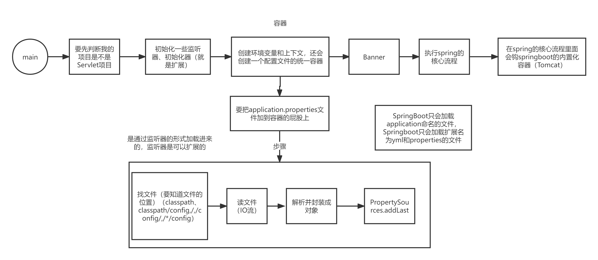
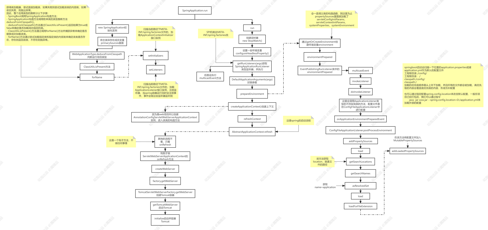

# SpringBoot篇

## SpringBoot简介和基本用法

### 微服务框架的演进

* 单体应用：用户系统+订单系统+商品系统
* 拆分单体应用，部署集群
* 每个单体应用调用的时候，怎么调用哪个应用比较合适？（负载均衡：选择的过程）
* 如果其中应用的服务器挂了，还需要修改或者重启服务器，比较麻烦。因此使用注册中心（服务应用地址就不用再写死）

### 简介

Spring出现就是为了简化Java Web开发。

- IOC：就是一个容器，包括很多容器，比如存bean对象的容器，存类名的容器，存配置的容器，存环境变量的容器。
  - 控制反转：帮你创建对象，然后将创建好的对象全部丢到IoC容器里面去，那程序员在任何类里面都可以（DI就是属性注入）通过Autowired拿到对象
- DI：依赖注入，通过@Autowired拿到对象
- AOP：面向切面编程

对象注入IOC容器中的这个过程不够简化。

- spring 1.x版本

配置xml文件

```xml
<!-- demo1 包通过xml 配置 -->
<bean id="helloService01" class="com.example.springbootdemo.demo1.HelloService" />
```

获取bean对象

```java
public class DemoMain {
    public static void main(String[] args) {
        ApplicationContext context = new FileSystemXmlApplicationContext("classpath:applicationContext.xml");
        //        ApplicationContext context = new ClassPathXmlApplicationContext("applicationContext.xml");
        System.out.println(context.getBean(HelloService.class));
    }
}
```

- spring2.x 版本：引入了注解，注解和xml一起使用的时代

通过注解自动扫描包下的类

```xml
<!-- demo2 包通过注解自动扫描 -->
<context:component-scan base-package="com.example.springbootdemo.demo2" />
```

添加注解

```java
@Service
public class HelloService2 {
}
```

获取bean对象

```java
public class DemoMain {
    public static void main(String[] args) {
        ApplicationContext context = new FileSystemXmlApplicationContext("classpath:applicationContext.xml");
//        ApplicationContext context = new ClassPathXmlApplicationContext("applicationContext.xml");
        System.out.println(context.getBean(HelloService2.class));
    }
}
```

- spring 3.x版本：在这个版本里面提出了一个非常非常非常重要的注解：**Import注解**

  - 通过AnnotationConfigApplicationContext读配置类

  ```java
  public class DemoMain {
      public static void main(String[] args) {
          ApplicationContext context = new AnnotationConfigApplicationContext(SpringConfiguration.class);
          System.out.println(context.getBean(HelloService3.class));
      }
  }
  ```

  - 写配置类，在类上面加上@Configuration注解

  ```java
  @Configuration
  public class SpringConfiguration {
      @Bean
      public HelloService3 helloService3(){
          return new HelloService3();
      }
  }
  ```

  如果要集成Redis或者Mybatis或者MongoDB或者MQ等组件，我要用到他们的一些核心bean，他们的 核心bean也要注入IoC容器，那此时他们也会写配置类，那spring容器如何读他们的配置类。比如SpringConfiguration，我也想要读取它的bean，虽然可以配置多个配置类，但是麻烦。

  ```java
  @Configuration
  @Import({DemoMain.class})
  public class SpringConfiguration {
      @Bean
      public HelloService3 helloService3(){
          return new HelloService3();
      }
  }
  ```

- spring4.x

  - @Condition

  ```java
  @Import({DemoMain.class})
  public class SpringConfiguration {
      @Conditional(ConditionDemo.class)
      @Bean
      public HelloService3 helloService3(){
          return new HelloService3();
      }
  }
  ```

  ConditionDemo.class

  ```java
  public class ConditionDemo implements Condition {
  
      @Override
      public boolean matches(ConditionContext conditionContext, AnnotatedTypeMetadata annotatedTypeMetadata) {
  
          // xxx
  
          return false;
      }
  }
  ```

  - web.xml
    - spring集成mybatis，也要引包，web.xml文件里面引入spring-mybatis.xml，mybatis.xml，集成数据源，数据源又要db.properties

以上spring做的努力依然不够简化，真正的简化应该是我要用到什么技术组件，只要pom文件依赖一下就可以使用了，这才是真正的简化。

springboot在spring的基础之上做了哪些优化

- 优化了Bean对象注入IoC容器的流程 要用什么组件里面的bean只需要引包就好了，不需要自己写配置类，也不需要自己写XML文件 
- 配置文件的统一管理 springboot的配置文件就一个，application.yml（properties）

#### SpringBoot集成Mybatis

* 导入依赖

```xml
<dependency>
    <groupId>org.mybatis.spring.boot</groupId>
    <artifactId>mybatis-spring-boot-starter</artifactId>
    <version>2.1.3</version>
</dependency>
<!--只要引这个包，这个包就自动的帮你创建了很多核心的Bean，然后自动帮你注入到IoC容器中去了-->
<dependency>
    <groupId>mysql</groupId>
    <artifactId>mysql-connector-java</artifactId>
    <version>5.1.21</version>
</dependency>
```

* 写配置

```properties
spring.datasource.username=root
spring.datasource.password=jingtian
spring.datasource.driver-class-name=com.mysql.jdbc.Driver
spring.datasource.url=jdbc:mysql://192.168.8.74:3306/test
mybatis.mapper-locations=classpath:*Mapper.xml
```

* 使用注解开启Mybatis扫描

```java
@MapperScan("com.example.springbootvipjtdemo.demo01.dao.mappers")
```

## 解决Bean的复杂配置—自动装配

### 核心原理流程推导

SpringBoot集成组件流程（比如redis）：

* 导入依赖
* 配置文件
* 通过@Autowired注解从IOC容器里面获取对象

怎么进行装配的？比如

spring-boot-starter-data-redis包里面，一定会存在一个配置类，在这个配置类里面一定存在@Bean注入我们的RedisTemplate。

springboot启动会扫描固定路径下面的配置类，但是Redis的starter包它不是我们自己开发，所以路径我们控制不了，springboot官方要制定了标准(约定大于配置)。

- SpringBoot会从`META-INF/spring.factories`找到配置类，进行加载，这个过程就叫spi。
- SpringBoot是通过@Import注解加载进来的。

### 手写核心注解

@SpringBootApplication：

```java
@SpringBootConfiguration // 就是继承了@Configuration
@EnableAutoConfiguration // 里面带了import注解
@ComponentScan ：扫描目录下面哪些类带有@Component、@Controller、@Service。。。
```

@EnableAutoConfiguration

```java
// 会导入所有需要自动装配的配置类
@Import(AutoConfigurationImportSelector.class) 

// 返回的是配置类的类名，这个类就是去找所有需要自动装配的配置类
AutoConfigurationImportSelector.class
```

为了更好的理解，手写一个配置。

* EnableMyAutoConfiguration注解

```java
@Target(ElementType.TYPE)
@Retention(RetentionPolicy.RUNTIME)
@Import(ImportSelectorDemo.class)
public @interface EnableMyAutoConfiguration {

}
```

* ImportSelectorDemo.java类：指定导入的配置类，把需要的配置类的类名，返回回去就可以了

```java
public class ImportSelectorDemo implements ImportSelector {

    @Override
    public String[] selectImports(AnnotationMetadata annotationMetadata) {
        // 返回类名就可以了
        return new String[]{SpringConfiguration.class.getName()};
    }
}
```

* 启动，测试

```java
@EnableMyAutoConfiguration
@SpringBootApplication(exclude = {DataSourceAutoConfiguration.class})
public class DemoMain {
    public static void main(String[] args) {
        ApplicationContext context = SpringApplication.run(DemoMain.class,args);
        System.out.println(context.getBean(DemoMain.class));
    }
}
```

### 理解SPI机制

#### 简述

spi：service provider interface，就是一种服务发现的机制。

> spi仅仅提供接口api，实现交给自己。 

#### Springboot自动装配的原理

springboot启动——>扫描SpringBootApplication注解——>扫描@EnableAutoConfiguration注解，这 个注解里面带有一个Import注解，Import注解里面AutoConfigurationImportSelector类，这个类实现 了DeferredImportSelector接口，DeferredImportSelector接口又实现了ImportSelector接口，在这个 接口里面，有一个方法叫SelectImport方法，这个方法实现了配置类的寻找，寻找的过程实际上就是 SpringBoot的SPI机制，去META-INF/spring.factories文件。

#### Spring和Springboot是什么关系

spring： 

1、将类注册成BeanDefinition：就是将类的名称乱七八糟的东西封装成一个类 

- 一种是基于XML（obtain）

- 一种是基于注解（invoke）

2、然后将BeanDefinition中类实例化成bean 对象 

ImportSelector 是在扫描@Configuration注解之前先扫描的，DeferredImportSelector 是在扫描@Configuration之后去实现的。

#### SpringBoot的SPI和JDK的SPI的区别

Spring的自动装配的key=EnableAutoConfiguration

#### Dubbo的SPI 和springboot的SPI区别

Dubbo的spi最最最重要的区别就是用谁就加载谁

#### JDK的SPI

1、根据Prefix+接口名找到文件

2、解析文件

3、将文件中配置的所有实现类循环反射实例化

#### Dubbo的SPI

1、先去找文件，加载文件，将所有的实现类的类名解析，将所有的实现类的类名放到四个容器里面，不 实例化 

2、你调哪个方法，它就实例化哪个容器里面的类

## SpringBoot启动流程及外部化配置

### SpringBoot启动流程

SpringBoot的主程序入口：

```java
public class SpringBootDemoApplication {
    public static void main(String[] args) {
        SpringApplication.run(SpringBootDemoApplication.class,args);
    }
}
```

点击run方法

```java
public static ConfigurableApplicationContext run(Class<?> primarySource, String... args) {
    // 这个里面调用了run()方法，转到定义
    return run(new Class[]{primarySource}, args);
}

// 这个run方法就做了两件事情：
// 1. new 一个SpringApplication()对象
// 2. 执行new出来的SpringApplication对象的run()方法
public static ConfigurableApplicationContext run(Class<?>[] primarySources, String[] args) {
    return (new SpringApplication(primarySources)).run(args);
}
```

这个run方法就做了两件事情：

1. new 一个SpringApplication()对象
2. 执行new出来的SpringApplication对象的run()方法

-  main方法启动——>执行run方法——>refreshContext（就是spring的核心流程）——>invokeBeanFactoryPostProcessors会扫描到Import注解，然后如果某个类带有该注解，则会通过反射机制实例化，并且调用selectImport方法，实际上selectImport方法就是去找需要注入的配置类。
-    selectImport找的过程用到了SPI机制，去META-INF/spring.factories文件找





## SpringBoot Starter组件详解

### Starter组件的简介

#### 概述

它就是一个springboot项目，然后打成了jar包，一定要能够实现自动装配的jar包。

#### 自动装配的流程

就是随着A项目的启动，会扫描到@SpringBootApplication注解，该注解里面存在一个@EnableAutoConfiguration注解，在EnableAutoConfiguration注解里面又存在一个Import注解，执行selectImports方法，selectImports返回的是配置类的全路径名

配置类从何而来，是基于SPI机制，去classpath下的META-INF目录下<font color='blue'>找所有</font>的spring.factories文件，然后将所有的spring.factories文件进行解析，key-value，自动将所需要的Bean对象注入到IoC容器里面去，@Configuration和@Bean，**自动体现在我没有对任何类加前面的两个注解。**

#### starter 跟自动装配的关系是什么呢？

starter要干的活有哪些：

假设现在我要集成redis，要拿到RedisTemplate对象，

starter注入RedisTemplate的流程

* 一定是要写RedisTemplate类
* 写配置类
* spring.factories文件
* 打成Jar包

#### 手动写starter组件

创建一个StarterDemo项目，引入`spring-boot-starter-web`依赖。

然后创建TestTemplate服务

```java
public class TestTemplate {
    public String action(){
        return "我喜欢听音乐";
    }
}
```

创建TestAutoConfiguration配置类

```java
@Configuration
public class TestAutoConfiguration {

    @Bean
    public TestTemplate testTemplate(){
        return new TestTemplate();
    }

}
```

然后创建resources资源库，在`src/main/resources`。在该目录下创建`META-INF/spring.factories`，然后添加需要被加载的配置类。

```properties
org.springframework.boot.autoconfigure.EnableAutoConfiguration=\
  org.example.TestAutoConfiguration
```

之后，将项目进行打包成jar包，点击`maven > 生命周期 > install`。

之后，回到原来项目`SpringBootDemo`，引入刚才的jar包`StarterDemo`。然后创建DemoController

```java
@RestController("/get")
public class DemoController {

    @Autowired
    private TestTemplate testTemplate;

    @RequestMapping("/test")
    public String test(){
        return testTemplate.action();
    }

}
```

最后，启动进行测试。

#### starter分为两类

- 一类是自身维护的组件

- 一类是第三方维护的组件


区别：

1、命名方式的区别

* 第三方维护的组件通常以XXX-spring-boot-starter命名，自身的以spring-boot-starter-xxx命名

2、第三方的starter组件必须自己在META-INF目录下实现spring.factories。

#### 内置化容器

随着springboot启动

IOC  DI 是基础  AOP（过滤器，拦截器）。

## 自动装配核心原理及手写Starter组件