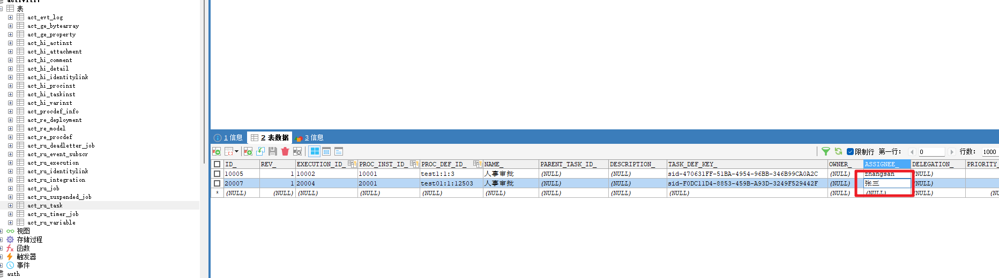

# Flowable篇

## 基础篇

### 学习文档

- [Flowable BPMN 用户手册 (v 6.3.0) (tkjohn.github.io)](https://tkjohn.github.io/flowable-userguide/#_introduction)

### Flowable 介绍

#### 什么是BPMN

BPMN定义了一个业务流程图（Business Process Diagram），该业务流程图基于一个流程图（flowcharting），该流程图被设计用于创建业务流程操作的图形化模型。而一个业务流程模型（Business Process Model），指一个由图形对象（graphical objects）组成的网状图，图形对象包括活动（activities)和用于定义这些活动执行顺序的流程控制器（flow controls）。
大白话理解：
BPMN是一套符号的标准，这些符号描述了如果做一个业务，并且这个业务在做的过程中被人监控和控制。业务人员和开发人员通过这套图形可以很好的完成协作。

#### 什么是Flowable

Flowable是BPMN的一个基于java的软件实现，不过Flowable不仅仅包括BPMN，还有DMN决策表和CMMN Case管理引擎，并且有自己的[用户管理](https://so.csdn.net/so/search?q=用户管理&spm=1001.2101.3001.7020)、微服务API等一系列功能，是一个服务平台。

### Flowable流程设计器

#### Flowable UI应用

##### 简述

Flowable提供了几个web应用，用于演示及介绍Flowable项目提供的功能：

- Flowable IDM: 身份管理应用。为所有Flowable UI应用提供单点登录认证功能，并且为拥有IDM管理员权限的用户提供了管理用户、组与权限的功能。

- Flowable Modeler: 让具有建模权限的用户可以创建流程模型、表单、选择表与应用定义。

- Flowable Task: 运行时任务应用。提供了启动流程实例、编辑任务表单、完成任务，以及查询流程实例与任务的功能。

- Flowable Admin: 管理应用。让具有管理员权限的用户可以查询BPMN、DMN、Form及Content引擎，并提供了许多选项用于修改流程实例、任务、作业等。管理应用通过REST API连接至引擎，并与Flowable Task应用及Flowable REST应用一同部署。


所有其他的应用都需要Flowable IDM提供认证。每个应用的WAR文件可以部署在相同的servlet容器（如Apache Tomcat）中，也可以部署在不同的容器中。由于每个应用使用相同的cookie进行认证，因此应用需要运行在相同的域名下。

##### 流程审批初体验

###### FlowableUI安装

- 下载并安装tomact【不要部署在中文目录下】

- 下载flowable-6.8.0，并解压
- 在flowable-6.8.0文件夹中找到wars目录下的flowable-ui包，拷贝到tomcat下的webapps目录下
- 启动tomcat，然后输入【xx/flowable-ui】网址，默认账号为【admin/test】。


###### 用户管理

&emsp;&emsp;流程审批是伴随着`用户`的审批处理的。所以肯定需要用户的参与。我们先通过`身份管理应用程序`来创建两个测试的用户。


点击进入后可以看到在FlowableUI中针对用户这块是从三个维度来管理的

1. 用户
2. 组
3. 权限控制

我们先就创建普通的用户。并分配相关的权限


创建了`zhangsan`并设置了密码为`123`.然后分配相关的权限


然后我们就可以通过`zhangsan`来登录，然后就可以看到相关的功能权限。


同样的操作我们再创建下`lisi`的账号。


###### 流程定义

&emsp;&emsp;&emsp;有了相关的用户信息。我们就可以来创建流程图了。这块我们需要通过`建模应用程序`来实现。


点击后进入，看到如下的界面：


第一次进入提示我们还没有创建流程模型，我们可以点击右上角的`创建流程`按钮开始创建第一个流程案例。


然后会进入到具体的流程图的绘制界面。


创建第一个请假流程图


然后我们需要分配相关节点的审批人

- 人事审批-- zhangsan 审批
- 经理审批 -- lisi 审批


分配操作


选择`分配给单个用户`


并搜索到`zhangsan`.


相同的操作完成`经理审批`节点的配置，然后就可以保存退出了


###### 流程部署

&emsp;&emsp;有了流程定义后然后我们可以通过FlowableUI中提供的`应用程序`我们可以来完成部署的相关操作。


进入功能页面后我们可以`创建应用程序`。


然后在弹出的菜单中录入基本信息


点击选择需要绑定的流程定义


点击进入后我们可以点击右上角的`发布`操作来完成部署的行为：


部署出现的时候出现了异常信息：


同时在看控制台出现了如下的问题


原因是部署的项目不能放在有中文的路径下。所以我们调整下`Tomcat`的位置.然后再启动即可，然后在发布就提示发布成功了


###### 流程审批

&emsp;&emsp;流程部署完毕后我们就可以启动一个流程实例了。然后就可以走流程审批的操作。启动流程实例我们通过`任务应用程序`来处理。


点击启动新的流程


启动流程后进入到`人事审批`的阶段


点击`显示流程`可以看到当前的状态


然后我们可以切换到`zhangsan`账号登录后来审批操作


点击完成后，点击`流程`可以看到对应的流程情况


然后切换到`lisi`登录来继续审批


点击`完成`后，审批操作完成。到此FlowableUI的流程审批操作就演示完成。

#### BPMN.js 自定义

FlowableUI是官方提供的，针对国内复杂的流程业务需求有时并不能很好的满足企业的工作流的需求。这时我们就可以基于`bpmn.js`来自定义流程设计器，官网地址：https://bpmn.io/toolkit/bpmn-js/walkthrough/


开源的学习资料：https://github.com/LinDaiDai/bpmn-chinese-document/tree/master/LinDaiDai

#### 第三方流程设计器

如何感觉完全基于`bpmn.js`来从零开发一个流程设计器太费时了。也可以找一些开源的别人写好的流程设计器比如：

* https://gitee.com/zhangjinlibra/workflow-engine
* https://gitee.com/MiyueSC/bpmn-process-designer
* 其他的可以自行在GitHub或者gitee上查找

最后可以不借助流程设计器来定义流程图。可以通过BpmnModle对象来自定义流程图。

### 流程审批操作

#### 案例环境

&emsp;&emsp;创建一个基本的SpringBoot项目。相关的版本如下：

- SpringBoot2.6.13
- JDK8
- Flowable6.7.2

对应的依赖如下：

```xml
<dependency>
    <groupId>org.springframework.boot</groupId>
    <artifactId>spring-boot-starter-web</artifactId>
</dependency>

<dependency>
    <groupId>org.projectlombok</groupId>
    <artifactId>lombok</artifactId>
    <optional>true</optional>
</dependency>
<dependency>
    <groupId>org.springframework.boot</groupId>
    <artifactId>spring-boot-starter-test</artifactId>
    <scope>test</scope>
</dependency>
<!--Flowable的核心依赖-->
<dependency>
    <groupId>org.flowable</groupId>
    <artifactId>flowable-spring-boot-starter</artifactId>
    <version>6.7.2</version>
</dependency>
<!-- MySQL的依赖 -->
<dependency>
    <groupId>mysql</groupId>
    <artifactId>mysql-connector-java</artifactId>
</dependency>
<dependency>
    <groupId>com.alibaba</groupId>
    <artifactId>druid</artifactId>
    <version>1.1.14</version>
</dependency>
<!-- 单元测试 -->
<dependency>
    <groupId>junit</groupId>
    <artifactId>junit</artifactId>
    <version>4.13.2</version>
    <scope>test</scope>
</dependency>
<!-- 日志相关 -->
<dependency>
    <groupId>org.slf4j</groupId>
    <artifactId>slf4j-api</artifactId>
    <version>1.7.21</version>
</dependency>
<dependency>
    <groupId>org.slf4j</groupId>
    <artifactId>slf4j-log4j12</artifactId>
    <version>1.7.21</version>
</dependency>
```

#### 流程部署

&emsp;流程部署可以在Spring的环境下部署。也可以在非Spring的环境下部署。下面先展示非Spring环境下的部署操作：

```java
/**
     * 不通过Spring容器。我们单独的构建ProcessEngine对象来实现部署的操作
     */
@Test
void contextLoads() {
    // 1.流程引擎的配置
    ProcessEngineConfiguration cfg = new StandaloneProcessEngineConfiguration()
        .setJdbcUrl("jdbc:mysql://localhost:3306/flowable_learn?serverTimezone=UTC&nullCatalogMeansCurrent=true")
        .setJdbcUsername("root")
        .setJdbcPassword("123456")
        .setJdbcDriver("com.mysql.cj.jdbc.Driver")
        .setDatabaseSchemaUpdate(ProcessEngineConfiguration.DB_SCHEMA_UPDATE_TRUE);
    
    // 2.构建流程引擎对象
    ProcessEngine processEngine = cfg.buildProcessEngine();
    System.out.println(processEngine);
    Deployment deploy = processEngine.getRepositoryService().createDeployment()
        .addClasspathResource("process/HolidayDemo1.bpmn20.xml")
        .name("第一个流程案例")
        .deploy();
    System.out.println(deploy.getId());
}
```

方法执行成功后会在这三张表中记录相关的部署信息

- act_ge_bytearray:记录流程定义的资源信息。xml和流程图的图片信息
- act_re_deployment:流程部署表，记录这次的部署行为
- act_re_procdef:流程定义表，记录这次部署动作对应的流程定义信息


**databaseSchemaUpdate**：用于设置流程引擎启动关闭时使用的数据库表结构控制策略

- `false` (默认): 当引擎启动时，检查数据库表结构的版本是否匹配库文件版本。版本不匹配时抛出异常。
- `true`: 构建引擎时，检查并在需要时更新表结构。表结构不存在则会创建。
- `create-drop`: 引擎创建时创建表结构，并在引擎关闭时删除表结构。


`注意`:要注意区分流程部署和流程定义的关系

- 一次部署操作可以部署多个流程定义

```java
// 2.构建流程引擎对象
ProcessEngine processEngine = cfg.buildProcessEngine();
System.out.println(processEngine);
Deployment deploy = processEngine.getRepositoryService().createDeployment()
        .addClasspathResource("process/HolidayDemo1.bpmn20.xml") // 部署一个流程
        .addClasspathResource("process/消息中间事件.bpmn20.xml")   // 部署第二个流程
        .name("第一个流程案例")
        .deploy();
```


&emsp;&emsp;当然上面的操作我们是自己定义`ProcessEngine`和`ProcessEngineConfiguration`来实现流程引擎对象的获取操作，我们完全可以把这些初始化的操作交给Spring容器来管理。接下来我们看看在SpringBoot项目中怎么简化处理。首先依赖我们上面已经添加了。然后需要在`application.yml`中配置如下信息：

```yml
spring:
  datasource:
    type: com.alibaba.druid.pool.DruidDataSource
    driver-class-name: com.mysql.cj.jdbc.Driver
    url: jdbc:mysql://localhost:3306/flowable-learn?serverTimezone=UTC&nullCatalogMeansCurrent=true
    username: root
    password: 123456
    hikari:
      minimum-idle: 5
      idle-timeout: 600000
      maximum-pool-size: 10
      auto-commit: true
      pool-name: MyHikariCP
      max-lifetime: 1800000
      connection-timeout: 30000
      connection-test-query: SELECT 1
flowable:
  async-executor-activate: true #关闭定时任务JOB
  #  将databaseSchemaUpdate设置为true。当Flowable发现库与数据库表结构不一致时，会自动将数据库表结构升级至新版本。
  database-schema-update: true
server:
  port: 8082
logging:
  level:
    org:
      flowable: debug
```

注意在url中需要添加`nullCatalogMeansCurrent=true`属性。不然启动服务的时候会出现如下问题


具体部署流程的代码,就可以直接从Spring容器中获取`ProcessEngine`对象了。大大简化了相关的代码

```java
    @Autowired
    private ProcessEngine processEngine;

    /**
     * 流程部署
     */
    @Test
    void deployFlow(){
        Deployment deploy = processEngine.getRepositoryService().createDeployment()
                .addClasspathResource("process/HolidayDemo1.bpmn20.xml") // 部署一个流程
                .name("第一个流程案例")
                .deploy();
        System.out.println(deploy.getId());
    }
```


#### 启动流程实例

&emsp;&emsp;流程部署完成后我们就可以发起一个流程实例。具体的操作如下：

```java
    /**
     * 发起流程
     */
    @Test
    void startProcess(){
        // 发起流程需要通过RuntimeService来实现
        RuntimeService runtimeService = processEngine.getRuntimeService();
        // act_re_procdef 表中的id
        String processId = "HolidayDemo1:1:89fad01e-7a42-11ee-b574-c03c59ad2248";
        // 根据流程定义Id启动 返回的是当前启动的流程实例 ProcessInstance
        //ProcessInstance processInstance = runtimeService.startProcessInstanceById(processId);
        //System.out.println("processInstance.getId() = " + processInstance.getId());
        String processKey = "HolidayDemo1";
        runtimeService.startProcessInstanceByKey(processKey);
    }
```

启动流程需要通过`RuntimeService`来实现。同时在启动流程的时候有两个方法可以调用：

- startProcessInstanceById: 对应于act_re_procdef 表中的id
- startProcessInstanceByKey: 对应于act_re_procdef 表中的key

启动流程后根据定义。流程会走到`人事审批`。


这时可以在`act_ru_task`表中看到对应的记录。`act_ru_task`记录的都是当前待办的记录信息


还有一个要注意的：每启动一个流程实例那么就会在`act_hi_procinst`表中维护一条记录。然后在`act_ru_execution`会记录流程的分支。

流程定义和流程实例的关系：

- 流程定义：Java中的类
- 流程实例：Java中的对象

#### 流程审批

&emsp;&emsp;流程启动后会进入到相关的审批节点。上面的案例中就会进入到`人事审批`节点。审批人是`zhangsan`，也就是`zhangsan`有了一条待办信息。这时候可以查询下`zhangsan`有哪些待办任务。

```java
/**
     * 待办任务查询
     */
@Test
void findTask(){
    // 任务查询这块可以通过 TaskService 来实现
    TaskService taskService = processEngine.getTaskService();
    // 查询的其实就是 act_ru_task 中的记录
    List<Task> list = taskService.createTaskQuery()
        .taskAssignee("zhangsan") // 根据审批人来查询
        .list();// 返回多条记录
    for (Task task : list) {
        System.out.println(task.getId());
    }
}
```

查询出了对应的两条记录


找到了需要审批的任务。我们就可以根据 `taskId`来完成审批的操作

```java
    /**
     * 完成任务的审批
     */
    @Test
    void completeTask(){
        TaskService taskService = processEngine.getTaskService();
        // 需要审批的任务 Id
        String taskId = "926b41f8-7a4c-11ee-97fd-c03c59ad2248";
        taskService.complete(taskId); // 通过complete方法完成审批
    }
```

审批通过后就会进入到`经理审批`的节点。


相同的操作可以完成`经理审批`的待办处理。然后就完成了第一个流程的审批处理操作了。


#### 各个Service服务

&emsp;&emsp;Service是工作流引擎提供用于进行工作流部署、执行、管理的服务接口，使用这些接口可以就是操作服务对应的数据表。


##### Service创建方式

通过ProcessEngine创建Service

方式如下：

 ```java
RuntimeService runtimeService = processEngine.getRuntimeService();
RepositoryService repositoryService = processEngine.getRepositoryService();
TaskService taskService = processEngine.getTaskService();
// ...
 ```

#####  Service总览

| service名称       | service作用              |
| ----------------- | ------------------------ |
| RepositoryService | Flowable的资源管理类     |
| RuntimeService    | Flowable的流程运行管理类 |
| TaskService       | Flowable的任务管理类     |
| HistoryService    | Flowable的历史管理类     |
| ManagerService    | Flowable的引擎管理类     |

 简单介绍：

**RepositoryService**

&emsp;&emsp;是activiti的资源管理类，提供了管理和控制流程发布包和流程定义的操作。使用工作流建模工具设计的业务流程图需要使用此service将流程定义文件的内容部署到计算机。

除了部署流程定义以外还可以：查询引擎中的发布包和流程定义。

&emsp;&emsp;暂停或激活发布包，对应全部和特定流程定义。 暂停意味着它们不能再执行任何操作了，激活是对应的反向操作。获得多种资源，像是包含在发布包里的文件， 或引擎自动生成的流程图。

&emsp;&emsp;获得流程定义的pojo版本， 可以用来通过java解析流程，而不必通过xml。

**RuntimeService**

&emsp;&emsp;Activiti的流程运行管理类。可以从这个服务类中获取很多关于流程执行相关的信息

**TaskService**

&emsp;&emsp;Activiti的任务管理类。可以从这个类中获取任务的信息。

**HistoryService**

&emsp;&emsp;Flowable的历史管理类，可以查询历史信息，执行流程时，引擎会保存很多数据（根据配置），比如流程实例启动时间，任务的参与者， 完成任务的时间，每个流程实例的执行路径，等等。 这个服务主要通过查询功能来获得这些数据。

**ManagementService**

&emsp;&emsp;Activiti的引擎管理类，提供了对Flowable 流程引擎的管理和维护功能，这些功能不在工作流驱动的应用程序中使用，主要用于 Flowable 系统的日常维护。

### 相关表结构介绍

#### 表结构介绍

支持的数据库有：

| Activiti数据库类型 | 示例JDBC URL                                                 | 备注                                     |
| ------------------ | ------------------------------------------------------------ | ---------------------------------------- |
| h2                 | jdbc:h2:tcp://localhost/activiti                             | 默认配置的数据库                         |
| mysql              | jdbc:mysql://localhost:3306/activiti?autoReconnect=true      | 已使用mysql-connector-java数据库驱动测试 |
| oracle             | jdbc:oracle:thin:@localhost:1521:xe                          |                                          |
| postgres           | jdbc:postgresql://localhost:5432/activiti                    |                                          |
| db2                | jdbc:db2://localhost:50000/activiti                          |                                          |
| mssql              | jdbc:sqlserver://localhost:1433;databaseName=activiti (jdbc.driver=com.microsoft.sqlserver.jdbc.SQLServerDriver) *OR* jdbc:jtds:sqlserver://localhost:1433/activiti (jdbc.driver=net.sourceforge.jtds.jdbc.Driver) | 已使用Microsoft JDBC Driver 4.0 (sqljdb  |

&emsp;&emsp;工作流程的相关操作都是操作存储在对应的表结构中，为了能更好的弄清楚Flowable的实现原理和细节，我们有必要先弄清楚Flowable的相关表结构及其作用。在Flowable中的表结构在初始化的时候会创建五类表结构，具体如下：

* **ACT_RE** ：'RE'表示 repository。 这个前缀的表包含了流程定义和流程静态资源 （图片，规则，等等）。
* **ACT_RU**：'RU'表示 runtime。 这些运行时的表，包含流程实例，任务，变量，异步任务，等运行中的数据。 Flowable只在流程实例执行过程中保存这些数据， 在流程结束时就会删除这些记录。 这样运行时表可以一直很小速度很快。
* **ACT_HI**：'HI'表示 history。 这些表包含历史数据，比如历史流程实例， 变量，任务等等。
* **ACT_GE**： GE 表示 general。 通用数据， 用于不同场景下 
* **ACT_ID:**   ’ID’表示identity(组织机构)。这些表包含标识的信息，如用户，用户组，等等。


具体的表结构的含义:

| **表分类**   | **表名**              | **解释**                                           |
| ------------ | --------------------- | -------------------------------------------------- |
| 一般数据     |                       |                                                    |
|              | [ACT_GE_BYTEARRAY]    | 通用的流程定义和流程资源                           |
|              | [ACT_GE_PROPERTY]     | 系统相关属性                                       |
| 流程历史记录 |                       |                                                    |
|              | [ACT_HI_ACTINST]      | 历史的流程实例                                     |
|              | [ACT_HI_ATTACHMENT]   | 历史的流程附件                                     |
|              | [ACT_HI_COMMENT]      | 历史的说明性信息                                   |
|              | [ACT_HI_DETAIL]       | 历史的流程运行中的细节信息                         |
|              | [ACT_HI_IDENTITYLINK] | 历史的流程运行过程中用户关系                       |
|              | [ACT_HI_PROCINST]     | 历史的流程实例                                     |
|              | [ACT_HI_TASKINST]     | 历史的任务实例                                     |
|              | [ACT_HI_VARINST]      | 历史的流程运行中的变量信息                         |
| 流程定义表   |                       |                                                    |
|              | [ACT_RE_DEPLOYMENT]   | 部署单元信息                                       |
|              | [ACT_RE_MODEL]        | 模型信息                                           |
|              | [ACT_RE_PROCDEF]      | 已部署的流程定义                                   |
| 运行实例表   |                       |                                                    |
|              | [ACT_RU_EVENT_SUBSCR] | 运行时事件                                         |
|              | [ACT_RU_EXECUTION]    | 运行时流程执行实例                                 |
|              | [ACT_RU_IDENTITYLINK] | 运行时用户关系信息，存储任务节点与参与者的相关信息 |
|              | [ACT_RU_JOB]          | 运行时作业                                         |
|              | [ACT_RU_TASK]         | 运行时任务                                         |
|              | [ACT_RU_VARIABLE]     | 运行时变量表                                       |
| 用户用户组表 |                       |                                                    |
|              | [ACT_ID_BYTEARRAY]    | 二进制数据表                                       |
|              | [ACT_ID_GROUP]        | 用户组信息表                                       |
|              | [ACT_ID_INFO]         | 用户信息详情表                                     |
|              | [ACT_ID_MEMBERSHIP]   | 人与组关系表                                       |
|              | [ACT_ID_PRIV]         | 权限表                                             |
|              | [ACT_ID_PRIV_MAPPING] | 用户或组权限关系表                                 |
|              | [ACT_ID_PROPERTY]     | 属性表                                             |
|              | [ACT_ID_TOKEN]        | 记录用户的token信息                                |
|              | [ACT_ID_USER]         | 用户表                                             |

 

#### 部署流程

&emsp;&emsp;来分析下部署流程涉及到了哪些表结构

部署资源表：act_ge_bytearray

| 字段           | 名称               | 备注                                                         |
| -------------- | ------------------ | ------------------------------------------------------------ |
| ID_            | 主键               |                                                              |
| REV_           | 版本号             |                                                              |
| NAME_          | 名称               | 部署的文件名称，如：holiday-request-new.bpmn20.xml、holiday-request-new.bpmn20.png |
| DEPLOYMENT_ID_ | 部署ID             |                                                              |
| BYTES_         | 字节（二进制数据） |                                                              |
| GENERATED_     | 是否系统生成       | 0为用户上传，<br/>1为系统自动生成， 比如系统会 自动根据xml生 成png |


部署ID表：act_re_deployment


| 字段               | 名称           | 备注 |
| ------------------ | -------------- | ---- |
| ID_                | 主键           |      |
| NAME_              | 名称           |      |
| CATEGORY_          | 分类           |      |
| TENANT_ID_         | 租户ID         |      |
| DEPLOY_TIME_       | 部署时间       |      |
| DERIVED_FROM_      | 来源于         |      |
| DERIVED_FROM_ROOT_ | 来源于         |      |
| ENGINE_VERSION_    | 流程引擎的版本 |      |

流程表：act_re_procdef

| 字段                    | 名称             | 备注                              |
| ----------------------- | ---------------- | --------------------------------- |
| ID_                     | 主键             |                                   |
| REV_                    | 版本号           |                                   |
| CATEGORY_               | 分类             | 流程定义的Namespace就是类别       |
| NAME_                   | 名称             |                                   |
| KEY_                    | 标识             |                                   |
| VERSION_                | 版本             |                                   |
| DEPLOYMENT_ID_          | 部署ID           |                                   |
| RESOURCE_NAME_          | 资源名称         | 流程bpmn文件名称                  |
| DGRM_RESOURCE_NAME_     | 图片资源名称     |                                   |
| DESCRIPTION_            | 描述             |                                   |
| HAS_START_FORM_KEY_     | 拥有开始表单标识 | start节点是否存在formKey  0否 1是 |
| HAS_GRAPHICAL_NOTATION_ | 拥有图形信息     |                                   |
| SUSPENSION_STATE_       | 挂起状态         | 暂停状态 1激活 2暂停              |
| TENANT_ID_              | 租户ID           |                                   |
|                         |                  |                                   |

注意：

业务流程定义数据表。此表和ACT_RE_DEPLOYMENT是多对一的关系，即，一个部署的bar包里可能包含多个流程定义文件，每个流程定义文件都会有一条记录在ACT_REPROCDEF表内，每个流程定义的数据，都会对于ACT_GE_BYTEARRAY表内的一个资源文件和PNG图片文件。和ACT_GE_BYTEARRAY的关联是通过程序用ACT_GE_BYTEARRAY.NAME与ACT_RE_PROCDEF.NAME_完成的


#### 挂起和激活

&emsp;&emsp;部署的流程默认的状态为激活，如果暂时不想使用该定义的流程，那么可以挂起该流程。当然该流程定义下边所有的流程实例全部暂停。

流程定义为挂起状态，该流程定义将不允许启动新的流程实例，同时该流程定义下的所有的流程实例都将全部挂起暂停执行。

```java
/**
     * 挂起流程
     */
    @Test
    public void test05(){
        RepositoryService repositoryService = processEngine.getRepositoryService();
        ProcessDefinition processDefinition = repositoryService.createProcessDefinitionQuery()
                .processDefinitionId("holiday:1:4")
                .singleResult();
        // 获取流程定义的状态
        boolean suspended = processDefinition.isSuspended();
        System.out.println("suspended = " + suspended);
        if(suspended){
            // 表示被挂起
            System.out.println("激活流程定义");
            repositoryService.activateProcessDefinitionById("holiday:1:4",true,null);
        }else{
            // 表示激活状态
            System.out.println("挂起流程");
            repositoryService.suspendProcessDefinitionById("holiday:1:4",true,null);
        }
    }


    /**
     * 挂起流程实例
     */
    @Test
    void suspendInstance(){
        // 挂起流程实例
        runtimeService.suspendProcessInstanceById("a7ae5680-7ba3-11ee-809a-c03c59ad2248");
        // 激活流程实例
        //runtimeService.activateProcessInstanceById("a7ae5680-7ba3-11ee-809a-c03c59ad2248");
    }
```

具体的实现其实就是更新了流程定义表中的字段


而且通过REV_字段来控制数据安全，也是一种乐观锁的体现了，如果要启动一个已经挂起的流程就会出现如下的错误


#### 启动流程

&emsp;&emsp;当启动了一个流程实例后，会在ACT_RU_*对应的表结构中操作，运行时实例涉及的表结构共10张：

* ACT_RU_DEADLETTER_JOB  正在运行的任务表 
* ACT_RU_EVENT_SUBSCR 运行时事件 
* ACT_RU_EXECUTION 运行时流程执行实例 
* ACT_RU_HISTORY_JOB  历史作业表 
* ACT_RU_IDENTITYLINK 运行时用户关系信息 
* ACT_RU_JOB 运行时作业表 
* ACT_RU_SUSPENDED_JOB 暂停作业表 
* ACT_RU_TASK  运行时任务表 
* ACT_RU_TIMER_JOB 定时作业表 
* ACT_RU_VARIABLE  运行时变量表


&emsp;&emsp;启动一个流程实例的时候涉及到的表有

* ACT_RU_EXECUTION 运行时流程执行实例 
* ACT_RU_IDENTITYLINK 运行时用户关系信息 
* ACT_RU_TASK  运行时任务表 
* ACT_RU_VARIABLE  运行时变量表


ACT_RU_EXECUTION表结构

| 字段                  | 名称                 | 备注 |
| --------------------- | -------------------- | ---- |
| ID_                   | 主键                 |      |
| REV_                  | 版本号               |      |
| PROC_INST_ID_         | 流程实例ID           |      |
| BUSINESS_KEY_         | 业务主键ID           |      |
| PARENT_ID_            | 父执行流的ID         |      |
| PROC_DEF_ID_          | 流程定义的数据ID     |      |
| SUPER_EXEC_           |                      |      |
| ROOT_PROC_INST_ID_    | 流程实例的root流程id |      |
| ACT_ID_               | 节点实例ID           |      |
| IS_ACTIVE_            | 是否存活             |      |
| IS_CONCURRENT_        | 执行流是否正在并行   |      |
| IS_SCOPE_             |                      |      |
| IS_EVENT_SCOPE_       |                      |      |
| IS_MI_ROOT_           |                      |      |
| SUSPENSION_STATE_     | 流程终端状态         |      |
| CACHED_ENT_STATE_     |                      |      |
| TENANT_ID_            | 租户编号             |      |
| NAME_                 |                      |      |
| START_TIME_           | 开始时间             |      |
| START_USER_ID_        | 开始的用户编号       |      |
| LOCK_TIME_            | 锁定时间             |      |
| IS_COUNT_ENABLED_     |                      |      |
| EVT_SUBSCR_COUNT_     |                      |      |
| TASK_COUNT_           |                      |      |
| JOB_COUNT_            |                      |      |
| TIMER_JOB_COUNT_      |                      |      |
| SUSP_JOB_COUNT_       |                      |      |
| DEADLETTER_JOB_COUNT_ |                      |      |
| VAR_COUNT_            |                      |      |
| ID_LINK_COUNT_        |                      |      |

创建流程实例后对应的表结构的数据


ACT_RU_TASK  运行时任务表

| 字段              | 名称                 | 备注                |
| ----------------- | -------------------- | ------------------- |
| ID_               | 主键                 |                     |
| REV_              | 版本号               |                     |
| EXECUTION_ID_     | 任务所在的执行流ID   |                     |
| PROC_INST_ID_     | 流程实例ID           |                     |
| PROC_DEF_ID_      | 流程定义数据ID       |                     |
| NAME_             | 任务名称             |                     |
| PARENT_TASK_ID_   | 父任务ID             |                     |
| DESCRIPTION_      | 说明                 |                     |
| TASK_DEF_KEY_     | 任务定义的ID值       |                     |
| OWNER_            | 任务拥有人           |                     |
| ASSIGNEE_         | 被指派执行该任务的人 |                     |
| DELEGATION_       | 委托人               |                     |
| PRIORITY_         | 优先级               |                     |
| CREATE_TIME_      | 创建时间             |                     |
| DUE_DATE_         | 耗时                 |                     |
| CATEGORY_         | 类别                 |                     |
| SUSPENSION_STATE_ | 是否挂起             | 1代表激活 2代表挂起 |
| TENANT_ID_        | 租户编号             |                     |
| FORM_KEY_         | 表单Key              |                     |
| CLAIM_TIME_       | 拾取时间             |                     |

创建流程实例后对应的表结构的数据


ACT_RU_VARIABLE  运行时变量表

| 字段          | 名称                           | 备注                                 |
| ------------- | ------------------------------ | ------------------------------------ |
| ID_           | 主键                           |                                      |
| REV_          | 版本号                         |                                      |
| TYPE_         | 参数类型                       | 可以是基本的类型，也可以用户自行扩展 |
| NAME_         | 参数名称                       |                                      |
| EXECUTION_ID_ | 参数执行ID                     |                                      |
| PROC_INST_ID_ | 流程实例ID                     |                                      |
| TASK_ID_      | 任务ID                         |                                      |
| BYTEARRAY_ID_ | 资源ID                         |                                      |
| DOUBLE_       | 参数为double，则保存在该字段中 |                                      |
| LONG_         | 参数为long，则保存在该字段中   |                                      |
| TEXT_         | 用户保存文本类型的参数值       |                                      |
| TEXT2_        | 用户保存文本类型的参数值       |                                      |

创建流程实例后对应的表结构的数据


ACT_RU_IDENTITYLINK 运行时用户关系信息 

| 字段          | 名称         | 备注                                                         |
| ------------- | ------------ | ------------------------------------------------------------ |
| ID_           | 主键         |                                                              |
| REV_          | 版本号       |                                                              |
| GROUP_ID_     | 用户组ID     |                                                              |
| TYPE_         | 关系数据类型 | assignee支配人(组)、candidate候选人(组)、owner拥有人,participant参与者 |
| USER_ID_      | 用户ID       |                                                              |
| TASK_ID_      | 任务ID       |                                                              |
| PROC_INST_ID_ | 流程定义ID   |                                                              |
| PROC_DEF_ID_  | 属性ID       |                                                              |

创建流程实例后对应的表结构的数据:


#### 流程审批

&emsp;&emsp;上面的流程已经流转到了zhangsan这个用户这里，然后可以开始审批了

```java
// 获取流程引擎对象
ProcessEngine processEngine = ProcessEngines.getDefaultProcessEngine();
TaskService taskService = processEngine.getTaskService();
Task task = taskService.createTaskQuery()
    .processDefinitionId("holiday:1:4")
    .taskAssignee("zhangsan")
    .singleResult();
// 添加流程变量
Map<String,Object> variables = new HashMap<>();
variables.put("approved",false); // 拒绝请假
// 完成任务
taskService.complete(task.getId(),variables);
```

&emsp;&emsp;在正常处理流程中涉及到的表结构

* ACT_RU_EXECUTION 运行时流程执行实例 
* ACT_RU_IDENTITYLINK 运行时用户关系信息 
* ACT_RU_TASK  运行时任务表 
* ACT_RU_VARIABLE  运行时变量表

ACT_RU_TASK  运行时任务表 :会新生成一条记录


#### 流程完毕

&emsp;&emsp;一个具体的流程审批完成后相关的数据如下：

首先我们会发现

* ACT_RU_EXECUTION 运行时流程执行实例 
* ACT_RU_IDENTITYLINK 运行时用户关系信息 
* ACT_RU_TASK  运行时任务表 
* ACT_RU_VARIABLE  运行时变量表

这四张表中对应的数据都没有了，也就是这个流程已经不是运行中的流程了。然后在对应的历史表中我们可以看到相关的信息

* ACT_HI_ACTINST  历史的流程实例

* ACT_HI_ATTACHMENT 历史的流程附件
* ACT_HI_COMMENT  历史的说明性信息
* ACT_HI_DETAIL 历史的流程运行中的细节信息
* ACT_HI_IDENTITYLINK 历史的流程运行过程中用户关系
* ACT_HI_PROCINST  历史的流程实例
* ACT_HI_TASKINST  历史的任务实例
* ACT_HI_VARINST  历史的流程运行中的变量信息

在我们上面的处理流程的过程中设计到的历史表有

ACT_HI_ACTINST  历史的流程实例

| 字段               | 名称                 | 备注 |
| ------------------ | -------------------- | ---- |
| ID_                | 主键                 |      |
| PROC_DEF_ID_       | 流程定义ID           |      |
| PROC_INST_ID_      | 流程实例ID           |      |
| EXECUTION_ID_      | 执行ID               |      |
| ACT_ID_            | 节点实例ID           |      |
| TASK_ID_           | 任务ID               |      |
| CALL_PROC_INST_ID_ | 调用外部的流程实例ID |      |
| ACT_NAME_          | 节点名称             |      |
| ACT_TYPE_          | 节点类型             |      |
| ASSIGNEE_          | 处理人               |      |
| START_TIME_        | 开始时间             |      |
| END_TIME_          | 结束时间             |      |
| DURATION_          | 耗时                 |      |
| DELETE_REASON_     | 删除原因             |      |
| TENANT_ID_         | 租户编号             |      |


ACT_HI_IDENTITYLINK 历史的流程运行过程中用户关系

| 字段                 | 名称         | 备注 |
| -------------------- | ------------ | ---- |
| ID_                  | 主键         |      |
| GROUP_ID_            | 组编号       |      |
| TYPE_                | 类型         |      |
| USER_ID_             | 用户编号     |      |
| TASK_ID_             | 任务编号     |      |
| CREATE_TIME_         | 创建时间     |      |
| PROC_INST_ID_        | 流程实例编号 |      |
| SCOPE_ID_            |              |      |
| SCOPE_TYPE_          |              |      |
| SCOPE_DEFINITION_ID_ |              |      |
|                      |              |      |


ACT_HI_PROCINST  历史的流程实例

| 字段                       | 名称         | 备注 |
| -------------------------- | ------------ | ---- |
| ID_                        | 主键         |      |
| PROC_INST_ID_              | 流程实例ID   |      |
| BUSINESS_KEY_              | 业务主键     |      |
| PROC_DEF_ID_               | 属性ID       |      |
| START_TIME_                | 开始时间     |      |
| END_TIME_                  | 结束时间     |      |
| DURATION_                  | 耗时         |      |
| START_USER_ID_             | 起始人       |      |
| START_ACT_ID_              | 起始节点     |      |
| END_ACT_ID_                | 结束节点     |      |
| SUPER_PROCESS_INSTANCE_ID_ | 父流程实例ID |      |
| DELETE_REASON_             | 删除原因     |      |
| TENANT_ID_                 | 租户编号     |      |
| NAME_                      | 名称         |      |


ACT_HI_TASKINST  历史的任务实例

| 字段            | 名称                    | 备注                                   |
| --------------- | ----------------------- | -------------------------------------- |
| ID_             | 主键                    |                                        |
| PROC_DEF_ID_    | 流程定义ID              |                                        |
| TASK_DEF_KEY_   | 任务定义的ID值          |                                        |
| PROC_INST_ID_   | 流程实例ID              |                                        |
| EXECUTION_ID_   | 执行ID                  |                                        |
| PARENT_TASK_ID_ | 父任务ID                |                                        |
| NAME_           | 名称                    |                                        |
| DESCRIPTION_    | 说明                    |                                        |
| OWNER_          | 实际签收人 任务的拥有者 | 签收人（默认为空，只有在委托时才有值） |
| ASSIGNEE_       | 被指派执行该任务的人    |                                        |
| START_TIME_     | 开始时间                |                                        |
| CLAIM_TIME_     | 任务拾取时间            |                                        |
| END_TIME_       | 结束时间                |                                        |
| DURATION_       | 耗时                    |                                        |
| DELETE_REASON_  | 删除原因                |                                        |
| PRIORITY_       | 优先级别                |                                        |
| DUE_DATE_       | 过期时间                |                                        |
| FORM_KEY_       | 节点定义的formkey       |                                        |
| CATEGORY_       | 类别                    |                                        |
| TENANT_ID_      | 租户                    |                                        |


ACT_HI_VARINST  历史的流程运行中的变量信息：流程变量虽然在任务完成后在流程实例表中会删除，但是在历史表中还是会记录的

| 字段          | 名称               | 备注 |
| ------------- | ------------------ | ---- |
| ID_           | 主键               |      |
| PROC_INST_ID_ | 流程实例ID         |      |
| EXECUTION_ID_ | 指定ID             |      |
| TASK_ID_      | 任务ID             |      |
| NAME_         | 名称               |      |
| VAR_TYPE_     | 参数类型           |      |
| REV_          | 数据版本           |      |
| BYTEARRAY_ID_ | 字节表ID           |      |
| DOUBLE_       | 存储double类型数据 |      |
| LONG_         | 存储long类型数据   |      |
| .....         |                    |      |


### 任务分配

在做流程定义的时候我们需要给相关的`用户节点`指派对应的处理人。在Flowable中提供了三种分配的方式，我们来分别介绍

#### 固定分配

&emsp;&emsp;固定分配就是前面介绍的，在绘制流程图或者直接在流程文件中通过Assignee来指定的方式。


#### 表达式

&emsp;&emsp;Flowable使用UEL进行表达式解析。UEL代表`Unified Expression Language`，是EE6规范的一部分（查看[EE6规范](http://docs.oracle.com/javaee/6/tutorial/doc/gjddd.html)了解更多信息）。为了在所有环境上支持UEL标准的所有最新特性，我们使用JUEL的修改版本。

&emsp;&emsp;表达式可以用于例如[Java服务任务 Java Service tasks](http://jeecg.com/activiti5.21/#bpmnJavaServiceTaskXML), [执行监听器 Execution Listeners](http://jeecg.com/activiti5.21/#executionListeners), [任务监听器 Task Listeners](http://jeecg.com/activiti5.21/#taskListeners) 与 [条件流 Conditional sequence flows](http://jeecg.com/activiti5.21/#conditionalSequenceFlowXml)。尽管有值表达式与方法表达式两种表达式，通过Flowable的抽象，使它们都可以在需要`expression`（表达式）的地方使用。

>\${myVar}
>\${myBean.myProperty}

##### 值表达式 

&emsp;&emsp;我们在处理的位置通过UEL表达式来占位。


然后做流程的部署和启动操作：

```java
/**
 * 流程部署操作
 */
@Test
public void test1(){
    // 1.获取ProcessEngine对象
    // 2.完成流程的部署操作 需要通过RepositoryService来完成
    RepositoryService repositoryService = processEngine.getRepositoryService();
    // 3.完成部署操作
    Deployment deploy = repositoryService.createDeployment()
            .addClasspathResource("flow/test2.bpmn20.xml")
            .name("请假流程-流程变量")
            .deploy(); // 是一个流程部署的行为 可以部署多个流程定义的
    System.out.println(deploy.getId());
    System.out.println(deploy.getName());
}
```

然后发起请假流程：

```java
/**
 * 发起一个流程
 */
@Test
public void test3(){
    ProcessEngine engine = ProcessEngines.getDefaultProcessEngine();
    // 发起流程 需要通过 runtimeService来实现
    RuntimeService runtimeService = engine.getRuntimeService();
    // 通过流程定义ID来启动流程  返回的是流程实例对象
    ProcessInstance processInstance = runtimeService
            .startProcessInstanceById("test01:1:12503");
    System.out.println("processInstance.getId() = " + processInstance.getId());
    System.out.println("processInstance.getDeploymentId() = " + processInstance.getDeploymentId());
    System.out.println("processInstance.getDescription() = " + processInstance.getDescription());
}
```

发起流程后。根据流程的设计应该需要进入到人事审批。但是呢。审批的用户是`${assign1}`是一个流程变量。那么还没有赋值的情况下。那么系统是没有办法识别的。


我们需要在进入该节点前对流程变量赋值

```java
/**
 * 发起一个流程
 */
@Test
public void test3(){
    ProcessEngine engine = ProcessEngines.getDefaultProcessEngine();
    // 发起流程 需要通过 runtimeService来实现
    RuntimeService runtimeService = engine.getRuntimeService();
    // 对流程变量做赋值操作
    Map<String,Object> map = new HashMap<>();
    map.put("assgin1","张三");
    map.put("assign2","李四");
    // 通过流程定义ID来启动流程  返回的是流程实例对象
    ProcessInstance processInstance = runtimeService
            .startProcessInstanceById("test01:1:12503",map);
    System.out.println("processInstance.getId() = " + processInstance.getId());
    System.out.println("processInstance.getDeploymentId() = " + processInstance.getDeploymentId());
    System.out.println("processInstance.getDescription() = " + processInstance.getDescription());
}
```

然后就可以看到对应的表结构中的待办记录



同时需要了解 ： ACT_RU_VARIABLE 


##### 方法表达式

&emsp;&emsp;**方法表达式 Method expression**: 调用一个方法，可以带或不带参数。**当调用不带参数的方法时，要确保在方法名后添加空括号（以避免与值表达式混淆）。**传递的参数可以是字面值(literal value)，也可以是表达式，它们会被自动解析。例如： 

```java
${printer.print()}
${myBean.getAssignee()}
${myBean.addNewOrder('orderName')}
${myBean.doSomething(myVar, execution)}
```

&emsp;&emsp;myBean是Spring容器中的个Bean对象，表示调用的是bean的addNewOrder方法。通过案例来演示下。先定义对应的Service

先定义Bean

```java
@Component
public class MyBean {

    public String getAssignee(){
        System.out.println("本方法执行了....");
        return "哥";
    }
}
```

然后在绘制流程图的时候就可以对应的指派了。


然后我们先部署流程

```java
/**
 * 流程部署操作
 */
@Test
public void test1(){
    // 1.获取ProcessEngine对象
    ProcessEngine processEngine = ProcessEngines.getDefaultProcessEngine();
    // 2.完成流程的部署操作 需要通过RepositoryService来完成
    RepositoryService repositoryService = processEngine.getRepositoryService();
    // 3.完成部署操作
    Deployment deploy = repositoryService.createDeployment()
            .addClasspathResource("flow/test3.bpmn20.xml")
            .name("请假流程-方法表达式")
            .deploy(); // 是一个流程部署的行为 可以部署多个流程定义的
    System.out.println(deploy.getId());
    System.out.println(deploy.getName());
}
```

然后我们发起新的流程。注意在这块我们可以不用添加流程变量信息了。因为`人事审批节点`的审批人是通过流程方法来赋值的

```java
/**
 * 发起一个流程
 */
@Test
public void test3(){
    ProcessEngine engine = ProcessEngines.getDefaultProcessEngine();
    // 发起流程 需要通过 runtimeService来实现
    RuntimeService runtimeService = engine.getRuntimeService();
    // 通过流程定义ID来启动流程  返回的是流程实例对象
    ProcessInstance processInstance = runtimeService
            .startProcessInstanceById("test01:2:27503");
    System.out.println("processInstance.getId() = " + processInstance.getId());
    System.out.println("processInstance.getDeploymentId() = " + processInstance.getDeploymentId());
    System.out.println("processInstance.getDescription() = " + processInstance.getDescription());
}
```

可以看到操作成功。方法表达式被执行了


同时待办中的审批人就是方法表达式返回的结果


#### 监听器分配

&emsp;&emsp;可以使用监听器来完成很多Flowable的流程业务。在此处使用监听器来完成负责人的指定，那么在流程设计的时候就不需要指定assignee。创建自定义监听器：

```java 
public class MyFirstListener implements TaskListener {
    /**
     * 监听器触发的回调方法
     * @param delegateTask
     */
    @Override
    public void notify(DelegateTask delegateTask) {
        System.out.println("---->自定义的监听器执行了");
        if(EVENTNAME_CREATE.equals(delegateTask.getEventName())){
            // 表示是Task的创建事件被触发了
            // 指定当前Task节点的处理人
            delegateTask.setAssignee("hutao");
        }

    }
}
```

在配置流程的时候关联监听器。注意对应的事件。`CREATE`


然后部署和启动流程后。可以看到自定义的监听器触发了


而且待办中的任务的处理人就是监听器中设置的信息。


### 流程变量

`流程变量`可以用将数据添加到流程的运行时状态中，或者更具体地说，变量作用域中。改变实体的各种API可以用来更新这些附加的变量。一般来说，一个变量由一个名称和一个值组成。名称用于在整个流程中识别变量。例如，如果一个活动（activity）设置了一个名为 *var* 的变量，那么后续活动中可以通过使用这个名称来访问它。变量的值是一个 Java 对象。

#### 运行时变量

&emsp;&emsp;流程实例运行时的变量，存入act_ru_variable表中。在流程实例运行结束时，此实例的变量在表中删除。在流程实例创建及启动时，可设置流程变量。所有的`startProcessInstanceXXX`方法都有一个可选参数用于设置变量。例如，`RuntimeService`中

```java
ProcessInstance startProcessInstanceById(String processDefinitionId, Map<String, Object> variables);
```

&emsp;&emsp;也可以在流程执行中加入变量。例如，(*RuntimeService*):

```java
void setVariable(String executionId, String variableName, Object value);
void setVariableLocal(String executionId, String variableName, Object value);
void setVariables(String executionId, Map<String, ? extends Object> variables);
void setVariablesLocal(String executionId, Map<String, ? extends Object> variables);
```

&emsp;&emsp;读取变量方法:

```java
Map<String, Object> getVariables(String executionId);
Map<String, Object> getVariablesLocal(String executionId);
Map<String, Object> getVariables(String executionId, Collection<String> variableNames);
Map<String, Object> getVariablesLocal(String executionId, Collection<String> variableNames);
Object getVariable(String executionId, String variableName);
<T> T getVariable(String executionId, String variableName, Class<T> variableClass);
```

**注意**：由于流程实例结束时，对应在运行时表的数据跟着被删除。所以查询一个已经完结流程实例的变量，只能在历史变量表中查找。

&emsp;&emsp;当然运行时变量我们也可以根据对应的作用域把他分为`全局变量`和`局部变量`.

##### 全局变量

&emsp;&emsp;流程变量的默认作用域是流程实例。当一个流程变量的作用域为流程实例时，可以称为 global 变量

注意：如：    Global变量：userId（变量名）、zhangsan（变量值）

&emsp;&emsp;global 变量中变量名不允许重复，设置相同名称的变量，后设置的值会覆盖前设置的变量值。

案例：

定义监听器

```java
public class MySecondListener implements TaskListener {

    @Override
    public void notify(DelegateTask delegateTask) {
        // 获取所有的流程变量
        Map<String, Object> variables = delegateTask.getVariables();
        Set<String> keys = variables.keySet();
        for (String key : keys) {
            Object obj = variables.get(key);
            System.out.println(key + " = " + obj);
            if(obj instanceof  String){
              // 修改 流程变量的信息
              // variables.put(key,obj + ":boge3306"); 直接修改Map中的数据 达不到修改流程变量的效果
              delegateTask.setVariable(key + ":boge3306");
            }
        }
    }
}
```

设计流程


然后完成流程的部署操作

```java
@Test
public void test1(){
    // 1.获取ProcessEngine对象
    ProcessEngine processEngine = ProcessEngines.getDefaultProcessEngine();
    // 2.完成流程的部署操作 需要通过RepositoryService来完成
    RepositoryService repositoryService = processEngine.getRepositoryService();
    // 3.完成部署操作
    Deployment deploy = repositoryService.createDeployment()
            .addClasspathResource("flow/holiday1.bpmn20.xml")
            .name("请假流程-流程变量")
            .deploy(); // 是一个流程部署的行为 可以部署多个流程定义的
    System.out.println(deploy.getId());
    System.out.println(deploy.getName());
}
```

然后启动流程实例。注意在启动流程实例时我们需要指定相关的流程变量

```java
/**
 * 发起一个流程
 */
@Test
public void test3(){
    ProcessEngine engine = ProcessEngines.getDefaultProcessEngine();
    // 发起流程 需要通过 runtimeService来实现
    RuntimeService runtimeService = engine.getRuntimeService();
    // 定义流程变量信息
    Map<String,Object> map = new HashMap<>();
    map.put("assignee1","张三");
    map.put("assignee2","李四");
    map.put("ass1","变量1");
    map.put("ass2",299);
    map.put("ass3","湖南长沙");
    map.put("ass4","波哥666");
    // 通过流程定义ID来启动流程  返回的是流程实例对象
    ProcessInstance processInstance = runtimeService
            .startProcessInstanceById("holiday1:1:42503",map);
    System.out.println("processInstance.getId() = " + processInstance.getId());
    System.out.println("processInstance.getDeploymentId() = " + processInstance.getDeploymentId());
    System.out.println("processInstance.getDescription() = " + processInstance.getDescription());
}
```

启动流程和触发对应的监听器，同时会在`act_ru_variable`中记录当前的变量信息


当然我们也可以通过`RunTimeService`来查询当前对应的流程实例的流程变量信息

```java
/**
 * 查询当前的流程变量信息
 */
@Test
public void testVal(){
    ProcessEngine engine = ProcessEngines.getDefaultProcessEngine();
    RuntimeService runtimeService = engine.getRuntimeService();
    // 获取流程变量信息  获取某个流程实例的变量信息
    Map<String, VariableInstance> variableInstances =
            runtimeService.getVariableInstances("50008");
    Set<String> keys = variableInstances.keySet();
    for (String key : keys) {
        System.out.println(key+"="+variableInstances.get(key));
    }
}
```


#####  局部变量

&emsp;&emsp;任务和执行实例仅仅是针对一个任务和一个执行实例范围，范围没有流程实例大， 称为 local 变量。

&emsp;&emsp;Local 变量由于在不同的任务或不同的执行实例中，作用域互不影响，变量名可以相同没有影响。Local 变量名也可以和 global 变量名相同，没有影响。 

我们通过RuntimeService 设置的Local变量绑定的是 executionId。在该流程中有效

```java 
    @Test
    public void test4(){
        ProcessEngine engine = ProcessEngines.getDefaultProcessEngine();
        // 待办查询 执行中的任务处理通过 TaskService来实现
        TaskService taskService = engine.getTaskService();
        RuntimeService runtimeService = engine.getRuntimeService();
        runtimeService.setVariableLocal("60004","orderId","100001");
        runtimeService.setVariableLocal("60004","price",6666);
    }
```

我们还可以通过TaskService来绑定本地流程变量。需要指定对应的taskId

```java 
@Test
public void test41(){
    ProcessEngine engine = ProcessEngines.getDefaultProcessEngine();
    // 待办查询 执行中的任务处理通过 TaskService来实现
    TaskService taskService = engine.getTaskService();
    taskService.setVariableLocal("60007","wechat","boge3306");
}
```

然后通过测试演示我们可以看到通过TaskService绑定的Local变量的作用域只是在当前的Task有效。而通过RuntimeService绑定的Local变量作用的访问是executionId。

需要注意：executionId和processInstanceId的区别


#### 历史变量

&emsp;&emsp;**历史变量**，存入`act_hi_varinst`表中。在流程启动时，流程变量会同时存入历史变量表中；在流程结束时，历史表中的变量仍然存在。可理解为“永久代”的流程变量。

&emsp;&emsp;获取已完成的、id为’XXX’的流程实例中，所有的`HistoricVariableInstances`（历史变量实例），并以变量名排序。

```java
historyService.createHistoricVariableInstanceQuery()
    .processInstanceId("XXX")
    .orderByVariableName.desc()
    .list();
```

### 身份服务

在流程定义中在任务结点的 assignee 固定设置任务负责人，在流程定义时将参与者固定设置在.bpmn 文件中，如果临时任务负责人变更则需要修改流程定义，系统可扩展性差。针对这种情况可以给任务设置多个候选人或者候选人组，可以从候选人中选择参与者来完成任务。

#### 候选人

##### 定义流程图

&emsp;&emsp;定义流程图，同时指定候选人，多个候选人会通过`,`连接


##### 部署和启动流程实例

&emsp;&emsp;部署流程，并且在启动流程实例的时候对UEL表达式赋值

```java
    /**
     * 部署流程
     */
    @Test
    public void deploy(){
        ProcessEngine processEngine = ProcessEngines.getDefaultProcessEngine();
        RepositoryService repositoryService = processEngine.getRepositoryService();

        Deployment deploy = repositoryService.createDeployment()
                .addClasspathResource("请假流程-候选人.bpmn20.xml")
                .name("请求流程-候选人")
                .deploy();
        System.out.println("deploy.getId() = " + deploy.getId());
        System.out.println(deploy.getName());
    }

    /**
     * 启动流程实例
     */
    @Test
    public void runProcess(){
        ProcessEngine processEngine = ProcessEngines.getDefaultProcessEngine();
        RuntimeService runtimeService = processEngine.getRuntimeService();
        // 给流程定义中的UEL表达式赋值
        Map<String,Object> variables = new HashMap<>();
        variables.put("candidate1","张三");
        variables.put("candidate2","李四");
        variables.put("candidate3","王五");
        runtimeService.startProcessInstanceById("holiday-candidate:1:4",variables);
    }
```

&emsp;&emsp;在对应的表结构中我们可以看到流程变量已经有了，但是对于的Task的Assignee还是为空。


#####  任务的查询

&emsp;&emsp;根据当前登录的用户，查询对应的候选任务

```java
/**
     * 根据登录的用户查询对应的可以拾取的任务
     *
     */
@Test
public void queryTaskCandidate(){
    ProcessEngine processEngine = ProcessEngines.getDefaultProcessEngine();
    TaskService taskService = processEngine.getTaskService();
    List<Task> list = taskService.createTaskQuery()
        //.processInstanceId("2501")
        .processDefinitionId("holiday-candidate:1:4")
        .taskCandidateUser("李四") # 注意
        .list();
    for (Task task : list) {
        System.out.println("task.getId() = " + task.getId());
        System.out.println("task.getName() = " + task.getName());
    }
}
```


##### 任务的拾取

&emsp;&emsp;知道了我有可拾取的任务后，拾取任务。

```java
/**
     * 拾取任务
     *    一个候选人拾取了这个任务之后其他的用户就没有办法拾取这个任务了
     *    所以如果一个用户拾取了任务之后又不想处理了，那么可以退还
     */
    @Test
    public void claimTaskCandidate(){
        ProcessEngine processEngine = ProcessEngines.getDefaultProcessEngine();
        TaskService taskService = processEngine.getTaskService();
        Task task = taskService.createTaskQuery()
                //.processInstanceId("2501")
                .processDefinitionId("holiday-candidate:1:4")
                .taskCandidateUser("李四")
                .singleResult();
        if(task != null){
            // 拾取对应的任务
            taskService.claim(task.getId(),"李四");
            System.out.println("任务拾取成功");
        }
    }
```


##### 任务的归还

&emsp;&emsp;拾取任务后不想操作那么就归还任务

```java
    /**
     * 退还任务
     *    一个候选人拾取了这个任务之后其他的用户就没有办法拾取这个任务了
     *    所以如果一个用户拾取了任务之后又不想处理了，那么可以退还
     */
    @Test
    public void unclaimTaskCandidate(){
        ProcessEngine processEngine = ProcessEngines.getDefaultProcessEngine();
        TaskService taskService = processEngine.getTaskService();
        Task task = taskService.createTaskQuery()
                //.processInstanceId("2501")
                .processDefinitionId("holiday-candidate:1:4")
                .taskAssignee("张三")
                .singleResult();
        if(task != null){
            // 拾取对应的任务
            taskService.unclaim(task.getId());
            System.out.println("归还拾取成功");
        }
    }
```


##### 任务的交接

&emsp;&emsp;拾取任务后如果不想操作也不想归还可以直接交接给另外一个人来处理

```java
   /**
     * 任务的交接
     *    如果我获取了任务，但是不想执行，那么我可以把这个任务交接给其他的用户
     */
    @Test
    public void taskCandidate(){
        ProcessEngine processEngine = ProcessEngines.getDefaultProcessEngine();
        TaskService taskService = processEngine.getTaskService();
        Task task = taskService.createTaskQuery()
                //.processInstanceId("2501")
                .processDefinitionId("holiday-candidate:1:4")
                .taskAssignee("李四")
                .singleResult();
        if(task != null){
            // 任务的交接
            taskService.setAssignee(task.getId(),"王五");
            System.out.println("任务交接给了王五");
        }
    }
```


##### 任务的完成

&emsp;&emsp;正常的任务处理

```java
   /**
     * 完成任务
     */
    @Test
    public void completeTask(){
        ProcessEngine processEngine = ProcessEngines.getDefaultProcessEngine();
        TaskService taskService = processEngine.getTaskService();
        Task task = taskService.createTaskQuery()
                //.processInstanceId("2501")
                .processDefinitionId("holiday-candidate:1:4")
                .taskAssignee("王五")
                .singleResult();
        if(task != null){
            // 完成任务
            taskService.complete(task.getId());
            System.out.println("完成Task");
        }
    }

```


#### 候选人组

&emsp;&emsp;当候选人很多的情况下，我们可以分组来处理。先创建组，然后把用户分配到这个组中。

##### 管理用户和组

######  用户管理

&emsp;&emsp;我们需要先单独维护用户信息。后台对应的表结构是`ACT_ID_USER`.

```java
/**
     * 维护用户
     */
@Test
public void createUser(){
    ProcessEngine processEngine = ProcessEngines.getDefaultProcessEngine();
    // 通过 IdentityService 完成相关的用户和组的管理
    IdentityService identityService = processEngine.getIdentityService();
    User user = identityService.newUser("田佳");
    user.setFirstName("田");
    user.setLastName("jia");
    user.setEmail("tianjia@qq.com");
    identityService.saveUser(user);
}
```


###### Group管理

&emsp;&emsp;维护对应的Group信息，后台对应的表结构是`ACT_ID_GROUP`

```java
    /**
     * 创建用户组
     */
    @Test
    public void createGroup(){
        ProcessEngine processEngine = ProcessEngines.getDefaultProcessEngine();
        IdentityService identityService = processEngine.getIdentityService();
        // 创建Group对象并指定相关的信息
        Group group = identityService.newGroup("group2");
        group.setName("开发部");
        group.setType("type1");
        // 创建Group对应的表结构数据
        identityService.saveGroup(group);

    }
```


###### 用户分配组

&emsp;&emsp;用户和组是一个多对多的关联关联，我们需要做相关的分配，后台对应的表结构是`ACT_ID_MEMBERSHIP`

```java
/**
     * 将用户分配给对应的Group
     */
@Test
public void userGroup(){
    ProcessEngine processEngine = ProcessEngines.getDefaultProcessEngine();
    IdentityService identityService = processEngine.getIdentityService();
    // 根据组的编号找到对应的Group对象
    Group group = identityService.createGroupQuery().groupId("group1").singleResult();
    List<User> list = identityService.createUserQuery().list();
    for (User user : list) {
        // 将用户分配给对应的组
        identityService.createMembership(user.getId(),group.getId());
    }
}
```


##### 候选人组应用

&emsp;&emsp;搞清楚了用户和用户组的关系后我们就可以来使用候选人组的应用了

######  创建流程图


######  流程的部署运行

&emsp;&emsp;然后我们把流程部署和运行，注意对UEL表达式赋值，关联上Group

```java
/**
     * 部署流程
     */
    @Test
    public void deploy(){
        ProcessEngine processEngine = ProcessEngines.getDefaultProcessEngine();
        RepositoryService repositoryService = processEngine.getRepositoryService();

        Deployment deploy = repositoryService.createDeployment()
                .addClasspathResource("请假流程-候选人组.bpmn20.xml")
                .name("请求流程-候选人")
                .deploy();
        System.out.println("deploy.getId() = " + deploy.getId());
        System.out.println(deploy.getName());
    }

    /**
     * 启动流程实例
     */
    @Test
    public void runProcess(){
        ProcessEngine processEngine = ProcessEngines.getDefaultProcessEngine();
        IdentityService identityService = processEngine.getIdentityService();
        Group group = identityService.createGroupQuery().groupId("group1").singleResult();
        RuntimeService runtimeService = processEngine.getRuntimeService();
        // 给流程定义中的UEL表达式赋值
        Map<String,Object> variables = new HashMap<>();
        // variables.put("g1","group1");
        variables.put("g1",group.getId()); // 给流程定义中的UEL表达式赋值
        runtimeService.startProcessInstanceById("holiday-group:1:17504",variables);
    }
```

对应表结构中就有对应的体现


###### 任务的拾取和完成

&emsp;&emsp;然后完成任务的查询拾取和处理操作

```java
/**
     * 根据登录的用户查询对应的可以拾取的任务
     *
     */
    @Test
    public void queryTaskCandidateGroup(){
        ProcessEngine processEngine = ProcessEngines.getDefaultProcessEngine();
        // 根据当前登录的用户找到对应的组
        IdentityService identityService = processEngine.getIdentityService();
        // 当前用户所在的组
        Group group = identityService.createGroupQuery().groupMember("邓彪").singleResult();

        TaskService taskService = processEngine.getTaskService();
        List<Task> list = taskService.createTaskQuery()
                //.processInstanceId("2501")
                .processDefinitionId("holiday-group:1:17504")
                .taskCandidateGroup(group.getId())
                .list();
        for (Task task : list) {
            System.out.println("task.getId() = " + task.getId());
            System.out.println("task.getName() = " + task.getName());
        }
    }

    /**
     * 拾取任务
     *    一个候选人拾取了这个任务之后其他的用户就没有办法拾取这个任务了
     *    所以如果一个用户拾取了任务之后又不想处理了，那么可以退还
     */
    @Test
    public void claimTaskCandidate(){
        String userId = "田佳";
        ProcessEngine processEngine = ProcessEngines.getDefaultProcessEngine();
        // 根据当前登录的用户找到对应的组
        IdentityService identityService = processEngine.getIdentityService();
        // 当前用户所在的组
        Group group = identityService.createGroupQuery().groupMember(userId).singleResult();
        TaskService taskService = processEngine.getTaskService();
        Task task = taskService.createTaskQuery()
                //.processInstanceId("2501")
                .processDefinitionId("holiday-group:1:17504")
                .taskCandidateGroup(group.getId())
                .singleResult();
        if(task != null) {
            // 任务拾取
            taskService.claim(task.getId(),userId);
            System.out.println("任务拾取成功");
        }
    }  
   /**
     * 完成任务
     */
    @Test
    public void completeTask(){
        ProcessEngine processEngine = ProcessEngines.getDefaultProcessEngine();
        TaskService taskService = processEngine.getTaskService();
        Task task = taskService.createTaskQuery()
                //.processInstanceId("2501")
                .processDefinitionId("holiday-group:1:17504")
                .taskAssignee("邓彪")
                .singleResult();
        if(task != null){
            // 完成任务
            taskService.complete(task.getId());
            System.out.println("完成Task");
        }
    }
```

### 网关服务

网关用来控制流程的流向

#### 排他网关

&emsp;&emsp;排他网关（exclusive gateway）（也叫*异或网关 XOR gateway*，或者更专业的，*基于数据的排他网关 exclusive data-based gateway*），用于对流程中的**决策**建模。当执行到达这个网关时，会按照所有出口顺序流定义的顺序对它们进行计算。选择第一个条件计算为true的顺序流（当没有设置条件时，认为顺序流为*true*）继续流程。

&emsp;&emsp;**请注意这里出口顺序流的含义与BPMN 2.0中的一般情况不一样。一般情况下，会选择所有条件计算为true的顺序流，并行执行。而使用排他网关时，只会选择一条顺序流。当多条顺序流的条件都计算为true时，会且仅会选择在XML中最先定义的顺序流继续流程。如果没有可选的顺序流，会抛出异常。**

图示

&emsp;&emsp;排他网关用内部带有’X’图标的标准网关（菱形）表示，'X’图标代表*异或*的含义。请注意内部没有图标的网关默认为排他网关。BPMN 2.0规范不允许在同一个流程中混合使用有及没有X的菱形标志。


案例：


```java
/**
     * 部署流程
     */
@Test
public void deploy(){
    ProcessEngine processEngine = ProcessEngines.getDefaultProcessEngine();
    RepositoryService repositoryService = processEngine.getRepositoryService();

    Deployment deploy = repositoryService.createDeployment()
        .addClasspathResource("请假流程-排他网关.bpmn20.xml")
        .name("请求流程-排他网关")
        .deploy();
    System.out.println("deploy.getId() = " + deploy.getId());
    System.out.println(deploy.getName());
}

/**
     * 启动流程实例
     */
@Test
public void runProcess(){
    ProcessEngine processEngine = ProcessEngines.getDefaultProcessEngine();
    RuntimeService runtimeService = processEngine.getRuntimeService();
    // 给流程定义中的UEL表达式赋值
    Map<String,Object> variables = new HashMap<>();
    // variables.put("g1","group1");
    variables.put("num",3); // 给流程定义中的UEL表达式赋值
    runtimeService.startProcessInstanceById("holiday-exclusive:1:4",variables);
}


/**
     * 启动流程实例
     */
@Test
public void setVariables(){
    ProcessEngine processEngine = ProcessEngines.getDefaultProcessEngine();
    RuntimeService runtimeService = processEngine.getRuntimeService();
    // 给流程定义中的UEL表达式赋值
    Map<String,Object> variables = new HashMap<>();
    // variables.put("g1","group1");
    variables.put("num",4); // 给流程定义中的UEL表达式赋值
    runtimeService.setVariables("12503",variables);
}


/**
     * 完成任务
     */
@Test
public void completeTask(){
    ProcessEngine processEngine = ProcessEngines.getDefaultProcessEngine();
    TaskService taskService = processEngine.getTaskService();
    Task task = taskService.createTaskQuery()
        //.processInstanceId("2501")
        .processDefinitionId("holiday-exclusive:1:4")
        .taskAssignee("zhangsan")
        .singleResult();
    if(task != null){
        // 完成任务
        taskService.complete(task.getId());
        System.out.println("完成Task");
    }
}
```


如果从网关出去的线所有条件都不满足的情况下会抛出系统异常，


但是要注意任务没有介绍，还是原来的任务，我们可以重置流程变量

```java
    @Test
    public void setVariables(){
        ProcessEngine processEngine = ProcessEngines.getDefaultProcessEngine();
        RuntimeService runtimeService = processEngine.getRuntimeService();
        // 给流程定义中的UEL表达式赋值
        Map<String,Object> variables = new HashMap<>();
        // variables.put("g1","group1");
        variables.put("num",4); // 给流程定义中的UEL表达式赋值
        runtimeService.setVariables("12503",variables);
    }
```


#### 并行网关

&emsp;&emsp;并行网关允许将流程分成多条分支，也可以把多条分支汇聚到一起，并行网关的功能是基于进入和外出顺序流的：

* fork分支：并行后的所有外出顺序流，为每个顺序流都创建一个并发分支。

* join汇聚： 所有到达并行网关，在此等待的进入分支， 直到所有进入顺序流的分支都到达以后， 流程就会通过汇聚网关。

&emsp;&emsp;注意，如果同一个并行网关有多个进入和多个外出顺序流， 它就同时具有分支和汇聚功能。 这时，网关会先汇聚所有进入的顺序流，然后再切分成多个并行分支。

**与其他网关的主要区别是，并行网关不会解析条件。** **即使顺序流中定义了条件，也会被忽略。**


案例：


当我们执行了创建请假单后，到并行网关的位置的时候，在ACT_RU_TASK表中就有两条记录


然后同时在ACT_RU_EXECUTION中有三条记录，一个任务对应的有两个执行实例


#### 包含网关

&emsp;包含网关可以看做是`排他网关`和`并行网关`的结合体。 和排他网关一样，你可以在外出顺序流上定义条件，包含网关会解析它们。 但是主要的区别是包含网关可以选择多于一条顺序流，这和并行网关一样。

包含网关的功能是基于进入和外出顺序流的：

* 分支： 所有外出顺序流的条件都会被解析，结果为true的顺序流会以并行方式继续执行， 会为每个顺序流创建一个分支。

* 汇聚：所有并行分支到达包含网关，会进入等待状态， 直到每个包含流程token的进入顺序流的分支都到达。 这是与并行网关的最大不同。换句话说，包含网关只会等待被选中执行了的进入顺序流。 在汇聚之后，流程会穿过包含网关继续执行。


#### 事件网关

&emsp;&emsp;事件网关允许根据事件判断流向。网关的每个外出顺序流都要连接到一个中间捕获事件。 当流程到达一个基于事件网关，网关会进入等待状态：会暂停执行。与此同时，会为每个外出顺序流创建相对的事件订阅。

&emsp;&emsp;事件网关的外出顺序流和普通顺序流不同，这些顺序流不会真的"执行"， 相反它们让流程引擎去决定执行到事件网关的流程需要订阅哪些事件。 要考虑以下条件：

1. 事件网关必须有两条或以上外出顺序流；
2. 事件网关后，只能使用intermediateCatchEvent类型（activiti不支持基于事件网关后连接ReceiveTask）
3. 连接到事件网关的中间捕获事件必须只有一个入口顺序流。 

## 高级篇