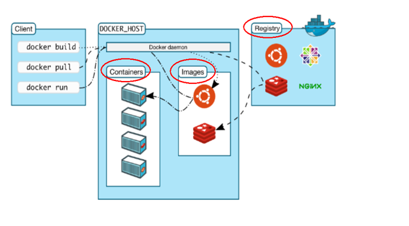
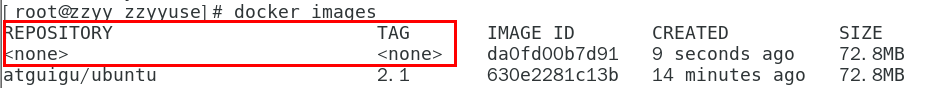
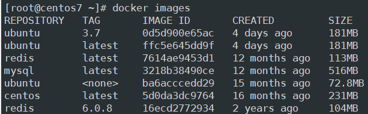
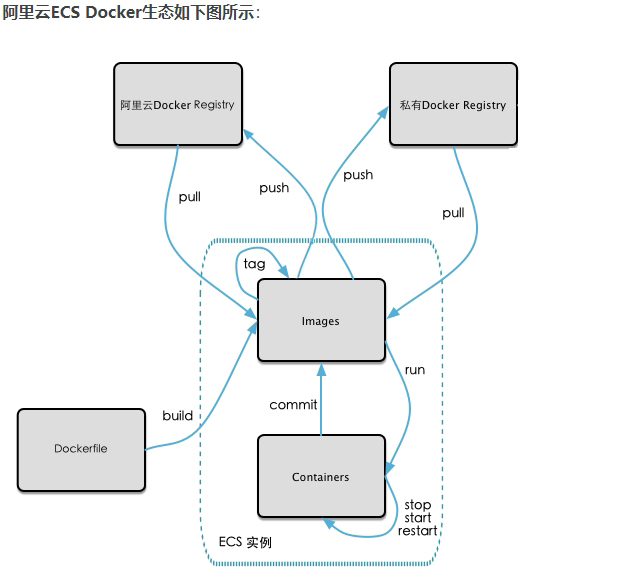
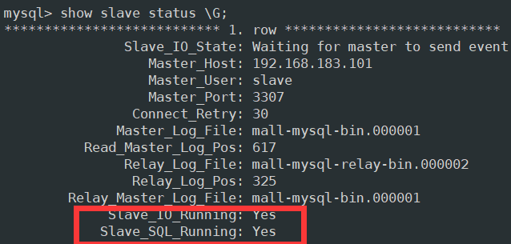
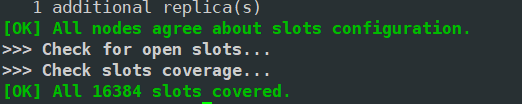
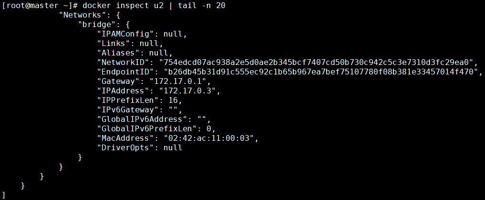
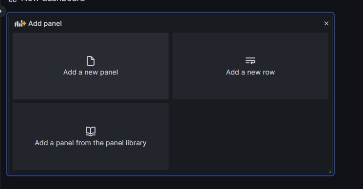

# Docker篇

## 基础篇

### Docker简介

#### 基本概念

##### 什么是Docker

**Docker 是基于Go语言实现的云开源项目。**

Docker 的主要目标是“Build，Ship and Run Any App，Anywhere”，也就是通过对应用组件的封装、分发、部署、运行等生命周期的管理，使用户的APP（可以是一个WEB应用或数据库应用等等）及其运行环境能够做到“**一次镜像，处处运行**”。


**Linux容器技术的出现就解决了这样一个问题，而 Docker 就是在它的基础上发展过来的。**将应用打成镜像，通过镜像成为运行在Docker容器上面的实例，而 Docker容器在任何操作系统上都是一致的，这就实现了跨平台、跨服务器。**只需要一次配置好环境，换到别的机子上就可以一键部署好，大大简化了操作。**

##### 为什么会有Docker出现

Docker的出现使得Docker得以打破过去「程序即应用」的观念。透过镜像(images)将作业系统核心除外，运作应用程式所需要的系统环境，由下而上打包，达到应用程式跨平台间的无缝接轨运作。

也就是说，安装的时候，把原始环境一模一样地复制过来。开发人员利用 Docker 可以消除协作编码时“在机器上可正常工作”的问题。

**一句话，解决了运行环境和配置问题的软件容器，方便做持续集成并有助于整体发布的容器虚拟化技术。**


#### 容器与虚拟机比较

##### 传统虚拟机技术

虚拟机（virtual machine）就是带环境安装的一种解决方案。
它可以在一种操作系统里面运行另一种操作系统，比如在Windows10系统里面运行Linux系统CentOS7。应用程序对此毫无感知，因为虚拟机看上去跟真实系统一模一样，而对于底层系统来说，虚拟机就是一个普通文件，不需要了就删掉，对其他部分毫无影响。这类虚拟机完美的运行了另一套系统，能够使应用程序，操作系统和硬件三者之间的逻辑不变。  

| Win10 | VMWare | Centos7 | 各种cpu、内存网络额配置+各种软件 | 虚拟机实例 |
| ----- | ------ | ------- | -------------------------------- | ---------- |

传统虚拟机技术基于安装在主操作系统上的虚拟机管理系统(如: VirtualBox和VMWare等)，创建虚拟机(虚拟出各种硬件)，在虚拟机上安装从操作系统，在从操作系统中安装部署各种应用。


虚拟机的缺点：资源占用多、冗余步骤多、启动慢

##### 容器虚拟机技术

由于前面虚拟机存在某些缺点，Linux发展出了另一种虚拟化技术：**Linux容器**(Linux Containers，缩写为 LXC)。

Linux容器是与系统其他部分隔离开的一系列进程，从另一个镜像运行，并由该镜像提供支持进程所需的全部文件。容器提供的镜像包含了应用的所有依赖项，因而在从开发到测试再到生产的整个过程中，它都具有可移植性和一致性。

**Linux 容器不是模拟一个完整的操作系统**而是对进程进行隔离。有了容器，就可以将软件运行所需的所有资源打包到一个隔离的容器中。**容器与虚拟机不同，不需要捆绑一整套操作系统**，只需要软件工作所需的库资源和设置。系统因此而变得高效轻量并保证部署在任何环境中的软件都能始终如一地运行。


Docker容器是在操作系统层面上实现虚拟化，直接复用本地主机的操作系统，而传统虚拟机则是在硬件层面实现虚拟化。与传统的虚拟机相比，Docker优势体现为启动速度快、占用体积小。

##### 对比


比较了 Docker 和传统虚拟化方式的不同之处：

- 传统虚拟机技术是**虚拟出一套硬件**后，在其上运行一个完整操作系统，在该系统上再运行所需应用进程；
- 容器内的应用进程**直接运行于宿主的内核**，容器内没有自己的内核且也**没有进行硬件虚拟**。因此容器要比传统虚拟机更为轻便。每个容器之间互相隔离，每个容器有自己的文件系统 ，容器之间进程不会相互影响，能区分计算资源。

#### Docker的使用场景

Docker借鉴了标准集装箱的概念。标准集装箱将货物运往世界各地，Docker将这个模型运用到自己的设计中，唯一不同的是：集装箱运输货物，而Docker运输软件。


#### Docker的特点

一次构建、随处运行。

* **更快速的应用交付和部署**：传统的应用开发完成后，需要提供一堆安装程序和配置说明文档，安装部署后需根据配置文档进行繁杂的配置才能正常运行。Docker化之后只需要交付少量容器镜像文件，在正式生产环境加载镜像并运行即可，应用安装配置在镜像里已经内置好，大大节省部署配置和测试验证时间。
* **更便捷的升级和扩缩容**：随着微服务架构和Docker的发展，大量的应用会通过微服务方式架构，应用的开发构建将变成搭乐高积木一样，每个Docker容器将变成一块“积木”，应用的升级将变得非常容易。当现有的容器不足以支撑业务处理时，可通过镜像运行新的容器进行快速扩容，使应用系统的扩容从原先的天级变成分钟级甚至秒级。
* **更简单的系统运维**：应用容器化运行后，生产环境运行的应用可与开发、测试环境的应用高度一致，容器会将应用程序相关的环境和状态完全封装起来，不会因为底层基础架构和操作系统的不一致性给应用带来影响，产生新的BUG。当出现程序异常时，也可以通过测试环境的相同容器进行快速定位和修复。
* **更高效的计算资源利用**：Docker是**内核级虚拟化**，其不像传统的虚拟化技术一样需要额外的Hypervisor支持，所以在一台物理机上可以运行很多个容器实例，可大大提升物理服务器的CPU和内存的利用率。

#### Docker官网

docker官网：http://www.docker.com

Docker Hub官网：https://hub.docker.com/

### Docker安装

#### 前提说明

目前，CentOS 仅发行版本中的内核支持 Docker。Docker 运行在CentOS 7 (64-bit)上，要求系统为64位、Linux系统内核版本为 3.8以上，这里选用Centos7.x。

#### Docker的基本组成

docker由镜像、容器、仓库构成的。

##### 镜像

Docker 镜像（Image）可以用来创建 Docker 容器，一个镜像可以创建很多容器。

- 相当于是一个root文件系统。比如官方镜像 centos:7 就包含了完整的一套 centos:7 最小系统的 root 文件系统。
- 相当于容器的“源代码”，docker镜像文件类似于Java的类模板，而docker容器实例类似于java中new出来的实例对象。


##### 容器

Docker 利用容器（Container）是用镜像创建的运行实例。

* 从面向对象角度：Docker 利用容器（Container）独立运行的一个或一组应用，应用程序或服务运行在容器里面，容器就类似于一个虚拟化的运行环境，容器是用镜像创建的运行实例。就像是Java中的类和实例对象一样，镜像是静态的定义，容器是镜像运行时的实体。容器为镜像提供了一个标准的和隔离的运行环境，它可以被启动、开始、停止、删除。每个容器都是相互隔离的、保证安全的平台
* 从镜像容器角度：可以把容器看做是一个简易版的 Linux 环境（包括root用户权限、进程空间、用户空间和网络空间等）和运行在其中的应用程序。

##### 仓库

仓库（Repository）是集中存放镜像文件的地方。
可以制作一个镜像提交到镜像仓库供他人使用，这里的管理方式有点类似于git。

* Docker公司提供的官方registry被称为Docker Hub，存放各种镜像模板的地方。
* 仓库分为公开仓库（Public）和私有仓库（Private）两种形式。
  最大的公开仓库是 Docker Hub(https://hub.docker.com/)，
  存放了数量庞大的镜像供用户下载。国内的公开仓库包括阿里云 、网易云等

##### Docker 架构图



Docker是一个Client-Server结构的系统，Docker守护进程运行在主机上， 然后通过Socket连接从客户端访问，守护进程从客户端接受命令并管理运行在主机上的容器。 

#### Docker平台架构图解

Docker 是一个 C/S 模式的架构，后端是一个松耦合架构，众多模块各司其职。 

Docker运行的基本流程为：

1. 用户是使用Docker Client与 Docker Daemon建立通信，并发送请求给后者。
2. Docker Daemon作为Docker架构中的主体部分，首先提供Docker Server的功能使其可以接受Docker Client的请求。
3. Docker Engine执行Docker内部的一系列工作，每一项工作都是以一个Job的形式的存在。
4. Job 的运行过程中，当需要容器镜像时，则从Docker Registry 中下载镜像，并通过镜像管理驱动Graph driver将下载镜像以Graph的形式存储。
5. 当需要为Docker创建网络环境时，通过网络管理驱动Network driver创建并配置Docker容器网络环境。
6. 当需要限制Docker容器运行资源或执行用户指令等操作时，则通过Exec driver来完成。
7. Libcontainer是一项独立的容器管理包，Network driver以及 Exec driver 都是通过Libcontainer来实现具体对容器进行的操作。


#### 安装步骤

##### CentOS7 安装 Docker

###### 安装地址

https://docs.docker.com/engine/install/centos/

###### 确定是CentOS7及以上版本

```shell
cat /etc/redhat-release
```

###### 卸载旧版本

```bash
yum remove docker \
	docker-client	\
	docker-client-latest \
	docker-common \
	docker-latest \
	docker-latest-logrotate \
	docker-logrotate \
	docker-engine
```

###### yum安装gcc相关

```shell
yum -y install gcc
yum -y install gcc-c++
```

###### 安装需要的软件包

```shell
yum install -y yum-utils
```

###### 设置stable镜像仓库

官网配置：

```shell
yum-config-manager --add-repo https://download.docker.com/linux/centos/docker-ce.repo
```

但是可能会出现超时错误问题。因此需要设置国内的镜像仓库：

```shell
yum-config-manager --add-repo http://mirrors.aliyun.com/docker-ce/linux/centos/docker-ce.repo
```

###### 更新yum软件包索引

```shell
yum makecache fast
```

###### 安装DOCKER CE

```shell
yum -y install docker-ce docker-ce-cli containerd.io
```

###### 启动docker

```shell
systemctl start docker
```

###### 检查docker版本

```shell
docker version
```

###### 测试

```shell
docker run hello-world
```


###### 自启动与取消容器自启动

先熟悉下`--restart`参数

```
--restart参数=
	no
		默认策略，在容器退出时不重启容器
	on-failure
		在容器非正常退出时（退出状态非0），才会重启容器
	on-failure:3
		在容器非正常退出时重启容器，最多重启3次
	always
		在容器退出时总是重启容器
#开机自启
	unless-stopped
		在容器退出时总是重启容器，但是不考虑在Docker守护进程启动时就已经停止了的容器
# 一般推荐使用always参数
	--restart=always
```

将正在运行的容器设为自启动

```shell
# docker update --restart=always 容器名或容器ID
docker update --restart=always <CONTAINER ID>
# 例如将tomcat设为自启动
docker update --restart=always tomcat
```

将自启动的容器取消自启动

```shell
# docker update --restart=no 容器名或容器ID
docker update --restart=no <CONTAINER ID>
# 例如取消tomcat的自启动
docker update --restart=no tomcat
```

###### 卸载docker

```shell
systemctl stop docker

yum remove docker-ce docker-ce-cli containerd.io

rm -rf /var/lib/docker

rm -rf /var/lib/containerd
```

#### 阿里云镜像加速

首先注册一个属于自己的[阿里云](https://promotion.aliyun.com/ntms/act/kubernetes.html)账户(可复用淘宝账号)。

接下来，获得加速器地址连接

- 登陆阿里云开发者平台


- 点击控制台


- 选择容器镜像服务


- 获取加速器地址


获取到加速器地址后，返回linux中，进行配置

```shell
mkdir -p /etc/docker

sudo tee /etc/docker/daemon.json <<-'EOF'
{
  "registry-mirrors": ["https://gyi30vq5.mirror.aliyuncs.com"]
}
EOF
sudo systemctl daemon-reload
sudo systemctl restart docker
```

或者

```shell
mkdir -p /etc/docker
vim  /etc/docker/daemon.json
```

配置内容如下：

```shell
 #阿里云
{
  "registry-mirrors": ["https://｛自已的编码｝.mirror.aliyuncs.com"]
}
```

配置完毕后，重启服务器

```shell
sudo systemctl daemon-reload
sudo systemctl restart docker
```

#### 永久的HelloWorld

启动Docker后台容器(测试运行 hello-world)

```shell
docker run hello-world
```

其中，run实际干了如下几步：


#### 底层原理

思考问题：为什么Docker会比VM虚拟机快？

**(1) docker有着比虚拟机更少的抽象层**

由于docker不需要Hypervisor(虚拟机)实现硬件资源虚拟化，运行在docker容器上的程序**直接使用**的都是实际物理机的硬件资源。因此在CPU、内存利用率上docker将会在效率上有明显优势。

**(2) docker利用的是宿主机的内核，而不需要加载操作系统OS内核**

当新建一个容器时，docker不需要和虚拟机一样重新加载一个操作系统内核。进而避免引寻、加载操作系统内核返回等比较费时费资源的过程，当新建一个虚拟机时，虚拟机软件需要加载OS，返回新建过程是分钟级别的。而docker由于直接利用宿主机的操作系统，则省略了返回过程，因此新建一个docker容器只需要几秒钟。


|            | Docker容器              | 虚拟机（VM）                |
| ---------- | ----------------------- | --------------------------- |
| 操作系统   | 与宿主机共享OS          | 宿主机OS上运行虚拟机OS      |
| 存储大小   | 镜像小，便于存储于传输  | 镜像庞大（vmdk、vdi等）     |
| 运行性能   | 几乎无额外性能损失      | 操作系统额外的CPU、内存消耗 |
| 移植性     | 轻便、灵活、适应于Linux | 笨重，与虚拟化技术耦合度高  |
| 硬件亲和性 | 面向软件开发者          | 面向硬件运维者              |
| 部署速度   | 快速、秒级              | 较慢、10s以上               |

### Docker常用命令

#### 帮助启动类命令

##### 启动docker

```shell
systemctl start docker
```

##### 停止docker

```shell
systemctl stop docker
```

##### 重启docker

```shell
systemctl restart docker
```

##### 查看docker状态

```shell
systemctl status docker
```

##### 开机启动

```shell
systemctl enable docker
```

取消自启动`disable`。

##### 查看docker概要信息

```shell
docker info
```

##### 查看docker总体帮助文档

```shell
docker --help
```

##### 查看docker命令帮助文档

```shell
docker 具体命令 --help
```

#### 镜像命令

##### 列出本地镜像

```shell
docker images [OPTIONS]
```


各个选项说明：

- REPOSITORY：表示镜像的仓库源
- TAG：镜像的标签版本号
- IMAGE ID：镜像ID
- CREATED：镜像创建时间
- SIZE：镜像大小

同一仓库源可以有多个 TAG版本，代表这个仓库源的不同个版本，使用 REPOSITORY:TAG 来定义不同的镜像。

如果不指定一个镜像的版本标签，例如只使用 ubuntu，docker 将默认使用 ubuntu:latest 镜像。

接下来对OPTIONS说明：

- ``-a ``：列出本地所有的镜像（含历史映像层）
- ``-q`` ：只显示镜像ID。

##### 搜索镜像

```shell
docker search [OPTIONS] 镜像名字
```


OPTIONS说明：

- ``--limit`` ：只列出N个镜像，默认25个

```shell
docker search --limit 5 redis
```


##### 拉取镜像

```shell
docker pull 镜像名字[:TAG]
```

其中，TAG是当前镜像的版本号，如果没有TAG就是最新版，其中`:latest`可以省略。

```shell
docker pull 镜像名字:latest
```

##### 查看镜像/容器/数据卷所占的空间

```shell
docker system df
```


##### 删除镜像

* 删除单个镜像

```shell
docker rmi 镜像名称/ID
```

* 强制删除单个镜像

```shell
docker rmi -f 镜像ID
```

`-f`是强制删除。

* 删除多个镜像

```shell
docker rmi -f 镜像名1:TAG 镜像名2:TAG 
```

* 删除全部镜像

```shell
docker rmi -f $(docker images -qa)
```

#### 面试题：谈谈docker虚悬镜像是什么？

**仓库名、标签都是\<none>的镜像，俗称虚悬镜像dangling image。**



查看

```bash
docker image ls -f dangling=true
```

删除

```bash
docker image prune
```

虚悬镜像已经失去存在价值，可以删除。

#### 容器命令

##### 前提说明

**有镜像才能创建容器，这是根本前提(下载一个CentOS或者ubuntu镜像演示)**


* Ubuntu

```shell
docker pull ubuntu
```

* Centos

```shell
docker pull centos
```

##### 新建+启动容器

```shell
docker run [OPTIONS] IMAGE [COMMAND] [ARG...]
```

 OPTIONS说明（常用）：有些是一个减号，有些是两个减号

| 参数选项            | 含义                                                         |
| ------------------- | ------------------------------------------------------------ |
| --name="容器新名字" | 为容器指定一个名称                                           |
| -d                  | 后台运行容器并返回容器ID，也即启动守护式容器(后台运行)       |
|                     |                                                              |
| -i                  | 以交互模式运行容器，通常与 -t 同时使用                       |
| -t                  | 为容器重新分配一个伪输入终端，通常与 -i 同时使用；即启动交互式容器(前台有伪终端，等待交互) |
|                     |                                                              |
| -P                  | 随机端口映射，大写P                                          |
| -p                  | 指定端口映射以及协议，小写p                                  |

其中-p参数详解如下：

| 参数命令                      | 说明                             |
| ----------------------------- | -------------------------------- |
| -p hostPort:containerPort     | 端口映射 -p 8800:80              |
| -p ip:hostPort:containerPort  | 配置监听地址 -p 10.0.0.0:8800:80 |
| -p ip::containerPort          | 随机分配端口 -p 10.0.0.0::80     |
| -p hostPort:containerPort:udp | 制定协议 -p 8800:80:udp          |
| -p 91:6 -p 92:7               | 指定多个                         |

使用镜像ubuntu:latest以交互模式启动一个容器，在容器内执行/bin/bash命令。

```shell
docker run -it ubuntu /bin/bash
```

这里`/bin/bash`可以简写为`bash`。

参数说明：

| 参数选项  | 含义                                                         |
| --------- | ------------------------------------------------------------ |
| -i        | 以交互模式运行容器，通常与 -t 同时使用                       |
| -t        | 为容器重新分配一个伪输入终端，通常与 -i 同时使用；即启动交互式容器(前台有伪终端，等待交互) |
| ubuntu    | ubuntu镜像                                                   |
| /bin/bash | 放在镜像名后的是命令，这里希望有个交互式 Shell，因此用的是 /bin/bash。 |

要退出终端，直接输入`exit`。

##### 设置容器自动重启

```shell
docker run -d --restart=always --name 设置容器名 使用的镜像
```

Docker 容器的重启策略如下：

| --restart具体参数值详细信息 | 参数说明                                                     |
| --------------------------- | ------------------------------------------------------------ |
| no                          | 默认策略，容器退出时不重启容器                               |
| on-failure                  | 在容器非正常退出时（退出状态非0）才重新启动容器              |
| on-failure:3                | 在容器非正常退出时重启容器，最多重启3次                      |
| always                      | 无论退出状态是如何，都重启容器                               |
| unless-stopped              | 在容器退出时总是重启容器，但是不考虑在 Docker 守护进程启动时就已经停止了的容器。 |

##### 列出当前所有正在运行的容器

```shell
docker ps [OPTIONS]
```

OPTIONS说明（常用）：

| 参数选项 | 含义                                      |
| -------- | ----------------------------------------- |
| -a       | 列出当前所有正在运行的容器+历史上运行过的 |
| -l       | 显示最近创建的容器                        |
| -n       | 显示最近n个创建的容器                     |
| **-q**   | 静默模式，只显示容器编号                  |

##### 退出容器

退出容器有两种方式。

* exit：run进去容器，exit退出，容器停止

* ctrl+p+q：run进去容器，ctrl+p+q退出，容器不停止

##### 启动已停止运行的容器

```shell
docker start 容器ID或者容器名
```

##### 重启容器

```shell
docker restart 容器ID或者容器名
```

##### 停止容器

```shell
docker stop 容器ID或者容器名
```

##### 强制停止容器

```shell
docker kill 容器ID或容器名
```

##### 删除已停止的容器

* 删除单个容器

```shell
docker rm 容器ID
```

* 一次性删除多个容器实例

```shell
docker rm -f $(docker ps -a -q)
```

或者

```shell
docker ps -a -q | xargs docker rm
```

##### 其他重要操作

###### 启动守护式容器(后台服务器)

在大部分的场景下，希望 docker 的服务是在后台运行的，可以过 -d 指定容器的后台运行模式。

```shell
docker run -d 容器名
```

注意，使用镜像centos:latest以后台模式启动一个容器

```shell
docker run -d centos
```

问题：然后docker ps -a 进行查看，会发现**容器已经退出**

很重要的要说明的一点：Docker容器后台运行，就必须有一个前台进程。

容器运行的命令如果不是那些一直挂起的命令（比如运行top，tail），就是会自动退出的。这样的容器后台启动后，会立即自杀因为他觉得他没事可做了。所以，最佳的解决方案是，**将要运行的程序以前台进程的形式运行**。

###### 查看容器日志

```shell
docker logs 容器ID
```

###### 查看容器内运行的进程

```shell
docker top 容器ID
```

###### 查看容器内部细节

```shell
docker inspect 容器ID
```

###### 进入正在运行的容器并以命令行交互

* 使用exec命令

```shell
docker exec -it 容器ID bash
```

后面bash是容器里面的命令。比如

```shell
docker exec -it 容器ID redis-cli
```

- 使用attach命令

```shell
docker attach 容器ID
```

上述两个区别：

* attach 直接进入容器启动命令的终端，不会启动新的进程
  用exit退出，会导致容器的停止。
* exec 是在容器中打开新的终端，并且可以启动新的进程
  用exit退出，不会导致容器的停止。

###### 从容器内拷贝文件到主机上

```shell
docker cp 容器ID:容器内路径 目的主机路径
```

###### 导入和导出容器

export 导出容器的内容留作为一个tar归档文件[对应import命令]

```shell
docker export 容器ID > 文件名.tar
```

从tar包中的内容创建一个新的文件系统再导入为镜像[对应export]

```shell
cat 文件名.tar | docker import - 镜像用户/镜像名:镜像版本号
```

#### 所有命令


| 参数命令 | 说明                                                         |
| -------- | ------------------------------------------------------------ |
| attach   | 当前 shell 下 attach 连接指定运行镜像                        |
| build    | 通过 Dockerfile 定制镜像                                     |
| commit   | 提交当前容器为新的镜像                                       |
| cp       | 从容器中拷贝指定文件或者目录到宿主机中                       |
| create   | 创建一个新的容器，同 run，但不启动容器                       |
| diff     | 查看 docker 容器变化                                         |
| events   | 从 docker 服务获取容器实时事件                               |
| exec     | 在已存在的容器上运行命令                                     |
| export   | 导出容器的内容流作为一个 tar 归档文件[对应 import ]          |
| history  | 展示一个镜像形成历史                                         |
| images   | 列出系统当前镜像                                             |
| import   | 从tar包中的内容创建一个新的文件系统映像[对应export]          |
| info     | 显示系统相关信息                                             |
| inspect  | 查看容器详细信息                                             |
| kill     | kill 指定 docker 容器                                        |
| load     | 从一个 tar 包中加载一个镜像[对应 save]                       |
| load     | 注册或者登陆一个 docker 源服务器                             |
| logout   | 从当前 Docker registry 退出                                  |
| logs     | 输出当前容器日志信息                                         |
| port     | 查看映射端口对应的容器内部源端口                             |
| pause    | 暂停容器                                                     |
| ps       | 列出容器列表                                                 |
| pull     | 从docker镜像源服务器拉取指定镜像或者库镜像                   |
| push     | 推送指定镜像或者库镜像至docker源服务器                       |
| restart  | 重启运行的容器                                               |
| rm       | 移除一个或者多个容器                                         |
| rmi      | 移除一个或多个镜像[无容器使用该镜像才可删除，否则需删除相关容器才可继续或 -f 强制删除] |
| run      | 创建一个新的容器并运行一个命令                               |
| save     | 保存一个镜像为一个 tar 包[对应 load]                         |
| search   | 在 docker hub 中搜索镜像                                     |
| start    | 启动容器                                                     |
| stop     | 停止容器                                                     |
| tag      | 给源中镜像打标签                                             |
| top      | 查看容器中运行的进程信息                                     |
| unpause  | 取消暂停容器                                                 |
| version  | 查看 docker 版本号                                           |
| wait     | 截取容器停止时的退出状态值                                   |

### Docker镜像

#### 什么是Docker镜像

Docker镜像是一种轻量级、可执行的独立软件包，它包含运行某个软件所需的所有内容，把应用程序和配置依赖打包好形成一个可交付的运行环境(包括代码、运行时需要的库、环境变量和配置文件等)，这个打包好的运行环境就是image镜像文件。

只有通过这个镜像文件才能生成Docker容器实例(类似Java中new出来一个对象)。

**Docker镜像层都是只读的**，容器层是可写的。当容器启动时，一个新的可写层被加载到镜像的顶部。这一层通常被称作“容器层”，“容器层”之下的都叫“镜像层”。

当容器启动时，一个新的可写层被加载到镜像的顶部。这一层通常被称作“容器层”，“容器层”之下的都叫“镜像层”。

所有对容器的改动 - 无论添加、删除、还是修改文件都只会发生在容器层中。只有容器层是可写的，容器层下面的所有镜像层都是只读的。

#### 什么是分层的镜像

以pull为例，在下载的过程中可以看到docker的镜像好像是在一层一层的在下载。


#### 什么是UnionFS（联合文件系统）

UnionFS（联合文件系统）：Union文件系统（UnionFS）是一种分层、轻量级并且高性能的文件系统，它支持对文件系统的修改作为一次提交来一层层的叠加，同时可以将不同目录挂载到同一个虚拟文件系统下(unite several directories into a single virtual filesystem)。Union 文件系统是 Docker 镜像的基础。**镜像可以通过分层来进行继承**，基于基础镜像（没有父镜像），可以制作各种具体的应用镜像。

特性：一次同时加载多个文件系统，但从外面看起来，只能看到一个文件系统，联合加载会把各层文件系统叠加起来，这样最终的文件系统会包含所有底层的文件和目录。

#### Docker镜像加载原理

docker的镜像实际上由一层一层的文件系统组成，这种层级的文件系统UnionFS。

bootfs(boot file system)主要包含bootloader和kernel，bootloader主要是引导加载kernel， Linux刚启动时会加载bootfs文件系统，**在Docker镜像的最底层是引导文件系统bootfs**。这一层与我们典型的Linux/Unix系统是一样的，包含boot加载器和内核。当boot加载完成之后整个内核就都在内存中了，此时内存的使用权已由bootfs转交给内核，此时系统也会卸载bootfs。

rootfs (root file system) ，在bootfs之上。包含的就是典型 Linux 系统中的 /dev， /proc， /bin， /etc 等标准目录和文件。rootfs就是各种不同的操作系统发行版，比如Ubuntu，Centos等等。 

>  平时安装进虚拟机的CentOS都是好几个G，为什么docker这里才200M？？
>
>  对于一个精简的OS，rootfs可以很小，只需要包括最基本的命令、工具和程序库就可以了，因为底层直接用Host的kernel，自己只需要提供 rootfs 就行了。由此可见对于不同的linux发行版， bootfs基本是一致的， rootfs会有差别， 因此不同的发行版可以公用bootfs。

#### 为什么 Docker 镜像要采用这种分层结构呢

镜像分层最大的一个好处就是共享资源，方便复制迁移，就是**为了复用**。

比如说有多个镜像都从相同的 base 镜像构建而来，那么 Docker Host 只需在磁盘上保存一份 base 镜像；同时内存中也只需加载一份 base 镜像，就可以为所有容器服务了。而且镜像的每一层都可以被共享。

#### Docker镜像commit操作案例

* docker commit提交容器副本使之成为一个新的镜像
* `docker commit -m="提交的描述信息" -a="作者" 容器ID 要创建的目标镜像名:[标签名]`
* 案例演示ubuntu安装vim

从Hub上下载ubuntu镜像到本地并成功运行

```shell
docker pull ubuntu			
```

原始的默认Ubuntu镜像是不带着vim命令的，之后外网连通的情况下，安装vim。

```shell
# 先更新包管理工具
apt-get update

# 安装vimd
apt-get install vim
```

安装完成后，commit新镜像，需要指定容器ID，保存后想运行修改过并保存的容器的镜像，需要找到其相应的镜像ID，进行启动。

```shell
docker ps
docker commit -m="add vim cmd" -a="胡桃" e63cefb3fac6 ubuntu:3.7
```

其中，OPTIONS说明：

- -a：提交的镜像作者；
- -m：提交时的说明文字；


```shell
docker images
docker run -it 0d5d900e65ac bash
```


### 本地镜像发布到阿里云

#### 本地镜像发布到阿里云流程


#### 镜像的生成方法

[Docker镜像commit操作案例](####Docker镜像commit操作案例)，在后续后面的DockerFile章节，是第2种方法方法进行生成镜像。

#### 将本地镜像推送到阿里云

选择控制台，进入容器镜像服务


选择个人实例


选择命名空间


然后创建命名空间


之后，选择镜像仓库


然后创建镜像仓库


点击下一步，并选择本地仓库，然后点击创建。

然后会看到自动生成了管理界面脚本。


然后根据界面命令，进行运行。

首先，查看images镜像ID

```shell
docker images
```



```shell
docker login --username=[用户名]registry.cn-hangzhou.aliyuncs.com
```

根据之前的镜像ID，输入以下命令

```shell
docker tag 0d5d900e65ac registry.cn-hangzhou.aliyuncs.com/tokimeki/ubuntu:3.7
```

然后pull镜像

```shell
docker push registry.cn-hangzhou.aliyuncs.com/tokimeki/ubuntu:3.7
```

#### 将阿里云上的镜像下载到本地

```shell
docker pull registry.cn-hangzhou.aliyuncs.com/tokimeki/ubuntu:3.7
```

### 本地镜像发布到私有库

#### 本地镜像发布到私有库流程

 

#### 为什么需要私有库

官方Docker Hub地址：https://hub.docker.com/，中国大陆访问太慢了且准备被阿里云取代的趋势，不太主流。

Dockerhub、阿里云这样的公共镜像仓库可能不太方便，涉及机密的公司不可能提供镜像给公网，所以需要创建一个本地私人仓库供给团队使用，基于公司内部项目构建镜像。

Docker Registry是官方提供的工具，可以用于构建私有镜像仓库。

#### 将本地镜像推送到私有库

##### 下载镜像Docker Registry

```shell
docker pull registry 
```

##### 运行私有库

运行私有库Registry，相当于本地有个私有Docker hub

```shell
docker run -d -p 5000:5000  -v /zzyyuse/myregistry/:/tmp/registry --privileged=true registry
```

默认情况，仓库被创建在容器的/var/lib/registry目录下，建议自行用容器卷映射，方便于宿主机联调。详见容器数据卷。

##### 案例演示

案例演示创建一个新镜像，ubuntu安装ifconfig命令

从Hub上下载ubuntu镜像到本地并成功运行

```shell
docker pull ubuntu
docker run -it ubuntu bash
```

原始的Ubuntu镜像是不带着ifconfig命令的


外网连通的情况下，安装ifconfig命令并测试通过

```shell
# docker容器内执行上述两条命令：
apt-get update
apt-get install net-tools
```

安装完成后，commit新镜像

公式：

```shell
docker commit -m="提交的描述信息" -a="胡桃" 容器ID 要创建的目标镜像名:[标签名]
```

命令：在容器外执行，记得

```shell
docker commit -m="ifconfig cmd add" -a="胡桃" 31b3aa9bf1fd myubuntu:1.0
```


##### 验证本地私服库

curl验证本地私服库上有什么镜像

```shell
 curl -XGET http://192.168.183.102:5000/v2/_catalog
```


##### 将新镜像修改为符合私服规范的Tag

将新镜像myubuntu:1.0修改符合私服规范的Tag。

按照公式： 

```shell
docker   tag   镜像:Tag   Host:Port/Repository:Tag
```

使用命令 docker tag 将``myubuntu:1.0`` 这个镜像修改为``192.168.183.102:5000/myubuntu:1.0``

```shell
docker tag  myubuntu:1.0 192.168.183.102:5000/myubuntu:1.0
```


##### 修改配置文件使之支持http

```shell
cat /etc/docker/daemon.json
```

内容如下：

```shell
{
  "registry-mirrors": ["https://gyi30vq5.mirror.aliyuncs.com"]，
  "insecure-registries": ["192.168.183.102:5000"]
}
```

由于，docker默认不允许http方式推送镜像，通过配置选项来取消这个限制。 修改完后如果不生效，建议重启docker。

```shell
systemctl restart docker
```

##### push推送到私服库

```shell
docker push 192.168.183.102:5000/myubuntu:1.0
```

##### 重新curl验证本地私服库

```shell
 curl -XGET http://192.168.183.102:5000/v2/_catalog
```


##### pull到本地并运行

下载镜像

```shell
docker pull 192.168.183.102:5000/myubuntu:1.0
```

运行

```shell
docker run -it 5064ed7e7484 bash
```

### Docker容器数据卷

#### 数据卷挂载问题

Docker挂载主机目录访问如果出现cannot open directory: Permission denied。

如果是CentOS7安全模块会比之前系统版本加强，不安全的会先禁止，所以目录挂载的情况被默认为不安全的行为，在SELinux里面挂载目录被禁止掉了，如果要开启，我们一般使用--privileged=true命令，扩大容器的权限解决挂载目录没有权限的问题，也即使用该参数，container内的root拥有真正的root权限，否则，container内的root只是外部的一个普通用户权限。

**解决办法：在挂载目录后多加一个``--privileged=true``参数即可。**

#### 参数v含义

运行私有库Registry，相当于本地有个私有Docker hub

```shell
docker run -d -p 5000:5000  -v /zzyyuse/myregistry/:/tmp/registry --privileged=true registry
```

默认情况，仓库被创建在容器的/var/lib/registry目录下，建议自行用容器卷映射，方便于宿主机联调。详见容器数据卷。

#### 什么是数据卷

卷就是目录或文件，存在于一个或多个容器中，由docker挂载到容器，但不属于联合文件系统，因此能够绕过Union File System提供一些用于持续存储或共享数据的特性。

卷的设计目的就是**数据的持久化**，完全独立于容器的生存周期，因此Docker不会在容器删除时删除其挂载的数据卷。

> 将docker容器内的数据保存进宿主机的磁盘中

运行一个带有容器卷存储功能的容器实例：

```shell
 docker run -it --privileged=true -v /宿主机绝对路径目录:/容器内目录      镜像名
```

#### 数据卷的用途

Docker容器产生的数据，如果不备份，那么当容器实例删除后，容器内的数据自然也就没有了。

1. 数据卷可在容器之间共享或重用数据
2. 卷中的更改可以直接实时生效
3. 数据卷中的更改不会包含在镜像的更新中
4. 数据卷的生命周期一直持续到没有容器使用它为止

#### 数据卷案例

##### 宿主vs容器之间映射添加容器卷

添加数据卷

```shell
 docker run -it --privileged=true -v /宿主机绝对路径目录:/容器内目录      镜像名
```

查看数据卷是否挂载成功

```shell
docker inspect 容器ID
```

容器和宿主机之间数据共享

- docker修改，主机同步获得 
- 主机修改，docker同步获得
- docker容器stop，主机修改，docker容器重启后数据同步。

##### 读写规则映射添加说明

###### 读写(默认)

默认同上案例，默认就是rw

```shell
 docker run -it --privileged=true -v /宿主机绝对路径目录:/容器内目录:rw      镜像名
```

###### 只读

容器实例内部被限制，只能读取不能写。

```shell
 /容器目录:ro 镜像名     
```

就能完成功能，此时容器自己只能读取不能写 。其中，ro = read only，此时如果宿主机写入内容，可以同步给容器内，容器可以读取到。

示例：

```shell
 docker run -it --privileged=true -v /宿主机绝对路径目录:/容器内目录:ro      镜像名
```

##### 卷的继承和共享

###### 容器1完成和宿主机的映射

```shell
docker run -it  --privileged=true -v /mydocker/u:/tmp --name u1 ubuntu
```

###### 容器2继承容器1的卷规则

```
docker run -it  --privileged=true --volumes-from 父类  --name u2 ubuntu
```

示例：

```shell
docker run -it  --privileged=true --volumes-from u1 --name u2 ubuntu
```

### Docker常规安装简介

#### 安装步骤

- 搜索镜像
- 拉取镜像
- 查看镜像
- 启动镜像 —— 服务端口映射
- 停止容器
- 移除容器

#### 安装tomcat

##### docker hub上面查找tomcat镜像

```shell
docker search tomcat
```

##### 从docker hub上拉取tomcat镜像到本地

```shell
docker pull tomcat
```

##### docker images查看是否有拉取到的tomcat

```shell
docker images tomcat
```

##### 使用tomcat镜像创建容器实例(也叫运行镜像)

```shell
docker run -d -p 8080:8080 --name t1 tomcat
```

##### 访问tomcat首页，发现出现404问题

解决方法：可能没有映射端口或者没有关闭防火墙 或者 把webapps.dist目录换成webapps。

```shell
rm -r webapps
mv webapps.dist webapps
```

##### 免修改版说明

```shell
docker pull billygoo/tomcat8-jdk8
docker run -d -p 8080:8080 --name mytomcat8 billygoo/tomcat8-jdk8
```

#### 安装MySQL

##### docker hub上面查找mysql镜像

```shell
docker search mysql
```

##### 从docker hub上(阿里云加速器)拉取mysql镜像到本地标签为5.7

```shell
docker pull mysql:5.7
```

##### 使用mysql5.7镜像创建容器(也叫运行镜像)

###### 命令

```shell
docker run --name some-mysql -e MYsQL_ROOT_PASSMORD=my-secret-pw -d mysql:tag
```

###### 简单版

- 使用mysql镜像

```shell
docker run -p 3306:3306 -e MYSQL_ROOT_PASSWORD=123456 -d mysql:5.7
docker ps
docker exec -it 容器ID /bin/bash
mysql -uroot -p
```

- 测试数据库

```mysql
create database test01;
show databases;
```

- 外部Win10也来连接运行在dokcer上的mysql容器实例服务

- 问题所在
  - 由于docker上默认字符集编码隐患，在插入中文数据时会出错
  - 容器数据被删除怎么办

###### 实战版

- 新建mysql容器实例

```shell
docker run -d -p 3306:3306 --privileged=true -v /mydata/mysql/log:/var/log/mysql -v /mydata/mysql/data:/var/lib/mysql -v /mydata/mysql/conf:/etc/mysql/conf.d -e MYSQL_ROOT_PASSWORD=123456  --name mysql mysql:5.7
```

查看当前mysql容器

```shell
docker ps
```

切换目录查看数据文件

```shell
cd /mydata/mysql

ll
```

- 新建my.cnf：通过容器卷同步给mysql容器实例

```shell
cd ./conf
vi my.cnf
```

内容如下：

```shell
[client]
default_character_set=utf8
[mysqld]
collation_server = utf8_general_ci
character_set_server = utf8
```

- 重新启动mysql容器实例再重新进入并查看字符编码

```shell
docker restart mysql

docker ps

docker exec -it b7058fb0a56d bash
```

进入mysql，然后查看字符集

```
show variables like 'character%';
```


- 再新建库新建表再插入中文测试

#### 安装Redis

##### hub上(阿里云加速器)拉取redis镜像到本地标签为6.0.8

```shell
docker pull redis:6.0.8
```

##### 运行Redis容器

```shell
docker run -d -p 6379:6379 redis:6.0.8

docker ps

docker exec -it 86f1ab51d4c1 bash
```

然后通过`redis-cli`命令，进入redis中，进行测试。

##### 使用redis6.0.8镜像创建容器(也叫运行镜像)

首先配置redis文件

```shell
cd /app/redis   # 进入目录
wget http://download.redis.io/redis-stable/redis.conf   # 下载redis配置文件
vim redis.conf  # 修改配置文件
```

- bind 127.0.0.1 #注释掉这部分，这是限制redis只能本地访问
- protected-mode no #默认yes，开启保护模式，限制为本地访问
- daemonize no#默认no，改为yes意为以守护进程方式启动，可后台运行，除非kill进程（可选），改为yes会使配置文件方式启动redis失败
- dir ./ #输入本地redis[数据库](https://cloud.tencent.com/solution/database?from=10680)存放文件夹（可选）
- appendonly yes #redis持久化（可选）

```shell
docker run  -p 6379:6379 --name redis --privileged=true -v /app/redis/redis.conf:/etc/redis/redis.conf -v /app/redis/data:/data -d redis:6.0.8 redis-server /etc/redis/redis.conf
```

## 高级篇

### Docker复杂安装详解

#### 安装mysql主从复制

- 新建主服务器容器实例3307

```bash
docker run -p 3307:3306 --name mysql-master \
-v /mydata/mysql-master/log:/var/log/mysql \
-v /mydata/mysql-master/data:/var/lib/mysql \
-v /mydata/mysql-master/conf:/etc/mysql \
-e MYSQL_ROOT_PASSWORD=root  \
-d mysql:5.7
```

- 进入/mydata/mysql-master/conf目录下新建my.cnf

```bash
vim my.cnf
```

内容如下：

```bash
[mysqld]
## 设置server_id，同一局域网中需要唯一
server_id=101 
## 指定不需要同步的数据库名称
binlog-ignore-db=mysql  
## 开启二进制日志功能
log-bin=mall-mysql-bin  
## 设置二进制日志使用内存大小（事务）
binlog_cache_size=1M  
## 设置使用的二进制日志格式（mixed,statement,row）
binlog_format=mixed  
## 二进制日志过期清理时间。默认值为0，表示不自动清理。
expire_logs_days=7  
## 跳过主从复制中遇到的所有错误或指定类型的错误，避免slave端复制中断。
## 如：1062错误是指一些主键重复，1032错误是因为主从数据库数据不一致
slave_skip_errors=1062
```

- 修改完配置后重启master实例

```bash
docker restart mysql-master
```

- 进入mysql-master容器

```bash
docker exec -it mysql-master /bin/bash
mysql -uroot -proot
```

- master容器实例内创建数据同步用户

```mysql
CREATE USER 'slave'@'%' IDENTIFIED BY '123456';
GRANT REPLICATION SLAVE, REPLICATION CLIENT ON *.* TO 'slave'@'%';
```

- 新建从服务器容器实例3308

```bash
 docker run -p 3308:3306 --name mysql-slave \
-v /mydata/mysql-slave/log:/var/log/mysql \
-v /mydata/mysql-slave/data:/var/lib/mysql \
-v /mydata/mysql-slave/conf:/etc/mysql \
-e MYSQL_ROOT_PASSWORD=root  \
-d mysql:5.7
```

- 进入/mydata/mysql-slave/conf目录下新建my.cnf

```bash
vim my.cnf
```

内容如下：

```bash
[mysqld]
## 设置server_id，同一局域网中需要唯一
server_id=102
## 指定不需要同步的数据库名称
binlog-ignore-db=mysql  
## 开启二进制日志功能，以备Slave作为其它数据库实例的Master时使用
log-bin=mall-mysql-slave1-bin  
## 设置二进制日志使用内存大小（事务）
binlog_cache_size=1M  
## 设置使用的二进制日志格式（mixed,statement,row）
binlog_format=mixed  
## 二进制日志过期清理时间。默认值为0，表示不自动清理。
expire_logs_days=7  
## 跳过主从复制中遇到的所有错误或指定类型的错误，避免slave端复制中断。
## 如：1062错误是指一些主键重复，1032错误是因为主从数据库数据不一致
slave_skip_errors=1062  
## relay_log配置中继日志
relay_log=mall-mysql-relay-bin  
## log_slave_updates表示slave将复制事件写进自己的二进制日志
log_slave_updates=1  
## slave设置为只读（具有super权限的用户除外）
read_only=1
```

- 修改完配置后重启slave实例

```bash
docker restart mysql-slave
```

- 在主数据库中查看主从同步状态

```bash
show master status;
```


- 进入mysql-slave容器

```bash
docker exec -it mysql-slave /bin/bash
mysql -uroot -proot
```

- 在从数据库中配置主从复制

```bash
change master to master_host='192.168.183.101', master_user='slave', master_password='123456', master_port=3307, master_log_file='mall-mysql-bin.000001', master_log_pos=617, master_connect_retry=30;
```

| 参数                 | 含义                                                         |
| -------------------- | ------------------------------------------------------------ |
| master_host          | 主数据库的IP地址                                             |
| master_port          | 主数据库的运行端口                                           |
| master_user          | 在主数据库创建的用于同步数据的用户账号                       |
| master_password      | 在主数据库创建的用于同步数据的用户密码                       |
| master_log_file      | 指定从数据库要复制数据的日志文件，通过查看主数据的状态，获取File参数 |
| master_log_pos       | 指定从数据库从哪个位置开始复制数据，通过查看主数据的状态，获取Position参数 |
| master_connect_retry | 连接失败重试的时间间隔，单位为秒                             |

- 在从数据库中查看主从同步状态

```bash
show slave status \G;
```


可以看见还没有开始。

- 在从数据库中开启主从同步

```bash
start slave
```

- 查看从数据库状态发现已经同步



- 主从复制测试

主机新建库-使用库-新建表-插入数据

```mysql
create database testdb charset=utf8;
use testdb;
create table testTable (id int);
insert into testTable values(1);
select * from testTable;
```

从机使用库-查看记录

```mysql
show databases;
use testdb;
select * from testTable;
```

#### 安装Redis集群

###### 3主3从redis集群配置

- 关闭防火墙+启动docker后台服务

```bash
systemctl stop firewalld
systemctl start docker
```

- 新建6个docker容器redis实例

```bash
docker pull redis:6.0.8 # 拉取镜像

docker run -d --name redis-node-1 --net host --privileged=true -v /data/redis/share/redis-node-1:/data redis:6.0.8 --cluster-enabled yes --appendonly yes --port 6381
 
docker run -d --name redis-node-2 --net host --privileged=true -v /data/redis/share/redis-node-2:/data redis:6.0.8 --cluster-enabled yes --appendonly yes --port 6382
 
docker run -d --name redis-node-3 --net host --privileged=true -v /data/redis/share/redis-node-3:/data redis:6.0.8 --cluster-enabled yes --appendonly yes --port 6383
 
docker run -d --name redis-node-4 --net host --privileged=true -v /data/redis/share/redis-node-4:/data redis:6.0.8 --cluster-enabled yes --appendonly yes --port 6384
 
docker run -d --name redis-node-5 --net host --privileged=true -v /data/redis/share/redis-node-5:/data redis:6.0.8 --cluster-enabled yes --appendonly yes --port 6385
 
docker run -d --name redis-node-6 --net host --privileged=true -v /data/redis/share/redis-node-6:/data redis:6.0.8 --cluster-enabled yes --appendonly yes --port 6386
```

分析命令含义：

```
docker run：创建并运行docker容器实例
--name xxx：指定容器名字
--net host：使用宿主机的IP和端口，默认
--privileged=true：获取宿主机root用户权限
-v /data/redis/share/redis-node-6:/data：容器卷，宿主机地址:docker内部地址
redis:6.0.8：redis镜像和版本号
--cluster-enabled yes：开启redis集群
--appendonly yes：开启持久化
--port 6386：redis端口号
```

- 进入容器redis-node-1并为6台机器构建集群关系

```bash
docker exec -it redis-node-1 /bin/bash
```

进入docker容器后才能执行一下命令，且注意自己的真实IP地址

```bash
redis-cli --cluster create \
192.168.183.101:6381 \
192.168.183.101:6382 \
192.168.183.101:6383 \
192.168.183.101:6384 \
192.168.183.101:6385 \
192.168.183.101:6386 \
--cluster-replicas 1
```

--cluster-replicas 1 表示为每个master创建一个slave节点。



- 链接进入6381作为切入点，查看集群状态

```bash
redis-cli -p 6381
```

查看集群状态

```bash
cluster info
```

查看集群节点信息

```bash
cluster nodes
```


###### 主从扩容案例

- 新建6387、6388两个节点

```bash
docker run -d --name redis-node-7 --net host --privileged=true -v /data/redis/share/redis-node-7:/data redis:6.0.8 --cluster-enabled yes --appendonly yes --port 6387

docker run -d --name redis-node-8 --net host --privileged=true -v /data/redis/share/redis-node-8:/data redis:6.0.8 --cluster-enabled yes --appendonly yes --port 6388

docker ps
```

- 进入6387容器实例内部

```bash
docker exec -it redis-node-7 /bin/bash
```

- 将新增的6387节点(空槽号)作为master节点加入原集群

```bash
redis-cli --cluster add-node 自己实际IP地址:6387 自己实际IP地址:6381
```

其中，6387 就是将要作为master新增节点，6381 就是原来集群节点里面的领路人，相当于6387拜拜6381的码头从而找到组织加入集群。

如下：

```bash
redis-cli --cluster add-node 192.168.183.101:6387 192.168.183.101:6381
```

- 检查集群情况第1次，会发现新加入的节点还有没有槽

```bash
redis-cli --cluster check 192.168.183.101:6381
```

- 重新分派槽号

```bash
redis-cli --cluster reshard IP地址:端口号
```

如下：

```bash
redis-cli --cluster reshard 192.168.183.101:6381
```

> 分配数量：16384/master节点数量

- 检查集群情况第2次

```bash
redis-cli --cluster check 192.168.183.101:6381
```

> 为什么6387不是连续的槽？
>
> 重新分配成本太高，所以前3家各自匀出来一部分，从6381/6382/6383三个旧节点分别匀出1364个坑位给新节点6387


- 为主节点6387分配从节点6388

```bash
redis-cli --cluster add-node ip:新slave端口 ip:新master端口 --cluster-slave --cluster-master-id 新主机节点ID
```

如下：

```bash
redis-cli --cluster add-node 192.168.183.101:6388 192.168.183.101:6387 --cluster-slave --cluster-master-id 87f34295230b74567edb839ba1278f883f6600a2
```

其中，`87f34295230b74567edb839ba1278f883f6600a2`是主节点6387的ID。

- 检查集群情况第3次

```bash
redis-cli --cluster check 192.168.183.101:6382
```

###### 主从缩容案例：6387和6388下线

- 检查集群情况1获得6388的节点ID

```bash
redis-cli --cluster check 192.168.183.101:6382
```

- 从集群中将从节点6388删除

```bash
redis-cli --cluster del-node ip:从机端口 从机6388节点ID
```

如下：

```bash
redis-cli --cluster del-node 192.168.183.101:6388 51296e136cc0273844f364d5a6559e8f3f2f99ae
```

- 将6387的槽号清空，重新分配，本例将清出来的槽号都给6381

```bash
redis-cli --cluster reshard 192.168.183.101:6381
```


- 检查集群情况第二次

```bash
redis-cli --cluster check 192.168.183.101:6382
```

- 删除6387节点

```bash
redis-cli --cluster del-node ip:端口 6387节点ID
```

如下：

```bash
redis-cli --cluster del-node 192.168.183.101:6387 87f34295230b74567edb839ba1278f883f6600a2
```

- 检查集群情况第三次

```bash
redis-cli --cluster check 192.168.183.101:6382
```

### DockerFile解析

#### DockerFile概述

##### 什么是DockerFile文件

[Dockerfile](https://docs.docker.com/engine/reference/builder/)是用来构建Docker镜像的文本文件，是由一条条构建镜像所需的指令和参数构成的脚本。


从应用软件的角度来看，Dockerfile、Docker镜像与Docker容器分别代表软件的三个不同阶段

*  Dockerfile是软件的原材料
*  Docker镜像是软件的交付品
*  Docker容器则可以认为是软件镜像的运行态，也即依照镜像运行的容器实例

Dockerfile面向开发，Docker镜像成为交付标准，Docker容器则涉及部署与运维，三者缺一不可，合力充当Docker体系的基石。


1. Dockerfile，需要定义一个Dockerfile，Dockerfile定义了进程需要的一切东西。Dockerfile涉及的内容包括执行代码或者是文件、环境变量、依赖包、运行时环境、动态链接库、操作系统的发行版、服务进程和内核进程(当应用进程需要和系统服务和内核进程打交道，这时需要考虑如何设计namespace的权限控制)等等;

2. Docker镜像，在用Dockerfile定义一个文件之后，docker build时会产生一个Docker镜像，当运行 Docker镜像时会真正开始提供服务;

3. Docker容器，容器是直接提供服务的。

##### 构建三步骤

- 编写Dockerfile文件
- docker build命令构建镜像
- docker run依镜像运行容器实例

#### DockerFile构建过程解析

##### Dockerfile内容基础知识

- 每条保留字指令都必须为大写字母且后面要跟随至少一个参数
- 指令按照从上到下，顺序执行
- ``#``表示注释
- 每条指令都会创建一个新的镜像层并对镜像进行提交

##### Docker执行Dockerfile的大致流程

1. docker从基础镜像运行一个容器
2. 执行一条指令并对容器作出修改
3. 执行类似docker commit的操作提交一个新的镜像层
4. docker再基于刚提交的镜像运行一个新容器
5. 执行dockerfile中的下一条指令直到所有指令都执行完成

#### DockerFile常用保留字指令

##### 示例：tomcat8的dockerfile

[查阅](https://github.com/docker-library/tomcat)

##### 常用保留字指令

###### FROM

基础镜像，当前新镜像是基于哪个镜像的，指定一个已经存在的镜像作为模板，第一条必须是from。

###### MAINTAINER

镜像维护者的姓名和邮箱地址。

###### RUN

容器构建时需要运行的命令。有shell格式和exec格式两种方式。

> 注意，RUN是在 docker build时运行。

- shell格式：【命令行命令】等同于，在终端操作的shell命令。

```dockerfile
RUN yum -y install vim
```

- exec格式

```dockerfile
RUN["可执行文件","参数1","参数2"]
```

例如：

```dockerfile
RUN [ "./test.php","dev", "offline"] 等价于 RUN ./test.php dev offline
```

###### EXPOSE

当前容器对外暴露出的端口。

###### WORKDIR

指定在创建容器后，终端默认登陆的进来工作目录，一个落脚点。

###### USER

指定该镜像以什么样的用户去执行，如果都不指定，默认是root。

###### ENV

用来在构建镜像过程中设置环境变量。

```dockerfile
ENV MY_PATH /usr/mytest
```

这个环境变量可以在后续的任何RUN指令中使用，这就如同在命令前面指定了环境变量前缀一样；也可以在其它指令中直接使用这些环境变量，

比如：

```
WORKDIR $MY_PATH
```

###### ADD

将宿主机目录下的文件拷贝进镜像且会自动处理URL和解压tar压缩包。

###### COPY

类似ADD，拷贝文件和目录到镜像中。

将从构建上下文目录中 \<源路径\> 的文件/目录复制到新的一层的镜像内的 \<目标路径\> 位置。

###### VOLUME

容器数据卷，用于数据保存和持久化工作。

###### CMD

指定容器启动后的要干的事情。CND指令的格式和RUN相似，也是两种格式：

- shell格式：``CMD<命令>``

- exec格式：``CMD["可执行文件","参数1","参数2"...]``

- 参数列表格式：``CMD["参数1","参数2"...]``。在指定了ENTRYPOINT指令后，用CMD指定具体的参数。

> 注意：Dockerfile 中可以有多个 CMD 指令，但只有最后一个生效，CMD 会被 docker run 之后的参数替换。

它和前面RUN命令的区别：

- CMD是在 docker run 时运行。
- RUN是在 docker build 时运行。

###### ENTRYPOINT

也是用来指定一个容器启动时要运行的命令。类似于 CMD 指令，但是ENTRYPOINT**不会被docker run后面的命令覆盖**，而且这些命令行参数会被当作参数送给 ENTRYPOINT 指令指定的程序。

> 注意，如果 Dockerfile 中如果存在多个 ENTRYPOINT 指令，仅最后一个生效。

#### 案例

##### 自定义镜像mycentosjava8

###### 要求

- Centos7镜像具备vim+ifconfig+[jdk8](https://mirrors.yangxingzhen.com/jdk/)

> 这里下载的jdk-8u171-linux-x64.tar.gz。

###### 准备编写Dockerfile文件

```bash
mkdir /myfile
cd /myfile
vim Dockerfile
```

内容如下：

```dockerfile
FROM centos
MAINTAINER example<example@126.com>
 
ENV MYPATH /usr/local
WORKDIR $MYPATH
 
#安装vim编辑器
RUN yum -y install vim

#安装ifconfig命令查看网络IP
RUN yum -y install net-tools

#安装java8及lib库
RUN yum -y install glibc.i686
RUN mkdir /usr/local/java

#ADD 是相对路径jar,把jdk-8u171-linux-x64.tar.gz添加到容器中,安装包必须要和Dockerfile文件在同一位置
ADD jdk-8u171-linux-x64.tar.gz /usr/local/java/

#配置java环境变量
ENV JAVA_HOME /usr/local/java/jdk1.8.0_171
ENV JRE_HOME $JAVA_HOME/jre
ENV CLASSPATH $JAVA_HOME/lib/dt.jar:$JAVA_HOME/lib/tools.jar:$JRE_HOME/lib:$CLASSPATH
ENV PATH $JAVA_HOME/bin:$PATH
 
# 当前容器对外暴露的端口
EXPOSE 80
 
CMD echo $MYPATH
CMD echo "success--------------ok"
CMD /bin/bash
```

###### 构建

命令：

```bash
docker build -t 新镜像名字:TAG .
```

如下：

```bash
docker build -t centosjava8:1.5 .
```

> 注意，上面TAG后面有个空格，有个点

###### 运行

语法：

```bash
docker run -it 新镜像名字:TAG 
```

如下：

```bash
docker run -it centosjava8:1.5 /bin/bash
```

### Docker微服务实战

#### 通过IDEA新建一个普通微服务模块

##### 建Module

创建docker_boot项目。

##### 修改pom

```xml
<?xml version="1.0" encoding="UTF-8"?>
<project xmlns="http://maven.apache.org/POM/4.0.0"
         xmlns:xsi="http://www.w3.org/2001/XMLSchema-instance"
         xsi:schemaLocation="http://maven.apache.org/POM/4.0.0 http://maven.apache.org/xsd/maven-4.0.0.xsd">
    <modelVersion>4.0.0</modelVersion>

    <parent>
        <groupId>org.springframework.boot</groupId>
        <artifactId>spring-boot-starter-parent</artifactId>
        <version>2.3.12.RELEASE</version>
        <relativePath/>
    </parent>

    <groupId>com.example</groupId>
    <artifactId>springdemo</artifactId>
    <version>0.0.1-SNAPSHOT</version>

    <properties>
        <project.build.sourceEncoding>UTF-8</project.build.sourceEncoding>
        <maven.compiler.source>1.8</maven.compiler.source>
        <maven.compiler.target>1.8</maven.compiler.target>
        <junit.version>4.12</junit.version>
        <log4j.version>1.2.17</log4j.version>
        <lombok.version>1.16.18</lombok.version>
        <mysql.version>5.1.47</mysql.version>
        <druid.version>1.1.16</druid.version>
        <mapper.version>4.1.5</mapper.version>
        <mybatis.spring.boot.version>1.3.0</mybatis.spring.boot.version>
    </properties>

    <dependencies>
        <!--SpringBoot通用依赖模块-->
        <dependency>
            <groupId>org.springframework.boot</groupId>
            <artifactId>spring-boot-starter-web</artifactId>
        </dependency>
        <dependency>
            <groupId>org.springframework.boot</groupId>
            <artifactId>spring-boot-starter-actuator</artifactId>
        </dependency>
        <!--test-->
        <dependency>
            <groupId>org.springframework.boot</groupId>
            <artifactId>spring-boot-starter-test</artifactId>
            <scope>test</scope>
        </dependency>
    </dependencies>

    <build>
        <plugins>
            <plugin>
                <groupId>org.springframework.boot</groupId>
                <artifactId>spring-boot-maven-plugin</artifactId>
            </plugin>
            <plugin>
                <groupId>org.apache.maven.plugins</groupId>
                <artifactId>maven-resources-plugin</artifactId>
                <version>3.1.0</version>
            </plugin>
        </plugins>
    </build>

</project>
```

##### 编辑YML

```yaml
server.port=6001
```

##### 主启动

```java
@SpringBootApplication
public class SpringdemoApplication {

    public static void main(String[] args) {
        SpringApplication.run(SpringdemoApplication.class, args);
    }

}
```

##### 业务类

```java
@RestController
public class HelloController {

    @RequestMapping("/")
    public String say(){
        return "Hello SpringBoot!!!";
    }

}
```

#### 通过dockerfile发布微服务部署到docker容器

##### IDEA工具里面搞定微服务jar包

通过【package】选项，将项目打成jar包


##### 编写Dockerfile

- Dockerfile内容

```dockerfile
# 基础镜像使用java
FROM java:8
# 作者
MAINTAINER fox
# VOLUME 指定临时文件目录为/tmp，在主机/var/lib/docker目录下创建了一个临时文件并链接到容器的/tmp
VOLUME /tmp
# 将jar包添加到容器中并更名为springdemo.jar
ADD /opt/springdemo.jar /opt/springdemo.jar
# 运行jar包
RUN bash -c 'touch /opt/springdemo.jar'
ENTRYPOINT ["java","-jar","/opt/springdemo.jar"]
#暴露6001端口作为微服务
EXPOSE 6001
```

- 将微服务jar包 和 Dockerfile文件上传到同一个目录下/mydocker

##### 构建镜像

```bash
docker build -t springdemo:1.6 .
```

> 注意，如果这里执行，发现下载java8错误，需要将docker源换成国内的。

##### 运行容器

```bash
docker images
docker run -p 6001:6001 -d springdemo:1.6

curl 127.0.0.1:6001
```

### Docker网络

#### Docker概述

##### 什么是Docker网络

###### docker不启动，默认网络情况


- ens33
- lo
- virbr0


在CentOS7的安装过程中如果有选择相关虚拟化的的服务安装系统后，启动网卡时会发现有一个以网桥连接的私网地址的virbr0网卡(virbr0网卡：它还有一个固定的默认IP地址192.168.122.1)，是做虚拟机网桥的使用的，其作用是为连接其上的虚机网卡提供 NAT访问外网的功能。

之前学习Linux安装，勾选安装系统的时候附带了libvirt服务才会生成的一个东西，如果不需要可以直接将libvirtd服务卸载，
```bash
yum remove libvirt-libs.x86_64
```

###### docker启动后，网络情况

会产生一个名为docker0的虚拟网桥。


当安装docker后，会默认创建3大网络模式，查看docker网络模式命令。

```bash
docker network ls
```


##### Docker网络的用途

- 容器间的互联和通信以及端口映射
- 容器IP变动时候可以通过服务名直接网络通信而不受到影响

#### Docker网络常用命令

##### All命令

```bash
docker network --help
```


##### 创建网络

```bash
docker network create test_network
```

##### 查看网络

```bash
docker network ls
```

##### 查看网络源数据

```bash
docker network inspect  XXX网络名字
```

##### 删除网络

```bash
docker network rm XXX网络名字
```

#### 网络模式

##### 网络模式概述

| 网络模式  | 使用方式                                                     | 简介                                                         |
| --------- | ------------------------------------------------------------ | ------------------------------------------------------------ |
| bridge    | bridge模式：使用``--network  bridge``指定，默认使用docker0   | 为每一个容器分配、设置IP 等，并将容器连接到一个 docker0<br/>虚拟网桥，默认为该模式。 |
| host      | host模式：使用``--network host``指定                         | 容器将不会虚拟出自己的网卡，配置自己的IP等，而是使用宿主机的IP 和端口。 |
| none      | none模式：使用``--network none``指定                         | 容器有独立的 Network namespace，但并没有对其进行任何网络设置，如分配 veth pair 和网桥连接，IP 等。 |
| container | container模式：使用``--network container:NAME``或者容器ID指定 | 新创建的容器不会创建自己的网卡和配置自己的IP，而是和一个指定的容器共享 IP、端口范围 |

##### 容器实例内默认网络IP生产规则

###### 先启动两个ubuntu容器实例

```bash
docker run -it --name u1 ubuntu bash # 窗口1
docker run -it --name u2 ubuntu bash # 窗口2
docker ps # 窗口3
```

###### docker inspect 容器ID or 容器名字




###### 关闭u2实例，新建u3，查看ip变


通过上述可以得知，docker容器内部的ip是有可能会发生改变的。

##### bridge

###### 什么是bridge

Docker 服务默认会创建一个 docker0 网桥（其上有一个 docker0 内部接口），该桥接网络的名称为docker0，它在内核层连通了其他的物理或虚拟网卡，这就将所有容器和本地主机都放到同一个物理网络。Docker 默认指定了 docker0 接口 的 IP 地址和子网掩码，让主机和容器之间可以通过网桥相互通信。

查看 bridge 网络的详细信息，并通过 grep 获取名称项：

```bash
docker network inspect bridge | grep name
```


```bash
ifconfig | grep docker
```


###### bridge说明

- Docker使用Linux桥接，在宿主机虚拟一个Docker容器网桥(docker0)，Docker启动一个容器时会根据Docker网桥的网段分配给容器一个IP地址，称为Container-IP，同时Docker网桥是每个容器的默认网关。因为在同一宿主机内的容器都接入同一个网桥，这样容器之间就能够通过容器的Container-IP直接通信。

- docker run 的时候，没有指定network的话默认使用的网桥模式就是bridge，使用的就是docker0。在宿主机ifconfig,就可以看到docker0和自己create的network(后面讲)eth0，eth1，eth2……代表网卡一，网卡二，网卡三……，lo代表127.0.0.1，即localhost，inet addr用来表示网卡的IP地址

- 网桥docker0创建一对对等虚拟设备接口一个叫veth，另一个叫eth0，成对匹配。
  - 整个宿主机的网桥模式都是docker0，类似一个交换机有一堆接口，每个接口叫veth，在本地主机和容器内分别创建一个虚拟接口，并让他们彼此联通（这样一对接口叫veth pair）；
  - 每个容器实例内部也有一块网卡，每个接口叫eth0；
  - docker0上面的每个veth匹配某个容器实例内部的eth0，两两配对，一一匹配。

通过上述，将宿主机上的所有容器都连接到这个内部网络上，两个容器在同一个网络下,会从这个网关下各自拿到分配的ip，此时两个容器的网络是互通的。


###### bridge案例

- 运行两个容器

```bash
docker run -d -p 8081:8080   --name tomcat81 billygoo/tomcat8-jdk8
docker run -d -p 8082:8080   --name tomcat82 billygoo/tomcat8-jdk8
```

- 两两匹配验证


##### host

###### 什么是host

直接使用宿主机的 IP 地址与外界进行通信，不再需要额外进行NAT 转换。

###### host说明

容器将不会获得一个独立的Network Namespace， 而是和宿主机共用一个Network Namespace。容器将不会虚拟出自己的网卡而是使用宿主机的IP和端口。


###### host案例

docker启动时指定--network=host或-net=host，如果还指定了-p映射端口，那这个时候就会有此警告。

- 警告

```bash
docker run -d -p 8083:8080 --network host --name tomcat83 billygoo/tomcat8-jdk8
```


- 正确

```bash
docker run -d --network host --name tomcat83 billygoo/tomcat8-jdk8
```

并且通过-p设置的参数将不会起到任何作用，端口号会以主机端口号为主，重复时则递增。
解决的办法就是使用docker的其他网络模式，例如--network=bridge，这样就可以解决问题，或者直接无视。

> 注意，查看容器实例内部，就没有之前的配对显示了。
>
> 使用host模式的时候，容器的IP借用主机的，所以容器共享宿主机网络IP，这样的好处是外部主机与容器可以直接通信。

##### none

###### 什么是none

在none模式下，并不为Docker容器进行任何网络配置。 也就是说，这个Docker容器没有网卡、IP、路由等信息，只有一个lo需要我们自己为Docker容器添加网卡、配置IP等。

> 禁用网络功能，只有lo标识(就是127.0.0.1表示本地回环)。

###### none案例

```bash
docker run -d -p 8084:8080 --network none --name tomcat84 billygoo/tomcat8-jdk8
```

-  进入容器内部查看

```bash
docker exec -it tomcat84 bash
```


- 进入容器外部查看

```bash
docker inspect tomcat84 | tail -n 20
```


##### container

###### 什么是container

container 网络模式 ：新建的容器和已经存在的一个容器共享一个网络ip配置而不是和宿主机共享。新创建的容器不会创建自己的网卡，配置自己的IP，而是和一个指定的容器共享IP、端口范围等。同样，两个容器除了网络方面，其他的如文件系统、进程列表等还是隔离的。


###### container案例

- 案例1

```bash
docker run -d -p 8085:8080                                     --name tomcat85 billygoo/tomcat8-jdk8

docker run -d -p 8086:8080 --network container:tomcat85 --name tomcat86 billygoo/tomcat8-jdk8
```


相当于tomcat86和tomcat85公用同一个ip同一个端口，导致端口冲突。

- 案例2

```bash
docker run -it --name alpine1 alpine /bin/sh

docker run -it --network container:alpine1 --name alpine2  alpine /bin/sh
```

运行结果，验证共用搭桥


假如此时关闭alpine1，再看看alpine2


##### 自定义网络

在各自容器内部，通过ip可以ping通，但是通过服务名(--name 指定的名称)却无法ping通。

- 自定义桥接网络，自定义网络默认使用的是桥接网络bridge

```bash
docker network create my_network
```

- 新建容器加入上一步新建的自定义网络

```bash
- docker run -d --network my_network  --name alpine01 alpine:latest

- docker run -d --network my_network  d--name alpine02 alpine:latest
```

**原理：自定义网络维护好了主机名和ip的对应关系（ip和域名都能通）**

通过将不同容器加入到同一个网络，就可以实现通过容器名称访问，无论容器如何重启都无需改动依赖服务。

#### Docker平台架构图解


从其架构和运行流程来看，Docker 是一个 C/S 模式的架构，后端是一个松耦合架构，众多模块各司其职。 

Docker 运行的基本流程为：

1. 用户是使用 Docker Client 与 Docker Daemon 建立通信，并发送请求给后者。
2. Docker Daemon 作为 Docker 架构中的主体部分，首先提供 Docker Server 的功能使其可以接受 Docker Client 的请求。
3. Docker Engine 执行 Docker 内部的一系列工作，每一项工作都是以一个 Job 的形式的存在。
4. Job 的运行过程中，当需要容器镜像时，则从 Docker Registry 中下载镜像，并通过镜像管理驱动 Graph driver将下载镜像以Graph的形式存储。
5. 当需要为 Docker 创建网络环境时，通过网络管理驱动 Network driver 创建并配置 Docker 容器网络环境。
6. 当需要限制 Docker 容器运行资源或执行用户指令等操作时，则通过 Execdriver 来完成。
7. Libcontainer是一项独立的容器管理包，Network driver以及Exec driver都是通过Libcontainer来实现具体对容器进行的操作。

### Docker-compose容器编排

#### Compose概述

##### 什么是Docker-compose

Compose 是 Docker 公司推出的一个工具软件，可以管理多个 Docker 容器组成一个应用。你需要定义一个 YAML 格式的配置文件docker-compose.yml，写好多个容器之间的调用关系。然后，只要一个命令，就能同时启动/关闭这些容器。

> Docker-Compose是Docker官方的开源项目，负责实现对Docker容器集群的快速编排。

##### Docker-compose的用途

docker建议我们每一个容器中只运行一个服务，因为docker容器本身占用资源极少,所以最好是将每个服务单独的分割开来，但是这样又面临了一个问题？

如果需要同时部署好多个服务，难道要每个服务单独写Dockerfile然后在构建镜像，构建容器，这样累都累死了，所以docker官方提供了docker-compose多服务部署的工具。

例如要实现一个Web微服务项目，除了Web服务容器本身，往往还需要再加上后端的数据库mysql服务容器，redis服务器，注册中心eureka，甚至还包括负载均衡容器等等。

Compose允许用户通过一个单独的**docker-compose.yml**模板文件（YAML 格式）来定义一组相关联的应用容器为一个项目（project）。

可以很容易地用一个配置文件定义一个多容器的应用，然后使用一条指令安装这个应用的所有依赖，完成构建。Docker-Compose 解决了容器与容器之间如何管理编排的问题。

##### Docker-compose安装

官网：https://docs.docker.com/compose/compose-file/compose-file-v3/

官网下载：https://docs.docker.com/compose/install/

- 安装

```bash
curl -L "https://github.com/docker/compose/releases/download/1.29.2/docker-compose-$(uname -s)-$(uname -m)" -o /usr/local/bin/docker-compose

chmod +x /usr/local/bin/docker-compose

docker-compose --version
```

- 卸载

```bash
sudo rm /usr/local/bin/docker-compose
```

##### Compose核心概念

###### 一文件

docker-compose.yml

###### 两要素

- **服务（service）**：一个个应用容器实例，比如订单微服务、库存微服务、mysql容器、nginx容器或者redis容器
- **工程（project）**：由一组关联的应用容器组成的一个完整业务单元，在 docker-compose.yml 文件中定义。

#### Compose使用的三个步骤

- 编写Dockerfile定义各个微服务应用并构建出对应的镜像文件
- 使用 docker-compose.yml 定义一个完整业务单元，安排好整体应用中的各个容器服务。
- 最后，执行docker-compose up命令 来启动并运行整个应用程序，完成一键部署上线

#### Compose常用命令

| 命令                                         | 含义                                                         |
| -------------------------------------------- | ------------------------------------------------------------ |
| `docker-compose  -h `                        | 查看帮助                                                     |
| `docker-compose up `                         | 启动所有docker-compose服务                                   |
| `docker-compose up -d `                      | 启动所有docker-compose服务并后台运行                         |
| `docker-compose down `                       | 停止并删除容器、网络、卷、镜像。                             |
| `docker-compose exec yml里面的服务id   bash` | 进入容器实例内部  docker-compose exec docker-compose.yml文件中写的服务id /bin/bash |
| `docker-compose ps`                          | 展示当前docker-compose编排过的运行的所有容器                 |
| `docker-compose top`                         | 展示当前docker-compose编排过的容器进程                       |
| `docker-compose logs yml里面的服务id`        | 查看容器输出日志                                             |
| `docker-compose config`                      | 检查配置                                                     |
| `docker-compose config -q`                   | 检查配置，有问题才有输出                                     |
| `docker-compose restart `                    | 重启服务                                                     |
| `docker-compose start `                      | 启动服务                                                     |
| `docker-compose stop `                       | 停止服务                                                     |

#### Compose编排服务

##### 编写docker-compose.yml文件

```yaml
version: "3"
 
services:
  microService:
    image: zzyy_docker:1.6
    container_name: ms01
    ports:
      - "6001:6001"
    volumes:
      - /app/microService:/data
    networks: 
      - atguigu_net 
    depends_on: 
      - redis
      - mysql
 
  redis:
    image: redis:6.0.8
    ports:
      - "6379:6379"
    volumes:
      - /app/redis/redis.conf:/etc/redis/redis.conf
      - /app/redis/data:/data
    networks: 
      - atguigu_net
    command: redis-server /etc/redis/redis.conf
 
  mysql:
    image: mysql:5.7
    environment:
      MYSQL_ROOT_PASSWORD: '123456'
      MYSQL_ALLOW_EMPTY_PASSWORD: 'no'
      MYSQL_DATABASE: 'mydb'
      MYSQL_USER: 'zzyy'
      MYSQL_PASSWORD: 'zzyy123'
    ports:
       - "3306:3306"
    volumes:
       - /app/mysql/db:/var/lib/mysql
       - /app/mysql/init:/docker-entrypoint-initdb.d
    networks:
      - atguigu_net
    command: --default-authentication-plugin=mysql_native_password #解决外部无法访问
 
networks: 
   atguigu_net: 
```

##### 改造升级微服务工程docker_boot

###### SQL建表建库

```mysql
 CREATE TABLE `t_user` (
  `id` int(10) unsigned NOT NULL AUTO_INCREMENT,
  `username` varchar(50) NOT NULL DEFAULT '' COMMENT '用户名',
  `password` varchar(50) NOT NULL DEFAULT '' COMMENT '密码',
  `sex` tinyint(4) NOT NULL DEFAULT '0' COMMENT '性别 0=女 1=男 ',
  `deleted` tinyint(4) unsigned NOT NULL DEFAULT '0' COMMENT '删除标志，默认0不删除，1删除',
  `update_time` timestamp NOT NULL DEFAULT CURRENT_TIMESTAMP ON UPDATE CURRENT_TIMESTAMP COMMENT '更新时间',
  `create_time` timestamp NOT NULL DEFAULT CURRENT_TIMESTAMP COMMENT '创建时间',
  PRIMARY KEY (`id`)
) ENGINE=InnoDB AUTO_INCREMENT=1 DEFAULT CHARSET=utf8 COMMENT='用户表';
```

###### 一键生成

- pom.xml

```xml
<dependencies>
    <!--SpringBoot通用依赖模块-->
    <dependency>
        <groupId>org.springframework.boot</groupId>
        <artifactId>spring-boot-starter-web</artifactId>
    </dependency>
    <dependency>
        <groupId>org.springframework.boot</groupId>
        <artifactId>spring-boot-starter-actuator</artifactId>
    </dependency>
    <!--test-->
    <dependency>
        <groupId>org.springframework.boot</groupId>
        <artifactId>spring-boot-starter-test</artifactId>
        <scope>test</scope>
    </dependency>
    <dependency>
        <groupId>org.mybatis.generator</groupId>
        <artifactId>mybatis-generator-core</artifactId>
        <version>1.4.0</version>
    </dependency>
    <dependency>
        <groupId>mysql</groupId>
        <artifactId>mysql-connector-java</artifactId>
        <version>8.0.26</version>
    </dependency>
    <dependency>
        <groupId>org.mybatis.generator</groupId>
        <artifactId>mybatis-generator-maven-plugin</artifactId>
        <!-- MBG 插件版本 -->
        <version>1.4.0</version>
    </dependency>
</dependencies>

<build>
    <plugins>
        <plugin>
            <groupId>org.mybatis.generator</groupId>
            <artifactId>mybatis-generator-maven-plugin</artifactId>
            <!-- MBG 插件版本 -->
            <version>1.4.0</version>
            <dependencies>
                <dependency>
                    <groupId>mysql</groupId>
                    <artifactId>mysql-connector-java</artifactId>
                    <version>8.0.26</version>
                </dependency>
            </dependencies>
            <!-- MBG 插件配置 -->
            <configuration>
                <!-- MBG 配置文件 -->
                <configurationFile>src/main/resources/generatorConfig.xml</configurationFile>
                <!-- 是否覆盖已有文件 -->
                <overwrite>true</overwrite>
                <!-- 输出日志 -->
                <verbose>true</verbose>
            </configuration>
        </plugin>
        <plugin>
            <groupId>org.springframework.boot</groupId>
            <artifactId>spring-boot-maven-plugin</artifactId>
        </plugin>
        <plugin>
            <groupId>org.apache.maven.plugins</groupId>
            <artifactId>maven-resources-plugin</artifactId>
            <version>3.1.0</version>
        </plugin>
    </plugins>
</build>
```

- generatorConfig.xml

```xml
<!DOCTYPE generatorConfiguration PUBLIC
        "-//mybatis.org//DTD MyBatis Generator Configuration 1.0//EN"
        "http://mybatis.org/dtd/mybatis-generator-config_1_0.dtd">
<generatorConfiguration>
    <!-- 数据库连接配置 -->
    <context id="mysql" targetRuntime="MyBatis3">
        <jdbcConnection driverClass="com.mysql.cj.jdbc.Driver"
                        connectionURL="jdbc:mysql://localhost:3306/mydb?useSSL=false&amp;serverTimezone=GMT%2B8"
                        userId="root"
                        password="123456">
        </jdbcConnection>
        <!-- Model 配置，生成实体类 -->
        <javaModelGenerator targetPackage="com.example.springdemo.entity"
                            targetProject="src/main/java">
            <property name="enableSubPackages" value="true"/>
            <property name="trimStrings" value="true"/>
        </javaModelGenerator>
        <!-- Mapper 配置，生成 Mapper 接口和 XML 文件 -->
        <sqlMapGenerator targetPackage="com.example.springdemo.mapper"
                         targetProject="src/main/resources">
            <property name="enableSubPackages" value="true"/>
        </sqlMapGenerator>
        <!-- DAO 配置，生成 DAO 接口 -->
        <javaClientGenerator type="XMLMAPPER"
                             targetPackage="com.example.springdemo.dao"
                             targetProject="src/main/java">
            <property name="enableSubPackages" value="true"/>
        </javaClientGenerator>
        <!-- 表配置 -->
        <table tableName="user">
            <generatedKey column="id" sqlStatement="JDBC"/>
        </table>
        <!-- 可以添加多个表 -->
        <!-- <table tableName="t_student"></table> -->
    </context>
</generatorConfiguration>
```

- 配置完成后，在 Maven 插件面板中选择 `mybatis-generator:generate`，运行即可生成代码。

###### 改POM

```xml
<dependencies>
    <!--guava Google 开源的 Guava 中自带的布隆过滤器-->
    <dependency>
        <groupId>com.google.guava</groupId>
        <artifactId>guava</artifactId>
        <version>23.0</version>
    </dependency>
    <!-- redisson -->
    <dependency>
        <groupId>org.redisson</groupId>
        <artifactId>redisson</artifactId>
        <version>3.13.4</version>
    </dependency>
    <!--SpringBoot通用依赖模块-->
    <dependency>
        <groupId>org.springframework.boot</groupId>
        <artifactId>spring-boot-starter-web</artifactId>
    </dependency>
    <dependency>
        <groupId>org.springframework.boot</groupId>
        <artifactId>spring-boot-starter-actuator</artifactId>
    </dependency>
    <!--swagger2-->
    <dependency>
        <groupId>io.springfox</groupId>
        <artifactId>springfox-swagger2</artifactId>
        <version>2.9.2</version>
    </dependency>
    <dependency>
        <groupId>io.springfox</groupId>
        <artifactId>springfox-swagger-ui</artifactId>
        <version>2.9.2</version>
    </dependency>
    <!--SpringBoot与Redis整合依赖-->
    <dependency>
        <groupId>org.springframework.boot</groupId>
        <artifactId>spring-boot-starter-data-redis</artifactId>
    </dependency>
    <!--springCache-->
    <dependency>
        <groupId>org.springframework.boot</groupId>
        <artifactId>spring-boot-starter-cache</artifactId>
    </dependency>
    <!--springCache连接池依赖包-->
    <dependency>
        <groupId>org.apache.commons</groupId>
        <artifactId>commons-pool2</artifactId>
    </dependency>
    <!-- jedis -->
    <dependency>
        <groupId>redis.clients</groupId>
        <artifactId>jedis</artifactId>
        <version>3.1.0</version>
    </dependency>
    <!--Mysql数据库驱动-->
    <dependency>
        <groupId>mysql</groupId>
        <artifactId>mysql-connector-java</artifactId>
        <version>5.1.47</version>
    </dependency>
    <!--SpringBoot集成druid连接池-->
    <dependency>
        <groupId>com.alibaba</groupId>
        <artifactId>druid-spring-boot-starter</artifactId>
        <version>1.1.10</version>
    </dependency>
    <dependency>
        <groupId>com.alibaba</groupId>
        <artifactId>druid</artifactId>
        <version>${druid.version}</version>
    </dependency>
    <!--mybatis和springboot整合-->
    <dependency>
        <groupId>org.mybatis.spring.boot</groupId>
        <artifactId>mybatis-spring-boot-starter</artifactId>
        <version>${mybatis.spring.boot.version}</version>
    </dependency>
    <!-- 添加springboot对amqp的支持 -->
    <dependency>
        <groupId>org.springframework.boot</groupId>
        <artifactId>spring-boot-starter-amqp</artifactId>
    </dependency>
    <dependency>
        <groupId>commons-codec</groupId>
        <artifactId>commons-codec</artifactId>
        <version>1.10</version>
    </dependency>
    <!--通用基础配置junit/devtools/test/log4j/lombok/hutool-->
    <!--hutool-->
    <dependency>
        <groupId>cn.hutool</groupId>
        <artifactId>hutool-all</artifactId>
        <version>5.2.3</version>
    </dependency>
    <dependency>
        <groupId>junit</groupId>
        <artifactId>junit</artifactId>
        <version>${junit.version}</version>
    </dependency>
    <dependency>
        <groupId>org.springframework.boot</groupId>
        <artifactId>spring-boot-devtools</artifactId>
        <scope>runtime</scope>
        <optional>true</optional>
    </dependency>
    <dependency>
        <groupId>org.springframework.boot</groupId>
        <artifactId>spring-boot-starter-test</artifactId>
        <scope>test</scope>
    </dependency>
    <dependency>
        <groupId>log4j</groupId>
        <artifactId>log4j</artifactId>
        <version>${log4j.version}</version>
    </dependency>
    <dependency>
        <groupId>org.projectlombok</groupId>
        <artifactId>lombok</artifactId>
        <version>${lombok.version}</version>
        <optional>true</optional>
    </dependency>
    <!--persistence-->
    <dependency>
        <groupId>javax.persistence</groupId>
        <artifactId>persistence-api</artifactId>
        <version>1.0.2</version>
    </dependency>
    <!--通用Mapper-->
    <dependency>
        <groupId>tk.mybatis</groupId>
        <artifactId>mapper</artifactId>
        <version>${mapper.version}</version>
    </dependency>

    <dependency>
        <groupId>org.mybatis.generator</groupId>
        <artifactId>mybatis-generator-core</artifactId>
        <version>1.4.0</version>
    </dependency>
    <dependency>
        <groupId>mysql</groupId>
        <artifactId>mysql-connector-java</artifactId>
        <version>8.0.26</version>
    </dependency>
    <dependency>
        <groupId>org.mybatis.generator</groupId>
        <artifactId>mybatis-generator-maven-plugin</artifactId>
        <!-- MBG 插件版本 -->
        <version>1.4.0</version>
    </dependency>
</dependencies>
```

###### 业务类

reids+mysql。略。

###### 写YML

```properties
server.port=6001

# ========================alibaba.druid相关配置=====================
spring.datasource.type=com.alibaba.druid.pool.DruidDataSource
spring.datasource.driver-class-name=com.mysql.jdbc.Driver
#spring.datasource.url=jdbc:mysql://192.168.111.169:3306/db2021?useUnicode=true&characterEncoding=utf-8&useSSL=false
spring.datasource.url=jdbc:mysql://mysql:3306/mydb?useUnicode=true&characterEncoding=utf-8&useSSL=false
spring.datasource.username=root
spring.datasource.password=123456
spring.datasource.druid.test-while-idle=false

# ========================redis相关配置=====================
spring.redis.database=0
#spring.redis.host=192.168.111.169
spring.redis.host=redis
spring.redis.port=6379
spring.redis.password=
spring.redis.lettuce.pool.max-active=8
spring.redis.lettuce.pool.max-wait=-1ms
spring.redis.lettuce.pool.max-idle=8
spring.redis.lettuce.pool.min-idle=0

# ========================mybatis相关配置===================
mybatis.mapper-locations=classpath:mapper/*.xml
mybatis.type-aliases-package=com.example.springdemo.entities

# ========================swagger=====================
spring.swagger2.enabled=true
```

###### 打成jar包

mvn package命令将微服务形成新的jar包，并上传到Linux服务器/mydocker目录下。

###### 编写Dockerfile

```dockerfile
# 基础镜像使用java
FROM aalekseyev/java
# 作者
MAINTAINER zzyy
# VOLUME 指定临时文件目录为/tmp，在主机/var/lib/docker目录下创建了一个临时文件并链接到容器的/tmp
VOLUME /tmp
# 将jar包添加到容器中并更名为zzyy_docker.jar
ADD springdemo-0.0.1-SNAPSHOT.jar zzyy_docker.jar
# 运行jar包
RUN bash -c 'touch /zzyy_docker.jar'
ENTRYPOINT ["java","-jar","/zzyy_docker.jar"]
#暴露6001端口作为微服务
EXPOSE 6001
```

###### 构建镜像

```bash
docker build -t zzyy_docker:1.6 .
```

##### 执行compose

执行 `docker-compose up`或者执行 `docker-compose up -d`。

查看当前容器是否已经启动

```bash
docker ps
```


##### 创建数据库

进入mysql容器实例

```bash
docker exec -it 容器实例id /bin/bash
```

进入数据库

```bash
mysql -uroot -p
```

并新建库mydb+新建表t_user

```mysql
create database mydb;
use mydb;
CREATE TABLE `t_user` (
    `id` INT(10) UNSIGNED NOT NULL AUTO_INCREMENT,
    `username` VARCHAR(50) NOT NULL DEFAULT '' COMMENT '用户名',
    `password` VARCHAR(50) NOT NULL DEFAULT '' COMMENT '密码',
    `sex` TINYINT(4) NOT NULL DEFAULT '0' COMMENT '性别 0=女 1=男 ',
    `deleted` TINYINT(4) UNSIGNED NOT NULL DEFAULT '0' COMMENT '删除标志，默认0不删除，1删除',
    `update_time` TIMESTAMP NOT NULL DEFAULT CURRENT_TIMESTAMP ON UPDATE CURRENT_TIMESTAMP COMMENT '更新时间',
    `create_time` TIMESTAMP NOT NULL DEFAULT CURRENT_TIMESTAMP COMMENT '创建时间',
    PRIMARY KEY (`id`)
) ENGINE=INNODB AUTO_INCREMENT=1 DEFAULT CHARSET=utf8mb4 COMMENT='用户表';
```

然后进行测试。

### Docker轻量级可视化工具Portainer

#### Portainer概述

Portainer 是一款轻量级的应用，它提供了图形化界面，用于方便地管理Docker环境，包括单机环境和集群环境。

#### Portainer安装

##### 官网

- https://www.portainer.io/
- https://docs.portainer.io/v/ce-2.9/start/install/server/docker/linux

##### 安装步骤

- docker命令安装

```bash
docker run -d -p 8000:8000 -p 9000:9000 --name portainer     --restart=always     -v /var/run/docker.sock:/var/run/docker.sock     -v portainer_data:/data     portainer/portainer-ce:latest

# 6053537/portainer-ce # 中文版本
```

- 使用汉化版本

```bash
docker run -d -p 8000:8000 -p 9000:9000 --name portainer     --restart=always     -v /var/run/docker.sock:/var/run/docker.sock     -v portainer_data:/data    6053537/portainer-ce
```

- 第一次登录需创建admin，访问地址：xxx.xxx.xxx.xxx:9000
- 设置admin用户和密码后首次登陆


### Docker容器监控之CAdvisor + InfluxDB + Granfana

#### 为什么需要容器监控工具


 

通过docker stats命令可以很方便的看到当前宿主机上所有容器的CPU,内存以及网络流量等数据，一般小公司够用了。但是，docker stats统计结果只能是当前宿主机的全部容器，数据资料是实时的，没有地方存储、没有健康指标过线预警等功能。

#### 容器监控3剑客

##### CAdvisor监控收集+InfluxDB存储数据+Granfana展示图表


##### CAdvisor

CAdvisor是一个容器资源监控工具包括容器的内存,CPU,网络lO,磁盘1O等监控,同时提供了一个WEB页面用于查看容器的实时运行状态。CAdvisor默认存储2分钟的数据,而且只是针对单物理机。不过，CAdvisor提供了很多数据集成接口，支持InfluxDB、Redis、Kafka、Elasticsearch等集成,可以加上对应配置将监控数据发往这些数据库存储起来。

CAdvisor功能主要有两点：

- 展示Host和容器两个层次的监控数据
- 展示历史变化数据

##### InfluxDB

InfluxDB是用Go语言编写的一个开源分布式时序、事件和指标数据库，无需外部依赖。

CAdvisor默认只在本机保存最近2分钟的数据，为了持久化存储数据和统一收集展示监控数据，需要将数据存储到InfluxDB中。InfluxDB是一个时序数据库，专门用于存储时序相关数据，很符合存储CAdvisor的数据。而且，CAdvisor本身已经提供了InfluxDB的集成方法，待启动容器时指定配置即可。

InfluxDB主要功能

- 基于时间序列，支持与时间有关的相关函数(如最大、最小、求和等)
- 可度量性：你可以实时对大量数据进行计算
- 基于事件：它支持任意的事件数据

##### Granfana

Grafana是一个开源的数据监控分析可视化平台,支持多种数据源配置(支持的数据源包括InfluxDB，MySQL，Elasticsearch，OpenTSDB，Graphite等)和丰富的插件及模板功能，支持图表权限控制和报警。

Grafan主要特性：

- 灵活丰富的图形化选项
- 可以混合多种风格
- 支持白天和夜间模式
- 多个数据源

#### 案例演示

##### 新建目录

```bash
mkdir -p /mydocker/cig
```

##### docker-compose.yml

```yaml
version: '3.1'
 
volumes:
  grafana_data: {}
 
services:
 influxdb:
  image: tutum/influxdb:0.9
  restart: always
  environment:
    - PRE_CREATE_DB=cadvisor
  ports:
    - "8083:8083"
    - "8086:8086"
  volumes:
    - ./data/influxdb:/data
 
 cadvisor:
  image: google/cadvisor
  links:
    - influxdb:influxsrv
  command: -storage_driver=influxdb -storage_driver_db=cadvisor -storage_driver_host=influxsrv:8086
  restart: always
  ports:
    - "8080:8080"
  volumes:
    - /:/rootfs:ro
    - /var/run:/var/run:rw
    - /sys:/sys:ro
    - /var/lib/docker/:/var/lib/docker:ro
 
 grafana:
  user: "104"
  image: grafana/grafana
  user: "104"
  restart: always
  links:
    - influxdb:influxsrv
  ports:
    - "3000:3000"
  volumes:
    - grafana_data:/var/lib/grafana
  environment:
    - HTTP_USER=admin
    - HTTP_PASS=admin
    - INFLUXDB_HOST=influxsrv
    - INFLUXDB_PORT=8086
    - INFLUXDB_NAME=cadvisor
    - INFLUXDB_USER=root
    - INFLUXDB_PASS=root
```

##### 启动docker-compose文件

```bash
docker-compose up -d
```

##### 查看三个服务容器是否启动

```bash
docker ps
```


##### 测试

###### 浏览cAdvisor收集服务，http://ip:8080/

cadvisor主要用作数据采集


###### 浏览influxdb存储服务，http://ip:8083/


###### 浏览grafana展现服务，http://ip:3000

ip+3000端口的方式访问,默认帐户密码（admin/admin）


配置步骤

- 配置数据源


- 选择influxdb数据源

- 配置细节


注意账号和密码均为root/root

- 配置面板panel





到这里cAdvisor+InfluxDB+Grafana容器监控系统就部署完成了。
