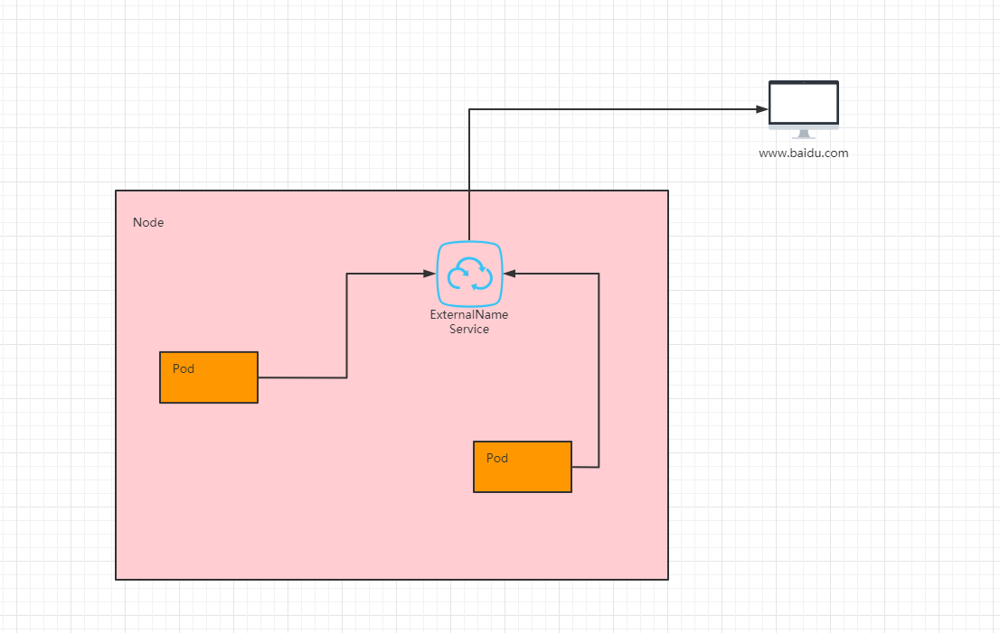

# Kubernetes篇

- [Kubernetes设计与架构 中文翻译](https://blog.csdn.net/Arkay_Zheng/article/details/113806024)
- [K8s学习笔记](https://www.cnblogs.com/JuneQS/p/16584350.html)
- [K8s深入学习系列](https://www.cnblogs.com/chiangchou/p/k8s-1.html#_label0_0)

## 概念篇

### Kubernetes概述

#### 什么是Kubernetes

kubernetes，简称 K8s，是用 8 代替 8 个字符“ubernete”而成的缩写。

kubernetes是一个开源的，用于管理云平台中多个主机上的容器化的应用，目标是让**部署容器化的应用简单并且高效**。

**Kubernetes 是 Google 开源的一个容器编排引擎，它支持自动化部署、大规模可伸缩、应用容器化管理。**在生产环境中部署一个应用程序时，通常要部署该应用的多个实例以便对应用请求进行负载均衡。在 Kubernetes 中，我们可以创建多个容器，每个容器里面运行一个应用实例，然后通过内置的负载均衡策略，实现对这一组应用实例的管理、发现、访问，而这些细节都不需要运维人员去进行复杂的手工配置和处理。 

**Kubernetes 不是传统的、包罗万象的 PaaS（平台即服务）系统**。 由于 Kubernetes 是在容器级别运行，而非在硬件级别，它提供了 PaaS 产品共有的一些普遍适用的功能， 例如部署、扩展、负载均衡，允许用户集成他们的日志记录、监控和警报方案。 但是，Kubernetes 不是单体式（monolithic）系统，那些默认解决方案都是可选、可插拔的。 Kubernetes 为构建开发人员平台提供了基础，但是在重要的地方保留了用户选择权，能有更高的灵活性。

#### Kubernetes 发展史


##### 传统部署时代

**在物理服务器上运行应用程序。 由于无法限制在物理服务器中运行的应用程序资源使用，因此会导致资源分配问题。** 

例如，如果在同一台物理服务器上运行多个应用程序， 则可能会出现一个应用程序占用大部分资源的情况，而导致其他应用程序的性能下降。 

一种解决方案是将每个应用程序都运行在不同的物理服务器上， 但是当某个应用程式资源利用率不高时，剩余资源无法被分配给其他应用程式， 而且维护许多物理服务器的成本很高。

##### 虚拟化部署时代

因此，引入了虚拟化技术。虚拟化技术允许在单个物理服务器的 CPU 上运行多台虚拟机（VM）。 虚拟化能使应用程序在不同 VM 之间被彼此隔离，且能提供一定程度的安全性， 因为一个应用程序的信息不能被另一应用程序随意访问。

虚拟化技术能够更好地利用物理服务器的资源，并且因为可轻松地添加或更新应用程序， 而因此可以具有更高的可扩缩性，以及降低硬件成本等等的好处。 通过虚拟化，可以将一组物理资源呈现为可丢弃的虚拟机集群。

每个 VM 是一台完整的计算机，在虚拟化硬件之上运行所有组件，包括其自己的操作系统。

但是明显的缺点是，虚拟层冗余，导致资源浪费和性能下降。

##### 容器部署时代

容器类似于 VM，但是更宽松的隔离特性，使容器之间可以共享操作系统（OS）。 因此，容器比起 VM 被认为是更轻量级的。且与 VM 类似，每个容器都具有自己的文件系统、CPU、内存、进程空间等。 由于它们与基础架构分离，因此可以跨云和 OS 发行版本进行移植。

容器的优势：

- ① 敏捷性：敏捷应用程序的创建和部署；和使用 VM 镜像相比，提高了容器镜像创建的简便性和效率。

- ② 及时性：持续开发、集成和部署；通过快速简单的回滚（由于镜像的不可变性），支持可靠且频繁的容器镜像的构建和部署。

- ③ 解耦性：关注开发和运维的分离；在构建、发布时创建应用程序的容器镜像，而不是在部署的时候，从而将应用程序和基础架构分离。

- ④ 可观测性：不仅可以显示操作系统级别的信息和指标，还可以显示应用程序的运行状况和其它指标信号。

- ⑤ 跨平台：跨开发、测试和生产的环境一致性；在便捷式的计算机上和在云上相同的运行。

- ⑥ 可移植：跨云和 Linux 发行版本的可移植性；可以在 Ubuntu、CentOS、RedHat、本地、Google Kubernetes Engine 和其他任何地方运行。

- ⑦ 简易性：以应用程序为中心的管理；提高抽象级别，从在虚拟硬件上运行 OS 到使用逻辑资源在 OS 上运行应用程序。

- ⑧ 大分布式：松散耦合、分布式、弹性、解放的微服务；应用程序被分解成较小的独立部分，并且可以动态的部署和管理 --- 而不是在一台大型单机上整体运行（垂直扩展是有上限的）。

- ⑨ 隔离性：资源隔离；可预测应用程序性能。

- ⑩ 高效性：资源利用；高效率和高密度。

#### 为什么使用 Kubernetes

容器是打包和运行应用程序的最佳方式，在生产环境中，需要管理运行应用程序的容器，并且确保这些容器不会停机。如果一个容器发生了故障，则需要手动启动另一个容器，太麻烦了；如果有一个系统能够帮助处理这些行为，是不是会很方便？

Kubernetes 就能解决上面提出的一系列的问题。Kubernetes 提供了一个**可弹性运行分布式系统的框架**。 Kubernetes 会满足提出的扩展要求、故障转移的应用、提供部署模式等。 例如，Kubernetes 可以轻松管理系统的 Canary (金丝雀) 部署。

#### Kubernetes 功能

- **服务发现和负载均衡**：Kubernetes 可以使用 DNS 名称或自己的 IP 地址来暴露容器。 如果进入容器的流量很大， Kubernetes 可以负载均衡并分配网络流量，从而使部署稳定。

- **存储编排**：Kubernetes 允许你自动挂载你选择的存储系统，例如本地存储、公共云提供商等。

- **自动部署和回滚**：你可以使用 Kubernetes 描述已部署容器的所需状态， 它可以以受控的速率将实际状态更改为期望状态。 例如，你可以自动化 Kubernetes 来为你的部署创建新容器， 删除现有容器并将它们的所有资源用于新容器。

- **自动完成装箱计算**：你为 Kubernetes 提供许多节点组成的集群，在这个集群上运行容器化的任务。 你告诉 Kubernetes 每个容器需要多少 CPU 和内存 (RAM)。 Kubernetes 可以将这些容器按实际情况调度到你的节点上，以最佳方式利用你的资源。

- **自我修复**：Kubernetes 将重新启动失败的容器、替换容器、杀死不响应用户定义的运行状况检查的容器， 并且在准备好服务之前不将其通告给客户端。

- **密钥与配置管理**：Kubernetes 允许你存储和管理敏感信息，例如密码、OAuth 令牌和 ssh 密钥。 你可以在不重建容器镜像的情况下部署和更新密钥和应用程序配置，也无需在堆栈配置中暴露密钥。

#### Kubernetes 概念

##### Pod

Pod 是 K8S 中最重要也是最基本的概念，Pod 是最小的部署单元，是一组容器的集合。每个 Pod 都由一个特殊的根容器 Pause 容器，以及一个或多个紧密相关的用户业务容器组成。

Pause 容器作为 Pod 的根容器，以它的状态代表整个容器组的状态。K8S 为每个 Pod 都分配了唯一的 IP 地址，称之为 Pod IP。Pod 里的多个业务容器共享 Pause 容器的IP，共享 Pause 容器挂载的 Volume。

##### Controller

控制器，通过它来实现对pod的管理，比如启动pod、停止pod、伸缩pod的数量等等。

##### Service

Service 定义了一个服务的访问入口，通过 Label Selector 与 Pod 副本集群之间“无缝对接”，定义了一组 Pod 的访问策略，防止 Pod 失联。

创建 Service 时，K8S会自动为它分配一个全局唯一的虚拟 IP 地址，即 Cluster IP。服务发现就是通过 Service 的 Name 和 Service 的 ClusterIP 地址做一个 DNS 域名映射来解决的。

##### Label

标签，附加到某个资源上，用于关联对象、查询和筛选。一个 Label 是一个 key=value 的键值对，key 与 value 由用户自己指定。Label 可以附加到各种资源上，一个资源对象可以定义任意数量的 Label，同一个 Label 也可以被添加到任意数量的资源上。

我们可以通过给指定的资源对象捆绑一个或多个不同的 Label 来实现多维度的资源分组管理功能，以便于灵活、方便地进行资源分配、调度、配置、部署等工作。

K8S 通过 Label Selector（标签选择器）来查询和筛选拥有某些 Label 的资源对象。Label Selector 有基于等式（ name=label1 ）和基于集合（ name in (label1, label2) ）的两种方式。

##### NameSpace

命名空间，Namespace 多用于实现多租户的资源隔离。Namespace 通过将集群内部的资源对象“分配”到不同的Namespace中，形成逻辑上分组的不同项目、小组或用户组。

K8S 集群在启动后，会创建一个名为 default 的 Namespace，如果不特别指明 Namespace，创建的 Pod、RC、Service 都将被创建到 default 下。

当我们给每个租户创建一个 Namespace 来实现多租户的资源隔离时，还可以结合 K8S 的资源配额管理，限定不同租户能占用的资源，例如 CPU 使用量、内存使用量等。

##### ReplicaSet（RC）

ReplicaSet 用来确保预期的 Pod 副本数量，如果有过多的 Pod 副本在运行，系统就会停掉一些 Pod，否则系统就会再自动创建一些 Pod。

我们很少单独使用 ReplicaSet，它主要被 Deployment 这个更高层的资源对象使用，从而形成一整套 Pod 创建、删除、更新的编排机制。

##### Deployment

Deployment 用于部署无状态应用，Deployment 为 Pod 和 ReplicaSet 提供声明式更新，只需要在Deployment 描述想要的目标状态，Deployment 就会将 Pod 和 ReplicaSet 的实际状态改变到目标状态。

##### Horizontal Pod Autoscaler（HPA）

HPA 为 Pod 横向自动扩容，也是 K8S 的一种资源对象。HPA 通过追踪分析 RC 的所有目标 Pod 的负载变化情况，来确定是否需要针对性调整目标 Pod 的副本数量。

### Kubernetes 集群架构与组件

#### 工作原理

Kubernetes 集群架构以及相关的核心组件如下图所示：一个 Kubernetes 集群一般包含一个 Master 节点和多个 Node 节点，一个节点可以看成是一台物理机或虚拟机。


一个kubernetes集群主要是由**控制节点(master)**、**工作节点(node)**构成，每个节点上都会安装不同的组件。

> kubernetes中的工作机器称为 节点， 会运行容器化应用程序。每个集群至少有一个工作节点。工作节点会托管 Pod ，而 Pod 就是作为应用负载的组件。 控制平面管理集群中的工作节点和 Pod。 在生产环境中，控制平面通常跨多台计算机运行， 一个集群通常运行多个节点，提供容错性和高可用性。

**master：集群的控制平面，负责集群的决策 ( 管理 )**

- **ApiServer** : 资源操作的唯一入口，接收用户输入的命令，提供认证、授权、API注册和发现等机制
- **Scheduler** : 负责集群资源调度，按照预定的调度策略将Pod调度到相应的node节点上
- **ControllerManager** : 负责维护集群的状态，比如程序部署安排、故障检测、自动扩展、滚动更新等
- **Etcd** ：负责存储集群中各种资源对象的信息，键值数据库，类似于 Redis。

**node：集群的数据平面，负责为容器提供运行环境 ( 干活，worker工作节点 )**

- **Kubelet** : 负责维护容器的生命周期，即通过控制docker，来创建、更新、销毁容器。每一个 Node 节点上必须安装的组件，负责交互 master 的 api-server 以及当前机器的应用启停等。
- **KubeProxy** : 负责提供集群内部的服务发现和负载均衡
- **Docker** : 负责节点上容器的各种操作

**Pod：Pod 是 K8S 中最重要也是最基本的概念，Pod 是最小的部署单元，是一组容器的集合。每个 Pod 都由一个特殊的根容器 Pause 容器，以及一个或多个紧密相关的用户业务容器组成。**

- docker run 启动的是一个 container（容器），容器是 Docker 的基本单位，一个应用就是一个容器。
- kubectl run 启动的是一个应用称为一个 Pod ，Pod 是 Kubernetes 的基本单位。
  - Pod 是对容器的再一次封装。
  - Pod 类似于 Java 日志体系中的 Slf4j ，而 Docker 中的容器类似于 Java 日志体系中的 Logback 等日志实现。 
  - 一个容器往往代表不了一个基本应用，如：博客系统（WordPress，PHP + MySQL）；但是一个 Pod 可以包含多个 Container，一个 Pod 可以代表一个基本的应用。

#### 组件交互原理


通过Kubernetes 部署是一个 Tomcat 应用，了解组件交互原理。

- 0：开机默认所有节点的 kubelet 、master 节点的scheduler（调度器）、controller-manager（控制管理器）一直**监听** master 的 api-server 发来的事件变化。
- 1：程序员使用命令行工具： kubectl ； **kubectl create** deploy tomcat --image=tomcat8（告诉 master 让集群使用 tomcat8 镜像，部署一个 tomcat 应用）。
- 2：kubectl 命令行内容发给 api-server，api-server 保存此次创建信息到 etcd 。 
- 3：etcd 给 api-server 上报事件，说刚才有人给我里面保存一个信息。（部署Tomcat[deploy]）
- 4：controller-manager 监听到 api-server 的事件，是 （部署Tomcat[deploy]）。 
- 5：controller-manager 处理这个 （部署Tomcat[deploy]）的事件。controller-manager 会**生成 Pod 的部署信息**【pod信息】。
- 6：controller-manager 把 Pod 的信息交给 api-server ，再保存到 etcd 。
- 7：etcd 上报事件【pod信息】给 api-server 。 
- 8：scheduler 专门监听 【pod信息】 ，拿到 【pod信息】的内容，计算，看哪个节点合适部署这个 Pod【pod 调度过后的信息（node: node-02）】。 
- 9：scheduler 把 【pod 调度过后的信息（node: node-02）】交给 api-server 保存给 etcd 。 
- 10：etcd 上报事件【pod调度过后的信息（node: node-02）】，给 api-server 。 
- 11：其他节点的 kubelet 专门监听 【pod 调度过后的信息（node: node-02）】 事件，集群所有节点 kubelet 从 api-server 就拿到了 【pod调度过后的信息（node: node-02）】 事件。 
- 12：每个节点的 kubelet 判断是否属于自己的事情；node-02 的 kubelet 发现是它的事情。 
- 13：node-02 的 kubelet 启动这个 pod。汇报给 master 当前启动好的所有信息。 

## 基础篇

### 环境部署

#### 安装方式

- Kubernetes 有多种部署方式，目前主流的方式有 [kubeadm](#基于kubeadm安装k8s) 、minikube 、二进制包。

- ① minikube：一个用于快速搭建单节点的 Kubernetes 工具。

- ② kubeadm：一个用于快速搭建Kubernetes 集群的工具（可以用于生产环境）。

- ③ 二进制包：从官网上下载每个组件的二进制包，依次去安装（建议生产环境使用）。

#### 平台规划

##### 生产环境 K8S 平台规划

K8S 环境有两种架构方式，单 Master 集群和多 Master 集群，将先搭建起单 Master 集群，再扩展为多 Master 集群。开发、测试环境可以部署单 Master 集群，生产环境为了保证高可用需部署多 Master 集群。

###### ① 单 Master 集群架构

单 Master 集群架构相比于多 Master 集群架构无法保证集群的高可用，因为 master 节点一旦宕机就无法进行集群的管理工作了。单 master 集群主要包含一台 Master 节点，及多个 Node 工作节点、多个 Etcd 数据库节点。

Etcd 是 K8S 集群的数据库，可以安装在任何地方，也可以与 Master 节点在同一台机器上，只要 K8S 能连通 Etcd。


###### ② 多 Master 集群架构

多 Master 集群能保证集群的高可用，相比单 Master 架构，需要一个额外的负载均衡器来负载多个 Master 节点，Node 节点从连接 Master 改成连接 LB 负载均衡器。


###### ③ 集群规划

为了测试，我在本地使用 VMware 创建了几个虚拟机（可通过克隆快速创建虚拟机），一个虚拟机代表一台独立的服务器。

K8S 集群规划如下：生产环境建议至少两台 Master 节点，LB 主备各一个节点；至少两台以上 Node 节点，根据实际运行的容器数量调整；Etcd 数据库可直接部署在 Master 和 Node 的节点，机器比较充足的话，可以部署在单独的节点上。

| 角色                  | IP            | 主机名    | 组件                                                         |
| --------------------- | ------------- | --------- | ------------------------------------------------------------ |
| k8s-master-1          | 10.39.177.34  | master-1  | kube-apiserver<br/>kube-cpntroller-manager<br/>kube-scheduler<br/>ectd |
| k8s-master-2          | 10.39.177.67  | master-2  | kube-apiserver<br/>kube-cpntroller-manager<br/>kube-scheduler<br/> |
| k8s-node-1            | 10.39.177.50  | node-1    | kubelet<br/>kube-proxy<br/>docker<br/>ectd                   |
| k8s-node-2            | 10.39.177.189 | node-2    | kubelet<br/>kube-proxy<br/>docker<br/>ectd                   |
| Load Balancer(Master) | 10.39.177.46  | lb-master | Nginx                                                        |
| Load Balancer(Backup) | 10.39.177.67  | lb-backup | Nginx                                                        |

###### ④ 服务器硬件配置推荐

测试环境与生产环境服务器配置推荐如下，本地虚拟机的配置将按照本地测试环境的配置来创建虚拟机。


##### 操作系统初始化

接下来将基于二进制包的方式，手动部署每个组件，来组成 K8S 高可用集群。通过手动部署每个组件，一步步熟悉每个组件的配置、组件之间的通信等，深层次的理解和掌握 K8S。

首先做的是每台服务器的配置初始化，依次按如下步骤初始化。

###### 关闭防火墙

```bash
systemctl stop firewalld
systemctl disable firewalld
```

###### 关闭selinux

```bash
setenforce 0 # 临时生效

sed -i 's/enforcing/disabled/' /etc/selinux/config # 永久生效
```

###### 关闭swap

```shell
swapoff -a # 关闭

# 永久生效
vim /etc/fstab
# 将 [UUID=xxx] 这一行注释掉
```

###### 添加 hosts

```bash
vim /etc/hosts
```

添加内容如下：

```txt
10.39.177.34 	master-1 
10.39.177.67 	master-2 
10.39.177.50 	node-1 
10.39.177.189 	node-2 
10.39.177.46 	lb-master
10.39.177.67 	lb-backup
```

###### 同步系统时间

各个节点之间需保持时间一致，因为自签证书是根据时间校验证书有效性，如果时间不一致，将校验不通过。

- 联网情况可使用如下命令

```bash
ntpdate -u cn.pool.ntp.org

ntpdate -u time1.aliyun.com
```

- 如果不能联外网可使用 date 命令设置时间

#### 部署Etcd集群

##### 自签证书

K8S 集群安装配置过程中，会使用各种证书，目的是为了加强集群安全性。K8S 提供了基于 CA 签名的双向数字证书认证方式和简单的基于 http base 或 token 的认证方式，其中 CA 证书方式的安全性最高。每个K8S集群都有一个集群根证书颁发机构（CA），集群中的组件通常使用CA来验证API server的证书，由API服务器验证kubelet客户端证书等。

证书生成操作可以在master节点上执行，证书只需要创建一次，以后在向集群中添加新节点时只要将证书拷贝到新节点上，并做一定的配置即可。下面就在 **master-1** 节点上来创建证书，详细的介绍也可以参考官方文档：[分发自签名-CA-证书](https://kubernetes.io/zh/docs/concepts/cluster-administration/certificates/#分发自签名-ca-证书)

###### ① K8S 证书

如下是 K8S 各个组件需要使用的证书


###### ② 准备 cfssl 工具

使用 cfssl 工具来生成证书，首先下载 cfssl 工具。依次执行如下命令：

```bash
curl -L https://pkg.cfssl.org/R1.2/cfssl_linux-amd64 -O   /usr/local/bin/cfssl -k

curl -L https://pkg.cfssl.org/R1.2/cfssljson_linux-amd64 -O  /usr/local/bin/cfssljson -k

curl -L https://pkg.cfssl.org/R1.2/cfssl-certinfo_linux-amd64  -O  /usr/local/bin/cfssl-certinfo  -k

chmod +x  /usr/local/bin/cfssl*                  #给这几个工具执行权限
```

注意，如果证书认证缺失，所以可以考虑请求里面关闭ssl证书认证，命令行中加上-k即可。

> 注意，如果下载不成功，就多打开几个窗口

##### 自签 Etcd SSL 证书

首先为 **etcd** 签发一套SSL证书，通过如下命令创建几个目录，/k8s/etcd/ssl 用于存放 etcd 自签证书，/k8s/etcd/cfg 用于存放 etcd 配置文件，/k8s/etcd/bin 用于存放 etcd 执行程序。

```bash
cd /
mkdir -p /k8s/etcd/{ssl,cfg,bin}
```

进入 etcd 目录：

```bash
cd /k8s/etcd/ssl
```

###### ① 创建 CA 配置文件：ca-config.json

执行如下命令创建 ca-config.json

```bash
cat > ca-config.json <<EOF
{
  "signing": {
    "default": {
      "expiry": "87600h"
    },
    "profiles": {
      "etcd": {
        "usages": [
            "signing",
            "key encipherment",
            "server auth",
            "client auth"
        ],
        "expiry": "87600h"
      }
    }
  }
}
EOF
```

**说明：**

- signing：表示该证书可用于签名其它证书；生成的 ca.pem 证书中 CA=TRUE；
- profiles：可以定义多个 profiles，分别指定不同的过期时间、使用场景等参数；后续在签名证书时使用某个 profile；
- expiry：证书过期时间
- server auth：表示client可以用该 CA 对server提供的证书进行验证；
- client auth：表示server可以用该CA对client提供的证书进行验证；

###### ② 创建 CA 证书签名请求文件：ca-csr.json

执行如下命令创建 ca-csr.json：

```bash
cat > ca-csr.json <<EOF
{
  "CN": "etcd",
  "key": {
    "algo": "rsa",
    "size": 2048
  },
  "names": [
    {
      "C": "CN",
      "ST": "Shanghai",
      "L": "Shanghai",
      "O": "etcd",
      "OU": "System"
    }
  ],
    "ca": {
       "expiry": "87600h"
    }
}
EOF
```

**说明：**

- CN：Common Name，kube-apiserver 从证书中提取该字段作为请求的用户名 (User Name)；浏览器使用该字段验证网站是否合法；
- key：加密算法
- C：国家
- ST：地区
- L：城市
- O：组织，kube-apiserver 从证书中提取该字段作为请求用户所属的组 (Group)；
- OU：组织单位

###### ③ 生成 CA 证书和私钥

```shell
cfssl gencert -initca ca-csr.json | cfssljson -bare ca
```


**说明：**

- **ca-key.pem**：CA 私钥
- **ca.pem**：CA 数字证书

###### ④ 创建证书签名请求文件：etcd-csr.json

执行如下命令创建 etcd-csr.json：

```bash
cat > etcd-csr.json <<EOF
{
    "CN": "etcd",
    "hosts": [
      "10.39.177.34",
      "10.39.177.50",
      "10.39.177.189"
    ],
    "key": {
        "algo": "rsa",
        "size": 2048
    },
    "names": [
        {
            "C": "CN",
            "ST": "BeiJing",
            "L": "BeiJing",
            "O": "etcd",
            "OU": "System"
        }
    ]
}
EOF
```

**说明：**

- **hosts**：需要指定授权使用该证书的 IP 或域名列表，这里配置所有 etcd 的IP地址。
- **key**：加密算法及长度

###### ⑤ 为 etcd 生成证书和私钥

```bash
cfssl gencert -ca=ca.pem -ca-key=ca-key.pem -config=ca-config.json -profile=etcd etcd-csr.json | cfssljson -bare etcd
```


**说明：**

- -ca：指定 CA 数字证书
- -ca-key：指定 CA 私钥
- -config：CA 配置文件
- -profile：指定环境
- -bare：指定证书名前缀

证书生成完成，后面部署 Etcd 时主要会用到如下几个证书：


##### Etcd 数据库集群部署

etcd 集群采用主从架构模式（一主多从）部署，集群通过选举产生 leader，因此需要部署奇数个节点（3/5/7）才能正常工作。etcd使用**raft一致性算法**保证每个节点的一致性。


###### ① 下载etcd

从 github 上下载合适版本的 etcd

```shell
cd /k8s/etcd

wget https://github.com/etcd-io/etcd/releases/download/v3.2.28/etcd-v3.2.28-linux-amd64.tar.gz
```

解压并复制

```bash
tar zxf etcd-v3.2.28-linux-amd64.tar.gz
cp etcd-v3.2.28-linux-amd64/{etcd,etcdctl} /k8s/etcd/bin
rm -rf etcd-v3.2.28-linux-amd64*
```

###### ② 创建 etcd 配置文件：etcd.conf

```bash
cat > /k8s/etcd/cfg/etcd.conf <<EOF 
# [member]
ETCD_NAME=etcd-1
ETCD_DATA_DIR=/k8s/data/default.etcd
ETCD_LISTEN_PEER_URLS=https://10.39.177.34:2380
ETCD_LISTEN_CLIENT_URLS=https://10.39.177.34:2379

# [cluster]
ETCD_INITIAL_ADVERTISE_PEER_URLS=https://10.39.177.34:2380
ETCD_ADVERTISE_CLIENT_URLS=https://10.39.177.34:2379
ETCD_INITIAL_CLUSTER=etcd-1=https://10.39.177.34:2380,etcd-2=https://10.39.177.50:2380,etcd-3=https://10.39.177.189:2380
ETCD_INITIAL_CLUSTER_TOKEN=etcd-cluster
ETCD_INITIAL_CLUSTER_STATE=new

# [security]
ETCD_CERT_FILE=/k8s/etcd/ssl/etcd.pem
ETCD_KEY_FILE=/k8s/etcd/ssl/etcd-key.pem
ETCD_TRUSTED_CA_FILE=/k8s/etcd/ssl/ca.pem
ETCD_PEER_CERT_FILE=/k8s/etcd/ssl/etcd.pem
ETCD_PEER_KEY_FILE=/k8s/etcd/ssl/etcd-key.pem
ETCD_PEER_TRUSTED_CA_FILE=/k8s/etcd/ssl/ca.pem
EOF
```

**说明：**

- ETCD_NAME：etcd在集群中的唯一名称
- ETCD_DATA_DIR：etcd数据存放目录
- ETCD_LISTEN_PEER_URLS：etcd集群间通讯的地址，设置为本机IP
- ETCD_LISTEN_CLIENT_URLS：客户端访问的地址，设置为本机IP
- ETCD_INITIAL_ADVERTISE_PEER_URLS：初始集群通告地址，集群内部通讯地址，设置为本机IP
- ETCD_ADVERTISE_CLIENT_URLS：客户端通告地址，设置为本机IP
- ETCD_INITIAL_CLUSTER：集群节点地址，以 key=value 的形式添加各个 etcd 的地址
- ETCD_INITIAL_CLUSTER_TOKEN：集群令牌，用于集群间做简单的认证
- ETCD_INITIAL_CLUSTER_STATE：集群状态
- ETCD_CERT_FILE：客户端 etcd 数字证书路径
- ETCD_KEY_FILE：客户端 etcd 私钥路径
- ETCD_TRUSTED_CA_FILE：客户端 CA 证书路径
- ETCD_PEER_CERT_FILE：集群间通讯etcd数字证书路径
- ETCD_PEER_KEY_FILE：集群间通讯etcd私钥路径
- ETCD_PEER_TRUSTED_CA_FILE：集群间通讯CA证书路径

###### ③ 创建 etcd 服务：etcd.service

通过EnvironmentFile指定 **etcd.conf** 作为环境配置文件。

```bash
cat > /k8s/etcd/etcd.service <<'EOF'
[Unit]
Description=Etcd Server
After=network.target
After=network-online.target
Wants=network-online.target

[Service]
Type=notify
EnvironmentFile=/k8s/etcd/cfg/etcd.conf
WorkingDirectory=${ETCD_DATA_DIR}

ExecStart=/k8s/etcd/bin/etcd \
  --name=${ETCD_NAME} \
  --data-dir=${ETCD_DATA_DIR} \
  --listen-peer-urls=${ETCD_LISTEN_PEER_URLS} \
  --listen-client-urls=${ETCD_LISTEN_CLIENT_URLS},https://127.0.0.1:2379 \
  --initial-advertise-peer-urls=${ETCD_INITIAL_ADVERTISE_PEER_URLS} \
  --advertise-client-urls=${ETCD_ADVERTISE_CLIENT_URLS} \
  --initial-cluster=${ETCD_INITIAL_CLUSTER} \
  --initial-cluster-token=${ETCD_INITIAL_CLUSTER_TOKEN} \
  --initial-cluster-state=${ETCD_INITIAL_CLUSTER_STATE} \
  --cert-file=${ETCD_CERT_FILE} \
  --key-file=${ETCD_KEY_FILE} \
  --trusted-ca-file=${ETCD_TRUSTED_CA_FILE} \
  --peer-cert-file=${ETCD_PEER_CERT_FILE} \
  --peer-key-file=${ETCD_PEER_KEY_FILE} \
  --peer-trusted-ca-file=${ETCD_PEER_TRUSTED_CA_FILE}

Restart=on-failure
LimitNOFILE=65536

[Install]
WantedBy=multi-user.target
EOF
```

etcd.service 更多的配置以及说明可以通过如下命令查看：

```bash
/k8s/etcd/bin/etcd --help
```

###### ④ 将 etcd 目录拷贝到另外两个节点

```bash
scp -r /k8s root@node-1:/k8s
scp -r /k8s root@node-2:/k8s
```

###### ⑤ 修改两个节点配置文件

修改 node-1 节点的 /k8s/etcd/cfg/etcd.conf

```bash
# [member]
ETCD_NAME=etcd-2
ETCD_LISTEN_PEER_URLS=https://10.39.177.50:2380
ETCD_LISTEN_CLIENT_URLS=https://10.39.177.50:2379

# [cluster]
ETCD_INITIAL_ADVERTISE_PEER_URLS=https://10.39.177.50:2380
ETCD_ADVERTISE_CLIENT_URLS=https://10.39.177.50:2379
```

修改 node-2 节点的 /k8s/etcd/cfg/etcd.conf

```bash
# [member]
ETCD_NAME=etcd-3
ETCD_LISTEN_PEER_URLS=https://10.39.177.189:2380
ETCD_LISTEN_CLIENT_URLS=https://10.39.177.189:2379

# [cluster]
ETCD_INITIAL_ADVERTISE_PEER_URLS=https://10.39.177.189:2380
ETCD_ADVERTISE_CLIENT_URLS=https://10.39.177.189:2379
```

###### ⑥ 启动 etcd 服务

- 首先在三个节点将 **etcd.service** 拷贝到 /usr/lib/systemd/system/ 下

```bash
cp /k8s/etcd/etcd.service /usr/lib/systemd/system/
systemctl daemon-reload
```

- 在三个节点启动 etcd 服务

```bash
systemctl start etcd
```

- 设置开机启动

```bash
systemctl enable etcd
```

- 查看 etcd 的日志

```bash
tail -f /var/log/messages
```


注意：如果日志中出现连接异常信息，请确认所有节点防火墙是否开放2379，2380端口，或者直接关闭防火墙。

- 查看 etcd 集群状态

```bash
/k8s/etcd/bin/etcdctl \
    --ca-file=/k8s/etcd/ssl/ca.pem \
    --cert-file=/k8s/etcd/ssl/etcd.pem \
    --key-file=/k8s/etcd/ssl/etcd-key.pem \
    --endpoints=https://10.39.177.34:2379,https://10.39.177.50:2379,https://10.39.177.189:2379 \
    cluster-health
```


### 基础入门（一）

#### 资源管理方式

##### 概述

- 命令式对象管理：直接通过命令去操作 Kubernetes 的资源。

```bash
kubectl run nginx-pod --image=nginx:1.17.1 --port=80
```

- 命令式对象配置：通过命令配置和配置文件去操作 Kubernetes 的资源。

```bash
kubectl create/patch/delete -f nginx-pod.yaml
```

- 声明式对象配置：通过 apply 命令和配置文件去操作 Kubernetes 的资源。

```bash
kubectl apply -f nginx-pod.yaml
```

| 类型           | 操作 | 适用场景 | 优点           |
| -------------- | ---- | -------- | -------------- |
| 命令式对象管理 | 对象 | 测试     | 简单           |
| 命令式对象配置 | 文件 | 开发     | 可以审计、跟踪 |
| 声明式对象配置 | 目录 | 开发     | 支持目录操作   |

- 创建和更新资源使用声明式对象配置：kubectl apply -f xxx.yaml。

- 删除资源使用命令式对象配置：kubectl delete -f xxx.yaml。

- 查询资源使用命令式对象管理：kubectl get(describe) 资源名称。

##### 命令式对象管理

###### kubectl 命令

 kubectl 是 Kubernetes 集群的命令行工具，通过它能够对集群本身进行管理，并能够在集群上进行容器化应用的安装和部署。

 [kubectl](https://kubernetes.io/docs/reference/kubectl/) 命令的语法如下： 

```bash
kubectl [command] [type] [name] [flags]
```

- 参数
  - command：指定要对资源执行的操作，如：create、get 、delete 等。
  - type：指定资源的类型，如：deployment 、pod 、service 等。
  - name：指定资源的名称，名称大小写敏感。
  - flags：指定额外的可选参数。


- 示例：查看所有的 Pod

```bash
kubectl get pod
```

- 示例：以 yaml 格式查看某个 Pod

```bash
kubectl get pod xxx -o yaml
```

###### 操作（command）

Kubernetes 允许对资源进行多种操作，可以通过 --help 查看详细的操作命令

```bash
kubectl --help
```

经常使用的操作如下所示：

1. 基本命令

| 命令    | 翻译 | 命令作用     |
| ------- | ---- | ------------ |
| create  | 创建 | 创建一个资源 |
| edit    | 编辑 | 编辑一个资源 |
| get     | 获取 | 获取一个资源 |
| patch   | 更新 | 更新一个资源 |
| delete  | 删除 | 删除一个资源 |
| explain | 解释 | 展示资源文档 |

2. 运行和调试

| 命令      | 翻译     | 命令作用                   |
| --------- | -------- | -------------------------- |
| run       | 运行     | 在集群中运行一个指定的镜像 |
| expose    | 暴露     | 暴露资源为 Service         |
| describe  | 描述     | 显示资源内部信息           |
| logs      | 日志     | 输出容器在 Pod 中的日志    |
| attach    | 缠绕     | 进入运行中的容器           |
| exec      | 执行     | 执行容器中的一个命令       |
| cp        | 复制     | 在 Pod 内外复制文件        |
| rollout   | 首次展示 | 管理资源的发布             |
| scale     | 规模     | 扩（缩）容 Pod 的数量      |
| autoscale | 自动调整 | 自动调整 Pod 的数量        |

3. 高级命令

| 命令  | 翻译 | 命令作用               |
| ----- | ---- | ---------------------- |
| apply | 应用 | 通过文件对资源进行配置 |
| label | 标签 | 更新资源上的标签       |

4. 其他命令

| 命令         | 翻译     | 命令作用                         |
| ------------ | -------- | -------------------------------- |
| cluster-info | 集群信息 | 显示集群信息                     |
| version      | 版本     | 显示当前 Client 和 Server 的版本 |

###### 资源类型（type）

Kubernetes 中所有的内容都抽象为资源，可以通过下面的命令进行查看

```bash
kubectl api-resources
```

经常使用的资源如下所示：

1. 集群级别资源

| 资源名称   | 缩写 | 资源作用     |
| ---------- | ---- | ------------ |
| nodes      | no   | 集群组成部分 |
| namespaces | ns   | 隔离 Pod     |

2. Pod资源

| 资源名称 | 缩写 | 资源作用 |
| -------- | ---- | -------- |
| Pods     | po   | 装载容器 |

3. Pod资源

| 资源名称                 | 缩写   | 资源作用      |
| ------------------------ | ------ | ------------- |
| replicationcontrollers   | rc     | 控制 Pod 资源 |
| replicasets              | rs     | 控制 Pod 资源 |
| deployments              | deploy | 控制 Pod 资源 |
| daemonsets               | ds     | 控制 Pod 资源 |
| jobs                     |        | 控制 Pod 资源 |
| cronjobs                 | cj     | 控制 Pod 资源 |
| horizontalpodautoscalers | hpa    | 控制 Pod 资源 |
| statefulsets             | sts    | 控制 Pod 资源 |

4. 服务发现资源

| 资源名称 | 缩写 | 资源作用          |
| -------- | ---- | ----------------- |
| services | svc  | 统一 Pod 对外接口 |
| ingress  | ing  | 统一 Pod 对外接口 |

5. 存储资源

| 资源名称               | 缩写 | 资源作用 |
| ---------------------- | ---- | -------- |
| volumeattachments      |      | 存储     |
| persistentvolumes      | pv   | 存储     |
| persistentvolumeclaims | pvc  | 存储     |

6. 配置资源

| 资源名称   | 缩写 | 资源作用 |
| ---------- | ---- | -------- |
| configmaps | cm   | 配置     |
| secrets    |      | 配置     |

- 示例：查询命名空间

```bash
kubectl get ns
```

- 示例：创建命名空间

```bash
kubectl create ns dev
```

- 示例：删除命名空间

```bash
kubectl delete ns dev
```

##### 命令式对象配置

- 命令式对象配置就是通过命令配置和配置文件去操作 Kubernetes 的资源。 
- 命令式对象配置的方式操作资源，可以简单的认为：命令 + yaml 配置文件（里面是命令需要的各种参数）。 

通过如下示例，进行展示：

1. 创建一个 nginxpod.yaml 文件，内容如下

```yaml
apiVersion: v1
kind: Namespace
metadata:
  name: dev
---
apiVersion: v1
kind: Pod
metadata:
  name: nginxpod
  namespace: dev
spec:
  containers:
    - name: nginx-containers
      image: nginx:1.17.1
```

2. 执行 create 命令，创建资源

```bash
kubectl create -f nginxpod.yaml
```

3. 执行 get 命令，查看资源

```bash
kubectl get -f nginxpod.yaml
```

4. 执行 delete 命令，删除资源

```bash
kubectl delete -f nginxpod.yaml
```

##### 声明式对象配置

- 声明式对象配置：通过 apply 命令和配置文件去操作 Kubernetes 的资源。 

-  声明式对象配置和命令式对象配置类似，只不过它只有一个 apply 命令。 

-  apply 命令相当于 create 命令和 patch 命令。 

通过如下示例，进行展示：

1. 创建一个 nginx-pod.yaml 文件，内容如下

```yaml
apiVersion: v1
kind: Namespace
metadata:
  name: dev
---
apiVersion: v1
kind: Pod
metadata:
  name: nginx-pod
  namespace: dev
spec:
  containers:
    - name: nginx-containers
      image: nginx:1.17.1
```

2. 执行 apply 命令

```bash
kubectl apply -f nginx-pod.yaml
```

##### 故障排除

###### 显示资源列表

- 语法命令

```bash
kubectl get 资源类型
```

- 示例：获取类型为 Deployment 的资源列表

```bash
kubectl get deployment
```

- 示例：获取类型为 Pod 的资源列表

```bash
kubectl get pod
```

- 示例：获取类型为 Node 的资源列表

```bash
kubectl get node
```

- 示例：显示所有名称空间下的 Deployment

```bash
kubectl get deployment -A
```

或者

```bash
kubectl get deployment --all-namespaces
```

- 示例：查看 kube-system 名称空间下的 Deployment

```bash
kubectl get deployment -n kube-system
```

- 示例：查看在名称空间下的资源对象

```bash
kubectl api-resources --namespaced=true
```

- 示例：查询不在名称空间下的资源对象（理解：就是受 Kubernetes 集群统一调度，而不受到具体名称空间的约束）

```bash
kubectl api-resources --namespaced=false
```

###### 显示有关资源的详细信息

- 语法命令

```bash
kubectl describe 资源类型 资源名称
```

- 示例：查询名称为 nginx-pod 的 Pod 的信息

```bash
kubectl describe pod nginx-pod
```

- 示例：显示名称为 nginx 的 Deployment 的信息

```bash
kubectl describe deployment nginx
```

###### 查询 Pod 中的容器的打印日志

- 命令：类似于 Docker 的 `docker logs -f xxx`

```bash
kubectl logs -f Pod名称
```

- 示例：查询名称为 nginx-pod 的 Pod 日志

```bash
kubectl logs -f nginx-pod
```

###### 在 Pod 中的容器环境内执行命令

- 命令：类似于 Docker 的 `docker exec -it xxx /bin/bash`

```bash
kubectl exec -it xxx -- /bin/bash
```

- 示例：在名称为 nginx-pod 的容器中执行命令

```bash
kubectl exec -it nginx-pod -- /bin/bash
```

#### 部署（Deployment）一个应用


在 Kubernetes 中，通过创建 Deployment ，可以创建应用程序（如同 Docker 的 image）的实例（如同 Docker 的容器），这个实例被包含在 Pod 的概念中，Pod 是 Kubernetes 中的最小管理单元。 

在 Kubernetes 集群中创建 Deployment 之后，Deployment 将指示 Kubernetes 集群如何创建和更新应用程序的实例，Master 节点将应用程序实例调度到集群中的具体的节点上。 

创建应用程序实例之后，Kubernetes 的 Deployment Controller 将会持续监控这些实例。如果运行这些实例的 Node 节点关机或者被删除，则 Kubernetes 的 Deployment Controller 将在集群中的资源最优的另一个 Node 节点上重新创建一个新的实例，这就提供了一种**自我修复机制** 来解决机器故障或维护问题。 

在容器编排之前的时代，各种安装脚本通常用于启动应用程序，但是却不能使得应用程序从机器故障中恢复。通过创建应用程序实例并确保它们在集群节点中的运行实例个数，Kubernetes 的 Deployment 提供了一种完全不同的方式来管理应用程序。 

- 语法命令

```bash
kubectl create deployment 部署的名称 --image=镜像名称 --replicas=部署的副本数量 --port=容器暴露的端口
```

- 示例

```bash
kubectl create deployment my-nginx --image=nginx --replicas=3 --port=80
```

- 原理


#### 应用程序探索

##### 概述

创建 Deployment 之后，Kubernetes 会创建一个 Pod（容器组）来放置应用程序实例（container 容器）。


##### Pod

Pod（容器组）是一个 Kubernetes 中的一个抽象概念，用于存放一组 Container（可以包含一个或多个 Container 容器，如：上图中的小正方体）以及这些 Container（容器）的一些共享资源。这些资源包括： 

- 共享存储，称为卷（Volume），如：上图中的紫色圆柱体。

- 网络，每个 Pod（容器组）在集群中有一个唯一的 IP，Pod（容器组）中的 Container（容器）共享该 IP 地址。

- Container（容器）的基本新，如：容器的镜像版本、对外暴露的端口等。

Pod（容器组）是 Kubernetes 集群上的最基本的单元。当我们在 Kubernetes 集群上创建 Deployment 的时候，会在 Kubernetes  集群上创建包含容器的 Pod （而不是直接创建容器）。每个 Pod 都和运行它的 Node 节点绑定，并保持在哪里直到终止或被删除。如果 Node 节点发生了故障，则会在集群中的其他可用的 Node 节点上运行相同的 Pod（从同样的镜像创建 Container，使用同样的配置，IP 地址不同，Pod 名称不同）。

- Pod 是一组容器（可包含一个或多个应用程序容器），以及共享存储（卷 Volumes）、IP 地址和有关如何运行容器的信息。

- 如果多个容器紧密耦合并且需要共享磁盘等资源，则他们应该被部署在同一个Pod（容器组）中。

##### Node


Pod（容器组）总是在 Node（节点）上运行。Node（节点）是 Kubernetes 集群中的计算机，可以是虚拟机或物理机。每个 Node（节点）都由 Master 管理。一个 Node（节点）可以有多个Pod（容器组），kubernetes 的 Master 会根据每个 Node（节点）上可用资源的情况，自动调度 Pod（容器组）到最佳的 Node（节点）上。 

每个 Kubernetes 的 Node（节点）至少运行： 

- Kubelet，负责 Master节点和 Node 节点之间通信的进程；管理 Pod（容器组）和 Pod（容器组）内运行的 Container（容器）。
- kube-proxy，负责进行流量转发。
- 容器运行环境（如：Docker）负责下载镜像、创建和运行容器等。

#### 应用程序外部可见（Service）

##### 概述

Kubernetes 中的 Pod 是转瞬即逝，Pod 有自己的 [生命周期](https://kubernetes.io/zh/docs/concepts/workloads/pods/pod-lifecycle/) ，当一个工作的 Node 挂掉后，在 Node 上运行的 Pod 也会随之消亡。Deployment（Deployment 其实是驱动 ReplicaSet） 会自动的创建新的 Pod 驱动集群回到目标状态，以保证应用程序正常运行。

Kubernetes 的 Service 是一个抽象层，它定义了一组 Pod 的逻辑集，并为这些 Pod 支持外部流量暴露、负载均衡和服务发现。

Service 使从属 Pod 之间的松耦合成为可能。 和其他 Kubernetes 对象一样，Service 用 YAML [(更推荐)](https://kubernetes.io/zh/docs/concepts/configuration/overview/#general-configuration-tips) 或者 JSON 来定义。Service 下的一组 Pod 通常由 *LabelSelector* (请参阅下面的说明为什么您可能想要一个 spec 中不包含`selector`的服务)来标记。

尽管每个 Pod 都有一个唯一的 IP 地址，但是如果没有 Service ，这些 IP 不会暴露在群集外部。Service 允许您的应用程序接收流量。Service 也可以用在 ServiceSpec 标记`type`的方式暴露。 

- ClusterIP(默认) ：在集群的内部 IP 上公开 Service 。这种类型使得 Service 只能从集群内访问。

- NodePort：使用 NAT 在集群中每个选定 Node 的相同端口上公开 Service 。使用`<NodeIP>:<NodePort>` 从集群外部访问 Service。是 ClusterIP 的超集。

- LoadBalancer：在当前云中创建一个外部负载均衡器(如果支持的话)，并为 Service 分配一个固定的外部 IP 。是 NodePort 的超集。

- ExternalName：通过返回带有该名称的 CNAME 记录，使用任意名称(由 spec 中的`externalName`指定)公开 Service 。不使用代理。这种类型需要 `kube-dns` 的 v1.7 或更高版本。

##### Service 和 Label


Service 通过一组 Pod 路由通信。Service 是一种抽象，它允许 Pod 死亡并在 Kubernetes 中复制，而不会影响应用程序。在依赖的 Pod (如：应用程序中的前端和后端组件)之间进行发现和路由是由 Kubernetes Service 处理的。

Service 匹配一组 Pod 是使用 [标签(Label)和选择器(Selector)](https://kubernetes.io/zh/docs/concepts/overview/working-with-objects/labels), 它们是允许对 Kubernetes 中的对象进行逻辑操作的一种分组原语。标签( Label )是附加在对象上的键/值对，可以以多种方式使用：

- 指定用于开发，测试和生产的对象
- 嵌入版本标签
- 使用 Label 将对象进行分类


- 示例

```bash
# --port：集群内访问 service 的端口 8912
# --target-port： pod容器的端口 80
kubectl expose deployment nginx --port=8912 --target-port=80 --type=NodePort

# 查看端口号，如8912:xxxx/TCP
kubectl get pod,svc
# 通过工作节点IP:xxxx访问
```

#### 伸缩应用程序-扩缩容

当创建了一个 Deployment，然通过 Service 提供访问 Pod 的方式，但是当流量增加的时候，需要对应用程序进行伸缩操作以满足系统性能的需求。


- 语法命令

```bash
kubectl scale --replicas=数量 deployment 部署名称
```

- 示例

```bash
kubectl scale --replicas=3 deployment nginx
```

#### 执行滚动升级

滚动升级允许通过使用新的示例逐步更新 Pod 实例，从而实现 Deployment 更新，0 停机。 

与应用程序扩展类似，如果暴露了 Deployment，服务（Service）将在更新期间仅对可用的 pod 进行负载均衡，可用 Pod 是应用程序可用的实例。 

滚动更新允许以下操作：

- 将应用程序从一个环境提升到另一个环境（通过容器镜像更新）
- 回滚到以前的版本
- 持续集成和持续交付应用程序，无需停机

相应语法命令操作如下：

- 镜像升级

```bash
# 镜像升级 nginx:1.17 到 nginx:latest 
# --record 表示记录变更
kubectl set image deployment 应用部署名称 Pod中容器的名称=容器的镜像 --record
```

- 查看历史记录

```bash
kubectl rollout history deployment 应用部署名称
```

- 默认回滚到上一个版本

```bash
kubectl rollout undo deployment 应用部署名称
```

- 默认回滚到第一个版本

```bash
kubectl rollout undo deployment 应用部署名称 --to-revision=1
```

示例展示：

```bash
watch -n 1 kubectl get deployment,pod
# 创建
kubectl create deployment nginx-deploy --image=nginx:1.17 --replicas=3
# 记录版本迭代
kubectl set image deployment nginx-deploy nginx=nginx:1.18 --record
kubectl set image deployment nginx-deploy nginx=nginx:1.19 --record
kubectl set image deployment nginx-deploy nginx=nginx --record
# 查看历史记录
kubectl rollout history deployment nginx-deploy
# 默认回滚到第一个版本
kubectl rollout undo deployment nginx-deploy --to-revision=1
```

#### 使用声明式对象配置模拟上述效果

##### 部署一个 Deployment

- 编辑yaml文件

```bash
vim deployment.yaml
```

- yaml文件内容

```yaml
apiVersion: apps/v1	#与k8s集群版本有关，使用 kubectl api-versions 即可查看当前集群支持的版本
kind: Deployment	#该配置的类型，我们使用的是 Deployment
metadata:	        #译名为元数据，即 Deployment 的一些基本属性和信息
  name: nginx-deployment	#Deployment 的名称
  labels:	    #标签，可以灵活定位一个或多个资源，其中key和value均可自定义，可以定义多组，目前不需要理解
    app: nginx	#为该Deployment设置key为app，value为nginx的标签
spec:	        #这是关于该Deployment的描述，可以理解为你期待该Deployment在k8s中如何使用
  replicas: 1	#使用该Deployment创建一个应用程序实例
  selector:	    #标签选择器，与上面的标签共同作用，目前不需要理解
    matchLabels: #选择包含标签app:nginx的资源
      app: nginx
  template:	    #这是选择或创建的Pod的模板
    metadata:	#Pod的元数据
      labels:	#Pod的标签，上面的selector即选择包含标签app:nginx的Pod
        app: nginx
    spec:	    #期望Pod实现的功能（即在pod中部署）
      containers:	#生成container，与docker中的container是同一种
      - name: nginx	#container的名称
        image: nginx:1.17	#使用镜像nginx:1.17创建container，该container默认80端口可访问
```

- 创建deploy

```bash
kubectl apply -f deployment.yaml
```

##### 暴露应用

- 编辑yaml文件

```bash
vim service.yaml
```

- yaml文件内容

```yaml
apiVersion: v1
kind: Service
metadata:
  name: nginx-service	#Service 的名称
  labels:     	#Service 自己的标签
    app: nginx	#为该 Service 设置 key 为 app，value 为 nginx 的标签
spec:	    #这是关于该 Service 的定义，描述了 Service 如何选择 Pod，如何被访问
  selector:	    #标签选择器
    app: nginx	#选择包含标签 app:nginx 的 Pod
  ports:
  - name: nginx-port	#端口的名字
    protocol: TCP	    #协议类型 TCP/UDP
    port: 80	        #集群内的其他容器组可通过 80 端口访问 Service
    nodePort: 32600   #通过任意节点的 32600 端口访问 Service
    targetPort: 80	#将请求转发到匹配 Pod 的 80 端口
  type: NodePort	#Serive的类型，ClusterIP/NodePort/LoaderBalancer
```

- 创建service

```bash
kubectl apply -f service.yaml
```

#### 安装 DashBoard

- 下载 yaml 文件（网速不行，请点这里[📎recommended.yaml](https://www.yuque.com/attachments/yuque/0/2022/yaml/513185/1646968933609-9f9b5d11-3896-43e8-a392-230b75227060.yaml)），并安装

```bash
wget https://raw.githubusercontent.com/kubernetes/dashboard/v2.5.1/aio/deploy/recommended.yaml
```

```bash
kubectl apply -f recommended.yaml
```

- 将``type: ClusterIP``改成``NodePort``，便于通过Node端口访问

```bash
kubectl edit svc kubernetes-dashboard -n kubernetes-dashboard
```

- 查看 Dashboard 暴露外网端口

```bash
kubectl get svc -A | grep kubernetes-dashboard
```


- 访问dashboard：https://192.168.183.101:32568/

> 注意，使用https，而不是http


- 创建账户

主要内容是创建admin-user账户，并授予集群管理权限。

```bash
vim dash-admin.yaml
```

```yaml
apiVersion: rbac.authorization.k8s.io/v1
kind: ClusterRoleBinding
metadata:
  name: kubernetes-dashboard
  namespace: kubernetes-dashboard
roleRef:
  apiGroup: rbac.authorization.k8s.io
  kind: ClusterRole
  name: cluster-admin
subjects:
  - kind: ServiceAccount
    name: kubernetes-dashboard
    namespace: kubernetes-dashboard
```

```bash
kubectl apply -f vim dash-admin.yaml
```

- 获取账户token

```bash
kubectl -n kubernetes-dashboard describe secret $(kubectl -n kubernetes-dashboard get secret | grep admin-user | awk '{print $1}')
```


- 将token复制到web界面上进行输入即可，进入网页内部。


### 基础入门（二）

#### Namespace

Namespace是kubernetes系统中的一种非常重要资源，它的主要作用是用来实现**多套环境的资源隔离**或者**多租户的资源隔离**。

##### 默认创建的namespace

| NAME            | STATUS | AGE  |                                                      |
| --------------- | ------ | ---- | ---------------------------------------------------- |
| default         | Active | 45h  | 所有未指定Namespace的对象都会被分配在default命名空间 |
| kube-node-lease | Active | 45h  | 集群节点之间的心跳维护，v1.13开始引入                |
| kube-public     | Active | 45h  | 此命名空间下的资源可以被所有人访问（包括未认证用户） |
| kube-system     | Active | 45h  | 所有由Kubernetes系统创建的资源都处于这个命名空间     |

##### Namespace相关命令

###### 查看所有的ns  

```bash
kubectl get ns
```

###### 查看指定的ns

```bash
kubectl get ns default
```

###### 指定输出格式

kubernetes支持的格式有很多，比较常见的是wide、json、yaml。

```bash
kubectl get ns default -o yaml
```

- -o 格式参数 

###### 查看ns详情

```bash
kubectl describe ns default
```

###### 创建&删除

```bash
kubectl create ns dev
kubectl delete ns dev
```

##### YAML配置

```yaml
# ns-dev.yaml
apiVersion: v1
kind: Namespace
metadata:
  name: dev
```

#### Pod

Pod是kubernetes集群进行管理的最小单元，程序要运行必须部署在容器中，而容器必须存在于Pod中。

Pod可以认为是容器的封装，一个Pod中可以存在一个或者多个容器。

##### Pod相关命令

kubernetes没有提供单独运行Pod的命令，都是通过Pod控制器来实现的。

###### 看指定名称空间

```bash
kubectl get pod -n kube-system
```

###### 创建并运行

这种方式创建了控制器，想要删除还需要删除deployment。

```bash
kubectl run nginx --image=nginx:latest --port=80 --namespace dev 
```

###### 查看Pod基本信息 

```bash
kubectl get pods -n dev
```

###### 查看Pod的详细信息

```bash
kubectl describe pod nginx -n dev 
```

###### 获取pod信息

```bash
kubectl get pod nginx -n dev -o wide 
```

###### 访问POD

```bash
curl http://10.244.166.131
```

###### 删除指定Pod

```bash
kubectl delete pod nginx -n dev
```

###### 查询一下当前namespace下的Pod控制器

```bash
kubectl get deploy -n  dev
```

##### YAML配置

```yaml
apiVersion: v1
kind: Pod
metadata:
  name: nginx
  namespace: dev
spec:
  containers:
  - image: nginx:latest
    name: pod
    ports:
    - name: nginx-port
      containerPort: 80
      protocol: TCP
```

#### Label

##### 两种Label Selector

常用的Label 示例如下：

- 版本标签："version":"release", "version":"stable"......
- 环境标签："environment":"dev"，"environment":"test"，"environment":"pro"
- 架构标签："tier":"frontend"，"tier":"backend"

当前有两种Label Selector：

- **基于等式的Label Selector**

  - `name = slave` 选择所有包含Label中key="name"且value="slave"的对象

  - `env != production`选择所有包括Label中的key="env"且value不等于"production"的对象

- **基于集合的Label Selector**
  - `name in (master, slave)` 选择所有包含Label中的key="name"且value="master"或"slave"的对象
  - `name not in (frontend)` 选择所有包含Label中的key="name"且value不等于"frontend"的对象

标签的选择条件可以使用多个，此时将多个Label Selector进行组合，使用逗号","进行分隔即可。例如：

```kubernetes
name=slave,env!=production
name not in (frontend),env!=production
```

##### Label相关命令

###### 为pod资源打标签

```bash
kubectl label pod nginx version=1.0 -n dev
```

###### 为pod资源更新标签

```bash
kubectl label pod nginx version=2.0 -n dev --overwrite
```

###### 查看标签

```bash
kubectl get pod nginx -n dev --show-labels
```

###### 筛选标签

```bash
kubectl get pod -n dev -l version=2.0  --show-labels
kubectl get pod -n dev -l version!=2.0 --show-labels
```

###### 删除标签

```bash
kubectl label pod nginx version- -n dev
```

##### YAML配置

```bash
apiVersion: v1
kind: Pod
metadata:
  name: nginx
  namespace: dev
  labels:
    version: "3.0" 
    env: "test"
spec:
  containers:
  - image: nginx:latest
    name: pod
    ports:
    - name: nginx-port
      containerPort: 80
      protocol: TCP
```

#### Deployment

在kubernetes中，Pod是最小的控制单元，但是kubernetes很少直接控制Pod**，一般都是通过Pod控制器来完成的**。Pod控制器用于pod的管理，确保pod资源符合预期的状态，当pod的资源出现故障时，会尝试进行重启或重建pod。

Pod控制器其中的一种是 Deployment。

##### Deployment相关命令

###### 创建Deployment

```bash
kubectl create deploy nginx --image=nginx:latest --port=80 --replicas=3 -n dev
```

- ``--image``：指定pod的镜像
- ``--port``：指定端口
- ``--replicas``：指定创建pod数量
- ``--namespace``：指定namespace

###### 查看创建的Pod

```bash
kubectl get pods -n dev
```

###### 查看deployment的信息

```bash
kubectl get deploy -n dev -o wide
```

- UP-TO-DATE：成功升级的副本数量 
- AVAILABLE：可用副本的数量

###### 查看deployment的详细信息

```bash
kubectl describe deploy nginx -n dev
```

###### 删除

```bash
kubectl delete deploy nginx -n dev
```

##### YAML配置

```yaml
# deploy-nginx.yaml
apiVersion: apps/v1
kind: Deployment
metadata:
  name: nginx
  namespace: dev
  
spec:
  replicas: 3
  selector:
    matchLabels:
      run: nginx
      
  template:
    metadata:
      labels:
        run: nginx
    spec:
      containers:
      - image: nginx:latest
        name: nginx
        ports:
        - containerPort: 80
          protocol: TCP
```

#### Service

Service可以看作是一组同类Pod**对外的访问接口**。借助Service，应用可以方便地实现服务发现和负载均衡。

##### Service相关命令

###### 操作一：创建集群内部可访问的Service

```bash
# 暴露Service
kubectl expose deploy nginx --name=svc-nginx1 --type=ClusterIP --port=80 --target-port=80 -n dev
# 查看service
kubectl get svc  -n dev -o wide
# 这里产生了一个CLUSTER-IP，这就是service的IP，在Service的生命周期中，这个地址是不会变动的
# 可以通过这个IP访问当前service对应的POD
curl 10.233.43.85:80
```

###### 操作二：创建集群外部也可访问的Service

```bash
# 上面创建的Service的type类型为ClusterIP，这个ip地址只用集群内部可访问
# 如果需要创建外部也可以访问的Service，需要修改type为NodePort
kubectl expose deploy nginx --name=svc-nginx2 --type=NodePort --port=80 --target-port=80 -n dev
# 此时查看，会发现出现了NodePort类型的Service，而且有一对Port（80:31790/TC）
kubectl get svc  svc-nginx2  -n dev -o wide

# 接下来就可以通过集群外的主机访问 节点IP:31790访问服务了
# 例如在的电脑主机上通过浏览器访问下面的地址
http://10.39.177.71:31790/ # http://主机IP:31790/

#删除Service
kubectl delete svc svc-nginx1 -n dev
```

##### YAML配置

```yaml
apiVersion: v1
kind: Service
metadata:
  name: svc-nginx
  namespace: dev
spec:
  clusterIP: 10.233.43.85 #固定svc的内网ip
  ports:
  - port: 80
    protocol: TCP
    targetPort: 80
  selector:
    run: nginx
  type: ClusterIP
```

### 基础入门（三）

#### Kubernetes 对象（Kubernetes Objects）

##### [什么是 Kubernetes 的对象](https://kubernetes.io/zh-cn/docs/concepts/overview/working-with-objects/kubernetes-objects/)

Kubernetes 里面操作的资源实体，就是 Kubernetes 的对象，可以使用 yaml 来声明，然后让 Kubernetes 根据 yaml 的声明创建出这个对象。 

操作 Kubernetes 对象，无论是创建、修改还是删除，都需要使用 [Kubernetes 的 API](https://git.k8s.io/community/contributors/devel/sig-architecture/api-conventions.md) 。如：当使用 kubectl 命令行的时候，CLI 会执行必要的 Kubernetes API 调用。 

Kubernetes 对象指的是 Kubernetes 系统的持久化实体，所有的这些 Kubernetes 对象，就代表了当前集群中的实际情况。常规的应用中，我们将应用程序产生的数据存放在数据库中；同理，Kubernetes 将其数据以 Kubernetes 对象的形式通过 api-server 存储在 etcd 中。具体来说，这些数据（Kubernetes 对象）描述了： 

- 集群中运行了那些容器化应用程序，以及在哪个节点上运行。
- 集群中应用程序可用的资源，如：网络、存储等。
- 应用程序相关的策略定义，如：重启策略、升级策略和容错策略等。
- 其他 Kubernetes 管理应用程序时所需要的信息。

每一个 Kubernetes 对象都包含了两个重要字段：

- spec：需要由我们来提供，描述了我们对该对象所期望的 目标状态 。 
- status：只能由 Kubernetes 系统来修改，描述了该对象在 Kubernetes 系统中的实际状态。

Kubernetes 通过对应的控制器（如：Deployment 等），不断的使得实际状态趋向于我们期望的目标状态。

示例：查看 Deployment 时在系统底层运行的 yaml 

```bash
kubectl create deployment my-nginx --image=nginx -o yaml
```

```bash
kubectl get deployment my-nginx -o yaml
```

```yaml
apiVersion: apps/v1
kind: Deployment
metadata:
  annotations:
    deployment.kubernetes.io/revision: "1"
  creationTimestamp: "2023-04-16T10:26:51Z"
  generation: 1
  labels:
    app: my-nginx
  name: my-nginx
  namespace: default
  resourceVersion: "10815"
  uid: 44cc403f-4e2b-4096-b83c-13e6b5a680a7
spec: # 期望的状态
  progressDeadlineSeconds: 600
  replicas: 1 # 副本数量
  revisionHistoryLimit: 10
  selector:
    matchLabels:
      app: my-nginx
  strategy:
    rollingUpdate:
      maxSurge: 25%
      maxUnavailable: 25%
    type: RollingUpdate
  template:
    metadata:
      creationTimestamp: null
      labels:
        app: my-nginx
    spec:
      containers:
      - image: nginx # 使用这个镜像创建容器
        imagePullPolicy: Always
        name: nginx
        resources: {}
        terminationMessagePath: /dev/termination-log
        terminationMessagePolicy: File
      dnsPolicy: ClusterFirst
      restartPolicy: Always
      schedulerName: default-scheduler
      securityContext: {}
      terminationGracePeriodSeconds: 30
status:  # 当前状态
  availableReplicas: 1
  conditions:
  - lastTransitionTime: "2023-04-16T10:27:08Z"
    lastUpdateTime: "2023-04-16T10:27:08Z"
    message: Deployment has minimum availability.
    reason: MinimumReplicasAvailable
    status: "True"
    type: Available
  - lastTransitionTime: "2023-04-16T10:26:51Z"
    lastUpdateTime: "2023-04-16T10:27:08Z"
    message: ReplicaSet "my-nginx-6b74b79f57" has successfully progressed.
    reason: NewReplicaSetAvailable
    status: "True"
    type: Progressing
  observedGeneration: 1
  readyReplicas: 1
  replicas: 1
  updatedReplicas: 1
```

【问】：Kubernetes 是如何保证最终一致的？ 

- etcd 保存的创建资源期望的状态以及最终这个资源的状态，这两种状态需要最终一致，即：**spec 和 status 要最终一致**。 
- 当输入 kubectl create deployment my-nginx --image=nginx 命令的时候，api-server 保存到 etcd ，controller-manager 会解析数据，知道集群中需要 my-nginx ，保存到 etcd 中。
- kubelet 在底层**不停的死循环**使得 spec 状态和 status 最终一致，如果 spec.replicas != status.replicas ，就启动 Pod。

```java
 while(true){   
     if(status.replicas != spec.replicas){     
         kubelet.startPod();   
     }
 }
```

##### 描述 Kubernetes 对象

当在 Kubernetes 集群中创建一个对象的时候，必须提供： 

- 该对象的 spec 字段，通过该字段描述我们期望的目标状态。
- 该对象的一些基本信息，如：名字等。

可以使用 kubectl 命令行创建对象，也可以使用 yaml 格式的文件进行创建。

```yaml
apiVersion: apps/v1
kind: Deployment
metadata:
  name:  nginx-deployment
  namespace: default
  labels:
    app:  nginx
spec:
  selector:
    matchLabels:
      app: nginx
  replicas: 3
  template:
    metadata:
      labels:
        app:  nginx
    spec:
      containers:
      - name:  nginx
        image:  nginx
        ports:
        - containerPort:  80
```

- 使用 `kubectl apply` 命令进行部署

```bash
kubectl apply -f deployment.yaml
```

- 使用 `kubectl delete` 命令进行删除

```bash
kubectl delete -f deployment.yaml
```

##### Kubernetes 对象的 yaml 格式


在上述的 yaml 文件中，如下的字段是必须填写的：

- apiVersion：用来创建对象时所需要的 Kubernetes API 的版本，可以通过 kubectl api-resources 查询。
- kind：创建对象的类型，可以通过 kubectl api-resources 查询。
- metadata：用来唯一确定该对象的元数据，包括 name 、namespace 等，如果 namespace 为空，则默认值为 default 。
- spec：翻译为 规格 ，表示我们对该对象的期望状态。

- <u>status 不需要编写，那是 Kubernetes 实际运行过程中将变化的记录保存在此字段中。</u>

不同类型的 Kubernetes ，其 spec 对象的格式不同（含有不同的内嵌字段），通过 [API 手册](https://kubernetes.io/docs/reference/#api-reference)可以查看 Kubernetes 对象的字段和描述。 或者，也可以通过[此地址](https://kubernetes.io/docs/reference/generated/kubernetes-api/v1.21/)来参照。 

##### 实际中如何创建 Kubernetes 对象的 yaml

- 如果 Kubernetes 集群中已经存在了要创建的对象，那么可以使用 kubectl get 直接输出 yaml ，然后去除 status 即可

```bash
kubectl get pod xxx -o yaml > demo.yaml
```

- 如果 Kubernetes 集群中不存在了要创建的对象，那么可以使用类似 `kubectl run xxx --dry-run=client`  输出 yaml

```bash
# --dry-run=client 表示客户端干跑
kubectl run nginx-pod --image=nginx --dry-run=client -o yaml > demo.yaml
```

##### 对象名称

######  概述

Kubernetes REST API 中，所有的对象都是通过 `name` 和 `UID` 唯一性的确定。

可以通过 namespace + name 唯一性的确定一个 RESTful 对象，如：

```bash
/api/v1/namespaces/{namespace}/pods/{name}
```

###### Name

在同一名称空间下，同一个类型的对象，可以通过 name 来确定唯一性。如果删除该对象之后，可以再重新创建一个同名对象。 

根据命名规则，Kubernetes 对象的名称应该是： 

- 最长不超过 253 个字符。
- 必须由小写字母、数字、减号 - 、小数点 . 组成。
- 某些资源类型有更具体的要求。

 示例：下面的配置文件定义了一个 name 为 nginx-demo 的 Pod，该 Pod 包含一个 name 为 nginx 的 容器 

```bash
apiVersion: v1 
kind: Pod 
metadata: 
  name: nginx-demo ##pod的名字 
spec: containers:
  - name: nginx ##容器的名字 
  image: nginx:1.7.9 
  ports:
    - containerPort: 80
```

###### UID

- UID 是由 Kubernetes 系统生成的，唯一标识某个 Kubernetes 对象的字符串。
- Kubernetes集群中，每创建一个对象，都有一个唯一的 UID 。用于区分多次创建的同名对象（如前面所述，按照名字删除对象后，重新再创建同名对象时，两次创建的对象 name 相同，但是 UID 不同。）

##### 名称空间（命名空间）

###### 概述

在 Kubernetes 中名称空间是用来对象资源进行隔离的。 默认情况下，Kubernetes 会初始化四个名称空间：

```bash
kubectl get ns
```

- default：所有没有指定 namespace 的对象都会被分配到此名称空间中。

- kube-node-lease：Kubernetes 集群节点之间的心跳维护，V 1.13 开始引入。

- kube-system：Kubernetes 系统创建的对象放在此名称空间中。

- kube-public：此名称空间是 Kubernetes 集群安装时自动创建的，并且所有的用户都可以访问（包括未认证的用户），主要是为集群预留的，如：在某些情况中，某些 Kubernetes 对象应用应该能被所有集群用户访问到。

###### 名称空间在实际开发中如何划分

- 基于环境隔离，如：dev（开发）、test（测试）、prod（生产）等。

- 基于产品线隔离，如：前端、后端、中间件、大数据、Android、iOS、小程序等。

- 基于团队隔离，如：企业发展事业部、技术工程事业部、云平台事业部等。

###### 名称空间的特点

- 名称空间资源隔离、网络不隔离，如：配置文件不可以跨名称空间访问，但是网络访问可以跨名称空间访问。

- 默认情况下，安装 Kubernetes 集群的时候，会初始化一个 `default` 名称空间，用来承载那些没有指定名称空间的 Pod 、Service 、Deployment 等对象。

###### 名称空间的命名规则

- 不能带小数点（`.`）。

- 不能带下划线（`_`）。

- 使用数字、小写字母或减号（`-`）组成的字符串。

###### 名称空间的操作

- 示例：创建和删除名称空间（yaml ）

```yaml
vim k8s-namespace.yaml
```

```yaml
apiVersion: v1
kind: Namespace
metadata:
  name:  demo # 名称空间的名字
spec: {}  
status: {}
```

```bash
# 创建名称空间
kubectl apply -f k8s-namespace.yaml
```

```bash
kubectl delete -f k8s-namespace.yaml
```

- 示例：创建和删除名称空间（命令行 ）

```bash
# 创建名称空间
kubectl create ns demo
```

```bash
kubectl delete ns demo
```

- 示例：创建 Pod 的同时，指定自定义的名称空间（yaml）

```bash
vim k8s-pod.yaml
```

```yaml
apiVersion: v1
kind: Namespace
metadata:
  name:  demo # 名称空间的名字
spec: {} # 默认为空，其实可以不写
status: {} # 默认为空，其实可以不写

# 以上是 namespace 
---
apiVersion: v1
kind: Pod
metadata:
  name: nginx-pod
  namespace: demo # 指定自定义的名称空间，如果不写，默认为 default
  labels:
    app: nginx
spec:
  containers:
  - name: nginx
    image: nginx
    resources: # 后面会讲
      limits:
        cpu: 200m
        memory: 500Mi
      requests:
        cpu: 100m
        memory: 200Mi
    ports:
    - containerPort:  80
      name:  http
    volumeMounts:
    - name: localtime
      mountPath: /etc/localtime
  volumes:
    - name: localtime
      hostPath:
        path: /usr/share/zoneinfo/Asia/Shanghai
  restartPolicy: Always 

  # 以上的 Pod
```

```bash
kubectl apply -f k8s-pod.yaml
```

###### Service 与 Pod 的 DNS

- 当创建一个 Service 的时候，Kubernetes 会创建一个相应的 [DNS 条目](https://kubernetes.io/zh/docs/concepts/services-networking/dns-pod-service/)。

- 该条目的形式是`<service-name>`.`<namespace-name>`.svc.cluster.local，这意味着如果容器中只使用`<服务名称>`，它将被解析到本地名称空间的服务器。这对于跨多个名字空间（如开发、测试和生产） 使用相同的配置非常有用。如果你希望跨名字空间访问，则需要使用完全限定域名（FQDN）。

######  注意事项

大多数的 Kubernetes 资源（如：Pod、Service、副本控制器等）都位于某些名称空间中，但是名称空间本身并不在名称空间中，而且底层资源（如：node 和持久化卷）不属于任何命名空间。

- 查看在名称空间中的资源：

```bash
kubectl api-resources --namespaced=true
```

- 查看不在名称空间中的资源：

```bash
kubectl api-resources --namespaced=false
```

##### 标签和选择器

###### 概述

标签（Label）是附件在 Kubernetes 对象上的一组键值对，其意图是按照对用户有意义的方式来标识 Kubernetes 镀锡，同时，又不对 Kubernetes 的核心逻辑产生影响。标签可以用来组织和选择一组 Kubernetes 对象。我们可以在创建 Kubernetes 对象的时候为其添加标签，也可以在创建以后为其添加标签。每个 Kubernetes 对象可以有多个标签，同一个对象的标签的 key 必须是唯一的，如：

```bash
metadata: 
  labels:   
	key1: value1   
	key2: value2
```

使用标签（Label）可以高效的查询和监听 Kubernetes 操作，在 Kubernetes 界面工具（如：Kubernetes DashBoard）和 kubectl 中，标签使用的非常普遍。而那些非标识性的信息应该记录在 **注解（Annotation）** 中。

###### 为什么要使用标签

使用标签，用户可以按照自己期望的形式组织 Kubernetes 对象之间的结构，而无需对 Kubernetes 有任何修改。

应用程序的部署或者批处理程序的部署通常是多维度的（如：多个高可用分区、多个程序版本、多个微服务分层）。管理这些对象的时候，很多时候要针对某一个维护的条件做整体操作，如：将某个版本的程序整体删除。这种情况下，如果用户能够事先规划好标签的使用，再通过标签进行选择，就非常的便捷。

标签的例子有： 

- release: stable、release: canary。 
- environment: dev、environment: qa、environment: production。 
- tier: frontend、tier: backend、tier: cache。 
- partition: customerA、partition: customerB。 
- track: daily、track: weekly。

上面只是一些使用比较普遍的标签，也可以根据自己的情况建立合适的标签。

###### 标签的语法

标签是一组键值对（key/value），标签的 key 有两个部分：可选的前缀和标签名，通过 `/` 分隔。

标签前缀： 

- 标签前缀部分是可选的。
- 如果指定，必须是一个 DNS 的子域名，如：k8s.eip.work 。
- 不能多于 253 个字符。
- 使用 / 和标签名分隔。

标签名： 

- 标签名部分是必须的。
- 不能多余 63 个字符。
- 必须由字母、数字开始和结尾。
- 可以包含字母、数字、减号（-）、下划线（_）、小数点（.）。

> 如果省略标签前缀，则标签的 key 就被认为是专属于用户的。Kubernetes 的系统组件（如：kube-scheduler、kube-controller-manager、kube-apiserver、kubectl 或其他第三方组件）向可以的 Kubernetes 对象添加标签的时候，必须指定一个前缀。`kubernetes.io/` 和 `k8s.io/` 这两个前缀是 Kubernetes 核心组件预留的。

标签的 value ： 

- 不能多于 63 个字符。
- 可以为空字符串。
- 如果不为空，则必须由字母、数字开始和结尾。
- 如果不为空，可以包含字母、数字、减号（-）、下划线（_）、小数点（.）。

示例： 

```yaml
apiVersion: v1
kind: Pod
metadata:
  name: nginx-pod
  labels: # 标签
    app: nginx
    environment: prod 
spec:
  containers:
  - name: nginx
    image: nginx
```

###### 标签选择器

通常来讲，会有多个 Kubernetes 对象包含相同的标签。通过使用标签选择器（label selector），用户/客户端可以选择一组对象。标签选择器是 Kubernetes 中最主要的分类和筛选手段。

Kubernetes 的 api-server 支持两种形式的标签选择器，**equality-based 基于等式的**和 **set-based 基于集合的**。标签选择器可以包含多个条件，并使用逗号进行分隔，此时只要满足所有条件的 Kubernetes对象才会被选中。

基于等式的标签选择器，可以使用三种操作符 `=` 、`==` 、`!=`。前两个操作符含义是一样的，都代表相等；后一个操作符代表不相等。

- 示例：选择了标签名为 `environment` 且 标签值为 `production` 的Kubernetes对象

```bash
# 选择了标签名为 `environment` 且 标签值为 `production` 的Kubernetes对象
kubectl get pods -l environment=production,tier=frontend
```

- 示例：选择了标签名为 `tier` 且标签值不等于 `frontend` 的对象，以及不包含标签 `tier` 的对象

```bash
# 选择了标签名为 `tier` 且标签值不等于 `frontend` 的对象，以及不包含标签 `tier` 的对象
kubectl get pods -l tier != frontend
```

- 示例：选择所有包含 `partition` 标签的对象

```bash
kubectl get pods -l partition
```

- 示例：选择所有不包含 `partition` 标签的对象

```bash
# 选择所有不包含 `partition` 标签的对象
kubectl get pods -l !partition
```

基于集合标签选择器，可以根据标签名的一组值进行筛选。支持的操作符有三种：`in`、`notin`、`exists`。

- 示例：选择所有的包含 `environment` 标签且值为 `production` 或 `qa` 的对象

```bash
# 选择所有的包含 `environment` 标签且值为 `production` 或 `qa` 的对象
kubectl get pods -l environment in (production, qa)
```

- 选择所有的 `tier` 标签不为 `frontend` 和 `backend`的对象，或不含 `tier` 标签的对象

```bash
# 选择所有的 `tier` 标签不为 `frontend` 和 `backend`的对象，或不含 `tier` 标签的对象
kubectl get pods -l tier notin (frontend, backend)
```

- 选择包含 `partition` 标签（不检查标签值）且 `environment` 不是 `qa` 的对象

```bash
# 选择包含 `partition` 标签（不检查标签值）且 `environment` 不是 `qa` 的对象
kubectl get pods -l partition,environment notin (qa)
```

示例：Job、Deployment、ReplicaSet 和 DaemonSet 同时支持基于等式的选择方式和基于集合的选择方式。

```yaml
selector:
  matchLabels:
    component: redis
  matchExpressions:
    - { key: tier, operator: In, values: [cache] }
    - { key: environment, operator: NotIn, values: [dev] }
```

`matchLabels` 是由 `{key,value}` 对组成的映射。 `matchLabels` 映射中的单个 `{key,value}` 等同于 `matchExpressions` 的元素， 其 `key` 字段为 "key"，`operator` 为 "In"，而 `values` 数组仅包含 "value"。

 `matchExpressions` 是 Pod 选择算符需求的列表。 有效的运算符包括 `In`、`NotIn`、`Exists` 和 `DoesNotExist`。 在 `In` 和 `NotIn` 的情况下，设置的值必须是非空的。 来自 `matchLabels` 和 `matchExpressions` 的所有要求都按逻辑与的关系组合到一起 -- 它们必须都满足才能匹配。

###### 标签的操作

- 示例：添加标签

```bash
kubectl label pod nginx-pod hello=world
```

- 示例：更新标签

```bash
kubectl label pod nginx-pod hello=java --overwrite
```

- 示例：删除标签

```bash
kubectl label pod nginx-pod hello-
```

###### 注解 annotations

注解（annotation） 可以用来向 Kubernetes 对象的 meta.annotations 字段添加任意的信息。Kubernetes 的客户端或者自动化工具可以存取这些信息以实现自定义的逻辑。

```yaml
metadata: 
  annotations:   
	key1: value1   
	key2: value2
```

###### VScode 插件

推荐在 Vscode 中安装如下的插件，可以加快编写 Kubernetes 的 yaml 的速度：


###### 重新认识 kubectl 和 kubelet

- 核心文件夹：`/etc/kubernetes` 。

- kubelet 额外参数配置： `/etc/sysconfig/kubelet`。

- kubelet配置位置： `/var/lib/kubelet/config.yaml`。

#### 万物基础 -- 容器

##### 镜像

###### 概述

平时使用 Docker 的镜像非常之简单，类似于下面的命令：

```bash
docker pull nginx:latest
```

其实，完整的写法应该是这样：

```bash
docker pull docker.io/library/nginx:latest
```

如果使用自己搭建过 Docker 的私有镜像仓库，可以发现会出现如下的命令：

```bash
docker push 192.168.65.100:5000/xudaxian/ubuntu:1.0
```

说明： 

- 192.168.65.100：镜像仓库的地址。 
- 5000：镜像仓库的端口。
- xudaxian：镜像仓库的名称。
- ubuntu：镜像的名称。 
- 1.0：镜像的版本，如果不写，默认就是 latest 。

当然，如果拉取的是 hub.docker.com 中的镜像，那么镜像仓库地址以及端口都可以省略。

######  Kubernetes 中的镜像

在 Kubernetes 的 Pod 定义容器的时候，必须指定容器所使用的镜像，容器中的 image 字段支持的语法和 docker 命令是一样的，包括私有镜像仓库和标签，如：

```bash
# 192.168.65.100:5000/xudaxian/ubuntu:1.0
my-registry.example.com:5000/example/web-example:v1.0
```

注意：在生产环境中，建议锁定镜像的版本。

- 示例：

```yaml
apiVersion: v1
kind: Namespace
metadata:
  name:  demo 
spec: {} 
status: {} 

# 以上是 namespace 
---
apiVersion: v1
kind: Pod
metadata:
  name: nginx-pod
  namespace: demo 
  labels:
    app: nginx
spec:
  containers:
  - name: nginx
    image: nginx:1.20.2 # Docker 的镜像名称，和 Docker 命令一样，my-registry.example.com:5000/example/web-example:v1.0，实际开发中，建议锁定镜像的版本。
    ports:
    - containerPort:  80

  # 以上的 Pod
```

Kubernetes 中的镜像拉取策略： 

- IfNotPresent（默认） ：只有当镜像在本地不存在时才会拉取。
- Always ：每当 kubelet 启动一个容器时，kubelet 会查询容器的镜像仓库， 将名称解析为一个镜像摘要。 如果 kubelet 有一个容器镜像，并且对应的摘要已在本地缓存，kubelet 就会使用其缓存的镜像； 否则，kubelet 就会使用解析后的摘要拉取镜像，并使用该镜像来启动容器。
- Never ：Kubelet 不会尝试获取镜像。如果镜像已经以某种方式存在本地， kubelet 会尝试启动容器；否则，会启动失败。

示例： 

```yaml
apiVersion: v1
kind: Namespace
metadata:
  name:  demo 
spec: {} 
status: {} 

# 以上是 namespace 
---
apiVersion: v1
kind: Pod
metadata:
  name: nginx-pod
  namespace: demo 
  labels:
    app: nginx
spec:
  containers:
  - name: nginx
    image: nginx:1.20.2 # Docker 的镜像名称，和 Docker 命令一样，my-registry.example.com:5000/example/web-example:v1.0，实际开发中，建议锁定镜像的版本。
    imagePullPolicy: Always # 镜像拉取策略：IfNotPresent（默认）、Always、Never
    ports:
    - containerPort:  80
  # 以上的 Pod
```

###### 下载私有仓库的镜像

使用阿里云容器镜像的私有仓库，阿里云要求进行登录，如果是 docker 拉取镜像，那么只需要 docker login 之类的就可以了；但是，如果使用 Kubernetes 该怎么办？

- 创建 secret 

```bash
# -n demo ：表示该密钥将只在指定的名称空间 demo 中生效
# docker-registry aliyun ：指定 Docker 镜像仓库的名称
# --docker-server：Docker 镜像仓库的地址
# --docker-username：Docker 镜像仓库的用户名
# --docker-password：Docker 镜像仓库的密码
kubectl create secret -n demo docker-registry aliyun \
       --docker-server=registry.cn-shanghai.aliyuncs.com \
       --docker-username=xudaxian \
       --docker-password=123456
```

-  在 yaml 中拉取镜像的时候设置镜像拉取的密钥（secret）

```bash
apiVersion: v1
kind: Namespace
metadata:
  name:  demo 
spec: {} 
status: {} 

# 以上是 namespace 
---
apiVersion: v1
kind: Pod
metadata:
  name: demo-pod
  namespace: demo 
  labels:
    app: nginx
spec:
  containers:
  imagePullSecrets: # Pull镜像时使用的 secret 名称，以 key：secretkey 格式指定
    - name:  aliyun 
  - name: nginx
    image: nginx:1.20.2 # Docker 的镜像名称，和 Docker 命令一样，my-registry.example.com:5000/example/web-example:v1.0，实际开发中，建议锁定镜像的版本。
    imagePullPolicy: Always # 镜像拉取策略：IfNotPresent（默认）、Always、Never
  - name: arcgis
    image: registry.cn-shanghai.aliyuncs.com/xudaxian/arcgis/v1.0 
    imagePullPolicy: Always
```

注意：需要将 secret 的用户名和密码设置为自己的，而且在拉取阿里云私有镜像的时候设置为自己的镜像。

###### 环境变量

使用 env 用来给 Pod 中的容器设置环境变量，相当于 `docker run -e xxx=xxx` 中的 `-e`  参数。 

示例： 

```bash
vim k8s-mysql.yaml
```

```yaml
apiVersion: v1
kind: Pod
metadata:
  name: mysql-pod
  namespace: default
  labels:
    app: mysql-pod
spec:
  containers:
  - name: mysql-pod
    image: mysql:5.7
    env: # 环境变量 相当于 docker run -e  xxx = xxx
    - name: MYSQL_ROOT_PASSWORD # root 的密码
      value: "123456"
    - name:  MYSQL_DATABASE # mysql 的 数据库
      value: ssm
  restartPolicy: Always
```

```bash
kubectl apply -f k8s-mysql.yaml
```

##### 启动命令

Docker 的镜像拥有存储镜像信息的相关元数据，如果不设置生命周期命令和参数，容器运行时会运行镜像制作时提供的默认的命令和参数，Docker 原生定义这两个字段为 `ENTRYPOINT` 和 `CMD` 。

如果在创建工作负载时填写了容器的运行命令和参数，将会覆盖镜像构建时的默认命令 `Entrypoint` 、`CMD`，规则如下：

| 镜像 Entrypoint | 镜像CMD      | 容器 command | 容器 args   | 最终执行           |
| --------------- | ------------ | ------------ | ----------- | ------------------ |
| [touch]         | [/root/test] | 未设置       | 未设置      | [touch /root/test] |
| [touch]         | [/root/test] | [mkdir]      | 未设置      | [mkdir]            |
| [touch]         | [/root/test] | 未设置       | [/opt/test] | [touch /opt/test]  |
| [touch]         | [/root/test] | [mkdir]      | [/opt/test] | [mkdir /opt/test]  |

换言之，如果在 Kubernetes 的 yaml 中定义了 comand 和 args ，那么就会覆盖 Dockerfile 中的 ENTRPOINT 和 CMD 。 

-  示例：启动 MySQL 

```bash
vim k8s-mysql.yaml
```

```yaml
apiVersion: v1
kind: Pod
metadata:
  name: mysql-pod
  namespace: default
  labels:
    app: mysql-pod
spec:
  containers:
  - name: mysql-pod
    image: mysql:5.7
    env:
    - name: MYSQL_ROOT_PASSWORD
      value: "123456"
    - name: MYSQL_DATABASE
      value: ssm
    args:
      - "--lower_case_table_names=1"
      - "--character-set-server=utf8mb4"
      - "--collation-server=utf8mb4_general_ci"
      - "--default-authentication-plugin=mysql_native_password"    
    ports:
    - containerPort:  3306
  restartPolicy: Always
```

```bash
kubectl apply -f k8s-mysql.yaml
```

##### 资源限额

容器中的程序要运行，肯定会占用一定的资源，比如 CPU 和内存等，如果不对某个容器的资源做限制，那么它就可能吃掉大量的资源，导致其他的容器无法运行。

针对上面的情况，Kubernetes 提供了对内存和 CPU 的资源进行配额的机制，这种机制主要通过 resources 选项实现，它有两个子选项： 

- limits：用于限制运行的容器的最大占用资源，当容器占用资源超过 limits 时会被终止，并进行重启。 
- requests：用于设置容器需要的最小资源，如果环境资源不够，容器将无法启动。

> cpu：core 数，可以为整数或小数，1 == 1000m。 
>
> memory：内存大小，可以使用 Gi、 Mi、G、M 等形式。 

- 示例：

```yaml
apiVersion: v1
kind: Pod
metadata:
  name: nginx-pod
  labels:
    app: nginx
spec:
  containers:
  - name: nginx
    image: nginx:1.20.2
    resources: # 资源限制
      limits:
        cpu: 2
        memory: 1500M
      requests:
        cpu: 1
        memory: 1024M
    ports:
    - containerPort:  80
  restartPolicy: Always
```

### 工作负载

#### 概述

工作负载是运行的 Kubernetes 上的一个应用程序。 

 一个应用很复杂，可能由单个组件或者多个组件共同完成。我们可以用一组 Pod 来描述一个应用，也就是一个工作负载，而 Pod 是一组容器。 

换言之，工作负载控制一组 Pod ，Pod 控制一组容器（如：Deployment【工作负载】部署 3 个副本的 nginx-pod ，每个 nginx-pod 里面是真正的 nginx 容器）。 


> 工作负载能让 Pod 拥有自愈能力。我们主要研究不同的工作负载如何控制 Pod 的行为。

#### Pod

##### Pod介绍

###### 什么是Pod

Pod 是一组（一个多多个）容器的集合，这些容器共享存储、网络等。在实际开发中，一般不直接创建 Pod ，而是创建一个工作负载（如：Deployment等），让它们来创建 Pod 。

Pod 的特点： 

1. Pod 对容器有自愈能力（自我恢复能力），Pod 可以自动重启失败的容器。
2. Pod 自己不能恢复自己，Pod 被删除了就没有了，但是有时我们希望如果 Node 节点宕机了，这些 Pod 还可以在其他节点重新启动。
3. Pod 中可以有一个容器，也可以有多个容器。
4. 如果 Pod 中有多个容器协同工作（通常而言，都是有关系了），我们将提供服务的称为主容器，另外的容器称为 SideCar 。 
5. Pod 天生为其成员容器提供了两种共享资源：网络 和 存储。

一个 Pod 由一个 Pause 容器设置整个 Pod 里面的所有容器的网络、名称空间等信息。

###### Pod结构

每个Pod中都可以包含一个或者多个容器，这些容器可以分为两类：

- 用户程序所在的容器，数量可多可少
- Pause容器，这是每个Pod都会有的一个**根容器**，它的作用有两个：
  - 可以以它为依据，评估整个Pod的健康状态
  - 可以在根容器上设置Ip地址，其它容器都共享此IP(Pod的IP)，以实现Pod内部的网路通信

###### Pod定义

```yaml
apiVersion: v1     #必选，版本号，例如v1
kind: Pod       　 #必选，资源类型，例如 Pod
metadata:       　 #必选，元数据
  name: string     #必选，Pod名称
  namespace: string  #Pod所属的命名空间,默认为"default"
  labels:       　　  #自定义标签列表
    - name: string      　          
spec:  #必选，Pod中容器的详细定义
  containers:  #必选，Pod中容器列表
  - name: string   #必选，容器名称
    image: string  #必选，容器的镜像名称
    imagePullPolicy: [ Always|Never|IfNotPresent ]  #获取镜像的策略 
    command: [string]   #容器的启动命令列表，如不指定，使用打包时使用的启动命令
    args: [string]      #容器的启动命令参数列表
    workingDir: string  #容器的工作目录
    volumeMounts:       #挂载到容器内部的存储卷配置
    - name: string      #引用pod定义的共享存储卷的名称，需用volumes[]部分定义的的卷名
      mountPath: string #存储卷在容器内mount的绝对路径，应少于512字符
      readOnly: boolean #是否为只读模式
    ports: #需要暴露的端口库号列表
    - name: string        #端口的名称
      containerPort: int  #容器需要监听的端口号
      hostPort: int       #容器所在主机需要监听的端口号，默认与Container相同
      protocol: string    #端口协议，支持TCP和UDP，默认TCP
    env:   #容器运行前需设置的环境变量列表
    - name: string  #环境变量名称
      value: string #环境变量的值
    resources: #资源限制和请求的设置
      limits:  #资源限制的设置
        cpu: string     #Cpu的限制，单位为core数，将用于docker run --cpu-shares参数
        memory: string  #内存限制，单位可以为Mib/Gib，将用于docker run --memory参数
      requests: #资源请求的设置
        cpu: string    #Cpu请求，容器启动的初始可用数量
        memory: string #内存请求,容器启动的初始可用数量
    lifecycle: #生命周期钩子
        postStart: #容器启动后立即执行此钩子,如果执行失败,会根据重启策略进行重启
        preStop: #容器终止前执行此钩子,无论结果如何,容器都会终止
    livenessProbe:  #对Pod内各容器健康检查的设置，当探测无响应几次后将自动重启该容器
      exec:       　 #对Pod容器内检查方式设置为exec方式
        command: [string]  #exec方式需要制定的命令或脚本
      httpGet:       #对Pod内个容器健康检查方法设置为HttpGet，需要制定Path、port
        path: string
        port: number
        host: string
        scheme: string
        HttpHeaders:
        - name: string
          value: string
      tcpSocket:     #对Pod内个容器健康检查方式设置为tcpSocket方式
         port: number
       initialDelaySeconds: 0       #容器启动完成后首次探测的时间，单位为秒
       timeoutSeconds: 0    　　    #对容器健康检查探测等待响应的超时时间，单位秒，默认1秒
       periodSeconds: 0     　　    #对容器监控检查的定期探测时间设置，单位秒，默认10秒一次
       successThreshold: 0
       failureThreshold: 0
       securityContext:
         privileged: false
  restartPolicy: [Always | Never | OnFailure]  #Pod的重启策略
  nodeName: <string> #设置NodeName表示将该Pod调度到指定到名称的node节点上
  nodeSelector: obeject #设置NodeSelector表示将该Pod调度到包含这个label的node上
  imagePullSecrets: #Pull镜像时使用的secret名称，以key：secretkey格式指定
  - name: string
  hostNetwork: false   #是否使用主机网络模式，默认为false，如果设置为true，表示使用宿主机网络
  volumes:   #在该pod上定义共享存储卷列表
  - name: string    #共享存储卷名称 （volumes类型有很多种）
    emptyDir: {}       #类型为emtyDir的存储卷，与Pod同生命周期的一个临时目录。为空值
    hostPath: string   #类型为hostPath的存储卷，表示挂载Pod所在宿主机的目录
      path: string      　　        #Pod所在宿主机的目录，将被用于同期中mount的目录
    secret:       　　　#类型为secret的存储卷，挂载集群与定义的secret对象到容器内部
      scretname: string  
      items:     
      - key: string
        path: string
    configMap:         #类型为configMap的存储卷，挂载预定义的configMap对象到容器内部
      name: string
      items:
      - key: string
        path: string
```

在kubernetes中基本所有资源的一级属性都是一样的，主要包含5部分：

- apiVersion 版本，由kubernetes内部定义，版本号可以用 `kubectl api-versions` 查询到
- kind 类型，由kubernetes内部定义，版本号可以用 `kubectl api-resources` 查询到
- metadata 元数据，主要是资源标识和说明，常用的有name、namespace、labels等
- status 状态信息，里面的内容不需要定义，由kubernetes自动生成
- **spec** 描述，这是配置中最重要的一部分，里面是对各种资源配置的详细描述

在上面的属性中，**spec**是接下来研究的重点，常见子属性：

- containers \<[]Object\> 容器列表，用于定义容器的详细信息
- nodeName 根据nodeName的值将pod调度到指定的Node节点上
- nodeSelector \<map[]\> 根据NodeSelector中定义的信息选择将该Pod调度到包含这些label的Node 上
- hostNetwork 是否使用主机网络模式，默认为false，如果设置为true，表示使用宿主机网络
- volumes \<[]Object\> 存储卷，用于定义Pod上面挂在的存储信息
- restartPolicy 重启策略，表示Pod在遇到故障的时候的处理策略

###### 查看pod

```bash
#小提示：
#   在这里，可通过一个命令来查看每种资源的可配置项
#   kubectl explain 资源类型         查看某种资源可以配置的一级属性
#   kubectl explain 资源类型.属性     查看属性的子属性
kubectl explain pod
#   apiVersion   <string>
#   kind <string>
#   metadata     <Object>
#   spec <Object>
#   status       <Object>
kubectl explain pod.metadata
```

###### Pod的使用

可以使用 Deployment 等各种工作负载的 yaml 文件创建 Pod ，也可以直接创建 Pod 。

- Pod 的模板如下：

```yaml
apiVersion: v1
kind: Pod
metadata:
  name: "nginx-pod" # pod 的名称
  namespace: default
  labels:
    app: "nginx" # 标签
spec:
  containers:
  - name: nginx # 容器的名称
    image: "nginx:1.20.2" # 镜像的名称
    resources: # 资源限制
      limits:
        cpu: 200m
        memory: 500Mi
      requests:
        cpu: 100m
        memory: 200Mi
    env: # 环境变量
    - name: hello
      value: world
    ports: # 端口
    - containerPort: 80 # 容器的端口
      name:  nginx # 容器端口的名称
    volumeMounts: # 卷挂载
    - name: localtime
      mountPath: /etc/localtime
  volumes: # 卷声明，下面的这种方式相当于 Docker 的具名卷
    - name: localtime
      hostPath:
        path: /usr/share/zoneinfo/Asia/Shanghai
  restartPolicy: Always
```

- 示例：多容器协同

```bash
vim k8s-multi-pod.yaml
```

```yaml
apiVersion: v1
kind: Pod
metadata:
  name: multi-pod
  labels:
    app: multi-alpine-pod
spec:
  containers:
    - name: nginx
      image: nginx:1.20.2
      volumeMounts: # 声明卷挂载
        - name: nginx-volume
          mountPath: /usr/share/nginx/html
    - name: alpine
      image: alpine
      command:
        - /bin/sh
        - -c
        - while true; do sleep 1 ;echo $(date "+%Y-%m-%d-%H:%M:%S") > /app/index.html ;done;
      volumeMounts: # 声明卷挂载
        - name: nginx-volume
          mountPath: /app
  volumes:
    - name: nginx-volume
      emptyDir: {} # 相当于 Docker 中的匿名挂载，会在外部创建一个位置
  restartPolicy: Always
```

```bash
kubectl apply -f k8s-multi-pod.yaml
```


> 温馨提示：如果想进多容器协同的 Pod 中查看指定容器，使用这样的命令：`kubectl exec -it Pod的名称 -c Pod中的容器名 -- COMMAND`。

##### Pod的初始化容器

初始化容器是在 Pod 的主容器启动之前要运行的容器，主要是做一些主容器的前置工作，它具有两大特征：

- 初始化容器 必须运行完成直至结束 ，如果某个初始化容器运行失败，那么 Kubernetes 需要重启它直至成功完成。
- 初始化容器必须按照定义的顺序执行，当且仅当前一个成功之后，后面的一个才能运行。

初始化容器有很多的应用场景，下面列出的是最常见的几个：

- 提供主容器镜像中不具备的工具程序或自定义代码。

- 初始化容器要先于应用容器串行启动并运行完成，因此可用于延后应用容器的启动直至其依赖的条件得到满足。


- 示例：

```bash
vim k8s-pod-lifecycle.yaml
```

```yaml
apiVersion: v1
kind: Pod
metadata:
  name: pod-lifecycle
  labels:
    app: pod-lifecycle
spec:
  volumes:
    - name: context-vol
      emptyDir: {}
  initContainers: # Pod 在启动 containers 之前，先要运行 initContainers 中的所有容器
    - name: nginx-init
      image: alpine # 必须有终结的那个时刻，一般不要用一直启动的镜像
      command: ["/bin/sh","-c","echo 2222 > /app/index.html;sleep 15;"]
      volumeMounts:
        - mountPath: /app
          name: context-vol
      securityContext:
        privileged: true # 使用特权模式运行容器，需要慎用！！！
  containers:
    - name: nginx
      image: nginx:1.20.2
      imagePullPolicy: IfNotPresent
      volumeMounts:
        - mountPath: /usr/share/nginx/html
          name: context-vol
  restartPolicy: Always
```

```bash
kubectl apply -f k8s-pod-lifecycle.yaml
```

##### Pod的临时容器

###### 概述

临时容器是一种特殊的容器，该容器可以在现有的 Pod 中临时运行，以便完成我们发起的操作，比如故障排查。我们应该使用临时容器来检查服务，而不是用临时容器来构建应用程序。

Pod 是 Kubernetes 集群进行管理的最小单元，由于 Pod 是一次性且可以替换的，因此 Pod 一旦被创建，就无法将容器加入到Pod 中。而且，我们通常使用 Deployment 来删除并替换Pod。但是，有的时候我们需要检查现有 Pod 的状态，比如对难以复现的故障进行排查。在这些场景中，可以在现有 Pod 中运行临时容器来检查其状态并运行任意命令。

> 临时容器在目前的 Kubernetes 版本是 beta 。

###### 什么是临时容器

临时容器和其他容器的不同之处在于，它们缺少对资源或执行的保证，并且永远不会自动重启，因此不适合用来构建应用程序。临时容器使用和常规容器相同的 ContainerSpec 来描述，但是许多字段是不兼容或者不允许的。 

- 临时容器没有端口配置，因此像 ports 、livenessProbe、readinessProbe这样的字段是没有的。 
- Pod 的资源分配是不可变的，因此 resources 这样的配置临时容器也是没有的。

临时容器是使用 `ephemeralcontainers `来进行创建的，而不是直接添加到 `pod.spec` 中，所以是无法使用 kubectl edit 来添加一个临时容器。 

和常规容器一样，将临时容器添加到Pod后，不能更改或删除临时容器。

###### 临时容器的用途

当由于容器奔溃或容器镜像不包含调试工具而导致 kubectl exec 无用的时候，临时容器对于交互式故障排查非常有用。 

比如，像 distroless 镜像 允许用户部署最小的容器镜像，从而减少攻击面并减少故障和漏洞的暴露。由于 distroless 镜像 不包含 Shell 或任何的调试工具，因此很难单独使用 kubectl exec 命令进行故障排查。 

使用临时容器的时候，启用 [进程名字空间共享](https://kubernetes.io/zh-cn/docs/tasks/configure-pod-container/share-process-namespace/) 很有帮助，可以查看其他容器中的进程。

###### 开启临时容器

- 查询临时容器是否开启

```bash
kubelet -h | grep EphemeralContainers
```


> 默认是关闭的。

- 在 Master 节点（192.168.183.101）和 Node 节点（192.168.183.102、192.168.183.103）修改 kubectl 的参数

```bash
vi /etc/sysconfig/kubelet
```

```properties
# 修改增加--feature-gates EphemeralContainers=true
KUBELET_EXTRA_ARGS="--cgroup-driver=systemd --feature-gates EphemeralContainers=true"
KUBE_PROXY_MODE="ipvs"
```

```bash
vi /var/lib/kubelet/config.yaml
```

```yaml
apiVersion: kubelet.config.k8s.io/v1beta1
authentication:
apiVersion: kubelet.config.k8s.io/v1beta1
authentication:
  anonymous:
    enabled: false
  webhook:
    cacheTTL: 0s
    enabled: true
  x509:
    clientCAFile: /etc/kubernetes/pki/ca.crt
authorization:
  mode: Webhook
  webhook:
    cacheAuthorizedTTL: 0s
    cacheUnauthorizedTTL: 0s
cgroupDriver: systemd
clusterDNS:
- 10.96.0.10
clusterDomain: cluster.local
cpuManagerReconcilePeriod: 0s
evictionPressureTransitionPeriod: 0s
fileCheckFrequency: 0s
healthzBindAddress: 127.0.0.1
healthzPort: 10248
httpCheckFrequency: 0s
imageMinimumGCAge: 0s
kind: KubeletConfiguration
logging: {}
nodeStatusReportFrequency: 0s
nodeStatusUpdateFrequency: 0s
rotateCertificates: true
runtimeRequestTimeout: 0s
shutdownGracePeriod: 0s
shutdownGracePeriodCriticalPods: 0s
staticPodPath: /etc/kubernetes/manifests
streamingConnectionIdleTimeout: 0s
# 修改部分
featureGates:
  EphemeralContainers: true
```

- 加载配置文件以便重启 kubelet

```bash
systemctl daemon-reload

systemctl stop kubelet

systemctl start kubelet
```

- 在 Master 节点（192.168.183.101）修改 kube-apiserver.yaml 和 kube-scheduler.yaml 

```bash
vi /etc/kubernetes/manifests/kube-apiserver.yaml
```

```yaml
apiVersion: v1
kind: Pod
metadata:
  annotations:
    kubeadm.kubernetes.io/kube-apiserver.advertise-address.endpoint: 192.168.65.100:6443
  creationTimestamp: null
  labels:
    component: kube-apiserver
    tier: control-plane
  name: kube-apiserver
  namespace: kube-system
spec:
  containers:
  - command:
    - kube-apiserver
    - --advertise-address=192.168.65.100
    - --allow-privileged=true
    - --authorization-mode=Node,RBAC
    - --client-ca-file=/etc/kubernetes/pki/ca.crt
    - --enable-admission-plugins=NodeRestriction
    - --enable-bootstrap-token-auth=true
    - --etcd-cafile=/etc/kubernetes/pki/etcd/ca.crt
    - --etcd-certfile=/etc/kubernetes/pki/apiserver-etcd-client.crt
    - --etcd-keyfile=/etc/kubernetes/pki/apiserver-etcd-client.key
    - --etcd-servers=https://127.0.0.1:2379
    - --insecure-port=0
    - --kubelet-client-certificate=/etc/kubernetes/pki/apiserver-kubelet-client.crt
    - --kubelet-client-key=/etc/kubernetes/pki/apiserver-kubelet-client.key
    - --kubelet-preferred-address-types=InternalIP,ExternalIP,Hostname
    - --proxy-client-cert-file=/etc/kubernetes/pki/front-proxy-client.crt
    - --proxy-client-key-file=/etc/kubernetes/pki/front-proxy-client.key
    - --requestheader-allowed-names=front-proxy-client
    - --requestheader-client-ca-file=/etc/kubernetes/pki/front-proxy-ca.crt
    - --requestheader-extra-headers-prefix=X-Remote-Extra-
    - --requestheader-group-headers=X-Remote-Group
    - --requestheader-username-headers=X-Remote-User
    - --secure-port=6443
    - --service-account-issuer=https://kubernetes.default.svc.cluster.local
    - --service-account-key-file=/etc/kubernetes/pki/sa.pub
    - --service-account-signing-key-file=/etc/kubernetes/pki/sa.key
    - --service-cluster-ip-range=10.96.0.0/16
    - --tls-cert-file=/etc/kubernetes/pki/apiserver.crt
    - --tls-private-key-file=/etc/kubernetes/pki/apiserver.key
    # 修改部分
    - --feature-gates=EphemeralContainers=true
```

```bash
vi /etc/kubernetes/manifests/kube-scheduler.yaml
```

```yaml
apiVersion: v1
kind: Pod
metadata:
  creationTimestamp: null
  labels:
    component: kube-scheduler
    tier: control-plane
  name: kube-scheduler
  namespace: kube-system
spec:
  containers:
  - command:
    - kube-scheduler
    - --authentication-kubeconfig=/etc/kubernetes/scheduler.conf
    - --authorization-kubeconfig=/etc/kubernetes/scheduler.conf
    - --bind-address=127.0.0.1
    - --kubeconfig=/etc/kubernetes/scheduler.conf
    - --leader-elect=true
    - --port=0
    # 修改部分
    - --feature-gates=EphemeralContainers=true
```

###### 使用临时容器在线debug

- 创建一个 Pod

```bash
vim k8s-pod.yaml
```

```yaml
apiVersion: v1
kind: Pod
metadata:
  name: nginx
spec:
  shareProcessNamespace: true # 这个配置非常重要，一定要配置
  containers:
  - name: nginx
    image: nginx:1.17.1
```

```bash
kubectl apply -f k8s-pod.yaml
```

- 创建临时容器

```bash
kubectl debug -it nginx --image=busybox:1.28
```

- 查看nginx这个pod是否已经有临时容器

```bash
kubectl describe pods nginx
```

或者通过如下

- 创建 ec.json 文件，内容如下

```bash
vi ec.json
```

```json
{
    "apiVersion": "v1",
    "kind": "EphemeralContainers",
    "metadata": {
            "name": "nginx"
    },
    "ephemeralContainers": [{
        "command": [
            "sh"
        ],
        "image": "busybox",
        "imagePullPolicy": "IfNotPresent",
        "name": "debugger",
        "stdin": true,
        "tty": true,
        "targetContainerName": "nginx",
        "terminationMessagePolicy": "File"
    }]
}
```

> 注意：json 文件目前是没有注释的。

- 应用临时容器

```bash
# /api/v1/namespaces/default/pods/[pod的名称]/ephemeralcontainers
kubectl replace --raw /api/v1/namespaces/default/pods/nginx/ephemeralcontainers  -f  ec.json
```

- 进入到临时容器上去

```bash
kubectl debug nginx --image=nginx --share-processes --copy-to=myapp-debug

kubectl exec -it myapp-debug bash
```

##### 重启策略

在容器探测中，一旦容器探测出现了问题，Kubernetes 就会对容器所在的 Pod 进行重启，其实这是由 Pod 的重启策略决定的，Pod 的重启策略有 3 种，分别如下： 

- Always：容器失效时，自动重启该容器（默认值）。 
- OnFailure：容器终止运行且退出码不为 0 时重启。 
- Never：不论状态如何，都不重启该容器。

重启策略适用于 Pod 对象中的所有容器，首次需要重启的容器，将在其需要的时候立即进行重启，随后再次重启的操作将由 kubelet 延迟一段时间后进行，且反复的重启操作的延迟时长以此为 10s 、20s 、40s 、80s 、160s 和 300s ，300s 是最大的延迟时长。

-  示例： 

```yaml
apiVersion: v1
kind: Pod
metadata:
  name: pod-restart-policy
  namespace: dev
  labels:
    user: xudaxian
spec:
  containers: # 容器配置
    - name: nginx
      image: nginx:1.17.1
      imagePullPolicy: IfNotPresent
      ports:
        - containerPort: 80
  restartPolicy: Always # 重启策略
```

##### 钩子函数

钩子函数能够感知自身生命周期中的事件，并在相应的时刻到来时运行用户指定的程序代码。 

Kubernetes 在主容器启动之后和停止之前提供了两个钩子函数： 

- postStart：容器创建之后执行，如果失败会重启容器。 
- preStop：容器终止之前执行，执行完成之后容器将成功终止，在其完成之前会阻塞删除容器的操作。 

钩子处理器支持使用下面的三种方式定义动作： 

- exec 命令：在容器内执行一次命令。

```yaml
……
  lifecycle:
     postStart: 
        exec:
           command:
             - cat
             - /tmp/healthy
……
```

- tcpSocket：在当前容器尝试访问指定的 socket 。

```yaml
…… 
   lifecycle:
      postStart:
         tcpSocket:
            port: 8080
……
```

- httpGet：在当前容器中向某 url 发起 HTTP 请求（应用程序使用此种方式最多）。

```yaml
…… 
   lifecycle:
      postStart:
         httpGet:
            path: / #URI地址
            port: 80 #端口号
            host: 192.168.109.100 #主机地址  
            scheme: HTTP #支持的协议，http或者https
……
```

- 示例： 

```yaml
apiVersion: v1
kind: Pod
metadata:
  name: pod-hook-exec
  namespace: default
  labels:
    user: xudaxian
spec:
  containers: # 容器配置
    - name: nginx
      image: nginx:1.17.1
      imagePullPolicy: IfNotPresent
      ports:
        - name: nginx-port
          containerPort: 80
          protocol: TCP
      resources:
        limits:
          cpu: "2"
          memory: "10Gi"
        requests:
          cpu: "1"
          memory: "10Mi"
      lifecycle: # 生命周期配置
        postStart: # 容器创建之后执行，如果失败会重启容器
          exec: # 在容器启动的时候，执行一条命令，修改掉Nginx的首页内容
            command: ["/bin/sh","-c","echo postStart ... > /usr/share/nginx/html/index.html"]
        preStop: # 容器终止之前执行，执行完成之后容器将成功终止，在其完成之前会阻塞删除容器的操作
          exec: # 在容器停止之前停止Nginx的服务
            command: ["/usr/sbin/nginx","-s","quit"]
```

##### Probe 探针机制（健康检查机制）

###### 概述

probe 是由 kubelet 对容器执行的定期诊断。 要执行诊断，kubelet 既可以在容器内执行代码，也可以发出一个网络请求。

针对运行中的容器，kubelet 可以选择是否执行以下三种探针，以及如何针对探测结果作出反应：

- startupProbe（启动探针）： 
  - kubelet 使用启动探针，来检测应用是否已经启动。如果启动就可以进行后续的探测检查。慢容器一定指定启动探针。一直在等待启动。
  - 启动探针一旦成功就不在执行（只会成功执行一次），存活探针和就绪探针将接着持续运行。 
- livenessProbe（存活探针）：
  - kubelet 使用存活探针，来检测容器是否正常存活。（有些容器可能产生死锁【应用程序在运行，但是无法继续执行后面的步骤】），如果检测失败就会重新启动这个容器。 
- readinessProbe（就绪探针）：
  - kubelet 使用就绪探针，来检测容器是否准备好了可以接收流量。当一个 Pod 内的所有容器都准备好了，才能把这个 Pod 看作就绪了。
  - 用途：Service后端负载均衡多个Pod，如果某个Pod还没就绪，就会从service负载均衡里面剔除。

Probe 的配置项： 

-  initialDelaySeconds：容器启动后要等待多少秒后存活和就绪探测器才被初始化，默认是 0 秒，最小值是 0。 

- periodSeconds：执行探测的时间间隔（单位是秒），默认是 10 秒，最小值是 1。 
- successThreshold：探测器在失败后，被视为成功的最小连续成功数，默认值是 1。存活和启动探针的这个值必须是 1。 
- failureThreshold：当探测失败时，Kubernetes 的重试次数，存活探测情况下的放弃就意味着重新启动容器， 就绪探测情况下的放弃 Pod 会被打上未就绪的标签。默认值是 3。
- timeoutSeconds：探测的超时后等待多少秒，默认值是 1 秒，最小值是 1。 

Probe 的探测方式：exec 、httpGet（应用程序使用此种方式最多）、tcpSocket。

###### 应用示例

- 示例：

```yaml
apiVersion: v1
kind: Pod
metadata:
  name: nginx-prode
  labels:
    app: nginx-prode
spec:
  containers:
    - name: nginx
      image: nginx:1.20.2
      imagePullPolicy: IfNotPresent
      startupProbe: # 启动探针
        exec:
          command: # 返回不是 0 ，就是探测失败
            - /bin/sh
            - -c
            - sleep 30;abc
        initialDelaySeconds: 1 # 探测延迟，RUNNING 后指定 20 秒后才执行探测，默认为 0 秒。
        periodSeconds: 5 # 执行探测的时间间隔（单位是秒），默认为 10 秒。
        successThreshold: 1 # 成功阈值：连续几次成功才算成功。探测器在失败后，被视为成功的最小连续成功数。默认值是 1 ，存活和启动探针的这个值必须是 1。最小值是 1。
        failureThreshold: 3 # 失败阈值：连续几次失败才算失败。当探测失e败时，Kubernetes 的重试次数。 存活探测情况下的放弃就意味着重新启动容器。 就绪探测情况下的放弃 Pod 会被打上未就绪的标签。默认值是 3。最小值是 1。
        timeoutSeconds: 5 # 探测的超时后等待多少秒。默认值是 1 秒。最小值是 1。
```

###### 微服务

SpringBoot（2.3+） 已经支持了 Kubernetes 的探针机制，只需要添加 spring-boot-starter-actuator 依赖，并在 application.yml 中配置如下内容：

```yaml
server: # 服务器配置
  shutdown: graceful # 开启优雅停机
spring:
  lifecycle:
    timeout-per-shutdown-phase: 30s #设置缓冲时间 默认30s  
management:
  endpoint:
    health:
      probes:
        enabled: true
        show-details: always
  endpoints:
    web:
      exposure:
        include: '"*"'
  health:
    livenessState:
      enabled: true
    readinessState:
      enabled: true
```

-  存活探针的路径是：`/actuator/health/liveness` 。 

-  就绪探针的路径是：`/actuator/health/readiness` 。

```yaml
apiVersion: v1
kind: Pod
metadata:
  name: nginx-prode
  labels:
    app: nginx-prode
spec:
  terminationGracePeriodSeconds: 30 # 优雅停机时间
  containers:
    - name: nginx
      image: nginx:1.20.2
      imagePullPolicy: IfNotPresent
      livenessProbe: # 就绪探针
        httpGet:
          path: /actuator/health/liveness
          port: 8080
          scheme: HTTP
      readinessProbe:
        httpGet:
          path: /actuator/health/readiness
          port: 8080
          scheme: HTTP
```

#####  Pod调度

###### Pod调度方式

在默认情况下，一个Pod在哪个Node节点上运行，是由Scheduler组件采用相应的算法计算出来的，这个过程是不受人工控制的。但是在实际使用中，这并不满足的需求，因为很多情况下，我们想控制某些Pod到达某些节点上，那么应该怎么做呢？这就要求了解kubernetes对Pod的调度规则，kubernetes提供了四大类调度方式：

- 自动调度：运行在哪个节点上完全由Scheduler经过一系列的算法计算得出
- 定向调度：NodeName、NodeSelector
- 亲和性调度：NodeAffinity、PodAffinity、PodAntiAffinity
- 污点（容忍）调度：Taints、Toleration

###### 定向调度【强制策略】

###### NodeName

这种方式，其实是直接跳过Scheduler的调度逻辑，直接将Pod调度到指定名称的节点。

```yaml
# pod-nodename.yaml
apiVersion: v1
kind: Pod
metadata:
  name: pod-nodename
  namespace: dev
spec:
  containers:
  - name: nginx
    image: nginx:1.17.1
  nodeName: node1 # 指定调度到node1节点上
```

###### NodeSelector

NodeSelector用于将pod调度到添加了指定标签的node节点上。

```bash
kubectl label nodes node1 nodeenv=pro
ubectl label nodes node2 nodeenv=test
```

```yaml
# pod-nodeselector.yaml
apiVersion: v1
kind: Pod
metadata:
  name: pod-nodeselector
  namespace: dev
spec:
  containers:
  - name: nginx
    image: nginx:1.17.1
  nodeSelector: 
    nodeenv: pro # 指定调度到具有nodeenv=pro标签的节点上
```

###### 亲和性调度

上述介绍了两种定向调度的方式，使用起来非常方便，但是也有一定的问题，那就是如果没有满足条件的Node，那么Pod将不会被运行，即使在集群中还有可用Node列表也不行，这就限制了它的使用场景。

基于上面的问题，kubernetes还提供了一种亲和性调度（Affinity）。它在NodeSelector的基础之上的进行了扩展，可以通过配置的形式，实现优先选择满足条件的Node进行调度，如果没有，也可以调度到不满足条件的节点上，使调度更加灵活。

Affinity主要分为三类：

- **nodeAffinity(node亲和性）**: 以node为目标，解决pod可以调度到哪些node的问题
- **podAffinity(pod亲和性)** : 以pod为目标，解决pod可以和哪些已存在的pod部署在同一个拓扑域中的问题
- **podAntiAffinity(pod反亲和性)** : 以pod为目标，解决pod不能和哪些已存在pod部署在同一个拓扑域中的问题

> 关于亲和性(反亲和性)使用场景的说明：
>
> **亲和性**：如果两个应用频繁交互，那就有必要利用亲和性让两个应用的尽可能的靠近，这样可以减少因网络通信而带来的性能损耗。
>
> **反亲和性**：当应用的采用多副本部署时，有必要采用反亲和性让各个应用实例打散分布在各个node上，这样可以提高服务的高可用性。

**NodeAffinity**

```yaml
# 首先来看一下`NodeAffinity`的可配置项：
pod.spec.affinity.nodeAffinity
  requiredDuringSchedulingIgnoredDuringExecution  #Node节点必须满足指定的所有规则才可以，相当于硬限制
    nodeSelectorTerms  #节点选择列表
      matchFields   #按节点字段列出的节点选择器要求列表
      matchExpressions   #按节点标签列出的节点选择器要求列表(推荐)
        key    #键
        values #值
        operator #关系符 支持Exists, DoesNotExist, In, NotIn, Gt, Lt
  preferredDuringSchedulingIgnoredDuringExecution #优先调度到满足指定的规则的Node，相当于软限制 (倾向)
    preference   #一个节点选择器项，与相应的权重相关联
      matchFields   #按节点字段列出的节点选择器要求列表
      matchExpressions   #按节点标签列出的节点选择器要求列表(推荐)
        key    #键
        values #值
        operator #关系符 支持In, NotIn, Exists, DoesNotExist, Gt, Lt
	weight #倾向权重，在范围1-100。
```

关系符的使用说明

```yaml
- matchExpressions:
  - key: nodeenv              # 匹配存在标签的key为nodeenv的节点
    operator: Exists
  - key: nodeenv              # 匹配标签的key为nodeenv,且value是"xxx"或"yyy"的节点
    operator: In
    values: ["xxx","yyy"]
  - key: nodeenv              # 匹配标签的key为nodeenv,且value大于"xxx"的节点
    operator: Gt
    values: "xxx"
```

```yaml
# requiredDuringSchedulingIgnoredDuringExecution
# pod-nodeaffinity-required.yaml
apiVersion: v1
kind: Pod
metadata:
  name: pod-nodeaffinity-required
  namespace: dev
spec:
  containers:
  - name: nginx
    image: nginx:1.17.1
  affinity:  #亲和性设置
    nodeAffinity: #设置node亲和性
      requiredDuringSchedulingIgnoredDuringExecution: # 硬限制，需要满足以下的至少一个
        nodeSelectorTerms:
        - matchExpressions: # 匹配env的值在["xxx","yyy"]中的标签
          - key: nodeenv
            operator: In
            values: ["xxx","yyy"]
```

```yaml
# requiredDuringSchedulingIgnoredDuringExecution
# pod-nodeaffinity-preferred.yaml
apiVersion: v1
kind: Pod
metadata:
  name: pod-nodeaffinity-preferred
  namespace: dev
spec:
  containers:
  - name: nginx
    image: nginx:1.17.1
  affinity:  #亲和性设置
    nodeAffinity: #设置node亲和性
      preferredDuringSchedulingIgnoredDuringExecution: # 软限制
      - weight: 1
        preference:
          matchExpressions: # 匹配env的值在["xxx","yyy"]中的标签(当前环境没有)
          - key: nodeenv
            operator: In
            values: ["xxx","yyy"]
```

**NodeAffinity规则设置的注意事项：**

1. 如果同时定义了nodeSelector和nodeAffinity，那么必须两个条件都得到满足，Pod才能运行在指定的Node上
2. 如果nodeAffinity指定了多个nodeSelectorTerms，那么只需要其中一个能够匹配成功即可
3. 如果一个nodeSelectorTerms中有多个matchExpressions ，则一个节点必须满足所有的才能匹配成功
4. 如果一个pod所在的Node在Pod运行期间其标签发生了改变，不再符合该Pod的节点亲和性需求，则**系统将忽略此变化**

**PodAffinity**

首先来看一下`PodAffinity`的可配置项：

```bash
pod.spec.affinity.podAffinity
  requiredDuringSchedulingIgnoredDuringExecution  硬限制
    namespaces       # 指定参照pod的namespace
    topologyKey      # 指定调度作用域
    labelSelector    # 标签选择器
      matchExpressions  # 按节点标签列出的节点选择器要求列表(推荐)
        key    # 键
        values # 值
        operator # 关系符 支持In, NotIn, Exists, DoesNotExist.
      matchLabels    # 指多个matchExpressions映射的内容
  preferredDuringSchedulingIgnoredDuringExecution # 软限制
    podAffinityTerm  # 选项
      namespaces      
      topologyKey
      labelSelector
        matchExpressions  
          key    # 键
          values # 值
          operator
        matchLabels 
    weight # 倾向权重，在范围1-100
```

topologyKey 用于指定调度时作用域，例如：

- 如果指定为``kubernetes.io/hostname``，那就是以Node节点为区分范围   
- 如果指定为``beta.kubernetes.io/os``，则以Node节点的操作系统类型来区分

```yaml
# pod-podaffinity-required.yaml
apiVersion: v1
kind: Pod
metadata:
  name: pod-podaffinity-required
  namespace: dev
spec:
  containers:
  - name: nginx
    image: nginx:1.17.1
  affinity:  #亲和性设置
    podAffinity: #设置pod亲和性
      requiredDuringSchedulingIgnoredDuringExecution: # 硬限制
      - labelSelector:
          matchExpressions: # 匹配env的值在["xxx","yyy"]中的标签
          - key: podenv
            operator: In
            values: ["xxx","yyy"]
        topologyKey: kubernetes.io/hostname
```

**PodAntiAffinity**

PodAntiAffinity主要实现以运行的Pod为参照，新创建的Pod跟参照pod不在一个区域中的功能。与上面的`PodAffinity`是一种相反策略。

###### 污点（Taints）

前面的调度方式都是站在Pod的角度上，通过在Pod上添加属性，来确定Pod是否要调度到指定的Node上，其实我们也可以站在Node的角度上，通过在Node上添加**污点**属性，来决定是否允许Pod调度过来。

**Node被设置上污点之后就和Pod之间存在了一种相斥的关系，进而拒绝Pod调度进来，甚至可以将已经存在的Pod驱逐出去。**

污点的格式为：`key=value:effect`，key和value是污点的标签，effect描述污点的作用，支持如下三个选项：

- **PreferNoSchedule**：kubernetes将尽量避免把Pod调度到具有该污点的Node上，除非没有其他节点可调度
- **NoSchedule**：kubernetes将不会把Pod调度到具有该污点的Node上，但不会影响当前Node上已存在的Pod
- **NoExecute**：kubernetes将不会把Pod调度到具有该污点的Node上，同时也会将Node上已存在的Pod驱离


**污点API**

```bash
# 设置污点
kubectl taint nodes node1 key=value:effect

# 去除污点
kubectl taint nodes node1 key:effect-

# 去除所有污点
kubectl taint nodes node1 key-

# 查看污点
kubectl describe node node1 | grep Taints
```

接下来，演示下污点的效果：

-  为node设置污点(PreferNoSchedule)

```bash
kubectl taint nodes all-in-one tag=heima:PreferNoSchedule
```

- 创建pod1 

```bash
kubectl run taint1 --image=nginx:1.17.1 -n dev 
```

- 查看pod，运行成功

```bash
kubectl get pods -n dev -o wide 
```

- 取消污点PreferNoSchedule，创建NoSchedule污点

```bash
kubectl taint nodes all-in-one tag:PreferNoSchedule-  
kubectl taint nodes all-in-one tag-heima:NoSchedule
```

- 创建pod2

```bash
kubectl run taint1 --image=nginx:1.17.1 -n dev 
kubectl get pods -n dev -o wide
```

- 为node设置污点（职消NoSchedule，设置NoExecute) 

```bash
kubectl taint nodes all-in-one tag:NoSchedule-
kubectl taint nodes all-in-one tag=heima:NoExecute
```

- 创建pod3 

```bash
kubectl run taint3 --image=nginx:1.17.1 -n dev 
kubectl get pods -n dev -o wide  # 可以看到三个pod都失败了
```

> 小提示： 使用kubeadn搭建的集群，默认就会给master节点添加一个污点标记，所以pod就不会调度到master节点上

###### 容忍 (Toleration)

污点就是拒绝，容忍就是忽略，Node通过污点拒绝pod调度上去，Pod通过容忍忽略拒绝。

```yaml
# pod-toleration.yaml
apiVersion: v1
kind: Pod
metadata:
  name: pod-toleration
  namespace: dev
spec:
  containers:
  - name: nginx
    image: nginx:1.17.1
  tolerations:      # 添加容忍
  - key: "tag"        # 要容忍的污点的key  
    operator: "Equal" # 操作符  EqualExists（默认）
    value: "heima"    # 容忍的污点的value
    effect: "NoExecute"   # 添加容忍的规则，这里必须和标记的污点规则相同
```

查看相应配置

```bash
kubectl explain pod.spec.tolerations
......
FIELDS:
   key       # 对应着要容忍的污点的键，空意味着匹配所有的键
   value     # 对应着要容忍的污点的值
   operator  # key-value的运算符，支持Equal和Exists（默认）
   effect    # 对应污点的effect，空意味着匹配所有影响
   tolerationSeconds   # 容忍时间, 当effect为NoExecute时生效，表示pod在Node上的停留时间
```

#### ReplicaSet（rs）

##### 概述


ReplicaSet 的主要作用是保证一定数量的 Pod 能够正常运行，它会持续监听这些 Pod 的运行状态，一旦 Pod 发生故障，就会重启或重建。同时它还支持对 Pod 数量的扩缩容。

> 注意：ReplicaSet 没有镜像升级的功能，如果要模拟这一功能，需要手动将 rs 删除，然后修改 yaml 文件，再创建新的 Pod 。


ReplicaSet 的资源清单文件：

```bash
apiVersion: apps/v1 # 版本号 
kind: ReplicaSet # 类型 
metadata: # 元数据 
  name: # rs名称
  namespace: # 所属命名空间 
  labels: #标签 
    app: rs 
spec: # 规格，期望的状态 
  replicas: 3 # 副本数量 
  selector: # 选择器，通过它指定该控制器管理哪些pod matchLabels 和 matchExpressions 二者选其一
    matchLabels: # Labels匹配规则 
      app: nginx-pod 
    matchExpressions: # Expressions匹配规则 
      - {key: app, operator: In, values: [nginx-pod]} 
template: # 模板，当副本数量不足时，会根据下面的模板创建pod副本 
  metadata: 
    labels: 
      app: nginx-pod 
  spec: 
    containers: 
      - name: nginx 
        image: nginx:1.17.1 
        ports: 
        - containerPort: 80
```

##### 创建 ReplicaSet

- 创建 ReplicaSet 

```bash
vi k8s-rs.yaml
```

```yaml
apiVersion: apps/v1 # 版本
kind: ReplicaSet # 类型
metadata: # 元数据
  name: nginx-rs # 名称
  labels: # 标签
    app: nginx
spec: # 规格，期望的状态
  replicas: 3 # 副本数量
  selector: # selector 选择器，通常而言，和 template 模板中的 labels 保持一致
    matchLabels:
      app: nginx
  template: # Pod 模板，原来怎么编写 Pod ，这里也怎么写。
    metadata:
      labels:
        app: nginx
    spec:
      containers:
      - name: nginx
        image: nginx:1.17.1
```

```bash
kubectl apply -f k8s-rs.yaml
```

##### 扩缩容

- 方式一：使用 `kubectl edit` 命令，修改 `spec:replicas:n` 即可

```bash
kubectl edit rs nginx-rs
```

- 方式二：使用 `scale` 命令使用扩缩容，后面加上 `--replicas=n` 直接指定目标数量即可

```bash
kubectl scale rs nginx-rs --replicas=2
```

- 方式三： 修改 yaml 文件中 spec.replicas 字段，随后使用 `kubectl apply -f xxx.yaml` 命令即可

```bash
vim k8s-rs.yaml
```

```yaml
...
spec: # 规格，期望的状态
  replicas: 5 # 副本数量
...
```

```bash
kubectl apply -f k8s-rs.yaml
```

##### 模拟镜像升级

- 先删除 rs ，更新 rs 中 Pod 的模板，再重新创建 rs

```bash
kubectl delete -f k8s-rs.yaml
```

```bash
vim k8s-rs.yaml
```

```yaml
...
spec: # 规格，期望的状态
  replicas: 3 # 副本数量
  selector: # selector 选择器，通常而言，和 template 模板中的 labels 保持一致
    matchLabels:
      app: nginx
  template: # Pod 模板，原来怎么编写 Pod ，这里也怎么写。
    metadata:
      labels:
        app: nginx
    spec:
      containers:
      - name: nginx
        image: nginx:1.20.2
...
```

```bash
kubectl apply -f k8s-rs.yaml
```

> 注意：此种方式在实际开发中并不可取，它的原理是先删除所有的 Pod ，然后创建新的 Pod ，如果在 k8s-rs.yaml 文件中的 Pod 的镜像写错，那么之前的 Pod 已经没了，不满足滚动更新的原则（新建一批 Pod ，删除一批 Pod ，直到新建的所有 Pod 替换原有的所有 Pod ），所以推荐使用 Deployment 代替 ReplicaSet 。

##### 删除 ReplicaSet

- 方式一：通过 `kubectl delete` 命令

```bash
# --cascade=false 删除 rs 的同时保留 Pod
kubectl delete rs rs的名称 [-n 命名空间] [--cascade=false]
```

```bash
kubectl delete rs nginx-rs
```

- 方式二：通过 yaml 文件

```bash
kubectl delete -f k8s-rs.yaml
```

#### Deployment（deploy）

##### 概述


为了更好的解决服务编排的问题，Kubernetes 在v1.2版本开始，引入了 Deployment 控制器。值得一提的是，Deployment 控制器并不直接管理 Pod，而是通过管理 ReplicaSet 来间接管理 Pod ，即：Deployment 管理 ReplicaSet，ReplicaSet 管理 Pod 。所以 Deployment 的功能比 ReplicaSet 强大。


- Deployment 的资源清单：

```yaml
apiVersion: apps/v1 # 版本号 
kind: Deployment # 类型 
metadata: # 元数据 
  name: # rs名称 
  namespace: # 所属命名空间 
  labels: #标签 
    controller: deploy 
spec: # 详情描述 
  replicas: 3 # 副本数量 
  revisionHistoryLimit: 3 # 保留历史版本，默认为10 
  paused: false # 暂停部署，默认是false 
  progressDeadlineSeconds: 600 # 部署超时时间（s），默认是600 
  strategy: # 策略 
    type: RollingUpdate # 滚动更新策略 
    rollingUpdate: # 滚动更新 
      maxSurge: 30% # 最大额外可以存在的副本数，可以为百分比，也可以为整数 maxUnavailable: 30% # 最大不可用状态的    Pod 的最大值，可以为百分比，也可以为整数 
  selector: # 选择器，通过它指定该控制器管理哪些pod 
    matchLabels: # Labels匹配规则 
      app: nginx-pod
    matchExpressions: # Expressions匹配规则 
      - {key: app, operator: In, values: [nginx-pod]} 
  template: # 模板，当副本数量不足时，会根据下面的模板创建pod副本 
    metadata: 
      labels: 
        app: nginx-pod 
    spec: 
      containers: 
      - name: nginx 
        image: nginx:1.17.1 
        ports: 
        - containerPort: 80
```

##### Deployment的更新原理

仅当 Deployment 的 Pod 模板（spec.template）发生改变的时候（如：模板的标签或容器镜像被更新），才会触发 Deployment 上线，其他更新（如：Deployment 的扩缩容等操作）均不会触发上线动作。

上线动作：创建新的 ReplicaSet，准备就绪后，替换旧的 ReplicaSet（此时不会删除，因为 revisionHistoryLimit 指定了保留几个版本）。

##### 创建Deployment

- 创建 Deployment 

```bash
vi k8s-deploy.yaml
```

```yaml
apiVersion: apps/v1 # 必须字段
kind: Deployment # 必须字段
metadata: # 必须字段
  name: nginx-deployment # 部署的 deployment 的名称
  namespace: default # 名称空间
  labels: # 标签
    app: nginx-deployment
spec: # 规格，期望状态，必须字段
  selector: # 选择器，用来帮助 Deployment 来筛选 Pod，必须字段
    matchLabels: # 匹配标签
      app: nginx # 通常而言，和 template 中的 metadata.labels 保持一致
  template: # Pod 的模板，必须字段
    metadata: # Pod 的 metadata（元数据）
      name: nginx
      labels:
        app: nginx
    spec:
      containers:
        - name: nginx
          image: nginx:1.17.1
          imagePullPolicy: IfNotPresent
      restartPolicy: Always
```

```bash
kubectl apply -f k8s-deploy.yaml
```

```bash
watch -n 1 kubectl get deploy,rs,pod
```

##### 扩缩容

- 方式一：使用 `kubectl edit` 命令,修改 `spec:replicas:n` 即可

```bash
kubectl edit deployment nginx-deployment
```

- 方式二：使用 `scale` 命令实现扩缩容

```bash
kubectl scale deploy nginx-deployment --replicas=3
```

- 方式三：修改 yaml 文件中 spec.replicas 字段，随后使用 `kubectl apply -f xxx.yaml` 命令即可

```bash
vim k8s-deploy.yaml
```

```yaml
...
spec: # 规格，期望状态，必须字段
  replicas: 2 # 副本数
...
```

```bash
kubectl apply -f k8s-deploy.yaml
```

##### 镜像升级

###### 概述

Deployment 支持两种镜像更新策略：**重建更新**和**滚动更新**，可以通过 `strategy` 字段进行配置：

```yaml
strategy:
  type: RollingUpdate
  rollingUpdate：
    maxUnavailable: 25%
    maxSurge: 25%
```

- `strategy`：指定新的Pod替代旧的Pod的策略，支持两个属性

- `type` ：指定策略类型，支持两种策略
  - Recreate：在创建出新的Pod之前会先杀掉所有已经存在的Pod 
  - RollingUpdate：滚动更新，就是杀死一部分，就启动一部分，在更新过程中，存在两个版本的Pod  
- `rollingUpdate`：当type为RollingUpdate的时候生效，用于为rollingUpdate设置参数，支持两个属性
  - maxUnavailable： 用来指定在升级过程中不可用的Pod的最大数量，默认为25%。
  - maxSurge： 用来指定在升级过程中可以超过期望的Pod的最大数量，默认为25%。

Deployment 的默认的镜像更新策略是 RollingUpdate（滚动更新），**实际开发的时候，使用默认镜像更新策略即可**。

###### 重建更新

- 设置镜像更新策略为重建更新

```bash
vi k8s-deploy.yaml
```

```yaml
apiVersion: apps/v1
kind: Deployment
metadata:
  name: nginx-deployment
  namespace: default
  labels:
    app: nginx-deployment
spec:
  replicas: 3
  selector:
    matchLabels:
      app: nginx
  revisionHistoryLimit: 15 # 旧副本集保留的数量，即可回滚的数量。默认为 10 。
  progressDeadlineSeconds: 600 # 处理的最终期限，如果超过了这个指定的时间就会给集群汇报错误。默认为 600s 。
  paused: false # 暂停更新，默认为 false 。
  strategy: # 更新策略
    type: Recreate # Recreate：在创建出新的Pod之前会先杀掉所有已经存在的Pod
  template:
    metadata:
      name: nginx
      labels:
        app: nginx
    spec:
      containers:
        - name: nginx
          image: nginx:1.17.1
          imagePullPolicy: IfNotPresent
      restartPolicy: Always
```

```bash
kubectl apply -f k8s-deploy.yaml
```

- 方式一：使用 `kubectl set image` 命令

```bash
kubectl set image deployment nginx-deployment nginx=nginx:1.20.2
```

- 方式二：修改 yaml 文件，使用 `kubectl apply -f xxx.yaml` 命令即可

```bash
vi k8s-deploy.yaml
```

```yaml
...
spec:
  replicas: 3
  selector:
    matchLabels:
      app: nginx
  revisionHistoryLimit: 15 # 旧副本集保留的数量，即可回滚的数量。默认为 10 。
  progressDeadlineSeconds: 600 # 处理的最终期限，如果超过了这个指定的时间就会给集群汇报错误。默认为 600s 。
  paused: false # 暂停更新，默认为 false 。
  strategy: # 更新策略
    type: Recreate # Recreate：在创建出新的Pod之前会先杀掉所有已经存在的Pod
  template:
    metadata:
      name: nginx
      labels:
        app: nginx
    spec:
      containers:
        - name: nginx
          image: nginx:1.20.2 # 镜像更新
          imagePullPolicy: IfNotPresent
      restartPolicy: Always
...
```

```bash
kubectl apply -f k8s-deploy.yaml
```

###### 滚动更新

- 设置镜像更新策略为滚动更新

```bash
vi k8s-deploy.yaml
```

```yaml
apiVersion: apps/v1
kind: Deployment
metadata:
  name: nginx-deployment
  namespace: default
  labels:
    app: nginx-deployment
spec:
  replicas: 6
  selector:
    matchLabels:
      app: nginx
  revisionHistoryLimit: 15 # 旧副本集保留的数量，即可回滚的数量。默认为 10 。
  progressDeadlineSeconds: 600 # 处理的最终期限，如果超过了这个指定的时间就会给集群汇报错误。默认为 600s 。
  paused: false # 暂停更新，默认为 false 。
  strategy: # 更新策略
    type: RollingUpdate # 滚动更新
    rollingUpdate:
      maxSurge: 25% # 最大增量：一次最多新建几个 Pod，可以写数字或百分比，maxUnavailable 为 0 的时候，maxSurge 不能为 0 。
      maxUnavailable: 25% # 最大不可用量：最大不可用的 Pod，可以写数字或百分比
  template:
    metadata:
      name: nginx
      labels:
        app: nginx
    spec:
      containers:
        - name: nginx
          image: nginx:1.17.1
          imagePullPolicy: IfNotPresent
      restartPolicy: Always
```

```yaml
kubectl apply -f k8s-deploy.yaml
```

- 方式一：使用 `kubectl set image` 命令

```bash
kubectl set image deployment nginx-deployment nginx=nginx:1.20.2
```

- 方式二：修改 yaml 文件，使用 `kubectl apply -f xxx.yaml` 命令即可

```bash
vim k8s-deploy.yaml
```

```yaml
apiVersion: apps/v1
kind: Deployment
metadata:
  name: nginx-deployment
  namespace: default
  labels:
    app: nginx-deployment
spec:
  replicas: 6
  selector:
    matchLabels:
      app: nginx
  revisionHistoryLimit: 15 # 旧副本集保留的数量，即可回滚的数量。默认为 10 。
  progressDeadlineSeconds: 600 # 处理的最终期限，如果超过了这个指定的时间就会给集群汇报错误。默认为 600s 。
  paused: false # 暂停更新，默认为 false 。
  strategy: # 更新策略
    type: RollingUpdate # 滚动更新
    rollingUpdate:
      maxSurge: 25% # 最大增量：一次最多新建几个 Pod，可以写数字或百分比，maxUnavailable 为 0 的时候，maxSurge 不能为 0 。
      maxUnavailable: 25% # 最大不可用量：最大不可用的 Pod，可以写数字或百分比
  template:
    metadata:
      name: nginx
      labels:
        app: nginx
    spec:
      containers:
        - name: nginx
          image: nginx:1.20.2 # 镜像升级
          imagePullPolicy: IfNotPresent
      restartPolicy: Always
```

```bash
kubectl apply -f k8s-deploy.yaml
```

##### 版本回退

- Deployment 支持版本升级过程中的暂停、继续功能以及版本回退等诸多功能

```bash
kubetl rollout 参数 deploy xx  # 支持下面的选择
# status 显示当前升级的状态
# history 显示升级历史记录
# pause 暂停版本升级过程
# resume 继续已经暂停的版本升级过程
# restart 重启版本升级过程
# undo 回滚到上一级版本 （可以使用--to-revision回滚到指定的版本）
```

- 创建 Deployment

```bash
vi k8s-deploy.yaml
```

```yaml
apiVersion: apps/v1
kind: Deployment
metadata:
  name: nginx-deployment
  namespace: default
  labels:
    app: nginx-deployment
spec:
  replicas: 6
  selector:
    matchLabels:
      app: nginx
  revisionHistoryLimit: 15 # 旧副本集保留的数量，即可回滚的数量。默认为 10 。
  progressDeadlineSeconds: 600 # 处理的最终期限，如果超过了这个指定的时间就会给集群汇报错误。默认为 600s 。
  template:
    metadata:
      name: nginx
      labels:
        app: nginx
    spec:
      containers:
        - name: nginx
          image: nginx:1.17.1 
          imagePullPolicy: IfNotPresent
      restartPolicy: Alwayse
```

```bash
kubectl apply -f k8s-deploy.yaml --record
```

- 查看版本升级历史记录

```bash
kubectl rollout history deployment nginx-deployment
```

- 镜像升级

```bash
kubectl set image deployment nginx-deployment nginx=nginx:1.17.2 --record

kubectl set image deployment nginx-deployment nginx=nginx:1.20.2 --record
```

- 查看版本升级历史记录

```bash
kubectl rollout history deployment nginx-deployment
```

- 版本回退

```bash
# 可以使用-to-revision=1回退到1版本，如果省略这个选项，就是回退到上个版本，即2版本
kubectl rollout undo deployment nginx-deployment --to-revision=1
```

```bash
kubectl rollout undo deployment nginx-deployment
```

Deployment 之所以能够实现版本的回退，就是通过记录下历史的 ReplicaSet 来实现的，一旦想回滚到那个版本，只需要将当前版本的 Pod 数量降为 0 ，然后将回退版本的 Pod 提升为目标数量即可。

##### 金丝雀发布

###### 概述

滚动更新也是有缺点的：滚动更新短时间就直接结束了，不能直接控制新老版本的存活时间；而金丝雀发布却可以实现这样的功能。


金丝雀的发布流程如下：

1. 将 service 的标签设置为 `app=nginx` ，这就意味着集群中的所有标签是` app=nginx` 的 Pod 都会加入负载均衡网络。
2. 使用 `Deployment v=v1 app=nginx` 去筛选标签是` app=nginx` 以及` v=v1` 的 所有 Pod。
3. 同理，使用 `Deployment v=v2 app=nginx` 去筛选标签是 `app=nginx` 以及 `v=v2` 的所有 Pod 。
4. 逐渐加大 `Deployment v=v2 app=nginx `控制的 Pod 的数量，根据轮询负载均衡网络的特点，必定会使得此 Deployment 控制的 Pod 的流量增大。
5. 当测试完成后，删除 `Deployment v=v1 app=nginx` 即可。

###### 金丝雀发布

- 准备 v1 版本的 Deployment

```bash
vi k8s-v1-deploy.yaml
```

```yaml
apiVersion: apps/v1
kind: Deployment
metadata:
  name: nginx-deploy-v1
  labels:
    app: nginx-deploy-v1
spec:
  replicas: 3
  selector:
    matchLabels:
      app: nginx
      v: v1
  template:
    metadata:
      name: nginx
      labels:
        app: nginx
        v: v1
    spec:
      containers:
        - name: nginx
          image: nginx:1.17.2
          imagePullPolicy: IfNotPresent
          ports:
            - containerPort: 80
      restartPolicy: Always
```

```bash
kubectl apply -f k8s-v1-deploy.yaml
```

- 创建 v2 版本的 Deployment

```bash
vi k8s-v2-deploy.yaml
```

```yaml
apiVersion: apps/v1
kind: Deployment
metadata:
  name: nginx-deploy-v2
  labels:
    app: nginx-deploy-v2
spec:
  replicas: 4
  selector:
    matchLabels:
      app: nginx
      v: v2
  template:
    metadata:
      name: nginx
      labels:
        app: nginx
        v: v2
    spec:
      initContainers:
        - name: alpine
          image: alpine
          imagePullPolicy: IfNotPresent
          command: ["/bin/sh","-c","echo 2222 > /app/index.html;"]
          volumeMounts:
            - mountPath: /app
              name: app
      containers:
        - name: nginx
          image: nginx:1.17.2
          imagePullPolicy: IfNotPresent
          ports:
            - containerPort: 80
          volumeMounts:
            - name: app
              mountPath: /usr/share/nginx/html
      volumes:
        - name: app
          emptyDir: {}
      restartPolicy: Always
```

```bash
kubectl apply -f k8s-v2-deploy.yaml
```

- 创建 Service

```bash
vi k8s-svc.yaml
```

```yaml
apiVersion: v1
kind: Service
metadata:
  name: canary-svc
spec:
  selector:
    app: nginx
  type: NodePort
  ports:
    - port: 80 # svc 的访问端口
      name: canary-nginx
      targetPort: 80 # Pod 的访问端口
      protocol: TCP
      nodePort: 31009 # 在机器上开端口，浏览器访问
```

```bash
kubectl apply -f k8s-svc.yaml
```

- 测试：

```bash
curl 192.168.183.102:31009
```

> 实际开发中，还需要结合 Jenkins 的 Pipeline


##### 删除Deployment

- 方式一：通过 kubectl delete 命令

```bash
# --cascade=false 删除 deploy 的同时保留 Pod
kubectl delete deployment deploy的名称 [-n 命名空间] [--cascade=false]
```

```bash
kubectl delete deployment nginx-deployment
```

- 方式二：通过 yaml 文件

```bash
kubectl delete -f k8s-deploy.yaml
```

#### HPA

##### 概述

目前已经可以通过手动执行 `kubectl scale` 命令实现Pod的扩缩容，但是这显然不符合 Kubernetes 的定位目标–自动化和智能化。Kubernetes 期望可以通过监测Pod的使用情况，实现 Pod 数量的自动调整，于是就产生了 HPA 这种控制器。 

HPA 可以获取每个 Pod 的利用率，然后和 HPA 中定义的指标进行对比，同时计算出需要伸缩的具体值，最后实现 Pod 的数量的调整。其实 HPA 和之前的 Deployment 一样，也属于一种 Kubernetes 资源对象，它通过追踪分析目标Pod的负载变化情况，来确定是否需要针对性的调整目标 Pod 的副本数。 


##### 安装metrics-server

- 获取 metrics-server v0.6.1（网速不行，请点这里[📎components.yaml](https://www.yuque.com/attachments/yuque/0/2022/yaml/513185/1647751176236-873b749c-d26c-49f5-b025-5d2da3cda549.yaml)）

```bash
wget https://github.com/kubernetes-sigs/metrics-server/releases/download/v0.6.1/components.yaml
```

- 修改 components.yaml

```bash
vim components.yaml
```

```yaml
apiVersion: apps/v1
kind: Deployment
metadata:
  labels:
    k8s-app: metrics-server
  name: metrics-server
  namespace: kube-system
spec:
  selector:
    matchLabels:
      k8s-app: metrics-server
  strategy:
    rollingUpdate:
      maxUnavailable: 0
  template:
    metadata:
      labels:
        k8s-app: metrics-server
    spec:
      containers:
      - args:
        - --cert-dir=/tmp
        - --secure-port=4443
        - --kubelet-preferred-address-types=InternalIP,ExternalIP,Hostname
        - --kubelet-use-node-status-port
        - --metric-resolution=15s
        # 修改部分
        - --kubelet-insecure-tls # 使用非安全的协议
        image: bitnami/metrics-server:0.6.1 # k8s.gcr.io/metrics-server/metrics-server:v0.6.1
```

- 安装

```bash
kubectl apply -f components.yaml
```

- 查看pod运行情况

```bash
kubectl get pod -n kube-system
```

- 使用kubectl top node 查看资源使用情况

```bash
kubectl top node [--use-protocol-buffers]
```

```bash
kubectl top pod -n kube-system [--use-protocol-buffers]
```

##### HPA 监控CPU使用率

- 创建 Deployment 和 Service 

```bash
vim k8s-hpa-deploy-svc.yaml
```

```yaml
apiVersion: apps/v1
kind: Deployment
metadata:
  name: nginx-deploy
spec:
  selector:
    matchLabels:
      app: nginx
  template:
    metadata:
      labels:
        app: nginx
    spec:
      containers:
        - name: nginx
          image: nginx:1.17.1
          ports:
            - containerPort: 80
          resources: # 资源限制
            requests:
              cpu: "100m" # 100m 表示100 milli cpu，即 0.1 个CPU
---
apiVersion: v1
kind: Service
metadata:
  name: nginx-svc
spec:
  selector:
    app: nginx
  type: NodePort
  ports:
    - port: 80 # svc 的访问端口
      name: nginx
      targetPort: 80 # Pod 的访问端口
      protocol: TCP
      nodePort: 30010 # 在机器上开端口，浏览器访问
```

```bash
kubectl apply -f k8s-hpa-deploy-svc.yaml
```

- 创建 HPA 

```bash
vim k8s-hpa.yaml
```

```yaml
apiVersion: autoscaling/v1
kind: HorizontalPodAutoscaler
metadata:
  name: k8s-hpa
spec:
  minReplicas: 1 # 最小 Pod 数量
  maxReplicas: 10 # 最大 Pod 数量
  targetCPUUtilizationPercentage: 3 # CPU 使用率指标，即 CPU 超过 3%（Pod 的 limit 的 cpu ） 就进行扩容
  scaleTargetRef:  # 指定要控制的Nginx的信息
    apiVersion: apps/v1
    kind: Deployment
    name: nginx-deploy
```

```bash
kubectl apply -f k8s-hpa.yaml
```

- 测试

```bash
kubectl run -i --tty load-generator --rm --image=busybox --restart=Never -- /bin/sh -c "while sleep 0.01; do wget -q -O- http://192.168.183.101:30010; done"
```

- HPA 目前也可以监控内存等指标

```yaml
apiVersion: autoscaling/v2beta2
kind: HorizontalPodAutoscaler
metadata:
  name: pc-hpa
  namespace: dev
spec:
  minReplicas: 1
  maxReplicas: 10
  metrics:
    - type: Resource
      resource:
        name: memory
        target:
          type: Utilization
          averageUtilization: 90
    - type: Resource
      resource:
        name: cpu
        target:
          type: Utilization
          averageUtilization: 90
  scaleTargetRef:
    apiVersion: apps/v1
    kind: Deployment
    name: nginx-deploy
```

#### DaemonSet

##### 概述

DaemonSet 控制器确保所有（或一部分）的节点都运行了一个指定的 Pod 副本，通常用于实现系统级后台任务。比如ELK服务。 

- 每当向集群中添加一个节点时，指定的 Pod 副本也将添加到该节点上。
- 当节点从集群中移除时，Pod 也就被垃圾回收了。
- 删除一个 DaemonSet 可以清理所有由其创建的 Pod。


DaemonSet 的典型应用场景： 

- 在每个节点上运行集群的**存储**守护进程，如：glusterd、ceph。 
- 在每个节点上运行**日志**收集守护进程，如：fluentd、logstash。 
- 在每个节点上运行**监控**守护进程，如：Prometheus Node Exporter、Sysdig Agent、collectd、Dynatrace OneAgent、APPDynamics Agent、Datadog agent、New Relic agent、Ganglia gmond、Instana Agent 等 

DaemonSet 的资源清单：

```yaml
apiVersion: apps/v1 # 版本号
kind: DaemonSet # 类型
metadata: # 元数据
  name: # 名称
  namespace: #命名空间
  labels: #标签
    controller: daemonset
spec: # 详情描述
  revisionHistoryLimit: 3 # 保留历史版本
  updateStrategy: # 更新策略
    type: RollingUpdate # 滚动更新策略
    rollingUpdate: # 滚动更新
      maxUnavailable: 1 # 最大不可用状态的Pod的最大值，可用为百分比，也可以为整数
  selector: # 选择器，通过它指定该控制器管理那些Pod
    matchLabels: # Labels匹配规则 matchLabels 和 matchExpressions 任选其一
      app: nginx-pod
    matchExpressions: # Expressions匹配规则
      - key: app
        operator: In
        values:
          - nginx-pod
  template: # 模板，当副本数量不足时，会根据下面的模板创建Pod模板
     metadata:
       labels:
         app: nginx-pod
     spec:
       containers:
         - name: nginx
           image: nginx:1.17.1
           ports:
             - containerPort: 80
```

##### 部署DaemonSet

- 创建 DaemonSet

```bash
vim k8s-ds.yaml
```

```yaml
apiVersion: apps/v1
kind: DaemonSet
metadata:
  name: ds
  namespace: default
  labels:
    app: ds
spec:
  selector:
    matchLabels:
      app: nginx
  template:
    metadata:
      labels:
        app: nginx
    spec:
      # tolerations: # 污点，后面讲
      # - key: node-role.kubernetes.io/master
      #   effect: NoSchedule
      containers:
      - name: nginx
        image: nginx:1.17.1
        resources:
          limits:
            memory: 200Mi
          requests:
            cpu: 100m
            memory: 200Mi
        volumeMounts:
        - name: localtime
          mountPath: /etc/localtime
      terminationGracePeriodSeconds: 30
      volumes:
      - name: localtime
        hostPath:
          path: /usr/share/zoneinfo/Asia/Shanghai
```

```bash
kubectl apply -f k8s-ds.yaml
```

- 删除

```bash
kubectl apply -f k8s-ds.yaml
```

##### 更新策略

1.6版本开始支持滚动更新。如如下两种策略

- OnDelete ： 默认升级策略，在创建好新的DaemonSet配置之后，新的Pod不会被自动创建，用户需要手动删除旧版本的Pod，才触发新建操作。
- RollingUpdate： 旧版本的POD 将被自动杀掉，然后自动创建新版的DaemonSet Pod。与Deployment 不同为不支持查看和管理DaemonSet的更新记录；回滚操作是通过再次提交旧版本配置而不是 rollback命令实现

#### StatefulSet（sts）

##### 概述

- Stateful 翻译为 **有状态的** 。

- Deployment 部署的应用称为**无状态应用**，StatefulSet 部署的应用称为**有状态应用**。

- 无状态应用：网络可能会变（IP 地址）、存储可能会变（卷）、顺序可能会变（启动的顺序）。应用场景：业务代码，如：使用 SpringBoot 开发的商城应用的业务代码。

- 有状态应用：网络不变、存储不变、顺序不变。应用场景：中间件，如：MySQL 集群、Zookeeper 集群、Redis 集群、MQ 集群。

##### StatefulSet使用场景和限制

对于有如何要求的应用程序，StatefulSet  非常适合。

- 稳定、唯一的网络标识（dnsname），必须配置 HeadlessService（无头服务）：StatefulSet  通过和其相关的无头服务为每个 Pod 提供 DNS 解析条目。
  - 假设无头服务的 DNS 条目为 `$(service name).$(namespace).svc.cluster.local`，那么 Pod 的解析条目就是`` $(pod name).$(service name).$(namespace).svc.cluster.local``，并且每个 Pod 都是唯一的。


- 稳定、持久的存储：每个 Pod 始终对应各自的存储路径（PersistantVolumeClaimTemplate）。 
- 有序的、优雅的部署和缩放：按顺序地增加副本、减少副本，并在减少副本时执行清理。 
- 有序的、自动的滚动更新：按顺序自动地执行滚动更新。

限制： 

- 给定 Pod 的存储必须由 PersistentVolume 驱动 基于所请求的 storage class 来提供，或者由管理员预先提供。
- 删除或者收缩 StatefulSet 并不会删除它关联的存储卷。 这样做是为了保证数据安全，它通常比自动清除 StatefulSet 所有相关的资源更有价值。
- StatefulSet 当前需要**无头服务**来负责 Pod 的网络标识。我们需要负责创建此服务。
- 当删除 StatefulSets 时，StatefulSet 不提供任何终止 Pod 的保证。 为了实现 StatefulSet 中的 Pod 可以有序地且体面地终止，可以在删除之前将 StatefulSet 缩放为 0。
- 在默认**Pod 管理策略**(OrderedReady) 时使用 滚动更新，可能进入需要**人工干预**才能修复的损坏状态。

##### 部署StatefulSet

- 创建 StatefulSet 

```bash
vi k8s-sts.yaml
```

```yaml
apiVersion: apps/v1
kind: StatefulSet
metadata:
  name: stateful-nginx
  namespace: default
spec:
  selector:
    matchLabels:
      app: ss-nginx
  serviceName: nginx-svc # 服务名称，这个字段需要和 service 的 metadata.name 相同
  replicas: 3 # 副本数
  template:
    metadata:
      labels:
        app: ss-nginx
    spec:
      containers:
        - name: nginx
          image: nginx:1.17.1
---
# 将 StatefulSet 加入网络
apiVersion: v1
kind: Service
metadata:
  name: nginx-svc
  namespace: default
spec:
  selector:
    app: ss-nginx
  type: ClusterIP
  clusterIP: None # 不分配 ClusterIP ，形成无头服务，整个集群的 Pod 能直接访问，但是浏览器不可以访问。
  ports:
    - name: nginx
      protocol: TCP
      port: 80
      targetPort: 80
```

```bash
kubectl apply -f k8s-sts.yaml
```

- 查看当前创建的pod

```bash
kubectl get pods
```

- 新建一个 Pod ，在 Pod 中访问 sts 创建的 Pod 以及无头服务

```bash
kubectl run -it test --image=nginx /bin/sh
```

```bash
curl stateful-nginx-0.nginx-svc
```

```bash
curl stateful-nginx-1.nginx-svc
```

```bash
curl stateful-nginx-2.nginx-svc
```

```bash
curl nginx-svc
```

- 删除 StatefulSet

```bash
kubectl delete -f k8s-sts.yaml
```

##### Pod的管理策略

StatefulSet 的 Pod 的管理策略（podManagementPolicy）分为：OrderedReady（有序启动，默认值） 和 Parallel（并发一起启动）。

```yaml
...
spec:
  podManagementPolicy: OrderedReady
...
```

- 示例

```yaml
apiVersion: apps/v1
kind: StatefulSet
metadata:
  name: stateful-nginx
  namespace: default
spec:
  podManagementPolicy: OrderedReady # 控制 Pod 创建、升级以及扩缩容逻辑。Parallel（并发一起启动） 和 OrderedReady（有序启动）， 默认是 OrderedReady
  selector:
    matchLabels:
      app: ss-nginx
  serviceName: nginx-svc 
  replicas: 3 
  template:
    metadata:
      labels:
        app: ss-nginx
    spec:
      containers:
        - name: nginx
          image: nginx:1.20.2
---
# 将 StatefulSet 加入网络
apiVersion: v1
kind: Service
metadata:
  name: nginx-svc
  namespace: default
spec:
  selector:
    app: ss-nginx
  type: ClusterIP
  clusterIP: None 
  ports:
    - name: nginx
      protocol: TCP
      port: 80
      targetPort: 80
```

##### 分区更新

StatefulSet 的更新策略： 

- OnDelete：默认升级策略，在创建好新的DaemonSet配置之后，新的Pod不会被自动创建，用户需要手动删除旧版本的Pod，才触发新建操作。
- RollingUpdate：StatefulSet 控制器将删除并重新创建 StatefulSet 中的每个 Pod。它将按照与 Pod 终止相同的顺序进行（从最大的序数到最小的），依次更新每个 Pod。Kubernetes 控制平面会等到更新的 Pod 运行并准备好，然后再更新其前任。如果已设置`.spec.minReadySeconds`（请参阅“最小就绪秒数”），则控制平面会在 Pod 准备就绪后额外等待该时间，然后再继续。
- partitioned：分区滚动更新。如果指定了分区，则在更新 StatefulSet 时，将更新序数大于或等于该分区的所有 `Pod.spec.template`。所有序号小于分区的 Pod 都不会更新，即使删除了，也会在之前的版本中重新创建。如果 StatefulSet 的`.spec.updateStrategy.rollingUpdate.partition`大于其.spec.replicas，则对其的更新 ``.spec.template`` 将不会传播到其 Pod。在大多数情况下，您不需要使用分区，但如果想要暂存更新、roll out Canary 或执行分阶段roll out，它们会很有用。

> 回滚更新： 一旦更新配置有误，即使修改了配置，k8s也不会继续更新，而是等待异常POD恢复至正常。这时需要手动删除异常POD

```yaml
...
spec:
  updateStrategy: # 更新策略
    type: RollingUpdate # OnDelete 删除之后才更新；RollingUpdate 滚动更新
    rollingUpdate:
      partition: 0 # 更新索引 >= partition 的 Pod ，默认为 0
...
```

- 示例

```yaml
apiVersion: apps/v1
kind: StatefulSet
metadata:
  name: stateful-nginx
  namespace: default
spec:
  updateStrategy: # 更新策略
    type: RollingUpdate # OnDelete 删除之后才更新；RollingUpdate 滚动更新
    rollingUpdate:
      partition: 0 # 更新索引 >= partition 的 Pod ，默认为 0
  selector:
    matchLabels:
      app: ss-nginx
  serviceName: nginx-svc 
  replicas: 3 
  template:
    metadata:
      labels:
        app: ss-nginx
    spec:
      containers:
        - name: nginx
          image: nginx:1.20.2
---
# 将 StatefulSet 加入网络
apiVersion: v1
kind: Service
metadata:
  name: nginx-svc
  namespace: default
spec:
  selector:
    app: ss-nginx
  type: ClusterIP
  clusterIP: None 
  ports:
    - name: nginx
      protocol: TCP
      port: 80
      targetPort: 80
```

#### Job

##### 概述

Job 主要用于**负责批量处理短暂的一次性任务**。 

Job 的特点：

- 当 Job 创建的 Pod 执行成功结束时，Job 将记录成功结束的 Pod 数量。 
- 当成功结束的 Pod 达到指定的数量时，Job 将完成执行。
- 删除 Job 对象时，将清理掉由 Job 创建的 Pod 。
- Job 可以保证指定数量的 Pod 执行完成。


Job 的资源清单：

```yaml
apiVersion: batch/v1 # 版本号
kind: Job 		# 类型
metadata: 		# 元数据
  name:  		# 名称
  namespace:  	#命名空间
  labels: 		# 标签
    controller: job
spec: 	# 详情描述
  completions: 1 # 指定Job需要成功运行Pod的总次数，默认为1
  parallelism: 1 # 指定Job在任一时刻应该并发运行Pod的数量，默认为1
  activeDeadlineSeconds: 30 # 指定Job可以运行的时间期限，超过时间还没结束，系统将会尝试进行终止
  backoffLimit: 6 # 指定Job失败后进行重试的次数，默认为6
  manualSelector: true # 是否可以使用selector选择器选择Pod，默认为false
  ttlSecondsAfterFinished: 0 # 如果是 0 表示执行完Job 时马上删除。如果是 100 ，就是执行完 Job ，等待 100s 后删除。TTL 机制由 TTL 控制器 提供，ttlSecondsAfterFinished 字段可激活该特性。当 TTL 控制器清理 Job 时，TTL 控制器将删除 Job 对象，以及由该 Job 创建的所 有 Pod 对象。
  selector: # 选择器，通过它指定该控制器管理那些Pod，非必须字段
    matchLabels: # Labels匹配规则
      app: counter-pod
    matchExpressions: # Expressions匹配规则
      - key: app
        operator: In
        values:
          - counter-pod
  template: # 模板，当副本数量不足时，会根据下面的模板创建Pod模板
     metadata:
       labels:
         app: counter-pod
     spec:
       restartPolicy: Never # 重启策略只能设置为Never或OnFailure
       containers:
         - name: counter
           image: busybox:1.30
           command: ["/bin/sh","-c","for i in 9 8 7 6 5 4 3 2 1;do echo $i;sleep 20;done"]
```

关于模板中的重启策略的说明：

- 如果设置为OnFailure，则Job会在Pod出现故障的时候重启容器，而不是创建Pod，failed次数不变。
- 如果设置为Never，则Job会在Pod出现故障的时候创建新的Pod，并且故障Pod不会消失，也不会重启，failed次数+1。
- 如果指定为Always的话，就意味着一直重启，意味着Pod任务会重复执行，这和Job的定义冲突，所以不能设置为Always。

注意：

- 所有的 Job 类型的 Pod 不需要阻塞式镜像，如：nginx 等。

- Job 类型的 Pod 需要运行完成后就停止的镜像，如：alpine、busybox 等。

- Deployment 类型的 Pod 需要阻塞式镜像。

##### 部署Job

- 新建 Job 

```bash
vi k8s-job.yaml
```

```yaml
apiVersion: batch/v1
kind: Job
metadata:
  name: job-01
  labels:
    app: job-01
spec:
  # backoffLimit: 6 # 指定 Job 失败后进行重试的次数，默认为 6 ；换言之，Job 失败 6 次后，就认为失败。
  # activeDeadlineSeconds: 30 # 指定 Job 可以运行的时间期限，超过时间还没结束，系统将会尝试进行终止。
  completions: 4 # 指定 Job 需要成功运行 Pod 的总次数，默认为 1
  template: # Pod 模板
    metadata:
      name: pod-job-test
      labels:
        app: job-01
    spec:
      containers:
      - name: alpine
        image: alpine # 坑：所有的 Job 类型的 Pod 不需要阻塞式镜像，如：nginx 等。Job 类型的 Pod 需要运行完成后就停止的镜像，如：alpine、busybox 等。
        command: ["/bin/sh","-c","for i in 9 8 7 6 5 4 3 2 1;do echo $i;done"]
      restartPolicy: Never
```

```bash
kubectl apply -f k8s-job.yaml
```

- 删除 Job

```yaml
kubectl delete -f k8s-job.yaml
```

#### CronJob

##### 概述

CronJob 控制器以 Job 控制器为其管控对象，并借助它管理 Pod 资源对象，Job 控制器定义的作业任务在其控制器资源创建之后便会立即执行，但 CronJob 可以以类似 Linux 操作系统的周期性任务作业计划的方式控制器运行时间点及重复运行的方式，换言之，CronJob 可以在特定的时间点反复去执行 Job 任务。


CronJob 的资源清单：

```yaml
apiVersion: batch/v1beta1 # 版本号
kind: CronJob # 类型
metadata: # 元数据
  name:  # 名称
  namespace:  #命名空间
  labels:
    controller: cronjob
spec: # 详情描述
  schedule: # cron格式的作业调度运行时间点，用于控制任务任务时间执行
  concurrencyPolicy: # 并发执行策略
  failedJobsHistoryLimit: # 为失败的任务执行保留的历史记录数，默认为1
  successfulJobsHistoryLimit: # 为成功的任务执行保留的历史记录数，默认为3
  jobTemplate: # job控制器模板，用于为cronjob控制器生成job对象，下面其实就是job的定义
    metadata: {}
    spec:
      completions: 1 # 指定Job需要成功运行Pod的总次数，默认为1
      parallelism: 1 # 指定Job在任一时刻应该并发运行Pod的数量，默认为1
      activeDeadlineSeconds: 30 # 指定Job可以运行的时间期限，超过时间还没结束，系统将会尝试进行终止
      backoffLimit: 6 # 指定Job失败后进行重试的次数，默认为6
      template: # 模板，当副本数量不足时，会根据下面的模板创建Pod模板
        spec:
          restartPolicy: Never # 重启策略只能设置为Never或OnFailure
          containers:
            - name: counter
              image: busybox:1.30
              command: [ "/bin/sh","-c","for i in 9 8 7 6 5 4 3 2 1;do echo $i;sleep 20;done" ]
```

- schedule：cron表达式，用于指定任务的执行时间。 

  -  ``*/1 * * * *``：表示分钟  小时  日  月份  星期。

    * 分钟的值从 0 到 59 。 

    * 小时的值从 0 到 23 。 

    * 日的值从 1 到 31 。 

    * 月的值从 1 到 12 。 

    * 星期的值从 0 到 6，0 表示星期日。 

  * 多个时间可以用逗号隔开，范围可以用连字符给出：* 可以作为通配符，/ 表示每``... ``

- concurrencyPolicy：并发执行策略 
  - Allow：运行 Job 并发运行（默认）。
  - Forbid：禁止并发运行，如果上一次运行尚未完成，则跳过下一次运行。 
  - Replace：替换，取消当前正在运行的作业并使用新作业替换它。

##### 部署CronJob

- 新建 CronJob

```bash
vi k8s-cronjob.yaml
```

```yaml
apiVersion: batch/v1beta1
kind: CronJob
metadata:
  name: cronjob-test
  namespace: default
spec:
  schedule: "*/1 * * * *"
  jobTemplate: # job 控制器模板，用于为 cronjob 控制器生成 job 对象，下面其实就是 job 的定义
    spec:
      template:
        spec:
          containers:
          - name: hello
            image: busybox
            args: ['/bin/sh', '-c', 'date; echo Hello from the Kubernetes cluster']
          restartPolicy: Never
```

```bash
kubectl apply -f k8s-cronjob.yaml
```

- 删除 CronJob

```bash
kubectl delete -f k8s-cronjob.yaml
```

### 网络

#### kubernetes网络

##### 概述

Kubernetes 网络解决四个方面的问题：

- 一个 Pod 中容器之间通过本地回路（loopback）通信。
- 集群网络在不同 Pod 之间提供通信；换言之，Pod 和 Pod 之间能互相通信（通过 calico 网络插件实现 Pod 之间网络的扁平化；当然，Node 节点之间的通信也是通过 calico 网络插件）。
- Service 资源允许我们对外暴露 Pod 中运行的应用程序，以支持来自集群之外的访问；换言之，Service 和 Pod 之间能互相通信。
- 可以使用 Service 来发布仅供集群内部使用的服务。


##### kubernetes网络架构图

###### 架构图

http

###### 访问流程


#### Service

##### 概述

在 Kubernetes 中，Pod 是应用程序的载体，我们可以通过 Pod 的 IP 来访问应用程序，但是 Pod 的 IP 地址不是固定的，这就意味着不方便直接采用 Pod 的 IP 对服务进行访问。

为了解决这个问题，Kubernetes 提供了 Service 资源，Service 会对提供同一个服务的多个 Pod 进行聚合，并且**提供一个统一的入口地址**，通过访问 Service 的入口地址就能访问到后面的 Pod 服务。


Service 在很多情况下只是一个概念，真正起作用的其实是 kube-proxy 服务进程，每个 Node 节点上都运行了一个 kube-proxy 的服务进程。当创建 Service 的时候会通过 API Server 向 etcd 写入创建的 Service 的信息，而 kube-proxy 会基于监听的机制发现这种 Service 的变化，然后它会将最新的 Service 信息转换为对应的访问规则（其实，就是 EndPoint）。


- Service 的资源清单：

```yaml
apiVersion: v1 # 版本
kind: Service # 类型
metadata: # 元数据
  name: # 资源名称
  namespace: # 命名空间
spec:
  selector: # 标签选择器，用于确定当前Service代理那些Pod
    app: nginx
  type: NodePort # Service的类型，指定Service的访问方式
  clusterIP: # 虚拟服务的IP地址
  sessionAffinity: # session亲和性，支持ClientIP、None两个选项，默认值为None
  ports: # 端口信息
    - port: 8080 # Service端口
      protocol: TCP # 协议
      targetPort : # Pod端口
      nodePort:  # 主机端口
```

spec.type 的说明：

- ClusterIP（默认值）：通过集群的内部 IP 暴露服务，选择该值时服务只能够在集群内部访问。
- NodePort：通过每个节点上的 IP 和静态端口（NodePort）暴露服务。 NodePort 服务会路由到自动创建的 ClusterIP 服务。 通过请求 `<节点 IP>:<节点端口>`，我们可以从集群的外部访问一个 NodePort 服务。 
- LoadBalancer：使用云提供商的负载均衡器向外部暴露服务。 外部负载均衡器可以将流量路由到自动创建的 NodePort 服务和 ClusterIP 服务上。 

> 如果想要在内网环境中，使用`type=LoadBalancer`就需要部署MetalLB组件。

- ExternalName：通过返回 CNAME 和对应值，可以将服务映射到 externalName 字段的内容（如：foo.bar.example.com）。 无需创建任何类型代理。

OSI 网络模型和 TCP/IP 协议：


注意：

- Service  会基于 Pod 的探针机制（readinessProbe，就绪探针）完成 Pod 的自动剔除（没有就绪的 Pod）和上线工作。

- Service 即使是无头服务（Headless Service），其他的 Kubernetes 应用资源（如：Pod 等）不能通过 IP 访问，但是可以将 Service 名字当成域名来访问；非无头服务，更是如此了。

- Service 默认使用的协议是 TCP 协议，对应的是 OSI 网络模型中的第四层传输层，所以也有人称 Service 为四层网络负载均衡。

- selector 只有在 Service 的 spec.type 是 ClusterIP、NodePort、LoadBalancer 才有效。

##### 准备工作

- 在使用 Service 之前，首先利用 Deployment 创建出 3 个Pod 。

```bash
vi k8s-deploy.yaml
```

```yaml
apiVersion: apps/v1
kind: Deployment
metadata:
  name:  nginx-deploy
  namespace: default
  labels:
    app:  nginx
spec:
  selector:
    matchLabels:
      app: nginx
  replicas: 3
  template:
    metadata:
      labels:
        app: nginx
    spec:
      containers:
      - name:  nginx
        image: nginx:1.20.2
        resources: # 资源限制
          requests:
            cpu: 250m
            memory: 100Mi
          limits:
            cpu: 500m
            memory: 200Mi
        livenessProbe:
          tcpSocket:
            port: 80
          initialDelaySeconds: 5
          timeoutSeconds: 5
          successThreshold: 1
          failureThreshold: 3
          periodSeconds: 10
        readinessProbe:
          httpGet:
            path: /
            port: 80
          initialDelaySeconds: 5
          timeoutSeconds: 2
          successThreshold: 1
          failureThreshold: 3
          periodSeconds: 10
        ports:
        - containerPort:  80
          name:  nginx
        volumeMounts:
        - name: localtime
          mountPath: /etc/localtime
      volumes:
        - name: localtime
          hostPath:
            path: /usr/share/zoneinfo/Asia/Shanghai
      restartPolicy: Always
```

```bash
kubectl apply -f k8s-deploy.yaml
```

- 为了方便测试，修改 Pod 中 Nginx 的 index.html（都修改）

```bash
kubectl exec -it xxx -c nginx -- /bin/sh
```

```bash
openssl rand -base64 8 > /usr/share/nginx/html/index.html
```

##### ClusterIP类型的Service

###### 创建Service

- 新建 k8s-svc.yaml

```bash
vi k8s-svc.yaml
```

```yaml
apiVersion: v1
kind: Service
metadata:
  name: cluster-ip-svc
  namespace: default
spec:
  selector:
    app: nginx
  type: ClusterIP # ClusterIP 指的是当前 Service 在 Kubernetes 集群内可以被所有 Kubernetes 资源发现，默认给这个 Service 分配一个集群内的网络。
  # 参考 kubeadmin 创建集群
  # 由于默认拉取镜像地址k8s.gcr.io国内无法访问，这里需要指定阿里云镜像仓库地址
  # kubeadm init \
  #   --apiserver-advertise-address=192.168.183.101 \
  #   --image-repository registry.cn-hangzhou.aliyuncs.com/google_containers \
  #   --kubernetes-version v1.21.0 \
  #   --service-cidr=10.96.0.0/16 \    # 如果 spec.clusterIP 为空，就会随机分配一个 10.96.0.0 子网范围的 IP 地址。如果不为空，spec.clusterIP 必须是这个范围内的地址，且不能和当前集群内的其他 Service 产生冲突。
  #   --pod-network-cidr=10.244.0.0/16
  # clusterIP: 10.96.1.2 
  ports:
  - name: nginx
    port: 80 # service 的端口，访问到 service 的 80 端口
    targetPort: 8080 # Pod 的端口，派发到 Pod 的 8080 端口
```

- 创建 Service

```bash
kubectl apply -f k8s-svc.yaml
```

- 访问

```bash
curl 10.96.128.40
```

- 原理


- 注意： 
  - `curl 10.96.12.53:80` 是可以访问到 Pod 中的容器。
  - `curl 10.96.12.53:6379` 不可以访问到 Pod 中的容器。
  - 将 Kubernetes 中能分配 IP 地址的都看做是一个小型的、轻巧的、虚拟的 Linux 主机，``10.96.12.53:6379`` 是因为我们没有在 service 中开启端口

###### 查看Service的详细信息

- 语法

```bash
kubectl describe svc xxx
```

- 示例

```bash
kubectl describe svc cluster-ip-svc
```


###### EndPoint（端点）

Endpoint 是 Kubernetes 中的一个资源对象，存储在etcd 中，用来记录一个 Service 对应的所有 Pod 的访问地址，它是根据Service配置文件中的 Selector 描述产生的（当然，也可以自定义端点）。

一个 Service 由一组 Pod 组成，这些 Pod 通过 Endpoints 暴露出来，Endpoints 是实现实际服务的端点集合。换言之，**Service 和 Pod 之间的联系是通过 Endpoints 实现的**。


- 示例：查询端点信息

```bash
# endpoints 的别名是 ep
kubectl get endpoints
```

- 示例：删除一个 Pod ，Deployment 会将 Pod 重建，Endpoints 的内容随着 Pod 发生变化。

```bash
kubectl delete pod xxx
```

```bash
# 10.244.219.121 是 service 的地址
curl 10.244.219.121
```

- 示例：创建自定义的 EndPoints

```bash
vi k8s-ep.yaml
```

```yaml
apiVersion: v1
kind: Service
metadata:
  name: cluster-svc-no-selector
  namespace: default
spec:
  ports:
    - name: http
      port: 80
      targetPort: 80 # 此时的 targetPort 需要和 Endpoints 的 subsets.addresses.ports.port 相同  
---
apiVersion: v1
kind: Endpoints
metadata:
  name: cluster-svc-no-selector # 此处的 name 需要和 Service 的 metadata 的 name 相同
  namespace: default
subsets:
- addresses:
  - ip: 220.181.38.251 # 百度
  - ip: 221.122.82.30 # 搜狗 
  - ip: 61.129.7.47 # QQ
  ports:
  - name: http # 此处的 name 需要和 Service 的 spec.ports.name 相同
    port: 80
    protocol: TCP
```

```bash
kubectl apply -f k8s-ep.yaml
```


鉴于有些人认为像 MySQL 之类的不应该使用 Docker 、k8s 部署，而是应该直接部署在物理机上，那么就可以使用此种方式，将 MySQL 的地址配置在 EndPoint 中，对外暴露一个 Service ，这样 Kubernetes 中的资源（如：Pod）就可以直接使用暴露的 Service 名称来访问，这样可以实时剔除 EndPoint 的信息。换言之，**反向代理集群外的服务**。

###### 域名解析

- 进入其中 Pod ，使用 nslookup 命令查询 DNS 

```bash
kubectl exec -it xxx -- /bin/bash
```

```bash
# 安装 nslookup
apt-get update
apt-get install aptitude -y
aptitude install bind9-dnsutils -y
```

```bash
# 其中 cluster-ip-svc 是 Service 的服务名 
nslookup -type=a cluster-ip-svc
```


- 总结：网络层次


###### 会话保持技术

基于客户端 IP 地址的会话保持模式，即来自同一个客户端发起的所有请求都尽最大可能转发到固定的一个 Pod 上，只需要在 spec 中添加 `sessionAffinity: ClientIP` 选项。

-  示例： 

```bash
vi k8s-sessionAffinity.yaml
```

```yaml
apiVersion: v1
kind: Service
metadata:
  name: k8s-session-affinity-svc
  namespace: default
spec:
  selector:
    app: nginx
  type: ClusterIP 
  sessionAffinity: ClientIP	
  sessionAffinityConfig:
    clientIP: 
       timeoutSeconds: 1800 # 30分钟，最大会话停留时间
  ports:
  - name: nginx
    protocol: TCP
    port: 80 
    targetPort: 80
```

```bash
kubectl apply -f k8s-sessionAffinity.yaml
```

###### 删除Service

- 命令

```bash
kubectl delete -f k8s-svc.yaml
```

##### HeadLiness类型的Service

所谓的 HeadLiness 类型的 Service ，即所谓的无头服务，即不希望 Kubernetes 集群分配 IP ，针对这种情况，Kubernetes 提供了 HeadLinesss Service，这类 Service 不会分配 Cluster IP，如果想要访问 Service ，只能通过 Service 的域名进行查询，一般配合 StatefulSet 使用。

- 语法

```yaml
...
spec:
  type: ClusterIP # ClusterIP 指的是当前 Service 在集群内可以被所有人发现，默认给这个 Service 分配一个集群内的网络。
  clusterIp: None # k8s 不要给这个 service 分配 IP，headless service 无头服务配合 StatefulSet
...
```

示例：

```bash
vi k8s-ClusterIPNone.yaml
```

```yaml
apiVersion: v1
kind: Service
metadata:
  name: cluster-ip-svc
  namespace: default
spec:
  selector:
    app: nginx
  type: ClusterIP # ClusterIP 指的是当前 Service 在集群内可以被所有人发现，默认给这个 Service 分配一个集群内的网络。
  clusterIP: None # k8s 不要给这个 service 分配 IP，headless service 无头服务配合 StatefulSet
  ports:
  - name: nginx
    protocol: TCP
    port: 80 # service 的端口，访问到 service 的 80 端口
    targetPort: 80 # Pod 的端口，派发到 Pod 的 80 端口
```

```bash
kubectl apply -f k8s-ClusterIPNone.yaml
```

##### NodePort类型的Service

###### 概述

在之前的案例中，创建的 Service 的 IP 地址只能在集群内部才可以访问，如果希望 Service 暴露给集群外部使用，那么就需要使用到另外一种类型的 Service，称为 NodePort 类型的 Service。NodePort 的工作原理就是将 Service 的端口映射到 Node 的一个端口上，然后就可以通过 `NodeIP:NodePort` 来访问 Service 了。

- 语法

```yaml
...
spec:
  ...
  type: NodePort # 每台机器都会为这个 service 随机分配一个指定的端口
  ports:
  - name: nginx
    protocol: TCP
    port: 80 # service 的端口，访问到 service 的 80 端口
    targetPort: 80 # Pod 的端口，派发到 Pod 的 80 端口
    nodePort: 31111 # 不指定，默认会在 30000 ~ 32767 范围内随机分配，集群中的所有机器都会打开这个端口，访问 K8s 集群中的任意一条机器都可以访问 Service 代理的 Pod 。
```


###### 部署Service

- 创建 Service 

```bash
vi k8s-NodePort.yaml
```

```yaml
apiVersion: v1
kind: Service
metadata:
  name: cluster-ip-svc
  namespace: default
spec:
  selector:
    app: nginx
  type: NodePort # 每台机器都会为这个 service 随机分配一个指定的端口
  ports:
  - name: nginx
    protocol: TCP
    port: 80 # service 的端口，访问到 service 的 80 端口
    targetPort: 80 # Pod 的端口，派发到 Pod 的 80 端口
    nodePort: 31111 # 不指定，默认会在 30000 ~ 32767 范围内随机分配，集群中的所有机器都会打开这个端口，访问 K8s 集群中的任意一条机器都可以访问 Service 代理的 Pod 。
```

```yaml
kubectl apply -f k8s-NodePort.yaml
```

##### LoadBalancer类型的Service

LoadBalancer 和 NodePort 很相似，目的都是向外部暴露一个端口，区别在于 LoadBalancer 会在集群的外部再来做一个负载均衡设备，而这个设备需要外部环境的支持，外部服务发送到这个设备上的请求，会被设备负载之后转发到集群中。这个功能**需要云平台厂商的支持**；换言之，加钱吧。


- 示例：执行也没用

```yaml
apiVersion: v1
kind: Service
metadata:
  name: k8s-load-balancer-svc
  namespace: default
spec:
  selector:
    app: nginx   
  type: LoadBalancer # 负载均衡，开放给云平台实现的，阿里云、百度云等。
  ports:
  - name: nginx
    protocol: TCP
    port: 80 # service 的端口，访问到 service 的 80 端口
    targetPort: 80 # Pod 的端口，派发到 Pod 的 80 端口
    nodePort: 31111
```

##### ExternalName类型的Service

ExternalName 类型的 Service 用于**引入集群外部的服务**，它通过 externalName 属性指定一个服务的地址，然后在集群内部访问此 Service 就可以访问到外部的服务了，但是需要注意目标服务的**跨域**问题。



- 示例

```yaml
apiVersion: v1
kind: Service
metadata:
  name: k8s-external-name-svc
  namespace: default
spec:
  type: ExternalName # ExternalName 类型的 Service 用于引入集群外部的服务，它通过 externalName 属性指定一个服务的地址，然后在集群内部访问此 Service 就可以访问到外部的服务了。
  externalName: www.baidu.com # 其他的Pod可以通过访问这个service而访问其他的域名服务，但是需要注意目标服务的跨域问题。
```

> 使用ExternalName将外部服务映射到内部服务。

##### Pod指定自己的主机名

Pod 中还可以设置 hostname 和 subdomain 字段，需要注意的是，一旦设置了 hostname ，那么该 Pod 的主机名就被设置为 hostname 的值，而 subdomain  需要和 svc 中的 name 相同。 

-  示例

```yaml
apiVersion: v1
kind: Service
metadata:
  name: default-subdomain
  namespace: default
spec:
  selector:
    app: nginx
  type: ClusterIP
  clusterIP: None 
  ports:
  - name: foo
    protocol: TCP
    port: 1234
    targetPort: 1234

---
apiVersion: v1
kind: Pod
metadata:
  name: nginx1
  namespace: default
  labels:
    app: nginx
spec:
  hostname: nginx1
  subdomain: default-subdomain # 必须和 svc 的 name 相同，才可以使用 hostname.subdomain.名称空间.svc.cluster.local 访问，否则访问不到指定的 Pod 。
  containers:
  - name: nginx
    image: nginx:1.20.2
    resources:
      limits:
        cpu: 250m
        memory: 500Mi
      requests:
        cpu: 100m
        memory: 200Mi
    ports:
    - containerPort:  80
      name:  nginx
    volumeMounts:
    - name: localtime
      mountPath: /etc/localtime
  volumes:
    - name: localtime
      hostPath:
        path: /usr/share/zoneinfo/Asia/Shanghai
  restartPolicy: Always

---
apiVersion: v1
kind: Pod
metadata:
  name: nginx2
  namespace: default
  labels:
    app: nginx
spec:
  hostname: nginx2
  subdomain: default-subdomain # 必须和 svc 的 name 相同，才可以使用 hostname.subdomain.名称空间.svc.cluster.local 访问，否则访问不到指定的 Pod 。
  containers:
  - name: nginx
    image: nginx:1.20.2
    resources:
      limits:
        cpu: 250m
        memory: 500Mi
      requests:
        cpu: 100m
        memory: 200Mi
    ports:
    - containerPort:  80
      name:  nginx
    volumeMounts:
    - name: localtime
      mountPath: /etc/localtime
  volumes:
    - name: localtime
      hostPath:
        path: /usr/share/zoneinfo/Asia/Shanghai
  restartPolicy: Always
```

如果 Pod 和 Pod 之间的访问：`Pod 的 hostname.Pod 的 subdomain.名称空间.svc.cluster.local`；换言之，nginx1 访问 nginx2 只需要这样：`nginx2.default-subdomain.default.svc.cluster.local` 即可（默认的名称空间可以省略，也可以这样 `nginx2.default-subdomain`）。

那么 Pod 和 Service 的访问：`Pod 的 subdomain.名称空间.svc.cluster.local`。

#### Ingress

- [中文文档](https://rocdu.gitbook.io/ingress-nginx-docs-cn)

##### 为什么需要Ingress

- Service 可以使用 NodePort 暴露集群外访问端口，但是性能低、不安全并且端口的范围有限。

- Service 缺少七层（OSI 网络模型）的统一访问入口，负载均衡能力很低，不能做限流、验证非法用户、链路追踪等等。

- Ingress 公开了从集群外部到集群内**服务**的 HTTP 和 HTTPS 路由。流量路由由 Ingress 资源上定义的规则控制。

- 使用 Ingress 作为整个集群统一的入口，配置 Ingress 规则转发到对应的 Service 。

##### Ingress nginx和nginx ingress

###### nginx Ingress（不用）

- nginx Ingress是 Nginx 官网适配 k8s 的，分为开源版和 nginx plus 版（收费）。

- [官网地址](https://www.nginx.com/products/nginx-ingress-controller)。


###### ingress nginx

- ingress nginx  是 k8s 官方出品的，会及时更新一些特性，性能很高，被广泛采用。

- [官网地址](https://kubernetes.io/zh/docs/concepts/services-networking/ingress/#ingress-是什么)。

注意：以后如果不特别说明，ingress = ingress nginx 。

##### Ingress 安装

- 自建集群采用[裸金属安装方式](https://kubernetes.github.io/ingress-nginx/deploy/#bare-metal-clusters)。 

-  下载

```bash
wget https://raw.githubusercontent.com/kubernetes/ingress-nginx/controller-v1.1.2/deploy/static/provider/baremetal/deploy.yaml
```

- 需要做如下修改：
  - 修改 `k8s.gcr.io/ingress-nginx/controller:v1.1.2` 镜像为 `registry.cn-hangzhou.aliyuncs.com/google_containers/nginx-ingress-controller:v1.1.2` 。 
  - 修改 `k8s.gcr.io/ingress-nginx/kube-webhook-certgen:v1.1.1` 镜像为 `registry.cn-hangzhou.aliyuncs.com/google_containers/kube-webhook-certgen:v1.1.1`。 
  - 修改 Service 为 ClusterIP，无需 NodePort 模式。 
  - 修改 Deployment 为 DaemonSet 。 
  - 修改 Container 使用主机网络，直接在主机上开辟 80 、443 端口，无需中间解析，速度更快，所有各个节点的 80 和 443 端口不能被其它进程占用。 
  
  
  
  - containers 使用主机网络，对应的 dnsPolicy 策略也需要改为主机网络的。 
  - 修改 DaemonSet 的 `nodeSelector: ingress-node=true` 。这样只需要给 node 节点打上`` ingress-node=true`` 标签，即可快速的加入或剔除 ingress-controller的数量。
  
  
- 创建文件

```bash
vi deploy.yaml
```

- deploy.yaml 修改的内容如下

```yaml
#GENERATED FOR K8S 1.20
apiVersion: v1
kind: Namespace
metadata:
  labels:
    app.kubernetes.io/instance: ingress-nginx
    app.kubernetes.io/name: ingress-nginx
  name: ingress-nginx
---
apiVersion: v1
automountServiceAccountToken: true
kind: ServiceAccount
metadata:
  labels:
    app.kubernetes.io/component: controller
    app.kubernetes.io/instance: ingress-nginx
    app.kubernetes.io/managed-by: Helm
    app.kubernetes.io/name: ingress-nginx
    app.kubernetes.io/part-of: ingress-nginx
    app.kubernetes.io/version: 1.1.2
    helm.sh/chart: ingress-nginx-4.0.18
  name: ingress-nginx
  namespace: ingress-nginx
---
apiVersion: v1
kind: ServiceAccount
metadata:
  annotations:
    helm.sh/hook: pre-install,pre-upgrade,post-install,post-upgrade
    helm.sh/hook-delete-policy: before-hook-creation,hook-succeeded
  labels:
    app.kubernetes.io/component: admission-webhook
    app.kubernetes.io/instance: ingress-nginx
    app.kubernetes.io/managed-by: Helm
    app.kubernetes.io/name: ingress-nginx
    app.kubernetes.io/part-of: ingress-nginx
    app.kubernetes.io/version: 1.1.2
    helm.sh/chart: ingress-nginx-4.0.18
  name: ingress-nginx-admission
  namespace: ingress-nginx
---
apiVersion: rbac.authorization.k8s.io/v1
kind: Role
metadata:
  labels:
    app.kubernetes.io/component: controller
    app.kubernetes.io/instance: ingress-nginx
    app.kubernetes.io/managed-by: Helm
    app.kubernetes.io/name: ingress-nginx
    app.kubernetes.io/part-of: ingress-nginx
    app.kubernetes.io/version: 1.1.2
    helm.sh/chart: ingress-nginx-4.0.18
  name: ingress-nginx
  namespace: ingress-nginx
rules:
- apiGroups:
  - ""
  resources:
  - namespaces
  verbs:
  - get
- apiGroups:
  - ""
  resources:
  - configmaps
  - pods
  - secrets
  - endpoints
  verbs:
  - get
  - list
  - watch
- apiGroups:
  - ""
  resources:
  - services
  verbs:
  - get
  - list
  - watch
- apiGroups:
  - networking.k8s.io
  resources:
  - ingresses
  verbs:
  - get
  - list
  - watch
- apiGroups:
  - networking.k8s.io
  resources:
  - ingresses/status
  verbs:
  - update
- apiGroups:
  - networking.k8s.io
  resources:
  - ingressclasses
  verbs:
  - get
  - list
  - watch
- apiGroups:
  - ""
  resourceNames:
  - ingress-controller-leader
  resources:
  - configmaps
  verbs:
  - get
  - update
- apiGroups:
  - ""
  resources:
  - configmaps
  verbs:
  - create
- apiGroups:
  - ""
  resources:
  - events
  verbs:
  - create
  - patch
---
apiVersion: rbac.authorization.k8s.io/v1
kind: Role
metadata:
  annotations:
    helm.sh/hook: pre-install,pre-upgrade,post-install,post-upgrade
    helm.sh/hook-delete-policy: before-hook-creation,hook-succeeded
  labels:
    app.kubernetes.io/component: admission-webhook
    app.kubernetes.io/instance: ingress-nginx
    app.kubernetes.io/managed-by: Helm
    app.kubernetes.io/name: ingress-nginx
    app.kubernetes.io/part-of: ingress-nginx
    app.kubernetes.io/version: 1.1.2
    helm.sh/chart: ingress-nginx-4.0.18
  name: ingress-nginx-admission
  namespace: ingress-nginx
rules:
- apiGroups:
  - ""
  resources:
  - secrets
  verbs:
  - get
  - create
---
apiVersion: rbac.authorization.k8s.io/v1
kind: ClusterRole
metadata:
  labels:
    app.kubernetes.io/instance: ingress-nginx
    app.kubernetes.io/managed-by: Helm
    app.kubernetes.io/name: ingress-nginx
    app.kubernetes.io/part-of: ingress-nginx
    app.kubernetes.io/version: 1.1.2
    helm.sh/chart: ingress-nginx-4.0.18
  name: ingress-nginx
rules:
- apiGroups:
  - ""
  resources:
  - configmaps
  - endpoints
  - nodes
  - pods
  - secrets
  - namespaces
  verbs:
  - list
  - watch
- apiGroups:
  - ""
  resources:
  - nodes
  verbs:
  - get
- apiGroups:
  - ""
  resources:
  - services
  verbs:
  - get
  - list
  - watch
- apiGroups:
  - networking.k8s.io
  resources:
  - ingresses
  verbs:
  - get
  - list
  - watch
- apiGroups:
  - ""
  resources:
  - events
  verbs:
  - create
  - patch
- apiGroups:
  - networking.k8s.io
  resources:
  - ingresses/status
  verbs:
  - update
- apiGroups:
  - networking.k8s.io
  resources:
  - ingressclasses
  verbs:
  - get
  - list
  - watch
---
apiVersion: rbac.authorization.k8s.io/v1
kind: ClusterRole
metadata:
  annotations:
    helm.sh/hook: pre-install,pre-upgrade,post-install,post-upgrade
    helm.sh/hook-delete-policy: before-hook-creation,hook-succeeded
  labels:
    app.kubernetes.io/component: admission-webhook
    app.kubernetes.io/instance: ingress-nginx
    app.kubernetes.io/managed-by: Helm
    app.kubernetes.io/name: ingress-nginx
    app.kubernetes.io/part-of: ingress-nginx
    app.kubernetes.io/version: 1.1.2
    helm.sh/chart: ingress-nginx-4.0.18
  name: ingress-nginx-admission
rules:
- apiGroups:
  - admissionregistration.k8s.io
  resources:
  - validatingwebhookconfigurations
  verbs:
  - get
  - update
---
apiVersion: rbac.authorization.k8s.io/v1
kind: RoleBinding
metadata:
  labels:
    app.kubernetes.io/component: controller
    app.kubernetes.io/instance: ingress-nginx
    app.kubernetes.io/managed-by: Helm
    app.kubernetes.io/name: ingress-nginx
    app.kubernetes.io/part-of: ingress-nginx
    app.kubernetes.io/version: 1.1.2
    helm.sh/chart: ingress-nginx-4.0.18
  name: ingress-nginx
  namespace: ingress-nginx
roleRef:
  apiGroup: rbac.authorization.k8s.io
  kind: Role
  name: ingress-nginx
subjects:
- kind: ServiceAccount
  name: ingress-nginx
  namespace: ingress-nginx
---
apiVersion: rbac.authorization.k8s.io/v1
kind: RoleBinding
metadata:
  annotations:
    helm.sh/hook: pre-install,pre-upgrade,post-install,post-upgrade
    helm.sh/hook-delete-policy: before-hook-creation,hook-succeeded
  labels:
    app.kubernetes.io/component: admission-webhook
    app.kubernetes.io/instance: ingress-nginx
    app.kubernetes.io/managed-by: Helm
    app.kubernetes.io/name: ingress-nginx
    app.kubernetes.io/part-of: ingress-nginx
    app.kubernetes.io/version: 1.1.2
    helm.sh/chart: ingress-nginx-4.0.18
  name: ingress-nginx-admission
  namespace: ingress-nginx
roleRef:
  apiGroup: rbac.authorization.k8s.io
  kind: Role
  name: ingress-nginx-admission
subjects:
- kind: ServiceAccount
  name: ingress-nginx-admission
  namespace: ingress-nginx
---
apiVersion: rbac.authorization.k8s.io/v1
kind: ClusterRoleBinding
metadata:
  labels:
    app.kubernetes.io/instance: ingress-nginx
    app.kubernetes.io/managed-by: Helm
    app.kubernetes.io/name: ingress-nginx
    app.kubernetes.io/part-of: ingress-nginx
    app.kubernetes.io/version: 1.1.2
    helm.sh/chart: ingress-nginx-4.0.18
  name: ingress-nginx
roleRef:
  apiGroup: rbac.authorization.k8s.io
  kind: ClusterRole
  name: ingress-nginx
subjects:
- kind: ServiceAccount
  name: ingress-nginx
  namespace: ingress-nginx
---
apiVersion: rbac.authorization.k8s.io/v1
kind: ClusterRoleBinding
metadata:
  annotations:
    helm.sh/hook: pre-install,pre-upgrade,post-install,post-upgrade
    helm.sh/hook-delete-policy: before-hook-creation,hook-succeeded
  labels:
    app.kubernetes.io/component: admission-webhook
    app.kubernetes.io/instance: ingress-nginx
    app.kubernetes.io/managed-by: Helm
    app.kubernetes.io/name: ingress-nginx
    app.kubernetes.io/part-of: ingress-nginx
    app.kubernetes.io/version: 1.1.2
    helm.sh/chart: ingress-nginx-4.0.18
  name: ingress-nginx-admission
roleRef:
  apiGroup: rbac.authorization.k8s.io
  kind: ClusterRole
  name: ingress-nginx-admission
subjects:
- kind: ServiceAccount
  name: ingress-nginx-admission
  namespace: ingress-nginx
---
apiVersion: v1
data:
  allow-snippet-annotations: "true"
kind: ConfigMap
metadata:
  labels:
    app.kubernetes.io/component: controller
    app.kubernetes.io/instance: ingress-nginx
    app.kubernetes.io/managed-by: Helm
    app.kubernetes.io/name: ingress-nginx
    app.kubernetes.io/part-of: ingress-nginx
    app.kubernetes.io/version: 1.1.2
    helm.sh/chart: ingress-nginx-4.0.18
  name: ingress-nginx-controller
  namespace: ingress-nginx
---
apiVersion: v1
kind: Service
metadata:
  labels:
    app.kubernetes.io/component: controller
    app.kubernetes.io/instance: ingress-nginx
    app.kubernetes.io/managed-by: Helm
    app.kubernetes.io/name: ingress-nginx
    app.kubernetes.io/part-of: ingress-nginx
    app.kubernetes.io/version: 1.1.2
    helm.sh/chart: ingress-nginx-4.0.18
  name: ingress-nginx-controller
  namespace: ingress-nginx
spec:
  ipFamilies:
  - IPv4
  ipFamilyPolicy: SingleStack
  ports:
  - appProtocol: http
    name: http
    port: 80
    protocol: TCP
    targetPort: http
  - appProtocol: https
    name: https
    port: 443
    protocol: TCP
    targetPort: https
  selector:
    app.kubernetes.io/component: controller
    app.kubernetes.io/instance: ingress-nginx
    app.kubernetes.io/name: ingress-nginx
  type: ClusterIP # NodePort
---
apiVersion: v1
kind: Service
metadata:
  labels:
    app.kubernetes.io/component: controller
    app.kubernetes.io/instance: ingress-nginx
    app.kubernetes.io/managed-by: Helm
    app.kubernetes.io/name: ingress-nginx
    app.kubernetes.io/part-of: ingress-nginx
    app.kubernetes.io/version: 1.1.2
    helm.sh/chart: ingress-nginx-4.0.18
  name: ingress-nginx-controller-admission
  namespace: ingress-nginx
spec:
  ports:
  - appProtocol: https
    name: https-webhook
    port: 443
    targetPort: webhook
  selector:
    app.kubernetes.io/component: controller
    app.kubernetes.io/instance: ingress-nginx
    app.kubernetes.io/name: ingress-nginx
  type: ClusterIP
---
apiVersion: apps/v1
kind: DaemonSet # Deployment
metadata:
  labels:
    app.kubernetes.io/component: controller
    app.kubernetes.io/instance: ingress-nginx
    app.kubernetes.io/managed-by: Helm
    app.kubernetes.io/name: ingress-nginx
    app.kubernetes.io/part-of: ingress-nginx
    app.kubernetes.io/version: 1.1.2
    helm.sh/chart: ingress-nginx-4.0.18
  name: ingress-nginx-controller
  namespace: ingress-nginx
spec:
  minReadySeconds: 0
  revisionHistoryLimit: 10
  selector:
    matchLabels:
      app.kubernetes.io/component: controller
      app.kubernetes.io/instance: ingress-nginx
      app.kubernetes.io/name: ingress-nginx
  template:
    metadata:
      labels:
        app.kubernetes.io/component: controller
        app.kubernetes.io/instance: ingress-nginx
        app.kubernetes.io/name: ingress-nginx
    spec:
      dnsPolicy: ClusterFirstWithHostNet # dns 调整为主机网络 ，原先为 ClusterFirst
      hostNetwork: true # 直接让 nginx 占用本机的 80 和 443 端口，这样就可以使用主机网络
      containers:
      - args:
        - /nginx-ingress-controller
        - --election-id=ingress-controller-leader
        - --controller-class=k8s.io/ingress-nginx
        - --ingress-class=nginx
        - --report-node-internal-ip-address=true
        - --configmap=$(POD_NAMESPACE)/ingress-nginx-controller
        - --validating-webhook=:8443
        - --validating-webhook-certificate=/usr/local/certificates/cert
        - --validating-webhook-key=/usr/local/certificates/key
        env:
        - name: POD_NAME
          valueFrom:
            fieldRef:
              fieldPath: metadata.name
        - name: POD_NAMESPACE
          valueFrom:
            fieldRef:
              fieldPath: metadata.namespace
        - name: LD_PRELOAD
          value: /usr/local/lib/libmimalloc.so
        image: registry.cn-hangzhou.aliyuncs.com/google_containers/nginx-ingress-controller:v1.1.2 # 修改 k8s.gcr.io/ingress-nginx/controller:v1.1.2@sha256:28b11ce69e57843de44e3db6413e98d09de0f6688e33d4bd384002a44f78405c
        imagePullPolicy: IfNotPresent
        lifecycle:
          preStop:
            exec:
              command:
              - /wait-shutdown
        livenessProbe:
          failureThreshold: 5
          httpGet:
            path: /healthz
            port: 10254
            scheme: HTTP
          initialDelaySeconds: 10
          periodSeconds: 10
          successThreshold: 1
          timeoutSeconds: 1
        name: controller
        ports:
        - containerPort: 80
          name: http
          protocol: TCP
        - containerPort: 443
          name: https
          protocol: TCP
        - containerPort: 8443
          name: webhook
          protocol: TCP
        readinessProbe:
          failureThreshold: 3
          httpGet:
            path: /healthz
            port: 10254
            scheme: HTTP
          initialDelaySeconds: 10
          periodSeconds: 10
          successThreshold: 1
          timeoutSeconds: 1
        resources: # 资源限制
          requests:
            cpu: 100m
            memory: 90Mi
          limits: 
            cpu: 500m
            memory: 500Mi     
        securityContext:
          allowPrivilegeEscalation: true
          capabilities:
            add:
            - NET_BIND_SERVICE
            drop:
            - ALL
          runAsUser: 101
        volumeMounts:
        - mountPath: /usr/local/certificates/
          name: webhook-cert
          readOnly: true
      nodeSelector:
        node-role: ingress # 以后只需要给某个 node 打上这个标签就可以部署 ingress-nginx 到这个节点上了
        # kubernetes.io/os: linux
      serviceAccountName: ingress-nginx
      terminationGracePeriodSeconds: 300
      volumes:
      - name: webhook-cert
        secret:
          secretName: ingress-nginx-admission
---
apiVersion: batch/v1
kind: Job
metadata:
  annotations:
    helm.sh/hook: pre-install,pre-upgrade
    helm.sh/hook-delete-policy: before-hook-creation,hook-succeeded
  labels:
    app.kubernetes.io/component: admission-webhook
    app.kubernetes.io/instance: ingress-nginx
    app.kubernetes.io/managed-by: Helm
    app.kubernetes.io/name: ingress-nginx
    app.kubernetes.io/part-of: ingress-nginx
    app.kubernetes.io/version: 1.1.2
    helm.sh/chart: ingress-nginx-4.0.18
  name: ingress-nginx-admission-create
  namespace: ingress-nginx
spec:
  template:
    metadata:
      labels:
        app.kubernetes.io/component: admission-webhook
        app.kubernetes.io/instance: ingress-nginx
        app.kubernetes.io/managed-by: Helm
        app.kubernetes.io/name: ingress-nginx
        app.kubernetes.io/part-of: ingress-nginx
        app.kubernetes.io/version: 1.1.2
        helm.sh/chart: ingress-nginx-4.0.18
      name: ingress-nginx-admission-create
    spec:
      containers:
      - args:
        - create
        - --host=ingress-nginx-controller-admission,ingress-nginx-controller-admission.$(POD_NAMESPACE).svc
        - --namespace=$(POD_NAMESPACE)
        - --secret-name=ingress-nginx-admission
        env:
        - name: POD_NAMESPACE
          valueFrom:
            fieldRef:
              fieldPath: metadata.namespace
        image: registry.cn-hangzhou.aliyuncs.com/google_containers/kube-webhook-certgen:v1.1.1 # k8s.gcr.io/ingress-nginx/kube-webhook-certgen:v1.1.1@sha256:64d8c73dca984af206adf9d6d7e46aa550362b1d7a01f3a0a91b20cc67868660
        imagePullPolicy: IfNotPresent
        name: create
        securityContext:
          allowPrivilegeEscalation: false
      nodeSelector:
        kubernetes.io/os: linux
      restartPolicy: OnFailure
      securityContext:
        fsGroup: 2000
        runAsNonRoot: true
        runAsUser: 2000
      serviceAccountName: ingress-nginx-admission
---
apiVersion: batch/v1
kind: Job
metadata:
  annotations:
    helm.sh/hook: post-install,post-upgrade
    helm.sh/hook-delete-policy: before-hook-creation,hook-succeeded
  labels:
    app.kubernetes.io/component: admission-webhook
    app.kubernetes.io/instance: ingress-nginx
    app.kubernetes.io/managed-by: Helm
    app.kubernetes.io/name: ingress-nginx
    app.kubernetes.io/part-of: ingress-nginx
    app.kubernetes.io/version: 1.1.2
    helm.sh/chart: ingress-nginx-4.0.18
  name: ingress-nginx-admission-patch
  namespace: ingress-nginx
spec:
  template:
    metadata:
      labels:
        app.kubernetes.io/component: admission-webhook
        app.kubernetes.io/instance: ingress-nginx
        app.kubernetes.io/managed-by: Helm
        app.kubernetes.io/name: ingress-nginx
        app.kubernetes.io/part-of: ingress-nginx
        app.kubernetes.io/version: 1.1.2
        helm.sh/chart: ingress-nginx-4.0.18
      name: ingress-nginx-admission-patch
    spec:
      containers:
      - args:
        - patch
        - --webhook-name=ingress-nginx-admission
        - --namespace=$(POD_NAMESPACE)
        - --patch-mutating=false
        - --secret-name=ingress-nginx-admission
        - --patch-failure-policy=Fail
        env:
        - name: POD_NAMESPACE
          valueFrom:
            fieldRef:
              fieldPath: metadata.namespace
        image: registry.cn-hangzhou.aliyuncs.com/google_containers/kube-webhook-certgen:v1.1.1 # k8s.gcr.io/ingress-nginx/kube-webhook-certgen:v1.1.1@sha256:64d8c73dca984af206adf9d6d7e46aa550362b1d7a01f3a0a91b20cc67868660
        imagePullPolicy: IfNotPresent
        name: patch
        securityContext:
          allowPrivilegeEscalation: false
      nodeSelector:
        kubernetes.io/os: linux
      restartPolicy: OnFailure
      securityContext:
        fsGroup: 2000
        runAsNonRoot: true
        runAsUser: 2000
      serviceAccountName: ingress-nginx-admission
---
apiVersion: networking.k8s.io/v1
kind: IngressClass
metadata:
  labels:
    app.kubernetes.io/component: controller
    app.kubernetes.io/instance: ingress-nginx
    app.kubernetes.io/managed-by: Helm
    app.kubernetes.io/name: ingress-nginx
    app.kubernetes.io/part-of: ingress-nginx
    app.kubernetes.io/version: 1.1.2
    helm.sh/chart: ingress-nginx-4.0.18
  name: nginx
spec:
  controller: k8s.io/ingress-nginx
---
apiVersion: admissionregistration.k8s.io/v1
kind: ValidatingWebhookConfiguration
metadata:
  labels:
    app.kubernetes.io/component: admission-webhook
    app.kubernetes.io/instance: ingress-nginx
    app.kubernetes.io/managed-by: Helm
    app.kubernetes.io/name: ingress-nginx
    app.kubernetes.io/part-of: ingress-nginx
    app.kubernetes.io/version: 1.1.2
    helm.sh/chart: ingress-nginx-4.0.18
  name: ingress-nginx-admission
webhooks:
- admissionReviewVersions:
  - v1
  clientConfig:
    service:
      name: ingress-nginx-controller-admission
      namespace: ingress-nginx
      path: /networking/v1/ingresses
  failurePolicy: Fail
  matchPolicy: Equivalent
  name: validate.nginx.ingress.kubernetes.io
  rules:
  - apiGroups:
    - networking.k8s.io
    apiVersions:
    - v1
    operations:
    - CREATE
    - UPDATE
    resources:
    - ingresses
  sideEffects: None
```

- 给 Node 节点打标签

```bash
kubectl label node node1 node-role=ingress
```

```bash
kubectl label node node2 node-role=ingress
```

> 当然，也可以给 Master 节点打标签，但是 **kubeadm 安装 k8s 集群的时候，会给 Master 节点打上污点**，即使打上标签，也不会进行 Pod 的调度；换言之，Ingress 也不会在 Master 节点上安装。

- 安装 Ingress （需要关闭 Node 节点的 80 和 443 端口，不能有其他进程占用）

```bash
kubectl apply -f deploy.yaml
```

- 验证是否安装成功：只需要在部署了 ingress 的主机，执行如下的命令

```bash
netstat -ntlp | grep 80
```

```bash
netstat -ntlp | grep 443
```


- 卸载

```bash
kubectl delete -f deploy.yaml
```

##### Ingress 原理


- 工作原理： 
  - 用户编写 Ingress 规则，说明哪个域名对应 k8s 集群中的哪个 Service。 
  - Ingress 控制器动态感知 Ingress 服务规则的变化，然后生成一段对应的 Nginx 的反向代理配置。
  - Ingress 控制器会将生成的 Nginx 配置写入到一个运行着的 Nginx 服务中，并动态更新。

##### 准备工作（一）

- 为了后面的实验比较方便，创建如下图所示的模型


- 创建实验所需的 Service 以及 Pod 等

```bash
vi k8s-prepare.yaml
```

```yaml
apiVersion: apps/v1
kind: Deployment
metadata:
  name: nginx-deploy
  namespace: default
  labels:
    app: nginx
spec:
  selector:
    matchLabels:
      app: nginx
  replicas: 3
  template:
    metadata:
      labels:
        app: nginx
    spec:
      containers:
        - name: nginx
          image: nginx:1.20.2
          resources:
            requests:
              cpu: 100m
              memory: 100Mi
            limits:
              cpu: 250m
              memory: 500Mi
          ports:
            - containerPort: 80
              name: nginx
          volumeMounts:
            - name: localtime
              mountPath: /etc/localtime
      volumes:
        - name: localtime
          hostPath:
            path: /usr/share/zoneinfo/Asia/Shanghai
      restartPolicy: Always

---
apiVersion: apps/v1
kind: Deployment
metadata:
  name: tomcat-deploy
  namespace: default
  labels:
    app: tomcat
spec:
  selector:
    matchLabels:
      app: tomcat
  replicas: 3
  template:
    metadata:
      labels:
        app: tomcat
    spec:
      containers:
        - name: tomcat
          image: tomcat:9-jre8
          env:
            - name: JAVA_OPTS
              value: "-XX:+UnlockExperimentalVMOptions -XX:+UseCGroupMemoryLimitForHeap"
          resources:
            requests:
              cpu: 500m
              memory: 256Mi
            limits:
              cpu: 500m
              memory: 500Mi
          ports:
            - containerPort: 8080
              name: tomcat
          volumeMounts:
            - name: localtime
              mountPath: /etc/localtime
      volumes:
        - name: localtime
          hostPath:
            path: /usr/share/zoneinfo/Asia/Shanghai
      restartPolicy: Always

---
apiVersion: v1
kind: Service
metadata:
  name: nginx-svc
  namespace: default
spec:
  selector:
    app: nginx
  type: ClusterIP
  ports:
    - name: nginx
      protocol: TCP
      port: 80
      targetPort: 80

---
apiVersion: v1
kind: Service
metadata:
  name: tomcat-svc
spec:
  selector:
    app: tomcat
  type: ClusterIP
  ports:
    - name: tomcat
      protocol: TCP
      port: 8080
      targetPort: 8080
```

```yaml
kubectl apply -f k8s-prepare.yaml
```

##### 准备工作（二）

###### 基本配置

- 语法

```yaml
apiVersion: networking.k8s.io/v1
kind: Ingress 
metadata:
  name: ingress-http
  namespace: default
  annotations: 
    kubernetes.io/ingress.class: "nginx"
spec:
  rules: # 规则
  - host: it.nginx.com # 指定的监听的主机域名，相当于 nginx.conf 的 server { xxx }
    http: # 指定路由规则
      paths:
      - path: /
        pathType: Prefix # 匹配规则，Prefix 前缀匹配 it.nginx.com/* 都可以匹配到
        backend: # 指定路由的后台服务的 service 名称
          service:
            name: nginx-svc # 服务名
            port:
              number: 80 # 服务的端口
```

- pathType 说明：

  - Prefix：基于以 ``/ ``分隔的 URL 路径前缀匹配。匹配区分大小写，并且对路径中的元素逐个完成。 路径元素指的是由`` / ``分隔符分隔的路径中的标签列表。 如果每个 p 都是请求路径 p 的元素前缀，则请求与路径 p 匹配。

  - Exact：精确匹配 URL 路径，且区分大小写。

  - ImplementationSpecific：对于这种路径类型，匹配方法取决于 IngressClass。 具体实现可以将其作为单独的 pathType 处理或者与 Prefix 或 Exact 类型作相同处理

> 注意：ingress 规则会生效到所有安装了 IngressController 的机器的 nginx 配置。

- 示例

```bash
vi k8s-ingress.yaml
```

```yaml
apiVersion: networking.k8s.io/v1
kind: Ingress 
metadata:
  name: ingress-http
  namespace: default
  annotations: 
    kubernetes.io/ingress.class: "nginx"
    nginx.ingress.kubernetes.io/backend-protocol: "HTTP"  
spec:
  rules: # 规则
  - host: nginx.angle.com # 指定的监听的主机域名，相当于 nginx.conf 的 server { xxx }
    http: # 指定路由规则
      paths:
      - path: /
        pathType: Prefix # 匹配规则，Prefix 前缀匹配 nginx.angle.com/* 都可以匹配到
        backend: # 指定路由的后台服务的 service 名称
          service:
            name: nginx-svc # 服务名
            port:
              number: 80 # 服务的端口
  - host: tomcat.angle.com # 指定的监听的主机域名，相当于 nginx.conf 的 server { xxx }
    http: # 指定路由规则
      paths:
      - path: /
        pathType: Prefix # 匹配规则，Prefix 前缀匹配 tomcat.angle.com/* 都可以匹配到
        backend: # 指定路由的后台服务的 service 名称
          service:
            name: tomcat-svc # 服务名
            port:
              number: 8080 # 服务的端口
```

```bash
kubectl apply -f k8s-ingress.yaml
```

如果出现`x509: certificate signed by unknown authority`错误，则需要先执行`kubectl delete -A ValidatingWebhookConfiguration ingress-nginx-admission`。

- 示例的示意图


测试示例（后面有更简单的测试方法）： 

第一种方案： 

- 在 win 中的 hosts（C:\Windows\System32\drivers\etc\hosts） 文件中添加如下的信息

```properties
# 用来模拟 DNS ，其中 192.168.183.102 是 ingress 部署的机器，nginx.angle.com 和 tomcat.angle.com 是 ingress 文件中监听的域名
192.168.183.102 nginx.angle.com
192.168.183.103 tomcat.angle.com
```

- 在 win 中使用 curl 命令

```bash
curl nginx.angle.com
```


第二种方案：

- 重新建立一个虚拟机（安装有 CentOS7 系统，并且带有桌面），在 hosts （`/etc/hosts`）文件中添加如下的内容：

```properties
# 用来模拟 DNS ，其中 192.168.183.102 是 ingress 部署的机器，nginx.angle.com 和 tomcat.angle.com 是 ingress 文件中监听的域名
192.168.183.102 nginx.angle.com
192.168.183.103 tomcat.angle.com
```

- 通过浏览器访问：[nginx.angle.com](nginx.angle.com)


- 证明：ingress 规则会生效到所有安装了 IngressController 的机器的 nginx 配置 

首先进入到容器nginx容器内部，然后执行如下：

```bash
cat nginx.conf |  grep nginx.angle.com -A 20
```


###### 默认后端

- 示例

```yaml
apiVersion: networking.k8s.io/v1
kind: Ingress
metadata:
  name: ingress-http
  namespace: default
  annotations: 
    kubernetes.io/ingress.class: "nginx"
    nginx.ingress.kubernetes.io/backend-protocol: "HTTP"  
spec:
  defaultBackend: # 指定所有未匹配的默认后端
    service:
      name: nginx-svc
      port:
        number: 80
  rules: 
    - host: tomcat.com 
      http: 
        paths:
          - path: /abc
            pathType: Prefix 
            backend: 
              service:
                name: tomcat-svc
                port:
                  number: 8080
```

效果：

- tomcat.com 域名的 非 ``/abc ``开头的请求，都会转到 defaultBackend 。
- 非 tomcat.com 域名下的所有请求，也会转到 defaultBackend 。

###### Ingress中的nginx的全局配置

-  [官方文档](https://kubernetes.github.io/ingress-nginx/user-guide/nginx-configuration/configmap/)。 
- 方式一：在安装的时候，添加配置。 

```yaml
apiVersion: v1
data:
  allow-snippet-annotations: "true" # Nginx 的全局配置
kind: ConfigMap
metadata:
  labels:
    app.kubernetes.io/component: controller
    app.kubernetes.io/instance: ingress-nginx
    app.kubernetes.io/managed-by: Helm
    app.kubernetes.io/name: ingress-nginx
    app.kubernetes.io/part-of: ingress-nginx
    app.kubernetes.io/version: 1.1.2
    helm.sh/chart: ingress-nginx-4.0.18
  name: ingress-nginx-controller
  namespace: ingress-nginx
```

- 方式二：编辑 cm 

```bash
kubectl edit cm ingress-nginx-controller -n ingress-nginx
```

```yaml
# 配置项加上 
data:
  map-hash-bucket-size: "128" # Nginx 的全局配置
  ssl-protocols: SSLv2
```

###### 限流

-  [官方文档](https://kubernetes.github.io/ingress-nginx/user-guide/nginx-configuration/annotations/#rate-limiting)。 
- 示例： 

```yaml
apiVersion: networking.k8s.io/v1
kind: Ingress
metadata:
  name: rate-ingress
  namespace: default
  annotations: # https://kubernetes.github.io/ingress-nginx/user-guide/nginx-configuration/annotations/#rate-limiting
    kubernetes.io/ingress.class: "nginx"
    nginx.ingress.kubernetes.io/backend-protocol: "HTTP"  
    nginx.ingress.kubernetes.io/limit-rps: "1" # 限流
spec:
  rules:
  - host: nginx.angle.com
    http:
      paths:
      - path: /
        pathType: Prefix
        backend:
          service:
            name: nginx-svc
            port:
              number: 80
```

###### 路径重写

- [官方文档](https://kubernetes.github.io/ingress-nginx/examples/rewrite/)。
- 路径重写，经常用于前后端分离。


- 示例

```yaml
apiVersion: networking.k8s.io/v1
kind: Ingress
metadata:
  name: ingress-rewrite
  namespace: default
  annotations:
   nginx.ingress.kubernetes.io/rewrite-target: /$2 # 路径重写
spec:
  ingressClassName: nginx
  rules:
  - host: baidu.com
    http:
      paths:
      - path: /api(/|$)(.*)
        pathType: Prefix
        backend:
          service:
            name: nginx-svc
            port:
              number: 80
```

`$n`代表``/``分割的第n个path。

###### 基于Cookie的会话保持技术

Service 只能基于 ClientIP，但是 ingress 是七层负载均衡，可以基于 Cookie 实现会话保持。 

-  示例

```yaml
apiVersion: networking.k8s.io/v1
kind: Ingress
metadata:
  name: rate-ingress
  namespace: default
  annotations: # https://kubernetes.github.io/ingress-nginx/user-guide/nginx-configuration/annotations/#rate-limiting
    kubernetes.io/ingress.class: "nginx"
    nginx.ingress.kubernetes.io/backend-protocol: "HTTP"  
    nginx.ingress.kubernetes.io/affinity: "cookie"
spec:
  rules:
  - host: nginx.xudaxian.com
    http:
    
      paths:
      - path: /
        pathType: Prefix
        backend:
          service:
            name: nginx-svc
            port:
              number: 80
```

###### 配置SSL

-  [官方地址](https://kubernetes.github.io/ingress-nginx/user-guide/tls/)。 

-  生成证书语法

```bash
openssl req -x509 -nodes -days 365 -newkey rsa:2048 -keyout ${KEY_FILE} -out ${CERT_FILE} -subj "/CN=${HOST:baidu.com}/O=${HOST:baidu.com}"
```

```bash
kubectl create secret tls ${CERT_NAME:baidu-tls} --key ${KEY_FILE:tls.key} --cert ${CERT_FILE:tls.cert}
```

- 示例：生成证书

```bash
openssl req -x509 -nodes -days 365 -newkey rsa:2048 -keyout tls.key -out tls.cert -subj "/CN=nginx.angle.com/O=tomcat.angle.com"
```

```bash
kubectl create secret tls angle-tls --key tls.key --cert tls.cert
```

```bash
kubectl get secrets angle-tls -o yaml
```

- 示例

```bash
apiVersion: networking.k8s.io/v1
kind: Ingress
metadata:
  name: ingress-tls
  namespace: default
  annotations: 
    kubernetes.io/ingress.class: "nginx"  
spec:
  tls:
  - hosts:
      - nginx.angle.com # 通过浏览器访问 https://nginx.angle.com
      - tomcat.angle.com # 通过浏览器访问 https://tomcat.angle.com
    secretName: angle-tls
  rules:
  - host: nginx.angle.com
    http:
      paths:
      - path: /
        pathType: Prefix
        backend:
          service:
            name: nginx-svc
            port:
              number: 80
  - host: tomcat.angle.com 
    http: 
      paths:
      - path: /
        pathType: Prefix 
        backend:
          service:
            name: tomcat-svc 
            port:
              number: 8080
```

- 测试

```bash
curl https://nginx.angle.com -k
```


注意：实际开发的时候，需要自己购买证书。

##### Ingress 金丝雀发布

###### 概述

以前使用 Kubernetes 的 Service 配合 Deployment 进行金丝雀的部署，原理如下所示：


但是，也是有缺点的，就是**不能自定义灰度逻辑**，如：指定用户进行灰度（新功能只让 VIP 先体验一个月，一个月之后再将新功能解锁，让所有用户都体验到）。

Ingress 金丝雀发布的原理如下所示：


###### 准备工作

- 部署 Service  和 Deployment

```bash
vi k8s-ingress-canary-deploy.yaml
```

```yaml
apiVersion: apps/v1
kind: Deployment
metadata:
  name: v1-deployment
  labels:
    app: v1-deployment
spec:
  replicas: 2
  selector:
    matchLabels:
      app: v1-pod
  template:
    metadata:
      name: nginx
      labels:
        app: v1-pod
    spec:
      initContainers:
        - name: alpine
          image: alpine
          imagePullPolicy: IfNotPresent
          command: ["/bin/sh","-c","echo v1-pod > /app/index.html;"]
          volumeMounts:
            - mountPath: /app
              name: app    
      containers:
        - name: nginx
          image: nginx:1.17.2
          imagePullPolicy: IfNotPresent
          ports:
            - containerPort: 80
          resources:
            requests:
              cpu: 100m
              memory: 100Mi
            limits:
              cpu: 250m
              memory: 500Mi 
          volumeMounts:
            - name: app
              mountPath: /usr/share/nginx/html             
      volumes:
        - name: app
          emptyDir: {}       
      restartPolicy: Always
---
apiVersion: v1
kind: Service
metadata:
  name: v1-service
  namespace: default
spec:
  selector:
    app: v1-pod
  type: ClusterIP
  ports:
  - name: nginx
    protocol: TCP
    port: 80
    targetPort: 80
---
apiVersion: apps/v1
kind: Deployment
metadata:
  name: v2-deployment
  labels:
    app: v2-deployment
spec:
  replicas: 3
  selector:
    matchLabels:
      app: v2-pod
  template:
    metadata:
      name: v2-pod
      labels:
        app: v2-pod
    spec:
      containers:
        - name: nginx
          image: nginx:1.17.2
          imagePullPolicy: IfNotPresent
          ports:
            - containerPort: 80
          resources:
            requests:
              cpu: 100m
              memory: 100Mi
            limits:
              cpu: 250m
              memory: 500Mi 
      restartPolicy: Always
---
apiVersion: v1
kind: Service
metadata:
  name: v2-service
  namespace: default
spec:
  selector:
    app: v2-pod
  type: ClusterIP
  ports:
  - name: nginx
    protocol: TCP
    port: 80
    targetPort: 80
```

```bash
kubectl apply -f k8s-ingress-canary-deploy.yaml
```

- 部署普通的 ingress

```bash
vi k8s-ingress-v1.yaml
```

```yaml
apiVersion: networking.k8s.io/v1
kind: Ingress
metadata:
  name: ingress-v1
  namespace: default
spec:
  ingressClassName: "nginx"
  rules:
  - host: nginx.angle.com
    http:
      paths:
      - path: /
        pathType: Prefix
        backend:
          service:
            name: v1-service
            port:
              number: 80
```

```bash
kubectl apply -f k8s-ingress-v1.yaml
```

- 测试 ingress

```bash
# curl 来模拟请求
curl -H "Host: canary.example.com" http://EXTERNAL-IP # EXTERNAL-IP 替换为 Nginx Ingress 自身对外暴露的 IP
```

```bash
curl -H "Host: nginx.angle.com" http://192.168.183.102
```

###### 基于 Header 的流量切分

- 示例

```bash
vi k8s-ingress-header.yaml
```

```yaml
apiVersion: networking.k8s.io/v1
kind: Ingress
metadata:
  name: ingress-canary
  namespace: default
  annotations:
    nginx.ingress.kubernetes.io/canary: "true" # 开启金丝雀 
    nginx.ingress.kubernetes.io/canary-by-header: "Region" # 基于请求头
    # 如果 请求头 Region = always ，就路由到金丝雀版本；如果 Region = never ，就永远不会路由到金丝雀版本。
    nginx.ingress.kubernetes.io/canary-by-header-value: "sz" # 自定义值
    # 如果 请求头 Region = sz ，就路由到金丝雀版本；如果 Region != sz ，就永远不会路由到金丝雀版本。
    # nginx.ingress.kubernetes.io/canary-by-header-pattern: "sh|sz"
    # 如果 请求头 Region = sh 或 Region = sz ，就路由到金丝雀版本；如果 Region != sz 并且 Region != sz ，就永远不会路由到金丝雀版本。
spec:
  ingressClassName: "nginx"
  rules:
  - host: nginx.angle.com
    http:
      paths:
      - path: /
        pathType: Prefix
        backend:
          service:
            name: v2-service
            port:
              number: 80
```

```bash
kubectl apply -f k8s-ingress-header.yaml
```

- 测试

```bash
curl -H "Host: nginx.angle.com" http://192.168.183.102
```

```bash
curl -H "Host: nginx.angle.com" -H "Region: sz" http://192.168.183.102
```

```bash
curl -H "Host: nginx.angle.com" -H "Region: sh" http://192.168.183.102
```

###### 基于 Cookie 的流量切分

- 示例

```bash
apiVersion: networking.k8s.io/v1
kind: Ingress
metadata:
  name: ingress-canary
  namespace: default
  annotations:
    nginx.ingress.kubernetes.io/canary: "true" # 开启金丝雀 
    nginx.ingress.kubernetes.io/canary-by-cookie: "vip" # 如果 cookie 是 vip = always ，就会路由到到金丝雀版本；如果 cookie 是 vip = never ，就永远不会路由到金丝雀的版本。
spec:
  ingressClassName: "nginx"
  rules:
  - host: nginx.xudaxian.com
    http:
      paths:
      - path: /
        pathType: Prefix
        backend:
          service:
            name: v2-service
            port:
              number: 80
```

```bash
curl -H "Host: nginx.angle.com" --cookie "vip=always" http://192.168.183.102
```

###### 基于服务权重的流量切分

- 示例

```yaml
apiVersion: networking.k8s.io/v1
kind: Ingress
metadata:
  name: ingress-canary
  namespace: default
  annotations:
    nginx.ingress.kubernetes.io/canary: "true" # 开启金丝雀 
    nginx.ingress.kubernetes.io/canary-weight: "10" # 基于服务权重
spec:
  ingressClassName: "nginx"
  rules:
  - host: nginx.xudaxian.com
    http:
      paths:
      - path: /
        pathType: Prefix
        backend:
          service:
            name: v2-service
            port:
              number: 80
```

```bash
for i in {1..10}; do curl -H "Host: nginx.angle.com" http://192.168.183.102; done;
```

#### Network Policy（网络策略）

##### 概述

网络策略指的是 Pod 间的网络隔离策略，默认情况下是互通的。 

Pod  之间的互通是通过如下三个标识符的组合来辨识的： 

- 其他被允许的 Pod（例外：Pod 无法阻塞对自身的访问）。 
- 被允许的名称空间。 
- IP 组块（例外：与 Pod 运行所在的节点的通信总是被允许的， 无论 Pod 或节点的 IP 地址）。


##### Pod 隔离和非隔离

默认情况下，Pod 都是非隔离的（non-isolated），可以接受来自任何请求方的网络请求。

如果一个 NetworkPolicy 的标签选择器选中了某个 Pod，则该 Pod 将变成隔离的（isolated），并将拒绝任何不被 NetworkPolicy 许可的网络连接。

-  示例

```yaml
apiVersion: networking.k8s.io/v1
kind: NetworkPolicy
metadata:
  name: networkpol-01
  namespace: default
spec:
  podSelector: # Pod 选择器
    matchLabels:
      app: nginx  # 选中的 Pod 就被隔离起来了
  policyTypes: # 策略类型
  - Ingress # Ingress 入站规则、Egress 出站规则
  - Egress 
  ingress: # 入站白名单，什么能访问我
  - from:
    - podSelector: # 选中的 Pod 可以访问 spec.matchLabels 中筛选的 Pod 
        matchLabels:
          access: granted
    ports:
    - protocol: TCP
      port: 80
  egress: # 出站白名单，我能访问什么
    - to:
       - podSelector: # spec.matchLabels 中筛选的 Pod 能访问的 Pod
          matchLabels:
            app: tomcat
       - namespaceSelector:
          matchLabels:
            kubernetes.io/metadata.name: dev # spec.matchLabels 中筛选的 Pod 能访问 dev 命名空间下的所有
      ports:
      - protocol: TCP
        port: 8080
```

##### 场景

- [官方文档](https://kubernetes.io/zh/docs/concepts/services-networking/network-policies/#default-policies)。

### 配置与存储

#### 概述

##### 简介

容器的生命周期可能很短，会被频繁的创建和销毁。那么容器在销毁的时候，保存在容器中的数据也会被清除。这种结果对用户来说，在某些情况下是不乐意看到的。为了持久化保存容器中的数据，Kubernetes 引入了 Volume 的概念。和 Docker 中的卷管理（匿名卷、具名卷、自定义挂载目录，都是挂载在本机，功能非常有限）不同的是，Kubernetes 天生就是集群，所以为了方便管理，Kubernetes 将 **卷** 抽取为一个对象资源，这样可以更方便的管理和存储数据。 

Volume 是 Pod 中能够被多个容器访问的共享目录，它被定义在 Pod 上，然后被一个 Pod 里面的多个容器挂载到具体的文件目录下，Kubernetes 通过 Volume 实现同一个 Pod 中不同容器之间的数据共享以及数据的持久化存储。Volume 的生命周期不和 Pod 中的单个容器的生命周期有关，当容器终止或者重启的时候，Volume 中的数据也不会丢失。


##### Kubernetes 支持的 Volume 类型

###### 简版

- Kubernetes 的 Volume 支持多种类型，如下图所示


###### 细分类型

- Kubernetes 目前支持多达 28 种数据卷类型（其中大部分特定于具体的云环境如 GCE/AWS/Azure 等） 
- 非持久性存储：
  - emptyDir
  - HostPath

- 网络连接性存储：
  - SAN：iSCSI、ScaleIO Volumes、FC (Fibre Channel)
  - NFS：nfs，cfs
- 分布式存储
  - Glusterfs
  - RBD (Ceph Block Device)
  - CephFS
  - Portworx Volumes
  - Quobyte Volumes
- 云端存储
  - GCEPersistentDisk
  - AWSElasticBlockStore
  - AzureFile
  - AzureDisk
  - Cinder (OpenStack block storage)
  - VsphereVolume
  - StorageOS
- 自定义存储：FlexVolume

> 扩展阅读：
>
> - [超长干货讲透 3 中 K8S 存储：emptyDir、hostPath、local](https://www.infoq.cn/article/ah1n57f8tge2wisquj00)

#### 配置

##### 配置最佳实战

- 云原生应用的 12 要素中，提出了配置分离。 
- 在推送到集群之前，配置文件应该存储在版本控制系统中。这将允许我们在必要的时候快速回滚配置更改，它有助于集群重新创建和恢复。
- 使用 YAML 而不是 JSON 编写配置文件，虽然这些格式几乎可以在所有场景中互换使用，但是 YAML 往往更加用户友好。
- 建议相关对象分组到一个文件，一个文件通常比几个文件更容易管理。请参阅 [guestbook-all-in-one.yaml](https://github.com/kubernetes/examples/blob/master/guestbook/all-in-one/guestbook-all-in-one.yaml) 文件作为此语法的示例。
- 除非必要，否则不指定默认值（简单的最小配置会降低错误的可能性）。
- 将对象描述放在注释中，以便更好的内省。

##### Secret

###### 概述

Secret 对象类型用来保存敏感信息，如：密码、OAuth2 令牌以及 SSH 密钥等。将这些信息放到 Secret 中比放在 Pod 的定义或者容器镜像中更加安全和灵活。 

由于创建 Secret 可以独立于使用它们的 Pod， 因此在创建、查看和编辑 Pod 的工作流程中暴露 Secret（及其数据）的风险较小。 Kubernetes 和在集群中运行的应用程序也可以对 Secret 采取额外的预防措施，如：避免将机密数据写入非易失性存储。

Secret 类似于 [ConfigMap](https://kubernetes.io/zh-cn/docs/tasks/configure-pod-container/configure-pod-configmap/) 但专门用于保存机密数据。 

> 注意：Secret 和 ConfigMap 是保存在 etcd 中。

###### Secret的种类

- 命令行

```bash
kubectl create secret --help
```

- 细分类型

| 内置类型                              | 用法                                     |
| ------------------------------------- | ---------------------------------------- |
| `Opaque`                              | 用户定义的任意数据                       |
| `kubernetes.io/service-account-token` | 服务账号令牌                             |
| `kubernetes.io/dockercfg`             | `~/.dockercfg` 文件的序列化形式          |
| `kubernetes.io/dockerconfigjson`      | `~/.docker/config.json` 文件的序列化形式 |
| `kubernetes.io/basic-auth`            | 用于基本身份认证的凭据                   |
| `kubernetes.io/ssh-auth`              | 用于 SSH 身份认证的凭据                  |
| `kubernetes.io/tls`                   | 用于 TLS 客户端或者服务器端的数据        |
| `bootstrap.kubernetes.io/token`       | 启动引导令牌数据                         |

###### Pod 如何引用

要使用 Secret，Pod 需要引用 Secret。 Pod 可以用三种方式之一来使用 Secret ：

- 作为挂载到一个或多个容器上的 [卷](https://kubernetes.io/zh/docs/concepts/storage/volumes/) 中的[文件](https://kubernetes.io/zh/docs/concepts/configuration/secret/#using-secrets-as-files-from-a-pod)。（volume进行挂载）
- 作为[容器的环境变量](https://kubernetes.io/zh/docs/concepts/configuration/secret/#using-secrets-as-environment-variables)（envFrom字段引用）
- 由 [kubelet 在为 Pod 拉取镜像时使用](https://kubernetes.io/zh/docs/concepts/configuration/secret/#using-imagepullsecrets)（此时Secret是docker-registry类型的）

Secret 对象的名称必须是合法的 [DNS 子域名](https://kubernetes.io/zh/docs/concepts/overview/working-with-objects/names#dns-subdomain-names)。 在为创建 Secret 编写配置文件时，你可以设置 data 与/或 stringData 字段。 data 和 stringData 字段都是可选的。data 字段中所有键值都必须是 base64 编码的字符串。如果不希望执行这种 base64 字符串的转换操作，你可以选择设置 stringData 字段，其中可以使用任何字符串作为其取值。

###### 创建 Secret

- 命令行创建 Secret

```bash
kubectl create secret generic secret-1 \
   --from-literal=username=admin \
   --from-literal=password=123456
```


- 使用 base64 对数据进行编码

```bash
# 准备username YWRtaW4=
echo -n "admin" | base64
```

```bash
# MTIzNDU2
echo -n "123456" | base64
```

- 使用 yaml 格式创建 Secret 

```bash
vi k8s-secret.yaml
```

```yaml
apiVersion: v1
kind: Secret
metadata:
  name: k8s-secret
  namespace: default
type: Opaque
data:
  username: YWRtaW4=
  password: MTIzNDU2
```

```bash
kubectl apply -f k8s-secret.yaml
```

- 有的时候，觉得手动将数据编码，再配置到 yaml 文件的方式太繁琐，那么也可以将数据编码交给 Kubernetes

```bash
vi k8s-secret.yaml
```

```yaml
apiVersion: v1
kind: Secret
metadata:
  name: k8s-secret-string-data
  namespace: default
type: Opaque
stringData: 
  username: admin
  password: "123456"
```

```bash
kubectl apply -f k8s-secret.yaml
```

> 注意：如果同时使用 data 和 stringData ，那么 data 会被忽略。

- 根据文件创建 Secret

```bash
echo -n 'admin' > username.txt
echo -n '123456' > password.txt
```

```bash
kubectl create secret generic k8s-secret-file \
  --from-file=username.txt \
  --from-file=password.txt
```

注意：密钥 的 Key 默认是文件名的名称。

- 根据文件创建 Secret（自定义密钥 的 Key ）

```bash
echo -n 'admin' > username.txt
echo -n '123456' > password.txt
```

```bash
kubectl create secret generic k8s-secret-file \
  --from-file=username=username.txt \
  --from-file=password=password.txt
```

###### 查看 Secret

- 示例：以 JOSN 的形式提取 data

```bash
kubectl get secret k8s-secret-file  -o jsonpath='{.data}'
```

- 示例：以 yaml 的格式

```bash
kubectl get secret k8s-secret-file  -o yaml
```

###### 使用 Secret——环境变量引用

- 示例

```bash
vi k8s-secret.yaml
```

```yaml
apiVersion: v1
kind: Secret
metadata:
  name: my-secret
  namespace: default
type: Opaque
stringData: 
  username: admin
  password: "1234556"
---
apiVersion: v1
kind: Pod
metadata:
  name: pod-secret
  namespace: default
  labels:
    app: pod-secret
spec:
  containers:
  - name: alpine
    image: alpine
    command: ["/bin/sh","-c","sleep 3600"]
    resources:
      limits:
        cpu: 200m
        memory: 500Mi
      requests:
        cpu: 100m
        memory: 200Mi
    env:
    - name: SECRET_USERNAME # 容器中的环境变量名称
      valueFrom:
        secretKeyRef: 
          name: my-secret #  指定 secret 的名称
          key: username # secret 中 key 的名称，会自动 base64 解码
    - name: SECRET_PASSWORD # 容器中的环境变量名称
      valueFrom:
        secretKeyRef:
          name: my-secret #  指定 secret 的名称
          key: password # secret 中 key 的名称   
    - name: POD_NAME
      valueFrom: 
        fieldRef:  # 属性引用
          fieldPath: metadata.name
          
    - name: POD_LIMITS_MEMORY
      valueFrom:
        resourceFieldRef:  # 资源限制引用 
          containerName: alpine  
          resource: limits.memory       
    ports:
    - containerPort:  80
      name:  http
    volumeMounts:
    - name: localtime
      mountPath: /etc/localtime
  volumes:
    - name: localtime
      hostPath:
        path: /usr/share/zoneinfo/Asia/Shanghai
  restartPolicy: Always
```

```bash
kubectl apply -f k8s-secret.yaml
```

注意：环境变量引用的方式不会被自动更新。

###### 使用 Secret——卷挂载

- 示例

```bash
vi k8s-secret.yaml
```

```yaml
apiVersion: v1
kind: Secret
metadata:
  name: my-secret
  namespace: default
type: Opaque
stringData: 
  username: admin
  password: "123456"
---
apiVersion: v1
kind: Pod
metadata:
  name: pod-secret
  namespace: default
  labels:
    app: pod-secret
spec:
  containers:
  - name: alpine
    image: alpine
    command: ["/bin/sh","-c","sleep 3600"]
    resources:
      limits:
        cpu: 200m
        memory: 500Mi
      requests:
        cpu: 100m
        memory: 200Mi    
    ports:
    - containerPort:  80
      name:  http
    volumeMounts:
    - name: app
      mountPath: /app
  volumes:
    - name: app
      secret:
        secretName: my-secret # secret 的名称，Secret 中的所有 key 全部挂载出来
  restartPolicy: Always
```

```bash
kubectl apply -f k8s-secret.yaml
```

##### ConfigMap

###### 概述

ConfigMap 和 Secret 非常类似，只不过 Secret 会将信息进行 base64 编码和解码，而 ConfigMap 却不会。

###### 创建 ConfigMap、环境变量引用、卷挂载

- 示例

```bash
vi k8s-cm.yaml
```

```yaml
kind: ConfigMap
apiVersion: v1
metadata:
  name: cm
  namespace: default
data:
  # 类属性键；每一个键都映射到一个简单的值
  player_initial_lives: "3"
  ui_properties_file_name: "user-interface.properties"
  # 类文件键
  game.properties: |
    enemy.types=aliens,monsters
    player.maximum-lives=5    
  user-interface.properties: |
    color.good=purple
    color.bad=yellow
    allow.textmode=true 
---
apiVersion: v1
kind: Pod
metadata:
  name: "pod-cm"
  namespace: default
  labels:
    app: "pod-cm"
spec:
  containers:
  - name: alpine
    image: "alpine"
    command: ["/bin/sh","-c","sleep 3600"]
    resources:
      limits:
        cpu: 200m
        memory: 500Mi
      requests:
        cpu: 100m
        memory: 200Mi
    env:
    - name: PLAYER_INITIAL_LIVES
      valueFrom:
        configMapKeyRef:
          name: cm
          key: player_initial_lives
    ports:
    - containerPort:  80
      name:  http
    volumeMounts:
    - name: app
      mountPath: /app  
  volumes:
    - name: app
      configMap:
        name: cm # secret 的名称，Secret 中的所有 key 全部挂载出来
        items:
          - key: ui_properties_file_name # secret 中 key 的名称，Secret 中的 ui_properties_file_name 的内容挂载出来
            path: ui_properties_file_name.md # 在容器内挂载出来的文件的路径
  restartPolicy: Always
```

```bash
kubectl apply -f k8s-cm.yaml
```

注意：

- ConfigMap 和 Secret 一样，环境变量引用不会热更新，而卷挂载是可以热更新的。

- 最新版本的 ConfigMap 和 Secret 提供了不可更改的功能，即禁止热更新，只需要在 Secret 或 ConfigMap 中设置 `immutable = true` 。

###### ConfigMap 结合 SpringBoot 做到生产配置无感知


#### 临时存储

##### 概述

- Kubernetes 为了不同的目的，支持几种不同类型的临时卷：
  - [emptyDir](https://kubernetes.io/zh/docs/concepts/storage/volumes/#emptydir)： Pod 启动时为空，存储空间来自本地的 kubelet 根目录（通常是根磁盘）或内存
  - [configMap](https://kubernetes.io/zh/docs/concepts/storage/volumes/#configmap)、 [downwardAPI](https://kubernetes.io/zh/docs/concepts/storage/volumes/#downwardapi)、 [secret](https://kubernetes.io/zh/docs/concepts/storage/volumes/#secret)： 将不同类型的 Kubernetes 数据注入到 Pod 中
  - 
  - [CSI 临时卷](https://kubernetes.io/zh/docs/concepts/storage/volumes/#csi-ephemeral-volumes)： 类似于前面的卷类型，但由专门[支持此特性](https://kubernetes-csi.github.io/docs/drivers.html) 的指定 [CSI 驱动程序](https://github.com/container-storage-interface/spec/blob/master/spec.md)提供
  - [通用临时卷](https://kubernetes.io/zh/docs/concepts/storage/ephemeral-volumes/#generic-ephemeral-volumes)： 它可以由所有支持持久卷的存储驱动程序提供
- emptyDir、configMap、downwardAPI、secret 是作为 本地临时存储 提供的。它们由各个节点上的 kubelet 管理。
- CSI 临时卷 **必须** 由第三方 CSI 存储驱动程序提供。
- 通用临时卷 **可以**  由第三方 CSI 存储驱动程序提供，也可以由支持动态配置的任何其他存储驱动程序提供。 一些专门为 CSI 临时卷编写的 CSI 驱动程序，不支持动态供应：因此这些驱动程序不能用于通用临时卷。
- 使用第三方驱动程序的优势在于，它们可以提供 Kubernetes 本身不支持的功能， 例如，与 kubelet 管理的磁盘具有不同运行特征的存储，或者用来注入不同的数据。

##### emptyDir

- Pod 分派到某个 Node 上时，emptyDir 卷会被创建，并且在 Pod 在该节点上运行期间，卷一直存在。 
- 就像其名称表示的那样，卷最初是空的。 
- 尽管 Pod 中的容器挂载 emptyDir 卷的路径可能相同也可能不同，这些容器都可以读写 emptyDir 卷中相同的文件。 
- 当 Pod 因为某些原因被从节点上删除时，emptyDir 卷中的数据也会被永久删除。

注意： 容器崩溃并不会导致 Pod 被从节点上移除，因此容器崩溃期间 `emptyDir` 卷中的数据是安全的。

- `emptyDir` 的一些用途： 

- - 临时空间，例如用于某些应用程序运行时所需的临时目录，且无须永久保留。

- - 一个容器需要从另一个容器中获取数据的目录（多容器共享目录）。

- `emptyDir` 卷存储在该节点的磁盘或内存中，如果设置 `emptyDir.medium = Memory` ，那么就告诉 Kubernetes 将数据保存在内存中，并且在 Pod 被重启或删除前，所写入的所有文件都会计入容器的内存消耗，受到容器内存限制约束。


- 示例

```bash
vi k8s-emptyDir.yaml
```

```yaml
apiVersion: v1
kind: Pod
metadata:
  name: nginx-empty-dir
  namespace: default
  labels:
    app: nginx-empty-dir
spec:
  containers:
  - name: nginx
    image: nginx:1.20.2
    resources:
      limits:
        cpu: 200m
        memory: 500Mi
      requests:
        cpu: 100m
        memory: 200Mi    
    ports:
    - containerPort:  80
      name:  http
    volumeMounts:
    - name: app
      mountPath: /usr/share/nginx/html
  - name: alpine
    image: alpine
    command: ["/bin/sh","-c","while true;do sleep 1; date > /app/index.html;done"]
    resources:
      limits:
        cpu: 200m
        
        memory: 500Mi
      requests:
        cpu: 100m
        memory: 200Mi    
    volumeMounts:
    - name: app
      mountPath: /app     
  volumes:
    - name: app
      emptyDir: {} # emptyDir 临时存储
  restartPolicy: Always
```

```bash
kubectl apply -f k8s-emptyDir.yaml
```

##### hostPath

emptyDir 中的数据不会被持久化，它会随着 Pod 的结束而销毁，如果想要简单的将数据持久化到主机中，可以选择 hostPath 。

hostPath  就是将 Node 主机中的一个实际目录挂载到 Pod 中，以供容器使用，这样的设计就可以保证 Pod 销毁了，但是数据依旧可以保存在 Node 主机上。

> 注意：hostPath 之所以被归为临时存储，是因为实际开发中，一般都是通过 Deployment 部署 Pod 的，一旦 Pod 被 Kubernetes 杀死或重启拉起等，并不一定会部署到原来的 Node 节点中。

- 除了必需的 `path` 属性之外，用户可以选择性地为 `hostPath` 卷指定 `type`。

| 取值                | 行为                                                         |
| ------------------- | ------------------------------------------------------------ |
|                     | 空字符串（默认）用于向后兼容，这意味着在安装 hostPath 卷之前不会执行任何检查。 |
| `DirectoryOrCreate` | 如果在给定路径上什么都不存在，那么将根据需要创建空目录，权限设置为 0755，具有与 kubelet 相同的组和属主信息。 |
| `Directory`         | 在给定路径上必须存在的目录。                                 |
| `FileOrCreate`      | 如果在给定路径上什么都不存在，那么将在那里根据需要创建空文件，权限设置为 0644，具有与 kubelet 相同的组和所有权。 |
| `File`              | 在给定路径上必须存在的文件。                                 |
| `Socket`            | 在给定路径上必须存在的 UNIX 套接字。                         |
| `CharDevice`        | 在给定路径上必须存在的字符设备。                             |
| `BlockDevice`       | 在给定路径上必须存在的块设备。                               |

hostPath 的典型应用就是时间同步：通常而言，Node 节点的时间是同步的（云厂商提供的云服务器的时间都是同步的），但是，Pod 中的容器的时间就不一定了，有 UTC 、CST 等；同一个 Pod ，如果部署到中国，就必须设置为 CST 了。 

-  示例

```bash
vi k8s-hostPath.yaml
```

```yaml
apiVersion: v1
kind: Pod
metadata:
  name: nginx-host-path
  namespace: default
  labels:
    app: nginx
spec:
  containers:
  - name: nginx    
    image: nginx:1.20.2
    resources:
      limits:
        cpu: 200m
        memory: 500Mi
      requests:
        cpu: 100m
        memory: 200Mi
    ports:
    - containerPort:  80
      name:  http
    volumeMounts:
    - name: localtime
      mountPath: /etc/localtime
  volumes:
    - name: localtime
      hostPath: # hostPath
        path: /usr/share/zoneinfo/Asia/Shanghai
  restartPolicy: Always
  
```

```bash
kubectl apply -f k8s-hostPath
```

#### 持久化存储

##### VOLUME

###### 基础

- Kubernetes 支持很多类型的卷。[Pod](https://kubernetes.io/docs/concepts/workloads/pods/pod-overview/) 可以同时使用任意数目的卷类型。
- 临时卷类型的生命周期与 Pod 相同，但持久卷可以比 Pod 的存活期长。 
- 当 Pod 不再存在时，Kubernetes 也会销毁临时卷。 
- Kubernetes 不会销毁 持久卷 。 
- 对于给定 Pod 中 任何类型的卷 ，在容器重启期间数据都不会丢失。
- 使用卷时，在`` .spec.volumes ``字段中设置为 Pod 提供的卷，并在 ``.spec.containers[*].volumeMounts ``字段中声明卷在容器中的挂载位置。

###### subPath

有时，在单个 Pod 中共享卷以供多方使用是很有用的。 `volumeMounts.subPath` 属性可用于指定所引用的卷内的子路径，而不是其根路径。

注意：ConfigMap 和 Secret 使用子路径挂载是无法热更新的。

###### 安装NFS

NFS 的简介：网络文件系统，英文Network File System(NFS)，是由 [SUN ](https://baike.baidu.com/item/SUN/69463)公司研制的[UNIX](https://baike.baidu.com/item/UNIX/219943)[表示层](https://baike.baidu.com/item/表示层/4329716)协议(presentation layer protocol)，能使使用者访问网络上别处的文件就像在使用自己的计算机一样。


> 注意：实际开发中，不建议使用 NFS 作为 Kubernetes 集群持久化的驱动。

- 本次以 Master （192.168.183.101）节点作为 NFS 服务端

```bash
yum install -y nfs-utils
```

- 在 Master（192.168.183.101）节点创建 /etc/exports 文件

```bash
# * 表示暴露权限给所有主机；* 也可以使用 192.168.0.0/16 代替，表示暴露给所有主机
echo "/nfs/data/ *(insecure,rw,sync,no_root_squash)" > /etc/exports
```

- 在 Master（192.168.183.101）节点创建 `/nfs/data/` （共享目录）目录，并设置权限

```bash
mkdir -pv /nfs/data/
chmod 777 -R /nfs/data/
```

- 在 Master（192.168.183.101）节点启动 NFS 

```bash
systemctl enable rpcbind
systemctl enable nfs-server
systemctl start rpcbind
systemctl start nfs-server
```

- 在 Master（192.168.183.101）节点加载配置

```bash
exportfs -r
```

- 在 Master（192.168.183.101）节点检查配置是否生效

```bash
exportfs
```


- 在 Node（192.168.183.102、192.168.183.103）节点安装 nfs-utils 

```bash
# 服务器端防火墙开放111、662、875、892、2049的 tcp / udp 允许，否则客户端无法远程连接。
yum install -y nfs-utils
```

- 在 Node（192.168.183.102、192.168.183.103）节点，执行以下命令检查 nfs 服务器端是否有设置共享目录

```bash
# showmount -e $(nfs服务器的IP)
showmount -e 192.168.183.101
```


- 在 Node（192.168.183.102、192.168.183.103）节点，执行以下命令挂载 nfs 服务器上的共享目录到本机路径 `/root/nd`

```bash
mkdir /nd

# mount -t nfs $(nfs服务器的IP):/root/nfs_root /root/nfsmount
mount -t nfs 192.168.183.101:/nfs/data /nd
```

- 在 Node （192.168.183.102）节点写入一个测试文件

```bash
echo "hello nfs server" > /nd/test.txt
```

- 在 Master（192.168.183.101）节点验证文件是否写入成功

```bash
cat /nfs/data/test.txt
```

- 示例

```bash
vi k8s-nginx-nfs.yaml
```

```yaml
apiVersion: v1
kind: Pod
metadata:
  name: nginx
  namespace: default
  labels:
    app: nginx
spec:
  containers:
  - name: nginx
    image: nginx:1.20.2
    resources:
      limits:
        cpu: 200m
        memory: 500Mi
      requests:
        cpu: 100m
        memory: 200Mi
    ports:
    - containerPort: 80
      name:  http
    volumeMounts:
    - name: localtime
      mountPath: /etc/localtime
    - name: html  
      mountPath: /usr/share/nginx/html/ # / 一定是文件夹
  volumes:
    - name: localtime
      hostPath:
        path: /usr/share/zoneinfo/Asia/Shanghai
    - name: html 
      nfs: # 使用 nfs 存储驱动
        path: /nfs/data  # nfs 共享的目录
        server:  192.168.183.101  # nfs 服务端的 IP 地址或 hostname 
  restartPolicy: Always
```

```bash
kubectl apply -f k8s-nginx-nfs.yaml
```

##### PV和PVC

###### 概述

前面已经学习了使用 NFS 提供存储，此时就要求用户会搭建 NFS 系统，并且会在 yaml 配置 NFS，这就带来的一些问题： 

- 开发人员对 Pod 很熟悉，非常清楚 Pod 中的容器那些位置适合挂载出去。但是，由于 Kubernetes 支持的存储系统非常之多，开发人员并不清楚底层的存储系统，而且要求开发人员全部熟悉，不太可能（术业有专攻，运维人员比较熟悉存储系统）。 
- 在 yaml 中配置存储系统，就意味着将存储系统的配置信息暴露，非常不安全（容易造成泄露）。

为了能够屏蔽底层存储实现的细节，方便用户使用，Kubernetes 引入了 PV 和 PVC 两种资源对象。


PV（Persistent Volume）是持久化卷的意思，是对底层的共享存储的一种抽象。一般情况下 PV 由 Kubernetes 管理员进行创建和配置，它和底层具体的共享存储技术有关，并通过插件完成和共享存储的对接。

PVC（Persistent Volume Claim）是持久化卷声明的意思，是用户对于存储需求的一种声明。换言之，PVC 其实就是用户向Kubernetes 系统发出的一种资源需求申请。

PV 的缺点： 

- 需要运维事先准备好 PV 池。 
- 资源浪费：没有办法预估合适的 PV，假设运维向 k8s 申请了 20m 、50m、10G 的 PV，而开发人员申请 2G 的 PVC ，那么就会匹配到 10G 的PV ，这样会造成 8G 的空间浪费。 也有人称 PV 为静态供应。

###### PVC和PV的基本演示

- 创建 PV （一般是运维人员操作）

```bash
mkdir -pv /nfs/data/10m
mkdir -pv /nfs/data/20m
mkdir -pv /nfs/data/500m
mkdir -pv /nfs/data/1Gi
```

```bash
vi k8s-pv.yaml
```

```yaml
apiVersion: v1
kind: PersistentVolume
metadata:
  name: nfs-pv-10m
spec:
  storageClassName: nfs-storage # 用于分组
  capacity:
    storage: 10m
  accessModes:
    - ReadWriteOnce
  nfs: # 使用 nfs 存储驱动
    path: /nfs/data/10m # nfs 共享的目录，mkdir -pv /nfs/data/10m
    server: 192.168.183.101 # nfs 服务端的 IP 地址或 hostname
---
apiVersion: v1
kind: PersistentVolume
metadata:
  name: nfs-pv-20m
spec:
  storageClassName: nfs-storage # 用于分组
  capacity:
    storage: 20m
  accessModes:
    - ReadWriteOnce
  nfs: # 使用 nfs 存储驱动
    path: /nfs/data/20m # nfs 共享的目录，mkdir -pv /nfs/data/20m
    server: 192.168.183.101 # nfs 服务端的 IP 地址或 hostname
--- 
apiVersion: v1
kind: PersistentVolume
metadata:
  name: nfs-pv-500m
spec:
  storageClassName: nfs-storage # 用于分组
  capacity:
    storage: 500m
  accessModes:
    - ReadWriteOnce
  nfs: # 使用 nfs 存储驱动
    path: /nfs/data/500m # nfs 共享的目录，mkdir -pv /nfs/data/500m
    server: 192.168.183.101 # nfs 服务端的 IP 地址或 hostname
---
apiVersion: v1
kind: PersistentVolume
metadata:
  name: nfs-pv-1g
spec:
  storageClassName: nfs-storage # 用于分组
  capacity:
    storage: 1Gi
  accessModes:
    - ReadWriteOnce
  nfs: # 使用 nfs 存储驱动
    path: /nfs/data/1Gi # nfs 共享的目录，mkdir -pv /nfs/data/1Gi
    server: 192.168.183.101 # nfs 服务端的 IP 地址或 hostname
```

```bash
kubectl apply -f k8s-pv.yaml
```

- 创建 PVC (一般是开发人员)

```bash
vi k8s-pvc.yaml
```

```yaml
apiVersion: v1
kind: PersistentVolumeClaim
metadata:
  name: nginx-pvc-500m
  namespace: default
  labels:
    app: nginx-pvc-500m
spec:
  storageClassName: nfs-storage
  accessModes:
  - ReadWriteOnce
  resources:
    requests:
      storage: 500m
---
apiVersion: v1
kind: Pod
metadata:
  name: nginx
  namespace: default
  labels:
    app: nginx
spec:
  containers:
  - name: nginx
    image: nginx:1.20.2
    resources:
      limits:
        cpu: 200m
        memory: 500Mi
      requests:
        cpu: 100m
        memory: 200Mi
    ports:
    - containerPort:  80
      name:  http
    volumeMounts:
    - name: localtime
      mountPath: /etc/localtime
    - name: html
      mountPath: /usr/share/nginx/html/ 
  volumes:
    - name: localtime
      hostPath:
        path: /usr/share/zoneinfo/Asia/Shanghai
    - name: html    
      persistentVolumeClaim:
        claimName:  nginx-pvc-500m
        readOnly: false  
  restartPolicy: Always
```

```bash
kubectl apply -f k8s-pvc.yaml
```

注意：

- pv 和 pvc 的 accessModes 和 storageClassName 必须一致。

- pvc 申请的空间大小不大于 pv 的空间大小。

- **storageClassName  就相当于分组的组名，通过 storageClassName 可以区分不同类型的存储驱动，主要是为了方便管理。**


注意： 

- Pod 的删除，并不会影响 PVC；换言之，PVC 可以独立于 Pod 存在PVC 也，是 K8s 的系统资源。不过，推荐将 PVC 和 Pod 也在一个 yaml 文件中。

- PVC 删除会不会影响到 PV，要根据 PV 的回收策略决定。

集群中的Volume Controller发现这个PVC后，就会主动在集群中寻找合适的PV，来和PVC绑定。只有和PV绑定了的PVC，才能被pod正常挂载使用。Volume Controller寻找PV的条件主要是： 

（1）PVC和PV的spec字段中指定的规格，例如存储（storage）的大小；

（2）PVC和PV的storageClassName必须一样。（这里的storage）

###### PV的回收策略

目前的回收策略有：

- Retain：手动回收（默认）。
- Recycle：基本擦除 (``rm -rf /thevolume/*``)。
- Delete：诸如 AWS EBS、GCE PD、Azure Disk 或 OpenStack Cinder 卷这类关联存储资产也被删除。 

目前，仅 NFS 和 HostPath 支持回收（Recycle）。 AWS EBS、GCE PD、Azure Disk 和 Cinder 卷都支持删除（Delete）。

- 示例：演示 Retain

```bash
mkdir -pv /nfs/data/10m
mkdir -pv /nfs/data/20m
mkdir -pv /nfs/data/500m
mkdir -pv /nfs/data/1Gi
```

```bash
vi k8s-pv.yaml
```

```yaml
apiVersion: v1
kind: PersistentVolume
metadata:
  name: nfs-pv-10m
spec:
  storageClassName: nfs-storage # 用于分组
  capacity:
    storage: 10m
  accessModes:
    - ReadWriteOnce
  nfs: # 使用 nfs 存储驱动
    path: /nfs/data/10m # nfs 共享的目录，mkdir -pv /nfs/data/10m
    server: 192.168.183.101 # nfs 服务端的 IP 地址或 hostname
---
apiVersion: v1
kind: PersistentVolume
metadata:
  name: nfs-pv-20m
spec:
  storageClassName: nfs-storage # 用于分组
  capacity:
    storage: 20m
  accessModes:
    - ReadWriteOnce
  nfs: # 使用 nfs 存储驱动
    path: /nfs/data/20m # nfs 共享的目录，mkdir -pv /nfs/data/20m
    server: 192.168.183.101 # nfs 服务端的 IP 地址或 hostname
--- 
apiVersion: v1
kind: PersistentVolume
metadata:
  name: nfs-pv-500m
spec:
  storageClassName: nfs-storage # 用于分组
  capacity:
    storage: 500m
  accessModes:
    - ReadWriteOnce
  nfs: # 使用 nfs 存储驱动
    path: /nfs/data/500m # nfs 共享的目录，mkdir -pv /nfs/data/500m
    server: 192.168.183.101 # nfs 服务端的 IP 地址或 hostname
---
apiVersion: v1
kind: PersistentVolume
metadata:
  name: nfs-pv-1g
spec:
  storageClassName: nfs-storage # 用于分组
  capacity:
    storage: 1Gi
  accessModes:
    - ReadWriteOnce
  nfs: # 使用 nfs 存储驱动
    path: /nfs/data/1Gi # nfs 共享的目录，mkdir -pv /nfs/data/1Gi
    server: 192.168.183.101 # nfs 服务端的 IP 地址或 hostname
```

```bash
kubectl apply -f k8s-pv.yaml
```

```bash
echo 111 > /nfs/data/500m/index.html
```

```bash
vi k8s-pvc.yaml
```

```yaml
apiVersion: v1
kind: PersistentVolumeClaim
metadata:
  name: nginx-pvc-500m
  namespace: default
  labels:
    app: nginx-pvc-500m
spec:
  storageClassName: nfs-storage
  accessModes:
  - ReadWriteOnce
  resources:
    requests:
      storage: 500m
```

```bash
kubectl apply -f k8s-pvc.yaml
```

```bash
kubectl delete -f k8s-pvc.yaml
```

- 示例：演示 Recycle

```bash
mkdir -pv /nfs/data/10m
mkdir -pv /nfs/data/20m
mkdir -pv /nfs/data/500m
mkdir -pv /nfs/data/1Gi
```

```bash
vi k8s-pv.yaml
```

```yaml
apiVersion: v1
kind: PersistentVolume
metadata:
  name: nfs-pv-10m
spec:
  storageClassName: nfs-storage # 用于分组
  capacity:
    storage: 10m
  accessModes:
    - ReadWriteOnce
  nfs: # 使用 nfs 存储驱动
    path: /nfs/data/10m # nfs 共享的目录，mkdir -pv /nfs/data/10m
    server: 192.168.183.101 # nfs 服务端的 IP 地址或 hostname
  persistentVolumeReclaimPolicy: Recycle  # 回收策略
---
apiVersion: v1
kind: PersistentVolume
metadata:
  name: nfs-pv-20m
spec:
  storageClassName: nfs-storage # 用于分组
  capacity:
    storage: 20m
  accessModes:
    - ReadWriteOnce
  nfs: # 使用 nfs 存储驱动
    path: /nfs/data/20m # nfs 共享的目录，mkdir -pv /nfs/data/20m
    server: 192.168.183.101 # nfs 服务端的 IP 地址或 hostname
  persistentVolumeReclaimPolicy: Recycle  # 回收策略  
--- 
apiVersion: v1
kind: PersistentVolume
metadata:
  name: nfs-pv-500m
spec:
  storageClassName: nfs-storage # 用于分组
  capacity:
    storage: 500m
  accessModes:
    - ReadWriteOnce
  nfs: # 使用 nfs 存储驱动
    path: /nfs/data/500m # nfs 共享的目录，mkdir -pv /nfs/data/500m
    server: 192.168.183.101 # nfs 服务端的 IP 地址或 hostname
  persistentVolumeReclaimPolicy: Recycle  # 回收策略  
---
apiVersion: v1
kind: PersistentVolume
metadata:
  name: nfs-pv-1g
spec:
  storageClassName: nfs-storage # 用于分组
  capacity:
    storage: 20m
  accessModes:
    - ReadWriteOnce
  nfs: # 使用 nfs 存储驱动
    path: /nfs/data/1Gi # nfs 共享的目录，mkdir -pv /nfs/data/1Gi
    server: 192.168.183.101 # nfs 服务端的 IP 地址或 hostname
  persistentVolumeReclaimPolicy: Recycle  # 回收策略
```

```bash
kubectl apply -f k8s-pv.yaml
```

```bash
echo 111 > /nfs/data/500m/index.html
```

```bash
vi k8s-pvc.yaml
```

```yaml
apiVersion: v1
kind: PersistentVolumeClaim
metadata:
  name: nginx-pvc-500m
  namespace: default
  labels:
    app: nginx-pvc-500m
spec:
  storageClassName: nfs-storage
  accessModes:
  - ReadWriteOnce
  resources:
    requests:
      storage: 500m
```

```bash
kubectl apply -f k8s-pvc.yaml
```

```bash
kubectl delete -f k8s-pvc.yaml
```

###### PV的声明周期

一个 PV 的生命周期，可能会处于 4 种不同的阶段： 

- Available（可用）：表示可用状态，还未被任何 PVC 绑定。 
- Bound（已绑定）：表示 PV 已经被 PVC 绑定。 
- Released（已释放）：表示 PVC 被删除，但是资源还没有被集群重新释放。 
- Failed（失败）：表示该 PV 的自动回收失败。

###### PV的访问模式

访问模式（accessModes）：用来描述用户应用对存储资源的访问权限，访问权限包括下面几种方式： 

- ReadWriteOnce（RWO）：读写权限，但是只能被单个节点挂载。
- ReadOnlyMany（ROX）：只读权限，可以被多个节点挂载。
- ReadWriteMany（RWX）：读写权限，可以被多个节点挂载。

###### 生命周期


PVC 和 PV 是一一对应的，PV 和 PVC 之间的相互作用遵循如下的生命周期： 

- 资源供应：管理员手动创建底层存储和 PV。 
- 资源绑定： 

  - 用户创建 PVC ，Kubernetes 负责根据 PVC 声明去寻找 PV ，并绑定在用户定义好 PVC 之后，系统将根据 PVC 对存储资源的请求在以存在的 PV 中选择一个满足条件的。 


  - 一旦找到，就将该 PV 和用户定义的 PVC 进行绑定，用户的应用就可以使用这个 PVC 了。 


  - 如果找不到，PVC 就会无限期的处于 Pending 状态，直到系统管理员创建一个符合其要求的 PV 。 


  - PV 一旦绑定到某个 PVC 上，就会被这个 PVC 独占，不能再和其他的 PVC 进行绑定了。 


- 资源使用：用户可以在 Pod 中像 Volume 一样使用 PVC ，Pod 使用 Volume 的定义，将 PVC 挂载到容器内的某个路径进行使用。 
- 资源释放： 

  - 用户删除 PVC 来释放 PV 。


  - 当存储资源使用完毕后，用户可以删除 PVC，和该 PVC 绑定的 PV 将会标记为 已释放 ，但是还不能立刻和其他的 PVC 进行绑定。通过之前 PVC 写入的数据可能还留在存储设备上，只有在清除之后该 PV 才能再次使用。 


- 资源回收： 

  - Kubernetes 根据 PV 设置的回收策略进行资源的回收。 


  - 对于 PV，管理员可以设定回收策略，用于设置与之绑定的 PVC 释放资源之后如何处理遗留数据的问题。只有 PV 的存储空间完成回收，才能供新的 PVC 绑定和使用。


##### 动态供应

###### 概述

静态供应：集群管理员创建若干 PV 卷。这些卷对象带有真实存储的细节信息，并且对集群用户可用（可见）。PV 卷对象存在于 Kubernetes API 中，可供用户消费（使用）。 

动态供应：集群自动根据 PVC 创建出对应 PV 进行使用。


###### 动态供应的完整流程


1. 集群管理员预先创建存储类（StorageClass）。
2. 用户创建使用存储类的持久化存储声明(PVC：PersistentVolumeClaim)。 
3. 存储持久化声明通知系统，它需要一个持久化存储(PV: PersistentVolume)。 
4. 系统读取存储类的信息。 
5. 系统基于存储类的信息，在后台自动创建 PVC 需要的 PV 。 
6. 用户创建一个使用 PVC 的 Pod 。 
7. Pod 中的应用通过 PVC 进行数据的持久化。 
8. PVC 使用 PV 进行数据的最终持久化处理。

###### 设置NFS动态供应

注意：不一定需要设置 NFS 动态供应，可以直接使用云厂商提供的 StorageClass 。

-  [官网地址](https://github.com/kubernetes-sigs/nfs-subdir-external-provisioner)。 

-  部署 NFS 动态供应

```bash
vi k8s-nfs-provisioner.yaml
```

```yaml
apiVersion: storage.k8s.io/v1
kind: StorageClass
metadata:
  name: nfs-client
provisioner: k8s-sigs.io/nfs-subdir-external-provisioner # 指定一个供应商的名字 
# or choose another name, 必须匹配 deployment 的 env PROVISIONER_NAME'
parameters:
  archiveOnDelete: "false" # 删除 PV 的时候，PV 中的内容是否备份
---
apiVersion: apps/v1
kind: Deployment
metadata:
  name: nfs-client-provisioner
  labels:
    app: nfs-client-provisioner
  namespace: default
spec:
  replicas: 1
  strategy:
    type: Recreate
  selector:
    matchLabels:
      app: nfs-client-provisioner
  template:
    metadata:
      labels:
        app: nfs-client-provisioner
    spec:
      serviceAccountName: nfs-client-provisioner
      containers:
        - name: nfs-client-provisioner
          image: ccr.ccs.tencentyun.com/gcr-containers/nfs-subdir-external-provisioner:v4.0.2
          volumeMounts:
            - name: nfs-client-root
              mountPath: /persistentvolumes
          env:
            - name: PROVISIONER_NAME
              value: k8s-sigs.io/nfs-subdir-external-provisioner
            - name: NFS_SERVER
              value: 192.168.183.101 # NFS 服务器的地址
            - name: NFS_PATH
              value: /nfs/data # NFS 服务器的共享目录
      volumes:
        - name: nfs-client-root
          nfs:
            server: 192.168.183.101
            path: /nfs/data
---
apiVersion: v1
kind: ServiceAccount
metadata:
  name: nfs-client-provisioner
  namespace: default
---
kind: ClusterRole
apiVersion: rbac.authorization.k8s.io/v1
metadata:
  name: nfs-client-provisioner-runner
rules:
  - apiGroups: [""]
    resources: ["nodes"]
    verbs: ["get", "list", "watch"]
  - apiGroups: [""]
    resources: ["persistentvolumes"]
    verbs: ["get", "list", "watch", "create", "delete"]
  - apiGroups: [""]
    resources: ["persistentvolumeclaims"]
    verbs: ["get", "list", "watch", "update"]
  - apiGroups: ["storage.k8s.io"]
    resources: ["storageclasses"]
    verbs: ["get", "list", "watch"]
  - apiGroups: [""]
    resources: ["events"]
    verbs: ["create", "update", "patch"]
---
kind: ClusterRoleBinding
apiVersion: rbac.authorization.k8s.io/v1
metadata:
  name: run-nfs-client-provisioner
subjects:
  - kind: ServiceAccount
    name: nfs-client-provisioner
    namespace: default
roleRef:
  kind: ClusterRole
  name: nfs-client-provisioner-runner
  apiGroup: rbac.authorization.k8s.io
---
kind: Role
apiVersion: rbac.authorization.k8s.io/v1
metadata:
  name: leader-locking-nfs-client-provisioner
  namespace: default
rules:
  - apiGroups: [""]
    resources: ["endpoints"]
    verbs: ["get", "list", "watch", "create", "update", "patch"]
---
kind: RoleBinding
apiVersion: rbac.authorization.k8s.io/v1
metadata:
  name: leader-locking-nfs-client-provisioner
  namespace: default
subjects:
  - kind: ServiceAccount
    name: nfs-client-provisioner
    namespace: default
roleRef:
  kind: Role
  name: leader-locking-nfs-client-provisioner
  apiGroup: rbac.authorization.k8s.io
```

```bash
kubectl apply -f k8s-nfs-provisioner.yaml
```

- 示例：测试动态供应

```bash
vi k8s-pvc.yaml
```

```yaml
apiVersion: v1
kind: PersistentVolumeClaim
metadata:
  name: nginx-pvc
  namespace: default
  labels:
    app: nginx-pvc
spec:
  storageClassName: nfs-client # 注意此处
  accessModes:
  - ReadWriteOnce
  resources:
    requests:
      storage: 2Gi
---
apiVersion: v1
kind: Pod
metadata:
  name: nginx
  namespace: default
  labels:
    app: nginx
spec:
  containers:
  - name: nginx
    image: nginx:1.20.2
    resources:
      limits:
        cpu: 200m
        memory: 500Mi
      requests:
        cpu: 100m
        memory: 200Mi
    ports:
    - containerPort:  80
      name:  http
    volumeMounts:
    - name: localtime
      mountPath: /etc/localtime
    - name: html
      mountPath: /usr/share/nginx/html/ 
  volumes:
    - name: localtime
      hostPath:
        path: /usr/share/zoneinfo/Asia/Shanghai
    - name: html    
      persistentVolumeClaim:
        claimName:  nginx-pvc
        readOnly: false  
  restartPolicy: Always
```

```bash
kubectl apply -f k8s-pvc.yaml
```

###### 设置SC为默认驱动

- 命令

```bash
kubectl patch storageclass <your-class-name> -p '{"metadata": {"annotations":{"storageclass.kubernetes.io/is-default-class":"true"}}}'
```

- 设置 SC 为默认驱动

```bash
kubectl patch storageclass nfs-client -p '{"metadata": {"annotations":{"storageclass.kubernetes.io/is-default-class":"true"}}}'
```

- 示例：测试默认驱动

```yaml
apiVersion: v1
kind: PersistentVolumeClaim
metadata:
  name: nginx-pvc
  namespace: default
  labels:
    app: nginx-pvc
spec:
  # storageClassName: nfs-client 不写，就使用默认的
  accessModes:
  - ReadWriteOnce
  resources:
    requests:
      storage: 2Gi
---
apiVersion: v1
kind: Pod
metadata:
  name: nginx
  namespace: default
  labels:
    app: nginx
spec:
  containers:
  - name: nginx
    image: nginx:1.20.2
    resources:
      limits:
        cpu: 200m
        memory: 500Mi
      requests:
        cpu: 100m
        memory: 200Mi
    ports:
    - containerPort:  80
      name:  http
    volumeMounts:
    - name: localtime
      mountPath: /etc/localtime
    - name: html
      mountPath: /usr/share/nginx/html/ 
  volumes:
    - name: localtime
      hostPath:
        path: /usr/share/zoneinfo/Asia/Shanghai
    - name: html    
      persistentVolumeClaim:
        claimName:  nginx-pvc
        readOnly: false  
  restartPolicy: Always
```

###### 展望

目前，只需要运维人员部署好各种 storageclass，开发人员在使用的时候，创建 PVC 即可；但是，存储系统太多太多，运维人员也未必会一一掌握，此时就需要 Rook 来统一管理了。


### 调度原理

#### ResourceQuotas（资源配额）

##### 简介

当多个用户或团队共享具有固定节点数目的集群时，人们会担心有人使用超过其基于公平原则所分配到的资源量 。 

资源配额是帮助管理员解决这一问题的工具。 资源配额，通过 ResourceQuota 对象来定义，对每个命名空间的资源消耗总量提供限制。 它可以限制命名空间中某种类型的对象的总数目上限，也可以限制命令空间中的 Pod 可以使用的计算资源的总上限。

资源配额的工作方式如下：

- 不同的团队可以在不同的命名空间下工作，目前这是非约束性的，在未来的版本中可能会通过 ACL (Access Control List 访问控制列表) 来实现强制性约束。
- 集群管理员可以为每个命名空间创建一个或多个 ResourceQuota 对象。
- 当用户在命名空间下创建资源（如 Pod、Service 等）时，Kubernetes 的配额系统会跟踪集群的资源使用情况，以确保使用的资源用量不超过 ResourceQuota 中定义的硬性资源限额。
- 如果资源创建或者更新请求违反了配额约束，那么该请求会报错（HTTP 403 FORBIDDEN）， 并在消息中给出有可能违反的约束。
- 如果命名空间下的计算资源 （如 cpu 和 memory）的配额被启用，则用户必须为 这些资源设定请求值（request）和约束值（limit），否则配额系统将拒绝 Pod 的创建。 提示：可使用 LimitRanger 准入控制器来为没有设置计算资源需求的 Pod 设置默认值。

##### 计算资源配额

- 用户可以对给定命名空间下的可被请求的 [计算资源](https://kubernetes.io/zh/docs/concepts/configuration/manage-resources-containers/) 总量进行限制。

| 资源名称           | 描述                                                         |
| ------------------ | ------------------------------------------------------------ |
| `limits.cpu`       | 所有非终止状态的 Pod，其 CPU 限额总量不能超过该值。          |
| `limits.memory`    | 所有非终止状态的 Pod，其内存限额总量不能超过该值。           |
| `requests.cpu`     | 所有非终止状态的 Pod，其 CPU 需求总量不能超过该值。          |
| `requests.memory`  | 所有非终止状态的 Pod，其内存需求总量不能超过该值。           |
| `hugepages-<size>` | 对于所有非终止状态的 Pod，针对指定尺寸的巨页请求总数不能超过此值。 |
| `cpu`              | 与 `requests.cpu` 相同。                                     |
| `memory`           | 与 `requests.memory` 相同。                                  |

- 示例

```yaml
apiVersion: v1
kind: ResourceQuota
metadata:
  name: mem-cpu
  namespace: default # 限制 default 名称空间
spec:
  hard:
    requests.cpu: "1"
    requests.memory: 1Gi
    limits.cpu: "2"
    limits.memory: 2Gi
```

##### 扩展资源的资源配额

除上述资源外，在 Kubernetes 1.10 版本中，还添加了对 [扩展资源](https://kubernetes.io/zh/docs/concepts/configuration/manage-resources-containers/#extended-resources) 的支持。

由于扩展资源不可超量分配，因此没有必要在配额中为同一扩展资源同时指定 requests 和 limits。 对于扩展资源而言，目前仅允许使用前缀为 `requests.` 的配额项。

以 GPU 拓展资源为例，如果资源名称为 `nvidia.com/gpu`，并且要将命名空间中请求的 GPU 资源总数限制为 4，则可以如下定义配额：

```bash
requests.nvidia.com/gpu: 4
```

有关更多详细信息，请参阅[查看和设置配额](https://kubernetes.io/zh/docs/concepts/policy/resource-quotas/#viewing-and-setting-quotas)。

##### 存储资源配额

用户可以对给定命名空间下的 [存储资源](https://kubernetes.io/zh/docs/concepts/storage/persistent-volumes/) 总量进行限制。

此外，还可以根据相关的存储类（Storage Class）来限制存储资源的消耗。

| 资源名称                                                     | 描述                                                         |
| ------------------------------------------------------------ | ------------------------------------------------------------ |
| `requests.storage`                                           | 所有 PVC，存储资源的需求总量不能超过该值。                   |
| `persistentvolumeclaims`                                     | 在该命名空间中所允许的 [PVC](https://kubernetes.io/zh/docs/concepts/storage/persistent-volumes/#persistentvolumeclaims) 总量。 |
| `<storage-class-name>.storageclass.storage.k8s.io/requests.storage` | 在所有与 `<storage-class-name>` 相关的持久卷申领中，存储请求的总和不能超过该值。 |
| `<storage-class-name>.storageclass.storage.k8s.io/persistentvolumeclaims` | 在与 storage-class-name 相关的所有持久卷申领中，命名空间中可以存在的[持久卷申领](https://kubernetes.io/zh/docs/concepts/storage/persistent-volumes/#persistentvolumeclaims)总数。 |

例如，如果一个操作人员针对 `gold` 存储类型与 `bronze` 存储类型设置配额， 操作人员可以定义如下配额： 

- `gold.storageclass.storage.k8s.io/requests.storage: 500Gi`
- `bronze.storageclass.storage.k8s.io/requests.storage: 100Gi`

在 Kubernetes 1.8 版本中，本地临时存储的配额支持已经是 Alpha 功能： 

| 资源名称                     | 描述                                                         |
| ---------------------------- | ------------------------------------------------------------ |
| `requests.ephemeral-storage` | 在命名空间的所有 Pod 中，本地临时存储请求的总和不能超过此值。 |
| `limits.ephemeral-storage`   | 在命名空间的所有 Pod 中，本地临时存储限制值的总和不能超过此值。 |
| `ephemeral-storage`          | 与 `requests.ephemeral-storage` 相同。                       |

注意：如果所使用的是 CRI 容器运行时，容器日志会被计入临时存储配额。 这可能会导致存储配额耗尽的 Pods 被意外地驱逐出节点。 参考[日志架构](https://kubernetes.io/zh/docs/concepts/cluster-administration/logging/) 了解详细信息。

##### 对象数量配额

你可以使用以下语法对所有标准的、命名空间域的资源类型进行配额设置：

-  `count/<resource>.<group>`：用于非核心（core）组的资源。
-  `count/<resource>`：用于核心组的资源。

这是用户可能希望利用对象计数配额来管理的一组资源示例。

- count/persistentvolumeclaims
- count/services
- count/secrets
- count/configmaps
- count/replicationcontrollers
- count/deployments.apps
- count/replicasets.apps
- count/statefulsets.apps
- count/jobs.batch
- count/cronjobs.batch 

相同语法也可用于自定义资源。 例如，要对 `example.com` API 组中的自定义资源 `widgets` 设置配额，请使用 `count/widgets.example.com`。 

当使用 `count/*` 资源配额时，如果对象存在于服务器存储中，则会根据配额管理资源。 这些类型的配额有助于防止存储资源耗尽。例如，用户可能想根据服务器的存储能力来对服务器中 Secret 的数量进行配额限制。 集群中存在过多的 Secret 实际上会导致服务器和控制器无法启动。 用户可以选择对 Job 进行配额管理，以防止配置不当的 CronJob 在某命名空间中创建太多 Job 而导致集群拒绝服务。

对有限的一组资源上实施一般性的对象数量配额也是可能的。 此外，还可以进一步按资源的类型设置其配额。

| 资源名称                 | 描述                                                         |
| ------------------------ | ------------------------------------------------------------ |
| `configmaps`             | 在该命名空间中允许存在的 ConfigMap 总数上限。                |
| `persistentvolumeclaims` | 在该命名空间中允许存在的 [PVC](https://kubernetes.io/zh/docs/concepts/storage/persistent-volumes/#persistentvolumeclaims) 的总数上限。 |
| `pods`                   | 在该命名空间中允许存在的非终止状态的 Pod 总数上限。Pod 终止状态等价于 Pod 的 `.status.phase in (Failed, Succeeded)` 为真。 |
| `replicationcontrollers` | 在该命名空间中允许存在的 ReplicationController 总数上限。    |
| `resourcequotas`         | 在该命名空间中允许存在的 ResourceQuota 总数上限。            |
| `services`               | 在该命名空间中允许存在的 Service 总数上限。                  |
| `services.loadbalancers` | 在该命名空间中允许存在的 LoadBalancer 类型的 Service 总数上限。 |
| `services.nodeports`     | 在该命名空间中允许存在的 NodePort 类型的 Service 总数上限。  |
| `secrets`                | 在该命名空间中允许存在的 Secret 总数上限。                   |

例如，`pods` 配额统计某个命名空间中所创建的、非终止状态的 `Pod` 个数并确保其不超过某上限值。 用户可能希望在某命名空间中设置 `pods` 配额，以避免有用户创建很多小的 Pod， 从而耗尽集群所能提供的 Pod IP 地址。 

-  示例

```yaml
apiVersion: v1
kind: ResourceQuota
metadata:
  name: pods-rq
  namespace: default # 限制 default 名称空间
spec:
  hard:
    pods: "3" # 限制 Pod 的数量
```

##### 基于优先级类（PriorityClass）来设置资源配额

Pod 可以创建为特定的优先级。 通过使用配额规约中的 scopeSelector 字段，用户可以根据 Pod 的优先级控制其系统资源消耗。

仅当配额规范中的 scopeSelector 字段选择到某 Pod 时，配额机制才会匹配和计量 Pod 的资源消耗。

如果配额对象通过 scopeSelector 字段设置其作用域为优先级类，则配额对象只能跟踪以下资源：

- pods
- cpu
- memory
- ephemeral-storage
- limits.cpu
- limits.memory
- limits.ephemeral-storage
- requests.cpu
- requests.memory
- requests.ephemeral-storage 

示例：创建一个配额对象，并将其与具有特定优先级的 Pod 进行匹配

```yaml
# 集群中的 Pod 可取三个优先级类之一，即 "low"、"medium"、"high"
# 为每个优先级创建一个配额对象
apiVersion: v1
kind: List
items:
- apiVersion: v1
  kind: ResourceQuota
  metadata:
    name: pods-high
  spec:
    hard:
      cpu: "1000"
      memory: 200Gi
      pods: "10"
    scopeSelector:
      matchExpressions:
      - operator : In
        scopeName: PriorityClass
        values: ["high"]
- apiVersion: v1
  kind: ResourceQuota
  metadata:
    name: pods-medium
  spec:
    hard:
      cpu: "10"
      memory: 20Gi
      pods: "10"
    scopeSelector:
      matchExpressions:
      - operator : In
        scopeName: PriorityClass
        values: ["medium"]
- apiVersion: v1
  kind: ResourceQuota
  metadata:
    name: pods-low
  spec:
    hard:
      cpu: "5"
      memory: 10Gi
      pods: "10"
    scopeSelector:
      matchExpressions:
      - operator : In
        scopeName: PriorityClass
        values: ["low"]
```

```yaml
apiVersion: v1
kind: Pod
metadata:
  name: high-priority
spec:
  containers:
  - name: high-priority
    image: ubuntu
    command: ["/bin/sh"]
    args: ["-c", "while true; do echo hello; sleep 10;done"]
    resources:
      requests:
        memory: "10Gi"
        cpu: "500m"
      limits:
        memory: "10Gi"
        cpu: "500m"
  priorityClassName: high # priorityClassName 指的是什么，就优先使用这个优先级的配额约束。
```

#### LimitRange（限制范围）

##### 简介

默认情况下， Kubernetes 集群上的容器运行使用的[计算资源](https://kubernetes.io/zh/docs/concepts/configuration/manage-resources-containers/)没有限制。 

使用资源配额，集群管理员可以以[名字空间](https://kubernetes.io/zh/docs/concepts/overview/working-with-objects/namespaces/)为单位，限制其资源的使用与创建。 

在命名空间中，一个 Pod 或 Container 最多能够使用命名空间的资源配额所定义的 CPU 和内存用量。 

有人担心，一个 Pod 或 Container 会垄断所有可用的资源。 LimitRange 是在命名空间内限制资源分配（给多个 Pod 或 Container）的策略对象，例如：资源额度 ResourceQuotas 设置为 requests.cpu 为 1 ，requests.memory 为 1Gi ，但是有人的 Pod 直接设置为 requests.cpu 为 1，requests.memory 为 1Gi，那么其他人就不能再创建 Pod 了，所以需要使用 LimitRange 对资源配额设置区间（最小和最大）。

 一个 LimitRange（限制范围） 对象提供的限制能够做到： 

- 在一个命名空间中实施对每个 Pod 或 Container 最小和最大的资源使用量的限制。

- 在一个命名空间中实施对每个 PersistentVolumeClaim 能申请的最小和最大的存储空间大小的限制。 
- 在一个命名空间中实施对一种资源的申请值和限制值的比值的控制。
- 设置一个命名空间中对计算资源的默认申请/限制值，并且自动的在运行时注入到多个 Container 中。

##### 实战

- 示例：为命名空间配置 CPU 最小和最大约束

```yaml
apiVersion: v1
kind: LimitRange
metadata:
  name: cpu-min-max-demo-lr
  namespace: default # 限制 default 命名空间
spec:
  limits:
  - max:
      cpu: "800m"
    min:
      cpu: "200m" # Pod 中的容器的 cpu 的范围是 200m~800m
    type: Container
```

- 示例：配置命名空间的最小和最大内存约束

```bash
apiVersion: v1
kind: LimitRange
metadata:
  name: mem-min-max-demo-lr
  namespace: default # 限制 default 命名空间  
spec:
  limits:
  - max:
      memory: 1Gi
    min:
      memory: 500Mi # Pod 中的容器的 memory 的范围是 500Mi~1Gi
    type: Container
```

- 示例：为命名空间配置默认的 CPU 请求和限制

```bash
apiVersion: v1
kind: LimitRange
metadata:
  name: cpu-limit-range
  namespace: default # 限制 default 命名空间    
spec:
  limits:
  - default:
      cpu: 1
    defaultRequest:
      cpu: 500m # 声明了一个默认的 CPU 请求和一个默认的 CPU 限制
    type: Container
```

- 示例：为命名空间配置默认的内存请求和限制

```bash
apiVersion: v1
kind: LimitRange
metadata:
  name: mem-limit-range
  namespace: default # 限制 default 命名空间     
spec:
  limits:
  - default:
      memory: 512Mi
    defaultRequest:
      memory: 256Mi # 为命名空间配置默认的内存请求和限制
    type: Container
```

- 示例：限制存储消耗

```bash
apiVersion: v1
kind: LimitRange
metadata:
  name: storagelimits
spec:
  limits:
  - type: PersistentVolumeClaim
    max:
      storage: 2Gi
    min:
      storage: 1Gi
```

```bash
apiVersion: v1
kind: ResourceQuota
metadata:
  name: storagequota
spec:
  hard:
    persistentvolumeclaims: "5" # 限制 PVC 数目和累计存储容量
    requests.storage: "5Gi"
```

#### 调度原理

##### Pod调度方式

在默认情况下，一个Pod在哪个Node节点上运行，是由Scheduler组件采用相应的算法计算出来的，这个过程是不受人工控制的。但是在实际使用中，这并不满足的需求，因为很多情况下，我们想控制某些Pod到达某些节点上，那么应该怎么做呢？这就要求了解kubernetes对Pod的调度规则，kubernetes提供了四大类调度方式：

- 自动调度：运行在哪个节点上完全由Scheduler经过一系列的算法计算得出
- 定向调度：NodeName、NodeSelector
- 亲和性调度：NodeAffinity、PodAffinity、PodAntiAffinity
- 污点（容忍）调度：Taints、Toleration

##### 定向调度【强制策略】

###### NodeName

这种方式，其实是直接跳过Scheduler的调度逻辑，直接将Pod调度到指定名称的节点。

```yaml
# pod-nodename.yaml
apiVersion: v1
kind: Pod
metadata:
  name: pod-nodename
  namespace: dev
spec:
  containers:
  - name: nginx
    image: nginx:1.17.1
  nodeName: node1 # 指定调度到node1节点上
```

###### NodeSelector

NodeSelector用于将pod调度到添加了指定标签的node节点上。

```bash
kubectl label nodes node1 nodeenv=pro
ubectl label nodes node2 nodeenv=test
```

```yaml
# pod-nodeselector.yaml
apiVersion: v1
kind: Pod
metadata:
  name: pod-nodeselector
  namespace: dev
spec:
  containers:
  - name: nginx
    image: nginx:1.17.1
  nodeSelector: 
    nodeenv: pro # 指定调度到具有nodeenv=pro标签的节点上
```

##### 亲和性调度

上述介绍了两种定向调度的方式，使用起来非常方便，但是也有一定的问题，那就是如果没有满足条件的Node，那么Pod将不会被运行，即使在集群中还有可用Node列表也不行，这就限制了它的使用场景。

基于上面的问题，kubernetes还提供了一种亲和性调度（Affinity）。它在NodeSelector的基础之上的进行了扩展，可以通过配置的形式，实现优先选择满足条件的Node进行调度，如果没有，也可以调度到不满足条件的节点上，使调度更加灵活。

Affinity主要分为三类：

- **nodeAffinity(node亲和性）**: 以node为目标，解决pod可以**调度**到哪些node的问题
- **podAffinity(pod亲和性)** : 以pod为目标，解决pod**可以**和哪些已存在的pod部署在同一个拓扑域中的问题
- **podAntiAffinity(pod反亲和性)** : 以pod为目标，解决pod**不能**和哪些已存在pod部署在同一个拓扑域中的问题

> 关于亲和性(反亲和性)使用场景的说明：
>
> **亲和性**：如果两个应用频繁交互，那就有必要利用亲和性让两个应用的尽可能的靠近，这样可以减少因网络通信而带来的性能损耗。
>
> **反亲和性**：当应用的采用多副本部署时，有必要采用反亲和性让各个应用实例打散分布在各个node上，这样可以提高服务的高可用性。

###### **NodeAffinity**

```yaml
# 首先来看一下`NodeAffinity`的可配置项：
pod.spec.affinity.nodeAffinity
  requiredDuringSchedulingIgnoredDuringExecution  #Node节点必须满足指定的所有规则才可以，相当于硬限制
    nodeSelectorTerms  #节点选择列表
      matchFields   #按节点字段列出的节点选择器要求列表
      matchExpressions   #按节点标签列出的节点选择器要求列表(推荐)
        key    #键
        values #值
        operator #关系符 支持Exists, DoesNotExist, In, NotIn, Gt, Lt
        
  preferredDuringSchedulingIgnoredDuringExecution #优先调度到满足指定的规则的Node，相当于软限制 (倾向)
    preference   #一个节点选择器项，与相应的权重相关联
      matchFields   #按节点字段列出的节点选择器要求列表
      matchExpressions   #按节点标签列出的节点选择器要求列表(推荐)
        key    #键
        values #值
        operator #关系符 支持In, NotIn, Exists, DoesNotExist, Gt, Lt
	weight #倾向权重，在范围1-100。
```

关系符的使用说明

```yaml
- matchExpressions:
  - key: nodeenv              # 匹配存在标签的key为nodeenv的节点
    operator: Exists
  - key: nodeenv              # 匹配标签的key为nodeenv,且value是"xxx"或"yyy"的节点
    operator: In
    values: ["xxx","yyy"]
  - key: nodeenv              # 匹配标签的key为nodeenv,且value大于"xxx"的节点
    operator: Gt
    values: "xxx"
```

```yaml
# requiredDuringSchedulingIgnoredDuringExecution
# pod-nodeaffinity-required.yaml
apiVersion: v1
kind: Pod
metadata:
  name: pod-nodeaffinity-required
  namespace: dev
spec:
  containers:
  - name: nginx
    image: nginx:1.17.1
  affinity:  #亲和性设置
    nodeAffinity: #设置node亲和性
      requiredDuringSchedulingIgnoredDuringExecution: # 硬限制，需要满足以下的至少一个
        nodeSelectorTerms:
        - matchExpressions: # 匹配env的值在["xxx","yyy"]中的标签
          - key: nodeenv
            operator: In
            values: ["xxx","yyy"]
```

```yaml
# requiredDuringSchedulingIgnoredDuringExecution
# pod-nodeaffinity-preferred.yaml
apiVersion: v1
kind: Pod
metadata:
  name: pod-nodeaffinity-preferred
  namespace: dev
spec:
  containers:
  - name: nginx
    image: nginx:1.17.1
  affinity:  #亲和性设置
    nodeAffinity: #设置node亲和性
      preferredDuringSchedulingIgnoredDuringExecution: # 软限制
      - weight: 1
        preference:
          matchExpressions: # 匹配env的值在["xxx","yyy"]中的标签(当前环境没有)
          - key: nodeenv
            operator: In
            values: ["xxx","yyy"]
```

**NodeAffinity规则设置的注意事项：**

1. 如果同时定义了nodeSelector和nodeAffinity，那么必须两个条件都得到满足，Pod才能运行在指定的Node上
2. 如果nodeAffinity指定了多个nodeSelectorTerms，那么只需要其中一个能够匹配成功即可
3. 如果一个nodeSelectorTerms中有多个matchExpressions ，则一个节点必须满足所有的才能匹配成功
4. 如果一个pod所在的Node在Pod运行期间其标签发生了改变，不再符合该Pod的节点亲和性需求，则**系统将忽略此变化**

###### **PodAffinity**

首先来看一下`PodAffinity`的可配置项：

```bash
pod.spec.affinity.podAffinity
  requiredDuringSchedulingIgnoredDuringExecution  硬限制
    namespaces       # 指定参照pod的namespace
    topologyKey      # 指定调度作用域
    labelSelector    # 标签选择器
      matchExpressions  # 按节点标签列出的节点选择器要求列表(推荐)
        key    # 键
        values # 值
        operator # 关系符 支持In, NotIn, Exists, DoesNotExist.
      matchLabels    # 指多个matchExpressions映射的内容
  preferredDuringSchedulingIgnoredDuringExecution # 软限制
    podAffinityTerm  # 选项
      namespaces      
      topologyKey
      labelSelector
        matchExpressions  
          key    # 键
          values # 值
          operator
        matchLabels 
    weight # 倾向权重，在范围1-100
```

topologyKey 用于指定调度时作用域，例如：

- 如果指定为``kubernetes.io/hostname``，那就是以Node节点为区分范围   
- 如果指定为``beta.kubernetes.io/os``，则以Node节点的操作系统类型来区分

```yaml
# pod-podaffinity-required.yaml
apiVersion: v1
kind: Pod
metadata:
  name: pod-podaffinity-required
  namespace: dev
spec:
  containers:
  - name: nginx
    image: nginx:1.17.1
  affinity:  #亲和性设置
    podAffinity: #设置pod亲和性
      requiredDuringSchedulingIgnoredDuringExecution: # 硬限制
      - labelSelector:
          matchExpressions: # 匹配env的值在["xxx","yyy"]中的标签
          - key: podenv
            operator: In
            values: ["xxx","yyy"]
        topologyKey: kubernetes.io/hostname
```

###### **PodAntiAffinity**

PodAntiAffinity主要实现以运行的Pod为参照，新创建的Pod跟参照pod不在一个区域中的功能。与上面的`PodAffinity`是一种相反策略。

##### 污点（Taints）

前面的调度方式都是站在Pod的角度上，通过在Pod上添加属性，来确定Pod是否要调度到指定的Node上，其实我们也可以站在Node的角度上，通过在Node上添加**污点**属性，来决定是否允许Pod调度过来。

**Node被设置上污点之后就和Pod之间存在了一种相斥的关系，进而拒绝Pod调度进来，甚至可以将已经存在的Pod驱逐出去。**

污点的格式为：`key=value:effect`，key和value是污点的标签，effect描述污点的作用，支持如下三个选项：

- **PreferNoSchedule**：kubernetes将尽量避免把Pod调度到具有该污点的Node上，除非没有其他节点可调度
- **NoSchedule**：kubernetes将不会把Pod调度到具有该污点的Node上，但不会影响当前Node上已存在的Pod
- **NoExecute**：kubernetes将不会把Pod调度到具有该污点的Node上，同时也会将Node上已存在的Pod驱离


**污点API**

```bash
# 设置污点
kubectl taint nodes node1 key=value:effect

# 去除污点
kubectl taint nodes node1 key:effect-

# 去除所有污点
kubectl taint nodes node1 key-

# 查看污点
kubectl describe node node1 | grep Taints
```

接下来，演示下污点的效果：

-  为node设置污点(PreferNoSchedule)

```bash
kubectl taint nodes all-in-one tag=heima:PreferNoSchedule
```

- 创建pod1 

```bash
kubectl run taint1 --image=nginx:1.17.1 -n dev 
```

- 查看pod，运行成功

```bash
kubectl get pods -n dev -o wide 
```

- 取消污点PreferNoSchedule，创建NoSchedule污点

```bash
kubectl taint nodes all-in-one tag:PreferNoSchedule-
kubectl taint nodes all-in-one tag-heima:NoSchedule
```

- 创建pod2

```bash
kubectl run taint1 --image=nginx:1.17.1 -n dev 
kubectl get pods -n dev -o wide
```

- 为node设置污点（职消NoSchedule，设置NoExecute) 

```bash
kubectl taint nodes all-in-one tag:NoSchedule-
kubectl taint nodes all-in-one tag=heima:NoExecute
```

- 创建pod3 

```bash
kubectl run taint3 --image=nginx:1.17.1 -n dev 
kubectl get pods -n dev -o wide  # 可以看到三个pod都失败了
```

> 小提示： 使用kubeadn搭建的集群，默认就会给master节点添加一个污点标记，所以pod就不会调度到master节点上

##### 容忍 (Toleration)

污点就是拒绝，容忍就是忽略，Node通过污点拒绝pod调度上去，Pod通过容忍忽略拒绝。

```yaml
# pod-toleration.yaml
apiVersion: v1
kind: Pod
metadata:
  name: pod-toleration
  namespace: dev
spec:
  containers:
  - name: nginx
    image: nginx:1.17.1
  tolerations:      # 添加容忍
  - key: "tag"        # 要容忍的污点的key  
    operator: "Equal" # 操作符  EqualExists（默认）
    value: "heima"    # 容忍的污点的value
    effect: "NoExecute"   # 添加容忍的规则，这里必须和标记的污点规则相同
```

查看相应配置

```bash
kubectl explain pod.spec.tolerations
......
FIELDS:
   key       # 对应着要容忍的污点的键，空意味着匹配所有的键
   value     # 对应着要容忍的污点的值
   operator  # key-value的运算符，支持Equal和Exists（默认）
   effect    # 对应污点的effect，空意味着匹配所有影响
   tolerationSeconds   # 容忍时间, 当effect为NoExecute时生效，表示pod在Node上的停留时间
```

### 安全

#### 访问控制概述

##### 概述

用户使用 `kubectl`、客户端库或构造 REST 请求来访问 [Kubernetes API](https://kubernetes.io/zh/docs/concepts/overview/kubernetes-api/)。 人类用户和 [Kubernetes 服务账户](https://kubernetes.io/zh/docs/tasks/configure-pod-container/configure-service-account/)都可以被鉴权访问 API。 当请求到达 API 时，它会经历多个阶段，如下图所示


##### 客户端

在 Kubernetes 集群中，客户端通常由两类： 

- User Account：一般是独立于 Kubernetes 之外的其他服务管理的用户账号。 

- Service Account：Kubernetes 管理的账号，用于为Pod的服务进程在访问 Kubernetes 时提供身份标识。

##### 认证、授权和准入控制

api-server 是访问和管理资源对象的唯一入口。任何一个请求访问 api-server，都要经过下面的三个流程： 

- Authentication（认证）：身份鉴别，只有正确的账号才能通过认证。 
- Authorization（授权）：判断用户是否有权限对访问的资源执行特定的动作。 
- Admission Control（准入控制）：用于补充授权机制以实现更加精细的访问控制功能。

##### 权限流程控制

- 用户携带令牌或者证书给 Kubernetes 的 api-server 发送请求，要求修改集群资源。
- Kubernetes 开始认证。
- Kubernetes 认证通过之后，会查询用户的授权（有哪些权限）。
- 用户执行操作的过程中（操作 CPU、内存、硬盘、网络……），利用准入控制来判断是否可以执行这样的操作。

#### 认证管理

##### Kubernetes 的客户端身份认证方式

Kubernetes 集群安全的关键点在于如何识别并认证客户端身份，它提供了 3 种客户端身份认证方式：

- **HTTP Base 认证**：    
  - 通过 用户名+密码 的方式进行认证。  
  - 这种方式是把 **用户名:密码** 用 BASE64 算法进行编码后的字符串放在 HTTP 请求中的 Header 的 Authorization 域里面发送给服务端。服务端收到后进行解码，获取用户名和密码，然后进行用户身份认证的过程。
- **HTTP Token 认证**：    
  - 通过一个 Token 来识别合法用户。  
  - 这种认证方式是用一个很长的难以被模仿的字符串--Token 来表明客户端身份的一种方式。每个 Token 对应一个用户名，当客户端发起 API 调用请求的时候，需要在 HTTP 的 Header 中放入 Token，API Server 接受到 Token 后会和服务器中保存的 Token 进行比对，然后进行用户身份认证的过程。
- **HTTPS 证书认证**：   
  - 基于 CA 根证书签名的双向数字证书认证方式。  
  - 这种认证方式是安全性最高的一种方式，但是同时也是操作起来最麻烦的一种方式。

### 高可用集群

## 进阶篇

### 基于kubeadm安装k8s

#### 环境规划

| 角色   | IP地址          | 操作系统                   | 配置                    | hostname   |
| ------ | --------------- | -------------------------- | ----------------------- | ---------- |
| Master | 192.168.183.101 | CentOS 7.9，基础设施服务器 | 2核CPU，4G内存，50G硬盘 | k8s-master |
| Node1  | 192.168.183.102 | CentOS 7.9，基础设施服务器 | 2核CPU，2G内存，50G硬盘 | k8s-node1  |
| Node2  | 192.168.183.103 | CentOS 7.9，基础设施服务器 | 2核CPU，2G内存，50G硬盘 | k8s-node2  |

#### 搭建流程

-  准备 3 台机器，要求网络互通（如果是云服务器，要求私网互通；如果是虚拟机，要求网络互通）。
- 在 3 台机器上安装 Docker 容器化环境。
-  安装 Kubernetes ： 
   -  3 台机器安装核心组件：kubeadm（创建集群的引导工具）、kubelet 、kubectl（程序员使用的命令行）。
   -  kubelet 可以直接通过容器化的方式创建出 Kubernetes  的核心组件，如：Controller Manager、Scheduler 等。
   -  由 kubeadm 引导创建 Kubernetes 集群。


#### Kubernetes 和 Docker 之间的版本对应关系

[对应关系](https://github.com/kubernetes/kubernetes/tree/master/CHANGELOG)：Docker 的版本是 v20.10 ，对应的 Kubernetes 的版本是 v1.21 。

#### 准备工作

##### 关闭&禁用防火墙

```bash
systemctl stop firewalld
systemctl disable firewalld
```

##### 升级系统内核

- 查看当前系统的版本

```bash
cat /etc/redhat-release
```

- 看当前系统的内核

```bash
uname -sr
```

-  查看启动顺序

```bash
# 查看启动顺序
yum install -y grub2-pc
grub2-editenv list
```

- 查看可用内核版本及启动顺序

```bash
sudo awk -F\' '$1=="menuentry " {print i++ " : " $2}' /boot/grub2/grub.cfg
```

- 在 CentOS 7.x 上启用 ELRepo 仓库

```bash
rpm --import https://www.elrepo.org/RPM-GPG-KEY-elrepo.org
rpm -Uvh https://www.elrepo.org/elrepo-release-7.0-4.el7.elrepo.noarch.rpm
```

> 提升下载速度，换源
>
> - `sed -i "s/mirrorlist=/#mirrorlist=/g" /etc/yum.repos.d/elrepo.repo`
> - `sed -i "s#elrepo.org/linux#mirrors.tuna.tsinghua.edu.cn/elrepo#g" /etc/yum.repos.d/elrepo.repo`

- 查看可用的系统内核相关包

```bash
yum --disablerepo="*" --enablerepo="elrepo-kernel" list available
```

- 安装最新主线内核版本

```bash
yum -y --enablerepo=elrepo-kernel install kernel-ml
```

- 设置默认的内核版本

```bash
vim /etc/default/grub
```

```bash
GRUB_TIMEOUT=5
GRUB_DISTRIBUTOR="$(sed 's, release .*$,,g' /etc/system-release)"
GRUB_DEFAULT=0 # 修改此处，原来是 saved
GRUB_DISABLE_SUBMENU=true
GRUB_TERMINAL_OUTPUT="console"
GRUB_CMDLINE_LINUX="crashkernel=auto rd.lvm.lv=centos/root rd.lvm.lv=centos/swap rhgb quiet"
GRUB_DISABLE_RECOVERY="true"
```

或者使用如下命令

```bash
sed -i 's/^GRUB_DEFAULT=saved$/GRUB_DEFAULT=0/' /etc/default/grub
```

- 重新创建内核配置

```bash
grub2-mkconfig -o /boot/grub2/grub.cfg
```

- 重启系统

```bash
reboot
```

- 查看当前系统的内核

```bash
uname -sr
```

##### 设置主机名

```bash
# 192.168.183.101
hostnamectl set-hostname master
# 192.168.183.102
hostnamectl set-hostname node1
# 192.168.183.103
hostnamectl set-hostname node2
```

##### 主机名解析

为了方便后面集群节点间的直接调用，需要配置一下主机名解析。

```bash
cat >> /etc/hosts << EOF
127.0.0.1   $(hostname)
192.168.183.101 master
192.168.183.102 node1
192.168.183.103 node2
EOF
```

##### 时间同步

Kubernetes 要求集群中的节点时间必须精确一致，所以在每个节点上添加时间同步

```bash
yum install ntpdate -y && ntpdate time.windows.com
```

##### 关闭 SELinux

- 查看 SELinux 是否开启

```bash
getenforce
```


- 永久关闭 SELinux ，需要重启

```bash
sed -i 's/enforcing/disabled/' /etc/selinux/config
```

- 关闭当前会话的 SELinux ，重启之后无效

```bash
setenforce 0
```

##### 关闭 swap 分区

- 永久关闭 swap ，需要重启

```bash
sed -ri 's/.*swap.*/#&/' /etc/fstab
```

- 关闭当前会话的 swap ，重启之后无效

```bash
swapoff -a
```

##### 将桥接的 IPv4 流量传递到 iptables 的链

- 修改 /etc/sysctl.conf 文件

```bash
# 如果有配置，则修改
sed -i "s#^net.ipv4.ip_forward.*#net.ipv4.ip_forward=1#g"  /etc/sysctl.conf
sed -i "s#^net.bridge.bridge-nf-call-ip6tables.*#net.bridge.bridge-nf-call-ip6tables=1#g"  /etc/sysctl.conf
sed -i "s#^net.bridge.bridge-nf-call-iptables.*#net.bridge.bridge-nf-call-iptables=1#g"  /etc/sysctl.conf
sed -i "s#^net.ipv6.conf.all.disable_ipv6.*#net.ipv6.conf.all.disable_ipv6=1#g"  /etc/sysctl.conf
sed -i "s#^net.ipv6.conf.default.disable_ipv6.*#net.ipv6.conf.default.disable_ipv6=1#g"  /etc/sysctl.conf
sed -i "s#^net.ipv6.conf.lo.disable_ipv6.*#net.ipv6.conf.lo.disable_ipv6=1#g"  /etc/sysctl.conf
sed -i "s#^net.ipv6.conf.all.forwarding.*#net.ipv6.conf.all.forwarding=1#g"  /etc/sysctl.conf
```

- 可能没有，追加

```bash
# 可能没有，追加
echo "net.ipv4.ip_forward = 1" >> /etc/sysctl.conf
echo "net.bridge.bridge-nf-call-ip6tables = 1" >> /etc/sysctl.conf
echo "net.bridge.bridge-nf-call-iptables = 1" >> /etc/sysctl.conf
echo "net.ipv6.conf.all.disable_ipv6 = 1" >> /etc/sysctl.conf
echo "net.ipv6.conf.default.disable_ipv6 = 1" >> /etc/sysctl.conf
echo "net.ipv6.conf.lo.disable_ipv6 = 1" >> /etc/sysctl.conf
echo "net.ipv6.conf.all.forwarding = 1"  >> /etc/sysctl.conf
```

- 加载 br_netfilter 模块

```bash
modprobe br_netfilter
```

- 持久化修改（保留配置包本地文件，重启系统或服务进程仍然有效）

```bash
sysctl -p
```

##### 开启 ipvs

- 在 Kubernetes 中 service 有两种代理模型，一种是基于 iptables ，另一种是基于 ipvs 的。ipvs 的性能要高于 iptables 的，但是如果要使用它，需要手动载入 ipvs 模块。

- 在三台机器安装 ipset 和 ipvsadm 

```bash
yum -y install ipset ipvsadm
```

- 在三台机器执行如下脚本

```bash
cat > /etc/sysconfig/modules/ipvs.modules <<EOF
#!/bin/bash
modprobe -- ip_vs
modprobe -- ip_vs_rr
modprobe -- ip_vs_wrr
modprobe -- ip_vs_sh
modprobe -- nf_conntrack
EOF
```

- 授权、运行、检查是否加载

```bash
chmod 755 /etc/sysconfig/modules/ipvs.modules && bash /etc/sysconfig/modules/ipvs.modules && lsmod | grep -e ip_vs -e nf_conntrack_ipv4
```

##### 重启

- 重启三台机器

```bash
reboot
```

##### Docker 安装

- 三台机器上都安装 Docker 。

- 卸载旧版本

```bash
sudo yum remove docker \
                  docker-client \
                  docker-client-latest \
                  docker-common \
                  docker-latest \
                  docker-latest-logrotate \
                  docker-logrotate \
                  docker-engine
```

- yum 安装 gcc 相关

```bash
yum -y install gcc
yum -y install gcc-c++
```

- 安装所需要的软件包

```bash
yum -y install yum-utils
```

- 设置 stable 镜像仓库

```bash
yum-config-manager --add-repo https://mirrors.aliyun.com/docker-ce/linux/centos/docker-ce.repo
```

- 更新 yum 软件包索引

```bash
yum makecache fast
```

- 查看存储库中 Docker 的版本

```bash
yum list docker-ce --showduplicates | sort -r
```

- 安装指定版本的 Docker（v20.10） 

```bash
yum -y install docker-ce docker-ce-cli containerd.io
```

- 启动 Docker

```bash
# 启动 Docker 
systemctl start docker
```

- 设置为开机自启动

```bash
# 开启自动启动
systemctl enable docker
```

- 验证 Docker 是否安装成功

```bash
docker version
```

- 阿里云镜像加速

```bash
sudo mkdir -p /etc/docker
```

```bash
sudo tee /etc/docker/daemon.json <<-'EOF'
{
  "exec-opts": ["native.cgroupdriver=systemd"],	
  "registry-mirrors": [
    "https://du3ia00u.mirror.aliyuncs.com",
    "https://hub-mirror.c.163.com",
    "https://mirror.baidubce.com",
    "https://registry.docker-cn.com",
    "https://docker.mirrors.sjtug.sjtu.edu.cn"
  ],
  "dns": ["8.8.8.8", "114.114.114.114"],
  "live-restore": true,
  "log-driver":"json-file",
  "log-opts": {"max-size":"500m", "max-file":"3"},
  "max-concurrent-downloads": 10,
  "max-concurrent-uploads": 5,
  "storage-driver": "overlay2"
}
EOF
```

```bash
sudo systemctl daemon-reload
sudo systemctl restart docker
```

##### 添加阿里云的 Kubernetes 的 YUM 源

由于 Kubernetes 的镜像源在国外，非常慢，这里切换成国内的阿里云镜像源（三台机器均需执行下面命令）

```bash
cat > /etc/yum.repos.d/kubernetes.repo << EOF
[kubernetes]
name=Kubernetes
baseurl=https://mirrors.aliyun.com/kubernetes/yum/repos/kubernetes-el7-x86_64
enabled=1
gpgcheck=0
repo_gpgcheck=0
gpgkey=https://mirrors.aliyun.com/kubernetes/yum/doc/yum-key.gpg https://mirrors.aliyun.com/kubernetes/yum/doc/rpm-package-key.gpg
EOF
```

#### 安装 kubelet 、kubeadm 和  kubectl

- 安装组件

```bash
yum install -y kubelet-1.21.10 kubeadm-1.21.10 kubectl-1.21.10
```

为了实现 Docker 使用的 cgroup drvier 和 kubelet 使用的 cgroup drver 一致，建议修改 `/etc/sysconfig/kubelet` 文件的内容

```bash
vim /etc/sysconfig/kubelet
```

```properties
# 修改
KUBELET_EXTRA_ARGS="--cgroup-driver=systemd"
KUBE_PROXY_MODE="ipvs"
```

> 注意，docker的cgroup驱动程序默认设置为system。默认情况下Kubernetes cgroup为systemd，我们需要更改Docker cgroup驱动。

- 设置为开机自启动即可，由于没有生成配置文件，集群初始化后自动启动

```bash
systemctl enable kubelet
```

#### 查看 Kubernetes 安装所需镜像

查看 Kubernetes 安装所需镜像

```bash
kubeadm config images list
```


#### 下载 Kubernetes 安装所需镜像

- 三台机器下载镜像

```bash
docker pull registry.cn-hangzhou.aliyuncs.com/google_containers/kube-apiserver:v1.21.10
docker pull registry.cn-hangzhou.aliyuncs.com/google_containers/kube-controller-manager:v1.21.10
docker pull registry.cn-hangzhou.aliyuncs.com/google_containers/kube-scheduler:v1.21.10
docker pull registry.cn-hangzhou.aliyuncs.com/google_containers/kube-proxy:v1.21.10e
docker pull registry.cn-hangzhou.aliyuncs.com/google_containers/pause:3.4.1
docker pull registry.cn-hangzhou.aliyuncs.com/google_containers/etcd:3.4.13-0
docker pull registry.cn-hangzhou.aliyuncs.com/google_containers/coredns:v1.8.0
```

- 给 coredns 镜像重新打 tag

```bash
docker tag registry.cn-hangzhou.aliyuncs.com/google_containers/coredns:v1.8.0 registry.cn-hangzhou.aliyuncs.com/google_containers/coredns/coredns:v1.8.0
```

- 也可以使用如下的命令快速安装

```bash
kubeadm config images pull --kubernetes-version=v1.21.10 \
--image-repository registry.aliyuncs.com/google_containers
```

#### 部署 Kubernetes 的 Master 节点

在 192.168.183.101 机器上部署 Kubernetes 的 Master 节点

```bash
# 由于默认拉取镜像地址k8s.gcr.io国内无法访问，这里需要指定阿里云镜像仓库地址
kubeadm init \
  --apiserver-advertise-address=192.168.183.101 \
  --image-repository=registry.cn-hangzhou.aliyuncs.com/google_containers \
  --kubernetes-version=v1.21.10 \
  --service-cidr=10.96.0.0/16 \
  --pod-network-cidr=10.244.0.0/16
```

注意：

- apiserver-advertise-address 一定要是主机的 IP 地址。 

- apiserver-advertise-address 、service-cidr 和 pod-network-cidr 不能在同一个网络范围内。
- 不要使用 172.17.0.1/16 网段范围，因为这是 Docker 默认使用的。

等待运行完毕，会出现如下日志：

```bash
Your Kubernetes control-plane has initialized successfully!

To start using your cluster, you need to run the following as a regular user:

  mkdir -p $HOME/.kube
  sudo cp -i /etc/kubernetes/admin.conf $HOME/.kube/config
  sudo chown $(id -u):$(id -g) $HOME/.kube/config

Alternatively, if you are the root user, you can run:

  export KUBECONFIG=/etc/kubernetes/admin.conf

You should now deploy a pod network to the cluster.
Run "kubectl apply -f [podnetwork].yaml" with one of the options listed at:
  https://kubernetes.io/docs/concepts/cluster-administration/addons/

Then you can join any number of worker nodes by running the following on each as root:

kubeadm join 192.168.183.101:6443 --token yqpwqg.ji7mbhph00n7dgp4 \
	--discovery-token-ca-cert-hash sha256:9bcf0431227aaa07575cff6ebd2216a26b36ae2cf96975f62d717e9602151ce1 
```

- 根据日志提示操作，在 192.168.183.101 执行如下命令：

```bash
mkdir -p $HOME/.kube
sudo cp -i /etc/kubernetes/admin.conf $HOME/.kube/config
sudo chown $(id -u):$(id -g) $HOME/.kube/config
```

- 如果是 root 用户，还可以执行如下命令

```bash
export KUBECONFIG=/etc/kubernetes/admin.conf
```

- 默认的 token 有效期为 24 小时，当过期之后，该 token 就不能用了，这时可以使用如下的命令创建 token

```bash
kubeadm token create --print-join-command
```

- 或者生成一个永不过期的token

```bash
kubeadm token create --ttl 0 --print-join-command
```

打印日志如下：

```bash
kubeadm join 192.168.183.101:6443 --token dqtoqa.idx5177cm0nrc8b9 --discovery-token-ca-cert-hash sha256:47ea7258d63c9c8cf6dfbabc4329e0fe1f9249c4f63e0cb715e3080a4efc3fc9
```

####  部署 Kubernetes 的 Node节点

根据日志提示操作，在 192.168.183.102 和 192.168.183.103 执行如下命令

```bash
kubeadm join 192.168.183.101:6443 --token dqtoqa.idx5177cm0nrc8b9 --discovery-token-ca-cert-hash sha256:47ea7258d63c9c8cf6dfbabc4329e0fe1f9249c4f63e0cb715e3080a4efc3fc9
```


#### 部署[网络插件](https://docs.tigera.io/calico/latest/getting-started/kubernetes/self-managed-onprem/onpremises)

- Kubernetes 支持多种网络插件，比如 flannel、calico、canal 等，任选一种即可，本次选择 calico（在 192.168.183.101 节点上执行，网络不行，请点这里 [📎calico.yaml](https://www.yuque.com/attachments/yuque/0/2022/yaml/513185/1651306465525-9cb95910-cc5e-4038-8312-31adc226fe9d.yaml)。

- [calico 和 k8s 的版本对应](https://projectcalico.docs.tigera.io/getting-started/kubernetes/requirements)

```bash
kubectl apply -f https://projectcalico.docs.tigera.io/v3.19/manifests/calico.yaml
```

- 查看部署 CNI 网络插件进度

```bash
kubectl get pods -n kube-system
watch kubectl get pods -n kube-system
```

#### 查看节点状态

在 Master（192.168.183.101）节点上查看节点状态

```bash
kubectl get nodes
```


#### 设置 kube-proxy 的 ipvs 模式

- 在 Master（192.168.183.101）节点设置 kube-proxy 的 ipvs 模式

```bash
kubectl edit cm kube-proxy -n kube-system
```

```bash
...
    kind: KubeProxyConfiguration
    metricsBindAddress: ""
    mode: "ipvs" # 修改此处
...
```

- 删除 kube-proxy ，让 Kubernetes 集群自动创建新的 kube-proxy

```bash
kubectl delete pod -l k8s-app=kube-proxy -n kube-system
```


#### 让 Node 节点也能使用 kubectl 命令

- 默认情况下，只有 Master 节点才有 kubectl 命令，但是有些时候也希望在 Node 节点上执行 kubectl 命令

```bash
# 192.168.183.102 和 192.168.183.103

mkdir -pv ~/.kube
touch ~/.kube/config
```

```bash
# 192.168.183.101
scp /etc/kubernetes/admin.conf root@192.168.183.102:~/.kube/config
```

```bash
# 192.168.65.101
scp /etc/kubernetes/admin.conf root@192.168.65.103:~/.kube/config
```

#### Kubernetes 安装 Nginx

- 部署 Nginx

```bash
kubectl create deployment nginx --image=nginx:1.14-alpine
```


- 暴露接口

```bash
kubectl expose deployment nginx --port=80 --type=NodePort
```

- 查看服务状态

```bash
kubectl get pods,svc
```


#### 自动补全

```bash
# 安装 
yum -y install bash-completion

# 自动补全 
echo 'source <(kubectl completion bash)' >>~/.bashrc 
kubectl completion bash >/etc/bash_completion.d/kubectl

# 全局
kubectl completion bash | sudo tee /etc/bash_completion.d/kubectl > /dev/null
source /usr/share/bash-completion/bash_completion
```

### 常见操作

#### 新增节点

#### 删除节点

#### 集群迁移

1. 备份数据：在进行任何迁移操作之前，请先备份您的 Kubernetes 集群的数据。这些数据包括 etcd 数据库、ConfigMaps、Secrets 等。您可以使用工具如 Velero 或 kubeadm-dump 等对 Kubernetes 集群数据进行备份。

2. 升级版本：如果源和目标 Kubernetes 版本不同，则需要将源集群升级到与目标集群相同的版本。请注意，升级 Kubernetes 版本可能会涉及到更改 API 和对象规范，因此在升级之前，请务必仔细查看 Kubernetes 的文档。

3. 准备新集群：在目标环境中创建一个新的 Kubernetes 集群，并确保节点和网络配置与原始集群相同。您可以使用工具如 kubeadm 或 Rancher 等创建新的 Kubernetes 集群。

4. 迁移工作负载：使用 kubectl 工具将工作负载从源集群迁移到目标集群。您可以通过运行 `kubectl get` 命令获取所有工作负载的清单，然后使用 `kubectl apply` 命令将它们应用到目标集群上。例如，您可以运行以下命令来将 nginx-deployment 工作负载从源集群迁移到目标集群：

   ```
   kubectl get deployment nginx-deployment -o yaml > nginx-deployment.yaml
   kubectl apply -f nginx-deployment.yaml
   ```

5. 迁移配置：将 ConfigMaps 和 Secrets 等配置对象从备份中还原，并使用 `kubectl apply` 命令将它们应用到目标集群上。例如，您可以运行以下命令来将名为 configmap-nginx 的 ConfigMap 从备份中还原并应用到目标集群上：

   ```
   kubectl create configmap configmap-nginx --from-file=config.conf
   kubectl apply -f configmap-nginx.yaml
   ```

6. 迁移存储：如果使用了持久化存储卷，需要将其迁移到目标环境，并确保它们能够在新集群中正常访问。您可以使用工具如 Velero 或 Rook 等来进行存储卷迁移。

7. 测试和验证：在完成迁移后，请对新集群进行测试和验证，以确保工作负载能够正常运行。您可以使用工具如 Kubernetes Dashboard 或 kubectl 等来监视工作负载的运行状态，并确保它们没有任何问题。

8. 切换 DNS：将 DNS 记录指向新集群中的节点，以确保应用程序能够访问工作负载。您可以在 DNS 服务器上更改 A 记录或 CNAME 记录，以将应用程序重定向到新集群中的节点。

请注意，在执行此类操作之前，请确保您已经备份了所有关键数据，并且测试过程是必不可少的。如果您不确定如何执行这些步骤，建议您寻求专业人员的帮助。

### etcd篇

### Helm篇

### Istio篇

### Kubernetes生态链路整合

