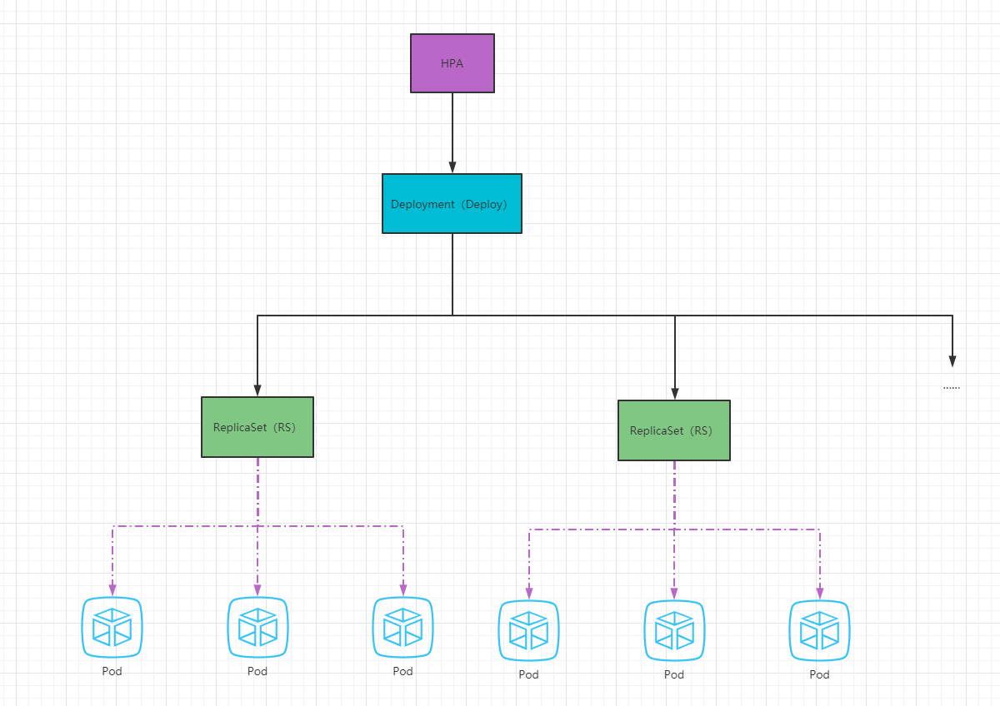

# kubernetes 篇

## 基础篇：Kubernetes 简介与核心概念

### Kubernetes 简介

#### 什么是 Kubernetes？

**Kubernetes**（常简称为 K8s）是一个开源的容器编排和管理平台，用于自动化部署、扩展和操作应用程序容器。它提供了一个强大的工具集，可以简化容器化应用的部署、维护和扩展。

#### Kubernetes 的特点和优势

- 自动化容器部署和扩展：Kubernetes 可以自动处理容器的创建、部署和伸缩，使得应用程序的管理变得更加高效和简化。
- 跨平台和云原生：Kubernetes 支持在各种云平台和本地环境中运行，是构建**云原生应用**的理想选择。
- 服务发现和负载均衡：Kubernetes 提供内置的**服务发现**和**负载均衡**功能，使得应用程序可以轻松地相互通信和平衡负载。
- 自愈和自恢复能力：Kubernetes 可以监控和管理应用程序的状态，并在出现故障时自动进行恢复，确保应用的高可用性。
- 灵活的存储管理：Kubernetes 提供了灵活的存储管理机制，可以方便地挂载存储卷，并支持各种存储后端和插件。
- 跨团队协作：Kubernetes 支持多团队共享和管理应用程序，通过**命名空间**等机制，实现了资源的隔离和安全性。

#### Kubernetes 的核心组件

Kubernetes 由多个核心组件组成，每个组件都有特定的职责和功能：

- **Master节点**：包括 **API Server**、**Controller Manager**、**Scheduler** 和 **etcd**（键值存储系统），用于管理整个集群的状态和控制平面。
- **Node节点**：也称为工作节点，运行着应用程序容器。每个节点上都有 **kubelet** 代理、容器运行时和网络插件等组件。
- **Pod**：是 Kubernetes 的最小部署单元，包含一个或多个容器。它是应用程序的运行实例，具有独立的 IP 地址和存储卷。
- **控制器**：如 **ReplicaSet** 和 **Deployment**，用于定义和管理应用程序的期望状态，并确保集群中的 Pod 数量和状态符合预期。
- **服务**：提供了一种稳定的网络访问方式，用于将流量路由到一组具有相同标签的 Pod。

#### Kubernetes 示例

下面是一个简单的 Kubernetes 示例，用于部署一个 Web 应用程序：

```yaml
apiVersion: v1
kind: Pod
metadata:
  name: web-pod
spec:
  containers:
    - name: web-container
      image: nginx:latest
      ports:
        - containerPort: 80
```

上述示例定义了一个 Pod，其中包含一个名为 "web-container" 的容器，使用 **nginx:latest** 镜像，并将容器的端口映射到主机的端口80。

### 架构和组件概述

#### Kubernetes 架构

Kubernetes 采用了一种分布式的架构，由多个节点协同工作来管理和运行应用程序容器。这些节点包括 Master 节点和 Node 节点。

##### Master 节点

Master 节点是 Kubernetes 集群的控制平面，它负责管理和监控整个集群。主要组件包括：

- **API Server**：作为 Kubernetes 集群的入口，处理来自用户、CLI 工具和其他组件的请求。它负责验证请求、修改集群状态，并将结果返回给请求方。
- **Controller Manager**：负责运行各种控制器，监控集群状态并进行调整。例如，ReplicaSet 控制器负责确保指定数量的 Pod 在集群中运行。
- **Scheduler**：负责将新创建的 Pod 调度到集群的合适节点上。它根据节点的资源、亲和性和其他约束条件来做出决策。
- **etcd**：是一个分布式键值存储系统，用于保存集群的配置信息和状态。所有的集群数据都存储在 etcd 中，包括节点信息、Pod 状态、配置信息等。

##### Node 节点

Node 节点是 Kubernetes 集群中的工作节点，用于运行容器化的应用程序。每个节点上都包含以下组件：

- **kubelet**：作为节点上的代理，负责与 Master 节点通信，并管理节点上的 Pod。它接收来自 Master 的指令，启动、停止和监控 Pod 的运行状态。
- **容器运行时**：Kubernetes 支持多种容器运行时，如 Docker、Containerd 等。容器运行时负责管理和运行容器，提供隔离、资源管理和安全性等功能。
- **网络插件**：用于提供 Pod 之间和与外部网络的通信。不同的网络插件可以实现不同的网络模型，如基于虚拟网络的 Overlay 网络、主机网络等。
- **Proxy**：运行在每个节点上的网络代理，负责转发和负载均衡 Pod 的网络请求。
- **Pod**：是 Kubernetes 的最小调度单位，包含一个或多个容器。每个节点上运行的容器都包含在一个 Pod 中，Pod 有自己的 IP 地址和存储卷。

#### Kubernetes 组件

Kubernetes 的各个组件之间通过 API Server 进行交互，实现集群的管理和协调。以下是一些常见的组件交互关系：

- **用户和 CLI 工具**：通过 API Server 发送请求，例如创建、更新或删除资源的操作。
- **Controller Manager**：通过 API Server 监听集群状态的变化，根据需要启动或停止相关的控制器。
- **Scheduler**：通过 API Server 获取待调度的 Pod 信息，根据节点的资源情况和调度策略进行调度决策。
- **kubelet**：通过 API Server 获取指令和 Pod 配置信息，将指令传达给容器运行时，启动和管理 Pod。
- **Proxy**：负责转发和负载均衡 Pod 的网络请求，通过与 API Server 通信获取服务和端口信息。
- **etcd**：作为集群的分布式键值存储系统，保存着集群的配置和状态信息。各个组件通过 etcd 进行数据的读写和同步。

这些组件的协作和交互构成了 Kubernetes 的完整体系结构，支持各种容器化应用的部署、管理和扩展。

### Kubernetes 的安装和配置

#### Kubernetes 部署前期准备

##### Docker 和 Kubernetes 版本对应关系

[对应关系](https://github.com/kubernetes/kubernetes/tree/master/CHANGELOG)：Docker 的版本是 v19.x ，对应的 Kubernetes 的版本是 v1.21 。

##### 关闭&禁用防火墙

```bash
systemctl stop firewalld
systemctl disable firewalld
```

##### 升级系统内核（非必须）

- 查看当前系统的版本

```bash
cat /etc/redhat-release
```

- 看当前系统的内核

```bash
uname -sr
```

-  查看启动顺序

```bash
# 查看启动顺序
yum install -y grub2-pc
grub2-editenv list
```

- 查看可用内核版本及启动顺序

```bash
sudo awk -F\' '$1=="menuentry " {print i++ " : " $2}' /boot/grub2/grub.cfg
```

- 在 CentOS 7.x 上启用 ELRepo 仓库

```bash
rpm --import https://www.elrepo.org/RPM-GPG-KEY-elrepo.org
rpm -Uvh https://www.elrepo.org/elrepo-release-7.0-4.el7.elrepo.noarch.rpm
```

> 提升下载速度，换源
>
> - `sed -i "s/mirrorlist=/#mirrorlist=/g" /etc/yum.repos.d/elrepo.repo`
> - `sed -i "s#elrepo.org/linux#mirrors.tuna.tsinghua.edu.cn/elrepo#g" /etc/yum.repos.d/elrepo.repo`

- 查看可用的系统内核相关包

```bash
yum --disablerepo="*" --enablerepo="elrepo-kernel" list available
```

- 安装最新主线内核版本

```bash
yum -y --enablerepo=elrepo-kernel install kernel-ml
```

- 设置默认的内核版本

```bash
vim /etc/default/grub
```

```bash
GRUB_TIMEOUT=5
GRUB_DISTRIBUTOR="$(sed 's, release .*$,,g' /etc/system-release)"
GRUB_DEFAULT=0 # 修改此处，原来是 saved
GRUB_DISABLE_SUBMENU=true
GRUB_TERMINAL_OUTPUT="console"
GRUB_CMDLINE_LINUX="crashkernel=auto rd.lvm.lv=centos/root rd.lvm.lv=centos/swap rhgb quiet"
GRUB_DISABLE_RECOVERY="true"
```

或者使用如下命令

```bash
sed -i 's/^GRUB_DEFAULT=saved$/GRUB_DEFAULT=0/' /etc/default/grub
```

- 重新创建内核配置

```bash
grub2-mkconfig -o /boot/grub2/grub.cfg
```

- 重启系统

```bash
reboot
```

- 查看当前系统的内核

```bash
uname -sr
```

##### 设置主机名（部署集群需要）

```bash
# 192.168.183.101
hostnamectl set-hostname master
# 192.168.183.102
hostnamectl set-hostname node1
# 192.168.183.103
hostnamectl set-hostname node2
```

##### 主机名解析（部署集群需要）

为了方便后面集群节点间的直接调用，需要配置一下主机名解析。

```bash
cat >> /etc/hosts << EOF
127.0.0.1   $(hostname)
192.168.183.101 master
192.168.183.102 node1
192.168.183.103 node2
EOF
```

##### 时间同步（部署集群需要）

Kubernetes 要求集群中的节点时间必须精确一致，所以在每个节点上添加时间同步

```bash
yum install ntpdate -y && ntpdate time.windows.com
```

##### 关闭 SELinux

- 查看 SELinux 是否开启

```bash
getenforce
```


- 永久关闭 SELinux ，需要重启

```bash
sed -i 's/enforcing/disabled/' /etc/selinux/config
```

- 关闭当前会话的 SELinux ，重启之后无效

```bash
setenforce 0
```

##### 关闭 swap 分区

- 永久关闭 swap ，需要重启

```bash
sed -ri 's/.*swap.*/#&/' /etc/fstab
```

- 关闭当前会话的 swap ，重启之后无效

```bash
swapoff -a
```

##### 将桥接的 IPv4 流量传递到 iptables 的链

- 修改 /etc/sysctl.conf 文件

```bash
# 如果有配置，则修改
sed -i "s#^net.ipv4.ip_forward.*#net.ipv4.ip_forward=1#g"  /etc/sysctl.conf
sed -i "s#^net.bridge.bridge-nf-call-ip6tables.*#net.bridge.bridge-nf-call-ip6tables=1#g"  /etc/sysctl.conf
sed -i "s#^net.bridge.bridge-nf-call-iptables.*#net.bridge.bridge-nf-call-iptables=1#g"  /etc/sysctl.conf
sed -i "s#^net.ipv6.conf.all.disable_ipv6.*#net.ipv6.conf.all.disable_ipv6=1#g"  /etc/sysctl.conf
sed -i "s#^net.ipv6.conf.default.disable_ipv6.*#net.ipv6.conf.default.disable_ipv6=1#g"  /etc/sysctl.conf
sed -i "s#^net.ipv6.conf.lo.disable_ipv6.*#net.ipv6.conf.lo.disable_ipv6=1#g"  /etc/sysctl.conf
sed -i "s#^net.ipv6.conf.all.forwarding.*#net.ipv6.conf.all.forwarding=1#g"  /etc/sysctl.conf	
sed -i "s#^net.ipv4.ip_nonlocal_bind.*#net.ipv4.ip_nonlocal_bind=1#g"  /etc/sysctl.conf	
```

- 可能没有，追加

```bash
# 可能没有，追加
echo "net.ipv4.ip_forward = 1" >> /etc/sysctl.conf
echo "net.bridge.bridge-nf-call-ip6tables = 1" >> /etc/sysctl.conf
echo "net.bridge.bridge-nf-call-iptables = 1" >> /etc/sysctl.conf
echo "net.ipv6.conf.all.disable_ipv6 = 1" >> /etc/sysctl.conf
echo "net.ipv6.conf.default.disable_ipv6 = 1" >> /etc/sysctl.conf
echo "net.ipv6.conf.lo.disable_ipv6 = 1" >> /etc/sysctl.conf
echo "net.ipv6.conf.all.forwarding = 1"  >> /etc/sysctl.conf
echo "net.ipv4.ip_nonlocal_bind=1" >> /etc/sysctl.conf
```

- 加载 br_netfilter 模块

```bash
modprobe br_netfilter
```

- 持久化修改（保留配置包本地文件，重启系统或服务进程仍然有效）

```bash
sysctl -p
```

##### 开启 ipvs

- 在 Kubernetes 中 service 有两种代理模型，一种是基于 iptables ，另一种是基于 ipvs 的。ipvs 的性能要高于 iptables 的，但是如果要使用它，需要手动载入 ipvs 模块。

- 在所有机器安装 ipset 和 ipvsadm 

```bash
yum -y install ipset ipvsadm
```

- 在所有机器执行如下脚本

```bash
cat > /etc/sysconfig/modules/ipvs.modules <<EOF
#!/bin/bash
modprobe -- ip_vs
modprobe -- ip_vs_rr
modprobe -- ip_vs_wrr
modprobe -- ip_vs_sh
modprobe -- nf_conntrack
EOF
```

- 授权、运行、检查是否加载

```bash
chmod 755 /etc/sysconfig/modules/ipvs.modules && bash /etc/sysconfig/modules/ipvs.modules && lsmod | grep -e ip_vs -e nf_conntrack_ipv4
```

##### 重启

```bash
reboot
```

##### 安装 docker

- 卸载原有版本，准备安装对应版本

```bash
sudo yum remove docker \
                  docker-client \
                  docker-client-latest \
                  docker-common \
                  docker-latest \
                  docker-latest-logrotate \
                  docker-logrotate \
                  docker-engine
```

- yum 安装 gcc 相关

```bash
yum -y install gcc
yum -y install gcc-c++
```

- 安装所需要的软件包

```bash
yum -y install yum-utils
```

- 设置 stable 镜像仓库

```bash
yum-config-manager --add-repo https://mirrors.aliyun.com/docker-ce/linux/centos/docker-ce.repo
```

- 更新 yum 软件包索引

```bash
yum makecache fast
```

- 查看存储库中 Docker 的版本

```bash
yum list docker-ce --showduplicates | sort -r
```

- 安装指定版本的 Docker

```bash
yum install -y docker-ce-19.03.14 docker-ce-cli-19.03.14 containerd.io
```

- 启动 Docker

```bash
# 启动 Docker 
systemctl start docker
```

- 设置为开机自启动

```bash
# 开启自动启动
systemctl enable docker
```

- 验证 Docker 是否安装成功

```bash
docker version
```

- 阿里云镜像加速

```bash
sudo mkdir -p /etc/docker
```

```bash
sudo tee /etc/docker/daemon.json <<-'EOF'
{
  "exec-opts": ["native.cgroupdriver=systemd"],	
  "registry-mirrors": [
    "https://du3ia00u.mirror.aliyuncs.com",
    "https://hub-mirror.c.163.com",
    "https://mirror.baidubce.com",
    "https://registry.docker-cn.com",
    "https://docker.mirrors.sjtug.sjtu.edu.cn"
  ],
  "dns": ["8.8.8.8", "114.114.114.114"],
  "live-restore": true,
  "log-driver":"json-file",
  "log-opts": {"max-size":"500m", "max-file":"3"},
  "max-concurrent-downloads": 10,
  "max-concurrent-uploads": 5,
  "storage-driver": "overlay2"
}
EOF
```

```bash
sudo systemctl daemon-reload
sudo systemctl restart docker
```

##### 添加阿里云的 Kubernetes 的 YUM 源

由于 Kubernetes 的镜像源在国外，非常慢，这里切换成国内的阿里云镜像源（所有机器均需执行下面命令）

```bash
cat > /etc/yum.repos.d/kubernetes.repo << EOF
[kubernetes]
name=Kubernetes
baseurl=https://mirrors.aliyun.com/kubernetes/yum/repos/kubernetes-el7-x86_64
enabled=1
gpgcheck=0
repo_gpgcheck=0
gpgkey=https://mirrors.aliyun.com/kubernetes/yum/doc/yum-key.gpg https://mirrors.aliyun.com/kubernetes/yum/doc/rpm-package-key.gpg
EOF
```

##### 下载 kubekey

```bash
mkdir tmp && cd tmp

export KKZONE=cn
curl -sfL https://get-kk.kubesphere.io | VERSION=v2.0.0 sh -

wget https://github.com/kubesphere/kubekey/releases/download/v2.0.0/kubekey-v2.0.0-linux-amd64.tar.gz

tar -zxvf kubekey-v2.0.0-linux-amd64.tar.gz

# 添加可执行权限
chmod +x kk
```

##### 安装依赖或者相应工具

```bash
yum install socat -y
yum install conntrack -y
yum install ebtables -y
yum install ipset -y
```

#### 单机部署

##### 安装

```bash
./kk create cluster --with-kubernetes v1.20.10 --with-kubesphere v3.1.1
```

- 安装 KubeSphere 3.2.1 的建议 Kubernetes 版本：1.19.x、1.20.x、1.21.x 或 1.22.x（实验性支持）。如果不指定 Kubernetes 版本，KubeKey 将默认安装 Kubernetes v1.21.5。有关受支持的 Kubernetes 版本的更多信息，请参见[支持矩阵](https://v3-2.docs.kubesphere.io/zh/docs/installing-on-linux/introduction/kubekey/#支持矩阵)。

- 一般来说，对于 All-in-One 安装，无需更改任何配置。
- 如果在这一步的命令中不添加标志 `--with-kubesphere`，则不会部署 KubeSphere，KubeKey 将只安装 Kubernetes。如果添加标志 `--with-kubesphere` 时不指定 KubeSphere 版本，则会安装最新版本的 KubeSphere。
- KubeKey 会默认安装 [OpenEBS](https://openebs.io/) 为开发和测试环境提供 LocalPV 以方便新用户。对于其他存储类型，请参见[持久化存储配置](https://v3-2.docs.kubesphere.io/zh/docs/installing-on-linux/persistent-storage-configurations/understand-persistent-storage/)。

##### 验证

```bash
kubectl logs -n kubesphere-system $(kubectl get pod -n kubesphere-system -l 'app in (ks-install, ks-installer)' -o jsonpath='{.items[0].metadata.name}') -f
```

##### 卸载

```bash
./kk delete cluster
```

#### 集群部署

##### 机器要求

本示例，创建8台 Centos Linux release 7.6.1810 (Core) 的虚拟机部署默认的最小化安装。其中，主机配置为2Core，4 GB，40 G，从机配置4Core，8GB，300G

| 序号 | 主机IP        | 主机名称 | 角色                        |
| ---- | ------------- | -------- | --------------------------- |
| 1    | 10.39.174.127 | master1  | master, etcd                |
| 2    | 10.39.174.205 | master2  | master, etcd                |
| 3    | 10.39.174.109 | master3  | master, etcd                |
| 4    | 10.39.174.51  | node1    | worker                      |
| 5    | 10.39.174.161 | node2    | worker                      |
| 6    | 10.39.174.138 | node3    | worker                      |
| 7    | 10.39.174.128 | vip      | 虚拟IP（不是实际的主机）    |
| 8    | 10.39.174.126 | lb-0     | lb （Keepalived + HAProxy） |
| 9    | 10.39.174.33  | lb-1     | lb （Keepalived + HAProxy） |

##### 部署 keepalived 和 haproy

###### 安装

在主机为 lb-0 和 lb-1 中部署 Keepalived + HAProxy 即 IP 为 `10.39.174.126` 与 `10.39.174.33` 的服务器上安装部署 HAProxy 和 psmisc。

```bash
yum install keepalived haproxy psmisc -y
```

###### 配置 haproxy

在主机为 lb-0 和 lb-1  的服务器上按如下参数配置 HAProxy (两台 lb 机器配置一致即可，注意后端服务地址)。

```bash
cat <<END>/etc/haproxy/haproxy.cfg

# HAProxy Configure /etc/haproxy/haproxy.cfg
global

    # 设置日志输出的目标地址和日志级别
    log         127.0.0.1 local2

    # 将HAProxy进程chroot到指定的目录
    chroot      /var/lib/haproxy

    # 指定HAProxy进程的PID文件位置
    pidfile     /var/run/haproxy.pid
    
    # 设置最大并发连接数
    maxconn     4000

    # 指定运行HAProxy进程的用户和组
    user        haproxy
    group       haproxy

    # 以守护进程方式运行HAProxy
    daemon

    # 打开统计信息的Unix套接字
    stats socket /var/lib/haproxy/stats

#---------------------------------------------------------------------

# common defaults that all the 'listen' and 'backend' sections will

# use if not designated in their block

#---------------------------------------------------------------------

defaults
    # 默认使用全局日志设置
    log                     global
    
    # 设置一些默认选项，如HTTP日志和不记录空连接
    option                  httplog
    option                  dontlognull

    # 设置一些默认选项，如HTTP日志和不记录空连接
    timeout connect         5000
    timeout client          5000
    timeout server          5000

#---------------------------------------------------------------------

# main frontend which proxys to the backends

#---------------------------------------------------------------------

frontend  kube-apiserver

    # 设置一些默认选项，如HTTP日志和不记录空连接
    bind *:6443
    
    # 使用TCP模式
    mode tcp
    
    # 启用TCP日志
    option tcplog
    
    # 默认后端为kube-apiserver
    default_backend kube-apiserver

#---------------------------------------------------------------------

# round robin balancing between the various backends

#---------------------------------------------------------------------

backend kube-apiserver
    # 使用TCP模式
    mode tcp
    
    # 启用TCP日志
    option tcplog
    
    # 使用轮询算法进行负载均衡
    balance     roundrobin
    
    # 设置默认服务器参数，包括健康检查和连接限制
    default-server inter 10s downinter 5s rise 2 fall 2 slowstart 60s maxconn 250 maxqueue 256 weight 100

    # 定义kube-apiserver 服务器（master），检查服务器健康状态
    server kube-apiserver-1 10.39.174.127:6443 check

    server kube-apiserver-2 10.39.174.205:6443 check

    server kube-apiserver-3 10.39.174.109:6443 check


END
```

启动之前检查语法是否有问题

```bash
haproxy -f /etc/haproxy/haproxy.cfg -c
```

启动 Haproxy，并设置开机自启动

```bash
systemctl restart haproxy && systemctl enable haproxy
```

停止 Haproxy

```bash
systemctl stop haproxy
```

###### 配置 keepalived

在主机为 lb-0 的服务器上按如下参数配置 keepalived。

```bash
cat <<END>/etc/keepalived/keepalived.conf

global_defs {

    notification_email {
        # 在此处填入通知邮件的收件人地址
        }

        # 设置SMTP连接的超时时间为30秒
        smtp_connect_timeout 30

    # 设置该服务器的标识符为LVS_DEVEL01，相当于给服务器起了一个别名
    router_id LVS_DEVEL01

    # 跳过对对等地址的检查
    vrrp_skip_check_adv_addr

    # 设置GARP（Gratuitous ARP）通告的间隔时间为0，即不发送GARP通告
    vrrp_garp_interval 0
    vrrp_gna_interval 0

}

# 定义一个检查HAProxy进程的脚本，每2秒运行一次，权重为20
vrrp_script chk_haproxy {
    script "killall -0 haproxy"
    interval 2
    weight 20
}

vrrp_instance haproxy-vip {
    # 设置该实例为主服务器
     state MASTER

     # 设置主服务器的优先级为100，比备用服务器高
     priority 100

     # 设置实例绑定的网络接口为 eth0
     interface eth0

     # 定义一个虚拟路由器组，虚拟路由器组的标识符为60
     virtual_router_id 60

     # 设置通告间隔为1秒，用于检查对方是否存活
     advert_int 1

     # 设置认证类型为PASS，并指定认证密码为1111（这些相当于认证的密码）
     authentication {
         auth_type PASS
         auth_pass 1111
     }

     # 设置当前机器的IP地址为源地址
     unicast_src_ip 10.39.174.126

    # 设置对等机器的IP地址（其他机器的地址）
    unicast_peer {
        10.39.174.33
    }

    # 设置虚拟IP地址 - vip地址
    virtual_ipaddress {
        10.38.174.128/24
    }
    # 设置要跟踪的脚本为chk_haproxy
    track_script {
        chk_haproxy
    }
}

END
```

在主机为 lb-0 的服务器上按如下参数配置 keepalived。

```bash
cat <<END>/etc/keepalived/keepalived.conf

global_defs {

    notification_email {

    }

    router_id LVS_DEVEL02 ##相当于给这个服务器起个昵称

    vrrp_skip_check_adv_addr

    vrrp_garp_interval 0

    vrrp_gna_interval 0

}

vrrp_script chk_haproxy {

    script "killall -0 haproxy"

    interval 2

    weight 20

}

vrrp_instance haproxy-vip {

    state BACKUP #备份服务器 是 backup

    priority 90 #优先级要低（把备份的90修改为100）

    interface eth0   #实例绑定的网卡

    virtual_router_id 60

    advert_int 1

    authentication {

        auth_type PASS

        auth_pass 1111

    }

    unicast_src_ip 10.39.174.33      #当前机器地址

    unicast_peer {

        10.39.174.126   #peer 中其它机器地址

    }

    virtual_ipaddress {

        #加/24

        10.38.174.128/24

    }

    track_script {

        chk_haproxy

    }

}


END
```

启动 keepalived，设置开机自启动

```bash
systemctl restart keepalived && systemctl enable keepalived
systemctl stop keepalived
```

开启 keepalived服务

```bash
systemctl start keepalived
```

###### 验证可用性

使用`ip a s`查看各 lb 节点 vip 绑定情况

```bash
ip a s
```

暂停 vip 所在节点 HAProxy

```bash
systemctl stop haproxy
```

再次使用`ip a s`查看各 lb 节点 vip 绑定情况，查看 vip 是否发生漂移

```bash
ip a s
```

或者使用下面命令查看

```bash
systemctl status -l keepalived
```

##### 

创建配置文件

每个主从机器都要配置，最重要的是一个一个部署，并发容易出现错误。

```yaml
./kk create config --with-kubernetes v1.20.10 --with-kubesphere v3.1.1
```

##### ssh 互相免密

方便后续，配置文件中的时候，不需要设置密码了。

- 生成密钥

```bash
ssh-keygen -t rsa -P '' -f ~/.ssh/id_rsa
```

- host验证

``vim /etc/ssh/ssh_config`` 在最后添加

```shell
StrictHostKeyChecking no
UserKnownHostsFile /dev/null
```

> 按大写G，直接跳到最后一行。

- 将秘钥分别拷贝给自己和别人

```shell
ssh-copy-id -i ~/.ssh/id_rsa.pub root@10.39.174.127

ssh-copy-id -i ~/.ssh/id_rsa.pub root@10.39.174.205

...
```

##### 修改默认配置文件

```yaml
apiVersion: kubekey.kubesphere.io/v1alpha2
kind: Cluster
metadata:
  name: sample
spec:
  hosts: # 修改
  - {name: master1, address: 10.39.174.127, internalAddress: 10.39.174.127, password: "123456"}
  - {name: master2, address: 10.39.174.205, internalAddress: 10.39.174.205, password: "123456"}
  - {name: master3, address: 10.39.174.109, internalAddress: 10.39.174.109, password: "123456"}
  - {name: node1, address: 10.39.174.51, internalAddress: 10.39.174.51, password: "123456"}
  - {name: node2, address: 10.39.174.161, internalAddress: 10.39.174.161, password: "123456"}
  - {name: node3, address: 10.39.174.138, internalAddress: 10.39.174.138, password: "123456"}
  roleGroups:
    etcd:
    - master1
    - master2
    - master3
    control-plane:
    - master1
    - master2
    - master3
    worker:
    - node1
    - node2
    - node3
  controlPlaneEndpoint:
    domain: lb.kubesphere.local
    # vip，这里配置的vip
    address: "10.38.174.128"
    port: 6443
  kubernetes:
    version: v1.20.10
    imageRepo: kubesphere
    clusterName: cluster.local
    masqueradeAll: false  # masqueradeAll tells kube-proxy to SNAT everything if using the pure iptables proxy mode. [Default: false]
    maxPods: 110  # maxPods is the number of pods that can run on this Kubelet. [Default: 110]
    nodeCidrMaskSize: 24  # internal network node size allocation. This is the size allocated to each node on your network. [Default: 24]
    proxyMode: ipvs  # mode specifies which proxy mode to use. [Default: ipvs]
  network:
    plugin: calico
    calico:
      ipipMode: Always  # IPIP Mode to use for the IPv4 POOL created at start up. If set to a value other than Never, vxlanMode should be set to "Never". [Always | CrossSubnet | Never] [Default: Always]
      vxlanMode: Never  # VXLAN Mode to use for the IPv4 POOL created at start up. If set to a value other than Never, ipipMode should be set to "Never". [Always | CrossSubnet | Never] [Default: Never]
      vethMTU: 1440  # The maximum transmission unit (MTU) setting determines the largest packet size that can be transmitted through your network. [Default: 1440]
    kubePodsCIDR: 10.233.64.0/18
    kubeServiceCIDR: 10.233.0.0/18
  registry:
    registryMirrors: []
    insecureRegistries: []
  addons: []

---
apiVersion: installer.kubesphere.io/v1alpha1
kind: ClusterConfiguration
metadata:
  name: ks-installer
  namespace: kubesphere-system
  labels:
    version: v3.1.1
spec:
  persistence:
    storageClass: ""       
  authentication:
    jwtSecret: ""
  zone: ""
  local_registry: ""        
  etcd:
    monitoring: false      
    endpointIps: localhost  
    port: 2379             
    tlsEnable: true
  common:
    redis:
      enabled: false
    redisVolumSize: 2Gi 
    openldap:
      enabled: false
    openldapVolumeSize: 2Gi  
    minioVolumeSize: 20Gi
    monitoring:
      endpoint: http://prometheus-operated.kubesphere-monitoring-system.svc:9090
    es:  
      elasticsearchMasterVolumeSize: 4Gi   
      elasticsearchDataVolumeSize: 20Gi   
      logMaxAge: 7          
      elkPrefix: logstash
      basicAuth:
        enabled: false
        username: ""
        password: ""
      externalElasticsearchUrl: ""
      externalElasticsearchPort: ""  
  console:
    enableMultiLogin: true 
    port: 30880
  alerting:       
    enabled: false
    # thanosruler:
    #   replicas: 1
    #   resources: {}
  auditing:    
    enabled: false
  devops:           
    enabled: false
    jenkinsMemoryLim: 2Gi     
    jenkinsMemoryReq: 1500Mi 
    jenkinsVolumeSize: 8Gi   
    jenkinsJavaOpts_Xms: 512m  
    jenkinsJavaOpts_Xmx: 512m
    jenkinsJavaOpts_MaxRAM: 2g
  events:          
    enabled: false
    ruler:
      enabled: true
      replicas: 2
  logging:         
    enabled: false
    logsidecar:
      enabled: true
      replicas: 2
  metrics_server:             
    enabled: false
  monitoring:
    storageClass: ""
    prometheusMemoryRequest: 400Mi  
    prometheusVolumeSize: 20Gi  
  multicluster:
    clusterRole: none 
  network:
    networkpolicy:
      enabled: false
    ippool:
      type: none
    topology:
      type: none
  openpitrix:
    store:
      enabled: false
  servicemesh:    
    enabled: false  
  kubeedge:
    enabled: false
    cloudCore:
      nodeSelector: {"node-role.kubernetes.io/worker": ""}
      tolerations: []
      cloudhubPort: "10000"
      cloudhubQuicPort: "10001"
      cloudhubHttpsPort: "10002"
      cloudstreamPort: "10003"
      tunnelPort: "10004"
      cloudHub:
        advertiseAddress: 
          - ""           
        nodeLimit: "100"
      service:
        cloudhubNodePort: "30000"
        cloudhubQuicNodePort: "30001"
        cloudhubHttpsNodePort: "30002"
        cloudstreamNodePort: "30003"
        tunnelNodePort: "30004"
    edgeWatcher:
      nodeSelector: {"node-role.kubernetes.io/worker": ""}
      tolerations: []
      edgeWatcherAgent:
        nodeSelector: {"node-role.kubernetes.io/worker": ""}
        tolerations: []
```

##### 安装

```bash
./kk create cluster -f config-sample.yaml
```

##### 查看安装进度

```bash
kubectl logs -n kubesphere-system $(kubectl get pod -n kubesphere-system -l app=ks-install -o jsonpath='{.items[0].metadata.name}') -f
```

##### 问题出现

**The connection to the server localhost:8080 was refused - did you specify the right host or port?**

- 主节点出现该问题

```bash
sudo mkdir ~/.kube
sudo cp /etc/kubernetes/admin.conf ~/.kube/

cd ~/.kube

sudo mv admin.conf config
sudo service kubelet restart
```

- 从节点出现该问题：权限不足，需要使用上述配置文件，从主节点的`~\.kube\`下的配置文件拷贝到从节点中。

### Kubernetes 对象概述

#### 什么是kubernetes对象

在 Kubernetes 中，对象是用于描述和管理集群中各种资源的抽象概念。它们是 Kubernetes API 的一部分，通过定义对象的规范和配置来创建、更新和删除集群中的资源。每个对象都有一个唯一的标识符（例如名称和命名空间），并包含一组属性和规格，用于定义对象的行为和状态。

通过定义和创建对象，我们可以管理 Kubernetes 集群中的各种资源。这些资源可以是应用程序的容器、负载均衡服务、存储卷、配置信息等等。每个对象都有特定的用途和行为，可以相互关联和协同工作以构建和管理复杂的应用程序。

在实践中，我们通常使用 YAML 文件来定义和配置 Kubernetes 对象。这些文件包含对象的属性和规格，并使用 `kubectl apply` 命令将其应用到 Kubernetes 集群中。

#### 描述 Kubernetes 对象

Kubernetes 中的对象是通过 YAML 或 JSON 文件定义的。每个对象都具有以下属性：

- **apiVersion**：指定所使用的 Kubernetes API 版本。
- **kind**：定义对象的类型，例如 Pod、Deployment、Service 等。
- **metadata**：包含对象的元数据，如名称、命名空间、标签等。
- **spec**：定义对象的规格和配置，例如容器镜像、端口、存储卷等。
- **status**：包含对象的当前状态信息，由 Kubernetes 自动更新。

可以使用 kubectl 命令行创建对象，也可以使用 yaml 格式的文件进行创建。

```yaml
apiVersion: apps/v1
kind: Deployment
metadata:
  name:  nginx-deployment
  namespace: default
  labels:
    app:  nginx
spec:
  selector:
    matchLabels:
      app: nginx
  replicas: 3
  template:
    metadata:
      labels:
        app:  nginx
    spec:
      containers:
      - name:  nginx
        image:  nginx
        ports:
        - containerPort:  80
```

#### 使用 Kubernetes 对象

使用 Kubernetes 对象，你可以通过将对象配置文件应用到 Kubernetes 集群来创建、更新和管理对象。你可以使用 `kubectl apply` 命令来应用配置文件。

例如，要创建一个 Pod，可以使用以下命令：

```bash
kubectl apply -f pod.yaml
```

要获取现有对象的信息，可以使用以下命令：

```bash
kubectl get pods
```

#### Kubernetes 对象的 yaml 格式


逐个解释每个部分的含义：

- `apiVersion`：指定所使用的 Kubernetes API 版本。它定义了对象的属性和规范的结构。例如，`v1` 表示使用的是 Kubernetes 核心 API 的版本1。
- `kind`：定义对象的类型，它指示 Kubernetes 如何处理对象。常见的对象类型包括 Pod、Service、Deployment、ConfigMap 等。
- `metadata`：包含对象的元数据，用于唯一标识和组织对象，并提供额外的信息。
  - `name`：指定对象的名称，用于在集群中唯一标识对象。
  - `namespace`：可选项，指定对象所属的命名空间。命名空间提供了资源隔离和访问控制的机制。
  - `labels`：可选项，为对象添加标签。标签是键值对的形式，用于对对象进行分类、组织和选择。
- `spec`：定义对象的规范和配置，它描述了对象应该具有的期望状态。
- `status` ：反映了对象的当前状态，提供关于对象实际状态的信息。

根据对象的类型和用途，`spec` 部分会有不同的属性和配置。例如，在 Pod 对象中，`spec` 包含容器的配置信息，如容器镜像、端口等。而在 Deployment 对象中，`spec` 包含副本数、升级策略等配置信息。

#### 实际中如何创建 Kubernetes 对象的 yaml

- 如果 Kubernetes 集群中已经存在了要创建的对象，那么可以使用 kubectl get 直接输出 yaml ，然后去除 status 即可

```bash
kubectl get pod xxx -o yaml > demo.yaml
```

- 如果 Kubernetes 集群中不存在了要创建的对象，那么可以使用类似 `kubectl run xxx --dry-run=client`  输出 yaml

```bash
# --dry-run=client 用于模拟执行命令而不进行实际的修改操作
kubectl run nginx-pod --image=nginx --dry-run=client -o yaml > demo.yaml
```

#### 常见的 Kubernetes 对象类型

在 Kubernetes 中，有许多不同类型的对象，用于管理和配置不同层面的资源。以下是一些常见的 Kubernetes 对象类型：

- **Pod**：Pod 是 Kubernetes 中最小的调度单位，它包含一个或多个容器。Pod 提供了容器的运行环境和资源。
- **ReplicaSet**：ReplicaSet 用于确保指定数量的 Pod 副本在集群中运行。它负责自动扩缩容和故障恢复。
- **Deployment**：Deployment 是管理应用程序部署和更新的控制器。它可以创建和管理 ReplicaSet，并提供滚动更新功能。
- **DaemonSet**：DaemonSet 用于确保在集群的每个节点上运行一个 Pod 的副本。它通常用于运行在每个节点上必要的系统服务或日志收集器。
- **StatefulSet**：StatefulSet 用于管理有状态应用程序，它为每个 Pod 提供唯一的标识和稳定的网络标识符。
- **Service**：Service 提供稳定的网络访问方式，用于将流量路由到一组具有相同标签的 Pod。它实现负载均衡和服务发现。 
- **ConfigMap**：ConfigMap 用于存储应用程序的配置数据，如环境变量、配置文件等。 
- **Secret**：Secret 用于安全地存储敏感信息，如密码、API 密钥等。 
- **Job**：Job 是一次性任务，它创建一个或多个 Pod 来完成任务，并确保任务成功完成后自动终止。
- **CronJob**：CronJob 是定时任务，它基于 Cron 表达式创建一个 Job，用于在指定的时间间隔内执行任务。

### 标签、选择器和命名空间

#### 对象名称规范

Kubernetes REST API 中，所有的对象都是通过 `name` 和 `UID` 唯一性的确定。

可以通过 namespace + name 唯一性的确定一个 RESTful 对象，如：

```bash
/api/v1/namespaces/{namespace}/pods/{name}
```

##### Name

在同一名称空间下，同一个类型的对象，可以通过 name 来确定唯一性。如果删除该对象之后，可以再重新创建一个同名对象。 

根据命名规则，Kubernetes 对象的名称应该是： 

- 最长不超过 253 个字符。
- 必须由小写字母、数字、减号 - 、小数点 . 组成。
- 某些资源类型有更具体的要求。

 示例：下面的配置文件定义了一个 name 为 nginx-demo 的 Pod，该 Pod 包含一个 name 为 nginx 的 容器 

```yaml
apiVersion: v1 
kind: Pod 
metadata: 
  name: nginx-demo ##pod的名字 
spec: containers:
  - name: nginx ##容器的名字 
  image: nginx:1.7.9 
  ports:
    - containerPort: 80
```

##### UID

- UID 是由 Kubernetes 系统生成的，唯一标识某个 Kubernetes 对象的字符串。
- Kubernetes集群中，每创建一个对象，都有一个唯一的 UID 。用于区分多次创建的同名对象（如前面所述，按照名字删除对象后，重新再创建同名对象时，两次创建的对象 name 相同，但是 UID 不同。）

#### 名称空间（命名空间）

##### 概述

在 Kubernetes 中名称空间是用来对象资源进行隔离的。 默认情况下，Kubernetes 会初始化四个名称空间：

```bash
kubectl get ns
```

- default：所有没有指定 namespace 的对象都会被分配到此名称空间中。

- kube-node-lease：Kubernetes 集群节点之间的心跳维护，V 1.13 开始引入。

- kube-system：Kubernetes 系统创建的对象放在此名称空间中。

- kube-public：此名称空间是 Kubernetes 集群安装时自动创建的，并且所有的用户都可以访问（包括未认证的用户），主要是为集群预留的，如：在某些情况中，某些 Kubernetes 对象应用应该能被所有集群用户访问到。

##### 名称空间在实际开发中如何划分

- 基于环境隔离，如：dev（开发）、test（测试）、prod（生产）等。

- 基于产品线隔离，如：前端、后端、中间件、大数据、Android、iOS、小程序等。

- 基于团队隔离，如：企业发展事业部、技术工程事业部、云平台事业部等。

##### 名称空间的特点

- 名称空间资源隔离、网络不隔离，如：配置文件不可以跨名称空间访问，但是网络访问可以跨名称空间访问。

- 默认情况下，安装 Kubernetes 集群的时候，会初始化一个 `default` 名称空间，用来承载那些没有指定名称空间的 Pod 、Service 、Deployment 等对象。

##### 名称空间的命名规则

- 不能带小数点（`.`）。

- 不能带下划线（`_`）。

- 使用数字、小写字母或减号（`-`）组成的字符串。

##### 名称空间的操作

- 示例：创建和删除名称空间（yaml ）

```yaml
vim k8s-namespace.yaml
```

```yaml
apiVersion: v1
kind: Namespace
metadata:
  name:  demo # 名称空间的名字
spec: {}  
status: {}
```

```bash
# 创建名称空间
kubectl apply -f k8s-namespace.yaml
```

```bash
kubectl delete -f k8s-namespace.yaml
```

- 示例：创建和删除名称空间（命令行 ）

```bash
# 创建名称空间
kubectl create ns demo
```

```bash
kubectl delete ns demo
```

- 示例：创建 Pod 的同时，指定自定义的名称空间（yaml）

```bash
vim k8s-pod.yaml
```

```yaml
apiVersion: v1
kind: Namespace
metadata:
  name:  demo # 名称空间的名字
spec: {} # 默认为空，其实可以不写
status: {} # 默认为空，其实可以不写

# 以上是 namespace 
---
apiVersion: v1
kind: Pod
metadata:
  name: nginx-pod
  namespace: demo # 指定自定义的名称空间，如果不写，默认为 default
  labels:
    app: nginx
spec:
  containers:
  - name: nginx
    image: nginx
    resources: # 后面会讲
      limits:
        cpu: 200m
        memory: 500Mi
      requests:
        cpu: 100m
        memory: 200Mi
    ports:
    - containerPort:  80
      name:  http
    volumeMounts:
    - name: localtime
      mountPath: /etc/localtime
  volumes:
    - name: localtime
      hostPath:
        path: /usr/share/zoneinfo/Asia/Shanghai
  restartPolicy: Always 

  # 以上的 Pod
```

```bash
kubectl apply -f k8s-pod.yaml
```

##### Service 与 Pod 的 DNS

- 当创建一个 Service 的时候，Kubernetes 会创建一个相应的 [DNS 条目](https://kubernetes.io/zh/docs/concepts/services-networking/dns-pod-service/)。

- 该条目的形式是`<service-name>`.`<namespace-name>`.svc.cluster.local，这意味着如果容器中只使用`<服务名称>`，它将被解析到本地名称空间的服务器。这对于跨多个名字空间（如开发、测试和生产） 使用相同的配置非常有用。如果你希望跨名字空间访问，则需要使用完全限定域名（FQDN）。

#####  注意事项

大多数的 Kubernetes 资源（如：Pod、Service、副本控制器等）都位于某些名称空间中，但是名称空间本身并不在名称空间中，而且底层资源（如：node 和持久化卷）不属于任何命名空间。

- 查看在名称空间中的资源：

```bash
kubectl api-resources --namespaced=true
```

- 查看不在名称空间中的资源：

```bash
kubectl api-resources --namespaced=false
```

#### 标签和选择器

当使用标签（labels）和选择器（selectors）来管理 Kubernetes 对象时，它们能够提供更好的组织和分类方式，同时也提供了更灵活的对象选择机制。下面是一些示例来帮助你更好地理解它们的作用和用法。

##### 标签的语法

标签是一组键值对（key/value），标签的 key 有两个部分：可选的前缀和标签名，通过 `/` 分隔。

标签前缀： 

- 标签前缀部分是可选的。
- 如果指定，必须是一个 DNS 的子域名，如：k8s.eip.work 。
- 不能多于 253 个字符。
- 使用 / 和标签名分隔。

标签名： 

- 标签名部分是必须的。
- 不能多余 63 个字符。
- 必须由字母、数字开始和结尾。
- 可以包含字母、数字、减号（-）、下划线（_）、小数点（.）。

> 如果省略标签前缀，则标签的 key 就被认为是专属于用户的。Kubernetes 的系统组件（如：kube-scheduler、kube-controller-manager、kube-apiserver、kubectl 或其他第三方组件）向可以的 Kubernetes 对象添加标签的时候，必须指定一个前缀。`kubernetes.io/` 和 `k8s.io/` 这两个前缀是 Kubernetes 核心组件预留的。

标签的 value ： 

- 不能多于 63 个字符。
- 可以为空字符串。
- 如果不为空，则必须由字母、数字开始和结尾。
- 如果不为空，可以包含字母、数字、减号（-）、下划线（_）、小数点（.）。

##### 两种Label Selector

常用的Label 示例如下：

- 版本标签："version":"release", "version":"stable"......
- 环境标签："environment":"dev"，"environment":"test"，"environment":"pro"
- 架构标签："tier":"frontend"，"tier":"backend"

当前有两种Label Selector：

- **基于等式的Label Selector**
  - `name = slave` 选择所有包含Label中key="name"且value="slave"的对象

  - `env != production`选择所有包括Label中的key="env"且value不等于"production"的对象

- **基于集合的Label Selector**
  - `name in (master, slave)` 选择所有包含Label中的key="name"且value="master"或"slave"的对象
  - `name not in (frontend)` 选择所有包含Label中的key="name"且value不等于"frontend"的对象

标签的选择条件可以使用多个，此时将多个Label Selector进行组合，使用逗号","进行分隔即可。例如：

```kubernetes
name=slave,env!=production
name not in (frontend),env!=production
```

##### 标签示例

在 Kubernetes 中，你可以将标签附加到对象的元数据中，用于标识和描述对象的特征和属性。以下是一个示例，展示了如何使用标签：

```yaml
apiVersion: v1
kind: Pod
metadata:
  name: my-pod
  labels:
    app: frontend
    environment: production
spec:
  containers:
    - name: nginx
      image: nginx:latest
```

在这个示例中，我们为 Pod 对象添加了两个标签：`app` 和 `environment`。通过标签，我们可以轻松地对具有相同 `app=frontend` 和 `environment=production` 标签的 Pod 进行分类和组织。

##### Label相关命令

###### 为pod资源打标签

```bash
kubectl label pod nginx version=1.0 -n dev
```

###### 为pod资源更新标签

```bash
kubectl label pod nginx version=2.0 -n dev --overwrite
```

###### 查看标签

```bash
kubectl get pod nginx -n dev --show-labels
```

###### 筛选标签

```bash
kubectl get pod -n dev -l version=2.0  --show-labels
kubectl get pod -n dev -l version!=2.0 --show-labels
```

###### 删除标签

```bash
kubectl label pod nginx version- -n dev
```

##### 选择器示例

选择器允许你根据标签的键值对条件来选择和筛选 Kubernetes 对象。以下是一个示例，展示了如何使用选择器：

```yaml
apiVersion: v1
kind: Service
metadata:
  name: my-service
spec:
  selector:
    app: frontend
  ports:
    - protocol: TCP
      port: 80
      targetPort: 8080
```

在这个示例中，我们创建了一个名为 `my-service` 的 Service 对象，并使用选择器指定了要与该 Service 关联的 Pod。选择器 `app: frontend` 表示选择具有 `app=frontend` 标签的 Pod。

##### 注解 annotations

注解（annotation） 可以用来向 Kubernetes 对象的 meta.annotations 字段添加任意的信息。Kubernetes 的客户端或者自动化工具可以存取这些信息以实现自定义的逻辑。

```yaml
metadata: 
  annotations:   
	key1: value1   
	key2: value2
```

######

##### 标签和选择器的好处

标签和选择器的使用有助于提高应用程序的管理和组织效率，同时也提供了更灵活的对象选择机制。以下是一些标签和选择器的好处：

- **分类和组织**：通过为对象添加标签，可以将它们分组为逻辑上相关的集合，便于管理和操作。
- **环境区分**：使用标签可以区分不同的环境，例如开发、测试和生产环境，有助于在不同环境中进行应用程序部署和管理时的识别和区分。
- **关联对象**：使用选择器可以实现对象之间的关联和联系，例如将 Service 和特定标签的 Pod 关联起来。
- **对象组合**：通过使用选择器，可以将多个标签组合起来，以选择满足特定条件的对象，从而更灵活地定义选择规则。

##### 重新认识 kubectl 和 kubelet

- 核心文件夹：`/etc/kubernetes` 。

- kubelet 额外参数配置： `/etc/sysconfig/kubelet`。

- kubelet配置位置： `/var/lib/kubelet/config.yaml`。

###  容器配置与资源管理

#### 镜像和私有镜像库的使用

##### 下载和使用镜像

在 Kubernetes 的 Pod 定义容器的时候，必须指定容器所使用的镜像，容器中的 image 字段支持的语法和 docker 命令是一样的，包括私有镜像仓库和标签，如：

```bash
# 192.168.65.100:5000/xudaxian/ubuntu:1.0
my-registry.example.com:5000/example/web-example:v1.0
```

注意：在生产环境中，建议锁定镜像的版本。

- 示例：

```yaml
apiVersion: v1
kind: Namespace
metadata:
  name:  demo 
spec: {} 
status: {} 

# 以上是 namespace 
---
apiVersion: v1
kind: Pod
metadata:
  name: nginx-pod
  namespace: demo 
  labels:
    app: nginx
spec:
  containers:
  - name: nginx
    image: nginx:1.20.2 # Docker 的镜像名称，和 Docker 命令一样，my-registry.example.com:5000/example/web-example:v1.0，实际开发中，建议锁定镜像的版本。
    ports:
    - containerPort:  80

  # 以上的 Pod
```

Kubernetes 中的镜像拉取策略： 

- IfNotPresent（默认） ：只有当镜像在本地不存在时才会拉取。
- Always ：每当 kubelet 启动一个容器时，kubelet 会查询容器的镜像仓库， 将名称解析为一个镜像摘要。 如果 kubelet 有一个容器镜像，并且对应的摘要已在本地缓存，kubelet 就会使用其缓存的镜像； 否则，kubelet 就会使用解析后的摘要拉取镜像，并使用该镜像来启动容器。
- Never ：Kubelet 不会尝试获取镜像。如果镜像已经以某种方式存在本地， kubelet 会尝试启动容器；否则，会启动失败。

```yaml
apiVersion: v1
kind: Namespace
metadata:
  name:  demo 
spec: {} 
status: {} 

# 以上是 namespace 
---
apiVersion: v1
kind: Pod
metadata:
  name: nginx-pod
  namespace: demo 
  labels:
    app: nginx
spec:
  containers:
  - name: nginx
    image: nginx:1.20.2 # Docker 的镜像名称，和 Docker 命令一样，my-registry.example.com:5000/example/web-example:v1.0，实际开发中，建议锁定镜像的版本。
    imagePullPolicy: Always # 镜像拉取策略：IfNotPresent（默认）、Always、Never
    ports:
    - containerPort:  80
  # 以上的 Pod
```

##### 私有镜像库的设置和使用

使用阿里云容器镜像的私有仓库，阿里云要求进行登录，如果是 docker 拉取镜像，那么只需要 docker login 之类的就可以了；但是，如果使用 Kubernetes 该怎么办？

- 创建 secret 

```bash
# -n demo ：表示该密钥将只在指定的名称空间 demo 中生效
# docker-registry aliyun ：指定 Docker 镜像仓库的名称
# --docker-server：Docker 镜像仓库的地址
# --docker-username：Docker 镜像仓库的用户名
# --docker-password：Docker 镜像仓库的密码
kubectl create secret -n demo docker-registry aliyun \
       --docker-server=registry.cn-shanghai.aliyuncs.com \
       --docker-username=xudaxian \
       --docker-password=123456
```

-  在 yaml 中拉取镜像的时候设置镜像拉取的密钥（secret）

```bash
apiVersion: v1
kind: Namespace
metadata:
  name:  demo 
spec: {} 
status: {} 

# 以上是 namespace 
---
apiVersion: v1
kind: Pod
metadata:
  name: demo-pod
  namespace: demo 
  labels:
    app: nginx
spec:
  containers:
  imagePullSecrets: # Pull镜像时使用的 secret 名称，以 key：secretkey 格式指定
    - name:  aliyun 
  - name: nginx
    image: nginx:1.20.2 # Docker 的镜像名称，和 Docker 命令一样，my-registry.example.com:5000/example/web-example:v1.0，实际开发中，建议锁定镜像的版本。
    imagePullPolicy: Always # 镜像拉取策略：IfNotPresent（默认）、Always、Never
  - name: arcgis
    image: registry.cn-shanghai.aliyuncs.com/xudaxian/arcgis/v1.0 
    imagePullPolicy: Always
```

注意：需要将 secret 的用户名和密码设置为自己的，而且在拉取阿里云私有镜像的时候设置为自己的镜像。

#### 环境变量和启动命令的配置

##### 容器的环境变量配置

**设置容器的环境变量**：你可以在 Pod 的配置中使用 `env` 字段设置环境变量。例如，下面是一个 Pod 配置文件中设置环境变量的示例。

```yaml
apiVersion: v1
kind: Pod
metadata:
  name: my-pod
spec:
  containers:
    - name: my-container
      image: my-image
      env:
        - name: ENV_VAR_NAME
          value: "value"
```

**使用 ConfigMap 集中管理环境变量和配置**：当需要管理多个环境变量或配置时，可以使用 Kubernetes 的 ConfigMap 对象来集中管理。你可以创建一个 ConfigMap，并在 Pod 的配置中引用该 ConfigMap，从而将多个环境变量传递给容器。

##### 启动命令的定制化

Docker 的镜像拥有存储镜像信息的相关元数据，如果不设置生命周期命令和参数，容器运行时会运行镜像制作时提供的默认的命令和参数，Docker 原生定义这两个字段为 `ENTRYPOINT` 和 `CMD` 。

如果在创建工作负载时填写了容器的运行命令和参数，将会覆盖镜像构建时的默认命令 `Entrypoint` 、`CMD`，规则如下：

| 镜像 Entrypoint | 镜像CMD      | 容器 command | 容器 args   | 最终执行           |
| --------------- | ------------ | ------------ | ----------- | ------------------ |
| [touch]         | [/root/test] | 未设置       | 未设置      | [touch /root/test] |
| [touch]         | [/root/test] | [mkdir]      | 未设置      | [mkdir]            |
| [touch]         | [/root/test] | 未设置       | [/opt/test] | [touch /opt/test]  |
| [touch]         | [/root/test] | [mkdir]      | [/opt/test] | [mkdir /opt/test]  |

换言之，如果在 Kubernetes 的 yaml 中定义了 comand 和 args ，那么就会覆盖 Dockerfile 中的 ENTRPOINT 和 CMD 。 

例如，下面是一个 Pod 配置文件中定制启动命令的示例：

```yaml
apiVersion: v1
kind: Pod
metadata:
  name: my-pod
spec:
  containers:
    - name: my-container
      image: my-image
      command: ["echo"]
      args: ["Hello, Kubernetes!"]
```

#### 容器资源限额管理和配额设置

资源限额管理是 Kubernetes 中重要的一部分，它可以帮助你控制和管理容器的资源使用量。下面我将为你重新讲解资源限额管理，并提供具体的示例来帮助你更好地理解。

##### Pod 资源限额

容器中的程序要运行，肯定会占用一定的资源，比如 CPU 和内存等，如果不对某个容器的资源做限制，那么它就可能吃掉大量的资源，导致其他的容器无法运行。

针对上面的情况，Kubernetes 提供了对内存和 CPU 的资源进行配额的机制，这种机制主要通过 resources 选项实现，它有两个子选项： 

- limits：用于限制运行的容器的最大占用资源，当容器占用资源超过 limits 时会被终止，并进行重启。 
- requests：用于设置容器需要的最小资源，如果环境资源不够，容器将无法启动。

> 注意，对于资源限制的配置，在 YAML 文件中，将数值用引号包裹是可选的。因此，可以选择是否在 `cpu` 的值周围使用引号。

下面是一个示例 Pod 配置，展示了如何设置 CPU 和内存的限额和请求：

```yaml
apiVersion: v1
kind: Pod
metadata:
  name: my-pod
spec:
  containers:
    - name: my-container
      image: my-image
      resources:
        limits:
          cpu: "2"
          memory: "2Gi"
        requests:
          cpu: "1"
          memory: "1Gi"
```

在上述示例中，我们为 Pod 中的容器设置了以下资源限额和请求：

- `limits` 定义了容器的资源限制，即容器最多可以使用的资源量。
  - `cpu` 限制为 2 个核心。
  - `memory` 限制为 2GiB 内存。
- `requests` 定义了容器对资源的请求，即期望分配的资源量。
  - `cpu` 请求为 1 个核心。
  - `memory` 请求为 1GiB 内存。

通过设置这些限额和请求，Kubernetes 可以根据资源需求进行资源分配和调度，以确保各个容器在集群中得到适当的资源分配。

##### 命名空间资源配额

除了针对单个 Pod 的资源限额，你还可以为命名空间设置资源配额，以控制整个命名空间中的资源使用量。

**示例: 设置命名空间的资源配额**

```yaml
apiVersion: v1
kind: ResourceQuota
metadata:
  name: my-namespace-quota
spec:
  hard:
    cpu: "2"
    memory: 2Gi
```

在上述示例中，我们创建了一个 ResourceQuota 对象来设置命名空间的资源配额。这个配额限制了该命名空间中的总 CPU 使用量为 2 个核心，总内存使用量为 2GiB。

### 常见 Kubernetes 操作和配置

#### 指定输出格式

kubernetes支持的格式有很多，比较常见的是wide、json、yaml。

- 通过 ``-o 格式参数``命令使用

```bash
kubectl get ns default -o yaml
```

#### 命名空间操作

在 Kubernetes 中，命名空间用于将集群划分为多个虚拟环境，帮助进行资源隔离和管理。

##### 默认创建的namespace

| NAME            | STATUS | AGE  |                                                      |
| --------------- | ------ | ---- | ---------------------------------------------------- |
| default         | Active | 45h  | 所有未指定Namespace的对象都会被分配在default命名空间 |
| kube-node-lease | Active | 45h  | 集群节点之间的心跳维护，v1.13开始引入                |
| kube-public     | Active | 45h  | 此命名空间下的资源可以被所有人访问（包括未认证用户） |
| kube-system     | Active | 45h  | 所有由Kubernetes系统创建的资源都处于这个命名空间     |

> 注意，后续的 namespace 等价于 ns。

##### 创建和查看命名空间

使用命令或配置文件创建命名空间，并查看已存在的命名空间。示例：

```yaml
# 创建命名空间
kubectl create namespace my-namespace

# 查看命名空间
kubectl get namespaces
# kubectl get namespace
# kubectl get ns
```

##### 切换命名空间

在操作时切换当前所使用的命名空间。示例：

```yaml
# 切换命名空间
kubectl config set-context --current --namespace=my-namespace
```

##### 删除命名空间

删除不再需要的命名空间。示例：

```yaml
# 删除命名空间
kubectl delete namespace my-namespace
```

##### 默认命名空间

Kubernetes 还提供了一个默认的命名空间，默认情况下，所有未指定命名空间的资源都会被放置在默认命名空间中。示例：

```yaml
# 查看默认命名空间
kubectl config view --minify --output 'jsonpath={..namespace}'
```

##### 查看命令空间日志

查看指定命令空间详细信息。示例：

```bash
kubectl describe namespace my-namespace
```

##### YAML 配置信息

```yaml
# ns-dev.yaml
apiVersion: v1
kind: Namespace
metadata:
  name: dev
```

#### Pod 操作

Pod是kubernetes集群进行管理的最小单元，程序要运行必须部署在容器中，而容器必须存在于Pod中。

Pod可以认为是容器的封装，一个Pod中可以存在一个或者多个容器。

##### 创建和查看 Pod

使用配置文件或命令创建 Pod，并查看已存在的 Pod。示例：

```bash
# 创建 Pod，配置看后面
kubectl create -f pod.yaml

# 查看 所有Pod
kubectl get pods

# 等价于，也就是当前空间
kubectl get pods -n default

# 如果想看其他空间的 Pod
kubectl get pods -n my-namespace

# 查看指定 Pod
kubectl get pod nginx -n dev
kubectl get pod/nginx -n dev

# 创建nginx
kubectl run nginx --image=nginx:latest --port=80
```

##### 删除 Pod

根据名称或标识符删除 Pod。示例：

```bash
# 删除 Pod
kubectl delete pod nginx
```

##### 查看 Pod 日志

查看 Pod 的日志输出。示例：

```bash
# 查看 Pod 日志
kubectl logs nginx
```

##### 默认 Pod 命名空间

如果在创建 Pod 时未指定命名空间，Pod 将被创建在默认命名空间中。示例：

```yaml
apiVersion: v1
kind: Pod
metadata:
  name: nginx
spec:
  containers:
    - name: nginx
      image: nginx
```

##### 描述 Pod

使用 `kubectl describe` 命令查看 Pod 的详细信息，包括 Pod 的状态、事件和关联的资源。示例：

```bash
# 描述 Pod
kubectl describe pod nginx
```

##### 查询一下指定namespace下的Pod控制器

```bash
kubectl get deploy -n dev
```

##### 进入 Pod 容器内部

- 使用 `kubectl exec` 命令

```bash
kubectl exec -it <pod-name> -n <namespace> -- <command>
```

将 `<pod-name>` 替换为您要进入的 Pod 的名称，`<namespace>` 替换为 Pod 所在的命名空间，`<command>` 替换为要在容器内部执行的命令。这将在 Pod 中找到一个容器，并在其中执行指定的命令。

- 使用 `kubectl exec` 命令并指定容器名称

```bash
kubectl exec -it <pod-name> -c <container-name> -n <namespace> -- <command>
```

除了上述命令，还需要指定 `-c <container-name>` 来明确要进入的容器名称，**特别是当 Pod 中有多个容器时**。

在这两种方式中，`-it` 选项用于以交互模式进入容器，即允许与容器进行交互。可以在容器内部执行命令，例如 `bash` 或 `sh`，以进入容器的命令行终端。

注意，请确保将 `<pod-name>` 替换为您实际的 Pod 名称，`<namespace>` 替换为适当的命名空间，`<command>` 替换为要执行的命令。

- 使用 `kubectl attach` 命令

```bash
kubectl attach -it <pod-name> -c <container-name> -n <namespace>
```

这个命令会将当前终端附加到正在运行的容器中，类似于通过 SSH 连接到远程服务器。可以与容器交互并查看容器的输出。

- 使用 `kubectl run` 命令：

```bash
kubectl run -it --rm <temp-pod-name> --image=<container-image> -n <namespace> -- <command>
```

这个命令会创建一个临时的 Pod 并进入其容器。可以指定一个临时 Pod 的名称 `<temp-pod-name>`、容器镜像 `<container-image>` 和要执行的命令 `<command>`。

##### YAML 配置信息

```yaml
# pod.yaml
apiVersion: v1
kind: Pod
metadata:
  name: nginx
  namespace: dev
spec:
  containers:
  - image: nginx:latest
    name: pod
    ports:
    - name: nginx-port
      containerPort: 80
      protocol: TCP
```

#### 部署（Deployment）操作

在kubernetes中，Pod是最小的控制单元，但是kubernetes很少直接控制Pod**，一般都是通过Pod控制器来完成的**。Pod控制器用于pod的管理，确保pod资源符合预期的状态，当pod的资源出现故障时，会尝试进行重启或重建pod。

注意，后续的 deployment 等价于 deploy。

##### 创建 Deployment

可以通过使用配置文件或命令创建 Deployment，这里使用命令创建。示例：

```bash
kubectl create deploy nginx --image=nginx:latest --port=80 --replicas=3 -n dev
```

- ``--image``：指定pod的镜像
- ``--port``：指定端口
- ``--replicas``：指定创建pod数量
- ``--namespace/-n``：指定namespace

##### 查看 Deployment

查看已存在的 Deployment。示例：

```bash
kubectl get pods -n dev
```

##### 更新 Deployment

修改 Deployment 的配置，如镜像版本或副本数量。示例：

```bash
# 更新 Deployment 镜像版本
kubectl set image deployment/nginx nginx=redis -n dev

# 等价于 =》 deployment/nginx 《==》 deployment nginx
kubectl set image deployment nginx nginx=redis -n dev

# 等价于 =》 deployment 《==》 deploy
kubectl set image deploy nginx nginx=redis -n dev

# kubectl set image deployment/my-deployment my-container=my-image:2.0
```

##### 扩缩 Deployment

修改 Deployment 的配置，如镜像版本或副本数量。示例：

```bash
# 扩展/收缩 Deployment
kubectl scale deployment/nginx --replicas=2 -n dev

# kubectl scale deployment/my-deployment --replicas=3
```

##### 描述 Deployment

查看 Deployment 的配置。示例：

```bash
kubectl describe deployment/nginx -n dev
```

##### 删除 Deployment

删除 Deployment 。示例：

```bash
kubectl delete deploy nginx -n dev
```

##### YAML 配置信息

```yaml
# deploy-nginx.yaml
apiVersion: apps/v1
kind: Deployment
metadata:
  name: nginx
  namespace: dev
  
spec:
  replicas: 3
  selector:
    matchLabels:
      run: nginx
      
  template:
    metadata:
      labels:
        run: nginx
    spec:
      containers:
      - image: nginx:latest
        name: nginx
        ports:
        - containerPort: 80
          protocol: TCP
```

#### 服务（Service）操作

服务是 Kubernetes 中用于提供稳定网络访问的抽象层，借助Service应用可以方便地实现服务发现和负载均衡。

##### 创建和查看服务

使用配置文件或命令创建服务，并查看已存在的服务。示例：

```bash
# 创建服务
kubectl create -f service.yaml

# 查看服务
kubectl get services

# 等价于
kubectl get svc
```

##### 更新服务

修改服务的配置，如端口映射或负载均衡器设置。示例：

```bash
# 更新服务
kubectl apply -f service.yaml
```

##### 删除服务

根据名称或标识符删除服务。示例：

```bash
# 删除服务
kubectl delete service my-service
```

##### 集群内部访问服务

```bash
# 暴露Service
kubectl expose deploy nginx --name=svc-nginx1 --type=ClusterIP --port=80 --target-port=80 -n dev

# 查看service
kubectl get svc  -n dev -o wide

# 这里产生了一个CLUSTER-IP，这就是service的IP，在Service的生命周期中，这个地址是不会变动的
# 可以通过这个IP访问当前service对应的POD
curl 10.233.43.85:80
```

##### 外部访问服务

```bash
# 上面创建的Service的type类型为ClusterIP，这个ip地址只用集群内部可访问
# 如果需要创建外部也可以访问的Service，需要修改type为NodePort
kubectl expose deploy nginx --name=svc-nginx2 --type=NodePort --port=80 --target-port=80 -n dev

# 此时查看，会发现出现了NodePort类型的Service，而且有一对Port（80:31790/TC）
kubectl get svc  svc-nginx2  -n dev -o wide

# 接下来就可以通过集群外的主机访问 节点IP:31790访问服务了
# 例如在的电脑主机上通过浏览器访问下面的地址
http://10.39.177.71:31790/ # http://主机IP:31790/

#删除Service
kubectl delete svc svc-nginx1 -n dev
```

##### YAML 配置信息

```yaml
apiVersion: v1
kind: Service
metadata:
  name: svc-nginx
  namespace: dev
spec:
  clusterIP: 10.233.43.85 #固定svc的内网ip
  ports:
  - port: 80
    protocol: TCP
    targetPort: 80
  selector:
    run: nginx
  type: ClusterIP
```

#### 常用命令文档

kubectl命令的对应关系：

| 命令                    | 简写   | 含义                                |
| ----------------------- | ------ | ----------------------------------- |
| deployment              | deploy | 部署（Deployment）                  |
| pod                     | po     | Pod                                 |
| service                 | svc    | 服务（Service）                     |
| replica set             | rs     | 副本集（ReplicaSet）                |
| daemon set              | ds     | 守护进程集（DaemonSet）             |
| stateful set            | sts    | 有状态副本集（StatefulSet）         |
| job                     | -      | 作业（Job）                         |
| cron job                | cj     | 定时任务（CronJob）                 |
| config map              | cm     | 配置映射（ConfigMap）               |
| secret                  | -      | 密文（Secret）                      |
| ingress                 | -      | 入口（Ingress）                     |
| namespace               | ns     | 命名空间（Namespace）               |
| persistent volume       | pv     | 持久卷（PersistentVolume）          |
| persistent volume claim | pvc    | 持久卷声明（PersistentVolumeClaim） |
| node                    | no     | 节点（Node）                        |
| service account         | sa     | 服务账户（ServiceAccount）          |
| role                    | -      | 角色（Role）                        |
| role binding            | -      | 角色绑定（RoleBinding）             |
| cluster role            | -      | 集群角色（ClusterRole）             |
| cluster role binding    | -      | 集群角色绑定（ClusterRoleBinding）  |
| context                 | -      | 上下文（Context）                   |
| component status        | cs     | 组件状态（ComponentStatus）         |
| event                   | ev     | 事件（Event）                       |

一些常用的kubectl命令的表格形式呈现，包括语法、含义和参数含义：

| 命令                       | 语法                                                         | 含义                               | 参数含义                                                     |
| -------------------------- | ------------------------------------------------------------ | ---------------------------------- | ------------------------------------------------------------ |
| kubectl get                | ``kubectl get <资源类型>``                                   | 获取指定类型的资源列表             | `<资源类型>`：要获取的资源类型，例如 pods、services、deployments 等 |
| kubectl describe           | ``kubectl describe <资源类型> <资源名称>``                   | 显示指定资源的详细信息             | `<资源类型>`：要描述的资源类型，例如 pods、services、deployments 等； `<资源名称>`：要描述的资源的名称 |
| kubectl create             | ``kubectl create <资源类型> <资源配置>``                     | 创建指定类型的资源                 | `<资源类型>`：要创建的资源类型，例如 pod、service、deployment 等； `<资源配置>`：要使用的配置文件或配置参数 |
| kubectl apply              | ``kubectl apply -f <文件路径>``                              | 应用指定的配置文件来创建或更新资源 | `-f <文件路径>`：指定要应用的配置文件的路径                  |
| kubectl delete             | ``kubectl delete <资源类型> <资源名称>``                     | 删除指定的资源                     | `<资源类型>`：要删除的资源类型，例如 pod、service、deployment 等； `<资源名称>`：要删除的资源的名称 |
| kubectl edit               | `kubectl edit <资源类型> <资源名称>`                         | 编辑指定资源的配置                 | `<资源类型>`：要编辑的资源类型，例如 pod、service、deployment 等； `<资源名称>`：要编辑的资源的名称 |
| kubectl exec               | ``kubectl exec -it <pod名称> -- <命令>``                     | 在指定 Pod 内的容器中执行命令      | `-it <pod名称>`：要执行命令的 Pod 的名称； `-- <命令>`：要在容器内部执行的命令 |
| kubectl logs               | ``kubectl logs <pod名称>``                                   | 获取指定 Pod 的日志                | `<pod名称>`：要获取日志的 Pod 的名称                         |
| kubectl port-forward       | ``kubectl port-forward <pod名称> <本地端口>:<远程端口>``     | 将本地端口转发到 Pod 的端口        | `<pod名称>`：要进行端口转发的 Pod 的名称； `<本地端口>:<远程端口>`：本地端口和 Pod 端口之间的映射关系 |
| kubectl scale              | ``kubectl scale <资源类型>/<资源名称> --replicas=<副本数量>`` | 调整部署的副本数量                 | `<资源类型>/<资源名称>`：要调整副本数量的资源的类型和名称； `--replicas=<副本数量>`：要调整的副本数量 |
| kubectl rollout            | ``kubectl rollout status <资源类型>/<资源名称>``             | 显示部署的滚动更新状态             | `<资源类型>/<资源名称>`：要显示滚动更新状态的部署的类型和名称 |
| kubectl expose             | ``kubectl expose <资源类型> <资源名称> --port=<端口号>``     | 为资源创建服务                     | `<资源类型>`：要创建服务的资源类型，例如 deployment、pod 等； `<资源名称>`：要创建服务的资源的名称； `--port=<端口号>`：服务的端口号 |
| kubectl get namespaces     | ``kubectl get namespaces`                                    | 获取所有命名空间的列表             | -                                                            |
| kubectl config use-context | ``kubectl config use-context <上下文名称>``                  | 切换到指定的上下文                 | `<上下文名称>`：要切换到的上下文的名称                       |

请注意，这里列出的命令只是一些常见的kubectl命令示例，还有更多的kubectl命令和选项可用。可以通过运行 `kubectl --help` 命令或访问 Kubernetes 官方文档了解更多详细信息和命令选项。

## 进阶篇：构建高可用、高性能的容器化平台

### Pod：最小调度单位

#### Pod 概述

Pod 是 Kubernetes 中的基本调度单位，它是一个可以包含一个或多个相关容器的组合。在 Pod 内部的容器共享相同的网络命名空间和存储卷，它们可以通过本地主机上的 IPC（进程间通信）机制进行通信。Pod 提供了一种在容器之间共享资源和紧密协作的方式。

##### 什么是Pod

Pod 是一组相关容器的集合，它们共享相同的网络命名空间和存储卷。Pod 是 Kubernetes 调度器所管理的最小调度单位，它表示在同一个主机上运行的一组容器。

##### Pod 的作用

Pod 的主要作用是将相关的容器组合在一起，以便它们可以共享资源、协同工作和共享网络。Pod 提供了一个抽象层，将多个容器作为一个单元进行管理，从而方便了容器间的通信和协作。

##### Pod 的结构定义

Pod 的定义包括以下几个主要部分：

- metadata：用于描述 Pod 的元数据信息，如名称、命名空间、标签等。
- spec：定义 Pod 中的容器和相关配置信息，如容器镜像、端口映射、环境变量等。
- status：表示当前 Pod 的状态信息，如运行状态、IP 地址、重启次数等。

##### 查看 pod定义信息

```bash
#小提示：
#   在这里，可通过一个命令来查看每种资源的可配置项
#   kubectl explain 资源类型         查看某种资源可以配置的一级属性
#   kubectl explain 资源类型.属性     查看属性的子属性
kubectl explain pod
#   apiVersion   <string>
#   kind <string>
#   metadata     <Object>
#   spec <Object>
#   status       <Object>
kubectl explain pod.metadata
```

##### 示例：多容器协同

下面是一个示例，展示了一个 Pod 中包含多个协同工作的容器：

```yaml
apiVersion: v1
kind: Pod
metadata:
  name: multi-pod
  labels:
    app: multi-alpine-pod
spec:
  containers:
    - name: nginx
      image: nginx:1.20.2
      volumeMounts: # 声明卷挂载
        - name: nginx-volume
          mountPath: /usr/share/nginx/html
    - name: alpine
      image: alpine
      command:
        - /bin/sh
        - -c
        - while true; do sleep 1 ;echo $(date "+%Y-%m-%d-%H:%M:%S") > /app/index.html ;done;
      volumeMounts: # 声明卷挂载
        - name: nginx-volume
          mountPath: /app
  volumes:
    - name: nginx-volume
      emptyDir: {} # 相当于 Docker 中的匿名挂载，会在外部创建一个位置
  restartPolicy: Always
```

在上面的示例中，Pod `multi-pod` 包含了两个容器：`nginx` 和 `alpine`。


> 温馨提示：如果想进多容器协同的 Pod 中查看指定容器，使用这样的命令：`kubectl exec -it Pod的名称 -c Pod中的容器名 -- COMMAND`。

#### 初始化容器

##### 什么是初始化容器

初始化容器是在 Pod 的主容器启动之前运行的一种特殊类型的容器。它用于执行一些预加载任务或准备工作，以确保主容器在启动时能够顺利运行。

##### 初始化容器的作用

初始化容器在Kubernetes中扮演着重要的角色，其作用包括但不限于以下几个方面：

1. **预加载依赖项**：初始化容器可以用于下载或准备应用程序所需的依赖项，以确保主容器在启动时能够顺利运行。例如，可以使用初始化容器下载配置文件、静态文件、数据库初始化脚本等。
2. **数据库初始化**：如果你的应用程序依赖于数据库，初始化容器可以用于初始化数据库并确保数据库的正确配置和状态。它可以在主容器启动之前，确保数据库的准备工作已经完成，主容器可以正常连接和使用数据库。
3. **环境配置**：有时候，应用程序可能需要在启动之前进行一些环境配置，例如加载环境变量、生成配置文件等。初始化容器可以负责执行这些环境配置任务，确保主容器在启动时拥有正确的环境。
4. **启动顺序控制**：如果你有多个容器之间存在启动顺序的依赖关系，初始化容器可以用来控制容器的启动顺序。通过定义多个初始化容器，并设置它们的顺序，你可以确保容器按照指定的顺序依次启动，从而满足启动顺序的要求。

##### 初始化容器的两大特征

1. 必须运行完成直至结束：初始化容器必须运行成功，如果某个初始化容器运行失败，Kubernetes 会自动重启它，直至成功完成。
2. 必须按照定义的顺序执行：在一个 Pod 的配置中，可以定义多个初始化容器，并且它们按照顺序依次执行。每个初始化容器必须等待前一个初始化容器成功完成之后才能开始运行。

##### 示例：使用初始化容器进行依赖项预加载

在下面的示例中，我们将展示如何使用初始化容器进行依赖项预加载。

- 创建一个包含初始化容器的 Pod 配置文件（例如，`init-container.yaml`）：

```yaml
apiVersion: v1
kind: Pod
metadata:
  name: myapp
spec:
  initContainers:
    - name: setup
      image: busybox
      command: ['sh', '-c', 'wget http://example.com/data.tgz']
  containers:
    - name: mainapp
      image: myapp:latest
      # 主容器的配置...
```

- 应用配置文件以创建 Pod：

```bash
kubectl apply -f init-container.yaml
```

在上面的示例中，我们创建了一个名为 `setup` 的初始化容器，它使用 `busybox` 镜像并执行命令 `wget http://example.com/data.tgz`，从而下载 `data.tgz` 文件作为主应用程序的依赖项。

这样，当 Pod 启动时，初始化容器会在主容器之前执行，并完成依赖项的预加载。

#### 临时容器

临时容器是一种临时性的容器实例，用于在已运行的 Pod 内部执行命令、调试或获取信息，而无需直接修改 Pod 的配置。

##### 什么是临时容器

临时容器是在已运行的 Pod 内部临时启动的容器。它与 Pod 共享相同的网络和存储空间，可以在 Pod 内部执行命令、查看日志文件、调试应用程序等操作，而无需直接修改 Pod 的配置或重新启动 Pod。

##### 临时容器的用途

当由于容器奔溃或容器镜像不包含调试工具而导致 kubectl exec 无用的时候，临时容器对于交互式故障排查非常有用。 

比如，像 distroless 镜像 允许用户部署最小的容器镜像，从而减少攻击面并减少故障和漏洞的暴露。由于 distroless 镜像 不包含 Shell 或任何的调试工具，因此很难单独使用 kubectl exec 命令进行故障排查。 

使用临时容器的时候，启用 [进程名字空间共享](https://kubernetes.io/zh-cn/docs/tasks/configure-pod-container/share-process-namespace/) 很有帮助，可以查看其他容器中的进程。

##### 开启临时容器

- 查询临时容器是否开启

```bash
kubelet -h | grep EphemeralContainers
```


> 默认是关闭的。

- 修改 kubectl 的参数

```bash
vi /etc/sysconfig/kubelet
```

```properties
# 修改增加--feature-gates EphemeralContainers=true
KUBELET_EXTRA_ARGS="--cgroup-driver=systemd --feature-gates EphemeralContainers=true"
KUBE_PROXY_MODE="ipvs"
```

```bash
vi /var/lib/kubelet/config.yaml
```

```yaml
# 修改部分
featureGates:
  EphemeralContainers: true
```

- 加载配置文件以便重启 kubelet

```bash
systemctl daemon-reload

systemctl stop kubelet

systemctl start kubelet
```

- 在 Master 节点 修改 kube-apiserver.yaml 和 kube-scheduler.yaml 

```bash
vi /etc/kubernetes/manifests/kube-apiserver.yaml
```

```yaml
apiVersion: v1
kind: Pod
metadata:
  annotations:
    kubeadm.kubernetes.io/kube-apiserver.advertise-address.endpoint: 192.168.65.100:6443
  creationTimestamp: null
  labels:
    component: kube-apiserver
    tier: control-plane
  name: kube-apiserver
  namespace: kube-system
spec:
  containers:
  - command:
    - kube-apiserver
	...
    - --tls-cert-file=/etc/kubernetes/pki/apiserver.crt
    - --tls-private-key-file=/etc/kubernetes/pki/apiserver.key
    # 修改部分
    - --feature-gates=EphemeralContainers=true
```

```bash
vi /etc/kubernetes/manifests/kube-scheduler.yaml
```

```yaml
apiVersion: v1
kind: Pod
metadata:
  creationTimestamp: null
  labels:
    component: kube-scheduler
    tier: control-plane
  name: kube-scheduler
  namespace: kube-system
spec:
  containers:
  - command:
    - kube-scheduler
    - --authentication-kubeconfig=/etc/kubernetes/scheduler.conf
    - --authorization-kubeconfig=/etc/kubernetes/scheduler.conf
    - --bind-address=127.0.0.1
    - --kubeconfig=/etc/kubernetes/scheduler.conf
    - --leader-elect=true
    - --port=0
    # 修改部分
    - --feature-gates=EphemeralContainers=true
```

##### 示例：debug 调试

- 创建一个 Pod

```bash
vim k8s-pod.yaml
```

```yaml
apiVersion: v1
kind: Pod
metadata:
  name: nginx
spec:
  shareProcessNamespace: true # 这个配置非常重要，一定要配置
  containers:
  - name: nginx
    image: nginx:1.17.1
```

```bash
kubectl apply -f k8s-pod.yaml
```

- 创建临时容器

```bash
kubectl debug -it nginx --image=busybox:1.28
```

- 查看nginx这个pod是否已经有临时容器

```bash
kubectl describe pods nginx
```

或者通过如下

- 创建 ec.json 文件，内容如下

```bash
vi ec.json
```

```json
{
    "apiVersion": "v1",
    "kind": "EphemeralContainers",
    "metadata": {
            "name": "nginx"
    },
    "ephemeralContainers": [{
        "command": [
            "sh"
        ],
        "image": "busybox",
        "imagePullPolicy": "IfNotPresent",
        "name": "debugger",
        "stdin": true,
        "tty": true,
        "targetContainerName": "nginx",
        "terminationMessagePolicy": "File"
    }]
}
```

> 注意：json 文件目前是没有注释的。

- 应用临时容器

```bash
# /api/v1/namespaces/default/pods/[pod的名称]/ephemeralcontainers
kubectl replace --raw /api/v1/namespaces/default/pods/nginx/ephemeralcontainers  -f  ec.json
```

- 进入到临时容器上去

```bash
kubectl debug nginx --image=nginx --share-processes --copy-to=myapp-debug

kubectl exec -it myapp-debug bash
```

#### 重启策略

##### 重启策略的概念

重启策略定义了当 Pod 的容器退出后，Kubernetes 如何处理容器的重启。它确定了容器在退出后是否应该被自动重启，并且在何种情况下应该进行重启。

##### 重启策略的类型

重启策略是 Pod 配置中的一个重要概念。它用于定义容器退出后的处理方式。Kubernetes 提供了三种重启策略：

1. Always（始终重启）：当容器退出时，Kubernetes 会自动重启容器。这是**默认**的重启策略。
2. OnFailure（仅在失败时重启）：当容器以非零状态退出时，Kubernetes 会自动重启容器。
3. Never（不重启）：当容器退出时，Kubernetes 不会自动重启容器。如果需要重新启动，需要手动进行操作。

重启策略适用于 Pod 对象中的所有容器，首次需要重启的容器，将在其需要的时候立即进行重启，随后再次重启的操作将由 kubelet 延迟一段时间后进行，且反复的重启操作的延迟时长以此为 10s 、20s 、40s 、80s 、160s 和 300s ，300s 是最大的延迟时长。

##### 示例：处理故障和重启策略的设置

以下是一个示例，展示如何设置 Pod 的重启策略以处理故障：

```yaml
apiVersion: v1
kind: Pod
metadata:
  name: myapp
spec:
  restartPolicy: OnFailure
  containers:
  - name: myapp-container
    image: myapp-image
```

在上述示例中，重启策略被设置为 `OnFailure`，这意味着当容器以非零状态退出时，Kubernetes 会自动重启容器。

通过设置适当的重启策略，可以确保在容器故障时自动进行重启，提高应用程序的可靠性和稳定性。

#### 钩子函数

##### 钩子函数的概念

钩子函数是一种在 Pod 生命周期中执行特定操作的机制。它允许在容器的生命周期事件发生时运行预定义的脚本或命令。

##### 钩子函数的类型

Kubernetes 提供了两种类型的钩子函数：

- PostStart（启动后）钩子函数：在容器启动后立即执行的操作。它适用于在容器启动后进行一些初始化配置、数据准备或启动应用程序等操作。
- PreStop（停止前）钩子函数：在容器停止之前执行的操作。它适用于在容器停止之前进行一些清理工作、保存状态或停止应用程序等操作。

##### 钩子处理器的定义方式

钩子处理器支持以下三种方式定义动作：

- ExecAction：使用 `exec` 执行命令的方式来定义动作。可以在钩子处理器中指定要执行的命令及参数。

```yaml
lifecycle:
  postStart:
    exec:
      command: ["/bin/sh", "-c", "echo 'PostStart hook executed!'"]
  preStop:
    exec:
      command: ["/bin/sh", "-c", "echo 'PreStop hook executed!'"]
```

上述示例中，`postStart` 钩子函数使用 `exec` 方式定义了一个动作，在容器启动后执行 `/bin/sh -c "echo 'PostStart hook executed!'"` 命令。`preStop` 钩子函数也使用 `exec` 方式定义了一个动作，在容器停止前执行 `/bin/sh -c "echo 'PreStop hook executed!'"` 命令。

- HTTPGetAction：使用 `HTTP GET` 请求的方式来定义动作。可以指定要访问的 URL，并定义期望的 HTTP 状态码。

```yaml
lifecycle:
  postStart:
    httpGet:
      path: /health
      port: 8080
      httpHeaders:
        - name: Authorization
          value: Bearer <token>
      initialDelaySeconds: 5
      periodSeconds: 10
```

上述示例中，`postStart` 钩子函数使用 `HTTPGetAction` 方式定义了一个动作，每隔 10 秒钟发送一个 HTTP GET 请求到 `/health` 路径，端口为 8080，并带有自定义的 HTTP 请求头。可以根据需要修改路径、端口、请求头等配置。

- TCPSocketAction：使用 `TCP` 套接字的方式来定义动作。可以指定要连接的主机和端口。

```yaml
lifecycle:
  postStart:
    tcpSocket:
      host: localhost
      port: 5432
```

上述示例中，`postStart` 钩子函数使用 `TCPSocketAction` 方式定义了一个动作，尝试连接到 `localhost` 主机的 5432 端口。

##### 示例：在 Pod 生命周期中运行脚本

以下是一个示例，展示如何在 Pod 生命周期中使用钩子函数运行脚本：

```yaml
apiVersion: v1
kind: Pod
metadata:
  name: myapp
spec:
  containers:
    - name: myapp-container
      image: myapp-image
      lifecycle:
        postStart:
          exec:
            command:
              - /bin/sh
              - -c
              - echo 'Container started!'
        preStop:
          exec:
            command:
              - /bin/sh
              - -c
              - echo 'Container stopping!'
```

在上述示例中，`postStart` 钩子函数使用 `exec` 方式定义了一个动作，即在容器启动后执行一个命令，输出 "Container started!"。`preStop` 钩子函数也使用 `exec` 方式定义了一个动作，即在容器停止之前执行一个命令，输出 "Container stopping!"。

#### 探针机制

##### 什么是探针机制

探针机制是一种用于监测容器内应用程序的健康状态的机制。通过定期发送请求或执行命令，探针可以判断应用程序是否正常运行，并根据结果采取相应的操作。

##### 探针机制的类型

在 Kubernetes 中，有三种类型的探针：

1. 存活探针（Liveness Probe）：用于检测容器是否仍然运行，并且在容器不可用时触发自动重启。
2. 就绪探针（Readiness Probe）：用于检测容器是否已经准备好接收流量，并且在容器未准备好时阻止将流量转发到该容器。
3. 启动探针（Startup Probe）：用于检测容器是否已经启动完成并准备好接收流量。与就绪探针不同的是，启动探针只在容器启动期间进行检测，一旦探测成功，则不再进行后续的检测。

##### 探针机制的配置项

在 Pod 的配置中，可以使用以下字段来定义探针的配置项：

- `initialDelaySeconds`：探针开始检查之前的初始延迟时间，默认值为 0。
- `periodSeconds`：两次连续探测之间的时间间隔，默认值为 10。
- `timeoutSeconds`：探测超时时间，如果在此时间内未收到响应，则认为探测失败，默认值为 1。
- `successThreshold`：连续成功探测的阈值，达到该阈值则认为探测成功，默认值为 1。
- `failureThreshold`：连续失败探测的阈值，达到该阈值则认为探测失败，默认值为 3。

##### 探针机制的探测方式

在 Kubernetes 中，探针机制可以使用以下探测方式（类似钩子函数）：

1. HTTP 探测：通过发送 HTTP 请求并检查响应的状态码来判断应用程序的健康状态。
2. EXEC 探测：通过在容器内执行命令并检查命令的退出代码来判断应用程序的健康状态。
3. TCP 探测：通过建立 TCP 连接并检查连接是否成功来判断应用程序的健康状态。

##### 示例：使用探针机制监测应用程序健康状态

以下是一个示例，展示如何使用探针机制来监测应用程序的健康状态：

```yaml
apiVersion: v1
kind: Pod
metadata:
  name: myapp
spec:
  containers:
    - name: myapp-container
      image: myapp-image
      readinessProbe:
        httpGet:
          path: /health
          port: 8080
        initialDelaySeconds: 5
        periodSeconds: 10
      livenessProbe:
        exec:
          command:
            - /bin/sh
            - -c
            - ps aux | grep myapp
        initialDelaySeconds: 10
        periodSeconds: 15
      startupProbe:
        tcpSocket:
          port: 8080
        initialDelaySeconds: 20
        periodSeconds: 5
```

在上述示例中，定义了一个就绪探针、一个存活探针和一个启动探针。就绪探针通过发送 HTTP GET 请求到 `/health` 路径检查应用程序是否准备好接收流量。存活探针通过执行 `/bin/sh -c "ps aux | grep myapp"` 命令来检查应用程序是否正常运行。启动探针通过尝试连接到 8080 端口的 TCP 套接字来检测容器是否已经启动完成。每个探针都设置了初始延迟和检查周期。

通过使用探针机制，可以及时发现应用程序的健康状况，并在需要时采取相应的操作，如自动重启、阻止流量转发或等待容器启动完成。

##### 示例：使用探针机制监测微服务

SpringBoot（2.3+） 已经支持了 Kubernetes 的探针机制，只需要添加 spring-boot-starter-actuator 依赖，并在 application.yml 中配置如下内容：

```yaml
server: # 服务器配置
  shutdown: graceful # 开启优雅停机
spring:
  lifecycle:
    timeout-per-shutdown-phase: 30s #设置缓冲时间 默认30s  
management:
  endpoint:
    health:
      probes:
        enabled: true
        show-details: always
  endpoints:
    web:
      exposure:
        include: '"*"'
  health:
    livenessState:
      enabled: true
    readinessState:
      enabled: true
```

-  存活探针的路径是：`/actuator/health/liveness` 。 

-  就绪探针的路径是：`/actuator/health/readiness` 。

```yaml
apiVersion: v1
kind: Pod
metadata:
  name: nginx-prode
  labels:
    app: nginx-prode
spec:
  terminationGracePeriodSeconds: 30 # 优雅停机时间
  containers:
    - name: nginx
      image: nginx:1.20.2
      imagePullPolicy: IfNotPresent
      livenessProbe: # 就绪探针
        httpGet:
          path: /actuator/health/liveness
          port: 8080
          scheme: HTTP
      readinessProbe:
        httpGet:
          path: /actuator/health/readiness
          port: 8080
          scheme: HTTP
```

#### Pod 调度

##### Pod 调度的概念
Pod 调度是 Kubernetes 中的一个关键概念，用于将 Pod 分配到集群中的节点上运行。调度器（Scheduler）是 Kubernetes 系统的组件之一，负责执行 Pod 调度的过程。

###### 什么是 Pod 调度
Pod 调度是指将创建的 Pod 实例分配到集群中的合适节点上，以便运行应用程序。调度器根据一系列算法和策略，考虑节点的资源利用率、节点的标签、节点的负载均衡情况等因素，选择最适合的节点来运行 Pod。调度过程中，调度器会考虑每个节点的可用资源，例如 CPU、内存和存储等，以确保节点能够满足 Pod 的资源需求。

Pod 调度是一个动态的过程，当有新的 Pod 创建请求时，调度器会尽力将其分配到最佳的节点上。同时，调度器还会监控节点的状态和资源使用情况，以便在节点不可用或资源不足的情况下重新调度 Pod 到其他可用的节点上。

###### 调度器的作用
调度器是 Kubernetes 系统的一个关键组件，主要负责以下任务：

1. 节点选择：调度器根据节点的可用资源、标签和其他条件，选择最佳的节点来运行 Pod。它会考虑节点的负载均衡，避免某些节点过载而导致性能下降。

2. 资源分配：调度器会根据 Pod 的资源需求（如 CPU、内存）和节点的资源利用率，对节点进行资源分配，以确保每个 Pod 能够得到足够的资源来正常运行。

3. 故障处理：调度器会监控节点的状态，如果某个节点不可用或发生故障，调度器会重新调度该节点上的 Pod 到其他可用节点上，以保证应用程序的高可用性。

4. 扩展性和负载均衡：调度器支持水平扩展和负载均衡。当集群中新增节点时，调度器可以将 Pod 均匀地分配到这些节点上，以实现集群的负载均衡。

总之，调度器的作用是通过智能的算法和策略，将 Pod 分配到合适的节点上，以实现资源的有效利用和应用程序的高可用性。

##### 调度策略和调度器
调度策略是 Kubernetes 中决定 Pod 如何被调度的规则集合，而调度器是负责执行 Pod 调度过程的组件。在 Kubernetes 中，默认的调度器是 kube-scheduler，它根据一系列算法和策略来选择最适合的节点进行调度。此外，Kubernetes 还支持自定义调度器，允许用户根据自己的需求定义和使用自己的调度器。

###### 默认调度器的行为

默认调度器 `kube-scheduler` 的行为是基于调度策略来进行 Pod 的调度。它首先考虑节点的资源利用率，选择资源满足要求的节点。如果有多个节点满足要求，调度器会根据负载均衡的原则来选择一个节点。同时，调度器还会根据 Pod 的亲和性、反亲和性、容忍和污点等配置进行调度决策。

###### 自定义调度器的配置和使用

Kubernetes 提供了自定义调度器的功能，允许用户根据自己的需求定义和使用自己的调度器。自定义调度器可以根据用户自定义的调度策略来进行 Pod 的调度。

要配置和使用自定义调度器，需要以下步骤：

1. 创建调度器配置文件：创建一个调度器的配置文件，其中包含调度器的名称、调度策略、优先级等信息。
2. 部署调度器：使用 Kubernetes 的资源定义文件，将自定义调度器部署到集群中。
3. 配置 Pod 的调度策略：在 Pod 的配置文件中，通过设置 `schedulerName` 字段，指定要使用的调度器名称。

使用自定义调度器的好处是可以根据自己的业务需求定义灵活的调度策略，以实现更精确和个性化的 Pod 调度。

##### 标签和选择器的作用

标签（Labels）和选择器（Selectors）是 Kubernetes 中用于标识和选择对象的重要概念。它们在 Pod 调度和资源管理中起着关键的作用。

######  标签的定义和作用

标签是用于对 Kubernetes 对象进行分类和标识的键值对。它们可以附加到各种对象，如 Pod、节点、服务等。每个标签都由一个键（key）和一个值（value）组成，形式为`key=value`。

标签的作用有以下几个方面：

1. 分组和分类：通过为对象添加标签，我们可以对它们进行分组和分类。标签可以根据应用程序、环境、用途等不同维度来定义，以便更好地组织和管理对象。
2. 选择和过滤：标签提供了一种灵活的方式来选择和过滤对象。通过使用选择器（Selectors），我们可以根据标签的键值对进行筛选，从而选择满足特定条件的对象。
3. 关联和关系建立：标签可以用于建立对象之间的关联关系。通过在不同对象上使用相同的标签，我们可以将它们关联起来，从而方便进行跨对象的操作和管理。

######  选择器的使用和匹配规则

选择器是用于根据标签来选择对象的一种机制。它定义了一组匹配规则，用于筛选具有特定标签的对象。

在 Kubernetes 中，有两种常见的选择器：

- **等式选择器（Equality-based Selectors）**：等式选择器通过指定标签的键值对来进行选择。例如，可以使用`key=value`的形式来选择具有指定键值对的对象。
- **集合选择器（Set-based Selectors）**：集合选择器通过使用一组标签来进行选择。它包括以下几种匹配规则：
  - `in`：选择具有给定标签值之一的对象。
  - `notin`：选择不具有给定标签值之一的对象。
  - `exists`：选择具有指定键的对象。
  - `notexists`：选择不具有指定键的对象。
  - `!`：取反操作，选择不匹配给定条件的对象。

选择器可以在各种 Kubernetes 对象的配置文件中使用，例如 Pod 的配置文件。通过将选择器与标签配对使用，可以实现对对象的精确选择和筛选。

###### 标签的实践

在 YAML 配置文件中，可以使用 `metadata` 字段为对象添加标签。以下是一个 Pod 配置文件的示例，展示了如何为 Pod 添加标签：

```yaml
apiVersion: v1
kind: Pod
metadata:
  name: my-pod
  labels:
    app: my-app
    environment: production
spec:
  containers:
    - name: my-container
      image: my-image:latest
```

在上述示例中，我们为 Pod 添加了两个标签，分别是 `app: my-app` 和 `environment: production`。这些标签可以根据实际需求定义，以便对 Pod 进行分类、选择和过滤。

###### 选择器的实践

在 YAML 配置文件和命令操作中，可以使用选择器来选择具有特定标签的对象。以下是一些示例：

- YAML 配置文件示例：

```yaml
apiVersion: apps/v1
kind: Deployment
metadata:
  name: my-deployment
spec:
  selector:
    matchLabels:
      app: my-app
  template:
    metadata:
      labels:
        app: my-app
    spec:
      containers:
        - name: my-container
          image: my-image:latest
```

在上述示例中，我们使用选择器来选择具有标签 `app: my-app` 的 Pod。

###### 命令操作示例

- 添加标签
要为已经存在的对象添加标签，可以使用以下命令：

```bash
# 为 Pod 添加标签
kubectl label pods <pod-name> <label-key>=<label-value>

# 为 Deployment 添加标签
kubectl label deployment <deployment-name> <label-key>=<label-value>
```

- 删除标签
要删除已经存在的对象上的标签，可以使用以下命令：

```bash
# 删除 Pod 上的标签
kubectl label pods <pod-name> <label-key>-

# 删除 Deployment 上的标签
kubectl label deployment <deployment-name> <label-key>-
注意，使用 - 表示删除指定的标签。
```
- 使用选择器进行匹配

要使用选择器进行匹配，可以在 kubectl 命令中使用 -l 或 --selector 参数。以下是一些常见的使用选择器的命令示例：

```bash
# 获取具有特定标签的 Pod
kubectl get pods -l <label-key>=<label-value>

# 获取具有多个标签的 Pod
kubectl get pods -l <label-key1>=<label-value1>,<label-key2>=<label-value2>

# 删除具有特定标签的 Pod
kubectl delete pods -l <label-key>=<label-value>

# 获取具有特定标签的 Deployment
kubectl get deployments -l <label-key>=<label-value>

```

通过使用 `-l` 或 `--selector` 参数，我们可以根据选择器的条件来选择和操作具有特定标签的对象。

- 更新标签

要更新已经存在对象上的标签，可以使用以下命令：

```
# 更新 Pod 上的标签
kubectl label pods <pod-name> <label-key>=<new-label-value> --overwrite

# 更新 Deployment 上的标签
kubectl label deployment <deployment-name> <label-key>=<new-label-value> --overwrite
```

注意，使用 `--overwrite` 参数来覆盖原有标签的值。

- 查看标签

要查看对象的标签，可以使用以下命令：

```
# 查看 Pod 上的标签
kubectl get pods --show-labels

# 查看 Deployment 上的标签
kubectl get deployments --show-labels
```

使用 `--show-labels` 参数可以显示对象的标签信息。

- 筛选标签

要使用选择器进行标签筛选，可以在 `kubectl` 命令中使用 `-l` 或 `--selector` 参数。以下是一些常见的使用选择器进行标签筛选的命令示例：

```
# 获取具有特定标签的 Pod
kubectl get pods -l <label-key>=<label-value>

# 获取具有多个标签的 Pod
kubectl get pods -l <label-key1>=<label-value1>,<label-key2>=<label-value2>

# 删除具有特定标签的 Pod
kubectl delete pods -l <label-key>=<label-value>

# 获取具有特定标签的 Deployment
kubectl get deployments -l <label-key>=<label-value>
```

##### 自动调度

自动调度是 Kubernetes 中的默认调度方式，它基于调度器的算法和策略来决定将 Pod 分配到哪个节点上运行。

######  自动调度的原理

1. **调度器接收到创建 Pod 的请求**：用户提交创建 Pod 的请求，该请求发送给调度器进行处理。
2. **调度器进行节点选择**：调度器根据一系列算法和策略选择最适合的节点进行调度。这些算法和策略考虑了节点的资源利用率、标签匹配、负载均衡等因素。
3. **调度器进行节点评分**：调度器对每个节点进行评分，计算每个节点的适合度得分。评分通常基于节点资源的可用性、节点和 Pod 之间的亲和性和反亲和性、节点上的污点和 Pod 的容忍等条件。
4. **调度器选择最高得分的节点**：调度器选择得分最高的节点作为最终的调度结果。如果有多个节点得分相同，则调度器会根据负载均衡原则选择一个节点。
5. **调度器发送调度结果**：调度器将选择的节点信息作为调度结果返回给 Kubernetes API Server。
6. **Kubernetes API Server更新 Pod 状态**：Kubernetes API Server接收到调度结果后，会更新 Pod 的状态，并将该信息发送给相应的节点进行调度。
7. **节点上运行 Pod**：被选中的节点会根据调度结果，运行相应的 Pod。

###### 调度流程


通过Kubernetes 部署是一个 Tomcat 应用，了解组件交互原理。

- 0：开机默认所有节点的 kubelet 、master 节点的scheduler（调度器）、controller-manager（控制管理器）一直**监听** master 的 api-server 发来的事件变化。
- 1：程序员使用命令行工具： kubectl ； **kubectl create** deploy tomcat --image=tomcat8（告诉 master 让集群使用 tomcat8 镜像，部署一个 tomcat 应用）。
- 2：kubectl 命令行内容发给 api-server，api-server 保存此次创建信息到 etcd 。 
- 3：etcd 给 api-server 上报事件，说刚才有人给我里面保存一个信息。（部署Tomcat[deploy]）
- 4：controller-manager 监听到 api-server 的事件，是 （部署Tomcat[deploy]）。 
- 5：controller-manager 处理这个 （部署Tomcat[deploy]）的事件。controller-manager 会**生成 Pod 的部署信息**【pod信息】。
- 6：controller-manager 把 Pod 的信息交给 api-server ，再保存到 etcd 。
- 7：etcd 上报事件【pod信息】给 api-server 。 
- 8：scheduler 专门监听 【pod信息】 ，拿到 【pod信息】的内容，计算，看哪个节点合适部署这个 Pod【pod 调度过后的信息（node: node-02）】。 
- 9：scheduler 把 【pod 调度过后的信息（node: node-02）】交给 api-server 保存给 etcd 。 
- 10：etcd 上报事件【pod调度过后的信息（node: node-02）】，给 api-server 。 
- 11：其他节点的 kubelet 专门监听 【pod 调度过后的信息（node: node-02）】 事件，集群所有节点 kubelet 从 api-server 就拿到了 【pod调度过后的信息（node: node-02）】 事件。 
- 12：每个节点的 kubelet 判断是否属于自己的事情；node-02 的 kubelet 发现是它的事情。 
- 13：node-02 的 kubelet 启动这个 pod。汇报给 master 当前启动好的所有信息。 

######  调度器的算法和策略

调度器的算法和策略决定了节点选择和评分的方式，以及最终选择哪个节点进行调度。

Kubernetes 中的调度器（kube-scheduler）采用了以下算法和策略：

- **优先级和资源配额**：调度器考虑每个节点的资源利用率和资源配额情况，选择满足要求的节点。
- **节点亲和性和反亲和性**：调度器支持亲和性和反亲和性，可以根据节点和 Pod 之间的标签匹配情况来调度。
- **Pod 优先级和抢占**：调度器支持 Pod 的优先级和抢占，确保高优先级的 Pod 能够优先运行。
- **污点和容忍**：调度器支持节点的污点（Taints）和 Pod 的容忍（Tolerations），可以通过污点和容忍的设置来控制 Pod 是否能够调度到特定节点。

调度器的算法和策略可以根据用户的需求进行定制和扩展，以满足不同场景的调度需求。

##### 定向调度

######  使用 NodeName 字段进行定向调度

定向调度是一种指定 Pod 运行在特定节点上的方式。其中一种方式是使用 `NodeName` 字段，在 Pod 的配置中直接指定节点名称。

示例 YAML 配置文件：

```yaml
apiVersion: v1
kind: Pod
metadata:
  name: my-pod
spec:
  nodeName: node-1
  containers:
    - name: my-container
      image: my-image:latest
```

在上述示例中，我们通过在 Pod 的配置中指定 `nodeName: node-1`，将 Pod 定向调度到名为 `node-1` 的节点上运行。

######  使用 NodeSelector 字段进行定向调度

另一种常见的定向调度方式是使用 `NodeSelector` 字段。`NodeSelector` 允许你根据节点的标签选择合适的节点来运行 Pod。

示例 YAML 配置文件：

```yaml
apiVersion: v1
kind: Pod
metadata:
  name: my-pod
spec:
  nodeSelector:
    app: backend
  containers:
    - name: my-container
      image: my-image:latest
```

在上述示例中，我们通过设置 `nodeSelector: app: backend`，将 Pod 定向调度到具有标签 `app: backend` 的节点上运行。

##### 亲和性调度

######  亲和性调度的概念和作用

亲和性调度是一种调度策略，用于将 Pod 调度到与其指定的节点或其他 Pod 相关联的节点上。它可以通过提高节点的资源利用率、改善应用性能、实现节点间的协作等方式发挥作用。

亲和性调度可以分为节点亲和性调度和 Pod 亲和性调度。

- **nodeAffinity(node亲和性）**: 以node为目标，解决pod可以调度到哪些node的问题
- **podAffinity(pod亲和性)** : 以pod为目标，解决pod可以和哪些已存在的pod部署在同一个拓扑域中的问题
- **podAntiAffinity(pod反亲和性)** : 以pod为目标，解决pod不能和哪些已存在pod部署在同一个拓扑域中的问题

######  使用 NodeAffinity 字段进行节点亲和性调度

使用 `NodeAffinity` 字段可以定义节点亲和性规则，将 Pod 调度到与其指定的节点标签匹配的节点上。

示例 YAML 配置文件：

```yaml
apiVersion: v1
kind: Pod
metadata:
  name: my-pod
spec:
  affinity:
    nodeAffinity:
      requiredDuringSchedulingIgnoredDuringExecution:
        nodeSelectorTerms:
          - matchExpressions:
              - key: app
                operator: In
                values:
                  - backend
  containers:
    - name: my-container
      image: my-image:latest
```

在上述示例中，我们使用 `nodeAffinity` 字段定义了节点亲和性规则。该规则要求 Pod 被调度到具有标签 `app: backend` 的节点上。

###### 使用 PodAffinity 字段进行 Pod 亲和性调度

使用 `PodAffinity` 字段可以定义 Pod 亲和性规则，控制 Pod 与其他 Pod 的关联和调度位置。

示例 YAML 配置文件：

```yaml
apiVersion: v1
kind: Pod
metadata:
  name: my-pod
spec:
  affinity:
    podAffinity:
      requiredDuringSchedulingIgnoredDuringExecution:
        - labelSelector:
            matchExpressions:
              - key: app
                operator: In
                values:
                  - backend
          topologyKey: kubernetes.io/hostname
  containers:
    - name: my-container
      image: my-image:latest
```

在上述示例中，我们使用 `podAffinity` 字段定义了 Pod 亲和性规则。该规则要求 Pod 被调度到与具有标签 `app: backend` 的其他 Pod 所在的节点上。

###### 使用 PodAntiAffinity 字段进行 Pod 反亲和性调度

使用 `PodAntiAffinity` 字段可以定义 Pod 反亲和性规则，控制 Pod 避免与其他 Pod 调度到同一节点。

示例 YAML 配置文件：

```yaml
apiVersion: v1
kind: Pod
metadata:
  name: my-pod
spec:
  affinity:
    podAntiAffinity:
      preferredDuringSchedulingIgnoredDuringExecution:
        - weight: 100
          podAffinityTerm:
            labelSelector:
              matchExpressions:
                - key: app
                  operator: In
                  values:
                    - frontend
            topologyKey: kubernetes.io/hostname
  containers:
    - name: my-container
      image: my-image:latest
```

在上述示例中，我们使用 `podAntiAffinity` 字段定义了 Pod 反亲和性规则。该规则将 Pod 避免调度到与具有标签 `app: frontend` 的其他 Pod 所在的节点上。

###### 关于亲和性(反亲和性)使用场景的说明

- **亲和性**：如果两个应用频繁交互，那就有必要利用亲和性让两个应用的尽可能的靠近，这样可以减少因网络通信而带来的性能损耗。
- **反亲和性**：当应用的采用多副本部署时，有必要采用反亲和性让各个应用实例打散分布在各个node上，这样可以提高服务的高可用性。

##### 污点调度

###### 污点调度的概念和作用

污点调度是一种调度策略，用于标记节点上的污点（Taints），以限制哪些 Pod 可以调度到该节点上。污点可以用于排除一些节点，保护特定的节点资源，或者进行节点故障模拟等操作。

######  使用 字段给节点添加污点

通过使用 `Taints` 字段，可以为节点添加污点，以限制 Pod 的调度。

污点的格式为 `key=value:effect`，其中 `key` 和 `value` 是污点的标签，`effect` 描述了污点的作用。污点的 `effect` 支持以下三个选项：

- `NoSchedule`：不允许调度新的 Pod 到带有该污点的节点上。
- `PreferNoSchedule`：尽量避免调度新的 Pod 到带有该污点的节点上，但不是强制性的。
- `NoExecute`：在运行中的 Pod 如果不符合容忍规则，则会被从带有该污点的节点上驱逐。

示例 YAML 配置文件：

```yaml
apiVersion: v1
kind: Node
metadata:
  name: node-1
spec:
  taints:
    - key: key1
      value: value1
      effect: NoSchedule
```

在上述示例中，我们为名为 `node-1` 的节点添加了一个污点。该污点的键为 `key1`，值为 `value1`，作用效果为 `NoSchedule`，表示不允许调度新的 Pod 到该节点上。

###### Taints 命令操作

- 设置节点污点

要设置节点的污点，可以使用以下命令：

```bash
kubectl taint nodes <node-name> <taint-key>=<taint-value>:<taint-effect>
```

示例：

```bash
kubectl taint nodes node-1 key1=value1:NoSchedule
```

上述命令将在名为 `node-1` 的节点上添加一个污点。该污点的键为 `key1`，值为 `value1`，作用效果为 `NoSchedule`。

- 去除节点污点

要去除节点的污点，可以使用以下命令：

```bash
kubectl taint nodes <node-name> <taint-key>-
```

示例：

```bash
kubectl taint nodes node-1 key1-
```

上述命令将从名为 `node-1` 的节点上移除键为 `key1` 的污点。

- 查看节点污点

要查看节点的污点信息，可以使用以下命令：

```bash
kubectl describe node <node-name> | grep Taints
```

示例：

```bash
kubectl describe node node-1 | grep Taints
```

上述命令将显示名为 `node-1` 的节点上的污点信息。

######  使用 Toleration 字段声明 Pod 对污点的容忍

通过使用 `Toleration` 字段，可以在 Pod 的配置中声明对污点的容忍，使得 Pod 仍然可以调度到带有污点的节点上。

要为 Pod 添加对污点的容忍，可以在 Pod 的配置文件中添加 `tolerations` 字段。示例 YAML 配置文件：

```yaml
apiVersion: v1
kind: Pod
metadata:
  name: my-pod
spec:
  tolerations:
    - key: key1
      value: value1
      operator: Equal
      effect: NoSchedule
  containers:
    - name: my-container
      image: my-image:latest
```

在上述示例中，我们在 Pod 的配置中添加了一个 `tolerations` 字段，声明对具有键为 `key1`、值为 `value1`、作用效果为 `NoSchedule` 的污点的容忍。这将允许 Pod 被调度到带有该污点的节点上。

###### Toleration 命令操作

使用 `kubectl` 命令可以对 Pod 的 `tolerations` 进行操作，声明 Pod 对污点的容忍。以下是一些常用的命令操作示例：

- 添加 Pod 对污点的容忍

要为 Pod 添加对污点的容忍，可以使用 `kubectl patch` 命令：

```bash
kubectl patch pod <pod-name> -p '{"spec":{"tolerations":[{"key":"<taint-key>", "operator":"<operator>", "value":"<taint-value>", "effect":"<taint-effect>"}]}}'
```

示例：

```bash
kubectl patch pod my-pod -p '{"spec":{"tolerations":[{"key":"key1", "operator":"Equal", "value":"value1", "effect":"NoSchedule"}]}}'
```

上述命令将为名为 `my-pod` 的 Pod 添加对键为 `key1`、值为 `value1`、作用效果为 `NoSchedule` 的污点的容忍。

- 删除 Pod 的容忍规则

要删除 Pod 的容忍规则，可以使用 `kubectl patch` 命令将 `tolerations` 字段设置为空数组：

```bash
kubectl patch pod <pod-name> -p '{"spec":{"tolerations":[]}}'
```

示例：

```bash
kubectl patch pod my-pod -p '{"spec":{"tolerations":[]}}'
```

上述命令将删除名为 `my-pod` 的 Pod 的所有容忍规则。

- 查看 Pod 的容忍规则

要查看 Pod 的容忍规则，可以使用以下命令：

```bash
kubectl get pod <pod-name> -o=jsonpath='{.spec.tolerations}'
```

示例：

```bash
kubectl get pod my-pod -o=jsonpath='{.spec.tolerations}'
```

上述命令将显示名为 `my-pod` 的 Pod 的容忍规则信息。

##### 示例场景：隔离敏感数据

在某些情况下，你可能希望将处理敏感数据的应用程序与其他应用程序隔离开来，以确保数据的安全性和保密性。使用 Pod 调度的功能，你可以实现对敏感数据应用程序的隔离。

一种常见的方法是通过节点亲和性调度将敏感数据应用程序调度到特定的节点上，而其他非敏感数据应用程序则调度到其他节点上。这样可以确保敏感数据应用程序在与其他应用程序隔离的环境中运行。

示例 YAML 配置文件：

```yaml
apiVersion: v1
kind: Pod
metadata:
  name: sensitive-app
spec:
  affinity:
    nodeAffinity:
      requiredDuringSchedulingIgnoredDuringExecution:
        nodeSelectorTerms:
          - matchExpressions:
              - key: app
                operator: In
                values:
                  - sensitive
  containers:
    - name: sensitive-container
      image: sensitive-app:latest
```

在上述示例中，我们使用节点亲和性调度将名为 `sensitive-app` 的敏感数据应用程序调度到具有标签 `app: sensitive` 的节点上。

##### 示例场景：平衡节点负载

在 Kubernetes 集群中，节点的负载均衡是非常重要的，它确保各个节点之间的资源利用均衡，提高整个集群的性能和稳定性。通过使用 Pod 调度功能，可以实现节点负载的平衡。

一种常见的做法是使用节点亲和性调度和标签选择器来将 Pod 均匀地分布在不同的节点上。可以使用标签选择器和亲和性规则来确保 Pod 在调度时考虑节点的负载情况，并选择负载较低的节点。

示例 YAML 配置文件：

```yaml
apiVersion: v1
kind: Pod
metadata:
  name: my-pod
spec:
  affinity:
    nodeAffinity:
      preferredDuringSchedulingIgnoredDuringExecution:
        - weight: 100
          preference:
            matchExpressions:
              - key: app
                operator: In
                values:
                  - frontend
  containers:
    - name: my-container
      image: my-image:latest
```

在上述示例中，我们使用节点亲和性调度将 Pod 调度到具有标签 `app: frontend` 的节点上。通过设置 `weight` 属性为 100，确保优先选择负载较低的节点。

##### 示例场景：避免单节点故障导致应用不可用

当你部署的应用程序对高可用性和容错性要求很高时，避免单个节点故障对应用程序的可用性产生影响是至关重要的。使用 Pod 调度的功能，你可以实现对单节点故障的容错。

一种常见的方法是使用 Pod 反亲和性调度将相同应用程序的多个副本调度到不同的节点上。这样，在某个节点发生故障时，其他节点上的副本仍然可以提供服务，确保应用程序的可用性。

示例 YAML 配置文件：

```yaml
apiVersion: v1
kind: Pod
metadata:
  name: my-pod
spec:
  affinity:
    podAntiAffinity:
      preferredDuringSchedulingIgnoredDuringExecution:
        - weight: 100
          podAffinityTerm:
            labelSelector:
              matchExpressions:
                - key: app
                  operator: In
                  values:
                    - my-app
            topologyKey: kubernetes.io/hostname
  containers:
    - name: my-container
      image: my-image:latest
```

在上述示例中，我们使用 Pod 反亲和性调度将相同标签为 `app: my-app` 的多个副本调度到不同的节点上。通过设置 `weight` 属性为 100，确保优先选择不在同一节点上的副本。

### 控制器：应用程序的调度与管理

#### 控制器概述

##### 什么是 Kubernetes 控制器

在 Kubernetes 中，控制器是负责管理和控制应用程序的关键组件。它们用于确保所管理的资源处于期望的状态，并根据实际情况进行调整，以实现应用程序的预期行为。在之前的章节中，我们已经学习了 Pod，它是 Kubernetes 中的最小调度单位。现在，我们将进一步学习各种控制器，它们用于**管理和调度 Pod 资源**。

##### 控制器的作用和重要性

控制器的主要作用是管理和控制应用程序的生命周期。它们负责创建、部署、调度、更新和删除应用程序的相关资源，以确保应用程序在集群中的运行状态符合预期。控制器可以根据需求自动进行资源的扩缩，以满足应用程序的负载变化。它们还负责监控应用程序的健康状态，并根据需要进行故障恢复。

##### 控制器的分类和特点

控制器根据其功能和使用方式可以分为多种类型。常见的控制器类型包括 ReplicaSet、Deployment、DaemonSet、StatefulSet、Job 和 CronJob 等。每种控制器都有其独特的特点和适用场景，可以满足不同应用程序的需求。

以下是一些常见控制器的特点：

- **ReplicaSet**：用于创建和管理多个 Pod 的副本，确保指定数量的 Pod 在集群中运行。
- **Deployment**：提供了对应用程序的声明式管理，支持滚动更新、回滚和扩缩容等操作。
- **DaemonSet**：确保集群中的每个节点运行一个 Pod 实例，常用于运行守护进程应用程序。
- **StatefulSet**：用于管理有状态应用程序，提供唯一标识和稳定网络标识符。
- **Job**： 用于运行一次性任务或批处理作业，并确保任务完成后终止。
- **CronJob**： 基于时间表调度任务的控制器，支持按照指定时间间隔运行任务。

##### 控制器的核心概念和机制

控制器的核心概念包括目标对象、期望状态和实际状态的对比以及调谐机制。控制器通过监控目标对象的变化，并根据期望状态和实际状态的对比来决定是否需要采取调整措施。调谐机制用于控制器的自动调节和自我修复能力，确保应用程序持续处于所期望的状态。

#### ReplicaSet 控制器

##### ReplicaSet 控制器介绍

ReplicaSet 控制器是 Kubernetes 中的一个重要控制器，用于管理和控制 Pod 的副本集。它确保指定数量的 Pod 在集群中运行，以满足应用程序的负载需求。

##### ReplicaSet 的作用和功能

ReplicaSet 的主要作用是维护指定数量的 Pod 副本，并根据需要进行副本的创建、调度和删除。它可以确保应用程序的副本数量始终符合预期，实现应用程序的高可用性和负载均衡。

##### 管理和操作 ReplicaSet

ReplicaSet 控制器提供了多种操作来管理和操作 Pod 的副本集。

###### 创建和部署 ReplicaSet

要创建和部署一个 ReplicaSet，需要定义一个包含 Pod 模板和副本数量的 YAML 配置文件。在配置文件中指定所需的 Pod 模板和副本数量后，可以使用 `kubectl create` 命令将 ReplicaSet 配置应用到集群中。

示例 YAML 配置文件：

```yaml
apiVersion: apps/v1
kind: ReplicaSet
metadata:
  name: my-replicaset
spec:
  replicas: 3
  selector:
    matchLabels:
      app: my-app
  template:
    metadata:
      labels:
        app: my-app
    spec:
      containers:
      - name: my-container
        image: nginx
```

使用 `kubectl create` 命令创建 ReplicaSet：

```bash
kubectl create -f replicaset.yaml
```

###### 扩容和缩容 ReplicaSet（后续类似）

要扩容或缩容一个 ReplicaSet，有以下三种方式：

- 方式一：可以更新 ReplicaSet 的 YAML 配置文件中的 `spec.replicas` 字段的值，然后使用 `kubectl apply` 命令将更新的配置应用到集群中。

```yaml
# replicaset.yaml
spec:
  replicas: 5  # 更新副本数量为 5
```

使用 `kubectl apply` 命令扩容或缩容 ReplicaSet：

```bash
kubectl apply -f replicaset.yaml
```

- 方式二：使用 `scale` 命令使用扩缩容，后面加上 `--replicas=n` 直接指定目标数量即可。

```bash
kubectl scale rs my-replicaset --replicas=2
```

- 方式三：使用 `kubectl edit` 命令，修改 `spec:replicas:n` 即可

```bash
kubectl edit rs my-replicaset
```

###### 更新 ReplicaSet（后续类似）

要更新一个 ReplicaSet，可以修改 ReplicaSet 的 YAML 配置文件中的 Pod 模板或其他字段的值，然后使用 `kubectl apply` 命令将更新的配置应用到集群中。Kubernetes 控制器会启动新的 Pod，并逐步停止旧的 Pod，实现滚动更新。

示例 YAML 配置文件：

```yaml
apiVersion: apps/v1
kind: ReplicaSet
metadata:
  name: my-replicaset
spec:
  replicas: 3
  selector:
    matchLabels:
      app: my-app
  template:
    metadata:
      labels:
        app: my-app
    spec:
      containers:
      - name: my-container
        image: nginx:1.2  # 更新容器镜像为新版本
```

使用 `kubectl apply` 命令更新 ReplicaSet：

```bash
kubectl apply -f replicaset.yaml
```

###### 删除和清理 ReplicaSet（后续类似）

- 方式一：通过 `kubectl delete` 命令

要删除一个 ReplicaSet，可以使用 `kubectl delete` 命令，并指定 ReplicaSet 的名称。

```bash
kubectl delete replicaset my-replicaset

# 等价于

kubectl delete replicaset my-replicaset --cascade=true
```

当删除一个 ReplicaSet 时，其管理的 Pod 也会被自动删除。如果不想自动删除其管理的 Pod，可以使用 `kubectl delete` 命令的 `--cascade` 参数。

```bash
kubectl delete replicaset my-replicaset --cascade=false
```

- 方式二：通过 yaml 文件

```bash
kubectl delete -f replicaset.yaml
```

##### 示例：replicaSet 控制器管理应用程序副本集

假设我们有一个应用程序，需要确保始终有 3 个 Pod 副本运行。我们可以使用 ReplicaSet 控制器来管理这个副本集。

首先，创建一个包含 Pod 模板和副本数量的 YAML 配置文件（例如 `replicaset.yaml`）：

```yaml
apiVersion: apps/v1
kind: ReplicaSet
metadata:
  name: my-replicaset
spec:
  replicas: 3
  selector:
    matchLabels:
      app: my-app
  template:
    metadata:
      labels:
        app: my-app
    spec:
      containers:
      - name: my-container
        image:
```

#### Deployment 控制器

##### Deployment 控制器介绍

Deployment 控制器是 Kubernetes 中最常用的控制器之一，它提供了对应用程序的声明性定义、自动化部署、滚动更新和回滚等功能。通过使用 Deployment 控制器，您可以轻松管理应用程序的副本集，并确保应用程序始终处于所需的状态。

##### Deployment 的作用和功能

Deployment 的主要作用是定义和管理应用程序的部署。它可以根据指定的副本数自动创建和管理 Pod 的副本集，并确保副本集中的 Pod 按照所需的状态运行。

Deployment 提供了以下关键功能：

- **声明性定义**：通过 YAML 文件或命令行参数，您可以声明性地定义 Deployment 的配置。这样，Kubernetes 将根据这些配置自动管理应用程序的部署状态。
- **自动化部署**：Deployment 控制器会根据您定义的配置，自动创建并管理 Pod 的副本集。它会确保所需的副本数一直保持在运行状态，并在需要时自动进行扩容和缩容。
- **滚动更新**：Deployment 支持滚动更新策略，允许您在不中断应用程序服务的情况下，逐步更新 Pod 的版本。您可以指定更新策略、版本号以及更新的时间间隔和速率等参数。
- **回滚操作**：如果应用程序更新出现问题或不符合预期，您可以使用 Deployment 控制器进行快速的回滚操作，将应用程序恢复到之前的稳定版本。

##### 管理和操作 Deployment

###### 创建和部署 Deployment

要创建和部署一个 Deployment，您需要提供一个包含 Deployment 配置的 YAML 文件。示例配置文件如下：

```yaml
apiVersion: apps/v1
kind: Deployment
metadata:
  name: my-deployment
spec:
  replicas: 3
  selector:
    matchLabels:
      app: my-app
  template:
    metadata:
      labels:
        app: my-app
    spec:
      containers:
    - name: my-container
      image: nginx:latest
      ports:
      - containerPort: 80
```

通过使用 `kubectl create` 命令并指定 YAML 文件，可以创建并部署 Deployment，例如：

```bash
kubectl apply -f deployment.yaml
```

该命令会将配置文件中定义的 Deployment 部署到 Kubernetes 集群中。Kubernetes 控制器会自动创建和管理指定数量的 Pod 副本。

###### 扩容和缩容 Deployment

要扩容或缩容一个 ReplicaSet，有以下三种方式：

- 方式一：可以更新 ReplicaSet 的 YAML 配置文件中的 `spec.replicas` 字段的值，然后使用 `kubectl apply` 命令将更新的配置应用到集群中。

```yaml
# deployment.yaml
spec:
  replicas: 5  # 更新副本数量为 5
```

使用 `kubectl apply` 命令扩容或缩容 ReplicaSet：

```bash
kubectl apply -f deployment.yaml
```

- 方式二：如果您需要增加或减少 Deployment 中运行的 Pod 副本的数量，可以使用 `kubectl scale` 命令进行扩缩容。例如，要将 Deployment 的副本数扩展到 5 个，可以运行以下命令：

```bash
kubectl scale deployment my-deployment --replicas=5
```

- 方式三：使用 `kubectl edit` 命令，修改 `spec:replicas:n` 即可

```bash
kubectl edit deployment my-deployment
```

###### 更新 Deployment

Deployment 是 Kubernetes 中负责管理应用程序副本集的控制器，可以通过更新 Deployment 来进行应用程序的更新。在更新 Deployment 时，可以选择两种镜像更新策略：重建更新和滚动更新。可以通过 `strategy` 字段进行配置：

```yaml
spec:
  strategy:
    type: RollingUpdate
    rollingUpdate：
      maxUnavailable: 25%
      maxSurge: 25%
```

- `strategy`：指定新的Pod替代旧的Pod的策略，支持两个属性

- `type` ：指定策略类型，支持两种策略
  - 重建更新（Recreate）：重建更新策略会先删除旧的 Deployment 对象中的所有 Pod，然后根据更新后的配置创建新的 Pod。这种策略会导致应用程序短暂的停机时间，因为在删除旧的 Pod 和创建新的 Pod 之间会有一段时间的间隙。 
  - 滚动更新（Rolling）：滚动更新策略允许逐步更新 Deployment 中的 Pod，以确保在整个更新过程中应用程序保持可用状态。滚动更新会逐步替换旧的 Pod，同时保持应用程序的可用性，确保在更新过程中始终有足够的实例在运行。  
- `rollingUpdate`：当type为RollingUpdate的时候生效，用于为rollingUpdate设置参数，支持两个属性
  - maxUnavailable： 用来指定在升级过程中不可用的Pod的最大数量，默认为25%。
  - maxSurge： 用来指定在升级过程中可以超过期望的Pod的最大数量，默认为25%。

Deployment 的默认的镜像更新策略是 RollingUpdate（滚动更新），**实际开发的时候，使用默认镜像更新策略即可**。

示例：将镜像更新

- 创建`nginx-deployment.yaml`用作测试

```yaml
apiVersion: apps/v1
kind: Deployment
metadata:
  name: nginx-deployment
spec:
  replicas: 3
  selector:
    matchLabels:
      app: nginx
  strategy: # 更新策略
    type: Recreate
  template:
    metadata:
      name: nginx
    spec:
      containers:
        - name: nginx
          image: nginx:1.17.1 # 镜像
          imagePullPolicy: IfNotPresent
      restartPolicy: Always
```

- 方式一：使用 `kubectl set image` 命令

```bash
kubectl set image deployment nginx-deployment nginx=nginx:1.20.2
```

- 方式二：修改 yaml 文件，使用 `kubectl apply -f nginx-deployment.yaml` 命令即可

```yaml
...
    spec:
      containers:
        - name: nginx
          image: nginx:1.20.2 # 镜像更新
          imagePullPolicy: IfNotPresent
      restartPolicy: Always
...
```

###### 回滚 Deployment

如果更新导致问题，可以使用 `kubectl rollout undo` 命令回滚到先前的版本。但是在进行回滚之前，请确保 Deployment 曾经进行过至少一个更新。

> 当使用 `kubectl apply` 命令或者将更新的配置文件直接传递给 `kubectl` 命令时，更新操作会被记录到 Deployment 的历史记录中。但是命令操作一般默认不会的。

而Deployment 之所以能够实现版本的回退，就是通过记录下历史的 ReplicaSet 来实现的，一旦想回滚到那个版本，只需要将当前版本的 Pod 数量降为 0 ，然后将回退版本的 Pod 提升为目标数量即可。

- 通过命令将更新操作添加到 Deployment 的历史记录中，通过`--record` 参数用于记录历史。

```bash
kubectl set image deployment/nginx-deployment nginx=nginx:1.20.2
```

- 要检查是否有回滚历史记录

```bash
kubectl rollout history deployment nginx-deployment
```

- 如果输出中显示有历史记录

```bash
kubectl rollout undo deployment nginx-deployment
```

这将回滚到先前成功部署的版本，以恢复应用程序到稳定状态。

- 如果输出中显示有历史记录，回滚指定版本

```bash
# 可以使用-to-revision=1回退到1版本，如果省略这个选项，就是回退到上个版本，即2版本
kubectl rollout undo deployment nginx-deployment --to-revision=1
```

- `kubectl rollout` 命令操作

| 命令                                                         | 语法                             |
| ------------------------------------------------------------ | -------------------------------- |
| `kubectl rollout status deployment/<deployment-name>`        | 查看 Deployment 的滚动更新状态。 |
| `kubectl rollout history deployment/<deployment-name>`       | 查看 Deployment 的历史版本。     |
| `kubectl rollout undo deployment/<deployment-name>`          | 回滚到上一个版本。               |
| `kubectl rollout undo deployment/<deployment-name> --to-revision=<revision>` | 回滚到指定的版本。               |
| `kubectl rollout pause deployment/<deployment-name>`         | 暂停滚动更新操作。               |
| `kubectl rollout resume deployment/<deployment-name>`        | 恢复滚动更新操作。               |

请将 `<deployment-name>` 替换为您实际使用的 Deployment 名称。

###### 暂停和继续 Deployment

在某些情况下，您可能需要暂停 Deployment 的进行。例如，您可能需要暂停更新操作，以便进行故障排除或其他维护工作。您可以使用 `kubectl rollout pause` 命令暂停 Deployment 的进行，例如：

```bash
kubectl rollout pause deployment my-deployment
```

这将暂停 Deployment 的进程，阻止任何新的副本部署或更新操作。

要继续进行 Deployment 的操作，可以使用 `kubectl rollout resume` 命令，例如：

```bash
kubectl rollout resume deployment my-deployment
```

这将恢复 Deployment 的正常操作，使其继续进行新的副本部署或更新操作。

###### 删除和清理 Deployment

- 方式一：通过 `kubectl delete` 命令

要删除一个 ReplicaSet，可以使用 `kubectl delete` 命令，并指定 ReplicaSet 的名称。

```bash
kubectl delete deployment my-deployment

# 等价于

kubectl delete deployment my-deployment --cascade=true
```

当删除一个 Deployment时，其管理的 Pod 也会被自动删除。如果不想自动删除其管理的 Pod，可以使用 `kubectl delete` 命令的 `--cascade` 参数。

```bash
kubectl delete deployment my-deployment --cascade=false
```

- 方式二：通过 yaml 文件

```bash
kubectl delete -f deployment.yaml
```

###### 金丝雀发布 Deployment

##### 示例：使用 Deployment 控制器进行应用程序管理和版本控制

假设我们有一个名为 `my-app` 的应用程序，我们可以创建一个 Deployment 来管理它的副本集。以下是一个示例的 Deployment 的 YAML 配置文件：

```yaml
apiVersion: apps/v1
kind: Deployment
metadata:
  name: my-deployment
spec:
  replicas: 3
  selector:
    matchLabels:
      app: my-app
  template:
    metadata:
      labels:
        app: my-app
    spec:
      containers:
        - name: my-app-container
          image: my-app-image:1.0.0
          ports:
            - containerPort: 8080
```

通过将上述 YAML 文件保存为 `deployment.yaml`，然后运行以下命令创建和部署 Deployment：

```bash
kubectl create -f deployment.yaml
```

Deployment 将根据定义的配置信息创建 3 个副本的 Pod，并确保它们一直保持在运行状态。您可以使用其他命令来扩容、更新、回滚或删除该 Deployment。

#### DaemonSet 控制器

##### DaemonSet 控制器介绍

在 Kubernetes 中，DaemonSet 控制器是一种用于在集群中每个节点上运行一个副本的控制器。它确保在集群的每个节点上都有一个 Pod 实例运行。与 ReplicaSet 和 Deployment 不同，DaemonSet 不关心副本数量，它只关心每个节点是否有一个 Pod 在运行。

DaemonSet 控制器通常用于在整个集群中运行一些特殊的系统级任务或守护进程应用程序，例如日志收集器、监控代理或网络插件。

##### DaemonSet 的作用和功能

DaemonSet 的作用是在每个节点上运行一个 Pod 实例，确保集群中的每个节点都执行相应的任务或运行指定的应用程序。它的功能包括：

- 在集群的每个节点上创建和管理 Pod 的生命周期。
- 监控节点的变化，并根据需要在新节点上自动部署或删除 Pod 实例。
- 提供节点级别的服务或应用程序，确保每个节点都有相应的 Pod 实例在运行。

##### 管理和操作 DaemonSet

###### 创建和部署 DaemonSet

要创建和部署 DaemonSet，可以使用以下示例的 YAML 配置文件：

```yaml
apiVersion: apps/v1
kind: DaemonSet
metadata:
  name: my-daemonset
spec:
  selector:
    matchLabels:
      app: my-app
  template:
    metadata:
      labels:
        app: my-app
    spec:
      containers:
        - name: my-app
          image: nginx:1.21.1
```

将上述配置保存为 `daemonset.yaml` 文件，并使用以下命令创建 DaemonSet：

```bash
kubectl apply -f daemonset.yaml
```

这将创建一个名为 `my-daemonset` 的 DaemonSet，并在每个节点上运行一个 Pod 实例。

###### 更新 DaemonSet

1.6版本开始支持滚动更新。如下两种策略

- OnDelete ： 默认升级策略，在创建好新的DaemonSet配置之后，新的Pod不会被自动创建，用户需要手动删除旧版本的Pod，才触发新建操作。
- RollingUpdate： 旧版本的POD 将被自动杀掉，然后自动创建新版的DaemonSet Pod。与Deployment 不同为不支持查看和管理DaemonSet的更新记录；回滚操作是通过再次提交旧版本配置而不是 rollback命令实现

要更新 DaemonSet 的策略，可以编辑原始的 YAML 配置文件并更新相关字段。以下是一个示例，展示如何使用 `rollingUpdate` 策略进行滚动更新：

```yaml
apiVersion: apps/v1
kind: DaemonSet
metadata:
  name: my-daemonset
spec:
  selector:
    matchLabels:
      app: my-app
  updateStrategy:
    type: RollingUpdate
    rollingUpdate:
      maxUnavailable: 1
      maxSurge: 1
  template:
    metadata:
      labels:
        app: my-app
    spec:
      containers:
        - name: my-app
          image: nginx:1.22.1
```

在上述示例中，我们添加了 `updateStrategy` 字段，并将 `type` 设置为 `RollingUpdate`，表示使用滚动更新策略。

- `maxUnavailable` 定义了在进行滚动更新期间允许不可用的最大 Pod 数量。这里设置为 `1`，表示每次更新只允许一个 Pod 不可用。
- `maxSurge` 定义了在进行滚动更新期间允许超出所需副本数的最大 Pod 数量。这里设置为 `1`，表示每次更新最多允许一个 Pod 超出所需副本数。

要应用更新策略，可以使用以下命令：

```bash
kubectl apply -f daemonset.yaml
```

这将更新 DaemonSet 的配置，并根据新的策略进行滚动更新。在滚动更新期间，将逐个替换旧版本的 Pod 实例，并确保在更新过程中保持可用性。

请注意，根据实际情况和需求，你可以调整 `maxUnavailable` 和 `maxSurge` 的值，以满足特定的更新需求。

###### 删除和清理 DaemonSet

要删除和清理 DaemonSet，可以使用以下命令：

```bash
kubectl delete daemonset my-daemonset
```

##### 示例：使用 DaemonSet 在每个节点上运行守护进程

例如，假设你有一个日志收集器，你希望在集群的每个节点上都运行该收集器的实例。你可以创建一个 DaemonSet 配置来实现这一目标。以下是一个示例的 DaemonSet 配置文件：

```yaml
apiVersion: apps/v1
kind: DaemonSet
metadata:
  name: log-collector
spec:
  selector:
    matchLabels:
      app: log-collector
  template:
    metadata:
      labels:
        app: log-collector
    spec:
      containers:
      - name: log-collector
        image: log-collector-image:tag
        # 容器配置和其他设置
```

在上面的示例中，`log-collector` 是 DaemonSet 的名称，并且 `app: log-collector` 是选择器（selector），用于标识要在哪些节点上运行 DaemonSet 中的 Pod。在 `template` 部分中，你可以定义要运行的容器，以及其他相关的配置。

使用上述配置，Kubernetes 将在集群的每个节点上自动创建一个 Pod 实例，其中运行着 `log-collector` 容器。这样，你就可以在每个节点上收集日志并执行其他相关任务。

#### StatefulSet 控制器

##### StatefulSet 控制器介绍

在 Kubernetes 中，StatefulSet 是一种控制器，用于管理有状态应用程序的部署。与无状态应用程序不同，有状态应用程序需要稳定的网络标识和有序的部署与扩展。StatefulSet 提供了这些功能，确保有状态应用程序的稳定性和可靠性。

##### StatefulSet 的作用和功能

StatefulSet 的作用是确保有状态的应用程序在 Kubernetes 集群中的可靠运行。它为每个 Pod 提供唯一的标识符，并为这些 Pod 分配稳定的网络标识符，以便可以持久地访问它们。这使得有状态的应用程序可以在扩容、升级或故障恢复等场景下保持数据的一致性和稳定性。

StatefulSet 控制器的主要功能包括：

- 为每个 Pod 分配稳定的网络标识符和主机名。
- 提供有序的创建、更新和删除操作，以确保应用程序的有状态特性得到保持。
- 集成持久化存储，为有状态应用程序提供持久化的数据存储能力。
- 支持有状态应用程序的扩容和缩容操作。

##### 管理和操作 StatefulSet

###### 创建和部署 StatefulSet

要创建和部署 StatefulSet，需要使用 YAML 配置文件来定义 StatefulSet 的规范。以下是一个示例的 StatefulSet 配置文件：

```yaml
apiVersion: apps/v1
kind: StatefulSet
metadata:
  name: my-statefulset
spec:
  replicas: 3
  selector:
    matchLabels:
      app: my-app
  template:
    metadata:
      labels:
        app: my-app
    spec:
      containers:
        - name: my-container
          image: nginx:latest
```

保存以上配置到名为 `my-statefulset.yaml` 的文件中，并使用以下命令来创建 StatefulSet：

```bash
kubectl apply -f my-statefulset.yaml
```

这将创建一个名为 `my-statefulset` 的 StatefulSet，并部署 3 个 Pod。

###### 扩容和缩容 StatefulSet

要扩容 StatefulSet 中的 Pod 数量，可以使用以下命令：

```bash
kubectl scale statefulset my-statefulset --replicas=5
```

这将将 `my-statefulset` 的副本数量扩展到 5 个。

要缩容 StatefulSet，可以使用相同的命令并将副本数量减少到所需的数量。

###### 更新 StatefulSet

比如，要更新 StatefulSet 中的容器镜像。

方式一：使用 `kubectl set image` 命令

```bash
kubectl set image statefulset my-statefulset my-container=nginx:1.19
```

这将将 `my-statefulset` 中的 `my-container` 容器的镜像更新为 `nginx:1.19`。

- 方式二：修改 yaml 文件，使用 `kubectl apply -f my-statefulset.yaml` 命令即可

```yaml
spec:
  replicas: 3
  selector:
    matchLabels:
      app: my-app
  template:
    metadata:
      labels:
        app: my-app
    spec:
      containers:
        - name: my-container
          image: nginx:1.19
```

###### 删除和清理 StatefulSet

- 方式一：通过 `kubectl delete` 命令

要删除一个 ReplicaSet，可以使用 `kubectl delete` 命令，并指定 ReplicaSet 的名称。

```bash
kubectl delete statefulset my-statefulset

# 等价于

kubectl delete statefulset my-statefulset --cascade=true
```

当删除一个 Deployment时，其管理的 Pod 也会被自动删除。如果不想自动删除其管理的 Pod，可以使用 `kubectl delete` 命令的 `--cascade` 参数。

```bash
kubectl delete statefulset my-statefulset --cascade=false
```

- 方式二：通过 yaml 文件

```bash
kubectl delete -f my-statefulset.yaml
```

##### 使用 StatefulSet 管理有状态应用程序

通过使用 StatefulSet，你可以管理有状态应用程序的生命周期。StatefulSet 会根据配置在集群中创建指定数量的 Pod，并为每个 Pod 分配一个稳定的网络标识。这使得有状态应用程序可以保持稳定的网络连接，并保持数据的一致性。

###### 稳定的网络标识

每个 StatefulSet 的 Pod 都有一个唯一的网络标识。这个标识是通过 Headless Service（无头服务）来提供的，它为每个 Pod 提供 DNS 解析条目。

无头服务的 DNS 条目通常为 `$(service name).$(namespace).svc.cluster.local`，因此，Pod 的解析条目为 `$(pod name).$(service name).$(namespace).svc.cluster.local`。

稳定的网络标识对于有状态应用程序非常重要，它可以用于建立稳定的网络连接、进行服务发现和通信。

###### 有序的部署与扩展

StatefulSet 提供了有序的部署与扩展功能，通过 `podManagementPolicy` 参数来控制 Pod 的管理策略。`podManagementPolicy` 有两个选项：OrderedReady（有序启动，默认值）和 Parallel（并发一起启动）。

- OrderedReady：StatefulSet 将按照索引顺序逐个启动和更新 Pod。每个 Pod 在启动之前必须先达到 Ready 状态。这种管理策略适用于有状态应用程序，其中每个实例在启动之前可能需要一些初始化操作或依赖其他实例的状态。
- Parallel：StatefulSet 可以并发地启动和更新 Pod，而不需要等待之前的 Pod 达到 Ready 状态。这种管理策略适用于无状态应用程序或无依赖关系的有状态应用程序。

你可以通过在 StatefulSet 的配置中添加 `podManagementPolicy` 参数来指定管理策略。例如：

```yaml
apiVersion: apps/v1
kind: StatefulSet
metadata:
  name: my-statefulset
spec:
  replicas: 3
  podManagementPolicy: OrderedReady
  # 其他配置项...
```

#### Job 控制器

##### Job 的概述

在 Kubernetes 中，Job 控制器是一种控制器对象，用于管理批量作业。Job 控制器负责确保指定数量的 Pod 在集群中运行，并且在所有 Pod 完成任务后将它们删除。

Job 控制器的主要组成部分包括以下几个方面：

- 需要执行的任务：任务可以是任何可以在容器中运行的操作，如 Shell 脚本、命令行程序等。
- Pod 模板：Job 控制器使用 Pod 模板来创建 Pod。Pod 模板定义了要使用的容器镜像、容器的命令和参数等。
- 完成策略：完成策略定义了在 Job 完成后如何处理 Pod。默认情况下，Job 控制器会在所有 Pod 完成任务后将它们删除。但是，您也可以将完成策略设置为保留所有 Pod 或仅保留最后一个 Pod。

##### 创建和配置

要创建一个 Job，你需要创建一个 Job 配置文件。以下是一个示例的 Job 配置文件：

```yaml
apiVersion: batch/v1
kind: Job
metadata:
  name: my-job
spec:
  template:
    spec:
      containers:
      - name: my-container
        image: my-image:tag
        # 容器配置和其他设置
  backoffLimit: 3
```

在上面的配置文件中，你需要指定 Job 的名称和 Pod 的模板。在模板中，你可以定义要运行的容器的镜像、环境变量、资源限制等。

`backoffLimit` 是一个可选参数，它指定了在任务或作业失败时的重试次数。在上述示例中，`backoffLimit` 设置为 3，意味着任务最多会重试 3 次。

Kubernetes Job 控制器的详细参数表格：

| 参数                             | 描述                                                         | 默认值   |
| :------------------------------- | :----------------------------------------------------------- | :------- |
| apiVersion                       | Job 对象的 API 版本                                          | batch/v1 |
| kind                             | Job 对象的类型                                               | Job      |
| metadata                         | Job 对象的元数据，包括名称、标签等                           |          |
| spec.completions                 | Job 完成的 Pod 数量                                          | 1        |
| spec.parallelism                 | 同时运行的 Pod 数量                                          | 1        |
| spec.backoffLimit                | 重试失败的 Pod 的次数                                        | 6        |
| spec.activeDeadlineSeconds       | Job 运行的最长时间，超过该时间后，所有未完成的 Pod 将被终止  |          |
| spec.selector                    | 用于选择要包含在 Job 中的 Pod 的标签选择器                   |          |
| spec.template.metadata           | Pod 的元数据，包括名称、标签等                               |          |
| spec.template.spec.containers    | Pod 中的容器列表，包括容器的名称、镜像、命令和参数等         |          |
| spec.template.spec.restartPolicy | Pod 的重启策略。通常应将其设置为 Never，因为 Job 控制器将在所有 Pod 完成任务后删除它们 | Never    |

#### CronJob 控制器

##### CronJob 的概述

CronJob 是基于 Cron 定时任务的 Kubernetes 资源类型。类似于传统的 Cron 任务，CronJob 允许您在特定时间或时间间隔内运行一次或多次任务。Kubernetes CronJob 控制器会监视 CronJob 对象，并在指定的时间表上创建和删除 Pod。

##### 创建和配置

要使用 Kubernetes CronJob 控制器，您需要创建一个 CronJob 对象并将其提交给 Kubernetes API 服务器。以下是一个简单的 CronJob 对象示例：

```yaml
apiVersion: batch/v1beta1
kind: CronJob
metadata:
  name: my-cronjob
spec:
  schedule: "*/1 * * * *"
  jobTemplate:
    spec:
      template:
        spec:
          containers:
          - name: my-container
            image: my-image
            command: ["echo", "Hello, world!"]
          restartPolicy: OnFailure
```

在以上示例中，CronJob 控制器将创建一个名为 my-cronjob 的 CronJob 对象，该 CronJob 将每分钟运行一次一个简单的容器，该容器将运行一个命令`` echo "Hello, world!"``。该 CronJob 的 schedule 字段设置为 Cron 时间表，即`` */1 * * * *``，表示该 CronJob 每分钟运行一次。

要创建此 CronJob，您可以使用以下命令：

```bash
kubectl create -f my-cronjob.yaml
```

运行该命令后，Kubernetes 将创建一个名为 my-cronjob 的 CronJob 对象并将其提交到 Kubernetes API 服务器。

##### 运行定期任务

Kubernetes CronJob 控制器允许您在指定的时间表上定期运行任务。您可以使用 Cron 时间表语法指定任务应在哪些时间运行。以下是Cron 表达式语法：

```bash
*    *    *    *    *    *
┬    ┬    ┬    ┬    ┬    ┬
│    │    │    │    │    │
│    │    │    │    │    └───── 星期几 (0 - 6) (0 表示星期天)
│    │    │    │    └────────── 月份 (1 - 12)
│    │    │    └─────────────── 日 (1 - 31)
│    │    └──────────────────── 小时 (0 - 23)
│    └───────────────────────── 分钟 (0 - 59)
└────────────────────────────── 秒 (0 - 59) （可选字段）
```

Cron 表达式的每个字段都有一组允许的值。以下是各个字段的含义：

- 秒（秒钟）：0 - 59
- 分钟（分钟）：0 - 59
- 小时（小时）：0 - 23
- 日（日期）：1 - 31
- 月（月份）：1 - 12 或 JAN - DEC
- 星期几：0 - 6 或 SUN - SAT

在以上每个字段中，您可以使用以下特殊字符：

- 星号（``*``）：表示该字段的所有可能值。例如，``* ``在分钟字段中表示每分钟都运行任务。
- 逗号（``,``）：用于分隔多个值。例如，1,3,5 在月份字段中表示一月、三月和五月运行任务。
- 中划线（``-``）：用于表示一个范围。例如，1-5 在日期字段中表示 1 到 5 号运行任务。
- 斜杠（``/``）：用于表示一个增量。例如，``*/15`` 在分钟字段中表示每 15 分钟运行任务。

Cron 表达式的含义是根据各个字段的值来确定任务的运行时间。例如，以下 Cron 表达式：

```bash
0 0 * * * *
```

表示每天 0 点整开始运行任务。其中，第一个字段 0 表示秒钟，第二个字段 0 表示分钟，第三个字段 * 表示所有小时数，第四个字段 * 表示所有日期，第五个字段 * 表示所有月份，第六个字段 * 表示所有星期几。

以下是一些 Cron 表达式示例：

- `0 0 * * * *`：每小时运行一次。
- `0 0 12 * * *`：每天中午 12 点运行一次。
- `0 0 * * * 1-5`：每周一到周五每小时运行一次。
- `0 0 0 1 * *`：每月的第一天午夜运行一次。
- `0 0 0 * * 1`：每周一午夜运行一次。
- `0 0 0 * * 1-5`：每周一到周五午夜运行一次。
- `0 0 0 1-15 * *`：每月的第一天到第 15 天午夜运行一次。
- `0 0 0 1,15 * *`：每月的第一天和第 15 天午夜运行一次。
- `0 0 0 * * 0`：每周日午夜运行一次。

#### 水平自动伸缩（HPA）控制器

##### HPA 控制器的介绍

水平自动伸缩（Horizontal Pod Autoscaler, HPA）是 Kubernetes 中的一个控制器，可以根据应用程序的负载情况自动扩展或缩小 Pod 的数量。HPA 控制器可以通过监视指标（例如 CPU 使用率或内存使用率）来发现负载变化，并根据预定义的规则调整 Pod 的数量，以确保应用程序具有所需的资源。



##### HPA 的作用和功能

HPA 控制器的作用是自动根据应用程序负载情况来调整 Pod 的数量，以确保应用程序具有所需的资源。HPA 控制器的功能包括：

- 监视指标：HPA 控制器可以监视指标，例如 CPU 使用率或内存使用率，以发现负载变化。
- 自动伸缩 Pod 数量：HPA 控制器可以根据预定义的规则自动扩展或缩小 Pod 的数量，以确保应用程序具有所需的资源。
- 避免资源浪费：通过自动调整 Pod 的数量，HPA 控制器可以避免资源浪费，从而提高资源利用率。
- 提高应用程序的可用性：通过确保应用程序具有足够的资源，HPA 控制器可以提高应用程序的可用性，并降低应用程序因资源不足而崩溃的风险。

##### 使用 metrics-server 监控 Kubernetes 资源。

- 获取 metrics-server v0.6.1（网速不行，请点这里[📎components.yaml](https://www.yuque.com/attachments/yuque/0/2022/yaml/513185/1647751176236-873b749c-d26c-49f5-b025-5d2da3cda549.yaml)）

```bash
wget https://github.com/kubernetes-sigs/metrics-server/releases/download/v0.6.1/components.yaml
```

- 修改 components.yaml

```bash
vim components.yaml
```

```yaml
apiVersion: apps/v1
kind: Deployment
metadata:
  labels:
    k8s-app: metrics-server
  name: metrics-server
  namespace: kube-system
spec:
  selector:
    matchLabels:
      k8s-app: metrics-server
  strategy:
    rollingUpdate:
      maxUnavailable: 0
  template:
    metadata:
      labels:
        k8s-app: metrics-server
    spec:
      containers:
      - args:
        - --cert-dir=/tmp
        - --secure-port=4443
        - --kubelet-preferred-address-types=InternalIP,ExternalIP,Hostname
        - --kubelet-use-node-status-port
        - --metric-resolution=15s
        # 修改部分
        - --kubelet-insecure-tls # 使用非安全的协议
        image: bitnami/metrics-server:0.6.1 # k8s.gcr.io/metrics-server/metrics-server:v0.6.1
```

- 安装

```bash
kubectl apply -f components.yaml
```

- 查看pod运行情况

```bash
kubectl get pod -n kube-system
```

- 使用kubectl top node 查看资源使用情况

```bash
kubectl top node [--use-protocol-buffers]
```

```bash
kubectl top pod -n kube-system [--use-protocol-buffers]
```

##### 管理和操作 HPA

###### 创建和配置 HPA

要创建 HPA 控制器，您需要提供以下信息：

1. 监视的指标：例如 CPU 使用率或内存使用率。
2. 要自动扩展或缩小的目标对象：例如 Deployment 或 ReplicaSet。
3. 要保持的最小和最大 Pod 数量。
4. 触发自动伸缩的阈值。

以下是一个示例 HPA 控制器的 YAML 文件：

```yaml
apiVersion: autoscaling/v2beta2
kind: HorizontalPodAutoscaler
metadata:
  name: example-app
spec:
  scaleTargetRef:
    apiVersion: apps/v1
    kind: Deployment
    name: example-app
  minReplicas: 2
  maxReplicas: 10
  metrics:
  - type: Resource
    resource:
      name: cpu
      targetAverageUtilization: 50
```

在上面的示例中，HPA 控制器将监视名为 `example-app` 的 Deployment 的 CPU 使用率，并在平均使用率达到 50% 时自动扩展 Pod 数量，以保持最小 2 个 Pod，最大 10 个 Pod。

###### 监控和自动伸缩 Pod 数量

一旦创建了 HPA 控制器，它将开始监视指定的指标，并根据规则自动扩展或缩小 Pod 数量。您可以使用以下命令来查看 HPA 控制器的状态：

```
kubectl get hpa
```

此命令将返回 HPA 控制器的当前状态，包括监视的指标、目标对象、当前 Pod 数量和自动伸缩规则。

###### 更新和删除 HPA

要更新 HPA 控制器的规则，您可以使用以下命令：

```bash
kubectl edit hpa example-app
```

此命令将打开 HPA 控制器的 YAML 文件，您可以在其中更新监视的指标、Pod 数量等信息。

要删除 HPA 控制器，您可以使用以下命令：

```bash
kubectl delete hpa example-app
```

这将删除名为 `example-app` 的 HPA 控制器。

##### 示例：使用 HPA 控制器进行自动伸缩和负载管理

以下是一个使用 HPA 控制器进行自动伸缩和负载管理的示例：

- 创建一个 Deployment：

```
kubectl create deployment example-app --image=nginx
```

- 创建一个 HPA 控制器：

```yaml
apiVersion: autoscaling/v2beta2
kind: HorizontalPodAutoscaler
metadata:
  name: example-app
spec:
  scaleTargetRef:
    apiVersion: apps/v1
    kind: Deployment
    name: example-app
  minReplicas: 2
  maxReplicas: 10
  metrics:
  - type: Resource
    resource:
      name: cpu
      targetAverageUtilization: 50
```

- 使用`` kubectl get hpa ``命令查看 HPA 控制器的状态。

- 使用 `kubectl run `命令创建一个负载测试：


```bash
kubectl run -i --tty load-generator --image=busybox /bin/sh
```

- 在负载测试中的 shell 中运行以下命令来生成负载：

```bash
while true; do wget -q -O- http://example-app; done
```

这将使用 wget 命令不断地向 `example-app` 发送请求，从而增加负载。

- 在另一个 shell 中使用 `kubectl get pods` 命令来查看 Pod 的数量是否自动扩展。
- 在负载测试中的 shell 中使用 `Ctrl+C` 停止负载生成，并使用`kubectl delete` 命令删除负载测试：

```bash
kubectl delete pod load-generator
```

- 在 HPA 控制器中更新规则，将目标 CPU 使用率从 50% 提高到 80%：

```bash
kubectl edit hpa example-app
```

- 再次开始负载测试，并使用 `kubectl get pods` 命令查看 Pod 的数量是否自动扩展。
- 在负载测试中的 shell 中使用 `Ctrl+C` 停止负载生成，并使用 `kubectl delete` 命令删除负载测试。

### 服务发现与负载均衡

#### 服务发现的概念和实现

在分布式系统中，服务发现是自动识别和定位可用服务实例的过程。它允许其他服务或组件动态地找到和访问所需的服务，而无需显式配置具体的网络地址或位置。

服务发现的实现通常涉及以下关键组件：

1. 服务注册：服务在启动时将自身信息注册到服务注册表中。注册表记录了服务的网络位置、元数据和其他有关服务实例的信息。
2. 服务发现：其他服务或客户端通过查询服务注册表来获取所需服务的信息。它可以根据服务名称、标签或其他属性进行查找。
3. 心跳和健康检查：服务实例定期发送心跳信号，以向注册表表明它们的健康状态。服务发现机制可以使用健康检查来确定服务实例是否可用。

常见的服务发现解决方案包括基于 DNS 的解决方案、专用的服务发现工具（如Consul）和容器编排平台（如Kubernetes）提供的内置服务发现机制。

##### 什么是服务发现和负载均衡？

在分布式系统中，服务发现是自动识别和定位可用服务实例的过程。它允许其他服务或组件动态地找到和访问所需的服务，而无需显式配置具体的网络地址或位置。

服务发现的实现通常涉及以下关键组件：

1. 服务注册：服务在启动时将自身信息注册到服务注册表中。注册表记录了服务的网络位置、元数据和其他有关服务实例的信息。
2. 服务发现：其他服务或客户端通过查询服务注册表来获取所需服务的信息。它可以根据服务名称、标签或其他属性进行查找。
3. 心跳和健康检查：服务实例定期发送心跳信号，以向注册表表明它们的健康状态。服务发现机制可以使用健康检查来确定服务实例是否可用。

常见的服务发现解决方案包括基于 DNS 的解决方案、专用的服务发现工具（如Consul）和容器编排平台（如Kubernetes）提供的内置服务发现机制。

##### 为什么需要 Kubernetes 的服务发现和负载均衡？

Kubernetes 提供了内置的服务发现和负载均衡功能，带来了许多好处：

1. 动态环境：Kubernetes 环境中的服务实例可以动态启动、停止或扩展。服务发现机制可以自动感知这些变化，并确保其他服务能够及时找到和与目标服务通信。
2. 透明的服务访问：通过 Kubernetes 的服务发现机制，服务可以使用统一的 DNS 名称或虚拟 IP 地址来访问其他服务，而无需了解具体的服务实例。这简化了应用程序的配置和维护，提供了更灵活和透明的服务访问方式。
3. 负载均衡：Kubernetes 提供了内置的负载均衡功能，通过将请求自动分发到可用的服务实例，提高了应用程序的可扩展性和性能。负载均衡算法可以根据实际需求进行配置，以适应不同的负载均衡策略。
4. 健康检查和故障转移：Kubernetes 通过定期的健康检查来监控服务实例的状态，并自动将请求从不健康或故障的实例转移到其他健康的实例上。这提高了应用程序的可用性和容错性，减少了由于服务实例故障而导致的服务中断。
5. 无缝的服务扩展：Kubernetes 允许根据负载情况动态

#### Kubernetes 服务发现

在分布式系统中，服务发现是一项关键功能，它允许应用程序自动发现和与其他服务进行通信。在 Kubernetes 中，服务发现是通过一些机制来实现的，包括基于环境变量和基于 DNS 的服务发现。本文将介绍 Kubernetes 的服务概述，以及如何在 Kubernetes 中发现和使用服务。

##### Kubernetes 的服务概述

在 Kubernetes 中，服务是一组提供相同功能的 Pod 的抽象。它们具有唯一的名称和虚拟 IP（ClusterIP），可以由其他应用程序使用该 IP 来访问服务。服务对象是 Kubernetes 中的资源对象，用于定义服务的属性，如名称、选择器、端口等。

##### Kubernetes 如何发现服务

在 Kubernetes 中，有多种方式可以发现和访问服务。下面介绍了两种常用的方式：基于环境变量和基于 DNS。

###### 基于环境变量的服务发现

在 Kubernetes 中，每个容器都可以通过环境变量来获取与其关联的服务的信息。当创建服务时，Kubernetes 会自动创建相关的环境变量，并将服务的名称、IP 地址和端口等信息注入到容器的环境变量中。通过读取这些环境变量，应用程序可以发现并与所需的服务进行通信。

例如，在容器的配置文件中可以使用环境变量来指定服务的访问地址和端口：

```yaml
apiVersion: v1
kind: Pod
metadata:
  name: myapp-pod
spec:
  containers:
    - name: myapp-container
      image: myapp-image
      env:
        - name: DATABASE_HOST
          value: $(MYAPP_SERVICE_HOST)
        - name: DATABASE_PORT
          value: $(MYAPP_SERVICE_PORT)
```

对于上述示例中的环境变量 `DATABASE_HOST` 和 `DATABASE_PORT`，它们的值将根据实际情况而定。下面是对应情况的解释：

- `DATABASE_HOST`：该环境变量的值是服务的 IP 地址。在 Kubernetes 内部，服务的 IP 地址将用于容器内部的通信，应用程序可以直接使用这个 IP 地址来访问服务。
- `DATABASE_PORT`：该环境变量的值是服务的端口号。它指定了应用程序可以使用的端口，通过这个端口可以与服务建立连接并进行通信。

在示例中，`$(MYAPP_SERVICE_HOST)` 和 `$(MYAPP_SERVICE_PORT)` 是环境变量的占位符，它们会被 Kubernetes 替换为实际的服务信息。在容器启动时，Kubernetes 会将这些占位符替换为实际的服务 IP 地址和端口号。

###### 基于 DNS 的服务发现

Kubernetes 使用内置的 DNS 服务来提供基于 DNS 的服务发现功能。每个服务都有一个 DNS 记录，可以通过服务名称进行解析。应用程序可以使用服务名称作为主机名来访问其他服务，无需关注具体的 IP 地址。

让我们以一个具体的示例来说明。假设有一个名为 `myapp-service` 的服务，它所在的命名空间是 `default`。在这种情况下，Kubernetes 会为该服务分配一个 DNS 名称：`myapp-service.default.svc.cluster.local`。

> Service域名格式：`$(service name).$(namespace).svc.cluster.local`，其中 cluster.local 为指定的集群的域名

例如，在容器中可以使用服务名称来访问其他服务：

```yaml
apiVersion: v1
kind: Pod
metadata:
  name: myapp-pod
spec:
  containers:
    - name: myapp-container
      image: myapp-image
      command: ["sh", "-c", "curl http://myapp-service.default.svc.cluster.local:8080"]
```

通过使用服务名称作为主机名，容器可以直接访问与 `myapp-service` 关联的服务。

##### 在 Kubernetes 中使用服务发现

- 创建服务：首先，您需要创建一个服务来公开您的应用程序或微服务。使用 Kubernetes 的 Service 资源来定义服务。在 Service 中指定选择器以关联服务和相应的 Pod。

```yaml
apiVersion: v1
kind: Service
metadata:
  name: myapp-service
spec:
  selector:
    app: myapp
  ports:
    - name: http
      protocol: TCP
      port: 8080
      targetPort: 8080
```

上述示例中创建了一个名为 `myapp-service` 的服务，它使用标签选择器 `app: myapp` 关联到具有相同标签的 Pod。服务将在端口 8080 上监听请求，并将其转发到 Pod 的端口 8080。

- 定义环境变量：在您的应用程序容器中，您可以定义环境变量，使用服务名称作为主机名来访问其他服务。这些环境变量将由 Kubernetes 自动创建并注入到容器中。

```yaml
apiVersion: v1
kind: Pod
metadata:
  name: myapp-pod
spec:
  containers:
    - name: myapp-container
      image: myapp-image
      env:
        - name: DATABASE_HOST
          value: myapp-service.default.svc.cluster.local
        - name: DATABASE_PORT
          value: "8080"
```

在上述示例中，`myapp-container` 容器中的环境变量 `DATABASE_HOST` 设置为 `myapp-service.default.svc.cluster.local`，`DATABASE_PORT` 设置为端口号 `8080`。这样，您的应用程序容器可以使用这些环境变量来访问服务。

- 服务间通信：在您的应用程序中，使用服务名称作为主机名和相应的端口号来访问其他服务。这样，Kubernetes 的内置 DNS 服务会将服务名称解析为实际的 IP 地址和端口，并将请求转发到相应的服务。例如，在应用程序的代码中，您可以使用以下方式来访问服务：

```python
import requests

database_host = os.environ.get("DATABASE_HOST")
database_port = os.environ.get("DATABASE_PORT")

response = requests.get(f"http://{database_host}:{database_port}")
```

这里的 `database_host` 将解析为服务的实际 IP 地址，`database_port` 将是端口号 `8080`。您可以使用这些值构建请求 URL 来与服务进行通信。

综上所述，在这个示例中，`myapp-service.default.svc.cluster.local` 是服务的完整 DNS 名称，可以通过环境变量传递给应用程序，应用程序可以使用这些环境变量来构建正确的服务访问 URL。

#### Kubernetes 负载均衡

在 Kubernetes 中，负载均衡是一种关键的功能，用于分发流量到后端应用程序的多个副本（Pod）之间，以提高可靠性和性能。Kubernetes 提供了多种负载均衡的方式和策略，可以根据需求进行选择。

##### Kubernetes 负载均衡概述

负载均衡是将流量均匀地分发到多个后端服务副本，以避免单个副本过载并提供高可用性。在 Kubernetes 中，负载均衡是通过 Service 对象来实现的。Service 定义了一个虚拟的稳定网络终结点，它通过选择器（Selector）将流量路由到一组相应的 Pod 上。

##### Kubernetes 如何实现负载均衡

Kubernetes 实现负载均衡的关键在于 Service 对象和其后端 Pod 的关联。Service 使用标签选择器来选择一组 Pod，并为它们分配一个虚拟 IP 地址和端口。当流量到达 Service 的虚拟 IP 地址和端口时，Kubernetes 会将请求转发给选择器所选择的 Pod，从而实现负载均衡。

##### Kubernetes 负载均衡的类型

在 Kubernetes 中，有几种常见的负载均衡类型，具体取决于使用的负载均衡算法和策略。

###### Round-robin 负载均衡

Round-robin 是 Kubernetes 默认的负载均衡算法。它按照顺序将请求依次分配给后端 Pod，确保每个 Pod 都有机会处理请求。这种方式适用于大部分的负载均衡场景。以下是一个示例：

```yaml
apiVersion: v1
kind: Service
metadata:
  name: myapp-service
spec:
  selector:
    app: myapp
  ports:
    - protocol: TCP
      port: 8080
      targetPort: 8080
```

在这个示例中，`myapp-service` 是一个 Service 资源，它将流量分发到带有标签 `app: myapp` 的后端 Pod 上。

###### Session-based 负载均衡

Session-based 负载均衡算法基于会话（Session）来进行请求分发。Kubernetes 提供了 Session Affinity（会话亲和）的功能来实现此类型的负载均衡。以下是一个示例：

```yaml
apiVersion: v1
kind: Service
metadata:
  name: myapp-service
spec:
  selector:
    app: myapp
  sessionAffinity: ClientIP
  ports:
    - protocol: TCP
      port: 8080
      targetPort: 8080
```

在这个示例中，我们通过将 `sessionAffinity` 设置为 `ClientIP`，启用了基于客户端 IP 地址的会话亲和。这意味着**来自同一 IP 地址的请求会被发送到同一个后端 Pod，以保持会话的一致性**。

###### IP-based 负载均衡

IP-based 负载均衡算法根据客户端的 IP 地址来进行请求分发。在 Kubernetes 中，可以使用ExternalTrafficPolicy（外部流量策略）来实现该功能。以下是一个示例：

```yaml
apiVersion: v1
kind: Service
metadata:
  name: myapp-service
spec:
  selector:
    app: myapp
  externalTrafficPolicy: Local
  ports:
    - protocol: TCP
      port: 8080
      targetPort: 8080
```

在这个示例中，我们通过将 `externalTrafficPolicy` 设置为 `Local`，启用了基于客户端 IP 地址的负载均衡。这样，负载均衡器会将流量直接发送到目标节点，而不是通过集群内部的 IPVS 负载均衡。

###### Weighted 负载均衡

Weighted 负载均衡算法根据权重分配请求给后端 Pod。您可以使用不同的工具和插件来实现权重负载均衡，具体取决于您的使用场景和需求。以下是一个示例：

```yaml
apiVersion: v1
kind: Service
metadata:
  name: myapp-service
spec:
  selector:
    app: myapp
  ports:
    - protocol: TCP
      port: 8080
      targetPort: 8080
  externalTrafficPolicy: Local
  sessionAffinity: None
  loadBalancerIP: 10.0.0.100
  loadBalancerSourceRanges:
    - 192.168.0.0/16
  loadBalancerBackendWeights:
    app-pod-1: 50
    app-pod-2: 30
    app-pod-3: 20
```

在这个示例中，我们使用了 `loadBalancerBackendWeights` 注解来配置权重负载均衡。根据配置，50% 的请求将发送到 `app-pod-1`，30% 的请求将发送到 `app-pod-2`，20% 的请求将发送到 `app-pod-3`。

#### Kubernetes 服务发现和负载均衡的具体实现

##### Kubernetes Service 和 Endpoint

Kubernetes Service是一种抽象，用于定义一组应用程序的逻辑集合。它为这组应用程序提供了一个稳定的入口，并可通过该入口进行访问。而Endpoint是Service所代理的真实后端Pod的IP地址和端口。

当你创建一个Service时，Kubernetes会自动创建一个对应的Endpoint。**Endpoint包含了Service所指向的Pod的IP地址和端口，这样当Service接收到请求时，它会将请求转发到这些Endpoint所代表的Pod上，从而实现了服务发现和负载均衡**。

##### Kubernetes Service 的类型

###### ClusterIP

假设你有一个简单的应用程序，它运行在一个Deployment中，包含两个Pod，并且暴露端口为8080。你可以创建一个ClusterIP类型的Service来暴露这个应用程序：【集群内部访问】

```yaml
apiVersion: v1
kind: Service
metadata:
  name: my-app-service
spec:
  selector:
    app: my-app
  ports:
    - protocol: TCP
      port: 80
      targetPort: 8080
```

在这个例子中，我们创建了一个名为`my-app-service`的Service，并指定了它的选择器（selector）为`app: my-app`，这样它就会代理带有标签`app=my-app`的Pod。通过Service，你可以通过`my-app-service`的ClusterIP地址（例如：`10.0.0.1`）访问这两个Pod。

###### NodePort

假设你希望将上述的`my-app-service`在集群外部暴露，使得外部用户可以通过节点的IP地址和指定的端口来访问该服务。你可以创建一个NodePort类型的Service：【外网访问内部】

```yaml
apiVersion: v1
kind: Service
metadata:
  name: my-app-service
spec:
  selector:
    app: my-app
  ports:
    - protocol: TCP
      port: 80
      targetPort: 8080
  type: NodePort
```

Kubernetes会自动在集群的每个节点上打开一个随机端口（例如：`32000`），然后将这个端口映射到Service的端口（在这个例子中为80）。现在，你可以通过任何节点的IP地址加上映射的端口（例如：`http://<Node-IP>:32000`）来访问该Service。

###### LoadBalancer

假设你在云服务提供商上部署你的Kubernetes集群，并希望将你的应用程序暴露给公网。你可以创建一个LoadBalancer类型的Service：

```yaml
apiVersion: v1
kind: Service
metadata:
  name: my-app-service
spec:
  selector:
    app: my-app
  ports:
    - protocol: TCP
      port: 80
      targetPort: 8080
  type: LoadBalancer
```

在这个例子中，Kubernetes会与云服务提供商协作，在该云平台上创建一个外部负载均衡器，并将该负载均衡器配置到Service的ClusterIP地址上。现在，你可以通过负载均衡器公开的IP地址来访问你的应用程序。

###### ExternalName

假设你的Kubernetes集群中有一个应用程序，它需要访问集群外部的某个服务或域名，例如数据库、消息队列或外部API。在这种情况下，你可以使用ExternalName类型的Service来创建一个Kubernetes Service，将Service名称映射到集群外部的DNS名称。

示例：假设你有一个外部服务（例如外部数据库），其DNS名称为`db.example.com`，并且你希望在Kubernetes集群内部通过`my-db-service`这个Service名称来访问它。

你可以使用ExternalName类型的Service来实现这个映射：

```yaml
apiVersion: v1
kind: Service
metadata:
  name: my-db-service
spec:
  type: ExternalName
  externalName: db.example.com
```

在这个示例中，我们创建了一个名为`my-db-service`的Service，并将其类型设置为ExternalName。同时，我们将`externalName`字段设置为`db.example.com`，这样当你在集群内部通过`my-db-service`来访问该Service时，Kubernetes会将其解析为`db.example.com`。

###### ClusterIP: None (Headless Service)

"ClusterIP: None"类型的Service是一种特殊的Service类型，它在一定程度上与其他类型的Service不同。在"ClusterIP: None"类型的Service中，Kubernetes不会为Service分配一个ClusterIP，而是会将DNS域名直接指向后端Pod的IP地址。

- 示例配置：假设你有一个Deployment，其中包含了一组Pod，并且你希望将这些Pod通过Service暴露出去，但不需要为Service分配ClusterIP。你可以创建一个"ClusterIP: None"类型的Service：

```yaml
apiVersion: v1
kind: Service
metadata:
  name: my-app-service
spec:
  selector:
    app: my-app
  clusterIP: None
  ports:
    - protocol: TCP
      port: 80
      targetPort: 8080
```

在这个例子中，我们创建了一个名为`my-app-service`的Service，并将其`clusterIP`设置为`None`，从而声明它为"ClusterIP: None"类型的Service。这样，Kubernetes不会分配ClusterIP，并且DNS域名将直接指向后端Pod的IP地址。

- Headless Service 的 DNS 解析：

在"ClusterIP: None"类型的Service中，DNS解析将返回所有后端Pod的IP地址列表。每个Pod的DNS记录将采用以下格式：

```php
<pod-name>.<service-name>.<namespace>.svc.cluster.local
```

这将返回一个A记录（IPv4地址）或AAAA记录（IPv6地址），指向相应的Pod的IP地址。

- 使用 Headless Service：

"ClusterIP: None"类型的Service通常用于以下场景：

1. StatefulSets：当使用StatefulSets来运行有状态的应用程序时，可以使用"ClusterIP: None"类型的Service来为每个Pod分配一个唯一的DNS名称，以实现有状态应用程序的访问和服务发现。
2. 自定义DNS："ClusterIP: None"类型的Service也可以用于实现自定义的DNS服务，将特定域名解析为一组Pod的IP地址。
3. 网络代理：在某些情况下，你可能需要直接访问后端Pod的IP地址，而不经过Service的ClusterIP。这时可以使用"ClusterIP: None"类型的Service来实现。

##### Pod 的 hostname 和 subdomain 字段

###### hostname

`hostname` 字段用于为Pod设置一个特定的主机名。当你设置了`hostname`字段后，该Pod的主机名将被设置为`hostname`字段指定的值。这样，在Pod内部，你可以通过该主机名来访问自己。请注意，Pod的主机名必须符合DNS标准的主机名格式。示例：

```yaml
apiVersion: v1
kind: Pod
metadata:
  name: my-pod
spec:
  hostname: my-pod-hostname
  containers:
  - name: my-container
    image: nginx:latest
```

在这个示例中，我们创建了一个名为`my-pod`的Pod，并设置了`hostname`字段为`my-pod-hostname`。在Pod内部，你可以使用`my-pod-hostname`这个主机名来访问自己。

###### subdomain

`subdomain`字段用于将Pod的主机名添加到Service的DNS解析中，以实现跨命名空间的服务发现。`subdomain`的值必须与Service的`name`字段相同。这样，如果你在Pod中访问Service的名称，它将被解析为`<service-name>.<subdomain>.<namespace>.svc.cluster.local`。示例：

```yaml
apiVersion: v1
kind: Pod
metadata:
  name: my-pod
spec:
  subdomain: my-subdomain
  containers:
  - name: my-container
    image: nginx:latest
```

在这个示例中，我们创建了一个名为`my-pod`的Pod，并设置了`subdomain`字段为`my-subdomain`。这样，如果在Pod中访问名为`my-service`的Service，它将被解析为`my-service.my-subdomain.<namespace>.svc.cluster.local`。

需要注意的是，`subdomain`字段只有在Pod是由Deployment、StatefulSet或DaemonSet创建的时候才会生效。对于直接创建的Pod，`subdomain`字段会被忽略。

综上所述，`hostname`字段用于设置Pod的主机名，`subdomain`字段用于在Service的DNS解析中添加子域名，以实现跨命名空间的服务发现。

> 注意的是，一旦设置了 hostname ，那么该 Pod 的主机名就被设置为 hostname 的值，而 subdomain  需要和 svc 中的 name 相同。 

##### Kubernetes Ingress

###### 为什么需要Ingress

- Service 可以使用 NodePort 暴露集群外访问端口，但是性能低、不安全并且端口的范围有限。

- Service 缺少七层（OSI 网络模型）的统一访问入口，负载均衡能力很低，不能做限流、验证非法用户、链路追踪等等。

- Ingress 公开了从集群外部到集群内**服务**的 HTTP 和 HTTPS 路由。流量路由由 Ingress 资源上定义的规则控制。

- 使用 Ingress 作为整个集群统一的入口，配置 Ingress 规则转发到对应的 Service 。

###### ingress 安装

- 自建集群采用[裸金属安装方式](https://kubernetes.github.io/ingress-nginx/deploy/#bare-metal-clusters)。 

- 下载

```bash
wget https://raw.githubusercontent.com/kubernetes/ingress-nginx/controller-v1.1.2/deploy/static/provider/baremetal/deploy.yaml
```

- 需要做如下修改：

  - 修改 `k8s.gcr.io/ingress-nginx/controller:v1.1.2` 镜像为 `registry.cn-hangzhou.aliyuncs.com/google_containers/nginx-ingress-controller:v1.1.2` 。 
  - 修改 `k8s.gcr.io/ingress-nginx/kube-webhook-certgen:v1.1.1` 镜像为 `registry.cn-hangzhou.aliyuncs.com/google_containers/kube-webhook-certgen:v1.1.1`。 
  - 修改 Service 为 ClusterIP，无需 NodePort 模式。 
  - 修改 Deployment 为 DaemonSet 。 
  - 修改 Container 使用主机网络，直接在主机上开辟 80 、443 端口，无需中间解析，速度更快，所有各个节点的 80 和 443 端口不能被其它进程占用。 

  

  - containers 使用主机网络，对应的 dnsPolicy 策略也需要改为主机网络的。 
  - 修改 DaemonSet 的 `nodeSelector: ingress-node=true` 。这样只需要给 node 节点打上`` ingress-node=true`` 标签，即可快速的加入或剔除 ingress-controller的数量。

  

- 创建文件

```bash
vi deploy.yaml
```

- deploy.yaml 修改的内容如下

```yaml
#GENERATED FOR K8S 1.20
apiVersion: v1
kind: Namespace
metadata:
  labels:
    app.kubernetes.io/instance: ingress-nginx
    app.kubernetes.io/name: ingress-nginx
  name: ingress-nginx
---
apiVersion: v1
automountServiceAccountToken: true
kind: ServiceAccount
metadata:
  labels:
    app.kubernetes.io/component: controller
    app.kubernetes.io/instance: ingress-nginx
    app.kubernetes.io/managed-by: Helm
    app.kubernetes.io/name: ingress-nginx
    app.kubernetes.io/part-of: ingress-nginx
    app.kubernetes.io/version: 1.1.2
    helm.sh/chart: ingress-nginx-4.0.18
  name: ingress-nginx
  namespace: ingress-nginx
---
apiVersion: v1
kind: ServiceAccount
metadata:
  annotations:
    helm.sh/hook: pre-install,pre-upgrade,post-install,post-upgrade
    helm.sh/hook-delete-policy: before-hook-creation,hook-succeeded
  labels:
    app.kubernetes.io/component: admission-webhook
    app.kubernetes.io/instance: ingress-nginx
    app.kubernetes.io/managed-by: Helm
    app.kubernetes.io/name: ingress-nginx
    app.kubernetes.io/part-of: ingress-nginx
    app.kubernetes.io/version: 1.1.2
    helm.sh/chart: ingress-nginx-4.0.18
  name: ingress-nginx-admission
  namespace: ingress-nginx
---
apiVersion: rbac.authorization.k8s.io/v1
kind: Role
metadata:
  labels:
    app.kubernetes.io/component: controller
    app.kubernetes.io/instance: ingress-nginx
    app.kubernetes.io/managed-by: Helm
    app.kubernetes.io/name: ingress-nginx
    app.kubernetes.io/part-of: ingress-nginx
    app.kubernetes.io/version: 1.1.2
    helm.sh/chart: ingress-nginx-4.0.18
  name: ingress-nginx
  namespace: ingress-nginx
rules:
- apiGroups:
  - ""
  resources:
  - namespaces
  verbs:
  - get
- apiGroups:
  - ""
  resources:
  - configmaps
  - pods
  - secrets
  - endpoints
  verbs:
  - get
  - list
  - watch
- apiGroups:
  - ""
  resources:
  - services
  verbs:
  - get
  - list
  - watch
- apiGroups:
  - networking.k8s.io
  resources:
  - ingresses
  verbs:
  - get
  - list
  - watch
- apiGroups:
  - networking.k8s.io
  resources:
  - ingresses/status
  verbs:
  - update
- apiGroups:
  - networking.k8s.io
  resources:
  - ingressclasses
  verbs:
  - get
  - list
  - watch
- apiGroups:
  - ""
  resourceNames:
  - ingress-controller-leader
  resources:
  - configmaps
  verbs:
  - get
  - update
- apiGroups:
  - ""
  resources:
  - configmaps
  verbs:
  - create
- apiGroups:
  - ""
  resources:
  - events
  verbs:
  - create
  - patch
---
apiVersion: rbac.authorization.k8s.io/v1
kind: Role
metadata:
  annotations:
    helm.sh/hook: pre-install,pre-upgrade,post-install,post-upgrade
    helm.sh/hook-delete-policy: before-hook-creation,hook-succeeded
  labels:
    app.kubernetes.io/component: admission-webhook
    app.kubernetes.io/instance: ingress-nginx
    app.kubernetes.io/managed-by: Helm
    app.kubernetes.io/name: ingress-nginx
    app.kubernetes.io/part-of: ingress-nginx
    app.kubernetes.io/version: 1.1.2
    helm.sh/chart: ingress-nginx-4.0.18
  name: ingress-nginx-admission
  namespace: ingress-nginx
rules:
- apiGroups:
  - ""
  resources:
  - secrets
  verbs:
  - get
  - create
---
apiVersion: rbac.authorization.k8s.io/v1
kind: ClusterRole
metadata:
  labels:
    app.kubernetes.io/instance: ingress-nginx
    app.kubernetes.io/managed-by: Helm
    app.kubernetes.io/name: ingress-nginx
    app.kubernetes.io/part-of: ingress-nginx
    app.kubernetes.io/version: 1.1.2
    helm.sh/chart: ingress-nginx-4.0.18
  name: ingress-nginx
rules:
- apiGroups:
  - ""
  resources:
  - configmaps
  - endpoints
  - nodes
  - pods
  - secrets
  - namespaces
  verbs:
  - list
  - watch
- apiGroups:
  - ""
  resources:
  - nodes
  verbs:
  - get
- apiGroups:
  - ""
  resources:
  - services
  verbs:
  - get
  - list
  - watch
- apiGroups:
  - networking.k8s.io
  resources:
  - ingresses
  verbs:
  - get
  - list
  - watch
- apiGroups:
  - ""
  resources:
  - events
  verbs:
  - create
  - patch
- apiGroups:
  - networking.k8s.io
  resources:
  - ingresses/status
  verbs:
  - update
- apiGroups:
  - networking.k8s.io
  resources:
  - ingressclasses
  verbs:
  - get
  - list
  - watch
---
apiVersion: rbac.authorization.k8s.io/v1
kind: ClusterRole
metadata:
  annotations:
    helm.sh/hook: pre-install,pre-upgrade,post-install,post-upgrade
    helm.sh/hook-delete-policy: before-hook-creation,hook-succeeded
  labels:
    app.kubernetes.io/component: admission-webhook
    app.kubernetes.io/instance: ingress-nginx
    app.kubernetes.io/managed-by: Helm
    app.kubernetes.io/name: ingress-nginx
    app.kubernetes.io/part-of: ingress-nginx
    app.kubernetes.io/version: 1.1.2
    helm.sh/chart: ingress-nginx-4.0.18
  name: ingress-nginx-admission
rules:
- apiGroups:
  - admissionregistration.k8s.io
  resources:
  - validatingwebhookconfigurations
  verbs:
  - get
  - update
---
apiVersion: rbac.authorization.k8s.io/v1
kind: RoleBinding
metadata:
  labels:
    app.kubernetes.io/component: controller
    app.kubernetes.io/instance: ingress-nginx
    app.kubernetes.io/managed-by: Helm
    app.kubernetes.io/name: ingress-nginx
    app.kubernetes.io/part-of: ingress-nginx
    app.kubernetes.io/version: 1.1.2
    helm.sh/chart: ingress-nginx-4.0.18
  name: ingress-nginx
  namespace: ingress-nginx
roleRef:
  apiGroup: rbac.authorization.k8s.io
  kind: Role
  name: ingress-nginx
subjects:
- kind: ServiceAccount
  name: ingress-nginx
  namespace: ingress-nginx
---
apiVersion: rbac.authorization.k8s.io/v1
kind: RoleBinding
metadata:
  annotations:
    helm.sh/hook: pre-install,pre-upgrade,post-install,post-upgrade
    helm.sh/hook-delete-policy: before-hook-creation,hook-succeeded
  labels:
    app.kubernetes.io/component: admission-webhook
    app.kubernetes.io/instance: ingress-nginx
    app.kubernetes.io/managed-by: Helm
    app.kubernetes.io/name: ingress-nginx
    app.kubernetes.io/part-of: ingress-nginx
    app.kubernetes.io/version: 1.1.2
    helm.sh/chart: ingress-nginx-4.0.18
  name: ingress-nginx-admission
  namespace: ingress-nginx
roleRef:
  apiGroup: rbac.authorization.k8s.io
  kind: Role
  name: ingress-nginx-admission
subjects:
- kind: ServiceAccount
  name: ingress-nginx-admission
  namespace: ingress-nginx
---
apiVersion: rbac.authorization.k8s.io/v1
kind: ClusterRoleBinding
metadata:
  labels:
    app.kubernetes.io/instance: ingress-nginx
    app.kubernetes.io/managed-by: Helm
    app.kubernetes.io/name: ingress-nginx
    app.kubernetes.io/part-of: ingress-nginx
    app.kubernetes.io/version: 1.1.2
    helm.sh/chart: ingress-nginx-4.0.18
  name: ingress-nginx
roleRef:
  apiGroup: rbac.authorization.k8s.io
  kind: ClusterRole
  name: ingress-nginx
subjects:
- kind: ServiceAccount
  name: ingress-nginx
  namespace: ingress-nginx
---
apiVersion: rbac.authorization.k8s.io/v1
kind: ClusterRoleBinding
metadata:
  annotations:
    helm.sh/hook: pre-install,pre-upgrade,post-install,post-upgrade
    helm.sh/hook-delete-policy: before-hook-creation,hook-succeeded
  labels:
    app.kubernetes.io/component: admission-webhook
    app.kubernetes.io/instance: ingress-nginx
    app.kubernetes.io/managed-by: Helm
    app.kubernetes.io/name: ingress-nginx
    app.kubernetes.io/part-of: ingress-nginx
    app.kubernetes.io/version: 1.1.2
    helm.sh/chart: ingress-nginx-4.0.18
  name: ingress-nginx-admission
roleRef:
  apiGroup: rbac.authorization.k8s.io
  kind: ClusterRole
  name: ingress-nginx-admission
subjects:
- kind: ServiceAccount
  name: ingress-nginx-admission
  namespace: ingress-nginx
---
apiVersion: v1
data:
  allow-snippet-annotations: "true"
kind: ConfigMap
metadata:
  labels:
    app.kubernetes.io/component: controller
    app.kubernetes.io/instance: ingress-nginx
    app.kubernetes.io/managed-by: Helm
    app.kubernetes.io/name: ingress-nginx
    app.kubernetes.io/part-of: ingress-nginx
    app.kubernetes.io/version: 1.1.2
    helm.sh/chart: ingress-nginx-4.0.18
  name: ingress-nginx-controller
  namespace: ingress-nginx
---
apiVersion: v1
kind: Service
metadata:
  labels:
    app.kubernetes.io/component: controller
    app.kubernetes.io/instance: ingress-nginx
    app.kubernetes.io/managed-by: Helm
    app.kubernetes.io/name: ingress-nginx
    app.kubernetes.io/part-of: ingress-nginx
    app.kubernetes.io/version: 1.1.2
    helm.sh/chart: ingress-nginx-4.0.18
  name: ingress-nginx-controller
  namespace: ingress-nginx
spec:
  ipFamilies:
  - IPv4
  ipFamilyPolicy: SingleStack
  ports:
  - appProtocol: http
    name: http
    port: 80
    protocol: TCP
    targetPort: http
  - appProtocol: https
    name: https
    port: 443
    protocol: TCP
    targetPort: https
  selector:
    app.kubernetes.io/component: controller
    app.kubernetes.io/instance: ingress-nginx
    app.kubernetes.io/name: ingress-nginx
  type: ClusterIP # NodePort
---
apiVersion: v1
kind: Service
metadata:
  labels:
    app.kubernetes.io/component: controller
    app.kubernetes.io/instance: ingress-nginx
    app.kubernetes.io/managed-by: Helm
    app.kubernetes.io/name: ingress-nginx
    app.kubernetes.io/part-of: ingress-nginx
    app.kubernetes.io/version: 1.1.2
    helm.sh/chart: ingress-nginx-4.0.18
  name: ingress-nginx-controller-admission
  namespace: ingress-nginx
spec:
  ports:
  - appProtocol: https
    name: https-webhook
    port: 443
    targetPort: webhook
  selector:
    app.kubernetes.io/component: controller
    app.kubernetes.io/instance: ingress-nginx
    app.kubernetes.io/name: ingress-nginx
  type: ClusterIP
---
apiVersion: apps/v1
kind: DaemonSet # Deployment
metadata:
  labels:
    app.kubernetes.io/component: controller
    app.kubernetes.io/instance: ingress-nginx
    app.kubernetes.io/managed-by: Helm
    app.kubernetes.io/name: ingress-nginx
    app.kubernetes.io/part-of: ingress-nginx
    app.kubernetes.io/version: 1.1.2
    helm.sh/chart: ingress-nginx-4.0.18
  name: ingress-nginx-controller
  namespace: ingress-nginx
spec:
  minReadySeconds: 0
  revisionHistoryLimit: 10
  selector:
    matchLabels:
      app.kubernetes.io/component: controller
      app.kubernetes.io/instance: ingress-nginx
      app.kubernetes.io/name: ingress-nginx
  template:
    metadata:
      labels:
        app.kubernetes.io/component: controller
        app.kubernetes.io/instance: ingress-nginx
        app.kubernetes.io/name: ingress-nginx
    spec:
      dnsPolicy: ClusterFirstWithHostNet # dns 调整为主机网络 ，原先为 ClusterFirst
      hostNetwork: true # 直接让 nginx 占用本机的 80 和 443 端口，这样就可以使用主机网络
      containers:
      - args:
        - /nginx-ingress-controller
        - --election-id=ingress-controller-leader
        - --controller-class=k8s.io/ingress-nginx
        - --ingress-class=nginx
        - --report-node-internal-ip-address=true
        - --configmap=$(POD_NAMESPACE)/ingress-nginx-controller
        - --validating-webhook=:8443
        - --validating-webhook-certificate=/usr/local/certificates/cert
        - --validating-webhook-key=/usr/local/certificates/key
        env:
        - name: POD_NAME
          valueFrom:
            fieldRef:
              fieldPath: metadata.name
        - name: POD_NAMESPACE
          valueFrom:
            fieldRef:
              fieldPath: metadata.namespace
        - name: LD_PRELOAD
          value: /usr/local/lib/libmimalloc.so
        image: registry.cn-hangzhou.aliyuncs.com/google_containers/nginx-ingress-controller:v1.1.2 # 修改 k8s.gcr.io/ingress-nginx/controller:v1.1.2@sha256:28b11ce69e57843de44e3db6413e98d09de0f6688e33d4bd384002a44f78405c
        imagePullPolicy: IfNotPresent
        lifecycle:
          preStop:
            exec:
              command:
              - /wait-shutdown
        livenessProbe:
          failureThreshold: 5
          httpGet:
            path: /healthz
            port: 10254
            scheme: HTTP
          initialDelaySeconds: 10
          periodSeconds: 10
          successThreshold: 1
          timeoutSeconds: 1
        name: controller
        ports:
        - containerPort: 80
          name: http
          protocol: TCP
        - containerPort: 443
          name: https
          protocol: TCP
        - containerPort: 8443
          name: webhook
          protocol: TCP
        readinessProbe:
          failureThreshold: 3
          httpGet:
            path: /healthz
            port: 10254
            scheme: HTTP
          initialDelaySeconds: 10
          periodSeconds: 10
          successThreshold: 1
          timeoutSeconds: 1
        resources: # 资源限制
          requests:
            cpu: 100m
            memory: 90Mi
          limits: 
            cpu: 500m
            memory: 500Mi     
        securityContext:
          allowPrivilegeEscalation: true
          capabilities:
            add:
            - NET_BIND_SERVICE
            drop:
            - ALL
          runAsUser: 101
        volumeMounts:
        - mountPath: /usr/local/certificates/
          name: webhook-cert
          readOnly: true
      nodeSelector:
        node-role: ingress # 以后只需要给某个 node 打上这个标签就可以部署 ingress-nginx 到这个节点上了
        # kubernetes.io/os: linux
      serviceAccountName: ingress-nginx
      terminationGracePeriodSeconds: 300
      volumes:
      - name: webhook-cert
        secret:
          secretName: ingress-nginx-admission
---
apiVersion: batch/v1
kind: Job
metadata:
  annotations:
    helm.sh/hook: pre-install,pre-upgrade
    helm.sh/hook-delete-policy: before-hook-creation,hook-succeeded
  labels:
    app.kubernetes.io/component: admission-webhook
    app.kubernetes.io/instance: ingress-nginx
    app.kubernetes.io/managed-by: Helm
    app.kubernetes.io/name: ingress-nginx
    app.kubernetes.io/part-of: ingress-nginx
    app.kubernetes.io/version: 1.1.2
    helm.sh/chart: ingress-nginx-4.0.18
  name: ingress-nginx-admission-create
  namespace: ingress-nginx
spec:
  template:
    metadata:
      labels:
        app.kubernetes.io/component: admission-webhook
        app.kubernetes.io/instance: ingress-nginx
        app.kubernetes.io/managed-by: Helm
        app.kubernetes.io/name: ingress-nginx
        app.kubernetes.io/part-of: ingress-nginx
        app.kubernetes.io/version: 1.1.2
        helm.sh/chart: ingress-nginx-4.0.18
      name: ingress-nginx-admission-create
    spec:
      containers:
      - args:
        - create
        - --host=ingress-nginx-controller-admission,ingress-nginx-controller-admission.$(POD_NAMESPACE).svc
        - --namespace=$(POD_NAMESPACE)
        - --secret-name=ingress-nginx-admission
        env:
        - name: POD_NAMESPACE
          valueFrom:
            fieldRef:
              fieldPath: metadata.namespace
        image: registry.cn-hangzhou.aliyuncs.com/google_containers/kube-webhook-certgen:v1.1.1 # k8s.gcr.io/ingress-nginx/kube-webhook-certgen:v1.1.1@sha256:64d8c73dca984af206adf9d6d7e46aa550362b1d7a01f3a0a91b20cc67868660
        imagePullPolicy: IfNotPresent
        name: create
        securityContext:
          allowPrivilegeEscalation: false
      nodeSelector:
        kubernetes.io/os: linux
      restartPolicy: OnFailure
      securityContext:
        fsGroup: 2000
        runAsNonRoot: true
        runAsUser: 2000
      serviceAccountName: ingress-nginx-admission
---
apiVersion: batch/v1
kind: Job
metadata:
  annotations:
    helm.sh/hook: post-install,post-upgrade
    helm.sh/hook-delete-policy: before-hook-creation,hook-succeeded
  labels:
    app.kubernetes.io/component: admission-webhook
    app.kubernetes.io/instance: ingress-nginx
    app.kubernetes.io/managed-by: Helm
    app.kubernetes.io/name: ingress-nginx
    app.kubernetes.io/part-of: ingress-nginx
    app.kubernetes.io/version: 1.1.2
    helm.sh/chart: ingress-nginx-4.0.18
  name: ingress-nginx-admission-patch
  namespace: ingress-nginx
spec:
  template:
    metadata:
      labels:
        app.kubernetes.io/component: admission-webhook
        app.kubernetes.io/instance: ingress-nginx
        app.kubernetes.io/managed-by: Helm
        app.kubernetes.io/name: ingress-nginx
        app.kubernetes.io/part-of: ingress-nginx
        app.kubernetes.io/version: 1.1.2
        helm.sh/chart: ingress-nginx-4.0.18
      name: ingress-nginx-admission-patch
    spec:
      containers:
      - args:
        - patch
        - --webhook-name=ingress-nginx-admission
        - --namespace=$(POD_NAMESPACE)
        - --patch-mutating=false
        - --secret-name=ingress-nginx-admission
        - --patch-failure-policy=Fail
        env:
        - name: POD_NAMESPACE
          valueFrom:
            fieldRef:
              fieldPath: metadata.namespace
        image: registry.cn-hangzhou.aliyuncs.com/google_containers/kube-webhook-certgen:v1.1.1 # k8s.gcr.io/ingress-nginx/kube-webhook-certgen:v1.1.1@sha256:64d8c73dca984af206adf9d6d7e46aa550362b1d7a01f3a0a91b20cc67868660
        imagePullPolicy: IfNotPresent
        name: patch
        securityContext:
          allowPrivilegeEscalation: false
      nodeSelector:
        kubernetes.io/os: linux
      restartPolicy: OnFailure
      securityContext:
        fsGroup: 2000
        runAsNonRoot: true
        runAsUser: 2000
      serviceAccountName: ingress-nginx-admission
---
apiVersion: networking.k8s.io/v1
kind: IngressClass
metadata:
  labels:
    app.kubernetes.io/component: controller
    app.kubernetes.io/instance: ingress-nginx
    app.kubernetes.io/managed-by: Helm
    app.kubernetes.io/name: ingress-nginx
    app.kubernetes.io/part-of: ingress-nginx
    app.kubernetes.io/version: 1.1.2
    helm.sh/chart: ingress-nginx-4.0.18
  name: nginx
spec:
  controller: k8s.io/ingress-nginx
---
apiVersion: admissionregistration.k8s.io/v1
kind: ValidatingWebhookConfiguration
metadata:
  labels:
    app.kubernetes.io/component: admission-webhook
    app.kubernetes.io/instance: ingress-nginx
    app.kubernetes.io/managed-by: Helm
    app.kubernetes.io/name: ingress-nginx
    app.kubernetes.io/part-of: ingress-nginx
    app.kubernetes.io/version: 1.1.2
    helm.sh/chart: ingress-nginx-4.0.18
  name: ingress-nginx-admission
webhooks:
- admissionReviewVersions:
  - v1
  clientConfig:
    service:
      name: ingress-nginx-controller-admission
      namespace: ingress-nginx
      path: /networking/v1/ingresses
  failurePolicy: Fail
  matchPolicy: Equivalent
  name: validate.nginx.ingress.kubernetes.io
  rules:
  - apiGroups:
    - networking.k8s.io
    apiVersions:
    - v1
    operations:
    - CREATE
    - UPDATE
    resources:
    - ingresses
  sideEffects: None
```

- 给 Node 节点打标签

```bash
kubectl label node node1 node-role=ingress
```

```bash
kubectl label node node2 node-role=ingress
```

> 当然，也可以给 Master 节点打标签，但是 **kubeadm 安装 k8s 集群的时候，会给 Master 节点打上污点**，即使打上标签，也不会进行 Pod 的调度；换言之，Ingress 也不会在 Master 节点上安装。

- 安装 Ingress （需要关闭 Node 节点的 80 和 443 端口，不能有其他进程占用）

```bash
kubectl apply -f deploy.yaml
```

- 验证是否安装成功：只需要在部署了 ingress 的主机，执行如下的命令

```bash
netstat -ntlp | grep 80
```

```bash
netstat -ntlp | grep 443
```


- 卸载

```bash
kubectl delete -f deploy.yaml
```

###### Ingress 原理


- 用户编写 Ingress 规则，说明哪个域名对应 k8s 集群中的哪个 Service。 
- Ingress 控制器动态感知 Ingress 服务规则的变化，然后生成一段对应的 Nginx 的反向代理配置。
- Ingress 控制器会将生成的 Nginx 配置写入到一个运行着的 Nginx 服务中，并动态更新。

###### Ingress 路由规则

在使用Ingress之前，需要先安装一个Ingress Controller，如Nginx Ingress Controller。然后，你可以定义Ingress资源，并在其中指定路由规则。

示例配置：假设你有两个应用程序，`app1`和`app2`，它们分别运行在不同的Deployment中，并且你想通过不同的域名将流量路由到它们。

```yaml
apiVersion: networking.k8s.io/v1
kind: Ingress
metadata:
  name: my-ingress
spec:
  rules:
    - host: app1.example.com
      http:
        paths:
          - path: /foo
            pathType: Prefix
            backend:
              service:
                name: app1-service
                port:
                  number: 80
    - host: app2.example.com
      http:
        paths:
          - path: /bar
            pathType: Prefix
            backend:
              service:
                name: app2-service
                port:
                  number: 80
```

在这个例子中，我们创建了一个名为`my-ingress`的Ingress资源，并定义了两个规则。第一个规则将来自`app1.example.com`的流量路由到名为`app1-service`的Service，这个Service代理了`app1`应用程序的Pod。同样地，第二个规则将来自`app2.example.com`的流量路由到名为`app2-service`的Service，代理了`app2`应用程序的Pod。

在上述示例中，当来自`app1.example.com/foo`的请求到达Ingress时，它将被路由到`app1-service`上的80端口。类似地，当来自`app2.example.com/bar`的请求到达Ingress时，它将被路由到`app2-service`上的80端口。

Ingress的路由规则详解：

| 字段                                     | 含义                                                         | 默认值          |
| ---------------------------------------- | ------------------------------------------------------------ | --------------- |
| `host`                                   | 指定请求的主机名（域名）。                                   | None            |
| `http.paths`                             | 定义对应主机名的请求路径与后端Service的映射规则。            | None            |
| `http.paths.path`                        | 指定请求的URL路径。                                          | None (必需字段) |
| `http.paths.pathType`                    | 指定路径匹配类型，可以是`Exact`（精确匹配）或`Prefix`（前缀匹配）。 | Prefix          |
| `http.paths.backend.service.name`        | 指定后端Service的名称。                                      | None            |
| `http.paths.backend.service.port.number` | 指定后端Service的端口号。                                    | None            |

在这个表格中，我们详细列出了每个Ingress路由规则字段的名称、含义以及默认值（如果有的话）。需要注意的是，`http.paths.path`字段是必需字段，没有默认值，因为它用于指定请求的URL路径，决定了哪些请求会被路由到相应的后端Service。

###### TLS 加密支持

Kubernetes Ingress提供了TLS（传输层安全）加密支持，通过TLS加密，可以保护在网络上传输的数据的安全性和完整性。这允许你为Ingress资源配置HTTPS路由规则，为你的服务启用安全的加密通信。

- **创建 Secret 对象**： 在Kubernetes中创建一个包含TLS证书和私钥的Secret对象。这些证书和私钥将用于加密和解密HTTPS通信。

```yaml
apiVersion: v1
kind: Secret
metadata:
  name: tls-secret
type: kubernetes.io/tls
data:
  tls.crt: BASE64_ENCODED_CERTIFICATE
  tls.key: BASE64_ENCODED_PRIVATE_KEY
```

在上面的配置中，`tls.crt`和`tls.key`字段是Base64编码的TLS证书和私钥。

或者

```bash
openssl req -x509 -nodes -days 365 -newkey rsa:2048 -keyout tls.key -out tls.cert -subj "/CN=example.com"

kubectl create secret tls angle-tls --key tls.key --cert tls.cert
```

- **配置 Ingress 对象**

在Ingress资源中定义TLS配置，指定哪些域名需要启用TLS加密。

```yaml
apiVersion: networking.k8s.io/v1
kind: Ingress
metadata:
  name: my-ingress
  annotations:
    nginx.ingress.kubernetes.io/rewrite-target: / # 防止http访问跳转到https访问
spec:
  tls:
    - hosts:
        - example.com
      secretName: tls-secret
  rules:
    - host: example.com
      http:
        paths:
          - path: /
            pathType: Prefix
            backend:
              service:
                name: my-service
                port:
                  number: 80
```

在上面的配置中，我们通过`tls`字段定义了TLS配置，指定了需要启用TLS加密的域名和相应的Secret对象。在这个例子中，`example.com`将使用名为`tls-secret`的Secret对象中的TLS证书和私钥来实现TLS加密。

> TLS Secret必须位于与Ingress资源相同的命名空间中

当Ingress和Service位于不同的命名空间时，为了确保正确的路由，需要在Ingress中使用完全限定的Service名称，即`<service-name>.<namespace>`。这样Ingress Controller才能正确地找到后端Service并将请求路由到相应的Pod。

例如，如果Ingress在`ingress-namespace`命名空间中，但要路由到`my-service`在`my-namespace`命名空间中的Pod时，需要在Ingress规则中使用`my-service.my-namespace`来指定完全限定的Service名称。

```yaml
apiVersion: networking.k8s.io/v1
kind: Ingress
metadata:
  name: my-ingress
  namespace: ingress-namespace
spec:
  rules:
    - host: example.com
      http:
        paths:
          - path: /
            pathType: Prefix
            backend:
              service:
                name: my-service.my-namespace
                port:
                  number: 80
```

##### [Nginx Ingress](https://docs.nginx.com/nginx-ingress-controller/installation/installation-with-manifests/)

- 下载kubernetes-ingress

```bash
git clone https://github.com/nginxinc/kubernetes-ingress.git --branch v2.2.0

cd kubernetes-ingress/deployments
```

- Configure RBAC

```bash
kubectl apply -f common/ns-and-sa.yaml
kubectl apply -f rbac/rbac.yaml
kubectl apply -f rbac/ap-rbac.yaml
kubectl apply -f rbac/apdos-rbac.yaml
```

- 创建公共资源

```bash
openssl req -x509 -nodes -days 365 -newkey rsa:2048 -keyout tls.key -out tls.cert -subj "/CN=test.test.com"
kubectl create secret tls ingress-tls --key tls.key --cert tls.cert


kubectl apply -f default-server-secret.yaml
kubectl apply -f common/nginx-config.yaml
kubectl apply -f common/ingress-class.yaml
```

其中，编辑`default-server-secret.yaml`

```yaml
apiVersion: networking.k8s.io/v1
kind: Ingress
metadata:
  name: ingress-tls
  namespace: kubesphere-system
  annotations: 
    kubernetes.io/ingress.class: "nginx"  
spec:
  tls:
  - hosts:
      - test.test.com # 通过浏览器访问
    secretName: ingress-tls
  rules:
  - host: test.test.com
    http:
      paths:
      - path: /
        pathType: Prefix
        backend:
          service:
            name: ks-console
            port:
              number: 80
```

- 部署 NGINX 入口控制器

```bash
kubectl apply -f deployment/nginx-ingress.yaml
kubectl apply -f daemon-set/nginx-ingress.yaml
```

- 访问 NGINX 入口控制器

```bash
kubectl create -f service/nodeport.yaml
```

- 卸载 NGINX 入口控制器

```bash
kubectl delete namespace nginx-ingress
kubectl delete clusterrole nginx-ingress
kubectl delete clusterrolebinding nginx-ingress
kubectl delete -f common/crds/
```

##### [Ingress 配置](https://kubernetes.github.io/ingress-nginx/user-guide/nginx-configuration/annotations/#proxy-buffering)

###### Ingress中的nginx全局配置

- 方式一：在安装的时候，添加配置。 

```yaml
apiVersion: v1
data:
  allow-snippet-annotations: "true" # Nginx 的全局配置
kind: ConfigMap
metadata:
  labels:
    app.kubernetes.io/component: controller
    app.kubernetes.io/instance: ingress-nginx
    app.kubernetes.io/managed-by: Helm
    app.kubernetes.io/name: ingress-nginx
    app.kubernetes.io/part-of: ingress-nginx
    app.kubernetes.io/version: 1.1.2
    helm.sh/chart: ingress-nginx-4.0.18
  name: ingress-nginx-controller
  namespace: ingress-nginx
```

- 方式二：编辑 cm 

```bash
kubectl edit cm ingress-nginx-controller -n ingress-nginx
```

```yaml
# 配置项加上 
data:
  map-hash-bucket-size: "128" # Nginx 的全局配置
  ssl-protocols: SSLv2
```

###### 限流配置

```yaml
apiVersion: networking.k8s.io/v1
kind: Ingress
metadata:
  name: rate-ingress
    kubernetes.io/ingress.class: "nginx"
    nginx.ingress.kubernetes.io/backend-protocol: "HTTP"  
    nginx.ingress.kubernetes.io/limit-rps: "1" # 限流
spec:
  rules:
...
```

###### 默认后端配置

Ingress允许您为未匹配任何已定义规则的请求配置默认后端。以下是一个示例：

```yaml
apiVersion: networking.k8s.io/v1
kind: Ingress
metadata:
  name: ingress-http
  namespace: default
  annotations: 
    kubernetes.io/ingress.class: "nginx"
    nginx.ingress.kubernetes.io/backend-protocol: "HTTP"  
spec:
  defaultBackend: # 指定所有未匹配的默认后端
    service:
      name: nginx-svc
      port:
        number: 80
  rules: 
    - host: tomcat.com 
      http: 
        paths:
          - path: /abc
            pathType: Prefix 
            backend: 
              service:
                name: tomcat-svc
                port:
                  number: 8080
```

- tomcat.com 域名的 非 ``/abc ``开头的请求，都会转到 defaultBackend 。
- 非 tomcat.com 域名下的所有请求，也会转到 defaultBackend 。

###### 路径重写配置

Ingress允许您重写传入请求的路径。以下是一个示例：

```yaml
apiVersion: networking.k8s.io/v1
kind: Ingress
metadata:
  name: example-ingress
  annotations:
    nginx.ingress.kubernetes.io/rewrite-target: /$1
spec:
  rules:
  - http:
      paths:
      - path: /foo/?(.*)
        backend:
          serviceName: foo-service
          servicePort: 80
```

在上面的示例中，我们将传入请求的路径重写为`/foo/$1`。匹配路径`/foo/*`的请求将被转发到名称为`foo-service`，端口为`80`的服务。

###### 基于Cookie的配置

Ingress允许您基于Cookie配置路由。以下是一个示例：

```yaml
apiVersion: networking.k8s.io/v1
kind: Ingress
metadata:
  name: example-ingress
  annotations:
    nginx.ingress.kubernetes.io/affinity: "cookie"
    nginx.ingress.kubernetes.io/session-cookie-name: "route"
    # 直接使用 nginx.ingress.kubernetes.io/affinity: "cookie"
spec:
  rules:
  - host: example.com
    http:
      paths:
      - path: /
        backend:
          serviceName: example-service
          servicePort: 80
```

在上面的示例中，我们将`affinity`设置为`cookie`，将`session-cookie-name`设置为`route`。这意味着请求将根据`route` cookie的值路由到相同的后端。

###### Ingress 示例

以下是一个Ingress的示例，根据主机头将流量路由到两个不同的服务：

```yaml
apiVersion: networking.k8s.io/v1
kind: Ingress
metadata:
  name: example-ingress
spec:
  rules:
  - host: foo.example.com
    http:
      paths:
      - path: /
        backend:
          serviceName: foo-service
          servicePort: 80
  - host: bar.example.com
    http:
      paths:
      - path: /
        backend:
          serviceName: bar-service
          servicePort: 80
```

在上面的示例中，具有主机头`foo.example.com`的请求将路由到端口为`80`的`foo-service`，而具有主机头`bar.example.com`的请求将路由到端口为`80`的`bar-service`。

###### 配置 SSL

-  [官方地址](https://kubernetes.github.io/ingress-nginx/user-guide/tls/)。 

-  生成证书语法

```bash
openssl req -x509 -nodes -days 365 -newkey rsa:2048 -keyout ${KEY_FILE} -out ${CERT_FILE} -subj "/CN=${HOST:baidu.com}/O=${HOST:baidu.com}"
```

```bash
kubectl create secret tls ${CERT_NAME:baidu-tls} --key ${KEY_FILE:tls.key} --cert ${CERT_FILE:tls.cert}
```

- 示例：生成证书

```bash
openssl req -x509 -nodes -days 365 -newkey rsa:2048 -keyout tls.key -out tls.cert -subj "/CN=nginx.angle.com/O=tomcat.angle.com"
```

```bash
kubectl create secret tls angle-tls --key tls.key --cert tls.cert
```

```bash
kubectl get secrets angle-tls -o yaml
```

- 示例

```bash
apiVersion: networking.k8s.io/v1
kind: Ingress
metadata:
  name: ingress-tls
  namespace: default
  annotations: 
    kubernetes.io/ingress.class: "nginx"  
spec:
  tls:
  - hosts:
      - nginx.angle.com # 通过浏览器访问 https://nginx.angle.com
      - tomcat.angle.com # 通过浏览器访问 https://tomcat.angle.com
    secretName: angle-tls
  rules:
  - host: nginx.angle.com
    http:
      paths:
      - path: /
        pathType: Prefix
        backend:
          service:
            name: nginx-svc
            port:
              number: 80
  - host: tomcat.angle.com 
    http: 
      paths:
      - path: /
        pathType: Prefix 
        backend:
          service:
            name: tomcat-svc 
            port:
              number: 8080
```

- 测试

```bash
curl https://nginx.angle.com -k
```


注意：实际开发的时候，需要自己购买证书。

##### 金丝雀发布

###### 什么是金丝雀发布

金丝雀发布是一种流行的部署策略，用于逐步将新版本的应用程序部署到生产环境中。在Kubernetes中，使用Ingress对象可以实现金丝雀发布。

具体来说，可以使用Ingress对象的多个规则来将流量路由到不同版本的应用程序。例如，可以将10%的流量路由到新版本的应用程序，而将90%的流量路由到旧版本的应用程序。在经过一段时间的测试和验证后，可以逐步将流量比例提高到100%，从而完成金丝雀发布。

###### 前提工作

- 部署 Service  和 Deployment

```bash
vi k8s-ingress-canary-deploy.yaml
```

```yaml
apiVersion: apps/v1
kind: Deployment
metadata:
  name: v1-deployment
  labels:
    app: v1-deployment
spec:
  replicas: 2
  selector:
    matchLabels:
      app: v1-pod
  template:
    metadata:
      name: nginx
      labels:
        app: v1-pod
    spec:
      initContainers:
        - name: alpine
          image: alpine
          imagePullPolicy: IfNotPresent
          command: ["/bin/sh","-c","echo v1-pod > /app/index.html;"]
          volumeMounts:
            - mountPath: /app
              name: app    
      containers:
        - name: nginx
          image: nginx:1.17.2
          imagePullPolicy: IfNotPresent
          ports:
            - containerPort: 80
          resources:
            requests:
              cpu: 100m
              memory: 100Mi
            limits:
              cpu: 250m
              memory: 500Mi 
          volumeMounts:
            - name: app
              mountPath: /usr/share/nginx/html             
      volumes:
        - name: app
          emptyDir: {}       
      restartPolicy: Always
---
apiVersion: v1
kind: Service
metadata:
  name: v1-service
  namespace: default
spec:
  selector:
    app: v1-pod
  type: ClusterIP
  ports:
  - name: nginx
    protocol: TCP
    port: 80
    targetPort: 80
---
apiVersion: apps/v1
kind: Deployment
metadata:
  name: v2-deployment
  labels:
    app: v2-deployment
spec:
  replicas: 3
  selector:
    matchLabels:
      app: v2-pod
  template:
    metadata:
      name: v2-pod
      labels:
        app: v2-pod
    spec:
      containers:
        - name: nginx
          image: nginx:1.17.2
          imagePullPolicy: IfNotPresent
          ports:
            - containerPort: 80
          resources:
            requests:
              cpu: 100m
              memory: 100Mi
            limits:
              cpu: 250m
              memory: 500Mi 
      restartPolicy: Always
---
apiVersion: v1
kind: Service
metadata:
  name: v2-service
  namespace: default
spec:
  selector:
    app: v2-pod
  type: ClusterIP
  ports:
  - name: nginx
    protocol: TCP
    port: 80
    targetPort: 80
```

```bash
kubectl apply -f k8s-ingress-canary-deploy.yaml
```

- 部署普通的 ingress

```bash
vi k8s-ingress-v1.yaml
```

```yaml
apiVersion: networking.k8s.io/v1
kind: Ingress
metadata:
  name: ingress-v1
  namespace: default
spec:
  ingressClassName: "nginx"
  rules:
  - host: nginx.angle.com
    http:
      paths:
      - path: /
        pathType: Prefix
        backend:
          service:
            name: v1-service
            port:
              number: 80
```

```bash
kubectl apply -f k8s-ingress-v1.yaml
```

- 测试 ingress

```bash
# curl 来模拟请求
curl -H "Host: canary.example.com" http://EXTERNAL-IP # EXTERNAL-IP 替换为 Nginx Ingress 自身对外暴露的 IP
```

```bash
curl -H "Host: nginx.angle.com" http://192.168.183.102
```

###### 基于服务权重的流量切分

以下是一个简单的示例Ingress对象，用于实现金丝雀发布：

```yaml
apiVersion: networking.k8s.io/v1
kind: Ingress
metadata:
  name: ingress-canary
  namespace: default
  annotations:
    nginx.ingress.kubernetes.io/canary: "true" # 开启金丝雀 
    nginx.ingress.kubernetes.io/canary-weight: "10" # 基于服务权重
spec:
  ingressClassName: "nginx"
  rules:
  - host: nginx.xudaxian.com
    http:
      paths:
      - path: /
        pathType: Prefix
        backend:
          service:
            name: v2-service
            port:
              number: 80
```

在上述示例中，Ingress对象包含两个规则，每个规则将请求路由到不同版本的应用程序。第一个规则将以`/v1`为前缀的请求路由到旧版本的应用程序，第二个规则将以`/v2`为前缀的请求路由到新版本的应用程序。通过在Ingress对象的注释中设置`nginx.ingress.kubernetes.io/canary: "true"`，启用了金丝雀发布策略，`nginx.ingress.kubernetes.io/canary-weight: "10"`表示将新版本应用的程序的流量权重设置为10%。

###### 基于Header的流量切分

```bash
apiVersion: networking.k8s.io/v1
kind: Ingress
metadata:
  name: ingress-canary
  namespace: default
  annotations:
    nginx.ingress.kubernetes.io/canary: "true" # 开启金丝雀 
    
    nginx.ingress.kubernetes.io/canary-by-header: "Region" # 基于请求头
    # 如果 请求头 Region = always ，就路由到金丝雀版本；如果 Region = never ，就永远不会路由到金丝雀版本。
    
    nginx.ingress.kubernetes.io/canary-by-header-value: "sz" # 自定义值
    # 如果 请求头 Region = sz ，就路由到金丝雀版本；如果 Region != sz ，就永远不会路由到金丝雀版本。
    # nginx.ingress.kubernetes.io/canary-by-header-pattern: "sh|sz"
    # 如果 请求头 Region = sh 或 Region = sz ，就路由到金丝雀版本；如果 Region != sz 并且 Region != sz ，就永远不会路由到金丝雀版本。
spec:
  ingressClassName: "nginx"
  rules:
  - host: nginx.angle.com
    http:
      paths:
      - path: /
        pathType: Prefix
        backend:
          service:
            name: v2-service
            port:
              number: 80
```

###### 基于 Cookie 的流量切分

```yaml
apiVersion: networking.k8s.io/v1
kind: Ingress
metadata:
  name: ingress-canary
  namespace: default
  annotations:
    nginx.ingress.kubernetes.io/canary: "true" # 开启金丝雀 
    nginx.ingress.kubernetes.io/canary-by-cookie: "vip" # 如果 cookie 是 vip = always ，就会路由到到金丝雀版本；如果 cookie 是 vip = never ，就永远不会路由到金丝雀的版本。
spec:
  ingressClassName: "nginx"
  rules:
  - host: nginx.xudaxian.com
    http:
      paths:
      - path: /
        pathType: Prefix
        backend:
          service:
            name: v2-service
            port:
              number: 80
```

### 存储管理和卷配置

#### 配置信息

##### ConfigMap

在 Kubernetes 中，ConfigMap 是一种用于存储非敏感配置数据的对象。ConfigMap 可以存储键值对、属性文件、JSON 配置等数据，这些数据可以在容器中使用，从而将应用程序与配置数据分离开来。在本节中，我们将介绍 ConfigMap 的概念、创建 ConfigMap 的方法以及在 Pod 和容器中使用 ConfigMap 的方法。

###### ConfigMap 的概念

ConfigMap 是 Kubernetes 中的一种对象，用于存储非敏感的配置数据。ConfigMap 可以存储键值对、属性文件、JSON 配置等数据。ConfigMap 通常用于将应用程序与配置数据分离，从而使应用程序更易于管理和维护。

###### 创建 ConfigMap

在 Kubernetes 中，可以通过多种方式创建 ConfigMap，如使用 kubectl 命令行工具、使用 YAML 文件、使用 Helm 等。下面我们将介绍使用 kubectl 命令行工具创建 ConfigMap 的方法。

1. **使用命令行创建 ConfigMap**

使用 kubectl 命令行工具可以创建 ConfigMap。下面是创建 ConfigMap 的基本语法：

```bash
kubectl create configmap <configmap-name> <data-source>
```

其中 `<configmap-name>` 是要创建的 ConfigMap 的名称，`<data-source>` 是要从中创建 ConfigMap 的数据源，可以是文件、目录、环境变量等。

例如，我们可以使用以下命令从文件创建 ConfigMap：

```bash
kubectl create configmap my-config --from-file=config-file.txt
```

这将创建一个名为 `my-config` 的 ConfigMap，其中包含 `config-file.txt` 文件的内容。

我们还可以从目录创建 ConfigMap。例如，我们可以使用以下命令从目录创建 ConfigMap：

```bash
kubectl create configmap my-config --from-file=config-dir/
```

这将创建一个名为 `my-config` 的 ConfigMap，其中包含 `config-dir/` 目录中的所有文件的内容。

我们还可以从环境变量创建 ConfigMap。例如，我们可以使用以下命令从环境变量创建 ConfigMap：

```bash
kubectl create configmap my-config --from-literal=foo=bar --from-literal=baz=qux
```

这将创建一个名为 `my-config` 的 ConfigMap，其中包含两个键值对：`foo=bar` 和 `baz=qux`。

2. **使用 YAML 文件创建 ConfigMap**

我们还可以使用 YAML 文件创建 ConfigMap。下面是一个示例 YAML 文件：

```yaml
apiVersion: v1
kind: ConfigMap
metadata:
  name: my-config
data:
  config-file.txt: |
    This is the content of the config file.
```

该文件包含了一个名为 `my-config` 的 ConfigMap，其中包含一个键值对，键为 `config-file.txt`，值为 `This is the content of the config file.`。

我们可以使用以下命令将该文件中的配置应用于 Kubernetes：

```bash
kubectl apply -f configmap.yaml
```

这将创建一个名为 `my-config` 的 ConfigMap，并将其中的数据应用于 Kubernetes。

###### 在 Pod 中使用 ConfigMap

在 Pod 中使用 ConfigMap 可以使用环境变量或者配置文件的方式。下面我们将介绍如何在 Pod 中使用 ConfigMap。

- **使用环境变量**

我们可以在 Pod 中使用 ConfigMap 中的数据作为环境变量。以下是一个示例 YAML 文件：

```yaml
apiVersion: v1
kind: Pod
metadata:
  name: my-pod
spec:
  containers:
  - name: my-container
    image: nginx
    env:
    - name: MY_CONFIG
      valueFrom:
        configMapKeyRef:
          name: my-config
          key: config-file.txt
```

该文件包含了一个名为 `my-pod` 的 Pod，其中包含一个名为 `my-container` 的容器。该容器使用 nginx 镜像，并将 ConfigMap `my-config` 中 `config-file.txt` 键值对的值作为名为 `MY_CONFIG` 的环境变量的值。

我们可以使用以下命令将该文件中的配置应用于 Kubernetes：

```bash
kubectl apply -f pod.yaml
```

这将创建一个名为 `my-pod` 的 Pod，并将其中的数据应用于 Kubernetes。

- **使用配置文件**

我们还可以在 Pod 中使用 ConfigMap 中的数据作为配置文件。以下是一个示例 YAML 文件：

```yaml
apiVersion: v1
kind: Pod
metadata:
  name: my-pod
spec:
  containers:
  - name: my-container
    image: nginx
    volumeMounts:
    - name: config-volume
      mountPath: /etc/my-config
  volumes:
  - name: config-volume
    configMap:
      name: my-config
```

该文件包含了一个名为 `my-pod` 的 Pod，其中包含一个名为 `my-container` 的容器。该容器使用 nginx 镜像，并将 ConfigMap `my-config` 中的数据作为配置文件挂载到 `/etc/my-config` 目录中。

我们可以使用以下命令将该文件中的配置应用于 Kubernetes：

```bash
kubectl apply -f pod.yaml
```

这将创建一个名为 `my-pod` 的 Pod，并将其中的数据应用于 Kubernetes。

###### 在容器中使用 ConfigMap

在容器中使用 ConfigMap 可以使用环境变量或者配置文件的方式。下面我们将介绍如何在容器中使用 ConfigMap。

> 注意，镜像是在配置了configmap的k8s集群中使用

- **使用环境变量**

我们可以在容器中使用 ConfigMap 中的数据作为环境变量。以下是一个示例 Dockerfile 文件：

```dockerfile
FROM nginx
COPY nginx.conf /etc/nginx/
ENV MY_CONFIG=$(my-config)
```

该文件使用 nginx 镜像作为基础镜像，并将 `my-config` ConfigMap 中的数据作为名为 `MY_CONFIG` 的环境变量的值。

我们可以使用以下命令将该 Dockerfile 构建为镜像：

```bash
docker build -t my-image .
```

这将构建名为 `my-image` 的 Docker 镜像。

- **使用配置文件**

我们还可以在容器中使用 ConfigMap 中的数据作为配置文件。以下是一个示例 Dockerfile 文件：

```dockerfile
FROM nginx
COPY my-config /etc/my-config/
```

该文件使用 nginx 镜像作为基础镜像，并将 `my-config` ConfigMap 中的数据作为配置文件复制到 `/etc/my-config/` 目录中。

我们可以使用以下命令将该 Dockerfile 构建为镜像：

```bash
docker build -t my-image .
```

这将构建名为 `my-image` 的 Docker 镜像。

###### 示例：将配置文件作为 ConfigMap 使用

假设我们有一个名为 `my-config` 的 ConfigMap，其中包含一个名为 `config-file.txt` 的键值对，其值为：

```txt
# This is the content of the config file.
server {
    listen 80;
    server_name example.com;
    root /usr/share/nginx/html;
    index index.html;
}
```

我们可以在 Pod 中使用该 ConfigMap 中的数据作为配置文件。以下是一个示例 YAML 文件：

```yaml
apiVersion: v1
kind: Pod
metadata:
  name: my-pod
spec:
  containers:
  - name: my-container
    image: nginx
    volumeMounts:
    - name: config-volume
      mountPath: /etc/nginx/conf.d
  volumes:
  - name: config-volume
    configMap:
      name: my-config
```

该文件包含了一个名为 `my-pod` 的 Pod，其中包含一个名为 `my-container` 的容器。该容器使用 nginx 镜像，并将 ConfigMap `my-config` 中的 `config-file.txt` 键值对的值作为配置文件挂载到 `/etc/nginx/conf.d` 目录中。

我们可以使用以下命令将该文件中的配置应用于 Kubernetes：

```bash
kubectl apply -f pod.yaml
```

这将创建一个名为 `my-pod` 的 Pod，并将其中的数据应用于 Kubernetes。

###### 示例：在容器中使用 ConfigMap

假设我们有一个名为 `my-config` 的 ConfigMap，其中包含一个名为 `my-key` 的键值对，其值为 `my-value`。我们可以在容器中使用该 ConfigMap 中的数据作为环境变量。以下是一个示例 Deployment YAML 文件：

```yaml
apiVersion: apps/v1
kind: Deployment
metadata:
  name: my-app
spec:
  replicas: 1
  selector:
    matchLabels:
      app: my-app
  template:
    metadata:
      labels:
        app: my-app
    spec:
      containers:
        - name: my-container
          image: nginx
          env:
            - name: MY_KEY
              valueFrom:
                configMapKeyRef:
                  name: my-config
                  key: my-key
```

该文件创建一个名为 `my-app` 的 Deployment，其中包含一个名为 `my-container` 的容器。在该容器中，我们定义了一个环境变量 `MY_KEY`，它的值来自于 `my-config` ConfigMap 中的 `my-key` 键值对。

在这个例子中，我们使用 `configMapKeyRef` 引用了 ConfigMap 中的数据，`name` 字段指定 ConfigMap 的名称，`key` 字段指定要使用的键名。

通过这种方式，我们可以将 ConfigMap 中的配置数据注入到容器中，以便容器中的应用程序可以使用这些配置数据。

##### Secret

###### Secret 的概念

在 Kubernetes 中，Secret 是一种**用于存储敏感数据的对象**。与 ConfigMap 类似，Secret 也可以用于将配置数据注入到 Pod 中。但是，与 ConfigMap 不同的是，Secret 存储的是敏感数据，例如密码、证书等，这些数据需要被加密并安全地存储。Kubernetes 会自动为 Secret 进行加密，并且只有被授权的用户才能访问 Secret。

###### 创建 Secret

与创建 ConfigMap 类似，创建 Secret 也可以使用 kubectl 命令行工具、使用 YAML 文件等多种方式。以下是一个使用 kubectl 命令行工具创建 Secret 的示例：

```bash
kubectl create secret generic my-secret --from-literal=username=myuser --from-literal=password=mypass
```

该命令会创建一个名为 `my-secret` 的 Secret，其中包含两个键值对：`username` 和 `password`，它们的值分别为 `myuser` 和 `mypass`。这两个键值对都是使用 `--from-literal` 参数指定的。

创建 Secret 还可以使用 YAML 文件，以下是一个示例 YAML 文件：

```yaml
apiVersion: v1
kind: Secret
metadata:
  name: my-secret
type: Opaque
data:
  username: bXl1c2Vy
  password: bXlwYXNz
```

在这个例子中，我们创建了一个名为 `my-secret` 的 Secret，其中包含两个键值对：`username` 和 `password`。这两个值都是经过 base64 编码的，这样可以保证敏感数据在存储时不会被明文存储。`type` 字段指定了 Secret 的类型，`data` 字段包含了 Secret 中的键值对。

###### 在 Pod 中使用 Secret

在 Pod 中使用 Secret 时，我们可以使用环境变量或者 Volume 的方式。以下是一个使用环境变量的示例 Deployment YAML 文件：

```yaml
apiVersion: apps/v1
kind: Deployment
metadata:
  name: my-app
spec:
  replicas: 1
  selector:
    matchLabels:
      app: my-app
  template:
    metadata:
      labels:
        app: my-app
    spec:
      containers:
        - name: my-container
          image: nginx
          env:
            - name: USERNAME
              valueFrom:
                secretKeyRef:
                  name: my-secret
                  key: username
            - name: PASSWORD
              valueFrom:
                secretKeyRef:
                  name: my-secret
                  key: password
```

该文件创建一个名为 `my-app` 的 Deployment，其中包含一个名为 `my-container` 的容器。在该容器中，我们定义了两个环境变量 `USERNAME` 和 `PASSWORD`，它们的值分别来自于 `my-secret` Secret 中的 `username` 和 `password` 键值对。

###### 在容器中使用 Secret

除了使用环境变量的方式，在容器中还可以使用 Volume 的方式使用 Secret。以下是一个使用 Volume 的示例 Deployment YAML 文件：

```yaml
apiVersion: apps/v1
kind: Deployment
metadata:
  name: my-app
spec:
  replicas: 1
  selector:
    matchLabels:
      app: my-app
  template:
    metadata:
      labels:
        app: my-app
    spec:
      containers:
        - name: my-container
          image: nginx
          volumeMounts:
            - name: my-secret
              mountPath: /etc/my-secret
              readOnly: true
      volumes:
        - name: my-secret
          secret:
            secretName: my-secret
```

该文件创建一个名为 `my-app` 的 Deployment，其中包含一个名为 `my-container` 的容器。在该容器中，我们定义了一个 Volume `my-secret`，它将 `my-secret` Secret 挂载到容器的 `/etc/my-secret` 目录中。

在容器中，我们可以使用 `/etc/my-secret` 目录中的文件来访问 Secret 中的键值对。例如，我们可以使用以下命令来读取 `username` 键的值：

```bash
cat /etc/my-secret/username
```

###### 示例：将敏感数据作为 Secret 使用

假设我们有一个包含敏感数据的 YAML 文件，例如：

```yaml
apiVersion: v1
kind: Secret
metadata:
  name: my-secret
type: Opaque
data:
  username: bXl1c2Vy
  password: bXlwYXNz
```

我们可以使用 kubectl 命令行工具将其创建为一个名为 `my-secret` 的 Secret：

```bash
kubectl apply -f my-secret.yaml
```

此时，该 Secret 将被加密并安全地存储在 Kubernetes 集群中。

###### 示例：在容器中使用 Secret

假设我们有一个名为 `my-container` 的容器，我们想要在该容器中使用 `my-secret` Secret 中的 `username` 和 `password` 键值对。我们可以使用以下 YAML 文件创建一个使用 Volume 的 Deployment：

```yaml
apiVersion: apps/v1
kind: Deployment
metadata:
  name: my-app
spec:
  replicas: 1
  selector:
    matchLabels:
      app: my-app
  template:
    metadata:
      labels:
        app: my-app
    spec:
      containers:
        - name: my-container
          image: nginx
          volumeMounts:
            - name: my-secret
              mountPath: /etc/my-secret
              readOnly: true
      volumes:
        - name: my-secret
          secret:
            secretName: my-secret
```

在该 Deployment 中，我们创建了一个名为 `my-secret` 的 Volume，它使用 `my-secret` Secret 中的键值对。在容器中，我们可以使用 `/etc/my-secret` 目录中的文件来访问 Secret 中的键值对。例如，我们可以使用以下命令来读取 `username` 键的值：

```bash
cat /etc/my-secret/username
```

在这个例子中，我们使用了 Volume 的方式来将 Secret 中的数据挂载到容器中。除此之外，我们还可以使用环境变量的方式来使用 Secret 中的数据，具体方式与在 Pod 中使用 Secret 类似。

#### 临时存储

在 Kubernetes 中，有多种方式可以在 Pod 中存储临时数据，例如使用 EmptyDir、hostPath 或者卷挂载（Volume Mounts）。这些存储方式各有优缺点，我们可以根据具体的需求选择合适的方式。

##### 卷挂载（Volume Mounts）

###### 卷挂载的概念

卷挂载（Volume Mounts）是 Kubernetes 中的一种存储方式，它可以将一个或多个卷（Volume）挂载到容器中。卷可以存储持久化数据，也可以存储临时数据。卷挂载通常用于存储需要共享的数据或者需要持久化存储的数据。

###### 在 Pod 中使用卷挂载

在 Pod 中使用卷挂载是指将一个或多个卷（Volume）挂载到一个 Pod 中，Pod 中的多个容器可以访问这些卷中存储的数据。在 Pod 的 YAML 文件中，我们可以使用 `volumes` 字段来指定要使用的卷。

以下是一个示例 YAML 文件，展示如何在 Pod 中使用卷挂载：

```yaml
apiVersion: v1
kind: Pod
metadata:
  name: my-pod
spec:
  containers:
    - name: my-container-1
      image: nginx
      volumeMounts:
        - name: my-volume
          mountPath: /data
    - name: my-container-2
      image: nginx
      volumeMounts:
        - name: my-volume
          mountPath: /data
  volumes:
    - name: my-volume
      emptyDir: {}
```

在这个例子中，我们创建了一个名为 `my-volume` 的 EmptyDir 卷，并将它挂载到名为 `my-container-1` 和 `my-container-2` 的容器中。这个示例展示了如何在一个 Pod 中使用卷挂载，并在多个容器之间共享数据。

###### 在容器中使用卷挂载

在容器中使用卷挂载时，我们可以在容器的 YAML 文件中将 Volume 挂载到容器的某个目录中。以下是一个示例 YAML 文件：

```yaml
apiVersion: v1
kind: Pod
metadata:
  name: my-pod
spec:
  containers:
    - name: my-container
      image: nginx
      volumeMounts:
        - name: my-volume
          mountPath: /data
  volumes:
    - name: my-volume
      emptyDir: {}
```

在这个例子中，我们创建了一个名为 `my-volume` 的 Volume，并将它挂载到名为 `my-container` 的容器的 `/data` 目录中。该 Volume 使用了 EmptyDir 存储类型。

##### EmptyDir

###### EmptyDir 的概念

EmptyDir 是 Kubernetes 中的一种存储类型，它可以用于存储临时数据。EmptyDir 存储是基于 Pod 的生命周期的，当 Pod 被删除时，EmptyDir 中的数据也会被删除。EmptyDir 存储通常在容器之间共享数据时使用，例如在一个 Pod 中运行多个容器，它们需要共享一些数据时。

###### 使用 EmptyDir 存储临时数据

以下是一个使用 EmptyDir 存储临时数据的示例 YAML 文件：

```yaml
apiVersion: v1
kind: Pod
metadata:
  name: my-pod
spec:
  containers:
    - name: my-container-1
      image: nginx
      volumeMounts:
        - name: my-volume
          mountPath: /data
      command: ["/bin/bash", "-c", "echo 'hello world' > /data/hello.txt && sleep 1d"]
    - name: my-container-2
      image: nginx
      volumeMounts:
        - name: my-volume
          mountPath: /data
      command: ["/bin/bash", "-c", "cat /data/hello.txt"]
  volumes:
    - name: my-volume
      emptyDir: {}
```

在这个例子中，我们创建了一个名为 `my-volume` 的 EmptyDir Volume，并将它挂载到名为 `my-container-1` 和 `my-container-2` 的容器中。`my-container-1` 容器会将 `hello world` 写入 `/data/hello.txt` 文件中，并在之后等待一天。`my-container-2` 容器会从 `/data/hello.txt` 中读取数据并输出到标准输出。这个示例展示了如何使用 EmptyDir 存储临时数据，并在多个容器之间共享数据。

##### hostPath

###### hostPath 的概念

**hostPath 是 Kubernetes 中的一种存储类型，它可以用于将主机上的文件系统挂载到 Pod 中。hostPath 存储通常用于存储临时数据或者需要持久化存储的数据**。但是，使用 hostPath 存储有一定的安全风险，因为容器可以访问主机上的所有文件系统。

###### 使用 hostPath 存储临时数据

以下是一个使用 hostPath 存储临时数据的示例 YAML 文件：

```yaml
apiVersion: v1
kind: Pod
metadata:
  name: my-pod
spec:
  containers:
    - name: my-container-1
      image: nginx
      volumeMounts:
        - name: my-volume
          mountPath: /data
      command: ["/bin/bash", "-c", "echo 'hello world' > /data/hello.txt && sleep 1d"]
    - name: my-container-2
      image: nginx
      volumeMounts:
        - name: my-volume
          mountPath: /data
      command: ["/bin/bash", "-c", "cat /data/hello.txt"]
  volumes:
    - name: my-volume
      hostPath:
        path: /tmp/my-data
```

在这个例子中，我们创建了一个名为 `my-volume` 的 hostPath Volume，并将它挂载到名为 `my-container-1` 和 `my-container-2` 的容器中。`my-container-1` 容器会将 `hello world` 写入 `/tmp/my-data/hello.txt` 文件中，并在之后等待一天。`my-container-2` 容器会从 `/tmp/my-data/hello.txt` 中读取数据并输出到标准输出。这个示例展示了如何使用 hostPath 存储临时数据，并在多个容器之间共享数据。注意，使用 hostPath 存储有一定的安全风险，因为容器可以访问主机上的所有文件系统。

#### 持久化存储

##### PersistentVolume

###### `PersistentVolume` 的概念
###### 创建 `PersistentVolume`
###### `PersistentVolume` 的回收策略
###### `PersistentVolume` 的生命周期
###### 在 Pod 中使用 `PersistentVolume`
###### 在容器中使用 `PersistentVolume`

##### PersistentVolumeClaim

###### `PersistentVolumeClaim` 的概念
###### 创建 `PersistentVolumeClaim`
###### 在 Pod 中使用 `PersistentVolumeClaim`
###### 在容器中使用 `PersistentVolumeClaim`
###### `PersistentVolume` 和 `PersistentVolumeClaim` 之间的关系
###### `PersistentVolumeClaim` 的访问模式
###### 示例：管理容器中的数据存储配额

##### 卷配置示例

###### 使用 `PersistentVolumeClaim` 管理持久化数据

#### 分布式存储

##### StorageClass

###### `StorageClass` 的概念
###### 在 Kubernetes 中使用 `StorageClass`

##### 卷类型

###### NFS
###### GlusterFS
###### CephFS

##### 卷配置示例

###### 使用 `StorageClass` 配置动态存储

#### 云存储

##### 卷类型

###### AWS EBS
###### Azure Disk
###### GCE Persistent Disk

##### 卷配置示例

###### 使用云存储配置动态存储

#### 动态供应

##### 动态供应的概念

###### 动态供应的概念
###### Kubernetes 中的动态供应

### kubernetes 网络架构

###  kubernetes安全架构

### 监控和日志管理

### 命名空间和资源限制

### 扩展和自动化

## 核心篇：构建可靠高效的容器化基础架构

### 标签和注解

### 自定义资源和扩展

### 状态管理和滚动更新

### 高可用和容错

### 网络策略和入口控制

### 存储卷插件和 CSI

### 容器运行时和 CRI

### 集群自动化和自动伸缩

### 服务网格和 Istio

## 应用实践篇：构建可靠、安全的容器化应用生态

### 部署一个简单的应用程序

### 构建多层次的应用程序架构

### 水平扩展和自动伸缩

### 灰度发布和滚动更新

### 故障排除和日志分析

### 监控和告警设置

### 备份和恢复策略

### 高可用和容灾设计

### 安全加固和访问控制

### 多集群部署和联邦集群

## 实战演练篇：构建高可用集群系统

### 部署 MySQL

#### 单机 MySQL

#### 一主多从 MySQL

#### 多主多从 MySQL

### 部署 Redis

#### 单机 Redis

#### 集群-主从模式

#### 集群-Redis Cluster模式

### 部署 RabbitMQ

### 部署 MongoDB

### 部署 fastdfs（部署高可用版本）

## 注意事项篇：在容器化平台中的关键注意事项

## 源码解析篇：深入学习 Kubernetes 源代码