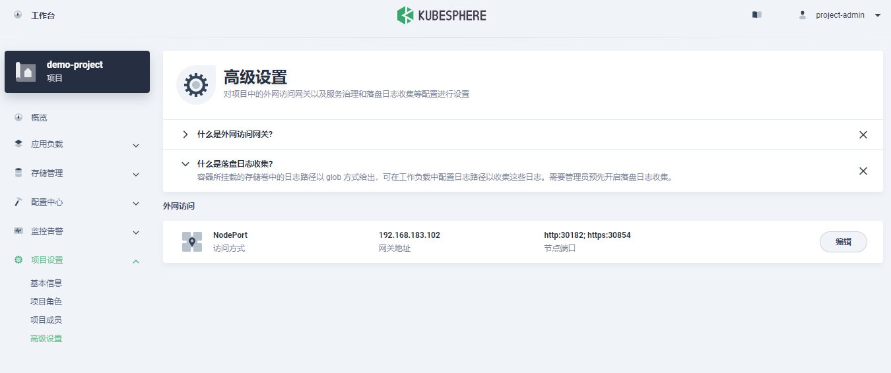
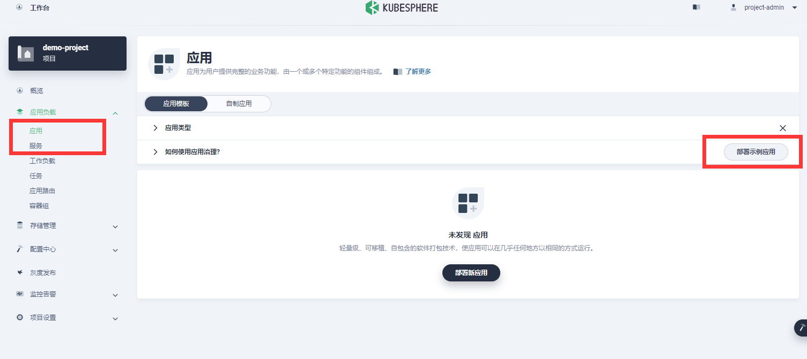
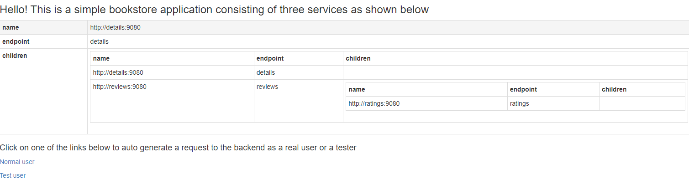

# KubeSphere篇

## 基础篇

### 概念

### 环境部署

#### 配置NFS

##### 安装nfs-server

```bash
# 在每个机器。
yum install -y nfs-utils


# 在master 执行以下命令 
echo "/nfs/data/ *(insecure,rw,sync,no_root_squash)" > /etc/exports


# 执行以下命令，启动 nfs 服务;创建共享目录
mkdir -p /nfs/data


# 在master执行
systemctl enable rpcbind
systemctl enable nfs-server
systemctl start rpcbind
systemctl start nfs-server

# 使配置生效
exportfs -r


#检查配置是否生效
exportfs
```

##### 配置nfs-client（选做）

```bash
showmount -e 172.31.0.4

mkdir -p /nfs/data

mount -t nfs 172.31.0.4:/nfs/data /nfs/data
```

#### 单节点安装

KubeKey 可以将 Kubernetes 和 KubeSphere 一同安装。针对不同的 Kubernetes 版本，需要安装的依赖项可能有所不同。您可以参考以下列表，查看是否需要提前在节点上安装相关的依赖项。

> KubeKey 是用 Go 语言开发的一款全新的安装工具，代替了以前基于 ansible 的安装程序。KubeKey 为用户提供了灵活的安装选择，可以分别安装 KubeSphere 和 Kubernetes 或二者同时安装，既方便又高效。

##### 下载KubeKey

使用脚本快速获取 KubeKey：

```bash
export KKZONE=cn
curl -sfL https://get-kk.kubesphere.io | VERSION=v2.0.0 sh -
```

或者

```bash
wget https://github.com/kubesphere/kubekey/releases/download/v2.0.0 /kubekey-v2.0.0-linux-amd64.tar.gz

tar -zxvf kubekey-v2.0.0-linux-amd64.tar.gz
```

之后，为 kk 添加可执行权限：

```bash
chmod +x kk
```

> 注意，这里是大坑，由于kubekey自动部署，没有选对kk版本，会导致后续对的calico与k8s版本不对，一直报错。

##### 安装依赖的软件或工具

```bash
yum install socat -y
yum install conntrack -y
yum install ebtables -y
yum install ipset -y
```

##### 配置docker

````
yum remove docker \
	docker-client	\
	docker-client-latest \
	docker-common \
	docker-latest \
	docker-latest-logrotate \
	docker-logrotate \
	docker-engine

yum -y install gcc
yum -y install gcc-c++

yum install -y yum-utils

yum-config-manager --add-repo http://mirrors.aliyun.com/docker-ce/linux/centos/docker-ce.repo

yum makecache fast

yum -y install docker-ce docker-ce-cli containerd.io
````

##### 一条命令安装KubeSphere3.0

语法命令：

```bash
./kk create cluster [--with-kubernetes version] [--with-kubesphere version]
```

示例：

```bash
./kk create cluster --with-kubernetes v1.20.10 --with-kubesphere v3.1.1
```

- 安装 KubeSphere 3.2.1 的建议 Kubernetes 版本：1.19.x、1.20.x、1.21.x 或 1.22.x（实验性支持）。如果不指定 Kubernetes 版本，KubeKey 将默认安装 Kubernetes v1.21.5。有关受支持的 Kubernetes 版本的更多信息，请参见[支持矩阵](https://v3-2.docs.kubesphere.io/zh/docs/installing-on-linux/introduction/kubekey/#支持矩阵)。
- 一般来说，对于 All-in-One 安装，无需更改任何配置。
- 如果您在这一步的命令中不添加标志 `--with-kubesphere`，则不会部署 KubeSphere，KubeKey 将只安装 Kubernetes。如果您添加标志 `--with-kubesphere` 时不指定 KubeSphere 版本，则会安装最新版本的 KubeSphere。
- KubeKey 会默认安装 [OpenEBS](https://openebs.io/) 为开发和测试环境提供 LocalPV 以方便新用户。对于其他存储类型，请参见[持久化存储配置](https://v3-2.docs.kubesphere.io/zh/docs/installing-on-linux/persistent-storage-configurations/understand-persistent-storage/)。

> 在这个过程中，请耐心等待~

##### 验证安装结果

```bash
kubectl logs -n kubesphere-system $(kubectl get pod -n kubesphere-system -l 'app in (ks-install, ks-installer)' -o jsonpath='{.items[0].metadata.name}') -f
```

##### 卸载 KubeSphere 和 Kubernetes

```bash
./kk delete cluster
```

#### 多节点安装

##### 配置文件

配置hosts文件

```
10.39.177.126 master1
10.39.177.139 node1
10.39.177.115 node2
```

创建配置文件config.yaml

```bash
./kk create config -f config.yaml
```

配置config.yaml文件

```yaml
apiVersion: kubekey.kubesphere.io/v1alpha1
kind: Cluster
metadata:
  name: sample
spec:
  hosts:
  - {name: master1, address: 10.39.177.126, internalAddress: 10.39.177.126, user: root, password: "root"}
  - {name: node1, address: 10.39.177.139, internalAddress: 10.39.177.139, user: root, password: "root"}
  - {name: node2, address: 10.39.177.115, internalAddress: 10.39.177.115, user: root, password: "root"}
  roleGroups:
    etcd:
    - master1
    master: 
    - master1
    worker:
    - node1
    - node2
  controlPlaneEndpoint:
    domain: lb.kubesphere.local
    address: ""
    port: 6443
  kubernetes:
    version: v1.20.10
    imageRepo: kubesphere
    clusterName: cluster.local
  network:
    plugin: calico
    kubePodsCIDR: 10.233.64.0/18
    kubeServiceCIDR: 10.233.0.0/18
  registry:
    registryMirrors: []
    insecureRegistries: []
  addons: []
```

##### 创建集群

```bash
./kk create cluster -f config.yaml
```

或者

```bash
./kk create cluster --with-kubesphere v3.1.0 -f config.yaml
```

如果出现，一直等待，查看docker容器是否正常。

##### 验证结果

```bash
kubectl logs -n kubesphere-system $(kubectl get pod -n kubesphere-system -l 'app in (ks-install, ks-installer)' -o jsonpath='{.items[0].metadata.name}') -f
```

##### 卸载 KubeSphere 和 Kubernetes

```bash
./kk delete cluster -f config.yaml
```

### 常见操作

#### 添加工作节点

#### 删除工作节点

#### 添加控制节点

#### 删除控制节点

### 入门实战

#### 创建企业空间、项目、用户和平台角色

##### 架构

KubeSphere 的多租户系统分**三个**层级，即集群、企业空间和项目。KubeSphere 中的项目等同于 Kubernetes 的命名空间。

##### 步骤 1：创建用户

将创建一个示例用户 ws-admin。

- 以 admin 身份使用默认帐户和密码 (admin/P@88w0rd) 登录 Web 控制台。
- 点击左上角的**平台管理**，然后选择**访问控制**。在左侧导航栏中，选择**平台角色**。内置角色的描述信息如下表所示。

> 系统默认只有一个用户 admin，具有 platform-admin 角色。

| 内置角色                    | 描述                                                         |
| :-------------------------- | :----------------------------------------------------------- |
| `platform-self-provisioner` | 创建企业空间并成为所创建企业空间的管理员。                   |
| `platform-regular`          | 平台普通用户，在被邀请加入企业空间或集群之前没有任何资源操作权限。 |
| `platform-admin`            | 平台管理员，可以管理平台内的所有资源。                       |

> 内置角色由 KubeSphere 自动创建，无法编辑或删除。

- 在**用户**中，点击**创建**。在弹出的对话框中，提供所有必要信息（带有*标记）。在**平台角色**下拉列表，选择**platform-self-provisioner**。

完成后，点击**确定**。新创建的用户将显示在**用户**页面。

| 用户              | 指定的平台角色     | 用户权限                                                     |
| :---------------- | :----------------- | :----------------------------------------------------------- |
| `ws-admin`        | `platform-regular` | 被邀请到企业空间后，管理该企业空间中的所有资源（在此示例中，此用户用于邀请新成员加入该企业空间）。 |
| `project-admin`   | `platform-regular` | 创建和管理项目以及 DevOps 项目，并邀请新成员加入项目。       |
| `project-regular` | `platform-regular` | `project-regular` 将由 `project-admin` 邀请至项目或 DevOps 项目。该用户将用于在指定项目中创建工作负载、流水线和其他资源。 |

##### 步骤 2：创建企业空间

作为管理项目、DevOps 项目和组织成员的基本逻辑单元，企业空间是 KubeSphere 多租户系统的基础。

1. 在左侧导航栏，选择**企业空间**。企业空间列表中已列出默认企业空间 **system-workspace**，该企业空间包含所有系统项目。其中运行着与系统相关的组件和服务，您无法删除该企业空间。
2. 在企业空间列表页面，点击**创建**，输入企业空间的名称（例如 **demo-workspace**），并将用户 `admin` 设置为企业空间管理员。完成后，点击**创建**。
3. 登出控制台，然后以 `ws-admin` 身份重新登录。在**企业空间设置**中，选择**企业空间成员**，然后点击**邀请**。
4. 邀请 `project-admin` 和 `project-regular` 进入企业空间，分别授予 `demo-workspace-self-provisioner` 和 `demo-workspace-viewer` 角色，点击**确定**。

##### 步骤 3：创建项目

- 以 `project-admin` 身份登录 KubeSphere Web 控制台，在**项目**中，点击**创建**。
- 输入项目名称（例如 `demo-project`），点击**确定**。您还可以为项目添加别名和描述。
- 在**项目**中，点击刚创建的项目查看其详情页面。
- 在项目的**概览**页面，默认情况下未设置项目配额。您可以点击**编辑配额**并根据需要指定资源请求和限制（例如：CPU 和内存的限制分别设为 1 Core 和 1 G）。
- 在**项目设置** > **项目成员**中，邀请 `project-regular` 至该项目，并授予该用户 `operator` 角色。
- 在创建应用路由（即 Kubernetes 中的 Ingress）之前，需要启用该项目的网关。网关是在项目中运行的 NGINX Ingress 控制器。若要设置网关，请转到**项目设置**中的**网关设置**，然后点击**设置网关**。此步骤中仍使用帐户 `project-admin`。
- 选择访问方式 **NodePort**，然后点击**确定**。在**网关设置**下，可以在页面上看到网关地址以及 http/https 的端口。

##### 步骤 4：创建角色

1. 再次以 `admin` 身份登录 KubeSphere Web 控制台，转到**访问控制**。
2. 点击左侧导航栏中的**平台角色**，再点击右侧的**创建**。
3. 在**创建平台角色**对话框中，设置角色标识符（例如，`clusters-admin`）、角色名称和描述信息，然后点击**编辑权限**。
4. 在**编辑权限**对话框中，设置角色权限（例如，选择**集群管理**）并点击**确定**。
5. 在**平台角色**页面，可以点击所创建角色的名称查看角色详情，点击  以编辑角色、编辑角色权限或删除该角色。
6. 在**用户**页面，可以在创建帐户或编辑现有帐户时为帐户分配该角色。

##### 步骤 5：创建 DevOps 项目

1. 以 `project-admin` 身份登录控制台，在 **DevOps 项目**中，点击**创建**。
2. 输入 DevOps 项目名称（例如 `demo-devops`），然后点击**确定**，也可以为该项目添加别名和描述。
3. 点击刚创建的项目查看其详细页面。
4. 转到 **DevOps 项目设置**，然后选择 **DevOps 项目成员**。点击**邀请**授予 `project-regular` 用户 `operator` 的角色，允许其创建流水线和凭证。

#### 项目部署

##### 部署并访问 Bookinfo

###### 设置网关

- 按照之前【创建流程】进行创建角色/用户。
- 以 project-admin 登录平台
- 在【项目设置】的【高级设置】中设置网关



###### 配置KubeSphere 服务网格

见【相关插件】

###### 部署示例应用

点击【部署示例应用】



> 注意，如果资源不足，会导致失败。

部署成功后，验证网址



##### 创建并部署 WordPress

###### 步骤 1：创建密钥

**创建 MySQL 密钥**

环境变量 `WORDPRESS_DB_PASSWORD` 是连接到 WordPress 数据库的密码。在此步骤中，您需要创建一个密钥来保存将在 MySQL Pod 模板中使用的环境变量。

1. 使用 `project-regular` 帐户登录 KubeSphere 控制台，访问 `demo-project` 的详情页并导航到**配置中心**。在**密钥**中，点击右侧的**创建**。

2. 输入基本信息（例如，将其命名为 `mysql-secret`）并点击**下一步**。在下一页中，选择**类型**为 **Opaque（默认）**，然后点击**添加数据**来添加键值对。输入如下所示的键 (Key) `MYSQL_ROOT_PASSWORD` 和值 (Value) `123456`，点击右下角 **√** 进行确认。完成后，点击**创建**按钮以继续。

**创建 WordPress 密钥**

按照以上相同的步骤创建一个名为 `wordpress-secret` 的 WordPress 密钥，输入键 (Key) `WORDPRESS_DB_PASSWORD` 和值 (Value) `123456`。创建的密钥显示在列表中。

###### 步骤 2：创建持久卷声明

1. 访问**存储管理**的**持久卷**，点击**创建**。
2. 输入持久卷声明的基本信息（例如，将其命名为 `wordpress-pvc`），然后点击**下一步**。
3. 在**存储设置**中，需要选择一个可用的**存储类**，并设置**访问模式**和**卷容量**。您可以直接使用默认值，点击**下一步**继续。
4. 在**高级设置**中，您无需添加额外的配置，点击**创建**完成即可。

###### 步骤 3：创建应用程序

**添加 MySQL 后端组件**

1. 导航到**应用负载**下的**应用**，选择**自制应用** > **创建**。

2. 输入基本信息（例如，在应用名称一栏输入 `wordpress`），然后点击**下一步**。

3. 在**服务设置**中，点击**创建服务**以在应用中设置组件。

4. 设置组件的服务类型为**有状态服务**。

5. 输入有状态服务的名称（例如 **mysql**）并点击**下一步**。

6. 在**容器组设置**中，点击**添加容器**。

7. 在搜索框中输入 `mysql:5.6`，按下**回车键**，然后点击**使用默认端口**。由于配置还未设置完成，请不要点击右下角的 **√** 按钮。

   > 在**高级设置**中，请确保内存限制不小于 1000 Mi，否则 MySQL 可能因内存不足而无法启动。

8. 向下滚动到**环境变量**，点击**来自保密字典**。输入名称 `MYSQL_ROOT_PASSWORD`，然后选择资源 `mysql-secret` 和前面步骤中创建的密钥 `MYSQL_ROOT_PASSWORD`，完成后点击 **√** 保存配置，最后点击**下一步**继续。

9. 选择**存储设置**中的**添加持久卷声明模板**，输入 PVC 名称前缀 (`mysql`) 和**挂载路径**（模式：`读写`，路径：`/var/lib/mysql`）的值。

   完成后，点击 **√** 保存设置并点击**下一步**继续。

10. 在**高级设置**中，可以直接点击**创建**，也可以按需选择其他选项。

**添加 WordPress 前端组件**

1. 再次点击**创建服务**，选择**无状态服务**。输入名称 `wordpress` 并点击**下一步**。

2. 与上述步骤类似，点击**添加容器**，在搜索栏中输入 `wordpress:4.8-apache` 并按下**回车键**，然后点击**使用默认端口**。

3. 向下滚动到**环境变量**，点击**来自保密字典**。这里需要添加两个环境变量，请输入以下值：

   - 对于 `WORDPRESS_DB_PASSWORD`，请选择在步骤 1 中创建的 `wordpress-secret` 和 `WORDPRESS_DB_PASSWORD`。
   - 点击**添加环境变量**，分别输入 `WORDPRESS_DB_HOST` 和 `mysql` 作为键 (Key) 和值 (Value)。

   对于此处添加的第二个环境变量，该值必须与MySQL组件的步骤 5 中创建 MySQL 有状态服务设置的名称完全相同。否则，WordPress 将无法连接到 MySQL 对应的数据库。

   点击 **√** 保存配置，再点击**下一步**继续。

4. 在**存储设置**中，点击**挂载卷**，并点击**选择持久卷声明**。

5. 选择上一步创建的 `wordpress-pvc`，将模式设置为`读写`，并输入挂载路径 `/var/www/html`。点击 **√** 保存，再点击**下一步**继续。

6. 在**高级设置**中，可以直接点击**创建**创建服务，也可以按需选择其他选项。

7. 现在，前端组件也已设置完成。点击**下一步**继续。

8. 您可以在**路由设置**中设置路由规则（应用路由 Ingress），也可以直接点击**创建**。创建成功后，应用将显示在应用列表中。

> 一定要保证资源充足。

###### 步骤 4：通过 NodePort 访问 WordPress

1. 若要在集群外访问服务，选择左侧导航栏中的**应用负载 > 服务**。点击 `wordpress` 右侧的三个点后，选择**编辑外部访问**。
2. 在**访问方式**中选择 `NodePort`，然后点击**确定**。
3. 点击**服务**进入详情页，可以在**端口**处查看暴露的端口。
4. 通过 `{Node IP}:{NodePort}` 访问此应用程序

#### 部署中间件

### 启用插件

| 配置项           | 功能组件                         | 描述                                                         |
| :--------------- | :------------------------------- | :----------------------------------------------------------- |
| `alerting`       | KubeSphere 告警系统              | 可以为工作负载和节点自定义告警策略。告警策略被触发后，告警消息会通过不同的渠道（例如，邮件和 Slack）发送至接收人。 |
| `auditing`       | KubeSphere 审计日志系统          | 提供一套与安全相关并按时间顺序排列的记录，记录平台上不同租户的活动。 |
| `devops`         | KubeSphere DevOps 系统           | 基于 Jenkins 提供开箱即用的 CI/CD 功能，提供一站式 DevOps 方案、内置 Jenkins 流水线与 B2I & S2I。 |
| `events`         | KubeSphere 事件系统              | 提供一个图形化的 Web 控制台，用于导出、过滤和警告多租户 Kubernetes 集群中的 Kubernetes 事件。 |
| `logging`        | KubeSphere 日志系统              | 在统一的控制台中提供灵活的日志查询、收集和管理功能。可以添加第三方日志收集器，例如 Elasticsearch、Kafka 和 Fluentd。 |
| `metrics_server` | HPA                              | 根据设定指标对 Pod 数量进行动态伸缩，使运行在上面的服务对指标的变化有一定的自适应能力。 |
| `networkpolicy`  | 网络策略                         | 可以在同一个集群内部之间设置网络策略（比如限制或阻止某些实例 Pod 之间的网络请求）。 |
| `kubeedge`       | KubeEdge                         | 为集群添加边缘节点并在这些节点上运行工作负载。               |
| `openpitrix`     | KubeSphere 应用商店              | 基于 Helm 的应用程序商店，允许用户管理应用的整个生命周期。   |
| `servicemesh`    | KubeSphere 服务网格 (基于 Istio) | 提供细粒度的流量治理、可观测性、流量追踪以及可视化流量拓扑图。 |
| `ippool`         | 容器组 IP 池                     | 创建容器组 IP 池并从 IP 池中分配 IP 地址到 Pod。             |
| `topology`       | 服务拓扑图                       | 集成 [Weave Scope](https://www.weave.works/oss/scope/) 以查看应用和容器的服务间通信（拓扑图）。 |

安装后启用 相应插件：

1. 以 `admin` 用户登录控制台。点击左上角的**平台管理**，选择**集群管理**。

2. 点击**定制资源定义**，在搜索栏中输入 `clusterconfiguration`。点击结果查看其详情页。

   信息

3. 在**自定义资源**中，点击 `ks-installer` 右侧的 ，选择**编辑 YAML**。

4. 在该配置文件中，搜索组件，并将 `enabled` 的 `false` 改为 `true`。完成后，点击右下角的**确定**，保存配置。

执行以下命令，使用 Web kubectl 来检查安装过程：

```bash
kubectl logs -n kubesphere-system $(kubectl get pod -n kubesphere-system -l app=ks-install -o jsonpath='{.items[0].metadata.name}') -f
```

## 进阶篇