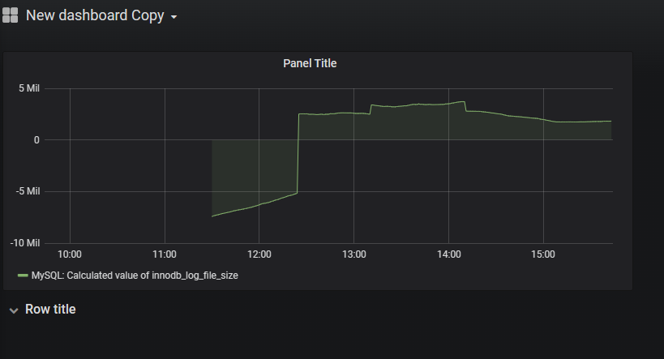
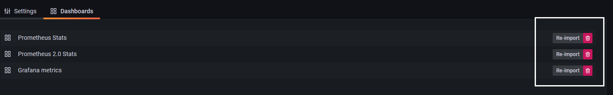

# 监控篇

## 监控概念和基础知识

### 监控的概念

监控是指通过收集、处理和分析数据，对系统、应用程序、网络、服务器等进行实时或定期的监测和管理的过程。监控可以通过收集各种指标数据，如CPU占用率、内存使用率、网络流量、应用程序响应时间等，以便及时发现和解决问题，提高系统的可靠性和性能，同时也可以提高工作效率和用户满意度。

### 监控的分类

监控可以按照监控对象、监控方式和监控指标进行分类。

#### 按照监控对象

- 系统监控：监控操作系统的资源使用情况，如CPU、内存、磁盘等。
- 应用程序监控：监控应用程序的性能、错误、日志等信息。
- 网络监控：监控网络设备、链路和流量等信息。
- 主机监控：监控主机的硬件和软件资源使用情况，如CPU、内存、磁盘等。
- 数据库监控：监控数据库的性能、连接数、死锁等信息。

#### 按照监控方式

- 主动监控：定期向被监控对象发送请求，获取监控数据。
- 被动监控：被监控对象主动将监控数据发送给监控系统。

#### 按照监控指标

- 性能监控：监控系统或应用程序的性能指标，如响应时间、吞吐量、并发数等。
- 错误监控：监控系统或应用程序的错误和异常，如程序崩溃、连接超时等。
- 日志监控：监控系统或应用程序的日志信息，如访问日志、错误日志等。

### 监控的重要性

监控对于维护系统稳定性、提高效率、优化用户体验等方面都具有重要作用。通过监控，我们可以及时发现系统性能问题、异常情况和潜在的故障，以便及时采取措施解决问题。同时，监控也可以帮助我们掌握系统资源使用情况，优化系统配置和调整资源分配，提高系统的可靠性和性能。

### 监控的实现方式

监控的实现方式可以分为基于代理的监控、无代理的监控和云监控。

#### 基于代理的监控

基于代理的监控是通过在被监控对象所在的主机上安装代理程序，代理程序负责采集监控数据并将数据传递给监控服务器。基于代理的监控可以提高数据的采集效率和可靠性，但是需要在被监控主机上安装代理程序，可能会带来一定的安全风险。

#### 无代理的监控

无代理的监控是在被监控对象上直接安装监控软件，以便直接采集监控数据并将数据传递给监控服务器。无代理的监控可以避免安装代理程序带来的安全风险，但是需要在被监控对象上安装监控软件，可能会影响被监控对象的性能。

#### 云监控

云监控是将监控系统部署在云平台上，通过云平台提供的监控服务对系统、应用程序、网络、服务器等进行监控。云监控可以避免在被监控对象上安装监控软件、代理程序等，同时也可以提供更高效、更安全、更可靠的监控服务，但是需要考虑云平台监控服务的稳定性和安全性等问题。

## 监控工具

### Grafana

#### Grafana 用途

#### Grafana 安装

##### 本地部署

- grafana版本采用 6.7.x

```bash
yum localinstall https://mirrors.tuna.tsinghua.edu.cn/grafana/yum/rpm/Packages/grafana-6.7.2-1.x86_64.rpm -y
```

- 启动grafana并设为开机自启

```bash
systemctl start grafana-server.service && systemctl enable grafana-server.service
```

- 查看端口是否启用

```bash
netstat -tunlp | grep 3000
```

访问 dashBoard 默认密码admin     admin

```javascript
http://localhost:3000
```

##### 汉化界面

前往`https://github.com/grafana/grafana/tree/v6.7.x `下载源码

提前安装好 `node` 和 `yarn` 进入源码目录编译

```bash
yarn install 
yarn build
```

首次同步前，先备份`/usr/share/grafana/public`目录

```bash
mv /usr/share/grafana/public  /usr/share/grafana/public.source
#将当前编译目录下的public目录拷贝到/usr/share/grafana/
#重启
service grafana-server restart
```

##### docker 部署

```bash
# create a folder for your data
mkdir data

# start grafana with your user id and using the data folder
docker run -d -p 3000:3000 --name=grafana \
  --user "$(id -u)" \
  --volume "$PWD/data:/var/lib/grafana" \
  grafana/grafana-enterprise
```

##### k8s 部署

- 配置挂着目录

```bash
# k8s-master-1 Master节点配置持久化存储,如果有其他方式提供存储在Grafana-Deployment中配置即可，或者使用Statefulset配置Storageclass来实现持久化存储
mkdir -p /grafana
chown 472:472 /grafana -R
```

- 编辑`grafana.yaml`

```yaml
---
apiVersion: apps/v1
kind: Deployment
metadata:
  labels:
    app: grafana
  name: grafana
spec:
  selector:
    matchLabels:
      app: grafana
  template:
    metadata:
      labels:
        app: grafana
    spec:
      securityContext:
        fsGroup: 472
        supplementalGroups:
        - 0
      containers:
      - name: grafana
        image: grafana/grafana:8.5.1
        imagePullPolicy: IfNotPresent
        ports:
        - containerPort: 3000
          protocol: TCP
        volumeMounts:
        - name: grafana-data
          mountPath: /var/lib/grafana
      volumes:
      - name: grafana-data
        hostPath:
          path: /grafana
          type: Directory
---
apiVersion: v1
kind: Service
metadata:
  name: grafana
spec:
  selector:
    app: grafana
  type: NodePort                   # 将其暴露出来，便于外部访问
  ports:
    - port: 3000
      targetPort: 3000
      nodePort: 3000                # 固定端口，便于访问
```

- 运行以下命令：`kubectl apply -f grafana.yaml`
- 通过运行以下命令检查它是否正常工作：`kubectl port-forward service/grafana 3000:3000`
- 在浏览器中导航到。应该会看到一个 Grafana 登录页面。`localhost:3000`
- 用于登录的用户名和密码。`admin`

#### Grafana 使用

##### 对接 zabbix

###### [安装zabbix插件](https://grafana.com/grafana/plugins/?type=datasource&utm_source=grafana_add_ds)

```bash
# grafana下载boom theme插件
grafana-cli plugins install yesoreyeram-boomtheme-panel
# 世界ping
grafana-cli plugins install raintank-worldping-app
# Zabbix报警
grafana-cli plugins install alexanderzobnin-zabbix-app
# 世界地图面板
grafana-cli plugins install grafana-worldmap-panel

# 时钟
grafana-cli plugins install grafana-clock-panel
# 饼图
grafana-cli plugins install grafana-piechart-panel
grafana-cli plugins install macropower-analytics-panel
grafana-cli plugins install digiapulssi-breadcrumb-panel
grafana-cli plugins install andig-darksky-datasource
grafana-cli plugins install citilogics-geoloop-panel
grafana-cli plugins install bessler-pictureit-panel
grafana-cli plugins install natel-plotly-panel
grafana-cli plugins install snuids-radar-panel
grafana-cli plugins install blackmirror1-statusbygroup-panel
grafana-cli plugins install snuids-trafficlights-panel
grafana-cli plugins install smartmakers-trafficlight-panel
grafana-cli plugins install btplc-trend-box-panel
grafana-cli plugins install fatcloud-windrose-panel
# 气泡图
grafana-cli plugins install digrich-bubblechart-panel
# json数据
grafana-cli plugins install grafana-simple-json-datasource
# k8s监控应用
grafana-cli plugins install grafana-kubernetes-app
# WindRoseby 极坐标图
grafana-cli plugins install fatcloud-windrose-panel
# 雷达图
grafana-cli plugins install snuids-radar-panel
# 世界地图热力图
grafana-cli plugins install ovh-warp10-datasource
# 选点监控
grafana-cli plugins install natel-usgs-datasource
# es数据监控
grafana-cli plugins install stagemonitor-elasticsearch-app
# Plotly直接坐标系散点图
grafana-cli plugins install natel-plotly-panel
# 组织结构图
grafana-cli plugins install digiapulssi-organisations-panel
# ajax请求更新数据
grafana-cli plugins install ryantxu-ajax-panel
# Ps：更新插件示例：
grafana-cli plugins update alexanderzobnin-zabbix-app 3.12.1
```

###### 重启服务

```bash
systemctl restart grafana-server.service
```

###### 启用插件

【configuration】-【plugins】-【zabbix】


###### 添加数据源

【configuration】-【datasources】-【zabbix】


点击进去后，编辑【HTTP/URL】


```bash
[root@localhost zabbix]# curl -s -X POST -H 'Content-Type:application/json' -d '{"jsonrpc": "2.0","method": "user.login","params": {"user": "Admin","password": "zabbix"},"id": 1}' http://192.168.116.128:80/zabbix/api_jsonrpc.php
{"jsonrpc":"2.0","result":"232f7f5a250d95b3647180dec2d64748","id":1}
```

编辑【zabbix api details】


编辑【other】，并保存


###### 导入仪表板并查看监控效果


###### 连接zabbix数据库

【选择mysql】-在之前的zabbix选择db【启用并选择上面创建好的 Zabbix DB Data Source】。

###### 新建仪表板


之后，点击保存，即可看到其他的数据展示。



### prometheus

#### prometheus用途

#### prometheus安装

##### 本地部署 服务器

- 前提配置

```bash
yum install -y wget ntp curl vim net-tools
tar -zcvf /etc/yum.repos.d/yumRepo.bak /etc/yum.repos.d/*.repo
rm -rf /etc/yum.repos.d/*.repo
wget -O /etc/yum.repos.d/CentOS-Base.repo http://mirrors.aliyun.com/repo/Centos-7.repo
yum install epel-release -y
yum clean all && yum makecache
timedatectl set-timezone Asia/Shanghai
timedatectl set-local-rtc 0
sed -i 's/server 0.centos.pool.ntp.org iburst/server ntp1.aliyun.com iburst/g' /etc/ntp.conf
sed -i 's/server 1.centos.pool.ntp.org iburst/server ntp2.aliyun.com iburst/g' /etc/ntp.conf
sed -i 's/server 2.centos.pool.ntp.org iburst/server 1.centos.pool.ntp.org iburst/g' /etc/ntp.conf
sed -i 's/server 3.centos.pool.ntp.org iburst/server 2.centos.pool.ntp.org iburst/g' /etc/ntp.conf
systemctl restart ntpd
systemctl enable ntpd
systemctl stop firwalld
systemctl disable firewalld
setenforce 0
sed -i 's/SELINUX=enforcing/SELINUX=disabled/g' /etc/selinux/config
```

- 安装 prometheus

下载

```bash
wget https://github.com/prometheus/prometheus/releases/download/v2.46.0/prometheus-2.46.0.freebsd-amd64.tar.gz
```

解压

```bash
tar -zxvf prometheus-2.17.1.linux-amd64.tar.gz -C /usr/local
```

将Prometheus做成软连接的形式

```bash
ln -s /usr/local/prometheus-2.17.1.linux-amd64 /usr/local/prometheus
```

创建用于运行Prometheus的组和用户

```bash
groupadd prometheus
useradd -g prometheus -s /sbin/nologin prometheus
```

创建Prometheus数据存储目录

```bash
mkdir -p /var/lib/prometheus
chown -R prometheus /var/lib/prometheus
```

给Prometheus主目录赋用户Prometheus权限

```bash
chown -R prometheus:prometheus /usr/local/prometheus/
```

将Prometheus加入到系统管理程序中

```bash
cat >/etc/systemd/system/prometheus.service <<EOF
 
[Unit]
Description=Prometheus
Documentation=https://prometheus.io/
After=network.target
 
[Service]
Type=simple
User=prometheus
# --storage.tsdb.path是可选项，默认数据目录在运行目录的./dada目录中
ExecStart=/usr/local/prometheus/prometheus --config.file=/usr/local/prometheus/prometheus.yml --storage.tsdb.path=/var/lib/prometheus
Restart=on-failure
 
[Install]
WantedBy=multi-user.target
EOF
```

- 可选）将客户端加入到Prometheus监控中

注意：将配置文件中的ip地址改成你的被监控客户端的ip，(node_exporter的)端口号默认是9100

```bash
cp /usr/local/prometheus/prometheus.yml{,.bak}
vi /usr/local/prometheus/prometheus.yml
 
  - job_name: 'xnode1-mycat33'
    scrape_interval: 10s
    static_configs:
    - targets: ['192.168.116.128:9100']
      labels:
        instance: xnode1-instance
```

> 为了方便测试，进去后，将localhost改成本机ip

- 启动Prometheus并设置其开机自启

```bash
systemctl start prometheus.service
systemctl enable prometheus.service
```

- 验证prometheus的Web页面，prometheus默认的端口号是9090，浏览器输入

```bash
192.168.116.128：9090
```

- 在prometheus的web页面上查看主机监控状态【Status---Targets】


- 使用prometheus的web方式查看主机的监控值


##### 客户端安装部署node_exporter

- 下载node_exporter

```bash
wget -P /usr/local/src https://github.com/prometheus/node_exporter/releases/download/v1.0.0-rc.0/node_exporter-1.0.0-rc.0.linux-amd64.tar.gz
```

- 解压node_exporter

```bash
tar -zxvf /usr/local/src/node_exporter-1.0.0-rc.0.linux-amd64.tar.gz -C /usr/local
```

- 可选）创建软连接（如果你对linux不熟悉，建议跟着继续做）

```bash
ln -s /usr/local/node_exporter-1.0.0-rc.0.linux-amd64/ /usr/local/node_exporter
```

- 创建用于运行node_exporter的用户

```bash
groupadd prometheus
useradd -g prometheus -s /sbin/nologin prometheus
```

- 给node_exporter主目录赋权限

```bash
chown -R prometheus:prometheus /usr/local/node_exporter/
```

- 将node_exporter加入到系统服务当中

```bash
cat >/usr/lib/systemd/system/node_exporter.service <<EOF
[Unit]
Description=node_exporter
Documentation=https://prometheus.io/
After=network.target
 
[Service]
Type=simple
User=prometheus
ExecStart=/usr/local/node_exporter/node_exporter
Restart=on-failure
 
[Install]
WantedBy=multi-user.target
EOF
```

- 启动node_exporter并将其设置开机自启

```bash
systemctl start node_exporter
systemctl enable node_exporter
```

- 检查node_exporter是否已启动，node_exporter默认的端口是9100

```bash
systemctl status node_exporter
ss -ntl |grep 9100
```

- （啰嗦）将9100在防火墙中放行，或者直接关闭防火墙

```bash
systemctl stop firewalld
systemctl disable firewalld
```

- 在prometheus的web上检查是否监控到了本机

在服务器中已经修改过配置文件，将本客户端加入到了prometheus服务器的配置文件中了。

##### docker 部署

##### k8s 部署

#### 在Grafana上展示prometheus

- 浏览器打开Grafana主页 http://192.168.112.128:3000，默认用户名和密码都是admin。
- 添加数据源

依次点开左侧的齿轮状图标【Configuration】---【Data Source】，再新页面中点【Add data source】


- 点一下数据源类型Prometheus


- 为Grafana数据源prometheus添加数据源参数

Name：随便输入

Default：设置为开启状态

URL：http://192.168.116.128:9090/ ，写你的prometheus主页地址。

Access： Server(default)

Scrape interval：15s ，因为我们这是测试环境，尽量把刷新数据的时间写小点。


- 点【Save & Test】 后，能弹出绿色的【Data source is working】就说明我们的prometheus数据源添加成功了。


- 在Grafana上查看默认的prometheus仪表盘。



然后点一下【Prometheus Stats】就能看到默认的仪表盘了。


### Zabbix

#### Zabbix 用途

#### Zabbix 安装

##### zabbix 服务端

###### 创建 zabbix 用户组和用户

```bash
groupadd zabbix
useradd -r -g zabbix zabbix
```

###### 安装配置zabbix专用yum源

```bash
rpm -Uvh https://repo.zabbix.com/zabbix/5.0/rhel/7/x86_64/zabbix-release-5.0-1.el7.noarch.rpm
yum clean all
yum makecache fast
```

###### 安装zabbix服务端组件

```bash
yum -y install zabbix-server-mysql zabbix-web-mysql zabbix-get
```

如果安装过程出现版本冲突，然后重新运行上述

```bash
cd /etc/yum.repos.d/
mv epel.repo epel-bak
```

###### 安装zabbix前端组件

```bash
yum -y install centos-release-scl
```

编辑配置文件 ``/etc/yum.repos.d/zabbix.repo``，将enabled设置为1，如下：

```bash
vi /etc/yum.repos.d/zabbix.repo

[zabbix]
name=Zabbix Official Repository - $basearch
baseurl=http://repo.zabbix.com/zabbix/5.0/rhel/7/$basearch/
enabled=1
gpgcheck=1
gpgkey=file:///etc/pki/rpm-gpg/RPM-GPG-KEY-ZABBIX-A14FE591

[zabbix-frontend]
name=Zabbix Official Repository frontend - $basearch
baseurl=http://repo.zabbix.com/zabbix/5.0/rhel/7/$basearch/frontend
enabled=1
gpgcheck=1
gpgkey=file:///etc/pki/rpm-gpg/RPM-GPG-KEY-ZABBIX-A14FE591

[zabbix-debuginfo]
name=Zabbix Official Repository debuginfo - $basearch
baseurl=http://repo.zabbix.com/zabbix/5.0/rhel/7/$basearch/debuginfo/
enabled=0
gpgkey=file:///etc/pki/rpm-gpg/RPM-GPG-KEY-ZABBIX-A14FE591
gpgcheck=1

[zabbix-non-supported]
name=Zabbix Official Repository non-supported - $basearch
baseurl=http://repo.zabbix.com/non-supported/rhel/7/$basearch/
enabled=1
gpgkey=file:///etc/pki/rpm-gpg/RPM-GPG-KEY-ZABBIX
gpgcheck=1
```

###### 安装zabbix前端页面、初始数据库、PHP及httpd组件

```bash
yum -y install zabbix-web-mysql-scl zabbix-apache-conf-scl
```

###### 安装 MySQL

- 下载 rpm

```bash
wget https://dev.mysql.com/get/mysql80-community-release-el7-3.noarch.rpm
yum -y localinstall mysql80-community-release-el7-3.noarch.rpm
yum -y install mysql-devel   #安装mysql的开发包
yum install -y yum-utils
# 查看可用的 mysql
yum repolist enabled | grep "mysql.*-community.*"
```

可以看到目前启用(`enable`)的是 `mysql80`,如果需要安装 mysql 5.7 ,则需要先禁用(`disable`) mysql8.0,然后启用(`enable`)mysql5.7

```bash
yum-config-manager --disable mysql80-community
yum-config-manager --enable mysql57-community
```

- 校验当前启用(`enable`)的 mysql 版本是否为 5.7

```bash
yum repolist enabled | grep mysql
```

- 修改配置跳过校验

```bash
vi /etc/yum.repos.d/mysql-community.repo
```

修改对应安装版本的`gpgcheck=0`即可，默认值为1。

- 开始安装

```bash
yum install -y mysql-community-server
```

- 启动并创建自启动

```bash
sudo service mysqld start
# systemctl start mysqld.service
systemctl enable mysqld.service
```

- 查看生成的初始密码

```bash
sudo grep 'temporary password' /var/log/mysqld.log
```

- 使用初始密码进行登录

```bash
mysql -uroot -p
```

- 登录成功之后设置新密码

```mysql
# 5.7
set global validate_password_policy=LOW;
set global validate_password_length=6;
ALTER USER 'root'@'localhost' IDENTIFIED BY '123456'; 

# 8.0
alter user’root’@‘localhost’ identified with mysql_native_password by ‘新密码’;

# 刷新MySQL的系统权限命令
FLUSH PRIVILEGES; 
```

- 授权其他机器远程登录

```mysql
GRANT ALL PRIVILEGES ON *.* TO 'root'@'%' IDENTIFIED BY '123456' WITH GRANT OPTION;
```

###### 执行部署 zabbix 服务

```bash
cd /usr/local/data/zabbix

./configure --prefix=/usr/local/data/zabbix --enable-server --enable-agent --with-mysql=/usr/bin/mysql_config --with-net-snmp --with-libcurl --with-libxml2
```


```bash
make && make install
```

然后添加环境变量

```bash
vim /etc/profile
```

```bash
# Zabbix Environment
export PATH=$PATH:/usr/local/data/zabbix/sbin/:/usr/local/data/zabbix/bin/
```

```bash
source /etc/profile
```

###### 创建用户导入数据库

```bash
create database zabbix character set utf8 collate utf8_bin;

set global validate_password_length=6;

set global validate_password_policy=0;

grant all privileges on zabbix.* to zabbix@'localhost' identified by '123456';

flush privileges;

set names utf8;

use zabbix;
source /usr/local/zabbix-5.0.30/database/mysql/schema.sql
source /usr/local/zabbix-5.0.30/database/mysql/data.sql
source /usr/local/zabbix-5.0.30/database/mysql/images.sql
```

###### 编辑 zabbix_server 的配置文件

- 查找下配置文件位置

```bash
[root@localhost ~]# find / -name zabbix_server.conf
/etc/zabbix/zabbix_server.conf
```

- 编辑配置文件

```bash
 vi /etc/zabbix/zabbix_server.conf
```

```bash
LogFile=/var/log/zabbix/zabbix_server.log
LogFileSize=0
PidFile=/var/run/zabbix/zabbix_server.pid
SocketDir=/var/run/zabbix
DBHost=localhost
DBName=zabbix
DBUser=zabbix
DBPassword=123456
DBPort=3306
SNMPTrapperFile=/var/log/snmptrap/snmptrap.log
Timeout=4
AlertScriptsPath=/usr/lib/zabbix/alertscripts
ExternalScripts=/usr/lib/zabbix/externalscripts
LogSlowQueries=3000
StatsAllowedIP=127.0.0.1
```

- 授权建立相关文件夹

```bash
mkdir /usr/local/data/zabbix/logs
mkdir /usr/local/data/zabbix/pid
chown -R zabbix:zabbix /usr/local/data/zabbix/
```

###### 配置 PHP

- 修改时区信息

```bash
vi /etc/opt/rh/rh-php72/php-fpm.d/zabbix.conf
```

```bash
php_value[date.timezone] = Asia/Shanghai # 去掉前面分号
```

###### 配置字体，避免前台监控图形中文乱码

```bash
yum -y install wqy-microhei-fonts
mv /usr/share/fonts/dejavu/DejaVuSans.ttf /usr/share/fonts/dejavu/DejaVuSans.ttf.bak
cp -f /usr/share/fonts/wqy-microhei/wqy-microhei.ttc /usr/share/fonts/dejavu/DejaVuSans.ttf
```

###### 启动zabbix相关服务并设置开机自启动

```bash
systemctl restart zabbix-server httpd rh-php72-php-fpm
systemctl enable zabbix-server httpd rh-php72-php-fpm
```

###### 浏览器上访问前端，进行初始化安装

- 访问http://IP，然后【默认点击下一步】

> 这一步结束后，初始化完成，并进入登录界面，默认用户名是Admin，密码是zabbix，登录后请及时修改密码

出现报错

```bash
PHP xmlwriter extension missing zabbix
PHP xmlreader extension missing zabbix
```

解决办法：

```bash
yum install php-xmlwriter -y
```

然后重新启动。


##### Zabbix 客户端

客户端采用 agent2。

- 服务端和客户端都配置时间同步

```bash
yum install -y ntpdate
ntpdate -u ntp.aliyun.com
```

- 客户端配置时区，与服务器保持一致

```bash
mv /etc/localtime{,.bak}
ln -s /usr/share/zoneinfo/Asia/Shanghai 
date
```

- 设置zabbix的下载源，安装zabbix-agent2

```bash
rpm -ivh https://mirrors.aliyun.com/zabbix/zabbix/5.0/rhel/7/x86_64/zabbix-release-5.0-1.el7.noarch.rpm 

cd /etc/yum.repos.d/

sed -i 's#http://repo.zabbix.com#https://mirrors.aliyun.com/zabbix#' /etc/yum.repos.d/zabbix.repo

yum install -y zabbix-agent2
```

- 修改 agent2 配置文件

```bash'
vim /etc/zabbix/zabbix_agent2.conf
```

```bash
Server=192.168.116.128              #80行，指定 zabbix 服务端的 IP 地址
ServerActive=192.168.116.128        #123行，指定 zabbix 服务端的 IP 地址
Hostname=localhost                 #134行，指定当前 zabbix 客户端的主机名

# ListenPort 监听端口
```

- 启动zabbix-agent2

```bash
systemctl start zabbix-agent2.service 
systemctl enable zabbix-agent2.service 
```

- 在服务端验证zabbix-agent2的连通性

```bash
yum install -y zabbix-get    #安装 zabbix 主动获取数据的命令

zabbix_get -s '192.168.116.128' -p 10050 -k 'agent.ping'
# 返回1为连接成功。

zabbix_get -s '192.168.116.128' -p 10050 -k 'system.hostname'  #客户端的主机名
```

#### Zabbix 使用

##### 在Web页面中添加agent主机

点击【配置】-【主机】-【创建主机】


创建主机，填写信息如下：

- 主机名称和之前的【Hostname】一致
- 客户端是IP就是客户端主机的IP地址


##### 监控MySQL

【主机】-【选择相应客户端主机】-【添加模板】-【修改模板的宏数据】


##### [lld 自动发现](https://www.zabbix.com/documentation/4.0/zh/manual/discovery/low_level_discovery)

###### 创建发现规则

在Template OS Linux by Zabbix agent模板中测试。


点击【自动发现规则】-【创建发现规则】


###### 设置对应agent端自定义脚本

- python脚本

```python
#!/usr/bin/python

import os
import json

data = {}
tcp_list = []
port_list = []

command = os.popen("ss -4tln | awk -F'[ :]+' 'NR>=2{print $5}'")

for port in command:
    port_list.append(port.strip())

for port in port_list:
    port_dict = {}
    port_dict["{#TCP_PORT}"] = port
    tcp_list.append(port_dict)

data["data"] = tcp_list

content = json.dumps(data,sort_keys=True,indent=4)

print content
```

- 脚本测试

```bash
[root@localhost zabbix_agentd.d]# python /tmp/test.py 
{
    "data": [
        {
            "{#TCP_PORT}": "22"
        }, 
        {
            "{#TCP_PORT}": "10051"
        }, 
        {
            "{#TCP_PORT}": "9000"
        }, 
        {
            "{#TCP_PORT}": "80"
        }
    ]
}
```

###### 设置监控原型

点击刚才创建的发现规则【LLD-自动发现端口】-【监控项原型】-【创建监控项原型】


###### 设置图形原型

点击【图形原型】-【创建图形原型】


###### 修改参数

编辑`zabbix_agent2.conf`。注意，因为客户端使用的是agent2，根据自己使用的找对应的配置文件进行修改。

```bash
vi /etc/zabbix/zabbix_agent2.conf
```

将`UnsafeUserParameters`修改如下：

```bash
UnsafeUserParameters=1
```

然后重新启动

```bash
systemctl restart zabbix-agent2.service
```

测试

```bash
[root@localhost zabbix]# zabbix_get -s 192.168.116.128 -p 10050 -k "net.tcp.listen[22]"
1
[root@localhost zabbix]# zabbix_get -s 192.168.116.128 -p 10050 -k "tcp.port"
{
    "data": [
        {
            "{#TCP_PORT}": "22"
        }, 
        {
            "{#TCP_PORT}": "10051"
        }, 
        {
            "{#TCP_PORT}": "9000"
        }, 
        {
            "{#TCP_PORT}": "80"
        }
    ]
}
```

###### 查看 server web


##### 使用zabbix sender


```bash
- bind.parameter {"data": [{"{#BIND_PERF}": "BIND INCOMING QUERY"}, {"{#BIND_PERF}": "BIND INCOMING NOTIFY"}, {"{#BIND_PERF}": "BIND INCOMING A"}, {"{#BIND_PERF}": "BIND INCOMING SOA"}, {"{#BIND_PERF}": "BIND INCOMING PTR"}, {"{#BIND_PERF}": "BIND INCOMING AAAA"}, {"{#BIND_PERF}": "BIND INCOMING IXFR"}, {"{#BIND_PERF}": "BIND INCOMING AXFR"}, {"{#BIND_PERF}": "BIND INCOMING ANY"}, {"{#BIND_PERF}": "BIND OUTGOING A"}, {"{#BIND_PERF}": "BIND OUTGOING NS"}, {"{#BIND_PERF}": "BIND OUTGOING PTR"}, {"{#BIND_PERF}": "BIND OUTGOING AAAA"}, {"{#BIND_PERF}": "BIND OUTGOING DNSKEY"}]}
```

```bash
zabbix_sender -z 192.168.116.128 -p 10051 -vv -c /etc/zabbix/zabbix_agent2.conf -i /etc/zabbix/test.txt
```

但是没有生效，尝试创建监控项（不是自动发现规则），有数据了。