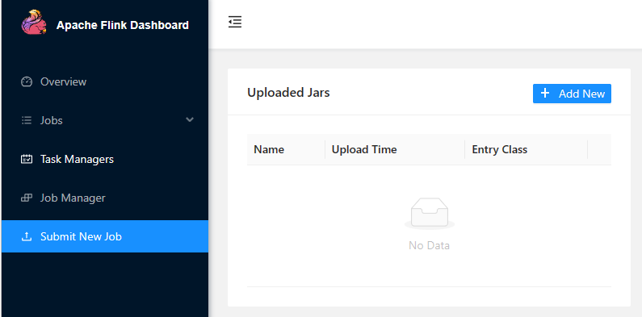
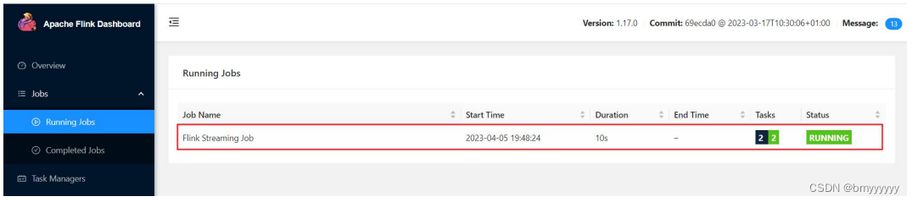
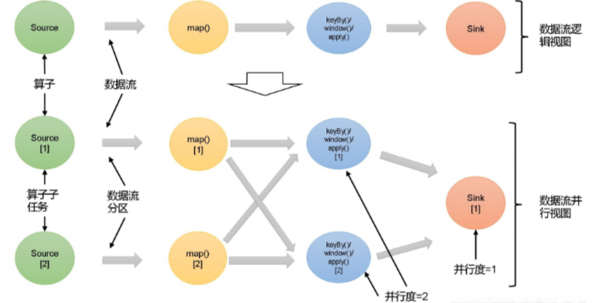
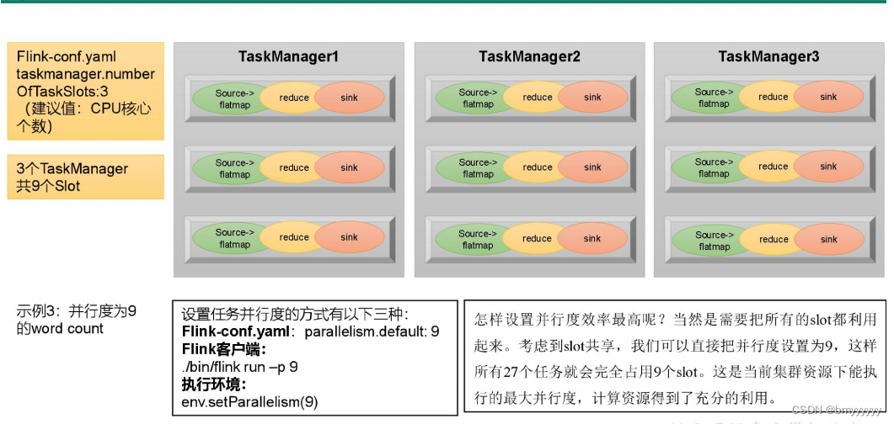

# Flink 篇

## 基础篇

### Flink 概念

#### Flink 是什么

- Flink的官网地址：https://flink.apache.org/

Flink的核心目标，是“数据流上的有状态计算”（Stateful Computations Over Data Stream）。

具体说明：**Apache FLink 是有一个框架和分布式处理引擎，用于对无界和有界数据流进行有状态计算。**

##### 有界流和无界流

###### 无界数据流

- 有定义流的开始，但没有定义流的结束
- 它们会无休止的产生数据
- 无界流的数据必须持续处理，即数据被摄取后需要立刻处理。

我们不能等到所有数据都到达再处理，因为输入是无限的。

###### 有界数据流

- 有定义流的开始，也有定义流的结束
- 有界流可以在摄取所有数据后再进行计算
- 有界流所有数据可以被排序，所以并不需要有序摄取
- 有界流处理通常被称为批处理

把流处理需要的额外数据保存成要给“状态”，然后针对这条数据进行处理，并且更新状态。这就是所谓的“有状态的流处理”。

- 状态在内存中
  - 优点：速度快
  - 缺点：可靠性差
- 状态在分布式系统中
  - 优点：可靠性高
  - 缺点：速度慢

##### Flink 的发展史

Flink起源于一个叫作Stratosphere的项目，它是由3所地处柏林的大学和欧洲其他一些大学在2010~2014年共同进行的研究项目，由柏林理工大学的教授沃克尔·马尔科(volker Markl)领衔开发。2014年4月，Stratosphere的代码被复制并捐赠给了Apache软件基金会，Flnk就是在此基础上被重新设计出来的。

在德语中，“flink”一词表示“快速、灵巧”


项目的logo是一只彩色的松鼠。

- 2014年8月，Flink第一个版本0.6正式发布，与此同时Fk的几位核心开发者创办Data Artisans公司
- 2014年12月，Flink项目完成孵化
- 2015年4月，Flink发布了里程碑式的重要版本0.9.0
- 2019年1月，长期对Flink投入研发的阿里巴巴，以9000万欧元的价格收购了Data Artisans 公司
- 2019年8月，阿里巴巴将内部版本Blink开源，合并入Flink 1.9.0版本

#### Flink 特点

处理数据的目标是：**低延迟、高吞吐、结果的准确性和良好的容错性**。

Flink主要特点如下：

- 高吞吐和低延迟。每秒处理数百万个事件，毫秒级延迟
- 结果的准确性。Flink提供了事件时间 (event-time)和处理时间 (processing time)语义。对于乱序事件流，事件时间语义仍然能提供一致且准确的结果。
- 精确一次(exactly - once)的状态一致性保证。
- 可以连接到最常用的外部系统，如Kafka、Hive、JDBC、HDFS、Redis等。
- 高可用。本身高可用的设置，加上与K8s，YARN和Mesos的紧密集成，再加上从故障中快速恢复和动态扩展任务的能力，Flink能做到以极少的停机时间7X24全天候运行。

#### Flink vs SparkStreaming

##### Spark以批处理为根本

- Spark数据模型：Spark 采用RDD 模型，Spark Streaming 的 DStream 实际上也就是**一组组小批数据 RDD 的集台**
- Spark运行时架构：**Spark 是批计算**，将 DAG 分为不同的 stage，**一个完成后才可以计算下一个**

##### Flink以流处理为根本

- Flink数据模型：Flink基本数据模型是**数据流**，以及事件（Event）序列
- Flink运行时架构：Flink是标准的流执行模式，**一个事件在一个节点处理完后可以直接发往下一个节点进行处理**

|          | Flink              | Streaming                            |
| -------- | ------------------ | ------------------------------------ |
| 计算模型 | 流计算             | 微批处理                             |
| 时间语义 | 事件时间、处理时间 | 处理时间                             |
| 窗口     | 多、灵活           | 少、不灵活（窗口必须是批次的整数倍） |
| 状态     | 有                 | 没有                                 |
| 流式SQL  | 有                 | 没有                                 |

#### Flink 的应用场景

Flink在国内各个企业中大量使用。一些行业中的典型应用有：

（1）电商和市场营销，举例：实时数据报表、广告投放、实时推荐

（2）物联网（IOT），举例：传感器实时数据采集和显示、实时报警，交通运输业

（3）物流和服务业，举例：订单状态实时更新、通知信息推送

（4）银行和金融业，举例：实时结算和通知推送，实时检测异常行为

#### Flink 分层 API

- 越顶层越抽象，表达含义越简明，使用越方便
- 越底层越具体，表达能力越丰富，使用越灵活


- 有状态流处理：通过底层API（处理函数），对最原始数据加工处理。底层API与DataStream API相集成，可以处理复杂的计算。

- DataStream API(流处理)和DataSet API(批处理)封装了底层处理函数，提供了通用的模块，比如转换(transformations，包括map、flatmap等)，连接 (joins)，聚合 (aggregations)，窗口 (windows) 操作等，注意：Flnk1.12以后，DataSteam API已经实现真正的流批一体，所以DataSet API已经过时。

- Table API是以表为中心的声明式编程，其中表可能会动态变化。Table API遵循关系模型：表有二维数据结构，类似于关系数据库中的表；同时API提供可比较的操作，例如select、 project、join、group-by、aggregate等。我们可以在表与 DataStream / DataSet之间无缝切换，以允许程序将 Table API与 DataStream 以及 DataSet 混合使用。

- SQL这一层在语法与表达能力上与 Table API类似，但是是以SQL查询表达式的形式表现程序。SQL抽象与Table API交互密切，同时SOL查询可以直接在Table API定义的表上执行。


### Flink 快速入门

#### 添加项目依赖

```xml
<properties>
    <flink.version>1.17.0</flink.version>
</properties>

<dependencies>
    <dependency>
        <groupId>org.apache.flink</groupId>
        <artifactId>flink-streaming-java</artifactId>
        <version>${flink.version}</version>
    </dependency>

    <dependency>
        <groupId>org.apache.flink</groupId>
        <artifactId>flink-clients</artifactId>
        <version>${flink.version}</version>
    </dependency>
</dependencies>
```

#### WordCount 代码编写

需求：统计一段文字中，每个单词出现的频次。

##### 批处理（了解）

###### **数据准备**

- 在工程根目录下新建一个input文件夹，并在下面创建文本文件words.txt
- 在words.txt中输入一些文字，例如：

```txt
hello flink
hello world
hello java
```

###### **代码编写**

新建Java类BatchWordCount，在静态main方法中编写代码。具体代码实现如下：

```java
public class BatchWordCount {
    public static void main(String[] args) throws Exception {
        // 1. 创建执行环境
        ExecutionEnvironment executionEnvironment = ExecutionEnvironment.getExecutionEnvironment();
        // 2. 从文件读取数据  按行读取(存储的元素就是每行的文本)
        // 注意，最好是绝对路径
        DataSource<String> dataSource = executionEnvironment.readTextFile("input\\word.txt");
        // 3. 转换数据格式
        FlatMapOperator<String, Tuple2<String, Long>> wordAndOne = dataSource.flatMap(new FlatMapFunction<String, Tuple2<String, Long>>() {
            @Override
            public void flatMap(String line, Collector<Tuple2<String, Long>> collector) {
                String[] words = line.split(" ");
                
                for (String word : words) {
                    collector.collect(Tuple2.of(word, 1L));
                }
            }
        });
        
        // 4. 按照 word 进行分组
        UnsortedGrouping<Tuple2<String, Long>> wordAndOneUG = wordAndOne.groupBy(0);
        
        // 5. 分组内聚合统计
        AggregateOperator<Tuple2<String, Long>> sum = wordAndOneUG.sum(1);
        
        // 6. 打印结果
        sum.print();
        
    }
}
```

输出

```txt
(flink,1)
(world,1)
(hello,3)
(java,1)
```

需要注意的是，这种代码的实现方式，是基于DataSet API的，也就是我们对数据的处理转换，是看作数据集来进行操作的。事实上Flink本身是流批统一的处理架构，批量的数据集本质上也是流，没有必要用两套不同的API来实现。所以从Flink 1.12开始，官方推荐的做法是直接使用DataStream API，在提交任务时通过将执行模式设为BATCH来进行批处理：

```bash
bin/flink run -Dexecution.runtime-mode=BATCH BatchWordCount.jar
```

这样，DataSet API就没什么用了，在实际应用中我们只要维护一套**DataStream API**就可以。这里只是为了方便大家理解，我们依然用DataSet API做了批处理的实现。

##### 流处理（主流）

对于Flink而言，流才是整个处理逻辑的底层核心，所以流批统一之后的DataStream API更加强大，可以直接处理批处理和流处理的所有场景。

下面我们就针对不同类型的输入数据源，用具体的代码来实现流处理。

###### **读取文件**

新建Java类StreamWordCount，在静态main方法中编写代码。具体代码实现如下：

```java
public class StreamWordCount {
    public static void main(String[] args) throws Exception {
        // 1. 创建流式执行环境
        StreamExecutionEnvironment streamExecutionEnvironment = StreamExecutionEnvironment.getExecutionEnvironment();
        // 2. 读取文件
        DataStreamSource<String> dataStreamSource = streamExecutionEnvironment.readTextFile("input\\word.txt");
        
        // 3. 转换数据格式
        SingleOutputStreamOperator<Tuple2<String, Long>> sum = dataStreamSource.flatMap(new FlatMapFunction<String, Tuple2<String, Long>>() {
            @Override
            public void flatMap(String line, Collector<Tuple2<String, Long>> collector) throws Exception {
                String[] words = line.split(" ");
                
                for (String word : words) {
                    collector.collect(Tuple2.of(word, 1L));
                }
            }
        }).keyBy(data -> data.f0).sum(1);
        
        // 4. 打印
        sum.print();
        
        // 5. 执行
        streamExecutionEnvironment.execute();
    }
}
```

输出

```txt
3> (java,1)
5> (hello,1)
5> (hello,2)
13> (flink,1)
9> (world,1)
5> (hello,3)
```

主要观察与批处理程序BatchWordCount的不同：

- 创建执行环境的不同，流处理程序使用的是StreamExecutionEnvironment。
- 转换处理之后，得到的数据对象类型不同。
- 分组操作调用的是keyBy方法，可以传入一个匿名函数作为键选择器（KeySelector），指定当前分组的key是什么。
- 代码末尾需要调用env的execute方法，开始执行任务。

###### **读取socket文本流**

在实际的生产环境中，真正的数据流其实是无界的，有开始却没有结束，这就要求我们需要持续地处理捕获的数据。为了模拟这种场景，可以`监听socket端口`，然后向该端口不断的发送数据。

1. 安装nc

```bash
yum erase nc
wget http://vault.centos.org/6.6/os/x86_64/Packages/nc-1.84-22.el6.x86_64.rpm
rpm -iUv nc-1.84-22.el6.x86_64.rpm
```

2. 将StreamWordCount代码中读取文件数据的readTextFile方法，替换成读取socket文本流的方法socketTextStream。具体代码实现如下：

```java
public class StreamWordCount {
    public static void main(String[] args) throws Exception {
        // 1. 创建流式执行环境
        StreamExecutionEnvironment streamExecutionEnvironment = StreamExecutionEnvironment.getExecutionEnvironment();
        // 2. 读取文件
        DataStreamSource<String> dataStreamSource = streamExecutionEnvironment.socketTextStream("192.168.1.103", 7777);
        
        // 3. 转换数据格式
        SingleOutputStreamOperator<Tuple2<String, Long>> sum = dataStreamSource.flatMap(new FlatMapFunction<String, Tuple2<String, Long>>() {
            @Override
            public void flatMap(String line, Collector<Tuple2<String, Long>> collector) throws Exception {
                String[] words = line.split(" ");
                
                for (String word : words) {
                    collector.collect(Tuple2.of(word, 1L));
                }
            }
        }).keyBy(data -> data.f0).sum(1);
        
        // 4. 打印
        sum.print();
        
        // 5. 执行
        streamExecutionEnvironment.execute();
    }
}
```

3. 在Linux环境的主机上，执行下列命令，发送数据进行测试

```bash
nc -lk 7777
```

注意：要先启动端口，后启动StreamWordCount程序，否则会报超时连接异常。

4. 输出结果


Flink还具有一个类型提取系统，可以分析函数的输入和返回类型，自动获取类型信息，从而获得对应的序列化器和反序列化器。

但是，由于Java中泛型擦除的存在，在某些特殊情况下（比如Lambda表达式中），自动提取的信息是不够精细的——只告诉Flink当前的元素由“船头、船身、船尾”构成，根本无法重建出“大船”的模样；这时就需要显式地提供类型信息，才能使应用程序正常工作或提高其性能。

因为对于flatMap里传入的Lambda表达式，系统只能推断出返回的是Tuple2类型，而无法得到Tuple2<String, Long>。**只有显式地告诉系统当前的返回类型，才能正确地解析出完整数据。**

### Flink 部署

#### 集群角色

Flink提交作业和执行任务，需要几个关键组件：

- 客户端(Client)：代码由客户端获取并做转换，之后提交给JobManger
- JobManager就是Flink集群里的“管事人”，对作业进行中央调度管理，而它获取到要执行的作业后，会进一步处理转换，然后分发任务给众多的TaskManager。
- TaskManager，就是真正“干活的人”，数据的处理操作都是它们来做的。


注意：Flink是一个非常灵活的处理框架，它支持多种不同的部署场景，还可以和不同的资源管理平台方便地集成。

#### Flink 集群搭建

##### 集群启动

###### **集群规划**

| 节点服务器 | hadoop102                | hadoop103   | hadoop104   |
| ---------- | ------------------------ | ----------- | ----------- |
| 角色       | `JobManager` TaskManager | TaskManager | TaskManager |

###### 下载并解压安装

[Index of /dist/flink (apache.org)](https://archive.apache.org/dist/flink/)

- 下载安装包 flink-1.17.0-bin-scala_2.12.tgz，将该 jar 包上传到 hadoop102 节点服务器的 用户目录 路径上。

- 解压 flink-1.17.0-bin-scala_2.12.tgz 

```bash
tar -zxvf flink-1.17.0-bin-scala_2.12.tgz
```

###### 修改集群配置

- 进入 conf 路径，修改 flink-conf.yaml 文件，指定 hadoop102 节点服务器为 JobManager

```bash
$ vim flink-conf.yaml

修改如下内容：
# JobManager节点地址.
jobmanager.rpc.address: hadoop102
jobmanager.bind-host: 0.0.0.0
rest.address: hadoop102
rest.bind-address: 0.0.0.0

# TaskManager节点地址.需要配置为当前机器名
taskmanager.bind-host: 0.0.0.0
taskmanager.host: hadoop102
```

- 修改 workers 文件，指定 hadoop102、hadoop103 和 hadoop104 为 TaskManager

```bash
$ vim workers
修改如下内容：
hadoop102
hadoop103
hadoop104
```

- 修改 masters 文件

```bash
$ vim masters
修改如下内容：
hadoop102:8081
```

###### 主要配置项

另外，在 flink-conf.yaml 文件中还可以对集群中的 JobManager 和 TaskManager 组件进行优化配置，主要配置项如下：

- jobmanager.memory.process.size：对 JobManager 进程可使用到的全部内存进行配置，包括 JVM 元空间和其他开销，默认为 1600M，可以根据集群规模进行适当调整。
- taskmanager.memory.process.size：对 TaskManager 进程可使用到的全部内存进行配置，包括 JVM 元空间和其他开销，默认为 1728M，可以根据集群规模进行适当调整。
- taskmanager.numberOfTaskSlots：对每个 TaskManager 能够分配的 Slot 数量进行配置，默认为1，可根据 TaskManager 所在的机器能够提供给 Flink 的 CPU 数量决定。所谓 Slot 就是 TaskManager 中具体运行一个任务所分配的计算资源。
- parallelism.default：Flink 任务执行的并行度，默认为 1。优先级低于代码中进行的并行度配置和任务提交时使用参数指定的并行度数量。

###### 分发安装目录

- 配置修改完毕后，将Flink安装目录发给另外两个节点服务器。

```bash
$ xsync flink-1.17.0/
```

- 修改hadoop103的 taskmanager.host

```bash
$ vi flink-conf.yaml
修改如下内容：
# TaskManager节点地址.需要配置为当前机器名
taskmanager.host: hadoop103
```

- 修改hadoop104的 taskmanager.host

```bash
$ vi flink-conf.yaml
修改如下内容：
# TaskManager节点地址.需要配置为当前机器名
taskmanager.host: hadoop104
```

###### 启动集群

- 安装JDK8

```bash
yum install -y java-1.8.0-openjdk-devel.x86_64
```

- 在hadoop102 节点服务器上执行 start-cluster.sh 启动 Flink 集群：

```bash
bin/start-cluster.sh
```

- 查看进程情况

jpsall 脚本：

```bash
#!/bin/bash

for host in hadoop102 hadoop103 hadoop104
do
        echo ============ $host ===========
        ssh $host jps $@ | grep -v Jps
done
```

```bash
$ jpsall 
=============== hadoop102 ===============
4453 StandaloneSessionClusterEntrypoint
4458 TaskManagerRunner
4533 Jps
=============== hadoop103 ===============
2872 TaskManagerRunner
2941 Jps
=============== hadoop104 ===============
2948 Jps
2876 TaskManagerRunner
```

###### 访问 Web UI

> 注意关闭防火墙

启动成功后，同样可以访问 http://hadoop102:8081 对flink集群和任务进行监控管理。


##### 向集群提交作业

已经编写读取 socket 发送的单词并统计单词的个数程序案例。本节我们将以该程序为例，演示如何将任务提交到集群中进行执行。具体步骤如下。

###### 环境准备

在 hadoop102 中执行以下命令启动 netcat。

```bash
nc -lk 7777
```

###### 程序打包

- 在编写的 Flink 入门程序的 pom.xml 文件中添加打包插件的配置，具体如下：

```xml
<properties>
    <java.version>1.8</java.version>
    <maven.compiler.source>1.8</maven.compiler.source>
    <maven.compiler.target>1.8</maven.compiler.target>
</properties>
<build>
    <plugins>
        <plugin>
            <groupId>org.apache.maven.plugins</groupId>
            <artifactId>maven-shade-plugin</artifactId>
            <version>3.2.4</version>
            <configuration>
                <source>1.8</source>
                <target>1.8</target>
                <compilerVersion>1.8</compilerVersion>
            </configuration>
            <executions>
                <execution>
                    <phase>package</phase>
                    <goals>
                        <goal>shade</goal>
                    </goals>
                    <configuration>
                        <transformers>
                            <transformer implementation="org.apache.maven.plugins.shade.resource.ManifestResourceTransformer">
                                <mainClass>com.example.flinkdemo.StreamWordCount</mainClass>
                                <!--                                    <X-Compile-Target-JDK>1.8</X-Compile-Target-JDK>-->
                                <!--                                    <X-Compile-Source-JDK>1.8</X-Compile-Source-JDK>-->
                                <!-- 主类的位置，例如上图文件，主类配置应为： -->
                                <!-- <mainClass>top.nihilwater.App</mainClass> -->
                            </transformer>
                        </transformers>
                    </configuration>
                </execution>
            </executions>
        </plugin>
    </plugins>
</build>
```

- 插件配置完毕后，可以使用 IDEA 的 Maven 工具执行 package 命令，出现如下提示即表示打包成功。

```bash
-------------------------------------------------------------------
[INFO] BUILD SUCCESS
------------------------------------------------------------------- 
```

打包完成后，在 target 目录下即可找到所需 JAR 包，JAR 包会有两个，FlinkTutorial-1.0-SNAPSHOT.jar 和 original-FlinkDemo-0.0.1-SNAPSHOT.jar，因为集群中已经具备任务运行所需的所有依赖，所以建议使用 FlinkTutorial-1.0-SNAPSHOT.jar。

###### 在 Web UI 上提交作业

任务打包完成后，我们打开 Flink 的 WEB UI 页面，在右侧导航栏点击“Submit New Job”，然后点击按钮“+ Add New”，选择要上传运行的 JAR 包，如下图所示。


JAR 包上传完成，如下图所示：


- 点击该 JAR 包，出现任务配置页面，进行相应配置。

主要配置程序入口主类的全类名，任务运行的并行度，任务运行所需的配置参数和保存点路径等，如下图所示，配置完成后，即可点击按钮“Submit”，将任务提交到集群运行。


- 任务提交成功之后，可点击左侧导航栏的“Running Jobs”查看程序运行列表情况。


- 测试

在 socket 端口中输入 hello

```bash
$ nc -lk 7777
hello
```

先点击 Task Manager，然后点击右侧的 hadoop102 服务器节点，点击 Stdout，就可以看到 单词的统计


注意：如果 hadoop102 节点没有统计单词数据，可以去其他 TaskManager 节点查看。

点击该任务，可以查看任务运行的具体情况，也可以通过点击“Cancel Job”结束任务运行。

###### 命令行提交作业

除了通过 WEB UI 界面提交任务之外，也可以直接通过命令行来提交任务。这里为方便起见，我们可以先把 jar 包直接上传到目录 flink-1.17.0 下

- 首先需要启动集群。

```bash
$ bin/start-cluster.sh
```

- 在 hadoop102 中执行以下命令启动 netcat。

```bash
$ nc -lk 7777
```

- 将 flink 程序运行 jar 包上传到/opt/module/flink-1.17.0 路径。
- 进入到 flink 的安装路径下，在命令行使用 flink run 命令提交作业。

```bash
$ bin/flink run -m hadoop102:8081 -c com.example.flinkdemo.StreamWordCount.SocketStreamWordCount ./FlinkTutorial-1.0-SNAPSHOT.jar
```

这里的参数 **-m 指定了提交到的 JobManager，-c 指定了入口类**。

- 在浏览器中打开 Web UI，http://hadoop102:8081 查看应用执行情况。用 netcat 输入数据，可以在 TaskManager 的标准输出（Stdout）看到对应的统计结果。
- 在 /flink-1.17.0/log 路径中，可以查看 TaskManager 节点。

```bash
$ cat flink-standalonesession-0-hadoop102.out
(hello,1)
(hello,2)
(flink,1)
(hello,3)
(scala,1)
```

### 部署模式

在一些应用场景中，对于集群资源分配和占用的方式，可能会有特定的需求。Flink为各种场景提供了不同的部署模式，主要有以下三种：**会话模式（Session Mode）、单作业模式（Per-Job Mode）、应用模式（Application Mode）**。
它们的区别主要在于：**集群的生命周期以及资源的分配方式**；以及应用的**main方法到底在哪里执行**——客户端（Client）还是JobManager。

#### 会话模式（Session Mode）

会话模式其实最符合常规思维。我们需要`先启动一个集群，保持一个会话`，在这个会话中通过客户端提交作业。集群启动时所有资源就都已经确定，所以`所有提交的作业会竞争集群中的资源`。


会话模式比较适合于`单个规模小、执行时间短的大量作业`。

#### 单作业模式（Per-Job Mode）

会话模式因为资源共享会导致很多问题，所以为更好地隔离资源，我们可以考虑为`每个提交的作业启动一个集群`，这就是所谓的单作业（Per-Job) 模式。


作业完成后，集群就会关闭，所有资源也会释放。

这些特性使得单作业模式在生产环境运行更加稳定，所以是**实际应用的首选模式**。

需要注意的是，Flink本身无法直接这样运行，所以单作业模式**一般需要借助一些资源管理框架来启动集群**，比如YARN、Kubernetes (K8S)。

#### 应用模式（Application Mode）

**前面提到的两种模式下，应用代码都是在客户端上执行**，然后由客户端提交给JobManager的。但是这种方式**客户端需要占用大重网络带宽**，去下载依和把二进制教发送给JobManagerr; 加上很多情况下我们提文作业用的是同一个客户端，**就会加重客户端所在节点的资源消耗**。

所以解决办法就是，我们**不要客户端了，直接把应用提交到 JobManager上运行**。而这也就代表着，我们需要为每一个提交的应用单独启动一个JobManager，也就是创建一个集群。这个JobManager只为执行这一个应用而存在执行结束之后JobManager也就关闭了，这就是所谓的应用模式


应用模式与单作业模式，都是提交作业之后才创建案群，单作业模式是通过客户端来提交的，客户端解析出的每一个作业对应一个集群；**而应用模式下，是直接由JobManager执行应用程序的**。

这里我们所讲到的部署模式，相对是比较抽象的概念。实际应用时，一般需要和资源管理平台结合起来，选择特定的模式来分配资源、部署应用。接下来，我们就针对不同的资源提供者的场景，具体介绍Flink的部署方式。

#### Standalone 运行模式（了解）

独立模式是独立运行的，不依赖任何外部的资源管理平台；当然独立也是有代价的：如果`资源不足，或者出现故障，没有自动扩展或重分配资源的保证，必须手动处理`。所以独立模式一般`只用在开发测试或作业非常少的场景下`。

##### 会话模式部署

**提前启动集群，并通过Web页面客户端提交任务（可以多个任务，但是集群资源固定）**。


##### 单作业模式部署

**Flink的Standalone集群并不支持单作业模式部署**。因为单作业模式需要借助一些资源管理平台。

##### 应用模式部署

**应用模式下不会提前创建集群，所以不能调用start-cluster.sh脚本**。

可以使用同样在bin目录下的standalone-job.sh来创建一个JobManager。


具体步骤如下：

1. 环境准备。在hadoop102中执行以下命令启动netcat。

```bash
nc -lk 7777
```

2. 进入到Flink的安装路径下，将应用程序的jar包放到lib/目录下。

```bash
mv FlinkTutorial-1.0-SNAPSHOT.jar lib/
```

3. 执行以下命令，启动JobManager。

```bash
bin/standalone-job.sh start --job-classname com.example.flinkdemo.StreamWordCount
```

这里我们直接指定作业入口类，脚本会到lib目录扫描所有的jar包。

4. 同样是使用bin目录下的脚本，启动TaskManager。

```bash
bin/taskmanager.sh start
```

5. 在hadoop102上模拟发送单词数据。

```bash
nc -lk 7777
# hello
```

6. 在hadoop102:8081地址中观察输出数据
7. 如果希望停掉集群，同样可以使用脚本，命令如下。

```bash
bin/taskmanager.sh stop
bin/standalone-job.sh stop
```

#### YARN运行模式（重点）

YARN上部署的过程是：

- **客户端把Flink应用提交给Yarn的ResourceManager，Yarn的ResourceManager会向Yarn的NodeManager申请容器**。
- 在这些容器上，Flink会部署JobManager和TaskManager的实例，从而启动集群。
- Flink会根据运行在JobManger上的作业所需要的Slot数量动态分配TaskManager资源。

##### 相关准备和配置

###### 安装hadoop

```bash
wget https://archive.apache.org/dist/hadoop/common/hadoop-3.3.4/hadoop-3.3.4.tar.gz
```

[Centos7.X安装单机Hadoop（3.3.4版本） - 粉色纽扣 - 博客园 (cnblogs.com)](https://www.cnblogs.com/wutao-007/p/16954467.html)

###### 具体配置步骤

在将Flink任务部署至YARN集群之前，需要确认集群是否安装有Hadoop，保证Hadoop版本至少在2.2以上，并且集群中安装有HDFS服务。

具体配置步骤如下：

- 配置环境变量，增加环境变量配置如下：

```bash
$ sudo vim /etc/profile.d/my_env.sh

HADOOP_HOME=/opt/module/hadoop-3.3.4
export PATH=$PATH:$HADOOP_HOME/bin:$HADOOP_HOME/sbin
export HADOOP_CONF_DIR=${HADOOP_HOME}/etc/hadoop
export HADOOP_CLASSPATH=`hadoop classpath`
```

- 启动Hadoop集群，包括HDFS和YARN。

```bash
start-dfs.sh
start-yarn.sh
```

- 在hadoop102中执行以下命令启动netcat。

```bash
nc -lk 7777
```

##### 会话模式部署

YARN 的会话模式与独立集群略有不同，需要首先申请一个 YARN 会话（YARN Session）来启动 Flink 集群。具体步骤如下：

###### 启动集群

（1）启动 Hadoop 集群（HDFS、YARN）。

（2）执行脚本命令向 YARN 集群申请资源，开启一个 YARN 会话，启动 Flink 集群。

启动前，先拷贝下jar包，不然会报错。

```bash
https://repo1.maven.org/maven2/org/apache/htrace/htrace-core4/4.1.0-incubating/htrace-core4-4.1.0-incubating.jar

https://repo1.maven.org/maven2/commons-cli/commons-cli/1.8.0/commons-cli-1.8.0.jar

cd /usr/local/hadoop/hadoop-3.3.4/share/hadoop
# 拷贝这下面的common的jar包 和 yarn的jar包，注意是jar包
# 拷贝到flink目录下lib。
```

启动：

```bash
bin/yarn-session.sh -nm test
```

可用参数解读：

- -d：分离模式，如果你不想让 Flink YARN 客户端一直前台运行，可以使用这个参数，
- 即使关掉当前对话窗口，YARN session 也可以后台运行。
- -jm（–jobManagerMemory）：配置 JobManager 所需内存，默认单位 MB。
- -nm（–name）：配置在 YARN UI 界面上显示的任务名。
- -qu（–queue）：指定 YARN 队列名。
- -tm（–taskManager）：配置每个 TaskManager 所使用内存。

注意：Flink1.11.0 版本不再使用-n 参数和-s 参数分别指定 TaskManager 数量和 slot 数量，YARN 会按照需求动态分配 TaskManager 和 slot。所以从这个意义上讲，YARN 的会话模式也不会把集群资源固定，同样是动态分配的。

YARN Session 启动之后会给出一个 Web UI 地址以及一个 YARN application ID，如下所示，用户可以通过 Web UI 或者命令行两种方式提交作业。

```bash
'application_1668668287070_0005'.
JobManager Web Interface: http://hadoop102:41455
```

###### 提交作业

（1）通过 Web UI 提交作业

这种方式比较简单，与上文所述 Standalone 部署模式基本相同。



（2）通过命令行提交作业

① 将 FlinkTutorial-1.0-SNAPSHOT.jar 任务上传至集群。

② 执行以下命令将该任务提交到已经开启的 Yarn-Session 中运行。

```bash
bin/flink run -c com.example.flinkdemo.StreamWordCount FlinkTutorial-1.0-SNAPSHOT.jar
```

客户端可以自行确定 JobManager 的地址，也可以通过-m 或者-jobmanager 参数指定 JobManager 的地址，JobManager 的地址在 YARN Session 的启动页面中可以找到。

③ 任务提交成功后，可在 YARN 的 Web UI 界面查看运行情况。hadoop102:8088。


从上图中可以看到我们创建的 Yarn-Session 实际上是一个 Yarn 的 Application，并且有唯一的 Application ID。

④ 也可以通过 Flink 的 Web UI 页面查看提交任务的运行情况，如下图所示。



##### 单作业模式部署

在 YARN 环境中，由于有了外部平台做资源调度，所以我们也可以直接向 YARN 提交一个单独的作业，从而启动一个 Flink 集群。

（1）执行命令提交作业。

```bash
bin/flink run -d -t yarn-per-job-c com.example.flinkdemo.StreamWordCount  FlinkTutorial-1.0-SNAPSHOT.jar
```

注意：如果启动过程中报如下异常。

```bash
Exception in thread “Thread-5” java.lang.IllegalStateException:Trying to access closed classloader. Please check if you store
classloaders directly or indirectly in static fields. If thestacktrace suggests that the leak occurs in a third party library
and cannot be fixed immediately, you can disable this check withthe configuration ‘classloader.check-leaked-classloader’.
atorg.apache.flink.runtime.execution.librarycache.FlinkUserCodeClassLoaders
```

解决办法：在 flink 的/opt/module/flink-1.17.0/conf/flink-conf.yaml 配置文件中设置

```bash
$ vim flink-conf.yaml
classloader.check-leaked-classloader: false
```

（2）在 YARN 的 ResourceManager 界面查看执行情况。


点击可以打开 Flink Web UI 页面进行监控，如下图所示：


（3）可以使用命令行查看或取消作业，命令如下。

```bash
$ bin/flink list -t yarn-per-job -Dyarn.application.id=application_XXXX_YY
$ bin/flink cancel -t yarn-per-job -Dyarn.application.id=application_XXXX_YY <jobId>
```

这里的 application_XXXX_YY 是当前应用的 ID，是作业的 ID。注意如果取消作业，整个 Flink 集群也会停掉。

##### 应用模式部署

应用模式同样非常简单，与单作业模式类似，直接执行 flink run-application 命令即可。

###### 1、命令行提交

（1）执行命令提交作业。

```bash
bin/flink run-application -t yarn-application -c SocketStreamWordCount FlinkTutorial-1.0-SNAPSHOT.jar
```

（2）在命令行中查看或取消作业。

```bash
$ bin/flink list -t yarnapplication -Dyarn.application.id=application_XXXX_YY
$ bin/flink cancel -t yarnapplication -Dyarn.application.id=application_XXXX_YY <jobId>
```

###### 2、上传 HDFS 提交

可以通过 yarn.provided.lib.dirs 配置选项指定位置，将 flink 的依赖上传到远程。

（1）上传 flink 的 lib 和 plugins 到 HDFS 上

```bash
$ hadoop fs -mkdir /flink-dist
$ hadoop fs -put lib/ /flink-dist
$ hadoop fs -put plugins/ /flink-dist
```

（2）上传自己的 jar 包到 HDFS

```bash
$ hadoop fs -mkdir /flink-jars
$ hadoop fs -put FlinkTutorial-1.0-SNAPSHOT.jar /flink-jars
```

（3）提交作业

```bash
$ bin/flink run-application -t yarn-application -Dyarn.provided.lib.dirs="hdfs://hadoop102:8020/flink-dist" -c com.atguigu.wc.SocketStreamWordCount hdfs://hadoop102:8020/flink-jars/FlinkTutorial-1.0-SNAPSHOT.jar
```

这种方式下，flink 本身的依赖和用户 jar 可以预先上传到 HDFS，而不需要单独发送到集群，这就使得作业提交更加轻量了。

#### K8S 运行模式（了解）

##### Flink standalone 部署模式

[Kubernetes 设置 | Apache Flink](https://nightlies.apache.org/flink/flink-docs-master/zh/docs/deployment/resource-providers/standalone/kubernetes/)

```bash
# Configuration 和 service 的定义
kubectl create -f flink-configuration-configmap.yaml
kubectl create -f jobmanager-service.yaml
# 为集群创建 deployment
kubectl create -f jobmanager-session-deployment-non-ha.yaml
kubectl create -f taskmanager-session-deployment.yaml


kubectl port-forward ${flink-jobmanager-pod} 8081:8081
```

#### 历史服务器

运行 Flink job 的集群一旦停止，只能去 yarn 或本地磁盘上查看日志，不再可以查看作业挂掉之前的运行的 Web UI，很难清楚知道作业在挂的那一刻到底发生了什么。如果我们还没有 Metrics 监控的话，那么完全就只能通过日志去分析和定位问题了，所以如果能还原之前的 Web UI，我们可以通过 UI 发现和定位一些问题。

Flink提供了历史服务器，用来在相应的 Flink 集群关闭后查询已完成作业的统计信息。我们都知道只有当作业处于运行中的状态，才能够查看到相关的WebUI统计信息。通过 History Server 我们才能查询这些已完成作业的统计信息，无论是正常退出还是异常退出。

此外，它对外提供了 REST API，它接受 HTTP 请求并使用 JSON 数据进行响应。Flink 任务停止后，JobManager 会将已经完成任务的统计信息进行存档，History Server 进程则在任务停止后可以对任务统计信息进行查询。比如：最后一次的 Checkpoint、任务运行时的相关配置。

- 创建存储目录

```bash
hadoop fs -mkdir -p /logs/flink-job
```

- 在 flink-config.yaml 中添加如下配置

```bash
jobmanager.archive.fs.dir: hdfs://hadoop102:8020/logs/flink-job
historyserver.web.address: hadoop102
historyserver.web.port: 8082
historyserver.archive.fs.dir: hdfs://hadoop102:8020/logs/flink-job
historyserver.archive.fs.refresh-interval: 5000
```

- 启动历史服务器

```bash
bin/historyserver.sh start
```

- 停止历史服务器

```bash
bin/historyserver.sh stop
```

- 在浏览器地址栏输入：http://hadoop102:8082 查看已经停止的 job 的统计信息

### Flink 运行时架构

#### 系统架构


##### 系统成员组成

###### 作业管理器（**JobManager**）

**JobManager** 是一个 Flink 集群中任务管理和调度的核心，是控制应用执行的主进程。也就是说，每个应用都应该被唯一的 **JobManager** 所控制执行。**JobManger** 又包含 3 个不同的组件。

- JobMaster


**JobMaster** 是 **JobManager** 中最核心的组件，负责处理单独的作业（**Job**）。所以 JobMaster和具体的 Job 是一一对应的，多个 Job 可以同时运行在一个 Flink 集群中, 每个 Job 都有一个自己的 JobMaster。需要注意在早期版本的 Flink 中，没有 JobMaster 的概念；而 JobManager的概念范围较小，实际指的就是现在所说的 JobMaster。

在作业提交时，JobMaster 会先接收到要执行的应用。JobMaster 会把 JobGraph 转换成一个物理层面的数据流图，这个图被叫作“执行图”（ExecutionGraph），它包含了所有可以并发执行的任务。JobMaster 会向资源管理器（ResourceManager）发出请求，申请执行任务必要的资源。一旦它获取到了足够的资源，就会将执行图分发到真正运行它们的 TaskManager上。

而在运行过程中 ， JobMaster 会负责所有需要中央协调的操作 ， 比如说检查点（checkpoints）的协调。

- 资源管理器（ResourceManager）


ResourceManager 主要负责资源的分配和管理，在 Flink 集群中只有一个。所谓“资源”，主要是指 TaskManager 的任务槽（task slots）。任务槽就是 Flink 集群中的资源调配单元，包含了机器用来执行计算的一组 CPU 和内存资源。每一个任务（Task）都需要分配到一个 slot上执行。

这里注意要把 Flink 内置的 ResourceManager 和其他资源管理平台（比如 YARN）的ResourceManager 区分开。

- 分发器（Dispatcher）


Dispatcher 主要负责提供一个 REST 接口，用来提交应用，并且负责为每一个新提交的作业启动一个新的 JobMaster 组件。Dispatcher 也会启动一个 Web UI，用来方便地展示和监控作业执行的信息。Dispatcher 在架构中并不是必需的，在不同的部署模式下可能会被忽略掉。

###### 任务管理器（**TaskManager**）

TaskManager 是 Flink 中的工作进程，数据流的具体计算就是它来做的。Flink 集群中必须至少有一个 TaskManager；每一个 TaskManager 都包含了一定数量的任务槽（task slots）。

**Slot 是资源调度的最小单位，slot 的数量限制了 TaskManager 能够并行处理的任务数量。**

启动之后，TaskManager 会向资源管理器注册它的 slots；收到资源管理器的指令后，TaskManager 就会将一个或者多个槽位提供给 JobMaster 调用，JobMaster 就可以分配任务来执行了。

在执行过程中，**TaskManager** 可以缓冲数据，还可以跟其他运行同一应用的 TaskManager
交换数据。

##### 作业提交流程


1、提交 job，执行运行程序的脚本（flink run）后，会生启动一个客户端进程。

2、客户端进程中会解析一些参数，如：-c（全类名）

3、对解析完成的参数进行封装，然后通过内部的 Actor 通信系统（基于 RPC）提交、或取消（flink cancel）、或更新，将任务发送给 JobManager。

4、JobManager 自身也会有一个 Actor 通信系统，通过 Actor 通信系统拿到任务后。

5、分发器启动，并提交具体应用给作业管理者 JobMaster（JobManager 是进程，JobMaster 是线程）。

6、JobMaster 根据作业参数情况向资源管理器请求资源（slot）。

7、资源管理器通过 Actor 通信系统，向 TaskManager 申请资源（task slot）

8、TaskManager 提供资源（task slot）给到 JobMaster，也就是通知 JobMaster 可以提供任务给 TaskManager 了。

9、JobMaster 将任务分发到各个 task slot 中，开始执行任务。

10、JobManager 将状态更新、计算结果返回给客户端。

注意：一个 job 对应一个 JobMaster（多线程），分发器和资源管理器只有一个。

#### 核心概念

##### 并行度（Parallelism）


###### 并行子任务和并行度

当要处理的数据量非常大时，我们可以把一个算子操作，“复制”多份到多个节点，数据来了之后就可以到其中任意一个执行。这样一来，一个算子任务就被拆分成了多个并行的“子任务”（subtasks），再将它们分发到不同节点，就真正实现了并行计算。

在 Flink 执行过程中，每一个算子（operator）可以包含一个或多个子任务（operatorsubtask），这些子任务在不同的线程、不同的物理机或不同的容器中完全独立地执行。

一个特定算子的子任务（subtask）的个数被称之为其并行度（parallelism）。这样，包含并行子任务的数据流，就是并行数据流，它需要多个分区（stream partition）来分配并行任务。一般情况下，一个流程序的并行度，可以认为就是其所有算子中最大的并行度。一个程序中，不同的算子可能具有不同的并行度。

例如：如上图所示，当前数据流中有 source、map、window、sink 四个算子，其中 sink算子的并行度为 1，其他算子的并行度都为 2。所以这段流处理程序的并行度就是 2。

###### 并行度的设置

在 Flink 中，可以用不同的方法来设置并行度，它们的有效范围和优先级别也是不同的。

> 算子 > env > 提交时指定 > 默认配置文件

- 代码中设置


我们在代码中，可以很简单地在算子后跟着调用 setParallelism()方法，来设置当前算子的并行度：

```java
stream.map(word -> Tuple2.of(word, 1L)).setParallelism(2);
```


这种方式设置的并行度，只针对当前算子有效。

另外，我们也可以直接调用执行环境的 setParallelism()方法，全局设定并行度：

```java
env.setParallelism(2);
```


这样代码中所有算子，默认的并行度就都为 2 了。我们一般不会在程序中设置全局并行度，因为如果在程序中对全局并行度进行硬编码，会导致无法动态扩容。

> 这里要注意的是，由于 keyBy 不是算子，所以无法对 keyBy 设置并行度。

- 提交应用时设置

在使用 flink run 命令提交应用时，可以增加-p 参数来指定当前应用程序执行的并行度，它的作用类似于执行环境的全局设置：

```bash
bin/flink run –p 2 –c com.example.flinkdemo.StreamWordCount.SocketStreamWordCount ./FlinkTutorial-1.0-SNAPSHOT.jar
```

如果直接在 Web UI 上提交作业，也可以在对应输入框中直接添加并行度。


- 配置文件中设置

还可以直接在集群的配置文件 flink-conf.yaml 中直接更改默认并行度：

```yaml
parallelism.default: 2
```

这个设置对于整个集群上提交的所有作业有效，初始值为 1。无论在代码中设置、还是提交时的-p 参数，都不是必须的；所以在没有指定并行度的时候，就会采用配置文件中的集群默认并行度。在开发环境中，没有配置文件，默认并行度就是当前机器的 CPU 核心数。

##### 算子链（Operator Chain）

###### 算子间的数据传输



一个数据流在算子之间传输数据的形式可以是一对一（**one-to-one**）的直通（**forwarding**）模式，也可以是打乱的重分区（redistributing）模式，具体是哪一种形式，取决于算子的种类。

**（1）一对一（One-to-one，forwarding）**

这种模式下，数据流维护着分区以及元素的顺序。比如图中的 source 和 map 算子，source 算子读取数据之后，可以直接发送给 map 算子做处理，它们之间不需要重新分区，也不需要调整数据的顺序。这就意味着 map 算子的子任务，看到的元素个数和顺序跟 source 算子的子任务产生的完全一样，保证着 “ 一对一 ” 的关系。map、filter、flatMap 等算子都是这种 one-to-one 的对应关系。这种关系类似于 Spark 中的窄依赖。

**（2）重分区（Redistributing）**

在这种模式下，数据流的分区会发生改变。比如图中的 map 和后面的 keyBy/window 算子之间，以及 keyBy/window 算子和 Sink 算子之间，都是这样的关系。每一个算子的子任务，会根据数据传输的策略，把数据发送到不同的下游目标任务。这些传输方式都会引起重分区的过程，这一过程类似于 Spark 中的 shuffle。

###### 合并算子链

在 **Flink** 中，并行度相同的一对一（**one to one**）算子操作，可以直接链接在一起形成一个“大”的任务（**task**），这样原来的算子就成为了真正任务里的一部分，如下图所示。每个 **task** 会被一个线程执行。这样的技术被称为“算子链”（**Operator Chain**）。


上图中 Source 和 map 之间满足了算子链的要求，所以可以直接合并在一起，形成了一个任务；因为并行度为 2，所以合并后的任务也有两个并行子任务。这样，这个数据流图所表示的作业最终会有 5 个任务，由 5 个线程并行执行。

将算子链接成 task 是非常有效的优化：**可以减少线程之间的切换和基于缓存区的数据交换，在减少时延的同时提升吞吐量。**

Flink 默认会按照算子链的原则进行链接合并，如果我们想要禁止合并或者自行定义，也可以在代码中对算子做一些特定的设置：
```java
// 禁用算子链
.map(word -> Tuple2.of(word, 1L)).disableChaining();
// 从当前算子开始新链
.map(word -> Tuple2.of(word, 1L)).startNewChain()
```

###### 总结

1、算子之间的传输关系：

（1）一对一

（2）重分区

2、算子串在一起的条件：

（1）一对一

（2）并行度相同

3、关于算子链的 api：

（1）全局禁用算子链：env.disableOperatorChaining();

（2）某个算子不参与链化： 算子A.disableChaining()，算子A不会与 前面 和 后面的 算子 串在一起

（3）从某个算子开启新链条：算子A.startNewChain()，算子A不与前面串在一起，从A开始正常链化

注意：

① 如果两个可以形成 one-to-one 的算子的计算重量非常庞大，那么可以禁用算子链，让两个算子单独进行处理。

② 调试阶段可以禁用算子链，方便查看哪个步骤有问题。

##### 任务槽（Task Slots）

###### 任务槽（Task Slots）

Flink 中每一个 TaskManager 都是一个 JVM 进程，它可以启动多个独立的线程，来并行执行多个子任务（subtask）。

很显然，TaskManager 的计算资源是有限的，并行的任务越多，每个线程的资源就会越少。那一个 TaskManager 到底能并行处理多少个任务呢？

为了控制并发量，我们**需要在 TaskManager 上对每个任务运行所占用的资源做出明确的划分，这就是所谓的任务槽（task slots）**。

每个任务槽（task slot）其实表示了 TaskManager 拥有计算资源的一个固定大小的子集。这些资源就是用来独立执行一个子任务的。


###### 任务槽数量的设置

在 Flink 的 ``./flink-1.17.0/conf/flink-conf.yaml ``配置文件中 ， 可以设置 TaskManager 的 slot 数量，默认是 1 个 slot。

```yaml
taskmanager.numberOfTaskSlots: 8
```

需要注意的是，**slot 目前仅仅用来隔离内存，不会涉及 CPU 的隔离**。在具体应用时，可以将 slot 数量配置为机器的 CPU 核心数，尽量避免不同任务之间对 CPU 的竞争。这也是开发环境默认并行度设为机器 CPU 数量的原因。

**在开启并行度和 slot 的情况下，同一个算子的子任务，不会分配在一个 slot 中。**

###### 任务对任务槽的共享


默认情况下，Flink 是允许子任务共享 slot 的。如果我们保持 sink 任务并行度为 1 不变，而作业提交时设置全局并行度为 6，那么前两个任务节点就会各自有 6 个并行子任务，整个流处理程序则有 13 个子任务。如上图所示，只要属于同一个作业，那么对于不同任务节点（算子）的并行子任务，就可以放到同一个 slot 上执行。所以对于第一个任务节点 source→map，它的 6 个并行子任务必须分到不同的 slot 上，而第二个任务节点 keyBy/window/apply的并行子任务却可以和第一个任务节点共享 slot。

当我们将资源密集型和非密集型的任务同时放到一个 slot 中，它们就可以自行分配对资源占用的比例，从而保证最重的活平均分配给所有的 TaskManager。slot 共享另一个好处就是允许我们保存完整的作业管道。这样一来，即使某个TaskManager 出现故障宕机，其他节点也可以完全不受影响，作业的任务可以继续执行。

当然，Flink 默认是允许 slot 共享的，如果希望某个算子对应的任务完全独占一个 slot，或者只有某一部分算子共享 slot，我们也可以通过设置 “ slot 共享组 ” 手动指定：
```java
.map(word -> Tuple2.of(word, 1L)).slotSharingGroup("1");
```

这样，只有属于同一个 **slot** 共享组的子任务，才会开启 **slot** 共享；不同组之间的任务是完全隔离的，必须分配到不同的 **slot** 上。在这种场景下，总共需要的 **slot** 数量，就是各个 **slot** 共享组最大并行度的总和。

###### 任务槽和并行度的关系

1、任务槽和并行度都跟程序的并行执行有关，但两者是完全不同的概念。简单来说任务槽是静态的概念 ，是指 TaskManager 具有的并发执行能力 ， 可以通过参数 taskmanager.numberOfTaskSlots 进行配置；

2、而并行度是动态概念，也就是 TaskManager 运行程序时实际使用的并发能力，可以通过参数 parallelism.default 进行配置。

举例说明：
假设一共有 3 个 TaskManager，每一个 TaskManager 中的 slot 数量设置为 3 个，那么一共有 9 个 task slot，表示集群最多能并行执行 9 个同一算子的子任务。

而我们定义 word count 程序的处理操作是四个转换算子：source → flatmap → reduce → sink，当所有算子并行度相同时，容易看出 source 和 flatmap 可以合并算子链，于是最终有三个任务节点。





通过这个例子也可以明确地看到，整个流处理程序的并行度，就应该是所有算子并行度中最大的那个，这代表了运行程序需要的 slot 数量。

###### 总结

1、slot 特点

（1）**均分隔离内存，不隔离cpu**

（2）可以共享：同一个job中，不同算子的子任务才可以共享同一个 slot，同时在运行的前提是，属于同一个 slot 共享组，默认都是 “ default ”

2、slot 数量与并行度的关系

（1）slot 是一种静态的概念，表示最大的并发上限；并行度是一种动态的概念，表示实际运行占用了几个 slot。

（2）要求： slot 数量 >= job 并行度（算子最大并行度），job 才能运行。

否则报错信息如下：


注意：

① 如果是 yarn 模式，动态申请 slot 的数量。

② session 模式下申请的 TM 数量 = job 并行度 / 每个 TM 的 slot 数，向上取整

```txt
如果并行度为：10, slot 数量为：3
10/3,向上取整，申请4个tm
```

#### 作业提交流程

##### Standalone 会话模式作业提交流程


1、提交 job，执行运行程序的脚本（flink run）后，会生启动一个客户端进程。

2、客户端进程中会解析一些参数，如：-c（全类名）

3、生成逻辑流图（StreamGraph），通过 Operator Chain 对算子优化后，生成作业流图（JobGraph）

4、对解析完成的参数进行封装，然后通过内部的 Actor 通信系统（基于 RPC）提交、或取消（flink cancel）、或更新，将任务发送给 JobManager。

5、JobManager 自身也会有一个 Actor 通信系统，通过 Actor 通信系统拿到任务后。

6、分发器启动，拿到任务的同时拿到作业流图（JobGraph），并提交具体应用和作业流图（JobGraph）给作业管理者 JobMaster（JobManager 是进程，JobMaster 是线程）。

7、JobMaster 将作业流图（JobGraph）转换变成执行图（ExecutionGraph），这一过程中会将并行度展开，并根据作业参数情况向资源管理器请求资源（slot）。

8、资源管理器通过 Actor 通信系统，向 TaskManager 申请资源（task slot）

9、TaskManager 提供资源（task slot）给到 JobMaster，也就是通知 JobMaster 可以提供任务给 TaskManager 了。

10、JobMaster 通过执行图将（ExecutionGraph）任务分发到各个 task slot 中，开始执行任务。

11、生成物理流图（PhysicalGraph）（通俗来讲就是任务执行后的效果）

12、JobManager 将状态更新、计算结果返回给客户端。

注意：一个 job 对应一个 JobMaster（多线程），分发器和资源管理器只有一个。

##### 逻辑流图/作业图/执行图/物理流图

我们已经彻底了解了由代码生成任务的过程，现在来做个梳理总结。

逻辑流图（**StreamGraph**）→ 作业图（**JobGraph**）→ 执行图（**ExecutionGraph**）→ 物理图（**Physical Graph**）。


1、逻辑流图（StreamGraph）

这是根据用户通过 DataStream API 编写的代码生成的最初的 DAG 图，用来表示程序的拓扑结构。这一步一般在客户端完成。

2、作业图（JobGraph）

StreamGraph 经过优化后生成的就是作业图（JobGraph），这是提交给 JobManager 的数据结构，确定了当前作业中所有任务的划分。主要的优化为：将多个符合条件的节点链接在一起合并成一个任务节点，形成算子链，这样可以减少数据交换的消耗。JobGraph 一般也是在客户端生成的，在作业提交时传递给 JobMaster。我们提交作业之后，打开 Flink 自带的 Web UI，点击作业就能看到对应的作业图。


3、执行图（ExecutionGraph）

JobMaster 收到 JobGraph 后，会根据它来生成执行图（ExecutionGraph）。ExecutionGraph 是 JobGraph 的并行化版本，是调度层最核心的数据结构。与 JobGraph 最大的区别就是按照并行度对并行子任务进行了拆分，并明确了任务间数据传输的方式。

4、物理图（Physical Graph）

JobMaster 生成执行图后，会将它分发给 TaskManager；各个 TaskManager 会根据执行图部署任务，最终的物理执行过程也会形成一张“图”，一般就叫作物理图（Physical Graph）。这只是具体执行层面的图，并不是一个具体的数据结构。物理图主要就是在执行图的基础上，进一步确定数据存放的位置和收发的具体方式。有了物理图，TaskManager 就可以对传递来的数据进行处理计算了。

##### Yarn应用模式作业提交流程


1、flink run-application 提交任务后，直接向 Yarn-ResourceManager 发起请求。

2、选择一个节点（NodeManager），启动容器，容器中会生成 ApplicationMaster（其实就是 JobManager）

3、ApplicationMaster 中依然有三个组件，分别是：分发器、资源管理器、JobMaster。

4、ApplicationMaster 启动分发器，分发器启动 JobMaster，JobMaster 向资源管理器请求资源。

5、JobMaster 解析代码，生成逻辑流图（StreamGraph），将算子链优化后生成作业流图（JobGraph），最后将作业流图（JobGraph）的并行度展开生成执行图（ExecutionGraph）

注意：应用模式不同于之前的模式，之前在客户端做的事情现在交给 JobMaster 来做。

6、JobMaster 向资源管理器请求资源，资源管理器向 Yarn-ResourceManager 申请资源（在此过程中资源管理器类似于中间商）

7、Yarn 选择好 NodeManager 后，在对应节点中启动容器（容器中运行 TM 进程）

8、TaskManager 中会生成容器指定的 slot 和自身的 Actor 通信系统。

9、TaskManager 的 Actor 通信系统向 JobMaster 中的资源管理器注册 slot，资源管理器开始分配 slot 给 TaskManager。

10、TaskManager 收到 slot 资源后，JobMaster 根据执行图（ExecutionGraph）将任务分发出去（走网络通信）

11、任务在 TaskManager 执行后生成物理流图（PhysicalGraph）

注意：一个 job 对应一个 JobMaster（多线程），分发器和资源管理器只有一个。

## Flink DataStream API

### 源算子（Source）

DataStream API 是 Flink 的核心层 API。一个 Flink 程序，其实就是对 DataStream 的各种转换。具体来说，代码基本上都由以下几部分构成：


#### 执行环境（Execution Environment）

Flink 程序可以在各种上下文环境中运行：我们可以在本地 JVM 中执行程序，也可以提交到远程集群上运行。

不同的环境，代码的提交运行的过程会有所不同。这就要求我们在提交作业执行计算时，首先必须获取当前 Flink 的运行环境，从而建立起与 Flink 框架之间的联系。

##### 创建执行环境

我们要获取的执行环境，是 `StreamExecutionEnvironment` 类的对象，这是所有 Flink 程序的基础。在代码中创建执行环境的方式，就是调用这个类的静态方法，具体有以下三种。

###### **1、getExecutionEnvironment**

最简单的方式，就是直接调用 getExecutionEnvironment 方法。它会根据当前运行的上下文直接得到正确的结果：如果程序是独立运行的，就返回一个本地执行环境；如果是创建了jar 包，然后从命令行调用它并提交到集群执行，那么就返回集群的执行环境。也就是说，这个方法会根据当前运行的方式，自行决定该返回什么样的运行环境。

```java
StreamExecutionEnvironment env = StreamExecutionEnvironment.getExecutionEnvironment();
```

**这种方式，用起来简单高效，是最常用的一种创建执行环境的方式。**

###### **2、createLocalEnvironment**

这个方法返回一个本地执行环境。可以在调用时传入一个参数，指定默认的并行度；如果不传入，则默认并行度就是本地的 CPU 核心数。

```java
StreamExecutionEnvironment localEnv = StreamExecutionEnvironment.createLocalEnvironment();
```

###### **3）createRemoteEnvironment**

这个方法返回集群执行环境。需要在调用时指定 JobManager 的主机名和端口号，并指定要在集群中运行的 Jar 包。

```java
StreamExecutionEnvironment remoteEnv = StreamExecutionEnvironment
    .createRemoteEnvironment(
    "host", // JobManager 主机名
    1234, // JobManager 进程端口号
    "path/to/jarFile.jar" // 提交给 JobManager 的 JAR 包
);
```

##### 执行模式（Execution Mode）

从 Flink 1.12 开始，官方推荐的做法是直接使用 DataStream API，在提交任务时通过将执行模式设为 BATCH 来进行批处理。不建议使用 DataSet API。

```java
// 流处理环境
StreamExecutionEnvironment env = StreamExecutionEnvironment.getExecutionEnvironment();
```

DataStream API 执行模式包括：流执行模式、批执行模式和自动模式。

- **流执行模式（Streaming）**

这是 DataStream API 最经典的模式，一般用于需要持续实时处理的无界数据流。**默认情况下，程序使用的就是 Streaming 执行模式。**

- **批执行模式（Batch）**

专门用于批处理的执行模式。

- **自动模式（AutoMatic）**

在这种模式下，将由程序根据输入数据源是否有界，来自动选择执行模式。批执行模式的使用。主要有两种方式：

（1）通过命令行配置

```bash
bin/flink run -Dexecution.runtime-mode=BATCH ... 
```

在提交作业时，增加 execution.runtime-mode 参数，指定值为 BATCH。

（2）通过代码配置

```bash
StreamExecutionEnvironment env = StreamExecutionEnvironment.getExecutionEnvironment();
env.setRuntimeMode(RuntimeExecutionMode.BATCH);
```

在代码中，直接基于执行环境调用 setRuntimeMode 方法，传入 BATCH 模式。

**实际应用中一般不会在代码中配置，而是使用命令行，这样更加灵活。**

##### 触发程序执行

需要注意的是，写完输出（sink）操作并不代表程序已经结束。因为当 main() 方法被调用时，其实只是定义了作业的每个执行操作，然后添加到数据流图中；这时并没有真正处理数据——因为数据可能还没来。Flink 是由事件驱动的，只有等到数据到来，才会触发真正的计算，这也被称为“延迟执行”或“懒执行”。

所以我们需要显式地调用执行环境的 execute() 方法，来触发程序执行。execute() 方法将一直等待作业完成，然后返回一个执行结果（JobExecutionResult）。

    env.execute();

#### 源算子（Source）

Flink 可以从各种来源获取数据，然后构建 DataStream 进行转换处理。一般将数据的输入来源称为数据源（data source），而读取数据的算子就是源算子（source operator）。所以，source 就是我们整个处理程序的输入端。


在 Flink1.12 以前，旧的添加 source 的方式，是调用执行环境的 addSource()方法：

```java
DataStream<String> stream = env.addSource(...);
```

方法传入的参数是一个“源函数”（source function），需要实现 SourceFunction 接口。

从 Flink1.12 开始，主要使用流批统一的新 Source 架构：

```java
DataStreamSource<String> stream = env.fromSource(…)
```

Flink 直接提供了很多预实现的接口，此外还有很多外部连接工具也帮我们实现了对应的 Source，通常情况下足以应对我们的实际需求。

##### 准备工作


```java
@Data
@AllArgsConstructor
@NoArgsConstructor
@ToString
public class WaterSensor {
    public String id;
    public Long ts;
    public Integer vc;
    
    @Override
    public boolean equals(Object o) {
        if (this == o) {
            return true;
        }
        if (o == null || getClass() != o.getClass()) {
            return false;
        }
        WaterSensor that = (WaterSensor) o;
        return Objects.equals(id, that.id) &&
                Objects.equals(ts, that.ts) &&
                Objects.equals(vc, that.vc);
    }
    
    @Override
    public int hashCode() {
        return Objects.hash(id, ts, vc);
    }
}
```

##### 从集合中读取数据

最简单的读取数据的方式，就是在代码中直接创建一个 Java 集合，然后调用执行环境的 fromCollection 方法进行读取。这相当于将数据临时存储到内存中，形成特殊的数据结构后，作为数据源使用，一般用于测试。

```java
public class CollectionDemo {
    public static void main(String[] args) throws Exception {
        
        StreamExecutionEnvironment env = StreamExecutionEnvironment.getExecutionEnvironment();
        
        // TODO 从集合读取数据
        DataStreamSource<Integer> source = env
                .fromElements(1,2,33); // 从元素读
//                .fromCollection(Arrays.asList(1, 22, 3));  // 从集合读
        
        
        source.print();
        
        env.execute();
    }
}
```

##### 从文件读取数据

真正的实际应用中，自然不会直接将数据写在代码中。通常情况下，我们会从存储介质中获取数据，一个比较常见的方式就是读取日志文件。这也是批处理中最常见的读取方式。

读取文件，需要添加文件连接器依赖：

```xml
<dependency>
    <groupId>org.apache.flink</groupId>
    <artifactId>flink-connector-files</artifactId>
    <version>${flink.version}</version>
</dependency>
```

示例如下：

```java
public class FileSourceDemo {
    public static void main(String[] args) throws Exception {
        
        StreamExecutionEnvironment env = StreamExecutionEnvironment.getExecutionEnvironment();
        
        env.setParallelism(1);
        
        // TODO 从文件读： 新Source架构
        
        FileSource<String> fileSource = FileSource
                .forRecordStreamFormat(
                        new TextLineInputFormat(),
                        new Path("input/word.txt")
                )
                .build();
        
        env
                .fromSource(fileSource, WatermarkStrategy.noWatermarks(), "filesource")
                .print();
        
        
        env.execute();
    }
}
/**
 *
 * 新的Source写法：
 *   env.fromSource(Source的实现类，Watermark，名字)
 *
 */
```

说明：

- 参数可以是目录，也可以是文件；还可以从 HDFS 目录下读取，使用路径 hdfs://…；
- 路径可以是相对路径，也可以是绝对路径；
- 相对路径是从系统属性 user.dir 获取路径：idea 下是 project 的根目录，standalone 模式下是集群节点根目录；

##### 从 Socket 读取数据

不论从集合还是文件，我们读取的其实都是有界数据。在流处理的场景中，数据往往是无界的。

我们之前用到的读取 socket 文本流，就是流处理场景。但是这种方式由于吞吐量小、稳定性较差，一般也是用于测试。

```java
DataStream<String> stream = env.socketTextStream("localhost", 7777);
```

##### 从 Kafka 读取数据

Flink 官方提供了连接工具 flink-connector-kafka ，直接帮我们实现了一个消费者 FlinkKafkaConsumer，它就是用来读取 Kafka 数据的 SourceFunction。

所以想要以 Kafka 作为数据源获取数据，我们只需要引入 Kafka 连接器的依赖。Flink 官方提供的是一个通用的 Kafka 连接器，它会自动跟踪最新版本的 Kafka 客户端。目前最新版本只支持 0.10.0 版本以上的 Kafka。这里我们需要导入的依赖如下。
```xml
<dependency>
    <groupId>org.apache.flink</groupId>
    <artifactId>flink-connector-kafka</artifactId>
    <version>${flink.version}</version>
</dependency>
```

代码如下：

```java
public class KafkaSourceDemo {
    public static void main(String[] args) throws Exception {

        StreamExecutionEnvironment env = StreamExecutionEnvironment.getExecutionEnvironment();
        env.setParallelism(1);

        // TODO 从Kafka读： 新Source架构
        KafkaSource<String> kafkaSource = KafkaSource.<String>builder()
                .setBootstrapServers("hadoop102:9092,hadoop103:9092,hadoop104:9092") // 指定kafka节点的地址和端口
                .setGroupId("atguigu")  // 指定消费者组的id
                .setTopics("topic_1")   // 指定消费的 Topic
                .setValueOnlyDeserializer(new SimpleStringSchema()) // 指定 反序列化器，这个是反序列化value
                .setStartingOffsets(OffsetsInitializer.latest())  // flink消费kafka的策略
                .build();


        env
//                .fromSource(kafkaSource, WatermarkStrategy.noWatermarks(), "kafkasource")
                .fromSource(kafkaSource, WatermarkStrategy.forBoundedOutOfOrderness(Duration.ofSeconds(3)), "kafkasource")
                .print();


        env.execute();
    }
}
/**
 *   kafka消费者的参数：
 *      auto.reset.offsets
 *          earliest: 如果有offset，从offset继续消费; 如果没有offset，从 最早 消费
 *          latest  : 如果有offset，从offset继续消费; 如果没有offset，从 最新 消费
 *
 *   flink的kafkasource，offset消费策略：OffsetsInitializer，默认是 earliest
 *          earliest: 一定从 最早 消费
 *          latest  : 一定从 最新 消费
 *
 *
 *
 */
```

##### 从数据生成器读取数据

Flink 从 1.11 开始提供了一个内置的 DataGen 连接器，主要是用于生成一些随机数，用于在没有数据源的时候，进行流任务的测试以及性能测试等。1.17 提供了新的 Source 写法，需要导入依赖：

```xml
<dependency>
    <groupId>org.apache.flink</groupId>
    <artifactId>flink-connector-datagen</artifactId>
    <version>${flink.version}</version>
</dependency>
```

代码如下：

```java
public class DataGeneratorDemo {
    public static void main(String[] args) throws Exception {
        StreamExecutionEnvironment env = StreamExecutionEnvironment.getExecutionEnvironment();

        // 如果有n个并行度， 最大值设为a
        // 将数值 均分成 n份，  a/n ,比如，最大100，并行度2，每个并行度生成50个
        // 其中一个是 0-49，另一个50-99
        env.setParallelism(2);

        /**
         * 数据生成器Source，四个参数：
         *     第一个： GeneratorFunction接口，需要实现， 重写map方法， 输入类型固定是Long
         *     第二个： long类型， 自动生成的数字序列（从0自增）的最大值(小于)，达到这个值就停止了
         *     第三个： 限速策略， 比如 每秒生成几条数据
         *     第四个： 返回的类型
         */
        DataGeneratorSource<String> dataGeneratorSource = new DataGeneratorSource<>(
                new GeneratorFunction<Long, String>() {
                    @Override
                    public String map(Long value) throws Exception {
                        return "Number:" + value;
                    }
                },
                100,
                RateLimiterStrategy.perSecond(1),
                Types.STRING
        );

        env
                .fromSource(dataGeneratorSource, WatermarkStrategy.noWatermarks(), "data-generator")
                .print();


        env.execute();
    }
}
```

##### Flink 支持的数据类型

###### **Flink 的类型系统**

Flink 使用“类型信息”（TypeInformation）来统一表示数据类型。TypeInformation 类是 Flink 中所有类型描述符的基类。它涵盖了类型的一些基本属性，并为每个数据类型生成特定的序列化器、反序列化器和比较器。

###### **Flink 支持的数据类型**

对于常见的 Java 和 Scala 数据类型，Flink 都是支持的。Flink 在内部，Flink 对支持不同的类型进行了划分，这些类型可以在 Types 工具类中找到：

**（1）基本类型**

所有 Java 基本类型及其包装类，再加上 Void、String、Date、BigDecimal 和 BigInteger。

**（2）数组类型**

包括基本类型数组（PRIMITIVE_ARRAY）和对象数组（OBJECT_ARRAY）。

**（3）复合数据类型**

- Java 元组类型（TUPLE）：这是 Flink 内置的元组类型，是 Java API 的一部分。最多 25 个字段，也就是从 Tuple0~Tuple25，不支持空字段。
- Scala 样例类及 Scala 元组：不支持空字段。
- 行类型（ROW）：可以认为是具有任意个字段的元组，并支持空字段。
- POJO：Flink 自定义的类似于 Java bean 模式的类。

**（4）辅助类型**

Option、Either、List、Map 等。

**（5）泛型类型（GENERIC）**

Flink 支持所有的 Java 类和 Scala 类。不过如果没有按照上面 POJO 类型的要求来定义，就会被 Flink 当作泛型类来处理。Flink 会把泛型类型当作黑盒，无法获取它们内部的属性；它们也不是由 Flink 本身序列化的，而是由 Kryo 序列化的。

在这些类型中，元组类型和 POJO 类型最为灵活，因为它们支持创建复杂类型。而相比之下，POJO 还支持在键（key）的定义中直接使用字段名，这会让我们的代码可读性大大增加。所以，在项目实践中，往往会将流处理程序中的元素类型定为 Flink 的 POJO 类型。

Flink 对 POJO 类型的要求如下：

- 类是公有（public）的
- 有一个无参的构造方法
- 所有属性都是公有（public）的
- 所有属性的类型都是可以序列化的

###### **类型提示（Type Hints）**

Flink 还具有一个类型提取系统，可以分析函数的输入和返回类型，自动获取类型信息，从而获得对应的序列化器和反序列化器。但是，由于 Java 中泛型擦除的存在，在某些特殊情况下（比如 Lambda 表达式中），自动提取的信息是不够精细的——只告诉 Flink 当前的元素由“船头、船身、船尾”构成，根本无法重建出“大船”的模样；这时就需要显式地提供类型信息，才能使应用程序正常工作或提高其性能。

为了解决这类问题，Java API 提供了专门的**“类型提示”（type hints）**。

回忆一下之前的 word count 流处理程序，我们在将 String 类型的每个词转换成（word，count）二元组后，就明确地用 returns 指定了返回的类型。因为对于 map 里传入的 Lambda 表达式，系统只能推断出返回的是 Tuple2 类型，而无法得到 Tuple2<String, Long>。只有显式地告诉系统当前的返回类型，才能正确地解析出完整数据。

```java
.map(word -> Tuple2.of(word, 1L))
.returns(Types.TUPLE(Types.STRING, Types.LONG));
```

Flink 还专门提供了 `TypeHint` 类，它可以捕获泛型的类型信息，并且一直记录下来，为运行时提供足够的信息。我们同样可以通过`.returns()`方法，明确地指定转换之后的 DataStream 里元素的类型。

```java
returns(new TypeHint<Tuple2<Integer, SomeType>>(){})
```

### 转换算子（Transformation）

数据源读入数据之后，就可以使用各种转换算子，将一个或多个 DataStream 转换为新的 DataStream。


##### 基本转换算子（map / filter / flatMap）

###### .映射（map）

map 是大家非常熟悉的大数据操作算子，主要用于将数据流中的数据进行转换，形成新的数据流。简单来说，就是一个“一 一映射”，消费一个元素就产出一个元素。


我们只需要基于 DataStream 调用 map() 方法就可以进行转换处理。方法需要传入的参数是接口 MapFunction 的实现；返回值类型还是 DataStream，不过泛型（流中的元素类型）可能改变。

下面的代码用不同的方式，实现了提取 WaterSensor 中的 id 字段的功能。

```java
public class MapDemo {
    @SneakyThrows
    public static void main(String[] args) {
        StreamExecutionEnvironment env = StreamExecutionEnvironment.getExecutionEnvironment();
        env.setParallelism(1);
        
        DataStreamSource<Object> dataStreamSource = env.fromElements(
                new WaterSensor("s1", 1L, 1),
                new WaterSensor("s2", 2L, 2),
                new WaterSensor("s3", 3L, 3)
        );
        
//        // TODO 方式一： 匿名实现类
//        SingleOutputStreamOperator<String> map = dataStreamSource.map(new MapFunction<Object, String>() {
//            @Override
//            public String map(Object o) throws Exception {
//                return ((WaterSensor) o).getId();
//            }
//        }).returns(Types.STRING);
        
//        // TODO 方式二： lambda表达式
//        SingleOutputStreamOperator<String> map = dataStreamSource.map(sensor -> ((WaterSensor)sensor).getId());
        
        // TODO 方式三： 定义一个类来实现MapFunction
//        SingleOutputStreamOperator<String> map = sensorDS.map(new MyMapFunction());
        SingleOutputStreamOperator<String> map = dataStreamSource.map(new MyMapFunction()).returns(Types.STRING);
        
        map.print();
        
        env.execute();
        
    }
    
    public static class MyMapFunction implements MapFunction<Object,String>{
        
        @Override
        public String map(Object o) throws Exception {
            return ((WaterSensor) o).getId();
        }
    }
}
```

###### 过滤（filter）

**filter** 转换操作，顾名思义是对数据流执行一个过滤，通过一个布尔条件表达式设置过滤条件，对于每一个流内元素进行判断，若为 **true** 则元素正常输出，若为 **false** 则元素被过滤掉。


进行 **filter** 转换之后的新数据流的数据类型与原数据流是相同的。filter 转换需要传入的参数需要实现 **FilterFunction** 接口，而 **FilterFunction** 内要实现 **filter()** 方法，就相当于一个返回布尔类型的条件表达式。

案例需求：下面的代码会将数据流中传感器 id 为 sensor_1 的数据过滤出来。
```java
public class FilterDemo {
    @SneakyThrows
    public static void main(String[] args) {
        StreamExecutionEnvironment env = StreamExecutionEnvironment.getExecutionEnvironment();
        env.setParallelism(1);
        
        DataStreamSource<WaterSensor> dataStreamSource = env.fromElements(
                new WaterSensor("s1", 1L, 1),
                new WaterSensor("s2", 2L, 2),
                new WaterSensor("s3", 3L, 3),
                new WaterSensor("s4", 4L, 4)
        );
        
        // TODO filter： true保留，false过滤掉
        SingleOutputStreamOperator<WaterSensor> filter = dataStreamSource.filter(new FilterFunction<WaterSensor>() {
            @Override
            public boolean filter(WaterSensor waterSensor) throws Exception {
                return "s1".equals(waterSensor.getId());
            }
        });

//        SingleOutputStreamOperator<WaterSensor> filter = dataStreamSource.filter(new FilterFunctionImpl("s1"));
        filter.print();
        
        env.execute();
        
    }
    
    private static class FilterFunctionImpl implements FilterFunction<WaterSensor> {
        
        
        public String id;
        
        public FilterFunctionImpl(String id) {
            this.id = id;
        }
        
        @Override
        public boolean filter(WaterSensor waterSensor) throws Exception {
            return this.id.equals(waterSensor.getId());
        }
    }
}
```

###### 扁平映射（flatMap）

flatMap 操作又称为扁平映射，主要是将数据流中的整体（一般是集合类型）拆分成一个一个的个体使用。消费一个元素，可以产生 0 到多个元素。flatMap 可以认为是“扁平化”（flatten）和“映射”（map）两步操作的结合，也就是先按照某种规则对数据进行打散拆分，再对拆分后的元素做转换处理。


同 **map** 一样，flatMap 也可以使用 **Lambda** 表达式或者 **FlatMapFunction** 接口实现类的方式来进行传参，返回值类型取决于所传参数的具体逻辑，可以与原数据流相同，也可以不同。

案例需求：如果输入的数据是 sensor_1，只打印 vc；如果输入的数据是 sensor_2，既打印 ts 又打印 vc。

实现代码如下：

```java
public class FlatmapDemo {
    @SneakyThrows
    public static void main(String[] args) {
        StreamExecutionEnvironment env = StreamExecutionEnvironment.getExecutionEnvironment();
        env.setParallelism(1);
        
        DataStreamSource<WaterSensor> dataStreamSource = env.fromElements(
                new WaterSensor("s1", 1L, 1),
                new WaterSensor("s2", 2L, 2),
                new WaterSensor("s3", 3L, 3),
                new WaterSensor("s4", 4L, 4)
        );
        /**
         * TODO flatmap： 一进多出（包含0出）
         *      对于s1的数据，一进一出
         *      对于s2的数据，一进2出
         *      对于s3的数据，一进0出（类似于过滤的效果）
         *
         *    map怎么控制一进一出：
         *      =》 使用 return
         *
         *    flatmap怎么控制的一进多出
         *      =》 通过 Collector来输出， 调用几次就输出几条
         *
         *
         */
        
        SingleOutputStreamOperator<Object> flatMap = dataStreamSource.flatMap(new FlatMapFunction<WaterSensor, Object>() {
            @Override
            public void flatMap(WaterSensor waterSensor, Collector<Object> collector) throws Exception {
                if ("s1".equals(waterSensor.getId())) {
                    // 如果是 s1，输出 vc
                    collector.collect(waterSensor.getVc().toString());
                } else if ("s2".equals(waterSensor.getId())) {
                    // 如果是 s2，分别输出ts和vc
                    collector.collect(waterSensor.getTs().toString());
                    collector.collect(waterSensor.getVc().toString());
                }
            }
        });
        
        flatMap.print();
        
        env.execute();
    }
}
```

要点：

**1、flatmap：一进多出（包含0出）一进一出、一进2出、一进0出（类似于过滤的效果）。**

**2、map 怎么控制一进一出：使用 return。**

**3、flatmap 怎么控制的一进多出：通过 Collector 来输出，调用几次就输出几条。**

##### 聚合算子（Aggregation）

计算的结果不仅依赖当前数据，还跟之前的数据有关，相当于要把所有数据聚在一起进行汇总合并——这就是所谓的“聚合”（**Aggregation**），类似于 **MapReduce** 中的 **reduce** 操作。

###### 按键分区（keyBy）

对于 Flink 而言，DataStream 是没有直接进行聚合的 API 的。因为我们对海量数据做聚合肯定要进行分区并行处理，这样才能提高效率。所以在 Flink 中，要做聚合，需要先进行分区；这个操作就是通过 keyBy 来完成的。

keyBy 是聚合前必须要用到的一个算子。keyBy 通过指定键（key），可以将一条流从逻辑上划分成不同的分区（partitions）。这里所说的分区，其实就是并行处理的子任务。

基于不同的 key，流中的数据将被分配到不同的分区中去；这样一来，所有具有相同的 key 的数据，都将被发往同一个分区。


在内部，是通过计算 key 的哈希值（hash code），对分区数进行取模运算来实现的。所以这里 key 如果是 POJO 的话，必须要重写 hashCode() 方法。

keyBy() 方法需要传入一个参数，这个参数指定了一个或一组 key。有很多不同的方法来指定 key：比如对于 Tuple 数据类型，可以指定字段的位置或者多个位置的组合；对于 POJO 类型，可以指定字段的名称（String）；另外，还可以传入 Lambda 表达式或者实现一个键选择器（KeySelector），用于说明从数据中提取 key 的逻辑。

我们可以以 id 作为 key 做一个分区操作，代码实现如下：
```java
public class KeybyDemo {
    @SneakyThrows
    public static void main(String[] args) {
        StreamExecutionEnvironment env = StreamExecutionEnvironment.getExecutionEnvironment();
        env.setParallelism(2);
        
        DataStreamSource<WaterSensor> dataStreamSource = env.fromElements(
                new WaterSensor("s1", 2L, 2),
                new WaterSensor("s2", 2L, 2),
                new WaterSensor("s3", 3L, 3),
                new WaterSensor("s1", 1L, 1),
                new WaterSensor("s4", 4L, 4)
        );
        // 按照 id 分组
        /**
         * TODO keyby： 按照id分组
         * 要点：
         *  1、返回的是 一个 KeyedStream，键控流
         *  2、keyby不是 转换算子， 只是对数据进行重分区, 不能设置并行度
         *  3、分组 与 分区 的关系：
         *    1） keyby是对数据分组，保证 相同key的数据 在同一个分区（子任务）
         *    2） 分区： 一个子任务可以理解为一个分区，一个分区（子任务）中可以存在多个分组（key）
         */
        
        KeyedStream<WaterSensor, Object> keyedStream = dataStreamSource.keyBy(new KeySelector<WaterSensor, Object>() {
            @Override
            public Object getKey(WaterSensor waterSensor) throws Exception {
                return waterSensor.getId();
            }
        });
        
        keyedStream.print();
        
        env.execute();
        
    }
}
```

需要注意的是，keyBy 得到的结果将不再是 DataStream，而是会将 DataStream 转换为 KeyedStream。KeyedStream 可以认为是“分区流”或者“键控流”，它是对 DataStream 按照 key 的一个逻辑分区，所以泛型有两个类型：除去当前流中的元素类型外，还需要指定 key 的类型。

KeyedStream 也继承自 DataStream，所以基于它的操作也都归属于 DataStream API。但它跟之前的转换操作得到的 SingleOutputStreamOperator 不同，只是一个流的分区操作，并不是一个转换算子。KeyedStream 是一个非常重要的数据结构，只有基于它才可以做后续的聚合操作（比如 sum，reduce）。

要点：

1、**返回的是一个 KeyedStream，键控流，而不是 SingleOutputStreamOperator。**

**2、keyby 不是转换算子，只是对数据进行重分区，不能设置并行度。**

**3、分组与分区的关系：**

**（1）keyby 是对数据分组，保证相同 key 的数据在同一个分区（子任务）。**

**（2）分区： 一个子任务可以理解为一个分区，一个分区（子任务）中可以存在多个分组。**

###### 简单聚合（sum / min / max / minBy / maxBy）

有了按键分区的数据流 KeyedStream，我们就可以基于它进行聚合操作了。Flink 为我们内置实现了一些最基本、最简单的聚合 API，主要有以下几种：

- **sum()**：在输入流上，对指定的字段做叠加求和的操作。
- **min()**：在输入流上，对指定的字段求最小值。
- **max()**：在输入流上，对指定的字段求最大值。
- **minBy()**：与 min() 类似，在输入流上针对指定字段求最小值。不同的是，min() 只计算指定字段的最小值，其他字段会保留最初第一个数据的值；而 minBy() 则会返回包含字段最小值的整条数据。
- **maxBy()**：与 max() 类似，在输入流上针对指定字段求最大值。 两者区别与 min() / minBy() 完全一致。

简单聚合算子使用非常方便，语义也非常明确。这些聚合方法调用时，也需要传入参数；但并不像基本转换算子那样需要实现自定义函数，只要说明聚合指定的字段就可以了。指定字段的方式有两种：指定位置，和指定名称。

对于元组类型的数据，可以使用这两种方式来指定字段。需要注意的是，元组中字段的名称，是以 f0、f1、f2、…来命名的。

如果数据流的类型是 POJO 类，那么就只能通过字段名称来指定，不能通过位置来指定
了。

```java
public class SimpleAggregateDemo {
    public static void main(String[] args) throws Exception {
        StreamExecutionEnvironment env = StreamExecutionEnvironment.getExecutionEnvironment();
        env.setParallelism(1);
        
        DataStreamSource<WaterSensor> sensorDS = env.fromElements(
                new WaterSensor("s1", 1L, 1),
                new WaterSensor("s1", 11L, 11),
                new WaterSensor("s1", 6L, 6),
                new WaterSensor("s2", 2L, 2),
                new WaterSensor("s3", 3L, 3)
        );
        
        KeyedStream<WaterSensor, String> sensorKS = sensorDS
                .keyBy(new KeySelector<WaterSensor, String>() {
                    @Override
                    public String getKey(WaterSensor value) throws Exception {
                        return value.getId();
                    }
                });
        
        /**
         * TODO 简单聚合算子
         *  1、 keyby之后才能调用
         *  2、 分组内的聚合：对同一个key的数据进行聚合
         */
        // 传位置索引的，适用于 Tuple类型，POJO不行
//        SingleOutputStreamOperator<WaterSensor> result = sensorKS.sum(2);
//        SingleOutputStreamOperator<WaterSensor> result = sensorKS.sum("vc");
        
        
        /**
         *   max\maxby的区别： 同min
         *       max：只会取比较字段的最大值，非比较字段保留第一次的值
         *       maxby：取比较字段的最大值，同时非比较字段 取 最大值这条数据的值
         */
//        SingleOutputStreamOperator<WaterSensor> result = sensorKS.max("vc");
//        SingleOutputStreamOperator<WaterSensor> result = sensorKS.min("vc");
        SingleOutputStreamOperator<WaterSensor> result = sensorKS.maxBy("vc");
//        SingleOutputStreamOperator<WaterSensor> result = sensorKS.minby("vc");
        
        result.print();
        
        env.execute();
    }
}
```

输出结果：


简单聚合算子返回的，同样是一个 SingleOutputStreamOperator，也就是从 KeyedStream 又转换成了常规的 DataStream。所以可以这样理解：keyBy 和聚合是成对出现的，先分区、后聚合，得到的依然是一个 DataStream。而且经过简单聚合之后的数据流，元素的数据类型
保持不变。

一个聚合算子，会为每一个 key 保存一个聚合的值，在 Flink 中我们把它叫作“状态”（state）。所以每当有一个新的数据输入，算子就会更新保存的聚合结果，并发送一个带有更新后聚合值的事件到下游算子。对于无界流来说，这些状态是永远不会被清除的，所以我们使用聚合算子，应该只用在含有有限个 key 的数据流上。

要点：

**1、keyby之后才能调用。**

**2、分组内的聚合：对同一个 key 的数据进行聚合。**

**3、传位置索引的，适用于 Tuple 类型，POJO 不行。**

**4、max / maxby的区别：同 min 一致。**

**（1）max：只会取比较字段的最大值，非比较字段保留第一次的值。**

**（2）maxby：取比较字段的最大值，同时非比较字段取最大值这条数据的值。**

###### 归约聚合（reduce）

reduce 可以对已有的数据进行归约处理，把每一个新输入的数据和当前已经归约出来的值，再做一个聚合计算。

reduce 操作也会将 KeyedStream 转换为 DataStream。它不会改变流的元素数据类型，所以输出类型和输入类型是一样的。

调用 KeyedStream 的 reduce 方法时，需要传入一个参数，实现 ReduceFunction 接口。接口在源码中的定义如下：

```java
public interface ReduceFunction<T> extends Function, Serializable {
	T reduce(T value1, T value2) throws Exception;
}
```

ReduceFunction 接口里需要实现 **reduce()**方法，这个方法接收两个输入事件，经过转换处理之后输出一个相同类型的事件。在流处理的底层实现过程中，实际上是将中间“合并的结果”作为任务的一个状态保存起来的；之后每来一个新的数据，就和之前的聚合状态进一步做归约。

我们可以单独定义一个函数类实现 ReduceFunction 接口，也可以直接传入一个匿名类。当然，同样也可以通过传入 Lambda 表达式实现类似的功能。

为了方便后续使用，定义一个 WaterSensorMapFunction：
```java
public class WaterSensorMapFunction implements MapFunction<String,WaterSensor> {
    @Override
    public WaterSensor map(String value) throws Exception {
        String[] datas = value.split(",");
        return new WaterSensor(datas[0], Long.valueOf(datas[1]), Integer.valueOf(datas[2]));
    }
}
```

reduce 示例：

```java
public class ReduceDemo {
    public static void main(String[] args) throws Exception {
        StreamExecutionEnvironment env = StreamExecutionEnvironment.getExecutionEnvironment();
        env.setParallelism(1);
        
        DataStreamSource<WaterSensor> sensorDS = env.fromElements(
                new WaterSensor("s1", 1L, 1),
                new WaterSensor("s1", 11L, 11),
                new WaterSensor("s1", 21L, 21),
                new WaterSensor("s2", 2L, 2),
                new WaterSensor("s2", 2L, 2),
                new WaterSensor("s3", 3L, 3)
        );
        
        KeyedStream<WaterSensor, String> sensorKS = sensorDS
                .keyBy(new KeySelector<WaterSensor, String>() {
                    @Override
                    public String getKey(WaterSensor value) throws Exception {
                        return value.getId();
                    }
                });
        
        /**
         * TODO reduce:
         * 1、keyby之后调用
         * 2、输入类型 = 输出类型，类型不能变
         * 3、每个key的第一条数据来的时候，不会执行reduce方法，存起来，直接输出
         * 4、reduce方法中的两个参数
         *     value1： 之前的计算结果，存状态
         *     value2： 现在来的数据
         */
        SingleOutputStreamOperator<WaterSensor> reduce = sensorKS.reduce(new ReduceFunction<WaterSensor>() {
            @Override
            public WaterSensor reduce(WaterSensor value1, WaterSensor value2) throws Exception {
                System.out.println("value1=" + value1);
                System.out.println("value2=" + value2);
                return new WaterSensor(value1.id, value2.ts, value1.vc + value2.vc);
            }
        });
        
        reduce.print();
        
        env.execute();
    }
}
```

案例：使用 reduce 实现 max 和 maxBy 的功能。

```java
public class ReduceDemo {
    public static void main(String[] args) throws Exception {
        StreamExecutionEnvironment env =
                StreamExecutionEnvironment.getExecutionEnvironment();
        env
                .socketTextStream("192.168.1.108", 7777)
                .map(new WaterSensorMapFunction())
                .keyBy(WaterSensor::getId)
                .reduce(new ReduceFunction<WaterSensor>() {
                    @Override
                    public WaterSensor reduce(WaterSensor value1, WaterSensor
                            value2) throws Exception {
                        
                        int maxVc = Math.max(value1.getVc(), value2.getVc());
                        //实现 max(vc)的效果 取最大值，其他字段以当前组的第一个为主
                        //value1.setVc(maxVc);
                        //实现 maxBy(vc)的效果 取当前最大值的所有字段
                        if (value1.getVc() > value2.getVc()) {
                            value1.setVc(maxVc);
                            return value1;
                        } else {
                            value2.setVc(maxVc);
                            return value2;
                        }
                    }
                })
                .print();
        env.execute();
    }
}
```

#### 用户自定义函数（UDF）

用户自定义函数（`user-defined function`，`UDF`），即用户可以根据自身需求，重新实现算子的逻辑。

用户自定义函数分为：`函数类`、`匿名函数`、`富函数类`。

##### 函数类（Function Classes）

##### 富函数类（Rich Function Classes）

### 输出算子（Sink）

## Flink中的时间和窗口

## Flink CDC介绍和原理概述

## StreamPark

## Buirp
