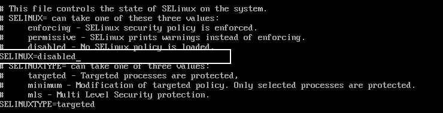
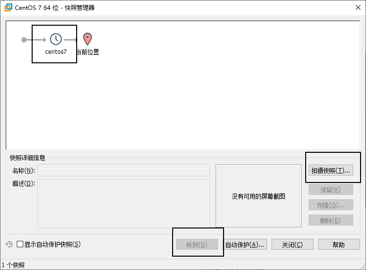
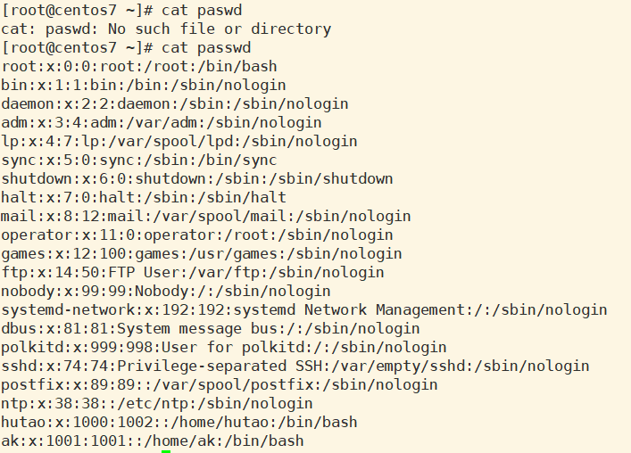
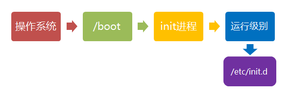

# Linux笔记

## 计算机概述

### 冯诺依曼体系结构

- 计算机处理的数据和指令一律用二进制数表示
- 顺序执行程序
- 计算机硬件由运算器、控制器、存储器、输入设备和输出设备五大部分组成


### 计算机硬件组成

**输入设备**：输入设备用来将人们熟悉的信息形式转换为机器能够识别的信息形式

- 常见的有键盘，鼠标等

**输出设备**：输出设备可以将机器运算结果转换为人们熟悉的信息形式

- 打印机输出，显示器输出等

**存储器**：存储器用来存放数据和程序

- RAM(random access memory）即随机存储内存:
  - 速度快，容量小
  - 掉电易失
  - 逻辑IO
- ROM（Read-Only Memory）即只读内存硬盘:
  - 容量大，速度相对较慢
  - 长久保存
  - 物理IO

**CPU(中央处理器)**：

- 控制器
  - 控制器主要用来控制和指挥程序和数据的输入运行，以及处理运算结果
- 运算器
  - 运算器主要运行算数运算和逻辑运算，并将中间结果暂存到运算器中


### 硬盘的分类

硬盘按照存储介质的不同可以分为如下两种：

- **机械硬盘（Hard Disk Driver, HDD）**
  - 机械硬盘采用磁性碟片来存储数据
  - 用显微镜把盘片放大，会看见盘片表面凹凸不平，凸起的地方被磁化，凹的地方是没有被磁化
  - 凸起的地方代表数字1（磁化为1），凹的地方代表数字0。
  - 硬盘可以以二进制来存储表示文字、图片等信息。
  - 硬盘可以根据转速来判断硬盘的好坏（转速7200转/分，读取速度100-200M/s）


* **固态硬盘（Solid State Disk, SSD）**
  * 固态硬盘通过闪存颗粒（固态电子存储芯片阵列）来存储数据


**读写速度的区别**：

- 固态硬盘的读取速度普遍可以达到400M/s，写入速度也可以达到130M/s以上，
- 其读写速度是普通机械硬盘的3-5倍。

**机械硬盘的数据读写**：

- 主流的硬盘半机械半电子硬盘(机械硬盘)
  - 硬盘的转速(转速越快读取越快)
  - 寻道时间
  - 数据传输时间


### 顺序读写与随机读写


顺序读写比随机读写快很多，但是很不幸，随机读写比顺序读写在实际应用中更好。

### 网络连接概念

#### **IP地址IPADDR**

- IP地址是一种逻辑地地址，用来标识网络中一个个主机
  - IP地址=网络地址+主机地址
  - IP地址是一个 4 * 8bit（1字节）由 0/1 组成的数字串（IPv4协议）（0,1,255绝对不要使用）

#### **子网掩码NETMASK**

- 网掩码只有一个功能，就是将IP地址划分为**网络地址和主机地址**两部分。

```
ipaddr：网络地址+主机地址，比如192.168.206.8
netmask子网掩码(255.255.255.0)--分割（通过与运算）

进行与运算，同时为1，结果才为1：
255.255.255.0
192.168.206.8
192.168.206.0 这就是网络地址，剩下就是主机地址
```

- 子网掩码可以用来判断任意两台计算机的IP地址是否在同一个子网中的根据
  - A 192.168.7.111 B 192.168.8.222
  - 255.255.0.0

#### **默认网关GATEWAY**

- 连接两个不同的网络的设备都可以叫网关设备；网关的作用就是实现两个网络之间进行通讯与控制。
- 网关地址就是网关设备的IP地址

#### **域名服务器DNS**


- DNS是域名服务器，用来解析域名的（域名和IP之间的解析）。（一般借助阿里云等公司帮助注册域名）
- 如果没有这东西，登陆某个网站时就必须输入该网站的IP地址，有了DNS就可以直接输入网址。
- `C:\Windows\System32\drivers\etc\hosts`，修改该文件，通过指定字符指向的IP地址

```
127.0.0.1 baidu
```


> 域名劫持就利用了该原理。

### 网络连接模式

- **host-only(主机模式)**
  - 在某些特殊的网络调试环境中，要求将真实环境和虚拟环境隔离开，这时你就可采用host-only模式。
  - 在host-only模式中，所有的虚拟系统是可以相互通信的，但虚拟系统和真实的网络是被隔离开的。
  - 在host-only模式下，虚拟系统的TCP/IP配置信息都是由VMnet1(host-only)虚拟网络的DHCP服务器来动态分配的
- **bridged(桥接模式)**
  - VMWare虚拟出来的操作系统就像是局域网中的一台独立的主机，它可以访问网内任何一台机器。
  - 使用桥接模式的虚拟系统和宿主机器的关系，就像连接在同一个Hub上的两台电脑。
  - 当前主机IP 为 192.168.8.100 虚拟机 192.168.8.xxx
    - 学习期间为了防止IP冲突，所以不选择这种模式
- **NAT(网络地址转换模式)**
  - 使用NAT模式，就是让虚拟系统借助NAT(网络地址转换)功能，通过宿主机器所在的网络来访问公网。
  - NAT模式下的虚拟系统的TCP/IP配置信息是由VMnet8(NAT)虚拟网络的DHCP服务器提供的
  - 虚拟系统也就无法和本局域网中的其他真实主机进行通讯


### 软件分类

#### **应用软件**

- 就是为了实现某些业务功能
- 应用软件要基于对应的系统软件
  - 不同的操作系统要安装不同的软件

#### **系统软件**

- 就是为了和硬件打交道
- 屏蔽应用软件与硬件的差异

#### **系统软件的分类**

- Window
  - 用户量全球最大
  - 收费，不开源，民用较多
  - 各种软件比较齐全
- Mac：只限定于某些苹果的品牌机（ios--自成一家）
- GNU/Linux：GNU是一个开源软件组织,世界上所有的软件都应该开源免费
  - GNU Is Not Unix
  - GCC++
  - 托瓦兹 林纳斯 Linus -- Linux(Linux is not unix)
  - Logo是企鹅

### Linux分支

#### RedHat（收费）

- CentOS
  - 完全开源免费
  - 不要使用最新版的CentOS
- 主要用于服务器版本


#### Debain（免费）

- Ubuntu
  - 视窗界面良好的Linux系统
  - 一些主流的软件都支持Ubuntu系统


### Linux下载

- 官网：[https://linux.org/](https://linux.org/)
- 下载页面：[https://linux.org/pages/download/](https://linux.org/pages/download/)
- CentOS下载地址：[https://www.centos.org/download/](https://www.centos.org/download/)
  - **everything**： This image contains the complete set of packages for CentOS Linux. It can be used for installing or populating a local mirror.
  - **minimal**： The aim of this image is to install a very basic CentOS  system with the minimum of packages needed to have a functional system.
  - **netinstall**： This is the network install and rescue image.

- 操作系统的位数：优先选择64位,将来安装软件有更好兼容性

## 虚拟机安装与配置

### 虚拟化技术

- 可以更好的利用计算机闲置的资源
- 我们可以在计算机中虚拟出多台虚拟机帮助我们执行程序或者业务
- 虚拟机的各种组成理论上和真实主机是一样的

如果要使用这种技术只需要安装对应的软件即可

- Virtualbox
- VirtualMachine

安装软件：[https://www.vmware.com/products/workstation-pro/workstation-pro-evaluation.html](https://www.vmware.com/products/workstation-pro/workstation-pro-evaluation.html)

- VMware Workstation Pro 16 许可证密钥

```
ZF3R0-FHED2-M80TY-8QYGC-NPKYF

YF390-0HF8P-M81RQ-2DXQE-M2UT6

ZF71R-DMX85-08DQY-8YMNC-PPHV8 
```

### 创建虚拟主机


通过自定义硬件修改硬件参数


### 安装操作系统


默认即可，选英文版本，不然容易出现bug


修改主机名称，便于找到


然后点击开始安装，密码改为123456


等待安装即可，然后重启。


### 配置常见参数

#### 网络

- 在编辑-虚拟网络编辑器里设置vmnet8的参数，同时取消勾选DHCP服务


* 在NAT设置里面，记录下子网IP、子网掩码、网关这三个参数


* 打开宿主机控制面板-网络和Internet-网络连接，配置VMnet8的IPV4协议，要保证该网络的IP地址和刚才NAT设置里面的子网IP地址在同一网段

**这里要和虚拟机的IP在同一网段，不然主机没法ping通虚拟机**


* 进入虚拟机内CentOS系统，编辑配置文件

```sh
vi /etc/sysconfig/network-scripts/ifcfg-ens33
```

* 修改`ifcfg-ens33`信息

**注意红框里面的配置，BOOTPROTO（网络参数配置）要设置为“static”（静态IP），ONBOOT（开机启动）设置为“yes”，IPADDR一定要保证在你设置的网络范围内，NETMASK为子网掩码，GATEWAY为网关，上述参数一定要和虚拟机内参数相同（IP地址要相符合）**

```
删除------UUID

--修改
ONBOOT=yes 
BOOTPROTO=static  //静态网络IP   dhcp 动态获取网络IP

--添加
IPADDR=192.168.183.102
NETMASK=255.255.255.0
GATEWAY=192.168.183.2
DNS1=114.114.114.114
```


* 增加DNS服务器配置

```sh
vi /etc/resolv.conf
```


* 重启网卡重新加载配置文件

```sh
service network restart
```

* 用`ip addr`命令查看一下更改是否生效

```
ip addr
```


* 使用ping命令，查看是否可以访问网络,`ctrl+c`停止该命令

```sh
ping www.baidu.com
```

#### 防火墙

防火墙适用于保护本机的端口不被别人访问的，如果端口需要被别人访问到，需要添加端口的防火墙。

* 查看防火墙状态

```sh
systemctl status firewalld
```

* 关闭防火墙

  * 本次开机状态下防火墙关闭（本次服务内禁用防火墙）

  ```sh
  systemctl stop firewalld 
  ```

  - 服务器重启后防火墙禁用（下次重启时，才禁用防火墙服务）

  ```sh
  systemctl disable firewalld
  ```

#### 软件安装限制

操作系统对未知软件的安装有可能拒绝或者警告，需要禁用这个功能。

```sh
vi /etc/selinux/config
```



#### 关机命令

* 直接拔掉电源

```sh
halt
```

* 直接关闭机器，但是有可能当前虚拟机其他人在使用

```sh
poweroff
```

* 马上关闭计算机 ，但是可以给其他用户发送消息

```sh
shutdown -h now
```

* 重启虚拟机

```sh
reboot
```

### 快照与克隆

- 拍摄快照
  - 记录当前虚拟机的状态
  - 拍摄快照的时候一定要关机

- 转到
  - 回到某一个历史快照的节点



- 克隆
  - 复制某一个历史快照节点
  - 克隆的方式
    - 链接克隆
      - 当前节点文件夹只存储差异性数据，不会克隆基础配置
      - 相同数据存放在原始节点上
      - 优点：节省硬盘空间 缺点：耦合性大
    - 完整克隆
      - 就是基于原始节点完全拷贝到新节点的文件夹中
      - 优点：耦合性抵 缺点：硬盘空间使用大
      - 推荐使用完整克隆

### Linux自动补全提示

在输入文件之类的时候，通过使用TAB键，就可以自动补全。

### 修改主机名称

* 修改后，重启生效

```sh
vi /etc/hostname
```

* 本次启动中有效，重启虚拟机还是使用原来的名字

```sh
hostname hutao
```

### 连接Linux服务器的工具

下载地址：https://filedown.me/Windows/Soft/

#### 使用Xshell

负责向虚拟机输入命令


#### 使用XFtp

复制则向服务器传输文件


## Linux命令

### Linux相关资源

```shell
https://pan.baidu.com/s/174VpfzRcFVi6AjU5CwVTcg 
提取码：imnj
```

### 命令学习法

- Linux命令与参数之间必须用空格隔开
- Linux命令是区分大小写的
- 如果输入了错误的命令
  - `-bash: abcd: command not found`
  - 命令敲错了
  - 命令未安装
- type 命令的类型

```sh
type cd # 查看cd命令类型
```

- 命令的帮助文档

  - help：内置命令的帮助文档

  ```sh
  help cd # 查看cd命令文档
  ```

  - man

    - 外部命令的帮助文档
    - 如果 没有man包，需要手动安装man

    ```sh
    yum install man man-pages -y
    ```

  - 将来工作中如果遇到生疏的命令，直接百度

    - 如果不是为了装C，完全没必要查看命令手册

### 常用Linux命令

- whereis：查询命令文件的位置

```sh
whereis ping
```

- file：查看文件的类型

```sh
file /usr/bin/cd
```

- who：查看当前在线的用户

```sh
who
```

- whoami：当前用户名称

```sh
whoami
```

- pwd：查看当前所在目录

```sh
pwd
```

- uname -a： 查看内核信息

```sh
uname -a
```

- echo：类似于 sout syso ，打印语句

```sh
# 打印数据
echo 1

# 将数据存储到文件中
echo 1 > 1.txt
```

- clear：清屏

```sh
clear
```

- history：历史

```sh
# 查看当前所有历史命令
history

# 清空所有历史命令记录
history -c
```

> 上下键可以进行查看历史记录的命令

### 特殊字符

| 特殊字符   | 用途                                                         |
| ---------- | ------------------------------------------------------------ |
| ``.``点    | 如果文件的开始是``.``说明当前文件是一个隐藏文件，比如`.xxx` ；**1. ``.`` 指向当前目录； 2. ``..``指向当前目录的上级目录** |
| `$`        | 说明这是一个变量，比如`$PATH Linux`的环境变量                |
| ``*``星号  | 通配符，比如`ll -a /etc/*d`，表示查看该目录下所有以d结尾的文件 |
| ``~``      | 1. 当前用户的家目录；2. 每个用户的家目录是不同的； 3. root用户家目录在系统根目录下； 4. 其他用户的家目录在/home/用户名为家目录 |
| 空格       | Linux的命令与参数用空格隔开                                  |
| ``/``      | 整个Linux的文件根目录                                        |
| 命令的参数 | 1. 如果是单词 一般加`-- `；2. 如果是字母或者缩写一般加 ``-`` |

## 文件系统命令

### 概念

#### 文件系统

操作系统如何管理文件，内部定义了一些规则或者定义。

在Linux中所有的东西都是以文件的方式进行操作，而且文件的访问不和Window的一样。window依靠的是通过盘符进行访问；而Linux维护着一个树状结构的文件模型，它只有一个根节点 ,其名字叫做 ``/``，而一个节点上可以有多个子节点。

#### 查找文件的方式

* 相对路径：以当前路径为基准点，查找其他资源，比如

```sh
vi ../etc/sysconfig/network
```

* 绝对路径：以根目录为基准点，查找其他资源，比如

```sh
vi /etc/sysconfig/network-scripts/ifcfg-ens33
```

**日常使用中，只要找到路径即可，但是如果是一些配置文件，尽量写绝对路径**

#### 可以随意的挂载磁盘

为了防止内容不够，自行进行扩容。linux通过`mount`进行将扩容的硬盘进行挂载。

> 不要随意动二级目录。

```sh
mount /dev/disk1 /usr/download
disk1 1T

mount /dev/disk2 /usr/upload
disk2 100T

mount /dev/disk3 /usr/upload/photo
disk3 1P
```

### Linux文件目录


`/bin`：bin是Binary的缩写, 这个目录存放着最**经常使用的命令**。

`/boot`：这里存放的是启动Linux时使用的一些**核心文件**，包括一些连接文件以及镜像文件。

``/dev``：dev是Device(设备)的缩写, 该目录下存放的是Linux的**外部设备**，在Linux中访问设备的方式和访问文件的方式是相同的。

``/etc``：这个目录用来存放所有的系统管理所需要的**配置**文件和子目录。

``/home``：用户的主目录，在Linux中，每个用户都有一个自己的目录，一般该目录名是以用户的账号命名的。

``/lib``：这个目录里存放着系统最基本的**动态连接共享库**，其作用类似于Windows里的DLL文件。几乎所有的应用程序都需要用到这些共享库。

``/lost+found``：这个目录一般情况下是空的，当系统非法关机后，这里就存放了一些文件。

``/media``：linux 系统会自动识别一些设备，例如U盘、光驱等等，当识别后，linux会把识别的设备挂载到这个目录下。

``/mnt``：系统提供该目录是为了让用户临时挂载别的文件系统的，我们可以将光驱挂载在/mnt/上，然后进入该目录就可以查看光驱里的内容了。

``/opt``：这是给主机额外安装软件所摆放的目录。比如你安装一个ORACLE数据库则就可以放到这个目录下。默认是空的。

``/proc``：这个目录是一个虚拟的目录，它是系统内存的映射，我们可以通过直接访问这个目录来获取系统信息。这个目录的内容不在硬盘上而是在内存里，我们也可以直接修改里面的某些文件，比如可以通过下面的命令来屏蔽主机的ping命令，使别人无法ping你的机器：`echo 1 > /proc/sys/net/ipv4/icmp_echo_ignore_all`

``/root``：该目录为系统管理员，也称作超级权限者的用户主目录。

``/run``：是一个临时文件系统，存储系统启动以来的信息。当系统重启时，这个目录下的文件应该被删掉或清除。如果你的系统上有 /var/run 目录，应该让它指向 run。

``/sbin``：s就是Super User的意思，这里存放的是系统管理员使用的系统管理程序。

``/selinux``：这个目录是Redhat/CentOS所特有的目录，Selinux是一个安全机制，类似于windows的防火墙，但是这套机制比较复杂，这个目录就是存放selinux相关的文件的。

``/srv``： 该目录存放一些服务启动之后需要提取的数据。

``/sys``：这是linux2.6内核的一个很大的变化。该目录下安装了2.6内核中新出现的一个文件系统 sysfs 。sysfs文件系统集成了下面3种文件系统的信息：**针对进程信息的proc文件系统、针对设备的devfs文件系统以及针对伪终端的devpts文件系统。**该文件系统是内核设备树的一个直观反映。当一个内核对象被创建的时候，对应的文件和目录也在内核对象子系统中被创建。

``/tmp``：这个目录是用来存放一些临时文件的。

``/var``：这个目录中存放着在不断扩充着的东西，我们习惯将那些经常被修改的目录放在这个目录下。包括各种日志文件。


``/usr``：这是一个非常重要的目录，用户的很多应用程序和文件都放在这个目录下，类似于windows下的program files目录。

``/usr/bin``：系统用户使用的应用程序。

``/usr/sbin``：超级用户使用的比较高级的管理程序和系统守护程序。

``/usr/src``：内核源代码默认的放置目录。

### Linux文件操作

- `cd`：改变当前工作目录

```sh
cd ../root # 以相对方式切换路径，首先先返回上一层路径，在当前路径下切换到root文件夹中

cd /etc    # 以绝对方式切换路径
```

- `ls`：显示出指定目录下所有的文件/文件夹

```sh
ll  # 等价于ls -l --color=auto，查看当前路径的下文件/文件夹

ll -a # 查看所有文件/文件夹，包括隐藏文件/文件夹

ll 文件/文件夹 # 查看当前文件/文件夹下的所有文件/文件夹
```

文件的类型：``-``普通文件；``d``文件夹；``l``软连接，只看开头第一个字母。

```sh
lrwxrwxrwx.  1 root root     11 Feb 15 17:42 init.d -> rc.d/init.d # 这是软连接
-rw-r--r--.  1 root root    511 Oct 13  2020 inittab               # 这是普通文件
drwxr-xr-x.  2 root root    159 Feb 15 17:42 iproute2              # 这是文件夹
```

- `mkdir`：创建文件目录

创建文件夹

```sh
cd ~      # 切换到root目录
mkdir aaa         # 创建文件夹
```

自动创建文件父目录

```sh
mkdir -p a/b/c/d  # 会自动创建文件父目录

mkdir -p ddd/{1,2,3,4} # 创建目录ddd以及其子目录1,2,3,4
```

- `rmdir`：删除空文件夹，因此可以用来安全的删除文件目录

```sh
rmdir aaa # 移除空的文件夹
```

如果不为空文件夹（比如`rmdir a`，a下面还有其他文件夹/文件），会出现以下报错：

```sh
rmdir: failed to remove 'a1': Directory not empty
rmdir: failed to remove 'baidu': Not a directory
```

- `cp`：拷贝文件或者文件目录夹。**如果当前目标目录存在，则将源文件/文件夹复制到目标目录中，否则会将源文件/文件夹改名进行复制。**

拷贝文件夹：`cp 源文件 目标目录`

```sh
cp abcd /opt    # 拷贝源文件abcd到/opt目录下

cp abcd /opt/aaa # 拷贝源文件abcd到/opt目录下，并改名为aaa
```

拷贝文件夹：`cp -r 源文件夹 目标目录`

```sh
cp -r aaa /opt  # 拷贝源文件夹aaa到/opt目录下

cp -r aaa /opt/bbb # 拷贝源文件abcd到/opt目录下，并改名为bbb
```

- `mv`：

移动文件或者文件夹：`mv 源文件/文件夹 目标目录`，**如果当前目标目录存在，则将源文件/文件夹移动到目标目录中，否则会将源文件/文件夹改名进行移动。**

```sh
mv aaa /opt
```

修改文件名称：`mv 源文件/文件夹 新文件/文件夹`

```sh
mv aaa bbb
```

- `rm`：

删除文件

```sh
rm xxx # 删除文件，需要提示，如果想删除文件，需要输入`y`
rm -f xxx # 强制删除文件
```

删除文件夹

```sh
rm -r xxx # 删除文件夹，需要提示，如果想删除文件，需要输入`y`
rm -rf xxx # 强制删除文件夹
```

> 注意`rm -rf /*` 这是一个死亡命令，请勿使用。

- `touch`：如果没有就创建一个文件；如果该文件已经存在，修改文件的三个时间，将三个时间改为当前时间，经常和`stat`配合使用。

```sh
touch xxx # 创建文件
```

- `stat`：查看文件的状态。如果该文件已经存在，修改文件的三个时间，将三个时间改为当前时间。

````sh
stat xxx
````

1. `Inode`：当前文件在文件系统的唯一标识，类似于ID
2. `Links`：硬链接数量
3. `Size`：文件大小；
4. `Uid`：文件所有者
5. `Access:(0644/-rw-r--r--)`：文件权限
6. `Access`：访问时间
7. `Modify`：修改文件内容时间
8. `Change`：修改文件元数据信息时间


- `ln`：创建文件的链接（快捷方式）

便于测试，先创建文件并写入数据

```sh
[root@centos7 ~]# vi 1.log
[root@centos7 ~]# cat 1.log # 查看文件里面的内容
wo hen kai xin
```

**软（符号）连接**：软连接和原始文件不是同一个文件（软硬链接在链接文件的时候，推荐使用文件的绝对路径,否则有可能会出现问题）（指向文件逻辑地址，删除了源文件，就找不到对应的物理地址了）

```sh
ln -s 1.log test.log
```

> 软连接创建的文件指向当前文件，当前文件指向物理地址

**硬链接**：硬链接和原始文件使用文件系统中的同一个文件（如果你害怕一个文件被别人误删，你可以使用硬链接保护这个文件）（直接指向物理地址）

```sh
ln 1.log test2.log
```

如果现在删除`1.log`，软连接方式连接的文件被删除了，会导致软连接的创建的文件连接不到原来的文件的逻辑地址。硬链接的方式指向的是物理地址，因此不存在影响。

### 读取文件信息

* `cat`：将整个文档加载到内存中，并进行一次性显示（除非后面使用管道，传递数据）

```sh
cat xxx # 查看文件信息
```

- `tac`：将整个文档加载到内存中，并进行一次性按行逆序显示

```sh
tac xxx # 按行倒着加载信息
```

上面两个方法都是一次性加载到内存中，然后进行显示的。这样有很多弊端，可以通过分页进行显示。

- `more less`：分页查看文档内容
  - 快捷键
    - 回车 下一行
    - 空格 下一页
    - b 回退
    - q 退出

```sh
more xxx # 分页查看信息
less xxx # 与上面差别不大
more less xxx # 分页查询
```

- `head`：从文章开始读取N行（默认如果超过10行读取10行,否则读取现在行数）

```sh
head -5 xxx # 查看文件前5行信息
```

- `tail`：

从文章末尾读取N行

```sh
tail -3 xxx # 查看文件后3行信息
```

利用管道只读取第N行，管道的作用就相当于把前面的结果以参数的方式传递给后面的命令

```sh
head -3 profile | tail -1 # 只查看文件第3行信息
```

读取新增数据（监听数据变化）

1. 如果``f``（监听的是指定inode的文件）
   - 它会监听指定inode的文件数据变化，但是当文件被删除后
   - 即使创新创建，inode也会发生变化，于是监听失败
2. **如果``F``（监听的是指定名字的文件）**
   - 他会监听指定名字的文件,如果文件被删除后，重新创建
   - 他会重新监听新文件的数据变化，监听不受影响

```sh
ping www.baidu.com >>baidu # 类似日志
tail -F baidu # 动态查看文件信息
```

- find：查找指定的文件（find 要查找的范围 -name 文件名字），可以和通配符一起使用。

```sh
find /etc -name profile # 在/etc目录下查找profile文件

find /etc -name profile* # 在/etc目录下查找profile开头的文件
```

### VI和Vim编辑器


vi与vim的区别就是记事本和notepad编辑器的感觉。

#### 打开文件

- 正常打开

```sh
vi profile
```

- 打开文件，并将光标置于第N行，比如第8行

```sh
vi +8 profile
```

- 打开最后一行

```s
vi + profile
```

- 打开指定搜索单词的位置`vi +/查询的字符串 profile`

```sh
vi +/if profile
```

打开文件后，可以通过按下`n/N`进行上下滚动浏览文件信息，也可以通过上下键进行浏览。

1. 按``n``查找下一个
2. 按``N``查找上一个

#### Vi和Vim编辑器的三种模式

- 一般指令模式（默认的模式）：每一个按键都有其相应的功能
- 编辑模式：可以对内容进行编辑
- 末行（命令行）模式：　在一般模式当中，输入:, /, ? 三个中的任何一个按钮，就可以将光标移动到最底下那一行。在这个模式当中，可以提供你搜寻资料的动作，而读取、存盘、大量取代字符、离开vi、显示行号等等的动作则是在此模式中达成的。

#### 三种模式


##### 一般模式可用的光标移动、复制粘贴、搜索替换等

其他模式回到一般模式：首先需要按下ESC键按钮，才能输入相应命令。(可配合 :set nu使用)

> 输入数字的时候，不要使用小键盘的数字键。

| 移动光标的方法                                               |                                                              |
| :----------------------------------------------------------- | ------------------------------------------------------------ |
| **h 或 向左箭头键(←)**                                       | **光标向左移动一个字符**                                     |
| **j 或 向下箭头键(↓)**                                       | **光标向下移动一个字符**                                     |
| **k 或 向上箭头键(↑)**                                       | **光标向上移动一个字符**                                     |
| **l 或 向右箭头键(→)**                                       | **光标向右移动一个字符**                                     |
| **w**                                                        | **光标移动到下一个单词**                                     |
| **nw**（上面的同理）                                         | **n表示数字，光标移动到下n个单词处**                         |
| **如果你将右手放在键盘上的话，你会发现 hjkl 是排列在一起的，因此可以使用这四个按钮来移动光标。 如果想要进行多次移动的话，例如向下移动 30 行，可以使用 “30j” 或 “30↓” 的组合按键， 亦即加上想要进行的次数(数字)后，按下动作即可！** |                                                              |
| **[Ctrl] + [f]**                                             | **屏幕『向下』移动一页，相当于 [Page Down]按键 (常用)**      |
| **[Ctrl] + [b]**                                             | **屏幕『向上』移动一页，相当于 [Page Up] 按键 (常用)**       |
| **[Ctrl] + [d]**                                             | **屏幕『向下』移动半页**                                     |
| **[Ctrl] + [u]**                                             | **屏幕『向上』移动半页**                                     |
| **[Ctrl] + [s]**                                             | **锁屏**                                                     |
| **[Ctrl] + [q]**                                             | **解锁**                                                     |
| +                                                            | 光标移动到非空格符的下一行                                   |
| –                                                            | 光标移动到非空格符的上一行                                   |
| n\<space>                                                    | 那个 n 表示『数字』，例如 20 。按下数字后再按空格键，光标会向右移动这一行的 n 个字符。例如 20\<space> 则光标会向后面移动 20 个字符距离。 |
| 0 或功能键[Home]                                             | 这是数字『 0 』：移动到这一行的最前面字符处 (常用)           |
| $ 或功能键[End]                                              | 移动到这一行的最后面字符处(常用)                             |
| H                                                            | 光标移动到这个屏幕的最上方那一行的第一个字符                 |
| M                                                            | 光标移动到这个屏幕的中央那一行的第一个字符                   |
| L                                                            | 光标移动到这个屏幕的最下方那一行的第一个字符                 |
| **G**                                                        | **移动到这个档案的最后一行(常用)**                           |
| **nG/ngg**                                                   | **n 为数字。移动到这个档案的第 n 行。例如 20G 则会移动到这个档案的第 20 行** |
| **gg**                                                       | **移动到这个档案的第一行，相当于 1G 啊！ (常用)**            |
| n\<Enter>                                                    | n 为数字。光标向下移动 n 行(常用)                            |
| **替换字符**                                                 |                                                              |
| **r**                                                        | **替换，然后输入一个字符替换**                               |
| **nr**                                                       | **从当前光标处开始替换n个字符**                              |
| **删除、复制与贴上**                                         |                                                              |
| **x, X**                                                     | **在一行字当中，x 为向后删除一个字符 (相当于 [del] 按键)， X 为向前删除一个字符(相当于 [backspace] 亦即是退格键) (常用)** |
| **nx**                                                       | **n 为数字，连续向后删除 n 个字符。举例来说，我要连续删除 10 个字符， 『10x』。** |
| **dd**                                                       | **删除游标所在的那一整行(常用)**                             |
| **ndd**                                                      | **n 为数字。删除光标所在的向下 n 行，例如 20dd 则是删除 20 行 (常用)** |
| **dw**                                                       | **删除一个单词**                                             |
| **ndw**                                                      | **n表示数字，删除n个单词**                                   |
| d1G                                                          | 删除光标所在到第一行的所有数据                               |
| dG                                                           | 删除光标所在到最后一行的所有数据                             |
| d$                                                           | 删除游标所在处，到该行的最后一个字符                         |
| d0                                                           | 那个是数字的 0 ，删除游标所在处，到该行的最前面一个字符      |
| **yy**                                                       | **复制游标所在的那一行(常用)**                               |
| **nyy**                                                      | **n 为数字。复制光标所在的向下 n 行，例如 20yy 则是复制 20 行(常用)** |
| y1G                                                          | 复制游标所在行到第一行的所有数据                             |
| yG                                                           | 复制游标所在行到最后一行的所有数据                           |
| y0                                                           | 复制光标所在的那个字符到该行行首的所有数据                   |
| y$                                                           | 复制光标所在的那个字符到该行行尾的所有数据                   |
| **p, P**                                                     | **p 为将已复制的数据在光标下一行贴上，P 则为贴在游标上一行！ 举例来说，我目前光标在第 20 行，且已经复制了 10 行数据。则按下 p 后， 那 10 行数据会贴在原本的 20 行之后，亦即由 21 行开始贴。但如果是按下 P 呢？ 那么原本的第 20 行会被推到变成 30 行。 (常用)** |
| J                                                            | 将光标所在行与下一行的数据结合成同一行                       |
| c                                                            | 重复删除多个数据，例如向下删除 10 行，[ 10cj ]               |
| **u**                                                        | **撤销。(常用)**                                             |
| **[Ctrl]+r**                                                 | **重做上一个动作。(常用)**                                   |
| **这个 u 与 [Ctrl]+r 是很常用的指令！一个是复原，另一个则是重做一次～ 利用这两个功能按键，你的编辑，嘿嘿！很快乐的啦！** |                                                              |
| **.**                                                        | **（复原，u的相反）不要怀疑！这就是小数点！意思是重复前一个动作的意思。 如果你想要重复删除、重复贴上等等动作，按下小数点『.』就好了！ (常用)** |

##### 一般模式切换到编辑模式

| **键** | **功能**                                         |
| ------ | ------------------------------------------------ |
| i      | 在光标左侧输入正文                               |
| I      | 在光标所在行的行首输入正文                       |
| a      | 在光标右侧输入正文                               |
| A      | 在光标所在行的行尾输入正文                       |
| o      | 在光标所在行的下一行增添新行，光标位于新行的行首 |
| O      | 在光标所在行的上一行增添新行，光标位于新行的行首 |

##### 一般模式切换到指令行模式

| 指令行的储存、离开等指令                                     |                                                              |
| :----------------------------------------------------------- | ------------------------------------------------------------ |
| :w                                                           | 将编辑的数据写入硬盘档案中(常用)                             |
| :w!                                                          | 若文件属性为『只读』时，强制写入该档案。不过，到底能不能写入， 还是跟你对该档案的档案权限有关啊！ |
| :q                                                           | 离开 vi (常用)                                               |
| :q!                                                          | 若曾修改过档案，又不想储存，使用 ! 为强制离开不储存档案。    |
| 注意一下啊，那个惊叹号 (!) 在 vi 当中，常常具有『强制』的意思～ |                                                              |
| :wq                                                          | 储存后离开，若为 :wq! 则为强制储存后离开 (常用)              |
| **ZZ**                                                       | **这是大写的 Z 喔！若档案没有更动，则不储存离开，若档案已经被更动过，则储存后离开！** |
| :w [filename]                                                | 将编辑的数据储存成另一个档案（类似另存新档）                 |
| :r [filename]                                                | 在编辑的数据中，读入另一个档案的数据。亦即将 『filename』 这个档案内容加到游标所在行后面 |
| :n1,n2 w [filename]                                          | 将 n1 到 n2 的内容储存成 filename 这个档案。                 |
| :! command                                                   | 暂时离开 vi 到指令行模式下执行 command 的显示结果！例如 『:! ls /home』即可在 vi 当中察看 /home 底下以 ls 输出的档案信息！ |
| **vim 环境的变更**                                           |                                                              |
| :set nu                                                      | 显示行号，设定之后，会在每一行的前缀显示该行的行号           |
| :set nonu                                                    | 与 set nu 相反，为取消行号！                                 |

| 搜索替换                                                     |                                                              |
| :----------------------------------------------------------- | ------------------------------------------------------------ |
| **/word**                                                    | **向光标之下寻找一个名称为 word 的字符串。例如要在档案内搜寻 vbird 这个字符串，就输入 /vbird 即可！ (常用)** |
| **?word**                                                    | **向光标之上寻找一个字符串名称为 word 的字符串。**           |
| **n**                                                        | **这个 n 是英文按键。代表重复前一个搜寻的动作。举例来说， 如果刚刚我们执行 /vbird 去向下搜寻 vbird 这个字符串，则按下 n 后，会向下继续搜寻下一个名称为 vbird 的字符串。如果是执行 ?vbird 的话，那么按下 n 则会向上继续搜寻名称为 vbird 的字符串！** |
| **N**                                                        | **这个 N 是英文按键。与 n 刚好相反，为『反向』进行前一个搜寻动作。 例如 /vbird 后，按下 N 则表示『向上』搜寻 vbird 。** |
| **s/word1/word2/g**                                          | **替换当前行word1字符串为word2字符串**                       |
| **g/word1/s//word2/g**                                       | **全文替换word1字符串为word2字符串**(很实用)                 |
| **%s/word1/word2/g**                                         | **全文替换word1字符串为word2字符串**                         |
| **使用 /word 配合 n 及 N 是非常有帮助的！可以让你重复的找到一些你搜寻的关键词！** |                                                              |
| **:n1,n2s/word1/word2/g**                                    | **n1 与 n2 为数字。在第 n1 与 n2 行之间寻找 word1 这个字符串，并将该字符串取代为 word2 ！举例来说，在 100 到 200 行之间搜寻 vbird 并取代为 VBIRD 则： 『:100,200s/vbird/VBIRD/g』。(常用)** |
| **:1,$s/word1/word2/g**                                      | **从第一行到最后一行寻找 word1 字符串，并将该字符串取代为 word2 ！(常用)** |
| **:1,$s/word1/word2/gc**                                     | **从第一行到最后一行寻找 word1 字符串，并将该字符串取代为 word2 ！且在取代前显示提示字符给用户确认 (confirm) 是否需要取代！(常用)** |

特别注意，在 vi/vim 中，数字是很有意义的！数字通常代表重复做几次的意思！ 也有可能是代表去到第几个什么什么的意思。

有时候，保存数据的时候，没有正确保存，会导致重新进入的时候出现`found a swap file`字样。可以删除当前文件swap文件，即备份文件（没有修改前的文件），就不会再出现了。

```sh
rm -rf xxx.swap
```

#### 安装Vim编辑器

* 在 Centos 中安装vim

```sh
yum install vim
```

* 在Ubuntu中安装vim

```sh
sudo apt-get install vim
```

### 计算机间的数据传输

#### windows到linux

通过`lrzsz`在windows与linux之间进行传输数据。

* 安装`lrzsz`

```sh
yum install lrzsz -y
```

* 将windows上的数据传输到linux上

```sh
rz
```

* 将文件从linux传输到windows上

```sh
sz 文件
```

也可以使用[xftp软件](#使用XFtp)在windows与linux之间进行传输数据。

#### linux到linux

通过使用`scp 源数据地址(source) 目标数据地址(target)`传递数据，如果想要传递文件夹需要使用`-r`参数

* 创建测试数据

```sh
touch basefile
mkdir -p hutao/1/2
```

* 上传

```sh
# scp 文件路径 用户名@ipaddress:存放路径
scp basefile root@192.168.183.103:/opt # 上传文件
```

* 下载

```sh
# scp 用户名@ipaddress:文件路径 存放路径
scp root@192.168.183.102:/root/basefile /opt # 从远程服务器上，下载文件

# 如果想下载文件夹，需要使用-r
scp -r root@192.168.183.102:/root/hutao /opt # 从远程服务器上，下载文件夹
```

### 文件大小

* 查看分区信息

```sh
df -h
```

> swap：一个特殊分区，以硬盘代替内存。当内存使用满的时候，可以将一部分数据写出到swap分区。

* 查看指定文件目录大小

```sh
df -h --max-depth=1 /etc
```

### 文件压缩

#### tar

`tar`：主要针对的文件是``xxx.tar.gz``

* 解压：`x（解压）v（过程）f（文件）`

```sh
tar -zxvf xxx.tar.gz
```

* 压缩：`c（压缩）f（文件）`

```sh
tar -zcf 压缩后的名字.tar.gz 被压缩的文件/文件夹
```

* 解压到指定目录：`-C`

```sh
tar -zxf xxx.tar.gz -C /opt/ 
```

#### zip和unzip

* 安装

```sh
yum install zip unzip -y
```

* 解压

```sh
unzip xxx.zip
```

* 压缩

```sh
zip -r 压缩后的名字.zip 被压缩的文件/文件夹
```

## 网络信息

### 主机名称

* 临时修改：需要重新进入服务器，但是如果重启服务器后，主机名称会恢复到原来的名称

```sh
hostname hutao
```

* 永久修改：需要重启服务器才能生效

```sh
vi /etc/hostname
```

### DNS解析

DNS是用来解析域名解析服务，它可以将域名转换为IP地址。

* DNS域名劫持：在windows中是`C:\Windows\System32\drivers\etc\hosts`；在linux中是`/etc/hosts`

```sh
192.168.188.101 www.baidu.com
```

下次访问`www.baidu.com`的时候，其实访问的是`192.168.188.101`，域名劫持就是利用该原理。

* 修改主机域名：将来我们需要把所有的虚拟机都配置hosts文件，因为服务器多了后，不容易方便管理，修改主机域名，容易操作。

```sh
192.168.31.101 bd1601
192.168.31.102 bd1602
```

### 网络相关命令

- `ifconfig`：查看当前网卡的配置信息

  - 这个命令属于net-tools中的一个命令，但是Centos7中minimal版并没有集成这个包，所以Centos7在使用的时候需要自己手动安装

  ```sh
  yum search ifconfig # 搜索ifconfig包
  
  yum install net-tools.x86_64 -y # 找到后，安装
  ```

  - 如果没有``ifconfig`` ，可以使用``ip addr`` 临时代替

- `netstat`：查看当前网络的状态信息。（一个机器默认有65536个端口号[0,65535]，而且一个端口只能被一个程序所监听, 端口已经被占用。）

  - 查看当前端口的使用情况

  ```sh
  netstat -anp
  ```

  - 核心路由表

  ```sh
  netstat -r
  ```

- `ping`：查看与目标IP地址是否能够连通

```sh
ping www.baidu.com
ping 192.168.183.103
```

- `telnet`：

  - 安装`telnet`

  ```sh
  yum install telnet -y
  ```

  - 查看与目标IP的指定端口是否能够连通`telnet ipaddr port`

  ```s
  telnet 192.168.31.44 22
  ```

- `curl`：所有的资源在网络上中都有唯一的定位，可以通过`curl`唯一定位标识指定的资源。注意`curl`是restful风格的资源定位的方式。

```sh
curl -X GET http://www.baidu.com
```

### 防火墙

防火墙技术是通过有机结合各类用于安全管理与筛选的软件和硬件设备，帮助计算机网络于其内、外网之间构建一道相对隔绝的保护屏障，以保护用户资料与信息安全性的一种技术。

> 在Centos7+中，使用firewalld代替以前的iptables。

* 查看防火墙状态

```sh
systemctl status firewalld.service
```

* 临时停止防火墙

```sh
systemctl stop firewalld.service
```

* 禁止防火墙开机启动

```sh
systemctl disable firewalld.service
```

* 安装`firewalld-cmd`

```sh
sudo apt-get install firewalld
```

* `firewall-cmd`常用命令

```sh
firewall-cmd --state 								#查看防火墙状态，是否是running
firewall-cmd --re1oad 								#重新较入配置，比如添加规则之后，需要执行此命令
firewall-cmd --get-zones 							#列出支持的zone
firewall-cmd --get-services							#列出支持的服务，在列表中的服务是放行的
firewall-cmd --query-service ftp					#查看ftp服务是否支持，返回yes或者no
firewall-cmd --add-service=ftp						#临时开放ftp服务
firewall-cmd --add-service=ftp --permanent  		#永久开放ftp服务
firewall-cmd --remove-service=ftp --permanent		#永久移除ftp服务
firewall-cmd --add-port=so/tcp --permanent			#永久添加80端口
```

* 开启一个端口的正确操作

```sh
# 添加
firewall-cmd --zone=public --add-port=80/tcp --permanent

# 重新载入
firewall-cmd --reload

# 查看
firewall-cmd --zone=public --query-port=80/tcp

# 删除
firewall-cmd --zone=public --remove-port=80/tcp --permanent
```

### 加密算法（了解）


#### 不可逆加密算法


- 可以通过数据计算加密后的结果，但是通过结果无法计算出加密数据
- 应用场景
  - **Hash算法常用在不可还原的密码存储、信息完整性校验。**
  - 文档、音视频文件、软件安装包等用新老摘要对比是否一样(接收到的文件是否被修改)
  - 用户名或者密码加密后数据库存储(数据库大多数不会存储关键信息的明文，就像很多登录功能的忘记密码不能找回，只能重置)

#### 对称加密算法


- 对称加密算法：代表性算法叫做 DES、3DES、Blowfish、IDEA、RC4、RC5、RC6和AES
  - 特点：加密和解密使用相同的秘钥
  - 优点：生成密钥的算法公开、计算量小、加密速度快、加密效率高、密钥较短
  - 缺点
    - 双方共同的密钥，有一方密钥被窃取，双方都影响
    - 如果为每个客户都生成不同密钥，则密钥数量巨大，密钥管理有压力
- 应用场景：登录信息用户名和密码加密、传输加密、指令加密

#### 非对称加密算法


- 非对称加密算法需要一对密钥(两个密钥)：代表性算法叫做 RSA、ECC、Diffie-Hellman、El Gamal、DSA(数字签名用)
  - 公开密钥(publickey)和私有密钥(privatekey)(简称公钥，私钥)。
  - 公开密钥与私有密钥生成时是一对
  - 用公钥加密只能是对应的私钥解密，同理用私钥加密只能用对应的公钥解密。
- 优点：安全高(几乎很难破解)
- 缺点：加解密相对速度慢、密钥长、计算量大、效率低
- 应用场景：HTTPS(ssl)证书里制作、CRS请求证书、金融通信加密、蓝牙等硬件信息加密配对传输、关键的登录信息验证。

### 服务器之间相互免密钥

通过ssh命令免秘钥使得服务器之间相互连接。

* 生成秘钥

```sh
ssh-keygen -t rsa -P '' -f ~/.ssh/id_rsa
```

* 发送公钥

```sh
ssh-copy-id -i ~/.ssh/id_rsa.pub root@192.168.183.103
```

之后需要输入密码。注意，该秘钥存在`192.168.183.103`该服务器的`~/.ssh/authorized_keys`文件中，用户是root。

* 测试

```sh
# 在192.168.183.102服务器上登录
ssh 192.168.183.103
```

此时，不需要密码便可以进行登录。

* 免校验：在`192.168.183.102`中修改``/etc/ssh/ssh_config``文件的配置，以后则不会再出现此问题


```properties
#######################在文件末尾添加内容如下###################
StrictHostKeyChecking no
UserKnownHostsFile /dev/null
```

## 日期与时间

* 查看当前系统时间

```sh
date
```

* 修改系统时间

```sh
date -s 2019-11-11 	# 修改日期
date -s 11:11:11 	# 修改时间
date -s '2019-11-11 11:11:11'
clock -w # 这个命令强制把系统时间写入CMOS
```

* 自动同步网络时间

```sh
yum install -y ntpdate
ntpdate cn.ntp.org.cn
hwclock --systohc # 最后执行如下命令将系统时间同步到硬件，防止系统重启后时间被还原。

# hwclock -s
```

* 查看日历

```sh
cal 2020
```

* 服务器之间自动同步网络时间

```sh
# 安装ntp
yum install ntp -y
yum install ntpdate -y
```

在服务`192.168.183.102`中，开启服务

```sh
# 开启ntp服务
server ntpd start
```

可以根据需求，修改配置文件`/etc/ntp.conf`

```python
#=========================权限控制=========================
restrict default kod nomodify notrap nopeer noquery 	# 拒绝IPV4用户
restrict -6 defau1t kod nomodify notrap nopeer noquery 	# 拒绝IPv6用户
restrict 210.72.145.44   					# 授权国家授时中心服务器访问本地NTP
restrict 133.100.11.8 						# 授权133.100.11.8访问本地NTP
restrict 127.0.0.1
restrict -6 ::1
resxrict 192.168.188.2 mask 255.255.255.0 nomodify # 本地网段授权访问
#=========================源服务器=========================
 server cn.ntp.org.cn prefer          # 指定上级更新时问服务器，优先使用这个地址
#=========================差异分析=========================
driftfile 	/var/1ib/ntp/drift
keys		/etc/ntp/keys
```

然后在服务`192.168.183.103`中，同步时间服务器`192.168.183.102`的时间

```sh
ntpdate 192.168.183.102
clock -w
```

## 用户组权限

### 用户

* 新增用户：会创建同名的组和家目录

```sh
useradd hutao
passwd hutao # 为新用户设置密码
```

* 删除用户：级联删除家目录和组

```sh
userdel -r hutao
```

* 修改用户信息

```sh
usermod -l hutao tianhai # 修改用户名，但是家目录和名称是不会被修改的
usermod -L hutao # 锁定用户名
usermod -U hutao # 解锁用户名
```

* 常用文件

```sh
cat /etc/shadow # 查看用户名和密码
cat /etc/passwd # 查看用户名，编号，组编号，家目录，命令码，目录
```

* 切换用户

```sh
su 用户名
```

### 组

* 创建组

```sh
groupadd tianhai
groupadd yaodao
groupadd yuesan
```

* 删除组

```sh
groupdel tianhai
```

* 修改组名称

```sh
groupmod -n canghai yaodao
```

* 查看用户对应的组

```sh
groups 用户名
```

* 修改用户的组

```sh
usermod -g canghai hutao
usermod -G yuesan hutao
```

### 权限


* 查看文件的权限

```sh
drwxr-xr-x  5 hutao hutao    238 Feb 19 01:24 mod_fcgid-2.3.9
```


* 三组权限，每组3个字母`d rwx r-x r-x`：第一组代表所属**用户**的权限，第二组代表所属**组**的权限，第三组代表**其他人**的权限。第一个字母`d`，前面讲过了，表示是文件夹。

```sh
r:读取权限
w:写入权限
x:执行权限
-:没有权限
```

比如：`rw- r-- rw- hutao tianhai`，`hutao`用户拥有`rw-`权限，即读写权限，`tianhai`拥有`r--`权限，即改组拥有读权限，其他人的权限`rw-`。

* 权限的UGO模型

  * 三组权限
  * 所属用户权限:所属组权限:其他权限
  * 修改文件的权限，可以从rwx和ugo两个方面进行修改

* 修改文件权限

  * 创建测试文件

  ```sh
  touch file # 创建测试文件
  ```

  * 修改文件所属`chown 用户名:用户组 文件/文件夹`

  ```sh
  chown hutao file
  chown hutao:hutao file
  
  # 修改文件夹时，让子目录迭代修改
  chown -R n1:m1 file
  
  # 当用户的组被修改之后，需要重新登录才能获取新组的权限
  chgrp hutao file
  ```

  * 修改文件权限`rwx`：（权限RWX分别对应数字 4 2 1 5= 4+0+1 r-x）

  ```sh
  chmod o+w file
  chmod ug+rw file
  chmod ugo-rw file
  
  chmod 777 file
  ```


## 管道与重定向

### 管道`|`

```sh
head -3 /etc/prfoile | tail -1 # 通过管道|将前面获取的数据，传递给后面

cat /etc/profile | grep if # grep是一个强大的文本搜索工具，搜索if字符串
```

### 重定向

改变数据的输出位置

* `>`：输出信息到指定文件，`1>`表示标准输出，`2>`表示错误输出，会将输出信息输入到file中，进行替换。

```sh
ll /op 2> file
```

* `>>`：追加信息到指定文件

```sh
ll /opt 1>> file
```

* 结合使用：有时候不知道文件存不存在，因此，结合1和2方式进行输入信息。

```sh
ll /opt/abc > file 2>&1
ll /opt/abc >> file 2>&1
```

## 系统进程

### 进程信息

* 查看进程信息

```sh
ps -ef
```

打印信息

```sh
[root@centos7 ~]# ps -ef
UID         PID   PPID  C STIME TTY          TIME CMD
root          1      0  0 15:53 ?        00:00:01 /usr/lib/systemd/syst
root          2      0  0 15:53 ?        00:00:00 [kthreadd]
```

其中，UID表示所属用户，PID表示当前进程编号，PPID表示当前进程编号的父进程编号。

* 通过管道`|`查看指定程序的进程，比如redis

```sh
ps -ef | grep redis # ps -ef命令查看所有进程信息，通过管道将前面的文本信息，
                    # 传入到后面进行处理，grep是一个强大的文本搜索工具，所有与后面指定字符                     # 串，比如redis，相关的行信息。
```

* 查看所有进程相关信息

```sh
ps -aux
ps -aux --sort -pcpu
```

* 查看当前服务器内存使用率`top`

```sh
top
```

### 后台进程

运行程序的时候，在后台运行。

* 只需要在命令的后面添加一个&符号

```sh
ping www.baidu.com >> baidu &
```

* 查看当前后台的进程，只有当前用户界面可以获取到

```sh
jobs -l
```

* `nohup`将后台进程挂起，防止被关闭

`ping www.baidu.com >> baidu 2>&1`：将数据输出到指定文件baidu，通过1和2的方式，2方式是接收错误信息，1方式是标准信息输出。

```sh
nohup ping www.baidu.com >> baidu 2>&1 &
```

### 杀死进程

通过`kill -9 pid`杀死指定pid的进程。

```sh
kill -9 8659
```

## 软件安装

### 环境变量

当我们执行一个命令的时候，默认从当前路径开始查找，如果当前路径找不到对应的命令文件，从环境变量``$PATH``查找（``$PATH``的配置文件在 ``/etc/profile``），当前用户变量是在家目录下的`.bash_profile`只对当前用户起作用。

- window 路径与路径之间用``;``(分号)连接
- Linux路径与路径之间用``:``（冒号）连接

Linux每次修改完成之后，需要重新加载文件`` source /etc/profile``

如果想查看环境变量，可以通过`echo $PATH`进行查看。

### 软件安装方式

#### 通过压缩包

* 解压就可以使用

#### 通过RPM安装

- RedHat Package Manager,它属于红帽的一种包管理方式
- 通过RPM命令安装软件

```sh
rpm -ivh jdk-8u202-linux-x64.rpm
```

- 可以查询安装的软件
  - `rpm -qa | grep jdk`
  - `rpm -q jdk`
- 卸载

```sh
rpm -e jdk1.8-1.8.0_202-fcs.x86_64
```

- 需要手动配置Java的环境变量

```sh
find / -name java
```

找到jdk安装目录后，进行配置

```properties
export JAVA_HOME=/usr/java/jdk1.8.0_202-amd64/bin
export PATH=$JAVA_HOME/bin:$PATH
```

重新加载配置

```sh
source /etc/profile
```

#### 通过源码安装

```sh
tar -zxvf apache-tomcat-9.0.58.tar.gz

cd apache-tomcat-9.0.58

./bin/startup.sh
```

#### 通过YUM安装

##### yum的作用

- 可以帮我们管理RPM包
- 可以帮我们安装软件，
- 如果软件有其他依赖，会帮我们安装依赖后在安装软件
- 类似于Maven

##### yum命令

* `install`：安装软件

- `search`：查询命令或者软件
- `info`：查看包的信息
- `list / list jdk`：查询安装的rpm包，或者只查询某一周

##### 更换yum源

- 首先安装wget（类似于迅雷）

```sh
yum install wget -y
```

- 将系统原始配置文件失效（备份）


```sh
mv /etc/yum.repos.d/CentOS-Base.repo /etc/yum.repos.d/CentOS-Base.repo.backup
```

- 使用Wget获取阿里yum源配置文件

```sh
wget -O /etc/yum.repos.d/CentOS-Base.repo http://mirrors.aliyun.com/repo/Centos-7.repo
```

- 清空以前yum源的缓存


```sh
yum clean all
```

- 将服务器上的软件包信息缓存到本地,以提高搜索安装软件的速度


```sh
yum makecache
```

### 安装MySQL8

```sh
yum install perl net-tools -y

# 卸载mariadb
rpm -qa | grep mariab
rpm -e --nodeps mariadb-libs-5.5.68-1.el7.x86_64

#解压mysql压缩包
tar -xvf mysql-8.0.28-winx64.zip

# 安装
rpm -ivh mysql-community-common-8.0.27-1.el8.x86_64.rpm --nodeps --force
rpm -ivh mysql-community-libs-8.0.27-1.el8.x86_64.rpm  --nodeps --force
rpm -ivh mysql-community-client-8.0.27-1.el8.x86_64.rpm  --nodeps --force
rpm -ivh mysql-community-server-8.0.27-1.el8.x86_64.rpm  --nodeps --force

# 启动
systemctl start mysqld

chown mysql.mysql /var/run/mysqld/
```

## Linux的三剑客

### 普通剑客

测试`cp /etc/passwd ./`，查看`cat passwd`



* `cut`：用指定规则来切分文本

```sh
cut -d ':' -f1,2,3 passwd # 通过指定":"分割的字符串，返回第1,2,3列数据
cut -d ':' -f1,2,3 passwd | grep root # 结合grep能够准确查询行数据
```

* `sort`：
  * `sort passwd`：对文本的行进行排序
  * `sort -t ':' -k2 xxx`：通过指定规则`:`对每一行的数据进行切分，按照第二列进行排序
  * `sort -t '' -k2 -r xxx`：逆序排序
  * `sort -t ''-k2 -n xxx `：按照数值大小进行排序，如果有字母，字母在前。·wc：统计单词的数量

- wc统计单词的数量

  `wc` ：统计单词的数量，默认`wc passwd`打印出`line word char passwd`

  - ``-l``： line
  - ``-w``： word
  - ``-c``： char

### 剑客1号：grep

* 可以对文本进行搜索
* 同时搜索多个文件
  - 从文档中查询指定的数据
  - `grep root passwd`：从文件passwd查找包含root字符串的行数据。
  - `grep school passwd /etc/shadow`：从多个文件中查找包含root字符串的行数据。
* 显示匹配的行号
  - `grep -n root passwd`：从文件passwd查找包含root字符串的行数据，并显示相应的行号
* 显示不匹配的忽略大小写
  - `grep -nvi root passwd --color=auto`
* 使用正则表达式匹配
  - `grep -E "[1-9]+" passwd --color=auto`

### 剑客2号：sed

sed 是Stream Editor（字符流编辑器）的缩写，简称流编辑器。Sed软件从文件或管道中读取一行，处理一行，输出一行；再读取一行，再处理一行，再输出一行...。**因此一次一行的设计使得sed软件性能很高**。而vi命令打开文件是一次性将文件加载到内存。

- 了解即可
  - [https://www.cnblogs.com/chens](https://www.cnblogs.com/chens)

| option[选项] | 解释说明（带*的为重点）                                      |
| ------------ | ------------------------------------------------------------ |
| -n           | 取消默认的sed软件的输出，常与sed命令的p连用。                |
| -e           | 一行命令语句可以执行多条sed命令                              |
| -f           | 选项后面可以接sed脚本的文件名                                |
| -r           | 使用扩展正则表达式，默认情况sed只识别基本正则表达式          |
| -i           | 直接修改文件内容，而不是输出到终端，如果不使用-i选项sed软件只是修改在内存中的数据，并不会影响磁盘上的文件 |

| sed -commands[sed命令] | 解释说明（带*的为重点）                                      |
| ---------------------- | ------------------------------------------------------------ |
| a                      | 追加，在指定行后添加一行或多行文本                           |
| c                      | 取代指定的行                                                 |
| d                      | 删除指定的行                                                 |
| D                      | 删除模式空间的部分内容，直到遇到换行符\n结束操作，与多行模式相关 |
| i                      | 插入，在指定行前添加一行或多行文本                           |
| h                      | 把模式空间的内容复制到保持空间                               |
| H                      | 把模式空间的内容追加到保持空间                               |
| g                      | 把保持空间的内容复制到模式空间                               |
| G                      | 把保持空间的内容追加到模式空间                               |
| x                      | 交换模式空间和保持空间的内容                                 |
| l                      | 打印不可见的字符                                             |
| n                      | 清空模式空间的内容并读入下一行                               |
| N                      | `不清空模式空间，并读取下一行数据并追加到模式空间*`          |
| p                      | `打印模式空间内容，通常p会与选项-n一起使用*`                 |
| P（大写）              | 打印模式空间的内容，直到遇到换行符\n结束操作                 |
| q                      | 退出Sed                                                      |
| r                      | 从指定文件读取数据                                           |
| s                      | `取代，s#old#new#g==>这里g是s命令的替代标志，注意和g命令区分。*` |
| w                      | 另存，把模式空间的内容保存到文件中                           |
| y                      | 根据对应位置转换字符                                         |
| ：label                | 定义一个标签                                                 |
| b label                | 执行该标签后面的命令                                         |
| t                      | 如果前面的命令执行成功，那么就跳转到t指定的标签处，继续往下执行后续命令。否则，仍然继续正常的执行流程 |

| 特殊符号 | 解释说明（带*的为重点）                        |
| -------- | ---------------------------------------------- |
| ！       | `对指定行以外的所有行应用命令*`                |
| =        | 打印当前行行号                                 |
| ～       | “First～step”表示从First行开始，以步长Step递增 |
| &        | 代表被替换的内容                               |
| ：       | `实现一行命令语句可以执行多条sed命令*`         |
| {}       | 对单个地址或地址范围执行批量操作               |
| +        | 地址范围中用到的符号，做加法运算               |

- 行的选择模式
  - 10 第十行
  - m,n --> 第m行到第n行 [m,n]
  - m,+n-->第一行到第四行 [m,m+n]
  - m~n-->从m行开始，依次累加n
  - m,$ -->从m开始到最后一行
  - /school/ -->匹配到school的行
  - /u1/,/u4/-->从匹配u1到匹配u4

```sh
sed '2a xxxx' passwd # 第二行
sed '/root/a xxxx' passwd # 匹配root字符串的行
```

- 增：添加`-i`直接修改文件，不然只会显示，而不修改文件。

```sh
sed -i '2a xxxx' passwd
```

- 删：`d`表示删除，``-i``用于修改文件

```sh
sed -i '2d' passwd
```

- 改
  - 整行替换
    - `sed '3,20c hahaha' passwd`
    - `sed '3~1c hehehe' passwd`
  - 字符替换
    - `sed '1,5s/root/xxx/g' passwd`：将字符串`root`替换成`xxx`
    - `sed '1,5s#/#-#g' passwd`

### 剑客3号：awk

- 它不是一个剑客，它是一门语言
- 了解即可
  - [https://www.joshua317.com/article/151](https://www.joshua317.com/article/151)
- 模式与动作
  - `awk -F ":" 'NR>=2&&NR<=6' /etc/passwd`
  - `awk -F ":" '{print NR,$1}' /etc/passwd`
  - `awk -F ":" 'NR>=2&&NR<=6 {print NR,$1}' /etc/passwd`
  - `awk -F ":" 'NR==1{print NR,$1}NR==2{print NR,$NF}' /etc/passwd`

其中`":"`表示匹配规则，和前面一样，`NR`表示行号，`/etc/passwd`是文件，


## Shell编程

### 安装IDE

#### 开发工具：sulime text3

对于shell脚本使用vim在linux开发可能效率比较底下，而且大多都是windows开发，当然能够在windows下运行更好。

* 安装插件ShellScriptImproved，用于语法提示以及关键字高亮

 选择菜单preferences->package control


输入 并选择install package


输入shell 并选择ShellScriptImproved


建立一个脚本文件


 脚本运行一般要到linux环境下才能运行，这里可以借助工具cmder进行运行测试

 1）下载地址

 https://github.com/cmderdev/cmder/releases/latest

 2）解压到自己的工作目录

 3）执行cmder.exe，打开cmder

 4）进入脚本目录，输入bash进入bash解释器

 5）执行脚本./hello.sh,执行结果如下：


### Shell编程概述

#### 名词解释

- `Kernel`：Linux内核主要是为了和硬件打交道
- Shell
  - Shell 是一个用 C 语言编写的程序，它是用户使用 Linux 的桥梁。Shell 既是一种命令语言，又是一种程序设计语言。
  - Shell 是指一种应用程序，这个应用程序提供了一个界面，用户通过这个界面访问操作系统内核的服务。
- Shell环境
  - 只要有一个能编写代码的文本编辑器和一个能解释执行的脚本解释器就可以了。
  - Bourne Shell（/usr/bin/sh或/bin/sh）
  - Bourne Again Shell（/bin/bash）--默认
  - C Shell（/usr/bin/csh）
- **``#!``** 声明：告诉系统其后路径所指定的程序即是解释此脚本文件的 Shell 程序

#### 执行Shell的方式

- ``./shxxx.sh``
  - 执行的必须是一个可执行文件
  - chmod u+x shxxx.sh
- ``sh shxxx.sh``
  - 执行的文件可以是一个普通文件
- ``source shxxx.sh``
  - 直接在当前进程执行脚本
  - 当我们执行bash的时候开启一个子进程，当脚本中出现ping的时候又开启了一个子进程
- 区别：
  - 第一种和第二种会新开一个bash，不同bash种的变量无法共享
  - 第三种是在同一个shell里面执行的
- export：可以将当前进程的变量传递给子进程去使用
  - 将来配置profile的时候，所有的变量前必须加export

### Shell基础入门

#### Shell变量

##### 定义

定义变量时，变量名不加美元符号（$），如：

- 命名只能使用英文字母，数字和下划线，首个字符不能以数字开头。
- 中间不能有空格，可以使用下划线 **_**。
- 不能使用标点符号。
- 不能使用bash里的关键字（可用help命令查看保留关键字）。

##### 变量类型

运行shell时，会同时存在三种变量：

- **1) 局部变量** 局部变量在脚本或命令中定义，仅在当前shell实例中有效，其他shell启动的程序不能访问局部变量。
- **2) 环境变量** 所有的程序，包括shell启动的程序，都能访问环境变量，有些程序需要环境变量来保证其正常运行。必要的时候shell脚本也可以定义环境变量。
- **3) shell变量** shell变量是由shell程序设置的特殊变量。shell变量中有一部分是环境变量，有一部分是局部变量，这些变量保证了shell的正常运行

###### 使用变量

使用一个定义过的变量，只要在变量名前面加美元符号即可，如：

```shell
# 变量的声明
name=hutao

# 变量的调用
echo $name
echo ${name}
```

变量名外面的花括号是可选的，加不加都行，加花括号是为了帮助解释器识别变量的边界，比如下面这种情况：

```shell
for skill in Ada Coffe Action Java; do
    echo "I am good at ${skill}Script"
done
```


###### 只读变量

使用 readonly 命令可以将变量定义为只读变量，只读变量的值不能被改变。

```sh
name=hutao
readonly name
name=yaodao
```

运行脚本，结果如下：

```verilog
test.sh: line 5: name: readonly variable
```

###### 删除变量

使用 unset 命令可以删除变量。

变量被删除后不能再次使用。unset 命令不能删除只读变量。

```sh
name=hutao
unset name
echo $name
```

以上实例执行将没有任何输出。

#### Shell字符串

##### 概述

字符串是shell编程中最常用最有用的数据类型（除了数字和字符串，也没啥其它类型好用了），字符串可以用单引号，也可以用双引号，也可以不用引号。

##### 单引号

```shell
str='hello world!'
```

单引号字符串的限制：

- 单引号里的任何字符都会原样输出，单引号字符串中的变量是无效的；
- 单引号字串中不能出现单独一个的单引号（对单引号使用转义符后也不行），但可成对出现，作为字符串拼接使用。

##### 双引号

```shell
name="hutao"
str="hello,${name}"
echo $str
```

- 双引号里可以有变量
- 双引号里可以出现转义字符

##### 获取字符串长度

```shell
string="abcd"
echo ${#string[0]} # 4
```

##### 截取字符串

```shell
string="hello,world"
echo ${string:1:4} # ello
```

##### 查找字符串

查找字符 **i** 或 **o** 的位置(哪个字母先出现就计算哪个)

```shell
string="hello,wolrd"
echo `expr index "$string" io` # 5
```

**注意：** 以上脚本中 **`** 是反引号，而不是单引号 **'**，不要看错了哦。

#### Shell数组

##### 概述

bash支持一维数组（不支持多维数组），并且没有限定数组的大小。

数组元素的下标由 0 开始编号。获取数组中的元素要利用下标，下标可以是整数或算术表达式，其值应大于或等于 0。

##### 定义数组

在 Shell 中，用括号来表示数组，数组元素用"空格"符号分割开。定义数组的一般形式为：

```shell
数组名=(值1 值2 ... 值n)
```

例如：

```shell
array_name=(value0 value1 value2 value3)
```

还可以单独定义数组的各个分量：

```shell
array_name[0]=value0
array_name[1]=value1
array_name[n]=valuen
```

##### 读取数组

读取数组元素值的一般格式是：

```shell
${数组名[下标]}
```

例如：

```shell
valuen=${array_name[0]}
```

使用 ``@`` 或者 ``*`` 符号可以获取数组中的所有元素，例如：

```shell
echo ${array_name[@]}
echo ${array_name[*]}
```

##### 获取数组的长度

获取数组长度的方法与获取字符串长度的方法相同，例如：

```shell
# 取得数组元素的个数
length=${#array_name[@]}

# 获取数组单个元素的长度
lengthn=${#array_name[n]}
```

#### Shell的注释

##### 单行注释

以 ``# ``开头的行就是注释，会被解释器忽略。

通过每一行加一个 ``#`` 号设置多行注释，像这样：

```shell
#--------------------------------------------
# 这是一个注释
#--------------------------------------------
##### 用户配置区 开始 #####
#
#
# 这里可以添加脚本描述信息
#
#
##### 用户配置区 结束  #####
```

##### 多行注释

多行注释还可以使用以下格式：

```shell
:<<EOF
注释内容...
注释内容...
注释内容...
EOF
```

例如：

```shell
:<<EOF
注释内容...
注释内容...
注释内容...
EOF
#--------------------------------------------
:<<!
> !
```

#### Shell参数传递 

执行Shell脚本时，向脚本传递参数，脚本内获取参数的格式为：``$n``。n代表一个数字。

| 参数处理 | 说明                                                         |
| :------- | :----------------------------------------------------------- |
| `$#`     | 传递到脚本的参数个数                                         |
| `$*`     | 以一个单字符串显示所有向脚本传递的参数。 如``"$*"``用``「"」``括起来的情况、以``"$1 $2 … $n"``的形式输出所有参数。 |
| `$$`     | 脚本运行的当前进程ID号                                       |
| `$!`     | 后台运行的最后一个进程的ID号                                 |
| `$@`     | 与``$*``相同，但是使用时加引号，并在引号中返回每个参数。 如``"$@"``用``「"」``括起来的情况、以``"$1" "$2" … "$n" ``的形式输出所有参数。 |
| `$-`     | 显示Shell使用的当前选项，与[set命令](https://www.runoob.com/linux/linux-comm-set.html)功能相同。 |
| `$?`     | 显示最后命令的退出状态。0表示没有错误，其他任何值表明有错误。 |

实例：

```shell
#!/bin/bash

echo "Shell 传递参数实例！";
echo "第一个参数为：$1";

echo "参数个数为：$#";
echo "传递的参数作为一个字符串显示：$*";
```

执行脚本，输出结果如下所示：

```shell
[root@centos7 ~]# chmod +x test.sh
[root@centos7 ~]# ./test.sh 1 2 3
Shell 传递参数实例！
第一个参数为：1
参数个数为：3
传递的参数作为一个字符串显示：1 2 3
```

`$*` 与 `$@` 区别：

- 相同点：都是引用所有参数。
- 不同点：只有在双引号中体现出来。假设在脚本运行时写了三个参数 1、2、3，，则 **" * " 等价于 "1 2 3"（传递了一个参数），而 "@" 等价于 "1" "2" "3"（传递了三个参数）。**

### Shell高级进阶

#### Shell运算符

##### 概述

- 原生bash不支持简单的数学运算，但是可以通过其他命令来实现，例如 awk 和 expr，expr 最常用。
  - expr 是一款表达式计算工具，使用它能完成表达式的求值操作。

- 表达式和运算符之间要有空格，例如 2+2 是不对的，必须写成 2 + 2，这与我们熟悉的大多数编程语言不一样。
- 完整的表达式要被 **` `** 包含，注意这个字符不是常用的单引号，在 Esc 键下边。

##### 算术运算符

下表列出了常用的算术运算符，假定变量 a 为 10，变量 b 为 20：

| 运算符 | 说明                                          | 举例                          |
| :----- | :-------------------------------------------- | :---------------------------- |
| +      | 加法                                          | `expr $a + $b` 结果为 30。    |
| -      | 减法                                          | `expr $a - $b` 结果为 -10。   |
| *      | 乘法                                          | `expr $a \* $b` 结果为  200。 |
| /      | 除法                                          | `expr $b / $a` 结果为 2。     |
| %      | 取余                                          | `expr $b % $a` 结果为 0。     |
| =      | 赋值                                          | `a=$b` 把变量 b 的值赋给 a。  |
| ==     | 相等。用于比较两个数字，相同则返回 true。     | `[ $a == $b ] `返回 false。   |
| !=     | 不相等。用于比较两个数字，不相同则返回 true。 | `[ $a != $b ] `返回 true。    |

**注意：**条件表达式要放在方括号之间，并且要有空格，例如: **``[$a==$b]``** 是错误的，必须写成 **``[ $a == $b ]``**。

```shell
a=10
b=10
val=`expr $a + $b`
echo $val
```

##### 关系运算符

关系运算符只支持数字，不支持字符串，除非字符串的值是数字。

下表列出了常用的关系运算符，假定变量 a 为 10，变量 b 为 20：

| 运算符 | 说明                                                  | 举例                         |
| :----- | :---------------------------------------------------- | :--------------------------- |
| -eq    | 检测两个数是否相等，相等返回 true。                   | `[ $a -eq $b ]` 返回 false。 |
| -ne    | 检测两个数是否不相等，不相等返回 true。               | `[ $a -ne $b ]` 返回 true。  |
| -gt    | 检测左边的数是否大于右边的，如果是，则返回 true。     | `[ $a -gt $b ]` 返回 false。 |
| -lt    | 检测左边的数是否小于右边的，如果是，则返回 true。     | `[ $a -lt $b ]` 返回 true。  |
| -ge    | 检测左边的数是否大于等于右边的，如果是，则返回 true。 | `[ $a -ge $b ]` 返回 false。 |
| -le    | 检测左边的数是否小于等于右边的，如果是，则返回 true。 | `[ $a -le $b ] `返回 true。  |

```shell
a=10
b=20

if [ $a -eq $b ]
then
   echo "$a -eq $b : a 等于 b"
else
   echo "$a -eq $b: a 不等于 b"
fi
```

##### 布尔运算符

下表列出了常用的布尔运算符，假定变量 a 为 10，变量 b 为 20：

| 运算符 | 说明                                                | 举例                                       |
| :----- | :-------------------------------------------------- | :----------------------------------------- |
| !      | 非运算，表达式为 true 则返回 false，否则返回 true。 | `[ !false ]` 返回 true。                   |
| -o     | 或运算，有一个表达式为 true 则返回 true。           | `[ $a -lt 20 -o $b -gt 100 ]` 返回 true。  |
| -a     | 与运算，两个表达式都为 true 才返回 true。           | `[ $a -lt 20 -a $b -gt 100 ] `返回 false。 |

```shell
a=10
b=20

if [ $a != $b ]
then
   echo "$a != $b : a 不等于 b"
else
   echo "$a == $b: a 等于 b"
fi
if [ $a -lt 100 -a $b -gt 15 ]
then
   echo "$a 小于 100 且 $b 大于 15 : 返回 true"
else
   echo "$a 小于 100 且 $b 大于 15 : 返回 false"
fi
if [ $a -lt 100 -o $b -gt 100 ]
then
   echo "$a 小于 100 或 $b 大于 100 : 返回 true"
else
   echo "$a 小于 100 或 $b 大于 100 : 返回 false"
fi
if [ $a -lt 5 -o $b -gt 100 ]
then
   echo "$a 小于 5 或 $b 大于 100 : 返回 true"
else
   echo "$a 小于 5 或 $b 大于 100 : 返回 false"
fi
```

##### 逻辑运算符

以下介绍 Shell 的逻辑运算符，假定变量 a 为 10，变量 b 为 20:

| 运算符 | 说明       | 举例                                        |
| :----- | :--------- | :------------------------------------------ |
| &&     | 逻辑的 AND | `[[ $a -lt 100 && $b -gt 100 ]] `返回 false |
| \|\|   | 逻辑的 OR  | `[[ $a -lt 100 || $b -gt 100 ]] `返回 true  |

```shell
a=10
b=20

if [[ $a -lt 100 && $b -gt 100 ]]
then
   echo "返回 true"
else
   echo "返回 false"
fi

if [[ $a -lt 100 || $b -gt 100 ]]
then
   echo "返回 true"
else
   echo "返回 false"
fi
```

##### 字符串运算符

下表列出了常用的字符串运算符，假定变量 a 为 "abc"，变量 b 为 "efg"：

| 运算符 | 说明                                         | 举例                       |
| :----- | :------------------------------------------- | :------------------------- |
| =      | 检测两个字符串是否相等，相等返回 true。      | `[ $a = $b ]` 返回 false。 |
| !=     | 检测两个字符串是否不相等，不相等返回 true。  | `[ $a != $b ]` 返回 true。 |
| -z     | 检测字符串长度是否为0，为0返回 true。        | `[ -z $a ]` 返回 false。   |
| -n     | 检测字符串长度是否不为 0，不为 0 返回 true。 | `[ -n "$a" ]` 返回 true。  |
| $      | 检测字符串是否不为空，不为空返回 true。      | `[ $a ]` 返回 true。       |

##### 文件测试运算符

文件测试运算符用于检测 Unix 文件的各种属性。

属性检测描述如下：

| 操作符  | 说明                                                         | 举例                        |
| :------ | :----------------------------------------------------------- | :-------------------------- |
| -b file | 检测文件是否是块设备文件，如果是，则返回 true。              | `[ -b $file ]` 返回 false。 |
| -c file | 检测文件是否是字符设备文件，如果是，则返回 true。            | `[ -c $file ]` 返回 false。 |
| -d file | 检测文件是否是目录，如果是，则返回 true。                    | `[ -d $file ]` 返回 false。 |
| -f file | 检测文件是否是普通文件（既不是目录，也不是设备文件），如果是，则返回 true。 | `[ -f $file ]` 返回 true。  |
| -g file | 检测文件是否设置了 SGID 位，如果是，则返回 true。            | `[ -g $file ]` 返回 false。 |
| -k file | 检测文件是否设置了粘着位(Sticky Bit)，如果是，则返回 true。  | `[ -k $file ]` 返回 false。 |
| -p file | 检测文件是否是有名管道，如果是，则返回 true。                | `[ -p $file ]` 返回 false。 |
| -u file | 检测文件是否设置了 SUID 位，如果是，则返回 true。            | `[ -u $file ]` 返回 false。 |
| -r file | 检测文件是否可读，如果是，则返回 true。                      | `[ -r $file ]` 返回 true。  |
| -w file | 检测文件是否可写，如果是，则返回 true。                      | `[ -w $file ]` 返回 true。  |
| -x file | 检测文件是否可执行，如果是，则返回 true。                    | `[ -x $file ]` 返回 true。  |
| -s file | 检测文件是否为空（文件大小是否大于0），不为空返回 true。     | `[ -s $file ]` 返回 true。  |
| -e file | 检测文件（包括目录）是否存在，如果是，则返回 true。          | `[ -e $file ]` 返回 true。  |

其他检查符：

- **-S**: 判断某文件是否 socket。
- **-L**: 检测文件是否存在并且是一个符号链接。

#### echo打印数据

Shell 的 echo 指令用于字符串的输出。

```shell
# 显示普通字符串
echo "hutao"

# 显示转义字符串
echo "\"It is hutao\""

# 显示变量
name=hutao
echo "${name}"

# 显示换行
echo -e "OK! \n"
echo "hutao"

# 显示不换号
echo -e "OK! \c"
echo "hutao"

# 显示结果定向至文件
echo "hutao" > 1.log

# 原样输出字符串
echo '$name\"'

# 显示命令执行结果
echo `date`
```

#### printf命令

##### 输出

```shell
printf "%-10s %-8s %-4s\n" 姓名 性别 体重kg  
printf "%-10s %-8s %-4.2f\n" 郭靖 男 66.1234
printf "%-10s %-8s %-4.2f\n" 杨过 男 48.6543
printf "%-10s %-8s %-4.2f\n" 郭芙 女 47.9876
```

- **%s %c %d %f** 都是格式替代符，**％s** 输出一个字符串，**％d** 整型输出，**％c** 输出一个字符，**％f** 输出实数，以小数形式输出。
- **%-10s** 指一个宽度为 10 个字符（**-** 表示左对齐，没有则表示右对齐），任何字符都会被显示在 10 个字符宽的字符内，如果不足则自动以空格填充，超过也会将内容全部显示出来。
- **%-4.2f** 指格式化为小数，其中 **.2** 指保留2位小数。

##### 转义序列

| 序列    | 说明                                                         |
| :------ | :----------------------------------------------------------- |
| `\a`    | 警告字符，通常为ASCII的BEL字符                               |
| `\b`    | 后退                                                         |
| `\c`    | 抑制（不显示）输出结果中任何结尾的换行字符（只在%b格式指示符控制下的参数字符串中有效），而且，任何留在参数里的字符、任何接下来的参数以及任何留在格式字符串中的字符，都被忽略 |
| `\f`    | 换页（formfeed）                                             |
| `\n`    | 换行                                                         |
| `\r`    | 回车（Carriage return）                                      |
| `\t`    | 水平制表符                                                   |
| `\v`    | 垂直制表符                                                   |
| `\\`    | 一个字面上的反斜杠字符                                       |
| `\ddd`  | 表示1到3位数八进制值的字符。仅在格式字符串中有效             |
| `\0ddd` | 表示1到3位的八进制值字符                                     |

#### test命令

Shell中的 test 命令用于检查某个条件是否成立，它可以进行数值、字符和文件三个方面的测试。

- **数值测试**

| 参数 | 说明           |
| :--- | :------------- |
| -eq  | 等于则为真     |
| -ne  | 不等于则为真   |
| -gt  | 大于则为真     |
| -ge  | 大于等于则为真 |
| -lt  | 小于则为真     |
| -le  | 小于等于则为真 |

- **字符串测试**

| 参数      | 说明                     |
| :-------- | :----------------------- |
| =         | 等于则为真               |
| !=        | 不相等则为真             |
| -z 字符串 | 字符串的长度为零则为真   |
| -n 字符串 | 字符串的长度不为零则为真 |

* **文件测试**

| 参数      | 说明                                 |
| :-------- | :----------------------------------- |
| -e 文件名 | 如果文件存在则为真                   |
| -r 文件名 | 如果文件存在且可读则为真             |
| -w 文件名 | 如果文件存在且可写则为真             |
| -x 文件名 | 如果文件存在且可执行则为真           |
| -s 文件名 | 如果文件存在且至少有一个字符则为真   |
| -d 文件名 | 如果文件存在且为目录则为真           |
| -f 文件名 | 如果文件存在且为普通文件则为真       |
| -c 文件名 | 如果文件存在且为字符型特殊文件则为真 |
| -b 文件名 | 如果文件存在且为块特殊文件则为真     |

#### Shell流程控制

##### if else/if elif else

```shell
a=10
b=20
if test $[a] -eq $[b]
then
        echo "a 等于 b"
elif [ $a -gt $b ]
then
        echo "a 大于 b"
else
        echo "a 小于 b"
fi
```

##### case

**case ... esac** 为多选择语句，可以用 case 语句匹配一个值与一个模式，如果匹配成功，执行相匹配的命令。

```shell
echo '输入 1 到 3 之间的数字:'
echo '你输入的数字为:'
read num
case $num in
        1) echo "选择了方案1"
        ;;
        2) echo "选择了方案2"
        ;;
        3) echo "选择了方案3"
           echo "该方案包含了方案1"
        ;;
        *) echo "你没有输入1到3之间的数字"
        ;;
esac
```

##### for

- 当变量值在列表里，for 循环即执行一次所有命令，使用变量名获取列表中的当前取值。
- 命令可为任何有效的 shell 命令和语句。in 列表可以包含替换、字符串和文件名。
- in列表是可选的，如果不用它，for循环使用命令行的位置参数。

```shell
for loop in 1 2 3 4 5
do
    echo "The value is: $loop"
done
```

##### while

while 循环用于不断执行一系列命令，也用于从输入文件中读取数据。

```shell
i=1
while(( $i<=5 ))
do
    echo $i
    let "i++"
done
```

其中，let 命令是 BASH 中用于计算的工具，用于执行一个或多个表达式，变量计算中不需要加上 $ 来表示变量。如果表达式中包含了空格或其他特殊字符，则必须引起来。

```shell
自加操作：let no++

自减操作：let no--

简写形式 let no+=10，let no-=20，分别等同于 let no=no+10，let no=no-20。
```

while循环可用于读取键盘信息。下面的例子中，输入信息被设置为变量FILM，按``<Ctrl-D>``结束循环。

```shell
echo '按下 <CTRL-D> 退出'
echo -n '输入你最喜欢的网站名: '
while read FILM
do
    echo "是的！$FILM 是一个好网站"
done
```

##### until

- condition 一般为条件表达式，如果返回值为 false，则继续执行循环体内的语句，否则跳出循环。
- 一般 while 循环优于 until 循环，但在某些时候—也只是极少数情况下，until 循环更加有用。

```shell
a=0

until [ ! $a -lt 10 ]
do
   echo $a
   a=`expr $a + 1`
done
```

##### 跳出循环

###### break

break命令允许跳出所有循环（终止执行后面的所有循环）。

```shell
#!/bin/bash
while :
do
    echo -n "输入 1 到 5 之间的数字:"
    read aNum
    case $aNum in
        1|2|3|4|5) echo "你输入的数字为 $aNum!"
        ;;
        *) echo "你输入的数字不是 1 到 5 之间的! 游戏结束"
            break
        ;;
    esac
done
```

###### continue

continue命令与break命令类似，只有一点差别，它不会跳出所有循环，仅仅跳出当前循环。

```shell
while :
do
    echo -n "输入 1 到 5 之间的数字: "
    read aNum
    case $aNum in
        1|2|3|4|5) echo "你输入的数字为 $aNum!"
        ;;
        *) echo "你输入的数字不是 1 到 5 之间的!"
            continue
            echo "游戏结束"
        ;;
    esac
done
```

#### 函数

##### 初识shell函数

- linux shell 可以用户定义函数，然后在shell脚本中可以随便调用。
- 可以带function fun() 定义，也可以直接fun() 定义,不带任何参数。
- 参数返回，可以显示加：return 返回，如果不加，将以最后一条命令运行结果，作为返回值。 return后跟数值n(0-255

```shell
# 第一个函数
demoFun(){
    echo "这是我的第一个 shell 函数!"
}
echo "-----函数开始执行-----"
demoFun
echo "-----函数执行完毕-----"

# 带有return语句的函数
funWithReturn(){
    echo "这个函数会对输入的两个数字进行相加运算..."
    echo "输入第一个数字: "
    read aNum
    echo "输入第二个数字: "
    read anotherNum
    echo "两个数字分别为 $aNum 和 $anotherNum !"
    return $(($aNum+$anotherNum))
}
funWithReturn
echo "输入的两个数字之和为 $? !"
```

函数返回值在调用该函数后通过 `$?` 来获得。

注意：所有函数在使用前必须定义。这意味着必须将函数放在脚本开始部分，直至shell解释器首次发现它时，才可以使用。调用函数仅使用其函数名即可。

##### 函数参数

在Shell中，调用函数时可以向其传递参数。在函数体内部，通过`` $n`` 的形式来获取参数的值，例如，``$1``表示第一个参数，``$2``表示第二个参数...

```shell
funWithParam(){
    echo "第一个参数为 $1 !"
    echo "第二个参数为 $2 !"
    echo "第十个参数为 $10 !"
    echo "第十个参数为 ${10} !"
    echo "第十一个参数为 ${11} !"
    echo "参数总数有 $# 个!"
    echo "作为一个字符串输出所有参数 $* !"
}
funWithParam 1 2 3 4 5 6 7 8 9 34 73
```

##### 特殊字符

特殊字符用来处理参数

| 参数处理 | 说明                                                         |
| :------- | :----------------------------------------------------------- |
| $#       | 传递到脚本或函数的参数个数                                   |
| $*       | 以一个单字符串显示所有向脚本传递的参数                       |
| $$       | 脚本运行的当前进程ID号                                       |
| $!       | 后台运行的最后一个进程的ID号                                 |
| $@       | 与$*相同，但是使用时加引号，并在引号中返回每个参数。         |
| $-       | 显示Shell使用的当前选项，与set命令功能相同。                 |
| $?       | 显示最后命令的退出状态。0表示没有错误，其他任何值表明有错误。 |

## 系统任务设置

### 系统启动流程

- 启动计算机的硬件(BIOS)
  - 读取时间
  - 选择对应的启动模式(USB HDD EFI）
- 如果是Linux系统，回去找/boot目录.引导这个系统启动
- 计算机系统开始启动,读取初始化配置文件
  - `vim /etc/inittab`
  - 启动时控制着计算机的运行级别 `runlevel`
  - `id:3:initdefault`：默认``runlevel``为3
  - 以``runlevel=3``开始启动对应的服务和组件

| 0    | halt (关机)                                                  |
| ---- | ------------------------------------------------------------ |
| 1    | Single user mode(单用户模式)                                 |
| 2    | Multiuser, without NFS(多用户模式，但是无网络状态) FS-->FileSystem |
| 3    | Full multiuser mode(多用户完整版模式)                        |
| 4    | unused (保留模式)                                            |
| 5    | X11(用户界面模式)                                            |
| 6    | reboot(重启模式)                                             |

- 开始默认引导公共的组件或者服务
  - `vim /etc/rc.d/rc.sysinit`
- 开始加载对应runlevel的服务
  - `vi /etc/rc3.d/`
    - K:关机时需要关闭的服务
    - S:启动时需要开启的服务
    - 数字代表了开启或者关闭的顺序
    - 所有的文件都是软链接，链接的地址为`` /etc/init.d``
- 当启动完毕，所有的服务也被加载完成

### 系统服务

- 我们可以使用chkconfig命令查看当前虚拟机的服务
- 通过查看可以得知不同的级别对应到每一个服务确定本次开机自动启动
- 开机结束后，我们需要使用service（Centos6）Systemctl(Centos7)命令控制服务的开启或者关闭

### 开启自启动服务



- rc.local

  - 首先创建脚本存放的文件夹

    - `mkdir -p /usr/local/scripts`

  - 在文件夹中创建脚本文件

    - `vim hello.sh`

    ```shell
    yum info ntp && ntpdate cn.ntp.org.cn
    ```

    - 给予执行权限`chmod a+x hello.sh `

  - 去``/etc/rc.d/rc.local``文件中添加脚本的绝对路径

    - 给予``rc.local``执行权限`chmod +x rc.local`

- chkconfig

  - 创建开机自启动脚本文件
  - `vim initdate.sh`

  ```shell
  #!/bin/bash
  #chkconfig: 2345 88 99
  #description: 设置开机自启的脚本
  
  # 开机自启动同步时间
  yum info ntp && ntpdate cn.ntp.org.cn
  ```

  * 给其设置执行权限`chmod u+x initdate.sh`
  * 将脚本拷贝到 ``/etc/init.d``目录下`cp initdate.sh /etc/init.d/`
  * 添加到服务`chkconfig --add /etc/init.d/initdate.sh`
  * 重启服务器`reboot`

### 定时服务

- 在系统服务中心，``crond``负责周期任务

  - `systemctl status crond.service`

- 添加任务，编辑当前用户的任务列表

  - `crontab -e`

- 编辑任务

  - 星 星 星 星 星 command
    分 时 日 月 周 命令
    第1列表示分钟1～59 每分钟用*或者* /1表示
    第2列表示小时1～23（0表示0点）
    第3列表示日期1～31
    第4列表示月份1～12
    第5列标识号星期0～6（0表示星期天）
    第6列要运行的命令

    ``*``：表示任意时间都，实际上就是“每”的意思。可以代表00-23小时或者00-12每月或者00-59分
    ``-``：表示区间，是一个范围，``00 17-19 * * * cmd``，就是每天17,18,19点的整点执行命令
    ``,``：是分割时段，``30 3,19,21 * * * cmd``，就是每天凌晨3和晚上19,21点的半点时刻执行命令
    ``/n``：表示分割，可以看成除法，``*/5 * * * * cmd``，每隔五分钟执行一次

```shell
30 21 * * * /usr/local/etc/rc.d/lighttpd restart
上面的例子表示每晚的21:30重启apache。

45 4 1,10,22 * * /usr/local/etc/rc.d/lighttpd restart
上面的例子表示每月1、10、22日的4 : 45重启apache。

10 1 * * 6,0 /usr/local/etc/rc.d/lighttpd restart
上面的例子表示每周六、周日的1 : 10重启apache。

0,30 18-23 * * * /usr/local/etc/rc.d/lighttpd restart
上面的例子表示在每天18 : 00至23 : 00之间每隔30分钟重启apache。

0 23 * * 6 /usr/local/etc/rc.d/lighttpd restart
上面的例子表示每星期六的11 : 00 pm重启apache。

* */2 * * * /usr/local/etc/rc.d/lighttpd restart
每两小时重启apache

* 23-7/1 * * * /usr/local/etc/rc.d/lighttpd restart
晚上11点到早上7点之间，每隔一小时重启apache

0 11 4 * mon-wed /usr/local/etc/rc.d/lighttpd restart
每月的4号与每周一到周三的11点重启apache

0 4 1 jan * /usr/local/etc/rc.d/lighttpd restart
```

- 重启crontab，使配置生效
  - `systemctl restart crond.service`
- 通过`crontab -l`
  - 查看当前的定时任务
- 查看任务的历史
  - `vim /var/spool/mail/root`
- 清除任务
  - `crontab -r`

实例：

创建`/usr/local/scripts/created.sh`

```shell
#! /bin/bash

dname=`date "+%Y%m%d%H%M%S"`

mkdir -p ~/$dname
```

编辑任务列表`crontab -e`，每一分钟就执行一次脚本

```shell
*/1 * * * * sh /usr/local/scripts/created.sh
```

 重启``crontab``，使得配置生效

```shell
sysetemctl restart crond.service
```

## 虚拟机初始化脚本

为了方便部署环境，可以编写脚本，从而自动化部署环境

```shell
#!/bin/bash
## -bash: ./shxxx.sh: /bin/bash^M: bad interpreter: No such file or directory
## vim或者vi的命令模式下，输入命令  set fileformat=unix 即可解决换行问题
echo -e "\e[1;31m【----------------------------------------在opt和var创建xxx文件夹】\e[0m"
sleep 5
mkdir -p /opt/xxx
mkdir -p /var/xxx
mkdir -p /usr/local/script
echo -e "\e[1;31m【----------------------------------------禁用防火墙】\e[0m"
sleep 5
systemctl stop firewalld
systemctl disable firewalld
systemctl status firewalld

echo -e "\e[1;32m【----------------------------------------修改selinux】\e[0m"
sleep 5
sed -i '/^SELINUX=/c SELINUX=disabled' /etc/selinux/config

echo -e "\e[1;32m【----------------------------------------安装wget】\e[0m"
sleep 5
yum install wget -y

echo -e "\e[1;33m【----------------------------------------修改yum源】\e[0m"
sleep 5
mv /etc/yum.repos.d/CentOS-Base.repo /etc/yum.repos.d/CentOS-Base.repo.backup
wget -O /etc/yum.repos.d/CentOS-Base.repo http://mirrors.aliyun.com/rep...
yum clean all
yum makecache

echo -e "\e[1;33m【----------------------------------------安装常用软件】\e[0m"
yum install man man-pages ntp vim lrzsz zip unzip telnet perl net-tools -y

echo -e "\e[1;34m【----------------------------------------同步系统时间】\e[0m"
yum info ntp && ntpdate cn.ntp.org.cn

echo -e "\e[1;34m【----------------------------------------DNS域名配置】\e[0m"
sleep 5
echo "192.168.58.100 basenode" >> /etc/hosts
echo "192.168.58.161 bd1601" >> /etc/hosts
echo "192.168.58.162 bd1602" >> /etc/hosts
echo "192.168.58.163 bd1603" >> /etc/hosts
echo -e "\e[1;34m【----------------------------------------安装JDK】\e[0m"
sleep 5
rpm -ivh jdk-8u231-linux-x64.rpm
echo 'export JAVA_HOME=/usr/java/jdk1.8.0_231-amd64' >> /etc/profile
echo 'export PATH=$JAVA_HOME/bin:$PATH' >> /etc/profile
source /etc/profile
echo -e "\e[1;35m【----------------------------------------安装Tomcat】\e[0m"
sleep 5
tar -zxf apache-tomcat-8.5.47.tar.gz
mv apache-tomcat-8.5.47 /opt/xxx/
echo -e "\e[1;35m【----------------------------------------安装Mysql】\e[0m"
sleep 5
rpm -e --nodeps rpm -qa | grep mariadb

tar -xvf mysql-5.7.28-1.el7.x86_64.rpm-bundle.tar
rpm -ivh mysql-community-common-5.7.28-1.el7.x86_64.rpm
rpm -ivh mysql-community-libs-5.7.28-1.el7.x86_64.rpm
rpm -ivh mysql-community-client-5.7.28-1.el7.x86_64.rpm
rpm -ivh mysql-community-server-5.7.28-1.el7.x86_64.rpm

systemctl start mysqld
systemctl enable mysqld

temppasswd=grep "A temporary password" /var/log/mysqld.log | awk '{ print $NF}'

mysql -uroot -p$temppasswd --connect-expired-password << EOF
set global validate_password_policy=low;
set global validate_password_length=6;
alter user root@localhost identified by '123456';

use mysql;
update user set host='%' where user = 'root';
commit;
quit
EOF

systemctl restart mysqld

echo -e "\e[1;35m【----------------------------------------安装Nginx】\e[0m"
sleep 5
echo -e "\e[1;36m【----------------------------------------设置开机启动项】\e[0m"
sleep 5
touch /usr/local/script/auto_ntpdate.sh
echo '#!/bin/bash' >> /usr/local/script/auto_ntpdate.sh
echo 'yum info ntp && ntpdate cn.ntp.org.cn' >> /usr/local/script/auto_ntpdate.sh
chmod u+x /usr/local/script/auto_ntpdate.sh

echo '/usr/local/script/auto_ntpdate.sh' >> /etc/rc.local
chmod u+x /etc/rc.local

echo -e "\e[1;36m【----------------------------------------删除文件】\e[0m"
sleep 5
rm -rf apache-tomcat-8.5.47.tar.gz
rm -rf jdk-8u231-linux-x64.rpm
rm -rf mysql*
rm -rf *.sh

echo -e "\e[1;36m【----------------------------------------关闭计算器，拍快照】\e[0m"
sleep 5
shutdown -h now
```

## 虚拟机相互免密钥

### 准备环境

首先创建三台虚拟机分别为node01、node02、node03。分别修改主机名以及ip地址。

* 修改主机名

```shell
vi /etc/hostname
```

* 修改ip地址：分别为192.168.183.104、192.168.183.105、192.168.183.106

```shell
vi /etc/sysconfig/netwrok-scripts/ifcfg-ens33
```


* 测试网络是否正常

```shell
ping www.baidu.com
```

### 三台主机分别生成秘钥

```shell
ssh-keygen -t rsa -P '' -f ~/.ssh/id_rsa
```


### host验证

``vim /etc/ssh/ssh_config`` 在最后添加

```shell
StrictHostKeyChecking no
UserKnownHostsFile /dev/null
```

> 按大写G，直接跳到最后一行。

### 将秘钥分别拷贝给自己和别人

```shell
ssh-copy-id -i ~/.ssh/id_rsa.pub root@192.168.183.104

ssh-copy-id -i ~/.ssh/id_rsa.pub root@192.168.183.105

ssh-copy-id -i ~/.ssh/id_rsa.pub root@192.168.183.106
```


### 关闭主机拍摄快照

```shell
power off
```