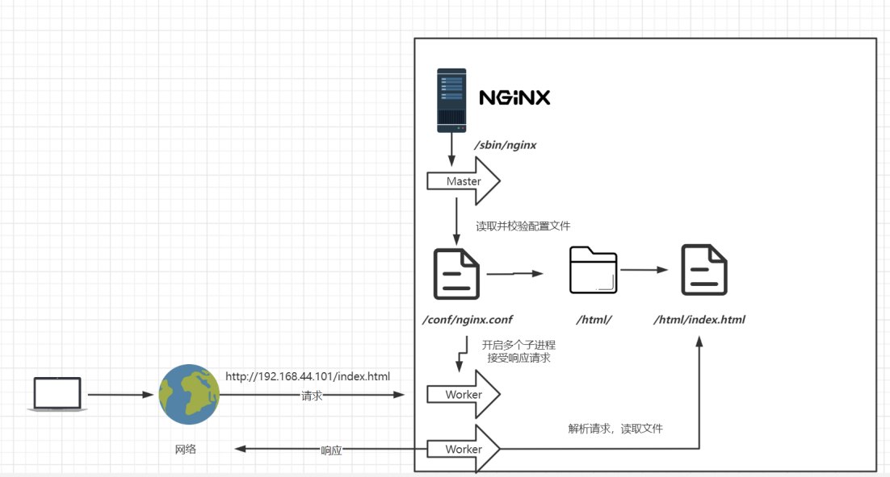
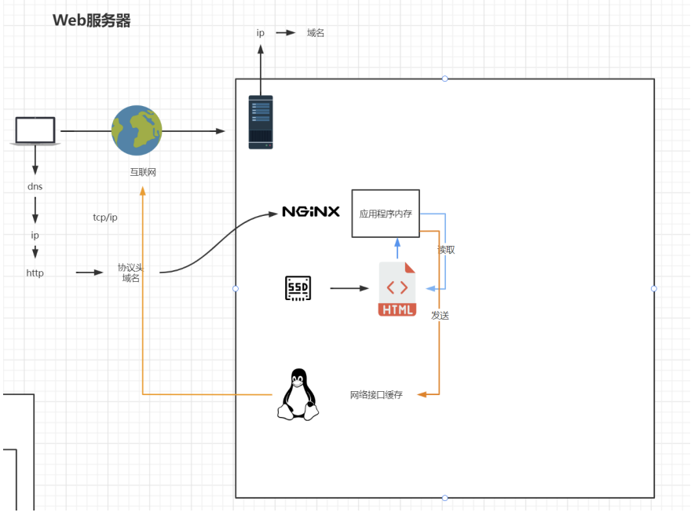
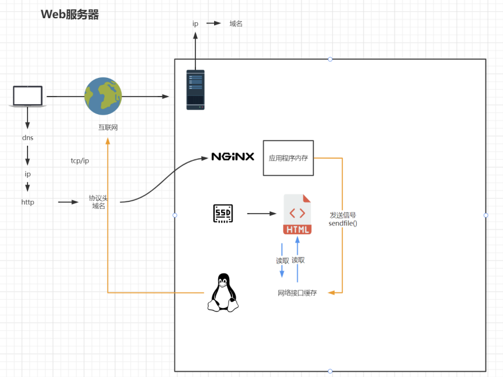
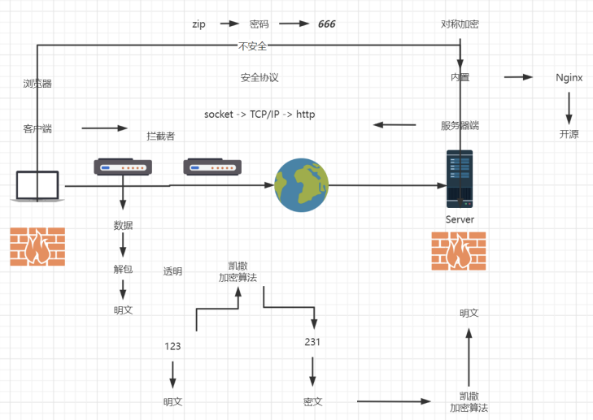
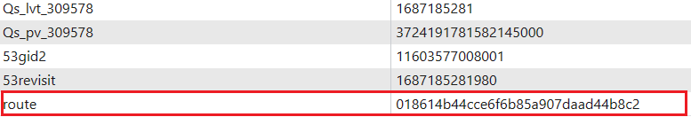
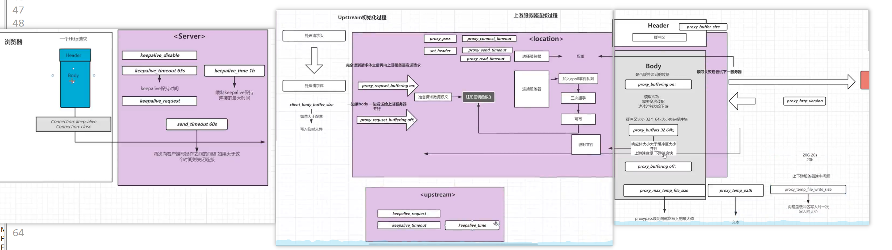
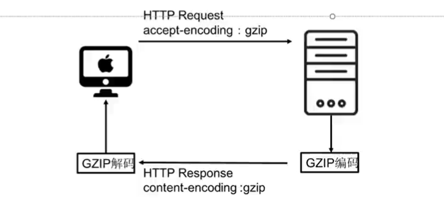

# Nginx 篇

## 基础篇

### Nginx 安装部署

#### Nginx 版本

| 版本                                                    | 地址                      |
| ------------------------------------------------------- | ------------------------- |
| Nginx开源版（官方免费开源版本）                         | http://nginx.org/         |
| Nginx plus 商业版（付费版，在上版本基础上加了一些功能） | https://www.nginx.com     |
| openresty（nginx+lua完美整合）                          | http://openresty.org/cn/  |
| Tengine（淘宝网公布发行版本，免费开源）                 | http://tengine.taobao.org |

#### 编译安装

以Centos为例：

- 下载&安装

```bash
# 安装依赖
yum -y install pcre pcre-devel gcc openssl openssl-devel zlib zlib-devel

# 下载 nginx 包
curl -O http://nginx.org/download/nginx-1.25.2.tar.gz

# 解压
tar -zxvf nginx-1.25.2.tar.gz

# 进入目录
cd nginx-1.25.2

# 执行命令
./configure        --- 用来检测安装平台的目标特征
make               --- 用来编译( 从Makefile中读取指令，然后编译)
make install       --- 用来安装( 从Makefile中读取指令，安装到指定的位置)
```

- 查看 nginx 安装目录

```bash
[root@localhost nginx-1.25.2]# whereis nginx
nginx: /usr/local/nginx /usr/local/nginx/sbin/nginx

# 默认安装目录为 /usr/local/nginx
```

- 配置环境变量

```bash
vim /etc/profile

# 最后一行输入
export PATH=$PATH:/usr/local/nginx/sbin

# 刷新配置文件
source /etc/profile
```

- 启动nginx

```bash
nginx
```

- 查看启动情况

```bash
netstat -tuln
```

#### 命令安装

##### yum 包管理器 安装

```bash
yum install -y nginx
```

##### apt 包管理器安装

```bash
apt install -y nginx
```

### Nginx 概述

**Nginx是一款高性能的开源Web服务器和反向代理服务器**。它以低资源消耗和高并发处理能力而著称，能够快速传输静态文件、实现负载均衡和高可用性，并支持SSL/TLS加密。Nginx还具备URL重写、访问控制和日志记录等功能，并可通过第三方模块扩展。它被广泛应用于构建高性能的网站和应用程序。

### 目录结构

Nginx常见的目录结构组织方式：

- **conf**：**Nginx的配置文件目录**。主要的配置文件是 nginx.conf，用于设置Nginx的全局配置和虚拟主机配置。在conf目录中还可以包含其他的配置文件，如mime.types用于定义文件类型和对应的MIME类型。
- **html**：**默认的Web根目录**，用于存放网站的静态文件，如HTML、CSS、JavaScript和图像等。当用户访问Nginx服务器时，默认会在html目录中查找相应的文件并返回给用户。
- **sbin**：**Nginx的可执行文件目录**。主要的可执行文件是nginx，用于启动、停止和重启Nginx服务器。此目录还可能包含其他的辅助工具和脚本文件。

其他重要的目录和文件包括：

- logs：存放Nginx的日志文件，包括访问日志和错误日志。这些日志文件记录了服务器的访问情况和可能出现的错误信息，有助于故障排查和性能分析。

- modules：Nginx的模块文件目录，用于扩展Nginx的功能。通过加载不同的模块，可以添加额外的功能和特性。

- temp：临时文件目录，用于存放临时文件，如上传文件时的临时存储目录。临时文件会在使用后自动清理，确保系统的整洁性。

- run：运行时文件目录，用于存放Nginx的运行时文件，如进程ID文件。这些文件记录了Nginx服务器的运行状态和相关信息。

可以使用`tree /usr/local/nginx`以树形列表的形式进行查看：

```bash
/usr/local/nginx/
├── client_body_temp (临时存储客户端请求体的目录)
├── conf (配置文件目录)
│   ├── fastcgi.conf (FastCGI配置文件)
│   ├── fastcgi.conf.default (FastCGI配置文件的默认备份)
│   ├── fastcgi_params (FastCGI参数配置文件)
│   ├── fastcgi_params.default (FastCGI参数配置文件的默认备份)
│   ├── koi-utf (KOI8-U字符集转换表)
│   ├── koi-win (KOI8-R到Windows字符集的映射表)
│   ├── mime.types (MIME类型映射文件)
│   ├── mime.types.default (MIME类型映射文件的默认备份)
│   ├── nginx.conf (Nginx主配置文件)
│   ├── nginx.conf.default (Nginx主配置文件的默认备份)
│   ├── scgi_params (SCGI参数配置文件)
│   ├── scgi_params.default (SCGI参数配置文件的默认备份)
│   ├── uwsgi_params (uWSGI参数配置文件)
│   ├── uwsgi_params.default (uWSGI参数配置文件的默认备份)
│   └── win-utf (Windows字符集转换表)
├── fastcgi_temp (FastCGI临时文件存储目录)
├── html (网站文件目录)
│   ├── 50x.html (服务器错误页面)
│   └── index.html (默认主页)
├── logs (日志文件目录)
│   ├── access.log (访问日志)
│   ├── error.log (错误日志)
│   └── nginx.pid (Nginx进程ID文件)
├── proxy_temp (代理临时文件存储目录)
├── sbin (Nginx可执行文件目录)
│   └── nginx (Nginx主要可执行文件)
├── scgi_temp (SCGI临时文件存储目录)
└── uwsgi_temp (uWSGI临时文件存储目录)
```

### 基本运行原理



Nginx 使用经典的**「Master-Worker」模型**来管理进程。当 Nginx 启动后，会有一个主进程（Master）和多个工作进程（Worker）。

主进程（Master）的职责如下：

- 接收来自外界的信号。

- 向各个工作进程发送信号。
- 监控工作进程的运行状态。
- 当工作进程异常退出时，主进程会自动重新启动新的工作进程。

工作进程（Worker）的职责如下：

- 处理基本的网络事件，如接收请求、读取请求数据和发送响应等。

- 多个工作进程之间是平等的，它们独立地竞争来自客户端的请求。
- 一个请求只能在一个工作进程中处理，一个工作进程不会处理其他进程的请求。
- 为了充分利用服务器的性能，可以根据需要设置工作进程的数量，通常会将工作进程的数量与服务器的 CPU 核数保持一致。

这种「Master-Worker」的进程模型使得 Nginx 能够高效地处理大量并发连接，并具备自动恢复的能力。

### Nginx 配置与应用场景

#### Nginx 最小配置

##### worker_processes

`worker_processes 1;`：工作进程数量设置为 1，适用于负载较轻的服务器。

##### worker_connections

`worker_connections 1024;`：每个工作进程允许的最大并发连接数为 1024，默认为 512。

##### include mime.types

`include mime.types;`：引入 `mime.types` 配置文件，定义了 MIME 类型，确保正确处理不同类型的文件。

##### default_type application/octet-stream

`default_type application/octet-stream;`：默认的 MIME 类型设置为 `application/octet-stream`，适用于未知文件类型。

##### sendfile on

`sendfile on;`：启用高效的文件传输方式，使用操作系统的 sendfile 功能，提高传输效率，默认为 off。



当开启后。



##### keepalive_timeout 65

`keepalive_timeout 65;`：客户端连接的超时时间设置为 65 秒，不活跃的连接将被关闭，默认值：75。

##### server

`server { ... }`：定义一个服务器块，用于配置具体的服务器行为。


```nginx
server {
    # 监听端口号为 80，表示 Nginx 将会接收来自客户端的 HTTP 请求并在该端口上进行处理
    listen 80;

    # 主机名设置为 "localhost"，表示该服务器块将处理来自主机名为 "localhost" 的请求
    server_name localhost;

    location / {
        # 文件根目录设置为 "html"，表示在处理匹配到的请求时，Nginx 将在 "html" 目录下寻找相应的文件
        root html;

        # 默认页名称设置为 "index.html" 和 "index.htm"，表示当请求的路径是一个目录时，Nginx 将尝试返回这些文件作为默认页面
        index index.html index.htm;
    }

    # 当发生 500、502、503 或 504 错误时，Nginx 将返回 "/50x.html" 页面作为错误页面
    error_page 500 502 503 504 /50x.html;

    location = /50x.html {
        # 文件根目录同样设置为 "html"，表示在处理匹配到的请求时，Nginx 将在 "html" 目录下寻找 "/50x.html" 文件
        root html;
    }
}
```

#### 虚拟主机

在 Nginx 中，虚拟主机用于配置多个网站或域名在同一台服务器上的访问。

##### servername匹配规则

Nginx 在配置文件中按照顺序进行匹配，**匹配到的第一个虚拟主机将处理请求**。

##### 完整匹配

在 Nginx 中，可以在同一个 servername 中匹配多个域名。可以将多个域名以空格分隔的方式列在 servername 配置项中。以下是一个示例：

```nginx
server {
    listen 80;
    server_name example.com www.example.com anotherdomain.com;

    # 其他配置项
    ...
}
```

##### 通配符匹配

在 Nginx 的 `server_name` 配置项中，可以使用通配符`*`进行域名匹配。通配符匹配允许模糊匹配多个域名或子域名。以下是关于通配符匹配的示例：

```nginx
server_name *.example.com;
```

上述配置将匹配所有以 `.example.com` 结尾的子域名，例如 `www.example.com`、`api.example.com` 等。

##### 通配符结束匹配

```ng
server_name example.com.*;
```

##### 正则匹配

常用的正则表达式示例来匹配不同类型的域名或子域名。

| 正则表达式                  | 匹配示例                                    |
| :-------------------------- | :------------------------------------------ |
| `^www\.example\.com$`       | `www.example.com`                           |
| `^subdomain\.example\.com$` | `subdomain.example.com`                     |
| `^.*\.example\.com$`        | `www.example.com`, `api.example.com`        |
| `^([a-z]+)\.example\.com$`  | `subdomain.example.com`, `test.example.com` |
| `^([a-z]+).(example         | test).com$`                                 |

在 Nginx 配置中使用正则表达式匹配时，需要使用 `~` 或 `~*` 运算符来指示 Nginx 进行正则匹配。`~` 表示区分大小写的匹配，而 `~*` 表示不区分大小写的匹配。

> 在正则表达式中，`$` 是一个特殊字符，表示匹配输入的结尾位置。

例如，在 Nginx 配置中使用正则表达式匹配以 `.example.com` 结尾的域名，可以按照以下方式进行配置：

```nginx
server {
    server_name ~.*\.example\.com$;
    ...
}
```

#### 反向代理

```nginx
location / {
	proxy_pass http://baidu.com/;
}
```

`proxy_pass` 是 Nginx 配置中的一个指令，用于设置反向代理。通常用于将一个 URL 的请求代理转发到另一个 URL 或者上游服务器。`proxy_pass` 的主要目的是将客户端的请求转发到不同的后端服务器或者位置，并将后端服务器返回的响应再返回给客户端。

### 反向代理

### 基于反向代理的负载均衡

#### 负载均衡策略

##### 轮询

轮询（Round Robin）：默认的负载均衡策略，每个请求按顺序依次分配给后端服务器，循环往复，适用于无状态请求。

```nginx
http {
    upstream backend {
        server backend1.example.com;
        server backend2.example.com;
        server backend3.example.com;
    }
    
    server {
        listen 80;
        
        location / {
            proxy_pass http://backend;
        }
    }
}
```

##### weight（权重）

权重（Weight）：通过为每个后端服务器分配不同的权重值，按比例分配负载。具有更高权重值的后端服务器将获得更多的请求。

```ngin
http {
    upstream backend {
        server backend1.example.com weight=3;
        server backend2.example.com weight=3 down;
        server backend3.example.com weight=3 backup;
    }
    
    server {
        listen 80;
        
        location / {
            proxy_pass http://backend;
        }
    }
}
```

- down：使用 `down` 参数可以将指定的服务器标记为暂时不参与负载。当一个服务器被标记为 `down` 时，Nginx 将不会将请求发送到该服务器，直到将其从 `down` 状态中移除。这通常用于临时禁用一个服务器，例如进行维护或故障排除。
- weight：通过为每个后端服务器分配不同的权重值，可以按比例分配负载。具有较高权重值的服务器将获得更多的请求。默认情况下，每个服务器的权重为1。
- backup：使用 `backup` 参数可以将一个服务器标记为备用服务器。当所有非备用服务器都处于 `down` 状态或忙碌状态时，请求将发送到备用服务器。备用服务器不会参与正常的负载分配。

##### ip_hash

IP 哈希（ip_hash）：根据客户端的 IP 地址将请求分配给后端服务器。相同 IP 地址的请求将始终被分配给同一个后端服务器，可以确保具有相同 IP 的客户端的请求都会被发送到同一个后端服务器。

```nginx
http {
    upstream backend {
        ip_hash;
        server backend1.example.com;
        server backend2.example.com;
        server backend3.example.com;
    }
    
    server {
        listen 80;
        
        location / {
            proxy_pass http://backend;
        }
    }
}
```

##### least_conn

最少连接（least_conn）：将请求发送到当前连接数最少的后端服务器。这种策略可以在后端服务器之间动态地平衡负载。

```nginx
http {
    upstream backend {
        least_conn;
        server backend1.example.com;
        server backend2.example.com;
        server backend3.example.com;
    }
    
    server {
        listen 80;
        
        location / {
            proxy_pass http://backend;
        }
    }
}
```

##### url_hash

URL 哈希（url_hash）：根据请求的 URL 将请求分配给后端服务器。相同 URL 的请求将始终被分配给同一个后端服务器，这对于需要保持会话的应用程序很有用。

```nginx
http {
    upstream backend {
        hash $request_uri;
        server backend1.example.com;
        server backend2.example.com;
        server backend3.example.com;
    }
    
    server {
        listen 80;
        
        location / {
            proxy_pass http://backend;
        }
    }
}
```

##### fair

公平（fair）：根据后端服务器的响应时间和处理能力，动态地分配请求。较快响应的服务器将获得更多的请求，以实现负载均衡。

```nginx
http {
    upstream backend {
        fair;
        server backend1.example.com;
        server backend2.example.com;
        server backend3.example.com;
    }
    
    server {
        listen 80;
        
        location / {
            proxy_pass http://backend;
        }
    }
}
```

#### 动静分离

##### 配置Nginx反向代理

在Nginx的配置文件中，需要设置一个反向代理的位置（`location`），将动态请求转发给后端服务器。这通常使用`proxy_pass`指令实现。

示例配置：

```nginx
server {
    listen 80;
    server_name example.com;
    
    location / {
        proxy_pass http://backend;
    }
}
```

上述配置将所有请求转发到名为`backend`的后端服务器，后端服务器可以是Apache、Tomcat或其他处理动态内容的服务器。

##### 增加每一个location

另一种方式是为每种类型的请求（静态或动态）分别配置不同的location块。可以使用root指令定义静态文件的根目录，并使用proxy_pass指令将动态请求转发给后端服务器。

示例配置：

```nginx
server {
    listen 80;
    server_name example.com;
    
    location /static {
        root /path/to/static/files;
    }
    
    location / {
        proxy_pass http://backend;
    }
}
```
上述配置将以/static开头的请求映射到静态文件目录/path/to/static/files，而其他请求将转发到名为backend的后端服务器。

##### 使用一个location

还可以将所有请求都通过一个`location`块进行处理，并根据请求的类型（静态或动态）进行条件判断和处理。可以使用`try_files`指令来尝试查找静态文件，如果找不到则将请求转发给后端服务器。

示例配置：

```nginx
server {
    listen 80;
    server_name example.com;
    
    location / {
        try_files $uri $uri/ @backend;
    }
    
    location @backend {
        proxy_pass http://backend;
    }
}
```

上述配置将尝试查找请求的静态文件，如果找到则直接返回，否则将请求转发给名为`backend`的后端服务器。

Nginx中的location匹配规则和示例：

| 匹配符号 | 描述                                     | 示例                         |
| :------- | :--------------------------------------- | :--------------------------- |
| `/`      | 通用匹配，适用于任何请求                 | `location /`                 |
| `=`      | 精确匹配，不是以指定模式开头             | `location = /path`           |
| `~`      | 正则匹配，区分大小写                     | `~ \.(jpg\|png)\$`           |
| `~*`     | 正则匹配，不区分大小写                   | `location ~* \.(jpg\|png)\$` |
| `^~`     | 非正则匹配，匹配以指定模式开头的location | `location ^~ /images/`       |

示例配置：

```nginx
server {
    listen 80;
    server_name example.com;
    
    location / {
        # 通用匹配，适用于任何请求
        # 处理动态请求的后端服务器
        proxy_pass http://backend;
    }
    
    location = /path {
        # 精确匹配，只匹配路径为 /path 的请求
        # 处理 /path 请求的配置
    }
    
    location ~ \.(jpg|png)$ {
        # 正则匹配，匹配以 .jpg 或 .png 结尾的请求
        # 处理图片请求的配置
    }
    
    location ~* \.(jpg|png)$ {
        # 正则匹配，不区分大小写，匹配以 .jpg 或 .png 结尾的请求
        # 处理图片请求的配置
    }
    
    location ^~ /images/ {
        # 非正则匹配，匹配以 /images/ 开头的请求
        # 处理以 /images/ 开头的静态文件请求的配置
    }
}
```
在Nginx中，location的匹配顺序如下：

- 精确匹配（=）：如果存在精确匹配的location，将优先匹配该location。例如：``location = /path``。

- 非正则匹配（^~）：如果存在非正则匹配的location，将匹配以指定模式开头的location，并停止继续匹配其他规则。例如：``location ^~ /images/``。

- 正则匹配``(~``和``~*)``：按照配置文件中的顺序，依次匹配正则表达式类型的location。如果找到匹配的location，将停止继续匹配其他正则location。其中，``~``表示正则匹配，区分大小写；``~*``表示正则匹配，不区分大小写。例如：``location ~ \.(jpg|png)$``。

- 普通匹配（最大前缀匹配）：如果以上匹配都未成功，将匹配最大前缀匹配的普通location。普通匹配会一直往下匹配，直到找到最大前缀匹配的location。


请注意，一旦成功匹配到一个location，Nginx将停止继续匹配其他location，并使用匹配到的location进行处理。因此，配置文件中location的顺序非常重要，应根据具体需求和优先级进行合理的排列。

##### alias与root

```nginx
location /css{
    alias /usr/local/nginx/static/css;
    index index.html index.htm;
}
```

root用来设置根目录，而**alias在接受请求的时候在路径上不会加上location**。

当在 Nginx 中使用 `alias` 和 `root` 指令时，以下是一些重要的观点总结：

- `alias` 指令用于指定一个准确的目录路径。它会将匹配到的路径直接映射到 `alias` 指定的目录下进行查找。
- `root` 指令用于设置根目录。当使用 `root` 指令时，匹配到的路径会添加到 `root` 指定的目录路径后面进行查找。请确保匹配到的路径在 `root` 指定的目录下存在。
- 在使用 `alias` 指令的目录块中，无法使用 `rewrite` 指令的 `break` 标记。这是因为 Nginx 在匹配到 `alias` 后会立即停止查找，并使用 `alias` 指定的路径进行处理，无法继续执行 `rewrite` 指令。
- 在使用 `alias` 虚拟目录配置时，如果匹配到的路径后面没有斜杠 `/`，访问 URL 时会自动在该路径后添加斜杠。但是，如果匹配到的路径后面添加了斜杠，则访问 URL 时必须手动添加斜杠，否则访问会失败。
- 对于 `root` 目录配置，无论匹配到的路径后面是否带有斜杠，都不会影响访问。无论路径后面是否带有斜杠，Nginx 都会正确处理。

#### UrlRewrite

##### rewrite语法格式及参数语法

**rewrite 指令：**

| 语法                                | 含义                |
| :---------------------------------- | :------------------ |
| `rewrite regex replacement [flag];` | 执行 URL 重写操作。 |

**正则表达式 (regex)：**

| 语法                | 含义                                             |
| :------------------ | :----------------------------------------------- |
| `^/old-url$`        | 匹配 `/old-url` 的 URL。                         |
| `^/page\?id=(\d+)$` | 匹配带有查询字符串的形如 `/page?id=123` 的 URL。 |
| `^(.*)$`            | 匹配所有 URL。                                   |

**替换字符串 (replacement)：**

| 语法              | 含义                                                         |
| :---------------- | :----------------------------------------------------------- |
| `/new-url`        | 将 URL 重写为 `/new-url`。                                   |
| `/page/$1`        | 将查询字符串中的数字捕获组作为路径的一部分，例如将 `/page?id=123` 重写为 `/page/123`。 |
| `https://$host$1` | 将 HTTP 请求重写为对应的 HTTPS 请求。                        |

**标志参数 (flag)：**

| 语法        | 含义                                                         |
| :---------- | :----------------------------------------------------------- |
| `last`      | 完成当前 URL 重写后，停止处理其他重写规则。`last` 和 `break` 的区别是 `last` 会停止处理其他的重写规则，而 `break` 则会停止处理整个 Nginx 配置中的其他指令。 |
| `permanent` | 执行永久重定向，将客户端浏览器重定向到新的 URL。             |
| `break`     | 完成当前的 URL 重写后，停止处理 Nginx 配置中的其他指令。     |
| `redirect`  | 执行永久重定向，将客户端浏览器重定向到新的 URL。             |

##### 简单示例

rewrite 指令可以在 Nginx 配置文件的 server、location 和 if 块中使用。下面是每个块中使用 rewrite 的示例和解释：

- 在 server 块中使用 rewrite：

```nginx
server {
    ...
    rewrite regex replacement [flag];
    ...
}
```

在 server 块中使用 rewrite 可以应用于整个服务器范围内的请求。例如，你可以在 server 块中设置一个全局的重写规则，将特定的 URL 重写为其他的 URL。

- 在 location 块中使用 rewrite：

```nginx
location /path {
    ...
    rewrite regex replacement [flag];
    ...
}
```

在 location 块中使用 rewrite 可以针对特定的 URL 路径进行重写。当请求的 URL 匹配 location 块中指定的路径时，将应用相应的重写规则。

- 在 if 块中使用 rewrite：

```nginx
if (condition) {
    ...
    rewrite regex replacement [flag];
    ...
}
```

在 if 块中使用 rewrite 可以根据指定的条件进行条件性重写。只有当条件满足时，才会应用 rewrite 规则来重写 URL。

请注意，尽管在 if 块中可以使用 rewrite，但是在 Nginx 的最佳实践中，建议避免过多使用 if 块，因为它可能会引入复杂性和性能问题。

##### 同时使用负载均衡

###### 应用服务器防火墙配置

- 开启防火墙

```bash
systemctl start firewalld
```

- 重启防火墙

```bash
sysemctl restart firewalld
```

- 重载规则

```bash
firewalld-cmd --reload
```

- 查看已配置规则

```bash
firewalld-cmd --install
```

- 指定端口和ip访问

```bash
firewall-cmd --permanent --add-rich-rule="rule family="ipv4" source address="localhost" port protocol="tcp" port="8080" accept"
```

- 移除规则

```bash
firewall-cmd --permanent --remove-rich-rule="rule family="ipv4" source address="localhost" port port="8080" protocol="tcp" accept"
```

###### 网关配置

```nginx
upstream httpds {
    server 192.168.44.102 weight=8 down;
    server 192.168.44.103:8080 weight=2;
    server 192.168.44.104:8080 weight=1 backup;
}

location / {
    rewrite ^/([0-9]+).html$ /index.jsp?pageNum=$1 redirect;
    proxy_pass http://httpds;
}
```

这个配置示例中，定义了一个名为 `httpds` 的负载均衡组，其中包含了三个后端服务器。然后，在 `/` 路径的 `location` 块中，使用了 `rewrite` 指令将匹配的 URL 重写为 `/index.jsp?pageNum=$1`，其中 `$1` 是正则表达式中捕获的数字部分。最后，通过 `proxy_pass` 将请求代理到负载均衡组 `httpds` 中的后端服务器。

#### 防盗链配置

防盗链是一种保护你的资源不被其他网站盗用的措施。Nginx提供了一些配置选项，可以帮助你实现防盗链功能。

##### 语法

```nginx
location / {
    valid_referers parameter;
    if ($invalid_referer) {
        return 403;
    }
    # 处理请求的逻辑
    ...
}
```

##### 参数含义

- `valid_referers`：用于配置允许的请求来源。
- `parameter`：参数值，可以是一个字符串列表，用空格分隔。常见的参数值有：
  - `none`：禁止所有的来源，直接访问资源将被拒绝。
  - `blocked`：阻止特定的来源列表，将这些来源添加到 `blocked` 中。
  - `yourdomain.com`：允许来自 `yourdomain.com` 的请求。

##### 示例

下面是一个示例配置，演示了如何使用 Nginx 防盗链功能：

```nginx
location / {
    valid_referers none blocked yourdomain.com;
    if ($invalid_referer) {
        return 403;
    }
    # 处理请求的逻辑
    ...
}
```

在上述示例中，配置了一个 `location` 块，限制了请求的来源。`valid_referers` 指定了允许的来源，其中包括 `none`（禁止所有来源直接访问）、`blocked`（阻止特定来源列表）和 `yourdomain.com`（允许来自 `yourdomain.com` 的请求）。如果请求的来源不合法（即 `$invalid_referer` 为真），将返回 403 Forbidden 响应。

##### 使用curl测试

```bash
curl -I http://127.0.0.1/img/logo.pn
```

##### 带引用

```bash
curl -e "http://baidu.com" -I http://127.0.0.1/img/logo.pn
```

## 进阶篇

### 高可用配置

#### 安装Keepalived

##### 编译安装【失败】

- 下载 [keepalived](https://www.keepalived.org/download.html#)

```bash
wget https://www.keepalived.org/software/keepalived-2.2.8.tar.gz
```

- 安装依赖

```bash
yum -y install openssl-devel libnl libnl-devel libnfnetlink-devel
```

- 使用 `./configure` 编译

```bash
./configure --prefix=/usr/local/keepalived \
--with-init=systemd \
--with-systemdsystemunitdir=/usr/lib/systemd/system
```

- 编译安装

```bash
make && make install
```

- 复制配置文件

```bash
 cp /root/opt/keepalived-2.2.8/keepalived/etc/init.d/keepalived /etc/init.d/
 
 # 需要提前在/etc下创建keepalived目录
 mkdir  -p /etc/keepalived
 
 cp /usr/local/keepalived/sbin/keepalived /usr/sbin/
 cp /usr/local/keepalived/etc/keepalived/keepalived.conf.sample /etc/keepalived/keepalived.conf
 cp /root/opt/keepalived-2.2.8/keepalived/etc/sysconfig/keepalived /etc/sysconfig/keepalived
```

##### yum安装【成功】

```bash
yum install keepalived -y
```

#### 配置

当使用yum包管理器安装keepalived后，配置文件通常位于/etc/keepalived/keepalived.conf路径下。

##### 最小配置

两台机器的最小配置示例，用于在Keepalived中创建一个基本的VRRP实例：

第一台机器的配置（MASTER）：

```nginx
! Configuration File for keepalived

global_defs {
    router_id lb111
}

vrrp_instance atguigu {
    state MASTER
    interface ens33
    virtual_router_id 51
    priority 100
    advert_int 1
    authentication {
        auth_type PASS
        auth_pass 1111
    }
    virtual_ipaddress {
        192.168.44.200
    }
}
```

第二台机器的配置（BACKUP）：

```nginx
! Configuration File for keepalived

global_defs {
    router_id lb110
}

vrrp_instance atguigu {
    state BACKUP
    interface ens33
    virtual_router_id 51
    priority 50
    advert_int 1
    authentication {
        auth_type PASS
        auth_pass 1111
    }
    virtual_ipaddress {
        192.168.44.200
    }
}
```

在上述配置中，第一台机器被配置为MASTER状态，而第二台机器被配置为BACKUP状态。两台机器使用相同的虚拟路由器ID（virtual_router_id为51）和虚拟IP地址（virtual_ipaddress为192.168.44.200）。优先级（priority）用于决定哪台机器将成为MASTER。

### Https证书配置

#### 不安全的http协议



#### openssl

openssl包含：SSL协议库、应用程序以及密码算法库。

#### 自签名

##### OpenSSL

系统内置

##### 图形化工具 XCA

```bash
https://www.hohnstaedt.de/xca/index.php/download
```

#### CA 签名

## 高级篇

目的：通过扩容提升整体吞吐量

### 单机垂直扩容：硬件资源增加


### 水平扩展：集群化

#### 基本调优

##### 会话管理-修改负载均衡策略

###### Nginx高级负载均衡

**`ip_hash`**

- 会导致流量倾斜，ip集中
- 若后端服务器宕机，对应ip的服务将无法提供
- 应用场景：中小型项目快速扩容时，不想修改代码，只需增加几台服务器使用ip_hash就可临时实现

**``hash $cookie_jsessionid;``**

- 根据cookie中的jsessionid的不同转发到对应的服务器

**`hash $request_uri;`**

- 根据uri的不同转发到对应的服务器

**使用lua逻辑定向分发**

###### Redis + SpringSession

- 要修改代码
- 所有前端服务器的请求打在redis服务器上，redis受不了

ip_hash示例：

```nginx
upstream httpds {
    ip_hash;
    server 192.168.44.102 ;
    server 192.168.44.103 ;
}


server {
    listen       80;
    server_name  localhost;

    location / {
        proxy_pass http://httpds;

        # root   html;
    }

    location ~*/(css|img|js) {

        root   /usr/local/nginx/html;

    }
```

###### 使用sticky模块完成对Nginx的负载均衡

- 参考文档：http://nginx.org/en/docs/http/ngx_http_upstream_module.html#sticky

tengine中有session_sticky模块通过第三方的方式安装在开源版本中。

sticky是第三方模块，需要重新编译Nginx，他可以对Nginx这种静态文件服务器使用基于cookie的负载均衡。

- 下载模块

下载地址1：https://bitbucket.org/nginx-goodies/nginx-sticky-module-ng/src/master/

下载地址2：https://github.com/bymaximus/nginx-sticky-module-ng

```bash
wget https://bitbucket.org/nginx-goodies/nginx-sticky-module-ng/get/1.2.6.zip

unzip 1.2.6.zip
```

可以看到有类似的`nginx-goodies-nginx-sticky-module-ng-c78b7dd79d0d`。

- 重新编译nginx

**进到源码目录重新编译**，并且configure时记得加上自己原本有的后缀

```bash
./configure --prefix=/usr/local/nginx --add-module=/root/opt/nginx-goodies-nginx-sticky-module-ng-c78b7dd79d0d
```

- 执行make

打开sticky文件夹中 `ngx_http_sticky_misc.c`文件，在12行添加

```c++
#include <openssl/sha.h>
#include <openssl/md5.h>
```

**若缺少依赖`openssl-devel`**

```bash
yum install -y openssl-devel
```

**备份之前的程序**

```bash
mv /usr/local/nginx/sbin/nginx /usr/local/nginx/sbin/nginx.old
```

**把编译好的Nginx程序替换到原来的目录里**

```bash
cp objs/nginx /usr/local/nginx/sbin/
```

**升级检测**

```bash
make upgrade
```

检查程序中是否包含新模块

```bash
nginx -V
```

配置示例：

```nginx
upstream httpget {

    sticky name=route expires=6h;

    server 192.168.44.102;
    server 192.168.44.103;
}
```

请求头中的cookie中带有key为route的数据，重复请求该值不变，route是由sticky模块下发的值。



##### KeepAlive

###### 概述

不是keepalived 没有d。

- **KeepAlive：保持长连接，避免过多的http连接的建立**，在http协议header中可以看到当前KeepAlive的连接状态
- **可使用测试工具charles**，也可以直接使用浏览器开发者模式，不过可能因为缓存原因刷新失败，类似于wireshark，一个抓包工具。
- 下载地址：https://www.charlesproxy.com/assets/release/4.6.2/charles-proxy-4.6.2-win64.msi?k=fc1457e312

- 官网：https://www.charlesproxy.com


###### 什么时候用和不用？

- 用：
  - 明显的预知用户会在当前连接上有下一步操作
  - 复用连接，有效减少握手次数，尤其是https建立一次连接开销会更大
- 不用：
  - 访问内联资源一般用缓存，不需要keepalive
  - 长时间的tcp连接容易导致系统资源无效占用

###### 对客户端使用keepalive

客户端一般是浏览器。

配置位置：http。

```nginx
http {
    include       mime.types;
    default_type  application/octet-stream;


    sendfile        on;


    keepalive_timeout  65 65; #超过这个时间 没有活动，会让keepalive失效 ，第二个参数用于配置http1.0版本，1.1不需要
    keepalive_time 1h; # 一个tcp连接总时长，超过之后 强制失效

    send_timeout 60;# 默认60s  此处有坑！！ 系统中 若有耗时操作，超过 send_timeout 强制断开连接。 注意：准备过程中，不是传输过程


    keepalive_requests 1000;  #一个tcp复用中 可以并发接收的请求个数

```

- keepalive_timeout
  - nginx.conf配置文件中修改keepalive_timeout，默认是65（s），修改成0即为关闭
  - 用于设置Nginx服务器与客户端保持连接的超时时间
  - 用于踢出不活动连接
  - keepalive_timeout = 0 即关闭
  - 可以设置两个参数， keepalive_timeout 65 65;
  - 第二个参数用于配置http1.0版本，1.1不需要

- keepalive_disable

  - 不对某些浏览器建立长连接

  - 默认msie6


- keepalive_time

  - 限制keepalive保持连接的最大时间，超过之后 强制失效

  - 默认是1h


  - 1.19.10新功能

- keepalive_request
  - 默认1000，1000已经够用
  - 一个tcp复用中 可以并发接收的请求个数


- send_timeout
  - 两次向客户端写操作之间的间隔 如果大于这个时间则关闭连接 默认60s
  - send_timeout 10; 10秒

  - send_timeout 10 10; 同时下发一个header 告诉浏览器


**此处有坑**，注意耗时的同步操作有可能会丢弃用户连接

该设置表示Nginx服务器与客户端连接后，某次会话中服务器等待客户端响应超过10s，就会自动关闭连接。

###### 对上游服务器使用keepalive

上游服务器就是后端服务器。

首先需要配置使用http1.1协议。以便建立更高效的传输，默认使用http1.0，在http1.0中需要配置header才能。

在[Upstream](https://so.csdn.net/so/search?q=Upstream&spm=1001.2101.3001.7020)中所配置的上游服务器默认都是用短连接，即每次请求都会在完成之后断开。

```nginx
#定义集群
upstream cluster {
    keepalive 100;
    keepalive_timeout  65;
    keepalive_requests 1000;
    server 192.168.111.101:80;
    server 192.168.111.102:80;
}

server {
    listen       80;
    server_name  localhost;

    location / {
        proxy_http_version 1.1;
        proxy_set_header Connection "";

        #反向代理到集群，配置负载均衡
        proxy_pass http://cluster;
    }
```

- `keepalive 100`：向上游服务器的保留连接数
- `keepalive_timeout 65`：连接保留时间
- `keepalive_requests 1000`：一个tcp复用中 可以并发接收的请求个数

- server中的location配置


```nginx
proxy_http_version 1.1;
#配置http版本号
#因为nginx默认使用http1.0协议，需要在request中增加”Connection： keep-alive“ header才能够支持，而HTTP1.1默认支持。
proxy_set_header Connection "";			#清除close信息由于nginx默认为 http 1.0 ，不支持服务端长连接，请求头会携带 `connection： close` ，所以需要指定http版本为 http 1.1，同时设置``connection： ""``。
```

###### KeepAlive配置总结

一般情况下：

- 对客户端使用keepAlive全部配上，使用默认值
- 对上游服务器使用keepAlive全部配上，使用默认值

###### KeepAlive压测：AB安装使用

apache benchmark：一款压力测试插件，直接通过yum安装即可

```bash
yum install httpd-tools -y
```

| 选项 | 描述                                                         |
| ---- | ------------------------------------------------------------ |
| -n   | 指定压力测试总共的执行次数                                   |
| -c   | 指定并发数                                                   |
| -t   | 等待响应的最大时间(单位：秒)                                 |
| -b   | TCP发送/接收的缓冲大小(单位：字节)                           |
| -p   | 发送POST请求时需要上传的文件，还需设置-T参数                 |
| -u   | 发送PUT请求时需要上传的文件，还需设置-T参数                  |
| -T   | 设置Content-Type请求头信息，例如：application/x-www-form-urlencoded，默认值为text/plain |
| -v   | 指定打印帮助信息的冗余级别                                   |
| -w   | 以HTML表格形式打印结果                                       |
| -i   | 使用HEAD请求代替GET请求                                      |
| -x   | 插入字符串作为table标签的属性                                |
| -y   | 插入字符串作为tr标签的属性                                   |
| -z   | 插入字符串作为td标签的属性                                   |
| -C   | 添加cookie信息，例如：“Apache=1234”(可以重复该参数选项以添加多个) |
| -H   | 添加任意的请求头，例如：“Accept-Encoding: gzip”，请求头将会添加在现有的多个请求头之后(可以重复该参数选项以添加多个) |
| -A   | 添加一个基本的网络认证信息，用户名和密码之间用英文冒号隔开   |
| -P   | 添加一个基本的代理认证信息，用户名和密码之间用英文冒号隔开   |
| -X   | 指定使用的和端口号，例如:“126.10.10.3:88”                    |
| -V   | 打印版本号并退出                                             |
| -k   | 使用HTTP的KeepAlive特性                                      |
| -d   | 不显示百分比                                                 |
| -S   | 不显示预估和警告信息                                         |
| -g   | 输出结果信息到gnuplot格式的文件中                            |
| -e   | 输出结果信息到CSV格式的文件中                                |
| -r   | 指定接收到错误信息时不退出程序                               |
| -h   | 显示用法信息，其实就是ab -help                               |

压测语句：

```bash
ab -n 100000 c 30 http://192.168.111.102/
```

##### UpStream(反向代理上游集群)工作流程



proxy_pass 向上游服务器请求数据共有6个阶段

- 初始化
- 与上游服务器建立连接
- 向上游服务器发送请求
- 处理响应头
- 处理响应体
- 结束

###### 对客户端的限制配置

可配置位置

- http
- server
- **location**

| 参数                         | 描述                                                         | 默认值                        |
| :--------------------------- | :----------------------------------------------------------- | :---------------------------- |
| client_body_buffer_size      | 客户端请求体缓冲区大小。如果请求体大于配置的大小，将写入临时文件。 | 32位系统：8k<br>64位系统：16k |
| client_header_buffer_size    | 读取客户端请求头的缓冲区大小。如果请求头大于缓冲区大小，将写入临时文件。 | 32位系统：8k<br>64位系统：16k |
| client_max_body_size         | 设置客户端请求体最大大小。超过该值的请求将返回413错误。      | 1m                            |
| client_body_timeout          | 客户端与服务端建立连接后发送请求体的超时时间。超时将返回408错误。 | -                             |
| client_header_timeout        | 客户端发送完整请求头的超时时间。超时将返回408错误。          | -                             |
| client_body_temp_path        | 客户端请求体临时缓冲区的磁盘路径。                           | -                             |
| client_body_in_file_only     | 将请求体写入磁盘文件，请求结束后不会删除。                   | off                           |
| client_body_in_single_buffer | 尽量在内存中使用连续的单一缓冲区来缓冲请求体。               | off                           |
| large_client_header_buffers  | 用于存储较大客户端请求行或请求头字段的缓冲区大小。           | 8k                            |

在Nginx配置中，可以在`location`块内对客户端进行限制配置。`location`块用于匹配请求的URI路径，并在匹配成功时应用相应的配置。以下是一个简单的示例，演示如何在`location`块内对客户端进行限制配置：

```nginx
server {
    listen 80;
    server_name example.com;

    location /restricted {
        # 限制客户端请求的配置
        client_max_body_size 10m;
        client_body_timeout 60s;
        # 其他配置...

        # 处理请求的逻辑
        # ...
    }

    location / {
        # 默认配置
        # ...
    }
}
```

在上面的示例中，定义了两个`location`块：`/restricted`和默认的根路径`/`。在`/restricted`位置块内，对客户端请求进行了限制配置。具体来说，设置了`client_max_body_size`为10m，限制了客户端请求体的最大大小为10兆字节，并设置了`client_body_timeout`为60秒，指定客户端发送请求体的超时时间为60秒。

###### header和连接配置

配置位置：推荐location

| 指令/参数             | 描述                                                         | 示例                                                         |
| :-------------------- | :----------------------------------------------------------- | :----------------------------------------------------------- |
| add_header            | 向响应中添加自定义的HTTP头。                                 | add_header X-Custom-Header "Custom Value";                   |
| proxy_set_header      | 在向代理服务器发送请求时设置请求头。                         | proxy_set_header X-Forwarded-For \$proxy_add_x_forwarded_for;<br/>proxy_set_header Host \$host; |
| proxy_connect_timeout | 与上游服务器建立连接的超时时间。如果连接超时，将触发快速失败。 | proxy_connect_timeout 5s;                                    |
| proxy_send_timeout    | 定义Nginx向后端服务发送请求的间隔时间。默认60秒，超过这个时间会关闭连接。 | proxy_send_timeout 10s;                                      |
| proxy_read_timeout    | 后端服务给Nginx响应的时间。规定时间内后端服务没有给Nginx响应，连接会被关闭，Nginx返回504 Gateway Timeout。 | proxy_read_timeout 30s;                                      |

在`location`块内配置请求头和连接参数：

```nginx
server {
    listen 80;
    server_name example.com;

    location /api {
        # 设置请求头
        add_header X-Custom-Header "Custom Value";
        proxy_set_header X-Forwarded-For $proxy_add_x_forwarded_for;
        proxy_set_header Host $host;

        # 连接配置
        proxy_connect_timeout 5s;
        proxy_send_timeout 10s;
        proxy_read_timeout 30s;

        # 代理到后端服务器
        proxy_pass http://backend_server;
    }

    # 其他location块和配置...
}
```

在上述示例中，我们定义了一个`location`块用于匹配以`/api`开头的请求，并在该位置块内配置了请求头和连接参数。

###### 缓冲区配置

配置位置：推荐location

缓冲和请求处理相关的Nginx代理配置指令的表格展示：

| 指令                       | 描述                                                         | 示例                                     |
| :------------------------- | :----------------------------------------------------------- | :--------------------------------------- |
| proxy_request_buffering    | 控制是否完全读取请求体后再向上游服务器发送请求。默认值为`on`，表示完全读取后发送请求。设置为`off`可立即将请求发送到上游服务器。 | proxy_request_buffering on;              |
| proxy_buffering            | 控制是否缓冲上游服务器的响应数据。默认值为`on`，表示启用缓冲。设置为`off`可禁用缓冲，实时将响应数据传递给客户端。 | proxy_buffering on;                      |
| proxy_buffers              | 设置缓冲区的大小和数量。第一个参数为缓冲区的数量，第二个参数为每个缓冲区的大小。默认值为`proxy_buffers 8 4k;`。 | proxy_buffers 32 64k;                    |
| proxy_buffer_size          | 设置缓冲区的大小。用于控制缓冲响应头的大小。默认值为`proxy_buffer_size 4k;`。 | proxy_buffer_size 64k;                   |
| proxy_busy_buffers_size    | 设置在响应期间保持繁忙状态的缓冲区大小。默认值为`proxy_busy_buffers_size 8k;`。 | proxy_busy_buffers_size 8k;              |
| proxy_max_temp_file_size   | 设置临时文件的最大大小。当启用响应缓冲时，超过此大小的响应将写入临时文件。默认值为`proxy_max_temp_file_size 1024m;`。 | proxy_max_temp_file_size 1024m;          |
| proxy_temp_file_write_size | 限制一次写入临时文件的数据大小，当启用响应缓冲时生效。默认值由`proxy_buffer_size`和`proxy_buffers`指令设置的缓冲区大小决定。 | proxy_temp_file_write_size 8k;           |
| proxy_temp_path            | 设置用于存储临时文件的路径。默认值为系统的临时目录。         | proxy_temp_path /path/to/temp/directory; |

以下是一个示例配置，展示了如何使用上述缓冲和请求处理相关的Nginx代理指令：

```nginx
server {
    listen 80;
    server_name example.com;

    location /api {
        # 控制请求处理
        proxy_request_buffering on;
        proxy_buffering on;

        # 缓冲配置
        proxy_buffer_size 64k;
        proxy_buffers 32 128k;
        proxy_busy_buffers_size 8k;
        proxy_max_temp_file_size 1024m;
        proxy_temp_file_write_size 8k;

        # 临时文件路径
        proxy_temp_path /path/to/temp/directory;

        # 代理到后端服务器
        proxy_pass http://backend_server;
    }

    # 其他location块和配置...
}
```

在上述示例中，定义了一个`location`块，用于匹配以`/api`开头的请求，并在该位置块内配置了缓冲和请求处理相关的指令。

###### UpStream配置总结

需要配置下列一项才能完成登录等post请求，否侧会返回500。

`proxy_set_header Host $host;`

```nginx
location / {


    #反向代理到集群，配置负载均衡
    proxy_pass http://47.115.207.49:8099/;
    proxy_set_header Host $host;

    #proxy_redirect off;
    #proxy_set_header X-Real-IP $remote_addr;
    #proxy_set_header X-Forwarded-For $proxy_add_x_forwarded_for;           
    #proxy_set_header Cookie $http_cookie;

    #proxy_send_timeout 1300;
    #proxy_read_timeout 1300;
    #proxy_buffer_size 64k;
    #proxy_buffers 8 64k;
    #proxy_busy_buffers_size 128k;
    #proxy_temp_file_write_size 64k;
    #client_max_body_size 10m;
    #client_body_buffer_size 128k;
    #proxy_connect_timeout 1300;

    #root   /www/www;
    #index  index.html index.htm;
}
```

###### 获取客户端真实IP

以下是关于使用proxy_set_header指令设置HTTP请求头的示例配置和相关说明：

| 指令                             | 描述                                                         | 示例                                                         |
| :------------------------------- | :----------------------------------------------------------- | :----------------------------------------------------------- |
| proxy_set_header X-Real-IP       | 设置请求头`X-Real-IP`，用于指定真实客户端的IP地址。          | proxy_set_header X-Real-IP $remote_addr;                     |
| proxy_set_header X-Forwarded-For | 设置请求头`X-Forwarded-For`，用于指定经过代理服务器传递的客户端IP地址。 | proxy_set_header X-Forwarded-For $proxy_add_x_forwarded_for;
这些指令可以在Nginx代理服务器中使用proxy_set_header指令来设置HTTP请求头。以下是示例配置的说明： |

```nginx
server {
    listen 80;
    server_name example.com;

    location /api {
        proxy_set_header X-Real-IP $remote_addr;
        proxy_set_header X-Forwarded-For $proxy_add_x_forwarded_for;

        # 代理到后端服务器
        proxy_pass http://backend_server;
    }

    # 其他location块和配置...
}
```
在上述示例中，在location块内使用了proxy_set_header指令来设置请求头。

##### Gzip



> 适合静态资源

**二进制资源**：例如图片/mp3这样的二进制文件,不必压缩；因为压缩率比较小， 比如100->80字节，而且压缩也是耗费CPU资源的。

###### Gzip动态压缩配置

作用域 `http, server, location`

 以下是关于使用`gzip`相关指令的示例配置和说明：

| 指令              | 描述                                                       | 示例                                                         |
| :---------------- | :--------------------------------------------------------- | :----------------------------------------------------------- |
| gzip on;          | 开启gzip压缩功能，默认关闭。                               | ``gzip on;``                                                 |
| gzip_buffers      | 设置gzip压缩时的缓冲区大小。                               | ``gzip_buffers 32 4k|16 8k;``                                |
| gzip_comp_level   | 设置gzip压缩的等级，值为1-9，数字越大压缩比越高。          | ``gzip_comp_level 1;``                                       |
| gzip_http_version | 设置使用gzip的最小HTTP协议版本。                           | ``gzip_http_version 1.1;``                                   |
| gzip_min_length   | 设置响应被gzip压缩的最小长度，小于该长度的响应不会被压缩。 | `gzip_min_length 1k;`                                        |
| gzip_proxied      | 设置在反向代理时哪些头信息会被压缩。                       | `gzip_proxied expired no-cache no-store private no_last_modified no_etag auth any;` |
| gzip_vary on;     | 增加一个header，适配老的浏览器。                           | `gzip_vary on;`                                              |
| gzip_types        | 设置哪些MIME类型的文件会被压缩。                           | `gzip_types text/plain text/css application/json application/javascript text/xml application/xml application/xml+rss text/javascript;` |
| gzip_disable      | 禁止某些浏览器使用gzip压缩。                               | `gzip_disable "MSIE [1-6].(?!.*SV1)";`                       |

使用Gzip动态压缩会导致sendFile功能无法使用，于是使用静态压缩来解决这个问题。

为了使用静态Gzip压缩，需要满足以下条件：

1. 在服务器硬盘上，将静态资源以`.gz`为后缀的压缩文件形式存在，例如`style.css`的压缩版本是`style.css.gz`。
2. 在Nginx的配置文件中，指定静态资源的位置，并启用`gzip_static on;`。

以下是示例配置的说明：

```nginx
http {
    # 开启gzip压缩功能，默认关闭。
    gzip on;

    # 设置gzip压缩时的缓冲区大小。
    gzip_buffers 32 4k|16 8k;

    # 设置gzip压缩的等级，值为1-9，数字越大压缩比越高。
    gzip_comp_level 1;

    # 设置使用gzip的最小HTTP协议版本。
    gzip_http_version 1.1;

    # 设置响应被gzip压缩的最小长度，小于该长度的响应不会被压缩。
    gzip_min_length 1k;

    # 设置在反向代理时哪些头信息会被压缩。
    gzip_proxied expired no-cache no-store private no_last_modified no_etag auth any;

    # 增加一个header，适配老的浏览器。
    gzip_vary on;

    # 设置哪些MIME类型的文件会被压缩。
    gzip_types text/plain text/css application/json application/javascript text/xml application/xml application/xml+rss text/javascript;

    # 禁止某些浏览器使用gzip压缩。
    gzip_disable "MSIE [1-6]\.(?!.*SV1)";
}
```

在上述示例中，在`http`块内配置了gzip压缩相关的指令。

- 未配置gzip的响应报文

```
HTTP/1.1 200
Server: nginx/1.21.6
Date: Wed, 18 May 2022 17:42:35 GMT
Content-Type: text/html;charset=utf-8
Content-Length: 7832
Connection: keep-alive
Keep-Alive: timeout=65
```

- 配置gzip的响应报文

```
HTTP/1.1 200
Server: nginx/1.21.6
Date: Wed, 18 May 2022 17:42:35 GMT
Content-Type: text/html;charset=utf-8
Transfer-Encoding: chunked
Connection: keep-alive
Keep-Alive: timeout=65
Vary: Accept-Encoding
Content-Encoding: gzip
```

###### Gzip静态压缩

- **http_gzip_static_module**

前提：服务器硬盘指定静态资源的位置，已经有压缩好的文件.gz

需要重新编译nginx，configure时记得加上自己原本有的后缀

```bash
./configure --with-http_gzip_static_module
```

编译后make和复制启动命令，具体参考 使用sticky模块完成对Nginx的负载均衡 部分

配置：在动态压缩的基础上加上gzip_static on;

```nginx
gzip_static on;
```

- **ngx_http_gunzip_module**【不常用】

作用：将压缩包发送给客户端前，帮助先解压再给客户端

帮助不支持gzip的客户端解压本地文件

```bash
./configure --with-http_gunzip_module
```

配置：在前面的配置基础上加上gunzip on;并修改为gzip_static always;

```nginx
gunzip on;
gzip_static always;
```

##### Brotli（Br）

Brotli为比Gzip压缩比更高的压缩方式，需要加载新的nginx模块才能实现。

可以和Gzip共存，若客户端不支持Brotli则使用Gzip。

###### 安装模块

- 官网
  - `https://github.com/google/ngx_brotli`
  - `https://codeload.github.com/google/brotli/tar.gz/refs/tags/v1.0.9`
- 下载 两个项目

```bash
https://github.com/google/ngx_brotli
https://codeload.github.com/google/brotli/tar.gz/refs/tags/v1.0.9
```

- 解压

```bash
```

- 将brotli-1.0.9目录下的所有东西移动到ngx_brotli-1.0.0rc/deps/brotli/下

```bash
cd /root/brotli-1.0.9/
mv ./* /root/ngx_brotli-1.0.0rc/deps/brotli/
```

模块化编译，–add-dynamic-module：动态编译，临时存在于nginx

```bash
./configure --with-compat --add-dynamic-module=/root/ngx_brotli-1.0.0rc
```

或

```bash
--add-dynamic-module=brotli目录
```

- 编译安装

```bash
make
```

- 将objs中的ngx_http_brotli_filter_module.so ngx_http_brotli_static_module.so拷贝到/usr/local/nginx/modules/

```bash
cp objs/ngx_http_brotli_filter_module.so ngx_http_brotli_static_module.so /usr/local/nginx/modules/
```

- 备份然后复制nginx主程序

```bash
mv /usr/local/nginx/sbin/nginx /usr/local/nginx/sbin/nginx.old
```

##### 反向代理中的容错机制

###### 参考文档

###### 重试机制

#### 并发调优

##### Concat合并客户端请求

##### 资源静态化

##### SSI合并nginx服务器端文件

###### 配置文件配置

###### SSI命令配置

#### rsync

##### rsync手动拉取同步源文件

##### 增加安全认证及免密

##### 源服务器推送文件

##### inotify监控自动推送

##### 常用参数

### 多级缓存

#### 浏览器缓存

##### 强制缓存

##### 协商缓存

##### 总结

#### GEOip

#### 正向代理配置

#### 反向代理proxy缓存

##### 最小配置

##### 缓存清理

##### 断点续传缓存range

##### 详细配置

## 实战篇
