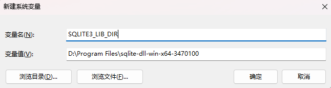

# Actix Web篇

## 基本篇

### 基础

#### Actix Web 简介

##### 什么是 Actix Web

- 基于 Actor 模型的高性能 Web 框架。
- 提供强大的异步编程支持，适合高并发、高性能的 Web 应用。

##### Actix Web 的优势

- 高性能：Actix Web 是目前 Rust 生态中性能最强的 Web 框架之一。

- 异步支持：内建的异步模型和 Actix actor 系统帮助你高效地处理请求。
- 灵活性：非常适合 API 服务、实时通信等场景。

#### 如何安装与配置 Actix Web

##### 创建一个新的 Rust 项目

```bash
cargo new hello-world
cd hello-world
```

##### 在 `Cargo.toml` 中添加 Actix Web 依赖

打开项目中的 `Cargo.toml` 文件，在 `[dependencies]` 部分添加 Actix Web 依赖。Actix Web 的最新版本可以在 crates.io 上找到，下面的例子使用了最新的稳定版本：

```toml
[dependencies]
actix-web = "4"
```

##### 配置 Rust 版本【可选】

如果使用的是特定的 Rust 版本，确保在项目中声明它。可以通过设置 `rust-toolchain.toml` 来强制指定使用的 Rust 版本。例如，添加以下内容来确保使用最新版的 stable Rust：

```toml
[toolchain]
channel = "stable"
```

##### 创建一个简单的 Web 服务器

接下来，在 `src/main.rs` 文件中编写你的第一个 Actix Web 服务器：

```rust
use actix_web::{get, web, App, HttpResponse, HttpServer, Responder};

// 定义一个 GET 路由处理函数，路径是 "/"
#[get("/")]
pub async fn hello1() -> impl Responder {
    HttpResponse::Ok().body("Hello World!")  // 返回 200 OK 和 "Hello World!"
}

// 另一种定义路由的方式，功能相同
pub async fn hello2() -> impl Responder {
    HttpResponse::Ok().body("Hello World!")  // 返回 200 OK 和 "Hello World!"
}

#[actix_web::main]
async fn main() -> std::io::Result<()> {
    // 启动 HTTP 服务器，设置路由和处理函数
    HttpServer::new(|| {
        App::new()
            .service(hello1)  // 注册第一个路由
            .route("/hello2", web::get().to(hello2))  // 注册第二个路由
    })
    .bind(("localhost:8080"))  // 绑定到 localhost:8080
    .unwrap()  // 如果绑定失败，程序会 panic
    .run()  // 启动服务器
    .await
}

```

这个代码创建了一个简单的 Actix Web 应用，监听在 `127.0.0.1:8080`，并且返回一个简单的“Hello, Actix Web!”消息。

##### 编译和运行

使用`cargo run`编译并运行程序。 `#[actix_web::main]`宏在 actix 运行时执行异步 main 函数。现在可以访问`http://127.0.0.1:8080/`或定义的任何其他路由来查看结果。

##### 自动重载开发服务器

在开发过程中，让 Cargo 在更改时自动重新编译代码会非常方便。通过使用[`cargo-watch`](https://github.com/passcod/cargo-watch)可以很容易地完成这一点。

```sh
 cargo watch -x run
```

#### Actix Web 应用程序结构

##### 状态管理（State）

在 Actix Web 中，**状态（State）** 是指在请求处理中共享的数据。一般情况下，这些数据存储在应用的生命周期中，可以跨多个请求进行访问。

###### 如何管理状态？

1. **AppState**：可以通过在应用程序中创建一个 `AppState` 结构体来存储共享数据。这个结构体可以包含数据库连接、缓存、配置信息等。
2. **`web::Data`**：为了使状态在多个请求之间共享，Actix Web 提供了 `web::Data` 类型，它可以将状态数据注入到每个请求的处理函数中。
3. **线程安全**：如果状态数据需要在多个线程之间共享（例如：访问计数器、数据库连接池等），通常使用线程安全的容器，如 `Arc<Mutex<T>>` 来包装数据。

###### 示例代码

```rust
use actix_web::{get, web, App, HttpServer};

// This struct represents state
struct AppState {
    app_name: String,
}

#[get("/")]
async fn index(data: web::Data<AppState>) -> String {
    let app_name = &data.app_name; // <- get app_name
    format!("Hello {app_name}!") // <- response with app_name
}

// 接下来传入初始化App时的状态并启动应用程序：
#[actix_web::main]
async fn main() -> std::io::Result<()> {
    HttpServer::new(|| {
        App::new()
            .app_data(web::Data::new(AppState {
                app_name: String::from("Actix Web"),
            }))
            .service(index)
    })
    .bind(("127.0.0.1", 8080))?
    .run()
    .await
}
```

##### 共享可变状态（Shared Mutable State）

在多线程 Web 应用中，状态数据往往需要跨多个请求共享，尤其是在处理并发请求时，保证数据一致性和线程安全非常重要。Actix Web 提供了简单的方式来管理**共享可变状态**。

###### 如何处理共享可变状态？

1. **使用 `web::Data` 和线程安全的容器**：
   - 如果你希望多个请求共享某个数据，你需要将这个数据包装成 **`web::Data`**，并且该数据需要线程安全。
   - 为了保证线程安全，通常使用 `Mutex` 或 `RwLock` 来包装可变数据，并且将其放在 `Arc` 中，使其可以在多个线程之间共享。
2. **并发处理**：
   - 在 Actix Web 中，所有请求都会在不同的线程上并发处理，因此如果你需要修改共享状态，必须确保数据访问是线程安全的。
3. **常见模式**：
   - 通过将状态数据包装成 `Arc<Mutex<T>>`（或 `Arc<RwLock<T>>`），你可以确保状态在多线程环境中是安全的，且可以被多个请求同时访问。

###### 示例代码

```rust
use actix_web::{web, App, HttpServer};
use std::sync::{Arc, Mutex};

struct AppState {
    counter: Mutex<usize>,
}

async fn increment_counter(data: web::Data<AppState>) -> String {
    let mut counter = data.counter.lock().unwrap(); // 锁定并修改数据
    *counter += 1;
    format!("Counter: {}", counter)
}

#[actix_web::main]
async fn main() -> std::io::Result<()> {
    // 注意，需要在外面初始化
    let state = web::Data::new(AppState {
        counter: Mutex::new(0),
    });

    HttpServer::new(move || {
        App::new()
            .app_data(state.clone()) // 将共享的状态传递给所有请求
            .route("/", web::get().to(increment_counter))
    })
    .bind("127.0.0.1:8080")?
    .run()
    .await
}
```

在这个示例中：

- **`AppState`**：定义了一个包含计数器的结构体 `AppState`，并且用 `Mutex` 包装它以确保线程安全。
- **`web::Data<AppState>`**：通过 `web::Data` 将 `AppState` 数据传递给应用程序，确保它能够在多个请求之间共享。
- **并发控制**：通过 `Mutex::lock()` 来确保计数器在被多个请求访问时不会发生竞争条件。

注意：

- 在传递给`HttpServer::new`闭包内初始化的状态对于工作线程来说是本地的，如果修改可能会变得不同步。
- 要实现*全局共享状态*，必须在传递给`HttpServer::new`的闭包**之外**创建它并移动/克隆。

##### 使用应用程序范围来编写应用程序

在 Actix Web 中，**应用程序范围**（Application Scope）允许你将不同的路由和功能模块组织成独立的“子应用程序”，并组合成一个大的 Web 应用。这有助于将大型应用程序分解为可管理的小模块，便于开发和维护。

###### 应用程序范围的基本概念

- **`Scope`**：Actix Web 提供了 `Scope` 作为一种容器，用于将一组路由和处理函数组织到一起。通过 `Scope`，你可以将特定的路由路径前缀应用于一组处理函数，避免全局注册路由时的冲突。
- **模块化设计**：通过使用 `Scope`，你可以将不同的路由和功能模块分离，每个模块负责处理应用的一部分逻辑。例如，你可以为用户认证、产品管理、订单处理等功能创建独立的子应用，并将它们组合到主应用中。

###### 如何使用 `Scope` ？

1. **创建一个新的作用域**： 你可以使用 `.service()` 方法来将路由注册到 `Scope` 上，通过为每个 `Scope` 提供一个路径前缀来组织路由。
2. **路由模块化**： 每个模块化的路由都可以有自己的处理逻辑，这样就能将整个应用按功能划分为多个部分，提升代码的可维护性和扩展性。

###### 示例

```rust
use actix_web::{web, App, HttpServer, Responder, HttpResponse};

async fn greet() -> impl Responder {
    HttpResponse::Ok().body("Hello from the API")
}

async fn goodbye() -> impl Responder {
    HttpResponse::Ok().body("Goodbye from the API")
}

#[actix_web::main]
async fn main() -> std::io::Result<()> {
    HttpServer::new(|| {
        App::new()
            .service(web::scope("/api") // 使用 scope 来组织路由
                .route("/greet", web::get().to(greet))
                .route("/goodbye", web::get().to(goodbye)))
    })
    .bind("127.0.0.1:8080")?
    .run()
    .await
}

```

在上面的例子中，所有以 `/api` 为前缀的路由都被组织在同一个作用域中。这样，你就能清晰地划分应用的不同模块，提升代码结构的清晰度。

##### 应用程序防护和虚拟主机

在 Actix Web 中，**应用程序防护**（Guards）和 **虚拟主机**（Virtual Hosting）是两个重要的概念，主要用于增强应用的安全性、灵活性和可扩展性。

###### 应用程序防护（Guards）

应用程序防护是一种机制，用于在请求到达应用处理函数之前，对请求进行筛选和验证。常见的防护措施包括：

- **身份验证**：确保请求来自授权用户。
- **授权**：验证用户是否有权限访问特定资源。
- **请求过滤**：根据请求的属性（如 IP 地址、请求头等）过滤请求。

在 Actix Web 中，可以使用中间件或自定义的 guards 来实现这些功能。

> Actix Web 提供了多种防护措施。可以查看 API 文档的[函数部分](https://docs.rs/actix-web/4/actix_web/guard/index.html#functions)。

###### **示例**：使用 `guard::Host` 来实现虚拟主机和路由守卫

通过 Actix Web 的 `guard::Host` 路由守卫来分别处理不同的主机请求，并展示如何配置不同的路由。

```rust
use actix_web::{guard, web, App, HttpResponse, HttpServer};

#[actix_web::main]
async fn main() -> std::io::Result<()> {
    HttpServer::new(|| {
        App::new()
            // 使用虚拟主机守卫，根据 Host 名称来处理请求
            .service(
                web::scope("/") // 根路径
                    .guard(guard::Host("www.rust-lang.org")) // 如果主机是 www.rust-lang.org
                    .route("", web::to(|| async { HttpResponse::Ok().body("Welcome to Rust-lang.org") })), // 返回欢迎信息
            )
            .service(
                web::scope("/") // 根路径
                    .guard(guard::Host("users.rust-lang.org")) // 如果主机是 users.rust-lang.org
                    .route("", web::to(|| async { HttpResponse::Ok().body("Welcome to Users.rust-lang.org") })), // 返回用户信息
            )
            // 默认路由，当其他请求匹配不到时触发
            .route("/", web::to(|| async { HttpResponse::Ok().body("Welcome to the default page") }))
    })
        .bind(("127.0.0.1", 8080))? // 绑定到本地的 8080 端口
        .run()
        .await
}
```

启动应用程序，确保服务器在本地的 8080 端口启动。

打开浏览器或者使用 `curl` 来测试不同的主机：

- 访问 `http://www.rust-lang.org:8080`，应该返回 `"Welcome to Rust-lang.org"`。
- 访问 `http://users.rust-lang.org:8080`，应该返回 `"Welcome to Users.rust-lang.org"`。
- 访问其他任意 URL（例如 `http://localhost:8080`），应该返回 `"Welcome to the default page"`。

##### ### 使用 `configure` 方法来组织和模块化配置

###### 使用 `configure` 方法的基本步骤

`configure` 方法的核心功能是将路由配置从主应用中提取出来，移到其他模块或者配置文件中。这使得我们能够组织更复杂的应用，特别是在需要多个模块时非常有用。

**示例**

可以将配置代码移到不同的模块中，并在 `main` 函数中调用 `configure` 方法来加载它们。

```rust
use actix_web::{web, HttpResponse};

// 这个函数可以位于不同的模块中
pub fn scoped_config(cfg: &mut web::ServiceConfig) {
    cfg.service(
        web::resource("/test")
            .route(web::get().to(|| async { HttpResponse::Ok().body("test") }))
            .route(web::head().to(HttpResponse::MethodNotAllowed)),
    );
}
```

**在主应用中使用 `configure` 加载配置：**

```rust
use actix_web::{web, App, HttpServer};
use scoped_config;  // 导入配置模块

#[actix_web::main]
async fn main() -> std::io::Result<()> {
    HttpServer::new(|| {
        App::new()
            .configure(scoped_config)  // 使用 configure 方法加载配置
    })
    .bind("127.0.0.1:8080")?
    .run()
    .await
}
```

- 可以将路由配置从 `App` 中提取到其他模块，使得应用的结构更加清晰。
- `configure` 方法接收一个 `ServiceConfig`，并在该配置中注册路由或其他服务。
- 这种方式有助于将不同的功能模块（如 API 处理、认证、日志等）分离到单独的文件或模块中。

###### 使用 `Scope` 的 `configure` 方法

与 `App` 的 `configure` 方法类似，`Scope` 也有 `configure` 方法。你可以在 `Scope` 中组织路由配置，以便为特定路径（如 `/api`、`/auth` 等）单独定义路由集合。

**示例**：

```rust
use actix_web::{web, App, HttpServer};

fn api_config(cfg: &mut web::ServiceConfig) {
    cfg.service(
        web::resource("/v1")
            .route(web::get().to(|| async { HttpResponse::Ok().body("API v1") }))
            .route(web::post().to(|| async { HttpResponse::Created().body("Created") })),
    );
}

#[actix_web::main]
async fn main() -> std::io::Result<()> {
    HttpServer::new(|| {
        App::new()
            .service(web::scope("/api").configure(api_config))  // 配置 API 路由
    })
    .bind("127.0.0.1:8080")?
    .run()
    .await
}
```

- 在上面的例子中，使用 `web::scope("/api")` 来定义以 `/api` 为前缀的路由，并通过 `configure` 方法将 `api_config` 函数的配置加载进来。
- 这样可以保持代码的模块化，将不同功能区域的路由配置分开，便于管理和维护。

#### Actix Web 服务器配置

##### HttpServer 介绍

在 Actix Web 中，**`HttpServer`** 负责处理 HTTP 请求。需要使用 `HttpServer` 来创建一个服务器实例，并将请求的处理逻辑传递给它。

- **应用工厂**：`HttpServer` 接受一个应用工厂作为参数，工厂返回一个 `App` 实例。应用工厂需要实现 `Send` 和 `Sync`，保证它能够跨线程共享。

##### 启动 HTTP 服务器

要启动服务器，需要将 `HttpServer` 绑定到一个网络地址（例如 IP 和端口），并调用 `run()` 方法来启动服器。`run()` 会阻塞并等待请求，直到手动关闭（例如 Ctrl+C）。

 **基本示例**

```rust
use actix_web::{web, App, HttpResponse, HttpServer};

#[actix_web::main]
async fn main() -> std::io::Result<()> {
    // 创建一个 HTTP 服务器实例
    HttpServer::new(|| {
        // 定义应用程序，设置路由
        App::new()
            .route("/", web::get().to(|| async { HttpResponse::Ok().body("Hello World") }))
    })
    // 绑定到本地地址和端口
    .bind("127.0.0.1:8080")? // 如果端口被占用，将抛出错误
    // 运行服务器，开始接收请求
    .run() // 服务器将持续运行，直到收到关闭信号
    .await
}
```

**步骤说明：**

1. **`HttpServer::new`**：传入一个闭包，返回一个应用程序实例 `App`。
2. **`bind("127.0.0.1:8080")`**：将服务器绑定到指定的 IP 地址和端口。
3. **`run()`**：启动服务器，监听请求。服务器会一直运行，直到被关闭。

注意：

> - 如果尝试绑定的端口已被其他程序占用，`bind()` 会返回一个错误。可以通过处理这个错误来避免程序崩溃。
> - 服务器通过接收到终止信号来停止，例如通过 `Ctrl+C`。

##### 配置多个线程

`HttpServer` 默认会使用多线程来处理并发请求。为了提高性能，可以指定线程数，优化服务器的处理能力。

> Actix Web 内部默认使用异步处理模型，并且使用 Rust 的 **Tokio** 运行时来管理异步任务。它的 `HttpServer` 会启动多个线程来处理请求，从而充分利用多核 CPU。

 **为什么需要多线程？**

- **高并发**：当应用接收到大量请求时，通过多线程并发处理，可以有效提升性能。
- **异步 IO**：每个请求的处理过程中，可以执行非阻塞操作，如数据库查询、外部 API 请求等，进一步提高应用的并发能力。

**示例：指定线程数**

```rust
HttpServer::new(|| {
    App::new()
    .route("/", web::get().to(|| async { HttpResponse::Ok().body("Hello World") }))
})
.bind("127.0.0.1:8080")?
.workers(4) // 设置工作线程数为4
.run()
.await
```

在上面的代码中，`.workers(4)` 设置了 4 个工作线程来处理请求，适用于多核 CPU，能提高处理并发请求的能力。

##### TLS / HTTPS（传输层安全 / HTTPS）

为确保数据的安全传输，Actix Web 支持 **TLS/HTTPS** 配置。你需要提供证书和私钥来启用 HTTPS。

> Actix Web 提供了对 **TLS/HTTPS** 的开箱即用支持，支持两种 TLS 实现：`rustls` 和 `openssl`。可以选择适合的库来保护你的 Web 应用的传输安全，防止中间人攻击等。

###### 配置 TLS / HTTPS

- **使用 `rustls`**：`rustls` 是 Rust 实现的 TLS 库，性能较好且不依赖 C 库。如果项目中没有特殊需求，建议使用 `rustls`。
- **使用 `openssl`**：如果已经有 OpenSSL 的证书文件，或者需要使用 OpenSSL 特性，可以选择 `openssl`。

###### ##### 示例：配置 HTTPS（使用 OpenSSL）

1. **在 `Cargo.toml` 中启用 `openssl` 功能：**

```toml
[dependencies]
actix-web = { version = "4", features = ["openssl"] }
openssl = { version = "0.10" }
```

2. **加载 SSL 证书并启用 HTTPS：**

```rust
use actix_web::{get, App, HttpRequest, HttpServer, Responder};
use openssl::ssl::{SslAcceptor, SslFiletype, SslMethod};

#[get("/")]
async fn index(_req: HttpRequest) -> impl Responder {
    "Welcome to HTTPS!"
}

#[actix_web::main]
async fn main() -> std::io::Result<()> {
    let mut builder = SslAcceptor::mozilla_intermediate(SslMethod::tls())?;
    builder
        .set_private_key_file("path/to/your/private.key", SslFiletype::PEM)?;
    builder
        .set_certificate_chain_file("path/to/your/certificate.crt")?;

    HttpServer::new(|| {
        App::new().service(index)
    })
        .bind_openssl("0.0.0.0:8443", builder)?
        .run()
        .await
}

```

要创建 key.pem 和 cert.pem，请使用以下命令。**填写主题**

```shell
openssl req -x509 -newkey rsa:4096 -keyout key.pem -out cert.pem -days 365 -sha256 -subj "/C=CN/ST=Fujian/L=Xiamen/O=TVlinux/OU=Org/CN=muro.lxd"
```

要删除密码，请将 nopass.pem 复制到 key.pem

```shell
openssl rsa -in key.pem -out nopass.pem
```

##### 保持活动（Keep-Alive）

**HTTP Keep-Alive** 是一种用于提升性能的机制，它允许客户端和服务器之间的连接保持打开状态，从而避免每个请求都建立新的连接。Actix Web 默认启用了 Keep-Alive，但可以根据需要进行调整。

###### 如何配置 Keep-Alive

在 Actix Web 中，连接的保持时间和最大请求数量可以通过 `HttpServer` 来进行配置。

- `Duration::from_secs(75)` or `KeepAlive::Timeout(75)`: enables 75 second keep-alive timer.
  `Duration::from_secs(75)`或`KeepAlive::Timeout(75)` ：启用 75 秒保持活动计时器。
- `KeepAlive::Os`: uses OS keep-alive.
  `KeepAlive::Os` ：使用操作系统保持活动状态。
- `None` or `KeepAlive::Disabled`: disables keep-alive.
  `None`或`KeepAlive::Disabled` ：禁用保持活动状态。

```rust
use actix_web::{http::KeepAlive, HttpServer};
use std::time::Duration;

#[actix_web::main]
async fn main() -> std::io::Result<()> {
    // Set keep-alive to 75 seconds
    let _one = HttpServer::new(app).keep_alive(Duration::from_secs(75));

    // Use OS's keep-alive (usually quite long)
    let _two = HttpServer::new(app).keep_alive(KeepAlive::Os);

    // Disable keep-alive
    let _three = HttpServer::new(app).keep_alive(None);

    Ok(())
}
```

##### 优雅关机（Graceful Shutdown）

优雅关机是指在接收到关机信号后，服务器会等待当前正在处理的请求完成，然后再关闭服务。这对于保持服务的稳定性非常重要，尤其是在生产环境中。

###### 如何实现优雅关机

Actix Web 提供了内置的支持，允许在接收到 `Ctrl+C` 等终止信号时，优雅地关闭服务器。

```rust
use actix_web::{web, App, HttpResponse, HttpServer};
use actix_rt::System;

#[actix_web::main]
async fn main() -> std::io::Result<()> {
    HttpServer::new(|| {
        App::new()
            .route("/", web::get().to(|| async { HttpResponse::Ok().body("Goodbye!") }))
    })
    .bind("127.0.0.1:8080")?
    .run()
    .await
}
```

Actix Web 会自动处理优雅关机，当你通过 `Ctrl+C` 停止服务器时，服务器会等待现有请求处理完毕后再关闭。可以通过在 `System::run()` 中处理其他资源清理逻辑来实现更细致的关机控制。

> > 可以使用[`HttpServer::disable_signals()`](https://docs.rs/actix-web/4/actix_web/struct.HttpServer.html#method.disable_signals)方法禁用信号处理。

### 请求和响应

在 Actix Web 中，extractors 是用来从请求中提取数据的组件。这些数据可以来自 URL 路径、查询字符串、请求体等。使用这些 extractors，开发者可以在路由处理函数中以简洁且类型安全的方式获取请求参数。

#### GET 请求中的数据提取

**GET 请求**通常用于获取资源。Actix Web 提供了强大的路径和查询参数提取功能，帮助我们快速从 URL 中获取需要的数据。

##### 从路径中提取参数

`web::Path` 用于从请求路径中提取参数。路径参数通常是 URL 中的动态部分，比如 `/user/{id}`。

**示例：从路径中提取用户 ID**

```rust
use actix_web::{web, App, HttpResponse, HttpServer, Responder};

async fn get_user(path: web::Path<String>) -> impl Responder{
    let user_id = path.into_inner();
    HttpResponse::Ok().body(format!("User ID:{}", user_id))
}

#[actix_web::main]
async fn main() -> std::io::Result<()>{
    HttpServer::new(|| {
        App::new()
            .route("/user/{id}", web::get().to(get_user))
    }).bind("localhost:8080")?
        .run()
        .await
}
```

在访问 `http://127.0.0.1:8080/user/123` 时，返回结果会是 `"User ID: 123"`。

作为非类型安全的替代方案，还可以在处理程序中按名称查询（请参阅[`match_info`文档](https://docs.rs/actix-web/latest/actix_web/struct.HttpRequest.html#method.match_info)）路径参数的请求：

```rust
#[get("/users/{user_id}/{friend}")]
async fn index(req: HttpRequest) -> Result<String> {
    let name: String = req.match_info().get("friend").unwrap().parse().unwrap();
    let userid: i32 = req.match_info().query("user_id").parse().unwrap();

    Ok(format!("Welcome {}, user_id {}!", name, userid))
}

#[actix_web::main]
async fn main() -> std::io::Result<()> {
    use actix_web::{App, HttpServer};

    HttpServer::new(|| App::new().service(index))
        .bind(("127.0.0.1", 8080))?
        .run()
        .await
}
```

##### 从查询字符串中提取参数

`web::Query` 用于从 URL 查询字符串中提取参数。查询字符串通常是 `?key=value` 的形式。

**示例：从查询字符串中提取用户信息**

```rust
use actix_web::{web, App, HttpResponse, HttpServer, Responder};
#[derive(serde::Deserialize)]
struct UserInfo{
    name: String,
    age: u32
}

async fn get_user(info: web::Query<UserInfo>) -> impl Responder{
    HttpResponse::Ok().body(format!("Name:{}, Age:{}", info.name, info.age))
}

#[actix_web::main]
async fn main() -> std::io::Result<()>{
    HttpServer::new(|| {
        App::new()
            .route("/user", web::get().to(get_user))
    }).bind("localhost:8080")?
        .run()
        .await
}
```

访问 `http://127.0.0.1:8080/user?name=Alice&age=30` 时，返回结果为 `"Name: Alice, Age: 30"`。

#### POST 请求中的数据提取

**POST 请求**通常用于提交数据。Actix Web 提供了多种方式来提取请求体中的数据，包括 JSON、表单数据等。

##### 从请求体中提取 JSON 数据

`web::Json` 用于从请求体中提取 JSON 数据。它会自动将 JSON 转换为 Rust 结构体。

**示例：从 JSON 请求体中提取数据提取请求数据（URL 参数、表单数据等）**

```rust
use actix_web::{web, App, HttpServer, Responder, HttpResponse};

#[derive(serde::Deserialize)]
struct Person {
    name: String,
    age: u32,
}

async fn json_example(person: web::Json<Person>) -> impl Responder {
    HttpResponse::Ok().body(format!("Name: {}, Age: {}", person.name, person.age))
}

#[actix_web::main]
async fn main() -> std::io::Result<()> {
    HttpServer::new(|| {
        App::new()
            .route("/user", web::post().to(json_example))  // JSON 请求体
    })
    .bind("127.0.0.1:8080")?
    .run()
    .await
}
```

发送如下 JSON 请求体：

```json
{
  "name": "Alice",
  "age": 30
}
```

返回结果会是 `"Name: Alice, Age: 30"`。

##### 从表单数据中提取信息

`web::Form` 用于提取表单数据，适用于 `application/x-www-form-urlencoded` 格式的表单提交。

**示例：从表单数据中提取用户名和密码**

```rust
use actix_web::{web, App, HttpServer, Responder, HttpResponse};

#[derive(serde::Deserialize)]
struct FormData {
    username: String,
    password: String,
}

async fn form_example(form: web::Form<FormData>) -> impl Responder {
    HttpResponse::Ok().body(format!("Username: {}, Password: {}", form.username, form.password))
}

#[actix_web::main]
async fn main() -> std::io::Result<()> {
    HttpServer::new(|| {
        App::new()
            .route("/login", web::post().to(form_example))  // 表单数据
    })
    .bind("127.0.0.1:8080")?
    .run()
    .await
}
```

提交表单数据时，返回结果会是 `"Username: Alice, Password: 1234"`。

#### 从请求头中提取数据

**请求头**包含了关于请求的元数据，如用户代理（`User-Agent`）、认证信息（`Authorization`）等。`web::Header` 可以帮助我们提取请求头中的字段。

##### 从请求头中提取 User-Agent

`web::Header` 用于从请求头中提取数据。

**示例：提取请求头中的 User-Agent**

```rust
use actix_web::{web, App, HttpServer, Responder, HttpResponse};

async fn header_example(req: actix_web::HttpRequest) -> impl Responder {
    let user_agent = req.headers().get("User-Agent").unwrap_or_default().to_str().unwrap_or("Unknown");
    HttpResponse::Ok().body(format!("User-Agent: {}", user_agent))
}

#[actix_web::main]
async fn main() -> std::io::Result<()> {
    HttpServer::new(|| {
        App::new()
            .route("/header", web::get().to(header_example))  // 请求头数据
    })
    .bind("127.0.0.1:8080")?
    .run()
    .await
}
```

当访问 `http://127.0.0.1:8080/header` 时，返回 `"User-Agent: [User Agent String]"`，其中 `[User Agent String]` 是请求中的 `User-Agent` 字段。

#### 返回响应

Actix Web 允许我们根据需要返回不同格式的响应，如 HTML、JSON 或纯文本。

##### 返回 JSON 响应

可以使用 `HttpResponse::Json` 返回 JSON 格式的响应。

**示例：返回 JSON 数据**

```rust
use actix_web::{web, App, HttpServer, Responder, HttpResponse};
use serde_json::json;  // 引入 serde_json 的宏

async fn json_response() -> impl Responder {
    HttpResponse::Ok().json(json!({
        "status": "success",
        "message": "Data fetched successfully"
    }))
}

#[actix_web::main]
async fn main() -> std::io::Result<()> {
    HttpServer::new(|| {
        App::new()
            .route("/response", web::get().to(json_response))  // JSON 响应
    })
        .bind("127.0.0.1:8080")?
        .run()
        .await
}
```

访问 `http://127.0.0.1:8080/response` 时，返回：

```json
{
  "status": "success",
  "message": "Data fetched successfully"
}
```

##### 自定义类型的响应

在 Actix Web 中，如果希望从请求处理程序返回一个自定义类型，需要为该类型实现 `Responder` trait。`Responder` trait 定义了如何将一个自定义类型转换成 `HttpResponse`。

**示例：返回自定义类型的 JSON 响应**

假设有一个结构体 `MyObj`，并且我们希望将其作为响应返回，且返回的内容是 JSON 格式。

```rust
use actix_web::{web, App, HttpServer, Responder, HttpResponse, HttpRequest};
use actix_web::body::BoxBody;
use actix_web::http::header::ContentType;
use serde::Serialize;

#[derive(Serialize)]
struct MyObj {
    name: &'static str,
}

impl Responder for MyObj{
    type Body = BoxBody;

    fn respond_to(self, _req: &HttpRequest) -> HttpResponse<Self::Body> {
        let body = serde_json::to_string(&self).unwrap();

        HttpResponse::Ok()
            .content_type(ContentType::json())
            .body(body)
    }
}

async fn json_response() -> impl Responder {
    MyObj{name: "胡桃"}
}

#[actix_web::main]
async fn main() -> std::io::Result<()> {
    HttpServer::new(|| {
        App::new()
            .route("/response", web::get().to(json_response))  // JSON 响应
    })
        .bind("127.0.0.1:8080")?
        .run()
        .await
}
```

- 通过实现 `Responder` trait，使 `MyObj` 可以转换为 `HttpResponse`。
- 在 `respond_to` 方法中，将自定义类型 `MyObj` 序列化为 JSON，并设置正确的 `Content-Type` 头。

##### 流式响应主体（Streaming Response Body）

流式响应允许以异步方式逐步生成响应体，而不是一次性加载整个响应体。这在处理大型文件或需要实时数据流的情况下特别有用。

**示例：流式响应**

```rust
use actix_web::{get, web, App, Error, HttpResponse, HttpServer};
use futures::{stream::once, future::ok};

#[get("/stream")]
async fn stream() -> HttpResponse {
    let body = once(ok::<_, Error>(web::Bytes::from_static(b"test")));  // 使用流来生成响应体

    HttpResponse::Ok()
        .content_type("application/json")  // 设置 Content-Type
        .streaming(body)  // 使用流式响应
}

#[actix_web::main]
async fn main() -> std::io::Result<()> {
    HttpServer::new(|| App::new().service(stream))  // 配置流式响应的路由
        .bind(("127.0.0.1", 8080))?  // 启动服务器，监听 8080 端口
        .run()
        .await
}
```

- 使用 `web::Bytes` 来生成响应体内容。
- `once` 是一个流，返回一个 `Result<Bytes, Error>` 项，模拟逐步生成响应体。
- `HttpResponse::streaming` 用于发送流式响应。

流式响应适用于需要大规模数据传输的场景，例如处理文件上传/下载或逐步传输大型数据集。

##### 不同返回类型（Either）

有时，可能需要根据不同条件返回不同类型的响应。这种情况下，`Either` 类型非常有用。`Either` 可以将两种不同的类型组合成一个类型。

**示例：返回两种不同类型的响应**

```rust
use actix_web::{web, App, Error, HttpResponse, HttpServer, Either};
use actix_web::rt::System;
use actix_web::middleware::Logger;

type RegisterResult = Either<HttpResponse, Result<&'static str, Error>>;  // 定义返回类型

// 模拟某种条件，用来决定返回哪种类型的响应
fn is_a_variant() -> bool {
    // 假设我们根据某种条件决定返回哪种类型
    true  // 假设条件是 true，返回错误响应
}

// 请求处理程序
async fn index() -> RegisterResult {
    if is_a_variant() {
        // 如果是某种条件，返回 Left 变体，表示错误响应
        Either::Left(HttpResponse::BadRequest().body("Bad data"))
    } else {
        // 否则返回 Right 变体，表示成功响应
        Either::Right(Ok("Hello!"))
    }
}

#[actix_web::main]
async fn main() -> std::io::Result<()> {
    // 设置 Actix Web 服务器
    HttpServer::new(|| {
        App::new()
            .wrap(Logger::default())  // 日志中间件，用于打印请求信息
            .route("/", web::get().to(index))  // 设置路由，调用 index 处理程序
    })
    .bind("127.0.0.1:8080")?  // 启动服务器，监听 8080 端口
    .run()
    .await
}
```

启动服务器后，在浏览器或 `curl` 中访问 `http://127.0.0.1:8080/`，会根据 `is_a_variant` 的返回值（当前为 `true`）返回 `BadRequest` 错误响应。

##### 内容编码

当处理已经压缩的正文时（例如，当提供预压缩的资产时），请手动在响应上设置`Content-Encoding`标头以绕过中间件：

```rust
use actix_web::{
    get, http::header::ContentEncoding, middleware, App, HttpResponse, HttpServer,
};

static HELLO_WORLD: &[u8] = &[
    0x1f, 0x8b, 0x08, 0x00, 0xa2, 0x30, 0x10, 0x5c, 0x00, 0x03, 0xcb, 0x48, 0xcd, 0xc9, 0xc9,
    0x57, 0x28, 0xcf, 0x2f, 0xca, 0x49, 0xe1, 0x02, 0x00, 0x2d, 0x3b, 0x08, 0xaf, 0x0c, 0x00,
    0x00, 0x00,
];

#[get("/")]
async fn index() -> HttpResponse {
    HttpResponse::Ok()
        .insert_header(ContentEncoding::Gzip)
        .body(HELLO_WORLD)
}
```

启动，运行`curl -i --compressed http://127.0.0.1:8080/`进行测试。

#### 其他扩展

Actix Web 还提供了许多其他提取器，以下是一些重要的：

- [`Data`](https://docs.rs/actix-web/4/actix_web/web/struct.Data.html) - 用于访问应用程序状态片段。
- [`HttpRequest`](https://docs.rs/actix-web/4/actix_web/struct.HttpRequest.html) - `HttpRequest`本身就是一个提取器，以防您需要访问请求的其他部分。
- `String` - 您可以将请求的有效负载转换为`String` 。 rustdoc 中提供了[*一个示例*](https://docs.rs/actix-web/4/actix_web/trait.FromRequest.html#impl-FromRequest-for-String)。
- [`Bytes`](https://docs.rs/actix-web/4/actix_web/web/struct.Bytes.html) - 您可以将请求的有效负载转换为*Bytes* 。 rustdoc 中提供了[*一个示例*](https://docs.rs/actix-web/4/actix_web/trait.FromRequest.html#impl-FromRequest-5)。
- [`Payload`](https://docs.rs/actix-web/4/actix_web/web/struct.Payload.html) - 低级有效负载提取器，主要用于构建其他提取器。 rustdoc 中提供了[*一个示例*](https://docs.rs/actix-web/4/actix_web/web/struct.Payload.html)。

## 进阶篇

### 错误处理

在 Actix Web 中，错误处理是 Web 应用程序开发中的重要一环。Actix Web 提供了一些工具和特性来优雅地处理错误，以便在出错时向客户端提供适当的反馈。

#### `Error` 和 `ResponseError` 特征

- **`Error`**：Actix Web 使用自定义的 `actix_web::error::Error` 类型来表示错误。当处理程序返回实现了 `ResponseError` 特征的错误时，Actix Web 会自动将该错误转换为 HTTP 响应，并根据错误类型设置适当的 HTTP 状态码。
- **`ResponseError`**：这是 Actix Web 中用于处理错误的核心特征，它有两个主要方法：
  - `error_response()`：用于生成错误响应。
  - `status_code()`：返回与错误相关的 HTTP 状态码。

`ResponseError` 特征的默认实现会将错误映射为 500（内部服务器错误），但可以自定义该行为以适应不同类型的错误。

#### 实现 `ResponseError` 特征

`ResponseError` 允许你定义如何将错误转换为 HTTP 响应。例如，我们可以创建一个自定义的错误类型并为其实现 `ResponseError`：

```rust
use actix_web::{error, HttpResponse, Result};
use derive_more::derive::{Display, Error};

#[derive(Debug, Display, Error)]
#[display("my error: {name}")]
struct MyError {
    name: &'static str,
}

// 使用默认实现
impl error::ResponseError for MyError {}

async fn index() -> Result<&'static str, MyError> {
    Err(MyError { name: "test" })
}
```

上面示例中，`MyError` 类型实现了 `ResponseError` 特征，返回的错误会自动转换为 HTTP 500 错误响应。

#### 自定义 `error_response()` 和 `status_code()`

可以通过重写 `error_response()` 和 `status_code()` 方法来自定义错误响应的内容和状态码。例如：

```rust
use actix_web::{error, HttpResponse, http::{StatusCode, header::ContentType}, Result};
use derive_more::{Display, Error};

// 定义一个错误枚举，包含多种不同类型的错误
#[derive(Debug, Display, Error)]
enum MyError {
    #[display("Internal server error")]
    InternalError,

    #[display("Bad client data")]
    BadClientData,

    #[display("Request timeout")]
    Timeout,
}

// 实现 ResponseError 特征来为错误定制 HTTP 响应
impl error::ResponseError for MyError {
    fn status_code(&self) -> StatusCode {
        match *self {
            MyError::InternalError => StatusCode::INTERNAL_SERVER_ERROR,
            MyError::BadClientData => StatusCode::BAD_REQUEST,
            MyError::Timeout => StatusCode::GATEWAY_TIMEOUT,
        }
    }

    fn error_response(&self) -> HttpResponse {
        HttpResponse::build(self.status_code())
            .insert_header(ContentType::html())
            .body(self.to_string())
    }
}

// 模拟的异步处理函数，演示如何使用自定义错误
async fn index() -> Result<&'static str, MyError> {
    Err(MyError::BadClientData) // 示例：抛出 BadClientData 错误
}

#[actix_web::main]
async fn main() -> std::io::Result<()> {
    use actix_web::{App, HttpServer, web};

    HttpServer::new(|| {
        App::new()
            .route("/", web::get().to(index)) // 设置路由
    })
        .bind("127.0.0.1:8080")? // 绑定地址
        .run()
        .await
}
```

在上面的代码中，`MyError` 的不同变体（如 `InternalError`, `BadClientData`）映射到不同的 HTTP 状态码，并返回相应的 HTML 响应体。

#### 错误帮助器函数

Actix Web 提供了一些帮助器函数来简化错误处理。例如，可以使用 `map_err` 将一个自定义错误类型转换为一个 HTTP 错误类型：

```rust
use actix_web::{error, Result, get};

#[derive(Debug)]
struct MyError {
    name: &'static str,
}

#[get("/")]
async fn index() -> actix_web::Result<String> {
    let result = Err(MyError { name: "test error" });

    result.map_err(|err| error::ErrorBadRequest(err.name))
}
```

在这个示例中，`map_err` 用来将 `MyError` 转换为一个 HTTP 400 错误。

#### 错误日志记录

Actix Web 在出现错误时会记录日志，默认情况下使用 WARN 级别。可以通过设置环境变量来改变日志级别，开启详细的回溯信息：

```bash
RUST_BACKTRACE=1 RUST_LOG=actix_web=debug cargo run
```

在日志中，`Error` 类型会记录其源错误的回溯信息。如果底层错误没有回溯，Actix Web 会自动创建一个新的回溯，指向错误转换发生的位置。

#### 面向用户的错误处理

在实际应用中，错误处理有时需要区分用户错误和内部错误。用户错误（例如，输入验证失败）应当提供详细的错误信息，而内部错误（如数据库故障）应尽量隐藏详细信息，避免泄露敏感数据。以下是一个例子，将内部错误映射为用户友好的错误消息：

```rust
use actix_web::{error, Result, get, http::{StatusCode, ContentType}, HttpResponse};
use actix_web::http::header::ContentType;
use derive_more::derive::{Display, Error};

#[derive(Debug, Display, Error)]
enum UserError {
    #[display("Validation error on field: {field}")]
    ValidationError { field: String },
}

impl error::ResponseError for UserError {
    fn error_response(&self) -> HttpResponse {
        HttpResponse::build(self.status_code())
            .insert_header(ContentType::html())
            .body(self.to_string())
    }

    fn status_code(&self) -> StatusCode {
        match *self {
            UserError::ValidationError { .. } => StatusCode::BAD_REQUEST,
        }
    }
}

#[get("/")]
async fn index() -> Result<&'static str, UserError> {
    Err(UserError::ValidationError { field: "name".to_string() })
}
```

在上面的示例中，用户输入验证错误返回 400 状态码，并提供了详细的错误消息。

### URL 调度

#### URL调度概念

Actix Web中的URL调度机制是指将HTTP请求的URL路径映射到特定的处理函数（或路由）的过程。这个机制使得开发者可以通过定义路由和匹配模式来管理和响应不同的HTTP请求。通过URL调度，Actix Web能够根据请求的URL路径和HTTP方法（如GET、POST等）来选择合适的处理逻辑。

在Actix Web中，URL调度的核心概念是“资源”和“路由”。资源代表应用程序中的一个逻辑单元，通常对应于某个特定的功能或数据类型，如用户、文章等。路由则是用于匹配特定URL模式的定义。

#### 资源配置

在Actix Web中，资源配置是指将特定的路由和处理逻辑注册到应用程序中。资源的配置可以通过以下几步完成：

1. **定义处理函数**：首先，定义一个或多个处理函数，这些函数将接受HTTP请求并返回HTTP响应。例如：

```rust
use actix_web::{get, HttpResponse};

#[get("/hello")]
async fn hello() -> HttpResponse {
    HttpResponse::Ok().body("Hello, Actix Web!")
}
```

2. **注册资源**：在应用的主函数中，使用`App::service()`方法将资源添加到应用程序的路由表中。例如：

```rust
use actix_web::{web, App, HttpServer};

#[actix_web::main]
async fn main() -> std::io::Result<()> {
    HttpServer::new(|| {
        App::new()
            .service(hello) // 注册处理函数
    })
    .bind("127.0.0.1:8080")?
    .run()
    .await
}
```

通过这样的配置，所有针对`/hello`路径的GET请求都会被转发到`hello`处理函数。

#### 路由注册

路由注册是将不同的路径和HTTP方法映射到相应处理函数的过程。可以通过`App::route()`或`App::service()`方法来实现路由的注册。

路由注册的步骤如下：

1. **定义处理函数**：处理函数定义可以通过使用`#[get]`、`#[post]`等宏进行标注。

   例如，定义一个处理GET请求的函数：

```rust
async fn get_user(path: web::Path<String>) -> impl Responder{
    let user_id = path.into_inner();
    HttpResponse::Ok().body(format!("User ID:{}", user_id))
}
```

2. **使用`App::route()`方法注册路由**：可以在`main`函数中使用`App::route()`方法来注册特定的路径和HTTP方法。例如：

```rust
.route("/user/{id}", web::get().to(get_user))
```

3. **启动服务器**：最后，调用`HttpServer::run()`方法启动服务器，等待请求。完整示例：

```rust
use actix_web::{web, App, HttpResponse, HttpServer};

#[get("/user/{id}")]
async fn get_user(path: web::Path<(u32,)>) -> HttpResponse {
    let user_id = path.into_inner().0;
    HttpResponse::Ok().body(format!("User ID: {}", user_id))
}

#[actix_web::main]
async fn main() -> std::io::Result<()> {
    HttpServer::new(|| {
        App::new()
            .route("/user/{id}", web::get().to(get_user)) // 注册路由
    })
    .bind("127.0.0.1:8080")?
    .run()
    .await
}
```

#### 路径匹配

路径匹配是URL调度的核心，Actix Web在接收到HTTP请求时，会根据请求的路径和定义的路由模式进行匹配。路径匹配的机制如下：

1. **请求路径解析**：当服务器接收到请求时，Actix Web会解析请求的URL路径。
2. **模式匹配**：Actix Web会将请求的路径与已注册的路由模式进行比较。支持以下几种模式匹配：
   - **静态匹配**：如`/user`，仅匹配完全相同的路径。
   - **动态匹配**：如`/user/{id}`，其中`{id}`是一个动态段，可以匹配任意字符，并提取该值。
3. **返回处理函数**：如果找到了匹配的路由，Actix Web会调用相应的处理函数并将请求参数传递给它。

以下是一个路径匹配的示例，定义了一个动态路由用于获取用户信息：

```rust
#[get("/user/{id}")]
async fn get_user(path: web::Path<(u32,)>) -> HttpResponse {
    let user_id = path.into_inner().0;
    HttpResponse::Ok().body(format!("User ID: {}", user_id))
}
```

如果请求路径为`/user/42`，则`id`的值将被解析为`42`并传递给`get_user`处理函数。

#### 自定义路由守卫

可以将守卫视为一个简单的函数，接受一个请求对象引用并返回 `true` 或 `false`。形式上，守卫是任何实现了 `Guard` 特性的对象。Actix 提供了几种谓词，您可以在 API 文档中的函数部分查看。

**Guard的使用步骤**

1. **定义Guard**：创建一个自定义的Guard，通常是一个结构体，并实现`Guard` trait。

```rust
use actix_web::{guard, web, App, HttpResponse, HttpServer, guard::Guard, GuardContext};

struct ContentTypeHeader;

impl Guard for ContentTypeHeader {
    fn check(&self, req: &GuardContext) -> bool {
        req.head()
            .headers()
            .contains_key(http::header::CONTENT_TYPE)  // 检查请求是否包含 CONTENT-TYPE 头
    }
}
```

2. **在路由中应用Guard**：在注册路由时，通过`.guard()`方法将自定义的Guard应用到特定路由上。

```rust
.route("/", web::route().guard(ContentTypeHeader).to(HttpResponse::Ok)
```

3. **启动服务器**：启动服务器并等待请求。完整示例：

```rust
#[actix_web::main]
async fn main() -> std::io::Result<()> {
    use actix_web::{web, App, HttpServer};

    HttpServer::new(|| {
        App::new().route(
            "/",
            web::route().guard(ContentTypeHeader).to(HttpResponse::Ok), // 仅在满足条件时返回 OK 响应
        )
    })
    .bind(("127.0.0.1", 8080))?
    .run()
    .await
}
```

在此示例中，`index` 处理器仅在请求包含 `CONTENT-TYPE` 头时被调用。

守卫不能访问或修改请求对象，但可以在请求扩展中存储额外的信息。

#### 修改守卫值

可以通过将任一谓词值包装在 `Not` 谓词中来反转其含义。例如，如果希望对所有方法返回 "METHOD NOT ALLOWED" 响应，除了 "GET" 方法：

```rust
use actix_web::{guard, web, App, HttpResponse, HttpServer};

#[actix_web::main]
async fn main() -> std::io::Result<()> {
    HttpServer::new(|| {
        App::new().route(
            "/",
            web::route()
                .guard(guard::Not(guard::Get()))  // 返回方法不允许的响应，除非是 GET 请求
                .to(HttpResponse::MethodNotAllowed),
        )
    })
        .bind(("127.0.0.1", 8080))?
        .run()
        .await
}
```

`Any` 守卫接受守卫列表，如果任何提供的守卫匹配，则匹配。例如：

```rust
guard::Any(guard::Get()).or(guard::Post())
```

`All` 守卫接受守卫列表，如果所有提供的守卫匹配，则匹配。例如：

```rust
guard::All(guard::Get()).and(guard::Header("content-type", "plain/text"))
```

#### 生成资源URL

在Actix Web中，可以使用`HttpRequest.url_for()`方法生成基于资源模式的URL。这种方法基于已注册的资源名称和路径参数生成完整的URL。

**使用示例**

1. **定义路由并命名资源**：

```rust
use actix_web::{get, web, HttpRequest, HttpResponse, Responder};

async fn get_user(path: web::Path<String>) -> impl Responder{
    let user_id = path.into_inner();
    HttpResponse::Ok().body(format!("User ID:{}", user_id))
}

#[actix_web::main]
async fn main() -> std::io::Result<()> {
    use actix_web::{web, App, HttpServer};

    HttpServer::new(|| {
        App::new()
            .service(web::resource("/user/{id}").name("get_user").to(get_user))
            .service(index)
    })
        .bind(("127.0.0.1", 8080))?
        .run()
        .await
}
```

2. **生成URL**：在处理函数中使用`url_for()`方法生成URL。

```rust
#[get("/")]
async fn index(req: HttpRequest) -> HttpResponse {
    // 使用 name 生成 URL，并传递路径参数 "1"
    let url = req.url_for("get_user", ["1"]).expect("Failed to generate URL");

    // 获取 URL 的路径部分
    let path = url.path();

    // 返回重定向并使用 append_header 添加自定义头部
    HttpResponse::Found()
    .append_header(("X-Custom-Header", "MyValue")) // 添加自定义头部
    .append_header(("LOCATION", path)) // 设置 LOCATION 头部，指向目标 URL
    .finish() // 结束响应
}
```

这样，访问根路径时将返回`/user/1`的URL。

> `curl -L http://localhost:8080/`

#### 自定义未匹配路由的响应

在Actix Web中，可以通过`App::default_service()`方法自定义未匹配路由的响应内容。当请求的路径没有匹配到任何已注册的路由时，将调用此默认服务。

**自定义未匹配响应的步骤**

- **定义未匹配处理函数**：

```rust
async fn not_found_handler() -> HttpResponse {
    HttpResponse::NotFound().body("404 - Not Found")
}
```

- **注册默认服务**：

```rust
.default_service(web::route().to(not_found_handler))
```

完整示例：

```rust
use actix_web::{web, App, HttpResponse, HttpServer};

async fn not_found_handler() -> HttpResponse {
    HttpResponse::NotFound().body("404 - Not Found")
}

#[actix_web::main]
async fn main() -> std::io::Result<()> {
    HttpServer::new(|| {
        App::new()
            .default_service(web::route().to(not_found_handler)) // 注册未匹配处理
    })
        .bind("127.0.0.1:8080")?
        .run()
        .await
}
```

在这个示例中，当请求的路径没有匹配到任何路由时，将返回404错误响应。

#### 路由匹配的优先级和顺序

在Actix Web中，路由匹配是按照注册的顺序进行的。先注册的路由优先级更高，匹配到的第一个路由将被调用。

**匹配顺序的影响：**

- **静态路由优先于动态路由**：如果同时存在静态路由和动态路由，静态路由会优先匹配。
- **特定路由优先于通用路由**：特定的路径匹配（如`/user/1`）会优先于更通用的路径匹配（如`/user/{id}`）。

```rust
use actix_web::{web, App, HttpResponse, HttpServer};

#[get("/user/1")]
async fn get_user_one() -> HttpResponse {
    HttpResponse::Ok().body("User 1")
}

#[get("/user/{id}")]
async fn get_user(path: web::Path<(u32,)>) -> HttpResponse {
    let user_id = path.into_inner().0;
    HttpResponse::Ok().body(format!("User ID: {}", user_id))
}

#[actix_web::main]
async fn main() -> std::io::Result<()> {
    HttpServer::new(|| {
        App::new()
            .service(get_user_one) // 静态路由
            .service(get_user)      // 动态路由
    })
    .bind("127.0.0.1:8080")?
    .run()
    .await
}
```

在这个示例中，请求`/user/1`将调用`get_user_one`处理函数，而不是`get_user`，因为静态路由优先于动态路由。

以上就是对Actix Web中URL调度机制的深入讲解，各个知识点的理解与应用对于构建高效的Web应用具有重要意义。

#### 外部资源

有效 URL 的资源可以注册为外部资源。它们仅用于 URL 生成目的，永远不会在请求时间用于匹配。

以下是一个外部资源的示例：

```rust
use actix_web::{get, App, HttpRequest, HttpServer, Responder};

#[get("/")]
async fn index(req: HttpRequest) -> impl Responder {
    let url = req.url_for("youtube", ["oHg5SJYRHA0"]).unwrap();
    assert_eq!(url.as_str(), "https://youtube.com/watch/oHg5SJYRHA0");

    url.to_string()
}

#[actix_web::main]
async fn main() -> std::io::Result<()> {
    HttpServer::new(|| {
        App::new()
            .service(index)
            .external_resource("youtube", "https://youtube.com/watch/{video_id}") // 注册外部资源
    })
    .bind(("127.0.0.1", 8080))?
    .run()
    .await
}
```

#### 路径规范化和重定向到斜杠附加路由

路径规范化意味着：

- 添加路径的尾部斜杠。
- 将多个斜杠替换为一个。

处理器在找到一个正确解析的路径后立即返回。如果启用所有规范化条件，则规范化条件的顺序为 1) 合并、2) 同时合并并附加、3) 附加。如果路径至少通过这些条件中的一个解析，则会重定向到新路径。

```rust
use actix_web::{middleware, HttpResponse};

async fn index() -> HttpResponse {
    HttpResponse::Ok().body("Hello")
}

#[actix_web::main]
async fn main() -> std::io::Result<()> {
    use actix_web::{web, App, HttpServer};

    HttpServer::new(|| {
        App::new()
            .wrap(middleware::NormalizePath::default())  // 注册路径规范化中间件
            .route("/resource/", web::to(index))  // 注册资源路由
    })
    .bind(("127.0.0.1", 8080))?
    .run()
    .await
}
```

在此示例中，`//resource///` 将重定向到 `/resource/`。

在此示例中，路径规范化处理器已为所有方法注册，但不应依赖此机制重定向 `POST` 请求。斜杠附加的 “未找到” 重定向将使 `POST` 请求变为 `GET`，从而丢失原始请求中的任何 `POST` 数据。

可以仅针对 `GET` 请求注册路径规范化：

```rust
use actix_web::{get, http::Method, middleware, web, App, HttpServer};

#[actix_web::main]
async fn main() -> std::io::Result<()> {
    HttpServer::new(|| {
        App::new()
            .wrap(middleware::NormalizePath::default())  // 注册路径规范化中间件
            .service(index)
            .default_service(web::route().method(Method::GET))  // 默认服务仅支持 GET 方法
    })
    .bind(("127.0.0.1", 8080))?
    .run()
    .await
}
```

#### 使用应用程序前缀组合应用程序

`web::scope()` 方法允许设置特定的应用程序作用域。此作用域表示将前缀添加到所有通过资源配置添加的资源模式。这可以用于帮助将一组路由挂载到与包含可调用对象的作者意图不同的位置，同时仍保持相同的资源名称。

以下是组合应用程序的示例：

```rust
#[get("/show")]
async fn show_users() -> HttpResponse {
    HttpResponse::Ok().body("Show users")
}

#[get("/show/{id}")]
async fn user_detail(path: web::Path<(u32,)>) -> HttpResponse {
    HttpResponse::Ok().body(format!("User detail: {}", path.into_inner().0))
}

#[actix_web::main]
async fn main() -> std::io::Result<()> {
    HttpServer::new(|| {
        App::new().service(
            web::scope("/users")  // 作用域为 /users
                .service(show_users)
                .service(user_detail),
        )
    })
    .bind(("127.0.0.1", 8080))?
    .run()
    .await
}
```

在上述示例中，`show_users` 路由将具有有效的路由模式 `/users/show`，而不是 `/show`，因为应用程序的作用域将被添加到模式前缀。如果 URL 路径是 `/users/show`，则该路由将匹配，并且当调用 `HttpRequest.url_for()` 函数时，带有路由名称 `show_users` 的 URL 将生成相同的路径。

### 请求处理

#### 生成动态 URL (`url_for`)

在 Actix Web 中，通过 `HttpRequest` 对象可以动态地生成 URL。这个功能对于创建动态页面链接非常重要，尤其是在需要构建 RESTful API 的场景下。

`url_for` 方法可以生成基于路由名称的完整 URL。通过这种方式，可以避免硬编码 URL，提升代码的灵活性和可维护性。

**示例：通过 `url_for` 生成 URL**

```rust
use actix_web::{get, web, App, HttpRequest, HttpResponse, HttpServer};

#[get("/")]
async fn index(req: HttpRequest) -> HttpResponse {
    // 通过路由名称生成 URL，传递路径参数 "1"
    let url = req.url_for("get_user", ["1"]).expect("Failed to generate URL");

    // 获取生成的 URL 路径部分
    let path = url.path();

    // 返回一个重定向响应，指向生成的 URL
    HttpResponse::Found()
        .append_header(("LOCATION", path)) // 设置 LOCATION 头部，指向目标 URL
        .finish()
}

#[get("/user/{id}")]
async fn get_user(path: web::Path<String>) -> HttpResponse {
    let user_id = path.into_inner();
    HttpResponse::Ok().body(format!("User ID: {}", user_id))
}

#[actix_web::main]
async fn main() -> std::io::Result<()> {
    HttpServer::new(|| {
        App::new()
            .service(index)
            .service(get_user)
    })
    .bind("127.0.0.1:8080")?
    .run()
    .await
}

```

在这个例子中，`index` 处理器会通过 `url_for` 动态生成一个 `/user/1` 的 URL 并返回一个重定向响应。这意味着当客户端请求根路径时，它会自动被重定向到 `/user/1`。

#### 数据传输方式

在 Web 开发中，除了传统的响应数据外，还可能会涉及一些特殊的数据传输方式，如 **Content Encoding**、**分块传输编码**（Chunked Transfer Encoding）、**Multipart Body** 等。Actix Web 提供了丰富的工具来处理这些进阶数据传输方式。

##### Content Encoding（内容编码）

`Content-Encoding` 是 HTTP 响应头的一部分，指示响应体内容所使用的压缩算法。常见的编码方式包括 `gzip`、`deflate`、`br` 等。这些编码方式能有效减少传输的数据量，提高页面加载速度。

启用 `gzip` 编码：

```rust
use actix_web::{HttpResponse, Responder, get, HttpServer, App, middleware};
use actix_web::http::header::ContentEncoding;

#[get("/")]
async fn index() -> impl Responder {
    let content = "This is some large text that will be compressed using gzip";

    // 使用 builder() 创建响应并设置 content_encoding
    HttpResponse::Ok()
        .append_header(("Content-Encoding", ContentEncoding::Gzip)) // 设置压缩方式为 gzip
        .body(content)
}
#[actix_web::main]
async fn main() -> std::io::Result<()> {
    HttpServer::new(|| {
        App::new()
            .wrap(middleware::Compress::default())
            .service(index)
    })
        .bind(("127.0.0.1", 8080))?
        .run()
        .await
}
```

##### 分块传输编码

分块传输编码允许响应数据分段传输，不需要预先知道内容的长度。这对于动态内容生成非常有用。

**启用 Chunked Transfer Encoding：**

```rust
#[get("/chunked")]
async fn chunked_response() -> impl Responder {
    let content = "This is a chunked response body. The response will be sent in chunks.";

    // 使用 builder() 设置 Transfer-Encoding 头为 chunked
    HttpResponse::Ok()
        .append_header((TRANSFER_ENCODING, "chunked")) // 启用分块传输编码
        .body(content)
}
```

##### Multipart Body

`multipart/form-data` 是常见的用于文件上传的编码类型。Actix Web 提供了 `actix-multipart` 模块来处理 multipart 请求。

**导入依赖**

```toml
actix-multipart = "0.7.2"
```

**上传文件并处理 multipart 请求体：**

```rust
use actix_multipart::Multipart;
use actix_web::{post, App, HttpResponse, HttpServer, Result};
use futures_util::stream::StreamExt;
use futures_util::TryStreamExt;
use tokio::fs::File;
use tokio::io::AsyncWriteExt;

#[post("/upload")]
async fn upload(mut payload: Multipart) -> Result<HttpResponse> {
    while let Some(item) = payload.try_next().await? {
        let mut field = item;

        let field_name = field.name().expect("Field name is missing").to_string();

        // 处理文件内容
        while let Some(chunk) = field.next().await {
            let data = chunk?;

            // 在这里处理数据，比如保存到文件
            let mut file = File::create(format!("uploaded_{}", field_name)).await?;
            file.write_all(&data).await?;
        }
    }

    Ok(HttpResponse::Ok().body("File uploaded"))
}

#[actix_web::main]
async fn main() -> std::io::Result<()> {
    HttpServer::new(|| {
        App::new()
            .service(upload)
    })
        .bind("127.0.0.1:8080")?
        .run()
        .await
}
```

> curl -X POST -F "file=@Cargo.toml" http://127.0.0.1:8080/upload

##### Streaming Request

流媒体请求用于逐步读取大文件或数据，而不是一次性加载整个请求体。这样可以减少内存占用，提升处理效率。

**流媒体请求示例**：

```rust
use actix_web::{post, web, Error, HttpResponse, HttpServer, App};
use futures::StreamExt;

#[post("/")] // 改为 POST 请求处理流数据
async fn index(mut body: web::Payload) -> Result<HttpResponse, Error> {
    let mut bytes = web::BytesMut::new();

    // 逐块读取请求体的内容
    while let Some(item) = body.next().await {
        let item = item?; // 获取当前数据块W
        println!("Chunk: {:?}", &item); // 打印当前接收到的数据块
        bytes.extend_from_slice(&item); // 将数据块追加到 BytesMut 中
    }

    // 返回 HTTP 响应
    Ok(HttpResponse::Ok().body(format!("Received data: {:?}", bytes)))
}

#[actix_web::main]
async fn main() -> std::io::Result<()> {
    HttpServer::new(|| {
        App::new()
            .service(index) // 注册 POST 请求路由
    })
        .bind("127.0.0.1:8080")? // 监听 8080 端口
        .run()
        .await
}

```

在这个示例中，使用 `web::BytesMut` 逐步读取请求体内容，并对每一部分进行处理。

> curl -X POST --data "This is a test message" http://127.0.0.1:8080/

### 测试

#### 测试的重要性

对于任何应用程序而言，进行充分的测试都是至关重要的。Actix Web提供了多种工具，支持对应用程序进行集成测试以及为自定义提取器和中间件进行单元测试。这些工具的使用可以确保应用程序的稳定性与可靠性。

#### 使用TestRequest进行请求处理

Actix Web提供了一种请求构造器类型——`TestRequest`，它实现了一种类似构建者的模式。通过`to_http_request()`方法，开发人员可以生成一个`HttpRequest`实例，并使用该实例调用处理器或提取器。

#### 创建测试服务

要为测试创建服务，可以使用`test::init_service`方法，该方法接受一个常规的`App`构建器。下面是一个示例，展示了如何创建测试服务并进行基本的GET和POST请求测试：

```rust
use actix_web::{get, http::header::ContentType, App, HttpResponse, HttpServer};

#[get("/")]
async fn index_get() -> HttpResponse {
    // 返回一个简单的响应
    HttpResponse::Ok().content_type(ContentType::plaintext()).body("Hello, world!")
}


#[cfg(test)]
mod tests {
    use super::*;
    use actix_web::{http::header::ContentType, test, App};

    // 测试 GET 请求
    #[actix_web::test]
    async fn test_index_get() {
        let app = test::init_service(App::new().service(index_get)).await;
        let req = test::TestRequest::get()
            .uri("/")  // 使用 `.uri()` 设置请求路径
            .insert_header(ContentType::plaintext())
            .to_request();
        let resp = test::call_service(&app, req).await;
        // 确保响应成功
        assert!(resp.status().is_success());
        // 确保响应内容是预期的
        let body = test::read_body(resp).await;
        assert_eq!(body, "Hello, world!");
    }
}

#[actix_web::main]
async fn main() -> std::io::Result<()> {
    HttpServer::new(|| {
        App::new()
            .service(index_get)
    })
        .bind("127.0.0.1:8080")?
        .run()
        .await
}

```

运行测试：

```rust
cargo test
```

#### 流响应

如果需要测试流生成，则调用[`into_parts()`](https://docs.rs/actix-web/4/actix_web/struct.HttpResponse.html#method.into_parts)并将结果主体转换为 future 并执行它就足够了。

```rust
use std::task::Poll;

use actix_web::{
    http::{self, header::ContentEncoding, StatusCode},
    web, App, Error, HttpRequest, HttpResponse,
};
use futures::stream;

async fn sse(_req: HttpRequest) -> HttpResponse {
    let mut counter: usize = 5;

    // yields `data: N` where N in [5; 1]
    let server_events =
        stream::poll_fn(move |_cx| -> Poll<Option<Result<web::Bytes, Error>>> {
            if counter == 0 {
                return Poll::Ready(None);
            }
            let payload = format!("data: {}\n\n", counter);
            counter -= 1;
            Poll::Ready(Some(Ok(web::Bytes::from(payload))))
        });

    HttpResponse::build(StatusCode::OK)
        .insert_header((http::header::CONTENT_TYPE, "text/event-stream"))
        .insert_header(ContentEncoding::Identity)
        .streaming(server_events)
}

pub fn main() {
    App::new().route("/", web::get().to(sse));
}

#[cfg(test)]
mod tests {
    use super::*;

    use actix_web::{body, body::MessageBody as _, rt::pin, test, web, App};
    use futures::future;

    #[actix_web::test]
    async fn test_stream_chunk() {
        let app = test::init_service(App::new().route("/", web::get().to(sse))).await;
        let req = test::TestRequest::get().to_request();

        let resp = test::call_service(&app, req).await;
        assert!(resp.status().is_success());

        let body = resp.into_body();
        pin!(body);

        // first chunk
        let bytes = future::poll_fn(|cx| body.as_mut().poll_next(cx)).await;
        assert_eq!(
            bytes.unwrap().unwrap(),
            web::Bytes::from_static(b"data: 5\n\n")
        );

        // second chunk
        let bytes = future::poll_fn(|cx| body.as_mut().poll_next(cx)).await;
        assert_eq!(
            bytes.unwrap().unwrap(),
            web::Bytes::from_static(b"data: 4\n\n")
        );

        // remaining part
        for i in 0..3 {
            let expected_data = format!("data: {}\n\n", 3 - i);
            let bytes = future::poll_fn(|cx| body.as_mut().poll_next(cx)).await;
            assert_eq!(bytes.unwrap().unwrap(), web::Bytes::from(expected_data));
        }
    }

    #[actix_web::test]
    async fn test_stream_full_payload() {
        let app = test::init_service(App::new().route("/", web::get().to(sse))).await;
        let req = test::TestRequest::get().to_request();

        let resp = test::call_service(&app, req).await;
        assert!(resp.status().is_success());

        let body = resp.into_body();
        let bytes = body::to_bytes(body).await;
        assert_eq!(
            bytes.unwrap(),
            web::Bytes::from_static(b"data: 5\n\ndata: 4\n\ndata: 3\n\ndata: 2\n\ndata: 1\n\n")
        );
    }
}
```

### 中间件

#### 日志

##### Usage 用法

创建具有指定`format` `Logger`中间件。默认`Logger`可以使用`default`方法创建，它使用默认格式：

```ignore
  %a %t "%r" %s %b "%{Referer}i" "%{User-Agent}i" %T
```

```rust
use actix_web::middleware::Logger;
use env_logger::Env;

#[actix_web::main]
async fn main() -> std::io::Result<()> {
    use actix_web::{App, HttpServer};

    env_logger::init_from_env(Env::default().default_filter_or("info"));

    HttpServer::new(|| {
        App::new()
            .wrap(Logger::default())
            .wrap(Logger::new("%a %{User-Agent}i"))
    })
    .bind(("127.0.0.1", 8080))?
    .run()
    .await
}
```

以下是默认日志记录格式的示例：

```log
[2024-12-03T13:26:02Z INFO  actix_server::builder] starting 16 workers
[2024-12-03T13:26:02Z INFO  actix_server::server] Actix runtime found; starting in Actix runtime
[2024-12-03T13:26:02Z INFO  actix_server::server] starting service: "actix-web-service-127.0.0.1:8080", workers: 16, listening on: 127.0.0.1:8080
```

##### Format 格式

| 格式      | 中文描述                                                     |
| --------- | ------------------------------------------------------------ |
| `%`       | 百分号                                                       |
| `%a`      | 远程 IP 地址（如果使用反向代理，则为代理的 IP 地址）         |
| `%t`      | 开始处理请求的时间                                           |
| `%P`      | 为请求提供服务的子进程 ID                                    |
| `%r`      | 请求的第一行                                                 |
| `%s`      | 响应状态代码                                                 |
| `%b`      | 响应大小（以字节为单位），包括 HTTP 标头                     |
| `%T`      | 服务请求所花费的时间，以秒为单位，采用 `.06f` 格式的浮动分数 |
| `%D`      | 服务请求所花费的时间（以毫秒为单位）                         |
| `%{FOO}i` | 请求头中的 `FOO` 字段                                        |
| `%{FOO}o` | 响应头中的 `FOO` 字段                                        |
| `%{FOO}e` | 环境变量 `FOO`                                               |

#### 默认headers

要设置默认响应标头，可以使用`DefaultHeaders`中间件。如果响应标头已包含指定标头，则*DefaultHeaders*中间件不会设置标头。

```rust
use actix_web::{http::Method, middleware, web, App, HttpResponse, HttpServer};

#[actix_web::main]
async fn main() -> std::io::Result<()> {
    HttpServer::new(|| {
        App::new()
            .wrap(middleware::DefaultHeaders::new().add(("X-Version", "0.2")))
            .service(
                web::resource("/test")
                    .route(web::get().to(HttpResponse::Ok))
                    .route(web::method(Method::HEAD).to(HttpResponse::MethodNotAllowed)),
            )
    })
    .bind(("127.0.0.1", 8080))?
    .run()
    .await
}
```

#### 用户会话

在 **Actix Web** 中，会话管理通过中间件 `actix-session` 提供了一种通用的解决方案，支持多种后端存储来存储会话数据。默认情况下，Actix Web 实现了基于 **cookie** 的会话存储后端，也可以根据需求添加其他类型的存储后端。

```toml
actix-session = { version = "0.10.1", features = ["cookie-session"] }
```

##### 默认会话存储：CookieSession

`CookieSession` 使用 **cookie** 来存储会话数据。由于 cookie 有大小限制，默认情况下，`CookieSessionBackend` 支持的最大数据存储为 4000 字节。如果存储的数据超过此限制，服务器将返回内部错误。因此，`CookieSession` 后端仅适合存储较小的数据。它有两种不同的安全策略：

- **签名（Signed）cookie**：客户端可以查看 cookie 的内容，但不能修改它。
- **私有（Private）cookie**：客户端既不能查看也不能修改 cookie。

这两种安全策略分别有各自的构造函数。无论使用哪种安全策略，都需要为 cookie 提供一个密钥。这个密钥在生成 session 时用于签名或加密数据。如果密钥改变，之前的所有 session 数据将会丢失。

##### 会话中间件

通常情况下，您需要通过创建一个 `SessionStorage` 中间件，并使用特定的后端实现（如 `CookieSession`）来初始化。会话数据的访问需要通过 [`Session`](https://docs.rs/actix-session/0.7/actix_session/struct.Session.html) 提取器来进行。该提取器返回一个 `Session` 对象，您可以通过它来获取或设置会话数据。

##### 示例代码

以下是一个使用 `CookieSession` 作为会话存储后端的示例代码，演示了如何设置和访问会话数据：

```rust
use actix_session::{Session, SessionMiddleware};
use actix_web::{web, App, HttpResponse, HttpServer};
use actix_web::cookie::Key;
use actix_session::{storage::CookieSessionStore};
async fn index(session: Session) -> Result<HttpResponse, actix_web::Error> {
    // 获取 session 中的 "counter" 数据，如果存在则增加，否则设置为 1
    if let Some(count) = session.get::<i32>("counter")? {
        session.insert("counter", count + 1)?;  // 更新 session 数据
    } else {
        session.insert("counter", 1)?;  // 初始化 session 数据
    }

    // 返回当前的 counter 值
    Ok(HttpResponse::Ok().body(format!(
        "Count is {:?}!",
        session.get::<i32>("counter")?.unwrap()
    )))
}

#[actix_web::main]
async fn main() -> std::io::Result<()> {
    HttpServer::new(|| {
        App::new()
            // 使用 CookieSessionStore 来存储 session 数据，传递一个 64 字节的密钥
            .wrap(SessionMiddleware::new(
                CookieSessionStore::default(),
                Key::from(&[0; 64])           // 加密密钥
            ))
            .service(web::resource("/").to(index))
    })
        .bind(("127.0.0.1", 8080))?
        .run()
        .await
}

```

运行测试：

```bash
# 第一次请求，保存 cookies 到 cookies.txt 文件
curl -i -c cookies.txt http://127.0.0.1:8080/

# 第二次请求，使用保存的 cookies.txt 文件
curl -i -b cookies.txt http://127.0.0.1:8080/
```

#### 错误处理程序

`ErrorHandlers`中间件允许为响应提供自定义处理程序。

可以使用`ErrorHandlers::handler()`方法为特定状态代码注册自定义错误处理程序。可以修改现有响应或创建全新的响应。错误处理程序可以立即返回响应，也可以返回解析为响应的 future。

```rust
use actix_web::middleware::{ErrorHandlerResponse, ErrorHandlers};
use actix_web::{
    dev,
    http::{header, StatusCode},
    web, App, HttpResponse, HttpServer, Result,
};

fn add_error_header<B>(mut res: dev::ServiceResponse<B>) -> Result<ErrorHandlerResponse<B>> {
    res.response_mut().headers_mut().insert(
        header::CONTENT_TYPE,
        header::HeaderValue::from_static("Error"),
    );

    Ok(ErrorHandlerResponse::Response(res.map_into_left_body()))
}

#[actix_web::main]
async fn main() -> std::io::Result<()> {
    HttpServer::new(|| {
        App::new()
            .wrap(
                ErrorHandlers::new()
                    .handler(StatusCode::INTERNAL_SERVER_ERROR, add_error_header),
            )
            .service(web::resource("/").route(web::get().to(HttpResponse::InternalServerError)))
    })
    .bind(("127.0.0.1", 8080))?
    .run()
    .await
}
```

### [静态文件](https://actix.rs/docs/static-files#configuration)

可以使用自定义路径模式和`NamedFile`来提供静态文件。为了匹配路径尾部，可以使用`[.*]`正则表达式。

```rust
use actix_files::NamedFile;
use actix_web::HttpRequest;
use std::path::PathBuf;

async fn index(req: HttpRequest) -> actix_web::Result<NamedFile> {
    let path: PathBuf = req.match_info().query("filename").parse().unwrap();
    Ok(NamedFile::open(path)?)
}

#[actix_web::main]
async fn main() -> std::io::Result<()> {
    use actix_web::{web, App, HttpServer};

    HttpServer::new(|| App::new().route("/{filename:.*}", web::get().to(index)))
        .bind(("127.0.0.1", 8080))?
        .run()
        .await
}
```

将路径尾部与`[.*]`正则表达式匹配并使用它返回`NamedFile`会产生严重的安全隐患。它为攻击者提供了将`../`插入 URL 并访问运行服务器的用户有权访问的主机上的每个文件的可能性。

要从特定目录和子目录提供文件，可以使用[`Files`](https://docs.rs/actix-files/0.6/actix_files/struct.Files.html#) 。 `Files`必须使用`App::service()`方法注册，否则将无法提供子路径服务。

```rust
use actix_files as fs;
use actix_web::{App, HttpServer};

#[actix_web::main]
async fn main() -> std::io::Result<()> {
    HttpServer::new(|| App::new().service(fs::Files::new("/static", ".").show_files_listing()))
        .bind(("127.0.0.1", 8080))?
        .run()
        .await
}
```

默认情况下，子目录的文件列表被禁用。尝试加载目录列表将返回*404 Not Found*响应。要启用文件列表，请使用[`Files::show_files_listing()`](https://docs.rs/actix-files/0.6/actix_files/struct.Files.html#method.show_files_listing)方法。

可以重定向到特定的索引文件，而不是显示目录的文件列表。使用[`Files::index_file()`](https://docs.rs/actix-files/0.6/actix_files/struct.Files.html#method.index_file)方法来配置此重定向。

### 协议

#### HTTP/2

Actix Web 支持 HTTP/2，它带来了一些重要的性能提升，特别是在多请求的情况下。HTTP/2 通过二进制协议、请求/响应头压缩和多路复用等技术优化了 Web 服务的效率。

要启用 HTTP/2，只需要在 `HttpServer` 中配置适当的 TLS 设置。默认情况下，Actix Web 仅在启用了 TLS 时才会启用 HTTP/2。

```toml
[dependencies]
actix-web = { version = "4", features = ["rustls-0_23"] }
rustls = "0.23"
rustls-pemfile = "2"
```

```rust
use actix_web::{web, App, HttpRequest, HttpServer, Responder};

async fn index(_req: HttpRequest) -> impl Responder {
    "Hello TLS World!"
}

#[actix_web::main]
async fn main() -> std::io::Result<()> {
    rustls::crypto::aws_lc_rs::default_provider()
        .install_default()
        .unwrap();

    let mut certs_file = BufReader::new(File::open("cert.pem").unwrap());
    let mut key_file = BufReader::new(File::open("key.pem").unwrap());

    // load TLS certs and key
    // to create a self-signed temporary cert for testing:
    // `openssl req -x509 -newkey rsa:4096 -nodes -keyout key.pem -out cert.pem -days 365 -subj '/CN=localhost'`
    let tls_certs = rustls_pemfile::certs(&mut certs_file)
        .collect::<Result<Vec<_>, _>>()
        .unwrap();
    let tls_key = rustls_pemfile::pkcs8_private_keys(&mut key_file)
        .next()
        .unwrap()
        .unwrap();

    // set up TLS config options
    let tls_config = rustls::ServerConfig::builder()
        .with_no_client_auth()
        .with_single_cert(tls_certs, rustls::pki_types::PrivateKeyDer::Pkcs8(tls_key))
        .unwrap();

    HttpServer::new(|| App::new().route("/", web::get().to(index)))
        .bind_rustls_0_23(("127.0.0.1", 8443), tls_config)?
        .run()
        .await
}
```

#### websockets

Actix Web 通过`actix-ws` crate 支持高级 WebSocket 接口。使用此包，可以将请求的`Payload`流转换为[*ws::Message*](https://docs.rs/actix-ws/0.3/actix_ws/enum.Message.html)流，然后在生成的异步任务中对它们做出反应。

以下是一个简单的 WebSocket 回显服务器的示例：

```rust
use actix_web::{rt, web, App, Error, HttpRequest, HttpResponse, HttpServer};
use actix_ws::AggregatedMessage;
use futures_util::StreamExt as _;

async fn echo(req: HttpRequest, stream: web::Payload) -> Result<HttpResponse, Error> {
    let (res, mut session, stream) = actix_ws::handle(&req, stream)?;

    let mut stream = stream
        .aggregate_continuations()
        // aggregate continuation frames up to 1MiB
        .max_continuation_size(2_usize.pow(20));

    // start task but don't wait for it
    rt::spawn(async move {
        // receive messages from websocket
        while let Some(msg) = stream.next().await {
            match msg {
                Ok(AggregatedMessage::Text(text)) => {
                    // echo text message
                    session.text(text).await.unwrap();
                }

                Ok(AggregatedMessage::Binary(bin)) => {
                    // echo binary message
                    session.binary(bin).await.unwrap();
                }

                Ok(AggregatedMessage::Ping(msg)) => {
                    // respond to PING frame with PONG frame
                    session.pong(&msg).await.unwrap();
                }

                _ => {}
            }
        }
    });

    // respond immediately with response connected to WS session
    Ok(res)
}

#[actix_web::main]
async fn main() -> std::io::Result<()> {
    HttpServer::new(|| App::new().route("/echo", web::get().to(echo)))
        .bind(("127.0.0.1", 8080))?
        .run()
        .await
}
```

`curl` 本身并不支持 WebSocket 协议，但你可以通过其他工具（如 `websocat`）来模拟 WebSocket 连接。

`websocat` 是一个命令行工具，可以用来测试 WebSocket 服务：

```bash
cargo install websocat
```

安装完成后，可以通过以下命令连接到 WebSocket 服务：

```bash
websocat ws://127.0.0.1:8080/echo
```

然后在终端输入消息，服务器会返回相同的消息。

### 数据库

#### MySQL

#### SQLite

##### SQLite简介

SQLite是一种轻量级的关系数据库管理系统，广泛应用于嵌入式系统、移动应用程序和桌面应用程序中。与其他数据库系统相比，SQLite具有以下几个显著特点：

- **轻量级**：SQLite是一个自包含的、无服务器的、零配置的数据库引擎，适合嵌入到应用程序中。
- **简易性**：它的安装和使用非常简单，用户只需将SQLite库文件包含在项目中即可开始使用。
- **事务支持**：SQLite支持ACID（原子性、一致性、隔离性、持久性）事务，确保数据的完整性。
- **单文件数据库**：所有数据都存储在一个单一的文件中，便于管理和分发。

SQLite的广泛使用场景包括移动设备、桌面应用、Web应用的缓存、以及数据存储解决方案等。

##### 安装rusqlite

要在Rust项目中使用SQLite，首先需要在项目的`Cargo.toml`文件中添加`rusqlite`依赖：

```toml
rusqlite = {version = "0.26.0", features = ["bundled"]}
```

##### 下载sqllite

- https://www.sqlite.org/download.html

```bash
64-bit DLL (x64) for SQLite version 3.47.1
```

- **使用Visual Studio Developer Command Prompt切换到下载地址**

64位操作系统输入： `lib /DEF:sqlite3.def /OUT:sqlite3.lib /MACHINE:x64`；32位操作系统输入：`lib /DEF:sqlite3.def /OUT:sqlite3.lib /MACHINE:x86`，完成编译。编译输出`sqlite3.lib`文件可在目录下找到。

- **移动文件和配置环境变量**

```bash
xxxx\sqlite-dll-win-x64-3470100
```



- 重新安装Diesel CLI

```bash
cargo install diesel_cli --no-default-features --features sqlite
```

##### 连接到SQLite数据库

```rust
use rusqlite::{Connection, Result};

fn main() -> Result<()> {
    let connection = Connection::open("my_database.db")?;
    // 数据库操作
    Ok(())
}
```

##### 创建表和插入数据

连接到数据库后，可以创建表并插入数据。以下代码展示了如何创建一个简单的用户表并插入一些数据：

```rust
fn create_table(conn: &Connection) -> Result<()> {
    conn.execute(
        "CREATE TABLE IF NOT EXISTS users (
            id INTEGER PRIMARY KEY,
            name TEXT NOT NULL,
            age INTEGER
        )",
        [],
    )?;
    Ok(())
}

fn insert_user(conn: &Connection, name: &str, age: i32) -> Result<()> {
    conn.execute(
        "INSERT INTO users (name, age) VALUES (?1, ?2)",
        params![name, age],
    )?;
    Ok(())
}
```

##### 查询数据

插入数据后，可以通过SQL查询从数据库中获取数据。以下是一个示例，展示如何查询用户并打印结果：

```rust
fn fetch_users(conn: &Connection) -> Result<()> {
    let mut stmt = conn.prepare("SELECT id, name, age FROM users")?;
    let user_iter = stmt.query_map([], |row| {
        Ok((row.get::<_, i32>(0)?, row.get::<_, String>(1)?, row.get::<_, i32>(2)?))
    })?;

    for user in user_iter {
        let (id, name, age): (i32, String, i32) = user?;
        println!("ID: {}, Name: {}, Age: {}", id, name, age);
    }
    Ok(())
}
```

##### Actix Web 与 Sqlite

###### 设置依赖

```toml
[dependencies]
actix-web = "4.9.0"
rusqlite = { version = "0.32.1", features = ["bundled"] }
serde = { version = "1.0.215", features = ["derive"] }
diesel = { version = "2.2.6", features = ["sqlite", "r2d2"] }
dotenv = "0.15"
serde_json = "1.0"
uuid = { version = "1.0", features = ["v4"] }
r2d2 = "0.8.10"
log = "0.4"            # 用于日志记录
env_logger = "0.10"     # 用于通过环境变量控制日志输出
```

###### 使用 Diesel 进行数据库迁移

首先，使用 Diesel CLI 来设置 SQLite 数据库和生成迁移。

> [手动下载安装 Diesel。](https://github.com/diesel-rs/diesel/releases)

```bash
# 安装 Diesel CLI
cargo install diesel_cli --no-default-features --features sqlite

# 设置数据库
diesel setup

# 创建迁移
diesel migration generate create_users

```

生成的迁移文件会在 `migrations/` 目录下，您只需要在 `up.sql` 文件中定义表结构，例如：

```sql
-- migrations/{timestamp}_create_users/up.sql

CREATE TABLE users (
    id TEXT PRIMARY KEY,
    name TEXT NOT NULL,
    email TEXT NOT NULL UNIQUE
);

```

创建`.env`文件

```bash
DATABASE_URL=sqlite://database.db
```

然后应用迁移：

```bash
diesel migration run
```

###### 自动推断数据库结构

接下来，通过 `infer_schema!` 宏来推断数据库中的表结构。

```rust
// src/schema.rs
// @generated automatically by Diesel CLI.

diesel::table! {
    users (id) {
        id -> Text,
        name -> Text,
        email -> Text,
    }
}

```

这个宏会自动根据数据库中的表来生成相关代码，使得我们能够通过 Rust 代码访问数据库中的表。

###### 定义模型

需要定义和数据库表对应的结构体。

```rust
use diesel::Queryable;
use serde::{Deserialize, Serialize};

#[derive(Queryable, Selectable, Serialize, Insertable, Deserialize)]
#[diesel(table_name = crate::schema::users)]
#[diesel(check_for_backend(diesel::sqlite::Sqlite))]
pub struct User{
    pub id: String,
    pub name: String,
    pub email: String,
}
```

###### 编写 CRUD 操作

```bash
// src/models.rs

use crate::schema::users::dsl::*;
use diesel::prelude::*;
use diesel::prelude::*;
use diesel::sqlite::SqliteConnection;
use dotenv::dotenv;

pub fn establish_connection() -> SqliteConnection {
    dotenv().ok();

    let database_url = env::var("DATABASE_URL").expect("DATABASE_URL must be set");
    SqliteConnection::establish(&database_url)
        .unwrap_or_else(|_| panic!("Error connecting to {}", database_url))
}

pub fn insert_user(conn: &mut SqliteConnection, uname: &str, uemail: &str) -> User  {
    let uid = format!("{}", uuid::Uuid::new_v4());

    let new_user = User {
        id: uid.to_string(),
        name: uname.to_string(),
        email: uemail.to_string(),
    };

    // 插入数据
    diesel::insert_into(users)
        .values(&new_user)
        .execute(conn).unwrap();

    users
        .filter(id.eq(uid))
        .first(conn)
        .unwrap()
}


pub fn get_users(conn: &mut SqliteConnection) -> Vec<User> {
    // 查询数据库中的所有用户
    users.load::<User>(conn)
        .expect("Error loading users") // 错误处理
}

```

###### 处理异步操作

可以利用 `web::block` 将同步的数据库操作移到 Actix 的线程池上进行异步处理：

```rust
use crate::models::{get_users, insert_user, User};
use actix_web::{web, App, HttpResponse, HttpServer, Responder};
use diesel::prelude::*;
use diesel::r2d2::ConnectionManager;
use r2d2::Pool;
use std::env;


mod schema;
mod models;

type DbPool = Pool<ConnectionManager<SqliteConnection>>; // 使用 diesel::r2d2::ConnectionManager

// 获取所有用户的异步处理函数
async fn get_users_handler(pool: web::Data<DbPool>) -> impl Responder {
    let result = web::block(move || {
        let mut conn = pool.get().unwrap(); // 获取连接池连接
        get_users(&mut *conn)
    }).await;

    match result {
        Ok(users) => HttpResponse::Ok().json(users), // 返回 JSON 响应
        Err(_) => HttpResponse::InternalServerError().finish(), // 返回 500 错误
    }
}

// 插入用户的异步处理函数
async fn insert_user_handler(pool: web::Data<DbPool>, user: web::Json<User>) -> impl Responder {
    let result = web::block(move || {
        let mut conn = pool.get().unwrap(); // 获取连接池连接
        insert_user(&mut *conn, &user.name, &user.email)
    })
        .await;

    match result {
        Ok(user) => HttpResponse::Ok().json(user), // 返回插入的用户
        Err(_) => HttpResponse::InternalServerError().finish(), // 返回 500 错误
    }
}
```

###### 启动 Actix Web 服务

在 `main.rs` 中，创建 Actix Web 应用，并启动 HTTP 服务器。

```rust
#[actix_web::main]
async fn main() -> std::io::Result<()> {

    dotenv::dotenv().ok();
    let database_url = env::var("DATABASE_URL").expect("DATABASE_URL must be set");

    // 创建连接池
    let manager = ConnectionManager::<SqliteConnection>::new(database_url);
    let pool = Pool::builder()
        .build(manager)
        .expect("Failed to create pool.");

    env_logger::init();

    // Start the HTTP server
    HttpServer::new(move || {
        App::new()
            .app_data(web::Data::new(pool.clone()))
            .route("/users", web::get().to(get_users_handler))
            .route("/insert_user", web::post().to(insert_user_handler))
    })
    .bind(("127.0.0.1", 8080))?
    .run()
    .await
}
```

运行测试

```bash
curl -X POST "http://127.0.0.1:8080/insert_user" -H "Content-Type: application/json" -d '{"id": "1","name": "apple", "email": "johnadad@example.com"}'


curl -X GET http://127.0.0.1:8080/users                                   
```

