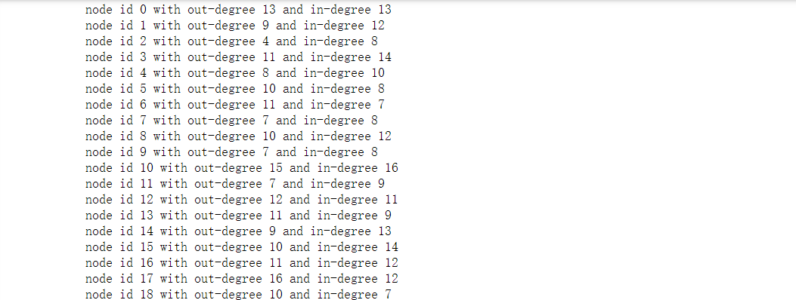

# 03-网络工具

## snap.py

### 安装

```
 python -m pip install snap-stanford
```

### 说明

* [**quick\_test.py：**](https://snap.stanford.edu/snappy/file/quick\_test.py)一种快速测试，用于确认_Snap.py_在您的计算机上可以运行；
* [**intro.py**](https://snap.stanford.edu/snappy/file/intro.py)：合并此页面下显示的代码；
* [**tutorial.py：**](https://snap.stanford.edu/snappy/file/tutorial.py)包含_Snap.py_教程中的代码；
* [**tneanet.py：**](https://snap.stanford.edu/snappy/file/tneanet.py)演示_TNEANet_网络类的用法；
* [**cncom.py：**](https://snap.stanford.edu/snappy/file/cncom.py)演示对连接的组件使用功能的方法；
* [**attribute.py：**](https://snap.stanford.edu/snappy/file/attributes.py)演示_TNEANet_网络类中属性的使用；
* [**test-gnuplot.py：**](https://snap.stanford.edu/snappy/file/test-gnuplot.py)一种快速测试，以确认_gnuplot_可以工作；
* [**test-graphviz.py：**](https://snap.stanford.edu/snappy/file/test-graphviz.py)一种快速测试，以确认_Graphviz_正常工作。

### 用法

Snap.py支持图和网络。

#### 图创建

```
import snap
import numpy as np

# 创建无向图
G1 = snap.TNGraph.New()
## 创建有向图
# G1 = snap.TNEANet.New()

edges = [
    [1,2],[1,3],[1,5],
    [2,3],
    [5,32]
]
print("当前边：{}".format(edges))
nodes = list(np.unique(np.array(edges).flatten()))
print("当前结点：{}".format(nodes))

# 在图中添加结点
for node in nodes:
    G1.AddNode(int(node)) # 注意结点的类型，需要定义为int类型

# 在图中，为一对结点添加边
for edge in edges:
    G1.AddEdge(edge[0],edge[1])
```


#### 迭代器

许多SNAP操作都基于节点和边缘迭代器，这些迭代器可有效实现在网络上工作的算法，而不论其类型（有向，无向，图，网络）和具体实现方式如何。

```
# 创建拥有100个结点以及1000条边的有向随机图
G2 = snap.GenRndGnm(snap.TNGraph, 100, 1000)
# 遍历结点
for NI in G2.Nodes():
    print("node id %d with out-degree %d and in-degree %d" % (
        NI.GetId(), NI.GetOutDeg(), NI.GetInDeg()))
# 遍历边
for EI in G2.Edges():
    print("edge (%d, %d)" % (EI.GetSrcNId(), EI.GetDstNId()))

# 按结点遍历边
for NI in G2.Nodes():
    for Id in NI.GetOutEdges():
        print("edge (%d %d)" % (NI.GetId(), Id))
```



通常，节点迭代器提供以下功能：

* GetId(): 返回结点id
* GetOutDeg(): 返回一个结点的出度
* GetInDeg(): 返回一个结点的入度
* GetOutNId(e): 返回第e条边的出口方向的结点id
* GetInNId(e): 返回第e条边的入口方向的结点id
* IsOutNId(int NId): 某一个结点n是否指向当前结点id
* IsInNId(n): 当前结点id是否指向另一个结点n
* IsNbrNId(n): 结点n是否为当前结点的邻居。

#### 输入输出

使用SNAP，可以轻松保存和加载各种格式的网络。SNAP在内部以紧凑的二进制格式保存网络，但是还提供了用于以各种其他文本和XML格式加载和保存网络的功能。

例如，用于保存和加载图形的Snap.py代码如下所示：

```
#### 利用森林火灾模型生成网络
G3 = snap.GenForestFire(1000, 0.35, 0.35)
# 保存并加载二进制文件
FOut = snap.TFOut("test.graph")
G3.Save(FOut)
FOut.Flush()
FIn = snap.TFIn("test.graph")
G4 = snap.TNGraph.Load(FIn)
# 保存并从文本文件加载
snap.SaveEdgeList(G4, "test.txt", "Save as tab-separated list of edges")
G5 = snap.LoadEdgeList(snap.TNGraph, "test.txt", 0, 1)
```

#### 操作图和网络

SNAP提供了丰富的功能，可以有效地操纵图形和网络。大多数功能支持所有图形/网络类型。

```
# 利用森林火灾模型生成网络
G6 = snap.GenForestFire(1000, 0.35, 0.35)
# 转换为无向图
G7 = G6.ConvertGraph(snap.TUNGraph)
WccG = G6.GetMxWcc()
# 得到节点[0,1,2,3,4,5]上的子图
SubG = G6.GetSubGraph([0,1,2,3,4])
# 得到3核的G
Core3 = G6.GetKCore(3)
# 删除out 10度节点和in 5度节点
G6.DelDegKNodes(10, 5)
```

#### 计算网络的结构特性

SNAP提供了丰富的功能，可以有效地计算网络的结构属性。大多数功能支持所有图形/网络类型。

```
# 生成1000个节点的优先附着图，节点出度为3
G8 = snap.GenPrefAttach(1000, 3)
# 获取连接组件分布(组件大小，计数)
CntV = G8.GetWccSzCnt()
# 获得度分布(学位，计数)
CntV = G8.GetOutDegCnt()
# 得到图邻接矩阵的第一特征向量
EigV = G8.GetLeadEigVec()
# 得到G8直径
G8.GetBfsFullDiam(100)
# 计算G8中三合体的个数，得到G8的聚类系数
G8.GetTriads(),G8.GetClustCf()
```


## networkx

[文档](https://networkx.org/documentation/latest/tutorial.html)

## Graphviz

[文档](https://graphviz.readthedocs.io/en/stable/examples.html)

复杂的网络图使用$Graphviz$，简单的网络图使用$networkx$，$networkx$有很多算法包。
