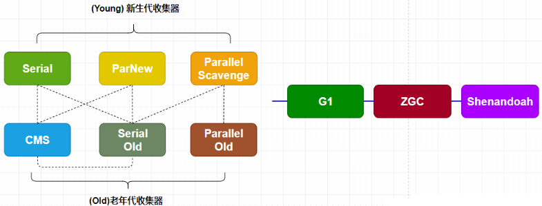

# Java 八股

## Java 基础篇

## Java 集合篇

## Java JVM篇

### 什么是三色标记算法

**三色标记算法** 是一种用于 **垃圾回收（Garbage Collection, GC）** 的标记算法，通常在 **标记-清除（Mark-Sweep）** 垃圾回收算法中使用。

三色标记算法通过将对象分为 **白色、灰色、黑色** 三类，来确保在并发回收时，仍能正确标记和回收垃圾对象。它的核心目标是避免“悬挂引用”（对象不应被回收却被回收）和“浮动垃圾”（对象应该被回收却没被回收）的现象。

#### 1. **三色标记算法的基本概念**

三色标记算法中的三种颜色代表对象的不同状态：

- **白色**：白色的对象是未访问的对象。初始时，所有的对象都是白色。垃圾回收器的目标是回收所有的白色对象。
- **灰色**：灰色的对象表示已经被访问，但它的子对象（引用的对象）还没有完全访问。也就是说，灰色对象还没完成递归扫描。
- **黑色**：黑色的对象表示它和它引用的所有子对象都已经被访问到（标记完成），不再需要进一步扫描。

#### 2. **三色标记算法的过程**

整个垃圾回收过程可以分为以下几步：

##### a. **初始化阶段**

1. 垃圾回收器将所有的对象初始设为**白色**。
2. 从根集合（GC Roots，比如栈、静态字段、寄存器等）出发，标记为**灰色**，表示这些对象正在被使用。

##### b. **标记阶段**

垃圾回收器从根集合（GC Roots）开始扫描：

1. 每次从**灰色对象**中取出一个对象，对该对象的所有引用对象进行遍历。
2. 将当前对象标记为**黑色**，表示该对象及其所有子对象都已经被处理过。
3. 如果该对象引用了其他白色对象，则将这些白色对象标记为灰色，并继续递归处理它们。
4. 这个过程持续到所有灰色对象都被标记为黑色（即：所有可达的对象都被遍历到并标记）。

##### c. **清除阶段**

当所有的灰色对象都变成黑色时，剩余的白色对象就是不可达的对象，它们将被视为垃圾并被回收。

#### 3. **三色标记算法中的并发问题**

在并发场景下，垃圾回收器和应用程序线程（mutator）是同时执行的，可能导致以下问题：

##### a. **浮动垃圾**

浮动垃圾是指，在垃圾回收的标记过程中，一些对象从可达变成不可达。这种情况很常见，因为应用程序线程可能会在标记阶段的某个时刻将某个对象的引用取消，使得该对象变成不可达，但回收器可能没有及时标记到。这些对象在本轮回收中不会被回收，但它们会在下次回收时被处理。

##### b. **对象漏标问题**

**对象漏标问题** 是指在垃圾回收过程中，某些应该被标记为可回收的对象由于标记过程中的疏漏而未被标记，从而没有被回收。这会导致这些本应被回收的对象仍然占用内存，可能引发内存泄漏或性能问题。

### 能详细说一下CMS收集器的垃圾收集过程吗

CMS 是 Java 虚拟机（JVM）中的一种**低延迟**的垃圾收集器，专注于**减少垃圾收集时的停顿时间**，尤其适用于对延迟敏感的应用。它主要针对 **老年代（Tenured Generation）** 的垃圾回收，采用 **标记-清除算法**，整个过程可以分为四个主要阶段：

1. **初始标记（Initial Mark）**：标记 GC Roots 直接可达的对象。这个阶段会暂停所有线程（STW），但时间较短。
2. **并发标记（Concurrent Mark）**：从初始标记的对象出发，并发地递归扫描整个对象图，标记所有可达对象。这个阶段与应用线程并发执行，不会中断应用程序的运行。
3. **重新标记（Remark）**：修正并发标记过程中可能遗漏的对象引用。这也是一个 STW 阶段，但时间较短，远比并发标记时间短。
4. **并发清除（Concurrent Sweep）**：清除未标记的对象，释放内存。此阶段与应用程序线程并发执行，不会中断程序。

### 能详细说一下G1收集器的垃圾收集过程吗

### 有了CMS，为什么还要引入G1

### 线上用什么垃圾回收器，为什么要用它

**新生代收集器（高吞吐量）**：Serial、ParNew、Parallel Scavenge

**老年代收集器（SWT 停顿时间）**： Serial Old、CMS、Parallel Old

**新生代和老年代收集器**：G1、ZGC、Shenandoah

一般的垃圾回收器搭配为：

#### JDK5

Serial New（复制算法。单线程，不能利用多核）+ Serial  Old（标记整理。单线程）

#### JDK8

ParNew（复制算法。并行。） + CMS（标记清楚。并发）：适用于需要低停顿时间的应用。【4G-8G】

Parallel Scavenge（复制算法。并行，吞吐量优先收集器）+Parallel Old（标记整理。并行）【4G以下】

## Netty 篇

## 消息中间件篇

## 分布式事务

## 