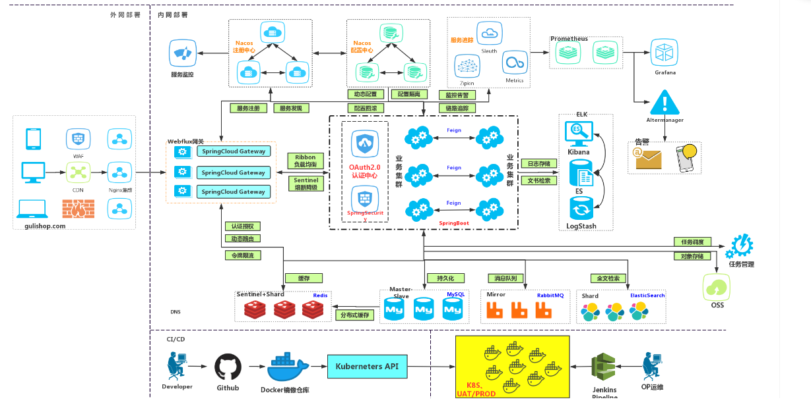
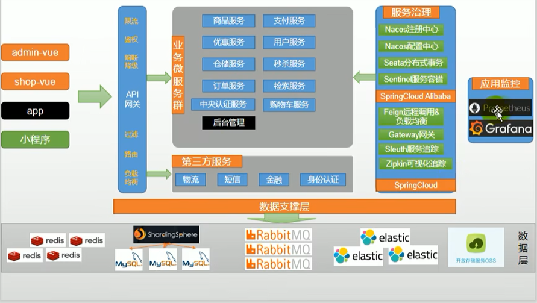

# 项目概述

## 电商模式

市面上有5种常见的电商模式 B2B、B2C、C2B、C2C、O2O。

### B2B 模式

B2B(Business to Business)，是指商家和商家建立的商业关系，如阿里巴巴

### B2C 模式

B2C(Business to Consumer) 就是我们经常看到的供应商直接把商品买个用户，即 “商对客” 模式，也就是我们呢说的商业零售，直接面向消费销售产品和服务，如苏宁易购，京东，天猫，小米商城。

#### C2B 模式

C2C (Customer to Consumer) 客户之间把自己的东西放到网上去卖 。
如淘宝、咸鱼。

### O2O 模式

O2O 即 Online To Offline，也即将线下商务的机会与互联网结合在一起，让互联网成为线上交易前台，线上快速支付，线上优质服务，如：饿了么，美团，淘票票，京东到家。

### 谷粒商城

谷粒商城是一个B2C模式的电商平台，销售自营商品给客户。

## 项目技术&特色

- 前后分离开发，并开发基于vue的后台管理系统
- SpringCloud全新的解决方案
- 应用监控、限流、网关、熔断降级等分布式方案，全方位涉及
- 透彻讲解分布式事务，分布式锁等分布式系统的难点
- 压力测试与性能优化
- 各种集群技术的区别以及使用
- CI/CD 使用

## 项目架构图

## 项目划分图

