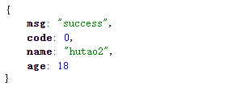
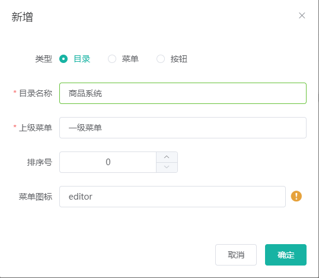

# 分布式基础-全栈开发篇

## 分布式基础概念

### 微服务

微服务架构风格，就像是把一个单独的应用程序开发成一套小服务，每个小服务运行在自己的进程中，并使用轻量级机制通信，通常是 HTTP API 这些服务围绕业务能力来构建，并通过完全自动化部署机制来独立部署，这些服务使用不同的编程语言书写，以及不同数据存储技术，并保持最低限度的集中式管理。

简而言之，拒绝大型单体应用，基于业务边界进行服务微化拆分，每个服务独立部署运行。

### 集群&分布式&节点

集群是个物理状态，分布式是个工作方式。

只要是一堆机器，也可以叫做集群，他们是不是一起协作干活，这谁也不知道。

《分布式系统原理与范型》定义：

**分布式系统是若干独立计算机的集合，这些计算机对于用户来说像单个系统**。分布式系统 (distributed system) 是建立网络之上的软件系统。

- 分布式是指根据不同的业务分布在不同的地方。

- 集群指的是将几台服务器集中在一起，实现同一业务。


例如：京东是一个分布式系统，众多业务运行在不同的机器上，所有业务构成一个大型的分布式业务集群，每一个小的业务，比如用户系统，访问压力大的时候一台服务器是不够的，我们就应该将用户系统部署到多个服务器，也就是每一个业务系统也可以做集群化。

**分布式中的每一个节点，都可以做集群，而集群并不一定就是分布式的**。

**节点：集群中的一个服务器**

### 远程调用

在分布式系统中，各个服务可能处于不同主机，但是服务之间不可避免的需要互相调用，我们称之为远程调用。

**SpringCloud中使用HTTP+JSON的方式来完成远程调用。**

### 负载均衡


分布式系统中，A 服务需要调用B服务，B服务在多台机器中都存在， A调用任意一个服务器均可完成功能。

为了使每一个服务器都不要太或者太闲，我们可以负载均衡调用每一个服务器，提升网站的健壮性。

常见的负载均衡算法：

- 轮询：为第一个请求选择健康池中的每一个后端服务器，然后按顺序往后依次选择，直到最后一个，然后循环。
- 最小连接：优先选择链接数最少，也就是压力最小的后端服务器，在会话较长的情况下可以考虑采取这种方式。

### 服务注册/发现&注册中心

A服务调用B服务，A服务不知道B服务当前在哪几台服务器上有，哪些正常的，哪些服务已经下线，解决这个问题可以引入注册中心。


如果某些服务下线，我们其他人可以实时的感知到其他服务的状态， 从而避免调用不可用的服务。

### 配置中心

每一个服务最终都有大量配置，并且每个服务都可能部署在多个服务器上，我们经常需要变更配置，我们可以让每个服务在配置中心获取自己的配置。

配置中心用来集中管理微服务的配置信息。


### 服务熔断&服务降级

在微服务架构中，微服务之间通过网络来进行通信，存在相互依赖，当其中一个服务不可用时，有可能会造成雪崩效应，要防止这种情况，必须要有容错机制来保护服务。


rpc情景：订单服务 --> 商品服务 --> 库存服务

库存服务出现故障导致响应慢，导致商品服务需要等待，可能等到10s后库存服务才能响应。库存服务的不可用导致商品服务阻塞，商品服务等的期间，订单服务也处于阻塞。一个服务不可用导致整个服务链都阻塞。如果是高并发，第一个请求调用后阻塞10s得不到结果，第二个请求直接阻塞10s。更多的请求进来导致请求积压，全部阻塞，最终服务器的资源耗尽。导致雪崩。

1. 服务熔断：设置服务的超时，**当被调用的服务经常失败到达某个阈值**，我们可以开启断路保护机制，后来的请求不再去调用这个服务，本地直接返回默认的数据

2. 服务降级：在运维期间，当系统处于高峰期，系统资源紧张，我们可以让非核心业务降级运行，降级：某些服务不处理，或者简单处理【抛异常，返回NULL，调用 Mock数据，调用 FallBack 处理逻辑】

### API 网关

在微服务架构中，API Gateway 作为整体架构的重要组件，**抽象服务中需要的公共功能**，同时它提供了客户端**负载均衡，服务自动熔断，灰度发布，统一认证，限流监控，日志统计**等丰富功能，帮助我们解决很多API管理的难题。

## 环境搭建

### 虚拟机环境

- 使用vagrant快速创建虚拟机
- 或者直接使用vmware+xshell

### 安装docker

虚拟化容器技术。Docker基于镜像，可以秒级启动各种容器。每一种容器都是一个完整的运行环境，容器之间互相隔离。

* 卸载之前的docker

```shell
sudo yum remove docker \
                  docker-client \
                  docker-client-latest \
                  docker-common \
                  docker-latest \
                  docker-latest-logrotate \
                  docker-logrotate \
                  docker-engine
```

* 安装docker

```shell
sudo yum install -y yum-utils

sudo yum-config-manager \
    --add-repo \
    https://download.docker.com/linux/centos/docker-ce.repo
    
sudo yum install docker-ce docker-ce-cli containerd.io docker-compose-plugin
```

* 启动docker

```shell
sudo systemctl start docker
```

* 验证docker

```shell
docker -v

docker images
```

#### 配置docker阿里云镜像加速

登录阿里云，控制台>容器镜像服务>镜像工具>镜像加速器

```shell
sudo mkdir -p /etc/docker
sudo tee /etc/docker/daemon.json <<-'EOF'
{
  "registry-mirrors": ["xxxx"]
}
EOF
sudo systemctl daemon-reload
sudo systemctl restart docker
```

### 安装软件

软件仓库：https://hub.docker.com/

#### 安装MySQL

```shell
docker pull mysql:5.7

docker run -p 3306:3306 --name mysql \
-v /mydata/mysql/log:/var/log/mysql \
-v /mydata/mysql/data:/var/lib/mysql \
-v /mydata/mysql/conf:/etc/mysql \
-e MYSQL_ROOT_PASSWORD=123456 \
-d mysql:5.7
```

* `-p 3306:3306 `：将容器的3306端口映射到主机的3306端口
* `-v /mydata/mysql/log:/var/log/mysql `：将配置文件夹挂载到主机
* `-v /mydata/mysql/data:/var/lib/mysql`：将日志文件夹挂载到主机
* `-v /mydata/mysql/conf:/etc/mysql`：将配置文件夹挂载到主机
* `-e MYSQL_ROOT_PASSWORD=root`：初始化root用户的密码
* ``--name``指定容器名字 
* ``-v``目录挂载 
* ``-p``指定端口映射 
* ``-e``设置mysql参数 
* ``-d``后台运行

进入mysql容器

```shell
docker exec -it mysql /bin/bash
```

修改MySQL配置文件

```shell
vi /mydata/mysql/conf/my.cnf
```

修改如下：

```ini
[client]
default-character-set=utf8
[mysql]
default-character-set=utf8
[mysqld]
init_connect='SET collation_connection = utf8_unicode_ci'
init_connect='SET NAMES utf8'
character-set-server=utf8
collation-server=utf8_unicode_ci
skip-character-set-client-handshake
# 跳过域名解析，解决MySQL连接慢的问题
skip-name-resolve
```

然后重启容器

```shell
docker restart mysql
```

#### 安装Redis

在docker hub搜索redis镜像

```shell
docker search redis
```

拉取redis镜像到本地

```shell
docker pull redis
```

修改需要自定义的配置(docker-redis默认没有配置文件， 自己在宿主机建立后挂载映射) 创建并修改/mydata/redis/conf/redis.conf。

```properties
#开启远程权限
bind 0.0.0.0
#开启aof持久化
appendonly yes
```

一定先创建文件，不然会默认创建为文件夹。

启动并创建实例

```shell
docker run -p 6379:6379 --name redis \
-v /mydata/redis/data:/data \
-v /mydata/redis/conf/redis.conf:/etc/redis/redis.conf \
-d redis redis-server /etc/redis/redis.conf
```

测试，不用进入容器，而是直接进入redis客户端

```shell
docker exec -it redis redis-cli
```

### 开发环境统一

#### Maven

下载[maven](https://maven.apache.org/download.cgi)，然后配置MAVEN_HOME，并设置`%MAVEN_HOME%\bin`环境变量。

在`D:\Program Files\apache-maven-3.8.6\conf\settings.xml`，修改如下：export

```xml
在maven配置文件配置
配置阿里云镜像
<mirrors>
    <mirror>
        <id>nexus-aliyun</id>
        <mirrorOf>central</mirrorOf>
        <name>Nexus aliyun</name>
        <url>http://maven.aliyun.com/nexus/content/groups/public</url>
    </mirror>
    <mirror>
        <id>nexus-aliyun</id>
        <mirrorOf>central</mirrorOf>
        <name>Nexus aliyun</name>
        <url>https://maven.aliyun.com/nexus/content/groups/public</url>
    </mirror>
</mirrors>

配置 jdk 1.8 编译项目
<profiles>
    <profile>
        <id>jdk-1.8</id>
        <activation>
            <activeByDefault>true</activeByDefault>
            <jdk>1.8</jdk>
        </activation>
        <properties>
            <maven.compiler.source>1.8</maven.compiler.source>
            <maven.compiler.target>1.8</maven.compiler.target>
            <maven.compiler.compilerVersion>1.8</maven.compiler.compilerVersion>
        </properties>
    </profile>
</profiles>
```

然后修改idea中maven目录


#### 安装开发插件(可选-方便开发)

在idea安装插件

```shell
lombok
MyBatisX
```

在vscode安装插件

```shell
Auto Close Tag  
Auto Rename Tag 
Chinese 
ESlint 
HTML CSS Support
HTML Snippets
JavaScript (ES6) code snippets
Live Server
open in brower
Vetur
```

#### 配置git ssh

##### 配置用户名
```shell
git config --global user.name "username"
```

##### 配置邮箱
```shell
git config --global user.email "xxxx@qq.com" // 注册账号时使用的邮箱
```

##### 配置ssh免密登录
```shell
ssh-keygen -t rsa -C "xxx@qq.com"
```

三次回车后生成了密钥，也可以查看密钥
```shell
cat ~/.ssh/id_rsa.pub
```

浏览器登录码云后，个人头像上点设置、然后点ssh公钥、随便填个标题，然后赋值
```shell
ssh-rsa AAAAB3NzaC1yc2EAAAADAQABAAABAQC6MWhGXSKdRxr1mGPZysDrcwABMTrxc8Va2IWZyIMMRHH9Qn/wy3PN2I9144UUqg65W0CDE/thxbOdn78MygFFsIG4j0wdT9sdjmSfzQikLHFsJ02yr58V6J2zwXcW9AhIlaGr+XIlGKDUy5mXb4OF+6UMXM6HKF7rY9FYh9wL6bun9f1jV4Ydlxftb/xtV8oQXXNJbI6OoqkogPKBYcNdWzMbjJdmbq2bSQugGaPVnHEqAD74Qgkw1G7SIDTXnY55gBlFPVzjLWUu74OWFCx4pFHH6LRZOCLlMaJ9haTwT2DB/sFzOG/Js+cEExx/arJ2rvvdmTMwlv/T+6xhrMS3 xxx@qq.com
```

##### 测试
```shell
ssh -T git@github.com
```

##### 测试成功
```shell
Hi unique_perfect! You've successfully authenticated, but GITEE.COM does not provide shell access.
```

#### 创建github仓库


#### 项目初始化

下载github仓库，然后就这个仓库中创建子项目。


创建父模块：在firelymall中创建pom.xml

```xml
<modules>
    <module>firelymall-coupon</module>
    <module>firelymall-member</module>
    <module>firelymall-order</module>
    <module>firelymall-product</module>
    <module>firelymall-ware</module>
</modules>
```

之后修改总项目的.gitignore，把小项目里的垃圾文件在提交的时候忽略掉 

```properties
target/
pom.xml.tag
pom.xml.releaseBackup
pom.xml.versionsBackup
pom.xml.next
release.properties
dependency-reduced-pom.xml
buildNumber.properties
.mvn/timing.properties
.mvn/wrapper/maven-wrapper.jar

**/mvnw
**/mvnw.cmd

**/.mvn
**/target

.idea


**/.gitignore

**/README.md
```

之后，如果不会使用idea操作git，就是用git命令

```shell
git push main:main # 本地分支:远程分支
```

#### 创建数据库

创建数据库之前需要启动docker服务 

```shell
sudo docker ps
sudo docker ps -a
```

 这两个命令的差别就是后者会显示  【已创建但没有启动的容器】 。

我们接下来设置我们要用的容器每次都是自动启动：

```shell
sudo docker update redis --restart=always
sudo docker update mysql --restart=always
```

如果不配置上面的内容的话，我们也可以选择手动启动

```shell
sudo docker start mysql
sudo docker start redis
```

如果要进入已启动的容器

```shell
sudo docker exec -it mysql /bin/bash
```

接着创建数据库，然后接着去客户端软件直接我们的操作，在左侧root上右键建立数据库： 字符集选utf8mb4，能兼容utf8且能解决一些乱码的问题。分别 建立了下面数据库。

```mysql
create database firelymall_oms charset=utf8mb4;
create database firelymall_pms charset=utf8mb4;
create database firelymall_sms charset=utf8mb4;
create database firelymall_ums charset=utf8mb4;
create database firelymall_wms charset=utf8mb4;
```

所有的数据库数据再复杂也不建立外键，因为在电商系统里，数据量大， 做外键关联很耗性能。

##### firelymall_oms.sql

```mysql
drop table if exists oms_order;

drop table if exists oms_order_item;

drop table if exists oms_order_operate_history;

drop table if exists oms_order_return_apply;

drop table if exists oms_order_return_reason;

drop table if exists oms_order_setting;

drop table if exists oms_payment_info;

drop table if exists oms_refund_info;

/*==============================================================*/
/* Table: oms_order                                             */
/*==============================================================*/
create table oms_order
(
   id                   bigint not null auto_increment comment 'id',
   member_id            bigint comment 'member_id',
   order_sn             char(32) comment '订单号',
   coupon_id            bigint comment '使用的优惠券',
   create_time          datetime comment 'create_time',
   member_username      varchar(200) comment '用户名',
   total_amount         decimal(18,4) comment '订单总额',
   pay_amount           decimal(18,4) comment '应付总额',
   freight_amount       decimal(18,4) comment '运费金额',
   promotion_amount     decimal(18,4) comment '促销优化金额（促销价、满减、阶梯价）',
   integration_amount   decimal(18,4) comment '积分抵扣金额',
   coupon_amount        decimal(18,4) comment '优惠券抵扣金额',
   discount_amount      decimal(18,4) comment '后台调整订单使用的折扣金额',
   pay_type             tinyint comment '支付方式【1->支付宝；2->微信；3->银联； 4->货到付款；】',
   source_type          tinyint comment '订单来源[0->PC订单；1->app订单]',
   status               tinyint comment '订单状态【0->待付款；1->待发货；2->已发货；3->已完成；4->已关闭；5->无效订单】',
   delivery_company     varchar(64) comment '物流公司(配送方式)',
   delivery_sn          varchar(64) comment '物流单号',
   auto_confirm_day     int comment '自动确认时间（天）',
   integration          int comment '可以获得的积分',
   growth               int comment '可以获得的成长值',
   bill_type            tinyint comment '发票类型[0->不开发票；1->电子发票；2->纸质发票]',
   bill_header          varchar(255) comment '发票抬头',
   bill_content         varchar(255) comment '发票内容',
   bill_receiver_phone  varchar(32) comment '收票人电话',
   bill_receiver_email  varchar(64) comment '收票人邮箱',
   receiver_name        varchar(100) comment '收货人姓名',
   receiver_phone       varchar(32) comment '收货人电话',
   receiver_post_code   varchar(32) comment '收货人邮编',
   receiver_province    varchar(32) comment '省份/直辖市',
   receiver_city        varchar(32) comment '城市',
   receiver_region      varchar(32) comment '区',
   receiver_detail_address varchar(200) comment '详细地址',
   note                 varchar(500) comment '订单备注',
   confirm_status       tinyint comment '确认收货状态[0->未确认；1->已确认]',
   delete_status        tinyint comment '删除状态【0->未删除；1->已删除】',
   use_integration      int comment '下单时使用的积分',
   payment_time         datetime comment '支付时间',
   delivery_time        datetime comment '发货时间',
   receive_time         datetime comment '确认收货时间',
   comment_time         datetime comment '评价时间',
   modify_time          datetime comment '修改时间',
   primary key (id)
);

alter table oms_order comment '订单';

/*==============================================================*/
/* Table: oms_order_item                                        */
/*==============================================================*/
create table oms_order_item
(
   id                   bigint not null auto_increment comment 'id',
   order_id             bigint comment 'order_id',
   order_sn             char(32) comment 'order_sn',
   spu_id               bigint comment 'spu_id',
   spu_name             varchar(255) comment 'spu_name',
   spu_pic              varchar(500) comment 'spu_pic',
   spu_brand            varchar(200) comment '品牌',
   category_id          bigint comment '商品分类id',
   sku_id               bigint comment '商品sku编号',
   sku_name             varchar(255) comment '商品sku名字',
   sku_pic              varchar(500) comment '商品sku图片',
   sku_price            decimal(18,4) comment '商品sku价格',
   sku_quantity         int comment '商品购买的数量',
   sku_attrs_vals       varchar(500) comment '商品销售属性组合（JSON）',
   promotion_amount     decimal(18,4) comment '商品促销分解金额',
   coupon_amount        decimal(18,4) comment '优惠券优惠分解金额',
   integration_amount   decimal(18,4) comment '积分优惠分解金额',
   real_amount          decimal(18,4) comment '该商品经过优惠后的分解金额',
   gift_integration     int comment '赠送积分',
   gift_growth          int comment '赠送成长值',
   primary key (id)
);

alter table oms_order_item comment '订单项信息';

/*==============================================================*/
/* Table: oms_order_operate_history                             */
/*==============================================================*/
create table oms_order_operate_history
(
   id                   bigint not null auto_increment comment 'id',
   order_id             bigint comment '订单id',
   operate_man          varchar(100) comment '操作人[用户；系统；后台管理员]',
   create_time          datetime comment '操作时间',
   order_status         tinyint comment '订单状态【0->待付款；1->待发货；2->已发货；3->已完成；4->已关闭；5->无效订单】',
   note                 varchar(500) comment '备注',
   primary key (id)
);

alter table oms_order_operate_history comment '订单操作历史记录';

/*==============================================================*/
/* Table: oms_order_return_apply                                */
/*==============================================================*/
create table oms_order_return_apply
(
   id                   bigint not null auto_increment comment 'id',
   order_id             bigint comment 'order_id',
   sku_id               bigint comment '退货商品id',
   order_sn             char(32) comment '订单编号',
   create_time          datetime comment '申请时间',
   member_username      varchar(64) comment '会员用户名',
   return_amount        decimal(18,4) comment '退款金额',
   return_name          varchar(100) comment '退货人姓名',
   return_phone         varchar(20) comment '退货人电话',
   status               tinyint(1) comment '申请状态[0->待处理；1->退货中；2->已完成；3->已拒绝]',
   handle_time          datetime comment '处理时间',
   sku_img              varchar(500) comment '商品图片',
   sku_name             varchar(200) comment '商品名称',
   sku_brand            varchar(200) comment '商品品牌',
   sku_attrs_vals       varchar(500) comment '商品销售属性(JSON)',
   sku_count            int comment '退货数量',
   sku_price            decimal(18,4) comment '商品单价',
   sku_real_price       decimal(18,4) comment '商品实际支付单价',
   reason               varchar(200) comment '原因',
   description述         varchar(500) comment '描述',
   desc_pics            varchar(2000) comment '凭证图片，以逗号隔开',
   handle_note          varchar(500) comment '处理备注',
   handle_man           varchar(200) comment '处理人员',
   receive_man          varchar(100) comment '收货人',
   receive_time         datetime comment '收货时间',
   receive_note         varchar(500) comment '收货备注',
   receive_phone        varchar(20) comment '收货电话',
   company_address      varchar(500) comment '公司收货地址',
   primary key (id)
);

alter table oms_order_return_apply comment '订单退货申请';

/*==============================================================*/
/* Table: oms_order_return_reason                               */
/*==============================================================*/
create table oms_order_return_reason
(
   id                   bigint not null auto_increment comment 'id',
   name                 varchar(200) comment '退货原因名',
   sort                 int comment '排序',
   status               tinyint(1) comment '启用状态',
   create_time          datetime comment 'create_time',
   primary key (id)
);

alter table oms_order_return_reason comment '退货原因';

/*==============================================================*/
/* Table: oms_order_setting                                     */
/*==============================================================*/
create table oms_order_setting
(
   id                   bigint not null auto_increment comment 'id',
   flash_order_overtime int comment '秒杀订单超时关闭时间(分)',
   normal_order_overtime int comment '正常订单超时时间(分)',
   confirm_overtime     int comment '发货后自动确认收货时间（天）',
   finish_overtime      int comment '自动完成交易时间，不能申请退货（天）',
   comment_overtime     int comment '订单完成后自动好评时间（天）',
   member_level         tinyint(2) comment '会员等级【0-不限会员等级，全部通用；其他-对应的其他会员等级】',
   primary key (id)
);

alter table oms_order_setting comment '订单配置信息';

/*==============================================================*/
/* Table: oms_payment_info                                      */
/*==============================================================*/
create table oms_payment_info
(
   id                   bigint not null auto_increment comment 'id',
   order_sn             char(32) comment '订单号（对外业务号）',
   order_id             bigint comment '订单id',
   alipay_trade_no      varchar(50) comment '支付宝交易流水号',
   total_amount         decimal(18,4) comment '支付总金额',
   subject              varchar(200) comment '交易内容',
   payment_status       varchar(20) comment '支付状态',
   create_time          datetime comment '创建时间',
   confirm_time         datetime comment '确认时间',
   callback_content     varchar(4000) comment '回调内容',
   callback_time        datetime comment '回调时间',
   primary key (id)
);

alter table oms_payment_info comment '支付信息表';

/*==============================================================*/
/* Table: oms_refund_info                                       */
/*==============================================================*/
create table oms_refund_info
(
   id                   bigint not null auto_increment comment 'id',
   order_return_id      bigint comment '退款的订单',
   refund               decimal(18,4) comment '退款金额',
   refund_sn            varchar(64) comment '退款交易流水号',
   refund_status        tinyint(1) comment '退款状态',
   refund_channel       tinyint comment '退款渠道[1-支付宝，2-微信，3-银联，4-汇款]',
   refund_content       varchar(5000),
   primary key (id)
);

alter table oms_refund_info comment '退款信息';
```

##### firelymall-pms.sql

```mysql
drop table if exists pms_attr;

drop table if exists pms_attr_attrgroup_relation;

drop table if exists pms_attr_group;

drop table if exists pms_brand;

drop table if exists pms_category;

drop table if exists pms_category_brand_relation;

drop table if exists pms_comment_replay;

drop table if exists pms_product_attr_value;

drop table if exists pms_sku_images;

drop table if exists pms_sku_info;

drop table if exists pms_sku_sale_attr_value;

drop table if exists pms_spu_comment;

drop table if exists pms_spu_images;

drop table if exists pms_spu_info;

drop table if exists pms_spu_info_desc;

/*==============================================================*/
/* Table: pms_attr                                              */
/*==============================================================*/
create table pms_attr
(
   attr_id              bigint not null auto_increment comment '属性id',
   attr_name            char(30) comment '属性名',
   search_type          tinyint comment '是否需要检索[0-不需要，1-需要]',
   icon                 varchar(255) comment '属性图标',
   value_select         char(255) comment '可选值列表[用逗号分隔]',
   attr_type            tinyint comment '属性类型[0-销售属性，1-基本属性，2-既是销售属性又是基本属性]',
   enable               bigint comment '启用状态[0 - 禁用，1 - 启用]',
   catelog_id           bigint comment '所属分类',
   show_desc            tinyint comment '快速展示【是否展示在介绍上；0-否 1-是】，在sku中仍然可以调整',
   primary key (attr_id)
);

alter table pms_attr comment '商品属性';

/*==============================================================*/
/* Table: pms_attr_attrgroup_relation                           */
/*==============================================================*/
create table pms_attr_attrgroup_relation
(
   id                   bigint not null auto_increment comment 'id',
   attr_id              bigint comment '属性id',
   attr_group_id        bigint comment '属性分组id',
   attr_sort            int comment '属性组内排序',
   primary key (id)
);

alter table pms_attr_attrgroup_relation comment '属性&属性分组关联';

/*==============================================================*/
/* Table: pms_attr_group                                        */
/*==============================================================*/
create table pms_attr_group
(
   attr_group_id        bigint not null auto_increment comment '分组id',
   attr_group_name      char(20) comment '组名',
   sort                 int comment '排序',
   descript             varchar(255) comment '描述',
   icon                 varchar(255) comment '组图标',
   catelog_id           bigint comment '所属分类id',
   primary key (attr_group_id)
);

alter table pms_attr_group comment '属性分组';

/*==============================================================*/
/* Table: pms_brand                                             */
/*==============================================================*/
create table pms_brand
(
   brand_id             bigint not null auto_increment comment '品牌id',
   name                 char(50) comment '品牌名',
   logo                 varchar(2000) comment '品牌logo地址',
   descript             longtext comment '介绍',
   show_status          tinyint comment '显示状态[0-不显示；1-显示]',
   first_letter         char(1) comment '检索首字母',
   sort                 int comment '排序',
   primary key (brand_id)
);

alter table pms_brand comment '品牌';

/*==============================================================*/
/* Table: pms_category                                          */
/*==============================================================*/
create table pms_category
(
   cat_id               bigint not null auto_increment comment '分类id',
   name                 char(50) comment '分类名称',
   parent_cid           bigint comment '父分类id',
   cat_level            int comment '层级',
   show_status          tinyint comment '是否显示[0-不显示，1显示]',
   sort                 int comment '排序',
   icon                 char(255) comment '图标地址',
   product_unit         char(50) comment '计量单位',
   product_count        int comment '商品数量',
   primary key (cat_id)
);

alter table pms_category comment '商品三级分类';

/*==============================================================*/
/* Table: pms_category_brand_relation                           */
/*==============================================================*/
create table pms_category_brand_relation
(
   id                   bigint not null auto_increment,
   brand_id             bigint comment '品牌id',
   catelog_id           bigint comment '分类id',
   brand_name           varchar(255),
   catelog_name         varchar(255),
   primary key (id)
);

alter table pms_category_brand_relation comment '品牌分类关联';

/*==============================================================*/
/* Table: pms_comment_replay                                    */
/*==============================================================*/
create table pms_comment_replay
(
   id                   bigint not null auto_increment comment 'id',
   comment_id           bigint comment '评论id',
   reply_id             bigint comment '回复id',
   primary key (id)
);

alter table pms_comment_replay comment '商品评价回复关系';

/*==============================================================*/
/* Table: pms_product_attr_value                                */
/*==============================================================*/
create table pms_product_attr_value
(
   id                   bigint not null auto_increment comment 'id',
   spu_id               bigint comment '商品id',
   attr_id              bigint comment '属性id',
   attr_name            varchar(200) comment '属性名',
   attr_value           varchar(200) comment '属性值',
   attr_sort            int comment '顺序',
   quick_show           tinyint comment '快速展示【是否展示在介绍上；0-否 1-是】',
   primary key (id)
);

alter table pms_product_attr_value comment 'spu属性值';

/*==============================================================*/
/* Table: pms_sku_images                                        */
/*==============================================================*/
create table pms_sku_images
(
   id                   bigint not null auto_increment comment 'id',
   sku_id               bigint comment 'sku_id',
   img_url              varchar(255) comment '图片地址',
   img_sort             int comment '排序',
   default_img          int comment '默认图[0 - 不是默认图，1 - 是默认图]',
   primary key (id)
);

alter table pms_sku_images comment 'sku图片';

/*==============================================================*/
/* Table: pms_sku_info                                          */
/*==============================================================*/
create table pms_sku_info
(
   sku_id               bigint not null auto_increment comment 'skuId',
   spu_id               bigint comment 'spuId',
   sku_name             varchar(255) comment 'sku名称',
   sku_desc             varchar(2000) comment 'sku介绍描述',
   catalog_id           bigint comment '所属分类id',
   brand_id             bigint comment '品牌id',
   sku_default_img      varchar(255) comment '默认图片',
   sku_title            varchar(255) comment '标题',
   sku_subtitle         varchar(2000) comment '副标题',
   price                decimal(18,4) comment '价格',
   sale_count           bigint comment '销量',
   primary key (sku_id)
);

alter table pms_sku_info comment 'sku信息';

/*==============================================================*/
/* Table: pms_sku_sale_attr_value                               */
/*==============================================================*/
create table pms_sku_sale_attr_value
(
   id                   bigint not null auto_increment comment 'id',
   sku_id               bigint comment 'sku_id',
   attr_id              bigint comment 'attr_id',
   attr_name            varchar(200) comment '销售属性名',
   attr_value           varchar(200) comment '销售属性值',
   attr_sort            int comment '顺序',
   primary key (id)
);

alter table pms_sku_sale_attr_value comment 'sku销售属性&值';

/*==============================================================*/
/* Table: pms_spu_comment                                       */
/*==============================================================*/
create table pms_spu_comment
(
   id                   bigint not null auto_increment comment 'id',
   sku_id               bigint comment 'sku_id',
   spu_id               bigint comment 'spu_id',
   spu_name             varchar(255) comment '商品名字',
   member_nick_name     varchar(255) comment '会员昵称',
   star                 tinyint(1) comment '星级',
   member_ip            varchar(64) comment '会员ip',
   create_time          datetime comment '创建时间',
   show_status          tinyint(1) comment '显示状态[0-不显示，1-显示]',
   spu_attributes       varchar(255) comment '购买时属性组合',
   likes_count          int comment '点赞数',
   reply_count          int comment '回复数',
   resources            varchar(1000) comment '评论图片/视频[json数据；[{type:文件类型,url:资源路径}]]',
   content              text comment '内容',
   member_icon          varchar(255) comment '用户头像',
   comment_type         tinyint comment '评论类型[0 - 对商品的直接评论，1 - 对评论的回复]',
   primary key (id)
);

alter table pms_spu_comment comment '商品评价';

/*==============================================================*/
/* Table: pms_spu_images                                        */
/*==============================================================*/
create table pms_spu_images
(
   id                   bigint not null auto_increment comment 'id',
   spu_id               bigint comment 'spu_id',
   img_name             varchar(200) comment '图片名',
   img_url              varchar(255) comment '图片地址',
   img_sort             int comment '顺序',
   default_img          tinyint comment '是否默认图',
   primary key (id)
);

alter table pms_spu_images comment 'spu图片';

/*==============================================================*/
/* Table: pms_spu_info                                          */
/*==============================================================*/
create table pms_spu_info
(
   id                   bigint not null auto_increment comment '商品id',
   spu_name             varchar(200) comment '商品名称',
   spu_description      varchar(1000) comment '商品描述',
   catalog_id           bigint comment '所属分类id',
   brand_id             bigint comment '品牌id',
   weight               decimal(18,4),
   publish_status       tinyint comment '上架状态[0 - 下架，1 - 上架]',
   create_time          datetime,
   update_time          datetime,
   primary key (id)
);

alter table pms_spu_info comment 'spu信息';

/*==============================================================*/
/* Table: pms_spu_info_desc                                     */
/*==============================================================*/
create table pms_spu_info_desc
(
   spu_id               bigint not null comment '商品id',
   decript              longtext comment '商品介绍',
   primary key (spu_id)
);

alter table pms_spu_info_desc comment 'spu信息介绍';

DROP TABLE IF EXISTS `pms_category`;

CREATE TABLE `pms_category` (
  `cat_id` bigint(20) NOT NULL AUTO_INCREMENT COMMENT '分类id',
  `name` char(50) DEFAULT NULL COMMENT '分类名称',
  `parent_cid` bigint(20) DEFAULT NULL COMMENT '父分类id',
  `cat_level` int(11) DEFAULT NULL COMMENT '层级',
  `show_status` tinyint(4) DEFAULT NULL COMMENT '是否显示[0-不显示，1显示]',
  `sort` int(11) DEFAULT NULL COMMENT '排序',
  `icon` char(255) DEFAULT NULL COMMENT '图标地址',
  `product_unit` char(50) DEFAULT NULL COMMENT '计量单位',
  `product_count` int(11) DEFAULT NULL COMMENT '商品数量',
  PRIMARY KEY (`cat_id`)
) ENGINE=InnoDB AUTO_INCREMENT=1433 DEFAULT CHARSET=utf8mb4 COMMENT='商品三级分类';

/*Data for the table `pms_category` */

insert  into `pms_category`(`cat_id`,`name`,`parent_cid`,`cat_level`,`show_status`,`sort`,`icon`,`product_unit`,`product_count`) values (1,'图书、音像、电子书刊',0,1,1,0,NULL,NULL,0),(2,'手机',0,1,1,0,NULL,NULL,0),(3,'家用电器',0,1,1,0,NULL,NULL,0),(4,'数码',0,1,1,0,NULL,NULL,0),(5,'家居家装',0,1,1,0,NULL,NULL,0),(6,'电脑办公',0,1,1,0,NULL,NULL,0),(7,'厨具',0,1,1,0,NULL,NULL,0),(8,'个护化妆',0,1,1,0,NULL,NULL,0),(9,'服饰内衣',0,1,1,0,NULL,NULL,0),(10,'钟表',0,1,1,0,NULL,NULL,0),(11,'鞋靴',0,1,1,0,NULL,NULL,0),(12,'母婴',0,1,1,0,NULL,NULL,0),(13,'礼品箱包',0,1,1,0,NULL,NULL,0),(14,'食品饮料、保健食品',0,1,1,0,NULL,NULL,0),(15,'珠宝',0,1,1,0,NULL,NULL,0),(16,'汽车用品',0,1,1,0,NULL,NULL,0),(17,'运动健康',0,1,1,0,NULL,NULL,0),(18,'玩具乐器',0,1,1,0,NULL,NULL,0),(19,'彩票、旅行、充值、票务',0,1,1,0,NULL,NULL,0),(20,'生鲜',0,1,1,0,NULL,NULL,0),(21,'整车',0,1,1,0,NULL,NULL,0),(22,'电子书刊',1,2,1,0,NULL,NULL,0),(23,'音像',1,2,1,0,NULL,NULL,0),(24,'英文原版',1,2,1,0,NULL,NULL,0),(25,'文艺',1,2,1,0,NULL,NULL,0),(26,'少儿',1,2,1,0,NULL,NULL,0),(27,'人文社科',1,2,1,0,NULL,NULL,0),(28,'经管励志',1,2,1,0,NULL,NULL,0),(29,'生活',1,2,1,0,NULL,NULL,0),(30,'科技',1,2,1,0,NULL,NULL,0),(31,'教育',1,2,1,0,NULL,NULL,0),(32,'港台图书',1,2,1,0,NULL,NULL,0),(33,'其他',1,2,1,0,NULL,NULL,0),(34,'手机通讯',2,2,1,0,NULL,NULL,0),(35,'运营商',2,2,1,0,NULL,NULL,0),(36,'手机配件',2,2,1,0,NULL,NULL,0),(37,'大 家 电',3,2,1,0,NULL,NULL,0),(38,'厨卫大电',3,2,1,0,NULL,NULL,0),(39,'厨房小电',3,2,1,0,NULL,NULL,0),(40,'生活电器',3,2,1,0,NULL,NULL,0),(41,'个护健康',3,2,1,0,NULL,NULL,0),(42,'五金家装',3,2,1,0,NULL,NULL,0),(43,'摄影摄像',4,2,1,0,NULL,NULL,0),(44,'数码配件',4,2,1,0,NULL,NULL,0),(45,'智能设备',4,2,1,0,NULL,NULL,0),(46,'影音娱乐',4,2,1,0,NULL,NULL,0),(47,'电子教育',4,2,1,0,NULL,NULL,0),(48,'虚拟商品',4,2,1,0,NULL,NULL,0),(49,'家纺',5,2,1,0,NULL,NULL,0),(50,'灯具',5,2,1,0,NULL,NULL,0),(51,'生活日用',5,2,1,0,NULL,NULL,0),(52,'家装软饰',5,2,1,0,NULL,NULL,0),(53,'宠物生活',5,2,1,0,NULL,NULL,0),(54,'电脑整机',6,2,1,0,NULL,NULL,0),(55,'电脑配件',6,2,1,0,NULL,NULL,0),(56,'外设产品',6,2,1,0,NULL,NULL,0),(57,'游戏设备',6,2,1,0,NULL,NULL,0),(58,'网络产品',6,2,1,0,NULL,NULL,0),(59,'办公设备',6,2,1,0,NULL,NULL,0),(60,'文具/耗材',6,2,1,0,NULL,NULL,0),(61,'服务产品',6,2,1,0,NULL,NULL,0),(62,'烹饪锅具',7,2,1,0,NULL,NULL,0),(63,'刀剪菜板',7,2,1,0,NULL,NULL,0),(64,'厨房配件',7,2,1,0,NULL,NULL,0),(65,'水具酒具',7,2,1,0,NULL,NULL,0),(66,'餐具',7,2,1,0,NULL,NULL,0),(67,'酒店用品',7,2,1,0,NULL,NULL,0),(68,'茶具/咖啡具',7,2,1,0,NULL,NULL,0),(69,'清洁用品',8,2,1,0,NULL,NULL,0),(70,'面部护肤',8,2,1,0,NULL,NULL,0),(71,'身体护理',8,2,1,0,NULL,NULL,0),(72,'口腔护理',8,2,1,0,NULL,NULL,0),(73,'女性护理',8,2,1,0,NULL,NULL,0),(74,'洗发护发',8,2,1,0,NULL,NULL,0),(75,'香水彩妆',8,2,1,0,NULL,NULL,0),(76,'女装',9,2,1,0,NULL,NULL,0),(77,'男装',9,2,1,0,NULL,NULL,0),(78,'内衣',9,2,1,0,NULL,NULL,0),(79,'洗衣服务',9,2,1,0,NULL,NULL,0),(80,'服饰配件',9,2,1,0,NULL,NULL,0),(81,'钟表',10,2,1,0,NULL,NULL,0),(82,'流行男鞋',11,2,1,0,NULL,NULL,0),(83,'时尚女鞋',11,2,1,0,NULL,NULL,0),(84,'奶粉',12,2,1,0,NULL,NULL,0),(85,'营养辅食',12,2,1,0,NULL,NULL,0),(86,'尿裤湿巾',12,2,1,0,NULL,NULL,0),(87,'喂养用品',12,2,1,0,NULL,NULL,0),(88,'洗护用品',12,2,1,0,NULL,NULL,0),(89,'童车童床',12,2,1,0,NULL,NULL,0),(90,'寝居服饰',12,2,1,0,NULL,NULL,0),(91,'妈妈专区',12,2,1,0,NULL,NULL,0),(92,'童装童鞋',12,2,1,0,NULL,NULL,0),(93,'安全座椅',12,2,1,0,NULL,NULL,0),(94,'潮流女包',13,2,1,0,NULL,NULL,0),(95,'精品男包',13,2,1,0,NULL,NULL,0),(96,'功能箱包',13,2,1,0,NULL,NULL,0),(97,'礼品',13,2,1,0,NULL,NULL,0),(98,'奢侈品',13,2,1,0,NULL,NULL,0),(99,'婚庆',13,2,1,0,NULL,NULL,0),(100,'进口食品',14,2,1,0,NULL,NULL,0),(101,'地方特产',14,2,1,0,NULL,NULL,0),(102,'休闲食品',14,2,1,0,NULL,NULL,0),(103,'粮油调味',14,2,1,0,NULL,NULL,0),(104,'饮料冲调',14,2,1,0,NULL,NULL,0),(105,'食品礼券',14,2,1,0,NULL,NULL,0),(106,'茗茶',14,2,1,0,NULL,NULL,0),(107,'时尚饰品',15,2,1,0,NULL,NULL,0),(108,'黄金',15,2,1,0,NULL,NULL,0),(109,'K金饰品',15,2,1,0,NULL,NULL,0),(110,'金银投资',15,2,1,0,NULL,NULL,0),(111,'银饰',15,2,1,0,NULL,NULL,0),(112,'钻石',15,2,1,0,NULL,NULL,0),(113,'翡翠玉石',15,2,1,0,NULL,NULL,0),(114,'水晶玛瑙',15,2,1,0,NULL,NULL,0),(115,'彩宝',15,2,1,0,NULL,NULL,0),(116,'铂金',15,2,1,0,NULL,NULL,0),(117,'木手串/把件',15,2,1,0,NULL,NULL,0),(118,'珍珠',15,2,1,0,NULL,NULL,0),(119,'维修保养',16,2,1,0,NULL,NULL,0),(120,'车载电器',16,2,1,0,NULL,NULL,0),(121,'美容清洗',16,2,1,0,NULL,NULL,0),(122,'汽车装饰',16,2,1,0,NULL,NULL,0),(123,'安全自驾',16,2,1,0,NULL,NULL,0),(124,'汽车服务',16,2,1,0,NULL,NULL,0),(125,'赛事改装',16,2,1,0,NULL,NULL,0),(126,'运动鞋包',17,2,1,0,NULL,NULL,0),(127,'运动服饰',17,2,1,0,NULL,NULL,0),(128,'骑行运动',17,2,1,0,NULL,NULL,0),(129,'垂钓用品',17,2,1,0,NULL,NULL,0),(130,'游泳用品',17,2,1,0,NULL,NULL,0),(131,'户外鞋服',17,2,1,0,NULL,NULL,0),(132,'户外装备',17,2,1,0,NULL,NULL,0),(133,'健身训练',17,2,1,0,NULL,NULL,0),(134,'体育用品',17,2,1,0,NULL,NULL,0),(135,'适用年龄',18,2,1,0,NULL,NULL,0),(136,'遥控/电动',18,2,1,0,NULL,NULL,0),(137,'毛绒布艺',18,2,1,0,NULL,NULL,0),(138,'娃娃玩具',18,2,1,0,NULL,NULL,0),(139,'模型玩具',18,2,1,0,NULL,NULL,0),(140,'健身玩具',18,2,1,0,NULL,NULL,0),(141,'动漫玩具',18,2,1,0,NULL,NULL,0),(142,'益智玩具',18,2,1,0,NULL,NULL,0),(143,'积木拼插',18,2,1,0,NULL,NULL,0),(144,'DIY玩具',18,2,1,0,NULL,NULL,0),(145,'创意减压',18,2,1,0,NULL,NULL,0),(146,'乐器',18,2,1,0,NULL,NULL,0),(147,'彩票',19,2,1,0,NULL,NULL,0),(148,'机票',19,2,1,0,NULL,NULL,0),(149,'酒店',19,2,1,0,NULL,NULL,0),(150,'旅行',19,2,1,0,NULL,NULL,0),(151,'充值',19,2,1,0,NULL,NULL,0),(152,'游戏',19,2,1,0,NULL,NULL,0),(153,'票务',19,2,1,0,NULL,NULL,0),(154,'产地直供',20,2,1,0,NULL,NULL,0),(155,'水果',20,2,1,0,NULL,NULL,0),(156,'猪牛羊肉',20,2,1,0,NULL,NULL,0),(157,'海鲜水产',20,2,1,0,NULL,NULL,0),(158,'禽肉蛋品',20,2,1,0,NULL,NULL,0),(159,'冷冻食品',20,2,1,0,NULL,NULL,0),(160,'熟食腊味',20,2,1,0,NULL,NULL,0),(161,'饮品甜品',20,2,1,0,NULL,NULL,0),(162,'蔬菜',20,2,1,0,NULL,NULL,0),(163,'全新整车',21,2,1,0,NULL,NULL,0),(164,'二手车',21,2,1,0,NULL,NULL,0),(165,'电子书',22,3,1,0,NULL,NULL,0),(166,'网络原创',22,3,1,0,NULL,NULL,0),(167,'数字杂志',22,3,1,0,NULL,NULL,0),(168,'多媒体图书',22,3,1,0,NULL,NULL,0),(169,'音乐',23,3,1,0,NULL,NULL,0),(170,'影视',23,3,1,0,NULL,NULL,0),(171,'教育音像',23,3,1,0,NULL,NULL,0),(172,'少儿',24,3,1,0,NULL,NULL,0),(173,'商务投资',24,3,1,0,NULL,NULL,0),(174,'英语学习与考试',24,3,1,0,NULL,NULL,0),(175,'文学',24,3,1,0,NULL,NULL,0),(176,'传记',24,3,1,0,NULL,NULL,0),(177,'励志',24,3,1,0,NULL,NULL,0),(178,'小说',25,3,1,0,NULL,NULL,0),(179,'文学',25,3,1,0,NULL,NULL,0),(180,'青春文学',25,3,1,0,NULL,NULL,0),(181,'传记',25,3,1,0,NULL,NULL,0),(182,'艺术',25,3,1,0,NULL,NULL,0),(183,'少儿',26,3,1,0,NULL,NULL,0),(184,'0-2岁',26,3,1,0,NULL,NULL,0),(185,'3-6岁',26,3,1,0,NULL,NULL,0),(186,'7-10岁',26,3,1,0,NULL,NULL,0),(187,'11-14岁',26,3,1,0,NULL,NULL,0),(188,'历史',27,3,1,0,NULL,NULL,0),(189,'哲学',27,3,1,0,NULL,NULL,0),(190,'国学',27,3,1,0,NULL,NULL,0),(191,'政治/军事',27,3,1,0,NULL,NULL,0),(192,'法律',27,3,1,0,NULL,NULL,0),(193,'人文社科',27,3,1,0,NULL,NULL,0),(194,'心理学',27,3,1,0,NULL,NULL,0),(195,'文化',27,3,1,0,NULL,NULL,0),(196,'社会科学',27,3,1,0,NULL,NULL,0),(197,'经济',28,3,1,0,NULL,NULL,0),(198,'金融与投资',28,3,1,0,NULL,NULL,0),(199,'管理',28,3,1,0,NULL,NULL,0),(200,'励志与成功',28,3,1,0,NULL,NULL,0),(201,'生活',29,3,1,0,NULL,NULL,0),(202,'健身与保健',29,3,1,0,NULL,NULL,0),(203,'家庭与育儿',29,3,1,0,NULL,NULL,0),(204,'旅游',29,3,1,0,NULL,NULL,0),(205,'烹饪美食',29,3,1,0,NULL,NULL,0),(206,'工业技术',30,3,1,0,NULL,NULL,0),(207,'科普读物',30,3,1,0,NULL,NULL,0),(208,'建筑',30,3,1,0,NULL,NULL,0),(209,'医学',30,3,1,0,NULL,NULL,0),(210,'科学与自然',30,3,1,0,NULL,NULL,0),(211,'计算机与互联网',30,3,1,0,NULL,NULL,0),(212,'电子通信',30,3,1,0,NULL,NULL,0),(213,'中小学教辅',31,3,1,0,NULL,NULL,0),(214,'教育与考试',31,3,1,0,NULL,NULL,0),(215,'外语学习',31,3,1,0,NULL,NULL,0),(216,'大中专教材',31,3,1,0,NULL,NULL,0),(217,'字典词典',31,3,1,0,NULL,NULL,0),(218,'艺术/设计/收藏',32,3,1,0,NULL,NULL,0),(219,'经济管理',32,3,1,0,NULL,NULL,0),(220,'文化/学术',32,3,1,0,NULL,NULL,0),(221,'少儿',32,3,1,0,NULL,NULL,0),(222,'工具书',33,3,1,0,NULL,NULL,0),(223,'杂志/期刊',33,3,1,0,NULL,NULL,0),(224,'套装书',33,3,1,0,NULL,NULL,0),(225,'手机',34,3,1,0,NULL,NULL,0),(226,'对讲机',34,3,1,0,NULL,NULL,0),(227,'合约机',35,3,1,0,NULL,NULL,0),(228,'选号中心',35,3,1,0,NULL,NULL,0),(229,'装宽带',35,3,1,0,NULL,NULL,0),(230,'办套餐',35,3,1,0,NULL,NULL,0),(231,'移动电源',36,3,1,0,NULL,NULL,0),(232,'电池/移动电源',36,3,1,0,NULL,NULL,0),(233,'蓝牙耳机',36,3,1,0,NULL,NULL,0),(234,'充电器/数据线',36,3,1,0,NULL,NULL,0),(235,'苹果周边',36,3,1,0,NULL,NULL,0),(236,'手机耳机',36,3,1,0,NULL,NULL,0),(237,'手机贴膜',36,3,1,0,NULL,NULL,0),(238,'手机存储卡',36,3,1,0,NULL,NULL,0),(239,'充电器',36,3,1,0,NULL,NULL,0),(240,'数据线',36,3,1,0,NULL,NULL,0),(241,'手机保护套',36,3,1,0,NULL,NULL,0),(242,'车载配件',36,3,1,0,NULL,NULL,0),(243,'iPhone 配件',36,3,1,0,NULL,NULL,0),(244,'手机电池',36,3,1,0,NULL,NULL,0),(245,'创意配件',36,3,1,0,NULL,NULL,0),(246,'便携/无线音响',36,3,1,0,NULL,NULL,0),(247,'手机饰品',36,3,1,0,NULL,NULL,0),(248,'拍照配件',36,3,1,0,NULL,NULL,0),(249,'手机支架',36,3,1,0,NULL,NULL,0),(250,'平板电视',37,3,1,0,NULL,NULL,0),(251,'空调',37,3,1,0,NULL,NULL,0),(252,'冰箱',37,3,1,0,NULL,NULL,0),(253,'洗衣机',37,3,1,0,NULL,NULL,0),(254,'家庭影院',37,3,1,0,NULL,NULL,0),(255,'DVD/电视盒子',37,3,1,0,NULL,NULL,0),(256,'迷你音响',37,3,1,0,NULL,NULL,0),(257,'冷柜/冰吧',37,3,1,0,NULL,NULL,0),(258,'家电配件',37,3,1,0,NULL,NULL,0),(259,'功放',37,3,1,0,NULL,NULL,0),(260,'回音壁/Soundbar',37,3,1,0,NULL,NULL,0),(261,'Hi-Fi专区',37,3,1,0,NULL,NULL,0),(262,'电视盒子',37,3,1,0,NULL,NULL,0),(263,'酒柜',37,3,1,0,NULL,NULL,0),(264,'燃气灶',38,3,1,0,NULL,NULL,0),(265,'油烟机',38,3,1,0,NULL,NULL,0),(266,'热水器',38,3,1,0,NULL,NULL,0),(267,'消毒柜',38,3,1,0,NULL,NULL,0),(268,'洗碗机',38,3,1,0,NULL,NULL,0),(269,'料理机',39,3,1,0,NULL,NULL,0),(270,'榨汁机',39,3,1,0,NULL,NULL,0),(271,'电饭煲',39,3,1,0,NULL,NULL,0),(272,'电压力锅',39,3,1,0,NULL,NULL,0),(273,'豆浆机',39,3,1,0,NULL,NULL,0),(274,'咖啡机',39,3,1,0,NULL,NULL,0),(275,'微波炉',39,3,1,0,NULL,NULL,0),(276,'电烤箱',39,3,1,0,NULL,NULL,0),(277,'电磁炉',39,3,1,0,NULL,NULL,0),(278,'面包机',39,3,1,0,NULL,NULL,0),(279,'煮蛋器',39,3,1,0,NULL,NULL,0),(280,'酸奶机',39,3,1,0,NULL,NULL,0),(281,'电炖锅',39,3,1,0,NULL,NULL,0),(282,'电水壶/热水瓶',39,3,1,0,NULL,NULL,0),(283,'电饼铛',39,3,1,0,NULL,NULL,0),(284,'多用途锅',39,3,1,0,NULL,NULL,0),(285,'电烧烤炉',39,3,1,0,NULL,NULL,0),(286,'果蔬解毒机',39,3,1,0,NULL,NULL,0),(287,'其它厨房电器',39,3,1,0,NULL,NULL,0),(288,'养生壶/煎药壶',39,3,1,0,NULL,NULL,0),(289,'电热饭盒',39,3,1,0,NULL,NULL,0),(290,'取暖电器',40,3,1,0,NULL,NULL,0),(291,'净化器',40,3,1,0,NULL,NULL,0),(292,'加湿器',40,3,1,0,NULL,NULL,0),(293,'扫地机器人',40,3,1,0,NULL,NULL,0),(294,'吸尘器',40,3,1,0,NULL,NULL,0),(295,'挂烫机/熨斗',40,3,1,0,NULL,NULL,0),(296,'插座',40,3,1,0,NULL,NULL,0),(297,'电话机',40,3,1,0,NULL,NULL,0),(298,'清洁机',40,3,1,0,NULL,NULL,0),(299,'除湿机',40,3,1,0,NULL,NULL,0),(300,'干衣机',40,3,1,0,NULL,NULL,0),(301,'收录/音机',40,3,1,0,NULL,NULL,0),(302,'电风扇',40,3,1,0,NULL,NULL,0),(303,'冷风扇',40,3,1,0,NULL,NULL,0),(304,'其它生活电器',40,3,1,0,NULL,NULL,0),(305,'生活电器配件',40,3,1,0,NULL,NULL,0),(306,'净水器',40,3,1,0,NULL,NULL,0),(307,'饮水机',40,3,1,0,NULL,NULL,0),(308,'剃须刀',41,3,1,0,NULL,NULL,0),(309,'剃/脱毛器',41,3,1,0,NULL,NULL,0),(310,'口腔护理',41,3,1,0,NULL,NULL,0),(311,'电吹风',41,3,1,0,NULL,NULL,0),(312,'美容器',41,3,1,0,NULL,NULL,0),(313,'理发器',41,3,1,0,NULL,NULL,0),(314,'卷/直发器',41,3,1,0,NULL,NULL,0),(315,'按摩椅',41,3,1,0,NULL,NULL,0),(316,'按摩器',41,3,1,0,NULL,NULL,0),(317,'足浴盆',41,3,1,0,NULL,NULL,0),(318,'血压计',41,3,1,0,NULL,NULL,0),(319,'电子秤/厨房秤',41,3,1,0,NULL,NULL,0),(320,'血糖仪',41,3,1,0,NULL,NULL,0),(321,'体温计',41,3,1,0,NULL,NULL,0),(322,'其它健康电器',41,3,1,0,NULL,NULL,0),(323,'计步器/脂肪检测仪',41,3,1,0,NULL,NULL,0),(324,'电动工具',42,3,1,0,NULL,NULL,0),(325,'手动工具',42,3,1,0,NULL,NULL,0),(326,'仪器仪表',42,3,1,0,NULL,NULL,0),(327,'浴霸/排气扇',42,3,1,0,NULL,NULL,0),(328,'灯具',42,3,1,0,NULL,NULL,0),(329,'LED灯',42,3,1,0,NULL,NULL,0),(330,'洁身器',42,3,1,0,NULL,NULL,0),(331,'水槽',42,3,1,0,NULL,NULL,0),(332,'龙头',42,3,1,0,NULL,NULL,0),(333,'淋浴花洒',42,3,1,0,NULL,NULL,0),(334,'厨卫五金',42,3,1,0,NULL,NULL,0),(335,'家具五金',42,3,1,0,NULL,NULL,0),(336,'门铃',42,3,1,0,NULL,NULL,0),(337,'电气开关',42,3,1,0,NULL,NULL,0),(338,'插座',42,3,1,0,NULL,NULL,0),(339,'电工电料',42,3,1,0,NULL,NULL,0),(340,'监控安防',42,3,1,0,NULL,NULL,0),(341,'电线/线缆',42,3,1,0,NULL,NULL,0),(342,'数码相机',43,3,1,0,NULL,NULL,0),(343,'单电/微单相机',43,3,1,0,NULL,NULL,0),(344,'单反相机',43,3,1,0,NULL,NULL,0),(345,'摄像机',43,3,1,0,NULL,NULL,0),(346,'拍立得',43,3,1,0,NULL,NULL,0),(347,'运动相机',43,3,1,0,NULL,NULL,0),(348,'镜头',43,3,1,0,NULL,NULL,0),(349,'户外器材',43,3,1,0,NULL,NULL,0),(350,'影棚器材',43,3,1,0,NULL,NULL,0),(351,'冲印服务',43,3,1,0,NULL,NULL,0),(352,'数码相框',43,3,1,0,NULL,NULL,0),(353,'存储卡',44,3,1,0,NULL,NULL,0),(354,'读卡器',44,3,1,0,NULL,NULL,0),(355,'滤镜',44,3,1,0,NULL,NULL,0),(356,'闪光灯/手柄',44,3,1,0,NULL,NULL,0),(357,'相机包',44,3,1,0,NULL,NULL,0),(358,'三脚架/云台',44,3,1,0,NULL,NULL,0),(359,'相机清洁/贴膜',44,3,1,0,NULL,NULL,0),(360,'机身附件',44,3,1,0,NULL,NULL,0),(361,'镜头附件',44,3,1,0,NULL,NULL,0),(362,'电池/充电器',44,3,1,0,NULL,NULL,0),(363,'移动电源',44,3,1,0,NULL,NULL,0),(364,'数码支架',44,3,1,0,NULL,NULL,0),(365,'智能手环',45,3,1,0,NULL,NULL,0),(366,'智能手表',45,3,1,0,NULL,NULL,0),(367,'智能眼镜',45,3,1,0,NULL,NULL,0),(368,'运动跟踪器',45,3,1,0,NULL,NULL,0),(369,'健康监测',45,3,1,0,NULL,NULL,0),(370,'智能配饰',45,3,1,0,NULL,NULL,0),(371,'智能家居',45,3,1,0,NULL,NULL,0),(372,'体感车',45,3,1,0,NULL,NULL,0),(373,'其他配件',45,3,1,0,NULL,NULL,0),(374,'智能机器人',45,3,1,0,NULL,NULL,0),(375,'无人机',45,3,1,0,NULL,NULL,0),(376,'MP3/MP4',46,3,1,0,NULL,NULL,0),(377,'智能设备',46,3,1,0,NULL,NULL,0),(378,'耳机/耳麦',46,3,1,0,NULL,NULL,0),(379,'便携/无线音箱',46,3,1,0,NULL,NULL,0),(380,'音箱/音响',46,3,1,0,NULL,NULL,0),(381,'高清播放器',46,3,1,0,NULL,NULL,0),(382,'收音机',46,3,1,0,NULL,NULL,0),(383,'MP3/MP4配件',46,3,1,0,NULL,NULL,0),(384,'麦克风',46,3,1,0,NULL,NULL,0),(385,'专业音频',46,3,1,0,NULL,NULL,0),(386,'苹果配件',46,3,1,0,NULL,NULL,0),(387,'学生平板',47,3,1,0,NULL,NULL,0),(388,'点读机/笔',47,3,1,0,NULL,NULL,0),(389,'早教益智',47,3,1,0,NULL,NULL,0),(390,'录音笔',47,3,1,0,NULL,NULL,0),(391,'电纸书',47,3,1,0,NULL,NULL,0),(392,'电子词典',47,3,1,0,NULL,NULL,0),(393,'复读机',47,3,1,0,NULL,NULL,0),(394,'延保服务',48,3,1,0,NULL,NULL,0),(395,'杀毒软件',48,3,1,0,NULL,NULL,0),(396,'积分商品',48,3,1,0,NULL,NULL,0),(397,'桌布/罩件',49,3,1,0,NULL,NULL,0),(398,'地毯地垫',49,3,1,0,NULL,NULL,0),(399,'沙发垫套/椅垫',49,3,1,0,NULL,NULL,0),(400,'床品套件',49,3,1,0,NULL,NULL,0),(401,'被子',49,3,1,0,NULL,NULL,0),(402,'枕芯',49,3,1,0,NULL,NULL,0),(403,'床单被罩',49,3,1,0,NULL,NULL,0),(404,'毯子',49,3,1,0,NULL,NULL,0),(405,'床垫/床褥',49,3,1,0,NULL,NULL,0),(406,'蚊帐',49,3,1,0,NULL,NULL,0),(407,'抱枕靠垫',49,3,1,0,NULL,NULL,0),(408,'毛巾浴巾',49,3,1,0,NULL,NULL,0),(409,'电热毯',49,3,1,0,NULL,NULL,0),(410,'窗帘/窗纱',49,3,1,0,NULL,NULL,0),(411,'布艺软饰',49,3,1,0,NULL,NULL,0),(412,'凉席',49,3,1,0,NULL,NULL,0),(413,'台灯',50,3,1,0,NULL,NULL,0),(414,'节能灯',50,3,1,0,NULL,NULL,0),(415,'装饰灯',50,3,1,0,NULL,NULL,0),(416,'落地灯',50,3,1,0,NULL,NULL,0),(417,'应急灯/手电',50,3,1,0,NULL,NULL,0),(418,'LED灯',50,3,1,0,NULL,NULL,0),(419,'吸顶灯',50,3,1,0,NULL,NULL,0),(420,'五金电器',50,3,1,0,NULL,NULL,0),(421,'筒灯射灯',50,3,1,0,NULL,NULL,0),(422,'吊灯',50,3,1,0,NULL,NULL,0),(423,'氛围照明',50,3,1,0,NULL,NULL,0),(424,'保暖防护',51,3,1,0,NULL,NULL,0),(425,'收纳用品',51,3,1,0,NULL,NULL,0),(426,'雨伞雨具',51,3,1,0,NULL,NULL,0),(427,'浴室用品',51,3,1,0,NULL,NULL,0),(428,'缝纫/针织用品',51,3,1,0,NULL,NULL,0),(429,'洗晒/熨烫',51,3,1,0,NULL,NULL,0),(430,'净化除味',51,3,1,0,NULL,NULL,0),(431,'相框/照片墙',52,3,1,0,NULL,NULL,0),(432,'装饰字画',52,3,1,0,NULL,NULL,0),(433,'节庆饰品',52,3,1,0,NULL,NULL,0),(434,'手工/十字绣',52,3,1,0,NULL,NULL,0),(435,'装饰摆件',52,3,1,0,NULL,NULL,0),(436,'帘艺隔断',52,3,1,0,NULL,NULL,0),(437,'墙贴/装饰贴',52,3,1,0,NULL,NULL,0),(438,'钟饰',52,3,1,0,NULL,NULL,0),(439,'花瓶花艺',52,3,1,0,NULL,NULL,0),(440,'香薰蜡烛',52,3,1,0,NULL,NULL,0),(441,'创意家居',52,3,1,0,NULL,NULL,0),(442,'宠物主粮',53,3,1,0,NULL,NULL,0),(443,'宠物零食',53,3,1,0,NULL,NULL,0),(444,'医疗保健',53,3,1,0,NULL,NULL,0),(445,'家居日用',53,3,1,0,NULL,NULL,0),(446,'宠物玩具',53,3,1,0,NULL,NULL,0),(447,'出行装备',53,3,1,0,NULL,NULL,0),(448,'洗护美容',53,3,1,0,NULL,NULL,0),(449,'笔记本',54,3,1,0,NULL,NULL,0),(450,'超极本',54,3,1,0,NULL,NULL,0),(451,'游戏本',54,3,1,0,NULL,NULL,0),(452,'平板电脑',54,3,1,0,NULL,NULL,0),(453,'平板电脑配件',54,3,1,0,NULL,NULL,0),(454,'台式机',54,3,1,0,NULL,NULL,0),(455,'服务器/工作站',54,3,1,0,NULL,NULL,0),(456,'笔记本配件',54,3,1,0,NULL,NULL,0),(457,'一体机',54,3,1,0,NULL,NULL,0),(458,'CPU',55,3,1,0,NULL,NULL,0),(459,'主板',55,3,1,0,NULL,NULL,0),(460,'显卡',55,3,1,0,NULL,NULL,0),(461,'硬盘',55,3,1,0,NULL,NULL,0),(462,'SSD固态硬盘',55,3,1,0,NULL,NULL,0),(463,'内存',55,3,1,0,NULL,NULL,0),(464,'机箱',55,3,1,0,NULL,NULL,0),(465,'电源',55,3,1,0,NULL,NULL,0),(466,'显示器',55,3,1,0,NULL,NULL,0),(467,'刻录机/光驱',55,3,1,0,NULL,NULL,0),(468,'散热器',55,3,1,0,NULL,NULL,0),(469,'声卡/扩展卡',55,3,1,0,NULL,NULL,0),(470,'装机配件',55,3,1,0,NULL,NULL,0),(471,'组装电脑',55,3,1,0,NULL,NULL,0),(472,'移动硬盘',56,3,1,0,NULL,NULL,0),(473,'U盘',56,3,1,0,NULL,NULL,0),(474,'鼠标',56,3,1,0,NULL,NULL,0),(475,'键盘',56,3,1,0,NULL,NULL,0),(476,'鼠标垫',56,3,1,0,NULL,NULL,0),(477,'摄像头',56,3,1,0,NULL,NULL,0),(478,'手写板',56,3,1,0,NULL,NULL,0),(479,'硬盘盒',56,3,1,0,NULL,NULL,0),(480,'插座',56,3,1,0,NULL,NULL,0),(481,'线缆',56,3,1,0,NULL,NULL,0),(482,'UPS电源',56,3,1,0,NULL,NULL,0),(483,'电脑工具',56,3,1,0,NULL,NULL,0),(484,'游戏设备',56,3,1,0,NULL,NULL,0),(485,'电玩',56,3,1,0,NULL,NULL,0),(486,'电脑清洁',56,3,1,0,NULL,NULL,0),(487,'网络仪表仪器',56,3,1,0,NULL,NULL,0),(488,'游戏机',57,3,1,0,NULL,NULL,0),(489,'游戏耳机',57,3,1,0,NULL,NULL,0),(490,'手柄/方向盘',57,3,1,0,NULL,NULL,0),(491,'游戏软件',57,3,1,0,NULL,NULL,0),(492,'游戏周边',57,3,1,0,NULL,NULL,0),(493,'路由器',58,3,1,0,NULL,NULL,0),(494,'网卡',58,3,1,0,NULL,NULL,0),(495,'交换机',58,3,1,0,NULL,NULL,0),(496,'网络存储',58,3,1,0,NULL,NULL,0),(497,'4G/3G上网',58,3,1,0,NULL,NULL,0),(498,'网络盒子',58,3,1,0,NULL,NULL,0),(499,'网络配件',58,3,1,0,NULL,NULL,0),(500,'投影机',59,3,1,0,NULL,NULL,0),(501,'投影配件',59,3,1,0,NULL,NULL,0),(502,'多功能一体机',59,3,1,0,NULL,NULL,0),(503,'打印机',59,3,1,0,NULL,NULL,0),(504,'传真设备',59,3,1,0,NULL,NULL,0),(505,'验钞/点钞机',59,3,1,0,NULL,NULL,0),(506,'扫描设备',59,3,1,0,NULL,NULL,0),(507,'复合机',59,3,1,0,NULL,NULL,0),(508,'碎纸机',59,3,1,0,NULL,NULL,0),(509,'考勤机',59,3,1,0,NULL,NULL,0),(510,'收款/POS机',59,3,1,0,NULL,NULL,0),(511,'会议音频视频',59,3,1,0,NULL,NULL,0),(512,'保险柜',59,3,1,0,NULL,NULL,0),(513,'装订/封装机',59,3,1,0,NULL,NULL,0),(514,'安防监控',59,3,1,0,NULL,NULL,0),(515,'办公家具',59,3,1,0,NULL,NULL,0),(516,'白板',59,3,1,0,NULL,NULL,0),(517,'硒鼓/墨粉',60,3,1,0,NULL,NULL,0),(518,'墨盒',60,3,1,0,NULL,NULL,0),(519,'色带',60,3,1,0,NULL,NULL,0),(520,'纸类',60,3,1,0,NULL,NULL,0),(521,'办公文具',60,3,1,0,NULL,NULL,0),(522,'学生文具',60,3,1,0,NULL,NULL,0),(523,'财会用品',60,3,1,0,NULL,NULL,0),(524,'文件管理',60,3,1,0,NULL,NULL,0),(525,'本册/便签',60,3,1,0,NULL,NULL,0),(526,'计算器',60,3,1,0,NULL,NULL,0),(527,'笔类',60,3,1,0,NULL,NULL,0),(528,'画具画材',60,3,1,0,NULL,NULL,0),(529,'刻录碟片/附件',60,3,1,0,NULL,NULL,0),(530,'上门安装',61,3,1,0,NULL,NULL,0),(531,'延保服务',61,3,1,0,NULL,NULL,0),(532,'维修保养',61,3,1,0,NULL,NULL,0),(533,'电脑软件',61,3,1,0,NULL,NULL,0),(534,'京东服务',61,3,1,0,NULL,NULL,0),(535,'炒锅',62,3,1,0,NULL,NULL,0),(536,'煎锅',62,3,1,0,NULL,NULL,0),(537,'压力锅',62,3,1,0,NULL,NULL,0),(538,'蒸锅',62,3,1,0,NULL,NULL,0),(539,'汤锅',62,3,1,0,NULL,NULL,0),(540,'奶锅',62,3,1,0,NULL,NULL,0),(541,'锅具套装',62,3,1,0,NULL,NULL,0),(542,'煲类',62,3,1,0,NULL,NULL,0),(543,'水壶',62,3,1,0,NULL,NULL,0),(544,'火锅',62,3,1,0,NULL,NULL,0),(545,'菜刀',63,3,1,0,NULL,NULL,0),(546,'剪刀',63,3,1,0,NULL,NULL,0),(547,'刀具套装',63,3,1,0,NULL,NULL,0),(548,'砧板',63,3,1,0,NULL,NULL,0),(549,'瓜果刀/刨',63,3,1,0,NULL,NULL,0),(550,'多功能刀',63,3,1,0,NULL,NULL,0),(551,'保鲜盒',64,3,1,0,NULL,NULL,0),(552,'烘焙/烧烤',64,3,1,0,NULL,NULL,0),(553,'饭盒/提锅',64,3,1,0,NULL,NULL,0),(554,'储物/置物架',64,3,1,0,NULL,NULL,0),(555,'厨房DIY/小工具',64,3,1,0,NULL,NULL,0),(556,'塑料杯',65,3,1,0,NULL,NULL,0),(557,'运动水壶',65,3,1,0,NULL,NULL,0),(558,'玻璃杯',65,3,1,0,NULL,NULL,0),(559,'陶瓷/马克杯',65,3,1,0,NULL,NULL,0),(560,'保温杯',65,3,1,0,NULL,NULL,0),(561,'保温壶',65,3,1,0,NULL,NULL,0),(562,'酒杯/酒具',65,3,1,0,NULL,NULL,0),(563,'杯具套装',65,3,1,0,NULL,NULL,0),(564,'餐具套装',66,3,1,0,NULL,NULL,0),(565,'碗/碟/盘',66,3,1,0,NULL,NULL,0),(566,'筷勺/刀叉',66,3,1,0,NULL,NULL,0),(567,'一次性用品',66,3,1,0,NULL,NULL,0),(568,'果盘/果篮',66,3,1,0,NULL,NULL,0),(569,'自助餐炉',67,3,1,0,NULL,NULL,0),(570,'酒店餐具',67,3,1,0,NULL,NULL,0),(571,'酒店水具',67,3,1,0,NULL,NULL,0),(572,'整套茶具',68,3,1,0,NULL,NULL,0),(573,'茶杯',68,3,1,0,NULL,NULL,0),(574,'茶壶',68,3,1,0,NULL,NULL,0),(575,'茶盘茶托',68,3,1,0,NULL,NULL,0),(576,'茶叶罐',68,3,1,0,NULL,NULL,0),(577,'茶具配件',68,3,1,0,NULL,NULL,0),(578,'茶宠摆件',68,3,1,0,NULL,NULL,0),(579,'咖啡具',68,3,1,0,NULL,NULL,0),(580,'其他',68,3,1,0,NULL,NULL,0),(581,'纸品湿巾',69,3,1,0,NULL,NULL,0),(582,'衣物清洁',69,3,1,0,NULL,NULL,0),(583,'清洁工具',69,3,1,0,NULL,NULL,0),(584,'驱虫用品',69,3,1,0,NULL,NULL,0),(585,'家庭清洁',69,3,1,0,NULL,NULL,0),(586,'皮具护理',69,3,1,0,NULL,NULL,0),(587,'一次性用品',69,3,1,0,NULL,NULL,0),(588,'洁面',70,3,1,0,NULL,NULL,0),(589,'乳液面霜',70,3,1,0,NULL,NULL,0),(590,'面膜',70,3,1,0,NULL,NULL,0),(591,'剃须',70,3,1,0,NULL,NULL,0),(592,'套装',70,3,1,0,NULL,NULL,0),(593,'精华',70,3,1,0,NULL,NULL,0),(594,'眼霜',70,3,1,0,NULL,NULL,0),(595,'卸妆',70,3,1,0,NULL,NULL,0),(596,'防晒',70,3,1,0,NULL,NULL,0),(597,'防晒隔离',70,3,1,0,NULL,NULL,0),(598,'T区护理',70,3,1,0,NULL,NULL,0),(599,'眼部护理',70,3,1,0,NULL,NULL,0),(600,'精华露',70,3,1,0,NULL,NULL,0),(601,'爽肤水',70,3,1,0,NULL,NULL,0),(602,'沐浴',71,3,1,0,NULL,NULL,0),(603,'润肤',71,3,1,0,NULL,NULL,0),(604,'颈部',71,3,1,0,NULL,NULL,0),(605,'手足',71,3,1,0,NULL,NULL,0),(606,'纤体塑形',71,3,1,0,NULL,NULL,0),(607,'美胸',71,3,1,0,NULL,NULL,0),(608,'套装',71,3,1,0,NULL,NULL,0),(609,'精油',71,3,1,0,NULL,NULL,0),(610,'洗发护发',71,3,1,0,NULL,NULL,0),(611,'染发/造型',71,3,1,0,NULL,NULL,0),(612,'香薰精油',71,3,1,0,NULL,NULL,0),(613,'磨砂/浴盐',71,3,1,0,NULL,NULL,0),(614,'手工/香皂',71,3,1,0,NULL,NULL,0),(615,'洗发',71,3,1,0,NULL,NULL,0),(616,'护发',71,3,1,0,NULL,NULL,0),(617,'染发',71,3,1,0,NULL,NULL,0),(618,'磨砂膏',71,3,1,0,NULL,NULL,0),(619,'香皂',71,3,1,0,NULL,NULL,0),(620,'牙膏/牙粉',72,3,1,0,NULL,NULL,0),(621,'牙刷/牙线',72,3,1,0,NULL,NULL,0),(622,'漱口水',72,3,1,0,NULL,NULL,0),(623,'套装',72,3,1,0,NULL,NULL,0),(624,'卫生巾',73,3,1,0,NULL,NULL,0),(625,'卫生护垫',73,3,1,0,NULL,NULL,0),(626,'私密护理',73,3,1,0,NULL,NULL,0),(627,'脱毛膏',73,3,1,0,NULL,NULL,0),(628,'其他',73,3,1,0,NULL,NULL,0),(629,'洗发',74,3,1,0,NULL,NULL,0),(630,'护发',74,3,1,0,NULL,NULL,0),(631,'染发',74,3,1,0,NULL,NULL,0),(632,'造型',74,3,1,0,NULL,NULL,0),(633,'假发',74,3,1,0,NULL,NULL,0),(634,'套装',74,3,1,0,NULL,NULL,0),(635,'美发工具',74,3,1,0,NULL,NULL,0),(636,'脸部护理',74,3,1,0,NULL,NULL,0),(637,'香水',75,3,1,0,NULL,NULL,0),(638,'底妆',75,3,1,0,NULL,NULL,0),(639,'腮红',75,3,1,0,NULL,NULL,0),(640,'眼影',75,3,1,0,NULL,NULL,0),(641,'唇部',75,3,1,0,NULL,NULL,0),(642,'美甲',75,3,1,0,NULL,NULL,0),(643,'眼线',75,3,1,0,NULL,NULL,0),(644,'美妆工具',75,3,1,0,NULL,NULL,0),(645,'套装',75,3,1,0,NULL,NULL,0),(646,'防晒隔离',75,3,1,0,NULL,NULL,0),(647,'卸妆',75,3,1,0,NULL,NULL,0),(648,'眉笔',75,3,1,0,NULL,NULL,0),(649,'睫毛膏',75,3,1,0,NULL,NULL,0),(650,'T恤',76,3,1,0,NULL,NULL,0),(651,'衬衫',76,3,1,0,NULL,NULL,0),(652,'针织衫',76,3,1,0,NULL,NULL,0),(653,'雪纺衫',76,3,1,0,NULL,NULL,0),(654,'卫衣',76,3,1,0,NULL,NULL,0),(655,'马甲',76,3,1,0,NULL,NULL,0),(656,'连衣裙',76,3,1,0,NULL,NULL,0),(657,'半身裙',76,3,1,0,NULL,NULL,0),(658,'牛仔裤',76,3,1,0,NULL,NULL,0),(659,'休闲裤',76,3,1,0,NULL,NULL,0),(660,'打底裤',76,3,1,0,NULL,NULL,0),(661,'正装裤',76,3,1,0,NULL,NULL,0),(662,'小西装',76,3,1,0,NULL,NULL,0),(663,'短外套',76,3,1,0,NULL,NULL,0),(664,'风衣',76,3,1,0,NULL,NULL,0),(665,'毛呢大衣',76,3,1,0,NULL,NULL,0),(666,'真皮皮衣',76,3,1,0,NULL,NULL,0),(667,'棉服',76,3,1,0,NULL,NULL,0),(668,'羽绒服',76,3,1,0,NULL,NULL,0),(669,'大码女装',76,3,1,0,NULL,NULL,0),(670,'中老年女装',76,3,1,0,NULL,NULL,0),(671,'婚纱',76,3,1,0,NULL,NULL,0),(672,'打底衫',76,3,1,0,NULL,NULL,0),(673,'旗袍/唐装',76,3,1,0,NULL,NULL,0),(674,'加绒裤',76,3,1,0,NULL,NULL,0),(675,'吊带/背心',76,3,1,0,NULL,NULL,0),(676,'羊绒衫',76,3,1,0,NULL,NULL,0),(677,'短裤',76,3,1,0,NULL,NULL,0),(678,'皮草',76,3,1,0,NULL,NULL,0),(679,'礼服',76,3,1,0,NULL,NULL,0),(680,'仿皮皮衣',76,3,1,0,NULL,NULL,0),(681,'羊毛衫',76,3,1,0,NULL,NULL,0),(682,'设计师/潮牌',76,3,1,0,NULL,NULL,0),(683,'衬衫',77,3,1,0,NULL,NULL,0),(684,'T恤',77,3,1,0,NULL,NULL,0),(685,'POLO衫',77,3,1,0,NULL,NULL,0),(686,'针织衫',77,3,1,0,NULL,NULL,0),(687,'羊绒衫',77,3,1,0,NULL,NULL,0),(688,'卫衣',77,3,1,0,NULL,NULL,0),(689,'马甲/背心',77,3,1,0,NULL,NULL,0),(690,'夹克',77,3,1,0,NULL,NULL,0),(691,'风衣',77,3,1,0,NULL,NULL,0),(692,'毛呢大衣',77,3,1,0,NULL,NULL,0),(693,'仿皮皮衣',77,3,1,0,NULL,NULL,0),(694,'西服',77,3,1,0,NULL,NULL,0),(695,'棉服',77,3,1,0,NULL,NULL,0),(696,'羽绒服',77,3,1,0,NULL,NULL,0),(697,'牛仔裤',77,3,1,0,NULL,NULL,0),(698,'休闲裤',77,3,1,0,NULL,NULL,0),(699,'西裤',77,3,1,0,NULL,NULL,0),(700,'西服套装',77,3,1,0,NULL,NULL,0),(701,'大码男装',77,3,1,0,NULL,NULL,0),(702,'中老年男装',77,3,1,0,NULL,NULL,0),(703,'唐装/中山装',77,3,1,0,NULL,NULL,0),(704,'工装',77,3,1,0,NULL,NULL,0),(705,'真皮皮衣',77,3,1,0,NULL,NULL,0),(706,'加绒裤',77,3,1,0,NULL,NULL,0),(707,'卫裤/运动裤',77,3,1,0,NULL,NULL,0),(708,'短裤',77,3,1,0,NULL,NULL,0),(709,'设计师/潮牌',77,3,1,0,NULL,NULL,0),(710,'羊毛衫',77,3,1,0,NULL,NULL,0),(711,'文胸',78,3,1,0,NULL,NULL,0),(712,'女式内裤',78,3,1,0,NULL,NULL,0),(713,'男式内裤',78,3,1,0,NULL,NULL,0),(714,'睡衣/家居服',78,3,1,0,NULL,NULL,0),(715,'塑身美体',78,3,1,0,NULL,NULL,0),(716,'泳衣',78,3,1,0,NULL,NULL,0),(717,'吊带/背心',78,3,1,0,NULL,NULL,0),(718,'抹胸',78,3,1,0,NULL,NULL,0),(719,'连裤袜/丝袜',78,3,1,0,NULL,NULL,0),(720,'美腿袜',78,3,1,0,NULL,NULL,0),(721,'商务男袜',78,3,1,0,NULL,NULL,0),(722,'保暖内衣',78,3,1,0,NULL,NULL,0),(723,'情侣睡衣',78,3,1,0,NULL,NULL,0),(724,'文胸套装',78,3,1,0,NULL,NULL,0),(725,'少女文胸',78,3,1,0,NULL,NULL,0),(726,'休闲棉袜',78,3,1,0,NULL,NULL,0),(727,'大码内衣',78,3,1,0,NULL,NULL,0),(728,'内衣配件',78,3,1,0,NULL,NULL,0),(729,'打底裤袜',78,3,1,0,NULL,NULL,0),(730,'打底衫',78,3,1,0,NULL,NULL,0),(731,'秋衣秋裤',78,3,1,0,NULL,NULL,0),(732,'情趣内衣',78,3,1,0,NULL,NULL,0),(733,'服装洗护',79,3,1,0,NULL,NULL,0),(734,'太阳镜',80,3,1,0,NULL,NULL,0),(735,'光学镜架/镜片',80,3,1,0,NULL,NULL,0),(736,'围巾/手套/帽子套装',80,3,1,0,NULL,NULL,0),(737,'袖扣',80,3,1,0,NULL,NULL,0),(738,'棒球帽',80,3,1,0,NULL,NULL,0),(739,'毛线帽',80,3,1,0,NULL,NULL,0),(740,'遮阳帽',80,3,1,0,NULL,NULL,0),(741,'老花镜',80,3,1,0,NULL,NULL,0),(742,'装饰眼镜',80,3,1,0,NULL,NULL,0),(743,'防辐射眼镜',80,3,1,0,NULL,NULL,0),(744,'游泳镜',80,3,1,0,NULL,NULL,0),(745,'女士丝巾/围巾/披肩',80,3,1,0,NULL,NULL,0),(746,'男士丝巾/围巾',80,3,1,0,NULL,NULL,0),(747,'鸭舌帽',80,3,1,0,NULL,NULL,0),(748,'贝雷帽',80,3,1,0,NULL,NULL,0),(749,'礼帽',80,3,1,0,NULL,NULL,0),(750,'真皮手套',80,3,1,0,NULL,NULL,0),(751,'毛线手套',80,3,1,0,NULL,NULL,0),(752,'防晒手套',80,3,1,0,NULL,NULL,0),(753,'男士腰带/礼盒',80,3,1,0,NULL,NULL,0),(754,'女士腰带/礼盒',80,3,1,0,NULL,NULL,0),(755,'钥匙扣',80,3,1,0,NULL,NULL,0),(756,'遮阳伞/雨伞',80,3,1,0,NULL,NULL,0),(757,'口罩',80,3,1,0,NULL,NULL,0),(758,'耳罩/耳包',80,3,1,0,NULL,NULL,0),(759,'假领',80,3,1,0,NULL,NULL,0),(760,'毛线/布面料',80,3,1,0,NULL,NULL,0),(761,'领带/领结/领带夹',80,3,1,0,NULL,NULL,0),(762,'男表',81,3,1,0,NULL,NULL,0),(763,'瑞表',81,3,1,0,NULL,NULL,0),(764,'女表',81,3,1,0,NULL,NULL,0),(765,'国表',81,3,1,0,NULL,NULL,0),(766,'日韩表',81,3,1,0,NULL,NULL,0),(767,'欧美表',81,3,1,0,NULL,NULL,0),(768,'德表',81,3,1,0,NULL,NULL,0),(769,'儿童手表',81,3,1,0,NULL,NULL,0),(770,'智能手表',81,3,1,0,NULL,NULL,0),(771,'闹钟',81,3,1,0,NULL,NULL,0),(772,'座钟挂钟',81,3,1,0,NULL,NULL,0),(773,'钟表配件',81,3,1,0,NULL,NULL,0),(774,'商务休闲鞋',82,3,1,0,NULL,NULL,0),(775,'正装鞋',82,3,1,0,NULL,NULL,0),(776,'休闲鞋',82,3,1,0,NULL,NULL,0),(777,'凉鞋/沙滩鞋',82,3,1,0,NULL,NULL,0),(778,'男靴',82,3,1,0,NULL,NULL,0),(779,'功能鞋',82,3,1,0,NULL,NULL,0),(780,'拖鞋/人字拖',82,3,1,0,NULL,NULL,0),(781,'雨鞋/雨靴',82,3,1,0,NULL,NULL,0),(782,'传统布鞋',82,3,1,0,NULL,NULL,0),(783,'鞋配件',82,3,1,0,NULL,NULL,0),(784,'帆布鞋',82,3,1,0,NULL,NULL,0),(785,'增高鞋',82,3,1,0,NULL,NULL,0),(786,'工装鞋',82,3,1,0,NULL,NULL,0),(787,'定制鞋',82,3,1,0,NULL,NULL,0),(788,'高跟鞋',83,3,1,0,NULL,NULL,0),(789,'单鞋',83,3,1,0,NULL,NULL,0),(790,'休闲鞋',83,3,1,0,NULL,NULL,0),(791,'凉鞋',83,3,1,0,NULL,NULL,0),(792,'女靴',83,3,1,0,NULL,NULL,0),(793,'雪地靴',83,3,1,0,NULL,NULL,0),(794,'拖鞋/人字拖',83,3,1,0,NULL,NULL,0),(795,'踝靴',83,3,1,0,NULL,NULL,0),(796,'筒靴',83,3,1,0,NULL,NULL,0),(797,'帆布鞋',83,3,1,0,NULL,NULL,0),(798,'雨鞋/雨靴',83,3,1,0,NULL,NULL,0),(799,'妈妈鞋',83,3,1,0,NULL,NULL,0),(800,'鞋配件',83,3,1,0,NULL,NULL,0),(801,'特色鞋',83,3,1,0,NULL,NULL,0),(802,'鱼嘴鞋',83,3,1,0,NULL,NULL,0),(803,'布鞋/绣花鞋',83,3,1,0,NULL,NULL,0),(804,'马丁靴',83,3,1,0,NULL,NULL,0),(805,'坡跟鞋',83,3,1,0,NULL,NULL,0),(806,'松糕鞋',83,3,1,0,NULL,NULL,0),(807,'内增高',83,3,1,0,NULL,NULL,0),(808,'防水台',83,3,1,0,NULL,NULL,0),(809,'婴幼奶粉',84,3,1,0,NULL,NULL,0),(810,'孕妈奶粉',84,3,1,0,NULL,NULL,0),(811,'益生菌/初乳',85,3,1,0,NULL,NULL,0),(812,'米粉/菜粉',85,3,1,0,NULL,NULL,0),(813,'果泥/果汁',85,3,1,0,NULL,NULL,0),(814,'DHA',85,3,1,0,NULL,NULL,0),(815,'宝宝零食',85,3,1,0,NULL,NULL,0),(816,'钙铁锌/维生素',85,3,1,0,NULL,NULL,0),(817,'清火/开胃',85,3,1,0,NULL,NULL,0),(818,'面条/粥',85,3,1,0,NULL,NULL,0),(819,'婴儿尿裤',86,3,1,0,NULL,NULL,0),(820,'拉拉裤',86,3,1,0,NULL,NULL,0),(821,'婴儿湿巾',86,3,1,0,NULL,NULL,0),(822,'成人尿裤',86,3,1,0,NULL,NULL,0),(823,'奶瓶奶嘴',87,3,1,0,NULL,NULL,0),(824,'吸奶器',87,3,1,0,NULL,NULL,0),(825,'暖奶消毒',87,3,1,0,NULL,NULL,0),(826,'儿童餐具',87,3,1,0,NULL,NULL,0),(827,'水壶/水杯',87,3,1,0,NULL,NULL,0),(828,'牙胶安抚',87,3,1,0,NULL,NULL,0),(829,'围兜/防溅衣',87,3,1,0,NULL,NULL,0),(830,'辅食料理机',87,3,1,0,NULL,NULL,0),(831,'食物存储',87,3,1,0,NULL,NULL,0),(832,'宝宝护肤',88,3,1,0,NULL,NULL,0),(833,'洗发沐浴',88,3,1,0,NULL,NULL,0),(834,'奶瓶清洗',88,3,1,0,NULL,NULL,0),(835,'驱蚊防晒',88,3,1,0,NULL,NULL,0),(836,'理发器',88,3,1,0,NULL,NULL,0),(837,'洗澡用具',88,3,1,0,NULL,NULL,0),(838,'婴儿口腔清洁',88,3,1,0,NULL,NULL,0),(839,'洗衣液/皂',88,3,1,0,NULL,NULL,0),(840,'日常护理',88,3,1,0,NULL,NULL,0),(841,'座便器',88,3,1,0,NULL,NULL,0),(842,'婴儿推车',89,3,1,0,NULL,NULL,0),(843,'餐椅摇椅',89,3,1,0,NULL,NULL,0),(844,'婴儿床',89,3,1,0,NULL,NULL,0),(845,'学步车',89,3,1,0,NULL,NULL,0),(846,'三轮车',89,3,1,0,NULL,NULL,0),(847,'自行车',89,3,1,0,NULL,NULL,0),(848,'电动车',89,3,1,0,NULL,NULL,0),(849,'扭扭车',89,3,1,0,NULL,NULL,0),(850,'滑板车',89,3,1,0,NULL,NULL,0),(851,'婴儿床垫',89,3,1,0,NULL,NULL,0),(852,'婴儿外出服',90,3,1,0,NULL,NULL,0),(853,'婴儿内衣',90,3,1,0,NULL,NULL,0),(854,'婴儿礼盒',90,3,1,0,NULL,NULL,0),(855,'婴儿鞋帽袜',90,3,1,0,NULL,NULL,0),(856,'安全防护',90,3,1,0,NULL,NULL,0),(857,'家居床品',90,3,1,0,NULL,NULL,0),(858,'睡袋/抱被',90,3,1,0,NULL,NULL,0),(859,'爬行垫',90,3,1,0,NULL,NULL,0),(860,'妈咪包/背婴带',91,3,1,0,NULL,NULL,0),(861,'产后塑身',91,3,1,0,NULL,NULL,0),(862,'文胸/内裤',91,3,1,0,NULL,NULL,0),(863,'防辐射服',91,3,1,0,NULL,NULL,0),(864,'孕妈装',91,3,1,0,NULL,NULL,0),(865,'孕期营养',91,3,1,0,NULL,NULL,0),(866,'孕妇护肤',91,3,1,0,NULL,NULL,0),(867,'待产护理',91,3,1,0,NULL,NULL,0),(868,'月子装',91,3,1,0,NULL,NULL,0),(869,'防溢乳垫',91,3,1,0,NULL,NULL,0),(870,'套装',92,3,1,0,NULL,NULL,0),(871,'上衣',92,3,1,0,NULL,NULL,0),(872,'裤子',92,3,1,0,NULL,NULL,0),(873,'裙子',92,3,1,0,NULL,NULL,0),(874,'内衣/家居服',92,3,1,0,NULL,NULL,0),(875,'羽绒服/棉服',92,3,1,0,NULL,NULL,0),(876,'亲子装',92,3,1,0,NULL,NULL,0),(877,'儿童配饰',92,3,1,0,NULL,NULL,0),(878,'礼服/演出服',92,3,1,0,NULL,NULL,0),(879,'运动鞋',92,3,1,0,NULL,NULL,0),(880,'皮鞋/帆布鞋',92,3,1,0,NULL,NULL,0),(881,'靴子',92,3,1,0,NULL,NULL,0),(882,'凉鞋',92,3,1,0,NULL,NULL,0),(883,'功能鞋',92,3,1,0,NULL,NULL,0),(884,'户外/运动服',92,3,1,0,NULL,NULL,0),(885,'提篮式',93,3,1,0,NULL,NULL,0),(886,'安全座椅',93,3,1,0,NULL,NULL,0),(887,'增高垫',93,3,1,0,NULL,NULL,0),(888,'钱包',94,3,1,0,NULL,NULL,0),(889,'手拿包',94,3,1,0,NULL,NULL,0),(890,'单肩包',94,3,1,0,NULL,NULL,0),(891,'双肩包',94,3,1,0,NULL,NULL,0),(892,'手提包',94,3,1,0,NULL,NULL,0),(893,'斜挎包',94,3,1,0,NULL,NULL,0),(894,'钥匙包',94,3,1,0,NULL,NULL,0),(895,'卡包/零钱包',94,3,1,0,NULL,NULL,0),(896,'男士钱包',95,3,1,0,NULL,NULL,0),(897,'男士手包',95,3,1,0,NULL,NULL,0),(898,'卡包名片夹',95,3,1,0,NULL,NULL,0),(899,'商务公文包',95,3,1,0,NULL,NULL,0),(900,'双肩包',95,3,1,0,NULL,NULL,0),(901,'单肩/斜挎包',95,3,1,0,NULL,NULL,0),(902,'钥匙包',95,3,1,0,NULL,NULL,0),(903,'电脑包',96,3,1,0,NULL,NULL,0),(904,'拉杆箱',96,3,1,0,NULL,NULL,0),(905,'旅行包',96,3,1,0,NULL,NULL,0),(906,'旅行配件',96,3,1,0,NULL,NULL,0),(907,'休闲运动包',96,3,1,0,NULL,NULL,0),(908,'拉杆包',96,3,1,0,NULL,NULL,0),(909,'登山包',96,3,1,0,NULL,NULL,0),(910,'妈咪包',96,3,1,0,NULL,NULL,0),(911,'书包',96,3,1,0,NULL,NULL,0),(912,'相机包',96,3,1,0,NULL,NULL,0),(913,'腰包/胸包',96,3,1,0,NULL,NULL,0),(914,'火机烟具',97,3,1,0,NULL,NULL,0),(915,'礼品文具',97,3,1,0,NULL,NULL,0),(916,'军刀军具',97,3,1,0,NULL,NULL,0),(917,'收藏品',97,3,1,0,NULL,NULL,0),(918,'工艺礼品',97,3,1,0,NULL,NULL,0),(919,'创意礼品',97,3,1,0,NULL,NULL,0),(920,'礼盒礼券',97,3,1,0,NULL,NULL,0),(921,'鲜花绿植',97,3,1,0,NULL,NULL,0),(922,'婚庆节庆',97,3,1,0,NULL,NULL,0),(923,'京东卡',97,3,1,0,NULL,NULL,0),(924,'美妆礼品',97,3,1,0,NULL,NULL,0),(925,'礼品定制',97,3,1,0,NULL,NULL,0),(926,'京东福卡',97,3,1,0,NULL,NULL,0),(927,'古董文玩',97,3,1,0,NULL,NULL,0),(928,'箱包',98,3,1,0,NULL,NULL,0),(929,'钱包',98,3,1,0,NULL,NULL,0),(930,'服饰',98,3,1,0,NULL,NULL,0),(931,'腰带',98,3,1,0,NULL,NULL,0),(932,'太阳镜/眼镜框',98,3,1,0,NULL,NULL,0),(933,'配件',98,3,1,0,NULL,NULL,0),(934,'鞋靴',98,3,1,0,NULL,NULL,0),(935,'饰品',98,3,1,0,NULL,NULL,0),(936,'名品腕表',98,3,1,0,NULL,NULL,0),(937,'高档化妆品',98,3,1,0,NULL,NULL,0),(938,'婚嫁首饰',99,3,1,0,NULL,NULL,0),(939,'婚纱摄影',99,3,1,0,NULL,NULL,0),(940,'婚纱礼服',99,3,1,0,NULL,NULL,0),(941,'婚庆服务',99,3,1,0,NULL,NULL,0),(942,'婚庆礼品/用品',99,3,1,0,NULL,NULL,0),(943,'婚宴',99,3,1,0,NULL,NULL,0),(944,'饼干蛋糕',100,3,1,0,NULL,NULL,0),(945,'糖果/巧克力',100,3,1,0,NULL,NULL,0),(946,'休闲零食',100,3,1,0,NULL,NULL,0),(947,'冲调饮品',100,3,1,0,NULL,NULL,0),(948,'粮油调味',100,3,1,0,NULL,NULL,0),(949,'牛奶',100,3,1,0,NULL,NULL,0),(950,'其他特产',101,3,1,0,NULL,NULL,0),(951,'新疆',101,3,1,0,NULL,NULL,0),(952,'北京',101,3,1,0,NULL,NULL,0),(953,'山西',101,3,1,0,NULL,NULL,0),(954,'内蒙古',101,3,1,0,NULL,NULL,0),(955,'福建',101,3,1,0,NULL,NULL,0),(956,'湖南',101,3,1,0,NULL,NULL,0),(957,'四川',101,3,1,0,NULL,NULL,0),(958,'云南',101,3,1,0,NULL,NULL,0),(959,'东北',101,3,1,0,NULL,NULL,0),(960,'休闲零食',102,3,1,0,NULL,NULL,0),(961,'坚果炒货',102,3,1,0,NULL,NULL,0),(962,'肉干肉脯',102,3,1,0,NULL,NULL,0),(963,'蜜饯果干',102,3,1,0,NULL,NULL,0),(964,'糖果/巧克力',102,3,1,0,NULL,NULL,0),(965,'饼干蛋糕',102,3,1,0,NULL,NULL,0),(966,'无糖食品',102,3,1,0,NULL,NULL,0),(967,'米面杂粮',103,3,1,0,NULL,NULL,0),(968,'食用油',103,3,1,0,NULL,NULL,0),(969,'调味品',103,3,1,0,NULL,NULL,0),(970,'南北干货',103,3,1,0,NULL,NULL,0),(971,'方便食品',103,3,1,0,NULL,NULL,0),(972,'有机食品',103,3,1,0,NULL,NULL,0),(973,'饮用水',104,3,1,0,NULL,NULL,0),(974,'饮料',104,3,1,0,NULL,NULL,0),(975,'牛奶乳品',104,3,1,0,NULL,NULL,0),(976,'咖啡/奶茶',104,3,1,0,NULL,NULL,0),(977,'冲饮谷物',104,3,1,0,NULL,NULL,0),(978,'蜂蜜/柚子茶',104,3,1,0,NULL,NULL,0),(979,'成人奶粉',104,3,1,0,NULL,NULL,0),(980,'月饼',105,3,1,0,NULL,NULL,0),(981,'大闸蟹',105,3,1,0,NULL,NULL,0),(982,'粽子',105,3,1,0,NULL,NULL,0),(983,'卡券',105,3,1,0,NULL,NULL,0),(984,'铁观音',106,3,1,0,NULL,NULL,0),(985,'普洱',106,3,1,0,NULL,NULL,0),(986,'龙井',106,3,1,0,NULL,NULL,0),(987,'绿茶',106,3,1,0,NULL,NULL,0),(988,'红茶',106,3,1,0,NULL,NULL,0),(989,'乌龙茶',106,3,1,0,NULL,NULL,0),(990,'花草茶',106,3,1,0,NULL,NULL,0),(991,'花果茶',106,3,1,0,NULL,NULL,0),(992,'养生茶',106,3,1,0,NULL,NULL,0),(993,'黑茶',106,3,1,0,NULL,NULL,0),(994,'白茶',106,3,1,0,NULL,NULL,0),(995,'其它茶',106,3,1,0,NULL,NULL,0),(996,'项链',107,3,1,0,NULL,NULL,0),(997,'手链/脚链',107,3,1,0,NULL,NULL,0),(998,'戒指',107,3,1,0,NULL,NULL,0),(999,'耳饰',107,3,1,0,NULL,NULL,0),(1000,'毛衣链',107,3,1,0,NULL,NULL,0),(1001,'发饰/发卡',107,3,1,0,NULL,NULL,0),(1002,'胸针',107,3,1,0,NULL,NULL,0),(1003,'饰品配件',107,3,1,0,NULL,NULL,0),(1004,'婚庆饰品',107,3,1,0,NULL,NULL,0),(1005,'黄金吊坠',108,3,1,0,NULL,NULL,0),(1006,'黄金项链',108,3,1,0,NULL,NULL,0),(1007,'黄金转运珠',108,3,1,0,NULL,NULL,0),(1008,'黄金手镯/手链/脚链',108,3,1,0,NULL,NULL,0),(1009,'黄金耳饰',108,3,1,0,NULL,NULL,0),(1010,'黄金戒指',108,3,1,0,NULL,NULL,0),(1011,'K金吊坠',109,3,1,0,NULL,NULL,0),(1012,'K金项链',109,3,1,0,NULL,NULL,0),(1013,'K金手镯/手链/脚链',109,3,1,0,NULL,NULL,0),(1014,'K金戒指',109,3,1,0,NULL,NULL,0),(1015,'K金耳饰',109,3,1,0,NULL,NULL,0),(1016,'投资金',110,3,1,0,NULL,NULL,0),(1017,'投资银',110,3,1,0,NULL,NULL,0),(1018,'投资收藏',110,3,1,0,NULL,NULL,0),(1019,'银吊坠/项链',111,3,1,0,NULL,NULL,0),(1020,'银手镯/手链/脚链',111,3,1,0,NULL,NULL,0),(1021,'银戒指',111,3,1,0,NULL,NULL,0),(1022,'银耳饰',111,3,1,0,NULL,NULL,0),(1023,'足银手镯',111,3,1,0,NULL,NULL,0),(1024,'宝宝银饰',111,3,1,0,NULL,NULL,0),(1025,'裸钻',112,3,1,0,NULL,NULL,0),(1026,'钻戒',112,3,1,0,NULL,NULL,0),(1027,'钻石项链/吊坠',112,3,1,0,NULL,NULL,0),(1028,'钻石耳饰',112,3,1,0,NULL,NULL,0),(1029,'钻石手镯/手链',112,3,1,0,NULL,NULL,0),(1030,'项链/吊坠',113,3,1,0,NULL,NULL,0),(1031,'手镯/手串',113,3,1,0,NULL,NULL,0),(1032,'戒指',113,3,1,0,NULL,NULL,0),(1033,'耳饰',113,3,1,0,NULL,NULL,0),(1034,'挂件/摆件/把件',113,3,1,0,NULL,NULL,0),(1035,'玉石孤品',113,3,1,0,NULL,NULL,0),(1036,'项链/吊坠',114,3,1,0,NULL,NULL,0),(1037,'耳饰',114,3,1,0,NULL,NULL,0),(1038,'手镯/手链/脚链',114,3,1,0,NULL,NULL,0),(1039,'戒指',114,3,1,0,NULL,NULL,0),(1040,'头饰/胸针',114,3,1,0,NULL,NULL,0),(1041,'摆件/挂件',114,3,1,0,NULL,NULL,0),(1042,'琥珀/蜜蜡',115,3,1,0,NULL,NULL,0),(1043,'碧玺',115,3,1,0,NULL,NULL,0),(1044,'红宝石/蓝宝石',115,3,1,0,NULL,NULL,0),(1045,'坦桑石',115,3,1,0,NULL,NULL,0),(1046,'珊瑚',115,3,1,0,NULL,NULL,0),(1047,'祖母绿',115,3,1,0,NULL,NULL,0),(1048,'葡萄石',115,3,1,0,NULL,NULL,0),(1049,'其他天然宝石',115,3,1,0,NULL,NULL,0),(1050,'项链/吊坠',115,3,1,0,NULL,NULL,0),(1051,'耳饰',115,3,1,0,NULL,NULL,0),(1052,'手镯/手链',115,3,1,0,NULL,NULL,0),(1053,'戒指',115,3,1,0,NULL,NULL,0),(1054,'铂金项链/吊坠',116,3,1,0,NULL,NULL,0),(1055,'铂金手镯/手链/脚链',116,3,1,0,NULL,NULL,0),(1056,'铂金戒指',116,3,1,0,NULL,NULL,0),(1057,'铂金耳饰',116,3,1,0,NULL,NULL,0),(1058,'小叶紫檀',117,3,1,0,NULL,NULL,0),(1059,'黄花梨',117,3,1,0,NULL,NULL,0),(1060,'沉香木',117,3,1,0,NULL,NULL,0),(1061,'金丝楠',117,3,1,0,NULL,NULL,0),(1062,'菩提',117,3,1,0,NULL,NULL,0),(1063,'其他',117,3,1,0,NULL,NULL,0),(1064,'橄榄核/核桃',117,3,1,0,NULL,NULL,0),(1065,'檀香',117,3,1,0,NULL,NULL,0),(1066,'珍珠项链',118,3,1,0,NULL,NULL,0),(1067,'珍珠吊坠',118,3,1,0,NULL,NULL,0),(1068,'珍珠耳饰',118,3,1,0,NULL,NULL,0),(1069,'珍珠手链',118,3,1,0,NULL,NULL,0),(1070,'珍珠戒指',118,3,1,0,NULL,NULL,0),(1071,'珍珠胸针',118,3,1,0,NULL,NULL,0),(1072,'机油',119,3,1,0,NULL,NULL,0),(1073,'正时皮带',119,3,1,0,NULL,NULL,0),(1074,'添加剂',119,3,1,0,NULL,NULL,0),(1075,'汽车喇叭',119,3,1,0,NULL,NULL,0),(1076,'防冻液',119,3,1,0,NULL,NULL,0),(1077,'汽车玻璃',119,3,1,0,NULL,NULL,0),(1078,'滤清器',119,3,1,0,NULL,NULL,0),(1079,'火花塞',119,3,1,0,NULL,NULL,0),(1080,'减震器',119,3,1,0,NULL,NULL,0),(1081,'柴机油/辅助油',119,3,1,0,NULL,NULL,0),(1082,'雨刷',119,3,1,0,NULL,NULL,0),(1083,'车灯',119,3,1,0,NULL,NULL,0),(1084,'后视镜',119,3,1,0,NULL,NULL,0),(1085,'轮胎',119,3,1,0,NULL,NULL,0),(1086,'轮毂',119,3,1,0,NULL,NULL,0),(1087,'刹车片/盘',119,3,1,0,NULL,NULL,0),(1088,'维修配件',119,3,1,0,NULL,NULL,0),(1089,'蓄电池',119,3,1,0,NULL,NULL,0),(1090,'底盘装甲/护板',119,3,1,0,NULL,NULL,0),(1091,'贴膜',119,3,1,0,NULL,NULL,0),(1092,'汽修工具',119,3,1,0,NULL,NULL,0),(1093,'改装配件',119,3,1,0,NULL,NULL,0),(1094,'导航仪',120,3,1,0,NULL,NULL,0),(1095,'安全预警仪',120,3,1,0,NULL,NULL,0),(1096,'行车记录仪',120,3,1,0,NULL,NULL,0),(1097,'倒车雷达',120,3,1,0,NULL,NULL,0),(1098,'蓝牙设备',120,3,1,0,NULL,NULL,0),(1099,'车载影音',120,3,1,0,NULL,NULL,0),(1100,'净化器',120,3,1,0,NULL,NULL,0),(1101,'电源',120,3,1,0,NULL,NULL,0),(1102,'智能驾驶',120,3,1,0,NULL,NULL,0),(1103,'车载电台',120,3,1,0,NULL,NULL,0),(1104,'车载电器配件',120,3,1,0,NULL,NULL,0),(1105,'吸尘器',120,3,1,0,NULL,NULL,0),(1106,'智能车机',120,3,1,0,NULL,NULL,0),(1107,'冰箱',120,3,1,0,NULL,NULL,0),(1108,'汽车音响',120,3,1,0,NULL,NULL,0),(1109,'车载生活电器',120,3,1,0,NULL,NULL,0),(1110,'车蜡',121,3,1,0,NULL,NULL,0),(1111,'补漆笔',121,3,1,0,NULL,NULL,0),(1112,'玻璃水',121,3,1,0,NULL,NULL,0),(1113,'清洁剂',121,3,1,0,NULL,NULL,0),(1114,'洗车工具',121,3,1,0,NULL,NULL,0),(1115,'镀晶镀膜',121,3,1,0,NULL,NULL,0),(1116,'打蜡机',121,3,1,0,NULL,NULL,0),(1117,'洗车配件',121,3,1,0,NULL,NULL,0),(1118,'洗车机',121,3,1,0,NULL,NULL,0),(1119,'洗车水枪',121,3,1,0,NULL,NULL,0),(1120,'毛巾掸子',121,3,1,0,NULL,NULL,0),(1121,'脚垫',122,3,1,0,NULL,NULL,0),(1122,'座垫',122,3,1,0,NULL,NULL,0),(1123,'座套',122,3,1,0,NULL,NULL,0),(1124,'后备箱垫',122,3,1,0,NULL,NULL,0),(1125,'头枕腰靠',122,3,1,0,NULL,NULL,0),(1126,'方向盘套',122,3,1,0,NULL,NULL,0),(1127,'香水',122,3,1,0,NULL,NULL,0),(1128,'空气净化',122,3,1,0,NULL,NULL,0),(1129,'挂件摆件',122,3,1,0,NULL,NULL,0),(1130,'功能小件',122,3,1,0,NULL,NULL,0),(1131,'车身装饰件',122,3,1,0,NULL,NULL,0),(1132,'车衣',122,3,1,0,NULL,NULL,0),(1133,'安全座椅',123,3,1,0,NULL,NULL,0),(1134,'胎压监测',123,3,1,0,NULL,NULL,0),(1135,'防盗设备',123,3,1,0,NULL,NULL,0),(1136,'应急救援',123,3,1,0,NULL,NULL,0),(1137,'保温箱',123,3,1,0,NULL,NULL,0),(1138,'地锁',123,3,1,0,NULL,NULL,0),(1139,'摩托车',123,3,1,0,NULL,NULL,0),(1140,'充气泵',123,3,1,0,NULL,NULL,0),(1141,'储物箱',123,3,1,0,NULL,NULL,0),(1142,'自驾野营',123,3,1,0,NULL,NULL,0),(1143,'摩托车装备',123,3,1,0,NULL,NULL,0),(1144,'清洗美容',124,3,1,0,NULL,NULL,0),(1145,'功能升级',124,3,1,0,NULL,NULL,0),(1146,'保养维修',124,3,1,0,NULL,NULL,0),(1147,'油卡充值',124,3,1,0,NULL,NULL,0),(1148,'车险',124,3,1,0,NULL,NULL,0),(1149,'加油卡',124,3,1,0,NULL,NULL,0),(1150,'ETC',124,3,1,0,NULL,NULL,0),(1151,'驾驶培训',124,3,1,0,NULL,NULL,0),(1152,'赛事服装',125,3,1,0,NULL,NULL,0),(1153,'赛事用品',125,3,1,0,NULL,NULL,0),(1154,'制动系统',125,3,1,0,NULL,NULL,0),(1155,'悬挂系统',125,3,1,0,NULL,NULL,0),(1156,'进气系统',125,3,1,0,NULL,NULL,0),(1157,'排气系统',125,3,1,0,NULL,NULL,0),(1158,'电子管理',125,3,1,0,NULL,NULL,0),(1159,'车身强化',125,3,1,0,NULL,NULL,0),(1160,'赛事座椅',125,3,1,0,NULL,NULL,0),(1161,'跑步鞋',126,3,1,0,NULL,NULL,0),(1162,'休闲鞋',126,3,1,0,NULL,NULL,0),(1163,'篮球鞋',126,3,1,0,NULL,NULL,0),(1164,'板鞋',126,3,1,0,NULL,NULL,0),(1165,'帆布鞋',126,3,1,0,NULL,NULL,0),(1166,'足球鞋',126,3,1,0,NULL,NULL,0),(1167,'乒羽网鞋',126,3,1,0,NULL,NULL,0),(1168,'专项运动鞋',126,3,1,0,NULL,NULL,0),(1169,'训练鞋',126,3,1,0,NULL,NULL,0),(1170,'拖鞋',126,3,1,0,NULL,NULL,0),(1171,'运动包',126,3,1,0,NULL,NULL,0),(1172,'羽绒服',127,3,1,0,NULL,NULL,0),(1173,'棉服',127,3,1,0,NULL,NULL,0),(1174,'运动裤',127,3,1,0,NULL,NULL,0),(1175,'夹克/风衣',127,3,1,0,NULL,NULL,0),(1176,'卫衣/套头衫',127,3,1,0,NULL,NULL,0),(1177,'T恤',127,3,1,0,NULL,NULL,0),(1178,'套装',127,3,1,0,NULL,NULL,0),(1179,'乒羽网服',127,3,1,0,NULL,NULL,0),(1180,'健身服',127,3,1,0,NULL,NULL,0),(1181,'运动背心',127,3,1,0,NULL,NULL,0),(1182,'毛衫/线衫',127,3,1,0,NULL,NULL,0),(1183,'运动配饰',127,3,1,0,NULL,NULL,0),(1184,'折叠车',128,3,1,0,NULL,NULL,0),(1185,'山地车/公路车',128,3,1,0,NULL,NULL,0),(1186,'电动车',128,3,1,0,NULL,NULL,0),(1187,'其他整车',128,3,1,0,NULL,NULL,0),(1188,'骑行服',128,3,1,0,NULL,NULL,0),(1189,'骑行装备',128,3,1,0,NULL,NULL,0),(1190,'平衡车',128,3,1,0,NULL,NULL,0),(1191,'鱼竿鱼线',129,3,1,0,NULL,NULL,0),(1192,'浮漂鱼饵',129,3,1,0,NULL,NULL,0),(1193,'钓鱼桌椅',129,3,1,0,NULL,NULL,0),(1194,'钓鱼配件',129,3,1,0,NULL,NULL,0),(1195,'钓箱鱼包',129,3,1,0,NULL,NULL,0),(1196,'其它',129,3,1,0,NULL,NULL,0),(1197,'泳镜',130,3,1,0,NULL,NULL,0),(1198,'泳帽',130,3,1,0,NULL,NULL,0),(1199,'游泳包防水包',130,3,1,0,NULL,NULL,0),(1200,'女士泳衣',130,3,1,0,NULL,NULL,0),(1201,'男士泳衣',130,3,1,0,NULL,NULL,0),(1202,'比基尼',130,3,1,0,NULL,NULL,0),(1203,'其它',130,3,1,0,NULL,NULL,0),(1204,'冲锋衣裤',131,3,1,0,NULL,NULL,0),(1205,'速干衣裤',131,3,1,0,NULL,NULL,0),(1206,'滑雪服',131,3,1,0,NULL,NULL,0),(1207,'羽绒服/棉服',131,3,1,0,NULL,NULL,0),(1208,'休闲衣裤',131,3,1,0,NULL,NULL,0),(1209,'抓绒衣裤',131,3,1,0,NULL,NULL,0),(1210,'软壳衣裤',131,3,1,0,NULL,NULL,0),(1211,'T恤',131,3,1,0,NULL,NULL,0),(1212,'户外风衣',131,3,1,0,NULL,NULL,0),(1213,'功能内衣',131,3,1,0,NULL,NULL,0),(1214,'军迷服饰',131,3,1,0,NULL,NULL,0),(1215,'登山鞋',131,3,1,0,NULL,NULL,0),(1216,'雪地靴',131,3,1,0,NULL,NULL,0),(1217,'徒步鞋',131,3,1,0,NULL,NULL,0),(1218,'越野跑鞋',131,3,1,0,NULL,NULL,0),(1219,'休闲鞋',131,3,1,0,NULL,NULL,0),(1220,'工装鞋',131,3,1,0,NULL,NULL,0),(1221,'溯溪鞋',131,3,1,0,NULL,NULL,0),(1222,'沙滩/凉拖',131,3,1,0,NULL,NULL,0),(1223,'户外袜',131,3,1,0,NULL,NULL,0),(1224,'帐篷/垫子',132,3,1,0,NULL,NULL,0),(1225,'睡袋/吊床',132,3,1,0,NULL,NULL,0),(1226,'登山攀岩',132,3,1,0,NULL,NULL,0),(1227,'户外配饰',132,3,1,0,NULL,NULL,0),(1228,'背包',132,3,1,0,NULL,NULL,0),(1229,'户外照明',132,3,1,0,NULL,NULL,0),(1230,'户外仪表',132,3,1,0,NULL,NULL,0),(1231,'户外工具',132,3,1,0,NULL,NULL,0),(1232,'望远镜',132,3,1,0,NULL,NULL,0),(1233,'旅游用品',132,3,1,0,NULL,NULL,0),(1234,'便携桌椅床',132,3,1,0,NULL,NULL,0),(1235,'野餐烧烤',132,3,1,0,NULL,NULL,0),(1236,'军迷用品',132,3,1,0,NULL,NULL,0),(1237,'救援装备',132,3,1,0,NULL,NULL,0),(1238,'滑雪装备',132,3,1,0,NULL,NULL,0),(1239,'极限户外',132,3,1,0,NULL,NULL,0),(1240,'冲浪潜水',132,3,1,0,NULL,NULL,0),(1241,'综合训练器',133,3,1,0,NULL,NULL,0),(1242,'其他大型器械',133,3,1,0,NULL,NULL,0),(1243,'哑铃',133,3,1,0,NULL,NULL,0),(1244,'仰卧板/收腹机',133,3,1,0,NULL,NULL,0),(1245,'其他中小型器材',133,3,1,0,NULL,NULL,0),(1246,'瑜伽舞蹈',133,3,1,0,NULL,NULL,0),(1247,'甩脂机',133,3,1,0,NULL,NULL,0),(1248,'踏步机',133,3,1,0,NULL,NULL,0),(1249,'武术搏击',133,3,1,0,NULL,NULL,0),(1250,'健身车/动感单车',133,3,1,0,NULL,NULL,0),(1251,'跑步机',133,3,1,0,NULL,NULL,0),(1252,'运动护具',133,3,1,0,NULL,NULL,0),(1253,'羽毛球',134,3,1,0,NULL,NULL,0),(1254,'乒乓球',134,3,1,0,NULL,NULL,0),(1255,'篮球',134,3,1,0,NULL,NULL,0),(1256,'足球',134,3,1,0,NULL,NULL,0),(1257,'网球',134,3,1,0,NULL,NULL,0),(1258,'排球',134,3,1,0,NULL,NULL,0),(1259,'高尔夫',134,3,1,0,NULL,NULL,0),(1260,'台球',134,3,1,0,NULL,NULL,0),(1261,'棋牌麻将',134,3,1,0,NULL,NULL,0),(1262,'轮滑滑板',134,3,1,0,NULL,NULL,0),(1263,'其他',134,3,1,0,NULL,NULL,0),(1264,'0-6个月',135,3,1,0,NULL,NULL,0),(1265,'6-12个月',135,3,1,0,NULL,NULL,0),(1266,'1-3岁',135,3,1,0,NULL,NULL,0),(1267,'3-6岁',135,3,1,0,NULL,NULL,0),(1268,'6-14岁',135,3,1,0,NULL,NULL,0),(1269,'14岁以上',135,3,1,0,NULL,NULL,0),(1270,'遥控车',136,3,1,0,NULL,NULL,0),(1271,'遥控飞机',136,3,1,0,NULL,NULL,0),(1272,'遥控船',136,3,1,0,NULL,NULL,0),(1273,'机器人',136,3,1,0,NULL,NULL,0),(1274,'轨道/助力',136,3,1,0,NULL,NULL,0),(1275,'毛绒/布艺',137,3,1,0,NULL,NULL,0),(1276,'靠垫/抱枕',137,3,1,0,NULL,NULL,0),(1277,'芭比娃娃',138,3,1,0,NULL,NULL,0),(1278,'卡通娃娃',138,3,1,0,NULL,NULL,0),(1279,'智能娃娃',138,3,1,0,NULL,NULL,0),(1280,'仿真模型',139,3,1,0,NULL,NULL,0),(1281,'拼插模型',139,3,1,0,NULL,NULL,0),(1282,'收藏爱好',139,3,1,0,NULL,NULL,0),(1283,'炫舞毯',140,3,1,0,NULL,NULL,0),(1284,'爬行垫/毯',140,3,1,0,NULL,NULL,0),(1285,'户外玩具',140,3,1,0,NULL,NULL,0),(1286,'戏水玩具',140,3,1,0,NULL,NULL,0),(1287,'电影周边',141,3,1,0,NULL,NULL,0),(1288,'卡通周边',141,3,1,0,NULL,NULL,0),(1289,'网游周边',141,3,1,0,NULL,NULL,0),(1290,'摇铃/床铃',142,3,1,0,NULL,NULL,0),(1291,'健身架',142,3,1,0,NULL,NULL,0),(1292,'早教启智',142,3,1,0,NULL,NULL,0),(1293,'拖拉玩具',142,3,1,0,NULL,NULL,0),(1294,'积木',143,3,1,0,NULL,NULL,0),(1295,'拼图',143,3,1,0,NULL,NULL,0),(1296,'磁力棒',143,3,1,0,NULL,NULL,0),(1297,'立体拼插',143,3,1,0,NULL,NULL,0),(1298,'手工彩泥',144,3,1,0,NULL,NULL,0),(1299,'绘画工具',144,3,1,0,NULL,NULL,0),(1300,'情景玩具',144,3,1,0,NULL,NULL,0),(1301,'减压玩具',145,3,1,0,NULL,NULL,0),(1302,'创意玩具',145,3,1,0,NULL,NULL,0),(1303,'钢琴',146,3,1,0,NULL,NULL,0),(1304,'电子琴/电钢琴',146,3,1,0,NULL,NULL,0),(1305,'吉他/尤克里里',146,3,1,0,NULL,NULL,0),(1306,'打击乐器',146,3,1,0,NULL,NULL,0),(1307,'西洋管弦',146,3,1,0,NULL,NULL,0),(1308,'民族管弦乐器',146,3,1,0,NULL,NULL,0),(1309,'乐器配件',146,3,1,0,NULL,NULL,0),(1310,'电脑音乐',146,3,1,0,NULL,NULL,0),(1311,'工艺礼品乐器',146,3,1,0,NULL,NULL,0),(1312,'口琴/口风琴/竖笛',146,3,1,0,NULL,NULL,0),(1313,'手风琴',146,3,1,0,NULL,NULL,0),(1314,'双色球',147,3,1,0,NULL,NULL,0),(1315,'大乐透',147,3,1,0,NULL,NULL,0),(1316,'福彩3D',147,3,1,0,NULL,NULL,0),(1317,'排列三',147,3,1,0,NULL,NULL,0),(1318,'排列五',147,3,1,0,NULL,NULL,0),(1319,'七星彩',147,3,1,0,NULL,NULL,0),(1320,'七乐彩',147,3,1,0,NULL,NULL,0),(1321,'竞彩足球',147,3,1,0,NULL,NULL,0),(1322,'竞彩篮球',147,3,1,0,NULL,NULL,0),(1323,'新时时彩',147,3,1,0,NULL,NULL,0),(1324,'国内机票',148,3,1,0,NULL,NULL,0),(1325,'国内酒店',149,3,1,0,NULL,NULL,0),(1326,'酒店团购',149,3,1,0,NULL,NULL,0),(1327,'度假',150,3,1,0,NULL,NULL,0),(1328,'景点',150,3,1,0,NULL,NULL,0),(1329,'租车',150,3,1,0,NULL,NULL,0),(1330,'火车票',150,3,1,0,NULL,NULL,0),(1331,'旅游团购',150,3,1,0,NULL,NULL,0),(1332,'手机充值',151,3,1,0,NULL,NULL,0),(1333,'游戏点卡',152,3,1,0,NULL,NULL,0),(1334,'QQ充值',152,3,1,0,NULL,NULL,0),(1335,'电影票',153,3,1,0,NULL,NULL,0),(1336,'演唱会',153,3,1,0,NULL,NULL,0),(1337,'话剧歌剧',153,3,1,0,NULL,NULL,0),(1338,'音乐会',153,3,1,0,NULL,NULL,0),(1339,'体育赛事',153,3,1,0,NULL,NULL,0),(1340,'舞蹈芭蕾',153,3,1,0,NULL,NULL,0),(1341,'戏曲综艺',153,3,1,0,NULL,NULL,0),(1342,'东北',154,3,1,0,NULL,NULL,0),(1343,'华北',154,3,1,0,NULL,NULL,0),(1344,'西北',154,3,1,0,NULL,NULL,0),(1345,'华中',154,3,1,0,NULL,NULL,0),(1346,'华东',154,3,1,0,NULL,NULL,0),(1347,'华南',154,3,1,0,NULL,NULL,0),(1348,'西南',154,3,1,0,NULL,NULL,0),(1349,'苹果',155,3,1,0,NULL,NULL,0),(1350,'橙子',155,3,1,0,NULL,NULL,0),(1351,'奇异果/猕猴桃',155,3,1,0,NULL,NULL,0),(1352,'车厘子/樱桃',155,3,1,0,NULL,NULL,0),(1353,'芒果',155,3,1,0,NULL,NULL,0),(1354,'蓝莓',155,3,1,0,NULL,NULL,0),(1355,'火龙果',155,3,1,0,NULL,NULL,0),(1356,'葡萄/提子',155,3,1,0,NULL,NULL,0),(1357,'柚子',155,3,1,0,NULL,NULL,0),(1358,'香蕉',155,3,1,0,NULL,NULL,0),(1359,'牛油果',155,3,1,0,NULL,NULL,0),(1360,'梨',155,3,1,0,NULL,NULL,0),(1361,'菠萝/凤梨',155,3,1,0,NULL,NULL,0),(1362,'桔/橘',155,3,1,0,NULL,NULL,0),(1363,'柠檬',155,3,1,0,NULL,NULL,0),(1364,'草莓',155,3,1,0,NULL,NULL,0),(1365,'桃/李/杏',155,3,1,0,NULL,NULL,0),(1366,'更多水果',155,3,1,0,NULL,NULL,0),(1367,'水果礼盒/券',155,3,1,0,NULL,NULL,0),(1368,'牛肉',156,3,1,0,NULL,NULL,0),(1369,'羊肉',156,3,1,0,NULL,NULL,0),(1370,'猪肉',156,3,1,0,NULL,NULL,0),(1371,'内脏类',156,3,1,0,NULL,NULL,0),(1372,'鱼类',157,3,1,0,NULL,NULL,0),(1373,'虾类',157,3,1,0,NULL,NULL,0),(1374,'蟹类',157,3,1,0,NULL,NULL,0),(1375,'贝类',157,3,1,0,NULL,NULL,0),(1376,'海参',157,3,1,0,NULL,NULL,0),(1377,'海产干货',157,3,1,0,NULL,NULL,0),(1378,'其他水产',157,3,1,0,NULL,NULL,0),(1379,'海产礼盒',157,3,1,0,NULL,NULL,0),(1380,'鸡肉',158,3,1,0,NULL,NULL,0),(1381,'鸭肉',158,3,1,0,NULL,NULL,0),(1382,'蛋类',158,3,1,0,NULL,NULL,0),(1383,'其他禽类',158,3,1,0,NULL,NULL,0),(1384,'水饺/馄饨',159,3,1,0,NULL,NULL,0),(1385,'汤圆/元宵',159,3,1,0,NULL,NULL,0),(1386,'面点',159,3,1,0,NULL,NULL,0),(1387,'火锅丸串',159,3,1,0,NULL,NULL,0),(1388,'速冻半成品',159,3,1,0,NULL,NULL,0),(1389,'奶酪黄油',159,3,1,0,NULL,NULL,0),(1390,'熟食',160,3,1,0,NULL,NULL,0),(1391,'腊肠/腊肉',160,3,1,0,NULL,NULL,0),(1392,'火腿',160,3,1,0,NULL,NULL,0),(1393,'糕点',160,3,1,0,NULL,NULL,0),(1394,'礼品卡券',160,3,1,0,NULL,NULL,0),(1395,'冷藏果蔬汁',161,3,1,0,NULL,NULL,0),(1396,'冰激凌',161,3,1,0,NULL,NULL,0),(1397,'其他',161,3,1,0,NULL,NULL,0),(1398,'叶菜类',162,3,1,0,NULL,NULL,0),(1399,'茄果瓜类',162,3,1,0,NULL,NULL,0),(1400,'根茎类',162,3,1,0,NULL,NULL,0),(1401,'鲜菌菇',162,3,1,0,NULL,NULL,0),(1402,'葱姜蒜椒',162,3,1,0,NULL,NULL,0),(1403,'半加工蔬菜',162,3,1,0,NULL,NULL,0),(1404,'微型车',163,3,1,0,NULL,NULL,0),(1405,'小型车',163,3,1,0,NULL,NULL,0),(1406,'紧凑型车',163,3,1,0,NULL,NULL,0),(1407,'中型车',163,3,1,0,NULL,NULL,0),(1408,'中大型车',163,3,1,0,NULL,NULL,0),(1409,'豪华车',163,3,1,0,NULL,NULL,0),(1410,'MPV',163,3,1,0,NULL,NULL,0),(1411,'SUV',163,3,1,0,NULL,NULL,0),(1412,'跑车',163,3,1,0,NULL,NULL,0),(1413,'微型车（二手）',164,3,1,0,NULL,NULL,0),(1414,'小型车（二手）',164,3,1,0,NULL,NULL,0),(1415,'紧凑型车（二手）',164,3,1,0,NULL,NULL,0),(1416,'中型车（二手）',164,3,1,0,NULL,NULL,0),(1417,'中大型车（二手）',164,3,1,0,NULL,NULL,0),(1418,'豪华车（二手）',164,3,1,0,NULL,NULL,0),(1419,'MPV（二手）',164,3,1,0,NULL,NULL,0),(1420,'SUV（二手）',164,3,1,0,NULL,NULL,0),(1421,'跑车（二手）',164,3,1,0,NULL,NULL,0),(1422,'皮卡（二手）',164,3,1,0,NULL,NULL,0),(1423,'面包车（二手）',164,3,1,0,NULL,NULL,0),(1431,'dsa323',1,2,1,NULL,NULL,NULL,NULL),(1432,'fdsffdsadddd大萨达',1431,3,1,NULL,NULL,NULL,NULL);
```

##### firelymall_sms.sql

```mysql
drop table if exists sms_coupon;

drop table if exists sms_coupon_history;

drop table if exists sms_coupon_spu_category_relation;

drop table if exists sms_coupon_spu_relation;

drop table if exists sms_home_adv;

drop table if exists sms_home_subject;

drop table if exists sms_home_subject_spu;

drop table if exists sms_member_price;

drop table if exists sms_seckill_promotion;

drop table if exists sms_seckill_session;

drop table if exists sms_seckill_sku_notice;

drop table if exists sms_seckill_sku_relation;

drop table if exists sms_sku_full_reduction;

drop table if exists sms_sku_ladder;

drop table if exists sms_spu_bounds;

/*==============================================================*/
/* Table: sms_coupon                                            */
/*==============================================================*/
create table sms_coupon
(
   id                   bigint not null auto_increment comment 'id',
   coupon_type          tinyint(1) comment '优惠卷类型[0->全场赠券；1->会员赠券；2->购物赠券；3->注册赠券]',
   coupon_img           varchar(2000) comment '优惠券图片',
   coupon_name          varchar(100) comment '优惠卷名字',
   num                  int comment '数量',
   amount               decimal(18,4) comment '金额',
   per_limit            int comment '每人限领张数',
   min_point            decimal(18,4) comment '使用门槛',
   start_time           datetime comment '开始时间',
   end_time             datetime comment '结束时间',
   use_type             tinyint(1) comment '使用类型[0->全场通用；1->指定分类；2->指定商品]',
   note                 varchar(200) comment '备注',
   publish_count        int(11) comment '发行数量',
   use_count            int(11) comment '已使用数量',
   receive_count        int(11) comment '领取数量',
   enable_start_time    datetime comment '可以领取的开始日期',
   enable_end_time      datetime comment '可以领取的结束日期',
   code                 varchar(64) comment '优惠码',
   member_level         tinyint(1) comment '可以领取的会员等级[0->不限等级，其他-对应等级]',
   publish              tinyint(1) comment '发布状态[0-未发布，1-已发布]',
   primary key (id)
);

alter table sms_coupon comment '优惠券信息';

/*==============================================================*/
/* Table: sms_coupon_history                                    */
/*==============================================================*/
create table sms_coupon_history
(
   id                   bigint not null auto_increment comment 'id',
   coupon_id            bigint comment '优惠券id',
   member_id            bigint comment '会员id',
   member_nick_name     varchar(64) comment '会员名字',
   get_type             tinyint(1) comment '获取方式[0->后台赠送；1->主动领取]',
   create_time          datetime comment '创建时间',
   use_type             tinyint(1) comment '使用状态[0->未使用；1->已使用；2->已过期]',
   use_time             datetime comment '使用时间',
   order_id             bigint comment '订单id',
   order_sn             bigint comment '订单号',
   primary key (id)
);

alter table sms_coupon_history comment '优惠券领取历史记录';

/*==============================================================*/
/* Table: sms_coupon_spu_category_relation                      */
/*==============================================================*/
create table sms_coupon_spu_category_relation
(
   id                   bigint not null auto_increment comment 'id',
   coupon_id            bigint comment '优惠券id',
   category_id          bigint comment '产品分类id',
   category_name        varchar(64) comment '产品分类名称',
   primary key (id)
);

alter table sms_coupon_spu_category_relation comment '优惠券分类关联';

/*==============================================================*/
/* Table: sms_coupon_spu_relation                               */
/*==============================================================*/
create table sms_coupon_spu_relation
(
   id                   bigint not null auto_increment comment 'id',
   coupon_id            bigint comment '优惠券id',
   spu_id               bigint comment 'spu_id',
   spu_name             varchar(255) comment 'spu_name',
   primary key (id)
);

alter table sms_coupon_spu_relation comment '优惠券与产品关联';

/*==============================================================*/
/* Table: sms_home_adv                                          */
/*==============================================================*/
create table sms_home_adv
(
   id                   bigint not null auto_increment comment 'id',
   name                 varchar(100) comment '名字',
   pic                  varchar(500) comment '图片地址',
   start_time           datetime comment '开始时间',
   end_time             datetime comment '结束时间',
   status               tinyint(1) comment '状态',
   click_count          int comment '点击数',
   url                  varchar(500) comment '广告详情连接地址',
   note                 varchar(500) comment '备注',
   sort                 int comment '排序',
   publisher_id         bigint comment '发布者',
   auth_id              bigint comment '审核者',
   primary key (id)
);

alter table sms_home_adv comment '首页轮播广告';

/*==============================================================*/
/* Table: sms_home_subject                                      */
/*==============================================================*/
create table sms_home_subject
(
   id                   bigint not null auto_increment comment 'id',
   name                 varchar(200) comment '专题名字',
   title                varchar(255) comment '专题标题',
   sub_title            varchar(255) comment '专题副标题',
   status               tinyint(1) comment '显示状态',
   url                  varchar(500) comment '详情连接',
   sort                 int comment '排序',
   img                  varchar(500) comment '专题图片地址',
   primary key (id)
);

alter table sms_home_subject comment '首页专题表【jd首页下面很多专题，每个专题链接新的页面，展示专题商品信息】';

/*==============================================================*/
/* Table: sms_home_subject_spu                                  */
/*==============================================================*/
create table sms_home_subject_spu
(
   id                   bigint not null auto_increment comment 'id',
   name                 varchar(200) comment '专题名字',
   subject_id           bigint comment '专题id',
   spu_id               bigint comment 'spu_id',
   sort                 int comment '排序',
   primary key (id)
);

alter table sms_home_subject_spu comment '专题商品';

/*==============================================================*/
/* Table: sms_member_price                                      */
/*==============================================================*/
create table sms_member_price
(
   id                   bigint not null auto_increment comment 'id',
   sku_id               bigint comment 'sku_id',
   member_level_id      bigint comment '会员等级id',
   member_level_name    varchar(100) comment '会员等级名',
   member_price         decimal(18,4) comment '会员对应价格',
   add_other            tinyint(1) comment '可否叠加其他优惠[0-不可叠加优惠，1-可叠加]',
   primary key (id)
);

alter table sms_member_price comment '商品会员价格';

/*==============================================================*/
/* Table: sms_seckill_promotion                                 */
/*==============================================================*/
create table sms_seckill_promotion
(
   id                   bigint not null auto_increment comment 'id',
   title                varchar(255) comment '活动标题',
   start_time           datetime comment '开始日期',
   end_time             datetime comment '结束日期',
   status               tinyint comment '上下线状态',
   create_time          datetime comment '创建时间',
   user_id              bigint comment '创建人',
   primary key (id)
);

alter table sms_seckill_promotion comment '秒杀活动';

/*==============================================================*/
/* Table: sms_seckill_session                                   */
/*==============================================================*/
create table sms_seckill_session
(
   id                   bigint not null auto_increment comment 'id',
   name                 varchar(200) comment '场次名称',
   start_time           datetime comment '每日开始时间',
   end_time             datetime comment '每日结束时间',
   status               tinyint(1) comment '启用状态',
   create_time          datetime comment '创建时间',
   primary key (id)
);

alter table sms_seckill_session comment '秒杀活动场次';

/*==============================================================*/
/* Table: sms_seckill_sku_notice                                */
/*==============================================================*/
create table sms_seckill_sku_notice
(
   id                   bigint not null auto_increment comment 'id',
   member_id            bigint comment 'member_id',
   sku_id               bigint comment 'sku_id',
   session_id           bigint comment '活动场次id',
   subcribe_time        datetime comment '订阅时间',
   send_time            datetime comment '发送时间',
   notice_type          tinyint(1) comment '通知方式[0-短信，1-邮件]',
   primary key (id)
);

alter table sms_seckill_sku_notice comment '秒杀商品通知订阅';

/*==============================================================*/
/* Table: sms_seckill_sku_relation                              */
/*==============================================================*/
create table sms_seckill_sku_relation
(
   id                   bigint not null auto_increment comment 'id',
   promotion_id         bigint comment '活动id',
   promotion_session_id bigint comment '活动场次id',
   sku_id               bigint comment '商品id',
   seckill_price        decimal comment '秒杀价格',
   seckill_count        decimal comment '秒杀总量',
   seckill_limit        decimal comment '每人限购数量',
   seckill_sort         int comment '排序',
   primary key (id)
);

alter table sms_seckill_sku_relation comment '秒杀活动商品关联';

/*==============================================================*/
/* Table: sms_sku_full_reduction                                */
/*==============================================================*/
create table sms_sku_full_reduction
(
   id                   bigint not null auto_increment comment 'id',
   sku_id               bigint comment 'spu_id',
   full_price           decimal(18,4) comment '满多少',
   reduce_price         decimal(18,4) comment '减多少',
   add_other            tinyint(1) comment '是否参与其他优惠',
   primary key (id)
);

alter table sms_sku_full_reduction comment '商品满减信息';

/*==============================================================*/
/* Table: sms_sku_ladder                                        */
/*==============================================================*/
create table sms_sku_ladder
(
   id                   bigint not null auto_increment comment 'id',
   sku_id               bigint comment 'spu_id',
   full_count           int comment '满几件',
   discount             decimal(4,2) comment '打几折',
   price                decimal(18,4) comment '折后价',
   add_other            tinyint(1) comment '是否叠加其他优惠[0-不可叠加，1-可叠加]',
   primary key (id)
);

alter table sms_sku_ladder comment '商品阶梯价格';

/*==============================================================*/
/* Table: sms_spu_bounds                                        */
/*==============================================================*/
create table sms_spu_bounds
(
   id                   bigint not null auto_increment comment 'id',
   spu_id               bigint,
   grow_bounds          decimal(18,4) comment '成长积分',
   buy_bounds           decimal(18,4) comment '购物积分',
   work                 tinyint(1) comment '优惠生效情况[1111（四个状态位，从右到左）;0 - 无优惠，成长积分是否赠送;1 - 无优惠，购物积分是否赠送;2 - 有优惠，成长积分是否赠送;3 - 有优惠，购物积分是否赠送【状态位0：不赠送，1：赠送】]',
   primary key (id)
);

alter table sms_spu_bounds comment '商品spu积分设置';

```

##### firelymall_ums.sql

```mysql
drop table if exists ums_growth_change_history;

drop table if exists ums_integration_change_history;

drop table if exists ums_member;

drop table if exists ums_member_collect_spu;

drop table if exists ums_member_collect_subject;

drop table if exists ums_member_level;

drop table if exists ums_member_login_log;

drop table if exists ums_member_receive_address;

drop table if exists ums_member_statistics_info;

/*==============================================================*/
/* Table: ums_growth_change_history                             */
/*==============================================================*/
create table ums_growth_change_history
(
   id                   bigint not null auto_increment comment 'id',
   member_id            bigint comment 'member_id',
   create_time          datetime comment 'create_time',
   change_count         int comment '改变的值（正负计数）',
   note                 varchar(0) comment '备注',
   source_type          tinyint comment '积分来源[0-购物，1-管理员修改]',
   primary key (id)
);

alter table ums_growth_change_history comment '成长值变化历史记录';

/*==============================================================*/
/* Table: ums_integration_change_history                        */
/*==============================================================*/
create table ums_integration_change_history
(
   id                   bigint not null auto_increment comment 'id',
   member_id            bigint comment 'member_id',
   create_time          datetime comment 'create_time',
   change_count         int comment '变化的值',
   note                 varchar(255) comment '备注',
   source_tyoe          tinyint comment '来源[0->购物；1->管理员修改;2->活动]',
   primary key (id)
);

alter table ums_integration_change_history comment '积分变化历史记录';

/*==============================================================*/
/* Table: ums_member                                            */
/*==============================================================*/
create table ums_member
(
   id                   bigint not null auto_increment comment 'id',
   level_id             bigint comment '会员等级id',
   username             char(64) comment '用户名',
   password             varchar(64) comment '密码',
   nickname             varchar(64) comment '昵称',
   mobile               varchar(20) comment '手机号码',
   email                varchar(64) comment '邮箱',
   header               varchar(500) comment '头像',
   gender               tinyint comment '性别',
   birth                date comment '生日',
   city                 varchar(500) comment '所在城市',
   job                  varchar(255) comment '职业',
   sign                 varchar(255) comment '个性签名',
   source_type          tinyint comment '用户来源',
   integration          int comment '积分',
   growth               int comment '成长值',
   status               tinyint comment '启用状态',
   create_time          datetime comment '注册时间',
   primary key (id)
);

alter table ums_member comment '会员';

/*==============================================================*/
/* Table: ums_member_collect_spu                                */
/*==============================================================*/
create table ums_member_collect_spu
(
   id                   bigint not null comment 'id',
   member_id            bigint comment '会员id',
   spu_id               bigint comment 'spu_id',
   spu_name             varchar(500) comment 'spu_name',
   spu_img              varchar(500) comment 'spu_img',
   create_time          datetime comment 'create_time',
   primary key (id)
);

alter table ums_member_collect_spu comment '会员收藏的商品';

/*==============================================================*/
/* Table: ums_member_collect_subject                            */
/*==============================================================*/
create table ums_member_collect_subject
(
   id                   bigint not null auto_increment comment 'id',
   subject_id           bigint comment 'subject_id',
   subject_name         varchar(255) comment 'subject_name',
   subject_img          varchar(500) comment 'subject_img',
   subject_urll         varchar(500) comment '活动url',
   primary key (id)
);

alter table ums_member_collect_subject comment '会员收藏的专题活动';

/*==============================================================*/
/* Table: ums_member_level                                      */
/*==============================================================*/
create table ums_member_level
(
   id                   bigint not null auto_increment comment 'id',
   name                 varchar(100) comment '等级名称',
   growth_point         int comment '等级需要的成长值',
   default_status       tinyint comment '是否为默认等级[0->不是；1->是]',
   free_freight_point   decimal(18,4) comment '免运费标准',
   comment_growth_point int comment '每次评价获取的成长值',
   priviledge_free_freight tinyint comment '是否有免邮特权',
   priviledge_member_price tinyint comment '是否有会员价格特权',
   priviledge_birthday  tinyint comment '是否有生日特权',
   note                 varchar(255) comment '备注',
   primary key (id)
);

alter table ums_member_level comment '会员等级';

/*==============================================================*/
/* Table: ums_member_login_log                                  */
/*==============================================================*/
create table ums_member_login_log
(
   id                   bigint not null auto_increment comment 'id',
   member_id            bigint comment 'member_id',
   create_time          datetime comment '创建时间',
   ip                   varchar(64) comment 'ip',
   city                 varchar(64) comment 'city',
   login_type           tinyint(1) comment '登录类型[1-web，2-app]',
   primary key (id)
);

alter table ums_member_login_log comment '会员登录记录';

/*==============================================================*/
/* Table: ums_member_receive_address                            */
/*==============================================================*/
create table ums_member_receive_address
(
   id                   bigint not null auto_increment comment 'id',
   member_id            bigint comment 'member_id',
   name                 varchar(255) comment '收货人姓名',
   phone                varchar(64) comment '电话',
   post_code            varchar(64) comment '邮政编码',
   province             varchar(100) comment '省份/直辖市',
   city                 varchar(100) comment '城市',
   region               varchar(100) comment '区',
   detail_address       varchar(255) comment '详细地址(街道)',
   areacode             varchar(15) comment '省市区代码',
   default_status       tinyint(1) comment '是否默认',
   primary key (id)
);

alter table ums_member_receive_address comment '会员收货地址';

/*==============================================================*/
/* Table: ums_member_statistics_info                            */
/*==============================================================*/
create table ums_member_statistics_info
(
   id                   bigint not null auto_increment comment 'id',
   member_id            bigint comment '会员id',
   consume_amount       decimal(18,4) comment '累计消费金额',
   coupon_amount        decimal(18,4) comment '累计优惠金额',
   order_count          int comment '订单数量',
   coupon_count         int comment '优惠券数量',
   comment_count        int comment '评价数',
   return_order_count   int comment '退货数量',
   login_count          int comment '登录次数',
   attend_count         int comment '关注数量',
   fans_count           int comment '粉丝数量',
   collect_product_count int comment '收藏的商品数量',
   collect_subject_count int comment '收藏的专题活动数量',
   collect_comment_count int comment '收藏的评论数量',
   invite_friend_count  int comment '邀请的朋友数量',
   primary key (id)
);

alter table ums_member_statistics_info comment '会员统计信息';
```

##### firelymall_wms.sql 

```mysql
DROP TABLE IF EXISTS `undo_log`;

CREATE TABLE `undo_log` (
  `id` bigint(20) NOT NULL AUTO_INCREMENT,
  `branch_id` bigint(20) NOT NULL,
  `xid` varchar(100) NOT NULL,
  `context` varchar(128) NOT NULL,
  `rollback_info` longblob NOT NULL,
  `log_status` int(11) NOT NULL,
  `log_created` datetime NOT NULL,
  `log_modified` datetime NOT NULL,
  `ext` varchar(100) DEFAULT NULL,
  PRIMARY KEY (`id`),
  UNIQUE KEY `ux_undo_log` (`xid`,`branch_id`) USING BTREE
) ENGINE=InnoDB DEFAULT CHARSET=utf8;

/*Data for the table `undo_log` */

/*Table structure for table `wms_purchase` */

DROP TABLE IF EXISTS `wms_purchase`;

CREATE TABLE `wms_purchase` (
  `id` bigint(20) NOT NULL AUTO_INCREMENT,
  `assignee_id` bigint(20) DEFAULT NULL,
  `assignee_name` varchar(255) DEFAULT NULL,
  `phone` char(13) DEFAULT NULL,
  `priority` int(4) DEFAULT NULL,
  `status` int(4) DEFAULT NULL,
  `ware_id` bigint(20) DEFAULT NULL,
  `amount` decimal(18,4) DEFAULT NULL,
  `create_time` datetime DEFAULT NULL,
  `update_time` datetime DEFAULT NULL,
  PRIMARY KEY (`id`)
) ENGINE=InnoDB DEFAULT CHARSET=utf8mb4 COMMENT='采购信息';

/*Data for the table `wms_purchase` */

/*Table structure for table `wms_purchase_detail` */

DROP TABLE IF EXISTS `wms_purchase_detail`;

CREATE TABLE `wms_purchase_detail` (
  `id` bigint(20) NOT NULL AUTO_INCREMENT,
  `purchase_id` bigint(20) DEFAULT NULL COMMENT '采购单id',
  `sku_id` bigint(20) DEFAULT NULL COMMENT '采购商品id',
  `sku_num` int(11) DEFAULT NULL COMMENT '采购数量',
  `sku_price` decimal(18,4) DEFAULT NULL COMMENT '采购金额',
  `ware_id` bigint(20) DEFAULT NULL COMMENT '仓库id',
  `status` int(11) DEFAULT NULL COMMENT '状态[0新建，1已分配，2正在采购，3已完成，4采购失败]',
  PRIMARY KEY (`id`)
) ENGINE=InnoDB DEFAULT CHARSET=utf8mb4;

/*Data for the table `wms_purchase_detail` */

/*Table structure for table `wms_ware_info` */

DROP TABLE IF EXISTS `wms_ware_info`;

CREATE TABLE `wms_ware_info` (
  `id` bigint(20) NOT NULL AUTO_INCREMENT COMMENT 'id',
  `name` varchar(255) DEFAULT NULL COMMENT '仓库名',
  `address` varchar(255) DEFAULT NULL COMMENT '仓库地址',
  `areacode` varchar(20) DEFAULT NULL COMMENT '区域编码',
  PRIMARY KEY (`id`)
) ENGINE=InnoDB DEFAULT CHARSET=utf8mb4 COMMENT='仓库信息';

/*Data for the table `wms_ware_info` */

/*Table structure for table `wms_ware_order_task` */

DROP TABLE IF EXISTS `wms_ware_order_task`;

CREATE TABLE `wms_ware_order_task` (
  `id` bigint(20) NOT NULL AUTO_INCREMENT COMMENT 'id',
  `order_id` bigint(20) DEFAULT NULL COMMENT 'order_id',
  `order_sn` varchar(255) DEFAULT NULL COMMENT 'order_sn',
  `consignee` varchar(100) DEFAULT NULL COMMENT '收货人',
  `consignee_tel` char(15) DEFAULT NULL COMMENT '收货人电话',
  `delivery_address` varchar(500) DEFAULT NULL COMMENT '配送地址',
  `order_comment` varchar(200) DEFAULT NULL COMMENT '订单备注',
  `payment_way` tinyint(1) DEFAULT NULL COMMENT '付款方式【 1:在线付款 2:货到付款】',
  `task_status` tinyint(2) DEFAULT NULL COMMENT '任务状态',
  `order_body` varchar(255) DEFAULT NULL COMMENT '订单描述',
  `tracking_no` char(30) DEFAULT NULL COMMENT '物流单号',
  `create_time` datetime DEFAULT NULL COMMENT 'create_time',
  `ware_id` bigint(20) DEFAULT NULL COMMENT '仓库id',
  `task_comment` varchar(500) DEFAULT NULL COMMENT '工作单备注',
  PRIMARY KEY (`id`)
) ENGINE=InnoDB DEFAULT CHARSET=utf8mb4 COMMENT='库存工作单';

/*Data for the table `wms_ware_order_task` */

/*Table structure for table `wms_ware_order_task_detail` */

DROP TABLE IF EXISTS `wms_ware_order_task_detail`;

CREATE TABLE `wms_ware_order_task_detail` (
  `id` bigint(20) NOT NULL AUTO_INCREMENT COMMENT 'id',
  `sku_id` bigint(20) DEFAULT NULL COMMENT 'sku_id',
  `sku_name` varchar(255) DEFAULT NULL COMMENT 'sku_name',
  `sku_num` int(11) DEFAULT NULL COMMENT '购买个数',
  `task_id` bigint(20) DEFAULT NULL COMMENT '工作单id',
  `ware_id` bigint(20) DEFAULT NULL COMMENT '仓库id',
  `lock_status` int(1) DEFAULT NULL COMMENT '1-已锁定  2-已解锁  3-扣减',
  PRIMARY KEY (`id`)
) ENGINE=InnoDB DEFAULT CHARSET=utf8mb4 COMMENT='库存工作单';

/*Data for the table `wms_ware_order_task_detail` */

/*Table structure for table `wms_ware_sku` */

DROP TABLE IF EXISTS `wms_ware_sku`;

CREATE TABLE `wms_ware_sku` (
  `id` bigint(20) NOT NULL AUTO_INCREMENT COMMENT 'id',
  `sku_id` bigint(20) DEFAULT NULL COMMENT 'sku_id',
  `ware_id` bigint(20) DEFAULT NULL COMMENT '仓库id',
  `stock` int(11) DEFAULT NULL COMMENT '库存数',
  `sku_name` varchar(200) DEFAULT NULL COMMENT 'sku_name',
  `stock_locked` int(11) DEFAULT '0' COMMENT '锁定库存',
  PRIMARY KEY (`id`),
  KEY `sku_id` (`sku_id`) USING BTREE,
  KEY `ware_id` (`ware_id`) USING BTREE
) ENGINE=InnoDB DEFAULT CHARSET=utf8mb4 COMMENT='商品库存';

/*Data for the table `wms_ware_sku` */

/*!40101 SET SQL_MODE=@OLD_SQL_MODE */;
/*!40014 SET FOREIGN_KEY_CHECKS=@OLD_FOREIGN_KEY_CHECKS */;
/*!40014 SET UNIQUE_CHECKS=@OLD_UNIQUE_CHECKS */;
/*!40111 SET SQL_NOTES=@OLD_SQL_NOTES */;
```

#### VSCode准备/WebStorm准备

在码云上搜索人人开源，我们使用renren-fast，renren-fast-vue项目。

- `git clone https://gitee.com/renrenio/renren-fast.git`
- `git clone https://gitee.com/renrenio/renren-fast-vue.git`

下载到了桌面，我们把renren-fast移动到我们的项目文件夹（删掉.git文件），而renren-fast-vue是用VSCode打开的（后面再弄）。

##### renren-fast

在idea(root)项目里的pom.xml添加一个

```xml
<modules>
    <module>firelymall-coupon</module>
    <module>firelymall-member</module>
    <module>firelymall-order</module>
    <module>firelymall-product</module>
    <module>firelymall-ware</module>
    <module>renren-fast</module>
</modules>
```

然后打开renren-fast/db/mysql.sql，复制全部，在navicat中创建库firelymall_admin，粘贴以下的内容执行。 

```mysql
-- 菜单
CREATE TABLE `sys_menu` (
  `menu_id` bigint NOT NULL AUTO_INCREMENT,
  `parent_id` bigint COMMENT '父菜单ID，一级菜单为0',
  `name` varchar(50) COMMENT '菜单名称',
  `url` varchar(200) COMMENT '菜单URL',
  `perms` varchar(500) COMMENT '授权(多个用逗号分隔，如：user:list,user:create)',
  `type` int COMMENT '类型   0：目录   1：菜单   2：按钮',
  `icon` varchar(50) COMMENT '菜单图标',
  `order_num` int COMMENT '排序',
  PRIMARY KEY (`menu_id`)
) ENGINE=`InnoDB` DEFAULT CHARACTER SET utf8mb4 COMMENT='菜单管理';

-- 系统用户
CREATE TABLE `sys_user` (
  `user_id` bigint NOT NULL AUTO_INCREMENT,
  `username` varchar(50) NOT NULL COMMENT '用户名',
  `password` varchar(100) COMMENT '密码',
  `salt` varchar(20) COMMENT '盐',
  `email` varchar(100) COMMENT '邮箱',
  `mobile` varchar(100) COMMENT '手机号',
  `status` tinyint COMMENT '状态  0：禁用   1：正常',
  `create_user_id` bigint(20) COMMENT '创建者ID',
  `create_time` datetime COMMENT '创建时间',
  PRIMARY KEY (`user_id`),
  UNIQUE INDEX (`username`)
) ENGINE=`InnoDB` DEFAULT CHARACTER SET utf8mb4 COMMENT='系统用户';

-- 系统用户Token
CREATE TABLE `sys_user_token` (
  `user_id` bigint(20) NOT NULL,
  `token` varchar(100) NOT NULL COMMENT 'token',
  `expire_time` datetime DEFAULT NULL COMMENT '过期时间',
  `update_time` datetime DEFAULT NULL COMMENT '更新时间',
  PRIMARY KEY (`user_id`),
  UNIQUE KEY `token` (`token`)
) ENGINE=`InnoDB` DEFAULT CHARACTER SET utf8mb4 COMMENT='系统用户Token';

-- 系统验证码
CREATE TABLE `sys_captcha` (
  `uuid` char(36) NOT NULL COMMENT 'uuid',
  `code` varchar(6) NOT NULL COMMENT '验证码',
  `expire_time` datetime DEFAULT NULL COMMENT '过期时间',
  PRIMARY KEY (`uuid`)
) ENGINE=`InnoDB` DEFAULT CHARACTER SET utf8mb4 COMMENT='系统验证码';

-- 角色
CREATE TABLE `sys_role` (
  `role_id` bigint NOT NULL AUTO_INCREMENT,
  `role_name` varchar(100) COMMENT '角色名称',
  `remark` varchar(100) COMMENT '备注',
  `create_user_id` bigint(20) COMMENT '创建者ID',
  `create_time` datetime COMMENT '创建时间',
  PRIMARY KEY (`role_id`)
) ENGINE=`InnoDB` DEFAULT CHARACTER SET utf8mb4 COMMENT='角色';

-- 用户与角色对应关系
CREATE TABLE `sys_user_role` (
  `id` bigint NOT NULL AUTO_INCREMENT,
  `user_id` bigint COMMENT '用户ID',
  `role_id` bigint COMMENT '角色ID',
  PRIMARY KEY (`id`)
) ENGINE=`InnoDB` DEFAULT CHARACTER SET utf8mb4 COMMENT='用户与角色对应关系';

-- 角色与菜单对应关系
CREATE TABLE `sys_role_menu` (
  `id` bigint NOT NULL AUTO_INCREMENT,
  `role_id` bigint COMMENT '角色ID',
  `menu_id` bigint COMMENT '菜单ID',
  PRIMARY KEY (`id`)
) ENGINE=`InnoDB` DEFAULT CHARACTER SET utf8mb4 COMMENT='角色与菜单对应关系';

-- 系统配置信息
CREATE TABLE `sys_config` (
	`id` bigint NOT NULL AUTO_INCREMENT,
	`param_key` varchar(50) COMMENT 'key',
	`param_value` varchar(2000) COMMENT 'value',
	`status` tinyint DEFAULT 1 COMMENT '状态   0：隐藏   1：显示',
	`remark` varchar(500) COMMENT '备注',
	PRIMARY KEY (`id`),
	UNIQUE INDEX (`param_key`)
) ENGINE=`InnoDB` DEFAULT CHARACTER SET utf8mb4 COMMENT='系统配置信息表';


-- 系统日志
CREATE TABLE `sys_log` (
  `id` bigint(20) NOT NULL AUTO_INCREMENT,
  `username` varchar(50) COMMENT '用户名',
  `operation` varchar(50) COMMENT '用户操作',
  `method` varchar(200) COMMENT '请求方法',
  `params` varchar(5000) COMMENT '请求参数',
  `time` bigint NOT NULL COMMENT '执行时长(毫秒)',
  `ip` varchar(64) COMMENT 'IP地址',
  `create_date` datetime COMMENT '创建时间',
  PRIMARY KEY (`id`)
) ENGINE=`InnoDB` DEFAULT CHARACTER SET utf8mb4 COMMENT='系统日志';


-- 文件上传
CREATE TABLE `sys_oss` (
  `id` bigint(20) NOT NULL AUTO_INCREMENT,
  `url` varchar(200) COMMENT 'URL地址',
  `create_date` datetime COMMENT '创建时间',
  PRIMARY KEY (`id`)
) ENGINE=`InnoDB` DEFAULT CHARACTER SET utf8mb4 COMMENT='文件上传';


-- 定时任务
CREATE TABLE `schedule_job` (
  `job_id` bigint(20) NOT NULL AUTO_INCREMENT COMMENT '任务id',
  `bean_name` varchar(200) DEFAULT NULL COMMENT 'spring bean名称',
  `params` varchar(2000) DEFAULT NULL COMMENT '参数',
  `cron_expression` varchar(100) DEFAULT NULL COMMENT 'cron表达式',
  `status` tinyint(4) DEFAULT NULL COMMENT '任务状态  0：正常  1：暂停',
  `remark` varchar(255) DEFAULT NULL COMMENT '备注',
  `create_time` datetime DEFAULT NULL COMMENT '创建时间',
  PRIMARY KEY (`job_id`)
) ENGINE=`InnoDB` DEFAULT CHARACTER SET utf8mb4 COMMENT='定时任务';

-- 定时任务日志
CREATE TABLE `schedule_job_log` (
  `log_id` bigint(20) NOT NULL AUTO_INCREMENT COMMENT '任务日志id',
  `job_id` bigint(20) NOT NULL COMMENT '任务id',
  `bean_name` varchar(200) DEFAULT NULL COMMENT 'spring bean名称',
  `params` varchar(2000) DEFAULT NULL COMMENT '参数',
  `status` tinyint(4) NOT NULL COMMENT '任务状态    0：成功    1：失败',
  `error` varchar(2000) DEFAULT NULL COMMENT '失败信息',
  `times` int(11) NOT NULL COMMENT '耗时(单位：毫秒)',
  `create_time` datetime DEFAULT NULL COMMENT '创建时间',
  PRIMARY KEY (`log_id`),
  KEY `job_id` (`job_id`)
) ENGINE=`InnoDB` DEFAULT CHARACTER SET utf8mb4 COMMENT='定时任务日志';


-- 用户表
CREATE TABLE `tb_user` (
  `user_id` bigint NOT NULL AUTO_INCREMENT,
  `username` varchar(50) NOT NULL COMMENT '用户名',
  `mobile` varchar(20) NOT NULL COMMENT '手机号',
  `password` varchar(64) COMMENT '密码',
  `create_time` datetime COMMENT '创建时间',
  PRIMARY KEY (`user_id`),
  UNIQUE INDEX (`username`)
) ENGINE=`InnoDB` DEFAULT CHARACTER SET utf8mb4 COMMENT='用户';


-- 初始数据 
INSERT INTO `sys_user` (`user_id`, `username`, `password`, `salt`, `email`, `mobile`, `status`, `create_user_id`, `create_time`) VALUES ('1', 'admin', '9ec9750e709431dad22365cabc5c625482e574c74adaebba7dd02f1129e4ce1d', 'YzcmCZNvbXocrsz9dm8e', 'root@renren.io', '13612345678', '1', '1', '2016-11-11 11:11:11');

INSERT INTO `sys_menu`(`menu_id`, `parent_id`, `name`, `url`, `perms`, `type`, `icon`, `order_num`) VALUES (1, 0, '系统管理', NULL, NULL, 0, 'system', 0);
INSERT INTO `sys_menu`(`menu_id`, `parent_id`, `name`, `url`, `perms`, `type`, `icon`, `order_num`) VALUES (2, 1, '管理员列表', 'sys/user', NULL, 1, 'admin', 1);
INSERT INTO `sys_menu`(`menu_id`, `parent_id`, `name`, `url`, `perms`, `type`, `icon`, `order_num`) VALUES (3, 1, '角色管理', 'sys/role', NULL, 1, 'role', 2);
INSERT INTO `sys_menu`(`menu_id`, `parent_id`, `name`, `url`, `perms`, `type`, `icon`, `order_num`) VALUES (4, 1, '菜单管理', 'sys/menu', NULL, 1, 'menu', 3);
INSERT INTO `sys_menu`(`menu_id`, `parent_id`, `name`, `url`, `perms`, `type`, `icon`, `order_num`) VALUES (5, 1, 'SQL监控', 'http://localhost:8080/renren-fast/druid/sql.html', NULL, 1, 'sql', 4);
INSERT INTO `sys_menu`(`menu_id`, `parent_id`, `name`, `url`, `perms`, `type`, `icon`, `order_num`) VALUES (6, 1, '定时任务', 'job/schedule', NULL, 1, 'job', 5);
INSERT INTO `sys_menu`(`menu_id`, `parent_id`, `name`, `url`, `perms`, `type`, `icon`, `order_num`) VALUES (7, 6, '查看', NULL, 'sys:schedule:list,sys:schedule:info', 2, NULL, 0);
INSERT INTO `sys_menu`(`menu_id`, `parent_id`, `name`, `url`, `perms`, `type`, `icon`, `order_num`) VALUES (8, 6, '新增', NULL, 'sys:schedule:save', 2, NULL, 0);
INSERT INTO `sys_menu`(`menu_id`, `parent_id`, `name`, `url`, `perms`, `type`, `icon`, `order_num`) VALUES (9, 6, '修改', NULL, 'sys:schedule:update', 2, NULL, 0);
INSERT INTO `sys_menu`(`menu_id`, `parent_id`, `name`, `url`, `perms`, `type`, `icon`, `order_num`) VALUES (10, 6, '删除', NULL, 'sys:schedule:delete', 2, NULL, 0);
INSERT INTO `sys_menu`(`menu_id`, `parent_id`, `name`, `url`, `perms`, `type`, `icon`, `order_num`) VALUES (11, 6, '暂停', NULL, 'sys:schedule:pause', 2, NULL, 0);
INSERT INTO `sys_menu`(`menu_id`, `parent_id`, `name`, `url`, `perms`, `type`, `icon`, `order_num`) VALUES (12, 6, '恢复', NULL, 'sys:schedule:resume', 2, NULL, 0);
INSERT INTO `sys_menu`(`menu_id`, `parent_id`, `name`, `url`, `perms`, `type`, `icon`, `order_num`) VALUES (13, 6, '立即执行', NULL, 'sys:schedule:run', 2, NULL, 0);
INSERT INTO `sys_menu`(`menu_id`, `parent_id`, `name`, `url`, `perms`, `type`, `icon`, `order_num`) VALUES (14, 6, '日志列表', NULL, 'sys:schedule:log', 2, NULL, 0);
INSERT INTO `sys_menu`(`menu_id`, `parent_id`, `name`, `url`, `perms`, `type`, `icon`, `order_num`) VALUES (15, 2, '查看', NULL, 'sys:user:list,sys:user:info', 2, NULL, 0);
INSERT INTO `sys_menu`(`menu_id`, `parent_id`, `name`, `url`, `perms`, `type`, `icon`, `order_num`) VALUES (16, 2, '新增', NULL, 'sys:user:save,sys:role:select', 2, NULL, 0);
INSERT INTO `sys_menu`(`menu_id`, `parent_id`, `name`, `url`, `perms`, `type`, `icon`, `order_num`) VALUES (17, 2, '修改', NULL, 'sys:user:update,sys:role:select', 2, NULL, 0);
INSERT INTO `sys_menu`(`menu_id`, `parent_id`, `name`, `url`, `perms`, `type`, `icon`, `order_num`) VALUES (18, 2, '删除', NULL, 'sys:user:delete', 2, NULL, 0);
INSERT INTO `sys_menu`(`menu_id`, `parent_id`, `name`, `url`, `perms`, `type`, `icon`, `order_num`) VALUES (19, 3, '查看', NULL, 'sys:role:list,sys:role:info', 2, NULL, 0);
INSERT INTO `sys_menu`(`menu_id`, `parent_id`, `name`, `url`, `perms`, `type`, `icon`, `order_num`) VALUES (20, 3, '新增', NULL, 'sys:role:save,sys:menu:list', 2, NULL, 0);
INSERT INTO `sys_menu`(`menu_id`, `parent_id`, `name`, `url`, `perms`, `type`, `icon`, `order_num`) VALUES (21, 3, '修改', NULL, 'sys:role:update,sys:menu:list', 2, NULL, 0);
INSERT INTO `sys_menu`(`menu_id`, `parent_id`, `name`, `url`, `perms`, `type`, `icon`, `order_num`) VALUES (22, 3, '删除', NULL, 'sys:role:delete', 2, NULL, 0);
INSERT INTO `sys_menu`(`menu_id`, `parent_id`, `name`, `url`, `perms`, `type`, `icon`, `order_num`) VALUES (23, 4, '查看', NULL, 'sys:menu:list,sys:menu:info', 2, NULL, 0);
INSERT INTO `sys_menu`(`menu_id`, `parent_id`, `name`, `url`, `perms`, `type`, `icon`, `order_num`) VALUES (24, 4, '新增', NULL, 'sys:menu:save,sys:menu:select', 2, NULL, 0);
INSERT INTO `sys_menu`(`menu_id`, `parent_id`, `name`, `url`, `perms`, `type`, `icon`, `order_num`) VALUES (25, 4, '修改', NULL, 'sys:menu:update,sys:menu:select', 2, NULL, 0);
INSERT INTO `sys_menu`(`menu_id`, `parent_id`, `name`, `url`, `perms`, `type`, `icon`, `order_num`) VALUES (26, 4, '删除', NULL, 'sys:menu:delete', 2, NULL, 0);
INSERT INTO `sys_menu`(`menu_id`, `parent_id`, `name`, `url`, `perms`, `type`, `icon`, `order_num`) VALUES (27, 1, '参数管理', 'sys/config', 'sys:config:list,sys:config:info,sys:config:save,sys:config:update,sys:config:delete', 1, 'config', 6);
INSERT INTO `sys_menu`(`menu_id`, `parent_id`, `name`, `url`, `perms`, `type`, `icon`, `order_num`) VALUES (29, 1, '系统日志', 'sys/log', 'sys:log:list', 1, 'log', 7);
INSERT INTO `sys_menu`(`menu_id`, `parent_id`, `name`, `url`, `perms`, `type`, `icon`, `order_num`) VALUES (30, 1, '文件上传', 'oss/oss', 'sys:oss:all', 1, 'oss', 6);

INSERT INTO `sys_config` (`param_key`, `param_value`, `status`, `remark`) VALUES ('CLOUD_STORAGE_CONFIG_KEY', '{\"aliyunAccessKeyId\":\"\",\"aliyunAccessKeySecret\":\"\",\"aliyunBucketName\":\"\",\"aliyunDomain\":\"\",\"aliyunEndPoint\":\"\",\"aliyunPrefix\":\"\",\"qcloudBucketName\":\"\",\"qcloudDomain\":\"\",\"qcloudPrefix\":\"\",\"qcloudSecretId\":\"\",\"qcloudSecretKey\":\"\",\"qiniuAccessKey\":\"NrgMfABZxWLo5B-YYSjoE8-AZ1EISdi1Z3ubLOeZ\",\"qiniuBucketName\":\"ios-app\",\"qiniuDomain\":\"http://7xqbwh.dl1.z0.glb.clouddn.com\",\"qiniuPrefix\":\"upload\",\"qiniuSecretKey\":\"uIwJHevMRWU0VLxFvgy0tAcOdGqasdtVlJkdy6vV\",\"type\":1}', '0', '云存储配置信息');
INSERT INTO `schedule_job` (`bean_name`, `params`, `cron_expression`, `status`, `remark`, `create_time`) VALUES ('testTask', 'renren', '0 0/30 * * * ?', '0', '参数测试', now());


-- 账号：13612345678  密码：admin
INSERT INTO `tb_user` (`username`, `mobile`, `password`, `create_time`) VALUES ('mark', '13612345678', '8c6976e5b5410415bde908bd4dee15dfb167a9c873fc4bb8a81f6f2ab448a918', '2017-03-23 22:37:41');


--  quartz自带表结构
CREATE TABLE QRTZ_JOB_DETAILS(
SCHED_NAME VARCHAR(120) NOT NULL,
JOB_NAME VARCHAR(200) NOT NULL,
JOB_GROUP VARCHAR(200) NOT NULL,
DESCRIPTION VARCHAR(250) NULL,
JOB_CLASS_NAME VARCHAR(250) NOT NULL,
IS_DURABLE VARCHAR(1) NOT NULL,
IS_NONCONCURRENT VARCHAR(1) NOT NULL,
IS_UPDATE_DATA VARCHAR(1) NOT NULL,
REQUESTS_RECOVERY VARCHAR(1) NOT NULL,
JOB_DATA BLOB NULL,
PRIMARY KEY (SCHED_NAME,JOB_NAME,JOB_GROUP))
ENGINE=InnoDB DEFAULT CHARSET=utf8;

CREATE TABLE QRTZ_TRIGGERS (
SCHED_NAME VARCHAR(120) NOT NULL,
TRIGGER_NAME VARCHAR(200) NOT NULL,
TRIGGER_GROUP VARCHAR(200) NOT NULL,
JOB_NAME VARCHAR(200) NOT NULL,
JOB_GROUP VARCHAR(200) NOT NULL,
DESCRIPTION VARCHAR(250) NULL,
NEXT_FIRE_TIME BIGINT(13) NULL,
PREV_FIRE_TIME BIGINT(13) NULL,
PRIORITY INTEGER NULL,
TRIGGER_STATE VARCHAR(16) NOT NULL,
TRIGGER_TYPE VARCHAR(8) NOT NULL,
START_TIME BIGINT(13) NOT NULL,
END_TIME BIGINT(13) NULL,
CALENDAR_NAME VARCHAR(200) NULL,
MISFIRE_INSTR SMALLINT(2) NULL,
JOB_DATA BLOB NULL,
PRIMARY KEY (SCHED_NAME,TRIGGER_NAME,TRIGGER_GROUP),
FOREIGN KEY (SCHED_NAME,JOB_NAME,JOB_GROUP)
REFERENCES QRTZ_JOB_DETAILS(SCHED_NAME,JOB_NAME,JOB_GROUP))
ENGINE=InnoDB DEFAULT CHARSET=utf8;

CREATE TABLE QRTZ_SIMPLE_TRIGGERS (
SCHED_NAME VARCHAR(120) NOT NULL,
TRIGGER_NAME VARCHAR(200) NOT NULL,
TRIGGER_GROUP VARCHAR(200) NOT NULL,
REPEAT_COUNT BIGINT(7) NOT NULL,
REPEAT_INTERVAL BIGINT(12) NOT NULL,
TIMES_TRIGGERED BIGINT(10) NOT NULL,
PRIMARY KEY (SCHED_NAME,TRIGGER_NAME,TRIGGER_GROUP),
FOREIGN KEY (SCHED_NAME,TRIGGER_NAME,TRIGGER_GROUP)
REFERENCES QRTZ_TRIGGERS(SCHED_NAME,TRIGGER_NAME,TRIGGER_GROUP))
ENGINE=InnoDB DEFAULT CHARSET=utf8;

CREATE TABLE QRTZ_CRON_TRIGGERS (
SCHED_NAME VARCHAR(120) NOT NULL,
TRIGGER_NAME VARCHAR(200) NOT NULL,
TRIGGER_GROUP VARCHAR(200) NOT NULL,
CRON_EXPRESSION VARCHAR(120) NOT NULL,
TIME_ZONE_ID VARCHAR(80),
PRIMARY KEY (SCHED_NAME,TRIGGER_NAME,TRIGGER_GROUP),
FOREIGN KEY (SCHED_NAME,TRIGGER_NAME,TRIGGER_GROUP)
REFERENCES QRTZ_TRIGGERS(SCHED_NAME,TRIGGER_NAME,TRIGGER_GROUP))
ENGINE=InnoDB DEFAULT CHARSET=utf8;

CREATE TABLE QRTZ_SIMPROP_TRIGGERS
  (          
    SCHED_NAME VARCHAR(120) NOT NULL,
    TRIGGER_NAME VARCHAR(200) NOT NULL,
    TRIGGER_GROUP VARCHAR(200) NOT NULL,
    STR_PROP_1 VARCHAR(512) NULL,
    STR_PROP_2 VARCHAR(512) NULL,
    STR_PROP_3 VARCHAR(512) NULL,
    INT_PROP_1 INT NULL,
    INT_PROP_2 INT NULL,
    LONG_PROP_1 BIGINT NULL,
    LONG_PROP_2 BIGINT NULL,
    DEC_PROP_1 NUMERIC(13,4) NULL,
    DEC_PROP_2 NUMERIC(13,4) NULL,
    BOOL_PROP_1 VARCHAR(1) NULL,
    BOOL_PROP_2 VARCHAR(1) NULL,
    PRIMARY KEY (SCHED_NAME,TRIGGER_NAME,TRIGGER_GROUP),
    FOREIGN KEY (SCHED_NAME,TRIGGER_NAME,TRIGGER_GROUP) 
    REFERENCES QRTZ_TRIGGERS(SCHED_NAME,TRIGGER_NAME,TRIGGER_GROUP))
ENGINE=InnoDB DEFAULT CHARSET=utf8;

CREATE TABLE QRTZ_BLOB_TRIGGERS (
SCHED_NAME VARCHAR(120) NOT NULL,
TRIGGER_NAME VARCHAR(200) NOT NULL,
TRIGGER_GROUP VARCHAR(200) NOT NULL,
BLOB_DATA BLOB NULL,
PRIMARY KEY (SCHED_NAME,TRIGGER_NAME,TRIGGER_GROUP),
INDEX (SCHED_NAME,TRIGGER_NAME, TRIGGER_GROUP),
FOREIGN KEY (SCHED_NAME,TRIGGER_NAME,TRIGGER_GROUP)
REFERENCES QRTZ_TRIGGERS(SCHED_NAME,TRIGGER_NAME,TRIGGER_GROUP))
ENGINE=InnoDB DEFAULT CHARSET=utf8;

CREATE TABLE QRTZ_CALENDARS (
SCHED_NAME VARCHAR(120) NOT NULL,
CALENDAR_NAME VARCHAR(200) NOT NULL,
CALENDAR BLOB NOT NULL,
PRIMARY KEY (SCHED_NAME,CALENDAR_NAME))
ENGINE=InnoDB DEFAULT CHARSET=utf8;

CREATE TABLE QRTZ_PAUSED_TRIGGER_GRPS (
SCHED_NAME VARCHAR(120) NOT NULL,
TRIGGER_GROUP VARCHAR(200) NOT NULL,
PRIMARY KEY (SCHED_NAME,TRIGGER_GROUP))
ENGINE=InnoDB DEFAULT CHARSET=utf8;

CREATE TABLE QRTZ_FIRED_TRIGGERS (
SCHED_NAME VARCHAR(120) NOT NULL,
ENTRY_ID VARCHAR(95) NOT NULL,
TRIGGER_NAME VARCHAR(200) NOT NULL,
TRIGGER_GROUP VARCHAR(200) NOT NULL,
INSTANCE_NAME VARCHAR(200) NOT NULL,
FIRED_TIME BIGINT(13) NOT NULL,
SCHED_TIME BIGINT(13) NOT NULL,
PRIORITY INTEGER NOT NULL,
STATE VARCHAR(16) NOT NULL,
JOB_NAME VARCHAR(200) NULL,
JOB_GROUP VARCHAR(200) NULL,
IS_NONCONCURRENT VARCHAR(1) NULL,
REQUESTS_RECOVERY VARCHAR(1) NULL,
PRIMARY KEY (SCHED_NAME,ENTRY_ID))
ENGINE=InnoDB DEFAULT CHARSET=utf8;

CREATE TABLE QRTZ_SCHEDULER_STATE (
SCHED_NAME VARCHAR(120) NOT NULL,
INSTANCE_NAME VARCHAR(200) NOT NULL,
LAST_CHECKIN_TIME BIGINT(13) NOT NULL,
CHECKIN_INTERVAL BIGINT(13) NOT NULL,
PRIMARY KEY (SCHED_NAME,INSTANCE_NAME))
ENGINE=InnoDB DEFAULT CHARSET=utf8;

CREATE TABLE QRTZ_LOCKS (
SCHED_NAME VARCHAR(120) NOT NULL,
LOCK_NAME VARCHAR(40) NOT NULL,
PRIMARY KEY (SCHED_NAME,LOCK_NAME))
ENGINE=InnoDB DEFAULT CHARSET=utf8;

CREATE INDEX IDX_QRTZ_J_REQ_RECOVERY ON QRTZ_JOB_DETAILS(SCHED_NAME,REQUESTS_RECOVERY);
CREATE INDEX IDX_QRTZ_J_GRP ON QRTZ_JOB_DETAILS(SCHED_NAME,JOB_GROUP);

CREATE INDEX IDX_QRTZ_T_J ON QRTZ_TRIGGERS(SCHED_NAME,JOB_NAME,JOB_GROUP);
CREATE INDEX IDX_QRTZ_T_JG ON QRTZ_TRIGGERS(SCHED_NAME,JOB_GROUP);
CREATE INDEX IDX_QRTZ_T_C ON QRTZ_TRIGGERS(SCHED_NAME,CALENDAR_NAME);
CREATE INDEX IDX_QRTZ_T_G ON QRTZ_TRIGGERS(SCHED_NAME,TRIGGER_GROUP);
CREATE INDEX IDX_QRTZ_T_STATE ON QRTZ_TRIGGERS(SCHED_NAME,TRIGGER_STATE);
CREATE INDEX IDX_QRTZ_T_N_STATE ON QRTZ_TRIGGERS(SCHED_NAME,TRIGGER_NAME,TRIGGER_GROUP,TRIGGER_STATE);
CREATE INDEX IDX_QRTZ_T_N_G_STATE ON QRTZ_TRIGGERS(SCHED_NAME,TRIGGER_GROUP,TRIGGER_STATE);
CREATE INDEX IDX_QRTZ_T_NEXT_FIRE_TIME ON QRTZ_TRIGGERS(SCHED_NAME,NEXT_FIRE_TIME);
CREATE INDEX IDX_QRTZ_T_NFT_ST ON QRTZ_TRIGGERS(SCHED_NAME,TRIGGER_STATE,NEXT_FIRE_TIME);
CREATE INDEX IDX_QRTZ_T_NFT_MISFIRE ON QRTZ_TRIGGERS(SCHED_NAME,MISFIRE_INSTR,NEXT_FIRE_TIME);
CREATE INDEX IDX_QRTZ_T_NFT_ST_MISFIRE ON QRTZ_TRIGGERS(SCHED_NAME,MISFIRE_INSTR,NEXT_FIRE_TIME,TRIGGER_STATE);
CREATE INDEX IDX_QRTZ_T_NFT_ST_MISFIRE_GRP ON QRTZ_TRIGGERS(SCHED_NAME,MISFIRE_INSTR,NEXT_FIRE_TIME,TRIGGER_GROUP,TRIGGER_STATE);

CREATE INDEX IDX_QRTZ_FT_TRIG_INST_NAME ON QRTZ_FIRED_TRIGGERS(SCHED_NAME,INSTANCE_NAME);
CREATE INDEX IDX_QRTZ_FT_INST_JOB_REQ_RCVRY ON QRTZ_FIRED_TRIGGERS(SCHED_NAME,INSTANCE_NAME,REQUESTS_RECOVERY);
CREATE INDEX IDX_QRTZ_FT_J_G ON QRTZ_FIRED_TRIGGERS(SCHED_NAME,JOB_NAME,JOB_GROUP);
CREATE INDEX IDX_QRTZ_FT_JG ON QRTZ_FIRED_TRIGGERS(SCHED_NAME,JOB_GROUP);
CREATE INDEX IDX_QRTZ_FT_T_G ON QRTZ_FIRED_TRIGGERS(SCHED_NAME,TRIGGER_NAME,TRIGGER_GROUP);
CREATE INDEX IDX_QRTZ_FT_TG ON QRTZ_FIRED_TRIGGERS(SCHED_NAME,TRIGGER_GROUP);
```

----------------------------------------------------------------------------------------------------------
然后修改项目里renren-fast中的application.yml，修改application-dev.yml中的数据库配置
```yaml
url: jdbc:mysql://192.168.183.101:3306/firelymall_admin?useUnicode=true&characterEncoding=UTF-8&serverTimezone=Asia/Shanghai
username: root
password: 123456
```

然后执行java下的RenrenApplication，浏览器输入http://localhost:8080/renren-fast/ 得到``{"msg":"invalid token","code":401}``就代表无误。

如果报错，在pom.xml修改内容：

```xml
<parent>
    <groupId>org.springframework.boot</groupId>
    <artifactId>spring-boot-starter-parent</artifactId>
    <version>2.6.6</version>
    <relativePath/> <!-- lookup parent from repository -->
</parent>
```

然后将下面插件添加版本号：

```xml
<!-- 跳过单元测试 -->
<plugin>
    <groupId>org.apache.maven.plugins</groupId>
    <artifactId>maven-surefire-plugin</artifactId>
    <version>2.18.1</version>
    <configuration>
        <skipTests>true</skipTests>
    </configuration>
</plugin>
```

##### renren-fast-vue

用webstorm打开renren-fast-vue 。

然后安装node： 注意：**版本为v16.12.0**（一定不要搞错版本了），python版本为3（因为不同版本等下下面遇到的问题可能不一样） 接下来。

在node中创建如下两个文件夹，然后进行设置

```shell
npm config set prefix "D:\Program Files\nodejs\node_global"
npm config set cache "D:\Program Files\nodejs\node_cache"
```

打开系统属性-高级-环境变量，在系统变量中新建 变量名：`NODE_PATH`,变量值：`D:\Program Files\nodejs\node_global\node_modules`；

编辑用户变量的 `path`，将默认的 `C` 盘下 `APPData/Roaming\npm` 修改为 `D:\Program Files\nodejs\node_global`。

常用的是使用官方推荐的 cnpm 命令行工具代替默认的 `npm`，实际使用的是淘宝源：

```shell
npm install -g cnpm --registry=http://registry.npm.taobao.org/
```

如果出现`EPERM: operation not permitted`，找到`~\.nprmc`文件删除。

或者，设置node仓库。提高下载速度

```shell
npm config set registry http://registry.npm.taobao.org/  
```

配置完毕后，进入vue项目，打开终端，输入：

```shell
npm install
```

之后，运行项目：

```shell
npm run dev
```

##### vue模板

```vue
<template>
  <div>

  </div>
</template>

<script>
// 这里可以导入其他文件（比如：组件，工具js，第三方插件js，json文件，图片文件等等）
// 例如：import 《组件名称》 from '《组件路径》';
export default {
// import引入的组件需要注入到对象中才能使用",
  components: {},
  data () {
// 这里存放数据",
    return {}
  },
// 监听属性 类似于data概念",
  computed: {},
// 监控data中的数据变化",
  watch: {},
// 方法集合",
  methods: {},
// 生命周期 - 创建之前",数据模型未加载,方法未加载,html模板未加载
  beforeCreate () {
  },

// 生命周期 - 创建完成（可以访问当前this实例）",数据模型已加载，方法已加载,html模板已加载,html模板未渲染
  created () {

  },
// 生命周期 - 挂载之前",html模板未渲染
  beforeMount () {

  },

// 生命周期 - 挂载完成（可以访问DOM元素）",html模板已渲染
  mounted () {

  },

// 生命周期 - 更新之前",数据模型已更新,html模板未更新
  beforeUpdate () {

  },
// 生命周期 - 更新之后",数据模型已更新,html模板已更新
  updated () {

  },
// 生命周期 - 销毁之前",
  beforeDestroy () {

  },
  destroyed () {

  },
// 生命周期 - 销毁完成",
// 如果页面有keep-alive缓存功能，这个函数会触发",
  activated () {

  }
}
</script>

<style scoped>

</style>

```

#### 逆向工程搭建

##### product

```shell
git clone https://gitee.com/renrenio/renren-generator.git
```

下载到桌面后，同样把里面的.git文件删除，然后移动到IDEA项目目录中，同样配置好pom.xml(root) 。

```xml
<modules>
    <module>firelymall-coupon</module>
    <module>firelymall-member</module>
    <module>firelymall-order</module>
    <module>firelymall-product</module>
    <module>firelymall-ware</module>
    <module>renren-fast</module>
    <module>renren-generator</module>
</modules>
```

然后在renren-generator中的pom在parent添加如下：

```xml
<relativePath />
```

修改renren-generator的application.yml 

```yaml
url: jdbc:mysql://192.168.183.101:3306/firelymall_pms?useUnicode=true&characterEncoding=UTF-8&useSSL=false&serverTimezone=Asia/Shanghai
username: root
password: 123456
```

修改generator.properties

```properties
#代码生成器，配置信息

mainPath=com.mall
#包名
package=com.mall.firelymall
moduleName=product
#作者
author=ThrFoxFairy
#Email
email=onlytokimeki@gmail.com
#表前缀(类名不会包含表前缀)
tablePrefix=pms_
```

运行RenrenApplication。如果启动不成功，修改application中是port为80。访问http://localhost:80 。

然后点击全部，点击生成代码。下载了压缩包 。

解压压缩包，把main放到firelymall-product的同级目录下。

然后在项目上右击（在项目上右击很重要）new modules— maven—然后在name上输入firelymall-common。 

```xml
<dependencies>
    <!-- mybatisPLUS-->
    <dependency>
        <groupId>com.baomidou</groupId>
        <artifactId>mybatis-plus-boot-starter</artifactId>
        <version>3.3.1</version>
    </dependency>
    <!--简化实体类，用@Data代替getset方法-->
    <dependency>
        <groupId>org.projectlombok</groupId>
        <artifactId>lombok</artifactId>
        <version>1.18.8</version>
    </dependency>
    <!-- httpcomponent包https://mvnrepository.com/artifact/org.apache.httpcomponents/httpcore -->
    <dependency>
        <groupId>org.apache.httpcomponents</groupId>
        <artifactId>httpcore</artifactId>
        <version>4.4.13</version>
    </dependency>
    <dependency>
        <groupId>commons-lang</groupId>
        <artifactId>commons-lang</artifactId>
        <version>2.6</version>
    </dependency>
</dependencies>
```

然后在product项目中的pom.xml中加入下面内容 

```xml
<dependency>
    <groupId>com.mall</groupId>
    <artifactId>firelymall-common</artifactId>
    <version>0.0.1-SNAPSHOT</version>
</dependency>
```

将renren-fast----utils包下的Query和PageUtils、R、Constant复制到common项目的java/com.mall.common.utils下 。

然后将dao层中的@RequiresPermissions这些注解掉，因为是shiro的 。

注释renren-generator\src\main\resources\template/Controller中所有的 

```java
# @RequiresPermissions。
# import org.apache.shiro.authz.annotation.RequiresPermissions;
```

复制renren-fast中的xss包粘贴到common的java/com.mall.common目录下。 还复制了exception文件夹。

有什么报错，就去renren-fast中找对应的包移动到common下。

##### 测试

测试与整合商品服务里的mybatis-plus 

在common的pom.xml中导入 

```xml
<!-- 数据库驱动 https://mvnrepository.com/artifact/mysql/mysql-connector-java -->
<dependency>
    <groupId>mysql</groupId>
    <artifactId>mysql-connector-java</artifactId>
    <version>8.0.17</version>
</dependency>
<!--tomcat里一般都带-->
<dependency>
    <groupId>javax.servlet</groupId>
    <artifactId>servlet-api</artifactId>
    <version>2.5</version>
    <scope>provided</scope>  # Tomcat有带，所以provided
</dependency>
```

删掉common里xss/xssfiler和XssHttpServletRequestWrapper 。

在product项目的resources目录下新建application.yml

```yaml
spring:
  datasource:
    driver-class-name: com.mysql.cj.jdbc.Driver
    url: jdbc:mysql://192.168.183.101:3306/firelymall_pms?useUnicode=true&characterEncoding=UTF-8&useSSL=false&serverTimezone=Asia/Shanghai
    username: root
    password: 123456

mybatis-plus:
  mapper-locations: classpath*:/mapper/**/*.xml
  global-config:
    db-config:
      id-type: auto
```

然后在主启动类上加上注解@MapperScan() 

```java
@MapperScan("com.mall.firelymall.product.dao")
@SpringBootApplication
public class FirelymallProductApplication {

    public static void main(String[] args) {
        SpringApplication.run(FirelymallProductApplication.class, args);
    }

}
```

然后去测试，先通过下面方法给数据库添加内容 

```java
@SpringBootTest
class FirelymallProductApplicationTests {

    @Autowired
    BrandService brandService;
    @Test
    void contextLoads() {
        BrandEntity brandEntity = new BrandEntity();
        brandEntity.setDescript("胡桃");
        brandEntity.setName("胡桃");
        brandService.save(brandEntity);
        System.out.println("保存成功！！！");
    }

}
```

同理，其他的微服务也按照这样创建，注意端口号。

- http://localhost:8081/product/brand/list

* http://localhost:8082/member/member/list
* http://localhost:8083/order/order/list
* http://localhost:8084/coupon/coupon/list
* http://localhost:8085/ware/wareinfo/list 

修改下application.yml

```yaml
mybatis-plus:
  mapper-locations: classpath*:/mapper/**/*.xml
  global-config:
    db-config:
      id-type: auto
      logic-delete-value: 1
      logic-not-delete-value: 0
```

## SpringCloud Alibaba简介

### 搭配环境

结合SpringCloud Alibaba技术搭配方案

- SpringCloud Alibaba- Nacos：注册中心《服务发现/注册)
- SpringCloud Alibaba-Nacos：配置中心(动态配置管理)
- SpringCloud- Ribbon：负载均衡
- SpringCloud-Feign：声明式HTTP客户端(调用远程服务)
- SpringCloud Alibaba-Sentinel：服务容错（限流、降级、熔断)
- SpringCloud-Gateway：API网关(webflux编程模式)
- SpringCloud - Sleuth：调用链监控
- SpringCloud Alibaba-Seata：原Fescar，即分布式事务解决方案

在common的pom.xml中加入

```xml
<dependencyManagement>
    <dependencies>
        <dependency>
            <groupId>com.alibaba.cloud</groupId>
            <artifactId>spring-cloud-alibaba-dependencies</artifactId>
            <version>2.2.6.RELEASE</version>
            <type>pom</type>
            <scope>import</scope>
        </dependency>
    </dependencies>
</dependencyManagement>
```

三者版本对应：

```xml
<spring-boot.version>2.3.2.RELEASE</spring-boot.version>
<spring-cloud.version>Hoxton.SR9</spring-cloud.version>
<spring-cloud-alibaba.version>2.2.6.RELEASE</spring-cloud-alibaba.version>
```

### Nacos注册中心

一个更易于构建云原生应用的动态服务发现、配置管理和服务管理平台。

nacos作为我们的注册中心和配置中心。

下载稳定的nacos版本：https://github.com/alibaba/nacos/releases

```shell
startup.cmd -m standalone # 启动单机模式
```

接着访问：http://localhost:8848/nacos/，账号密码都是`nacos`。

使用nacos：在某个项目里properties里写`spring.cloud.nacos.discovery.server-addr=127.0.0.1:8848`（yaml同理，指定nacos的地址）。再指定applicatin.name告诉注册到nacos中以什么命名。

依赖：放到common里，不写版本是因为父项目或spring-cloud里面有了版本管理

```xml
<dependency>
    <groupId>com.alibaba.cloud</groupId>
    <artifactId>spring-cloud-starter-alibaba-nacos-discovery</artifactId>
</dependency>
```

使用 `@EnableDiscoveryClient` 注解开启服务注册与发现功能

```java
@EnableDiscoveryClient
@SpringBootApplication
public class FirelymallCouponApplication {

    public static void main(String[] args) {
        SpringApplication.run(FirelymallCouponApplication.class, args);
    }

}
```

最后application.yml内容，配置了服务中心名和当前模块名字

```yaml
spring:
  datasource:
    driver-class-name: com.mysql.cj.jdbc.Driver
    url: jdbc:mysql://192.168.183.101:3306/firelymall_sms?useUnicode=true&characterEncoding=UTF-8&useSSL=false&serverTimezone=Asia/Shanghai
    username: root
    password: 123456
  cloud:
    nacos:
      discovery:
        server-addr: 127.0.0.1:8848
        username: nacos
        password: nacos
  application:
    name: firelymall-coupon

mybatis-plus:
  mapper-locations: classpath*:/mapper/**/*.xml
  global-config:
    db-config:
      id-type: auto
      logic-delete-value: 1
      logic-not-delete-value: 0
```

然后依次给member、配置上面的yaml，改下name就行。再给每个项目配置类上加上注解@EnableDiscoveryClient。

nacos测试：


### 测试member和coupon的远程调用

feign是一个声明式的HTTP客户端，他的目的就是让远程调用更加简单。给远程服务发的是HTTP请求。（声明式远程调用）

导入依赖：

```xml
<dependency>
    <groupId>org.springframework.cloud</groupId>
    <artifactId>spring-cloud-starter-openfeign</artifactId>
</dependency>
```

在coupon中修改如下的内容

```java
@RestController
@RequestMapping("coupon/coupon")
public class CouponController {
    @Autowired
    private CouponService couponService;

    @RequestMapping("/member/list")
    public R membercoupons(){
        CouponEntity couponEntity = new CouponEntity();
        couponEntity.setCouponName("满100减10");
        return R.ok().put("coupons", Collections.singletonList(CouponEntity()));
    }
}
```

在member的配置类上加注解`@EnableDiscoveryClient`，告诉member是一个远程调用客户端，member要调用东西的。

想要远程调用的步骤：

- 引入openfeign
- 编写一个接口，接口告诉springcloud这个接口需要调用远程服务
  - 在接口里声明``@FeignClient("firelymall-coupon")``他是一个远程调用客户端且要调用coupon服务
  - 要调用coupon服务的``/coupon/coupon/member/list``方法
- 开启远程调用功能 `@EnableFeignClients`，要指定远程调用功能放的基础包

```java
@EnableFeignClients(basePackages = "com.mall.firelymall.member.feign")
@EnableDiscoveryClient
@SpringBootApplication
public class FirelymallMemberApplication {

    public static void main(String[] args) {
        SpringApplication.run(FirelymallMemberApplication.class, args);
    }

}
```

刚才写的优惠券的功能，复制函数部分，在member的com.mall.firelymall.member.feign包下新建类：

```java
@FeignClient("firelymall-coupon")
public interface CouponFeignService {
    @RequestMapping("/coupon/coupon/member/list")
    public R membercoupons();
}
```

`@FeignClient+@RequestMapping`构成远程调用的坐标。

其他类中看似只是调用了``CouponFeignService.membercoupons()``，而实际上该方法跑去nacos里和rpc里调用了才拿到东西返回。

然后我们在member的控制层写一个测试请求

```java
@RestController
@RequestMapping("member/member")
public class MemberController {
    @Autowired
    private MemberService memberService;

    @Autowired
    CouponFeignService couponFeignService;

    @RequestMapping("/coupons")
    public R test(){
        MemberEntity memberEntity = new MemberEntity();
        memberEntity.setNickname("胡桃");
        R membercoupons = couponFeignService.membercoupons();
        return R.ok().put("member",memberEntity).put("coupons",membercoupons.get("coupons"));
    }
}
```

重新启动服务刷新容器。

测试：http://localhost:8082/member/member/coupons


### Nacos配置中心

#### 简单示例

用nacos作为配置中心。配置中心的意思是不在application.properties等文件中配置了，而是放到nacos配置中心公用，这样无需每台机器都改。

common中添加依赖 nacos配置中心

```xml
<dependency>
    <groupId>com.alibaba.cloud</groupId>
    <artifactId>spring-cloud-starter-alibaba-nacos-config</artifactId>
</dependency>
```

在coupons项目中创建``/src/main/resources/bootstrap.properties`` ，这个文件是springboot里规定的，优先级别application.properties高

```properties
spring.application.name=firelymall-coupon

spring.cloud.nacos.config.server-addr=127.0.0.1:8848
spring.cloud.nacos.username=nacos
spring.cloud.nacos.password=nacos
```

还是原来我们使用配置的方式，只不过优先级变了，所以匹配到了nacos的配置。

> 在application.properties设置值进行测试。

```properties
coupon.user.name=hutao
coupon.user.age=18
```

添加测试

```java
public class CouponController {
    @Autowired
    private CouponService couponService;

    @Value("${coupon.user.name}")
    //从application.properties中获取
    //不要写user.name，他是环境里的变量
    private String name;
    @Value("${coupon.user.age}")
    private Integer age;
    @RequestMapping("/test")
    public R test(){
        return R.ok().put("name",name).put("age",age);
    }
}
```

运行测试：http://localhost:8084/coupon/coupon/test


在启动日志就可以看到在nacos中加载的位置。


然后在nacos中创建配置，并发布配置信息。


重启服务后，就可以加载到配置了，但是现在还不能实时加载，还需要一个注解`@RefreshScope`。

需要加载在在coupon的控制层上。

```java
@RefreshScope
@RestController
@RequestMapping("coupon/coupon")
public class CouponController {
}
```

重启后(让注解生效)，在nacos浏览器里修改配置，修改就可以观察到能动态修改了。

**nacos的配置内容优先于项目本地的配置内容**。

测试：http://localhost:8084/coupon/coupon/test



#### 命名空间与配置分组

在nacos浏览器中还可以配置：

- 命名空间：用作配置隔离。（一般每个微服务一个命名空间）

  - 默认public。默认新增的配置都在public空间下


  - 开发、测试、开发可以用命名空间分割。properties每个空间有一份。也可以为每个微服务配置一个命名空间，微服务互相隔离


  - 在bootstrap.properties里配置（测试完去掉，学习不需要）

  ```properties
  # 可以选择对应的命名空间 # 写上对应环境的命名空间ID
  spring.cloud.nacos.config.namespace=3ca40ec0-2521-4d05-8d96-2fb2d969f111
  ```

- 配置集：一组相关或不相关配置项的集合。
- 配置集ID：类似于配置文件名，即Data ID
- 配置分组：默认所有的配置集都属于`DEFAULT_GROUP`。双十一，618的优惠策略改分组即可

```properties
# 更改配置分组
spring.cloud.nacos.config.group=DEFAULT_GROUP
```

> 其他划分方案：
>
> NameSpace:命名空间 默认为public,其作用可以用来实现环境隔离作用，比如我们的开发环境、测试环境、生产环境。
>
> Group：默认分组为DEFAULT_GROUP，Group 可以将不同的微服务进行分组划分。
>
> Service/DataId: 也就是微服务工程，一个微服务工程可以有多个集群中心，比如一个消费者工程可以使用两个中心，每个中心读取不同的配置文件，每个中心内可以有多个实例实现集群。

**最终方案：每个微服务创建自己的命名空间，然后使用配置分组区分环境（dev/test/prod）。**

#### 加载多配置集

我们要把原来application.yml里的内容都分文件抽离出去。我们在nacos里创建好后，在coupons里指定要导入的配置即可。

然后修改bootstrap.properties

```properties
spring.application.name=firelymall-coupon

spring.cloud.nacos.config.server-addr=127.0.0.1:8848
spring.cloud.nacos.username=nacos
spring.cloud.nacos.password=nacos

# 可以选择对应的命名空间 # 写上对应环境的命名空间ID
spring.cloud.nacos.config.namespace=63ff6fe2-df98-4c6d-b95d-a4ee3ba00fb1
spring.cloud.nacos.config.group=dev

spring.cloud.nacos.config.extension-configs[0].data-id=datasource.yml
spring.cloud.nacos.config.extension-configs[0].group=dev
spring.cloud.nacos.config.extension-configs[0].refresh=true
spring.cloud.nacos.config.extension-configs[1].data-id=mybatis.yml
spring.cloud.nacos.config.extension-configs[1].group=dev
spring.cloud.nacos.config.extension-configs[1].refresh=true
spring.cloud.nacos.config.extension-configs[2].data-id=other.yml
spring.cloud.nacos.config.extension-configs[2].group=dev
spring.cloud.nacos.config.extension-configs[2].refresh=true
```

查看，控制台输出内容有

```log
Located property source: [BootstrapPropertySource {name='bootstrapProperties-firelymall-coupon.properties,dev'}, BootstrapPropertySource {name='bootstrapProperties-firelymall-coupon,dev'}, BootstrapPropertySource {name='bootstrapProperties-other.yml,dev'}, BootstrapPropertySource {name='bootstrapProperties-mybatis.yml,dev'}, BootstrapPropertySource {name='bootstrapProperties-datasource.yml,dev'}]
```

### Gateway网关

#### 简述

动态上下线：发送请求需要知道商品服务的地址，如果商品服务器有123服务器，**1号掉线后**，还得改，所以需要网关动态地管理，他能从注册中心中实时地感知某个服务上线还是下线。【先通过网关，网关路由到服务提供者】

拦截：请求也要加上询问权限，看用户有没有权限访问这个请求，也需要网关。

所以我们使用spring cloud的`gateway`组件做网关功能。

网关是请求流量的入口，常用功能包括路由转发，权限校验，限流控制等。[springcloud gateway](https://spring.io/projects/spring-cloud-gateway

)取代了`zuul`网关。

参考手册：https://cloud.spring.io/spring-cloud-gateway/2.2.x/reference/html/

三大核心概念：

- **Route**: The basic building block of the gateway. It is defined by an ID, a destination URI, a collection of predicates断言, and a collection of filters. A route is matched if the aggregate predicate is true。发一个请求给网关，网关要将请求路由到指定的服务。路由有id，目的地uri，断言的集合，匹配了断言就能到达指定位置
- **Predicate**断言: This is a Java 8 Function Predicate. The input type is a Spring Framework ServerWebExchange. This lets you match on anything from the HTTP request, such as headers or parameters.就是java里的断言函数，匹配请求里的任何信息，包括请求头等。根据请求头路由哪个服务
- **Filter**: These are instances of Spring Framework GatewayFilter that have been constructed with a specific factory. Here, you can modify requests and responses before or after sending the downstream request。过滤器请求和响应都可以被修改。

客户端发请求给服务端。中间有网关。先交给映射器，如果能处理就交给handler处理，然后交给一系列filer，然后给指定的服务，再返回回来给客户端。

`-`代表数组，可以设置Cookie等内容。只有断言成功了，才路由到指定的地址。

```yaml
spring:
  cloud:
    gateway:
      routes:
      - id: after_route
        uri: https://example.org
        predicates:
        - name: Cookie
          args:
            name: mycookie
            regexp: mycookievalue
```

#### 简单示例

创建微服务，使用initilizer，``Group：com.mall.firelymall``，``Artifact： firelymall-gateway`，`package：com.mall.firelymall.gateway`。 搜索gateway选中。

```java
@EnableDiscoveryClient
@SpringBootApplication(exclude = {DataSourceAutoConfiguration.class})
public class FirelymallGatewayApplication {

    public static void main(String[] args) {
        SpringApplication.run(FirelymallGatewayApplication.class, args);
    }
}
```

在gateway服务中开启注册服务发现`@EnableDiscoveryClient`，配置nacos注册中心地址applicaion.properties。这样gateway也注册到了nacos中，其他服务就能找到nacos，网关也能通过nacos找到其他服务

```properties
spring:
  application:
    name: firelymall-gateway
  cloud:
    nacos:
      discovery:
        server-addr: 127.0.0.1:8848
        username: nacos
        password: nacos
server:
  port: 88
```

bootstrap.properties 填写nacos配置中心地址

```properties
spring.cloud.nacos.server-addr=127.0.0.1:8848
spring.cloud.nacos.username=nacos
spring.cloud.nacos.password=nacos
server.port=88
spring.application.name=firelymall-gateway
```

再去nacos里创建命名空间gateway（项目与项目用命名空间隔离），然后在命名空间里创建文件firelymall-gateway.yml。

```yaml
spring:
  application:
    name: firelymall-gateway
  cloud:
    nacos:
      discovery:
        server-addr: 127.0.0.1:8848
        username: nacos
        password: nacos
server:
  port: 88
```

然后修改本地bootstrap.properties

```properties
spring.cloud.nacos.server-addr=127.0.0.1:8848
spring.cloud.nacos.username=nacos
spring.cloud.nacos.password=nacos
server.port=88

spring.cloud.nacos.config.namespace=a944e1d7-9c88-49a8-b501-c88d75449956
spring.cloud.nacos.config.group=dev
spring.application.name=firelymall-gateway
```

然后重启，测试。

在项目里创建application.yml，根据条件转发到uri等

```yaml
spring:
  cloud:
    gateway:
      routes:
        - id: test_route
          uri: https://www.baidu.com
          predicates:
            - Query=url,baidu

        - id: qq_route
          uri: https://www.qq.com
          predicates:
            - Query=url,qq

        - id: product_route
          uri: lb://gulimall-product
          predicates:
            - Path=/api/product/**
          filters:
            - RewritePath=/api/(?<segment>.*),/$\{segment}

        - id: third_party_route
          uri: lb://gulimall-third-party
          predicates:
            - Path=/api/thirdparty/**
          filters:
            - RewritePath=/api/thirdparty/(?<segment>.*),/$\{segment}

        - id: member_route
          uri: lb://gulimall-member
          predicates:
            - Path=/api/member/**
          filters:
            - RewritePath=/api/(?<segment>.*),/$\{segment}

        - id: ware_route
          uri: lb://gulimall-ware
          predicates:
            - Path=/api/ware/**
          filters:
            - RewritePath=/api/(?<segment>.*),/$\{segment}

        - id: admin_route
          uri: lb://renren-fast
          predicates:
            - Path=/api/**
          filters:  # 这段过滤器和验证码有关，api内容缓存了/renren-fast，还得注意/renren-fast也注册到nacos中
            - RewritePath=/api/(?<segment>.*),/renren-fast/$\{segment}


## 前端项目，/api前缀。开来到网关后断言先匹配到，过滤器修改url，比如跳转到renren微服务，所以要注意renren后端项目也注册到 nacos里
## http://localhost:88/api/captcha.jpg   http://localhost:8080/renren-fast/captcha.jpg
## http://localhost:88/api/product/category/list/tree http://localhost:10000/product/category/list/tree
```

## 前端

### Vue

跳过

### 三级分类

#### 商品种类

* CategoryController：返回商品种类

```java
/**
     * 查出所有分类以及子分类，以树形结构组装起来
     */
@RequestMapping("/list/tree")
//    @RequiresPermissions("product:category:list")
public R list(){

    List<CategoryEntity> entityList = categoryService.listWithTree();

    return R.ok().put("data", entityList);
}
```

* CategoryService：提供服务方法

```java
List<CategoryEntity> listWithTree();
```

* CategoryServiceImpl：实现服务方法，从数据库从读取商品种类

```java
@Service("categoryService")
public class CategoryServiceImpl extends ServiceImpl<CategoryDao, CategoryEntity> implements CategoryService {

    @Override
    public List<CategoryEntity> listWithTree() {
        // 查出所有分类
        List<CategoryEntity> categoryEntities = baseMapper.selectList(null);

        // 组装成父子的树形结构
        // 1. 找到所有的一级分类
        List<CategoryEntity> level1Menus = categoryEntities.stream().filter((categoryEntity -> {
            return categoryEntity.getParentCid() == 0;
        })).map((menu) -> {
            menu.setChildren(getChildrens(menu,categoryEntities));
            return menu;
        }).sorted((menu1,menu2)->{

            Integer a = menu1.getSort();
            Integer b = menu2.getSort();

            a = a == null?0:a;
            b = b == null?0:b;
            return a - b;

        }).collect(Collectors.toList());


        return level1Menus;
    }

    private List<CategoryEntity> getChildrens(CategoryEntity root,List<CategoryEntity> categorys){
        List<CategoryEntity> children = categorys.stream().filter(categoryEntity -> {
            return categoryEntity.getParentCid() == root.getCatId();
        }).map(categoryEntity -> {
            categoryEntity.setChildren(getChildrens(categoryEntity, categorys));
            return categoryEntity;
        }).sorted((menu1, menu2) -> {
            Integer a = menu1.getSort();
            Integer b = menu2.getSort();

            a = a == null ? 0 : a;
            b = b == null ? 0 : b;
            return a - b;
        }).collect(Collectors.toList());

        return children;
    }

}
```

#### 启动项目

然后启动：renren-fast、nacos、gateway、product，renren-fast-vue。

之后点击菜单管理，点击新增




然后，点击新增


在renren中，http://localhost:8001/#/product-category，分类维护地址的展现的内容应该在项目中src/views/modules下的product/category.vue文件中。

没有该文件，就创建，自己写。

#### 编写vue文件

在项目中src/views/modules下创建product/category.vue文件中。


编写vue文件，然后重启测试查看

```vue
<template>
  <div>
    三级分类维护
  </div>
</template>
```


使用[element的树形菜单](https://element.eleme.cn/#/zh-CN/component/tree)。

```vue
<el-tree :data="data" :props="defaultProps" @node-click="handleNodeClick"></el-tree>

<script>
  export default {
    data() {
      return {
        data: [{
          label: '一级 1',
          children: [{
            label: '二级 1-1',
            children: [{
              label: '三级 1-1-1'
            }]
          }]
        }, {
          label: '一级 2',
          children: [{
            label: '二级 2-1',
            children: [{
              label: '三级 2-1-1'
            }]
          }, {
            label: '二级 2-2',
            children: [{
              label: '三级 2-2-1'
            }]
          }]
        }, {
          label: '一级 3',
          children: [{
            label: '二级 3-1',
            children: [{
              label: '三级 3-1-1'
            }]
          }, {
            label: '二级 3-2',
            children: [{
              label: '三级 3-2-1'
            }]
          }]
        }],
        defaultProps: {
          children: 'children',
          label: 'label'
        }
      };
    },
    methods: {
      handleNodeClick(data) {
        console.log(data);
      }
    }
  };
</script>
```


测试成功

#### 网关转发

```js
methods: {
    // 获取数据列表
    getDataList () {
        this.dataListLoading = true
        this.$http({
            url: this.$http.adornUrl('/product/category/list/tree'),
            method: 'get'
            // params: this.$http.adornParams({
            //   'page': this.pageIndex,
            //   'limit': this.pageSize,
            //   'roleName': this.dataForm.roleName
            // })
        }).then(({data}) => {
            console.log(data)
        })
    }
},
```

然后，重启访问，可以发现不能获取数据，是因为两个的端口不一样。因此通过网关进行处理。在renren-fast-vue中，需要修改网关接口，在`static/config/index.js`

```js
// api接口请求地址
window.SITE_CONFIG['baseUrl'] = 'http://localhost:88/api'
```

接着让重新登录http://localhost:88/#/login，验证码是请求88的，所以不显示。而验证码是来源于fast后台的。

问题：他要去nacos中查找api服务，但是nacos里有的是fast服务，就通过网关过滤器把api改成fast服务

所以让fast注册到服务注册中心，这样请求88网关转发到8080fast。

让fast里加入注册中心的依赖。

```xml
<parent>
    <groupId>org.springframework.boot</groupId>
    <artifactId>spring-boot-starter-parent</artifactId>
    <version>2.4.2</version>
    <relativePath/> <!-- lookup parent from repository -->
</parent>

<properties>
    <spring-cloud.version>2020.0.1</spring-cloud.version>
    <spring-cloud-alibaba.version>2021.1</spring-cloud-alibaba.version>
</properties>
```

在renren-fast项目中添加

```yaml
spring:
  application:
    name: renren-fast  # 意思是把renren-fast项目也注册到nacos中(后面不再强调了)，这样网关才能转发给
  cloud:
    nacos:
      discovery:
        server-addr: localhost:8848 # nacos
        
        
server: 
  port: 88  # 别和gateway冲突了
```

然后在fast启动类上加上注解`@EnableDiscoveryClient`，重启，这时候需要将url进行转发。在gateway中按格式加入。

```yaml
spring:
  cloud:
    gateway:
      routes:
        - id: test_route
          uri: https://www.baidu.com
          predicates:
            - Query=url,baidu

        - id: admin_route
          uri: lb://renren-fast # 路由给renren-fast
          predicates: # 什么情况下路由给它
            - Path=/api/**
          filters: # 默认前端项目都带上api前缀，就是我们前面题的localhost:88/api
            - RewritePath=/api/(?<segment>.*),/renren-fast/$\{segment}
```

lb代表负载均衡。

#### 跨域问题

url：http://localhost:8001/#/login

从8001访问88，引发CORS跨域请求，浏览器会拒绝跨域请求。具体来说当前页面是8001端口，但是要跳转88端口，这是不可以的(post请求json可以)。

问题描述：已拦截跨源请求：同源策略禁止8001端口页面读取位于 http://localhost:88/api/sys/login 的远程资源。（原因：CORS 头缺少 ‘Access-Control-Allow-Origin’）。

问题分析：这是一种跨域问题。访问的域名或端口和原来请求的域名端口一旦不同，请求就会被限制

- 跨域：指的是浏览器不能执行其他网站的脚本。它是由浏览器的同源策略造成的，是浏览器对js施加的安全限制。（ajax可以）
- 同源策略：是指`协议，域名，端囗`都要相同，其中有一个不同都会产生跨域；

跨域流程：

这个跨域请求的实现是通过预检请求实现的，先发送一个OPSTIONS探路，收到响应允许跨域后再发送真实请求

> 什么意思呢？跨域是要请求的、新的端口那个服务器限制的，不是浏览器限制的。

```
跨域请求流程：
非简单请求(PUT、DELETE)等，需要先发送预检请求

       -----1、预检请求、OPTIONS ------>
       <----2、服务器响应允许跨域 ------
浏览器 |                               |  服务器
       -----3、正式发送真实请求 -------->
       <----4、响应数据   --------------
```

#### 跨域的解决方案

- 方法1：设置nginx包含admin和gateway。都先请求nginx，这样端口就统一了


- 方法2：让服务器告诉预检请求能跨域

在响应头中添加：参考：https://blog.csdn.net/qq_38128179/article/details/84956552

- Access-Control-Allow-Origin ： 支持哪些来源的请求跨域
- Access-Control-Allow-Method ： 支持那些方法跨域

- Access-Control-Allow-Credentials ：跨域请求默认不包含cookie，设置为true可以包含cookie
- Access-Control-Expose-Headers ： 跨域请求暴露的字段
  - CORS请求时，XMLHttpRequest对象的getResponseHeader()方法只能拿到6个基本字段：Cache-Control、Content-Language、Content-Type、Expires、Last-Modified、Pragma如果想拿到其他字段，就必须在Access-Control-Expose-Headers里面指定。
- Access-Control-Max-Age ：表明该响应的有效时间为多少秒。在有效时间内，浏览器无须为同一请求再次发起预检请求。请注意，浏览器自身维护了一个最大有效时间，如果该首部字段的值超过了最大有效时间，将失效

解决方法：在网关中定义“`GulimallCorsConfiguration`”类，该类用来做过滤，允许所有的请求跨域。

```java
package com.mall.firelymall.gateway.config;

@Configuration // gateway
public class CorsConfiguration {

    @Bean // 添加过滤器
    public CorsWebFilter corsWebFilter(){
        // 基于url跨域，选择reactive包下的
        UrlBasedCorsConfigurationSource source=new UrlBasedCorsConfigurationSource();
        // 跨域配置信息
        CorsConfiguration corsConfiguration = new CorsConfiguration();
        // 允许跨域的头
        corsConfiguration.addAllowedHeader("*");
        // 允许跨域的请求方式
        corsConfiguration.addAllowedMethod("*");
        // 允许跨域的请求来源
        corsConfiguration.addAllowedOrigin("*");
        // 是否允许携带cookie跨域
        corsConfiguration.setAllowCredentials(true);
        
       // 任意url都要进行跨域配置
        source.registerCorsConfiguration("/**",corsConfiguration);
        return new CorsWebFilter(source);
    }
}
```

然后需要修改renren-fast项目，注释掉“io.renren.config.CorsConfig”类。然后再次进行访问。

#### 修改gateway配置文件

```properties
spring:
  cloud:
    gateway:
      routes:
        - id: test_route
          uri: https://www.baidu.com
          predicates:
            - Query=url,baidu

        - id: product_route
          uri: lb://firelymall-product
          predicates:
            - Path=/api/product/**
          filters:
            - RewritePath=/api/(?<segment>.*),/$\{segment}

        - id: admin_route
          uri: lb://renren-fast
          predicates:
            - Path=/api/**
          filters:
            - RewritePath=/api/(?<segment>.*),/renren-fast/$\{segment}
```

#### 修改vue文件

```vue
<template>
  <el-tree :data="menus" :props="defaultProps" @node-click="handleNodeClick"></el-tree>
</template>

<script>
// 这里可以导入其他文件（比如：组件，工具js，第三方插件js，json文件，图片文件等等）
// 例如：import 《组件名称》 from '《组件路径》';
export default {
// import引入的组件需要注入到对象中才能使用",
  components: {},
  data () {
    return {
      menus: [],
      defaultProps: {
        children: 'children',
        label: 'name'
      }
    }
  },
  methods: {
    handleNodeClick (data) {
      console.log(data)
    },

    getMenus () {
      this.dataListLoading = true
      this.$http({
        url: this.$http.adornUrl('/product/category/list/tree'),
        method: 'get'
      }).then(({ data }) => {
        console.log('获取到数据', data.data)
        this.menus = data.data
      })
    }

  },
// 监听属性 类似于data概念",
  computed: {},
// 监控data中的数据变化",
  watch: {},
// 生命周期 - 创建之前",数据模型未加载,方法未加载,html模板未加载
  beforeCreate () {
  },

// 生命周期 - 创建完成（可以访问当前this实例）",数据模型已加载，方法已加载,html模板已加载,html模板未渲染
  created () {
    this.getMenus()
  },
// 生命周期 - 挂载之前",html模板未渲染
  beforeMount () {

  },

// 生命周期 - 挂载完成（可以访问DOM元素）",html模板已渲染
  mounted () {

  },

// 生命周期 - 更新之前",数据模型已更新,html模板未更新
  beforeUpdate () {

  },
// 生命周期 - 更新之后",数据模型已更新,html模板已更新
  updated () {

  },
// 生命周期 - 销毁之前",
  beforeDestroy () {

  },
  destroyed () {

  },
// 生命周期 - 销毁完成",
// 如果页面有keep-alive缓存功能，这个函数会触发",
  activated () {

  }
}
</script>

<style scoped>

</style>
```


### 删除/添加数据

#### 删除数据

添加delete和append标识，并且增加复选框

```vue
<el-tree
         :data="menus"
         show-checkbox  //显示复选框
         :props="defaultProps"  
         :expand-on-click-node="false" //设置节点点击时不展开
         node-key="catId"   
         >
    <span class="custom-tree-node" slot-scope="{ node, data }">
        <span>{{ node.label }}</span>
        <span>
            <el-button v-if="node.level <= 2" type="text" size="mini" @click="() => append(data)">Append</el-button>
            <el-button
                       v-if="node.childNodes.length == 0"
                       type="text"
                       size="mini"
                       @click="() => remove(node, data)"
                       >Delete</el-button>
        </span>
    </span>
</el-tree>
```

测试删除数据，打开postman输入“ http://localhost:88/api/product/category/delete ”，请求方式设置为POST，为了比对效果，可以在删除之前查询数据库的pms_category表。

由于delete请求接收的是一个数组，所以这里使用JSON方式，传入了一个数组：


再次查询数据库能够看到cat_id为1432的数据已经被删除了。

修改“product.controller.CategoryController”类，添加如下代码：

```java
@RequestMapping("/delete")
public R delete(@RequestBody Long[] catIds){
    //删除之前需要判断待删除的菜单那是否被别的地方所引用。
    //		categoryService.removeByIds(Arrays.asList(catIds));

    categoryService.removeMenuByIds(Arrays.asList(catIds));
    return R.ok();
}
```

product.service.impl.CategoryServiceImpl

```java
@Override
public void removeMenuByIds(List<Long> asList) {
    //TODO 检查当前的菜单是否被别的地方所引用
    categoryDao.deleteBatchIds(asList);
}
```

然而多数时候，我们并不希望删除数据，而是标记它被删除了，这就是逻辑删除；可以设置show_status为0，标记它已经被删除。

mybatis-plus的逻辑删除：

```properties
mybatis-plus:
  global-config:
    db-config:
      id-type: auto
      logic-delete-value: 1
      logic-not-delete-value: 0
```

修改“product.entity.CategoryEntity”类，添加上@TableLogic，表明使用逻辑删除：

```java
/**
	 * 是否显示[0-不显示，1显示]
	 */
@TableLogic(value = "1",delval = "0")
private Integer showStatus;
```

然后在POSTMan中测试一下是否能够满足需要。另外在“src/main/resources/application.yml”文件中，设置日志级别，打印出SQL语句：

```properties
logging:
  level:
    com.mall.firelymall.product: debug
```

打印的日志：

```
 ==>  Preparing: UPDATE pms_category SET show_status=0 WHERE cat_id IN ( ? ) AND show_status=1 
 ==> Parameters: 1431(Long)
 <==    Updates: 1
 get changedGroupKeys:[]
```

删除细节优化

```vue
<el-tree :data="menus" :props="defaultProps"
         show-checkbox
         node-key="catId"
         :default-expanded-keys="expandedKey"
         :expand-on-click-node="false">
    <span class="custom-tree-node" slot-scope="{ node, data }">
        <span>{{ node.label }}</span>
        <span>
            <el-button v-if="node.level <= 2" type="text" size="mini" @click="() => append(data)">Append</el-button>
            <el-button v-if="node.childNodes.length == 0" type="text" size="mini" @click="() => remove(node, data)">Delete</el-button>
        </span>
    </span>
</el-tree>
```

```js
remove (node, data) {
    // 讲删除id传入数组
    var ids = [data.catId]
    // 删除前弹出确认框
    this.$confirm(`是否删除【${data.name}】菜单?`, '提示', {
        confirmButtonText: '确定',
        cancelButtonText: '取消',
        type: 'warning'
    })
        .then(() => {
        this.$http({
            url: this.$http.adornUrl('/product/category/delete'),
            method: 'post',
            data: this.$http.adornData(ids, false)
        }).then(({ data }) => {
            // 成功删除后弹出提示
            this.$message({
                message: '菜单删除成功',
                type: 'success'
            })
            // 刷新出新的菜单
            this.getMenus()
            // 设置需要默认展开的菜单，使得删除后当前目录处于展开的状态
            this.expandedKey = [node.parent.data.catId]
        })
    })
        .catch(() => {})

    console.log('remove', node, data)
}
```

#### 添加数据

在模板上添加分类对话框

```vue
<el-dialog title="添加分类" :visible.sync="dialogVisible">
    <el-form :model="category">
        <el-form-item label="分类名称">
            <el-input v-model="category.name" autocomplete="off"></el-input>
        </el-form-item>
    </el-form>
    <div slot="footer" class="dialog-footer">
        <el-button @click="dialogVisible = false">取 消</el-button>
        <el-button type="primary" @click="addCategory">确 定</el-button>
    </div>
</el-dialog>
```

在data属性中增加对话框显示属性`dialogVisible`和提交数据`category`

```js
data() {
    return {
        menus: [],
        defaultProps: {
            children: "childrens",
            label: "name",
        },
        //展开菜单的id
        expandedKey: [],
        //添加分类对话框默认关闭
        dialogVisible: false,
        //提交分类的数据
        category: {
            name:"",
            parentCid: 0,
            catLevel: 0,
            showStatus: 1,
            sort: 0,
            productUnit: "",
            icon: "",
            catId: null,
        },
    };
},
```

分别添加`添加`和`确定`对应函数

```js
//点击添加调用此函数
append(data) {
    console.log("添加数据", data);
    //显示对话框
    this.dialogVisible=true;
    //父id为当前点击数据id
    this.category.parentCid = data.catId;
    //显示层级为当前点击数据下一级
    this.category.catLevel = data.catLevel * 1 + 1;
    this.category.catId = null;
    this.category.name = "";
    this.category.icon = "";
    this.category.productUnit = "";
    this.category.sort = 0;
    this.category.showStatus = 1;
},

    addCategory(){
        this.$http({
            url: this.$http.adornUrl('/product/category/save'),
            method: 'post',
            data: this.$http.adornData(this.category, false)
        }).then(({ data }) => {
            this.$message({
                message: "菜单保存成功",
                type: "success",
            });
            //关闭对话框
            this.dialogVisible = false;
            //刷新出新的菜单
            this.getMenus();
            //设置需要默认展开的菜单
            this.expandedKey = [this.category.parentCid];
        });
    },
},
```

#### 修改数据

添加修改按钮

```vue
<el-button type="text" size="mini" @click="() => edit(data)">Edit</el-button>
```

使对话框回显数据并显示标题`修改分类`，由于与 `增加分类`公用统一对话框，所以需要添加属性`title`并定制函数`submitData()`

```vue
<el-dialog :title="title" :visible.sync="dialogVisible">
    <el-form :model="category">
        <el-form-item label="分类名称">
            <el-input v-model="category.name" autocomplete="off"></el-input>
        </el-form-item>
        <el-form-item label="图标">
            <el-input v-model="category.icon" autocomplete="off"></el-input>
        </el-form-item>
        <el-form-item label="计量单位">
            <el-input v-model="category.productUnit" autocomplete="off"></el-input>
        </el-form-item>
    </el-form>
    <div slot="footer" class="dialog-footer">
        <el-button @click="dialogVisible = false">取 消</el-button>
        <el-button type="primary" @click="submitData">确 定</el-button>
    </div>
</el-dialog>
```

```js
data() {
    return {
        menus: [],
        defaultProps: {
            children: "childrens",
            label: "name",
        },
        //展开菜单的id
        expandedKey: [],
        dialogVisible: false,
        category: {
            catId: null,
            name: "",
            parentCid: 0,
            catLevel: 0,
            showStatus: 1,
            sort: 0,
            productUnit: "",
            icon: "",
            catId: null,
        },
        //对话框显示标题：添加分类/修改分类
        title: "",
        dialogType: "" // add/edit
    };
},

    //点击修改按钮调用函数
    edit(data) {
        this.title = "修改分类",
            this.dialogVisible = true,
            this.dialogType="edit",
            console.log("修改数据", data);
        this.$http({
            url: this.$http.adornUrl(`/product/category/info/${data.catId}`),
            method: "get",
        }).then(({ data }) => {
            console.log("回显数据", data.category);
            this.category = data.category;
        });
    },

        //点击确定按钮调用函数
        editCategory(){
            var {catId,name,icon,productUnit}=this.category;
            this.$http({
                url: this.$http.adornUrl("/product/category/update"),
                method: "post",
                data: this.$http.adornData({catId,name,icon,productUnit}, false),
            }).then(({ data }) => {
                this.$message({
                    message: "菜单修改成功",
                    type: "success",
                });
                //关闭对话框
                this.dialogVisible = false;
                //刷新出新的菜单
                this.getMenus();
                //设置需要默认展开的菜单
                this.expandedKey = [this.category.parentCid];
            });
        },

            //根据提交类型是add/edit选择调用不同的方法
            submitData(){
                this.dialogType=="add"?this.addCategory():this.editCategory();
            },
},
```

#### 菜单拖动

##### 初始化

```js
data () {
    return {
        pCid: [],
        updateNodes: [],
        maxLevel: 0,
        draggable: true,
        dialogVisible: false,
        menus: [],
        expandedKey: [],
        defaultProps: {
            children: 'children',
            label: 'name'
        },
        category: {
            catId: null,
            name: '',
            parentCid: 0,
            catLevel: 0,
            showStatus: 1,
            sort: 0,
            productUnit: '',
            icon: ''
        },
        // 对话框显示标题：添加分类/修改分类
        title: '',
        dialogType: '' // add/edit
    }
},
```

##### 开启拖拽功能

在`<el-tree>`添加属性`draggable`开启拖拽功能

```vue
<el-tree
         :data="menus"
         :props="defaultProps"
         :expand-on-click-node="false"
         show-checkbox
         node-key="catId"
         :default-expanded-keys="expandedKey"
         :draggable="draggable"
         :allow-drop="allowDrop"  //绑定允许拖拽的函数
         @node-drop="handleDrop" 
         ref="menuTree"
         >
</el-tree>
```

##### 限制可拖拽范围

由于我们的菜单是三级分类，所以未防止超出三级的情况，有部分情况不允许被拖入：比如被拖拽的节点本身包含两级菜单，将其拖进第二层级的节点，那么最深层级就达到了四级，为防止这种情况的出现，我们需要编写在`<el-tree>`中绑定`allow-drop`属性并编写`allowDrop()`函数

`allowDrop()`的思路为将被拖拽节点的子节点通过递归遍历找出最深节点的`level`，然后将被拖拽节点的相对深度与目标节点的相对深度相加，看是否超出最大深度3

```js
//拖拽时判定目标节点能否被放置。type 参数有三种情况：'prev'、'inner' 和 'next'，
//分别表示放置在目标节点前、插入至目标节点和放置在目标节点后
allowDrop(draggingNode, dropNode, type){
    console.log("拖拽节点",draggingNode,dropNode,type);
    this.maxLevel=draggingNode.level;
    this.countNodeLevel(draggingNode);
    //当前拖拽节点距离最深节点的深度
    let deep=(this.maxLevel-draggingNode.level)+1;
    console.log("deep:",deep,"maxlevel:",this.maxLevel,"dragging:",draggingNode.level);
    if(type=="inner"){
        return deep+dropNode.level<=3;
    }else{
        return deep+dropNode.parent.level<=3;
    }
},

    //判断当前拖动菜单的最深层级
    countNodeLevel(node){
        if(node.childNodes!=null&&node.childNodes.length!=0){
            for(let i=0;i<node.childNodes.length;i++){
                if(node.childNodes[i].level>this.maxLevel){
                    this.maxLevel=node.childNodes[i].level;
                }
                this.countNodeLevel(node.childNodes[i]);
            }
        }
    },
```

##### 拖拽完成

拖拽完成后我们需要更新三个状态：

1. 当前节点最新的父节点id，

2. 当前拖拽节点的最新顺序

   > 遍历姊妹节点的顺序即为新顺序

3. 当前拖拽节点的最新层级

   > 当前拖拽层级变化需要更新拖拽节点及其子节点

拖拽完成后需要更新变化的节点，根据被拖拽节点的防止位置的不同，变化的部分也有所不同

- inner

  父节点为`dropNode`节点

  姊妹节点为`dropNode`的孩子节点

- before/after

  父节点为`dropNode`的父节点

  姊妹节点为`dropNode`的父节点的孩子节点

```js
//拖拽成功完成时触发的事件
//共四个参数，依次为：
//被拖拽节点对应的 Node、结束拖拽时最后进入的节点、被拖拽节点的放置位置（before、after、inner）、event
handleDrop(draggingNode, dropNode, dropType, ev) {
    //1、当前节点最新的父节点id
    let pCid=0;
    let siblings=null;
    if(dropType=="inner"){
        pCid=dropNode.data.catId;
        siblings=dropNode.childNodes;
    }else{
        pCid=dropNode.parent.data.catId==undefined?0:dropNode.parent.data.catId;
        siblings=dropNode.parent.childNodes;
    }
    //2、当前拖拽节点的最新顺序，
    //3、当前拖拽节点的最新层级
    this.pCid.push(pCid);
    for(let i=0;i<siblings.length;i++){
        if(siblings[i].data.catId==draggingNode.data.catId){
            let catLevel=draggingNode.catLevel;
            //被拖拽节点的层级发生变化
            //其子节点的层级也需要变化
            if(catLevel!=draggingNode.level){
                this.updateChildNodeLevel(siblings[i]);
                catLevel=draggingNode.level;
            }
            this.updateNodes.push({
                catId:siblings[i].data.catId,
                catLevel,
                sort:i,
                parentCid:pCid,
            });
        }else{
            this.updateNodes.push({
                catId:siblings[i].data.catId,
                sort:i,
            });
        }
    }
    console.log(this.updateNodes);
},

    //更新子节点的层级
    updateChildNodeLevel(node){
        if(node.childNodes.length>0){
            for(let i=0;i<node.childNodes.length;i++){
                this.updateNodes.push({
                    catId:node.childNodes[i].data.catId,
                    catLevel:node.childNodes[i].level,
                });
                this.updateChildNodeLevel(node.childNodes[i]);
            }
        }
    },
```

##### 设置菜单拖动开关

```vue
<el-switch v-model="draggable" active-text="开启拖拽" inactive-text="关闭拖拽"></el-switch>
<el-button v-if="draggable" @click="batchSave">批量保存</el-button>
```

现在存在的一个问题是每次拖拽的时候，都会发送请求，更新数据库这样频繁的与数据库交互，现在想要实现一个拖拽过程中不更新数据库，拖拽完成后，通过`批量保存`统一提交拖拽后的数据。

```js
//批量保存拖动分类
batchSave(){
    this.$http({
        url: this.$http.adornUrl('/product/category/updateNodes'),
        method: 'post',
        data: this.$http.adornData(this.updateNodes, false)
    }).then(({ data }) => { 
        this.$message({
            message: "菜单顺序等修改成功",
            type: "success"
        });
        //刷新出新的菜单
        this.getMenus();
        //设置需要默认展开的菜单
        this.expandedKey = this.pCid;
        //将更新节点置空
        this.updateNodes = [];
        this.maxLevel = 0;
    });
}
```

现在还存在一个问题，如果是将一个菜单连续的拖拽，最终还放到了原来的位置，但是updateNode中却出现了很多节点更新信息，这样显然也是一个问题。

#### 批量删除

添加删除按钮

```vue
<el-button type="danger" plain size="small" @click="batchDelete">批量删除</el-button>
<el-tree :data="menus" :props="defaultProps"
         ....
         ref="menuTree">
```

在`<el-tree>`中添加` ref="tree"`属性以获得选中节点

```js
//批量删除
batchDelete(){
    // this.$refs表示当前el-tree的所有引用
    let checkNodes = this.$refs.tree.getCheckedNodes();
    let ids=[];
    let names=[];
    for(let i=0;i<checkNodes.length;i++){
        ids.push(checkNodes[i].catId);
        names.push(checkNodes[i].name);
    }
    this.$confirm(`是否删除【${names}】菜单?`, "提示", {
        confirmButtonText: "确定",
        cancelButtonText: "取消",
        type: "warning",
    }).then(()=>{
        //获取选中节点
        //$refs表示所有属性，由于在之前定义了ref="tree"

        this.$http({
            url: this.$http.adornUrl('/product/category/delete'),
            method: 'post',
            data: this.$http.adornData(ids, false)
        }).then(() => { 
            this.$message({
                message: "批量删除成功",
                type: "success"
            });
            this.getMenus();
        });
    }
           ).catch();
},
```

