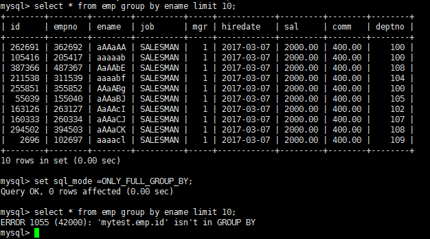

## MySQL架构篇

### Linux下MySQL的安装与使用

#### 查看是否安装过MySQL

- 如果是rpm安装，检查一下`RPM PACKAGE`

```
rpm -qa | grep -i mysql # -i 忽略大小写
```

- 检查mysql service

```
systemctl status mysqld.service
```

#### MySQL的卸载

- 关闭MySQL服务

```
systemctl stop mysqld.service
```

- 查看当前MySQL安装状况

```
rpm -qa | grep -i mysql
```

或

```
yum list installed | grep mysql
```

- 卸载上述命令查询出的已安装程序

```
yum remove mysql-xxx mysql-xxx mysql-xxx mysqk-xxxx
```

务必卸载干净，反复执行 `rpm -qa | grep -i mysql`确认是否有卸载残留。

- 删除MySQL相关文件

查找相关文件

```
find / -name mysql
```

删除上述命令查找出的相关文件 

```
rm -rf xxx
```

- 删除`my.cnf`

```
rm -rf /etc/my.cnf
```

#### MySQL的安装

##### MySQL的4大版本

- MySQL Community Server 社区版本，开源免费，自由下载，但不提供官方技术支持，适用于大多数普通用户。
- MySQL Enterprise Edition 企业版本，需付费，不能在线下载，可以试用30天。提供了更多的功能和更完备的技术支持，更适合于对数据库的功能和可靠性要求较高的企业客户。
- MySQL Cluster 集群版，开源免费。用于架设集群服务器，可将几个MySQL Server封装成一个Server。需要在社区版或企业版的基础上使用。
- MySQL Cluster CGE 高级集群版，需付费

此外，官方还提供了 MySQL Workbench （GUITOOL）一款专为MySQL设计的 ER/数据库建模工具 。它是著名的数据库设计工具DBDesigner4的继任者。MySQLWorkbench又分为两个版本，分别是 社区版（MySQL Workbench OSS）、商用版（MySQL WorkbenchSE）。

##### 下载MySQL指定版本

下载地址：[https://www.mysql.com](https://www.mysql.com/)

- 使用rpm命令安装扩展名为`.rpm`的软件包。
- `.rpm`包的一般格式


下载的tar包，用压缩工具打开


解压后rpm安装包 （红框为抽取出来的安装包）


##### Centos7下检查MySQL依赖

- 检查/tmp临时目录权限（必不可少）

由于mysql安装过程中，会通过mysql用户在/tmp目录下新建tmp_db文件，所以请给/tmp较大的权限。执行 ：

```
chmod -R 777 /tmp
```

- 安装前，检查依赖

`rpm -qa|grep libaio`，如果存在`libaio`包，如下：


`rpm -qa|grep net-tools`，如果存在`net-tools`包如下：

```
rpm -qa | grep net-tools
```


如果不存在，则如下安装：

```
yum search libaio
yum -y install libaio.x86_64 

yum search net-tools
yum -y install net-tools.x86_64

# 如果没有这个，mysql-community-server安装会报错
yum install -y perl-Module-Install.noarch
yum install -y perl
```

##### Centos下MySQL安装过程

- 将安装程序拷贝到`/home/software`目录下

在MySQL的安装文件目录下执行：(必须按照顺序执行)

```
rpm -ivh mysql-community-common-8.0.25-1.el7.x86_64.rpm
rpm -ivh mysql-community-client-plugins-8.0.25-1.el7.x86_64.rpm
rpm -ivh mysql-community-libs-8.0.25-1.el7.x86_64.rpm
rpm -ivh mysql-community-client-8.0.25-1.el7.x86_64.rpm
rpm -ivh mysql-community-server-8.0.25-1.el7.x86_64.rpm
```

注意：如在检查工作时，没有检查mysql依赖环境在安装`mysql-community-server`会报错。

注意：安装libs的时候，出现`mariadb-libs`报错，移除mariadb-libs这个包，即`yum -y remove mariadb-libs`。

- `rpm` 是Redhat Package Manage缩写，通过RPM的管理，用户可以把源代码包装成以rpm为扩展名的文件形式，易于安装。
  - `-i` , --install 安装软件包
  - `-v` , --verbose 提供更多的详细信息输出
  - `-h` , --hash 软件包安装的时候列出哈希标记 (和 -v 一起使用效果更好)，展示进度条


- 查看MySQL版本

执行如下命令，如果成功表示安装mysql成功。类似`java -version`如果打版本等信息

```
mysql --version
```


或

```
mysqladmin --version
```


执行如下命令，查看是否安装成功。需要增加 `-i`不用去区分大小写，否则搜索不到。

```
rpm -qa|grep -i mysql
```


- 服务的初始化

为了保证数据库目录与文件的所有者为 mysql 登录用户，如果你是以 root 身份运行 mysql 服务，需要执行下面的命令初始化：

```
mysqld --initialize --user=mysql
```

说明： `--initialize` 选项默认以"安全"模式来初始化，则会为 root 用户生成一个密码并将`该密码标记为过期` ，登录后你需要设置一个新的密码。生成的 `临时密码` 会往日志中记录一份。

查看密码`cat /var/log/mysqld.log`。


 `root@localhost:`后面就是初始化的密码。

- 启动MySQL，查看状态

```
#加不加.service后缀都可以
启动：systemctl start mysqld.service
关闭：systemctl stop mysqld.service
重启：systemctl restart mysqld.service
查看状态：systemctl status mysqld.service
```


> `mysqld` 这个可执行文件就代表着`MySQL`服务器程序，运行这个可执行文件就可以直接启动一个服务器进程。

查看进程：`ps -ef | grep -i mysql`


- 查看MySQL服务是否自启动

```
systemctl list-unit-files|grep mysqld.service
```


默认是 enabled。如不是enabled可以运行如下命令设置自启动

```
systemctl enable mysqld.service
```

如果希望不进行自启动，运行如下命令设置

```
systemctl disable mysqld.service
```

#### MySQL登录

##### 首次登录

通过 `mysql -hlocalhost -P3306 -uroot -p`进行登录，在Enter password：录入初始化密码


##### 修改密码

因为初始化密码默认是过期的，所以过一段时间查看数据库会报错。

修改密码：`ALTER USER 'root'@'localhost' IDENTIFIED BY '123456';`


##### 设置远程登录

###### 确认网络

在远程机器上使用`ping ip`地址**保证网络畅通**

在远程机器上使用`telnet`命令**保证端口号开放**访问

```
telnet ip地址 端口号
```

拓展：`telnet命令开启`


###### 关闭防火墙或开放端口

- 关闭防火墙

```
# centos6
service iptables stop
# centos7
systemctl start firewalld.service
systemctl status firewalld.service
systemctl stop firewalld.service
#设置开机启用防火墙
systemctl enable firewalld.service
#设置开机禁用防火墙
systemctl disable firewalld.service
```

- 开放端口

```
# 查看开放的端口号
firewall-cmd --list-all
# 设置开放的端口号
firewall-cmd --add-service=http --permanent
firewall-cmd --add-port=3306/tcp --permanent
# 重启防火墙
firewall-cmd --reload
```

###### Linux下修改配置

在Linux系统MySQL下测试：


可以看到root用户的当前主机配置信息为localhost。

**修改host为通配符%**

host列指定了允许用户登录所使用的IP，比如user=root host=192.168.1.1。这里的意思就是说root用户只能通过192.168.1.1的客户端去访问。 user=root host=localhost，表示只能通过本机客户端去访问。而 % 是个 通配符 ，如果host=192.168.1.%，那么就表示只要是IP地址前缀为"192.168.1."的客户端都可以连接。如果 host=% ，表示所有IP都有连接权限。

注意：在生产环境下不能为了省事将host设置为%，这样做会存在安全问题，具体的设置可以根据生产环境的IP进行设置。

```
update user set host = '%' where user ='root';
```

host设置了`%`后便可以允许远程访问。


host修改完成后记得执行`flush privileges`使配置立即生效：

```
flush privileges;
```

###### 测试


#### 字符集的相关操作

##### 修改MySQL5.7字符集

###### 修改步骤

在MySQL 8.0版本之前，默认字符集为latin1，utf8字符集指向的是utf8mb3 。网站开发人员在数据库设计的时候往往会将编码修改为utf8字符集。如果遗忘修改默认的编码，就会出现乱码的问题。从MySQL8.0开始，数据库的默认编码将改为utf8mb4 ，从而避免上述乱码的问题。

**操作1：查看默认使用的字符集**。

```
show variables like 'character%';
# 或者
show variables like '%char%';
```

**操作2：修改字符集**

```
vim /etc/my.cnf
```

在MySQL5.7或之前的版本中，在文件最后加上中文字符集配置：

```
character_set_server=utf8
```

**操作3：重新启动MySQL服务**

```
systemctl restart mysqld
```

但是原库、原表的设定不会发生变化，参数修改只对新建的数据库生效。

###### 已有库&表字符集的变更

MySQL5.7版本中，以前创建的库，创建的表字符集还是`latin1`。

修改已创建数据库的字符集

```
alter database dbtest1 character set 'utf8';
```

修改已创建数据表的字符集

```
alter table t_emp convert to character set 'utf8';
```

注意：但是原有的数据如果是用非`utf8`编码的话，数据本身编码不会发生改变。已有数据需要导出或删除，然后重新插入。

##### 各级别的字符集

###### 字符集级别

MySQL有4个级别的字符集和比较规则，分别是：

- 服务器级别
- 数据库级别
- 表级别
- 列级别

执行如下SQL语句：

```
show variables like 'character%';
```


- character_set_server：服务器级别的字符集
- character_set_database：当前数据库的字符集
- character_set_client：服务器解码请求时使用的字符集
- character_set_connection：服务器处理请求时会把请求字符串从character_set_client转为character_set_connection
- character_set_results：服务器向客户端返回数据时使用的字符集

###### 服务器级别

`character_set_server`：服务器级别的字符集。

可以在启动服务器程序时通过启动选项或者在服务器程序运行过程中使用 `SET` 语句修改这两个变量的值。比如我们可以在配置文件中这样写：

```
[server]
character_set_server=utf8  # 默认字符集
collation_server=utf8  #对应的默认的比较规则
```

###### 数据库级别

`character_set_database` ：当前数据库的字符集

在创建和修改数据库的时候可以指定该数据库的字符集和比较规则，具体语法如下：

```
CREATE DATABASE 数据库名
 [[DEFAULT] CHARACTER SET 字符集名称]
 [[DEFAULT] COLLATE 比较规则名称];

ALTER DATABASE 数据库名
 [[DEFAULT] CHARACTER SET 字符集名称]
 [[DEFAULT] COLLATE 比较规则名称];
```

###### 表级别

也可以在创建和修改表的时候指定表的字符集和比较规则，语法如下：

```
CREATE TABLE 表名 (列的信息)
 [[DEFAULT] CHARACTER SET 字符集名称]
 [COLLATE 比较规则名称]]

ALTER TABLE 表名
 [[DEFAULT] CHARACTER SET 字符集名称]
 [COLLATE 比较规则名称]
```

**如果创建和修改表的语句中没有指明字符集和比较规则，将使用该表所在数据库的字符集和比较规则作为该表的字符集和比较规则。**

###### 列级别

对于存储字符串的列，同一个表中的不同的列也可以有不同的字符集和比较规则。在创建和修改列定义的时候可以指定该列的字符集和比较规则，语法如下：

```
CREATE TABLE 表名(
 列名 字符串类型 [CHARACTER SET 字符集名称] [COLLATE 比较规则名称],
 其他列...
);

ALTER TABLE 表名 MODIFY 列名 字符串类型 [CHARACTER SET 字符集名称] [COLLATE 比较规则名称];
```

**对于某个列来说，如果在创建和修改的语句中没有指明字符集和比较规则，将使用该列所在表的字符集和比较规则作为该列的字符集和比较规则。**

> 提示：在转换列的字符集时需要注意，如果转换前列中存储的数据不能用转换后的字符集进行表示会发生错误。比方说原先列使用的字符集是utf8，列中存储了一些汉字，现在把列的字符集转换为ascii的话就会出错，因为ascii字符集并不能表示汉字字符。

###### 小结

我们介绍的这4个级别字符集和比较规则的联系如下：

- 如果创建或修改列时没有显式的指定字符集和比较规则，则该列默认用表的字符集和比较规则
- 如果创建表时没有显式的指定字符集和比较规则，则该表默认用数据库的字符集和比较规则
- 如果创建数据库时没有显式的指定字符集和比较规则，则该数据库默认用服务器的字符集和比较规则

知道了这些规则之后，对于给定的表，我们应该知道它的各个列的字符集和比较规则是什么，从而根据这个列的类型来确定存储数据时每个列的实际数据占用的存储空间大小了。比方说我们向表t中插入一条记录：

```
mysql> INSERT INTO t(col) VALUES('我们');
Query OK, 1 row affected (0.00 sec)
mysql> SELECT * FROM t;
+--------+
| s   |
+--------+
| 我们  |
+--------+
1 row in set (0.00 sec)
```

首先列`col`使用的字符集是`gbk`，一个字符 `我`在`gbk` 中的编码为`0xCED2` ，占用两个字节，两个字符的实际数据就占用4个字节。如果把该列的字符集修改为`utf8` 的话，这两个字符就实际占用6个字节。

##### 字符集与比较规则（了解）

###### utf8 与 utf8mb4

`utf8` 字符集表示一个字符需要使用1～4个字节，但是我们常用的一些字符使用1～3个字节就可以表示了。而字符集表示一个字符所用的最大字节长度，在某些方面会影响系统的存储和性能，所以设计MySQL的设计者偷偷的定义了两个概念：

- `utf8mb3`：阉割过的 `utf8` 字符集，只使用1～3个字节表示字符。
- `utf8mb4`：正宗的`utf8`字符集，使用1～4个字节表示字符。

###### 比较规则

上表中，MySQL版本一共支持41种字符集，其中的 Default collation 列表示这种字符集中一种默认的比较规则，里面包含着该比较规则主要作用于哪种语言，比如utf8_polish_ci 表示以波兰语的规则比较， utf8_spanish_ci 是以西班牙语的规则比较， utf8_general_ci 是一种通用的比较规则。

后缀表示该比较规则是否区分语言中的重音、大小写。具体如下：

| 后缀 | 英文释义           | 描述             |
| ---- | ------------------ | ---------------- |
| _ai  | accent insensitive | 不区分重音       |
| _as  | accent sensitive   | 区分重音         |
| _ci  | case insensitive   | 不区分大小写     |
| _cs  | case sensitive     | 区分大小写       |
| _bin | binary             | 以二进制方式比较 |

最后一列 `Maxlen`，它代表该种字符集表示一个字符最多需要几个字节。

**常用操作1**：

```
#查看GBK字符集的比较规则
SHOW COLLATION LIKE 'gbk%';

#查看UTF-8字符集的比较规则
SHOW COLLATION LIKE 'utf8%';
```

**常用操作2**：

```
#查看服务器的字符集和比较规则
SHOW VARIABLES LIKE '%_server';

#查看数据库的字符集和比较规则
SHOW VARIABLES LIKE '%_database';

#查看具体数据库的字符集
SHOW CREATE DATABASE dbtest1;

#修改具体数据库的字符集
ALTER DATABASE dbtest1 DEFAULT CHARACTER SET 'utf8' COLLATE 'utf8_general_ci';
```

**常用操作3**：

```
#查看表的字符集
show create table employees;

#查看表的比较规则
show table status from atguigudb like 'employees';

#修改表的字符集和比较规则
ALTER TABLE emp1 DEFAULT CHARACTER SET 'utf8' COLLATE 'utf8_general_ci';
```

##### 请求到响应过程中字符集的变化

| 系统变量                   | 描述                                                         |
| -------------------------- | ------------------------------------------------------------ |
| `character_set_client`     | 服务器解码请求时使用的字符集                                 |
| `character_set_connection` | 服务器处理请求时会把请求字符串从`character_set_client`转为 `character_set_connection` |
| `character_set_results`    | 服务器向客户端返回数据时使用的字符集                         |


> 提示如果某个列使用的字符集和character_set_connection代表的字符集不一致的话，还需要进行一次字符集转换。

开发中通常把 character_set_client 、 character_set_connection、character_set_results这三个系统变量设置成和客户端使用的字符集一致的情况，这样减少了很多无谓的字符集转换。为了方便我们设置，MySQL提供了一条非常简便的语句:

```
SET NAMES字符集名;
```

这—条语句产生的效果和我们执行这3条的效果是一样的:

```
set character_set_client = 字符集名;
set character_set_connection = 字符集名;
set character_set_results = 字符集名;
```

比方说客户端使用的是utf8字符集，所以需要把这几个系统变量的值都设置为utf8：

```
SET NAMES utf8;
```

另外，如果你想在启动客户端的时候就把`character_set_client`、`character_set_connection` 、`character_set_results`这三个系统变量的值设置成一样的，那我们可以在启动客户端的时候指定一个叫`default-character-set`的启动选项，比如在配置文件里可以这么写:

```
[client]
default-character-set=utf8
```

它起到的效果和执行一遍`SET NAMES utf8`是一样一样的，都会将那三个系统变量的值设置成utf8。

#### SQL大小写规范

##### Windows和Linux平台区别

在 SQL 中，关键字和函数名是不用区分字母大小写的，比如 SELECT、WHERE、ORDER、GROUP BY 等关键字，以及 ABS、MOD、ROUND、MAX 等函数名。 不过在 SQL 中，你还是要确定大小写的规范，因为在 Linux 和 Windows 环境下，你可能会遇到不同的大小写问题。 **windows系统默认大小写不敏感** ，但是 linux系统是大小写敏感的。

通过如下命令查看：

```
SHOW VARIABLES LIKE '%lower_case_table_names%'
```

- Linux系统


- Windows系统


- `lower_case_table_names`参数值的设置：
  - **默认为0，大小写敏感** 。
  - 设置1，大小写不敏感。创建的表，数据库都是以小写形式存放在磁盘上，对于sql语句都是转换为小写对表和数据库进行查找。
  - 设置2，创建的表和数据库依据语句上格式存放，凡是查找都是转换为小写进行。
- 两个平台上SQL大小写的区别具体来说：

MySQL在Linux下数据库名、表名、列名、别名大小写规则是这样的：

1、数据库名、表名、表的别名、变量名是严格区分大小写的； 2、关键字、函数名称在 SQL 中不区分大小写； 3、列名（或字段名）与列的别名（或字段别名）在所有的情况下均是忽略大小写的；

MySQL在Windows的环境下全部不区分大小写。

##### Linux下大小写规则设置

当想设置为大小写不敏感时，要在 my.cnf这个配置文件 [mysqld] 中加入 `lower_case_table_names=1`，然后重启服务器。

但是要在重启数据库实例之前就需要将原来的数据库和表转换为小写，否则将找不到数据库名。

此参数适用于MySQL5.7。在MySQL 8下禁止在重新启动 MySQL 服务时将 `lower_case_table_names` 设置成不同于初始化 MySQL 服务时设置的 `lower_case_table_names` 值。如果非要将MySQL8设置为大小写不敏感，具体步骤为：

1. 停止MySQL服务
2. 删除数据目录，即删除`/var/lib/mysql` 目录
3. 在MySQL配置文件（ `/etc/my.cnf` ）中添加 `lower_case_table_names=1`
4. 启动MySQL服务

##### SQL编写建议

如果你的变量名命名规范没有统一，就可能产生错误。这里有一个有关命名规范的建议：

> 1. 关键字和函数名称全部大写；
> 2. 数据库名、表名、表别名、字段名、字段别名等全部小写；
> 3. SQL 语句必须以分号结尾。

数据库名、表名和字段名在 Linux MySQL 环境下是区分大小写的，因此建议你统一这些字段的命名规则，比如全部采用小写的方式。

虽然关键字和函数名称在 SQL 中不区分大小写，也就是如果小写的话同样可以执行。但是同时将关键词和函数名称全部大写，以便于区分数据库名、表名、字段名。

#### sql_mode的合理设置

##### 宽松模式 vs 严格模式

###### 宽松模式

**宽松模式**：如果设置的是宽松模式，那么我们在插入数据的时候，即便是给了一个错误的数据，也可能会被接受，并且不报错。

**举例**：我在创建一个表时，该表中有一个字段为name，给name设置的字段类型时char(10) ，如果我在插入数据的时候，其中name这个字段对应的有一条数据的长度超过了10，例如`1234567890abc`，超过了设定的字段长度10，那么不会报错，并且取前10个字符存上，也就是说你这个数据被存为了`1234567890`，而`abc`就没有了。但是，我们给的这条数据是错误的，因为超过了字段长度，但是并没有报错，并且mysql自行处理并接受了，这就是宽松模式的效果。

**应用场景** ：通过设置sql mode为宽松模式，来保证大多数sql符合标准的sql语法，这样应用在不同数据库之间进行迁移时，则不需要对业务sql进行较大的修改。

###### 严格模式

**严格模式**：出现上面宽松模式的错误，应该报错才对，所以MySQL5.7版本就将sql_mode默认值改为了严格模式。所以在生产等环境中，我们必须采用的是严格模式，进而 开发、测试环境的数据库也必须要设置，这样在开发测试阶段就可以发现问题。并且我们即便是用的MySQL5.6，也应该自行将其改为严格模式。

**开发经验** ：MySQL等数据库总想把关于数据的所有操作都自己包揽下来，包括数据的校验，其实开发中，我们应该在自己 开发的项目程序级别将这些校验给做了 ，虽然写项目的时候麻烦了一些步骤，但是这样做之后，我们在进行数据库迁移或者在项目的迁移时，就会方便很多。

**改为严格模式后可能会存在的问题**：若设置模式中包含了 `NO_ZERO_DATE` ，那么MySQL数据库不允许插入零日期，插入零日期会抛出错误而不是警告。

例如，表中含字段TIMESTAMP列（如果未声明为NULL或显示DEFAULT子句）将自动分配DEFAULT `0000-00-00 00:00:00`（零时间戳），这显然是不满足sql_mode中的``NO_ZERO_DATE`而报错。

##### 宽松模式再举例

**宽松模式举例1**：

```
select * from employees group by department_id limit 10;

set sql_mode = ONLY_FULL_GROUP_BY;

select * from employees group by department_id limit 10;
```



**宽松模式举例2**：


设置 sql_mode 模式为 `STRICT_TRANS_TABLES`，然后插入数据：


##### 模式查看和设置

- 查看当前的sql_mode

```
select @@session.sql_mode;

select @@global.sql_mode;

#或者
show variables like 'sql_mode';
```


- 临时设置方式：设置当前窗口中设置sql_mode

```
SET GLOBAL sql_mode = 'modes...'; #全局

SET SESSION sql_mode = 'modes...'; #当前会话
```

**举例**：

```
#改为严格模式。此方法只在当前会话中生效，关闭当前会话就不生效了。
set SESSION sql_mode='STRICT_TRANS_TABLES'; 

#改为严格模式。此方法在当前服务中生效，重启MySQL服务后失效。
set GLOBAL sql_mode='STRICT_TRANS_TABLES'; 
```

- 永久设置方式：在`/etc/my.cnf`中配置sql_mode

在`my.cnf`文件(windows系统是`my.ini`文件)，新增：

```
[mysqld]
sql_mode=ONLY_FULL_GROUP_BY,STRICT_TRANS_TABLES,NO_ZERO_IN_DATE,NO_ZERO_DATE,ERROR_FOR_DIVISION_BY_ZERO,NO_ENGINE_SUBSTITUTION
```

然后重启MySQL。

当然生产环境上是禁止重启MySQL服务的，所以采用**临时设置方式 + 永久设置方式**来解决线上的问题，那么即便是有一天真的重启了MySQL服务，也会永久生效了。

##### sql_mode常用值

| sql_mode常用值             | 含义                                                         |
| -------------------------- | ------------------------------------------------------------ |
| ONLY_FULL_GROUP_BY         | 对于GROUP BY聚合操作，如果在SELECT中的列，没有在GROUP BY中出现，那么这个SQL是不合法的，因为列不在GROUP BY从句中 |
| NO_AUTO_VALUE_ON_ZERO      | 该值影响自增长列的插入。默认设置下，插入0或NULL代表生成下一个自增长值。如果用户 希望插入的值为0，而该列又是自增长的，那么这个选项就有用了。 |
| STRICT_TRANS_TABLES        | 在该模式下，如果一个值不能插入到一个事务表中，则中断当前的操作，对非事务表不做限制 |
| NO_ZERO_IN_DATE            | 在严格模式下，不允许日期和月份为零                           |
| NO_ZERO_DATE               | 设置该值,mysql数据库不允许插入零日期，插入零日期会抛出错误而不是警告。 |
| ERROR_FOR_DIVISION_BY_ZERO | 在INSERT或UPDATE过程中，如果数据被零除，则产生错误而非警告。如果未给出该模式，那么数据被零除时MySQL返回NULL |
| NO_AUTO_CREATE_USER        | 禁止GRANT创建密码为空的用户                                  |
| NO_ENGINE_SUBSTITUTION     | 如果需要的存储引擎被禁用或未编译,那么抛出错误。不设置此值时，用默认的存储引擎替代,并抛出一个异常 |
| PIPES_AS_CONCAT            | 将`||`视为字符串的连接操作符而非或运算符，这和Oracle数据库是一样的，也和字符串的拼接函数Concat相类似 |
| ANSI_QUOTES                | 启用ANSI_QUOTES后，不能用双引号来引用字符串,因为它被解释为识别符 |
| ORACLE的sql_mode设置等同   | PIPES_AS_CONCAT、ANSI_QUOTES、IGNORE_SPACE、NO_KEY_OPTIONS、NO_TABLE_OPTIONS、NO_FIELD_OPTIONS、NO_AUTO_CREATE_USER |

### MySQL的数据目录

#### MySQL8的主要目录结构

##### 查询mysql安装位置

```
find / -name mysql
```

安装好MySQL 8之后，查看如下的目录结构：


##### 数据库文件的存放路径

MySQL数据库文件的存放路径：`/var/lib/mysql/`

```
show variables like 'datadir';
```


从结果中可以看出，在计算机上MySQL的数据目录就是 `/var/lib/mysql/` 。

##### 相关命令目录

相关命令目录：`/usr/bin`（mysqladmin、mysqlbinlog、mysqldump等命令）和`/usr/sbin`。


##### 配置文件目录

配置文件目录：`/usr/share/mysql-8.0`（命令及配置文件），`/etc/mysql`（如`my.cnf`）


#### 数据库和文件系统的关系

##### 查看默认数据库

查看一下在计算机上当前有哪些数据库：

```
SHOW DATABASES;
```


可以看到有4个数据库是属于MySQL自带的系统数据库。

- `mysql`：MySQL 系统自带的核心数据库，它存储了MySQL的用户账户和权限信息，一些存储过程、事件的定 义信息，一些运行过程中产生的日志信息，一些帮助信息以及时区信息等。
- `information_schema`：MySQL 系统自带的数据库，这个数据库保存着MySQL服务器 维护的所有其他数据库的信息 ，比如有哪些表、哪些视图、哪些触发器、哪些列、哪些索引。这些信息并不是真实的用户数据，而是一些描述性信息，有时候也称之为 元数据 。

```
mysql> USE information_schema;
Database changed

mysql> SHOW TABLES LIKE 'innodb%';
```

- `performance_schema`：MySQL系统自带的数据库，这个数据库里主要保存MySQL服务器运行过程中的一些状态信息，可以用来监控 MySQL 服务的各类性能指标。包括统计最近执行了哪些语句，在执行过程的每个阶段都花费了多长时间，内存的使用情况等信息。
- `sys`：MySQL 系统自带的数据库，这个数据库主要是通过**视图**的形式把 `information_schema` 和`performance_schema` 结合起来，帮助系统管理员和开发人员监控 MySQL 的技术性能。

##### 数据库在文件系统中的表示

看一下计算机上的数据目录下的内容：

```
[root@achang mysql]# cd /var/lib/mysql
[root@achang mysql]# ll
总用量 189980
-rw-r-----. 1 mysql mysql    56 7月  28 00:27 auto.cnf
-rw-r-----. 1 mysql mysql    179 7月  28 00:27 binlog.000001
-rw-r-----. 1 mysql mysql    820 7月  28 01:00 binlog.000002
-rw-r-----. 1 mysql mysql    179 7月  29 14:08 binlog.000003
-rw-r-----. 1 mysql mysql    582 7月  29 16:47 binlog.000004
-rw-r-----. 1 mysql mysql    179 7月  29 16:51 binlog.000005
-rw-r-----. 1 mysql mysql    179 7月  29 16:56 binlog.000006
-rw-r-----. 1 mysql mysql    179 7月  29 17:37 binlog.000007
-rw-r-----. 1 mysql mysql   24555 7月  30 00:28 binlog.000008
-rw-r-----. 1 mysql mysql    179 8月  1 11:57 binlog.000009
-rw-r-----. 1 mysql mysql    156 8月  1 23:21 binlog.000010
-rw-r-----. 1 mysql mysql    156 8月  2 09:25 binlog.000011
-rw-r-----. 1 mysql mysql   1469 8月  4 01:40 binlog.000012
-rw-r-----. 1 mysql mysql    156 8月  6 00:24 binlog.000013
-rw-r-----. 1 mysql mysql    179 8月  6 08:43 binlog.000014
-rw-r-----. 1 mysql mysql    156 8月  6 10:56 binlog.000015
-rw-r-----. 1 mysql mysql    240 8月  6 10:56 binlog.index
-rw-------. 1 mysql mysql   1676 7月  28 00:27 ca-key.pem
-rw-r--r--. 1 mysql mysql   1112 7月  28 00:27 ca.pem
-rw-r--r--. 1 mysql mysql   1112 7月  28 00:27 client-cert.pem
-rw-------. 1 mysql mysql   1676 7月  28 00:27 client-key.pem
drwxr-x---. 2 mysql mysql   4096 7月  29 16:34 dbtest
-rw-r-----. 1 mysql mysql  196608 8月  6 10:58 #ib_16384_0.dblwr
-rw-r-----. 1 mysql mysql  8585216 7月  28 00:27 #ib_16384_1.dblwr
-rw-r-----. 1 mysql mysql   3486 8月  6 08:43 ib_buffer_pool
-rw-r-----. 1 mysql mysql 12582912 8月  6 10:56 ibdata1
-rw-r-----. 1 mysql mysql 50331648 8月  6 10:58 ib_logfile0
-rw-r-----. 1 mysql mysql 50331648 7月  28 00:27 ib_logfile1
-rw-r-----. 1 mysql mysql 12582912 8月  6 10:56 ibtmp1
drwxr-x---. 2 mysql mysql   4096 8月  6 10:56 #innodb_temp
drwxr-x---. 2 mysql mysql   4096 7月  28 00:27 mysql
-rw-r-----. 1 mysql mysql 26214400 8月  6 10:56 mysql.ibd
srwxrwxrwx. 1 mysql mysql     0 8月  6 10:56 mysql.sock
-rw-------. 1 mysql mysql     5 8月  6 10:56 mysql.sock.lock
drwxr-x---. 2 mysql mysql   4096 7月  28 00:27 performance_schema
-rw-------. 1 mysql mysql   1680 7月  28 00:27 private_key.pem
-rw-r--r--. 1 mysql mysql    452 7月  28 00:27 public_key.pem
-rw-r--r--. 1 mysql mysql   1112 7月  28 00:27 server-cert.pem
-rw-------. 1 mysql mysql   1680 7月  28 00:27 server-key.pem
drwxr-x---. 2 mysql mysql   4096 7月  28 00:27 sys
drwxr-x---. 2 mysql mysql   4096 7月  29 23:10 temp
-rw-r-----. 1 mysql mysql 16777216 8月  6 10:58 undo_001
-rw-r-----. 1 mysql mysql 16777216 8月  6 10:58 undo_002
```

这个数据目录下的文件和子目录比较多，除了 `information_schema` 这个系统数据库外，其他的数据库在**数据目录**下都有对应的子目录。

以 `temp`数据库为例，在MySQL5.7 中打开：

```
[root@achang mysql]# cd ./temp
[root@achang temp]# ll
总用量 1144
-rw-r-----. 1 mysql mysql  8658 8月  18 11:32 countries.frm
-rw-r-----. 1 mysql mysql 114688 8月  18 11:32 countries.ibd
-rw-r-----. 1 mysql mysql   61 8月  18 11:32 db.opt
-rw-r-----. 1 mysql mysql  8716 8月  18 11:32 departments.frm
-rw-r-----. 1 mysql mysql 147456 8月  18 11:32 departments.ibd
-rw-r-----. 1 mysql mysql  3017 8月  18 11:32 emp_details_view.frm
-rw-r-----. 1 mysql mysql  8982 8月  18 11:32 employees.frm
-rw-r-----. 1 mysql mysql 180224 8月  18 11:32 employees.ibd
-rw-r-----. 1 mysql mysql  8660 8月  18 11:32 job_grades.frm
-rw-r-----. 1 mysql mysql  98304 8月  18 11:32 job_grades.ibd
-rw-r-----. 1 mysql mysql  8736 8月  18 11:32 job_history.frm
-rw-r-----. 1 mysql mysql 147456 8月  18 11:32 job_history.ibd
-rw-r-----. 1 mysql mysql  8688 8月  18 11:32 jobs.frm
-rw-r-----. 1 mysql mysql 114688 8月  18 11:32 jobs.ibd
-rw-r-----. 1 mysql mysql  8790 8月  18 11:32 locations.frm
-rw-r-----. 1 mysql mysql 131072 8月  18 11:32 locations.ibd
-rw-r-----. 1 mysql mysql  8614 8月  18 11:32 regions.frm
-rw-r-----. 1 mysql mysql 114688 8月  18 11:32 regions.ibd
```

在MySQL8.0中打开：

```
[root@atguigu01 mysql]# cd ./temp
[root@atguigu01 temp]# ll
总用量 1080
-rw-r-----. 1 mysql mysql 131072 7月  29 23:10 countries.ibd
-rw-r-----. 1 mysql mysql 163840 7月  29 23:10 departments.ibd
-rw-r-----. 1 mysql mysql 196608 7月  29 23:10 employees.ibd
-rw-r-----. 1 mysql mysql 114688 7月  29 23:10 job_grades.ibd
-rw-r-----. 1 mysql mysql 163840 7月  29 23:10 job_history.ibd
-rw-r-----. 1 mysql mysql 131072 7月  29 23:10 jobs.ibd
-rw-r-----. 1 mysql mysql 147456 7月  29 23:10 locations.ibd
-rw-r-----. 1 mysql mysql 131072 7月  29 23:10 regions.ibd
```

##### 表在文件系统中的表示

###### InnoDB存储引擎模式

- 表结构

为了保存表结构，**InnoDB**在 **数据目录**下对应的数据库子目录下创建了一个专门用于 描述表结构的文 件 ，文件名是这样：`表名.frm`

比方说在`atguigu`数据库下创建一个名为 `test` 的表：

```
mysql> USE atguigu;
Database changed
mysql> CREATE TABLE test (
 ->   c1 INT
 -> );
Query OK, 0 rows affected (0.03 sec)
```

那在数据库 `atguigu` 对应的子目录下就会创建一个名为`test.frm`的用于描述表结构的文件。`.frm`文件的格式在不同的平台上都是相同的。这个后缀名为`.frm`是以**二进制格式**存储的，直接打开是乱码的。

- 系统表空间（system tablespace）

默认情况下，InnoDB会在数据目录下创建一个名为`ibdata1` 、大小为 12M 的文件，这个文件就是对应的系统表空间在文件系统上的表示。怎么才12M？注意这个文件是自扩展文件 ，当不够用的时候它会自己增加文件大小。

当然，如果你想让系统表空间对应文件系统上多个实际文件，或者仅仅觉得原来的`ibdata1`这个文件名难听，那可以在MySQL启动时配置对应的文件路径以及它们的大小，比如我们这样修改一下`my.cnf`配置文件：

```
[server]
innodb_data_file_path=data1:512M;data2:512M:autoextend
```

- 独立表空间(file-per-table tablespace)

在MySQL5.6.6以及之后的版本中，InnoDB并不会默认的把各个表的数据存储到系统表空间中，而是为 每一个表建立一个独立表空间 ，也就是说我们创建了多少个表，就有多少个独立表空间。使用 独立表空间 来存储表数据的话，会在该表所属数据库对应的子目录下创建一个表示该独立表空间的文件，文件名和表名相同，只不过添加了一个`.ibd`的扩展名而已，所以完整的文件名称长这样：`表名.ibd`

比如：使用了 独立表空间去存储 `atguigu` 数据库下的`test`表的话，那么在该表所在数据库对应 的`atguigu`目录下会为`test`表创建这两个文件：

```
test.frm
test.ibd
```

其中`test.ibd`文件就用来存储`test`表中的数据和索引。

- 系统表空间与独立表空间的设置

可以自己指定使用 系统表空间 还是**独立表空间**来存储数据，这个功能由启动参数`innodb_file_per_table` 控制，比如说我们想刻意将表数据都存储到**系统表空间**时，可以在启动 MySQL服务器的时候这样配置：

```
[server]
innodb_file_per_table=0 # 0：代表使用系统表空间； 1：代表使用独立表空间
```

默认情况：

```
mysql> show variables like 'innodb_file_per_table';
+-----------------------+-------+
| Variable_name     | Value |
+-----------------------+-------+
| innodb_file_per_table | ON  |
+-----------------------+-------+
1 row in set (0.01 sec)
```

- 其他类型的表空间

随着MySQL的发展，除了上述两种老牌表空间之外，现在还新提出了一些不同类型的表空间，比如通用表空间（general tablespace）、临时表空间（temporary tablespace）等。

###### 疑问

`.frm`在MySQL8中不存在了。那去哪里了呢?

这就需要解析ibd文件。Oracle官方将frm文件的信息及更多信息移动到叫做序列化字典信息(Serialized DictionaryInformation，SDI)，SDI被写在ibd文件内部。MySQL 8.0属于Oracle旗下，同理。

为了从IBD文件中提取SDI信息，Oracle提供了一个应用程序ibd2sdi。

这个工具不需要下载，MySQL8自带的有，只要配好环境变量就能到处用。

（1）查看表结构

到存储ibd的目录下，执行下面的命令

```
ibd2sdi --dump-file=user.txt user.ibd
```

结果如图所示：


###### MyISAM存储引擎模式

- 表结构：在存储表结构方面，MyISAM 和InnoDB 一样，也是在数据目录 下对应的数据库子目录下创建了一个专门用于描述表结构的文件：表名.frm
- 表中数据和索引：在MyISAM中的索引全部都是**二级索引** ，该存储引擎的**数据和索引是分开存放**的。所以在文件系统中也是使用不同的文件来存储数据文件和索引文件，同时表数据都存放在对应的数据库子目录下。假如test表使用MyISAM存储引擎的话，那么在它所在数据库对应的`atguigu`目录下会为`test`表创建这三个文件：

```
test.frm -- 存储表结构
test.MYD -- 存储数据 (MYData)
test.MYI -- 存储索引 (MYIndex)
```

举例：创建一个 `MyISAM` 表，使用`ENGINE` 选项显式指定引擎。因为`InnoDB` 是默认引擎。

```
CREATE TABLE `student_myisam` (
 `id` bigint NOT NULL AUTO_INCREMENT,
 `name` varchar(64) DEFAULT NULL,
 `age` int DEFAULT NULL,
 `sex` varchar(2) DEFAULT NULL,
 PRIMARY KEY (`id`)
)ENGINE=MYISAM AUTO_INCREMENT=0 DEFAULT CHARSET=utf8mb3;
```


##### 小结

对`test`库目录中文件说明如下：

- **db.opt**

用来保存数据库的配置信息，如该数据库默认字符集编码和字符集排序规则。如果创建数据库时指定了字符集和排序规则，后续创建的表没有指定字符集和排序规则，那么该表将采用db.opt文件中指定的属性。

对于InnoDB表，如果是独立的表空间，数据库中的表结构以及数据都存储在数据库的路径下（而不是共享表空间ibdata1文件中）。但是数据中的其他对象，包括数据被修改之后，事务提交之间的版本信息，仍然存储在共享表空间的ibdata1文件中。

举例： 数据库a ，表b 。如果表b采用 InnoDB ，`data\a`中会产生1个或者2个文件：

`b.frm` ：描述表结构文件，字段长度等

如果采用 系统表空间 模式的，数据信息和索引信息都存储在ibdata1中

如果采用 独立表空间 存储模式，`data\a`中还会产生`b.ibd` 文件（存储数据信息和索引信息）

- **.frm**

在MySQL中建立的任何一张数据表，其对应的数据库目录下都会有该表的`.frm`文件。`.frm`文件用来保存每个数据表的元数据（meta）和表结构等信息，数据库崩溃时，可以用`.frm`文件恢复表结构。

`.frm`文件跟存储引擎无关，任何存储引擎的数据表都有`.frm`文件，命名方式为`表名.frm`。

MySQL 8.0 版本开始，frm 文件被取消，MySQL 把文件中的数据都写到了系统表空间。通过利用 InnoDB 存储引擎来实现表 DDL 语句操作的原子性（在之前版本中是无法实现表 DDL 语句操作的原子性的，如 TRUNCATE 无法回滚）。

- **.ibd(ib-file set)**

对于InnoDB存储引擎的数据表，一个表对应两个文件：一个是`*.frm`存储表结构信息；一个是`*.ibd`存储表中数据。

- **.ibd和.ibdata**

`.ibd`和`.ibdata`都是专属于InnoDB存储引擎的数据文件。

当采用共享表空间时，所有InnoDB表的数据均存放在`.ibdata`中。所以当表越来越多时，这个文件会变得很大；相对应的`.ibd`就是采用独享表空间时InnoDB表的数据文件。

当然，开启了独享表空间，ibdata文件也会越来越大，因为这个文件里还存储了：

变更缓冲区、双写缓冲区、撤销日志

- **MYD 和 .MYI(这里提一下MyISAM引擎)**
  - `.frm`与`.sdi` 同样保存每个数据表的元数据（meta）和表结构等信息；
  - `.MYD`理解为MyData，用于存放MyISAM表的数据；
  - `.MYI`理解为MyIndex，主要存放MyISAM表的索引及相关信息。

### 用户与权限管理

#### 用户管理

##### 登录MySQL服务器

启动MySQL服务后，可以通过mysql命令来登录MySQL服务器，命令如下：

```
mysql –h hostname|hostIP –P port –u username –p DatabaseName –e "SQL语句"
```

下面详细介绍命令中的参数：

- `-h`参数 后面接主机名或者主机IP，hostname为主机，hostIP为主机IP。
- `-P`参数 后面接MySQL服务的端口，通过该参数连接到指定的端口。MySQL服务的默认端口是3306，不使用该参数时自动连接到3306端口，port为连接的端口号。
- `-u`参数 后面接用户名，username为用户名。
- `-p`参数 会提示输入密码。
- `DatabaseName`参数 指明登录到哪一个数据库中。如果没有该参数，就会直接登录到MySQL数据库中，然后可以使用USE命令来选择数据库。
- `-e`参数 后面可以直接加SQL语句。登录MySQL服务器以后即可执行这个SQL语句，然后退出MySQL服务器

##### 创建用户

CREATE USER语句的基本语法形式如下：

```
CREATE USER 用户名 [IDENTIFIED BY '密码'][,用户名 [IDENTIFIED BY '密码']];
```

- 用户名参数表示新建用户的账户，由 **用户（User） 和 主机名（Host）** 构成；
- `[]`表示可选，也就是说，可以指定用户登录时需要密码验证，也可以不指定密码验证，这样用户可以直接登录。不过，不指定密码的方式不安全，不推荐使用。如果指定密码值，这里需要使用IDENTIFIED BY指定明文密码值。
- CREATE USER语句可以同时创建多个用户。

举例：

```
CREATE USER yaodao IDENTIFIED BY '123456'; # 默认host是 %
CREATE USER 'hutao'@'localhost' IDENTIFIED BY '123456'; # 默认host是 %
```

##### 修改用户

```
UPDATE mysql.user SET USER='hutao2' WHERE USER='hutao';

FLUSH PRIVILEGES;
```

##### 删除用户

###### 方式1：使用DROP方式删除（推荐）

使用DROP USER语句来删除用户时，必须用于DROP USER权限。DROP USER语句的基本语法形式如下：

```
DROP USER user[,user]…;
```

举例：

```
DROP USER yaodao ;  # 默认删除host为%的用户
DROP USER 'hutao2'@'localhost';
```

###### 方式2：使用DELETE方式删除

```
DELETE FROM mysql.user WHERE Host='hostname' AND User='username';
```

执行完DELETE命令后要使用FLUSH命令来使用户生效，命令如下：

```
FLUSH PRIVILEGES;
```

> 注意：**不推荐**通过`DELETE FROM USER u WHERE USER='hutao'` 进行删除，系统会有残留信息保留。而drop user命令会删除用户以及对应的权限，执行命令后你会发现mysql.user表和mysql.db表的相应记录都消失了。

##### 设置当前用户密码

**旧的写法**如下 ：

```
# 修改当前用户的密码：（MySQL5.7测试有效）
SET PASSWORD = PASSWORD('123456');
```

这里介绍**推荐的写法**：

**使用ALTER USER命令来修改当前用户密码**用户可以使用ALTER命令来修改自身密码，如下语句代表修改当前登录用户的密码。基本语法如下：

```
SET PASSWORD='new_password';
```

该语句会自动将密码加密后再赋给**当前用户**。

##### 修改其他用户密码

1. **使用ALTER语句来修改普通用户的密码**可以使用ALTER USER语句来修改普通用户的密码。基本语法形式如下：

```
ALTER USER user [IDENTIFIED BY '新密码']
[,user[IDENTIFIED BY '新密码']]…;
```

1. **使用SET命令来修改普通用户的密码**使用root用户登录到MySQL服务器后，可以使用SET语句来修改普通用户的密码。SET语句的代码如下：

```
SET PASSWORD FOR 'username'@'hostname'='new_password';
```

1. 使用**UPDATE语句**修改普通用户的密码（**不推荐**）

```
UPDATE MySQL.user SET authentication_string=PASSWORD("123456")
WHERE User = "username" AND Host = "hostname";
```

##### MySQL8密码管理（了解）

###### 密码过期策略

在MySQL中，数据库管理员可以**手动设置**账号密码过期，也可以建立一个**自动**密码过期策略。 过期策略可以是**全局的**，也可以为**每个账号**设置单独的过期策略。

```
ALTER USER user PASSWORD EXPIRE;
```

举例：

```
ALTER USER 'hutao'@'localhost' PASSWORD EXPIRE;
```

**方式①：使用SQL语句更改该变量的值并持久化**

```
SET PERSIST default_password_lifetime = 180; # 建立全局策略，设置密码每隔180天过期
```

**方式②：配置文件my.cnf中进行维护**

```
[mysqld]
default_password_lifetime=180 #建立全局策略，设置密码每隔180天过期
```

**方式③：手动设置指定时间过期方式—单独设置**

```
#设置hutao账号密码每90天过期：
CREATE USER 'hutao'@'localhost' PASSWORD EXPIRE INTERVAL 90 DAY;
ALTER USER 'hutao'@'localhost' PASSWORD EXPIRE INTERVAL 90 DAY;

#设置密码永不过期：
CREATE USER 'hutao'@'localhost' PASSWORD EXPIRE NEVER;
ALTER USER 'hutao'@'localhost' PASSWORD EXPIRE NEVER;

#延用全局密码过期策略：
CREATE USER 'hutao'@'localhost' PASSWORD EXPIRE DEFAULT;
ALTER USER 'hutao'@'localhost' PASSWORD EXPIRE DEFAULT;
```

###### 密码重用策略

**手动设置密码重用方式1：全局**

- 方式①：使用SQL

```
SET PERSIST password_history = 6; #设置不能选择最近使用过的6个密码
SET PERSIST password_reuse_interval = 365; #设置不能选择最近一年内的密码
```

- 方式②：my.cnf配置文件

```
[mysqld]
password_history=6
password_reuse_interval=365
```

**手动设置密码重用方式2：单独设置**

```
#不能使用最近5个密码：
CREATE USER 'hutao'@'localhost' PASSWORD HISTORY 5;
ALTER USER 'hutao'@'localhost' PASSWORD HISTORY 5;

#不能使用最近365天内的密码：
CREATE USER 'hutao'@'localhost' PASSWORD REUSE INTERVAL 365 DAY;
ALTER USER 'hutao'@'localhost' PASSWORD REUSE INTERVAL 365 DAY;

#既不能使用最近5个密码，也不能使用365天内的密码
CREATE USER 'hutao'@'localhost'
PASSWORD HISTORY 5
PASSWORD REUSE INTERVAL 365 DAY;

ALTER USER 'hutao'@'localhost'
PASSWORD HISTORY 5
PASSWORD REUSE INTERVAL 365 DAY;
```

#### 权限管理

##### 权限列表

MySQL到底都有哪些权限呢？

```
show privileges;
```

1. CREATE和DROP权限 ，可以创建新的数据库和表，或删除（移掉）已有的数据库和表。如果将MySQL数据库中的DROP权限授予某用户，用户就可以删除MySQL访问权限保存的数据库。
2. SELECT、INSERT、UPDATE和DELETE权限 允许在一个数据库现有的表上实施操作。
3. SELECT权限只有在它们真正从一个表中检索行时才被用到。
4. INDEX权限 允许创建或删除索引，INDEX适用于已有的表。如果具有某个表的CREATE权限，就可以在CREATE TABLE语句中包括索引定义。
5. ALTER权限 可以使用ALTER TABLE来更改表的结构和重新命名表。
6. CREATE ROUTINE权限 用来创建保存的程序（函数和程序），ALTER ROUTINE权限用来更改和删除保存的程序，EXECUTE权限 用来执行保存的程序。
7. GRANT权限 允许授权给其他用户，可用于数据库、表和保存的程序。
8. FILE权限 使用户可以使用LOAD DATA INFILE和SELECT … INTO OUTFILE语句读或写服务器上的文件，任何被授予FILE权限的用户都能读或写MySQL服务器上的任何文件（说明用户可以读任何数据库目录下的文件，因为服务器可以访问这些文件）。

##### 授予权限的原则

权限控制主要是出于安全因素，因此需要遵循以下几个**经验原则**：

1、只授予能**满足需要的最小权限**，防止用户干坏事。比如用户只是需要查询，那就只给select权限就可以了，不要给用户赋予update、insert或者delete权限。

2、创建用户的时候**限制用户的登录主机**，一般是限制成指定IP或者内网IP段。

3、为每个用户**设置满足密码复杂度的密码** 。

4、**定期清理不需要的用户**，回收权限或者删除用户。

##### 授予权限

给用户授权的方式有 2 种，分别是通过把**角色赋予用户给用户授权**和 **直接给用户授权**。用户是数据库的使用者，可以通过给用户授予访问数据库中资源的权限，来控制使用者对数据库的访问，消除安全隐患。

```
GRANT 权限1,权限2,…权限n ON 数据库名称.表名称 TO 用户名@用户地址 [IDENTIFIED BY '密码口令'];
```

- 该权限如果发现没有该用户，则会直接新建一个用户。
- 给hutao用户用本地命令行方式，授予temp这个库下的所有表的插删改查的权限。

```
GRANT SELECT,INSERT,DELETE,UPDATE ON temp.* TO 'hutao'@'localhost';
```

- 授予通过网络方式登录的yaodao用户 ，对所有库所有表的全部权限，密码设为123456。注意这里唯独不包括grant的权限

```
GRANT ALL PRIVILEGES ON *.* TO 'yaodao'@'%' IDENTIFIED BY '123456';
```

在开发应用的时候，经常会遇到一种需求，就是要根据用户的不同，对数据进行横向和纵向的分组。

- 所谓横向的分组，就是指用户可以接触到的数据的范围，比如可以看到哪些表的数据；
- 所谓纵向的分组，就是指用户对接触到的数据能访问到什么程度，比如能看、能改，甚至是删除。

##### 查看权限

- 查看当前用户权限

```
SHOW GRANTS;
# 或
SHOW GRANTS FOR CURRENT_USER;
# 或
SHOW GRANTS FOR CURRENT_USER();
```

- 查看某用户的全局权限

```
SHOW GRANTS FOR 'user'@'主机地址' ;
```

##### 收回权限

收回权限就是取消已经赋予用户的某些权限。**收回用户不必要的权限可以在一定程度上保证系统的安全性。**MySQL中使用**REVOKE语句**取消用户的某些权限。使用REVOKE收回权限之后，用户账户的记录将从db、host、tables_priv和columns_priv表中删除，但是用户账户记录仍然在user表中保存（删除user表中的账户记录使用DROP USER语句）。

注意：在将用户账户从user表删除之前，应该收回相应用户的所有权限。

- 收回权限命令

```
REVOKE 权限1,权限2,…权限n ON 数据库名称.表名称 FROM 用户名@用户地址;
```

举例：

```
#收回全库全表的所有权限
REVOKE ALL PRIVILEGES ON *.* FROM hutao@'%';

#收回mysql库下的所有表的插删改查权限
REVOKE SELECT,INSERT,UPDATE,DELETE ON temp.* FROM 'hutao'@'localhost';
```

#### 权限表

##### 概述

MySQL服务器通过**权限表**来**控制用户对数据库的访问**，权限表存放在**mysql数据库**中。MySQL数据库系统会根据这些权限表的内容为每个用户赋予相应的权限。这些权限表中最重要的是**user表、db表**。除此之外，还有**table_priv表、column_priv表和proc_priv表**等。**在MySQL启动时，服务器将这些数据库表中权限信息的内容读入内存**。

| 表名             | 描述                           |
| ---------------- | ------------------------------ |
| user             | 用户账户以及权限信息           |
| global_grants    | 动态全局授权                   |
| db               | 数据库层级的权限               |
| tables_priv      | 表层级的权限                   |
| columns_priv     | 列层级的权限                   |
| procs_priv       | 存储的过程和函数权限           |
| proxies_priv     | 代理用户的权限                 |
| default_roles    | 账号连接并认证后默认授予的角色 |
| role_edges       | 角色子图的边界                 |
| password_history | 密码更改信息                   |

##### user表

user表是MySQL中最重要的一个权限表， **记录用户账号和权限信息** ，有49个字段。如下图：


这些字段可以分成4类，分别是范围列（或用户列）、权限列、安全列和资源控制列。

- **范围列（或用户列）**
  - host ： 表示连接类型
    - `%` 表示所有远程通过 TCP方式的连接
    - `IP 地址` 如 (192.168.1.2、127.0.0.1) 通过制定ip地址进行的TCP方式的连接
    - `机器名` 通过制定网络中的机器名进行的TCP方式的连接
    - `::1` IPv6的本地ip地址，等同于IPv4的 127.0.0.1
    - `localhost` 本地方式通过命令行方式的连接 ，比如mysql -u xxx -p xxx 方式的连接。
  - user ： 表示用户名，同一用户通过不同方式链接的权限是不一样的。
  - password ： 密码
    - 所有密码串通过 password(明文字符串) 生成的密文字符串。MySQL 8.0 在用户管理方面增加了角色管理，默认的密码加密方式也做了调整，由之前的 SHA1 改为了 SHA2 ，不可逆 。同时加上 MySQL 5.7 的禁用用户和用户过期的功能，MySQL 在用户管理方面的功能和安全性都较之前版本大大的增强了。
    - mysql 5.7 及之后版本的密码保存到 `authentication_string` 字段中不再使用password 字段。
- **权限列**
  - Grant_priv字段：表示是否拥有GRANT权限
  - Shutdown_priv字段：表示是否拥有停止MySQL服务的权限
  - Super_priv字段：表示是否拥有超级权限
  - Execute_priv字段：表示是否拥有EXECUTE权限。拥有EXECUTE权限，可以执行存储过程和函数。
  - Select_priv , Insert_priv等：为该用户所拥有的权限。
- **安全列**：只有6个字段，其中两个是ssl相关的（ssl_type、ssl_cipher），用于 加密；两个是x509相关的（x509_issuer、x509_subject），用于标识用户 ；另外两个Plugin字段用于 验证用户身份 的插件，该字段不能为空。如果该字段为空，服务器就使用内建授权验证机制验证用户身份。
- **资源控制列**
  - 资源控制列的字段用来 限制用户使用的资源 ，包含4个字段，分别为：
    - ①max_questions，用户每小时允许执行的查询操作次数；
    - ②max_updates，用户每小时允许执行的更新操作次数；
    - ③max_connections，用户每小时允许执行的连接操作次数；
    - ④max_user_connections，用户允许同时建立的连接次数。

查看字段：

```
DESC mysql.user;
```

查看用户, 以列的方式显示数据：

```
SELECT * FROM mysql.user \G;
```

查询特定字段：

```
SELECT host,user,authentication_string,select_priv,insert_priv,drop_priv
FROM mysql.user;
```

##### db表

使用DESCRIBE查看db表的基本结构：

```
DESCRIBE mysql.db;
```

- 用户列：db表用户列有3个字段，分别是Host、User、Db。这3个字段分别表示主机名、用户名和数据库名。表示从某个主机连接某个用户对某个数据库的操作权限，这3个字段的组合构成了db表的主键。
- 权限列：Create_routine_priv和Alter_routine_priv这两个字段决定用户是否具有创建和修改存储过程的权限。

##### tables_priv表和columns_priv表

tables_priv表用来**对表设置操作权限**，columns_priv表用来对表的**某一列设置权限**。tables_priv表和columns_priv表的结构分别如图：

```
desc mysql.tables_priv;
```

tables_priv表有8个字段，分别是Host、Db、User、Table_name、Grantor、Timestamp、Table_priv和Column_priv，各个字段说明如下：

- Host 、 Db 、 User 和 Table_name 四个字段分别表示主机名、数据库名、用户名和表名。
- Grantor表示修改该记录的用户。
- Timestamp表示修改该记录的时间。
- Table_priv 表示对象的操作权限。包括Select、Insert、Update、Delete、Create、Drop、Grant、References、Index和Alter。
- Column_priv字段表示对表中的列的操作权限，包括Select、Insert、Update和References。

```
desc mysql.columns_priv;
```

##### procs_priv表

procs_priv表可以对**存储过程和存储函数设置操作权限**，表结构如图：

```
desc mysql.procs_priv;
```


#### 访问控制（了解）

正常情况下，并不希望每个用户都可以执行所有的数据库操作。当MySQL允许一个用户执行各种操作时，它将首先核实该用户向MysQL服务器发送的连接请求，然后确认用户的操作请求是否被允许。这个过程称为MySQL中的**访问控制过程**。MySQL的访问控制分为两个阶段：**连接核实阶段和请求核实阶段。**

##### 连接核实阶段

当用户试图连接MySQL服务器时，服务器基于用户的身份以及用户是否能提供正确的密码验证身份来确定接受或者拒绝连接。即客户端用户会在连接请求中提供用户名、主机地址、用户密码，MySQL服务器接收到用户请求后，会**使用user表中的host、user和authentication_string这3个字段匹配客户端提供信息。**

服务器只有在user表记录的Host和User字段匹配客户端主机名和用户名，并且提供正确的密码时才接受连接。**如果连接核实没有通过，服务器就完全拒绝访问；否则，服务器接受连接，然后进入阶段2等待用户请求。**

##### 请求核实阶段

一旦建立了连接，服务器就进入了访问控制的阶段2，也就是请求核实阶段。对此连接上进来的每个请求，服务器检查该请求要执行什么操作、是否有足够的权限来执行它，这正是需要授权表中的权限列发挥作用的地方。这些权限可以来自user、db、table_priv和column_priv表。

确认权限时，MySQL首先 检查user表 ，如果指定的权限没有在user表中被授予，那么MySQL就会继续 检查db表 ，db表是下一安全层级，其中的权限限定于数据库层级，在该层级的SELECT权限允许用户查看指定数据库的所有表中的数据；如果在该层级没有找到限定的权限，则MySQL继续 检查tables_priv表 以及 columns_priv表 ，如果所有权限表都检查完毕，但还是没有找到允许的权限操作，MySQL将 返回错误信息 ，用户请求的操作不能执行，操作失败。


提示： MySQL通过向下层级的顺序（从user表到columns_priv表）检查权限表，但并不是所有的权限都要执行该过程。例如，一个用户登录到MySQL服务器之后只执行对MySQL的管理操作，此时只涉及管理权限，因此MySQL只检查user表。另外，如果请求的权限操作不被允许，MySQL也不会继续检查下一层级的表。

#### 角色管理

##### 角色的理解

引入角色的目的是**方便管理拥有相同权限的用户**。恰当的权限设定，可以确保数据的安全性，这是至关重要的。


##### 创建角色

创建角色使用 `CREATE ROLE` 语句，语法如下：

```
CREATE ROLE 'role_name'[@'host_name'] [,'role_name'[@'host_name']]...
```

角色名称的命名规则和用户名类似。如果 **host_name省略，默认为% ， role_name不可省略**，不可为空。

练习：现在需要创建一个经理的角色，就可以用下面的代码：

```
create role 'manager'@'localhost';
```

##### 给角色赋予权限

创建角色之后，默认这个角色是没有任何权限的，需要给角色授权。给角色授权的语法结构是：

```
GRANT privileges ON table_name TO 'role_name'[@'host_name'];
```

上述语句中privileges代表权限的名称，多个权限以逗号隔开。可使用SHOW语句查询权限名称。

练习1：现在想给经理角色授予商品信息表、盘点表和应付账款表的只读权限，就可以用下面的代码来实现：

```
GRANT SELECT ON demo.settlement TO 'manager';
GRANT SELECT ON demo.goodsmaster TO 'manager';
GRANT SELECT ON demo.invcount TO 'manager';
```

##### 查看角色的权限

赋予角色权限之后，可以通过 SHOW GRANTS 语句，来查看权限是否创建成功了：

```
 SHOW GRANTS FOR 'manager'@'localhost'; # 默认是%
```

只要创建了一个角色，系统就会**自动默认**给你一个" `USAGE` "权限，意思是**连接登录数据库的权限** 。

##### 回收角色的权限

角色授权后，可以对角色的权限进行维护，对权限进行添加或撤销。添加权限使用GRANT语句，与角色授权相同。撤销角色或角色权限使用REVOKE语句。

修改了角色的权限，会影响拥有该角色的账户的权限。

撤销角色权限的SQL语法如下：

```
REVOKE privileges ON tablename FROM 'rolename';
```

练习1：撤销manager角色的权限。

（1）使用如下语句撤销school_write角色的权限。

```
REVOKE INSERT, UPDATE, DELETE ON school.* FROM 'school_write';
```

（2）撤销后使用SHOW语句查看school_write对应的权限，语句如下。

```
SHOW GRANTS FOR 'school_write';
```

##### 删除角色

当需要对业务重新整合的时候，可能就需要对之前创建的角色进行清理，删除一些不会再使用的角色。

删除角色的操作很简单，你只要掌握语法结构就行了。

```
DROP ROLE role [,role2]...
```

注意， 如果删除了角色，那么用户也就失去了通过这个角色所获得的所有权限 。

##### 给用户赋予角色

角色创建并授权后，要赋给用户并处于**激活状态**才能发挥作用。给用户添加角色可使用GRANT语句，语法形式如下：

```
GRANT role [,role2,...] TO user [,user2,...];
```

在上述语句中，role代表角色，user代表用户。可将多个角色同时赋予多个用户，用逗号隔开即可。

练习：给hutao用户添加角色school_read权限。

（1）使用GRANT语句给hutao添加school_read权限，SQL语句如下

```
GRANT 'manager' TO 'hutao'@'localhost';
```

（2）添加完成后使用SHOW语句查看是否添加成功，SQL语句如下。

```
SHOW GRANTS FOR 'hutao'@'localhost';
```

（3）使用hutao用户登录，然后查询当前角色，如果角色未激活，结果将显示NONE。SQL语句如下。

```
SELECT CURRENT_ROLE();
```

##### 激活角色

**方式1：使用set default role 命令激活角色**

举例：

```
SET DEFAULT ROLE ALL TO 'hutao'@'localhost';
```

举例：使用 SET DEFAULT ROLE 为下面4个用户默认激活所有已拥有的角色如下：

```
SET DEFAULT ROLE ALL TO
 'dev1'@'localhost',
 'read_user1'@'localhost',
 'read_user2'@'localhost',
 'rw_user1'@'localhost';
```

**方式2：将activate_all_roles_on_login设置为ON**

- 默认情况：

```
mysql> show variables like 'activate_all_roles_on_login';
+-----------------------------+-------+
| Variable_name        | Value |
+-----------------------------+-------+
| activate_all_roles_on_login | OFF  |
+-----------------------------+-------+
1 row in set (0.00 sec)
```

- 设置：

```
SET GLOBAL activate_all_roles_on_login=ON;
```

这条 SQL 语句的意思是，对**所有角色永久激活**。运行这条语句之后，用户才真正拥有了赋予角色的所有权限。

##### 撤销用户的角色

撤销用户角色的SQL语法如下：

```
REVOKE role FROM user;
```

练习：撤销hutao用户的school_read角色。

（1）撤销的SQL语句如下

```
REVOKE 'school_read' FROM 'hutao'@'localhost';
```

（2）撤销后，执行如下查询语句，查看hutao用户的角色信息

```
SHOW GRANTS FOR 'hutao'@'localhost';
```

执行发现，用户hutao之前的`school_read`角色已被撤销。

##### 设置强制角色

**方式1：服务启动前设置**

```
[mysqld]
mandatory_roles='role1,role2@localhost,r3@%.atguigu.com'
```

**方式2：运行时设置**

```
SET PERSIST mandatory_roles = 'role1,role2@localhost,r3@%.example.com';  #系统重启后仍然有效
SET GLOBAL mandatory_roles = 'role1,role2@localhost,r3@%.example.com';  #系统重启后失效
```

### MySQL 配置文件

#### 二进制日志文件 log-bin

二进制日志文件 log-bin ：用于主从复制

#### 错误日志 log-error

默认是关闭的，记录严重的警告和错误信息，每次启动和关闭的详细信息等

#### 查询日志 log

默认关闭，记录查询的sql语句，如果开启会减低mysql的整体性能，因为记录日志也是需要消耗系统资源的

#### 数据文件

- 数据库文件：默认路径：/var/lib/mysql
- frm文件：存放表结构
- myd文件：存放表数据
- myi文件：存放表索引

#### 如何配置

- Windows 系统下：my.ini文件
- Linux 系统下：etc/my.cnf

### 逻辑架构

#### 逻辑架构剖析

##### 服务器处理客户端请求

首先MySQL是典型的C/S架构，即 **Client/Server架构**，服务器端程序使用的**mysqld**。

不论客户端进程和服务器进程是采用哪种方式进行通信，最后实现的效果都是：**客户端进程向服务器进程发送一段文本(SQL语句)，服务器进程处理后再向客户端进程发送一段文本(处理结果)**。

那服务器进程对客户端进程发送的请求做了什么处理，才能产生最后的处理结果呢？这里以查询请求为例展示：


下面具体展开看一下：


##### Connectors

Connectors，指的是不同语言中与sQL的交互。MySQL首先是一个网络程序，在TCP之上定义了自己的应用层协议。所以要使用MySQL，可以编写代码，跟MysQL Server**建立TCP连接**，之后按照其定义好的协议进行交互。或者比较方便的办法是调用SDK，比如Native C API、JDBC、PHP等各语言MysQL Connector，或者通过ODBC。但**通过SDK来访问MysQL，本质上还是在TCP连接上通过MySQL协议跟MySQL进行交互。**

**接下来的MySQL Server结构可以分为如下的三层**：

##### 第1层：连接层

系统（客户端）访问MySQL服务器前，做的第一件事就是建立TCP连接。

经过三次握手建立连接成功后， MySQL 服务器对 TCP 传输过来的账号密码做身份认证、权限获取。

- **用户名或密码不对，会收到一个Access denied for user错误，客户端程序结束执行**
- **用户名密码认证通过，会从权限表查出账号拥有的权限与连接关联，之后的权限判断逻辑，都将依赖于此时读到的权限。**

接着来思考一个问题

一个系统只会和MySQL服务器建立一个连接吗？只能有一个系统和MySQL服务器建立连接吗？

当然不是，多个系统都可以和MySQL服务器建立连接，每个系统建立的连接肯定不止一个。所以，为了解决TCP无限创建与TCP频繁创建销毁带来的资源耗尽、性能下降问题。MySQL服务器里有专门的**TCP连接池**限制连接数，**采用长连接模式复用TCP连接**，来解决上述问题。

`TCP`连接收到请求后，必须要分配给一个线程专门与这个客户端的交互。所以还会有个线程池，去走后面的流程。每一个连接从线程池中获取线程，省去了创建和销毁线程的开销。

##### 第2层：服务层

第二层架构主要完成大多数的核心服务功能，如SQL接口，并完成**缓存的查询**，SQL的分析和优化及部分内置函数的执行。所有跨存储引擎的功能也在这一层实现，如过程、函数等。

在该层，服务器会**解析查询**并创建相应的内部**解析树**，并对其完成相应的**优化**∶如确定查询表的顺序，是否利用索引等,最后生成相应的执行操作。

如果是SELECT语句，服务器还会**查询内部的缓存**。如果缓存空间足够大，这样在解决大量读操作的环境中能够很好的提升系统的性能。

- **SQL Interface: SQL接口**

  - 接收用户的SQL命令，并且返回用户需要查询的结果。比如SELECT ... FROM就是调用SQL Interface
  - MySQL支持DML（数据操作语言）、DDL（数据定义语言）、存储过程、视图、触发器、自定义函数等多种SQL语言接口

- **Parser:** **解析器**

  - 在解析器中对 SQL 语句进行语法分析、语义分析。将SQL语句分解成数据结构，并将这个结构传递到后续步骤，以后SQL语句的传递和处理就是基于这个结构的。如果在分解构成中遇到错误，那么就说明这个SQL语句是不合理的。
  - 在SQL命令传递到解析器的时候会被解析器验证和解析，并为其创建**语法树**，并根据数据字典丰富查询语法树，会**验证该客户端是否具有执行该查询的权限**。创建好语法树后，MySQL还会对SQL查询进行语法上的优化，进行查询重写。

- **Optimizer:** **查询优化器**

  - SQL语句在语法解析之后、查询之前会使用查询优化器确定 SQL 语句的执行路径，生成一个**执行计划**。
  - 这个执行计划表明应该**使用哪些索引**进行查询（全表检索还是使用索引检索），表之间的连接顺序如何，最后会按照执行计划中的步骤调用存储引擎提供的方法来真正的执行查询，并将查询结果返回给用户。
  - 它使用**"选取-投影-连接"**策略进行查询。例如：

  ```
  SELECT id,name FROM student WHERE gender = '女';
  ```

  这个SELECT查询先根据WHERE语句进行**选取**，而不是将表全部查询出来以后再进行gender过滤。 这个SELECT查询先根据id和name进行属性**投影**，而不是将属性全部取出以后再进行过滤，将这两个查询条件**连接**起来生成最终查询结果。

- **Caches & Buffers： 查询缓存组件**

  - MySQL内部维持着一些Cache和Buffer，比如Query Cache用来缓存一条SELECT语句的执行结果，如果能够在其中找到对应的查询结果，那么就不必再进行查询解析、优化和执行的整个过程了，直接将结果反馈给客户端。
  - 这个缓存机制是由一系列小缓存组成的。比如表缓存，记录缓存，key缓存，权限缓存等 。
  - 这个查询缓存可以在**不同客户端之间共享**。
  - 从MySQL 5.7.20开始，不推荐使用查询缓存，并在**MySQL 8.0中删除**。

##### 第3层：引擎层

和其它数据库相比，MysQL有点与众不同，它的架构可以在多种不同场景中应用并发挥良好作用，主要体现在存储引擎的架构上，**插件式的存储引擎**架构将查询处理和其它的系统任务以及数据的存储提取相分离。这种架构可以根据业务的需求和实际需要选择合适的存储引擎。同时开源的MySQL还允许**开发人员设置自己的存储引擎**。

这种高效的模块化架构为那些希望专门针对特定应用程序需求（例如数据仓库、事务处理或高可用性情况）的人提供了巨大的好处，同时享受使用一组独立于任何接口和服务的优势存储引擎。|

插件式存储引擎层（ Storage Engines)，**真正的负责了MySQL中数搪的存储和提取，对物理服务器级别维护的底层数据执行操作**，服务器通过API与存储引擎进行通信。不同的存储引擎具有的功能不同，这样我们可以根据自己的实际需要进行选取。

MysQL 8.0.25默认支持的存储引擎如下:


##### 存储层

所有的数据，数据库、表的定义，表的每一行的内容，索引，都是存在**文件系统**上，以**文件** 的方式存在的，并完成与存储引擎的交互。当然有些存储引擎比如InnoDB，也支持不使用文件系统直接管理裸设备，但现代文件系统的实现使得这样做没有必要了。在文件系统之下，可以使用本地磁盘，可以使用DAS、NAS、SAN等各种存储系统。

##### 小结


简化为三层结构：

1. 连接层：客户端和服务器端建立连接，客户端发送 SQL 至服务器端；
2. SQL 层（服务层）：对 SQL 语句进行查询处理；与数据库文件的存储方式无关；
3. 存储引擎层：与数据库文件打交道，负责数据的存储和读取。

#### SQL执行流程

##### MySQL中的SQL执行流程


**MySQL的查询流程**：

1.**查询缓存**：Server 如果在查询缓存中发现了这条 SQL 语句，就会直接将结果返回给客户端；如果没有，就进入到解析器阶段。需要说明的是，因为查询缓存往往效率不高，所以在 **MySQL8.0 之后就抛弃了这个功能。**

MysQL拿到一个查询请求后，会先到查询缓存看看，之前是不是执行过这条语句。**之前执行过的语句及其结果可能会以key-value对的形式，被直接缓存在内存中**。key 是查询的语句，value是查询的结果。如果你的查询能够直接在这个缓存中找到 key，那么这个value就会被直接返回给客户端。如果语句不在查询缓存中，就会继续后面的执行阶段。**执行完成后，执行结果会被存入查询缓存中**。所以，如果查询命中缓存，MySQL不需要执行后面的复杂操作，就可以直接返回结果，这个效率会很高。

大多数情况查询缓存就是个鸡肋，为什么呢？

```
SELECT employee_id,last_name FROM employees WHERE employee_id = 101;
```

查询缓存是提前把查询结果缓存起来，这样下次不需要执行就可以直接拿到结果。需要说明的是，在MySQL 中的查询缓存，不是缓存查询计划，而是查询对应的结果。这就意味着查询匹配的鲁棒性大大降低 ，**只有相同的查询操作才会命中查询缓存** 。两个查询请求在任何字符上的不同（例如：空格、注释、大小写），都会导致缓存不会命中。因此 **MySQL 的 查询缓存命中率不高** 。

同时，如果查询请求中包含某些系统函数、用户自定义变量和函数、一些系统表，如 mysql 、information_schema、 performance_schema 数据库中的表，那这个请求就不会被缓存。以某些系统函数举例，可能同样的函数的两次调用会产生不一样的结果，比如函数**NOW**，每次调用都会产生最新的当前时间，如果在一个查询请求中调用了这个函数，那即使查询请求的文本信息都一样，那不同时间的两次查询也应该得到不同的结果，如果在第一次查询时就缓存了，那第二次查询的时候直接使用第一次查询的结果就是错误的！

此外，既然是缓存，那就有它**缓存失效**的时候 。MySQL的缓存系统会监测涉及到的每张表，只要该表的结构或者数据被修改，如对该表使用了INSERT 、 UPDATE 、 DELETE 、 TRUNCATE TABLE 、 ALTER TABLE 、 DROP TABLE 或 DROP DATABASE 语句，那使用该表的所有高速缓存查询都将变为无效并从高速缓存中删除！对于**更新压力大的数据库**来说，查询缓存的命中率会非常低。

**总之，因为查询缓存往往弊大于利，查询缓存的失效非常频繁。**

一般建议大家在静态表里使用查询缓存，什么叫态衣呢?就是一般我们极少更新的表。比如，一个系统配置表、字典表，这张表上的查询才适合使用查询缓存。好在MySQL也提供了这种**按需使用**的方式。可以将`my.cnf`参数`query_cache_type`设置成DEMAND，代表当sql语句中有SQL_CACHE关键词时才缓存。比如：

```
#query_cache_type3个值 0代表关闭查询缓存OFF． 1代表开启ON. 2 (DEMAND)
query_cache_type=2
```

这样对于默认的SQL语句都不使用查询缓存。而对于你确定要使用查询缓存的语句，可以用SQL_CACHE显示指定，像下面这个语句一样：

```
select SQL_CACHE * from test where ID=5
```

查看当前mysql实例是否开启缓存机制

```
# MySQL5.7中
show global variables like "%query_cache_type%";
```

监控查询缓存的命中率：

```
# MySQL5.7中
show status like "%Qcache%";
```

2.**解析器**：在解析器中对 SQL 语句进行**语法分析、语义分析**。


分析器先做"**词法分析**"。你输入的是由多个字符串和空格组成的一条 SQL 语句，MySQL 需要识别出里面的字符串分别是什么，代表什么。 MySQL 从你输入的"select"这个关键字识别出来，这是一个查询语句。它也要把字符串"T"识别成"表名 T"，把字符串"ID"识别成"列 ID"。

接着，要做"**语法分析**"。根据词法分析的结果，语法分析器（比如：Bison）会根据语法规则，判断你输入的这个 SQL 语句是否**满足 MySQL 语法**。如果SQL语句正确，则会生成一个语法树。

3.**优化器**：在优化器中会确定 SQL 语句的执行路径，比如是根据**全表检索**，还是根据**索引检索**等。在查询优化器中，可以分为**逻辑查询**优化阶段和**物理查询**优化阶段。

逻辑查询优化就是通过改变SQL语句的内容来使得SQL查询更高效，同时为物理查询优化提供更多的候选执行计划。通常采用的方式是对SQL语句进行**等价变换**，对查询进行**重写**，而查询重写的数学基础就是关系代数。对条件表达式进行等价谓词重写、条件简化，对视图进行重写，对子查询进行优化，对连接语义进行了外连接消除、嵌套连接消除等。

物理查询优化是基于关系代数进行的查询重写，而关系代数的每一步都对应着物理计算，这些物理计算往往存在多种算法，因此需要计算各种物理路径的代价，从中选择代价最小的作为执行计划。在这个阶段里，对于单表和多表连接的操作，需要高效地**使用索引**，提升查询效率。

4.**执行器**：在执行之前需要判断该用户是否**具备权限**。如果没有，就会返回权限错误。如果具备权限，就执行 SQL查询并返回结果。在 MySQL8.0 以下的版本，如果设置了查询缓存，这时会将查询结果进行缓存。

SQL 语句在 MySQL 中的流程是：**SQL语句→查询缓存→解析器→优化器→执行器。**


##### MySQL8中的SQL执行原理

###### 确认profiling 是否开启

> profiling 为记录执行sql的记录

```
select @@profiling;
show variables like 'profiling';
```


profiling=0 代表关闭，需要把 profiling 打开，即设置为 1：

```
set profiling = 1;
```


###### 多次执行相同SQL查询

然后执行一个 SQL 查询（可以执行任何一个 SQL 查询）：

```
use atguigudb;
select * from employees;
```

###### 查看profiles

查看当前会话所产生的所有 profiles：

```
show profiles;  # 显示最近的几次查询
```


###### 查看profile

显示执行计划，查看程序的执行步骤：

```
show profile;
```


当然也可以查询指定的 Query ID，比如：

```
show profile for query 5;
```

查询 SQL 的执行时间结果和上面是一样的。

此外，还可以查询更丰富的内容：

```
show profile cpu,block io for query 5;
```

##### MySQL5.7中的SQL执行原理

上述操作在MySQL5.7中测试，发现前后两次相同的sql语句，执行的查询过程仍然是相同的。

不是会使用缓存吗？这里需要 **显式开启查询缓存模式** 。在MySQL5.7中如下设置：

###### 配置文件中开启查询缓存

在 `/etc/my.cnf` 中新增一行：

```
query_cache_type=1
```

###### 重启mysql服务

```
systemctl restart mysqld
```

###### 开启查询执行计划

由于重启过服务，需要重新执行如下指令，开启profiling。

```
set profiling=1;
```

###### 执行语句两次

```
select * from locations;
select * from locations;
```

###### 查看profiles

显示执行计划，查看程序的执行步骤：

```
show profile for query 1;
```


```
show profile for query 2;
```


结论不言而喻。执行编号2时，比执行编号1时少了很多信息，从截图中可以看出查询语句直接从缓存中获取数据。

#### 数据库缓冲池（buffer pool）


从图中，能看到 InnoDB 缓冲池包括了数据页、索引页、插入缓冲、锁信息、自适应 Hash 和数据字典信息等。

###### 缓存原则

**"位置 \* 频次"**这个原则，可以帮我们对 I/O 访问效率进行优化。

首先，位置决定效率，提供缓冲池就是为了在内存中可以直接访问数据。

其次，频次决定优先级顺序。因为缓冲池的大小是有限的，比如磁盘有 200G，但是内存只有 16G，缓冲池大小只有 1G，就无法将所有数据都加载到缓冲池里，这时就涉及到优先级顺序，会**优先对使用频次高的热数据进行加载**。

###### 查询缓存

查询缓存是提前把**查询结果缓存**起来，这样下次不需要执行就可以直接拿到结果。需要说明的是，在MySQL 中的查询缓存，不是缓存查询计划，而是查询对应的结果。因为命中条件苛刻，而且只要数据表发生变化，查询缓存就会失效，因此命中率低。

###### 缓冲池如何读取数据

缓冲池管理器会尽量将经常使用的数据保存起来，在数据库进行页面读操作的时候，首先会判断该页面是否在缓冲池中，如果存在就直接读取，如果不存在，就会通过内存或磁盘将页面存放到缓冲池中再进行读取。

###### 查看/设置缓冲池的大小

如果使用的是MySQL MylSAM存储引擎，它只缓存索引，不缓存数据，对应的键缓存参数为`key_buffer_size`，你可以用它进行查看。

如果你使用的是InnoDB存储引擎，可以通过查看`innodb_buffer_pool_size`变量来查看缓冲池的大小。

- 查看缓冲池的大小

```
show variables like 'innodb_buffer_pool_size';
```

设置缓冲池的大小

```
set global innodb_buffer_pool_size = 268435456;
```

或者

```
[server] 
innodb_buffer_pool_size = 268435456
```

###### 多个Buffer Pool实例

```
[server] 
innodb_buffer_pool_instances = 2
```

如何查看缓冲池的个数

```
show variables like 'innodb_buffer_pool_instances';
```

每个**Buffer Pool**实例实际占内存空间

```
innodb_buffer_pool_size/innodb_buffer_pool_instances
```

也就是总共的大小除以实例的个数，结果就是每个**Buffer Pool**实例占用的大小。

### 存储引擎

#### 介绍

为了管理方便，人们把**连接管理、查询缓存、语法解析、查询优化**这些并不涉及真实数据存储的功能划分为MysQL server的功能，把真实存取数据的功能划分为**存健引擎**的功能。所以在**MySQL server**完成了查询优化后，只需按照生成的**执行计划**调用底层存储引肇提供的API，获取到数据后返回给客户端就好了。

MysQL中提到了存储引擎的概念。简而言之，**存储引擎就是指表的类型**。其实存储引擎以前叫做**表处理器**，后来改名为存储引擎，它的功能就是接收上层传下来的指令，然后对表中的数据进行提取或写入操作。

#### 查看存储引擎

```
show engines;
# 或
show engines\G
```


- `Engine`参数表示存储引擎名称。
- `Support`参数表示MySQL数据库管理系统是否支持该存储引擎：YES表示支持，NO表示不支持。DEFAULT 表示系统默认支持的存储引擎。
- `Comment`参数表示对存储引擎的评论。
- `Transactions`参数表示存储引擎是否支持事务：YES表示支持，NO表示不支持。
- `XA`参数表示存储引擎所支持的分布式是否符合XA规范：YES表示支持，NO表示不支持。代表着该存储引擎是否支持分布式事务。
- `Savepoints`参数表示存储引擎是否支持事务处理的保存点：YES表示支持，NO表示不支持。也就是说，该存储引擎是否支持部分事务回滚。

#### 设置系统默认的存储引擎

##### 查看默认的存储引擎

```
show variables like '%storage_engine%'; 
#或
SELECT @@default_storage_engine; # 默认的是InnoDB
```

###### 修改默认的存储引擎

如果在创建表的语句中没有显式指定表的存储引擎的话，那就会默认使用InnoDB作为表的存储引擎。

```
SET DEFAULT_STORAGE_ENGINE=MyISAM;
```

或者修改`my.cnf`文件：

```
default-storage-engine=MyISAM 
```

 重启服务 

```
systemctl restart mysqld.service
```

#### 设置表的存储引擎

存储引擎是负责对表中的数据进行提取和写入工作的，我们**可以为不同的表设置不同的存储引擎**，也就是说不同的表可以有不同的物理存储结构，不同的提取和写入方式。

##### 创建表时指定存储引擎

```
CREATE TABLE 表名(
    建表语句; 
) ENGINE = 存储引擎名称;
```

##### 修改表的存储引擎

```
ALTER TABLE 表名 ENGINE = 存储引擎名称;
```

##### 查看表的存储引擎

```
show create table 表名;
```

#### 引擎介绍

##### InnoDB 引擎：具备外键支持功能的事务存储引擎

- MySQL从3.23.34a开始就包含InnoDB存储引擎。**大于等于5.5之后，默认采用InnoDB引擎**。
- InnoDB是MySQL的**默认事务型引擎**，它被设计用来处理大量的短期(short-lived)事务。可以确保事务的完整提交(Commit)和回滚(Rollback)。
- 除了增加和查询外，还需要更新、删除操作，那么，应优先选择InnoDB存储引擎。
- **除非有非常特别的原因需要使用其他的存储引擎，否则应该优先考虑InnoDB引擎。**
- 数据文件结构：
  - 表名`.frm` 存储表结构（MySQL8.0时，合并在表名.ibd中）
  - 表名`.ibd` 存储数据和索引
- **InnoDB是为处理巨大数据量的最大性能设计**
  - 在以前的版本中，字典数据以元数据文件、非事务表等来存储。现在这些元数据文件被删除了。比如：`.frm`，`.par`，`.trn`，`.isl`，`.db.opt`等都在MySQL8.0中不存在了。
- **对比MyISAM的存储引擎，InnoDB写的处理效率差一些，并且会占用更多的磁盘空间以保存数据和索引。**
- **MyISAM只缓存索引，不缓存真实数据；InnoDB不仅缓存索引还要缓存真实数据，对内存要求较高，而且内存大小对性能有决定性的影响。**

##### MyISAM 引擎：主要的非事务处理存储引擎

- MyISAM提供了大量的特性，包括全文索引、压缩、空间函数(GIS)等，但MyISAM**不支持事务、行级锁、外键**，有一个毫无疑问的缺陷就是**崩溃后无法安全恢复**。
- **5.5之前默认的存储引擎**
- 优势是访问的**速度快**，对事务完整性没有要求或者以SELECT、INSERT为主的应用
- 针对数据统计有额外的常数存储。故而 count(*) 的查询效率很高
- 数据文件结构：
  - 表名`.frm` 存储表结构
  - 表名`.MYD` 存储数据 (MYData)
  - 表名`.MYI` 存储索引 (MYIndex)
- 应用场景：只读应用或者以读为主的业务

##### 其他数据库引擎

###### Archive 引擎：用于数据存档

- archive是**归档**的意思，仅仅支持插入和查询两种功能(行被插入后不能再修改)。
- 在MySQL5.5以后支持索引功能。
- 拥有很好的压缩机制，使用zlib压缩库，在记录请求的时候实时的进行压缩，经常被用来作为仓库使用。
- 创建ARCHIVE表时，存储引擎会创建名称以表名开头的文件。数据文件的扩展名为.ARZ。
- 根据英文的测试结论来看，同样数据量下，**Archive表比MyISAN表要小大约75%，比支持事务处理的InnoDB表小大约83%。**
- ARCHIVE存储引擎采用了**行级锁**。该ARCHIVE引擎支持`AUTO_INCRENENT`列属性。AUTO_INCREMENT列可以具有唯一索引或非唯一索引。尝试在任何其他列上创建索引会导致错误。
- Archive表适合**日志和数据采集（档案）**类应用；适合存储大量的独立的作为历史记录的数据。拥有很高的插入速度，但是对查询的支持较差。

###### Blackhole 引擎：丢弃写操作，读操作会返回空内容

- Blackhole引擎没有实现任何存储机制它会**丢弃所有插入的数据**，不做任何保存。
- 但服务器会记录Blackhole表的日志，所以可以用于复制数据到备库，或者简单地记录到日志。但这种应用方式会碰到很多问题，因此并不推荐。

###### CSV 引擎：存储数据时，以逗号分隔各个数据项

- CSV引擎可以将**普通的CSV文件作为MySQL的表来处理**，但不支持索引。
- CSV引擎可以作为一种**数据交换的机制**，非常有用。
- CSV存储的数据直接可以在操作系统里，用文本编辑器，或者excel读取。
- 对于数据的快速导入、导出是有明显优势的。

###### Memory 引擎：置于内存的表

**概述**

Memory采用的逻辑介质是**内存**， **响应速度很快** ，但是当mysqld守护进程崩溃的时候**数据会丢失** 。另外，要求存储的数据是数据长度不变的格式，比如，Blob和Text类型的数据不可用(长度不固定的)。

**主要特征**

- Memory同时 **支持哈希（HASH）索引 和 B+树索引** 。
- Memory表至少比MyISAM表要 快一个数量级 。
- MEMORY 表的大小是受到限制的。表的大小主要取决于两个参数，分别是`max_rows`和 `max_heap_table_size`。其中，max_rows可以在创建表时指定；`max_heap_table_size`的大小默认为16MB，可以按需要进行扩大。
- 数据文件与索引文件分开存储。
- 缺点：其数据易丢失，生命周期短。基于这个缺陷，选择MEMORY存储引擎时需要特别小心。

**使用Memory存储引擎的场景**

- **目标数据比较小** ，而且非常**频繁的进行访问**，在内存中存放数据，如果太大的数据会造成**内存溢出** 。可以通过参数`max_heap_table_size`控制Memory表的大小，限制Memory表的最大的大小。
- 如果**数据是临时的**，而且 **必须立即可用** 得到，那么就可以放在内存中。
- 存储在Memory表中的数据如果突然间**丢失的话也没有太大的关系** 。

###### Federated 引擎：访问远程表

Federated引擎是访问其他MySQL服务器的一个代理，尽管该引擎看起来提供了一种很好的**跨服务器的灵活性**，但也经常带来问题，因此**默认是禁用的** 。

###### Merge引擎：管理多个MyISAM表构成的表集合

###### NDB引擎：MySQL集群专用存储引擎

也叫做 NDB Cluster 存储引擎，主要用于**MySQL Cluster 分布式集群**环境，类似于 Oracle 的 RAC 集群。

##### MyISAM和InnoDB对比

| 对比项         | **MyISAM**                                               | **InnoDB**                                                   |
| -------------- | -------------------------------------------------------- | ------------------------------------------------------------ |
| 外键           | 不支持                                                   | 支持                                                         |
| 事务           | 不支持                                                   | 支持                                                         |
| 行表锁         | 表锁，即使操作一条记录也会锁住整个表，不适合高并发的操作 | 行锁，操作时只锁某一行，不对其它行有影响，适合高并发的操作   |
| 缓存           | 只缓存索引，不缓存真实数据                               | 不仅缓存索引还要缓存真实数据，对内存要求较高，而且内存大小对性能有决定性的影响 |
| 自带系统表使用 | Y                                                        | N                                                            |
| 关注点         | 性能：节省资源、消耗少、简单业务                         | 事务：并发写、事务、更大资源                                 |
| 默认安装       | Y                                                        | Y                                                            |
| 默认使用       | N                                                        | Y                                                            |

##### 课外补充

###### InnoDB表的优势

InnoDB存储引擎在实际应用中拥有诸多优势，比如操作便利、提高了数据库的性能、维护成本低等。如果由于硬件或软件的原因导致服务器崩溃，那么在重启服务器之后不需要进行额外的操作。InnoDB崩溃恢复功能自动将之前提交的内容定型，然后撤销没有提交的进程，重启之后继续从崩溃点开始执行。

**InnoDB存储引擎在主内存中维护缓冲池，高频率使用的数据将在内存中直接被处理。这种缓存方式应用于多种信息，加速了处理进程。**

在专用服务器上，物理内存中高达80%的部分被应用于缓冲池。如果需要将数据插入不同的表中，可以设置外键加强数据的完整性。更新或者删除数据，关联数据将会被自动更新或删除。如果试图将数据插入从表，但在主表中没有对应的数据，插入的数据将被自动移除。如果磁盘或内存中的数据出现崩溃，在使用脏数据之前，校验和机制会发出警告。当每个表的主键都设置合理时，与这些列有关的操作会被自动优化。插入、更新和删除操作通过做改变缓冲自动机制进行优化。 **InnoDB不仅支持当前读写，也会缓冲改变的数据到数据流磁盘 。** 

InnoDB的性能优势不只存在于长时运行查询的大型表。在同一列多次被查询时，自适应哈希索引会提高查询的速度。使用InnoDB可以压缩表和相关的索引，**可以在不影响性能和可用性的情况下创建或删除索引** 。对于大型文本和BLOB数据，使用动态行形式，这种存储布局更高效。通过查询`INFORMATION_SCHEMA`库中的表可以监控存储引擎的内部工作。在同一个语句中，InnoDB表可以与其他存储引擎表混用。即使有些操作系统限制文件大小为2GB，InnoDB仍然可以处理。 **当处理大数据量时，InnoDB兼顾CPU，以达到最大性能 。** 

###### InnoDB和ACID模型

ACID模型是一系列数据库设计规则，这些规则着重强调可靠性，而可靠性对于商业数据和任务关键型应用非常重要。MySQL包含类似InnoDB存储引擎的组件，与ACID模型紧密相连，这样出现意外时，数据不会崩溃，结果不会失真。如果依赖ACID模型，可以不使用一致性检查和崩溃恢复机制。如果拥有额外的软件保护，极可靠的硬件或者应用可以容忍一小部分的数据丢失和不一致，可以将MySQL设置调整为只依赖部分ACID特性，以达到更高的性能。下面讲解InnoDB存储引擎与ACID模型相同作用的四个方面。

**1.** **原子方面** ACID的原子方面主要涉及InnoDB事务，与MySQL相关的特性主要包括：

- 自动提交设置。
- COMMIT语句。
- ROLLBACK语句。
- 操作INFORMATION_SCHEMA库中的表数据。

**2.** **一致性方面** ACID模型的一致性主要涉及保护数据不崩溃的内部InnoDB处理过程，与MySQL相关的特性主要包括：

- InnoDB双写缓存。
- InnoDB崩溃恢复。

**3.** **隔离方面** 隔离是应用于事务的级别，与MySQL相关的特性主要包括：

- 自动提交设置。
- SET ISOLATION LEVEL语句。
- InnoDB锁的低级别信息。

**4.** **耐久性方面** ACID模型的耐久性主要涉及与硬件配置相互影响的MySQL软件特性。由于硬件复杂多样化，耐久性方面没有具体的规则可循。与MySQL相关的特性有：

- InnoDB双写缓存，通过innodb_doublewrite配置项配置。
- 配置项innodb_flush_log_at_trx_commit。
- 配置项sync_binlog。
- 配置项innodb_file_per_table。
- 存储设备的写入缓存。
- 存储设备的备用电池缓存。
- 运行MySQL的操作系统。
- 持续的电力供应。
- 备份策略。
- 对分布式或托管的应用，最主要的在于硬件设备的地点以及网络情况。

###### InnoDB架构

**1.** **缓冲池** 缓冲池是主内存中的一部分空间，用来缓存已使用的表和索引数据。缓冲池使得经常被使用的数据能够直接在内存中获得，从而提高速度。

**2.** **更改缓存** 更改缓存是一个特殊的数据结构，当受影响的索引页不在缓存中时，更改缓存会缓存辅助索引页的更改。索引页被其他读取操作时会加载到缓存池，缓存的更改内容就会被合并。不同于集群索引，辅助索引并非独一无二的。当系统大部分闲置时，清除操作会定期运行，将更新的索引页刷入磁盘。更新缓存合并期间，可能会大大降低查询的性能。在内存中，更新缓存占用一部分InnoDB缓冲池。在磁盘中，更新缓存是系统表空间的一部分。更新缓存的数据类型由innodb_change_buffering配置项管理。

**3.** **自适应哈希索引** 自适应哈希索引将负载和足够的内存结合起来，使得InnoDB像内存数据库一样运行，不需要降低事务上的性能或可靠性。这个特性通过`innodb_adaptive_hash_index`选项配置，或者通过`--skip-innodb_adaptive_hash_index`命令行在服务启动时关闭。

**4.** **重做日志缓存** 重做日志缓存存放要放入重做日志的数据。重做日志缓存大小通过`innodb_log_buffer_size`配置项配置。重做日志缓存会定期地将日志文件刷入磁盘。大型的重做日志缓存使得大型事务能够正常运行而不需要写入磁盘。

**5.** **系统表空间** 系统表空间包括InnoDB数据字典、双写缓存、更新缓存和撤销日志，同时也包括表和索引数据。多表共享，系统表空间被视为共享表空间。

**6.** **双写缓存** 双写缓存位于系统表空间中，用于写入从缓存池刷新的数据页。只有在刷新并写入双写缓存后，InnoDB才会将数据页写入合适的位置。

**7.** **撤销日志** 撤销日志是一系列与事务相关的撤销记录的集合，包含如何撤销事务最近的更改。如果其他事务要查询原始数据，可以从撤销日志记录中追溯未更改的数据。撤销日志存在于撤销日志片段中，这些片段包含于回滚片段中。

**8.** **每个表一个文件的表空间** 每个表一个文件的表空间是指每个单独的表空间创建在自身的数据文件中，而不是系统表空间中。这个功能通过innodb_file_per_table配置项开启。每个表空间由一个单独的.ibd数据文件代表，该文件默认被创建在数据库目录中。

**9.** **通用表空间** 使用CREATE TABLESPACE语法创建共享的InnoDB表空间。通用表空间可以创建在MySQL数据目录之外能够管理多个表并支持所有行格式的表。

**10.** **撤销表空间** 撤销表空间由一个或多个包含撤销日志的文件组成。撤销表空间的数量由`innodb_undo_tablespaces`配置项配置。

**11.** **临时表空间** 用户创建的临时表空间和基于磁盘的内部临时表都创建于临时表空间。

`innodb_temp_data_file_path`配置项定义了相关的路径、名称、大小和属性。如果该值为空，默认会在`innodb_data_home_dir`变量指定的目录下创建一个自动扩展的数据文件。

**12.** **重做日志** 重做日志是基于磁盘的数据结构，在崩溃恢复期间使用，用来纠正数据。正常操作期间，重做日志会将请求数据进行编码，这些请求会改变InnoDB表数据。遇到意外崩溃后，未完成的更改会自动在初始化期间重新进行。