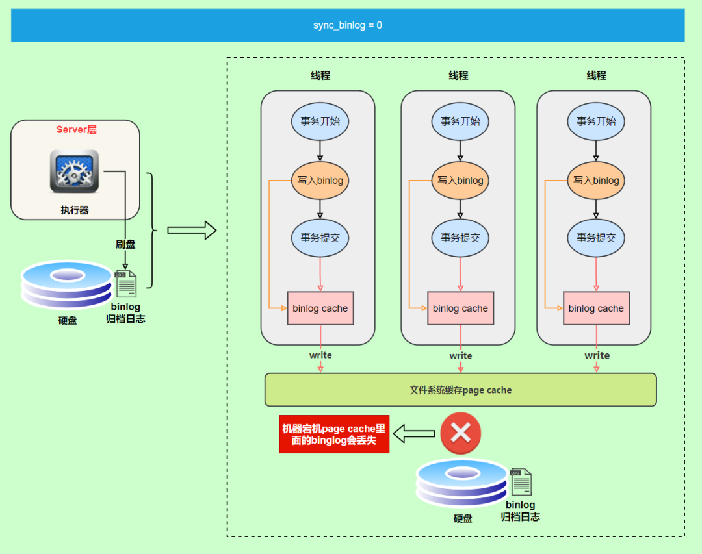
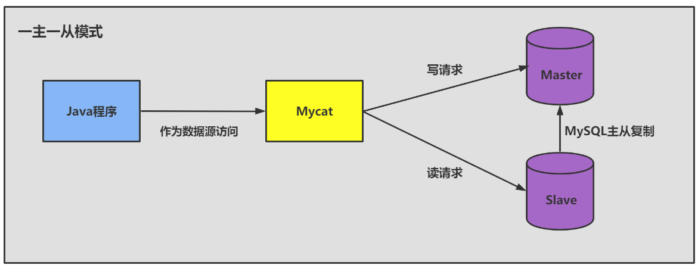
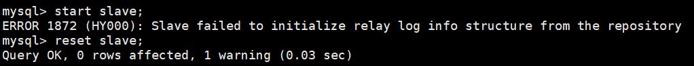
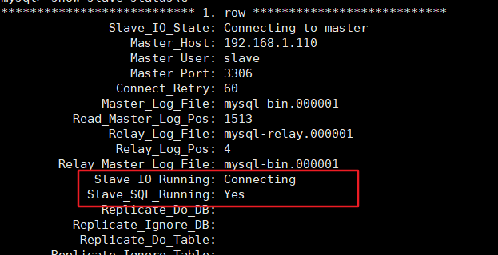

## 日志与备份篇

### 其他数据库日志

在学习数据库事务时，已经学习过了两种日志：重做日志、回滚日志。

对于线上数据库应用系统，突然遭遇**数据库宕机**怎么办?在这种情况下，定位宕机的原因就非常关键。我们可以查看数据库的**错误日志**。因为日志中记录了数据库运行中的诊断信息，包括了错误、警告和注释等信息。比如:从日志中发现某个连接中的SQL操作发生了死循环，导致内存不足，被系统强行终止了。明确了原因，处理起来也就轻松了，系统很快就恢复了运行。

除了发现错误，日志在数据复制、数据恢复、操作审计，以及确保数据的永久性和一致性等方面，都有着不可替代的作用。

千万不要小看日志 。很多看似奇怪的问题，答案往往就藏在日志里。很多情况下，只有通过查看日志才能发现问题的原因，真正解决问题。所以，一定要学会查看日志，养成检查日志的习惯，对提升你的数据库应用开发能力至关重要。

MySQL8.0 官网日志地址：https://dev.mysql.com/doc/refman/8.0/en/server-logs.html

#### MySQL支持的日志

##### 日志类型

MySQL有不同类型的日志文件，用来存储不同类型的日志，分为**二进制日志**、**错误日志**、**通用查询日志**和**慢查询日志**，这也是常用的 4 种。MySQL 8又新增两种支持的日志：中继日志和数据定义语句日志。使用这些日志文件，可以查看MySQL内部发生的事情。

**这 6 类日志分别为：**

- **慢查询日志**： 记录所有执行时间超过long_query_time的所有查询，方便我们对查询进行优化。
- **通用查询日志**： 记录所有连接的起始时间和终止时间，以及连接发送给数据库服务器的所有指令，对我们复原操作的实际场景、发现问题，甚至是对数据库操作的审计都有很大的帮助。
- **错误日志**： 记录MySQL服务的启动、运行或停止MySQL服务时出现的问题，方便我们了解服务器的状态，从而对服务器进行维护。
- **二进制日志**： 记录所有更改数据的语句，可以用于主从服务器之间的数据同步，以及服务器遇到故障时数据的无损失恢复。

- **中继日志**： 用于主从服务器架构中，从服务器用来存放主服务器二进制日志内容的一个中间文件。从服务器通过读取中继日志的内容，来同步主服务器上的操作。

- 数据定义语句日志： 记录数据定义语句执行的元数据操作。

除二进制日志外，其他日志都是**文本文件**。默认情况下，所有日志创建于**MySQL数据目录**中。

##### 日志的弊端

- 日志功能会**降低MySQL数据库的性能**。例如，在查询非常频繁的MysQL数据库系统中，如果开启了通用查询日志和慢查询日志，MySQL数据库会花费很多时间记录日志。
- 日志会占用**大量的磁盘空间**。对于用户量非常大、操作非常频繁的数据库,日志文件需要的存储空间设置比数据库文件需要的存储空间还要大。

#### 慢查询日志(slow query log)

前面章节《性能分析工具的使用》已经详细学习过了。

#### 通用查询日志(general query log)

通用查询日志用来**记录用户的所有操作**，包括启动和关闭MySQL服务、所有用户的连接开始时间和截止时间、发给 MySQL 数据库服务器的所有 SQL 指令等。当我们的数据发生异常时， **查看通用查询日志，还原操作时的具体场景** ，可以帮助我们准确定位问题。

##### 问题场景

在电商系统中，购买商品并且使用微信支付完成以后，却发现支付中心的记录并没有新增，此时用户再次使用支付宝支付，就会出现**重复支付**的问题。但是当去数据库中查询数据的时候，会发现只有一条记录存在。那么此时给到的现象就是只有一条支付记录，但是用户却支付了两次。

我们对系统进行了仔细检查，没有发现数据问题，因为用户编号和订单编号以及第三方流水号都是对的。可是用户确实支付了两次，这个时候，我们想到了检查通用查询日志，看看当天到底发生了什么。

查看之后，发现: 1月1日下午2点，用户使用微信支付完以后，但是由于网络故障，支付中心没有及时收到微信支付的回调通知，导致当时没有写入数据。1月1日下午2点30，用户又使用支付宝支付，此时记录更新到支付中心。1月1日晚上9点，微信的回调通知过来了，但是支付中心已经存在了支付宝的记录，所以只能覆盖记录了。

##### 查看当前状态

```mysql
mysql> SHOW VARIABLES LIKE "%general%";
+------------------+----------------------------+
| Variable_name    | Value                      |
+------------------+----------------------------+
| general_log      | OFF                        |
| general_log_file | /var/lib/mysql/MySQL01.log |
+------------------+----------------------------+
2 rows in set (0.02 sec)
```

##### 启动日志

###### **方式 1 ：永久性方式**

修改my.cnf或者my.ini配置文件来设置。在[mysqld]组下加入log选项，并重启MySQL服务。格式如下：

```properties
[mysqld]
general_log=ON
general_log_file=[path[filename]] #日志文件所在目录路径，filename为日志文件名		
```


如果不指定目录和文件名，通用查询日志将默认存储在MySQL数据目录中的hostname.log文件中，hostname表示主机名。

###### **方式 2 ：临时性方式**

```mysql
SET GLOBAL general_log=on;  # 开启通用查询日志
```

```mysql
SET GLOBAL general_log_file="path/filename"; # 设置日志文件保存位置
```


对应的，关闭操作SQL命令如下：

```mysql
SET GLOBAL general_log=off;  # 关闭通用查询日志
```


查看设置后情况：

```mysql
SHOW VARIABLES LIKE "%general%";
```

##### 查看日志

通用查询日志是以文本文件的形式存储在文件系统中的，可以使用文本编辑器直接打开日志文件。每台MySQL服务器的通用查询日志内容是不同的。

- 在Windows操作系统中，使用文本文件查看器；

- 在Linux系统中，可以使用vi工具或者gedit工具查看；
- 在Mac OSX系统中，可以使用文本文件查看器或者vi等工具查看。

从**SHOW VARIABLES LIKE 'general_log%';**结果中可以看到通用查询日志的位置。

```mysql
/usr/sbin/mysqld, Version: 8.0.26 (MySQL Community Server - GPL). started with:
Tcp port: 3306 Unix socket: /var/lib/mysql/mysql.sock
Time Id Command Argument
2022 - 01 - 04 T07:44:58.052890Z 10 Query SHOW VARIABLES LIKE '%general%'
2022 - 01 - 04 T07:45:15.666672Z 10 Query SHOW VARIABLES LIKE 'general_log%'
2022 - 01 - 04 T07:45:28.970765Z 10 Query select * from student
2022 - 01 - 04 T07:47:38.706804Z 11 Connect root@localhost on using Socket
2022 - 01 - 04 T07:47:38.707435Z 11 Query select @@version_comment limit 1
2022 - 01 - 04 T07:48:21.384886Z 12 Connect root@172.16.210.1 on using TCP/IP
2022 - 01 - 04 T07:48:21.385253Z 12 Query SET NAMES utf
2022 - 01 - 04 T07:48:21.385640Z 12 Query USE `atguigu12`
2022 - 01 - 04 T07:48:21.386179Z 12 Query SHOW FULL TABLES WHERE Table_Type !=
'VIEW'
2022 - 01 - 04 T07:48:23.901778Z 13 Connect root@172.16.210.1 on using TCP/IP
2022 - 01 - 04 T07:48:23.902128Z 13 Query SET NAMES utf
2022 - 01 - 04 T07:48:23.905179Z 13 Query USE `atguigu`
2022 - 01 - 04 T07:48:23.905825Z 13 Query SHOW FULL TABLES WHERE Table_Type !=
'VIEW'
2022 - 01 - 04 T07:48:32.163833Z 14 Connect root@172.16.210.1 on using TCP/IP
2022 - 01 - 04 T07:48:32.164451Z 14 Query SET NAMES utf
2022 - 01 - 04 T07:48:32.164840Z 14 Query USE `atguigu`
2022 - 01 - 04 T07:48:40.006687Z 14 Query select * from account
```

在通用查询日志里面，我们可以清楚地看到，什么时候开启了新的客户端登陆数据库，登录之后做了什么 SQL 操作，针对的是哪个数据表等信息。

##### 停止日志

###### **方式 1 ：永久性方式**

修改my.cnf或者my.ini文件，把[mysqld]组下的general_log值设置为OFF或者把general_log一项注释掉。修改保存后，再重启MySQL服务，即可生效。 举例 1 ：

```properties
[mysqld]
general_log=OFF
```

举例 2 ：

```properties
[mysqld]
#general_log=ON
```

###### **方式 2 ：临时性方式**

使用SET语句停止MySQL通用查询日志功能：

```mysql
SET GLOBAL general_log=off;
```

查询通用日志功能：

```mysql
SHOW VARIABLES LIKE 'general_log%';
```

##### 删除\刷新日志

如果数据的使用非常频繁，那么通用查询日志会占用服务器非常大的磁盘空间。数据管理员可以删除很长时间之前的查询日志，以保证MySQL服务器上的硬盘空间。

**手动删除文件**

```mysql
SHOW VARIABLES LIKE 'general_log%';
```

可以看出，通用查询日志的目录默认为MySQL数据目录。在该目录下手动删除通用查询日志``MySQL01.log``。

使用如下命令重新生成查询日志文件，具体命令如下。刷新MySQL数据目录，发现创建了新的日志文件。前提一定要开启通用日志。

```bash
mysqladmin -uroot -p flush-logs
```

#### 错误日志(error log)

##### 启动日志

在MySQL数据库中，错误日志功能是默认开启的。而且，错误日志无法被禁止。默认情况下，错误日志存储在MySQL数据库的数据文件夹下，名称默认为mysqld.log（Linux系统）或hostname.err（mac系统）。如果需要制定文件名，则需要在``my.cnf``或者``my.ini``中做如下配置：

```properties
[mysqld]
log-error=[path/[filename]] #path为日志文件所在的目录路径，filename为日志文件名
```

修改配置项后，需要重启MySQL服务以生效。

##### 查看日志

MySQL错误日志是以文本文件形式存储的，可以使用文本编辑器直接查看。

查询错误日志的存储路径：

```mysql
mysql> SHOW VARIABLES LIKE 'log_err%';
+----------------------------+----------------------------------------+
| Variable_name              | Value                                  |
+----------------------------+----------------------------------------+
| log_error                  | /var/log/mysqld.log                    |
| log_error_services         | log_filter_internal; log_sink_internal |
| log_error_suppression_list |                                        |
| log_error_verbosity        | 2                                      |
+----------------------------+----------------------------------------+
4 rows in set (0.00 sec)
```

执行结果中可以看到错误日志文件是mysqld.log，位于MySQL默认的数据目录下。

##### 删除\刷新日志

对于很久以前的错误日志，数据库管理员查看这些错误日志的可能性不大，可以将这些错误日志删除，以保证MySQL服务器上的硬盘空间。MySQL的错误日志是以文本文件的形式存储在文件系统中的，可以直接删除。

```mysql
mysqladmin -uroot -p flush-logs
```

重命名文件会报错，如下操作：

```bash
mv /var/log/mysqld.log  /var/log/mysqld.log.old
install -omysql -gmysql -m0644 /dev/null /var/log/mysqld.log
```

#### 二进制日志(bin log)

binlog可以说是MySQL中比较**重要**的日志了，在日常开发及运维过程中，经常会遇到。

binlog即binary log，二进制日志文件，也叫作变更日志（update log）。它记录了数据库所有执行的DDL和DML等数据库更新事件的语句，但是不包含没有修改任何数据的语句（如数据查询语句select、show等）。

它以**事件形式**记录并保存在**二进制文件**中。通过这些信息，我们可以再现数据更新操作的全过程。

> 如果想要记录所有语句（例如，为了识别有问题的查询)，需要使用通用查询日志。

binlog主要应用场景：

- 一是用于**数据恢复**，如果MySQL数据库意外停止，可以通过二进制日志文件来查看用户执行了哪些操作，对数据库服务器文件做了哪些修改，然后根据二进制日志文件中的记录来恢复数据库服务器。

- 二是用于**数据复制**，由于日志的延续性和时效性，master把它的二进制日志传递给slaves来达到master-slave数据一致的目的。

可以说MySQL**数据库的数据备份、主备、主主、主从**都离不开binlog,需要依靠binlog来同步数据，保证数据一致性。


##### 查看默认情况

查看记录二进制日志是否开启：在MySQL8中默认情况下，二进制文件是开启的。

```mysql
mysql>  show variables like '%log_bin%';
+---------------------------------+-----------------------------+
| Variable_name                   | Value                       |
+---------------------------------+-----------------------------+
| log_bin                         | ON                          |  开关
| log_bin_basename                | /var/lib/mysql/binlog       | // 存放路径
| log_bin_index                   | /var/lib/mysql/binlog.index |
| log_bin_trust_function_creators | ON                          |// 
| log_bin_use_v1_row_events       | OFF                         |
| sql_log_bin                     | ON                          |变更sql记录下来
+---------------------------------+-----------------------------+
6 rows in set (0.01 sec)
```

log_bin_trust_function_creators 防止主机和从机函数产生不一样。例如now()。


##### 日志参数设置

###### 方式 1 ：永久性方式

修改MySQL的my.cnf或my.ini文件可以设置二进制日志的相关参数：

```properties
[mysqld]
#启用二进制日志
log-bin=atguigu-bin
binlog_expire_logs_seconds= 600
max_binlog_size=100M
```

> 提示:
>
> 1. log-bin=mysql-bin：打开日志(主机需要打开)，这个mysql-bin也可以自定义，这里也可以加上路径，如：``/home/www/mysql_bin_log/mysql-bin``
> 2. binlog_expire_logs_seconds：此参数控制二进制日志文件保留的时长单位是秒，默认2592000 30天--14400 4小时；86400 1天; 259200 3天；
> 3. max_binlog_size：控制单个二进制日志大小，当前日志文件大小超过此变量时，执行切换动作。此参数的**最大和默认值是1GB**，该设置并**不能严格控制Binlog的大小**，尤其是Binlog比较靠近最大值而又遇到一个比较大事务时，为了保证事务的完整性，可能不做切换日志的动作只能将该事务的所有SQL都记录进当前日志，直到事务结束。一般情况下可采取默认值。

重新启动MySQL服务，查询二进制日志的信息，执行结果：

```mysql
mysql> show variables like '%log_bin%';
+---------------------------------+-----------------------------+
| Variable_name                   | Value                       |
+---------------------------------+-----------------------------+
| log_bin                         | ON                          |
| log_bin_basename                | /var/lib/mysql/binlog       |
| log_bin_index                   | /var/lib/mysql/binlog.index |
| log_bin_trust_function_creators | OFF                         |
| log_bin_use_v1_row_events       | OFF                         |
| sql_log_bin                     | ON                          |
+---------------------------------+-----------------------------+
6 rows in set (0.01 sec)
```

**设置带文件夹的bin-log日志存放目录**

如果想改变日志文件的目录和名称，可以对my.cnf或my.ini中的log_bin参数修改如下：

```properties
[mysqld]
log-bin="/var/lib/mysql/binlog/atguigu-bin"
```

注意：新建的文件夹需要使用mysql用户，使用下面的命令即可。

```bash
chown -R -v mysql:mysql binlog
```

> 提示：数据库文件最好不要与日志文件放在同一个磁盘上!这样，当数据库文件所在的磁盘发生故障时，可以使用日志文件恢复数据。

###### 方式 2 ：临时性方式

如果不希望通过修改配置文件并重启的方式设置二进制日志的话，还可以使用如下指令，需要注意的是在mysql 8 中只有会话级别的设置，没有了global级别的设置。

```mysql
# global 级别
mysql> set global sql_log_bin= 0 ;
ERROR 1228 (HY000): Variable 'sql_log_bin' is a SESSION variable and can`t be used
with SET GLOBAL

# session级别
mysql> SET sql_log_bin= 0 ;
Query OK, 0 rows affected (0.01 秒)
```

##### 查看日志

当MySQL创建二进制日志文件时，先创建一个以“filename”为名称、以“.index”为后缀的文件，再创建一个以“filename”为名称、以“.000001”为后缀的文件。

MySQL服务重新启动一次，以“.000001”为后缀的文件就会增加一个，并且后缀名按 1 递增。即日志文件的数与MySQL服务启动的次数相同；如果日志长度超过了max_binlog_size的上限（默认是1GB），就会创建一个新的日志文件。

查看当前的二进制日志文件列表及大小。指令如下：

```mysql
mysql> SHOW BINARY LOGS;
+---------------+-----------+-----------+
| Log_name      | File_size | Encrypted |
+---------------+-----------+-----------+
| binlog.000001 |      1628 | No        |
+---------------+-----------+-----------+
```

所有对数据库的修改都会记录在binglog中。但binlog是二进制文件，无法直接查看，借助mysqlbinlog命令工具了。指令如下：在查看执行，先执行一条SQL语句，如下

```mysql
 update student set name='张三_back' where id=1;
```

查看binlog文件：

```mysql
mysqlbinlog  "/var/lib/mysql/binlog.000001"
#看不懂数据
```

执行结果可以看到，这是一个简单的日志文件，日志中记录了用户的一些操作，这里并没有出现具体的SQL语句，这是因为binlog关键字后面的内容是经过编码后的二进制日志。

这里一个update语句包含如下事件

- Query事件负责开始一个事务(BEGIN)
- Table_map事件负责映射需要的表
- Update_rows事件负责写入数据
- Xid事件负责结束事务

下面命令将行事件以**伪SQL的形式**表现出来

```mysql
mysqlbinlog -v  "/var/lib/mysql/binlog.000001"

exec_time=0 error_code=
SET TIMESTAMP= 1641345397 /*!*/;
SET @@session.pseudo_thread_id= 10 /*!*/;
SET @@session.foreign_key_checks= 1 , @@session.sql_auto_is_null= 0 ,
@@session.unique_checks= 1 , @@session.autocommit= 1 /*!*/;
SET @@session.sql_mode= 1168113696 /*!*/;
SET @@session.auto_increment_increment= 1 , @@session.auto_increment_offset= 1 /*!*/;
/*!\C utf8mb3 *//*!*/;
SET
@@session.character_set_client= 33 ,@@session.collation_connection= 33 ,@@session.collatio
n_server= 255 /*!*/;
SET @@session.lc_time_names= 0 /*!*/;
SET @@session.collation_database=DEFAULT/*!*/;
/*!80011 SET @@session.default_collation_for_utf8mb4=255*//*!*/;
BEGIN
/*!*/;
# at 324
#220105 9:16:37 server id 1 end_log_pos 391 CRC32 0x74f89890 Table_map:
`atguigu14`.`student` mapped to number 85
# at 391
#220105 9:16:37 server id 1 end_log_pos 470 CRC32 0xc9920491 Update_rows: table id
85 flags: STMT_END_F

BINLOG '
	dfHUYRMBAAAAQwAAAIcBAAAAAFUAAAAAAAEACWF0Z3VpZ3UxNAAHc3R1ZGVudAADAw8PBDwAHgAG
AQEAAgEhkJj4dA==
dfHUYR8BAAAATwAAANYBAAAAAFUAAAAAAAEAAgAD//8AAQAAAAblvKDkuIkG5LiA54+tAAEAAAAL
5byg5LiJX2JhY2sG5LiA54+tkQSSyQ==
'/*!*/;
### UPDATE `atguigu`.`student`
### WHERE
### @1=
### @2='张三'
### @3='一班'
### SET
### @1=
### @2='张三_back'
### @3='一班'
# at 470
#220105 9:16:37 server id 1 end_log_pos 501 CRC32 0xca01d30f Xid = 15
COMMIT/*!*/;
```


前面的命令同时显示binlog格式的语句，使用如下命令不显示它

```mysql
mysqlbinlog -v --base64-output=DECODE-ROWS "/var/lib/mysql/binlog.000001"

exec_time=0 error_code=
SET TIMESTAMP= 1641345397 /*!*/;
SET @@session.pseudo_thread_id= 10 /*!*/;
SET @@session.foreign_key_checks= 1 , @@session.sql_auto_is_null= 0 ,
@@session.unique_checks= 1 , @@session.autocommit= 1 /*!*/;
SET @@session.sql_mode= 1168113696 /*!*/;
SET @@session.auto_increment_increment= 1 , @@session.auto_increment_offset= 1 /*!*/;
/*!\C utf8mb3 *//*!*/;
SET
@@session.character_set_client= 33 ,@@session.collation_connection= 33 ,@@session.collatio
n_server= 255 /*!*/;
SET @@session.lc_time_names= 0 /*!*/;
SET @@session.collation_database=DEFAULT/*!*/;
/*!80011 SET @@session.default_collation_for_utf8mb4=255*//*!*/;
BEGIN
/*!*/;
# at 324
#220105 9:16:37 server id 1 end_log_pos 391 CRC32 0x74f89890 Table_map:
`atguigu14`.`student` mapped to number 85
# at 391
#220105 9:16:37 server id 1 end_log_pos 470 CRC32 0xc9920491 Update_rows: table id
85 flags: STMT_END_F
### UPDATE `atguigu14`.`student`
### WHERE
### @1=
### @2='张三'
### @3='一班'
### SET
### @1=
### @2='张三_back'
### @3='一班'
# at 470
#220105 9:16:37 server id 1 end_log_pos 501 CRC32 0xca01d30f Xid = 15
```

关于mysqlbinlog工具的使用技巧还有很多，例如只解析对某个库的操作或者某个时间段内的操作等。简单分享几个常用的语句，更多操作可以参考官方文档。

```mysql
# 可查看参数帮助
mysqlbinlog --no-defaults --help

# 查看最后 100 行
mysqlbinlog --no-defaults --base64-output=decode-rows -vv binlog.000001 |tail - 100

# 根据position查找
mysqlbinlog --no-defaults --base64-output=decode-rows -vv binlog.000001 |grep -A 
20 '4939002'
```


上面这种办法读取出binlog日志的全文内容比较多，不容易分辨查看到pos点信息，下面介绍一种更为方便的查询命令：

```mysql
mysql> show binlog events [IN 'log_name'] [FROM pos] [LIMIT [offset,] row_count];
```

- IN 'log_name'：指定要查询的binlog文件名（不指定就是第一个binlog文件）　
- FROM pos：指定从哪个pos起始点开始查起（不指定就是从整个文件首个pos点开始算）

- LIMIT [offset]：偏移量(不指定就是 0 )

- row_count :查询总条数（不指定就是所有行）

```mysql
mysql> show binlog events in 'binlog.000002';
```


上面这条语句可以将指定的binlog日志文件，分成有效事件行的方式返回，并可使用limit指定pos点的起始偏移，查询条数。其它举例:

```mysql
#a、查询第一个最早的binlog日志:
show binlog events\G ;

#b、指定查询 binlog 这个文件
show binlog events in 'binlog.000002'\G;

#c、指定查询 binlog 这个文件，从pos点:391开始查起:
show binlog events in 'binlog.000002' from 391\G;

#d、指定查询 binlog 这个文件，从pos点:391开始查起，查询5条（即5条语句)
show binlog events in 'binlog.000002' from 391 limit 5\G

#e、指定查询 binlog 这个文件，从pos点:391开始查起，偏移2行〈即中间跳过2个）查询5条（即5条语句)。
show binlog events in 'binlog.000002' from 391 limit 2,5\G;
```

上面我们讲了这么多都是基于binlog的默认格式，binlog格式查看

```mysql
mysql> show variables like 'binlog_format';
+---------------+-------+
| Variable_name | Value |
+---------------+-------+
| binlog_format | ROW |
+---------------+-------+
1 行于数据集 (0.02 秒)
```

除此之外，binlog还有 2 种格式，分别是 Statement 和 Mixed

- Statement：每一条会修改数据的sql都会记录在binlog中。

  优点：不需要记录每一行的变化，减少了binlog日志量，节约了IO，提高性能。

- Row：5.1.5版本的MySQL才开始支持row level 的复制，它不记录sql语句上下文相关信息，仅保存哪条记录被修改。

  优点：row level 的日志内容会非常清楚的记录下每一行数据修改的细节。而且不会出现某些特定情况下的存储过程，或function，以及trigger的调用和触发无法被正确复制的问题。

- Mixed：从5.1.8版本开始，MySQL提供了Mixed格式，实际上就是Statement与Row的结合。


##### 使用日志恢复数据

mysqlbinlog恢复数据的语法如下：

```mysql
mysqlbinlog [option] filename|mysql –uuser -ppass;
```

这个命令可以这样理解：使用mysqlbinlog命令来读取filename中的内容，然后使用mysql命令将这些内容恢复到数据库中。

- filename：是日志文件名。

- option：可选项，比较重要的两对option参数是--start-date、--stop-date 和 --start-position、--stop-position。

  - --start-date 和 - -stop-date：可以指定恢复数据库的起始时间点和结束时间点。

  - --start-position和--stop-position：可以指定恢复数据的开始位置和结束位置。


> 注意：使用mysqlbinlog命令进行恢复操作时，必须是编号小的先恢复，例如atguigu-bin.000001必须在atguigu-bin.000002之前恢复。

```mysql
flush logs; #可以生成新的binLog文件，不然这个文件边恢复边变大是不行的。

show binary logs; # 显示有哪些binLog 文件
```

恢复插入数据例子：

```mysql
mysqlbinlog --start-position=851 --stop-position=1384 --database=atguigudb /var/lib/mysql/binlog.000014 | /usr/bin/mysql -uroot -p123456 -v atguigudb;
```

##### 删除二进制日志

MySQL的二进制文件可以配置自动删除，同时MySQL也提供了安全的手动删除二进制文件的方法。**PURGE MASTER LOGS**只删除指定部分的二进制日志文件，**RESET MASTER**删除所有的二进制日志文件。具体如下：

**1.PURGE MASTER LOGS：删除指定日志文件**

PURGE MASTER LOGS语法如下：

```mysql
PURGE {MASTER | BINARY} LOGS TO ‘指定日志文件名’

PURGE {MASTER | BINARY} LOGS BEFORE ‘指定日期’
```

**举例**：使用PURGE MASTER LOGS语句删除创建时间比binlog.000005早的所有日志

(1) 多次重新启动MysSQL服务，便于生成多个日志文件。然后用SHOW语句显示二进制日志文件列表

```mysql
SHOW BINARY LOGS;
```

(2）执行PURGE MASTER LOGS语句删除创建时间比binlog.000005早的所有日志

```mysql
PURGE MASTER LOGS T0 "binlog.000005";
```

(3）显示二进制日志文件列表

```mysql
SHGW BINARY LOGS;
```

**举例：**使用PURGE MASTER LOGS语句删除2020年10月25号前创建的所有日志文件。具体步骤如下:

(1)显示二进制日志文件列表

```mysql
SHOW BINARY LOGS;
```

(2）执行mysqlbinlog命令查看二进制日志文件binlog.000005的内容

```mysql
mysqlbinlog --no-defaults "/var/lib/mysql/binlog/binlog.000005"
```

结果可以看出20220105为日志创建的时间，即2022年1月05日。

(3）使用PURGE MASTER LOGS语句删除2o22年1月05日前创建的所有日志文件

```mysql
PURGE MASTER LOGS before "20220105";
```

(4）显示二进制日志文件列表

```mysql
SHOW BINARY LOGS;
```

2022年o1月o5号之前的二进制日志文件都已经被删除，最后一个没有删除，是因为当前在用，还未记录最后的时间，所以未被删除。

**2.RESET MASTER：删除所有二进制日志文件**

```mysql
reset master;
```

##### 其它场景

二进制日志可以通过数据库的**全量备份**和二进制日志中保存的**增量信息**，完成数据库的**无损失恢复**。但是，如果遇到数据量大、数据库和数据表很多（比如分库分表的应用）的场景，用二进制日志进行数据恢复，是很有挑战性的，因为起止位置不容易管理。

在这种情况下，一个有效的解决办法是**配置主从数据库服务器**，甚至是**一主多从**的架构，把二进制日志文件的内容通过中继日志，同步到从数据库服务器中，这样就可以有效避免数据库故障导致的数据异常等问题。

#### 再谈二进制日志(binlog)

##### 写入机制

binlog的写入时机也非常简单，事务执行过程中，先把日志写到**binlog cache**，事务提交的时候，再把binlog cache写到binlog文件中。因为一个事务的binlog不能被拆开，无论这个事务多大，也要确保一次性写入，所以系统会给每个线程分配一个块内存作为binlog cache。

我们可以通过**binlog_cache_size**参数控制单个线程binlog cache大，如果存储内容超过了这个参数，就要暂存到磁盘(Swap)。binlog日志刷盘流程如下:


> - 上图的write，是指把日志写入到文件系统的page cache，并没有把数据持久化到磁盘，所以速度比较快。
> - 上图的fsync，才是将数据持久化到磁盘的操作

write和fsync的时机，可以由参数**sync_binlog**控制，默认是 **0** 。为 0 的时候，表示每次提交事务都只write，由系统自行判断什么时候执行fsync。虽然性能得到提升，但是机器宕机，page cache里面的binglog 会丢失。如下图：



为了安全起见，可以设置为 **1** ，表示每次提交事务都会执行fsync，就如同 **redo log 刷盘流程** 一样。最后还有一种折中方式，可以设置为N(N>1)，表示每次提交事务都write，但累积N个事务后才fsync。


在出现IO瓶颈的场景里，将sync_binlog设置成一个比较大的值，可以提升性能。同样的，如果机器宕机，会丢失最近N个事务的binlog日志。

##### binlog与redolog对比

- redo log 它是**物理日志**，记录内容是“在某个数据页上做了什么修改”，属于 InnoDB 存储引擎层产生的。

- 而 binlog 是**逻辑日志**，记录内容是语句的原始逻辑，类似于“给 ID=2 这一行的 c 字段加 1”，属于MySQL Server 层
- 虽然它们都属于持久化的保证，但是则重点不同。
  - redo log让InnoDB存储引擎拥有了崩溃恢复能力。
  - binlog保证了MySQL集群架构的数据一致性。

##### 两阶段提交

在执行更新语句过程，会记录redo log与binlog两块日志，以基本的事务为单位，redo log在事务执行过程中可以不断写入，而**binlog**只有在提交事务时才写入，所以redo log与binlog的**写入时机**不一样。


**redo log与binlog两份日志之间的逻辑不一致，会出现什么问题？**

以update语句为例，假设id=2的记录，字段c值是0，把字段c值更新成1，sQL语句为update Tset c=1 where id=2。

假设执行过程中写完redo log日志后，binlog日志写期间发生了异常，会出现什么情况呢?


由于binlog没写完就异常，这时候binlog里面没有对应的修改记录。因此之后用binlog日志恢复数据时，就会少这一次更新，恢复出来的这一行c值是o，而原库因为redo log日志恢复，这一行c值是1，最终数据不一致。


为了解决两份日志之间的逻辑一致问题，InnoDB存储引擎使用**两阶段提交**方案。原理很简单，将redo log的写入拆成了两个步骤prepare和commit，这就是**两阶段提交**。


使用 **两阶段提交** 后，写入binlog时发生异常也不会有影响，因为MySQL根据redo log日志恢复数据时，发现redolog还处于prepare阶段，并且没有对应binlog日志，就会回滚该事务。


另一个场景，redo log设置commit阶段发生异常，那会不会回滚事务呢？


并不会回滚事务，它会执行上图框住的逻辑，虽然redo log是处于prepare阶段，但是能通过事务id找到对应的binlog日志，所以MySQL认为是完整的，就会提交事务恢复数据。

#### 中继日志(relay log)

##### 介绍

**中继日志只在主从服务器架构的从服务器上存在** 。从服务器为了与主服务器保持一致，要从主服务器读取二进制日志的内容，并且把读取到的信息写入**本地的日志文件**中，这个从服务器本地的日志文件就叫**中继日志**。然后，从服务器读取中继日志，并根据中继日志的内容对从服务器的数据进行更新，完成主从服务器的**数据同步**。

搭建好主从服务器之后，中继日志默认会保存在从服务器的数据目录下。

文件名的格式是：**从服务器名 - relay-bin.序号**。中继日志还有一个索引文件：**从服务器名 - relay-bin.index**，用来定位当前正在使用的中继日志。

##### 查看中继日志

中继日志与二进制日志的格式相同，可以用 mysqlbinlog 工具进行查看。下面是中继日志的一个片段：

```mysql
SET TIMESTAMP= 1618558728 /*!*/;
BEGIN
/*!*/;
# at 950
#210416 15:38:48 server id 1 end_log_pos 832 CRC32 0xcc16d651 Table_map:
`atguigu`.`test` mapped to number 91
# at 1000
#210416 15:38:48 server id 1 end_log_pos 872 CRC32 0x07e4047c Delete_rows: table id
91 flags: STMT_END_F -- server id 1 是主服务器，意思是主服务器删了一行数据
BINLOG '
CD95YBMBAAAAMgAAAEADAAAAAFsAAAAAAAEABGRlbW8ABHRlc3QAAQMAAQEBAFHWFsw=
CD95YCABAAAAKAAAAGgDAAAAAFsAAAAAAAEAAgAB/wABAAAAfATkBw==
'/*!*/;
# at 1040
```

这一段的意思是，主服务器（“server id 1”）对表 atguigu.test 进行了 2 步操作：

```mysql
定位到表 atguigu.test 编号是 91 的记录，日志位置是 832 ；

删除编号是 91 的记录，日志位置是 872 。
```

##### 恢复的典型错误

如果从服务器宕机，有的时候为了系统恢复，要重装操作系统，这样就可能会导致你的**服务器名称**与之前**不同**。而中继日志里是**包含从服务器名的**。在这种情况下，就可能导致你恢复从服务器的时候，无法从宕机前的中继日志里读取数据，以为是日志文件损坏了，其实是名称不对了。

解决的方法也很简单，把从服务器的名称改回之前的名称。

### 主从复制

#### 主从复制概述 

##### 如何提升数据库并发能力

在实际工作中，我们常常将**Redis**作为缓存与**MySQL**配合来使用，当有请求的时候，首先会从缓存中进行查找，如果存在就直接取出。如果不存在再访问数据库，这样就**提升了读取的效率**，也减少了对后端数据库的**访问压力**。Redis的缓存架构是**高并发架构**中非常重要的一环。


此外，一般应用对数据库而言都是“**读多写少**”，也就说对数据库读取数据的压力比较大，有一个思路就是采用数据库集群的方案，做**主从架构**、进行**读写分离**，这样同样可以提升数据库的并发处理能力。但并不是所有的应用都需要对数据库进行主从架构的设置，毕竟设置架构本身是有成本的。

如果我们的目的在于提升数据库高并发访问的效率，那么首先考虑的是如何优化**SQL和索引**，这种方式简单有效；其次才是采用**缓存的策略**，比如使用 Redis将热点数据保存在内存数据库中，提升读取的效率；最后才是对数据库采用**主从架构**，进行读写分离。

##### 主从复制的作用 

主从同步设计不仅可以提高数据库的吞吐量，还有以下 3 个方面的作用。

###### 第1个作用：读写分离

我们可以通过主从复制的方式来**同步数据**，然后通过读写分离提高数据库并发处理能力。


其中一个是Master主库，负责写入数据，我们称之为：写库。

其它都是slave从库，负责读取数据，我们称之为：读库。

当主库进行更新的时候，会自动将数据复制到从库中，而在客户端读取数据的时候，会从从库中进行读取。

面对“读多写少"的需求，采用读写分离的方式，可以实现**更高的并发访问**。同时还能对从服务器进行负载均衡，让不同的读请求按照策略均匀地分发到不同的从服务器上，让**读取更加顺畅**。读取顺畅的另一个原因，就是减少了锁表的影响，比如我们让主库负责写，当主库出现写锁的时候，不会影响到从库进行SELECT的读取。

###### 第2个作用就是数据备份

第2个作用就是**数据备份**。通过主从复制将主库上的数据复制到了从库上，相当于是一种**热备份机制**，也就是在主库正常运行的情况下进行的备份，不会影响到服务。

###### 第3个作用是具有高可用性

**第 3 个作用是具有高可用性。**数据备份实际上是一种冗余的机制，通过这种冗余的方式可以换取数据库的高可用性，也就是当服务器出现**故障**或**宕机**的情况下，可以**切换**到从服务器上，保证服务的正常运行。

关于高可用性的程度，我们可以用一个指标衡量，即正常可用时间/全年时间。比如要达到全年99.999%的时间都可用，就意味着系统在一年中的不可用时间不得超过**365*24*60*(1-99.999%)=5.256**分钟(含系统崩溃的时间、日常维护操作导致的停机时间等)，其他时间都需要保持可用的状态。

实际上，更高的高可用性，意味着需要付出更高的成本代价。在现实中我们需要结合业务需求和成本来进行选择。

#### 主从复制的原理 

**Slave**会从**Master**读取**binlog**来进行数据同步。

##### 原理剖析

###### 三个线程

实际上主从同步的原理就是基于 binlog 进行数据同步的。在主从复制过程中，会基于 **3 个线程**来操作，一个主库线程，两个从库线程。


###### 二进制日志转储线程 （Binlog dump thread）

**二进制日志转储线程**（Binlog dump thread）是一个主库线程。当从库线程连接的时候， 主库可以将二进制日志发送给从库，当主库读取事件（Event）的时候，会在 Binlog 上**加锁**，读取完成之后，再将锁释放掉。

###### 从库 I/O 线程

**从库 I/O 线程会连接到主库**，向主库发送请求更新 Binlog。这时从库的 I/O 线程就可以读取到主库的二进制日志转储线程发送的 Binlog 更新部分，并且拷贝到**本地的中继日志 （Relay log）**。

###### 从库 SQL 线程

**从库 SQL 线程会**读取从库中的中继日志，并且执行日志中的事件，将从库中的数据与主库保持同步。


> 注意：
> 不是所有版本的MySQL都默认开启服务器的二进制日志。在进行主从同步的时候，我们需要先检查服务器是否已经开启了二进制日志。
>
> 除非特殊指定，默认情况下从服务器会执行所有主服务器中保存的事件。也可以通过配置，使从服务器执行特定的事件。

###### 复制三步骤

步骤 1 ：**Master**将写操作记录到二进制日志（**binlog**）。

步骤 2 ：**Slave**将**Master**的binary log events拷贝到它的中继日志（**relay log**）；

步骤 3 ：**Slave**重做中继日志中的事件，将改变应用到自己的数据库中。 MySQL复制是异步的且串行化的，而且重启后从**接入点**开始复制。

**复制的问题**：**延时**。

##### 复制的基本原则 

- 每个**Slave**只有一个**Master**
- 每个**Slave**只能有一个唯一的服务器ID
- 每个**Master**可以有多个**Slave**

#### 一主一从架构搭建 

一台**主机**用于处理所有**写请求**，一台从机负责所有读请求，架构图如下：



##### 准备工作

1 、准备 **2 台**CentOS 虚拟机

2 、每台虚拟机上需要安装好MySQL (可以是MySQL8.0 )

此外，克隆的方式生成的虚拟机（包含MySQL Server），则克隆的虚拟机MySQL Server的UUID相同，必须修改，否则在有些场景会报错。比如：`show slave status`，报如下的错误：

```mysql
Last_IO_Error: Fatal error: The slave I/O thread stops because master and slave have
equal MySQL server UUIDs; these UUIDs must be different for replication to work.
```

修改MySQL Server 的UUID方式：

```bash
vim /var/lib/mysql/auto.cnf # UUID需要不一样
systemctl restart mysqld
```

##### 主机配置文件

建议mysql版本一致且后台以服务运行，主从所有配置项都配置在[mysqld]节点下，且都是小写字母。

具体参数配置如下：

**必选**

```ini
#[必须]主服务器唯一ID
server-id= 1

#[必须]启用二进制日志，指名路径。比如：自己本地的路径/log/mysqlbin
log-bin=atguigu-bin
```

**可选**

```ini
#[可选] 0（默认）表示读写（主机）， 1 表示只读（从机）
read-only= 0

#设置日志文件保留的时长，单位是秒
binlog_expire_logs_seconds= 6000

#控制单个二进制日志大小。此参数的最大和默认值是1GB
max_binlog_size=200M

#[可选]设置不要复制的数据库
binlog-ignore-db=test

#[可选]设置需要复制的数据库,默认全部记录。比如：binlog-do-db=atguigu_master_slave
binlog-do-db=需要复制的主数据库名字

#[可选]设置binlog格式
binlog_format=STATEMENT
```

##### 从机配置文件

要求主从所有配置项都配置在``my.cnf``的[mysqld]栏位下，且都是小写字母。

**必选**

```ini
#[必须]从服务器唯一ID
server-id= 2
```

**可选**

```ini
#[可选]启用中继日志
relay-log=mysql-relay
```

重启后台mysql服务，使配置生效。

> 注意：主从机都关闭防火墙
>
> ```bash
> service iptables stop #CentOS 6
> 
> systemctl stop firewalld.service #CentOS 7
> ```

##### binlog格式设置

###### ① STATEMENT模式（基于SQL语句的复制(statement-based replication, SBR)）

```properties
binlog_format=STATEMENT
```

每一条会修改数据的sql语句会记录到binlog中。这是默认的binlog格式。

**SBR 的优点**：

- 历史悠久，技术成熟
- 不需要记录每一行的变化，减少了binlog日志量，文件较小
- binlog中包含了所有数据库更改信息，可以据此来审核数据库的安全等情况
- binlog可以用于实时的还原，而不仅仅用于复制
- 主从版本可以不一样，从服务器版本可以比主服务器版本高

**SBR 的缺点**：

- 不是所有的UPDATE语句都能被复制，尤其是包含不确定操作的时候

- 使用以下函数的语句也无法被复制：LOAD_FILE()、UUID()、USER()、FOUND_ROWS()、SYSDATE()(除非启动时启用了 --sysdate-is-now 选项)
  - INSERT ... SELECT 会产生比 RBR 更多的行级锁
  - 复制需要进行全表扫描(WHERE 语句中没有使用到索引)的 UPDATE 时，需要比 RBR 请求更多的行级锁
  - 对于有 AUTO_INCREMENT 字段的 InnoDB表而言，INSERT 语句会阻塞其他 INSERT 语句
  - 对于一些复杂的语句，在从服务器上的耗资源情况会更严重，而 RBR 模式下，只会对那个发生变化的记录产生影响
  - 执行复杂语句如果出错的话，会消耗更多资源
  - 数据表必须几乎和主服务器保持一致才行，否则可能会导致复制出错

###### ② ROW模式（基于行的复制(row-based replication, RBR)）

```properties
binlog_format=ROW
```

5.1.5版本的MySQL才开始支持，不记录每条sql语句的上下文信息，仅记录哪条数据被修改了，修改成什么样了。

**RBR 的优点**：

- 任何情况都可以被复制，这对复制来说是最**安全可靠**的。（比如：不会出现某些特定情况下的存储过程、function、trigger的调用和触发无法被正确复制的问题）
- 多数情况下，从服务器上的表如果有主键的话，复制就会快了很多
- 复制以下几种语句时的行锁更少：INSERT ... SELECT、包含 AUTO_INCREMENT 字段的 INSERT、没有附带条件或者并没有修改很多记录的 UPDATE 或 DELETE 语句
- 执行 INSERT，UPDATE，DELETE 语句时锁更少
- 从服务器上采用**多线程**来执行复制成为可能

**RBR 的缺点**：

- binlog 大了很多
- 复杂的回滚时 binlog 中会包含大量的数据
- 主服务器上执行 UPDATE 语句时，所有发生变化的记录都会写到 binlog 中，而 SBR 只会写一次，这会导致频繁发生 binlog 的并发写问题
- 无法从 binlog 中看到都复制了些什么语句

###### ③ MIXED模式（混合模式复制(mixed-based replication, MBR)）

```properties
binlog_format=MIXED
```

从5.1.8版本开始，MySQL提供了Mixed格式，实际上就是Statement与Row的结合。

在Mixed模式下，一般的语句修改使用statment格式保存binlog。如一些函数，statement无法完成主从复制的操作，则采用row格式保存binlog。

MySQL会根据执行的每一条具体的sql语句来区分对待记录的日志形式，也就是在Statement和Row之间选择一种。

##### 主机：建立账户并授权

```mysql
#5.5,5.7版本
#在主机MySQL里执行授权主从复制的命令
GRANT REPLICATION SLAVE ON *.* TO 'slave1'@'从机器数据库IP' IDENTIFIED BY 'abc123';
```

**注意：如果使用的是MySQL8，需要如下的方式建立账户，并授权slave：**

```mysql
CREATE USER 'slave1'@'%' IDENTIFIED BY '123456';
GRANT REPLICATION SLAVE ON *.* TO 'slave1'@'%';

#此语句必须执行。否则见下面。
ALTER USER 'slave1'@'%' IDENTIFIED WITH mysql_native_password BY '123456';

flush privileges;
```

如果没有执行上述语句，报如下错误：

注意：在从机执行``show slave status\G``时报错：

```bash
Last_IO_Error: error connecting to master 'slave1@192.168.1.150:3306' - retry-time: 60 retries: 1
message: Authentication plugin 'caching_sha2_password' reported error: Authentication requires
secure connection.
```

查询Master的状态，并记录下File和Position的值。

```mysql
show master status;
```


- 记录下File和Position的值

> 注意：执行完此步骤后 不要再操作主服务器MySQL ，防止主服务器状态值变化。

##### 从机：配置需要复制的主机

**步骤 1 ： 从机上复制主机的命令**

```mysql
CHANGE MASTER TO
MASTER_HOST='主机的IP地址',
MASTER_USER='主机用户名',
MASTER_PASSWORD='主机用户名的密码',
MASTER_LOG_FILE='mysql-bin.具体数字',
MASTER_LOG_POS=具体值;
```

举例：

```mysql
CHANGE MASTER TO MASTER_HOST='192.168.183.101',MASTER_USER='slave1',MASTER_PASSWORD='123456',MASTER_LOG_FILE='atguigu-bin.000001',MASTER_LOG_POS= 1135 ;
```


如果以前做过主从配置，执行如上命令会报错，需要输入`stop slave`;

**步骤 2** ：

```mysql
#启动slave同步
START SLAVE;
```

如果报错：



可以执行如下操作，删除之前的relay_log信息。然后重新执行 `CHANGE MASTER TO ...`语句即可。

```mysql
mysql> reset slave; #删除SLAVE数据库的relaylog日志文件，并重新启用新的relaylog文件
```

接着，查看同步状态：

```mysql
SHOW SLAVE STATUS\G;
```


上面两个参数都是Yes，则说明主从配置成功！

**显式如下的情况，就是不正确的。可能错误的原因有：**

1. 网络不通
2. 账户密码错误
3. 防火墙
4. mysql配置文件问题
5. 连接服务器时语法
6. 主服务器mysql权限



##### 测试

主机新建库、新建表、insert记录，从机复制：

```mysql
CREATE DATABASE atguigu_master_slave;
use atguigu_master_slave;
CREATE TABLE mytbl(id INT,NAME VARCHAR( 16 ));		
INSERT INTO mytbl VALUES( 1 , 'zhang3');
INSERT INTO mytbl VALUES( 2 ,@@hostname);
```

然后从机查看数据：

```shell
show databases;
```


```mysql
use atguigu_master_slave;
select * from mytbl;
```


##### 停止主从同步

- 停止主从同步命令：


```mysql
stop slave;
```


- 如何重新配置主从

  如果停止从服务器复制功能，再使用需要重新配置主从。否则会报错如下：

  

  重新配置主从，需要在从机上执行：

```mysql
stop slave;

reset master; #删除Master中所有的binglog文件，并将日志索引文件清空，重新开始所有新的日志文件(慎用)
```

##### 后续 

###### 搭建主从复制：双主双从


#### 同步数据一致性问题 

**主从同步的要求：**

- 读库和写库的数据一致(最终一致)；
- 写数据必须写到写库；
- 读数据必须到读库(不一定)；

##### 理解主从延迟问题

进行主从同步的内容是二进制日志，它是一个文件，在进行**网络传输**的过程中就一定会**存在主从延迟**（比如 500 ms），这样就可能造成用户在从库上读取的数据不是最新的数据，也就是主从同步中的**数据不一致性**问题。

**举例:**导致主从延迟的时间点主要包括以下三个：

1. 主库A执行完成一个事务，写入binlog，我们把这个时刻记为T1;

2. 之后传给从库B，我们把从库B接收完这个binlog的时刻记为T2;

3. 从库B执行完成这个事务，我们把这个时刻记为T3。

##### 主从延迟原因

在网络正常的时候，日志从主库传给从库所需的时间是很短的，即T 2 - T 1 的值是非常小的。即，网络正常情况下，主备延迟的主要来源是备库接收完binlog和执行完这个事务之间的时间差。

**主备延迟最直接的表现是，从库消费中继日志（relay log）的速度，比主库生产binlog的速度要慢。** 造成原因：

1 、从库的机器性能比主库要差

2 、从库的压力大

3 、大事务的执行


**举例 1 ：** 一次性用delete语句删除太多数据

结论：后续再删除数据的时候，要控制每个事务删除的数据量，分成多次删除。

**举例 2 ：** 一次性用insert...select插入太多数据

**举例 3 ：** 大表DDL

比如在主库对一张500W的表添加一个字段耗费了 10 分钟，那么从节点上也会耗费 10 分钟。

##### 如何减少主从延迟

**若想要减少主从延迟的时间，可以采取下面的办法：**

1. 降低多线程大事务并发的概率，优化业务逻辑
2. 优化SQL，避免慢SQL，**减少批量操作**，建议写脚本以update-sleep这样的形式完成。
3. **提高从库机器的配置**，减少主库写binlog和从库读binlog的效率差。
4. 尽量采用**短的链路**，也就是主库和从库服务器的距离尽量要短，提升端口带宽，减少binlog传输的网络延时。
5. 实时性要求的业务读强制走主库，从库只做灾备，备份。

##### 如何解决一致性问题

如果操作的数据存储在同一个数据库中，那么对数据进行更新的时候，可以对记录加写锁，这样在读取的时候就不会发生数据不一致的情况。但这时从库的作用就是备份，并没有起到读写分离，分担主库读压力的作用。


读写分离情况下，解决主从同步中数据不一致的问题， 就是解决主从之间**数据复制方式**的问题，如果按照数据一致性**从弱到强来**进行划分，有以下 3 种复制方式。

###### 方法 1：异步复制

异步模式就是客户端提交COMMIT之后不需要等从库返回任何结果，而是直接将结果返回给客户端，这样做的好处是不会影响主库写的效率，但可能会存在主库宕机，而Binlog还没有同步到从库的情况，也就是此时的主库和从库数据不一致。这时候从从库中选择一个作为新主，那么新主则可能缺少原来主服务器中已提交的事务。所以，这种复制模式下的数据一致性是最弱的。


###### 方法 2：半同步复制

MySQL5.5版本之后开始支持半同步复制的方式。原理是在客户端提交COMMIT之后不直接将结果返回给客户端，而是等待至少有一个从库接收到了Binlog，并且写入到中继日志中，再返回给客户端。

这样做的好处就是提高了数据的一致性，当然相比于异步复制来说，至少多增加了一个网络连接的延迟，降低了主库写的效率。

在MySQL5.7版本中还增加了一个rpl_semi_sync_master_wait_for_slave_count参数，可以对应答的从库数量进行设置，默认为1，也就是说只要有1个从库进行了响应，就可以返回给客户端。如果将这个参数调大，可以提升数据一致性的强度，但也会增加主库等待从库响应的时间。


###### 方法 3：组复制 

异步复制和半同步复制都无法最终保证数据的一致性问题，半同步复制是通过判断从库响应的个数来决定是否返回给客户端，虽然数据一致性相比于异步复制有提升，但仍然无法满足对数据一致性要求高的场景，比如金融领域。MGR 很好地弥补了这两种复制模式的不足。

组复制技术，简称 MGR（MySQL Group Replication）。是 MySQL 在 5.7.17 版本中推出的一种新的数据复制技术，这种复制技术是基于 Paxos 协议的状态机复制。

**MGR 是如何工作的**

首先我们将多个节点共同组成一个复制组，在**执行读写（RW）事务**的时候，需要通过一致性协议层（Consensus 层）的同意，也就是读写事务想要进行提交，必须要经过组里“大多数人”（对应 Node 节点）的同意，大多数指的是同意的节点数量需要大于 （N/2+1），这样才可以进行提交，而不是原发起方一个说了算。而针对**只读（RO）事务**则不需要经过组内同意，直接 COMMIT 即可。

在一个复制组内有多个节点组成，它们各自维护了自己的数据副本，并且在一致性协议层实现了原子消息和全局有序消息，从而保证组内数据的一致性。


MGR 将 MySQL 带入了数据强一致性的时代，是一个划时代的创新，其中一个重要的原因就是MGR 是基于 Paxos 协议的。Paxos 算法是由 2013 年的图灵奖获得者 Leslie Lamport 于 1990 年提出的，有关这个算法的决策机制可以搜一下。事实上，Paxos 算法提出来之后就作为**分布式一致性算法**被广泛应用，比如Apache 的 ZooKeeper 也是基于 Paxos 实现的。

#### 知识延伸

在主从架构的配置中，如果想要采取读写分离的策略，我们可以**自己编写程序**，也可以通过**第三方的中间件**来实现。

- 自己编写程序的好处就在于比较自主，我们可以自己判断哪些查询在从库上来执行，针对实时性要求高的需求，我们还可以考虑哪些查询可以在主库上执行。同时，程序直接连接数据库，减少了中间件层，相当于减少了性能损耗。

- 采用中间件的方法有很明显的优势，功能强大，使用简单。但因为在客户端和数据库之间增加了中间件层会有一些性能损耗，同时商业中间件也是有使用成本的。我们也可以考虑采取一些优秀的开源工具。

  

① Cobar属于阿里B2B事业群，始于 2008 年，在阿里服役 3 年多，接管3000+个MySQL数据库的schema,集群日处理在线SQL请求 50 亿次以上。由于Cobar发起人的离职，Cobar停止维护。

② Mycat是开源社区在阿里cobar基础上进行二次开发，解决了cobar存在的问题，并且加入了许多新的功能在其中。青出于蓝而胜于蓝。

③ OneProxy基于MySQL官方的proxy思想利用c语言进行开发的，OneProxy是一款商业收费的中间件。舍弃了一些功能，专注在性能和稳定性上。

④ kingshard由小团队用go语言开发，还需要发展，需要不断完善。

⑤ Vitess是Youtube生产在使用，架构很复杂。不支持MySQL原生协议，使用需要大量改造成本。

⑥ Atlas是 360 团队基于mysql proxy改写，功能还需完善，高并发下不稳定。

⑦ MaxScale是mariadb（MySQL原作者维护的一个版本） 研发的中间件

⑧ MySQLRoute是MySQL官方Oracle公司发布的中间件


主备切换：


- 主动切换
- 被动切换

- 如何判断主库出问题了？如何解决过程中的数据不一致性问题？

### 数据库备份与恢复

在任何数据库环境中，总会有**不确定的意外**情况发生，比如例外的停电、计算机系统中的各种软硬件故障、人为破坏、管理员误操作等是不可避免的，这些情况可能会导致**数据的丢失、服务器瘫痪**等严重的后果。存在多个服务器时，会出现主从服务器之间的**数据同步**问题。

为了有效防止数据丢失，并将损失降到最低，应**定期**对MySQL数据库服务器做**备份**。如果数据库中的数据丢失或者出现错误，可以使用备份的数据**进行恢复**。主从服务器之间的数据同步问题可以通过复制功能实现。

#### 物理备份与逻辑备份

**物理备份**：备份数据文件，转储数据库物理文件到某一目录。物理备份恢复速度比较快，但占用空间比较大，MySQL中可以用 **xtrabackup** 工具来进行物理备份。 

**逻辑备份**：对数据库对象利用工具进行导出工作，汇总入备份文件内。逻辑备份恢复速度慢，但占用空间小，更灵活。MySQL 中常用的逻辑备份工具为 **mysqldump** 。逻辑备份就是**备份sql语句**，在恢复的时候执行备份的sql语句实现数据库数据的重现。

#### mysqldump实现逻辑备份 

mysqldump是MySQL提供的一个非常有用的数据库备份工具。

##### 备份一个数据库

mysqldump命令执行时，可以将数据库备份成一个文本文件，该文件中实际上包含多个CREATE和INSERT语句，使用这些语句可以重新创建表和插入数据。

- 查出需要备份的表的结构，在文本文件中生成一个CREATE语句
- 将表中的所有记录转换成一条INSERT语句。

**基本语法：**

```bash
mysqldump –u 用户名称 –h 主机名称 –p密码 待备份的数据库名称[tbname, [tbname...]]> 备份文件名称.sql
```

> 说明： 备份的文件并非一定要求后缀名为.sql，例如后缀名为.txt的文件也是可以的。

举例：使用root用户备份atguigu数据库：

```bash
#备份文件存储在当前目录下
mysqldump -uroot -p atguigu>atguigu.sql

#备份文件存储在指定目录下
mysqldump -uroot -p atguigudb1 > /var/lib/mysql/atguigu.sql
```

备份文件剖析：

```properties
-- Host: localhost    Database: atguigudb2
-- ------------------------------------------------------
-- Server version       8.0.25

/*!40101 SET @OLD_CHARACTER_SET_CLIENT=@@CHARACTER_SET_CLIENT */;
/*!40101 SET @OLD_CHARACTER_SET_RESULTS=@@CHARACTER_SET_RESULTS */;
/*!40101 SET @OLD_COLLATION_CONNECTION=@@COLLATION_CONNECTION */;
/*!50503 SET NAMES utf8mb4 */;
/*!40103 SET @OLD_TIME_ZONE=@@TIME_ZONE */;
/*!40103 SET TIME_ZONE='+00:00' */;
/*!40014 SET @OLD_UNIQUE_CHECKS=@@UNIQUE_CHECKS, UNIQUE_CHECKS=0 */;
/*!40014 SET @OLD_FOREIGN_KEY_CHECKS=@@FOREIGN_KEY_CHECKS, FOREIGN_KEY_CHECKS=0 */;
/*!40101 SET @OLD_SQL_MODE=@@SQL_MODE, SQL_MODE='NO_AUTO_VALUE_ON_ZERO' */;
/*!40111 SET @OLD_SQL_NOTES=@@SQL_NOTES, SQL_NOTES=0 */;

--
-- Table structure for table `TYPE`
--

DROP TABLE IF EXISTS `TYPE`;
/*!40101 SET @saved_cs_client     = @@character_set_client */;
/*!50503 SET character_set_client = utf8mb4 */;
CREATE TABLE `TYPE` (
...
```

##### 备份全部数据库

若想用mysqldump备份整个实例，可以使用 ``--all-databases`` 或 ``-A`` 参数：

```bash
mysqldump -uroot -pxxxxxx --all-databases > all_database.sql 

mysqldump -uroot -pxxxxxx -A > all_database.sql
```

##### 备份部分数据库

使用`` --databases ``或`` -B ``参数了，该参数后面跟数据库名称，多个数据库间用空格隔开。如果指定databases参数，备份文件中会存在创建数据库的语句，如果不指定参数，则不存在。语法如下：

```bash
mysqldump –u user –h host –p --databases [数据库的名称1 [数据库的名称2...]] > 备份文件名称.sql
```

举例：

```bash
mysqldump -uroot -p --databases atguigudb atguigudb2 > two_database.sql
```

##### 备份部分表

比如，在表变更前做个备份。语法如下：

```bash
mysqldump	–u user –h host –p 数据库的名称	[表名1 [表名2...]] > 备份文件名称.sql
```

举例：备份atguigudb2数据库下的book表

```bash
mysqldump -uroot -p atguigudb2 book> book.sql
```

备份多张表使用下面的命令，比如备份book和people表：

```bash
#备份多张表
mysqldump -uroot -p atguigudb2 book people	> 2_tables_bak.sql
```

##### 备份单表的部分数据

有些时候一张表的数据量很大，我们只需要部分数据。这时就可以使用 --where 选项了。where后面附带需要满足的条件。

举例：备份student表中id小于10的数据：

```bash
mysqldump -uroot -p atguigu student --where="id < 10" > student_part_id10_low_bak.sql
```

##### 排除某些表的备份

如果我们想备份某个库，但是某些表数据量很大或者与业务关联不大，这个时候可以考虑排除掉这些表，同样的，选项``--ignore-table`` 可以完成这个功能。

```bash
mysqldump -uroot -p atguigu --ignore-table=atguigu.student > no_stu_bak.sql
```

##### 只备份结构或只备份数据

只备份结构的话可以使用 --no-data 简写为 -d 选项；只备份数据可以使用 --no-create-info 简写为 -t 选项。

- 只备份结构

```bash
mysqldump -uroot -p atguigudb --no-data > atguigu_no_data_bak.sql

#使用grep命令，没有找到insert相关语句，表示没有数据备份。
[root@node1 ~]# grep "INSERT" atguigu_no_data_bak.sql
```

- 只备份数据

```bash
mysqldump -uroot -p atguigudb --no-create-info > atguigu_no_create_info_bak.sql

#使用grep命令，没有找到create相关语句，表示没有数据结构。
[root@node1 ~]# grep "CREATE" atguigu_no_create_info_bak.sql
```

##### 备份中包含存储过程、函数、事件

mysqldump备份默认是不包含存储过程，自定义函数及事件的。可以使用 ``--routines`` 或`` -R`` 选项来备份存储过程及函数，使用 `--events`或` -E` 参数来备份事件。

举例：备份整个atguigu库，包含存储过程及事件：

使用下面的SQL可以查看当前库有哪些存储过程或者函数

```mysql
SELECT SPECIFIC_NAME,ROUTINE_TYPE ,ROUTINE_SCHEMA FROM information_schema.Routines WHERE ROUTINE_SCHEMA="atguigudb";
```

下面备份atguigudb库的数据，函数以及存储过程。

```bash
mysqldump -uroot -p -R -E --databases atguigudb > fun_atguigu_bak.sql 
```

查询备份文件中是否存在函数，如下所示，可以看到确实包含了函数。

```bash
grep -C 5 "rand_num" fun_atguigu_bak.sql
```

##### mysqldump常用选项

mysqldump其他常用选项如下：

| 常用选项                                      | 含义                                                         |
| --------------------------------------------- | ------------------------------------------------------------ |
| --add-drop-database                           | 在每个CREATE DATABASE语句前添加DROP DATABASE语句。           |
| --add-drop-tables                             | 在每个CREATE TABLE语句前添加DROP TABLE语句。                 |
| --add-locking                                 | 用LOCK TABLES和UNLOCK TABLES语句引用每个表转储。重载转储文件时插入得更快。 |
| --all-database, -A                            | 转储所有数据库中的所有表。与使用--database选项相同，在命令行中命名所有数据库。 |
| --comment[=0\|1]                              | 如果设置为0，禁止转储文件中的其他信息，例如程序版本、服务器版本和主机。--skip-comments与--comments=0的结果相同。<br/>默认值为1，即包括额外信息。 |
| --compact                                     | 产生少量输出。该选项禁用注释并启用--skip-add-drop-tables、--no-set-names、--skip-disable-keys和--skip-add-locking选项。 |
| --compatible=name                             | 产生与其他数据库系统或旧的MySQL服务器更兼容的输出，值可以为ansi、MySQL323、MySQL40、postgresql、oracle、mssql、db2、maxdb、no_key_options、no_table_options或者no_field_options。 |
| --complete_insert, -c                         | 使用包括列名的完整的INSERT语句。                             |
| --debug[=debug_options]<br/>-#[debug_options] | 写调试日志。                                                 |
| --delete，-D                                  | 导入文本文件前清空表。                                       |
| --default-character-set=charset               | 使用charsets默认字符集。如果没有指定，就使用utf8。           |
| --delete--master-logs                         | 在主复制服务器上，完成转储操作后删除二进制日志。该选项自动启用-master-data。 |
| --extended-insert，-e                         | 使用包括几个VALUES列表的多行INSERT语法。这样使得转储文件更小，重载文件时可以加速插入。 |
| --flush-logs，-F                              | 开始转储前刷新MySQL服务器日志文件。该选项要求RELOAD权限。    |
| --force，-f                                   | 在表转储过程中，即使出现SQL错误也继续。                      |
| --lock-all-tables，-x                         | 对所有数据库中的所有表加锁。在整体转储过程中通过全局锁定来实现。该选项自动关闭--single-transaction和--lock-tables。 |
| --lock-tables，-l                             | 开始转储前锁定所有表。用READ LOCAL锁定表以允许并行插入MyISAM表。对于事务表（例如InnoDB和BDB），--single-transaction是一个更好的选项，因为它根本不需要锁定表。 |
| --no-create-db，-n                            | 该选项禁用CREATE DATABASE /\*!32312 IF NOT EXIST\*/db_name语句，如果给出--database或--all-database选项，就包含到输出中。 |
| --no-create-info，-t                          | 只导出数据，而不添加CREATE TABLE语句。                       |
| --no-data，-d                                 | 不写表的任何行信息，只转储表的结构。                         |
| --opt                                         | 该选项是速记，它可以快速进行转储操作并产生一个能很快装入MySQL服务器的转储文件。该选项默认开启，但可以用--skip-opt禁用。 |
| --password[=password]，-p[password]           | 当连接服务器时使用的密码。                                   |
| -port=port_num，-P port_num                   | 用于连接的TCP/IP端口号。                                     |
| --protocol={TCP\|SOCKET\|PIPE\|MEMORY}        | 使用的连接协议。                                             |
| --replace，-r –replace和--ignore              | 控制替换或复制唯一键值已有记录的输入记录的处理。如果指定-- replace，新行替换有相同的唯一键值的已有行；如果指定--ignore，复制已有的唯一键值的输入行被跳过。如果不指定这两个选项，当发现一个复制键值时会出现一个错误，并且忽视文本文件的剩余部分。 |
| --silent，-s                                  | 沉默模式。只有出现错误时才输出。                             |
| --socket=path，-S path                        | 当连接localhost时使用的套接字文件（为默认主机）。            |
| --user=user_name，-u user_name                | 当连接服务器时MySQL使用的用户名。                            |
| --verbose，-v                                 | 冗长模式，打印出程序操作的详细信息。                         |
| --xml，-X                                     | 产生XML输出。                                                |

运行帮助命令 mysqldump --help ，可以获得特定版本的完整选项列表。

> 提示 如果运行mysqldump没有–quick或–opt选项，mysqldump在转储结果前将整个结果集装入内存。如果转储大数据库可能会出现问题，该选项默认启用，但可以用–skip-opt禁用。如果使用最新版本的mysqldump程序备份数据，并用于恢复到比较旧版本的MySQL服务器中，则不要使用–opt或-e选项。

#### mysql命令恢复数据 

基本语法：

```bash
mysql –u root –p [dbname] < backup.sql
```

##### 单库备份中恢复单库

使用root用户，将之前练习中备份的atguigu.sql文件中的备份导入数据库中，命令如下：

如果备份文件中包含了创建数据库的语句，则恢复的时候不需要指定数据库名称，如下所示

```bash
mysql -uroot -p < atguigu.sql
```

否则需要指定数据库名称，如下所示

```bash
mysql -uroot -p atguigu4< atguigu.sql
```

##### 全量备份恢复

如果我们现在有昨天的全量备份，现在想整个恢复，则可以这样操作：

```bash
mysql –u root –p < all.sql

mysql -uroot -pxxxxxx < all.sql
```

执行完后，MySQL数据库中就已经恢复了``all.sql``文件中的所有数据库。

##### 从全量备份中恢复单库

可能有这样的需求，比如说我们只想恢复某一个库，但是我们有的是整个实例的备份，这个时候我们可以从全量备份中分离出单个库的备份。

举例：只需要``atguigu``这个数据库。

```bash
sed -n '/^-- Current Database: `atguigu`/,/^-- Current Database: `/p' all_database.sql > atguigu.sql
#分离完成后我们再导入atguigu.sql即可恢复单个库
```

##### 从单库备份中恢复单表

这个需求还是比较常见的。比如说知道哪个表误操作了，那么就可以用单表恢复的方式来恢复。

举例：有``atguigu``整库的备份，但是由于class表误操作，需要单独恢复出这张表。

```bash
# class表，仅有表结构
cat atguigu.sql | sed -e '/./{H;$!d;}' -e 'x;/CREATE TABLE `class`/!d;q' > class_structure.sql

# class表的数据
cat atguigu.sql | grep --ignore-case 'insert into `class`' > class_data.sql

#用shell语法分离出创建表的语句及插入数据的语句后 再依次导出即可完成恢复

use atguigu;

mysql> source class_structure.sql;

Query OK, 0 rows affected, 1 warning (0.00 sec)

mysql> source class_data.sql;

Query OK, 1 row affected (0.01 sec)
```

#### 物理备份：直接复制整个数据库

直接将MySQL中的数据库文件复制出来。这种方法最简单，速度也最快。MySQL的数据库目录位置不一定相同：

- 在Windows平台下，MySQL 8.0存放数据库的目录通常默认为 `` C:\ProgramData\MySQL\MySQL
  Server 8.0\Data`` 或者其他用户自定义目录；
  在Linux平台下，数据库目录位置通常为``/var/lib/mysql/``；
- 在MAC OSX平台下，数据库目录位置通常为``/usr/local/mysql/data``

但为了保证备份的一致性。需要保证：

- 方式1：备份前，将服务器停止。

- 方式2：备份前，对相关表执行 `FLUSH TABLES WITH READ LOCK`操作。这样当复制数据库目录中的文件时，允许其他客户继续查询表。同时，`FLUSH TABLES`语句来确保开始备份前将所有激活的索引页写入硬盘。


这种方式方便、快速，但不是最好的备份方法，因为实际情况可能**不允许停止MySQL服务器 或者 锁住表** ，而且这种方法 对InnoDB存储引擎 的表不适用。对于MyISAM存储引擎的表，这样备份和还原很方便，但是还原时最好是相同版本的MySQL数据库，否则可能会存在文件类型不同的情况。

注意，物理备份完毕后，执行 UNLOCK TABLES 来结算其他客户对表的修改行为。

说明： 在MySQL版本号中，第一个数字表示主版本号，主版本号相同的MySQL数据库文件格式相同。

此外，还可以考虑使用相关工具实现备份。比如， MySQLhotcopy 工具。MySQLhotcopy是一个Perl脚本，它使用LOCK TABLES、FLUSH TABLES和cp或scp来快速备份数据库。它是备份数据库或单个表最快的途径，但它只能运行在数据库目录所在的机器上，并且只能备份MyISAM类型的表。多用于mysql5.5之前。

#### 物理恢复：直接复制到数据库目录

步骤：

1）演示删除备份的数据库中指定表的数据

2）将备份的数据库数据拷贝到数据目录下，并重启MySQL服务器

3）查询相关表的数据是否恢复。需要使用下面的 chown 操作。

要求：

- 必须确保备份数据的数据库和待恢复的数据库服务器的**主版本号相同**。

  因为只有MySQL数据库主版本号相同时，才能保证这两个MySQL数据库文件类型是相同的。

- 这种方式对 **MyISAM**类型的表比较有效 ，对于InnoDB类型的表则不可用。

  因为InnoDB表的表空间不能直接复制。

- 在Linux操作系统下，复制到数据库目录后，一定要将数据库的用户和组变成mysql，命令如下：

```mysql
chown -R mysql.mysql /var/lib/mysql/dbname
```

其中，两个mysql分别表示组和用户；“-R”参数可以改变文件夹下的所有子文件的用户和组；“dbname”参数表示数据库目录。

> 提示：Linux操作系统下的权限设置非常严格。通常情况下，MySQL数据库只有root用户和mysql用户组下的mysql用户才可以访问，因此将数据库目录复制到指定文件夹后，一定要使用chown命令将文件夹的用户组变为mysql，将用户变为mysql。

#### 表的导出与导入

##### 表的导出

###### 1. 使用SELECT…INTO OUTFILE导出文本文件

在MySQL中，可以使用``SELECT…INTO OUTFILE``语句将表的内容导出成一个文本文件。

举例：使用``SELECT…INTO OUTFILE``将atguigudb2数据库中people表中的记录导出到文本文件。

 （1）选择数据库atguigudb2，并查询people表，执行结果如下所示。

```mysql
mysql> use atguigudb2;
Database changed
mysql> select * from people;
+----+---------+-----------+----------+-----------+
| id | zipcode | firstname | lastname | address   |
+----+---------+-----------+----------+-----------+
|  1 | 000001  | 三        | 张       | 北京市    |
|  2 | 000002  | 四        | 李       | 南京市    |
|  3 | 000003  | 五        | 王       | 上海市    |
|  4 | 000001  | 六        | 赵       | 天津市    |
+----+---------+-----------+----------+-----------+
4 rows in set (0.00 sec)
```

（2）mysql默认对导出的目录有权限限制，也就是说使用命令行进行导出的时候，需要指定目录进行操作。

查询secure_file_priv值：

```mysql
mysql>  SHOW GLOBAL VARIABLES LIKE '%secure%';
+--------------------------+-----------------------+
| Variable_name            | Value                 |
+--------------------------+-----------------------+
| require_secure_transport | OFF                   |
| secure_file_priv         | /var/lib/mysql-files/ |
+--------------------------+-----------------------+
2 rows in set (0.00 sec)
```

（3）上面结果中显示，secure_file_priv变量的值为``/var/lib/mysql-files/``，导出目录设置为该目录，SQL语句如下。

```mysql
SELECT * FROM people INTO OUTFILE "/var/lib/mysql-files/people.txt";
```

（4）查看`/var/lib/mysql-files/people.txt`文件。

```shell
[root@MySQL01 ~]# cat "/var/lib/mysql-files/people.txt"
1	000001	三	张	北京市
2	000002	四	李	南京市
3	000003	五	王	上海市
4	000001	六	赵	天津市
```

###### 2. 使用mysqldump命令导出文本文件

举例1：使用mysqldump命令将将atguigudn2数据库中people表中的记录导出到文本文件：

```bash
mysqldump -uroot -p -T "/var/lib/mysql-files/" atguigudb2 people
```

mysqldump命令执行完毕后，在指定的目录``/var/lib/mysql-files/``下生成了``people.sql``（表结构）和``people.txt``（表数据）文件。

举例2：使用mysqldump将atguigudb2数据库中的people表导出到文本文件，使用FIELDS选项，要求字段之间使用逗号“，”间隔，所有字符类型字段值用双引号括起来：

```bash
mysqldump -uroot -p -T "/var/lib/mysql-files/" atguigudb2 people --fields-terminated-by=',' --fields-optionally-enclosed-by='\"'
```


###### 3. 使用mysql命令导出文本文件

举例1：使用mysql语句导出atguigudb2数据中people表中的记录到文本文件：

```bash
mysql -uroot -p --execute="SELECT * FROM people;" atguigudb2> "/var/lib/mysql-files/people.txt"
```


> 导入方式：
>
> ```mysql
> LOAD DATA INFILE '/var/lib/mysql-files/people.txt' INTO TABLE atguigudb2.people IGNORE 1 LINES;
> ```

举例2：将atguigudb2数据库people表中的记录导出到文本文件，使用``–veritcal``参数将该条件记录分为多行显示：

```bash
mysql -uroot -p --execute="SELECT * FROM people;" --vertical atguigudb2> "/var/lib/mysql-files/people2.txt"
```


举例3：将atguigudb2数据库people表中的记录导出到xml文件，使用–xml参数，具体语句如下。

```bash
mysql -uroot -p --xml --execute="SELECT * FROM people;" atguigudb2>"/var/lib/mysql-files/people.xml"
```

说明：如果要将表数据导出到html文件中，可以使用 --html 选项。然后可以使用浏览器打开。

##### 表的导入 

###### 1. 使用LOAD DATA INFILE方式导入文本文件

举例1：使用``SELECT…INTO OUTFILE``将atguigudb2数据库中people表的记录导出到文本文件

```mysql
SELECT * FROM atguigudb2.people INTO OUTFILE '/var/lib/mysql-files/people.txt';
```

删除people表中的数据：

```mysql
DELETE FROM atguigudb2.people;
```

从文本文件people.txt中恢复数据：

```mysql
LOAD DATA INFILE '/var/lib/mysql-files/people.txt' INTO TABLE atguigudb2.people;
```

举例2： 选择数据库atguigudb2，使用``SELECT…INTO OUTFILE``将atguigudb2数据库people表中的记录导出到文本文件，使用FIELDS选项和LINES选项，要求字段之间使用逗号"，"间隔，所有字段值用双引号括起来：

```mysql
SELECT * FROM atguigudb2.people INTO OUTFILE '/var/lib/mysql-files/people.txt' FIELDS TERMINATED BY ',' ENCLOSED BY '\"';
```

删除account表中的数据：

```mysql
DELETE FROM atguigudb2.people;
```


从`/var/lib/mysql-files/people.txt`中导入数据到people表中：

```mysql
LOAD DATA INFILE '/var/lib/mysql-files/people.txt' INTO TABLE atguigudb2.people FIELDS TERMINATED BY ',' ENCLOSED BY '\"';
```

查询people表中的数据，具体SQL如下：

```mysql
select * from people;	
```

###### 2. 使用mysqlimport方式导入文本文件

举例：导出文件people.txt，字段之间使用逗号"，"间隔，字段值用双引号括起来：

```bash
SELECT * FROM atguigudb2.people INTO OUTFILE '/var/lib/mysql-files/people.txt' FIELDS TERMINATED BY ',' ENCLOSED BY '\"';
```

删除people表中的数据：

```mysql
DELETE FROM atguigudb2.people;
```

使用mysqlimport命令将people.txt文件内容导入到数据库atguigudb2的people表中：

```bash
mysqlimport -uroot -p atguigudb2 '/var/lib/mysql-files/people.txt' --fields-terminated-by=',' --fields-optionally-enclosed-by='\"'
```

查询account表中的数据：

```mysql
select * from account;	
```

#### 数据库迁移

##### 概述

数据迁移（data migration）是指选择、准备、提取和转换数据，并将**数据从一个计算机存储系统永久地传输到另一个计算机存储系统的过程**。此外， **验证迁移数据的完整性** 和 **退役原来旧的数据存储** ，也被认为是整个数据迁移过程的一部分。

数据库迁移的原因是多样的，包括服务器或存储设备更换、维护或升级，应用程序迁移，网站集成，灾难恢复和数据中心迁移。

根据不同的需求可能要采取不同的迁移方案，但总体来讲，MySQL 数据迁移方案大致可以分为 **物理迁移和逻辑迁移** 两类。通常以尽可能**自动化**的方式执行，从而将人力资源从繁琐的任务中解放出来。

##### 迁移方案

###### 物理迁移

物理迁移适用于大数据量下的整体迁移。使用物理迁移方案的优点是比较快速，但需要停机迁移并且要求MySQL版本及配置必须和原服务器相同，也可能引起未知问题。物理迁移包括**拷贝数据文件和使用 XtraBackup 备份工具**两种。

不同服务器之间可以采用物理迁移，我们可以在新的服务器上安装好同版本的数据库软件，创建好相同目录，建议配置文件也要和原数据库相同，然后从原数据库方拷贝来数据文件及日志文件，配置好文件组权限，之后在新服务器这边使用 mysqld 命令启动数据库。

###### 逻辑迁移

逻辑迁移适用范围更广，无论是部分迁移 还是全量迁移 ，都可以使用逻辑迁移。逻辑迁移中使用最多的就是通过 **mysqldump** 等备份工具。

##### 迁移注意点

###### 相同版本的数据库之间迁移注意点 

指的是在主版本号相同的MySQL数据库之间进行数据库移动。

方式1： 因为迁移前后MySQL数据库的 主版本号相同 ，所以可以通过复制数据库目录来实现数据库迁移，但是物理迁移方式只适用于MyISAM引擎的表。对于InnoDB表，不能用直接复制文件的方式备份数据库。

方式2： 最常见和最安全的方式是使用 mysqldump命令 导出数据，然后在目标数据库服务器中使用MySQL命令导入。

举例：``host1``的机器中备份所有数据库，并将数据库迁移到名为``host2``的机器上

```bash
mysqldump –h host1 –uroot –p –-all-databases|
mysql –h host2 –uroot –p
```

在上述语句中，“|”符号表示管道，其作用是将mysqldump备份的文件给mysql命令；“–all-databases”表示要迁移所有的数据库。通过这种方式可以直接实现迁移。

###### 不同版本的数据库之间迁移注意点

例如，原来很多服务器使用5.7版本的MySQL数据库，在8.0版本推出来以后，改进了5.7版本的很多缺陷，因此需要把数据库升级到8.0版本。

旧版本与新版本的MySQL可能使用不同的默认字符集，例如有的旧版本中使用latin1作为默认字符集，而最新版本的MySQL默认字符集为utf8mb4。如果数据库中有中文数据，那么迁移过程中需要对默认字符集进行修改，不然可能无法正常显示数据。

高版本的MySQL数据库通常都会 兼容低版本 ，因此可以从低版本的MySQL数据库迁移到高版本的MySQL数据库。

###### 不同数据库之间迁移注意点

不同数据库之间迁移是指从其他类型的数据库迁移到MySQL数据库，或者从MySQL数据库迁移到其他类型的数据库。这种迁移没有普适的解决方法。

迁移之前，需要了解不同数据库的架构，比较它们之间的差异 。不同数据库中定义相同类型的数据的 关键字可能会不同 。例如，MySQL中日期字段分为DATE和TIME两种，而ORACLE日期字段只有DATE；SQL Server数据库中有ntext、Image等数据类型，MySQL数据库没有这些数据类型；MySQL支持的ENUM和SET类型，这些SQL Server数据库不支持。

另外，数据库厂商并没有完全按照SQL标准来设计数据库系统，导致不同的数据库系统的 SQL语句 有差别。例如，微软的SQL Server软件使用的是T-SQL语句，T-SQL中包含了非标准的SQL语句，不能和MySQL的SQL语句兼容。

不同类型数据库之间的差异造成了互相迁移的困难 ，这些差异其实是商业公司故意造成的技术壁垒。但是不同类型的数据库之间的迁移并 不是完全不可能 。例如，可以使用 MyODBC 实现MySQL和SQL Server之间的迁移。MySQL官方提供的工具 MySQL Migration Toolkit 也可以在不同数据之间进行数据迁移。MySQL迁移到Oracle时，需要使用mysqldump命令导出sql文件，然后， 手动更改 sql文件中的CREATE语句。

##### 迁移小结


#### 删库了不敢跑，能干点啥？

传统的高可用架构是不能预防误删数据的，因为主库的一个drop table命令，会通过binlog传给所有从库和级联从库，进而导致整个集群的实例都会执行这个命令。

为了找到解决误删数据的更高效的方法，我们需要先对和MySQL相关的误删数据，做下分类：

1.使用delete语句误删数据行；

2.使用drop table或者truncate table语句误删数据表；

3.使用drop database语句误删数据库；

4.使用rm命令误删整个MySQL实例。

##### delete：误删行

经验之谈：

恢复数据比较安全的做法，是恢复出一个备份 ，或者找一个从库作为临时库 ，在这个临时库上执行这些操作，然后再将确认过的临时库的数据，恢复回主库。如果直接修改主库，可能导致对数据的二次破坏 。

当然，针对预防误删数据的问题，建议如下：

把 `sql_safe_updates` 参数设置为 on 。这样一来，如果我们忘记在delete或者update语句中写where条件，或者where条件里面没有包含索引字段的话，这条语句的执行就会报错。

代码上线前，必须经过 SQL审计 。

> 如果确定要把一个小表的数据全部删掉，在设置了``sql_safe_updates=on``情况下，可以在delete语句中加上where条件，比如``where id>=0``。

##### truncate/drop ：误删库/表

方案：
这种情况下，要想恢复数据，就需要使用全量备份 ，加增量日志的方式了。这个方案要求线上有定期的全量备份，并且实时备份binlog。

在这两个条件都具备的情况下，假如有人中午12点误删了一个库，恢复数据的流程如下：

- 取最近一次 **全量备份** ，假设这个库是一天一备，上次备份是当天 凌晨2点 ；

- 用备份恢复出一个**临时库** ；

- 从日志备份里面，取出凌晨2点之后的日志；

- 把这些日志，除了误删除数据的语句外，全部应用到临时库。

##### 预防误删库/表的方法

###### 权限分离

这样做的目的是，避免写错命令。比如：

1) 只给业务开发同学DML权限，而不给truncate/drop权限。而如果业务开发人员有DDL需求的话，可以通过开发管理系统得到支持。
2) 即使是DBA团队成员，日常也都规定只使用只读账号 ，必要的时候才使用有更新权限的账号。

###### 制定操作规范

比如：在删除数据表之前，必须先对表做改名 操作。然后，观察一段时间，确保对业务无影响以后再删除这张表。

改表名的时候，要求给表名加固定的后缀（比如加 _to_be_deleted )，然后删除表的动作必须通过管理系统执行。并且，管理系统删除表的时候，只能删除固定后缀的表。

###### 延迟复制备库

如果有非常核心 的业务，不允许太长的恢复时间，可以考虑搭建延迟复制的备库。一般的主备复制结构存在的问题是，如果主库上有个表被误删了，这个命令很快也会被发给所有从库，进而导致所有从库的数据表也都一起被误删了。

延迟复制的备库是一种特殊的备库，通过 `CHANGE MASTER TO MASTER_DELAY = N` 命令，可以指定这个备库持续保持跟主库有 N秒的延迟 。比如你把N设置为3600，这就代表了如果主库上有数据被误删了，并且在1小时内发现了这个误操作命令，这个命令就还没有在这个延迟复制的备库执行。这时候到这个备库上执行stop slave，再通过之前介绍的方法，跳过误操作命令，就可以恢复出需要的数据。

##### rm：误删MySQL实例

对于一个有高可用机制的MySQL集群来说，不用担心**rm删除数据**了。只是删掉了其中某一个节点的数据的话，HA系统就会开始工作，选出一个新的主库，从而保证整个集群的正常工作。我们要做的就是在这个节点上把数据恢复回来，再接入整个集群。