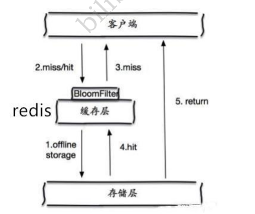
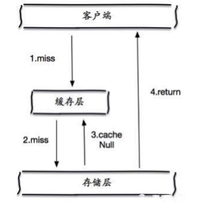
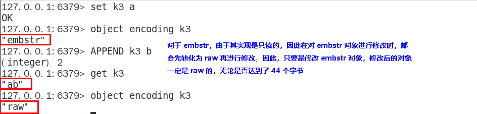
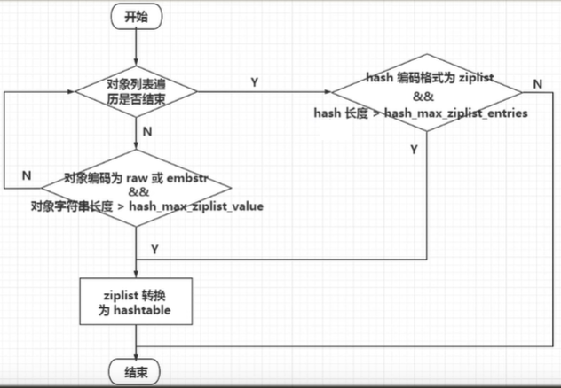

# Redis 篇

## 基础篇

### Redis概述

#### 初识NoSQL

##### Mysql演进过程

###### 单机MySQL


90年代，一个基本的网站访问量一般不会太大，单个数据库完全足够！

那个时候，更多的去使用静态网页 Html ~ 服务器根本没有太大的压力！

思考一下，这种情况下：整个网站的瓶颈是什么？ 

1. 数据量如果太大、一个机器放不下了！ 

2. 数据的索引 （B+ Tree），一个机器内存也放不下 

3. 访问量（读写混合），一个服务器承受不了~ 

只要你开始出现以上的三种情况之一，那么你就必须要晋级！

###### Memcached（缓存） + MySQL + 垂直拆分 （读写分离）

网站80%的情况都是在读，每次都要去查询数据库的话就十分的麻烦！所以说我们希望减轻数据的压力，我们可以使用缓存来保证效率！

发展过程： 优化数据结构和索引--> 文件缓存（IO）---> Memcached（当时最热门的技术！）


###### 分库分表 + 水平拆分 + MySQL集群

技术和业务在发展的同时，对人的要求也越来越高！

> 本质：数据库（读，写）

早些年MyISAM： 表锁，十分影响效率！高并发下就会出现严重的锁问题

转战Innodb：行锁

慢慢的就开始使用分库分表来解决写的压力！ MySQL 在那个年代推出了表分区！这个并没有多少公司使用！ 

MySQL 的 集群，很好满足哪个年代的所有需求！


###### 当今的企业架构分析

2010--2020 十年之间，世界已经发生了翻天覆地的变化；（定位，也是一种数据，音乐，热榜！）

MySQL 等关系型数据库就不够用了！数据量很多，变化很快~！

MySQL 有的使用它来村粗一些比较大的文件，博客，图片！

数据库表很大，效率就低了！如果有一种数据库来专门处理这种数据, MySQL压力就变得十分小（研究如何处理这些问题！）大数据的IO压力下，表几乎没法更大！

###### 目前一个基本的互联网项目！


##### 为什么要用NoSQL！

用户的个人信息，社交网络，地理位置。用户自己产生的数据，用户日志等等爆发式增长！

这时候我们就需要使用NoSQL数据库的，Nosql 可以很好的处理以上的情况！

##### 什么是NoSQL

###### NoSQL

NoSQL = Not Only SQL （不仅仅是SQL）

泛指非关系型数据库的，随着web2.0互联网的诞生！传统的关系型数据库很难对付web2.0时代！尤其 是超大规模的高并发的社区！ 暴露出来很多难以克服的问题，NoSQL在当今大数据环境下发展的十分迅 速，Redis是发展最快的，而且是我们当下必须要掌握的一个技术！

很多的数据类型用户的个人信息，社交网络，地理位置。这些数据类型的存储不需要一个固定的格式！ 不需要多月的操作就可以横向扩展的 ！ `Map<String,Object>`使用键值对来控制！

###### NoSQL 特点

解耦！

- 1、方便扩展（数据之间没有关系，很好扩展！）
- 2、大数据量高性能（Redis 一秒写8万次，读取11万，NoSQL的缓存记录级，是一种细粒度的缓存，性 能会比较高！） 
- 3、数据类型是多样型的！（不需要事先设计数据库！随取随用！如果是数据量十分大的表，很多人就无 法设计了！） 
- 4、传统 RDBMS 和 NoSQL

```
传统的 RDBMS
- 结构化组织
- SQL
- 数据和关系都存在单独的表中 row col
- 操作操作，数据定义语言
- 严格的一致性
- 基础的事务
- .....


Nosql
- 不仅仅是数据
- 没有固定的查询语言
- 键值对存储，列存储，文档存储，图形数据库（社交关系）
- 最终一致性
- CAP定理和BASE （异地多活） 初级架构师！（狂神理念：只要学不死，就往死里学！）
- 高性能，高可用，高可扩
- ....
```

##### 了解：3V+3高

大数据时代的3V：主要是描述问题的 

1. 海量Volume 
2. 多样Variety
3. 实时Velocity 

大数据时代的3高：主要是对程序的要求 

1. 高并发 
2. 高可扩 
3. 高性能

真正在公司中的实践：NoSQL + RDBMS 一起使用才是最强的，阿里巴巴的架构演进！

技术没有高低之分，就看你如何去使用！（提升内功，思维的提高！）

##### 阿里巴巴实践分析理解数据架构演进


技术急不得，越是慢慢学，才能越扎实！ 

开源才是技术的王道！ 任何一家互联网的公司，都不可能只是简简单单让用户能用就好了！ 

大量公司做的都是相同的业务；（竞品协议） 

随着这样的竞争，业务是越来越完善，然后对于开发者的要求也是越来越高！


如果你未来想做一个架构师： 没有什么是加一层解决不了的！

```properties
# 1、商品的基本信息
    bilibili：狂神说Java
    要知道，一个简单地网页背后的技术一定不是大家所想的那么简单！
    大型互联网应用问题：
    数据类型太多了！
    数据源繁多，经常重构！
    数据要改造，大面积改造？
    解决问题：
    名称、价格、商家信息；
    关系型数据库就可以解决了！ MySQL / Oracle （淘宝早年就去IOE了！- 王坚：推荐文章：阿里云
    的这群疯子：40分钟重要！）
    淘宝内部的 MySQL 不是大家用的 MySQL
# 2、商品的描述、评论（文字比较多）
	文档型数据库中，MongoDB
# 3、图片
    分布式文件系统 FastDFS
    - 淘宝自己的 TFS
    - Gooale的 GFS
    - Hadoop HDFS
    - 阿里云的 oss
# 4、商品的关键字 （搜索）
    - 搜索引擎 solr elasticsearch
    - ISerach：多隆（多去了解一下这些技术大佬！）
    所有牛逼的人都有一段苦逼的岁月！但是你只要像SB一样的去坚持，终将牛逼！
# 5、商品热门的波段信息
    - 内存数据库
    - Redis Tair、Memache...
# 6、商品的交易，外部的支付接口
	- 三方应用
```

要知道，一个简单地网页背后的技术一定不是大家所想的那么简单！

大型互联网应用问题： 

- 数据类型太多了！ 
- 数据源繁多，经常重构！ 
- 数据要改造，大面积改造？ 

解决问题：


这里以上都是NoSQL入门概述，不仅能够提高大家的知识，还可以帮助大家了解大厂的工作内容！

##### NoSQL的四大分类

###### **KV键值对** 

- 新浪：Redis 
- 美团：Redis + Tair 

阿里、百度：Redis + memecache 

###### **文档型数据库（bson格式 和json一样）**

- MongoDB （一般必须要掌握） 
  - MongoDB 是一个基于分布式文件存储的数据库，C++ 编写，主要用来处理大量的文档！
  - MongoDB 是一个介于关系型数据库和非关系型数据中中间的产品！MongoDB 是非关系型数 据库中功能最丰富，最像关系型数据库的！ 
- **ConthDB**  

###### **列存储数据库**

- HBase
- 分布式文件系统

###### **图关系数据库**


- 他不是存图形，放的是关系，比如：朋友圈社交网络，广告推荐！ 
- **Neo4j**，InfoGrid；

**对比**


#### 什么是 Redis

**Redis 是一个开源（BSD许可）的，内存中的数据结构存储系统，它可以用作数据库、缓存和消息中间件。**它支持多种类型的数据结构，如 [字符串（strings）](https://www.redis.com.cn/topics/data-types-intro.html#strings)， [散列（hashes）](https://www.redis.com.cn/topics/data-types-intro.html#hashes)， [列表（lists）](https://www.redis.com.cn/topics/data-types-intro.html#lists)， [集合（sets）](https://www.redis.com.cn/topics/data-types-intro.html#sets)， [有序集合（sorted sets）](https://www.redis.com.cn/topics/data-types-intro.html#sorted-sets) 与范围查询， [bitmaps](https://www.redis.com.cn/topics/data-types-intro.html#bitmaps)， [hyperloglogs](https://www.redis.com.cn/topics/data-types-intro.html#hyperloglogs) 和 [地理空间（geospatial）](https://www.redis.com.cn/commands/geoadd.html) 索引半径查询。Redis 内置了 [复制（replication）](https://www.redis.com.cn/topics/replication.html)， [LUA脚本（Lua scripting）](https://www.redis.com.cn/commands/eval.html)， [LRU驱动事件（LRU eviction）](https://www.redis.com.cn/topics/lru-cache.html)， [事务（transactions）](https://www.redis.com.cn/topics/transactions.html) 和不同级别的 [磁盘持久化（persistence）](https://www.redis.com.cn/topics/persistence.html)， 并通过 [Redis哨兵（Sentinel）](https://www.redis.com.cn/topics/sentinel.html) 和自动 [分区（Cluster）](https://www.redis.com.cn/topics/cluster-tutorial.html)提供高可用性（high availability）。

#### Redis 文档

* [Redis官网](https://redis.io/)
* [Redis中文网](http://www.redis.cn/)
* [Redis中文教程](https://www.redis.com.cn/)

#### Redis 用途

- 内存存储、持久化，内存中是断电即失、所以说持久化很重要（rdb、aof） 
- 效率高，可以用于高速缓存 
- 发布订阅系统 
- 地图信息分析 
- 计时器、计数器（浏览量！）
- …

#### Redis 特性

- 多样的数据类型
- 持久化
- 集群
- 事务

### Redis 基础

#### Redis 单机部署

##### windows下安装

* https://github.com/microsoftarchive/redis/releases
* 将redis注册成服务（一般都会默认注册）

```sh
# 注册服务 
redis-server.exe –service-install redis.windows.conf

# 删除服务 
redis-server –service-uninstall

# 开启服务 
redis-server –service-start

# 停止服务 
redis-server –service-stop
```

* 开启服务后，打开控制平台，输入`redis-cli`

##### Linux下安装

* http://www.redis.cn/download.html

* 下载redis

```sh
wget http://download.redis.io/releases/redis-6.0.6.tar.gz
```

* 解压redis

```sh
tar xzf redis-6.0.6.tar.gz
```

* 安装GCC

```sh
sudo apt update
sudo apt install build-essential
```

如果是centos，则

```shell
yum -y install centos-release-scl

yum -y install devtoolset-9-gcc devtoolset-9-gcc-c++ devtoolset-9-binutils

scl enable devtoolset-9 bash
gcc -v
```

* 编译redis

```sh
sudo make
sudo make install
```

* redis的默认安装路径 `/usr/local/bin`


* 将redis配置文件。复制到当前目录下

```sh
sudo mkdir redis-config

sudo cp ~/opt/redis-6.0.6/redis.conf redis-config

cd redis-config

ls
```


* redis默认不是后台启动的，修改配置文件！

```sh
sudo vim redis.conf
```

> vim中的保存退出命令是wq。具体方法：首先按i键进入插入模式；然后编辑文件；接着按esc键进入命令行模式；最后输入【:wq】即可保存文件并退出。


* 启动Redis服务！

```sh
redis-server redis-config/redis.conf
```


* 使用redis-cli 进行连接测试！

```sh
redis-cli -p 6379
```


* 查看redis的进程是否开启！

```sh
ps -ef|grep redis
```


* 如何关闭Redis服务呢？

```sh
sudo mkdir redis-log
sudo vim redis_log.log

cd redis-config/redis.conf
sudo vim redis.conf
```

> 在命令模式下敲斜杆( / )这时在状态栏（也就是屏幕左下脚）就出现了 “/” 然后输入你要查找的关键字敲回车就可以了。

设置日志`logfile`，`logfile /usr/local/bin/redis-log/redis_log.log`


然后继续修改`dir`，`dir /usr/local/bin/redis-dbfile/`

```sh
sudo mkdir redis-dbfile
sudo vim redis.conf
```


赋予读写权限使用指令： `sudo chmod 777 redis-dbfile`

```sh
sudo chmod 777 redis-config/redis.conf 
sudo chmod 777 redis-dbfile
sudo chmod 777 redis-log/redis_log.log
```

然后进行关闭服务


* 再次查看进程是否存在


#### Redis 可视化工具

##### [redis-insight](https://redis.com/redis-enterprise/redis-insight/#insight-form)


##### iredis

```sh
pip install iredis
```

#### Redis 性能测试

- redis-benchmark 是一个压力测试工具！ 

redis 性能测试工具可选参数如下所示：

| 序号 | 选项                   | 描述                                       | 默认值    |
| :--- | :--------------------- | :----------------------------------------- | :-------- |
| 1    | **-h**                 | 指定服务器主机名                           | 127.0.0.1 |
| 2    | **-p**                 | 指定服务器端口                             | 6379      |
| 3    | **-s**                 | 指定服务器 socket                          |           |
| 4    | **-c**                 | 指定并发连接数                             | 50        |
| 5    | **-n**                 | 指定请求数                                 | 10000     |
| 6    | **-d**                 | 以字节的形式指定 SET/GET 值的数据大小      | 2         |
| 7    | **-k**                 | 1=keep alive 0=reconnect                   | 1         |
| 8    | **-r**                 | SET/GET/INCR 使用随机 key, SADD 使用随机值 |           |
| 9    | **-P**                 | 通过管道传输 `<numreq>` 请求               | 1         |
| 10   | **-q**                 | 强制退出 redis。仅显示 query/sec 值        |           |
| 11   | **--csv**              | 以 CSV 格式输出                            |           |
| 12   | **-l（L 的小写字母）** | 生成循环，永久执行测试                     |           |
| 13   | **-t**                 | 仅运行以逗号分隔的测试命令列表。           |           |
| 14   | **-I（i 的大写字母）** | Idle 模式。仅打开 N 个 idle 连接并等待。   |           |
| 15   | --threads              | 指定线程数目`<num>`                        |           |

* 来简单测试下

```sh
redis-benchmark -h localhost -p 6379 -c 100 -n 10000
```


* 如何查看这些分析呢？


#### Redis 基础知识

##### 默认数据库

redis的默认数据库有16个，而且默认使用的是第0个


##### 查看服务是否运行

通过`ping`查看服务是否运行，返回`PONG`表示正常运行

```sh
127.0.0.1:6379[1]> ping
PONG
```

##### 切换数据库select

可以通过使用`select`进行切换数据库

```sh
127.0.0.1:6379> select 3 # 切换数据库
OK
127.0.0.1:6379[3]> dbsize # 查看DB大小
(integer) 0
```


##### 查看数据库中的所有key

```sh
127.0.0.1:6379[3]> set name hutao
OK
127.0.0.1:6379[3]> keys *
1) "name"
127.0.0.1:6379[3]> 
```

##### 清除当前数据库

```sh
127.0.0.1:6379> flushdb
OK
127.0.0.1:6379> keys *
(empty array)
127.0.0.1:6379> 
```

##### 清除全部数据库内容

```sh
flushall
```

##### Redis 管理 redis 服务相关命令

下表列出了管理 redis 服务相关的命令

| 命令                                                         | 描述                                             |
| ------------------------------------------------------------ | ------------------------------------------------ |
| [BGREWRITEAOF](https://www.redis.com.cn/commands/bgrewriteaof.html) | 异步执行一个 AOF（AppendOnly File） 文件重写操作 |
| [BGSAVE](https://www.redis.com.cn/commands/bgsave.html)      | 在后台异步保存当前数据库的数据到磁盘             |
| [CLIENT](https://www.redis.com.cn/commands/client-kill.html) | 关闭客户端连接                                   |
| [CLIENT LIST](https://www.redis.com.cn/commands/client-list.html) | 获取连接到服务器的客户端连接列表                 |
| [CLIENT GETNAME](https://www.redis.com.cn/commands/client-getname.html) | 获取连接的名称                                   |
| [CLIENT PAUSE](https://www.redis.com.cn/commands/client-pause.html) | 在指定时间内终止运行来自客户端的命令             |
| [CLIENT SETNAME](https://www.redis.com.cn/commands/client-setname.html) | 设置当前连接的名称                               |
| [CLUSTER SLOTS](https://www.redis.com.cn/commands/cluster-slots.html) | 获取集群节点的映射数组                           |
| [COMMAND](https://www.redis.com.cn/commands/command.html)    | 获取 Redis 命令详情数组                          |
| [COMMAND COUNT](https://www.redis.com.cn/commands/command-count.html) | 获取 Redis 命令总数                              |
| [COMMAND GETKEYS](https://www.redis.com.cn/commands/command-getkeys.html) | 获取给定命令的所有键                             |
| [TIME](https://www.redis.com.cn/commands/time.html)          | 返回当前服务器时间                               |
| [COMMAND INFO](https://www.redis.com.cn/commands/command-info.html) | 获取指定 Redis 命令描述的数组                    |
| [CONFIG GET](https://www.redis.com.cn/commands/config-get.html) | 获取指定配置参数的值                             |
| [CONFIG REWRITE](https://www.redis.com.cn/commands/config-rewrite.html) | 修改 redis.conf 配置文件                         |
| [CONFIG SET](https://www.redis.com.cn/commands/config-set.html) | 修改 redis 配置参数，无需重启                    |
| [CONFIG RESETSTAT](https://www.redis.com.cn/commands/config-resetstat.html) | 重置 INFO 命令中的某些统计数据                   |
| [DBSIZE](https://www.redis.com.cn/commands/dbsize.html)      | 返回当前数据库的 key 的数量                      |
| [DEBUG OBJECT](https://www.redis.com.cn/commands/debug-object.html) | 获取 key 的调试信息                              |
| [DEBUG SEGFAULT](https://www.redis.com.cn/commands/debug-segfault.html) | 让 Redis 服务崩溃                                |
| [FLUSHALL](https://www.redis.com.cn/commands/flushall.html)  | 删除所有数据库的所有 key                         |
| [FLUSHDB](https://www.redis.com.cn/commands/flushdb.html)    | 删除当前数据库的所有 key                         |
| [INFO](https://www.redis.com.cn/commands/info.html)          | 获取 Redis 服务器的各种信息和统计数值            |
| [LASTSAVE](https://www.redis.com.cn/commands/lastsave.html)  | 返回最近一次 Redis 成功将数据保存到磁盘上的时间  |
| [MONITOR](https://www.redis.com.cn/commands/monitor.html)    | 实时打印出 Redis 服务器接收到的命令，调试用      |
| [ROLE](https://www.redis.com.cn/commands/role.html)          | 返回主从实例所属的角色                           |
| [SAVE](https://www.redis.com.cn/commands/save.html)          | 异步保存数据到硬盘                               |
| [SHUTDOWN](https://www.redis.com.cn/commands/shutdown.html)  | 异步保存数据到硬盘，并关闭服务器                 |
| [SLAVEOF](https://www.redis.com.cn/commands/slaveof.html)    | 将当前服务器转变从属服务器(slave server)         |
| [SLOWLOG](https://www.redis.com.cn/commands/showlog.html)    | 管理 redis 的慢日志                              |
| [SYNC](https://www.redis.com.cn/commands/sync.html)          | 用于复制功能 ( replication ) 的内部命令          |

#### 思考题：Redis是单线程吗

##### Redis 是单线程的！

明白Redis是很快的，官方表示，Redis是基于内存操作，CPU不是Redis性能瓶颈，**Redis的瓶颈是根据 机器的内存和网络带宽**，既然可以使用单线程来实现，就使用单线程了！所有就使用了单线程了！

 Redis 是C 语言写的，官方提供的数据为 100000+ 的QPS，完全不比同样是使用 key-vale的 Memecache差！

##### Redis 为什么单线程还这么快？

- 误区1：高性能的服务器一定是多线程的？ 
- 误区2：多线程（CPU上下文会切换！）一定比单线程效率高！ 先去CPU>内存>硬盘的速度要有所了解！

核心：redis 是将所有的数据全部放在内存中的，所以说使用单线程去操作效率就是最高的，多线程 （CPU上下文会切换：耗时的操作！！！），**对于内存系统来说，如果没有上下文切换效率就是最高的**！多次读写都是在一个CPU上的，在内存情况下，这个就是最佳的方案！

> 那些之前的版本，现在新版本已经有多线程了。如果Redis支持了多线程（目前多线程的Redis不建议超出8个线程）

### Redis 基础语法

#### Redis Key

##### 获取所有键值keys

* 通过`keys *`获取所有键值

```sh
127.0.0.1:6379> set name hutao
OK
127.0.0.1:6379> get name
"hutao"
127.0.0.1:6379> set age 18
OK
127.0.0.1:6379> keys *
1) "age"
2) "name"
```

* 通过`keys`进行模糊查询

在redis里有3个通配符用于模糊查询key：

- *: 通配任意多个字符
- ?: 通配单个字符
- []: 通配括号内的某1个字符

```sh
127.0.0.1:6379> keys *
1) "age"
2) "name"
127.0.0.1:6379> keys a*
1) "age"
127.0.0.1:6379> keys *[a]*
1) "age"
2) "name"
127.0.0.1:6379> keys ?[a]*
1) "name"
```

##### 判断键值key是否存在

通过`exists key`判断键值`key`是否存在，存在该键值返回1，否则返回0

```sh
127.0.0.1:6379> exists name
(integer) 1
127.0.0.1:6379> exists username
(integer) 0
127.0.0.1:6379> keys *
1) "age"
2) "name"
```

##### 移动键值队key-value

通过`move key dbNumber`移动键值队key-value到指定数据库dbNumber

```sh
127.0.0.1:6379> set a 1
OK
127.0.0.1:6379> set b 2
OK
127.0.0.1:6379> set c 3
OK
127.0.0.1:6379> move a 1
(integer) 1
127.0.0.1:6379> keys *
1) "c"
2) "b"
127.0.0.1:6379> select  1
OK
127.0.0.1:6379[1]> keys *
1) "a"
```

##### 删除键值对key-value

```sh
127.0.0.1:6379[1]> del a
(integer) 1
127.0.0.1:6379[1]> keys *
(empty array)
127.0.0.1:6379[1]> 
```

##### 清理当前屏幕

```sh
clear
```

##### 设置过期时间

* 通过`expire key seconds`设置过期时间

```sh
127.0.0.1:6379> flushdb
OK
127.0.0.1:6379> set name hutao
OK
127.0.0.1:6379> keys *
1) "name"
127.0.0.1:6379> expire name 5 # 设置过期时间
(integer) 1
127.0.0.1:6379> keys *
1) "name"
127.0.0.1:6379> keys *
(empty array)
127.0.0.1:6379> 
```

* 通过`ttl key`查看键值`key`的过期时间还有多久

```sh
127.0.0.1:6379> set name hutao
OK
127.0.0.1:6379> expire name 5
(integer) 1
127.0.0.1:6379> ttl name
(integer) 2
127.0.0.1:6379> ttl name
(integer) -2
127.0.0.1:6379> keys *
(empty array)
127.0.0.1:6379> 
```

##### 查看键值对数据类型

通过`type key`查看`key`键值的存储的数据类型

```sh
127.0.0.1:6379> set name hutao
OK
127.0.0.1:6379> type name
string
```

##### Redis键相关的命令

| 命令                                                         | 描述                                                  |
| ------------------------------------------------------------ | ----------------------------------------------------- |
| [DEL](https://www.redis.com.cn/commands/del.html)            | 用于删除 key                                          |
| [DUMP](https://www.redis.com.cn/commands/dump.html)          | 序列化给定 key ，并返回被序列化的值                   |
| [EXISTS](https://www.redis.com.cn/commands/exists.html)      | 检查给定 key 是否存在                                 |
| [EXPIRE](https://www.redis.com.cn/commands/expire.html)      | 为给定 key 设置过期时间                               |
| [EXPIREAT](https://www.redis.com.cn/commands/expireat.html)  | 用于为 key 设置过期时间，接受的时间参数是 UNIX 时间戳 |
| [PEXPIRE](https://www.redis.com.cn/commands/pexpire.html)    | 设置 key 的过期时间，以毫秒计                         |
| [PEXPIREAT](https://www.redis.com.cn/commands/pexpireat.html) | 设置 key 过期时间的时间戳(unix timestamp)，以毫秒计   |
| [KEYS](https://www.redis.com.cn/commands/keys.html)          | 查找所有符合给定模式的 key                            |
| [MOVE](https://www.redis.com.cn/commands/move.html)          | 将当前数据库的 key 移动到给定的数据库中               |
| [PERSIST](https://www.redis.com.cn/commands/persist.html)    | 移除 key 的过期时间，key 将持久保持                   |
| [PTTL](https://www.redis.com.cn/commands/pttl.html)          | 以毫秒为单位返回 key 的剩余的过期时间                 |
| [TTL](https://www.redis.com.cn/commands/ttl.html)            | 以秒为单位，返回给定 key 的剩余生存时间(              |
| [RANDOMKEY](https://www.redis.com.cn/commands/randomkey.html) | 从当前数据库中随机返回一个 key                        |
| [RENAME](https://www.redis.com.cn/commands/rename.html)      | 修改 key 的名称                                       |
| [RENAMENX](https://www.redis.com.cn/commands/renamenx.html)  | 仅当 newkey 不存在时，将 key 改名为 newkey            |
| [TYPE](https://www.redis.com.cn/commands/type.html)          | 返回 key 所储存的值的类型                             |

#### 五大基本数据类型

##### String（字符串）

Redis 字符串命令用于管理 Redis 中的字符串值。

###### 设置键值对

* 通过`set name value [EX] value2 [NX]` 设置键值`key`的值

```sh
127.0.0.1:6379[1]> set name hutao
OK
```

EX − 设置指定的到期时间(以秒为单位)。

PX - 设置指定的到期时间(以毫秒为单）

NX - 仅在键不存在时设置键。

XX - 只有在键已存在时才设置。

* 通过`setnx key value`，如果key 不存在，创建key 

> 不存在则进行设置 （在分布式锁中会常常使用！）

```sh
127.0.0.1:6379[1]> set name hutao
OK
127.0.0.1:6379[1]> setnx name hutao1 # 存在key，不能被创建
(integer) 0
127.0.0.1:6379[1]> get name
"hutao"
127.0.0.1:6379[1]> setnx name1 hutao1 # 不存在，创建key
(integer) 1
127.0.0.1:6379[1]> get name1
"hutao1"
```

* 通过`getset key value`先获取key
  * 如果不存在，则返回(nil)，并设置value
  * 如果存在值，获取原来的值，并设置新的值value

```sh
127.0.0.1:6379[1]> getset db redis
(nil)
127.0.0.1:6379[1]> get db
"redis"
```

###### 获取键值对

通过`get key`获取键值`key`的值

```sh
127.0.0.1:6379[1]> get name
"hutao"
```

###### 获得所有的key

通过`keys *`获取所有键值

```sh
127.0.0.1:6379[1]> keys *
1) "name"
```

###### 判断key是否存在

通过`exists key`判断某一个key是否存在，存在返回1，否则返回0

```sh
127.0.0.1:6379[1]> exists name
(integer) 1
127.0.0.1:6379[1]> exists name1
(integer) 0
```

###### 追加字符串

通过`append key value`如果当前key不存在，就相当于setkey

```sh
127.0.0.1:6379[1]> append name 123
(integer) 8
127.0.0.1:6379[1]> get name
"hutao123"
```

###### 字符串长度

通过`strlen key`获取键值`key`的字符串的长度

```sh
127.0.0.1:6379[1]> strlen name
(integer) 8
```

###### 逻辑运算

> 值一定要为数字

**自增**

* `incr`自增1

```sh
127.0.0.1:6379[1]> flushdb
OK
127.0.0.1:6379[1]> set num 1
OK
127.0.0.1:6379[1]> incr num
(integer) 2
127.0.0.1:6379[1]> get num
"2"
```

* `incrby key len`指定自增长度

```sh
127.0.0.1:6379[1]> incrby num 10
(integer) 12
127.0.0.1:6379[1]> get num
"12"
```

**自减**

- `decr`自减1

```sh
127.0.0.1:6379[1]> decr num
(integer) 11
127.0.0.1:6379[1]> get num
"11"
```

- `decrby key len`指定自减长度

```sh
127.0.0.1:6379[1]> decrby num 10
(integer) 1
127.0.0.1:6379[1]> get num
"1"
```

###### 截取字符串

通过`getrange key startIndex endIndex`从第startIndex字符到第endIndex截取字符串，如果endIndex值为-1，则会获取从第startIndex之后的所有字符。

```sh
127.0.0.1:6379[1]> set say "hello,hutao"
OK
127.0.0.1:6379[1]> get say
"hello,hutao"
127.0.0.1:6379[1]> strlen say
(integer) 11
127.0.0.1:6379[1]> getrange say 0 4 # 截取字符串 [0,4]
"hello"
127.0.0.1:6379[1]> getrange say 6 -1 # 截取字符串 [6,11]
"hutao"
```

###### 替换字符串

通过`setrange key index newValue`替换第index开始的字符串

```sh
127.0.0.1:6379[1]> setrange say 0 112
(integer) 11
127.0.0.1:6379[1]> get say
"112lo,hutao"
```

###### 设置过期时间

通过`setex key seconds value`设置键值对`key-value`的过期时间`seconds`

```sh
127.0.0.1:6379[1]> setex name 5 hutao # 设置键值name的值hutao，在5秒后过期
OK
127.0.0.1:6379[1]> ttl name # 查看还有几秒过期
(integer) 2
```

###### 同时设置多个值

* 通过`mset key1 value1 key2 value2 ...`创建多个键值对

```sh
127.0.0.1:6379[1]> mset a 1 b 2 c 3
OK
127.0.0.1:6379[1]> keys *
1) "c"
2) "a"
3) "b"
127.0.0.1:6379[1]> 
```

*  `msetnx` 是一个原子性的操作，要么一起成功，要么一起 失败！是`setnx`的多个操作

```sh
127.0.0.1:6379[1]> flushdb
OK
127.0.0.1:6379[1]> mset a 1 b 2 c 3
(integer) 1
127.0.0.1:6379[1]> msetnx a 1 b 2 d 3
(integer) 0
127.0.0.1:6379[1]> msetnx d 4 e 5
(integer) 1
127.0.0.1:6379[1]> keys *
1) "c"
2) "e"
3) "d"
4) "a"
5) "b"
```

###### 同时获取多个值

通过`mget key1 value1 key2 value2 ...`获取多个键值对

```sh
127.0.0.1:6379[1]> mget a b c
1) "1"
2) "2"
3) "3"
```

###### 设置对象

```
127.0.0.1:6379[1]> set user:1 {name:hutao,age:18}
OK
127.0.0.1:6379[1]> get user:1
"{name:hutao,age:18}"
127.0.0.1:6379[1]> mset user:1:name hutao user:1:age 2
OK
127.0.0.1:6379[1]> mget user:1:name user:1:age
1) "hutao"
2) "2"
```

> 这里的key是一个巧妙的设计： user:{id}:{filed} , 如此设计在Redis中是完全OK了！

###### Redis字符串命令

以下是一些用于在 Redis 中管理字符串的基本命令的列表：

| 命令                                                         | 描述                                                        |
| ------------------------------------------------------------ | ----------------------------------------------------------- |
| [SET](https://www.redis.com.cn/commands/set.html)            | 设置指定 key 的值                                           |
| [GET](https://www.redis.com.cn/commands/get.html)            | 获取指定 key 的值                                           |
| [GETRANGE](https://www.redis.com.cn/commands/getrange.html)  | 返回 key 中字符串值的子字符                                 |
| [GETSET](https://www.redis.com.cn/commands/getset.html)      | 将给定 key 的值设为 value ，并返回 key 的旧值 ( old value ) |
| [GETBIT](https://www.redis.com.cn/commands/getbit.html)      | 对 key 所储存的字符串值，获取指定偏移量上的位 ( bit )       |
| [MGET](https://www.redis.com.cn/commands/mget.html)          | 获取所有(一个或多个)给定 key 的值                           |
| [SETBIT](https://www.redis.com.cn/commands/setbit.html)      | 对 key 所储存的字符串值，设置或清除指定偏移量上的位(bit)    |
| [SETEX](https://www.redis.com.cn/commands/setex.html)        | 设置 key 的值为 value 同时将过期时间设为 seconds            |
| [SETNX](https://www.redis.com.cn/commands/setnx.html)        | 只有在 key 不存在时设置 key 的值                            |
| [SETRANGE](https://www.redis.com.cn/commands/setrange.html)  | 从偏移量 offset 开始用 value 覆写给定 key 所储存的字符串值  |
| [STRLEN](https://www.redis.com.cn/commands/strlen.html)      | 返回 key 所储存的字符串值的长度                             |
| [MSET](https://www.redis.com.cn/commands/mset.html)          | 同时设置一个或多个 key-value 对                             |
| [MSETNX](https://www.redis.com.cn/commands/msetnx.html)      | 同时设置一个或多个 key-value 对                             |
| [PSETEX](https://www.redis.com.cn/commands/psetex.html)      | 以毫秒为单位设置 key 的生存时间                             |
| [INCR](https://www.redis.com.cn/commands/incr.html)          | 将 key 中储存的数字值增一                                   |
| [INCRBY](https://www.redis.com.cn/commands/incrby.html)      | 将 key 所储存的值加上给定的增量值 ( increment )             |
| [INCRBYFLOAT](https://www.redis.com.cn/commands/incrbyfloat.html) | 将 key 所储存的值加上给定的浮点增量值 ( increment )         |
| [DECR](https://www.redis.com.cn/commands/decr.html)          | 将 key 中储存的数字值减一                                   |
| [DECRBY](https://www.redis.com.cn/commands/decrby.html)      | 将 key 所储存的值减去给定的减量值 ( decrement )             |
| [APPEND](https://www.redis.com.cn/commands/append.html)      | 将 value 追加到 key 原来的值的末尾                          |

String类似的使用场景：value除了是我们的字符串还可以是我们的数字！ 

- 计数器
- 统计多单位的数量
- 粉丝数
- 对象缓存存储
- 分布式ID

##### List（列表）

Redis 列表是按插入顺序排序的字符串列表。可以在列表的头部（左边）或尾部（右边）添加元素。

> **消息排队！消息队列 （Lpush Rpop）（左进右出）， 栈（ Lpush Lpop）（左进左出）！**


###### 插入值

* 通过`lpush keyList value1 [value2 ...]`将一个或者多个value插入到列表左边

```sh
127.0.0.1:6379[1]> flushdb
OK
127.0.0.1:6379[1]> lpush keyList three
(integer) 1
127.0.0.1:6379[1]> lpush keyList fourth
(integer) 2
127.0.0.1:6379[1]> lpush keyList fifth sixth
(integer) 4
127.0.0.1:6379[1]> lrange keyList 0 -1 # 查看keyList列表所有值
1) "sixth"
2) "fifth"
3) "fourth"
4) "three"

```

* 通过`rpush keyList value1 [value2 ...]`将一个或者多个value插入到列表右边

```sh
127.0.0.1:6379[1]> rpush keyList second first
(integer) 6
127.0.0.1:6379[1]> lrange keyList 0 -1
1) "sixth"
2) "fifth"
3) "fourth"
4) "three"
5) "second"
6) "first"
```

* 通过`linsert keyList before[afrer] value1 value2 ` 将某个具体的value2插入到队列中某个元素value1 的前面或者后面

```sh
127.0.0.1:6379[1]> flushdb
OK
127.0.0.1:6379[1]> lpush keyList 3
(integer) 1

# 插入到前面
127.0.0.1:6379[1]> linsert keyList before 3 2
(integer) 2

127.0.0.1:6379[1]> lrange keyList 0 -1
1) "2"
2) "3"

# 插入到后面
127.0.0.1:6379[1]> linsert keyList after 3 1
(integer) 3


127.0.0.1:6379[1]> lrange keyList 0 -1
1) "2"
2) "3"
3) "1"
127.0.0.1:6379[1]> 
```

###### 获取值

通过`lrange keyList startIndex endIndex`从列表左边（开头处）第startIndex开始到第endIndex获取列表中的所有值，如果endIndex值为-1，则获取第startIndex开始到最后的所有字符。

```sh
127.0.0.1:6379[1]> lrange keyList 0 3
1) "sixth"
2) "fifth"
3) "fourth"
4) "three"
```

###### 移除元素

* 通过`Lpop keyList`移除列表左边（开头处）第一个元素

```sh
127.0.0.1:6379[1]> lpop keyList
"sixth"
```

* 通过`rpop keyList`移除列表右边（末尾处）第一个元素

```sh
127.0.0.1:6379[1]> rpop keyList
"first"
```

* 通过`lrem keyList count value`移除列表keyList中指定个数count的value

```sh
127.0.0.1:6379[1]> lrem keyList 1 second
(integer) 1
127.0.0.1:6379[1]> lrange keyList 0 -1
1) "fifth"
2) "fourth"
3) "three"
```

* 通过`rpoplpush keyList newKeyList`移除列表keyList的最后一个元素，将他移动到新的列表newKeyList中！

```sh
127.0.0.1:6379[1]> flushdb
OK
127.0.0.1:6379[1]> lpush keyList 1
(integer) 1
127.0.0.1:6379[1]> lpush keyList 2
(integer) 2
127.0.0.1:6379[1]> lpush keyList 3
(integer) 3

 # 移除列表的最后一个元素，将他移动到新的列表中！
127.0.0.1:6379[1]> rpoplpush keyList keyList2
"1"

127.0.0.1:6379[1]> lrange keyList 0 -1 # 查看原来的列表
1) "3"
2) "2"
127.0.0.1:6379[1]> lrange keyList2 0 -1 # 查看目标列表中，确实存在改值！
1) "1"
127.0.0.1:6379[1]> 
```

###### 通过下标获取值

通过`lindex keyList index` 获取列表keyList第index处的值

```sh
127.0.0.1:6379[1]> lrange keyList 0 -1
1) "fifth"
2) "fourth"
3) "three"
4) "second"
127.0.0.1:6379[1]> lindex keyList 2
"three"
```

###### 获取列表长度

通过`llen keyList`获取列表keyList的长度

```sh
127.0.0.1:6379[1]> lrange keyList 0 -1
1) "fifth"
2) "fourth"
3) "three"
4) "second"
127.0.0.1:6379[1]> llen keyList
(integer) 4
```

###### 截断列表数据

* 通过`ltrim keyList startIndex endIndex`从第startIndex到第endIndex对列表进行截断，并返回截取的部分

```sh
127.0.0.1:6379[1]> flushdb
OK
127.0.0.1:6379[1]> lpush keyList 1
(integer) 1
127.0.0.1:6379[1]> lpush keyList 2
(integer) 2
127.0.0.1:6379[1]> lpush keyList 3
(integer) 3
127.0.0.1:6379[1]> lpush keyList 4
(integer) 4
127.0.0.1:6379[1]> lpush keyList 5
(integer) 5
127.0.0.1:6379[1]> lrange keyList 0 -1
1) "5"
2) "4"
3) "3"
4) "2"
5) "1"


127.0.0.1:6379[1]> ltrim keyList 1 2 # 截断列表数据
OK
127.0.0.1:6379[1]> lrange keyList 0 -1
1) "4"
2) "3"
```

###### 替换值

通过`lset keyList index newValue`将列表中指定下标index的值替换为另外一个值newValue，更新操作。

* 如果不存在列表去更新就会报错

```sh
127.0.0.1:6379[1]> lrange keyList 0 -1
1) "3"
2) "2"

127.0.0.1:6379[1]> lset keyList 0 1 # 如果存在，更新当前下标的值
OK

127.0.0.1:6379[1]> lrange keyList 0 -1
1) "1"
2) "2"
```

###### Redis 列表命令

下表列出了列表相关命令：

| 命令                                                         | 描述                                                     |
| ------------------------------------------------------------ | -------------------------------------------------------- |
| [BLPOP](https://www.redis.com.cn/commands/blpop.html)        | 移出并获取列表的第一个元素                               |
| [BRPOP](https://www.redis.com.cn/commands/brpop.html)        | 移出并获取列表的最后一个元素                             |
| [BRPOPLPUSH](https://www.redis.com.cn/commands/brpoplpush.html) | 从列表中弹出一个值，并将该值插入到另外一个列表中并返回它 |
| [LINDEX](https://www.redis.com.cn/commands/lindex.html)      | 通过索引获取列表中的元素                                 |
| [LINSERT](https://www.redis.com.cn/commands/linsert.html)    | 在列表的元素前或者后插入元素                             |
| [LLEN](https://www.redis.com.cn/commands/llen.html)          | 获取列表长度                                             |
| [LPOP](https://www.redis.com.cn/commands/lpop.html)          | 移出并获取列表的第一个元素                               |
| [LPUSH](https://www.redis.com.cn/commands/lpush.html)        | 将一个或多个值插入到列表头部                             |
| [LPUSHX](https://www.redis.com.cn/commands/lpushx.html)      | 将一个值插入到已存在的列表头部                           |
| [LRANGE](https://www.redis.com.cn/commands/lrange.html)      | 获取列表指定范围内的元素                                 |
| [LREM](https://www.redis.com.cn/commands/lrem.html)          | 移除列表元素                                             |
| [LSET](https://www.redis.com.cn/commands/lset.html)          | 通过索引设置列表元素的值                                 |
| [LTRIM](https://www.redis.com.cn/commands/ltrim.html)        | 对一个列表进行修剪(trim)                                 |
| [RPOP](https://www.redis.com.cn/commands/rpop.html)          | 移除并获取列表最后一个元素                               |
| [RPOPLPUSH](https://www.redis.com.cn/commands/rpoplpush.html) | 移除列表的最后一个元素，并将该元素添加到另一个列表并返回 |
| [RPUSH](https://www.redis.com.cn/commands/rpush.html)        | 在列表中添加一个或多个值                                 |
| [RPUSHX](https://www.redis.com.cn/commands/rpushx.html)      | 为已存在的列表添加值                                     |

##### Hash（哈希）

Redis hash 是一个 string 类型的 key和value 的映射表，hash 特别适合用于**存储对象**。

> hash变更的数据 user name age,尤其是是用户信息之类的，经常变动的信息！ hash 更适合于对象的 存储，String更加适合字符串存储！

###### 设置值

* 通过`hset hashList key value`设置哈希表hashList的key-value

```sh
127.0.0.1:6379[1]> hset hashList name hutao
(integer) 1
```

* 通过`hmset hashList key1 value1 [key2 value2 ...]`设置哈希表hashList 的一个或者多个key-value

```sh
127.0.0.1:6379[1]> hmset hashList a 1 b 2
OK
```

###### 获取值

* 通过`hget hashList key`获取哈希表hashList给定key的值

```sh
127.0.0.1:6379[1]> hget hashList name
"hutao"
```

* 通过`hmget hashList key1 [key2 ...]`获取哈希表hashList 一个或者多个key的value

```sh
127.0.0.1:6379[1]> hmget hashList a b
1) "1"
2) "2"
```

* 通过`hgetall hashList`获取在哈希表hashList 中指定 key 的所有字段和值

```sh
127.0.0.1:6379[1]> hgetall hashList
1) "name"
2) "hutao"
3) "a"
4) "1"
5) "b"
6) "2"
```

* 通过`hkeys hashList`获取在哈希表hashList 中指定 key 的所有字段

* 通过`hvals hashList`获取在哈希表hashList 中指定 key 的所有字段

###### 删除值

通过`hdel hashList key`删除hash指定key字段！对应的value值也就消失了！

```sh
127.0.0.1:6379[1]> hdel hashList name
(integer) 1
127.0.0.1:6379[1]> hgetall hashList
1) "a"
2) "1"
3) "b"
4) "2"
127.0.0.1:6379[1]> 
```

###### 获取字段数量

通过`hlen hashList`获取hash表的字段数量

```sh
127.0.0.1:6379[1]> hlen hashList
(integer) 2
```

###### 逻辑运算

```sh
127.0.0.1:6379> hset myhash field3 5 #指定增量！
(integer) 1
127.0.0.1:6379> HINCRBY myhash field3 1
(integer) 6
127.0.0.1:6379> HINCRBY myhash field3 -1
(integer) 5
127.0.0.1:6379> hsetnx myhash field4 hello # 如果不存在则可以设置
(integer) 1
127.0.0.1:6379> hsetnx myhash field4 world # 如果存在则不能设置
(integer) 0
```

###### Redis哈希命令

| 命令                                                         | 描述                                                      |
| ------------------------------------------------------------ | --------------------------------------------------------- |
| [HDEL](https://www.redis.com.cn/commands/hdel.html)          | 删除一个或多个哈希表字段                                  |
| [HEXISTS](https://www.redis.com.cn/commands/hexists.html)    | 查看哈希表 key 中，指定的字段是否存在                     |
| [HGET](https://www.redis.com.cn/commands/hget.html)          | 获取存储在哈希表中指定字段的值                            |
| [HGETALL](https://www.redis.com.cn/commands/hgetall.html)    | 获取在哈希表中指定 key 的所有字段和值                     |
| [HINCRBY](https://www.redis.com.cn/commands/hincrby.html)    | 为哈希表 key 中的指定字段的整数值加上增量 increment       |
| [HINCRBYFLOAT](https://www.redis.com.cn/commands/hincrbyfloat.html) | 为哈希表 key 中的指定字段的浮点数值加上增量 increment     |
| [HKEYS](https://www.redis.com.cn/commands/hkeys.html)        | 获取所有哈希表中的字段                                    |
| [HLEN](https://www.redis.com.cn/commands/hlen.html)          | 获取哈希表中字段的数量                                    |
| [HMGET](https://www.redis.com.cn/commands/hmget.html)        | 获取所有给定字段的值                                      |
| [HMSET](https://www.redis.com.cn/commands/hmset.html)        | 同时将多个 field-value (域-值)对设置到哈希表 key 中       |
| [HSET](https://www.redis.com.cn/commands/hset.html)          | 将哈希表 key 中的字段 field 的值设为 value                |
| [HSETNX](https://www.redis.com.cn/commands/hsetnx.html)      | 只有在字段 field 不存在时，设置哈希表字段的值             |
| [HVALS](https://www.redis.com.cn/commands/hvals.html)        | 获取哈希表中所有值                                        |
| [HSCAN](https://www.redis.com.cn/commands/hscan.html)        | 迭代哈希表中的键值对                                      |
| [HSTRLEN](https://www.redis.com.cn/commands/hstrlen.html)    | 返回哈希表 key 中， 与给定域 field 相关联的值的字符串长度 |

##### Set（无序集合）

- Redis 的 Set 是 string 类型的无序集合。
- 集合成员是唯一的，这就意味着集合中没有重复的数据。
- 在 Redis 中，添加、删除和查找的时间复杂都是 O(1)（不管 Set 中包含多少元素）。

###### 添加值

通过`sadd setList value`向集合setList添加值

```sh
127.0.0.1:6379[1]> sadd setList hutao
(integer) 1
127.0.0.1:6379[1]> sadd setList yaodao
(integer) 1
127.0.0.1:6379[1]> sadd setList tianhai
(integer) 1
```

###### 获取值

通过`smembers setList`获取集合的所有值

```sh
127.0.0.1:6379[1]> smembers setList
1) "yaodao"
2) "tianhai"
3) "hutao"
```

###### 判断值是否存在

通过`sismember setList value`判断当前的value是否存在于setList集合中

```sh
127.0.0.1:6379[1]> sismember setList hutao
(integer) 1
```

###### 获取元素个数

通过`scard setList`获取set集合中的内容元素个数

```sh
127.0.0.1:6379[1]> scard setList
(integer) 3
```

###### 移除元素

* 通过`srem setList value` 移除setList集合中的指定元素value，如果指定元素不存在，则会返回0

```sh
127.0.0.1:6379[1]> srem setList hutao
(integer) 1
127.0.0.1:6379[1]> srem setList hutao
(integer) 0
```

* 通过`spop setList` 随机移除setList集合中的元素

```sh
127.0.0.1:6379[1]> smembers setList
1) "yaodao"
2) "tianhai"
127.0.0.1:6379[1]> spop setList
"tianhai"
127.0.0.1:6379[1]> smembers setList
1) "yaodao"
```

###### 随机抽选元素

* 通过`srandmember setList`随机抽选一个集合中的元素

```sh
127.0.0.1:6379[1]> srandmember setList
"yaodao"
```

* 过`srandmember setList count`随机抽选count个集合中的元素

```sh
127.0.0.1:6379[1]> srandmember setList 2
1) "yaodao"
2) "tianhai"
```

###### 移动元素

通过`smove setList setList2 value`将一个指定的值，从集合setList移动到另外一个set集合setList2 

```sh
127.0.0.1:6379[1]> flushdb
OK
127.0.0.1:6379[1]> sadd setList 1
(integer) 1
127.0.0.1:6379[1]> sadd setList 2
(integer) 1
127.0.0.1:6379[1]> sadd setList 3
(integer) 1

127.0.0.1:6379[1]> smove setList setList2 2  #将一个指定的值，移动到另外一个set集合！
(integer) 1

127.0.0.1:6379[1]> smembers setList
1) "1"
2) "3"
127.0.0.1:6379[1]> smembers setList2
1) "2"

```

###### 集合范围

```sh
127.0.0.1:6379> SDIFF key1 key2 # 差集
1) "b"
2) "a"

127.0.0.1:6379> SINTER key1 key2 # 交集 共同好友就可以这样实现
1) "c"

127.0.0.1:6379> SUNION key1 key2 # 并集
1) "b"
2) "c"
3) "e"
4) "a"
```

> 微博，A用户将所有关注的人放在一个set集合中！将它的粉丝也放在一个集合中！ 
>
> 共同关注，共同爱好，二度好友，推荐好友！（六度分割理论）

###### Redis 集合命令

下表列出了 Redis 集合相关命令：

| 命令                                                         | 描述                                                |
| ------------------------------------------------------------ | --------------------------------------------------- |
| [SADD](https://www.redis.com.cn/commands/sadd.html)          | 向集合添加一个或多个成员                            |
| [SCARD](https://www.redis.com.cn/commands/scard.html)        | 获取集合的成员数                                    |
| [SDIFF](https://www.redis.com.cn/commands/sdiff.html)        | 返回给定所有集合的差集                              |
| [SDIFFSTORE](https://www.redis.com.cn/commands/sdiffstore.html) | 返回给定所有集合的差集并存储在 destination 中       |
| [SINTER](https://www.redis.com.cn/commands/sinter.html)      | 返回给定所有集合的交集                              |
| [SINTERSTORE](https://www.redis.com.cn/commands/sinterstore.html) | 返回给定所有集合的交集并存储在 destination 中       |
| [SISMEMBER](https://www.redis.com.cn/commands/sismember.html) | 判断 member 元素是否是集合 key 的成员               |
| [SMEMBERS](https://www.redis.com.cn/commands/smembers.html)  | 返回集合中的所有成员                                |
| [SMOVE](https://www.redis.com.cn/commands/smove.html)        | 将 member 元素从 source 集合移动到 destination 集合 |
| [SPOP](https://www.redis.com.cn/commands/spop.html)          | 移除并返回集合中的一个随机元素                      |
| [SRANDMEMBER](https://www.redis.com.cn/commands/srandmember.html) | 返回集合中一个或多个随机数                          |
| [SREM](https://www.redis.com.cn/commands/srem.html)          | 移除集合中一个或多个成员                            |
| [SUNION](https://www.redis.com.cn/commands/sunion.html)      | 返回所有给定集合的并集                              |
| [SUNIONSTORE](https://www.redis.com.cn/commands/sunionstore.html) | 所有给定集合的并集存储在 destination 集合中         |
| [SSCAN](https://www.redis.com.cn/commands/sscan.html)        | 迭代集合中的元素                                    |

##### Zset（有序集合）

- Redis 有序集合和集合一样也是 string 类型元素的集合，且不允许重复的成员。
- 不同的是每个元素都会关联一个 double 类型的分数。Redis 正是通过分数来为集合中的成员进行从小到大的排序。
- 有序集合的成员是唯一的,但分数 ( score ) 却可以重复。
- 集合是通过哈希表实现的，所以添加，删除，查找的复杂度都是 O(1)。

**在set的基础上，增加了一个值**

- **set k1 v1**

- **zset k1 score1 v1**

>案例思路：set 排序 存储班级成绩表，工资表排序！
>
>普通消息，1； 重要消息 2，带权重进行判断！
>
>排行榜应用实现，取Top N 测试！

###### 添加/获取值

```sh
127.0.0.1:6379[1]> flushdb
OK
127.0.0.1:6379[1]> zadd zsetList 1 one # 添加一个值
(integer) 1
127.0.0.1:6379[1]> zadd zsetList 2 two 3 three # 添加多个值
(integer) 2
127.0.0.1:6379[1]> zrange zsetList 0 -1 # 获取搜索值
1) "one"
2) "two"
3) "three"
```

###### 排序

```sh
127.0.0.1:6379[1]> zadd salary 2500 xiaohong # 添加三个用户
(integer) 1
127.0.0.1:6379[1]>  zadd salary 5000 zhangsan
(integer) 1
127.0.0.1:6379[1]> zadd salary 500 kaungshen
(integer) 1

127.0.0.1:6379[1]> zrangebyscore salary -inf +inf # 显示全部的用户 从小到大！
1) "kaungshen"
2) "xiaohong"
3) "zhangsan"

127.0.0.1:6379[1]> zrevrange salary 0 -1 # 从大到进行排序！
1) "zhangsan"
2) "xiaohong"
3) "kaungshen"

127.0.0.1:6379[1]> zrangebyscore salary -inf +inf withscores # 显示全部的用户并且附带成绩
1) "kaungshen"
2) "500"
3) "xiaohong"
4) "2500"
5) "zhangsan"
6) "5000"

127.0.0.1:6379[1]> zrangebyscore salary -inf 2500 withscores  # 显示工资小于2500员工的升序排序！
1) "kaungshen"
2) "500"
3) "xiaohong"
4) "2500"
```

###### 移除元素

```sh
127.0.0.1:6379> zrange salary 0 -1
1) "kaungshen"
2) "xiaohong"
3) "zhangsan"
127.0.0.1:6379> zrem salary xiaohong # 移除有序集合中的指定元素
(integer) 1
127.0.0.1:6379> zrange salary 0 -1
1) "kaungshen"
2) "zhangsan"
127.0.0.1:6379> zcard salary # 获取有序集合中的个数
(integer) 2
```

###### 计算在有序集合中指定区间分数的成员数

```sh
127.0.0.1:6379> zadd myset 1 hello
(integer) 1
127.0.0.1:6379> zadd myset 2 world 3 kuangshen
(integer) 2

127.0.0.1:6379> zcount myset 1 3 # 获取指定区间的成员数量！
(integer) 3
127.0.0.1:6379> zcount myset 1 2
(integer) 2
```

###### Redis 有序集合命令

下表列出了 Redis 有序集合的基本命令

| 命令                                                         | 描述                                                         |
| ------------------------------------------------------------ | ------------------------------------------------------------ |
| [ZADD](https://www.redis.com.cn/commands/zadd.html)          | 向有序集合添加一个或多个成员，或者更新已存在成员的分数       |
| [ZCARD](https://www.redis.com.cn/commands/zcard.html)        | 获取有序集合的成员数                                         |
| [ZCOUNT](https://www.redis.com.cn/commands/zcount.html)      | 计算在有序集合中指定区间分数的成员数                         |
| [ZINCRBY](https://www.redis.com.cn/commands/zincrby.html)    | 有序集合中对指定成员的分数加上增量 increment                 |
| [ZINTERSTORE](https://www.redis.com.cn/commands/zinterstore.html) | 计算给定的一个或多个有序集的交集并将结果集存储在新的有序集合 key 中 |
| [ZLEXCOUNT](https://www.redis.com.cn/commands/zlexcount.html) | 在有序集合中计算指定字典区间内成员数量                       |
| [ZRANGE](https://www.redis.com.cn/commands/zrange.html)      | 通过索引区间返回有序集合成指定区间内的成员                   |
| [ZRANGEBYLEX](https://www.redis.com.cn/commands/zrangebylex.html) | 通过字典区间返回有序集合的成员                               |
| [ZRANGEBYSCORE](https://www.redis.com.cn/commands/zrangebyscore.html) | 通过分数返回有序集合指定区间内的成员                         |
| [ZRANK](https://www.redis.com.cn/commands/zrank.html)        | 返回有序集合中指定成员的索引                                 |
| [ZREM](https://www.redis.com.cn/commands/zrem.html)          | 移除有序集合中的一个或多个成员                               |
| [ZREMRANGEBYLEX](https://www.redis.com.cn/commands/zremrangebylex.html) | 移除有序集合中给定的字典区间的所有成员                       |
| [ZREMRANGEBYRANK](https://www.redis.com.cn/commands/zremrangebyrank.html) | 移除有序集合中给定的排名区间的所有成员                       |
| [ZREMRANGEBYSCORE](https://www.redis.com.cn/commands/zremrangebyscore.html) | 移除有序集合中给定的分数区间的所有成员                       |
| [ZREVRANGE](https://www.redis.com.cn/commands/zrevrange.html) | 返回有序集中指定区间内的成员，通过索引，分数从高到底         |
| [ZREVRANGEBYSCORE](https://www.redis.com.cn/commands/zrevrangebyscore.html) | 返回有序集中指定分数区间内的成员，分数从高到低排序           |
| [ZREVRANK](https://www.redis.com.cn/commands/zrevrank.html)  | 返回有序集合中指定成员的排名，有序集成员按分数值递减(从大到小)排序 |
| [ZSCORE](https://www.redis.com.cn/commands/zscore.html)      | 返回有序集中，成员的分数值                                   |
| [ZUNIONSTORE](https://www.redis.com.cn/commands/zunionstore.html) | 计算一个或多个有序集的并集，并存储在新的 key 中              |
| [ZSCAN](https://www.redis.com.cn/commands/zscan.html)        | 迭代有序集合中的元素（包括元素成员和元素分值）               |

#### 三种特殊数据类型

##### Geospatial 地理位置

Redis GEO 主要用于存储地理位置信息，并对存储的信息进行操作，该功能在 Redis 3.2 版本新增。

Redis GEO 操作方法有：

- geoadd：添加地理位置的坐标。
- geopos：获取地理位置的坐标。
- geodist：计算两个位置之间的距离。
- georadius：根据用户给定的经纬度坐标来获取指定范围内的地理位置集合。
- georadiusbymember：根据储存在位置集合里面的某个地点获取指定范围内的地理位置集合。
- geohash：返回一个或多个位置对象的 geohash 值。

测试数据：http://www.jsons.cn/lngcodeinfo/0706D99C19A781A3/

> **GEO 底层的实现原理其实就是 Zset！可以使用Zset命令来操作geo！**

###### geoadd添加地理位置

语法格式：

```sh
geoadd key longitude latitude member [longitude latitude member ...]
```

* key：存储的key名称，比如为(china:city)
* longitude：经度
* latitude：维度
* member：指定地址名称

规则：两级无法直接添加，我们一般会下载城市数据，直接通过java程序一次性导入！ 

- 有效的经度从-180度到180度。 
- 有效的纬度从-85.05112878度到85.05112878度。 

* 当坐标位置超出上述指定范围时，该命令将会返回一个错误

```sh
127.0.0.1:6379> flushdb
OK
127.0.0.1:6379> geoadd china:city 121.472644 31.231706 shanghai
(integer) 1
127.0.0.1:6379> geoadd china:city 116.405285 39.904989 beijing
(integer) 1
```

###### geopos返回地址信息

语法格式：

```
geopos key member [member ...]
```

geopos 用于从给定的 key 里返回所有指定名称(member)的位置（经度和纬度），不存在的返回 nil。

```sh
127.0.0.1:6379> geopos china:city shanghai
1) 1) "121.47264629602432251"
   2) "31.23170490709807012"
```

###### geodist位置距离

语法格式：

```
geodist key member1 member2 [m|km|ft|mi]
```

member1和member2 为两个地理位置。最后一个距离单位参数说明：

- m ：米，默认单位。
- km ：千米。
- mi ：英里。
- ft ：英尺。

geodist 用于返回两个给定位置之间的距离。

```sh
127.0.0.1:6379> geodist china:city shanghai beijing km
"1067.5980"
127.0.0.1:6379> geodist china:city shanghai beijing ft
"3502618.0013"
```

###### georadius寻找附近所有位置元素

georadius 以给定的经纬度为中心， 返回键包含的位置元素当中， 与中心的距离不超过给定最大距离的所有位置元素。

语法格式：

```
georadius key longitude latitude radius m|km|ft|mi [withcoord] [withdist] [withhash] [COUNT count] [asc|desc] [store key] [storedist key]
```

参数说明：

- m ：米，默认单位。
- km ：千米。
- mi ：英里。
- ft ：英尺。
- withdist: 在返回位置元素的同时， 将位置元素与中心之间的距离也一并返回。
- withcoord: 将位置元素的经度和维度也一并返回。
- withhash: 以 52 位有符号整数的形式， 返回位置元素经过原始 geohash 编码的有序集合分值。 这个选项主要用于底层应用或者调试， 实际中的作用并不大。
- COUNT限定返回的记录数。
- asc: 查找结果根据距离从近到远排序。
- desc: 查找结果根据从远到近排序。

> 附近的人？ （获得所有附近的人的地址，定位！）通过半径来查询！ 获得指定数量的人，200

```sh
127.0.0.1:6379> georadius china:city 110 30 1000 km # 以110，30 这个经纬度为中心，寻找方圆1000km内的城市
1) "chongqi"
2) "xian"
3) "shengzhen"
4) "hangzhou"
127.0.0.1:6379> georadius china:city 110 30 500 km
1) "chongqi"
2) "xian"

127.0.0.1:6379> georadius china:city 110 30 500 km withdist # 显示到中间距离的位置
1) 1) "chongqi"
2) "341.9374"
2) 1) "xian"
2) "483.8340"

127.0.0.1:6379> georadius china:city 110 30 500 km withcoord # 显示他人的定位信息
1) 1) "chongqi"
2) 1) "106.49999767541885376"
2) "29.52999957900659211"
2) 1) "xian"
2) 1) "108.96000176668167114"
2) "34.25999964418929977"

127.0.0.1:6379> georadius china:city 110 30 500 km withdist withcoord count 1 #筛选出指定的结果！
1) 1) "chongqi"
2) "341.9374"
3) 1) "106.49999767541885376"
2) "29.52999957900659211"
127.0.0.1:6379> georadius china:city 110 30 500 km withdist withcoord count 2
1) 1) "chongqi"
2) "341.9374"
3) 1) "106.49999767541885376"
2) "29.52999957900659211"
2) 1) "xian"
2) "483.8340"
3) 1) "108.96000176668167114"
2) "34.25999964418929977"
```

###### georadiusbymember

georadiusbymember 和 georadius命令一样， 都可以找出位于指定范围内的元素， 但是 georadiusbymember 的中心点是由给定的位置元素决定的， 而不是使用经度和纬度来决定中心点。

语法格式：

```sh
georadiusbymember key member radius m|km|ft|mi [withcoord] [withdist] [withhash] [COUNT count] [asc|desc] [store key] [storedist key]
```

```sh
# 找出位于指定元素周围的其他元素！
127.0.0.1:6379> georadiusbymember china:city beijing 1000 km
1) "beijing"
2) "xian"
127.0.0.1:6379> georadiusbymember china:city shanghai 400 km
1) "hangzhou"
2) "shanghai"
```

###### geohash返回位置元素的 Geohash 表示

geohash命令 - 返回一个或多个位置元素的 Geohash 表示

```sh
# 将二维的经纬度转换为一维的字符串，如果两个字符串越接近，那么则距离越近！
127.0.0.1:6379> geohash china:city beijing chongqi
1) "wx4fbxxfke0"
2) "wm5xzrybty0"
```

##### Hyperloglog基数统计

###### 概念

Redis HyperLogLog 是用来做基数统计的算法，HyperLogLog 的优点是，在输入元素的数量或者体积非常非常大时，计算基数所需的空间总是固定 的、并且是很小的。

在 Redis 里面，每个 HyperLogLog 键只需要花费 12 KB 内存，就可以计算接近 264 个不同元素的基数。这和计算基数时，元素越多耗费内存就越多的集合形成鲜明对比。

但是，因为 HyperLogLog 只会根据输入元素来计算基数，而不会储存输入元素本身，所以 HyperLogLog 不能像集合那样，返回输入的各个元素。

###### 什么是基数

比如数据集 {1, 3, 5, 7, 5, 7, 8}， 那么这个数据集的基数集为 {1, 3, 5 ,7, 8}, **基数(不重复元素个数)**为5。 基数估计就是在误差可接受的范围内，快速计算基数。

###### 用途

**网页的 UV （一个人访问一个网站多次，但是还是算作一个人！）** 

传统的方式， set 保存用户的id，然后就可以统计 set 中的元素数量作为标准判断 ! 

这个方式如果保存大量的用户id，就会比较麻烦！我们的目的是为了计数，而不是保存用户id； 0.81% 错误率！ 统计UV任务，可以忽略不计的！

###### Redis HyperLogLog命令

下表列出了列表相关命令：

| 命令                                                      | 描述                                      |
| --------------------------------------------------------- | ----------------------------------------- |
| [PFADD](https://www.redis.com.cn/commands/pfadd.html)     | 添加指定元素到 HyperLogLog 中。           |
| [PFCOUNT](https://www.redis.com.cn/commands/pfcount.html) | 返回给定 HyperLogLog 的基数估算值。       |
| [PFMERGE](https://www.redis.com.cn/commands/pfmerge.html) | 将多个 HyperLogLog 合并为一个 HyperLogLog |

```sh
127.0.0.1:6379> pfadd mykey a b c d e f g h # 创建第一组元素 mykey
(integer) 1
127.0.0.1:6379> pfcount mykey 			    # 统计 mykey 元素的基数数量
(integer) 8
127.0.0.1:6379> pfadd mykey2 a i s p f z    # 创建第二组元素 mykey2
(integer) 1
127.0.0.1:6379> pfcount mykey2
(integer) 6
127.0.0.1:6379> pfmerge mykey3 mykey mykey2 # 合并两组 mykey mykey2 => mykey3 并集
OK
127.0.0.1:6379> pfcount mykey3              # 看并集的数量！
(integer) 12
127.0.0.1:6379> 
```

>- 如果允许容错，那么一定可以使用 Hyperloglog 
>- 如果不允许容错，就使用 set 或者自己的数据类型即可

##### Bitmap位图

统计用户信息，活跃，不活跃！ 登录 、 未登录！ 打卡，365打卡！ 两个状态的，都可以使用 Bitmaps！ 

Bitmap 位图，数据结构！ 都是操作二进制位来进行记录，就只有0 和 1 两个状态！ 

365 天 = 365 bit 1字节 = 8bit 46 个字节左右！

```
一共365个bit
0 0 0 0 0 1 0 1 ...
其中在第几天，就在第几位标记为1
```

* 使用bitmap 来记录 周一到周日的打卡！ 

周一：1 周二：0 周三：0 周四：1 ......

```sh
127.0.0.1:6379> setbit sign 0 1
(integer) 0
127.0.0.1:6379> setbit sign 1 0
(integer) 0
127.0.0.1:6379> setbit sign 2 0
(integer) 0
127.0.0.1:6379> setbit sign 3 1
(integer) 0
127.0.0.1:6379> setbit sign 4 1
(integer) 0
127.0.0.1:6379> setbit sign 5 0
(integer) 0
127.0.0.1:6379> setbit sign 6 0
(integer) 0
```

* 查看某一天是否有打卡！

```sh
127.0.0.1:6379> getbit sign 3
(integer) 1
127.0.0.1:6379> getbit sign 6
(integer) 0
```

* 统计操作，统计打卡的天数！

```sh
127.0.0.1:6379> bitcount sign # 统计这周的打卡记录，就可以看到是否有全勤！
(integer) 3
```

### Redis 事务操作

#### 什么是事务

事务是指**一个完整的动作，要么全部执行，要么什么也没有做**。

Redis 事务不是严格意义上的事务，只是用于帮助用户在一个步骤中执行多个命令。

**单个 Redis 命令的执行是原子性的，但 Redis 没有在事务上增加任何维持原子性的机制，所以 Redis 事务的执行并不是原子性的。**

Redis 事务本质：一组命令的集合！一个事务中的所有命令都会被序列化，在事务执行过程的中，会按照顺序执行！

一次性、顺序性、排他性！执行一些列的命令！

**Redis事务没有没有隔离级别的概念！** 

所有的命令在事务中，并没有直接被执行！只有发起执行命令的时候才会执行！Exec

一个redis事务从开始到执行会经历以下三个阶段：

- 开始事务（multi）。
- 命令入队。
- 执行事务（exec）。

#### 正常执行事务

* 开启事务

```sh
127.0.0.1:6379> multi
OK	
```

* 命令入队

```sh
127.0.0.1:6379> set key1 val1                                                           
QUEUED
127.0.0.1:6379> set key2 val2                                                           
QUEUED
127.0.0.1:6379> get key2                                                                
QUEUED
```

* 执行事务

```sh
127.0.0.1:6379> exec                                                                    
1) "OK"
2) "OK"
3) "val2"
```

#### 放弃事务

* 开启事务

```sh
127.0.0.1:6379> multi
OK
```

* 命令入队

```sh
127.0.0.1:6379> set key1 val1                                                          
QUEUED
127.0.0.1:6379> set key2 val2                                                          
QUEUED
127.0.0.1:6379> set key3 val3                                                          
QUEUED
```

* 取消事务

```sh
127.0.0.1:6379> discard                                                                
OK
```

* 测试，事务队列中命令都不会被执行

```sh
127.0.0.1:6379> get key3
(nil)
127.0.0.1:6379>
```

#### 编译型异常

编译型异常（代码有问题！ 命令有错！） ，事务中所有的命令都不会被执行！

```sh
127.0.0.1:6379> multi
OK
127.0.0.1:6379> set key1 val1                                                          
QUEUED

# 错误的命令    
127.0.0.1:6379> getset key1                                                            
(error) ERROR wrong number of arguments for 'getset' command

# 执行事务报错！
127.0.0.1:6379> exec                                                                   
(error) ERROR Transaction discarded because of previous errors.

# 所有的命令都不会被执行！
127.0.0.1:6379> get key1
(nil)
```

#### 语法性错误

运行时异常（1/0）， 如果事务队列中存在语法性，那么执行命令的时候，其他命令是可以正常执行 的，错误命令抛出异常！

```sh
127.0.0.1:6379> set k1 "v1"
OK
127.0.0.1:6379> multi
OK
127.0.0.1:6379> incr k1 # 会执行的时候失败！
QUEUED
127.0.0.1:6379> set k2 v2
QUEUED
127.0.0.1:6379> set k3 v3
QUEUED
127.0.0.1:6379> get k3
QUEUED
127.0.0.1:6379> exec
1) (error) ERR value is not an integer or out of range # 虽然第一条命令报错了，但是依旧正常执行成功了！
2) OK
3) OK
4) "v3"
127.0.0.1:6379> get k2
"v2"
127.0.0.1:6379> get k3
"v3"
```

#### 监控！ Watch （面试常问！）

##### 悲观锁

* 很悲观，认为什么时候都会出问题，无论做什么都会加锁！

##### 乐观锁

- 很乐观，认为什么时候都不会出问题，所以不会上锁！更新数据的时候去判断一下，在此期间是否有人修改过这个数据

- 获取version

- 更新的时候比较 version

> Redis的watch本身就是一个乐观锁

##### Redis监控

* 正常运行

```sh
127.0.0.1:6379> set money 100
OK
127.0.0.1:6379> set out 0
OK
127.0.0.1:6379> watch money  # 监视 money 对象
OK
127.0.0.1:6379> multi        # 事务正常结束，数据期间没有发生变动，这个时候就正常执行成功！
OK
127.0.0.1:6379> decrby money 20                                                         
QUEUED
127.0.0.1:6379> incrby out 20                                                           
QUEUED
127.0.0.1:6379> exec                                                                    
1) "80"
2) "20"
```

* 测试多线程修改值 , 使用watch 可以当做redis的乐观锁操作！

1. 线程1

```sh
127.0.0.1:6379> watch money
OK
127.0.0.1:6379> multi
OK
127.0.0.1:6379> decrby money 10                                                           
QUEUED
127.0.0.1:6379> incrby out 10                                                             
QUEUED
127.0.0.1:6379>
```

2. 没有执行`exec`，现在有一个线程2突然插进来

```sh
127.0.0.1:6379> get money
"80"
127.0.0.1:6379> set money 1000
OK
```

3. 切换回线程1，继续执行

```sh
127.0.0.1:6379> watch money
OK
127.0.0.1:6379> multi
OK
127.0.0.1:6379> decrby money 10                                                          
QUEUED
127.0.0.1:6379> incrby out 10                                                            
QUEUED

# 执行之前，另外一个线程，修改了我们的值，这个时候，就会导致事务执行失败！
127.0.0.1:6379> exec                                                                     
(nil)
127.0.0.1:6379>
```

* 如果修改失败，获取最新的值就好

```sh
127.0.0.1:6379> unwatch # 如果事务执行失败，就先进行解锁
OK
127.0.0.1:6379> watch money # 获取最新的值，然后再进行监视，select version
OK
127.0.0.1:6379> multi
OK
127.0.0.1:6379> decrby money 10                                                          
QUEUED
127.0.0.1:6379> incrby out 10                                                            
QUEUED
127.0.0.1:6379> exec  # 比对监视的值是否发生了变化，如果没有变化，那么可以执行成功，如果变化了就执行失败     
1) "990"
2) "30"
127.0.0.1:6379>
```

### Redis 配置文件

#### 读取文件配置


```sh
redis-server redis-config/redis.conf
```


#### 单位


配置文件 unit单位 对大小写不敏感！

#### 包含配置文件


如果你想用include来覆盖配置options，最好使用include作为最后一行。  

#### 网络

```properties
bind 127.0.0.1 # 绑定的ip
protected-mode yes # 开启保护模式
port 6379 # 端口设置
```

#### 通用GENERAL

```
daemonize yes # 以守护进程的方式运行，默认是 no，我们需要自己开启为yes！

pidfile /var/run/redis_6379.pid # 如果以后台的方式运行，我们就需要指定一个 pid 文件！
```


```properties
# 日志
# Specify the server verbosity level.
# This can be one of:
# debug (a lot of information, useful for development/testing)
# verbose (many rarely useful info, but not a mess like the debug level)
# notice (moderately verbose, what you want in production probably) 生产环境
# warning (only very important / critical messages are logged)
loglevel notice
logfile /usr/local/bin/redis-log/redis_log.log # 日志的文件位置名
databases 16 # 数据库的数量，默认是 16 个数据库
always-show-logo yes # 是否总是显示LOGO
```


#### 快照

持久化， 在规定的时间内，执行了多少次操作，则会持久化到文件 .rdb. aof

redis 是内存数据库，如果没有持久化，那么数据断电及失！

```properties
# 如果900s内，如果至少有一个1 key进行了修改，我们及进行持久化操作
save 900 1

# 如果300s内，如果至少10 key进行了修改，我们及进行持久化操作
save 300 10

# 如果60s内，如果至少10000 key进行了修改，我们及进行持久化操作
save 60 10000

# 我们之后学习持久化，会自己定义这个测试！

# 持久化如果出错，是否还需要继续工作！
stop-writes-on-bgsave-error yes 

# 是否压缩 rdb 文件，需要消耗一些cpu资源！
rdbcompression yes 

# 保存rdb文件的时候，进行错误的检查校验！
rdbchecksum yes 

# rdb 文件保存的目录！
dir /usr/local/bin/redis-dbfile/ 
```

#### REPLICATION 复制

> 后面

#### SECURITY 安全

可以在这里设置redis的密码，默认是没有密码！

```sh
127.0.0.1:6379> ping
PONG
127.0.0.1:6379> config get requirepass # 获取redis的密码
1) "requirepass"
2) ""

127.0.0.1:6379> config set requirepass "123456" # 设置redis的密码
OK

127.0.0.1:6379> config get requirepass # 发现所有的命令都没有权限了
(error) NOAUTH Authentication required.
127.0.0.1:6379> ping
(error) NOAUTH Authentication required.


127.0.0.1:6379> auth 123456 # 使用密码进行登录！
OK
127.0.0.1:6379> config get requirepass
1) "requirepass"
2) "123456"
```

#### 限制 CLIENTS

```properties
maxclients 10000 # 设置能连接上redis的最大客户端的数量

maxmemory <bytes> # redis 配置最大的内存容量

maxmemory-policy noeviction # 内存到达上限之后的处理策略
    1、volatile-lru：只对设置了过期时间的key进行LRU（默认值）
    2、allkeys-lru ： 删除lru算法的key
    3、volatile-random：随机删除即将过期key
    4、allkeys-random：随机删除
    5、volatile-ttl ： 删除即将过期的
    6、noeviction ： 永不过期，返回错误
```

#### APPEND ONLY 模式 aof配置

```properties
# 默认是不开启aof模式的，默认是使用rdb方式持久化的，在大部分所有的情况下，rdb完全够用！
appendonly no

# 持久化的文件的名字
appendfilename "appendonly.aof"

# 每次修改都会 sync。消耗性能
# appendfsync always

# 每秒执行一次 sync，可能会丢失这1s的数据！
appendfsync everysec

# 不执行 sync，这个时候操作系统自己同步数据，速度最快！
# appendfsync no 
```

#### Redis 持久化

Redis 是内存数据库，如果不将内存中的数据库状态保存到磁盘，那么一旦服务器进程退出，服务器中的数据库状态也会消失。所以 Redis 提供了持久化功能！

### 什么是持久化

持久化就是把内存的数据写到磁盘中去，防止服务宕机了内存数据丢失。

#### RDB（Redis DataBase）

##### 什么是RDB（Redis DataBase）


在指定的时间间隔内将内存中的数据集快照写入磁盘，也就是行话讲的Snapshot快照，它恢复时是将快照文件直接读到内存里。

Redis会单独创建（fork）一个子进程来进行持久化，会先将数据写入到一个临时文件中，待持久化过程都结束了，再用这个临时文件替换上次持久化好的文件。整个过程中，主进程是不进行任何IO操作的。 这就确保了极高的性能。如果需要进行大规模数据的恢复，且对于数据恢复的完整性不是非常敏感，那 RDB方式要比AOF方式更加的高效。

RDB的缺点是最后一次持久化后的数据可能丢失。我们默认的就是 RDB，一般情况下不需要修改这个配置！

**rdb保存的文件是dump.rdb 都是在我们的配置文件中快照中进行配置的！**


##### 触发机制

1. save的规则满足的情况下，会自动触发rdb规则 


2. 执行 flushall 命令，也会触发我们的rdb规则！ 

3. 退出redis，也会产生 rdb 文件！备份就自动生成一个 dump.rdb


##### 如何恢复rdb文件

1. 只需要将rdb文件放在我们redis启动目录或者自定义存放路径就可以，redis启动的时候会自动检查dump.rdb 恢复其中 的数据！


2. 查看需要存在的位置


##### 优缺点

**优点**： 

- 适合大规模的数据恢复！ 
- 对数据的完整性要不高！ 最后一次持久化后的数据可能丢失。

这种文件非常适合用于进行备份： 比如说，你可以在最近的 24 小时内，每小时备份一次 RDB 文件，并且在每个月的每一天，也备份一个 RDB 文件。 这样的话，即使遇上问题，也可以随时将数据集还原到不同的版本。**RDB 非常适用于灾难恢复**（disaster recovery）。

**缺点**： 

- 需要一定的时间间隔进程操作！如果redis意外宕机了，这个最后一次修改数据就没有的了！ 
- **fork进程的时候，会阻塞主进程！**RDB每次fork出子进程来执行RDB快照生成文件时，如果文件特别大，可能会导致客户端提供服务暂停数毫秒或者几秒 

**如果你需要尽量避免在服务器故障时丢失数据**，**那么 RDB 不适合你**。 虽然 Redis 允许你设置不同的保存点（save point）来控制保存 RDB 文件的频率， 但是， 因为RDB 文件需要保存整个数据集的状态， 所以它并不是一个轻松的操作。 因此你可能会至少 5 分钟才保存一次 RDB 文件。 在这种情况下， **一旦发生故障停机， 你就可能会丢失好几分钟的数据**。

#### AOF（Append Only File）

##### 什么是AOF（Append Only File）？

AOF，英文是 Append Only File，即只允许追加不允许改写的文件。


AOF 方式是将执行过的写指令记录下来，在数据恢复时按照从前到后的顺序再将指令都执行一遍，就这么简单。

> 以日志的形式来记录每个写操作，将Redis执行过的所有指令记录下来（读操作不记录），只许追加文件 但不可以改写文件，redis启动之初会读取该文件重新构建数据，换言之，redis重启的话就根据日志文件的内容将写指令从前到后执行一次以完成数据的恢复工作

**Aof保存的是 appendonly.aof 文件**

##### append


Redis订阅默认是不开启的，我们需要手动进行配置！我们只需要将 appendonly 改为yes就开启了 aof。一定要重启服务器，这样redis 就可以生效了！ 

```sh
ubuntu@VM-16-6-ubuntu:/usr/local/bin$ redis-cli
127.0.0.1:6379> shutdown
not connected> exit
ubuntu@VM-16-6-ubuntu:/usr/local/bin$ redis-server redis-config/redis.conf

ubuntu@VM-16-6-ubuntu:/usr/local/bin$ redis-cli
127.0.0.1:6379> set name hutao
OK
127.0.0.1:6379> get name
"hutao"
127.0.0.1:6379> exit
ubuntu@VM-16-6-ubuntu:/usr/local/bin$ cd redis-dbfile
ubuntu@VM-16-6-ubuntu:/usr/local/bin/redis-dbfile$ ls
appendonly.aof  dump.rdb
```


**需要注意的是：即使已经在redis.conf文件中把appendonly 从no改为了yes,把服务器重启了的情况也没有appendonly.aof文件时，必须要执行**

```sh
redis-cli config set appendonly yes
redis-cli config set save “”
```

如果这个 aof 文件有错位，这时候 redis 是启动不起来的，我们需要修复这个aof文件

redis 给我们提供了一个工具 `redis-check-aof --fix`

```sh
redis-check-aof --fix redis-dbfile/appendonly.aof
```

如果文件正常，重启就可以直接恢复了！

##### 重写规则说明

aof默认就是文件的无限追加，文件会越来越大！


如果 aof 文件大于 64m，太大了！ fork一个新的进程来将我们的文件进行重写！

> 会丢弃错误的数据

##### 优缺点

**优点**： 

1. 每一次修改都同步，文件的完整会更加好！
2. 每秒同步一次，可能会丢失一秒的数据
3. 从不同步，效率最高的！

**缺点**： 

1. 相对于数据文件来说，aof远远大于rdb，修复的速度也比rdb慢
2. Aof运行效率也要比rdb 慢，所以我们redis默认的配置就是rdb持久化

#### 使用建议

1. RDB 持久化方式能够在指定的时间间隔内对你的数据进行快照存储
2. AOF 持久化方式记录每次对服务器写的操作，当服务器重启的时候会重新执行这些命令来恢复原始 的数据，AOF命令以Redis 协议追加保存每次写的操作到文件末尾，Redis还能对AOF文件进行后台重 写，使得AOF文件的体积不至于过大。
3. **只做缓存，如果你只希望你的数据在服务器运行的时候存在，你也可以不使用任何持久化**
4. 同时开启两种持久化方式
   - 在这种情况下，当redis重启的时候会优先载入AOF文件来恢复原始的数据，因为在通常情况下AOF 文件保存的数据集要比RDB文件保存的数据集要完整。
   - RDB 的数据不实时，同时使用两者时服务器重启也只会找AOF文件，那要不要只使用AOF呢？建议不要，因为RDB更适合用于备份数据库（AOF在不断变化不好备份），快速重启，而且不会有 AOF可能潜在的Bug，留着作为一个万一的手段。
5. 性能建议
   - 因为RDB文件只用作后备用途，建议只在Slave上持久化RDB文件，而且只要15分钟备份一次就够 了，只保留`save 900 1`这条规则。
   - 如果Enable AOF ，好处是在最恶劣情况下也只会丢失不超过两秒数据，启动脚本较简单只load自己的AOF文件就可以了，代价一是带来了持续的IO，二是AOF rewrite 的最后将 rewrite 过程中产 生的新数据写到新文件造成的阻塞几乎是不可避免的。只要硬盘许可，应该尽量减少AOF rewrite 的频率，AOF重写的基础大小默认值64M太小了，可以设到5G以上，默认超过原大小100%大小重 写可以改到适当的数值。
   - 如果不Enable AOF，仅靠 Master-Slave Repllcation 实现高可用性也可以，能省掉一大笔IO，也减少了rewrite时带来的系统波动。代价是如果Master/Slave同时倒掉，会丢失十几分钟的数据， 启动脚本也要比较两个 Master/Slave 中的 RDB文件，载入较新的那个，微博就是这种架构。

### Redis 发布与订阅

#### 概念

Redis 发布/订阅阅(pub/sub)是一种消息传模式，其中发送者(pub)发送消息，而接收者（订阅者）(sub)接收消息。传递消息的通道称为**channel**。比如微信、 微博、关注系统！

Redis 客户端可以订阅任意数量的频道。 

订阅/发布消息图：

第一个：消息发送者， 第二个：频道 第三个：消息订阅者！


下图展示了频道 channel1 ， 以及订阅这个频道的三个客户端 —— client2 、 client5 和 client1 之间的 关系：


当有新消息通过 PUBLISH 命令发送给频道 channel1 时， 这个消息就会被发送给订阅它的三个客户 端：


#### Redis发布订阅命令

下表列出了列表相关命令：

| 命令                                                         | 描述                               |
| ------------------------------------------------------------ | ---------------------------------- |
| [PSUBSCRIBE](https://www.redis.com.cn/commands/psubscribe.html) | 订阅一个或多个符合给定模式的频道。 |
| [PUBSUB](https://www.redis.com.cn/commands/pubsub.html)      | 查看订阅与发布系统状态。           |
| [PUBLISH](https://www.redis.com.cn/commands/publish.html)    | 将信息发送到指定的频道。           |
| [PUNSUBSCRIBE](https://www.redis.com.cn/commands/punsubscribe.html) | 退订所有给定模式的频道。           |
| [SUBSCRIBE](https://www.redis.com.cn/commands/subscribe.html) | 订阅给定的一个或多个频道的信息。   |
| [UNSUBSCRIBE](https://www.redis.com.cn/commands/unsubscribe.html) | 指退订给定的频道。                 |

这些命令被广泛用于构建即时通信应用，比如网络聊天室(chatroom)和实时广播、实时提醒等。

#### 简单测试

打开两个线程便于测试


##### 订阅

```sh
127.0.0.1:6379> subscribe testChannel # 订阅频道
subscribe from testChannel: 1  # 等待推送的信息
```


在等待发送消息，等待发送端发送消息


##### 发送

```sh
127.0.0.1:6379> publish testChannel hutao # 发布者发布信息到频道
(integer) 1
```

当发送端发送完消息后，订阅段会自动接收到信息。

#### 原理

Redis是使用C实现的，通过分析 Redis 源码里的 pubsub.c 文件，了解发布和订阅机制的底层实现，借此加深对 Redis 的理解。

Redis 通过 PUBLISH 、SUBSCRIBE 和 PSUBSCRIBE 等命令实现发布和订阅功能。

#### 应用

**微信：** 通过 SUBSCRIBE 命令订阅某频道后，redis-server 里维护了一个字典，字典的键就是一个个 频道！， 而字典的值则是一个链表，链表中保存了所有订阅这个 channel 的客户端。SUBSCRIBE 命令的关键， 就是将客户端添加到给定 channel 的订阅链表中。


通过 PUBLISH 命令向订阅者发送消息，redis-server 会使用给定的频道作为键，在它所维护的 channel 字典中查找记录了订阅这个频道的所有客户端的链表，遍历这个链表，将消息发布给所有订阅者。

Pub/Sub 从字面上理解就是发布（Publish）与订阅（Subscribe），在Redis中，你可以设定对某一个 key值进行消息发布及消息订阅，当一个key值上进行了消息发布后，所有订阅它的客户端都会收到相应 的消息。这一功能最明显的用法就是用作实时消息系统，比如普通的即时聊天，群聊等功能。

使用场景： 

1. 实时消息系统！ 
2. 事实聊天！（频道当做聊天室，将信息回显给所有人即可！） 
3. 订阅，关注系统都是可以的！ 

稍微复杂的场景就会使用 消息中间件MQ。

## 进阶篇

### Redis 集群

#### 环境配置

* 查看当前库信息

```sh
127.0.0.1:6379> info replication # 查看当前库的信息
# Replication
role:master  # 角色 master
connected_slaves:0 # 没有从机
master_replid:35aa4fc57579e4a201d546229fbab6630af0b12f
master_replid2:0000000000000000000000000000000000000000
master_repl_offset:0
second_repl_offset:-1
repl_backlog_active:0
repl_backlog_size:1048576
repl_backlog_first_byte_offset:0
repl_backlog_histlen:0
```

* 复制3个配置文件，然后修改对应的信息

```sh
sudo cp redis.conf redis79.conf
sudo cp redis.conf redis80.conf
sudo cp redis.conf redis81.conf

sudo vim redis79.conf
sudo vim redis80.conf
sudo vim redis81.conf
```

**端口**


**pid名字**


**log文件名字**

```sh
logfile /usr/local/bin/redis-log/redis-log-6379.log
```


**dump.rdb名字**


* 启动服务器

```sh
# 先给配置日志文件给予权限
cd redis-log

sudo vim redis-log-6379.log
sudo vim redis-log-6380.log
sudo vim redis-log-6381.log

cd ..

sudo chmod 777 redis-config/redis79.conf 
sudo chmod 777 redis-config/redis80.conf 
sudo chmod 777 redis-config/redis81.conf 
sudo chmod 777 redis-log/redis-log-6379.log
sudo chmod 777 redis-log/redis-log-6380.log
sudo chmod 777 redis-log/redis-log-6381.log


redis-server redis-config/redis79.conf
redis-server redis-config/redis80.conf
redis-server redis-config/redis81.conf
```

* 修改完毕之后，启动我们的3个redis服务器，可以通过进程信息查看！


#### 主从模式

##### 概念

主从复制，是指将一台Redis服务器的数据，复制到其他的Redis服务器。前者称为主节点 (master/leader)，后者称为从节点(slave/follower)；**数据的复制是单向的，只能由主节点到从节点。** Master以写为主，Slave 以读为主。

> 主从复制，读写分离

**默认情况下，每台Redis服务器都是主节点；**且一个主节点可以有多个从节点(或没有从节点)，但一个从节点只能有一个主节点。

**主从复制的作用主要包括**： 

1. 数据冗余：主从复制实现了数据的热备份，是持久化之外的一种数据冗余方式。 
2. 故障恢复：当主节点出现问题时，可以由从节点提供服务，实现快速的故障恢复；实际上是一种服务 的冗余。 
3. 负载均衡：在主从复制的基础上，配合读写分离，可以由主节点提供写服务，由从节点提供读服务 （即写Redis数据时应用连接主节点，读Redis数据时应用连接从节点），分担服务器负载；尤其是在写 少读多的场景下，通过多个从节点分担读负载，可以大大提高Redis服务器的并发量。 
4. 高可用（集群）基石：除了上述作用以外，主从复制还是哨兵和集群能够实施的基础，因此说主从复 制是Redis高可用的基础。

一般来说，要将Redis运用于工程项目中，只使用一台Redis是万万不能的（宕机），原因如下： 

- 从结构上，单个Redis服务器会发生单点故障，并且一台服务器需要处理所有的请求负载，压力较 大；

- 从容量上，单个Redis服务器内存容量有限，就算一台Redis服务器内存容量为256G，也不能将所有内存用作Redis存储内存，一般来说，**单台Redis最大使用内存不应该超过20G**。

电商网站上的商品，一般都是一次上传，无数次浏览的，说专业点也就是"多读少写"。

对于这种场景，我们可以使如下这种架构：


**主从复制，读写分离**！ 80%的情况下都是在进行读操作！减缓服务器的压力！架构中经常使用！ 一主二从！

只要在公司中，主从复制就是必须要使用的，因为在真实的项目中不可能单机使用Redis！

##### 主从模式搭建

> 只配置从库，不用配置主库！

默认情况下，每台Redis服务器都是主节点； 我们一般情况下只用配置从机就好了！ 认老大！

> 一主 （79）二从（80，81）

* 查看6381端口

```sh
redis-cli -p 6381
```


* 查看6380端口

```sh
redis-cli -p 6380
```


* 查看6379端口

```sh
redis-cli -p 6379
```


* 配置一主二从

```sh
127.0.0.1:6380> slaveof 127.0.0.1 6379 # SLAVEOF host 6379 找谁当自己的老大！
OK
127.0.0.1:6380> info replication
# Replication
role:slave # 当前角色是从机
master_host:127.0.0.1 # 可以的看到主机的信息
master_port:6379
master_link_status:up
master_last_io_seconds_ago:5
master_sync_in_progress:0
slave_repl_offset:14
slave_priority:100
slave_read_only:1
connected_slaves:0
master_replid:ee5f9c93f4bffccd95bcbd457b706b709a410bb9
master_replid2:0000000000000000000000000000000000000000
master_repl_offset:14
second_repl_offset:-1
repl_backlog_active:1
repl_backlog_size:1048576
repl_backlog_first_byte_offset:1
repl_backlog_histlen:14

======================================================================
# 在主机中查看！

127.0.0.1:6379> info replication
# Replication
role:master
connected_slaves:1 # 多了从机的配置
slave0:ip=127.0.0.1,port=6380,state=online,offset=168,lag=1 # 多了从机的配置
master_replid:ee5f9c93f4bffccd95bcbd457b706b709a410bb9
master_replid2:0000000000000000000000000000000000000000
master_repl_offset:168
second_repl_offset:-1
repl_backlog_active:1
repl_backlog_size:1048576
repl_backlog_first_byte_offset:1
repl_backlog_histlen:168

```


* 密码认证

如果master需要通过密码登陆，那就需要配置slave在进行所有同步操作也要使用到密码。 在一个运行的实例上尝试，使用 redis-cli :

```properties
config set masterauth <password>
```

你也可以设置永久的。在配置文件中增加：

```properties
masterauth <password>
```

**真实的从主配置应该在配置文件中配置，这样的话是永久的，我们这里使用的是命令，暂时的！**

* 永久修改主从配置文件

```properties
# 配置主机
## masterip：主机地址
## masterport：主机redis端口
replicaof <masterip> <masterport>

# 主机设置密码在这里设置
masterauth <master-password>
```


##### 配置细节

主机可以写，从机不能写只能读！主机中的所有信息和数据，都会自动被从机保存！ **主机写**：


**从机读**：


测试：主机断开连接，从机依旧连接到主机的，但是没有写操作，这个时候，主机如果回来了，从机依旧可以直接获取到主机写的信息！ 

如果是使用命令行，来配置的主从，这个时候如果重启了，就会变回主机！只要变为从机，立马就会从主机中获取值！

> 重启了，命令配置的信息会消失

##### 复制原理

Slave 启动成功连接到 master 后会发送一个sync同步命令

Master 接到命令，启动后台的存盘进程，同时收集所有接收到的用于修改数据集命令，在后台进程执行 完毕之后，**master将传送整个数据文件到slave，并完成一次完全同步。**

- **全量复制**：而slave服务在接收到数据库文件数据后，将其存盘并加载到内存中。

- **增量复制**：Master 继续将新的所有收集到的修改命令依次传给slave，完成同步

但是只要是重新连接master，一次完全同步（全量复制）将被自动执行！ 我们的数据一定可以在从机中 看到！

##### 链路式主从复制


这时候也可以完成我们的主从复制！

> 如果没有老大了，这个时候能不能选择一个老大出来呢？ 手动！

* 恢复主机地位

如果主机断开了连接，我们可以使用 `SLAVEOF no one` 让自己变成主机！其他的节点就可以手动连接到最新的这个主节点（手动）！如果这个时候老大修复了，那就重新连接！

#### **哨兵模式**

> （自动选举老大的模式）

##### 概念

主从切换技术的方法是：当主服务器宕机后，需要手动把一台从服务器切换为主服务器，这就需要人工 干预，费事费力，还会造成一段时间内服务不可用。这不是一种推荐的方式，更多时候，我们优先考虑 哨兵模式。Redis从2.8开始正式提供了Sentinel（哨兵） 架构来解决这个问题。 

**哨兵模式能够后台监控主机是否故障，如果故障了根据投票数自动将从库转换为主库。**

哨兵模式是一种特殊的模式，首先Redis提供了哨兵的命令，哨兵是一个独立的进程，作为进程，它会独 立运行。**其原理是哨兵通过发送命令，等待Redis服务器响应，从而监控运行的多个Redis实例。**


这里的哨兵有两个作用

* 通过发送命令，让Redis服务器返回监控其运行状态，包括主服务器和从服务器。 

* 当哨兵监测到master宕机，会自动将slave切换成master，然后通过发布订阅模式通知其他的从服 务器，修改配置文件，让它们切换主机。 

然而一个哨兵进程对Redis服务器进行监控，可能会出现问题，为此，我们可以使用多个哨兵进行监控。 各个哨兵之间还会进行监控，这样就形成了多哨兵模式。


假设主服务器宕机，哨兵1先检测到这个结果，系统并不会马上进行failover过程，仅仅是哨兵1主观的认为主服务器不可用，这个现象成为**主观下线**。当后面的哨兵也检测到主服务器不可用，并且数量达到一定值时，那么哨兵之间就会进行一次投票，投票的结果由一个哨兵发起，进行failover[故障转移]操作。 切换成功后，就会通过发布订阅模式，让各个哨兵把自己监控的从服务器实现切换主机，这个过程称为**客观下线**。

**首先哨兵会按照在线状态、网络状态，筛选过滤掉一部分不符合要求的从节点，然后依次按照优先级、复制进度、ID 号大小再对剩余的从节点进行打分，只要有得分最高的从节点出现，就把它选为新主节点。如果有多个实例拥有相同的最高分，那么就单独拎出来继续比。**

##### 哨兵模式搭建

* 配置哨兵配置文件 sentinel.conf

```sh
sudo vim sentinel.conf


# sentinel monitor 被监控的名称 host port 1
sentinel monitor myredis 127.0.0.1 6379 1
```


后面的这个数字1，代表主机挂了，slave投票看让谁接替成为主机，票数最多的，就会成为主机！

```sh
sudo chmod 777 redis-config/sentinel.conf
```

* 启动哨兵！

```sh
redis-sentinel redis-config/sentinel.conf
```


如果Master 节点断开了，这个时候就会从从机中随机选择一个服务器！ （这里面有一个投票算法！）


哨兵日志！


如果主机此时回来了，只能归并到新的主机下，当做从机，这就是哨兵模式的规则！

##### 优缺点

**优点**：

- 哨兵集群，基于主从复制模式，所有的主从配置优点，它全有

* 主从可以切换，故障可以转移，系统的可用性就会更好 
* 哨兵模式就是主从模式的升级，手动到自动，更加健壮！

**缺点**

* Redis 不好啊在线扩容的，集群容量一旦到达上限，在线扩容就十分麻烦！

* 实现哨兵模式的配置其实是很麻烦的，里面有很多选择！

##### 哨兵完整配置

```properties
# Example sentinel.conf
 
# 哨兵sentinel实例运行的端口 默认26379
port 26379
 
# 哨兵sentinel的工作目录
dir /tmp
 
# 哨兵sentinel监控的redis主节点的 ip port 
# master-name  可以自己命名的主节点名字 只能由字母A-z、数字0-9 、这三个字符".-_"组成。
# quorum 当这些quorum个数sentinel哨兵认为master主节点失联 那么这时 客观上认为主节点失联了
# sentinel monitor <master-name> <ip> <redis-port> <quorum>
  sentinel monitor mymaster 127.0.0.1 6379 2
 
# 当在Redis实例中开启了requirepass foobared 授权密码 这样所有连接Redis实例的客户端都要提供密码
# 设置哨兵sentinel 连接主从的密码 注意必须为主从设置一样的验证密码
# sentinel auth-pass <master-name> <password>
sentinel auth-pass mymaster MySUPER--secret-0123passw0rd
 
 
# 指定多少毫秒之后 主节点没有应答哨兵sentinel 此时 哨兵主观上认为主节点下线 默认30秒
# sentinel down-after-milliseconds <master-name> <milliseconds>
sentinel down-after-milliseconds mymaster 30000
 
# 这个配置项指定了在发生failover主备切换时最多可以有多少个slave同时对新的master进行 同步，这个数字越小，完成failover所需的时间就越长，但是如果这个数字越大，就意味着越 多的slave因为replication而不可用。可以通过将这个值设为 1 来保证每次只有一个slave 处于不能处理命令请求的状态。
# sentinel parallel-syncs <master-name> <numslaves>
sentinel parallel-syncs mymaster 1
 
 
 
# 故障转移的超时时间 failover-timeout 可以用在以下这些方面： 
#1. 同一个sentinel对同一个master两次failover之间的间隔时间。
#2. 当一个slave从一个错误的master那里同步数据开始计算时间。直到slave被纠正为向正确的master那里同步数据时。
#3.当想要取消一个正在进行的failover所需要的时间。  
#4.当进行failover时，配置所有slaves指向新的master所需的最大时间。不过，即使过了这个超时，slaves依然会被正确配置为指向master，但是就不按parallel-syncs所配置的规则来了
# 默认三分钟
# sentinel failover-timeout <master-name> <milliseconds>
sentinel failover-timeout mymaster 180000
 
# SCRIPTS EXECUTION
 
#配置当某一事件发生时所需要执行的脚本，可以通过脚本来通知管理员，例如当系统运行不正常时发邮件通知相关人员。
#对于脚本的运行结果有以下规则：
#若脚本执行后返回1，那么该脚本稍后将会被再次执行，重复次数目前默认为10
#若脚本执行后返回2，或者比2更高的一个返回值，脚本将不会重复执行。
#如果脚本在执行过程中由于收到系统中断信号被终止了，则同返回值为1时的行为相同。
#一个脚本的最大执行时间为60s，如果超过这个时间，脚本将会被一个SIGKILL信号终止，之后重新执行。
 
#通知型脚本:当sentinel有任何警告级别的事件发生时（比如说redis实例的主观失效和客观失效等等），将会去调用这个脚本，这时这个脚本应该通过邮件，SMS等方式去通知系统管理员关于系统不正常运行的信息。调用该脚本时，将传给脚本两个参数，一个是事件的类型，一个是事件的描述。如果sentinel.conf配置文件中配置了这个脚本路径，那么必须保证这个脚本存在于这个路径，并且是可执行的，否则sentinel无法正常启动成功。
#通知脚本
# sentinel notification-script <master-name> <script-path>
  sentinel notification-script mymaster /var/redis/notify.sh
 
# 客户端重新配置主节点参数脚本
# 当一个master由于failover而发生改变时，这个脚本将会被调用，通知相关的客户端关于master地址已经发生改变的信息。
# 以下参数将会在调用脚本时传给脚本:
# <master-name> <role> <state> <from-ip> <from-port> <to-ip> <to-port>
# 目前<state>总是“failover”,
# <role>是“leader”或者“observer”中的一个。 
# 参数 from-ip, from-port, to-ip, to-port是用来和旧的master和新的master(即旧的slave)通信的
# 这个脚本应该是通用的，能被多次调用，不是针对性的。
# sentinel client-reconfig-script <master-name> <script-path>
 sentinel client-reconfig-script mymaster /var/redis/reconfig.sh
 
 # 守护进程模式
daemonize yes
```

#### **集群模式**

##### 概念

`Redis Cluster` 集群模式通常具有 **高可用**、**可扩展性**、**分布式**、**容错** 等特性。`Redis` 分布式方案一般有两种：

在redis的每一个节点上，都有这么两个东西，一个是插槽（slot），它的的取值范围是：0-16383。还有一个就是cluster，可以理解为是一个集群管理的插件。当我们的存取的key到达的时候，redis会根据crc16的算法得出一个结果，然后把结果对 16384 求余数，这样每个 key 都会对应一个编号在 0-16383 之间的哈希槽，通过这个值，去找到对应的插槽所对应的节点，然后直接自动跳转到这个对应的节点上进行存取操作。

为了保证高可用，`redis-cluster`集群引入了主从模式，一个主节点对应一个或者多个从节点，当主节点宕机的时候，就会启用从节点。当其它主节点ping一个主节点A时，如果半数以上的主节点与A通信超时，那么认为主节点A宕机了。如果主节点A和它的从节点A1都宕机了，那么该集群就无法再提供服务了。


###### 数据分区

Redis Cluster 采用虚拟槽进行分区，槽是集群内数据管理和迁移的基本单位。所有的键根据哈希函数映射到 16384 个整数槽内，每个节点负责维护一部分槽及槽上的数据，计算公式如下：

```properties
HASH_SLOT = CRC16(key) mod 16384
```

假设现在有一个6个节点的集群，分别有3个Master 点和3个 Slave 节点，槽会尽量均匀的分布在所有 Master 节点上。数据经过散列后存储在指定的 Master 节点上，之后 Slave 节点会进行对应的复制操作。这里再次说明一下槽只是一个虚拟的概念，并不是数据存放的实际载体。


###### 节点通讯

在 Redis 分布式架构中，每个节点都存储有整个集群所有节点的元数据信息，这是通过 **P2P 的 Gossip 协议**来实现的。集群中的每个节点都会单独开辟一个 TCP 通道，用于节点之间彼此通信，通信端口号在基础端口上加 10000；每个节点定期通过特定的规则选择部分节点发送 ping 消息，接收到 ping 信息的节点用 pong 消息作为响应，通过一段时间的彼此通信，最终所有节点都会达到一致的状态，每个节点都会知道整个集群全部节点的状态信息，从而到达集群状态同步的目的。


###### 请求路由

**请求重定向**：

在集群模式下，Redis 接收到命令时会先计算键对应的槽，然后根据槽找出对应的目标节点，如果目标节点就是此时所在的节点，则直接进行处理，否则返回 MOVED 重定向消息给客户端，通知客户端去正确的节点上执行操作。

**Smart 客户端**：

Redis 的大多数客户端都是 Smart 客户端， Smart 客户端会在内部缓存槽与节点之间的映射关系，从而在本机就可以查找到正确的节点，这样可以保证 IO 效率的最大化。如果客户端还接收到 MOVED 重定向的消息，则代表客户端内部的缓存已经失效，此时客户端会去重新获取映射关系然后刷新本地缓存。

**ASK 重定向**：

当集群处于扩容阶段时，此时槽上的数据可能正在从源节点迁移到目标节点，在这个期间可能出现一部分数据在源节点， 而另一部分在目标节点情况。此时如果源节点接收到命令并判断出键对象不存在， 说明其可能存在于目标节点上， 这时会返回给客户端 ASK 重定向异常。

**ASK 重定向与 MOVED 重定向的区别**在于：收到 ASK 重定向时说明集群正在进行数据迁移， 客户端无法知道什么时候迁移完成，因此只是临时性的重定向， 客户端不会更新映射缓存。 但是 MOVED 重定向说明键对应的槽已经明确迁移到新的节点， 因此需要更新映射缓存。

**故障发现**：

由于 Redis 集群的节点间都保持着定时通讯，某个节点向另外一个节点发送 ping 消息，如果正常接受到 pong 消息，此时会更新与该节点最后一次的通讯时间记录，如果之后无法正常接受到 pong 消息，并且判断当前时间与最后一次通讯的时间超过 `cluster-node-timeout` ，此时会对该节点做出主观下线的判断。

当做出主观下线判断后，节点会把这个判断在集群内传播，通过 Gossip 消息传播， 集群内节点不断收集到故障节点的下线报告。 当半数以上持有槽的主节点都标记某个节点是主观下线时， 触发客观下线流程。  这里需要注意的是**只有持有槽主节点才有权利做出主观下线的判断，因为集群模式下只有处理槽的主节点才负责读写请求和维护槽等关键信息， 而从节点只进行主节点数据和状态信息的复制。**

**故障恢复**：

1. **资格检查**

每个从节点都要检查最后与主节点断线时间， 判断是否有资格替换故障的主节点。 如果从节点与主节点断线时间超过 `cluster-node-time*cluster-slave-validity-factor`，则当前从节点不具备故障转移资格。 这两个参数可以在 `redis.conf` 中进行修改，默认值分别为 15000 和 10。

2. **准备选举**

当从节点符合故障转移资格后， 更新触发故障选举的时间， 只有到达该时间后才能执行后续流程。在这一过程中，Redis 会比较每个符合资格的从节点的复制偏移量，然后让复制偏移量大（即数据更加完整）的节点优先发起选举。

3. **选举投票**

从节点每次发起投票时都会自增集群的全局配置纪元，全局配置纪元是一个只增不减的整数。之后会在集群内广播选举消息，只有持有槽的主节点才会处理故障选举消息，并且每个持有槽的主节点在一个配置纪元内只有唯一的一张选票。假设集群内有 N 个持有槽的主节点，当某个从节点获得 N/2+1 张选票则代表选举成功。如果在开始投票之后的 `cluster-node-timeout*2` 时间内没有从节点获取足够数量的投票， 则本次选举作废，从节点会对配置纪元自增并发起下一轮投票， 直到选举成功为止。

4. **替换主节点**

当从节点收集到足够的选票之后，就会触发替换主节点操作：

- 当前从节点取消复制变为主节点。
- 执行 clusterDelSlot 操作撤销原主节点负责的槽， 并执行 clusterAddSlot 把这些槽委派给自己。
- 向集群广播自己的 pong 消息，通知集群内的其他节点自己已经成为新的主节点。

##### 集群模式搭建

###### redis配置文件管理

拷贝6份 `redis.conf`，分别命名为 `redis-6379.conf` ~ `redis-6384.conf`

```sh
sudo mkdir redis-cluster-config

sudo cp redis.conf redis-6379.conf
sudo cp redis.conf redis-6380.conf
sudo cp redis.conf redis-6381.conf
sudo cp redis.conf redis-6382.conf
sudo cp redis.conf redis-6383.conf
sudo cp redis.conf redis-6384.conf

# 编辑配置文件
sudo vim redis-6379.conf
sudo vim redis-6380.conf
sudo vim redis-6381.conf
sudo vim redis-6382.conf
sudo vim redis-6383.conf
sudo vim redis-6384.conf
```

需要修改的配置项如下：

```
# redis-6379.conf
port 6379
# 以守护进程的方式启动
daemonize yes  
# 当Redis以守护进程方式运行时，Redis会把pid写入该文件
pidfile /var/run/redis_6379.pid  
logfile /usr/local/bin/redis-log/redis-log-6379.log
dbfilename dump-6379.rdb
dir /usr/local/bin/redis-dbfile/
# 开启集群模式
cluster-enabled yes 
# 节点超时时间，单位毫秒
cluster-node-timeout 15000
# 集群内部配置文件
cluster-config-file /usr/local/bin/redis-cluster-config/nodes-6379.conf
# aof日志开启，有需要就开启，它会每次写操作都记录一条日志
appendonly yes


# redis-6380.conf
port 6380
daemonize yes  
pidfile /var/run/redis_6380.pid  
logfile 6380.log
dbfilename dump-6380.rdb
dir /usr/local/bin/redis-dbfile/
cluster-enabled yes 
cluster-node-timeout 15000
cluster-config-file /usr/local/bin/redis-cluster-config/nodes-6380.conf
appendonly yes
..... 其他配置类似，修改所有用到端口号的地方
```

* 赋予文件权限

```sh
# 赋予权限
sudo chmod 777 redis-config/redis-6379.conf
sudo chmod 777 redis-config/redis-6380.conf
sudo chmod 777 redis-config/redis-6381.conf
sudo chmod 777 redis-config/redis-6382.conf
sudo chmod 777 redis-config/redis-6383.conf
sudo chmod 777 redis-config/redis-6384.conf
```

`Redis` 集群的节点规划如下：

| 节点名称   | 端口号 | 是主是从 | 所属主节点 |
| ---------- | ------ | -------- | ---------- |
| redis-6379 | 6379   | 主节点   | ---        |
| redis-6382 | 6389   | 从节点   | redis-6379 |
| redis-6380 | 6380   | 主节点   | ---        |
| redis-6383 | 6390   | 从节点   | redis-6380 |
| redis-6381 | 6381   | 主节点   | ---        |
| redis-6384 | 6391   | 从节点   | redis-6381 |

###### 查看集群命令

`redis-cli --cluster` **命令行工具** 的具体功能如下：

| 命令        | 作用                             |
| ----------- | -------------------------------- |
| create      | 创建集群                         |
| check       | 检查集群                         |
| info        | 查看集群信息                     |
| fix         | 修复集群                         |
| reshard     | 在线迁移slot                     |
| rebalance   | 平衡集群节点slot数量             |
| add-node    | 将新节点加入集群                 |
| del-node    | 从集群中删除节点                 |
| set-timeout | 设置集群节点间心跳连接的超时时间 |
| call        | 在集群全部节点上执行命令         |
| import      | 将外部redis数据导入集群          |

```properties
redis-cli --cluster help
Cluster Manager Commands:
  create         host1:port1 ... hostN:portN   #创建集群
                 --cluster-replicas <arg>      #从节点个数
  check          host:port                     #检查集群
                 --cluster-search-multiple-owners #检查是否有槽同时被分配给了多个节点
  info           host:port                     #查看集群状态
  fix            host:port                     #修复集群
                 --cluster-search-multiple-owners #修复槽的重复分配问题
  reshard        host:port                     #指定集群的任意一节点进行迁移slot，重新分slots
                 --cluster-from <arg>          #需要从哪些源节点上迁移slot，可从多个源节点完成迁移，以逗号隔开，传递的是节点的node id，还可以直接传递--from all，这样源节点就是集群的所有节点，不传递该参数的话，则会在迁移过程中提示用户输入
                 --cluster-to <arg>            #slot需要迁移的目的节点的node id，目的节点只能填写一个，不传递该参数的话，则会在迁移过程中提示用户输入
                 --cluster-slots <arg>         #需要迁移的slot数量，不传递该参数的话，则会在迁移过程中提示用户输入。
                 --cluster-yes                 #指定迁移时的确认输入
                 --cluster-timeout <arg>       #设置migrate命令的超时时间
                 --cluster-pipeline <arg>      #定义cluster getkeysinslot命令一次取出的key数量，不传的话使用默认值为10
                 --cluster-replace             #是否直接replace到目标节点
  rebalance      host:port                                      #指定集群的任意一节点进行平衡集群节点slot数量 
                 --cluster-weight <node1=w1...nodeN=wN>         #指定集群节点的权重
                 --cluster-use-empty-masters                    #设置可以让没有分配slot的主节点参与，默认不允许
                 --cluster-timeout <arg>                        #设置migrate命令的超时时间
                 --cluster-simulate                             #模拟rebalance操作，不会真正执行迁移操作
                 --cluster-pipeline <arg>                       #定义cluster getkeysinslot命令一次取出的key数量，默认值为10
                 --cluster-threshold <arg>                      #迁移的slot阈值超过threshold，执行rebalance操作
                 --cluster-replace                              #是否直接replace到目标节点
  add-node       new_host:new_port existing_host:existing_port  #添加节点，把新节点加入到指定的集群，默认添加主节点
                 --cluster-slave                                #新节点作为从节点，默认随机一个主节点
                 --cluster-master-id <arg>                      #给新节点指定主节点
  del-node       host:port node_id                              #删除给定的一个节点，成功后关闭该节点服务
  call           host:port command arg arg .. arg               #在集群的所有节点执行相关命令
  set-timeout    host:port milliseconds                         #设置cluster-node-timeout
  import         host:port                                      #将外部redis数据导入集群
                 --cluster-from <arg>                           #将指定实例的数据导入到集群
                 --cluster-copy                                 #migrate时指定copy
                 --cluster-replace                              #migrate时指定replace
  help           

For check, fix, reshard, del-node, set-timeout you can specify the host and port of any working node in the cluster.
```

###### 启动集群

启动所有redis节点

```sh
sudo redis-server redis-config/redis-6379.conf
sudo redis-server redis-config/redis-6380.conf
sudo redis-server redis-config/redis-6381.conf
sudo redis-server redis-config/redis-6382.conf
sudo redis-server redis-config/redis-6383.conf
sudo redis-server redis-config/redis-6384.conf
```

启动所有 Redis 节点，启动后使用 `ps -ef | grep redis` 查看进程，输出应如下：


接着需要使用以下命令创建集群，集群节点之间会开始进行通讯，并完成槽的分配：

```sh
redis-cli --cluster create 127.0.0.1:6379 127.0.0.1:6380 127.0.0.1:6381 127.0.0.1:6382 127.0.0.1:6383 127.0.0.1:6384 --cluster-replicas 1
```

集群创建后，`redis-cli --cluster` 会先将 `16384` 个 **哈希槽** 分配到 `3` 个 **主节点**，即 `redis-6379`，`redis-6380` 和 `redis-6381`。然后将各个 **从节点** 指向 **主节点**，进行 **数据同步**。`--cluster-replicas 1`表示从节点数目为1。


然后输入 `yes`，开始执行 **节点握手** 和 **槽分配** 操作，输出如下

```properties
Can I set the above configuration? (type 'yes' to accept): yes
>>> Nodes configuration updated
>>> Assign a different config epoch to each node
>>> Sending CLUSTER MEET messages to join the cluster
Waiting for the cluster to join

>>> Performing Cluster Check (using node 127.0.0.1:6379)
M: 8b3d969e8b5b99c31914d6401fedf0ce9b47140b 127.0.0.1:6379
   slots:[0-5460] (5461 slots) master
   1 additional replica(s)
M: 82d28d811d271056551fd337ca1257d6b75475c1 127.0.0.1:6381
   slots:[10923-16383] (5461 slots) master
   1 additional replica(s)
S: ab2dcf9ca6a854aeb80ce93df97d1f6e49ad27b5 127.0.0.1:6383
   slots: (0 slots) slave
   replicates 82d28d811d271056551fd337ca1257d6b75475c1
S: 63a2ada7c405fb10f5620ed809e9a3e0214ccd6d 127.0.0.1:6382
   slots: (0 slots) slave
   replicates 382b2bbd03b3d5a09c4f38998248537fb5bc9ab5
S: 8954504e382293023d98445ae4157a4e52237666 127.0.0.1:6384
   slots: (0 slots) slave
   replicates 8b3d969e8b5b99c31914d6401fedf0ce9b47140b
M: 382b2bbd03b3d5a09c4f38998248537fb5bc9ab5 127.0.0.1:6380
   slots:[5461-10922] (5462 slots) master
   1 additional replica(s)
[OK] All nodes agree about slots configuration.
>>> Check for open slots...
>>> Check slots coverage...
[OK] All 16384 slots covered.
```

执行 **集群检查**，检查各个 `redis` 节点占用的 **哈希槽**（`slot`）的个数以及 `slot` **覆盖率**。`16384` 个槽位中，**主节点** `redis-6379`、`redis-6380` 和 `redis-6381` 分别占用了 `5461`、`5462` 和 `5461` 个槽位。

###### 集群完整性校验

集群完整性指所有的槽都分配到存活的主节点上， 只要16384个槽中有一个没有分配给节点则表示集群不完整。 可以使用以下命令进行检测， check 命令只需要给出集群中任意一个节点的地址就可以完成整个集群的检查工作：

```sh
redis-cli --cluster check 127.0.0.1:6379
```

##### 集群伸缩

Redis 集群提供了灵活的节点扩容和缩容方案，可以在不影响集群对外服务的情况下，进行动态伸缩。

######  集群扩容

这里准备两个新的节点 6485 和 6486，配置和其他节点一致，配置完成后进行启动。

```sh
sudo cp redis-6384.conf redis-6385.conf
sudo cp redis-6384.conf redis-6386.conf

sudo vim redis-6385.conf
sudo vim redis-6386.conf

sudo chmod 777 redis-config/redis-6385.conf
sudo chmod 777 redis-config/redis-6386.conf

sudo redis-server redis-config/redis-6385.conf
sudo redis-server redis-config/redis-6386.conf

ps -ef|grep redis
```


集群扩容的命令为 `add-node`，第一个参数为需要加入的新节点，第二个参数为集群中任意节点，用于发现集群：

```sh
redis-cli --cluster add-node 127.0.0.1:6385 127.0.0.1:6379
```


成功加入集群后，可以使用 `cluster nodes` 命令查看集群情况。不做任何特殊指定，默认加入集群的节点都是主节点，但是集群并不会为分配任何槽。如下图所示，其他 master 节点后面都有对应的槽的位置信息，但新加入的 6385 节点则没有，由于没有负责的槽，所以该节点此时不能进行任何读写操作：

```sh
redis-cli -h 127.0.0.1 -p 6379 cluster nodes
```


想要让新加入的节点能够进行读写操作，可以使用 `reshard` 命令为其分配槽，这里我们将其他三个主节点上的槽迁移一部分到 6485 节点上，这里一共迁移 4096 个槽，即 16384 除以 4 。 `cluster-from` 用于指明槽的源节点（主节点），可以为多个，`cluster-to` 为槽的目标节点，`cluster-slots` 为需要迁移的槽的总数：

```sh
redis-cli --cluster reshard 127.0.0.1:6379 \
--cluster-from 8b3d969e8b5b99c31914d6401fedf0ce9b47140b,382b2bbd03b3d5a09c4f38998248537fb5bc9ab5,82d28d811d271056551fd337ca1257d6b75475c1 \
--cluster-to a8293c46e0d8ada05ebacdc4a5071fd705805ebf \
--cluster-slots 4096 --cluster-yes
```

迁移后，再次使用 `cluster nodes` 命令可以查看到此时 6485 上已经有其他三个主节点上迁移过来的槽：

```sh
redis-cli -h 127.0.0.1 -p 6379 cluster nodes
```


为保证高可用，可以为新加入的主节点添加从节点，命令如下。`add-node` 接收两个参数，第一个为需要添加的从节点，第二个参数为集群内任意节点，用于发现集群。`cluster-master-id` 参数用于指明作为哪个主节点的从节点，如果不加这个参数，则自动分配给从节点较少的主节点：

```sh
redis-cli --cluster add-node 127.0.0.1:6386 127.0.0.1:6379 --cluster-slave \
--cluster-master-id a8293c46e0d8ada05ebacdc4a5071fd705805ebf
```

###### 集群缩容

集群缩容的命令如下：第一个参数为集群内任意节点，用于发现集群；第二个参数为需要删除的节点：

```sh
redis-cli --cluster del-node 127.0.0.1:6379 `<node-id>`
```

需要注意的是待删除的主节点上必须为空，如果不为空则需要将它上面的槽和数据迁移到其他节点上，和扩容时一样，可以使用 `reshard` 命令来完成数据迁移。

### Redis 缓存问题

Redis缓存的使用，极大的提升了应用程序的性能和效率，特别是数据查询方面。但同时，它也带来了一 些问题。其中，最要害的问题，就是数据的一致性问题，从严格意义上讲，这个问题无解。如果对数据 的一致性要求很高，那么就不能使用缓存。

另外的一些典型问题就是，缓存穿透、缓存雪崩和缓存击穿。目前，业界也都有比较流行的解决方案。


#### 缓存穿透（查不到）

##### 概念

缓存穿透的概念很简单，用户想要查询一个数据，发现redis内存数据库没有，也就是缓存没有命中，于 是向持久层数据库查询。发现也没有，于是本次查询失败。当用户很多的时候，缓存都没有命中（秒杀！），于是都去请求了持久层数据库。这会给持久层数据库造成很大的压力，这时候就相当于出现了 缓存穿透。

##### 解决方案

###### 布隆过滤器

布隆过滤器是一种数据结构，对所有可能查询的参数以hash形式存储，在控制层先进行校验，不符合则 丢弃，从而避免了对底层存储系统的查询压力；



**布隆过滤器（Bloom Filter）本质上是由长度为 m 的位向量或位列表**（仅包含 0 或 1 位值的列表）组成，最初所有的值均设置为 0，如下图所示。


**为了将数据项添加到布隆过滤器中，会提供 K 个不同的哈希函数，并将结果位置上对应位的值置为 “1”。**

布隆过滤器有一个可预测的误判率（FPP）：


- n 是已经添加元素的数量；
- k 哈希的次数；
- m 布隆过滤器的长度（如比特数组的大小）；

实际情况中，布隆过滤器的长度 m 可以根据给定的误判率（FFP）的和期望添加的元素个数 n 的通过如下公式计算：


###### 缓存空对象

当存储层不命中后，即使返回的空对象也将其缓存起来，同时会设置一个过期时间，之后再访问这个数据将会从缓存中获取，保护了后端数据源；



但是这种方法会存在两个问题： 

- 如果空值能够被缓存起来，这就意味着缓存需要更多的空间存储更多的键，因为这当中可能会有很多的空值的键；

* 即使对空值设置了过期时间，还是会存在缓存层和存储层的数据会有一段时间窗口的不一致，这对于需要保持一致性的业务会有影响。

#### 缓存击穿（量太大，缓存过期！）

##### 概述

这里需要注意和缓存击穿的区别，缓存击穿，是指一个key非常热点，在不停的扛着大并发，大并发集中 对这一个点进行访问，当这个key在失效的瞬间，持续的大并发就穿破缓存，直接请求数据库，就像在一 个屏障上凿开了一个洞。

当某个key在过期的瞬间，有大量的请求并发访问，这类数据一般是热点数据，由于缓存过期，会同时访问数据库来查询最新数据，并且回写缓存，会导使数据库瞬间压力过大。

##### 解决方案

**设置热点数据永不过期**

从缓存层面来看，没有设置过期时间，所以不会出现热点 key 过期后产生的问题。

> 比如微博热搜，可能会导致微博服务器宕机

**加互斥锁**

分布式锁：使用分布式锁，保证对于每个key同时只有一个线程去查询后端服务，其他线程没有获得分布式锁的权限，因此只需要等待即可。这种方式将高并发的压力转移到了分布式锁，因此对分布式锁的考验很大。


#### 缓存雪崩

##### 概念

缓存雪崩，是指在某一个时间段，缓存集中过期失效。Redis 宕机！

产生雪崩的原因之一，比如马上就要到双十二零点，很快就会迎来一波抢购，这波商品时间比较集中的放入了缓存，假设缓存一个小时。那么到了凌晨一点钟的时候，这批商品的缓存就都过期了。而对这批商品的访问查询，都落到了数据库上，对于数据库而言，就会产生周期性的压力波峰。于是所有的请求都会达到存储层，存储层的调用量会暴增，造成存储层也会挂掉的情况。


其实集中过期，倒不是非常致命，比较致命的缓存雪崩，是缓存服务器某个节点宕机或断网。因为自然 形成的缓存雪崩，一定是在某个时间段集中创建缓存，这个时候，数据库也是可以顶住压力的。无非就 是对数据库产生周期性的压力而已。而缓存服务节点的宕机，对数据库服务器造成的压力是不可预知 的，很有可能瞬间就把数据库压垮。

##### 解决方案

###### redis高可用

这个思想的含义是，既然redis有可能挂掉，那我多增设几台redis，这样一台挂掉之后其他的还可以继续工作，其实就是**搭建的集群**。（异地多活！） 

###### 限流降级

这个解决方案的思想是，在缓存失效后，通过加锁或者队列来控制读数据库写缓存的线程数量。比如**对某个key只允许一个线程查询数据和写缓存，其他线程等待**。

###### 数据预热

数据加热的含义就是在正式部署之前，我先把可能的数据先预先访问一遍，这样部分可能大量访问的数据就会加载到缓存中。**在即将发生大并发访问前手动触发加载缓存不同的key，设置不同的过期时间，让缓存失效的时间点尽量均匀**。

### 实战：基于 SpringBoot 使用 Redis

### Redis 分布式锁

#### 什么是分布式锁

随着业务发展的需要，原单体单机部署的系统被演化成分布式集群系统后，由于分布式系统多线程、多进程并且分布在不同机器上，这将使原单机部署情况下的并发控制锁策略失效，单纯的Java API并不能提供分布式锁的能力。为了解决这个问题就需要一种跨VM的互斥机制来控制共享资源的访问，这就是分布式锁要解决的问题！

分布式锁主流的实现方案：

* 基于数据库实现分布式锁
* 基于缓存（Redis等）
* 基于Zookeeper

其中，redis的性能最高，zookeeper的可靠性最高。

#### 使用redis实现分布式锁

分布式锁的一般实现原理就是大家先抢锁，抢到的人成为Leader（Leader选举机制），然后Leader定期更新状态，以不被其他人把锁抢走。如果失去Leader，则剩下的人继续抢锁。

分布式锁可能会遇到释放别人的锁的情况，设置UUID，在释放的时候判断UUID是否相等就能避免问题。

```shell
set lock nx ex 10 # 给lock进行上锁，并通过ex设置过期时间

# 查看过期时间
ttl lock
```

> * 使用setnx上锁，通过del释放锁
>
> * 锁一直没有释放，设置key过期时间，自动释放
> * 上锁之后，突然出现异常，就无法设置过期时间了（只需要上锁的时候，同时设置过期时间就可以了）

````java
@PostMapping("/testLock")
public void  testLock() {
    /*获取锁*/
    Boolean lock = redisTemplate.opsForValue().setIfAbsent("lock", "1");
    /*获取锁成功*/
    if(lock){
        Object num = redisTemplate.opsForValue().get("num");
        if(StringUtils.isEmpty(num)){
            return ;
        }
        int tic = Integer.parseInt(num+"");
        redisTemplate.opsForValue().set("num",++tic);
        /* 释放锁，del*/
        redisTemplate.delete("lock");
    }else {
        try {
            Thread.sleep(100);
            testLock();
        } catch (InterruptedException e) {
            e.printStackTrace();
        }
    }

}
````

#### 设置锁的过期时间

```java
Boolean lock = redisTemplate.opsForValue().setIfAbsent("lock", "1",3,TimeUnit.SECONDS);
```

#### UUID防止误删

如果业务逻辑的执行时间是7s。

1. 业务逻辑1没执行完，3秒后锁被自动释放。
2. 业务逻辑2获取到锁，执行业务逻辑，3秒后锁被自动释放。
3. 业务逻辑3获取到锁，执行业务逻辑
4. 业务逻辑1执行完成，开始调用del释放锁，这时释放的是业务逻辑3的锁，导致业务逻辑3的业务只执行1s就被别人释放。

如下解决：

setnx获取锁时，设置一个指定的唯一值（例如：uuid）；释放前获取这个值，判断是否自己的锁

```java
@PostMapping("/testLock")
public void testLock() {
    String uuid = UUID.randomUUID().toString();
    /*获取锁*/
    Boolean lock = redisTemplate.opsForValue().setIfAbsent("lock", uuid, 3, TimeUnit.SECONDS);
    /*获取锁成功*/
    if (lock) {
        Object num = redisTemplate.opsForValue().get("num");
        if (StringUtils.isEmpty(num)) {
            return;
        }
        int tic = Integer.parseInt(num + "");
        redisTemplate.opsForValue().set("num", ++tic);
        /*获取锁的uuid,只能释放自己的锁*/
        String uuidLock = (String)redisTemplate.opsForValue().get("lock");
        if(uuid.equals(uuidLock)){
            /* 释放锁，del*/
            redisTemplate.delete("lock");
        }

    } else {
        try {
            Thread.sleep(100);
            testLock();
        } catch (InterruptedException e) {
            e.printStackTrace();
        }
    }

}
```

#### LUA脚本保证删除的原子性

问题：删除操作缺乏原子性。场景如下：

1. 业务逻辑1执行释放锁操作时，查询到的lock值确实和uuid相等，但是刚好lock的过期时间到了，会被redis自动释放掉。

2. 在此过程中，业务逻辑2获取了lock，开始执行方法

3. 由于业务逻辑1由于lock的时间过期了，此时会把业务逻辑2的lock给释放掉

解决方案如下：可以用lua脚本来保证多个指令的原子性。实现分布式锁

```java
private static String script = "" +
    "local lockSet = redis.call('exists', KEYS[1])\n"
    +
    "if lockSet == 0 then\n" +
    "redis.call('set', KEYS[1], ARGV[2])\n" +
    //设置过期时间，防止死锁
    "redis.call('expire', KEYS[1], ARGV[2])\n" +
    "end\n" +
    "return lockSet\n";
```

加锁方法

```java
public String pay(Long orderId) {
    try {
        String uuid = UUID.randomUUID().toString();
        // 第一个要是script 脚本 ，第二个需要判断的key，第三个就是key所对应的值。
        Long lock = (Long) redisTemplate.execute(
            RedisScript.of(script, Long.class),
            Arrays.asList("pay:" + orderId), uuid, 30);
        if (lock == 0) {
            //模拟支付业务代码执行10s
            Thread.sleep(10000);
            //处理完业务逻辑删除锁 异常了
            redisTemplate.delete("lock");
        }
        return lock == 0 ? "正常支付完毕" : "请稍等，已经有人在支付！！";
    } catch (Exception exception) {
        redisTemplate.delete("lock" + orderId);
        return "系统异常";
    }
}
```

#### 锁的实现原则

至少要确保锁的实现同时满足四个条件：

- 互斥性：在任意时刻，只有一个客户端能持有锁；
- 不会发生死锁：即使有一个客户端在持有锁的期间崩溃而没有主动解锁，也能保证后续其他客户端能加锁；
- 加锁和解锁必须是同一个客户端：客户端自己不能把别人加的锁给解了；

#### Redisson分布式锁

##### 问题

刚才发现简单做一把分布式锁没啥问题，但是又遇到了2个问题 

1. 要实现重入锁怎么做？ 
2. 因为防止死锁设置了过期时间，那么假如锁的时间到期了，但是业务没有执行完毕，会导致锁失效怎么办？

##### 为什么要有重入锁？

在有些场景下，我需要同一个线程能对同一把锁进行反复加锁！如下： 

1. 假如我有个定时调度的批处理，批量处理未支付的订单去进行支付，这个逻辑需要加锁，查询未支付的订单不能有并发。 
2. 这个支付的方法，除了批量处理这块，其他地方也会调用，所以也需要加锁 
3. 加的是同一把锁，因为synchronized加锁范围是当前实例，如果同一个线程加锁后不能再进行加锁的话，会导致死锁。

```java
public class ReentrantScene {
    public static void main(String[] args) {
        ReentrantScene scene=new ReentrantScene();
        scene.batchHandle();
    }
    //批量处理没有支付成功的订单（定时job执行 没有执行完其他线程不能执行）
        public synchronized void batchHandle() {
        //得到没有支付的订单
        List<Long> orderList = new ArrayList<>();
        orderList.add(1L);
        orderList.add(2L);
        orderList.add(3L);
        //支付
        orderList.forEach(p -> {
            //调用支付方法
            pay(p);
        });
    }
    //支付接口 除了批量处理 会有前台也有调用支付，所有也需要加锁
    public synchronized void pay(Long orderId) {
        //执行支付逻辑
        System.out.println(orderId+"执行了支付逻辑");
    }
}
```

所以，在单机锁时代，为了降低死锁几率，提出了一个重入锁的思想：**同一个线程能对同一把锁加锁多次**。

##### Redission的使用

Redisson的介绍：https://redisson.pro/

###### 导入redission客户端包

```xml
<dependency>
    <groupId>org.redisson</groupId>
    <artifactId>redisson</artifactId>
    <version>3.5.4</version>
</dependency>
```

###### 初始化RedissonClient

初始化RedissonClient，将RedissonClient交给Spring容器管理

```java
@Bean
RedissonClient getRedissonClient() {
    Config config = new Config();
    config.useClusterServers() //cluster方式至少6个节点(3主3从，3主做sharding，3从用来保证主宕机后可以高可用)
        .addNodeAddress("redis://192.168.183.101:6381")
        .addNodeAddress("redis://192.168.183.101:6382")
        .addNodeAddress("redis://192.168.183.101:6383")
        .addNodeAddress("redis://192.168.183.101:6384")
        .addNodeAddress("redis://192.168.183.101:6385")
        .addNodeAddress("redis://192.168.183.101:6386");
    return Redisson.create(config);
}
```

###### 调用Redission的分布式锁

```java
public String payRedisson(Long orderId) throws
    InterruptedException {
    RLock rLock1 = redissonClient.getLock("order_lock"+orderId);
    if (rLock1.tryLock(-1, -1, TimeUnit.SECONDS)) {
        rLock1.tryLock(-1, -1, TimeUnit.SECONDS);
        System.out.println("获取锁成功");
        Thread.sleep(500000);
        rLock1.unlock();
        return "处理完成";
    } else {
        System.out.println("获取锁失败");
        return "请稍等，已经有人在支付！！";
    }
}
```

###### 暴露接口

```java
@RequestMapping(value = "/pay_lock",method =
                RequestMethod.GET)
@ResponseBody
public String payRedisson(@RequestParam("id") Long id)
    throws InterruptedException {
    return productService.payRedisson(id);
}
```

##### 联锁

Redis做分布式锁遇到的问题？ 

因为Redis属于CAP中的AP，为了优先保证高可用性，所以会牺牲一定的数据 一致性。比如主从方案中，如果主库挂的话，从库是不管数据有没有同步完主库的数据，都会自动升级为主。 

那么这样就会出现一种情况：加锁返回是成功的，但是由于发生了主库挂的，从库切换的时候，没有同步到这个锁，从而导致锁失效。 

那么这个怎么解决？ 解决不了，能做的是我尽可能的去减少这种情况！ 怎么解决？既然你一个主从实例，会导致锁丢失，那么假如说我把这种风 险分担，同时在5台机器加锁，这5台机器只要有一半以上的锁能成功获取，这样就尽可能的减少了锁丢失的场景。 

就相当于你家的门钥匙，假如钥匙只有一把，你丢了就丢了，但是把这个钥匙给你们家里面所有的人，那么你丢了家门还是能进去。因为家里其他人还有。 

那么这种方案的实现，在Redission就有现成的红锁！

###### Config文件创建2个实例连接

```java
@Bean(name = "redissonClient")
RedissonClient getRedissonClient() {
    Config config = new Config();
    //cluster方式至少6个节点(3主3从，3主做sharding，3从用来保证主宕机后可以高可用)
    config.useClusterServers() 
        .addNodeAddress("redis://192.168.8.127:6381")
        .addNodeAddress("redis://192.168.8.128:6381")
        .addNodeAddress("redis://192.168.8.129:6381")
        .addNodeAddress("redis://192.168.8.127:6380")
        .addNodeAddress("redis://192.168.8.128:6380")
        .addNodeAddress("redis://192.168.8.129:6380");
    return Redisson.create(config);
}
@Bean(name="redissonClient1")
RedissonClient getRedissonClient1() {
    Config config = new Config();
    config.useSingleServer().setAddress("redis://192.168.8.129:6379");
    RedissonClient redissonClient1=Redisson.create(config);
    return redissonClient1;
}
```

###### service文件

```java
@Autowired
private RedissonClient redissonClient;
@Autowired
private RedissonClient redissonClient1;
```

###### 联锁调用

```java
public String payMultiLock(Long orderId) throws
    InterruptedException {
    RLock rLock = redissonClient.getLock("order_lock" + orderId);
    RLock rLock1 = redissonClient1.getLock("order_lock" + orderId);
    // 联锁
    RLock lock = redissonClient.getMultiLock(rLock,rLock1);

    if (lock.tryLock(-1 -1, TimeUnit.SECONDS)) {
        System.out.println("获取锁成功");
        Thread.sleep(300000);
        lock.unlock();
        return "处理完成";
    } else {
        System.out.println("获取锁失败");
        return "请稍等，已经有人在支付！！";
    }
}
```

##### pipelining管道技术

###### 概述

从redis发起一个请求的流程说起： 客户端发送一个请求给服务端----->客户端等待服务器响应--->服务器收到请 求并处理---->返回客户端

例如，四个命令序列是这样的：

```tex
- *客户：* INCR X
- *服务器：* 1
- *客户：* INCR X
- *服务器：* 2
- *客户：* INCR X
- *服务器：* 3
- *客户：* INCR X
- *服务器：* 4
```

那么这个客户端到服务端是需要时间的，包括网络传输，连接等等！ 那么这个时间就叫做RTT时间（Round Trip Time）。并且这个时间将影响我们的性能。

比如RTT时间假如是250ms，每个请求发送到返回。那么就算我们服务器能处理10w的请求，但是因为RTT时间够长。所以我们发现每次最多只能处理4个请求。根据没有达到我服务器的瓶颈。

所以Redis出现了一个pipelining管道技术，目的就是不要每次执行一次指令都经过一次RTT时间，可以使多个指令只需要经历一次RTT时间。

客户端会打包将指令打包发送给服务端，管道一直执行接收命令执行，直到管道里所有的指令执行完毕，然后一起返回执行结果。

刚才的操作变成：

```tex
客户： INCR X
客户： INCR X
客户： INCR X
客户： INCR X
服务器： 1
服务器： 2
服务器： 3
服务器： 4
```

那么这个性能一般能提升5到10倍，但是也不会无限制的进行提升。当达到 服务器的瓶颈，也就没法提升了。

注意： 因为发送的是批量指令，那么服务器会使用内存对指令跟回复进行排队，不能无限制的使用指令，不然会浪费内存。 管道里的指令是先等到管道里的指令全部执行完才会返回。

##### 性能对比

###### 不使用管道技术

```java
public long test1() {
    long start = System.currentTimeMillis();
    for (int i = 0; i < 100000; i++) {
        redisTemplate.opsForValue().set("tes"+i, i);
    }
    long end = System.currentTimeMillis();
    return end - start;
}
```

发现并发添加10W个key，最后添加时间为：39674ms

###### 使用管道技术

```java
public long test() {
    long start = System.currentTimeMillis();
    redisTemplate.executePipelined((RedisCallback<Object>) connection ->{
        for (int i = 0; i <100000 ; i++) {
            connection.stringCommands().set(
                ("key"+i).getBytes(),
                String.valueOf(i).getBytes(StandardCharsets.UTF_8));
        }
        return null;
    });
    long end = System.currentTimeMillis();
    return end - start;
}

```

使用管道技术后，插入10W的键值只需要：1309ms

##### 使用场景Q

- 在客户端下次写之前不需要获取读的场景的大数据量并发写入的场景。 
- 对性能有要求
- 管道里的命令不具备原子性，只能保证某个客户端发送的指令是顺序执行的，但是多客户端的命令会交叉执行
- 不需要以上一个指令的返回结果来判断后续的逻辑

## 高级篇

### Redis 单线程与多线程入门篇

#### Redis演变过程

> Redis的版本有很多3.X、4.X、6.X，版本不同架构也是不同的，不限定版本问是否单线程不严谨。

1. 版本3.x,最早版本，redis是单线程的。其很快的原因
   * 基于内存操作
   * 数据结构简单
   * 多路复用和非阻塞IO
   * 避免上下文切换
2. 版本4.x，严格意义上来说也不是单线程，而是负责处理客户端请求的线程是单线程，但是**开始加了点多线程的东西(异步删除)**
3. 最新版本的6.0.x之后，**告别了大家印象中的单线程，用一种全新的多线程来解决问题**

是因为单线程在进行删除大key的时候，可能会阻塞。

#### Redis3.x单线程时代但性能依然很快的主要原因

1. **基于内存操作**: Redis的所有数据都存在内存中，因此所有的运算都是内存级别的，所以他的性能比较高；
2. **数据结构简单**: Redis的数据结构是专门设计的，而这些简单的数据结构的查找和操作的时间大部分复杂度都是O(1)，因此性能比较高；
3. **多路复用和非阻塞I/O**: Redis使用I/O多路复用功能来监听多个socket连接客户端，这样就可以使用一个线程连接来处理多个请求，减少线程切换带来的开销，同时也避免了I/O阻塞操作
4. **避免上下文切换**: 因为是单线程模型，因此就避免了不必要的上下文切换和多线程竞争，这就省去了多线程切换带来的时间和性能上的消耗。

#### Redis4.0以前采用单线程的原因

Redis是基于内存操作的，因此他的瓶颈可能是机器的内存或者网络带宽而并非CPU，既然CPU不是瓶颈，那么自然就采用单线程的解决方案了，况且使用多线程比较麻烦。**但是在Redis 4.0中开始支持多线程了，例如持久化、异步删除、集群数据同步等等，是由额外的线程执行的。Redis工作线程是单线程的，但是，整个Redis来说，是多线程的。**

简单来说，Redis 4.0之前一直采用单线程的主要原因有以下三个:

- 使用单线程模型是Redis 的开发和维护更简单，因为单线程模型方便开发和调试；
- 即使使用单线程模型也并发的处理多客户端的请求，主要使用的是多路复用和非阻塞IO；
- 对于Redis 系统来说，**主要的性能瓶颈是内存或者网络带宽而并非 CPU**。

#### 为什么Redis4.X开始后引入多线程特性？

##### Redis单线程的问题

正常情况下使用del指令可以很快的删除数据，而当被删除的 key是一个非常大的对象时，例如时包含了成千上万个元素的hash集合时，那么del指令就会造成Redis主线程卡顿。

**这就是redis3.x单线程时代最经典的故障，大key别除的头疼问题**。

由于redis是单线程的，del bigKey ....

等待很久这个线程才会释放，类似加了一个synchronized锁，你可以想象高并发下，程序堵成什么样子?

##### 解决方案

为了解决这个问题，使用惰性删除可以有效的避免Redis的卡顿的问题。也就是，**Redis4.0中新增了多线程的模块，当然此版本中的多线程主要是为了解决删除数据效率比较低的问题的**。

比如当(Redis）需要删除一个很大的数据时，因为是单线程同步操作，这就会导致Redis服务卡顿，于是在Redis 4.0中就新增了多线程的模块，当然此版本中的多线程主要是为了解决删除数据效率比较低的问题的。

| unlink key                                            |
| ----------------------------------------------------- |
| flushdb async                                         |
| flushall async                                        |
| 把删除工作交给了后台的小弟(子线程）异步来删除数据了。 |

因为Redis是单个主线程处理，redis之父antirez一直强调"Lazy Redis is better Redis"。

而lazy free的本质就是把某些cost(主要时间复制度，占用主线程cpu从redis主线程剥离让bio子线程来处理，极大地减少主线阻塞时间。从而减少删除导致性能和稳定性问题。

#### 文件事件处理器及其组成

Redis 基于 **Reactor 模式**开发了自己的网络事件处理器，这个处理器被称为文件事件处理器（file event handler）：

- 文件事件处理器使用 **I/O 多路复用(multiplexing)** 程序来同时监听多个套接字， 并根据套接字目前执行的任务来为套接字关联不同的事件处理器。
- 当被监听的套接字准备好执行连接应答（accept）、读取（read）、写入（write）、关闭（close）等操作时， 与操作相对应的文件事件就会产生， 这时文件事件处理器就会调用套接字之前关联好的事件处理器来处理这些事件。

虽然文件事件处理器以单线程方式运行， 但通过使用 I/O 多路复用程序来监听多个套接字， 文件事件处理器既实现了高性能的网络通信模型， 又可以很好地与 Redis 服务器中其他同样以单线程方式运行的模块进行对接， 这保持了 Redis 内部单线程设计的简单性。


该图展示了文件事件处理器的四个组成部分， 它们分别是套接字、 I/O 多路复用程序、 文件事件分派器（dispatcher）、 以及事件处理器。

### Redis6 的多线程和IO多路复用

==对于Redis系统来说，**主要的性能瓶颈是内存或者网络带宽而并非CPU**==

**内存: **花钱即可解决，因此最后Redis的瓶颈可以初步定为: ==**网络IO**==。

#### Unix网络编程中的5种IO模型

- **阻塞式I/O模型（Blocking I/O）**：当应用程序调用I/O操作时，如果数据没有准备好或者无法立即发送，应用程序将被阻塞，直到数据准备好或发送完成。
- **非阻塞式I/O模型（Non-blocking I/O）**：应用程序发起一个I/O操作后，不会被阻塞，而是立即返回。如果数据没有准备好或无法立即发送，应用程序可以继续执行其他操作，然后稍后再次检查数据是否准备好。
- **I/O复用模型（I/O Multiplexing）**：使用select()、poll()或epoll()等系统调用，应用程序可以同时监视多个I/O事件。当某个I/O事件就绪时，应用程序被通知并可以进行相应的读写操作。这种模型可以管理多个I/O操作而无需为每个I/O操作创建一个线程。
- **信号驱动式I/O模型（Signal-driven I/O）**：应用程序发起一个I/O操作后，可以继续执行其他操作，而不会被阻塞。当I/O操作完成时，操作系统会向应用程序发送一个信号，应用程序可以捕获该信号并处理完成的I/O操作。
- **异步I/O模型（Asynchronous I/O）**：应用程序发起一个I/O操作后，可以立即返回并继续执行其他操作。当I/O操作完成时，操作系统会通知应用程序，应用程序可以处理完成的I/O操作。这种模型通常使用回调函数或事件通知机制来处理完成的I/O操作。

I/O多路复用，简单来说就是通过监测文件的读写事件再通知线程执行相关操作，保证Redis的非阻塞I/O能够顺利执行完成的机制。

**这是IO模型的一种，即经典的Reactor设计模式**。

**多路**指的是多个socket连接

**复用**指的是复用一个线程。多路复用主要有三种技术：select，poll，epoll。

epoll是最新的也是目前最好的多路复用技术。采用多路I/O复用技术**可以让单个线程高效的处理多个连接请求**(尽量减少网络IO的时间消耗)，且Redis在内存中操作数据的速度非常快(内存内的操作不会成为这里的性能瓶颈)，主要以上两点造就了Redis具有很高的吞吐量。

I/O的读和写本身是堵塞的，比如当socket中有数据时，Redis会通过调用先将数据从内核态空间拷贝到用户态空间，再交给Redis调用，而这个拷贝的过程就是阻塞的，当数据量越大时拷贝所需要的时间就越多，而这些操作都是基于单线程完成的。


在Redis6.0中新增了多线程的功能来提高I/O的读写性能，他的主要实现思路是将主线程的IO读写任务拆分给一组独立的线程去执行，这样就可以使多个socket的读写可以**并行化**了，采用多路I/O复用技术可以让单个线程高效的处理多个连接请求(尽量减少网路IO的时间消耗),将最耗时的Socket的读取、请求解析、写入单独外包出去，剩下的命令执行仍然由主线程串行执行并和内存的数据交互。

结论：Redis将网络数据读写、请求协议解析通过多个IO线程的来处理。对于真正的命令执行，仍然使用主线程操作。


- singal driven IO-信号驱动IO
- asynchronous IO-异步IO

#### Redis6中的多线程

Redis将所有数据放在内存中，内存的响应时间大约为100纳秒，对于小数据包，Redis服务器可以处理2W到10W的QPS，这也是Redis处理的极限了，**对于80%的公司来说，单线程的Redis已经足够用了。**

Redis6中的多线程默认是关闭的，可以从redis.conf中看到


如果需要使用多线程功能，需要在redis.conf中完成两个设置

```bash
# 开启多线程
io-threads-do-reads yes
# 设置线程个数
io-threads 4
```

关于线程数的设置，官方的建议是如果4核的CPU，建议线程数设置为2或3。**如果为8和CPU建议线程数设置为6**，线程数一定要小于机器核数，线程数不是越大越好。

在Redis6.0中引入I/O多线程的读写，这样就可以更加高效的处理更多的任务了，**Redis只是将I/O读写编程多线程，而命令的执行依旧是由主线程串行执行的**，因此在多线程下操作Redis不会有线程安全的问题。

#### 总结

Redis自身出道就是优秀┐基于内存操作、数据结构简单、多路复用和非阻寨WO、避免了不必要的线程上下文切换等特性，在兰线程的环境下依然很快；

但对于大数据的 key 删除还是卡顿厉害，因此在Redis 4.0引入了多线程unlink key/flushall async等等命令，主要用于Redis 数据的异步删除；

而在Redis 6.0中引入了I/O多线程的读写，这样就可以更加高效的处理更多的任务了，**Redis 只是将I/O读写变成了多线程，而命令的执行依旧是由主线程串行执行的**，因此在多线程下操作 Redis 不会出现线程安全的问题。

**Redis 无论是当初的单线程设计，还是如今与当初设计相背的多线程，目的只有一个：让Redis变得越来越快。**

### 案例：SpringBoot+Redis+Mybatis

#### 使用TKMpaer来生成CRUD

##### 创建mysql表t_user

创建数据库`redis2022`，然后创建mysql表

```mysql
create table t_user (
    id int(10) unsigned not null auto_increment,
    username varchar(50) not null default '' comment '用户名',
    password varchar(50) not null default '' comment '密码',
    sex tinyint(4) not null default '0' comment '性别 0=女 1=男',
    deleted tinyint(4) unsigned not null default '0' comment '删除标志，默认0不删除，1删除',
    update_time timestamp not null default current_timestamp on update current_timestamp comment '更新时间',
    create_time timestamp not null default current_timestamp comment '创建时间',
    primary key(id)
) auto_increment=1 default charset=utf8 comment='用户表';
```

##### 构建Maven工程

##### 创建工程

创建`redis2022`工程项目

##### 改pom

```xml
<properties>
    <maven.compiler.source>8</maven.compiler.source>
    <maven.compiler.target>8</maven.compiler.target>
    <project.build.sourceEncoding>UTF-8</project.build.sourceEncoding>
    <java.version>1.8</java.version>
    <hutool.version>5.5.8</hutool.version>
    <druid.version>1.1.18</druid.version>
    <mapper.version>4.2.1</mapper.version>
    <pagehelper.version>5.1.4</pagehelper.version>
    <mysql.version>8.0.25</mysql.version>
    <swagger2.version>3.0.0</swagger2.version>
    <mybatis.spring.version>2.2.2</mybatis.spring.version>
</properties>

<dependencies>
    <dependency>
        <groupId>org.springframework.boot</groupId>
        <artifactId>spring-boot-starter-web</artifactId>
        <version>2.7.2</version>
    </dependency>
    <!--Mybatis-->
    <!--<dependency>
            <groupId>org.mybatis</groupId>
            <artifactId>mybatis</artifactId>
            <version>3.5.4</version>
        </dependency>-->
    <!--mybatis-spring-->
    <dependency>
        <groupId>org.mybatis.spring.boot</groupId>
        <artifactId>mybatis-spring-boot-starter</artifactId>
        <version>${mybatis.spring.version}</version>
    </dependency>
    <!--Mybatis Generator-->
    <dependency>
        <groupId>org.mybatis.generator</groupId>
        <artifactId>mybatis-generator-core</artifactId>
        <version>1.4.1</version>
        <scope>compile</scope>
        <optional>true</optional>
    </dependency>
    <!--通用Mapper tk单独使用，自己带着版本号-->
    <dependency>
        <groupId>tk.mybatis</groupId>
        <artifactId>mapper</artifactId>
        <version>${mapper.version}</version>
    </dependency>
    <!--persistence-->
    <!--<dependency>
            <groupId>javax.persistence</groupId>
            <artifactId>persistence-api</artifactId>
            <version>1.0.2</version>
        </dependency>-->
    <dependency>
        <groupId>org.projectlombok</groupId>
        <artifactId>lombok</artifactId>
        <version>1.18.24</version>
    </dependency>
    <dependency>
        <groupId>org.springframework.boot</groupId>
        <artifactId>spring-boot-starter-test</artifactId>
        <scope>test</scope>
        <version>2.7.2</version>
    </dependency>
</dependencies>

<build>
    <resources>
        <resource>
            <directory>${basedir}/src/main/java</directory>
            <includes>
                <include>**/*.xml</include>
            </includes>
        </resource>
        <resource>
            <directory>${basedir}/src/main/resources</directory>
        </resource>
    </resources>
    <plugins>
        <plugin>
            <groupId>org.springframework.boot</groupId>
            <artifactId>spring-boot-maven-plugin</artifactId>
        </plugin>
        <plugin>
            <groupId>org.mybatis.generator</groupId>
            <artifactId>mybatis-generator-maven-plugin</artifactId>
            <version>1.3.6</version>
            <configuration>
                <configurationFile>${basedir}/src/main/resources/generatorConfig.xml</configurationFile>
                <overwrite>true</overwrite>
                <verbose>true</verbose>
            </configuration>
            <dependencies>
                <dependency>
                    <groupId>mysql</groupId>
                    <artifactId>mysql-connector-java</artifactId>
                    <version>${mysql.version}</version>
                </dependency>
                <dependency>
                    <groupId>tk.mybatis</groupId>
                    <artifactId>mapper</artifactId>
                    <version>${mapper.version}</version>
                </dependency>
            </dependencies>
        </plugin>
    </plugins>

</build>
```

##### src\main\resources目录下新建配置文件

config.properties(配置数据库连接信息，以及一些其它信息)

```properties
# User表名
package.name=com.study.redis

jdbc.driverClass=com.mysql.cj.jdbc.Driver
jdbc.url=jdbc:mysql://localhost:3306/redis2022?serverTimezone=Asia/Shanghai
jdbc.user=root
jdbc.password=123456
```

generatorConfig.xml

```xml
<?xml version="1.0" encoding="UTF-8"?>
<!DOCTYPE generatorConfiguration
        PUBLIC "-//mybatis.org//DTD MyBatis Generator Configuration 1.0//EN"
        "http://mybatis.org/dtd/mybatis-generator-config_1_0.dtd">

<generatorConfiguration>
    <properties resource="config.properties" />
    <context id="Mysql" targetRuntime="MyBatis3Simple" defaultModelType="flat">
        <property name="beginningDelimiter" value=""/>
        <property name="beginningDelimiter" value=""/>

        <!-- 生成的pojo，将implements Serializable-->
        <plugin type="tk.mybatis.mapper.generator.MapperPlugin">
            <property name="mappers" value="tk.mybatis.mapper.common.Mapper"/>
            <property name="caseSensitive" value="true"/>
        </plugin>
        <commentGenerator>
            <!-- 是否去除自动生成的注释 true：是 ： false:否 -->
            <!--<property name="suppressAllComments" value="true" />-->
        </commentGenerator>

        <!-- 数据库链接URL、用户名、密码 -->
        <jdbcConnection driverClass="${jdbc.driverClass}"
                        connectionURL="${jdbc.url}"
                        userId="${jdbc.user}"
                        password="${jdbc.password}">
        </jdbcConnection>

        <!--
        默认false，把JDBC DECIMAL 和 NUMERIC 类型解析为 Integer
            true，把JDBC DECIMAL 和 NUMERIC 类型解析为java.math.BigDecimal
        -->
        <javaTypeResolver>
            <property name="forceBigDecimals" value="false" />
        </javaTypeResolver>

        <!--
        生成model模型，对应的包路径，以及文件存放路径(targetProject)，targetProject可以指定具体的路径,如./src/main/java，
        也可以使用“MAVEN”来自动生成，这样生成的代码会在target/generatord-source目录下
        -->
        <!--<javaModelGenerator targetPackage="com.joey.mybaties.test.pojo" targetProject="MAVEN">-->
        <javaModelGenerator targetPackage="${package.name}.entity" targetProject="./src/main/java">
            <property name="enableSubPackages" value="true"/>
            <!-- 从数据库返回的值被清理前后的空格  -->
            <property name="trimStrings" value="true" />
        </javaModelGenerator>

        <!--对应的mapper.xml文件  -->
        <sqlMapGenerator targetPackage="${package.name}.mapper" targetProject="./src/main/resources">
            <property name="enableSubPackages" value="true"/>
        </sqlMapGenerator>

        <!-- 对应的Mapper接口类文件 -->
        <javaClientGenerator type="XMLMAPPER" targetPackage="${package.name}.mapper" targetProject="./src/main/java">
            <property name="enableSubPackages" value="true"/>
        </javaClientGenerator>


        <!-- 列出要生成代码的所有表，这里配置的是不生成Example文件 -->
        <table tableName="t_user" domainObjectName="User">
            <generatedKey column="id" sqlStatement="JDBC"/>
        </table>
    </context>
</generatorConfiguration>
```

##### 逆向工程一键生成dao层

双击插件mybatis-generator:generate，一键生成entity+mapper接口+mapper.xml实现SQL


#### SRM(SpringBoot+redis+mybatis)案例

在原来基础上重新创建工程，然后将相应包拉过去，或者在此基础上进行案例实战。

并且将包名改为entities。

##### 改pom

```xml
<parent>
    <groupId>org.springframework.boot</groupId>
    <artifactId>spring-boot-starter-parent</artifactId>
    <version>2.3.10.RELEASE</version>
</parent>

<properties>
    <maven.compiler.source>8</maven.compiler.source>
    <maven.compiler.target>8</maven.compiler.target>
    <project.build.sourceEncoding>UTF-8</project.build.sourceEncoding>
    <java.version>1.8</java.version>
    <hutool.version>5.5.8</hutool.version>
    <druid.version>1.1.18</druid.version>
    <mapper.version>4.2.1</mapper.version>
    <pagehelper.version>5.1.4</pagehelper.version>
    <mysql.version>8.0.25</mysql.version>
    <swagger2.version>3.0.0</swagger2.version>
    <mybatis.spring.version>2.2.2</mybatis.spring.version>
    <junit.version>4.13.2</junit.version>
</properties>

<dependencies>
    <dependency>
        <groupId>mysql</groupId>
        <artifactId>mysql-connector-java</artifactId>
        <version>8.0.29</version>
    </dependency>
    <!--swagger-->
    <dependency>
        <groupId>io.springfox</groupId>
        <artifactId>springfox-boot-starter</artifactId>
        <version>3.0.0</version>
    </dependency>
    <!--SpringBoot与redis整合-->
    <dependency>
        <groupId>org.springframework.boot</groupId>
        <artifactId>spring-boot-starter-data-redis</artifactId>
        <version>2.7.2</version>
    </dependency>
    <!--SpringCache Spring框架的缓存支持-->
    <dependency>
        <groupId>org.springframework.boot</groupId>
        <artifactId>spring-boot-starter-cache</artifactId>
        <version>2.7.2</version>
    </dependency>
    <!--SpringCache连接池依赖包-->
    <dependency>
        <groupId>org.apache.commons</groupId>
        <artifactId>commons-pool2</artifactId>
        <version>2.11.1</version>
    </dependency>
    <!--jedis-->
    <dependency>
        <groupId>redis.clients</groupId>
        <artifactId>jedis</artifactId>
        <version>4.2.3</version>
    </dependency>
    <!--springboot集成druid连接池-->
    <dependency>
        <groupId>com.alibaba</groupId>
        <artifactId>druid-spring-boot-starter</artifactId>
        <version>1.2.11</version>
    </dependency>
    <!--mybatis和springboot整合-->
    <dependency>
        <groupId>org.mybatis.spring.boot</groupId>
        <artifactId>mybatis-spring-boot-starter</artifactId>
        <version>${mybatis.spring.version}</version>
    </dependency>
    <!--springboot整合RabbitMQ-->
    <dependency>
        <groupId>org.springframework.boot</groupId>
        <artifactId>spring-boot-starter-amqp</artifactId>
        <version>2.7.2</version>
    </dependency>
    <!--通用基础配置junit/devtools/test/log4j/lombok/hutool-->
    <!--hutool-->
    <dependency>
        <groupId>cn.hutool</groupId>
        <artifactId>hutool-all</artifactId>
        <version>5.8.3</version>
    </dependency>
    <!--junit-->
    <dependency>
        <groupId>junit</groupId>
        <artifactId>junit</artifactId>
        <scope>test</scope>
        <version>${junit.version}</version>
    </dependency>
    <!--热部署-->
    <dependency>
        <groupId>org.springframework.boot</groupId>
        <artifactId>spring-boot-devtools</artifactId>
        <scope>runtime</scope>
        <optional>true</optional>
        <version>2.7.2</version>
    </dependency>

    <dependency>
        <groupId>org.springframework.boot</groupId>
        <artifactId>spring-boot-starter-web</artifactId>
        <version>2.7.2</version>
    </dependency>
    <!--通用Mapper tk单独使用，自己带着版本号-->
    <dependency>
        <groupId>tk.mybatis</groupId>
        <artifactId>mapper</artifactId>
        <version>${mapper.version}</version>
    </dependency>
    <dependency>
        <groupId>org.projectlombok</groupId>
        <artifactId>lombok</artifactId>
        <version>1.18.24</version>
    </dependency>
    <dependency>
        <groupId>org.springframework.boot</groupId>
        <artifactId>spring-boot-starter-test</artifactId>
        <scope>test</scope>
        <version>2.7.2</version>
    </dependency>
</dependencies>

<build>
    <resources>
        <resource>
            <directory>${basedir}/src/main/java</directory>
            <includes>
                <include>**/*.xml</include>
            </includes>
        </resource>
        <resource>
            <directory>${basedir}/src/main/resources</directory>
        </resource>
    </resources>
    <plugins>
        <plugin>
            <groupId>org.springframework.boot</groupId>
            <artifactId>spring-boot-maven-plugin</artifactId>
        </plugin>
    </plugins>
</build>
```

##### 编写配置文件

application.properties

```properties
# 项目启动端口
server.port=5555

# 项目名
spring.application.name=redis2022

# ======================Logging 日志相关的配置======================
# 系统默认，全局root配置的日志形式，可以注释掉
logging.level.root=warn
# 开发人员自己设置的包结构，对那个package进行什么级别的日志监控
logging.level.com.atguigu.redis=info
# 开发人员自定义日志路径和日志名称
logging.file.name=D:/mylog/logs/redis2022.log
#%d{HH:mm:ss.SSS} - 日志输出时间
#%thread - 输出日志的进程名字，这在web应用以及异步任务处理中很有用
#%-5level - 日志级别，并且使用5个字符串靠左对齐
#%Logger - 日志输出者的名字
#%msg - 日志消息
#%n - 平台的换行符
#Logging.pattern.console=%d{yyyy-MM-dd HH:mm:ss.SSS} [%thread] %-5level %Logger- %msg%n
logging.pattern.console=%d{yyyy-MM-dd HH:mm:ss.SSS} [%thread] %-5level %Logger- %msg%n
logging.pattern.file=%d{yyyy-MM-dd HH:mm:ss.SSS} [%thread] %-5level %Logger- %msg%n

# =====================druid相关配置=======================
spring.datasource.type=com.alibaba.druid.pool.DruidDataSource
spring.datasource.driver-class-name=com.mysql.cj.jdbc.Driver
spring.datasource.url=jdbc:mysql://localhost:3306/redis2022?serverTimezone=Asia/Shanghai
spring.datasource.username=root
spring.datasource.password=123456
# 建议配置为true，不影响性能，并且保证安全性。申请连接的时候检测，如果空闲时间大于timeBetweenEvictionRunsMillis，执行validationQuery检测连接是否有效。
spring.datasource.druid.test-while-idle=false

# ====================redis相关配置======================
# Redis数据库索引(默认为0)
spring.redis.database=0
# Redis服务器地址
spring.redis.host=yourip
# Redis服务器连接端口
spring.redis.port=6379
# Redis服务器连接密码(默认为空)
spring.redis.password=
# 连接池最大连接数(使用负值表示没有限制) 默认-1，记得加入单位ms,不然idea报红色
spring.redis.lettuce.pool.max-active=9
# 连接池最大阻塞等待时间(使用负值表示没有限制) 默认-1，记得加入单位ms，不然idea报红色
spring.redis.lettuce.pool.max-wait=-1ms
# 连接池中的最大空闲连接 默认8
spring.redis.lettuce.pool.max-idle=8
# 连接池中的最小空闲连接 默认0
spring.redis.lettuce.pool.min-idle=0

# =========mybatis相关配置===============
mybatis.mapper-locations=classpath:com/study/redis/mapper/*.xml
mybatis.type-aliases-package=com.study.redis.entity

# ==========swagger================
spring.swagger2.enabled=true

# ================rabbitmq相关配置===============
#spring.rabbitmq.host=127.0.0.1
#spring.rabbitmq.port=5672
#spring.rabbitmq.username=guest
#spring.rabbitmq.password=guest
#spring.rabbitmq.virtual-host=/

# ================redis 布隆过滤器相关配置====================
#redis.bloom.url=192.168.111.147
#redis.bloom.post=6379
#redis.bloom.init-capacity=10000
#redis.bloom.error-rate=0.01
```

##### 主启动类

```java
@SpringBootApplication
//不是spring和mybatis整合的那个MapperScan
@MapperScan("com.study.redis.mapper") //import tk.mybatis.spring.annotation.MapperScan
public class MainApplication {

    public static void main(String[] args) {
        SpringApplication.run(MainApplication.class);
    }

}
```

#### SRM(SpringBoot+Redis+Mybatis)(重写Redis的序列化)的缓存实战

##### 新增Redis和Swagger2的配置类

* RedisConfig.java

```java
@Configuration
@Slf4j
public class RedisConfig {

    @Bean
    public RedisTemplate<String, Serializable> redisTemplate(LettuceConnectionFactory lettuceConnectionFactory) {
        RedisTemplate<String, Serializable> redisTemplate = new RedisTemplate<>();

        redisTemplate.setConnectionFactory(lettuceConnectionFactory);
        //设置key序列化方式string
        redisTemplate.setKeySerializer(new StringRedisSerializer());
        //设置value的序列化方式为json
        redisTemplate.setValueSerializer(new GenericJackson2JsonRedisSerializer());

        redisTemplate.setHashKeySerializer(new StringRedisSerializer());
        redisTemplate.setHashValueSerializer(new GenericJackson2JsonRedisSerializer());

        redisTemplate.afterPropertiesSet();
        return redisTemplate;
    }

}
```

* SwaggerConfig.java

```java
@Configuration
@EnableWebMvc
public class SwaggerConfig {

    @Value("true")
    private Boolean enabled;

    @Bean
    public Docket createRestApi() {
        return new Docket(DocumentationType.SWAGGER_2)
                .apiInfo(apiInfo())
                .enable(enabled)
                .select()
                .apis(RequestHandlerSelectors.basePackage("com.study.redis"))//你自己的package
                .paths(PathSelectors.any())
                .build();
    }

    public ApiInfo apiInfo() {
        return new ApiInfoBuilder()
                .title("redis6" + "\t" + new SimpleDateFormat("yyyy-MM-dd").format(new Date()))
                .description("大厂redis")
                .version("1.0")
                .termsOfServiceUrl("https://www.study.xyz/")
                .build();
    }
}
```

##### 编写service层和controller层并编写dto层

* UserService.java

```java
@Service
@Slf4j
public class UserService {

    public static final String CACHE_KEY_USER = "user";

    @Resource
    private UserMapper userMapper;

    @Resource
    private RedisTemplate redisTemplate;

    public void addUser(User user) {
        //1. 先插入mysql并成功
        int i = userMapper.insertSelective(user);

        if (i > 0) {
            //2. 需要确保mysql数据插入成功再查询一次mysql中的数据
            User user1 = userMapper.selectByPrimaryKey(user.getId());
            //3. 将捞出的User存进redis，完成新增功能的数据一致性。
            String key = CACHE_KEY_USER + user.getId();
            redisTemplate.opsForValue().set(key, user);
        }
    }

    public void deleteUser(Integer id) {
        int i = userMapper.deleteByPrimaryKey(id);

        if (i > 0) {
            String key = CACHE_KEY_USER + id;
            redisTemplate.delete(key);
        }

    }

    public void updateUser(User user) {
        int i = userMapper.updateByPrimaryKeySelective(user);
        if (i > 0) {
            //2. 需要确保mysql数据插入成功再查询一次mysql中的数据
            User user1 = userMapper.selectByPrimaryKey(user.getId());
            //3. 将捞出的User存进redis，完成新增功能的数据一致性。
            String key = CACHE_KEY_USER + user.getId();
            redisTemplate.opsForValue().set(key, user);
        }
    }

    public User findUserById(Integer id) {
        User user = null;
        String key = CACHE_KEY_USER + id;

        //1. 先从redis中查询数据，如果有直接返回结果，如果没有再去查询mysql
        user = (User)redisTemplate.opsForValue().get(key);

        if (user == null) {
            //2. redis中无，继续查询mysql
            user = userMapper.selectByPrimaryKey(id);
            if (user == null) {
                //3.1 redis+mysql 都无数据
                return user;
            } else {
                //3.2 mysql有，需要将数据写回redis,保证下一次的缓存命中率
                redisTemplate.opsForValue().set(key, user);
            }
        }
        return user;
    }
}
```

* UserController.java

```java
@Api(value = "用户User接口")
@RestController
@Slf4j
@RequestMapping("/user")
public class UserController {

    @Resource
    private UserService userService;

    @ApiOperation("数据库新增5条记录")
    @RequestMapping(value = "/add", method = RequestMethod.POST)
    public void addUser() {
        for (int i = 0; i < 5; i++) {
            User user = new User();
            user.setUsername("zzyy" + i);
            user.setPassword(IdUtil.simpleUUID().substring(0, 6));
            //[0,2)
            user.setSex((byte) new Random().nextInt(2));
            userService.addUser(user);
        }
    }

    @ApiOperation("删除一条记录")
    @RequestMapping(value = "/delete/{id}", method = RequestMethod.POST)
    public void deleteUser(@PathVariable Integer id) {
        userService.deleteUser(id);
    }

    @ApiOperation("修改一条记录")
    @RequestMapping(value = "/update", method = RequestMethod.POST)
    public void updateUser(@RequestBody UserDTO userDTO) {
        User user = new User();
        BeanUtils.copyProperties(userDTO, user);
        userService.updateUser(user);
    }

    @ApiOperation("查询一条记录")
    @RequestMapping(value = "/find/{id}", method = RequestMethod.GET)
    public User findUserById(@PathVariable Integer id) {
        return userService.findUserById(id);
    }
}
```

* UserDTO.java

```java
@NoArgsConstructor
@AllArgsConstructor
@Data
@ApiModel(value = "用户信息")
public class UserDTO {

    @ApiModelProperty(value = "用户ID")
    private Integer id;

    @ApiModelProperty(value = "用户名")
    private String username;

    @ApiModelProperty(value = "密码")
    private String password;

    @ApiModelProperty(value = "性别 0=女 1=男")
    private Byte sex;

    @ApiModelProperty(value = "删除标志，默认0不删除，1删除")
    private Byte deleted;

    @ApiModelProperty(value = "更新时间")
    private Date updateTime;

    @ApiModelProperty(value = "创建时间")
    private Date createTime;

}
```

##### 启动项目使用swagger进行测试

swagger访问地址: http://localhost:5555/swagger-ui/index.html


如果查看redis信息时显示的value是被压缩过而不是原始的key,value,可以在连接客户端时，加上–raw参数。

最后可以测试一下把redis中数据删掉，然后再通过请求查询数据，数据是否会被回写到redis中。

##### 优化(防止缓存击穿)

但是有一个隐藏bug，如果在同一时间，单个热点key失效，并且有大量用户进行访问。然后都会集中去访问mysql，给了mysql很大的压力。

为了解决这个问题，使用dcl双重检测，防止大量用户同时访问数据库。只有一个就可以了。

```java
public User findUserById(Integer id) {
    User user = null;
    String key = CACHE_KEY_USER + id;

    //1. 先从redis中查询数据，如果有直接返回结果，如果没有再去查询mysql
    user = (User)redisTemplate.opsForValue().get(key);

    if (user == null) {
        //2. 对于高QPS的优化，进来就先加锁，保证一个请求操作，让外面的redis
        //等待一下，避免击穿mysql,这里采用了类似DCL单例的思想
        synchronized (UserService.class) {
            user = (User) redisTemplate.opsForValue().get(key);
            //3. 二次查redis还是null
            if (user == null) {
                //4. 查询mysql拿数据
                user = userMapper.selectByPrimaryKey(id);
                if (user == null) {
                    return null;
                } else {
                    //5. mysql里面有数据的，需要回写redis,完成数据一致性的同步工作
                    redisTemplate.opsForValue().setIfAbsent(key, user, 7L, TimeUnit.DAYS);
                }
                return null;
            }
        }
    }
    return user;
}
```

### Redis 经典五种数据类型介绍及落地运用

#### Redis中的所有数据类型

* String（字符类型）
* Hash（散列类型）
* List（列表类型）
* Set（集合类型）
* SortedSet（有序集合类型，简称zset）
* Bitmap（位图）
* HyperLogLog（统计）
* GEO（地理）
* Stream（简单了解即可）(使用Redis作为MQ时用到的东西，但是基本上不会用redis作为MQ使用的)

#### Redis注意事项及使用说明

* 命令不区分大小写，Key区分大小写
* help @类型名词可以查看类型所有的命令信息

#### Redis中各个数据类型的应用场景

##### String

- 抖音无线点赞某个视频或者商品，点一下加一次
- 秒杀系统预减库存

##### Hash

- JD购物车早期


##### list

- 微信公众号订阅的消息(一个人关注多个公众号)
- 商品评论列表(key是商品的id, value是商品评论信息商品编号为1001的商品品论)
  - 需求1：用户针对某一商品发布评论，一个商品会被不同的用户进行评论，保存商品评论时，要按时间顺序存储
  - 需求2：用户在前端页面查询该商品的评论，需要按照时间顺序降序排序

##### set

- 微信抽奖小程序


* 微信朋友圈点赞


* 微博好友关注社交关系（共同关注的人）
* QQ内推荐可能认识的人

##### zset

- 根据商品销售对商品进行排序显示

- 抖音热搜


#### 微信文章阅读量统计案例

* ArticleController.java

```java
@RestController
@Slf4j
@Api(value = "喜欢的文章接口")
public class ArticleController {
    @Resource
    private ArticleService articleService;

    @ApiOperation("喜欢的文章，点一次加一个喜欢")
    @RequestMapping(value ="/view/{articleId}", method = RequestMethod.POST)
    public void likeArticle(String articleId){
        articleService.likeArticle(articleId);
    }
}
```

* ArticleService.java

```java
@Service
@Slf4j
public class ArticleService {
    public static final String ARTICLE = "article";
    @Resource
    public StringRedisTemplate stringRedisTemplate;

    public void likeArticle(String articleId){
        String key = ARTICLE + articleId;
        long likeNumber = stringRedisTemplate.opsForValue().increment(key);
        log.info("文章编号:{},喜欢数:{}",key,likeNumber);
    }
}
```

* 测试：http://localhost:5555/swagger-ui/index.html


注意，中小厂可以用，QPS特别高的大厂不可以用。

> 一般都是达到一定次数后，就不会再被调用了，都是设置10w（类似的），而不是实时显示数字。
>

### Redis 新数据类型

#### 面试题

- 手机App中的每天的用户登录信息：1天对应1系列用户ID或移动设备ID；
- 电商网站上商品的用户评论列表：1个商品对应了1系列的评论
- 用户在手机App上的签到打卡信息：1天对应1系列用户的签到记录；
- 应用网站上的网页访问信息：1个网页对应1系列的访问点击。
- 在移动应用中，需要统计每天的新增用户数和第二天的留存用户数
- 在电商网站的商品评论中，需要统计一个月内连续打卡的用户数
- 在签到打卡中，需要统计独立访客(UniqueVistor，UV)量。**类似今日头条、抖音、淘宝这样的用户访问级别都是亿级的，请问如何处理?**

#### 亿级系统中常见的四种统计

- 聚合统计
  - 统计多个集合元素的聚合结果，就是前面讲过的**交集并集等集合统计**
  - 交并差集和聚合函数的应用
- 排序统计
  - **问题:** 抖音视频最新评论留言的场景，请你设计一个展现列表?list, zset
  - **在面对需要展示最新列表、排行榜等场景时，如果数据更新频繁或者需要分页显示，建议使用ZSet、list**
    - 每个商品评价对应一个List集合，这个List包含了对这个商品的所有评论，而且会按照评论时间保存这些评论，**每来一个新评论就用LPUSH命令把它插入到List的队头。但是如果再演示第二页前，又产生了一个新评论，第2页的评论不一样了。原因: **
      List是通过元素在List中的位置排序的，当有一个新元素插入时，原先的元素在List中的位置都后移了一位，原来在第一位的元素现在排在了第2位，当LRANGE读取时，就会读到旧元素。（局限性太大了，只能按添加的顺序排序）
  - 如果数据更频繁的被访问，应该使用zset（抖音实时评论）
- 二值统计
  - 集合元素的取值就只有0和1两种。比如，在钉钉上班签到打卡的场景中，我们只用记录有签到(1)或没签到(0)。见 bitmap
- 基数排序：统计一个集合中不重复元素的个数，见hyperloglog

#### bitmap（位图）

##### 什么bitmap

Bit-map的基本思想就是用一个bit位来标记某个元素对应的Value，而Key即是该元素。由于采用了Bit为单位来存储数据，因此在存储空间方面，可以大大节省。（PS：划重点 节省存储空间）


说明: 用String类型作为底层数据结构实现的一种统计二值状态的数据类型
位图本质是数组，他是基于String数据类型的按位的操作。该数组由多个二进制为组成，每个二进制位都对应一个偏移量(我们可以称之为一个索引或者位格)。Bitmap支持的最大位数是2\^32位，他可以极大的基于存储空间，使用512M内存就可以存储42.9亿的字节信息(2\^32=4294967296)。

一句话: 由0和1状态表现的二进制位的bit数组

##### 能干什么

- 用于状态统计: Y、N，比如京东每日签到送京东，类似AtomicBoolean

- 看需求

  - 用户是否登录过

  - 电影、广告是否被点击播放过

  - 钉钉打卡上下班，签到统计

- 大厂真实案例

  - 日活统计

  - 连续签到打卡

  - 最近一周的活跃用户

  - 统计指定用户一年之中的登录天数

  - 某用户按照一年365天，那几天登录过?哪几天没有登录?全年中登录的天数共计多少?

##### 案例（京东签到领京豆）

###### 需要说明

京东每日签到送京东


###### 小厂方法–传统mysql方式

```mysql
drop table user_sign;
CREATE TABLE user_sign ( 
	keyid BIGINT NOT NULL PRIMARY KEY AUTO_INCREMENT, 
	user_key VARCHAR (200), #京东用户ID 
	sign_date DATETIME, #签到日期(20210618) 
	sign_count INT# 连续签到天数
)

INSERT INTO user_sign ( user_key, sign_date, sign_count ) VALUES ( '20210618-xxxx-xxxx-xxxx-xxxxxxxxxxxx', '2020-06-18 15:11:12', 1 );
SELECT
	sign_count 
FROM
	user_sign 
WHERE
	user_key = '20210618-xxxx-xxxx-xxxx-xxxxxxxxxxxx' 
	AND sign_date BETWEEN '2020-06-17 00:00:00' 
	AND '2020-06-18 23:59:59' 
ORDER BY
	sign_date DESC
```

**困难和解决思路**：方法正确但是难以落地实现，签到用户量较小时这么设计能行，但京东这个体量的用户（估算3000W签到用户，一天一条数据，一个月就是9亿数据）对于京东这样的体量，如果一条签到记录对应着当日用记录，那会很恐怖…

如何解决这个痛点？

- 一条签到记录对应一条记录，会占据越来越大的空间。
- 一个月最多31天，刚好我们的int类型是32位，那这样一个int类型就可以搞定一个月，32位大于31天，当天来了位是1没来就是0。
- 一条数据直接存储一个月的签到记录，不再是存储一天的签到记录。

###### 大厂方法-基于Redis的Bitmaps实现签到日历

在签到统计时，每个用户一天的签到用1个bit位就能表示，一个月（假设是31天）的签到情况用31个bit位就可以，一年的签到也只需要用365个bit位，根本不用太复杂的集合类型。

###### 基本命令

| 命令                        | 作用                                                | 时间复杂度 |
| --------------------------- | --------------------------------------------------- | ---------- |
| setbit key offset val       | 给指定key的值的第offset复制val                      | O(1)       |
| getbit key offset           | 获取指定key的第offset位                             | O(1)       |
| bitcount key start end      | 返回指定key中[start,end]中为1的数量                 | O(N)       |
| bitop operation destkey key | 对不同的二进制存储数据进行位运算(AND、OR、NOT、XOR) | O(N)       |

> redis里用type命令查看bitmap实质是String类型，二进制是按照ASCII码值排序的。bitmap是string的子类。
>
> 对于bitmap来说，strlen是用来统计字节数占用多少

###### setbit: Bitmap的偏移量是从0开始算的

**setbit和getbit案例(按照年)**

按年去存储一个用户的签到情况，365 天只需要 365 / 8 ≈ 46 Byte，1000W 用户量一年也只需要 44 MB 就足够了。

假如是亿级的系统，每天使用1个1亿位的Bitmap约占12MB的内存（10^8/8/1024/1024），10天的Bitmap的内存开销约为120MB，内存压力不算太高。在实际使用时，最好对Bitmap设置过期时间，让Redis自动删除不再需要的签到记录以节省内存开销。

#### hyperloglog

##### 名词

###### UV(Unique Vistor)

独立访客，可以理解为客户端IP需要去重统计

###### PV(Page View)

页面浏览量，不用去重

###### DAU(Daily Active User)

**日活跃用户量：**登录了或者使用了某个产品的用户数(去重复登录的用户数)

常用于反应网站、互联网应用或者网络游戏的运营情况

###### MAU(Monthly Active User)

**月活跃用户量**

##### 看需求

1. 统计某个网站的UV，统计某个文章的UV
2. 用户搜索网站关键词的数量
3. 统计用户每天搜索不同词条个数

##### 什么是hyperloglog

去重复统计功能的基数估计算法-就是HyperLogLog


是一种数据集，去重复后的真实个数


**基数统计：**用于统计一个集合中不重复的元素个数，就是对集合去重复后剩余元素的计算
**一句话：**去重脱水后的真实数据

##### HyPerLogLog如何做的？如何演化出来的？

基数统计就是HyperLogLog

###### 去重统计的方式

* java的**HashSet**
* redis的**bitmap**

如果数据显较大亿级统计，使用bitmaps同样会有这个问题。

bitmap是通过用位bit数组来表示各元素是否出现，每个元素对应一位，所需的总内存为N个bit。

基数计数则将每一个元素对应到bit数组中的其中一位，比如bit数组010010101(按照从零开始下标，有的就是1、4、6、8)。

新进入的元素只需要将已经有的bit数组和新加入的元素进行按位或计算就行。这个方式能大大减少内存占用且位操作迅速。

But，假设一个样本案例就是一亿个基数位值数据，一个样本就是一亿
如果要统计1亿个数据的基数位值，统计字节数占用多少，内存减少占用的效果显著。

这样得到统计一个对象样本的基数值需要12M。

如果统计10000个对象样本(1w个亿级)，就需要117.1875G将近120G，可见使用bitmaps还是不适用大数据量下(亿级)的基数计数场景，但是bitmaps方法是精确计算的。

###### 结论

样本元素越多内存消耗急剧增大，难以管控+各种慢，
对于亿级统计不太合适，大数据害死人

###### 办法

概率算法。通过牺牲准确率来换取空间，对于不要求绝对准确率的场景下可以使用，因为概率算法不直接存储数据本身，通过一定的概率统计方法预估基数值，同时保证误差在一定范围内，由于又不储存数据故此可以大大节约内存。**HyperLogLog就是一种概率算法的实现。**

##### 原理说明

- 只是进行不重复的基数统计，不是集合也不保存数据，只记录数量而不是具体内容。
- 有误差
  - 非精确统计
  - 牺牲准确率来换取空间，误差仅仅只是0.81%左右

##### 经典面试题

###### 为什么redis集群的最大槽数是16384个？

Redis集群并没有使用一致性hash而是引入了哈希槽的概念。Redis 集群有16384个哈希槽，每个key通过CRC16校验后对16384取模来决定放置哪个槽，集群的每个节点负责一部分hash槽。但为什么哈希槽的数量是16384（2^14）个呢？

CRC16算法产生的hash值有16bit，该算法可以产生2^16=65536个值。
换句话说值是分布在0~65535之间。那作者在做mod运算的时候，为什么不mod65536，而选择mod16384？

原问题：https://github.com/redis/redis/issues/2576

正常的心跳数据包带有节点的完整配置，可以用幂等方式用旧的节点替换旧节点，以便更新旧的配置。

这意味着它们包含原始节点的插槽配置，该节点使用2k的空间和16k的插槽，但是会使用8k的空间（使用65k的插槽）。

同时，由于其他设计折衷，Redis集群不太可能扩展到1000个以上的主节点。

因此16k处于正确的范围内，以确保每个主机具有足够的插槽，最多可容纳1000个矩阵，但数量足够少，可以轻松地将插槽配置作为原始位图传播。请注意，在小型群集中，位图将难以压缩，因为当N较小时，位图将设置的slot / N位占设置位的很大百分比。


(1) 如果槽位为65536，发送心跳信息的消息头达8k，**发送的心跳包过于庞大**。
在消息头中最占空间的是myslots[CLUSTER_SLOTS/8]。 当槽位为65536时，这块的大小是: 65536÷8÷1024=8kb
因为每秒钟，redis节点需要发送一定数量的ping消息作为心跳包，如果槽位为65536，这个ping消息的消息头太大了，浪费带宽。

(2) **redis的集群主节点数量基本不可能超过1000个。**
集群节点越多，心跳包的消息体内携带的数据越多。如果节点过1000个，也会导致网络拥堵。因此redis作者不建议redis cluster节点数量超过1000个。 那么，对于节点数在1000以内的redis cluster集群，16384个槽位够用了。没有必要拓展到65536个。

(3) **槽位越小，节点少的情况下，压缩比高，容易传输**
Redis主节点的配置信息中它所负责的哈希槽是通过一张bitmap的形式来保存的，在传输过程中会对bitmap进行压缩，但是如果bitmap的填充率slots / N很高的话(N表示节点数)，bitmap的压缩率就很低。 如果节点数很少，而哈希槽数量很多的话，bitmap的压缩率就很低。

##### 基本命令

| 命令                      | 作用                      |
| ------------------------- | ------------------------- |
| pfadd key element         | 将所有元素添加到key中     |
| pfcount key               | 统计key的估算值（不精确） |
| pgmerge new_key key1 key2 | 合并key至新key            |

#####  案例(天猫网站首页以及UV的Redis统计方案)

###### 需求

1. UV的统计需要去重，一个用户一天内的多次访问只能算作一次
2. 淘宝、天猫首页的UV，平均每天是1~1.5个亿左右
3. 每天存1.5个亿的IP，访问者来了后先去查是否存在，不存在加

###### 方案

- 用mysql（不适用）
- 用redis得的hash结构存储。redis的hash结构，技术上没错，但是无法落地，按照天猫、淘宝的体量，一个月60G
- **用hyperloglog的方案：**在redis里面，每个Hyperloglog键只需要花费12kb，就可以计算接近2^64个不同元素的基数。


为什么是12Kb？

每个桶取6位，16384*6÷8 = 12kb，每个桶有6位，最大全部都是1，值就是63。

###### 代码

* `HyperLogLogController.java`

```java
@Api(value = "案例实战总03:天猫网站首页亿级UV的Redis统计方案")
@Slf4j
@RestController
public class HyperLogLogController {
    @Resource
    private RedisTemplate redisTemplate;

    @ApiOperation("获得ip去重复后的首页访问量，总数统计")
    @RequestMapping(value = "/uv",method = RequestMethod.GET)
    public long uv(){
        return redisTemplate.opsForHyperLogLog().size("hll");
    }

}
```

* `HyperLogLogService.java`

```java
@Service
@Slf4j
public class HyperLogLogService {
    @Resource
    private RedisTemplate redisTemplate;

    /**
     * 模拟有用户来点击首页，每个用户就是不同的ip，不重复记录，重复不记录
     */
    @PostConstruct
    public void init(){
        log.info("------模拟后台有用户点击，每个用户ip不同");
        //自己启动线程模拟，实际上生产不是线程
        new Thread(()->{
            String ip = null;
            for(int i = 0;i<200;i++){
                Random random = new Random();
                ip = random.nextInt(256)
                        +"." + random.nextInt(256)
                        + "." + random.nextInt(256)
                        + "." + random.nextInt(256);
                long hll = redisTemplate.opsForHyperLogLog().add("hll",ip);
                log.info("ip={},该ip访问过的次数={}",ip,hll);
                //暂停3秒钟线程
                try { TimeUnit.SECONDS.sleep(3); } catch (InterruptedException e) { e.printStackTrace(); }
            }
        },"t1").start();
    }
}
```

测试


#### Geo

##### 简介

移动互联网时代LBS应用越来越多，交友软件中附近的小姐姐、外卖软件中附近的美食店铺、打车软件附近的车辆等等，那这种附近各种形形色色的XXX地址位置选择是如何实现的？

地球上的地理位置是使用二维的经纬度表示，经度范围 (-180, 180]，纬度范围 (-90, 90]，只要我们确定一个点的经纬度就可以名曲他在地球的位置。
例如滴滴打车，最直观的操作就是实时记录更新各个车的位置，
然后当我们要找车时，在数据库中查找距离我们(坐标x0,y0)附近r公里范围内部的车辆。

使用如下SQL即可：

```sql
select taxi from position where x0-r < x < x0 + r and y0-r < y < y0+r
```

但是这样会有什么问题呢？

- 查询性能问题，如果并发高，数据量大这种查询是要搞垮数据库的
- 这个查询的是一个矩形访问，而不是以我为中心r公里为半径的圆形访问。
- 精准度的问题，我们知道地球不是平面坐标系，而是一个圆球，这种矩形计算在长距离计算时会有很大误差

##### Redis在3.2版本以后增加了地理位置的处理

###### 原理

核心思想就是将球体转换为平面，区块转换为一点


主要分为三步

- 将三维的地球变为二维的坐标
- 在将二维的坐标转换为一维的点块
- 最后将一维的点块转换为二进制再通过base32编码

##### GeoHash核心原理解析

https://www.cnblogs.com/LBSer/p/3310455.html

##### 地理知识说明

经纬度，经度与纬度的合称组成一个坐标系统。又称为地理坐标系统，它是一种利用三度空间的球面来定义地球上的空间的球面坐标系统，能够标示地球上的任何一个位置。

经线和纬线，是人们为了在地球上确定位置和方向的，在地球仪和地图上画出来的，地面上并线。
和经线相垂直的线叫做纬线(纬线指示东西方向)。纬线是一条条长度不等的圆圈。最长的纬线就是赤道。

因为经线指示南北方向，所以经线又叫子午线。 国际上规定，把通过英国格林尼治天文台原址的经线叫做0°所以经线也叫本初子午线。在地球上经线指示南北方向，纬线指示东西方向。

东西半球分界线：东经160° 西经20°。

经度和维度

- 经度(longitude)：东经为正数，西经为负数。东西经
- 纬度(latitude)：北纬为正数，南纬为负数。南北纬

##### 经纬度查询

- https://jingweidu.bmcx.com/
- http://api.map.baidu.com/lbsapi/getpoint/

##### 基本命令

前面。

##### 案例(美团地图位置附近的酒店推送)

###### 需求分析

- 微信附近的人或者一公里以内的各种营业厅、加油站、理发店、超市…
- 找个单车
- 附近的酒店

###### 架构设计

- Redis的新类型GEO

###### 代码


```java
@RestController
public class GeoController
{
    public  static final String CITY ="city";

    @Autowired
    private RedisTemplate redisTemplate;

    @ApiOperation("新增天安门故宫长城经纬度")
    @RequestMapping(value = "/geoadd",method = RequestMethod.POST)
    public String geoAdd()
    {
        Map<String, Point> map= new HashMap<>();
        map.put("天安门",new Point(116.403963,39.915119));
        map.put("故宫",new Point(116.403414 ,39.924091));
        map.put("长城" ,new Point(116.024067,40.362639));

        redisTemplate.opsForGeo().add(CITY,map);

        return map.toString();
    }

    @ApiOperation("获取地理位置的坐标")
    @RequestMapping(value = "/geopos",method = RequestMethod.GET)
    public Point position(String member) {
        //获取经纬度坐标
        List<Point> list= this.redisTemplate.opsForGeo().position(CITY,member);
        return list.get(0);
    }

    @ApiOperation("geohash算法生成的base32编码值")
    @RequestMapping(value = "/geohash",method = RequestMethod.GET)
    public String hash(String member) {
        //geohash算法生成的base32编码值
        List<String> list= this.redisTemplate.opsForGeo().hash(CITY,member);
        return list.get(0);
    }

    @ApiOperation("计算两个位置之间的距离")
    @RequestMapping(value = "/geodist",method = RequestMethod.GET)
    public Distance distance(String member1, String member2) {
        Distance distance= this.redisTemplate.opsForGeo().distance(CITY,member1,member2, RedisGeoCommands.DistanceUnit.KILOMETERS);
        return distance;
    }

    /**
     * 通过经度，纬度查找附近的
     * 北京王府井位置116.418017,39.914402,这里为了方便讲课，故意写死
     */
    @ApiOperation("通过经度，纬度查找附近的")
    @RequestMapping(value = "/georadius",method = RequestMethod.GET)
    public GeoResults radiusByxy() {
        //这个坐标是北京王府井位置
        Circle circle = new Circle(116.418017, 39.914402, Metrics.MILES.getMultiplier());
        //返回50条
        RedisGeoCommands.GeoRadiusCommandArgs args = RedisGeoCommands.GeoRadiusCommandArgs.newGeoRadiusArgs().includeDistance().includeCoordinates().sortAscending().limit(10);
        GeoResults<RedisGeoCommands.GeoLocation<String>> geoResults= this.redisTemplate.opsForGeo().radius(CITY,circle, args);
        return geoResults;
    }

    /**
     * 通过地方查找附近
     */
    @ApiOperation("通过地方查找附近")
    @RequestMapping(value = "/georadiusByMember",method = RequestMethod.GET)
    public GeoResults radiusByMember() {
        String member="天安门";
        //返回50条
        RedisGeoCommands.GeoRadiusCommandArgs args = RedisGeoCommands.GeoRadiusCommandArgs.newGeoRadiusArgs().includeDistance().includeCoordinates().sortAscending().limit(10);
        //半径10公里内
        Distance distance=new Distance(10, Metrics.KILOMETERS);
        GeoResults<RedisGeoCommands.GeoLocation<String>> geoResults= this.redisTemplate.opsForGeo().radius(CITY,member, distance,args);
        return geoResults;
    }
}
```

### 布隆过滤器BloomFilter

#### 面试题

**现有50亿个电话号码，现有10万个电话号码，如何要快速准确的判断这些电话号码是否已经存在？**

- 通过数据库查询-------实现快速有点难。
- 数据预放到内存集合中：50亿*8字节大约40G，内存太大了。

> 1MB（兆字节）   = 1024KB（千字节）= 1024*1024B(字节) = 1048576B(字节)；
> 8bit（比特位）  = 1Byte（字节）；
> 1024Byte（字节）= 1KB(千字节)；
> 1024KB（千字节）= 1MB（兆字节）;
> 1024MB = 1GB;
> 1024GB = 1TB;

如果按照，一位bit存储一位电话号码，大概有600（MB）数据。与上面相比大大节省了空间，而且还能够通过位运算快速结算出当前电话号码是否存在。

#### 什么是BloomFilter

布隆过滤器（英语：Bloom Filter）是 1970 年由布隆提出的。

它实际上**是一个很长的二进制数组+一系列随机hash算法映射函数，主要用于判断一个元素是否在集合中。**

通常我们会遇到很多要判断一个元素是否在某个集合中的业务场景，一般想到的是将集合中所有元素保存起来，然后通过比较确定。

链表、树、散列表（又叫哈希表，Hash table）等等数据结构都是这种思路。

但是随着集合中元素的增加，我们需要的存储空间也会呈现线性增长，最终达到瓶颈。同时检索速度也越来越慢，上述三种结构的检索时间复杂度分别为O(n),O(logn),O(1)。这个时候，布隆过滤器（Bloom Filter）就应运而生。


- 一句话：由一个初值都为零的bit数组和多个哈希函数构成，用来快速判断某个数据是否存在


- 本质就是判断具体数据存不存在一个大的集合中
- 布隆过滤器是一种类似set的数据结构，只是统计结果不太准确

#### 特点（考点）

- 高效地插入和查询，占用空间少，返回的结果是不确定性的。
- **一个元素如果判断结果为存在的时候元素不一定存在，但是判断结果为不存在的时候则一定不存在。**
  - 有，是可能有
  - 无，是肯定无
- 布隆过滤器可以添加元素，但是不能删除元素。因为删掉元素会导致误判率增加。
- 误判只会发生在过滤器没有添加过的元素，对于添加过的元素不会发生误判。

#### 布隆过滤器的使用场景

##### 解决缓存穿透

缓存穿透是什么（访问查不到的数据）：

- 一般情况下，先查询缓存redis是否有该条数据，缓存中没有时，再查询数据库。
- 当数据库也不存在该条数据时，每次查询都要访问数据库，这就是缓存穿透。
- 缓存透带来的问题是，当有大量请求查询数据库不存在的数据时，就会给数据库带来压力，甚至会拖垮数据库。

**可以使用布隆过滤器解决缓存穿透的问题**

- 把已存在数据的key存在布隆过滤器中，相当于redis前面挡着一个布隆过滤器。
- 当有新的请求时，先到布隆过滤器中查询是否存在：
- 如果布隆过滤器中不存在该条数据则直接返回；
- 如果布隆过滤器中已存在，才去查询缓存redis，如果redis里没查询到则穿透到Mysql数据库

##### 黑名单校验

发现存在黑名单中的，就执行特定操作。比如：识别垃圾邮件，只要是邮箱在黑名单中的邮件，就识别为垃圾邮件。

假设黑名单的数量是数以亿计的，存放起来就是非常耗费存储空间的，布隆过滤器则是一个较好的解决方案。

把所有黑名单都放在布隆过滤器中，在收到邮件时，判断邮件地址是否在布隆过滤器中即可。

#### 布隆过滤器原理

##### Java中的传统hash

哈希函数的概念是：将任意大小的输入数据转换成特定大小的输出数据的函数，转换后的数据称为哈希值或哈希编码，也叫散列值


如果两个散列值是不相同的（根据同一函数）那么这两个散列值的原始输入也是不相同的。这个特性是散列函数具有确定性的结果，具有这种性质的散列函数称为单向散列函数。

散列函数的输入和输出不是唯一对应关系的，如果两个散列值相同，两个输入值很可能是相同的，但也可能不同，这种情况称为“散列碰撞（collision）”。

用 hash表存储大数据量时，空间效率还是很低，当只有一个 hash 函数时，还很容易发生哈希碰撞。

##### 布隆过滤器实现原理和数据结构

###### 布隆过滤器原理

布隆过滤器(Bloom Filter) 是一种专门用来解决去重问题的高级数据结构。
实质就是**一个大型位数组和几个不同的无偏hash函数**(无偏表示分布均匀)。由一个初值都为零的bit数组和多个个哈希函数构成，用来快速判断某个数据是否存在。但是跟 HyperLogLog 一样，它也一样有那么一点点不精确，也存在一定的误判概率。

###### 添加key时

使用多个hash函数对key进行hash运算得到一个整数索引值，对位数组长度进行取模运算得到一个位置，每个hash函数都会得到一个不同的位置，将这几个位置都置1就完成了add操作。

###### 查询key时

只要有其中一位是零就表示这个key不存在，但如果都是1，**则不一定存在对应的key**。

**结论：**

- **有，是可能有**

- **无，是肯定无**

##### 进一步

当有变量被加入集合时，通过N个映射函数将这个变量映射成位图中的N个点，把它们置为 1（假定有两个变量都通过 3 个映射函数）。


查询某个变量的时候我们只要看看这些点是不是都是 1， 就可以大概率知道集合中有没有它了。

如果这些点，**有任何一个为零则被查询变量一定不在**。如果都是 1，**则被查询变量很可能存在**，为什么说是可能存在，而不是一定存在呢？那是因为映射函数本身就是散列函数，**散列函数是会有碰撞的**。

正是基于布隆过滤器的快速检测特性，我们可以在把数据写入数据库时，使用布隆过滤器做个标记。当缓存缺失后，应用查询数据库时，可以通过查询布隆过滤器快速判断数据是否存在。如果不存在，就不用再去数据库中查询了。这样一来，即使发生缓存穿透了，大量请求只会查询Redis和布隆过滤器，而不会积压到数据库，也就不会影响数据库的正常运行。布隆过滤器可以使用Redis实现，本身就能承担较大的并发访问压力。

##### 再说一次（三步骤）

###### 初始化

布隆过滤器 本质上 是由长度为 m 的位向量或位列表（仅包含 0 或 1 位值的列表）组成，最初所有的值均设置为 0


###### 添加

当我们向布隆过滤器中添加数据时，为了尽量地址不冲突，会使用多个 hash 函数对 key 进行运算，算得一个下标索引值，然后对位数组长度进行取模运算得到一个位置，每个 hash 函数都会算得一个不同的位置。再把位数组的这几个位置都置为 1 就完成了 add 操作。

例如，添加一个字符串wmyskxz


###### 判断是否存在

向布隆过滤器查询某个key是否存在时，先把这个 key 通过相同的多个 hash 函数进行运算，查看对应的位置是否都为 1，只要有一个位为 0，那么说明布隆过滤器中这个 key 不存在；

如果这几个位置全都是 1，那么说明极有可能存在；

因为这些位置的 1 可能是因为其他的 key 存在导致的，也就是前面说过的hash冲突。。。。。

就比如我们在 add 了字符串wmyskxz数据之后，很明显下面1/3/5 这几个位置的 1 是因为第一次添加的 wmyskxz 而导致的；

此时我们查询一个没添加过的不存在的字符串inexistent-key，它有可能计算后坑位也是1/3/5 ，这就是误判了…


###### 布隆过滤器误判率，为什么不要删除

 布隆过滤器的误判是指多个输入经过哈希之后在相同的bit位置1了，这样就无法判断究竟是哪个输入产生的，因此误判的根源在于相同的 bit 位被多次映射且置 1。

这种情况也造成了布隆过滤器的删除问题，因为布隆过滤器的每一个 bit 并不是独占的，很有可能多个元素共享了某一位。如果直接删除这一位的话，会影响其他的元素

**一个元素判断结果为没有时则一定没有，如果判断结果为存在的时候元素不一定存在。**

**布隆过滤器可以添加元素，但是不能删除元素。因为删掉元素会导致误判率增加**。

##### 小总结

- 是否存在
  - 有，是很可能有
  - 无，是肯定无(可以保证的是，如果布隆过滤器判断一个元素不在一个集合中，那这个元素一定不会在集合中)
- 使用时最好不要让实际元素数量远大于初始化数量
- 当实际元素数量超过初始化数量时，应该对布隆过滤器进行重建，重新分配一个 size 更大的过滤器，再将所有的历史元素批量 add 进行

#### 布隆过滤器优缺点

**优点:**

- 高效地插入和查询，占用空间少

**缺点:**

- 不能删除元素。
  - 因为删掉元素会导致误判率增加，因为hash冲突同一个位置可能存的东西是多个共有的，
  - 你删除一个元素的同时可能也把其它的删除了。
- 存在误判
  - 不同的数据可能出来相同的hash值

#### 布谷鸟过滤器（了解）

为了解决布隆过滤器不能删除元素的问题，布谷鸟过滤器横空出世。论文《Cuckoo Filter：Better Than Bloom》

作者将布谷鸟过滤器和布隆过滤器进行了深入的对比。相比布谷鸟过滤器而言布隆过滤器有以下不足：

查询性能弱、空间利用效率低、不支持反向操作（删除）以及不支持计数。

### 缓存预热+缓存雪崩+缓存击穿+缓存穿透

#### 缓存雪崩极其解决方案

##### 问题

在某一时刻出现大规模的key失效，导致大量的请求落在数据库上，导致数据库压力过大，可能瞬间就导致数据库宕机。

##### 解决方案

- redis缓存集群高可用实现
  - 主从+哨兵
  - Redis Cluster
- ehcache本地缓存+Hystrix或者阿里sentinel限流&降级
- 开启Redis持久化机制AOF/RDB，尽快回复缓存集群

#### 缓存穿透及其解决方案

##### 问题（查不到）

缓存穿透是指用户请求的数据再缓存中不存在，数据库中也不存在，导致请求都要去数据库中查一遍。如果有恶意攻击不断请求系统中不存在的数据，会导致大量请求落在数据库上，可能导致数据库宕机。

##### 解决方案


- 方案1：空对象缓存或者缺省值
- 方案2：Google布隆过滤器Guava解决缓存穿透
- 方案3：Redis布隆过滤器解决缓存穿透

###### 方案1：空对象缓存或者缺省值

**一般都OK**


**黑客或者恶意攻击**

- 黑客会对你的系统进行攻击，拿一个不存在的id 去查询数据，会产生大量的请求到数据库去查询。可能会导致你的数据库由于压力过大而宕掉
- id相同打你系统。第一次打到mysql，空对象缓存后第二次就返回null了，避免mysql被攻击，不用再到数据库中去走一圈了
- id不同打你系统。由于存在对象缓存和缓存回写(看自己业务不限死)，redis中的无关紧要的key也会越写越多(记得设置redis过期时间)

###### 方案2：Google布隆过滤器Guava解决缓存穿透

Guava 中布隆过滤器的实现算是比较权威的，所以实际项目中我们不需要手动实现一个布隆过滤器。

**Guava’s BloomFilter 源码剖析**

https://github.com/google/guava/blob/master/guava/src/com/google/common/hash/BloomFilter.java

* 添加pom

```xml
<!--guava Google 开源的 Guava 中自带的布隆过滤器-->
<dependency>
    <groupId>com.google.guava</groupId>
    <artifactId>guava</artifactId>
    <version>23.0</version>
</dependency>
```

* 写yml

```yaml
server.port=5555


# =====================druid相关配置=======================
spring.datasource.type=com.alibaba.druid.pool.DruidDataSource
spring.datasource.driver-class-name=com.mysql.cj.jdbc.Driver
spring.datasource.url=jdbc:mysql://yourip/redis?serverTimezone=Asia/Shanghai
spring.datasource.username=root
spring.datasource.password=123456
# 建议配置为true，不影响性能，并且保证安全性。申请连接的时候检测，如果空闲时间大于timeBetweenEvictionRunsMillis，执行validationQuery检测连接是否有效。
spring.datasource.druid.test-while-idle=false

# ====================redis相关配置======================
# Redis数据库索引(默认为0)
spring.redis.database=0
# Redis服务器地址
spring.redis.host=yourip
# Redis服务器连接端口
spring.redis.port=6379
# Redis服务器连接密码(默认为空)
spring.redis.password=
# 连接池最大连接数(使用负值表示没有限制) 默认-1，记得加入单位ms,不然idea报红色
spring.redis.lettuce.pool.max-active=9
# 连接池最大阻塞等待时间(使用负值表示没有限制) 默认-1，记得加入单位ms，不然idea报红色
spring.redis.lettuce.pool.max-wait=-1ms
# 连接池中的最大空闲连接 默认8
spring.redis.lettuce.pool.max-idle=8
# 连接池中的最小空闲连接 默认0
spring.redis.lettuce.pool.min-idle=0

```

* 新建测试案例，hello入门

```java
@Test
public void bloomFilter(){
    // 创建布隆过滤器对象
    BloomFilter<Integer> filter = BloomFilter.create(Funnels.integerFunnel(), 100);
    // 判断指定元素是否存在
    System.out.println(filter.mightContain(1));
    System.out.println(filter.mightContain(2));
    // 将元素添加进布隆过滤器
    filter.put(1);
    filter.put(2);
    System.out.println(filter.mightContain(1));
    System.out.println(filter.mightContain(2));
}
```


取样本100W数据，查查不在100W范围内的其它10W数据是否存在

```java
public class BloomfilterDemo{
    public static final int _1W = 10000;

    //布隆过滤器里预计要插入多少数据
    public static int size = 100 * _1W;
    //误判率,它越小误判的个数也就越少(思考，是不是可以设置的无限小，没有误判岂不更好)
    public static double fpp = 0.03;

    // 构建布隆过滤器
    private static BloomFilter<Integer> bloomFilter = BloomFilter.create(Funnels.integerFunnel(), size,fpp);


    public static void main(String[] args){
        //1 先往布隆过滤器里面插入100万的样本数据
        for (int i = 0; i < size; i++) {
            bloomFilter.put(i);
        }

        //故意取10万个不在过滤器里的值，看看有多少个会被认为在过滤器里
        List<Integer> list = new ArrayList<>(10 * _1W);

        for (int i = size+1; i < size + 100000; i++) {
            if (bloomFilter.mightContain(i)) {
                System.out.println(i+"\t"+"被误判了.");
                list.add(i);
            }
        }
        System.out.println("误判的数量：" + list.size());

    }

}
```

结论：现在总共有10万数据是不存在的，误判了3033次

原始样本：100W；不存在数据：101W—110W

我们计算下误判率：3033/100000=0.03033

- debug源码分析下,查看下hash函数

从这里我们可以看到源码中默认会设置0.03的误判率，并且0.03的误判率会使用5个hash函数


fpp(误判率): **False positive probability**

**查看误判率为0.03的100W个元素的布隆过滤器的创建:**


**查看误判率为0.01的100W个元素的布隆过滤器的创建:**


**对比:**
误判率越高，所需bit数组就越大，hash函数就越多，程序效率越低。

**布隆过滤器说明**


###### 方案3：Redis布隆过滤器解决缓存穿透

- Guava缺点说明

Guava 提供的布隆过滤器的实现还是很不错的 （想要详细了解的可以看一下它的源码实现），但是它有一个重大的缺陷就是**只能单机使用** ，而现在互联网一般都是分布式的场景。

为了解决这个问题，我们就需要用到 Redis 中的布隆过滤器了

- 案例: 白名单过滤器

  - 误判问题，但是概率小可以接受，不能从布隆过滤器删除

  - 全部合法的key都需要放入过滤器+redis里面，不然数据就是返回null

- 白名单架构说明


* 代码实战

导入依赖

```xml
<!-- redisson -->
<dependency>
    <groupId>org.redisson</groupId>
    <artifactId>redisson</artifactId>
    <version>3.13.4</version>
</dependency>
```

代码

```java
public class RedissonBloomFilterDemo {
    public static final int _1W = 10000;

    //布隆过滤器里预计要插入多少数据
    public static int size = 100 * _1W;
    //误判率,它越小误判的个数也就越少
    public static double fpp = 0.03;

    static RedissonClient redissonClient = null;//jedis
    static RBloomFilter rBloomFilter = null;//redis版内置的布隆过滤器

    @Resource
    RedisTemplate redisTemplate;

    static {
        Config config = new Config();
        config.useSingleServer().setAddress("redis://localhost:6379").setDatabase(0);
        //构造redisson
        redissonClient = Redisson.create(config);
        //通过redisson构造rBloomFilter
        rBloomFilter = redissonClient.getBloomFilter("phoneListBloomFilter", new StringCodec());

        rBloomFilter.tryInit(size, fpp);

        // 1测试  布隆过滤器有+redis有
        rBloomFilter.add("10086");
        redissonClient.getBucket("10086", new StringCodec()).set("chinamobile10086");

        // 2测试  布隆过滤器有+redis无
        //rBloomFilter.add("10087");

        //3 测试 ，布隆过滤器无+redis无

    }

    private static String getPhoneListById(String IDNumber) {
        String result = null;

        if (IDNumber == null) {
            return null;
        }
        //1 先去布隆过滤器里面查询
        if (rBloomFilter.contains(IDNumber)) {
            //2 布隆过滤器里有，再去redis里面查询
            RBucket<String> rBucket = redissonClient.getBucket(IDNumber, new StringCodec());
            result = rBucket.get();
            if (result != null) {
                return "i come from redis: " + result;
            } else {
                result = getPhoneListByMySQL(IDNumber);
                if (result == null) {
                    return null;
                }
                // 重新将数据更新回redis
                redissonClient.getBucket(IDNumber, new StringCodec()).set(result);
            }
            return "i come from mysql: " + result;
        }
        return result;
    }

    private static String getPhoneListByMySQL(String IDNumber) {
        return "chinamobile" + IDNumber;
    }

    public static void main(String[] args) {
        String phoneListById = getPhoneListById("10086");
        //String phoneListById = getPhoneListById("10087"); //请测试执行2次
        //String phoneListById = getPhoneListById("10088");
        System.out.println("------查询出来的结果： " + phoneListById);

        //暂停几秒钟线程
        try {
            TimeUnit.SECONDS.sleep(1);
        } catch (InterruptedException e) {
            e.printStackTrace();
        }
        redissonClient.shutdown();
    }
    
}
```

* 重要总结


* 黑名单使用


##### 在centos下的两种安装布隆过滤器方式

###### 采用docker安装RedisBloom，推荐

Redis 在 4.0 之后有了插件功能（Module），可以使用外部的扩展功能，可以使用 RedisBloom 作为 Redis 布隆过滤器插件。

- 使用docker安装

```shell
docker run -p 6378:6378 --name=bloomfilter -d redislabs/rebloom
docker exec -it bloomfilter /bin/bash
redis-cli
```

* 布隆过滤器常用操作命令
  * **bf.add key 值** 布隆过滤器添加某一个key(只是将该key被hash之后的对应bit数组的下标置为1)
  * **bf.exists key 值** 布隆过滤器判断某一个key是否存在
  * **bf.madd** 一次性添加多个元素
  * **bf.mexists** 一次性查询多个元素是否存在
  * **bf.reserve key error_rate的值 initial_size的值** 设置误判率和存放元素的size

###### 编译安装

```shell
# 下载 编译 安装Rebloom插件
wget https://github.com/RedisLabsModules/rebloom/archive/v2.2.2.tar.gz
# 解压 
tar -zxvf v2.2.2.tar.gz
cd RedisBloom-2.2.2
# 若是第一次使用 需要安装gcc++环境
make
# redis服启动添加对应参数 这样写还是挺麻烦的
# rebloom_module="/usr/local/rebloom/rebloom.so"
# daemon --user ${REDIS_USER-redis} "$exec $REDIS_CONFIG --loadmodule # $rebloom_module --daemonize yes --pidfile $pidfile"
# 记录当前位置
pwd
# 进入reids目录 配置在redis.conf中 更加方便
vim redis.conf
# :/loadmodule redisbloom.so是刚才具体的pwd位置 cv一下
loadmodule /xxx/redis/redis-5.0.8/RedisBloom-2.2.2/redisbloom.so
# 保存退出
wq
# 重新启动redis-server 我是在redis中 操作的 若不在请写出具体位置 不然会报错
redis-server redis.conf
# 连接容器中的 redis 服务 若是无密码 redis-cli即可
redis-cli -a 密码
# 进入可以使用BF.ADD命令算成功
```

#### 缓存击穿及其解决方案

##### 什么是缓存击穿

缓存击穿就是某个热点key突然失效，然后大量的请求读缓存没有读取到，从而导致高并发访问数据库，引起数据库压力剧增。这种现象就叫做缓存击穿。

- 解决方案1：互斥更新、随机退避、差异失效时间
- 解决方案2：对于访问频繁的热点key，干脆就不设置过期时间
- 解决方案3：互斥独占锁防止击穿。
  - 多个线程同时去查询数据库的这条数据，那么我们可以在第一个查询数据的请求上使用一个 互斥锁来锁住它。
  - 其他的线程走到这一步拿不到锁就等着，等第一个线程查询到了数据，然后做缓存。后面的线程进来发现已经有缓存了，就直接走缓存。


##### 案例（淘宝聚划算功能实现+防止缓存击穿）

[案例网址](https://pages.tmall.com/wow/a/act/ju/dailygroup/2199/wupr?wh_pid=daily-222239&bid=1&spm=a21bo.jianhua.201859.2.5af911d9jJMsdu)

###### 技术方案实现


###### redis数据类型选型

使用list表，list主要用于1对多，分页展示，zset主要用于排行榜。


##### springboot+redis实现高并发的淘宝聚划算业务

###### 改pom

```xml
<properties>
    <maven.compiler.source>8</maven.compiler.source>
    <maven.compiler.target>8</maven.compiler.target>
    <project.build.sourceEncoding>UTF-8</project.build.sourceEncoding>
    <java.version>1.8</java.version>
    <hutool.version>5.5.8</hutool.version>
    <druid.version>1.1.18</druid.version>
    <mapper.version>4.1.5</mapper.version>
    <pagehelper.version>5.1.4</pagehelper.version>
    <mysql.version>8.0.25</mysql.version>
    <swagger2.version>3.0.0</swagger2.version>
    <mybatis.spring.version>2.1.1</mybatis.spring.version>
    <junit.version>4.13.2</junit.version>
</properties>

<dependencies>

    <!--guava Google 开源的 Guava 中自带的布隆过滤器-->
    <dependency>
        <groupId>com.google.guava</groupId>
        <artifactId>guava</artifactId>
        <version>23.0</version>
    </dependency>
    <!--加密和解密-->
    <dependency>
        <groupId>commons-codec</groupId>
        <artifactId>commons-codec</artifactId>
        <version>1.10</version>
    </dependency>
    <!-- redisson -->
    <dependency>
        <groupId>org.redisson</groupId>
        <artifactId>redisson</artifactId>
        <version>3.13.4</version>
    </dependency>
    <!--使用 Spring Boot 的 Actuator 的 Starter，它提供了生产就绪的特性来帮助你监控和管理你的应用程序-->
    <dependency>
        <groupId>org.springframework.boot</groupId>
        <artifactId>spring-boot-starter-actuator</artifactId>
    </dependency>
    <!--swagger-->
    <dependency>
        <groupId>io.springfox</groupId>
        <artifactId>springfox-boot-starter</artifactId>
        <version>3.0.0</version>
    </dependency>
    <!--SpringBoot与redis整合-->
    <dependency>
        <groupId>org.springframework.boot</groupId>
        <artifactId>spring-boot-starter-data-redis</artifactId>
    </dependency>
    <!--SpringCache Spring框架的缓存支持-->
    <dependency>
        <groupId>org.springframework.boot</groupId>
        <artifactId>spring-boot-starter-cache</artifactId>
    </dependency>
    <!--SpringCache连接池依赖包-->
    <dependency>
        <groupId>org.apache.commons</groupId>
        <artifactId>commons-pool2</artifactId>
    </dependency>
    <!--jedis-->
    <dependency>
        <groupId>redis.clients</groupId>
        <artifactId>jedis</artifactId>
        <version>3.6.1</version>
    </dependency>
    <!--springboot集成druid连接池-->
    <dependency>
        <groupId>com.alibaba</groupId>
        <artifactId>druid-spring-boot-starter</artifactId>
        <version>1.1.10</version>
    </dependency>
    <!--mybatis和springboot整合-->
    <dependency>
        <groupId>org.mybatis.spring.boot</groupId>
        <artifactId>mybatis-spring-boot-starter</artifactId>
        <version>${mybatis.spring.version}</version>
    </dependency>
    <!--springboot整合RabbitMQ-->
    <dependency>
        <groupId>org.springframework.boot</groupId>
        <artifactId>spring-boot-starter-amqp</artifactId>
    </dependency>
    <!--通用基础配置junit/devtools/test/log4j/lombok/hutool-->
    <!--hutool-->
    <dependency>
        <groupId>cn.hutool</groupId>
        <artifactId>hutool-all</artifactId>
        <version>5.7.7</version>
    </dependency>
    <!--junit-->
    <dependency>
        <groupId>junit</groupId>
        <artifactId>junit</artifactId>
        <scope>test</scope>
        <version>${junit.version}</version>
    </dependency>
    <!--热部署-->
    <dependency>
        <groupId>org.springframework.boot</groupId>
        <artifactId>spring-boot-devtools</artifactId>
        <scope>runtime</scope>
        <optional>true</optional>
    </dependency>

    <dependency>
        <groupId>org.springframework.boot</groupId>
        <artifactId>spring-boot-starter-web</artifactId>
    </dependency>
    <!--通用Mapper tk单独使用，自己带着版本号-->
    <dependency>
        <groupId>tk.mybatis</groupId>
        <artifactId>mapper</artifactId>
        <version>${mapper.version}</version>
    </dependency>
    <!--mybatis自带版本号-->
    <dependency>
        <groupId>org.mybatis</groupId>
        <artifactId>mybatis</artifactId>
        <version>3.4.6</version>
    </dependency>

    <!--persistence-->
    <dependency>
        <groupId>javax.persistence</groupId>
        <artifactId>persistence-api</artifactId>
        <version>1.0.2</version>
    </dependency>
    <!--数据库连接-->
    <dependency>
        <groupId>mysql</groupId>
        <artifactId>mysql-connector-java</artifactId>
        <version>${mysql.version}</version>
    </dependency>
    <dependency>
        <groupId>org.projectlombok</groupId>
        <artifactId>lombok</artifactId>
    </dependency>
    <dependency>
        <groupId>org.springframework.boot</groupId>
        <artifactId>spring-boot-starter-test</artifactId>
        <scope>test</scope>
    </dependency>
</dependencies>

<build>
    <resources>
        <resource>
            <directory>${basedir}/src/main/java</directory>
            <includes>
                <include>**/*.xml</include>
            </includes>
        </resource>
        <resource>
            <directory>${basedir}/src/main/resources</directory>
        </resource>
    </resources>
    <plugins>
        <plugin>
            <groupId>org.springframework.boot</groupId>
            <artifactId>spring-boot-maven-plugin</artifactId>
            <version>2.5.2</version>
        </plugin>
    </plugins>
</build>
```

###### entities

```java
@Data
@AllArgsConstructor
@NoArgsConstructor
@ApiModel(value = "聚划算活动producet信息")
public class Product {

    private Long id;
    /**
     * 产品名称
     */
    private String name;
    /**
     * 产品价格
     */
    private Integer price;
    /**
     * 产品详情
     */
    private String detail;
    
}
```

###### 常量

```java
public class Constants {

    public  static final String JHS_KEY="jhs";

    public  static final String JHS_KEY_A="jhs:a";

    public  static final String JHS_KEY_B="jhs:b";

    public  static final String REBLOOM="rebloom:uid:";

}
```

###### **采用定时器将参与聚划算活动的特价商品新增进入redis中**

一般使用xxl-job。

```
@Service
@Slf4j
public class JHSABTaskService {
    @Autowired
    private RedisTemplate redisTemplate;

    //@PostConstruct ，平时注释，用时打开
    public void initJHSAB(){
        log.info("启动AB定时器计划任务淘宝聚划算功能模拟.........."+ DateUtil.now());
        new Thread(() -> {
            //模拟定时器，定时把数据库的特价商品，刷新到redis中
            while (true){
                //模拟从数据库读取100件特价商品，用于加载到聚划算的页面中
                List<Product> list=this.products();
                //先更新B缓存
                this.redisTemplate.delete(Constants.JHS_KEY_B);
                this.redisTemplate.opsForList().leftPushAll(Constants.JHS_KEY_B,list);
                this.redisTemplate.expire(Constants.JHS_KEY_B,20L, TimeUnit.DAYS);
                //间隔一分钟 执行一遍
                try { TimeUnit.MINUTES.sleep(1); } catch (InterruptedException e) { e.printStackTrace(); }

                log.info("runJhs定时刷新..............");
            }
        },"t1").start();
    }

    /**
     * 模拟从数据库读取100件特价商品，用于加载到聚划算的页面中
     */
    public List<Product> products() {
        List<Product> list=new ArrayList<>();
        for (int i = 1; i <=20; i++) {
            Random rand = new Random();
            int id= rand.nextInt(10000);
            Product obj=new Product((long) id,"product"+i,i,"detail");
            list.add(obj);
        }
        return list;
    }
}
```

**controller**

```
@RestController
@Slf4j
@Api(value = "聚划算商品列表接口")
public class JHSProductController {
    @Autowired
    private RedisTemplate redisTemplate;

    /**
     * 分页查询：在高并发的情况下，只能走redis查询，走db的话必定会把db打垮
     * http://localhost:5555/swagger-ui.html#/jhs-product-controller/findUsingGET
     */
    @RequestMapping(value = "/product/find",method = RequestMethod.GET)
    @ApiOperation("按照分页和每页显示容量，点击查看")
    public List<Product> find(int page, int size) {
        List<Product> list=null;
        long start = (page - 1) * size;
        long end = start + size - 1;
        try {
            //采用redis list数据结构的lrange命令实现分页查询
            list = this.redisTemplate.opsForList().range(Constants.JHS_KEY_B, start, end);
            if (CollectionUtils.isEmpty(list)) {
                //TODO 走DB查询
            }
            log.info("查询结果：{}", list);
        } catch (Exception ex) {
            //这里的异常，一般是redis瘫痪 ，或 redis网络timeout
            log.error("exception:", ex);
            //TODO 走DB查询
        }
        return list;
    }

}
```


###### Bug和隐患说明

QPS上1000后导致缓存击穿


###### 进一步升级加固案例

- 定时轮询，互斥更新，差异失效时间

```java
@Service
@Slf4j
public class JHSABTaskService {
    @Autowired
    private RedisTemplate redisTemplate;

    @PostConstruct//平时注释，用时打开
    public void initJHSAB(){
        log.info("启动AB定时器计划任务淘宝聚划算功能模拟.........."+DateUtil.now());
        new Thread(() -> {
            //模拟定时器，定时把数据库的特价商品，刷新到redis中
            while (true){
                //模拟从数据库读取20件特价商品，用于加载到聚划算的页面中
                List<Product> list=this.products();
                //先更新B缓存
                this.redisTemplate.delete(Constants.JHS_KEY_B);
                this.redisTemplate.opsForList().leftPushAll(Constants.JHS_KEY_B,list);
                this.redisTemplate.expire(Constants.JHS_KEY_B,20L,TimeUnit.DAYS);
                //再更新A缓存
                this.redisTemplate.delete(Constants.JHS_KEY_A);
                this.redisTemplate.opsForList().leftPushAll(Constants.JHS_KEY_A,list);
                this.redisTemplate.expire(Constants.JHS_KEY_A,15L,TimeUnit.DAYS);
                //间隔一分钟 执行一遍
                try { TimeUnit.MINUTES.sleep(1); } catch (InterruptedException e) { e.printStackTrace(); }

                log.info("runJhs定时刷新..............");
            }
        },"t1").start();
    }

    /**
     * 模拟从数据库读取100件特价商品，用于加载到聚划算的页面中
     */
    public List<Product> products() {
        List<Product> list=new ArrayList<>();
        for (int i = 1; i <=20; i++) {
            Random rand = new Random();
            int id= rand.nextInt(10000);
            Product obj=new Product((long) id,"product"+i,i,"detail");
            list.add(obj);
        }
        return list;
    }
}
```


**Controller**

```java
@RestController
@Slf4j
@Api(value = "聚划算商品列表接口AB")
public class JHSABProductController {
    @Autowired
    private RedisTemplate redisTemplate;

    @RequestMapping(value = "/pruduct/findab",method = RequestMethod.GET)
    @ApiOperation("按照分页和每页显示容量，点击查看AB")
    public List<Product> findAB(int page, int size) {
        List<Product> list=null;
        long start = (page - 1) * size;
        long end = start + size - 1;
        try {
            //采用redis list数据结构的lrange命令实现分页查询
            list = this.redisTemplate.opsForList().range(Constants.JHS_KEY_A, start, end);
            if (CollectionUtils.isEmpty(list)) {
                log.info("=========A缓存已经失效了，记得人工修补，B缓存自动延续5天");
                //用户先查询缓存A(上面的代码)，如果缓存A查询不到（例如，更新缓存的时候删除了），再查询缓存B
                this.redisTemplate.opsForList().range(Constants.JHS_KEY_B, start, end);
            }
            log.info("查询结果：{}", list);
        } catch (Exception ex) {
            //这里的异常，一般是redis瘫痪 ，或 redis网络timeout
            log.error("exception:", ex);
            //TODO 走DB查询
        }
        return list;
    }

}
```

### Redis分布式锁与Redission基本用法

#### Redis分布式锁

##### 锁的分类

- 单机版同一个JVM虚拟机内，**synchronized或者Lock接口**
- 分布式不同个JVM虚拟机内，单机的线程锁机制不再起作用，资源类在不同的服务器之间共享了。

##### 分布式锁需要具备的条件和刚需

- 独占性：OnlyOne，任何时刻只能有且仅有一个线程持有
- 高可用：若redis集群环境下，不能因为某一个节点挂了而出现获取锁和释放锁失败的情况
- 防死锁：杜绝死锁，必须有超时控制机制或者撤销操作，有个兜底终止跳出方案
- 不乱抢：防止张冠李戴，不能私下unlock别人的锁，只能自己加锁自己释放。
- 重入性：同一个节点的同一个线程如果获得锁之后，它也可以再次获取这个锁。

> CAP：zookeeper集群（CP）能够保证数据一致性，redis集群（AP）能够保证高并发。

##### 分布式锁

```shell
set key value [EX seconds] [PX milliseconds] [NX|XX]
```

* EX：key在多少秒之后过期
* PX：key在多少毫秒之后过期
* NX：当key不存在的时候，才能够创建key，效果等同于setnx
* XX：当key存在的时候，覆盖key

```shell
setnx key value
expire key time
```

但是，setnx+expire不安全，两条命令非原子性的。使用上面的命令更好。

##### 案例（Springboot + redis）

###### 使用场景

多个服务间保证同一时刻同一时间段内同一用户只能有一个请求(防止关键业务出现并发攻击)。

###### 建module（两个module内容相同，除端口号不同）

- boot_redis01
- boot_redis02

###### pom.xml

```xml
<parent>
    <groupId>org.springframework.boot</groupId>
    <artifactId>spring-boot-starter-parent</artifactId>
    <version>2.3.10.RELEASE</version>
    <relativePath/>
</parent>
<dependencies>
    <!--guava-->
    <dependency>
        <groupId>com.google.guava</groupId>
        <artifactId>guava</artifactId>
        <version>23.0</version>
    </dependency>
    <!--web+actuator-->
    <dependency>
        <groupId>org.springframework.boot</groupId>
        <artifactId>spring-boot-starter-web</artifactId>
    </dependency>
    <dependency>
        <groupId>org.springframework.boot</groupId>
        <artifactId>spring-boot-starter-actuator</artifactId>
    </dependency>
    <!--SpringBoot与Redis整合依赖-->
    <dependency>
        <groupId>org.springframework.boot</groupId>
        <artifactId>spring-boot-starter-data-redis</artifactId>
    </dependency>
    <dependency>
        <groupId>org.apache.commons</groupId>
        <artifactId>commons-pool2</artifactId>
    </dependency>
    <!-- jedis -->
    <dependency>
        <groupId>redis.clients</groupId>
        <artifactId>jedis</artifactId>
        <version>3.1.0</version>
    </dependency>
    <!-- springboot-aop 技术-->
    <dependency>
        <groupId>org.springframework.boot</groupId>
        <artifactId>spring-boot-starter-aop</artifactId>
    </dependency>
    <!-- redisson -->
    <dependency>
        <groupId>org.redisson</groupId>
        <artifactId>redisson</artifactId>
        <version>3.13.4</version>
    </dependency>
    <!--一般通用基础配置-->
    <dependency>
        <groupId>org.springframework.boot</groupId>
        <artifactId>spring-boot-devtools</artifactId>
        <scope>runtime</scope>
        <optional>true</optional>
    </dependency>
    <dependency>
        <groupId>org.projectlombok</groupId>
        <artifactId>lombok</artifactId>
        <optional>true</optional>
    </dependency>
    <dependency>
        <groupId>org.springframework.boot</groupId>
        <artifactId>spring-boot-starter-test</artifactId>
        <scope>test</scope>
        <exclusions>
            <exclusion>
                <groupId>org.junit.vintage</groupId>
                <artifactId>junit-vintage-engine</artifactId>
            </exclusion>
        </exclusions>
    </dependency>
</dependencies>

<build>
    <plugins>
        <plugin>
            <groupId>org.springframework.boot</groupId>
            <artifactId>spring-boot-maven-plugin</artifactId>
        </plugin>
    </plugins>
</build>
```

###### 写yaml

```properties
# 端口号
server.port=8001

# ========================redis相关配置=====================
# Redis数据库索引（默认为0）
spring.redis.database=0
# Redis服务器地址
spring.redis.host=192.168.183.102
# Redis服务器连接端口
spring.redis.port=6379
# Redis服务器连接密码（默认为空）
spring.redis.password=
# 连接池最大连接数（使用负值表示没有限制） 默认 8
spring.redis.lettuce.pool.max-active=8
# 连接池最大阻塞等待时间（使用负值表示没有限制） 默认 -1
spring.redis.lettuce.pool.max-wait=-1
# 连接池中的最大空闲连接 默认 8
spring.redis.lettuce.pool.max-idle=8
# 连接池中的最小空闲连接 默认 0
spring.redis.lettuce.pool.min-idle=0
```

###### 编写主启动类

```java
@SpringBootApplication
public class BootRedis02Application {
    public static void main(String[] args) {
        SpringApplication.run(BootRedis02Application.class, args);
    }
}
```

###### config包和controller包

* RedisConfig

```java
@Configuration
public class RedisConfig {

    @Bean
    public RedisTemplate<String, Serializable> redisTemplate(LettuceConnectionFactory connectionFactory)
    {
        RedisTemplate<String, Serializable> redisTemplate = new RedisTemplate<>();

        redisTemplate.setKeySerializer(new StringRedisSerializer());
        redisTemplate.setValueSerializer(new GenericJackson2JsonRedisSerializer());
        redisTemplate.setConnectionFactory(connectionFactory);

        return redisTemplate;
    }
}
```

* GoodController

```java
@RestController
public class GoodController
{
    @Autowired
    private StringRedisTemplate stringRedisTemplate;

    @Value("${server.port}")
    private String serverPort;

    @GetMapping("/buy_goods")
    public String buy_Goods()
    {
        String result = stringRedisTemplate.opsForValue().get("goods:001");
        int goodsNumber = result == null ? 0 : Integer.parseInt(result);

        if(goodsNumber > 0)
        {
            int realNumber = goodsNumber - 1;
            stringRedisTemplate.opsForValue().set("goods:001",realNumber + "");
            System.out.println("你已经成功秒杀商品，此时还剩余：" + realNumber + "件"+"\t 服务器端口："+serverPort);
            return "你已经成功秒杀商品，此时还剩余：" + realNumber + "件"+"\t 服务器端口："+serverPort;
        }else{
            System.out.println("商品已经售罄/活动结束/调用超时，欢迎下次光临"+"\t 服务器端口："+serverPort);
        }

        return "商品已经售罄/活动结束/调用超时，欢迎下次光临"+"\t 服务器端口："+serverPort;
    }
}
```

###### 测试


##### 分析上面案例的问题并完善代码

下面每一个案例都是对前一个案例的问题修复。

###### 案例1：解决单机版的高并发的重复消费问题

**问题**

没有加锁，高并发环境下，出现超卖现象

**解决方案**

可以使用synchronized或者ReetranLock

- synchronized, lock.lock()（阻塞）
- lock.tryLock(): 尝试获取锁，获取不到直接返回(非阻塞)
- lock.tryLock(2L,TimeUnit.SECONDS)): 等待2s没获取到锁就直接返回(过时不候)

```java
private final Lock lock = new ReentrantLock();

@GetMapping("/buy_goods")
public String buy_Goods() {
    if (lock.tryLock()) {
        try {
            String number = stringRedisTemplate.opsForValue().get("goods:001");

            int realNumber = number == null ? 0 : Integer.parseInt(number);

            if (realNumber > 0) {
                realNumber = realNumber - 1;
                stringRedisTemplate.opsForValue().set("goods:001", String.valueOf(realNumber));
                return "你已经成功秒杀商品，此时还剩余：" + realNumber + "件";
            }
        } finally {
            lock.unlock();
        }
    }
    return "商品已经售罄/活动结束/调用超时，欢迎下次光临" + "\t 服务器端口：" + serverPort;
}
```

**总结**

在单机环境下，可以使用synchronized或Lock来实现。

但是在分布式系统中，因为竞争的线程可能不在同一个节点上（同一个jvm中），所以需要一个让所有进程都能访问到的锁来实现(比如redis或者zookeeper来构建)

不同进程jvm层面的锁就不管用了，那么可以利用第三方的一个组件，来获取锁，未获取到锁，则阻塞当前想要运行的线程。

> 使用reentrantlock锁，因为更细腻度，有一个等待时间，防止阻塞。

###### 案例2：nginx分布式微服务架构(解决单机锁在分布式环境下没用的问题)

**问题**

分布式部署后，单机锁还是出现超卖现象，需要分布式锁


**Nginx配制负载均衡**

命令地址+配置地址

- **命令地址**
  /usr/local/nginx/sbin
- **配置地址**
  /usr/local/nginx/conf

配制nginx.conf


**nginx重载配置**
/usr/local/nginx/sbin目录下执行如下命令

```shell
./nginx -s reload
```

**nginx指定配置文件**
/usr/local/nginx/sbin/目录下执行命令

```shell
./nginx -c /usr/local/nginx/conf/nginx.conf
```

**基础命令(/usr/local/nginx/sbin)**

* 启动

```shell
./nginx
```

* 关闭

```shell
./nginx -s stop
```

* 刷新配置文件

```shell
./nginx -s reload
```

**启动两个服务**

- 通过Nginx访问，反向代理+负载均衡
  - http://192.168.183.1/buy_goods
  - 可以点击看到效果，一边一个，默认轮询

**jmeter模拟高并发请求**

* 线程组


* http请求


* jmeter压测(在分布式环境下出现了超卖现象，单机锁已经无法满足分布式的环境了)


**解决方案**

- redis分布式锁setnx

Redis具有极高的性能，其命令对分布式锁支持友好，借助set命令即可实现加锁处理。

```shell
set key value [EX seconds] [PX milliseconds] [NX|XX]
```

* 代码

```java
private static final String KEY = "redis2022";

@GetMapping("/buy_goods")
public String buy_Goods() {

    String value = UUID.randomUUID().toString() + Thread.currentThread().getName();
    Boolean flag = stringRedisTemplate.opsForValue().setIfAbsent(KEY,value);

    if(!flag) return "抢锁失败，try again";

    String result = stringRedisTemplate.opsForValue().get("goods:001");
    int goodsNumber = result == null ? 0 : Integer.parseInt(result);

    if (goodsNumber > 0) {
        int realNumber = goodsNumber - 1;
        stringRedisTemplate.opsForValue().set("goods:001", realNumber + "");
        System.out.println("你已经成功秒杀商品，此时还剩余：" + realNumber + "件" + "\t 服务器端口：" + serverPort);
        stringRedisTemplate.delete(KEY);
        return "你已经成功秒杀商品，此时还剩余：" + realNumber + "件" + "\t 服务器端口：" + serverPort;
    } else {
        System.out.println("商品已经售罄/活动结束/调用超时，欢迎下次光临" + "\t 服务器端口：" + serverPort);
    }

    return "商品已经售罄/活动结束/调用超时，欢迎下次光临" + "\t 服务器端口：" + serverPort;
}
```

###### 案例3：程序异常导致无法释放锁

**问题**

上面一个案例的代码在出异常时，可能无法释放锁，必须要在代码层面finally释放锁
必须使用finally关闭锁资源。

**解决**

加锁解锁，lock/unlock必须同时出现并保证调用

**代码**

```java
private static final String KEY = "redis2022";

@GetMapping("/buy_goods")
public String buy_Goods() {
    String value = UUID.randomUUID().toString() + Thread.currentThread().getName();
    try {
        Boolean flag = stringRedisTemplate.opsForValue().setIfAbsent(KEY,value);

        if(!flag) return "抢锁失败，try again";

        String result = stringRedisTemplate.opsForValue().get("goods:001");
        int goodsNumber = result == null ? 0 : Integer.parseInt(result);

        if (goodsNumber > 0) {
            int realNumber = goodsNumber - 1;
            stringRedisTemplate.opsForValue().set("goods:001", realNumber + "");
            System.out.println("你已经成功秒杀商品，此时还剩余：" + realNumber + "件" + "\t 服务器端口：" + serverPort);
            return "你已经成功秒杀商品，此时还剩余：" + realNumber + "件" + "\t 服务器端口：" + serverPort;
        } else {
            System.out.println("商品已经售罄/活动结束/调用超时，欢迎下次光临" + "\t 服务器端口：" + serverPort);
        }

        return "商品已经售罄/活动结束/调用超时，欢迎下次光临" + "\t 服务器端口：" + serverPort;
    }finally {
        stringRedisTemplate.delete(KEY);
    }
}
```

###### 案例4：服务宕机导致无法释放锁

**问题**

部署了微服务jar包的机器挂了，代码层面根本没有走到finally这块，
没办法保证解锁，这个key没有被删除，需要加入一个过期时间限定key

**解决**

对key加上过期时间

**代码**

```java
Boolean flag = stringRedisTemplate.opsForValue().setIfAbsent(KEY,value);
stringRedisTemplate.expire(KEY,10L,TimeUnit.SECONDS);
```

###### 案例5：为了保证原子性（因为QPS高）

**问题**

设置key+过期时间分开了，必须要合并成一行具备原子性

**解决**

将设置key和过期时间放到一个命令，保证原子性

**代码**

```java
Boolean flag = stringRedisTemplate.opsForValue().setIfAbsent(KEY,value,10L,TimeUnit.SECONDS);
```

###### 案例6：设置的过期时间业务还未完成，锁已经被删了，可能删除了别的服务的锁

**问题**

张冠李戴，可能在设置的过期时间业务还未完成，锁已经被删了，然后finally块中就可能会删除别的服务创建的锁。

**解决**

只能删除自己创建的锁，不能动别人的

**代码**

因此只需要在删除代码的地方，添加判断即可。

```java
if (stringRedisTemplate.opsForValue().get(KEY).equals(value)) 
    stringRedisTemplate.delete(KEY);
```

###### 案例7：finally块的判断+del删除操作不是原子性的

**问题**

finally块的判断+del删除操作不是原子性的

**解决**

使用Lua脚本
Redis调用Lua脚本通过eval命令保证代码执行的原子性

**代码**

将finally部分进行修改

```java
Jedis jedis = null;

String script = "if redis.call('get', KEYS[1]) == ARGV[1] " +
    "then " +
    "return redis.call('del', KEYS[1]) " +
    "else " +
    "   return 0 " +
    "end";
try {
    jedis = RedisUtils.getJedis();
    Object result = jedis.eval(script, 
                               Collections.singletonList(REDIS_LOCK_KEY), 
                               Collections.singletonList(value));
    if ("1".equals(result.toString())) {
        System.out.println("------del REDIS_LOCK_KEY success");
    } else {
        System.out.println("------del REDIS_LOCK_KEY error");
    }
} catch (Exception e) {
    e.printStackTrace();
} finally {
    if (null != jedis) {
        jedis.close();
    }
}
```

> 上面案例，基于单个Redis节点实现分布式锁

###### 集群环境

**问题**

- 确保redisLock过期时间大于业务执行时间的问题
  - Redis分布式锁如何续期？

**集群+CAP(redis对比zookeeper)**

* Redis单机是CP集群是AP


* Redis集群(AP)：redis异步复制造成的锁丢失，比如：主节点没来的及把刚刚set进来这条数据给从节点，master就挂了，从机上位但从机上无该数据。

* Zookeeper集群的CAP


###### 案例8：基于redis集群实现高可用的分布式锁

使用redisson

**代码**

* RedisConfig

```java
@Configuration
public class RedisConfig {

    @Bean
    public Redisson redisson()
    {
        Config config = new Config();

       config.useSingleServer().setAddress("redis://192.168.183.102:6379").setDatabase(0);

        return (Redisson) Redisson.create(config);
    }

}
```

* GoodController

```java
@RestController
public class GoodController {
    
    @Autowired
    private StringRedisTemplate stringRedisTemplate;
    
    @Value("${server.port}")
    private String serverPort;

    @Autowired
    private Redisson redisson;

    @GetMapping("/buy_goods")
    public String buy_Goods() {

        String key = "redisson";
        RLock redissonLock = redisson.getLock(key);
        redissonLock.lock();
        try {
            String result = stringRedisTemplate.opsForValue().get("goods:001");
            int goodsNumber = result == null ? 0 : Integer.parseInt(result);

            if (goodsNumber > 0) {
                int realNumber = goodsNumber - 1;
                stringRedisTemplate.opsForValue().set("goods:001", realNumber + "");
                System.out.println("你已经成功秒杀商品，此时还剩余：" + realNumber + "件" + "\t 服务器端口：" + serverPort);
                return "你已经成功秒杀商品，此时还剩余：" + realNumber + "件" + "\t 服务器端口：" + serverPort;
            } else {
                System.out.println("商品已经售罄/活动结束/调用超时，欢迎下次光临" + "\t 服务器端口：" + serverPort);
            }
            return "商品已经售罄/活动结束/调用超时，欢迎下次光临" + "\t 服务器端口：" + serverPort;
        } finally {
            redissonLock.unlock();
        }
    }
}
```

**相关网址**

- https://redis.io/topics/distlock
- https://github.com/redisson/redisson
- https://redisson.org/
- https://github.com/redisson/redisson/wiki/8.-distributed-locks-and-synchronizers#84-redlock

**上面的代码bug及完善**

可能接了别服务创建的锁，所以解锁时需要判断当前锁是否是自己创建的那个，避免张冠李戴。

```java
if(redissonLock.isLocked() && redissonLock.isHeldByCurrentThread())
    redissonLock.unlock();
```

> 还有一个问题，缓存续命问题。

#### Redis分布式锁-Redlock算法(Distributed locks with Redis)

##### 使用场景

多个服务间保证同一时刻同一时间段内同一用户只能有一个请求(防止关键业务出现并发攻击)

- Redis分布式锁比较正确的姿势是采用redisson这个客户端工具

##### RedLock落地实现（Redisson）

###### RedLock理念

- 英文：https://redis.io/topics/distlock
- 中文：http://redis.cn/topics/distlock.html

###### redisson实现

- Redisson是java的redis客户端之一，提供了一些api方便操作redis
- 官网：https://redisson.org/
- redisson的github：https://github.com/redisson/redisson/wiki/1.-Overview
- redisson解决分布式锁：https://github.com/redisson/redisson/wiki/8.-Distributed-locks-and-synchronizers

##### 单机案例

###### 三个重要元素

- 加锁：加锁实际上就是在redis中，给Key键设置一个值，为避免死锁，并给定一个过期时间
- 解锁
  - 将Key键删除。但也不能乱删，不能说客户端1的请求将客户端2的锁给删除掉，只能自己删除自己的锁
  - lua为了保证解锁操作的原子性，我们用LUA脚本完成这一操作。先判断当前锁的字符串是否与传入的值相等，是的话就删除Key，解锁成功。
- 超时：锁key要注意过期时间，不能长期占用

###### 面试回答的主要考点

**加锁关键逻辑**

```java
public static boolean tryLock(String key, String uniqueId, int seconds) {
    return "OK".equals(jedis.set(key, uniqueId, "NX", "EX", seconds));
}
```

**解锁关键逻辑**

```java
public static boolean releaseLock(String key, String uniqueId) {
    String luaScript = "if redis.call('get', KEYS[1]) == ARGV[1] then " +
        "return redis.call('del', KEYS[1]) else return 0 end";

    return jedis.eval(
        luaScript,
        Collections.singletonList(key),
        Collections.singletonList(uniqueId)
    ).equals(1L);
}
```

###### 单机模式中，一般都是用set/setnx+lua脚本搞定，想想它的缺点是什么?

- 上面一般中小公司，不是高并发场景，是可以使用的。单机redis小业务也撑得住

##### 多机案例

###### 基于setnx的分布式锁有什么缺点？


线程 1 首先获取锁成功，将键值对写入 redis 的 master 节点；

在 redis 将该键值对同步到 slave 节点之前，master 发生了故障；

redis 触发故障转移，其中一个 slave 升级为新的 master；

此时新的 master 并不包含线程 1 写入的键值对，因此线程 2 尝试获取锁也可以成功拿到锁；

此时相当于有两个线程获取到了锁，可能会导致各种预期之外的情况发生，例如最常见的脏数据y

我们加的是排它独占锁，同一时间只能有一个建redis锁成功并持有锁，**严禁出现2个以上的请求线程拿到锁。危险的。**

###### redis之父提出了RedLock算法解决了这个问题

Redis也**提供了Redlock算法，用来实现基于多个实例的分布式锁**。

锁变量由多个实例维护，即使有实例发生了故障，锁变量仍然是存在的，客户端还是可以完成锁操作。Redlock算法是实现高可靠分布式锁的一种有效解决方案，可以在实际开发中使用。

###### RedLock设计理念

该方案也是基于（set 加锁、Lua 脚本解锁）进行改良的，所以redis之父antirez 只描述了差异的地方，大致方案如下。

假设我们有N个Redis主节点，例如 N = 5这些节点是完全独立的，我们不使用复制或任何其他隐式协调系统，为了取到锁客户端执行以下操作：


该方案为了解决数据不一致的问题，**直接舍弃了异步复制只使用 master 节点**，同时由于舍弃了 slave，为了保证可用性，引入了 N 个节点，官方建议是 5。

演示用3台实例来做说明。

客户端只有在满足下面的这两个条件时，才能认为是加锁成功。

条件1：客户端从超过半数（大于等于N/2+1）的Redis实例上成功获取到了锁；

条件2：客户端获取锁的总耗时没有超过锁的有效时间。

###### 解决方案


为什么是奇数？ N = 2X + 1 (N是最终部署机器数，X是容错机器数)

- 先知道什么是容错

失败了多少个机器实例后我还是可以容忍的，所谓的容忍就是数据一致性还是可以Ok的，CP数据一致性还是可以满足

加入在集群环境中，redis失败1台，可接受。2X+1 = 2 * 1+1 =3，部署3台，死了1个剩下2个可以正常工作，那就部署3台。

加入在集群环境中，redis失败2台，可接受。2X+1 = 2 * 2+1 =5，部署5台，死了2个剩下3个可以正常工作，那就部署5台。

- 为什么是奇数？

**最少的机器，最多的产出效果。**

比如，加入在集群环境中，redis失败1台，可接受。2N+2= 2 * 1+2 =4，部署4台。

比如，加入在集群环境中，redis失败2台，可接受。2N+2 = 2 * 2+2 =6，部署6台。

###### 案例

docker走起3台redis的master机器，本次设置3台master各自独立无从属关系。

```shell
docker run -p 6381:6379 --name redis-master-1 -d redis:6.0.7

docker run -p 6382:6379 --name redis-master-2 -d redis:6.0.7

docker run -p 6383:6379 --name redis-master-3 -d redis:6.0.7
```

查看是否安装成功

```shell
docker ps
```

**进入上一步刚启动的redis容器实例**

```shell
docker exec -it redis-master-1 /bin/bash

docker exec -it redis-master-2 /bin/bash

docker exec -it redis-master-3 /bin/bash
```

**建立module**

redis_redlock

**pom.xml**

```xml
<parent>
    <groupId>org.springframework.boot</groupId>
    <artifactId>spring-boot-starter-parent</artifactId>
    <version>2.3.10.RELEASE</version>
    <relativePath/> <!-- lookup parent from repository -->
</parent>    
<properties>
    <maven.compiler.source>8</maven.compiler.source>
    <maven.compiler.target>8</maven.compiler.target>
</properties>
<dependencies>
    <dependency>
        <groupId>org.springframework.boot</groupId>
        <artifactId>spring-boot-starter-web</artifactId>
    </dependency>

    <dependency>
        <groupId>org.springframework.boot</groupId>
        <artifactId>spring-boot-starter-test</artifactId>
        <scope>test</scope>
    </dependency>

    <dependency>
        <groupId>org.redisson</groupId>
        <artifactId>redisson</artifactId>
        <!--<version>3.12.0</version>-->
        <version>3.13.4</version>
    </dependency>

    <dependency>
        <groupId>org.projectlombok</groupId>
        <artifactId>lombok</artifactId>
        <version>1.18.24</version>
    </dependency>
    <!--swagger-->
    <dependency>
        <groupId>io.springfox</groupId>
        <artifactId>springfox-swagger2</artifactId>
        <version>2.9.2</version>
    </dependency>
    <!--swagger-ui-->
    <dependency>
        <groupId>io.springfox</groupId>
        <artifactId>springfox-swagger-ui</artifactId>
        <version>2.9.2</version>
    </dependency>
    <dependency>
        <groupId>org.apache.commons</groupId>
        <artifactId>commons-lang3</artifactId>
        <version>3.4</version>
        <scope>compile</scope>
    </dependency>

</dependencies>

<build>
    <plugins>
        <plugin>
            <groupId>org.springframework.boot</groupId>
            <artifactId>spring-boot-maven-plugin</artifactId>
        </plugin>
    </plugins>
</build>
```

**yaml**

```yaml
 
spring.application.name=spring-boot-redis
server.port=9090

spring.swagger2.enabled=true


spring.redis.database=0
spring.redis.password=
spring.redis.timeout=3000
#sentinel/cluster/single
spring.redis.mode=single

spring.redis.pool.conn-timeout=3000
spring.redis.pool.so-timeout=3000
spring.redis.pool.size=10

spring.redis.single.address1=192.168.183.102:6381
spring.redis.single.address2=192.168.183.102:6382
spring.redis.single.address3=192.168.183.102:6383
```

**主启动**

```java

```

**业务类**

* CacheConfiguration

```java
@Configuration
@EnableConfigurationProperties(RedisProperties.class)
public class CacheConfiguration {

    @Autowired
    RedisProperties redisProperties;

    @Bean
    RedissonClient redissonClient1() {
        Config config = new Config();
        String node = redisProperties.getSingle().getAddress1();
        node = node.startsWith("redis://") ? node : "redis://" + node;
        SingleServerConfig serverConfig = config.useSingleServer()
            .setAddress(node)
            .setTimeout(redisProperties.getPool().getConnTimeout())
            .setConnectionPoolSize(redisProperties.getPool().getSize())
            .setConnectionMinimumIdleSize(redisProperties.getPool().getMinIdle());
        if (StringUtils.isNotBlank(redisProperties.getPassword())) {
            serverConfig.setPassword(redisProperties.getPassword());
        }
        return Redisson.create(config);
    }

    @Bean
    RedissonClient redissonClient2() {
        Config config = new Config();
        String node = redisProperties.getSingle().getAddress2();
        node = node.startsWith("redis://") ? node : "redis://" + node;
        SingleServerConfig serverConfig = config.useSingleServer()
            .setAddress(node)
            .setTimeout(redisProperties.getPool().getConnTimeout())
            .setConnectionPoolSize(redisProperties.getPool().getSize())
            .setConnectionMinimumIdleSize(redisProperties.getPool().getMinIdle());
        if (StringUtils.isNotBlank(redisProperties.getPassword())) {
            serverConfig.setPassword(redisProperties.getPassword());
        }
        return Redisson.create(config);
    }

    @Bean
    RedissonClient redissonClient3() {
        Config config = new Config();
        String node = redisProperties.getSingle().getAddress3();
        node = node.startsWith("redis://") ? node : "redis://" + node;
        SingleServerConfig serverConfig = config.useSingleServer()
            .setAddress(node)
            .setTimeout(redisProperties.getPool().getConnTimeout())
            .setConnectionPoolSize(redisProperties.getPool().getSize())
            .setConnectionMinimumIdleSize(redisProperties.getPool().getMinIdle());
        if (StringUtils.isNotBlank(redisProperties.getPassword())) {
            serverConfig.setPassword(redisProperties.getPassword());
        }
        return Redisson.create(config);
    }
}
```

* RedisPoolProperties

```java
@Data
public class RedisPoolProperties {

    private int maxIdle;

    private int minIdle;

    private int maxActive;

    private int maxWait;

    private int connTimeout;

    private int soTimeout;

    /**
     * 池大小
     */
    private  int size;

}
```

* RedisProperties

```java
@ConfigurationProperties(prefix = "spring.redis", ignoreUnknownFields = false)
@Data
public class RedisProperties {

    private int database;

    /**
     * 等待节点回复命令的时间。该时间从命令发送成功时开始计时
     */
    private int timeout;

    private String password;

    private String mode;

    /**
     * 池配置
     */
    private RedisPoolProperties pool;

    /**
     * 单机信息配置
     */
    private RedisSingleProperties single;


}
```

* RedisSingleProperties

```java
@Data
public class RedisSingleProperties {
    private  String address1;
    private  String address2;
    private  String address3;
}
```

* RedLockCController

```java
@RestController
@Slf4j
public class RedLockController {

    public static final String CACHE_KEY_REDLOCK = "ZZYY_REDLOCK";

    @Autowired
    RedissonClient redissonClient1;

    @Autowired
    RedissonClient redissonClient2;

    @Autowired
    RedissonClient redissonClient3;

    @GetMapping(value = "/redlock")
    public void getlock() {
        //CACHE_KEY_REDLOCK为redis 分布式锁的key
        RLock lock1 = redissonClient1.getLock(CACHE_KEY_REDLOCK);
        RLock lock2 = redissonClient2.getLock(CACHE_KEY_REDLOCK);
        RLock lock3 = redissonClient3.getLock(CACHE_KEY_REDLOCK);

        RedissonRedLock redLock = new RedissonRedLock(lock1, lock2, lock3);
        boolean isLock;

        try {

            //waitTime 锁的等待时间处理,正常情况下 等5s
            //leaseTime就是redis key的过期时间,正常情况下等5分钟。
            isLock = redLock.tryLock(5, 300, TimeUnit.SECONDS);
            log.info("线程{}，是否拿到锁：{} ",Thread.currentThread().getName(),isLock);
            if (isLock) {
                //TODO if get lock success, do something;
                //暂停20秒钟线程
                try { TimeUnit.SECONDS.sleep(20); } catch (InterruptedException e) { e.printStackTrace(); }
            }
        } catch (Exception e) {
            log.error("redlock exception ",e);
        } finally {
            // 无论如何, 最后都要解锁
            redLock.unlock();
            System.out.println(Thread.currentThread().getName()+"\t"+"redLock.unlock()");
        }
    }

}
```

#### Redisson源码分析

##### WatchDogDemo样例

```java
public class WatchDogDemo
{
    public static final String LOCKKEY = "AAA";

    private static Config config;
    private static Redisson redisson;

    static {
        config = new Config();
        config.useSingleServer().setAddress("redis://"+"192.168.111.147"+":6379").setDatabase(0);
        redisson = (Redisson)Redisson.create(config);
    }

    public static void main(String[] args)
    {
        RLock redissonLock = redisson.getLock(LOCKKEY);

        redissonLock.lock();
        try
        {
            System.out.println("1111");
            //暂停几秒钟线程
            try { TimeUnit.SECONDS.sleep(25); } catch (InterruptedException e) { e.printStackTrace(); }
        }catch (Exception e){
            e.printStackTrace();
        }finally {
           redissonLock.unlock();
        }

        System.out.println(Thread.currentThread().getName() + " main ------ ends.");

        //暂停几秒钟线程
        try { TimeUnit.SECONDS.sleep(3); } catch (InterruptedException e) { e.printStackTrace(); }
        redisson.shutdown();
    }
}
```

##### 守护线程“缓存续命”

**额外起一个线程，定期检查线程是否还持有锁，如果有则延长过期时间。**

Redisson 里面就实现了这个方案，使用“看门狗”定期检查（每1/3的锁时间检查1次），如果线程还持有锁，则刷新过期时间；

- 在获取锁成功后，给锁加一个 watchdog，watchdog 会起一个定时任务，在锁没有被释放且快要过期的时候会续期


##### 源码分析1

* 通过redisson新建出来的锁key，默认是30秒

##### 源码分析2


##### 源码分析3(watch dog自动延期机制)


这里面初始化了一个定时器，dely 的时间是 internalLockLeaseTime/3。

在 Redisson 中，internalLockLeaseTime 是 30s，也就是每隔 10s 续期一次，每次 30s。


##### 源码分析4(watch dog自动延期机制)


###### 流程解释

- 通过exists判断，如果锁不存在，则设置值和过期时间，加锁成功

- 通过hexists判断，如果锁已存在，并且锁的是当前线程，则证明是重入锁，加锁成功

- 如果锁已存在，但锁的不是当前线程，则证明有其他线程持有锁。

  返回当前锁的过期时间(代表了lockzzyy这个锁key的剩余生存时间)，加锁失败

###### 可重入锁查看

```java
public class WatchDogDemo
{
    public static final String LOCKKEY = "AAA";
    private static Config config;
    private static Redisson redisson;

    static {
        config = new Config();
        config.useSingleServer().setAddress("redis://"+"192.168.183.102"+":6379").setDatabase(0);
        redisson = (Redisson)Redisson.create(config);
    }

    public static void main(String[] args)
    {
        RLock redissonLock = redisson.getLock(LOCKKEY);

        redissonLock.lock();
        try
        {
            System.out.println("1111");
            //暂停几秒钟线程
            try { TimeUnit.SECONDS.sleep(25); } catch (InterruptedException e) { e.printStackTrace(); }
        }catch (Exception e){
            e.printStackTrace();
        }finally {
            if (redissonLock.isLocked() && redissonLock.isHeldByCurrentThread()) {
                redissonLock.unlock();
            }
        }

        System.out.println(Thread.currentThread().getName() + " main ------ ends.");

        //暂停几秒钟线程
        try { TimeUnit.SECONDS.sleep(3); } catch (InterruptedException e) { e.printStackTrace(); }
        redisson.shutdown();
    }
}
```

加锁成功后，在redis的内存数据中，就有一条hash结构的数据。Key为锁的名称；field为随机字符串+线程ID；值为1。


如果同一线程多次调用lock方法，值递增1。


###### ttl续命的演示

加大业务逻辑处理时间，看超过10秒钟后，redisson的续命加时。

###### 解锁


###### 常见异常情况


###### 正确写法

```java
@RestController
public class GoodController
{
    public static final String REDIS_LOCK_KEY = "lockzzyy";

    @Autowired
    private StringRedisTemplate stringRedisTemplate;
    @Value("${server.port}")
    private String serverPort;
    @Autowired
    private Redisson redisson;

    @GetMapping("/buy_goods")
    public String buy_Goods() throws IOException
    {
        RLock redissonLock = redisson.getLock(REDIS_LOCK_KEY);
        redissonLock.lock();
        try
        {
            String result = stringRedisTemplate.opsForValue().get("goods:001");
            int goodsNumber = result == null ? 0 : Integer.parseInt(result);

            if(goodsNumber > 0)
            {
                int realNumber = goodsNumber - 1;
                stringRedisTemplate.opsForValue().set("goods:001",realNumber + "");
                System.out.println("你已经成功秒杀商品，此时还剩余：" + realNumber + "件"+"\t 服务器端口："+serverPort);
                //暂停几秒钟线程
                try { TimeUnit.SECONDS.sleep(5); } catch (InterruptedException e) { e.printStackTrace(); }
                return "你已经成功秒杀商品，此时还剩余：" + realNumber + "件"+"\t 服务器端口："+serverPort;
            }else{
                System.out.println("商品已经售罄/活动结束/调用超时，欢迎下次光临"+"\t 服务器端口："+serverPort);
            }
            return "商品已经售罄/活动结束/调用超时，欢迎下次光临"+"\t 服务器端口："+serverPort;
        }finally {
            if(redissonLock.isLocked() && redissonLock.isHeldByCurrentThread())
            {
                redissonLock.unlock();
            }
        }
    }
}
```

### 缓存过期淘汰策略和LRU算法深度讲解

#### Redis的三大删除策略

##### 立刻删除

在设置键的过期时间的同时，创建一个定时器(timer)，让定时器在键的过期时间来临时，立即执行对键的删除操作。

**总结**：对CPU不友好，用处理器性能换取存储空间 （拿时间换空间）

##### 惰性删除

放任键不管，但是每次从键空间获取键时，都检查取得的键是否放过期，如果过期的话，就删除该键；如果没有过期，就返回该键。

**总结**：对memory不友好，用存储空间换取处理器性能（拿空间换时间）

##### 定期删除

每隔一段时间，程序就对数据库进行一次检查，删除里面的过期键。至于要删除多少过期键，以及要检查多少个数据库，则由算法决定。

> 每次随机可能都会有漏网之鱼

**在这三种策略中，第一种和第三种为主动删除策略，而第二种为被动删除策略。**

#### Redis的缓存淘汰策略

- noeviction(默认): 不会驱逐任何key
- allkeys-lru: 对所有key使用LRU算法进行删除
- volatile-lru: 对所有设置了过期时间的key使用LRU算法进行删除
- allkeys-random: 对所有key随机删除
- volatile-random: 对所有设置了过期时间的key随机删除
- volatile-ttl: 删除马上要过期的key
- allkeys-lfu: 对所有key使用LFU算法进行删除
- volatile-lfu: 对所有设置了过期时间的key使用LFU算法进行删除

大致分为两个维度：过期键中筛选以及所有键中筛选

然后每个维度又细分为四种，分别LRU、LFU、TTL、Random。

修改`redis.conf`配置文件，可以修改相关策略：

```properties
maxmemory-policy allkeys-lru
```

#### LRU算法

lru：最近最少使用。

#### LFU算法

lfu：最近最少频繁使用。

#### Redis内存相关配置

##### 查看Redis最大占用内存


##### redis默认内存多少可以使用


##### 生产环境配置

- 一般推荐Redis设置内存为最大物理内存的四分之三

##### 如何修改redis内存配置？

- 修改配置文件


- 通过命令修改


##### 如何查看redis内存使用情况？

- **info memory**

### Redis经典五种数据类型及底层实现

#### redis面试题

redis分布式锁的实现，其他方式了解吗，对比数据库、redis、zk实现分布式锁，这三个从实现方式和锁竞争上有什么不同？

* mysql不适合干高并发，redis单机是cp，zk单机是ap，redis集群是ap，zk集群是cp。
* 实现底层
  * redis按照一个key是否过期+lua脚本实现，官网推荐redlock算法的落地产品redisson。
  * zookeeper按照一个zk里面只可以有且仅有一个znode节点，加锁成功就是建立一个节点，到期使用完了，自己删除。
  * 两个为了避免单点故障，，一般是3台机器，zk是全体同步才返回消息，redis是异步通知，容易出现master宕机后，slave上位但锁丢失的情况。

#### redis源码


#### github官网说明

https://github.com/redis/redis


#### Redis源代码的核心部分

##### Redis基本的数据结构（骨架）

* 简单动态字符串`sds.c`
* 整数集合`intset.c`
* 压缩列表`ziplist.c`
* 快速链表`quicklist.c`
* 字典`dict.c`
* Stream的底层实现结构`listpack.c`和`rax.c`

##### Redis数据类型的底层实现

* Redis对象`object.c`
* 字符串`t_string.c`
* 列表`t_list.c`
* 字典`t_hash.c`
* 集合及有序集合`t_set.c`和`t_zset.c`
* 数据流`t_stream.c`

##### Redis数据库的实现

* 数据库的底层实现`db.c`
* 持久化`rdb.c`和`aof.c`

##### Redis服务器和客户端的实现

* 事件驱动`ae.c`和`ae_epoll.c`
* 网络连接`anet.c`和`networking.c`
* 服务端程序`server.c`
* 客户端程序`redis-cli.c`

##### 其他

* 主从复制`replication.c`
* 哨兵`sentinel.c`
* 集群`cluster.c`
* 其他数据结构，如`hyperloglog.c`，`geo.c`
* 其他功能，如lua脚本 

#### 从set hello world说起

set hello word为例，因为Redis是KV键值对的数据库，每个键值对都会有一个dictEntry(源码位置：dict.h)

里面指向了key和value的指针，next 指向下一个 dictEntry。
key 是字符串，但是 Redis 没有直接使用 C 的字符数组，而是存储在redis自定义的 SDS中。

value 既不是直接作为字符串存储，也不是直接存储在 SDS 中，而是存储在redisObject 中。

实际上五种常用的数据类型的任何一种，都是通过 redisObject 来存储的。

#### redisObject结构的作用


为了便于操作，Redis采用redisObjec结构来统一五种不同的数据类型，这样所有的数据类型就都可以以相同的形式在函数间传递而不用使用特定的类型结构。同时，为了识别不同的数据类型，redisObjec中定义了type和encoding字段对不同的数据类型加以区别。简单地说，redisObjec就是string、hash、list、set、zset的父类，可以在函数间传递时隐藏具体的类型信息，所以作者抽象了redisObjec结构来到达同样的目的。

一句话就是：**reids是key-value存储，其他key类型一般为字符串，value类型则为redis对象（redisObject）。**

| RedisObject |                                 |
| ----------- | ------------------------------- |
| type        | 类型                            |
| encoding    | 编码                            |
| lru         | 最近被访问的时间                |
| refcount    | 等于1，表示当前对象被引用的次数 |
| ptr         | value值是多少                   |

#### 数据类型以及数据结构的关系


##### String数据类型

###### 三大编码格式

- int
  - 保存long 型(长整型)的64位(8个字节)有符号整数
  - 只有整数才会使用 int，如果是浮点数， Redis 内部其实先将浮点数转化为字符串值，然后再保存。(长度小于20的数)
- embstr
  - 代表 embstr 格式的 SDS(Simple Dynamic String 简单动态字符串)，保存长度小于44字节的字符串
  - EMBSTR 顾名思义即：embedded string，表示嵌入式的String
- raw
  - 保存长度大于44字节的字符串

###### 3大编码案例


###### c语言中的字符串的展现


Redis没有直接复用C语言的字符串，而是新建了属于自己的结构-----SDS。

在Redis数据库里，包含字符串值的键值对都是由SDS实现的(Redis中所有的键都是由字符串对象实现的即底层是由SDS实现，Redis中所有的值对象中包含的字符串对象底层也是由SDS实现)。


###### SDS简单动态字符串


###### Redis为什么重新设计一个SDS数据结构

|                | C字符串                                          | SDS                                              |
| -------------- | ------------------------------------------------ | ------------------------------------------------ |
| 字符串长度处理 | 获取字符串长度的复杂度为 O(N) 。                 | 获取字符串长度的复杂度为 O(1) 。                 |
| 内存重新分配   | API 是不安全的，可能会造成缓冲区溢出。           | API 是安全的，不会造成缓冲区溢出                 |
| 二进制安全     | 遇到‘\0’之后的数据就读取不了了                   | 根据len长度读取数据                              |
|                | 修改字符串长度 N 次必然需要执行 N 次内存重分配。 | 修改字符串长度 N 次最多需要执行 N 次内存重分配。 |
|                | 只能保存文本数据。                               | 可以保存文本或者二进制数据。                     |
|                | 可以使用所有 <string.h> 库中的函数。             | 可以使用一部分 <string.h> 库中的函数。           |

###### 明明没有超过阈值，为什么变成 raw 了



###### 编码的转变逻辑图


###### 调用set key value，底层发生了什么？

底层调用了相应的c语言函数。

###### 总结

Redis内部会根据用户给的不同键值而使用不同的编码格式，自适应地选择较优化的内部编码格式，而这一切对用户完全透明!

只有整数才会使用 int，如果是浮点数**， Redis 内部其实先将浮点数转化为字符串值，然后再保存**。

embstr 与 raw 类型底层的数据结构其实都是 SDS (简单动态字符串，Redis 内部定义 sdshdr 一种结构)。

那这两者的区别见下图：

> 减少内存碎片，极致的连成一片 。
>
> Redis内部会根据用户给不同键值而使用不同的编码格式，自适应地选择较优化的内部编码格式，而这一切对用户完全透明！


> Redis启动会预先建立10000个分别存储的0\~9999的redisObject变量作为共享对象，这就意味着如果set字符串的键值在0\~10000之间的话，则可以**直接指向共享对象，而不需要再建立新对象，此时键值不占空间！**

##### Hash数据结构

###### 案例

hash-max-ziplist-entries：使用压缩列表保存时哈希集合中的最大元素个数（默认是512）。

hash-max-ziplist-value：使用压缩列表保存时哈希集合中单个元素的最大长度（默认是64）。

Hash类型键的字段个数 小于 hash-max-ziplist-entries 并且每个字段名和字段值的长度 小于 hash-max-ziplist-value 时，Redis才会使用 OBJ_ENCODING_ZIPLIST来存储该键，前述条件任意一个不满足则会转换为 OBJ_ENCODING_HT 的编码方式。


###### 结构

- hash-max-ziplist-entries：使用压缩列表保存时哈希集合中的最大元素个数。
- hash-max-ziplist-value：使用压缩列表保存时哈希集合中单个元素的最大长度。

###### 结论

1. 哈希对象保存的键值对数量小于 512 个；
2. 所有的键值对的健和值的字符串长度都小于等于 64byte（一个英文字母一个字节） 时用ziplist，反之用hashtable

> ziplist升级到了hashtable，就不能到降级回来

###### 流程



###### hash的两种编码方式

- ziplist
- hashtable

###### zplist.c

Ziplist压缩列表是一种紧凑编码格式，总体思想是**多花时间换取节约空间**，即以部分读写性能为代价，来换取极高的内存空间利用率，因此**只会用于字段个数少，且字段值也较小的场景**。压缩列表内存利用率极高的原因与其连续内存的特性是分不开的。

###### 压缩列表节点的构成

ziplist是一个经过特殊编码的双向链表，它不存储指向上一个链表节点和指向下一个链表节点的指针，而是存储上一个节点长度和当前节点长度，通过牺牲部分读写性能，来换取高效的内存空间利用率，节约内存，是一种时间换空间的思想。只用在字段个数少，字段值小的场景里面。 （本质上是字节数组）

在模型上将这些连续的数组分为3大部分，分别是header+entry集合+end，其中header由zlbytes+zltail+zllen组成，entry是节点，zlend是一个单字节255(1111 1111)，用做ZipList的结尾标识符。见下： 压缩列表结构：由zlbytes、zltail、zllen、entry、zlend这五部分组成。


- zlbytes 4字节，记录整个压缩列表占用的内存字节数。
- zltail 4字节，记录压缩列表表尾节点的位置。
- zllen 2字节，记录压缩列表节点个数。
- zlentry 列表节点，长度不定，由内容决定。
- zlend 1字节，0xFF 标记压缩的结束。


###### 明明有链表了，为什么出来一个压缩链表?

- 普通的双向链表会有两个指针，在存储数据很小的情况下，我们存储的实际数据的大小可能还没有指针占用的内存大，得不偿失。ziplist 是一个特殊的双向链表没有维护双向指针：prev next；而是存储上一个 entry的长度和 当前entry的长度，通过长度推算下一个元素在什么地方。牺牲读取的性能，获得高效的存储空间，因为(简短字符串的情况)**存储指针比存储entry长度更费内存**。这是典型的“时间换空间”。

- 链表在内存中一般是不连续的，遍历相对比较慢，而ziplist可以很好的解决这个问题，普通数组的遍历是根据数组里存储的数据类型找到下一个元素的(例如int类型的数组访问下一个元素时每次只需要移动一个sizeof(int)就行)，但是ziplist的每个节点的长度是可以不一样的，而我们面对不同长度的节点又不可能直接sizeof(entry)，所以ziplist只好将一些必要的偏移量信息记录在了每一个节点里，使之能跳到上一个节点或下一个节点。（保证了连续性）

- 头节点里有头节点里同时还有一个参数 len，和string类型提到的 SDS 类似，这里是用来记录链表长度的。因此获取链表长度时不用再遍历整个链表，直接拿到len值就可以了，这个时间复杂度是 O(1)。


###### zlentry实体结构解析

压缩列表zlentry节点结构：每个zlentry由前一个节点的长度、encoding和entry-data三部分组成。


前节点：(前节点占用的内存字节数)表示前1个zlentry的长度，prev_len有两种取值情况：1字节或5字节。取值1字节时，表示上一个entry的长度小于254字节。虽然1字节的值能表示的数值范围是0到255，但是压缩列表中zlend的取值默认是255，因此，就默认用255表示整个压缩列表的结束，其他表示长度的地方就不能再用255这个值了。所以，当上一个entry长度小于254字节时，prev_len取值为1字节，否则，就取值为5字节。

enncoding：记录节点的content保存数据的类型和长度。
content：保存实际数据内容 

压缩列表的遍历：

通过指向表尾节点的位置指针p1, 减去节点的previous_entry_length，得到前一个节点起始地址的指针。如此循环，从表尾遍历到表头节点。从表尾向表头遍历操作就是使用这一原理实现的，只要我们拥有了一个指向某个节点起始地址的指针，那么通过这个指针以及这个节点的previous_entry_length属性程序就可以一直向前一个节点回溯，最终到达压缩列表的表头节点。

###### ziplist存取情况


> 只要一个节点被修改，后续节点的偏移量等相关信息，都会被修改。

###### OBJ_ENCODING_HT 编码分析

* t_hash.c

在Redis中，hashtable被称为字典（dictionary）,它是一个数组+链表的结构。


* 每个键值对都会有一个dictEntry

OBJ_ENCODING_HT 这种编码方式内部才是真正的哈希表结构，或称为字典结构，其可以实现O(1)复杂度的读写操作，因此效率很高。

在 Redis内部，从 OBJ_ENCODING_HT类型到底层真正的散列表数据结构是一层层嵌套下去的，组织关系见面图：


* 源代码：dict.h


##### List数据结构

###### 案例


(1) ziplist压缩配置：``list-compress-depth 0``

表示一个quicklist两端不被压缩的节点个数。这里的节点是指quicklist双向链表的节点，而不是指ziplist里面的数据项个数参数``list-compress-depth``的取值含义如下：

- **0：是个特殊值，表示都不压缩。这是Redis的默认值。**
- 1：表示quicklist两端各有1个节点不压缩，**中间的节点压缩**。
- 2：表示quicklist两端各有2个节点不压缩，中间的节点压缩。
- 3：表示quicklist两端各有3个节点不压缩，中间的节点压缩。
- 依此类推…

(2) ziplist中entry配置：``list-max-ziplist-size -2``

当取正值的时候，表示按照数据项个数来限定每个quicklist节点上的ziplist长度。比如，当这个参数配置成5的时候，表示每个quicklist节点的ziplist最多包含5个数据项。当取负值的时候，表示按照占用字节数来限定每个quicklist节点上的ziplist长度。这时，它只能取-1到-5这五个值，每个值含义如下：

- -5：每个quicklist节点上的ziplist大小不能超过64 Kb。（注：1kb => 1024 bytes）
- -4：每个quicklist节点上的ziplist大小不能超过32 Kb。
- -3：每个quicklist节点上的ziplist大小不能超过16 Kb。
- -2：每个quicklist节点上的ziplist大小不能超过8 Kb。（-2是Redis给出的默认值）
- -1：每个quicklist节点上的ziplist大小不能超过4 Kb。

###### List的一种编码格式

list用quicklist来存储，quicklist存储了一个双向链表，每个节点都是一个ziplist


在低版本的Redis中，list采用的底层数据结构是ziplist+linkedList；

高版本的Redis中底层数据结构是quicklist(它替换了ziplist+linkedList)，而quicklist也用到了ziplist。

###### quicklist

- 是ziplist和linkedlist的结合体

quicklist 实际上是 zipList 和 linkedList 的混合体，它将 linkedList按段切分，每一段使用 zipList 来紧凑存储，多个 zipList 之间使用双向指针串接起来。


###### 源码分析

- quicklist.h，head和tail指向双向列表的表头和表尾
- quicklistNode中的*zl指向一个ziplist，一个ziplist可以存放多个元素


##### Set数据结构

###### 案例

Redis用intset或hashtable存储set。如果元素都是整数类型，就用intset存储。
如果不是整数类型，就用hashtable（数组+链表的存来储结构）。key就是元素的值，value为null。


###### Set的两种编码

- intset
- hashtable

###### 源码分析

- t_set.c


##### ZSet数据结构

###### 案例

当有序集合中包含的元素数量超过服务器属性 server.zset_max_ziplist_entries 的值（默认值为 128 ），或者有序集合中新添加元素的 member 的长度大于服务器属性 server.zset_max_ziplist_value 的值（默认值为 64 ）时，redis会使用跳跃表作为有序集合的底层实现。否则会使用ziplist作为有序集合的底层实现。


###### ZSet的两种编码格式

- ziplist
- skiplist

###### 源码分析

- t_zset.c


##### 总结


**redis数据类型以及数据结构的关系**


**不同数据类型对应的底层数据结构**

- 字符串
  - int:8个字节的长整型。
  - embstr:小于等于44个字节的字符串。
  - raw:大于44个字节的字符串。
  - Redis会根据当前值的类型和长度决定使用哪种内部编码实现。
- 哈希
  - ziplist(压缩列表):当哈希类型元素个数小于hash-max-ziplist-entries 配置(默认512个)、同时所有值都小于hash-max-ziplist-value配置(默认64 字节)时，
    Redis会使用ziplist作为哈希的内部实现，ziplist使用更加紧凑的 结构实现多个元素的连续存储，所以在节省内存方面比hashtable更加优秀。
  - hashtable(哈希表):当哈希类型无法满足ziplist的条件时，Redis会使 用hashtable作为哈希的内部实现，因为此时ziplist的读写效率会下降，而hashtable的读写时间复杂度为O(1)。
- 列表
  - ziplist(压缩列表):当列表的元素个数小于list-max-ziplist-entries配置 (默认512个)，同时列表中每个元素的值都小于list-max-ziplist-value配置时 (默认64字节)，
    Redis会选用ziplist来作为列表的内部实现来减少内存的使 用。
  - linkedlist(链表):当列表类型无法满足ziplist的条件时，Redis会使用 linkedlist作为列表的内部实现。quicklist ziplist和linkedlist的结合以ziplist为节点的链表(linkedlist)
- 集合
  - intset(整数集合):当集合中的元素都是整数且元素个数小于set-max- intset-entries配置(默认512个)时，Redis会选用intset来作为集合的内部实现，从而减少内存的使用。
  - hashtable(哈希表):当集合类型无法满足intset的条件时，Redis会使用hashtable作为集合的内部实现。
- 有序集合
  - ziplist(压缩列表):当有序集合的元素个数小于zset-max-ziplist- entries配置(默认128个)，同时每个元素的值都小于zset-max-ziplist-value配 置(默认64字节)时，
    Redis会用ziplist来作为有序集合的内部实现，ziplist 可以有效减少内存的使用。
  - skiplist(跳跃表):当ziplist条件不满足时，有序集合会使用skiplist作 为内部实现，因为此时ziplist的读写效率会下降。

**redis数据类型以及数据结构的时间复杂度**


##### skiplist

###### 什么是跳表

- 跳表是可以实现二分查找的有序链表

**skiplist是一种以空间换取时间的结构**。由于链表，无法进行二分查找，因此借鉴数据库索引的思想，提取出链表中关键节点（索引），先在关键节点上查找，再进入下层链表查找。提取多层关键节点，就形成了跳跃表。

- 总结来讲 跳表 = 链表 + 多级索引

###### 链表和数组的优缺点？为什么引出跳表

 **痛点**


解决方法：升维，也叫空间换时间。

**优化**


- 时间复杂度是O(logN)
- 空间复杂度是O(N)

###### 优缺点

跳表是一个最典型的空间换时间解决方案，而且只有在数据量较大的情况下才能体现出来优势。而且应该是读多写少的情况下才能使用，所以它的适用范围应该还是比较有限的。

维护成本相对要高 - 新增或者删除时需要把所有索引都更新一遍；
最后在新增和删除的过程中的更新，时间复杂度也是O(log n)

### **Reids与MySQL数据双写一致性**

#### Canal双写一致性

##### canal入门简介

###### 什么是canal

canal主要用途用于MySQL数据库增量日志数据的订阅、消费和解析，是阿里巴巴开发并开源的，采用Java语言开发。

官网：https://github.com/alibaba/canal

###### canal能做什么

* 数据库镜像
* 数据库实时备份
* 索引构建和实时维护
* 业务cache刷新
* 带业务逻辑的增量数据

###### 传统MySQL主从复制工作原理


MySQL的主从复制将经过如下步骤:

1、当master主服务器上的数据发生改变时，则将其改变写入二进制事件日志文件中；

2、salve 从服务器会在一定时间间隔内对 master主服务器上的二进制日志进行探测，探测其是否发生过改变，如果探测到 master主服务器的二进制事件日志发生了改变，则开始一个V/O Thread 请求master 二进制事件日志；

3、同时 master主服务器为每个I/O Thread启动一个dump Thread，用于向其发送二进制事件日志；

4、slave从服务器将接收到的二进制事件日志保存至自己本地的**中继日志**（relay log）文件中;

5、salve 从服务器将启动SQL Thread 从中继日志中读取二进制日志，在本地重放，使得其数据和主服务器保持一致；

6、最后I/O Thread和SQL Thread 将进入睡眠状态，等待下一次被唤醒；

> 转储：dump；备份：backup；快照：snapshoot

###### canal工作原理

canal模拟MySQL slave 的交互协议，伪装自己为MySQL slave，向MySQL master发送dump协议MySQL master收到 dump 请求，开始推送 binary log 给 slave(即 canal )。

canal解析binary log对象(原始为 byte 流)。

> 订阅Mysql的日志


###### 结论

分布式系统只有最终一致性，很难有强一致性。

##### canal服务器下载安装配置

###### MySQL

* 脚本

```mysql
create database redis2022 charset=utf8;
use redis2022;
create table `t_user`(
    `id` bigint(20) not null auto_increment,
    `userName` varchar(100) not null,
    primary key(`id`)
)engine=innodb auto_increment=10 default charset=utf8mb4;
```

* 查看mysql版本（因为canal支持5.7.X，8.0.X）
* 查看当前主机的二进制日志

```mysql
show master status;
```

*  查看`show variables like 'log_bin';`是否开启

```mysql
show variables like 'log_bin';
```

* 如果没有开启，手动开启MySQL的binlog写入功能，找到MySQL安装目录，修改`my.ini`配置文件

```my.ini
[client]
port = 3306

[mysqld]
log-bin=mysql-bin # 开启binlog
binlog-format=ROW # 选择 ROW 模式
server_id=1       # 配置MysQL replaction需要定义，不要和canal的slaveId重复

#设置3306端口
port = 3306

# 设置mysql的安装目录
basedir=D:\mysql

# 设置mysql教据库的数据的存放目录
datadir=D:\mysql\data

#允许最大连接数
max_connections=200

# 服务端使用的字符集默认为8比特编码的latin1字符集
character-set-server=utf8

# 创建新表时将使用的默认存储引擎
default-storage-engine=INNODB

[mysql]
# 设置mysql客户端默认字符集
default-character-set=utf8
```

**ROW模式**除了记录sql语句之外，还会记录每个字段的变化情况，能够清楚的记录每行数据的变化历史，但会占用较多的空间。

**STATEMENT模式**只记录了sql语句，但是没有记录上下文信息，在进行数据恢复的时候可能会导致数据的丢失情况;

**MIX模式**比较灵活的记录，理论上说当遇到了表结构变更的时候，就会记录为statement模式。当遇到了数据更新或者删除情况下就会变为row模式；

* 重启MySQL，并重新查看`show variables like 'log_bin';`是否开启

* 查看当前模式

```mysql
show variables like '%binlog_format%';
```

* 授权canal连接MySQL账号。

mysql默认的用户在mysql库的user表里。

```mysql
select * from mysql.user;
```


默认没有canal账户，此处新建账户以及赋予权限

```mysql
drop user 'canal'@'%'; 

-- SHOW VARIABLES LIKE 'validate_password%';

set global validate_password.policy=LOW;
set global validate_password.length=4;


CREATE USER 'canal'@'%' IDENTIFIED BY'canal';

grant all privileges on *.* to 'canal'@'%';

flush privileges;

set global validate_password.policy=MEDIUM ;
set global validate_password.length=8;
```

###### Canal服务端

* 下载：https://github.com/alibaba/canal 


```shell
wget https://github.com/alibaba/canal/releases/download/canal-1.1.6/canal.deployer-1.1.6.tar.gz
```

* 解压后整体放入/mycanal路径下

```shell
mkdir mycanal
mkdir mycanal/canal.deployer-1.1.6

tar -zxvf canal.deployer-1.1.6.tar.gz -C mycanal/canal.deployer-1.1.6

cd mycanal/canal.deployer-1.1.6
```

* 配置修改

```shell
cd conf/example
vi instance.properties 
```


当正则表示当前库，监控所有表，有表被改动，就同步。

* 启动

```shell
./startup.sh
```

* 查看server日志

```shell
cd /root/mycanal/canal.deployer-1.1.6/logs/canal
cat canal.log
```


* 查看instance日志

```shell
cd /root/mycanal/canal.deployer-1.1.6/logs/example
cat example.log
```


##### Canal客户端（Java编写业务程序）

###### 建module

创建canal_demo

###### 改pom

```xml
<dependency>
    <groupId>com.alibaba.otter</groupId>
    <artifactId>canal.client</artifactId>
    <version>1.1.0</version>
</dependency>
<!-- jedis -->
<dependency>
    <groupId>redis.clients</groupId>
    <artifactId>jedis</artifactId>
    <version>3.1.0</version>
</dependency>

<dependency>
    <groupId>com.alibaba</groupId>
    <artifactId>fastjson</artifactId>
    <version>1.2.73</version>
</dependency>
```

###### 业务类

* RedisUtils

```java
public class RedisUtils {
    public static JedisPool jedisPool;

    static {
        JedisPoolConfig jedisPoolConfig=new JedisPoolConfig();
        jedisPoolConfig.setMaxTotal(20);
        jedisPoolConfig.setMaxIdle(10);
        jedisPool=new JedisPool(jedisPoolConfig,"127.0.0.1",6379);
    }

    public static Jedis getJedis() throws Exception {
        if(null!=jedisPool){
            return jedisPool.getResource();
        }
        throw new Exception("Jedispool is not ok");
    }

}
```

* RedisCanalClientExample

```java
public class RedisCanalClientExample {
    public static final Integer _60SECONDS = 60;

    public static void main(String args[]) {

        // 创建链接canal服务端，默认端口11111
        CanalConnector connector = CanalConnectors.newSingleConnector(
            new InetSocketAddress("192.168.183.101",
                                  11111), "example", "", "");
        // 查询条数
        int batchSize = 1000;
        int emptyCount = 0;
        try {
            connector.connect();
            //connector.subscribe(".*\\..*");
            //  指定数据库及表
            connector.subscribe("redis2022.t_user");
            connector.rollback();
            int totalEmptyCount = 10 * _60SECONDS;
            while (emptyCount < totalEmptyCount) {
                Message message = connector.getWithoutAck(batchSize); // 获取指定数量的数据
                long batchId = message.getId();
                int size = message.getEntries().size();
                if (batchId == -1 || size == 0) {
                    emptyCount++;
                    try {
                        TimeUnit.SECONDS.sleep(1);
                    } catch (InterruptedException e) {
                        e.printStackTrace();
                    }
                } else {
                    emptyCount = 0;
                    printEntry(message.getEntries());
                }
                connector.ack(batchId); // 提交确认
                // connector.rollback(batchId); // 处理失败, 回滚数据
            }
            System.out.println("empty too many times, exit");
        } finally {
            connector.disconnect();
        }
    }

    private static void printEntry(List<Entry> entrys) {
        for (Entry entry : entrys) {
            if (entry.getEntryType() == EntryType.TRANSACTIONBEGIN || entry.getEntryType() == EntryType.TRANSACTIONEND) {
                continue;
            }

            RowChange rowChage = null;
            try {
                rowChage = RowChange.parseFrom(entry.getStoreValue());
            } catch (Exception e) {
                throw new RuntimeException("ERROR ## parser of eromanga-event has an error,data:" + entry.toString(), e);
            }

            EventType eventType = rowChage.getEventType();
            System.out.println(String.format("================&gt; binlog[%s:%s] , name[%s,%s] , eventType : %s",
                                             entry.getHeader().getLogfileName(), entry.getHeader().getLogfileOffset(),
                                             entry.getHeader().getSchemaName(), entry.getHeader().getTableName(), eventType));

            for (RowData rowData : rowChage.getRowDatasList()) {
                if (eventType == EventType.INSERT) {
                    redisInsert(rowData.getAfterColumnsList());
                } else if (eventType == EventType.DELETE) {
                    redisDelete(rowData.getBeforeColumnsList());
                } else {//EventType.UPDATE
                    redisUpdate(rowData.getAfterColumnsList());
                }
            }
        }
    }

    private static void redisInsert(List<Column> columns) {
        JSONObject jsonObject = new JSONObject();
        for (Column column : columns) {
            System.out.println(column.getName() + " : " + column.getValue() + "    update=" + column.getUpdated());
            jsonObject.put(column.getName(), column.getValue());
        }
        if (columns.size() > 0) {
            try (Jedis jedis = RedisUtils.getJedis()) {
                jedis.set(columns.get(0).getValue(), jsonObject.toJSONString());
            } catch (Exception e) {
                e.printStackTrace();
            }
        }
    }

    private static void redisDelete(List<Column> columns) {
        JSONObject jsonObject = new JSONObject();
        for (Column column : columns) {
            jsonObject.put(column.getName(), column.getValue());
        }
        if (columns.size() > 0) {
            try (Jedis jedis = RedisUtils.getJedis()) {
                jedis.del(columns.get(0).getValue());
            } catch (Exception e) {
                e.printStackTrace();
            }
        }
    }

    private static void redisUpdate(List<Column> columns) {
        JSONObject jsonObject = new JSONObject();
        for (Column column : columns) {
            System.out.println(column.getName() + " : " + column.getValue() + "    update=" + column.getUpdated());
            jsonObject.put(column.getName(), column.getValue());
        }
        if (columns.size() > 0) {
            try (Jedis jedis = RedisUtils.getJedis()) {
                jedis.set(columns.get(0).getValue(), jsonObject.toJSONString());
                System.out.println("---------update after: " + jedis.get(columns.get(0).getValue()));
            } catch (Exception e) {
                e.printStackTrace();
            }
        }
    }
}
```

 

#### 缓存双写一致性介绍

##### 缓存双写一致性的理解

1. 如果redis中有数据，需要和数据库中的值相同
2. 如果redis中没有数据，数据库中的值要是最新值

##### 缓存按操作来分，有细分两种

- 只读缓存
- 读写缓存

1. 同步直写策略: 写缓存时同步写数据库，数据库和缓存中的数据一致
2. 对于读写缓存，要想保证数据库和缓存中的数据一致，就要采用同步直写策略

> 什么时候同步直写？
>
> 小数据、某条、某一小戳热点数据，要求立刻变更，可以在前台服务降级一下，后台马上同步只写。
>
> 什么时候异步缓写？
>
> * 正常业务，马上更新了MySQL，可以在业务上容许出现1个小时后redis起效
> * 出现异常后，不得不将失败的动作重新修补，不得不借助kafka或者RabbitMQ等消息中间件，实现解耦后重试重写。

##### 数据库和缓存一致性的几种更新策略

###### 挂牌报错,凌晨升级

单线程，这种重量级的操作最好不要多线程

###### 目的

总之，我们要达到最终一致性

**给缓存设置过期时间，是保证最终一致性的解决方案。**

可以对存入缓存的数据设置过期时间，所有的**写操作以数据库为准**,对缓存操作只是尽最大努力即可。也就是说如果数据库写成功，缓存更新失败，那么只要到达过期时间，则后面的读请求自然会从数据库中读取新值然后回填缓存，达到一致性，切记以mysql的数据库写入库为准。

#### 数据不一致情况及应对策略

* 先更新数据库，再更新缓存
* 先删除缓存，再更新数据库
* 先更新数据库，再删除缓存

##### 先更新数据库，再更新缓存

###### 案例

- 先更新mysql的某商品的库存，当前商品的库存是100,更新为99个。
- 先更新mysql修改为99成功，然后更新redis
- **此时假设异常出现**，更新redis失败了，这导致mysql里面的库存是99而redis里面是100
- 上述情况发生，**会让数据库里面和缓存redis里面数据不一致，读到脏数据**。

###### 结论

**可以用，先更新数据库，再更新缓存，但是如果数据库更新成功，redis异常更新失败，会导致从redis中读取到了老的脏数据。**

##### 先删除缓存，再更新数据库

###### 案例

- A线程先成功删除了redis里面的数据，然后去更新mysql，此时mysql正在更新中，还没有结束。(比如网络延时)，B突然出现要来读取缓存数据。
- 此时redis里面的数据是空的，B线程来读取，先去读redis里面数据(已经被A线程delete掉了)，此处出来2个问题：
  - **B从mysql中获得了旧值**
    - B线程发现redis中没有(缓存缺失)马上去mysql里面读取，从数据库里面读出来的是旧值。
  - **B会把获得的旧值写回redis**
    - 获得旧值数据后返回前台并回写进redis(刚被A线程删除的旧数据有极大可能又被写回了)。
- A线程更新完mysql，发现redis里面的缓存是脏数据，A线程直接懵逼了。

两个并发操作，一个是更新操作，另一个是查询操作，A更新操作删除缓存后，B查询操作没有命中缓存，B线程把老数据读出来后放到缓存中，然后更新操作更新了数据库。于是，在缓存中的数据还是老的数据，导致缓存中的数据时脏的，而且还一直这样脏下去了。


###### 异常情况

**低并发: 旧值被写回redis中**

**高并发: 缓存击穿**

###### 解决方案(延时双删策略)


线程A加上sleep的这段时间，就是为了让线程B能够先从数据库读取数据，再把缺失的数据写入缓存，然后，线程A再进行删除。所以，线程Asleep的时间，就需要大于线程B读取数据再写入缓存的时间。这样一来，其他线程读取数据时，会发现缓存缺失，所以会从数据库中读取最新值。**因为这个方案会在第一次删除缓存值后，延迟一段时间再次进行删除，所以我们也把它叫做"延迟双删"。**

###### 双删方案面试题

1. **这个删除该休眠多久呢**

线程Asleep的时间，就需要大于线程B读取数据再写入缓存的时间。

**这个时间怎么确定呢?**

在业务程序运行的时候，统计下线程读数据和写缓存的操作时间，自行评估自己的项目的读数据业务逻辑的耗时，以此为基础进行估算。然后写数据的休眠时间则在读数据业务逻辑的耗时基础上加**百毫秒**即可。

这么做的目的，就是确保请求结束，写请求可以**删除读请求造成的缓存脏数据**。

2. **当前演示的效果是mysql单机，如果mysql主从读写分离结构如何?**

- 请求A进行写操作，删除缓存
- 请求A将数据写入数据库了
- 请求B查缓存发现，缓存没有值
- 请求B去从库查询，这时，还没有完成主从同步，因此查询到的是旧值
- 请求B将旧值写入缓存
- 数据库完成主从同步，从库变为新值上述情形，就是数据不一致的原因。还是使用延时双删策略

只是睡眠时间修改为在主从同步的延时时间基础上，再加几百毫秒。

3. **这种同步淘汰策略，吞吐量降低怎么办**？

第二次删除使用异步线程，一异步删除。这样，写的请求就不用沉睡一段时间后，再返回。这么做，加大吞吐量。


##### 先更新数据库，再删除缓存

假如缓存删除失败或者来不及，导致请求再次访问redis时缓存命中，**读到的是缓存旧值。**

###### 业务指导思想

1. [老外论文](https://docs.microsoft.com/en-us/azure/architecture/patterns/cache-aside)
2. 知名社交网站facebook也在论文[《Scaling Memcache at Facebook》](https://www.usenix.org/system/files/conference/nsdi13/nsdi13-final170_update.pdf)书中提出
3. 我们上面的canal也是类似的思想，订阅binlog程序在mysql中有现成的中间件叫做canal，可以完成订阅binlog日志的功能。

###### 解决方案(canal（订阅binlog）+重试机制+引入MQ)


**流程:**

1. 更新数据库数据
2. 数据库会将操作信息写入binlog日志当中
3. 订阅程序提取出所需要的数据以及key
4. 另起一段非业务代码，获得该信息
5. 尝试删除缓存操作，发现删除失败
6. 将这些信息发送至消息队列
7. 重新从消息队列中获得改数据，重试操作（超过一定次数，需要通知工作人员，手动操作）。

**重试机制**

- 可以把要删除的缓存值或者是要更新的数据库值暂存到消息队列中(使用Kafka/RabbitMQ等)。
- 当程序没有能够成功地删除缓存值或者是更新数据库值时，可以从消息队列中重新读取这些值，然后再次进行删除或更新。
- 如果能够成功地删除或更新，我们就要把这些值从消息队列中去除，一面重复操作，此时，我们也可以保证数据库和缓存的数据一致了，否则还需要再次进行重试。
- 如果重试超过的一定次数后还是没有成功，我们就需要项业务层发送报错信息了，通知运维人员。


### 高性能设计之epoll和IO多路复用深度解析

> 了解netty、nio、bio吗
>
> bio阻塞在哪里？以及怎么解决

#### Redis单线程如何处理那么多并发客户端连接，为什么单线程，为什么快?

Redis的IO多路复用。

Redis利用epoll来实现IO多路复用，**将连接信息和事件放到队列中**，一次放到**文件事件分派器**，事件分派器将事件分发给事件处理器。


Redis是跑在单线程中的，所有的操作都是按照顺序线性执行的，但是**由于读写操作等待用户输入或输出都是阻塞的**，所以I/O操作在一般情况下往往不能直接返回，这会导致某一文件的O阻塞导致整个进程无法对其它客户提供服务，而IO多路复用就是为了解决这个问题而出现。

I/O多路复用机制，就是说通过一种机制，可以监视多个描述符，一旦某个描述符就绪（一般是读就绪或写就绪)，能够通知程序进行相应的读写操作。这种机制的使用需要select、poll 、epoll来配合。多个连接共用一个阻塞对象，应用程序只需要在一个阻塞对象上等待，无需阻塞等待所有连接。当某条连接有新的数据可以处理时，操作系统通知应用程序，线程从阻塞状态返回，开始进行业务处理。

Redis服务采用Reactor的方式来实现文件事件处理器（每一个网络连接其实都对应一个文件描述符)。

Redis基于Reactor模式开发了网络事件处理器，这个处理器被称为文件事件处理器。它的组成结构为4部分：多个套接字、IO多路复用程序、文件事件分派器、事件处理器。

**因为文件事件分派器队列的消费是单线程的，所以Redis才叫单线程模型。**

#### 《Redis设计与实现》

**Redis基于Reactor模式开发了自己的网络事件处理器**：这个处理器被称为文件事件处理器(file event handler) :

- 文件事件处理器使用**I/O多路复用(multiplexing）程序**来同时监听多个套接字，并根据套接字目前执行的任务来为套接字关联不同的事件处理器。
- 当被监听的套接字准备好执行连接应答（accept)、读取(read) 、写入(write) 、关闭(close)等操作时，与操作相对应的文件事件就会产生，这时文件事件处理器就会调用套接字之前**关联好的事件处理器**来处理这些事件。

虽然文件事件处理器以单线程方式运行，但通过使用I/O多路复用程序来监听多个套接字，文件事件处理器既实现了**高性能的网络通信模型**，又可以很好地与Redis服务器中其他同样以**单线程**方式运行的模块进行对接，这保持了Redis内部单线程设计的简单性。

Redis 6.0将网络数据读写、请求协议解析通过多个IO线程的来处理，对于真正的命令执行来说，仍然使用主线程操作。


#### 什么是I/O多路复用？

- I/O ：网络 I/O
- 多路：多个客户端连接（连接就是套接字描述符，即 socket 或者 channel）
- 复用：复用一个或几个线程。也就是说一个或一组线程处理多个 TCP 连接,使用单进程就能够实现同时处理多个客户端的连接
- 一个服务端进程可以同时处理多个套接字描述符,其发展可以分select->poll->epoll三个阶段来描述。

#### 重要概念

##### article

上午开会，错过了公司食堂的饭点， 中午就和公司的首席架构师一起去楼下的米线店去吃米线。我们到了一看，果然很多人在排队。

架构师马上发话了：嚯，**请求排队**啊！你看这位收银点菜的，**像不像nginx的反向代理**？只收请求，不处理，把请求都发给后厨去处理。
我们交了钱，拿着号离开了点餐收银台，找了个座位坐下等餐。
架构师：你看，这就是**异步处理**，我们下了单就可以离开等待，米线做好了会通过小喇叭“回调”我们去取餐；
如果**同步处理**，我们就得在收银台站着等餐，后面的请求无法处理，客户等不及肯定会离开了。

接下里架构师盯着手中的纸质号牌。

架构师：你看，这个纸质号牌在后厨“服务器”那里也有，这不就是表示会话的ID吗？
有了它就可以把大家给区分开，就不会把我的排骨米线送给别人了。过了一会， 排队的人越来越多，已经有人表示不满了，可是收银员已经满头大汗，忙到极致了。

架构师：你看他这个系统缺乏**弹性扩容**， 现在这么多人，应该增加收银台，可以没有其他收银设备，老板再着急也没用。
老板看到在收银这里帮不了忙，后厨的订单也累积得越来越多， 赶紧跑到后厨亲自去做米线去了。

架构师又发话了：幸亏这个系统的后台有**并行处理能力**，可以随意地增加资源来处理请求（做米线）。
我说：他就这点儿资源了，除了老板没人再会做米线了。
不知不觉，我们等了20分钟， 但是米线还没上来。
架构师：你看，系统的处理能力达到极限，超时了吧。
这时候收银台前排队的人已经不多了，但是还有很多人在等米线。

老板跑过来让这个打扫卫生的去收银，让收银小妹也到后厨帮忙。打扫卫生的做收银也磕磕绊绊的，没有原来的小妹灵活。

架构师：这就叫**服务降级**，为了保证米线的服务，把别的服务都给关闭了。
又过了20分钟，后厨的厨师叫道：237号， 您点的排骨米线没有排骨了，能换成番茄的吗？
架构师低声对我说：瞧瞧， 人太多， 系统异常了。然后他站了起来：不行，系统得进行补偿操作：退费。

说完，他拉着我，饿着肚子，头也不回地走了。

##### 同步

- 调用者要一直等待调用结果的通知后才能进行后续的执行，现在就要，我可以等，等出结果为止

##### 异步

- 指被调用方先返回应答让调用者先回去，然后再计算调用结果，计算完最终结果后再通知并返回给调用方
- 异步调用要想获得结果一般通过回调

##### **同步与异步的理解**

同步、异步的讨论对象是被调用者(服务提供者)，**重点在于获得调用结果的消息通知方式上**

##### 阻塞

调用方一直在等待而且别的事情什么都不做，当前进/线程会被挂起，啥都不干

##### 非阻塞

调用在发出去后，调用方先去忙别的事情，不会阻塞当前进/线程，而会立即返回

##### **阻塞与非阻塞的理解**

阻塞、非阻塞的讨论对象是调用者(服务请求者)，**重点在于等消息时候的行为，调用者是否能干其它事**

##### 总结

###### 同步阻塞

服务员说快到你了，先别离开我后台看一眼马上通知你。客户在海底捞火锅前台干等着，啥都不干。

###### 同步非阻塞

服务员说快到你了，先别离开。客户在海底捞火锅前台边刷抖音边等着叫号

###### 异步阻塞

服务员说还要再等等，你先去逛逛，一会儿通知你。客户怕过号在海底捞火锅前台拿着排号小票啥都不干，一直等着店员通知

###### 异步非阻塞

服务员说还要再等等，你先去逛逛，一会儿通知你。拿着排号小票+刷着抖音，等着店员通知

#### Unix网络编程中的五种IO模型

- Blocking IO - 阻塞IO
- NoneBlocking IO - 非阻塞IO
- IO multiplexing - IO多路复用
- signal driven IO - 信号驱动IO
- asynchronous IO - 异步IO

##### Blocking IO - 阻塞IO（BIO）

当用户进程调用了recvfrom这个系统调用，kernel就开始了IO的第一个阶段：准备数据（对于网络IO来说，很多时候数据在一开始还没有到达。比如，还没有收到一个完整的UDP包。这时候kernel就要等待足够的数据到来）。这个过程需要等待，也就是说数据被拷贝到操作系统内核的缓冲区中是需要一个过程的。而在用户进程这边，整个进程会被阻塞（当然，是进程阻塞）。当kernel一直等到数据准备好了，它就会将数据从kernel中拷贝到用户内存，然后kernel返回结果，用户进程才解除block的状态，重新运行起来。所以，**BIO的特点就是在IO执行的两个阶段都被block 了**。

> `socket.accept()`、 `socket.read()`、 `socket.write()`三个主要函数都是同步阻塞的


###### 演示accept：accept监听

* RedisServer

 ```java
import java.io.IOException;
import java.net.ServerSocket;
import java.net.Socket;


public class RedisServer{
    public static void main(String[] args) throws IOException{
        byte[] bytes = new byte[1024];

        ServerSocket serverSocket = new ServerSocket(6379);

        while(true){
            System.out.println("-----111 等待连接");
            Socket socket = serverSocket.accept();
            System.out.println("-----222 成功连接");
        }
    }
}


 ```

* RedisClient01

```java
public class RedisClient01{
    public static void main(String[] args) throws IOException{
        System.out.println("------RedisClient01 start");
        Socket socket = new Socket("127.0.0.1", 6379);
    }
}
```

* RedisClient02

```java
import java.io.IOException;
import java.net.Socket;


public class RedisClient02{
    public static void main(String[] args) throws IOException{
        System.out.println("------RedisClient02 start");
        Socket socket = new Socket("127.0.0.1", 6379);
    }
}
```

###### 演示read

* RedisServerBIO

```java
public class RedisServerBIO {
    public static void main(String[] args) throws IOException {

        ServerSocket serverSocket = new ServerSocket(6379);

        while(true) {
            System.out.println("-----111 等待连接");
            Socket socket = serverSocket.accept();//阻塞1 ,等待客户端连接
            System.out.println("-----222 成功连接");

            InputStream inputStream = socket.getInputStream();
            int length = -1;
            byte[] bytes = new byte[1024];
            System.out.println("-----333 等待读取");
            while((length = inputStream.read(bytes)) != -1)//阻塞2 ,等待客户端发送数据 { 
                System.out.println("-----444 成功读取"+new String(bytes,0,length));
            System.out.println("====================");
            System.out.println();
        }
        inputStream.close();
        socket.close();
    }
}
```

* RedisClient01

```java
public class RedisClient01 {
    public static void main(String[] args) throws IOException {
        Socket socket = new Socket("127.0.0.1",6379);
        OutputStream outputStream = socket.getOutputStream();

        //socket.getOutputStream().write("RedisClient01".getBytes());

        while(true) {
            Scanner scanner = new Scanner(System.in);
            String string = scanner.next();
            if (string.equalsIgnoreCase("quit")) {
                break;
            }
            socket.getOutputStream().write(string.getBytes());
            System.out.println("------input quit keyword to finish......");
        }
        outputStream.close();
        socket.close();
    }
}
```

* RedisClient02

```java
public class RedisClient02 {
    public static void main(String[] args) throws IOException {
        Socket socket = new Socket("127.0.0.1",6379);
        OutputStream outputStream = socket.getOutputStream();

        //socket.getOutputStream().write("RedisClient01".getBytes());

        while(true) {
            Scanner scanner = new Scanner(System.in);
            String string = scanner.next();
            if (string.equalsIgnoreCase("quit")) {
                break;
            }
            socket.getOutputStream().write(string.getBytes());
            System.out.println("------input quit keyword to finish......");
        }
        outputStream.close();
        socket.close();
    }
}
```

**存在的问题**

上面的模型存在很大的问题，如果客户端与服务端建立了连接，**如果这个连接的客户端迟迟不发数据**，程就会一直堵塞在read()方法上，这样其他客户端也不能进行连接，也就是一次只能处理一个客户端，对客户很不友好。

###### 案例：多线程模式

利用多线程，只要连接了一个socket，操作系统分配一个线程来处理，这样read()方法堵塞在每个具体线程上而不堵塞主线程，就能操作多个socket了，哪个线程中的socket有数据，就读哪个socket，各取所需，灵活统一。

程序服务端只负责监听是否有客户端连接，使用 accept() 阻塞。

客户端1连接服务端，就开辟一个线程（thread1）来执行 read() 方法，程序服务端继续监听
客户端2连接服务端，也开辟一个线程（thread2）来执行 read() 方法，程序服务端继续监听
客户端3连接服务端，也开辟一个线程（thread3）来执行 read() 方法，程序服务端继续监听

任何一个线程上的socket有数据发送过来，read()就能立马读到，cpu就能进行处理。

* RedisServerBIOMultiThread

```java
public class RedisServerBIOMultiThread{
    public static void main(String[] args) throws IOException{
        ServerSocket serverSocket = new ServerSocket(6379);

        while(true) {
            //System.out.println("-----111 等待连接");
            Socket socket = serverSocket.accept();//阻塞1 ,等待客户端连接
            //System.out.println("-----222 成功连接");

            new Thread(() -> {
                try {
                    InputStream inputStream = socket.getInputStream();
                    int length = -1;
                    byte[] bytes = new byte[1024];
                    System.out.println("-----333 等待读取");
                    while((length = inputStream.read(bytes)) != -1)//阻塞2 ,等待客户端发送数据 
                    {
                        System.out.println("-----444 成功读取"+new String(bytes,0,length));
                        System.out.println("====================");
                        System.out.println();
                    }
                    inputStream.close();
                    socket.close();
                } catch (IOException e) {
                    e.printStackTrace();
                }
            },Thread.currentThread().getName()).start();

            System.out.println(Thread.currentThread().getName());

        }
    }
}
```

* RedisClient01

```java
public class RedisClient01{
    public static void main(String[] args) throws IOException{
        Socket socket = new Socket("127.0.0.1",6379);
        OutputStream outputStream = socket.getOutputStream();

        //socket.getOutputStream().write("RedisClient01".getBytes());

        while(true){
            Scanner scanner = new Scanner(System.in);
            String string = scanner.next();
            if (string.equalsIgnoreCase("quit")) {
                break;
            }
            socket.getOutputStream().write(string.getBytes());
            System.out.println("------input quit keyword to finish......");
        }
        outputStream.close();
        socket.close();
    }
}
```

**存在的问题**：多线程模型
每来一个客户端，就要开辟一个线程，如果来1万个客户端，那就要开辟1万个线程。
在操作系统中用户态不能直接开辟线程，需要调用内核来创建的一个线程，
这其中还涉及到用户状态的切换（上下文的切换），十分耗资源。

**解决**

- 第一个办法：使用线程池
  - 这个在客户端连接少的情况下可以使用，但是用户量大的情况下，你不知道线程池要多大，太大了内存可能不够，也不可行。

- 第二个办法：NIO（非阻塞式IO）方式
  - 因为read()方法堵塞了，所以要开辟多个线程，如果什么方法能使read()方法不堵塞，这样就不用开辟多个线程了，这就用到了另一个IO模型，NIO（非阻塞式IO）

> tomcat7之前就是用BIO多线程来解决多连接

##### NoneBlocking IO - 非阻塞IO（NIO）

当用户进程发出read操作时，如果kernel中的数据还没有准备好，那么它并不会block用户进程，而是立刻返回一个error。从用户进程角度讲，它发起一个read操作后，并不需要等待，而是马上就得到了一个结果。用户进程判断结果是一个error时，它就知道数据还没有准备好，于是它可以再次发送read操作。一旦kernel中的数据准备好了，并且又再次收到了用户进程的system call，那么它马上就将数据拷贝到了用户内存，然后返回。所以，NIO特点是用户进程需要不断的主动询问内核数据准备好了吗？


在非阻塞式 I/O 模型中，应用程序把一个套接口设置为非阻塞，就是告诉内核，当所请求的I/O操作无法完成时，不要将进程睡眠而是返回一个“错误”，应用程序基于 I/O 操作函数将不断的轮询数据是否已经准备好，如果没有准备好，继续轮询，直到数据准备好为止。

###### 总结回答

**在NIO模式中，一切都是非阻塞的**：

- accept()方法是非阻塞的，如果没有客户端连接，就返回error
- read()方法是非阻塞的，如果read()方法读取不到数据就返回error，如果读取到数据时只阻塞read()方法读数据的时间

在NIO模式中，只有一个线程：当一个客户端与服务端进行连接，这个socket就会加入到一个数组中，隔一段时间遍历一次，看这个socket的read()方法能否读到数据，**这样一个线程就能处理多个客户端的连接和读取了**。

###### code案例

* 上述以前的socket是阻塞的，另外开发一套API


* RedisServerNIO

```java
public class RedisServerNIO
{
    static ArrayList<SocketChannel> socketList = new ArrayList<>();
    static ByteBuffer byteBuffer = ByteBuffer.allocate(1024);

    public static void main(String[] args) throws IOException
    {
        System.out.println("---------RedisServerNIO 启动等待中......");
        ServerSocketChannel serverSocket = ServerSocketChannel.open();
        serverSocket.bind(new InetSocketAddress("127.0.0.1",6379));
        serverSocket.configureBlocking(false);//设置为非阻塞模式

        while (true)
        {
            for (SocketChannel element : socketList)
            {
                int read = element.read(byteBuffer);
                if(read > 0)
                {
                    System.out.println("-----读取数据: "+read);
                    byteBuffer.flip();
                    byte[] bytes = new byte[read];
                    byteBuffer.get(bytes);
                    System.out.println(new String(bytes));
                    byteBuffer.clear();
                }
            }

            SocketChannel socketChannel = serverSocket.accept();
            if(socketChannel != null)
            {
                System.out.println("-----成功连接: ");
                socketChannel.configureBlocking(false);//设置为非阻塞模式
                socketList.add(socketChannel);
                System.out.println("-----socketList size: "+socketList.size());
            }
        }
    }
}
```

* RedisClient01

```java
public class RedisClient01
{
    public static void main(String[] args) throws IOException
    {
        System.out.println("------RedisClient01 start");
        Socket socket = new Socket("127.0.0.1",6379);
        OutputStream outputStream = socket.getOutputStream();
        while(true)
        {
            Scanner scanner = new Scanner(System.in);
            String string = scanner.next();
            if (string.equalsIgnoreCase("quit")) {
                break;
            }
            socket.getOutputStream().write(string.getBytes());
            System.out.println("------input quit keyword to finish......");
        }
        outputStream.close();
        socket.close();
    }
}
```

* RedisClient02

```java
public class RedisClient02
{
    public static void main(String[] args) throws IOException
    {
        System.out.println("------RedisClient02 start");


        Socket socket = new Socket("127.0.0.1",6379);
        OutputStream outputStream = socket.getOutputStream();

        while(true)
        {
            Scanner scanner = new Scanner(System.in);
            String string = scanner.next();
            if (string.equalsIgnoreCase("quit")) {
                break;
            }
            socket.getOutputStream().write(string.getBytes());
            System.out.println("------input quit keyword to finish......");
        }
        outputStream.close();
        socket.close();
    }
}
```

###### 存在问题和优缺点

NIO成功的解决了BIO需要开启多线程的问题，NIO中一个线程就能解决多个socket，但是还存在2个问题。

**问题一：**

这个模型在客户端少的时候十分好用，但是客户端如果很多，比如有1万个客户端进行连接，那么每次循环就要遍历1万个socket，如果一万个socket中只有10个socket有数据，也会遍历一万个socket，就会做**很多无用功，每次遍历遇到** read 返回 -1 时仍然是一次浪费资源的系统调用。

**问题二：**

而且这个遍历过程是在用户态进行的，用户态判断socket是否有数据还是调用内核的read()方法实现的，这就涉及到用户态和内核态的切换，每遍历一个就要切换一次，开销很大因为这些问题的存在。

优点：不会阻塞在内核的等待数据过程，每次发起的 I/O 请求可以立即返回，不用阻塞等待，实时性较好。
缺点：轮询将会不断地询问内核，这将占用大量的 CPU 时间，系统资源利用率较低，所以一般 Web 服务器不使用这种 I/O 模型。

结论：让Linux内核搞定上述需求，我们将一批文件描述符通过一次系统调用传给内核由内核层去遍历，才能真正解决这个问题。**IO多路复用应运而生，也即将上述工作直接放进Linux内核，不再两态转换而是直接从内核获得结果，因为内核是非阻塞的。**

> 1. 数据量大，轮询遍历浪费资源
>
> 2. 需要用户态用read()方法去和内核态，沟通，成本高
>
> 让上面两步，直接交给linux的内核提供
>
> * 内核态是不会有阻塞的
> * 直接内核态处理完成后，直接给用户最终结果，直接交付，不涉及用户态和内核态的切换

##### IO Multipexing （I/O多路复用）

IO multiplexing就是我们说的**select，poll，epoll**，有些地方也称这种IO方式为event driven lO事件驱动IO。就是通过一种机制，一个进程可以**监视多个描述符**，一旦某个描述符就绪（一般是读京绪或者写就绪），能够通知程序进行相应的读写操作。可以基于一个阻塞对象，同时在多个描文符上等待就绪，而不是使用多个线程(每个文件描述符一个线程，每次new一个线程)，这样可以大节省系统资源。所以，IO多路复用的特点是**通过一种机制一个进程能同时等待多个文件描述而这些文件描述符（套接字描述符）其中的任意一个进入读就绪状态，select()函数就可以返回。**

###### 什么是I/O多路复用

I/O多路复用在英文中其实叫 I/O multiplexing。


多个Sock复用一根网线这个功能是在内核＋驱动层实现的。

I/O multiplexing 这里面的 multiplexing 指的其实是在单个线程通过记录跟踪每一个Sock(I/O流)的状态来同时管理多个I/O流. 目的是尽量多的提高服务器的吞吐能力。


大家都用过nginx，nginx使用epoll接收请求，ngnix会有很多链接进来， epoll会把他们都监视起来，然后像拨开关一样，谁有数据就拨向谁，然后调用相应的代码处理。redis类似同理。

###### FileDescriptor

文件描述符（File descriptor）是计算机科学中的一个术语，是一个用于表述指向文件的引用的抽象化概念。文件描述符在形式上是一个非负整数。实际上，它是一个索引值，指向内核为每一个进程所维护的该进程打开文件的记录表。当程序打开一个现有文件或者创建一个新文件时，内核向进程返回一个文件描述符。在程序设计中，一些涉及底层的程序编写往往会围绕着文件描述符展开。但是文件描述符这一概念往往只适用于UNIX、Linux这样的操作系统。


###### 什么是I/O多路复用（理解版）

模拟一个tcp服务器处理30个客户socket。

假设你是一个监考老师，让30个学生解答一道竞赛考题，然后负责验收学生答卷，你有下面几个选择：

第一种选择：按顺序逐个验收，先验收A，然后是B，之后是C、D。。。这中间如果有一个学生卡住，全班都会被耽误,你用循环挨个处理socket，根本不具有并发能力。

第二种选择：你创建30个分身线程，每个分身线程检查一个学生的答案是否正确。 这种类似于为每一个用户创建一个进程或者线程处理连接。

第三种选择，你站在讲台上等，谁解答完谁举手。这时C、D举手，表示他们解答问题完毕，你下去依次检查C、D的答案，然后继续回到讲台上等。此时E、A又举手，然后去处理E和A。。。这种就是IO复用模型。Linux下的select、poll和epoll就是干这个的。

将用户socket对应的fd注册进epoll，然后epoll帮你监听哪些socket上有消息到达，这样就避免了大量的无用操作。此时的socket应该采用非阻塞模式。这样，**整个过程只在调用select、poll、epoll这些调用的时候才会阻塞**，收发客户消息是不会阻塞的，整个进程或者线程就被充分利用起来，这就是事件驱动，所谓的reactor反应模式。

###### Redis单线程如何处理那么多并发客户端连接，为什么单线程，为什么快？

Redis的IO多路复用。

Redis利用epoll来实现IO多路复用，将连接信息和事件放到队列中，一次放到文件事件分派器，事件分派器将事件分发给事件处理器。


Redis是跑在单线程中的，所有的操作都是按照顺序线性执行的，但是**由于读写操作等待用户输入或输出都是阻塞的**，所以I/O操作在一般情况下往往不能直接返回，这会导致某一文件的I/O阻塞导致整个进程无法对其它客户提供服务，而I/O多路复用就是为了解决这个问题而出现。

所谓IO多路复用机制，就是说通过一种机制，可以监视多个描述符，一旦某个描述符就绪（一般是读就绪或写就绪），能够通知程序进行相应的读写操作。这种机制的使用需要select 、po、epoll来配合。多个连接共用一个阻塞对象，应用程序只需要在一个阻塞对象上等待，无需阻塞等待所有连接。当某条连接有新的数据可以处理时，操作系统通知应用程序，线程从阻塞状态返回，开始进行业务处理。

Redis服务采用Reactor的方式来实现文件事件处理器（每一个网络连接其实都对应一个文件描述符)

Redis基于Reactor模式开发了网络事件处理器，这个处理器被称为文件事件处理器。它的组成结构为4部分：多个套接字、IO多路复用程序、文件事件分派器、事件处理器。

**因为文件事件分派器队列的消费是单线程的，所以Redis才叫单线程模型**。

###### Reactor设计模式

基于 I/O 复用模型：**多个连接共用一个阻塞对象**，应用程序只需要在一个阻塞对象上等待，无需阻塞等待所有连接。当某条连接有新的数据可以处理时，操作系统通知应用程序，线程从阻塞状态返回，开始进行业务处理。

Reactor 模式，是指通过一个或多个输入同时传递给服务处理器的服务请求的事件驱动处理模式。服务端程序处理传入多路请求，并将它们同步分派给请求对应的处理线程，Reactor 模式也叫 Dispatcher 模式。即 **I/O 多路复用统一监听事件，收到事件后分发(Dispatch 给某进程)，是编写高性能网络服务器的必备技术**。


Reactor 模式中有 2 个关键组成：

1）Reactor：Reactor 在一个单独的线程中运行，负责监听和分发事件，分发给适当的处理程序来对 IO 事件做出反应。 它就像公司的电话接线员，它接听来自客户的电话并将线路转移到适当的联系人；

2）Handlers：处理程序执行 I/O 事件要完成的实际事件，类似于客户想要与之交谈的公司中的实际办理人。Reactor 通过调度适当的处理程序来响应 I/O 事件，处理程序执行非阻塞操作。

###### redis为什么是单线程？


Redis服务采用Reactor的方式来实现文件事件处理器（每一个网络连接其实都对应一个文件述符)

Redis基于Reactor模式开发了网络事件处理器，这个处理器被称为文件事件处理器。它的组成结构为4部分：

多个套接字、IO多路复用程序、文件事件分派器、事件处理器。

**因为文件事件分派器队列的消费是单线程的，所以Redis才叫单线程模型。**

##### select, poll, epoll 都是I/O多路复用的具体的实现

所谓 I/O 多路复用机制指内核一旦发现进程指定的一个或者多个IO条件准备读取，它就通知该进程，就是说通过一种机制，可以监视多个描述符，一旦某个描述符就绪（一般是读就绪或写就绪），能够通知程序进行相应的读写操作。这种机制的使用需要 select 、 poll 、 epoll 来配合。

**多个连接共用一个阻塞对象，应用程序只需要在一个阻塞对象上等待，无需阻塞等待所有连接。**

当某条连接有新的数据可以处理时，操作系统通知应用程序，线程从阻塞状态返回，开始进行业务处理。

###### select方法

- Linux官网或者man：https://man7.org/linux/man-pages/man2/select.2.html
- select是第一个实现 (1983 左右在BSD里面实现)


* 代码


**优点**
select 其实就是把NIO中用户态要遍历的fd数组(我们的每一个socket链接，安装进ArrayList里面的那个)拷贝到了内核态，让内核态来遍历，因为用户态判断socket是否有数据还是要调用内核态的，所有拷贝到内核态后，这样遍历判断的时候就不用一直用户态和内核态频繁切换了。

从代码中可以看出，select系统调用后，返回了一个置位后的&rset，这样用户态只需进行很简单的二进制比较，就能很快知道哪些socket需要read数据，有效提高了效率。


**问题**
1、bitmap最大1024位，一个进程最多只能处理1024个客户端

2、&rset不可重用，每次socket有数据就相应的位会被置位

3、文件描述符数组拷贝到了内核态(只不过无系统调用切换上下文的开销。（内核层可优化为异步事件通知）)，仍然有开销。select 调用需要传入 fd 数组，需要拷贝一份到内核，高并发场景下这样的拷贝消耗的资源是惊人的。（可优化为不复制）

4、select并没有通知用户态哪一个socket有数据，仍然需要O(n)的遍历。select 仅仅返回可读文件描述符的个数，具体哪个可读还是要用户自己遍历。（可优化为只返回给用户就绪的文件描述符，无需用户做无效的遍历）

**我们自己模拟写的是，RedisServerNIO.java，只不过将它内核化了。**

**结论**

select方式，既做到了一个线程处理多个客户端连接（文件描述符），又减少了系统调用的开销（多个文件描述符只有一次 select 的系统调用 + N次就绪状态的文件描述符的 read 系统调用。

###### poll方法

- Linux官网或者man：https://man7.org/linux/man-pages/man2/poll.2.html
- 1997年实现了poll


* C语言代码


**优点**
1、poll使用pollfd数组来代替select中的bitmap，数组没有1024的限制，可以一次管理更多的client。它和 select 的主要区别就是，去掉了 select 只能监听 1024 个文件描述符的限制。

2、当pollfds数组中有事件发生，相应的revents置位为1，遍历的时候又置位回零，实现了pollfd数组的重用。

**问题**

poll 解决了select缺点中的前两条，其本质原理还是select的方法，还存在select中原来的问题

1、pollfds数组拷贝到了内核态，仍然有开销
2、poll并没有通知用户态哪一个socket有数据，仍然需要O(n)的遍历

###### epoll方法

- Linux官网或者man：https://man7.org/linux/man-pages/man7/epoll.7.html
- 在2002年被大神 Davide Libenzi (戴维德·利本兹)发明出来了


**三步调用**

- epoll_create：创建一个 epoll 函数句柄


- epoll_ctl：向内核添加、修改或删除要监控的文件描述符


- epoll_wait：类似发起了select()


**c语言代码**


**事件通知机制**

1、当有网卡上有数据到达了，首先会放到DMA（内存中的一个buffer，网卡可以直接访问这个数据区域）中

2、网卡向cpu发起中断，让cpu先处理网卡的事

3、中断号在内存中会绑定一个回调，哪个socket中有数据，回调函数就把哪个socket放入就绪链表中

**结论**

多路复用快的原因在于，操作系统提供了这样的系统调用，使得原来的 while 循环里多次系统调用，**变成了一次系统调用 + 内核层遍历这些文件描述符。**

epoll是现在最先进的IO多路复用器，Redis、Nginx，linux中的Java NIO都使用的是epoll。

这里**“多路”指的是多个网络连接，“复用”指的是复用同一个线程。**

1、一个socket的生命周期中只有一次从用户态拷贝到内核态的过程，开销小

2、使用event事件通知机制，每次socket中有数据会主动通知内核，并加入到就绪链表中，不需要遍历所有的socket

在多路复用IO模型中，会有一个内核线程不断地去轮询多个 socket 的状态，只有当真正读写事件发送时，才真正调用实际的IO读写操作。因为在多路复用IO模型中，只需要使用一个线程就可以管理多个socket，系统不需要建立新的进程或者线程，也不必维护这些线程和进程，并且只有真正有读写事件进行时，才会使用IO资源，所以它大大减少来资源占用。**多路I/O复用模型是利用 select、poll、epoll 可以同时监察多个流的 I/O 事件的能力，在空闲的时候，会把当前线程阻塞掉，当有一个或多个流有 I/O 事件时，就从阻塞态中唤醒，于是程序就会轮询一遍所有的流（epoll 是只轮询那些真正发出了事件的流），并且只依次顺序的处理就绪的流，这种做法就避免了大量的无用操作。 采用多路 I/O 复用技术可以让单个线程高效的处理多个连接请求（尽量减少网络 IO 的时间消耗），且 Redis 在内存中操作数据的速度非常快，也就是说内存内的操作不会成为影响Redis性能的瓶颈。**

###### 三个方法对比


##### 5种I/O模型总结

多路复用快的原因在于，操作系统提供了这样的系统调用，使得原来的 while 循环里多次系统调用，**变成了一次系统调用 + 内核层遍历这些文件描述符**。

所谓IO多路复用机制，就是说通过一种机制，可以监视多个描述符，一旦某个描述符就绪（一般是读就绪或写就绪〉，能够通知程序进行相应的读写操作。这种机制的使用需要select 、 pol、epoll来配合。多个连接共用一个阻塞对象，应用程序只需要在一个阻塞对象上等待，无需阻等待所有连接。当某条连接有新的数据可以处理时，操作系统通知应用程序，线程从阻塞状态返回，开始进行业务处理；


##### 为什么3个都保留

有的操作系统并不支持epoll等函数,调用顺序是有epoll使用epoll，没有使用poll，再没有使用select。


### Redis大厂真实需求落地案例实战

#### 案例实战：SpringBoot+MyBatis+Redis（重写Redis的序列化）的缓存实战

#### 案例实战：微信文章阅读量小厂统计

#### 案例实战：天猫网站首页亿级UV的Redis统计方案

#### 案例实战：美团地图位置附近的酒店推送

#### 案例实战：Redis布隆过滤器+防止缓存穿透含白名单校验器

#### 案例实战：淘宝聚划算功能实现+防止缓存击穿

#### 案例实战：分布式锁redisson实战和源码深度分析

#### 案例实战：微信抢红包

##### 需求分析

1、各种节假日，发红包+抢红包，100%高并发业务要求，不能用 mysql 来做。

2、一个总的大红包，会有可能拆分成多个小红包，总金额= 分金额1+分金额2+分金额3......分金额N。

3、每个人只能抢一次，你需要有记录，比如100块钱，被拆分成10个红包发出去，总计有10个红包，抢一个少一个，总数显示(10/6)直到完，需要记录那些人抢到了红包，重复抢作弊不可以。

4、有可能还需要你计时，完整抢完，从发出到全部over，耗时多少？

5、红包过期，剩余金额可能需要回退到发红包主账户下。

##### 架构设计


###### 发红包

（1）用哪种数据结构化？

用list。list中的元素和为红包总金额。

```
LPUSH list:red  20 30 20 20 10
```

（2）高并发，发红包是否要加锁，用什么锁？

不加锁。因为当前只有一个人发红包，加锁的本质是为了防止共享资源被抢占。

###### 抢红包

（1）抢红包是否需要加锁，用什么锁？

用list.pop，因为redis的命令本身就是原子性，不用额外加锁且保证了锁的效果。

（这个用redis缓存key，不一样，当前业务是在单机reids上完成的，reids具有单线程特性，没有其他线程来抢占资源，而且还具有原子性，因此，高并发只在单机redis上完成….，不需要加锁）

###### 记红包

用hash。

###### 拆红包

拆红包算法——二倍均值法

剩余红包金额为M，剩余人数为N，那么有如下公式：
每次抢到的金额 = 随机区间 （0， (剩余红包金额M ÷ 剩余人数N ) X 2），这个公式，保证了每次随机金额的平均值是相等的，不会因为抢红包的先后顺序而造成不公平。

举个栗子：

假设有10个人，红包总额100元。

第1次：100÷10 X2 = 20, 所以第一个人的随机范围是（0，20 )，平均可以抢到10元。假设第一个人随机到10元，那么剩余金额是100-10 = 90 元。

第2次：90÷9 X2 = 20, 所以第二个人的随机范围同样是（0，20 )，平均可以抢到10元。假设第二个人随机到10元，那么剩余金额是90-10 = 80 元。

第3次：80÷8 X2 = 20, 所以第三个人的随机范围同样是（0，20 )，平均可以抢到10元。 以此类推，每一次随机范围的均值是相等的。

##### 编码实现

```java
/**
 * 抢红包demo
 */
@RestController
public class RedPackageController {
    /**
     * 记录红包的key
     */
    public static final String RED_PACKAGE_KEY = "redpackage:";
    /**
     * 记录已抢红包的key
     */
    public static final String RED_PACKAGE_CONSUME_KEY = "redpackage:consume:";

    @Resource
    private RedisTemplate<Object, Object> redisTemplate;

    /**
     * @Description: 拆分+发送红包
     * @Param: [totalMoney：红包总金额, redPackageNumber：红包个数]
     * @Return:
     */
    @RequestMapping("/send")
    public String sendRedPackage(int totalMoney, int redPackageNumber) {
        //  1 拆红包，总金额拆分成多少个红包，每个小红包里面包多少钱
        Integer[] splitRedPackages = splitRedPackage(totalMoney, redPackageNumber);
        //  2 红包的全局ID
        String key = RED_PACKAGE_KEY + IdUtil.simpleUUID();
        //  3 采用list存储红包并设置过期时间，发红包的只有一个，不用加锁
        redisTemplate.opsForList().leftPushAll(key, splitRedPackages);
        redisTemplate.expire(key, 1, TimeUnit.DAYS);
        return key + "\t" + "\t" + Ints.asList(Arrays.stream(splitRedPackages).mapToInt(Integer::valueOf).toArray());
    }


    /**
     * @Description: 抢红包
     * @Param: [redPackageKey：红包key, userId：抢红包的用户id]
     * @Return:
     */
    @RequestMapping("/rob")
    public String rodRedPackage(String redPackageKey, String userId) {
        //  1 验证某个用户是否抢过红包
        Object redPackage = redisTemplate.opsForHash().get(RED_PACKAGE_CONSUME_KEY + redPackageKey, userId);
        //  2 没有抢过就开抢，否则返回-2表示抢过
        if (redPackage == null) {
            //  2.1 从list里面出队一个红包，抢到了一个
            Object partRedPackage = redisTemplate.opsForList().leftPop(RED_PACKAGE_KEY + redPackageKey);
            if (partRedPackage != null) {
                //2.2 抢到手后，记录进去hash表示谁抢到了多少钱的某一个红包
                redisTemplate.opsForHash().put(RED_PACKAGE_CONSUME_KEY + redPackageKey, userId, partRedPackage);
                System.out.println("用户: " + userId + "\t 抢到多少钱红包: " + partRedPackage);
                //  TODO 后续异步进mysql或者RabbitMQ进一步处理
                return String.valueOf(partRedPackage);
            }
            //  抢完
            return "errorCode:-1,红包抢完了";
        }
        //  3 某个用户抢过了，不可以作弊重新抢
        return "errorCode:-2,   message: " + "\t" + userId + " 用户你已经抢过红包了";
    }

    /**
     * @Description: 拆完红包总金额 = 每个小红包金额总和
     * @Param: [totalMoney：红包总金额, redPackageNumber：红包个数]
     * @Return:
     */
    private Integer[] splitRedPackage(int totalMoney, int redPackageNumber) {
        //  已经被抢的金额
        int useMoney = 0;
        //  每个小红包金额
        Integer[] redPackageNumbers = new Integer[redPackageNumber];
        //  拆分红包
        Random random = new Random();
        for (int i = 0; i < redPackageNumber; i++) {
            if (i == redPackageNumber - 1) {
                //  最后一个红包
                redPackageNumbers[i] = totalMoney - useMoney;
            } else {
                //  前面的红包用二倍均值法拆分
                int avgMoney = (totalMoney - useMoney) * 2 / (redPackageNumber - i);
                redPackageNumbers[i] = 1 + random.nextInt(avgMoney - 1);
            }
            useMoney = useMoney + redPackageNumbers[i];
        }
        return redPackageNumbers;
    }
}
```

* http://localhost:8080/send?totalMoney=100&redPackageNumber=5
* http://localhost:8080/rob?redPackageKey=d43fac709208435faac20976dc6e07f6&userId=1

#### 案例实战：B站视频、淘宝购物分享短连接推广

##### 需求分析

真实生产案例：

- B站视频推广短链接
- 小米购物推广短链接
- 淘宝购物推广短链接

好处：

- 简单方便,利与推广
- http传输好了很多，有助于带宽节约和高并发
- 防止尾巴参数泄密，不安全

##### 架构设计

###### 短链接映射算法如何编写？

一个长链接URL转换为4个短KEY：

将长网址 md5 生成32位签名串，分为4段，每段8个字节；

对这四段循环处理，取8个字节，将他看成16进制串与0x3fffffff(30位1)与操作，即超过30位的忽略处理；

这30位分成6段，每5位的数字作为字母表的索引取得特定字符，依次进行获得6位字符串；

总的md5串可以获得4个6位串；取里面的任意一个就可作为这个长url的短url地址；

当我们点击这6个字母的链接后，我们又可以跳转到原始的真实链接地址。

```java
import org.apache.commons.codec.digest.DigestUtils;
/**
 * 新浪短连接算法
 */
public class ShortUrlUtils {
    //  26小写字母 + 26大写字母 + 10个数字 = 62
    public static final String[] chars = new String[]{"a", "b", "c", "d", "e", "f", "g", "h",
            "i", "j", "k", "l", "m", "n", "o", "p", "q", "r", "s", "t",
            "u", "v", "w", "x", "y", "z", "0", "1", "2", "3", "4", "5",
            "6", "7", "8", "9", "A", "B", "C", "D", "E", "F", "G", "H",
            "I", "J", "K", "L", "M", "N", "O", "P", "Q", "R", "S", "T",
            "U", "V", "W", "X", "Y", "Z"};

    /**
     * 短连接算法
     */
    public static String[] shortUrl(String url) {
        //  对传入网址进行 MD5 加密
        String sMD5EncryptResult = DigestUtils.md5Hex(url);
        System.out.println("---------------sMD5EncryptResult: " + sMD5EncryptResult);
        System.out.println();
        //  md5处理后是32位
        String hex = sMD5EncryptResult;
        //  切割为4组，每组8个字符, 32 = 4 *  8
        String[] resUrl = new String[4];

        for (int i = 0; i < 4; i++) {
            //  取出8位字符串，md5 32位，按照8位一组字符,被切割为4组
            String sTempSubString = hex.substring(i * 8, i * 8 + 8);
            System.out.println("---------------sTempSubString: " + sTempSubString);
            //System.out.println("-sTempSubString作为16进制的表示"+Long.parseLong(sTempSubString, 16));

            //  把加密字符按照8位一组16进制与 0x3FFFFFFF 进行位与运算
            //  这里需要使用 long 型来转换，因为 Inteper .parseInt() 只能处理 31 位 , 首位为符号位 , 如果不用 long ，则会越界
            long lHexLong = 0x3FFFFFFF & Long.parseLong(sTempSubString, 16);
            System.out.println("---------lHexLong: " + lHexLong);

            String outChars = "";
            for (int j = 0; j < 6; j++) {
                //  0x0000003D它的10进制是61，61代表最上面定义的chars数组长度62的0到61的坐标。
                //  0x0000003D & lHexLong进行位与运算，就是格式化为6位，即保证了index绝对是61以内的值
                long index = 0x0000003D & lHexLong;
                System.out.println("----------index: " + index);
                //  按照下标index把从chars数组取得的字符逐个相加
                outChars += chars[(int) index];
                //  每次循环按位移5位，因为30位的二进制，分6次循环，即每次右移5位
                lHexLong = lHexLong >> 5;
            }
            // 把字符串存入对应索引的输出数组,会产生一组6位字符串
            resUrl[i] = outChars;
        }
        return resUrl;
    }
}
```

###### 通过映射算法后，跳转到真实地址，如何编写？

请求重定向

###### 短：长url的映射，用redis里面的那个结构?

hash

##### 编码实现

```java
@RestController
public class ShortUrlController {

    private final static String SHORT_URL_KEY = "short:url";

    @Resource
    private HttpServletResponse response;

    @Resource
    private RedisTemplate<Object,Object> redisTemplate;

    /**
     * 长链接转换为短链接
     * 实现原理：长链接转换为短加密串key，然后存储在redis的hash结构中。
     * http://localhost:8081/encode?longUrl=https://www.baidu.com/
     */
    @GetMapping(value = "/encode")
    public String encode(String longUrl) {
        //  一个长链接url转换为4个短加密串key
        String[] keys = ShortUrlUtils.shortUrl(longUrl);
        //  任意取出其中一个，我们就拿第一个
        String shortUrlKey = keys[0];
        //  用hash存储，key=加密串，value=原始url
        this.redisTemplate.opsForHash().put(SHORT_URL_KEY, shortUrlKey, longUrl);
        System.out.println("长链接: " + longUrl + "\t" + "转换短链接: " + shortUrlKey);

        return "http://127.0.0.1:8081/" + shortUrlKey;
    }

    /**
     * 重定向到原始的URL启动AB定时器计划任务淘宝聚划算功能模拟
     * 实现原理：通过短加密串KEY到redis找出原始URL，然后重定向出去
     * http://localhost:8081/decode/vUfUbu
     */
    @GetMapping(value = "/decode/{shortUrlKey}")
    public void decode(@PathVariable String shortUrlKey) {
        //到redis中把原始url找出来
        String url = (String) this.redisTemplate.opsForHash().get(SHORT_URL_KEY, shortUrlKey);
        System.out.println("----真实长地址url: " + url);
        try {
            //重定向到原始的url
            response.sendRedirect(url);
        } catch (IOException e) {
            e.printStackTrace();
        }
    }
}
```
