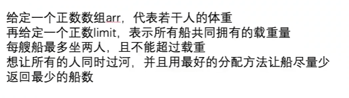
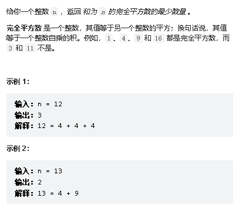

# 算法题解分析

## 单调栈问题

## 动态规划问题

### [10. 正则表达式匹配](https://leetcode.cn/problems/regular-expression-matching/)

思考如何使用递归实现？s从si出发能不能匹配的上p从pi出发的字符。

1）如果全部匹配上，可以发现s和p的指针会同时走完。即``si == s.length && pi==p.length``

2）现在分析下普遍情况下，如何进行匹配的。

1. 情况1，当pi+1位置的字符为`*`的时候，需要判断pi前一个字符是否能够与si位置的字符匹配的上（匹配的上或匹配不上）
2. 情况2，当pi+1位置的字符不为`*`的时候，保证s[si]==p[pi]并往后递归。

```java
class Solution {

    public boolean isValid(char[] s, char[] p, int si, int pi) {
        return si < s.length && (s[si] == p[pi] || p[pi] == '.');
    }

    public boolean isMatch(char[] s, char[] p, int si, int pi) {

        if (pi == p.length) return si == s.length; // 必须同时全部对上

        // 1. 当前pi+1位置为*
        if (pi + 1 < p.length && p[pi + 1] == '*') {
            return isMatch(s, p, si, pi + 2) || (isValid(s, p, si, pi) && isMatch(s, p, si + 1, pi));
        } else return isValid(s, p, si, pi) && isMatch(s, p, si + 1, pi + 1);
    }

    public boolean isMatch(String s, String p) {

        for (int i = 0; i < s.length(); i++) {
            if (s.charAt(i) > 'z' || s.charAt(i) < 'a')
                return false;
        }

        for (int i = 0; i < p.length(); i++) {

            if (i == 0 && p.charAt(i) == '*') return false;

            if (i > 0 && p.charAt(i) == p.charAt(i - 1) && p.charAt(i) == '*')// 出现"**"无法识别
                return false;

            if (!(p.charAt(i) <= 'z' && p.charAt(i) >= 'a' || (p.charAt(i) == '.' || p.charAt(i) == '*')))
                return false;
        }

        return this.isMatch(s.toCharArray(), p.toCharArray(), 0, 0);
    }
}
```

#### [72. 编辑距离](https://leetcode.cn/problems/edit-distance/)

```java

```

## 大厂算法题目

### 1.绳子覆盖最多的点数


思路：使用双指针+滑动窗口，该窗口最大长度为k。

```java
public int process(int[] arr,int k){
    int left = 0,right = 0;
    int length = arr.length;
    int max = 0;
    while (left < length){
        while (right < length && arr[right] - arr[left] <= k){
            right++;
        }
        max = Math.max(max,right - (left++));
    }
    return max;
}
```

### 2.让一种字符放做，另一种字符放右的最少交换次数


思路：使用双指针，一个从头扫描，一个从尾扫描，不符合的就进行交换。

```java
public int process(char[] chrs) {
    int left = 0, right = chrs.length-1;
    int count = 0;

    while (left < right){
        if(chrs[left] == 'B'){
            if(chrs[right] == 'G'){
                swap(chrs,left++,right--);
                count++;
            }else{
                right--;
            }
        }else{
            if(chrs[right] == 'B'){
                left++;
                right--;
            }else{
                left++;
            }
        }
    }
    return count;
}
```

### 3.以+或-连接返回最后算出target


思路：

1. 递归，每个数都尝试+或者-
2. 进一步优化，使用map存储（记忆化搜索）
3. 假设$$P-N=T=>P=\frac{T+SUM}{2}$$，这样就变成了从数组中，有多少集合等于P，就变成了0~1背包问题。

```java
// 暴力递归
public int process(int[] nums, int i, int rest) {

    if (i == nums.length) return rest == 0 ? 1 : 0;

    // + or - 的可能性方法
    return process(nums, i + 1, rest - nums[i]) + process(nums, i + 1, rest + nums[i]);
}

public int process(int[] nums, int target) {
    return this.process(nums, 0, target);
}

// 记忆化搜索
public int process1(int[] nums, HashMap<Integer,HashMap<Integer, Integer>> map, int i, int rest) {

    if(map.containsKey(i) && map.get(i).containsKey(rest)){
        return map.get(i).get(rest);
    }

    int ans = 0;

    if (i == nums.length) ans =  rest == 0 ? 1 : 0;
    else
        ans = process1(nums, map, i + 1, rest - nums[i]) + process1(nums, map, i + 1, rest + nums[i]);

    if(!map.containsKey(i)){
        map.put(i,new HashMap<>());
    }

    map.get(i).put(rest,ans);

    // + or - 的可能性方法
    return map.get(i).get(rest);
}

public int process1(int[] nums, int target) {
    return this.process1(nums, new HashMap<>(), 0, target);
}

public int subset(int[] nums,int target){
    int[] dp = new int[target+1];
    dp[0] = 1;

    for(int num:nums){
        for(int t = target;t>=num;t--){
            dp[t] += dp[t-num];
        }
    }

    return dp[target];
}

public int process2(int[] nums,int target){
    int sum = 0;
    for(int num:nums)
        sum += num;

    return sum < target || ((target & 1) ^ (sum & 1)) != 0?0:subset(nums,(target+sum)/2);
}


public static void main(String[] args) {
    Problem03 solution = new Problem03();
    int[] nums = {1, 3};
    System.out.println(solution.process1(nums, 3));;
}
```

### 4.让所有司机获得总体最多收入的分配问题


思路：一共有N个司机，N一定是偶数，并且平均分配在A、B两个区域，也就是M=N/2个人。

```java
public int maxMoney(int[][] income){
    if(income == null || income.length < 2 || (income.length & 1) != 0){
        return 0;
    }
    int N = income.length; // 司机数量一定是偶数，所以才能平分
    int M = N >> 1; // M = N / 2 要去A区域的人，剩下的人就是去B区域了
    return process(income,0,M);
}

//  index . ....所有的司机。往A和B区域分配!
//  A区域还有rest个名额!
//  返回把index.. .司机，分配完，并且最终A和B区域同样多的情况下，index...往后的这些司机，整体收入最大是多少!
public int process(int[][] income,int index,int rest) { // 暴力递归
    if(index == income.length){
        return 0;
    }
    // 还剩下的司机
    if(income.length - index == rest){ // 正好剩下的数量，和需要的数量一样，就全部给出去
        return income[index][0] + process(income,index+1,rest-1);
    }
    // 当前司机可以去A，也可以去B
    int p1 = income[index][0] + process(income,index+1, rest-1); // A
    int p2 = income[index][1] + process(income,index+1, rest); // B

    return Math.max(p1,p2);
}

public int process2(int[][] income,int[][] dp,int index,int rest) {

    if(dp[index][rest] != -1) return dp[index][rest];

    if(index == income.length){
        dp[index][rest] = 0;
    }
    else if(income.length - index == rest){
        dp[index][rest] = income[index][0] + process(income,index+1,rest-1);
    }else{
        // 当前司机可以去A，也可以去B
        int p1 = income[index][0] + process(income,index+1, rest-1); // A
        int p2 = income[index][1] + process(income,index+1, rest); // B

        dp[index][rest] = Math.max(p1,p2);
    }

    return dp[index][rest];
}
```


### 5. 含有SetAll功能的哈希表

SetAll(value)将哈希表中的值都修改为value，但是需要保证哈希表中put，get，SetAll操作时间复杂度为O(1)。、

思路：使用hash表进行维持，里面需要记录被修改值的时间，根据时间进行判断是否被修改过。

```tex
int all = 0;//修改的值
long settAllTime;//修改的时间
long time;//当前时间

map =>(key,value,time)

如果当前key值修改时间time小于settAllTime，就可以知道当前key已经被setAll了，直接返回all即可。
```

### 6.最长无重复子串的长度

给一个字符串`ababccabc`，需要找到其最长无重复的子串`abc`，返回子串的长度3。

思路：

* 传统递归思路：以i结尾的，往左移动，能够走多远，而且字符都不重复。

  * 当前i字符上次出现的位置
  * 前一个位置i-1往左移动的距离。

  比如`cedacba`，当前b位置往左推的距离`edacb`，当前a位置上一个出现的位置`acba`，这样就能够得到当前a能够推动的距离`cba`。

  比如`askbcba`，当前b位置往左推的距离`bcb`，当前a位置上一个出现的位置很远，但是b很近，可以得知当前a能够推动的距离`cba`。

  因此只需要i-1的答案。

- 滑动串口思路：
  1. 使用滑动窗口+双指针(L和R)，从左L到右R扫描字符串，没有相同的字符就进入窗口中，并继续往右移动R++，并记录当前子串长度；
  2. 如果有相同的字符就L++，然后判断当前字符是否还在窗口中，还在就继续重复，直到没有相同字符即可。
  3. 因此可以使用hashSet或者hashMap进行存储判断，如果可以的话，还可以使用位运算进行存储，通过当前字符的hash码，在相应的位置记录下来，从而极大的节省空间。

```java
public int process(String str) { // 动态规划
    if(str == null || str.equals(""))
        return 0;
    char[] chrs = str.toCharArray();

    int[] map = new int[256];

    for(int i=0;i<256;i++){
        map[i] = -1;
    }

    int len = 0;
    int pre = -1;
    int cur = 0;
    for(int i=0;i < chrs.length;i++){
        pre = Math.max(pre,map[chrs[i]]); // 获取字符上一次的出现位置，没出现过就返回-1(这里会保留最近的重复字符的位置)
        cur = i - pre;// 当前位置i-上一次该字符出现的位置
        len = Math.max(len,cur);
        map[chrs[i]] = i;
    }
    return len;
}

public int process2(String str) {
    if(str == null || str.equals(""))
        return 0;
    char[] chrs = str.toCharArray();

    int[] map = new int[256];

    for(int i=0;i<256;i++){
        map[i] = -1;
    }

    int pre = 1;
    int ans = 1;
    map[chrs[0]] = 0;

    for(int i=1;i <= chrs.length;i++){
        pre = Math.min(i - map[chrs[i]], pre+1);
        ans = Math.max(ans,pre);
        map[chrs[i]] = i;
    }
    return ans;
}
```

### 7.能同时比赛的最大场次


思路：

1. 递归，全排列，从n中选取m个（2个），计算差值是否为k
2. 排序+双指针+滑动窗口
   - 从头开始扫描，arr[right]-arr[left]<k，right++
   - arr[right]-arr[left]=k，记录，并left++，right++
   - arr[right]-arr[left]>k，left–
   - 在全部过程中，使用过的arr[right]需要进行记录。

### 8.最多装两个人的船同时过河问题



思路：排序+中间双指针

1. 首先先排序，从小到大进行排序
2. 找到小于等于limit/2最右的位置i，设置当前双指针为L=i，R=i+1
3. 现在开始判断arr[L]+arr[R]
   - arr[L]+arr[R]>k，记录当前L位置不可取，并且L–
   - arr[L]+arr[R]<=k，则R一直往右滑动，直到不可取为止。这时候可以发现当前R往右滑动的这段距离count，是最适合匹配L左边的数字。然后L=L-count，继续下一轮匹配。
   - 最后，limit/2左边的不可取的数量记为a，右边剩余的数量记为b，成功匹配的数量记为c，一个共有$\frac{a}{2}+\frac{c}{2}+b$。

### 9.子数组的最大累加和


思路：看到子数组或者子串，首先想到以i结尾的答案，往左边扩能够获取的答案。就是想获取dp[i]的答案，需要先获取dp[i-1]的答案….。

* 当前dp[i]需要看dp[i-1]，如果dp[i-1]>0，就获取，否则就抛弃

```java
public int process(int[] nums) {

    if(nums == null || nums.length == 0) return 0;

    int max = Integer.MIN_VALUE;
    int cur = 0;

    for (int num : nums) {
        cur += num;
        max = Math.max(cur, max);
        cur = Math.max(cur, 0); //
    }
    return max;
}
```

### 10.分糖果问题及其进阶问题


**原问题**：也就是当前每个孩子的分数为[1,2,2]，每个孩子至少可以获取一颗糖，至少需要分多少颗糖，如果当前孩子的分数比左边大，那么当前孩子需要比左边多一颗糖，右边同理，相同不用管。

思路：

通过使用辅助数组：

```tex
[1,3,3,2,1,4,2,2,5,2,1] <- arr
[1,2,1,1,2,1,1,2,1,1,1] <- left
[1,1,3,2,1,2,1,1,3,2,1] <- right
[1,2,3,2,2,2,1,2,3,2,1] <- 当前最高的坡度 => max(left[i],right[i])
```

* 申请一个left数组，记录左边的坡度，大于当前数就+1，不然就赋值为1。
* 申请一个right数组，记录右边的坡度，大于当前数就+1，不然就赋值为1。
* 然后求当前数i的最高坡度 max = Math.max(left[i],right[i])

**遍历两次，遍历一个上坡知道下坡结束，然后又返回去计算。**

**进阶问题**：也就是当前每个孩子的分数为[1,2,2]，每个孩子至少可以获取一颗糖，至少需要分多少颗糖，如果当前孩子的分数比左边大，那么当前孩子需要比左边多一颗糖，右边同理，相同的拿的糖必须一样。

通过使用辅助数组：

* left数组，比左边大就+1，比左边小就归1，和左边一样，就不变
* right数组，比右边大就+1，比右边小就归1，和右边一样，就不变

```tex
[2,2,3,3,2,2,1,0,1,2,4,4,3,3] <- arr
[1,1,2,2,1,1,1,1,2,3,4,4,1,1] <- left
[1,1,4,4,3,3,2,1,1,1,2,2,1,1] <- right
当前最高的坡度 => max(left[i],right[i])
```

### 11.字符串交错组成问题

给定str1，str2，aim，若aim是仅包含str1，str2中的字符。若aim中属于str1的字符仍然保持在str1中原来的顺序，属于str2的字符仍然保持在str2中原来的顺序，则称aim是str1和str2的交错组成。

比如：`str1="1111kf"`，`str2="111tef"`，`aim="1111kk111tef"`。

思路：``dp[i][j]``表示当前str1前i个字符，str2前j个字符，能不能拼接出aim字符串，其中``i~(0,str1.length+1)``，``j~(0,str2.length+1)``。

1. 两个字符串构成一个二维表，先用一个字符串与aim字符串进行匹配是否匹配的上，匹配的上字符就表示true，一旦有不匹配的，后面的全是false。
2. `dp[0][j]`以及`dp[i][0]`都按照这样的规则填表。

比如`str1='aaabsk'`，`str2=aacfk`，`aim=aaacaabfskk`

| str1\str2 |  0   | 1-a  | 2-a  | 3-c  | 4-f  | 5-k  |
| :-------: | :--: | :--: | :--: | :--: | :--: | :--: |
|     0     |  T   |  T   |  T   |  F   |  F   |  F   |
|    1-a    |  T   |      |      |      |      |      |
|    2-a    |  T   |      |      |      |      |      |
|    3-a    |  T   |      |      |      |      |      |
|    4-b    |  F   |      |      |      |      |      |
|    5-s    |  F   |      |      |      |      |      |
|    6-k    |  F   |      |      |      |      |      |

现在分析`dp[i][j]`普遍位置，``dp[i][j]``含义：其中，i表示str1字符串前i个字符``(0~i-1)``，j表示str2字符串前i个字符``(0~j-1)``，组成aim字符串，i+j个字符``(0~i+j-1)``。然后讨论当前`dp[i][j]`的组成情况

* 情况1，如果当前``aim[i+j-1] == str1[i-1]``，可以发现现在只需要判断aim的i+j-2字符串，与str1的前i-1个字符，以及str2的前j个字符即可。有``dp[i][j] = dp[i-1][j]``
* 情况2，如果当前``aim[i+j-1] == str2[j-1]``，可以发现现在只需要判断aim的i+j-2字符串，与str1的前i个字符，以及str2的前j-1个字符即可。有``dp[i][j] = dp[i][j-1]``

因此，只需要这两种情况，交替组成即可。

```java
public boolean process(char[] str1, char[] str2, char[] aim) {

    if(str1.length + str2.length != aim.length) return false;

    boolean[][] dp = new boolean[str1.length+1][str2.length+1];
    dp[0][0] = true;
    for(int i=1;i<=str1.length;i++){
        if(str1[i-1] != aim[i-1]) break;
        dp[i][0] = true;
    }

    for(int j=1;j<=str2.length;j++){
        if(str2[j-1] != aim[j-1]) break;
        dp[0][j] = true;
    }

    for(int i=1;i<=str1.length;i++){
        for(int j=1;j<=str2.length;j++){
            System.out.println((i-1)+":"+(j-1));
            if((str1[i-1] == aim[i+j-1] && dp[i-1][j]) || (str2[j-1] == aim[i+j-1] && dp[i][j-1]))
                dp[i][j] = true;
        }
    }

    return dp[str1.length][str2.length];
}
```

### 12.求相等子树的数量


```tex
		6
	1		1
   2 3     2 3
```

其中左边子树的2节点的左右子树节点都为null，是一样，那么就是一棵相等子树，3同理。因此可以发现叶子结点都是相同子树。然后往上分析，左子树的1的左右孩子树不相同，因此不是。

最后根结点6的左右子树相同，可以知道这也是一棵相同子树。

思路：

- 序列化方法：
  - 每个节点返回一个由左子树+自己+右子树拼接的字符串。
  - 每个节点判断左右子树的字符串是否相同。

```java
static class Info{
    String str;
    int ans;

    public Info(int ans,String str){
        this.ans = ans;
        this.str = str;
    }
}

public int sameNumber2(Node node){
    return this.process(node).ans;
}

public Info process(Node node){
    if(node == null) return new Info(0,String.valueOf("#_".hashCode()));

    Info left = process(node.left);
    Info right = process(node.right);

    int ans = (left.str.equals(right.str)?1:0) + left.ans + right.ans;
    String str = String.valueOf("_"+node.value+"_").hashCode() + left.str + right.str;

    return new Info(ans,str);
}
```

- 递归方法
  - 定义f(h1,h2)函数用来判断h1子树与h2子树结构是否相同；定义g(x)函数用来计算当前节点有多少相同子树。
  - 可以得到`a=g(x.left),b=g(x.right)`，一共有`a+b+f(x.left,x.right)?1:0`。

```java
// 时间复杂度O(N^2)
public int sameNumber1(Node node) {
    if(node == null) return 0;
    return sameNumber1(node.left) + sameNumber1(node.right) + (same(node.left,node.right)?1:0);
}

public boolean same(Node h1,Node h2){ // 检测h1与h2两棵树结构是否相同
    if(h1 == null ^ h2 == null) return  false;
    if(h1 == null && h2 == null) return true;
    return h1.value == h2.value && same(h1.left,h2.left) && same(h1.right,h2.right);
}
```

### 13.编辑距离问题

给定两个字符串``str1="ab1c"``，``str2="abc"``，需要将str1字符串通过删除、修改、插入三种方法编变成str2字符串，返回str1变成str2最小的代价(操作步骤)。

当前的不变的代价为0，删除的代价为d，插入的代价为a，替换的代价为r。

比如，不变的代价为0，删除的代价为10，插入的代价为5，替换的代价为30。

举例：`str1="aab151"`，`str2="a1b51"`

| str1/str2 | 0    | 1-a  | 2-1  | 3-b  | 4-5  | 5-1    |
| --------- | ---- | ---- | ---- | ---- | ---- | ------ |
| 0         | 0    | a    | 2a   | 3a   | 4a   | 5a     |
| 1-a       | d    |      |      |      |      |        |
| 2-a       | 2d   |      |      |      |      |        |
| 3-b       | 3d   |      |      |      |      |        |
| 4-1       | 4d   |      |      |      |      |        |
| 5-5       | 6d   |      |      |      |      |        |
| 6-1       | 6d   |      |      |      |      | 返回值 |

`dp[0][j]`表示当前str1的空字符，编辑为str2字符串前j个字符所需要的代价。

同理，`dp[i][0]`表示当前str1的前i个字符，编辑为str2字符串空字符所需要的代价。

思路：``dp[i]][j]``表示当前str1字符前i个字符编辑为str2前j个字符，这样需要先知道前i-1个字符或者前j-1个字符。

* 情况1，如果当前str1的前i-1个字符能够编辑为str2的前j个字符，即``dp[i-1][j]``，当前str1的第i个字符是多余的，即`dp[i-1][j]+d`。
* 情况2，如果当前str1的前i个字符能够编辑为str2的前j-1个字符，即`dp[i][j-1]`，str1前i个字符编辑为str2的前j个字符，需要str2的第j个字符，即`dp[i][j-1]+a`
* 情况3，如果当前str1的前i-1个字符能够编辑为str2的前j-1个字符，即`dp[i-1][j-1]`，还剩下str1的第i个字符，以及str2的第j个字符需要处理，如果当前``str1[i]!=str2[j]``，即`dp[i-1][j-1]+r`。
* 情况4，如果当前str1的前i-1个字符能够编辑为str2的前j-1个字符，即`dp[i-1][j-1]`，还剩下str1的第i个字符，以及str2的第j个字符需要处理，如果当前``str1[i]==str2[j]``，即`dp[i-1][j-1]`。

### 14. 公式字符串的运算结果


思路：

* 逆波兰表达式
* 递归，遇到左括号就进行递归，遇到右括号/终止位置就出来，这样子问题就不需要考虑括号了。只需要正常的计算。
  * 当前括号内的结果是啥
  * 什么位置停止的
  * 还需要判断当前是否是负数

延伸扩展：所有左右括号问题。

```java
public class Problem14 {

    static class Info{
        int value;
        int index;

        public Info(int value, int index) {
            this.value = value;
            this.index = index;
        }
    }

    public Info process(char[] chrs, LinkedList<String> queue, int i){

        int num = 0;
        Info info  = null;

        boolean isNeg = false;

        if(i < chrs.length && chrs[i] == '-'){ // 当前是负数
            isNeg = true;
            i++;
        }

        while (i < chrs.length && chrs[i] != ')'){
            if(chrs[i] <= '9' && chrs[i] >= '0'){
                num = num*10 + chrs[i++] - '0';
            }else if(chrs[i] != '('){

                if(isNeg){
                    num = -num;
                    isNeg = false;
                }

                addNum(queue,num);
                queue.addLast(String.valueOf(chrs[i++]));
                num = 0;
            }else{
                info = process(chrs,queue,i+1);// 遇到左括号
                i = info.index+1;
                num = info.value;
            }
        }
        if(isNeg){
            num = -num;
        }
        addNum(queue,num);
        return new Info(getSum(queue),i);
    }

    public void addNum(LinkedList<String> queue,int num){
        if(!queue.isEmpty()){
            String top = queue.pollLast();
            if(top.equals("+") || top.equals("-"))
                queue.addLast(top);
            else{
                Integer cur = Integer.parseInt(queue.pollLast());
                num = top.equals("*")?cur*num:cur/num;
            }
        }
        queue.addLast(String.valueOf(num));
    }

    public int getSum(LinkedList<String> queue){

        int result = 0;
        boolean add = true;
        String cur = null;
        while (!queue.isEmpty()){
            cur = queue.pollFirst();
            if(cur.equals("+"))
                add = true;
            else if(cur.equals("-"))
                add = false;
            else
                result += add?Integer.parseInt(cur):-Integer.parseInt(cur);
        }
        return result;
    }

    public int process(String str){
        return this.process(str.toCharArray(),new LinkedList<>(),0).value;
    }

    public static void main(String[] args) {
        Problem14 solution = new Problem14();
        String str = "3+4*(-2)-5";
        System.out.println(solution.process(str));;
    }
}
```

### 15.随意选两根支柱所能容纳的最大水量

给定一个长度为 n 的整数[数组](https://so.csdn.net/so/search?q=数组&spm=1001.2101.3001.7020) height 。有 n 条垂线，第 i 条线的两个端点是 (i, 0) 和 (i, height[i]) 。

找出其中的两条线，使得它们与 x 轴共同构成的容器可以容纳最多的水。

返回容器可以储存的最大水量。

说明：你不能倾斜容器。


思路：首尾双指针。从头和尾开始扫描数组。每次移动之前需要计算当前的水量，然后左右两边的水柱，谁小就移动那个指针。

可以这样想，由于两个水柱之间的水量是取决于小的那个水柱的，然后丢弃小的那个水柱，试图往下寻找较大的水柱。（贪心思想）

```java
public int process(int[] h){
    int max = 0;
    int left = 0;
    int right = h.length-1;
    while (left < right){
        max = Math.max(max, Math.min(h[left],h[right])*(right-left));
        if (h[left] > h[right]) {
            right--;
        } else {
            left++;
        }
    }
    return max;
}
```

### **16.无效括号串变有效的所有可能结果**

给一个无效括号串，删除最少的字符，返回变成有效串的所有可能结果且不重复。

比如，`(()))`，删除一个`)`，得到有效的`(())`。

思路：前提设置，检查位置设置为，i可能删除的位置设置为j，初始i=j=0，count遇到``(``就++，遇到`)`就–。

* 先是i进行检查当前字符是否合法，通过count变量进行判断，遇到count<0可以知道当前字符不合法，缺少`)`
* 遇到不合法字符后，然后就是删除操作，从左往右，进行尝试删除，遇到连续相同字符（只能操作一次），然后递归调用，当前前i个字符已经解决了f(s.sub(0,j)+s.sub(j+1,s.length))，表示当前j字符被删除了，重新拼接为一个新的字符，从i+1开始继续判断。

```java
public void remove(String s, List<String> ans, int checkIndex, int deleteIndex, char[] par){
    for(int count=0,i=checkIndex;i<s.length();i++){

        if(s.charAt(i) == par[0]){ // '(' => 反转后->')'
            count++;
        }

        if(s.charAt(i) == par[1]){ // ')
            count--;
        }

        // i check计数<0的第一个位置
        if(count < 0){
            for(int j=deleteIndex;j<=i;j++){

                if(s.charAt(j) == par[1] && (j == deleteIndex || s.charAt(j-1) != par[1])){
                    remove(
                        s.substring(0,j)+s.substring(j+1,s.length()),
                        ans, i, j, par
                    );
                }

            }
            return;
        }
    }

    String reversed = new StringBuffer(s).reverse().toString();
    if(par[0] == '('){ // 避免重复调用
        remove(reversed,ans,0,0,new char[]{')','('});
    }else{
        ans.add(reversed);
    }
}
```

### 17.最长递增子序列长度

比如，``[4,1,3,2,3,9,5,6]``，找到一个最长的递增子序列长度（不需要连续）。

思路：

暴力循环O(N^2)：以当i结尾最长的递增子序列长度，当前num[i]需要知道上一个比num[i]小的最长子序列长度。

辅助数组O(N)：需要辅助end，其中end[i]表示当前i位置，最长递增子序列中最小的结尾。

```tex
arr => 3 2 1 2 3 0 4 6 2 7
i   => 0 1 2 3 4 5 6 7 8 9
dp  => 1 1 1 2 3
end => 1 2 3 

i = 0的时候，end[0] = 3
i = 1的时候，发现2 < 3，end就更新end[0] = 2
i = 2的时候，发现1 < 2，end就更新end[0] = 1
i = 3的时候，发现2 > 1，end就更新end[1] = 2，这时候end就扩张，依次类推
...
i = 5的时候，arr[5]=0，寻找end中大于等于的数的位置，就end[0]=1，然后修改
end[0]=0。
```

### 18.判断一个数字是不是stepnum？


思路：

公式法：

```tex
假设一个三位数为xyz，有100x+10y+z+10x+y+x=111x+11y+z=>(x,y,z)对应的(111,11,1)
假设一个两位数为xy，有10x+y+x=11x+y=>(x,y)对应的(11,1)

比如754，可以知道对应的(x,y,z)，当前x的取值在(0,754/111=6)内，y的取值在(0,(754-111x)/11)，剩下的z的范围是(0,9)，就这么一次次尝试。
```

**二分查找法**：一个数a的step num为b，可知道a<=b，因此可以知道如果b为某一个数的step num，那么该数一定在(0~b)范围内。

### 19.跳跃游戏

给定一个非负整数数组，你最初位于数组的第一个位置。
数组中的每个元素代表你在该位置可以跳跃的最大长度。
判断你是否能够到达最后一个位置，并返回最少的步骤。

示例 1:
输入: [2,3,1,1,4]
输出: true
解释: 我们可以先跳 1 步，从位置 0 到达 位置 1, 然后再从位置 1 跳 3 步到达最后一个位置。

示例 2:
输入: [3,2,1,0,4]
输出: false
解释: 无论怎样，你总会到达索引为 3 的位置。但该位置的最大跳跃长度是 0 ， 所以你永远不可能到达最后一个位置。

思路：需要三个变量进行维护

* step：表示当前最少经过的步数
* cur：表示当前step步数内能够达到最远的位置
* next：表示多跳一步，能够达到最远的位置

比如，

```tex
arr => [3,	4,	1,	3,	2,	4,	2,	1,	2,	4,	2,	3,	2]
i   => [0,	1,	2,	3,	4,	5,	6,	7,	8,	9,	10,	11,	12]
next=> [3,	5,	3,	6,	6,	9,	8,	8,	10,	13,	12,	14,	14]
当前还没开始，step=0，如果能够多走一步，能够走到0，next=0
=> next=0,step=0，更新step=1,cur=3，然后next重置
=> next在cur范围内再多走一步，从1~3都尝试一下
当前i=1,next=5，继续i=2,next=5>1+2=3不更新
i=3，next=5<3+3=6，就更新next=6，当前已经达到了cur最大步数了，更新cur以及step。
=> step=2，cur=next=6，next重置，继续这样尝试。
```

```java
public int jump(int[] arr){
    if(arr == null || arr.length == 0) return 0;
    int step = 0;
    int cur = 0;
    int next = 0;

    for(int i=0;i<arr.length;i++){
        if(cur < i){
            step++;
            cur = next;
        }
        next = Math.max(next,i+arr[i]);
    }

    return step;
}
```

### 20.布尔表达式的期待方法数

给定一个布尔表达式和一个期望的布尔结果 result，布尔表达式由 0 (false)、1 (true)、& (AND)、 | (OR) 和 ^ (XOR) 符号组成。实现一个函数，算出有几种可使该表达式得出 result 值的括号方法。

比如，s = "1^0|0|1", result = 0，能够得到有2种方法

解释: 两种可能的括号方法是``1^(0|(0|1))``或者`1^((0|0)|1)`

提示：运算符的数量不超过 19 个。

思路：比如当前有一个字符串`XYXYXYX`，其中Y是逻辑运算符。

每次都让当前$$Y_i$$作为最后计算的逻辑运算符，这样就需要先计算左右两边，即``f(str,i) = f(str,left,i-1)+f(str,i+1,right)``。

如果超时了，考虑记忆化搜索（就是加一个缓存）。

```java
static class Info{
    public int t;
    public int f;

    public Info(int t,int f){
        this.t = t;
        this.f = f;
    }
}
// L...R上，一定有奇数个字符
// L位置以及R位置上的字符，非0即1，不能是逻辑字符
// 返回str[L...R]这一段，为true的方法数，和false的方法数
public Info process(char[] chrs,int left,int right){

    int t = 0;
    int f = 0;

    if(left == right){
        t = chrs[left] == '1'?1:0;
        f = chrs[left] == '0'?1:0;
        return new Info(t,f);
    }else{
        for(int i=left+1;i<right;i+=2){ // 当前是逻辑符号
            Info leftInfo = process(chrs,left,i-1);
            Info rightInfo = process(chrs,i+1,right);

            int a = leftInfo.t;
            int b = leftInfo.f;
            int c = rightInfo.t;
            int d = rightInfo.f;

            switch (chrs[i]){
                case '&':{
                    t += a * c;
                    f += b * c + b * d + a * d;
                    break;
                }
                case '|':{
                    t += a * c + a * d + b * c;
                    f += b * d;
                    break;
                }
                case '^':{ // 不同为1，相同为0
                    t += a * d + b * c;
                    f += a * c + b * d;
                    break;
                }
            }
        }
    }
    return new Info(t,f);
}
```

### 21.抽排获胜概率问题


思路：

* 递归调用
* 公式法，通过观察得到公式`f(i)=[f(i+1)+f(i+1)*N-f(i+N+1)]/N`


```java
// ans表示尝试的累加和
public double f(int N,int ans,int a,int b){
    if(ans >= a && ans < b) return 1.0;
    else if(ans >= b) return 0.0;

    double p = 0.0;
    for(int i=1;i<=N;i++){
        p += f(N,ans+i,a,b);
    }
    return p / N;
}
```

提供的思考：

* 有枚举行为，观察能不能省去
* 观察临近位置

### 22.超级洗衣机问题

假设有 n 台超级洗衣机放在同一排上。开始的时候，每台洗衣机内可能有一定量的衣服，也可能是空的。

在每一步操作中，你可以选择任意 m (1 <= m <= n) 台洗衣机，与此同时将每台洗衣机的一件衣服送到相邻的一台洗衣机。

给定一个整数数组 machines 代表从左至右每台洗衣机中的衣物数量，请给出能让所有洗衣机中剩下的衣物的数量**相等的**最少的操作步数 。如果不能使每台洗衣机中衣物的数量相等，则返回 -1 。


思路：从当前i位置进行思考，machines[i]如果左边有-15件，右边有20件，怎么让i停止轮询，需要经过20轮，依次类推，可以发现。

* 当前i位置，左边有-a件，右边有+b件，让i位置不再进入轮询需要Math.max(a,b)次轮询
* 当前i位置，左边有+b件，右边有-a件，让i位置不再进入轮询需要Math.max(a,b)次轮询
* 当前i位置，左边有+b1件，右边有+b2件，让i位置不再进入轮询需要Math.max(b1,b2)次轮询
* 当前i位置，左边有-a1件，右边有-a2件，让i位置不再进入轮询需要a1+a2次轮询。

```java
public int process(int[] arr){

    if(arr == null || arr.length == 0) return -1;

    int size = arr.length;
    int sum  = 0;
    for(int num:arr)
        sum += num;

    if(sum % size != 0) return -1;

    int avg = sum / size;
    int leftSum = 0;//当前i位置的左边和
    int leftRest = 0;// 当前左边的剩余
    int rightRest = 0;//当前i位置的右边和-(size-i-1)*avg
    int ans = 0;
    for(int i=0;i<arr.length;i++){

        leftRest = leftSum - i * avg;
        rightRest = (sum - leftRest - arr[i]) - (size - i - 1) * avg;

        if(leftRest < 0 &&rightRest < 0){
            ans = Math.max(ans,Math.abs(leftRest) + Math.abs(rightRest));
        }else{
            ans = Math.max(ans,Math.max(Math.abs(leftRest),Math.abs(rightRest)));
        }
        leftSum += arr[i];
    }
    return ans;
}
```

### 23.约瑟夫环问题

约瑟夫环问题是一个很经典的问题：一个圈共有N个人（N为不确定的数字），第一个人的编号为0或者1（两个都可以，看你的程序如何编写），假设这边我将第一个人的编号设置为1号，那么第二个人的编号就为2号，第三个人的编号就为3号，第N个人的编号就为N号，现在提供一个数字M，第一个人开始从1报数，第二个人报的数就是2，依次类推，报到M这个数字的人出局，紧接着从出局的这个人的下一个人重新开始从1报数，和上面过程类似，报到M的人出局，直到N个人全部出局，请问，这个出局的顺序是什么？

举一个简单的例子：假设现在N的值为10，代表有10个人，M的值为3，代表报数报到3的人出局，那么出局的顺序就为：**3 6 9 2 7 1 8 5 10 4**。

思路：

* 先观察，N个人，每经过M个数后得到的新编号，比如当前5个人(1,2,3,4,5)，M为4。

* 可以得到一个公式：编号=(数-1)%i+1
* 现在，观察每出局一个人后，出局前的编号怎么推出出局后的编号。
* 可以得到一个公式：出局前的编号=(出局后的编号+M-1)%i+1

### 24.在每行每列有序的二维数组中找最小的第K个数

给定一个 n x n 矩阵，其中每行和每列元素均按升序排序，找到矩阵中第k小的元素。
请注意，它是排序后的第k小元素，而不是第k个元素。

示例:

matrix = [
[ 1, 5, 9],
[10, 11, 13],
[12, 13, 15]
],
k = 8，返回 13。

思路：二分查找

二分查找的关键是找出“查找空间”。有两种查找空间：基于下标的和基于范围的（最大值和最小值之间的范围）。大多数情况，如果数组是在一个方向上有序，我们使用下标作为搜索空间。如果数组无序，我们使用范围作为搜索空间。

这题不用下标作为搜索空间的原因是这个二维数组在两个方向上排序，不能找到一个线性的方向把数组的值和下标绑定在一起。

### 25.S字符串中有多少个子序列等于T字符串


思路：样本对应模型，`dp[i][j]`表示s在`0~i`内组成T`0~j`的字符串。如果想要得到``dp[i][j]``需要``s[0…i]==T[0…j]``

* 情况1，``dp[i][j]``需要``s[0…i]==T[0…j]``，但是`s[0..i-1]`就已经组成了`T[0...j]`，即`dp[i-1][j]`
* 情况2，由于`s[i]==T[j]`，只需要`dp[i-1][j-1]`

```java
public int process(String S,String T){

    char[] s = S.toCharArray();
    char[] t = T.toCharArray();

    int[][] dp = new int[s.length][t.length];

    for(int j=1;j<t.length;j++) // S字符串前1个字符，组成T字符串前j个字符
        dp[0][j] = 0;

    for(int i=1;i<s.length;i++) // S字符串前i个字符，组成T字符串前1个字符
        dp[i][0] = (s[i] == t[0]?(dp[i-1][0]+1):dp[i-1][0]);

    dp[0][0] = s[0] == t[0]?1:0;

    for(int i=1;i<s.length;i++){
        for(int j=1;j<t.length;j++){
            dp[i][j] = dp[i-1][j];
            if(s[i] == t[j])
                dp[i][j] += dp[i-1][j-1];
        }
    }

    return dp[s.length-1][t.length-1];
}
```

### 26.返回字符串中有多少字值不同的子序列


思路：

* 暴力递归：无重复的全排列。
* 以当前i位置结尾，左边有多少种组合，记为前，加上当前的新来的，即all=前+(前+arr[i])
* 但是后续可能有重复字符，这会导致左边的组合会出现重复的。比如当前`2131`，最后的1由于前面的1出现过了，会导致重复计算，因此需要记录下左边出现过的数字的组合数。后面又出现当前数字的时候，减去这部分重复的即可。

```java
public int process(String s){

    if(s == null || s.length() == 0) return 0;

    char[] chrs = s.toCharArray();

    int m = 1000000007;
    HashMap<Character, Integer> map = new HashMap<>(); // 记录上一次数字出现的组合数，避免重复计算组合数
    int all = 1;// 一个字符没有的时候，也有空集

    for(char c:chrs){

        int newAdd = all;
        int curAll = all;

        curAll = (curAll + newAdd ) % m;
        curAll = (curAll - (map.containsKey(c)?map.get(c):0) + m) % m;

        map.put(c,newAdd); // 记录当前字符左边的组合数

        all = curAll;

    }

    return all;
}
```

### 27.联通两块岛的最短的桥

在给定的二维二进制数组 A 中，存在两座岛。（岛是由四面相连的 1 形成的一个最大组。）

现在，我们可以将 0 变为 1，以使两座岛连接起来，变成一座岛。

返回必须翻转的 0 的最小数目。（可以保证答案至少是 1。）

思路：

* 广度优先搜索+辅助矩阵，辅助矩阵记录当前岛屿到达以前未到达的区域所需要的步数，也就是当前一个岛屿往外进行广播，每广播一次，就在原基础上+1，当前岛屿的初始值为1。

  比如，

  ```tex
  [
  [1,1,0,0],
  [0,0,1,1]
  ]
  
  上面岛屿进行广播
  
  [
  [1,1,2,3],
  [2,2,3,4]
  ]
  
  下面岛屿进行广播
  
  [
  [4,3,2,2],
  [3,2,1,1]
  ]
  
  当前相同的值的位置：两个矩阵累加起来
  
  =>
  
  [
  [5,4,4,5],
  [5,4,4,5]
  ]
  
  得到当前值为2+2=4，由于当前有重复计算的，当前值位置由于是广播得到的
  4-1-1-1=1，分别是两个岛屿原来初始值1，以及当前重复计算的一次。
  ```

* 并查集，由于只有两个岛屿，因此有两个团体，只需要递归往下走，每走一步，就判断当前是否到达了另一个团体。

### 28.LRU内存替换算法

请你设计并实现一个满足 LRU (最近最少使用) 缓存 约束的数据结构。
实现 LRUCache 类：

- LRUCache(int capacity) 以 正整数 作为容量 capacity 初始化 LRU 缓存
- int get(int key) 如果关键字 key 存在于缓存中，则返回关键字的值，否则返回 -1 。
- void put(int key, int value) 如果关键字 key 已经存在，则变更其数据值 value ；
- 如果不存在，则向缓存中插入该组 key-value 。
- 如果插入操作导致关键字数量超过 capacity ，则应该 逐出 最久未使用的关键字。
- 函数 get 和 put 必须以 O(1) 的平均时间复杂度运行。

思路：双向链表+hash表就可以解决

* hash表就可以达到O(1)，但是需要找到最久未使用的，需要花费额外时间，因此使用双向链表，越靠近头结点的代表越久未使用，越靠近尾节点的就代表最近使用的。
* 但是双向链表的删除需要遍历也需要额外时间，因此配合hash表记录node节点为止，就可以很方便快速找到node节点，删除最久未使用以及超出容量时的需要删除的节点。

> 进阶提升LFU。
>
> LFUCache(int capacity) - 用数据结构的容量 capacity 初始化对象
>
> - int get(int key) - 如果键 key 存在于缓存中，则获取键的值，否则返回 -1 。
> - void put(int key, int value) - 如果键 key 已存在，则变更其值；如果键不存在，请插入键值对。
> - 当缓存达到其容量 capacity 时，则应该在插入新项之前，移除最不经常使用的项。
> - 在此问题中，当存在平局（即两个或更多个键具有相同使用频率）时，应该去除 最近最久未使用 的键。【LRU】
>   为了确定最不常使用的键，可以为缓存中的每个键维护一个 使用计数器 。使用计数最小的键是最久未使用的键。【频率times】
> - 当一个键首次插入到缓存中时，它的使用计数器被设置为 1 (由于 put 操作)。
> - 对缓存中的键执行 get 或 put 操作，使用计数器的值将会递增。
>
> 函数 get 和 put 必须以 O(1) 的平均时间复杂度运行。

```java
public class Problem28 {

    static class LinkNode<K,V>{
        K key;
        V value;
        LinkNode<K,V> pre;  // 前驱节点
        LinkNode<K,V> next; // 后继节点


        public LinkNode(K key,V value){
            this.key = key;
            this.value = value;
            this.pre = null;
            this.next = null;
        }
    }

    static class LinkList<K,V>{

        LinkNode<K,V> head; // 头结点
        LinkNode<K,V> tail; // 尾节点

        public LinkList(){
            head = null;
            tail = null;
        }

        public void add(LinkNode<K,V> node){

            if(head == null){
                head = node;
                tail = node;
            }else{
                node.pre = tail;
                tail.next = node;
                tail = node;
            }
        }

        public void removeNode(LinkNode<K,V> node){
            if(tail == node) return;

            if(head == node){
                head = head.next;
                head.pre = null;
            }else{
                node.pre.next = node.next;
                node.next.pre = node.pre;
            }

            node.next = null;
            add(node);

        }
        // 链表达到了最大容量，就需要删除头结点
        public LinkNode<K,V>  removeHead() {

            if(head == null) return null;

            LinkNode<K,V> node = head;

            if(head == tail){
                head = null;
                tail = null;
            }else{
                head = head.next;
                head.pre = null;
                node.next = null;
            }
            return node;
        }

    }

    static class LRUCache<K,V>{
        private final HashMap<K,LinkNode<K,V>> cache = new HashMap<>();
        private final LinkList<K,V> linkList = new LinkList<>();
        private final int capacity; // 最大容量

        public LRUCache(int capacity){
            this.capacity = capacity;
        }

        public void put(K key,V value){

            if(cache.containsKey(key)){ // 存在就更新

                LinkNode<K,V> node = cache.get(key);

                node.value = value;

                linkList.removeNode(cache.get(key));

            }else{

                if(cache.size() == capacity){
                    LinkNode<K,V> head = linkList.removeHead();
                    cache.remove(head.key);
                }

                LinkNode<K,V> node = new LinkNode<>(key,value);
                cache.put(key,node);
                linkList.add(node);
            }
        }

        public V get(K key){

            if(!cache.containsKey(key)) return null;

            linkList.removeNode(cache.get(key));

            return cache.get(key).value;
        }

    }

    public static void main(String[] args) {
        LRUCache<Integer,Integer> cache = new LRUCache<Integer,Integer>(3);

        cache.put(1,2);
        cache.put(2,3);
        cache.put(3,4);
        cache.put(4,5);
        System.out.println(cache.get(2));


    }
}
```

### 29.最小包含区间问题

题目描述：k个有序的[数组](https://so.csdn.net/so/search?q=数组&spm=1001.2101.3001.7020)，找到最小的区间范围使得这k个数组中，每个数组至少有一个数字在这个区间范围内。比如：

> - 数组1：[4, 10, 15, 24, 26]
> - 数组2：[0, 9, 12, 20]
> - 数组3：[5, 18, 22, 30]
>   最小的区间是[20, 24]，这个区间包含了数组1中的24，数组2中的20，数组3中的22

思路：

* 准备一个有序表，从小到大存储
* 每个数组中从第一个数开始存储，比如`[1,7,30],[21,54],[3,67]`，存储每个数组的第一个数`[1,3,21]`，这就保证了该范围内都有三个数组的值。
* 然后记录该范围，并且取出最小数，然后从该数所在的数组中重新获取下一个数，放到有序表中，直到所有数组的数都过一遍。

### 30.一维接雨水问题

42给定 n 个非负整数表示每个宽度为 1 的柱子的高度图，计算按此排列的柱子，下雨之后能接多少雨水。


上面是由数组 [0,1,0,2,1,0,1,3,2,1,2,1] 表示的高度图，在这种情况下，可以接 6 个单位的雨水（蓝色部分表示雨水）。

思路：

* 思路1：

  * 考虑当前i位置能够接下来多少雨水，根据木桶装入，可知道短板效应，当前接多少水，是根据左右两边尽可能高的短板所确定的，而且还需要根据左右两边的谁最矮说决定的。有`min(maxLeftHigh,maxRightHigh)-arr[i]`就是当前i位置的水量。

  * 因此我们需要知道当前位置i的左右柱子最高是多少。

* 思路2：左右指针，那边柱子小，就先解决哪边的水量问题，需要记录左右两边的最大高度

```java
public int process(int[] nums){

    int left = 0;
    int right = nums.length-1;
    int leftMaxHigh = nums[left];
    int rightMaxHigh = nums[right];

    int ans = 0;

    while (left <= right){

        if(leftMaxHigh <= rightMaxHigh){
            ans += Math.max(0,leftMaxHigh - nums[left++]);
            leftMaxHigh = Math.max(leftMaxHigh,nums[left]);
        }else{
            ans += Math.max(0,rightMaxHigh - nums[right--]);
            rightMaxHigh = Math.max(rightMaxHigh,nums[right]);
        }

    }
    System.out.println(ans);
    return ans;
}
```

### 31.二维接雨水问题

给你一个 m x n 的矩阵，其中的值均为非负整数，代表二维高度图每个单元的高度，请计算图中形状最多能接多少体积的雨水。

思路：利用堆，先将最外围的一圈数字放入堆中，然后取出堆顶最小值，更新当前maxHigh，接下来将当前数字的上下左右放入堆中，并且只要当前数字比maxHigh小，就进行结算水量。

- 构建最小堆，初始化堆为矩阵的最外围（最外面一圈）
- 不断出队，若堆顶元素（四周元素中最矮的一个）大于四周要遍历的元素，堆顶元素减去当前要遍历的元素值即为可接雨水的量
- 接完雨水后要将当前遍历元素入队，注意高度要更新为接完雨水后的高度；接不到也要取最大值

### 32.超级水王问题和摩尔投票及其扩展

在一个[数组](https://so.csdn.net/so/search?q=数组&spm=1001.2101.3001.7020)中，如果存在一个数，在该数组中出现的次数大于数组长度的一半，那么这个数就是超级水王数，请找出这个数。


* 思路：
  * 暴力解法：使用hash表记录词频
  * 由于水王数是远远大于数组长度的一半，因此每次删除不同的两个数，最差的删除结果，最后也是会留下水王数。
    * 情况1，没有数剩下
    * 情况2，有数剩下来，再第二次遍历，看看是否超过N/2次
    * 当前设置两个辅助遍历，一个是候选数h，一个当前候选数剩余次数c。然后遍历数组，如果当前c=0或者当前数等于h，当前数赋值给h，c++。如果当前c=1，且当前数不等于h，c–。

### 33.相邻K个石子才能合并最终合成一堆的最小代价

有 N 堆石头排成一排，第 i 堆中有 stones[i] 块石头。
每次移动（move）需要将**连续**的 K 堆石头合并为一堆，而这个移动的成本为这 K 堆石头的总数。找出把所有石头合并成一堆的最低成本。如果不可能，返回 -1 。

思路：将当前i位置以及i+1,…,i+k-1位置合并成一堆的时候，剩下怎么解决。但是这样想比较难。

另外一种想法，在L…R范围内，计算出K的最小代价，即f(L,R,K)。

比如，arr数组[0~7]，K=3，即f(0,7,K)，枚举尝试，从0开始。1）0到0做出一份，1到7做出2份；2）0到1做出一份，2到7做出2份，以此类推。

```java
// 在arr[L...R]上一定要整出P份，合并最小代价，返回
// persum前缀累加和数组，用来快速求i...j的累加和
public static int process(int[] arr,int L,int R,int K,int P,int[] preSum){

    // 在L...R上无法弄出P份
    if(((R-L+1)%P) == (R-L+1)) return -1;

    if(L == R){
        return P==1?0:-1;
    }

    if(P == 1){
        int result = process(arr,L,R,K,K,preSum);
        if(result == -1) return -1;
        else return result + preSum[R+1] - preSum[L];
    }

    // P > 1
    int ans = Integer.MAX_VALUE;

    for(int i=L;i<R;i++){

        // L...i (1份) 和 i+1...R(P-1份)
        int left = process(arr,L,i,K,1,preSum);

        if(left == -1) continue;

        int right = process(arr,i+1,R,K,P-1,preSum);

        if(right == -1) continue;

        int all = left + right;

        ans = Math.min(ans, all);

    }

    return ans;
}

public static int process(int[] arr,int K){
    int[] perSum = new int[arr.length+1];

    if((arr.length-1) %(K-1) > 0) return -1;

    for(int i=0;i<arr.length;i++) {
        perSum[i + 1] = arr[i] + perSum[i];
    }
    return process(arr,0,arr.length-1,K,1,perSum);
}
```

### 34.最小包含子串


> 欠债模型

思路：使用hash表（记录str2的词频）+滑动窗口（根据hash表滑动窗口）

### 35.一种字符只保留一个的最小字典序结果

给一个字符串，字符串中的每个字符只能留下一个，剩下都删除，返回一个删除后的最小的字典序结果。

比如，`bbaccb`，结果是`acb`

思路：

* hash表记录当前字符词频
* 使用滑动窗口，添加字符，直到hash表有一个字符的词频为0为止

* 然后从滑动窗口中选取ASCII值最小的字符，然后滑动窗口从新开始添加字符，直到选完所有字符。

```tex
比如，"baacbcbaa",
{
 "a":4
 "b":3
 "c":2
}

1. 按照上面规则，得到窗口"baacbc"，然后当前map表为
{
 "a":2
 "b":1
 "c":0
}
2. 然后从窗口中选取最小的ascii值的字符'a'的最右的索引下标，然后从保留cbc窗口，然后继续添加字符，恢复剩下的map，当前剩下的字符串"cbcbaa"
{
 "a":2
 "b":2
 "c":2
}

3. "cbc"
{
 "a":2
 "b":1
 "c":0
}
4. 选取'b'，当前窗口为"c"，剩下字符串"cbaa"
{
 "a":2
 "b":1
 "c":1
}

5. 窗口继续滑动"c"
{
 "a":2
 "b":1
 "c":0
}
6. 选取"c"，然后结束
```

代码实现：

```java
// 在str字符串中，每个字符只保留一个，返回最小字典序
public static String process(String str){

    if(str == null || str.length() < 2) return str;

    HashMap<Character, Integer> map = new HashMap<>();

    for (char chr : str.toCharArray()) map.put(chr, map.getOrDefault(chr, 0) + 1);

    int minASCIndex = 0;

    for(int i=0;i<str.length();i++){

        minASCIndex = str.charAt(minASCIndex) > str.charAt(i)?i:minASCIndex;

        map.put(str.charAt(i),map.get(str.charAt(i))-1);
        if(map.get(str.charAt(i)) == 0) break;

    }

    return String.valueOf(str.charAt(minASCIndex)) + process(
        str.substring(minASCIndex+1).replaceAll(String.valueOf(str.charAt(minASCIndex)),"") // 从当前最小字符的下一个位置开始，并删除在后续字符串中出现的该字符
    );

}
```

### 36.三个有序数组选三个彼此相减的绝对值相加怎么最小

给三个有序数组，比如`[2,6,13]`,`[4,8,21]`,`[17,21,56]`。每一个数组都取出来一个数，比如取出了x，y，z。

求$$|x-y|+|y-z|+|z-x|$$的最小值。

思路：当前三个数x、y、z，假设``x <= y <= z``，那么原本的计算量，就需要考虑y，变成了只考虑x、z了，其中y是处于x和z之间的。因此x与z的距离越小越好。

比如，`[1,5,6]`,`[2,7,9]`,`[4,6,8]`

准备一个自动排序的有序表，先将`[1,2,4]`添加进去

* 每次计算当前值，然后删除最小值，并返回最小值当前的数组是哪个以及相应下标，并将下一个数添加到有序表中，周而复始。
* 现在删除1，添加5，`[2,4,5]`
* 现在删除2，添加7，`[4,5,7]`，….

### 37.鹅厂文化衫问题

企鹅厂活动发文化衫，文化衫有很多种，企鹅们都穿文化衫。采访中，企鹅会说还有多少企鹅跟他穿一种文化衫。有些企鹅没被采访到，将这些回答放在answers数组里，返回活动中企鹅的最少数


思路：

* 被采访的企鹅能够知道当前与自己相同文化衫的企鹅有多少个。
* 只需要排序即可，这样相同数在一起，就可以获取最小的数。
* 统计当前相同数的人，当前数为a，人数为b，有(b+a)/(a+1)*(a+1)。

### 38. leetcode 0020 有效的括号


思路：通过使用栈，只要遇到左符号就入栈，压入的元素是与之匹配的右符号，遇到右符号就出栈进行比较。

```java
public boolean isValid(String s) {

    if(s == null || s.length() == 0) return true;

    Stack<Character> stack = new Stack<>();

    for(int i=0;i<s.length();i++){

        char c = s.charAt(i);
        // 遇到左符号就入栈，将匹配的右符号入栈
        if(c == '{' || c == '[' || c == '(')
            stack.push(c == '('?')':(c=='{'?'}':']'));
        else{

            if(stack.isEmpty()) return false;

            char cur = stack.pop(); // 弹出栈元素，进行匹配
            if(cur != c)
                return false;
        }

    }

    // 如果都匹配完了，stack一定是空的

    return stack.isEmpty();
}
```

### 39. leetcode 0036 有效的数独


思路：使用三个辅助数组，分别记录行、列、小宫格里面的数字是否有重复的。

比如``a[i][j]``表示第i行，当前j这个数字是否出现过。

比如``b[i][j]``表示第i列，当前j这个数字是否出现过。

比如``c[i][j]``表示第i个小宫格，当前j这个数字是否出现过。

````java
public boolean isValidSudoku(char[][] board) {

    boolean[][] row = new boolean[9][10];
    boolean[][] col = new boolean[9][10];
    boolean[][] bucket = new boolean[9][10];

    for(int i=0;i<board.length;i++){

        for(int j=0;j<board[0].length;j++){
            if(board[i][j] != '.'){
                int num = board[i][j] - '0';
                int bid = 3*(i / 3) + (j / 3);
                if(row[i][num] || col[j][num] || bucket[bid][num])
                    return false;
                row[i][num] = true;
                col[j][num] = true;
                bucket[bid][num]= true;
            }
        }
    }
    return true;
}
````

### 40. leetcode 0037 解数独


思路：使用三个辅助数组，分别记录行、列、小宫格里面的数字是否有重复的。

比如``a[i][j]``表示第i行，当前j这个数字是否出现过。

比如``b[i][j]``表示第i列，当前j这个数字是否出现过。

比如``c[i][j]``表示第i个小宫格，当前j这个数字是否出现过

这样就得到了三个重要的信息，因为剩下fasle位置，就是表示当前没使用过的数字，那么就从头开尝试。一个一个位置玩深度优先遍历。

````java
public void initMap(char[][] board,boolean[][] row,boolean[][] col,boolean[][] bucket){
    for(int i=0;i<9;i++){

        for(int j=0;j<9;j++){

            if(board[i][j] != '.'){
                int num = board[i][j] - '0';
                int bid = 3*(i/3) + (j/3);
                row[i][num] = true;
                col[j][num] = true;
                bucket[bid][num] = true;
            }
        }
    }
}

// 当前来到了(i,j)位置，如果当前位置有数字，则跳到下一个位置，如果没有数字，则进行尝试填1~9
public boolean process(char[][] board,int i,int j,boolean[][] row,boolean[][] col,boolean[][] bucket){
    if(i == 9) return true;

    // 先记录下一个位置
    int nextI = j == 8?i+1:i;
    int nextJ = j == 8?0:j+1;

    if(board[i][j] != '.'){
        return process(board,nextI,nextJ,row,col,bucket);
    }else{
        int bid = 3*(i/3)+(j/3);
        // 尝试1~9
        for(int num=1;num<=9;num++){
            // 没有使用过的，才能使用
            if(!(row[i][num] || col[j][num] || bucket[bid][num])){

                row[i][num] = true;
                col[j][num] = true;
                bucket[bid][num] = true;
                board[i][j] = (char) (num + '0');

                if(process(board,nextI,nextJ,row,col,bucket))
                    return true;

                row[i][num] = false;
                col[j][num] = false;
                bucket[bid][num] = false;
                board[i][j] = '.';
            }
        }
    }
    return false;
}

public void solveSudoku(char[][] board) {
    boolean[][] row = new boolean[9][10];
    boolean[][] col = new boolean[9][10];
    boolean[][] bucket = new boolean[9][10];
    initMap(board,row,col,bucket);
    process(board,0,0,row,col,bucket);
}
````

### 41. leetcode 0050 Pow(x,n)

计算一个数的n次方。

思路：比如，$10^{75}$，其中75的二进制为`1001011`

有，75 = 64 + 8 + 2 + 1，75上的每个数字都是其二进制上对应的位置上的数。

```tex
1 0 0 1 0 1 1

t初始值为10，res=1
当前第一位为1，有res=res*t=1*10，t=t*t=10^2
当前第二位为1，有res=res*t=10*10^2,t=t*t=10^4
当前第三位为0，有res不加入计算,t=t*t=10^8
依次类推，直到75位数计算完为止。
```

代码如下：

```java
public double myPow(double x, int n) {

    if( n == 0) return 1;

    boolean isNeg = n < 0;

    int pow = Math.abs(n == Integer.MIN_VALUE?n+1:n);

    double result = 1;
    double t = x;

    while (pow != 0){

        if((pow & 1) != 0){
            result *= t;
        }
        pow = pow >> 1;
        t = t * t;

    }

    if(n == Integer.MIN_VALUE)
        result *= x;

    return n < 0?1D/result:result;
}
```

### 42. leetcode 0069 Sqrt(x)

思路：1~x范围内使用二分法，并且向下取整。

```java
public int mySqrt(int x) {

    if(x == 0) return x;
    else if(x < 3) return 1;

    long left = 1;
    long right = x;

    long mid = x;
    long ans = 1;

    while (left <= right){

        mid = (right - left) / 2 + left;

        if(mid*mid<=x){
            left = mid + 1;
            ans = mid;
        }else{
            right = mid - 1;
        }
    }

    return (int)ans;
}
```

### 43. leetcode 0073 矩阵重零


思路：当前位置`matrix[i][j]`为0，就将行或者列的第一个位置设置为0，这样是为了方便将矩阵第二次遍历的时候，直接置为0。

但是在对第一行操作的时候，`matrix[0][0]`不为0，但是`matrix[0][j]`的位置为0，可能就会将`matrix[0][0]`置为0，这样在第二次遍历的时候，会将第一列置为0。因此需要额外标记，是否将第一行置为0。

第一列同理。

- 可以使用两个变量进行辅助。
- 也可以使用一个变量，表示第一行是否全置为0，只要第一行出现0，即可。

### 44. leetcode 0152 乘积最大子数组


思路：最大子数组累加和类似思想。

以i结尾往左走，计算最大的数值。

当前dp[i]需要看dp[i-1]，如果dp[i-1]>0，就获取，否则就抛弃，但是由于乘法，负负得正，因此也需要保留上一个得到的最小值。

```java
public static int maxProduct(int[] nums) {

    int minResult = 1;
    int maxResult = 1;
    int result = Integer.MIN_VALUE;

    for(int i=0;i<nums.length;i++){

        // 当前数 * dp[i-1]的结果（最大的数/最小的数）
        int curMinResult = Math.min(nums[i],Math.min(maxResult*nums[i],minResult*nums[i]));
        int curMaxResult = Math.max(nums[i],Math.max(maxResult*nums[i],minResult*nums[i]));

        minResult = curMinResult;
        maxResult = curMaxResult;

        result = Math.max(result,maxResult);

    }

    return result;
}
```

### 45. leetcode 0172 阶乘后的零


思路：可以这样思考。比如10=2*5，20=4\*5，100=4\*5\*5，2500=5\*5\*10\*10=5\*5\*5\*5\*4，可以知道，一个数有多少0，是根据当前有多少个5以及2的判断的。

因此一个数的阶乘，比如`5! =5*4*3*2*1`只有一个，`10! =10*9*8*7*6*5*4*3*2*1`只有两个。

```java
public static int trailingZeroes(int n) {

    int ans = 0;
    int i = 1;

    while (i*5 <= n) {
        int j = i*5;
        while (j != 0 && j % 5 == 0) {
            ans++;
            j /= 5;
        }
        i++;
    }
    return ans;
}
```

但是，还是复杂，根据观察，只要当前n大于5，就知道当前数的阶乘一定有5。

```java
public static int trailingZeroes(int n) {

    int ans = 0;
    while (n != 0) {
        n /= 5;
        ans += n;
    }
    return ans;
}
```

### 146. leetcode 0190颠倒二进制位


思路：


```java
public static int reverseBits(int n) {

    n = (n >>> 16) | (n << 16);
    n = ((n & 0xff00ff00) >>> 8) | ((n & 0x00ff00ff) << 8);
    n = ((n & 0xf0f0f0f0) >>> 4) | ((n & 0x0f0f0f0f) << 4);
    n = ((n & 0xcccccccc) >>> 2) | ((n & 0x33333333) << 2);
    n = ((n & 0xaaaaaaaa) >>> 1) | ((n & 0x55555555) << 1);

    return n;

}
```


### 47. leetcode 0204 计数质数


思路：

```java
public static int countPrimes(int n) {

    if(n < 3) return 0;

    int ans = n/2;//所有偶数不需要，然后判断剩下的奇数

    boolean[] flag = new boolean[n+1];

    for(int i=3;i*i<=n;i+=2) {

        if (flag[i])
            continue;

        for (int j = i; i*j <= n; j += 2) {
            if (!flag[i*j]) {
                flag[i*j] = true;
                --ans;
            }
        }
    }

    return ans;
}
```

### 48.出卷子的方法数

有一份卷子，arr=[7,3,5]，分别表示第一道题难度是7，第二道题难度是3，第三道题难度是5。

给一个数m=4，需要满足前一个数<=后一个数+m，有多少种出卷子方法。

思路：

* 全排列
* 计算前i-1中有多少大于arr[i]-m的数，然后乘以以前的套数。

### 49. leetcode 0213 打家劫舍II


思路：0~i随意选择位置，最大的累加和

```java
public int rob(int[] nums,int i,int[] dp,boolean head) {

    // 当前i已经超过了nums长度，就说明无法偷取了
    if(i >= nums.length || ( i >= nums.length - 1 && head && nums.length > 1)) return 0;


    if(dp[i] != -1) return dp[i];

    int ans = 0; // 当前偷取i号房屋的价值

    // 当前i被偷取了，那么只能偷取i+2以后的房屋的价值
    for(int j=i;j<nums.length;j++){
        ans = Math.max(rob(nums,j+2,dp,head)+nums[i],ans);
    }

    dp[i] = ans;

    return ans;
}

// 不能偷相邻房屋，第一个房屋与最后一个房屋是相邻的。
// 那就是需要判断以第一个数开头的，不能选择最后一个数
public int rob(int[] nums) {
    int[] dp = new int[nums.length];
    int ans = 0;
    for(int i=0;i<3;i++){
        Arrays.fill(dp,-1);
        ans = i==0?Math.max(this.rob(nums, i,dp,true),ans):Math.max(this.rob(nums, i,dp,false),ans);
    }
    return ans;
}
```

### 50. leetcode 0277 查寻名人


思路：

```python
# The knows API is already defined for you.
# return a bool, whether a knows b
# def knows(a: int, b: int) -> bool:

class Solution:
    def findCelebrity(self, n: int) -> int:
        #找到可能的名人，并用cur记录
        cur=0        
        for i in range(1,n):
            #若cur认识某人,则cur一定不是名人,因为名人不认识任何人
            #若当前cur为名人，则cur将不会变动，因为cur不认识任何人
            if knows(cur,i):
                cur=i
                #验证cur是否为名人

       #验证cur是否为名人
        for i in range(n):
            if i==cur:
                continue
            #存在一个人不认识cur,则cur不是名人
            if not knows(i,cur):
                return -1
            #cur认识某个人，则cur不是名人
            if knows(cur,i):
                return -1
        return cur
```

### 51. leetcode 0279 完全平方数



思路：

* 暴力递归，从1开始尝试
* 任意一个数，都可以由不超过4个平方数组成。(四平方数定理)
  * 个数不超过4个
  * 当前数$y=\sqrt{n}$，有$y\times y=n$，为1个
  * 当前数$y=1..n，x=n-y*y$，有$x^2+y^2=n$，为2个
  * 任何数%8=7，一定是4个
  * 任何数消去4的因子，结论不变，剩下rest，res%8=7，一定是4个
  * 然后剩下全部是3个

```java
// 判断是否为完全平方数
public boolean isPerfectSquare(int x) {
    int y = (int) Math.sqrt(x);
    return y * y == x;
}

public int numSquares(int n) {

    if(isPerfectSquare(n)) return 1;

    while (n % 4 == 0) n /= 4;
    if(n % 8 == 7) return 4;

    for(int i = 0;i*i<=n;i++) {
        if(isPerfectSquare(n - i * i)) return 2;
    }
    return 3;
}
```

### 52. leetcode 0289 生命游戏


思路：

* $活细胞数量\lt2 | 活细胞数量 \gt 3$活细胞死去
* $活细胞数量==3$死细胞复活

每个数有32位bit，可以通过利用位运算进行表示当前数下一轮的状态。

比如当前为0，下一轮为1，就可以通过位运算表示，初始化状态使用第一位bit，下一轮的变化使用第二位bit，这样就相当于使用了一个辅助矩阵。

```java
// 统计周围有几个1
public int neighbors(int[][] board, int i, int j) {
    return f(board, i - 1, j - 1)
        + f(board, i - 1, j)
        + f(board, i - 1, j + 1)
        + f(board, i, j - 1)
        + f(board, i, j + 1)
        + f(board, i + 1, j - 1)
        + f(board, i + 1, j)
        + f(board, i + 1, j + 1);
}

public int f(int[][] board, int i, int j) {
    return (i >= 0 && i < board.length && j < board[0].length && j >= 0 && (board[i][j] & 1) == 1) ? 1 : 0;
}

public void gameOfLife(int[][] board) {
    for (int i = 0; i < board.length; i++) {
        for (int j = 0; j < board[0].length; j++) {
            int neighbors = this.neighbors(board, i, j);
            if (neighbors == 3 || (board[i][j] == 1 && neighbors == 2)) {
                board[i][j] |= 2;

            }
        }
    }
    for (int i = 0; i < board.length; i++) {
        for (int j = 0; j < board[0].length; j++) {
            board[i][j] >>= 1;
        }
    }
}
```

### 53. leetcode 0326 是否是3的幂


思路：在合理范围内找到最大的3的幂次数，这个数%任意一个3的幂次数都能够等于0。

```java
n>0&&1162261467%n == 0
```

### 54. leetcode 0340 至多包含k个不同字符

给一个字符串，然后其中任意字符的字符不能超过k个，然后返回最长子串长度。

思路：使用滑动窗口+hash表，初始状态一直添加到k个字符为止。然后从左边删除一个字符后，才从右边加入新的字符。这个过程中，不停记录滑动窗口长度。

### 55. leetcode 0380 O(1)时间插入和删除和获取随机元素


思路：难点在于getRandom函数的实现，前面两点可以通过hash表实现

可以两个hash表实现，分别是index->value，value->index两个表。

```tex
value->index	valueIndexMap	
7     0
6     1
5     2
9     3

index->value    indexValueMap
0     7
1     6
2     5
3     9

当前valueIndexMap中6被删除的时候，indexValueMap中1位置的也被删除，但是需要将最后一个map值放到1这个位置
index->value    indexValueMap
0     7
1     9
2     5

value->index	valueIndexMap	
7     0
5     2
9     1
```

代码如下：

```java
class RandomizedSet {

    HashMap<Integer, Integer>  indexValueMap = new HashMap<>();
    HashMap<Integer, Integer>  valueIndexMap = new HashMap<>();

    int size = 0; // 当前容量

    public RandomizedSet() {

    }

    public boolean insert(int val) {

        if(valueIndexMap.containsKey(val)){
            return false;
        }

        valueIndexMap.put(val,size);
        indexValueMap.put(size,val);

        size++;

        return true;
    }

    public boolean remove(int val) {

        if(size == 0 || !valueIndexMap.containsKey(val)) return false;

        int index = valueIndexMap.get(val);

        indexValueMap.put(index,indexValueMap.get(size-1));
        valueIndexMap.put(indexValueMap.get(size-1),index);

        indexValueMap.remove(size-1);
        valueIndexMap.remove(val);


        size--;

        return true;
    }

    public int getRandom() {
        int index = new Random().nextInt(size);
        System.out.println(index);

        return indexValueMap.get(index);
    }

    public void print(){
        System.out.println(valueIndexMap);
        System.out.println(indexValueMap);
    }
}
```

### 56.字符串str在新字典序中是第几位

给定一个字符串str，给定长度len，请返回str是总序列中的第几个。

比如，给定长度为7，cbd，大于以a开头的，0~6个字符串。

思路：按照要求找规律，这个题目是字典序

```java
// 不管以什么为开头，剩下0~len的所有可能性，有几个
public int f(int len){
    int ans = 0;
    for(int i=0,base=26;i<=len;i++,base*=26){
        ans += base;
    }
    return ans;
}

public int kth(String str,int n){
    if(str == null || str.length() == 0 || str.length() > n)
        return -1;
    int ans = 0;

    for(int i=0,j=str.length()-1;i<str.length();i++,j--){
        ans += (str.charAt(i) - 'a')*f(j)+1;
    }
    return ans;
}
```

### 57.魔法石头过河问题

有一条河，河上有需要石子，所有的石子必须一半红一般蓝才能够过河，说明奇数的时候是无法过河的。

现在河上有些石头已经有了颜色了，只有部分没有颜色，已经有了颜色的石头是无法变更颜色的，只能从没有颜色的石头进行染色，染色的时候，付出的代价都是不同的，比如`[0,7,5]`，0表示没有颜色（1表示红色，2表示蓝色），7代表染成红的代价，5代表染成蓝的代价。返回最小过河代价（司机分配问题）。

思路：贪心问题。

比如，现在有4个无色，1个红色，3个蓝色，将里面全部染色红色，然后将两个颜色的代价相减，可以发现将红色换成蓝色，差距越大，总代价就越小。

```tex
[0,2,4] => -2
[0,6,3] => +3
[0,1,7] => -6
[0,9,2] => +7

2+6+1+9 = 18
=>

18-9+2=11（最小代价）一个贪心问题，差距越大就优先替换
```

### 58.前缀01串切换等比例的最大部分数

把一个01字符串切成多个部分，要求每一部分的0和1比例一样，同时要求尽可能多的划分。

比如，`01010101`，其中

`01 01 01 01`是一种切法，0和1的比例是1:1。

`0101 0101`也是一种切法，但是上面的切法，部分数更多，为4。

给定一个01字符串str，假设长度为N，要求返回一个长度为N的数组ans。

思路：整体的比例与部分比例相同。

因此需要一个hash嵌套表，记录分子/分母表。相同比例的就可以通过hash表，进行记录了。


### 59.选择拿取方式获得最大分数

给定一个数组arr，当拿走某个数a的时候，其他所有的数都+a。返回总体获取的最大分数。

思路：排序+每次拿最大数，然后加上上一次获取的分数和。

```tex
比如，[4,3,2,1]，排序后的数组arr

观察，设置当前总和ans=0,上一次取出后，每个数该加上的分数add=0

1) 取出4，其余数+4=> 3+4, 2+4, 1+4
ans = ans + (arr[0]+ans) = 4

2) 取出3+4，其余数+3+4=> 2+4+7, 1+4+7
ans = ans + (arr[1]+ans) = 4 + (3+4) = 11

3) 取出2+11，其余数+13=>1+4+7+13=1+11+13
ans = ans + (arr[2] + ans) = 11 + 13 = 24

4) 取出1+11+13
ans = ans + (arr[3]+ans) = 24 + (24+1) = 49

最终答案ans = 4 + 7 + 13 + 35 = 49
```

### 60.长度为k的字典序最大子序列

给定一个字符串str，和一个正数k，返回长度为k的所有子序列中，字典序最大的子序列。

思路：单调栈，严格按照单调性，栈大小记为a

* 情况1，a>=k

* 情况2，如果当前栈中a+后序b个字符==k

```tex
z b k d c f c f ，k=5

1) z b
2) z k d c
3) z k == f c f => zkfcf
```

### 61.特殊规则下删除S中的字符是整个价值最大

给定一个只由0和1组成的字符串S，假设下标从1开始，规定i位置的字符价值V[i]计算方式如下：

1）i==1时，V[i]=1

2）i>1时，如果S[i] != S[i-1]，V[i]=1

3）i>1时，如果S[i] == S[i-1]，V[i]=V[i-1]+1

可以随意删除S中的字符，返回整个S中的最大价值。

思路：是否保留当前第i个位置（暴力递归）。

```java
public int process(int[] arr,int i,int lastNum,int baseValue) {
    // i：来到第i个位置;   lastNum:上一次的数(需要讨论当前数保不保留);  baseValue: 来到当前第i-1个位置的值

    if(i >= arr.length) return 0;

    // 按照规则判断当前来到第i个位置的值
    int curValue = arr[i] == lastNum ? (baseValue + 1) : 1;

    // 保留当前的第i个位置
    int p1 = process(arr, i + 1, arr[i], curValue) + baseValue;
    int p2 = process(arr,i+1,lastNum,baseValue);

    return Math.max(p1,p2);
}

public void process(int[] arr){
    this.process(arr,0,arr[0],0);
}
```

### 62.全消子序列的最大长度

一个子序列的消除规则如下：

1）在某一个子序列中，如果`1`的左边有`0`，那么这两个字符->`01`可以消除

2）在某一个子序列中，如果`3`的左边有`2`，那么这两个字符->`23`可以删除

3）当这个子序列的某个部分消除之后，认为其他字符会自动贴在一起，可以继续寻找消除的机会。

比如，某个子序列`0231`，先消除`23`，那么剩下的字符贴在一起变成`01`，继续消除就没有字符了。

如果某个子序列通过最优良的方式，可以都消掉，那么这样的子序列叫做“全消子序列”。

一个只由`0`，`1`，`2`，`3`四种字符组成的字符串str，可以生成很多子序列，返回“全消子序列”的最大长度。

思路：范围尝试模型。从L…R上做子序列。

* 包含L位置的子序列
* 不包含L位置的子序列

```java
// str[L...R]上，都能消掉的子序列，最长是多少？
public int process(char[] str,int L,int R){

    if(L >= R) return 0; // 一个字符，无法消除

    if(L == R-1){ // 剩下两字符
        return (str[L] == '2' && str[R] == '3') || (str[L] == '0' && str[R] == '1')?2:0;
    }
    // L...R有若干个字符，字符数量超过2个字符
    // 可能性1，子序列完全不考虑str[L]时，当前最长子序列是多少？
    int p1 = process(str,L+1,R);
    if(str[L] == '1' || str[L] == '3') return p1;

    // 可能性2，子序列完全考虑str[L]时，当前最长子序列是多少？
    // str[L] == '0' / '2' 找对应的'1' / '3'
    char c = str[L] == '0'?'1':'3';

    int p2 = 0;
    for(int i=L+1;i<=R;i++){

        if(c == str[i]){
            // 两边找
            int p = process(str,L+1,i-1);

            p = p == 0&&i!=L+1?0:p+2;

            p2 = Math.max(p2,p + process(str,i+1,R));
        }
    }

    return Math.max(p1,p2);
}

public int process(String str){
    return this.process(str.toCharArray(),0,str.length()-1);
}
```

### 63.整体变有序的最小交换次数

一个无序数数组长度为n，所有数字都不一样，并且值都在[0…n-1]范围上，返回让这个无序数组变成有序数组的最小交换次数。

思路：可以是从小到大排序，也可以是从大到小排序。换个思路，这个题目，可以是求最小两两之间差值和，需要记录返回次数。

* 首先离散化，比如将`arr1=[17,34,5]`映射为`arr2=[1,2,0]`，这样问题就变成了关于arr2的问题
* 下标循环怼

```tex
[4,2,3,1,0]
 0 1 2 3 4
比如，
4应该去4位置，0应该去4
2应该去2位置，3应该去3位置，1应该去1位置

可以发现现在有2个循环，其中第一个循环交换了1次，第二个循环交换了2次
有当前结论，当前有4个环，第一个环有a个数，第二个环有b个数，第三个环有c个数，第四个环有d个数，
分别交换了a-1，b-1，c-1，d-1次。
一共a+b+c+d-4次，其中a+b+c+d=N，因此为N-4次交换。

得到结论N-K次交换，其中K为环数量。
```

另外一种思路，就是暴力递归，两两交换，然后判断当前是否有序，并记录交换次数。但是需要考虑两种排序，取两种排序的最小。

```java
public void swap(int[] arr,int i,int j){
    int tmp = arr[i];
    arr[i] = arr[j];
    arr[j] = tmp;
}

public int process(int[] arr,int times){

    boolean sorted = true;

    for(int i=1;i<arr.length;i++){
        if(arr[i-1] > arr[i]){
            sorted = false;
            break;
        }
    }
    if(sorted) return times;

    // 数组现在是无序状态
    if(times >= arr.length-1) return Integer.MAX_VALUE;

    // 尝试两两交换
    int ans = Integer.MAX_VALUE;
    for(int i=0;i<arr.length;i++){
        for(int j=i+1;j<arr.length;j++){
            swap(arr,i,j);
            ans = Math.min(ans, process(arr,times));
            swap(arr,i,j);
        }
    }

    return ans;
}
```

### 64. leetcode 0031 下一个排列

比如，`[4,1,2,3]`的下一个排列是`[4,1,3,2]`

```java
public void swap(int[] nums,int i,int j){
    int tmp = nums[i];
    nums[i] = nums[j];
    nums[j] = tmp;
}

public void reverse(int[] nums,int left,int right){
    for(int i=left;i<=left + (right - left) / 2;i++){
        swap(nums,i,right-i);
    }
}

public void nextPermutation(int[] nums){

    // 右往左 第一次降序的位置
    int firstLess = -1;
    for(int i=nums.length-2;i>=0;i--){
        if(nums[i] < nums[i+1]){ // 从右边看是降序
            firstLess = i;
            break;
        }
    }

    if(firstLess == -1){ // 如果发现数组是一个降序数组，直接返回一个升序的数组
        reverse(nums,0,nums.length-1);
    }else{ // 找到了符合的位置，比如4,9,7，当前i位置处于4这个位置

        // 然后从9,7...这个序列中，找到最靠右的，同时比nums[firstLess]大的数
        int rightClosestMore = -1;
        for(int i=nums.length-1;i>firstLess;i--){
            if(nums[i] > nums[firstLess]){
                rightClosestMore = i;
                break;
            }
        }
        swap(nums,firstLess,rightClosestMore);
        swap(nums,firstLess+1,nums.length-1);
    }
}
```

### 65. leetcode 0296 最佳聚会地点

有一队人（两人或以上）想要在一个地方碰面，他们希望能够最小化他们的总行走距离。给你一个 2D 网格，其中各个格子内的值要么是 0，要么是 1。其中，1 表示某个人的家所处的位置。只能往上下左右四个方向走。

思路：整个矩阵汇聚到哪一行x比较好，哪一列y比较好，那么(x,y)就是答案。

* 统计每一行有几个1，比如第0行有9个1，第7行有6个1，明显第7行不合适。因为整体到第7行的代价比整体到第0行代价还高。

* 如下操作，每一行都统计当前行的1的个数

```tex
0 -> 9个1
1 -> 22个1
2 -> 15个1
3 -> 3个1
4 -> 10个1
5 -> 13个1

当前第0行有9个1，第5行有13个1，明显第0行不合适，往下移动来到第一行，并且将第0行的1移到第1行，一共31个1.

现在第1行的1有31个，第5行有13个1，明显第5行不合适，因此来到第四行，同理
....
```

代码如下：

```java
// 当前数组中，那一行比较合适
public int f(int[] arr){
    int i = 0,j = arr.length-1;
    int left = 0,right = 0;
    int ans = 0;
    while (i!=j){
        if(arr[i]+left < arr[j]+right){
            ans += arr[i] + left;
            left += arr[i++];
        }else{
            ans += arr[j] + right;
            left += arr[j--];
        }
    }
    return ans;
}

public int minTotalDistance(int[][] matrix){
    int[] rowOne = new int[matrix.length];
    int[] colOne = new int[matrix[0].length];

    for(int i=0;i<matrix.length;i++){
        for(int j=0;j<matrix[0].length;j++){
            if(matrix[i][j] == 1){
                rowOne[i]++;
                colOne[j]++;
            }
        }
    }

    return f(rowOne) + f(colOne);
}
```

### 66.执行X和Y操作让累加和降到0以下的最小代价

给定一个正数数组arr，长度为n，正数x和y。

你的目标是将arr整体的累加和为<=0。现在你可以对数组中的数num执行以下两种操作中的一种，且每个数最多能执行一次操作：

1）可以选择让num变成0，承担x的代价

2）可以选择让num变成-num，承担y的代价

返回你达到目标的最小代价。

思路：从左往右的尝试模式，f(i,sum)表示从左到i位置，还剩下sum值，剩下的arr[i…]的数，如何进行选取操作使得当前sum的值小于等于0。

但是速度会很慢，可以使用贪心思想。

```java
public int process(int[] arr,int i,int rest,int x,int y){

    if(rest <= 0) return 0;

    // sum > 0 没搞定
    if(i >= arr.length) return Integer.MAX_VALUE;

    // 当前第i个位置不处理，交给下一个位置进行处理
    int p1 = process(arr,i+1,rest,x,y);
    // 当前第i个位置，进行处理，尝试使用x代价，将当前第i个数变成0
    int p2 = process(arr,i+1,rest-arr[i],x,y);
    if(p2 != Integer.MAX_VALUE) p2 += x; // 避免溢出，反而变成最小的

    // 当前第i个位置，进行处理，尝试使用y代价，将当前第i个数变成相反数
    int p3 = process(arr,i+1,rest-(arr[i]<<1),x,y) + y;
    if(p3 != Integer.MAX_VALUE) p3 += x;

    return Math.min(p1,Math.min(p2,p3));
}

public int process(int[] arr,int x,int y){
    int sum = 0;
    for (int num:arr)
        sum += num;
    return this.process(arr,0,sum,x,y);
}
```

### 67. leetcode 0992 K个不同整数的子数组


思路：维持两个窗口，第一个窗口凑齐k-1种，第二个窗口凑齐k种。

比如：``Y...X...i``，Y到i位置的窗口有k种，X到i位置的窗口有k-1种

```java
public int subarraysWithKDistinct(int[] nums, int k) {

    if (nums.length < 0 || nums.length > 2 * 1000 || k < 0 || k > nums.length) return 0;

    // 统计词频
    HashMap<Integer, Integer> lessCache = new HashMap<>(); // 记录k种字符
    HashMap<Integer,Integer> equalCache = new HashMap<>(); // 记录后k-1种字符

    // 当前有数为Y..X..i
    int leftLess = 0; // k种字符的左边界，即第1种字符的开头位置
    int leftEqual = 0;// k种字符的左边界，即第2种字符的开头位置
    int right = 0;

    int ans = 0;

    while (right < nums.length){

        // 记录词频
        lessCache.put(nums[right],lessCache.getOrDefault(nums[right],0)+1);
        equalCache.put(nums[right],equalCache.getOrDefault(nums[right],0)+1);

        while (lessCache.size() == k){ // 主要是为了，能够让leftLess来到第2种字符的开始位置
            lessCache.put(nums[leftLess],lessCache.get(nums[leftLess])-1);
            if(lessCache.get(nums[leftLess]) == 0) lessCache.remove(nums[leftLess]);
            leftLess++;
        }

        while (equalCache.size() > k){ // 主要是为了，能够让leftEqual来到第2种字符的开始位置，因为当前是k+1种字符，需要删除第1种
            equalCache.put(nums[leftEqual],equalCache.get(nums[leftEqual])-1);
            if(equalCache.get(nums[leftEqual]) == 0) equalCache.remove(nums[leftEqual]);
            leftEqual++;
        }

        ans += leftLess - leftEqual;  // 统计当前满足了k种字符全部数量，第2中字符开始位置leftLess以及第1种字符开始位置leftEqual
        right++;
    }

    return ans;
}
```

### 68.利用魔法积木来做到最大的合并

小明手中有n块积木，并且小明知道每块积木的重量。现在小明希望将这些积木堆起来。要求是任意一块积木如果想堆在另一块积木上面，那么要求：

1）上面的积木重量不能小于下面的积木重量

2）上面积木的重量减去下面积木的重量不能超过x

3） 每堆中最下面的积木没有重量要求

现在小明有一个机会，除了这n块积木，还可以获得k块任意重量的积木。

小明希望将积木堆在一起，同时希望积木堆的数量越少越好，你能帮他找到最好的方案么？

输入描述：

第一行三个整数n,k,x,1<=n<=200000,0<=x,k<=1000000000

第二行n个整数，表示积木的重量，任意整数返回都在[1,1000000000]

样例输出：

```tex
13 1 38 => 只有一块魔法积木，积木之间差值不超过38
20 20 80 70 70 70 420 5 1 5 1 60 90
```

输出：2

解释：

两堆分别为：

```tex
1 1 5 5 20 20 x 60 70 70 70 80 90
420
```

思路：排序，然后使用一个辅助数组，记录当前积木之间的差值needs，并记录当前的堆数，然后将needs排序，从最小的差值开始选，看看需要几块积木。

```java
public int process(int[] arr,int k,int x) {
    Arrays.sort(arr);
    int size = 0;
    int[] needs = new int[arr.length];
    int splits = 1; // 记录当前有多少堆
    for (int i = 1; i < arr.length; i++) {
        if(arr[i] - arr[i-1] > x){
            needs[size++] = arr[i] - arr[i-1]; // 记录不符合的差值
            splits++;
        }
    }
    if(splits == 1 || x == 0 || k == 0) return splits;

    Arrays.sort(needs,0,size); // 将堆之间的差值进行排序，优先选取差值小的
    for(int i = 0;i<size;i++){
        int need = (needs[i] - 1) / x; // 需要几块魔法积木
        if(k >= need){
            splits--;
            k -= need;
        }else{
            break;
        }
    }
    return splits;
}
```

> $\frac{a}{b}$向上取证的结果就是$\frac{a+b-1}{b}$向下取整的结果。

### 69. leetcode 0475 供暖器


思路：排序，然后尝试每个供暖器与当前房屋i的最小适合的半径，并记录下来。

比如，

```
houses  = {1,13,26,100,500} i=0
heaters = {-4,-3,2,9,11,17,27} j=0

i = 0,j = 0，当前供暖器距离房屋有5个距离,j++
i = 0,j = 1，当前供暖器距离房屋有4个距离,j++
i = 0,j = 2，当前供暖器距离房屋有1个距离,j++
i = 0,j = 3，当前供暖器距离房屋有8个距离,i++,j--，发现没有j=2的时候好
i = 1,j = 2，当前供暖器距离房屋有11个距离,j++
i = 1,j = 3，当前供暖器距离房屋有4个距离,j++
i = 1,j = 4，当前供暖器距离房屋有2个距离,j++
i = 1,j = 5，当前供暖器距离房屋有4个距离,i++,j--
```

代码如下：

```java
    public int findRadius(int[] houses, int[] heaters) {

        int i = 0,j = 0;
        int maxDistance = Integer.MIN_VALUE;

        Arrays.sort(houses);
        Arrays.sort(heaters);
        
        while (i < houses.length && j < heaters.length){

            // 选取最佳的j
            while (j + 1 < heaters.length && Math.abs(houses[i]-heaters[j]) >= Math.abs(houses[i]-heaters[j+1])){
                j++;
            }

            // 当前第j个供暖器与第i个房屋的距离
            int distance = Math.abs(houses[i]-heaters[j]);
            maxDistance = Math.max(maxDistance,distance);

            i++;
        }

        return maxDistance;
    }
```

### 70.找到所有数字对差值的绝对值的第k小

给定一个数组arr，和一个正数k。返回arr中所有数字对差值的绝对值，第k小是多少？

比如，{5,3,1,4}，全部数字对是：{5,3},{5,1},{5,4},{3,1},{3,4},{1,4}，数字对的差值绝对值分别为：2、4、1、2、1、3。

排序后为：1,1,2,2,3,4。k=4，返回2。

```java
public int process(int[] arr,int k){

    Arrays.sort(arr);

    int n = arr.length;
    int left = 0;
    int right = arr[n - 1] - arr[0];
    int mid = 0;
    int rightest = -1;

    while (left <= right){

        mid = (left + right) / 2;
        // <= mid的个数是不是小于k个
        if(valid(arr,mid,k)){
            rightest = mid;
            left = mid + 1;
        }else{
            right = mid - 1;
        }

    }
    return rightest + 1;
}

public boolean valid(int[] arr,int limit,int k){

    int left = 0, right = 1;
    int count = 0;
    while (left < arr.length){
        while (right < arr.length && arr[right] - arr[left] <= limit){
            right++;
        }
        count += right - left - 1;
        right = Math.max(right,++left);
    }
    return count < k;
}
```

### 71. leetcode 0499 迷宫III

题目：

由空地和墙组成的迷宫中有一个球。球可以向上（u）下（d）左（l）右（r）四个方向滚动，但**在遇到墙壁前不会停止滚动**。当球停下时，可以选择下一个方向。迷宫中还有一个洞，当球运动经过洞时，就会掉进洞里。

给定球的起始位置，目的地和迷宫，找出让球以最短距离掉进洞里的路径。 距离的定义是球从起始位置（不包括）到目的地（包括）经过的空地个数。通过’u’, ‘d’, ‘l’ 和 'r’输出球的移动方向。 由于可能有多条最短路径， 请输出字典序最小的路径。如果球无法进入洞，输出"impossible"。

迷宫由一个0和1的二维数组表示。 1表示墙壁，0表示空地。你可以假定迷宫的边缘都是墙壁。起始位置和目的地的坐标通过行号和列号给出。


思路：最好使用BFS。

```java
class Solution {
    public:
    string findShortestWay(vector<vector<int>>& maze, vector<int>& ball, vector<int>& hole) {
        int m = maze.size(), n = maze[0].size();
        vector<vector<int>> dists(m, vector<int>(n, INT_MAX));
        vector<vector<int>> dirs{{0,-1},{-1,0},{0,1},{1,0}};
        vector<char> way{'l','u','r','d'};
        queue<pair<int, int>> q;
        unordered_map<int, string> u;
        dists[ball[0]][ball[1]] = 0;
        q.push({ball[0], ball[1]});
        while (!q.empty()) {
            auto t = q.front(); q.pop();
            for (int i = 0; i < 4; ++i) {
                int x = t.first, y = t.second, dist = dists[x][y];
                string path = u[x * n + y];
                
                while (x >= 0 && x < m && y >= 0 && y < n && maze[x][y] == 0 && (x != hole[0] || y != hole[1])) {
                    x += dirs[i][0]; y += dirs[i][1]; ++dist;
                }// while
                
                if (x != hole[0] || y != hole[1]) {
                    x -= dirs[i][0]; y -= dirs[i][1]; --dist;
                }
                
                path.push_back(way[i]);
                if (dists[x][y] > dist) {
                    dists[x][y] = dist;
                    u[x * n + y] = path;
                    if (x != hole[0] || y != hole[1]) q.push({x, y});
                } else if (dists[x][y] == dist && u[x * n + y].compare(path) > 0) {
                    u[x * n + y] = path;
                    if (x != hole[0] || y != hole[1]) q.push({x, y});
                }
                
            }
        }
        string res = u[hole[0] * n + hole[1]];
        return res.empty() ? "impossible" : res;
    }
};
```

### 72. leetcode 0446 等差数列划分II-子序列


思路：

* 暴力递归，全排列
* hash表，记录当前x与前面的数的差值，统计相同差值的有几个。

### 73. leetcode 0489 扫地机器人


然后打扫房间。

```c++
classSolution{ 
    public: vector<vector<int>> dirs{{-1, 0}, {0, 1}, {1, 0}, {0, -1}}; 
    voidcleanRoom(Robot& robot){ 
        unordered_set<string> visited; 
        helper(robot, 0, 0, 0, visited); 
    } 
    voidhelper(Robot& robot, int x, int y, int dir, unordered_set<string>& visited){ 
        robot.clean(); 
        visited.insert(to_string(x) + "-"+ to_string(y)); 
        for(int i = 0; i < 4; ++i) {  // 4个方向
            int cur = (i + dir) % 4, newX = x + dirs[cur][0], newY = y + dirs[cur][1]; 
            if(!visited.count(to_string(newX) + "-"+ to_string(newY)) && robot.move()) { 
                helper(robot, newX, newY, cur, visited); 
            } 
            robot.turnRight(); 
        }
        // 保持不动，回到原来上一个位置
        robot.turnRight();  // 跳转方向，回去
        robot.turnRight(); 
        robot.move(); 
        robot.turnLeft();  // 保持原来状态
        robot.turnLeft(); 
    } 
};
```

### 74. leetcode 0875 爱吃香蕉的珂珂


思路：二分+最右边界（正好小于k的边界+1）。每个数/i向上取整为$a_i$，然后全部加起来为a，看看是否正好小于等于h。

```java
public int minEatingSpeed(int[] piles, int h) {

    if (piles.length < 1 || piles.length > 10000) return 0;
    if (!(piles.length <= h && h <= Math.pow(10, 9))) return 0;

    int left = 1, right = Integer.MIN_VALUE;

    for (int i = 0; i < piles.length; i++) {
        right = Math.max(right, piles[i]);
    }

    int minH = right;
    while (left < right) {

        int mid = (left + right) / 2;

        int ans = 0;
        for (int i = 0; i < piles.length; i++) {
            ans += (int) ((mid + piles[i] - 1) / mid);
        }
        if (ans <= h) {
            minH = Math.min(minH, mid);
            right = mid;
        } else {
            left = mid + 1;
        }
    }
    return minH;
}
```

### 75. leetcode 1035 不相交的线


```java
public int maxUncrossedLines(int[] nums1, int[] nums2, int i, int j, int[][] dp) {

    if (i >= nums1.length || j >= nums2.length) return 0;

    if (dp[i][j] != -1) return dp[i][j];

    int ans = 0;
    // 如果当前i和j相等
    if (nums1[i] == nums2[j]) {
        ans = maxUncrossedLines(nums1, nums2, i + 1, j + 1, dp) + 1;
    } else {
        int p1 = maxUncrossedLines(nums1, nums2, i + 1, j, dp);
        int p2 = maxUncrossedLines(nums1, nums2, i, j + 1, dp);
        ans = Math.max(p1, p2);
    }
    dp[i][j] = ans;
    return ans;
}

public int maxUncrossedLines(int[] nums1, int[] nums2) {
    int[][] dp = new int[nums1.length][nums2.length];
    for (int i = 0; i < nums1.length; i++)
        Arrays.fill(dp[i], -1);
    return this.maxUncrossedLines(nums1, nums2, 0, 0, dp);
}

public int maxUncrossedLines2(int[] nums1, int[] nums2) {
    int[][] dp = new int[nums1.length+1][nums2.length+1];

    // 经过发现当前dp[i][j] = Math.max(dp[i][j-1],dp[i-1][j])+nums1[i] == nums2[i]

    for (int i = 0; i < nums1.length; i++) {
        for (int j = 0; j < nums2.length; j++) {
            if (nums1[i] == nums2[j])
                dp[i+1][j+1] = dp[i][j] + 1;
            else
                dp[i+1][j+1] = Math.max(dp[i][j+1], dp[i+1][j]);
        }
    }
    return dp[nums1.length][nums2.length];
}
```

### 76. leetcode 0683 K个关闭的灯泡

N 个灯泡排成一行，编号从 1 到 N 。最初，所有灯泡都关闭。每天只打开一个灯泡，直到 N 天后所有灯泡都打开。

给你一个长度为 N 的灯泡数组 blubs ，其中 bulls[i] = x 意味着在第 (i+1) 天，我们会把在位置 x 的灯泡打开，其中 i 从 0 开始，x 从 1 开始。

给你一个整数 K ，请你输出在第几天恰好有两个打开的灯泡，使得它们中间 正好 有 K 个灯泡且这些灯泡 全部是关闭的 。

如果不存在这种情况，返回 -1 。如果有多天都出现这种情况，请返回 最小的天数 。

思路：

* 二分尝试
* 转变思维：将原来题意转变为第i号位置的值是第i号灯什么时候亮的时间，这时候给一个k值，那么利用滑动窗口进行计算。（需要大于左右两边的灯亮的时间）
* 上面个需要辅助数组，滑动窗口+双指针，验证窗口的时间是否大于两边

### 77. leetcode 1488 避免洪水泛滥


思路：使用hash存储当前第i号湖会下几次雨，并行使用TreeSet记录当前第i天是晴天。这样可以在第k个湖，并且是[a,b]，第a天是雨天，第b天是雨天，通过TreeSet找到是否有晴天。

```java
public int[] avoidFlood(int[] rains) {

    if (!(0<=rains.length && rains.length <= Math.pow(10,5))) return new int[]{};

    int[] ans = new int[rains.length];
    Arrays.fill(ans,1);

    HashMap<Integer, Integer> record = new HashMap<>(); // 记录当前第rains[i]号湖，目前第i天有能够被填满几次
    TreeSet<Integer> zero = new TreeSet<>();// 当前第i天，第rains[i]号湖，之前有几次可以抽干湖的机会

    for (int i = 0; i < rains.length; i++) {

        if (rains[i] == 0) { // 记录第i天拥有抽水能力
            zero.add(i);
            continue;
        }
        // 如果当前第rains[i]湖存在，需要抽干，不然就凉了
        if (record.containsKey(rains[i])) {

            int preRain = record.get(rains[i]); // 上一次的第rains[i]湖，第preRain天的时候是雨天
            Integer cur = zero.higher(preRain);

            if (cur == null) return new int[]{}; // 没找到有晴天

            ans[cur] = rains[i]; // 记录抽干的几号湖
            zero.remove(cur); // 移除第cur天-晴天
        }

        record.put(rains[i], i);// 记录第rains[i]号湖，在第i天下过雨
        ans[i] = -1;

    }

    return ans;
}
```

## 2022算法面试题

### 拼出可以被3整除的最大数字


思路：一个数字，所有位的数加起来可以整除3，那么这个数就能被3整除。

如果当前数和等于a，a%3=b，那么当前就所有arr[i]%3=b中最小的数。没有，剔除=b+1的，2个。

```java
public String  process(int[] arr){

    Arrays.sort(arr);

    int sum  = 0;
    int index = -1;
    StringBuilder s = new StringBuilder();
    for(int i = arr.length-1;i >= 0;i--) {
        sum += arr[i];
        if(arr[i] % 3 == 1)
            index = i;
        s.append(arr[i]);
    }
    index = arr.length - index - 1;
    int mod = sum % 3;
    if(mod == 0) return s.toString();

    int count = 0;
    for(int i = 0 ;i < arr.length;i++){
        if(arr[i] % 3 == mod){
            s = new StringBuilder(s.substring(0, index) + s.substring(index + 1, s.length()));
            break;
        }
        if(index == -1 && mod == 1 && count < 2 && arr[i] % 3 == 2){
            s = new StringBuilder(s.substring(0, i) + s.substring(i + 1, s.length()));
            count++;
        }
        if(count == 2) break;
    }
    return s.toString();
}
```

