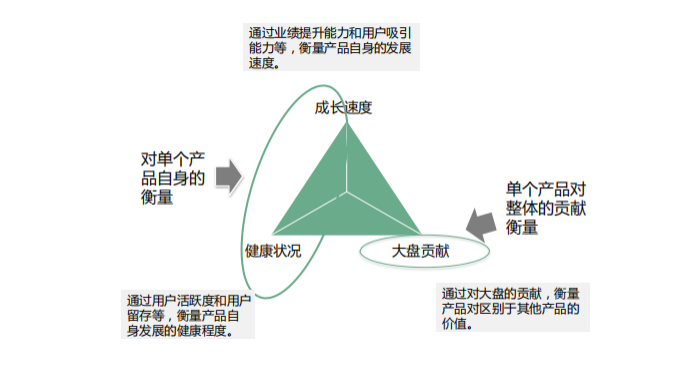

# 产品运营篇

## 运营基础篇

### 什么是运营？

所谓的运营就是提前发现潜在可用产品/功能，为用户进行维护，产生有意义的价值。

比如，维护好各平台的更新和矩阵，在用户搜索“产品关键词的时候”（如：小程序开发）你要出现在用户的面前，并且找到你的联系方式，这就是运营。

### 运营是做什么的？

**获取（拉取） => 激活（活跃） => 留存 => 变现 => 推荐**

### 运营指标体系

搭建运营指标体系的重要性 => **运营指标体系的搭建**：是每个中级运营人在“实战经验”中必须面对的重要工作，是运营思维的外在表现。

#### **运营指标体系搭建三步走**

步骤1：理清业务模式；

步骤2：清晰业务阶段和目标；

步骤3：指标结构化、体系化建设。

#### 步骤一：业务模式梳理的通用方法论

- **业务方向**：业务方向是什么？也就是功能需求
- **主体**：参与这个业务的有哪些角色？即主体，确定参加的部门
- **链路**：主体之间通过体系形成链路，各环节链路确定整体模式。也就是，协调各个部门完成任务。
- **关联业务**：跟这个业务相关联的 其他相关业务 有哪些？如何发生关系？

#### 步骤二：清晰业务阶段和目标

业务阶段判断方法：关注重点，**根据业务链路确定整体指标体系**，从中根据业务阶段洞察**重点**关注指标。

1. 产品在**新业务**阶段，还处于生存阶段，关注点在**业务是否走得通**，是否能经得起市场的检验，用户是否买账。****
2. 产品在**发展**阶段，业务确定走得通，就要关注成长健康度，业务增速要跟的上计划，目标拆解成过程**指标**，**体量**要迅速增长；
3. 产品进入成熟阶段，关注点在生态体系的布局，**整体效能**的支撑，**市场份额**占比。

#### 步骤三：将指标结构化，有针对性的抓手

这里有三个维度，大体是三个方向：产品成长速度、健康状况、大盘贡献。从产品成长速度、健康状况，可以判断对单个产品自身的衡量；从大盘贡献，可以判断单个产品对整体的贡献衡量。

- 成长速度：通过业绩提升能力和用户吸引能力等，衡量产品自身的发展速度；
- 健康状况：通过用户活跃度和用户留存等，衡量产品自身发展的健康程度；
- 大盘贡献：单个产品对整体的贡献衡量。

#### 指标选取原则

- 科学性原则：指标体系较为客观和真实地反映所研究系统发展演化的状态；
- 系统性原则：要有全局意识，有结构性、层次性；充分体现对业务的解读；
- 实用性：可读性、实用性（指标体系要繁简适中，指标设计不可太复杂，要易于理解；简化一些对评价结果影响甚微或重复的指标）
- 动态性原则：监控过程中，是动态变化的，发生变化能够第一时间体现出来。

### 产品运营岗位

#### 什么是产品运营

产品运营是指基于企业经营和产品战略，以**最优的路径和最高效的执行**，建立产品在市场上的竞争优势，并最终取得产品市场成功的过程。 

或者

进行产品调研，挖掘用户需求，不断优化某产品，将优化建议反馈给产品和技术，并通过一系列运营手段，提升用户体验，提高某产品的相关数据。

产品运营的主要工作就是让产品如何运行的更流畅、用户体验更好。

#### 产品运营是做什么的

**任何一项运营活动，要经历调研——目标确定——策划——执行——分析与改进这么一个循环周期，或数据分析、用户反馈——发现问题——调查原因——提出解决方案。**

> **运营许多时候的确要负责大量的锁碎的“小事”，但如果被这些表面所蒙蔽，以为运营就这样了，那就不对了**

#### 产品运营专员日常工作

- 负责基本的**数据汇总、整理、分析**，支持业务部门日常数据的需求。
- **在业务问题和投放策略上支持销售部门、投放部门工作，定期对销售、投放、技术进行策略、知识的沟通与分享。**
- **监控公司运营数据，定期整理公司运营报告，及时向管理层反馈公司运营现状。**
- 分析媒体流量趋势，预测并监控流量变化，分析流量库存使用情况及提出合理化建议。
- **负责产品的全过程管理，包括与市场/销售部门沟通，收集用户/客户需求、进行市场和竞争分析、制定产品规划。**
- 负责具体功能的设计，优化产品体验，能够撰写高水平需求文档，并推动研发团队按时完成产品开发、高质量上线。
- 对产品的迭代、运营、推广进行管理，使产品获得最大化收益职责要求。

## 运营思维篇

### 概念

#### 什么是私域？

私域流量是指从公域（internet）、它域(平台、媒体渠道、合作伙伴等)引流到自己私域（[官网](https://baike.baidu.com/item/官网/7805125?fromModule=lemma_inlink)、客户名单），以及私域本身产生的流量(访客)。私域流量是可以进行二次以上链接、触达、发售等市场营销活动客户数据。私域流量和域名、商标、商誉一样属于企业私有的经营数字化资产。

### 提升思维--优秀文章

- 用户也是上帝，服务运营要到位：https://www.woshipm.com/operate/5420810.html
  - **私域定位 = 兴趣达人/营销福利/知识专家/服务管家定位 + 朋友定位**
- 把握好这3个阶段，用户持续找你付费！：https://www.woshipm.com/operate/5746885.html
  - 触发-认知、体验-付费决策、使用-习惯生成三个阶段
    - 触发-认知阶段：这个阶段的核心，要做好三件事：找到付费用户、找到付费理由、刺激付费欲望。
    - 体验-付费决策阶段：**<u>在这个阶段，核心是要做好用户峰值体验设计。</u>在用户体验的最初，最高，最终的时刻为用户精心设计难以忘怀的体验。可以有效建立用户信任，交付用户超出预期的体验。**
    - 使用-习惯生成阶段：这个阶段要核心做好一件事：**用户习惯的养成。**
      - **上瘾模型**（the Hook Model）：触发-行动-多变的赏酬-投入。
- 如何做好产品运营？：https://zhuanlan.zhihu.com/p/152062071

## 实战分析篇

### 智慧园区、社区

#### 相关术语

智慧社区就是指运用物联网技术、云计算技术、移动互联网、人工智能等新一代信息科技**提供安全、舒服、便捷、高效的现代化、智慧化社区生活环境**，形成基于网络化、数字化、信息化、智能化的社区服务管理系统。

智慧园区通过利用物联网、大数据、可视化、视频AI分析等技术，对园区进行精细化管理，并且实现报警联动、轨迹追踪、物联云控可视、可控。同时，构建统一的信息化管理基础架构体系，分析园区运营状态，包括园区人员、车辆、各类智能设备、环境信息等，**提高园区运营的管理效率**。

Intelligent Operations Center 可监视并管理[城市服务](https://baike.baidu.com/item/城市服务/852783?fromModule=lemma_inlink)。它通过集中化的智能，提供了对日常城市运营的洞察。现在，城市、政府机构和企业可以优化运营效率并改进规划。ioc是指[智慧城市](https://baike.baidu.com/item/智慧城市/9334841?fromModule=lemma_inlink)智能运行中心(IOC)。

#### 运营前

##### 明确运营的背景

##### 明确运营的目的&任务

##### 确定运营侧重点

##### 根据目的选取相应的运营手段

##### 资源准备

#### 运营中

#### 运营后